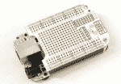

# 硬件专题

# 玩转硬件

展示所有主流嵌入式开发板的各类资源和信息。

# BeagleBoard

> From: [eLinux.org](http://eLinux.org/BeagleBoard "http://eLinux.org/BeagleBoard")

# Beagleboard:Main Page

(Redirected from [BeagleBoard](http://eLinux.org/index.php?title=BeagleBoard&redirect=no "BeagleBoard"))

## Contents

*   1 Welcome to the BeagleBoard.org Support Page
    *   1.1 BeagleBone Black
    *   1.2 BeagleBone
    *   1.3 BeagleBoard-xM
    *   1.4 BeagleBoard

## Welcome to the BeagleBoard.org Support Page

This is the place where BeagleBoard fans can come to find information on the BeagleBoard,BeagleBoard-xM, BeagleBone and BeagleBoneBlack projects that are manufactured by CircuitCo. Most of this information can also be found on the beagleboard.org site and is provided here as a convenience. When new revisions of hardware or software is released, you may be able to find information here sooner than it appears on the beagleboard.org site. You may find information here not found on the beagleboard.org site as well.

| Click on any of the following boards to go to its official wiki page |
| --- |
|  
### BeagleBone Black

The latest addition to the BeagleBoard line. Similar to the BeagleBone but with 1GHZ AM335X processor, 512MB of DDR3, 2GB eMMC, and HDMI.

 - Go here to find official specifications and resources
 - Go here to find community created "howto" pages and resources
 - Go here to find a registry of compatible acessory board Capes
 |
|  
### BeagleBone

A bare-bones BeagleBoard that acts as a USB or Ethernet connected expansion companion for your current BeagleBoard and BeagleBoard-xM or works stand-alone.

 - Go here to find official specifications and resources
 - Go here to find community created "howto" pages and resources
 - Go here to find a registry of compatible acessory board Capes
 |
|  
### BeagleBoard-xM

Delivers extra ARM ® Cortex TM -A8 MHz now at 1 GHz and extra memory with 512MB of low-power DDR RAM, enabling hobbyists, innovators and engineers to go beyond their current imagination.

 - Go here to find official specifications and resources
 - Go here to find community created "howto" pages and resources
 |
|  
### BeagleBoard

A low-cost, fan-less single board computer that unleashes laptop-like performance and expandability without the bulk, expense, or noise of typical desktop machines.

 - Go here to find official specifications and resources
 - Go here to find community created "howto" pages and resources
 |

# BeagleBone

> From: [eLinux.org](http://eLinux.org/BeagleBone "http://eLinux.org/BeagleBone")

# BeagleBone

|  
### BeagleBone

A bare-bones BeagleBoard that acts as a USB or Ethernet connected expansion companion for your current BeagleBoard and BeagleBoard-xM or works stand-alone.

 - Go here to find official specifications and resources
 - Go here to find community created "howto" pages and resources
 - Go here to find a registry of compatible acessory board Capes
 |

See also: [BeagleBoneBlack](http://eLinux.org/BeagleBoneBlack "BeagleBoneBlack")

[Category](http://eLinux.org/Special:Categories "Special:Categories"):

*   [BeagleBone](http://eLinux.org/index.php?title=Category:BeagleBone&action=edit&redlink=1 "Category:BeagleBone (page does not exist)")

# BeagleBoneBlack

> From: [eLinux.org](http://eLinux.org/BeagleBoneBlack "http://eLinux.org/BeagleBoneBlack")

# BeagleBoneBlack

|  
### BeagleBone Black

The latest addition to the BeagleBoard line. Similar to the BeagleBone but with 1GHZ AM335X processor, 512MB of DDR3, 2GB eMMC, and HDMI.

 - Go here to find official specifications and resources
 - Go here to find community created "howto" pages and resources
 - Go here to find a registry of compatible acessory board Capes
 |

# BeagleBone Capes

> From: [eLinux.org](http://eLinux.org/Beagleboard:BeagleBone_Capes "http://eLinux.org/Beagleboard:BeagleBone_Capes")

# Beagleboard:BeagleBone Capes

BeagleBone is a credit-card sized expandable Linux computer that connects with the Internet and runs software such as Android 4.0 and Ubuntu. It allows developers to evaluate the Sitara™ AM335x ARM® Cortex™-A8 processors with a single cable and 10-second Linux boot-enabling development in less than five minutes. Adding cape plug-in boards to the popular BeagleBone computer allows hobbyists, makers and developers to quickly and easily augment BeagleBone’s capabilities with LCD screens, motor control and battery power as well as the ability to create their own circuits.

## Contents

*   1 Click here to view the Production video for BeagleBone Black
*   2 Compatibility Between Different Capes Matrix
*   3 BeagleBone Black Compatibilty Matrix
*   4 BeagleBone Capes Catalog
*   5 Capes Listing

#### Click [here](http://www.youtube.com/watch?v=FcqQvH41OR4) to view the Production video for BeagleBone Black

## Compatibility Between Different Capes Matrix

To view the compatibility between capes that are listed in this catalog, please download the compatibility matrix below.

*   [File:BeagleBone-Cape-Compatibility-Matrix-12-09-11.xls](http://eLinux.org/File:BeagleBone-Cape-Compatibility-Matrix-12-09-11.xls "File:BeagleBone-Cape-Compatibility-Matrix-12-09-11.xls")

## BeagleBone Black Compatibilty Matrix

for information on BeagleBone Black Compatibility visit the [Beagleboard:BeagleBone Black Capes](http://eLinux.org/Beagleboard:BeagleBone_Black_Capes "Beagleboard:BeagleBone Black Capes") wiki page

## BeagleBone Capes Catalog


**[BeagleBone Proto Cape](http://eLinux.org/BeagleBone_Proto_Cape "BeagleBone Proto Cape")** Logic Supply


**[BeagleBone ProtoCape](http://eLinux.org/Tigal:BeagleBone_ProtoCape "Tigal:BeagleBone ProtoCape")**

Tigal


**[BeagleBone eeProtoCape](http://eLinux.org/BeagleBone_eeProto_Cape "BeagleBone eeProto Cape")** Logic Supply


**[BeagleBone Breadboard](http://eLinux.org/CircuitCo:BeagleBone_Breadboard "CircuitCo:BeagleBone Breadboard")**

BeagleBoardToys


 **Proto Cape Kit** Adafruit


**[Basic Proto Cape](http://eLinux.org/CircuitCo:Basic_Proto_Cape "CircuitCo:Basic Proto Cape")** BeagleBoardToys


**[Generic Proto Cape](http://eLinux.org/CircuitCo:Generic_Proto_Cape "CircuitCo:Generic Proto Cape")** BeagleBoardToys


**[Extended Proto Cape](http://eLinux.org/CircuitCo:Extended_Proto_Cape "CircuitCo:Extended Proto Cape")**

BeagleBoardToys


**[PowerCape](http://eLinux.org/AndiceLabs:PowerCape "AndiceLabs:PowerCape")** AndiceLabs


**[PowerBar](http://eLinux.org/AndiceLabs:PowerBar "AndiceLabs:PowerBar")** AndiceLabs


**[Power Supply Cape](http://eLinux.org/CircuitCo:PowerSupply_Cape "CircuitCo:PowerSupply Cape")** BeagleBoardToys


**[BeagleBone Battery Cape](http://eLinux.org/CircuitCo:BeagleBone_Battery "CircuitCo:BeagleBone Battery")** BeagleBoardToys


**[BeagleBone TTL-RS232 Micro Cape](http://eLinux.org/BeagleBone_TTL-RS232_Micro_Cape "BeagleBone TTL-RS232 Micro Cape")**

Logic Supply


**[RS232 Cape](http://eLinux.org/CircuitCo:RS232_Cape_RevB "CircuitCo:RS232 Cape RevB")**


**[Audio Cape](http://eLinux.org/CircuitCo:Audio_Cape_RevB "CircuitCo:Audio Cape RevB")**

BeagleBoardToys


**[BeagleBone Weather Cape](http://eLinux.org/CircuitCo:BeagleBone_Weather "CircuitCo:BeagleBone Weather")** BeagleBoardToys (NEW REVISION)


**[TT3201 CAN Cape](http://eLinux.org/Beagleboard:TT3201_CAN_Cape "Beagleboard:TT3201 CAN Cape")** TowerTech


**[BeagleBone Serial CAN RS485 RS232 Cape](http://eLinux.org/BeagleBone_Serial_CAN_RS485_RS232_Cape "BeagleBone Serial CAN RS485 RS232 Cape")**

Logic Supply


**[CAN Bus Cape](http://eLinux.org/CircuitCo:CAN_Bus_Cape_RevB "CircuitCo:CAN Bus Cape RevB")** BeagleBoardToys


**[RS485 Cape](http://eLinux.org/CircuitCo:RS485_Cape_RevB "CircuitCo:RS485 Cape RevB")**

BeagleBoardToys


**[BeBoPr Cape](http://eLinux.org/Beagleboard:BeBoPr_Cape "Beagleboard:BeBoPr Cape")** AES electronics


**[BeBoPr-Plus](http://eLinux.org/Beagleboard:BeBoPr-Plus "Beagleboard:BeBoPr-Plus")** AES Electronics


**[BeBoPr++](http://eLinux.org/BeBoPr%2B%2B "BeBoPr++")** www.bebopr.info


**[Osso Cape](http://eLinux.org/Beagleboard:Osso "Beagleboard:Osso")** Nexlab


**[Bacon Cape](http://eLinux.org/CircuitCo:Bacon_Cape "CircuitCo:Bacon Cape")** BeagleBoardToys


**[BeagleBone Ninja](http://eLinux.org/CircuitCo:BeagleBone_Ninja "CircuitCo:BeagleBone Ninja")** BeagleBoardToys


**[BeagleBone ROV](http://eLinux.org/CircuitCo:BeagleBone_ROV "CircuitCo:BeagleBone ROV")** BeagleBoardToys


**[Inertial Navigation System Cape](http://eLinux.org/Beagleboard:Inertial_Navigation_System_Cape "Beagleboard:Inertial Navigation System Cape")**

UAV Navigation


**[BeagleIO](http://eLinux.org/Impressx:BeagleIO "Impressx:BeagleIO")** Impressx


**[USB HUB Cape](http://eLinux.org/USB_HUB_Cape "USB HUB Cape")** Terratechnos,Inc.


**[Arduino Shield Adapter](http://eLinux.org/Impressx:Arduino_Shield_Adapter "Impressx:Arduino Shield Adapter")**

Impressx


**[BeagleBone mikroBUS Cape](http://eLinux.org/Tigal:BeagleBone_mikrobuscape "Tigal:BeagleBone mikrobuscape")**

Tigal


**[Smart Dual Relay Cape](http://eLinux.org/Beagleboard:Smart_Dual_Relay_Cape "Beagleboard:Smart Dual Relay Cape")**

Sierra Foxtrot


**[BeagleBone M2M Cape](http://eLinux.org/BeagleBone_M2M_Cape "BeagleBone M2M Cape")** Yantrr Electronic Systems


**[Relay Cape](http://eLinux.org/CircuitCo:Relay_Cape "CircuitCo:Relay Cape")** BeagleBoardToys


**[BeagleBone Dual Relay Plus IO](http://eLinux.org/BeagleBone_Dual_Relay_Plus_IO "BeagleBone Dual Relay Plus IO")** Logic Supply


**[Radarcape](http://eLinux.org/Beagleboard:Radarcape "Beagleboard:Radarcape")** Guenter Koellner


**[ADC Cape](http://eLinux.org/CircuitCo:ADC_Cape "CircuitCo:ADC Cape")** BeagleBoardToys


**[Escherlogic DogHouse](http://eLinux.org/Escherlogic_DogHouse "Escherlogic DogHouse")**

Escherlogic


**[BeagleBone 8 Port 1-Wire](http://eLinux.org/Beagleboard:BeagleBone_8_Port_1-Wire "Beagleboard:BeagleBone 8 Port 1-Wire")**

BY Innovation, Inc.


**[Nimbelink Skywire Cellular Modem Cape](http://eLinux.org/Nimbelink:SkywireCape "Nimbelink:SkywireCape")** Nimbelink Corp


**[BeagleBone GPS/GPRS](http://eLinux.org/BeagleBone_GPS/GPRS_Cape "BeagleBone GPS/GPRS Cape")** EACH-CS


**[INTERNET HUB Cape](http://eLinux.org/User:EACH "User:EACH")** EACH-CS


**[Tracking Cape](http://eLinux.org/CiudadOscura:TrackingCape "CiudadOscura:TrackingCape")** Ciudad Oscura


**[BeagleBone XBee proto cape](http://eLinux.org/BeagleBone_XBee_proto_cape "BeagleBone XBee proto cape")** Logic Supply


**[BeagleBone XBee Cape](http://eLinux.org/Ppolstra:XBee_Cape "Ppolstra:XBee Cape")** Dr. Phil Polstra


**[RTC Cape](http://eLinux.org/CircuitCo:RTC_Cape "CircuitCo:RTC Cape")** BeagleBoardToys


**[PWM Cape](http://eLinux.org/CircuitCo:PWM_Cape "CircuitCo:PWM Cape")** BeagleBoardToys


**[MotoCape](http://eLinux.org/CircuitCo:Moto_Cape "CircuitCo:Moto Cape")** BeagleBoardToys


**[MiniDisplay Cape](http://eLinux.org/CircuitCo:MiniDisplay_Cape "CircuitCo:MiniDisplay Cape")** BeagleBoardToys


**[BeagleBone LCD3 Cape](http://eLinux.org/CircuitCo:BeagleBone_LCD3 "CircuitCo:BeagleBone LCD3")** BeagleBoardToys


**[BeagleBone LCD4 Cape](http://eLinux.org/CircuitCo:BeagleBone_LCD4 "CircuitCo:BeagleBone LCD4")** BeagleBoardToys


**[BeagleBone LCD7 Cape](http://eLinux.org/CircuitCo:BeagleBone_LCD7 "CircuitCo:BeagleBone LCD7")** BeagleBoardToys


**[4D 4.3 LCD CAPE](http://eLinux.org/4D_4.3_LCD_CAPE "4D 4.3 LCD CAPE")** 4D SYSTEMS


**[Nh7Cape](http://eLinux.org/Nh7Cape "Nh7Cape")** Cembsoft


**[BeagleBone LVDS LCD Cape](http://eLinux.org/Beagleboard:BeagleBone_LVDS_LCD_Cape "Beagleboard:BeagleBone LVDS LCD Cape")**

Chalkboard Electronics


**[Alcdcape](http://eLinux.org/Alcdcape "Alcdcape")** Cembsoft


**[nh5cape](http://eLinux.org/Nh5cape "Nh5cape")** Cembsoft


**[WTLCD050R LCD cape](http://eLinux.org/User:Witztronics "User:Witztronics")** WITZTRONICS


**[BeagleBone 4Gb 16-Bit NAND Module](http://eLinux.org/CircuitCo:BeagleBone_4Gb_16-Bit_NAND_Module "CircuitCo:BeagleBone 4Gb 16-Bit NAND Module")**

BeagleBoardToys


**[BeagleBone Robo Cape](http://eLinux.org/Embedded_Toys_Robo_Cape "Embedded Toys Robo Cape")** EmbeddedToys


**[BeagleBone Motor w/ NXT Connectors](http://eLinux.org/CircuitCo:BeagleBone_Motor_w/_NXT_Connectors "CircuitCo:BeagleBone Motor w/ NXT Connectors")**

BeagleBoardToys


**[BeagleBone Motor w/ Screw Blocks](http://eLinux.org/CircuitCo:BeagleBone_Motor_w/_Screw_Blocks "CircuitCo:BeagleBone Motor w/ Screw Blocks")**

BeagleBoardToys


**[BeagleBone MSTP Cape](http://eLinux.org/Beagleboard:BeagleBone_MSTP "Beagleboard:BeagleBone MSTP")** Plano CAD


**[BeagleBone DVI-D Cape](http://eLinux.org/CircuitCo:BeagleBone_DVI-D "CircuitCo:BeagleBone DVI-D")** BeagleBoardToys


**[BeagleBone VGA Cape](http://eLinux.org/CircuitCo:BeagleBone_VGA "CircuitCo:BeagleBone VGA")** BeagleBoardToys


**[BeagleBone RF Cape](http://eLinux.org/CircuitCo:BeagleBone_RF "CircuitCo:BeagleBone RF")** BeagleBoardToys


**[BeagleBone Memory Expansion Cape](http://eLinux.org/CircuitCo:BeagleBone_Memory_Expansion "CircuitCo:BeagleBone Memory Expansion")**

BeagleBoardToys


**[BeagleBone TiWi-5E w/ Chip Antenna](http://eLinux.org/CircuitCo:BeagleBone_TiWi-5E_w/_Chip_Antenna "CircuitCo:BeagleBone TiWi-5E w/ Chip Antenna")**

BeagleBoardToys


**[BeagleBone TiWi-5E w/ EXT. Antenna](http://eLinux.org/CircuitCo:BeagleBone_TiWi-5E_w/_EXT._Antenna "CircuitCo:BeagleBone TiWi-5E w/ EXT. Antenna")**

BeagleBoardToys


**[BeagleBone TiWi-BLE w/ Chip Antenna](http://eLinux.org/CircuitCo:BeagleBone_TiWi-BLE_w/_Chip_Antenna "CircuitCo:BeagleBone TiWi-BLE w/ Chip Antenna")**

BeagleBoardToys


**[BeagleBone TiWi-BLE w/ EXT. Antenna](http://eLinux.org/CircuitCo:BeagleBone_TiWi-BLE_w/_EXT._Antenna "CircuitCo:BeagleBone TiWi-BLE w/ EXT. Antenna")**

BeagleBoardToys


**[WL1835MOD w/ Chip Antenna](http://eLinux.org/CircuitCo:WL1835MOD_w/_Chip_Antenna "CircuitCo:WL1835MOD w/ Chip Antenna")**

BeagleBoardToys


**[BeagleBone HD Camera Cape](http://eLinux.org/Beagleboard:BeagleBone_HD_Camera_Cape "Beagleboard:BeagleBone HD Camera Cape")**

RadiumBoards


**[BeagleBone 3.1MP Camera Cape](http://eLinux.org/CircuitCo:BeagleBone_3.1MP_Camera "CircuitCo:BeagleBone 3.1MP Camera")**

BeagleBoardToys


**[BeagleBone-HDMI CAPE](http://eLinux.org/Beagleboard:BeagleBone-HDMI_CAPE "Beagleboard:BeagleBone-HDMI CAPE")**

Embest


**[BeagleBone DVI-D w/ Audio Cape](http://eLinux.org/CircuitCo:BeagleBone_DVI-D_with_Audio "CircuitCo:BeagleBone DVI-D with Audio")**

BeagleBoardToys


**[BeagleBone DVI-D Cape](http://eLinux.org/CircuitCo:BeagleBone_DVI-D "CircuitCo:BeagleBone DVI-D")** BeagleBoardToys


**[Industrial I/O Cape iCOM](http://eLinux.org/Qinno:BBB_cape_iCOM "Qinno:BBB cape iCOM")** Qinno


**[BBB-GVS](http://eLinux.org/BBB-GVS "BBB-GVS")** land-boards


**[CryptoCape](http://eLinux.org/Cryptotronix:CryptoCape "Cryptotronix:CryptoCape")** SparkFun Electronics


**[BeagleBone 128Mb 16-Bit NOR Module](http://eLinux.org/CircuitCo:BeagleBone_128Mb_16-Bit_NOR_Module "CircuitCo:BeagleBone 128Mb 16-Bit NOR Module")**

BeagleBoardToys


**[BeagleBone ProfiBus Cape](http://eLinux.org/CircuitCo:BeagleBone_ProfiBus "CircuitCo:BeagleBone ProfiBus")**

BeagleBoardToys

## Capes Listing

If you have a cape that will be in production or able to be purchased and you would like it listed here, please create a wiki page for your cape on eLinux.org and contact support@circuitco.com with the link. We will add your cape to this registry page. You can use [`elinux.org/CircuitCo:BeagleBone_LCD3`](http://elinux.org/CircuitCo:BeagleBone_LCD3) as a template (to view the wikitext go to the link and click on the "View Source" or "Edit" tab on the top right corner). Also, submit any patches to the kernel, including .dts files for your cape, to the [BeagleBoard group](https://groups.google.com/forum/#!forum/beagleboard)/mailing list.

Note: if you don't have a eLinux.org account, you will need to create one in order to create or edit a wiki page. Note: if you have any question related to a particular cape, please contact the designer of that cape. For other questions regarding this page, please contact us at support@circuitco.com

To go back to BeagleBone wiki, please click [here](http://eLinux.org/Beagleboard:BeagleBone "Beagleboard:BeagleBone").

To go back to BeagleBone Black wiki, please click [here](http://eLinux.org/Beagleboard:BeagleBoneBlack "Beagleboard:BeagleBoneBlack").

# MinnowBoard

> From: [eLinux.org](http://eLinux.org/MinnowBoard "http://eLinux.org/MinnowBoard")

# Minnowboard:MinnowBoard

(Redirected from [MinnowBoard](http://eLinux.org/index.php?title=MinnowBoard&redirect=no "MinnowBoard"))


**NEWS: Interested in Google Summer of Code with MinnowBoard.org? Please visit our [MinnowBoard GSoC2015 Page!](http://eLinux.org/Minnowboard:GSoC2015 "Minnowboard:GSoC2015")**

# Introduction

[`www.minnowboard.org`](http://www.minnowboard.org) is a community dedicated to the support of Open Hardware utilizing Intel® processors. This web site will serve as a starting point for the MinnowBoard community.

The MinnowBoard is an Intel® Atom™ processor based board which introduces Intel® Architecture to the small and low cost embedded market for the developer and maker community. It has exceptional performance, flexibility, openness and standards

# Boards

|  
# [MinnowBoard MAX](http://elinux.org/Minnowboard:MinnowMax "Minnowboard:MinnowMax")

 |  
# [MinnowBoard](http://elinux.org/Minnowboard:Minnow_Original "Minnowboard:Minnow Original")

 |

# Community

*   IRC: Freenode network, Channel: #minnowboard
*   [Mailing List archives](http://lists.elinux.org/pipermail/elinux-minnowboard/)

[Categories](http://eLinux.org/Special:Categories "Special:Categories"):

*   [CircuitCo](http://eLinux.org/Category:CircuitCo "Category:CircuitCo")
*   [MinnowBoard](http://eLinux.org/Category:MinnowBoard "Category:MinnowBoard")

# Raspberry Pi

> From: [eLinux.org](http://eLinux.org/RPi_Hub "http://eLinux.org/RPi_Hub")

# RPi Hub

**Notice:** The Raspberry Pi Wiki pages on this site is collaborative work - the Raspberry Pi Foundation is **not** responsible for content on these pages.

## Contents

*   1 Now shipping to customers
*   2 About
    *   2.1 History
*   3 Getting Started
    *   3.1 Buying Guide
    *   3.2 Basic Setup
    *   3.3 Beginners Guide
*   4 Resources
    *   4.1 Hardware & Peripherals
    *   4.2 Software & OS Distributions
    *   4.3 Documentation
    *   4.4 Datasheets
    *   4.5 Troubleshooting
    *   4.6 Bugs
    *   4.7 RPi Model B 3D CAD files
    *   4.8 RPi Model B+ 3D CAD files
    *   4.9 Education Material
    *   4.10 Books
    *   4.11 Education Material
*   5 Community
    *   5.1 Projects, Guides & Tutorials
    *   5.2 Schools, Universities, Clubs & Groups
    *   5.3 Supporting Communities
*   6 About the RPi Wiki
    *   6.1 Translations
*   7 References

|  | **Raspberry Pi Wiki Hub** [deu](http://elinux.org/DE:RPi_Hub "DE:RPi Hub") &#124; [eng](http://elinux.org/Rpi_Hub "Rpi Hub") &#124; [fra](http://elinux.org/FR:RPi_Hub "FR:RPi Hub") &#124; [pt-br](http://elinux.org/Pt-BR:R-Pi_Hub "Pt-BR:R-Pi Hub") |

## Now shipping to customers

See the [Buying Guide](http://eLinux.org/RPi_Buying_Guide "RPi Buying Guide") on how to order one, or visit the [Raspberry Pi Foundation Home Page](http://www.raspberrypi.org)

## About


The Raspberry Pi production board (model B Rev 2.0)

The [Raspberry Pi](http://www.hycshop.com/raspberry-pi-c-2_17/) (short: RPi or RasPi) is an ultra-low-cost ($20-$35) credit-card sized Linux computer which was conceived with the primary goal of teaching computer programming to children. It was developed by the [Raspberry Pi Foundation](http://www.raspberrypi.org), which is a UK registered charity (Registration Number [1129409](http://www.charity-commission.gov.uk/Showcharity/RegisterOfCharities/CharityWithoutPartB.aspx?RegisteredCharityNumber=1129409&SubsidiaryNumber=0)). The foundation exists to promote the study of computer science and related topics, especially at school level, and to put the fun back into learning computing. The device is expected to have many other applications both in the developed and the developing world ([Read more](http://eLinux.org/RPi_Philosophy "RPi Philosophy")).

Raspberry Pi is manufactured and sold in partnership with the worldwide industrial distributors [Premier Farnell/Element 14](http://www.farnell.com/) and [RS Components](http://rswww.com/), and the Chinese distributor [Egoman Technology Corp](http://www.egoman.com.cn/)^([[1]](#cite_note-1)).

*   You can get the latest news from the [Foundation Home Page](http://www.raspberrypi.org), the [Twitter Feed](http://twitter.com/intent/user?screen_name=Raspberry_Pi) or in the [forums](http://www.raspberrypi.org/forums).
*   For Raspberry Pi frequently asked questions see the [FAQ section](http://eLinux.org/RPi_FAQ "RPi FAQ") or the [Raspberry Pi Foundation's FAQ](http://www.raspberrypi.org/?page_id=8) page.
*   Both manufacturing partners provide community areas for more technically focused discussions, articles, FAQs and related information:

*   Premier Farnell: [Element 14 Raspberry Pi Group](http://www.element14.com/community/groups/raspberry-pi?view=discussions)

*   RS-Components: [DesignSpark - Raspberry Pi](http://www.designspark.com/theme/raspberrypi)

*   Products are RoHS, CE, FCC, CTick, CSA and WEEE compliant^([[2]](#cite_note-2)). In common with all Electronic and Electrical products the Raspberry Pi should not be disposed of in household waste. Please contact the distributor from whom you purchased your Raspberry Pi device for details regarding WEEE in your country.

*   Price: 20USD Model A+, 35USD for Model B+, excluding taxes, postage and packaging. For information about availability and shipping see the [Buying Guide](http://eLinux.org/RPi_Buying_Guide "RPi Buying Guide").

### History

If you are interested in why the Raspberry Pi was created, and why it is what it is, check the [General History](http://eLinux.org/RPi_General_History "RPi General History") page, which highlights relevant events in its history. It is not intended to be a detailed history, so it can be read quickly. You could also check the [design changes](http://eLinux.org/Rpi_HardwareHistory "Rpi HardwareHistory") page for how the Raspberry Pi has evolved, and the [manufacturing differences](http://eLinux.org/RaspberryPi_Boards "RaspberryPi Boards") page that may help if you are having problems with your board.

## Getting Started

|  
### [Buying Guide](http://elinux.org/Buying_RPi "Buying RPi")

* * *

Where can I get one and for how much?

*   Base price is $20 for the model A+ and $35 for the Raspberry Pi 2\. This price excludes local taxes and shipping.

*   The Raspberry Pi's official worldwide distribution partners are [Premier Farnell/Element 14](http://www.farnell.com/) and [RS Components](http://rswww.com/)
*   Detailed information and other resellers can be found on the [Buying Guide](http://elinux.org/RPi_Buying "RPi Buying") page.

*   You can find out which peripherals and such are tested to work with the Pi in the [Verified Peripherals](http://elinux.org/RPi_VerifiedPeripherals "RPi VerifiedPeripherals") section

 |  
### [Basic Setup](http://elinux.org/RPi_Hardware_Basic_Setup "RPi Hardware Basic Setup")

* * *

First little Raspberry Pi Steps...

*   Ensure you have all the [equipment](http://elinux.org/RPi_Hardware_Basic_Setup#Typical_Hardware_You_Will_Need "RPi Hardware Basic Setup") you need to go with your Raspberry Pi.
*   Become familiar with the [board layout and connect](http://elinux.org/RPi_Hardware_Basic_Setup#Connecting_Together "RPi Hardware Basic Setup") it ready for power up.
*   If you have not been provided with a pre-setup SD card you will need to prepare one with your chosen [Operating System distribution](http://elinux.org/RPi_Easy_SD_Card_Setup "RPi Easy SD Card Setup")
*   If you are not using a HDMI monitor you may need to set up the correct video mode by editing the [RPiconfig](http://elinux.org/RPiconfig "RPiconfig") text file on the SD-card.
*   Note: On the Debian OS after you log in you need to type **startx** at the prompt to get a graphic desktop.
*   Particularly after first boot its important to do a clean shutdown with the command **sudo halt**

*   **Having problems? Try the [Troubleshooting](http://elinux.org/R-Pi_Troubleshooting "R-Pi Troubleshooting") page.**

 |  
### [Beginners Guide](http://elinux.org/RPi_Beginners "RPi Beginners")

* * *

You've just got your new Raspberry Pi device - what now?

*   [Beginners Guide](http://elinux.org/RPi_Beginners "RPi Beginners")

*   Learn about the basics with the [H2G2 - Introducing the Raspberry Pi](http://h2g2.com/dna/h2g2/A13735596) entry.

*   Read a small book for the Raspberry Pi Beginner [[1]](http://bitkistl.blogspot.co.at/2013/01/raspberry-pi-e-book.html)

*   Get started with some basic projects and tutorials:
    *   [Raspberry Pi YouTube Tutorials](http://www.youtube.com/user/RaspberryPiTutorials)

    *   [Raspberry Pi IV Beginners](http://www.pibeginners.com)

    *   [My First Raspberry Pi Game](http://www.youtube.com/playlist?list=PLgyU3jNA6VjS3ij6ZXbb2x4GdEP3bAWzO)
    *   [Guides, tutorials, tools and distribution downloads](http://files.nathanbookham.com/raspberry-pi)

*   [Easy GPIO Hardware & Software](http://elinux.org/RPi_Tutorial_Easy_GPIO_Hardware_%26_Software "RPi Tutorial Easy GPIO Hardware & Software") - in-progress at the moment

*   Take a look through the Community section, which contains a range of beginner and advanced tutorials and guides, as well as groups to help you find like-minded developers.

*   Pick up a copy of [the Raspberry Pi Handbook](http://www.pi-supply.com/product/raspberry-pi-handbook/) to get you started on some fantastic projects
*   Get started with Linux: [Linux Basics](http://raspberrywebserver.com/linux-basics/)

 |

## Resources

|  
### [Hardware](http://elinux.org/RPi_Hardware "RPi Hardware") & [Peripherals](http://elinux.org/RPi_VerifiedPeripherals "RPi VerifiedPeripherals")

* * *

*   The Model B is more advanced than the Model A - see [RPi Hardware](http://elinux.org/RPi_Hardware "RPi Hardware").
*   The RPi can be plugged into a [suitable TV or monitor](http://elinux.org/RPi_Screens "RPi Screens").
*   The unit will support a range of [devices, peripherals and accessories](http://elinux.org/RPi_VerifiedPeripherals "RPi VerifiedPeripherals").
*   The [Low-level interfaces](http://elinux.org/Rpi_Low-level_peripherals "Rpi Low-level peripherals") allow the use of optional [Expansion Boards](http://elinux.org/RPi_Expansion_Boards "RPi Expansion Boards") in a wide range of projects.
*   The Foundation has launched a [camera module](http://elinux.org/Rpi_Camera_Module "Rpi Camera Module") with a 5MPixel sensor capable of capturing video at 30fps at 1080p
*   [Serial port](http://elinux.org/RPi_Serial_Connection "RPi Serial Connection") connection instructions
*   [GPIO interface circuits](http://elinux.org/RPi_GPIO_Interface_Circuits "RPi GPIO Interface Circuits") for connecting switches, relays, etc
*   For more advanced issues including see [Advanced Setup](http://elinux.org/RPi_Advanced_Setup "RPi Advanced Setup").
*   [Setting up peripherals - examples/HowTos](http://elinux.org/RPi_Peripherals "RPi Peripherals")
*   [List of boards and user feedback](http://elinux.org/RaspberryPi_Boards "RaspberryPi Boards")
*   [Power Supply construction - HowTo](http://elinux.org/RPi_5V_PSU_construction "RPi 5V PSU construction")
*   [Comparison](http://elinux.org/RaspberryPi_Comparison "RaspberryPi Comparison") to other hardware

 |  
### [Software](http://elinux.org/Rpi_Software "Rpi Software") & [OS Distributions](http://elinux.org/RPi_Distributions "RPi Distributions")

* * *

The Raspberry Pi will run a range of OS Distributions and run a variety of software.

*   See [Software](http://elinux.org/RPi_Software "RPi Software") for an overview, and [OS Distributions](http://elinux.org/RPi_Distributions "RPi Distributions") for supported operating system and pre-configured 'images'.
*   Officially supported OS distributions include [Raspbian](http://elinux.org/RPi_Distributions#Raspbian "RPi Distributions"), [Arch Linux](http://elinux.org/RPi_Distributions#Arch "RPi Distributions") and [RISC OS Open](http://elinux.org/RPi_Distributions#RISC_OS "RPi Distributions").
*   Many unofficial distributions are available on the [Distributions page](http://elinux.org/RPi_Distributions "RPi Distributions").
*   Advice is also available if you want to [compile a kernel](http://elinux.org/Rpi_kernel_compilation "Rpi kernel compilation"), [boot from the network using U-Boot](http://elinux.org/RPi_U-Boot "RPi U-Boot"), or [test the Pi's performance](http://elinux.org/RPi_Performance "RPi Performance").
*   The Raspberry Pi supports a wide range of [programming languages](http://elinux.org/RPi_Programming "RPi Programming"), with many tutorials available.
*   Information about installing. specific [applications](http://elinux.org/RPi_applications "RPi applications") is available through the link.
*   Extensive (boot) configuration info (config.txt) is available [here](http://elinux.org/RPi_config.txt "RPi config.txt").
*   Information about various utilities that can be used with your Raspberry Pi can be found [here](http://elinux.org/RPi_Utilities "RPi Utilities").

 |  
### [Documentation](http://elinux.org/RPi_Documentation "RPi Documentation")

* * *

### Datasheets

[IC Datasheets and schematics](http://elinux.org/RPi_Documentation "RPi Documentation") links page.[Datasheets organised by category](http://elinux.org/RPi_DatasheetCategories "RPi DatasheetCategories") from the Frambozenier.org project.

### Troubleshooting

Head over to the [troubleshooting page](http://elinux.org/R-Pi_Troubleshooting "R-Pi Troubleshooting") for help fixing common problems.

### Bugs

Head over to the [bugs page](http://elinux.org/RPi_Bugs "RPi Bugs") for a list of known bugs.

### RPi Model B 3D CAD files

Theses are various 3D CAD Versions in both RAR and ZIP.

*   CATIA V5 RAR [`sdrv.ms/JqdhMb`](http://sdrv.ms/JqdhMb)
*   CATIA V5 ZIP [`sdrv.ms/LjyLGD`](http://sdrv.ms/LjyLGD)
*   ProE RAR [`sdrv.ms/KCv1hZ`](http://sdrv.ms/KCv1hZ)
*   ProE ZIP [`sdrv.ms/KCvhxq`](http://sdrv.ms/KCvhxq)
*   STEP RAR [`sdrv.ms/KCvv7T`](http://sdrv.ms/KCvv7T)
*   STEP ZIP [`sdrv.ms/JMhv18`](http://sdrv.ms/JMhv18)
*   SketchUp [`scc.jezmckean.com/item/581`](http://scc.jezmckean.com/item/581)
*   SketchUp8 [`sketchup.google.com/3dwarehouse/details?mid=327d6b1d8bd6130d6fbd6b70c7f1d3e0`](http://sketchup.google.com/3dwarehouse/details?mid=327d6b1d8bd6130d6fbd6b70c7f1d3e0)
*   Eagle 5 [`www.raspberrypi.org/phpBB3/viewtopic.php?f=41&t=4457`](http://www.raspberrypi.org/phpBB3/viewtopic.php?f=41&t=4457)
*   STEP and various formats at [tracepartsonline](http://www.tracepartsonline.net/%28S%28czkwmf55urqpe2n0xbjcc5qs%29%29/partdetails.aspx?CFSUB=1&CF=3&ExportCADModel=1)
*   [`www.tronetix.com/joomla/index.php/projects`](http://www.tronetix.com/joomla/index.php/projects)
*   [`www.hycshop.com/raspberry-pi-c-2_17/`](http://www.hycshop.com/raspberry-pi-c-2_17/)
*   Maya, Autodesk FBX, Wavefront ZIP [`www.raspberryconnect.com/idonethat/item/166-raspberry-pi-3d-model-download}`](http://www.raspberryconnect.com/idonethat/item/166-raspberry-pi-3d-model-download})

### RPi Model B+ 3D CAD files

*   STEP ZIP [`www.inti-innovations.co.uk/products/inti-media/inti-media-raspberrypi.html`](http://www.inti-innovations.co.uk/products/inti-media/inti-media-raspberrypi.html) (Docs and downloads section)

### Education Material

*   The Raspberry Pi Education Manual(PDF) [`downloads.raspberrypi.org/Raspberry_Pi_Education_Manual.pdf`](http://downloads.raspberrypi.org/Raspberry_Pi_Education_Manual.pdf)
*   Raspberry Pi GPIO Pin Worksheet for free (re)use (Multi Format) [`raspberry.tips/raspberrypi-tutorials/raspberry-pi-modell-b-plus-gpio-pins-worksheet/`](http://raspberry.tips/raspberrypi-tutorials/raspberry-pi-modell-b-plus-gpio-pins-worksheet/)

 |

### Books

*   Heitz, Ryan. Hello! Raspberry Pi. Manning Publications (2015). pp.
    1.  [ISBN 9781617292453](http://eLinux.org/Special:BookSources/9781617292453)

### Education Material

*   The Raspberry Pi Education Manual(PDF) [`downloads.raspberrypi.org/Raspberry_Pi_Education_Manual.pdf`](http://downloads.raspberrypi.org/Raspberry_Pi_Education_Manual.pdf)
*   RAspberry Pi GPIO Pin Worksheet for free use (Multi Format) [`raspberry.tips/raspberrypi-tutorials/raspberry-pi-modell-b-plus-gpio-pins-worksheet/`](http://raspberry.tips/raspberrypi-tutorials/raspberry-pi-modell-b-plus-gpio-pins-worksheet/)

## Community

|  
### [Projects](http://elinux.org/RPi_Projects "RPi Projects"), [Guides](http://elinux.org/RPi_Guides "RPi Guides") & [Tutorials](http://elinux.org/RPi_Tutorials "RPi Tutorials")

* * *

*   An important source of information and guides is the [Official Forum](http://www.raspberrypi.org/forum).
*   Get started by following some of the many [Tutorials](http://elinux.org/RPi_Tutorials "RPi Tutorials").
*   Common tasks and useful tips are available through the [Guides page](http://elinux.org/RPi_Guides "RPi Guides").
*   Projects can be found, and added to, on the [Projects page](http://elinux.org/RPi_Projects "RPi Projects").
*   Raspberry Pi Datasheets can be found on the [DataSheets page](http://elinux.org/RPi_DatasheetCategories "RPi DatasheetCategories").
*   Knowledgeable users may want to review and help out with project wishlist items on the [Tasks page](http://elinux.org/RPi_Tasks "RPi Tasks").
*   There are many tutorials, example projects and guides in [The MagPi Magazine](http://www.themagpi.com) - which is available free online or to purchase in printed form.
*   Some more great projects and setup guides in [the Raspberry Pi Handbook](http://www.pi-supply.com/product/raspberry-pi-handbook/)

 |  
### [Schools, Universities, Clubs & Groups](http://elinux.org/RPi_Education "RPi Education")

* * *

*   The Raspberry Pi Foundation's aims include encouraging education. Several groups including [Computing At School](http://www.computingatschool.org.uk/) aim to bring Computing Science back into schools.
*   Go to the [Education Page](http://elinux.org/Rpi_Education "Rpi Education") to add your project and find helpful links.
*   Raspberry Jams are a great way to meet other Raspberry Pi users, share ideas and tips and learn more. To find a Raspberry Jam near you, see the [Raspberry Jam](http://raspberryjam.org.uk/) page.

 |  
### [Supporting Communities](http://elinux.org/RPi_Community "RPi Community")

* * *

The [Raspberry Pi Community](http://elinux.org/RPi_Community "RPi Community") is steadily growing:

*   [The Official Raspberry Pi Forum](http://www.raspberrypi.org/forum)
*   [Element 14 Raspberry Pi Group](http://www.element14.com/community/groups/raspberry-pi?view=discussions), community site of Premier Farnell
*   [DesignSpark](http://www.designspark.com/theme/raspberrypi), community site of RS-Components
*   ['Frambozenbier' (Raspberry Pi Homebrew)](http://www.frambozenbier.org/index.php/)
*   [Stack Exchange Forum](http://raspberrypi.stackexchange.com/)
*   [Non-official community of Raspberry Pi in spanish language](http://www.raspberrypi-spanish.es)
*   [World Of Pi](http://www.worldofpi.com/) A forum based on all things Raspberry Pi.
*   [The MagPi Magazine](http://elinux.org/TheMagPi "TheMagPi") - Community based, free eMagazine, get involved!
*   [RaspberryPi Osdev](http://elinux.org/RaspberryPi_Osdev "RaspberryPi Osdev") - Hardware specific OS-development community, sitting in freenode.net#raspberrypi-osdev.
*   news:comp.sys.raspberry-pi - Usenet newsgroup

 |

## About the RPi Wiki

**Do not be afraid to add your bit, content is vital for the wiki to function.**


A 3D rendering of the Raspberry Pi logo

### Translations

The wiki is being translated into several languages, some of which can be seen on the hub banner above. Current languages include:

*   English: [R-Pi Hub](http://eLinux.org/R-Pi_Hub "R-Pi Hub")
*   Français: [FR:R-Pi Hub](http://eLinux.org/FR:R-Pi_Hub "FR:R-Pi Hub")
*   Português: [Pt-BR:R-Pi Hub](http://eLinux.org/Pt-BR:R-Pi_Hub "Pt-BR:R-Pi Hub")
*   简体中文: [Zh-CN:RPi_ 信息中心](http://eLinux.org/Zh-CN:RPi_%E4%BF%A1%E6%81%AF%E4%B8%AD%E5%BF%83 "Zh-CN:RPi 信息中心")
*   Deutsch: [DE:R-Pi_Hub](http://eLinux.org/DE:R-Pi_Hub "DE:R-Pi Hub")
*   മലയാളം: [Ml:R-Pi Hub](http://eLinux.org/index.php?title=Ml:R-Pi_Hub&action=edit&redlink=1 "Ml:R-Pi Hub (page does not exist)")

Any help translating would be greatly appreciated. Thank you to those who have already contributed!

# References

1.  ↑ [`www.raspberrypi.org/archives/3195`](http://www.raspberrypi.org/archives/3195)
2.  ↑ [`www.element14.com/community/docs/DOC-44828/l/raspberry-pi-safety-data-sheet`](http://www.element14.com/community/docs/DOC-44828/l/raspberry-pi-safety-data-sheet)

3.  [v](http://eLinux.org/Template:Raspberry_Pi "Template:Raspberry Pi")

4.  [t](http://eLinux.org/Template_talk:Raspberry_Pi "Template talk:Raspberry Pi")
5.  [e](http://elinux.org/index.php?title=Template:Raspberry_Pi&action=edit)

[Raspberry Pi](http://eLinux.org/R-Pi_Hub "R-Pi Hub")

**Startup**

[Buying Guide](http://eLinux.org/RPi_Buying_Guide "RPi Buying Guide") - [SD Card Setup](http://eLinux.org/RPi_Easy_SD_Card_Setup "RPi Easy SD Card Setup") - [Basic Setup](http://eLinux.org/RPi_Hardware_Basic_Setup "RPi Hardware Basic Setup") - [Advanced Setup](http://eLinux.org/RPi_Advanced_Setup "RPi Advanced Setup") - [Beginners Guide](http://eLinux.org/RPi_Beginners "RPi Beginners") - [Troubleshooting](http://eLinux.org/R-Pi_Troubleshooting "R-Pi Troubleshooting")


**Hardware**

[Hardware](http://eLinux.org/RPi_Hardware "RPi Hardware") - [Hardware History](http://eLinux.org/RPi_HardwareHistory "RPi HardwareHistory") - [Low-level peripherals](http://eLinux.org/RPi_Low-level_peripherals "RPi Low-level peripherals") - [Expansion Boards](http://eLinux.org/RPi_Expansion_Boards "RPi Expansion Boards")

**Peripherals**

[Screens](http://eLinux.org/RPi_Screens "RPi Screens") - [Cases](http://eLinux.org/RPi_Cases "RPi Cases")

*   [Other Peripherals (Keyboard, mouse, hub, wifi...)](http://eLinux.org/RPi_VerifiedPeripherals "RPi VerifiedPeripherals")

**Software**

[Software](http://eLinux.org/RPi_Software "RPi Software") - [Distributions](http://eLinux.org/RPi_Distributions "RPi Distributions") - [Kernel](http://eLinux.org/RPi_Kernel_Compilation "RPi Kernel Compilation") - [Performance](http://eLinux.org/RPi_Performance "RPi Performance") - [Programming](http://eLinux.org/RPi_Programming "RPi Programming") - [VideoCore APIs](http://eLinux.org/RPi_VideoCore_APIs "RPi VideoCore APIs") - [Utilities](http://eLinux.org/RPi_Utilities "RPi Utilities")

**Projects**

[Tutorials](http://eLinux.org/RPi_Tutorials "RPi Tutorials") - [Guides](http://eLinux.org/RPi_Guides "RPi Guides") - [Projects](http://eLinux.org/RPi_Projects "RPi Projects") - [Tasks](http://eLinux.org/RPi_Tasks "RPi Tasks") - [DataSheets](http://eLinux.org/RPi_DatasheetCategories "RPi DatasheetCategories") - [Education](http://eLinux.org/RPi_Education "RPi Education") - [Communities](http://eLinux.org/RPi_Community "RPi Community")

[Category](http://eLinux.org/Special:Categories "Special:Categories"):

*   [RaspberryPi](http://eLinux.org/Category:RaspberryPi "Category:RaspberryPi")

# UDOO

> From: [eLinux.org](http://eLinux.org/UDOO "http://eLinux.org/UDOO")

# UDOO

This page collects information about [UDOO](http://www.udoo.org) the first ever small sized computer that merges in one single board an ARM cortex-A9 iMX.6 CPU and an Arduino Due compatible board embedded with a dedicated ARM SAM3X8E CPU. [UDOO project has been funded through Kickstarter](http://www.kickstarter.com/projects/435742530/udoo-android-linux-arduino-in-a-tiny-single-board), raising $641,614 in sixty days thanks to 4,172 backers.


**Notice:** The UDOO Wiki pages on this site is collaborative work - the UDOO Team is **not** responsible for content on these pages.

## Contents

*   1 What's UDOO?
    *   1.1 UDOO goals:
*   2 Specifications
    *   2.1 Board Overview
    *   2.2 GPIO features
*   3 Getting Started
    *   3.1 Very first start
    *   3.2 Advanced Setup
    *   3.3 Resources
*   4 Tutorials
    *   4.1 Linux
    *   4.2 Android
    *   4.3 Arduino
*   5 Resources
    *   5.1 Hardware & Accessories
    *   5.2 Software & OS Distributions
    *   5.3 Additional Resources
*   6 Official Accessories
    *   6.1 UDOO Camera Module
    *   6.2 UDOO LVDS Touch Screens
*   7 Community
    *   7.1 Home site and community
    *   7.2 Social account

## What's UDOO?

UDOO is a single board computer that can be used both with Android and Linux, paired with an Arduino-compatible processor. It is a powerful prototyping board for software development and design; it’s easy to use and allows developing projects with minimum knowledge of hardware design. UDOO merges different computing worlds together: each one has its proper strengths and weak points, but all of them are useful in todays life for educational purposes as well as Do-It-Yourself (DIY) and quick prototyping. UDOO is an open hardware, low-cost platform equipped with an ARM i.MX6 Freescale processor, and an Arduino Due compatible section based on ATMEL SAM3X8E ARM processor, all this available on the same board!

### UDOO goals:

*   Develop an innovative product for a growing market
*   Give a new vision to the educational framework, with the idea of training up a new generation of engineers, designers and software developers skilled in digital technology: physical computing, multi-media arts, interactive arts, IoT...
*   Give a boost to the DIY world
*   Offer a low cost embedded platform for interactive arts with powerful tools: Processing, OpenCV, PureData, openFramework
*   Provide companies with a great tool for fast prototyping

## Specifications

UDOO retail line up consists of three models, sharing most of the features and different only for connectivity and i.MX6 processor used. All three models feature an embedded Arduino compatible section based on Arduino Due schematic. UDOO’s dimensions are: 4.33 inch x 3.35 inch (11 cm x 8.5 cm).

|  |  
*   Freescale i.MX6Quad, 2\4 x ARM® Cortex™-A9 core @ 1GHz with ARMv7A instruction set
*   GPU Vivante GC 2000 for 3D + Vivante GC 355 for 2D (vector graphics) + Vivante GC 320 for 2D
*   Atmel SAM3X8E ARM Cortex-M3 CPU (same as Arduino Due)
*   RAM DDR3 1GB
*   76 fully available GPIO with Arduino compatible R3 1.0 pinout
*   HDMI and LVDS + Touch
*   2 Micro USB (1 OTG)
*   2 USB 2.0 type A and 1 USB 2.0 internal pin header (requires adapter cable)
*   Analog Audio and Mic jacks
*   CSI Camera Connection
*   on board Micro SD card reader (boot device)
*   Power Supply (6-15V) and External Battery connector
*   Ethernet RJ45 (10/100/1000 MBit)
*   WiFi Module
*   SATA connector with power header

 |

**Warning: The UDOO I/O pins are 3.3V compliant. Higher voltages (like 5V) would damage the board.**

Learn more about [wrong uses that invalidate the warranty](http://www.udoo.org/faq-items/what-are-the-wrong-uses-that-invalidate-the-warranty/).

### Board Overview


### GPIO features

*   76 fully available GPIO
*   Arduino-compatible R3 1.0 pinout
*   3,3 V Compliant
*   Compatible with All Arduino Due Shields and most Arduino Shields
*   GPIO's can be accessed as Arduino pins, GPIO's or as additional S\PDIF, FlexCAN,I2S, SPI

[More informations about UDOO_GPIO_Pinout](http://eLinux.org/UDOO_GPIO_Pinout "UDOO GPIO Pinout")

## Getting Started

|  
### Very first start

* * *

*   An easy step by step guide that will lead you to [boot your UDOO for the very first time](http://www.elinux.org/UDOO_Getting_started).

*   How to [Create a bootable micro SD card for UDOO](http://www.elinux.org/UDOO_creating_a_bootable_Micro_SD_card_from_precompiled_image)

*   Configure your UDOO with [UDOO Configuration Tool](http://elinux.org/UDOO_Configuration_Tool)

 |  
### Advanced Setup

* * *

*   How to [Create a bootable Micro SD card from precompiled binaries](http://www.elinux.org/UDOO_creating_a_bootable_Micro_SD_card_from_precompiled_binaries).

*   How to [Create a bootable Micro SD card from sources](http://www.elinux.org/UDOO_creating_a_bootable_Micro_SD_card_from_source).

*   How to [Update UDOO Kernel](http://elinux.org/UDOO_kernel_update_procedure)

*   How to [boot from SATA drive](http://www.elinux.org/UDOO_boot_from_sata)

*   [Using USB Debug Connection](http://elinux.org/UDOO_usb_debug "UDOO usb debug")

*   **Having problems? Try the [Troubleshooting](http://elinux.org/index.php?title=UDOO_TroubleShooting&action=edit&redlink=1 "UDOO TroubleShooting (page does not exist)") page.**

 |  
### Resources

* * *

UDOO has a very active and growing community where to find help and new ideas

*   [UDOO.org](http://www.udoo.org/) is the official Website
*   [UDOO Forum](http://www.udoo.org/forum/) is a great place to start discussing

*   Get started with some basic projects and tutorials:
    *   [UDOO YouTube Tutorials](http://www.youtube.com/user/UDOOboard)

    *   [UDOO Tutorials Section](http://www.udoo.org/tutorials/)

    *   [UDOO Projects Section](http://www.udoo.org/projects/)

*   Take a look at [UDOO User Manual](http://udoo.org/download/files/Documents/UDOO_Starting_Manual_beta0.4_11_28_2013.pdf) which contains lots of useful technical informations

*   Hop on [UDOO Channel](http://en.irc2go.com/webchat/?net=freenode&room=udoo) IRC Chat

 |

## Tutorials

|  
### Linux

* * *

*   How to [install a custom Debian distro with debootstrap](http://www.elinux.org/UDOO_Installing_Debian_With_Debootstrap)

*   How to [Create a Virtual Machine for UDOO Development](http://www.elinux.org/UDOO_create_a_Virtual_Machine_for_UDOO_Development)

*   Understand some basic [linux commands](http://elinux.org/Linux_command_line_basics "Linux command line basics")

 |  
### Android

* * *

*   Introduction on [Making with Android](http://elinux.org/index.php?title=Android_Making&action=edit&redlink=1 "Android Making (page does not exist)")

*   How to [compile android from sources](http://www.elinux.org/UDOO_compile_android_from_sources)

*   How to [Switch between adb Debug and ADK connection](http://www.elinux.org/UDOO_Switch_between_adb_Debug_and_ADK_connection)

*   A useful [Android ADK Toolkit Library](https://github.com/palazzem/adk-toolkit) and its [Docs](http://android-adk-toolkit.readthedocs.org/en/latest/)

*   How to configure Ethernet under Android

How to [configure Ethernet under Android](http://www.elinux.org/UDOO_configure_Ethernet_under_Android) |  
### Arduino

* * *

*   How to [program the embedded Arduino microcontroller](http://www.elinux.org/UDOO_programming_the_embedded_Arduino_microcontroller)

 |

## Resources

|  
### Hardware & Accessories

* * *

*   [UDOO_GPIO_Pinout](http://elinux.org/UDOO_GPIO_Pinout "UDOO GPIO Pinout")
*   [IMX 6 Internal and drivers pin-muxing reference](http://elinux.org/IMX_6_Internal_and_drivers_pin-muxing_reference "IMX 6 Internal and drivers pin-muxing reference")
*   [IMX6 and Sam3X Communication](http://elinux.org/IMX6_and_Sam3X_Communication "IMX6 and Sam3X Communication")
*   How to [Setup LVDS Display Panels](http://www.elinux.org/UDOO_setup_lvds_panels)
*   How to setup [UDOO Camera Module](http://elinux.org/UDOO_Camera_Module "UDOO Camera Module")
*   [Using Watchdog Timer on UDOO](http://elinux.org/UDOO_watchdog "UDOO watchdog")

 |  
### Software & OS Distributions

* * *

*   [UDOOBuntu](http://elinux.org/index.php?title=UDOOBuntu&action=edit&redlink=1 "UDOOBuntu (page does not exist)") is the Official UDOO Linux Distribution
*   [Android 4.3](http://elinux.org/index.php?title=Android_4.3&action=edit&redlink=1 "Android 4.3 (page does not exist)") is the Official UDOO Android Distribution
*   List of all[UDOO Distributions available](http://elinux.org/UDOO_Distributions "UDOO Distributions")

 |  
### Additional Resources

* * *

*   Node-udoo is an abstraction library for Node.js complete with command line tools (callback, promise, and synchronous styles supported)
    *   [Introductory/demo video](https://www.youtube.com/watch?v=tjS-Fe-7dDA)
    *   [Project homepage](https://github.com/pilwon/node-udoo)
    *   [Installing the latest node.js is covered in this forum post](http://www.udoo.org/forum/viewtopic.php?f=8&t=431&p=3595#p3595)

 |

## Official Accessories

### UDOO Camera Module

|  
*   Auto focus control (AFC) with embedded AF VCM driver
*   Sensitivity: 600mV/lux-sec
*   Video capture in Full Field of View (FOV): double sensitivity,improved signal-to.noise ratio (SNR)
*   Post-binning re-sampling filter for sharper, crisper contours and colours
*   Internal anti-shaking engine
*   Image transfer rate

VGA (320x480) @120fps VGA (640x480) @90fps 720p @60fps 1280x960 @45fps 1080p @30fps QSXGA (2592x1944) @15fps[More informations about UDOO Camera Modules](http://www.eLinux.org/UDOO_Camera_Module "UDOO Camera Module")[UDOO Camera Module Datasheet](http://udoo.org/download/files/datasheets/datasheet_camera.pdf) |  |

### UDOO LVDS Touch Screens

**7" Touch Panel Kit**

|  
*   7" TFT RGB Display
*   I2C Touch Screen
*   Dual Touch
*   Resolution 800X480
*   UDOO_VK-7T video cable for UDOO
*   LCD BOARD ADAPTER

How to [setup lvds panels](http://www.elinux.org/UDOO_setup_lvds_panels)[UDOO 7" Touch Panel Display Kit Datasheet](http://udoo.org/download/files/datasheets/datasheet7.pdf) |  |

**15" Touch Panel Kit**

|  
*   15,6" LVDS Display
*   USB Capacitive Touch Screen
*   Resolution 1366X768 24bit
*   UDOO_VK-15T video cable for UDOO
*   USB CABLE for Third UDOO'USB
*   Touch Controller Board

How to [setup lvds panels](http://www.elinux.org/UDOO_setup_lvds_panels)[UDOO 15" Touch Panel Display Kit Datasheet](http://udoo.org/download/files/datasheets/datasheet15.pdf) |  |

## Community

**Forums** The official UDOO forums can be found at [`www.udoo.org/forum`](http://www.udoo.org/forum)

The forum search facility has been tweaked to allow more general searching. **Please** do a search before making a post as the issue may already have been raised and answered.

**IRC** There is an (unofficial) UDOO discussion channel on IRC. Using the IRC client of your choice, use server information: irc.freenode.net. Room name is #udoo.

### Home site and community

1.  Official web site [`www.udoo.org`](http://www.udoo.org)
2.  Official forum [`www.udoo.org/forum/index.php`](http://www.udoo.org/forum/index.php)

### Social account

1.  Facebook fan page [`www.facebook.com/udooboard`](http://www.facebook.com/udooboard)
2.  Twitter [`twitter.com/UDOO_Board`](http://twitter.com/UDOO_Board)
3.  Google+ [`plus.google.com/u/0/110742692974455430878/posts`](https://plus.google.com/u/0/110742692974455430878/posts)
4.  YouTube [`www.youtube.com/channel/UCXv5UyGn5jArK8xOAmuSeHg`](http://www.youtube.com/channel/UCXv5UyGn5jArK8xOAmuSeHg)

[Category](http://eLinux.org/Special:Categories "Special:Categories"):

*   [UDOO](http://eLinux.org/Category:UDOO "Category:UDOO")

# Improv

> From: [eLinux.org](http://eLinux.org/Improv "http://eLinux.org/Improv")

# Improv

The Improv is a modular engineering kit that comes with a CPU card and a separate feature card to connect it to. The CPU card powers the device while the feature card provides convenient access to the on-board capabilities of the CPU card through a variety of ports and pins on it.

This unique design allows one to have multiple CPU cards for different projects, upgrade the kit by ordering new CPU cards for additional features or feature cards for different sets of ports and off-board components.

Improv comes pre-installed with the Linux-based Mer operating system. We chose Mer because it has been designed specifically for device development, has a thriving community of both companies and enthusiasts and has a proven open governance model directing development. You aren't locked into this, however: you can install the operating system of your choice.

## Contents

*   1 Hardware
*   2 Availability
*   3 I/O interfaces
    *   3.1 Serial connection on the 44 pin DIL
*   4 Operating system
*   5 Recovery
*   6 Links

# Hardware

# Availability

# I/O interfaces

## Serial connection on the 44 pin DIL


Ubication of the pin for a uart serial connection on the 44 pin DIL of an improv board

With an usb-serial adaptor, it's possible to connect to the Improv with software such as Minicom to obtain a serial console with debug messages and a terminal.

To configure minicom to connect, simply do:

*   Run minicom: minicom -s
*   Scroll down to Serial port setup and hit enter
*   Select option A to set the serial device to /dev/ttyUSB0 and then hit return.
*   Select option E and change to 115200 N81 to set speed, parity, number of bits and number of stop bits.
*   Select option F and set to No to indicate no hardware flow control is needed.
*   Select option G and set to No to indicate no software flow control is not required.
*   Hit return again to leave the menu.
*   Scroll down to Exit and hit enter - this will exit the menu and start up the minicom software.

# Operating system

Improv comes with a Linux distribution based upon the [Mer operating](http://merproject.org) system preinstalled. The full image can be found [here [`makeplaylive.com/files/improv-images/plasma-active-armv7hl-sunxi-eoma68-improv-nand-latest.raw.bz2`](http://makeplaylive.com/files/improv-images/plasma-active-armv7hl-sunxi-eoma68-improv-nand-latest.raw.bz2)] and can be re-flashed any time on the device.

On this [site](http://makeplaylive.com/files/improv-images/), there are several ready to use, nand and microsd based images, that are described [here](http://linux-sunxi.org/Mer_and_Plasma_Active#Ready_to_use_images). On the same [Linux-sunxi wiki](http://linux-sunxi.org/Mer_and_Plasma_Active) page, there is described the procedure on how to generate operating system images based upon [Mer](http://merproject.org) and [Plasma Active](http://plasma-active.org/).

It's possible to install any different operating system on the board, or to boot from the microSD card.

On the Linux-sunxi wiki, you can find a [tutorial](http://linux-sunxi.org/Installing_to_NAND_from_SD_card) on installing a generic operating system in the nand, from a system running on top of a microSD.

# Recovery

# Links

# OpenPhoenux

> From: [eLinux.org](http://eLinux.org/OpenPhoenux "http://eLinux.org/OpenPhoenux")

# OpenPhoenux

## Contents

*   1 Welcome to the OpenPhoenux Overview Page
*   2 OpenPhoenux GTA04 Project
    *   2.1 Hardware
    *   2.2 Devices
    *   2.3 Ressources
*   3 OpenPhoenux Neo900 Project
    *   3.1 Hardware
    *   3.2 Devices
    *   3.3 Ressources
*   4 Related Projects

# Welcome to the OpenPhoenux Overview Page


OpenPhoenux Logo

This is a place where OpenPhoenux fans can come to find information on the OpenPhoenux GTA04 and OpenPhoenux Neo900 projects, which are created by Goldelico. Most of this information can also be found on the [OpenPhoenux.org](http://www.openphoenux.org) site and is provided here as a convenience and a possibility to collaborate with a broader community.

"The goal of the OpenPhoenux project is to provide a complete community driven and independently developed hardware, software and services platform for portable operation, that is as free and open as we can achieve it within our environment. This includes kernel, drivers and application software a well as documented hardware, and open discussion. It continues where the Openmoko project did end." (from the projects [Manifest](http://projects.goldelico.com/p/openphoenux/page/ProjectManifest/))

Interested people are invited to **join the discussion** at: [`lists.openphoenux.org/mailman/listinfo/community`](http://lists.openphoenux.org/mailman/listinfo/community)

# OpenPhoenux GTA04 Project

The GTA04 is a motherboard, which functions as a base-board for different devices. It was originally designed as an upgrade/replacement board for the Openmoko Freerunner.

## Hardware

There are different revisions of the [GTA04-Board](http://eLinux.org/OpenPhoenux:GTA04 "OpenPhoenux:GTA04"), which have slightly different technical specifications.

## Devices

*   [Letux 2804](http://eLinux.org/OpenPhoenux:Letux_2804 "OpenPhoenux:Letux 2804") (Smartphone)
*   [Letux 3704](http://eLinux.org/OpenPhoenux:Letux_3704 "OpenPhoenux:Letux 3704") (Professional PDA)
*   [Letux 7004](http://eLinux.org/OpenPhoenux:Letux_7004 "OpenPhoenux:Letux 7004") (Tablet)

## Ressources

[`www.OpenPhoenux.org`](http://www.OpenPhoenux.org)

# OpenPhoenux Neo900 Project

The Neo900 project provides an upgrade/replacement motherboard for the Nokia N900 and also fully assembeled, pre-upgraded Neo900 devices.

## Hardware

The [Neo900s](http://eLinux.org/OpenPhoenux:Neo900 "OpenPhoenux:Neo900") board is roughly based on the [GTA04s](http://eLinux.org/OpenPhoenux:GTA04 "OpenPhoenux:GTA04") design.

## Devices

*   [Neo900](http://eLinux.org/OpenPhoenux:Neo900 "OpenPhoenux:Neo900") (Smartphone)

## Ressources

[`www.Neo900.org`](http://www.Neo900.org)

# Related Projects

*   Openmoko: [`www.openmoko.org`](http://www.openmoko.org)
*   OpenPandora: [`www.openpandora.org`](http://www.openpandora.org)
*   Dragonbox Pyra: [`www.pyra-handheld.org`](http://www.pyra-handheld.org)
*   QtMoko: [`qtmoko.sf.net`](http://qtmoko.sf.net)
*   Replicant: [`www.replicant.us`](http://www.replicant.us)
*   SHR-Project: [`www.shr-project.org`](http://www.shr-project.org)
*   FSO: [`www.freesmartphone.org`](http://www.freesmartphone.org)
*   PowerVR SGX FOSS driver: [`powervr.gnu.org.ve`](http://powervr.gnu.org.ve)

[Category](http://eLinux.org/Special:Categories "Special:Categories"):

*   [OpenPhoenux](http://eLinux.org/Category:OpenPhoenux "Category:OpenPhoenux")

# Jetson TK1

> From: [eLinux.org](http://eLinux.org/Jetson_TK1 "http://eLinux.org/Jetson_TK1")

# Jetson TK1

## Contents

*   1 About this site
    *   1.1 About Tegra K1
    *   1.2 About Jetson TK1
    *   1.3 Hardware Features
*   2 Buying Guide
*   3 Setting up a new board
*   4 Basic setup steps to access the board and access internet
    *   4.1 Direct access to a Jetson board using its own keyboard & mouse & monitor
    *   4.2 Remote access to a Jetson board through the Ethernet port
*   5 An important step before connecting the Jetson to Internet
*   6 Recommended first steps now that your board has internet access
    *   6.1 If you will use the shell command-line a lot
    *   6.2 If you will use the graphical environment (Unity) a lot
    *   6.3 If you need more disk space on the eMMC
    *   6.4 More recommended Linux tips for a Jetson TK1
*   7 Shutting down Jetson TK1 safely
*   8 Emulators for developing with Jetson TK1
*   9 Books
*   10 Tutorials for developing with Jetson TK1
*   11 Jetson TK1 Reference Information (more detailed than the tutorials above)
    *   11.1 General Topics
    *   11.2 Networking Topics
    *   11.3 Software Topics
    *   11.4 Performance and Power Topics
    *   11.5 Hardware Expansion Topics
*   12 Projects using Jetson TK1
*   13 Linux distributions running on Tegra
*   14 Upstream/mainline OS & kernel system software on Tegra
*   15 Jetson TK1 and Tegra K1 Hardware Documents
*   16 Other embedded Tegra boards created by NVIDIA
*   17 Other SOCs created by NVIDIA
*   18 Other links
*   19 References

## About this site

This is the official Wiki for embedded Tegra & the Jetson TK1 board, maintained by both the community and NVIDIA.

The other embedded Tegra community sites with official NVIDIA support are:

*   The [forum](https://devtalk.nvidia.com/default/board/139/) for discussing embedded Tegra & Jetson TK1 issues with the community & NVIDIA.
*   The [blog](https://plus.google.com/114318922342198493952) to stay updated with the latest news & plans for embedded Tegra & Jetson TK1 from NVIDIA.

### About Tegra K1

Tegra K1 is NVIDIA's first mobile processor to have the same advanced features & architecture as a modern desktop GPU while still using the low power draw of a mobile chip. The Jetson TK1 board therefore allows embedded devices to use the exact same CUDA code that would also run on a desktop GPU (used by over 100,000 developers), with similar levels of GPU-accelerated performance as a desktop.

### About Jetson TK1


Jetson TK1 is NVIDIA's embedded Linux development platform featuring a Tegra K1 SOC (CPU+GPU+ISP in a single chip), selling for $192 USD. Jetson TK1 comes pre-installed with [Linux4Tegra](http://eLinux.org/Tegra/Downstream_SW/Linux4Tegra "Tegra/Downstream SW/Linux4Tegra") OS (basically Ubuntu 14.04 with pre-configured drivers). There is also some official support for running other distributions using the mainline kernel, discussed further in the Distributions and Mainline kernel sections below.

Besides the quad-core 2.3GHz ARM Cortex-A15 CPU and the revolutionary Tegra K1 GPU, the Jetson TK1 board includes similar features as a Raspberry Pi but also some PC-oriented features such as SATA, mini-PCIe and a fan to allow continuous operation under heavy workloads:

### Hardware Features

*   **Dimensions:** 5" x 5" (127mm x 127mm) board
*   [Tegra K1 SOC](http://eLinux.org/Tegra/SoCs#Tegra124 "Tegra/SoCs") (CPU+GPU+ISP in a single chip, with [typical power consumption between 1 to 5 Watts](http://eLinux.org/Jetson/Jetson_TK1_Power#Typical_power_draw_of_Jetson_TK1 "Jetson/Jetson TK1 Power")):
    *   **GPU:** NVIDIA [Kepler](http://en.wikipedia.org/wiki/Kepler_%28microarchitecture%29) "GK20a" GPU with 192 SM3.2 CUDA cores (upto 326 GFLOPS)
    *   **CPU:** NVIDIA "4-Plus-1" 2.32GHz ARM quad-core [Cortex-A15](http://infocenter.arm.com/help/topic/com.arm.doc.ddi0438h/index.html) CPU with Cortex-A15 battery-saving shadow-core
*   **DRAM:** 2GB DDR3L 933MHz EMC x16 using 64-bit data width
*   **Storage:** 16GB fast eMMC 4.51 (routed to SDMMC4)
*   **[mini-PCIe](http://eLinux.org/Jetson/mini-PCIe "Jetson/mini-PCIe"):** a half-height single-lane PEX slot (such as for Wifi, SSD RAID, FireWire or Ethernet addon cards)
*   **SD/MMC card:** a full-size slot (routed to SDMMC3)
*   **[USB 3.0](http://eLinux.org/Jetson/Cameras#Enabling_support_for_USB_3.0 "Jetson/Cameras"):** a full-size Type-A female socket
*   **USB 2.0:** a micro-AB female socket (for connecting to a PC, but can also be used as a spare USB 2.0 port using a [micro-B male to female Type-A adapter](http://www.amazon.com/USB-Micro-Female-Male-Adaptor/dp/B0023FTRUO) that is sometimes included)
*   **HDMI:** a full-size port
*   **RS232:** a full-size DB9 serial port (routed to UART4)
*   **[Audio](http://eLinux.org/Jetson/Audio "Jetson/Audio"):** an ALC5639 Realtek HD Audio codec with Mic in and Line out jacks (routed to DAP2)
*   **Ethernet:** a RTL8111GS Realtek 10/100/1000Base-T Gigabit LAN port using PEX
*   **SATA:** a full-size port that supports 2.5" and 3.5" disks, but is not hot-pluggable. (Turn off the power before plugging in SATA disk drives)
*   **JTAG:** a 2x10-pin 0.1" port for professional debugging
*   **[Power](http://eLinux.org/Jetson/Jetson_TK1_Power "Jetson/Jetson TK1 Power"):** a 12V DC barrel power jack and a 4-pin PC IDE power connector, using AS3722 PMIC
*   **Fan:** a fan-heatsink running on 12V (to allow safely running intense workloads continuously, but can usually be [replaced by a heat-spreader or heatsink](http://eLinux.org/Jetson/Thermal#Replacing_the_fan_with_a_heatsink "Jetson/Thermal"))

The following signals are available through the 125-pin 2mm-pitch expansion port:

*   **[Camera ports](http://eLinux.org/Jetson/Cameras#CSI_MIPI "Jetson/Cameras"):** 2 fast CSI-2 MIPI camera ports (one 4-lane and one 1-lane)
*   **LCD port:** LVDS and eDP Display Panel
*   **Touchscreen ports:** Touch SPI 1 x 4-lane + 1 x 1-lane CSI-2
*   **UART**
*   **HSIC**
*   **[I2C](http://eLinux.org/Jetson/I2C "Jetson/I2C"):** 3 ports
*   **[GPIO](http://eLinux.org/Jetson/GPIO "Jetson/GPIO"):** 7 x GPIO pins (1.8V). Camera CSI pins can also be used for extra GPIO if you don't use both cameras.

Front panel connector:

*   Green - Power LED
*   Orange - HDD LED
*   Red - Power Button
*   Purple / Blue - Reset Button

Hardware-accelerated APIs supported:

*   **CUDA** 6.0 (SM3.2, roughly the same as desktop SM3.5)
*   **[OpenGL](http://eLinux.org/Jetson/Tutorials/OpenGL "Jetson/Tutorials/OpenGL")** 4.4
*   **OpenGL ES** 3.1
*   **[OpenMAX IL multimedia codec](http://eLinux.org/Jetson/H264_Codec "Jetson/H264 Codec")** including H.264, VC-1 and VP8 through Gstreamer
*   **NPP** (CUDA optimized NVIDIA Performance Primitives)
*   **[OpenCV4Tegra](http://eLinux.org/Jetson/Computer_Vision_Performance#Hardware_Acceleration_of_OpenCV "Jetson/Computer Vision Performance")** (NEON + GLSL + quad-core CPU optimizations)
*   **VisionWorks**

## Buying Guide

Where can I get one and for how much?

*   Visit the [NVIDIA store](https://developer.nvidia.com/jetson-tk1) then choose a distributor in USA, or click on "International Orders" to see other countries it is available from including UK, Germany, France, Italy, Japan, Russia, China, Singapore, and Australia.
*   Jetson TK1 costs $192 in USA.
*   The package includes a power supply (with a detachable US mains cord), a USB micro-B cable for connecting it to a PC, and usually a [USB micro-B to female USB-A adapter](http://www.amazon.com/USB-Micro-Female-Male-Adaptor/dp/B0023FTRUO) allowing you to have 2 regular USB ports.
*   There are a large number of optional accessories you can add to Jetson such as [Cameras](http://eLinux.org/Jetson/Cameras "Jetson/Cameras"), SATA hard-disks and [mini-PCIe](http://eLinux.org/Jetson/mini-PCIe "Jetson/mini-PCIe") devices.

## Setting up a new board

To configure a new board, or factory reset an existing Jetson, visit the official [Get Started On Jetson](https://developer.nvidia.com/get-started-jetson) page, particularly to read the Quick Start guides to "flash" your device (wipe it clean and install Linux onto it). And if you will want to do software development for your Jetson, such as to build CUDA code, you should install the JetPack (Jetson Development Package) as mentioned in the Quick Start Guides to install a graphical IDE with cross-compilation, debugging & visual profiling tools.

## Basic setup steps to access the board and access internet

Whether you want to sew your embedded Tegra into a backpack or put it in a robot or simply use it as an ultra powerful media center, the first thing you should do with a new Jetson TK1 board is attach it to a HDMI monitor & keyboard & mouse to make sure it works and get familiar with it for a few minutes.

**Note: the micro-USB port on Jetson TK1 can be used as a second USB port if you use the supplied [adapter](http://www.amazon.com/eForCity-Adapter-compatible-Samsung-Galaxy/dp/B00871Q5PI/).**

The device can be accessed in 2 possible ways, depending on whether you want to plug a keyboard & mouse & monitor directly into the Jetson TK1 board or you want to plug an Ethernet cable between your device and a PC or laptop or router and access it through a network:

### Direct access to a Jetson board using its own keyboard & mouse & monitor

The [Jetson TK1 Quick Start Guide](http://developer.download.nvidia.com/embedded/jetson/TK1/docs/Jetson_TK1_QSG_134sq_Jun14_rev7.pdf) (included as a booklet with your Jetson TK1) shows how to use the Jetson TK1 board as a mini standalone computer. Basically, you plug in a HDMI monitor or TV, plug a keyboard into the USB3.0 port, plug a mouse into the included micro-B to female USB adapter and plug that into the micro-B USB2.0 port on the board. Then plug the 12V power supply in, press the small POWER button, then watch it boot up into [Linux4Tegra](http://eLinux.org/Tegra/Downstream_SW/Linux4Tegra "Tegra/Downstream SW/Linux4Tegra") (Ubuntu 14.04 with some drivers pre-configured). When it asks for the password for user "ubuntu", just type "ubuntu" to log in. If you have an Ethernet router then simply plug an Ethernet cable from the board into your router (or plug in a USB Wifi dongle) to have internet access, and you are ready.

### [Remote access to a Jetson board through the Ethernet port](http://eLinux.org/Jetson/Remote_Access "Jetson/Remote Access")

To access the board remotely through a local network from a PC or laptop, follow the [Remote Access](http://eLinux.org/Jetson/Remote_Access "Jetson/Remote Access") instructions so you can control the device from the keyboard & mouse & monitor on your PC or laptop and share your desktop's Wifi or Ethernet internet access to the attached device.

## An important step before connecting the Jetson to Internet

It is really important to tell "apt" not to overwrite the file "libglx.so" if you upgrade the system. "libglx.so" is a specific file in NVIDIA's graphics driver that might get replaced by an incorrect version from Ubuntu that stops you from being able to boot into the graphical environment! So please execute this command on your Jetson before you connect it to Internet or perform an update:

```
sudo apt-mark hold xserver-xorg-core 
```

Now you can allow Ubuntu to update itself automatically or you can run "sudo apt-get upgrade" without problems. You can get more information about this issue on the [official development forum](https://devtalk.nvidia.com/default/topic/775070/embedded-systems/notice-on-apt-get-upgrade-libglx-so-corruption/). Note: Is this only a problem for L4T Rel-19 only? It seems fixed in Rel-21.

## Recommended first steps now that your board has internet access

Open a command-line terminal to perform some initial operations. If you are using the Jetson TK1's graphical environment then click on the top-left icon in Ubuntu Unity and type "terminal" to open a command shell, or if you have remote access to the device through a network then open an SSH command shell into your device from your desktop such as by running "ssh ubuntu@tegra-ubuntu". Now you are ready for initial configuration.

Add the Universe package repositories, since you will often need packages from Universe for code development:

```
sudo apt-add-repository universe
sudo apt-get update 
```

##### If you will use the shell command-line a lot

Install "bash-completion" (it allows you to hit the "Tab" key to auto-complete your shell commands) and "command-not-found" (it shows which package you probably need to install if you run an unavailable command). These 2 tools are extremely useful when using the commandline, but were not installed by default in Ubuntu 14.04\. Simply run this:

```
sudo apt-get install bash-completion command-not-found
exit 
```

Note: now you need to log back in for it to start using bash-completion and command-not-found.

You probably should also change the shell prompt (by adjusting "PS1" in the ".bashrc" file in your home directory) to be more useful, such as getting the shell prompt to have a different color than regular commands, and make it obvious if a command returned with an error. There are thousands of custom .bashrc configurations on the web, including [Shervin's](https://github.com/shervinemami/Stuff) that provides a different colored shell prompt depending on whether a command was succesful or returned an error.

##### If you will use the graphical environment (Unity) a lot

You might want to try some suggestions at "[`itsfoss.com/things-to-do-after-installing-ubuntu-14-04/`](http://itsfoss.com/things-to-do-after-installing-ubuntu-14-04/)" or similar, such as to turn off the desktop shopping suggestions that are enabled by default in Ubuntu 14.04 (despite the spyware concerns discussed by huge numbers of people) by running this:

```
gsettings set com.canonical.Unity.Lenses disabled-scopes "['more_suggestions-amazon.scope', \
    'more_suggestions-u1ms.scope', 'more_suggestions-populartracks.scope', 'music-musicstore.scope', \
    'more_suggestions-ebay.scope', 'more_suggestions-ubuntushop.scope', 'more_suggestions-skimlinks.scope']" 
```

##### If you need more disk space on the eMMC

The eMMC on the Jetson has a capacity of 16GB, however some instructions or boards default to only using 8GB of the drive ([or 12GB, see discussion](http://elinux.org/Talk:Jetson_TK1#eMMC_8Gb.3F_860)). If you require more disk space in your rootfs such as for installing toolkits or compiling large projects, you can flash the Jetson (from a Linux desktop) to have a larger filesystem (note that this will erase all data on the Jetson TK1, and it takes roughly 1 hour to flash the whole eMMC!):

```
[user@host Linux_for_Tegra]$ sudo ./flash.sh -S 14580MiB jetson-tk1 mmcblk0p1
...
sending file: system.img
/ 15032385536/15032385536 bytes sent
system.img sent successfully
...
Create, format and download  took 2791 Secs
Time taken for flashing 2792 Secs 
```

The maximum value of the `flash.sh -S` flag that works successfully is 14580MiB. Greater values (like 16GiB) are beyond the capacity of the eMMC when the other system-required partitions are included.

##### More recommended Linux tips for a Jetson TK1

Some more tips (such as how to speed up SSH logins, login automatically, share your keyboard & mouse, etc, are in a [forum discussion](https://devtalk.nvidia.com/default/topic/785551/embedded-systems/my-jetson-focused-linux-tips-and-tricks/).

## Shutting down Jetson TK1 safely

Just like any Linux computer, the recommended way to shut-down or turn off Jetson TK1 is to click Shutdown in the GUI or run this in a terminal, to ensure the filesystem will not be corrupt:

```
sudo shutdown -h now 
```

## Emulators for developing with Jetson TK1

*   **Emulators:** which Windows, OSX, Linux or SteamOS products with a powerful Nvidia GPU are economic and suitable for developing Jetson software?

## Books

[Explore your Jetson TK1](http://bitkistl.blogspot.co.at/2014/09/explore-your-jetson-tk1-e-book.html) (e-book)

[The JetPack Cookbook](http://eLinux.org/The_JetPack_Cookbook "The JetPack Cookbook") (proposed)

## Tutorials for developing with Jetson TK1

The following are tutorial projects for hardware and/or software development. They show the easiest way to do a certain task, while the Reference Information section below has more detailed pages. If you have something useful to contribute about Jetson TK1 or embedded Tegra then please do so.

Tutorial

Description

Programming Difficulty

Electronics Difficulty

[Hello World](http://eLinux.org/Jetson/Hello_World "Jetson/Hello World")

Create a simple program that prints "Hello World!", by compiling code directly on your device

#

[CUDA](http://eLinux.org/Jetson/Tutorials/CUDA "Jetson/Tutorials/CUDA")

Install CUDA then build & run some CUDA sample projects

#

[Nsight](http://eLinux.org/Jetson/Tutorials/Nsight "Jetson/Tutorials/Nsight")

Documentation and tutorials on GPU debugging and profiling with Nsight, which is installed with CUDA

#

[OpenCV](http://eLinux.org/Jetson/Tutorials/OpenCV "Jetson/Tutorials/OpenCV")

Install OpenCV then grab camera frames or build & run some OpenCV samples

#

[OpenGL](http://eLinux.org/Jetson/Tutorials/OpenGL "Jetson/Tutorials/OpenGL")

Links to many OpenGL and OpenGL ES sample projects

#

[Full Body Detection](http://eLinux.org/Jetson/Tutorials/Full_Body_Detection "Jetson/Tutorials/Full Body Detection")

Shows how to perform full body detection (something that even desktop CPUs are too slow for!) from a webcam and display the face, using OpenCV

#

[GPIO Input & Output](http://eLinux.org/Jetson/Tutorials/GPIO "Jetson/Tutorials/GPIO")

Turn on an LED or send a signal to an Arduino microcontroller using GPIO

#

#

[Vision-controlled GPIO](http://eLinux.org/Jetson/Tutorials/Vision-controlled_GPIO "Jetson/Tutorials/Vision-controlled GPIO")

Turn on an LED whenever a face is detected in your camera

#

#

[Battery Power](http://eLinux.org/Jetson/Tutorials/Battery_Power "Jetson/Tutorials/Battery Power")

Power your Jetson TK1 from a battery pack

#

[Automatic Pan Tilt](http://eLinux.org/index.php?title=Jetson/Tutorials/Automatic_Pan_Tilt&action=edit&redlink=1 "Jetson/Tutorials/Automatic Pan Tilt (page does not exist)")

Build an autonomous pan-tilt face tracking camera, that tracks faces as they move around

#

#

[Optical Flow Motion](http://eLinux.org/index.php?title=Jetson/Tutorials/Optical_Flow&action=edit&redlink=1 "Jetson/Tutorials/Optical Flow (page does not exist)")

Generate the optical flow motion vectors to see how things are moving

##

[Video Stabilization](http://eLinux.org/Jetson/Tutorials/Video_Stabilization "Jetson/Tutorials/Video Stabilization")

Real-time video stabilization such as for a robot's onboard camera

##

[Program An Arduino](http://eLinux.org/Jetson/Tutorials/Program_An_Arduino "Jetson/Tutorials/Program An Arduino")

Program an Arduino microcontroller from your Jetson TK1 (instead of from a PC)

##

[Communicate To An Arduino](http://eLinux.org/Jetson/Tutorials/Communicate_To_Arduino "Jetson/Tutorials/Communicate To Arduino")

Connect an Arduino board to a Jetson TK1 board, with communication between then

##

##

[Follower Robot](http://eLinux.org/index.php?title=Jetson/Tutorials/Follower_Robot&action=edit&redlink=1 "Jetson/Tutorials/Follower Robot (page does not exist)")

Get a wheeled robot to drive towards the nearest person

##

##

[Walking Follower Robot](http://eLinux.org/Jetson/Tutorials/Walking_Follower_Robot "Jetson/Tutorials/Walking Follower Robot")

Get a 2-legged robot to walk towards the nearest person

###

##

## Jetson TK1 Reference Information (more detailed than the tutorials above)

#### General Topics

*   [**Official Jetson TK1 website**](https://developer.nvidia.com/embedded-computing).
*   [**Official Jetson TK1 software development page**](https://developer.nvidia.com/platform-software-development), including L4T and all the Linux kernel source changes.
*   [**System Info:**](http://eLinux.org/Jetson/Jetson_TK1_System_Info "Jetson/Jetson TK1 System Info") Find out the hardware info & what is available on the Jetson TK1 such as disk space, RAM, and devices.
*   [**Cloning & Backup**](http://eLinux.org/Jetson/Cloning "Jetson/Cloning") Save the Jetson's eMMC (system.img) via the flash port and restore it to other Jetson boards.
*   **Trace32 / JTAG Debugging** Attaching a professional debugger module for very low-level access to the Tegra.

#### Networking Topics

*   [**Wifi & Ethernet Adapters:**](http://eLinux.org/Jetson/Network_Adapters "Jetson/Network Adapters") Discusses which Wifi or Ethernet cards have been tested on Jetson TK1.
*   [**Remote Access:**](http://eLinux.org/Jetson/Remote_Access "Jetson/Remote Access") Control the device from your PC or laptop, and share your desktop's Wifi or Ethernet internet access to the attached device.

#### Software Topics

*   [**CUDA Installation:**](http://eLinux.org/Jetson/Installing_CUDA "Jetson/Installing CUDA") How to install the CUDA toolkit.
*   [**VisionWorks Installation:**](http://eLinux.org/Jetson/Installing_VisionWorks "Jetson/Installing VisionWorks") How to install the VisionWorks toolkit.
*   [**OpenCV Installation:**](http://eLinux.org/Jetson/Installing_OpenCV "Jetson/Installing OpenCV") How to install OpenCV, including building from source.
*   [**ArrayFire Installation:**](http://eLinux.org/Jetson/Installing_ArrayFire "Jetson/Installing ArrayFire") How to install ArrayFire for Tegra and getting started.
*   [**Kodi (XBMC) Installation:**](http://eLinux.org/Jetson/Kodi_(XBMC) "Jetson/Kodi (XBMC)") How to install XBMC Media Center such as for a green HTPC.
*   [**Plex Media Server Installation:**](http://eLinux.org/Jetson/Plex "Jetson/Plex") How to install Plex Media Server such as for a green HTPC.
*   [**Libraries:**](http://eLinux.org/Jetson/Libraries "Jetson/Libraries") Libraries that have been tested on Jetson TK1.
*   [**Web Browsers:**](http://eLinux.org/Tegra/Downstream_SW/Linux4Tegra/WebBrowsers "Tegra/Downstream SW/Linux4Tegra/WebBrowsers") How to get web browsers working, including Flash for watching youtube videos in Chromium.
*   [**H.264 Codec:**](http://eLinux.org/Jetson/H264_Codec "Jetson/H264 Codec") Hardware-accelerated video encoder/decoder for H.264 and other multimedia formats.
*   [**cuDNN:**](http://eLinux.org/Jetson/cuDNN "Jetson/cuDNN") GPU-accelerated Machine Learning & Deep Neural Network library.
*   [**JavaFX installation:**](http://eLinux.org/Jetson/JavaFX "Jetson/JavaFX") How to install JavaFX for the Jetson TK1

#### Performance and Power Topics

*   [**Performance:**](http://eLinux.org/Jetson/Performance "Jetson/Performance") How to maximize or minimize CPU & GPU clocks for different performance & power draw.
*   [**Power Management:**](http://eLinux.org/Jetson/Jetson_TK1_Power "Jetson/Jetson TK1 Power") Electrical power related issues, such as powering the board from a battery or seeing how much power is drawn.
*   [**Thermal:**](http://eLinux.org/Jetson/Thermal "Jetson/Thermal") How to replace the fan with a heat-spreader or heatsink, and measure the board's temperatures.
*   [**Graphics Performance:**](http://eLinux.org/Jetson/Graphics_Performance "Jetson/Graphics Performance") Discusses graphics performance of the Tegra TK1 on the board, including comparison with competing solutions.
*   [**Computer Vision Performance & Power Draw:**](http://eLinux.org/Jetson/Computer_Vision_Performance "Jetson/Computer Vision Performance") Describes the different Tegra hardware optimizations in OpenCV, and shows power & perf measurements for many computer vision applications in OpenCV, CUDA and VisionWorks.

#### Hardware Expansion Topics

*   [**Cameras & Webcams:**](http://eLinux.org/Jetson/Cameras "Jetson/Cameras") Discusses USB cameras and CSI cameras, stereo cameras and Time-Of-Flight 3D depth cameras.
*   [**mini-PCIe Add-on Cards:**](http://eLinux.org/Jetson/mini-PCIe "Jetson/mini-PCIe") Shows some possible add-on cards that can be used in the mini-PCIe port.
*   [**GPIO:**](http://eLinux.org/Jetson/GPIO "Jetson/GPIO") How to control digital output pins and read input data pins on Jetson TK1.
*   [**PWM:**](http://eLinux.org/Jetson/PWM "Jetson/PWM") How to control the spped of motors & servos or LED brightness using Jetson TK1.
*   [**I2C:**](http://eLinux.org/Jetson/I2C "Jetson/I2C") How to communicate between microcontrollers & devices using I2C on Jetson TK1.
*   [**Bluetooth:**](http://eLinux.org/Jetson/Bluetooth "Jetson/Bluetooth") Use wireless Bluetooth devices such as keyboards, mice & speakers, or communicate to a smartphone or tablet.
*   [**Enclosures & Cases:**](http://eLinux.org/Jetson/Enclosures "Jetson/Enclosures") Various cases that are available to protect a Jetson TK1.
*   [**Audio:**](http://eLinux.org/Jetson/Audio "Jetson/Audio") Issues related to audio input or output, such as microphones or speakers.
*   [**RTC:**](http://eLinux.org/Jetson/RTC "Jetson/RTC") Add battery backup RTC and support it using the Grinch Custom Kernel.

## Projects using Jetson TK1

The following are descriptions, photos and/or videos of projects featuring Jetson TK1\. Feel free to add your own!


[Upstream Linux 3.15 + Wayland + Weston + Nouveau running a 100% open-source OS on Jetson TK1, by CodeThink in UK](http://www.codethink.co.uk/2014/06/12/no-secret-sauce-just-open-source). If you want to try a similar setup on your Jetson TK1, read [this](http://listmaster.pepperfish.net/pipermail/baserock-dev-baserock.org/2014-June/006529.html) and [this](http://listmaster.pepperfish.net/pipermail/baserock-dev-baserock.org/2014-June/006566.html).


[NVIDIA's SCOL "Super-Computer-On-Legs" robot, by Shervin Emami in Australia](https://plus.google.com/116884386788836719107/posts/Be9thtKZwW7). Performs Optical Flow video stabilization and HOG person detection to walk towards nearby people. [Operator Manual](http://eLinux.org/Jetson/Tutorials/Using_the_SCOL_Robot "Jetson/Tutorials/Using the SCOL Robot").


[Jetson TK1 Lidar range finder + camera Optical Flow robotics demo by General Electric Intelligent Platforms in USA](http://devblogs.nvidia.com/parallelforall/low-power-sensing-autonomy-nvidia-jetson-tk1/). GE IP are developing a ruggedized Tegra K1 based module.


[Explorer Robot by the Officine Robotiche in Italy](https://plus.google.com/b/114318922342198493952/+RaffaelloBonghi/posts/2hdF5VtTG4m)

_1426607684475.jpg "MyzharBot Robot")

[MyzharBot by Walter Lucetti in Italy](http://myzharbot.robot-home.it) is a crawler robot made to study Navigation algorithms based on Computer Vision, Machine Learning and 3D Sensors. The project is open source and open hardware and has its own blog where you can find every information to replicate it. MyzharBot has partecipated to [GTC2015](http://www.gputechconf.com/) conference running for 3 days between the legs of the attendants of the Nvidia's booth in the exhibit area.


Project TURBO (TK1 Unmanned Reconnaissance Bot) is a low-cost mobile research platform developed by GE Intelligent Platforms, exploring CUDA-accelerated autonomy, sensing & perception powered by Tegra K1.


Several users are building cluster computers using a handful of Jetson TK1's:

*   User [rralf is using 10-15 Jetson TK1's](https://devtalk.nvidia.com/default/topic/766554/embedded-systems/-jetson-tk1-power-supply-dc-or-ac-/).
*   User [Purex is using 8 Jetson TK1's](https://devtalk.nvidia.com/default/topic/761234/#4274666).


A user is using CUDA accelerated computer vision to find balloons (or other red round things). [This article explains the algorithm and has a link to the source.](http://pleasingsoftware.blogspot.com/2014/06/identifying-balloons-using-computer.html)


**Project Jedroid** Android on Jetson TK1\. Pure AOSP, Pure open source code. [Jedroid source code now avaiable, let's work on jedroid together](http://jetson.co/wiki/main_page/development)


NBA 2K14 Android game using Jedroid on JetsonTK1 [Demo video](https://www.youtube.com/watch?v=SjgPy0R1fms)


TR4Tegra. Smart-glasses with a depth camera, connected to Jetson TK1 in a backpack, detects object location and notifies a blind user with a ~25x25 neural implant [info](https://plus.google.com/u/0/+WaiHoLi/posts/UxtarcqvUJb)


Monocular Visual Odometry for UAV using ROS on JETSON TK1 [Project Info](http://www.robnsngh.com/2014/11/monocular-visual-odometry-using-nvidia-jetson-tk1-for-uavs/)


A low cost vision based development platform based on the Nvidia Jetson TK1\. [Project info](http://secondrobotics.com/projects/robots/nvidia-jetson-robot-concept/)


Jetson TK1 running on Android Lollipop BSP from e-con Systems with MIPI camera and Ethernet connectivity. [Demo video](https://www.youtube.com/watch?v=tYH2gHYB42s) [Project info](http://www.e-consystems.com/jetson-tk1-android.asp?aljfrm/)

## Linux distributions running on Tegra

Jetson TK1 comes preloaded with NVIDIA's Linux4Tegra (L4T) distribution. However it is possible to install other distributions on a Tegra device:

*   [Linux4Tegra](http://eLinux.org/Tegra/Downstream_SW/Linux4Tegra "Tegra/Downstream SW/Linux4Tegra") (L4T) distribution: basically Ubuntu 14.04 with pre-configured drivers for bootloader, kernel, OpenGL, X.Org, Multimedia, etc.
*   [Gentoo Linux from SD](http://eLinux.org/Tegra/Mainline_SW/Gentoo_From_SD_Card "Tegra/Mainline SW/Gentoo From SD Card"): run Gentoo directly on an SD-card without modifying the contents of the eMMC storage. (Will soon support many other Linux distros such as Debian, Ubuntu, Redhat, etc!)
*   [Gentoo Linux](http://eLinux.org/Tegra/Downstream_SW/Gentoo_From_eMMC "Tegra/Downstream SW/Gentoo From eMMC"): run Gentoo Linux (from eMMC) instead of Ubuntu Linux.
*   [Busybox](http://eLinux.org/Jetson/Busybox_RootFS "Jetson/Busybox RootFS"): create a very minimal root filesystem with Busybox.
*   [Android](https://devtalk.nvidia.com/default/topic/767885/embedded-systems/android-on-jetson-tk1/): The user "lucasdai" is working on a community-supported version of Android on Jetson TK1.
*   [Android lollipop on Jetson TK1](http://www.e-consystems.com/jetson-tk1-android.asp?aljfrm): Android Lollipop port for Jetson TK1, inlcuindg support from e-Con Systems.
*   others?

## Upstream/mainline OS & kernel system software on Tegra

NVIDIA's Tegra SoCs are well supported by mainline OSS such as Linux and U-Boot. This section contains an index of topics related to running mainline software on Tegra.

*   U-Boot.
*   [Linux kernel](http://eLinux.org/Tegra/Mainline_SW/Linux_kernel "Tegra/Mainline SW/Linux kernel").
*   [Nouveau driver](http://eLinux.org/Tegra/Mainline_SW/Nouveau "Tegra/Mainline SW/Nouveau").
*   [Issues specific to running mainline Linux on the Jetson TK1 board](http://eLinux.org/Tegra/Boards/NVIDIA_Jetson_TK1 "Tegra/Boards/NVIDIA Jetson TK1").

## Jetson TK1 and Tegra K1 Hardware Documents

The official Jetson TK1 [**Hardware Design and Development page**](https://developer.nvidia.com/hardware-design-and-development) contains the open-source hardware documents, allowing you to inspect your Jetson board or even design your own custom board based on Tegra K1 or Jetson TK1, including:

*   Jetson TK1 DevKit Specification
*   Jetson TK1 Schematics
*   Jetson TK1 PCB Board Files (Gerbers)
*   Jetson TK1 2D CAD file with layers (.DXF)
*   Jetson TK1 Bill of Materials (BOM)
*   Tegra K1 SOC Technical Reference Manual (TRM)
*   Tegra K1 Embedded Platform Design Guide
*   Tegra K1 Memory Approved Vendor List
*   Jetson TK1 Pin Mux
*   Jetson TK1 Allegro Design File
*   Jetson TK1 PCB Stack Up Details
*   Jetson TK1 ValorODB++ Database
*   Jetson TK1 Datasheet Orcad Schematics
*   Jetson TK1 Board Orcad Schematics
*   Jetson TK1 PCB Assembly Drawing
*   Jetson TK1 RS274x Gerber Data
*   Jetson TK1 Autocad DXF Format Design File
*   Jetson TK1 PCB Mentor PADS ASCII Format Layout

## Other embedded Tegra boards created by NVIDIA

Jetson TK1 was the first embedded board that NVIDIA created for the general public, but there have also been some other [Tegra boards](http://eLinux.org/Tegra/Boards "Tegra/Boards"), including the automotive-grade Tegra-K1 based [Visual Compute Module](http://www.nvidia.com/object/visual-computing-module.html) and the [Jetson Pro](http://www.nvidia.com/object/jetson-automotive-development-platform.html) development platform, both for the automotive industry (requires an NDA and large sales figures, etc).

## Other SOCs created by NVIDIA

[SOCs](http://eLinux.org/Tegra/SoCs "Tegra/SoCs"): NVIDIA made several previous generations of Tegra SOCs for the mobile, automotive and MP3 player industries.

## Other links

[Resources](http://eLinux.org/Tegra/Resources "Tegra/Resources") is a list of links to Tegra-related documentation and code outside of this wiki, such as TRMs and mainline kernel links.

[Google+](https://plus.google.com/114318922342198493952)

## References

[Categories](http://eLinux.org/Special:Categories "Special:Categories"):

*   [NVIDIA](http://eLinux.org/index.php?title=Category:NVIDIA&action=edit&redlink=1 "Category:NVIDIA (page does not exist)")
*   [Tegra](http://eLinux.org/index.php?title=Category:Tegra&action=edit&redlink=1 "Category:Tegra (page does not exist)")
*   [Jetson](http://eLinux.org/index.php?title=Category:Jetson&action=edit&redlink=1 "Category:Jetson (page does not exist)")

# Mainline Linux on Tegra

> From: [eLinux.org](http://eLinux.org/Tegra "http://eLinux.org/Tegra")

# Tegra

This page aims to be the primary reference/index for information on NVIDIA's Tegra SoCs, the Linux-based software stacks that run on Tegra, and related tools and techniques.

Sub-pages contain information on:

*   The [Tegra SoCs](http://eLinux.org/Tegra/SoCs "Tegra/SoCs") themselves.
*   [Boards](http://eLinux.org/Tegra/Boards "Tegra/Boards") containing Tegra.
*   Running [Mainline/Upstream software](http://eLinux.org/Tegra/Mainline_SW "Tegra/Mainline SW") on Tegra. For example, the main Linux kenel or U-Boot.
*   Running [Downstream software](http://eLinux.org/Tegra/Downstream_SW "Tegra/Downstream SW") on Tegra. For example, Linux4Tegra or L4T.
*   Links to [external resources](http://eLinux.org/Tegra/Resources "Tegra/Resources").

[Categories](http://eLinux.org/Special:Categories "Special:Categories"):

*   [NVIDIA](http://eLinux.org/index.php?title=Category:NVIDIA&action=edit&redlink=1 "Category:NVIDIA (page does not exist)")
*   [Tegra](http://eLinux.org/index.php?title=Category:Tegra&action=edit&redlink=1 "Category:Tegra (page does not exist)")

# Parallella

> From: [eLinux.org](http://eLinux.org/Parallella "http://eLinux.org/Parallella")

# Parallella

## Contents

*   1 About
    *   1.1 Motivation
    *   1.2 Principles
*   2 Hardware
*   3 Software

**NEWS:**

*   6th May 2014: [100,000+ cores shipped!](https://www.kickstarter.com/projects/adapteva/parallella-a-supercomputer-for-everyone/posts/834748).

## About

The Parallella project was inspired by hardware communities such as Raspberry Pi, BeagleBoard and Arduino, and aims to democratise access to parallel computing through providing an affordable open hardware platform and open source tools, and supporting learning and the development of software which is able to harness the power of parallel systems.

### Motivation

Making parallel computing easy to use has been described as being *a problem as hard as any that computer science has faced*. With such a big challenge ahead we need to make sure as many people as possible have access to open parallel hardware and development tools.

### Principles

The Parallella platform is being built on the following principles:

*   Open Access: all architecture and SDK documents openly published on the Web — no NDAs or special access required.
*   Open Source: software platform based on free and open source software (F/OSS) development tools and libraries. Board design files provided under an open source hardware license once the Parallella computer ships.
*   Affordable: the goal is to bring the hardware cost to below $100, making it an affordable platform for all.

## Hardware

See [Parallella Hardware](http://eLinux.org/Parallella_Hardware "Parallella Hardware").

## Software

See [Parallella Software](http://eLinux.org/Parallella_Software "Parallella Software").

*   [v](http://eLinux.org/index.php?title=Template:Parallella&action=edit&redlink=1 "Template:Parallella (page does not exist)")
*   [t](http://eLinux.org/index.php?title=Template_talk:Parallella&action=edit&redlink=1 "Template talk:Parallella (page does not exist)")
*   [e](http://elinux.org/index.php?title=Template:Parallella&action=edit)

**Parallella**

**Startup**

[Ordering](http://shop.adapteva.com/) - [Cases and Cooling](https://www.parallella.org/2014/04/30/cases-and-cooling/) - [Quick Start Guide](https://www.parallella.org/quick-start/) - [SD Card Setup Macintosh](http://forums.parallella.org/viewtopic.php?f=48&t=1035/)


**Hardware**

[Hardware](http://eLinux.org/Parallella_Hardware "Parallella Hardware") - [Daughter Cards](http://eLinux.org/index.php?title=Parallella_Daughter_Cards&action=edit&redlink=1 "Parallella Daughter Cards (page does not exist)")

**Peripherals**

[Cases](http://eLinux.org/index.php?title=Parallella_Cases&action=edit&redlink=1 "Parallella Cases (page does not exist)") - [Peripherals](http://eLinux.org/Parallella_VerifiedPeripherals "Parallella VerifiedPeripherals")

**Software**

[Software](http://eLinux.org/Parallella_Software "Parallella Software") - [SDKs](http://www.parallella.org/Developers/)

**Projects**

[Tutorials](http://eLinux.org/index.php?title=Parallella_Tutorials&action=edit&redlink=1 "Parallella Tutorials (page does not exist)")

*   [Guides](http://eLinux.org/Parallella_Guides "Parallella Guides") - [Projects](http://eLinux.org/index.php?title=Parallella_Projects&action=edit&redlink=1 "Parallella Projects (page does not exist)")

[Category](http://eLinux.org/Special:Categories "Special:Categories"):

*   [Parallella](http://eLinux.org/Category:Parallella "Category:Parallella")

# MIPS Creator CI20

> From: [eLinux.org](http://eLinux.org/MIPS_Creator_CI20 "http://eLinux.org/MIPS_Creator_CI20")

# MIPS Creator CI20


The Ci20 board (V1)


The Ci20 board (V2)


The Ci20 board (V3)

The MIPS Creator CI20 platform is a feature laden MIPS/Imagination Linux and Android development system. It incorporates an [Ingenic JZ4780](http://www.ingenic.com/en/?product/id/6.html) SoC which includes a 1.2GHz dual core [MIPS32](http://www.imgtec.com/mips/architectures/) processor and Imagination [PowerVR](http://www.imgtec.com/powervr/) SGX540 GPU. The CI20 board provides comprehensive connectivity, multimedia capabilities and substantial RAM and flash. CI20 is preloaded with Debian7, and other distros are being packaged to be available for [download](http://eLinux.org/CI20_Downloads "CI20 Downloads") soon.

CI20 is an open platform with [technical manuals](http://eLinux.org/CI20_Hardware/Documentation "CI20 Hardware/Documentation"), [schematics](http://eLinux.org/CI20_Hardware/Documentation#Schematic "CI20 Hardware/Documentation") and [source code](http://eLinux.org/CI20_Dev_Zone#Source_Code "CI20 Dev Zone") freely downloadable.

CI20 is now [available to order](http://eLinux.org/CI20_Availability "CI20 Availability") from the [Imagination Technologies store](http://store.imgtec.com) for £50 or $65.

## Getting Started

|  
### [Beginners Guide](http://elinux.org/CI20_Beginners_Guide "CI20 Beginners Guide")

* * *

*   Which helps answer the questions:
    *   [Do I just plug it in?](http://elinux.org/CI20_Beginners_Guide#Shall_I_just_plug_it_in.3F "CI20 Beginners Guide")
    *   What can I do with it out of the box?
    *   What can I plug in and where?
    *   Can I update the software?
    *   [Where can I get help?](http://elinux.org/CI20_Beginners_Guide#Where_can_I_get_help.3F_Is_there_a_forum_or_mailing_list.3F "CI20 Beginners Guide")
    *   [Headless setup](http://elinux.org/CI20_Headless_Setup "CI20 Headless Setup")
*   [Troubleshooting guide](http://elinux.org/CI20_Troubleshooting "CI20 Troubleshooting")

 |  
### [Technical Stuff](http://elinux.org/CI20_Tech_Stuff "CI20 Tech Stuff")

* * *

*   [What are the specs of the board?](http://elinux.org/CI20_Hardware#Tech_Spec_overview "CI20 Hardware")
*   [What SoC does the board use?](http://elinux.org/CI20_Hardware#SoC "CI20 Hardware")
*   [Where can I find board schematics and SoC documentation?](http://elinux.org/CI20_Hardware/Documentation "CI20 Hardware/Documentation")

 |  
### [Download Page](http://elinux.org/CI20_Downloads "CI20 Downloads")

* * *

*   [Where do I get the documentation?](http://elinux.org/CI20_Hardware/Documentation "CI20 Hardware/Documentation")
*   [Can I get the schematic?](http://elinux.org/CI20_Hardware/Documentation#Schematic "CI20 Hardware/Documentation")
*   Where do I get new software from?
*   [Is there source code?](http://elinux.org/CI20_Dev_Zone#Source_Code "CI20 Dev Zone")

 |  |

## More Stuff

|  
### [Tutorials](http://elinux.org/CI20_Tutorials "CI20 Tutorials")

* * *

*   [Blink an LED](http://elinux.org/CI20_GPIO_LED_Blink_Tutorial "CI20 GPIO LED Blink Tutorial")

 |  
### [Projects](http://elinux.org/CI20_Projects "CI20 Projects")

* * *

*   Who is doing what with the CI20
*   Ideas for what you can do with the CI20
*   ToDo list

 |  
### [Distros and Images](http://elinux.org/CI20_Distros "CI20 Distros")

* * *

*   What different distros/software are available for CI20

 |  
### [Dev Zone](http://elinux.org/CI20_Dev_Zone "CI20 Dev Zone")

* * *

*   Deeper technical details
*   How and where do I contribute
*   Where to find [Bug trackers](http://elinux.org/CI20_Dev_Zone#Bug_reports "CI20 Dev Zone"), [Mailing lists and Forums](http://elinux.org/CI20_Dev_Zone#Mailing_lists_and_Forum "CI20 Dev Zone"), [IRC](http://elinux.org/CI20_Dev_Zone#IRC "CI20 Dev Zone").
*   [Hardware Testing](http://elinux.org/CI20_HW_test "CI20 HW test")
*   [Upstream](http://elinux.org/CI20_upstream "CI20 upstream")
*   ToDo and things to fix or improve

 |  |

## External Links

*   [Original Announcement (blog.imgtec.com)](http://blog.imgtec.com/powervr-developers/new-mips-creator-ci20-development-board-for-linux-and-android-debuts)
*   ["MIPS Creator CI20 development board now available for only $65" (blog.imgtec.com)](http://blog.imgtec.com/powervr/mips-creator-ci20-development-board-now-available)
*   [Imagination Technologies store (store.imgtec.com)](http://store.imgtec.com)

*   [v](http://eLinux.org/Template:CI20 "Template:CI20")

*   [t](http://eLinux.org/index.php?title=Template_talk:CI20&action=edit&redlink=1 "Template talk:CI20 (page does not exist)")
*   [e](http://elinux.org/index.php?title=Template:CI20&action=edit)

**MIPS Creator Ci20**

**Startup**

[How to get one](http://eLinux.org/CI20_Availability "CI20 Availability") - [Beginners Guide](http://eLinux.org/CI20_Beginners_Guide "CI20 Beginners Guide") - [Tutorials](http://eLinux.org/CI20_Tutorials "CI20 Tutorials") - [Downloads](http://eLinux.org/CI20_Downloads "CI20 Downloads") - [Troubleshooting](http://eLinux.org/CI20_Troubleshooting "CI20 Troubleshooting")


**Hardware**

[Hardware](http://eLinux.org/CI20_Hardware "CI20 Hardware") - [Specs](http://eLinux.org/CI20_Hardware#Tech_Spec_overview "CI20 Hardware") - [Documentation](http://eLinux.org/CI20_Hardware/Documentation "CI20 Hardware/Documentation")

**Software**

[Distributions](http://eLinux.org/CI20_Distros "CI20 Distros") - [Debian](http://eLinux.org/CI20_Distros#Debian "CI20 Distros") - [Android](http://eLinux.org/CI20_Distros#Android "CI20 Distros") - [Gentoo](http://eLinux.org/CI20_Distros#Gentoo "CI20 Distros") - [Yocto](http://eLinux.org/CI20_Distros#Yocto "CI20 Distros") - [Ångström](http://eLinux.org/CI20_Distros#Angstrom "CI20 Distros") - [Arch](http://eLinux.org/CI20_Distros#Arch "CI20 Distros") - [OpenWRT](http://eLinux.org/CI20_Distros#OpenWRT "CI20 Distros") - [Buildroot](http://eLinux.org/CI20_Dev_Zone#Using_Buildroot "CI20 Dev Zone")

**DevZone**

[DevZone](http://eLinux.org/CI20_Dev_Zone "CI20 Dev Zone") - [Source Code](http://eLinux.org/CI20_Dev_Zone#Source_Code "CI20 Dev Zone") - [Upstream](http://eLinux.org/CI20_upstream "CI20 upstream") - [Mailing Lists](http://eLinux.org/CI20_Dev_Zone#Mailing_lists_and_Forum "CI20 Dev Zone") - [IRC](http://eLinux.org/CI20_Dev_Zone#IRC "CI20 Dev Zone")

**Projects**

[Projects](http://eLinux.org/CI20_Projects "CI20 Projects")

[Category](http://eLinux.org/Special:Categories "Special:Categories"):

*   [CI20](http://eLinux.org/Category:CI20 "Category:CI20")

# Banana Pi

> From: [eLinux.org](http://eLinux.org/Banana_Pi "http://eLinux.org/Banana_Pi")

# Banana Pi

The Banana Pi is an open source computer capable of running Linux and Android 4.4\. It has an AllWinner A20 SoC with 1GB of memory and a dual core ARM CPU.

## Contents

*   1 Linux on Allwinner SoC resources
*   2 Banana Pi Resources
*   3 Banana Pi Community
*   4 Specifications
*   5 OS Support

## Linux on Allwinner SoC resources

*   [Linux Sunxi Wiki](http://linux-sunxi.org)

## Banana Pi Resources

*   [Downloads](http://www.lemaker.org/resources/9-38/image_files.html)
*   [Quickstart](http://www.lemaker.org/resources/9-39/banana_pi_quick_start_guide.html)
*   [Banana Pi tutorials and usage information](http://banoffeepiserver.com/)

## Banana Pi Community

*   [LeMaker's Banana Pi forum](http://forum.lemaker.org/)
*   [Banana Pi Wiki](http://wiki.lemaker.org/Main_Page)

## Specifications

| CPU | A20 ARM® Cortex™-A7 Dual-Core |
| GPU | ARM Mali400MP2 Complies with OpenGL ES 2.0/1.1 |
| Memory (SDRAM) | 1GB DDR3 (shared with GPU) |
| Onboard Storage | SD (Max. 64GB) / MMC card slot UP to 2T on SATA disk |
| Onboard Network | 10/100/1000 Ethernet RJ45 (optional USB WIFI Dongle) |
| Camera Input | A CSI input connector allows for the connection of a designed camera module |
| Sound Input | Mic |
| Video Outputs | HDMI, CVBS , LVDS/RGB |
| Audio Output | 3.5 mm Jack and HDMI |
| Power Source | 5 volt via MicroUSB(DC In Only) and/or MicroUSB (OTG) |
| USB 2.0 Ports | 2 (direct from Allwinner A20 chip) |
| Buttons | Reset button: Next to MicroUSB connectorPower button: Next to Reset buttonUBoot button (optional): Behind HDMI connector |
| GPIO(2X13) pin | GPIO,UART,I2C bus,SPI bus with two chip selects,CAN bus,ADC,PWM,+3.3v,+5v,ground. |
| LED | Power Status LED (Red)Ethernet Status LED (Blue)User Define LED (Green) |
| Remote | IR |

## OS Support

*   Raspbian
*   Lubuntu
*   OpenSuse
*   Fedora
*   ArchLinux
*   Bananian
*   Android 4.4

[Category](http://eLinux.org/Special:Categories "Special:Categories"):

*   [Banana Pi](http://eLinux.org/index.php?title=Category:Banana_Pi&action=edit&redlink=1 "Category:Banana Pi (page does not exist)")

# Renesas R-Car Boards

> From: [eLinux.org](http://eLinux.org/R-Car "http://eLinux.org/R-Car")

# R-Car

**Jump to R-Car boards pages** []

 [Start.Now (Stout)](http://eLinux.org/R-Car/Boards/Stout "R-Car/Boards/Stout")

 [Porter](http://eLinux.org/R-Car/Boards/Porter "R-Car/Boards/Porter")

 [SILK](http://eLinux.org/R-Car/Boards/SILK "R-Car/Boards/SILK")

## Contents

*   1 Introduction
*   2 R-Car SoCs
*   3 R-Car Boards
    *   3.1 Generation 1
    *   3.2 Generation 2
*   4 R-Car Linux
    *   4.1 Upstream
    *   4.2 R-Car Community
    *   4.3 LTSI (Long Term Support Initiative)
    *   4.4 Renesas Stable R-Car BSP Tree
*   5 R-Car U-Boot
*   6 R-Car Yocto
*   7 R-Car Tizen
*   8 R-Car Android

# Introduction

This is starting page for Embedded Linux on Renesas R-Car family of automotive embedded SoCs. Main goal is to make information on R-Car SoCs friendly, easy to access for embedded developers, enthusiasts. It does not aim to replace official Renesas support.

Links below could be used to get familiar with Renesas Automotive SoCs and R-Car Concortia:

*   [Renesas Automotive Products / Solutions](http://am.renesas.com/applications/automotive/index.jsp)
*   [Renesas Car Information Terminal Applications](http://am.renesas.com/applications/automotive/cis/cis_highend/index.jsp)
*   [R-Car Consortium](http://r-car-consortium.renesas.com/jpn/index.html)

Detailed information regarding R-Car SoCs (including roadmap, technical and marketing documents, BSPs and middleware) can be obtained directly from Renesas representative.

# R-Car SoCs

Renesas R-Car SoC variants (Generations) 

|  | **Generation 1** | **Generation 2** | **Generation 3** |
| **"H"** - Premium/High end | **H1** - R8A7779 | **H2** - R8A7790 | **H3** - R8A7795 |
| **"M"** - Mid range | **M1A** - R8A7778 |  
*   **M2-W** - R8A7791
*   **M2-N** - R8A7793

 |  |
| **"E"** - Entry class | **E1** | **E2** - R8A7794 |  |
| **"V"** - ADAS |  | **V2H** - R8A7792 |  |

# R-Car Boards

## Generation 1

Renesas R-Car Gen1 evaluation boards

|  | **Standard** | **Low Cost Boards (LCB)** |
| **R-Car H1** | Marzen | Geuze |
| **R-Car M1A** | BOCK-W | Milan |
| **R-Car E1** | Silverstone |  |

## Generation 2

Renesas R-Car Gen2 evaluation boards

|  | **Standard** | **Low Cost Boards (LCB)** |
| **R-Car H2** | Lager |  [Start.Now (Stout)](http://elinux.org/R-Car/Boards/Stout "R-Car/Boards/Stout") |
| **R-Car M2-W** | Koelsch |  [Porter](http://elinux.org/R-Car/Boards/Porter "R-Car/Boards/Porter") |
| **R-Car M2-N** | Gose |  |
| **R-Car E2** | Alt |  [SILK](http://elinux.org/R-Car/Boards/SILK "R-Car/Boards/SILK") |
| **R-Car V2H** | Blanche |  |

# R-Car Linux

## Upstream

Renesas mainline R-Car Linux tree is maintained by [Simon Horman](http://horms.org/about_me.shtml)

Start here to get latest/closest upstream kernel: git://git.kernel.org/pub/scm/linux/kernel/git/horms/renesas.git

```
e.g. pull development branch: git clone -b devel git://git.kernel.org/pub/scm/linux/kernel/git/horms/renesas.git 
```

*TBD - add page regarding R-Car upstream development process (including branches/tags meaning)*

## R-Car Community

*   Mailing list - via kernel.org linux-sh Majordomo.

Archives available here: [`marc.info/?l=linux-sh`](http://marc.info/?l=linux-sh) , [`dir.gmane.org/gmane.linux.ports.sh.devel`](http://dir.gmane.org/gmane.linux.ports.sh.devel) , [`www.spinics.net/lists/linux-sh/`](http://www.spinics.net/lists/linux-sh/)

## LTSI (Long Term Support Initiative)

Renesas SoCs and boards are supported as part of LTSI project - [`ltsi.linuxfoundation.org/`](http://ltsi.linuxfoundation.org/) . Refer to [3.10](http://ltsi.linuxfoundation.org/releases/ltsi-tree/3.10.31-ltsi/stable-release) and [3.14](http://ltsi.linuxfoundation.org/releases/ltsi-tree/3.14.24-rc1-ltsi/release-candidate) baselines

## Renesas Stable R-Car BSP Tree

Stable Renesas R-Car BSP Tree located here: git://git.kernel.org/pub/scm/linux/kernel/git/horms/renesas-backport.git. Pull latest stable branch.

```
for example: bsp/v3.10.31-ltsi/rcar-gen2-1.8.0 
```

# R-Car U-Boot

R-Car U-Boot mainline development is done using git://git.denx.de/u-boot-sh.git tree. It is maintained by Nobuhiro Iwamatsu.

```
e.g. pull renesas/bsp/rcar-gen2-1.8.0 branch and build U-Boot for Lager/Koelsch/Alt boards
git clone -b renesas/bsp/rcar-gen2-1.8.0  git://git.denx.de/u-boot-sh.git 
```

build example

```
make O=/tmp/build clean
make O=/tmp/build mrproper
make O=/tmp/build gose_config
make O=/tmp/build all 
```

# R-Car Yocto

Renesas Yocto/Poky distribution is maintained by Nobuhiro Iwamatsu.

To get started with Yocto on R-Car Gen2 platform - pull git://git.yoctoproject.org/meta-renesas tree

If you pulled complete Yocto/poky trees, you should be able to kick-off a build using the 'oe-init-build-env' script in Poky. Update bblayers.conf by adding the meta-renesas and meta-rcar-gen2 layer. e.g.:

```
 BBLAYERS ?= " \
               <path to layer>/poky/meta \
               <path to layer>/poky/meta-yocto \
               <path to layer>/poky/meta-yocto-bsp \
               <path to layer>/meta-renesas \
               <path to layer>/meta-renesas/meta-rcar-gen2 \
       " 
```

To build a specific target BSP configure the associated machine in local.conf:

```
 MACHINE ?= "<supported board name>" (lager, koelsch, gose, alt) 
```

Build the target file system image using bitbake:

```
 $ bitbake core-image-minimal 
```

# R-Car Tizen

TBD *Renesas R-Car Tizen is already available via tizen.org trees. Add detailed instructions how to get started with Tizen for R-Car*

# R-Car Android

TBD *This section will be added later*

# DragonBoard

> From: [qualcomm.com](https://developer.qualcomm.com/hardware/snapdragon-410)

# DragonBoard

> The DragonBoard™ platform is a development kit based on a Snapdragon processor. The kit exposes the Snapdragon processor and lets you take advantage of pins, connectors, adapters, and expansion headers to tap into its functionality in your own product development efforts. The DragonBoard development kit is ideal for creating and prototyping hardware components, developing middleware, specifying and testing embedded and IoT systems, conducting research, and teaching and learning electronic engineering.

*   [DragonBoard 410c](https://developer.qualcomm.com/hardware/dragonboard-410c)