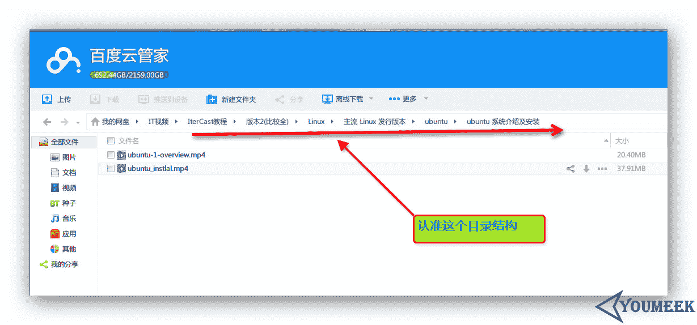
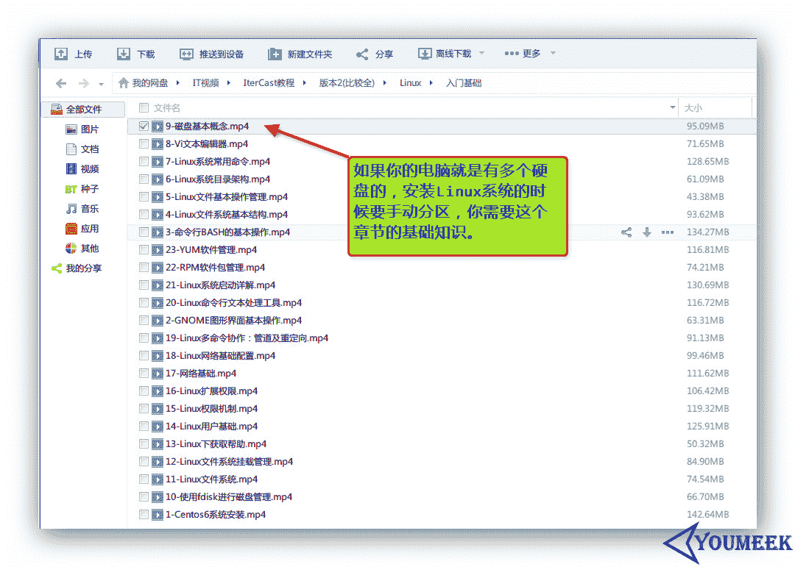

# 三、Ubuntu 安装和分区

*   先下载该系列教程：[`pan.baidu.com/s/1gdw7CuJ`](http://pan.baidu.com/s/1gdw7CuJ)

**图片 3.1** Ubuntu 安装和分区视频

*   找到如图箭头目录上的两个视频，并看完，你对 Ubuntu 的安装就有了一个大概的了解，视频中 Ubuntu 虽然版本较早 13.04 的， 但是没关系，对于 Ubuntu 来讲新旧版本安装基本都一样的，所以别担心，驱动的问题也别担心，我们不是要在 Ubuntu 打游戏的，所以常见驱动系统是已经帮我们集成的不会影响使用。但是分区这一块的话，我个人建议是手工分区，视频中没有最终执行手动分区，只是演示了一下又返回了。 我个人是要求你手动分区的。

*   但是再讲分区之前，用什么设备安装是第一前提，我这里推荐用 U 盘，你准备一个 4 G 以上的 U 盘，把 Ubuntu 系统进行格式化到里面，用这个 U 盘作为安装盘进行安装。这个过程不难，具体看如下文章：

    *   [`www.Ubuntukylin.com/ask/index.php?qa=jc_1`](http://www.Ubuntukylin.com/ask/index.php?qa=jc_1)
    *   [`www.wubantu.com/36bc2075036fab76.html`](http://www.wubantu.com/36bc2075036fab76.html)
    *   [`tieba.baidu.com/p/2795415868`](http://tieba.baidu.com/p/2795415868)
    *   [`www.Ubuntukylin.com/public/pdf/UK1410install.pdf`](http://www.Ubuntukylin.com/public/pdf/UK1410install.pdf)
*   好了假设你现在已经格式化好 U 盘，现在可以开始讲分区了。这里特别说明的是有多个硬盘的，多块硬盘分区方案就没视频中那么简单，特别是 Linux 的盘符不了解的就更加难了，所以看下图：

**图片 3.2** Ubuntu 安装和分区视频

*   以我这边为例：我这边机子的硬盘是：一个 128 G 固态 + 500 G 的机械，我给一个分区方案给你们参考。下面的内容需要你先看过视频才能看懂：

*   Linux 一般可分 3 个分区，分别是 `boot 分区`、`swap 分区` 和 `根分区`（根分区也就是斜杠/） boot 是主分区类型，swap 是是逻辑分区，/ 是逻辑分区，其他如果你还想划分的也都是逻辑分区。 最近年代生产的的主板，可能还需要分出一个 EFI 分区启动。EFI 的选择和 swap 一样，都在那个下拉菜单中。 怎么判断你要不要分出一个 EFI 呢？如果你根据我的要求分了 boot，swap，根之后，点击下一步报错，有提示 EFI 相关的错误信息，那就分一个给它，我这边就是有报错的。

*   **120 G 固态硬盘：**

    *   `/boot` == 1G（主分区），这里为 boot 单独挂载是有必要的。系统崩溃的时候，损坏的是这个分区。我们重装系统之后，其他分区我们保留下来，重新挂载上去就可以用了。
    *   `/EFI` == 100M（主分区）（我有提示报错需要分这个，我就分了）
    *   `/swap` == 12G（逻辑分区）一般大家的说法这个大小是跟你机子的内存大小相关的，也有说法内存大不需要这个，但是还是建议分，我内存是 12G，所以我分 12G。
    *   `/` == 100G（逻辑分区）
*   **500 G 机械硬盘：**

    *   `/home` == 500G（逻辑分区）
*   分区后的安装都是下一步的，而且 Ubuntu kylin 还是中文的说明，所以没啥难度。 到此假设你给自己的电脑安装了 Ubuntu，那下一讲我将讲 Ubuntu 的相关设置。

*   如果你想用 VMware 虚拟机安装，这个教程推荐给你，讲得很详细。

    *   [`www.jikexueyuan.com/course/1583.html`](http://www.jikexueyuan.com/course/1583.html)

*   Ubuntu 网络相关设置问题