# 十二、Zsh 入门

## 本文前提

*   CentOS 6.7 64 bit
*   root 用户

## Zsh 介绍

*   Zsh 兼容 Bash，据传说 99% 的 Bash 操作 和 Zsh 是相同的
*   Zsh 官网：[`www.zsh.org/`](http://www.zsh.org/)
*   先看下你的 CentOS 支持哪些 shell：`cat /etc/shells`，正常结果应该是这样的：

```
/bin/sh
/bin/bash
/sbin/nologin
/bin/dash
/bin/tcsh
/bin/csh
```

*   默认 CentOS / Ubuntu / Mac 系统用的是 Bash，倒也不是说 Bash 不好，而是说我们有更好的选择。

## Zsh 安装

*   CentOS 安装：`sudo yum install -y zsh`
*   Ubuntu 安装：`sudo apt-get install -y zsh`
*   在检查下系统的 shell：`cat /etc/shells`，你会发现多了一个：`/bin/zsh`

## 使用 Zsh 扩展集合：oh-my-zsh

*   oh-my-zsh 帮我们整理了一些常用的 Zsh 扩展功能和主题：[`github.com/robbyrussell/oh-my-zsh`](https://github.com/robbyrussell/oh-my-zsh)
*   我们无需自己去捣搞 Zsh，直接用 oh-my-zsh 就足够了，如果你想继续深造的话那再去弄。
*   先安装 git：`sudo yum install -y git`
*   安装 oh-my-zsh：`wget https://raw.github.com/robbyrussell/oh-my-zsh/master/tools/install.sh -O - | sh`
*   整个过程效果如下图：
    *   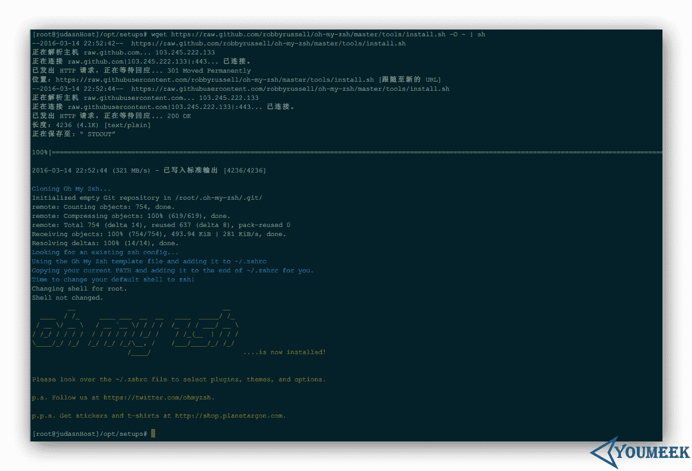

        **图片 12.1** oh-my-zsh 安装

*   在以 root 用户为前提下，oh-my-zsh 的安装目录：**/root/.oh-my-zsh**
*   在以 root 用户为前提下，Zsh 的配置文件位置：**/root/.zshrc**
*   为 root 用户设置 zsh 为系统默认 shell：`chsh -s /bin/zsh root`
*   如果你要重新恢复到 bash：`chsh -s /bin/bash root`
*   现在重启下系统：`reboot`，重启完你就可以看到你连接上 shell 效果变了，现在开头是一个箭头了，如下图：
    *   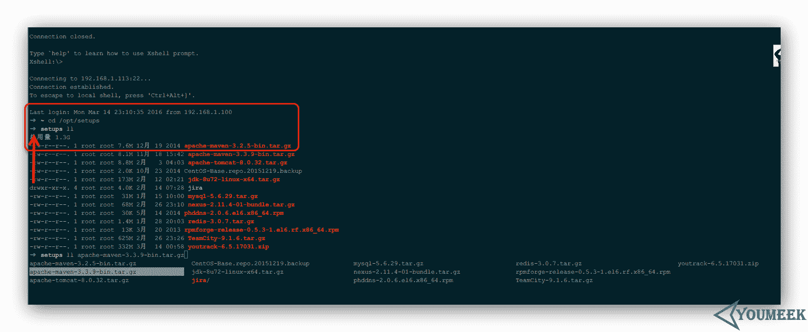

        **图片 12.2** oh-my-zsh 安装

## Zsh 配置

### 插件

*   启用 oh-my-zsh 中自带的插件。
*   oh-my-zsh 的插件列表介绍（太长了，用源码不精准地统计下有 149 个）：[`github.com/robbyrussell/oh-my-zsh/wiki/Plugins`](https://github.com/robbyrussell/oh-my-zsh/wiki/Plugins)
*   我们看下安装 oh-my-zsh 的时候自带有多少个插件：`ls -l /root/.oh-my-zsh/plugins |grep "^d"|wc -l`，我这边得到的结果是：211
*   编辑配置文件：`vim /root/.zshrc`，找到下图的地方，怎么安装，原作者注释写得很清楚了，别装太多了，默认 git 是安装的。
    *   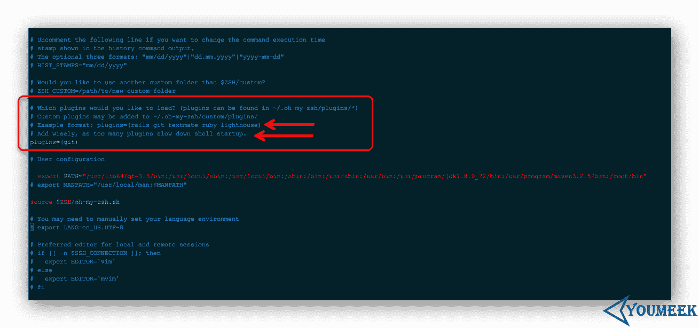

        **图片 12.3** oh-my-zsh 安装

*   插件推荐：
    *   `wd`
        *   简单地讲就是给指定目录映射一个全局的名字，以后方便直接跳转到这个目录，比如：
        *   编辑配置文件，添加上 wd 的名字：`vim /root/.zshrc`
        *   我常去目录：**/opt/setups**，每次进入该目录下都需要这样：`cd /opt/setups`
        *   现在用 wd 给他映射一个快捷方式：`cd /opt/setups ; wd add setups`
        *   以后我在任何目录下只要运行：`wd setups` 就自动跑到 /opt/setups 目录下了
        *   插件官网：[`github.com/mfaerevaag/wd`](https://github.com/mfaerevaag/wd)
    *   `autojump`
        *   这个插件会记录你常去的那些目录，然后做一下权重记录，你可以用这个命令看到你的习惯：`j --stat`，如果这个里面有你的记录，那你就只要敲最后一个文件夹名字即可进入，比如我个人习惯的 program：`j program`，就可以直接到：`/usr/program`
        *   插件官网：[`github.com/wting/autojump`](https://github.com/wting/autojump)
        *   官网插件下载地址：[`github.com/wting/autojump/downloads`](https://github.com/wting/autojump/downloads)
        *   插件下载：`wget https://github.com/downloads/wting/autojump/autojump_v21.1.2.tar.gz`
        *   解压：`tar zxvf autojump_v21.1.2.tar.gz`
        *   进入解压后目录并安装：`cd autojump_v21.1.2/ ; ./install.sh`
        *   再执行下这个：`source /etc/profile.d/autojump.sh`
        *   编辑配置文件，添加上 autojump 的名字：`vim /root/.zshrc`

### 主题

*   很多人喜欢捣搞这个 ╮(￣▽￣)╭
*   捣搞主题和插件思路一样
*   oh-my-zsh 的主题列表介绍（还是太长了）：[`github.com/robbyrussell/oh-my-zsh/wiki/Themes`](https://github.com/robbyrussell/oh-my-zsh/wiki/Themes)
*   我们看下安装 oh-my-zsh 的时候，自带有多少个：`ls -l /root/.oh-my-zsh/themes |grep "^-"|wc -l`，我这边得到的结果是：140
*   我个人品味地推荐的是（排名有先后）：
    *   `ys`
    *   `agnoster`
    *   `avit`
    *   `blinks`
*   编辑配置文件：`vim /root/.zshrc`，找到下图的地方，怎么安装，原作者注释写得很清楚了，如果你没特别的喜欢那就选择随机吧。
    *   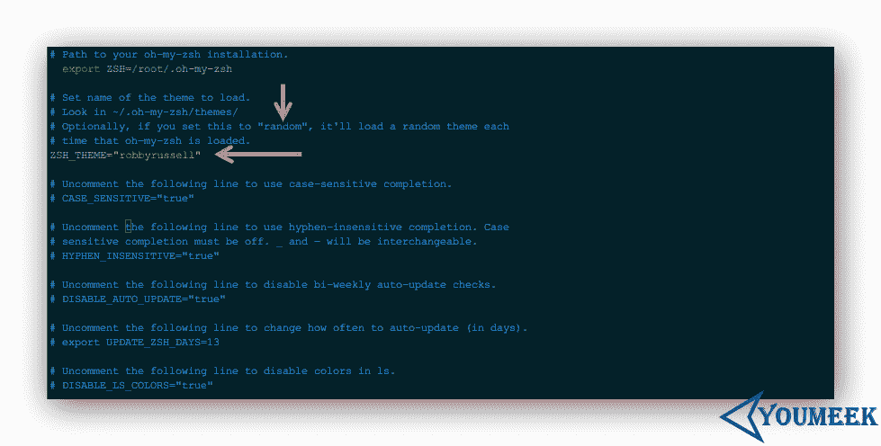

        **图片 12.4** oh-my-zsh 安装

*   配置好新主题需要重新连接 shell 才能看到效果

## 一些人性化功能

*   呃，这个其实可以不用讲的，你自己用的时候你自己会发现的，各种便捷，特别是用 Tab 多的人一定会有各种惊喜的。

## 资料

*   [`macshuo.com/?p=676`](http://macshuo.com/?p=676)
*   [`aaaaaashu.gitbooks.io/mac-dev-setup/content/iTerm/zsh.html`](https://aaaaaashu.gitbooks.io/mac-dev-setup/content/iTerm/zsh.html)
*   [`hackerxu.com/2014/11/19/ZSH.html`](http://hackerxu.com/2014/11/19/ZSH.html)
*   [`blog.phpgao.com/oh-my-zsh.html`](https://blog.phpgao.com/oh-my-zsh.html)
*   [`www.bkjia.com/Linuxjc/1033947.html`](http://www.bkjia.com/Linuxjc/1033947.html)
*   [`swiftcafe.io/2015/10/31/cafe-time-omz/`](http://swiftcafe.io/2015/10/31/cafe-time-omz/)
*   [`swiftcafe.io/2015/12/04/omz-plugin/`](http://swiftcafe.io/2015/12/04/omz-plugin/)
*   [`www.hackbase.com/article-206940-1.html`](http://www.hackbase.com/article-206940-1.html)
*   [`hahack.com/wiki/shell-zsh.html`](http://hahack.com/wiki/shell-zsh.html)
*   [`blog.jobbole.com/86820/`](http://blog.jobbole.com/86820/)
*   [`uecss.com/zsh-brew-autojump-plugins-shell-for-mac.html`](http://uecss.com/zsh-brew-autojump-plugins-shell-for-mac.html)
*   [`www.cnblogs.com/westfly/p/3283525.html`](http://www.cnblogs.com/westfly/p/3283525.html)

# SSH（Secure Shell）介绍

* * *

*   SSH（Secure Shell）介绍
    *   SSH 安装
    *   SSH 配置文件常用参数
    *   SSH 允许 root 账户登录
    *   SSH 密钥登录
    *   SSH 资料

* * *

## SSH 安装

*   查看是否已安装：

    *   CentOS：`rpm -qa | grep openssh`
    *   Ubuntu：`dpkg -l | grep openssh`
*   安装：

    *   CentOS 6：`sudo yum install -y openssh-server openssh-clients`
    *   Ubuntu：`sudo apt-get install -y openssh-server openssh-client`

## SSH 配置文件常用参数

*   配置文件介绍（记得先备份）：`sudo vim /etc/ssh/sshd_config`
    *   Port 22 #默认指定 22 端口，可以自己修改
    *   Protocol 2,1 #指定了 SSH 协议版本，目前 SSH 只有两个版本 2 和 1
    *   PasswordAuthentication yes #是否开启密码验证，因为 SSH 也可以设置秘钥类授权登录的方式，如果用这种方式我们可以考虑关掉密码登录的方式。
    *   PermitEmptyPasswords no #是否允许密码为空，与上面参数配合用。

## SSH 允许 root 账户登录

*   编辑配置文件（记得先备份）：`sudo vim /etc/ssh/sshd_config`
    *   允许 root 账号登录
    *   注释掉：`PermitRootLogin without-password`
    *   新增一行：`PermitRootLogin yes`

## SSH 密钥登录

*   生成秘钥和公钥文件，命令：`sudo ssh-keygen`，在交互提示中连续按三次回车，如果看得懂交互的表达，那就根据你自己需求来。默认生成密钥和公钥文件是在：/root/.ssh。
*   进入生成目录：`cd /root/.ssh`，可以看到有两个文件：id_rsa (私钥) 和 id_rsa.pub (公钥)
*   在 .ssh 目录下创建 SSH 认证文件，命令：`touch /root/.ssh/authorized_keys`
*   将公钥内容写到 SSH 认证文件里面，命令：`cat /root/.ssh/id_rsa.pub >> /root/.ssh/authorized_keys`
*   修改 SSH 认证文件权限，命令：
    *   `sudo chmod 700 /root/.ssh`
    *   `sudo chmod 600 /root/.ssh/authorized_keys`
*   重启服务：`sudo service ssh restart`
*   设置 SSH 服务默认启动：`sudo sysv-rc-conf ssh on`

现在 SSH 客户端可以去拿着 SSH 服务器端上的 id_rsa，在客户端指定秘钥文件地址即可，这个一般由于你使用的客户端决定的，我这里推荐的是 Xshell 软件。

## SSH 资料

*   [`www.jikexueyuan.com/course/861_1.html?ss=1`](http://www.jikexueyuan.com/course/861_1.html?ss=1)

# FTP（File Transfer Protocol）介绍

* * *

*   FTP（File Transfer Protocol）介绍
    *   FTP 安装
    *   FTP 使用之前要点
    *   FTP 服务器配置文件常用参数
    *   vsftpd 的两种传输模式
    *   vsftpd 的两种运行模式
    *   FTP 资料

* * *

## FTP 安装

*   查看是否已安装：

    *   CentOS：`rpm -qa | grep vsftpd`
    *   Ubuntu：`dpkg -l | grep vsftpd`
*   安装：

    *   CentOS 6：`sudo yum install -y vsftpd`
    *   Ubuntu：`sudo apt-get install -y vsftpd`

## FTP 使用之前要点

*   关闭 CentOS 上的 SELinux 组件（Ubuntu 体系是没有这东西的）。
    *   查看 SELinux 开启状态：`sudo getenforce`
    *   有如下三种状态，默认是 Enforcing
        *   Enforcing（开启）
        *   Permissive（开启，但是只起到警告作用，属于比较轻的开启）
        *   Disabled（关闭）
    *   临时关闭：
        *   命令：`sudo setenforce 0`
    *   临时开启：
        *   命令：`sudo setenforce 1`
    *   永久关闭：
        *   命令：`sudo vim /etc/selinux/config`
        *   将：`SELINUX=enforcing` 改为 `SELINUX=disbaled`，配置好之后需要重启系统。

## FTP 服务器配置文件常用参数

*   vsftpd 默认是支持使用 Linux 系统里的账号进行登录的（登录上去可以看到自己的 home 目录内容），权限跟 Linux 的账号权限一样。但是建议使用软件提供的虚拟账号管理体系功能，用虚拟账号登录。
*   配置文件介绍（记得先备份）：`sudo vim /etc/vsftpd/vsftpd.conf`，比较旧的系统版本是：`vim /etc/vsftpd.conf`
    *   该配置主要参数解释：
    *   anonymous_enable=NO #不允许匿名访问，改为 YES 即表示可以匿名登录
    *   anon_upload_enable=YES #是否允许匿名用户上传
    *   anon_mkdir_write_enable=YES #是否允许匿名用户创建目录
    *   local_enable=YES #是否允许本地用户，也就是 linux 系统的已有账号，如果你要 FTP 的虚拟账号，那可以改为 NO
    *   write_enable=YES #是否允许本地用户具有写权限
    *   local_umask=022 #本地用户掩码
    *   chroot_list_enable=YES #不锁定用户在自己的家目录，默认是注释，建议这个一定要开，比如本地用户 judasn，我们只能看到/home/judasn，没办法看到/home 目录
    *   chroot_list_file=/etc/vsftpd/chroot_list #该选项是配合上面选项使用的。此文件中的用户将启用 chroot，如果上面的功能开启是不够的还要把用户名加到这个文件里面。配置好后，登录的用户，默认登录上去看到的根目录就是自己的 home 目录。
    *   listen=YES #独立模式
    *   userlist_enable=YES #用户访问控制，如果是 YES，则表示启用 vsftp 的虚拟账号功能，虚拟账号配置文件是/etc/vsftpd/user_list
    *   userlist_deny=NO #这个属性在配置文件是没有的，当 userlist_enable=YES，这个值也为 YES，则 user_list 文件中的用户不能登录 FTP，列表外的用户可以登录，也可以起到一个黑名单的作用。当 userlist_enable=YES，这个值为 NO，则 user_list 文件中的用户能登录 FTP，列表外的用户不可以登录，也可以起到一个白名单的作用。如果同一个用户即在白名单中又在 ftpusers 黑名单文件中，那还是会以黑名单为前提，对应账号没法登录。
    *   tcp_wrappers=YES #是否启用 TCPWrappers 管理服务
    *   FTP 用户黑名单配置文件：`sudo vim /etc/vsftpd/ftpusers`，默认 root 用户也在黑名单中
    *   控制 FTP 用户登录配置文件：`sudo vim /etc/vsftpd/user_list`
*   启动服务：
    *   `service vsftpd restart`

## vsftpd 的两种传输模式

*   分为：主动模式（PORT）和被动模式（PASV）。这两个模式会涉及到一些端口问题，也就涉及到防火墙问题，所以要特别注意。主动模式比较简单，只要在防火墙上放开放开 21 和 20 端口即可。被动模式则要根据情况放开一个端口段。
    *   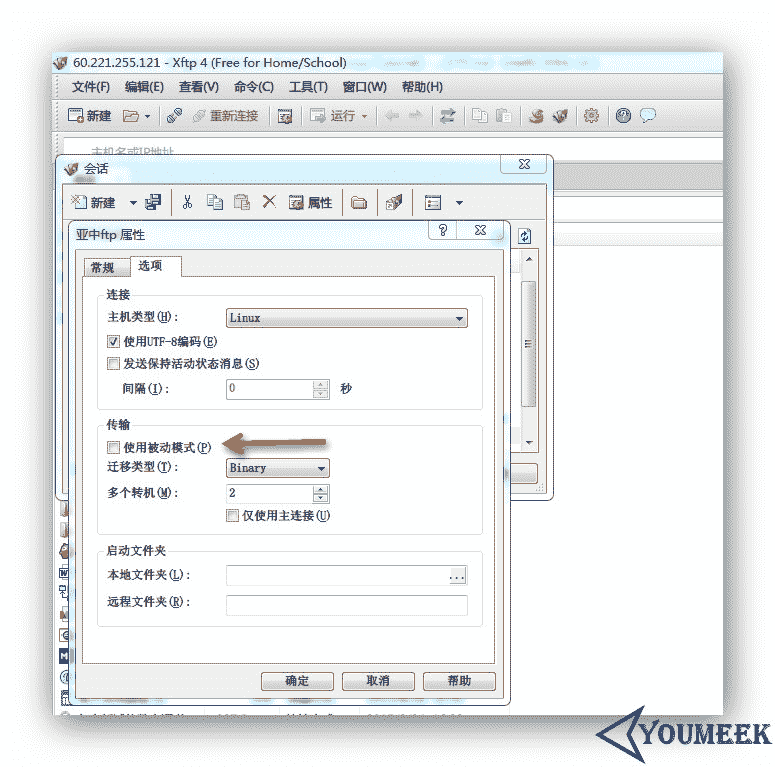

        **图片 14.1** vsftpd 的两种传输模式

    *   上图箭头：xftp 新建连接默认都是勾选被动模式的，所以如果要使用主动模式，在该连接的属性中是要去掉勾选。

## vsftpd 的两种运行模式

*   分为：xinetd 模式和 standalone 模式
    *   xinetd 模式：由 xinetd 作为 FTP 的守护进程，负责 21 端口的监听，一旦外部发起对 21 端口的连接，则调用 FTP 的主程序处理，连接完成后，则关闭 FTP 主程序，释放内存资源。好处是资源占用少，适合 FTP 连接数较少的场合。
    *   standalone 模式：直接使用 FTP 主程序作为 FTP 的守护进程，负责 21 端口的监听，由于无需经过 xinetd 的前端代理，响应速度快，适合连接数 较大的情况，但由于 FTP 主程序长期驻留内存，故较耗资源。
    *   standalone 一次性启动，运行期间一直驻留在内存中，优点是对接入信号反应快，缺点是损耗了一定的系统资源，因此经常应用于对实时反应要求较高的 专业 FTP 服务器。
    *   xinetd 恰恰相反，由于只在外部连接发送请求时才调用 FTP 进程，因此不适合应用在同时连接数量较多的系统。此外，xinetd 模式不占用系统资源。除了反应速度和占用资源两方面的影响外，vsftpd 还提供了一些额外的高级功能，如 xinetd 模式支持 per_IP (单一 IP)限制，而 standalone 模式则更有利于 PAM 验证功能的应用。
    *   配置 xinetd 模式：

        *   编辑配置文件：`sudo vim /etc/xinetd.d/vsftpd`
        *   属性信息改为如下信息：
            *   disable = no
            *   socket_type = stream
            *   wait = no #这表示设备是激活的，它正在使用标准的 TCP Sockets
        *   编辑配置文件：`sudo vim /etc/vsftpd/vsftpd.conf`
        *   如果该配置选项中的有 `listen=YES`，则要注释掉
    *   重启 xinetd 服务，命令：`sudo /etc/rc.d/init.d/xinetd restart`
    *   配置 standalone 模式：
        *   编辑配置文件：`sudo vim /etc/xinetd.d/vsftpd`
        *   属性信息改为如下信息：
            *   disable = yes
        *   编辑配置文件：`sudo vim /etc/vsftpd/vsftpd.conf`
        *   属性信息改为如下信息：
            *   Listen=YES（如果是注释掉则要打开注释）
    *   重启服务：`sudo service vsftpd restart`

## FTP 资料

*   [`www.jikexueyuan.com/course/994.html`](http://www.jikexueyuan.com/course/994.html)
*   [`www.while0.com/36.html`](http://www.while0.com/36.html)
*   [`www.cnblogs.com/CSGrandeur/p/3754126.html`](http://www.cnblogs.com/CSGrandeur/p/3754126.html)
*   [`www.centoscn.com/image-text/config/2015/0613/5651.html`](http://www.centoscn.com/image-text/config/2015/0613/5651.html)
*   [`wiki.ubuntu.org.cn/Vsftpd`](http://wiki.ubuntu.org.cn/Vsftpd)

# VPN（Virtual Private Network）介绍

* * *

*   VPN（Virtual Private Network）介绍
    *   VPN 介绍
    *   PPTPD 安装
    *   PPTPD 服务配置
    *   L2TPD 安装
    *   L2TPD 服务配置
    *   VPN 资料

* * *

## VPN 介绍

VPN 分类有很多，这里主要讲 PPTPD 和 L2TPD

## PPTPD 安装

*   查看是否已安装：

    *   CentOS：`rpm -qa | grep pptpd`
    *   Ubuntu：`dpkg -l | grep pptpd`
*   安装：

    *   CentOS 6：`XXXXXXXXXXXXXXXXXXXXXXXX`
    *   Ubuntu：`sudo apt-get install -y ppp pptpd`

## PPTPD 服务配置

*   注意：PPTPD 默认端口是 1723，所以防火墙要取消对其限制，查看 1723 端口是否开启：`sudo netstat -apnl | grep 1723`
*   编辑 PPTPD 配置文件介绍（记得先备份）：`sudo vim /etc/pptpd.conf`
    *   修改配置信息：
    *   option /etc/ppp/pptpd-options #配置文件中有一行这样的参数，如果没有自己添加上去。
    *   logwtmp #默认这个是没有被注释的，这里要进行注释
    *   localip 172.31.0.1 #本机服务器的内网 IP 地址，建议你的内网 IP 一般不要用常见网段，默认这个被注释，取消注释
    *   remoteip 192.168.0.10-200 #客户端的 IP 地址范围，默认这个被注释，取消注释
*   编辑 PPP 配置文件介绍（记得先备份）：`sudo vim /etc/ppp/pptpd-options`
    *   在文件尾巴添加如下配置信息：
    *   ms-dns 8.8.8.8 #配置 DNS，如果是境外服务器最好改为 google 的，国内的看情况
    *   ms-dns 8.8.4.4 #配置 DNS，如果是境外服务器最好改为 google 的，国内的看情况
*   开启系统转发（记得先备份）：`sudo vim /etc/sysctl.conf`
    *   修改配置信息：
    *   net.ipv4.ip_forward=1 #默认是注释掉的，要取消注释
    *   刷新配置：`sudo sysctl -p`
*   设置 iptables 转发：
    *   追加 iptables 规则：`sudo iptables -t nat -A POSTROUTING -o eth0 -j MASQUERADE`
    *   设置默认启动使用该规则：`sudo vim /etc/rc.local`
    *   在配置文件中添加：iptables -t nat -A POSTROUTING -o eth0 -j MASQUERADE
*   添加登录账号（记得先备份）：`sudo vim /etc/ppp/chap-secrets`
    *   在文件尾巴添加如下配置信息：
    *   mytest1 pptpd 123456 * #该格式分别表示：登录名、登录协议、密码、该连接上的客户端用什么 IP（* 表示随机一个 IP）
*   重启服务：`sudo service pptpd restart`

## L2TPD 安装

*   查看是否已安装：

    *   CentOS：`rpm -qa | grep xl2tpd`
    *   Ubuntu：`dpkg -l | grep xl2tpd`
*   安装：

    *   CentOS 6：`XXXXXXXXXXXXXXXXXXXXXXXX`
    *   Ubuntu：`sudo apt-get install -y xl2tpd ppp openswan`

## L2TPD 服务配置

*   注意：L2TPD 默认端口是 1701，所以防火墙要取消对其限制，查看 1701 端口是否开启：`sudo netstat -apnl | grep 1701`
*   编辑 Openswan 配置文件介绍（记得先备份）：`sudo vim /etc/ipsec.conf`
    *   left=172.31.201.255 #其中这里的 IP 地址改为本机的内网 IP，文件中有两处，都进行修改
*   编辑 IPsec-based 配置文件介绍（记得先备份）：`sudo vim /etc/ipsec.secrets`
    *   172.31.201.255 %any: PSK"adc123456" #在文件最后一行补充：（格式是：本机内网 IP，后面是配置密钥。密钥不配置也可以但是建议配上去）
*   编辑 L2TPD 配置文件介绍（记得先备份）：`sudo vim /etc/xl2tpd/xl2tpd.conf`
    *   修改配置信息：
    *   ipsec saref = yes
    *   require chap = yes
    *   refuse pap = yes
    *   require authentication = yes
    *   ppp debug = yes
    *   length bit = yes
    *   ip range = 192.168.1.10-192.168.1.200 #这是客户端连接本机的 IP 端限制
    *   local ip = 172.31.201.255 #这是本机服务器端的内网 IP
    *   pppoptfile = /etc/ppp/options.xl2tpd #指定本机的 PPP 配置文件地址，如果你的 PPP 配置文件地址不是这里那就改下
*   编辑 PPP 配置文件介绍（记得先备份）：`sudo vim /etc/ppp/options.xl2tpd` (如果没有这个文件自己创建)
    *   在文件尾巴添加如下配置信息：
    *   refuse-mschap-v2
    *   refuse-mschap
    *   ms-dns 8.8.8.8 #配置 DNS，如果是境外服务器最好改为 google 的，国内的看情况
    *   ms-dns 8.8.4.4 #配置 DNS，如果是境外服务器最好改为 google 的，国内的看情况
    *   asyncmap 0
    *   auth
    *   lock
    *   hide-password
    *   local
    *   name l2tpd
    *   proxyarp
    *   lcp-echo-interval 30
    *   lcp-echo-failure 4
    *   refuse
    *   refuse
    *   refuse
*   在终端输入命令：sudo sh -c 'for each in /proc/sys/net/ipv4/conf/* do echo 0 > $each/accept_redirects echo 0 > $each/send_redirects done'
*   开启系统转发（记得先备份）：`sudo vim /etc/sysctl.conf`
    *   修改配置信息：
    *   net.ipv4.ip_forward=1 #默认是注释掉的，要取消注释
    *   刷新配置：`sudo sysctl -p`
*   设置 iptables 转发：
    *   追加 iptables 规则：`sudo iptables -t nat -A POSTROUTING -o eth0 -j MASQUERADE`
    *   设置默认启动使用该规则：`sudo vim /etc/rc.local`
    *   在配置文件中添加：iptables -t nat -A POSTROUTING -o eth0 -j MASQUERADE
*   添加登录账号（记得先备份）：`sudo vim /etc/ppp/chap-secrets`
    *   在文件尾巴添加如下配置信息：
    *   mytest1 l2tpd 123456 * #该格式分别表示：登录名、登录协议、密码、该连接上的客户端用什么 IP（* 表示随机一个 IP）
*   重启服务：`sudo service l2tpd restart`

## VPN 资料

*   [`www.jikexueyuan.com/course/1692_2.html?ss=1`](http://www.jikexueyuan.com/course/1692_2.html?ss=1)
*   [Freeradius 服务（用于账号认证管理的工具，可以扩展到 VPN 的账号管理）](http://www.jikexueyuan.com/course/1692_4.html?ss=2)

# NFS（Network FileSystem）介绍

* * *

*   NFS（Secure Shell）介绍
    *   NFS 安装
    *   NFS 服务器配置文件常用参数
    *   NFS 客户端访问
    *   NFS 资料

* * *

## NFS 安装

*   查看是否已安装：

    *   CentOS：`rpm -qa | grep nfs-*`
    *   Ubuntu：`dpkg -l | grep nfs-*`
*   安装：

    *   CentOS 5：`sudo yum install -y nfs-utils portmap`
    *   CentOS 6：`sudo yum install -y nfs-utils rpcbind`
    *   Ubuntu：`sudo apt-get install -y nfs-common nfs-kernel-server`

## NFS 服务器配置文件常用参数

*   配置文件介绍（记得先备份）：`sudo vim /etc/exports`

    *   默认配置文件里面是没啥内容的，我们需要自己加上配置内容，一行表示共享一个目录。为了方便使用，共享的目录最好将权限设置为 777（`chmod 777 folderName`）。
    *   假设在配置文件里面加上：`/opt/mytest 192.168.0.0/55(rw,sync,all_squash,anonuid=501,anongid=501,no_subtree_check)`
    *   该配置解释：
    *   /opt/mytest 表示我们要共享的目录
    *   192.168.0.0/55 表示内网中这个网段区间的 IP 是可以进行访问的，如果要任意网段都可以访问，可以用 `*` 号表示
    *   (rw,sync,all_squash,anonuid=501,anongid=501,no_subtree_check) 表示权限
        *   rw：是可读写（ro 是只读）
        *   sync：同步模式，表示内存中的数据时时刻刻写入磁盘（async：非同步模式，内存中数据定期存入磁盘）
        *   all_squash：表示不管使用 NFS 的用户是谁，其身份都会被限定为一个指定的普通用户身份。（no_root_squash：其他客户端主机的 root 用户对该目录有至高权限控制。root_squash：表示其他客户端主机的 root 用户对该目录有普通用户权限控制）
        *   anonuid/anongid：要和 root_squash 或 all_squash 选项一同使用，表示指定使用 NFS 的用户被限定后的 uid 和 gid，前提是本图片服务器的/etc/passwd 中存在这一的 uid 和 gid
        *   no_subtree_check：不检查父目录的权限
*   启动服务：

    *   `/etc/init.d/rpcbind restart`
    *   `/etc/init.d/nfs-kernel-server restart`

## NFS 客户端访问

*   客户端要访问服务端的共享目录需要对其共享的目录进行挂载，在挂载之前先检查下：`showmount -e 192.168.1.25`（这个 IP 是 NFS 的服务器端 IP）
    *   如果显示：/opt/mytest 相关信息表示成功了。
*   现在开始对其进行挂载：`mount -t nfs 192.168.1.25:/opt/mytest/ /mytest/`
    *   在客户端机器上输入命令：`df -h` 可以看到多了一个 mytest 分区。然后我们可以再创建一个软链接，把软链接放在 war 包的目录下，这样上传的图片都会跑到另外一台服务器上了。软链接相关内容请自行搜索。

## NFS 资料

*   [`wiki.jikexueyuan.com/project/linux/nfs.html`](http://wiki.jikexueyuan.com/project/linux/nfs.html)
*   [`www.jb51.net/os/RedHat/77993.html`](http://www.jb51.net/os/RedHat/77993.html)
*   [`www.cnblogs.com/Charles-Zhang-Blog/archive/2013/02/05/2892879.html`](http://www.cnblogs.com/Charles-Zhang-Blog/archive/2013/02/05/2892879.html)
*   [`www.linuxidc.com/Linux/2013-08/89154.htm`](http://www.linuxidc.com/Linux/2013-08/89154.htm)
*   [`www.centoscn.com/image-text/config/2015/0111/4475.html`](http://www.centoscn.com/image-text/config/2015/0111/4475.html)

# NTP（Network Time Protocol）介绍

* * *

*   NTP（Network Time Protocol）介绍
    *   NTP 安装
    *   NTP 服务器配置文件常用参数
    *   NTP 资料

* * *

## NTP 安装

*   查看是否已安装：

    *   CentOS：`rpm -qa | grep ntp-*`
    *   Ubuntu：`dpkg -l | grep ntp-*`
*   安装：

    *   CentOS 6：`sudo yum install -y ntp`
    *   Ubuntu：`sudo apt-get install -y ntp`

## NTP 服务器配置文件常用参数

*   世界上可以校对时间节点：[`www.pool.ntp.org/zh`](http://www.pool.ntp.org/zh)
*   中国时间校对服务器节点：[`www.pool.ntp.org/zone/cn`](http://www.pool.ntp.org/zone/cn)
*   配置文件介绍（记得先备份）：`sudo vim /etc/ntp.conf`
    *   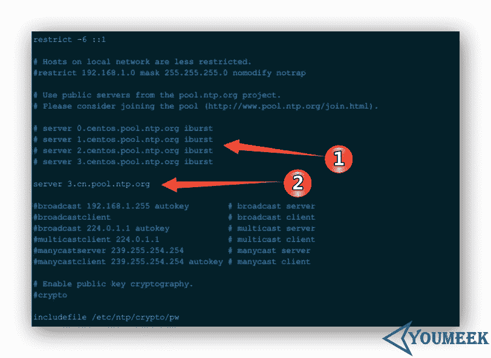

        **图片 17.1** NTP 服务器配置文件常用参数

    *   该配置解释：
    *   标注 1 是默认内容，我们这里进行了注释。
    *   标注 2 是新增内容，表示使用中国时间校对服务器节点地址。
*   启动服务：
    *   `sudo service ntpd start`
*   服务加到启动项
    *   `sudo apt-get install -y sysv-rc-conf`
    *   `sudo sysv-rc-conf ntpd on`

## NTP 资料

*   [`www.jikexueyuan.com/course/1710.html`](http://www.jikexueyuan.com/course/1710.html)
*   [`www.pool.ntp.org/zh`](http://www.pool.ntp.org/zh)
*   [`blog.kissdata.com/2014/10/28/ubuntu-ntp.html`](http://blog.kissdata.com/2014/10/28/ubuntu-ntp.html)

# Samba 介绍

* * *

*   Samba 介绍
    *   Samba 安装
    *   Samba 服务器配置文件常用参数
    *   Samba 资料

* * *

## Samba 安装

*   查看是否已安装：

    *   CentOS：`rpm -qa | grep samba`
    *   Ubuntu：`dpkg -l | grep samba`
*   安装：

    *   CentOS 6：`XXXXXXXXXXXXXXXXXXXXXXXXXXXXXXX`
    *   Ubuntu：`sudo apt-get install -y samba samba-client`

## Samba 服务器配置文件常用参数

*   配置文件介绍（记得先备份）：`sudo vim /etc/samba/smb.conf`
    *   该配置解释：
    *   在 [globle] 区域
        *   workgroup = WORKGROUP #WORKGROUP 表示 Windows 默认的工作组名称，一般共享给 windows 是设置为 WORKGROUP
        *   security = user #ubuntu 下配置文件默认没有这句,这个是自己填上去的。表示指定 samba 的安全等级，安全等级分别有四种：share（其他人不需要账号密码即可访问共享目录）、user（检查账号密码）、server（表示检查密码由另外一台服务器负责）、domain（指定 Windows 域控制服务器来验证用户的账号和密码）
    *   在新区域区域
        *   当 security = share 使用下面这段，这段自己添加的，其中 myshare 这个名字表示其他机子访问该分享地址时用：file://该服务机 IP/myshare `[myshare] comment = share all path = /opt/mysamba #分享的目录，其中这个目录需要 chmod 777 /opt/mysamba 权限 browseable = yes writable = yes public =yes`
        *   当 security = user 使用下面这段，这段自己添加的，其中 myshare2 这个名字表示其他机子访问该分享地址时用：file://该服务机 IP/myshare2
        *   可以返回的账号必须是系统已经存在的账号。先给系统添加账号：`useradd user1`，再用 samba 的设置添加账号：`pdbedit -a user1`，会让你设立该 samba 账号密码。列出账号：`pdbedit -L` `[myshare2] comment = share for users path = /opt/mysamba2 #分享的目录，其中这个目录需要 chmod 777 /opt/mysamba 权限 browseable = yes writable = yes public = no`
*   启动服务：
    *   `sudo service samba restart`

## Samba 资料

*   [`www.lvtao.net/linux/555.html`](http://www.lvtao.net/linux/555.html)
*   [`www.centos.bz/2011/07/centos5-install-samba-windows-linux-fileshare/`](https://www.centos.bz/2011/07/centos5-install-samba-windows-linux-fileshare/)
*   [`wsgzao.github.io/post/samba/`](https://wsgzao.github.io/post/samba/)
*   [`linux.vbird.org/linux_server/0370samba.php`](http://linux.vbird.org/linux_server/0370samba.php)

# Crontab 介绍

* * *

*   Crontab 介绍
    *   Crontab 安装
    *   Crontab 服务器配置文件常用参数
    *   Crontab 资料

* * *

## Crontab 安装

*   查看是否已安装：

    *   CentOS：`rpm -qa | grep cron`
    *   Ubuntu：`dpkg -l | grep cron`
*   安装（一般系统是集成的）：

    *   CentOS 6：`sudo yum install -y vixie-cron crontabs`
    *   Ubuntu：`sudo apt-get install -y cron`

## Crontab 服务器配置文件常用参数

*   配置文件介绍（记得先备份）：`sudo vim /etc/crontab`
    *   该配置格式解释：
    *   

        **图片 19.1** Crontab 服务器配置文件常用参数

    *   常用例子介绍：
    *   30 21 * * * service httpd restart #每晚的 21:30 重启 apache
    *   45 4 1,10,22 * * service httpd restart #每月的 1、10、22 日的 4:45 重启 apache
    *   45 4 1-10 * * service httpd restart #每月的 1 到 10 日的 4:45 重启 apache
    *   */2 * * * * service httpd restart #每隔两分钟重启 apache
    *   1-59/2 * * * * service httpd restart #每隔两分钟重启 apache（这个比较特殊：1-59/2 这个表示过掉 0 分，从 1 分开始算，每隔两分执行，所以 1 分执行了，3 分执行了，5 分执行了....都是奇数进行执行。默认的 */2 都是偶数执行。）
    *   0 23-7/2 * * * service httpd restart #晚上 11 点到早上 7 点之间，每隔 2 个小时重启 apache
    *   0-59/30 18-23 * * * service httpd restart #每天 18:00 到 23：00 之间，每隔 30 分钟重启 apache（方法一）
    *   0,30 18-23 * * * service httpd restart #每天 18:00 到 23：00 之间，每隔 30 分钟重启 apache（方法二）
*   执行记录日志：`cd /var/log/cron`

## Crontab 资料

*   [`www.imooc.com/video/4498`](http://www.imooc.com/video/4498)
*   [`www.centoscn.com/image-text/config/2015/0901/6096.html`](http://www.centoscn.com/image-text/config/2015/0901/6096.html)

# Iptables 介绍

* * *

*   Iptables 介绍
    *   前提说明
    *   Iptables 安装
    *   Iptables 服务器配置文件常用参数
    *   Iptables 例子
    *   Iptables 资料

* * *

## 前提说明

iptables 的设置在 CentOS 和 Ubuntu 下有些细节不一样，Ubuntu 这里不讲，文章底下贴的资料有部分关于 Ubuntu 的，有需要的可以自己看。一般大家会用到 iptables 都是服务器，而一般服务器大家普遍是用 CentOS）

## Iptables 安装

*   查看是否已安装：

    *   CentOS：`rpm -qa | grep iptables`
*   安装（一般系统是集成的）：

    *   CentOS 6：`sudo yum install -y iptables`

## Iptables 服务器配置文件常用参数

*   常用命令：
    *   查看已有规则列表，并且显示编号：`sudo iptables -L -n --line-numbers`
    *   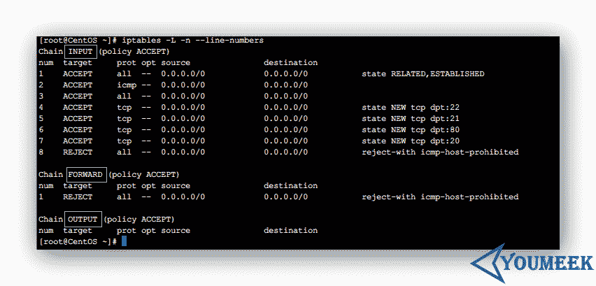

        **图片 20.1** Iptables 服务器配置文件常用参数

    *   要删除 INPUT 里序号为 8 的规则，执行：`sudo iptables -D INPUT 8`
    *   保存配置命令：`sudo service iptables save 或者 sudo /etc/rc.d/init.d/iptables save`
    *   重启服务命令 ：`sudo service iptables restart`
    *   查看服务状态： `sudo service iptables status`
    *   设置开启默认启动： `sudo chkconfig --level 345 iptables on`
    *   清除所有规则(慎用)
    *   `sudo iptables -F`
    *   `sudo iptables -X`
    *   `sudo iptables -Z`
    *   添加规则：格式 `sudo iptables [-AI 链名] [-io 网络接口] [-p 协议] [-s 来源 IP/网域] [-d 目标 IP/网域] -j [ACCEPT|DROP|REJECT|LOG]`
    *   选项与参数：
    *   -AI 链名：针对某的链进行规则的 "插入" 或 "累加"
        *   -A ：新增加一条规则，该规则增加在原本规则的最后面。例如原本已经有四条规则，使用 -A 就可以加上第五条规则！
        *   -I ：插入一条规则。如果没有指定此规则的顺序，默认是插入变成第一条规则。例如原本有四条规则，使用 -I 则该规则变成第一条，而原本四条变成 2~5 号链 ：有 INPUT, OUTPUT, FORWARD 等，此链名称又与 -io 有关，请看底下。
    *   -io 网络接口：设定封包进出的接口规范
        *   -i ：封包所进入的那个网络接口，例如 eth0, lo 等接口。需与 INPUT 链配合；
        *   -o ：封包所传出的那个网络接口，需与 OUTPUT 链配合；
    *   -p 协定：设定此规则适用于哪种封包格式。主要的封包格式有： tcp, udp, icmp 及 all 。
    *   -s 来源 IP/网域：设定此规则之封包的来源项目，可指定单纯的 IP 或包括网域，例如：IP：192.168.0.100，网域：192.168.0.0/24, 192.168.0.0/255.255.255.0 均可。若规范为『不许』时，则加上 ! 即可，例如：-s ! 192.168.100.0/24 表示不许 192.168.100.0/24 之封包来源。
    *   -d 目标 IP/网域：同 -s ，只不过这里指的是目标的 IP 或网域。
    *   -j ：后面接动作，主要的动作有接受(ACCEPT)、丢弃(DROP)、拒绝(REJECT)及记录(LOG)

## Iptables 例子

*   开放指定端口
    *   `sudo iptables -I INPUT -i lo -j ACCEPT` #允许本地回环接口(即运行本机访问本机)
    *   `sudo iptables -I INPUT -m state --state ESTABLISHED,RELATED -j ACCEPT` # 允许已建立的或相关连的通行
    *   `sudo iptables -I OUTPUT -j ACCEPT` #允许所有本机向外的访问
    *   `sudo iptables -A INPUT -p tcp -m tcp --dport 22 -j ACCEPT` # 允许访问 22 端口
    *   `sudo iptables -A INPUT -p tcp -m tcp --dport 80 -j ACCEPT` #允许访问 80 端口
    *   `sudo iptables -A INPUT -p tcp -m tcp --dport 8080 -j ACCEPT` #允许访问 8080 端口
    *   `sudo iptables -A INPUT -p tcp -m tcp --dport 21 -j ACCEPT` #允许 FTP 服务的 21 端口
    *   `sudo iptables -A INPUT -p tcp -m tcp --dport 20 -j ACCEPT` #允许 FTP 服务的 20 端口
    *   `sudo iptables -I INPUT -p icmp -m icmp --icmp-type 8 -j ACCEPT` #允许 ping
    *   `sudo iptables -I INPUT -j REJECT` #禁止其他未允许的规则访问（使用该规则前一定要保证 22 端口是开着，不然就连 SSH 都会连不上）
    *   `sudo iptables -I FORWARD -j REJECT`

## Iptables 资料

*   [`wsgzao.github.io/post/iptables/`](https://wsgzao.github.io/post/iptables/)
*   [`www.vpser.net/security/linux-iptables.html`](http://www.vpser.net/security/linux-iptables.html)

# 花生壳 安装

* * *

*   花生壳 安装
    *   CentOS 下过程
    *   资料

## CentOS 下过程

*   官网：[`hsk.oray.com/`](http://hsk.oray.com/)
*   官网下载：[`hsk.oray.com/download/#type=linux`](http://hsk.oray.com/download/#type=linux)
*   官网安装说明：[`service.oray.com/question/1890.html`](http://service.oray.com/question/1890.html)
*   软件包下载：`wget http://download.oray.com/peanuthull/linux/phddns-2.0.6.el6.x86_64.rpm`
*   安装：`sudo yum localinstall -y phddns-2.0.6.el6.x86_64.rpm`
*   配置：
    *   安装完毕后，在终端下运行：`phddns`
    *   第一步：：Enter server address(press ENTER use phddns60.oray.net)，这是提示您输入花生壳服务器的域名，如果网站上没有更新域名的公告说明，这一步直接回车即可，会使用默认的 phddns60.oray.net 域名。
    *   第二步：Enter your Oray account:这是提示您输入在花生壳官网注册的用户名，请根据实际情况输入。
    *   第三步：Password：这是提示您输入在花生壳官网注册的用户名所对应的密码，请根据实际情况输入。
    *   第四步：Network interface(s): 这是要配置您这台服务器的网络参数，花生壳（公网版）软件会自动检查，并输出您的网络情况。eth0 部分可能和上面的不一样，是您的实际网络设置。如果您有两块网卡，eth0 和 eth1 ,而您希望用 eth1 来绑定花生壳，请在这里输入 eth1 ，然后回车。如果您只有一块网卡，或者您希望使用 eth0 来绑定花生壳，在这里直接回车即可。
    *   第五步：Log to use(default /var/log/phddns.log):这是提示您输入花生壳（公网版）软件日志的保存位置，请使用绝对路径指定日志文件名。如果直接回车，会使用 /var/log/phddns.log 来保存日志。
    *   第六步： Save to configuration file (/etc/phlinux.conf)?(yes/no/other): 这是提示您输入上述配置的保存文件名。如果输入 yes 或直接回车，将会使用/etc/phlinux.conf 来作为配置的保存文件名。如果输入 other ，将会提示您自行指定文件名，请使用绝对路径来指定这个配置文件名。如果输入 no ,不对上述配置进行保存,下次重新使用花生壳（公网版）时,需要手动指定配置文件或再次通过交互模式进行设置.
    *   第六步执行完毕后，屏幕上会依次出现：defOnStatusChanged ok，DomainsRegistered，UserType，表示安装、配置完成了
*   启动服务：`/usr/bin/phddns -c /etc/phlinux.conf -d`
*   设置开机启动：`echo "/usr/bin/phddns -c /etc/phlinux.conf -d" >> /etc/rc.local`
*   查看进程：`ps -ef | grep phddns`
*   卸载：
    *   `rpm -qa|grep phddns`
    *   `sudo rpm -e phddns-2.0.6-1.el6.x86_64`

## 资料

*   [`service.oray.com/question/1890.html`](http://service.oray.com/question/1890.html)

# VMware 克隆 CentOS 后网卡信息修改

* * *

很多时候，在我们需要多台 CentOS 虚拟机的时候，对已有虚拟机的系统进行克隆或是复制。但是这样做又有一个问题，克隆出来的虚拟机启动的时候你输入命令：`ifconfig`，eth0 网卡信息没了，只有一个 eth1。 对于处女座的人来讲这是不允许的。所以我们需要改动下.

*   命令：`sudo vim /etc/udev/rules.d/70-persistent-net.rules`

    *   该文件中正常此时应该有两行信息
    *   在文件中把 NAME="eth0″ 的这一行注释掉
    *   对于另一行，把 NAME=”eth1″ 的这一行，把 NAME=”eth1″ 改为 NAME=”eth0″，并且把该行：ATTRS{address}=="00:0c:29:4c:46:01″ 这个属性信息记下来，每台机子都不一样，我这段信息只是例子，你不要直接复制我的。
*   命令：`sudo vim /etc/sysconfig/network-scripts/ifcfg-eth0`

    *   修改 IP 地址
    *   把 HWADDR 的值改为上面要求记下来的：00:0c:29:4c:46:01
*   命令：`nmcli con`

    *   如果显示两行 UUID 的信息的话，复制不是 System eth0 的那个 UUID 值，下面有用。
    *   编辑：`sudo vim /etc/sysconfig/network-scripts/ifcfg-eth0`
    *   把文件中的 UUID 值 改为上面要求复制的 UUID 值。
    *   保存配置文件，重启系统，正常应该是可以了。

# JDK 安装

* * *

*   JDK 安装
    *   CentOS 下过程
    *   资料

## CentOS 下过程

*   JDK 在 CentOS 和 Ubuntu 下安装过程是一样的，所以这里不再讲 Ubuntu 系统下的安装
*   JDK 1.8 下载

    *   此时（20160205）最新版本：`jdk-8u72-linux-x64.tar.gz`
    *   官网：[`www.oracle.com/technetwork/java/javase/downloads/jdk8-downloads-2133151.html`](http://www.oracle.com/technetwork/java/javase/downloads/jdk8-downloads-2133151.html)
    *   百度云下载（64 位）：[`pan.baidu.com/s/1eQZffbW`](http://pan.baidu.com/s/1eQZffbW)
    *   官网压缩包地址：[`211.138.156.198:82/1Q2W3E4R5T6Y7U8I9O0P1Z2X3C4V5B/download.oracle.com/otn-pub/java/jdk/8u72-b15/jdk-8u72-linux-x64.tar.gz`](http://211.138.156.198:82/1Q2W3E4R5T6Y7U8I9O0P1Z2X3C4V5B/download.oracle.com/otn-pub/java/jdk/8u72-b15/jdk-8u72-linux-x64.tar.gz)
    *   在命令行模式下下载上面压缩包：
    *   `cd /opt`
    *   `sudo wget http://211.138.156.198:82/1Q2W3E4R5T6Y7U8I9O0P1Z2X3C4V5B/download.oracle.com/otn-pub/java/jdk/8u72-b15/jdk-8u72-linux-x64.tar.gz`
*   默认 CentOS 有安装 openJDK，建议先卸载掉

    *   检查 JDK 命令：`java -version`
    *   查询本地 JDK 安装程序情况； `rpm -qa|grep java`
    *   我查询出来的结果如下： `java-1.6.0-openjdk-1.6.0.38-1.13.10.0.el6_7.x86_64 java-1.7.0-openjdk-1.7.0.95-2.6.4.0.el6_7.x86_64 tzdata-java-2015g-2.el6.noarch`
    *   卸载上面三个文件（`--nodeps` 的作用：忽略依赖的检查）：
    *   `sudo rpm -e --nodeps java-1.6.0-openjdk-1.6.0.38-1.13.10.0.el6_7.x86_64`
    *   `sudo rpm -e --nodeps java-1.7.0-openjdk-1.7.0.95-2.6.4.0.el6_7.x86_64`
    *   `sudo rpm -e --nodeps tzdata-java-2015g-2.el6.noarch`
*   JDK 1.8 安装

    *   我们以安装 `jdk-8u72-linux-x64.tar.gz` 为例
    *   我个人习惯 `/opt` 目录下创建一个目录 `setups` 用来存放各种软件安装包；在 `/usr` 目录下创建一个 `program` 用来存放各种解压后的软件包，下面的讲解也都是基于此习惯
    *   我个人已经使用了第三方源：`EPEL、RepoForge`，如果你出现 `yum install XXXXX` 安装不成功的话，很有可能就是你没有相关源，请查看我对源设置的文章
    *   解压安装包：`sudo tar -zxvf jdk-8u72-linux-x64.tar.gz`
    *   移到解压包到我个人习惯的安装目录下：`mv jdk1.8.0_72/ /usr/program/`
    *   配置环境变量：
        *   编辑配置文件：`sudo vim /etc/profile`
        *   在该文件的最尾巴，添加下面内容： `JAVA_HOME=/usr/program/jdk1.8.0_72 JRE_HOME=$JAVA_HOME/jre PATH=$PATH:$JAVA_HOME/bin CLASSPATH=.:$JAVA_HOME/lib/dt.jar:$JAVA_HOME/lib/tools.jar export JAVA_HOME export JRE_HOME export PATH export CLASSPATH`
        *   执行命令，刷新该配置（必备操作）：`source /etc/profile`
        *   检查是否使用了最新的 JDK：`java -version`

## 资料

*   [`www.jikexueyuan.com/course/480_1.html?ss=1`](http://www.jikexueyuan.com/course/480_1.html?ss=1)

# Subversion 1.8 安装

* * *

*   Subversion 1.8 安装
    *   RPM 安装（推荐）
    *   编译安装（不推荐）
    *   SVN 配置
    *   SVN 设置提交之后可修改提交的 Message 信息
    *   资料

## RPM 安装（推荐）

*   wandisco 整理的 RPM 文件官网：[`opensource.wandisco.com/centos/6/svn-1.8/RPMS/x86_64/`](http://opensource.wandisco.com/centos/6/svn-1.8/RPMS/x86_64/)
*   下载下面几个 RPM 文件：

    *   创建目录来保存下载的 RPM：`sudo mkdir -p /opt/setups/subversion/ ; cd /opt/setups/subversion/`
    *   `wget http://opensource.wandisco.com/centos/6/svn-1.8/RPMS/x86_64/mod_dav_svn-1.8.15-1.x86_64.rpm`
    *   `wget http://opensource.wandisco.com/centos/6/svn-1.8/RPMS/x86_64/serf-1.3.7-1.x86_64.rpm`
    *   `wget http://opensource.wandisco.com/centos/6/svn-1.8/RPMS/x86_64/subversion-1.8.15-1.x86_64.rpm`
    *   `wget http://opensource.wandisco.com/centos/6/svn-1.8/RPMS/x86_64/subversion-gnome-1.8.15-1.x86_64.rpm`
    *   `wget http://opensource.wandisco.com/centos/6/svn-1.8/RPMS/x86_64/subversion-javahl-1.8.15-1.x86_64.rpm`
    *   `wget http://opensource.wandisco.com/centos/6/svn-1.8/RPMS/x86_64/subversion-perl-1.8.15-1.x86_64.rpm`
    *   `wget http://opensource.wandisco.com/centos/6/svn-1.8/RPMS/x86_64/subversion-python-1.8.15-1.x86_64.rpm`
    *   `wget http://opensource.wandisco.com/centos/6/svn-1.8/RPMS/x86_64/subversion-tools-1.8.15-1.x86_64.rpm`
    *   如果上面的 RPM 链接失效，你也可以考虑下载我提供的百度云盘地址：[`pan.baidu.com/s/1pKnGia3`](http://pan.baidu.com/s/1pKnGia3)
*   安装下载的 RPM 文件：

    *   `sudo rpm -ivh *.rpm`
*   检查安装后的版本：

    *   `svn --version`

## 编译安装（不推荐）

*   subversion 1.8 编译安装（本人没有尝试成功，所以不推荐，下面内容只供参考）
    *   官网安装说明（查找关键字 `Dependency Overview`）：[`svn.apache.org/repos/asf/subversion/trunk/INSTALL`](http://svn.apache.org/repos/asf/subversion/trunk/INSTALL)
    *   此时 1.8 最新版本为：`subversion-1.8.15.tar.gz`
    *   我个人习惯 `/opt` 目录下创建一个目录 `setups` 用来存放各种软件安装包；在 `/usr` 目录下创建一个 `program` 用来存放各种解压后的软件包，下面的讲解也都是基于此习惯
    *   我个人已经使用了第三方源：`EPEL、RepoForge`，如果你出现 `yum install XXXXX` 安装不成功的话，很有可能就是你没有相关源，请查看我对源设置的文章
    *   安装编译所需工具：
        *   `sudo yum install -y gcc gcc-c++ autoconf libtool`
    *   所需依赖包说明：
        *   （必要包）apr 和 apr-util 官网地址：[`archive.apache.org/dist/apr/`](http://archive.apache.org/dist/apr/)
        *   （必要包）zlib 官网地址：<ttp://www.zlib.net/>
        *   （必要包）SQLite 官网地址：[`www.sqlite.org/download.html`](http://www.sqlite.org/download.html)
        *   （必要包）Subversion 官网地址：[`subversion.apache.org/download.cgi`](https://subversion.apache.org/download.cgi)
    *   所需依赖包下载：
        *   apr 下载：`wget http://archive.apache.org/dist/apr/apr-1.5.2.tar.gz`
        *   apr-util 下载：`wget http://archive.apache.org/dist/apr/apr-util-1.5.4.tar.gz`
        *   zlib 下载：`wget http://zlib.net/zlib-1.2.8.tar.gz`
        *   SQLite 下载：`wget http://www.sqlite.org/2016/sqlite-amalgamation-3100200.zip`
        *   Subversion 下载：`wget http://apache.fayea.com/subversion/subversion-1.8.15.tar.gz`
    *   安装依赖包：

        *   apr 安装：
            *   解压：`tar -zxvf apr-1.5.2.tar.gz`
            *   移动到我个人习惯的安装目录下：`mv apr-1.5.2/ /usr/program/`
            *   标准的 GNU 源码安装方式：
                *   `cd /usr/program/apr-1.5.2`
                *   `./configure`
                *   `make`
                *   `make install`
            *   安装完得到安装的配置路径：`/usr/local/apr/bin/apr-1-config`，这个需要记下来，下面会用到
        *   apr-util 安装：
            *   解压：`tar -zxvf apr-util-1.5.4.tar.gz`
            *   移动到我个人习惯的安装目录下：`mv apr-util-1.5.4/ /usr/program/`
            *   标准的 GNU 源码安装方式：
                *   `cd /usr/program/apr-util-1.5.4/`
                *   `./configure --with-apr=/usr/local/apr/bin/apr-1-config`
                *   `make`
                *   `make install`
            *   安装完得到安装的配置路径：`/usr/local/apr/bin/apu-1-config`，这个需要记下来，下面会用到
        *   zlib 安装：
            *   解压：`tar -zxvf zlib-1.2.8.tar.gz`
            *   移动到我个人习惯的安装目录下：`mv zlib-1.2.8/ /usr/program/`
            *   标准的 GNU 源码安装方式：
                *   `cd /usr/program/zlib-1.2.8/`
                *   `./configure`
                *   `make`
                *   `make install`
        *   Subversion 解压：
            *   解压：`tar -zxvf subversion-1.8.15.tar.gz`
            *   移动到我个人习惯的安装目录下：`mv subversion-1.8.15/ /usr/program/`
        *   SQLite 安装：
            *   解压：`unzip sqlite-amalgamation-3100200.zip`
            *   移动到 subversion 目录下：`mv sqlite-amalgamation-3100200/ /usr/program/subversion-1.8.15/`
        *   Subversion 安装：
            *   标准的 GNU 源码安装方式：
                *   `cd /usr/program/subversion-1.8.15/`
                *   `./configure --prefix=/usr/local/subversion --with-apr=/usr/local/apr/bin/apr-1-config --with-apr-util=/usr/local/apr/bin/apu-1-config`
                *   `make`
                *   `make install`

## SVN 配置

*   在系统上创建一个目录用来存储所有的 SVN 文件：`mkdir -p /opt/svn/repo/`
*   新建一个版本仓库：`svnadmin create /opt/svn/repo/`

    *   生成如下目录和文件：
        *   目录：`locks`
        *   目录：`hooks`
        *   目录：`db`
        *   目录：`conf`
        *   文件：`format`
        *   文件：`README.txt`
    *   其中，目录 `conf` 最为重要，常用的配置文件都在里面
        *   `svnserve.conf` 是 svn 服务综合配置文件
        *   `passwd` 是用户名和密码配置文件
        *   `authz` 是权限配置文件
*   设置配置文件

    *   编辑配置文件：`vim /opt/svn/repo/conf/svnserve.conf`
    *   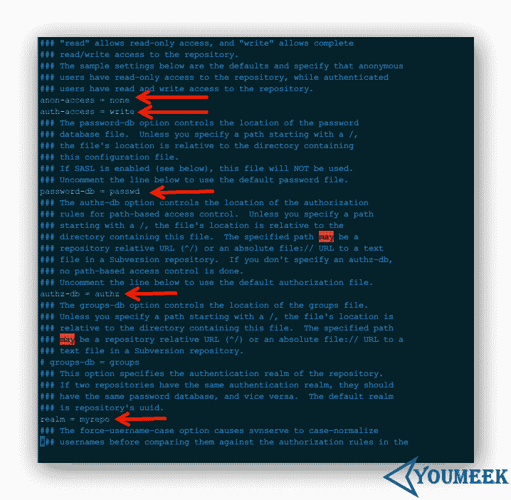

        **图片 24.1** 设置配置文件

    *   配置文件中下面几个参数（默认是注释的）：
        *   `anon-access`： 对不在授权名单中的用户访问仓库的权限控制，有三个可选性：`write、read、none`
            *   `none` 表示没有任何权限
            *   `read` 表示只有只读权限
            *   `write` 表示有读写权限
        *   `auth-access`：对在授权名单中的用户访问仓库的权限控制，有三个可选性：`write、read、none`
            *   `none` 表示没有任何权限
            *   `read` 表示只有只读权限
            *   `write` 表示有读写权限
        *   `password-db`：指定用户数据配置文件
        *   `authz-db`：指定用户权限配置文件
        *   `realm`：指定版本库的认证域，即在登录时提示的认证域名称。若两个版本库的认证域相同，建议使用相同的用户名口令数据文件
            *   当前实例的配置内容：`realm = myrepo`
*   添加用户

    *   编辑配置文件：`vim /opt/svn/repo/conf/passwd`
    *   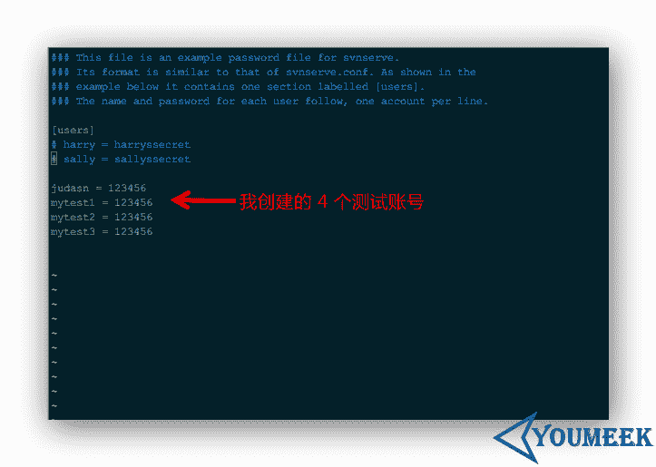

        **图片 24.2** 添加用户

    *   添加用户很简答，如上图所示在配置文中添加一个格式为：`用户名 = 密码` 的即可
*   设置用户权限

    *   编辑配置文件：`vim /opt/svn/repo/conf/authz`
    *   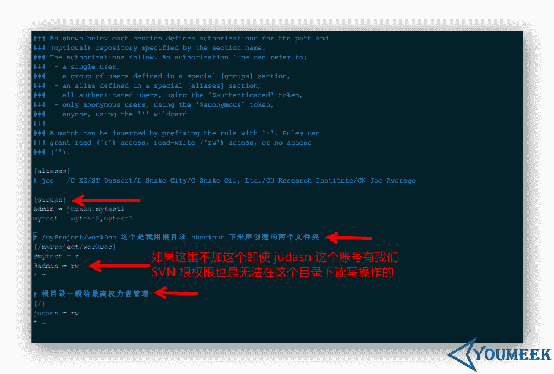

        **图片 24.3** 设置用户权限

    *   配置文件中几个参数解释：
        *   `r` 表示可写
        *   `w` 表示可读
        *   `rw` 表示可读可写
        *   `* =` 表示除了上面设置的权限用户组以外，其他所有用户都设置空权限，空权限表示禁止访问本目录，这很重要一定要加上
        *   `[groups]` 表示下面创建的是用户组，实际应用中一般我们对使用者都是进行分组的，然后把权限控制在组上，这样比较方便。使用组权限方式：`@组名 = rw`
*   启动服务

    *   `svnserve -d -r /opt/svn/repo/ --listen-port 3690`
        *   `-d` 表示后台运行
        *   `-r /opt/svn/repo/` 表示指定根目录
        *   `--listen-port 3690` 表示指定端口，默认就是 3690，所以如果要用默认端口这个也是可以省略掉的
*   停止服务

    *   `killall svnserve`
*   测试

    *   iptables 处理
        *   一种方式：先关闭 iptables，防止出现拦截问题而测试不了：`service iptables stop`
        *   一种方式：在 iptables 中添加允许规则（svn 默认端口是 3690）：
            *   添加规则：`sudo iptables -I INPUT -p tcp -m tcp --dport 3690 -j ACCEPT`
            *   保存规则：`sudo /etc/rc.d/init.d/iptables save`
            *   重启 iptables：`sudo service iptables restart`
    *   在 Windows 的 svn 客户端上访问:`svn://192.168.0.110`

## SVN 设置提交之后可修改提交的 Message 信息

*   默认的 SVN 是无法修改提交后的 Message 信息的，修改会报如下错误：
*   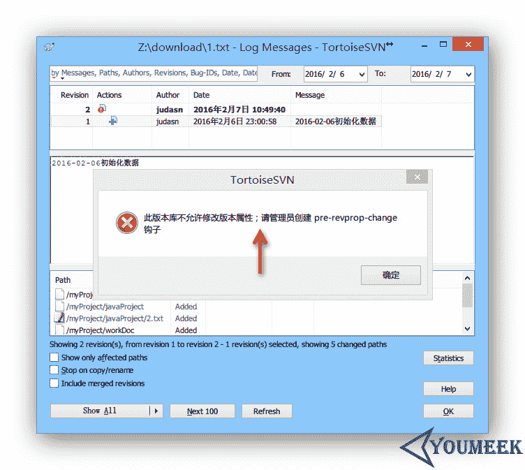

    **图片 24.4** SVN 设置提交之后可修改提交的 Message 信息

*   解决办法：
    *   下载我 hooks 文件：[`pan.baidu.com/s/1c1jtlmw`](http://pan.baidu.com/s/1c1jtlmw)
    *   把 pre-revprop-change 文件放在你的仓库下，比如我仓库地址是：`/opt/svn/repo/hooks`
        *   编辑该文件：`vim /opt/svn/repo/hooks/pre-revprop-change`
        *   把文件尾巴的这句脚本：`echo "$1 $2 $3 $4 $5" >> /opt/svn/repo/logchanges.log`，改为：`echo "$1 $2 $3 $4 $5" >> /你的仓库地址/logchanges.log`
        *   你在该目录下也可以看到一个文件 `pre-revprop-change.tmpl`，这个其实就是 svn 提供给你模板，其他的那些你有兴趣也可以研究下

## 资料

*   [`tecadmin.net/install-subversion-1-8-on-centos-rhel/`](http://tecadmin.net/install-subversion-1-8-on-centos-rhel/)
*   [`svn.apache.org/repos/asf/subversion/trunk/INSTALL`](http://svn.apache.org/repos/asf/subversion/trunk/INSTALL)
*   [`chenpipi.blog.51cto.com/8563610/1613007`](http://chenpipi.blog.51cto.com/8563610/1613007)
*   [`blog.linuxeye.com/348.html`](https://blog.linuxeye.com/348.html)
*   [`jingyan.baidu.com/article/046a7b3efb6a5df9c27fa991.html`](http://jingyan.baidu.com/article/046a7b3efb6a5df9c27fa991.html)
*   [`www.ha97.com/4467.html`](http://www.ha97.com/4467.html)
*   [`blog.feehi.com/linux/7.html`](http://blog.feehi.com/linux/7.html)
*   [`my.oschina.net/lionel45/blog/298305?fromerr=1NdIndN0`](http://my.oschina.net/lionel45/blog/298305?fromerr=1NdIndN0)
*   [`www.centoscn.com/CentosServer/ftp/2015/0622/5708.html`](http://www.centoscn.com/CentosServer/ftp/2015/0622/5708.html)
*   [`blog.csdn.net/tianlesoftware/article/details/6119231`](http://blog.csdn.net/tianlesoftware/article/details/6119231)
*   [`www.scmeye.com/thread-419-1-1.html`](http://www.scmeye.com/thread-419-1-1.html)
*   [`m.blog.csdn.net/article/details?id=7908907`](http://m.blog.csdn.net/article/details?id=7908907)
*   设置可编辑提交信息：[`stackoverflow.com/questions/692851/can-i-go-back-and-edit-comments-on-an-svn-checkin`](http://stackoverflow.com/questions/692851/can-i-go-back-and-edit-comments-on-an-svn-checkin)