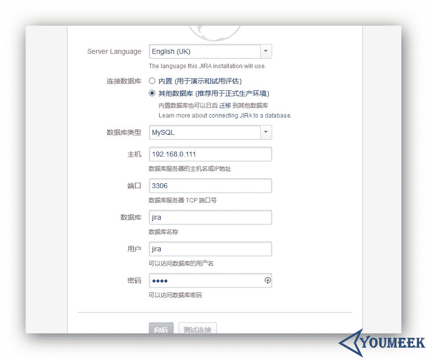
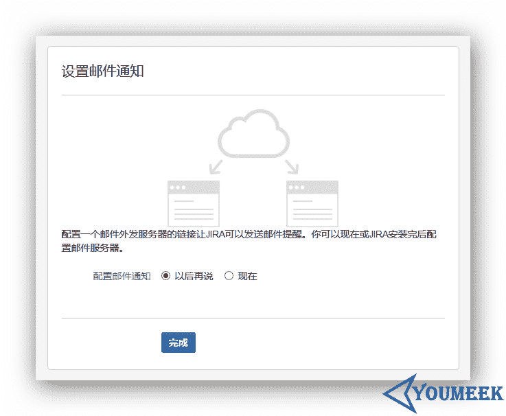

# 二十八、Nexus 安装和配置

## Nexus 安装

*   Nexus 安装

    *   官网：[`www.sonatype.org/nexus/`](http://www.sonatype.org/nexus/)
    *   官网下载：[`www.sonatype.org/nexus/archived/`](http://www.sonatype.org/nexus/archived/)
    *   此时（20160207） Nexus 最新版本为：**2.12.0-01**
    *   JDK 要求是 JDK 7，官网要求 7u6 或之后版本，包括 JDK 8
    *   官网帮助说明 1：[`books.sonatype.com/nexus-book/2.11/reference/install.html`](http://books.sonatype.com/nexus-book/2.11/reference/install.html)
    *   官网帮助说明 2：[`books.sonatype.com/sonatype-clm-book/html/clm-book/installation-configuration.html`](http://books.sonatype.com/sonatype-clm-book/html/clm-book/installation-configuration.html)
    *   我个人习惯 `/opt` 目录下创建一个目录 `setups` 用来存放各种软件安装包；在 `/usr` 目录下创建一个 `program` 用来存放各种解压后的软件包，下面的讲解也都是基于此习惯
    *   我个人已经使用了第三方源：`EPEL、RepoForge`，如果你出现 `yum install XXXXX` 安装不成功的话，很有可能就是你没有相关源，请查看我对源设置的文章
    *   压缩包下载（由于国内网络的原因不排除你下载不了）：`wget http://download.sonatype.com/nexus/oss/nexus-2.12.0-01-bundle.tar.gz`
    *   如果地址下载不了，那是因为你需要开 VPN，你也可以选择降低要求下载 2.11.4-01 版本：[`pan.baidu.com/s/1mgSNJtA`](http://pan.baidu.com/s/1mgSNJtA)

        *   解压压缩包：`tar zxvf nexus-2.11.4-01-bundle.tar.gz`
            *   解压出来有两个文件夹：
            *   这是程序目录：`nexus-2.11.4-01`
            *   这是仓库目录：`sonatype-work`
        *   移到目录到我的安装目录下：`mv nexus-2.11.4-01/ /usr/program/`
        *   进入安装目录：`cd /usr/program/`
        *   把目录名字改为更好看点：`mv nexus-2.11.4-01/ nexus2.11.4/`
        *   编辑系统配置文件：`vim /etc/profile`
        *   在文件的尾巴增加下面内容：

        ``` ini

        # 第二十八章 Nexus

        NEXUS_HOME=/usr/program/nexus2.11.4 export NEXUS_HOME RUN_AS_USER=root export RUN_AS_USER ```

        *   刷新配置：`source /etc/profile`
        *   由于目录 `sonatype-work` 以后是做仓库用的，会存储很多 jar，所以这个目录一定要放在磁盘空间大的区内，目前我们还没第一次启动 Nexus，所以这里还是空文件
            *   我个人习惯把这类目录放在 `/opt` 下，所以你要特别注意，下面有内容对这个文件夹进行操作的都是基于 opt 目录的：`mv /opt/setup/sonatype-work/ /opt/`
            *   设置配置文件：`vim /usr/program/nexus2.11.4/conf/nexus.properties`
                *   把文件中该值：`nexus-work=${bundleBasedir}/../sonatype-work/nexus`
                *   改为：`nexus-work=/opt/sonatype-work/nexus`
        *   默认情况下如果你的 JDK 等系统变量设置好的是无需编辑 Nexus 的配置文件，但是这里还是给大家一下配置文件路径：`vim /usr/program/nexus2.11.4/bin/jsw/conf/wrapper.conf`
        *   开放防火墙端口：
            *   添加规则：`sudo iptables -I INPUT -p tcp -m tcp --dport 8081 -j ACCEPT`
            *   保存规则：`sudo /etc/rc.d/init.d/iptables save`
            *   重启 iptables：`sudo service iptables restart`
    *   测试安装结果：
        *   启动 Nexus：`/usr/program/nexus2.11.4/bin/nexus start`
        *   查看启动日志：`tail -200f /usr/program/nexus2.11.4/logs/wrapper.log`
        *   关闭 Nexus：`/usr/program/nexus2.11.4/bin/nexus stop`
        *   访问：http://192.168.0.110:8081/nexus
        *   登录账号密码：
            *   账号密码：**admin**
            *   密码：**admin123**

## Nexus 配置

*   修改默认端口：`vim /usr/program/nexus2.11.4/conf/nexus.properties`，修改该值：application-port=8081
*   下载远程中央库的索引到服务器
    *   

        **图片 28.1** Nexus 配置

    *   如上图标注 4 所示，把默认是 `False` 改为 `True`
    *   

        **图片 28.2** Nexus 配置

    *   如上图 gif 所示，创建任务开始进行索引下载。需要特别提醒的是，如果你的私服是虚拟机，那得保证你分配的硬盘足够大，别像我一样吝啬只给 10 G（现在还剩下 1.9 G），结果报：**设备上没有空间**
*   项目上配置链接连接私服（下面内容涉及到 maven 的基础知识，请自行私下学习）：
    *   对项目独立设置：
        *   打开项目的 pom.xml 文件：
        *   添加下面内容： `xml <repositories> <repository> <id>Nexus</id> <name>虚拟机-192.168.0.110-Nexus</name> <url>http://192.168.0.110:8081/nexus/content/groups/public/</url> </repository> </repositories>`
    *   对全局配置进行设置：
        *   打开 maven 的 settings.xml 文件：
        *   添加下面内容： `xml <mirrors> <mirror> <id>YouMeekNexus</id> <name>YouMeek Nexus</name> <mirrorOf>*</mirrorOf> <url>http://192.168.0.110:8081/nexus/content/groups/public/</url> </mirror> </mirrors>`

## 持续集成自动构建后发布到 Nexus 上

*   在 Maven 的 settings.xml 加上连接服务器信息：

```
<!--设置私库认证信息，用户名和密码我就用默认的，如果你们有权限控制的需求可以创建对应的一些账号-->  
<servers>  
    <server>  
        <id>nexus-releases</id>  
        <username>admin</username>  
        <password>admin123</password>  
    </server>  
    <server>  
        <id>nexus-snapshots</id>  
        <username>admin</username>  
        <password>admin123</password>  
    </server>  
</servers>
```

*   在项目的 pom.xml 文件加上：

```
<!-- nexus-releases nexus-snapshots 与 Maven 的配置文件 settings.xml 中 server 下的 id 对应 -->  
<distributionManagement>  
    <repository>  
        <id>nexus-releases</id>  
        <name>Nexus Releases Repository</name>  
        <url>http://192.168.0.110:8081/nexus/content/repositories/releases/</url>  
    </repository>  
    <snapshotRepository>  
        <id>nexus-snapshots</id>  
        <name>Nexus Snapshots Repository</name>  
        <url>http://192.168.0.110:8081/nexus/content/repositories/snapshots/</url>  
    </snapshotRepository>  
</distributionManagement>
```

## Nexus 手动更新索引文件

*   手动更新索引
    *   关闭 Nexus：`/usr/program/nexus2.11.4/bin/nexus stop`
    *   命令：`cd /opt/sonatype-work/nexus/indexer/central-ctx`
        *   删除里面默认的文件：`rm -rf *`
    *   访问官网索引：[`repo.maven.apache.org/maven2/.index/`](http://repo.maven.apache.org/maven2/.index/)
        *   下载文件：**nexus-maven-repository-index.gz**：`wget http://repo.maven.apache.org/maven2/.index/nexus-maven-repository-index.gz`
        *   下载文件：**nexus-maven-repository-index.properties**：`wget http://repo.maven.apache.org/maven2/.index/nexus-maven-repository-index.properties`
        *   下载索引解压工具：`wget https://repo1.maven.org/maven2/org/apache/maven/indexer/indexer-cli/5.1.1/indexer-cli-5.1.1.jar`
        *   执行解压命令（该命令执行需要 4 分钟左右）：`java -jar indexer-cli-5.1.0.jar -u nexus-maven-repository-index.gz -d ./`
        *   删除解压前文件：`rm -rf indexer-cli-5.1.0.jar nexus-maven-repository-index.gz nexus-maven-repository-index.properties`
        *   重启服务：`/usr/program/nexus2.11.4/bin/nexus start`

## 资料

*   [`www.cnblogs.com/leefreeman/p/4211530.html`](http://www.cnblogs.com/leefreeman/p/4211530.html)
*   [`www.itdadao.com/article/89071/`](http://www.itdadao.com/article/89071/)
*   [`blog.zhaojunling.me/p/17`](http://blog.zhaojunling.me/p/17)
*   [`m.blog.csdn.net/article/details?id=49228873`](http://m.blog.csdn.net/article/details?id=49228873)
*   [`mritd.me/2015/12/29/Nexus-2-11-CentOS%E6%90%AD%E5%BB%BA%E6%95%99%E7%A8%8B/`](http://mritd.me/2015/12/29/Nexus-2-11-CentOS%E6%90%AD%E5%BB%BA%E6%95%99%E7%A8%8B/)
*   [`mritd.me/2015/12/28/Nexus-%E7%A7%81%E6%9C%8D%E4%BD%BF%E7%94%A8%E6%95%99%E7%A8%8B/`](http://mritd.me/2015/12/28/Nexus-%E7%A7%81%E6%9C%8D%E4%BD%BF%E7%94%A8%E6%95%99%E7%A8%8B/)
*   [`my.oschina.net/liangbo/blog/195739`](http://my.oschina.net/liangbo/blog/195739)
*   [`www.mamicode.com/info-detail-1016489.html`](http://www.mamicode.com/info-detail-1016489.html)
*   [`blog.csdn.net/shawyeok/article/details/23564681`](http://blog.csdn.net/shawyeok/article/details/23564681)
*   [`zyjustin9.iteye.com/blog/2017321`](http://zyjustin9.iteye.com/blog/2017321)

# Mysql 安装和配置

* * *

*   Mysql 安装和配置
    *   Mysql 安装
    *   Mysql 配置
    *   资料

## Mysql 安装

*   Mysql 安装
    *   官网：[`www.mysql.com/`](http://www.mysql.com/)
    *   官网下载：[`dev.mysql.com/downloads/mysql/`](http://dev.mysql.com/downloads/mysql/)
    *   官网 5.5 下载：[`dev.mysql.com/downloads/mysql/5.5.html#downloads`](http://dev.mysql.com/downloads/mysql/5.5.html#downloads)
    *   官网 5.6 下载：[`dev.mysql.com/downloads/mysql/5.6.html#downloads`](http://dev.mysql.com/downloads/mysql/5.6.html#downloads)
    *   官网 5.7 下载：[`dev.mysql.com/downloads/mysql/5.7.html#downloads`](http://dev.mysql.com/downloads/mysql/5.7.html#downloads)
    *   官网帮助中心：[`dev.mysql.com/doc/refman/5.6/en/source-installation.html`](http://dev.mysql.com/doc/refman/5.6/en/source-installation.html)
    *   此时（20160210） Mysql 5.5 最新版本为：**5.5.48**
    *   此时（20160210） Mysql 5.6 最新版本为：**5.6.29**
    *   此时（20160210） Mysql 5.7 最新版本为：**5.7.11**
    *   我个人习惯 `/opt` 目录下创建一个目录 `setups` 用来存放各种软件安装包；在 `/usr` 目录下创建一个 `program` 用来存放各种解压后的软件包，下面的讲解也都是基于此习惯
    *   我个人已经使用了第三方源：`EPEL、RepoForge`，如果你出现 `yum install XXXXX` 安装不成功的话，很有可能就是你没有相关源，请查看我对源设置的文章
    *   Mysql 5.6 下载：`wget http://dev.mysql.com/get/Downloads/MySQL-5.6/mysql-5.6.29.tar.gz` （大小：31 M）
    *   Mysql 5.7 下载：`wget http://dev.mysql.com/get/Downloads/MySQL-5.7/mysql-5.7.11.tar.gz` （大小：47 M）
    *   我们这次安装以 5.6 为实例
        *   解压压缩包：`tar zxvf mysql-5.6.29.tar.gz`
        *   移到解压包：`mv mysql-5.6.29/ /usr/program/`
        *   安装依赖包、编译包：`yum install -y make gcc-c++ cmake bison-devel ncurses-devel`
        *   进入解压目录：`cd /usr/program/mysql-5.6.29/`
        *   生成安装目录：`mkdir -p /usr/program/mysql/data`
        *   生成配置：`sudo cmake -DCMAKE_INSTALL_PREFIX=/usr/program/mysql -DMYSQL_DATADIR=/usr/program/mysql/data -DMYSQL_UNIX_ADDR=/tmp/mysql.sock -DDEFAULT_CHARSET=utf8 -DDEFAULT_COLLATION=utf8_general_ci -DWITH_EXTRA_CHARSETS:STRING=utf8 -DWITH_MYISAM_STORAGE_ENGINE=1 -DWITH_INNOBASE_STORAGE_ENGINE=1 -DENABLED_LOCAL_INFILE=1`
            *   更多参数说明可以查看：[`dev.mysql.com/doc/refman/5.6/en/source-configuration-options.html`](http://dev.mysql.com/doc/refman/5.6/en/source-configuration-options.html)
        *   编译：`sudo make`，这个过程比较漫长，一般都在 30 分钟左右，具体还得看机子配置，如果最后结果有 error，建议删除整个 mysql 目录后重新解压一个出来继续处理
        *   安装：`sudo make install`
        *   配置开机启动：
            *   `sudo cp /usr/program/mysql-5.6.29/support-files/mysql.server /etc/init.d/mysql`
            *   `sudo chmod 755 /etc/init.d/mysql`
            *   `sudo chkconfig mysql on`
        *   初始化数据库：`sudo /usr/program/mysql/scripts/mysql_install_db --basedir=/usr/program/mysql --datadir=/usr/program/mysql/data --skip-name-resolve --user=mysql`
        *   复制一份配置文件： `sudo cp /usr/program/mysql-5.6.29/support-files/my-default.cnf /etc/my.cnf`
        *   删除安装的目录：`rm -rf /usr/program/mysql-5.6.29/`
        *   添加组和用户及安装目录权限
            *   `sudo groupadd mysql` #添加组
            *   `sudo useradd -g mysql mysql -s /bin/false` #创建用户 mysql 并加入到 mysql 组，不允许 mysql 用户直接登录系统
            *   `sudo chown -R mysql:mysql /usr/program/mysql/data` #设置 MySQL 数据库目录权限
        *   启动 Mysql 服务器：`service mysql start`
        *   查看是否已经启动了：`ps aux | grep mysql`
        *   常用命令软连接，才可以在终端直接使用：mysql 和 mysqladmin 命令
            *   `sudo ln -s /usr/program/mysql/bin/mysql /usr/bin`
            *   `sudo ln -s /usr/program/mysql/bin/mysqladmin /usr/bin`

## 资料

*   [`www.cnblogs.com/xiongpq/p/3384681.html`](http://www.cnblogs.com/xiongpq/p/3384681.html)

# Redis 安装和配置

* * *

*   Redis 安装和配置
    *   Redis 安装
    *   Redis 配置
    *   资料

## Redis 安装

*   Redis 安装
    *   官网：[`redis.io/`](http://redis.io/)
    *   官网下载：[`redis.io/download`](http://redis.io/download)
    *   此时（20160212） Redis 最新稳定版本为：**3.0.7**
    *   官网帮助中心：[`redis.io/documentation`](http://redis.io/documentation)
    *   我个人习惯 `/opt` 目录下创建一个目录 `setups` 用来存放各种软件安装包；在 `/usr` 目录下创建一个 `program` 用来存放各种解压后的软件包，下面的讲解也都是基于此习惯
    *   我个人已经使用了第三方源：`EPEL、RepoForge`，如果你出现 `yum install XXXXX` 安装不成功的话，很有可能就是你没有相关源，请查看我对源设置的文章
    *   Redis 下载：`wget http://download.redis.io/releases/redis-3.0.7.tar.gz` （大小：1.4 M）
        *   安装依赖包：`yum install -y gcc-c++ tcl`
        *   解压：`tar zxvf redis-3.0.7.tar.gz`
        *   移动到我个人安装目录：`mv redis-3.0.7/ /usr/program/`
        *   进入解压后目录：`cd /usr/program/redis-3.0.7/`
        *   编译：`make`
        *   编译安装：`make install`
            *   安装完之后会在：`/usr/local/bin` 目录下生成好几个 redis 相关的文件
        *   复制配置文件：`cp /usr/program/redis-3.0.7/redis.conf /etc/`
        *   修改配置：`vim /etc/redis.conf`
            *   把旧值：`daemonize no`
            *   改为新值：`daemonize yes`
        *   启动：`/usr/local/bin/redis-server /etc/redis.conf`
        *   查看是否启动：`ps -ef | grep redis`
        *   进入客户端：`redis-cli`
        *   关闭客户端：`redis-cli shutdown`
        *   清空数据：`redis-cli flushdb`
        *   开机启动配置：`echo "/usr/local/bin/redis-server /etc/redis.conf" >> /etc/rc.local`
        *   开放防火墙端口：
            *   添加规则：`sudo iptables -I INPUT -p tcp -m tcp --dport 6379 -j ACCEPT`
            *   保存规则：`sudo /etc/rc.d/init.d/iptables save`
            *   重启 iptables：`sudo service iptables restart`

## 资料

*   [`yanshisan.blog.51cto.com/7879234/1377992`](http://yanshisan.blog.51cto.com/7879234/1377992)
*   [`segmentfault.com/a/1190000002685224`](https://segmentfault.com/a/1190000002685224)
*   [`itbilu.com/linux/management/4kB2ninp.html`](http://itbilu.com/linux/management/4kB2ninp.html)
*   [`keenwon.com/1335.html`](http://keenwon.com/1335.html)

# Jira 安装和配置

* * *

*   Jira 安装和配置
    *   Jira 安装
    *   Jira 配置
    *   资料

## Jira 安装

*   Jira 安装
    *   官网：[`www.atlassian.com/software/jira`](https://www.atlassian.com/software/jira)
    *   官网下载：[`www.atlassian.com/software/jira/download`](https://www.atlassian.com/software/jira/download)
    *   中文在线试用：[`www.jira.cn/secure/Dashboard.jspa`](http://www.jira.cn/secure/Dashboard.jspa)
    *   官网帮助说明：[`confluence.atlassian.com/jira/installing-jira-on-linux-191501165.html`](https://confluence.atlassian.com/jira/installing-jira-on-linux-191501165.html)
    *   官网中文语言包：[`translations.atlassian.com/dashboard/download?lang=zh_CN#/JIRA/6.3.6`](https://translations.atlassian.com/dashboard/download?lang=zh_CN#/JIRA/6.3.6)
    *   Jira 6.3.6 网盘下载：[`pan.baidu.com/s/1eRjrz5C`](http://pan.baidu.com/s/1eRjrz5C)
    *   Jira 6.3.6 中文语言包网盘下载：[`pan.baidu.com/s/1i3VEsC1`](http://pan.baidu.com/s/1i3VEsC1)
    *   环境要求：
        *   JDK 7 或更新版本；
        *   Mysql
    *   我们要使用的版本：**atlassian-jira-6.3.6.tar.gz**
    *   我个人习惯 `/opt` 目录下创建一个目录 `setups` 用来存放各种软件安装包；在 `/usr` 目录下创建一个 `program` 用来存放各种解压后的软件包，下面的讲解也都是基于此习惯
    *   我个人已经使用了第三方源：`EPEL、RepoForge`，如果你出现 `yum install XXXXX` 安装不成功的话，很有可能就是你没有相关源，请查看我对源设置的文章
    *   解压：`tar zxvf atlassian-jira-6.3.6.tar.gz`
    *   修改目录名：`mv atlassian-jira-6.3.6/ jira6.3.6/`
    *   移到我个人的安装目录下：`mv jira6.3.6/ /usr/program/`
    *   创建存放数据目录：`mkdir -p /usr/program/jira6.3.6/data/`
    *   设置环境变量：
        *   编辑：`vim /etc/profile`
        *   在文件尾部添加： `ini JIRA_HOME=/usr/program/jira6.3.6/data/ export JIRA_HOME`
        *   刷新配置：`source /etc/profile`
    *   运行：`/usr/program/jira6.3.6/bin/start-jira.sh`
    *   访问：`http://192.168.0.111:8080/`
    *   汉化：`cp JIRA-6.3.6-language-pack-zh_CN.jar /usr/program/jira6.3.6/atlassian-jira/WEB-INF/lib/`
    *   配置过程：
        *   

            **图片 31.1** Jira 安装和配置

        *   

            **图片 31.2** Jira 安装和配置

        *   

            **图片 31.3** Jira 安装和配置

        *   

            **图片 31.4** Jira 安装和配置

        *   

            **图片 31.5** Jira 安装和配置

        *   

            **图片 31.6** Jira 安装和配置

    *   重新激活页面地址：`http://192.168.0.111:8090/secure/admin/ViewLicense.jspa`

# Jenkins 安装和配置

* * *

*   Jenkins 安装和配置
    *   Jenkins 安装
    *   Jenkins 配置
    *   资料

## Jenkins 安装

*   Jenkins 安装

    *   官网：[`jenkins-ci.org/`](http://jenkins-ci.org/)
    *   官网帮助中心：[`wiki.jenkins-ci.org/display/JENKINS/Use+Jenkins`](https://wiki.jenkins-ci.org/display/JENKINS/Use+Jenkins)
    *   官网使用 Tomcat 部署方式指导：[`wiki.jenkins-ci.org/display/JENKINS/Tomcat`](https://wiki.jenkins-ci.org/display/JENKINS/Tomcat)
    *   此时（20160207） Jenkins 最新版本为：**1.647**
    *   JDK 最低要求是 JDK 7，官网推荐是 JDK 8
    *   我个人习惯 `/opt` 目录下创建一个目录 `setups` 用来存放各种软件安装包；在 `/usr` 目录下创建一个 `program` 用来存放各种解压后的软件包，下面的讲解也都是基于此习惯
    *   我个人已经使用了第三方源：`EPEL、RepoForge`，如果你出现 `yum install XXXXX` 安装不成功的话，很有可能就是你没有相关源，请查看我对源设置的文章
    *   Jenkins 下载：`wget http://mirrors.jenkins-ci.org/war/latest/jenkins.war` （大小：61 M）
        *   我们假设这个 Tomcat 就是为了 Jenkins 专用的
        *   把下载下来的 jenkins.war 移到 Tomcat 的 webapps 目录下，比如我的是：`/usr/program/tomcat8/webapps`
        *   把 Jenkins.war 改名为 ROOT.war：`mv jenkins.war ROOT.war`
        *   删除 Tomcat 下 webapps 目录下多余的一些目录
        *   首次启动 Tomcat，让 Tomcat 解压 war
        *   设置 JENKINS_HOME：
            *   寻找 jenkins home 目录地址：`find / -name .jenkins`，我这边得到的结果是：`/root/.jenkins`
            *   对在 Tomcat 文章中讲解的系统变量 `CATALINA_OPTS` 进行设置：
                *   旧值： `CATALINA_OPTS="-server -Xms528m -Xmx528m -XX:PermSize=256m -XX:MaxPermSize=358m" export CATALINA_OPTS`
                *   改为： `CATALINA_OPTS="-server -DJENKINS_HOME=/root/.jenkins -Xms528m -Xmx528m -XX:PermSize=256m -XX:MaxPermSize=358m" export CATALINA_OPTS`
*   Jenkins 各个组件配置：

    *   访问：[`192.168.0.110:8080/configure`](http://192.168.0.110:8080/configure)
*   其他问题

    *   如果访问的时候报这个异常：`java.net.UnknownHostException`，可以查看这篇文章：[`stackoverflow.com/questions/4969156/java-net-unknownhostexception`](http://stackoverflow.com/questions/4969156/java-net-unknownhostexception)

## 资料

*   [`stackoverflow.com/questions/4969156/java-net-unknownhostexception`](http://stackoverflow.com/questions/4969156/java-net-unknownhostexception)