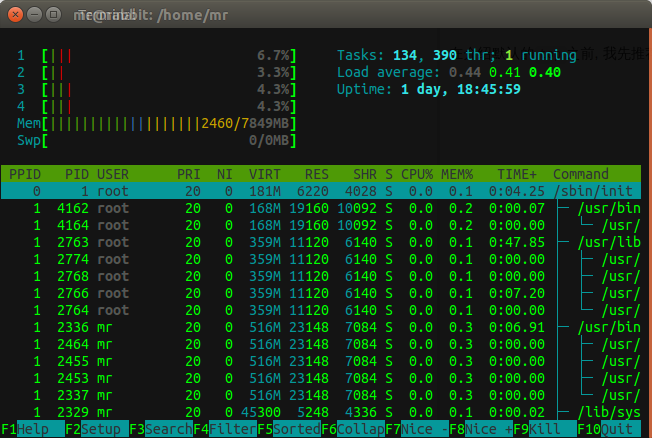

# 第十二章 - 系统性能监控

这一章介绍了十几个关于系统监控的命令.

~~最后一章啦!果真在图书馆效率就是高~(其实是因为没 WIFI...)~~

# Hack-89 Free 命令

## Free 命令

`free`命令显示系统的内存和交换空间的使用状态.

语法:

```
free [options] 
```

几个参数:

*   `-m` 以 MB 为单位显示
*   `-g` 以 GB 为单位显示
*   `-h` 以易读的方式显示
*   `-t` 显示统计行

# Hack-90 Top 命令

## Top 命令

在介绍默认的`top`之前, 我先推荐另一款软件 -- `htop`.



足够酷炫了吧!

### 开始正题 -- `top`

`top`实时显示当前 CPU 运行状态, 内存使用状态, 系统负载状态, 进程列表等.

显示的东西有点多(乱):

```
top - 18:39:29 up 1 day, 18:51,  2 users,  load average: 0.26, 0.37, 0.40
Tasks: 241 total,   1 running, 240 sleeping,   0 stopped,   0 zombie
%Cpu(s):  2.3 us,  1.5 sy,  0.0 ni, 96.0 id,  0.2 wa,  0.0 hi,  0.0 si,  0.0 st
KiB Mem:   8038040 total,  6211228 used,  1826812 free,   356876 buffers
KiB Swap:        0 total,        0 used,        0 free.  3331852 cached Mem

 PID  USER      PR  NI    VIRT    RES    SHR S  %CPU %MEM     TIME+ COMMAND
 1099 root      20   0  286560   9000   6432 S   0.0  0.1   0:01.21 polkitd
 1137 mysql     20   0    4476   1692   1536 S   0.0  0.0   0:00.00 mysqld_safe
 1146 kernoops  20   0   45276   2680   2304 S   0.0  0.0   0:00.71 kerneloops 
```

截取了完整输出的一小段.

第一行, 显示我们的系统开机了多长时间, 几个用户登陆了, 系统负载是多少.

第二行, 显示当前有多少个进程, 有几个正在运行, 几个休眠, 几个停止, 以及几个变成了僵尸进程.

第三行, 显示了主机的 CPU 状态, 使用, 空闲.

第四行, 显示了主机的内存状态, 第五行显示了交换空间的使用状态.

以下的那些则是系统的进程. 默认是按照 CPU 的使用情况来排序的.

#### 按照内存使用来排序

在`top`中按下`f`键, 然后通过上下键选择`%MEM`, 再按`s`键选择.

搞定.

#### 显示额外的列

按下`f`后再用上下键移动到你想显示的字段中, 按下空格即可.

#### 显示程序的路径信息

在`top`中按下`c`键.

```
 2542 mr        20   0 1536232 336920  73396 S   8.0  4.2  45:35.55 compiz                                                                                               
10713 mr        20   0 2767056 117704  32788 S   6.0  1.5   2:55.83 C:\Program Files (x86)\Netease\CloudMusic\cloudmusic.exe                                             
 1847 root      20   0  532248 139948 100560 S   4.7  1.7  32:37.36 /usr/bin/X -core :0 -seat seat0 -auth /var/run/lightdm/root/:0 -nolisten tcp vt7 -novtswitch         
 2659 mr         9 -11  501300  13680  10060 S   2.7  0.2  31:16.66 /usr/bin/pulseaudio --start --log-target=syslog 
```

每一行都显示了程序的路径信息.

#### 显示每一个 CPU 核心

按下`1`(数字 1).

```
top - 18:58:39 up 1 day, 19:10,  2 users,  load average: 0.31, 0.39, 0.40
Tasks: 241 total,   1 running, 240 sleeping,   0 stopped,   0 zombie
%Cpu0  :  6.6 us,  7.3 sy,  0.0 ni, 81.1 id,  5.0 wa,  0.0 hi,  0.0 si,  0.0 st
%Cpu1  :  6.3 us,  2.0 sy,  0.0 ni, 91.1 id,  0.7 wa,  0.0 hi,  0.0 si,  0.0 st
%Cpu2  :  7.0 us,  2.7 sy,  0.0 ni, 90.3 id,  0.0 wa,  0.0 hi,  0.0 si,  0.0 st
%Cpu3  :  6.0 us,  2.3 sy,  0.0 ni, 91.6 id,  0.0 wa,  0.0 hi,  0.0 si,  0.0 st
KiB Mem:   8038040 total,  6255324 used,  1782716 free,   357560 buffers
KiB Swap:        0 total,        0 used,        0 free.  3346672 cached Mem 
```

可以看到这台主机有四个核心.

# Hack-91 Df 命令

## Df 命令

`df`命令是用来查看磁盘空间的.

嗯... 作者把他放到这里想必是用来监控磁盘使用情况的...

几个例子:

```
# df –h
➤ df -h
Filesystem      Size  Used Avail Use% Mounted on
udev            3.9G     0  3.9G   0% /dev
tmpfs           785M  9.5M  776M   2% /run
/dev/dm-1       110G   76G   29G  73% /
tmpfs           3.9G   26M  3.9G   1% /dev/shm
tmpfs           5.0M  4.0K  5.0M   1% /run/lock
tmpfs           3.9G     0  3.9G   0% /sys/fs/cgroup
/dev/sda2       237M   63M  162M  28% /boot
/dev/sda1        47M  3.4M   43M   8% /boot/efi
cgmfs           100K     0  100K   0% /run/cgmanager/fs
tmpfs           785M   96K  785M   1% /run/user/1000 
```

`-h` 以人性化的方式显示.

```
➤ df -Th
Filesystem     Type      Size  Used Avail Use% Mounted on
udev           devtmpfs  3.9G     0  3.9G   0% /dev
tmpfs          tmpfs     785M  9.5M  776M   2% /run
/dev/dm-1      ext4      110G   76G   29G  73% /
tmpfs          tmpfs     3.9G   26M  3.9G   1% /dev/shm
tmpfs          tmpfs     5.0M  4.0K  5.0M   1% /run/lock
tmpfs          tmpfs     3.9G     0  3.9G   0% /sys/fs/cgroup
/dev/sda2      ext2      237M   63M  162M  28% /boot
/dev/sda1      vfat       47M  3.4M   43M   8% /boot/efi
cgmfs          tmpfs     100K     0  100K   0% /run/cgmanager/fs
tmpfs          tmpfs     785M   96K  785M   1% /run/user/1000 
```

`-T`显示分区的格式.

# Hack-92 Du 命令

## Du 命令

`du` -- 显示目录及其内文件的大小.

这个命令也是很常用的.

```
➤ !du
du -h
204K    ./apt
4.0K    ./sysstat
3.9M    ./account
4.0K    ./samba
4.0K    ./unattended-upgrades
8.0K    ./cups
32K     ./mysql
4.0K    ./upstart
12K     ./fsck
4.0K    ./dist-upgrade
52K     ./lightdm
57M     .
➤ 
```

更多信息 - `man du`

# Hack-93 Lsof 命令

## Lsof 命令

`lsof`, **ls** **o**pen **f**iles.

列举当前打开的文件, 文件也包括网络连接(socket 文件),设备文件, 以及目录文件.

`lsof`的输出包括了如下几列:

```
➤ lsof | head
COMMAND     PID   TID             USER   FD      TYPE             DEVICE SIZE/OFF       NODE NAME
systemd       1                   root  cwd   unknown                                        /proc/1/cwd (readlink: Permission denied)
systemd       1                   root  rtd   unknown                                        /proc/1/root (readlink: Permission denied)
systemd       1                   root  txt   unknown                                        /proc/1/exe (readlink: Permission denied)
systemd       1                   root NOFD                                                  /proc/1/fd (opendir: Permission denied)
kthreadd      2                   root  cwd   unknown                                        /proc/2/cwd (readlink: Permission denied)
kthreadd      2                   root  rtd   unknown                                        /proc/2/root (readlink: Permission denied)
kthreadd      2                   root  txt   unknown                                        /proc/2/exe (readlink: Permission denied)
kthreadd      2                   root NOFD                                                  /proc/2/fd (opendir: Permission denied)
ksoftirqd     3                   root  cwd   unknown                                        /proc/3/cwd (readlink: Permission denied) 
```

说一下这几列都代表了什么:

*   `COMMAND` 进程的命令
*   `PID` 进程 ID
*   `USER` 用户名
*   `FD` 文件描述符
*   `TYPE` 文件类型
*   `DEVICE` 设备编号
*   `SIZE` 文件大小
*   `NODE` 节点编号
*   `NAME` 文件的绝对路径名

#### 显示系统打开的所有文件

```
➤ lsof | less 
```

只是显示出来并没有太大的作用, 但是统计的话, 就另当别论了:

```
➤ lsof | wc -l
73610 
```

可以看到我一共打开了 73610 个文件.

#### 查看特定用户打开的文件

`-u`参数:

```
# lsof –u ramesh
vi 7190 ramesh 475196 /bin/vi txt REG 8,1 474608
sshd 7163 ramesh 3u IPv6 15088263 TCP dev-db:ssh->abc-12-12-12-12.socal.res.rr.com:2631 (ESTABLISHED) 
```

#### 查看特定程序打开的文件

`lsof progream_name`:

```
➤ lsof /usr/bin/vi
COMMAND   PID USER  FD   TYPE DEVICE SIZE/OFF    NODE NAME
vi      12760   mr txt    REG  252,1  2837384 1051186 /usr/bin/vim.gnome 
```

其实还有一些好玩的, 还有参数介绍什么的, 我博客里有写.(没网啊, 不能贴具体的链接... 麻烦各位看官自己找找去... 里面还有个类似的软件 [fuser], 很是强大 [`wrfly.kfd.me`](http://wrfly.kfd.me) )

# Hack-94 Vmstat 命令

## Vmstat 命令

`vmstat`显示了系统的内存, 交换空间, IO, 甚至是 CPU 的信息.

下面的例子每隔一秒显示`vmstat`的状态, 一共显示 100 次:

```
➤ vmstat 1 100
procs -----------memory---------- ---swap-- -----io---- -system-- ------cpu-----
 r  b   swpd   free   buff  cache   si   so    bi    bo   in   cs us sy id wa st
 0  0      0 1580700 390520 3347592    0    0    22   152  174  339 23  9 67  1  0
 0  0      0 1580700 390520 3347592    0    0     0     0  557 10101  2  2 96  0  0
 0  0      0 1580204 390520 3347592    0    0     0    64  539 10151  2  2 96  0  0
 0  0      0 1580128 390520 3348252    0    0     0     0  603 10847  3  3 93  0  0
^C
➤  #嗯, 我给它康楚 C 了 
```

#### `Procs`部分

*   `r` 可以运行的进程
*   `b` 禁止运行的进程

#### `Memory`部分

*   `Swpd` 已经用了的交换空间大小
*   `Free` 可用的内存大小
*   `Buff` 用了的 Buff
*   `Cache` 用了的 Cache

#### `Swap`部分

*   `Si` 每秒从磁盘写入到内存的大小
*   `So` 每秒从内存写到磁盘的大小

#### `IO`部分

*   `Bi` 从磁盘接收的块儿
*   `Bo` 发送到磁盘的块儿

#### `System` 部分

*   `In` 每秒中断次数
*   `Cs` 每秒上下文切换的次数

#### `CPU`部分

*   `Us` 用户代码使用 CPU 的时间
*   `Sy` 内核代码使用 CPU 的时间
*   `Id` 空闲时间
*   `Wa` 等待 IO 的时间

# Hack-95 Netstat 命令

## Netstat 命令

`netstat`命令显示网络连接的状态.

#### 显示当前活动的网络连接

```
➤ netstat -an
Active Internet connections (servers and established)
Proto Recv-Q Send-Q Local Address           Foreign Address         State      
tcp        0      0 127.0.0.1:44244         0.0.0.0:*               LISTEN     
tcp        0      0 127.0.1.1:53            0.0.0.0:*               LISTEN     
tcp        0      0 127.0.0.1:25            0.0.0.0:*               LISTEN     
tcp        0      0 127.0.0.1:3306          0.0.0.0:*               LISTEN     
... ... ...
Active UNIX domain sockets (servers and established)
Proto RefCnt Flags       Type       State         I-Node   Path
unix  2      [ ]         DGRAM                    22370    /run/user/1000/systemd/notify
unix  2      [ ACC ]     STREAM     LISTENING     23426    @/tmp/.ICE-unix/2548
unix  2      [ ACC ]     STREAM     LISTENING     22371    /run/user/1000/systemd/private
unix  2      [ ACC ]     SEQPACKET  LISTENING     8934     /run/udev/control
unix  2      [ ACC ]     STREAM     LISTENING     20436    /run/user/1000/keyring/control
unix  2      [ ACC ]     STREAM     LISTENING     24609    /tmp/fcitx-socket-:0
unix  2      [ ACC ]     STREAM     LISTENING     27013    /tmp/sogou-qimpanel-cell 
```

#### 显示运行程序的进程号/程序名

```
➤ netstat -tapn
(Not all processes could be identified, non-owned process info
 will not be shown, you would have to be root to see it all.)
Active Internet connections (servers and established)
Proto Recv-Q Send-Q Local Address           Foreign Address         State       PID/Program name
tcp        0      0 127.0.0.1:44244         0.0.0.0:*               LISTEN      9720/1452662683780-
tcp        0      0 127.0.1.1:53            0.0.0.0:*               LISTEN      -               
tcp        0      0 127.0.0.1:25            0.0.0.0:*               LISTEN      -               
tcp        0      0 127.0.0.1:3306          0.0.0.0:*               LISTEN      -               
tcp        0      0 127.0.0.1:587           0.0.0.0:*               LISTEN      -               
tcp        0      0 127.0.0.1:47034         127.0.0.1:44244         ESTABLISHED 9680/editor     
tcp        0      0 127.0.0.1:44244         127.0.0.1:47034         ESTABLISHED 9720/1452662683780-
tcp        0      0 127.0.0.1:47038         127.0.0.1:44244         ESTABLISHED 9680/editor     
tcp        0      0 127.0.0.1:44244         127.0.0.1:47038         ESTABLISHED 9720/1452662683780-
tcp6       0      0 :::1080                 :::*                    LISTEN      31588/shadowsocks
tcp6       0      0 :::1088                 :::*                    LISTEN      31589/shadowsocks 
```

在最后一列有运行的进程号/程序名.

#### 显示路由表

```
➤ netstat --route
Kernel IP routing table
Destination     Gateway         Genmask         Flags   MSS Window  irtt Iface
link-local      *               255.255.0.0     U         0 0          0 docker0
172.17.0.0      *               255.255.0.0     U         0 0          0 docker0 
```

#### 显示 RAW 网络统计

```
➤ netstat --statistics --raw
Ip:
    3046724 total packets received
    20 forwarded
    0 incoming packets discarded
    3045898 incoming packets delivered
    1985453 requests sent out
    48 outgoing packets dropped
    1611 dropped because of missing route
Icmp:
    474 ICMP messages received
    0 input ICMP message failed.
    ICMP input histogram:
        destination unreachable: 471
        echo requests: 3
    1999 ICMP messages sent
    0 ICMP messages failed
    ICMP output histogram:
        destination unreachable: 1996
        echo replies: 3
IcmpMsg:
        InType3: 471
        InType8: 3
        OutType0: 3
        OutType3: 1996
UdpLite:
IpExt:
    InNoRoutes: 38
    InMcastPkts: 143
    OutMcastPkts: 164
    InBcastPkts: 310
    OutBcastPkts: 6
    InOctets: 5251249872
    OutOctets: 149575262
    InMcastOctets: 26980
    OutMcastOctets: 27820
    InBcastOctets: 32799
    OutBcastOctets: 284
    InNoECTPkts: 3750022
➤ 
```

(显示太占篇幅了...)

#### 其他

*   `netstat –-tcp –-numeric` 列出本机的 TCP 连接
*   `netstat --tcp --listening –-programs` 显示系统正在监听的端口以及程序

```
➤ netstat --tcp --listening –-programs -n
Active Internet connections (only servers)
Proto Recv-Q Send-Q Local Address           Foreign Address         State      
tcp        0      0 127.0.0.1:44244         0.0.0.0:*               LISTEN     
tcp        0      0 127.0.1.1:53            0.0.0.0:*               LISTEN     
tcp        0      0 127.0.0.1:25            0.0.0.0:*               LISTEN     
tcp        0      0 127.0.0.1:3306          0.0.0.0:*               LISTEN     
tcp        0      0 127.0.0.1:587           0.0.0.0:*               LISTEN     
tcp6       0      0 :::1080                 :::*                    LISTEN     
tcp6       0      0 :::1088                 :::*                    LISTEN 
```

*   `netstat –rnC` 显示路由缓存

# Hack-96 Sysctl 命令

## Sysctl 命令

Linux 系统可以用 Sysctl 命令随时改变内核参数而不用重启.

```
# sysctl –a
dev.cdrom.autoclose = 1
fs.quota.writes = 0
kernel.ctrl-alt-del = 0
kernel.domainname = (none)
kernel.exec-shield = 1
net.core.somaxconn = 128
net.ipv4.tcp_window_scaling = 1
net.ipv4.tcp_wmem = 4096 16384 131072
net.ipv6.route.mtu_expires = 600
sunrpc.udp_slot_table_entries = 16
vm.block_dump = 0 
```

#### 修改`/etc/sysctl.conf`文件, 永久改变内核参数

内核参数一般是在启动的时候加载的, 但是也可以用这个命令来修改.

```
# vi /etc/sysctl.conf
... ... ...
# sysctl –p 
```

#### 临时修改内核参数

```
sysctl –w {variable-name=value} 
```

其中有点意思的还是`net.ipv4.ip_default_ttl`这个, 这个 ttl 就是当你 ping 本机, 或者别人 ping 你的时候显示的数字, 如果你改成别的了, 那就会显示别的, 比如:

```
sysctl –w net.ipv4.ip_default_ttl=233 
```

这样以后, 你 ping 自己的时候 ttl 就会是 233.

# Hack-97 Nice 命令

## Nice 命令

系统内核依据进程的优先级决定了进程使用 CPU 的时间, 而这个`nice`命令则是改变进程优先级的一个工具.

进程优先级的范围, 是[-20, 20], 不能多也不能少.

需要 **注意** 的是, -20 是最高的优先级, 系统会优先运行这个进程, 而 20 则是最低的优先级.

还需要 **注意** 的是, 只有 root 才能设置负数的优先级, 普通用户只能设置从 0 到 20 的优先级.

语法也很简单:

```
nice -[value from -20 to 20] command 
```

举例子:

```
$ ./nice-test.sh &
[3] 13009
$ ps axl | grep nice-test
0 509 13009 12863 17 0 4652 972 wait S pts/1 0:00 /bin/bash ./nice-test.sh 

[注意: 第六列的优先级的值为 0.] 
```

```
$ nice -10 ./nice-test.sh &
[1] 13016 
```

然后

```
$ ps axl | grep nice-test
0 509 13016 12863 30 10 4236 0:00 /bin/bash ./nice-test.sh

[注意: 这里的优先级变成 10 了(优先级降低了)] 
```

下面在看一个错误:

```
$ nice --10 ./nice-test.sh &
[1] 13021
$ nice: cannot set priority: Permission denied 
```

为啥哩?

刚才我们说过, 只有 root 才能设置负数的优先级:

```
# nice --10 ./nice-test.sh &
[1] 13060
# ps axl | grep nice-test
4 0 13060 13024 10 -10 5388 964 wait S< pts/1 0:00 /bin/bash ./nice-test.sh 964 wait S< pts/1 
```

# Hack-98 Renice 命令

## Renice 命令

顾名思义, `renice` 是用来重新设置进程优先级的.

语法:

```
renice [-20 到 20 的优先级] -p [PID] 
```

#### 降低一个进程的优先级

```
$ ps axl | grep nice-test
0 509 13245 13216 30 10 5244 968 wait SN pts/1 0:00 /bin/bash ./nice-test.sh 
```

然后:

```
$ renice 16 -p 13245
13245: old priority 10, new priority 16

$ ps axl | grep nice-test
0 509 13245 13216 36 16 5244 968 wait SN pts/1 0:00 /bin/bash ./nice-test.sh 
```

优先级变成 16 了, 降低了.

#### 增加一个进程的优先级

```
$ ps axl | grep nice-test
0 509 13254 13216 30 10 4412 968 wait SN pts/1 0:00 /bin/bash ./nice-test.sh 
```

然后增加它的优先级(以普通用户的身份):

```
$ renice 5 -p 13254
renice: 13254: setpriority: Permission denied
Login as root to increase the priority of a running process 
```

报错了, 说我们权限不足, 要用 root 才行.

```
$ su -
# renice 5 -p 13254
13254: old priority 10, new priority 5

# ps axl | grep nice-test
0 509 13254 13216 25 5 4412 968 wait SN pts/1 0:00 /bin/bash ./nice-test.sh 
```

这样就可以了.

# Hack-99 Kill 命令

## Kill 命令

`kill`是用来杀进程的, 怎么杀? 发信号.

```
语法: kill [选项] [进程号] 
```

通俗的说, 就是给一个进程发送各种信号, 这里讲的是杀死, 那咱们就说杀死进程.

比如, 有个脚本的 PID 是 2333, 跑到半路跑不动了, 没反应了, 你又很心急, 这咋弄, 算了,重启吧! 当然, 可不是系统重启, 而是让这个进程重启, 重启第一步, 把他干掉.

你可以通过干掉进程号的方式把他干掉:

```
kill 2333 
```

如果干不掉呢, 再这样, 终结它:

```
kill -9 2333 
```

或者呢, 直接:

```
pkill my_stuipd_script.sh 
```

这个 pkill 是 kill 的进化版~

# Hack-100 Ps 命令

## Ps 命令

~~终于到 100 了啊, 还有点小激动呢~~~

`ps` -- process status -- 输出所有活动的进程信息

#### 显示当前系统中所有正在运行的进程

用`ps aux`

```
➤ ps aux | head
USER       PID %CPU %MEM    VSZ   RSS TTY      STAT START   TIME COMMAND
root         1  0.0  0.0 185576  6220 ?        Ss    1 月 12   0:04 /sbin/init splash
root         2  0.0  0.0      0     0 ?        S     1 月 12   0:00 [kthreadd]
root         3  0.0  0.0      0     0 ?        S     1 月 12   0:00 [ksoftirqd/0]
root         5  0.0  0.0      0     0 ?        S<    1 月 12   0:00 [kworker/0:0H]
root         7  0.0  0.0      0     0 ?        S     1 月 12   1:05 [rcu_sched]
root         8  0.0  0.0      0     0 ?        S     1 月 12   0:00 [rcu_bh]
root         9  0.0  0.0      0     0 ?        S     1 月 12   0:30 [rcuos/0]
root        10  0.0  0.0      0     0 ?        S     1 月 12   0:00 [rcuob/0]
root        11  0.0  0.0      0     0 ?        S     1 月 12   0:00 [migration/0] 
```

(我截取了一小段.)

#### 打印进程树

再加一个`-f`的选项:

```
➤ ps auxf | head
USER       PID %CPU %MEM    VSZ   RSS TTY      STAT START   TIME COMMAND
root         2  0.0  0.0      0     0 ?        S     1 月 12   0:00 [kthreadd]
root         3  0.0  0.0      0     0 ?        S     1 月 12   0:00  \_ [ksoftirqd/0]
root         5  0.0  0.0      0     0 ?        S<    1 月 12   0:00  \_ [kworker/0:0H]
root         7  0.0  0.0      0     0 ?        S     1 月 12   1:05  \_ [rcu_sched]
root         8  0.0  0.0      0     0 ?        S     1 月 12   0:00  \_ [rcu_bh]
root         9  0.0  0.0      0     0 ?        S     1 月 12   0:30  \_ [rcuos/0]
root        10  0.0  0.0      0     0 ?        S     1 月 12   0:00  \_ [rcuob/0]
root        11  0.0  0.0      0     0 ?        S     1 月 12   0:00  \_ [migration/0]
root        12  0.0  0.0      0     0 ?        S     1 月 12   0:00  \_ [watchdog/0] 
```

#### 显示指定用户的进程

再加一个`U`的参数:

```
➤ ps fU mr | head
  PID TTY      STAT   TIME COMMAND
 2338 ?        Ss     0:01 /sbin/upstart --user
 2419 ?        S      0:00  \_ upstart-udev-bridge --daemon --user
 2431 ?        Ss     2:39  \_ dbus-daemon --fork --session --address=unix:abstract=/tmp/dbus-nAkkVRUjFl
 2443 ?        Ss     0:00  \_ /usr/lib/x86_64-linux-gnu/hud/window-stack-bridge
 2456 ?        Ss     0:01  \_ gpg-agent --daemon --sh
 2483 ?        Sl     0:18  \_ /usr/lib/x86_64-linux-gnu/bamf/bamfdaemon 
```

其实`ps`远远不止这点东西. 还有排序啊, 筛选啊一些东西, 都比较好玩和有趣.

# Hack-101 Sar 命令

## Sar 命令

> sar - Collect, report, or save system activity information.

`sar`是一个非常优秀的系统监视工具.(首先要确保你安装了`sysstat`)

其实我并没有用过这个工具, 原作中还有两个 sa1 和 sa2, 由于我不知道他在说什么,(里面错误真的很明显), 我就给删去了...下面的这几个命令我也没有验证成功, 说是我电脑收集的数据不够...醉的不行... 各位看官权当看个笑话吧 :D

**然后推荐一个系统监视工具, 还是自带绘图功能的, 更直观一点--`munin`**

#### 显示 CPU 状态

```
# sar –u
Linux 2.6.9-42.ELsmp (dev-db) 01/01/2009
12:00:01 AM  CPU %user %nice %system %iowait %idle
12:05:01 AM 95.45 all 3.70 0.00 0.85 0.00
12:10:01 AM 94.16 all 4.59 0.00 1.19 0.06
12:15:01 AM 95.11 all 3.90 0.00 0.95 0.04
12:20:01 AM 94.93 all 4.06 0.00 1.00 0.01
12:25:01 AM 95.23 all 3.89 0.00 0.87 0.00
12:30:01 AM 95.23 all 3.89 0.00 0.87 0.00

... 

Average: 94.29 all 4.56 0.00 1.00 0.15 
```

#### 显示磁盘 IO 状态

(卧槽真是虎头蛇尾啊... 作者在这里排的版乱的不行不行的... 复制代码都复制不上... 抱歉了各位...)

### 那我就不写原作说的了, 写个结束语吧

看上面的代码你也知道, 这本书都是 2009 年写的了, 好多东西都变了, 好多东西也没变.

陈旧的东西就让他陈旧下去吧, 无门无法阻挡他们的腐烂, 但是, 沉舟侧畔千帆过, 病树前头万木春. 倘若没有这些陈腐的东西, 又哪来的万木春呢?

我们从中汲取的是营养, 是我们曾经的未知. 是前人的思想. 就拿这个`sar`命令来说, 现在的自动化运维很发达了, 监控软件什么的也层出不穷, 那么还有必要学一个 2009 年的软件吗? 我个人觉得还是有必要的(尽管这一节没写多少东西,但, 聪明的, 你会去主动学习的,对么?), 因为这是前人的一种思维方法, 我们可以从中学习核心思想, 优化操作方式, 制造出新的轮子.

当我第一次看到这本书的时候, 我是被他前几节所介绍的气门怪招吸引了, 我相信你也是, 可是你有没有发现, 越到最后越有种黔驴技穷的感觉, 工具不再那么有趣了, 命令也不再那么简单了, 相反, 命令是越来越复杂, 参数也是越来越多, 你还有兴趣看下去吗?

我们吃饭的时候, 总是挑选那写自己喜欢的, 好吃的, 然后把不喜欢的放一边, 等到肚子饿了, 也许会想起我的饭还没吃完, 不过剩下的都是自己不喜欢的了, 你会怎么办?

我们常说做这个没用, 做那个没用, 等用到的时候呢?

~~(妈蛋我可是毕不了业的人, 哪有资格说这番话.)~~

每一条命令都有它的精髓, 都有它的灵魂, 从它被设计出来的时候就有了.

我们所要做的, 则是继承那些灵魂, 并, 发扬他们.