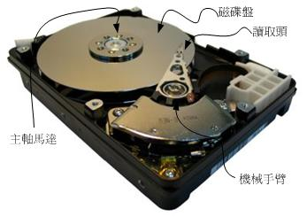
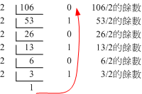

# 第零章、计算机概论

最近更新日期：20//

由过去的经验当中，鸟哥发现到因为兴趣或生活所逼而必须要接触 Linux 的朋友，很多可能并非信息相关专业出身， 因此对于电脑软/硬件方面的概念不熟。然而操作系统这种咚咚跟硬件有相当程度的关连性， 所以，如果不了解一下计算机概论，要很快的了解 Linux 的概念是有点难度的。因此，鸟哥就自作聪明的新增一个小章节来谈谈计概啰！ 因为鸟哥也不是信息相关学科出身，所以，写的不好的地方请大家多多指教啊！^_^

# 0.1 电脑：辅助人脑的好工具

## 0.1 电脑：辅助人脑的好工具

现在的人们几乎无时无刻都会碰电脑！不管是桌面电脑（台式机）、笔记本电脑（笔记本）、平板电脑、智能手机等等，这些东西都算是电脑。 虽然接触的这么多，但是，你了解电脑里面的元件有什么吗？以台式机来说，电脑的机箱里面含有什么元件？不同的电脑可以应用在哪些工作？ 你生活周遭有哪些电器用品内部是含有电脑相关元件的？下面我们就来谈一谈这些东西呢！

所谓的电脑就是一种计算机，而计算机其实是：“接受使用者输入指令与数据，经由中央处理器的数学与逻辑单元运算处理后， 以产生或储存成有用的信息”。因此，只要有输入设备 （不管是键盘还是触摸屏） 及输出设备 （例如电脑屏幕或直接由打印机打印出来），让你可以输入数据使该机器产生信息的， 那就是一部计算机了。

**Tips** 电脑可以协助人们进行大量的运算！以前如果要计算化学反应式都得要算个老半天，有了电脑仿真软件后，就有不一样的情况发生了！ 以下图为例，鸟哥的工作中，有一项是需要将人们排放的空气污染物带入电脑模式进行仿真后，计算出可能产生的空气污染并得到空气品质状态，最后经过分析软件得到各式各样的图表。 经过这些图表的解析，就可以让人们知道什么样的污染排放来源可能会产生什么样的空气品质变化啰。

图 0.1.1、计算器的功能

好了，根据这个定义你知道哪些东西是计算机了吗？其实包括一般商店用的简易型加减乘除计算器、打电话用的手机、开车用的卫星定位系统 （GPS）、提款用的提款机 （ATM）、你上课会使用的桌上型个人电脑、外出可能会带的笔记本电脑 （包括 notebook 与 netbook），还有近几年 （2015 前后） 非常热门的平板电脑与智能手机， 甚至是未来可能会大流行的单版电脑 （Xapple pi, banana pi, Raspberry pi, [[1]](#ps1)） 与智能手表，甚至于更多的智能穿戴式电脑[[2]](#ps2)等等，这些都是计算机喔！

那么计算机主要的组成元件是什么呢？下面我们以常见的个人电脑主机或服务器工作站主机来作为说明好了。

### 0.1.1 计算机硬件的五大单元

关于电脑的硬件组成部分，其实你可以观察你的台式机来分析一下，依外观来说这家伙主要可分为三部分，分别是：

*   输入单元：包括键盘、鼠标、读卡机、扫描仪、手写板、触摸屏等等一堆；
*   主机部分：这个就是系统单元，被主机机箱保护住了，里面含有一堆板子、CPU 与内存等；
*   输出单元：例如屏幕、打印机等等

我们主要通过输入设备如鼠标与键盘来将一些数据输入到主机里面，然后再由主机的功能处理成为图表或文章等信息后， 将结果传输到输出设备，如屏幕或打印机上面。那主机里面含有什么元件呢？如果你曾经拆开过电脑主机机箱 （包括拆开你的智能手机也一样喔！）， 会发现其实主机里面最重要的就是一块主板，上面安插了中央处理器 （CPU） 以及内存、硬盘 （或记忆卡） 还有一些适配卡设备而已。 当然大部分智能手机是将这些元件直接焊接在主板上面而不是插卡啦！

整部主机的重点在于中央处理器 （Central Processing Unit, CPU），CPU 为一个具有特定功能的芯片， 里头含有微指令集，如果你想要让主机进行什么特异的功能，就得要参考这颗 CPU 是否有相关内置的微指令集才可以。 由于 CPU 的工作主要在于管理与运算，因此在 CPU 内又可分为两个主要的单元，分别是： 算数逻辑单元与控制单元。[[3]](#ps3) 其中算数逻辑单元主要负责程序运算与逻辑判断，控制单元则主要在协调各周边元件与各单元间的工作。

既然 CPU 的重点是在进行运算与判断，那么要被运算与判断的数据是从哪里来的？ CPU 读取的数据都是从内存来的！ 内存内的数据则是从输入单元所传输进来！而 CPU 处理完毕的数据也必须要先写回内存中，最后数据才从内存传输到输出单元。

**Tips** 为什么我们都会说，要加快系统性能，通常将内存容量加大就可以获得相当好的成效？如同下图以及上面的说明，因为所有的数据都要经过内存的传输， 所以内存的容量如果太小，数据高速缓存就不足～影响性能相当大啊！尤其针对 Linux 作为服务器的环境下！这点要特别记忆喔！

综合上面所说的，我们会知道其实电脑是由几个单元所组成的，包括输入单元、 输出单元、CPU 内部的控制单元、算数逻辑单元与内存五大部分。 这几个东西的相关性如下所示：

图 0.1.2、电脑的五大单元[^([4])](#ps4)

上面图示中的“系统单元”其实指的就是电脑机箱内的主要元件，而重点在于 CPU 与内存。 特别要看的是实线部分的传输方向，基本上数据都是流经过内存再转出去的！ 至于数据会流进/流出内存则是 CPU 所发布的控制命令！而 CPU 实际要处理的数据则完全来自于内存 （不管是程序还是一般文件数据）！这是个很重要的概念喔！ 这也是为什么当你的内存不足时，系统的性能就很糟糕！也是为什么现在人们买智能手机时，对于可用内存的要求都很高的原因！

而由上面的图示我们也能知道，所有的单元都是由 CPU 内部的控制单元来负责协调的，因此 CPU 是整个电脑系统的最重要部分！ 那么目前世界上有哪些主流的 CPU 呢？是否刚刚我们谈到的硬件内全部都是相同的 CPU 架构呢？下面我们就来谈一谈。

### 0.1.2 一切设计的起点： CPU 的架构

如前面说过的，CPU 其实内部已经含有一些微指令，我们所使用的软件都要经过 CPU 内部的微指令集来达成才行。 那这些指令集的设计主要又被分为两种设计理念，这就是目前世界上常见到的两种主要 CPU 架构， 分别是：精简指令集 （RISC） 与复杂指令集 （CISC） 系统。下面我们就来谈谈这两种不同 CPU 架构的差异啰！

*   精简指令集 （Reduced Instruction Set Computer, RISC）：[[5]](#ps5)

这种 CPU 的设计中，微指令集较为精简，每个指令的执行时间都很短，完成的动作也很单纯，指令的执行性能较佳； 但是若要做复杂的事情，就要由多个指令来完成。常见的 RISC 微指令集 CPU 主要例如甲骨文 （Oracle） 公司的 SPARC 系列、 IBM 公司的 Power Architecture （包括 PowerPC） 系列、与安谋公司 （ARM Holdings） 的 ARM CPU 系列等。

在应用方面，SPARC CPU 的电脑常用于学术领域的大型工作站中，包括银行金融体系的主要服务器也都有这类的电脑架构； 至于 PowerPC 架构的应用上，例如索尼（Sony）公司出产的 Play Station 3（PS3）就是使用 PowerPC 架构的 Cell 处理器； 那安谋的 ARM 呢？你常使用的各厂牌手机、PDA、导航系统、网络设备（交换器、路由器等）等，几乎都是使用 ARM 架构的 CPU 喔！ 老实说，目前世界上使用范围最广的 CPU 可能就是 ARM 这种架构的呢！ [[6]](#ps6)

*   复杂指令集（Complex Instruction Set Computer, CISC）：[[7]](#ps7)

与 RISC 不同的，CISC 在微指令集的每个小指令可以执行一些较低阶的硬件操作，指令数目多而且复杂， 每条指令的长度并不相同。因为指令执行较为复杂所以每条指令花费的时间较长， 但每条个别指令可以处理的工作较为丰富。常见的 CISC 微指令集 CPU 主要有 AMD、Intel、VIA 等的 x86 架构的 CPU。

由于 AMD、Intel、VIA 所开发出来的 x86 架构 CPU 被大量使用于个人电脑（Personal computer）用途上面， 因此，个人电脑常被称为 x86 架构的电脑！那为何称为 x86 架构[[8]](#ps8)呢？ 这是因为最早的那颗 Intel 发展出来的 CPU 代号称为 8086，后来依此架构又开发出 80286, 80386...， 因此这种架构的 CPU 就被称为 x86 架构了。

在 2003 年以前由 Intel 所开发的 x86 架构 CPU 由 8 位升级到 16、32 位，后来 AMD 依此架构修改新一代的 CPU 为 64 位， 为了区别两者的差异，因此 64 位的个人电脑 CPU 又被统称为 x86_64 的架构喔！

**Tips** 所谓的位指的是 CPU 一次数据读取的最大量！64 位 CPU 代表 CPU 一次可以读写 64bits 这么多的数据，32 位 CPU 则是 CPU 一次只能读取 32 位的意思。 因为 CPU 读取数据量有限制，因此能够从内存中读写的数据也就有所限制。所以，一般 32 位的 CPU 所能读写的最大数据量，大概就是 4GB 左右。

那么不同的 x86 架构的 CPU 有什么差异呢？除了 CPU 的整体结构（如第二层高速缓存、每次运行可执行的指令数等）之外， 主要是在于微指令集的不同。新的 x86 的 CPU 大多含有很先进的微指令集， 这些微指令集可以加速多媒体程序的运行，也能够加强虚拟化的性能，而且某些微指令集更能够增加能源效率， 让 CPU 耗电量降低呢！由于电费越来越高，购买电脑时，除了整体的性能之外， 节能省电的 CPU 特色也可以考虑喔！

例题：最新的 Intel/AMD 的 x86 架构中，请查询出多媒体、虚拟化、省电功能各有哪些重要的微指令集？（仅供参考）答：

*   多媒体微指令集：MMX, SSE, SSE2, SSE3, SSE4, AMD-3DNow!
*   虚拟化微指令集：Intel-VT, AMD-SVM
*   省电功能：Intel-SpeedStep, AMD-PowerNow!
*   64/32 位相容技术：AMD-AMD64, Intel-EM64T

### 0.1.3 其他单元的设备

五大单元中最重要的控制、算术逻辑被整合到 CPU 的封装中，但系统当然不可能只有 CPU 啊！那其他三个重要电脑单元的设备还有哪些呢？ 其实在主机机箱内的设备大多是通过主板 （main board） 连接在一块，主板上面有个链接沟通所有设备的芯片组，这个芯片组可以将所有单元的设备链接起来， 好让 CPU 可以对这些设备下达命令。其他单元的重要设备主要有：

*   系统单元：如图 0.1.2 所示，系统单元包括 CPU 与内存及主板相关元件。而主板上头其实还有很多的连接接口与相关的适配卡，包括鸟哥近期常使用的 PCI-E 10G 网卡、 磁盘阵列卡、还有显卡等等。尤其是显卡，这东西对于玩 3D 游戏来说是非常重要的一环，他与显示的精致度、色彩与分辨率都有关系。

*   存储单元：包括内存 （main memory, RAM） 与辅助内存，其中辅助内存其实就是大家常听到的“储存设备”啰！包括硬盘、软盘、光盘、磁带等等的。

*   输入、输出单元：同时涵盖输入输出的设备最常见的大概就是触摸屏了。至于单纯的输入设备包括前面提到的键盘鼠标之外，目前的体感设备也是重要的输入设备喔！ 至于输出设备方面，除了屏幕外，打印机、音效喇叭、HDMI 电视、投影机、蓝牙耳机等等，都算喔！

更详细的各项主机与周边设备我们将在下个小节进行介绍！在这里我们先来了解一下各元件的关系啰！那就是，电脑是如何运行的呢？

### 0.1.4 运行流程

如果不是很了解电脑的运行流程的话，鸟哥拿个简单的想法来思考好了～假设电脑是一个人体，那么每个元件对应到那个地方呢？可以这样思考：

图 0.1.3、各元件运行

*   CPU=脑袋瓜子：每个人会作的事情都不一样（微指令集的差异），但主要都是通过脑袋瓜子来进行判断与控制身体各部分的活动；

*   内存=脑袋中放置正在被思考的数据的区块：在实际活动过程中，我们的脑袋瓜子需要有外界刺激的数据 （例如光线、环境、语言等） 来分析，那这些互动数据暂时存放的地方就是内存，主要是用来提供给脑袋瓜子判断用的信息。

*   硬盘=脑袋中放置回忆的记忆区块：跟刚刚的内存不同，内存是提供脑袋目前要思考与处理的信息，但是有些生活琐事或其他没有要立刻处理的事情， 就当成回忆先放置到脑袋的记忆深处吧！那就是硬盘！主要目的是将重要的数据记录起来，以便未来将这些重要的经验再次的使用；

*   主板=神经系统：好像人类的神经一样，将所有重要的元件连接起来，包括手脚的活动都是脑袋瓜子发布命令后， 通过神经（主板）传导给手脚来进行活动啊！

*   各项周边设备=人体与外界沟通的手、脚、皮肤、眼睛等：就好像手脚一般，是人体与外界互动的重要关键！

*   显卡=脑袋中的影像：将来自眼睛的刺激转成影像后在脑袋中呈现，所以显卡所产生的数据来源也是 CPU 控制的。

*   电源供应器 （Power）=心脏：所有的元件要能运行得要有足够的电力供给才行！这电力供给就好像心脏一样，如果心脏不够力， 那么全身也就无法动弹的！心脏不稳定呢？那你的身体当然可能断断续续的～不稳定！

由这样的关系图当中，我们知道整个活动中最重要的就是脑袋瓜子！ 而脑袋瓜子当中与现在正在进行的工作有关的就是 CPU 与内存！任何外界的接触都必须要由脑袋瓜子中的内存记录下来， 然后给脑袋中的 CPU 依据这些数据进行判断后，再发布命令给各个周边设备！如果需要用到过去的经验， 就得由过去的经验（硬盘）当中读取啰！

也就是说，整个人体最重要的地方就是脑袋瓜子，同样的，整部主机当中最重要的就是 CPU 与内存， 而 CPU 的数据来源通通来自于内存，如果要由过去的经验来判断事情时， 也要将经验（硬盘）挪到目前的记忆（内存）当中，再交由 CPU 来判断喔！这点得要再次的强调啊！ 下个章节当中，我们就对目前常见的个人电脑各个元件来进行说明啰！

### 0.1.5 电脑按用途分类

知道了电脑的基本组成与周边设备，也知道其实电脑的 CPU 种类非常的多，再来我们想要了解的是，电脑如何分类？ 电脑的分类非常多种，如果以电脑的复杂度与运算能力进行分类的话，主要可以分为这几类：

*   超级计算机（Supercomputer） 超级计算机是运行速度最快的电脑，但是他的维护、操作费用也最高！主要是用于需要有高速计算的计划中。 例如：国防军事、气象预测、太空科技，用在仿真的领域较多。详情也可以参考： 国家高速网络与计算中心[`www.nchc.org.tw`](http://www.nchc.org.tw/)的介绍！ 至于全世界最快速的前 500 大超级计算机，则请参考：[`www.top500.org`](http://www.top500.org/)。

*   大型计算机（Mainframe Computer） 大型计算机通常也具有数个高速的 CPU，功能上虽不及超级计算机，但也可用来处理大量数据与复杂的运算。 例如大型企业的主机、全国性的证券交易所等每天需要处理数百万笔数据的企业机构， 或者是大型企业的数据库服务器等等。

*   迷你电脑（Minicomputer） 迷你电脑仍保有大型计算机同时支持多使用者的特性，但是主机可以放在一般作业场所， 不必像前两个大型计算机需要特殊的空调场所。通常用来作为科学研究、工程分析与工厂的流程管理等。

*   工作站（Workstation） 工作站的价格又比迷你电脑便宜许多，是针对特殊用途而设计的电脑。在个人电脑的性能还没有提升到目前的状况之前， 工作站电脑的性能/价格比是所有电脑当中较佳的，因此在学术研究与工程分析方面相当常见。

*   微电脑（Microcomputer） 个人电脑就属于这部份的电脑分类，也是我们本章主要探讨的目标！体积最小，价格最低，但功能还是五脏俱全的！ 大致又可分为桌上型、笔记型等等。

若光以性能来说，目前的个人电脑性能已经够快了，甚至已经比工作站等级以上的电脑运算速度还要快！ 但是工作站电脑强调的是稳定不死机，并且运算过程要完全正确，因此工作站以上等级的电脑在设计时的考虑与个人电脑并不相同啦！ 这也是为啥工作站等级以上的电脑售价较贵的原因。

### 0.1.6 电脑上面常用的计算单位 （容量、速度等）

电脑的运算能力除了 CPU 微指令集设计的优劣之外，但主要还是由速度来决定的。至于存放在电脑储存设备当中的数据容量也是有单位的。

*   容量单位

电脑对数据的判断主要依据有没有通电来记录信息，所以理论上对于每一个纪录单位而言，它只认识 0 与 1 而已。0/1 这个二进制的的单位我们称为 bit。 但 bit 实在太小了，所以在储存数据时每份简单的数据都会使用到 8 个 bits 的大小来记录，因此定义出 Byte 这个单位，他们的关系为：

> 1 Byte = 8 bits

不过同样的，Byte 还是太小了，在较大的容量情况下，使用 Byte 相当不容易判断数据的大小，举例来说，1000000 Bytes 这样的显示方式你能够看得出有几个零吗？所以后来就有一些常见的简化单位表达式，例如 K 代表 1024Byte，M 代表 1024K 等。 而这些单位在不同的进位制下有不同的数值表示，下面就列出常见的单位与进位制对应：

| 进位制 | Kilo | Mega | Giga | Tera | Peta | Exa | Zetta |
| --- | --- | --- | --- | --- | --- | --- | --- |
| 二进制 | 1024 | 1024K | 1024M | 1024G | 1024T | 1024P | 1024E |
| 十进制 | 1000 | 1000K | 1000M | 1000G | 1000T | 1000P | 1000E |

一般来说，文件大小使用的是二进制的方式，所以 1GBytes 的文件大小实际上为：1024x1024x1024Bytes 这么大！ 速度单位则常使用十进制，例如 1GHz 就是 1000x1000x1000Hz 的意思。

**Tips** 那么什么是“进位”呢？以人类最常用的十进制为例，每个“位置”上面最多仅能有一个数值，这个数值不可以比 9 还要大！那比 9 还大怎办？ 就用“第二个位置来装一个新的 1 ”！所以， 9 还是只有一个位置， 10 则是用了两个位置了。好了那如果是 16 进位怎办？由于每个位置只能出现一个数值， 但是数字仅有 0~9 而已啊！因此 16 进位中，就以 A 代表 10 的意思，以 B 代表 11 的意思，所以 16 进位就是 0~9, a, b, c, d, e, f，有没有看到， “每个位置最多还是只有一个数值而已”喔！好了，那回来谈谈二进制。因为每个位置只能有 0, 1 而已，不能出现 2 （逢 2 进一位） 啦！这样了解乎？

*   速度单位

CPU 的运算速度常使用 MHz 或者是 GHz 之类的单位，这个 Hz 其实就是秒分之一。而在网络传输方面，由于网络使用的是 bit 为单位，因此网络常使用的单位为 Mbps 是 Mbits per second，亦即是每秒多少 Mbit。举例来说，大家常听到的 20M/5M 光世代传输速度，如果转成文件大小的 Byte 时，其实理论最大传输值为：每秒 2.5MByte/ 每秒 625KByte 的下载/上传速度喔！

例题：假设你今天购买了 500GB 的硬盘一颗，但是格式化完毕后却只剩下 460GB 左右的容量，这是什么原因？答：因为一般硬盘制造商会使用十进制的单位，所以 500GByte 代表为 500*1000*1000*1000Byte 之意。 转成文件的容量单位时使用二进制（1024 为底），所以就成为 466GB 左右的容量了。

硬盘厂商并非要骗人，只是因为硬盘的最小物理量为 512Bytes，最小的组成单位为扇区（sector）， 通常硬盘容量的计算采用“多少个 sector”，所以才会使用十进制来处理的。相关的硬盘信息在这一章后面会提到的！

# 0.2 个人电脑架构与相关设备元件

## 0.2 个人电脑架构与相关设备元件

一般消费者常说的电脑通常指的就是 x86 的个人电脑架构，因此我们有必要来了解一下这个架构的各个元件。事实上，Linux 最早在发展的时候，就是依据个人电脑的架构来发展的， 所以真的得要了解一下呢！另外，早期两大主流 x86 开发商（Intel, AMD）的 CPU 架构与设计理念都有些许差异。不过互相学习对方长处的结果，就是两者间的架构已经比较类似了。 由于目前市场占有率还是以 Intel 为大宗，因此下面以目前（2015）相对较新的 Intel 主板架构来谈谈：

 图 0.2.1、Intel 芯片架构

由于主板是链接各元件的一个重要项目，因此在主板上面沟通各部元件的芯片组设计优劣，就会影响性能不少喔！早期的芯片组通常分为两个桥接器来控制各元件的沟通， 分别是：（1）北桥：负责链接速度较快的 CPU、内存与显卡接口等元件；（2）南桥：负责连接速度较慢的设备接口， 包括硬盘、USB、网卡等等。（芯片组的南北桥与三国的大小乔没有关系 @_@）。不过由于北桥最重要的就是 CPU 与内存之间的桥接，因此目前的主流架构中， 大多将北桥内存控制器整合到 CPU 封装当中了。所以上图你只会看到 CPU 而没有看到以往的北桥芯片喔！

**Tips** 早期芯片组分南北桥，北桥可以连接 CPU、内存与显卡。只是 CPU 要读写到内存的动作，还需要北桥的支持，也就是 CPU 与内存的交流， 会瓜分掉北桥的总可用带宽，真浪费！因此目前将内存控制器整合到 CPU 后，CPU 与内存之间的沟通是直接交流，速度较快之外，也不会消耗更多的带宽！

毕竟目前世界上 x86 的 CPU 主要供应商为 Intel，所以下面鸟哥将以 Intel 的主板架构说明各元件啰！ 我们以华硕公司出的主板，型号：Asus Z97-AR 作为一个说明的范例，搭配着主板芯片组逻辑图 0.2.1 的说明，主板各元件如下所示：

图 0.2.2、ASUS 主板 （图片为华硕公司所有）

上述的图片中，主板上面设计的插槽主要有 CPU （Intel LGA 1150 Socket）、内存 （DDR3 3200 support）、显卡接口 （PCIe3.0）、SATA 磁盘插槽 （SATA express）等等。 下面的元件在解说的时候，请参考上述两张图示来印证喔！

### 0.2.1 执行脑袋运算与判断的 CPU

如同华硕主板示意图上半部的中央部分，那就是 CPU 插槽。 由于 CPU 负责大量运算，因此 CPU 通常是具有相当高发热量的元件。所以如果你曾经拆开过主板， 应该就会看到 CPU 上头通常会安插一颗风扇来主动散热的。

x86 个人电脑的 CPU 主要供应商为 Intel 与 AMD，目前（2015）主流的 CPU 都是双核以上的架构了！ 原本的单核心 CPU 仅有一个运算单元，所谓的多核心则是在一颗 CPU 封装当中嵌入了两个以上的运算核心， 简单的说，就是一个实体的 CPU 外壳中，含有两个以上的 CPU 单元就是了。

不同的 CPU 型号大多具有不同的脚位（CPU 上面的插脚），能够搭配的主板芯片组也不同， 所以当你想要将你的主机升级时，不能只考虑 CPU，你还得要留意你的主板上面所支持的 CPU 型号喔！ 不然买了最新的 CPU 也不能够安插在你的旧主板上头的！目前主流的 CPU 有 Intel 的 i3/i5/i7 系列产品中，甚至先后期出厂的类似型号的脚位也不同， 例如 i7-2600 使用 LGA1155 脚位而 i7-4790 则使用 FCLGA1150 脚位，挑选时必须要很小心喔！

我们前面谈到 CPU 内部含有微指令集，不同的微指令集会导致 CPU 工作效率的优劣。除了这点之外， CPU 性能的比较还有什么呢？那就是 CPU 的频率了！什么是频率呢？简单的说， 频率就是 CPU 每秒钟可以进行的工作次数。 所以频率越高表示这颗 CPU 单位时间内可以作更多的事情。举例来说，Intel 的 i7-4790 CPU 频率为 3.6GHz， 表示这颗 CPU 在一秒内可以进行 3.6x109 次工作，每次工作都可以进行少数的指令运行之意。

**Tips** 注意，不同的 CPU 之间不能单纯的以频率来判断运算性能喔！这是因为每颗 CPU 的微指令集不相同，架构也不见得一样，可使用的第二层高速缓存及其计算机制可能也不同， 加上每次频率能够进行的工作指令数也不同！所以，频率目前仅能用来比较同款 CPU 的速度！

*   CPU 的工作频率：外频与倍频

早期的 CPU 架构主要通过北桥来链接系统最重要的 CPU、内存与显卡设备。因为所有的设备都得通过北桥来链接，因此每个设备的工作频率应该要相同。 于是就有所谓的前端总线 （FSB） 这个东西的产生。但因为 CPU 的运算速度比其他的设备都要来的快，又为了要满足 FSB 的频率，因此厂商就在 CPU 内部再进行加速， 于是就有所谓的外频与倍频了。

总结来说，在早期的 CPU 设计中，所谓的外频指的是 CPU 与外部元件进行数据传输时的速度，倍频则是 CPU 内部用来加速工作性能的一个倍数， 两者相乘才是 CPU 的频率速度。例如 Intel Core 2 E8400 的内频为 3.0GHz，而外频是 333MHz，因此倍频就是 9 倍啰！（3.0G=333Mx9, 其中 1G=1000M）

**Tips** 很多计算机硬件玩家很喜欢玩“超频”，所谓的超频指的是： 将 CPU 的倍频或者是外频通过主板的设置功能更改成较高频率的一种方式。但因为 CPU 的倍频通常在出厂时已经被锁定而无法修改， 因此较常被超频的为外频。 举例来说，像上述 3.0GHz 的 CPU 如果想要超频， 可以将他的外频 333MHz 调整成为 400MHz，但如此一来整个主板的各个元件的运行频率可能都会被增加成原本的 1.333 倍（4/3）， 虽然 CPU 可能可以到达 3.6GHz，但却因为频率并非正常速度，故可能会造成死机等问题。

但如此一来所有的数据都被北桥卡死了，北桥又不可能比 CPU 更快，因此这家伙常常是系统性能的瓶颈。为了解决这个问题，新的 CPU 设计中， 已经将内存控制器整合到 CPU 内部，而链接 CPU 与内存、显卡的控制器的设计，在 Intel 部份使用 QPI （Quick Path Interconnect） 与 DMI 技术，而 AMD 部份则使用 Hyper Transport 了，这些技术都可以让 CPU 直接与内存、显卡等设备分别进行沟通，而不需要通过外部的链接芯片了。

因为现在没有所谓的北桥了 （整合到 CPU 内），因此，CPU 的频率设计就无须考虑得要同步的外频，只需要考虑整体的频率即可。 所以，如果你经常有查阅自己 CPU 频率的习惯，当使用 cpu-z [[9]](#ps9) 这个软件时，应该会很惊讶的发现到，怎么外频变成 100MHz 而倍频可以到达 30 以上！相当有趣呢！

**Tips** 现在 Intel 的 CPU 会主动帮你超频喔！例如 i7-4790 这颗 CPU 的规格 [[10]](#ps10) 中，基本频率为 3.6GHz，但是最高可自动超频到 4GHz 喔！ 通过的是 Intel 的 turbo 技术。同时，如果你没有大量的运算需求，该 CPU 频率会降到 1.xGHz 而已，借此达到节能省电的目的！所以，各位好朋友， 不需要自己手动超频了！Intel 已经自动帮你进行超频了...所以，如果你用 cpu-z 观察 CPU 频率，发现该频率会一直自动变动，很正常！你的系统没坏掉！

*   32 位与 64 位的 CPU 与总线“宽度”

从前面的简易说明中，我们知道 CPU 的各项数据通通得要来自于内存。因此，如果内存能提供给 CPU 的数据量越大的话，当然整体系统的性能应该也会比较快！ 那如何知道内存能提供的数据量呢？此时还是得要借由 CPU 内的内存控制芯片与内存间的传输速度“前端总线速度（Front Side Bus, FSB） 来说明。

与 CPU 的频率类似的，内存也是有其工作的频率，这个频率限制还是来自于 CPU 内的内存控制器所决定的。以图 0.2.1 为例， CPU 内置的内存控制芯片对内存的工作频率最高可达到 1600MHz。这只是工作频率（每秒几次）。一般来说，每次频率能够传输的数据量，大多为 64 位，这个 64 位就是所谓的“宽度”了！ 因此，在图 0.2.1 这个系统中，CPU 可以从内存中取得的最快带宽就是 1600MHz *64bit = 1600MHz* 8 Bytes = 12.8GByte/s。

与总线宽度相似的，CPU 每次能够处理的数据量称为字组大小（word size）， 字组大小依据 CPU 的设计而有 32 位与 64 位。我们现在所称的电脑是 32 或 64 位主要是依据这个 CPU 解析的字组大小而来的！早期的 32 位 CPU 中，因为 CPU 每次能够解析的数据量有限， 因此由内存传来的数据量就有所限制了。这也导致 32 位的 CPU 最多只能支持最大到 4GBytes 的内存。

**Tips** 得利于北桥整合到 CPU 内部的设计，CPU 得以“个别”跟各个元件进行沟通！因此，每种元件与 CPU 的沟通具有很多不同的方式！例如内存使用系统总线带宽来与 CPU 沟通。而显卡则通过 PCI-E 的序列信道设计来与 CPU 沟通喔！详细说明我们在本章稍后的主板部份再来谈谈。

*   CPU 等级

由于 x86 架构的 CPU 在 Intel 的 Pentium 系列（1993 年）后就有不统一的脚位与设计，为了将不同种类的 CPU 规范等级， 所以就有 i386,i586,i686 等名词出现了。基本上，在 Intel Pentium MMX 与 AMD K6 年代的 CPU 称为 i586 等级， 而 Intel Celeron 与 AMD Athlon（K7）年代之后的 32 位 CPU 就称为 i686 等级。 至于目前的 64 位 CPU 则统称为 x86_64 等级。

目前很多的程序都有对 CPU 做最优化的设计，万一哪天你发现一些程序是注明给 x86_64 的 CPU 使用时， 就不要将他安装在 686 以下等级的电脑中，否则可是会无法执行该软件的！ 不过，在 x86_64 的硬件下倒是可以安装 386 的软件喔！也就是说，这些东西具有向下相容的能力啦！

*   超线程 （Hyper-Threading, HT）

我们知道现在的 CPU 至少都是两个核心以上的多核心 CPU 了，但是 Intel 还有个很怪的东西，叫做 CPU 的超线程 （Hyper-Threading） 功能！ 那个是啥鬼东西？我们知道现在的 CPU 运算速度都太快了，因此运算核心经常处于闲置状态下。而我们也知道现在的系统大多都是多任务的系统， 同时间有很多的程序会让 CPU 来执行。因此，若 CPU 可以假象的同时执行两个程序，不就可以让系统性能增加了吗？反正 CPU 的运算能力还是没有用完啊！

那是怎么达成的啊这个 HT 功能？强者鸟哥的同事蔡董大大用个简单的说明来解释。在每一个 CPU 内部将重要的寄存器 （register） 分成两群， 而让程序分别使用这两群寄存器。也就是说，可以有两个程序“同时竞争 CPU 的运算单元”，而非通过操作系统的多任务切换！ 这一过程就会让 CPU 好像“同时有两个核心”的模样！因此，虽然大部分 i7 等级的 CPU 其实只有四个实体核心，但通过 HT 的机制， 则操作系统可以抓到八个核心！并且让每个核心逻辑上分离，就可以同时运行八个程序了。

虽然很多研究与测试中，大多发现 HT 虽然可以提升性能，不过，有些情况下却可能导致性能降低喔！因为，实际上明明就仅有一个运算单元嘛！ 不过在鸟哥使用数值模式的情况下，因为鸟哥操作的数值模式主要为平行运算功能，且运算通常无法达到 100% 的 CPU 使用率，通常仅有大约 60%运算量而已。 因此在鸟哥的实作过程中，这个 HT 确实提升相当多的性能！至少应该可以节省鸟哥大约 30%~50%的等待时间喔！不过网络上大家的研究中， 大多说这个是 case by case，而且使用的软件影响很大！所以，在鸟哥的例子是启用 HT 帮助很大！您的案例就得要自行研究啰！

### 0.2.2 内存

如同图 0.2.2、华硕主板示意图中的右上方部分的那四根插槽，那就是内存的插槽了。 内存插槽中间通常有个突起物将整个插槽稍微切分成为两个不等长的距离， 这样的设计可以让使用者在安装内存时，不至于前后脚位安插错误，是一种防呆的设计喔。

前面提到 CPU 所使用的数据都是来自于内存（main memory），不论是软件程序还是数据，都必须要读入内存后 CPU 才能利用。 个人电脑的内存主要元件为动态随机存取内存（Dynamic Random Access Memory, DRAM）， 随机存取内存只有在通电时才能记录与使用，断电后数据就消失了。因此我们也称这种 RAM 为挥发性内存。

DRAM 根据技术的更新又分好几代，而使用上较广泛的有所谓的 SDRAM 与 DDR SDRAM 两种。 这两种内存的差别除了在于脚位与工作电压上的不同之外，DDR 是所谓的双倍数据传送速度（Double Data Rate）， 他可以在一次工作周期中进行两次数据的传送，感觉上就好像是 CPU 的倍频啦！ 所以传输频率方面比 SDRAM 还要好。新一代的 PC 大多使用 DDR 内存了。 下表列出 SDRAM 与 DDR SDRAM 的型号与频率及带宽之间的关系。[[11]](#ps11)

| SDRAM/DDR | 型号 | 数据宽度（bit） | 内部频率（MHz） | 频率速度 | 带宽（频率 x 宽度） |
| --- | --- | --- | --- | --- | --- |
| SDRAM | PC100 | 64 | 100 | 100 | 800MBytes/sec |
| SDRAM | PC133 | 64 | 133 | 133 | 1064MBytes/sec |
| DDR | DDR-266 | 64 | 133 | 266 | 2.1GBytes/sec |
| DDR | DDR-400 | 64 | 200 | 400 | 3.2GBytes/sec |
| DDR | DDR2-800 | 64 | 200 | 800 | 6.4GBytes/sec |
| DDR | DDR3-1600 | 64 | 200 | 1600 | 12.8GBytes/sec |

DDR SDRAM 又依据技术的发展，有 DDR, DDR2, DDR3, DDR4 等等，其中，DDR2 的频率倍数则是 4 倍而 DDR3 则是 8 倍喔！ 目前鸟哥用到服务器等级的内存，已经到 DDR4 了耶！超快超快！

**Tips** 在图 0.2.1 中，内存的规格内提到 DDR3/DDR3L 同时支持，我们知道 DDR3 了，那 DDR3L 是啥鬼？ 为了节省更多的电力，新的制程中降低了内存的操作电压，因此 DDR3 标准电压为 1.5V，但 DDR3L 则仅须 1.35V 喔！通常可以用在耗电量需求更低的笔记本中！ 但并非所有的系统都同步支持！这就得要看主板的支持规格啰！否则你买了 DDR3L 安插在不支持的主板上，DDR3L 内存是可能会烧毁的喔！

内存除了频率/带宽与型号需要考虑之外，内存的容量也是很重要的喔！ 因为所有的数据都得要载入内存当中才能够被 CPU 判读，如果内存容量不够大的话将会导致某些大容量数据无法被完整的载入， 此时已存在内存当中但暂时没有被使用到的数据必须要先被释放，使得可用内存容量大于该数据，那份新数据才能够被载入呢！ 所以，通常越大的内存代表越快速的系统，这是因为系统不用常常释放一些内存内部的数据。 以服务器来说，内存的容量有时比 CPU 的速度还要来的重要的！

*   多通道设计

由于所有的数据都必须要存放在内存，所以内存的数据宽度当然是越大越好。 但传统的总线宽度一般大约仅达 64 位，为了要加大这个宽度，因此芯片组厂商就将两个内存汇整在一起， 如果一支内存可达 64 位，两支内存就可以达到 128 位了，这就是双通道的设计理念。

如上所述，要启用双通道的功能你必须要安插两支（或四支）内存，这两支内存最好连型号都一模一样比较好， 这是因为启动双通道内存功能时，数据是同步写入/读出这一对内存中，如此才能够提升整体的带宽啊！ 所以当然除了容量大小要一致之外，型号也最好相同啦！

你有没有发现图 0.2.2、华硕主板示意图上那四根内存插槽的颜色呢？是否分为两种颜色，且两两成对？ 为什么要这样设计？答出来了吗？是啦！这种颜色的设计就是为了双通道来的！要启动双通道的功能时， 你必须要将两根容量相同的内存插在相同颜色的插槽当中喔！

**Tips** 服务器所需要的速度更快！因此，除了双通道之外，中阶服务器也经常提供三信道，甚至四信道的内存环境！ 例如 2014 年推出的服务器用 E5-2650 v3 的 Intel CPU 中，它可以接受的最大信道数就是四信道且为 DDR4 喔！

*   DRAM 与 SRAM

除了内存条之外，事实上整部个人电脑当中还有许许多多的内存存在喔！最为我们所知的就是 CPU 内的第二层高速缓存内存。 我们现在知道 CPU 的数据都是由内存提供，但 CPU 到内存之间还是得要通过内存控制器啊！ 如果某些很常用的程序或数据可以放置到 CPU 内部的话，那么 CPU 数据的读取就不需要跑到内存重新读取了！ 这对于性能来说不就可以大大的提升了？这就是第二层高速缓存的设计概念。第二层高速缓存与内存及 CPU 的关系如下图所示：

图 0.2.3、内存相关性

因为第二层高速缓存（L2 cache）整合到 CPU 内部，因此这个 L2 内存的速度必须要 CPU 频率相同。 使用 DRAM 是无法达到这个频率速度的，此时就需要静态随机存取内存（Static Random Access Memory, SRAM）的帮忙了。 SRAM 在设计上使用的电晶体数量较多，价格较高，且不易做成大容量，不过由于其速度快， 因此整合到 CPU 内成为高速缓存内存以加快数据的存取是个不错的方式喔！新一代的 CPU 都有内置容量不等的 L2 高速缓存在 CPU 内部， 以加快 CPU 的运行性能。

*   只读存储器（ROM）

主板上面的元件是非常多的，而每个元件的参数又具有可调整性。举例来说，CPU 与内存的频率是可调整的； 而主板上面如果有内置的网卡或者是显卡时，该功能是否要启动与该功能的各项参数， 是被记录到主板上头的一个称为 CMOS 的芯片上，这个芯片需要借着额外的电源来发挥记录功能， 这也是为什么你的主板上面会有一颗电池的缘故。

那 CMOS 内的数据如何读取与更新呢？还记得你的电脑在开机的时候可以按下[Del]按键来进入一个名为 BIOS 的画面吧？ BIOS（Basic Input Output System）是一套程序，这套程序是写死到主板上面的一个内存芯片中， 这个内存芯片在没有通电时也能够将数据记录下来，那就是只读存储器（Read Only Memory, ROM）。 ROM 是一种非挥发性的内存。另外，BIOS 对于个人电脑来说是非常重要的， 因为他是系统在开机的时候首先会去读取的一个小程序喔！

另外，固件（firmware）[[12]](#ps12)很多也是使用 ROM 来进行软件的写入的。 固件像软件一样也是一个被电脑所执行的程序，然而他是对于硬件内部而言更加重要的部分。例如 BIOS 就是一个固件， BIOS 虽然对于我们日常操作电脑系统没有什么太大的关系，但是他却控制着开机时各项硬件参数的取得！ 所以我们会知道很多的硬件上头都会有 ROM 来写入固件这个软件。

BIOS 对电脑系统来讲是非常重要的，因为他掌握了系统硬件的详细信息与开机设备的选择等等。但是电脑发展的速度太快了， 因此 BIOS 程序码也可能需要作适度的修改才行，所以你才会在很多主板官网找到 BIOS 的更新程序啊！但是 BIOS 原本使用的是无法改写的 ROM ，因此根本无法修正 BIOS 程序码！为此，现在的 BIOS 通常是写入类似闪存 （flash） 或 EEPROM [[13]](#ps13) 中。[[14]](#ps14)

**Tips** 很多硬件上面都会有固件喔！例如鸟哥常用的磁盘阵列卡、 10G 的网卡、交换器设备等等！你可以简单的这么想！固件就是绑在硬件上面的控制软件！

### 0.2.3 显卡

显卡插槽如同图 0.2.2、华硕主板示意图所示，在中左方有个 PCIe 3.0 的项目， 这张主板中提供了两个显卡插槽喔！

显卡又称为 VGA（Video Graphics Array），他对于图形影像的显示扮演相当关键的角色。 一般对于图形影像的显示重点在于分辨率与色彩深度，因为每个图像显示的颜色会占用掉内存， 因此显卡上面会有一个内存的容量，这个显存容量将会影响到你的屏幕分辨率与色彩深度的喔！

除了显存之外，现在由于三度空间游戏（3D game）与一些 3D 动画的流行，因此显卡的“运算能力”越来越重要。 一些 3D 的运算早期是交给 CPU 去运行的，但是 CPU 并非完全针对这些 3D 来进行设计的，而且 CPU 平时已经非常忙碌了呢！ 所以后来显卡厂商直接在显卡上面嵌入一个 3D 加速的芯片，这就是所谓的 GPU 称谓的由来。

显卡主要也是通过 CPU 的控制芯片来与 CPU、内存等沟通。如前面提到的，对于图形影像（尤其是 3D 游戏）来说， 显卡也是需要高速运算的一个元件，所以数据的传输也是越快越好！因此显卡的规格由早期的 PCI 导向 AGP， 近期 AGP 又被 PCI-Express 规格所取代了。如前面华硕主板图示当中看到的就是 PCI-Express 的插槽。 这些插槽最大的差异就是在数据传输的带宽了！如下所示：

| 规格 | 宽度 | 速度 | 带宽 |
| --- | --- | --- | --- |
| PCI | 32 bits | 33 MHz | 133 MBytes/s |
| PCI 2.2 | 64 bits | 66 MHz | 533 MBytes/s |
| PCI-X | 64 bits | 133 MHz | 1064 MBytes/s |
| AGP 4x | 32 bits | 66x4 MHz | 1066 MBytes/s |
| AGP 8x | 32 bits | 66x8 MHz | 2133 MBytes/s |
| PCIe 1.0 x1 | 无 | 无 | 250 MBytes/s |
| PCIe 1.0 x8 | 无 | 无 | 2 GBytes/s |
| PCIe 1.0 x16 | 无 | 无 | 4 GBytes/s |

比较特殊的是，PCIe（PCI-Express）使用的是类似管线的概念来处理，在 PCIe 第一版 （PCIe 1.0） 中，每条管线可以具有 250MBytes/s 的带宽性能， 管线越多（通常设计到 x16 管线）则总带宽越高！另外，为了提升更多的带宽，因此 PCIe 还有进阶版本，目前主要的版本为第三版，相关的带宽如下：[[15]](#ps15)

| 规格 | 1x 带宽 | 16x 带宽 |
| --- | --- | --- |
| PCIe 1.0 | 250MByte/s | 4GByte/s |
| PCIe 2.0 | 500MByte/s | 8GByte/s |
| PCIe 3.0 | ~1GByte/s | ~16GByte/s |
| PCIe 4.0 | ~2GByte/s | ~32GByte/s |

若以图 0.2.2 的主板为例，它使用的是 PCIe 3.0 的 16x，因此最大带宽就可以到达接近 32GBytes/s 的传输量！ 比起 AGP 是快很多的！好可怕的传输量....

如果你的主机是用来打 3D 游戏的，那么显卡的选购是非常重要喔！如果你的主机是用来做为网络服务器的， 那么简单的入门级显卡对你的主机来说就非常够用了！因为网络服务器很少用到 3D 与图形影像功能。

例题：假设你的桌面使用 1024x768 分辨率，且使用全彩（每个像素占用 3Bytes 的容量），请问你的显卡至少需要多少内存才能使用这样的彩度？答：因为 1024x768 分辨率中会有 786432 个像素，每个像素占用 3Bytes，所以总共需要 2.25MBytes 以上才行！ 但如果考虑屏幕的更新率（每秒钟屏幕的更新次数），显卡的内存还是越大越好！

除了显卡与主板的连接接口需要知道外，那么显卡是通过什么格式与电脑屏幕 （或电视） 连接的呢？目前主要的连接接口有：

*   D-Sub （VGA 端子）：为较早之前的连接接口，主要为 15 针的连接，为模拟讯号的传输，当初设计是针对传统图像管屏幕而来。 主要的规格有标准的 640x350px @70Hz、1280x1024px @85Hz 及 2048x1536px @85Hz 等。
*   DVI：共有四种以上的接头，不过台湾市面上比较常见的为仅提供数码讯号的 DVI-D，以及整合数码与模拟讯号的 DVI-I 两种。DVI 常见于液晶屏幕的链接， 标准规格主要有： 1920x1200px @60Hz、 2560x1600px @60Hz 等。
*   HDMI：相对于 D-sub 与 DVI 仅能传送影像数据，HDMI 可以同时传送影像与声音，因此被广泛的使用于电视屏幕中！电脑屏幕目前也经常都有支持 HDMI 格式！
*   Display port：与 HDMI 相似的，可以同时传输声音与影像。不过这种接口目前在台湾还是比较少屏幕的支持！

### 0.2.4 硬盘与储存设备

电脑总是需要记录与读取数据的，而这些数据当然不可能每次都由使用者经过键盘来打字！所以就需要有储存设备咯。 电脑系统上面的储存设备包括有：硬盘、软盘、MO、CD、DVD、磁带机、U 盘（闪存）、还有新一代的蓝光光驱等， 乃至于大型机器的区域网络储存设备（SAN, NAS）等等，都是可以用来储存数据的。而其中最常见的应该就是硬盘了吧！

*   硬盘的物理组成

大家应该都看过硬盘吧！硬盘依据台式机与笔记本电脑而有分为 3.5 英寸及 2.5 英寸的大小。我们以 3.5 英寸的台式机使用硬盘来说明。 在硬盘盒里面其实是由许许多多的圆形盘片、机械手臂、 磁头与主轴马达所组成的，整个内部如同下图所示：

图 0.2.4、硬盘物理构造（图片取自维基百科）

实际的数据都是写在具有磁性物质的盘片上头，而读写主要是通过在机械手臂上的磁头（head）来达成。 实际运行时， 主轴马达让盘片转动，然后机械手臂可伸展让磁头在盘片上头进行读写的动作。 另外，由于单一盘片的容量有限，因此有的硬盘内部会有两个以上的盘片喔！

*   盘片上的数据

既然数据都是写入盘片上头，那么盘片上头的数据又是如何写入的呢？其实盘片上头的数据有点像下面的图示所示：

图 0.2.5、盘片上的数据格式（图片取自维基百科）

由于盘片是圆的，并且通过机器手臂去读写数据，盘片要转动才能够让机器手臂读写。因此，通常数据写入当然就是以圆圈转圈的方式读写啰！ 所以，当初设计就是在类似盘片同心圆上面切出一个一个的小区块，这些小区块整合成一个圆形，让机器手臂上的磁头去存取。 这个小区块就是磁盘的最小物理储存单位，称之为扇区 （sector），那同一个同心圆的扇区组合成的圆就是所谓的磁道（track）。 由于磁盘里面可能会有多个盘片，因此在所有盘片上面的同一个磁道可以组合成所谓的柱面 （cylinder）。

我们知道同心圆外圈的圆比较大，占用的面积比内圈多啊！所以，为了善用这些空间，因此外围的圆会具有更多的扇区[[16]](#ps16)！ 就如同图 0.2.5 的示意一般。此外，当盘片转一圈时，外圈的扇区数量比较多，因此如果数据写入在外圈，转一圈能够读写的数据量当然比内圈还要多！ 因此通常数据的读写会由外圈开始往内写的喔！这是默认值啊！

另外，原本硬盘的扇区都是设计成 512Byte 的容量，但因为近期以来硬盘的容量越来越大，为了减少数据量的拆解，所以新的大容量硬盘已经有 4KByte 的扇区设计！ 购买的时候也需要注意一下。也因为这个扇区的设计不同了，因此在磁盘的分区方面，目前有旧式的 MSDOS 相容模式，以及较新的 GPT 模式喔！ 在较新的 GPT 模式下，磁盘的分区通常使用扇区号码来设计，跟过去旧的 MSDOS 是通过柱面号码来分区的情况不同喔！相关的说明我们谈到磁盘管理 （第七章） 再来聊！

*   传输接口

为了要提升磁盘的传输速度，磁盘与主板的连接接口也经过多次的改版，因此有许多不同的接口喔！传统磁盘接口包括有 SATA, SAS, IDE 与 SCSI 等等。 若考虑外接式磁盘，那就还包括了 USB, eSATA 等等接口喔！不过目前 IDE 已经被 SATA 取代，而 SCSI 则被 SAS 取代，因此我们下面将仅介绍 SATA, USB 与 SAS 接口而已。

*   SATA 接口

如同华硕主板图示右下方所示为 SATA 硬盘的连接接口插槽。这种插槽所使用的排线比较窄小， 而且每个设备需要使用掉一条 SATA 线。因为 SATA 线比较窄小之故，所以对于安装与机箱内的通风都比较好！因此原本的 IDE 粗排线接口就被 SATA 取代了！ SATA 的插槽示意图如下所示：

图 0.2.6、SATA 接口的排线 （图示取自 Seagate 网站）

由于 SATA 一条排线仅接一颗硬盘，所以你不需要调整跳针。不过一张主板上面 SATA 插槽的数量并不是固定的， 且每个插槽都有编号，在连接 SATA 硬盘与主板的时候，还是需要留意一下。此外，目前的 SATA 版本已经到了第三代 [[17]](#ps17)， 每一代之间的传输速度如下所示，而且重点是，每一代都可以向下相容喔！只是速度上会差很多就是了。目前主流都是使用 SATA3 这个接口速度可达 600MByte/s 的接口！

| 版本 | 带宽 （Gbit/s） | 速度 （MByte/s） |
| --- | --- | --- |
| SATA 1.0 | 1.5 | 150 |
| SATA 2.0 | 3 | 300 |
| SATA 3.0 | 6 | 600 |

因为 SATA 传输接口传输时，通过的数据演算法的关系，当传输 10 位编码时，仅有 8 位为数据，其余 2 位为检验之用。因此带宽的计算上面， 使用的换算 （bit 转 Byte） 为 1:10 而不是 1Byte=8bits 喔！上表的对应要稍微注意一下。另外，虽然这个 SATA3 接口理论上可达 600MBytes/s 的传输速度， 不过目前传统的硬盘由于其物理组成的限制，一般极限速度大约在 150~200MByte/s 而已啦！所以厂商们才要发展固态硬盘啊！ ^_^

*   SAS 接口

早期工作站或大型大脑上面，为了读写速度与稳定性，因此在这样的机器上面，大多使用的是 SCSI 这种高阶的连接接口。 不过这种接口的速度后来被 SATA 打败了！但是 SCSI 有其值得开发的功能，因此后来就有串行式 SCSI （Serial Attached SCSI, SAS） 的发展。这种接口的速度比 SATA 来的快，而且连接的 SAS 硬盘的盘片转速与传输的速度也都比 SATA 硬盘好！ 只是...好贵喔！而且一般个人电脑的主板上面通常没有内置 SAS 连接接口，得要通过外接卡才能够支持。因此一般个人电脑主机还是以 SATA 接口为主要的磁盘连接接口啰。

| 版本 | 带宽 （Gbit/s） | 速度 （MByte/s） |
| --- | --- | --- |
| SAS 1 | 3 | 300 |
| SAS 2 | 6 | 600 |
| SAS 3 | 12 | 1200 |

因为这种接口的速度确实比较快喔！而且还支持例如热拔插等功能，因此，许多的设备连接会以这种接口来链接！ 例如我们经常会听到的磁盘阵列卡的连接插槽，就是利用这种 SAS 接口开发出来的支持的 SFF-8087 设备等等的 [[18]](#ps18)。

*   USB 接口

如果你的磁盘是外接式的接口，那么很可能跟主板链接的就是 USB 这种接口了！这也是目前 （2015） 最常见到的外接式磁盘接口了。 不过传统的 USB 速度挺慢的，即使是比较慢的传统硬盘，其传输率大概兜还有 80~120MBytes/s ，但传统的 USB 2.0 仅有大约 60MBytes/s 的理论传输率， 通常实做在主板上面的连接口，竟然都仅有 30~40 MByte/s 而已呢！实在发挥不出磁盘的性能啊！

为了改善 USB 的传输率，因此新一代的 USB 3.0 速度就快很多了！据说还有更新的 USB 3.1 正在发展中！这几代版本的带宽与速度制表如下 [[19]](#ps19)：

| 版本 | 带宽 （Mbit/s） | 速度 （MByte/s） |
| --- | --- | --- |
| USB 1.0 | 12 | 1.5 |
| USB 2.0 | 480 | 60 |
| USB 3.0 | 5G | 500 |
| USB 3.1 | 10G | 1000 |

跟 SATA 接口一样，不是理论速度到达该数值，实际上就可以跑到这么高！USB 3.0 虽然速度很快，但如果你去市面上面买 USB 的传统磁盘或闪存盘， 其实他的读写速度还是差不多在 100MBytes/s 而已啦！不过这样就超级快了！因为一般 USB2.0 的闪存盘读写速度大约是 40MBytes/10MBytes 左右而已说。 在购买这方面的外接式磁盘时，要特别考虑喔！

*   固态硬盘 （Solid State Disk, SSD）

传统硬盘有个很致命的问题，就是需要驱动马达去转动盘片～这会造成很严重的磁盘读取延迟！想想看，你得要知道数据在哪个扇区上面，然后再命令马达开始转， 之后再让磁头去读取正确的数据。另外，如果数据放置的比较离散（扇区分佈比较广又不连续），那么读写的速度就会延迟更明显！速度快不起来。因此， 后来就有厂商拿闪存去制作成大容量的设备，这些设备的连接接口也是通过 SATA 或 SAS，而且外型还做的跟传统磁盘一样！所以， 虽然这类的设备已经不能称为是磁盘 （因为没有磁头与盘片啊！都是内存！）。但是为了方便大家称呼，所以还是称为磁盘！只是跟传统磁盘 （Hard Disk Drive, HDD） 不同， 就称为固态硬盘 （Solid State Disk 或 Solid State Driver, SSD）。

固态硬盘最大的好处是，它没有马达不需要转动，而是通过内存直接读写的特性，因此除了没数据延迟且快速之外，还很省电！ 不过早期的 SSD 有个很重要的致命伤，就是这些闪存有“写入次数的限制”，因此通常 SSD 的寿命大概两年就顶天了！所以数据存放时， 需要考虑到备份或者是可能要使用 RAID 的机制来防止 SSD 的损毁[[20]](#ps20)！

**Tips** SSD 真的好快！鸟哥曾经买过 Intel 较顶级的 SSD 来做过服务器的读取系统盘，然后使用类似 dd 的指令去看看读写的速度，竟然真的如同 intel 自己官网说的， 极速可以到达 500MBytes/s 哩！几乎就是 SATA3.0 的理论极限速度了！所以，近来在需要大量读取的环境中，鸟哥都是使用 SSD 阵列来处理！

其实我们在读写磁盘时，通常没有连续读写，大部分的情况下都是读写一大堆小文件，因此，你不要妄想传统磁盘一直转很少圈就可以读到所有的数据！ 通常很多小文件的读写，会很耗硬盘，因为盘片要转好多圈！这也很花人类的时间啊！SSD 就没有这个问题！也因为如此，近年来在测试磁盘的性能时， 有个很特殊的单位，称为每秒读写操作次数 （Input/Output Operations Per Second, IOPS）！这个数值越大，代表可操作次数较高，当然性能好的很！

*   选购与运行须知

如果你想要增加一颗硬盘在你的主机里头时，除了需要考虑你的主板可接受的插槽接口（SATA/SAS）之外，还有什么要注意的呢？

*   HDD 或 SSD 毕竟 HDD 与 SSD 的价格与容量真的差很多！不过，速度也差很多就是了！因此，目前大家的使用方式大多是这样的，使用 SSD 作为系统盘， 然后数据储存大多放置在 HDD 上面！这样系统运行快速 （SSD），而数据储存量也大 （HDD）。

*   容量 毕竟目前数据量越来越大，所以购买磁盘通常首先要考虑的就是容量的问题！目前（2015）主流市场 HDD 容量已经到达 2TB 以上， 甚至有的厂商已经生产高达 8TB 的产品呢！硬盘可能可以算是一种消耗品，要注意重要数据还是得常常备份出来喔！ 至于 SSD 方面，目前的容量大概还是在 128~256GB 之间吧！

*   缓冲内存 硬盘上头含有一个缓冲内存，这个内存主要可以将硬盘内常使用的数据高速缓存起来，以加速系统的读取性能。 通常这个缓冲内存越大越好，因为缓冲内存的速度要比数据从硬盘盘中被找出来要快的多了！ 目前主流的产品可达 64MB 左右的内存大小喔。

*   转速 因为硬盘主要是利用主轴马达转动盘片来存取，因此转速的快慢会影响到性能。 主流的台式机硬盘为每分钟 7200 转，笔记本电脑则是 5400 转。有的厂商也有推出高达 10000 转的硬盘， 若有高性能的数据存取需求，可以考虑购买高转速硬盘。

*   运行须知 由于硬盘内部机械手臂上的磁头与硬盘盘的接触是很细微的空间， 如果有抖动或者是脏污在磁头与硬盘盘之间就会造成数据的损毁或者是实体硬盘整个损毁～ 因此，正确的使用电脑的方式，应该是在电脑通电之后，就绝对不要移动主机，并免抖动到硬盘， 而导致整个硬盘数据发生问题啊！另外，也不要随便将插头拔掉就以为是顺利关机！因为机械手臂必须要归回原位， 所以使用操作系统的正常关机方式，才能够有比较好的硬盘保养啊！因为他会让硬盘的机械手臂归回原位啊！

**Tips** 可能因为环境的关系，电脑内部的风扇常常会卡灰尘而造成一些声响。很多朋友只要听到这种声响都是二话不说的 “用力拍几下机箱”就没有声音了～现在你知道了，这么做的后果常常就是你的硬盘容易坏掉！ 下次千万不要再这样做啰！

### 0.2.5 扩展卡与接口

你的服务器可能因为某些特殊的需求，因此需要使用主板之外的其他适配卡。所以主板上面通常会预留多个扩充接口的插槽， 这些插槽依据历史沿革，包括 PCI/AGP/PCI-X/PCIe 等等，但是由于 PCIe 速度快到太好用了，因此几乎所有的卡都以 PCIe 来设计了！ 但是有些比较老旧的卡可能还需要使用啊，因此一般主板大多还是会保留一两个 PCI 插槽，其他的则是以 PCIe 来设计。

由于各元件的价格直直落，现在主板上面通常已经整合了相当多的设备元件了！ 常见整合到主板的元件包括声卡、网卡、USB 控制卡、显卡、磁盘阵列卡等等。 你可以在主板上面发现很多方形的芯片，那通常是一些个别的设备芯片喔。

不过，因为某些特殊的需求，有时你可能还是需要增加额外的扩展卡的。举例来说，我们如果需要一部个人电脑连接多个网域时（Linux 服务器用途）， 恐怕就得要有多个网卡。当你想要买网卡时，大卖场上面有好多耶！而且速度一样都是 giga 网卡 （Gbit/s），但价格差很多耶！ 观察规格，主要有 PCIe x1 以及 PCI 接口的！你要买哪种接口呢？

观察一下 0.2.3 显卡的章节内，你会发现到 PCI 接口的理论传输率最高指到 133MBytes/s 而已，而 PCIe 2.0 x1 就高达 500MBytes/s 的速度！ 鸟哥实测的结果也发现，PCI 接口的 giga 网卡极限速度大约只到 60MBytes/s 而已，而 PCIe 2.0 x1 的 giga 网卡确实可以到达大约 110MBytes/s 的速度！ 所以，购买设备时，还是要查清楚连接接口才行啦！

在 0.2.3 节也谈到 PCIe 有不同的信道数，基本上常见的就是 x1, x4, x8, x16 等，个人电脑主板常见是 x16 的，一般中阶服务器则大多有多个 x8 的接口， x16 反而比较少见。这些接口在主板上面的设计，主要是以插槽的长度来看的，例如华硕主板示意图中，左侧有 2 个 PCI 接口， 其他的则是 3 个 x16 的插槽，以及 2 个 x1 的插槽，看长度就知道了。

*   多信道卡 （例如 x8 的卡） 安装在少信道插槽 （例如 x4 的插槽） 的可用性

再回头看看图 0.2.1 的示意图，你可以发现 CPU 最多最多仅能支持 16 个 PCIe 3.0 的信道数，因此在图示当中就明白的告诉你， 你可以设计（1）一个 x16 （2）或者是两个 x8 ，（3）或者是两个 x4 加上一个 x8 的方式来增加扩展卡！这是可以直接链接到 CPU 的信道！咦！ 那为何图 0.2.2 可以有 3 个 x16 的插槽呢？原因是前两个属于 CPU 支持的，后面两个可能就是南桥提供的 PCIe 2.0 的接口了！ 那明明最多仅能支持一个 x16 的接口，怎么可能设计 3 个 x16 呢？

因为要让所有的扩展卡都可以安插在主板上面，所以在比较中高阶的主板上面，他们都会做出 x16 的插槽，但是该插槽内其实只有 x8 或 x4 的信道有用！ 其他的都是空的没有金手指 （电路的意思）～咦！那如果我的 x16 的卡安装在 x16 的插槽，但是这个插槽仅有 x4 的电路设计，那我这张卡可以运行吗？ 当然可以！这就是 PCIe 的好处了！它可以让你这张卡仅使用 x4 的电路来传送数据，而不会无法使用！只是...你的这张卡的极限性能，就会只剩下 4/16 = 1/4 啰！

因为一般服务器惯用的扩展卡，大多数都使用 PCIe x8 的接口 （因为也没有什么设备可以将 PCIe 3.0 的 x8 速度用完啊！）， 为了增加扩展卡的数量，因此服务器级的主板才会大多使用到 x8 的插槽说！反正，要发挥扩展卡的能力，就得要搭配相对应的插槽才行啦！

**Tips** 鸟哥近年来在搞小型云教室，为了加速需要有 10G 的网卡，这些网卡标准的接口为 PCIe 2.0 x8 的接口。有部主机上面需要安插这样的卡三张才行， 结果该主机上面仅有一个 x16，一个 x8 以及一个 x4 的 PCIe 接口，其中 x4 的那个接口使用的是 x8 的插槽，所以好佳在三张卡都可以安装在主板上面，且都可以运行！ 只是在极速运行时，实测的性能结果发现，那个安插在 x4 接口的网卡性能降很多！所以才会发现这些问题！提供给大家参考参考！

### 0.2.6 主板

这个小节我们特别再将主板拿出来说明一下，特别要讲的就是芯片组与扩展卡之间的关系了！

*   发挥扩展卡性能须考虑的插槽位置

如同图 0.2.1 所示，其实系统上面可能会有多个 x8 的插槽，那么到底你的卡插在哪个插槽上面性能最好？ 我们以该图来说，如果你是安插在左上方跟 CPU 直接连线的那几个插槽，那性能最佳！如果你是安插在左侧由上往下数的第五个 PCIe 2.0 x8 的插槽呢？ 那个插槽是与南桥连接，所以你的扩展卡数据需要先进入南桥跟大家抢带宽，之后要传向 CPU 时，还得要通过 CPU 与南桥的沟通管道， 那条管道称为 DMI 2.0。

根据 Intel 方面的数据来看，DMI 2.0 的传输率是 4GT/s，换算成文件传输量时，大约仅有 2GByte/s 的速度， 要知道，PCIe 2.0 x8 的理论速度已经达到 4GByte/s 了，但是与 CPU 的信道竟然仅有 2GB，性能的瓶颈就这样发生在 CPU 与南桥的沟通上面！ 因此，卡安装在哪个插槽上面，对性能而言也是影响很大的！所以插卡时，请详细阅读您主板上面的逻辑图示啊 （类似本章的 Intel 芯片示意图）！ 尤其 CPU 与南桥沟通的带宽方面，特别重要喔！

**Tips** 因为鸟哥的 Linux 服务器，目前很多都需要执行一些虚拟化技术等会大量读写数据的服务，所以需要额外的磁盘阵列卡来提供数据的存放！ 同时得要提供 10G 网络让内部的多部服务器互相通过网络链接。过去没有这方面的经验时，扩展卡都随意乱插，反正能动就好！但实际分析过性能之后， 哇！现在都不敢随便乱插了！性能差太多！每次在选购新的系统时，也都会优先去查看芯片逻辑图～确认性能瓶颈不会卡住在主板上，这才下手去购买！ 惨痛的经验产生惨痛的 $$ 飞走事件，所以，这里特别提出来跟大家分享的啦！

*   设备 I/O 位址与 IRQ 中断信道

主板是负责各个电脑元件之间的沟通，但是电脑元件实在太多了，有输出/输入/不同的储存设备等等， 主板芯片组怎么知道如何负责沟通呐？这个时候就需要用到所谓的 I/O 位址与 IRQ 啰！

I/O 位址有点类似每个设备的门牌号码，每个设备都有他自己的位址，一般来说，不能有两个设备使用同一个 I/O 位址， 否则系统就会不晓得该如何运行这两个设备了。而除了 I/O 位址之外，还有个 IRQ 中断（Interrupt）这个咚咚。

如果 I/O 位址想成是各设备的门牌号码的话，那么 IRQ 就可以想成是各个门牌连接到邮件中心（CPU）的专门路径啰！ 各设备可以通过 IRQ 中断信道来告知 CPU 该设备的工作情况，以方便 CPU 进行工作分配的任务。 老式的主板芯片组 IRQ 只有 15 个，如果你的周边接口太多时可能就会不够用， 这个时候你可以选择将一些没有用到的周边接口关掉，以空出一些 IRQ 来给真正需要使用的接口喔！ 当然，也有所谓的 sharing IRQ 的技术就是了！

*   CMOS 与 BIOS

前面内存的地方我们有提过 CMOS 与 BIOS 的功能，在这里我们再来强调一下： CMOS 主要的功能为记录主板上面的重要参数， 包括系统时间、CPU 电压与频率、各项设备的 I/O 位址与 IRQ 等，由于这些数据的记录要花费电力，因此主板上面才有电池。 BIOS 为写入到主板上某一块 flash 或 EEPROM 的程序，他可以在开机的时候执行，以载入 CMOS 当中的参数， 并尝试调用储存设备中的开机程序，进一步进入操作系统当中。BIOS 程序也可以修改 CMOS 中的数据， 每种主板调用 BIOS 设置程序的按键都不同，一般台式机常见的是使用[del]按键进入 BIOS 设置画面。

*   连接周边设备的接口

主板与各项输出/输入设备的链接主要都是在主机机箱的后方，主要有：

*   PS/2 接口：这原本是常见的键盘与鼠标的接口，不过目前渐渐被 USB 接口取代，甚至较新的主板可能就不再提供 PS/2 接口了；
*   USB 接口：通常只剩下 USB 2.0 与 USB 3.0，为了方便区分，USB 3.0 为蓝色的插槽颜色喔！
*   声音输出、输入与麦克风：这个是一些圆形的插孔，而必须你的主板上面有内置音效芯片时，才会有这三个东西；
*   RJ-45 网络头：如果有内置网络芯片的话，那么就会有这种接头出现。 这种接头有点类似电话接头，不过内部有八蕊线喔！接上网络线后在这个接头上会有灯号亮起才对！
*   HDMI：如果有内置显示芯片的话，可能就会提供这个与屏幕连接的接口了！这种接口可以同时传输声音与影像， 目前也是电视机屏幕的主流连接接口喔！

我们以华硕主板的链接接口来看的话，主要有这些：

图 0.2.7、连接周边接口

### 0.2.7 电源供应器

除了上面这些元件之外，其实还有一个很重要的元件也要来谈一谈，那就是电源供应器（Power）。 在你的机箱内，有个大大的铁盒子，上头有很多电源线会跑出来，那就是电源供应器了。 我们的 CPU/RAM/主板/硬盘等等都需要用电，而近来的电脑元件耗电量越来越高，以前很古早的 230W 电源已经不够用了， 有的系统甚至得要有 500W 以上的电源才能够运行～真可怕～

电源供应器的价差非常大！贵一点的 300W 可以到 4000 NT，便宜一点的 300W 只要 500 NT 不到！ 怎么差这么多？没错～因为 Power 的用料不同，电源供应的稳定性也会差很多。如前所述，电源供应器相当于你的心脏， 心脏差的话，活动力就会不足了！所以， 稳定性差的电源供应器甚至是造成电脑不稳定的元凶呢！所以，尽量不要使用太差的电源供应器喔！

*   能源转换率

电源供应器本身也会吃掉一部份的电力的！如果你的主机系统需要 300W 的电力时，因为电源供应器本身也会消耗掉一部份的电力， 因此你最好要挑选 400W 以上的电源供应器。电源供应器出厂前会有一些测试数据，最好挑选高转换率的电源供应器。 所谓的高转换率指的是“输出的功率/输入的功率”。意思是说，假如你的主板用电量为 250W， 但是电源供应器其实已经使用掉 320W 的电力，则转换率为：250/320=0.78 的意思。 这个数值越高表示被电源供应器“玩掉”的电力越少，那就符合能源效益了！^_^

### 0.2.8 选购须知

在购买主机时应该需要进行整体的考虑，很难依照某一项标准来选购的。 老实说，如果你的公司需要一部服务器的话，建议不要自行组装，买品牌电脑的服务器比较好！ 这是因为自行组装的电脑虽然比较便宜，但是每项设备之间的适合性是否完美则有待自行检测。

另外，在性能方面并非仅考虑 CPU 的能力而已，速度的快慢与“整体系统的最慢的那个设备有关！”，如果你是使用最快速的 Intel i7 系列产品，使用最快的 DDR3-1600 内存， 但是配上一个慢慢的过时显卡，那么整体的 3D 速度性能将会卡在那个显卡上面喔！所以，在购买整套系统时， 请特别留意需要全部的接口都考虑进去喔！尤其是当您想要升级时，要特别注意这个问题， 并非所有的旧的设备都适合继续使用的。

例题：你的系统使用 i7 的 4790 CPU，使用了 DDR3-1600 内存，使用了 PCIe 2.0 x8 的磁盘阵列卡，这张卡上面安装了 8 颗 3TB 的理论速度可达 200MByte/s 的硬盘 （假设为可加总速度的 RAID0 配置）， 是安插在 CPU 控制芯片相连的插槽中。网络使用 giga 网卡，安插在 PCIe 2.0 x1 的接口上。在这样的设备中，上述的哪个环节速度可能是你的瓶颈？答：

*   DDR3-1600 的带宽可达：12.8GBytes/s
*   磁盘阵列卡理论传输率： PCIe 2.0 x8 为 4GBytes/s
*   磁盘每颗 200MBytes/s，共八颗，总效率为： 200MBytes*8 ~ 1.6GBytes/s
*   网络接口使用 PCIe 2.0 1x 所以接口速度可达 500MBytes/s，但是 Giga 网络最高为 125MBytes/s

通过上述分析，我们知道，速度最慢的为网络的 125MBytes/s ！所以，如果想要让整体性能提升，网络恐怕就是需要克服的一环！

*   系统不稳定的可能原因

除此之外，到底那个元件特别容易造成系统的不稳定呢？有几个常见的系统不稳定的状态是：

*   系统超频：这个行为很不好！不要这么做！

*   电源供应器不稳： 这也是个很严重的问题，当您测试完所有的元件都没有啥大问题时，记得测试一下电源供应器的稳定性！

*   内存无法负荷：现在的内存品质差很多，差一点的内存，可能会造成您的主机在忙碌的工作时， 产生不稳定或死机的现象喔！

*   系统过热：“热”是造成电子零件运行不良的主因之一，如果您的主机在夏天容易死机， 冬天却还好，那么考虑一下加几个风扇吧！有助于机箱内的散热，系统会比较稳定喔！ “ 这个问题也是很常见的系统死机的元凶！”（PS1:鸟哥之前的一台服务器老是容易死机， 后来拆开机箱研究后才发现原来是北桥上面的小风扇坏掉了，导致北桥温度太高。后来换掉风扇就稳定多了。 PS2:还有一次整个实验室的网络都停了！检查了好久，才发现原来是网络交换器 switch 在夏天热到死机！后来只好用小电风扇一直吹他...）

**Tips** 事实上，要了解每个硬件的详细架构与构造是很难的！这里鸟哥仅是列出一些比较基本的概念而已。 另外，要知道某个硬件的制造商是哪间公司时，可以看该硬件上面的信息。 举例来说，主板上面都会列出这个主板的开发商与主板的型号，知道这两个信息就可以找到驱动程序了。 另外，显卡上面有个小小的芯片，上面也会列出显卡厂商与芯片信息喔。

# 0.3 数据表示方式

## 0.3 数据表示方式

事实上我们的电脑只认识 0 与 1，记录的数据也是只能记录 0 与 1 而已，所以电脑常用的数据是二进制的。 但是我们人类常用的数值运算是十进制，文字方面则有非常多的语言，台湾常用的语言就有英文、中文（又分正体与简体中文）、日文等。 那么电脑如何记录与显示这些数值/文字呢？就得要通过一系列的转换才可以啦！下面我们就来谈谈数值与文字的编码系统啰！

### 0.3.1 数字系统

早期的电脑使用的是利用通电与否的特性的真空管，如果通电就是 1，没有通电就是 0， 后来沿用至今，我们称这种只有 0/1 的环境为二进制制，英文称为 binary 的哩。所谓的十进制指的是逢十进一位， 因此在个位数归为零而十位数写成 1。所以所谓的二进制，就是逢二就前进一位的意思。

那二进制怎么用呢？我们先以十进制来解释好了。如果以十进制来说，3456 的意义为：

3456 = 3x10³ + 4x10² + 5x10¹ + 6x10⁰

特别注意：“任何数值的零次方为 1”所以 100 的结果就是 1 啰。 同样的，将这个原理带入二进制的环境中，我们来解释一下 1101010 的数值转为十进制的话，结果如下：

1101010=1x2⁶ + 1x2⁵ + 0x2⁴ + 1x2³ + 0x2² + 1x2¹ + 0x2⁰ = 64 + 32 + 0x16 + 8 + 0x4 + 2 + 0x1 = 106

这样你了解二进制的意义了吗？二进制是电脑基础中的基础喔！了解了二进制后，八进位、十六进制就依此类推啦！ 那么知道二进制转成十进制后，那如果有十进制数值转为二进制的环境时，该如何计算？ 刚刚是乘法，现在则是除法就对了！我们同样的使用十进制的 106 转成二进制来测试一下好了：

图 0.3.1、十进制转二进制的方法

最后的写法就如同上面的红色箭头，由最后的数字向上写，因此可得到 1101010 的数字啰！ 这些数字的转换系统是非常重要的，因为电脑的加减乘除都是使用这些机制来处理的！ 有兴趣的朋友可以再参考一下其他计算计概论的书籍中，关于 1 的补数/2 的补数等运算方式喔！

### 0.3.2 文字编码系统

既然电脑都只有记录 0/1 而已，甚至记录的数据都是使用 Byte/bit 等单位来记录的，那么文字该如何记录啊？ 事实上文字文件也是被记录为 0 与 1 而已，而这个文件的内容要被取出来查阅时，必须要经过一个编码系统的处理才行。 所谓的“编码系统”可以想成是一个“字码对照表”，他的概念有点像下面的图示：

图 0.3.2、数据参考编码表的示意图

当我们要写入文件的文字数据时，该文字数据会由编码对照表将该文字转成数字后，再存入文件当中。 同样的，当我们要将文件内容的数据读出时，也会经过编码对照表将该数字转成对应的文字后，再显示到屏幕上。 现在你知道为何浏览器上面如果编码写错时，会出现乱码了吗？这是因为编码对照表写错， 导致对照的文字产生误差之故啦！

常用的英文编码表为 ASCII 系统，这个编码系统中， 每个符号（英文、数字或符号等）都会占用 1Bytes 的记录， 因此总共会有 28=256 种变化。至于中文字当中的编码系统早期最常用的就是 big5 这个编码表了。 每个中文字会占用 2Bytes，理论上最多可以有 216=65536，亦即最多可达 6 万多个中文字。 但是因为 big5 编码系统并非将所有的位都拿来运用成为对照，所以并非可达这么多的中文字码的。 目前 big5 仅定义了一万三千多个中文字，很多中文利用 big5 是无法成功显示的～所以才会有造字程序说。

big5 码的中文字编码对于某些数据库系统来说是很有问题的，某些字码例如“许、盖、功”等字， 由于这几个字的内部编码会被误判为单/双引号，在写入还不成问题，在读出数据的对照表时， 常常就会变成乱码。不只中文字，其他非英语系国家也常常会有这样的问题出现啊！

为了解决这个问题，由国际组织 ISO/IEC 跳出来制订了所谓的 Unicode 编码系统， 我们常常称呼的 UTF8 或万国码的编码就是这个咚咚。因为这个编码系统打破了所有国家的不同编码， 因此目前网际网络社会大多朝向这个编码系统在走，所以各位亲爱的朋友啊，记得将你的编码系统修订一下喔！

# 0.4 软件程序运行

## 0.4 软件程序运行

鸟哥在上课时常常会开玩笑的问：“我们知道没有插电的电脑是一堆废铁，那么插了电的电脑是什么？” 答案是：“一堆会电人的废铁”！这是因为没有软件的运行，电脑的功能就无从发挥之故。 就好像没有了灵魂的躯体也不过就是行尸走肉，重点在于软件/灵魂啰！所以下面咱们就得要了解一下“软件”是什么。

一般来说，目前的电脑系统将软件分为两大类，一个是系统软件，一个是应用程序。但鸟哥认为我们还是得要了解一下什么是程序， 尤其是机器程序，了解了之后再来探讨一下为什么现今的电脑系统需要“操作系统”这玩意儿呢！

### 0.4.1 机器程序与编译程序

我们前面谈到电脑只认识 0 与 1 而已，而且电脑最重要的运算与逻辑判断是在 CPU 内部， 而 CPU 其实是具有微指令集的。因此，我们需要 CPU 帮忙工作时，就得要参考微指令集的内容， 然后撰写让 CPU 读的懂的指令码给 CPU 执行，这样就能够让 CPU 运行了。

不过这样的流程有几个很麻烦的地方，包括：

*   需要了解机器语言：机器只认识 0 与 1，因此你必须要学习直接写给机器看的语言！ 这个地方相当的难呢！

*   需要了解所有硬件的相关功能函数：因为你的程序必须要写给机器看， 当然你就得要参考机器本身的功能，然后针对该功能去撰写程序码。例如，你要让 DVD 影片能够放映， 那就得要参考 DVD 光驱的硬件信息才行。万一你的系统有比较冷门的硬件，光是参考技术手册可能会昏倒～

*   程序不具有可携性：每个 CPU 都有独特的微指令集，同样的，每个硬件都有其功能函数。 因此，你为 A 电脑写的程序，理论上是没有办法在 B 电脑上面运行的！而且程序码的修改非常困难！ 因为是机器码，并不是人类看的懂得程序语言啊！

*   程序具有专一性：因为这样的程序必须要针对硬件功能函数来撰写， 如果已经开发了一支浏览器程序，想要再开发文件管理程序时，还是得从头再参考硬件的功能函数来继续撰写， 每天都在和“硬件”挑战！可能需要天天喝蛮牛了！@_@

那怎么解决啊？为了解决这个问题，电脑科学家设计出一种让人类看的懂得程序语言， 然后创造一种“编译器”来将这些人类能够写的程序语言转译成为机器能看懂得机器码， 如此一来我们修改与撰写程序就变的容易多了！目前常见的编译器有 C, C++, Java, Fortran 等等。 机器语言与高阶程序语言的差别如下所示：

图 0.4.1、编译器的角色

从上面的图示我们可以看到高阶程序语言的程序码是很容易察看的！鸟哥已经将程序码（英文）写成中文说～ 这样比较好理解啦！所以这样已经将程序的修改问题处理完毕了。 问题是，在这样的环境下面我们还是得要考虑整体的硬件系统来设计程序喔！

举例来说，当你需要将运行的数据写入内存中，你就得要自行分配一个内存区块出来让自己的数据能够填上去， 所以你还得要了解到内存的位址是如何定位的，啊！眼泪还是不知不觉的流了下来... 怎么写程序这么麻烦啊！

为了要克服硬件方面老是需要重复撰写控制码的问题，所以就有操作系统（Operating System, OS）的出现了！ 什么是操作系统呢？下面就来谈一谈先！

### 0.4.2 操作系统

如同前面提到的，在早期想要让电脑执行程序就得要参考一堆硬件功能函数，并且学习机器语言才能够撰写程序。 同时每次写程序时都必须要重新改写，因为硬件与软件功能不见得都一致之故。那如果我能够将所有的硬件都驱动， 并且提供一个发展软件的参考接口来给工程师开发软件的话，那发展软件不就变的非常的简单了？那就是操作系统啦！

*   操作系统核心（Kernel）

操作系统（Operating System, OS）其实也是一组程序， 这组程序的重点在于管理电脑的所有活动以及驱动系统中的所有硬件。 我们刚刚谈到电脑没有软件只是一堆废铁，那么操作系统的功能就是让 CPU 可以开始判断逻辑与运算数值、 让内存可以开始载入/读出数据与程序码、让硬盘可以开始被存取、让网卡可以开始传输数据、 让所有周边可以开始运行等等。总之，硬件的所有动作都必须要通过这个操作系统来达成就是了。

上述的功能就是操作系统的核心（Kernel）了！你的电脑能不能做到某些事情，都与核心有关！ 只有核心有提供的功能，你的电脑系统才能帮你完成！举例来说，你的核心并不支持 TCP/IP 的网络协定， 那么无论你购买了什么样的网卡，这个核心都无法提供网络能力的！

但是单有核心我们使用者也不知道能作啥事的～因为核心主要在管控硬件与提供相关的能力（例如存取硬盘、网络功能、CPU 资源取得等）， 这些管理的动作是非常的重要的，如果使用者能够直接使用到核心的话，万一使用者不小心将核心程序停止或破坏， 将会导致整个系统的崩溃！因此核心程序所放置到内存当中的区块是受保护的！ 并且开机后就一直常驻在内存当中。

**Tips** 所以整部系统只有核心的话，我们就只能看着已经准备好运行（Ready）的电脑系统，但无法操作他！ 好像有点望梅止渴的那种感觉啦！这个时候就需要软件的帮忙了！

*   系统调用（System Call）

既然我的硬件都是由核心管理，那么如果我想要开发软件的话，自然就得要去参考这个核心的相关功能！ 唔！如此一来不是从原本的参考硬件函数变成参考核心功能，还是很麻烦啊！有没有更简单的方法啊！

为了解决这个问题，操作系统通常会提供一整组的开发接口给工程师来开发软件！ 工程师只要遵守该开发接口那就很容易开发软件了！举例来说，我们学习 C 程序语言只要参考 C 程序语言的函数即可， 不需要再去考虑其他核心的相关功能，因为核心的系统调用接口会主动的将 C 程序语言的相关语法转成核心可以了解的任务函数， 那核心自然就能够顺利运行该程序了！

如果我们将整个电脑系统的相关软/硬件绘制成图的话，他的关系有点像这样：

图 0.4.2、操作系统的角色

电脑系统主要由硬件构成，然后核心程序主要在管理硬件，提供合理的电脑系统资源分配（包括 CPU 资源、内存使用资源等等）， 因此只要硬件不同（如 x86 架构与 RISC 架构的 CPU），核心就得要进行修改才行。 而由于核心只会进行电脑系统的资源分配，所以在上头还需要有应用程序的提供，使用者才能够操作系统的。

为了保护核心，并且让程序设计师比较容易开发软件，因此操作系统除了核心程序之外，通常还会提供一整组开发接口， 那就是系统调用层。软件开发工程师只要遵循公认的系统调用参数来开发软件，该软件就能够在该核心上头运行。 所以你可以发现，软件与核心有比较大的关系，与硬件关系则不大！硬件也与核心有比较大的关系！ 至于与使用者有关的，那就是应用程序啦！

**Tips** 在定义上，只要能够让计算机硬件正确无误的运行，那就算是操作系统了。所以说， 操作系统其实就是核心与其提供的接口工具，不过就如同上面讲的，因为最阳春的核心缺乏了与使用者沟通的友好接口， 所以在目前，一般我们提到的“操作系统”都会包含核心与相关的使用者应用软件呢！

简单的说，上面的图示可以带给我们下面的概念：

*   操作系统的核心层直接参考硬件规格写成， 所以同一个操作系统程序不能够在不一样的硬件架构下运行。举例来说，个人电脑版的 Windows 8.1 不能直接在 ARM 架构 （手机与平板硬件） 的电脑下运行。

*   操作系统只是在管理整个硬件资源，包括 CPU、内存、输入输出设备及文件系统文件。 如果没有其他的应用程序辅助，操作系统只能让电脑主机准备妥当（Ready）而已！并无法运行其他功能。 所以你现在知道为何 Windows 上面要达成网页影像的运行还需要类似 PhotoImpact 或 Photoshop 之类的软件安装了吧？

*   应用程序的开发都是参考操作系统提供的开发接口， 所以该应用程序只能在该操作系统上面运行而已，不可以在其他操作系统上面运行的。 现在您知道为何去购买线上游戏的光盘时，光盘上面会明明白白的写着该软件适合用于哪一种操作系统上了吧？ 也该知道某些游戏为何不能够在 Linux 上面安装了吧？

*   核心功能

既然核心主要是在负责整个电脑系统相关的资源分配与管理，那我们知道其实整部电脑系统最重要的就是 CPU 与内存， 因此，核心至少也要有这些功能的：

*   系统调用接口（System call interface） 刚刚谈过了，这是为了方便程序开发者可以轻易的通过与核心的沟通，将硬件的资源进一步的利用， 于是需要有这个简易的接口来方便程序开发者。

*   程序管理（Process control） 总有听过所谓的“多任务环境”吧？一部电脑可能同时间有很多的工作跑到 CPU 等待运算处理， 核心这个时候必须要能够控制这些工作，让 CPU 的资源作有效的分配才行！另外， 良好的 CPU 调度机制（就是 CPU 先运行那个工作的排列顺序）将会有效的加快整体系统性能呢！

*   内存管理（Memory management） 控制整个系统的内存管理，这个内存控制是非常重要的，因为系统所有的程序码与数据都必须要先存放在内存当中。 通常核心会提供虚拟内存的功能，当内存不足时可以提供内存交换（swap）的功能哩。

*   文件系统管理（Filesystem management） 文件系统的管理，例如数据的输入输出（I/O）等等的工作啦！还有不同文件格式的支持啦等等， 如果你的核心不认识某个文件系统，那么您将无法使用该文件格式的文件啰！例如：Windows 98 就不认识 NTFS 文件格式的硬盘；

*   设备的驱动（Device drivers） 就如同上面提到的，硬件的管理是核心的主要工作之一，当然啰，设备的驱动程序就是核心需要做的事情啦！ 好在目前都有所谓的“可载入模块”功能，可以将驱动程序编辑成模块，就不需要重新的编译核心啦！ 这个也会在后续的第十九章当中提到的！

**Tips** 事实上，驱动程序的提供应该是硬件厂商的事情！硬件厂商要推出硬件时，应该要自行参考操作系统的驱动程序开发接口， 开发完毕后将该驱动程序连同硬件一同贩卖给使用者才对！举例来说，当你购买显卡时， 显卡包装盒都会附上一片光盘，让你可以在进入 Windows 之后进行驱动程序的安装啊！

*   操作系统与驱动程序

老实说，驱动程序可以说是操作系统里面相当重要的一环了！不过，硬件可是持续在进步当中的！ 包括主板、显卡、硬盘等等。那么比较晚推出的较新的硬件，例如显卡，我们的操作系统当然就不认识啰！ 那操作系统该如何驱动这块新的显卡？为了克服这个问题，操作系统通常会提供一个开发接口给硬件开发商， 让他们可以根据这个接口设计可以驱动他们硬件的“驱动程序”，如此一来，只要使用者安装驱动程序后， 自然就可以在他们的操作系统上面驱动这块显卡了。

图 0.4.3、驱动程序与操作系统的关系

由上图我们可以得到几个小重点：

*   操作系统必须要能够驱动硬件，如此应用程序才能够使用该硬件功能；
*   一般来说，操作系统会提供开发接口，让开发商制作他们的驱动程序；
*   要使用新硬件功能，必须要安装厂商提供的驱动程序才行；
*   驱动程序是由厂商提供的，与操作系统开发者无关。

所以，如果你想要在某个操作系统上面安装一张新的显卡，那么请要求该硬件厂商提供适当的驱动程序吧！ ^_^！ 为什么要强调“适当的驱动程序”呢？ 因为驱动程序仍然是依据操作系统而开发的， 所以，给 Windows 用的驱动程序当然不能使用于 Linux 的环境下了。

### 0.4.3 应用程序

应用程序是参考操作系统提供的开发接口所开发出来软件，这些软件可以让使用者操作，以达到某些电脑的功能利用。 举例来说，办公室软件（Office）主要是用来让使用者办公用的；影像处理软件主要是让使用者用来处理影音数据的； 浏览器软件主要是让使用者用来上网浏览用的等等。

需要注意的是，应用程序是与操作系统有关系的，如同上面的图示当中的说明喔。因此，如果你想要购买新软件， 请务必参考软件上面的说明，看看该软件是否能够支持你的操作系统啊！举例来说，如果你想要购买线上游戏光盘， 务必参考一下该光盘是否支持你的操作系统，例如是否支持 Windows XP/Windows Vista/MAC/Linux 等等。 不要购买了才发现该软件无法安装在你的操作系统上喔！

我们拿常见的微软公司的产品来说明。你知道 Windows 8.1, Office 2013 之间的关系了吗？

*   Windows 8.1 是一套操作系统，他必须先安装到个人电脑上面，否则电脑无法开机运行；
*   Windows 7 与 Windows 8.1 是两套不同的操作系统，所以能在 Win 7 上安装的软件不见得可在 Win 8.1 上安装；
*   Windows 8.1 安装好后，就只能拥有很少的功能，并没有办公室软件；
*   Office 2013 是一套应用程序，要安装前必须要了解他能在哪些操作系统上面运行。

# 0.5 重点回顾

## 0.5 重点回顾

*   计算机的定义为：“接受使用者输入指令与数据，经由中央处理器的数学与逻辑单元运算处理后，以产生或储存成有用的信息”；
*   电脑的五大单元包括：输入单元、输出单元、控制单元、算数逻辑单元、存储单元五大部分。其中 CPU 占有控制、算术逻辑单元，存储单元又包含内存与辅助内存；
*   数据会流进/流出内存是 CPU 所发布的控制命令，而 CPU 实际要处理的数据则完全来自于内存；
*   CPU 依设计理念主要分为：精简指令集（RISC）与复杂指令集（CISC）系统；
*   关于 CPU 的频率部分：外频指的是 CPU 与外部元件进行数据传输时的速度，倍频则是 CPU 内部用来加速工作性能的一个倍数， 两者相乘才是 CPU 的频率速度；
*   新的 CPU 设计中，已经将北桥的内存控制芯片整合到 CPU 内，而 CPU 与内存、显卡沟通的总线通常称为系统总线。 南桥就是所谓的输入输出（I/O）总线，主要在联系硬盘、USB、网卡等周边设备；
*   CPU 每次能够处理的数据量称为字组大小（word size），字组大小依据 CPU 的设计而有 32 位与 64 位。 我们现在所称的电脑是 32 或 64 位主要是依据这个 CPU 解析的字组大小而来的！
*   个人电脑的内存主要元件为动态随机存取内存（Dynamic Random Access Memory, DRAM）， 至于 CPU 内部的第二层高速缓存则使用静态随机存取内存（Static Random Access Memory, SRAM）；
*   BIOS（Basic Input Output System）是一套程序，这套程序是写死到主板上面的一个内存芯片中， 这个内存芯片在没有通电时也能够将数据记录下来，那就是只读存储器（Read Only Memory, ROM）；
*   目前主流的外接卡接口大多为 PCIe 接口，且最新为 PCIe 3.0，单信道速度高达 1GBytes/s
*   常见的显卡连接到屏幕的接口有 HDMI/DVI/D-Sub/Display port 等等。HDMI 可同时传送影像与声音。
*   传统硬盘的组成为：圆形盘片、机械手臂、 磁头与主轴马达所组成的，其中盘片的组成为扇区、磁道与柱面；
*   磁盘连接到主板的接口大多为 SATA 或 SAS，目前台式机主流为 SATA 3.0，理论极速可达 600MBytes/s。
*   常见的文字编码为 ASCII，繁体中文编码主要有 Big5 及 UTF8 两种，目前主流为 UTF8
*   操作系统（Operating System, OS）其实也是一组程序， 这组程序的重点在于管理电脑的所有活动以及驱动系统中的所有硬件。
*   电脑主要以二进制作为单位，常用的磁盘容量单位为 Bytes，其单位换算为 1 Byte = 8bits。
*   最阳春的操作系统仅在驱动与管理硬件，而要使用硬件时，就得需要通过应用软件或者是壳程序（shell）的功能， 来调用操作系统操纵硬件工作。目前称为操作系统的，除了上述功能外，通常已经包含了日常工作所需要的应用软件在内了。

# 0.6 本章习题

## 0.6 本章习题

*   根据本章内文的说明，请找出目前全世界跑的最快的超级计算机的：（1）系统名称 （2）所在位置 （3）使用的 CPU 型号与规格 （4）总共使用的 CPU 数量 （5）全功率操作 1 天时，可能耗用的电费 （请上台电网站查询相关电价来计算）。

*   动动手实作题：假设你不知道你的主机内部的各项元件数据，请拆开你的主机机箱，并将内部所有的元件拆开，并且依序列出：

    *   CPU 的厂牌、型号、最高频率；
    *   内存的容量、接口 （DDR/DDR2/DDR3 等）；
    *   显卡的接口 （AGP/PCIe/内置） 与容量
    *   主板的厂牌、南北桥的芯片型号、BIOS 的厂牌、有无内置的网卡或声卡等
    *   硬盘的连接接口 （SATA/SAS 等）、硬盘容量、转速、缓冲内存容量等。然后再将他组装回去。注意，拆装前务必先取得你主板的说明书，因此你可能必须要上网查询上述的各项数据。
*   利用软件：假设你不想要拆开主机机箱，但想了解你的主机内部各元件的信息时，该如何是好？ 如果使用的是 Windows 操作系统，可使用 CPU-Z（[`www.cpuid.com/cpuz.php`](http://www.cpuid.com/cpuz.php)）这套软件，如果是 Linux 环境下，可以使用“cat /proc/cpuinfo” 及使用“lspci”来查阅各项元件的型号；

*   如本章图 0.2.1 所示，找出第四代 Intel i7 4790 CPU 的： （1）与南桥沟通的 DMI 带宽有多大？ （2）第二层高速缓存的容量多大？ （3）最大 PCIe 信道数量有多少？并据以说明主板上面 PCIe 插槽的数量限制。（请 google 此 CPU 相关数据即可发现）

*   由 google 查询 Intel SSD 520 固态硬盘相关的功能表，了解 （1）连接接口、（2）最大读写速度及 （3）最大随机读写数据 （IOPS） 的数据。

# 0.7 参考资料与延伸阅读

## 0.7 参考资料与延伸阅读

*   [[1]](#ac1)名片型电脑，或单版电脑：
    *   香蕉派台湾官网：[`tw.bananapi.org/`](http://tw.bananapi.org/)
    *   Xapple pi 粉丝团：[`www.facebook.com/roseapplepi`](https://www.facebook.com/roseapplepi)
*   [[2]](#ac2)可穿戴式电脑：[`en.wikipedia.org/wiki/Wearable_computer`](http://en.wikipedia.org/wiki/Wearable_computer)
*   [[3]](#ac3)对于 CPU 的原理有兴趣的读者，可以参考维基百科的说明： 英文 CPU（[`en.wikipedia.org/wiki/CPU`](http://en.wikipedia.org/wiki/CPU)） 中文 CPU（[`zh.wikipedia.org/wiki/中央处理器`](http://zh.wikipedia.org/w/index.php?title=%E4%B8%AD%E5%A4%AE%E5%A4%84%E7%90%86%E5%99%A8&variant=zh-hant)）。
*   [[4]](#ac4)图片参考： Wiki book: [`en.wikibooks.org/wiki/IB/Group_4/Computer_Science/Computer_Organisation`](http://en.wikibooks.org/wiki/IB/Group_4/Computer_Science/Computer_Organisation) 作者：陈锦辉，“计算机概论-探索未来 2008”，金禾信息，2007 出版
*   [[5]](#ac5)更详细的 RISC 架构可以参考维基百科： [`zh.wikipedia.org/w/index.php?title=精简指令集&variant=zh-cn`](http://zh.wikipedia.org/w/index.php?title=%E7%B2%BE%E7%AE%80%E6%8C%87%E4%BB%A4%E9%9B%86&variant=zh-cn) 相关的 CPU 种类可以参考： [Oracle SPARC: http://en.wikipedia.org/wiki/SPARC](http://en.wikipedia.org/wiki/SPARC) [IBM Power CPU: http://en.wikipedia.org/wiki/IBM_POWER_microprocessors](http://en.wikipedia.org/wiki/IBM_POWER_microprocessors)
*   [[6]](#ac6)关于 ARM 架构的说明，可以参考维基百科： [`zh.wikipedia.org/w/index.php?title=ARM 架构&variant=zh-cn`](http://zh.wikipedia.org/w/index.php?title=ARM%E6%9E%B6%E6%A7%8B&variant=zh-cn)
*   [[7]](#ac7)更详细的 CISC 架构可参考维基百科： [`zh.wikipedia.org/w/index.php?title=CISC&variant=zh-cn`](http://zh.wikipedia.org/w/index.php?title=CISC&variant=zh-cn)
*   [[8]](#ac8)更详细的 x86 架构发展史可以参考维基百科： [`zh.wikipedia.org/w/index.php?title=X86&variant=zh-cn`](http://zh.wikipedia.org/w/index.php?title=X86&variant=zh-cn)
*   [[9]](#ac9)用来观察 CPU 相关信息的 CPU-Z 软件网站： [`www.cpuid.com/softwares/cpu-z.html`](http://www.cpuid.com/softwares/cpu-z.html)
*   [[10]](#ac10)Intel i7 4790 CPU 的详细规格介绍 [`ark.intel.com/zh-cn/products/80806/Intel-Core-i7-4790-Processor-8M-Cache-up-to-4_00-GHz`](http://ark.intel.com/zh-cn/products/80806/Intel-Core-i7-4790-Processor-8M-Cache-up-to-4_00-GHz)
*   [[11]](#ac11)DDR 内存的详细规格介绍 [`zh.wikipedia.org/wiki/DDR_SDRAM`](http://zh.wikipedia.org/wiki/DDR_SDRAM)
*   [[12]](#ac12)相关的固件说明可参考维基百科： [`zh.wikipedia.org/w/index.php?title=固件&variant=zh-hant`](http://zh.wikipedia.org/w/index.php?title=%E9%9F%8C%E9%AB%94&variant=zh-hant)
*   [[13]](#ac13)相关 EEPROM 可以参考维基百科： [`zh.wikipedia.org/w/index.php?title=EEPROM&variant=zh-cn`](http://zh.wikipedia.org/w/index.php?title=EEPROM&variant=zh-cn)
*   [[14]](#ac14)相关 BIOS 的说明可以参考维基百科： [`zh.wikipedia.org/w/index.php?title=BIOS&variant=zh-cn`](http://zh.wikipedia.org/w/index.php?title=BIOS&variant=zh-cn)
*   [[15]](#ac15)相关 PCIe 的说明可以参考维基百科： [`en.wikipedia.org/wiki/PCI_Express`](http://en.wikipedia.org/wiki/PCI_Express)
*   [[16]](#ac16)关于盘片数据的说明：Zone bit recording ： [`en.wikipedia.org/wiki/Zone_bit_recording`](http://en.wikipedia.org/wiki/Zone_bit_recording)
*   [[17]](#ac17)关于 SATA 磁盘接口的 wiki 说明 ： [`zh.wikipedia.org/wiki/SATA`](http://zh.wikipedia.org/wiki/SATA)
*   [[18]](#ac18)关于 SAS 磁盘接口的 wiki 说明 ： [`en.wikipedia.org/wiki/SCSI#SCSI-EXPRESS`](http://en.wikipedia.org/wiki/SCSI#SCSI-EXPRESS) [`en.wikipedia.org/wiki/Serial_attached_SCSI`](http://en.wikipedia.org/wiki/Serial_attached_SCSI)
*   [[19]](#ac19)关于 USB 接口的 wiki 说明 ： [`en.wikipedia.org/wiki/USB`](http://en.wikipedia.org/wiki/USB)
*   [[20]](#ac20)关于 SSD 的 wiki 说明 ： [`en.wikipedia.org/wiki/Solid-state_drive`](http://en.wikipedia.org/wiki/Solid-state_drive)
*   感谢：本章当中出现很多图示，很多是从 Tom's Hardware（[`www.tomshardware.com/`](http://www.tomshardware.com/)）网站取得的，在此特别感谢！

2008/07/22：利用暑假期间足足写了快要两个星期这篇才写完！好多图示都不知道如何呈现比较漂亮～@_@ 2008/07/29：又加入了 SATA/IDE 的连线排线，还有一些额外的图示。 2009/08/03：加入电源供应器是心脏一词的说明 2009/08/03：更正原本 BIOS 只放于 ROM 的数据，新的 BIOS 通常放于 EEPROM 或 Flash 内存中。 2010/10/19：感谢讨论区网友 186003415a 兄的回报，发现 DDR II 的外频写错了！是 200MHz 才对喔！ 2015/04/16：旧版针对 CentOS5 时所作的旧版文章：[旧的计概](http://linux.vbird.org/linux_basic/0105computers/0105computers-centos5.php)内容 2015/04/16：删除了一些较旧的数据，如 IDE，增加了不少新的东西！并[感谢讨论区 littlebat 兄的意见](http://phorum.vbird.org/viewtopic.php?f=10&t=33387&p=159191#p159191)，修改了不少的磁盘数据