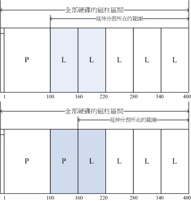
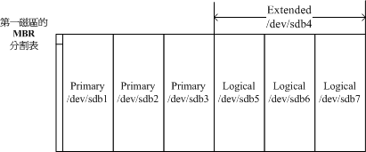
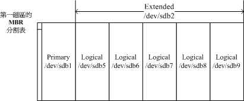

# 第二章、主机规划与磁盘分区

最近更新日期：20//

事实上，要安装好一部 Linux 主机并不是那么简单的事情，你必须要针对 distributions 的特性、服务器软件的能力、 未来的升级需求、硬件扩充性需求等等来考虑，还得要知道磁盘分区、文件系统、Linux 操作较频繁的目录等等， 都得要有一定程度的了解才行，所以，安装 Linux 并不是那么简单的工作喔！ 不过，要学习 Linux 总得要有 Linux 系统存在吧？所以鸟哥在这里还是得要提前说明如何安装一部 Linux 练习机。 在这一章里面，鸟哥会介绍一下，在开始安装 Linux 之前，您应该要先思考哪些工作？ 好让您后续的主机维护轻松愉快啊！此外，要了解这个章节的重要性，您至少需要了解到 Linux 文件系统的基本概念， 这部份初学者是不可能具备的！所以初学者在这个章节里面可能会觉得很多部份都是莫名其妙！没关系！ 在您完成了后面的相关章节之后，记得要再回来这里看看如何规划主机即可！ ^_^

# 2.1 Linux 与硬件的搭配

## 2.1 Linux 与硬件的搭配

虽然个人计算机各元件的主要接口是大同小异的，包括前面第零章计算机概论讲到的种种接口等， 但是由于新的技术来得太快，Linux 核心针对新硬件所纳入的驱动程序模块比不上硬件更新的速度， 加上硬件厂商针对 Linux 所推出的驱动程序较慢，因此你在选购新的个人计算机（或服务器）时， 应该要选择已经过安装 Linux 测试的硬件比较好。

此外，在安装 Linux 之前，你最好了解一下你的 Linux 预计是想达成什么任务，这样在选购硬件时才会知道那个元件是最重要的。 举例来说，桌面电脑（Desktop）的使用者，应该会用到 X Window 系统， 此时，显卡的优劣与内存的大小可就占有很重大的影响。如果是想要做成文件服务器， 那么硬盘或者是其他的储存设备，应该就是您最想要增购的元件啰！所以说，功课还是需要作的啊！

鸟哥在这里要不厌其烦的再次的强调，Linux 对于计算机各元件/设备的分辨， 与大家惯用的 Windows 系统完全不一样！因为，各个元件或设备在 Linux 下面都是“一个文件！” 这个观念我们在第一章 Linux 是什么里面已经提过， 这里我们再次的强调。因此，你在认识各项设备之后，学习 Linux 的设备文件名之前， 务必要先将 Windows 对于设备名称的概念先拿掉～否则会很难理解喔！

### 2.1.1 认识计算机的硬件配备

“什么？学 Linux 还得要玩硬件？”呵呵！没错！ 这也是为什么鸟哥要将计算机概论搬上台面之故！ 我们这里主要是介绍较为普遍的个人计算机架构来设置 Linux 服务器，因为比较便宜啦！ 至于各相关的硬件元件说明已经在第零章计概内讲过了，这里不再重复说明。 仅将重要的主板与元件的相关性图示如下：

图 2.1.1、个人计算机各元件的相关性 （上述图示主要取自 tom's 硬件指南，各元件图片分属个别公司所有）

那么我们应该如何挑选计算机硬件呢？随便买买就好，还是有特殊的考虑？下面有些思考角度可以提供给大家参考看看：

*   游戏机/工作机的考虑

事实上，计算机主机的硬件配备与这部主机未来的功能是很有相关性的！举例来说，家里有小孩， 或者自己仍然算是小孩的朋友大概都知道：“要用来打 Game 的“游戏机计算机” 所需要的配备一定比办公室用的“工作机计算机”配备更高档”，为什么呢？ 因为现在一般的三维（3D）计算机游戏所需要的 3D 光影运算太多了，所以显卡与 CPU 资源都会被耗用的非常多！ 当然就需要比较高级的配备啰，尤其是在显卡、CPU（例如 Intel 的 I5, I7 系列的） 及主板芯片组方面的功能。

至于办公室的工作环境中，最常使用到的软件大多是办公软件（Office），最常使用的网络功能是浏览器， 这些软件所需要的运算并不高，理论上目前的入门级计算机都能够跑得非常顺畅了！ 甚至很多企业都喜欢购买将显卡、主板芯片组整合在一起的整合型芯片的计算机，因为便宜又好用！

*   “性能/价格”比与“性能/消耗的瓦数”比的考虑

并不是“贵就比较好”喔！在目前（2015）电费居高不下的情况，如何兼顾省钱与计算机硬件的性能问题，很重要！ 如果你喜欢购买最新最快的计算机零件，这些刚出炉的元件都非常的贵，而且操作系统还不见得能够完整的支持。 所以，鸟哥都比较喜欢购买主流级的产品而非最高档的。因为我们最好能够考虑到性能/价格比。 如果高一级的产品让你的花费多一倍，但是新增加的性能却只有 10%而已，那这个性能/价格的比值太低，不建议啦！

此外，由于电价越来越高，如何“省电”就很重要啦！因此目前硬件评论界有所谓的“每瓦性能”的单位， 每瓦电力所发挥的性能越高，当然代表越省电啊！这也是购买硬件时的考虑之一啦！要知道，如果是做为服务器用， 一年 365 天中时时刻刻都开机，则你的计算机多花费 50 瓦的电力时，每年就得要多花 450 度电左右（50W*365 天*24 小时/天/1000W=438 度电），如果以企业来讲， 每百部计算机每年多花 450 度电的话，每年得多花十万块以上的电费呢 （以一度电 3 块钱来计算） ！所以这也需要考虑啊！

*   支持度的考虑

并非所有的产品都会支持特定的操作系统，这牵涉到硬件开发商是否有意愿提供适当的驱动程序之故。 因此，当我们想要购买或者是升级某些计算机元件时，应该要特别注意该硬件是否有针对您的操作系统提供适当的驱动程序， 否则，买了无法使用，那才是叫人呕死啊！因此，针对 Linux 来说，下面的硬件分析就重要啦！

**Tips**因为鸟哥会自己编译驱动程序，所以上次买家用桌面电脑时，就委托鸟嫂全权处理 （因为钱钱是鸟嫂负责的嘛！嘿嘿！省的麻烦！）！ 反正最多就是自己去找 driver 来编译，那也没什么～您说是吧？ 没想到来的主板上面内置的那颗网卡驱动程序，网卡开发商的官网上面并没有提供 source code！鸟哥赶紧回去查一下该主板的说明， 结果...说明书上面明明白白的说，这块主板仅提供支持 windows 的 drivers 而已...还建议不要拿来装 Linux 之用... 当下还是默默的去找了一块 PCI-e 网卡来插了...连 source code 都没有，是要编译啥啦！巧妇难为无米之炊啊～～ @_@～～ 这个故事告诉我们，作人不要太铁齿，硬件该查阅的工作还是要做啦！

### 2.1.2 选择与 Linux 搭配的主机配备

由于硬件的加速发展与操作系统核心功能的增强，导致较早期的计算机已经没有能力再负荷新的操作系统了。 举例来说，Pentun-III 以前的硬件配备可能已经不再适合现在的新的 Linux distribution。 而且较早期的硬件配备也可能由于保存的问题或者是电子零件老化的问题， 导致这样的计算机系统反而非常容易在运行过程中出现不明的死机情况，因此在利用旧零件拼凑 Linux 使用的计算机系统时， 真的得要特别留意呢！

不过由于 Linux 运行所需要的硬件配备实在不需要太高档，因此，如果有近期汰换下来的五年内的计算机， 不必急着丢弃。由于 CPU 为 i3 等级的硬件不算太老旧，在性能方面其实也算的上非常 OK 了～所以， 鸟哥建议您如果有五年内的计算机被淘汰，可以拿下来测试一下，说不定能够作为你日常生活的 Linux 服务器， 或者是备用服务器，都是非常好用的功能哩！

但是由于不同的任务的主机所需要的硬件配备并不相同，举例来说，如果你的 Linux 主机是要作为企业内部的 Mail server 或者是 Proxy server 时，或者是需要使用到图形接口的运算（X Window 内的 Open GL 等等功能）， 那么你就必须要选择高档一点的计算机配备了，使用过去的计算机零件可能并不适合呢。

下面我们稍微谈一下，如果你的 Linux 主要是作为小型服务器使用，并不负责学术方面的大量运算， 而且也没有使用 X Window 的图形接口，那你的硬件需求只要像下面这样就差不多了：

*   CPU CPU 只要不是老旧到会让你的硬件系统死机的都能够支持！如同前面谈到的，目前（2015）的环境中， Intel i3 系列的 CPU 不算太旧而且性能也不错，非常好用了。

*   RAM 内存是越大越好！事实上在 Linux 服务器中，内存的重要性比 CPU 还要高的多！因为如果内存不够大， 就会使用到硬盘的内存交换空间（swap）。 而由计算机概论的内容我们知道硬盘比内存的速度要慢的多， 所以内存太小可能会影响到整体系统的性能的！尤其如果你还想要玩 X window 的话，那内存的容量就不能少。 对于一般的小型服务器来说，建议至少也要 512MB 以上的内存容量较佳。老实说，目前 DDR3 的硬件环境中， 新购系统动不动就是 4~16GB 的内存，真的是很够用了！

*   Hard Disk 由于数据量与数据存取频率的不同，对于硬盘的要求也不相同。 举例来说，如果是一般小型服务器，通常重点在于容量，硬盘容量大于 20GB 就够用到不行了！ 但如果你的服务器是作为备份或者是小企业的文件服务器，那么你可能就得要考虑较高阶的磁盘阵列（RAID）模式了。 

    **Tips** 磁盘阵列（RAID）是利用硬件技术将数个硬盘整合成为一个大硬盘的方法，操作系统只会看到最后被整合起来的大硬盘。 由于磁盘阵列是由多个硬盘组成，所以可以达成速度性能、备份等任务。更多相关的磁盘阵列我们会在第十四章中介绍的。

*   VGA 对于不需要 X Window 的服务器来说，显卡算是最不重要的一个元件了！你只要有显卡能够让计算机启动，那就够了。 但如果需要 X window 系统时，你的显卡最好能够拥有 32MB 以上的内存容量，否则跑 X 系统会很累喔！

*   Network Interface Card 网卡是服务器上面最重要的元件之一了！目前的主板大多拥有内置 10/100/1000Mbps 的超高速以太网卡。 但要注意的是，不同的网卡的功能还是有点差异。举例来说，鸟哥曾经需要具有可以设置 bonding 功能的网卡， 结果，某些较低阶的 gigabit 网卡并没有办法提供这个项目的支持！真是伤脑筋！此外，比较好的网卡通常 Linux 驱动程序也做的比较好，用起来会比较顺畅。因此，如果你的服务器是 网络 I/O 行为非常频繁的网站， 好一点的 Intel/boradcom 等公司的网卡应该是比较适合的喔。

*   光盘、软盘、键盘与鼠标 不要旧到你的计算机不支持就好了，因为这些配备都是非必备的喔！举例来说，鸟哥安装好 Linux 系统后， 可能就将该系统的光驱、鼠标、软盘机等通通拔除，只有网络线连接在计算机后面而已，其他的都是通过网络连线来管控的哩！ 因为通常服务器这东西最需要的就是稳定，而稳定的最理想状态就是平时没事不要去动他是最好的。

下面鸟哥针对一般你可能会接触到的计算机主机的用途与相关硬件配备的基本要求来说明一下好了：

*   一般小型主机且不含 X Window 系统：

    *   用途：家庭用 NAT 主机（IP 分享器功能）或小型企业之非图形接口小型主机。
    *   CPU：五年内出产的产品即可。
    *   RAM：至少 512MB，不过还是大于 1GB 以上比较妥当！
    *   网卡：一般的以太网卡即可应付。
    *   显卡：只要能够被 Linux 捉到的显卡即可，例如 NVidia 或 ATI 的主流显卡均可。
    *   硬盘：20GB 以上即可！
*   桌上型（Desktop）Linux 系统/含 X Window：

    *   用途：Linux 的练习机或办公室（Office）工作机。（一般我们会用到的环境）
    *   CPU：最好等级高一点，例如 Intel I5, I7 以上等级。
    *   RAM：一定要大于 1GB 比较好！否则容易有图形接口停顿的现象。
    *   网卡：普通的以太网卡就好了！
    *   显卡：使用 256MB 以上内存的显卡！（入门级的都这个容量以上了）
    *   硬盘：越大越好，最好有 60GB。
*   中型以上 Linux 服务器：

    *   用途：中小型企业/学校单位的 FTP/mail/WWW 等网络服务主机。
    *   CPU：最好等级高一点，例如 I5, I7 以上的多核心系统。
    *   RAM：最好能够大于 1GB 以上，大于 4GB 更好！
    *   网卡：知名的 broadcom 或 Intel 等厂牌，比较稳定性能较佳！
    *   显卡：如果有使用到图形功能，则一张 64MB 内存的显卡是需要的！
    *   硬盘：越大越好，如果可能的话，使用磁盘阵列，或者网络硬盘等等的系统架构， 能够具有更稳定安全的传输环境，更佳！
    *   建议企业用计算机不要自行组装，可购买商用服务器较佳， 因为商用服务器已经通过制造商的散热、稳定性等测试，对于企业来说，会是一个比较好的选择。

总之，鸟哥在这里仅是提出一个方向：如果你的 Linux 主机是小型环境使用的，实时死机也不太会影响到企业环境的运行时， 那么使用升级后被淘汰下来的零件以组成计算机系统来运行，那是非常好的回收再利用的案例。 但如果你的主机系统是非常重要的，你想要更一部更稳定的 Linux 服务器，那考虑系统的整体搭配与运行性能的考虑， 购买已组装测试过的商用服务器会是一个比较好的选择喔！

**Tips** 一般来说，目前（2015）的入门计算机机种，CPU 至少都是 Intel i3 的 2GHz 系列的等级以上， 内存至少有 2GB，显存也有 512MB 以上，所以如果您是新购置的计算机， 那么该计算机用来作为 Linux 的练习机，而且加装 X Window 系统，肯定是可以跑的吓吓叫的啦！^_^

此外，Linux 开发商在释出 Linux distribution 之前，都会针对该版所默认可以支持的硬件做说明， 因此，你除了可以在 Linux 的 Howto 文件去查询硬件的支持度之外，也可以到各个相关的 Linux distributions 网站去查询呢！ 下面鸟哥列出几个常用的硬件与 Linux distributions 搭配的网站，建议大家想要了解你的主机支不支持该版 Linux 时， 务必到相关的网站去搜寻一下喔！

*   Red Hat 的硬件支持：[`hardware.redhat.com/?pagename=hcl`](https://hardware.redhat.com/?pagename=hcl)
*   Open SuSE 的硬件支持：[`en.opensuse.org/Hardware?LANG=en_UK`](http://en.opensuse.org/Hardware?LANG=en_UK)
*   Linux 对笔记本电脑的支持：[`www.linux-laptop.net/`](http://www.linux-laptop.net/)
*   Linux 对打印机的支持：[`www.openprinting.org/`](http://www.openprinting.org/)
*   Linux 硬件支持的中文 HowTo：[`www.linux.org.tw/CLDP/HOWTO/hardware.html#hardware`](http://www.linux.org.tw/CLDP/HOWTO/hardware.html#hardware)

总之，如果是自己维护的一个小网站，考虑到经济因素，你可以自行组装一部主机来架设。 而如果是中、大型企业，那么主机的钱不要省～因为，省了这些钱，未来主机挂点时， 光是要找出哪个元件出问题，或者是系统过热的问题，会气死人ㄟ！ 而且，要注意的就是未来你的 Linux 主机规划的“用途”来决定你的 Linux 主机硬件配备喔！相当的重要呢！

### 2.1.3 各硬件设备在 Linux 中的文件名

选择好你所需要的硬件配备后，接下来得要了解一下各硬件在 Linux 当中所扮演的角色啰。 这里鸟哥再次的强调一下：“在 Linux 系统中，每个设备都被当成一个文件来对待” 举例来说，SATA 接口的硬盘的文件名称即为/dev/sd[a-d]，其中， 括号内的字母为 a-d 当中的任意一个，亦即有/dev/sda, /dev/sdb, /dev/sdc, 及 /dev/sdd 这四个文件的意思。

**Tips** 这种中括号 [ ] 型式的表达式在后面的章节当中会使用得很频繁，请特别留意

另外先提出来强调一下，在 Linux 这个系统当中，几乎所有的硬件设备文件都在/dev 这个目录内， 所以你会看到/dev/sda, /dev/sr0 等等的文件名喔。

那么打印机与软盘呢？分别是/dev/lp0, /dev/fd0 啰！好了，其他的周边设备呢？ 下面列出几个常见的设备与其在 Linux 当中的文件名啰：

| 设备 | 设备在 Linux 内的文件名 |
| --- | --- |
| SCSI/SATA/USB 硬盘机 | /dev/sd[a-p] |
| USB 闪存盘 | /dev/sd[a-p] （与 SATA 相同） |
| VirtI/O 界面 | /dev/vd[a-p] （用于虚拟机内） |
| 软盘机 | /dev/fd[0-7] |
| 打印机 | /dev/lp[0-2] （25 针打印机） /dev/usb/lp[0-15] （USB 接口） |
| 鼠标 | /dev/input/mouse[0-15] （通用） /dev/psaux （PS/2 界面） /dev/mouse （当前鼠标） |
| CDROM/DVDROM | /dev/scd[0-1] （通用） /dev/sr[0-1] （通用，CentOS 较常见） /dev/cdrom （当前 CDROM） |
| 磁带机 | /dev/ht0 （IDE 界面） /dev/st0 （SATA/SCSI 界面） /dev/tape （当前磁带） |
| IDE 硬盘机 | /dev/hd[a-d] （旧式系统才有） |

时至今日，由于 IDE 界面的磁盘机几乎已经被淘汰，太少见了！因此现在连 IDE 界面的磁盘文件名也都被仿真成 /dev/sd[a-p] 了！此外， 如果你的机器使用的是跟网际网络供应商 （ISP） 申请使用的云端机器，这时可能会得到的是虚拟机。为了加速，虚拟机内的磁盘是使用仿真器产生， 该仿真器产生的磁盘文件名为 /dev/vd[a-p] 系列的文件名喔！要注意！要注意！

**Tips** 更多 Linux 核心支持的硬件设备与文件名，可以参考如下网页： [`www.kernel.org/doc/Documentation/devices.txt`](https://www.kernel.org/doc/Documentation/devices.txt)

### 2.1.4 使用虚拟机学习

由于近年来硬件虚拟化技术的成熟，目前普通的中阶个人计算机的 CPU 微指令集中，就已经整合了硬件虚拟化指令集了！ 所以，随便一台计算机就能够虚拟化出好几台逻辑独立的系统了！很赞！

因为虚拟化系统可以很简单的制作出相仿的硬件资源，因此我们在学习的时候，比较能够取得相同的环境来查阅学习的效果！ 所以，在本书的后续所有动作中，我们都是使用虚拟化系统来做说明！毕竟未来你实际接触到 Linux 系统时，很有可能公司交代给你的就是虚拟机了！ 趁早学也不错！

由于虚拟化的软件非常之多，网络上也有一堆朋友的教学在。如果你的系统是 windows 系列的话，鸟哥个人推荐你使用 virtualbox 这个软件！ 至于如果你原本就用 Linux 系统，例如 Fedora/Ubuntu 等系列的话，那么建议你使用原本系统内就有的虚拟机管理员来处理即可。目前 Linux 系统大多使用 KVM 这个虚拟化软件就是了。下面提供一些网站给您学习学习！鸟哥之后的章节所使用的机器，就是通过 KVM 创建出来的系统喔！ 提供给你作参考啰。

*   [Virtualbox 官网 （https://www.virtualbox.org）](https://www.virtualbox.org/)
*   [Virtualbox 官网教学 （https://www.virtualbox.org/manual/ch01.html）](https://www.virtualbox.org/manual/ch01.html)
*   [Fedora 教学 http://docs.fedoraproject.org/en-US/Fedora/13/html/Virtualization_Guide/part-Virtualization-Virtualization_Reference_Guide.html](http://docs.fedoraproject.org/en-US/Fedora/13/html/Virtualization_Guide/part-Virtualization-Virtualization_Reference_Guide.html)

# 2.2 磁盘分区

## 2.2 磁盘分区

这一章在规划的重点是为了要安装 Linux，那 Linux 系统是安装在计算机元件的那个部分呢？就是磁盘啦！所以我们当然要来认识一下磁盘先。 我们知道一块磁盘是可以被分区成多个分区的（partition），以旧有的 Windows 观点来看，你可能会有一颗磁盘并且将他分区成为 C:, D:, E:盘对吧！那个 C, D, E 就是分区（partition）啰。但是 Linux 的设备都是以文件的型态存在，那分区的文件名又是什么？ 如何进行磁盘分区？磁盘分区有哪些限制？目前的 BIOS 与 UEFI 分别是啥？MSDOS 与 GPT 又是啥？ 都是我们这个小节所要探讨的内容啰。

### 2.2.1 磁盘连接的方式与设备文件名的关系

由第零章提到的磁盘说明，我们知道个人计算机常见的磁盘接口有两种， 分别是 SATA 与 SAS 接口，目前（2015）的主流是 SATA 接口。不过更老旧的计算机则有可能是已经不再流行的 IDE 界面喔！ 以前的 IDE 界面与 SATA 界面在 Linux 的磁盘代号并不相同，不过近年来为了统一处理，大部分 Linux distribution 已经将 IDE 界面的磁盘文件名也仿真成跟 SATA 一样了！ 所以你大概不用太担心磁盘设备文件名的问题了！

时代在改变啊～既然 IDE 界面都可以消失了，那磁盘文件名还有什么可谈的呢？嘿嘿！有啊！如同上一小节谈到的，虚拟化是目前很常见的一项技术， 因此你在使用的机器很可能就是虚拟机，这些虚拟机使用的“虚拟磁盘”并不是正规的磁盘界面！这种情况下面，你的磁盘文件名就不一样了！ 正常的实体机器大概使用的都是 /dev/sd[a-] 的磁盘文件名，至于虚拟机环境下面，为了加速，可能就会使用 /dev/vd[a-p] 这种设备文件名喔！ 因此在实际处理你的系统时，可能得要了解为啥会有两种不同磁盘文件名的原因才好！

例题：假设你的主机为虚拟机，里面仅有一颗 VirtIO 接口的磁盘，请问他在 Linux 操作系统里面的设备文件名为何？答：参考 2.1.3 小节的介绍，虚拟机使用 VirtIO 界面时，磁盘文件名应该是 /dev/vda 才对！

再以 SATA 接口来说，由于 SATA/USB/SAS 等磁盘接口都是使用 SCSI 模块来驱动的， 因此这些接口的磁盘设备文件名都是/dev/sd[a-p]的格式。 所以 SATA/USB 接口的磁盘根本就没有一定的顺序，那如何决定他的设备文件名呢？ 这个时候就得要根据 Linux 核心侦测到磁盘的顺序了！这里以下面的例子来让你了解啰。

例题：如果你的 PC 上面有两个 SATA 磁盘以及一个 USB 磁盘，而主板上面有六个 SATA 的插槽。这两个 SATA 磁盘分别安插在主板上的 SATA1, SATA5 插槽上， 请问这三个磁盘在 Linux 中的设备文件名为何？答：由于是使用侦测到的顺序来决定设备文件名，并非与实际插槽代号有关，因此设备的文件名如下：

1.  SATA1 插槽上的文件名：/dev/sda
2.  SATA5 插槽上的文件名：/dev/sdb
3.  USB 磁盘（开机完成后才被系统捉到）：/dev/sdc

通过上面的介绍后，你应该知道了在 Linux 系统下的各种不同接口的磁盘的设备文件名了。 OK！好像没问题了呦！才不是呢～问题很大呦！ 因为如果你的磁盘被分区成两个分区，那么每个分区的设备文件名又是什么？在了解这个问题之前，我们先来复习一下磁盘的组成， 因为现今磁盘的分区与他物理的组成很有关系！

我们在计算机概论谈过磁盘的组成主要有盘片、机械手臂、磁头与主轴马达所组成， 而数据的写入其实是在盘片上面。盘片上面又可细分出扇区（Sector）与磁道（Track）两种单位， 其中扇区的物理量设计有两种大小，分别是 512Bytes 与 4KBytes。假设磁盘只有一个盘片，那么盘片有点像下面这样：

图 2.2.1、盘片组成示意图

那么是否每个扇区都一样重要呢？其实整颗磁盘的第一个扇区特别的重要，因为他记录了整颗磁盘的重要信息！ 早期磁盘第一个扇区里面含有的重要信息我们称为 MBR （Master Boot Record） 格式，但是由于近年来磁盘的容量不断扩大，造成读写上的一些困扰， 甚至有些大于 2TB 以上的磁盘分区已经让某些操作系统无法存取。因此后来又多了一个新的磁盘分区格式，称为 GPT （GUID partition table）！ 这两种分区格式与限制不太相同啦！

那么分区表又是啥？其实你刚刚拿到的整颗硬盘就像一根原木，你必须要在这根原木上面切割出你想要的区段， 这个区段才能够再制作成为你想要的家具！如果没有进行切割，那么原木就不能被有效的使用。 同样的道理，你必须要针对你的硬盘进行分区，这样硬盘才可以被你使用的！

### 2.2.2 MSDOS（MBR） 与 GPT 磁盘分区表（partition table）

但是硬盘总不能真的拿锯子来切切割割吧？那硬盘还真的是会坏掉去！那怎办？在前一小节的图示中， 我们有看到“开始与结束磁道”吧？而通常磁盘可能有多个盘片，所有盘片的同一个磁道我们称为柱面 （Cylinder）， 通常那是文件系统的最小单位，也就是分区的最小单位啦！为什么说“通常”呢？因为近来有 GPT 这个可达到 64bit 纪录功能的分区表， 现在我们甚至可以使用扇区 （sector） 号码来作为分区单位哩！厉害了！ 所以说，我们就是利用参考对照柱面或扇区号码的方式来处理啦！

也就是说，分区表其实目前有两种格式喔！我们就依序来谈谈这两种分区表格式吧。

*   MSDOS （MBR） 分区表格式与限制

早期的 Linux 系统为了相容于 Windows 的磁盘，因此使用的是支持 Windows 的 MBR（Master Boot Record, 主要开机纪录区） 的方式来处理开机管理程序与分区表！而开机管理程序纪录区与分区表则通通放在磁盘的第一个扇区， 这个扇区通常是 512Bytes 的大小 （旧的磁盘扇区都是 512Bytes 喔！），所以说，第一个扇区 512Bytes 会有这两个数据：

*   主要开机记录区（Master Boot Record, MBR）：可以安装开机管理程序的地方，有 446 Bytes
*   分区表（partition table）：记录整颗硬盘分区的状态，有 64 Bytes

由于分区表所在区块仅有 64 Bytes 容量，因此最多仅能有四组记录区，每组记录区记录了该区段的启始与结束的柱面号码。 若将硬盘以长条形来看，然后将柱面以直条图来看，那么那 64 Bytes 的记录区段有点像下面的图示：

图 2.2.2、磁盘分区表的作用示意图

假设上面的硬盘设备文件名为/dev/sda 时，那么这四个分区在 Linux 系统中的设备文件名如下所示， 重点在于文件名后面会再接一个数字，这个数字与该分区所在的位置有关喔！

*   P1:/dev/sda1
*   P2:/dev/sda2
*   P3:/dev/sda3
*   P4:/dev/sda4

上图中我们假设硬盘只有 400 个柱面，共分区成为四个分区，第四个分区所在为第 301 到 400 号柱面的范围。 当你的操作系统为 Windows 时，那么第一到第四个分区的代号应该就是 C, D, E, F。当你有数据要写入 F 盘时， 你的数据会被写入这颗磁盘的 301~400 号柱面之间的意思。

由于分区表就只有 64 Bytes 而已，最多只能容纳四笔分区的记录， 这四个分区的记录被称为主要（Primary）或延伸（Extended）分区。 根据上面的图示与说明，我们可以得到几个重点信息：

*   其实所谓的“分区”只是针对那个 64 Bytes 的分区表进行设置而已！
*   硬盘默认的分区表仅能写入四组分区信息
*   这四组分区信息我们称为主要（Primary）或延伸（Extended）分区
*   分区的最小单位“通常”为柱面（cylinder）
*   当系统要写入磁盘时，一定会参考磁盘分区表，才能针对某个分区进行数据的处理

咦！你会不会突然想到，为啥要分区啊？基本上你可以这样思考分区的角度：

1.  数据的安全性： 因为每个分区的数据是分开的！所以，当你需要将某个分区的数据重整时，例如你要将计算机中 Windows 的 C 盘重新安装一次系统时， 可以将其他重要数据移动到其他分区，例如将邮件、桌面数据移动到 D 盘去，那么 C 盘重灌系统并不会影响到 D 盘！ 所以善用分区，可以让你的数据更安全。

2.  系统的性能考虑： 由于分区将数据集中在某个柱面的区段，例如上图当中第一个分区位于柱面号码 1~100 号，如此一来当有数据要读取自该分区时， 磁盘只会搜寻前面 1~100 的柱面范围，由于数据集中了，将有助于数据读取的速度与性能！所以说，分区是很重要的！

既然分区表只有记录四组数据的空间，那么是否代表我一颗硬盘最多只能分区出四个分区？当然不是啦！有经验的朋友都知道， 你可以将一颗硬盘分区成十个以上的分区的！那又是如何达到的呢？在 Windows/Linux 系统中， 我们是通过刚刚谈到的延伸分区（Extended）的方式来处理的啦！延伸分区的想法是： 既然第一个扇区所在的分区表只能记录四笔数据， 那我可否利用额外的扇区来记录更多的分区信息？实际上图示有点像下面这样：

图 2.2.3、磁盘分区表的作用示意图

**Tips** 实际上延伸分区并不是只占一个区块，而是会分佈在每个分区的最前面几个扇区来记载分区信息的！只是为了方便读者记忆， 鸟哥在上图就将他简化了！有兴趣的读者可以到下面的链接瞧一瞧实际延伸分区的纪录方式： [`en.wikipedia.org/wiki/Extended_boot_record`](http://en.wikipedia.org/wiki/Extended_boot_record)

在上图当中，我们知道硬盘的四个分区记录区仅使用到两个，P1 为主要分区，而 P2 则为延伸分区。请注意， 延伸分区的目的是使用额外的扇区来记录分区信息，延伸分区本身并不能被拿来格式化。 然后我们可以通过延伸分区所指向的那个区块继续作分区的记录。

如上图右下方那个区块有继续分区出五个分区， 这五个由延伸分区继续切出来的分区，就被称为逻辑分区（logical partition）。 同时注意一下，由于逻辑分区是由延伸分区继续分区出来的，所以他可以使用的柱面范围就是延伸分区所设置的范围喔！ 也就是图中的 101~400 啦！

同样的，上述的分区在 Linux 系统中的设备文件名分别如下：

*   P1:/dev/sda1
*   P2:/dev/sda2
*   L1:/dev/sda5
*   L2:/dev/sda6
*   L3:/dev/sda7
*   L4:/dev/sda8
*   L5:/dev/sda9

仔细看看，怎么设备文件名没有/dev/sda3 与/dev/sda4 呢？因为前面四个号码都是保留给 Primary 或 Extended 用的嘛！ 所以逻辑分区的设备名称号码就由 5 号开始了！这在 MBR 方式的分区表中是个很重要的特性，不能忘记喔！

MBR 主要分区、延伸分区与逻辑分区的特性我们作个简单的定义啰：

*   主要分区与延伸分区最多可以有四笔（硬盘的限制）
*   延伸分区最多只能有一个（操作系统的限制）
*   逻辑分区是由延伸分区持续切割出来的分区；
*   能够被格式化后，作为数据存取的分区为主要分区与逻辑分区。延伸分区无法格式化；
*   逻辑分区的数量依操作系统而不同，在 Linux 系统中 SATA 硬盘已经可以突破 63 个以上的分区限制；

事实上，分区是个很麻烦的东西，因为他是以柱面为单位的“连续”磁盘空间， 且延伸分区又是个类似独立的磁盘空间，所以在分区的时候得要特别注意。我们举下面的例子来解释一下好了：

例题：在 Windows 操作系统当中，如果你想要将 D 与 E 盘整合成为一个新的分区，而如果有两种分区的情况如下图所示， 图中的特殊颜色区块为 D 与 E 盘的示意，请问这两种方式是否均可将 D 与 E 整合成为一个新的分区？ 图 2.2.4、磁盘空间整合示意图答：

*   上图可以整合：因为上图的 D 与 E 同属于延伸分区内的逻辑分区，因此只要将两个分区删除，然后再重新创建一个新的分区， 就能够在不影响其他分区的情况下，将两个分区的容量整合成为一个。

*   下图不可整合：因为 D 与 E 分属主分区与逻辑分区，两者不能够整合在一起。除非将延伸分区破坏掉后再重新分区。 但如此一来会影响到所有的逻辑分区，要注意的是：如果延伸分区被破坏，所有逻辑分区将会被删除。 因为逻辑分区的信息都记录在延伸分区里面嘛！

由于第一个扇区所记录的分区表与 MBR 是这么的重要，几乎只要读取硬盘都会先由这个扇区先读起。 因此，如果整颗硬盘的第一个扇区（就是 MBR 与 partition table 所在的扇区）物理实体坏掉了，那这个硬盘大概就没有用了！ 因为系统如果找不到分区表，怎么知道如何读取柱面区间呢？您说是吧！下面还有一些例题您可以思考看看：

例题：如果我想将一颗大硬盘“暂时”分区成为四个 partitions，同时还有其他的剩余容量可以让我在未来的时候进行规划， 我能不能分区出四个 Primary？若不行，那么你建议该如何分区？答：

*   由于 Primary+Extended 最多只能有四个，其中 Extended 最多只能有一个，这个例题想要分区出四个分区且还要预留剩余容量， 因此 P+P+P+P 的分区方式是不适合的。因为如果使用到四个 P，则即使硬盘还有剩余容量， 因为无法再继续分区，所以剩余容量就被浪费掉了。

*   假设你想要将所有的四笔记录都花光，那么 P+P+P+E 是比较适合的。所以可以用的四个 partitions 有 3 个主要及一个逻辑分区， 剩余的容量在延伸分区中。

*   如果你要分区超过 4 个以上时，一定要有 Extended 分区，而且必须将所有剩下的空间都分配给 Extended， 然后再以 logical 的分区来规划 Extended 的空间。 另外，考虑到磁盘的连续性，一般建议将 Extended 的柱面号码分配在最后面的柱面内。

例题：假如我的 PC 有两颗 SATA 硬盘，我想在第二颗硬盘分区出 6 个可用的分区（可以被格式化来存取数据之用）， 那每个分区在 Linux 系统下的设备文件名为何？且分区类型各为何？至少写出两种不同的分区方式。答：由于 P（primary）+E（extended）最多只能有四个，其中 E 最多只能有一个。现在题目要求 6 个可用的分区，因此不可能分出四个 P。 下面我们假设两种环境，一种是将前四号全部用完，一种是仅花费一个 P 及一个 E 的情况：

*   P+P+P+E 的环境： 图 2.2.5、分区示意图实际可用的是/dev/sdb1, /dev/sdb2, /dev/sdb3, /dev/sdb5, /dev/sdb6, /dev/sdb7 这六个，至于/dev/sdb4 这个延伸分区本身仅是提供来给逻辑分区创建之用。

*   P+E 的环境： 图 2.2.6、分区示意图注意到了吗？因为 1~4 号是保留给主要/延伸分区的，因此第一个逻辑分区一定是由 5 号开始的！再次强调啊！ 所以/dev/sdb3, /dev/sdb4 就会被保留下来没有用到了！

MBR 分区表除了上述的主分区、延伸分区、逻辑分区需要注意之外，由于每组分区表仅有 16Bytes 而已，因此可纪录的信息真的是相当有限的！ 所以，在过去 MBR 分区表的限制中经常可以发现如下的问题：

*   操作系统无法抓取到 2.2T 以上的磁盘容量！
*   MBR 仅有一个区块，若被破坏后，经常无法或很难救援。
*   MBR 内的存放开机管理程序的区块仅 446Bytes，无法容纳较多的程序码。

这个 2.2TB 限制的现象在早期并不会很严重。但是，近年来硬盘厂商动不对推出的磁盘容量就高达好几个 TB 的容量！目前 （2015） 单一磁盘最大容量甚至高达 8TB 了！ 如果使用磁盘阵列的系统，像鸟哥的一组系统中，用了 24 颗 4TB 磁盘搭建出磁盘阵列，那在 Linux 下面就会看到有一颗 70TB 左右的磁盘！ 如果使用 MBR 的话...那得要 2TB/2TB 的割下去，虽然 Linux kernel 现在已经可以通过某些机制让磁盘分区高过 63 个以上，但是这样就得要割出将近 40 个分区～ 真要命... 为了解决这个问题，所以后来就有 GPT 这个磁盘分区的格式出现了！

*   GUID partition table, GPT 磁盘分区表[[1]](#ps1)

因为过去一个扇区大小就是 512Bytes 而已，不过目前已经有 4K 的扇区设计出现！为了相容于所有的磁盘，因此在扇区的定义上面， 大多会使用所谓的逻辑区块位址（Logical Block Address, LBA）来处理。GPT 将磁盘所有区块以此 LBA（默认为 512Bytes 喔！） 来规划，而第一个 LBA 称为 LBA0 （从 0 开始编号）。

与 MBR 仅使用第一个 512Bytes 区块来纪录不同， GPT 使用了 34 个 LBA 区块来纪录分区信息！同时与过去 MBR 仅有一的区块，被干掉就死光光的情况不同， GPT 除了前面 34 个 LBA 之外，整个磁盘的最后 33 个 LBA 也拿来作为另一个备份！这样或许会比较安全些吧！详细的结构有点像下面的模样：

图 2.2.7、GPT 分区表的结构示意图

上述图示的解释说明如下：

*   LBA0 （MBR 相容区块）

    与 MBR 模式相似的，这个相容区块也分为两个部份，一个就是跟之前 446 Bytes 相似的区块，储存了第一阶段的开机管理程序！ 而在原本的分区表的纪录区内，这个相容模式仅放入一个特殊标志的分区，用来表示此磁盘为 GPT 格式之意。而不懂 GPT 分区表的磁盘管理程序， 就不会认识这颗磁盘，除非用户有特别要求要处理这颗磁盘，否则该管理软件不能修改此分区信息，进一步保护了此磁盘喔！

*   LBA1 （GPT 表头纪录）

    这个部份纪录了分区表本身的位置与大小，同时纪录了备份用的 GPT 分区 （就是前面谈到的在最后 34 个 LBA 区块） 放置的位置， 同时放置了分区表的检验机制码 （CRC32），操作系统可以根据这个检验码来判断 GPT 是否正确。若有错误，还可以通过这个纪录区来取得备份的 GPT（磁盘最后的那个备份区块） 来恢复 GPT 的正常运行！

*   LBA2-33 （实际纪录分区信息处）

    从 LBA2 区块开始，每个 LBA 都可以纪录 4 笔分区纪录，所以在默认的情况下，总共可以有 4*32 = 128 笔分区纪录喔！因为每个 LBA 有 512Bytes，因此每笔纪录用到 128 Bytes 的空间，除了每笔纪录所需要的识别码与相关的纪录之外，GPT 在每笔纪录中分别提供了 64bits 来记载开始/结束的扇区号码，因此，GPT 分区表对於单一分区来说， 他的最大容量限制就会在“ 264* 512Bytes = 263 *1KBytes = 233*TB = 8 ZB ”，要注意 1ZB = 230TB 啦！ 你说有没有够大了？

现在 GPT 分区默认可以提供多达 128 笔纪录，而在 Linux 本身的核心设备纪录中，针对单一磁盘来说，虽然过去最多只能到达 15 个分区，不过由于 Linux kernel 通过 udev 等方式的处理，现在 Linux 也已经没有这个限制在了！ 此外，GPT 分区已经没有所谓的主、延伸、逻辑分区的概念，既然每笔纪录都可以独立存在， 当然每个都可以视为是主分区！每一个分区都可以拿来格式化使用喔！

**Tips** 鸟哥一直以为核心认识的设备主要/次要号码就一定是连续的，因此一直没有注意到由于新的机制的关系，分区已经可以突破核心限制的状况！ 感谢大陆网友微博代号“学习日记博客”的提醒！此外，为了查询正确性，鸟哥还真的有注意到网络上有朋友实际拿一颗磁盘分区出 130 个以上的分区， 结果他发现 120 个以前的分区均可以格式化使用，但是 130 之后的似乎不太能够使用了！或许跟默认的 GPT 共 128 个号码有关！

虽然新版的 Linux 大多认识了 GPT 分区表，没办法，我们 server 常常需要比较大容量的磁盘嘛！不过，在磁盘管理工具上面， fdisk 这个老牌的软件并不认识 GPT 喔！要使用 GPT 的话，得要操作类似 gdisk 或者是 parted 指令才行！这部份我们会在第二篇再来谈一谈。 另外，开机管理程序方面， grub 第一版并不认识 GPT 喔！得要 grub2 以后才会认识的！开机管理程序这部份则第五篇再来谈喔！

并不是所有的操作系统都可以读取到 GPT 的磁盘分区格式喔！同时，也不是所有的硬件都可以支持 GPT 格式喔！是否能够读写 GPT 格式又与开机的检测程序有关！ 那开机的检测程序又分成啥鬼东西呢？就是 BIOS 与 UEFI 啦！那这两个又是啥东西？就让我们来聊一聊！

### 2.2.3 开机流程中的 BIOS 与 UEFI 开机检测程序

我们在计算机概论里面谈到了，没有执行软件的硬件是没有用的，除了会电人之外...， 而为了计算机硬件系统的资源合理分配，因此有了操作系统这个系统软件的产生。由于操作系统会控制所有的硬件并且提供核心功能， 因此我们的计算机就能够认识硬盘内的文件系统，并且进一步的读取硬盘内的软件文件与执行该软件来达成各项软件的执行目的。

问题是，你有没有发现，既然操作系统也是软件，那么我的计算机又是如何认识这个操作系统软件并且执行他的？ 明明开机时我的计算机还没有任何软件系统，那他要如何读取硬盘内的操作系统文件啊？嘿嘿！这就得要牵涉到计算机的开机程序了！ 下面就让我们来谈一谈这个开机程序吧！

基本上，目前的主机系统在载入硬件驱动方面的程序，主要有早期的 BIOS 与新的 UEFI 两种机制，我们分别来谈谈啰！

*   BIOS 搭配 MBR/GPT 的开机流程

在计算机概论里面我们有谈到那个可爱的 BIOS 与 CMOS 两个东西， CMOS 是记录各项硬件参数且嵌入在主板上面的储存器，BIOS 则是一个写入到主板上的一个固件（再次说明， 固件就是写入到硬件上的一个软件程序）。这个 BIOS 就是在开机的时候，计算机系统会主动执行的第一个程序了！

接下来 BIOS 会去分析计算机里面有哪些储存设备，我们以硬盘为例，BIOS 会依据使用者的设置去取得能够开机的硬盘， 并且到该硬盘里面去读取第一个扇区的 MBR 位置。 MBR 这个仅有 446 Bytes 的硬盘容量里面会放置最基本的开机管理程序， 此时 BIOS 就功成圆满，而接下来就是 MBR 内的开机管理程序的工作了。

这个开机管理程序的目的是在载入（load）核心文件， 由于开机管理程序是操作系统在安装的时候所提供的，所以他会认识硬盘内的文件系统格式，因此就能够读取核心文件， 然后接下来就是核心文件的工作，开机管理程序与 BIOS 也功成圆满，将之后的工作就交给大家所知道的操作系统啦！

简单的说，整个开机流程到操作系统之前的动作应该是这样的：

1.  BIOS：开机主动执行的固件，会认识第一个可开机的设备；
2.  MBR：第一个可开机设备的第一个扇区内的主要开机记录区块，内含开机管理程序；
3.  开机管理程序（boot loader）：一支可读取核心文件来执行的软件；
4.  核心文件：开始操作系统的功能...

第二点要注意，如果你的分区表为 GPT 格式的话，那么 BIOS 也能够从 LBA0 的 MBR 相容区块读取第一阶段的开机管理程序码， 如果你的开机管理程序能够认识 GPT 的话，那么使用 BIOS 同样可以读取到正确的操作系统核心喔！换句话说， 如果开机管理程序不懂 GPT ，例如 Windows XP 的环境，那自然就无法读取核心文件，开机就失败了！

**Tips** 由于 LBA0 仅提供第一阶段的开机管理程序码，因此如果你使用类似 grub 的开机管理程序的话，那么就得要额外分区出一个“ BIOS boot ”的分区， 这个分区才能够放置其他开机过程所需的程序码！在 CentOS 当中，这个分区通常占用 2MB 左右而已。

由上面的说明我们会知道，BIOS 与 MBR 都是硬件本身会支持的功能，至于 Boot loader 则是操作系统安装在 MBR 上面的一套软件了。由于 MBR 仅有 446 Bytes 而已，因此这个开机管理程序是非常小而美的。 这个 boot loader 的主要任务有下面这些项目：

*   提供菜单：使用者可以选择不同的开机项目，这也是多重开机的重要功能！
*   载入核心文件：直接指向可开机的程序区段来开始操作系统；
*   转交其他 loader：将开机管理功能转交给其他 loader 负责。

上面前两点还容易理解，但是第三点很有趣喔！那表示你的计算机系统里面可能具有两个以上的开机管理程序呢！ 有可能吗？我们的硬盘不是只有一个 MBR 而已？是没错啦！但是开机管理程序除了可以安装在 MBR 之外， 还可以安装在每个分区的开机扇区（boot sector）喔！瞎密？分区还有各别的开机扇区喔？ 没错啊！这个特色才能造就“多重开机”的功能啊！

我们举一个例子来说，假设你的个人计算机只有一个硬盘，里面切成四个分区，其中第一、二分区分别安装了 Windows 及 Linux， 你要如何在开机的时候选择用 Windows 还是 Linux 开机呢？假设 MBR 内安装的是可同时认识 Windows/Linux 操作系统的开机管理程序， 那么整个流程可以图示如下：

图 2.2.8、开机管理程序的工作执行示意图

在上图中我们可以发现，MBR 的开机管理程序提供两个菜单，菜单一（M1）可以直接载入 Windows 的核心文件来开机； 菜单二（M2）则是将开机管理工作交给第二个分区的开机扇区（boot sector）。当使用者在开机的时候选择菜单二时， 那么整个开机管理工作就会交给第二分区的开机管理程序了。 当第二个开机管理程序启动后，该开机管理程序内（上图中）仅有一个开机菜单，因此就能够使用 Linux 的核心文件来开机啰。 这就是多重开机的工作情况啦！我们将上图作个总结：

*   每个分区都拥有自己的开机扇区（boot sector）
*   图中的系统盘为第一及第二分区，
*   实际可开机的核心文件是放置到各分区内的！
*   loader 只会认识自己的系统盘内的可开机核心文件，以及其他 loader 而已；
*   loader 可直接指向或者是间接将管理权转交给另一个管理程序。

那现在请你想一想，为什么人家常常说：“如果要安装多重开机， 最好先安装 Windows 再安装 Linux”呢？这是因为：

*   Linux 在安装的时候，你可以选择将开机管理程序安装在 MBR 或各别分区的开机扇区， 而且 Linux 的 loader 可以手动设置菜单（就是上图的 M1, M2...），所以你可以在 Linux 的 boot loader 里面加入 Windows 开机的选项；

*   Windows 在安装的时候，他的安装程序会主动的覆盖掉 MBR 以及自己所在分区的开机扇区，你没有选择的机会， 而且他没有让我们自己选择菜单的功能。

因此，如果先安装 Linux 再安装 Windows 的话，那 MBR 的开机管理程序就只会有 Windows 的项目，而不会有 Linux 的项目 （因为原本在 MBR 内的 Linux 的开机管理程序就会被覆盖掉）。 那需要重新安装 Linux 一次吗？当然不需要，你只要用尽各种方法来处理 MBR 的内容即可。 例如利用 Linux 的救援模式来挽救 MBR 啊！

**Tips** 开机管理程序与 Boot sector 的观念是非常重要的，我们会在第十九章分别介绍，您在这里只要先对于（1）开机需要开机管理程序， 而（2）开机管理程序可以安装在 MBR 及 Boot Sector 两处这两个观念有基本的认识即可， 一开始就背太多东西会很混乱啦！

*   UEFI BIOS 搭配 GPT 开机的流程 [[2]](#ps2)

我们现在知道 GPT 可以提供到 64bit 的寻址，然后也能够使用较大的区块来处理开机管理程序。但是 BIOS 其实不懂 GPT 耶！还得要通过 GPT 提供相容模式才能够读写这个磁盘设备～而且 BIOS 仅为 16 位的程序，在与现阶段新的操作系统接轨方面有点弱掉了！ 为了解决这个问题，因此就有了 UEFI （Unified Extensible Firmware Interface） 这个统一可延伸固件界面的产生。

UEFI 主要是想要取代 BIOS 这个固件界面，因此我们也称 UEFI 为 UEFI BIOS 就是了。UEFI 使用 C 程序语言，比起使用组合语言的传统 BIOS 要更容易开发！也因为使用 C 语言来撰写，因此如果开发者够厉害，甚至可以在 UEFI 开机阶段就让该系统了解 TCP/IP 而直接上网！ 根本不需要进入操作系统耶！这让小型系统的开发充满各式各样的可能性！

基本上，传统 BIOS 与 UEFI 的差异可以用 T 客帮杂志汇整的表格来说明：

| 比较项目 | 传统 BIOS | UEFI |
| --- | --- | --- |
| 使用程序语言 | 组合语言 | C 语言 |
| 硬件资源控制 | 使用中断 （IRQ） 管理 不可变的内存存取 不可变得输入/输出存取 | 使用驱动程序与协定 |
| 处理器运行环境 | 16 位 | CPU 保护模式 |
| 扩充方式 | 通过 IRQ 链接 | 直接载入驱动程序 |
| 第三方厂商支持 | 较差 | 较佳且可支持多平台 |
| 图形化能力 | 较差 | 较佳 |
| 内置简化操作系统前环境 | 不支持 | 支持 |

从上头我们可以发现，与传统的 BIOS 不同，UEFI 简直就像是一个低阶的操作系统～甚至于连主板上面的硬件资源的管理， 也跟操作系统相当类似，只需要载入驱动程序即可控制操作。同时由于程控得宜，一般来说，使用 UEFI 接口的主机，在开机的速度上要比 BIOS 来的快上许多！ 因此很多人都觉得 UEFI 似乎可以发展成为一个很有用的操作系统耶～不过，关于这个，你无须担心未来除了 Linux 之外，还得要增加学一个 UEFI 的操作系统啦！为啥呢？

UEFI 当初在发展的时候，就制定一些控制在里头，包括硬件资源的管理使用轮询 （polling） 的方式来管理，与 BIOS 直接了解 CPU 以中断的方式来管理比较， 这种 polling 的效率是稍微慢一些的，另外，UEFI 并不能提供完整的高速缓存功能，因此执行效率也没有办法提升。不过由于载入所有的 UEFI 驱动程序之后， 系统会打开一个类似操作系统的 shell 环境，使用者可以此环境中执行任意的 UEFI 应用程序，而且效果比 MSDOS 更好哩。

所以啰，因为效果华丽但性能不佳，因此这个 UEFI 大多用来作为启动操作系统之前的硬件检测、开机管理、软件设置等目的，基本上是比较难的。 同时，当载入操作系统后，一般来说，UEFI 就会停止工作，并将系统交给操作系统，这与早期的 BIOS 差异不大。比较特别的是，某些特定的环境下， 这些 UEFI 程序是可以部份继续执行的，以协助某些操作系统无法找到特定设备时，该设备还是可以持续运行。

此外，由于过去 cracker 经常借由 BIOS 开机阶段来破坏系统，并取得系统的控制权，因此 UEFI 加入了一个所谓的安全启动 （secure boot） 机制， 这个机制代表着即将开机的操作系统必须要被 UEFI 所验证，否则就无法顺利开机！微软用了很多这样的机制来管理硬件。 不过加入这个机制后，许多的操作系统，包括 Linux ，就很有可能无法顺利开机喔！所以，某些时刻，你可能得要将 UEFI 的 secure boot 功能关闭， 才能够顺利的进入 Linux 哩！ （这一点让自由软件工作者相当感冒啦！）

另外，与 BIOS 模式相比，虽然 UEFI 可以直接取得 GPT 的分区表，不过最好依旧拥有 BIOS boot 的分区支持， 同时，为了与 windows 相容，并且提供其他第三方厂商所使用的 UEFI 应用程序储存的空间，你必须要格式化一个 vfat 的文件系统， 大约提供 512MB 到 1G 左右的容量，以让其他 UEFI 执行较为方便。

**Tips** 由于 UEFI 已经克服了 BIOS 的 1024 柱面的问题，因此你的开机管理程序与核心可以放置在磁盘开始的前 2TB 位置内即可！加上之前提到的 BIOS boot 以及 UEFI 支持的分区，基本上你的 /boot 目录几乎都是 /dev/sda3 之后的号码了！这样开机还是没有问题的！所以要注意喔！与以前熟悉的分区状况已经不同， /boot 不再是 /dev/sda1 啰！很有趣吧！

### 2.2.4 Linux 安装模式下，磁盘分区的选择（极重要）

在 windows 系统重灌之前，你可能都会事先考虑，到底系统盘 C 盘要有多少容量？而数据碟 D 盘又要给多大容量等等， 然后实际安装的时候，你会发现到其实 C 盘之前会有个 100MB 的分区被独立出来～所以实际上你就会有三个分区就是了。那 Linux 下面又该如何设计类似的东西呢？

*   目录树结构 （directory tree）

我们前面有谈过 Linux 内的所有数据都是以文件的形态来呈现的，所以啰，整个 Linux 系统最重要的地方就是在于目录树架构。 所谓的目录树架构（directory tree）就是以根目录为主，然后向下呈现分支状的目录结构的一种文件架构。 所以，整个目录树架构最重要的就是那个根目录（root directory），这个根目录的表示方法为一条斜线“**/**”， 所有的文件都与目录树有关。目录树的呈现方式如下图所示：

图 2.2.9、目录树相关性示意图

如上图所示，所有的文件都是由根目录（/）衍生来的，而次目录之下还能够有其他的数据存在。上图中长方形为目录， 波浪形则为文件。那当我们想要取得 mydata 那个文件时，系统就得由根目录开始找，然后找到 home 接下来找到 dmtsai， 最终的文件名为：/home/dmtsai/mydata 的意思。

我们现在知道整个 Linux 系统使用的是目录树架构，但是我们的文件数据其实是放置在磁盘分区当中的， 现在的问题是“如何结合目录树的架构与磁盘内的数据”呢？ 这个时候就牵扯到“挂载（mount）”的问题啦！

*   文件系统与目录树的关系（挂载）

所谓的“挂载”就是利用一个目录当成进入点，将磁盘分区的数据放置在该目录下； 也就是说，进入该目录就可以读取该分区的意思。这个动作我们称为“挂载”，那个进入点的目录我们称为“挂载点”。 由于整个 Linux 系统最重要的是根目录，因此根目录一定需要挂载到某个分区的。 至于其他的目录则可依使用者自己的需求来给予挂载到不同的分区。我们以下图来作为一个说明：

图 2.2.10、目录树与分区之间的相关性

上图中假设我的硬盘分为两个分区，partition 1 是挂载到根目录，至于 partition 2 则是挂载到/home 这个目录。 这也就是说，当我的数据放置在/home 内的各次目录时，数据是放置到 partition 2 的，如果不是放在/home 下面的目录， 那么数据就会被放置到 partition 1 了！

**Tips** windows 也是用挂载的观念啊！鸟哥上课经常谈到的范例就是，当你拿 USB 磁盘放置到你的 windows 时，系统会侦测到一个 F 盘好了， 那你想要读取 USB 的数据，要去哪里啊？当然就去 F 啰！同样的这颗 USB，当你拿到学校的 windows 时，却显示的是 H 盘好了， 那你要读取 USB 的数据还是去 F 盘吗？当然不是，你会去 H 盘啊！这个“设备与磁盘分区对应的关系，就是 windows 概念下的挂载”啦！ 这样说，有没有比较好理解？

其实判断某个文件在那个 partition 下面是很简单的，通过反向追踪即可。以上图来说， 当我想要知道/home/vbird/test 这个文件在哪个 partition 时，由 test --> vbird --> home --> /，看那个“进入点”先被查到那就是使用的进入点了。 所以 test 使用的是/home 这个进入点而不是/喔！

例题：现在让我们来想一想，我的计算机系统如何读取光盘内的数据呢？在 Windows 里面使用的是“光驱”的代号方式处理（假设为 E 盘时）， 但在 Linux 下面我们依旧使用目录树喔！在默认的情况下，Linux 是将光驱的数据放置到/media/cdrom 里头去的。 如果光盘片里面有个文件文件名为“我的文件”时，那么这个文件是在哪里？答：这个文件最终会在如下的完整文件名中：

*   Windows： 桌面\我的计算机\E:\我的文件
*   Linux： /media/cdrom/我的文件

如果光驱并非被挂载到/media/cdrom，而是挂载到/mnt 这个目录时，刚刚读取的这个文件的文件名会变成：

*   /mnt/我的文件

如果你了解这个文件名，这表示你已经知道挂载的意义了！初次接触 Linux 时，这里最容易搞混，因为他与 Windows 的分区代号完全不一样！

*   distributions 安装时，挂载点与磁盘分区的规划：

既然我们在 Linux 系统下使用的是目录树系统，所以安装的时候自然就得要规划磁盘分区与目录树的挂载了。 实际上，在 Linux 安装的时候已经提供了相当多的默认模式让你选择分区的方式了， 不过，无论如何，分区的结果可能都不是很能符合自己主机的样子！因为毕竟每个人的“想法”都不太一样！ 因此，强烈建议使用“自订安装, Custom ”这个安装模式！在某些 Linux distribution 中，会将这个模式写的很厉害，叫做是“Expert, 专家模式”，这个就厉害了， 请相信您自己，了解上面的说明后，就请自称为专家了吧！没有问题！

*   自订安装“Custom”：

    *   A：初次接触 Linux：只要分区“ / ”及“swap”即可：

        通常初次安装 Linux 系统的朋友们，我们都会建议他直接以一个最大的分区“ / ”来安装系统。 这样作有个好处，就是不怕分区错误造成无法安装的困境！例如/usr 是 Linux 的可执行程序及相关的文件摆放的目录， 所以他的容量需求蛮大的，万一你分区了一块分区给/usr，但是却给的不够大，那么就伤脑筋了！ 因为会造成无法将数据完全写入的问题，就有可能会无法安装啦！因此如果你是初次安装的话， 那么可以仅分区成两个分区“ / 与 Swap ”即可。

    *   B：建议分区的方法：预留一个备用的剩余磁盘容量！

        在想要学习 Linux 的朋友中，最麻烦的可能就是得要常常处理分区的问题，因为分区是系统管理员很重要的一个任务。 但如果你将整个硬盘的容量都用光了，那么你要如何练习分区呢？^_^。所以鸟哥在后续的练习中也会这样做， 就是请你特别预留一块不分区的磁盘容量，作为后续练习时可以用来分区之用！

        此外，预留的分区也可以拿来做为备份之用。因为我们在实际操作 Linux 系统的过程中， 可能会发现某些 script 或者是重要的文件很值得备份时，就可以使用这个剩余的容量分区出新的分区， 并使用来备份重要的配置文件或者是 script。这有个最大的好处， 就是当我的 Linux 重新安装的时候，我的一些软件或工具程序马上就可以直接在硬盘当中找到！呵呵！重新安装比较便利啦。 为什么要重新安装？因为没有安装过 Linux 十次以上，不要说你学会了 Linux 了啦！慢慢体会这句话吧！ ^_^

*   选择 Linux 安装程序提供的默认硬盘分区方式：

    对于首次接触 Linux 的朋友们，鸟哥通常不建议使用各个 distribution 所提供默认的 Server 安装方式， 因为会让你无法得知 Linux 在搞什么鬼，而且也不见得可以符合你的需求！而且要注意的是， 选择 Server 的时候，请“确定”你的硬盘数据是不再需要！因为 Linux 会自动的把你的硬盘里面旧有的数据全部杀掉！

现在你知道 Linux 为什么不好学了吧？因为很多基础知识都得要先了解！否则连安装都不知道怎么安装～ 现在你知道 Linux 的可爱了吧！因为如果你学会了，嘿嘿！很多计算机系统/操作系统的概念都很清晰， 转换到不同的信息跑道是比较容易的喔！^_^

# 2.3 安装 Linux 前的规划

## 2.3 安装 Linux 前的规划

安装最重要的第一件事，就是要取得 Linux distributions 的光盘数据，该如何去下载？ 目前有这么多的 distributions，你应该要选择哪一个版本比较好？为什么会比较好？ 在台湾，你可以在哪里下载你所需要的 Linux distribution 呢？这是这一小节所要讨论的喔！

### 2.3.1 选择适当的 distribution

就如同第一章、Linux 是什么里面的 distributions 谈到的， 事实上每个 Linux distributions 使用的都是来自于[`www.kernel.org`](http://www.kernel.org/)官方网站所提供的 Linux 核心，各家 distribution 使用的软件其实也都是大同小异， 最大的差别或许就是在于软件的安装模式而已。所以，您只要选择其中一套，并且玩得出神入化， 那么 Linux 肯定可以学的成的。

不过，由于近年来网络环境实在不很安全，因此你在选择 distribution 时，特别要了解到该 distribution 适合的环境， 并且最好选择最新的 distribution 较佳喔！ 以鸟哥来说，如果是将 Linux 定位在服务器上面的话，那么 Red Hat Enterprise Linux 及 SuSE Enterprise Linux 应该是很不错的选择，因为他的版本更动幅度较小，并且更新支持的期限较长的原因。

在我们这次的练习中，不想给大家太沉重的$$负担啦，所以鸟哥选择 CentOS 这一个号称与 RHEL 完全相容的版本来练习， 目前（2015/05）最新的版本是 CentOS 7.1 版。不过，从 CentOS 7.0 版本开始，安装光盘已经不再提供 386 相容版本了， 亦即仅有 64 位的硬件才能够使用该安装光盘来装系统了！旧的 32 位硬件系统已经不主动提供安装光盘了喔！

你可以选择到 CentOS 的官方网站去下载最新的版本，不过我们在台湾嘛！台湾有映设站台（mirror site）， 所以由映设站台来下载比较快啊！下面列出 CentOS 的下载点：

*   国家高速网络中心：[`ftp.twaren.net/Linux/CentOS/7/isos/`](http://ftp.twaren.net/Linux/CentOS/7/isos/)
*   昆山科技大学：[`ftp.ksu.edu.tw/FTP/Linux/CentOS/7/isos/`](http://ftp.ksu.edu.tw/FTP/Linux/CentOS/7/isos/)
*   CentOS 官方网站：[`mirror.centos.org/centos/7/isos/`](http://mirror.centos.org/centos/7/isos/)

CentOS 7.x 有提供完整版本 （everything） 以及大部分安装软件的 DVD1 版本，鸟哥建议如果你的网络速度够大，下载 everything 版本即可， 如果你得要使用光驱来安装的话，那直接下载 DVD 版本并且烧录到 DVD 光盘上面即可安装了。如果不想要安装，只想要看看到底开机会是什么 Linux 环境， 可以下载 LiveCD/LiveGNOME/LiveKDE 等版本来测试喔！如果想要练功，可以直接使用最小安装光盘版 （Minimal） 来安装！

不知道你有没有发现，怎么我想要下载的文件名会是 CentOS-7-x86_64-Everything-1503-01.iso 这样的格式？那个 1503 是啥东西啊？ 其实从 CentOS 7 之后，版本命名的依据就跟发表的日期有关了！那个 CentOS-7 讲的是 7.x 版本，x86_64 指的是 64 位操作系统， Everything 指的是包山包海的版本，1503 指的是 2015 年的 3 月发表的版本， 01.iso 则得要与 CentOS7 搭配，所以是 CentOS 7.1 版的意思！ 这样有看懂吗？

**Tips** 你所下载的文件扩展名是.iso，这就是所谓的 image 文件（镜像文件）。这种 image 文件是由光盘直接烧录成文件的， 文件非常的大，建议你不要使用浏览器（IE/Firefox..）来下载，可以使用 FTP 用户端程序来下载，例如 Filezilla （[`filezilla-project.org/download.php`](http://filezilla-project.org/download.php)）等。这样比较不需要担心断线的问题，因为可以续传啊！

此外，这种镜像文件可不能以数据格式烧录成为光盘/DVD 的！你必须要使用烧录程序的功能， 将他<u>以“镜像文件格式”烧录成为光盘或 DVD 才行</u>！切记不要使用烧录数据文件格式来烧录喔！重要重要！

### 2.3.2 主机的服务规划与硬件的关系

我们前面已经提过，由于主机的服务目的不同，所需要的硬件等级与配备自然也就不一样！ 下面鸟哥稍微提一提每种服务可能会需要的硬件配备规划，当然，还是得提醒， 每个朋友的需求都不一样，所以设计您的主机之前，请先针对自己的需求进行考虑。而， 如果您不知道自己的考虑为何，那么就先拿一部普通的计算机来玩一玩吧！不过要记得！ 不要将重要数据放在练习用的 Linux 主机上面。

*   打造 Windows 与 Linux 共存的环境：

在某些情况之下，你可能会想要在“一部主机上面安装两套以上的操作系统”， 例如下面这些状况：

*   我的环境里面仅能允许我拥有一部主机，不论是经济问题还是空间问题～
*   因为目前各主要硬件还是针对 Windows 进行驱动程序的开发，我想要同时保有 Windows 操作系统与 Linux 操作系统， 以确定在 Linux 下面的硬件应该使用那个 I/O port 或者是 IRQ 的分配等等；
*   我的工作需要同时使用到 Windows 与 Linux 操作系统。

果真如此的话，那么刚刚我们在上一个小节谈到的开机流程与多重开机的数据就很重要了。 因为需要如此你才能够在一部主机上面操弄两种不同的操作系统嘛！

如果你的 Linux 主机已经是想要拿来作为某些服务之用时，那么务必不要选择太老旧的硬件喔！ 前面谈到过，太老旧的硬件可能会有电子零件老化的问题～另外，如果你的 Linux 主机必须要全年无休的开机着， 那么摆放这部主机的位置也需要选择啊！好了，下面再来谈一谈，在一般小型企业或学校单位中， 常见的某些服务与你的硬件关系有哪些？

*   NAT（达成 IP 分享器的功能）：

通常小型企业或者是学校单位大多仅会有一条对外的连线，然后全公司/学校内的计算机全部通过这条连线连到网际网络上。 此时我们就得要使用 IP 分享器来让这一条对外连线分享给所有的公司内部员工使用。 那么 Linux 能不能达到此一 IP 分享的功能呢？当然可以，就是通过 NAT 服务即可达成这项任务了！

在这种环境中，由于 Linux 作为一个内/外分离的实体，因此网络流量会比较大一点。 此时 Linux 主机的网卡就需要比较好些的配备。其他的 CPU、RAM、硬盘等等的影响就小很多。 事实上，单利用 Linux 作为 NAT 主机来分享 IP 是很不智的～因为 PC 的耗电能力比 IP 分享器要大的多～

那么为什么你还要使用 Linux 作为 NAT 呢？因为 Linux NAT 还可以额外的加装很多分析软件， 可以用来分析用户端的连线，或者是用来控制带宽与流量，达到更公平的带宽使用呢！ 更多的功能则有待后续更多的学习啰！你也可以参考我们在[服务器架设篇](http://linux.vbird.org/linux_server/)当中的数据啰！

*   SAMBA（加入 Windows 网络上的芳邻）：

在你的 Windows 系统之间如何传输数据呢？当然就是通过网络上的芳邻来传输啦！那还用问。 这也是学校老师在上课过程中要分享数据给同学常用的机制了。问题是，Windows 7 的网芳一般只能同时分享十部用户端连线，超过的话就得要等待了～真不人性化。

我们可以使用 Linux 上面的 SAMBA 这个软件来达成加入 Windows 网芳的功能喔！SAMBA 的性能不错， 也没有用户端连线数的限制，相当适合于一般学校环境的文件服务器（file server）的角色呢！

这种服务器由于分享的数据量较大，对于系统的网卡与硬盘的大小及速度就比较重要， 如果你还针对不同的使用者提供文件服务器功能，那么/home 这个目录可以考虑独立出来，并且加大容量。

*   Mail（邮件服务器）：

邮件服务器是非常重要的，尤其对于现代人来说，电子邮件几乎已经取代了传统的人工邮件递送了。 拜硬盘价格大跌及 Google/Yahoo/MicroSoft 公平竞争之赐，一般免费的 email 信箱几乎都提供了很不错的邮件服务， 包过 Web 接口的传输、大于 2GB 以上的容量空间及全年无休的服务等等。例如非常多人使用的 gmail 就是一例： [`gmail.com`](http://gmail.com/)。

虽然免费的信箱已经非常够用了，老实说，鸟哥也不建议您架设 mail server 了。问题是， 如果你是一间私人单位的公司，你的公司内传送的 email 是具有商业机密或隐私性的，那你还想要交给免费信箱去管理吗？ 此时才有需要架设 mail server 啰。在 mail server 上面，重要的也是硬盘容量与网卡速度，在此情境中，也可以将/var 目录独立出来，并加大容量。

*   Web（WWW 服务器）：

WWW 服务器几乎是所有的网络主机都会安装的一个功能，因为他除了可以提供 Internet 的 WWW 连线之外， 很多在网络主机上面的软件功能（例如某些分析软件所提供的最终分析结果的画面）也都使用 WWW 作为显示的接口， 所以这家伙真是重要到不行的。

CentOS 使用的是 Apache 这套软件来达成 WWW 网站的功能，在 WWW 服务器上面，如果你还有提供数据库系统的话， 那么 CPU 的等级就不能太低，而最重要的则是 RAM 了！要增加 WWW 服务器的性能，通常提升 RAM 是一个不错的考虑。

*   DHCP（提供用户端自动取得 IP 的功能）：

如果你是个区域网络管理员，你的区网内共有 20 部以上的计算机给一般员工使用，这些员工假设并没有计算机网络的维护技能。 那你想要让这些计算机在连上 Internet 时需要手动去设置 IP 还是他可以自动的取得 IP 呢？当然是自动取得比较方便啦！ 这就是 DHCP 服务的功能了！用户端计算机只要选择“自动取得 IP”，其他的，就是你系统管理员在 DHCP 服务器上面设置一下即可。 这个咚咚的硬件要求可以不必很高啰。

*   FTP：

常常看到很多朋友喜欢架设 FTP 去进行网络数据的传输，甚至很多人会架设地下 FTP 网站去传输些违法的数据。 老实说，“FTP 传输再怎么地下化也是很容易被捉到的”啦！所以，鸟哥相当不建议您架设 FTP 的喔！ 不过，对于大专院校来说，因为常常需要分享给全校师生一些免费的资源， 此时匿名使用者的 FTP 软件功能就很需要存在了。对于 FTP 的硬件需求来说，硬盘容量与网卡好坏相关性较高。

大致上我们会安装的服务器软件就是这一些啰！ 当然啦，还是那句老话，在目前你刚接触 Linux 的这个阶段中，还是以 Linux 基础为主， 鸟哥也希望你先了解 Linux 的相关主机操作技巧，其他的建站，未来再谈吧！ 而上面列出的各项服务，仅是提供给你，如果想要架设某种网络服务的主机时，你应该如何规划主机比较好！

### 2.3.3 主机硬盘的主要规划

系统对于硬盘的需求跟刚刚提到的主机开放的服务有关，那么除了这点之外，还有没有其他的注意事项呢？ 当然有，那就是数据的分类与数据安全性的考虑。所谓的“数据安全”并不是指数据被网络 cracker 所破坏， 而是指“当主机系统的硬件出现问题时，你的文件数据能否安全的保存”之意。

常常会发现网络上有些朋友在问“我的 Linux 主机因为跳电的关系，造成不正常的关机，结果导致无法开机，这该如何是好？” 呵呵，幸运一点的可以使用 fsck 来解决硬盘的问题，麻烦一点的可能还需要重新安装 Linux 呢！伤脑筋吧！另外， 由于 Linux 是多用户多任务的环境，因此很可能上面已经有很多人的数据在其中了， 如果需要重新安装的话，光是搬移与备份数据就会疯掉了！所以硬盘的分区考虑是相当重要的！

虽然我们在本章的第二小节部分有谈论过磁盘分区了，但是，硬盘的规划对于 Linux 新鲜人而言，那将是造成你“头疼”的主要凶手之一！ 因为硬盘的分区技巧需要对于 Linux 文件结构有相当程度的认知之后才能够做比较完善的规划的！ 所以，在这里你只要有个基础的认识即可。老实说，没有安装过十次以上的 Linux 系统，是学不会 Linux 与磁盘分区的啦！

无论如何，下面还是说明一下基本硬盘分区的模式吧！

*   最简单的分区方法： 这个在上面第二节已经谈过了，就是仅分区出根目录与内存交换空间（ / & swap ）即可。 然后再预留一些剩余的磁盘以供后续的练习之用。不过，这当然是不保险的分区方法（所以鸟哥常常说这是“懒人分区法”）！ 因为如果任何一个小细节坏掉（例如坏轨的产生），你的根目录将可能整个的损毁～挽救方面较困难！

*   稍微麻烦一点的方式： 较麻烦一点的分区方式就是先分析这部主机的未来用途，然后根据用途去分析需要较大容量的目录， 以及读写较为频繁的目录，将这些重要的目录分别独立出来而不与根目录放在一起， 那当这些读写较频繁的磁盘分区有问题时，至少不会影响到根目录的系统数据，那挽救方面就比较容易啊！ 在默认的 CentOS 环境中，下面的目录是比较符合容量大且（或）读写频繁的目录啰：

    *   /boot
    *   /
    *   /home
    *   /var
    *   Swap

以鸟哥为例，通常我会希望我的邮件主机大一些，因此我的/var 通常会给个数 GB 的大小， 如此一来就可以不担心会有邮件空间不足的情况了！另外，由于我开放 SAMBA 服务， 因此提供每个研究室内人员的数据备份空间，所以啰，/home 所开放的空间也很大！至于/usr/的容量， 大概只要给 2-5GB 即可！凡此种种均与您当初预计的主机服务有关！ 因此，请特别注意您的服务项目！然后才来进行硬盘的规划。

### 2.3.4 鸟哥的两个实际案例

这里说一下鸟哥的两个实际的案例，这两个案例是目前还在运行的主机喔！ 要先声明的是，鸟哥的范例不见得是最好的，因为每个人的考虑并不一样。我只是提供相对可以使用的方案而已喔！

*   案例一：家用的小型 Linux 服务器，IP 分享与文件分享中心：

*   提供服务： 提供家里的多部计算机的网络连线分享，所以需要 NAT 功能。提供家庭成员的数据存放容量，由于家里使用 Windows 系统的成员不少， 所以创建 SAMBA 服务器，提供网芳的网络磁盘功能。

*   主机硬件配备：

    *   CPU 使用 AMD Athlon 4850e 省电型 CPU
    *   内存大小为 4GB
    *   两张网卡，控制芯片为常见的螃蟹卡（Realtek）
    *   只有一颗 640GB 的磁盘
    *   显卡为 CPU 内的内置显卡 （Radeon HD 3200）
    *   安装完毕后将屏幕,键盘,鼠标,DVD-ROM 等配备均移除，仅剩下网络线与电源线。
*   硬盘分区：

    *   分成 /, /usr, /var, /tmp 等目录均独立；
    *   1 GB 的 Swap；
    *   安装比较过时的 CentOS 5.x 最新版
*   案例二：提供 Linux 的 PC 丛集（Cluster）计算机群：

*   提供服务： 提供研究室成员对于模式仿真的软、硬件平台，主要提供的服务并非网际网络服务，而是研究室内部的研究工作分析。

*   主机硬件配备：

    *   利用两部多核系统处理器 （一部 20 核 40 绪，一部 12 核 24 绪），搭配 10G 网卡组合而成
    *   使用内置的显卡
    *   运算用主机仅一颗磁盘，储存用主机提供 8 颗 2TB 磁盘组成的磁盘阵列
    *   一部 128GB 内存，一部 96GB 内存
*   硬盘分区：

    *   运算主机方面，整颗磁盘仅分 /boot, / 及 swap 而已
    *   储存主机方面，磁盘阵列分成两颗磁盘，一颗 100G 给系统用，一颗 12T 给数据用。系统磁盘用的分区为 /boot, /, /home, /tmp, /var 等分区， 数据磁盘全部容量规划在同一个分区而已。
    *   安装最新的 CentOS 7.x 版

在上面的案例中，案例一是属于小规模的主机系统，因此只要使用预计被淘汰的配备即可进行主机的架设！ 唯一可能需要购买的大概是网卡吧！呵呵！而在案例二中，由于我需要大量的数值运算， 且运算结果的数据非常的庞大，因此就需要比较大的磁盘容量与较佳的网络系统了。 以上的数据请先记得，因为下一章节在实际安装 Linux 之前，你得先进行主机的规划呀！

# 2.4 重点回顾

## 2.4 重点回顾

*   新添购计算机硬件配备时，需要考虑的角度有“游戏机/工作机”、“性能/价格比”、“性能/消耗瓦数”、“支持度”等；
*   旧的硬件配备可能由于保存的问题或者是电子零件老化的问题，导致计算机系统非常容易在运行过程中出现不明的死机情况
*   Red Hat 的硬件支持：[`hardware.redhat.com/?pagename=hcl`](https://hardware.redhat.com/?pagename=hcl)
*   在 Linux 系统中，每个设备都被当成一个文件来对待，每个设备都会有设备文件名。
*   磁盘设备文件名通常分为两种，实际 SATA/USB 设备文件名为/dev/sd[a-p]，而虚拟机的设备可能为/dev/vd[a-p]
*   磁盘的第一个扇区主要记录了两个重要的信息，分别是： （1）主要开机记录区（Master Boot Record, MBR）：可以安装开机管理程序的地方，有 446 Bytes （1）分区表（partition table）：记录整颗硬盘分区的状态，有 64 Bytes；
*   磁盘的 MBR 分区方式中，主要与延伸分区最多可以有四个，逻辑分区的设备文件名号码，一定由 5 号开始；
*   如果磁盘容量大于 2TB 以上时，系统会自动使用 GPT 分区方式来处理磁盘分区。
*   GPT 分区已经没有延伸与逻辑分区的概念，你可以想像成所有的分区都是主分区！
*   某些操作系统要使用 GPT 分区时，必须要搭配 UEFI 的新型 BIOS 格式才可安装使用。
*   开机的流程由：BIOS-->MBR-->-->boot loader-->核心文件；
*   boot loader 的功能主要有：提供菜单、载入核心、转交控制权给其他 loader
*   boot loader 可以安装的地点有两个，分别是 MBR 与 boot sector
*   Linux 操作系统的文件使用目录树系统，与磁盘的对应需要有“挂载”的动作才行；
*   新手的简单分区，建议只要有/及 swap 两个分区即可

# 2.5 本章习题

## 2.5 本章习题

（要看答案请将鼠标移动到“答：”下面的空白处，按下左键圈选空白处即可察看） 实作题部分：

*   请分析你的家用计算机，以你的硬件配备来计算可能产生的耗电量，最终再以计算出来的总瓦数乘上你可能开机的时间， 以推估出一年你可能会花费多少钱在你的这部主机上面？硬件里面包括 CPU/硬盘/主板/内存/显卡/屏幕等等都会消耗电力，同时电源供应器也会消耗一部份的电力。 若有实际测量工具时，请使用测量结果来计算。若无测量工具，请上网找出每个元件的最大理论消耗功率来计算。

问答题部分：

*   一部计算机主机是否只要 CPU 够快，整体速度就会提高？不见得！一部计算机系统的速度与整体计算机系统的运行有关，每个元件皆会影响计算机的速度！ 这包括了内存、CPU、AGP 与显卡速度，硬盘的速度以及其他相关的输入输出接口等等！ 所以，如果您的系统是升级的，那么还得必须要注意各个旧元件是否可以保留， 或者旧的可以用的元件必须要舍弃！
*   Linux 对于硬件的要求需要的考虑为何？是否一定要很高的配备才能安装 Linux ？Linux 对于硬件的要求是因“服务种类、服务范围及主机的角色”而定的。例如一部专门用来运算数值解析的 Linux 运算工作站，需要比较强大的 CPU 与足够的 RAM 来进行工作，至于一般家庭用的仅用来做为 ADSL 宽带分享器的 Linux 主机，则只要 P-III 等级的计算机，甚至 P-II 系列的等级，就可以很顺利的运行 Linux 了。
*   一部好的主机在安装之前，最好先进行规划，哪些是必定需要注意的 Linux 主机规划事项？依据上一题的答案内容，我们知道 Linux 对于硬件的要求是“因地制宜”地！所以，要进行 Linux 的安装之前，一定需要规划 Linux 主机的定位与角色！因此， Linux 的主机是否开放网络服务？这部主机的未来规划中，是否需要进行大量的运算？这 部主机是否需要提供很大的硬盘容量来服务客户端的使用？这部主机预计开放的网络服务内容？ 等等，都是需要经过考虑的，尤其未来的“套件选择安装”上面，更需要依据这些规划来设置。
*   请写下下列配备中，在 Linux 的设备文件名： SATA 硬盘： CDROM： 打印机： 软盘机：

    *   SATA 硬盘：/dev/sd[a-d]
    *   CDROM：/dev/cdrom
    *   打印机：/dev/lp[0-2]
    *   软盘机：/dev/fd[0-1]
*   目前在个人计算机上面常见的硬盘与主板的连接接口有哪两个？有内置的 SATA 界面与外接式的 USB 界面

# 2.6 参考资料与延伸阅读

## 2.6 参考资料与延伸阅读

*   [[1]](#ac1)GUID / GPT 磁盘分区表与 MBR 的限制 wiki 简介： [`zh.wikipedia.org/wiki/GUID 磁盘分区表`](http://zh.wikipedia.org/wiki/GUID%E7%A3%81%E7%A2%9F%E5%88%86%E5%89%B2%E8%A1%A8) [`zh.wikipedia.org/wiki/全局唯一标识符`](http://zh.wikipedia.org/wiki/%E5%85%A8%E5%B1%80%E5%94%AF%E4%B8%80%E6%A0%87%E8%AF%86%E7%AC%A6)
*   [[2]](#ac2)与 UEFI 界面有关的介绍： Wiki 介绍：[`zh.wikipedia.org/wiki/统一可延伸固件接口`](http://zh.wikipedia.org/wiki/%E7%B5%B1%E4%B8%80%E5%8F%AF%E5%BB%B6%E4%BC%B8%E9%9F%8C%E9%AB%94%E4%BB%8B%E9%9D%A2) T 客帮介绍：[`www.techbang.com/posts/4361-fully-understand-uefi-bios-theory-and-actual-combat-3-liu-xiudian`](http://www.techbang.com/posts/4361-fully-understand-uefi-bios-theory-and-actual-combat-3-liu-xiudian) 黄明华先生的介绍：[`www.netadmin.com.tw/article_content.aspx?sn=1501070001&jump=3`](http://www.netadmin.com.tw/article_content.aspx?sn=1501070001&jump=3)

2002/04/08：第一次完成吧？ 2003/02/02：重新编排与加入 FAQ 2005/06/04：将旧的文章移动到 [这里](http://linux.vbird.org/linux_basic/0130designlinux/0130designlinux.php) 2005/06/12：风格修订之外，新增了 Linux 练习机硬件选择与软件安装的建议 2005/06/15：感谢上奇编辑 Tim 兄来信告知一些可能有争议的部分！包括 AthlonXP 已被 Sempron 取代，已经修订！ 2008/07/29：将旧的 FC4 文章移动到[此处](http://linux.vbird.org/linux_basic/0130designlinux/0130designlinux-fc4.php)。 2008/08/21：将整份文件作个重新整理，移除计概有谈到的硬件部分，增加 partition 的数据量。 2009/08/06：重新修订习题与解答，尤其一些计概方面的问题将他挪开！ 2015/04/23：将旧的基于 CentOS5 之前的文章移动到[此处](http://linux.vbird.org/linux_basic/0130designlinux/0130designlinux-centos5.php)。 2015/04/28：加入了阅读许久的 UEFI 界面以及 GPT 的相关说明！更厘清了为啥 /boot 不在 /dev/sda1 的位置上啰！

* * *