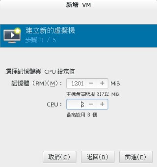
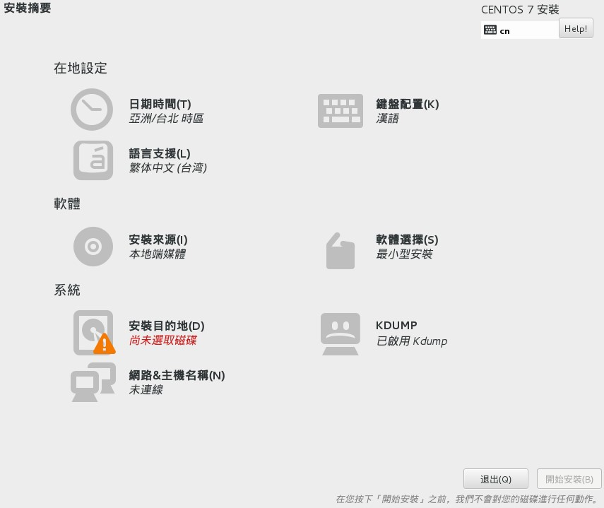
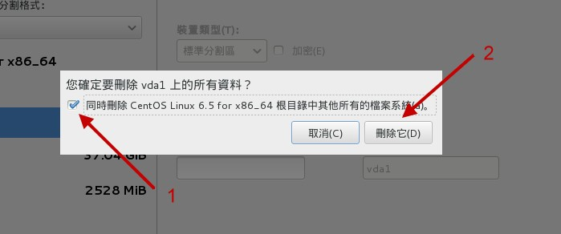
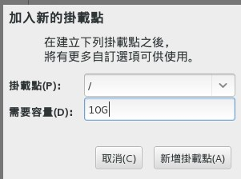
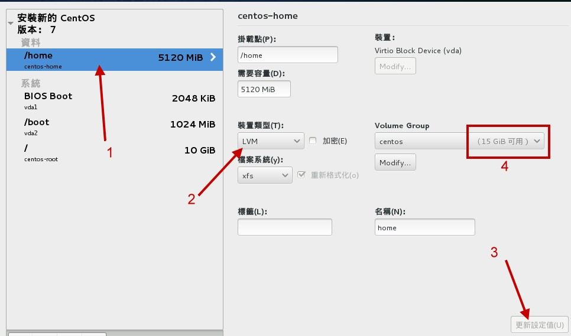
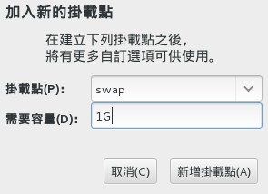
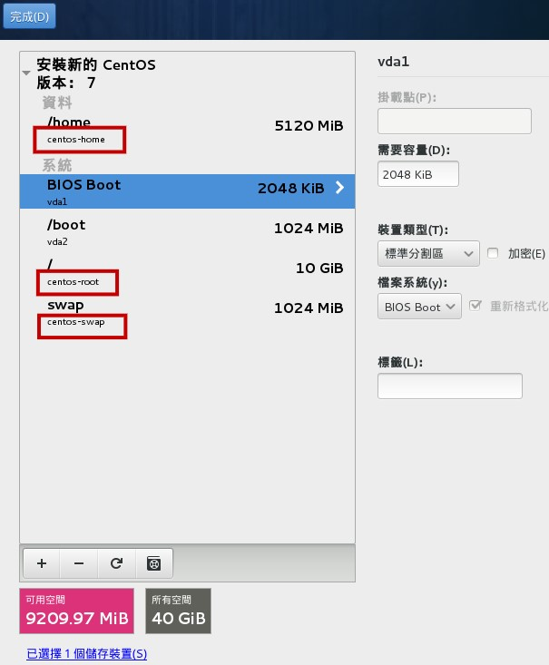
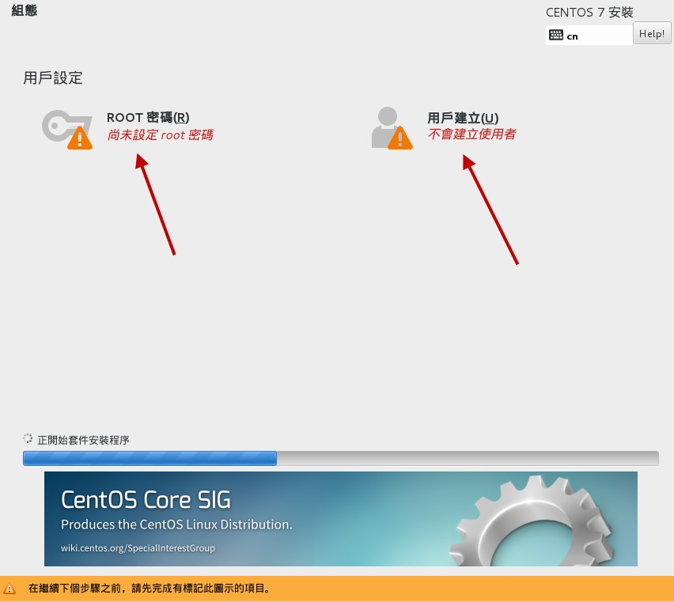

# 第三章、安装 CentOS7.x

最近更新日期：20//

Linux distributions 越作越成熟，所以在安装方面也越来越简单！虽然安装非常的简单， 但是刚刚前一章所谈到的基础认知还是需要了解的，包括 MBR/GPT, partition, boot loader, mount, software 的选择等等的数据。 这一章鸟哥的安装定义为“一部练习机”，所以安装的方式都是以最简单的方式来处理的。 另外，鸟哥选择的是 CentOS 7.x 的版本来安装的啦！在内文中，只要标题内含有（Option） 的，代表是鸟哥额外的说明，你应该看看就好，不需要实作喔！^_^

# 3.1 本练习机的规划--尤其是分区参数

## 3.1 本练习机的规划--尤其是分区参数

读完主机规划与磁盘分区章节之后，相信你对于安装 Linux 之前要作的事情已经有基本的概念了。唔！并没有读第二章...千万不要这样跳着读，赶紧回去念一念第二章， 了解一下安装前的各种考虑对你 Linux 的学习会比较好啦！

如果你已经读完第二章了，那么下面就实际针对第二章的介绍来一一规划我们所要安装的练习机了吧！ 请大家注意唷，我们后续的章节与本章的安装都有相关性，所以，请务必要了解到我们这一章的作法喔！

*   Linux 主机的角色定位： 本主机架设的主要目的在于练习 Linux 的相关技术，所以几乎所有的数据都想要安装进来。 因此连较耗系统资源的 X Window System 也必须要包含进来才行。
*   选择的 distribution： 由于我们对于 Linux 的定位为“服务器”的角色，因此选择号称完全相容于商业版 RHEL 的社群版本， 就是 CentOS 7.x 版啰。请回到 2.3.1 章去获得下载的信息吧！ ^_^。
*   计算机系统硬件配备： 由于虚拟机越来越流行，因此鸟哥这里使用的是 Linux 原生的 KVM 所搭建出来的虚拟硬件环境。对于 Linux 还不熟的朋友来说， 建议你使用 2.4 章提到的 virtualbox 来进行练习吧！ 至于鸟哥使用的方式可以参考文末的延伸阅读，里面有许多的文件可参考[[1]](#ps1)！ 鸟哥的虚拟机硬件配备如下：
    *   CPU 等级类别： 通过 Linux 原生的虚拟机管理员的处理，使用本机的 CPU 类型。本机 CPU 为 Intel i7 2600 这颗三、四年前很流行的 CPU 喔！ 至于芯片组则是 KVM 自行设置的喔！
    *   内存： 通过虚拟化技术提供大约 1.2G 左右的内存
    *   硬盘： 使用一颗 40GB 的 VirtI/O 芯片组的磁盘，因此磁盘文件名应该会是 /dev/vda 才对。同时提供一颗 2GB 左右的 IDE 界面的磁盘， 这颗磁盘仅是作为测试之用，并不安装系统！因此还有一颗 /dev/sda 才对喔！
    *   网卡： 使用 bridge （桥接） 的方式设置了对外网卡，网卡同样使用 VirtI/O 的芯片，还好 CentOS 本身就有提供驱动程序， 所以可以直接抓到网卡喔！
    *   显卡（VGA）： 使用的是在 Linux 环境下运行还算顺畅的 QXL 显卡，给予 60M 左右的显示内存。
    *   其他输入/输出设备： 还有仿真光驱、USB 鼠标、USB 键盘以及 17 英寸屏幕输出等设备喔！
*   磁盘分区的配置 在第二章里面有谈到 MBR 与 GPT 磁盘分区表配置的问题，在目前的 Linux 环境下， 如果你的磁盘没有超过 2TB 的话，那么 Linux 默认是会以 MBR 模式来处理你的分区表的。由于我们仅切出 40GB 的磁盘来玩， 所以默认上会以 MBR 来配置！这鸟哥不喜欢！因为就无法练习新的环境了～因此，我们得在安装的时候加上某些参数， 强迫系统使用 GPT 的分区表来配置我们的磁盘喔！而预计实际分区的情况如下：

    | 所需目录/设备 | 磁盘容量 | 文件系统 | 分区格式 | | --- | --- | --- | --- | | BIOS boot | 2MB | 系统自订 | 主分区 | | /boot | 1GB | xfs | 主分区 | | / | 10GB | xfs | LVM 方式 | | /home | 5GB | xfs | LVM 方式 | | swap | 1GB | swap | LVM 方式 |

    由于使用 GPT 的关系，因此根本无须考虑主/延伸/逻辑分区的差异。不过，由于 CentOS 默认还是会使用 LVM 的方式来管理你的文件系统， 而且我们后续的章节也会介绍如何管理这东西，因此，我们这次就使用 LVM 管理机制来安装系统看看！

*   开机管理程序（boot loader）： 练习机的开机管理程序使用 CentOS 7.x 默认的 grub2 软件，并且安装到 MBR 上面。 也必须要安装到 MBR 上面才行！因为我们的硬盘是全部用在 Linux 上面的啊！ ^_^
*   选择软件： 我们预计这部练习机是要作为服务器用的，同时可能会用到图形接口来管理系统，因此使用的是“含有 X 接口的服务器软件”的软件方式来安装喔！ 要注意的是，从 7.x 开始，默认选择的软件模式会是最小安装！所以千万记得软件安装时，要特别挑选一下才行！
*   检查表单： 最后，你可以使用下面的表格来检查一下，你要安装的数据与实际的硬件是否吻合喔：

    ```
    | 是与否，或详细信息 | 细部项目 |
    | --- | --- |
    | 是, DVD 版 | 01\. 是否已下载且烧录所需的 Linux distribution？（DVD 或 CD） |
    | CentOS 7.1, x64 | 02\. Linux distribution 的版本为何？（如 CentOS 7.1 x86_64 版本） |
    | x64 | 03\. 硬件等级为何（如 i386, x86_64, SPARC 等等，以及 DVD/CD-ROM） |
    | 是, 均为 x86_64 | 04\. 前三项安装媒体/操作系统/硬件需求，是否吻合？ |
    | 是 | 05\. 硬盘数据是否可以全部被删除？ |
    | 已确认分区方式 | 06\. Partition 是否做好确认（包括/与 swap 等容量） | 硬盘数量: 1 颗 40GB 硬盘，并使用 GPT 分区表 BIOS boot （2MB） /boot （1GB） / （10GB） /home （5GB） swap （1GB） |
    | 有，使用 VirtI/O | 07\. 是否具有特殊的硬件设备（如 SCSI 磁盘阵列卡等） |
    | CentOS 已内置 | 08\. 若有上述特殊硬件，是否已下载驱动程序？ |
    | grub2, MBR | 09\. 开机管理程序与安装的位置为何？ |
    | 未取得 IP 参数 | 10\. 网络信息（IP 参数等等）是否已取得？ | 未取得 IP 的情况下，可以套用如下的 IP 参数：是否使用 DHCP：无 IP:192.168.1.100 子遮罩网络：255.255.255.0 主机名称：study.centos.vbird |
    | Server with X | 11\. 所需要的软件有哪些？ | 
    ```

    如果上面表单确认过都没有问题的话，那么我们就可以开始来安装咱们的 CentOS 7.x x86*64 版本啰！ ^*^

# 3.2 开始安装 CentOS 7

## 3.2 开始安装 CentOS 7

由于本章的内容主要是针对安装一部 Linux 练习机来设置的，所以安装的分区等过程较为简单。 如果你已经不是第一次接触 Linux，并且想要架设一部要上线的 Linux 主机，请务必前往第二章看一下整体规划的想法喔！ 在本章中，你只要依照前一小节的检查表单检查你所需要的安装媒体/硬件/软件信息等等， 然后就能够安装啦！

安装的步骤在各主要 Linux distributions 都差不多，主要的内容大概是：

1.  调整开机媒体（BIOS）：务必要使用 CD 或 DVD 光盘开机，通常需要调整 BIOS；
2.  选择安装模式与开机：包括图形接口/命令行等，也可加入特殊参数来开机进入安装画面；
3.  选择语系数据：由于不同地区的键盘按键不同，此时需要调整语系/键盘/鼠标等配备；
4.  软件选择：需要什么样的软件？全部安装还是默认安装即可？
5.  磁盘分区：最重要的项目之一了！记得将刚刚的规划单拿出来设置；
6.  开机管理程序、网络、时区设置与 root 密码：一些需要的系统基础设置！
7.  安装后的首次设置：安装完毕后还有一些事项要处理，包括使用者、SELinux 与防火墙等！

大概就是这样子吧！好了，下面我们就真的要来安装啰！

### 3.2.1 调整开机媒体（BIOS）与虚拟机创建流程

因为鸟哥是使用虚拟机来做这次的练习，因此是在虚拟机管理员的环境下选择“ Boot Options ”来调整开机顺序！ 基本上，就是类似 BIOS 调整让 CD 作为优先开机设备的意思。至于实体机器的处理方面， 请参考您主板说明书，理论上都有介绍如何调整的问题。

另外，因为 DVD 实在太慢了，所以，比较聪明的朋友或许会将前一章下载的镜像文件通过类似 dd 或者是其他烧录软件， 直接烧录到 U 盘上面，然后在 BIOS 里面调整成为可携式设备优先开机的模式，这样就可以使用速度较快的 USB 开机来安装 Linux 了！ windows 系统上面或许可以使用类似 UNetbootin 或者是 ISOtoUSB 等软件来处理。如果你已经有 Linux 的经验与系统，那么可以使用底的方式来处理：

```
# 假设你的 USB 设备为 /dev/sdc ，而 ISO 文件名为 centos7.iso 的话：
[root@study ~]# dd if=centos7.iso of=/dev/sdc 
```

上面的过程会跑好长一段时间，时间的长短与你的 USB 速度有关！一般 USB2.0 的写入速度大约不到 10MB 左右，而 USB3.0 可能可以到 50MB 左右～ 因此会等待好几分钟的时间啦！写完之后，这颗 USB 就能够拿来作为开机与安装 Linux 之用了！


**Tips** 一般的主板环境中，使用 USB 2.0 的 U 盘设备并没有什么问题，他就是被判定为可携式设备。不过如果是 USB3.0 的设备，那主板可能会将该设备判断成为一颗磁盘！ 所以在 BIOS 的设置中，你可能得要使用磁盘开机，并将这颗 USB “磁盘”指定为第一优先开机，这样才能够使用这颗 U 盘来安装 Linux 喔！

如果你暂时找不到主板说明书，那也没关系！当你的计算机重新开机后，看到屏幕上面会有几个文字告诉你如何进入设置 （Setting） 模式中！ 一般常用的进入按钮大概都是“ Del ”按键，或者是“ F2 ”功能键，按下之后就可以看到 BIOS 的画面了！ 大概选择关键字为“ Boot ”的项目，就能够找到开机顺序的项目啰！

在调整完 BIOS 内的开机设备的顺序后，理论上你的主机已经可使用可开机光盘来开机了！ 如果发生一些错误讯息导致无法以 CentOS 7.x DVD 来开机，很可能是由于：1）计算机硬件不支持； 2）光驱会挑片； 3）光盘片有问题； 如果是这样，那么建议你再仔细的确认一下你的硬件是否有超频？或者其他不正常的现象。 另外，你的光盘来源也需要再次的确认！

*   在 Linux KVM 上面创建虚拟机的流程

如果你已经在实体机器上面创建好 CentOS 7 了，然后想要依照我们这个基础篇的内容来实验一下学习的进度，那么可以使用下面的流程来创建与课程相仿的硬盘喔！ 创建流程不会很困难，瞧一瞧即可！

首先，你得从“应用程序”里面的“系统工具”找到“虚拟机管理员”，点下他就会出现如下的图示：

图 3.2.1、启动虚拟机管理员示意图

因为我们是想要创建新的虚拟机，因此你要像上图那样，点选“文件”然后点选“ New Virtual Machine ”，接下来就能够看到如下图的模样来创建新机器！

 图 3.2.2、选择使用光盘来安装，并实际选择 CentOS 镜像文件所在

如上图所示，左图可以让你选择这个新的机器安装的时候，要安装的是哪个来源媒体，包括直接从网络来源安装、从硬盘安装等等。 我们当然是选择光盘镜像文件啰！按下一步就会进入选择光盘镜像文件的文件名～这时请按“浏览”并且选择“文件系统”，再慢慢一个一个选择即可！ 之后就继续下一步吧！

 图 3.2.3、设置内存容量、CPU 数量、磁盘容量等重要机器设置

接下来如上图所示，你可以挑选内存容量、CPU 颗数以及磁盘的容量等等。比较有趣的地方是，你会看到上图右侧鸟哥写了 40G 的容量， 但可用容量只有 28G 耶～这样有没有关系？当然没关系！现在的虚拟机的磁盘机制，大多使用 qcow2 这个虚拟磁盘格式，这种格式是“用多少纪录多少”喔， 与你的实际使用量有关。既然我们才刚刚要使用，所以这个虚拟磁盘当然没有数据，既然没有数据需要写入，那就不会占用到实际的磁盘容量了！ 尽量用！没关系！ ^_^

图 3.2.4、使用桥接的功能设置网络

在出现的画面中，选择“进阶选项”之后，挑选主机设备设置，然后点选桥接功能，如此一来才有办法让你的虚拟机网卡具有直接对外的功能喔！ 同时如果你想要改设置的话，那么可以勾选“在安装前自动组态”的圈圈，之后按完成会出现如下图所示：

图 3.2.5、设置完成的示意图

从上图 3.2.5 当中，我们可以看到这部机器的相关硬件配备喔！不过，竟然没有发现光驱耶！真怪！那请按下上图中指标指的地方， 加入一个新硬件！新硬件增加的示意图如下所示：

图 3.2.6、新增硬件示意图

如上图所示，我们来创建一个 IDE 接口的光盘，并且将光盘镜像文件加入其中！加入完成之后按下“完成”即可出现如下的最终画面了！

图 3.2.7、虚拟机最终创建完成示意图

这时你的虚拟机已经跟鸟哥的差不多了！按下“开始安装”就能够取得与鸟哥在下列提供的各样设置啰！


**Tips** 为了方便维护与管理，鸟哥的虚拟机实际上是使用 Gocloud （[`www.gocloud.com.tw/`](http://www.gocloud.com.tw/)） 虚拟计算机教室系统所创建的！因此上述的流程与鸟哥实际创建的虚拟机， 会有一些些的差异～不过差异不大就是了！这里要先跟大家解释一下！

### 3.2.2 选择安装模式与开机 - inst.gpt

如果一切都顺利没问题的话，那么使用光盘镜像文件开机后，就会出现如下画面：

图 3.2.8、光盘开机后安装画面之选择

你有 60 秒的时间可以选择不同的操作模式，从上而下分别是：

1.  正常安装 CentOS 7 的流程；
2.  测试此光盘后再进入 CentOS 7 的流程；
3.  进入除错模式！选择此模式会出现更多的选项，分别是：
    *   以基本图形接口安装 CentOS 7 （使用标准显卡来设置安装流程图示）；
    *   救援 CentOS 系统
    *   执行内存测试 （Run a memory test）
    *   由本机磁盘正常开机，不由光盘开机

基本上，除非你的硬件系统有问题，包括拥有比较特别的图形显卡等等，否则使用正常的 CentOS 7 流程即可！ 那如果你怀疑这片光盘有问题，就可以选择测试光盘后再进入 CentOS 7 安装的程序。如果你确信此光盘没问题，就不要测试了！ 不过如果你不在乎花费一、两分钟的时间去测试看看光盘片有没有问题，就使用测试后安装的流程啊！不过要进入安装程序前先等等， 先进行下面的流程再继续。

*   加入强制使用 GPT 分区表的安装参数

如前所述，如果磁盘容量小于 2TB 的话，系统默认会使用 MBR 模式来安装！鸟哥的虚拟机仅有 40GB 的磁盘容量，所以默认肯定会用 MBR 模式来安装的啊！那如果想要强制使用 GPT 分区表的话，你就得要这样作：

1.  使用方向键，将图 3.2.8 的光标移动到“ Install CentOS 7 ”的项目中
2.  按下键盘的 [Tab] 按钮，让光标跑到画面最下方等待输入额外的核心参数
3.  在出现的画面中，输入如下画面的数据 （注意，各个项目要有空格，最后一个是光标本身而非底线）

图 3.2.9、加入额外的核心参数修改安装程序

其实重点就是输入“ inst.gpt ”这个关键字！输入之后系统会跑过一段侦测的画面， 这段侦测的流程依据你的光驱速度、硬件复杂度而有不同。反正，就是等待个几秒钟到一、两分钟就是了！画面如下所示：

图 3.2.10、安装程序的侦测系统过程

进入安装流程的第一个画面就是选择你熟悉的语系啰！这个选择还挺重要的！因为未来默认的语系、默认用户选择的环境等， 都跟这里有关～当然未来是可以改变的～如下图所示，你可以依据箭头的指示选择我们台湾惯用的繁体中文字！然后就可以按下“继续”来处理喔！

图 3.2.11、选择安装程序的语系显示

在 CentOS 7 的安装流程中，已经将所有的挑选流程以按钮形式通通集中在第一页了！如下图所示，所以你可以在同一个画面中看完所有的设置， 也可以跳着修改各个设置，不用被制约一项一项处理喔！下面我们就来谈谈每一个项目的设置方式吧！

图 3.2.12、统一按钮展示的安装画面

### 3.2.3 在地设置之时区、语系与键盘配置

按下 图 3.2.12 画面当中的“在地设置”项目内的“日期时间”后，会出现如下的画面：

图 3.2.13、时区挑选的项目示意图

你可以直接在世界地图上面选择到你想要的时区位置，也可以在画面中“区域、城市”的下拉式菜单选择你的城市即可。 如果日期与时间不对，可以在画面中箭头指的 2, 3 处分别修改。虽然有网络的时间自订修订功能，不过因为我们的网络尚未设置好， 所以画面中的箭头 5 无法顺利打开就是了。处理完毕后，按下左上方箭头 4 指的“完成”按钮，即可回到 图 3.2.12 中。


**Tips** 说实在的，我们这些老人家以前接触的画面，确认钮通常在右下方。第一次接触 CentOS 7 的安装画面时，花了将近一分钟去找确认按钮耶！ 还以为程序出错了！后来才发现在左上方～这...真是欺负老人的设计吗？哈哈哈哈！

时区选择之后，接下来请点选 图 3.2.12 内的“键盘配置”，出现的画面如下：

图 3.2.14、键盘配置项目

这个很重要喔！因为我们需要输入中文，所以常常打字会在中/英文之间切换。过去我们经常使用的键盘配置是“ Ctrl + 空白 ”按钮，或者是“ Ctrl + Shift ”按钮， 不过这一版的窗口接口，默认并没有提供任何的切换按钮～所以这里得要预先来设置一下比较妥当。如图中的箭头顺序去调整， 不过鸟哥一直找不到习惯的“ ctrl + 空白 ”的组合，只好用次习惯的“ Ctrl + Shift ”组合了！确认后可以按完成按钮即可。 不过，如果你想要有其他的输入语系的话，可以选择画面中左下方用圈圈勾起来的地方，按下去就会出现如下画面：

图 3.2.15、新增其他语系的键盘配置

竟然还有三种特殊的台湾语系键盘配置规格耶！好有趣！有需要的朋友可以选择看看！至于“语系支持”的画面则与 图 3.2.11 相同， 所以这里就不多说了！

### 3.2.4 安装来源设置与软件选择

回到 图 3.2.12 后，按下“安装来源”按钮之后，你会得到如下的画面：

图 3.2.16、挑选准备要被安装的软件所在的媒体

因为我们是使用光盘开机，同时还没有设置网络，因此默认就会选择光盘片 （sr0 所在的设备）。如果你的主机系统当中还有其他安装程序认识的磁盘文件系统， 那么由于该磁盘也可能会放置镜像文件啊，所以该镜像文件也能够提供软件的安装，因此就有如同上图的“ISO 文件”的选择项目。最后， 如果你的安装程序已经预先设置好网络了，那么就可以选择“在网络上”的项目，并且填写正确的网址 （URL） ， 那么安装程序就可以直接从网络上面下载安装了！


**Tips** 其实如果区域网络里面你可以自己设置一个安装服务器的话，那么使用网络安装的速度恐怕会比其他方式快速喔！毕竟 giga 网络速度可达到 100MBytes/s 的读写， 这个速度 DVD 或 USB 2.0 都远远不及啊！^_^

按下完成并回到图 3.2.12 之后，就得要选择“软件选择”的画面了！如下所示：

图 3.2.17、选择安装的软件数据为哪些

因为默认是“最小型安装”的模式，这种模式只安装最简单的功能，很适合高手慢慢搭建自己的环境之用。 但是我们是初学者啊～没有图形接口来看看实在有点怪！所以建议可以选择如下的项目：

*   含有 GUI 的服务器 （GUI 就是使用者图形接口啰！默认搭载 GNOME）
*   GNOME 桌面环境： Linux 常见的图形接口
*   KDE Plasma Workspaces：另一套常见的图形接口

上面这几个设置拥有图形接口，鸟哥这里主要是以“GUI 服务器”作为介绍喔！选择完毕之后按下完成， 安装程序会开始检查光盘里面有没有你所挑选的软件存在，而且解决软件相依性的检查 （就是将你所选择的大项目下面的其他支持软件通通载入）， 之后就会再次的回到 图 3.2.12 的画面中。

### 3.2.5 磁盘分区与文件系统设置

再来就是我们的重头戏，当然就是磁盘分区啦！由 图 3.2.12 当中，点选“系统”项目下的“安装目的地”区块，点选之后会进入如下画面中：

图 3.2.18、选择要安装 Linux 的硬盘，并选择手动分区模式

由于鸟哥的虚拟机系统共有两颗硬盘，因此安装的时候你得要特别选择正确的硬盘才能够顺利的安装喔！所以如上图 1 号箭头所指， 点选之后就会出现打勾的符号啰！因为我们要学习分区的方式，不要让系统自动分区，因此请点选 2 号箭头所指处：“我将配置分页”的项目。 点选完毕后按下“完成”，即可出现如下的磁盘分区画面喔！

图 3.2.19、删除已经存在系统当中的分区

其实鸟哥故意将硬盘先乱安装一套系统，然后再安装 CentOS7 的，就是为了要在这里展示给各位朋友们瞧一瞧，如何在安装时观察与删除分区啊！ 如上图所示，你会发现到 1 号箭头处有个操作系统名称，点选该名称 （你的系统可能不会有这个项目，也有可能是其他项目！不过，如果是全新硬盘， 你就可以略过这个部份了），他就会出现该系统拥有的分区。依序分别点选下面的 /boot, /, swap 三个项目，然后点选 3 号箭头处的减号“ - ”， 就可以删除掉该分区了！删除的时候会出现如下的警告窗口喔！

图 3.2.20、删除分区时出现的警告窗口示意图

因为前一个系统鸟哥安装的也是旧版的 CentOS 6.x 的版本，所以 CentOS7 可以自动抓到所有该系统的挂载点～于是就会出现如上所示的图示， 会特别询问你要不要同时删出其他的分区。我们原本有 3 个分区需要删除，点选上图 1 号箭头然后按下“删除它”，嘿嘿！三个分区全部会被删除干净！ 之后就会回 图 3.2.19 的画面中了！之后你就可以开始创建文件系统啰！同时请注意，分区的时候请参考本章 3.1 小节的介绍， 根据该小节的建议去设置好分区喔！下面我们先来制作第一个 GPT 分区表最好要拥有的 BIOS boot 分区，如下所示：

图 3.2.21、创建 BIOS boot 分区的示意图

先点选 1 号箭头处的菜单，不要使用默认的 LVM 喔！请点选“标准分区区”的项目，并按下 2 号箭头的“ + ”符号，就会出现中间的弹出式窗口， 在该窗口中 3 号箭头处，点选下拉式菜单然后选择你在画面中看到的 biosboot 项目 （不要手动输入画面中的文字，请使用既有的菜单来挑选喔！），同时输入大约 2M 的容量，按下“新增挂载点”后， 就会整理出该分区的详细数据，如下图所示：

图 3.2.22、单一分区分区完成详细项目示意图

如上图所示，画面的右边就是 biosboot 分区的详细部份！由于是 bios 使用，因此没有挂载点 （你看画面中该字段是空空如也的！）。 同时文件系统的字段部份也是会变成“BIOS Boot”的关键字！并不会是 Linux 的文件系统啦！接下来，我们要来设置其他的分区了！ 所以如上图所示，请按下“ + ”符号吧！下面的示意图鸟哥就不全图撷取，只抓出弹出式窗口的内容来给大家瞧瞧喔！

另外，图中的“设备类型”其实共有 3 种，我们的练习机实际使用标准分区与 LVM 而已。那三种设备类型的意义分别如下：

*   标准分区区：就是我们一直谈的分区啊！类似 /dev/vda1 之类的分区就是了。
*   LVM：这是一种可以弹性增加/削减文件系统容量的设备设置，我们会在后面的章节持续介绍 LVM 这个有趣的东西！
*   LVM 紧张供应：这个名词翻译的超奇怪的！其实这个是 LVM 的进阶版！与传统 LVM 直接分配固定的容量不同， 这个“ LVM 紧张供应”的项目，可以让你在使用多少容量才分配磁盘多少容量给你，所以如果 LVM 设备内的数据量较少，那么你的磁盘其实还可以作更多的数据储存！ 而不会被平白无故的占用！这部份我们也在后续谈到 LVM 的时候再来强调！

另外，图中的文件系统就是实际“格式化”的时候，我们可以格式化成什么文件系统的意思。下面分别谈谈各个文件系统项目 （详细的项目会在后续章节说明）

*   ext2/ext3/ext4：Linux 早期适用的文件系统类型。由于 ext3/ext4 文件系统多了日志的记录， 对于系统的复原比较快速。不过由于磁盘容量越来越大，ext 家族似乎有点挡不住了～所以除非你有特殊的设置需求，否则近来比较少使用 ext4 项目了！
*   swap：就是磁盘仿真成为内存，由于 swap 并不会使用到目录树的挂载，所以用 swap 就不需要指定挂载点喔。
*   BIOS Boot：就是 GPT 分区表可能会使用到的项目，若你使用 MBR 分区，那就不需要这个项目了！
*   xfs：这个是目前 CentOS 默认的文件系统，最早是由大型服务器所开发出来的！ 他对于大容量的磁盘管理非常好，而且格式化的时候速度相当快，很适合当今动不动就是好几个 TB 的磁盘的环境喔！因此我们主要用这玩意儿！
*   vfat：同时被 Linux 与 Windows 所支持的文件系统类型。如果你的主机硬盘内同时存在 Windows 与 Linux 操作系统，为了数据的交换， 确实可以创建一个 vfat 的文件系统喔！

图 3.2.23、创建 /boot 分区的示意图

依据 3.1 小节的建议，接下来是创建 /boot 挂载点的文件系统。容量的部份你可以输入 1G 或者是 1024M 都可以！有简单的单位较佳。 然后按下新增吧！就会回到类似 图 3.2.22 的画面喔！接下来依序创建另外所需要的根目录“ / ”的分区吧！

图 3.2.24、创建根目录 / 的分区

如上图所示，就输入根目录的容量吧！依据 3.1 小节的建议给予 10G 的容量。接下来要注意喔，我们的 /, /home, swap 都希望使用 CentOS 提供的 LVM 管理方式，因此当你按下上图的“新增挂载点”之后，回到下面的详细设置项目时，得要更改一下相关的项目才行！如下所示：

图 3.2.25、将设备类型改为 LVM 的管理机制

如上图所示，你得先确认 1 号箭头指的地方为 / 才对，然后点选 2 号箭头处，将他改为“LVM”才好。由于 LVM 默认会取一个名为 centos 的 LVM 设备， 因此该项目不用修改！只要按下 3 号箭头处的“ Modify（更改） ”即可。接下来会出现如下的画面，要让你处理 LVM 的相关设置！

图 3.2.26、修改与设置 LVM 设备的容量

再次说明，我们这里是要创建一个让你在未来可以持续练习的练习机环境，因此不建议将分区用完！所以，如上图所示， 1 号箭头处请选择“固定”容量，然后填入“ 30G ”左右的容量，这样我们就还有剩下将近 10G 的容量可以继续未来的章节内容练习。 其他的就保留默认值，点选“储存”来确定吧！然后回到类似 图 3.2.23 的画面，继续点选“ + ”来持续新增分区，如下所示：

图 3.2.27、创建 /home 分区

创建好 /home 分区之后，同样需要调整 LVM 设备才行，因此在你按下上图的“新增挂载点”之后，回到下面的画面来处理处理！

图 3.2.28、调整 /home 也使用 LVM 设备

如上图所示，确定 1 号箭头是 /home ，然后选择 2 号箭头成为 LVM，之后确定 4 号箭头还有剩余容量 （也是为了未来要练习之用）， 之后就可以按下 3 号箭头的变更设置来确认啰！其实要先按 3 号箭头，4 号区块才会顺利显示啦！ ^_^

图 3.2.29、创建 swap 分区

swap 是当实体内存容量不够用时，可以拿这个部份来存放内存中较少被使用的程序项目。以前都建议 swap 需要内存的 2 倍较佳。 不过现在的内存都够大了，swap 虽然最好还是保持存在比较好，不过也不需要太大啦！大约 1~2GB 就好了。老实说，如果你的系统竟然会使用到 swap， 那代表...钱花的不够多！继续扩充内存啦！


**Tips** swap 内存交换空间的功能是：当有数据被存放在实体内存里面，但是这些数据又不是常被 CPU 所取用时， 那么这些不常被使用的程序将会被丢到硬盘的 swap 交换空间当中， 而将速度较快的实体内存空间释放出来给真正需要的程序使用！ 所以，如果你的系统不很忙，而内存又很大，自然不需要 swap 啰。

图 3.2.30、调整 swap 也使用 LVM 设备

如上图所示，我们也需要 swap 使用 LVM，请按照箭头依序处理各个项目吧！上述的动作做完之后，我们的分区就准备妥当了！ 接下来，看看你的分区是否与下图类似！需要有 /home, /boot, /, swap 等项目。

图 3.2.31、完成分区之后的示意图

如上图所示，仔细看一下左下角的两个方块，可用空间的部份还有剩下大约 9GB 左右，这样才对喔！ 如果一切顺利正常，按下上图左上方的“完成”，系统会出现一个警告窗口，提醒你是否要真的进行这样的分区与格式化的动作，如下图所示：

图 3.2.32、是否确定分区正确的示意图

上图中你可以特别观察一下分区表的类型，可以发现方框圈起来的地方，删除了 MSDOS 而创建了 GPT ！嘿嘿！没错！是我们要的！所以，按下“接受变更”吧！ 之后就会回到 图 3.2.12 的画面啰！

### 3.2.6 核心管理与网络设置

回到 图 3.2.12 的画面后，点选“系统”下的“KDUMP”项目，这个项目主要在处理，当 Linux 系统因为核心问题导致的死机事件时， 会将该死机事件的内存内数据储存出来的一项特色！不过，这个特色似乎比较偏向核心开发者在除错之用～如果你有需要的话，也可以启动它！ 若不需要，也能够关闭它，对系统的影响似乎并不太大。所以，如下图所示，点选之后，鸟哥是使用“启用”的默认值，并没有特别取消掉这项目就是了。

图 3.2.33、KDUMP 的挑选示意图

再次回到 图 3.2.12 的画面点选“系统”下的“网络&主机名称”的设置，会出现如下图所示画面：

图 3.2.34、网络设置示意图

因为鸟哥这边使用的是虚拟机，因此看到的网卡就会是旧式的 eth0 之类的网卡代号。如果是实体网卡，那你可能会看到类似 p1p1, em1 等等比较特殊的网卡代号！ 这是因为新的设计中，它是以网卡安插的插槽来作为网卡名称的由来 [[2]](#ps2)，这部份未来我们在网络再来谈！这里先知道一下即可。

上图中先选择正确的网卡，然后在 2 号箭头处选择“开”之后，3 号箭头处才能够开始设置！现在请按下“设置”项目，然后参考 3.1 小节的介绍，来给予一组特别的 IP 吧！

图 3.2.35、设置开机自动启动网络

现在 CentOS 7 开机后，默认是没有启动网络的，因此你得要在上图中选择 2 号箭头的“当这个网络可用时自动连线”的项目才行！

图 3.2.36、手动设置 IP 的示意图

如上图所示，选择 IPv4 的项目，然后调整 2 号箭头成为手动，接下来按下 3 号箭头加入项目后，才能够在 4 号箭头输入所需要的 IP 位址与网络遮罩～ 写完之后其他的项目不要更动，就按下 5 号箭头的储存吧！然后回到如同下图的画面：

图 3.2.37、修改主机名称

如上图所示，右边的网络参数部份已经是正确的了，然后在箭头处输入 3.1 小节谈到的主机名称吧！写完就给它“完成”啰！

### 3.2.7 开始安装、设置 root 密码与新增可切换身份之一般用户

如果一切顺利的话，那么你应该就可以看到如下的图示，所有的一切都是正常的状态！因此你就可以按下下面图示的箭头部份， 开始安装的流程啰！

图 3.2.38、设置完毕并准备开始安装的示意图

现在的安装画面作的还挺简单的，省略了一堆步骤！上述画面按下开始安装后，这时你就可以一边让系统安装， 同时去设置其他项目，可以节省时间啦！如下图所示，还有两件重要的事件要处理，一个是 root 密码，一个是一般身份用户的创建！

图 3.2.39、进行安装程序中，还可以持续其他任务的过程

将上图中，按下 ROOT 密码，可以得到下面的图示来修改系统管理员的密码喔！

图 3.2.40、设置系统管理员 root 的密码

基本上，你可以设置任何密码内容！只是，系统会主动帮你判断你的密码设置的好不好。如果不够好，那么画面中就会告诉你，你的密码很虚弱啦！ 你还是可以坚持你的简易密码！只是，就得要按下两次“完成”，安装程序才会真的帮你设置该密码。

什么是好的密码呢？基本上，密码字符长度设置至少 8 个字符以上，而且含有特殊符号更好，且不要是个人的可见信息 （如电话号码、身份证、生日等等，就是比较差的密码）。 例如：I&my_dog 之类，有点怪，但是对你又挺好记的密码！就是还 OK 的密码设置喔！


**Tips** 好的习惯还是从头就开始养成比较好。以前鸟哥上课为了简易的操作，所以给学生操作的系统中，选了个 1234 作为密码，要命了！后来鸟哥的专题生， 实际上线的计算机中，竟然密码还是使用 1234 耶～一上线之后的后果，当然就是被绑架了！还有什么说的？所以，还是一开始就养成好习惯较佳！

管理员密码设置妥当后，接下来鸟哥建议你还是得要创建一个日常登陆系统的惯用一般帐号较好！为什么呢？ 因为通常远端系统管理流程中，我们都会建议将管理员直接登陆的权限拿掉，有需要才用特殊指令 （如 su, sudo 等等，指令后续会谈到！） 切换成管理员身份。 所以啊，你一定得要创建一个一般帐号才好。鸟哥这里使用自己的名子 dmtsai 来作为一个帐号喔！

图 3.2.41、创建一个一般帐号

这个帐号既然是你要使用的，那么这个帐号应该就是你认可的管理员使用的一般帐号啊！所以你或许会希望这个帐号可以使用自己的密码来切换身份成为 root， 而不用知道 root 的密码！果真如此的话，那么上头的 2 号箭头处，就得要勾选才好！未来你就可以直接使用 dmtsai 的密码变成 root 哩！ 方便你自己管理～这样即使 root 密码忘记了，你依旧可以切换身份变 root 啊！

图 3.2.42、安装完毕的示意图

等到安装妥当之后，你应该就会见到如上的图示！上方的箭头比较有趣！仔细看，你会发现有个“将创建管理员 dmtsai ”的项目！ 那就是因为你勾选了“让这位使用者成为管理员”的缘故！当然啦！这个帐号的密码也就很重要！不要随便流出去啊！确定一切事情都顺利搞定， 按下箭头处的“重新开机”吧！准备来使用 CentOS Linux 啰！

### 3.2.8 准备使用系统前的授权同意

重新开机完毕后，系统会进入第一次使用的授权同意画面！如下所示：

图 3.2.43、第一次使用 CentOS 7 图形接口的授权同意过程

点选上图中的 1 号箭头后，就会出现如下图所示的授权同意书！

图 3.2.44、授权同意书的签署

再次确认后，你就会发现如同下图所示的画面，等待登陆了！第一次登陆系统的相关数据就请看下一个小节啰！

图 3.2.45、等待使用者登陆示意图

**Tips** 先提醒你自己记一下，你刚刚上面所选择的项目，包括 root 的密码等等，通通都会被纪录到 /root/anaconda-ks.cfg 这个文件内喔！ 这个文件可以提醒与协助你未来想要重建一个一模一样的系统时，就可以参考该文件来制作啰！当然，你也可以 google 一下，找 kickstart 这个关键字，会得到很多协助喔！ ^_^

### 3.2.9 其他功能：RAM testing, 安装笔记本电脑的核心参数（Option）

其实安装光盘还可以进行救援、烧机等任务喔！赶紧来瞧瞧：

*   内存压力测试：memtest86 [[3]](#ps3)

CentOS 的 DVD 除了提供一般 PC 来安装 Linux 之外，还提供了不少有趣的东西，其中一个就是进行“烧机”的任务！ 这个烧机不是台湾名产烧酒鸡啊，而是当你组装了一部新的个人计算机，想要测试这部主机是否稳定时， 就在这部主机上面运行一些比较耗系统资源的程序，让系统在高负载的情况下去运行一阵子（可能是一天）， 去测试稳定性的一种情况，就称为“烧机”啦！

那要如何进行呢？让我们重新开机并回到图 3.2.8 的画面中，然后依序选择“Troubleshooting”、 “Run a memory test”的项目，你的画面就会变成如下的模样了：

图 3.2.46、memory test 的图示

画面中的右上角数据会一直跑，直到你按下 [esc] 按钮为止，他都会一直去操内存！由于内存是服务器当中一个相当重要的元件， 他只要不出事，系统总是稳定的多！所以，通过这个方式来操内存，让内存一直保持在忙碌的状态～等待一天过去，你就可以说，恩！ 这部计算机硬件应该还算稳定吧！ ^_^

*   安装笔记本电脑或其他类 PC 计算机的参数

由于笔记本电脑加入了非常多的省电机制或者是其他硬件的管理机制，包括显卡常常是整合型的， 因此在笔记本电脑上面的硬件常常与一般桌面电脑不怎么相同。所以当你使用适合于一般桌面电脑的 DVD 来安装 Linux 时， 可能常常会出现一些问题，导致无法顺利的安装 Linux 到你的笔记本电脑中啊！那怎办？

其实很简单，只要在安装的时候，告诉安装程序的 linux 核心不要载入一些特殊功能即可。 最常使用的方法就是，在使用 DVD 开机时，选择“”然后按下 [tab] 按键后，加入下面这些选项：

```
nofb apm=off acpi=off pci=noacpi 
```

apm（Advanced Power Management）是早期的电源管理模块，acpi（Advanced Configuration and Power Interface）则是近期的电源管理模块。这两者都是硬件本身就有支持的，但是笔记本电脑可能不是使用这些机制， 因此，当安装时启动这些机制将会造成一些错误，导致无法顺利安装。

nofb 则是取消显卡上面的缓冲内存侦测。因为笔记本电脑的显卡常常是整合型的， Linux 安装程序本身可能就不是很能够侦测到该显卡模块。此时加入 nofb 将可能使得你的安装过程顺利一些。

对于这些在开机的时候所加入的参数，我们称为“核心参数”，这些核心参数是有意义的！ 如果你对这些核心参数有兴趣的话，可以参考文后的参考数据来查询更多信息[[4]](#ps4)。

# 3.3 多重开机安装流程与管理（Option）

## 3.3 多重开机安装流程与管理（Option）

有鉴于自由软件的蓬勃发展以及专利软件越来越贵，所以政府单位也慢慢的希望各部门在选购计算机时， 能够考虑同时含有两种以上操作系统的机器了。加上很多朋友其实也常常有需要两种不同操作系统来处理日常生活与工作的事情。 那我是否需要两部主机来操作不同的操作系统？不需要的，我们可以通过多重开机来选择登陆不同的操作系统喔！ 一部机器搞定不同操作系统哩。


**Tips** 你可能会问：“既然虚拟机这么热门，应用面也广，那为啥不能安装 Linux 上面使用 windows 虚拟机？或反过来使用呢？” 原因无他，因为“虚拟机在图形显示的性能依旧不足”啊！所以，某些时刻你还是得要使用实体机器去安装不同的操作系统啊！

不过，就如同鸟哥之前提过的，多重开机系统是有很多风险存在的，而且你也不能随时变动这个多重操作系统的开机扇区， 这对于初学者想要“很勐烈的”玩 Linux 是有点妨碍～所以，鸟哥不是很建议新手使用多重开机啦！ 所以，下面仅是提出一个大概，你可以看一看，未来我们谈到后面的章节时，你自然就会有“豁然开朗”的笑容出现了！ ^_^

### 3.3.1 安装 CentOS 7.x + windows 7 的规划

由于鸟哥身边没有具有 UEFI BIOS 的机器，加上 Linux 对于 UEFI 的支持还有待持续进步，因此，下面鸟哥是使用虚拟机创建 200GB 的磁盘， 然后使用传统 BIOS 搭配 MBR 分区表来实做多重开机的项目。预计创建 CentOS 7.x 以及一个 Windows 7 的多重操作系统，同时拥有一个共享的数据磁盘。


**Tips** 为什么要用 MBR 而不用本章之前介绍的 GPT 呢？这是因为“Windows 8.1 以前的版本，不能够在非 UEFI 的 BIOS 环境下使用 GPT 分区表的分区来开机”啊！ 我们既然没有 UEFI 的环境，那自然就无法使用 GPT 分区来安装 Windows 系统了。但其实 windows 还是可以使用 GPT，只是“开机的那颗硬盘，必须要在 MBR 的分区磁盘中”。 例如 C 盘单颗硬盘使用 MBR ，而数据磁盘 D 盘使用 GPT ，那就 OK 没问题！

另外，与过去传统安装流程不同，这次鸟哥希望保留 Linux （因为开机管理是由 Linux 管的） 在前面，windows 在后面的分区内， 因此需要先安装 Linux 后再安装 windows，后来通过修改系统配置文件来让系统达成多重开机！基本上鸟哥的分区是这样规划的 （因为不用 GPT，所以无须 BIOS Boot 项目）：

| Linux 设备文件名 | Linux 载点 | Windows 设备 | 实际内容 | 文件系统 | 容量 |
| --- | --- | --- | --- | --- | --- |
| /dev/vda1 | /boot | - | Linux 开机信息 | xfs | 2GB |
| /dev/vda2 | / | - | Linux 根目录 | xfs | 50GB |
| /dev/vda3 | - | C | Windows 系统盘 | NTFS | 100GB |
| /dev/vda5 | /data | D | 共享数据磁盘 | VFAT | 其他剩余 |

再次强调，我们得要先安装 Linux 在通过后续维护的方案来处理的喔！而且，为了强制 Windows 要安装在我们要求的分区， 所以在 Linux 安装时，得要将上述的所有分区先分区出来喔！大概就是这样！来实作吧！

### 3.3.2 进阶安装 CentOS 7.x 与 Windows 7

请依据本章前面的方式一项一项来进行各项安装行为，比较需要注意的地方就是安装时，不可以加上 inst.gpt 喔！我们单纯使用 MBR 分区啊！

进行到 图 3.2.12 的项目时，先不要选择分区，请按下“ [ctrl]+[alt]+[f2] ”来进入安装过程的 shell 环境。 然后进行如下的动作来预先处理好你的分区！因为鸟哥使用图形化界面的分区模式，老是没有办法调出满意的顺序！ 只好通过如下的手动方式来创建啰！但是你得要了解 parted 这个指令才行！

```
[anaconda root@localhost /]# parted /dev/vda mklabel msdos # 创建 MBR 分区
[anaconda root@localhost /]# parted /dev/vda mkpart primary 1M 2G # 创建 /boot
[anaconda root@localhost /]# parted /dev/vda mkpart primary 2G 52G # 创建 /
[anaconda root@localhost /]# parted /dev/vda mkpart primary 52G 152G # 创建 C
[anaconda root@localhost /]# parted /dev/vda mkpart extended 152G 100%# 创建延伸分区
[anaconda root@localhost /]# parted /dev/vda mkpart logical 152G 100% # 创建逻辑分区
[anaconda root@localhost /]# parted /dev/vda print # 显示分区结果 
```

如果按照上面的处理流程，由于原本是 MBR 的分区，因此经过 mklabel 的工作，将 MBR 强制改为 GPT 后， 所有的分区就死光光了！因此不用删除就不会有剩余。接下来就是创建五个分区，最终的 print 行为就是列出分区结果， 结果应该有点像下面这样：

图 3.3.1、本范例的分区结果

接下来再次按下“ [ctrl]+[alt]+[f6] ”来回到原本的安装流程中，然后一步一步实做到分区区那边， 然后依据相关的设备文件名来进行“重新格式化”并填入正确的挂载点，最终结果有点像下面这样：

图 3.3.2、安装流程的分区情况

你会看到有个“重新格式化”的项目吧！那个一定要勾选喔！之后就给它持续的安装下去，直到装好为止喔！安装完毕之后， 你也无须进入到设置的项目，在重新开机后，塞入 windows 7 的原版光盘，之后持续的安装下去！要注意，得要选择那个 100G 容量的分区安装才行！ 最重要的那个安装画面有点像下面这样：

图 3.3.3、安装 windows 的分区示意图

一样，让 windows 自己安装到完毕吧！

### 3.3.3 救援 MBR 内的开机管理程序与设置多重开机菜单

为了应付分区工作，所以我们是先安装 Linux 再安装 Windows 的。只是，如此一来，整颗硬盘的 MBR 部份就会被 windows 的开机管理程序占用了！ 因此，安装好了 Windows 的现在，我们得要开始来救援 MBR，同时编辑一下开机菜单才行！

*   救援回 Linux 的开机管理程序：

救援 Linux 开机管理程序也不难，首先，放入原版光盘，重新开机并且进入类似 图 3.2.8 的画面中，然后依据下面的方式来处理救援模式。 进入“ Troubleshooting ”，选择“ Rescue a CentOS system ”，等待几秒钟的开机过程，之后系统会出现如下的画面，请选择“ Continue ”喔！

图 3.3.4、如何使用找到的 Linux 磁盘系统，建议用 Continue （RW） 模式

如果真的有找到 Linux 的操作系统，那么就会出现如下的图示，告诉你，你的原本的系统放置于 /mnt/sysimage 当中喔！

图 3.3.5、找到了 CentOS 操作系统时，可以进行任务了

接着下来准备要救援 MBR 的开机管理程序啰！处理的方法指令如下：

```
sh-4.2# chroot /mnt/sysimage
sh-4.2# grub2-install /dev/vda
Installing for i386-pc platform.
Installation finished. No error reported.
sh-4.2# exit
sh-4.2# reboot 
```

*   修改开机菜单任务：

接下来我们可以修订开机菜单了！不然开机还是仅有 Linux 而已～先以正常流程登陆 Linux 系统，切换身份成为 root 之后，开始进行下面的任务：

```
[root@study ~]# vim /etc/grub.d/40_custom
#!/bin/sh
exec tail -n +3 $0
# This file provides an easy way to add custom menu entries.  Simply type the
# menu entries you want to add after this comment.  Be careful not to change
# the 'exec tail' line above.
menuentry "Windows 7" {
   set root='（hd0,3）'
   chainloader +1
}

[root@study ~]# vim /etc/default/grub
GRUB_TIMEOUT=30  # 将 5 秒改成 30 秒长一些
...
[root@study ~]# grub2-mkconfig -o /boot/grub2/grub.cfg 
```

接下来就可以测试能否成功了！如果一切顺利的话，理论上就能够看到如下的图示，并且可以顺利的进入 Linux 或 Windows 啰！加油！

图 3.3.6、多重开机的开机菜单示意

*   后续维护的注意事项

多重开机设置完毕后请特别注意， （1）Windows 的环境中最好将 Linux 的根目录与 swap 取消挂载，否则未来你打开文件资源管理器时， 该软件会要求你“格式化！”如果一个不留神，你的 Linux 系统就毁了。 （2）你的 Linux 不可以随便的删除！ 因为 grub 会去读取 Linux 根目录下的/boot/目录内容，如果你将 Linux 移除了，你的 Windows 也就无法开机了！ 因为整个开机菜单都会不见喔！

# 3.4 重点回顾

## 3.4 重点回顾

*   不论你要安装什么样的 Linux 操作系统角色，都应该要事先规划例如分区、开机管理程序等；
*   建议练习机安装时的磁盘分区能有/, /boot, /home, swap 四个分区；
*   安装 CentOS 7.x 的模式至少有两种，分别是图形接口与命令行；
*   CentOS 7 会主动依据你的磁盘容量判断要用 MBR 或 GPT 分区方式，你也可以强迫使用 GPT；
*   若安装笔记本电脑时失败，可尝试在开机时加入“linux nofb apm=off acpi=off”来关闭省电功能；
*   安装过程进入分区后，请以“自订的分区模式”来处理自己规划的分区方式；
*   在安装的过程中，可以创建逻辑卷轴管理员 （LVM）；
*   一般要求 swap 应该要是 1.5~2 倍的实体内存量，但即使没有 swap 依旧能够安装与运行 Linux 操作系统；
*   CentOS 7 默认使用 xfs 作为文件系统
*   没有连上 Internet 时，可尝试关闭防火墙，但 SELinux 最好选择“强制”状态；
*   设置时不要选择启动 kdump，因为那是给核心开发者查阅死机数据的；
*   可加入时间服务器来同步化时间，台湾可选择 tock.stdtime.gov.tw 这一部；
*   尽量使用一般用户来操作 Linux，有必要再转身份成为 root 即可。
*   即使是练习机，在创建 root 密码时，建议依旧能够保持良好的密码规则，不要随便设置！

# 3.5 本章习题

## 3.5 本章习题

（ 要看答案请将鼠标移动到“答：”下面的空白处，按下左键圈选空白处即可察看 ） 问答题部分：

*   Linux 的目录配置以“树状目录”来配置，至于磁盘分区（partition）则需要与树状目录相配合！ 请问，在默认的情况下，在安装的时候系统会要求你一定要分区出来的两个 Partition 为何？就是根目录“/”与内存交换空间“Swap”
*   默认使用 MBR 分区方式的情况下，在第二颗 SATA 磁盘中，分区“六个有用”的分区 （具有 filesystem 的） ，此外，已知有两个 primary 的分区类型！请问六个分区的文件名？/dev/sdb1（primary） /dev/sdb2（primary） /dev/sdb3（extended） /dev/sdb5（logical 下面皆为 logical） /dev/sdb6 /dev/sdb7 /dev/sdb8 请注意，5-8 这四个 logical 容量相加的总和为 /dev/sdb3！
*   什么是 GMT 时间？台北时间差几个钟头？GMT 时间指的是格林威治时间，称为标准的时间，而台北时间较 GMT 快了 8 小时！
*   软件磁盘阵列的设备文件名为何？RAID : /dev/md[0-127];

*   如果我的磁盘分区时使用 MBR 方式，且设置了四个 Primary 分区，但是磁盘还有空间，请问我还能不能使用这些空间？不行！因为最多只有四个 Primary 的磁盘分区，没有多的可以进行分区了！且由于没有 Extended ，所以自然不能再使用 Logical 分区

# 3.6 参考资料与延伸阅读

## 3.6 参考资料与延伸阅读

*   [[1]](#ac1)虚拟机管理员创建一部虚拟机的流程： [`www.cyberciti.biz/faq/kvm-virt-manager-install-centos-linux-guest/`](http://www.cyberciti.biz/faq/kvm-virt-manager-install-centos-linux-guest/) [`www.itzgeek.com/how-tos/linux/centos-how-tos/install-kvm-qemu-on-centos-7-rhel-7.html#axzz3Yf6il9S2`](http://www.itzgeek.com/how-tos/linux/centos-how-tos/install-kvm-qemu-on-centos-7-rhel-7.html#axzz3Yf6il9S2) [`virt-manager.org/screenshots/`](https://virt-manager.org/screenshots/)
*   [[2]](#ac2)CentOS 7 网卡的命名规则： [`access.redhat.com/documentation/en-US/Red_Hat_Enterprise_Linux/7/html/Networking_Guide/sec-Understanding_the_Predictable_Network_Interface_Device_Names.html`](https://access.redhat.com/documentation/en-US/Red_Hat_Enterprise_Linux/7/html/Networking_Guide/sec-Understanding_the_Predictable_Network_Interface_Device_Names.html)
*   [[3]](#ac3)进阶内存测试网站：[`www.memtest.org/`](http://www.memtest.org/)
*   [[4]](#ac4)更多的核心参数可以参考如下链接： [`www.faqs.org/docs/Linux-HOWTO/BootPrompt-HOWTO.html`](http://www.faqs.org/docs/Linux-HOWTO/BootPrompt-HOWTO.html) 对于安装过程所加入的参数有兴趣的，则可以参考下面这篇链接，里面有详细说明硬件原因： [`polishlinux.org/choose/laptop/`](http://polishlinux.org/choose/laptop/)
*   安装过程的简易示意图： [`www.tecmint.com/centos-7-installation/`](http://www.tecmint.com/centos-7-installation/) [`access.redhat.com/documentation/en-US/Red_Hat_Enterprise_Linux/7/html/Installation_Guide/sect-disk-partitioning-setup-x86.html`](https://access.redhat.com/documentation/en-US/Red_Hat_Enterprise_Linux/7/html/Installation_Guide/sect-disk-partitioning-setup-x86.html)

2015/05/06：首次释出新版本