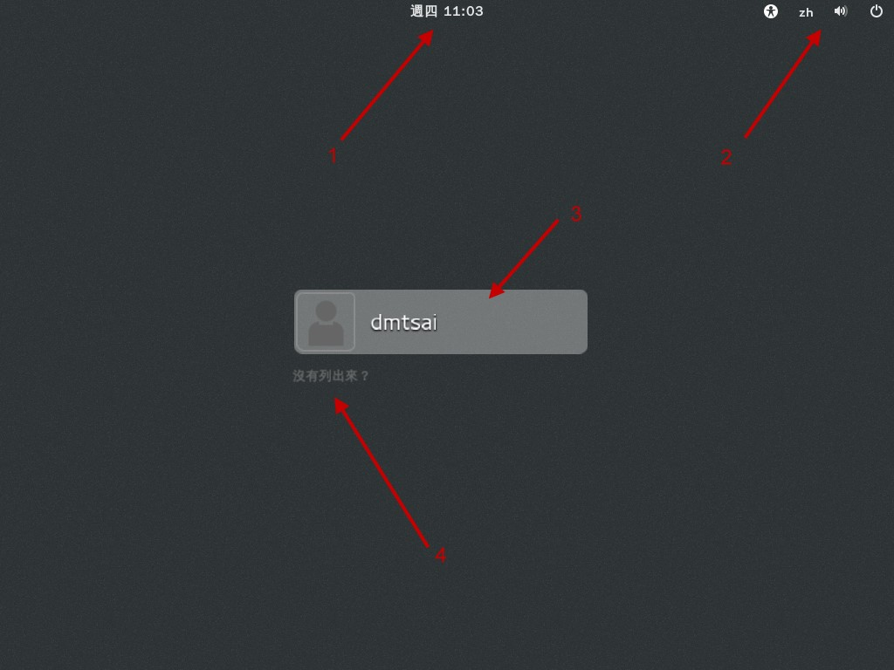
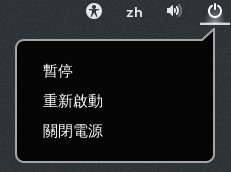
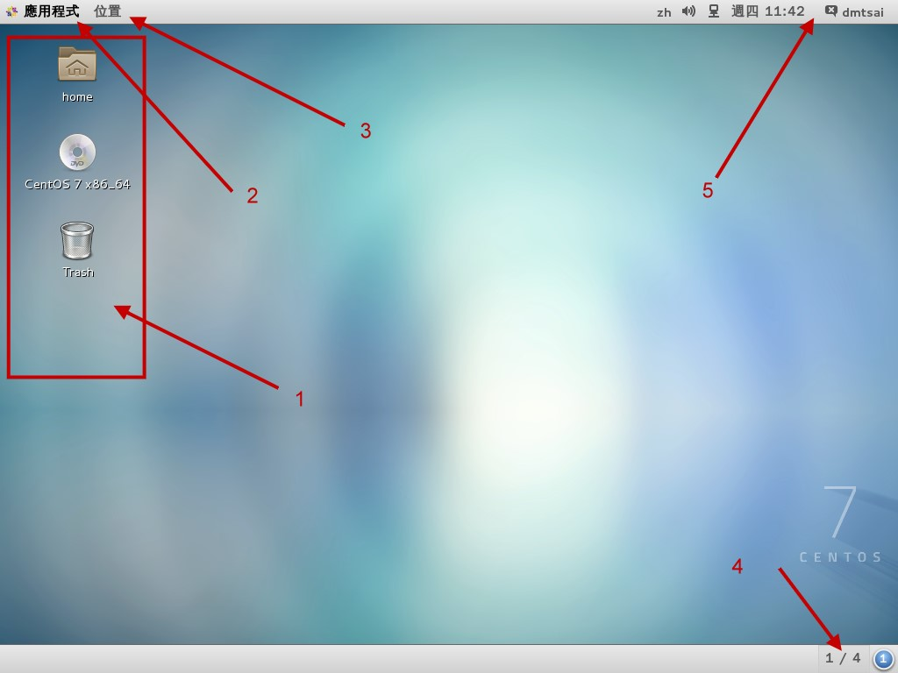
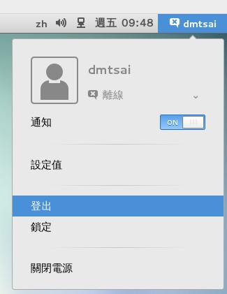

# 第四章、首次登陆与线上求助

最近更新日期：20//

终于可以开始使用 Linux 这个有趣的系统了！由于 Linux 系统使用了非同步的磁盘/内存数据传输模式，同时又是个多用户多任务的环境， 所以你不能随便的不正常关机，关机有一定的程序喔！错误的关机方法可能会造成磁盘数据的损毁呢！ 此外，Linux 有多种不同的操作方式，图形接口与命令行的操作有何不同？ 我们能否在命令行取得大量的指令说明，而不需要硬背某些指令的选项与参数等等。这都是这一章要来介绍的呢！

# 4.1 首次登陆系统

## 4.1 首次登陆系统

登陆系统有这么难吗？并不难啊！虽然说是这样说，然而很多人第一次登陆 Linux 的感觉都是“接下来我要干啥？”如果是以图形接口登陆的话，或许还有很多好玩的事物， 但要是以命令行登陆的话，面对着一片黑压压的屏幕，还真不晓得要干嘛呢！为了让大家更了解如何正确的使用 Linux， 正确的登陆与离开系统还是需要说明的！

### 4.1.1 首次登陆 CentOS 7.x 图形接口

开机就开机呀！怎么还有所谓的登陆与离开呀？不是开机就能够用计算机了吗？ 开什么玩笑，在 Linux 系统中由于是多用户多任务的环境，所以系统随时都有很多不同的用户所下达的任务在进行， 因此正确的开关机可是很重要的！不正常的关机可能会导致文件系统错乱，造成数据的毁损呢！这也是为什么通常我们的 Linux 主机都会加挂一个不断电系统啰！

如果在第三章一切都顺利的将 CentOS 7.x 完成安装并且重新开机后， 应该就会出现如下的等待登陆的图形画面才对。画面中 1 号箭头显示目前的日期与时间，2 号箭头则是辅助功能、语系、音量与关机钮， 3 号箭头就是我们可以使用帐号登陆的输入框框，至于 4 号箭头则是在使用特别的帐号登陆时才会用到的按钮。

图 4.1.1、X 等待登陆的画面示意图

接下来让我们来了解一下这个登陆画面的相关功能吧！首先，在箭头 1 的地方，如果你动鼠标过去点一下，就会出现如下的窗口， 主要在告诉你日期、日历与时间而已～如下图所示，鸟哥撷取这张图的时间就是在 2015/05/21 早上喔！

图 4.1.2、X 等待登陆的画面示意图-日历、时间显示

然后看一下右上角的角落，你会发现有个小人形图示，那个是协助登陆的无障碍画面处理！如果你的键盘暂时出了点问题，某些按键无法按， 那就可以使用如下画面的“屏幕键盘”的项目，将他 On 一下～那未来有需要在登陆的时候有打字的需求时，屏幕就会出现类似手机要你打字的键盘画面啦！

图 4.1.3、X 等待登陆的画面示意图-无障碍登陆协助

有看到那个 zh 嘛？那个是语系的选择～点下去你会看到这部系统支持的语系数据有多少。至于那个类似喇叭的小图示，就是代表着音效的大小声控制～ 而最右边那个有点像是关机的小图示又是干麻的呢？没关系！别紧张！用力点下去看看～就会出现如下图示，其实就是准备要关机的一些功能按钮～ 暂停是进入休眠模式，重新启动就是重新开机啊，关闭电源当然就是关机啰！所以，你不需要登陆系统，也能够通过这个画面来“关机”喔！

图 4.1.4、X 等待登陆的画面示意图-无须登陆的关机与重新开机

接下来看到图 4.1.1 的地方，图示中的箭头 3,4 指的地方就是可以登陆的帐号！一般来说，能够让你输入帐密的正常帐号， 都会出现在这个画面当中，所以列表的情况可能会非常长！那有些特殊帐号，例如我们在第三章安装过程中，曾经有创建过两个帐号， 一个是 root 一个是 dmtsai，那个 dmtsai 可以列出来没问题，但是 root 因为身份比较特殊，所以就没有被列出来！因此， 如果你想要使用 root 的身份来登陆，就得要点选箭头 4 的地方，然后分别输入帐密即可！

如果是一般可登陆正常使用的帐号，如画面中的 dmtsai 的话，那你就直接点选该帐号，然后输入密码即可开始使用我们的系统了！ 使用 dmtsai 帐号来输入密码的画面示意如下：

图 4.1.5、X 等待登陆的画面示意图-一般帐号登陆系统的密码字段

在你输入正确的密码之后，按下“登陆”按钮，就可以进入 Linux 的图形画面中，并开始准备操作系统啰！


**Tips** 一般来说，我们不建议您直接使用 root 的身份登陆系统喔！请使用一般帐号登陆！等到有需要修改或者是创建系统相关的管理工作时， 才切换身份成为 root！为什么呢？因为系统管理员的权限太高了！而 Linux 下面很多的指令行为是“没有办法复原”的！所以， 使用一般帐号时，“手滑”的灾情会比较不严重！

### 4.1.2 GNOME 的操作与登出

在每一个用户“第一次”以图形接口登陆系统时，系统都会询问使用者的操作环境，以依据使用者的国籍、 语言与区域等制定与系统默认值不同的环境。如下所示，第一个问题就是询问你未来整体的环境要使用的语系为哪个语系与国家？ 当然我们台湾都选汉语台湾啊 （安装的时候选择的默认值），如果有不同的选择，请自行挑选你想要的环境，然后按下“下一步”即可。

图 4.1.6、每个用户第一次登陆系统的环境设置

再来则是选择输入法，除非你有特殊需求，否则不需要修改设置值。若是需要有其他不同的输入法，请看下图左侧箭头指的“+”符号， 按下它就可以开始选择其他的输入法了。一切顺利的话，请点选“下一步”。

图 4.1.7、每个用户第一次登陆系统的环境设置

上述的环境选择妥当之后，系统会出现一个确认的画面，然后就出现“入门信息”的类似网页的画面来给你瞧一瞧如何快速入门啰！如下所示。 如果你有需要，请一个一个链接去点选查阅，如果已经知道这是啥东西，也可以如画面箭头处，直接关闭即可！

图 4.1.8、每个用户第一次登陆系统的环境设置

**Tips** 要注意喔！上述的画面其实是 GNOME 的求助软件窗口，并不是浏览器窗口！第一次接触到这个画面的学生， 直接在类似网址列的框框中写入 URL 网址，结果当然是找不到数据...当学生问鸟哥时，鸟哥也被唬住了...以为是浏览器...

终于给他看到图形接口啦！真是很开心吧！如下图所示，整个 GNOME 的窗口大约分为三个部分：

图 4.1.9、窗口接口的环境介绍

*   上方工作列（control panel） 上半部左侧有“应用程序”与“位置”，右侧则有“输入法切换”、声音、网络、日期、帐号相关设置切换等，这个位置可以看成是工作列。 举例来说，你可以使用鼠标在 2 号箭头处 （应用程序） 点击一下，就会有更多的程序集出现！然后移动鼠标就能够使用各个软件了。 至于 5 号箭头所指的地方，就是系统时间与声音调整。最右上角则是目前登陆的帐号身份，可以取得很多的设置信息的！

*   桌面 整个画面中央就是桌面啦！在桌面上默认有两个小按钮，例如箭头 1 所指的地方，常见的就是目前这个帐号的主文件夹，你可以使用鼠标连击两下就能够打开该功能。 另一个则是垃圾桶 （Trash）。如果你的安装光盘没有退出，那么该光盘以及其他可能的可携式 USB 设备，也可能显示在桌面上！ 例如图中的“ CentOS 7 x86_64 ”的光片图示，就是你没有退出的光盘喔！

*   下方工作列 下方工作列的目的是将各工作显示在这里，可以方便使用者快速的在各个工作间切换喔！另外，我们还有多个可用的虚拟桌面 （Virtual Desktop），就是画面中右下角那个 1/4 的东东！ 该数字代表的意思是，共有 4 个虚拟桌面，目前在第一个的意思。你可以点一下该处，就知道那是啥东西了！

Linux 桌面的使用方法几乎跟 Windows 一模一样，你可以在桌面上按下右键就可以有额外的菜单出现；你也可以直接按下桌面上的“个人数据夹 （home）”， 就会出现类似 Windows 的“文件资源管理器”的文件/目录管理窗口，里面则出现你自己的主文件夹；下面我们就来谈谈几个在图形接口里面经常使用的功能与特色吧！


**Tips** 关于“个人数据夹”的内容，记得我们之前说过 Linux 是多用户多任务的操作系统吧？ 每个人都会有自己的“工作目录”，这个目录是使用者可以完全掌控的， 所以就称为“使用者个人主文件夹”了。一般来说，主文件夹都在/home 下面， 以鸟哥这次的登陆为例，我的帐号是 dmtsai，那么我的主文件夹就应该在/home/dmtsai/啰！

*   上方工具列：应用程序 （Applications）

让我们点击一下“应用程序”那个按钮吧！看看下拉式菜单中有什么软件可用！如下图所示。

图 4.1.10、应用程序集当中，需要注意有阶层的显示喔！

你要注意的是，这一版的 CentOS 在这个应用程序的设计上，阶层式变化间并没有颜色的区分，左侧也没有深色三角形的示意小图，因此如上图所示，如果你想要打开计算机软件， 那得先在左边第一层先移动到“附属应用”之后，鼠标水平横向移动到右边，才可以点选计算机喔！鸟哥一开始在这里确实容易将鼠标垂直向乱移动，导致老是没办法移动到正确的按钮上！

基本上，这个“应用程序”按钮已经将大部分的软件功能分类了，你可以在里头找到你常用的软件来操作。例如想要使用 Office 的办公室软件， 就到“办公”选项上，就可以看到许多软件存在了！此外，你还会看到最下面有个“活动总览”，那个并没有任何分类的子项目在内，那是啥东西？ 没关系，基本上练习机你怎么玩都没关系！所以，这时就给他点点看啊！会像下面的图示这样：

图 4.1.11、应用程序的总览画面示意图！

画面左侧 1 号箭头处，其实就是类似快速按钮的地方，可以让你快速的选择你所常用的软件。右侧 2 号箭头处，就是刚刚我们上面谈到的虚拟桌面啰！ 共有四个，而目前画面中显示的最是最上面那个一号桌面的意思。如果细看该区块，就会发现其实鸟哥在第三个虚拟桌面当中也有打开几个软件在操作呢！ 有没有发现啊？至于画面中的 3 号箭头处，就是目前这个活动中的虚拟桌面上，拥有的几个启动的软件啰！你可以点选任何你想要的软件，就可以开始操作该软件了！ 所以使用这个“活动总览”，比较可以让你在开好多窗口的环境下，快速的回到你所需要的软件功能中喔！

*   上方工具列：位置 （就是文件资源管理器）

如果你想要知道系统上面还有哪些文件数据，以及你目前这个帐号的基本子目录，那就得要打开文件资源管理器啰 （file manager）！ 打开文件资源管理器很简单，就是选择左上方那个“位置”的按钮项目即可。在这个项目中主要有几个细项可以直接打开目录的内容，主文件夹、下载、图片、影片等等， 其实除了主文件夹之外，下面的次目录“就是主文件夹下的次目录”啦！所以你可以直接打开主文件夹即可！如下所示：

图 4.1.12、文件资源管理器操作示意图

如上图所示，1 号箭头处可以让你选择不同的目录或数据来源，2 号箭头则以小图示的方式显示该物件可能是什么数据，3 号箭头则可以将目前的小图示变成详细数据清单， 4 号箭头就是目前小图示的显示模式，5 号箭头可以进行图示数据的放大、缩小、排序方式、是否显示隐藏文件等重要功能！6 号箭头则是其他额外的功能项目！ 好了，线再让我们来操作一下这个软件吧！如果你想要观察每个文件名的详细数据，并且显示“隐藏文件”的话，那该如何处理呢？如下图所示的方式处理一下：

图 4.1.13、文件资源管理器操作示意图

按照上面的三个步骤点选完毕后，你就会看到如 4 号箭头处指的，有一些额外的文件名跑出来了！而且，这些跑出来的文件名共同的特色就是“文件名前面开头是小数点 . ” 没错！你答对了～只要文件名的开头是由小数点开始的，那么该文件名就不会在一般观察模式被显示出来！所以说，在 Linux 下面，隐藏文件并不是什么特殊的权限， 单纯是因为文件名命名的处理方式来搞定的！这样理解否？

如果你想要观察系统有多少不同的文件系统呢？那就看一下文件资源管理器左侧“设备”的项目下，有几个项目就是有几个设备啰！现在让我们来观察一下“计算机”内有什么数据吧！ 请按下他！然后观察一下如下的图示：

图 4.1.14、文件资源管理器操作示意图

如上图所示，点下 1 号箭头后，右边就出现一堆目录数据夹。注意看， 2 号箭头处指的是正常的一般目录， 3 号箭头则指的是有“链接文件”的数据， 这个链接文件可以想像成 Windows 的“捷径”功能就是了～如果你的帐号没有权限进入该目录时，该目录就会出现一个 X 的符号，如同 4 号箭头处！很清楚吧！ 好！让我们来观察一下有没有 /etc -> sysconfig -> network-scripts 这个目录下的数据呢？

图 4.1.15、文件资源管理器操作示意图

如果你可以依序双击每个正确的目录，就可以得到如上图示。画面中的 1 号箭头处，可以让你“回到上一个画面”中，不是回到上一层～而是“上一个画面”喔！ 这点要注意。至于 2 号区块处，你可以发现有不同颜色的显示，最右边的是目前所在目录，所以 3 号画面就显示该目录下的文件信息。 你可以快速的点选 2 号区块处的任何一个目录，就可以快速的回到该层目录中去查看文件数据喔！

*   中文输入法与设置

如果你在安装的时候就选定中文，并且有处理过切换中/英文的快速键，那这个项目几乎可以不用理他了！但是如果你都使用默认值来安装时， 可能会发生没办法使用惯用的“ctrl+shift”或“ctrl+space”来切换中文的问题！同时，也可能没办法找到你想要的中文输入法～那怎办？没关系， 请使用图 4.1.9 画面中右上角的帐号名称处点一下，然后选择“设置值”，或者从“应用程序”、“系统工具”、“设置值”也可以打开它！ 之后选择“地区和语言”项目，就可以得到如下画面。

图 4.1.16、地区与语言设置项目

在上面的画面中，你可以按下箭头所指的地方，就可以增加或减少输入法的项目了。但是，如果想要切换不同的语言呢？那请回到原本的设置画面， 之后请选择“键盘”的项目，并按下“快捷键”，出现如下的画面，点选在画面中的左侧“输入”项目，并在“切换到下一个输入来源”点选一、两下， 等到出现如 3 号箭头处出现“新捷径键”时，按下你所需要的组合键，例如鸟哥习惯按“crtl + space”，那就自己按下组合键， 之后你就可以使用自己习惯的输入法切换快速键，来变更你所需要的输入法啰！

图 4.1.17、输入法切换之快捷键设置

*   一些常见的练习

下面的例题请大家自行参考并且实作一下喔！题目很简单，所以鸟哥就不额外抓图了！

1.  由“设置值”的“显示器”项目中，确认一下目前的分辨率，并且尝试自己变更一下屏幕分辨率；
2.  由“设置值”的“背景”项目中，修改一下桌面的背景图示：
3.  由“设置值”的“电源”项目中，修改一下进入空白屏幕锁定的时间，将它改成“永不”的设置值；
4.  由“应用程序”的“公用程序”项目下的“调校工具”中，使用“Shell”功能内的“动态工作区”项目，将原本的 4 个虚拟桌面， 更改成 6 个虚拟桌面看看；
5.  由“应用程序”的“公用程序”项目下的“调校工具”中，使用“输入”项目，并选择“砍除 X 服务器的按键序列”从“已停用”改成“Control+Alt+退格键”的设置， 这可以让你按下三个按钮就能够重新启动 X 窗口管理员；
6.  请将/etc/crontab 这个文件“复制”到你的主文件夹中；
7.  从“应用程序”的“附属应用”点选“gedit”编辑器，按下 gedit 的“打开”按钮，选择“主文件夹（就是你的帐号名称）”后，点选刚刚复制过来的 crontab 文件名。 在画面中随意使用中文输入法输入几个字，然后储存离开看看！
8.  从“应用程序”的“喜好”当中打开“终端机”，在终端机中输入“gsettings set org.gnome.desktop.interface enable-animations false”， 这个动作会将 GNOME 默认的画面切换的动画功能关闭，在虚拟机的环境下，有助于画面切换的速度喔！

上述的练习中，第三个练习还挺重要的！因为在默认的状态中，你的图形接口会在 5 分钟后自动的被锁定！这是为了要避免你暂时离开座位， 有人偷偷使用你的计算机的缘故。而要解开锁定，就得要输入你这个帐号的密码才行。这个功能最好是不要取消。但因为我们的系统是单纯的练习机， 而且又是虚拟机，如果经常锁定屏幕，老是要解开很烦～那就使用上述的 3 号练习题，应该可以处理完毕！ 至于第 8 点对于初次接触 Linux 的朋友来说，会有点困难，如果你不知道如何下达指令，没关系～等到本章后面的小节读完，你就知道如何处理了！

*   登出 GNOME、重新启动 X 窗口管理员或关机

如果你没有想要继续玩 X Window 了，那就登出吧！如果不想要继续操作系统了，那就关机吧！如何登出/关机呢？如下图所示，点选右上角你的帐号名称， 然后在出现的画面中去选择即可。要记得的是，登出前最好将所有不需要的程序都关闭了再登出或关机啊！

图 4.1.18、离开窗口接口或 Linux 的方式：有登出、锁定与关机

不论是登出还是关闭电源（关机），都会有一个警告窗口来告知你 60 秒内没有任何动作的话，就会被登出了！如下图所示。当然， 你也可以按下确定来进行动作。登出后，系统画面又会回到原本的等待登陆的画面中了！

图 4.1.19、离开窗口接口或 Linux 的方式：登出提醒

请注意喔，登出并不是关机！只是让你的帐号离开系统而已喔！

*   重新启动 X Window 的快速按钮

一般来说，我们是可以手动来直接修改 X Window 的配置文件的，不过，修改完成之后的设置项目并不会立刻被载入， 必须要重新启动 X 才行（特别注意，不是重新开机，而是重新启动 X！） 。那么如何重新启动 X 呢？ 最简单的方法就是：

*   直接登出，然后再重新登陆即可；
*   在 X 的画面中直接按下**[Alt] + [Ctrl] + [Backspace]**

第二个方法比较有趣，[backspace]是倒退键，你按下三个按钮后 X Window 立刻会被重新启动。 如果你的 X Window 因为不明原因导致有点问题时，也可以利用这个方法来重新启动 X 喔！不过， 这个方法要生效，必须要先进行本节稍早之前的练习第五题才行呦！

### 4.1.3 X window 与文字模式的切换

我们前面一直谈到的是 X Window 的窗口管理员环境，那么在这里面有没有纯命令行的环境啊？因为听说服务器通常是纯命令行的啊！ 当然有啊！但是，要怎么切换 X Window 与文字模式呢？注意喔，通常我们也称文字模式为终端机接口, terminal 或 console 喔！Linux 默认的情况下会提供六个 Terminal 来让使用者登陆， 切换的方式为使用：**[Ctrl] + [Alt] + [F1]~[F6]**的组合按钮。

那这六个终端接口如何命名呢，系统会将[F1] ~ [F6]命名为 tty1 ~ tty6 的操作接口环境。 也就是说，当你按下[crtl] + [Alt] + [F1]这三个组合按钮时 （按着[ctrl]与[Alt]不放，再按下[F1]功能键）， 就会进入到 tty1 的 terminal 接口中了。同样的[F2]就是 tty2 啰！那么如何回到刚刚的 X 窗口接口呢？很简单啊！按下[Ctrl] + [Alt] + [F1]就可以了！我们整理一下登陆的环境如下：

*   [Ctrl] + [Alt] + [F2] ~ [F6] ：命令行登陆 tty2 ~ tty6 终端机；
*   [Ctrl] + [Alt] + [F1] ：图形接口桌面。

由于系统默认的登陆界面不同，因此你想要进入 X 的终端机名称也可能会有些许差异。以 CentOS 7 为例，由于我们这次安装的练习机， 默认是启动图形界面的，因此这个 X 窗口将会出现在 tty1 界面中。如果你的 Linux 默认使用纯命令行，那么 tty1~tty6 就会被文字界面占用。


**Tips** 在 CentOS 7 环境下，当开机完成之后，默认系统只会提供给你一个 tty 而已，因此无论是文字界面还是图形界面，都是会出现在 tty1 喔！ tty2~tty6 其实一开始是不存在的！但是当你要切换时 （按下 [ctrl]+[alt]+[F2]），系统才产生出额外的 tty2, tty3...

若你在纯文本环境中启动 X 窗口，那么图形界面就会出现在当时的那个 tty 上面。举例来说，你在 tty3 登陆系统，然后输入 startx 启动个人的图形界面， 那么这个图形界面就会产生在 tty3 上面！这样说可以理解吗？

```
# 纯命令行下 （不能有 X 存在） 启动窗口界面的作法
[dmtsai@study ~]$ startx 
```

不过 startx 这个指令并非万灵丹，你要让 startx 生效至少需要下面这几件事情的配合：

*   并没有其他的 X window 被启用；
*   你必须要已经安装了 X Window system，并且 X server 是能够顺利启动的；
*   你最好要有窗口管理员，例如 GNOME/KDE 或者是阳春的 TWM 等；

其实，所谓的窗口环境，就是：“文字界面加上 X 窗口软件”的组合！因此，文字界面是一定会存在的，只是窗口界面软件就看你要不要启动而已。 所以，我们才有办法在纯文本环境下启动一个个人化的 X 窗口啊！因为这个 startx 是任何人都可以执行的喔！并不一定需要管理员身份的。 所以，是否默认要使用图形界面，只要在后续管理服务的程序中，将“ graphical.target ”这个目标服务设置为默认，就能够默认使用图形界面啰！


**Tips** 从这一版 CentOS 7 开始，已经取消了使用多年的 SystemV 的服务管理方式，也就是说，从这一版开始，已经没有所谓的“执行等级 （run level） ”的概念了！ 新的管理方法使用的是 systemd 的模式，这个模式将很多的服务进行相依性管理。以文字与图形界面为例，就是要不要加入图形软件的服务启动而已～ 对于熟悉之前 CentOS 6.x 版本的老家伙们，要重新摸一摸 systemd 这个方式喔！因为不再有 /etc/inittab 啰！注意注意！

### 4.1.4 在终端接口登陆 linux

刚刚你如果有按下[Ctrl] + [Alt] + [F2]就可以来到 tty2 的登陆画面，而如果你并没有启用图形窗口界面的话， 那么默认就是会来到 tty1 这个环境中。这个纯文本环境的登陆的画面 （鸟哥用 dmtsai 帐号当入） 有点像这样：

```
CentOS Linux 7 （Core）
Kernel 3.10.0-229.el7.x86_64 on an x86_64

study login: dmtsai
Password: &lt;==这里输入你的密码
Last login: Fri May 29 11:55:05 on tty1 &lt;==上次登陆的情况
[dmtsai@study ~]$ _ &lt;==光标闪烁，等待你的指令输入 
```

上面显示的内容是这样的：

1.  CentOS Linux 7 （Core）： 显示 Linux distribution 的名称（CentOS）与版本（7）；

2.  Kernel 3.10.0-229.el7.x86_64 on an x86_64： 显示 Linux 核心的版本为 3.10.0-229.el7.x86_64， 且目前这部主机的硬件等级为 x86_64。

3.  study login:： 那个 study 是你的主机名称。我们在第三章安装时有填写主机名称为： study.centos.vbird，主机名称的显示通常只取第一个小数点前的字母，所以就成为 study 啦！至于 login:则是一支可以让我们登陆的程序。 你可以在 login:后面输入你的帐号。以鸟哥为例，我输入的就是第三章创建的 dmtsai 那个帐号啦！ 当然啰，你也可以使用 root 这个帐号来登陆的。不过“root”这个帐号代表在 Linux 系统下无穷的权力， 所以尽量不要使用 root 帐号来登陆啦！

4.  Password:： 这一行则在第三行的 dmtai 输入后才会出现，要你输入密码啰！ 请注意，在输入密码的时候，屏幕上面“不会显示任何的字样！”， 所以不要以为你的键盘坏掉去！很多初学者一开始到这里都会拼命的问！啊我的键盘怎么不能用...

5.  Last login: Fri May 29 11:55:05 on tty1： 当使用者登陆系统后，系统会列出上一次这个帐号登陆系统的时间与终端机名称！ 建议大家还是得要看看这个信息，是否真的是自己的登陆所致喔！

6.  [dmtsai@study ~]$ _： 这一行则是正确登陆之后才显示的讯息， 最左边的 dmtsai 显示的是“目前使用者的帐号”，而@之后接的 study 则是“主机名称”，至于最右边的~则指的是 “目前所在的目录”，那个$则是我们常常讲的“提示字符”啦！


**Tips** 那个 ~ 符号代表的是“使用者的主文件夹”的意思，他是个“变量！” 这相关的意义我们会在后续的章节依序介绍到。举例来说，root 的主文件夹在/root， 所以 ~ 就代表/root 的意思。而 dmtsai 的主文件夹在/home/dmtsai， 所以如果你以 dmtsai 登陆时，他看到的 ~ 就会等于/home/dmtsai 喔！

至于提示字符方面，在 Linux 当中，默认 root 的提示字符为 # ，而一般身份使用者的提示字符为 $ 。

还有，上面的第一、第二行的内容其实是来自于/etc/issue 这个文件喔！

好了这样就是登陆主机了！很快乐吧！耶～

另外，再次强调，在 Linux 系统下最好常使用一般帐号来登陆即可，所以上例中鸟哥是以自己的帐号 dmtsai 来登陆的。 因为系统管理员帐号（root）具有无穷大的权力，例如他可以删除任何一个文件或目录。因此若你以 root 身份登陆 Linux 系统， 一个不小心下错指令，这个时候可不是“欲哭无泪”就能够解决的了问题的～

因此，一个称职的网络/系统管理人员，通常都会具有两个帐号，平时以自己的一般帐号来使用 Linux 主机的任何资源， 有需要动用到系统功能修订时，才会转换身份成为 root 呢！所以，鸟哥强烈建议你创建一个普通的帐号来供自己平时使用喔！ 更详细的帐号讯息，我们会在后续的“第十三章帐号管理”再次提及！ 这里先有概念即可！

那么如何离开系统呢？其实应该说“登出 Linux”才对！登出很简单，直接这样做：

```
[dmtsai@study ~]$ exit 
```

就能够登出 Linux 了。但是请注意：“离开系统并不是关机！” 基本上，Linux 本身已经有相当多的工作在进行，你的登陆也仅是其中的一个“工作”而已， 所以当你离开时，这次这个登陆的工作就停止了，但此时 Linux 其他的工作是还是继续在进行的！ 本章后面我们再来提如何正确的关机，这里先创建起这个概念即可！

# 4.2 文字模式下指令的下达

## 4.2 文字模式下指令的下达

其实我们都是通过“程序”在跟系统作沟通的，本章上面提到的窗口管理员或文字模式都是一组或一只程序在负责我们所想要完成的任务。 文字模式登陆后所取得的程序被称为壳（Shell），这是因为这支程序负责最外面跟使用者（我们）沟通，所以才被戏称为壳程序！ 更多与操作系统及壳程序的相关性可以参考第零章、计算机概论内的说明。

我们 Linux 的壳程序就是厉害的 bash 这一支！关于更多的 bash 我们在第三篇再来介绍。现在让我们来练一练打字吧！


**Tips** “练打字”真的是开玩笑的！各位观众朋友，千万不要只是“观众朋友”而已，您得要自己亲身体验，看看指令下达之后所输出的信息， 并且理解一下“我敲这个指令的目的是想要完成什么任务？”，再看看输出的结果是否符合你的需求，这样才能学到东西！不是单纯的鸟哥写什么， 你就打什么，那只是“练打字”不是“学 Linux”喔！ ^_^

### 4.2.1 开始下达指令

其实整个指令下达的方式很简单，你只要记得几个重要的概念就可以了。举例来说，你可以这样下达指令的：

```
[dmtsai@study ~]$ command  [-options]  parameter1  parameter2 ...
 指令     选项        参数（1）     参数（2） 
```

上述指令详细说明如下：

1.  一行指令中第一个输入的部分绝对是“指令（command）”或“可可执行文件案（例如批次脚本,script）”
2.  command 为指令的名称，例如变换工作目录的指令为 cd 等等；
3.  中刮号[]并不存在于实际的指令中，而加入选项设置时，通常选项前会带 - 号，例如 -h；有时候会使用选项的完整全名，则选项前带有 -- 符号，例如 --help；
4.  parameter1 parameter2.. 为依附在选项后面的参数，或者是 command 的参数；
5.  指令, 选项, 参数等这几个咚咚中间以空格来区分，不论空几格 shell 都视为一格。所以空格是很重要的特殊字符！；
6.  按下[Enter]按键后，该指令就立即执行。[Enter]按键代表着一行指令的开始启动。
7.  指令太长的时候，可以使用反斜线 （\） 来跳脱[Enter]符号，使指令连续到下一行。注意！反斜线后就立刻接特殊字符，才能跳脱！
8.  其他：
    1.  在 Linux 系统中，英文大小写字母是不一样的。举例来说， cd 与 CD 并不同。
    2.  更多的介绍等到第十章 bash 时，再来详述。

注意到上面的说明当中，“第一个被输入的数据绝对是指令或者是可执行的文件”！ 这个是很重要的概念喔！还有，按下[Enter]键表示要开始执行此一命令的意思。我们来实际操作一下： 以 ls 这个“指令”列出“自己主文件夹（~）”下的“所有隐藏文件与相关的文件属性”， 要达成上述的要求需要加入 -al 这样的选项，所以：

```
[dmtsai@study ~]$ ls -al ~
[dmtsai@study ~]$ ls           -al   ~
[dmtsai@study ~]$ ls -a  -l ~ 
```

上面这三个指令的下达方式是一模一样的执行结果喔！为什么？请参考上面的说明吧！ 关于更详细的文字模式使用方式，我们会在第十章认识 BASH 再来强调喔！ 此外，请特别留意，在 Linux 的环境中， “大小写字母是不一样的东西！”也就是说，在 Linux 下面， VBird 与 vbird 这两个文件是“完全不一样的”文件呢！所以， 你在下达指令的时候千万要注意到指令是大写还是小写。例如当输入下面这个指令的时候，看看有什么现象：

```
[dmtsai@study ~]$ date  &lt;==结果显示日期与时间
[dmtsai@study ~]$ Date  &lt;==结果显示找不到指令
[dmtsai@study ~]$ DATE  &lt;==结果显示找不到指令 
```

很好玩吧！只是改变小写成为大写而已，该指令就变的不存在了！ 因此，请千万记得这个状态呦！

*   语系的支持

另外，很多时候你会发现，咦！怎么我输入指令之后显示的结果的是乱码？ 这跟鸟哥说的不一样啊！呵呵！不要紧张～我们前面提到过，Linux 是可以支持多国语系的，若可能的话， 屏幕的讯息是会以该支持语系来输出的。但是，我们的终端机接口（terminal）在默认的情况下， 无法支持以中文编码输出数据的。这个时候，我们就得将支持语系改为英文，才能够以英文显示出正确的讯息。 那怎么做呢？你可以这样做：

```
1\. 显示目前所支持的语系
[dmtsai@study ~]$ locale
LANG=zh_TW.utf8              # 语言语系的输出
LC_CTYPE="zh_TW.utf8"        # 下面为许多信息的输出使用的特别语系
LC_NUMERIC=zh_TW.UTF-8
LC_TIME=zh_TW.UTF-8          # 时间方面的语系数据
LC_COLLATE="zh_TW.utf8"
....中间省略....
LC_ALL=                      # 全部的数据同步更新的设置值
# 上面的意思是说，目前的语系（LANG）为 zh_TW.UTF-8，亦即台湾繁体中文的万国码
[dmtsai@study ~]$ date
鈭? 5??29 14:24:36 CST 2015  # 纯命令行下，无法显示中文字，所以前面是乱码

2\. 修改语系成为英文语系
[dmtsai@study ~]$ LANG=en_US.utf8
[dmtsai@study ~]$ export LC_ALL=en_US.utf8
# LANG 只与输出讯息有关，若需要更改其他不同的信息，要同步更新 LC_ALL 才行！

[dmtsai@study ~]$ date
Fri May 29 14:26:45 CST 2015 # 顺利显示出正确的英文日期时间啊！

[dmtsai@study ~]$ locale
LANG=en_US.utf8
LC_CTYPE="en_US.utf8"
LC_NUMERIC="en_US.utf8"
....中间省略....
LC_ALL=en_US.utf8
# 再次确认一下，结果出现，确实是 en_US.utf8 这个英文语系！ 
```

注意一下，那个“LANG=en*US.utf8”是连续输入的，等号两边并没有空白字符喔！ 这样一来，就能够在“这次的登陆”察看英文讯息啰！为什么说是“这次的登陆”呢？ 因为，如果你登出 Linux 后，刚刚下达的指令就没有用啦！ ^*^，这个我们会在第十章再好好聊一聊的！好啰，下面我们来练习一下一些简单的指令， 好让你可以了解指令下达方式的模式：

### 4.2.2 基础指令的操作

下面我们立刻来操作几个简单的指令看看啰！同时请注意，我们已经使用了英文语系作为默认输出的语言喔！

*   显示日期与时间的指令： date
*   显示日历的指令： cal
*   简单好用的计算机： bc

*   1\. 显示日期的指令： date

如果在命令行中想要知道目前 Linux 系统的时间，那么就直接在命令行界面输入 date 即可显示：

```
[dmtsai@study ~]$ date
Fri May 29 14:32:01 CST 2015 
```

上面显示的是：星期五, 五月二十九日, 14:32 分, 01 秒，在 2015 年的 CST 时区！台湾在 CST 时区中啦！ 请赶快动手做做看呦！好了，那么如果我想要让这个程序显示出“2015/05/29”这样的日期显示方式呢？ 那么就使用 date 的格式化输出功能吧！

```
[dmtsai@study ~]$ date +%Y/%m/%d
2015/05/29
[dmtsai@study ~]$ date +%H:%M
14:33 
```

那个“+%Y%m%d”就是 date 指令的一些参数功能啦！很好玩吧！那你问我， 鸟哥怎么知道这些参数的啊？要背起来吗？当然不必啦！下面再告诉你怎么查这些参数啰！

从上面的例子当中我们也可以知道，指令之后的选项除了前面带有减号“-”之外，某些特殊情况下， 选项或参数前面也会带有正号“+”的情况！这部份可不要轻易的忘记了呢！

*   2\. 显示日历的指令： cal

那如果我想要列出目前这个月份的月历呢？呵呵！直接给他下达 cal 即可！

```
[dmtsai@study ~]$ cal
      May 2015
Su Mo Tu We Th Fr Sa
                1  2
 3  4  5  6  7  8  9
10 11 12 13 14 15 16
17 18 19 20 21 22 23
24 25 26 27 28 29 30
31 
```

除了本月的日历之外，连同今日所在日期处都会有反白的显示呢！真有趣！cal （calendar）这个指令可以做的事情还很多，例如你可以显示整年的月历情况：

```
[dmtsai@study ~]$ cal 2015
                               2015

       January               February                 March
Su Mo Tu We Th Fr Sa   Su Mo Tu We Th Fr Sa   Su Mo Tu We Th Fr Sa
             1  2  3    1  2  3  4  5  6  7    1  2  3  4  5  6  7
 4  5  6  7  8  9 10    8  9 10 11 12 13 14    8  9 10 11 12 13 14
11 12 13 14 15 16 17   15 16 17 18 19 20 21   15 16 17 18 19 20 21
18 19 20 21 22 23 24   22 23 24 25 26 27 28   22 23 24 25 26 27 28
25 26 27 28 29 30 31                          29 30 31

        April                   May                   June
Su Mo Tu We Th Fr Sa   Su Mo Tu We Th Fr Sa   Su Mo Tu We Th Fr Sa
          1  2  3  4                   1  2       1  2  3  4  5  6
 5  6  7  8  9 10 11    3  4  5  6  7  8  9    7  8  9 10 11 12 13
12 13 14 15 16 17 18   10 11 12 13 14 15 16   14 15 16 17 18 19 20
19 20 21 22 23 24 25   17 18 19 20 21 22 23   21 22 23 24 25 26 27
26 27 28 29 30         24 25 26 27 28 29 30   28 29 30
                       31
....（以下省略）.... 
```

基本上 cal 这个指令可以接的语法为：

```
[dmtsai@study ~]$ cal [month] [year] 
```

所以，如果我想要知道 2015 年 10 月的月历，可以直接下达：

```
[dmtsai@study ~]$ cal 10 2015
    October 2015
Su Mo Tu We Th Fr Sa
             1  2  3
 4  5  6  7  8  9 10
11 12 13 14 15 16 17
18 19 20 21 22 23 24
25 26 27 28 29 30 31 
```

那请问今年有没有 13 月啊？来测试一下这个指令的正确性吧！下达下列指令看看：

```
[dmtsai@study ~]$ cal 13 2015
cal: illegal month value: use 1-12 
```

cal 竟然会告诉我们“错误的月份，请使用 1-12”这样的信息呢！所以， 未来你可以很轻易的就以 cal 来取得日历上面的日期啰！简直就是万年历啦！ ^_^。 另外，由这个 cal 指令的练习我们也可以知道，某些指令有特殊的参数存在， 若输入错误的参数，则该指令会有错误讯息的提示，通过这个提示我们可以借以了解指令下达错误之处。 这个练习的结果请牢记在心中喔！

*   3\. 简单好用的计算机： bc

如果在文字模式当中，突然想要作一些简单的加减乘除，偏偏手边又没有计算机！这个时候要笔算吗？ 不需要啦！我们的 Linux 有提供一支计算程序，那就是 bc 喔。你在命令行输入 bc 后，屏幕会显示出版本信息， 之后就进入到等待指示的阶段。如下所示：

```
[dmtsai@study ~]$ bc
bc 1.06.95
Copyright 1991-1994, 1997, 1998, 2000, 2004, 2006 Free Software Foundation, Inc.
This is free software with ABSOLUTELY NO WARRANTY.
For details type `warranty'.
_ &lt;==这个时候，光标会停留在这里等待你的输入 
```

事实上，我们是“进入到 bc 这个软件的工作环境当中”了！ 就好像我们在 Windows 里面使用“小算盘”一样！所以，我们下面尝试输入的数据， 都是在 bc 程序当中在进行运算的动作。所以啰，你输入的数据当然就得要符合 bc 的要求才行！ 在基本的 bc 计算机操作之前，先告知几个使用的运算子好了：

*   *   加法
*   *   减法
*   *   乘法
*   / 除法
*   ^ 指数
*   % 余数

好！让我们来使用 bc 计算一些咚咚吧！

```
[dmtsai@study ~]$ bc
bc 1.06.95
Copyright 1991-1994, 1997, 1998, 2000, 2004, 2006 Free Software Foundation, Inc.
This is free software with ABSOLUTELY NO WARRANTY.
For details type `warranty'.
1+2+3+4  &lt;==只有加法时
10
7-8+3
2
10*52
520
10%3     &lt;==计算“余数”
1
10²
100
10/100   &lt;==这个最奇怪！不是应该是 0.1 吗？
0
quit     &lt;==离开 bc 这个计算器 
```

在上表当中，粗体字表示输入的数据，而在每个粗体字的下面就是输出的结果。 咦！每个计算都还算正确，怎么 10/100 会变成 0 呢？这是因为 bc 默认仅输出整数，如果要输出小数点下位数，那么就必须要执行 scale=number ，那个 number 就是小数点位数，例如：

```
[dmtsai@study ~]$ bc
bc 1.06.95
Copyright 1991-1994, 1997, 1998, 2000, 2004, 2006 Free Software Foundation, Inc.
This is free software with ABSOLUTELY NO WARRANTY.
For details type `warranty'.
scale=3     &lt;==没错！就是这里！！
1/3
.333
340/2349
.144
quit 
```

注意啊！要离开 bc 回到命令提示字符时，务必要输入“quit”来离开 bc 的软件环境喔！ 好了！就是这样子啦！简单的很吧！以后你可以轻轻松松的进行加减乘除啦！

从上面的练习我们大概可以知道在命令行界面里面下达指令时，会有两种主要的情况：

*   一种是该指令会直接显示结果然后回到命令提示字符等待下一个指令的输入；
*   一种是进入到该指令的环境，直到结束该指令才回到命令提示字符的环境。

我们以一个简单的图示来说明：

图 4.2.1、指令下达的环境，上图为直接显示结果，下图为进入软件功能

如图 4.2.1 所示，上方指令下达后立即显示讯息且立刻回到命令提示字符的环境。 如果有进入软件功能的环境（例如上面的 bc 软件），那么就得要使用该软件的结束指令 （例如在 bc 环境中输入 quit）才能够回到命令提示字符中！那你怎么知道你是否在命令提示字符的环境呢？ 很简单！你只要看到光标是在“[dmtsai@study ~]$ ”这种提示字符后面， 那就是等待输入指令的环境了。很容易判断吧！不过初学者还是很容易忘记啦！

### 4.2.3 重要的几个热键[Tab], [ctrl]-c, [ctrl]-d

在继续后面章节的学习之前，这里很需要跟大家再来报告一件事，那就是我们的文字模式里头具有很多的功能组合键， 这些按键可以辅助我们进行指令的编写与程序的中断呢！这几个按键请大家务必要记住的！很重要喔！

*   [Tab]按键

[Tab]按键就是在键盘的大写灯切换按键（[Caps Lock]）上面的那个按键！在各种 Unix-Like 的 Shell 当中， 这个[Tab]按键算是 Linux 的 Bash shell 最棒的功能之一了！他具有“命令补全”与“文件补齐”的功能喔！ 重点是，可以避免我们打错指令或文件名称呢！很棒吧！但是[Tab]按键在不同的地方输入，会有不一样的结果喔！ 我们举下面的例子来说明。上一小节我们不是提到 cal 这个指令吗？如果我在命令行输入 ca 再按两次 [tab] 按键， 会出现什么讯息？

```
[dmtsai@study ~]$ ca[tab][tab]    &lt;==[tab]按键是紧接在 a 字母后面！
cacertdir_rehash     cairo-sphinx         cancel               case
cache_check          cal                  cancel.cups          cat
cache_dump           calibrate_ppa        capsh                catchsegv
cache_metadata_size  caller               captoinfo            catman
# 上面的 [tab] 指的是“按下那个 tab 键”，不是要你输入中括号内的 tab 啦！ 
```

发现什么事？所有以 ca 为开头的指令都被显示出来啦！很不错吧！那如果你输入“ls -al ~/.bash”再加两个[tab]会出现什么？

```
[dmtsai@study ~]$ ls -al ~/.bash[tab][tab]
.bash_history  .bash_logout   .bash_profile  .bashrc 
```

咦！在该目录下面所有以 .bash 为开头的文件名称都会被显示出来了呢！注意看上面两个例子喔， 我们按[tab]按键的地方如果是在 command（第一个输入的数据）后面时，他就代表着 “命令补全”，如果是接在第二个字以后的，就会变成“文件补齐”的功能了！但是在某些特殊的指令下面，文件补齐的功能可能会变成“参数/选项补齐”喔！ 我们同样使用 date 这个指令来查一下：

```
[dmtsai@study ~]$ date --[tab][tab]  &lt;==[tab]按键是紧接在 -- 后面！
--date        --help        --reference=  --rfc-3339=   --universal
--date=       --iso-8601    --rfc-2822    --set=        --version
# 瞧！系统会列出来 date 这个指令可以使用的选项有哪些喔～包括未来会用到的 --date 等项目 
```

总结一下：

*   [Tab] 接在一串指令的第一个字的后面，则为“命令补全”；
*   [Tab] 接在一串指令的第二个字以后时，则为“文件补齐”！
*   若安装 bash-completion 软件，则在某些指令后面使用 [tab] 按键时，可以进行“选项/参数的补齐”功能！

善用 [tab] 按键真的是个很好的习惯！可以让你避免掉很多输入错误的机会！


**Tips** 在这一版的 CentOS 7.x 当中，由于多了一个名为 bash_completion 的软件，这个软件会主动的去侦测“各个指令可以下达的选项与参数”等行为， 因此，那个“文件补齐”的功能可能会变成“选项、参数补齐”的功能，不一定会主动补齐文件名了喔！这点得要特别留意。鸟哥第一次接触 CentOS 7 的时候， 曾经为了无法补齐文件名而觉得奇怪！烦恼了老半天说！

*   [Ctrl]-c 按键

如果你在 Linux 下面输入了错误的指令或参数，有的时候这个指令或程序会在系统下面“跑不停”这个时候怎么办？别担心， 如果你想让当前的程序“停掉”的话，可以输入：[Ctrl]与 c 按键（先按着[Ctrl]不放，且再按下 c 按键，是组合按键）， 那就是中断目前程序的按键啦！举例来说，如果你输入了“find /”这个指令时，系统会开始跑一些东西（先不要理会这个指令串的意义），此时你给他按下 [Ctrl]-c 组合按键，嘿嘿！是否立刻发现这个指令串被终止了！就是这样的意思啦！

```
[dmtsai@study ~]$ find /
....（一堆东西都省略）....
# 此时屏幕会很花，你看不到命令提示字符的！直接按下[ctrl]-c 即可！
[dmtsai@study ~]$ &lt;==此时提示字符就会回来了！find 程序就被中断！ 
```

不过你应该要注意的是，这个组合键是可以将正在运行中的指令中断的， 如果你正在运行比较重要的指令，可别急着使用这个组合按键喔！ ^_^

*   [Ctrl]-d 按键

那么[Ctrl]-d 是什么呢？就是[Ctrl]与 d 按键的组合啊！这个组合按键通常代表着： “键盘输入结束（End Of File, EOF 或 End Of Input）”的意思！ 另外，他也可以用来取代 exit 的输入呢！例如你想要直接离开命令行，可以直接按下[Ctrl]-d 就能够直接离开了（相当于输入 exit 啊！）。

*   [shift]+{[PageUP]|[Page Down]}按键

如果你在纯文本的画面中执行某些指令，这个指令的输出讯息相当长啊！所以导致前面的部份已经不在目前的屏幕画面中， 所以你想要回头去瞧一瞧输出的讯息，那怎办？其实，你可以使用 [Shift]+[Page Up] 来往前翻页，也能够使用 [Shift]+[Page Down] 来往后翻页！ 这两个组合键也是可以稍微记忆一下，在你要稍微往前翻画面时，相当有帮助！


**Tips** 因为目前学生比较常用图形界面的终端机系统，所以当鸟哥谈到 [Shift]+[Page UP] 的功能时，他们很不能理解耶！说都有鼠标磙轮了， 要这组合钮干麻？唉～真是没见过世面的小朋友...

总之，在 Linux 下面，命令行的功能是很强悍的！要多多的学习他，而要学习他的基础要诀就是...多使用、多熟悉啦！

### 4.2.4 错误讯息的察看

万一我下达了错误的指令怎么办？不要紧呀！你可以借由屏幕上面显示的错误讯息来了解你的问题点， 那就很容易知道如何改善这个错误讯息啰！举个例子来说，假如想执行 date 却因为大小写打错成为 DATE 时， 这个错误的讯息是这样显示的：

```
[dmtsai@study ~]$ DATE
bash: DATE: command not found...  # 这里显示错误的讯息
Similar command is: 'date'        # 这里竟然给你一个可能的解决方案耶！ 
```

上面那个 bash:表示的是我们的 Shell 的名称， 本小节一开始就谈到过 Linux 的默认壳程序就是 bash 啰！ 那么上面的例子说明了 bash 有错误，什么错误呢？bash 告诉你：

> DATE: command not found

字面上的意思是说“指令找不到”，那个指令呢？就是 DATE 这个指令啦！ 所以说，系统上面可能并没有 DATE 这个指令啰！就是这么简单！通常出现“command not found”的可能原因为：

*   这个指令不存在，因为该软件没有安装之故。解决方法就是安装该软件；
*   这个指令所在的目录目前的用户并没有将他加入指令搜寻路径中，请参考第十章 bash 的 PATH 说明；
*   很简单！因为你打错字！

从 CentOS 7 开始，bash 竟然会尝试帮我们找解答耶！看一下上面输出的第二行“Similar command is: 'date'”，他说，相似的指令是 date 喔！ 没错啊！我们就是输入错误的大小写而已～这就已经帮我们找到答案了！看了输出，你也应该知道如何解决问题了吧？

介绍这几个指令让你玩一玩先，更详细的指令操作方法我们会在第三篇的时候再进行介绍！ 现在让我们来想一想，万一我在操作 date 这个指令的时候，手边又没有这本书，我要怎么知道要如何加那些奇怪的参数， 好让输出的结果符合我想要的输出格式呢？嘿嘿！到下一节鸟哥来告诉你怎么办吧！

# 4.3 Linux 系统的线上求助 man page 与 info page

## 4.3 Linux 系统的线上求助 man page 与 info page

先来了解一下 Linux 有多少指令呢？在文字模式下，你可以输入 g 之后直接按下两个[Tab]按键，看看总共有多少以 g 开头的指令可以让你用？


**Tips** 在这一版中，不输入任何字仅按下两次 [tab] 按钮来显示所有指令的功能被取消了！所以鸟哥以 g 为开头来说明一下啰！

```
[dmtsai@study ~]$ g[tab][tab]&lt;==在 g 之后直接输入两次[tab]按键
Display all 217 possibilities? （y or n） &lt;==如果不想要看，按 n 离开 
```

如上所示，鸟哥安装的这个系统中，少说也有 200 多个以 g 为开头的指令可以让 dmtsai 这个帐号使用。 那在 Linux 里面到底要不要背“指令”啊？可以啊！你背啊！这种事，鸟哥这个“忘性”特佳的老人家实在是背不起来 @_@ ～当然啦，有的时候为了要考试（例如一些认证考试等等的）还是需要背一些重要的指令与选项的！ 不过，鸟哥主要还是以理解“在什么情况下，应该要使用哪方面的指令”为准的！

既然鸟哥说不需要背指令，那么我们如何知道每个指令的详细用法？还有，某些配置文件的内容到底是什么？ 这个可就不需要担心了！因为在 Linux 上开发的软件大多数都是自由软件/开源软件，而这些软件的开发者为了让大家能够了解指令的用法， 都会自行制作很多的文件，而这些文件也可以直接在线上就能够轻易的被使用者查询出来喔！很不赖吧！ 这根本就是“线上说明文档”嘛！哈哈！没错！确实如此。我们下面就来谈一谈，Linux 到底有多少的线上文件数据呢？

### 4.3.1 指令的 --help 求助说明

事实上，几乎 Linux 上面的指令，在开发的时候，开发者就将可以使用的指令语法与参数写入指令操作过程中了！你只要使用“ --help ”这个选项， 就能够将该指令的用法作一个大致的理解喔！举例来说，我们来瞧瞧 date 这个指令的基本用法与选项参数的介绍：

```
[dmtsai@study ~]# date --help
Usage: date [OPTION]... [+FORMAT]                           # 这里有基本语法
  or:  date [-u&#124;--utc&#124;--universal] [MMDDhhmm[[CC]YY][.ss]]  # 这是设置时间的语法
Display the current time in the given FORMAT, or set the system date.
# 下面是主要的选项说明
Mandatory arguments to long options are mandatory for short options too.
  -d, --date=STRING         display time described by STRING, not 'now'
  -f, --file=DATEFILE       like --date once for each line of DATEFILE
....（中间省略）....
  -u, --utc, --universal    print or set Coordinated Universal Time （UTC）
      --help     显示此求助说明并离开
      --version  显示版本信息并离开
# 下面则是重要的格式 （FORMAT） 的主要项目
FORMAT controls the output.  Interpreted sequences are:

  %%   a literal %
  %a   locale's abbreviated weekday name （e.g., Sun）
  %A   locale's full weekday name （e.g., Sunday）
....（中间省略）....
# 下面是几个重要的范例 （Example）
Examples:
Convert seconds since the epoch （1970-01-01 UTC） to a date
  $ date --date='@2147483647'
....（下面省略）.... 
```

看一下上面的显示，首先一开始是下达语法的方式 （Usage），这个 date 有两种基本语法，一种是直接下达并且取得日期回传值，且可以 +FORAMAT 的方式来显示。 至于另一种方式，则是加上 MMDDhhmmCCYY 的方式来设置日期时间。他的格式是“月月日日时时分分西元年”的格式！再往下看， 会说明主要的选项，例如 -d 的意义等等，后续又会出现 +FORMAT 的用法！从里面你可以查到我们之前曾经用过得“ date +%Y%m%d ”这个指令与选项的说明。

基本上，如果是指令，那么通过这个简单的 --help 就可以很快速的取得你所需要的选项、参数的说明了！这很重要！我们说过，在 linux 下面你需要学习“任务达成”的方式， 不用硬背指令参数。不过常用的指令你还是得要记忆一下，而选项就通过 --help 来快速查询即可。

同样的，通过 cal --help 你也可以取得相同的解释！相当好用！不过，如果你使用 bc --help 的话，虽然也有简单的解释，但是就没有类似 scale 的用法说明， 同时也不会有 +, -, *, /, % 等运算子的说明了！因此，虽然 --help 已经相当好用，不过，通常 --help 用在协助你查询“你曾经用过的指令所具备的选项与参数”而已， 如果你要使用的是从来没有用过得指令，或者是你要查询的根本就不是指令，而是文件的“格式”时，那就得要通过 man page 啰！！

### 4.3.2 man page

咦！date --help 没有告诉你 STRING 是什么？嘿嘿！不要担心，除了 --help 之外，我们 Linux 上面的其他线上求助系统已经都帮你想好要怎么办了， 所以你只要使用简单的方法去寻找一下说明的内容，马上就清清楚楚的知道该指令的用法了！怎么看呢？就是找男人（man） 呀！喔！不是啦！这个 man 是 manual（操作说明）的简写啦！只要下达：“man date” 马上就会有清楚的说明出现在你面前喔！如下所示：

```
[dmtsai@study ~]$ LANG="en_US.utf8"
# 还记得这个咚咚的用意吧？前面提过了，是为了“语系”的需要啊！下达过一次即可！

[dmtsai@study ~]$ man date
DATE（1）                          User Commands                         DATE（1）
# 请注意上面这个括号内的数字
NAME  &lt;==这个指令的完整全名，如下所示为 date 且说明简单用途为设置与显示日期/时间
       date - print or set the system date and time

SYNOPSIS  &lt;==这个指令的基本语法如下所示
       date [OPTION]... [+FORMAT]                            &lt;==第一种单纯显示的用法
       date [-u&#124;--utc&#124;--universal] [MMDDhhmm[[CC]YY][.ss]]   &lt;==这种可以设置系统时间的用法

DESCRIPTION  &lt;==详细说明刚刚语法谈到的选项与参数的用法
       Display the current time in the given FORMAT, or set the system date.

       Mandatory arguments to long options are mandatory for short options too.

       -d, --date=STRING  &lt;==左边-d 为短选项名称，右边--date 为完整选项名称
              display time described by STRING, not 'now'

       -f, --file=DATEFILE
              like --date once for each line of DATEFILE

       -I[TIMESPEC], --iso-8601[=TIMESPEC]
              output  date/time  in  ISO  8601  format.   TIMESPEC='date' for date only （the
              default）, 'hours', 'minutes', 'seconds', or 'ns' for  date  and  time  to  the
              indicated precision.
....（中间省略）....
       # 找到了！下面就是格式化输出的详细数据！
       FORMAT controls the output.  Interpreted sequences are:

       %%     a literal %

       %a     locale's abbreviated weekday name （e.g., Sun）

       %A     locale's full weekday name （e.g., Sunday）
....（中间省略）....
ENVIRONMENT  &lt;==与这个指令相关的环境参数有如下的说明
       TZ     Specifies the timezone, unless overridden by command line parameters.  
              If neither is specified, the setting from /etc/localtime is used.

EXAMPLES     &lt;==一堆可用的范本
       Convert seconds since the epoch （1970-01-01 UTC） to a date

              $ date --date='@2147483647'
....（中间省略）....

DATE STRING  &lt;==上面曾提到的 --date 的格式说明！
       The --date=STRING is a mostly free format human readable date string such as "Sun, 29
       Feb 2004 16:21:42 -0800" or "2004-02-29 16:21:42" or even "next  Thursday".   A  date
       string  may  contain  items  indicating calendar date, time of day, time zone, day of

AUTHOR  &lt;==这个指令的作者啦！
       Written by David MacKenzie.

COPYRIGHT  &lt;==受到著作权法的保护！用的就是 GPL 了！
       Copyright © 2013 Free Software Foundation, Inc.  License GPLv3+: GNU GPL version 3 or
       later &lt;http://gnu.org/licenses/gpl.html&gt;.
       This  is free software: you are free to change and redistribute it.  There is NO WAR‐
       RANTY, to the extent permitted by law.

SEE ALSO  &lt;==这个重要，你还可以从哪里查到与 date 相关的说明文档之意
       The full documentation for date is maintained as a Texinfo manual.  If the  info  and
       date programs are properly installed at your site, the command

              info coreutils 'date invocation'

       should give you access to the complete manual.

GNU coreutils 8.22                        June 2014                                  DATE（1） 
```


**Tips** 进入 man 指令的功能后，你可以按下“空白键”往下翻页，可以按下“ q ”按键来离开 man 的环境。 更多在 man 指令下的功能，本小节后面会谈到的！

看（鸟哥没骂人！）马上就知道一大堆的用法了！如此一来，不就可以知道 date 的相关选项与参数了吗？真方便！ 而出现的这个屏幕画面，我们称呼他为 man page， 你可以在里头查询他的用法与相关的参数说明。如果仔细一点来看这个 man page 的话，你会发现几个有趣的东西。

首先，在上个表格的第一行，你可以看到的是：“DATE（1）”，DATE 我们知道是指令的名称， 那么（1）代表什么呢？他代表的是“一般使用者可使用的指令”的意思！咦！还有这个用意啊！呵呵！ 没错～在查询数据的后面的数字是有意义的喔！他可以帮助我们了解或者是直接查询相关的数据。 常见的几个数字的意义是这样的：

| 代号 | 代表内容 |
| --- | --- |
| 1 | 使用者在 shell 环境中可以操作的指令或可可执行文件 |
| 2 | 系统核心可调用的函数与工具等 |
| 3 | 一些常用的函数（function）与函数库（library），大部分为 C 的函数库（libc） |
| 4 | 设备文件的说明，通常在/dev 下的文件 |
| 5 | 配置文件或者是某些文件的格式 |
| 6 | 游戏（games） |
| 7 | 惯例与协定等，例如 Linux 文件系统、网络协定、ASCII code 等等的说明 |
| 8 | 系统管理员可用的管理指令 |
| 9 | 跟 kernel 有关的文件 |

上述的表格内容可以使用“man man”来更详细的取得说明。通过这张表格的说明， 未来你如果使用 man page 在察看某些数据时，就会知道该指令/文件所代表的基本意义是什么了。 举例来说，如果你下达了“man null”时，会出现的第一行是：“NULL（4）”，对照一下上面的数字意义， 嘿嘿！原来 null 这个玩意儿竟然是一个“设备文件”呢！很容易了解了吧！


**Tips** 上表中的 1, 5, 8 这三个号码特别重要，也请读者要将这三个数字所代表的意义背下来喔！

再来，man page 的内容也分成好几个部分来加以介绍该指令呢！就是上头 man date 那个表格内， 以 NAME 作为开始介绍，最后还有个 SEE ALSO 来作为结束。基本上，man page 大致分成下面这几个部分：

| 代号 | 内容说明 |
| --- | --- |
| NAME | 简短的指令、数据名称说明 |
| SYNOPSIS | 简短的指令下达语法（syntax）简介 |
| DESCRIPTION | 较为完整的说明，这部分最好仔细看看！ |
| OPTIONS | 针对 SYNOPSIS 部分中，有列举的所有可用的选项说明 |
| COMMANDS | 当这个程序（软件）在执行的时候，可以在此程序（软件）中下达的指令 |
| FILES | 这个程序或数据所使用或参考或链接到的某些文件 |
| SEE ALSO | 可以参考的，跟这个指令或数据有相关的其他说明！ |
| EXAMPLE | 一些可以参考的范例 |

有时候除了这些外，还可能会看到 Authors 与 Copyright 等，不过也有很多时候仅有 NAME 与 DESCRIPTION 等部分。 通常鸟哥在查询某个数据时是这样来查阅的：

1.  先察看 NAME 的项目，约略看一下这个数据的意思；
2.  再详看一下 DESCRIPTION，这个部分会提到很多相关的数据与使用时机，从这个地方可以学到很多小细节呢；
3.  而如果这个指令其实很熟悉了（例如上面的 date），那么鸟哥主要就是查询关于 OPTIONS 的部分了！ 可以知道每个选项的意义，这样就可以下达比较细部的指令内容呢！
4.  最后，鸟哥会再看一下，跟这个数据有关的还有哪些东西可以使用的？举例来说，上面的 SEE ALSO 就告知我们还可以利用“info coreutils date”来进一步查阅数据；
5.  某些说明内容还会列举有关的文件（FILES 部分）来提供我们参考！这些都是很有帮助的！

大致上了解了 man page 的内容后，那么在 man page 当中我还可以利用哪些按键来帮忙查阅呢？首先， 如果要向下翻页的话，可以按下键盘的空白键，也可以使用[Page Up]与[Page Down]来翻页呢！同时，如果你知道某些关键字的话， 那么可以在任何时候输入“/word”，来主动搜寻关键字！例如在上面的搜寻当中，我输入了“/date”会变成怎样？

```
DATE（1）                          User Commands                         DATE（1）

NAME
       date - print or set the system date and time

SYNOPSIS
       date [OPTION]... [+FORMAT]
       date [-u&#124;--utc&#124;--universal] [MMDDhhmm[[CC]YY][.ss]]

DESCRIPTION
       Display  the  current  time  in  the given FORMAT, or set the system date.

....（中间省略）....

/date &lt;==只要按下/，光标就会跑到这个地方来，你就可以开始输入搜寻字串咯 
```

看到了吗，当你按下“/”之后，光标就会移动到屏幕的最下面一行， 并等待你输入搜寻的字串了。此时，输入 date 后，man page 就会开始搜寻跟 date 有关的字串， 并且移动到该区域呢！很方便吧！最后，如果要离开 man page 时，直接按下“ q ”就能够离开了。 我们将一些在 man page 常用的按键给他整理整理：

| 按键 | 进行工作 |
| --- | --- |
| 空白键 | 向下翻一页 |
| [Page Down] | 向下翻一页 |
| [Page Up] | 向上翻一页 |
| [Home] | 去到第一页 |
| [End] | 去到最后一页 |
| /string | 向“下”搜寻 string 这个字串，如果要搜寻 vbird 的话，就输入 /vbird |
| ?string | 向“上”搜寻 string 这个字串 |
| n, N | 利用 / 或 ? 来搜寻字串时，可以用 n 来继续下一个搜寻 （不论是 / 或 ?） ，可以利用 N 来进行“反向”搜寻。举例来说，我以 /vbird 搜寻 vbird 字串， 那么可以 n 继续往下查询，用 N 往上查询。若以 ?vbird 向上查询 vbird 字串， 那我可以用 n 继续“向上”查询，用 N 反向查询。 |
| q | 结束这次的 man page |

要注意喔！上面的按键是在 man page 的画面当中才能使用的！ 比较有趣的是那个搜寻啦！我们可以往下或者是往上搜寻某个字串，例如要在 man page 内搜寻 vbird 这个字串， 可以输入 /vbird 或者是 ?vbird ，只不过一个是往下而一个是往上来搜寻的。而要 重复搜寻 某个字串时，可以使用 n 或者是 N 来动作即可呢！ 很方便吧！^_^

既然有 man page，自然就是因为有一些文件数据，所以才能够以 man page 读出来啰！那么这些 man page 的数据 放在哪里呢？不同的 distribution 通常可能有点差异性，不过，通常是放在/usr/share/man 这个目录里头，然而，我们可以通过修改他的 man page 搜寻路径来改善这个目录的问题！修改/etc/man_db.conf （有的版本为 man.conf 或 manpath.conf 或 man.config 等）即可啰！至于更多的关于 man 的讯息你可以使用“ man man ”来查询呦！关于更详细的设置，我们会在第十章 bash 当中继续的说明喔！

*   搜寻特定指令/文件的 man page 说明文档

在某些情况下，你可能知道要使用某些特定的指令或者是修改某些特定的配置文件，但是偏偏忘记了该指令的完整名称。 有些时候则是你只记得该指令的部分关键字。这个时候你要如何查出来你所想要知道的 man page 呢？ 我们以下面的几个例子来说明 man 这个指令有用的地方喔！

例题：你可否查出来，系统中还有哪些跟“man”这个指令有关的说明文档呢？答：你可以使用下面的指令来查询一下：

```
[dmtsai@study ~]$ man -f man
man （1）              - an interface to the on-line reference manuals
man （1p）             - display system documentation
man （7）              - macros to format man pages 
```

使用 -f 这个选项就可以取得更多与 man 相关的信息，而上面这个结果当中也有提示了 （数字） 的内容， 举例来说，第三行的“ man （7） ”表示有个 man （7）的说明文档存在喔！但是却有个 man （1）存在啊！ 那当我们下达“ man man ”的时候，到底是找到哪一个说明文档呢？ 其实，你可以指定不同的文件的，举例来说，上表当中的两个 man 你可以这样将他的文件叫出来：

```
[dmtsai@study ~]$ man 1 man  &lt;==这里是用 man（1） 的文件数据
[dmtsai@study ~]$ man 7 man  &lt;==这里是用 man（7） 的文件数据 
```

你可以自行将上面两个指令输入一次看看，就知道，两个指令输出的结果是不同的。 那个 1, 7 就是分别取出在 man page 里面关于 1 与 7 相关数据的文件文件啰！ 好了，那么万一我真的忘记了下达数字，只有输入“ man man ”时，那么取出的数据到底是 1 还是 7 啊？ 这个就跟搜寻的顺序有关了。搜寻的顺序是记录在/etc/man_db.conf 这个配置文件当中， 先搜寻到的那个说明文档，就会先被显示出来！ 一般来说，通常会先找到数字较小的那个啦！因为排序的关系啊！所以， man man 会跟 man 1 man 结果相同！

除此之外，我们还可以利用“关键字”找到更多的说明文档数据喔！什么是关键字呢？ 从上面的“man -f man”输出的结果中，我们知道其实输出的数据是：

*   左边部分：指令（或文件）以及该指令所代表的意义（就是那个数字）；
*   右边部分：这个指令的简易说明，例如上述的“-macros to format man pages”

当使用“man -f 指令”时，man 只会找数据中的左边那个指令（或文件）的完整名称，有一点不同都不行！ 但如果我想要找的是“关键字”呢？也就是说，我想要同时找上面说的两个地方的内容，只要该内容有关键字存在， 不需要完全相同的指令（或文件）就能够找到时，该怎么办？请看下个范例啰！

例题：找出系统的说明文档中，只要有 man 这个关键字就将该说明列出来。答：

```
[dmtsai@study ~]$ man -k man
fallocate （2）        - manipulate file space
zshall （1）           - the Z shell meta-man page
....（中间省略）....
yum-config-manager （1） - manage yum configuration options and yum repositories
yum-groups-manager （1） - create and edit yum's group metadata
yum-utils （1）        - tools for manipulating repositories and extended package management 
```

看到了吧！很多对吧！因为这个是利用关键字将说明文档里面只要含有 man 那个字眼的（不见得是完整字串） 就将他取出来！很方便吧！ ^_^（上面的结果有特殊字体的显示是为了方便读者查看， 实际的输出结果并不会有特别的颜色显示喔！）

事实上，还有两个指令与 man page 有关呢！而这两个指令是 man 的简略写法说～就是这两个：

```
[dmtsai@study ~]$ whatis  [指令或者是数据]   &lt;==相当于 man -f [指令或者是数据]
[dmtsai@study ~]$ apropos [指令或者是数据]   &lt;==相当于 man -k [指令或者是数据] 
```

而要注意的是，这两个特殊指令要能使用，必须要有创建 whatis 数据库才行！这个数据库的创建需要以 root 的身份下达如下的指令：

```
[root@study ~]# mandb
# 旧版的 Linux 这个指令是使用 makewhatis 喔！这一版开使用 mandb 了！ 
```


**Tips** 一般来说，鸟哥是真的不会去背指令的，只会去记住几个常见的指令而已。那么鸟哥是怎么找到所需要的指令呢？ 举例来说，打印的相关指令，鸟哥其实仅记得 lp （line print）而已。那我就由 man lp 开始，去找相关的说明， 然后，再以 lp[tab][tab] 找到任何以 lp 为开头的指令，找到我认为可能有点相关的指令后，先以 --help 去查基本的用法， 若有需要再以 man 去查询指令的用法！呵呵！所以，如果是实际在管理 Linux ， 那么真的只要记得几个很重要的指令即可，其他需要的，嘿嘿！努力的找男人（man）吧！

### 4.3.3 info page

在所有的 Unix Like 系统当中，都可以利用 man 来查询指令或者是相关文件的用法； 但是，在 Linux 里面则又额外提供了一种线上求助的方法，那就是利用 info 这个好用的家伙啦！

基本上，info 与 man 的用途其实差不多，都是用来查询指令的用法或者是文件的格式。但是与 man page 一口气输出一堆信息不同的是，info page 则是将文件数据拆成一个一个的段落，每个段落用自己的页面来撰写， 并且在各个页面中还有类似网页的“超链接”来跳到各不同的页面中，每个独立的页面也被称为一个节点（node）。 所以，你可以将 info page 想成是文字模式的网页显示数据啦！

不过你要查询的目标数据的说明文档必须要以 info 的格式来写成才能够使用 info 的特殊功能（例如超链接）。 而这个支持 info 指令的文件默认是放置在/usr/share/info/这个目录当中的。 举例来说，info 这个指令的说明文档有写成 info 格式，所以，你使用“ info info ”可以得到如下的画面：

```
[dmtsai@study ~]$ info info
File: info.info,  Node: Top,  Next: Getting Started,  Up: （dir）

Info: An Introduction
*********************

The GNU Project distributes most of its on-line manuals in the "Info
format", which you read using an "Info reader".  You are probably using
an Info reader to read this now.
....（中间省略）....

   If you are new to the Info reader and want to learn how to use it,
type the command 'h' now.  It brings you to a programmed instruction
sequence. # 这一段在说明，按下 h 可以有简易的指令说明！很好用！
....（中间省略）....

* Menu:

* Getting Started::             Getting started using an Info reader.
* Advanced::                    Advanced Info commands.
* Expert Info::                 Info commands for experts.
* Index::                       An index of topics, commands, and variables.

--zz-Info: （info.info.gz）Top, 52 lines --Bot------------------------------------------ 
```

仔细的看到上面这个显示的结果，里面的第一行显示了很多的信息喔！第一行里面的数据意义为：

*   File：代表这个 info page 的数据是来自 info.info 文件所提供的；
*   Node：代表目前的这个页面是属于 Top 节点。 意思是 info.info 内含有很多信息，而 Top 仅是 info.info 文件内的一个节点内容而已；
*   Next：下一个节点的名称为 Getting Started，你也可以按“N”到下个节点去；
*   Up：回到上一层的节点总揽画面，你也可以按下“U”回到上一层；
*   Prev：前一个节点。但由于 Top 是 info.info 的第一个节点，所以上面没有前一个节点的信息。

从第一行你可以知道这个节点的内容、来源与相关链接的信息。更有用的信息是，你可以通过直接按下 N, P, U 来去到下一个、上一个与上一层的节点（node）！非常的方便！ 第一行之后就是针对这个节点的说明。在上表的范例中，第二行以后的说明就是针对 info.info 内的 Top 这个节点所做的。 另外，如论你在任何一个页面，只要不知道怎么使用 info 了，直接按下 h 系统就能够提供一些基本按键功能的介绍喔！

```
 copy of the license to the document, as described in section 6 of
     the license.

* Menu:

* Getting Started::             Getting started using an Info reader.
* Advanced::                    Advanced Info commands.
* Expert Info::                 Info commands for experts.
* Index::                       An index of topics, commands, and variables.

--zz-Info: （info.info.gz）Top, 52 lines --Bot-------------------------------------------
Basic Info command keys  # 这里是按下 h 之后才会出现的一堆简易按钮列说明！

x           Close this help window.      # 按下 x 就可以关闭这个 help 的窗口
q           Quit Info altogether.        # 完全离开 info page 喔！
H           Invoke the Info tutorial.

Up          Move up one line.
Down        Move down one line.
DEL         Scroll backward one screenful.
SPC         Scroll forward one screenful.
-----Info: *Info Help*, 405 lines --Top------------------------------------------------- 
```

再来，你也会看到有“Menu”那个咚咚吧！下面共分为四小节，分别是 Getting Started 等等的，我们可以使用上下左右按键来将光标移动到该文字或者“ * ”上面，按下 Enter， 就可以前往该小节了！另外，也可以按下[Tab]按键，就可以快速的将光标在上表的画面中的 node 间移动， 真的是非常的方便好用。如果将 info.info 内的各个节点串在一起并绘制成图表的话，情况有点像下面这样：

图 4.3.1、info page 各说明文档相关性的示意图

如同上图所示，info 的说明文档将内容分成多个 node，并且每个 node 都有定位与链接。 在各链接之间还可以具有类似“超链接”的快速按钮，可以通过[tab]键在各个超链接间移动。 也可以使用 U,P,N 来在各个阶层与相关链接中显示！非常的不错用啦！ 至于在 info page 当中可以使用的按键，可以整理成下面这样，事实上，你也可以在 info page 中按下 h 喔！

| 按键 | 进行工作 |
| --- | --- |
| 空白键 | 向下翻一页 |
| [Page Down] | 向下翻一页 |
| [Page Up] | 向上翻一页 |
| [tab] | 在 node 之间移动，有 node 的地方，通常会以 * 显示。 |
| [Enter] | 当光标在 node 上面时，按下 Enter 可以进入该 node 。 |
| b | 移动光标到该 info 画面当中的第一个 node 处 |
| e | 移动光标到该 info 画面当中的最后一个 node 处 |
| n | 前往下一个 node 处 |
| p | 前往上一个 node 处 |
| u | 向上移动一层 |
| s（/） | 在 info page 当中进行搜寻 |
| h, ? | 显示求助菜单 |
| q | 结束这次的 info page |

info page 是只有 Linux 上面才有的产物，而且易读性增强很多～不过查询的指令说明要具有 info page 功能的话，得用 info page 的格式来写成线上求助文件才行！我们 CentOS 7 将 info page 的文件放置到/usr/share/info/目录中！至于非以 info page 格式写成的说明文档（就是 man page），虽然也能够使用 info 来显示，不过其结果就会跟 man 相同。 举例来说，你可以下达“info man”就知道结果了！ ^_^

### 4.3.4 其他有用的文件（documents）

刚刚前面说，一般而言，指令或者软件制作者，都会将自己的指令或者是软件的说明制作成“线上说明文档”！ 但是，毕竟不是每个咚咚都需要做成线上说明文档的，还有相当多的说明需要额外的文件！此时，这个所谓的 How-To（如何做的意思）就很重要啦！还有，某些软件不只告诉你“如何做”，还会有一些相关的原理会说明呢。

那么这些说明文档要摆在哪里呢？哈哈！就是摆在/usr/share/doc 这个目录啦！所以说，你只要到这个目录下面， 就会发现好多好多的说明文档啦！还不需要到网络上面找数据呢！厉害吧！^_^ 举例来说，你可能会先想要知道 grub2 这个新版的开机管理软件有什么能使用的指令？那可以到下面的目录瞧瞧：

*   /usr/share/doc/grub2-tools-2.02

另外，很多原版软件释出的时候，都会有一些安装须知、预计工作事项、未来工作规划等等的东西，还有包括可安装的程序等， 这些文件也都放置在 /usr/share/doc 当中喔！而且/usr/share/doc 这个目录下的数据主要是以套件（packages）为主的， 例如 nano 这个软件的相关信息在 /usr/share/doc/nano-xxx（那个 xxx 表示版本的意思！）。

总结上面的三个咚咚（man, info, /usr/share/doc/），请记住喔：

*   在终端机模式中，如果你知道某个指令，但却忘记了相关选项与参数，请先善用 --help 的功能来查询相关信息；
*   当有任何你不知道的指令或文件格式这种玩意儿，但是你想要了解他，请赶快使用 man 或者是 info 来查询！
*   而如果你想要架设一些其他的服务，或想要利用一整组软件来达成某项功能时，请赶快到/usr/share/doc 下面查一查有没有该服务的说明文档喔！
*   另外，再次的强调，因为 Linux 毕竟是外国人发明的，所以中文文件确实是比较少的！ 但是不要害怕，拿本英文字典在身边吧！随时查阅！不要害怕英文喔！

# 4.4 超简单文书编辑器： nano

## 4.4 超简单文书编辑器： nano

在 Linux 系统当中有非常多的文书编辑器存在，其中最重要的就是后续章节我们会谈到的 vim 这家伙！ 不过其实还有很多不错用的文书编辑器存在的！在这里我们就介绍一下简单的 nano 这一支文书编辑器来玩玩先！

nano 的使用其实很简单，你可以直接加上文件名就能够打开一个旧文件或新文件！下面我们就来打开一个名为 text.txt 的文件名来看看：

```
[dmtsai@study ~]$ nano text.txt
# 不管 text.txt 存不存在都没有关系！存在就打开旧文件，不存在就打开新文件

 GNU nano 2.3.1                        File: text.txt 

   &lt;==这个是光标所在处

                                  [ New File ]
^G Get Help   ^O WriteOut   ^R Read File  ^Y Prev Page  ^K Cut Text   ^C Cur Pos
^X Exit       ^J Justify    ^W Where Is   ^V Next Page  ^U UnCut Te   ^T To Spell
# 上面两行是指令说明列，其中^代表的是[ctrl]的意思 
```

如上图所示，你可以看到第一行反白的部分，那仅是在宣告 nano 的版本与文件名（File: text.txt）而已。 之后你会看到最下面的三行，分别是文件的状态（New File）与两行指令说明列。指令说明列反白的部分就是组合键， 接的则是该组合键的功能。那个指数符号（^）代表的是键盘的[Ctrl]按键啦！下面先来说说比较重要的几个组合按键：

*   [ctrl]-G：取得线上说明（help），很有用的！
*   [ctrl]-X：离开 naon 软件，若有修改过文件会提示是否需要储存喔！
*   [ctrl]-O：储存盘案，若你有权限的话就能够储存盘案了；
*   [ctrl]-R：从其他文件读入数据，可以将某个文件的内容贴在本文件中；
*   [ctrl]-W：搜寻字串，这个也是很有帮助的指令喔！
*   [ctrl]-C：说明目前光标所在处的行数与列数等信息；
*   [ctrl]-_：可以直接输入行号，让光标快速移动到该行；
*   [alt]-Y：校正语法功能打开或关闭（按一下开、再按一下关）
*   [alt]-M：可以支持鼠标来移动光标的功能

比较常见的功能是这些，如果你想要取得更完整的说明，可以在 nano 的画面中按下[ctrl]-G 或者是[F1]按键， 就能够显示出完整的 naon 内指令说明了。好了，请你在上述的画面中随便输入许多字， 输入完毕之后就储存后离开，如下所示：

```
 GNU nano 2.3.1                        File: text.txt 

Type some words in this nano editor program.
You can use [ctrl] plus some keywords to go to some functions.
Hello every one.
Bye bye.
   &lt;==这个是由标所在处

^G Get Help   ^O WriteOut   ^R Read File  ^Y Prev Page  ^K Cut Text   ^C Cur Pos
^X Exit       ^J Justify    ^W Where Is   ^V Next Page  ^U UnCut Te   ^T To Spell 
```

此时按下[crtl]-X 会出现类似下面的画面：

```
 GNU nano 2.3.1                        File: text.txt 

Type some words in this nano editor program.
You can use [ctrl] plus some keywords to go to some functions.
Hello every one.
Bye bye.

Save modified buffer （ANSWERING "No" WILL DESTROY CHANGES） ? ▋ 
 Y Yes
 N No           ^C Cancel 
```

如果不要储存数据只想要离开，可以按下 N 即可离开。如果确实是需要储存的，那么按下 Y 后，最后三行会出现如下画面：

```
File Name to Write: text.txt▋  &lt;==可在这里修改文件名或直接按[enter] 
^G Get Help          M-D DOS Format       M-A Append           M-B Backup File
^C Cancel            M-M Mac Format       M-P Prepend 
```

如果是单纯的想要储存而已，直接按下[enter]即可储存后离开 nano 程序。不过上表中最下面还有两行，我们知道指数符号代表[crtl]， 那个 M 是代表什么呢？其实就是[alt]啰！其实 nano 也不需要记太多指令啦！只要知道怎么进入 nano、怎么离开，怎么搜寻字串即可。 未来我们还会学习更有趣的 vi 呢！

# 4.5 正确的关机方法

## 4.5 正确的关机方法

OK！大概知道开机的方法，也知道基本的指令操作，而且还已经知道线上查询了，好累呦！ 想去休息呢！那么如何关机呢？我想，很多朋友在 DOS 的年代已经有在玩计算机了！ 在当时我们关掉 DOS 的系统时，常常是直接关掉电源开关，而 Windows 在你不爽的时候，按着电源开关四秒也可以关机！但是在 Linux 则相当的不建议这么做！

Why？在 Windows （非 NT 主机系统） 系统中，由于是单人假多任务的情况，所以即使你的计算机关机， 对于别人应该不会有影响才对！不过呢，在 Linux 下面，由于每个程序 （或者说是服务） 都是在在背景下执行的，因此，在你看不到的屏幕背后其实可能有相当多人同时在你的主机上面工作， 例如浏览网页啦、传送信件啦以 FTP 传送文件啦等等的，如果你直接按下电源开关来关机时， 则其他人的数据可能就此中断！那可就伤脑筋了！

此外，最大的问题是，若不正常关机，则可能造成文件系统的毁损 （因为来不及将数据回写到文件中，所以有些服务的文件会有问题！）。所以正常情况下，要关机时需要注意下面几件事：

*   观察系统的使用状态： 如果要看目前有谁在线上，可以下达“who”这个指令，而如果要看网络的连线状态，可以下达 “ netstat -a ”这个指令，而要看背景执行的程序可以执行“ ps -aux ”这个指令。使用这些指令可以让你稍微了解主机目前的使用状态！当然啰，就可以让你判断是否可以关机了 （这些指令在后面 Linux 常用指令中会提及喔！）

*   通知线上使用者关机的时刻： 要关机前总得给线上的使用者一些时间来结束他们的工作，所以，这个时候你可以使用 shutdown 的特别指令来达到此一功能。

*   正确的关机指令使用： 例如 shutdown 与 reboot 两个指令！

所以下面我们就来谈一谈几个与关机/重新开机相关的指令啰！

*   将数据同步写入硬盘中的指令： sync
*   惯用的关机指令： shutdown
*   重新开机，关机： reboot, halt, poweroff


**Tips** 由于 Linux 系统的关机/重新开机是很重大的系统运行，因此只有 root 才能够进行例如 shutdown, reboot 等指令。 不过在某些 distributions 当中，例如我们这里谈到的 CentOS 系统，他允许你在本机前的 tty1~tty7 当中（无论是文字界面或图形界面）， 可以用一般帐号来关机或重新开机！但某些 distributions 则在你要关机时，他会要你输入 root 的密码呢！^_^

*   数据同步写入磁盘： sync

在第零章、计算机概论里面我们谈到过数据在计算机中运行的模式， 所有的数据都得要被读入内存后才能够被 CPU 所处理，但是数据又常常需要由内存写回硬盘当中（例如储存的动作）。 由于硬盘的速度太慢（相对于内存来说），如果常常让数据在内存与硬盘中来回写入/读出，系统的性能就不会太好。

因此在 Linux 系统中，为了加快数据的读取速度，所以在默认的情况中， 某些已经载入内存中的数据将不会直接被写回硬盘，而是先暂存在内存当中，如此一来， 如果一个数据被你重复的改写，那么由于他尚未被写入硬盘中，因此可以直接由内存当中读取出来， 在速度上一定是快上相当多的！

不过，如此一来也造成些许的困扰，那就是万一你的系统因为某些特殊情况造成不正常关机 （例如停电或者是不小心踢到 power）时，由于数据尚未被写入硬盘当中，哇！所以就会造成数据的更新不正常啦！ 那要怎么办呢？这个时候就需要 sync 这个指令来进行数据的写入动作啦！ 直接在命令行下输入 sync，那么在内存中尚未被更新的数据，就会被写入硬盘中！所以，这个指令在系统关机或重新开机之前， 很重要喔！最好多执行几次！

虽然目前的 shutdown/reboot/halt 等等指令均已经在关机前进行了 sync 这个工具的调用，不过，多做几次总是比较放心点～呵呵～

```
[dmtsai@study ~]$ su -   # 这个指令在让你的身份变成 root ！下面请输入 root 的密码！
Password:  # 就这里！请输入安装时你所设置的 root 密码！
Last login: Mon Jun  1 16:10:12 CST 2015 on pts/0

[root@study ~]# sync 
```


**Tips** 事实上 sync 也可以被一般帐号使用喔！只不过一般帐号使用者所更新的硬盘数据就仅有自己的数据，不像 root 可以更新整个系统中的数据了。

*   惯用的关机指令： shutdown

由于 Linux 的关机是那么重要的工作，因此除了你是在主机前面以实体终端机 （tty1~tty7） 来登陆系统时， 不论用什么身份都能够关机之外，若你是使用远端管理工具（如通过 pietty 使用 ssh 服务来从其他计算机登陆主机）， 那关机就只有 root 有权力而已喔！

嗯！那么就来关机试试看吧！我们较常使用的是 shutdown 这个指令，而这个指令会通知系统内的各个程序 （processes），并且将通知系统中的一些服务来关闭。shutdown 可以达成如下的工作：

*   可以自由选择关机模式：是要关机或重新开机均可；
*   可以设置关机时间: 可以设置成现在立刻关机, 也可以设置某一个特定的时间才关机。
*   可以自订关机讯息：在关机之前，可以将自己设置的讯息传送给线上 user 。
*   可以仅发出警告讯息：有时有可能你要进行一些测试，而不想让其他的使用者干扰，或者是明白的告诉使用者某段时间要注意一下！这个时候可以使用 shutdown 来吓一吓使用者，但却不是真的要关机啦！

那么 shutdown 的语法是如何呢？聪明的读者大概已经开始找“男人”了！没错，随时随地的 man 一下，是很不错的举动！好了，简单的语法规则为：

```
[root@study ~]# /sbin/shutdown [-krhc] [时间] [警告讯息]
选项与参数：
-k     ： 不要真的关机，只是发送警告讯息出去！
-r     ： 在将系统的服务停掉之后就重新开机（常用）
-h     ： 将系统的服务停掉后，立即关机。 （常用）
-c     ： 取消已经在进行的 shutdown 指令内容。
时间   ： 指定系统关机的时间！时间的范例下面会说明。若没有这个项目，则默认 1 分钟后自动进行。
范例：
[root@study ~]# /sbin/shutdown -h 10 'I will shutdown after 10 mins'
Broadcast message from root@study.centos.vbird （Tue 2015-06-02 10:51:34 CST）:

I will shutdown after 10 mins
The system is going down for power-off at Tue 2015-06-02 11:01:34 CST! 
```

在执行 shutdown 之后，系统告诉大家，这部机器会在十分钟后关机！并且会将讯息显示在目前登陆者的屏幕前方！ 你可以输入“ shutdown -c ”来取消这次的关机指令。而如果你什么参数都没有加，单纯执行 shutdown 之后， 系统默认会在 1 分钟后进行“关机”的动作喔！我们也提供几个常见的时间参数给你参考！


**Tips** 与旧版不同的地方在于，以前 shutdown 后面一定得要加时间参数才行，如果没有加上的话，系统会跳到单人维护模式中。 在这一版中，shutdown 会以 1 分钟为限，进行自动关机的任务！真的很不一样喔！所以时间参数可以不用加啰！

```
[root@study ~]# shutdown -h now
立刻关机，其中 now 相当于时间为 0 的状态
[root@study ~]# shutdown -h 20:25
系统在今天的 20:25 分会关机，若在 21:25 才下达此指令，则隔天才关机
[root@study ~]# shutdown -h +10
系统再过十分钟后自动关机
[root@study ~]# shutdown -r now
系统立刻重新开机
[root@study ~]# shutdown -r +30 'The system will reboot' 
再过三十分钟系统会重新开机，并显示后面的讯息给所有在线上的使用者
[root@study ~]# shutdown -k now 'This system will reboot' 
仅发出警告信件的参数！系统并不会关机啦！吓唬人！ 
```

*   重新开机，关机： reboot, halt, poweroff

还有三个指令可以进行重新开机与关机的任务，那就是 reboot, halt, poweroff。 其实这三个指令调用的函数库都差不多，所以当你使用“man reboot”时，会同时出现三个指令的用法给你看呢。 其实鸟哥通常都只有记 poweroff 与 reboot 这两个指令啦！一般鸟哥在重新开机时，都会下达如下的指令喔：

```
[root@study ~]# sync; sync; sync; reboot 
```

既然这些指令都能够关机或重新开机，那他有没有什么差异啊？基本上，在默认的情况下， 这几个指令都会完成一样的工作！（全部的动作都是去调用 systemctl 这个重要的管理命令！） 所以，你只要记得其中一个就好了！重点是，你自己习惯即可！

```
[root@study ~]# halt      # 系统停止～屏幕可能会保留系统已经停止的讯息！
[root@study ~]# poweroff  # 系统关机，所以没有提供额外的电力，屏幕空白！ 
```

更多 halt 与 poweroff 的选项功能，请务必使用 man 去查询一下喔！

*   实际使用管理工具 systemctl 关机

如果你跟鸟哥一样是个老人家，那么一定会知道有个名为 init 的指令，这个指令可以切换不同的执行等级～ 执行等级共有 0~6 七个，其中 0 就是关机、6 就是重新开机等等。不过，这个 init 目前只是一个相容模式而已～ 所以在 CentOS 7 当中，虽然你依旧可以使用“ init 0 ”来关机，但是那已经跟所谓的“执行等级”无关了！

那目前系统中所有服务的管理是使用哪个指令呢？那就是 systemctl 啦！这个指令相当的复杂！我们会在很后面系统管理员部份才讲的到！ 目前你只要学习 systemctl 当中与关机有关的部份即可。要注意，上面谈到的 halt, poweroff, reboot, shutdown 等等，其实都是调用这个 systemctl 指令的喔！ 这个指令跟关机有关的语法如下：

```
[root@study ~]# systemctl [指令]
指令项目包括如下：
halt       进入系统停止的模式，屏幕可能会保留一些讯息，这与你的电源管理模式有关
poweroff   进入系统关机模式，直接关机没有提供电力喔！
reboot     直接重新开机
suspend    进入休眠模式

[root@study ~]# systemctl reboot    # 系统重新开机
[root@study ~]# systemctl poweroff  # 系统关机 
```

# 4.6 重点回顾

## 4.6 重点回顾

*   为了避免瞬间断电造成的 Linux 系统危害，建议做为服务器的 Linux 主机应该加上不断电系统来持续提供稳定的电力；
*   养成良好的操作习惯，尽量不要使用 root 直接登陆系统，应使用一般帐号登陆系统，有需要再转换身份
*   可以通过“活动总览”查看系统所有使用的软件及快速启用惯用软件
*   在 X 的环境下想要“强制”重新启动 X 的组合按键为：“[alt]+[ctrl]+[backspace]”；
*   默认情况下，Linux 提供 tty1~tty6 的终端机界面；
*   在终端机环境中，可依据提示字符为$或#判断为一般帐号或 root 帐号；
*   取得终端机支持的语系数据可下达“echo $LANG”或“locale”指令；
*   date 可显示日期、cal 可显示日历、bc 可以做为计算机软件；
*   组合按键中，[tab]按键可做为（1）命令补齐或（2）文件名补齐或（3）参数选项补齐，[crtl]-[c]可以中断目前正在运行中的程序；
*   Linux 系统上的英文大小写为不同的数据
*   线上说明系统有 man 及 info 两个常见的指令；
*   man page 说明后面的数字中，1 代表一般帐号可用指令，8 代表系统管理员常用指令，5 代表系统配置文件格式；
*   info page 可将一份说明文档拆成多个节点（node）显示，并具有类似超链接的功能，增加易读性；
*   系统需正确的关机比较不容易损坏，可使用 shutdown, poweroff 等指令关机。

# 4.7 本章习题

## 4.7 本章习题

（ 要看答案请将鼠标移动到“答：”下面的空白处，按下左键圈选空白处即可察看）

* * *

情境仿真题一：我们在纯命令行，例如 tty2 里面看到的欢迎画面，就是在那个 login:之前的画面（CentOS Linux 7 ...）是怎么来的？

*   目标：了解到终端机接口的欢迎讯息是怎么来的？
*   前提：欢迎讯息的内容，是记录到/etc/issue 当中的
*   需求：利用 man 找到该文件当中的变量内容

情境仿真题一的解决步骤：

1.  欢迎画面是在/etc/issue 文件中，你可以使用“nano /etc/issue”看看该文件的内容（注意，不要修改这个文件内容，看完就离开），这个文件的内容有点像下面这样：

```
```
\S
Kernel \r on an \m

``` 
```

1.  与 tty3 比较之下，发现到核心版本使用的是 \r 而硬件等级则是 \m 来取代，这两者代表的意义为何？ 由于这个文件的文件名是 issue，所以我们使用“man issue”来查阅这个文件的格式；

2.  通过上一步的查询我们会知道反斜线（\）后面接的字符是与 agetty（8）及 mingetty（8）有关，故进行“man agetty”这个指令的查询。

3.  由于反斜线（\）的英文为“escape”因此在上个步骤的 man 环境中，你可以使用“/escape”来搜寻各反斜线后面所接字符所代表的意义为何。

4.  请自行找出：如果我想要在/etc/issue 文件内表示“时间（localtime）”与“tty 号码（如 tty1, tty2 的号码）”的话， 应该要找到那个字符来表示（通过反斜线的功能）？（答案为：\t 与 \l）

* * *

简答题部分：

*   简单的查询一下，Physical console / Virtual console / Terminal 的说明为何？console 有“控制台”的意思在里面，因此你可以这样看的：

    *   实体控制台：实体的屏幕、键盘、鼠标等界面，让你可以使用该配备来操作系统的环境，就称为实体控制台 （Physical console）
    *   虚拟控制台：由系统衍生出的虚拟控制台，你可以通过该虚拟控制台搭配你自己系统的实体配备，来操作远端系统的环境。每个虚拟控制台都是独立运行的。
    *   终端机：你可以用该界面来取得一个可以控制系统的 shell 环境。

    由这些定义来看，一般来说，我们取得可以与系统互动的环境，大致上都称为 terminal 就是了。

*   请问如果我以文字模式登陆 Linux 主机时，我有几个终端机接口可以使用？如何切换各个不同的终端机接口？共有六个， tty1 ~ tty6 ，切换的方式为 Crtl + Alt + [F1]~[F6]
*   在 Linux 系统中，/VBird 与/vbird 是否为相同的文件？两者为不同的文件，因为 Linux 系统中，大小写字母代表意义不一样！
*   我想要知道 date 如何使用，应该如何查询？最简单的方式就是使用 man date 或 info date 来查看，如果该套件有完整说明的话，那么应该也可以在 /usr/share/doc 里面找到说明文档！
*   我想要在今天的 1:30 让系统自己关机，要怎么做？shutdown -h 1:30
*   如果我 Linux 的 X Window 突然发生问题而挂掉，但 Linux 本身还是好好的，那么我可以按下哪三个按键来让 X window 重新启动？[crtl]+[alt]+[backspace]
*   我想要知道 2010 年 5 月 2 日是星期几？该怎么做？最简单的方式直接使用 cal 5 2010 即可找出 2010 年 5 月份的月历。
*   使用 man date 然后找出显示目前的日期与时间的参数，成为类似：2015/10/16-20:03date +%Y/%m/%d-%H:%M
*   若以 X-Window 为默认的登陆方式，那请问如何进入 Virtual console 呢？可以按下 [Ctrl] + [Alt] + [F2] ~ [F6] 进入 Virtual console （ 共六个 ）； 而按下 [Ctrl] + [Alt] + [F1] 可回到 X-Window 的 desktop 中！
*   简单说明在 bash shell 的环境下， [tab] 按键的用途？[Tab] 按键可做为命令补齐或文件补齐的功能，与所接的指令位置有关。 接在一串指令的第一个单字后面，则为命令补齐，否则则为文件补齐！ 目前尚有选项/参数补齐的功能。
*   如何强制中断一个程序的进行？（利用按键，非利用 kill 指令）可以利用 [Ctrl] + c 来中断！
*   Linux 提供相当多的线上查询，称为 man page，请问，我如何知道系统上有多少关于 passwd 的说明？又，可以使用其他的程序来取代 man 的这个功能吗？可以利用 man -f passwd 来查询，另外，如果有提供 info 的文件数据时 （在 /usr/share/info/ 目录中） ，则能够利用 info passwd 来查询之！
*   在 man 的时候， man page 显示的内容中，指令（或文件）后面会接一组数字，这个数字若为 1, 5, 8 ，表示该查询的指令（或文件）意义为何？代表意义为 1） 一般使用者可以使用的指令或可可执行文件案 5）一些配置文件的文件内容格式 8）系统管理员能够使用的管理指令。
*   man page 显示的内容的文件是放置在哪些目录中？放置在 /usr/share/man/ 与 /usr/local/man 等默认目录中。
*   请问这一串指令“ foo1 -foo2 foo3 foo4 ”中，各代表什么意义？foo1 一定是指令， -foo2 则是 foo1 这个指令的选择项目参数， foo3 与 foo4 则不一定， 可能是 foo1 的参数设置值，也可能是额外加入的 parameters。
*   当我输入 man date 时，在我的终端机却出现一些乱码，请问可能的原因为何？如何修正？如果没有其他错误的发生，那么发生乱码可能是因为语系的问题所致。 可以利用 export LANG=en_US.utf8 或者是 export LC_ALL=en_US.utf8 等设置来修订这个问题。
*   我输入这个指令“ls -al /vbird”，系统回复我这个结果：“ls: /vbird: No such file or directory” 请问发生了什么事？”不要紧张，很简单的英文，因为系统根本没有 /vbird 这个文件的存在啊！ ^_^
*   我想知道目前系统有多少指令是以 bz 为开头的，可以怎么作？直接输入 bz[tab][tab] 就可以知道了！
*   承上题，在出现的许多指令中，请问 bzip2 是干嘛用的？在使用 man bzip2 之后，可以发现到，其实 bzip2 是用来作为压缩与解压缩文件用的！
*   在终端机里面登陆后，看到的提示字符 $ 与 # 有何不同？平时操作应该使用哪一个？# 代表以 root 的身份登陆系统，而 $ 则代表一般身份使用者。依据提示字符的不同， 我们可以约略判断登陆者身份。一般来说，建议日常操作使用一般身份使用者登陆，亦即是 $ ！
*   我使用 dmtsai 这个帐号登陆系统了，请问我能不能使用 reboot 来重新开机？ 若不能，请说明原因，若可以，请说明指令如何下达？理论上 reboot 仅能让 root 执行。不过，如果 dmtsai 是在主机前面以图形接口登陆时，则 dmtsai 还是可以通过图形接口功能来关机。

# 4.8 参考资料与延伸阅读

## 4.8 参考资料与延伸阅读

*   为了让 Linux 的窗口显示效果更佳，很多团体开始发展桌面应用的环境，GNOME/KDE 都是。 他们的目标就是发展出类似 Windows 桌面的一整套可以工作的桌面环境，他可以进行窗口的定位、放大、缩小、 同时还提供很多的桌面应用软件。下面是 KDE 与 GNOME 的相关链接： [`www.kde.org/`](http://www.kde.org/) [`www.gnome.org/`](http://www.gnome.org/)

2002/07/16：第一次完成吧？ 2003/02/06：重新编排与加入 FAQ 2004/05/01：在 shutdown 的指令部分，修改 shutdown -k "messages" 成为 shutdown -k now "messages"，很抱歉，写错了！ 2005/06/17：将原本的文章移动到 [这里](http://linux.vbird.org/linux_basic/0160startlinux/0160startlinux.php) 2005/06/27：终于写完了！写的真久～没办法，将 man page 扩大解释，增加的幅度还挺多的！ 2005/08/23：刚刚才发现，那个 man page 的内部指令说明中， n 与 N 的说明错误了！已订正！ 2007/12/08：通过网友 sheaushyong 的发现，之前将 Live CD 中，说明要挂载 / 才 fsck 是不对的！ 2008/09/03：将原本的 Fedora Core IV 的文章移动到[此处](http://linux.vbird.org/linux_basic/0160startlinux/0160startlinux-fc4.php)。 2008/09/08：加入了一些图示说明，尤其是 info 的部分多了一个示意图！ 2008/09/09：加入了 nano 这个简单的文书编辑器说明，以及情境仿真题的解释！ 2009/09/17：修订了显示的信息，将图片重新抓图汇整。 2015/05/21：基于 CentOS 5.x 的首次开机说明文档移到[这里](http://linux.vbird.org/linux_basic/0160startlinux//0160startlinux-centos5.php)了！