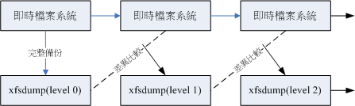

# 第八章、文件与文件系统的压缩,打包与备份

最近更新日期：20//

在 Linux 下面有相当多的压缩指令可以运行喔！这些压缩指令可以让我们更方便从网络上面下载容量较大的文件呢！ 此外，我们知道在 Linux 下面的扩展名是没有什么很特殊的意义的，不过，针对这些压缩指令所做出来的压缩文件， 为了方便记忆，还是会有一些特殊的命名方式啦！就让我们来看看吧！

# 8.1 压缩文件的用途与技术

## 8.1 压缩文件的用途与技术

你是否有过文件文件太大，导致无法以正常的 email 方式发送出去 （很多 email 都有容量大约 25MB 每封信的限制啊！）？ 又或者学校、厂商要求使用 CD 或 DVD 来传递归档用的数据，但是你的单一文件却都比这些传统的一次性储存媒体还要大！那怎么分成多片来烧录呢？ 还有，你是否有过要备份某些重要数据，偏偏这些数据量太大了，耗掉了你很多的磁盘空间呢？ 这个时候，那个好用的“文件压缩”技术可就派的上用场了！

因为这些比较大型的文件通过所谓的文件压缩技术之后，可以将他的磁盘使用量降低，可以达到减低文件大小的效果。此外，有的压缩程序还可以进行容量限制， 使一个大型文件可以分区成为数个小型文件，以方便软盘片携带呢！

那么什么是“文件压缩”呢？我们来稍微谈一谈他的原理好了。目前我们使用的计算机系统中都是使用所谓的 Bytes 单位来计量的！不过，事实上，计算机最小的计量单位应该是 bits 才对啊。此外，我们也知道 1 Byte = 8 bits 。但是如果今天我们只是记忆一个数字，亦即是 1 这个数字呢？他会如何记录？假设一个 Byte 可以看成下面的模样：

> □□□□□□□□


**Tips** 由于 1 Byte = 8 bits ，所以每个 Byte 当中会有 8 个空格，而每个空格可以是 0, 1 ，这里仅是做为一个约略的介绍， 更多的详细数据请参考第零章的计算机概论吧！

由于我们记录数字是 1 ，考虑计算机所谓的二进制喔，如此一来， 1 会在最右边占据 1 个 bit ，而其他的 7 个 bits 将会自动的被填上 0 啰！你看看，其实在这样的例子中，那 7 个 bits 应该是“空的”才对！不过，为了要满足目前我们的操作系统数据的存取，所以就会将该数据转为 Byte 的型态来记录了！而一些聪明的计算机工程师就利用一些复杂的计算方式， 将这些没有使用到的空间“丢”出来，以让文件占用的空间变小！这就是压缩的技术啦！

另外一种压缩技术也很有趣，他是将重复的数据进行统计记录的。举例来说，如果你的数据为“111....”共有 100 个 1 时， 那么压缩技术会记录为“100 个 1”而不是真的有 100 个 1 的位存在！这样也能够精简文件记录的容量呢！ 非常有趣吧！

简单的说，你可以将他想成，其实文件里面有相当多的“空间”存在，并不是完全填满的， 而“压缩”的技术就是将这些“空间”填满，以让整个文件占用的容量下降！ 不过，这些“压缩过的文件”并无法直接被我们的操作系统所使用的，因此， 若要使用这些被压缩过的文件数据，则必须将他“还原”回来未压缩前的模样， 那就是所谓的“解压缩”啰！而至于压缩后与压缩的文件所占用的磁盘空间大小， 就可以被称为是“压缩比”啰！更多的技术文件或许你可以参考一下：

*   [RFC 1952 文件：http://www.ietf.org/rfc/rfc1952.txt](http://www.ietf.org/rfc/rfc1952.txt)
*   鸟哥站上的备份：[`linux.vbird.org/linux_basic/0240tarcompress/0240tarcompress_gzip.php`](http://linux.vbird.org/linux_basic/0240tarcompress//0240tarcompress_gzip.php)

这个“压缩”与“解压缩”的动作有什么好处呢？最大的好处就是压缩过的文件大小变小了， 所以你的硬盘容量无形之中就可以容纳更多的数据。此外，在一些网络数据的传输中，也会由于数据量的降低， 好让网络带宽可以用来作更多的工作！而不是老是卡在一些大型的文件传输上面呢！目前很多的 WWW 网站也是利用文件压缩的技术来进行数据的传送，好让网站带宽的可利用率上升喔！


**Tips** 上述的 WWW 网站压缩技术蛮有趣的！他让你网站上面“看的到的数据”在经过网络传输时，使用的是“压缩过的数据”， 等到这些压缩过的数据到达你的计算机主机时，再进行解压缩，由于目前的计算机运算速度相当的快速， 因此其实在网页浏览的时候，时间都是花在“数据的传输”上面，而不是 CPU 的运算啦！如此一来，由于压缩过的数据量降低了，自然传送的速度就会增快不少！

若你是一位软件工程师，那么相信你也会喜欢将你自己的软件压缩之后提供大家下载来使用， 毕竟没有人喜欢自己的网站天天都是带宽满载的吧？举个例子来说， Linux 3.10.81 （CentOS 7 用的延伸版本） 完整的核心大小约有 570 MB 左右，而由于核心主要多是 ASCII code 的纯文本体态文件，这种文件的“多余空间”最多了。而一个提供下载的压缩过的 3.10.81 核心大约仅有 76MB 左右，差了几倍呢？你可以自己算一算喔！

# 8.2 Linux 系统常见的压缩指令

## 8.2 Linux 系统常见的压缩指令

在 Linux 的环境中，压缩文件的扩展名大多是：“*.tar,* .tar.gz, *.tgz,* .gz, *.Z,* .bz2, *.xz”，为什么会有这样的扩展名呢？不是说 Linux 的扩展名没有什么作用吗？

这是因为 Linux 支持的压缩指令非常多，且不同的指令所用的压缩技术并不相同，当然彼此之间可能就无法互通压缩/解压缩文件啰。 所以，当你下载到某个压缩文件时，自然就需要知道该文件是由哪种压缩指令所制作出来的，好用来对照着解压缩啊！ 也就是说，虽然 Linux 文件的属性基本上是与文件名没有绝对关系的， 但是为了帮助我们人类小小的脑袋瓜子，所以适当的扩展名还是必要的！ 下面我们就列出几个常见的压缩文件扩展名吧：

```
*.Z         compress 程序压缩的文件；
*.zip       zip 程序压缩的文件；
*.gz        gzip 程序压缩的文件；
*.bz2       bzip2 程序压缩的文件；
*.xz        xz 程序压缩的文件；
*.tar       tar 程序打包的数据，并没有压缩过；
*.tar.gz    tar 程序打包的文件，其中并且经过 gzip 的压缩
*.tar.bz2   tar 程序打包的文件，其中并且经过 bzip2 的压缩
*.tar.xz    tar 程序打包的文件，其中并且经过 xz 的压缩 
```

Linux 上常见的压缩指令就是 gzip, bzip2 以及最新的 xz ，至于 compress 已经退流行了。为了支持 windows 常见的 zip，其实 Linux 也早就有 zip 指令了！ gzip 是由 [GNU 计划](http://www.gnu.org/)所开发出来的压缩指令，该指令已经取代了 compress 。 后来 GNU 又开发出 bzip2 及 xz 这几个压缩比更好的压缩指令！不过，这些指令通常仅能针对一个文件来压缩与解压缩，如此一来， 每次压缩与解压缩都要一大堆文件，岂不烦人？此时，那个所谓的“打包软件, tar”就显的很重要啦！

这个 tar 可以将很多文件“打包”成为一个文件！甚至是目录也可以这么玩。不过，单纯的 tar 功能仅是“打包”而已，亦即是将很多文件集结成为一个文件， 事实上，他并没有提供压缩的功能，后来，[GNU 计划](http://www.gnu.org/)中，将整个 tar 与压缩的功能结合在一起，如此一来提供使用者更方便并且更强大的压缩与打包功能！ 下面我们就来谈一谈这些在 Linux 下面基本的压缩指令吧！

### 8.2.1 gzip, zcat/zmore/zless/zgrep

gzip 可以说是应用度最广的压缩指令了！目前 gzip 可以解开 compress, zip 与 gzip 等软件所压缩的文件。 至于 gzip 所创建的压缩文件为 *.gz 的文件名喔！让我们来看看这个指令的语法吧：

```
[dmtsai@study ~]$ gzip [-cdtv#] 文件名
[dmtsai@study ~]$ zcat 文件名.gz
选项与参数：
-c  ：将压缩的数据输出到屏幕上，可通过数据流重导向来处理；
-d  ：解压缩的参数；
-t  ：可以用来检验一个压缩文件的一致性～看看文件有无错误；
-v  ：可以显示出原文件/压缩文件的压缩比等信息；
-#  ：# 为数字的意思，代表压缩等级，-1 最快，但是压缩比最差、-9 最慢，但是压缩比最好！默认是 -6

范例一：找出 /etc 下面 （不含子目录） 容量最大的文件，并将它复制到 /tmp ，然后以 gzip 压缩
[dmtsai@study ~]$ ls -ldSr /etc/*   # 忘记选项意义？请自行 man 啰！
.....（前面省略）.....
-rw-r--r--.  1 root root    25213 Jun 10  2014 /etc/dnsmasq.conf
-rw-r--r--.  1 root root    69768 May  4 17:55 /etc/ld.so.cache
-rw-r--r--.  1 root root   670293 Jun  7  2013 /etc/services

[dmtsai@study ~]$ cd /tmp 
[dmtsai@study tmp]$ cp /etc/services .
[dmtsai@study tmp]$ gzip -v services
services:        79.7% -- replaced with services.gz
[dmtsai@study tmp]$ ll /etc/services /tmp/services*
-rw-r--r--. 1 root   root   670293 Jun  7  2013 /etc/services
-rw-r--r--. 1 dmtsai dmtsai 136088 Jun 30 18:40 /tmp/services.gz 
```

当你使用 gzip 进行压缩时，在默认的状态下原本的文件会被压缩成为 .gz 的文件名，原始文件就不再存在了。 这点与一般习惯使用 windows 做压缩的朋友所熟悉的情况不同喔！要注意！要注意！ 此外，使用 gzip 压缩的文件在 Windows 系统中，竟然可以被 WinRAR/7zip 这个软件解压缩呢！很好用吧！至于其他的用法如下：

```
范例二：由于 services 是文本文件，请将范例一的压缩文件的内容读出来！
[dmtsai@study tmp]$ zcat services.gz
# 由于 services 这个原本的文件是是文本文件，因此我们可以尝试使用 zcat/zmore/zless 去读取！
# 此时屏幕上会显示 servcies.gz 解压缩之后的原始文件内容！

范例三：将范例一的文件解压缩
[dmtsai@study tmp]$ gzip -d services.gz
# 鸟哥不要使用 gunzip 这个指令，不好背！使用 gzip -d 来进行解压缩！
# 与 gzip 相反， gzip -d 会将原本的 .gz 删除，回复到原本的 services 文件。

范例四：将范例三解开的 services 用最佳的压缩比压缩，并保留原本的文件
[dmtsai@study tmp]$ gzip -9 -c services &gt; services.gz

范例五：由范例四再次创建的 services.gz 中，找出 http 这个关键字在哪几行？
[dmtsai@study tmp]$ zgrep -n 'http' services.gz
14:#       http://www.iana.org/assignments/port-numbers
89:http            80/tcp          www www-http    # WorldWideWeb HTTP
90:http            80/udp          www www-http    # HyperText Transfer Protocol
.....（下面省略）..... 
```

其实 gzip 的压缩已经最优化过了，所以虽然 gzip 提供 1~9 的压缩等级，不过使用默认的 6 就非常好用了！ 因此上述的范例四可以不要加入那个 -9 的选项。范例四的重点在那个 -c 与 > 的使用啰！-c 可以将原本要转成压缩文件的数据内容，将它变成文字类型从屏幕输出， 然后我们可以通过大于 （>） 这个符号，将原本应该由屏幕输出的数据，转成输出到文件而不是屏幕，所以就能够创建出压缩挡了。只是文件名也要自己写， 当然最好还是遵循 gzip 的压缩文件名要求较佳喔！！更多的 > 这个符号的应用，我们会在 bash 章节再次提及！

cat/more/less 可以使用不同的方式来读取纯文本文件，那个 zcat/zmore/zless 则可以对应于 cat/more/less 的方式来读取纯文本文件被压缩后的压缩文件！ 由于 gzip 这个压缩指令主要想要用来取代 compress 的，所以不但 compress 的压缩文件可以使用 gzip 来解开，同时 zcat 这个指令可以同时读取 compress 与 gzip 的压缩文件呦！

另外，如果你还想要从文字压缩文件当中找数据的话，可以通过 egrep 来搜寻关键字喔！而不需要将压缩文件解开才以 grep 进行！ 这对查询备份中的文本文件数据相当有用！


**Tips** 时至今日，应该也没有人爱用 compress 这个老老的指令了！因此，这一章已经拿掉了 compress 的介绍～而如果你还有备份数据使用的是 compress 创建出来的 .Z 文件，那也无须担心，使用 znew 可以将该文件转成 gzip 的格示喔！

### 8.2.2 bzip2, bzcat/bzmore/bzless/bzgrep

若说 gzip 是为了取代 compress 并提供更好的压缩比而成立的，那么 bzip2 则是为了取代 gzip 并提供更佳的压缩比而来的。 bzip2 真是很不错用的东西～这玩意的压缩比竟然比 gzip 还要好～至于 bzip2 的用法几乎与 gzip 相同！看看下面的用法吧！

```
[dmtsai@study ~]$ bzip2 [-cdkzv#] 文件名
[dmtsai@study ~]$ bzcat 文件名.bz2
选项与参数：
-c  ：将压缩的过程产生的数据输出到屏幕上！
-d  ：解压缩的参数
-k  ：保留原始文件，而不会删除原始的文件喔！
-z  ：压缩的参数 （默认值，可以不加）
-v  ：可以显示出原文件/压缩文件的压缩比等信息；
-#  ：与 gzip 同样的，都是在计算压缩比的参数， -9 最佳， -1 最快！

范例一：将刚刚 gzip 范例留下来的 /tmp/services 以 bzip2 压缩
[dmtsai@study tmp]$ bzip2 -v services
  services:  5.409:1,  1.479 bits/Byte, 81.51% saved, 670293 in, 123932 out.
[dmtsai@study tmp]$ ls -l services*
-rw-r--r--. 1 dmtsai dmtsai 123932 Jun 30 18:40 services.bz2
-rw-rw-r--. 1 dmtsai dmtsai 135489 Jun 30 18:46 services.gz
# 此时 services 会变成 services.bz2 之外，你也可以发现 bzip2 的压缩比要较 gzip 好喔！！
# 压缩率由 gzip 的 79% 提升到 bzip2 的 81% 哩！

范例二：将范例一的文件内容读出来！
[dmtsai@study tmp]$ bzcat services.bz2

范例三：将范例一的文件解压缩
[dmtsai@study tmp]$ bzip2 -d services.bz2

范例四：将范例三解开的 services 用最佳的压缩比压缩，并保留原本的文件
[dmtsai@study tmp]$ bzip2 -9 -c services &gt; services.bz2 
```

看上面的范例，你会发现到 bzip2 连选项与参数都跟 gzip 一模一样！只是扩展名由 .gz 变成 .bz2 而已！其他的用法都大同小异，所以鸟哥就不一一介绍了！ 你也可以发现到 bzip2 的压缩率确实比 gzip 要好些！不过，对于大容量文件来说，bzip2 压缩时间会花比较久喔！至少比 gzip 要久的多！ 这没办法～要有更多可用容量，就得要花费相对应的时间！还 OK 啊！

### 8.2.3 xz, xzcat/xzmore/xzless/xzgrep

虽然 bzip2 已经具有很棒的压缩比，不过显然某些自由软件开发者还不满足，因此后来还推出了 xz 这个压缩比更高的软件！这个软件的用法也跟 gzip/bzip2 几乎一模一样！ 那我们就来瞧一瞧！

```
[dmtsai@study ~]$ xz [-dtlkc#] 文件名
[dmtsai@study ~]$ xcat 文件名.xz
选项与参数：
-d  ：就是解压缩啊！
-t  ：测试压缩文件的完整性，看有没有错误
-l  ：列出压缩文件的相关信息
-k  ：保留原本的文件不删除～
-c  ：同样的，就是将数据由屏幕上输出的意思！
-#  ：同样的，也有较佳的压缩比的意思！

范例一：将刚刚由 bzip2 所遗留下来的 /tmp/services 通过 xz 来压缩！
[dmtsai@study tmp]$ xz -v services
services （1/1）
  100 %        97.3 KiB / 654.6 KiB = 0.149

[dmtsai@study tmp]$ ls -l services*
-rw-rw-r--. 1 dmtsai dmtsai 123932 Jun 30 19:09 services.bz2
-rw-rw-r--. 1 dmtsai dmtsai 135489 Jun 30 18:46 services.gz
-rw-r--r--. 1 dmtsai dmtsai  99608 Jun 30 18:40 services.xz
# 各位观众！看到没有啊！！容量又进一步下降的更多耶！好棒的压缩比！

范例二：列出这个压缩文件的信息，然后读出这个压缩文件的内容
[dmtsai@study tmp]$ xz -l services.xz
Strms  Blocks   Compressed Uncompressed  Ratio  Check   Filename
    1       1     97.3 KiB    654.6 KiB  0.149  CRC64   services.xz
# 竟然可以列出这个文件的压缩前后的容量，真是太人性化了！这样观察就方便多了！

[dmtsai@study tmp]$ xzcat services.xz

范例三：将他解压缩吧！
[dmtsai@study tmp]$ xz -d services.xz

范例四：保留原文件的文件名，并且创建压缩文件！
[dmtsai@study tmp]$ xz -k services 
```

虽然 xz 这个压缩比真的好太多太多了！以鸟哥选择的这个 services 文件为范例，他可以将 gzip 压缩比 （压缩后/压缩前） 的 21% 更进一步优化到 15% 耶！ 差非常非常多！不过， xz 最大的问题是...时间花太久了！如果你曾经使用过 xz 的话，应该会有发现，他的运算时间真的比 gzip 久很多喔！

鸟哥以自己的系统，通过“ time [gzip|bzip2|xz] -c services > services.[gz|bz2|xz] ”去执行运算结果，结果发现这三个指令的执行时间依序是： 0.019s, 0.042s, 0.261s， 看最后一个数字！差了 10 倍的时间耶！所以，如果你并不觉得时间是你的成本考虑，那么使用 xz 会比较好！如果时间是你的重要成本，那么 gzip 恐怕是比较适合的压缩软件喔！

# 8.3 打包指令： tar

## 8.3 打包指令： tar

前一小节谈到的指令大多仅能针对单一文件来进行压缩，虽然 gzip, bzip2, xz 也能够针对目录来进行压缩，不过， 这两个指令对目录的压缩指的是“将目录内的所有文件 "分别" 进行压缩”的动作！而不像在 Windows 的系统，可以使用类似 [WinRAR](http://www.rar.com.tw/) 这一类的压缩软件来将好多数据“包成一个文件”的样式。

这种将多个文件或目录包成一个大文件的指令功能，我们可以称呼他是一种“打包指令”啦！ 那 Linux 有没有这种打包指令呢？是有的！那就是鼎鼎大名的 tar 这个玩意儿了！ tar 可以将多个目录或文件打包成一个大文件，同时还可以通过 gzip/bzip2/xz 的支持，将该文件同时进行压缩！ 更有趣的是，由于 tar 的使用太广泛了，目前 Windows 的 WinRAR 也支持 .tar.gz 文件名的解压缩呢！ 很不错吧！所以下面我们就来玩一玩这个咚咚！

### 8.3.1 tar

tar 的选项与参数非常的多！我们只讲几个常用的选项，更多选项您可以自行 man tar 查询啰！

```
[dmtsai@study ~]$ tar [-z&#124;-j&#124;-J] [cv] [-f 待创建的新文件名] filename... &lt;==打包与压缩
[dmtsai@study ~]$ tar [-z&#124;-j&#124;-J] [tv] [-f 既有的 tar 文件名]             &lt;==察看文件名
[dmtsai@study ~]$ tar [-z&#124;-j&#124;-J] [xv] [-f 既有的 tar 文件名] [-C 目录]   &lt;==解压缩
选项与参数：
-c  ：创建打包文件，可搭配 -v 来察看过程中被打包的文件名（filename）
-t  ：察看打包文件的内容含有哪些文件名，重点在察看“文件名”就是了；
-x  ：解打包或解压缩的功能，可以搭配 -C （大写） 在特定目录解开
      特别留意的是， -c, -t, -x 不可同时出现在一串命令行中。
-z  ：通过 gzip  的支持进行压缩/解压缩：此时文件名最好为 *.tar.gz
-j  ：通过 bzip2 的支持进行压缩/解压缩：此时文件名最好为 *.tar.bz2
-J  ：通过 xz    的支持进行压缩/解压缩：此时文件名最好为 *.tar.xz
      特别留意， -z, -j, -J 不可以同时出现在一串命令行中
-v  ：在压缩/解压缩的过程中，将正在处理的文件名显示出来！
-f filename：-f 后面要立刻接要被处理的文件名！建议 -f 单独写一个选项啰！（比较不会忘记）
-C 目录    ：这个选项用在解压缩，若要在特定目录解压缩，可以使用这个选项。

其他后续练习会使用到的选项介绍：
-p（小写） ：保留备份数据的原本权限与属性，常用于备份（-c）重要的配置文件
-P（大写） ：保留绝对路径，亦即允许备份数据中含有根目录存在之意；
--exclude=FILE：在压缩的过程中，不要将 FILE 打包！ 
```

其实最简单的使用 tar 就只要记忆下面的方式即可：

*   压　缩：tar -j<u>c</u>v -f filename.tar.bz2 要被压缩的文件或目录名称
*   查　询：tar -j<u>t</u>v -f filename.tar.bz2
*   解压缩：tar -j<u>x</u>v -f filename.tar.bz2 -C 欲解压缩的目录

那个 filename.tar.bz2 是我们自己取的文件名，tar 并不会主动的产生创建的文件名喔！我们要自订啦！ 所以扩展名就显的很重要了！如果不加 [-z|-j|-J] 的话，文件名最好取为 *.tar 即可。如果是 -j 选项，代表有 bzip2 的支持，因此文件名最好就取为* .tar.bz2 ，因为 bzip2 会产生 .bz2 的扩展名之故！ 至于如果是加上了 -z 的 gzip 的支持，那文件名最好取为 *.tar.gz 喔！了解乎？

另外，由于“ -f filename ”是紧接在一起的，过去很多文章常会写成“-jcvf filename”，这样是对的， 但由于选项的顺序理论上是可以变换的，所以很多读者会误认为“-jvfc filename”也可以～事实上这样会导致产生的文件名变成 c ！ 因为 -fc 嘛！所以啰，建议您在学习 tar 时，将“ -f filename ”与其他选项独立出来，会比较不容易发生问题。

闲话少说，让我们来测试几个常用的 tar 方法吧！

*   使用 tar 加入 -z, -j 或 -J 的参数备份 /etc/ 目录

有事没事备份一下 /etc 这个目录是件好事！备份 /etc 最简单的方法就是使用 tar 啰！让我们来玩玩先：

```
[dmtsai@study ~]$ su -  # 因为备份 /etc 需要 root 的权限，否则会出现一堆错误
[root@study ~]# time tar -zpcv -f /root/etc.tar.gz /etc
tar: Removing leading `/' from member names  &lt;==注意这个警告讯息
/etc/
....（中间省略）....
/etc/hostname
/etc/aliases.db

real    0m0.799s   # 多了 time 会显示程序运行的时间！看 real 就好了！花去了 0.799s
user    0m0.767s
sys     0m0.046s
# 由于加上 -v 这个选项，因此正在作用中的文件名就会显示在屏幕上。
# 如果你可以翻到第一页，会发现出现上面的错误讯息！下面会讲解。
# 至于 -p 的选项，重点在于“保留原本文件的权限与属性”之意。

[root@study ~]# time tar -jpcv -f /root/etc.tar.bz2 /etc
....（前面省略）....
real    0m1.913s
user    0m1.881s
sys     0m0.038s
[root@study ~]# time tar -Jpcv -f /root/etc.tar.xz  /etc
....（前面省略）....
real    0m9.023s
user    0m8.984s
sys     0m0.086s
# 显示的讯息会跟上面一模一样啰！不过时间会花比较多！使用了 -J 时，会花更多时间

[root@study ~]# ll /root/etc*
-rw-r--r--. 1 root root 6721809 Jul  1 00:16 /root/etc.tar.bz2
-rw-r--r--. 1 root root 7758826 Jul  1 00:14 /root/etc.tar.gz
-rw-r--r--. 1 root root 5511500 Jul  1 00:16 /root/etc.tar.xz
[root@study ~]# du -sm /etc
28     /etc  # 实际目录约占有 28MB 的意思！ 
```

压缩比越好当然要花费的运算时间越多！我们从上面可以看到，虽然使用 gzip 的速度相当快，总时间花费不到 1 秒钟，但是压缩率最糟糕！ 如果使用 xz 的话，虽然压缩比最佳！不过竟然花了 9 秒钟的时间耶！这还仅是备份 28MBytes 的 /etc 而已，如果备份的数据是很大容量的， 那你真的要考虑时间成本才行！

至于加上“ -p ”这个选项的原因是为了保存原本文件的权限与属性！我们曾在第六章的 cp 指令介绍时谈到权限与文件类型（例如链接文件）对复制的不同影响。 同样的，在备份重要的系统数据时，这些原本文件的权限需要做完整的备份比较好。此时 -p 这个选项就派的上用场了。 接下来让我们看看打包文件内有什么数据存在？

*   查阅 tar 文件的数据内容 （可察看文件名），与备份文件名有否根目录的意义

要察看由 tar 所创建的打包文件内部的文件名非常的简单！可以这样做：

```
[root@study ~]# tar -jtv -f /root/etc.tar.bz2
....（前面省略）....
-rw-r--r-- root/root       131 2015-05-25 17:48 etc/locale.conf
-rw-r--r-- root/root        19 2015-05-04 17:56 etc/hostname
-rw-r--r-- root/root     12288 2015-05-04 17:59 etc/aliases.db 
```

如果加上 -v 这个选项时，详细的文件权限/属性都会被列出来！如果只是想要知道文件名而已， 那么就将 -v 拿掉即可。从上面的数据我们可以发现一件很有趣的事情，那就是每个文件名都没了根目录了！这也是上一个练习中出现的那个警告讯息“tar: Removing leading `/' from member names（移除了文件名开头的`/' ）”所告知的情况！

那为什么要拿掉根目录呢？主要是为了安全！我们使用 tar 备份的数据可能会需要解压缩回来使用， 在 tar 所记录的文件名 （就是我们刚刚使用 tar -jtvf 所察看到的文件名） 那就是解压缩后的实际文件名。 如果拿掉了根目录，假设你将备份数据在 /tmp 解开，那么解压缩的文件名就会变成“/tmp/<u>etc/xxx</u>”。 但“如果没有拿掉根目录，解压缩后的文件名就会是绝对路径， 亦即解压缩后的数据一定会被放置到 <u>/etc/xxx</u> 去！”如此一来，你的原本的 /etc/ 下面的数据， 就会被备份数据所覆盖过去了！


**Tips** 你会说：“既然是备份数据，那么还原回来也没有什么问题吧？”想像一个状况，你备份的数据是两年前的旧版 CentOS 6.x， 你只是想要了解一下过去的备份内容究竟有哪些数据而已，结果一解开该文件，却发现你目前新版的 CentOS 7.x 下面的 /etc 被旧版的备份数据覆盖了！此时你该如何是好？大概除了哭哭你也不能做啥事吧？所以啰，当然是拿掉根目录比较安全一些的。

如果你确定你就是需要备份根目录到 tar 的文件中，那可以使用 -P （大写） 这个选项，请看下面的例子分析：

```
范例：将文件名中的（根）目录也备份下来，并察看一下备份文件的内容文件名
[root@study ~]# tar -jp&lt;u&gt;P&lt;/u&gt;cv -f /root/etc.and.root.tar.bz2 /etc

[root@study ~]# tar -jtf /root/etc.and.root.tar.bz2
/etc/locale.conf
/etc/hostname
/etc/aliases.db
# 这次查阅文件名不含 -v 选项，所以仅有文件名而已！没有详细属性/权限等参数。 
```

有发现不同点了吧？如果加上 -P 选项，那么文件名内的根目录就会存在喔！不过，鸟哥个人建议，还是不要加上 -P 这个选项来备份！ 毕竟很多时候，我们备份是为了要未来追踪问题用的，倒不一定需要还原回原本的系统中！ 所以拿掉根目录后，备份数据的应用会比较有弹性！也比较安全呢！

*   将备份的数据解压缩，并考虑特定目录的解压缩动作 （-C 选项的应用）

那如果想要解打包呢？很简单的动作就是直接进行解打包嘛！

```
[root@study ~]# tar -jxv -f /root/etc.tar.bz2
[root@study ~]# ll
....（前面省略）....
drwxr-xr-x. 131 root root    8192 Jun 26 22:14 etc
....（后面省略）.... 
```

此时该打包文件会在“本目录下进行解压缩”的动作！ 所以，你等一下就会在主文件夹下面发现一个名为 etc 的目录啰！所以啰，如果你想要将该文件在 /tmp 下面解开， 可以 cd /tmp 后，再下达上述的指令即可。不过，这样好像很麻烦呢～有没有更简单的方法可以“指定欲解开的目录”呢？ 有的，可以使用 -C 这个选项喔！举例来说：

```
[root@study ~]# tar -jxv -f /root/etc.tar.bz2 -C /tmp
[root@study ~]# ll /tmp
....（前面省略）....
drwxr-xr-x. 131 root   root     8192 Jun 26 22:14 etc
....（后面省略）.... 
```

这样一来，你就能够将该文件在不同的目录解开啰！鸟哥个人是认为，这个 -C 的选项务必要记忆一下的！ 好了，处理完毕后，请记得将这两个目录删除一下呢！

```
[root@study ~]# rm -rf /root/etc /tmp/etc 
```

再次强调，这个“ rm -rf ”是很危险的指令！下达时请务必要确认一下后面接的文件名。我们要删除的是 /root/etc 与 /tmp/etc， 您可不要将 /etc/ 删除掉了！系统会死掉的～ ^_^

*   仅解开单一文件的方法

刚刚上头我们解压缩都是将整个打包文件的内容全部解开！想像一个情况，如果我只想要解开打包文件内的其中一个文件而已， 那该如何做呢？很简单的，你只要使用 -jtv 找到你要的文件名，然后将该文件名解开即可。 我们用下面的例子来说明一下：

```
# 1\. 先找到我们要的文件名，假设解开 shadow 文件好了：
[root@study ~]# tar -jtv -f /root/etc.tar.bz2 &#124; grep 'shadow'
---------- root/root       721 2015-06-17 00:20 etc/gshadow
---------- root/root      1183 2015-06-17 00:20 etc/shadow-
---------- root/root      1210 2015-06-17 00:20 etc/shadow  &lt;==这是我们要的！
---------- root/root       707 2015-06-17 00:20 etc/gshadow-
# 先搜寻重要的文件名！其中那个 grep 是“撷取”关键字的功能！我们会在第三篇说明！
# 这里您先有个概念即可！那个管线 &#124; 配合 grep 可以撷取关键字的意思！

# 2\. 将该文件解开！语法与实际作法如下：
[root@study ~]# tar -jxv -f 打包档.tar.bz2 待解开文件名
[root@study ~]# tar -jxv -f /root/etc.tar.bz2 etc/shadow
etc/shadow
[root@study ~]# ll etc
total 4
----------. 1 root root 1210 Jun 17 00:20 shadow
# 很有趣！此时只会解开一个文件而已！不过，重点是那个文件名！你要找到正确的文件名。
# 在本例中，你不能写成 /etc/shadow ！因为记录在 etc.tar.bz2 内的并没有 / 之故！ 
```


**Tips** 在这个练习之前，你可能要先将前面练习所产生的 /root/etc 删除才行！不然 /root/etc/shadow 会重复存在，而其他的前面实验的文件也会存在， 那就看不出什么鬼～

*   打包某目录，但不含该目录下的某些文件之作法

假设我们想要打包 /etc/ /root 这几个重要的目录，但却不想要打包 /root/etc* 开头的文件，因为该文件都是刚刚我们才创建的备份文件嘛！ 而且假设这个新的打包文件要放置成为 /root/system.tar.bz2 ，当然这个文件自己不要打包自己 （因为这个文件放置在 /root 下面啊！），此时我们可以通过 --exclude 的帮忙！ 那个 exclude 就是不包含的意思！所以你可以这样做：

```
[root@study ~]# tar -jcv  -f /root/system.tar.bz2 --exclude=/root/etc* \
&gt; --exclude=/root/system.tar.bz2  /etc /root 
```

上面的指令是一整列的～其实你可以打成：“tar -jcv -f /root/system.tar.bz2 --exclude=/root/etc* --exclude=/root/system.tar.bz2 /etc /root”，如果想要两行输入时，最后面加上反斜线 （\） 并立刻按下 [enter] ， 就能够到第二行继续输入了。这个指令下达的方式我们会在第三章再仔细说明。 通过这个 --exclude="file" 的动作，我们可以将几个特殊的文件或目录移除在打包之列，让打包的动作变的更简便喔！^_^

*   仅备份比某个时刻还要新的文件

某些情况下你会想要备份新的文件而已，并不想要备份旧文件！此时 --newer-mtime 这个选项就粉重要啦！ 其实有两个选项啦，一个是“ --newer ”另一个就是“ --newer-mtime ”，这两个选项有何不同呢？ 我们在 第六章的 touch 介绍中谈到过三种不同的时间参数， 当使用 --newer 时，表示后续的日期包含“ mtime 与 ctime ”，而 --newer-mtime 则仅是 mtime 而已！ 这样知道了吧！ ^_^ 。那就让我们来尝试处理一下啰！

```
# 1\. 先由 find 找出比 /etc/passwd 还要新的文件
[root@study ~]# find /etc -newer /etc/passwd
....（过程省略）....
# 此时会显示出比 /etc/passwd 这个文件的 mtime 还要新的文件名，
# 这个结果在每部主机都不相同！您先自行查阅自己的主机即可，不会跟鸟哥一样！

[root@study ~]# ll /etc/passwd
-rw-r--r--. 1 root root 2092  Jun 17 00:20 /etc/passwd

# 2\. 好了，那么使用 tar 来进行打包吧！日期为上面看到的 2015/06/17
[root@study ~]# tar -jcv -f /root/etc.newer.then.passwd.tar.bz2 \
&gt; --newer-mtime="2015/06/17" /etc/*
tar: Option --newer-mtime: Treating date `2015/06/17' as 2015-06-17 00:00:00
tar: Removing leading `/' from member names
/etc/abrt/
....（中间省略）....
/etc/alsa/
/etc/yum.repos.d/
....（中间省略）....
tar: /etc/yum.repos.d/CentOS-fasttrack.repo: file is unchanged; not dumped
# 最后行显示的是“没有被备份的”，亦即 not dumped 的意思！

# 3\. 显示出文件即可
[root@study ~]# tar -jtv -f /root/etc.newer.then.passwd.tar.bz2 &#124; grep -v '/$' 
# 通过这个指令可以调用出 tar.bz2 内的结尾非 / 的文件名！就是我们要的啦！ 
```

现在你知道这个指令的好用了吧！甚至可以进行差异文件的记录与备份呢～ 这样子的备份就会显的更容易啰！你可以这样想像，如果我在一个月前才进行过一次完整的数据备份， 那么这个月想要备份时，当然可以仅备份上个月进行备份的那个时间点之后的更新的文件即可！ 为什么呢？因为原本的文件已经有备份了嘛！干嘛还要进行一次？只要备份新数据即可。这样可以降低备份的容量啊！

*   基本名称： tarfile, tarball ？

另外值得一提的是，tar 打包出来的文件有没有进行压缩所得到文件称呼不同喔！ 如果仅是打包而已，就是“ tar -cv -f file.tar ”而已，这个文件我们称呼为 tarfile 。 如果还有进行压缩的支持，例如“ tar -jcv -f file.tar.bz2 ”时，我们就称呼为 tarball （tar 球？）！这只是一个基本的称谓而已，不过很多书籍与网络都会使用到这个 tarball 的名称！所以得要跟您介绍介绍。

此外，tar 除了可以将数据打包成为文件之外，还能够将文件打包到某些特别的设备去，举例来说， 磁带机 （tape） 就是一个常见的例子。磁带机由于是一次性读取/写入的设备，因此我们不能够使用类似 cp 等指令来复制的！ 那如果想要将 /home, /root, /etc 备份到磁带机 （/dev/st0） 时，就可以使用：“tar -cv -f /dev/st0 /home /root /etc”，很简单容易吧！ 磁带机用在备份 （尤其是企业应用） 是很常见的工作喔！

*   特殊应用：利用管线命令与数据流

在 tar 的使用中，有一种方式最特殊，那就是通过标准输入输出的数据流重导向（standard input/standard output）， 以及管线命令 （pipe） 的方式，将待处理的文件一边打包一边解压缩到目标目录去。 关于数据流重导向与管线命令更详细的数据我们会在第十章 bash 再跟大家介绍， 下面先来看一个例子吧！

```
# 1\. 将 /etc 整个目录一边打包一边在 /tmp 解开
[root@study ~]# cd /tmp
[root@study tmp]# tar -cvf - /etc &#124; tar -xvf -
# 这个动作有点像是 cp -r /etc /tmp 啦～依旧是有其有用途的！
# 要注意的地方在于输出文件变成 - 而输入文件也变成 - ，又有一个 &#124; 存在～
# 这分别代表 standard output, standard input 与管线命令啦！
# 简单的想法中，你可以将 - 想成是在内存中的一个设备（缓冲区）。
# 更详细的数据流与管线命令，请翻到 bash 章节啰！ 
```

在上面的例子中，我们想要“将 /etc 下面的数据直接 copy 到目前所在的路径，也就是 /tmp 下面”，但是又觉得使用 cp -r 有点麻烦，那么就直接以这个打包的方式来打包，其中，指令里面的 - 就是表示那个被打包的文件啦！ 由于我们不想要让中间文件存在，所以就以这一个方式来进行复制的行为啦！

*   例题：系统备份范例

系统上有非常多的重要目录需要进行备份，而且其实我们也不建议你将备份数据放置到 /root 目录下！ 假设目前你已经知道重要的目录有下面这几个：

*   /etc/ （配置文件）
*   /home/ （使用者的主文件夹）
*   /var/spool/mail/ （系统中，所有帐号的邮件信箱）
*   /var/spool/cron/ （所有帐号的工作排成配置文件）
*   /root （系统管理员的主文件夹）

然后我们也知道，由于第七章曾经做过的练习的关系， /home/loop* 不需要备份，而且 /root 下面的压缩文件也不需要备份，另外假设你要将备份的数据放置到 /backups ，并且该目录仅有 root 有权限进入！ 此外，每次备份的文件名都希望不相同，例如使用：backup-system-20150701.tar.bz2 之类的文件名来处理。 那你该如何处理这个备份数据呢？（请先动手作看看，再来察看一下下面的参考解答！）

```
# 1\. 先处理要放置备份数据的目录与权限：
[root@study ~]# mkdir /backups
[root@study ~]# chmod 700 /backups
[root@study ~]# ll -d /backups
drwx------. 2 root root 6 Jul  1 17:25 /backups

# 2\. 假设今天是 2015/07/01 ，则创建备份的方式如下：
[root@study ~]# tar -jcv -f /backups/backup-system-20150701.tar.bz2 \
&gt; --exclude=/root/*.bz2 --exclude=/root/*.gz --exclude=/home/loop* \
&gt; /etc /home /var/spool/mail /var/spool/cron /root
....（过程省略）....

[root@study ~]# ll -h /backups/
-rw-r--r--. 1 root root 21M Jul  1 17:26 backup-system-20150701.tar.bz2 
```

*   解压缩后的 SELinux 课题

如果，鸟哥是说如果，如果因为某些缘故，所以你的系统必须要以备份的数据来回填到原本的系统中，那么得要特别注意复原后的系统的 SELinux 问题！ 尤其是在系统文件上面！例如 /etc 下面的文件群。SELinux 是比较特别的细部权限设置，相关的介绍我们会在 16 章好好的介绍一下。 在这里，你只要先知道，SELinux 的权限问题“可能会让你的系统无法存取某些配置文件内容，导致影响到系统的正常使用权”。

这两天 （2015/07） 接到一个网友的 email，他说他使用鸟哥介绍的方法通过 tar 去备份了 /etc 的数据，然后尝试在另一部系统上面复原回来。 复原倒是没问题，但是复原完毕之后，无论如何就是无法正常的登陆系统！明明使用单人维护模式去操作系统时，看起来一切正常～但就是无法顺利登陆。 其实这个问题倒是很常见！大部分原因就是因为 /etc/shadow 这个密码文件的 SELinux 类型在还原时被更改了！导致系统的登陆程序无法顺利的存取它， 才造成无法登陆的窘境。

那如何处理呢？简单的处理方式有这几个：

*   通过各种可行的救援方式登陆系统，然后修改 /etc/selinux/config 文件，将 SELinux 改成 permissive 模式，重新开机后系统就正常了；
*   在第一次复原系统后，不要立即重新开机！先使用 restorecon -Rv /etc 自动修复一下 SELinux 的类型即可。
*   通过各种可行的方式登陆系统，创建 /.autorelabel 文件，重新开机后系统会自动修复 SELinux 的类型，并且又会再次重新开机，之后就正常了！

鸟哥个人是比较偏好第 2 个方法，不过如果忘记了该步骤就重新开机呢？那鸟哥比较偏向使用第 3 个方案来处理，这样就能够解决复原后的 SELinux 问题啰！ 至于更详细的 SELinux ，我们得要讲完程序 （process） 之后，你才会有比较清楚的认知，因此还请慢慢学习，到第十六章你就知道问题点了！ ^_^

# 8.4 XFS 文件系统的备份与还原

## 8.4 XFS 文件系统的备份与还原

使用 tar 通常是针对目录树系统来进行备份的工作，那么如果想要针对整个文件系统来进行备份与还原呢？由于 CentOS 7 已经使用 XFS 文件系统作为默认值，所以那个好用的 xfsdump 与 xfsrestore 两个工具对 CentOS 7 来说，就是挺重要的工具软件了。下面就让我们来谈一谈这个指令的用法吧！

### 8.4.1 XFS 文件系统备份 xfsdump

其实 xfsdump 的功能颇强！他除了可以进行文件系统的完整备份 （full backup） 之外，还可以进行累积备份 （Incremental backup） 喔！ 啥是累积备份呢？这么说好了，假设你的 /home 是独立的一个文件系统，那你在第一次使用 xfsdump 进行完整备份后，等过一段时间的文件系统自然运行后， 你再进行第二次 xfsdump 时，就可以选择累积备份了！此时新备份的数据只会记录与第一次完整备份所有差异的文件而已。 看不懂吗？没关系！我们用一张简图来说明。

图 8.4.1、xfsdump 运行时，完整备份与累积备份示意图

如上图所示，上方的“实时文件系统”是一直随着时间而变化的数据，例如在 /home 里面的文件数据会一直变化一样。 而下面的方块则是 xfsdump 备份起来的数据，第一次备份一定是完整备份，完整备份在 xfsdump 当中被定义为 level 0 喔！等到第二次备份时，/home 文件系统内的数据已经与 level 0 不一样了，而 level 1 仅只是比较目前的文件系统与 level 0 之间的差异后，备份有变化过的文件而已。至于 level 2 则是与 level 1 进行比较啦！这样了解呼？至于各个 level 的纪录档则放置于 /var/lib/xfsdump/inventory 中。

另外，使用 xfsdump 时，请注意下面的限制喔：

*   xfsdump 不支持没有挂载的文件系统备份！所以只能备份已挂载的！
*   xfsdump 必须使用 root 的权限才能操作 （涉及文件系统的关系）
*   xfsdump 只能备份 XFS 文件系统啊！
*   xfsdump 备份下来的数据 （文件或储存媒体） 只能让 xfsrestore 解析
*   xfsdump 是通过文件系统的 UUID 来分辨各个备份文件的，因此不能备份两个具有相同 UUID 的文件系统喔！

xfsdump 的选项虽然非常的繁复，不过如果只是想要简单的操作时，您只要记得下面的几个选项就很够用了！

```
[root@study ~]# xfsdump [-L S_label] [-M M_label] [-l #] [-f 备份文件] 待备份数据
[root@study ~]# xfsdump -I
选项与参数：
-L  ：xfsdump 会纪录每次备份的 session 标头，这里可以填写针对此文件系统的简易说明
-M  ：xfsdump 可以纪录储存媒体的标头，这里可以填写此媒体的简易说明
-l  ：是 L 的小写，就是指定等级～有 0~9 共 10 个等级喔！ （默认为 0，即完整备份）
-f  ：有点类似 tar 啦！后面接产生的文件，亦可接例如 /dev/st0 设备文件名或其他一般文件文件名等
-I  ：从 /var/lib/xfsdump/inventory 列出目前备份的信息状态 
```

特别注意， xfsdump 默认仅支持文件系统的备份，并不支持特定目录的备份～所以你不能用 xfsdump 去备份 /etc ！ 因为 /etc 从来就不是一个独立的文件系统！注意！注意！

*   用 xfsdump 备份完整的文件系统

现在就让我们来做几个范例吧！假设你跟鸟哥一样有将 /boot 分区出自己的文件系统，要整个文件系统备份可以这样作：

```
# 1\. 先确定 /boot 是独立的文件系统喔！
[root@study ~]# df -h /boot
Filesystem      Size  Used Avail Use% Mounted on
/dev/vda2      1014M  131M  884M  13% /boot      # 挂载 /boot 的是 /dev/vda 设备！
# 看！确实是独立的文件系统喔！ /boot 是挂载点！

# 2\. 将完整备份的文件名记录成为 /srv/boot.dump ：
[root@study ~]# xfsdump -l 0 -L boot_all -M boot_all -f /srv/boot.dump /boot
xfsdump -l 0 -L boot_all -M boot_all -f /srv/boot.dump /boot
xfsdump: using file dump （drive_simple） strategy
xfsdump: version 3.1.4 （dump format 3.0） - type ^C for status and control
xfsdump: level 0 dump of study.centos.vbird:/boot              # 开始备份本机/boot 系统
xfsdump: dump date: Wed Jul  1 18:43:04 2015                   # 备份的时间
xfsdump: session id: 418b563f-26fa-4c9b-98b7-6f57ea0163b1      # 这次 dump 的 ID
xfsdump: session label: "boot_all"                             # 简单给予一个名字记忆
xfsdump: ino map phase 1: constructing initial dump list       # 开始备份程序
xfsdump: ino map phase 2: skipping （no pruning necessary）
xfsdump: ino map phase 3: skipping （only one dump stream）
xfsdump: ino map construction complete
xfsdump: estimated dump size: 103188992 Bytes
xfsdump: creating dump session media file 0 （media 0, file 0）
xfsdump: dumping ino map
xfsdump: dumping directories
xfsdump: dumping non-directory files
xfsdump: ending media file
xfsdump: media file size 102872168 Bytes
xfsdump: dump size （non-dir files） : 102637296 Bytes
xfsdump: dump complete: 1 seconds elapsed
xfsdump: Dump Summary:
xfsdump:   stream 0 /srv/boot.dump OK （success）
xfsdump: Dump Status: SUCCESS
# 在指令的下达方面，你也可以不加 -L 及 -M 的，只是那就会进入互动模式，要求你 enter！
# 而执行 xfsdump 的过程中会出现如上的一些讯息，您可以自行仔细的观察！

[root@study ~]# ll /srv/boot.dump
-rw-r--r--. 1 root root 102872168 Jul  1 18:43 /srv/boot.dump

[root@study ~]# ll /var/lib/xfsdump/inventory
-rw-r--r--. 1 root root 5080 Jul  1 18:43 506425d2-396a-433d-9968-9b200db0c17c.StObj
-rw-r--r--. 1 root root  312 Jul  1 18:43 94ac5f77-cb8a-495e-a65b-2ef7442b837c.InvIndex
-rw-r--r--. 1 root root  576 Jul  1 18:43 fstab
# 使用了 xfsdump 之后才会有上述 /var/lib/xfsdump/inventory 内的文件产生喔！ 
```

这样很简单的就创建起来 /srv/boot.dump 文件，该文件将整个 /boot/ 文件系统都备份下来了！ 并且将备份的相关信息 （文件系统/时间/session ID 等等） 写入 /var/lib/xfsdump/inventory 中，准备让下次备份时可以作为一个参考依据。 现在让我们来进行一个测试，检查看看能否真的创建 level 1 的备份呢？

*   用 xfsdump 进行累积备份 （Incremental backups）

你一定得要进行过完整备份后 （-l 0） 才能够继续有其他累积备份 （-l 1~9） 的能耐！所以，请确定上面的实做已经完成！ 接下来让我们来搞一搞累积备份功能吧！

```
# 0\. 看一下有没有任何文件系统被 xfsdump 过的数据？
[root@study ~]# xfsdump -I
file system 0:
    fs id:          94ac5f77-cb8a-495e-a65b-2ef7442b837c
    session 0:
        mount point:    study.centos.vbird:/boot
        device:         study.centos.vbird:/dev/vda2
        time:           Wed Jul  1 18:43:04 2015
        session label:  "boot_all"
        session id:     418b563f-26fa-4c9b-98b7-6f57ea0163b1
        level:          0
        resumed:        NO
        subtree:        NO
        streams:        1
        stream 0:
                pathname:       /srv/boot.dump
                start:          ino 132 offset 0
                end:            ino 2138243 offset 0
                interrupted:    NO
                media files:    1
                media file 0:
                        mfile index:    0
                        mfile type:     data
                        mfile size:     102872168
                        mfile start:    ino 132 offset 0
                        mfile end:      ino 2138243 offset 0
                        media label:    "boot_all"
                        media id:       a6168ea6-1ca8-44c1-8d88-95c863202eab
xfsdump: Dump Status: SUCCESS
# 我们可以看到目前仅有一个 session 0 的备份数据而已！而且是 level 0 喔！

# 1\. 先恶搞一下，创建一个大约 10 MB 的文件在 /boot 内：
[root@study ~]# dd if=/dev/zero of=/boot/testing.img bs=1M count=10
10+0 records in
10+0 records out
10485760 Bytes （10 MB） copied, 0.166128 seconds, 63.1 MB/s

# 2\. 开始创建差异备份文件，此时我们使用 level 1 吧：
[root@study ~]# xfsdump -l 1 -L boot_2 -M boot_2 -f /srv/boot.dump1 /boot
....（中间省略）....

[root@study ~]# ll /srv/boot*
-rw-r--r--. 1 root root 102872168 Jul  1 18:43 /srv/boot.dump
-rw-r--r--. 1 root root  10510952 Jul  1 18:46 /srv/boot.dump1
# 看看文件大小，岂不是就是刚刚我们所创建的那个大文件的容量吗？ ^_^

# 3\. 最后再看一下是否有记录 level 1 备份的时间点呢？
[root@study ~]# xfsdump -I
file system 0:
    fs id:          94ac5f77-cb8a-495e-a65b-2ef7442b837c
    session 0:
        mount point:    study.centos.vbird:/boot
        device:         study.centos.vbird:/dev/vda2
....（中间省略）....

    session 1:
        mount point:    study.centos.vbird:/boot
        device:         study.centos.vbird:/dev/vda2
        time:           Wed Jul  1 18:46:21 2015
        session label:  "boot_2"
        session id:     c71d1d41-b3bb-48ee-bed6-d77c939c5ee8
        level:          1
        resumed:        NO
        subtree:        NO
        streams:        1
        stream 0:
                pathname:       /srv/boot.dump1
                start:          ino 455518 offset 0
....（下面省略）.... 
```

通过这个简单的方式，我们就能够仅备份差异文件的部分啰！

### 8.4.2 XFS 文件系统还原 xfsrestore

备份文件就是在急用时可以回复系统的重要数据，所以有备份当然就得要学学如何复原了！ xfsdump 的复原使用的是 xfsrestore 这个指令！这个指令的选项也非常的多～您可以自行 man xfsrestore 瞧瞧！ 鸟哥在这里仅作个简单的介绍啰！

```
[root@study ~]# xfsrestore -I &lt;==用来察看备份文件数据
[root@study ~]# xfsrestore [-f 备份文件] [-L S_label] [-s] 待复原目录 &lt;==单一文件全系统复原
[root@study ~]# xfsrestore [-f 备份文件] -r 待复原目录 &lt;==通过累积备份文件来复原系统
[root@study ~]# xfsrestore [-f 备份文件] -i 待复原目录 &lt;==进入互动模式
选项与参数：
-I  ：跟 xfsdump 相同的输出！可查询备份数据，包括 Label 名称与备份时间等
-f  ：后面接的就是备份文件！企业界很有可能会接 /dev/st0 等磁带机！我们这里接文件名！
-L  ：就是 Session 的 Label name 喔！可用 -I 查询到的数据，在这个选项后输入！
-s  ：需要接某特定目录，亦即仅复原某一个文件或目录之意！
-r  ：如果是用文件来储存备份数据，那这个就不需要使用。如果是一个磁带内有多个文件，
      需要这东西来达成累积复原
-i  ：进入互动模式，进阶管理员使用的！一般我们不太需要操作它！ 
```

*   用 xfsrestore 观察 xfsdump 后的备份数据内容

要找出 xfsdump 的内容就使用 xfsrestore -I 来查阅即可！不需要加任何参数！因为 xfsdump 与 xfsrestore 都会到 /var/lib/xfsdump/inventory/ 里面去捞数据来显示的！因此两者输出是相同的！

```
[root@study ~]# xfsrestore -I 
file system 0:
    fs id:          94ac5f77-cb8a-495e-a65b-2ef7442b837c
    session 0:
        mount point:    study.centos.vbird:/boot
        device:         study.centos.vbird:/dev/vda2
        time:           Wed Jul  1 18:43:04 2015
        session label:  "boot_all"
        session id:     418b563f-26fa-4c9b-98b7-6f57ea0163b1
        level:          0
                pathname:       /srv/boot.dump
                        mfile size:     102872168
                        media label:    "boot_all"
    session 1:
        mount point:    study.centos.vbird:/boot
        device:         study.centos.vbird:/dev/vda2
        time:           Wed Jul  1 18:46:21 2015
        session label:  "boot_2"
        session id:     c71d1d41-b3bb-48ee-bed6-d77c939c5ee8
        level:          1
                pathname:       /srv/boot.dump1
                        mfile size:     10510952
                        media label:    "boot_2"
xfsrestore: Restore Status: SUCCESS
# 鸟哥已经将不重要的项目删除了，所以上面的输出是经过经简化的结果！
# 我们可以看到这个文件系统是 /boot 载点，然后有两个备份，一个 level 0 一个 level 1。
# 也看到这两个备份的数据他的内容大小！更重要的，就是那个 session label 喔！ 
```

这个查询重点是找出到底哪个文件是哪个挂载点？而该备份文件又是什么 level 等等的！接下来，让我们实做一下从备份还原系统吧！

*   简单复原 level 0 的文件系统

先来处理一个简单的任务，就是将 /boot 整个复原到最原本的状态～你该如何处理？其实很简单，我们只要知道想要被复原的那个文件， 以及该文件的 session label name，就可以复原啦！我们从上面的观察已经知道 level 0 的 session label 是“boot_all”啰！那整个流程是这样：

```
# 1\. 直接将数据给它覆盖回去即可！
[root@study ~]# xfsrestore -f /srv/boot.dump -L boot_all /boot
xfsrestore: using file dump （drive_simple） strategy
xfsrestore: version 3.1.4 （dump format 3.0） - type ^C for status and control
xfsrestore: using online session inventory
xfsrestore: searching media for directory dump
xfsrestore: examining media file 0
xfsrestore: reading directories
xfsrestore: 8 directories and 327 entries processed
xfsrestore: directory post-processing
xfsrestore: restoring non-directory files
xfsrestore: restore complete: 1 seconds elapsed
xfsrestore: Restore Summary:
xfsrestore:   stream 0 /srv/boot.dump OK （success）  # 是否是正确的文件啊？
xfsrestore: Restore Status: SUCCESS

# 2\. 将备份数据在 /tmp/boot 下面解开！
[root@study ~]# mkdir /tmp/boot
[root@study ~]# xfsrestore -f /srv/boot.dump -L boot_all /tmp/boot
[root@study ~]# du -sm /boot /tmp/boot
109     /boot
99      /tmp/boot
# 咦！两者怎么大小不一致呢？没关系！我们来检查看看！

[root@study ~]# diff -r /boot /tmp/boot
Only in /boot: testing.img
# 看吧！原来是 /boot 我们有增加过一个文件啦！ 
```

因为原本 /boot 里面的东西我们没有删除，直接复原的结果就是：“同名的文件会被覆盖，其他系统内新的文件会被保留”喔！所以， 那个 /boot/testing.img 就会一直在里头～如果备份的目的地是新的位置，当然就只有原本备份的数据而已啊！那个 diff -r 可以比较两个目录内的文件差异！ 通过该指令我们可以找到两个目录的差异处！

```
# 3\. 仅复原备份文件内的 grub2 到 /tmp/boot2/ 里头去！
[root@study ~]# mkdir /tmp/boot2
[root@study ~]# xfsrestore -f /srv/boot.dump -L boot_all -s grub2 /tmp/boot2 
```

如果只想要复原某一个目录或文件的话，直接加上“ -s 目录 ”这个选项与参数即可！相当简单好用！

*   复原累积备份数据

其实复原累积备份与复原单一文件系统相似耶！如果备份数据是由 level 0 -> level 1 -> level 2... 去进行的， 当然复原就得要相同的流程来复原！因此当我们复原了 level 0 之后，接下来当然就要复原 level 1 到系统内啊！ 我们可以前一个案例复原 /tmp/boot 的情况来继续往下处理：

```
# 继续复原 level 1 到 /tmp/boot 当中！
[root@study ~]# xfsrestore -f /srv/boot.dump1 /tmp/boot 
```

*   仅还原部分文件的 xfsrestore 互动模式

刚刚的 -s 可以接部份数据来还原，但是...如果我就根本不知道备份文件里面有啥文件，那该如何选择啊？用猜的喔？ 又如果要复原的文件数量太多时，用 -s 似乎也是笨笨的～那怎办？有没有比较好的方式呢？有的，就通过 -i 这个互动界面吧！ 举例来说，我们想要知道 level 0 的备份数据里面有哪些东西，然后再少量的还原回来的话！

```
# 1\. 先进入备份文件内，准备找出需要备份的文件名数据，同时预计还原到 /tmp/boot3 当中！
[root@study ~]# mkdir /tmp/boot3
[root@study ~]# xfsrestore -f /srv/boot.dump -i /tmp/boot3
 ========================== subtree selection dialog ==========================

the following commands are available:
        pwd
        ls [ &lt;path&gt; ]
        cd [ &lt;path&gt; ]
        add [ &lt;path&gt; ]       # 可以加入复原文件列表中
        delete [ &lt;path&gt; ]    # 从复原列表拿掉文件名！并非删除喔！
        extract              # 开始复原动作！
        quit
        help

 -&gt; ls
          455517 initramfs-3.10.0-229.el7.x86_64kdump.img
             138 initramfs-3.10.0-229.el7.x86_64.img
             141 initrd-plymouth.img
             140 vmlinuz-0-rescue-309eb890d09f440681f596543d95ec7a
             139 initramfs-0-rescue-309eb890d09f440681f596543d95ec7a.img
             137 vmlinuz-3.10.0-229.el7.x86_64
             136 symvers-3.10.0-229.el7.x86_64.gz
             135 config-3.10.0-229.el7.x86_64
             134 System.map-3.10.0-229.el7.x86_64
             133 .vmlinuz-3.10.0-229.el7.x86_64.hmac
         1048704 grub2/
             131 grub/

 -&gt; add grub
 -&gt; add grub2
 -&gt; add config-3.10.0-229.el7.x86_64
 -&gt; extract

[root@study ~]# ls -l /tmp/boot3
-rw-r--r--. 1 root root 123838 Mar  6 19:45 config-3.10.0-229.el7.x86_64
drwxr-xr-x. 2 root root     26 May  4 17:52 grub
drwxr-xr-x. 6 root root    104 Jun 25 00:02 grub2
# 就只会有 3 个文件名被复原，当然，如果文件名是目录，那下面的子文件当然也会被还原回来的！ 
```

事实上，这个 -i 是很有帮助的一个项目！可以从备份文件里面找出你所需要的数据来复原！相当有趣！当然啦， 如果你已经知道文件名，使用 -s 不需要进入备份文件就能够处理掉这部份了！

# 8.5 光盘写入工具

## 8.5 光盘写入工具

事实上，企业还是挺爱用磁带来进行备份的，容量高、储存时限长、挺耐摔等等，至于以前很热门的 DVD/CD 等，则因为储存速度慢、 容量没有大幅度提升，所以目前除了行政部门为了“归档”而需要的工作之外，这个咚咚的存在性已经被 U 盘所取代了。 你可能会谈到说，不是还有蓝光嘛？但这家伙目前主要应用还是在多媒体影音方面，如果要大容量的储存，个人建议，还是使用 USB 外接式硬盘， 一颗好几个 TB 给你用，不是更爽嘛？所以，鸟哥是认为，DVD/CD 虽然还是有存在的价值 （例如前面讲的归档），不过，越来越少人使用了。

虽然很少使用，不过，某些特别的情况下，没有这东西又不行～因此，我们还是来介绍一下创建光盘镜像文件以及烧录软件吧！ 否则，偶而需要用到时，找不到软件数据还挺伤脑筋的！文字模式的烧录行为要怎么处理呢？通常的作法是这样的：

*   先将所需要备份的数据创建成为一个镜像文件（iso），利用 mkisofs 指令来处理；
*   将该镜像文件烧录至光盘或 DVD 当中，利用 cdrecord 指令来处理。

下面我们就分别来谈谈这两个指令的用法吧！

### 8.5.1 mkisofs：创建镜像文件

烧录可开机与不可开机的光盘，使用的方法不太一样喔 ！

*   制作一般数据光盘镜像文件

我们从 FTP 站捉下来的 Linux 镜像文件 （不管是 CD 还是 DVD） 都得要继续烧录成为实体的光盘/DVD 后， 才能够进一步的使用，包括安装或更新你的 Linux 啦！同样的道理，你想要利用烧录机将你的数据烧录到 DVD 时， 也得要先将你的数据包成一个镜像文件，这样才能够写入 DVD 片中。而将你的数据包成一个镜像文件的方式就通过 mkisofs 这个指令即可。 mkisofs 的使用方式如下：

```
[root@study ~]# mkisofs [-o 镜像文件] [-Jrv] [-V vol] [-m file] 待备份文件... \
&gt;  -graft-point isodir=systemdir ...
选项与参数：
-o ：后面接你想要产生的那个镜像文件文件名。
-J ：产生较相容于 windows 机器的文件名结构，可增加文件名长度到 64 个 unicode 字符
-r ：通过 Rock Ridge 产生支持 Unix/Linux 的文件数据，可记录较多的信息（如 UID/GID 等） ；
-v ：显示创建 ISO 文件的过程
-V vol  ：创建 Volume，有点像 Windows 在文件资源管理器内看到的 CD title 的东西
-m file ：-m 为排除文件 （exclude） 的意思，后面的文件不备份到镜像文件中，也能使用 * 万用字符喔
-graft-point：graft 有转嫁或移植的意思，相关数据在下面文章内说明。 
```

其实 mkisofs 有非常多好用的选项可以选择，不过如果我们只是想要制作“数据光盘”时，上述的选项也就够用了。 光盘的格式一般称为 iso9660 ，这种格式一般仅支持旧版的 DOS 文件名，亦即文件名只能以 8.3 （文件名 8 个字符，扩展名 3 个字符） 的方式存在。如果加上 -r 的选项之后，那么文件信息能够被记录的比较完整，可包括 UID/GID 与权限等等！ 所以，记得加这个 -r 的选项。

此外，一般默认的情况下，所有要被加到镜像文件中的文件都会被放置到镜像文件中的根目录， 如此一来可能会造成烧录后的文件分类不易的情况。所以，你可以使用 -graft-point 这个选项，当你使用这个选项之后， 可以利用如下的方法来定义位于镜像文件中的目录，例如：

*   镜像文件中的目录所在=实际 Linux 文件系统的目录所在
*   /movies/=/srv/movies/ （在 Linux 的 /srv/movies 内的文件，加至镜像文件中的 /movies/ 目录）
*   /linux/etc=/etc （将 Linux 中的 /etc/ 内的所有数据备份到镜像文件中的 /linux/etc/ 目录中）

我们通过一个简单的范例来说明一下吧。如果你想要将 /root, /home, /etc 等目录内的数据通通烧录起来的话， 先得要处理一下镜像文件，我们先不使用 -graft-point 的选项来处理这个镜像文件试看看：

```
[root@study ~]# mkisofs -r -v -o /tmp/system.img /root /home /etc
I: -input-charset not specified, using utf-8 （detected in locale settings）
genisoimage 1.1.11 （Linux）
Scanning /root
.....（中间省略）.....
Scanning /etc/scl/prefixes
Using SYSTE000.;1 for  /system-release-cpe （system-release）      # 被改名子了！
Using CENTO000.;1 for  /centos-release-upstream （centos-release） # 被改名子了！
Using CRONT000.;1 for  /crontab （crontab）
genisoimage: Error: '/etc/crontab' and '/root/crontab' have the same Rock Ridge name 'crontab'.
Unable to sort directory                                         # 文件名不可一样啊！
NOTE: multiple source directories have been specified and merged into the root
of the filesystem. Check your program arguments. genisoimage is not tar.
# 看到没？因为文件名一模一样，所以就不给你创建 ISO 档了啦！
# 请先删除 /root/crontab 这个文件，然后再重复执行一次 mkisofs 吧！

[root@study ~]# rm /root/crontab
[root@study ~]# mkisofs -r -v -o /tmp/system.img /root /home /etc
.....（前面省略）.....
 83.91% done, estimate finish Thu Jul  2 18:48:04 2015
 92.29% done, estimate finish Thu Jul  2 18:48:04 2015
Total translation table size: 0
Total rockridge attributes Bytes: 600251
Total directory Bytes: 2150400
Path table size（Bytes）: 12598
Done with: The File（s）                     Block（s）    58329
Writing:   Ending Padblock                 Start Block 59449
Done with: Ending Padblock                 Block（s）    150
Max brk space used 548000
59599 extents written （116 MB）

[root@study ~]# ll -h /tmp/system.img
-rw-r--r--. 1 root root 117M Jul  2 18:48 /tmp/system.img

[root@study ~]# mount -o loop /tmp/system.img /mnt
[root@study ~]# df -h /mnt
Filesystem      Size  Used Avail Use% Mounted on
/dev/loop0      117M  117M     0 100% /mnt

[root@study ~]# ls /mnt
abrt            festival          mail.rc                   rsyncd.conf
adjtime         filesystems       makedumpfile.conf.sample  rsyslog.conf
alex            firewalld         man_db.conf               rsyslog.d
# 看吧！一堆数据都放置在一起！包括有的没有的目录与文件等等！

[root@study ~]# umount /mnt
# 测试完毕要记得卸载！ 
```

由上面的范例我们可以看到，三个目录 （/root, /home, /etc） 的数据通通放置到了镜像文件的最顶层目录中！ 真是不方便～尤其由于 /root/etc 的存在，导致那个 /etc 的数据似乎没有被包含进来的样子！真不合理～ 此时我们可以使用 -graft-point 来处理啰！

```
[root@study ~]# mkisofs -r -V 'linux_file' -o /tmp/system.img \
&gt;  -m /root/etc -graft-point /root=/root /home=/home /etc=/etc
[root@study ~]# ll -h /tmp/system.img
-rw-r--r--. 1 root root 92M Jul  2 19:00 /tmp/system.img
# 上面的指令会创建一个大文件，其中 -graft-point 后面接的就是我们要备份的数据。
# 必须要注意的是那个等号的两边，等号左边是在镜像文件内的目录，右侧则是实际的数据。

[root@study ~]# mount -o loop /tmp/system.img /mnt
[root@study ~]# ll /mnt
dr-xr-xr-x. 131 root root 34816 Jun 26 22:14 etc
dr-xr-xr-x.   5 root root  2048 Jun 17 00:20 home
dr-xr-xr-x.   8 root root  4096 Jul  2 18:48 root
# 瞧！数据是分门别类的在各个目录中喔这样了解乎？最后将数据卸载一下：

[root@study ~]# umount /mnt 
```

如果你想要将实际的数据直接倒进 ISO 档中，那就得要使用这个 -graft-point 来处理处理比较妥当！不然没有分第一层目录， 后面的数据管理实在是很麻烦。如果你是有自己要制作的数据内容，其实最简单的方法，就是将所有的数据预先处理到某一个目录中， 再烧录该目录即可！例如上述的 /etc, /root, /home 先全部复制到 /srv/cdrom 当中，然后跑到 /srv/cdrom 当中， 再使用类似“ mkisofs -r -v -o /tmp/system.img . ”的方式来处理即可！这样也比较单纯～

*   制作/修改可开机光盘图像挡

在鸟哥的研究室中，学生常被要求要制作“一键安装”的安装光盘！也就是说，得要修改原版的光盘镜像文件，改成可以自动载入某些程序的流程， 让这片光盘放入主机光驱后，只要开机利用光盘片来开机，那就直接安装系统，不再需要询问管理员一些有的没有的！等于是自动化处理啦！ 那些流程比较麻烦，因为得要知道 kickstart 的相关技术等，那个我们先不谈，这里要谈的是，那如何让这片光盘的内容被修改之后， 还可以烧录成为可开机的模样呢？

因为鸟哥这部测试机的容量比较小，又仅是测试而已啊，因此鸟哥选择 CentOS-7-x86_64-Minimal-1503-01.iso 这个最小安装光盘镜像文件来测试给各位瞧瞧！ 假设你已经到昆山科大 [`ftp.ksu.edu.tw/FTP/CentOS/7/isos/x86_64/`](http://ftp.ksu.edu.tw/FTP/CentOS/7/isos/x86_64/) 取得了最小安装的 Image 档，而且放在 /home 下面～之后我们要将里头的数据进行修改，假设新的镜像文件目录放置于 /srv/newcd 里面，那你应该要这样做：

```
# 1\. 先观察一下这片光盘里面有啥东西？是否是我们需要的光盘系统！
[root@study ~]# isoinfo -d -i /home/CentOS-7-x86_64-Minimal-1503-01.iso
CD-ROM is in ISO 9660 format
System id: LINUX
Volume id: CentOS 7 x86_64
Volume set id:
Publisher id:
Data preparer id:
Application id: GENISOIMAGE ISO 9660/HFS FILESYSTEM CREATOR （C） 1993 E.YOUNGDALE （C） ...
Copyright File id:
.....（中间省略）.....
    Eltorito defaultboot header:
 Bootid 88 （bootable）
        Boot media 0 （No Emulation Boot）
        Load segment 0
        Sys type 0
        Nsect 4

# 2\. 开始挂载这片光盘到 /mnt ，并且将所有数据完整复制到 /srv/newcd 目录去喔
[root@study ~]# mount /home/CentOS-7-x86_64-Minimal-1503-01.iso /mnt
[root@study ~]# mkdir /srv/newcd
[root@study ~]# rsync -a /mnt/ /srv/newcd
[root@study ~]# ll /srv/newcd/
-rw-r--r--. 1 root root    16 Apr  1 07:11 CentOS_BuildTag
drwxr-xr-x. 3 root root    33 Mar 28 06:34 EFI
-rw-r--r--. 1 root root   215 Mar 28 06:36 EULA
-rw-r--r--. 1 root root 18009 Mar 28 06:36 GPL
drwxr-xr-x. 3 root root    54 Mar 28 06:34 images
drwxr-xr-x. 2 root root  4096 Mar 28 06:34 isolinux
drwxr-xr-x. 2 root root    41 Mar 28 06:34 LiveOS
drwxr-xr-x. 2 root root 20480 Apr  1 07:11 Packages
drwxr-xr-x. 2 root root  4096 Apr  1 07:11 repodata
-rw-r--r--. 1 root root  1690 Mar 28 06:36 RPM-GPG-KEY-CentOS-7
-rw-r--r--. 1 root root  1690 Mar 28 06:36 RPM-GPG-KEY-CentOS-Testing-7
-r--r--r--. 1 root root  2883 Apr  1 07:15 TRANS.TBL
# rsync 可以完整的复制所有的权限属性等数据，也能够进行镜像处理！相当好用的指令喔！
# 这里先了解一下即可。现在 newcd/ 目录内已经是完整的镜像文件内容！

# 3\. 假设已经处理完毕你在 /srv/newcd 里面所要进行的各项修改行为，准备创建 ISO 档！
[root@study ~]# ll /srv/newcd/isolinux/
-r--r--r--. 1 root root     2048 Apr  1 07:15 boot.cat      # 开机的型号数据等等
-rw-r--r--. 1 root root       84 Mar 28 06:34 boot.msg
-rw-r--r--. 1 root root      281 Mar 28 06:34 grub.conf
-rw-r--r--. 1 root root 35745476 Mar 28 06:31 initrd.img
-rw-r--r--. 1 root root    24576 Mar 28 06:38 isolinux.bin  # 相当于开机管理程序
-rw-r--r--. 1 root root     3032 Mar 28 06:34 isolinux.cfg
-rw-r--r--. 1 root root   176500 Sep 11  2014 memtest
-rw-r--r--. 1 root root      186 Jul  2  2014 splash.png
-r--r--r--. 1 root root     2438 Apr  1 07:15 TRANS.TBL
-rw-r--r--. 1 root root 33997348 Mar 28 06:33 upgrade.img
-rw-r--r--. 1 root root   153104 Mar  6 13:46 vesamenu.c32
-rwxr-xr-x. 1 root root  5029136 Mar  6 19:45 vmlinuz       # Linux 核心文件

[root@study ~]# cd /srv/newcd
[root@study newcd]# mkisofs -o /custom.iso -b isolinux/isolinux.bin -c isolinux/boot.cat \
&gt; -no-emul-boot -V 'CentOS 7 x86_64' -boot-load-size 4 -boot-info-table -R -J -v -T . 
```

此时你就有一个 /custom.img 的文件存在，可以将该光盘烧录出来啰！就这么简单！

### 8.5.2 cdrecord：光盘烧录工具

新版的 CentOS 7 使用的是 wodim 这个文字界面指令来进行烧录的行为。不过为了相容于旧版的 cdrecord 这个指令， 因此 wodim 也有链接到 cdrecord 就是了！因此，你还是可以使用 cdrecord 这个指令。不过，鸟哥建议还是改用 wodim 比较干脆！ 这个指令常见的选项有下面数个：

```
[root@study ~]# wodim --devices dev=/dev/sr0...               &lt;==查询烧录机的 BUS 位置
[root@study ~]# wodim -v dev=/dev/sr0 blank=[fast&#124;all]        &lt;==抹除重复读写片
[root@study ~]# wodim -v dev=/dev/sr0 -format                 &lt;==格式化 DVD+RW
[root@study ~]# wodim -v dev=/dev/sr0 [可用选项功能] file.iso
选项与参数：
--devices       ：用在扫瞄磁盘总线并找出可用的烧录机，后续的设备为 ATA 接口
-v              ：在 cdrecord 运行的过程中，显示过程而已。
dev=/dev/sr0    ：可以找出此光驱的 bus 位址，非常重要！
blank=[fast&#124;all]：blank 为抹除可重复写入的 CD/DVD-RW，使用 fast 较快，all 较完整
-format         ：对光盘片进行格式化，但是仅针对 DVD+RW 这种格式的 DVD 而已；
[可用选项功能] 主要是写入 CD/DVD 时可使用的选项，常见的选项包括有：
   -data   ：指定后面的文件以数据格式写入，不是以 CD 音轨（-audio）方式写入！
   speed=X ：指定烧录速度，例如 CD 可用 speed=40 为 40 倍数，DVD 则可用 speed=4 之类
   -eject  ：指定烧录完毕后自动退出光盘
   fs=Ym   ：指定多少缓冲内存，可用在将镜像文件先暂存至缓冲内存。默认为 4m，
             一般建议可增加到 8m ，不过，还是得视你的烧录机而定。
针对 DVD 的选项功能：
   driveropts=burnfree ：打开 Buffer Underrun Free 模式的写入功能
   -sao                ：支持 DVD-RW 的格式 
```

*   侦测你的烧录机所在位置：

文字模式的烧录确实是比较麻烦的，因为没有所见即所得的环境嘛！要烧录首先就得要找到烧录机才行！ 而由于早期的烧录机都是使用 SCSI 接口，因此查询烧录机的方法就得要配合着 SCSI 接口的认定来处理了。 查询烧录机的方式为：

```
[root@study ~]# ll /dev/sr0
brw-rw----+ 1 root cdrom 11, 0 Jun 26 22:14 /dev/sr0 # 一般 Linux 光驱文件名！

[root@study ~]# wodim --devices dev=/dev/sr0
-------------------------------------------------------------------------
 0  dev='/dev/sr0'      rwrw-- : 'QEMU' 'QEMU DVD-ROM'
-------------------------------------------------------------------------

[root@demo ~]# wodim --devices dev=/dev/sr0
wodim: Overview of accessible drives （1 found） :
-------------------------------------------------------------------------
 0  dev='/dev/sr0'      rwrw-- : 'ASUS' 'DRW-24D1ST'
-------------------------------------------------------------------------
# 你可以发现到其实鸟哥做了两个测试！上面的那部主机系统是虚拟机，当然光驱也是仿真的，没法用。
# 因此在这里与下面的 wodim 用法，鸟哥只能使用另一部 Demo 机器测试给大家看了！ 
```

因为上面那部机器是虚拟机内的虚拟光驱 （QEMU DVD-ROM），那个无法塞入真正的光盘片啦！真讨厌～所以鸟哥只好找另一部实体 CentOS 7 的主机系统来测试。 因此你可以看到下面那部使用的就是正统的 ASUS 光驱了！这样会查阅了吗？注意喔，一定要有 dev=/dev/xxx 那一段，不然系统会告诉你找不到光盘！ 这真的是很奇怪！不过，反正我们知道光驱的文件名为 /dev/sr0 之类的，直接带入即可。

*   进行 CD/DVD 的烧录动作：

好了，那么现在要如何将 /tmp/system.img 烧录到 CD/DVD 里面去呢？因为要节省空间与避免浪费，鸟哥拿之前多买的可重复读写的 DVD 四倍数 DVD 片来操作！ 因为是可抹除的 DVD，因此可能得要在烧录前先抹除 DVD 片里面的数据才行喔！

```
# 0\. 先抹除光盘的原始内容：（非可重复读写则可略过此步骤）
[root@demo ~]# wodim -v dev=/dev/sr0 blank=fast
# 中间会跑出一堆讯息告诉你抹除的进度，而且会有 10 秒钟的时间等待你的取消！

# 1\. 开始烧录：
[root@demo ~]# wodim -v dev=/dev/sr0 speed=4 -dummy -eject /tmp/system.img
....（前面省略）....
Waiting for reader process to fill input buffer ... input buffer ready.
Starting new track at sector: 0
Track 01:   86 of   86 MB written （fifo 100%） [buf  97%]   4.0x.       # 这里有流程时间！
Track 01: Total Bytes read/written: 90937344/90937344 （44403 sectors）.
Writing  time:   38.337s                                               # 写入的总时间
Average write speed   1.7x.                                            # 换算下来的写入时间
Min drive buffer fill was 97%
Fixating...
Fixating time:  120.943s
wodim: fifo had 1433 puts and 1433 gets.
wodim: fifo was 0 times empty and 777 times full, min fill was 89%.
# 因为有加上 -eject 这个选项的缘故，因此烧录完成后，DVD 会被退出光驱喔！记得推回去！

# 2\. 烧录完毕后，测试挂载一下，检验内容：
[root@demo ~]# mount /dev/sr0/mnt
[root@demo ~]# df -h /mnt
Filesystem            Size  Used Avail Use% Mounted on
Filesystem      Size  Used Avail Use% Mounted on
/dev/sr0         87M   87M     0 100% /mnt

[root@demo ~]# ll /mnt
dr-xr-xr-x. 135 root root 36864 Jun 30 04:00 etc
dr-xr-xr-x.  19 root root  8192 Jul  2 13:16 root

[root@demo ~]# umount /mnt    &lt;==不要忘了卸载 
```

基本上，光盘烧录的指令越来越简单，虽然有很多的参数可以使用，不过，鸟哥认为，学习上面的语法就很足够了！ 一般来说，如果有烧录的需求，大多还是使用图形界面的软件来处理比较妥当～使用文字界面的烧录，真的大部分都是烧录数据光盘较多。 因此，上面的语法已经足够工程师的使用啰！

如果你的 Linux 是用来做为服务器之用的话，那么无时无刻的去想“如何备份重要数据”是相当重要的！ 关于备份我们会在第五篇再仔细的谈一谈，这里你要会使用这些工具即可！

# 8.6 其他常见的压缩与备份工具

## 8.6 其他常见的压缩与备份工具

还有一些很好用的工具得要跟大家介绍介绍，尤其是 dd 这个玩意儿呢！

### 8.6.1 dd

我们在第七章当中的特殊 loop 设备挂载时使用过 dd 这个指令对吧？ 不过，这个指令可不只是制作一个文件而已喔～这个 dd 指令最大的功效，鸟哥认为，应该是在于“备份”啊！ 因为 dd 可以读取磁盘设备的内容（几乎是直接读取扇区"sector"），然后将整个设备备份成一个文件呢！真的是相当的好用啊～ dd 的用途有很多啦～但是我们仅讲一些比较重要的选项，如下：

```
[root@study ~]# dd if="input_file" of="output_file" bs="block_size" count="number"
选项与参数：
if   ：就是 input file 啰～也可以是设备喔！
of   ：就是 output file 喔～也可以是设备；
bs   ：规划的一个 block 的大小，若未指定则默认是 512 Bytes（一个 sector 的大小）
count：多少个 bs 的意思。

范例一：将 /etc/passwd 备份到 /tmp/passwd.back 当中
[root@study ~]# dd if=/etc/passwd of=/tmp/passwd.back
4+1 records in
4+1 records out
2092 Bytes （2.1 kB） copied, 0.000111657 s, 18.7 MB/s
[root@study ~]# ll /etc/passwd /tmp/passwd.back
-rw-r--r--. 1 root root 2092 Jun 17 00:20 /etc/passwd
-rw-r--r--. 1 root root 2092 Jul  2 23:27 /tmp/passwd.back
# 仔细的看一下，我的 /etc/passwd 文件大小为 2092 Bytes，因为我没有设置 bs ，
# 所以默认是 512 Bytes 为一个单位，因此，上面那个 4+1 表示有 4 个完整的 512 Bytes，
# 以及未满 512 Bytes 的另一个 block 的意思啦！事实上，感觉好像是 cp 这个指令啦～

范例二：将刚刚烧录的光驱的内容，再次的备份下来成为图像挡
[root@study ~]# dd if=/dev/sr0 of=/tmp/system.iso
177612+0 records in
177612+0 records out
90937344 Bytes （91 MB） copied, 22.111 s, 4.1 MB/s
# 要将数据抓下来用这个方法，如果是要将镜像文件写入 USB 磁盘，就会变如下一个范例啰！

范例三：假设你的 USB 是 /dev/sda 好了，请将刚刚范例二的 image 烧录到 USB 磁盘中
[root@study ~]# lsblk /dev/sda
NAME MAJ:MIN RM SIZE RO TYPE MOUNTPOINT
sda    8:0    0   2G  0 disk             # 确实是 disk 而且有 2GB 喔！

[root@study ~]# dd if=/tmp/system.iso of=/dev/sda
[root@study ~]# mount /dev/sda /mnt
[root@study ~]# ll /mnt
dr-xr-xr-x. 131 root root 34816 Jun 26 22:14 etc
dr-xr-xr-x.   5 root root  2048 Jun 17 00:20 home
dr-xr-xr-x.   8 root root  4096 Jul  2 18:48 root
# 如果你不想要使用 DVD 来作为开机媒体，那可以将镜像文件使用这个 dd 写入 USB 磁盘，
# 该磁盘就会变成跟可开机光盘一样的功能！可以让你用 USB 来安装 Linux 喔！速度快很多！

范例四：将你的 /boot 整个文件系统通过 dd 备份下来
[root@study ~]# df -h /boot
Filesystem      Size  Used Avail Use% Mounted on
/dev/vda2      1014M  149M  866M  15% /boot       # 请注意！备份的容量会到 1G 喔！
[root@study ~]# dd if=/dev/vda2 of=/tmp/vda2.img
[root@study ~]# ll -h /tmp/vda2.img
-rw-r--r--. 1 root root 1.0G Jul  2 23:39 /tmp/vda2.img
# 等于是将整个 /dev/vda2 通通捉下来的意思～所以，文件大小会跟整颗磁盘的最大量一样大！ 
```

其实使用 dd 来备份是莫可奈何的情况，很笨耶！因为默认 dd 是一个一个扇区去读/写的，而且即使没有用到的扇区也会倍写入备份文件中！ 因此这个文件会变得跟原本的磁盘一模一样大！不像使用 xfsdump 只备份文件系统中有使用到的部份。不过， dd 就是因为不理会文件系统， 单纯有啥纪录啥，因此不论该磁盘内的文件系统你是否认识，它都可以备份、还原的！所以，鸟哥认为，上述的第三个案例是比较重要的学习喔！

例题：你想要将你的 /dev/vda2 进行完整的复制到另一个 partition 上，请使用你的系统上面未分区完毕的容量再创建一个与 /dev/vda2 差不多大小的分区 （只能比 /dev/vda2 大，不能比他小！），然后将之进行完整的复制 （包括需要复制 boot sector 的区块）。答：因为我们的 /dev/sda 也是个测试的 USB 磁盘，可以随意恶搞！我们刚刚也才测试过将光盘镜像文件给它复制进去而已。 现在，请你分区 /dev/sda1 出来，然后将 /dev/vda2 完整的拷贝进去 /dev/sda1 吧！

```
# 1\. 先进行分区的动作
[root@study ~]# fdisk /dev/sda

Command （m for help）: n
Partition type:
   p   primary （0 primary, 0 extended, 4 free）
   e   extended
Select （default p）: p
Partition number （1-4, default 1）: 1
First sector （2048-4195455, default 2048）: Enter
Using default value 2048
Last sector, +sectors or +size{K,M,G} （2048-4195455, default 4195455）: Enter
Using default value 4195455
Partition 1 of type Linux and of size 2 GiB is set

Command （m for help）: p
   Device Boot      Start         End      Blocks   Id  System
/dev/sda1            2048     4195455     2096704   83  Linux

Command （m for help）: w

[root@study ~]# partprobe

# 2\. 不需要格式化，直接进行 sector 表面的复制！
[root@study ~]# dd if=/dev/vda2 of=/dev/sda1
2097152+0 records in
2097152+0 records out
1073741824 Bytes （1.1 GB） copied, 71.5395 s, 15.0 MB/s

[root@study ~]# xfs_repair -L /dev/sda1  # 一定要先清除一堆 log 才行！
[root@study ~]# uuidgen                  # 下面两行在给予一个新的 UUID
896c38d1-bcb5-475f-83f1-172ab38c9a0c
[root@study ~]# xfs_admin -U 896c38d1-bcb5-475f-83f1-172ab38c9a0c /dev/sda1
# 因为 XFS 文件系统主要使用 UUID 来分辨文件系统，但我们使用 dd 复制，连 UUID
# 也都复制成为相同！当然就得要使用上述的 xfs_repair 及 xfs_admin 来修订一下！

[root@study ~]# mount /dev/sda1 /mnt
[root@study ~]# df -h /boot /mnt
Filesystem      Size  Used Avail Use% Mounted on
/dev/vda2      1014M  149M  866M  15% /boot
/dev/sda1      1014M  149M  866M  15% /mnt
# 这两个玩意儿会“一模一样”喔！

# 3\. 接下来！让我们将文件系统放大吧！！！
[root@study ~]# xfs_growfs /mnt
[root@study ~]# df -h /boot /mnt
Filesystem      Size  Used Avail Use% Mounted on
/dev/vda2      1014M  149M  866M  15% /boot
/dev/sda1       2.0G  149M  1.9G   8% /mnt

[root@study ~]# umount /mnt 
```

非常有趣的范例吧！新分区出来的 partition 不需要经过格式化，因为 dd 可以将原本旧的 partition 上面，将 sector 表面的数据整个复制过来！ 当然连同 superblock, boot sector, meta data 等等通通也会复制过来！是否很有趣呢？未来你想要创建两颗一模一样的磁盘时， 只要下达类似： dd if=/dev/sda of=/dev/sdb ，就能够让两颗磁盘一模一样，甚至 /dev/sdb 不需要分区与格式化， 因为该指令可以将 /dev/sda 内的所有数据，包括 MBR 与 partition table 也复制到 /dev/sdb 说！ ^_^

话说，用 dd 来处理这方面的事情真的是很方便，你也不需考虑到啥有的没的，通通是磁盘表面的复制而已！不过如果真的用在文件系统上面， 例如上面这个案例，那么再次挂载时，恐怕得要理解一下每种文件系统的挂载要求！以上面的案例来说，你就得要先清除 XFS 文件系统内的 log 之后， 重新给予一个跟原本不一样的 UUID 后，才能够顺利挂载！同时，为了让系统继续利用后续没有用到的磁盘空间，那个 xfs_growfs 就得要理解一下。 关于 xfs_growfs 我们会在后续第十四章继续强调！这里先理解即可。

### 8.6.2 cpio

这个指令挺有趣的，因为 cpio 可以备份任何东西，包括设备设备文件。不过 cpio 有个大问题， 那就是 cpio 不会主动的去找文件来备份！啊！那怎办？所以啰，一般来说， cpio 得要配合类似 find 等可以找到文件名的指令来告知 cpio 该被备份的数据在哪里啊！ 有点小麻烦啦～因为牵涉到我们在第三篇才会谈到的数据流重导向说～ 所以这里你就先背一下语法，等到第三篇讲完你就知道如何使用 cpio 啰！

```
[root@study ~]# cpio -ovcB  &gt; [file&#124;device] &lt;==备份
[root@study ~]# cpio -ivcdu &lt; [file&#124;device] &lt;==还原
[root@study ~]# cpio -ivct  &lt; [file&#124;device] &lt;==察看
备份会使用到的选项与参数：
  -o ：将数据 copy 输出到文件或设备上
  -B ：让默认的 Blocks 可以增加至 5120 Bytes ，默认是 512 Bytes ！
　  　 这样的好处是可以让大文件的储存速度加快（请参考 i-nodes 的观念）
还原会使用到的选项与参数：
  -i ：将数据自文件或设备 copy 出来系统当中
  -d ：自动创建目录！使用 cpio 所备份的数据内容不见得会在同一层目录中，因此我们
       必须要让 cpio 在还原时可以创建新目录，此时就得要 -d 选项的帮助！
  -u ：自动的将较新的文件覆盖较旧的文件！
  -t ：需配合 -i 选项，可用在"察看"以 cpio 创建的文件或设备的内容
一些可共享的选项与参数：
  -v ：让储存的过程中文件名称可以在屏幕上显示
  -c ：一种较新的 portable format 方式储存 
```

你应该会发现一件事情，就是上述的选项与指令中怎么会没有指定需要备份的数据呢？还有那个大于 （>） 与小于 （<） 符号是怎么回事啊？因为 cpio 会将数据整个显示到屏幕上，因此我们可以通过将这些屏幕的数据重新导向 （>） 一个新的文件！ 至于还原呢？就是将备份文件读进来 cpio （<） 进行处理之意！我们来进行几个案例你就知道啥是啥了！

```
范例：找出 /boot 下面的所有文件，然后将他备份到 /tmp/boot.cpio 去！
[root@study ~]# cd /
[root@study /]# find boot -print
boot
boot/grub
boot/grub/splash.xpm.gz
....（以下省略）....
# 通过 find 我们可以找到 boot 下面应该要存在的文件名！包括文件与目录！但请千万不要是绝对路径！

[root@study /]# find boot &#124; cpio -ocvB &gt; /tmp/boot.cpio
[root@study /]# ll -h /tmp/boot.cpio
-rw-r--r--. 1 root root 108M Jul  3 00:05 /tmp/boot.cpio
[root@study ~]# file /tmp/boot.cpio
/tmp/boot.cpio: ASCII cpio archive （SVR4 with no CRC） 
```

我们使用 find boot 可以找出文件名，然后通过那条管线 （|, 亦即键盘上的 shift+\ 的组合）， 就能将文件名传给 cpio 来进行处理！最终会得到 /tmp/boot.cpio 那个文件喔！你可能会觉得奇怪，为啥鸟哥要先转换目录到 / 再去找 boot 呢？ 为何不能直接找 /boot 呢？这是因为 cpio 很笨！它不会理会你给的是绝对路径还是相对路径的文件名，所以如果你加上绝对路径的 / 开头， 那么未来解开的时候，它就一定会覆盖掉原本的 /boot 耶！那就太危险了！这个我们在 tar 也稍微讲过那个 -P 的选项！！理解吧！ 好了，那接下来让我们来进行解压缩看看。

```
范例：将刚刚的文件给他在 /root/ 目录下解开
[root@study ~]# cd ~
[root@study ~]# cpio -idvc &lt; /tmp/boot.cpio
[root@study ~]# ll /root/boot
# 你可以自行比较一下 /root/boot 与 /boot 的内容是否一模一样！ 
```

事实上 cpio 可以将系统的数据完整的备份到磁带机上头去喔！如果你有磁带机的话！

*   备份：find / | cpio -ocvB > /dev/st0
*   还原：cpio -idvc < /dev/st0

这个 cpio 好像不怎么好用呦！但是，他可是备份的时候的一项利器呢！因为他可以备份任何的文件， 包括 /dev 下面的任何设备文件！所以他可是相当重要的呢！而由于 cpio 必需要配合其他的程序，例如 find 来创建文件名，所以 cpio 与管线命令及数据流重导向的相关性就相当的重要了！

其实系统里面已经含有一个使用 cpio 创建的文件喔！那就是 /boot/initramfs-xxx 这个文件啦！现在让我们来将这个文件解压缩看看，看你能不能发现该文件的内容为何？

```
# 1\. 我们先来看看该文件是属于什么文件格式，然后再加以处理：
[root@study ~]# file /boot/initramfs-3.10.0-229.el7.x86_64.img
/boot/initramfs-3.10.0-229.el7.x86_64.img: ASCII cpio archive （SVR4 with no CRC）

[root@study ~]# mkdir /tmp/initramfs
[root@study ~]# cd /tmp/initramfs
[root@study initramfs]# cpio -idvc &lt; /boot/initramfs-3.10.0-229.el7.x86_64.img
.
kernel
kernel/x86
kernel/x86/microcode
kernel/x86/microcode/GenuineIntel.bin
early_cpio
22 blocks
# 瞧！这样就将这个文件解开啰！这样了解乎？ 
```

# 8.7 重点回顾

## 8.7 重点回顾

*   压缩指令为通过一些运算方法去将原本的文件进行压缩，以减少文件所占用的磁盘容量。 压缩前与压缩后的文件所占用的磁盘容量比值， 就可以被称为是“压缩比”
*   压缩的好处是可以减少磁盘容量的浪费，在 WWW 网站也可以利用文件压缩的技术来进行数据的传送，好让网站带宽的可利用率上升喔
*   压缩文件的扩展名大多是：“*.gz,* .bz2, *.xz,* .tar, *.tar.gz,* .tar.bz2, *.tar.xz”
*   常见的压缩指令有 gzip, bzip2, xz。压缩率最佳的是 xz，若可以不计时间成本，建议使用 xz 进行压缩。
*   tar 可以用来进行文件打包，并可支持 gzip, bzip2, xz 的压缩。
*   压　缩：tar -Jcv -f filename.tar.xz 要被压缩的文件或目录名称
*   查　询：tar -Jtv -f filename.tar.xz
*   解压缩：tar -Jxv -f filename.tar.xz -C 欲解压缩的目录
*   xfsdump 指令可备份文件系统或单一目录
*   xfsdump 的备份若针对文件系统时，可进行 0-9 的 level 差异备份！其中 level 0 为完整备份；
*   xfsrestore 指令可还原被 xfsdump 创建的备份文件；
*   要创建光盘烧录数据时，可通过 mkisofs 指令来创建；
*   可通过 wodim 来写入 CD 或 DVD 烧录机
*   dd 可备份完整的 partition 或 disk ，因为 dd 可读取磁盘的 sector 表面数据
*   cpio 为相当优秀的备份指令，不过必须要搭配类似 find 指令来读入欲备份的文件名数据，方可进行备份动作。

# 8.8 本章习题

## 8.8 本章习题

（要看答案请将鼠标移动到“答：”下面的空白处，按下左键圈选空白处即可察看）

*   情境仿真题一：请将本章练习过程中产生的不必要的文件删除，以保持系统容量不要被恶搞！

    *   rm /home/CentOS-7-x86_64-Minimal-1503-01.iso
    *   rm -rf /srv/newcd/
    *   rm /custom.iso
    *   rm -rf /tmp/vda2.img /tmp/boot.cpio /tmp/boot /tmp/boot2 /tmp/boot3
    *   rm -rf /tmp/services */tmp/system.*
    *   rm -rf /root/etc* /root/system.tar.bz2 /root/boot
*   情境仿真题二：你想要逐时备份 /home 这个目录内的数据，又担心每次备份的信息太多， 因此想要使用 xfsdump 的方式来逐一备份数据到 /backups 这个目录下。该如何处理？

    *   目标：了解到 xfsdump 以及各个不同 level 的作用；
    *   前提：被备份的数据为单一 partition ，亦即本例中的 /home 实际处理的方法其实还挺简单的！我们可以这样做看看：

    *   先替该目录制作一些数据，亦即复制一些东西过去吧！ mkdir /home/chapter8; cp -a /etc /boot /home/chapter8

    *   开始进行 xfsdump ，记得，一开始是使用 level 0 的完整备份喔！ mkdir /backups xfsdump -l 0 -L home_all -M home_all -f /backups/home.dump /home

    *   尝试将 /home 这个文件系统加大，将 /var/log/ 的数据复制进去吧！ cp -a /var/log/ /home/chapter8 此时原本的 /home 已经被改变了！继续进行备份看看！

    *   将 /home 以 level 1 来进行备份： xfsdump -l 1 -L home_1 -M home_1 -f /backups/home.dump.1 /home ls -l /backups 你应该就会看到两个文件，其中第二个文件 （home.dump.1） 会小的多！这样就搞定啰备份数据！

*   情境仿真三：假设过了一段时间后，你的 /home 变的怪怪的，你想要将该 filesystem 以刚刚的备份数据还原， 此时该如何处理呢？你可以这样做的：

    1.  由于 /home 这个 partition 是用户只要有登陆就会使用，因此你应该无法卸载这个东西！因此，你必须要登出所有一般用户， 然后在 tty2 直接以 root 登陆系统，不要使用一般帐号来登陆后 su 转成 root ！这样才有办法卸载 /home 喔！

    2.  先将 /home 卸载，并且将该 partition 重新格式化！ df -h /home /dev/mapper/centos-home 5.0G 245M 4.8G 5% /home umount /home mkfs.xfs -f /dev/mapper/centos-home

    3.  重新挂载原本的 partition ，此时该目录内容应该是空的！ mount -a 你可以自行使用 df 以及 ls -l /home 查阅一下该目录的内容，是空的啦！

    4.  将完整备份的 level 0 的文件 /backups/home.dump 还原回来： cd /home xfsrestore -f /backups/home.dump . 此时该目录的内容为第一次备份的状态！还需要进行后续的处理才行！

    5.  将后续的 level 1 的备份也还原回来： xfsrestore -f /backups/home.dump.1 . 此时才是恢复到最后一次备份的阶段！如果还有 level 2, level 3 时，就得要一个一个的依序还原才行！

    6.  最后删除本章练习的复制档 rm -rf /home/chapter8

# 8.9 参考资料与延伸阅读

## 8.9 参考资料与延伸阅读

*   台湾学术网络管理文件：Backup Tools in UNIX（Linux）: [`nmc.nchu.edu.tw/tanet/backup_tools_in_unix.htm`](http://nmc.nchu.edu.tw/tanet/backup_tools_in_unix.htm)

*   中文 How to 文件计划 （CLDP）：[`www.linux.org.tw/CLDP/HOWTO/hardware/CD-Writing-HOWTO/CD-Writing-HOWTO-3.html`](http://www.linux.org.tw/CLDP/HOWTO/hardware/CD-Writing-HOWTO/CD-Writing-HOWTO-3.html)

*   熊宝贝工作记录之： Linux 烧录实作：[`csc.ocean-pioneer.com/docum/linux_burn.html`](http://csc.ocean-pioneer.com/docum/linux_burn.html)
*   PHP5 网管实验室： [`www.php5.idv.tw/html.php?mod=article&do=show&shid=26`](http://www.php5.idv.tw/html.php?mod=article&do=show&shid=26)
*   CentOS 7.x 之 man xfsdump
*   CentOS 7.x 之 man xfsrestore

2003/02/09：第一次完成 2003/05/05：修改 tar 的部分内容，尤其是 -P 这个参数的配合用法 2005/07/26：将旧有的文章移动到 [这里](http://linux.vbird.org/linux_basic/0240tarcompress/0240tarcompress.php) 2005/07/27：大略修改了一些风格，另外，动作较大的是在范例的部分！ 2005/08/29：加入了 dd 这个有趣的指令喔！ 2006/05/02：将原本“tar -zxvpf /tmp/etc.tar.gz /etc”修改为“tar -zcvpf /tmp/etc.tar.gz /etc” 感谢讨论区网友 chinu 提供的信息。 2008/10/31：将原本针对 FC4 的旧版本移动到[此处](http://linux.vbird.org/linux_basic/0240tarcompress//0240tarcompress-fc4.php) 2008/12/18：这次的改版在这一章添加了不少东西！尤其是将 cpio 与 dd 的范例重新做个整理！并加入 dump/restore, mkisofs/cdrecord 2009/08/20：加入情境仿真的题目。 2015/06/29：将就的基于 CentOS 5.x 的版本移动到[此处](http://linux.vbird.org/linux_basic/0240tarcompress//0240tarcompress-centos5.php) 2015/06/29：因为 compress 几乎没人在用了，所以这一章将他拿掉，而加入的是新的 xz 喔！ 2015/07/16：竟然忘记复原 /etc 需要恢复 SELinux type 的说明！请参考这一个项目的说明喔！