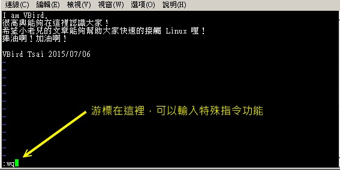

# 第九章、vim 程序编辑器

最近更新日期：20//

系统管理员的重要工作就是得要修改与设置某些重要软件的配置文件，因此至少得要学会一种以上的命令行的文书编辑器。 在所有的 Linux distributions 上头都会有的一套文书编辑器就是 vi ，而且很多软件默认也是使用 vi 做为他们编辑的接口， 因此鸟哥建议您务必要学会使用 vi 这个正规的文书编辑器。此外，vim 是进阶版的 vi ， vim 不但可以用不同颜色显示文字内容，还能够进行诸如 shell script, C program 等程序编辑功能， 你可以将 vim 视为一种程序编辑器！鸟哥也是用 vim 编辑鸟站的网页文章呢！ ^_^

# 9.1 vi 与 vim

## 9.1 vi 与 vim

由前面一路走来，我们一直建议使用文字模式来处理 Linux 系统的设置问题，因为不但可以让你比较容易了解到 Linux 的运行状况，也比较容易了解整个设置的基本精神，更能“保证”你的修改可以顺利的被运行。 所以，在 Linux 的系统中使用文字编辑器来编辑你的 Linux 参数配置文件，可是一件很重要的事情呦！也因此呢，系统管理员至少应该要熟悉一种文书处理器的！


**Tips** 这里要再次的强调，不同的 Linux distribution 各有其不同的附加软件，例如 Red Hat Enterprise Linux 与 Fedora 的 ntsysv 与 setup 等，而 SuSE 则有 YAST 管理工具等等， 因此，如果你只会使用此种类型的软件来控制你的 Linux 系统时，当接管不同的 Linux distributions 时，呵呵！那可就苦恼了！

在 Linux 的世界中，绝大部分的配置文件都是以 ASCII 的纯文本形态存在，因此利用简单的文字编辑软件就能够修改设置了！ 与微软的 Windows 系统不同的是，如果你用惯了 Microsoft Word 或 Corel Wordperfect 的话，那么除了 X window 里面的图形接口编辑程序（如 xemacs ）用起来尚可应付外，在 Linux 的文字模式下，会觉得文书编辑程序都没有窗口接口来的直观与方便。


**Tips** 什么是纯文本文件？其实文件记录的就是 0 与 1 ，而我们通过编码系统来将这些 0 与 1 转成我们认识的文字就是了。 在第零章里面的数据表示方式有较多说明，请自行查阅。 ASCII 就是其中一种广为使用的文字编码系统，在 ASCII 系统中的图示与代码可以参考 [`zh.wikipedia.org/wiki/ASCII`](http://zh.wikipedia.org/wiki/ASCII)呢！

那么 Linux 在命令行下的文书编辑器有哪些呢？其实有非常多喔！常常听到的就有： [emacs](http://www.gnu.org/software/emacs/), [pico](https://en.wikipedia.org/wiki/Pico_（text_editor）), [nano](http://sourceforge.net/projects/nano/), [joe](http://sourceforge.net/projects/joe-editor/), 与 [vim](http://www.vim.org/) 等等[[1]](#ps1)。 既然有这么多命令行的文书编辑器，那么我们为什么一定要学 vi 啊？还有那个 vim 是做啥用的？下面就来谈一谈先！

### 9.1.1 为何要学 vim

文书编辑器那么多，我们之前在第四章也曾经介绍过那简单好用的 nano ，既然已经学会了 nano ，干嘛鸟哥还一直要你学这不是很友善的 vi 呢？其实是有原因的啦！因为：

*   所有的 Unix Like 系统都会内置 vi 文书编辑器，其他的文书编辑器则不一定会存在；
*   很多个别软件的编辑接口都会主动调用 vi （例如未来会谈到的 crontab, visudo, edquota 等指令）；
*   vim 具有程序编辑的能力，可以主动的以字体颜色辨别语法的正确性，方便程序设计；
*   因为程序简单，编辑速度相当快速。

其实重点是上述的第二点，因为有太多 Linux 上面的指令都默认使用 vi 作为数据编辑的接口，所以你必须、一定要学会 vi ，否则很多指令你根本就无法操作呢！这样说，有刺激到你务必要学会 vi 的热情了吗？ ^_^

那么什么是 vim 呢？其实你可以将 vim 视作 vi 的进阶版本，vim 可以用颜色或底线等方式来显示一些特殊的信息。 举例来说，当你使用 vim 去编辑一个 C 程序语言的文件，或者是我们后续会谈到的 shell script 脚本程序时，vim 会依据文件的扩展名或者是文件内的开头信息， 判断该文件的内容而自动的调用该程序的语法判断式，再以颜色来显示程序码与一般信息。也就是说， 这个 vim 是个“程序编辑器”啦！甚至一些 Linux 基础配置文件内的语法，都能够用 vim 来检查呢！ 例如我们在第七章谈到的 /etc/fstab 这个文件的内容。

简单的来说， vi 是老式的文书处理器，不过功能已经很齐全了，但是还是有可以进步的地方。 vim 则可以说是程序开发者的一项很好用的工具，就连 vim 的官方网站 （[`www.vim.org`](http://www.vim.org/)） 自己也说 vim 是一个“程序开发工具”而不是文书处理软件～^_^。 因为 vim 里面加入了很多额外的功能，例如支持正则表达式的搜寻架构、多文件编辑、区块复制等等。 这对于我们在 Linux 上面进行一些配置文件的修订工作时，是很棒的一项功能呢！


**Tips** 什么时候会使用到 vim 呢？其实鸟哥的整个网站都是在 vim 的环境下一字一字的创建起来的喔！ 早期鸟哥使用网页制作软件在编写网页，但是老是发现网页编辑软件都不怎么友善，尤其是写到 PHP 方面的程序码时。 后来就干脆不使用所见即所得的编辑软件，直接使用 vim ，然后标签 （tag） 也都自行用键盘输入！ 这样整个文件也比较干净！所以说，鸟哥我是很喜欢 vim 的啦！ ^_^

下面鸟哥会先就简单的 vi 做个介绍，然后再跟大家报告一下 vim 的额外功能与用法呢！

# 9.2 vi 的使用

## 9.2 vi 的使用

基本上 vi 共分为三种模式，分别是“一般指令模式”、“编辑模式”与“命令行命令模式”。 这三种模式的作用分别是：

*   一般指令模式 （command mode）

以 vi 打开一个文件就直接进入一般指令模式了（这是默认的模式，也简称为一般模式）。在这个模式中， 你可以使用“上下左右”按键来移动光标，你可以使用“删除字符”或“删除整列”来处理文件内容， 也可以使用“复制、贴上”来处理你的文件数据。

*   编辑模式 （insert mode）

在一般指令模式中可以进行删除、复制、贴上等等的动作，但是却无法编辑文件内容的！ 要等到你按下“i, I, o, O, a, A, r, R”等任何一个字母之后才会进入编辑模式。注意了！通常在 Linux 中，按下这些按键时，在画面的左下方会出现“ INSERT 或 REPLACE ”的字样，此时才可以进行编辑。而如果要回到一般指令模式时， 则必须要按下“Esc”这个按键即可退出编辑模式。

*   命令行命令模式 （command-line mode）

在一般模式当中，输入“ : / ? ”三个中的任何一个按钮，就可以将光标移动到最下面那一列。在这个模式当中， 可以提供你“搜寻数据”的动作，而读取、存盘、大量取代字符、离开 vi 、显示行号等等的动作则是在此模式中达成的！

简单的说，我们可以将这三个模式想成下面的图示来表示：

图 9.2.1、vi 三种模式的相互关系

注意到上面的图示，你会发现一般指令模式可与编辑模式及命令行界面切换， 但编辑模式与命令行界面之间不可互相切换喔！这非常重要啦！闲话不多说，我们下面以一个简单的例子来进行说明吧！


**Tips** 过去鸟哥的前一版本中，一般指令模式被称为一般模式。但是英文版的 vi/vim 说明中，一般模式其实是“ command mode ”的意思！中文直译会变成指令模式啊！ 之所以称为指令模式，主因是我们可以在一般模式下面按下很多特殊的指令功能！例如删除、复制、区块选择等等！只是这个模式很容易跟命令行界面 （command-line） 混淆～ 所以鸟哥过去才称为一般模式而已。不过真的很容易误解啦！所以这一版开始，这一模式被鸟哥改为“一般指令模式”了！要尊重英文原文！

### 9.2.1 简易执行范例

如果你想要使用 vi 来创建一个名为 welcome.txt 的文件时，你可以这样做：

*   1\. 使用“ vi filename ”进入一般指令模式

```
[dmtsai@study ~]$ /bin/vi welcome.txt
# 在 CentOS 7 当中，由于一般帐号默认 vi 已经被 vim 取代了，因此得要输入绝对路径来执行才行！ 
```

直接输入“ vi 文件名”就能够进入 vi 的一般指令模式了。不过请注意，由于一般帐号默认已经使用 vim 来取代，因此如上表所示， 如果使用一般帐号来测试，得要使用绝对路径的方式来执行 /bin/vi 才好！另外，请注意，记得 vi 后面一定要加文件名，不管该文件名存在与否！

整个画面主要分为两部份，上半部与最下面一列两者可以视为独立的。如下图 9.2.2 所示，图中那个虚线是不存在的， 鸟哥用来说明而已啦！上半部显示的是文件的实际内容，最下面一列则是状态显示列（如下图的[New File]信息），或者是命令下达列喔！

图 9.2.2、用 vi 打开一个新文件

如果你打开的文件是旧文件（已经存在的文件），则可能会出现如下的信息：

图 9.2.3、用 vi 打开一个旧文件

如上图 9.2.3 所示，箭头所指的那个“"/etc/man_db.conf" [readonly] 131L, 5171C”代表的是“现在打开的文件名为 /etc/man_db.conf， 由于启动者的身份缘故，目前文件为只读状态，且文件内有 131 列 以及具有 5171 个字符”的意思！那一列的内容并不是在文件内，而是 vi 显示一些信息的地方喔！此时是在一般指令模式的环境下啦。接下来开始来输入吧！

*   2\. 按下 i 进入编辑模式，开始编辑文字

在一般指令模式之中，只要按下 i, o, a 等字符就可以进入编辑模式了！在编辑模式当中，你可以发现在左下角状态列中会出现 –INSERT- 的字样，那就是可以输入任意字符的提示啰！这个时候，键盘上除了 [Esc] 这个按键之外，其他的按键都可以视作为一般的输入按钮了，所以你可以进行任何的编辑啰！

图 9.2.4、开始用 vi 来进行编辑

*   3\. 按下 [ESC] 按钮回到一般指令模式

好了，假设我已经按照上面的样式给他编辑完毕了，那么应该要如何退出呢？是的！没错！就是给他按下 [Esc] 这个按钮即可！马上你就会发现画面左下角的 – INSERT – 不见了！！

*   4\. 进入命令行界面，文件储存并离开 vi 环境

OK，我们要存盘了，存盘 （write） 并离开 （quit） 的指令很简单，输入“:wq”即可存盘离开！ （注意了，按下 : 该光标就会移动到最下面一列去！） 这时你在提示字符后面输入“ ls -l ”即可看到我们刚刚创建的 welcome.txt 文件啦！整个图示有点像下面这样：

图 9.2.5、在命令行界面进行储存及离开 vi 环境

如此一来，你的文件 welcome.txt 就已经创建起来啰！需要注意的是，如果你的文件权限不对，例如为 -r--r--r-- 时，那么可能会无法写入，此时可以使用“强制写入”的方式吗？可以！使用“ :wq! ” 多加一个惊叹号即可！不过，需要特别注意呦！那个是在“你的权限可以改变”的情况下才能成立的！ 关于权限的概念，请自行回去翻一下第五章的内容吧！

### 9.2.2 按键说明

除了上面简易范例的 i, [Esc], :wq 之外，其实 vi 还有非常多的按键可以使用喔！在介绍之前还是要再次强调， vi 的三种模式只有一般指令模式可以与编辑、命令行界面切换，编辑模式与命令行界面之间并不能切换的！ 这点在图 9.2.1 里面有介绍到，注意去看看喔！下面就来谈谈 vi 软件中会用到的按键功能吧！

*   第一部份：一般指令模式可用的按钮说明，光标移动、复制贴上、搜寻取代等

| 移动光标的方法 |
| --- |
| h 或 向左方向键（←） | 光标向左移动一个字符 |
| j 或 向下方向键（↓） | 光标向下移动一个字符 |
| k 或 向上方向键（↑） | 光标向上移动一个字符 |
| l 或 向右方向键（→） | 光标向右移动一个字符 |
| 如果你将右手放在键盘上的话，你会发现 hjkl 是排列在一起的，因此可以使用这四个按钮来移动光标。 如果想要进行多次移动的话，例如向下移动 30 列，可以使用 "30j" 或 "30↓" 的组合按键， 亦即加上想要进行的次数（数字）后，按下动作即可！ |
| [Ctrl] + [f] | 屏幕“向下”移动一页，相当于 [Page Down]按键 （常用） |
| [Ctrl] + [b] | 屏幕“向上”移动一页，相当于 [Page Up] 按键 （常用） |
| [Ctrl] + [d] | 屏幕“向下”移动半页 |
| [Ctrl] + [u] | 屏幕“向上”移动半页 |
| + | 光标移动到非空白字符的下一列 |
| - | 光标移动到非空白字符的上一列 |
| n<space> | 那个 n 表示“数字”，例如 20 。按下数字后再按空白键，光标会向右移动这一列的 n 个字符。例如 20<space> 则光标会向后面移动 20 个字符距离。 |
| 0 或功能键[Home] | 这是数字“ 0 ”：移动到这一列的最前面字符处 （常用） |
| $ 或功能键[End] | 移动到这一列的最后面字符处（常用） |
| H | 光标移动到这个屏幕的最上方那一列的第一个字符 |
| M | 光标移动到这个屏幕的中央那一列的第一个字符 |
| L | 光标移动到这个屏幕的最下方那一列的第一个字符 |
| G | 移动到这个文件的最后一列（常用） |
| nG | n 为数字。移动到这个文件的第 n 列。例如 20G 则会移动到这个文件的第 20 列（可配合 :set nu） |
| gg | 移动到这个文件的第一列，相当于 1G 啊！ （常用） |
| n<Enter> | n 为数字。光标向下移动 n 列（常用） |
| 搜寻与取代 |
| /word | 向光标之下寻找一个名称为 word 的字串。例如要在文件内搜寻 vbird 这个字串，就输入 /vbird 即可！ （常用） |
| ?word | 向光标之上寻找一个字串名称为 word 的字串。 |
| n | 这个 n 是英文按键。代表“<u>重复前一个搜寻的动作</u>”。举例来说， 如果刚刚我们执行 /vbird 去向下搜寻 vbird 这个字串，则按下 n 后，会向下继续搜寻下一个名称为 vbird 的字串。如果是执行 ?vbird 的话，那么按下 n 则会向上继续搜寻名称为 vbird 的字串！ |
| N | 这个 N 是英文按键。与 n 刚好相反，为“反向”进行前一个搜寻动作。 例如 /vbird 后，按下 N 则表示“向上”搜寻 vbird 。 |
| 使用 /word 配合 n 及 N 是非常有帮助的！可以让你重复的找到一些你搜寻的关键字！ |
| :n1,n2s/word1/word2/g | n1 与 n2 为数字。在第 n1 与 n2 列之间寻找 word1 这个字串，并将该字串取代为 word2 ！举例来说，在 100 到 200 列之间搜寻 vbird 并取代为 VBIRD 则：“:100,200s/vbird/VBIRD/g”。（常用） |
| :1,$s/word1/word2/g | 从第一列到最后一列寻找 word1 字串，并将该字串取代为 word2 ！（常用） |
| :1,$s/word1/word2/gc | 从第一列到最后一列寻找 word1 字串，并将该字串取代为 word2 ！且在取代前显示提示字符给使用者确认 （confirm） 是否需要取代！（常用） |
| 删除、复制与贴上 |
| x, X | 在一列字当中，x 为向后删除一个字符 （相当于 [del] 按键）， X 为向前删除一个字符（相当于 [backspace] 亦即是倒退键） （常用） |
| nx | n 为数字，连续向后删除 n 个字符。举例来说，我要连续删除 10 个字符， “10x”。 |
| dd | 删除光标所在的那一整列（常用） |
| ndd | n 为数字。删除光标所在的向下 n 列，例如 20dd 则是删除 20 列 （常用） |
| d1G | 删除光标所在到第一列的所有数据 |
| dG | 删除光标所在到最后一列的所有数据 |
| d$ | 删除光标所在处，到该列的最后一个字符 |
| d0 | 那个是数字的 0 ，删除光标所在处，到该列的最前面一个字符 |
| yy | 复制光标所在的那一列（常用） |
| nyy | n 为数字。复制光标所在的向下 n 列，例如 20yy 则是复制 20 列（常用） |
| y1G | 复制光标所在列到第一列的所有数据 |
| yG | 复制光标所在列到最后一列的所有数据 |
| y0 | 复制光标所在的那个字符到该列行首的所有数据 |
| y$ | 复制光标所在的那个字符到该列行尾的所有数据 |
| p, P | p 为将已复制的数据在光标下一列贴上，P 则为贴在光标上一列！ 举例来说，我目前光标在第 20 列，且已经复制了 10 列数据。则按下 p 后， 那 10 列数据会贴在原本的 20 列之后，亦即由 21 列开始贴。但如果是按下 P 呢？ 那么原本的第 20 列会被推到变成 30 列。 （常用） |
| J | 将光标所在列与下一列的数据结合成同一列 |
| c | 重复删除多个数据，例如向下删除 10 列，[ 10cj ] |
| u | 复原前一个动作。（常用） |
| [Ctrl]+r | 重做上一个动作。（常用） |
| 这个 u 与 [Ctrl]+r 是很常用的指令！一个是复原，另一个则是重做一次～ 利用这两个功能按键，你的编辑，嘿嘿！很快乐的啦！ |
| . | 不要怀疑！这就是小数点！意思是重复前一个动作的意思。 如果你想要重复删除、重复贴上等等动作，按下小数点“.”就好了！ （常用） |

*   第二部份：一般指令模式切换到编辑模式的可用的按钮说明

| 进入插入或取代的编辑模式 |
| --- |
| i, I | 进入插入模式（Insert mode）：i 为“从目前光标所在处插入”， I 为“在目前所在列的第一个非空白字符处开始插入”。 （常用） |
| a, A | 进入插入模式（Insert mode）：a 为“从目前光标所在的下一个字符处开始插入”， A 为“从光标所在列的最后一个字符处开始插入”。（常用） |
| o, O | 进入插入模式（Insert mode）：这是英文字母 o 的大小写。o 为“在目前光标所在的下一列处插入新的一列”； O 为在目前光标所在处的上一列插入新的一列！（常用） |
| r, R | 进入取代模式（Replace mode）：r 只会取代光标所在的那一个字符一次；R 会一直取代光标所在的文字，直到按下 ESC 为止；（常用） |
| 上面这些按键中，在 vi 画面的左下角处会出现“--INSERT--”或“--REPLACE--”的字样。 由名称就知道该动作了吧！！特别注意的是，我们上面也提过了，你想要在文件里面输入字符时， 一定要在左下角处看到 INSERT 或 REPLACE 才能输入喔！ |
| [Esc] | 退出编辑模式，回到一般指令模式中（常用） |

*   第三部份：一般指令模式切换到命令行界面的可用按钮说明

| 命令行界面的储存、离开等指令 |
| --- |
| :w | 将编辑的数据写入硬盘文件中（常用） |
| :w! | 若文件属性为“只读”时，强制写入该文件。不过，到底能不能写入， 还是跟你对该文件的文件权限有关啊！ |
| :q | 离开 vi （常用） |
| :q! | 若曾修改过文件，又不想储存，使用 ! 为强制离开不储存盘案。 |
| 注意一下啊，那个惊叹号 （!） 在 vi 当中，常常具有“强制”的意思～ |
| :wq | 储存后离开，若为 :wq! 则为强制储存后离开 （常用） |
| ZZ | 这是大写的 Z 喔！若文件没有更动，则不储存离开，若文件已经被更动过，则储存后离开！ |
| :w [filename] | 将编辑的数据储存成另一个文件（类似另存新文件） |
| :r [filename] | 在编辑的数据中，读入另一个文件的数据。亦即将 “filename” 这个文件内容加到光标所在列后面 |
| :n1,n2 w [filename] | 将 n1 到 n2 的内容储存成 filename 这个文件。 |
| :! command | 暂时离开 vi 到命令行界面下执行 command 的显示结果！例如 “:! ls /home”即可在 vi 当中察看 /home 下面以 ls 输出的文件信息！ |
| vim 环境的变更 |
| :set nu | 显示行号，设置之后，会在每一列的字首显示该列的行号 |
| :set nonu | 与 set nu 相反，为取消行号！ |

特别注意，在 vi 中，“数字”是很有意义的！数字通常代表重复做几次的意思！ 也有可能是代表去到第几个什么什么的意思。举例来说，要删除 50 列，则是用 “50dd” 对吧！ 数字加在动作之前～那我要向下移动 20 列呢？那就是“20j”或者是“20↓”即可。

OK！会这些指令就已经很厉害了，因为常用到的指令也只有不到一半！通常 vi 的指令除了上面鸟哥注明的常用的几个外，其他是不用背的，你可以做一张简单的指令表在你的屏幕墙上， 一有疑问可以马上的查询呦！这也是当初鸟哥使用 vim 的方法啦！

### 9.2.3 一个案例练习

来来来！赶紧测试一下你是否已经熟悉 vi 这个指令呢？请依照下面的需求进行指令动作。 （下面的操作为使用 CentOS 7.1 中的 man_db.conf 来做练习的，该文件你可以在这里下载： [`linux.vbird.org/linux_basic/0310vi/man_db.conf`](http://linux.vbird.org/linux_basic/0310vi/man_db.conf)。） 看看你的显示结果与鸟哥的结果是否相同啊？

1.  请在 /tmp 这个目录下创建一个名为 vitest 的目录；
2.  进入 vitest 这个目录当中；
3.  将 /etc/man_db.conf 复制到本目录下面（或由上述的链接下载 [man_db.conf](http://linux.vbird.org/linux_basic/0310vi/man_db.conf) 文件）；
4.  使用 vi 打开本目录下的 man_db.conf 这个文件；
5.  在 vi 中设置一下行号；
6.  移动到第 43 列，向右移动 59 个字符，请问你看到的小括号内是哪个文字？
7.  移动到第一列，并且向下搜寻一下“ gzip ”这个字串，请问他在第几列？
8.  接着下来，我要将 29 到 41 列之间的“小写 man 字串”改为“大写 MAN 字串”，并且一个一个挑选是否需要修改，如何下达指令？如果在挑选过程中一直按“y”， 结果会在最后一列出现改变了几个 man 呢？
9.  修改完之后，突然反悔了，要全部复原，有哪些方法？
10.  我要复制 66 到 71 这 6 列的内容（含有 MANDB_MAP），并且贴到最后一列之后；
11.  113 到 128 列之间的开头为 # 符号的注解数据我不要了，要如何删除？
12.  将这个文件另存成一个 man.test.config 的文件名；
13.  去到第 25 列，并且删除 15 个字符，结果出现的第一个单字是什么？
14.  在第一列新增一列，该列内容输入“I am a student...”；
15.  储存后离开吧！

整个步骤可以如下显示：

1.  “mkdir /tmp/vitest”
2.  “cd /tmp/vitest”
3.  “cp /etc/man_db.conf .”
4.  “/bin/vi man_db.conf”
5.  “:set nu”然后你会在画面中看到左侧出现数字即为行号。
6.  先按下“43G”再按下“59→”会看到“ as ”这个单字在小括号内；
7.  先执行“1G”或“gg”后，直接输入“/gzip”，则会去到第 93 列才对！
8.  直接下达“ :29,41s/man/MAN/gc ”即可！若一直按“y”最终会出现“在 13 列内置换 13 个字串”的说明。
9.  （1）简单的方法可以一直按“ u ”回复到原始状态，（2）使用不储存离开“ :q! ”之后，再重新读取一次该文件；
10.  “66G” 然后再“ 6yy ”之后最后一列会出现“复制 6 列”之类的说明字样。 按下“ G ”到最后一列，再给他“ p ”贴上 6 列！
11.  因为 113~128 共 16 列，因此“ 113G ”→“ 16dd ”就能删除 16 列，此时你会发现光标所在 113 列的地方变成 “ # Flags. ” 开头啰
12.  “ :w man.test.config ”，你会发现最后一列出现 "man.test.config" [New].. 的字样。
13.  “25G” 之后，再给他“ 15x ”即可删除 15 个字符，出现“ tree ”的字样；
14.  先“ 1G ”去到第一列，然后按下大写的“ O ”便新增一列且在插入模式；开始输入“I am a student...”后， 按下[Esc]回到一般指令模式等待后续工作；
15.  “:wq”

如果你的结果都可以查的到，那么 vi 的使用上面应该没有太大的问题啦！剩下的问题会是在…打字练习…。

### 9.2.4 vim 的暂存盘、救援回复与打开时的警告讯息

在目前主要的文书编辑软件都会有“回复”的功能，亦即当你的系统因为某些原因而导致类似死机的情况时， 还可以通过某些特别的机制来让你将之前未储存的数据“救”回来！这就是鸟哥这里所谓的“回复”功能啦！ 那么 vim 有没有回复功能呢？有的！ vim 就是通过“暂存盘”来救援的啦！

当我们在使用 vim 编辑时， vim 会在与被编辑的文件的目录下，再创建一个名为 .filename.swp 的文件。 比如说我们在上一个小节谈到的编辑 /tmp/vitest/man_db.conf 这个文件时， vim 会主动的创建 /tmp/vitest/.man_db.conf.swp 的暂存盘，你对 man_db.conf 做的动作就会被记录到这个 .man_db.conf.swp 当中喔！如果你的系统因为某些原因断线了， 导致你编辑的文件还没有储存，这个时候 .man_db.conf.swp 就能够发挥救援的功能了！我们来测试一下吧！ 下面的练习有些部分的指令我们尚未谈到，没关系，你先照着做，后续再回来了解啰！

```
[dmtsai@study ~]$ cd /tmp/vitest
[dmtsai@study vitest]$ vim man_db.conf
# 此时会进入到 vim 的画面，请在 vim 的一般指令模式下按下“ [ctrl]-z ”的组合键

[1]+  Stopped             vim man_db.conf  &lt;==按下 [ctrl]-z 会告诉你这个讯息 
```

当我们在 vim 的一般指令模式下按下 [ctrl]-z 的组合按键时，你的 vim 会被丢到背景去执行！ 这部份的功能我们会在第十六章的程序管理当中谈到， 你这里先知道一下即可。回到命令提示字符后，接下来我们来仿真将 vim 的工作不正常的中断吧！

```
[dmtsai@study vitest]$ ls -al
drwxrwxr-x.  2 dmtsai dmtsai    69 Jul  6 23:54 .
drwxrwxrwt. 17 root   root    4096 Jul  6 23:53 ..
-rw-r--r--.  1 dmtsai dmtsai  4850 Jul  6 23:47 man_db.conf
-rw-r--r--.  1 dmtsai dmtsai 16384 Jul  6 23:54 .man_db.conf.swp  &lt;==就是他，暂存盘
-rw-rw-r--.  1 dmtsai dmtsai  5442 Jul  6 23:35 man.test.config

[dmtsai@study vitest]$ kill -9 %1 &lt;==这里仿真断线停止 vim 工作
[dmtsai@study vitest]$ ls -al .man_db.conf.swp
-rw-r--r--. 1 dmtsai dmtsai 16384 Jul  6 23:54 .man_db.conf.swp  &lt;==暂存盘还是会存在！ 
```

那个 kill 可以仿真将系统的 vim 工作删除的情况，你可以假装死机了啦！ 由于 vim 的工作被不正常的中断，导致暂存盘无法借由正常流程来结束， 所以暂存盘就不会消失，而继续保留下来。此时如果你继续编辑那个 man_db.conf ，会出现什么情况呢？ 会出现如下所示的状态喔：

```
[dmtsai@study vitest]$ vim man_db.conf

E325: ATTENTION  &lt;==错误代码
Found a swap file by the name ".man_db.conf.swp"  &lt;==下面数列说明有暂存盘的存在
          owned by: dmtsai   dated: Mon Jul  6 23:54:16 2015
         file name: /tmp/vitest/man_db.conf  &lt;==这个暂存盘属于哪个实际的文件？
          modified: no
         user name: dmtsai   host name: study.centos.vbird
        process ID: 31851
While opening file "man_db.conf"
             dated: Mon Jul  6 23:47:21 2015

下面说明可能发生这个错误的两个主要原因与解决方案！
（1） Another program may be editing the same file.  If this is the case,
    be careful not to end up with two different instances of the same
    file when making changes.  Quit, or continue with caution.
（2） An edit session for this file crashed.
    If this is the case, use ":recover" or "vim -r man_db.conf"
    to recover the changes （see ":help recovery"）.
    If you did this already, delete the swap file ".man_db.conf.swp"
    to avoid this message.

Swap file ".man_db.conf.swp" already exists! 下面说明你可进行的动作
[O]pen Read-Only, （E）dit anyway, （R）ecover, （D）elete it, （Q）uit, （A）bort: 
```

由于暂存盘存在的关系，因此 vim 会主动的判断你的这个文件可能有些问题，在上面的图示中 vim 提示两点主要的问题与解决方案，分别是这样的：

*   问题一：可能有其他人或程序同时在编辑这个文件：

    由于 Linux 是多用户多任务的环境，因此很可能有很多人同时在编辑同一个文件。如果在多人共同编辑的情况下， 万一大家同时储存，那么这个文件的内容将会变的乱七八糟！为了避免这个问题，因此 vim 会出现这个警告窗口！ 解决的方法则是：

    *   找到另外那个程序或人员，请他将该 vim 的工作结束，然后你再继续处理。

    *   如果你只是要看该文件的内容并不会有任何修改编辑的行为，那么可以选择打开成为只读（O）文件， 亦即上述画面反白部分输入英文“ o ”即可，其实就是 [O]pen Read-Only 的选项啦！

*   问题二：在前一个 vim 的环境中，可能因为某些不知名原因导致 vim 中断 （crashed）：

    这就是常见的不正常结束 vim 产生的后果。解决方案依据不同的情况而不同喔！常见的处理方法为：

    *   如果你之前的 vim 处理动作尚未储存，此时你应该要按下“R”，亦即使用 （R）ecover 的项目， 此时 vim 会载入 .man_db.conf.swp 的内容，让你自己来决定要不要储存！这样就能够救回来你之前未储存的工作。 不过那个 .man_db.conf.swp 并不会在你结束 vim 后自动删除，所以你离开 vim 后还得要自行删除 .man_db.conf.swp 才能避免每次打开这个文件都会出现这样的警告！

    *   如果你确定这个暂存盘是没有用的，那么你可以直接按下“D”删除掉这个暂存盘，亦即 （D）elete it 这个项目即可。 此时 vim 会载入 man_db.conf ，并且将旧的 .man_db.conf.swp 删除后，创建这次会使用的新的 .man_db.conf.swp 喔！

至于这个发现暂存盘警告讯息的画面中，有出现六个可用按钮，各按钮的说明如下：

*   [O]pen Read-Only：打开此文件成为只读文件， 可以用在你只是想要查阅该文件内容并不想要进行编辑行为时。一般来说，在上课时，如果你是登陆到同学的计算机去看他的配置文件， 结果发现其实同学他自己也在编辑时，可以使用这个模式；

*   （E）dit anyway：还是用正常的方式打开你要编辑的那个文件， 并不会载入暂存盘的内容。不过很容易出现两个使用者互相改变对方的文件等问题！不好不好！

*   （R）ecover：就是载入暂存盘的内容，用在你要救回之前未储存的工作。 不过当你救回来并且储存离开 vim 后，还是要手动自行删除那个暂存盘喔！

*   （D）elete it：你确定那个暂存盘是无用的！那么打开文件前会先将这个暂存盘删除！ 这个动作其实是比较常做的！因为你可能不确定这个暂存盘是怎么来的，所以就删除掉他吧！哈哈！

*   （Q）uit：按下 q 就离开 vim ，不会进行任何动作回到命令提示字符。

*   （A）bort：忽略这个编辑行为，感觉上与 quit 非常类似！ 也会送你回到命令提示字符就是啰！

# 9.3 vim 的额外功能

## 9.3 vim 的额外功能

其实，目前大部分的 distributions 都以 vim 取代 vi 的功能了！如果你使用 vi 后，却看到画面的右下角有显示目前光标所在的行列号码，那么你的 vi 已经被 vim 所取代啰～为什么要用 vim 呢？因为 vim 具有颜色显示的功能，并且还支持许多的程序语法 （syntax）， 因此，当你使用 vim 编辑程序时 （不论是 C 语言，还是 shell script ），我们的 vim 将可帮你直接进行“程序除错 （debug）”的功能！真的很不赖吧！^_^

如果你在文字模式下，输入 alias 时，出现这样的画面：

```
[dmtsai@study ~]$ alias
....其他省略....
alias vi='vim'  &lt;==重点在这列啊！ 
```

这表示当你使用 vi 这个指令时，其实就是执行 vim 啦！如果你没有这一列，那么你就必须要使用 vim filename 来启动 vim 啰！基本上， vim 的一般用法与 vi 完全一模一样～没有不同啦！那么我们就来看看 vim 的画面是怎样啰！假设我想要编辑 /etc/services ，则输入“vim /etc/services”看看吧：

图 9.3.1、使用 vim 编辑系统配置文件的示范

上面是 vim 的画面示意图，在这个画面中有几点特色要说明喔：

1.  由于 /etc/services 是系统规划的配置文件，因此 vim 会进行语法检验，所以你会看到画面中内部主要为深蓝色， 且深蓝色那一列是以注解符号 （#） 为开头；
2.  画面中的最下面一列，在左边显示该文件的属性，包括只读文件、内容共有 11176 列与 670293 个字符；
3.  最下面一列的右边出现的 1,1 表示光标所在为第一列, 第一个字符位置之意（请看上图中的光标所在）；

所以，如果你向下移动到其他位置时，出现的非注解的数据就会有点像这样：

图 9.3.2、使用 vim 编辑系统配置文件的示范

看到了喔！除了注解之外，其他的列就会有特别的颜色显示呢！可以避免你打错字啊！而且， 最右下角的 1% 代表目前这个画面占整体文件的 1% 之意！这样瞭乎？

### 9.3.1 区块选择（Visual Block）

刚刚我们提到的简单的 vi 操作过程中，几乎提到的都是以列为单位的操作。那么如果我想要搞定的是一个区块范围呢？ 举例来说，像下面这种格式的文件：

```
192.168.1.1    host1.class.net
192.168.1.2    host2.class.net
192.168.1.3    host3.class.net
192.168.1.4    host4.class.net
.....中间省略...... 
```

这个文件我将他放置到 [`linux.vbird.org/linux_basic/0310vi/hosts`](http://linux.vbird.org/linux_basic/0310vi/hosts) ，你可以自行下载来看一看这个文件啊！现在我们来玩一玩这个文件吧！假设我想要将 host1, host2... 等等复制起来， 并且加到每一列的后面，亦即每一列的结果要是“ 192.168.1.2 host2.class.net host2 ”这样的情况时， 在传统或现代的窗口型编辑器似乎不容易达到这个需求，但是咱们的 vim 是办的到的喔！那就使用区块选择 （Visual Block） 吧！当我们按下 v 或者 V 或者 [Ctrl]+v 时， 这个时候光标移动过的地方就会开始反白，这三个按键的意义分别是：

| 区块选择的按键意义 |
| --- |
| v | 字符选择，会将光标经过的地方反白选择！ |
| V | 列选择，会将光标经过的列反白选择！ |
| [Ctrl]+v | 区块选择，可以用长方形的方式选择数据 |
| y | 将反白的地方复制起来 |
| d | 将反白的地方删除掉 |
| p | 将刚刚复制的区块，在光标所在处贴上！ |

来实际进行我们需要的动作吧！就是将 host 再加到每一列的最后面，你可以这样做：

1.  使用 vim hosts 来打开该文件，记得该文件请由[上述的链接](http://linux.vbird.org/linux_basic/0310vi/hosts)下载先！
2.  将光标移动到第一列的 host 那个 h 上头，然后按下 [ctrl]-v ，左下角出现区块示意字样：

    图 9.3.3、vim 的区块选择、复制、贴上等功能操作

3.  将光标移动到最底部，此时光标移动过的区域会反白！如下图所示：

    图 9.3.4、vim 的区块选择、复制、贴上等功能操作

4.  此时你可以按下“ y ”来进行复制，当你按下 y 之后，反白的区块就会消失不见啰！
5.  最后，将光标移动到第一列的最右边，并且再用编辑模式向右按两个空白键，回到一般指令模式后， 再按下“ p ”后，你会发现很有趣！如下图所示：

    图 9.3.5、vim 的区块选择、复制、贴上等功能操作

通过上述的功能，你可以复制一个区块，并且是贴在某个“区块的范围”内，而不是以列为单位来处理你的整份文件喔！ 鸟哥个人是觉得这玩意儿非常的有帮助啦！至少在进行排列整齐的文字文件中复制/删除区块时，会是一个非常棒的功能！

### 9.3.2 多文件编辑

假设一个例子，你想要将刚刚我们的 hosts 内的 IP 复制到你的 /etc/hosts 这个文件去， 那么该如何编辑？我们知道在 vi 内可以使用 :r filename 来读入某个文件的内容， 不过，这样毕竟是将整个文件读入啊！如果我只是想要部分内容呢？呵呵！这个时候多文件同时编辑就很有用了。 我们可以使用 vim 后面同时接好几个文件来同时打开喔！相关的按键有：

| 多文件编辑的按键 |
| --- |
| :n | 编辑下一个文件 |
| :N | 编辑上一个文件 |
| :files | 列出目前这个 vim 的打开的所有文件 |

在过去，鸟哥想要将 A 文件内的十条消息“移动”到 B 文件去，通常要开两个 vim 窗口来复制， 偏偏每个 vim 都是独立的，因此并没有办法在 A 文件下达“ nyy ”再跑到 B 文件去“ p ”啦！ 在这种情况下最常用的方法就是通过鼠标圈选， 复制后贴上。不过这样一来还是有问题，因为鸟哥超级喜欢使用 [Tab] 按键进行编排对齐动作， 通过鼠标却会将 [Tab] 转成空白键，这样内容就不一样了！此时这个多文件编辑就派上用场了！

现在你可以做一下练习看看说！假设你要将刚刚鸟哥提供的 hosts 内的前四列 IP 数据复制到你的 /etc/hosts 文件内，那可以怎么进行呢？可以这样啊：

1.  通过“ vim hosts /etc/hosts ”指令来使用一个 vim 打开两个文件；
2.  在 vim 中先使用“ :files ”察看一下编辑的文件数据有啥？结果如下所示。 至于下图的最后一列显示的是“按下任意键”就会回到 vim 的一般指令模式中！

    图 9.3.6、vim 的多文件编辑中，查看同时编辑的文件数据

3.  在第一列输入“ 4yy ”复制四列；
4.  在 vim 的环境下输入“ :n ”会来到第二个编辑的文件，亦即 /etc/hosts 内；
5.  在 /etc/hosts 下按“ G ”到最后一列，再输入“ p ”贴上；
6.  按下多次的“ u ”来还原原本的文件数据；
7.  最终按下“ :q ”来离开 vim 的多文件编辑吧！

看到了吧？利用多文件编辑的功能，可以让你很快速的就将需要的数据复制到正确的文件内。 当然啰，这个功能也可以利用窗口接口来达到，那就是下面要提到的多窗口功能。

### 9.3.3 多窗口功能

在开始这个小节前，先来想像两个情况：

*   当我有一个文件非常的大，我查阅到后面的数据时，想要“对照”前面的数据， 是否需要使用 [ctrl]+f 与 [ctrl]+b （或 pageup, pagedown 功能键） 来跑前跑后查阅？

*   我有两个需要对照着看的文件，不想使用前一小节提到的多文件编辑功能；

在一般窗口接口下的编辑软件大多有“分区窗口”或者是“冻结窗口”的功能来将一个文件分区成多个窗口的展现， 那么 vim 能不能达到这个功能啊？可以啊！但是如何分区窗口并放入文件呢？ 很简单啊！在命令行界面输入“:sp {filename}”即可！那个 filename 可有可无， 如果想要在新窗口启动另一个文件，就加入文件名，否则仅输入 :sp 时， 出现的则是同一个文件在两个窗口间！

让我们来测试一下，你先使用“ vim /etc/man_db.conf ”打开这个文件，然后“ 1G ”去到第一列，之后输入“ :sp ” 再次的打开这个文件一次，然后再输入“ G ”，结果会变成下面这样喔：

图 9.3.7、vim 的窗口分区示意图

万一你再输入“ :sp /etc/hosts ”时，就会变成下图这样喔：

图 9.3.8、vim 的窗口分区示意图

怎样？帅吧！两个文件同时在一个屏幕上面显示，你还可以利用“[ctrl]+w+↑”及“[ctrl]+w+↓” 在两个窗口之间移动呢！这样的话，复制啊、查阅啊等等的，就变的很简单啰～ 分区窗口的相关指令功能有很多，不过你只要记得这几个就好了：

| 多窗口情况下的按键功能 |
| --- |
| :sp [filename] | 打开一个新窗口，如果有加 filename， 表示在新窗口打开一个新文件，否则表示两个窗口为同一个文件内容（同步显示）。 |
| [ctrl]+w+ j [ctrl]+w+↓ | 按键的按法是：先按下 [ctrl] 不放， 再按下 w 后放开所有的按键，然后再按下 j （或向下方向键），则光标可移动到下方的窗口。 |
| [ctrl]+w+ k [ctrl]+w+↑ | 同上，不过光标移动到上面的窗口。 |
| [ctrl]+w+ q | 其实就是 :q 结束离开啦！ 举例来说，如果我想要结束下方的窗口，那么利用 [ctrl]+w+↓ 移动到下方窗口后，按下 :q 即可离开， 也可以按下 [ctrl]+w+q 啊！ |

鸟哥第一次玩 vim 的分区窗口时，真是很高兴啊！竟然有这种功能！太棒了！ ^_^

### 9.3.4 vim 的挑字补全功能

我们知道 bash 的环境下面可以按下 [tab] 按钮来达成指令/参数/文件名的补全功能，而我们也知道很多的程序编辑器，例如鸟哥用来在 windows 系统上面教网页设计、java script 等很好用的 notepad++ （[`notepad-plus-plus.org/`](https://notepad-plus-plus.org/)） 这种类的程序编辑器，都会有 （1）可以进行语法检验及 （2）可以根据扩展名来挑字的功能！这两个功能对于程序设计者来说， 是很有帮助的！毕竟偶尔某些特定的关键字老是背不起来...

在语法检验方面，vim 已经使用颜色来达成了！这部份不用伤脑筋的！比较伤脑筋的应该是在挑字补全上面！就是上面谈到的可以根据语法来挑选可能的关键字， 包括程序语言的语法以及特定的语法关键字等等。既然 notepad ++ 都有支持了，没道理 vim 不支持吧？呵呵！没错！ 是有支持的～只是你可能要多背两个组合按钮就是了！

鸟哥建议可以记忆的主要 vim 补齐功能，大致有下面几个：

| 组合按钮 | 补齐的内容 |
| --- | --- |
| [ctrl]+x -> [ctrl]+n | 通过目前正在编辑的这个“文件的内容文字”作为关键字，予以补齐 |
| [ctrl]+x -> [ctrl]+f | 以当前目录内的“文件名”作为关键字，予以补齐 |
| [ctrl]+x -> [ctrl]+o | 以扩展名作为语法补充，以 vim 内置的关键字，予以补齐 |

在鸟哥的认知中，比较有用的是第 1, 3 这两个组合键，第一个组合按键中，你可能会在同一个文件里面重复出现许多相同的关键字， 那么就能够通过这个补全的功能来处理。如果你是想要使用 vim 内置的语法检验功能来处理取得关键字的补全，那么第三个项目就很有用了。 不过要注意，如果你想要使用第三个功能，就得要注意你编辑的文件的扩展名。我们下面来做个简单测试好了。

假设你想要编写网页，正要使用到 CSS 的美化功能时，突然想到有个背景的东西要处理，但是突然忘记掉背景的 CSS 关键语法，那可以使用如下的模样来处置！ 请注意，一定要使用 .html 或 .php 的扩展名，否则 vim 不会调用正确的语法检验功能喔！因此下面我们创建的文件名为 html.html 啰！

图 9.3.9、vim 的挑字补全功能

由于网页通常会支持 CSS 的语法，而 CSS 的美化语法使用的是 style 这个关键字，这个关键字后面接的就是 CSS 的元素与元素值。 若想要取得可能的元素有哪些，例如背景 （background） 的语法中，想要了解有哪些跟它有关的内置元素，如上图， 直接输入 b 然后按下 [crtl]+x 再按下 [crtl]+o 就会出现如上的相关字词可以选择，此时你就能够使用上下按钮来挑选所需要的关键元素！ 这样使用上当然方便很多啊！只是要注意，一定要使用正确的扩展名，否则会无法出现任何关键字词喔！

### 9.3.5 vim 环境设置与记录： ~/.vimrc, ~/.viminfo

有没有发现，如果我们以 vim 软件来搜寻一个文件内部的某个字串时，这个字串会被反白， 而下次我们再次以 vim 编辑这个文件时，该搜寻的字串反白情况还是存在呢！甚至于在编辑其他文件时， 如果其他文件内也存在这个字串，哇！竟然还是主动反白耶！真神奇！ 另外，当我们重复编辑同一个文件时，当第二次进入该文件时， 光标竟然就在上次离开的那一列上头呢！真是好方便啊～但是，怎么会这样呢？

这是因为我们的 vim 会主动的将你曾经做过的行为登录下来，好让你下次可以轻松的作业啊！ 那个记录动作的文件就是： ~/.viminfo ！如果你曾经使用过 vim， 那你的主文件夹应该会存在这个文件才对。这个文件是自动产生的， 你不必自行创建。而你在 vim 里头所做过的动作，就可以在这个文件内部查询到啰～ ^_^

此外，每个 distributions 对 vim 的默认环境都不太相同，举例来说，某些版本在搜寻到关键字时并不会高亮度反白， 有些版本则会主动的帮你进行缩排的行为。但这些其实都可以自行设置的，那就是 vim 的环境设置啰～ vim 的环境设置参数有很多，如果你想要知道目前的设置值，可以在一般指令模式时输入“ :set all ” 来查阅，不过.....设置项目实在太多了～所以，鸟哥在这里仅列出一些平时比较常用的一些简单的设置值， 提供给你参考啊。


**Tips** 所谓的缩排，就是当你按下 Enter 编辑新的一列时，光标不会在行首，而是在与上一列的第一个非空白字符处对齐！

| vim 的环境设置参数 |
| --- |
| :set nu :set nonu | 就是设置与取消行号啊！ |
| :set hlsearch :set nohlsearch | hlsearch 就是 high light search（高亮度搜寻）。 这个就是设置是否将搜寻的字串反白的设置值。默认值是 hlsearch |
| :set autoindent :set noautoindent | 是否自动缩排？autoindent 就是自动缩排。 |
| :set backup | 是否自动储存备份文件？一般是 nobackup 的， 如果设置 backup 的话，那么当你更动任何一个文件时，则原始文件会被另存成一个文件名为 filename~ 的文件。 举例来说，我们编辑 hosts ，设置 :set backup ，那么当更动 hosts 时，在同目录下，就会产生 hosts~ 文件名的文件，记录原始的 hosts 文件内容 |
| :set ruler | 还记得我们提到的右下角的一些状态列说明吗？ 这个 ruler 就是在显示或不显示该设置值的啦！ |
| :set showmode | 这个则是，是否要显示 --INSERT-- 之类的字眼在左下角的状态列。 |
| :set backspace=（012） | 一般来说， 如果我们按下 i 进入编辑模式后，可以利用倒退键 （backspace） 来删除任意字符的。 但是，某些 distribution 则不许如此。此时，我们就可以通过 backspace 来设置啰～ 当 backspace 为 2 时，就是可以删除任意值；0 或 1 时，仅可删除刚刚输入的字符， 而无法删除原本就已经存在的文字了！ |
| :set all | 显示目前所有的环境参数设置值。 |
| :set | 显示与系统默认值不同的设置参数， 一般来说就是你有自行变动过的设置参数啦！ |
| :syntax on :syntax off | 是否依据程序相关语法显示不同颜色？ 举例来说，在编辑一个纯文本文件时，如果开头是以 # 开始，那么该列就会变成蓝色。 如果你懂得写程序，那么这个 :syntax on 还会主动的帮你除错呢！但是， 如果你仅是编写纯文本，要避免颜色对你的屏幕产生的干扰，则可以取消这个设置 。 |
| :set bg=dark :set bg=light | 可用以显示不同的颜色色调，默认是“ light ”。如果你常常发现注解的字体深蓝色实在很不容易看， 那么这里可以设置为 dark 喔！试看看，会有不同的样式呢！ |

总之，这些设置值很有用处的啦！但是......我是否每次使用 vim 都要重新设置一次各个参数值？ 这不太合理吧？没错啊！所以，我们可以通过配置文件来直接规定我们习惯的 vim 操作环境呢！ 整体 vim 的设置值一般是放置在 /etc/vimrc 这个文件，不过，不建议你修改他！ 你可以修改 ~/.vimrc 这个文件 （默认不存在，请你自行手动创建！），将你所希望的设置值写入！ 举例来说，可以是这样的一个文件：

```
[dmtsai@study ~]$ vim ~/.vimrc
"这个文件的双引号 （"） 是注解
set hlsearch            "高亮度反白
set backspace=2         "可随时用倒退键删除
set autoindent          "自动缩排
set ruler               "可显示最后一列的状态
set showmode            "左下角那一列的状态
set nu                  "可以在每一列的最前面显示行号啦！
set bg=dark             "显示不同的底色色调
syntax on               "进行语法检验，颜色显示。 
```

在这个文件中，使用“ set hlsearch ”或“ :set hlsearch ”，亦即最前面有没有冒号“ : ”效果都是一样的！ 至于双引号则是注解符号！不要用错注解符号，否则每次使用 vim 时都会发生警告讯息喔！ 创建好这个文件后，当你下次重新以 vim 编辑某个文件时，该文件的默认环境设置就是上头写的啰～ 这样，是否很方便你的操作啊！多多利用 vim 的环境设置功能呢！^_^

### 9.3.6 vim 常用指令示意图

为了方便大家查询在不同的模式下可以使用的 vim 指令，鸟哥查询了一些 vim 与 Linux 教育训练手册， 发现下面这张图非常值得大家参考！可以更快速有效的查询到需要的功能喔！看看吧！

图 9.3.10、vim 常用指令示意图

# 9.4 其他 vim 使用注意事项

## 9.4 其他 vim 使用注意事项

vim 其实不是那么好学，虽然他的功能确实非常强大！所以下面我们还有一些需要注意的地方要来跟大家分享喔！

### 9.4.1 中文编码的问题

很多朋友常常哀嚎，说他们的 vim 里面怎么无法显示正常的中文啊？其实这很有可能是因为编码的问题！ 因为中文编码有 big5 与 utf8 两种，如果你的文件是使用 big5 编码制作的，但在 vim 的终端接口中你使用的是万国码（utf8）， 由于编码的不同，你的中文文件内容当然就是一堆乱码了！怎么办？这时你得要考虑许多东西啦！有这些：

1.  你的 Linux 系统默认支持的语系数据：这与 /etc/locale.conf 有关；
2.  你的终端接口 （bash） 的语系： 这与 LANG, LC_ALL 这几个变量有关；
3.  你的文件原本的编码；
4.  打开终端机的软件，例如在 GNOME 下面的窗口接口。

事实上最重要的是上头的第三与第四点，只要这两点的编码一致，你就能够正确的看到与编辑你的中文文件。 否则就会看到一堆乱码啦！

一般来说，中文编码使用 big5 时，在写入某些数据库系统中，在“许、盖、功”这些字体上面会发生错误！ 所以近期以来大多希望大家能够使用万国码 utf8 来进行中文编码！但是在中文 Windows 上的软件常常默认使用 big5 的编码 （不一定是 windows 系统的问题，有时候是某些中文软件的默认值之故）， 包括鸟哥由于沿用以前的文件数据文件，也大多使用 big5 的编码。此时就得要注意上述的这些咚咚啰。

在 Linux 本机前的 tty1~tty6 原本默认就不支持中文编码，所以不用考虑这个问题！因为你一定会看到乱码！呵呵！ 现在鸟哥假设俺的文件文件内编码为 big5 时，而且我的环境是使用 Linux 的 GNOME ，启动的终端接口为 GNOME-terminal 软件， 那鸟哥通常是这样来修正语系编码的行为：

```
[dmtsai@study ~]$ LANG=zh_TW.big5
[dmtsai@study ~]$ export LC_ALL=zh_TW.big5 
```

然后在终端接口工具列的“终端机”-->“设置字符编码” -->“中文 （正体） （BIG5）”项目点选一下， 如果一切都没有问题了，再用 vim 去打开那个 big5 编码的文件，就没有问题了！以上！报告完毕！

### 9.4.2 DOS 与 Linux 的断行字符

我们在第六章里面谈到 cat 这个指令时，曾经提到过 DOS 与 Linux 断行字符的不同。 而我们也可以利用 cat -A 来观察以 DOS （Windows 系统） 创建的文件的特殊格式， 也可以发现在 DOS 使用的断行字符为 ^M$ ，我们称为 CR 与 LF 两个符号。 而在 Linux 下面，则是仅有 LF （$） 这个断行符号。这个断行符号对于 Linux 的影响很大喔！ 为什么呢？

我们说过，在 Linux 下面的指令在开始执行时，他的判断依据是 “Enter”，而 Linux 的 Enter 为 LF 符号， 不过，由于 DOS 的断行符号是 CRLF ，也就是多了一个 ^M 的符号出来， 在这样的情况下，如果是一个 shell script 的程序文件，呵呵～将可能造成“程序无法执行”的状态～ 因为他会误判程序所下达的指令内容啊！这很伤脑筋吧！

那怎么办啊？很简单啊，将格式转换成为 Linux 即可啊！“废话”，这当然大家都知道，但是， 要以 vi 进入该文件，然后一个一个删除每一列的 CR 吗？当然没有这么没人性啦！ 我们可以通过简单的指令来进行格式的转换啊！

不过，由于我们要操作的指令默认并没有安装，鸟哥也无法预期你有没有网络，因此假设你没有网络的状况下， 请拿出你的原版光盘，放到光驱里头去，然后使用下面的方式来安装我们所需要的这个软件喔！

```
[dmtsai@study ~]$ su -   # 安装软件一定要是 root 的权限才行！
[root@study ~]# mount /dev/sr0 /mnt
[root@study ~]# rpm -ivh /mnt/Packages/dos2unix-*
warning: /mnt/Packages/dos2unix-6.0.3-4.el7.x86_64.rpm: Header V3 RSA/SHA256 ....
Preparing...                          ################################# [100%]
Updating / installing...
   1:dos2unix-6.0.3-4.el7             ################################# [100%]
[root@study ~]# umount /mnt
[root@study ~]# exit 
```

那就开始来玩一玩这个字符转换吧！

```
[dmtsai@study ~]$ dos2unix [-kn] file [newfile]
[dmtsai@study ~]$ unix2dos [-kn] file [newfile]
选项与参数：
-k  ：保留该文件原本的 mtime 时间格式 （不更新文件上次内容经过修订的时间）
-n  ：保留原本的旧文件，将转换后的内容输出到新文件，如： dos2unix -n old new

范例一：将 /etc/man_db.conf 重新复制到 /tmp/vitest/ 下面，并将其修改成为 dos 断行
[dmtsai@study ~]# cd /tmp/vitest
[dmtsai@study vitest]$ cp -a /etc/man_db.conf .
[dmtsai@study vitest]$ ll man_db.conf
-rw-r--r--. 1 root root 5171 Jun 10  2014 man_db.conf
[dmtsai@study vitest]$ unix2dos -k man_db.conf
unix2dos: converting file man_db.conf to DOS format ...
# 屏幕会显示上述的讯息，说明断行转为 DOS 格式了！
[dmtsai@study vitest]$ ll man_db.conf
-rw-r--r--. 1 dmtsai dmtsai 5302 Jun 10  2014 man_db.conf
# 断行字符多了 ^M ，所以容量增加了！

范例二：将上述的 man_db.conf 转成 Linux 断行字符，并保留旧文件，新文件放于 man_db.conf.linux
[dmtsai@study vitest]$ dos2unix -k -n man_db.conf man_db.conf.linux
dos2unix: converting file man_db.conf to file man_db.conf.linux in Unix format ...
[dmtsai@study vitest]$ ll man_db.conf*
-rw-r--r--. 1 dmtsai dmtsai 5302 Jun 10  2014 man_db.conf
-rw-r--r--. 1 dmtsai dmtsai 5171 Jun 10  2014 man_db.conf.linux
[dmtsai@study vitest]$ file man_db.conf*
man_db.conf:       ASCII text, with CRLF line terminators  # 很清楚说明是 CRLF 断行！
man_db.conf.linux: ASCII text 
```

因为断行字符以及 DOS 与 Linux 操作系统下面一些字符的定义不同，因此， 不建议你在 Windows 系统当中将文件编辑好之后，才上传到 Linux 系统，会容易发生错误问题。 而且，如果你在不同的系统之间复制一些纯文本时，千万记得要使用 unix2dos 或 dos2unix 来转换一下断行格式啊！

### 9.4.3 语系编码转换

很多朋友都会有的问题，就是想要将语系编码进行转换啦！举例来说，想要将 big5 编码转成 utf8 。 这个时候怎么办？难不成要每个文件打开会转存成 utf8 吗？不需要这样做啦！使用 iconv 这个指令即可！ 鸟哥将之前的 vi 章节做成 big5 编码的文件，你可以照下面的链接来下载先：

*   [`linux.vbird.org/linux_basic/0310vi/vi.big5`](http://linux.vbird.org/linux_basic/0310vi/vi.big5)

在终端机的环境下你可以使用“ wget 网址”来下载上述的文件喔！鸟哥将他下载在 /tmp/vitest 目录下。 接下来让我们来使用 iconv 这个指令来玩一玩编码转换吧！

```
[dmtsai@study ~]$ iconv --list
[dmtsai@study ~]$ iconv -f 原本编码 -t 新编码 filename [-o newfile]
选项与参数：
--list ：列出 iconv 支持的语系数据
-f     ：from ，亦即来源之意，后接原本的编码格式；
-t     ：to ，亦即后来的新编码要是什么格式；
-o file：如果要保留原本的文件，那么使用 -o 新文件名，可以创建新编码文件。

范例一：将 /tmp/vitest/vi.big5 转成 utf8 编码吧！
[dmtsai@study ~]$ cd /tmp/vitest
[dmtsai@study vitest]$ iconv -f big5 -t utf8 vi.big5 -o vi.utf8
[dmtsai@study vitest]$ file vi*
vi.big5: ISO-8859 text, with CRLF line terminators
vi.utf8: UTF-8 Unicode text, with CRLF line terminators
# 是吧！有明显的不同吧！ ^_^ 
```

这指令支持的语系非常之多，除了正体中文的 big5, utf8 编码之外，也支持简体中文的 gb2312 ， 所以对岸的朋友可以简单的将鸟站的网页数据下载后，利用这个指令来转成简体，就能够轻松的读取文件数据啰！ 不过，不要将转成简体的文件又上传成为您自己的网页啊！这明明是鸟哥写的不是吗？ ^_^

不过如果是要将正体中文的 utf8 转成简体中文的 utf8 编码时，那就得费些功夫了！ 举例来说，如果要将刚刚那个 vi.utf8 转成简体的 utf8 时，可以这样做：

```
[dmtsai@study vitest]$ iconv -f utf8 -t big5 vi.utf8 &#124; \
&gt; iconv -f big5 -t gb2312 &#124; iconv -f gb2312 -t utf8 -o vi.gb.utf8 
```

# 9.5 重点回顾

## 9.5 重点回顾

*   Linux 下面的配置文件多为文本文件，故使用 vim 即可进行设置编辑；
*   vim 可视为程序编辑器，可用以编辑 shell script, 配置文件等，避免打错字；
*   vi 为所有 unix like 的操作系统都会存在的编辑器，且执行速度快速；
*   vi 有三种模式，一般指令模式可变换到编辑与命令行界面，但编辑模式与命令行界面不能互换；
*   常用的按键有 i, [Esc], :wq 等；
*   vi 的画面大略可分为两部份，（1）上半部的本文与（2）最后一行的状态+命令行界面；
*   数字是有意义的，用来说明重复进行几次动作的意思，如 5yy 为复制 5 列之意；
*   光标的移动中，大写的 G 经常使用，尤其是 1G, G 移动到文章的头/尾功能！
*   vi 的取代功能也很棒！ :n1,n2s/old/new/g 要特别注意学习起来；
*   小数点“ . ”为重复进行前一次动作，也是经常使用的按键功能！
*   进入编辑模式几乎只要记住： i, o, R 三个按钮即可！尤其是新增一列的 o 与取代的 R
*   vim 会主动的创建 swap 暂存盘，所以不要随意断线！
*   如果在文章内有对齐的区块，可以使用 [ctrl]-v 进行复制/贴上/删除的行为
*   使用 :sp 功能可以分区窗口
*   若使用 vim 来撰写网页，若需要 CSS 元素数据，可通过 [crtl]+x, [crtl]+o 这两个连续组合按键来取得关键字
*   vim 的环境设置可以写入在 ~/.vimrc 文件中；
*   可以使用 iconv 进行文件语系编码的转换
*   使用 dos2unix 及 unix2dos 可以变更文件每一列的行尾断行字符。

# 9.6 本章练习

## 9.6 本章练习

（要看答案请将鼠标移动到“答：”下面的空白处，按下左键圈选空白处即可察看） 实作题部分：

*   在第七章的情境仿真题二的第五点，编写 /etc/fstab 时，当时使用 nano 这个指令， 请尝试使用 vim 去编辑 /etc/fstab ，并且将第七章新增的那一列的 defatuls 改成 default ，会出现什么状态？ 离开前请务必要修订成原本正确的信息。此外，如果将该列注解 （最前面加 #），你会发现字体颜色也有变化喔！

*   尝试在你的系统中，你惯常使用的那个帐号的主文件夹下，将本章介绍的 vimrc 内容进行一些常用设置，包括：

    *   设置搜寻高亮度反白
    *   设置语法检验启动
    *   设置默认启动行号显示
    *   设置有两行状态列 （一行状态+一行命令行） :set laststatus=2

* * *

简答题部分：

*   我用 vi 打开某个文件后，要在第 34 列向右移动 15 个字符，应该在一般指令模式中下达什么指令？（1）先按下 34G 到第 34 列；（2）再按下 [ 15 + 向右键 ]，或 [ 15l ] 亦可！
*   在 vi 打开的文件中，如何去到该文件的页首或页尾？去页首按下 1G 或 gg ；去页尾按下 G 即可
*   在 vi 打开的文件中，如何在光标所在列中，移动到行头及行尾？移动到行头，按 0 ，移动到行尾按 $ 即可！
*   vi 的一般指令模式情况下，按下“ r ”有什么功能？取代光标所在的那个字符
*   在 vi 的环境中，如何将目前正在编辑的文件另存新文件名为 newfilename？:w newfilename
*   在 linux 下面最常使用的文书编辑器为 vi ，请问如何进入编辑模式？在一般指令模式下面输入： i, I, a, A 为在本列当中输入新字符；（出现 –Insert- ） 在一般指令模式当中输入： o, O 为在一个新的一列输入新字符； 在一般指令模式当中输入： r, R 为取代字符！（左下角出现 –Replace-）
*   在 vi 软件中，如何由编辑模式跳回一般指令模式？可以按下[Esc]
*   在 vi 环境中，若上下左右键无法使用时，请问如何在一般指令模式移动光标？[h, j, k, l]分别代表[左、下、上、右]
*   在 vi 的一般指令模式中，如何删除一列、n 列；如何删除一个字符？分别为 dd, ndd, x 或 X （dG 及 d1G 分别表示删除到页首及页尾）
*   在 vi 的一般指令模式中，如何复制一列、n 列并加以贴上？分别为 yy, nyy, p 或 P
*   在 vi 的一般指令模式中如何搜寻 string 这个字串？?string （往前搜寻） /string （往后搜寻）
*   在 vi 的一般指令模式中，如何取代 word1 成为 word2，而若需要使用者确认机制，又该如何？:1,$s/word1/word2/g 或 :1,$s/word1/word2/gc （需要使用者确认）
*   在 vi 目前的编辑文件中，在一般指令模式下，如何读取一个文件 filename 进来目前这个文件？:r filename
*   在 vi 的一般指令模式中，如何存盘、离开、存盘后离开、强制存盘后离开？:w； :q： :wq； :wq!
*   在 vi 下面作了很多的编辑动作之后，却想还原成原来的文件内容，应该怎么进行？直接按下 :e! 即可恢复成文件的原始状态！
*   我在 vi 这个程序当中，不想离开 vi ，但是想执行 ls /home 这个指令，vi 有什么额外的功能可以达到这个目的：事实上，可以使用[ :! ls /home ]不过，如果你学过后面的章节之后，你会发现，执行[ ctrl + z ]亦可暂时退出 vi 让你在命令行界面当中执行指令喔！

# 9.7 参考资料与延伸阅读

## 9.7 参考资料与延伸阅读

*   [[1]](#ac1)常见文书编辑器专案计划链接：
    *   emacs: [`www.gnu.org/software/emacs/`](http://www.gnu.org/software/emacs/)
    *   pico: [`en.wikipedia.org/wiki/Pico_（text_editor）`](https://en.wikipedia.org/wiki/Pico_（text_editor）)
    *   nano: [`sourceforge.net/projects/nano/`](http://sourceforge.net/projects/nano/)
    *   joe: [`sourceforge.net/projects/joe-editor/`](http://sourceforge.net/projects/joe-editor/)
    *   vim: [`www.vim.org`](http://www.vim.org/)
    *   常见文书编辑器比较：[`encyclopedia.thefreedictionary.com/List+of+text+editors`](http://encyclopedia.thefreedictionary.com/List+of+text+editors)
    *   维基百科的文书编辑器比较：[`en.wikipedia.org/wiki/Comparison_of_text_editors`](http://en.wikipedia.org/wiki/Comparison_of_text_editors)
*   维基百科：ASCII 的代码与图示对应表：[`zh.wikipedia.org/wiki/ASCII`](http://zh.wikipedia.org/wiki/ASCII)
*   关于 vim 是什么的“中文”说明：[`www.vim.org/6k/features.zh.txt`](http://www.vim.org/6k/features.zh.txt)。
*   vim 补齐功能介绍：[`www.openfoundry.org/en/tech-column/2215`](http://www.openfoundry.org/en/tech-column/2215)

2002/04/05：第一次完成 2003/02/07：重新编排与加入 FAQ 2003/02/25：新加入本章节与 LPI 的相关性说明！ 2005/07/28：将旧文章移动到 [这里](http://linux.vbird.org/linux_basic/0310vi/0310vi.php) 。 2005/08/01：加入果正兄文章的参考，还有查阅 vim 官方网站的数据！ 2008/12/18：将原本针对 FC4 版本的文章移动到 [此处](http://linux.vbird.org/linux_basic/0310vi/0310vi-fc4.php) 2009/01/13：这么简单的一篇改写，竟改了一个月！原因只是期末考将近太忙了～ 2009/08/20：加入实作题，编辑简答题，加入 vim 指令示意图等