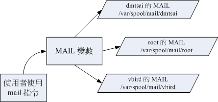

# 第十章、认识与学习 BASH

最近更新日期：20//

在 Linux 的环境下，如果你不懂 bash 是什么，那么其他的东西就不用学了！因为前面几章我们使用终端机下达指令的方式， 就是通过 bash 的环境来处理的喔！所以说，他很重要吧！bash 的东西非常的多，包括变量的设置与使用、 bash 操作环境的创建、数据流重导向的功能，还有那好用的管线命令！好好清一清脑门，准备用功去啰～ ^_^ 这个章节几乎是所有命令行界面 （command line） 与未来主机维护与管理的重要基础，一定要好好仔细的阅读喔！

# 10.1 认识 BASH 这个 Shell

## 10.1 认识 BASH 这个 Shell

我们在第一章 Linux 是什么当中提到了： 管理整个计算机硬件的其实是操作系统的核心 （kernel），这个核心是需要被保护的！ 所以我们一般使用者就只能通过 shell 来跟核心沟通，以让核心达到我们所想要达到的工作。 那么系统有多少 shell 可用呢？为什么我们要使用 bash 啊？下面分别来谈一谈喔！

### 10.1.1 硬件、核心与 Shell

这应该是个蛮有趣的话题：“什么是 Shell ”？相信只要摸过计算机，对于操作系统 （不论是 Linux 、 Unix 或者是 Windows） 有点概念的朋友们大多听过这个名词，因为只要有“操作系统”那么就离不开 Shell 这个东西。不过，在讨论 Shell 之前，我们先来了解一下计算机的运行状况吧！ 举个例子来说：当你要计算机传输出来“音乐”的时候，你的计算机需要什么东西呢？

1.  硬件：当然就是需要你的硬件有“声卡芯片”这个配备，否则怎么会有声音；
2.  核心管理：操作系统的核心可以支持这个芯片组，当然还需要提供芯片的驱动程序啰；
3.  应用程序：需要使用者 （就是你） 输入发生声音的指令啰！

这就是基本的一个输出声音所需要的步骤！也就是说，你必须要“输入”一个指令之后， “硬件”才会通过你下达的指令来工作！那么硬件如何知道你下达的指令呢？那就是 kernel （核心） 的控制工作了！也就是说，我们必须要通过“ Shell ”将我们输入的指令与 Kernel 沟通，好让 Kernel 可以控制硬件来正确无误的工作！ 基本上，我们可以通过下面这张图来说明一下：

图 10.1.1、硬件、核心与使用者的相关性图示

我们在第零章内的操作系统小节曾经提到过， 操作系统其实是一组软件，由于这组软件在控制整个硬件与管理系统的活动监测， 如果这组软件能被使用者随意的操作，若使用者应用不当，将会使得整个系统崩溃！因为操作系统管理的就是整个硬件功能嘛！ 所以当然不能够随便被一些没有管理能力的终端用户随意使用啰！

但是我们总是需要让使用者操作系统的，所以就有了在操作系统上面发展的应用程序啦！使用者可以通过应用程序来指挥核心， 让核心达成我们所需要的硬件任务！如果考虑如第零章所提供的操作系统图示（图 0.4.2）， 我们可以发现应用程序其实是在最外层，就如同鸡蛋的外壳一样，因此这个咚咚也就被称呼为壳程序 （shell） 啰！

其实壳程序的功能只是提供使用者操作系统的一个接口，因此这个壳程序需要可以调用其他软件才好。 我们在第四章到第九章提到过很多指令，包括 man, chmod, chown, vi, fdisk, mkfs 等等指令，这些指令都是独立的应用程序， 但是我们可以通过壳程序 （就是命令行界面） 来操作这些应用程序，让这些应用程序调用核心来运行所需的工作哩！ 这样对于壳程序是否有了一定的概念了？


**Tips** 也就是说，只要能够操作应用程序的接口都能够称为壳程序。狭义的壳程序指的是命令行方面的软件，包括本章要介绍的 bash 等。 广义的壳程序则包括图形接口的软件！因为图形接口其实也能够操作各种应用程序来调用核心工作啊！ 不过在本章中，我们主要还是在使用 bash 啦！

### 10.1.2 为何要学命令行的 shell？

命令行的 shell 是很不好学的，但是学了之后好处多多！所以， 在这里鸟哥要先对您进行一些心理建设，先来了解一下为啥学习 shell 是有好处的，这样你才会有信心继续玩下去 ^_^

*   命令行的 shell：大家都一样！

鸟哥常常听到这个问题：“我干嘛要学习 shell 呢？ 不是已经有很多的工具可以提供我设置我的主机了？我为何要花这么多时间去学指令呢？不是以 X Window 按一按几个按钮就可以搞定了吗？”唉～还是得一再地强调， X Window 还有 Web 接口的设置工具例如 Webmin [[1]](#ps1) 是真的好用的家伙， 他真的可以帮助我们很简易的设置好我们的主机，甚至是一些很进阶的设置都可以帮我们搞定。

但是鸟哥在前面的章节里面也已经提到过相当多次了， X Window 与 web 接口的工具，他的接口虽然好友，功能虽然强大， 但毕竟他是将所有利用到的软件都整合在一起的一组应用程序而已， 并非是一个完整的套件，所以某些时候当你升级或者是使用其他套件管理模块 （例如 tarball 而非 rpm 文件等等） 时，就会造成设置的困扰了。甚至不同的 distribution 所设计的 X window 接口也都不相同，这样也造成学习方面的困扰。

命令行的 shell 就不同了！几乎各家 distributions 使用的 bash 都是一样的！如此一来， 你就能够轻轻松松的转换不同的 distributions ，就像武侠小说里面提到的“一法通、万法通！”

*   远端管理：命令行就是比较快！

此外，Linux 的管理常常需要通过远端连线，而连线时命令行的传输速度一定比较快， 而且，较不容易出现断线或者是信息外流的问题，因此，shell 真的是得学习的一项工具。而且，他可以让您更深入 Linux ，更了解他，而不是只会按一按鼠标而已！所谓“天助自助者！”多摸一点文字模式的东西，会让你与 Linux 更亲近呢！

*   Linux 的任督二脉： shell 是也！

有些朋友也很可爱，常会说：“我学这么多干什么？ 又不常用，也用不到！”嘿嘿！有没有听过“书到用时方恨少？” 当你的主机一切安然无恙的时候，您当然会觉得好像学这么多的东西一点帮助也没有呀！ 万一，某一天真的不幸给他中标了，您该如何是好？是直接重新安装？ 还是先追踪入侵来源后进行漏洞的修补？或者是干脆就关站好了？这当然涉及很多的考虑， 但就以鸟哥的观点来看，多学一点总是好的，尤其我们可以有备而无患嘛！甚至学的不精也没有关系，了解概念也就 OK 啦！毕竟没有人要您一定要背这么多的内容啦！了解概念就很了不起了！

此外，如果你真的有心想要将您的主机管理的好，那么良好的 shell 程序编写是一定需要的啦！就鸟哥自己来说，鸟哥管理的主机虽然还不算多， 只有区区不到十部，但是如果每部主机都要花上几十分钟来查阅他的登录文件信息以及相关的讯息， 那么鸟哥可能会疯掉！基本上，也太没有效率了！这个时候，如果能够借由 shell 提供的数据流重导向以及管线命令，呵呵！ 那么鸟哥分析登录信息只要花费不到十分钟就可以看完所有的主机之重要信息了！相当的好用呢！

由于学习 shell 的好处真的是多多啦！所以，如果你是个系统管理员，或者有心想要管理系统的话，那么 shell 与 shell scripts 这个东西真的有必要看一看！因为他就像“打通任督二脉，任何武功都能随你应用”的说！

### 10.1.3 系统的合法 shell 与 /etc/shells 功能

知道什么是 Shell 之后，那么我们来了解一下 Linux 使用的是哪一个 shell 呢？什么！哪一个？难道说 shell 不就是“一个 shell 吗？”哈哈！那可不！由于早年的 Unix 年代，发展者众，所以由于 shell 依据发展者的不同就有许多的版本，例如常听到的 Bourne SHell （sh） 、在 Sun 里头默认的 C SHell、 商业上常用的 K SHell、, 还有 TCSH 等等，每一种 Shell 都各有其特点。至于 Linux 使用的这一种版本就称为“ Bourne Again SHell （简称 bash） ”，这个 Shell 是 Bourne Shell 的增强版本，也是基准于 GNU 的架构下发展出来的呦！

在介绍 shell 的优点之前，先来说一说 shell 的简单历史吧[[2]](#ps2)：第一个流行的 shell 是由 Steven Bourne 发展出来的，为了纪念他所以就称为 Bourne shell ，或直接简称为 sh ！而后来另一个广为流传的 shell 是由柏克莱大学的 Bill Joy 设计依附于 BSD 版的 Unix 系统中的 shell ，这个 shell 的语法有点类似 C 语言，所以才得名为 C shell ，简称为 csh ！由于在学术界 Sun 主机势力相当的庞大，而 Sun 主要是 BSD 的分支之一，所以 C shell 也是另一个很重要而且流传很广的 shell 之一 。


**Tips** 由于 Linux 为 C 程序语言撰写的，很多程序设计师使用 C 来开发软件，因此 C shell 相对的就很热门了。 另外，还记得我们在第一章、Linux 是什么提到的吧？ Sun 公司的创始人就是 Bill Joy，而 BSD 最早就是 Bill Joy 发展出来的啊。

那么目前我们的 Linux （以 CentOS 7.x 为例） 有多少我们可以使用的 shells 呢？ 你可以检查一下 /etc/shells 这个文件，至少就有下面这几个可以用的 shells （鸟哥省略了重复的 shell 了！包括 /bin/sh 等于 /usr/bin/sh 啰！）：

*   /bin/sh （已经被 /bin/bash 所取代）
*   /bin/bash （就是 Linux 默认的 shell）
*   /bin/tcsh （整合 C Shell ，提供更多的功能）
*   /bin/csh （已经被 /bin/tcsh 所取代）

虽然各家 shell 的功能都差不多，但是在某些语法的下达方面则有所不同，因此建议你还是得要选择某一种 shell 来熟悉一下较佳。 Linux 默认就是使用 bash ，所以最初你只要学会 bash 就非常了不起了！ ^_^！ 另外，咦！为什么我们系统上合法的 shell 要写入 /etc/shells 这个文件啊？ 这是因为系统某些服务在运行过程中，会去检查使用者能够使用的 shells ，而这些 shell 的查询就是借由 /etc/shells 这个文件啰！

举例来说，某些 FTP 网站会去检查使用者的可用 shell ，而如果你不想要让这些使用者使用 FTP 以外的主机资源时，可能会给予该使用者一些怪怪的 shell，让使用者无法以其他服务登陆主机。 这个时候，你就得将那些怪怪的 shell 写到 /etc/shells 当中了。举例来说，我们的 CentOS 7.x 的 /etc/shells 里头就有个 /sbin/nologin 文件的存在，这个就是我们说的怪怪的 shell 啰～

那么，再想一想，我这个使用者什么时候可以取得 shell 来工作呢？还有， 我这个使用者默认会取得哪一个 shell 啊？还记得我们在第四章的在终端接口登陆 linux 小节当中提到的登陆动作吧？ 当我登陆的时候，系统就会给我一个 shell 让我来工作了。 而这个登陆取得的 shell 就记录在 /etc/passwd 这个文件内！这个文件的内容是啥？

```
[dmtsai@study ~]$ cat /etc/passwd
root:x:0:0:root:/root:/bin/bash
bin:x:1:1:bin:/bin:/sbin/nologin
daemon:x:2:2:daemon:/sbin:/sbin/nologin
.....（下面省略）..... 
```

如上所示，在每一行的最后一个数据，就是你登陆后可以取得的默认的 shell 啦！那你也会看到， root 是 /bin/bash ，不过，系统帐号 bin 与 daemon 等等，就使用那个怪怪的 /sbin/nologin 啰～关于使用者这部分的内容，我们留在第十三章的帐号管理时提供更多的说明。

### 10.1.4 Bash shell 的功能

既然 /bin/bash 是 Linux 默认的 shell ，那么总是得了解一下这个玩意儿吧！bash 是 GNU 计划中重要的工具软件之一，目前也是 Linux distributions 的标准 shell 。 bash 主要相容于 sh ，并且依据一些使用者需求而加强的 shell 版本。不论你使用的是那个 distribution ，你都难逃需要学习 bash 的宿命啦！那么这个 shell 有什么好处，干嘛 Linux 要使用他作为默认的 shell 呢？ bash 主要的优点有下面几个：

*   命令编修能力 （history）：

bash 的功能里头，鸟哥个人认为相当棒的一个就是“他能记忆使用过的指令！” 这功能真的相当的棒！因为我只要在命令行按“上下键”就可以找到前/后一个输入的指令！而在很多 distribution 里头，默认的指令记忆功能可以到达 1000 个！也就是说，你曾经下达过的指令几乎都被记录下来了。

这么多的指令记录在哪里呢？在你的主文件夹内的 .bash_history 啦！ 不过，需要留意的是，~/.bash_history 记录的是前一次登陆以前所执行过的指令， 而至于这一次登陆所执行的指令都被暂存在内存中，当你成功的登出系统后，该指令记忆才会记录到 .bash_history 当中！

这有什么优点呢？最大的好处就是可以“查询曾经做过的举动！” 如此可以知道你的执行步骤，那么就可以追踪你曾下达过的指令，以作为除错的重要流程！ 但如此一来也有个烦恼，就是如果被骇客入侵了，那么他只要翻你曾经执行过的指令， 刚好你的指令又跟系统有关 （例如直接输入 MySQL 的密码在命令行上面），那你的服务器可就伤脑筋了！ 到底记录指令的数目越多还是越少越好？这部份是见仁见智啦，没有一定的答案的。

*   命令与文件补全功能： （[tab] 按键的好处）

还记得我们在第四章内的重要的几个热键小节当中提到的 [tab] 这个按键吗？这个按键的功能就是在 bash 里头才有的啦！常常在 bash 环境中使用 [tab] 是个很棒的习惯喔！因为至少可以让你 1）少打很多字； 2）确定输入的数据是正确的！ 使用 [tab] 按键的时机依据 [tab] 接在指令后或参数后而有所不同。我们再复习一次：

*   [Tab] 接在一串指令的第一个字的后面，则为命令补全；
*   [Tab] 接在一串指令的第二个字以后时，则为“文件补齐”！
*   若安装 bash-completion 软件，则在某些指令后面使用 [tab] 按键时，可以进行“选项/参数的补齐”功能！

所以说，如果我想要知道我的环境当中所有以 c 为开头的指令呢？就按下“ c[tab][tab] ”就好啦！ ^_^！ 是的！真的是很方便的功能，所以，有事没事，在 bash shell 下面，多按几次 [tab] 是一个不错的习惯啦！

*   命令别名设置功能： （alias）

假如我需要知道这个目录下面的所有文件 （包含隐藏文件） 及所有的文件属性，那么我就必须要下达“ ls -al ”这样的指令串，唉！真麻烦，有没有更快的取代方式？呵呵！就使用命令别名呀！例如鸟哥最喜欢直接以 lm 这个自订的命令来取代上面的命令，也就是说， lm 会等于 ls -al 这样的一个功能，嘿！那么要如何作呢？就使用 alias 即可！你可以在命令行输入 alias 就可以知道目前的命令别名有哪些了！也可以直接下达命令来设置别名呦：

*   alias lm='ls -al'

*   工作控制、前景背景控制： （job control, foreground, background）

这部分我们在第十六章 Linux 程序控制中再提及！ 使用前、背景的控制可以让工作进行的更为顺利！至于工作控制（jobs）的用途则更广， 可以让我们随时将工作丢到背景中执行！而不怕不小心使用了 [Ctrl] + c 来停掉该程序！真是好样的！此外，也可以在单一登陆的环境中，达到多任务的目的呢！

*   程序化脚本： （shell scripts）

在 DOS 年代还记得将一堆指令写在一起的所谓的“批处理文件”吧？在 Linux 下面的 shell scripts 则发挥更为强大的功能，可以将你平时管理系统常需要下达的连续指令写成一个文件， 该文件并且可以通过对谈互动式的方式来进行主机的侦测工作！也可以借由 shell 提供的环境变量及相关指令来进行设计，哇！整个设计下来几乎就是一个小型的程序语言了！该 scripts 的功能真的是超乎鸟哥的想像之外！以前在 DOS 下面需要程序语言才能写的东西，在 Linux 下面使用简单的 shell scripts 就可以帮你达成了！真的厉害！这部分我们在第十二章再来谈！

*   万用字符： （Wildcard）

除了完整的字串之外， bash 还支持许多的万用字符来帮助使用者查询与指令下达。 举例来说，想要知道 /usr/bin 下面有多少以 X 为开头的文件吗？使用：“ ls -l /usr/bin/X* ”就能够知道啰～此外，还有其他可供利用的万用字符， 这些都能够加快使用者的操作呢！

总之，bash 这么好！不学吗？怎么可能！来学吧！ ^_^

### 10.1.5 查询指令是否为 Bash shell 的内置命令： type

我们在第四章提到关于 Linux 的线上说明文档部分，也就是 man page 的内容，那么 bash 有没有什么说明文档啊？开玩笑～ 这么棒的东西怎么可能没有说明文档！请你在 shell 的环境下，直接输入 man bash 瞧一瞧， 嘿嘿！不是盖的吧！让你看个几天几夜也无法看完的 bash 说明文档，可是很详尽的数据啊！ ^_^

不过，在这个 bash 的 man page 当中，不知道你是否有察觉到，咦！ 怎么这个说明文档里面有其他的文件说明啊？举例来说，那个 cd 指令的说明就在这个 man page 内？ 然后我直接输入 man cd 时，怎么出现的画面中，最上方竟然出现一堆指令的介绍？这是怎么回事？ 为了方便 shell 的操作，其实 bash 已经“内置”了很多指令了，例如上面提到的 cd ， 还有例如 umask 等等的指令，都是内置在 bash 当中的呢！

那我怎么知道这个指令是来自于外部指令（指的是其他非 bash 所提供的指令） 或是内置在 bash 当中的呢？ 嘿嘿！利用 type 这个指令来观察即可！举例来说：

```
[dmtsai@study ~]$ type [-tpa] name
选项与参数：
    ：不加任何选项与参数时，type 会显示出 name 是外部指令还是 bash 内置指令
-t  ：当加入 -t 参数时，type 会将 name 以下面这些字眼显示出他的意义：
      file    ：表示为外部指令；
      alias   ：表示该指令为命令别名所设置的名称；
      builtin ：表示该指令为 bash 内置的指令功能；
-p  ：如果后面接的 name 为外部指令时，才会显示完整文件名；
-a  ：会由 PATH 变量定义的路径中，将所有含 name 的指令都列出来，包含 alias

范例一：查询一下 ls 这个指令是否为 bash 内置？
[dmtsai@study ~]$ type ls
ls is aliased to `ls --color=auto' &lt;==未加任何参数，列出 ls 的最主要使用情况
[dmtsai@study ~]$ type -t ls
alias                              &lt;==仅列出 ls 执行时的依据
[dmtsai@study ~]$ type -a ls
ls is aliased to `ls --color=auto' &lt;==最先使用 aliase
ls is /usr/bin/ls                  &lt;==还有找到外部指令在 /bin/ls

范例二：那么 cd 呢？
[dmtsai@study ~]$ type cd
cd is a shell builtin              &lt;==看到了吗？ cd 是 shell 内置指令 
```

通过 type 这个指令我们可以知道每个指令是否为 bash 的内置指令。 此外，由于利用 type 搜寻后面的名称时，如果后面接的名称并不能以可执行文件的状态被找到， 那么该名称是不会被显示出来的。也就是说， type 主要在找出“可执行文件”而不是一般文件文件名喔！ 呵呵！所以，这个 type 也可以用来作为类似 which 指令的用途啦！找指令用的！

### 10.1.6 指令的下达与快速编辑按钮

我们在第四章的开始下达指令小节已经提到过在 shell 环境下的指令下达方法，如果你忘记了请回到第四章再去回忆一下！这里不重复说明了。 鸟哥这里仅就反斜线 （\） 来说明一下指令下达的方式啰！

```
范例：如果指令串太长的话，如何使用两行来输出？
[dmtsai@study ~]$ cp /var/spool/mail/root /etc/crontab \
&gt; /etc/fstab /root 
```

上面这个指令用途是将三个文件复制到 /root 这个目录下而已。不过，因为指令太长， 于是鸟哥就利用“ [Enter] ”来将 [Enter] 这个按键“跳脱！”开来，让 [Enter] 按键不再具有“开始执行”的功能！好让指令可以继续在下一行输入。 需要特别留意， [Enter] 按键是紧接着反斜线 （\） 的，两者中间没有其他字符。 因为 \ 仅跳脱“紧接着的下一个字符”而已！所以，万一我写成： “ \ [Enter] ”，亦即 [Enter] 与反斜线中间有一个空格时，则 \ 跳脱的是“空白键”而不是 [Enter] 按键！这个地方请再仔细的看一遍！很重要！

如果顺利跳脱 [Enter] 后，下一行最前面就会主动出现 > 的符号， 你可以继续输入指令啰！也就是说，那个 > 是系统自动出现的，你不需要输入。

另外，当你所需要下达的指令特别长，或者是你输入了一串错误的指令时，你想要快速的将这串指令整个删除掉，一般来说，我们都是按下删除键的。 有没有其他的快速组合键可以协助呢？是有的！常见的有下面这些：

| 组合键 | 功能与示范 |
| --- | --- |
| [ctrl]+u/[ctrl]+k | 分别是从光标处向前删除指令串 （[ctrl]+u） 及向后删除指令串 （[ctrl]+k）。 |
| [ctrl]+a/[ctrl]+e | 分别是让光标移动到整个指令串的最前面 （[ctrl]+a） 或最后面 （[ctrl]+e）。 |

总之，当我们顺利的在终端机 （tty） 上面登陆后， Linux 就会依据 /etc/passwd 文件的设置给我们一个 shell （默认是 bash），然后我们就可以依据上面的指令下达方式来操作 shell， 之后，我们就可以通过 man 这个线上查询来查询指令的使用方式与参数说明， 很不错吧！那么我们就赶紧更进一步来操作 bash 这个好玩的东西啰！

# 10.2 Shell 的变量功能

## 10.2 Shell 的变量功能

变量是 bash 环境中非常重要的一个玩意儿，我们知道 Linux 是多用户多任务的环境，每个人登陆系统都能取得一个 bash shell， 每个人都能够使用 bash 下达 mail 这个指令来收受“自己”的邮件等等。问题是， bash 是如何得知你的邮件信箱是哪个文件？ 这就需要“变量”的帮助啦！所以，你说变量重不重要呢？下面我们将介绍重要的环境变量、变量的取用与设置等数据， 呼呼！动动脑时间又来到啰！^_^

### 10.2.1 什么是变量？

那么，什么是“变量”呢？简单的说，就是让某一个特定字串代表不固定的内容就是了。举个大家在国中都会学到的数学例子， 那就是：“ y = ax + b ”这东西，在等号左边的（y）就是变量，在等号右边的（ax+b）就是变量内容。 要注意的是，左边是未知数，右边是已知数喔！ 讲的更简单一点，我们可以“用一个简单的 "字眼" 来取代另一个比较复杂或者是容易变动的数据”。这有什么好处啊？最大的好处就是“方便！”。

*   变量的可变性与方便性

举例来说，我们每个帐号的邮件信箱默认是以 MAIL 这个变量来进行存取的， 当 dmtsai 这个使用者登陆时，他便会取得 MAIL 这个变量，而这个变量的内容其实就是 /var/spool/mail/dmtsai， 那如果 vbird 登陆呢？他取得的 MAIL 这个变量的内容其实就是 /var/spool/mail/vbird 。 而我们使用信件读取指令 mail 来读取自己的邮件信箱时，嘿嘿，这支程序可以直接读取 MAIL 这个变量的内容， 就能够自动的分辨出属于自己的信箱信件啰！这样一来，设计程序的设计师就真的很方便的啦！

图 10.2.1、程序、变量与不同使用者的关系

如上图所示，由于系统已经帮我们规划好 MAIL 这个变量，所以使用者只要知道 mail 这个指令如何使用即可， mail 会主动的取用 MAIL 这个变量，就能够如上图所示的取得自己的邮件信箱了！（注意大小写，小写的 mail 是指令， 大写的 MAIL 则是变量名称喔！）

那么使用变量真的比较好吗？这是当然的！想像一个例子，如果 mail 这个指令将 root 收信的邮件信箱 （mailbox） 文件名为 /var/spool/mail/root 直接写入程序码中。那么当 dmtsai 要使用 mail 时，将会取得 /var/spool/mail/root 这个文件的内容！ 不合理吧！所以你就需要帮 dmtsai 也设计一个 mail 的程序，将 /var/spool/mail/dmtsai 写死到 mail 的程序码当中！ 天呐！那系统要有多少个 mail 指令啊？反过来说，使用变量就变的很简单了！因为你不需要更动到程序码啊！ 只要将 MAIL 这个变量带入不同的内容即可让所有使用者通过 mail 取得自己的信件！当然简单多了！

*   影响 bash 环境操作的变量

某些特定变量会影响到 bash 的环境喔！举例来说，我们前面已经提到过很多次的那个 PATH 变量！ 你能不能在任何目录下执行某个指令，与 PATH 这个变量有很大的关系。例如你下达 ls 这个指令时，系统就是通过 PATH 这个变量里面的内容所记录的路径顺序来搜寻指令的呢！如果在搜寻完 PATH 变量内的路径还找不到 ls 这个指令时， 就会在屏幕上显示“ command not found ”的错误讯息了。

如果说的学理一点，那么由于在 Linux System 下面，所有的线程都是需要一个执行码， 而就如同上面提到的，你“真正以 shell 来跟 Linux 沟通，是在正确的登陆 Linux 之后！”这个时候你就有一个 bash 的执行程序，也才可以真正的经由 bash 来跟系统沟通啰！而在进入 shell 之前，也正如同上面提到的，由于系统需要一些变量来提供他数据的存取 （或者是一些环境的设置参数值， 例如是否要显示彩色等等的） ，所以就有一些所谓的“环境变量” 需要来读入系统中了！这些环境变量例如 PATH、HOME、MAIL、SHELL 等等，都是很重要的， 为了区别与自订变量的不同，环境变量通常以大写字符来表示呢！

*   脚本程序设计 （shell script） 的好帮手

这些还都只是系统默认的变量的目的，如果是个人的设置方面的应用呢：例如你要写一个大型的 script 时，有些数据因为可能由于使用者习惯的不同而有差异，比如说路径好了，由于该路径在 script 被使用在相当多的地方，如果下次换了一部主机，都要修改 script 里面的所有路径，那么我一定会疯掉！ 这个时候如果使用变量，而将该变量的定义写在最前面，后面相关的路径名称都以变量来取代， 嘿嘿！那么你只要修改一行就等于修改整篇 script 了！方便的很！所以，良好的程序设计师都会善用变量的定义！

图 10.2.2、变量应用于 shell script 的示意图

最后我们就简单的对“什么是变量”作个简单定义好了： “变量就是以一组文字或符号等，来取代一些设置或者是一串保留的数据！”， 例如：我设置了“myname”就是“VBird”，所以当你读取 myname 这个变量的时候，系统自然就会知道！哈！那就是 VBird 啦！ 那么如何“显示变量”呢？这就需要使用到 echo 这个指令啦！

### 10.2.2 变量的取用与设置：echo, 变量设置规则, unset

说的口沫横飞的，也不知道“变量”与“变量代表的内容”有啥关系？ 那我们就将“变量”的“内容”拿出来给您瞧瞧好了。你可以利用 echo 这个指令来取用变量， 但是，变量在被取用时，前面必须要加上钱字号“ $ ”才行，举例来说，要知道 PATH 的内容，该如何是好？

*   变量的取用: echo

```
[dmtsai@study ~]$ echo $variable
[dmtsai@study ~]$ echo $PATH
/usr/local/bin:/usr/bin:/usr/local/sbin:/usr/sbin:/home/dmtsai/.local/bin:/home/dmtsai/bin
[dmtsai@study ~]$ echo ${PATH}  # 近年来，鸟哥比较偏向使用这种格式喔！ 
```

变量的取用就如同上面的范例，利用 echo 就能够读出，只是需要在变量名称前面加上 $ ， 或者是以 ${变量} 的方式来取用都可以！当然啦，那个 echo 的功能可是很多的， 我们这里单纯是拿 echo 来读出变量的内容而已，更多的 echo 使用，请自行给他 man echo 吧！ ^_^

例题：请在屏幕上面显示出您的环境变量 HOME 与 MAIL：答：`echo $HOME` 或者是 `echo ${HOME}`，`echo $MAIL` 或者是 `echo ${MAIL}`

现在我们知道了变量与变量内容之间的相关性了，好了，那么我要如何“设置”或者是“修改” 某个变量的内容啊？很简单啦！用“等号（=）”连接变量与他的内容就好啦！举例来说： 我要将 myname 这个变量名称的内容设置为 VBird ，那么：

```
[dmtsai@study ~]$ echo ${myname}
       &lt;==这里并没有任何数据～因为这个变量尚未被设置！是空的！
[dmtsai@study ~]$ myname=VBird
[dmtsai@study ~]$ echo ${myname}
VBird  &lt;==出现了！因为这个变量已经被设置了！ 
```

瞧！如此一来，这个变量名称 myname 的内容就带有 VBird 这个数据啰～ 而由上面的例子当中，我们也可以知道： 在 bash 当中，当一个变量名称尚未被设置时，默认的内容是“空”的。 另外，变量在设置时，还是需要符合某些规定的，否则会设置失败喔！这些规则如下所示啊！


**Tips** 要请各位读者注意喔，每一种 shell 的语法都不相同～在变量的使用上，bash 在你没有设置的变量中强迫去 echo 时，它会显示出空的值。 在其他某些 shell 中，随便去 echo 一个不存在的变量，它是会出现错误讯息的喔！要注意！要注意！

*   变量的设置规则

*   变量与变量内容以一个等号“=”来链接，如下所示： “myname=VBird”

*   等号两边不能直接接空白字符，如下所示为错误： “myname = VBird”或“myname=VBird Tsai”

*   变量名称只能是英文字母与数字，但是开头字符不能是数字，如下为错误： “2myname=VBird”

*   变量内容若有空白字符可使用双引号“"”或单引号“'”将变量内容结合起来，但

    *   双引号内的特殊字符如 $ 等，可以保有原本的特性，如下所示： “var="lang is $LANG"”则“echo $var”可得“lang is zh_TW.UTF-8”
    *   单引号内的特殊字符则仅为一般字符 （纯文本），如下所示： “var='lang is $LANG'”则“echo $var”可得“lang is $LANG”
*   可用跳脱字符“ \ ”将特殊符号（如 [Enter], $, \, 空白字符, '等）变成一般字符，如： “myname=VBird\ Tsai”

*   在一串指令的执行中，还需要借由其他额外的指令所提供的信息时，可以使用反单引号“`指令`”或 “$（指令）”。特别注意，那个 ` 是键盘上方的数字键 1 左边那个按键，而不是单引号！ 例如想要取得核心版本的设置： “version=$（uname -r）”再“echo $version”可得“3.10.0-229.el7.x86_64”

*   若该变量为扩增变量内容时，则可用 "$变量名称" 或 ${变量} 累加内容，如下所示： “PATH="$PATH":/home/bin”或“PATH=${PATH}:/home/bin”

*   若该变量需要在其他子程序执行，则需要以 export 来使变量变成环境变量： “export PATH”

*   通常大写字符为系统默认变量，自行设置变量可以使用小写字符，方便判断 （纯粹依照使用者兴趣与嗜好） ；

*   取消变量的方法为使用 unset ：“unset 变量名称”例如取消 myname 的设置： “unset myname”

下面让鸟哥举几个例子来让你试看看，就知道怎么设置好你的变量啰！

```
范例一：设置一变量 name ，且内容为 VBird
[dmtsai@study ~]$ 12name=VBird
bash: 12name=VBird: command not found...  &lt;==屏幕会显示错误！因为不能以数字开头！
[dmtsai@study ~]$ name = VBird            &lt;==还是错误！因为有空白！
[dmtsai@study ~]$ name=VBird              &lt;==OK 的啦！

范例二：承上题，若变量内容为 VBird's name 呢，就是变量内容含有特殊符号时：
[dmtsai@study ~]$ name=VBird's name  
# 单引号与双引号必须要成对，在上面的设置中仅有一个单引号，因此当你按下 enter 后，
# 你还可以继续输入变量内容。这与我们所需要的功能不同，失败啦！
# 记得，失败后要复原请按下 [ctrl]-c 结束！
[dmtsai@study ~]$ name="VBird's name"    &lt;==OK 的啦！
# 指令是由左边向右找→，先遇到的引号先有用，因此如上所示， 单引号变成一般字符！
[dmtsai@study ~]$ name='VBird's name'    &lt;==失败的啦！
# 因为前两个单引号已成对，后面就多了一个不成对的单引号了！因此也就失败了！
[dmtsai@study ~]$ name=VBird\'s\ name     &lt;==OK 的啦！
# 利用反斜线 （\） 跳脱特殊字符，例如单引号与空白键，这也是 OK 的啦！

范例三：我要在 PATH 这个变量当中“累加”:/home/dmtsai/bin 这个目录
[dmtsai@study ~]$ PATH=$PATH:/home/dmtsai/bin
[dmtsai@study ~]$ PATH="$PATH":/home/dmtsai/bin
[dmtsai@study ~]$ PATH=${PATH}:/home/dmtsai/bin
# 上面这三种格式在 PATH 里头的设置都是 OK 的！但是下面的例子就不见得啰！

范例四：承范例三，我要将 name 的内容多出 "yes" 呢？
[dmtsai@study ~]$ name=$nameyes  
# 知道了吧？如果没有双引号，那么变量成了啥？name 的内容是 $nameyes 这个变量！
# 呵呵！我们可没有设置过 nameyes 这个变量呐！所以，应该是下面这样才对！
[dmtsai@study ~]$ name="$name"yes
[dmtsai@study ~]$ name=${name}yes  &lt;==以此例较佳！

范例五：如何让我刚刚设置的 name=VBird 可以用在下个 shell 的程序？
[dmtsai@study ~]$ name=VBird
[dmtsai@study ~]$ bash        &lt;==进入到所谓的子程序
[dmtsai@study ~]$ echo $name  &lt;==子程序：再次的 echo 一下；
       &lt;==嘿嘿！并没有刚刚设置的内容喔！
[dmtsai@study ~]$ exit        &lt;==子程序：离开这个子程序
[dmtsai@study ~]$ export name
[dmtsai@study ~]$ bash        &lt;==进入到所谓的子程序
[dmtsai@study ~]$ echo $name  &lt;==子程序：在此执行！
VBird  &lt;==看吧！出现设置值了！
[dmtsai@study ~]$ exit        &lt;==子程序：离开这个子程序 
```

什么是“子程序”呢？就是说，在我目前这个 shell 的情况下，去启用另一个新的 shell ，新的那个 shell 就是子程序啦！在一般的状态下，父程序的自订变量是无法在子程序内使用的。但是通过 export 将变量变成环境变量后，就能够在子程序下面应用了！很不赖吧！至于程序的相关概念， 我们会在第十六章程序管理当中提到的喔！

```
范例六：如何进入到您目前核心的模块目录？
[dmtsai@study ~]$ cd /lib/modules/`uname -r`/kernel
[dmtsai@study ~]$ cd /lib/modules/$（uname -r）/kernel  # 以此例较佳！ 
```

每个 Linux 都能够拥有多个核心版本，且几乎 distribution 的核心版本都不相同。以 CentOS 7.1 （未更新前） 为例，他的默认核心版本是 3.10.0-229.el7.x86_64 ，所以核心模块目录在 /lib/modules/3.10.0-229.el7.x86_64/kernel/ 内。 也由于每个 distributions 的这个值都不相同，但是我们却可以利用 uname -r 这个指令先取得版本信息。所以啰，就可以通过上面指令当中的内含指令 $（uname -r） 先取得版本输出到 cd ... 那个指令当中，就能够顺利的进入目前核心的驱动程序所放置的目录啰！很方便吧！

其实上面的指令可以说是作了两次动作，亦即是：

1.  先进行反单引号内的动作“uname -r”并得到核心版本为 3.10.0-229.el7.x86_64
2.  将上述的结果带入原指令，故得指令为：“cd /lib/modules/3.10.0-229.el7.x86_64/kernel/”


**Tips** 为什么鸟哥比较建议记忆 $（ command ） 呢？还记得小时候学数学的加减乘除，我们都知道得要先乘除后加减。那如果硬要先加减再乘除呢？ 当然就是加上括号 （） 来处理即可啊！所以啰，这个指令的处理方式也差不多，只是括号左边得要加个钱字号就是了！

```
范例七：取消刚刚设置的 name 这个变量内容
[dmtsai@study ~]$ unset name 
```

根据上面的案例你可以试试看！就可以了解变量的设置啰！这个是很重要的呦！请勤加练习！ 其中，较为重要的一些特殊符号的使用啰！例如单引号、双引号、跳脱字符、钱字号、反单引号等等，下面的例题想一想吧！

例题：在变量的设置当中，单引号与双引号的用途有何不同？ 答：单引号与双引号的最大不同在于双引号仍然可以保有变量的内容，但单引号内仅能是一般字符 ，而不会有特殊符号。我们以下面的例子做说明：假设您定义了一个变量， name=VBird ，现在想以 name 这个变量的内容定义出 myname 显示 VBird its me 这个内容，要如何订定呢？

> [dmtsai@study ~]$ name=VBird > [dmtsai@study ~]$ echo $name > VBird > [dmtsai@study ~]$ myname="$name its me" > [dmtsai@study ~]$ echo $myname > VBird its me > [dmtsai@study ~]$ myname='$name its me' > [dmtsai@study ~]$ echo $myname > $name its me

发现了吗？没错！使用了单引号的时候，那么 $name 将失去原有的变量内容，仅为一般字符的显示型态而已！这里必需要特别小心在意！

例题：在指令下达的过程中，反单引号（ `）这个符号代表的意义为何？答：在一串指令中，在` 之内的指令将会被先执行，而其执行出来的结果将做为外部的输入信息！例如 uname -r 会显示出目前的核心版本，而我们的核心版本在 /lib/modules 里面，因此，你可以先执行 uname -r 找出核心版本，然后再以“ cd 目录”到该目录下，当然也可以执行如同上面范例六的执行内容啰。

另外再举个例子，我们也知道， locate 指令可以列出所有的相关文件文件名，但是，如果我想要知道各个文件的权限呢？举例来说，我想要知道每个 crontab 相关文件名的权限：

> [dmtsai@study ~]$ ls -ld `locate crontab` > [dmtsai@study ~]$ ls -ld $（locate crontab）

如此一来，先以 locate 将文件名数据都列出来，再以 ls 指令来处理的意思啦！瞭了吗？ ^_^

例题：若你有一个常去的工作目录名称为：“/cluster/server/work/taiwan_2015/003/”，如何进行该目录的简化？答：在一般的情况下，如果你想要进入上述的目录得要“cd /cluster/server/work/taiwan_2015/003/”， 以鸟哥自己的案例来说，鸟哥跑数值模式常常会设置很长的目录名称（避免忘记），但如此一来变换目录就很麻烦。 此时，鸟哥习惯利用下面的方式来降低指令下达错误的问题：

> [dmtsai@study ~]$ work="/cluster/server/work/taiwan_2015/003/" > [dmtsai@study ~]$ cd $work

未来我想要使用其他目录作为我的模式工作目录时，只要变更 work 这个变量即可！而这个变量又可以在 bash 的配置文件（~/.bashrc）中直接指定，那我每次登陆只要执行“ cd $work ”就能够去到数值模式仿真的工作目录了！是否很方便呢？ ^_^

### 10.2.3 环境变量的功能

环境变量可以帮我们达到很多功能～包括主文件夹的变换啊、提示字符的显示啊、可执行文件搜寻的路径啊等等的， 还有很多很多啦！那么，既然环境变量有那么多的功能，问一下，目前我的 shell 环境中， 有多少默认的环境变量啊？我们可以利用两个指令来查阅，分别是 env 与 export 呢！

*   用 env 观察环境变量与常见环境变量说明

```
范例一：列出目前的 shell 环境下的所有环境变量与其内容。
[dmtsai@study ~]$ env
HOSTNAME=study.centos.vbird    &lt;== 这部主机的主机名称
TERM=xterm                     &lt;== 这个终端机使用的环境是什么类型
SHELL=/bin/bash                &lt;== 目前这个环境下，使用的 Shell 是哪一个程序？
HISTSIZE=1000                  &lt;== “记录指令的笔数”在 CentOS 默认可记录 1000 笔
OLDPWD=/home/dmtsai            &lt;== 上一个工作目录的所在
LC_ALL=en_US.utf8              &lt;== 由于语系的关系，鸟哥偷偷丢上来的一个设置
USER=dmtsai                    &lt;== 使用者的名称啊！
LS_COLORS=rs=0:di=01;34:ln=01;36:mh=00:pi=40;33:so=01;35:do=01;35:bd=40;33;01:cd=40;33;01:
or=40;31;01:mi=01;05;37;41:su=37;41:sg=30;43:ca=30;41:tw=30;42:ow=34;42:st=37;44:ex=01;32:
*.tar=01...                    &lt;== 一些颜色显示
MAIL=/var/spool/mail/dmtsai    &lt;== 这个使用者所取用的 mailbox 位置
PATH=/usr/local/bin:/usr/bin:/usr/local/sbin:/usr/sbin:/home/dmtsai/.local/bin:/home/dmtsai/bin
PWD=/home/dmtsai               &lt;== 目前使用者所在的工作目录 （利用 pwd 取出！）
LANG=zh_TW.UTF-8               &lt;== 这个与语系有关，下面会再介绍！
HOME=/home/dmtsai              &lt;== 这个使用者的主文件夹啊！
LOGNAME=dmtsai                 &lt;== 登陆者用来登陆的帐号名称
_=/usr/bin/env                 &lt;== 上一次使用的指令的最后一个参数（或指令本身） 
```

env 是 environment （环境） 的简写啊，上面的例子当中，是列出来所有的环境变量。当然，如果使用 export 也会是一样的内容～ 只不过， export 还有其他额外的功能就是了，我们等一下再提这个 export 指令。 那么上面这些变量有些什么功用呢？下面我们就一个一个来分析分析！

*   HOME 代表使用者的主文件夹。还记得我们可以使用 cd ~ 去到自己的主文件夹吗？或者利用 cd 就可以直接回到使用者主文件夹了。那就是取用这个变量啦～ 有很多程序都可能会取用到这个变量的值！

*   SHELL 告知我们，目前这个环境使用的 SHELL 是哪支程序？ Linux 默认使用 /bin/bash 的啦！

*   HISTSIZE 这个与“历史命令”有关，亦即是， 我们曾经下达过的指令可以被系统记录下来，而记录的“笔数”则是由这个值来设置的。

*   MAIL 当我们使用 mail 这个指令在收信时，系统会去读取的邮件信箱文件 （mailbox）。

*   PATH 就是可执行文件搜寻的路径啦～目录与目录中间以冒号（:）分隔， 由于文件的搜寻是依序由 PATH 的变量内的目录来查询，所以，目录的顺序也是重要的喔。

*   LANG 这个重要！就是语系数据啰～很多讯息都会用到他， 举例来说，当我们在启动某些 perl 的程序语言文件时，他会主动的去分析语系数据文件， 如果发现有他无法解析的编码语系，可能会产生错误喔！一般来说，我们中文编码通常是 zh_TW.Big5 或者是 zh_TW.UTF-8，这两个编码偏偏不容易被解译出来，所以，有的时候，可能需要修订一下语系数据。 这部分我们会在下个小节做介绍的！

*   RANDOM 这个玩意儿就是“随机乱数”的变量啦！目前大多数的 distributions 都会有乱数产生器，那就是 /dev/random 这个文件。 我们可以通过这个乱数文件相关的变量 （$RANDOM） 来随机取得乱数值喔。在 BASH 的环境下，这个 RANDOM 变量的内容，介于 0~32767 之间，所以，你只要 echo $RANDOM 时，系统就会主动的随机取出一个介于 0~32767 的数值。万一我想要使用 0~9 之间的数值呢？呵呵～利用 declare 宣告数值类型， 然后这样做就可以了：

    ```
    [dmtsai@study ~]$ declare -i number=$RANDOM*10/32768 ; echo $number
    8   &lt;== 此时会随机取出 0~9 之间的数值喔！ 
    ```

大致上是有这些环境变量啦～里面有些比较重要的参数，在下面我们都会另外进行一些说明的～

*   用 set 观察所有变量 （含环境变量与自订变量）

bash 可不只有环境变量喔，还有一些与 bash 操作接口有关的变量，以及使用者自己定义的变量存在的。 那么这些变量如何观察呢？这个时候就得要使用 set 这个指令了。 set 除了环境变量之外， 还会将其他在 bash 内的变量通通显示出来哩！信息很多，下面鸟哥仅列出几个重要的内容：

```
[dmtsai@study ~]$ set
BASH=/bin/bash                        &lt;== bash 的主程序放置路径
BASH_VERSINFO=（[0]="4" [1]="2" [2]="46" [3]="1" [4]="release" [5]="x86_64-redhat-linux-gnu"）
BASH_VERSION='4.2.46（1）-release'      &lt;== 这两行是 bash 的版本啊！
COLUMNS=90                            &lt;== 在目前的终端机环境下，使用的字段有几个字符长度
HISTFILE=/home/dmtsai/.bash_history   &lt;== 历史命令记录的放置文件，隐藏文件
HISTFILESIZE=1000                     &lt;== 存起来（与上个变量有关）的文件之指令的最大纪录笔数。
HISTSIZE=1000                         &lt;== 目前环境下，内存中记录的历史命令最大笔数。
IFS=$' \t\n'                          &lt;== 默认的分隔符号
LINES=20                              &lt;== 目前的终端机下的最大行数
MACHTYPE=x86_64-redhat-linux-gnu      &lt;== 安装的机器类型
OSTYPE=linux-gnu                      &lt;== 操作系统的类型！
PS1='[\u@\h \W]\$ '                   &lt;== PS1 就厉害了。这个是命令提示字符，也就是我们常见的
                                          [root@www ~]# 或 [dmtsai ~]$ 的设置值啦！可以更动的！
PS2='&gt; '                              &lt;== 如果你使用跳脱符号 （\） 第二行以后的提示字符也
$                                     &lt;== 目前这个 shell 所使用的 PID
?                                     &lt;== 刚刚执行完指令的回传值。
...
# 有许多可以使用的函数库功能被鸟哥取消啰！请自行查阅！ 
```

一般来说，不论是否为环境变量，只要跟我们目前这个 shell 的操作接口有关的变量， 通常都会被设置为大写字符，也就是说，“基本上，在 Linux 默认的情况中，使用{大写的字母}来设置的变量一般为系统内定需要的变量”。 OK！OK！那么上头那些变量当中，有哪些是比较重要的？大概有这几个吧！

*   PS1：（提示字符的设置）

这是 PS1 （数字的 1 不是英文字母），这个东西就是我们的“命令提示字符”喔！ 当我们每次按下 [Enter] 按键去执行某个指令后，最后要再次出现提示字符时， 就会主动去读取这个变量值了。上头 PS1 内显示的是一些特殊符号，这些特殊符号可以显示不同的信息， 每个 distributions 的 bash 默认的 PS1 变量内容可能有些许的差异，不要紧，“习惯你自己的习惯”就好了。 你可以用 man bash [[3]](#ps3)去查询一下 PS1 的相关说明，以理解下面的一些符号意义。

*   \d ：可显示出“星期 月 日”的日期格式，如："Mon Feb 2"
*   \H ：完整的主机名称。举例来说，鸟哥的练习机为“study.centos.vbird”
*   \h ：仅取主机名称在第一个小数点之前的名字，如鸟哥主机则为“study”后面省略
*   \t ：显示时间，为 24 小时格式的“HH:MM:SS”
*   \T ：显示时间，为 12 小时格式的“HH:MM:SS”
*   \A ：显示时间，为 24 小时格式的“HH:MM”
*   \@ ：显示时间，为 12 小时格式的“am/pm”样式
*   \u ：目前使用者的帐号名称，如“dmtsai”；
*   \v ：BASH 的版本信息，如鸟哥的测试主机版本为 4.2.46（1）-release，仅取“4.2”显示
*   \w ：完整的工作目录名称，由根目录写起的目录名称。但主文件夹会以 ~ 取代；
*   \W ：利用 basename 函数取得工作目录名称，所以仅会列出最后一个目录名。
*   # ：下达的第几个指令。
*   $ ：提示字符，如果是 root 时，提示字符为 # ，否则就是 $ 啰～

好了，让我们来看看 CentOS 默认的 PS1 内容吧：“[\u@\h \W]$ ”，现在你知道那些反斜线后的数据意义了吧？ 要注意喔！那个反斜线后的数据为 PS1 的特殊功能，与 bash 的变量设置没关系啦！不要搞混了喔！ 那你现在知道为何你的命令提示字符是：“ [dmtsai@study ~]$ ”了吧？好了，那么假设我想要有类似下面的提示字符：

> [dmtsai@study /home/dmtsai 16:50 #12]$

那个 # 代表第 12 次下达的指令。那么应该如何设置 PS1 呢？可以这样啊：

```
[dmtsai@study ~]$ cd /home
[dmtsai@study home]$ PS1='[\u@\h \w \A #\#]\$ '
[dmtsai@study /home 17:02 #85]$
# 看到了吗？提示字符变了！变的很有趣吧！其中，那个 #85 比较有趣，
# 如果您再随便输入几次 ls 后，该数字就会增加喔！为啥？上面有说明滴！ 
```

*   $：（关于本 shell 的 PID）

钱字号本身也是个变量喔！这个咚咚代表的是“目前这个 Shell 的线程代号”，亦即是所谓的 PID （Process ID）。 更多的程序观念，我们会在第四篇的时候提及。想要知道我们的 shell 的 PID ，就可以用：“ echo $$ ”即可！出现的数字就是你的 PID 号码。

*   ?：（关于上个执行指令的回传值）

虾密？问号也是一个特殊的变量？没错！在 bash 里面这个变量可重要的很！ 这个变量是：“上一个执行的指令所回传的值”， 上面这句话的重点是“上一个指令”与“回传值”两个地方。当我们执行某些指令时， 这些指令都会回传一个执行后的代码。一般来说，如果成功的执行该指令， 则会回传一个 0 值，如果执行过程发生错误，就会回传“错误代码”才对！一般就是以非为 0 的数值来取代。 我们以下面的例子来看看：

```
[dmtsai@study ~]$ echo $SHELL
/bin/bash                                  &lt;==可顺利显示！没有错误！
[dmtsai@study ~]$ echo $?
0                                          &lt;==因为没问题，所以回传值为 0
[dmtsai@study ~]$ 12name=VBird
bash: 12name=VBird: command not found...   &lt;==发生错误了！bash 回报有问题
[dmtsai@study ~]$ echo $?
127                                        &lt;==因为有问题，回传错误代码（非为 0）
# 错误代码回传值依据软件而有不同，我们可以利用这个代码来搜寻错误的原因喔！
[dmtsai@study ~]$ echo $?
0
# 咦！怎么又变成正确了？这是因为 "?" 只与“上一个执行指令”有关，
# 所以，我们上一个指令是执行“ echo $? ”，当然没有错误，所以是 0 没错！ 
```

*   OSTYPE, HOSTTYPE, MACHTYPE：（主机硬件与核心的等级）

我们在第零章、计算机概论内的 CPU 等级说明中谈过 CPU ， 目前个人计算机的 CPU 主要分为 32/64 位，其中 32 位又可分为 i386, i586, i686，而 64 位则称为 x86_64。 由于不同等级的 CPU 指令集不太相同，因此你的软件可能会针对某些 CPU 进行最优化，以求取较佳的软件性能。 所以软件就有 i386, i686 及 x86_64 之分。以目前 （2015） 的主流硬件来说，几乎都是 x86_64 的天下！ 因此 CentOS 7 开始，已经不支持 i386 相容模式的安装光盘了～哇呜！进步的太快了！

要留意的是，较高阶的硬件通常会向下相容旧有的软件，但较高阶的软件可能无法在旧机器上面安装！ 我们在第二章就曾说明过， 这里再强调一次，你可以在 x86_64 的硬件上安装 i386 的 Linux 操作系统，但是你无法在 i686 的硬件上安装 x86_64 的 Linux 操作系统！这点得要牢记在心！

*   export： 自订变量转成环境变量

谈了 env 与 set 现在知道有所谓的环境变量与自订变量，那么这两者之间有啥差异呢？其实这两者的差异在于“ 该变量是否会被子程序所继续引用”啦！唔！那么啥是父程序？子程序？ 这就得要了解一下指令的下达行为了。

当你登陆 Linux 并取得一个 bash 之后，你的 bash 就是一个独立的程序，这个程序的识别使用的是一个称为程序识别码，被称为 PID 的就是。 接下来你在这个 bash 下面所下达的任何指令都是由这个 bash 所衍生出来的，那些被下达的指令就被称为子程序了。 我们可以用下面的图示来简单的说明一下父程序与子程序的概念：

图 10.2.3、程序相关性示意图

如上所示，我们在原本的 bash 下面执行另一个 bash ，结果操作的环境接口会跑到第二个 bash 去（就是子程序）， 那原本的 bash 就会在暂停的情况 （睡着了，就是 sleep）。整个指令运行的环境是实线的部分！若要回到原本的 bash 去， 就只有将第二个 bash 结束掉 （下达 exit 或 logout） 才行。更多的程序概念我们会在第四篇谈及，这里只要有这个概念即可。

这个程序概念与变量有啥关系啊？关系可大了！因为子程序仅会继承父程序的环境变量， 子程序不会继承父程序的自订变量啦！所以你在原本 bash 的自订变量在进入了子程序后就会消失不见， 一直到你离开子程序并回到原本的父程序后，这个变量才会又出现！

换个角度来想，也就是说，如果我能将自订变量变成环境变量的话，那不就可以让该变量值继续存在于子程序了？ 呵呵！没错！此时，那个 export 指令就很有用啦！如你想要让该变量内容继续的在子程序中使用，那么就请执行：

```
[dmtsai@study ~]$ export 变量名称 
```

这东西用在“分享自己的变量设置给后来调用的文件或其他程序”啦！ 像鸟哥常常在自己的主文件后面调用其他附属文件（类似函数的功能），但是主文件与附属文件内都有相同的变量名称， 若一再重复设置时，要修改也很麻烦，此时只要在原本的第一个文件内设置好“ export 变量 ”， 后面所调用的文件就能够使用这个变量设置了！而不需要重复设置，这非常实用于 shell script 当中喔！ 如果仅下达 export 而没有接变量时，那么此时将会把所有的“环境变量”秀出来喔！例如：

```
[dmtsai@study ~]$ export
declare -x HISTSIZE="1000"
declare -x HOME="/home/dmtsai"
declare -x HOSTNAME="study.centos.vbird"
declare -x LANG="zh_TW.UTF-8"
declare -x LC_ALL="en_US.utf8"
# 后面的鸟哥就都直接省略了！不然....浪费版面～ ^_^ 
```

那如何将环境变量转成自订变量呢？可以使用本章后续介绍的 declare 呢！

### 10.2.4 影响显示结果的语系变量 （locale）

还记得我们在第四章里面提到的语系问题吗？ 就是当我们使用 man command 的方式去查询某个数据的说明文档时，该说明文档的内容可能会因为我们使用的语系不同而产生乱码。 另外，利用 ls 查询文件的时间时，也可能会有乱码出现在时间的部分。那个问题其实就是语系的问题啦。

目前大多数的 Linux distributions 已经都是支持日渐流行的万国码了，也都支持大部分的国家语系。 那么我们的 Linux 到底支持了多少的语系呢？这可以由 locale 这个指令来查询到喔！

```
[dmtsai@study ~]$ locale -a
....（前面省略）....
zh_TW
zh_TW.big5     &lt;==大五码的中文编码
zh_TW.euctw
zh_TW.utf8     &lt;==万国码的中文编码
zu_ZA
zu_ZA.iso88591
zu_ZA.utf8 
```

正体中文语系至少支持了两种以上的编码，一种是目前还是很常见的 big5 ，另一种则是越来越热门的 utf-8 编码。 那么我们如何修订这些编码呢？其实可以通过下面这些变量的说：

```
[dmtsai@study ~]$ locale  &lt;==后面不加任何选项与参数即可！
LANG=en_US                   &lt;==主语言的环境
LC_CTYPE="en_US"             &lt;==字符（文字）辨识的编码
LC_NUMERIC="en_US"           &lt;==数字系统的显示讯息
LC_TIME="en_US"              &lt;==时间系统的显示数据
LC_COLLATE="en_US"           &lt;==字串的比较与排序等
LC_MONETARY="en_US"          &lt;==币值格式的显示等
LC_MESSAGES="en_US"          &lt;==讯息显示的内容，如功能表、错误讯息等
LC_ALL=                      &lt;==整体语系的环境
....（后面省略）.... 
```

基本上，你可以逐一设置每个与语系有关的变量数据，但事实上，如果其他的语系变量都未设置， 且你有设置 LANG 或者是 LC_ALL 时，则其他的语系变量就会被这两个变量所取代！ 这也是为什么我们在 Linux 当中，通常说明仅设置 LANG 或 LC_ALL 这两个变量而已，因为他是最主要的设置变量！ 好了，那么你应该要觉得奇怪的是，为什么在 Linux 主机的终端机接口 （tty1 ~ tty6） 的环境下，如果设置“ LANG=zh_TW.utf8 ”这个设置值生效后，使用 man 或者其他讯息输出时， 都会有一堆乱码，尤其是使用 ls -l 这个参数时？

因为在 Linux 主机的终端机接口环境下是无法显示像中文这么复杂的编码文字， 所以就会产生乱码了。也就是如此，我们才会必须要在 tty1 ~ tty6 的环境下， 加装一些中文化接口的软件，才能够看到中文啊！不过，如果你是在 MS Windows 主机以远端连线服务器的软件连线到主机的话，那么，嘿嘿！其实命令行确实是可以看到中文的。 此时反而你得要在 LC_ALL 设置中文编码才好呢！


**Tips** 无论如何，如果发生一些乱码的问题，那么设置系统里面保有的语系编码， 例如： en_US 或 en_US.utf8 等等的设置，应该就 OK 的啦！好了，那么系统默认支持多少种语系呢？ 当我们使用 locale 时，系统是列出目前 Linux 主机内保有的语系文件， 这些语系文件都放置在： /usr/lib/locale/ 这个目录中。

你当然可以让每个使用者自己去调整自己喜好的语系，但是整体系统默认的语系定义在哪里呢？ 其实就是在 /etc/locale.conf 啰！这个文件在 CentOS 7.x 的内容有点像这样：

```
[dmtsai@study ~]$ cat /etc/locale.conf
LANG=zh_TW.utf8
LC_NUMERIC=zh_TW.UTF-8
LC_TIME=zh_TW.UTF-8
LC_MONETARY=zh_TW.UTF-8
LC_PAPER=zh_TW.UTF-8
LC_MEASUREMENT=zh_TW.UTF-8 
```

因为鸟哥在第三章的安装时选择的是中文语系安装画面， 所以这个文件默认就会使用中文编码啦！你也可以自行将他改成你想要的语系编码即可。


**Tips** 假设你有一个纯文本原本是在 Windows 下面创建的，那么这个文件默认可能是 big5 的编码格式。 在你将这个文件上传到 Linux 主机后，在 X window 下面打开时，咦！怎么中文字通通变成乱码了？ 别担心！因为如上所示， Linux 目前大多默认是万国码显示嘛！你只要将打开该文件的软件编码由 utf8 改成 big5 就能够看到正确的中文了！

例题：鸟哥原本是中文语系，所有显示的数据通通是中文。但为了网页显示的关系，需要将输出转成英文 （en_US.utf8） 的语系来展示才行。 但鸟哥又不想要写入配置文件！毕竟是暂时显示用的～那该如何处理？答：其实不很难，重点是 LANG 及 LC_ALL 而已！但在 CentOS 7 当中，你要让 LC_ALL 生效时，得要使用 export 转成环境变量才行耶！ 所以就是这样搞：

```
[dmtsai@study ~]$ locale
LANG=zh_TW.UTF-8
LC_CTYPE="zh_TW.UTF-8"
LC_NUMERIC="zh_TW.UTF-8"
LC_TIME="zh_TW.UTF-8"

[dmtsai@study ~]$ LANG=en_US.utf8; locale
[dmtsai@study ~]$ export LC_ALL=en_US.utf8; locale  # 你就会看到与上头有不同的语系啰！ 
```

### 10.2.5 变量的有效范围

虾密？变量也有使用的“范围”？没错啊～我们在上头的 export 指令说明中，就提到了这个概念了。如果在跑程序的时候，有父程序与子程序的不同程序关系时， 则“变量”可否被引用与 export 有关。被 export 后的变量，我们可以称他为“环境变量”！ 环境变量可以被子程序所引用，但是其他的自订变量内容就不会存在于子程序中。


**Tips** 在某些不同的书籍会谈到“全域变量, global variable”与“区域变量, local variable”。 在鸟哥的这个章节中，基本上你可以这样看待： 环境变量=全域变量 自订变量=区域变量

在学理方面，为什么环境变量的数据可以被子程序所引用呢？这是因为内存配置的关系！理论上是这样的：

*   当启动一个 shell，操作系统会分配一记忆区块给 shell 使用，此内存内之变量可让子程序取用
*   若在父程序利用 export 功能，可以让自订变量的内容写到上述的记忆区块当中（环境变量）；
*   当载入另一个 shell 时 （亦即启动子程序，而离开原本的父程序了），子 shell 可以将父 shell 的环境变量所在的记忆区块导入自己的环境变量区块当中。

通过这样的关系，我们就可以让某些变量在相关的程序之间存在，以帮助自己更方便的操作环境喔！ 不过要提醒的是，这个“环境变量”与“bash 的操作环境”意思不太一样，举例来说， PS1 并不是环境变量， 但是这个 PS1 会影响到 bash 的接口 （提示字符嘛）！相关性要厘清喔！^_^

### 10.2.6 变量键盘读取、阵列与宣告： read, array, declare

我们上面提到的变量设置功能，都是由命令行直接设置的，那么，可不可以让使用者能够经由键盘输入？ 什么意思呢？是否记得某些程序执行的过程当中，会等待使用者输入 "yes/no" 之类的讯息啊？ 在 bash 里面也有相对应的功能喔！此外，我们还可以宣告这个变量的属性，例如：阵列或者是数字等等的。下面就来看看吧！

*   read

要读取来自键盘输入的变量，就是用 read 这个指令了。这个指令最常被用在 shell script 的撰写当中， 想要跟使用者对谈？用这个指令就对了。关于 script 的写法，我们会在第十三章介绍，下面先来瞧一瞧 read 的相关语法吧！

```
[dmtsai@study ~]$ read [-pt] variable
选项与参数：
-p  ：后面可以接提示字符！
-t  ：后面可以接等待的“秒数！”这个比较有趣～不会一直等待使用者啦！

范例一：让使用者由键盘输入一内容，将该内容变成名为 atest 的变量
[dmtsai@study ~]$ read atest
This is a test        &lt;==此时光标会等待你输入！请输入左侧文字看看
[dmtsai@study ~]$ echo ${atest}
This is a test          &lt;==你刚刚输入的数据已经变成一个变量内容！

范例二：提示使用者 30 秒内输入自己的大名，将该输入字串作为名为 named 的变量内容
[dmtsai@study ~]$ read -p "Please keyin your name: " -t 30 named
Please keyin your name: VBird Tsai   &lt;==注意看，会有提示字符喔！
[dmtsai@study ~]$ echo ${named}
VBird Tsai        &lt;==输入的数据又变成一个变量的内容了！ 
```

read 之后不加任何参数，直接加上变量名称，那么下面就会主动出现一个空白行等待你的输入（如范例一）。 如果加上 -t 后面接秒数，例如上面的范例二，那么 30 秒之内没有任何动作时， 该指令就会自动略过了～如果是加上 -p ，嘿嘿！在输入的光标前就会有比较多可以用的提示字符给我们参考！ 在指令的下达里面，比较美观啦！ ^_^

*   declare / typeset

declare 或 typeset 是一样的功能，就是在“宣告变量的类型”。如果使用 declare 后面并没有接任何参数，那么 bash 就会主动的将所有的变量名称与内容通通叫出来，就好像使用 set 一样啦！ 那么 declare 还有什么语法呢？看看先：

```
[dmtsai@study ~]$ declare [-aixr] variable
选项与参数：
-a  ：将后面名为 variable 的变量定义成为阵列 （array） 类型
-i  ：将后面名为 variable 的变量定义成为整数数字 （integer） 类型
-x  ：用法与 export 一样，就是将后面的 variable 变成环境变量；
-r  ：将变量设置成为 readonly 类型，该变量不可被更改内容，也不能 unset

范例一：让变量 sum 进行 100+300+50 的加总结果
[dmtsai@study ~]$ sum=100+300+50
[dmtsai@study ~]$ echo ${sum}
100+300+50  &lt;==咦！怎么没有帮我计算加总？因为这是文字体态的变量属性啊！
[dmtsai@study ~]$ declare -i sum=100+300+50
[dmtsai@study ~]$ echo ${sum}
450         &lt;==瞭乎？？ 
```

由于在默认的情况下面， bash 对于变量有几个基本的定义：

*   变量类型默认为“字串”，所以若不指定变量类型，则 1+2 为一个“字串”而不是“计算式”。 所以上述第一个执行的结果才会出现那个情况的；
*   bash 环境中的数值运算，默认最多仅能到达整数形态，所以 1/3 结果是 0；

现在你晓得为啥你需要进行变量宣告了吧？如果需要非字串类型的变量，那就得要进行变量的宣告才行啦！ 下面继续来玩些其他的 declare 功能。

```
范例二：将 sum 变成环境变量
[dmtsai@study ~]$ declare -x sum
[dmtsai@study ~]$ export &#124; grep sum
declare -ix sum="450"  &lt;==果然出现了！包括有 i 与 x 的宣告！

范例三：让 sum 变成只读属性，不可更动！
[dmtsai@study ~]$ declare -r sum
[dmtsai@study ~]$ sum=tesgting
-bash: sum: readonly variable  &lt;==老天爷～不能改这个变量了！

范例四：让 sum 变成非环境变量的自订变量吧！
[dmtsai@study ~]$ declare +x sum  &lt;== 将 - 变成 + 可以进行“取消”动作
[dmtsai@study ~]$ declare -p sum  &lt;== -p 可以单独列出变量的类型
declare -ir sum="450" &lt;== 看吧！只剩下 i, r 的类型，不具有 x 啰！ 
```

declare 也是个很有用的功能～尤其是当我们需要使用到下面的阵列功能时， 他也可以帮我们宣告阵列的属性喔！不过，老话一句，阵列也是在 shell script 比较常用的啦！ 比较有趣的是，如果你不小心将变量设置为“只读”，通常得要登出再登陆才能复原该变量的类型了！ @_@

*   阵列 （array） 变量类型

某些时候，我们必须使用阵列来宣告一些变量，这有什么好处啊？在一般人的使用上， 果然是看不出来有什么好处的！不过，如果您曾经写过程序的话，那才会比较了解阵列的意义～ 阵列对写数值程序的设计师来说，可是不能错过学习的重点之一哩！好！不啰唆～ 那么要如何设置阵列的变量与内容呢？在 bash 里头，阵列的设置方式是：

> var[index]=content

意思是说，我有一个阵列名称为 var ，而这个阵列的内容为 var[1]=小明， var[2]=大明， var[3]=好明 .... 等等，那个 index 就是一些数字啦，重点是用中刮号 （[ ]） 来设置的。 目前我们 bash 提供的是一维阵列。老实说，如果您不必写一些复杂的程序， 那么这个阵列的地方，可以先略过，等到有需要再来学习即可！因为要制作出阵列， 通常与循环或者其他判断式交互使用才有比较高的存在意义！

```
范例：设置上面提到的 var[1] ～ var[3] 的变量。
[dmtsai@study ~]$ var[1]="small min"
[dmtsai@study ~]$ var[2]="big min"
[dmtsai@study ~]$ var[3]="nice min"
[dmtsai@study ~]$ echo "${var[1]}, ${var[2]}, ${var[3]}"
small min, big min, nice min 
```

阵列的变量类型比较有趣的地方在于“读取”，一般来说，建议直接以 ${阵列} 的方式来读取，比较正确无误的啦！这也是为啥鸟哥一开始就建议你使用 ${变量} 来记忆的原因！

### 10.2.7 与文件系统及程序的限制关系： ulimit

想像一个状况：我的 Linux 主机里面同时登陆了十个人，这十个人不知怎么搞的， 同时打开了 100 个文件，每个文件的大小约 10MBytes ，请问一下， 我的 Linux 主机的内存要有多大才够？ 10*100*10 = 10000 MBytes = 10GBytes ... 老天爷，这样，系统不挂点才有鬼哩！为了要预防这个情况的发生，所以我们的 bash 是可以“限制使用者的某些系统资源”的，包括可以打开的文件数量， 可以使用的 CPU 时间，可以使用的内存总量等等。如何设置？用 ulimit 吧！

```
[dmtsai@study ~]$ ulimit [-SHacdfltu] [配额]
选项与参数：
-H  ：hard limit ，严格的设置，必定不能超过这个设置的数值；
-S  ：soft limit ，警告的设置，可以超过这个设置值，但是若超过则有警告讯息。
      在设置上，通常 soft 会比 hard 小，举例来说，soft 可设置为 80 而 hard
      设置为 100，那么你可以使用到 90 （因为没有超过 100），但介于 80~100 之间时，
      系统会有警告讯息通知你！
-a  ：后面不接任何选项与参数，可列出所有的限制额度；
-c  ：当某些程序发生错误时，系统可能会将该程序在内存中的信息写成文件（除错用），
      这种文件就被称为核心文件（core file）。此为限制每个核心文件的最大容量。
-f  ：此 shell 可以创建的最大文件大小（一般可能设置为 2GB）单位为 KBytes
-d  ：程序可使用的最大断裂内存（segment）容量；
-l  ：可用于锁定 （lock） 的内存量
-t  ：可使用的最大 CPU 时间 （单位为秒）
-u  ：单一使用者可以使用的最大程序（process）数量。

范例一：列出你目前身份（假设为一般帐号）的所有限制数据数值
[dmtsai@study ~]$ ulimit -a
core file size          （blocks, -c） 0          &lt;==只要是 0 就代表没限制
data seg size           （kBytes, -d） unlimited
scheduling priority             （-e） 0
file size               （blocks, -f） unlimited  &lt;==可创建的单一文件的大小
pending signals                 （-i） 4903
max locked memory       （kBytes, -l） 64
max memory size         （kBytes, -m） unlimited
open files                      （-n） 1024       &lt;==同时可打开的文件数量
pipe size            （512 Bytes, -p） 8
POSIX message queues     （Bytes, -q） 819200
real-time priority              （-r） 0
stack size              （kBytes, -s） 8192
cpu time               （seconds, -t） unlimited
max user processes              （-u） 4096
virtual memory          （kBytes, -v） unlimited
file locks                      （-x） unlimited

范例二：限制使用者仅能创建 10MBytes 以下的容量的文件
[dmtsai@study ~]$ ulimit -f 10240
[dmtsai@study ~]$ ulimit -a &#124; grep 'file size'
core file size          （blocks, -c） 0
file size               （blocks, -f） 10240 &lt;==最大量为 10240Kbyes，相当 10MBytes

[dmtsai@study ~]$ dd if=/dev/zero of=123 bs=1M count=20
File size limit exceeded （core dumped） &lt;==尝试创建 20MB 的文件，结果失败了！

[dmtsai@study ~]$ rm 123  &lt;==赶快将这个文件删除啰！同时你得要登出再次的登陆才能解开 10M 的限制 
```

还记得我们在第七章 Linux 磁盘文件系统里面提到过，单一 filesystem 能够支持的单一文件大小与 block 的大小有关。但是文件系统的限制容量都允许的太大了！如果想要让使用者创建的文件不要太大时， 我们是可以考虑用 ulimit 来限制使用者可以创建的文件大小喔！利用 ulimit -f 就可以来设置了！例如上面的范例二，要注意单位喔！单位是 KBytes。 若改天你一直无法创建一个大容量的文件，记得瞧一瞧 ulimit 的信息喔！


**Tips** 想要复原 ulimit 的设置最简单的方法就是登出再登陆，否则就是得要重新以 ulimit 设置才行！ 不过，要注意的是，一般身份使用者如果以 ulimit 设置了 -f 的文件大小， 那么他“只能继续减小文件大小，不能增加文件大小喔！”另外，若想要管控使用者的 ulimit 限值， 可以参考第十三章的 pam 的介绍。

### 10.2.8 变量内容的删除、取代与替换 （Optional）

变量除了可以直接设置来修改原本的内容之外，有没有办法通过简单的动作来将变量的内容进行微调呢？ 举例来说，进行变量内容的删除、取代与替换等！是可以的！我们可以通过几个简单的小步骤来进行变量内容的微调喔！ 下面就来试试看！

*   变量内容的删除与取代

变量的内容可以很简单的通过几个咚咚来进行删除喔！我们使用 PATH 这个变量的内容来做测试好了。 请你依序进行下面的几个例子来玩玩，比较容易感受的到鸟哥在这里想要表达的意义：

```
范例一：先让小写的 path 自订变量设置的与 PATH 内容相同
[dmtsai@study ~]$ path=${PATH}
[dmtsai@study ~]$ echo ${path}
/usr/local/bin:/usr/bin:/usr/local/sbin:/usr/sbin:/home/dmtsai/.local/bin:/home/dmtsai/bin

范例二：假设我不喜欢 local/bin，所以要将前 1 个目录删除掉，如何显示？
[dmtsai@study ~]$ echo ${path#/*local/bin:}
/usr/bin:/usr/local/sbin:/usr/sbin:/home/dmtsai/.local/bin:/home/dmtsai/bin 
```

上面这个范例很有趣的！他的重点可以用下面这张表格来说明：

```
${variable#/*local/bin:}
 上面的特殊字体部分是关键字！用在这种删除模式所必须存在的

${variable#/*local/bin:}
 这就是原本的变量名称，以上面范例二来说，这里就填写 path 这个“变量名称”啦！

${variable#/*local/bin:}
 这是重点！代表“从变量内容的最前面开始向右删除”，且仅删除最短的那个

${variable#/*local/bin:}
 代表要被删除的部分，由于 # 代表由前面开始删除，所以这里便由开始的 / 写起。
   需要注意的是，我们还可以通过万用字符 * 来取代 0 到无穷多个任意字符

 以上面范例二的结果来看， path 这个变量被删除的内容如下所示：
/usr/local/bin:/usr/bin:/usr/local/sbin:/usr/sbin:/home/dmtsai/.local/bin:/home/dmtsai/bin 
```

很有趣吧！这样了解了 # 的功能了吗？接下来让我们来看看下面的范例三！

```
范例三：我想要删除前面所有的目录，仅保留最后一个目录
[dmtsai@study ~]$ echo ${path#/*:}
/usr/bin:/usr/local/sbin:/usr/sbin:/home/dmtsai/.local/bin:/home/dmtsai/bin
# 由于一个 # 仅删除掉最短的那个，因此他删除的情况可以用下面的删除线来看：
# /usr/local/bin:/usr/bin:/usr/local/sbin:/usr/sbin:/home/dmtsai/.local/bin:/home/dmtsai/bin

[dmtsai@study ~]$ echo ${path##/*:}
/home/dmtsai/bin
# 嘿！多加了一个 # 变成 ## 之后，他变成“删除掉最长的那个数据”！亦即是：
# /usr/local/bin:/usr/bin:/usr/local/sbin:/usr/sbin:/home/dmtsai/.local/bin:/home/dmtsai/bin 
```

非常有趣！不是吗？因为在 PATH 这个变量的内容中，每个目录都是以冒号“:”隔开的， 所以要从头删除掉目录就是介于斜线 （/） 到冒号 （:） 之间的数据！但是 PATH 中不止一个冒号 （:） 啊！ 所以 # 与 ## 就分别代表：

*   # ：符合取代文字的“最短的”那一个；

*   ## ：符合取代文字的“最长的”那一个

上面谈到的是“从前面开始删除变量内容”，那么如果想要“从后面向前删除变量内容”呢？ 这个时候就得使用百分比 （%） 符号了！来看看范例四怎么做吧！

```
范例四：我想要删除最后面那个目录，亦即从 : 到 bin 为止的字串
[dmtsai@study ~]$ echo ${path%:*bin}
/usr/local/bin:/usr/bin:/usr/local/sbin:/usr/sbin:/home/dmtsai/.local/bin
# 注意啊！最后面一个目录不见去！
# 这个 % 符号代表由最后面开始向前删除！所以上面得到的结果其实是来自如下：
# /usr/local/bin:/usr/bin:/usr/local/sbin:/usr/sbin:/home/dmtsai/.local/bin:/home/dmtsai/bin

范例五：那如果我只想要保留第一个目录呢？
[dmtsai@study ~]$ echo ${path%%:*bin}
/usr/local/bin
# 同样的， %% 代表的则是最长的符合字串，所以结果其实是来自如下：
# /usr/local/bin:/usr/bin:/usr/local/sbin:/usr/sbin:/home/dmtsai/.local/bin:/home/dmtsai/bin 
```

由于我是想要由变量内容的后面向前面删除，而我这个变量内容最后面的结尾是“/home/dmtsai/bin”， 所以你可以看到上面我删除的数据最终一定是“bin”，亦即是“:*bin”那个* 代表万用字符！ 至于 % 与 %% 的意义其实与 # 及 ## 类似！这样理解否？

例题：假设你是 dmtsai ，那你的 MAIL 变量应该是 /var/spool/mail/dmtsai 。假设你只想要保留最后面那个文件名 （dmtsai）， 前面的目录名称都不要了，如何利用 $MAIL 变量来达成？答：题意其实是这样“/var/spool/mail/dmtsai”，亦即删除掉两条斜线间的所有数据（最长符合）。 这个时候你就可以这样做即可：

```
[dmtsai@study ~]$ echo ${MAIL##/*/} 
```

相反的，如果你只想要拿掉文件名，保留目录的名称，亦即是“/var/spool/mail/dmtsai” （最短符合）。但假设你并不知道结尾的字母为何，此时你可以利用万用字符来处理即可，如下所示：

```
[dmtsai@study ~]$ echo ${MAIL%/*} 
```

了解了删除功能后，接下来谈谈取代吧！继续玩玩范例六啰！

```
范例六：将 path 的变量内容内的 sbin 取代成大写 SBIN：
[dmtsai@study ~]$ echo ${path/sbin/SBIN}
/usr/local/bin:/usr/bin:/usr/local/SBIN:/usr/sbin:/home/dmtsai/.local/bin:/home/dmtsai/bin
# 这个部分就容易理解的多了！关键字在于那两个斜线，两斜线中间的是旧字串
# 后面的是新字串，所以结果就会出现如上述的特殊字体部分啰！

[dmtsai@study ~]$ echo ${path//sbin/SBIN}
/usr/local/bin:/usr/bin:/usr/local/SBIN:/usr/SBIN:/home/dmtsai/.local/bin:/home/dmtsai/bin
# 如果是两条斜线，那么就变成所有符合的内容都会被取代喔！ 
```

我们将这部份作个总结说明一下：

| 变量设置方式 | 说明 |
| --- | --- |
| `${变量#关键字}` `${变量##关键字}` | 若变量内容从头开始的数据符合“关键字”，则将符合的最短数据删除 若变量内容从头开始的数据符合“关键字”，则将符合的最长数据删除 |
| `${变量%关键字}` `${变量%%关键字}` | 若变量内容从尾向前的数据符合“关键字”，则将符合的最短数据删除 若变量内容从尾向前的数据符合“关键字”，则将符合的最长数据删除 |
| `${变量/旧字串/新字串}` `${变量//旧字串/新字串}` | 若变量内容符合“旧字串”则“第一个旧字串会被新字串取代” 若变量内容符合“旧字串”则“全部的旧字串会被新字串取代” |

*   变量的测试与内容替换

在某些时刻我们常常需要“判断”某个变量是否存在，若变量存在则使用既有的设置，若变量不存在则给予一个常用的设置。 我们举下面的例子来说明好了，看看能不能较容易被你所理解呢！

```
范例一：测试一下是否存在 username 这个变量，若不存在则给予 username 内容为 root
[dmtsai@study ~]$ echo ${username}
           &lt;==由于出现空白，所以 username 可能不存在，也可能是空字串
[dmtsai@study ~]$ username=${username-root}
[dmtsai@study ~]$ echo ${username}
root       &lt;==因为 username 没有设置，所以主动给予名为 root 的内容。
[dmtsai@study ~]$ username="vbird tsai" &lt;==主动设置 username 的内容
[dmtsai@study ~]$ username=${username-root}
[dmtsai@study ~]$ echo ${username}
vbird tsai &lt;==因为 username 已经设置了，所以使用旧有的设置而不以 root 取代 
```

在上面的范例中，重点在于减号“ - ”后面接的关键字！基本上你可以这样理解：

```
new_var=${old_var-content}
   新的变量，主要用来取代旧变量。新旧变量名称其实常常是一样的

new_var=${old_var-content}
   这是本范例中的关键字部分！必须要存在的哩！

new_var=${old_var-content}
   旧的变量，被测试的项目！

new_var=${old_var-content}
   变量的“内容”，在本范例中，这个部分是在“给予未设置变量的内容” 
```

不过这还是有点问题！因为 username 可能已经被设置为“空字串”了！果真如此的话，那你还可以使用下面的范例来给予 username 的内容成为 root 喔！

```
范例二：若 username 未设置或为空字串，则将 username 内容设置为 root
[dmtsai@study ~]$ username=""
[dmtsai@study ~]$ username=${username-root}
[dmtsai@study ~]$ echo ${username}
      &lt;==因为 username 被设置为空字串了！所以当然还是保留为空字串！
[dmtsai@study ~]$ username=${username:-root}
[dmtsai@study ~]$ echo ${username}
root  &lt;==加上“ : ”后若变量内容为空或者是未设置，都能够以后面的内容替换！ 
```

在大括号内有没有冒号“ : ”的差别是很大的！加上冒号后，被测试的变量未被设置或者是已被设置为空字串时， 都能够用后面的内容 （本例中是使用 root 为内容） 来替换与设置！这样可以了解了吗？除了这样的测试之外， 还有其他的测试方法喔！鸟哥将他整理如下：


**Tips** 下面的例子当中，那个 var 与 str 为变量，我们想要针对 str 是否有设置来决定 var 的值喔！ 一般来说， str: 代表“str 没设置或为空的字串时”；至于 str 则仅为“没有该变量”。

| 变量设置方式 | str 没有设置 | str 为空字串 | str 已设置非为空字串 |
| --- | --- | --- | --- |
| var=${str-expr} | var=expr | var= | var=$str |
| var=${str:-expr} | var=expr | var=expr | var=$str |
| var=${str+expr} | var= | var=expr | var=expr |
| var=${str:+expr} | var= | var= | var=expr |
| var=${str=expr} | str=expr var=expr | str 不变 var= | str 不变 var=$str |
| var=${str:=expr} | str=expr var=expr | str=expr var=expr | str 不变 var=$str |
| var=${str?expr} | expr 输出至 stderr | var= | var=$str |
| var=${str:?expr} | expr 输出至 stderr | expr 输出至 stderr | var=$str |

根据上面这张表，我们来进行几个范例的练习吧！ ^_^！首先让我们来测试一下，如果旧变量 （str） 不存在时， 我们要给予新变量一个内容，若旧变量存在则新变量内容以旧变量来替换，结果如下：

```
测试：先假设 str 不存在 （用 unset） ，然后测试一下减号 （-） 的用法：
[dmtsai@study ~]$ unset str; var=${str-newvar}
[dmtsai@study ~]$ echo "var=${var}, str=${str}"
var=newvar, str=        &lt;==因为 str 不存在，所以 var 为 newvar

测试：若 str 已存在，测试一下 var 会变怎样？：
[dmtsai@study ~]$ str="oldvar"; var=${str-newvar}
[dmtsai@study ~]$ echo "var=${var}, str=${str}"
var=oldvar, str=oldvar  &lt;==因为 str 存在，所以 var 等于 str 的内容 
```

关于减号 （-） 其实上面我们谈过了！这里的测试只是要让你更加了解，这个减号的测试并不会影响到旧变量的内容。 如果你想要将旧变量内容也一起替换掉的话，那么就使用等号 （=） 吧！

```
测试：先假设 str 不存在 （用 unset） ，然后测试一下等号 （=） 的用法：
[dmtsai@study ~]$ unset str; var=${str=newvar}
[dmtsai@study ~]$ echo "var=${var}, str=${str}"
var=newvar, str=newvar  &lt;==因为 str 不存在，所以 var/str 均为 newvar

测试：如果 str 已存在了，测试一下 var 会变怎样？
[dmtsai@study ~]$ str="oldvar"; var=${str=newvar}
[dmtsai@study ~]$ echo "var=${var}, str=${str}"
var=oldvar, str=oldvar  &lt;==因为 str 存在，所以 var 等于 str 的内容 
```

那如果我只是想知道，如果旧变量不存在时，整个测试就告知我“有错误”，此时就能够使用问号“ ? ”的帮忙啦！ 下面这个测试练习一下先！

```
测试：若 str 不存在时，则 var 的测试结果直接显示 "无此变量"
[dmtsai@study ~]$ unset str; var=${str?无此变量}
-bash: str: 无此变量    &lt;==因为 str 不存在，所以输出错误讯息

测试：若 str 存在时，则 var 的内容会与 str 相同！
[dmtsai@study ~]$ str="oldvar"; var=${str?novar}
[dmtsai@study ~]$ echo "var=${var}, str=${str}"
var=oldvar, str=oldvar  &lt;==因为 str 存在，所以 var 等于 str 的内容 
```

基本上这种变量的测试也能够通过 shell script 内的 if...then... 来处理， 不过既然 bash 有提供这么简单的方法来测试变量，那我们也可以多学一些嘛！ 不过这种变量测试通常是在程序设计当中比较容易出现，如果这里看不懂就先略过，未来有用到判断变量值时，再回来看看吧！ ^_^

# 10.3 命令别名与历史命令

## 10.3 命令别名与历史命令

我们知道在早期的 DOS 年代，清除屏幕上的信息可以使用 cls 来清除，但是在 Linux 里面， 我们则是使用 clear 来清除画面的。那么可否让 cls 等于 clear 呢？可以啊！用啥方法？ link file 还是什么的？别急！下面我们介绍不用 link file 的命令别名来达成。那么什么又是历史命令？ 曾经做过的举动我们可以将他记录下来喔！那就是历史命令啰～下面分别来谈一谈这两个玩意儿。

### 10.3.1 命令别名设置： alias, unalias

命令别名是一个很有趣的东西，特别是你的惯用指令特别长的时候！还有， 增设默认的选项在一些惯用的指令上面，可以预防一些不小心误杀文件的情况发生的时候！ 举个例子来说，如果你要查询隐藏文件，并且需要长的列出与一页一页翻看，那么需要下达“ ls -al | more ”这个指令，鸟哥是觉得很烦啦！ 要输入好几个单字！那可不可以使用 lm 来简化呢？当然可以，你可以在命令列下面下达：

```
[dmtsai@study ~]$ alias lm='ls -al &#124; more' 
```

立刻多出了一个可以执行的指令喔！这个指令名称为 lm ，且其实他是执行 ls -al | more 啊！真是方便。不过， 要注意的是：“alias 的定义规则与变量定义规则几乎相同”， 所以你只要在 alias 后面加上你的 {“别名”='指令 选项...' }， 以后你只要输入 lm 就相当于输入了 ls -al|more 这一串指令！很方便吧！

另外，命令别名的设置还可以取代既有的指令喔！举例来说，我们知道 root 可以移除 （rm） 任何数据！所以当你以 root 的身份在进行工作时，需要特别小心， 但是总有失手的时候，那么 rm 提供了一个选项来让我们确认是否要移除该文件，那就是 -i 这个选项！所以，你可以这样做：

```
[dmtsai@study ~]$ alias rm='rm -i' 
```

那么以后使用 rm 的时候，就不用太担心会有错误删除的情况了！这也是命令别名的优点啰！ 那么如何知道目前有哪些的命令别名呢？就使用 alias 呀！

```
[dmtsai@study ~]$ alias
alias egrep='egrep --color=auto'
alias fgrep='fgrep --color=auto'
alias grep='grep --color=auto'
alias l.='ls -d .* --color=auto'
alias ll='ls -l --color=auto'
alias lm='ls -al &#124; more'
alias ls='ls --color=auto'
alias rm='rm -i'
alias vi='vim'
alias which='alias &#124; /usr/bin/which --tty-only --read-alias --show-dot --show-tilde' 
```

由上面的数据当中，你也会发现一件事情啊，我们在第九章的 vim 程序编辑器里面提到 vi 与 vim 是不太一样的，vim 可以多作一些额外的语法检验与颜色显示。一般用户会有 vi=vim 的命令别名，但是 root 则是单纯使用 vi 而已。 如果你想要使用 vi 就直接以 vim 来打开文件的话，使用“ alias vi='vim' ”这个设置即可。 至于如果要取消命令别名的话，那么就使用 unalias 吧！例如要将刚刚的 lm 命令别名拿掉，就使用：

```
[dmtsai@study ~]$ unalias lm 
```

那么命令别名与变量有什么不同呢？命令别名是“新创一个新的指令， 你可以直接下达该指令”的，至于变量则需要使用类似“ echo ”指令才能够调用出变量的内容！ 这两者当然不一样！很多初学者在这里老是搞不清楚！要注意啊！ ^_^

例题：DOS 年代，列出目录与文件就是 dir ，而清除屏幕就是 cls ，那么如果我想要在 linux 里面也使用相同的指令呢？答：很简单，通过 clear 与 ls 来进行命令别名的创建：

> alias cls='clear' > alias dir='ls -l'

### 10.3.2 历史命令：history

前面我们提过 bash 有提供指令历史的服务！那么如何查询我们曾经下达过的指令呢？就使用 history 啰！当然，如果觉得 histsory 要输入的字符太多太麻烦，可以使用命令别名来设置呢！ 不要跟我说还不会设置呦！ ^_^

```
[dmtsai@study ~]$ alias h='history' 
```

如此则输入 h 等于输入 history 啰！好了，我们来谈一谈 history 的用法吧！

```
[dmtsai@study ~]$ history [n]
[dmtsai@study ~]$ history [-c]
[dmtsai@study ~]$ history [-raw] histfiles
选项与参数：
n   ：数字，意思是“要列出最近的 n 笔命令列表”的意思！
-c  ：将目前的 shell 中的所有 history 内容全部消除
-a  ：将目前新增的 history 指令新增入 histfiles 中，若没有加 histfiles ，
      则默认写入 ~/.bash_history
-r  ：将 histfiles 的内容读到目前这个 shell 的 history 记忆中；
-w  ：将目前的 history 记忆内容写入 histfiles 中！

范例一：列出目前内存内的所有 history 记忆
[dmtsai@study ~]$ history
# 前面省略
 1017  man bash
 1018  ll
 1019  history 
 1020  history
# 列出的信息当中，共分两栏，第一栏为该指令在这个 shell 当中的代码，
# 另一个则是指令本身的内容喔！至于会秀出几笔指令记录，则与 HISTSIZE 有关！

范例二：列出目前最近的 3 笔数据
[dmtsai@study ~]$ history 3
 1019  history 
 1020  history
 1021  history 3

范例三：立刻将目前的数据写入 histfile 当中
[dmtsai@study ~]$ history -w
# 在默认的情况下，会将历史纪录写入 ~/.bash_history 当中！
[dmtsai@study ~]$ echo ${HISTSIZE}
1000 
```

在正常的情况下，历史命令的读取与记录是这样的：

*   当我们以 bash 登陆 Linux 主机之后，系统会主动的由主文件夹的 ~/.bash_history 读取以前曾经下过的指令，那么 ~/.bash_history 会记录几笔数据呢？这就与你 bash 的 HISTFILESIZE 这个变量设置值有关了！

*   假设我这次登陆主机后，共下达过 100 次指令，“等我登出时， 系统就会将 101~1100 这总共 1000 笔历史命令**更新**到 ~/.bash_history 当中。” 也就是说，历史命令在我登出时，会将最近的 HISTFILESIZE 笔记录到我的纪录档当中啦！

*   当然，也可以用 history -w 强制立刻写入的！那为何用“更新”两个字呢？ 因为 ~/.bash_history 记录的笔数永远都是 HISTFILESIZE 那么多，旧的讯息会被主动的拿掉！ 仅保留最新的！

那么 history 这个历史命令只可以让我查询命令而已吗？呵呵！当然不止啊！ 我们可以利用相关的功能来帮我们执行命令呢！举例来说啰：

```
[dmtsai@study ~]$ !number
[dmtsai@study ~]$ !command
[dmtsai@study ~]$ !!
选项与参数：
number  ：执行第几笔指令的意思；
command ：由最近的指令向前搜寻“指令串开头为 command”的那个指令，并执行；
!!      ：就是执行上一个指令（相当于按↑按键后，按 Enter）

[dmtsai@study ~]$ history
   66  man rm
   67  alias
   68  man history
   69  history 
[dmtsai@study ~]$ !66  &lt;==执行第 66 笔指令
[dmtsai@study ~]$ !!   &lt;==执行上一个指令，本例中亦即 !66 
[dmtsai@study ~]$ !al  &lt;==执行最近以 al 为开头的指令（上头列出的第 67 个） 
```

经过上面的介绍，瞭乎？历史命令用法可多了！如果我想要执行上一个指令， 除了使用上下键之外，我可以直接以“ !! ” 来下达上个指令的内容，此外， 我也可以直接选择下达第 n 个指令，“ !n ”来执行，也可以使用指令标头，例如 “ !vi ”来执行最近指令开头是 vi 的命令行！相当的方便而好用！

基本上 history 的用途很大的！但是需要小心安全的问题！尤其是 root 的历史纪录文件，这是 Cracker 的最爱！因为不小心的 root 会将很多的重要数据在执行的过程中会被纪录在 ~/.bash_history 当中，如果这个文件被解析的话，后果不堪呐！无论如何，使用 history 配合“ ! ”曾经使用过的指令下达是很有效率的一个指令下达方法！

*   同一帐号同时多次登陆的 history 写入问题

有些朋友在练习 linux 的时候喜欢同时开好几个 bash 接口，这些 bash 的身份都是 root 。 这样会有 ~/.bash_history 的写入问题吗？想一想，因为这些 bash 在同时以 root 的身份登陆， 因此所有的 bash 都有自己的 1000 笔记录在内存中。因为等到登出时才会更新记录文件，所以啰， 最后登出的那个 bash 才会是最后写入的数据。唔！如此一来其他 bash 的指令操作就不会被记录下来了 （其实有被记录，只是被后来的最后一个 bash 所覆盖更新了） 。

由于多重登陆有这样的问题，所以很多朋友都习惯单一 bash 登陆，再用工作控制 （job control, 第四篇会介绍） 来切换不同工作！ 这样才能够将所有曾经下达过的指令记录下来，也才方便未来系统管理员进行指令的 debug 啊！

*   无法记录时间

历史命令还有一个问题，那就是无法记录指令下达的时间。由于这 1000 笔历史命令是依序记录的， 但是并没有记录时间，所以在查询方面会有一些不方便。如果读者们有兴趣，其实可以通过 ~/.bash_logout 来进行 history 的记录，并加上 date 来增加时间参数，也是一个可以应用的方向喔！ 有兴趣的朋友可以先看看情境仿真题一吧！


**Tips** 鸟哥经常需要设计线上题目给学生考试用，所以需要登陆系统去设计环境，设计完毕后再将该硬盘分派给学生来考试使用。 只是，经常很担心同学不小心输入 history 就会得知鸟哥要考试的重点文件与指令，因此就得要使用 history -c; history -w 来强迫更新纪录档了！ 提供给您参考！

# 10.4 Bash Shell 的操作环境：

## 10.4 Bash Shell 的操作环境：

是否记得我们登陆主机的时候，屏幕上头会有一些说明文字，告知我们的 Linux 版本啊什么的， 还有，登陆的时候我们还可以给予使用者一些讯息或者欢迎文字呢。此外， 我们习惯的环境变量、命令别名等等的，是否可以登陆就主动的帮我设置好？ 这些都是需要注意的。另外，这些设置值又可以分为系统整体设置值与各人喜好设置值， 仅是一些文件放置的地点不同啦！这我们后面也会来谈一谈的！

### 10.4.1 路径与指令搜寻顺序

我们在第五章与第六章都曾谈过“相对路径与绝对路径”的关系， 在本章的前几小节也谈到了 alias 与 bash 的内置命令。现在我们知道系统里面其实有不少的 ls 指令， 或者是包括内置的 echo 指令，那么来想一想，如果一个指令 （例如 ls） 被下达时， 到底是哪一个 ls 被拿来运行？很有趣吧！基本上，指令运行的顺序可以这样看：

1.  以相对/绝对路径执行指令，例如“ /bin/ls ”或“ ./ls ”；
2.  由 alias 找到该指令来执行；
3.  由 bash 内置的 （builtin） 指令来执行；
4.  通过 $PATH 这个变量的顺序搜寻到的第一个指令来执行。

举例来说，你可以下达 /bin/ls 及单纯的 ls 看看，会发现使用 ls 有颜色但是 /bin/ls 则没有颜色。 因为 /bin/ls 是直接取用该指令来下达，而 ls 会因为“ alias ls='ls --color=auto' ”这个命令别名而先使用！ 如果想要了解指令搜寻的顺序，其实通过 type -a ls 也可以查询的到啦！上述的顺序最好先了解喔！

例题：设置 echo 的命令别名成为 echo -n ，然后再观察 echo 执行的顺序答：

```
[dmtsai@study ~]$ alias echo='echo -n'
[dmtsai@study ~]$ type -a echo
echo is aliased to `echo -n'
echo is a shell builtin
echo is /usr/bin/echo 
```

瞧！很清楚吧！先 alias 再 builtin 再由 $PATH 找到 /bin/echo 啰！

### 10.4.2 bash 的进站与欢迎讯息： /etc/issue, /etc/motd

虾密！ bash 也有进站画面与欢迎讯息喔？真假？真的啊！ 还记得在终端机接口 （tty1 ~ tty6） 登陆的时候，会有几行提示的字串吗？那就是进站画面啊！ 那个字串写在哪里啊？呵呵！在 /etc/issue 里面啊！先来看看：

```
[dmtsai@study ~]$ cat /etc/issue
\S
Kernel \r on an \m 
```

鸟哥是以完全未更新过的 CentOS 7.1 作为范例，里面默认有三行，较有趣的地方在于 \r 与 \m。 就如同 $PS1 这变量一样，issue 这个文件的内容也是可以使用反斜线作为变量取用喔！你可以 man issue 配合 man agetty 得到下面的结果：

| issue 内的各代码意义 |
| --- |
| \d 本地端时间的日期； |
| \l 显示第几个终端机接口； |
| \m 显示硬件的等级 （i386/i486/i586/i686...）； |
| \n 显示主机的网络名称； |
| \O 显示 domain name； |
| \r 操作系统的版本 （相当于 uname -r） |
| \t 显示本地端时间的时间； |
| \S 操作系统的名称； |
| \v 操作系统的版本。 |

做一下下面这个练习，看看能不能取得你要的进站画面？

例题：如果你在 tty3 的进站画面看到如下显示，该如何设置才能得到如下画面？

> CentOS Linux 7 （Core） （terminal: tty3） > Date: 2015-07-08 17:29:19 > Kernel 3.10.0-229.el7.x86_64 on an x86_64 > Welcome!

注意，tty3 在不同的 tty 有不同显示，日期则是再按下 [enter] 后就会所有不同。答：很简单，用 root 的身份，并参考上述的反斜线功能去修改 /etc/issue 成为如下模样即可（共五行）：

```
\S （terminal: \l）
Date: \d \t
Kernel \r on an \m
Welcome! 
```

曾有鸟哥的学生在这个 /etc/issue 内修改数据，光是利用简单的英文字母作出属于他自己的进站画面， 画面里面有他的中文名字呢！非常厉害！也有学生做成类似很大一个“囧”在进站画面，都非常有趣！

你要注意的是，除了 /etc/issue 之外还有个 /etc/issue.net 呢！这是啥？这个是提供给 telnet 这个远端登陆程序用的。 当我们使用 telnet 连接到主机时，主机的登陆画面就会显示 /etc/issue.net 而不是 /etc/issue 呢！

至于如果您想要让使用者登陆后取得一些讯息，例如您想要让大家都知道的讯息， 那么可以将讯息加入 /etc/motd 里面去！例如：当登陆后，告诉登陆者， 系统将会在某个固定时间进行维护工作，可以这样做 （一定要用 root 的身份才能修改喔！）：

```
[root@study ~]# vim /etc/motd
Hello everyone,
Our server will be maintained at 2015/07/10 0:00 ~ 24:00.
Please don't login server at that time. ^_^ 
```

那么当你的使用者（包括所有的一般帐号与 root）登陆主机后，就会显示这样的讯息出来：

```
Last login: Wed Jul  8 23:22:25 2015 from 127.0.0.1
Hello everyone,
Our server will be maintained at 2015/07/10 0:00 ~ 24:00.
Please don't login server at that time. ^_^ 
```

### 10.4.3 bash 的环境配置文件

你是否会觉得奇怪，怎么我们什么动作都没有进行，但是一进入 bash 就取得一堆有用的变量了？ 这是因为系统有一些环境设置文件的存在，让 bash 在启动时直接读取这些配置文件，以规划好 bash 的操作环境啦！ 而这些配置文件又可以分为全体系统的配置文件以及使用者个人偏好配置文件。要注意的是， 我们前几个小节谈到的命令别名啦、自订的变量啦，在你登出 bash 后就会失效，所以你想要保留你的设置， 就得要将这些设置写入配置文件才行。下面就让我们来聊聊吧！

*   login 与 non-login shell

在开始介绍 bash 的配置文件前，我们一定要先知道的就是 login shell 与 non-login shell！ 重点在于有没有登陆 （login） 啦！

*   login shell：取得 bash 时需要完整的登陆流程的，就称为 login shell。举例来说，你要由 tty1 ~ tty6 登陆，需要输入使用者的帐号与密码，此时取得的 bash 就称为“ login shell ”啰；

*   non-login shell：取得 bash 接口的方法不需要重复登陆的举动，举例来说，（1）你以 X window 登陆 Linux 后， 再以 X 的图形化接口启动终端机，此时那个终端接口并没有需要再次的输入帐号与密码，那个 bash 的环境就称为 non-login shell 了。（2）你在原本的 bash 环境下再次下达 bash 这个指令，同样的也没有输入帐号密码， 那第二个 bash （子程序） 也是 non-login shell 。

为什么要介绍 login, non-login shell 呢？这是因为这两个取得 bash 的情况中，读取的配置文件数据并不一样所致。 由于我们需要登陆系统，所以先谈谈 login shell 会读取哪些配置文件？一般来说，login shell 其实只会读取这两个配置文件：

1.  /etc/profile：这是系统整体的设置，你最好不要修改这个文件；
2.  ~/.bash_profile 或 ~/.bash_login 或 ~/.profile：属于使用者个人设置，你要改自己的数据，就写入这里！

那么，就让我们来聊一聊这两个文件吧！这两个文件的内容可是非常繁复的喔！

*   /etc/profile （login shell 才会读）

你可以使用 vim 去阅读一下这个文件的内容。这个配置文件可以利用使用者的识别码 （UID） 来决定很多重要的变量数据， 这也是每个使用者登陆取得 bash 时一定会读取的配置文件！ 所以如果你想要帮所有使用者设置整体环境，那就是改这里啰！不过，没事还是不要随便改这个文件喔 这个文件设置的变量主要有：

*   PATH：会依据 UID 决定 PATH 变量要不要含有 sbin 的系统指令目录；
*   MAIL：依据帐号设置好使用者的 mailbox 到 /var/spool/mail/帐号名；
*   USER：根据使用者的帐号设置此一变量内容；
*   HOSTNAME：依据主机的 hostname 指令决定此一变量内容；
*   HISTSIZE：历史命令记录笔数。CentOS 7.x 设置为 1000 ；
*   umask：包括 root 默认为 022 而一般用户为 002 等！

/etc/profile 可不止会做这些事而已，他还会去调用外部的设置数据喔！在 CentOS 7.x 默认的情况下，下面这些数据会依序的被调用进来：

*   /etc/profile.d/*.sh

其实这是个目录内的众多文件！只要在 /etc/profile.d/ 这个目录内且扩展名为 .sh ，另外，使用者能够具有 r 的权限， 那么该文件就会被 /etc/profile 调用进来。在 CentOS 7.x 中，这个目录下面的文件规范了 bash 操作接口的颜色、 语系、ll 与 ls 指令的命令别名、vi 的命令别名、which 的命令别名等等。如果你需要帮所有使用者设置一些共享的命令别名时， 可以在这个目录下面自行创建扩展名为 .sh 的文件，并将所需要的数据写入即可喔！

*   /etc/locale.conf

这个文件是由 /etc/profile.d/lang.sh 调用进来的！这也是我们决定 bash 默认使用何种语系的重要配置文件！ 文件里最重要的就是 LANG/LC_ALL 这些个变量的设置啦！我们在前面的 locale 讨论过这个文件啰！ 自行回去瞧瞧先！

*   /usr/share/bash-completion/completions/*

记得我们上头谈过 [tab] 的妙用吧？除了命令补齐、文件名补齐之外，还可以进行指令的选项/参数补齐功能！那就是从这个目录里面找到相对应的指令来处理的！ 其实这个目录下面的内容是由 /etc/profile.d/bash_completion.sh 这个文件载入的啦！

反正你只要记得，bash 的 login shell 情况下所读取的整体环境配置文件其实只有 /etc/profile，但是 /etc/profile 还会调用出其他的配置文件，所以让我们的 bash 操作接口变的非常的友善啦！ 接下来，让我们来瞧瞧，那么个人偏好的配置文件又是怎么回事？

*   ~/.bash_profile （login shell 才会读）

bash 在读完了整体环境设置的 /etc/profile 并借此调用其他配置文件后，接下来则是会读取使用者的个人配置文件。 在 login shell 的 bash 环境中，所读取的个人偏好配置文件其实主要有三个，依序分别是：

1.  ~/.bash_profile
2.  ~/.bash_login
3.  ~/.profile

其实 bash 的 login shell 设置只会读取上面三个文件的其中一个， 而读取的顺序则是依照上面的顺序。也就是说，如果 ~/.bash_profile 存在，那么其他两个文件不论有无存在，都不会被读取。 如果 ~/.bash_profile 不存在才会去读取 ~/.bash_login，而前两者都不存在才会读取 ~/.profile 的意思。 会有这么多的文件，其实是因应其他 shell 转换过来的使用者的习惯而已。 先让我们来看一下 dmtsai 的 /home/dmtsai/.bash_profile 的内容是怎样呢？

```
[dmtsai@study ~]$ cat ~/.bash_profile
# .bash_profile

# Get the aliases and functions
if [ -f ~/.bashrc ]; then    &lt;==下面这三行在判断并读取 ~/.bashrc
        . ~/.bashrc
fi

# User specific environment and startup programs
PATH=$PATH:$HOME/.local/bin:$HOME/bin    &lt;==下面这几行在处理个人化设置
export PATH 
```

这个文件内有设置 PATH 这个变量喔！而且还使用了 export 将 PATH 变成环境变量呢！ 由于 PATH 在 /etc/profile 当中已经设置过，所以在这里就以累加的方式增加使用者主文件夹下的 ~/bin/ 为额外的可执行文件放置目录。这也就是说，你可以将自己创建的可执行文件放置到你自己主文件夹下的 ~/bin/ 目录啦！ 那就可以直接执行该可执行文件而不需要使用绝对/相对路径来执行该文件。

这个文件的内容比较有趣的地方在于 if ... then ... 那一段！那一段程序码我们会在第十二章 shell script 谈到，假设你现在是看不懂的。 该段的内容指的是“判断主文件夹下的 ~/.bashrc 存在否，若存在则读入 ~/.bashrc 的设置”。 bash 配置文件的读入方式比较有趣，主要是通过一个指令“ source ”来读取的！ 也就是说 ~/.bash_profile 其实会再调用 ~/.bashrc 的设置内容喔！最后，我们来看看整个 login shell 的读取流程：

图 10.4.1、login shell 的配置文件读取流程

实线的的方向是主线流程，虚线的方向则是被调用的配置文件！从上面我们也可以清楚的知道，在 CentOS 的 login shell 环境下，最终被读取的配置文件是“ ~/.bashrc ”这个文件喔！所以，你当然可以将自己的偏好设置写入该文件即可。 下面我们还要讨论一下 source 与 ~/.bashrc 喔！

*   source ：读入环境配置文件的指令

由于 /etc/profile 与 ~/.bash_profile 都是在取得 login shell 的时候才会读取的配置文件，所以， 如果你将自己的偏好设置写入上述的文件后，通常都是得登出再登陆后，该设置才会生效。那么，能不能直接读取配置文件而不登出登陆呢？ 可以的！那就得要利用 source 这个指令了！

```
[dmtsai@study ~]$ source 配置文件文件名

范例：将主文件夹的 ~/.bashrc 的设置读入目前的 bash 环境中
[dmtsai@study ~]$ source ~/.bashrc  &lt;==下面这两个指令是一样的！
[dmtsai@study ~]$  .  ~/.bashrc 
```

利用 source 或小数点 （.） 都可以将配置文件的内容读进来目前的 shell 环境中！ 举例来说，我修改了 ~/.bashrc ，那么不需要登出，立即以 source ~/.bashrc 就可以将刚刚最新设置的内容读进来目前的环境中！很不错吧！还有，包括 ~/bash_profile 以及 /etc/profile 的设置中， 很多时候也都是利用到这个 source （或小数点） 的功能喔！

有没有可能会使用到不同环境配置文件的时候？有啊！ 最常发生在一个人的工作环境分为多种情况的时候了！举个例子来说，在鸟哥的大型主机中， 常常需要负责两到三个不同的案子，每个案子所需要处理的环境变量订定并不相同， 那么鸟哥就将这两三个案子分别编写属于该案子的环境变量设置文件，当需要该环境时，就直接“ source 变量文件 ”，如此一来，环境变量的设置就变的更简便而灵活了！

*   ~/.bashrc （non-login shell 会读）

谈完了 login shell 后，那么 non-login shell 这种非登陆情况取得 bash 操作接口的环境配置文件又是什么？ 当你取得 non-login shell 时，该 bash 配置文件仅会读取 ~/.bashrc 而已啦！那么默认的 ~/.bashrc 内容是如何？

```
[root@study ~]# cat ~/.bashrc
# .bashrc

# User specific aliases and functions
alias rm='rm -i'             &lt;==使用者的个人设置
alias cp='cp -i'
alias mv='mv -i'

# Source global definitions
if [ -f /etc/bashrc ]; then  &lt;==整体的环境设置
        . /etc/bashrc
fi 
```

特别注意一下，由于 root 的身份与一般使用者不同，鸟哥是以 root 的身份取得上述的数据， 如果是一般使用者的 ~/.bashrc 会有些许不同。看一下，你会发现在 root 的 ~/.bashrc 中其实已经规范了较为保险的命令别名了。 此外，咱们的 CentOS 7.x 还会主动的调用 /etc/bashrc 这个文件喔！为什么需要调用 /etc/bashrc 呢？ 因为 /etc/bashrc 帮我们的 bash 定义出下面的数据：

*   依据不同的 UID 规范出 umask 的值；
*   依据不同的 UID 规范出提示字符 （就是 PS1 变量）；
*   调用 /etc/profile.d/*.sh 的设置

你要注意的是，这个 /etc/bashrc 是 CentOS 特有的 （其实是 Red Hat 系统特有的），其他不同的 distributions 可能会放置在不同的文件名就是了。由于这个 ~/.bashrc 会调用 /etc/bashrc 及 /etc/profile.d/*.sh ， 所以，万一你没有 ~/.bashrc （可能自己不小心将他删除了），那么你会发现你的 bash 提示字符可能会变成这个样子：

```
-bash-4.2$ 
```

不要太担心啦！这是正常的，因为你并没有调用 /etc/bashrc 来规范 PS1 变量啦！而且这样的情况也不会影响你的 bash 使用。 如果你想要将命令提示字符捉回来，那么可以复制 /etc/skel/.bashrc 到你的主文件夹，再修订一下你所想要的内容， 并使用 source 去调用 ~/.bashrc ，那你的命令提示字符就会回来啦！

*   其他相关配置文件

事实上还有一些配置文件可能会影响到你的 bash 操作的，下面就来谈一谈：

*   /etc/man_db.conf

这个文件乍看之下好像跟 bash 没相关性，但是对于系统管理员来说， 却也是很重要的一个文件！这的文件的内容“规范了使用 man 的时候， man page 的路径到哪里去寻找！”所以说的简单一点，这个文件规定了下达 man 的时候，该去哪里查看数据的路径设置！

那么什么时候要来修改这个文件呢？如果你是以 tarball 的方式来安装你的数据，那么你的 man page 可能会放置在 /usr/local/softpackage/man 里头，那个 softpackage 是你的套件名称， 这个时候你就得以手动的方式将该路径加到 /etc/man_db.conf 里头，否则使用 man 的时候就会找不到相关的说明文档啰。

*   ~/.bash_history

还记得我们在历史命令提到过这个文件吧？默认的情况下， 我们的历史命令就记录在这里啊！而这个文件能够记录几笔数据，则与 HISTFILESIZE 这个变量有关啊。每次登陆 bash 后，bash 会先读取这个文件，将所有的历史指令读入内存， 因此，当我们登陆 bash 后就可以查知上次使用过哪些指令啰。至于更多的历史指令， 请自行回去参考喔！

*   ~/.bash_logout

这个文件则记录了“当我登出 bash 后，系统再帮我做完什么动作后才离开”的意思。 你可以去读取一下这个文件的内容，默认的情况下，登出时， bash 只是帮我们清掉屏幕的讯息而已。 不过，你也可以将一些备份或者是其他你认为重要的工作写在这个文件中 （例如清空暂存盘）， 那么当你离开 Linux 的时候，就可以解决一些烦人的事情啰！

### 10.4.4 终端机的环境设置： stty, set

我们在第四章首次登陆 Linux 时就提过，可以在 tty1 ~ tty6 这六个命令行的终端机 （terminal） 环境中登陆，登陆的时候我们可以取得一些字符设置的功能喔！ 举例来说，我们可以利用倒退键 （backspace，就是那个←符号的按键） 来删除命令列上的字符， 也可以使用 [ctrl]+c 来强制终止一个指令的运行，当输入错误时，就会有声音跑出来警告。这是怎么办到的呢？ 很简单啊！因为登陆终端机的时候，会自动的取得一些终端机的输入环境的设置啊！

事实上，目前我们使用的 Linux distributions 都帮我们作了最棒的使用者环境了， 所以大家可以不用担心操作环境的问题。不过，在某些 Unix like 的机器中，还是可能需要动用一些手脚， 才能够让我们的输入比较快乐～举例来说，利用 [backspace] 删除，要比利用 [Del] 按键来的顺手吧！ 但是某些 Unix 偏偏是以 [del] 来进行字符的删除啊！所以，这个时候就可以动动手脚啰～

那么如何查阅目前的一些按键内容呢？可以利用 stty （setting tty 终端机的意思） 呢！ stty 也可以帮助设置终端机的输入按键代表意义喔！

```
[dmtsai@study ~]$ stty [-a]
选项与参数：
-a  ：将目前所有的 stty 参数列出来；

范例一：列出所有的按键与按键内容
[dmtsai@study ~]$ stty -a
speed 38400 baud; rows 20; columns 90; line = 0;
intr = ^C; quit = ^\; erase = ^?; kill = ^U; eof = ^D; eol = &lt;undef&gt;; eol2 = &lt;undef&gt;;
swtch = &lt;undef&gt;; start = ^Q; stop = ^S; susp = ^Z; rprnt = ^R; werase = ^W; lnext = ^V;
flush = ^O; min = 1; time = 0;
....（以下省略）.... 
```

我们可以利用 stty -a 来列出目前环境中所有的按键列表，在上头的列表当中，需要注意的是特殊字体那几个， 此外，如果出现 ^ 表示 [Ctrl] 那个按键的意思。举例来说， intr = ^C 表示利用 [ctrl] + c 来达成的。几个重要的代表意义是：

*   intr : 送出一个 interrupt （中断） 的讯号给目前正在 run 的程序 （就是终止啰！）；
*   quit : 送出一个 quit 的讯号给目前正在 run 的程序；
*   erase : 向后删除字符，
*   kill : 删除在目前命令行上的所有文字；
*   eof : End of file 的意思，代表“结束输入”。
*   start : 在某个程序停止后，重新启动他的 output
*   stop : 停止目前屏幕的输出；
*   susp : 送出一个 terminal stop 的讯号给正在 run 的程序。

记不记得我们在第四章讲过几个 Linux 热键啊？没错！ 就是这个 stty 设置值内的 intr（[ctrl]+c） / eof（[ctrl]+d） 啰～至于删除字符，就是 erase 那个设置值啦！ 如果你想要用 [ctrl]+h 来进行字符的删除，那么可以下达：

```
[dmtsai@study ~]$ stty erase ^h  # 这个设置看看就好，不必真的实做！不然还要改回来！ 
```

那么从此之后，你的删除字符就得要使用 [ctrl]+h 啰，按下 [backspace] 则会出现 ^? 字样呢！ 如果想要回复利用 [backspace] ，就下达 stty erase ^? 即可啊！ 至于更多的 stty 说明，记得参考一下 man stty 的内容喔！

问：因为鸟哥的工作经常在 Windows/Linux 之间切换，在 windows 下面，很多软件默认的储存快捷按钮是 [crtl]+s ，所以鸟哥习惯按这个按钮来处理。 不过，在 Linux 下面使用 vim 时，却也经常不小心就按下 [crtl]+s ！问题来了，按下这个组合钮之后，整个 vim 就不能动了 （整个画面锁死）！ 请问鸟哥该如何处置？答：参考一下 stty -a 的输出中，有个 stop 的项目就是按下 [crtl]+s 的！那么恢复成 start 就是 [crtl]+q 啊！因此， 尝试按下 [crtl]+q 应该就可以让整个画面重新恢复正常咯！

除了 stty 之外，其实我们的 bash 还有自己的一些终端机设置值呢！那就是利用 set 来设置的！ 我们之前提到一些变量时，可以利用 set 来显示，除此之外，其实 set 还可以帮我们设置整个指令输出/输入的环境。 例如记录历史命令、显示错误内容等等。

```
[dmtsai@study ~]$ set [-uvCHhmBx]
选项与参数：
-u  ：默认不启用。若启用后，当使用未设置变量时，会显示错误讯息；
-v  ：默认不启用。若启用后，在讯息被输出前，会先显示讯息的原始内容；
-x  ：默认不启用。若启用后，在指令被执行前，会显示指令内容（前面有 ++ 符号）
-h  ：默认启用。与历史命令有关；
-H  ：默认启用。与历史命令有关；
-m  ：默认启用。与工作管理有关；
-B  ：默认启用。与刮号 [] 的作用有关；
-C  ：默认不启用。若使用 &gt; 等，则若文件存在时，该文件不会被覆盖。

范例一：显示目前所有的 set 设置值
[dmtsai@study ~]$ echo $-
himBH
# 那个 $- 变量内容就是 set 的所有设置啦！ bash 默认是 himBH 喔！

范例二：设置 "若使用未定义变量时，则显示错误讯息"
[dmtsai@study ~]$ set -u
[dmtsai@study ~]$ echo $vbirding
-bash: vbirding: unbound variable
# 默认情况下，未设置/未宣告 的变量都会是“空的”，不过，若设置 -u 参数，
# 那么当使用未设置的变量时，就会有问题啦！很多的 shell 都默认启用 -u 参数。
# 若要取消这个参数，输入 set +u 即可！

范例三：执行前，显示该指令内容。
[dmtsai@study ~]$ set -x
++ printf '\033]0;%s@%s:%s\007' dmtsai study '~'    # 这个是在列出提示字符的控制码！
[dmtsai@study ~]$ echo ${HOME}
+ echo /home/dmtsai
/home/dmtsai
++ printf '\033]0;%s@%s:%s\007' dmtsai study '~'
# 看见否？要输出的指令都会先被打印到屏幕上喔！前面会多出 + 的符号！ 
```

另外，其实我们还有其他的按键设置功能呢！就是在前一小节提到的 /etc/inputrc 这个文件里面设置。 还有例如 /etc/DIR*COLORS *与 /usr/share/terminfo/* 等，也都是与终端机有关的环境设置文件呢！ 不过，事实上，鸟哥并不建议您修改 tty 的环境呢，这是因为 bash 的环境已经设置的很友好了， 我们不需要额外的设置或者修改，否则反而会产生一些困扰。不过，写在这里的数据， 只是希望大家能够清楚的知道我们的终端机是如何进行设置的喔！ ^*^！ 最后，我们将 bash 默认的组合键给他汇整如下：

| 组合按键 | 执行结果 |
| --- | --- |
| Ctrl + C | 终止目前的命令 |
| Ctrl + D | 输入结束 （EOF），例如邮件结束的时候； |
| Ctrl + M | 就是 Enter 啦！ |
| Ctrl + S | 暂停屏幕的输出 |
| Ctrl + Q | 恢复屏幕的输出 |
| Ctrl + U | 在提示字符下，将整列命令删除 |
| Ctrl + Z | “暂停”目前的命令 |

### 10.4.5 万用字符与特殊符号

在 bash 的操作环境中还有一个非常有用的功能，那就是万用字符 （wildcard） ！ 我们利用 bash 处理数据就更方便了！下面我们列出一些常用的万用字符喔：

| 符号 | 意义 |
| --- | --- |
| * | 代表“ 0 个到无穷多个”任意字符 |
| ? | 代表“一定有一个”任意字符 |
| [ ] | 同样代表“一定有一个在括号内”的字符（非任意字符）。例如 [abcd] 代表“一定有一个字符， 可能是 a, b, c, d 这四个任何一个” |
| [ - ] | 若有减号在中括号内时，代表“在编码顺序内的所有字符”。例如 [0-9] 代表 0 到 9 之间的所有数字，因为数字的语系编码是连续的！ |
| [^ ] | 若中括号内的第一个字符为指数符号 （^） ，那表示“反向选择”，例如 [^abc] 代表 一定有一个字符，只要是非 a, b, c 的其他字符就接受的意思。 |

接下来让我们利用万用字符来玩些东西吧！首先，利用万用字符配合 ls 找文件名看看：

```
[dmtsai@study ~]$ LANG=C              &lt;==由于与编码有关，先设置语系一下

范例一：找出 /etc/ 下面以 cron 为开头的文件名
[dmtsai@study ~]$ ll -d /etc/cron*    &lt;==加上 -d 是为了仅显示目录而已

范例二：找出 /etc/ 下面文件名“刚好是五个字母”的文件名
[dmtsai@study ~]$ ll -d /etc/?????    &lt;==由于 ? 一定有一个，所以五个 ? 就对了

范例三：找出 /etc/ 下面文件名含有数字的文件名
[dmtsai@study ~]$ ll -d /etc/*[0-9]*  &lt;==记得中括号左右两边均需 *

范例四：找出 /etc/ 下面，文件名开头非为小写字母的文件名：
[dmtsai@study ~]$ ll -d /etc/[^a-z]*  &lt;==注意中括号左边没有 *

范例五：将范例四找到的文件复制到 /tmp/upper 中
[dmtsai@study ~]$ mkdir /tmp/upper; cp -a /etc/[^a-z]* /tmp/upper 
```

除了万用字符之外，bash 环境中的特殊符号有哪些呢？下面我们先汇整一下：

| 符号 | 内容 |
| --- | --- |
| # | 注解符号：这个最常被使用在 script 当中，视为说明！在后的数据均不执行 |
| \ | 跳脱符号：将“特殊字符或万用字符”还原成一般字符 |
| &#124; | 管线 （pipe）：分隔两个管线命令的界定（后两节介绍）； |
| ; | 连续指令下达分隔符号：连续性命令的界定 （注意！与管线命令并不相同） |
| ~ | 使用者的主文件夹 |
| $ | 取用变量前置字符：亦即是变量之前需要加的变量取代值 |
| & | 工作控制 （job control）：将指令变成背景下工作 |
| ! | 逻辑运算意义上的“非” not 的意思！ |
| / | 目录符号：路径分隔的符号 |
| >, >> | 数据流重导向：输出导向，分别是“取代”与“累加” |
| <, << | 数据流重导向：输入导向 （这两个留待下节介绍） |
| ' ' | 单引号，不具有变量置换的功能 （$ 变为纯文本） |
| " " | 具有变量置换的功能！ （$ 可保留相关功能） |
|  | 两个“ ` ”中间为可以先执行的指令，亦可使用 $（ ） |
| （ ） | 在中间为子 shell 的起始与结束 |
| { } | 在中间为命令区块的组合！ |

以上为 bash 环境中常见的特殊符号汇整！理论上，你的“文件名”尽量不要使用到上述的字符啦！

# 10.5 数据流重导向

## 10.5 数据流重导向

数据流重导向 （redirect） 由字面上的意思来看，好像就是将“数据给他传导到其他地方去”的样子？ 没错～数据流重导向就是将某个指令执行后应该要出现在屏幕上的数据， 给他传输到其他的地方，例如文件或者是设备 （例如打印机之类的）！这玩意儿在 Linux 的文字模式下面可重要的！ 尤其是如果我们想要将某些数据储存下来时，就更有用了！

### 10.5.1 什么是数据流重导向

什么是数据流重导向啊？这得要由指令的执行结果谈起！一般来说，如果你要执行一个指令，通常他会是这样的：

图 10.5.1、指令执行过程的数据传输情况

我们执行一个指令的时候，这个指令可能会由文件读入数据，经过处理之后，再将数据输出到屏幕上。 在上图当中， standard output 与 standard error output 分别代表“标准输出 （STDOUT）”与“标准错误输出 （STDERR）”， 这两个玩意儿默认都是输出到屏幕上面来的啊！那么什么是标准输出与标准错误输出呢？

*   standard output 与 standard error output

简单的说，标准输出指的是“指令执行所回传的正确的讯息”，而标准错误输出可理解为“ 指令执行失败后，所回传的错误讯息”。举个简单例子来说，我们的系统默认有 /etc/crontab 但却无 /etc/vbirdsay， 此时若下达“ cat /etc/crontab /etc/vbirdsay ”这个指令时，cat 会进行：

*   标准输出：读取 /etc/crontab 后，将该文件内容显示到屏幕上；
*   标准错误输出：因为无法找到 /etc/vbirdsay，因此在屏幕上显示错误讯息

不管正确或错误的数据都是默认输出到屏幕上，所以屏幕当然是乱乱的！那能不能通过某些机制将这两股数据分开呢？ 当然可以啊！那就是数据流重导向的功能啊！数据流重导向可以将 standard output （简称 stdout） 与 standard error output （简称 stderr） 分别传送到其他的文件或设备去，而分别传送所用的特殊字符则如下所示：

1.  标准输入　　（stdin） ：代码为 0 ，使用 < 或 << ；
2.  标准输出　　（stdout）：代码为 1 ，使用 > 或 >> ；
3.  标准错误输出（stderr）：代码为 2 ，使用 2> 或 2>> ；

为了理解 stdout 与 stderr ，我们先来进行一个范例的练习：

```
范例一：观察你的系统根目录 （/） 下各目录的文件名、权限与属性，并记录下来
[dmtsai@study ~]$ ll /  &lt;==此时屏幕会显示出文件名信息

[dmtsai@study ~]$ ll / &gt; ~/rootfile &lt;==屏幕并无任何信息
[dmtsai@study ~]$ ll  ~/rootfile &lt;==有个新文件被创建了！
-rw-rw-r--. 1 dmtsai dmtsai 1078 Jul  9 18:51 /home/dmtsai/rootfile 
```

怪了！屏幕怎么会完全没有数据呢？这是因为原本“ ll / ”所显示的数据已经被重新导向到 ~/rootfile 文件中了！ 那个 ~/rootfile 的文件名可以随便你取。如果你下达“ cat ~/rootfile ”那就可以看到原本应该在屏幕上面的数据啰。 如果我再次下达：“ ll /home > ~/rootfile ”后，那个 ~/rootfile 文件的内容变成什么？ 他将变成“仅有 ll /home 的数据”而已！咦！原本的“ ll / ”数据就不见了吗？是的！因为该文件的创建方式是：

1.  该文件 （本例中是 ~/rootfile） 若不存在，系统会自动的将他创建起来，但是
2.  当这个文件存在的时候，那么系统就会先将这个文件内容清空，然后再将数据写入！
3.  也就是若以 > 输出到一个已存在的文件中，那个文件就会被覆盖掉啰！

那如果我想要将数据累加而不想要将旧的数据删除，那该如何是好？利用两个大于的符号 （>>） 就好啦！以上面的范例来说，你应该要改成“ ll / >> ~/rootfile ”即可。 如此一来，当 （1） ~/rootfile 不存在时系统会主动创建这个文件；（2）若该文件已存在， 则数据会在该文件的最下方累加进去！

上面谈到的是 standard output 的正确数据，那如果是 standard error output 的错误数据呢？那就通过 2> 及 2>> 啰！同样是覆盖 （2>） 与累加 （2>>） 的特性！我们在刚刚才谈到 stdout 代码是 1 而 stderr 代码是 2 ， 所以这个 2> 是很容易理解的，而如果仅存在 > 时，则代表默认的代码 1 啰！也就是说：

*   1> ：以覆盖的方法将“正确的数据”输出到指定的文件或设备上；
*   1>>：以累加的方法将“正确的数据”输出到指定的文件或设备上；
*   2> ：以覆盖的方法将“错误的数据”输出到指定的文件或设备上；
*   2>>：以累加的方法将“错误的数据”输出到指定的文件或设备上；

要注意喔，“ 1>> ”以及“ 2>> ”中间是没有空格的！OK！有些概念之后让我们继续聊一聊这家伙怎么应用吧！ 当你以一般身份执行 find 这个指令的时候，由于权限的问题可能会产生一些错误信息。例如执行“ find / -name testing ”时，可能会产生类似“ find: /root: Permission denied ”之类的讯息。 例如下面这个范例：

```
范例二：利用一般身份帐号搜寻 /home 下面是否有名为 .bashrc 的文件存在
[dmtsai@study ~]$ find /home -name .bashrc &lt;==身份是 dmtsai 喔！
find: '/home/arod': Permission denied    &lt;== Standard error output
find: '/home/alex': Permission denied    &lt;== Standard error output
/home/dmtsai/.bashrc                     &lt;== Standard output 
```

由于 /home 下面还有我们之前创建的帐号存在，那些帐号的主文件夹你当然不能进入啊！所以就会有错误及正确数据了。 好了，那么假如我想要将数据输出到 list 这个文件中呢？执行“ find /home -name .bashrc > list ” 会有什么结果？呵呵，你会发现 list 里面存了刚刚那个“正确”的输出数据， 至于屏幕上还是会有错误的讯息出现呢！伤脑筋！如果想要将正确的与错误的数据分别存入不同的文件中需要怎么做？

```
范例三：承范例二，将 stdout 与 stderr 分存到不同的文件去
[dmtsai@study ~]$ find /home -name .bashrc &gt; list_right 2&gt; list_error 
```

注意喔，此时“屏幕上不会出现任何讯息”！因为刚刚执行的结果中，有 Permission 的那几行错误信息都会跑到 list_error 这个文件中，至于正确的输出数据则会存到 list_right 这个文件中啰！这样可以了解了吗？ 如果有点混乱的话，去休息一下再回来看看吧！

*   /dev/null 垃圾桶黑洞设备与特殊写法

想像一下，如果我知道错误讯息会发生，所以要将错误讯息忽略掉而不显示或储存呢？ 这个时候黑洞设备 /dev/null 就很重要了！这个 /dev/null 可以吃掉任何导向这个设备的信息喔！将上述的范例修订一下：

```
范例四：承范例三，将错误的数据丢弃，屏幕上显示正确的数据
[dmtsai@study ~]$ find /home -name .bashrc 2&gt; /dev/null
/home/dmtsai/.bashrc  &lt;==只有 stdout 会显示到屏幕上， stderr 被丢弃了 
```

再想像一下，如果我要将正确与错误数据通通写入同一个文件去呢？这个时候就得要使用特殊的写法了！ 我们同样用下面的案例来说明：

```
范例五：将指令的数据全部写入名为 list 的文件中
[dmtsai@study ~]$ find /home -name .bashrc &gt; list 2&gt; list  &lt;==错误
[dmtsai@study ~]$ find /home -name .bashrc &gt; list 2&gt;&1     &lt;==正确
[dmtsai@study ~]$ find /home -name .bashrc &&gt; list         &lt;==正确 
```

上述表格第一行错误的原因是，由于两股数据同时写入一个文件，又没有使用特殊的语法， 此时两股数据可能会交叉写入该文件内，造成次序的错乱。所以虽然最终 list 文件还是会产生，但是里面的数据排列就会怪怪的，而不是原本屏幕上的输出排序。 至于写入同一个文件的特殊语法如上表所示，你可以使用 2>&1 也可以使用 &> ！ 一般来说，鸟哥比较习惯使用 2>&1 的语法啦！

*   standard input ： < 与 <<

了解了 stderr 与 stdout 后，那么那个 < 又是什么呀？呵呵！以最简单的说法来说， 那就是“将原本需要由键盘输入的数据，改由文件内容来取代”的意思。 我们先由下面的 cat 指令操作来了解一下什么叫做“键盘输入”吧！

```
范例六：利用 cat 指令来创建一个文件的简单流程
[dmtsai@study ~]$ cat &gt; catfile
testing
cat file test
&lt;==这里按下 [ctrl]+d 来离开

[dmtsai@study ~]$ cat catfile
testing
cat file test 
```

由于加入 > 在 cat 后，所以那个 catfile 会被主动的创建，而内容就是刚刚键盘上面输入的那两行数据了。 唔！那我能不能用纯文本文件取代键盘的输入，也就是说，用某个文件的内容来取代键盘的敲击呢？ 可以的！如下所示：

```
范例七：用 stdin 取代键盘的输入以创建新文件的简单流程
[dmtsai@study ~]$ cat &gt; catfile &lt; ~/.bashrc
[dmtsai@study ~]$ ll catfile ~/.bashrc
-rw-r--r--. 1 dmtsai dmtsai 231 Mar  6 06:06 /home/dmtsai/.bashrc
-rw-rw-r--. 1 dmtsai dmtsai 231 Jul  9 18:58 catfile
# 注意看，这两个文件的大小会一模一样！几乎像是使用 cp 来复制一般！ 
```

这东西非常的有帮助！尤其是用在类似 mail 这种指令的使用上。 理解 < 之后，再来则是怪可怕一把的 << 这个连续两个小于的符号了。 他代表的是“结束的输入字符”的意思！举例来讲：“我要用 cat 直接将输入的讯息输出到 catfile 中， 且当由键盘输入 eof 时，该次输入就结束”，那我可以这样做：

```
[dmtsai@study ~]$ cat &gt; catfile &lt;&lt; "eof"
&gt; This is a test.
&gt; OK now stop
&gt; eof  &lt;==输入这关键字，立刻就结束而不需要输入 [ctrl]+d

[dmtsai@study ~]$ cat catfile
This is a test.
OK now stop     &lt;==只有这两行，不会存在关键字那一行！ 
```

看到了吗？利用 << 右侧的控制字符，我们可以终止一次输入， 而不必输入 [crtl]+d 来结束哩！这对程序写作很有帮助喔！好了，那么为何要使用命令输出重导向呢？我们来说一说吧！

*   屏幕输出的信息很重要，而且我们需要将他存下来的时候；
*   背景执行中的程序，不希望他干扰屏幕正常的输出结果时；
*   一些系统的例行命令 （例如写在 /etc/crontab 中的文件） 的执行结果，希望他可以存下来时；
*   一些执行命令的可能已知错误讯息时，想以“ 2> /dev/null ”将他丢掉时；
*   错误讯息与正确讯息需要分别输出时。

当然还有很多的功能的，最简单的就是网友们常常问到的：“为何我的 root 都会收到系统 crontab 寄来的错误讯息呢”这个咚咚是常见的错误， 而如果我们已经知道这个错误讯息是可以忽略的时候，嗯！“ 2> errorfile ”这个功能就很重要了吧！ 了解了吗？

问：假设我要将 echo "error message" 以 standard error output 的格式来输出，该如何处置？答：既然有 2>&1 来将 2> 转到 1> 去，那么应该也会有 1>&2 吧？没错！就是这个概念！因此你可以这样作：

```
[dmtsai@study ~]$ echo "error message" 1&gt;&2
[dmtsai@study ~]$ echo "error message" 2&gt; /dev/null 1&gt;&2 
```

你会发现第一条有讯息输出到屏幕上，第二条则没有讯息！这表示该讯息已经是通过 2> /dev/null 丢到垃圾桶去了！ 可以肯定是错误讯息啰！ ^_^

### 10.5.2 命令执行的判断依据： ; , &&, ||

在某些情况下，很多指令我想要一次输入去执行，而不想要分次执行时，该如何是好？基本上你有两个选择， 一个是通过第十二章要介绍的 shell script 撰写脚本去执行，一种则是通过下面的介绍来一次输入多重指令喔！

*   cmd ; cmd （不考虑指令相关性的连续指令下达）

在某些时候，我们希望可以一次执行多个指令，例如在关机的时候我希望可以先执行两次 sync 同步化写入磁盘后才 shutdown 计算机，那么可以怎么作呢？这样做呀：

```
[root@study ~]# sync; sync; shutdown -h now 
```

在指令与指令中间利用分号 （;） 来隔开，这样一来，分号前的指令执行完后就会立刻接着执行后面的指令了。 这真是方便啊～再来，换个角度来想，万一我想要在某个目录下面创建一个文件，也就是说，如果该目录存在的话， 那我才创建这个文件，如果不存在，那就算了。也就是说这两个指令彼此之间是有相关性的， 前一个指令是否成功的执行与后一个指令是否要执行有关！那就得动用到 && 或 || 啰！

*   $? （指令回传值） 与 && 或 ||

如同上面谈到的，两个指令之间有相依性，而这个相依性主要判断的地方就在于前一个指令执行的结果是否正确。 还记得本章之前我们曾介绍过指令回传值吧！嘿嘿！没错，您真聪明！就是通过这个回传值啦！ 再复习一次“若前一个指令执行的结果为正确，在 Linux 下面会回传一个 $? = 0 的值”。 那么我们怎么通过这个回传值来判断后续的指令是否要执行呢？这就得要借由“ && ”及“ || ”的帮忙了！ 注意喔，两个 & 之间是没有空格的！那个 | 则是 [Shift]+[] 的按键结果。

| 指令下达情况 | 说明 |
| --- | --- |
| cmd1 && cmd2 | 1\. 若 cmd1 执行完毕且正确执行（$?=0），则开始执行 cmd2。 2\. 若 cmd1 执行完毕且为错误 （$?≠0），则 cmd2 不执行。 |
| cmd1 &#124;&#124; cmd2 | 1\. 若 cmd1 执行完毕且正确执行（$?=0），则 cmd2 不执行。 2\. 若 cmd1 执行完毕且为错误 （$?≠0），则开始执行 cmd2。 |

上述的 cmd1 及 cmd2 都是指令。好了，回到我们刚刚假想的情况，就是想要： （1）先判断一个目录是否存在； （2）若存在才在该目录下面创建一个文件。由于我们尚未介绍如何判断式 （test） 的使用，在这里我们使用 ls 以及回传值来判断目录是否存在啦！ 让我们进行下面这个练习看看：

```
范例一：使用 ls 查阅目录 /tmp/abc 是否存在，若存在则用 touch 创建 /tmp/abc/hehe
[dmtsai@study ~]$ ls /tmp/abc && touch /tmp/abc/hehe
ls: cannot access /tmp/abc: No such file or directory
# ls 很干脆的说明找不到该目录，但并没有 touch 的错误，表示 touch 并没有执行

[dmtsai@study ~]$ mkdir /tmp/abc
[dmtsai@study ~]$ ls /tmp/abc && touch /tmp/abc/hehe
[dmtsai@study ~]$ ll /tmp/abc
-rw-rw-r--. 1 dmtsai dmtsai 0 Jul  9 19:16 hehe 
```

看到了吧？如果 /tmp/abc 不存在时，touch 就不会被执行，若 /tmp/abc 存在的话，那么 touch 就会开始执行啰！ 很不错用吧！不过，我们还得手动自行创建目录，伤脑筋～能不能自动判断，如果没有该目录就给予创建呢？ 参考一下下面的例子先：

```
范例二：测试 /tmp/abc 是否存在，若不存在则予以创建，若存在就不作任何事情
[dmtsai@study ~]$ rm -r /tmp/abc                &lt;==先删除此目录以方便测试
[dmtsai@study ~]$ ls /tmp/abc &#124;&#124; mkdir /tmp/abc
ls: cannot access /tmp/abc: No such file or directory  &lt;==真的不存在喔！
[dmtsai@study ~]$ ll -d /tmp/abc
drwxrwxr-x. 2 dmtsai dmtsai 6 Jul  9 19:17 /tmp/abca   &lt;==结果出现了！有进行 mkdir 
```

如果你一再重复“ ls /tmp/abc || mkdir /tmp/abc ”画面也不会出现重复 mkdir 的错误！这是因为 /tmp/abc 已经存在， 所以后续的 mkdir 就不会进行！这样理解否？好了，让我们再次的讨论一下，如果我想要创建 /tmp/abc/hehe 这个文件， 但我并不知道 /tmp/abc 是否存在，那该如何是好？试看看：

```
范例三：我不清楚 /tmp/abc 是否存在，但就是要创建 /tmp/abc/hehe 文件
[dmtsai@study ~]$ ls /tmp/abc &#124;&#124; mkdir /tmp/abc && touch /tmp/abc/hehe 
```

上面这个范例三总是会尝试创建 /tmp/abc/hehe 的喔！不论 /tmp/abc 是否存在。那么范例三应该如何解释呢？ 由于 Linux 下面的指令都是由左往右执行的，所以范例三有几种结果我们来分析一下：

*   （1）若 /tmp/abc 不存在故回传 $?≠0，则 （2）因为 || 遇到非为 0 的 $? 故开始 mkdir /tmp/abc，由于 mkdir /tmp/abc 会成功进行，所以回传 $?=0 （3）因为 && 遇到 $?=0 故会执行 touch /tmp/abc/hehe，最终 hehe 就被创建了；

*   （1）若 /tmp/abc 存在故回传 $?=0，则 （2）因为 || 遇到 0 的 $? 不会进行，此时 $?=0 继续向后传，故 （3）因为 && 遇到 $?=0 就开始创建 /tmp/abc/hehe 了！最终 /tmp/abc/hehe 被创建起来。

整个流程图示如下：

图 10.5.2、指令依序执行的关系示意图

上面这张图显示的两股数据中，上方的线段为不存在 /tmp/abc 时所进行的指令行为，下方的线段则是存在 /tmp/abc 所在的指令行为。如上所述，下方线段由于存在 /tmp/abc 所以导致 $?=0 ，让中间的 mkdir 就不执行了！ 并将 $?=0 继续往后传给后续的 touch 去利用啦！瞭乎？在任何时刻你都可以拿上面这张图作为示意！ 让我们来想想下面这个例题吧！

例题：以 ls 测试 /tmp/vbirding 是否存在，若存在则显示 "exist" ，若不存在，则显示 "not exist"！答：这又牵涉到逻辑判断的问题，如果存在就显示某个数据，若不存在就显示其他数据，那我可以这样做：

> ls /tmp/vbirding && echo "exist" || echo "not exist"

意思是说，当 ls /tmp/vbirding 执行后，若正确，就执行 echo "exist" ，若有问题，就执行 echo "not exist" ！那如果写成如下的状况会出现什么？

> ls /tmp/vbirding || echo "not exist" && echo "exist"

这其实是有问题的，为什么呢？由图 10.5.2 的流程介绍我们知道指令是一个一个往后执行， 因此在上面的例子当中，如果 /tmp/vbirding 不存在时，他会进行如下动作：

1.  若 ls /tmp/vbirding 不存在，因此回传一个非为 0 的数值；
2.  接下来经过 || 的判断，发现前一个指令回传非为 0 的数值，因此，程序开始执行 echo "not exist" ，而 echo "not exist" 程序肯定可以执行成功，因此会回传一个 0 值给后面的指令；
3.  经过 && 的判断，咦！是 0 啊！所以就开始执行 echo "exist" 。

所以啊，嘿嘿！第二个例子里面竟然会同时出现 not exist 与 exist 呢！真神奇～

经过这个例题的练习，你应该会了解，由于指令是一个接着一个去执行的，因此，如果真要使用判断， 那么这个 && 与 || 的顺序就不能搞错。一般来说，假设判断式有三个，也就是：

> command1 && command2 || command3

而且顺序通常不会变，因为一般来说， command2 与 command3 会放置肯定可以执行成功的指令， 因此，依据上面例题的逻辑分析，您就会晓得为何要如此放置啰～这很有用的啦！而且.....考试也很常考～

# 10.6 管线命令 （pipe）

## 10.6 管线命令 （pipe）

就如同前面所说的， bash 命令执行的时候有输出的数据会出现！ 那么如果这群数据必需要经过几道手续之后才能得到我们所想要的格式，应该如何来设置？ 这就牵涉到管线命令的问题了 （pipe） ，管线命令使用的是“ | ”这个界定符号！ 另外，管线命令与“连续下达命令”是不一样的呦！ 这点下面我们会再说明。下面我们先举一个例子来说明一下简单的管线命令。

假设我们想要知道 /etc/ 下面有多少文件，那么可以利用 ls /etc 来查阅，不过， 因为 /etc 下面的文件太多，导致一口气就将屏幕塞满了～不知道前面输出的内容是啥？此时，我们可以通过 less 指令的协助，利用：

```
[dmtsai@study ~]$ ls -al /etc &#124; less 
```

如此一来，使用 ls 指令输出后的内容，就能够被 less 读取，并且利用 less 的功能，我们就能够前后翻动相关的信息了！很方便是吧？我们就来了解一下这个管线命令“ | ”的用途吧！ 其实这个管线命令“ | ”仅能处理经由前面一个指令传来的正确信息，也就是 standard output 的信息，对于 stdandard error 并没有直接处理的能力。那么整体的管线命令可以使用下图表示：

图 10.6.1、管线命令的处理示意图

在每个管线后面接的第一个数据必定是“指令”喔！而且这个指令必须要能够接受 standard input 的数据才行，这样的指令才可以是为“管线命令”，例如 less, more, head, tail 等都是可以接受 standard input 的管线命令啦。至于例如 ls, cp, mv 等就不是管线命令了！因为 ls, cp, mv 并不会接受来自 stdin 的数据。 也就是说，管线命令主要有两个比较需要注意的地方：

*   管线命令仅会处理 standard output，对于 standard error output 会予以忽略
*   管线命令必须要能够接受来自前一个指令的数据成为 standard input 继续处理才行。


**Tips** 想一想，如果你硬要让 standard error 可以被管线命令所使用，那该如何处理？其实就是通过上一小节的数据流重导向即可！ 让 2>&1 加入指令中～就可以让 2> 变成 1> 啰！了解了吗？ ^_^

多说无益，让我们来玩一些管线命令吧！下面的咚咚对系统管理非常有帮助喔！

### 10.6.1 撷取命令： cut, grep

什么是撷取命令啊？说穿了，就是将一段数据经过分析后，取出我们所想要的。或者是经由分析关键字，取得我们所想要的那一行！ 不过，要注意的是，一般来说，撷取讯息通常是针对“一行一行”来分析的， 并不是整篇讯息分析的喔～下面我们介绍两个很常用的讯息撷取命令：

*   cut

cut 不就是“切”吗？没错啦！这个指令可以将一段讯息的某一段给他“切”出来～ 处理的讯息是以“行”为单位喔！下面我们就来谈一谈：

```
[dmtsai@study ~]$ cut -d'分隔字符' -f fields &lt;==用于有特定分隔字符
[dmtsai@study ~]$ cut -c 字符区间            &lt;==用于排列整齐的讯息
选项与参数：
-d  ：后面接分隔字符。与 -f 一起使用；
-f  ：依据 -d 的分隔字符将一段讯息分区成为数段，用 -f 取出第几段的意思；
-c  ：以字符 （characters） 的单位取出固定字符区间；

范例一：将 PATH 变量取出，我要找出第五个路径。
[dmtsai@study ~]$ echo ${PATH}
/usr/local/bin:/usr/bin:/usr/local/sbin:/usr/sbin:/home/dmtsai/.local/bin:/home/dmtsai/bin
#      1      &#124;    2   &#124;       3       &#124;    4    &#124;           5           &#124;      6         &#124;

[dmtsai@study ~]$ echo ${PATH} &#124; cut -d ':' -f 5
# 如同上面的数字显示，我们是以“ : ”作为分隔，因此会出现 /home/dmtsai/.local/bin
# 那么如果想要列出第 3 与第 5 呢？，就是这样：
[dmtsai@study ~]$ echo ${PATH} &#124; cut -d ':' -f 3,5

范例二：将 export 输出的讯息，取得第 12 字符以后的所有字串
[dmtsai@study ~]$ export
declare -x HISTCONTROL="ignoredups"
declare -x HISTSIZE="1000"
declare -x HOME="/home/dmtsai"
declare -x HOSTNAME="study.centos.vbird"
.....（其他省略）.....
# 注意看，每个数据都是排列整齐的输出！如果我们不想要“ declare -x ”时，就得这么做：

[dmtsai@study ~]$ export &#124; cut -c 12-
HISTCONTROL="ignoredups"
HISTSIZE="1000"
HOME="/home/dmtsai"
HOSTNAME="study.centos.vbird"
.....（其他省略）.....
# 知道怎么回事了吧？用 -c 可以处理比较具有格式的输出数据！
# 我们还可以指定某个范围的值，例如第 12-20 的字符，就是 cut -c 12-20 等等！

范例三：用 last 将显示的登陆者的信息中，仅留下使用者大名
[dmtsai@study ~]$ last
root   pts/1    192.168.201.101  Sat Feb  7 12:35   still logged in
root   pts/1    192.168.201.101  Fri Feb  6 12:13 - 18:46  （06:33）
root   pts/1    192.168.201.254  Thu Feb  5 22:37 - 23:53  （01:16）
# last 可以输出“帐号/终端机/来源/日期时间”的数据，并且是排列整齐的

[dmtsai@study ~]$ last &#124; cut -d ' ' -f 1
# 由输出的结果我们可以发现第一个空白分隔的字段代表帐号，所以使用如上指令：
# 但是因为 root   pts/1 之间空格有好几个，并非仅有一个，所以，如果要找出 
# pts/1 其实不能以 cut -d ' ' -f 1,2 喔！输出的结果会不是我们想要的。 
```

cut 主要的用途在于将“同一行里面的数据进行分解！”最常使用在分析一些数据或文字数据的时候！ 这是因为有时候我们会以某些字符当作分区的参数，然后来将数据加以切割，以取得我们所需要的数据。 鸟哥也很常使用这个功能呢！尤其是在分析 log 文件的时候！不过，cut 在处理多空格相连的数据时，可能会比较吃力一点，所以某些时刻可能会使用下一章的 awk 来取代的！

*   grep

刚刚的 cut 是将一行讯息当中，取出某部分我们想要的，而 grep 则是分析一行讯息， 若当中有我们所需要的信息，就将该行拿出来～简单的语法是这样的：

```
[dmtsai@study ~]$ grep [-acinv] [--color=auto] '搜寻字串' filename
选项与参数：
-a ：将 binary 文件以 text 文件的方式搜寻数据
-c ：计算找到 '搜寻字串' 的次数
-i ：忽略大小写的不同，所以大小写视为相同
-n ：顺便输出行号
-v ：反向选择，亦即显示出没有 '搜寻字串' 内容的那一行！
--color=auto ：可以将找到的关键字部分加上颜色的显示喔！

范例一：将 last 当中，有出现 root 的那一行就取出来；
[dmtsai@study ~]$ last &#124; grep 'root'

范例二：与范例一相反，只要没有 root 的就取出！
[dmtsai@study ~]$ last &#124; grep -v 'root'

范例三：在 last 的输出讯息中，只要有 root 就取出，并且仅取第一栏
[dmtsai@study ~]$ last &#124; grep 'root' &#124;cut -d ' ' -f1
# 在取出 root 之后，利用上个指令 cut 的处理，就能够仅取得第一栏啰！

范例四：取出 /etc/man_db.conf 内含 MANPATH 的那几行
[dmtsai@study ~]$ grep --color=auto 'MANPATH' /etc/man_db.conf
....（前面省略）....
MANPATH_MAP     /usr/games              /usr/share/man
MANPATH_MAP     /opt/bin                /opt/man
MANPATH_MAP     /opt/sbin               /opt/man
# 神奇的是，如果加上 --color=auto 的选项，找到的关键字部分会用特殊颜色显示喔！ 
```

grep 是个很棒的指令喔！他支持的语法实在是太多了～用在正则表达式里头， 能够处理的数据实在是多的很～不过，我们这里先不谈正则表达式～下一章再来说明～ 您先了解一下， grep 可以解析一行文字，取得关键字，若该行有存在关键字，就会整行列出来！另外， CentOS 7 当中，默认的 grep 已经主动加上 --color=auto 在 alias 内了喔！

### 10.6.2 排序命令： sort, wc, uniq

很多时候，我们都会去计算一次数据里头的相同型态的数据总数，举例来说， 使用 last 可以查得系统上面有登陆主机者的身份。那么我可以针对每个使用者查出他们的总登陆次数吗？ 此时就得要排序与计算之类的指令来辅助了！下面我们介绍几个好用的排序与统计指令喔！

*   sort

sort 是很有趣的指令，他可以帮我们进行排序，而且可以依据不同的数据型态来排序喔！ 例如数字与文字的排序就不一样。此外，排序的字符与语系的编码有关，因此， 如果您需要排序时，建议使用 LANG=C 来让语系统一，数据排序比较好一些。

```
[dmtsai@study ~]$ sort [-fbMnrtuk] [file or stdin]
选项与参数：
-f  ：忽略大小写的差异，例如 A 与 a 视为编码相同；
-b  ：忽略最前面的空白字符部分；
-M  ：以月份的名字来排序，例如 JAN, DEC 等等的排序方法；
-n  ：使用“纯数字”进行排序（默认是以文字体态来排序的）；
-r  ：反向排序；
-u  ：就是 uniq ，相同的数据中，仅出现一行代表；
-t  ：分隔符号，默认是用 [tab] 键来分隔；
-k  ：以那个区间 （field） 来进行排序的意思

范例一：个人帐号都记录在 /etc/passwd 下，请将帐号进行排序。
[dmtsai@study ~]$ cat /etc/passwd &#124; sort
abrt:x:173:173::/etc/abrt:/sbin/nologin
adm:x:3:4:adm:/var/adm:/sbin/nologin
alex:x:1001:1002::/home/alex:/bin/bash
# 鸟哥省略很多的输出～由上面的数据看起来， sort 是默认“以第一个”数据来排序，
# 而且默认是以“文字”型态来排序的喔！所以由 a 开始排到最后啰！

范例二：/etc/passwd 内容是以 : 来分隔的，我想以第三栏来排序，该如何？
[dmtsai@study ~]$ cat /etc/passwd &#124; sort -t ':' -k 3
root:x:0:0:root:/root:/bin/bash
dmtsai:x:1000:1000:dmtsai:/home/dmtsai:/bin/bash
alex:x:1001:1002::/home/alex:/bin/bash
arod:x:1002:1003::/home/arod:/bin/bash
# 看到特殊字体的输出部分了吧？怎么会这样排列啊？呵呵！没错啦～
# 如果是以文字体态来排序的话，原本就会是这样，想要使用数字排序：
# cat /etc/passwd &#124; sort -t ':' -k 3 -n
# 这样才行啊！用那个 -n 来告知 sort 以数字来排序啊！

范例三：利用 last ，将输出的数据仅取帐号，并加以排序
[dmtsai@study ~]$ last &#124; cut -d ' ' -f1 &#124; sort 
```

sort 同样是很常用的指令呢！因为我们常常需要比较一些信息啦！ 举个上面的第二个例子来说好了！今天假设你有很多的帐号，而且你想要知道最大的使用者 ID 目前到哪一号了！呵呵！使用 sort 一下子就可以知道答案咯！当然其使用还不止此啦！有空的话不妨玩一玩！

*   uniq

如果我排序完成了，想要将重复的数据仅列出一个显示，可以怎么做呢？

```
[dmtsai@study ~]$ uniq [-ic]
选项与参数：
-i  ：忽略大小写字符的不同；
-c  ：进行计数

范例一：使用 last 将帐号列出，仅取出帐号栏，进行排序后仅取出一位；
[dmtsai@study ~]$ last &#124; cut -d ' ' -f1 &#124; sort &#124; uniq

范例二：承上题，如果我还想要知道每个人的登陆总次数呢？
[dmtsai@study ~]$ last &#124; cut -d ' ' -f1 &#124; sort &#124; uniq -c
      1
      6 （unknown
     47 dmtsai
      4 reboot
      7 root
      1 wtmp
# 从上面的结果可以发现 reboot 有 4 次， root 登陆则有 7 次！大部分是以 dmtsai 来操作！
# wtmp 与第一行的空白都是 last 的默认字符，那两个可以忽略的！ 
```

这个指令用来将“重复的行删除掉只显示一个”，举个例子来说， 你要知道这个月份登陆你主机的使用者有谁，而不在乎他的登陆次数，那么就使用上面的范例， （1）先将所有的数据列出；（2）再将人名独立出来；（3）经过排序；（4）只显示一个！ 由于这个指令是在将重复的东西减少，所以当然需要“配合排序过的文件”来处理啰！

*   wc

如果我想要知道 /etc/man_db.conf 这个文件里面有多少字？多少行？多少字符的话， 可以怎么做呢？其实可以利用 wc 这个指令来达成喔！他可以帮我们计算输出的讯息的整体数据！

```
[dmtsai@study ~]$ wc [-lwm]
选项与参数：
-l  ：仅列出行；
-w  ：仅列出多少字（英文单字）；
-m  ：多少字符；

范例一：那个 /etc/man_db.conf 里面到底有多少相关字、行、字符数？
[dmtsai@study ~]$ cat /etc/man_db.conf &#124; wc 
    131     723    5171
# 输出的三个数字中，分别代表： “行、字数、字符数”

范例二：我知道使用 last 可以输出登陆者，但是 last 最后两行并非帐号内容，那么请问，
        我该如何以一行指令串取得登陆系统的总人次？
[dmtsai@study ~]$ last &#124; grep [a-zA-Z] &#124; grep -v 'wtmp' &#124; grep -v 'reboot' &#124; \
&gt; grep -v 'unknown' &#124;wc -l 
# 由于 last 会输出空白行, wtmp, unknown, reboot 等无关帐号登陆的信息，因此，我利用
# grep 取出非空白行，以及去除上述关键字那几行，再计算行数，就能够了解啰！ 
```

wc 也可以当作指令？这可不是上洗手间的 WC 呢！这是相当有用的计算文件内容的一个工具组喔！举个例子来说， 当你要知道目前你的帐号文件中有多少个帐号时，就使用这个方法：“ cat /etc/passwd | wc -l ”啦！因为 /etc/passwd 里头一行代表一个使用者呀！ 所以知道行数就晓得有多少的帐号在里头了！而如果要计算一个文件里头有多少个字符时，就使用 wc -m 这个选项吧！

### 10.6.3 双向重导向： tee

想个简单的东西，我们由前一节知道 > 会将数据流整个传送给文件或设备，因此我们除非去读取该文件或设备， 否则就无法继续利用这个数据流。万一我想要将这个数据流的处理过程中将某段讯息存下来，应该怎么做？ 利用 tee 就可以啰～我们可以这样简单的看一下：

图 10.6.2、tee 的工作流程示意图

tee 会同时将数据流分送到文件去与屏幕 （screen）；而输出到屏幕的，其实就是 stdout ，那就可以让下个指令继续处理喔！

```
[dmtsai@study ~]$ tee [-a] file
选项与参数：
-a  ：以累加 （append） 的方式，将数据加入 file 当中！

[dmtsai@study ~]$ last &#124; tee last.list &#124; cut -d " " -f1
# 这个范例可以让我们将 last 的输出存一份到 last.list 文件中；

[dmtsai@study ~]$ ls -l /home &#124; tee ~/homefile &#124; more
# 这个范例则是将 ls 的数据存一份到 ~/homefile ，同时屏幕也有输出讯息！

[dmtsai@study ~]$ ls -l / &#124; tee -a ~/homefile &#124; more
# 要注意！ tee 后接的文件会被覆盖，若加上 -a 这个选项则能将讯息累加。 
```

tee 可以让 standard output 转存一份到文件内并将同样的数据继续送到屏幕去处理！ 这样除了可以让我们同时分析一份数据并记录下来之外，还可以作为处理一份数据的中间暂存盘记录之用！ tee 这家伙在很多选择/填充的认证考试中很容易考呢！

### 10.6.4 字符转换命令： tr, col, join, paste, expand

我们在 vim 程序编辑器当中，提到过 DOS 断行字符与 Unix 断行字符的不同，并且可以使用 dos2unix 与 unix2dos 来完成转换。好了，那么思考一下，是否还有其他常用的字符替代？ 举例来说，要将大写改成小写，或者是将数据中的 [tab] 按键转成空白键？还有，如何将两篇讯息整合成一篇？ 下面我们就来介绍一下这些字符转换命令在管线当中的使用方法：

*   tr

tr 可以用来删除一段讯息当中的文字，或者是进行文字讯息的替换！

```
[dmtsai@study ~]$ tr [-ds] SET1 ...
选项与参数：
-d  ：删除讯息当中的 SET1 这个字串；
-s  ：取代掉重复的字符！

范例一：将 last 输出的讯息中，所有的小写变成大写字符：
[dmtsai@study ~]$ last &#124; tr '[a-z]' '[A-Z]'
# 事实上，没有加上单引号也是可以执行的，如：“ last &#124; tr [a-z] [A-Z] ”

范例二：将 /etc/passwd 输出的讯息中，将冒号 （:） 删除
[dmtsai@study ~]$ cat /etc/passwd &#124; tr -d ':'

范例三：将 /etc/passwd 转存成 dos 断行到 /root/passwd 中，再将 ^M 符号删除
[dmtsai@study ~]$ cp /etc/passwd ~/passwd && unix2dos ~/passwd
[dmtsai@study ~]$ file /etc/passwd ~/passwd
/etc/passwd:         ASCII text
/home/dmtsai/passwd: ASCII text, with CRLF line terminators  &lt;==就是 DOS 断行
[dmtsai@study ~]$ cat ~/passwd &#124; tr -d '\r' &gt; ~/passwd.linux
# 那个 \r 指的是 DOS 的断行字符，关于更多的字符，请参考 man tr
[dmtsai@study ~]$ ll /etc/passwd ~/passwd*
-rw-r--r--. 1 root   root   2092 Jun 17 00:20 /etc/passwd
-rw-r--r--. 1 dmtsai dmtsai 2133 Jul  9 22:13 /home/dmtsai/passwd
-rw-rw-r--. 1 dmtsai dmtsai 2092 Jul  9 22:13 /home/dmtsai/passwd.linux
# 处理过后，发现文件大小与原本的 /etc/passwd 就一致了！ 
```

其实这个指令也可以写在“正则表达式”里头！因为他也是由正则表达式的方式来取代数据的！ 以上面的例子来说，使用 [] 可以设置一串字呢！也常常用来取代文件中的怪异符号！ 例如上面第三个例子当中，可以去除 DOS 文件留下来的 ^M 这个断行的符号！这东西相当的有用！相信处理 Linux & Windows 系统中的人们最麻烦的一件事就是这个事情啦！亦即是 DOS 下面会自动的在每行行尾加入 ^M 这个断行符号！这个时候除了以前讲过的 dos2unix 之外，我们也可以使用这个 tr 来将 ^M 去除！ ^M 可以使用 \r 来代替之！

*   col

```
[dmtsai@study ~]$ col [-xb]
选项与参数：
-x  ：将 tab 键转换成对等的空白键

范例一：利用 cat -A 显示出所有特殊按键，最后以 col 将 [tab] 转成空白
[dmtsai@study ~]$ cat -A /etc/man_db.conf  &lt;==此时会看到很多 ^I 的符号，那就是 tab
[dmtsai@study ~]$ cat /etc/man_db.conf &#124; col -x &#124; cat -A &#124; more
# 嘿嘿！如此一来， [tab] 按键会被取代成为空白键，输出就美观多了！ 
```

虽然 col 有他特殊的用途，不过，很多时候，他可以用来简单的处理将 [tab] 按键取代成为空白键！ 例如上面的例子当中，如果使用 cat -A 则 [tab] 会以 ^I 来表示。 但经过 col -x 的处理，则会将 [tab] 取代成为对等的空白键！

*   join

join 看字面上的意义 （加入/参加） 就可以知道，他是在处理两个文件之间的数据， 而且，主要是在处理“两个文件当中，有 **"相同数据"** 的那一行，才将他加在一起”的意思。我们利用下面的简单例子来说明：

```
[dmtsai@study ~]$ join [-ti12] file1 file2
选项与参数：
-t  ：join 默认以空白字符分隔数据，并且比对“第一个字段”的数据，
      如果两个文件相同，则将两笔数据联成一行，且第一个字段放在第一个！
-i  ：忽略大小写的差异；
-1  ：这个是数字的 1 ，代表“第一个文件要用那个字段来分析”的意思；
-2  ：代表“第二个文件要用那个字段来分析”的意思。

范例一：用 root 的身份，将 /etc/passwd 与 /etc/shadow 相关数据整合成一栏
[root@study ~]# head -n 3 /etc/passwd /etc/shadow
==&gt; /etc/passwd &lt;==
root:x:0:0:root:/root:/bin/bash
bin:x:1:1:bin:/bin:/sbin/nologin
daemon:x:2:2:daemon:/sbin:/sbin/nologin

==&gt; /etc/shadow &lt;==
root:$6$wtbCCce/PxMeE5wm$KE2IfSJr...:16559:0:99999:7:::
bin:*:16372:0:99999:7:::
daemon:*:16372:0:99999:7:::
# 由输出的数据可以发现这两个文件的最左边字段都是相同帐号！且以 : 分隔

[root@study ~]# join -t ':' /etc/passwd /etc/shadow &#124; head -n 3
root:x:0:0:root:/root:/bin/bash:$6$wtbCCce/PxMeE5wm$KE2IfSJr...:16559:0:99999:7:::
bin:x:1:1:bin:/bin:/sbin/nologin:*:16372:0:99999:7:::
daemon:x:2:2:daemon:/sbin:/sbin/nologin:*:16372:0:99999:7:::
# 通过上面这个动作，我们可以将两个文件第一字段相同者整合成一列！
# 第二个文件的相同字段并不会显示（因为已经在最左边的字段出现了啊！）

范例二：我们知道 /etc/passwd 第四个字段是 GID ，那个 GID 记录在 
        /etc/group 当中的第三个字段，请问如何将两个文件整合？
[root@study ~]# head -n 3 /etc/passwd /etc/group
==&gt; /etc/passwd &lt;==
root:x:0:0:root:/root:/bin/bash
bin:x:1:1:bin:/bin:/sbin/nologin
daemon:x:2:2:daemon:/sbin:/sbin/nologin

==&gt; /etc/group &lt;==
root:x:0:
bin:x:1:
daemon:x:2:
# 从上面可以看到，确实有相同的部分喔！赶紧来整合一下！

[root@study ~]# join -t ':' -1 4 /etc/passwd -2 3 /etc/group &#124; head -n 3
0:root:x:0:root:/root:/bin/bash:root:x:
1:bin:x:1:bin:/bin:/sbin/nologin:bin:x:
2:daemon:x:2:daemon:/sbin:/sbin/nologin:daemon:x:
# 同样的，相同的字段部分被移动到最前面了！所以第二个文件的内容就没再显示。
# 请读者们配合上述显示两个文件的实际内容来比对！ 
```

这个 join 在处理两个相关的数据文件时，就真的是很有帮助的啦！ 例如上面的案例当中，我的 /etc/passwd, /etc/shadow, /etc/group 都是有相关性的， 其中 /etc/passwd, /etc/shadow 以帐号为相关性，至于 /etc/passwd, /etc/group 则以所谓的 GID （帐号的数字定义） 来作为他的相关性。根据这个相关性， 我们可以将有关系的数据放置在一起！这在处理数据可是相当有帮助的！ 但是上面的例子有点难，希望您可以静下心好好的看一看原因喔！

此外，需要特别注意的是，在使用 join 之前，你所需要处理的文件应该要事先经过排序 （sort） 处理！ 否则有些比对的项目会被略过呢！特别注意了！

*   paste

这个 paste 就要比 join 简单多了！相对于 join 必须要比对两个文件的数据相关性， paste 就直接“将两行贴在一起，且中间以 [tab] 键隔开”而已！简单的使用方法：

```
[dmtsai@study ~]$ paste [-d] file1 file2
选项与参数：
-d  ：后面可以接分隔字符。默认是以 [tab] 来分隔的！
-   ：如果 file 部分写成 - ，表示来自 standard input 的数据的意思。

范例一：用 root 身份，将 /etc/passwd 与 /etc/shadow 同一行贴在一起
[root@study ~]# paste /etc/passwd /etc/shadow
root:x:0:0:root:/root:/bin/bash root:$6$wtbCCce/PxMeE5wm$KE2IfSJr...:16559:0:99999:7:::
bin:x:1:1:bin:/bin:/sbin/nologin        bin:*:16372:0:99999:7:::
daemon:x:2:2:daemon:/sbin:/sbin/nologin daemon:*:16372:0:99999:7:::
# 注意喔！同一行中间是以 [tab] 按键隔开的！

范例二：先将 /etc/group 读出（用 cat），然后与范例一贴上一起！且仅取出前三行
[root@study ~]# cat /etc/group&#124;paste /etc/passwd /etc/shadow -&#124;head -n 3
# 这个例子的重点在那个 - 的使用！那玩意儿常常代表 stdin 喔！ 
```

*   expand

这玩意儿就是在将 [tab] 按键转成空白键啦～可以这样玩：

```
[dmtsai@study ~]$ expand [-t] file
选项与参数：
-t  ：后面可以接数字。一般来说，一个 tab 按键可以用 8 个空白键取代。
      我们也可以自行定义一个 [tab] 按键代表多少个字符呢！

范例一：将 /etc/man_db.conf 内行首为 MANPATH 的字样就取出；仅取前三行；
[dmtsai@study ~]$ grep '^MANPATH' /etc/man_db.conf &#124; head -n 3
MANPATH_MAP     /bin                    /usr/share/man
MANPATH_MAP     /usr/bin                /usr/share/man
MANPATH_MAP     /sbin                   /usr/share/man
# 行首的代表标志为 ^ ，这个我们留待下节介绍！先有概念即可！

范例二：承上，如果我想要将所有的符号都列出来？（用 cat）
[dmtsai@study ~]$ grep '^MANPATH' /etc/man_db.conf &#124; head -n 3 &#124;cat -A
MANPATH_MAP^I/bin^I^I^I/usr/share/man$
MANPATH_MAP^I/usr/bin^I^I/usr/share/man$
MANPATH_MAP^I/sbin^I^I^I/usr/share/man$
# 发现差别了吗？没错～ [tab] 按键可以被 cat -A 显示成为 ^I 

范例三：承上，我将 [tab] 按键设置成 6 个字符的话？
[dmtsai@study ~]$ grep '^MANPATH' /etc/man_db.conf &#124; head -n 3 &#124; expand -t 6 - &#124; cat -A
MANPATH_MAP /bin              /usr/share/man$
MANPATH_MAP /usr/bin          /usr/share/man$
MANPATH_MAP /sbin             /usr/share/man$
123456123456123456123456123456123456123456123456...
# 仔细看一下上面的数字说明，因为我是以 6 个字符来代表一个 [tab] 的长度，所以，
# MAN... 到 /usr 之间会隔 12 （两个 [tab]） 个字符喔！如果 tab 改成 9 的话，
# 情况就又不同了！这里也不好理解～您可以多设置几个数字来查阅就晓得！ 
```

expand 也是挺好玩的～他会自动将 [tab] 转成空白键～所以，以上面的例子来说， 使用 cat -A 就会查不到 ^I 的字符啰～此外，因为 [tab] 最大的功能就是格式排列整齐！ 我们转成空白键后，这个空白键也会依据我们自己的定义来增加大小～ 所以，并不是一个 ^I 就会换成 8 个空白喔！这个地方要特别注意的哩！ 此外，您也可以参考一下 unexpand 这个将空白转成 [tab] 的指令功能啊！ ^_^

### 10.6.5 分区命令： split

如果你有文件太大，导致一些携带式设备无法复制的问题，嘿嘿！找 split 就对了！ 他可以帮你将一个大文件，依据文件大小或行数来分区，就可以将大文件分区成为小文件了！ 快速又有效啊！真不错～

```
[dmtsai@study ~]$ split [-bl] file PREFIX
选项与参数：
-b  ：后面可接欲分区成的文件大小，可加单位，例如 b, k, m 等；
-l  ：以行数来进行分区。
PREFIX ：代表前置字符的意思，可作为分区文件的前导文字。

范例一：我的 /etc/services 有六百多 K，若想要分成 300K 一个文件时？
[dmtsai@study ~]$ cd /tmp; split -b 300k /etc/services services
[dmtsai@study tmp]$ ll -k services*
-rw-rw-r--. 1 dmtsai dmtsai 307200 Jul  9 22:52 servicesaa
-rw-rw-r--. 1 dmtsai dmtsai 307200 Jul  9 22:52 servicesab
-rw-rw-r--. 1 dmtsai dmtsai  55893 Jul  9 22:52 servicesac
# 那个文件名可以随意取的啦！我们只要写上前导文字，小文件就会以
# xxxaa, xxxab, xxxac 等方式来创建小文件的！

范例二：如何将上面的三个小文件合成一个文件，文件名为 servicesback
[dmtsai@study tmp]$ cat services* &gt;&gt; servicesback
# 很简单吧？就用数据流重导向就好啦！简单！

范例三：使用 ls -al / 输出的信息中，每十行记录成一个文件
[dmtsai@study tmp]$ ls -al / &#124; split -l 10 - lsroot
[dmtsai@study tmp]$ wc -l lsroot*
  10 lsrootaa
  10 lsrootab
   4 lsrootac
  24 total
# 重点在那个 - 啦！一般来说，如果需要 stdout/stdin 时，但偏偏又没有文件，
# 有的只是 - 时，那么那个 - 就会被当成 stdin 或 stdout ～ 
```

在 Windows 操作系统下，你要将文件分区需要如何作？伤脑筋吧！在 Linux 下面就简单的多了！你要将文件分区的话，那么就使用 -b size 来将一个分区的文件限制其大小，如果是行数的话，那么就使用 -l line 来分区！好用的很！如此一来，你就可以轻易的将你的文件分区成某些软件能够支持的最大容量 （例如 gmail 单一信件 25MB 之类的！），方便你 copy 啰！

### 10.6.6 参数代换： xargs

xargs 是在做什么的呢？就以字面上的意义来看， x 是加减乘除的乘号，args 则是 arguments （参数） 的意思，所以说，这个玩意儿就是在产生某个指令的参数的意思！ xargs 可以读入 stdin 的数据，并且以空白字符或断行字符作为分辨，将 stdin 的数据分隔成为 arguments 。 因为是以空白字符作为分隔，所以，如果有一些文件名或者是其他意义的名词内含有空白字符的时候， xargs 可能就会误判了～他的用法其实也还满简单的！就来看一看先！

```
[dmtsai@study ~]$ xargs [-0epn] command
选项与参数：
-0  ：如果输入的 stdin 含有特殊字符，例如 `, \, 空白键等等字符时，这个 -0 参数
      可以将他还原成一般字符。这个参数可以用于特殊状态喔！
-e  ：这个是 EOF （end of file） 的意思。后面可以接一个字串，当 xargs 分析到这个字串时，
      就会停止继续工作！
-p  ：在执行每个指令的 argument 时，都会询问使用者的意思；
-n  ：后面接次数，每次 command 指令执行时，要使用几个参数的意思。
当 xargs 后面没有接任何的指令时，默认是以 echo 来进行输出喔！

范例一：将 /etc/passwd 内的第一栏取出，仅取三行，使用 id 这个指令将每个帐号内容秀出来
[dmtsai@study ~]$ id root
uid=0（root） gid=0（root） groups=0（root）   # 这个 id 指令可以查询使用者的 UID/GID 等信息

[dmtsai@study ~]$ id $（cut -d ':' -f 1 /etc/passwd &#124; head -n 3）
# 虽然使用 $（cmd） 可以预先取得参数，但可惜的是， id 这个指令“仅”能接受一个参数而已！
# 所以上述的这个指令执行会出现错误！根本不会显示用户的 ID 啊！

[dmtsai@study ~]$ cut -d ':' -f 1 /etc/passwd &#124; head -n 3 &#124; id
uid=1000（dmtsai） gid=1000（dmtsai） groups=1000（dmtsai）,10（wheel）   # 我不是要查自己啊！
# 因为 id 并不是管线命令，因此在上面这个指令执行后，前面的东西通通不见！只会执行 id！

[dmtsai@study ~]$ cut -d ':' -f 1 /etc/passwd &#124; head -n 3 &#124; xargs id
# 依旧会出现错误！这是因为 xargs 一口气将全部的数据通通丢给 id 处理～但 id 就接受 1 个啊最多！

[dmtsai@study ~]$ cut -d ':' -f 1 /etc/passwd &#124; head -n 3 &#124; xargs -n 1 id
uid=0（root） gid=0（root） groups=0（root）
uid=1（bin） gid=1（bin） groups=1（bin）
uid=2（daemon） gid=2（daemon） groups=2（daemon）
# 通过 -n 来处理，一次给予一个参数，因此上述的结果就 OK 正常的显示啰！

范例二：同上，但是每次执行 id 时，都要询问使用者是否动作？
[dmtsai@study ~]$ cut -d ':' -f 1 /etc/passwd &#124; head -n 3 &#124; xargs -p -n 1 id
id root ?...y
uid=0（root） gid=0（root） groups=0（root）
id bin ?...y
.....（下面省略）.....
# 呵呵！这个 -p 的选项可以让使用者的使用过程中，被询问到每个指令是否执行！

范例三：将所有的 /etc/passwd 内的帐号都以 id 查阅，但查到 sync 就结束指令串
[dmtsai@study ~]$ cut -d ':' -f 1 /etc/passwd &#124; xargs -e'sync' -n 1 id
# 仔细与上面的案例做比较。也同时注意，那个 -e'sync' 是连在一起的，中间没有空白键。
# 上个例子当中，第六个参数是 sync 啊，那么我们下达 -e'sync' 后，则分析到 sync 这个字串时，
# 后面的其他 stdin 的内容就会被 xargs 舍弃掉了！ 
```

其实，在 man xargs 里面就有三四个小范例，您可以自行参考一下内容。 此外， xargs 真的是很好用的一个玩意儿！您真的需要好好的参详参详！会使用 xargs 的原因是， 很多指令其实并不支持管线命令，因此我们可以通过 xargs 来提供该指令引用 standard input 之用！举例来说，我们使用如下的范例来说明：

```
范例四：找出 /usr/sbin 下面具有特殊权限的文件名，并使用 ls -l 列出详细属性
[dmtsai@study ~]$ find /usr/sbin -perm /7000 &#124; xargs ls -l
-rwx--s--x. 1 root lock      11208 Jun 10  2014 /usr/sbin/lockdev
-rwsr-xr-x. 1 root root     113400 Mar  6 12:17 /usr/sbin/mount.nfs
-rwxr-sr-x. 1 root root      11208 Mar  6 11:05 /usr/sbin/netreport
.....（下面省略）.....
# 聪明的读者应该会想到使用“ ls -l $（find /usr/sbin -perm /7000） ”来处理这个范例！
# 都 OK！能解决问题的方法，就是好方法！ 
```

### 10.6.7 关于减号 - 的用途

管线命令在 bash 的连续的处理程序中是相当重要的！另外，在 log file 的分析当中也是相当重要的一环， 所以请特别留意！另外，在管线命令当中，常常会使用到前一个指令的 stdout 作为这次的 stdin ， 某些指令需要用到文件名称 （例如 tar） 来进行处理时，该 stdin 与 stdout 可以利用减号 "-" 来替代， 举例来说：

```
[root@study ~]# mkdir /tmp/homeback
[root@study ~]# tar -cvf - /home &#124; tar -xvf - -C /tmp/homeback 
```

上面这个例子是说：“我将 /home 里面的文件给他打包，但打包的数据不是纪录到文件，而是传送到 stdout； 经过管线后，将 tar -cvf - /home 传送给后面的 tar -xvf - ”。后面的这个 - 则是取用前一个指令的 stdout， 因此，我们就不需要使用 filename 了！这是很常见的例子喔！注意注意！

# 10.7 重点回顾

## 10.7 重点回顾

*   由于核心在内存中是受保护的区块，因此我们必须要通过“ Shell ”将我们输入的指令与 Kernel 沟通，好让 Kernel 可以控制硬件来正确无误的工作
*   学习 shell 的原因主要有：命令行的 shell 在各大 distribution 都一样；远端管理时命令行速度较快； shell 是管理 Linux 系统非常重要的一环，因为 Linux 内很多控制都是以 shell 撰写的。
*   系统合法的 shell 均写在 /etc/shells 文件中；
*   使用者默认登陆取得的 shell 记录于 /etc/passwd 的最后一个字段；
*   bash 的功能主要有：命令编修能力；命令与文件补全功能；命令别名设置功能；工作控制、前景背景控制；程序化脚本；万用字符
*   type 可以用来找到执行指令为何种类型，亦可用于与 which 相同的功能；
*   变量就是以一组文字或符号等，来取代一些设置或者是一串保留的数据
*   变量主要有环境变量与自订变量，或称为全域变量与区域变量
*   使用 env 与 export 可观察环境变量，其中 export 可以将自订变量转成环境变量；
*   set 可以观察目前 bash 环境下的所有变量；
*   $? 亦为变量，是前一个指令执行完毕后的回传值。在 Linux 回传值为 0 代表执行成功；
*   locale 可用于观察语系数据；
*   可用 read 让使用者由键盘输入变量的值
*   ulimit 可用以限制使用者使用系统的资源情况
*   bash 的配置文件主要分为 login shell 与 non-login shell。login shell 主要读取 /etc/profile 与 ~/.bash_profile， non-login shell 则仅读取 ~/.bashrc
*   在使用 vim 时，若不小心按了 [crtl]+s 则画面会被冻结。你可以使用 [ctrl]+q 来解除冻结
*   万用字符主要有： *, ?, [] 等等
*   数据流重导向通过 >, 2>, < 之类的符号将输出的信息转到其他文件或设备去；
*   连续命令的下达可通过 ; && || 等符号来处理
*   管线命令的重点是：“管线命令仅会处理 standard output，对于 standard error output 会予以忽略” “管线命令必须要能够接受来自前一个指令的数据成为 standard input 继续处理才行。”
*   本章介绍的管线命令主要有：cut, grep, sort, wc, uniq, tee, tr, col, join, paste, expand, split, xargs 等。

# 10.8 本章习题

## 10.8 本章习题

（ 要看答案请将鼠标移动到“答：”下面的空白处，按下左键圈选空白处即可察看 ）

*   情境仿真题一：由于 ~/.bash_history 仅能记录指令，我想要在每次登出时都记录时间，并将后续的指令 50 笔记录下来， 可以如何处理？

    *   目标：了解 history ，并通过数据流重导向的方式记录历史命令；
    *   前提：需要了解本章的数据流重导向，以及了解 bash 的各个环境配置文件信息。 其实处理的方式非常简单，我们可以了解 date 可以输出时间，而利用 ~/.myhistory 来记录所有历史记录， 而目前最新的 50 笔历史记录可以使用 history 50 来显示，故可以修改 ~/.bash_logout 成为下面的模样：

    ```
    [dmtsai@study ~]$ vim ~/.bash_logout
    date &gt;&gt; ~/.myhistory
    history 50 &gt;&gt; ~/.myhistory
    clear 
    ```

* * *

简答题部分：

*   在 Linux 上可以找到哪些 shell（举出三个） ？那个文件记录可用的 shell ？而 Linux 默认的 shell 是？1） /bin/bash, /bin/tcsh, /bin/csh 2） /etc/shells 3） bash ，亦即是 /bin/bash。
*   你输入一串指令之后，发现前面写的一长串数据是错的，你想要删除光标所在处到最前面的指令串内容，应该如何处理？按下 [crtl]+u 组合键即可！
*   在 shell 环境下，有个提示字符 （prompt），他可以修改吗？要改什么？默认的提示字符内容是？可以修改的，改 PS1 这个变量，这个 PS1 变量的默认内容为：“[\u@\h \W]$”
*   如何显示 HOME 这个环境变量？echo $HOME
*   如何得知目前的所有变量与环境变量的设置值？环境变量用 env 或 export 而所有变量用 set 即可显示
*   我是否可以设置一个变量名称为 3myhome ？不行！变量不能以数字做为开头，参考变量设置规则的内容
*   在这样的练习中“A=B”且“B=C”，若我下达“unset $A”，则取消的变量是 A 还是 B？被取消的是 B 喔，因为 unset $A 相当于 unset B 所以取消的是 B ，A 会继续存在！
*   如何取消变量与命令别名的内容？使用 unset 及 unalias 即可
*   如何设置一个变量名称为 name 内容为 It's my name ？name=It\'s\ my\ name 或 name="It's my name"
*   bash 环境配置文件主要分为哪两种类型的读取？分别读取哪些重要文件？（1）login shell：主要读取 /etc/profile 及 ~/.bash_profile （2）non-logni shell：主要读取 ~/.bashrc 而已。
*   CentOS 7.x 的 man page 的路径设置文件？/etc/man_db.conf
*   试说明 ', ", 与 `这些符号在变量定义中的用途？参考变量规则那一章节，其中， " 可以具有变量的内容属性，' 则仅有一般字符，至于` 之内则是可先被执行的指令。
*   跳脱符号 \ 有什么用途？可以用来跳脱特殊字符，例如 Enter, $ 等等，使成为一般字符！
*   连续命令中， ;, &&, || 有何不同？分号可以让两个 command 连续运行，不考虑 command1 的输出状态， && 则前一个指令必需要没有错误讯息，亦即回传值需为 0 则 command2 才会被执行， || 则与 && 相反！
*   如何将 last 的结果中，独立出帐号，并且印出曾经登陆过的帐号？ last | cut -d ' ' -f1 | sort | uniq
*   请问 foo1 && foo2 | foo3 > foo4 ，这个指令串当中， foo1/foo2/foo3/foo4 是指令还是文件？ 整串指令的意义为？foo1, foo2 与 foo3 都是指令， foo4 是设备或文件。整串指令意义为： （1）当 foo1 执行结果有错误时，则该指令串结束； （2）若 foo1 执行结果没有错误时，则执行 foo2 | foo3 > foo4 ；其中： （2-1）foo2 将 stdout 输出的结果传给 foo3 处理； （2-2）foo3 将来自 foo2 的 stdout 当成 stdin ，处理完后将数据流重新导向 foo4 这个设备/文件
*   如何秀出在 /bin 下面任何以 a 为开头的文件文件名的详细数据？ls -ld /bin/a*
*   如何秀出 /bin 下面，文件名为四个字符的文件？ls -ld /bin/????
*   如何秀出 /bin 下面，文件名开头不是 a-d 的文件？ls -ld /bin/^(a-d)*
*   我想要让终端机接口的登陆提示字符修改成我自己喜好的模样，应该要改哪里？（filename）/etc/issue
*   承上题，如果我是想要让使用者登陆后，才显示欢迎讯息，又应该要改哪里？/etc/motd

# 10.9 参考资料与延伸阅读

## 10.9 参考资料与延伸阅读

*   [[1]](#ac1)Webmin 的官方网站：[`www.webmin.com/`](http://www.webmin.com/)
*   [[2]](#ac2)关于 shell 的相关历史可以参考网络农夫兄所整理的优秀文章。不过由于网络农夫兄所创建的网站暂时关闭， 因此下面的链接为鸟哥到网络上找到的片段文章链接。若有任何侵权事宜，请来信告知，谢谢： [`linux.vbird.org/linux_basic/0320bash/csh/`](http://linux.vbird.org/linux_basic/0320bash/csh/)
*   [[3]](#ac3)使用 man bash，再以 PS1 为关键字去查询，按下数次 n 往后查询后，可以得到 PS1 的变量说明。
*   在语系数据方面，i18n 是由一些 Linux distribution 贡献者共同发起的大型计划，目的在于让众多的 Linux distributions 能够有良好的万国码 （Unicode） 语系的支持。详细的数据可以参考：
    *   i18n 的 wiki 介绍：[`en.wikipedia.org/wiki/Internationalization_and_localization`](https://en.wikipedia.org/wiki/Internationalization_and_localization)
    *   康桥大学 Dr Markus Kuhn 的文献：[`www.cl.cam.ac.uk/~mgk25/unicode.html`](http://www.cl.cam.ac.uk/~mgk25/unicode.html)
    *   Debian 社群所写的文件：[`www.debian.org/doc/manuals/intro-i18n/`](http://www.debian.org/doc/manuals/intro-i18n/)
*   GNU 计划的 BASH 说明：[`www.gnu.org/software/bash/manual/bash.html`](http://www.gnu.org/software/bash/manual/bash.html)
*   man bash

2002/06/27：第一次完成 2003/02/10：重新编排与加入 FAQ 2005/08/17：将旧的数据放置到 [这里](http://linux.vbird.org/linux_basic/0320bash/0320bash.php) 2005/08/17：终于稍微搞定了～花了半个多月不眠不休～呼～补充了较多的管线命令与数据流重导向！ 2005/08/18：加入额外的变量设置部分！ 2005/08/30：加入了 login 与 non-login shell 的简单说明！ 2006/03/19：原先在 col 的说明当中，原本指令“cat -A /etc/man.config | col -x | cat -A | more”不该有 -A！ 2006/10/05：感谢小州兄的告知，修正了原本 ~/.bashrc 说明当中的错误。 2007/04/05：原本的 cut 范例说明有误，原本是“我要找出第三个”应该改为“我要找出第五个”才对！ 2007/04/11：原本的 join 说明没有加上排序，应该需要排序后再处理才对！ 2007/07/15：原本的额外的变量功能表格有误，在 var=${str+expr} 与 var=${str:+expr} 需要修改，请参考 此处 2009/01/13：将原本基于 FC4 写作的旧文章移动到[此处](http://linux.vbird.org/linux_basic/0320bash/0320bash-fc4.php) 2009/02/03：拿掉了原本的“变量的用途”部分，改以案例说明 2009/02/05：多加了变量删除、取代与替代部分的范例，看起来应该不会像前一版那样不容易理解！ 2009/08/25：加入了情境仿真，并且进行一些说明的细部修改而已。 2010/04/16：感谢[wenyenyang](http://phorum.vbird.org/viewtopic.php?f=10&t=33829)兄的告知， wc -c 错误，是 wc -m 才是！