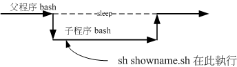

# 第十二章、学习 Shell Scripts

最近更新日期：20//

如果你真的很想要走信息这条路，并且想要管理好属于你的主机，那么，别说鸟哥不告诉你， 可以自动管理系统的好工具： Shell scripts！这家伙真的是得要好好学习学习的！ 基本上， shell script 有点像是早期的批处理文件，亦即是将一些指令汇整起来一次执行，但是 Shell script 拥有更强大的功能，那就是他可以进行类似程序 （program） 的撰写，并且不需要经过编译 （compile） 就能够执行， 真的很方便。加上我们可通过 shell script 来简化我们日常的工作管理， 而且，整个 Linux 环境中，一些服务 （services） 的启动都是通过 shell script 的， 如果你对于 script 不了解，嘿嘿！发生问题时，可真是会求助无门喔！所以，好好的学一学他吧！

# 12.1 什么是 Shell scripts

## 12.1 什么是 Shell scripts

什么是 shell script （程序化脚本） 呢？就字面上的意义，我们将他分为两部份。 在“ shell ”部分，我们在 十章的 BASH 当中已经提过了，那是一个命令行下面让我们与系统沟通的一个工具接口。那么“ script ”是啥？ 字面上的意义， script 是“脚本、剧本”的意思。整句话是说， shell script 是针对 shell 所写的“剧本！”

什么东西啊？其实， shell script 是利用 shell 的功能所写的一个“程序 （program）”，这个程序是使用纯文本文件，将一些 shell 的语法与指令（含外部指令）写在里面， 搭配正则表达式、管线命令与数据流重导向等功能，以达到我们所想要的处理目的。

所以，简单的说， shell script 就像是早期 DOS 年代的批处理文件 （.bat） ，最简单的功能就是将许多指令汇整写在一起， 让使用者很轻易的就能够 one touch 的方法去处理复杂的动作 （执行一个文件 "shell script" ，就能够一次执行多个指令）。 而且 shell script 更提供阵列、循环、条件与逻辑判断等重要功能，让使用者也可以直接以 shell 来撰写程序，而不必使用类似 C 程序语言等传统程序撰写的语法呢！

这么说你可以了解了吗？是的！ shell script 可以简单的被看成是批处理文件， 也可以被说成是一个程序语言，且这个程序语言由于都是利用 shell 与相关工具指令， 所以不需要编译即可执行，且拥有不错的除错 （debug） 工具，所以，他可以帮助系统管理员快速的管理好主机。

### 12.1.1 干嘛学习 shell scripts

这是个好问题：“我又干嘛一定要学 shell script ？我又不是信息人，没有写程序的概念， 那我干嘛还要学 shell script 呢？不要学可不可以啊？”呵呵～如果 Linux 对你而言， 你只是想要“会用”而已，那么，不需要学 shell script 也还无所谓，这部分先给他跳过去， 等到有空的时候，再来好好的瞧一瞧。但是，如果你是真的想要玩清楚 Linux 的来龙去脉， 那么 shell script 就不可不知，为什么呢？因为：

*   自动化管理的重要依据

不用鸟哥说你也知道，管理一部主机真不是件简单的事情，每天要进行的任务就有：查询登录文件、追踪流量、监控使用者使用主机状态、主机各项硬件设备状态、 主机软件更新查询、更不要说得应付其他使用者的突然要求了。而这些工作的进行可以分为： （1）自行手动处理，或是 （2）写个简单的程序来帮你每日“自动处理分析”这两种方式，你觉得哪种方式比较好？ 当然是让系统自动工作比较好，对吧！呵呵～这就得要良好的 shell script 来帮忙的啦！

*   追踪与管理系统的重要工作

虽然我们还没有提到服务启动的方法，不过，这里可以先提一下，我们 CentOS 6.x 以前的版本中，系统的服务 （services） 启动的接口是在 /etc/init.d/ 这个目录下，目录下的所有文件都是 scripts ； 另外，包括开机 （booting） 过程也都是利用 shell script 来帮忙搜寻系统的相关设置数据， 然后再代入各个服务的设置参数啊！举例来说，如果我们想要重新启动系统登录文件， 可以使用：“/etc/init.d/rsyslogd restart”，那个 rsyslogd 文件就是 script 啦！

另外，鸟哥曾经在某一代的 Fedora 上面发现，启动 MySQL 这个数据库服务时，确实是可以启动的， 但是屏幕上却老是出现“failure”！后来才发现，原来是启动 MySQL 那个 script 会主动的以“空的密码”去尝试登陆 MySQL ，但为了安全性鸟哥修改过 MySQL 的密码啰～当然就登陆失败～ 后来改了改 script ，就略去这个问题啦！如此说来， script 确实是需要学习的啊！

时至今日，虽然 /etc/init.d/* 这个脚本启动的方式 （systemV） 已经被新一代的 systemd 所取代 （从 CentOS 7 开始）， 但是很多的个别服务在管理他们的服务启动方面，还是使用 shell script 的机制喔！所以，最好还是能够熟悉啦！

*   简单入侵侦测功能

当我们的系统有异状时，大多会将这些异状记录在系统记录器，也就是我们常提到的“系统登录文件”， 那么我们可以在固定的几分钟内主动的去分析系统登录文件，若察觉有问题，就立刻通报管理员， 或者是立刻加强防火墙的设置规则，如此一来，你的主机可就能够达到“自我保护”的聪明学习功能啦～ 举例来说，我们可以通过 shell script 去分析“当该封包尝试几次还是连线失败之后，就予以抵挡住该 IP”之类的举动，例如鸟哥写过一个关于[抵挡砍站软件的 shell script](http://linux.vbird.org/linux_server/0360apache.php#security_teleport) ， 就是用这个想法去达成的呢！

*   连续指令单一化

其实，对于新手而言， script 最简单的功能就是：“汇整一些在 command line 下达的连续指令，将他写入 scripts 当中，而由直接执行 scripts 来启动一连串的 command line 指令输入！”例如： 防火墙连续规则 （iptables），开机载入程序的项目 （就是在 /etc/rc.d/rc.local 里头的数据） ，等等都是相似的功能啦！ 其实，说穿了，如果不考虑 program 的部分，那么 scripts 也可以想成“仅是帮我们把一大串的指令汇整在一个文件里面， 而直接执行该文件就可以执行那一串又臭又长的指令段！”就是这么简单啦！

*   简易的数据处理

由前一章正则表达式的 awk 程序说明中， 你可以发现， awk 可以用来处理简单的数据数据呢！例如薪资单的处理啊等等的。 shell script 的功能更强大，例如鸟哥曾经用 shell script 直接处理数据数据的比对啊， 文字数据的处理啊等等的，撰写方便，速度又快（因为在 Linux 性能较佳），真的是很不错用的啦！

举例来说，鸟哥每学期都得要以学生的学号来创建他们能够操作 Linux 的系统帐号，然后每个帐号还得要能够有磁盘容量的限制 （quota） 以及相关的设置等等， 那因为学校的校务系统提供的数据都是一整串学生信息，并没有单纯的学号字段，所以鸟哥就得要通过前几章的方法搭配 shell script 来自动处理相关设置流程， 这样才不会每学期都头疼一次啊！

*   跨平台支持与学习历程较短

几乎所有的 Unix Like 上面都可以跑 shell script ，连 MS Windows 系列也有相关的 script 仿真器可以用， 此外， shell script 的语法是相当友好的，看都看的懂得文字 （虽然是英文），而不是机器码， 很容易学习～这些都是你可以加以考虑的学习点啊！

上面这些都是你考虑学习 shell script 的特点～此外， shell script 还可以简单的以 vim 来直接编写，实在是很方便的好东西！所以，还是建议你学习一下啦。

不过，虽然 shell script 号称是程序 （program） ，但实际上， shell script 处理数据的速度上是不太够的。因为 shell script 用的是外部的指令与 bash shell 的一些默认工具，所以，他常常会去调用外部的函数库，因此，运算速度上面当然比不上传统的程序语言。 所以啰， shell script 用在系统管理上面是很好的一项工具，但是用在处理大量数值运算上， 就不够好了，因为 Shell scripts 的速度较慢，且使用的 CPU 资源较多，造成主机资源的分配不良。还好， 我们通常利用 shell script 来处理服务器的侦测，倒是没有进行大量运算的需求啊！所以不必担心的啦！

### 12.1.2 第一支 script 的撰写与执行

如同前面讲到的，shell script 其实就是纯文本文件，我们可以编辑这个文件，然后让这个文件来帮我们一次执行多个指令， 或者是利用一些运算与逻辑判断来帮我们达成某些功能。所以啦，要编辑这个文件的内容时，当然就需要具备有 bash 指令下达的相关认识。下达指令需要注意的事项在第四章的开始下达指令小节内已经提过，有疑问请自行回去翻阅。 在 shell script 的撰写中还需要用到下面的注意事项：

1.  指令的执行是从上而下、从左而右的分析与执行；
2.  指令的下达就如同第四章内提到的： 指令、选项与参数间的多个空白都会被忽略掉；
3.  空白行也将被忽略掉，并且 [tab] 按键所推开的空白同样视为空白键；
4.  如果读取到一个 Enter 符号 （CR） ，就尝试开始执行该行 （或该串） 命令；
5.  至于如果一行的内容太多，则可以使用“ [Enter] ”来延伸至下一行；
6.  “ # ”可做为注解！任何加在 # 后面的数据将全部被视为注解文字而被忽略！

如此一来，我们在 script 内所撰写的程序，就会被一行一行的执行。现在我们假设你写的这个程序文件名是 /home/dmtsai/shell.sh 好了，那如何执行这个文件？很简单，可以有下面几个方法：

*   直接指令下达： shell.sh 文件必须要具备可读与可执行 （rx） 的权限，然后：

    *   绝对路径：使用 /home/dmtsai/shell.sh 来下达指令；
    *   相对路径：假设工作目录在 /home/dmtsai/ ，则使用 ./shell.sh 来执行
    *   变量“PATH”功能：将 shell.sh 放在 PATH 指定的目录内，例如： ~/bin/
*   以 bash 程序来执行：通过“ bash shell.sh ”或“ sh shell.sh ”来执行

反正重点就是要让那个 shell.sh 内的指令可以被执行的意思啦！ 咦！那我为何需要使用 “./shell.sh ”来下达指令？忘记了吗？回去第十章内的指令搜寻顺序察看一下， 你就会知道原因了！同时，由于 CentOS 默认使用者主文件夹下的 ~/bin 目录会被设置到 ${PATH} 内，所以你也可以将 shell.sh 创建在 /home/dmtsai/bin/ 下面 （ ~/bin 目录需要自行设置） 。此时，若 shell.sh 在 ~/bin 内且具有 rx 的权限，那就直接输入 shell.sh 即可执行该脚本程序！

那为何“ sh shell.sh ”也可以执行呢？这是因为 /bin/sh 其实就是 /bin/bash （链接文件），使用 sh shell.sh 亦即告诉系统，我想要直接以 bash 的功能来执行 shell.sh 这个文件内的相关指令的意思，所以此时你的 shell.sh 只要有 r 的权限即可被执行喔！而我们也可以利用 sh 的参数，如 -n 及 -x 来检查与追踪 shell.sh 的语法是否正确呢！ ^_^

*   撰写第一支 script

在武侠世界中，不论是那个门派，要学武功要从扫地与蹲马步做起，那么要学程序呢？呵呵，肯定是由“秀出 Hello World！” 这个字眼开始的！OK！那么鸟哥就先写一支 script 给大家瞧一瞧：

```
[dmtsai@study ~]$ mkdir bin; cd bin
[dmtsai@study bin]$ vim hello.sh
#!/bin/bash
# Program:
#       This program shows "Hello World!" in your screen.
# History:
# 2015/07/16    VBird    First release
PATH=/bin:/sbin:/usr/bin:/usr/sbin:/usr/local/bin:/usr/local/sbin:~/bin
export PATH
echo -e "Hello World! \a \n"
exit 0 
```

在本章当中，请将所有撰写的 script 放置到你主文件夹的 ~/bin 这个目录内，未来比较好管理啦！上面的写法当中，鸟哥主要将整个程序的撰写分成数段，大致是这样：

1.  第一行 #!/bin/bash 在宣告这个 script 使用的 shell 名称： 因为我们使用的是 bash ，所以，必须要以“ **#!/bin/bash** ”来宣告这个文件内的语法使用 bash 的语法！那么当这个程序被执行时，他就能够载入 bash 的相关环境配置文件 （一般来说就是 non-login shell 的 ~/.bashrc）， 并且执行 bash 来使我们下面的指令能够执行！这很重要的！（在很多状况中，如果没有设置好这一行， 那么该程序很可能会无法执行，因为系统可能无法判断该程序需要使用什么 shell 来执行啊！）

2.  程序内容的说明： 整个 script 当中，除了第一行的“ #! ”是用来宣告 shell 的之外，其他的 # 都是“注解”用途！ 所以上面的程序当中，第二行以下就是用来说明整个程序的基本数据。一般来说， 建议你一定要养成说明该 script 的：1\. 内容与功能； 2\. 版本信息； 3\. 作者与联络方式； 4\. 创建日期；5\. 历史纪录 等等。这将有助于未来程序的改写与 debug 呢！

3.  主要环境变量的宣告： 建议务必要将一些重要的环境变量设置好，鸟哥个人认为， PATH 与 LANG （如果有使用到输出相关的信息时） 是当中最重要的！ 如此一来，则可让我们这支程序在进行时，可以直接下达一些外部指令，而不必写绝对路径呢！比较方便啦！

4.  主要程序部分 就将主要的程序写好即可！在这个例子当中，就是 echo 那一行啦！

5.  执行成果告知 （定义回传值） 是否记得我们在第十章里面要讨论一个指令的执行成功与否，可以使用 $? 这个变量来观察～ 那么我们也可以利用 exit 这个指令来让程序中断，并且回传一个数值给系统。 在我们这个例子当中，鸟哥使用 exit 0 ，这代表离开 script 并且回传一个 0 给系统， 所以我执行完这个 script 后，若接着下达 echo $? 则可得到 0 的值喔！ 更聪明的读者应该也知道了，呵呵！利用这个 exit n （n 是数字） 的功能，我们还可以自订错误讯息， 让这支程序变得更加的 smart 呢！

接下来通过刚刚上头介绍的执行方法来执行看看结果吧！

```
[dmtsai@study bin]$ sh hello.sh
Hello World ! 
```

你会看到屏幕是这样，而且应该还会听到“咚”的一声，为什么呢？还记得前一章提到的 printf 吧？用 echo 接着那些特殊的按键也可以发生同样的事情～ 不过， echo 必须要加上 -e 的选项才行！呵呵！在你写完这个小 script 之后，你就可以大声的说：“我也会写程序了”！哈哈！ 很简单有趣吧～ ^_^

另外，你也可以利用：“chmod a+x hello.sh; ./hello.sh”来执行这个 script 的呢！

### 12.1.3 撰写 shell script 的良好习惯创建

一个良好习惯的养成是很重要的～大家在刚开始撰写程序的时候，最容易忽略这部分， 认为程序写出来就好了，其他的不重要。其实，如果程序的说明能够更清楚，那么对你自己是有很大的帮助的。

举例来说，鸟哥自己为了自己的需求，曾经撰写了不少的 script 来帮我进行主机 IP 的侦测啊、 登录文件分析与管理啊、自动上传下载重要配置文件啊等等的，不过，早期就是因为太懒了， 管理的主机又太多了，常常同一个程序在不同的主机上面进行更改，到最后，到底哪一支才是最新的都记不起来， 而且，重点是，我到底是改了哪里？为什么做那样的修改？都忘的一干二净～真要命～

所以，后来鸟哥在写程序的时候，通常会比较仔细的将程序的设计过程给他记录下来，而且还会记录一些历史纪录， 如此一来，好多了～至少很容易知道我修改了哪些数据，以及程序修改的理念与逻辑概念等等， 在维护上面是轻松很多很多的喔！

另外，在一些环境的设置上面，毕竟每个人的环境都不相同，为了取得较佳的执行环境， 我都会自行先定义好一些一定会被用到的环境变量，例如 PATH 这个玩意儿！ 这样比较好啦～所以说，建议你一定要养成良好的 script 撰写习惯，在每个 script 的文件开始处记录好：

*   script 的功能；
*   script 的版本信息；
*   script 的作者与联络方式；
*   script 的版权宣告方式；
*   script 的 History （历史纪录）；
*   script 内较特殊的指令，使用“绝对路径”的方式来下达；
*   script 运行时需要的环境变量预先宣告与设置。

除了记录这些信息之外，在较为特殊的程序码部分，个人建议务必要加上注解说明，可以帮助你非常非常多！ 此外，程序码的撰写最好使用巢状方式，在包覆的内部程序码最好能以 [tab] 按键的空格向后推， 这样你的程序码会显的非常的漂亮与有条理！在查阅与 debug 上较为轻松愉快喔！ 另外，使用撰写 script 的工具最好使用 vim 而不是 vi ，因为 vim 会有额外的语法检验机制，能够在第一阶段撰写时就发现语法方面的问题喔！

# 12.2 简单的 shell script 练习

## 12.2 简单的 shell script 练习

在第一支 shell script 撰写完毕之后，相信你应该具有基本的撰写功力了。接下来，在开始更深入的程序概念之前，我们先来玩一些简单的小范例好了。 下面的范例中，达成结果的方式相当的多，建议你先自行撰写看看，写完之后再与鸟哥写的内容比对， 这样才能更加深概念喔！好！不啰唆，我们就一个一个来玩吧！

### 12.2.1 简单范例

下面的范例在很多的脚本程序中都会用到，而下面的范例又都很简单！值得参考看看喔！

*   对谈式脚本：变量内容由使用者决定

很多时候我们需要使用者输入一些内容，好让程序可以顺利运行。 简单的来说，大家应该都有安装过软件的经验，安装的时候，他不是会问你“要安装到那个目录去”吗？ 那个让使用者输入数据的动作，就是让使用者输入变量内容啦。

你应该还记得在十章 bash 的时候，我们有学到一个 read 指令吧？现在，请你以 read 指令的用途，撰写一个 script ，他可以让使用者输入：1\. first name 与 2\. last name， 最后并且在屏幕上显示：“Your full name is: ”的内容：

```
[dmtsai@study bin]$ vim showname.sh
#!/bin/bash
# Program:
#    User inputs his first name and last name.  Program shows his full name.
# History:
# 2015/07/16    VBird    First release
PATH=/bin:/sbin:/usr/bin:/usr/sbin:/usr/local/bin:/usr/local/sbin:~/bin
export PATH

read -p "Please input your first name: " firstname      # 提示使用者输入
read -p "Please input your last name:  " lastname       # 提示使用者输入
echo -e "\nYour full name is: ${firstname} ${lastname}" # 结果由屏幕输出 
```

将上面这个 showname.sh 执行一下，你就能够发现使用者自己输入的变量可以让程序所取用，并且将他显示到屏幕上！ 接下来，如果想要制作一个每次执行都会依据不同的日期而变化结果的脚本呢？

*   随日期变化：利用 date 进行文件的创建

想像一个状况，假设我的服务器内有数据库，数据库每天的数据都不太一样，因此当我备份时，希望将每天的数据都备份成不同的文件名， 这样才能够让旧的数据也能够保存下来不被覆盖。哇！不同文件名呢！这真困扰啊？难道要我每天去修改 script ？

不需要啊！考虑每天的“日期”并不相同，所以我可以将文件名取成类似： backup.2015-07-16.data ， 不就可以每天一个不同文件名了吗？呵呵！确实如此。那个 2015-07-16 怎么来的？那就是重点啦！接下来出个相关的例子： 假设我想要创建三个空的文件 （通过 touch） ，文件名最开头由使用者输入决定，假设使用者输入 filename 好了，那今天的日期是 2015/07/16 ， 我想要以前天、昨天、今天的日期来创建这些文件，亦即 filename_20150714, filename_20150715, filename_20150716 ，该如何是好？

```
[dmtsai@study bin]$ vim create_3_filename.sh
#!/bin/bash
# Program:
#    Program creates three files, which named by user's input and date command.
# History:
# 2015/07/16    VBird    First release
PATH=/bin:/sbin:/usr/bin:/usr/sbin:/usr/local/bin:/usr/local/sbin:~/bin
export PATH

# 1\. 让使用者输入文件名称，并取得 fileuser 这个变量；
echo -e "I will use 'touch' command to create 3 files." # 纯粹显示信息
read -p "Please input your filename: " fileuser         # 提示使用者输入

# 2\. 为了避免使用者随意按 Enter ，利用变量功能分析文件名是否有设置？
filename=${fileuser:-"filename"}           # 开始判断有否配置文件名

# 3\. 开始利用 date 指令来取得所需要的文件名了；
date1=$（date --date='2 days ago' +%Y%m%d）  # 前两天的日期
date2=$（date --date='1 days ago' +%Y%m%d）  # 前一天的日期
date3=$（date +%Y%m%d）                      # 今天的日期
file1=${filename}${date1}                  # 下面三行在配置文件名
file2=${filename}${date2}
file3=${filename}${date3}

# 4\. 将文件名创建吧！
touch "${file1}"                           # 下面三行在创建文件
touch "${file2}"
touch "${file3}" 
```

上面的范例鸟哥使用了很多在第十章介绍过的概念： 包括小指令“ $（command） ”的取得讯息、变量的设置功能、变量的累加以及利用 touch 指令辅助！ 如果你开始执行这个 create_3_filename.sh 之后，你可以进行两次执行：一次直接按 [Enter] 来查阅文件名是啥？ 一次可以输入一些字符，这样可以判断你的脚本是否设计正确喔！

*   数值运算：简单的加减乘除

各位看官应该还记得，我们可以使用 declare 来定义变量的类型吧？ 当变量定义成为整数后才能够进行加减运算啊！此外，我们也可以利用“ $（（计算式）） ”来进行数值运算的。 可惜的是， bash shell 里头默认仅支持到整数的数据而已。OK！那我们来玩玩看，如果我们要使用者输入两个变量， 然后将两个变量的内容相乘，最后输出相乘的结果，那可以怎么做？

```
[dmtsai@study bin]$ vim multiplying.sh
#!/bin/bash
# Program:
#    User inputs 2 integer numbers; program will cross these two numbers.
# History:
# 2015/07/16    VBird    First release
PATH=/bin:/sbin:/usr/bin:/usr/sbin:/usr/local/bin:/usr/local/sbin:~/bin
export PATH
echo -e "You SHOULD input 2 numbers, I will multiplying them! \n"
read -p "first number:  " firstnu
read -p "second number: " secnu
total=$（（${firstnu}*${secnu}））
echo -e "\nThe result of ${firstnu} x ${secnu} is ==&gt; ${total}" 
```

在数值的运算上，我们可以使用“ declare -i total=${firstnu}*${secnu} ” 也可以使用上面的方式来进行！基本上，鸟哥比较建议使用这样的方式来进行运算：

> var=$（（运算内容））

不但容易记忆，而且也比较方便的多，因为两个小括号内可以加上空白字符喔！ 未来你可以使用这种方式来计算的呀！至于数值运算上的处理，则有：“ +, -, *, /, % ”等等。 那个 % 是取余数啦～举例来说， 13 对 3 取余数，结果是 13=4*3+1，所以余数是 1 啊！就是：

```
[dmtsai@study bin]$ echo $（（ 13 % 3 ））
1 
```

这样了解了吧？另外，如果你想要计算含有小数点的数据时，其实可以通过 bc 这个指令的协助喔！ 例如可以这样做：

```
[dmtsai@study bin]$ echo "123.123*55.9" &#124; bc
6882.575 
```

了解了 bc 的妙用之后，来让我们测试一下如何计算 pi 这个东西呢？

*   数值运算：通过 bc 计算 pi

其实计算 pi 时，小数点以下位数可以无限制的延伸下去！而 bc 有提供一个运算 pi 的函数，只是想要使用该函数必须要使用 bc -l 来调用才行。 也因为这个小数点以下位数可以无线延伸运算的特性存在，所以我们可以通过下面这只小脚本来让使用者输入一个“小数点为数值”， 以让 pi 能够更准确！

```
[dmtsai@study bin]$ vim cal_pi.sh
#!/bin/bash
# Program:
#    User input a scale number to calculate pi number.
# History:
# 2015/07/16    VBird    First release
PATH=/bin:/sbin:/usr/bin:/usr/sbin:/usr/local/bin:/usr/local/sbin:~/bin
export PATH
echo -e "This program will calculate pi value. \n"
echo -e "You should input a float number to calculate pi value.\n"
read -p "The scale number （10~10000） ? " checking
num=${checking:-"10"}           # 开始判断有否有输入数值
echo -e "Starting calcuate pi value.  Be patient."
time echo "scale=${num}; 4*a（1）" &#124; bc -lq 
```

上述数据中，那个 4*a（1） 是 bc 主动提供的一个计算 pi 的函数，至于 scale 就是要 bc 计算几个小数点下位数的意思。当 scale 的数值越大， 代表 pi 要被计算的越精确，当然用掉的时间就会越多！因此，你可以尝试输入不同的数值看看！不过，最好是不要超过 5000 啦！因为会算很久！ 如果你要让你的 CPU 随时保持在高负载，这个程序算下去你就会知道有多操 CPU 啰！ ^_^


**Tips** 鸟哥的实验室中，为了要确认虚拟机的效率问题，所以很多时候需要保持虚拟机在忙碌的状态～鸟哥的学生就是丢这只程序进去系统跑！ 但是将 scale 调高一些，那计算就得要花比较多时间～用以达到我们需要 CPU 忙碌的状态喔！

### 12.2.2 script 的执行方式差异 （source, sh script, ./script）

不同的 script 执行方式会造成不一样的结果喔！尤其影响 bash 的环境很大呢！脚本的执行方式除了前面小节谈到的方式之外，还可以利用 source 或小数点 （.） 来执行喔！那么这种执行方式有何不同呢？当然是不同的啦！让我们来说说！

*   利用直接执行的方式来执行 script

当使用前一小节提到的直接指令下达 （不论是绝对路径/相对路径还是 ${PATH} 内），或者是利用 bash （或 sh） 来下达脚本时， 该 script 都会使用一个新的 bash 环境来执行脚本内的指令！也就是说，使用这种执行方式时， 其实 script 是在子程序的 bash 内执行的！我们在第十章 BASH 内谈到 export 的功能时，曾经就父程序/子程序谈过一些概念性的问题， 重点在于：“当子程序完成后，在子程序内的各项变量或动作将会结束而不会传回到父程序中”！ 这是什么意思呢？

我们举刚刚提到过的 showname.sh 这个脚本来说明好了，这个脚本可以让使用者自行设置两个变量，分别是 firstname 与 lastname，想一想，如果你直接执行该指令时，该指令帮你设置的 firstname 会不会生效？看一下下面的执行结果：

```
[dmtsai@study bin]$ echo ${firstname} ${lastname}
    &lt;==确认了，这两个变量并不存在喔！
[dmtsai@study bin]$ sh showname.sh
Please input your first name: VBird &lt;==这个名字是鸟哥自己输入的
Please input your last name:  Tsai 

Your full name is: VBird Tsai      &lt;==看吧！在 script 运行中，这两个变量有生效
[dmtsai@study bin]$ echo ${firstname} ${lastname}
    &lt;==事实上，这两个变量在父程序的 bash 中还是不存在的！ 
```

上面的结果你应该会觉得很奇怪，怎么我已经利用 showname.sh 设置好的变量竟然在 bash 环境下面无效！怎么回事呢？ 如果将程序相关性绘制成图的话，我们以下图来说明。当你使用直接执行的方法来处理时，系统会给予一支新的 bash 让我们来执行 showname.sh 里面的指令，因此你的 firstname, lastname 等变量其实是在下图中的子程序 bash 内执行的。 当 showname.sh 执行完毕后，子程序 bash 内的所有数据便被移除，因此上表的练习中，在父程序下面 echo ${firstname} 时， 就看不到任何东西了！这样可以理解吗？

图 12.2.1、showname.sh 在子程序当中运行的示意图

*   利用 source 来执行脚本：在父程序中执行

如果你使用 source 来执行指令那就不一样了！同样的脚本我们来执行看看：

```
[dmtsai@study bin]$ source showname.sh
Please input your first name: VBird
Please input your last name:  Tsai

Your full name is: VBird Tsai
[dmtsai@study bin]$ echo ${firstname} ${lastname}
VBird Tsai  &lt;==嘿嘿！有数据产生喔！ 
```

竟然生效了！没错啊！因为 source 对 script 的执行方式可以使用下面的图示来说明！ showname.sh 会在父程序中执行的，因此各项动作都会在原本的 bash 内生效！这也是为啥你不登出系统而要让某些写入 ~/.bashrc 的设置生效时，需要使用“ source ~/.bashrc ”而不能使用“ bash ~/.bashrc ”是一样的啊！

图 12.2.2、showname.sh 在父程序当中运行的示意图

# 12.3 善用判断式

## 12.3 善用判断式

在第十章中，我们提到过 $? 这个变量所代表的意义， 此外，也通过 && 及 || 来作为前一个指令执行回传值对于后一个指令是否要进行的依据。第十章的讨论中，如果想要判断一个目录是否存在， 当时我们使用的是 ls 这个指令搭配数据流重导向，最后配合 $? 来决定后续的指令进行与否。 但是否有更简单的方式可以来进行“条件判断”呢？有的～那就是“ test ”这个指令。

### 12.3.1 利用 test 指令的测试功能

当我要检测系统上面某些文件或者是相关的属性时，利用 test 这个指令来工作真是好用得不得了， 举例来说，我要检查 /dmtsai 是否存在时，使用：

```
[dmtsai@study ~]$ test -e /dmtsai 
```

执行结果并不会显示任何讯息，但最后我们可以通过 $? 或 && 及 || 来展现整个结果呢！ 例如我们在将上面的例子改写成这样：

```
[dmtsai@study ~]$ test -e /dmtsai && echo "exist" &#124;&#124; echo "Not exist"
Not exist  &lt;==结果显示不存在啊！ 
```

最终的结果可以告知我们是“exist”还是“Not exist”呢！那我知道 -e 是测试一个“东西”在不在， 如果还想要测试一下该文件名是啥玩意儿时，还有哪些标志可以来判断的呢？呵呵！有下面这些东西喔！

| 测试的标志 | 代表意义 |
| --- | --- |
| 1\. 关于某个文件名的“文件类型”判断，如 test -e filename 表示存在否 |
| -e | 该“文件名”是否存在？（常用） |
| -f | 该“文件名”是否存在且为文件（file）？（常用） |
| -d | 该“文件名”是否存在且为目录（directory）？（常用） |
| -b | 该“文件名”是否存在且为一个 block device 设备？ |
| -c | 该“文件名”是否存在且为一个 character device 设备？ |
| -S | 该“文件名”是否存在且为一个 Socket 文件？ |
| -p | 该“文件名”是否存在且为一个 FIFO （pipe） 文件？ |
| -L | 该“文件名”是否存在且为一个链接文件？ |
| 2\. 关于文件的权限侦测，如 test -r filename 表示可读否 （但 root 权限常有例外） |
| -r | 侦测该文件名是否存在且具有“可读”的权限？ |
| -w | 侦测该文件名是否存在且具有“可写”的权限？ |
| -x | 侦测该文件名是否存在且具有“可执行”的权限？ |
| -u | 侦测该文件名是否存在且具有“SUID”的属性？ |
| -g | 侦测该文件名是否存在且具有“SGID”的属性？ |
| -k | 侦测该文件名是否存在且具有“Sticky bit”的属性？ |
| -s | 侦测该文件名是否存在且为“非空白文件”？ |
| 3\. 两个文件之间的比较，如： test file1 -nt file2 |
| -nt | （newer than）判断 file1 是否比 file2 新 |
| -ot | （older than）判断 file1 是否比 file2 旧 |
| -ef | 判断 file1 与 file2 是否为同一文件，可用在判断 hard link 的判定上。 主要意义在判定，两个文件是否均指向同一个 inode 哩！ |
| 4\. 关于两个整数之间的判定，例如 test n1 -eq n2 |
| -eq | 两数值相等 （equal） |
| -ne | 两数值不等 （not equal） |
| -gt | n1 大于 n2 （greater than） |
| -lt | n1 小于 n2 （less than） |
| -ge | n1 大于等于 n2 （greater than or equal） |
| -le | n1 小于等于 n2 （less than or equal） |
| 5\. 判定字串的数据 |
| test -z string | 判定字串是否为 0 ？若 string 为空字串，则为 true |
| test -n string | 判定字串是否非为 0 ？若 string 为空字串，则为 false。 -n 亦可省略 |
| test str1 == str2 | 判定 str1 是否等于 str2 ，若相等，则回传 true |
| test str1 != str2 | 判定 str1 是否不等于 str2 ，若相等，则回传 false |
| 6\. 多重条件判定，例如： test -r filename -a -x filename |
| -a | （and）两状况同时成立！例如 test -r file -a -x file，则 file 同时具有 r 与 x 权限时，才回传 true。 |
| -o | （or）两状况任何一个成立！例如 test -r file -o -x file，则 file 具有 r 或 x 权限时，就可回传 true。 |
| ! | 反相状态，如 test ! -x file ，当 file 不具有 x 时，回传 true |

OK！现在我们就利用 test 来帮我们写几个简单的例子。首先，判断一下，让使用者输入一个文件名，我们判断：

1.  这个文件是否存在，若不存在则给予一个“Filename does not exist”的讯息，并中断程序；
2.  若这个文件存在，则判断他是个文件或目录，结果输出“Filename is regular file”或 “Filename is directory”
3.  判断一下，执行者的身份对这个文件或目录所拥有的权限，并输出权限数据！

你可以先自行创作看看，然后再跟下面的结果讨论讨论。注意利用 test 与 && 还有 || 等标志！

```
[dmtsai@study bin]$ vim file_perm.sh
#!/bin/bash
# Program:
#    User input a filename, program will check the flowing:
#    1.） exist? 2.） file/directory? 3.） file permissions
# History:
# 2015/07/16    VBird    First release
PATH=/bin:/sbin:/usr/bin:/usr/sbin:/usr/local/bin:/usr/local/sbin:~/bin
export PATH

# 1\. 让使用者输入文件名，并且判断使用者是否真的有输入字串？
echo -e "Please input a filename, I will check the filename's type and permission. \n\n"
read -p "Input a filename : " filename
test -z ${filename} && echo "You MUST input a filename." && exit 0
# 2\. 判断文件是否存在？若不存在则显示讯息并结束脚本
test ! -e ${filename} && echo "The filename '${filename}' DO NOT exist" && exit 0
# 3\. 开始判断文件类型与属性
test -f ${filename} && filetype="regulare file"
test -d ${filename} && filetype="directory"
test -r ${filename} && perm="readable"
test -w ${filename} && perm="${perm} writable"
test -x ${filename} && perm="${perm} executable"
# 4\. 开始输出信息！
echo "The filename: ${filename} is a ${filetype}"
echo "And the permissions for you are : ${perm}" 
```

如果你执行这个脚本后，他会依据你输入的文件名来进行检查喔！先看是否存在，再看为文件或目录类型，最后判断权限。 但是你必须要注意的是，由于 root 在很多权限的限制上面都是无效的，所以使用 root 执行这个脚本时， 常常会发现与 ls -l 观察到的结果并不相同！所以，建议使用一般使用者来执行这个脚本试看看。

### 12.3.2 利用判断符号 [ ]

除了我们很喜欢使用的 test 之外，其实，我们还可以利用判断符号“ [ ] ”（就是中括号啦） 来进行数据的判断呢！ 举例来说，如果我想要知道 ${HOME} 这个变量是否为空的，可以这样做：

```
[dmtsai@study ~]$ [ -z "${HOME}" ] ; echo $? 
```

使用中括号必须要特别注意，因为中括号用在很多地方，包括万用字符与正则表达式等等，所以如果要在 bash 的语法当中使用中括号作为 shell 的判断式时，必须要注意中括号的两端需要有空白字符来分隔喔！ 假设我空白键使用“□”符号来表示，那么，在这些地方你都需要有空白键：

```
[  "$HOME"  ==  "$MAIL"  ]
[□"$HOME"□==□"$MAIL"□]
 ↑       ↑  ↑       ↑ 
```


**Tips** 你会发现鸟哥在上面的判断式当中使用了两个等号“ == ”。其实在 bash 当中使用一个等号与两个等号的结果是一样的！ 不过在一般惯用程序的写法中，一个等号代表“变量的设置”，两个等号则是代表“逻辑判断 （是与否之意）”。 由于我们在中括号内重点在于“判断”而非“设置变量”，因此鸟哥建议您还是使用两个等号较佳！

上面的例子在说明，两个字串 ${HOME} 与 ${MAIL} 是否相同的意思，相当于 test ${HOME} == ${MAIL} 的意思啦！ 而如果没有空白分隔，例如 [${HOME}==${MAIL}] 时，我们的 bash 就会显示错误讯息了！这可要很注意啊！ 所以说，你最好要注意：

*   在中括号 [] 内的每个元件都需要有空白键来分隔；
*   在中括号内的变量，最好都以双引号括号起来；
*   在中括号内的常数，最好都以单或双引号括号起来。

为什么要这么麻烦啊？直接举例来说，假如我设置了 name="VBird Tsai" ，然后这样判定：

```
[dmtsai@study ~]$ name="VBird Tsai"
[dmtsai@study ~]$ [ ${name} == "VBird" ]
bash: [: too many arguments 
```

见鬼了！怎么会发生错误啊？bash 还跟我说错误是由于“太多参数 （arguments）”所致！ 为什么呢？因为 ${name} 如果没有使用双引号刮起来，那么上面的判定式会变成：

> [ VBird Tsai == "VBird" ]

上面肯定不对嘛！因为一个判断式仅能有两个数据的比对，上面 VBird 与 Tsai 还有 "VBird" 就有三个数据！ 这不是我们要的！我们要的应该是下面这个样子：

> [ "VBird Tsai" == "VBird" ]

这可是差很多的喔！另外，中括号的使用方法与 test 几乎一模一样啊～ 只是中括号比较常用在条件判断式 if ..... then ..... fi 的情况中就是了。 好，那我们也使用中括号的判断来做一个小案例好了，案例设置如下：

1.  当执行一个程序的时候，这个程序会让使用者选择 Y 或 N ，
2.  如果使用者输入 Y 或 y 时，就显示“ OK, continue ”
3.  如果使用者输入 n 或 N 时，就显示“ Oh, interrupt ！”
4.  如果不是 Y/y/N/n 之内的其他字符，就显示“ I don't know what your choice is ”

利用中括号、 && 与 || 来继续吧！

```
[dmtsai@study bin]$ vim ans_yn.sh
#!/bin/bash
# Program:
#     This program shows the user's choice
# History:
# 2015/07/16    VBird    First release
PATH=/bin:/sbin:/usr/bin:/usr/sbin:/usr/local/bin:/usr/local/sbin:~/bin
export PATH

read -p "Please input （Y/N）: " yn
[ "${yn}" == "Y" -o "${yn}" == "y" ] && echo "OK, continue" && exit 0
[ "${yn}" == "N" -o "${yn}" == "n" ] && echo "Oh, interrupt!" && exit 0
echo "I don't know what your choice is" && exit 0 
```

由于输入正确 （Yes） 的方法有大小写之分，不论输入大写 Y 或小写 y 都是可以的，此时判断式内就得要有两个判断才行！ 由于是任何一个成立即可 （大写或小写的 y） ，所以这里使用 -o （或） 链接两个判断喔！ 很有趣吧！利用这个字串判别的方法，我们就可以很轻松的将使用者想要进行的工作分门别类呢！ 接下来，我们再来谈一些其他有的没有的东西吧！

### 12.3.3 Shell script 的默认变量（$0, $1...）

我们知道指令可以带有选项与参数，例如 ls -la 可以察看包含隐藏文件的所有属性与权限。那么 shell script 能不能在脚本文件名后面带有参数呢？很有趣喔！举例来说，如果你想要重新启动系统的网络，可以这样做：

```
[dmtsai@study ~]$ file /etc/init.d/network
/etc/init.d/network: Bourne-Again shell script, ASCII text executable
# 使用 file 来查询后，系统告知这个文件是个 bash 的可执行 script 喔！
[dmtsai@study ~]$ /etc/init.d/network restart 
```

restart 是重新启动的意思，上面的指令可以“重新启动 /etc/init.d/network 这支程序”的意思！ 唔！那么如果你在 /etc/init.d/network 后面加上 stop 呢？没错！就可以直接关闭该服务了！这么神奇啊？ 没错啊！如果你要依据程序的执行给予一些变量去进行不同的任务时，本章一开始是使用 read 的功能！但 read 功能的问题是你得要手动由键盘输入一些判断式。如果通过指令后面接参数， 那么一个指令就能够处理完毕而不需要手动再次输入一些变量行为！这样下达指令会比较简单方便啦！

script 是怎么达成这个功能的呢？其实 script 针对参数已经有设置好一些变量名称了！对应如下：

```
/path/to/scriptname  opt1  opt2  opt3  opt4
       $0             $1    $2    $3    $4 
```

这样够清楚了吧？执行的脚本文件名为 $0 这个变量，第一个接的参数就是 $1 啊～ 所以，只要我们在 script 里面善用 $1 的话，就可以很简单的立即下达某些指令功能了！除了这些数字的变量之外， 我们还有一些较为特殊的变量可以在 script 内使用来调用这些参数喔！

*   $# ：代表后接的参数“个数”，以上表为例这里显示为“ 4 ”；
*   $@ ：代表“ "$1" "$2" "$3" "$4" ”之意，每个变量是独立的（用双引号括起来）；
*   $* ：代表“ "$1<u>c</u>$2<u>c</u>$3<u>c</u>$4" ”，其中 <u>c</u> 为分隔字符，默认为空白键， 所以本例中代表“ "$1 $2 $3 $4" ”之意。

那个 $@ 与 $* 基本上还是有所不同啦！不过，一般使用情况下可以直接记忆 $@ 即可！ 好了，来做个例子吧～假设我要执行一个可以携带参数的 script ，执行该脚本后屏幕会显示如下的数据：

*   程序的文件名为何？
*   共有几个参数？
*   若参数的个数小于 2 则告知使用者参数数量太少
*   全部的参数内容为何？
*   第一个参数为何？
*   第二个参数为何

```
[dmtsai@study bin]$ vim how_paras.sh
#!/bin/bash
# Program:
#    Program shows the script name, parameters...
# History:
# 2015/07/16    VBird    First release
PATH=/bin:/sbin:/usr/bin:/usr/sbin:/usr/local/bin:/usr/local/sbin:~/bin
export PATH

echo "The script name is        ==&gt; ${0}"
echo "Total parameter number is ==&gt; $#"
[ "$#" -lt 2 ] && echo "The number of parameter is less than 2\.  Stop here." && exit 0
echo "Your whole parameter is   ==&gt; '$@'"
echo "The 1st parameter         ==&gt; ${1}"
echo "The 2nd parameter         ==&gt; ${2}" 
```

执行结果如下：

```
[dmtsai@study bin]$ sh how_paras.sh theone haha quot
The script name is        ==&gt; how_paras.sh       &lt;==文件名
Total parameter number is ==&gt; 3                  &lt;==果然有三个参数
Your whole parameter is   ==&gt; 'theone haha quot' &lt;==参数的内容全部
The 1st parameter         ==&gt; theone             &lt;==第一个参数
The 2nd parameter         ==&gt; haha               &lt;==第二个参数 
```

*   shift：造成参数变量号码偏移

除此之外，脚本后面所接的变量是否能够进行偏移 （shift） 呢？什么是偏移啊？我们直接以下面的范例来说明好了， 用范例说明比较好解释！我们将 how_paras.sh 的内容稍作变化一下，用来显示每次偏移后参数的变化情况：

```
[dmtsai@study bin]$ vim shift_paras.sh
#!/bin/bash
# Program:
#    Program shows the effect of shift function.
# History:
# 2009/02/17    VBird    First release
PATH=/bin:/sbin:/usr/bin:/usr/sbin:/usr/local/bin:/usr/local/sbin:~/bin
export PATH

echo "Total parameter number is ==&gt; $#"
echo "Your whole parameter is   ==&gt; '$@'"
shift   # 进行第一次“一个变量的 shift ”
echo "Total parameter number is ==&gt; $#"
echo "Your whole parameter is   ==&gt; '$@'"
shift 3 # 进行第二次“三个变量的 shift ”
echo "Total parameter number is ==&gt; $#"
echo "Your whole parameter is   ==&gt; '$@'" 
```

这玩意的执行成果如下：

```
[dmtsai@study bin]$ sh shift_paras.sh one two three four five six &lt;==给予六个参数
Total parameter number is ==&gt; 6   &lt;==最原始的参数变量情况
Your whole parameter is   ==&gt; 'one two three four five six'
Total parameter number is ==&gt; 5   &lt;==第一次偏移，看下面发现第一个 one 不见了
Your whole parameter is   ==&gt; 'two three four five six'
Total parameter number is ==&gt; 2   &lt;==第二次偏移掉三个，two three four 不见了
Your whole parameter is   ==&gt; 'five six' 
```

光看结果你就可以知道啦，那个 shift 会移动变量，而且 shift 后面可以接数字，代表拿掉最前面的几个参数的意思。 上面的执行结果中，第一次进行 shift 后他的显示情况是“ one two three four five six”，所以就剩下五个啦！第二次直接拿掉三个，就变成“ two three four five six ”啦！ 这样这个案例可以了解了吗？理解了 shift 的功能了吗？

上面这几个例子都很简单吧？几乎都是利用 bash 的相关功能而已～ 不难啦～下面我们就要使用条件判断式来进行一些分别功能的设置了，好好瞧一瞧先～

# 12.4 条件判断式

## 12.4 条件判断式

只要讲到“程序”的话，那么条件判断式，亦即是“ if then ”这种判别式肯定一定要学习的！ 因为很多时候，我们都必须要依据某些数据来判断程序该如何进行。举例来说，我们在上头的 ans_yn.sh 讨论输入回应的范例中不是有练习当使用者输入 Y/N 时，必须要执行不同的讯息输出吗？简单的方式可以利用 && 与 || ，但如果我还想要执行一堆指令呢？那真的得要 if then 来帮忙啰～下面我们就来聊一聊！

### 12.4.1 利用 if .... then

这个 if .... then 是最常见的条件判断式了～简单的说，就是当符合某个条件判断的时候， 就予以进行某项工作就是了。这个 if ... then 的判断还有多层次的情况！我们分别介绍如下：

*   单层、简单条件判断式

如果你只有一个判断式要进行，那么我们可以简单的这样看：

```
if [ 条件判断式 ]; then
    当条件判断式成立时，可以进行的指令工作内容；
fi   &lt;==将 if 反过来写，就成为 fi 啦！结束 if 之意！ 
```

至于条件判断式的判断方法，与前一小节的介绍相同啊！较特别的是，如果我有多个条件要判别时， 除了 ans_yn.sh 那个案例所写的，也就是“将多个条件写入一个中括号内的情况”之外， 我还可以有多个中括号来隔开喔！而括号与括号之间，则以 && 或 || 来隔开，他们的意义是：

*   && 代表 AND ；
*   || 代表 or ；

所以，在使用中括号的判断式中， && 及 || 就与指令下达的状态不同了。举例来说， ans_yn.sh 里面的判断式可以这样修改：

> [ "${yn}" == "Y" -o "${yn}" == "y" ] 上式可替换为 [ "${yn}" == "Y" ] || [ "${yn}" == "y" ]

之所以这样改，很多人是习惯问题！很多人则是喜欢一个中括号仅有一个判别式的原因。好了， 现在我们来将 ans_yn.sh 这个脚本修改成为 if ... then 的样式来看看：

```
[dmtsai@study bin]$ cp ans_yn.sh ans_yn-2.sh  &lt;==用复制来修改的比较快！
[dmtsai@study bin]$ vim ans_yn-2.sh
#!/bin/bash
# Program:
#       This program shows the user's choice
# History:
# 2015/07/16    VBird   First release
PATH=/bin:/sbin:/usr/bin:/usr/sbin:/usr/local/bin:/usr/local/sbin:~/bin
export PATH

read -p "Please input （Y/N）: " yn

if [ "${yn}" == "Y" ] &#124;&#124; [ "${yn}" == "y" ]; then
    echo "OK, continue"
    exit 0
fi
if [ "${yn}" == "N" ] &#124;&#124; [ "${yn}" == "n" ]; then
    echo "Oh, interrupt!"
    exit 0
fi
echo "I don't know what your choice is" && exit 0 
```

不过，由这个例子看起来，似乎也没有什么了不起吧？原本的 ans_yn.sh 还比较简单呢～ 但是如果以逻辑概念来看，其实上面的范例中，我们使用了两个条件判断呢！明明仅有一个 ${yn} 的变量，为何需要进行两次比对呢？ 此时，多重条件判断就能够来测试测试啰！

*   多重、复杂条件判断式

在同一个数据的判断中，如果该数据需要进行多种不同的判断时，应该怎么作？举例来说，上面的 ans_yn.sh 脚本中，我们只要进行一次 ${yn} 的判断就好 （仅进行一次 if ），不想要作多次 if 的判断。 此时你就得要知道下面的语法了：

```
# 一个条件判断，分成功进行与失败进行 （else）
if [ 条件判断式 ]; then
    当条件判断式成立时，可以进行的指令工作内容；
else
    当条件判断式不成立时，可以进行的指令工作内容；
fi 
```

如果考虑更复杂的情况，则可以使用这个语法：

```
# 多个条件判断 （if ... elif ... elif ... else） 分多种不同情况执行
if [ 条件判断式一 ]; then
    当条件判断式一成立时，可以进行的指令工作内容；
elif [ 条件判断式二 ]; then
    当条件判断式二成立时，可以进行的指令工作内容；
else
    当条件判断式一与二均不成立时，可以进行的指令工作内容；
fi 
```

你得要注意的是， elif 也是个判断式，因此出现 elif 后面都要接 then 来处理！但是 else 已经是最后的没有成立的结果了， 所以 else 后面并没有 then 喔！好！我们来将 ans_yn-2.sh 改写成这样：

```
[dmtsai@study bin]$ cp ans_yn-2.sh ans_yn-3.sh
[dmtsai@study bin]$ vim ans_yn-3.sh
#!/bin/bash
# Program:
#       This program shows the user's choice
# History:
# 2015/07/16    VBird   First release
PATH=/bin:/sbin:/usr/bin:/usr/sbin:/usr/local/bin:/usr/local/sbin:~/bin
export PATH

read -p "Please input （Y/N）: " yn

if [ "${yn}" == "Y" ] &#124;&#124; [ "${yn}" == "y" ]; then
    echo "OK, continue"
elif [ "${yn}" == "N" ] &#124;&#124; [ "${yn}" == "n" ]; then
    echo "Oh, interrupt!"
else
    echo "I don't know what your choice is"
fi 
```

是否程序变得很简单，而且依序判断，可以避免掉重复判断的状况，这样真的很容易设计程序的啦！ ^_^！ 好了，让我们再来进行另外一个案例的设计。一般来说，如果你不希望使用者由键盘输入额外的数据时， 可以使用上一节提到的参数功能 （$1）！让使用者在下达指令时就将参数带进去！ 现在我们想让使用者输入“ hello ”这个关键字时，利用参数的方法可以这样依序设计：

1.  判断 $1 是否为 hello，如果是的话，就显示 "Hello, how are you ?"；
2.  如果没有加任何参数，就提示使用者必须要使用的参数下达法；
3.  而如果加入的参数不是 hello ，就提醒使用者仅能使用 hello 为参数。

整个程序的撰写可以是这样的：

```
[dmtsai@study bin]$ vim hello-2.sh
#!/bin/bash
# Program:
#    Check $1 is equal to "hello"
# History:
# 2015/07/16    VBird    First release
PATH=/bin:/sbin:/usr/bin:/usr/sbin:/usr/local/bin:/usr/local/sbin:~/bin
export PATH

if [ "${1}" == "hello" ]; then
    echo "Hello, how are you ?"
elif [ "${1}" == "" ]; then
    echo "You MUST input parameters, ex&gt; {${0} someword}"
else
    echo "The only parameter is 'hello', ex&gt; {${0} hello}"
fi 
```

然后你可以执行这支程序，分别在 $1 的位置输入 hello, 没有输入与随意输入， 就可以看到不同的输出啰～是否还觉得挺简单的啊！ ^_^。事实上， 学到这里，也真的很厉害了～好了，下面我们继续来玩一些比较大一点的计划啰～

我们在第十章已经学会了 grep 这个好用的玩意儿，那么多学一个叫做 netstat 的指令，这个指令可以查询到目前主机有打开的网络服务端口 （service ports）， 相关的功能我们会在[服务器架设篇](http://linux.vbird.org/linux_server)继续介绍，这里你只要知道，我可以利用“ netstat -tuln ”来取得目前主机有启动的服务， 而且取得的信息有点像这样：

```
[dmtsai@study ~]$ netstat -tuln
Active Internet connections （only servers）
Proto Recv-Q Send-Q Local Address           Foreign Address         State
tcp        0      0 0.0.0.0:22              0.0.0.0:*               LISTEN
tcp        0      0 127.0.0.1:25            0.0.0.0:*               LISTEN
tcp6       0      0 :::22                   :::*                    LISTEN
tcp6       0      0 ::1:25                  :::*                    LISTEN
udp        0      0 0.0.0.0:123             0.0.0.0:*
udp        0      0 0.0.0.0:5353            0.0.0.0:*
udp        0      0 0.0.0.0:44326           0.0.0.0:*
udp        0      0 127.0.0.1:323           0.0.0.0:*
udp6       0      0 :::123                  :::*
udp6       0      0 ::1:323                 :::*
#封包格式           本地 IP:端口             远端 IP:端口             是否监听 
```

上面的重点是“Local Address （本地主机的 IP 与端口对应）”那个字段，他代表的是本机所启动的网络服务！ IP 的部分说明的是该服务位于那个接口上，若为 127.0.0.1 则是仅针对本机开放，若是 0.0.0.0 或 ::: 则代表对整个 Internet 开放 （更多信息请参考服务器架设篇的介绍）。 每个端口 （port） 都有其特定的网络服务，几个常见的 port 与相关网络服务的关系是：

*   80: WWW
*   22: ssh
*   21: ftp
*   25: mail
*   111: RPC（远端程序调用）
*   631: CUPS（打印服务功能）

假设我的主机有兴趣要侦测的是比较常见的 port 21, 22, 25 及 80 时，那我如何通过 netstat 去侦测我的主机是否有打开这四个主要的网络服务端口呢？由于每个服务的关键字都是接在冒号“ : ”后面， 所以可以借由撷取类似“ :80 ”来侦测的！那我就可以简单的这样去写这个程序喔：

```
[dmtsai@study bin]$ vim netstat.sh
#!/bin/bash
# Program:
#     Using netstat and grep to detect WWW,SSH,FTP and Mail services.
# History:
# 2015/07/16    VBird    First release
PATH=/bin:/sbin:/usr/bin:/usr/sbin:/usr/local/bin:/usr/local/sbin:~/bin
export PATH

# 1\. 先作一些告知的动作而已～
echo "Now, I will detect your Linux server's services!"
echo -e "The www, ftp, ssh, and mail（smtp） will be detect! \n"

# 2\. 开始进行一些测试的工作，并且也输出一些信息啰！
testfile=/dev/shm/netstat_checking.txt
netstat -tuln &gt; ${testfile}          # 先转存数据到内存当中！不用一直执行 netstat
testing=$（grep ":80 " ${testfile}）   # 侦测看 port 80 在否？
if [ "${testing}" != "" ]; then
    echo "WWW is running in your system."
fi
testing=$（grep ":22 " ${testfile}）   # 侦测看 port 22 在否？
if [ "${testing}" != "" ]; then
    echo "SSH is running in your system."
fi
testing=$（grep ":21 " ${testfile}）   # 侦测看 port 21 在否？
if [ "${testing}" != "" ]; then
    echo "FTP is running in your system."
fi
testing=$（grep ":25 " ${testfile}）   # 侦测看 port 25 在否？
if [ "${testing}" != "" ]; then
    echo "Mail is running in your system."
fi 
```

实际执行这支程序你就可以看到你的主机有没有启动这些服务啦！是否很有趣呢？ 条件判断式还可以搞的更复杂！举例来说，在台湾当兵是国民应尽的义务，不过，在当兵的时候总是很想要退伍的！ 那你能不能写个脚本程序来跑，让使用者输入他的退伍日期，让你去帮他计算还有几天才退伍？

由于日期是要用相减的方式来处置，所以我们可以通过使用 date 显示日期与时间，将他转为由 1970-01-01 累积而来的秒数， 通过秒数相减来取得剩余的秒数后，再换算为日数即可。整个脚本的制作流程有点像这样：

1.  先让使用者输入他们的退伍日期；
2.  再由现在日期比对退伍日期；
3.  由两个日期的比较来显示“还需要几天”才能够退伍的字样。

似乎挺难的样子？其实也不会啦，利用“ date --date="YYYYMMDD" +%s ”转成秒数后，接下来的动作就容易的多了！如果你已经写完了程序，对照下面的写法试看看：

```
[dmtsai@study bin]$ vim cal_retired.sh
#!/bin/bash
# Program:
#    You input your demobilization date, I calculate how many days before you demobilize.
# History:
# 2015/07/16    VBird    First release
PATH=/bin:/sbin:/usr/bin:/usr/sbin:/usr/local/bin:/usr/local/sbin:~/bin
export PATH

# 1\. 告知使用者这支程序的用途，并且告知应该如何输入日期格式？
echo "This program will try to calculate :"
echo "How many days before your demobilization date..."
read -p "Please input your demobilization date （YYYYMMDD ex&gt;20150716）: " date2

# 2\. 测试一下，这个输入的内容是否正确？利用正则表达式啰～
date_d=$（echo ${date2} &#124;grep '[0-9]\{8\}'）   # 看看是否有八个数字
if [ "${date_d}" == "" ]; then
    echo "You input the wrong date format...."
    exit 1
fi

# 3\. 开始计算日期啰～
declare -i date_dem=$（date --date="${date2}" +%s）      # 退伍日期秒数
declare -i date_now=$（date +%s）                        # 现在日期秒数
declare -i date_total_s=$（（${date_dem}-${date_now}））   # 剩余秒数统计
declare -i date_d=$（（${date_total_s}/60/60/24））        # 转为日数
if [ "${date_total_s}" -lt "0" ]; then                 # 判断是否已退伍
    echo "You had been demobilization before: " $（（-1*${date_d}）） " ago"
else
    declare -i date_h=$（（$（（${date_total_s}-${date_d}*60*60*24））/60/60））
    echo "You will demobilize after ${date_d} days and ${date_h} hours."
fi 
```

瞧一瞧，这支程序可以帮你计算退伍日期呢～如果是已经退伍的朋友， 还可以知道已经退伍多久了～哈哈！很可爱吧～脚本中的 date*d 变量宣告那个 /60/60/24 是来自于一天的总秒数 （24 小时*60 分*60 秒） 。瞧～全部的动作都没有超出我们所学的范围吧～ ^*^ 还能够避免使用者输入错误的数字，所以多了一个正则表达式的判断式呢～ 这个例子比较难，有兴趣想要一探究竟的朋友，可以作一下课后练习题 关于计算生日的那一题喔！～加油！

### 12.4.2 利用 case ..... esac 判断

上个小节提到的“ if .... then .... fi ”对于变量的判断是以“比对”的方式来分辨的， 如果符合状态就进行某些行为，并且通过较多层次 （就是 elif ...） 的方式来进行多个变量的程序码撰写，譬如 hello-2.sh 那个小程序，就是用这样的方式来撰写的啰。 好，那么万一我有多个既定的变量内容，例如 hello-2.sh 当中，我所需要的变量就是 "hello" 及空字串两个， 那么我只要针对这两个变量来设置状况就好了，对吧？那么可以使用什么方式来设计呢？呵呵～就用 case ... in .... esac 吧～，他的语法如下：

```
case  $变量名称 in   &lt;==关键字为 case ，还有变量前有钱字号
  "第一个变量内容"）   &lt;==每个变量内容建议用双引号括起来，关键字则为小括号 ）
    程序段
    ;;            &lt;==每个类别结尾使用两个连续的分号来处理！
  "第二个变量内容"）
    程序段
    ;;
  *）                  &lt;==最后一个变量内容都会用 * 来代表所有其他值
    不包含第一个变量内容与第二个变量内容的其他程序执行段
    exit 1
    ;;
esac                  &lt;==最终的 case 结尾！“反过来写”思考一下！ 
```

要注意的是，这个语法以 case （实际案例之意） 为开头，结尾自然就是将 case 的英文反过来写！就成为 esac 啰！ 不会很难背啦！另外，每一个变量内容的程序段最后都需要两个分号 （;;） 来代表该程序段落的结束，这挺重要的喔！ 至于为何需要有 * 这个变量内容在最后呢？这是因为，如果使用者不是输入变量内容一或二时， 我们可以告知使用者相关的信息啊！废话少说，我们拿 hello-2.sh 的案例来修改一下，他应该会变成这样喔：

```
[dmtsai@study bin]$ vim hello-3.sh
#!/bin/bash
# Program:
#     Show "Hello" from $1.... by using case .... esac
# History:
# 2015/07/16    VBird    First release
PATH=/bin:/sbin:/usr/bin:/usr/sbin:/usr/local/bin:/usr/local/sbin:~/bin
export PATH

case ${1} in
  "hello"）
    echo "Hello, how are you ?"
    ;;
  ""）
    echo "You MUST input parameters, ex&gt; {${0} someword}"
    ;;
  *）   # 其实就相当于万用字符，0~无穷多个任意字符之意！
    echo "Usage ${0} {hello}"
    ;;
esac 
```

在上面这个 hello-3.sh 的案例当中，如果你输入“ sh hello-3.sh test ”来执行， 那么屏幕上就会出现“Usage hello-3.sh {hello}”的字样，告知执行者仅能够使用 hello 喔～ 这样的方式对于需要某些固定字串来执行的变量内容就显的更加的方便呢！ 这种方式你真的要熟悉喔！这是因为早期系统的很多服务的启动 scripts 都是使用这种写法的 （CentOS 6.x 以前）。 虽然 CentOS 7 已经使用 systemd，不过仍有数个服务是放在 /etc/init.d/ 目录下喔！例如有个名为 netconsole 的服务在该目录下， 那么你想要重新启动该服务，是可以这样做的 （请注意，要成功执行，还是得要具有 root 身份才行！一般帐号能执行，但不会成功！）：

> /etc/init.d/netconsole restart

重点是那个 restart 啦！如果你使用“ less /etc/init.d/netconsole ”去查阅一下，就会看到他使用的是 case 语法， 并且会规定某些既定的变量内容，你可以直接下达 /etc/init.d/netconsole ， 该 script 就会告知你有哪些后续接的变量可以使用啰～方便吧！ ^_^

一般来说，使用“ case $变量 in ”这个语法中，当中的那个“ $变量 ”大致有两种取得的方式：

*   直接下达式：例如上面提到的，利用“ script.sh variable ” 的方式来直接给予 $1 这个变量的内容，这也是在 /etc/init.d 目录下大多数程序的设计方式。

*   互动式：通过 read 这个指令来让使用者输入变量的内容。

这么说或许你的感受性还不高，好，我们直接写个程序来玩玩：让使用者能够输入 one, two, three ， 并且将使用者的变量显示到屏幕上，如果不是 one, two, three 时，就告知使用者仅有这三种选择。

```
[dmtsai@study bin]$ vim show123.sh
#!/bin/bash
# Program:
#    This script only accepts the flowing parameter: one, two or three.
# History:
# 2015/07/17    VBird    First release
PATH=/bin:/sbin:/usr/bin:/usr/sbin:/usr/local/bin:/usr/local/sbin:~/bin
export PATH

echo "This program will print your selection !"
# read -p "Input your choice: " choice   # 暂时取消，可以替换！
# case ${choice} in                      # 暂时取消，可以替换！
case ${1} in                             # 现在使用，可以用上面两行替换！
  "one"）
    echo "Your choice is ONE"
    ;;
  "two"）
    echo "Your choice is TWO"
    ;;
  "three"）
    echo "Your choice is THREE"
    ;;
  *）
    echo "Usage ${0} {one&#124;two&#124;three}"
    ;;
esac 
```

此时，你可以使用“ sh show123.sh two ”的方式来下达指令，就可以收到相对应的回应了。 上面使用的是直接下达的方式，而如果使用的是互动式时，那么将上面第 10, 11 行的 "#" 拿掉， 并将 12 行加上注解 （#），就可以让使用者输入参数啰～这样是否很有趣啊？

### 12.4.3 利用 function 功能

什么是“函数 （function）”功能啊？简单的说，其实， 函数可以在 shell script 当中做出一个类似自订执行指令的东西，最大的功能是， 可以简化我们很多的程序码～举例来说，上面的 show123.sh 当中，每个输入结果 one, two, three 其实输出的内容都一样啊～那么我就可以使用 function 来简化了！ function 的语法是这样的：

```
function fname（） {
    程序段
} 
```

那个 fname 就是我们的自订的执行指令名称～而程序段就是我们要他执行的内容了。 要注意的是，因为 shell script 的执行方式是由上而下，由左而右， 因此在 shell script 当中的 function 的设置一定要在程序的最前面， 这样才能够在执行时被找到可用的程序段喔 （这一点与传统程序语言差异相当大！初次接触的朋友要小心！）！ 好～我们将 show123.sh 改写一下，自订一个名为 printit 的函数来使用喔：

```
[dmtsai@study bin]$ vim show123-2.sh
#!/bin/bash
# Program:
#    Use function to repeat information.
# History:
# 2015/07/17    VBird    First release
PATH=/bin:/sbin:/usr/bin:/usr/sbin:/usr/local/bin:/usr/local/sbin:~/bin
export PATH

function printit（）{
    echo -n "Your choice is "     # 加上 -n 可以不断行继续在同一行显示
}

echo "This program will print your selection !"
case ${1} in
  "one"）
    **printit**; echo ${1} &#124; tr 'a-z' 'A-Z'  # 将参数做大小写转换！
    ;;
  "two"）
    **printit**; echo ${1} &#124; tr 'a-z' 'A-Z'
    ;;
  "three"）
    **printit**; echo ${1} &#124; tr 'a-z' 'A-Z'
    ;;
  *）
    echo "Usage ${0} {one&#124;two&#124;three}"
    ;;
esac 
```

以上面的例子来说，鸟哥做了一个函数名称为 printit ，所以，当我在后续的程序段里面， 只要执行 printit 的话，就表示我的 shell script 要去执行“ function printit .... ” 里面的那几个程序段落啰！当然啰，上面这个例子举得太简单了，所以你不会觉得 function 有什么好厉害的， 不过，如果某些程序码一再地在 script 当中重复时，这个 function 可就重要的多啰～ 不但可以简化程序码，而且可以做成类似“模块”的玩意儿，真的很棒啦！


**Tips** 建议读者可以使用类似 vim 的编辑器到 /etc/init.d/ 目录下去查阅一下你所看到的文件， 并且自行追踪一下每个文件的执行情况，相信会更有心得！

另外， function 也是拥有内置变量的～他的内置变量与 shell script 很类似， 函数名称代表示 $0 ，而后续接的变量也是以 $1, $2... 来取代的～ 这里很容易搞错喔～因为“ function fname（） { 程序段 } ”内的 $0, $1... 等等与 shell script 的 $0 是不同的。以上面 show123-2.sh 来说，假如我下达：“ sh show123-2.sh one ” 这表示在 shell script 内的 $1 为 "one" 这个字串。但是在 printit（） 内的 $1 则与这个 one 无关。 我们将上面的例子再次的改写一下，让你更清楚！

```
[dmtsai@study bin]$ vim show123-3.sh
#!/bin/bash
# Program:
#    Use function to repeat information.
# History:
# 2015/07/17    VBird    First release
PATH=/bin:/sbin:/usr/bin:/usr/sbin:/usr/local/bin:/usr/local/sbin:~/bin
export PATH

function printit（）{
    echo "Your choice is ${1}"   # 这个 $1 必须要参考下面指令的下达
}

echo "This program will print your selection !"
case ${1} in
  "one"）
    **printit 1**  # 请注意， printit 指令后面还有接参数！
    ;;
  "two"）
    **printit 2**
    ;;
  "three"）
    **printit 3**
    ;;
  *）
    echo "Usage ${0} {one&#124;two&#124;three}"
    ;;
esac 
```

在上面的例子当中，如果你输入“ sh show123-3.sh one ”就会出现“ Your choice is 1 ”的字样～ 为什么是 1 呢？因为在程序段落当中，我们是写了“ printit 1 ”那个 1 就会成为 function 当中的 $1 喔～ 这样是否理解呢？ function 本身其实比较困难一点，如果你还想要进行其他的撰写的话。 不过，我们仅是想要更加了解 shell script 而已，所以，这里看看即可～了解原理就好啰～ ^_^

# 12.5 循环 （loop）

## 12.5 循环 （loop）

除了 if...then...fi 这种条件判断式之外，循环可能是程序当中最重要的一环了～ 循环可以不断的执行某个程序段落，直到使用者设置的条件达成为止。 所以，重点是那个“条件的达成”是什么。除了这种依据判断式达成与否的不定循环之外， 还有另外一种已经固定要跑多少次的循环形态，可称为固定循环的形态呢！下面我们就来谈一谈：

### 12.5.1 while do done, until do done （不定循环）

一般来说，不定循环最常见的就是下面这两种状态了：

```
while [ condition ]  &lt;==中括号内的状态就是判断式
do            &lt;==do 是循环的开始！
    程序段落
done          &lt;==done 是循环的结束 
```

while 的中文是“当....时”，所以，这种方式说的是“当 condition 条件成立时，就进行循环，直到 condition 的条件不成立才停止”的意思。还有另外一种不定循环的方式：

```
until [ condition ]
do
    程序段落
done 
```

这种方式恰恰与 while 相反，它说的是“当 condition 条件成立时，就终止循环， 否则就持续进行循环的程序段。”是否刚好相反啊～我们以 while 来做个简单的练习好了。 假设我要让使用者输入 yes 或者是 YES 才结束程序的执行，否则就一直进行告知使用者输入字串。

```
[dmtsai@study bin]$ vim yes_to_stop.sh
#!/bin/bash
# Program:
#    Repeat question until user input correct answer.
# History:
# 2015/07/17    VBird    First release
PATH=/bin:/sbin:/usr/bin:/usr/sbin:/usr/local/bin:/usr/local/sbin:~/bin
export PATH

while [ "${yn}" != "yes" -a "${yn}" != "YES" ]
do
    read -p "Please input yes/YES to stop this program: " yn
done
echo "OK! you input the correct answer." 
```

上面这个例题的说明是“当 ${yn} 这个变量不是 "yes" 且 ${yn} 也不是 "YES" 时，才进行循环内的程序。” 而如果 ${yn} 是 "yes" 或 "YES" 时，就会离开循环啰～那如果使用 until 呢？呵呵有趣啰～ 他的条件会变成这样：

```
[dmtsai@study bin]$ vim yes_to_stop-2.sh
#!/bin/bash
# Program:
#    Repeat question until user input correct answer.
# History:
# 2015/07/17    VBird    First release
PATH=/bin:/sbin:/usr/bin:/usr/sbin:/usr/local/bin:/usr/local/sbin:~/bin
export PATH

until [ "${yn}" == "yes" -o "${yn}" == "YES" ]
do
    read -p "Please input yes/YES to stop this program: " yn
done
echo "OK! you input the correct answer." 
```

仔细比对一下这两个东西有啥不同喔！ ^_^再来，如果我想要计算 1+2+3+....+100 这个数据呢？ 利用循环啊～他是这样的：

```
[dmtsai@study bin]$ vim cal_1_100.sh
#!/bin/bash
# Program:
#    Use loop to calculate "1+2+3+...+100" result.
# History:
# 2015/07/17    VBird    First release
PATH=/bin:/sbin:/usr/bin:/usr/sbin:/usr/local/bin:/usr/local/sbin:~/bin
export PATH

s=0  # 这是加总的数值变量
i=0  # 这是累计的数值，亦即是 1, 2, 3....
while [ "${i}" != "100" ]
do
    i=$（（$i+1））   # 每次 i 都会增加 1 
    s=$（（$s+$i））  # 每次都会加总一次！
done
echo "The result of '1+2+3+...+100' is ==&gt; $s" 
```

嘿嘿！当你执行了“ sh cal_1_100.sh ”之后，就可以得到 5050 这个数据才对啊！这样瞭呼～ 那么让你自行做一下，如果想要让使用者自行输入一个数字，让程序由 1+2+... 直到你输入的数字为止， 该如何撰写呢？应该很简单吧？答案可以参考一下习题练习里面的一题喔！

### 12.5.2 for...do...done （固定循环）

相对于 while, until 的循环方式是必须要“符合某个条件”的状态， for 这种语法，则是“ 已经知道要进行几次循环”的状态！他的语法是：

```
for var in con1 con2 con3 ...
do
    程序段
done 
```

以上面的例子来说，这个 $var 的变量内容在循环工作时：

1.  第一次循环时， $var 的内容为 con1 ；
2.  第二次循环时， $var 的内容为 con2 ；
3.  第三次循环时， $var 的内容为 con3 ；
4.  ....

我们可以做个简单的练习。假设我有三种动物，分别是 dog, cat, elephant 三种， 我想每一行都输出这样：“There are dogs...”之类的字样，则可以：

```
[dmtsai@study bin]$ vim show_animal.sh
#!/bin/bash
# Program:
#     Using for .... loop to print 3 animals
# History:
# 2015/07/17    VBird    First release
PATH=/bin:/sbin:/usr/bin:/usr/sbin:/usr/local/bin:/usr/local/sbin:~/bin
export PATH

for animal in dog cat elephant
do
    echo "There are ${animal}s.... "
done 
```

等你执行之后就能够发现这个程序运行的情况啦！让我们想像另外一种状况，由于系统上面的各种帐号都是写在 /etc/passwd 内的第一个字段，你能不能通过管线命令的 cut 捉出单纯的帐号名称后，以 id 分别检查使用者的识别码与特殊参数呢？由于不同的 Linux 系统上面的帐号都不一样！此时实际去捉 /etc/passwd 并使用循环处理，就是一个可行的方案了！程序可以如下：

```
[dmtsai@study bin]$ vim userid.sh
#!/bin/bash
# Program
#       Use id, finger command to check system account's information.
# History
# 2015/07/17    VBird   first release
PATH=/bin:/sbin:/usr/bin:/usr/sbin:/usr/local/bin:/usr/local/sbin:~/bin
export PATH
users=$（cut -d ':' -f1 /etc/passwd）    # 撷取帐号名称
for username in ${users}               # 开始循环进行！
do
        id ${username}
done 
```

执行上面的脚本后，你的系统帐号就会被捉出来检查啦！这个动作还可以用在每个帐号的删除、重整上面呢！ 换个角度来看，如果我现在需要一连串的数字来进行循环呢？举例来说，我想要利用 ping 这个可以判断网络状态的指令， 来进行网络状态的实际侦测时，我想要侦测的网域是本机所在的 192.168.1.1~192.168.1.100，由于有 100 台主机， 总不会要我在 for 后面输入 1 到 100 吧？此时你可以这样做喔！

```
[dmtsai@study bin]$ vim pingip.sh
#!/bin/bash
# Program
#       Use ping command to check the network's PC state.
# History
# 2015/07/17    VBird   first release
PATH=/bin:/sbin:/usr/bin:/usr/sbin:/usr/local/bin:/usr/local/sbin:~/bin
export PATH
network="192.168.1"              # 先定义一个网域的前面部分！
for sitenu in $（seq 1 100）       # seq 为 sequence（连续） 的缩写之意
do
    # 下面的程序在取得 ping 的回传值是正确的还是失败的！
        ping -c 1 -w 1 ${network}.${sitenu} &&gt; /dev/null && result=0 &#124;&#124; result=1
    # 开始显示结果是正确的启动 （UP） 还是错误的没有连通 （DOWN）
        if [ "${result}" == 0 ]; then
                echo "Server ${network}.${sitenu} is UP."
        else
                echo "Server ${network}.${sitenu} is DOWN."
        fi
done 
```

上面这一串指令执行之后就可以显示出 192.168.1.1~192.168.1.100 共 100 部主机目前是否能与你的机器连通！ 如果你的网域与鸟哥所在的位置不同，则直接修改上头那个 network 的变量内容即可！其实这个范例的重点在 $（seq ..） 那个位置！那个 seq 是连续 （sequence） 的缩写之意！代表后面接的两个数值是一直连续的！ 如此一来，就能够轻松的将连续数字带入程序中啰！


**Tips** 除了使用 $（seq 1 100） 之外，你也可以直接使用 bash 的内置机制来处理喔！可以使用 {1..100} 来取代 $（seq 1 100） ！ 那个大括号内的前面/后面用两个字符，中间以两个小数点来代表连续出现的意思！例如要持续输出 a, b, c...g 的话， 就可以使用“ echo {a..g} ”这样的表示方式！

最后，让我们来玩判断式加上循环的功能！我想要让使用者输入某个目录文件名， 然后我找出某目录内的文件名的权限，该如何是好？呵呵！可以这样做啦～

```
[dmtsai@study bin]$ vim dir_perm.sh
#!/bin/bash
# Program:
#    User input dir name, I find the permission of files.
# History:
# 2015/07/17    VBird    First release
PATH=/bin:/sbin:/usr/bin:/usr/sbin:/usr/local/bin:/usr/local/sbin:~/bin
export PATH

# 1\. 先看看这个目录是否存在啊？
read -p "Please input a directory: " dir
if [ "${dir}" == "" -o ! -d "${dir}" ]; then
    echo "The ${dir} is NOT exist in your system."
    exit 1
fi

# 2\. 开始测试文件啰～
filelist=$（ls ${dir}）        # 列出所有在该目录下的文件名称
for filename in ${filelist}
do
    perm=""
    test -r "${dir}/${filename}" && perm="${perm} readable"
    test -w "${dir}/${filename}" && perm="${perm} writable"
    test -x "${dir}/${filename}" && perm="${perm} executable"
    echo "The file ${dir}/${filename}'s permission is ${perm} "
done 
```

呵呵！很有趣的例子吧～利用这种方式，你可以很轻易的来处理一些文件的特性呢。接下来，让我们来玩玩另一种 for 循环的功能吧！主要用在数值方面的处理喔！

### 12.5.3 for...do...done 的数值处理

除了上述的方法之外，for 循环还有另外一种写法！语法如下：

```
for （（ 初始值; 限制值; 执行步阶 ））
do
    程序段
done 
```

这种语法适合于数值方式的运算当中，在 for 后面的括号内的三串内容意义为：

*   初始值：某个变量在循环当中的起始值，直接以类似 i=1 设置好；
*   限制值：当变量的值在这个限制值的范围内，就继续进行循环。例如 i<=100；
*   执行步阶：每作一次循环时，变量的变化量。例如 i=i+1。

值得注意的是，在“执行步阶”的设置上，如果每次增加 1 ，则可以使用类似“i++”的方式，亦即是 i 每次循环都会增加一的意思。好，我们以这种方式来进行 1 累加到使用者输入的循环吧！

```
[dmtsai@study bin]$ vim cal_1_100-2.sh
#!/bin/bash
# Program:
#     Try do calculate 1+2+....+${your_input}
# History:
# 2015/07/17    VBird    First release
PATH=/bin:/sbin:/usr/bin:/usr/sbin:/usr/local/bin:/usr/local/sbin:~/bin
export PATH

read -p "Please input a number, I will count for 1+2+...+your_input: " nu

s=0
for （（ i=1; i&lt;=${nu}; i=i+1 ））
do
    s=$（（${s}+${i}））
done
echo "The result of '1+2+3+...+${nu}' is ==&gt; ${s}" 
```

一样也是很简单吧！利用这个 for 则可以直接限制循环要进行几次呢！

### 12.5.4 搭配乱数与阵列的实验

现在你大概已经能够掌握 shell script 了！好了！让我们来做个小实验！假设你们公司的团队中，经常为了今天中午要吃啥搞到头很昏！ 每次都用猜拳的～好烦喔～有没有办法写支脚本，用脚本搭配乱数来告诉我们，今天中午吃啥好？呵呵！执行这只脚本后， 直接跟你说要吃啥～那比猜拳好多了吧？哈哈！

要达成这个任务，首先你得要将全部的店家输入到一组阵列当中，再通过乱数的处理，去取得可能的数值，再将搭配到该数值的店家秀出来即可！ 其实也很简单！让我们来实验看看：

```
[dmtsai@study bin]$ vim what_to_eat.sh
#!/bin/bash
# Program:
#     Try do tell you what you may eat.
# History:
# 2015/07/17    VBird    First release
PATH=/bin:/sbin:/usr/bin:/usr/sbin:/usr/local/bin:/usr/local/sbin:~/bin
export PATH

eat[1]="卖当当漢堡包"       # 写下你所收集到的店家！
eat[2]="肯爷爷炸鸡"
eat[3]="彩虹日式便当"
eat[4]="越油越好吃大雅"
eat[5]="想不出吃啥学餐"
eat[6]="太师父便当"
eat[7]="池上便当"
eat[8]="怀念火车便当"
eat[9]="一起吃方便面"
eatnum=9                  # 需要输入有几个可用的餐厅数！

check=$（（ ${RANDOM} * ${eatnum} / 32767 + 1 ））
echo "your may eat ${eat[${check}]}" 
```

立刻执行看看，你就知道该吃啥了！非常有趣吧！不过，这个例子中只选择一个样本，不够看！如果想要每次都秀出 3 个店家呢？ 而且这个店家不能重复喔！重复当然就没啥意义了！所以，你可以这样作！

```
[dmtsai@study bin]$ vim what_to_eat-2.sh
#!/bin/bash
# Program:
#     Try do tell you what you may eat.
# History:
# 2015/07/17    VBird    First release
PATH=/bin:/sbin:/usr/bin:/usr/sbin:/usr/local/bin:/usr/local/sbin:~/bin
export PATH

eat[1]="卖当当漢堡包"
eat[2]="肯爷爷炸鸡"
eat[3]="彩虹日式便当"
eat[4]="越油越好吃大雅"
eat[5]="想不出吃啥学餐"
eat[6]="太师父便当"
eat[7]="池上便当"
eat[8]="怀念火车便当"
eat[9]="一起吃方便面"
eatnum=9

eated=0
while [ "${eated}" -lt 3 ]; do
        check=$（（ ${RANDOM} * ${eatnum} / 32767 + 1 ））
        mycheck=0
        if [ "${eated}" -ge 1 ]; then
                for i in $（seq 1 ${eated} ）
                do
                        if [ ${eatedcon[$i]} == $check ]; then
                                mycheck=1
                        fi
                done
        fi
        if [ ${mycheck} == 0 ]; then
                echo "your may eat ${eat[${check}]}"
                eated=$（（ ${eated} + 1 ））
                eatedcon[${eated}]=${check}
        fi
done 
```

通过乱数、阵列、循环与条件判断，你可以做出很多很特别的东西！还不用写传统程序语言～试看看～挺有趣的呦！

# 12.6 shell script 的追踪与 debug

## 12.6 shell script 的追踪与 debug

scripts 在执行之前，最怕的就是出现语法错误的问题了！那么我们如何 debug 呢？有没有办法不需要通过直接执行该 scripts 就可以来判断是否有问题呢？呵呵！当然是有的！我们就直接以 bash 的相关参数来进行判断吧！

```
[dmtsai@study ~]$ sh [-nvx] scripts.sh
选项与参数：
-n  ：不要执行 script，仅查询语法的问题；
-v  ：再执行 sccript 前，先将 scripts 的内容输出到屏幕上；
-x  ：将使用到的 script 内容显示到屏幕上，这是很有用的参数！

范例一：测试 dir_perm.sh 有无语法的问题？
[dmtsai@study ~]$ sh -n dir_perm.sh 
# 若语法没有问题，则不会显示任何信息！

范例二：将 show_animal.sh 的执行过程全部列出来～
[dmtsai@study ~]$ sh -x show_animal.sh 
+ PATH=/bin:/sbin:/usr/bin:/usr/sbin:/usr/local/bin:/usr/local/sbin:/root/bin
+ export PATH
+ for animal in dog cat elephant
+ echo 'There are dogs.... '
There are dogs....
+ for animal in dog cat elephant
+ echo 'There are cats.... '
There are cats....
+ for animal in dog cat elephant
+ echo 'There are elephants.... '
There are elephants.... 
```

请注意，上面范例二中执行的结果并不会有颜色的显示！鸟哥为了方便说明所以在 + 号之后的数据都加上颜色了！ 在输出的讯息中，在加号后面的数据其实都是指令串，由于 sh -x 的方式来将指令执行过程也显示出来， 如此使用者可以判断程序码执行到哪一段时会出现相关的信息！这个功能非常的棒！通过显示完整的指令串， 你就能够依据输出的错误信息来订正你的脚本了！

熟悉 sh 的用法，将可以使你在管理 Linux 的过程中得心应手！至于在 Shell scripts 的学习方法上面，需要“多看、多模仿、并加以修改成自己的样式！” 是最快的学习手段了！网络上有相当多的朋友在开发一些相当有用的 scripts ，若是你可以将对方的 scripts 拿来，并且改成适合自己主机的样子！那么学习的效果会是最快的呢！

另外，我们 Linux 系统本来就有很多的服务启动脚本，如果你想要知道每个 script 所代表的功能是什么？ 可以直接以 vim 进入该 script 去查阅一下，通常立刻就知道该 script 的目的了。 举例来说，我们之前一直提到的 /etc/init.d/netconsole ，这个 script 是干嘛用的？ 利用 vim 去查阅最前面的几行字，他出现如下信息：

```
# netconsole    This loads the netconsole module with the configured parameters.
# chkconfig: - 50 50
# description: Initializes network console logging
# config: /etc/sysconfig/netconsole 
```

意思是说，这个脚本在设置网络终端机来应付登陆的意思，且配置文件在 /etc/sysconfig/netconsole 设置内！ 所以，你写的脚本如果也能够很清楚的交待，那就太棒了！

另外，本章所有的范例都可以在 [`linux.vbird.org/linux_basic/0340bashshell-scripts/scripts-20150717.tar.bz2`](http://linux.vbird.org/linux_basic/0340bashshell-scripts/scripts-20150717.tar.bz2) 里头找到喔！加油～

# 12.7 重点回顾

## 12.7 重点回顾

*   shell script 是利用 shell 的功能所写的一个“程序 （program）”，这个程序是使用纯文本文件，将一些 shell 的语法与指令（含外部指令）写在里面， 搭配正则表达式、管线命令与数据流重导向等功能，以达到我们所想要的处理目的
*   shell script 用在系统管理上面是很好的一项工具，但是用在处理大量数值运算上， 就不够好了，因为 Shell scripts 的速度较慢，且使用的 CPU 资源较多，造成主机资源的分配不良。
*   在 Shell script 的文件中，指令的执行是从上而下、从左而右的分析与执行；
*   shell script 的执行，至少需要有 r 的权限，若需要直接指令下达，则需要拥有 r 与 x 的权限；
*   良好的程序撰写习惯中，第一行要宣告 shell （#!/bin/bash） ，第二行以后则宣告程序用途、版本、作者等
*   对谈式脚本可用 read 指令达成；
*   要创建每次执行脚本都有不同结果的数据，可使用 date 指令利用日期达成；
*   script 的执行若以 source 来执行时，代表在父程序的 bash 内执行之意！
*   若需要进行判断式，可使用 test 或中括号 （ [] ） 来处理；
*   在 script 内，$0, $1, $2..., $@ 是有特殊意义的！
*   条件判断式可使用 if...then 来判断，若是固定变量内容的情况下，可使用 case $var in ... esac 来处理
*   循环主要分为不定循环 （while, until） 以及固定循环 （for） ，配合 do, done 来达成所需任务！
*   我们可使用 sh -x script.sh 来进行程序的 debug

# 12.8 本章习题

## 12.8 本章习题

（ 要看答案请将鼠标移动到“答：”下面的空白处，按下左键圈选空白处即可察看 ） 下面皆为实作题，请自行撰写出程序喔！

*   请创建一支 script ，当你执行该 script 的时候，该 script 可以显示： 1\. 你目前的身份 （用 whoami ） 2\. 你目前所在的目录 （用 pwd）

    ```
    #!/bin/bash
    echo -e "Your name is ==&gt; $（whoami）"
    echo -e "The current directory is ==&gt; $（pwd）" 
    ```

*   请自行创建一支程序，该程序可以用来计算“你还有几天可以过生日”啊？

    ```
    #!/bin/bash
    read -p "Pleas input your birthday （MMDD, ex&gt; 0709）: " bir
    now=`date +%m%d`
    if [ "$bir" == "$now" ]; then
    echo "Happy Birthday to you!!!"
    elif [ "$bir" -gt "$now" ]; then
    year=`date +%Y`
    total_d=$（（$（（`date --date="$year$bir" +%s`-`date +%s`））/60/60/24））
    echo "Your birthday will be $total_d later"
    else
    year=$（（`date +%Y`+1））
    total_d=$（（$（（`date --date="$year$bir" +%s`-`date +%s`））/60/60/24））
    echo "Your birthday will be $total_d later"
    fi 
    ```

*   让使用者输入一个数字，程序可以由 1+2+3... 一直累加到使用者输入的数字为止。

    ```
    #!/bin/bash
    read -p "Please input an integer number: " number
    i=0
    s=0
    while [ "$i" != "$number" ]
    do
    i=$（（$i+1））
    s=$（（$s+$i））
    done
    echo "the result of '1+2+3+...$number' is ==&gt; $s" 
    ```

*   撰写一支程序，他的作用是: 1.） 先查看一下 /root/test/logical 这个名称是否存在； 2.） 若不存在，则创建一个文件，使用 touch 来创建，创建完成后离开； 3.） 如果存在的话，判断该名称是否为文件，若为文件则将之删除后创建一个目录，文件名为 logical ，之后离开； 4.） 如果存在的话，而且该名称为目录，则移除此目录！

    ```
    #!/bin/bash
    if [ ! -e logical ]; then
    touch logical
    echo "Just make a file logical"
    exit 1
    elif [ -e logical ] && [ -f logical ]; then
    rm logical
    mkdir logical
    echo "remove file ==&gt; logical"
    echo "and make directory logical"
    exit 1
    elif [ -e logical ] && [ -d logical ]; then
    rm -rf logical
    echo "remove directory ==&gt; logical"
    exit 1
    else
    echo "Does here have anything?"
    fi 
    ```

*   我们知道 /etc/passwd 里面以 : 来分隔，第一栏为帐号名称。请写一只程序，可以将 /etc/passwd 的第一栏取出，而且每一栏都以一行字串“The 1 account is "root" ”来显示，那个 1 表示行数。

    ```
    #!/bin/bash
    accounts=`cat /etc/passwd | cut -d':' -f1`
    for account in $accounts
    do
    declare -i i=$i+1
    echo "The $i account is \"$account\" "
    done 
    ```

2002/06/27：第一次完成 2003/02/10：重新编排与加入 FAQ 2005/08/29：将旧的文章移动到 [这里](http://linux.vbird.org/linux_basic/0340bashshell-scripts/0340bashshell-scripts.php) 了。 2005/08/29：呼呼～加入了一些比较有趣的练习题～比第一版要难的多～大家多多玩一玩喔～ 2009/02/10：将旧的基于 FC4 版本的文章移动到[此处](http://linux.vbird.org/linux_basic/0340bashshell-scripts/0340bashshell-scripts-fc4.php) 2009/02/17：加入 shift 的介绍 2009/02/18：加入了一些额外的练习，包括 for 的 ping 处理！ 2015/07/17：全部的脚本通通小修改过，并且加上阵列、乱数与午餐大乱斗的脚本程序