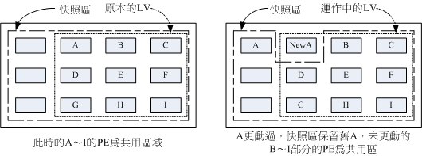

# 第十四章、磁盘配额（Quota）与进阶文件系统管理

最近更新日期：20//

如果您的 Linux 服务器有多个用户经常存取数据时，为了维护所有使用者在硬盘容量的公平使用，磁盘配额 （Quota） 就是一项非常有用的工具！另外，如果你的用户常常抱怨磁盘容量不够用，那么更进阶的文件系统就得要学习学习。 本章我们会介绍磁盘阵列 （RAID） 及逻辑卷轴文件系统 （LVM），这些工具都可以帮助你管理与维护使用者可用的磁盘容量喔！

# 14.1 磁盘配额 （Quota） 的应用与实作

## 14.1 磁盘配额 （Quota） 的应用与实作

Quota 这个玩意儿就字面上的意思来看，就是有多少“限额”的意思啦！如果是用在零用钱上面， 就是类似“有多少零用钱一个月”的意思之类的。如果是在计算机主机的磁盘使用量上呢？以 Linux 来说，就是有多少容量限制的意思啰。我们可以使用 quota 来让磁盘的容量使用较为公平， 下面我们会介绍什么是 quota ，然后以一个完整的范例来介绍 quota 的实作喔！

### 14.1.1 什么是 Quota

在 Linux 系统中，由于是多用户多任务的环境，所以会有多人共同使用一个硬盘空间的情况发生， 如果其中有少数几个使用者大量的占掉了硬盘空间的话，那势必压缩其他使用者的使用权力！ 因此管理员应该适当的限制硬盘的容量给使用者，以妥善的分配系统资源！避免有人抗议呀！

举例来说，我们使用者的默认主文件夹都是在 /home 下面，如果 /home 是个独立的 partition ， 假设这个分区有 10G 好了，而 /home 下面共有 30 个帐号，也就是说，每个使用者平均应该会有 333MB 的空间才对。 偏偏有个使用者在他的主文件夹下面塞了好多只影片，占掉了 8GB 的空间，想想看，是否造成其他正常使用者的不便呢？ 如果想要让磁盘的容量公平的分配，这个时候就得要靠 quota 的帮忙啰！

*   Quota 的一般用途 [[1]](#ps1)

quota 比较常使用的几个情况是：

*   针对 WWW server ，例如：每个人的网页空间的容量限制！
*   针对 mail server，例如：每个人的邮件空间限制。
*   针对 file server，例如：每个人最大的可用网络硬盘空间 （教学环境中最常见！）

上头讲的是针对网络服务的设计，如果是针对 Linux 系统主机上面的设置那么使用的方向有下面这一些：

*   限制某一群组所能使用的最大磁盘配额 （使用群组限制）： 你可以将你的主机上的使用者分门别类，有点像是目前很流行的付费与免付费会员制的情况， 你比较喜好的那一群的使用配额就可以给高一些！呵呵！ ^_^...

*   限制某一使用者的最大磁盘配额 （使用使用者限制）： 在限制了群组之后，你也可以再继续针对个人来进行限制，使得同一群组之下还可以有更公平的分配！

*   限制某一目录 （directory, project） 的最大磁盘配额： 在旧版的 CentOS 当中，使用的默认文件系统为 EXT 家族，这种文件系统的磁盘配额主要是针对整个文件系统来处理，所以大多针对“挂载点”进行设计。 新的 xfs 可以使用 project 这种模式，就能够针对个别的目录 （非文件系统喔） 来设计磁盘配额耶！超棒的！

大概有这些实际的用途啦！基本上，quota 就是在回报管理员磁盘使用率以及让管理员管理磁盘使用情况的一个工具就是了！ 比较特别的是，XFS 的 quota 是整合到文件系统内，并不是其他外挂的程序来管理的，因此，通过 quota 来直接回报磁盘使用率，要比 unix 工具来的快速！ 举例来说， du 这东西会重新计算目录下的磁盘使用率，但 xfs 可以通过 xfs_quota 来直接回报各目录使用率，速度上是快非常多！

*   Quota 的使用限制

虽然 quota 很好用，但是使用上还是有些限制要先了解的：

*   在 EXT 文件系统家族仅能针对整个 filesystem： EXT 文件系统家族在进行 quota 限制的时候，它仅能针对整个文件系统来进行设计，无法针对某个单一的目录来设计它的磁盘配额。 因此，如果你想要使用不同的文件系统进行 quota 时，请先搞清楚该文件系统支持的情况喔！因为 XFS 已经可以使用 project 模式来设计不同目录的磁盘配额。

*   核心必须支持 quota ： Linux 核心必须有支持 quota 这个功能才行：如果你是使用 CentOS 7.x 的默认核心， 嘿嘿！那恭喜你了，你的系统已经默认有支持 quota 这个功能啰！如果你是自行编译核心的， 那么请特别留意你是否已经“真的”打开了 quota 这个功能？否则下面的功夫将全部都视为“白工”。

*   只对一般身份使用者有效： 这就有趣了！并不是所有在 Linux 上面的帐号都可以设置 quota 呢，例如 root 就不能设置 quota ， 因为整个系统所有的数据几乎都是他的啊！ ^_^

*   若启用 SELinux，非所有目录均可设置 quota ： 新版的 CentOS 默认都有启用 SELinux 这个核心功能，该功能会加强某些细部的权限控制！由于担心管理员不小心设置错误，因此默认的情况下， quota 似乎仅能针对 /home 进行设置而已～因此，如果你要针对其他不同的目录进行设置，请参考到后续章节查阅解开 SELinux 限制的方法喔！ 这就不是 quota 的问题了...

新版的 CentOS 使用的 xfs 确实比较有趣！不但无须额外的 quota 纪录档，也能够针对文件系统内的不同目录进行配置！相当有趣！ 只是不同的文件系统在 quota 的处理情况上不太相同，因此这里要特别强调，进行 quota 前，先确认你的文件系统吧！

*   Quota 的规范设置项目：

quota 这玩意儿针对 XFS filesystem 的限制项目主要分为下面几个部分：

*   分别针对使用者、群组或个别目录 （user, group & project）：

XFS 文件系统的 quota 限制中，主要是针对群组、个人或单独的目录进行磁盘使用率的限制！

*   容量限制或文件数量限制 （block 或 inode）：

我们在第七章谈到文件系统中，说到文件系统主要规划为存放属性的 inode 与实际文件数据的 block 区块，Quota 既然是管理文件系统，所以当然也可以管理 inode 或 block 啰！ 这两个管理的功能为：

*   限制 inode 用量：可以管理使用者可以创建的“文件数量”；
*   限制 block 用量：管理使用者磁盘容量的限制，较常见为这种方式。

*   柔性劝导与硬性规定 （soft/hard）：

既然是规范，当然就有限制值。不管是 inode/block ，限制值都有两个，分别是 soft 与 hard。 通常 hard 限制值要比 soft 还要高。举例来说，若限制项目为 block ，可以限制 hard 为 500MBytes 而 soft 为 400MBytes。这两个限值的意义为：

*   hard：表示使用者的用量绝对不会超过这个限制值，以上面的设置为例， 使用者所能使用的磁盘容量绝对不会超过 500MBytes ，若超过这个值则系统会锁住该用户的磁盘使用权；
*   soft：表示使用者在低于 soft 限值时 （此例中为 400MBytes），可以正常使用磁盘，但若超过 soft 且低于 hard 的限值 （介于 400~500MBytes 之间时），每次使用者登陆系统时，系统会主动发出磁盘即将爆满的警告讯息， 且会给予一个宽限时间 （grace time）。不过，若使用者在宽限时间倒数期间就将容量再次降低于 soft 限值之下， 则宽限时间会停止。

*   会倒数计时的宽限时间 （grace time）：

刚刚上面就谈到宽限时间了！这个宽限时间只有在使用者的磁盘用量介于 soft 到 hard 之间时，才会出现且会倒数的一个咚咚！ 由于达到 hard 限值时，使用者的磁盘使用权可能会被锁住。为了担心使用者没有注意到这个磁盘配额的问题， 因此设计了 soft 。当你的磁盘用量即将到达 hard 且超过 soft 时，系统会给予警告，但也会给一段时间让使用者自行管理磁盘。 一般默认的宽限时间为七天，如果七天内你都不进行任何磁盘管理，那么 soft 限制值会即刻取代 hard 限值来作为 quota 的限制。

以上面设置的例子来说，假设你的容量高达 450MBytes 了，那七天的宽限时间就会开始倒数， 若七天内你都不进行任何删除文件的动作来替你的磁盘用量瘦身， 那么七天后你的磁盘最大用量将变成 400MBytes （那个 soft 的限制值），此时你的磁盘使用权就会被锁住而无法新增文件了。

整个 soft, hard, grace time 的相关性我们可以用下面的图示来说明：

图 14.1.1、soft, hard, grace time 的相关性

图中的长条图为使用者的磁盘容量，soft/hard 分别是限制值。只要小于 400M 就一切 OK ， 若高于 soft 就出现 grace time 并倒数且等待使用者自行处理，若到达 hard 的限制值， 那我们就搬张小板凳等着看好戏啦！嘿嘿！^_^！这样图示有清楚一点了吗？

### 14.1.2 一个 XFS 文件系统的 Quota 实作范例

坐而言不如起而行啊，所以这里我们使用一个范例来设计一下如何处理 Quota 的设置流程。

*   目的与帐号：现在我想要让我的专题生五个为一组，这五个人的帐号分别是 myquota1, myquota2, myquota3, myquota4, myquota5，这五个用户的密码都是 password ，且这五个用户所属的初始群组都是 myquotagrp 。 其他的帐号属性则使用默认值。

*   帐号的磁盘容量限制值：我想让这五个用户都能够取得 300MBytes 的磁盘使用量（hard），文件数量则不予限制。 此外，只要容量使用率超过 250MBytes ，就予以警告 （soft）。

*   群组的限额 （option 1）：由于我的系统里面还有其他用户存在，因此我仅承认 myquotagrp 这个群组最多仅能使用 1GBytes 的容量。 这也就是说，如果 myquota1, myquota2, myquota3 都用了 280MBytes 的容量了，那么其他两人最多只能使用 （1000MB - 280x3 = 160MB） 的磁盘容量啰！这就是使用者与群组同时设置时会产生的后果。

*   共享目录限额 （option 2）：另一种设置方式，每个用户还是具有自己独立的容量限止，但是这五个人的专题共享目录在 /home/myquota 这里，该目录请设置为其他人没有任何权限的共享目录空间，仅有 myquotagrp 群组拥有全部的权限。 且无论如何，该目录最多仅能够接受 500MBytes 的容量。请注意，群组 （group） 的限制与目录 （directory/project） 无法同时并存喔！ 所以下面的流程中，我们会先以群组来设计，然后再以目录限制来进一步说明！

*   宽限时间的限制：最后，我希望每个使用者在超过 soft 限制值之后，都还能够有 14 天的宽限时间。

好了，那你怎么规范帐号以及相关的 Quota 设置呢？首先，在这个小节我们先来将帐号相关的属性、参数及其他环境搞定再说吧！

```
# 制作帐号环境时，由于有五个帐号，因此鸟哥使用 script 来创建环境！
[root@study ~]# vim addaccount.sh
#!/bin/bash
# 使用 script 来创建实验 quota 所需的环境
groupadd myquotagrp
for username in myquota1 myquota2 myquota3 myquota4 myquota5
do
    useradd -g myquotagrp $username
    echo "password" &#124; passwd --stdin $username
done
mkdir /home/myquota
chgrp myquotagrp /home/myquota
chmod 2770 /home/myquota

[root@study ~]# sh addaccount.sh 
```

接下来，就让我们来实作 Quota 的练习吧！

### 14.1.3 实作 Quota 流程-1：文件系统的支持与观察

前面我们就谈到，要使用 Quota 必须要核心与文件系统支持才行！假设你已经使用了默认支持 Quota 的核心， 那么接下来就是要启动文件系统的支持啦！但是要注意，我们这边是以 XFS 文件系统为例的，如果你使用的是 EXT 家族，请找前一版的书籍说明喔！ 此外，不要在根目录下面进行 quota 设计喔！因为文件系统会变得太复杂！因此，下面我们是以 /home 这个 xfs 文件系统为例的！ 当然啦，首先就是要来检查看看！

```
[root@study ~]# df -hT /home
Filesystem              Type  Size  Used Avail Use% Mounted on
/dev/mapper/centos-home xfs   5.0G   67M  5.0G   2% /home 
```

从上面的数据来看，鸟哥这部主机的 /home 确实是独立的 filesystem，而且确实是使用了 xfs 文件系统！所以可以使用下面的流程啰！ 此外，由于 VFAT 文件系统并不支持 Linux Quota 功能，所以我们得要使用 mount 查询一下 /home 的文件系统为何才行啊！

在过去的版本中，管理员似乎可以通过 mount -o remount 的机制来重新挂载启动 quota 的功能，不过 XFS 文件系统的 quota 似乎是在挂载之初就宣告了， 因此无法使用 remount 来重新启动 quota 功能，一定得要写入 /etc/fstab 当中，或者是在初始挂载过程中加入这个项目， 否则不会生效喔！那就来瞧瞧鸟哥改了 fstab 成为怎样吧！

```
[root@study ~]# vim /etc/fstab
/dev/mapper/centos-home  /home  xfs  defaults,usrquota,grpquota   0 0
# 其他项目鸟哥并没有列出来！重点在于第四字段！于 default 后面加上两个参数！

[root@study ~]# umount /home
[root@study ~]# mount -a
[root@study ~]# mount &#124; grep home
/dev/mapper/centos-home on /home type xfs （rw,relatime,seclabel,attr2,inode64,usrquota,grpquota） 
```

基本上，针对 quota 限制的项目主要有三项，如下所示：

*   uquota/usrquota/quota：针对使用者帐号的设置
*   gquota/grpquota：针对群组的设置
*   pquota/prjquota：针对单一目录的设置，但是不可与 grpquota 同时存在！

还是要再次的强调，修改完 /etc/fstab 后，务必要测试一下！若有发生错误得要赶紧处理！ 因为这个文件如果修改错误，是会造成无法开机完全的情况啊！切记切记！最好使用 vim 来修改啦！ 因为会有语法的检验，就不会让你写错字了！此外，由于一般用户的主文件夹在 /home 里面，因此针对这个项目的卸载时， 一定要将所有一般帐号的身份登出，否则肯定无法卸载喔！留意留意！

### 14.1.4 实作 Quota 流程-2：观察 Quota 报告数据

制作文件系统支持之后，当然得要来瞧一瞧到底有没有正确的将 quota 的管理数据列出来才好！这时我们得要使用 xfs_quota 这个指令才行！这个指令真的是挺复杂的，因为全部的 quota 实作都是这个指令耶！所以里面的参数有够多！ 不过稍微观察一下即可！先让我们来谈谈观察目前 quota 的报告内容吧！

```
[root@study ~]# xfs_quota -x -c "指令" [挂载点]
选项与参数：
-x  ：专家模式，后续才能够加入 -c 的指令参数喔！
-c  ：后面加的就是指令，这个小节我们先来谈谈数据回报的指令
指令：
      print ：单纯的列出目前主机内的文件系统参数等数据
      df    ：与原本的 df 一样的功能，可以加上 -b （block） -i （inode） -h （加上单位） 等
      report：列出目前的 quota 项目，有 -ugr （user/group/project） 及 -bi 等数据
      state ：说明目前支持 quota 的文件系统的信息，有没有起动相关项目等

范例一：列出目前系统的各的文件系统，以及文件系统的 quota 挂载参数支持
[root@study ~]# xfs_quota -x -c "print"
Filesystem          Pathname
/                   /dev/mapper/centos-root
/srv/myproject      /dev/vda4
/boot               /dev/vda2
/home               /dev/mapper/centos-home （uquota, gquota）  # 所以这里就有显示支持啰

范例二：列出目前 /home 这个支持 quota 的载点文件系统使用情况
[root@study ~]# xfs_quota -x -c "df -h" /home
Filesystem     Size   Used  Avail Use% Pathname
/dev/mapper/centos-home
               5.0G  67.0M   4.9G   1% /home
# 如上所示，其实跟原本的 df 差不多啦！只是会更正确就是了。

范例三：列出目前 /home 的所有用户的 quota 限制值
[root@study ~]# xfs_quota -x -c "report -ubih" /home
User quota on /home （/dev/mapper/centos-home）
                        Blocks                            Inodes
User ID      Used   Soft   Hard Warn/Grace     Used   Soft   Hard Warn/Grace
---------- --------------------------------- ---------------------------------
root           4K      0      0  00 [------]      4      0      0  00 [------]
dmtsai      34.0M      0      0  00 [------]    432      0      0  00 [------]
.....（中间省略）.....
myquota1      12K      0      0  00 [------]      7      0      0  00 [------]
myquota2      12K      0      0  00 [------]      7      0      0  00 [------]
myquota3      12K      0      0  00 [------]      7      0      0  00 [------]
myquota4      12K      0      0  00 [------]      7      0      0  00 [------]
myquota5      12K      0      0  00 [------]      7      0      0  00 [------]
# 所以列出了所有用户的目前的文件使用情况，并且列出设置值。注意，最上面的 Block
# 代表这个是 block 容量限制，而 inode 则是文件数量限制喔。另外，soft/hard 若为 0，代表没限制

范例四：列出目前支持的 quota 文件系统是否有起动了 quota 功能？
[root@study ~]# xfs_quota -x -c "state"
User quota state on /home （/dev/mapper/centos-home）
  Accounting: ON    # 有启用计算功能
  Enforcement: ON   # 有实际 quota 管制的功能
  Inode: #1568 （4 blocks, 4 extents）  # 上面四行说明的是有启动 user 的限制能力
Group quota state on /home （/dev/mapper/centos-home）
  Accounting: ON
  Enforcement: ON
  Inode: #1569 （5 blocks, 5 extents）  # 上面四行说明的是有启动 group 的限制能力
Project quota state on /home （/dev/mapper/centos-home）
  Accounting: OFF
  Enforcement: OFF
  Inode: #1569 （5 blocks, 5 extents）  # 上面四行说明的是 project 并未支持
Blocks grace time: [7 days 00:00:30]  # 下面则是 grace time 的项目
Inodes grace time: [7 days 00:00:30]
Realtime Blocks grace time: [7 days 00:00:30] 
```

在默认的情况下， xfs_quota 的 report 指令会将支持的 user/group/prject 相关数据列出来，如果只是想要某个特定的项目， 例如我们上面要求仅列出用户的数据时，就在 report 后面加上 -u 即可喔！这样就能够观察目前的相关设置信息了。 要注意，限制的项目有 block/inode 同时可以针对每个项目来设置 soft/hard 喔！接下来实际的设置看看吧！

### 14.1.5 实作 Quota 流程-3：限制值设置方式

确认文件系统的 quota 支持顺利启用后，也能够观察到相关的 quota 限制，接下来就是要实际的给予用户/群组限制啰！ 回去瞧瞧，我们需要每个用户 250M/300M 的容量限制，群组共 950M/1G 的容量限制，同时 grace time 设置为 14 天喔！ 实际的语法与设置流程来瞧瞧：

```
[root@study ~]# xfs_quota -x -c "limit [-ug] b[soft&#124;hard]=N i[soft&#124;hard]=N name"
[root@study ~]# xfs_quota -x -c "timer [-ug] [-bir] Ndays"
选项与参数：
limit ：实际限制的项目，可以针对 user/group 来限制，限制的项目有
        bsoft/bhard : block 的 soft/hard 限制值，可以加单位
        isoft/ihard : inode 的 soft/hard 限制值
        name        : 就是用户/群组的名称啊！
timer ：用来设置 grace time 的项目喔，也是可以针对 user/group 以及 block/inode 设置

范例一：设置好用户们的 block 限制值 （题目中没有要限制 inode 啦！）
[root@study ~]# xfs_quota -x -c "limit -u bsoft=250M bhard=300M myquota1" /home
[root@study ~]# xfs_quota -x -c "limit -u bsoft=250M bhard=300M myquota2" /home
[root@study ~]# xfs_quota -x -c "limit -u bsoft=250M bhard=300M myquota3" /home
[root@study ~]# xfs_quota -x -c "limit -u bsoft=250M bhard=300M myquota4" /home
[root@study ~]# xfs_quota -x -c "limit -u bsoft=250M bhard=300M myquota5" /home
[root@study ~]# xfs_quota -x -c "report -ubih" /home
User quota on /home （/dev/mapper/centos-home）
                        Blocks                            Inodes
User ID      Used   Soft   Hard Warn/Grace     Used   Soft   Hard Warn/Grace
---------- --------------------------------- ---------------------------------
myquota1      12K   250M   300M  00 [------]      7      0      0  00 [------]

范例二：设置好 myquotagrp 的 block 限制值
[root@study ~]# xfs_quota -x -c "limit -g bsoft=950M bhard=1G myquotagrp" /home
[root@study ~]# xfs_quota -x -c "report -gbih" /home
Group quota on /home （/dev/mapper/centos-home）
                        Blocks                            Inodes
Group ID     Used   Soft   Hard Warn/Grace     Used   Soft   Hard Warn/Grace
---------- --------------------------------- ---------------------------------
myquotagrp    60K   950M     1G  00 [------]     36      0      0  00 [------]

范例三：设置一下 grace time 变成 14 天吧！
[root@study ~]# xfs_quota -x -c "timer -ug -b 14days" /home
[root@study ~]# xfs_quota -x -c "state" /home
User quota state on /home （/dev/mapper/centos-home）
.....（中间省略）.....
Blocks grace time: [14 days 00:00:30]
Inodes grace time: [7 days 00:00:30]
Realtime Blocks grace time: [7 days 00:00:30]

范例四：以 myquota1 用户测试 quota 是否真的实际运行呢？
[root@study ~]# su - myquota1
[myquota1@study ~]$ dd if=/dev/zero of=123.img bs=1M count=310
dd: error writing ‘123.img’: Disk quota exceeded
300+0 records in
299+0 records out
314552320 Bytes （315 MB） copied, 0.181088 s, 1.7 GB/s
[myquota1@study ~]$ ll -h
-rw-r--r--. 1 myquota1 myquotagrp 300M Jul 24 21:38 123.img

[myquota1@study ~]$ exit
[root@study ~]# xfs_quota -x -c "report -ubh" /home
User quota on /home （/dev/mapper/centos-home）
                        Blocks
User ID      Used   Soft   Hard Warn/Grace
---------- ---------------------------------
myquota1     300M   250M   300M  00 [13 days]
myquota2      12K   250M   300M  00 [------]
# 因为 myquota1 的磁盘用量已经破表，所以当然就会出现那个可怕的 grace time 啰！ 
```

这样就直接制做好 quota 啰！看起来也是挺简单啦！

### 14.1.6 实作 Quota 流程-4：project 的限制 （针对目录限制） （Optional）

现在让我们来想一想，如果需要限制的是目录而不是群组时，那该如何处理呢？举例来说，我们要限制的是 /home/myquota 这个目录本身， 而不是针对 myquotagrp 这个群组啊！这两种设置方法的意义不同喔！例如，前一个小节谈到的测试范例来说， myquota1 已经消耗了 300M 的容量，而 /home/myquota 其实还没有任何的使用量 （因为在 myquota1 的主文件夹做的 dd 指令）。 不过如果你使用了 xfs_quota -x -c "report -h" /home 这个指令来查看，就会发现其实 myquotagrp 已经用掉了 300M 了！ 如此一来，对于目录的限制来说，就不会有效果！

为了解决这个问题，因此我们这个小节要来设置那个很有趣的 project 项目！只是这个项目不可以跟 group 同时设置喔！ 因此我们得要取消 group 设置并且加入 project 设置才行。那就来实验看看。

*   修改 /etc/fstab 内的文件系统支持参数

首先，要将 grpquota 的参数取消，然后加入 prjquota ，并且卸载 /home 再重新挂载才行！那就来测试看看！

```
# 1\. 先修改 /etc/fstab 的参数，并启动文件系统的支持
[root@study ~]# vim /etc/fstab
/dev/mapper/centos-home /home xfs  defaults,usrquota,grpquota,prjquota  0 0
# 记得， grpquota 与 prjquota 不可同时设置喔！所以上面删除 grpquota 加入 prjquota

[root@study ~]# umount /home
[root@study ~]# mount -a
[root@study ~]# xfs_quota -x -c "state"
User quota state on /home （/dev/mapper/centos-home）
  Accounting: ON
  Enforcement: ON
  Inode: #1568 （4 blocks, 4 extents）
Group quota state on /home （/dev/mapper/centos-home）
  Accounting: OFF         &lt;==已经取消啰！
  Enforcement: OFF
  Inode: N/A
Project quota state on /home （/dev/mapper/centos-home）
  Accounting: ON          &lt;==确实启动啰！
  Enforcement: ON
  Inode: N/A
Blocks grace time: [7 days 00:00:30]
Inodes grace time: [7 days 00:00:30]
Realtime Blocks grace time: [7 days 00:00:30] 
```

*   规范目录、专案名称（project）与专案 ID

目录的设置比较奇怪，他必须要指定一个所谓的“专案名称、专案识别码”来规范才行！而且还需要用到两个配置文件！ 这个让鸟哥觉得比较怪一些就是了。现在，我们要规范的目录是 /home/myquota 目录，这个目录我们给个 myquotaproject 的专案名称， 这个专案名称给个 11 的识别码，这个都是自己指定的，若不喜欢就自己指定另一个吧！鸟哥的指定方式如下：

```
# 2.1 指定专案识别码与目录的对应在 /etc/projects
[root@study ~]# echo "11:/home/myquota" &gt;&gt; /etc/projects

# 2.2 规范专案名称与识别码的对应在 /etc/projid
[root@study ~]# echo "myquotaproject:11" &gt;&gt; /etc/projid

# 2.3 初始化专案名称
[root@study ~]# xfs_quota -x -c "project -s myquotaproject"
Setting up project myquotaproject （path /home/myquota）...
Processed 1 （/etc/projects and cmdline） paths for project myquotaproject with recursion 
depth infinite （-1）.    # 会闪过这些讯息！是 OK 的！别担心！

[root@study ~]# xfs_quota -x -c "print " /home
Filesystem          Pathname
/home               /dev/mapper/centos-home （uquota, pquota）
/home/myquota       /dev/mapper/centos-home （project 11, myquotaproject）
# 这个 print 功能很不错！可以完整的查看到相对应的各项文件系统与 project 目录对应！

[root@study ~]# xfs_quota -x -c "report -pbih " /home
Project quota on /home （/dev/mapper/centos-home）
                        Blocks                            Inodes
Project ID       Used   Soft   Hard Warn/Grace     Used   Soft   Hard Warn/Grace
---------- --------------------------------- ---------------------------------
myquotaproject      0      0      0  00 [------]      1      0      0  00 [------]
# 喔耶！确定有抓到这个专案名称啰！接下来准备设置吧！ 
```

*   实际设置规范与测试

依据本章的说明，我们要将 /home/myquota 指定为 500M 的容量限制，那假设到 450M 为 soft 的限制好了！ 那么设置就会变成这样啰：

```
# 3.1 先来设置好这个 project 吧！设置的方式同样使用 limit 的 bsoft/bhard 喔！：
[root@study ~]# xfs_quota -x -c "limit -p bsoft=450M bhard=500M myquotaproject" /home
[root@study ~]# xfs_quota -x -c "report -pbih " /home
Project quota on /home （/dev/mapper/centos-home）
                            Blocks                            Inodes
Project ID       Used   Soft   Hard Warn/Grace     Used   Soft   Hard Warn/Grace
---------- --------------------------------- ---------------------------------
myquotaproject      0   450M   500M  00 [------]      1      0      0  00 [------]

[root@study ~]# dd if=/dev/zero of=/home/myquota/123.img bs=1M count=510
dd: error writing '/home/myquota/123.img': No space left on device
501+0 records in
500+0 records out
524288000 Bytes （524 MB） copied, 0.96296 s, 544 MB/s
# 你看！连 root 在该目录下面创建文件时，也会被挡掉耶！这才是完整的针对目录的规范嘛！赞！ 
```

这样就设置好了啰！未来如果你还想要针对某些个目录进行限制，那么就修改 /etc/projects, /etc/projid 设置一下规范， 然后直接处理目录的初始化与设置，就完成设置了！好简单！

当鸟哥跟同事分享这个 project 的功能时，强者我同事蔡董大大说，刚刚好！他有些朋友要求在 WWW 的服务中，要针对某些目录进行容量的限制！ 但是因为容量之前仅针对用户进行限制，如此一来，由于 WWW 服务都是一个名为 httpd 的帐号管理的，因此所有 WWW 服务所产生的文件数据， 就全部属于 httpd 这个帐号，那就无法针对某些特定的目录进行限制了。有了这个 project 之后，就能够针对不同的目录做容量限制！ 而不用管在里头创建文件的文件拥有者！哇！这真是太棒了！实务应用给各位了解啰！ ^_^

### 14.1.7 XFS quota 的管理与额外指令对照表

不管多完美的系统，总是需要可能的突发状况应付手段啊！所以，接下来我们就来谈谈，那么万一如果你需要暂停 quota 的限制， 或者是重新启动 quota 的限制时，该如何处理呢？还是使用 xfs_quota 啦！增加几个内部指令即可：

*   disable：暂时取消 quota 的限制，但其实系统还是在计算 quota 中，只是没有管制而已！应该算最有用的功能啰！
*   enable：就是回复到正常管制的状态中，与 disable 可以互相取消、启用！
*   off：完全关闭 quota 的限制，使用了这个状态后，你只有卸载再重新挂载才能够再次的启动 quota 喔！也就是说， 用了 off 状态后，你无法使用 enable 再次复原 quota 的管制喔！注意不要乱用这个状态！一般建议用 disable 即可，除非你需要执行 remove 的动作！
*   remove：必须要在 off 的状态下才能够执行的指令～这个 remove 可以“移除”quota 的限制设置，例如要取消 project 的设置， 无须重新设置为 0 喔！只要 remove -p 就可以了！

现在就让我们来测试一下管理的方式吧：

```
# 1\. 暂时关闭 XFS 文件系统的 quota 限制功能
[root@study ~]# xfs_quota -x -c "disable -up" /home
[root@study ~]# xfs_quota -x -c "state" /home
User quota state on /home （/dev/mapper/centos-home）
 Accounting: ON
  Enforcement: OFF   &lt;== 意思就是有在计算，但没有强制管制的意思
  Inode: #1568 （4 blocks, 4 extents）
Group quota state on /home （/dev/mapper/centos-home）
  Accounting: OFF
  Enforcement: OFF
  Inode: N/A
Project quota state on /home （/dev/mapper/centos-home）
 Accounting: ON
  Enforcement: OFF
  Inode: N/A
Blocks grace time: [7 days 00:00:30]
Inodes grace time: [7 days 00:00:30]
Realtime Blocks grace time: [7 days 00:00:30]

[root@study ~]# dd if=/dev/zero of=/home/myquota/123.img bs=1M count=520
520+0 records in
520+0 records out  # 见鬼！竟然没有任何错误发生了！
545259520 Bytes （545 MB） copied, 0.308407 s, 180 MB/s

[root@study ~]# xfs_quota -x -c "report -pbh" /home
Project quota on /home （/dev/mapper/centos-home）
                        Blocks
Project ID       Used   Soft   Hard Warn/Grace
---------- ---------------------------------
myquotaproject   520M   450M   500M  00 [-none-]
# 其实，还真的有超过耶！只是因为 disable 的关系，所以没有强制限制住就是了！

[root@study ~]# xfs_quota -x -c "enable -up" /home  # 重新启动 quota 限制
[root@study ~]# dd if=/dev/zero of=/home/myquota/123.img bs=1M count=520
dd: error writing ‘/home/myquota/123.img’: No space left on device
# 又开始有限制！这就是 enable/disable 的相关对应功能喔！暂时关闭/启动用的！

# 完全关闭 quota 的限制行为吧！同时取消 project 的功能试看看！
[root@study ~]# xfs_quota -x -c "off -up" /home
[root@study ~]# xfs_quota -x -c "enable -up" /home
XFS_QUOTAON: Function not implemented
# 您瞧瞧！没有办法重新启动！因为已经完全的关闭了 quota 的功能！所以得要 umouont/mount 才行！

[root@study ~]# umount /home; mount -a
# 这个时候使用 report 以及 state 时，管制限制的内容又重新回来了！好！来瞧瞧如何移除 project

[root@study ~]# xfs_quota -x -c "off -up" /home
[root@study ~]# xfs_quota -x -c "remove -p" /home
[root@study ~]# umount /home; mount -a
[root@study ~]# xfs_quota -x -c "report -phb" /home
Project quota on /home （/dev/mapper/centos-home）
                        Blocks
Project ID       Used   Soft   Hard Warn/Grace
---------- ---------------------------------
myquotaproject   500M      0      0  00 [------]
# 嘿嘿！全部归零！就是“移除”所有限制值的意思！ 
```

请注意上表中最后一个练习，那个 remove -p 是“移除所有的 project 控制列表”的意思！也就是说，如果你有在 /home 设置多个 project 的限制， 那么 remove 会删的一个也不留喔！如果想要回复设置值，那...只能一个一个重新设置回去了！没有好办法！

上面就是 XFS 文件系统的简易 quota 处理流程～那如果你是使用 EXT 家族呢？能不能使用 quota 呢？除了参考[上一版](http://linux.vbird.org/linux_basic/0420quota/0420quota-centos5.php)的文件之外，鸟哥这里也列出相关的参考指令/设置文件给你对照参考！ 没学过的可以看看流程，有学过的可以对照了解！ ^_^

| 设置流程项目 | XFS 文件系统 | EXT 家族 |
| --- | --- | --- |
| /etc/fstab 参数设置 | usrquota/grpquota/prjquota | usrquota/grpquota |
| quota 配置文件 | 不需要 | quotacheck |
| 设置用户/群组限制值 | xfs_quota -x -c "limit..." | edquota 或 setquota |
| 设置 grace time | xfs_quota -x -c "timer..." | edquota |
| 设置目录限制值 | xfs_quota -x -c "limit..." | 无 |
| 观察报告 | xfs_quota -x -c "report..." | repquota 或 quota |
| 启动与关闭 quota 限制 | xfs_quota -x -c "[disable&#124;enable]..." | quotaoff, quotaon |
| 发送警告信给用户 | 目前版本尚未支持 | warnquota |

### 14.1.8 不更动既有系统的 quota 实例

想一想，如果你的主机原先没有想到要设置成为邮件主机，所以并没有规划将邮件信箱所在的 /var/spool/mail/ 目录独立成为一个 partition ，然后目前你的主机已经没有办法新增或分区出任何新的分区了。那我们知道 quota 的支持与文件系统有关， 所以并无法跨文件系统来设计 quota 的 project 功能啊！因此，你是否就无法针对 mail 的使用量给予 quota 的限制呢？

此外，如果你想要让使用者的邮件信箱与主文件夹的总体磁盘使用量为固定，那又该如何是好？ 由于 /home 及 /var/spool/mail 根本不可能是同一个 filesystem （除非是都不分区，使用根目录，才有可能整合在一起）， 所以，该如何进行这样的 quota 限制呢？

其实没有那么难啦！既然 quota 是针对 filesystem 来进行限制，假设你又已经有 /home 这个独立的分区了，那么你只要：

1.  将 /var/spool/mail 这个目录完整的移动到 /home 下面；
2.  利用 ln -s /home/mail /var/spool/mail 来创建链接数据；
3.  将 /home 进行 quota 限额设置

只要这样的一个小步骤，嘿嘿！您家主机的邮件就有一定的限额啰！当然啰！您也可以依据不同的使用者与群组来设置 quota 然后同样的以上面的方式来进行 link 的动作！嘿嘿嘿！就有不同的限额针对不同的使用者提出啰！很方便吧！^_^


**Tips** 朋友们需要注意的是，由于目前新的 distributions 大多有使用 SELinux 的机制， 因此你要进行如同上面的目录搬移时，在许多情况下可能会有使用上的限制喔！或许你得要先暂时关闭 SELinux 才能测试， 也或许你得要自行修改 SELinux 的规则才行喔！

# 14.2 软件磁盘阵列 （Software RAID）

## 14.2 软件磁盘阵列 （Software RAID）

在过去鸟哥还年轻的时代，我们能使用的硬盘容量都不大，几十 GB 的容量就是大硬盘了！但是某些情况下，我们需要很大容量的储存空间， 例如鸟哥在跑的空气品质模式所输出的数据文件一个案例通常需要好几 GB ，连续跑个几个案例，磁盘容量就不够用了。 此时我该如何是好？其实可以通过一种储存机制，称为磁盘阵列 （RAID） 的就是了。这种机制的功能是什么？他有哪些等级？什么是硬件、软件磁盘阵列？Linux 支持什么样的软件磁盘阵列？ 下面就让我们来谈谈！

### 14.2.1 什么是 RAID

磁盘阵列全名是“ Redundant Arrays of Inexpensive Disks, RAID ”，英翻中的意思是：容错式廉价磁盘阵列。 RAID 可以通过一个技术（软件或硬件），将多个较小的磁盘整合成为一个较大的磁盘设备； 而这个较大的磁盘功能可不止是储存而已，他还具有数据保护的功能呢。整个 RAID 由于选择的等级 （level） 不同，而使得整合后的磁盘具有不同的功能，基本常见的 level 有这几种[[2]](#ps2)：

*   RAID-0 （等量模式, stripe）：性能最佳

这种模式如果使用相同型号与容量的磁盘来组成时，效果较佳。这种模式的 RAID 会将磁盘先切出等量的区块 （名为 chunk，一般可设置 4K~1M 之间）， 然后当一个文件要写入 RAID 时，该文件会依据 chunk 的大小切割好，之后再依序放到各个磁盘里面去。由于每个磁盘会交错的存放数据， 因此当你的数据要写入 RAID 时，数据会被等量的放置在各个磁盘上面。举例来说，你有两颗磁盘组成 RAID-0 ， 当你有 100MB 的数据要写入时，每个磁盘会各被分配到 50MB 的储存量。RAID-0 的示意图如下所示：

图 14.2.1、RAID-0 的磁盘写入示意图

上图的意思是，在组成 RAID-0 时，每颗磁盘 （Disk A 与 Disk B） 都会先被区隔成为小区块 （chunk）。 当有数据要写入 RAID 时，数据会先被切割成符合小区块的大小，然后再依序一个一个的放置到不同的磁盘去。 由于数据已经先被切割并且依序放置到不同的磁盘上面，因此每颗磁盘所负责的数据量都降低了！照这样的情况来看， 越多颗磁盘组成的 RAID-0 性能会越好，因为每颗负责的数据量就更低了！ 这表示我的数据可以分散让多颗磁盘来储存，当然性能会变的更好啊！此外，磁盘总容量也变大了！ 因为每颗磁盘的容量最终会加总成为 RAID-0 的总容量喔！

只是使用此等级你必须要自行负担数据损毁的风险，由上图我们知道文件是被切割成为适合每颗磁盘分区区块的大小， 然后再依序放置到各个磁盘中。想一想，如果某一颗磁盘损毁了，那么文件数据将缺一块，此时这个文件就损毁了。 由于每个文件都是这样存放的，因此 RAID-0 只要有任何一颗磁盘损毁，在 RAID 上面的所有数据都会遗失而无法读取。

另外，如果使用不同容量的磁盘来组成 RAID-0 时，由于数据是一直等量的依序放置到不同磁盘中，当小容量磁盘的区块被用完了， 那么所有的数据都将被写入到最大的那颗磁盘去。举例来说，我用 200G 与 500G 组成 RAID-0 ， 那么最初的 400GB 数据可同时写入两颗磁盘 （各消耗 200G 的容量），后来再加入的数据就只能写入 500G 的那颗磁盘中了。 此时的性能就变差了，因为只剩下一颗可以存放数据嘛！

*   RAID-1 （映射模式, mirror）：完整备份

这种模式也是需要相同的磁盘容量的，最好是一模一样的磁盘啦！如果是不同容量的磁盘组成 RAID-1 时，那么总容量将以最小的那一颗磁盘为主！这种模式主要是“让同一份数据，完整的保存在两颗磁盘上头”。举例来说，如果我有一个 100MB 的文件，且我仅有两颗磁盘组成 RAID-1 时， 那么这两颗磁盘将会同步写入 100MB 到他们的储存空间去。 因此，整体 RAID 的容量几乎少了 50%。由于两颗硬盘内容一模一样，好像镜子映照出来一样， 所以我们也称他为 mirror 模式啰～

图 14.2.2、RAID-1 的磁盘写入示意图

如上图所示，一份数据传送到 RAID-1 之后会被分为两股，并分别写入到各个磁盘里头去。 由于同一份数据会被分别写入到其他不同磁盘，因此如果要写入 100MB 时，数据传送到 I/O 总线后会被复制多份到各个磁盘， 结果就是数据量感觉变大了！因此在大量写入 RAID-1 的情况下，写入的性能可能会变的非常差 （因为我们只有一个南桥啊！）。 好在如果你使用的是硬件 RAID （磁盘阵列卡） 时，磁盘阵列卡会主动的复制一份而不使用系统的 I/O 总线，性能方面则还可以。 如果使用软件磁盘阵列，可能性能就不好了。

由于两颗磁盘内的数据一模一样，所以任何一颗硬盘损毁时，你的数据还是可以完整的保留下来的！ 所以我们可以说， RAID-1 最大的优点大概就在于数据的备份吧！不过由于磁盘容量有一半用在备份， 因此总容量会是全部磁盘容量的一半而已。虽然 RAID-1 的写入性能不佳，不过读取的性能则还可以啦！这是因为数据有两份在不同的磁盘上面，如果多个 processes 在读取同一笔数据时， RAID 会自行取得最佳的读取平衡。

*   RAID 1+0，RAID 0+1

RAID-0 的性能佳但是数据不安全，RAID-1 的数据安全但是性能不佳，那么能不能将这两者整合起来设置 RAID 呢？ 可以啊！那就是 RAID 1+0 或 RAID 0+1。所谓的 RAID 1+0 就是： （1）先让两颗磁盘组成 RAID 1，并且这样的设置共有两组； （2）将这两组 RAID 1 再组成一组 RAID 0。这就是 RAID 1+0 啰！反过来说，RAID 0+1 就是先组成 RAID-0 再组成 RAID-1 的意思。

图 14.2.3、RAID-1+0 的磁盘写入示意图

如上图所示，Disk A + Disk B 组成第一组 RAID 1，Disk C + Disk D 组成第二组 RAID 1， 然后这两组再整合成为一组 RAID 0。如果我有 100MB 的数据要写入，则由于 RAID 0 的关系， 两组 RAID 1 都会写入 50MB，又由于 RAID 1 的关系，因此每颗磁盘就会写入 50MB 而已。 如此一来不论哪一组 RAID 1 的磁盘损毁，由于是 RAID 1 的图像数据，因此就不会有任何问题发生了！这也是目前储存设备厂商最推荐的方法！


**Tips** 为何会推荐 RAID 1+0 呢？想像你有 20 颗磁盘组成的系统，每两颗组成一个 RAID1，因此你就有总共 10 组可以自己复原的系统了！ 然后这 10 组再组成一个新的 RAID0，速度立刻拉升 10 倍了！同时要注意，因为每组 RAID1 是个别独立存在的，因此任何一颗磁盘损毁， 数据都是从另一颗磁盘直接复制过来重建，并不像 RAID5/RAID6 必须要整组 RAID 的磁盘共同重建一颗独立的磁盘系统！性能上差非常多！ 而且 RAID 1 与 RAID 0 是不需要经过计算的 （striping） ！读写性能也比其他的 RAID 等级好太多了！

*   RAID 5：性能与数据备份的均衡考虑

RAID-5 至少需要三颗以上的磁盘才能够组成这种类型的磁盘阵列。这种磁盘阵列的数据写入有点类似 RAID-0 ， 不过每个循环的写入过程中 （striping），在每颗磁盘还加入一个同位检查数据 （Parity） ，这个数据会记录其他磁盘的备份数据， 用于当有磁盘损毁时的救援。RAID-5 读写的情况有点像下面这样：

图 14.2.4、RAID-5 的磁盘写入示意图

如上图所示，每个循环写入时，都会有部分的同位检查码 （parity） 被记录起来，并且记录的同位检查码每次都记录在不同的磁盘， 因此，任何一个磁盘损毁时都能够借由其他磁盘的检查码来重建原本磁盘内的数据喔！不过需要注意的是， 由于有同位检查码，因此 RAID 5 的总容量会是整体磁盘数量减一颗。以上图为例， 原本的 3 颗磁盘只会剩下 （3-1）=2 颗磁盘的容量。而且当损毁的磁盘数量大于等于两颗时，这整组 RAID 5 的数据就损毁了。 因为 RAID 5 默认仅能支持一颗磁盘的损毁情况。

在读写性能的比较上，读取的性能还不赖！与 RAID-0 有的比！不过写的性能就不见得能够增加很多！ 这是因为要写入 RAID 5 的数据还得要经过计算同位检查码 （parity） 的关系。由于加上这个计算的动作， 所以写入的性能与系统的硬件关系较大！尤其当使用软件磁盘阵列时，同位检查码是通过 CPU 去计算而非专职的磁盘阵列卡， 因此性能方面还需要评估。

另外，由于 RAID 5 仅能支持一颗磁盘的损毁，因此近来还有发展出另外一种等级，就是 RAID 6 ，这个 RAID 6 则使用两颗磁盘的容量作为 parity 的储存，因此整体的磁盘容量就会少两颗，但是允许出错的磁盘数量就可以达到两颗了！ 也就是在 RAID 6 的情况下，同时两颗磁盘损毁时，数据还是可以救回来！

*   Spare Disk：预备磁盘的功能：

当磁盘阵列的磁盘损毁时，就得要将坏掉的磁盘拔除，然后换一颗新的磁盘。换成新磁盘并且顺利启动磁盘阵列后， 磁盘阵列就会开始主动的重建 （rebuild） 原本坏掉的那颗磁盘数据到新的磁盘上！然后你磁盘阵列上面的数据就复原了！ 这就是磁盘阵列的优点。不过，我们还是得要动手拔插硬盘，除非你的系统有支持热拔插，否则通常得要关机才能这么做。

为了让系统可以实时的在坏掉硬盘时主动的重建，因此就需要预备磁盘 （spare disk） 的辅助。 所谓的 spare disk 就是一颗或多颗没有包含在原本磁盘阵列等级中的磁盘，这颗磁盘平时并不会被磁盘阵列所使用， 当磁盘阵列有任何磁盘损毁时，则这颗 spare disk 会被主动的拉进磁盘阵列中，并将坏掉的那颗硬盘移出磁盘阵列！ 然后立即重建数据系统。如此你的系统则可以永保安康啊！若你的磁盘阵列有支持热拔插那就更完美了！ 直接将坏掉的那颗磁盘拔除换一颗新的，再将那颗新的设置成为 spare disk ，就完成了！

举例来说，鸟哥之前所待的研究室有一个磁盘阵列可允许 16 颗磁盘的数量，不过我们只安装了 10 颗磁盘作为 RAID 5。 每颗磁盘的容量为 250GB，我们用了一颗磁盘作为 spare disk ，并将其他的 9 颗设置为一个 RAID 5， 因此这个磁盘阵列的总容量为： （9-1）*250G=2000G。运行了一两年后真的有一颗磁盘坏掉了，我们后来看灯号才发现！ 不过对系统没有影响呢！因为 spare disk 主动的加入支持，坏掉的那颗拔掉换颗新的，并重新设置成为 spare 后， 系统内的数据还是完整无缺的！嘿嘿！真不错！

*   磁盘阵列的优点

说的口沫横飞，重点在哪里呢？其实你的系统如果需要磁盘阵列的话，其实重点在于：

1.  数据安全与可靠性：指的并非网络信息安全，而是当硬件 （指磁盘） 损毁时，数据是否还能够安全的救援或使用之意；
2.  读写性能：例如 RAID 0 可以加强读写性能，让你的系统 I/O 部分得以改善；
3.  容量：可以让多颗磁盘组合起来，故单一文件系统可以有相当大的容量。

尤其数据的可靠性与完整性更是使用 RAID 的考虑重点！毕竟硬件坏掉换掉就好了，软件数据损毁那可不是闹着玩的！ 所以企业界为何需要大量的 RAID 来做为文件系统的硬件基准，现在您有点了解了吧？那依据这三个重点，我们来列表看看上面几个重要的 RAID 等级各有哪些优点吧！假设有 n 颗磁盘组成的 RAID 设置喔！

| 项目 | RAID0 | RAID1 | RAID10 | RAID5 | RAID6 |
| --- | --- | --- | --- | --- | --- |
| 最少磁盘数 | 2 | 2 | 4 | 3 | 4 |
| 最大容错磁盘数（1） | 无 | n-1 | n/2 | 1 | 2 |
| 数据安全性（1） | 完全没有 | 最佳 | 最佳 | 好 | 比 RAID5 好 |
| 理论写入性能（2） | n | 1 | n/2 | <n-1 | <n-2 |
| 理论读出性能（2） | n | n | n | <n-1 | <n-2 |
| 可用容量（3） | n | 1 | n/2 | n-1 | n-2 |
| 一般应用 | 强调性能但数据不重要的环境 | 数据与备份 | 服务器、云系统常用 | 数据与备份 | 数据与备份 |

因为 RAID5, RAID6 读写都需要经过 parity 的计算机制，因此读/写性能都不会刚好满足于使用的磁盘数量喔！

另外，根据使用的情况不同，一般推荐的磁盘阵列等级也不太一样。以鸟哥为例，在鸟哥的跑空气品质模式之后的输出数据，动辄几百 GB 的单一大文件数据， 这些情况鸟哥会选择放在 RAID6 的阵列环境下，这是考虑到数据保全与总容量的应用，因为 RAID 6 的性能已经足以应付模式读入所需的环境。

近年来鸟哥也比较积极在作一些云程序环境的设计，在云环境下，确保每个虚拟机能够快速的反应以及提供数据保全是最重要的部份！ 因此性能方面比较弱的 RAID5/RAID6 是不考虑的，总结来说，大概就剩下 RAID10 能够满足云环境的性能需求了。在某些更特别的环境下， 如果搭配 SSD 那才更具有性能上的优势哩！

### 14.2.2 software, hardware RAID

为何磁盘阵列又分为硬件与软件呢？所谓的硬件磁盘阵列 （hardware RAID） 是通过磁盘阵列卡来达成阵列的目的。 磁盘阵列卡上面有一块专门的芯片在处理 RAID 的任务，因此在性能方面会比较好。在很多任务 （例如 RAID 5 的同位检查码计算） 磁盘阵列并不会重复消耗原本系统的 I/O 总线，理论上性能会较佳。此外目前一般的中高阶磁盘阵列卡都支持热拔插， 亦即在不关机的情况下抽换损坏的磁盘，对于系统的复原与数据的可靠性方面非常的好用。

不过一块好的磁盘阵列卡动不动就上万元台币，便宜的在主板上面“附赠”的磁盘阵列功能可能又不支持某些高阶功能， 例如低阶主板若有磁盘阵列芯片，通常仅支持到 RAID0 与 RAID1 ，鸟哥喜欢的 RAID6 并没有支持。 此外，操作系统也必须要拥有磁盘阵列卡的驱动程序，才能够正确的捉到磁盘阵列所产生的磁盘机！

由于磁盘阵列有很多优秀的功能，然而硬件磁盘阵列卡偏偏又贵的很～因此就有发展出利用软件来仿真磁盘阵列的功能， 这就是所谓的软件磁盘阵列 （software RAID）。软件磁盘阵列主要是通过软件来仿真阵列的任务， 因此会损耗较多的系统资源，比如说 CPU 的运算与 I/O 总线的资源等。不过目前我们的个人计算机实在已经非常快速了， 因此以前的速度限制现在已经不存在！所以我们可以来玩一玩软件磁盘阵列！

我们的 CentOS 提供的软件磁盘阵列为 mdadm 这套软件，这套软件会以 partition 或 disk 为磁盘的单位，也就是说，你不需要两颗以上的磁盘，只要有两个以上的分区 （partition） 就能够设计你的磁盘阵列了。此外， mdadm 支持刚刚我们前面提到的 RAID0/RAID1/RAID5/spare disk 等！ 而且提供的管理机制还可以达到类似热拔插的功能，可以线上 （文件系统正常使用） 进行分区的抽换！ 使用上也非常的方便呢！

另外你必须要知道的是，硬件磁盘阵列在 Linux 下面看起来就是一颗实际的大磁盘，因此硬件磁盘阵列的设备文件名为 /dev/sd[a-p] ，因为使用到 SCSI 的模块之故。至于软件磁盘阵列则是系统仿真的，因此使用的设备文件名是系统的设备文件， 文件名为 /dev/md0, /dev/md1...，两者的设备文件名并不相同！不要搞混了喔！因为很多朋友常常觉得奇怪， 怎么他的 RAID 文件名跟我们这里测试的软件 RAID 文件名不同，所以这里特别强调说明喔！


**Tips** Intel 的南桥附赠的磁盘阵列功能，在 windows 下面似乎是完整的磁盘阵列，但是在 Linux 下面则被视为是软件磁盘阵列的一种！ 因此如果你有设置过 Intel 的南桥芯片磁盘阵列，那在 Linux 下面反而还会是 /dev/md126, /dev/md127 等等设备文件名， 而他的分区竟然是 /dev/md126p1, /dev/md126p2... 之类的喔！比较特别，所以这里加强说明！

### 14.2.3 软件磁盘阵列的设置

软件磁盘阵列的设置很简单呢！简单到让你很想笑喔！因为你只要使用一个指令即可！那就是 mdadm 这个指令。 这个指令在创建 RAID 的语法有点像这样：

```
[root@study ~]# mdadm --detail /dev/md0
[root@study ~]# mdadm --create /dev/md[0-9] --auto=yes --level=[015] --chunk=NK \
&gt; --raid-devices=N --spare-devices=N /dev/sdx /dev/hdx...
选项与参数：
--create          ：为创建 RAID 的选项；
--auto=yes        ：决定创建后面接的软件磁盘阵列设备，亦即 /dev/md0, /dev/md1...
--chunk=Nk        ：决定这个设备的 chunk 大小，也可以当成 stripe 大小，一般是 64K 或 512K。
--raid-devices=N  ：使用几个磁盘 （partition） 作为磁盘阵列的设备
--spare-devices=N ：使用几个磁盘作为备用 （spare） 设备
--level=[015]     ：设置这组磁盘阵列的等级。支持很多，不过建议只要用 0, 1, 5 即可
--detail          ：后面所接的那个磁盘阵列设备的详细信息 
```

上面的语法中，最后面会接许多的设备文件名，这些设备文件名可以是整颗磁盘，例如 /dev/sdb ， 也可以是分区，例如 /dev/sdb1 之类。不过，这些设备文件名的总数必须要等于 --raid-devices 与 --spare-devices 的个数总和才行！鸟哥利用我的测试机来创建一个 RAID 5 的软件磁盘阵列给您瞧瞧！ 下面是鸟哥希望做成的 RAID 5 环境：

*   利用 4 个 partition 组成 RAID 5；
*   每个 partition 约为 1GB 大小，需确定每个 partition 一样大较佳；
*   利用 1 个 partition 设置为 spare disk
*   chunk 设置为 256K 这么大即可！
*   这个 spare disk 的大小与其他 RAID 所需 partition 一样大！
*   将此 RAID 5 设备挂载到 /srv/raid 目录下

最终我需要 5 个 1GB 的 partition。在鸟哥的测试机中，根据前面的章节实做下来，包括课后的情境仿真题目，目前应该还有 8GB 可供利用！ 因此就利用这部测试机的 /dev/vda 切出 5 个 1G 的分区。实际的流程鸟哥就不一一展示了，自己通过 gdisk /dev/vda 实作一下！ 最终这部测试机的结果应该如下所示：

```
[root@study ~]# gdisk -l /dev/vda
Number  Start （sector）    End （sector）  Size       Code  Name
   1            2048            6143   2.0 MiB     EF02
   2            6144         2103295   1024.0 MiB  0700
   3         2103296        65026047   30.0 GiB    8E00
   4        65026048        67123199   1024.0 MiB  8300  Linux filesystem
 5        67123200        69220351   1024.0 MiB  FD00  Linux RAID
   6        69220352        71317503   1024.0 MiB  FD00  Linux RAID
   7        71317504        73414655   1024.0 MiB  FD00  Linux RAID
   8        73414656        75511807   1024.0 MiB  FD00  Linux RAID
   9        75511808        77608959   1024.0 MiB  FD00  Linux RAID
# 上面特殊字体的部份就是我们需要的那 5 个 partition 啰！注意注意！

[root@study ~]# lsblk
NAME            MAJ:MIN RM  SIZE RO TYPE MOUNTPOINT
vda             252:0    0   40G  0 disk
&#124;-vda1          252:1    0    2M  0 part
&#124;-vda2          252:2    0    1G  0 part /boot
&#124;-vda3          252:3    0   30G  0 part
&#124; &#124;-centos-root 253:0    0   10G  0 lvm  /
&#124; &#124;-centos-swap 253:1    0    1G  0 lvm  [SWAP]
&#124; `-centos-home 253:2    0    5G  0 lvm  /home
&#124;-vda4          252:4    0    1G  0 part /srv/myproject
&#124;-vda5          252:5    0    1G  0 part
&#124;-vda6          252:6    0    1G  0 part
&#124;-vda7          252:7    0    1G  0 part
&#124;-vda8          252:8    0    1G  0 part
`-vda9          252:9    0    1G  0 part 
```

*   以 mdadm 创建 RAID

接下来就简单啦！通过 mdadm 来创建磁盘阵列先！

```
[root@study ~]# mdadm --create /dev/md0 --auto=yes --level=5 --chunk=256K \
&gt;  --raid-devices=4 --spare-devices=1 /dev/vda{5,6,7,8,9}
mdadm: /dev/vda5 appears to contain an ext2fs file system
       size=1048576K  mtime=Thu Jun 25 00:35:01 2015   # 某些时刻会出现这个东西！没关系的！
Continue creating array? y
mdadm: Defaulting to version 1.2 metadata
mdadm: array /dev/md0 started.
# 详细的参数说明请回去前面看看啰！这里我通过 {} 将重复的项目简化！
# 此外，因为鸟哥这个系统经常在创建测试的环境，因此系统可能会抓到之前的 filesystem 
# 所以就会出现如上前两行的讯息！那没关系的！直接按下 y 即可删除旧系统

[root@study ~]# mdadm --detail /dev/md0
/dev/md0:                                           # RAID 的设备文件名
        Version : 1.2
  Creation Time : Mon Jul 27 15:17:20 2015          # 创建 RAID 的时间
     Raid Level : raid5                             # 这就是 RAID5 等级！
     Array Size : 3142656 （3.00 GiB 3.22 GB）        # 整组 RAID 的可用容量
  Used Dev Size : 1047552 （1023.17 MiB 1072.69 MB）  # 每颗磁盘（设备）的容量
   Raid Devices : 4                                 # 组成 RAID 的磁盘数量
  Total Devices : 5                                 # 包括 spare 的总磁盘数
    Persistence : Superblock is persistent

    Update Time : Mon Jul 27 15:17:31 2015
          State : clean                             # 目前这个磁盘阵列的使用状态
 Active Devices : 4                                 # 启动（active）的设备数量
Working Devices : 5                                 # 目前使用于此阵列的设备数
 Failed Devices : 0                                 # 损坏的设备数
  Spare Devices : 1                                 # 预备磁盘的数量

         Layout : left-symmetric
     Chunk Size : 256K                              # 就是 chunk 的小区块容量

           Name : study.centos.vbird:0  （local to host study.centos.vbird）
           UUID : 2256da5f:4870775e:cf2fe320:4dfabbc6
         Events : 18

    Number   Major   Minor   RaidDevice State
       0     252        5        0      active sync   /dev/vda5
       1     252        6        1      active sync   /dev/vda6
       2     252        7        2      active sync   /dev/vda7
       5     252        8        3      active sync   /dev/vda8

       4     252        9        -      spare   /dev/vda9
# 最后五行就是这五个设备目前的情况，包括四个 active sync 一个 spare ！
# 至于 RaidDevice  指的则是此 RAID 内的磁盘顺序 
```

由于磁盘阵列的创建需要一些时间，所以你最好等待数分钟后再使用“ mdadm --detail /dev/md0 ”去查阅你的磁盘阵列详细信息！ 否则有可能看到某些磁盘正在“spare rebuilding”之类的创建字样！通过上面的指令， 你就能够创建一个 RAID5 且含有一颗 spare disk 的磁盘阵列啰！非常简单吧！ 除了指令之外，你也可以查阅如下的文件来看看系统软件磁盘阵列的情况：

```
[root@study ~]# cat /proc/mdstat
Personalities : [raid6] [raid5] [raid4]
md0 : active raid5 vda8[5] vda9[4]（S） vda7[2] vda6[1] vda5[0]                &lt;==第一行
      3142656 blocks super 1.2 level 5, 256k chunk, algorithm 2 [4/4] [UUUU] &lt;==第二行

unused devices: &lt;none&gt; 
```

上述的数据比较重要的在特别指出的第一行与第二行部分[[3]](#ps3)：

*   第一行部分：指出 md0 为 raid5 ，且使用了 vda8, vda7, vda6, vda5 等四颗磁盘设备。每个设备后面的中括号 [] 内的数字为此磁盘在 RAID 中的顺序 （RaidDevice）；至于 vda9 后面的 [S] 则代表 vda9 为 spare 之意。

*   第二行：此磁盘阵列拥有 3142656 个 block（每个 block 单位为 1K），所以总容量约为 3GB， 使用 RAID 5 等级，写入磁盘的小区块 （chunk） 大小为 256K，使用 algorithm 2 磁盘阵列演算法。 [m/n] 代表此阵列需要 m 个设备，且 n 个设备正常运行。因此本 md0 需要 4 个设备且这 4 个设备均正常运行。 后面的 [UUUU] 代表的是四个所需的设备 （就是 [m/n] 里面的 m） 的启动情况，U 代表正常运行，若为 _ 则代表不正常。

这两种方法都可以知道目前的磁盘阵列状态啦！

*   格式化与挂载使用 RAID

接下来就是开始使用格式化工具啦！这部分就需要注意喔！因为涉及到 xfs 文件系统的优化！还记得第七章的内容吧？我们这里的参数为：

*   srtipe （chunk） 容量为 256K，所以 su=256k
*   共有 4 颗组成 RAID5 ，因此容量少一颗，所以 sw=3 喔！
*   由上面两项计算出数据宽度为： 256K*3=768k

所以整体来说，要优化这个 XFS 文件系统就变成这样：

```
[root@study ~]# mkfs.xfs -f -d su=256k,sw=3 -r extsize=768k /dev/md0
# 有趣吧！是 /dev/md0 做为设备被格式化呢！

[root@study ~]# mkdir /srv/raid
[root@study ~]# mount /dev/md0 /srv/raid
[root@study ~]# df -Th /srv/raid
Filesystem     Type  Size  Used Avail Use% Mounted on
/dev/md0       xfs   3.0G   33M  3.0G   2% /srv/raid
# 看吧！多了一个 /dev/md0 的设备，而且真的可以让你使用呢！还不赖！ 
```

### 14.2.4 仿真 RAID 错误的救援模式

俗话说“天有不测风云、人有旦夕祸福”，谁也不知道你的磁盘阵列内的设备啥时会出差错，因此， 了解一下软件磁盘阵列的救援还是必须的！下面我们就来玩一玩救援的机制吧！首先来了解一下 mdadm 这方面的语法：

```
[root@study ~]# mdadm --manage /dev/md[0-9] [--add 设备] [--remove 设备] [--fail 设备] 
选项与参数：
--add    ：会将后面的设备加入到这个 md 中！
--remove ：会将后面的设备由这个 md 中移除
--fail   ：会将后面的设备设置成为出错的状态 
```

*   设置磁盘为错误 （fault）

首先，我们来处理一下，该如何让一个磁盘变成错误，然后让 spare disk 自动的开始重建系统呢？

```
# 0\. 先复制一些东西到 /srv/raid 去，假设这个 RAID 已经在使用了
[root@study ~]# cp -a /etc /var/log /srv/raid
[root@study ~]# df -Th /srv/raid ; du -sm /srv/raid/*
Filesystem     Type  Size  Used Avail Use% Mounted on
/dev/md0       xfs   3.0G  144M  2.9G   5% /srv/raid
28      /srv/raid/etc  &lt;==看吧！确实有数据在里面喔！
51      /srv/raid/log

# 1\. 假设 /dev/vda7 这个设备出错了！实际仿真的方式：
[root@study ~]# mdadm --manage /dev/md0 --fail /dev/vda7
mdadm: set /dev/vda7 faulty in /dev/md0      # 设置成为错误的设备啰！
/dev/md0:
.....（中间省略）.....
    Update Time : Mon Jul 27 15:32:50 2015
          State : clean, degraded, recovering
 Active Devices : 3
Working Devices : 4
 Failed Devices : 1      &lt;==出错的磁盘有一个！
  Spare Devices : 1
.....（中间省略）.....

    Number   Major   Minor   RaidDevice State
       0     252        5        0      active sync   /dev/vda5
       1     252        6        1      active sync   /dev/vda6
       4     252        9        2      spare rebuilding   /dev/vda9
       5     252        8        3      active sync   /dev/vda8

       2     252        7        -      faulty   /dev/vda7
# 看到没！这的动作要快做才会看到！ /dev/vda9 启动了而 /dev/vda7 死掉了 
```

上面的画面你得要快速的连续输入那些 mdadm 的指令才看的到！因为你的 RAID 5 正在重建系统！ 若你等待一段时间再输入后面的观察指令，则会看到如下的画面了：

```
# 2\. 已经借由 spare disk 重建完毕的 RAID 5 情况
[root@study ~]# mdadm --detail /dev/md0
....（前面省略）....
    Number   Major   Minor   RaidDevice State
       0     252        5        0      active sync   /dev/vda5
       1     252        6        1      active sync   /dev/vda6
       4     252        9        2      active sync   /dev/vda9
       5     252        8        3      active sync   /dev/vda8

       2     252        7        -      faulty   /dev/vda7 
```

看吧！又恢复正常了！真好！我们的 /srv/raid 文件系统是完整的！并不需要卸载！很棒吧！

*   将出错的磁盘移除并加入新磁盘

因为我们的系统那个 /dev/vda7 实际上没有坏掉啊！只是用来仿真而已啊！因此，如果有新的磁盘要替换，其实替换的名称会一样啊！ 也就是我们需要：

1.  先从 /dev/md0 阵列中移除 /dev/vda7 这颗“磁盘”
2.  整个 Linux 系统关机，拔出 /dev/vda7 这颗“磁盘”，并安装上新的 /dev/vda7 “磁盘”，之后开机
3.  将新的 /dev/vda7 放入 /dev/md0 阵列当中！

```
# 3\. 拔除“旧的”/dev/vda7 磁盘
[root@study ~]# mdadm --manage /dev/md0 --remove /dev/vda7
# 假设接下来你就进行了上面谈到的第 2, 3 个步骤，然后重新开机成功了！

# 4\. 安装“新的”/dev/vda7 磁盘
[root@study ~]# mdadm --manage /dev/md0 --add /dev/vda7
[root@study ~]# mdadm --detail /dev/md0
....（前面省略）....
    Number   Major   Minor   RaidDevice State
       0     252        5        0      active sync   /dev/vda5
       1     252        6        1      active sync   /dev/vda6
       4     252        9        2      active sync   /dev/vda9
       5     252        8        3      active sync   /dev/vda8

       6     252        7        -      spare   /dev/vda7 
```

嘿嘿！你的磁盘阵列内的数据不但一直存在，而且你可以一直顺利的运行 /srv/raid 内的数据，即使 /dev/vda7 损毁了！然后通过管理的功能就能够加入新磁盘且拔除坏掉的磁盘！注意，这一切都是在上线 （on-line） 的情况下进行！ 所以，您说这样的咚咚好不好用啊！ ^_^

### 14.2.5 开机自动启动 RAID 并自动挂载

新的 distribution 大多会自己搜寻 /dev/md[0-9] 然后在开机的时候给予设置好所需要的功能。不过鸟哥还是建议你， 修改一下配置文件吧！ ^_^。software RAID 也是有配置文件的，这个配置文件在 /etc/mdadm.conf ！这个配置文件内容很简单， 你只要知道 /dev/md0 的 UUID 就能够设置这个文件啦！这里鸟哥仅介绍他最简单的语法：

```
[root@study ~]# mdadm --detail /dev/md0 &#124; grep -i uuid
           UUID : 2256da5f:4870775e:cf2fe320:4dfabbc6
# 后面那一串数据，就是这个设备向系统注册的 UUID 识别码！

# 开始设置 mdadm.conf
[root@study ~]# vim /etc/mdadm.conf
ARRAY /dev/md0 UUID=2256da5f:4870775e:cf2fe320:4dfabbc6
#     RAID 设备      识别码内容

# 开始设置开机自动挂载并测试
[root@study ~]# blkid /dev/md0
/dev/md0: UUID="494cb3e1-5659-4efc-873d-d0758baec523" TYPE="xfs"

[root@study ~]# vim /etc/fstab
UUID=494cb3e1-5659-4efc-873d-d0758baec523  /srv/raid xfs defaults 0 0

[root@study ~]# umount /dev/md0; mount -a
[root@study ~]# df -Th /srv/raid
Filesystem     Type  Size  Used Avail Use% Mounted on
/dev/md0       xfs   3.0G  111M  2.9G   4% /srv/raid
# 你得确定可以顺利挂载，并且没有发生任何错误！ 
```

如果到这里都没有出现任何问题！接下来就请 reboot 你的系统并等待看看能否顺利的启动吧！ ^_^

### 14.2.6 关闭软件 RAID（重要！）

除非你未来就是要使用这颗 software RAID （/dev/md0），否则你势必要跟鸟哥一样，将这个 /dev/md0 关闭！ 因为他毕竟是我们在这个测试机上面的练习设备啊！为什么要关掉他呢？因为这个 /dev/md0 其实还是使用到我们系统的磁盘分区， 在鸟哥的例子里面就是 /dev/vda{5,6,7,8,9}，如果你只是将 /dev/md0 卸载，然后忘记将 RAID 关闭， 结果就是....未来你在重新分区 /dev/vdaX 时可能会出现一些莫名的错误状况啦！所以才需要关闭 software RAID 的步骤！ 那如何关闭呢？也是简单到爆炸！（请注意，确认你的 /dev/md0 确实不要用且要关闭了才进行下面的玩意儿）

```
# 1\. 先卸载且删除配置文件内与这个 /dev/md0 有关的设置：
[root@study ~]# umount /srv/raid
[root@study ~]# vim /etc/fstab
UUID=494cb3e1-5659-4efc-873d-d0758baec523  /srv/raid xfs defaults 0 0
# 将这一行删除掉！或者是注解掉也可以！

# 2\. 先覆盖掉 RAID 的 metadata 以及 XFS 的 superblock，才关闭 /dev/md0 的方法
[root@study ~]# dd if=/dev/zero of=/dev/md0 bs=1M count=50
[root@study ~]# mdadm --stop /dev/md0
mdadm: stopped /dev/md0  &lt;==不啰唆！这样就关闭了！
[root@study ~]# dd if=/dev/zero of=/dev/vda5 bs=1M count=10
[root@study ~]# dd if=/dev/zero of=/dev/vda6 bs=1M count=10
[root@study ~]# dd if=/dev/zero of=/dev/vda7 bs=1M count=10
[root@study ~]# dd if=/dev/zero of=/dev/vda8 bs=1M count=10
[root@study ~]# dd if=/dev/zero of=/dev/vda9 bs=1M count=10

[root@study ~]# cat /proc/mdstat
Personalities : [raid6] [raid5] [raid4]
unused devices: &lt;none&gt;  &lt;==看吧！确实不存在任何阵列设备！

[root@study ~]# vim /etc/mdadm.conf
#ARRAY /dev/md0 UUID=2256da5f:4870775e:cf2fe320:4dfabbc6
# 一样啦！删除他或是注解他！ 
```

你可能会问，鸟哥啊，为啥上面会有数个 dd 的指令啊？干麻？这是因为 RAID 的相关数据其实也会存一份在磁盘当中，因此，如果你只是将配置文件移除， 同时关闭了 RAID，但是分区并没有重新规划过，那么重新开机过后，系统还是会将这颗磁盘阵列创建起来，只是名称可能会变成 /dev/md127 就是了！ 因此，移除掉 Software RAID 时，上述的 dd 指令不要忘记！但是...千千万万不要 dd 到错误的磁盘～那可是会欲哭无泪耶～


**Tips** 在这个练习中，鸟哥使用同一颗磁盘进行软件 RAID 的实验。不过朋友们要注意的是，如果真的要实作软件磁盘阵列， 最好是由多颗不同的磁盘来组成较佳！因为这样才能够使用到不同磁盘的读写，性能才会好！ 而数据分配在不同的磁盘，当某颗磁盘损毁时数据才能够借由其他磁盘挽救回来！这点得特别留意呢！

# 14.3 逻辑卷轴管理员 （Logical Volume Manager）

## 14.3 逻辑卷轴管理员 （Logical Volume Manager）

想像一个情况，你在当初规划主机的时候将 /home 只给他 50G ，等到使用者众多之后导致这个 filesystem 不够大， 此时你能怎么作？多数的朋友都是这样：再加一颗新硬盘，然后重新分区、格式化，将 /home 的数据完整的复制过来， 然后将原本的 partition 卸载重新挂载新的 partition 。啊！好忙碌啊！若是第二次分区却给的容量太多！导致很多磁盘容量被浪费了！ 你想要将这个 partition 缩小时，又该如何作？将上述的流程再搞一遍！唉～烦死了，尤其复制很花时间ㄟ～有没有更简单的方法呢？ 有的！那就是我们这个小节要介绍的 LVM 这玩意儿！

LVM 的重点在于“可以弹性的调整 filesystem 的容量！”而并非在于性能与数据保全上面。 需要文件的读写性能或者是数据的可靠性，请参考前面的 RAID 小节。 LVM 可以整合多个实体 partition 在一起， 让这些 partitions 看起来就像是一个磁盘一样！而且，还可以在未来新增或移除其他的实体 partition 到这个 LVM 管理的磁盘当中。 如此一来，整个磁盘空间的使用上，实在是相当的具有弹性啊！ 既然 LVM 这么好用，那就让我们来瞧瞧这玩意吧！

### 14.3.1 什么是 LVM： PV, PE, VG, LV 的意义

LVM 的全名是 Logical Volume Manager，中文可以翻译作逻辑卷轴管理员。之所以称为“卷轴”可能是因为可以将 filesystem 像卷轴一样伸长或缩短之故吧！LVM 的作法是将几个实体的 partitions （或 disk） 通过软件组合成为一块看起来是独立的大磁盘 （VG） ，然后将这块大磁盘再经过分区成为可使用分区 （LV）， 最终就能够挂载使用了。但是为什么这样的系统可以进行 filesystem 的扩充或缩小呢？其实与一个称为 PE 的项目有关！ 下面我们就得要针对这几个项目来好好聊聊！

*   Physical Volume, PV, 实体卷轴

我们实际的 partition （或 Disk） 需要调整系统识别码 （system ID） 成为 8e （LVM 的识别码），然后再经过 pvcreate 的指令将他转成 LVM 最底层的实体卷轴 （PV） ，之后才能够将这些 PV 加以利用！ 调整 system ID 的方是就是通过 gdisk 啦！

*   Volume Group, VG, 卷轴群组

所谓的 LVM 大磁盘就是将许多 PV 整合成这个 VG 的东西就是啦！所以 VG 就是 LVM 组合起来的大磁盘！这么想就好了。 那么这个大磁盘最大可以到多少容量呢？这与下面要说明的 PE 以及 LVM 的格式版本有关喔～在默认的情况下， 使用 32 位的 Linux 系统时，基本上 LV 最大仅能支持到 65534 个 PE 而已，若使用默认的 PE 为 4MB 的情况下， 最大容量则仅能达到约 256GB 而已～不过，这个问题在 64 位的 Linux 系统上面已经不存在了！LV 几乎没有啥容量限制了！

*   Physical Extent, PE, 实体范围区块

LVM 默认使用 4MB 的 PE 区块，而 LVM 的 LV 在 32 位系统上最多仅能含有 65534 个 PE （lvm1 的格式），因此默认的 LVM 的 LV 会有 4M*65534/（1024M/G）=256G。这个 PE 很有趣喔！他是整个 LVM 最小的储存区块，也就是说，其实我们的文件数据都是借由写入 PE 来处理的。简单的说，这个 PE 就有点像文件系统里面的 block 大小啦。 这样说应该就比较好理解了吧？所以调整 PE 会影响到 LVM 的最大容量喔！不过，在 CentOS 6.x 以后，由于直接使用 lvm2 的各项格式功能，以及系统转为 64 位，因此这个限制已经不存在了。

*   Logical Volume, LV, 逻辑卷轴

最终的 VG 还会被切成 LV，这个 LV 就是最后可以被格式化使用的类似分区的咚咚了！那么 LV 是否可以随意指定大小呢？ 当然不可以！既然 PE 是整个 LVM 的最小储存单位，那么 LV 的大小就与在此 LV 内的 PE 总数有关。 为了方便使用者利用 LVM 来管理其系统，因此 LV 的设备文件名通常指定为“ /dev/vgname/lvname ”的样式！

此外，我们刚刚有谈到 LVM 可弹性的变更 filesystem 的容量，那是如何办到的？其实他就是通过“交换 PE ”来进行数据转换， 将原本 LV 内的 PE 移转到其他设备中以降低 LV 容量，或将其他设备的 PE 加到此 LV 中以加大容量！ VG、LV 与 PE 的关系有点像下图：

图 14.3.1、PE 与 VG 的相关性图示

如上图所示，VG 内的 PE 会分给虚线部分的 LV，如果未来这个 VG 要扩充的话，加上其他的 PV 即可。 而最重要的 LV 如果要扩充的话，也是通过加入 VG 内没有使用到的 PE 来扩充的！

*   实作流程

通过 PV, VG, LV 的规划之后，再利用 mkfs 就可以将你的 LV 格式化成为可以利用的文件系统了！而且这个文件系统的容量在未来还能够进行扩充或减少， 而且里面的数据还不会被影响！实在是很“福气啦！”那实作方面要如何进行呢？很简单呢！ 整个流程由基础到最终的结果可以这样看：

图 14.3.2、LVM 各元件的实现流程图示

如此一来，我们就可以利用 LV 这个玩意儿来进行系统的挂载了。不过，你应该要觉得奇怪的是， 那么我的数据写入这个 LV 时，到底他是怎么写入硬盘当中的？ 呵呵！好问题～其实，依据写入机制的不同，而有两种方式：

*   线性模式 （linear）：假如我将 /dev/vda1, /dev/vdb1 这两个 partition 加入到 VG 当中，并且整个 VG 只有一个 LV 时，那么所谓的线性模式就是：当 /dev/vda1 的容量用完之后，/dev/vdb1 的硬盘才会被使用到， 这也是我们所建议的模式。

*   交错模式 （triped）：那什么是交错模式？很简单啊，就是我将一笔数据拆成两部分，分别写入 /dev/vda1 与 /dev/vdb1 的意思，感觉上有点像 RAID 0 啦！如此一来，一份数据用两颗硬盘来写入，理论上，读写的性能会比较好。

基本上，LVM 最主要的用处是在实现一个可以弹性调整容量的文件系统上， 而不是在创建一个性能为主的磁盘上，所以，我们应该利用的是 LVM 可以弹性管理整个 partition 大小的用途上，而不是着眼在性能上的。因此， LVM 默认的读写模式是线性模式啦！ 如果你使用 triped 模式，要注意，当任何一个 partition “归天”时，所有的数据都会“损毁”的！ 所以啦，不是很适合使用这种模式啦！如果要强调性能与备份，那么就直接使用 RAID 即可， 不需要用到 LVM 啊！

### 14.3.2 LVM 实作流程

LVM 必需要核心有支持且需要安装 lvm2 这个软件，好佳在的是， CentOS 与其他较新的 distributions 已经默认将 lvm 的支持与软件都安装妥当了！所以你不需要担心这方面的问题！用就对了！

假设你刚刚也是通过同样的方法来处理鸟哥的测试机 RAID 实作，那么现在应该有 5 个可用的分区才对！ 不过，建议你还是得要修改一下 system ID 比较好！将 RAID 的 fd 改为 LVM 的 8e 吧！现在，我们实作 LVM 有点像下面的模样：

*   使用 4 个 partition ，每个 partition 的容量均为 1GB 左右，且 system ID 需要为 8e；
*   全部的 partition 整合成为一个 VG，VG 名称设置为 vbirdvg；且 PE 的大小为 16MB；
*   创建一个名为 vbirdlv 的 LV，容量大约 2G 好了！
*   最终这个 LV 格式化为 xfs 的文件系统，且挂载在 /srv/lvm 中

*   0\. Disk 阶段 （实际的磁盘）

鸟哥就不仔细的介绍实体分区了，请您自行参考第七章的 gdisk 来达成下面的范例：

```
[root@study ~]# gdisk -l /dev/vda
Number  Start （sector）    End （sector）  Size       Code  Name
   1            2048            6143   2.0 MiB     EF02
   2            6144         2103295   1024.0 MiB  0700
   3         2103296        65026047   30.0 GiB    8E00
   4        65026048        67123199   1024.0 MiB  8300  Linux filesystem
 5        67123200        69220351   1024.0 MiB  8E00  Linux LVM
   6        69220352        71317503   1024.0 MiB  8E00  Linux LVM
   7        71317504        73414655   1024.0 MiB  8E00  Linux LVM
   8        73414656        75511807   1024.0 MiB  8E00  Linux LVM
   9        75511808        77608959   1024.0 MiB  8E00  Linux LVM
# 其实 system ID 不改变也没关系！只是为了让我们管理员清楚知道该 partition 的内容，
# 所以这里建议还是修订成正确的磁盘内容较佳！ 
```

上面的 /dev/vda{5,6,7,8} 这 4 个分区就是我们的实体分区！也就是下面会实际用到的信息！至于 /dev/vda9 则先保留下来不使用。 注意看，那个 8e 的出现会导致 system 变成“ Linux LVM ”哩！其实没有设置成为 8e 也没关系， 不过某些 LVM 的侦测指令可能会侦测不到该 partition 就是了！接下来，就一个一个的处理各流程吧！

*   1\. PV 阶段

要创建 PV 其实很简单，只要直接使用 pvcreate 即可！我们来谈一谈与 PV 有关的指令吧！

*   pvcreate ：将实体 partition 创建成为 PV ；
*   pvscan ：搜寻目前系统里面任何具有 PV 的磁盘；
*   pvdisplay ：显示出目前系统上面的 PV 状态；
*   pvremove ：将 PV 属性移除，让该 partition 不具有 PV 属性。

那就直接来瞧一瞧吧！

```
# 1\. 检查有无 PV 在系统上，然后将 /dev/vda{5-8} 创建成为 PV 格式
[root@study ~]# pvscan
  PV /dev/vda3   VG centos   lvm2 [30.00 GiB / 14.00 GiB free]
  Total: 1 [30.00 GiB] / in use: 1 [30.00 GiB] / in no VG: 0 [0   ]
# 其实安装的时候，我们就有使用 LVM 了喔！所以会有 /dev/vda3 存在的！

[root@study ~]# pvcreate /dev/vda{5,6,7,8}
  Physical volume "/dev/vda5" successfully created
  Physical volume "/dev/vda6" successfully created
  Physical volume "/dev/vda7" successfully created
  Physical volume "/dev/vda8" successfully created
# 这个指令可以一口气创建这四个 partition 成为 PV 啦！注意大括号的用途

[root@study ~]# pvscan
  PV /dev/vda3   VG centos   lvm2 [30.00 GiB / 14.00 GiB free]
 PV /dev/vda8               lvm2 [1.00 GiB]
  PV /dev/vda5               lvm2 [1.00 GiB]
  PV /dev/vda7               lvm2 [1.00 GiB]
  PV /dev/vda6               lvm2 [1.00 GiB]
  Total: 5 [34.00 GiB] / in use: 1 [30.00 GiB] / in no VG: 4 [4.00 GiB]
# 这就分别显示每个 PV 的信息与系统所有 PV 的信息。尤其最后一行，显示的是：
# 整体 PV 的量 / 已经被使用到 VG 的 PV 量 / 剩余的 PV 量

# 2\. 更详细的列示出系统上面每个 PV 的个别信息：
[root@study ~]# pvdisplay /dev/vda5
  "/dev/vda5" is a new physical volume of "1.00 GiB"
  --- NEW Physical volume ---
  PV Name               /dev/vda5  &lt;==实际的 partition 设备名称
  VG Name                          &lt;==因为尚未分配出去，所以空白！
  PV Size               1.00 GiB   &lt;==就是容量说明
  Allocatable           NO         &lt;==是否已被分配，结果是 NO
  PE Size               0          &lt;==在此 PV 内的 PE 大小
  Total PE              0          &lt;==共分区出几个 PE
  Free PE               0          &lt;==没被 LV 用掉的 PE
  Allocated PE          0          &lt;==尚可分配出去的 PE 数量
  PV UUID               Cb717z-lShq-6WXf-ewEj-qg0W-MieW-oAZTR6
# 由于 PE 是在创建 VG 时才给予的参数，因此在这里看到的 PV 里头的 PE 都会是 0
# 而且也没有多余的 PE 可供分配 （allocatable）。 
```

讲是很难，作是很简单！这样就将 PV 创建了起来啰！简单到不行吧！ ^_^！继续来玩 VG 去！

*   2\. VG 阶段

创建 VG 及 VG 相关的指令也不少，我们来看看：

*   vgcreate ：就是主要创建 VG 的指令啦！他的参数比较多，等一下介绍。
*   vgscan ：搜寻系统上面是否有 VG 存在？
*   vgdisplay ：显示目前系统上面的 VG 状态；
*   vgextend ：在 VG 内增加额外的 PV ；
*   vgreduce ：在 VG 内移除 PV；
*   vgchange ：设置 VG 是否启动 （active）；
*   vgremove ：删除一个 VG 啊！

与 PV 不同的是， VG 的名称是自订的！我们知道 PV 的名称其实就是 partition 的设备文件名， 但是这个 VG 名称则可以随便你自己取啊！在下面的例子当中，我将 VG 名称取名为 vbirdvg 。创建这个 VG 的流程是这样的：

```
[root@study ~]# vgcreate [-s N[mgt]] VG 名称 PV 名称
选项与参数：
-s ：后面接 PE 的大小 （size） ，单位可以是 m, g, t （大小写均可）

# 1\. 将 /dev/vda5-7 创建成为一个 VG，且指定 PE 为 16MB 喔！
[root@study ~]# vgcreate -s 16M vbirdvg /dev/vda{5,6,7}
  Volume group "vbirdvg" successfully created

[root@study ~]# vgscan
  Reading all physical volumes.  This may take a while...
  Found volume group "vbirdvg" using metadata type lvm2  # 我们手动制作的
  Found volume group "centos" using metadata type lvm2   # 之前系统安装时作的

[root@study ~]# pvscan
 PV /dev/vda5   VG vbirdvg   lvm2 [1008.00 MiB / 1008.00 MiB free]
  PV /dev/vda6   VG vbirdvg   lvm2 [1008.00 MiB / 1008.00 MiB free]
  PV /dev/vda7   VG vbirdvg   lvm2 [1008.00 MiB / 1008.00 MiB free]
  PV /dev/vda3   VG centos    lvm2 [30.00 GiB / 14.00 GiB free]
  PV /dev/vda8                lvm2 [1.00 GiB]
  Total: 5 [33.95 GiB] / in use: 4 [32.95 GiB] / in no VG: 1 [1.00 GiB]
# 嘿嘿！发现没！有三个 PV 被用去，剩下 1 个 /dev/vda8 的 PV 没被用掉！

[root@study ~]# vgdisplay vbirdvg
  --- Volume group ---
  VG Name               vbirdvg
  System ID
  Format                lvm2
  Metadata Areas        3
  Metadata Sequence No  1
  VG Access             read/write
  VG Status             resizable
  MAX LV                0
  Cur LV                0
  Open LV               0
  Max PV                0
  Cur PV                3
  Act PV                3
  VG Size               2.95 GiB        &lt;==整体的 VG 容量有这么大
  PE Size               16.00 MiB       &lt;==内部每个 PE 的大小
 Total PE              189             &lt;==总共的 PE 数量共有这么多！
  Alloc PE / Size       0 / 0
  Free  PE / Size       189 / 2.95 GiB &lt;==尚可配置给 LV 的 PE 数量/总容量有这么多！
  VG UUID               Rx7zdR-y2cY-HuIZ-Yd2s-odU8-AkTW-okk4Ea
# 最后那三行指的就是 PE 能够使用的情况！由于尚未切出 LV，因此所有的 PE 均可自由使用。 
```

这样就创建一个 VG 了！假设我们要增加这个 VG 的容量，因为我们还有 /dev/vda8 嘛！此时你可以这样做：

```
# 2\. 将剩余的 PV （/dev/vda8） 丢给 vbirdvg 吧！
[root@study ~]# vgextend vbirdvg /dev/vda8
  Volume group "vbirdvg" successfully extended

[root@study ~]# vgdisplay vbirdvg
....（前面省略）....
  VG Size               3.94 GiB
  PE Size               16.00 MiB
 Total PE              252
  Alloc PE / Size       0 / 0
  Free  PE / Size       252 / 3.94 GiB
# 基本上，不难吧！这样就可以抽换整个 VG 的大小啊！ 
```

我们多了一个设备喔！接下来为这个 vbirdvg 进行分区吧！通过 LV 功能来处理！

*   3\. LV 阶段

创造出 VG 这个大磁盘之后，再来就是要创建分区区啦！这个分区区就是所谓的 LV 啰！假设我要将刚刚那个 vbirdvg 磁盘，分区成为 vbirdlv ，整个 VG 的容量都被分配到 vbirdlv 里面去！先来看看能使用的指令后，就直接工作了先！

*   lvcreate ：创建 LV 啦！
*   lvscan ：查询系统上面的 LV ；
*   lvdisplay ：显示系统上面的 LV 状态啊！
*   lvextend ：在 LV 里面增加容量！
*   lvreduce ：在 LV 里面减少容量；
*   lvremove ：删除一个 LV ！
*   lvresize ：对 LV 进行容量大小的调整！

```
[root@study ~]# lvcreate [-L N[mgt]] [-n LV 名称] VG 名称
[root@study ~]# lvcreate [-l N] [-n LV 名称] VG 名称
选项与参数：
-L  ：后面接容量，容量的单位可以是 M,G,T 等，要注意的是，最小单位为 PE，
      因此这个数量必须要是 PE 的倍数，若不相符，系统会自行计算最相近的容量。
-l  ：后面可以接 PE 的“个数”，而不是数量。若要这么做，得要自行计算 PE 数。
-n  ：后面接的就是 LV 的名称啦！
更多的说明应该可以自行查阅吧！ man lvcreate 

# 1\. 将 vbirdvg 分 2GB 给 vbirdlv 喔！
[root@study ~]# lvcreate -L 2G -n vbirdlv vbirdvg
  Logical volume "vbirdlv" created
# 由于本案例中每个 PE 为 16M ，如果要用 PE 的数量来处理的话，那使用下面的指令也 OK 喔！
# lvcreate -l 128 -n vbirdlv vbirdvg

[root@study ~]# lvscan
  ACTIVE            '/dev/vbirdvg/vbirdlv' [2.00 GiB] inherit  &lt;==新增加的一个 LV 啰！
  ACTIVE            '/dev/centos/root' [10.00 GiB] inherit
  ACTIVE            '/dev/centos/home' [5.00 GiB] inherit
  ACTIVE            '/dev/centos/swap' [1.00 GiB] inherit

[root@study ~]# lvdisplay /dev/vbirdvg/vbirdlv
  --- Logical volume ---
  LV Path                /dev/vbirdvg/vbirdlv   # 这个是 LV 的全名喔！
  LV Name                vbirdlv
  VG Name                vbirdvg
  LV UUID                QJJrTC-66sm-878Y-o2DC-nN37-2nFR-0BwMmn
  LV Write Access        read/write
  LV Creation host, time study.centos.vbird, 2015-07-28 02:22:49 +0800
  LV Status              available
  # open                 0
  LV Size                2.00 GiB               # 容量就是这么大！
  Current LE             128
  Segments               3
  Allocation             inherit
  Read ahead sectors     auto
  - currently set to     8192
  Block device           253:3 
```

如此一来，整个 LV partition 也准备好啦！接下来，就是针对这个 LV 来处理啦！要特别注意的是， VG 的名称为 vbirdvg ， 但是 LV 的名称必须使用全名！亦即是 /dev/vbirdvg/vbirdlv 才对喔！ 后续的处理都是这样的！这点初次接触 LVM 的朋友很容易搞错！

*   文件系统阶段

这个部分鸟哥我就不再多加解释了！直接来进行吧！

```
# 1\. 格式化、挂载与观察我们的 LV 吧！
[root@study ~]# mkfs.xfs /dev/vbirdvg/vbirdlv &lt;==注意 LV 全名！
[root@study ~]# mkdir /srv/lvm
[root@study ~]# mount /dev/vbirdvg/vbirdlv /srv/lvm
[root@study ~]# df -Th /srv/lvm
Filesystem                  Type  Size  Used Avail Use% Mounted on
/dev/mapper/vbirdvg-vbirdlv xfs   2.0G   33M  2.0G   2% /srv/lvm

[root@study ~]# cp -a /etc /var/log /srv/lvm
[root@study ~]# df -Th /srv/lvm
Filesystem                  Type  Size  Used Avail Use% Mounted on
/dev/mapper/vbirdvg-vbirdlv xfs   2.0G  152M  1.9G   8% /srv/lvm  &lt;==确定是可用的啊！ 
```

通过这样的功能，我们现在已经创建好一个 LV 了！你可以自由的应用 /srv/lvm 内的所有资源！

### 14.3.3 放大 LV 容量

我们不是说 LVM 最大的特色就是弹性调整磁盘容量吗？好！那我们就来处理一下，如果要放大 LV 的容量时， 该如何进行完整的步骤呢？其实一点都不难喔！如果你回去看图 14.3.2 的话，那么你会知道放大文件系统时， 需要下面这些流程的：

1.  VG 阶段需要有剩余的容量：因为需要放大文件系统，所以需要放大 LV，但是若没有多的 VG 容量， 那么更上层的 LV 与文件系统就无法放大的。因此，你得要用尽各种方法来产生多的 VG 容量才行。一般来说，如果 VG 容量不足， 最简单的方法就是再加硬盘！然后将该硬盘使用上面讲过的 pvcreate 及 vgextend 增加到该 VG 内即可！

2.  LV 阶段产生更多的可用容量：如果 VG 的剩余容量足够了， 此时就可以利用 lvresize 这个指令来将剩余容量加入到所需要增加的 LV 设备内！过程相当简单！

3.  文件系统阶段的放大：我们的 Linux 实际使用的其实不是 LV 啊！而是 LV 这个设备内的文件系统！ 所以一切最终还是要以文件系统为依归！目前在 Linux 环境下，鸟哥测试过可以放大的文件系统有 XFS 以及 EXT 家族！ 至于缩小仅有 EXT 家族，目前 XFS 文件系统并不支持文件系统的容量缩小喔！要注意！要注意！XFS 放大文件系统通过简单的 xfs_growfs 指令即可！

其中最后一个步骤最重要！我们在第七章当中知道， 整个文件系统在最初格式化的时候就创建了 inode/block/superblock 等信息，要改变这些信息是很难的！ 不过因为文件系统格式化的时候创建的是多个 block group ，因此我们可以通过在文件系统当中增加 block group 的方式来增减文件系统的量！而增减 block group 就是利用 xfs_growfs 啰！所以最后一步是针对文件系统来处理的， 前面几步则是针对 LVM 的实际容量大小！


**Tips** 因此，严格说起来，放大文件系统并不是没有进行“格式化”喔！放大文件系统时，格式化的位置在于该设备后来新增的部份，设备的前面已经存在的文件系统则没有变化。 而新增的格式化过的数据，再反馈回原本的 supberblock 这样而已！

让我们来实作个范例，假设我们想要针对 /srv/lvm 再增加 500M 的容量，该如何处置？

```
# 1\. 由前面的过程我们知道 /srv/lvm 是 /dev/vbirdvg/vbirdlv 这个设备，所以检查 vbirdvg 吧！
[root@study ~]# vgdisplay vbirdvg
  --- Volume group ---
  VG Name               vbirdvg
  System ID
  Format                lvm2
  Metadata Areas        4
  Metadata Sequence No  3
  VG Access             read/write
  VG Status             resizable
  MAX LV                0
  Cur LV                1
  Open LV               1
  Max PV                0
  Cur PV                4
  Act PV                4
  VG Size               3.94 GiB
  PE Size               16.00 MiB
  Total PE              252
  Alloc PE / Size       128 / 2.00 GiB
 Free  PE / Size       124 / 1.94 GiB    # 看起来剩余容量确实超过 500M 的！
  VG UUID               Rx7zdR-y2cY-HuIZ-Yd2s-odU8-AkTW-okk4Ea
# 既然 VG 的容量够大了！所以直接来放大 LV 吧！！

# 2\. 放大 LV 吧！利用 lvresize 的功能来增加！
[root@study ~]# lvresize -L +500M /dev/vbirdvg/vbirdlv
  Rounding size to boundary between physical extents: 512.00 MiB
  Size of logical volume vbirdvg/vbirdlv changed from 2.00 GiB （128 extents） to 2.50 GiB 
（160 extents）.
  Logical volume vbirdlv successfully resized
# 这样就增加了 LV 了喔！lvresize 的语法很简单，基本上同样通过 -l 或 -L 来增加！
# 若要增加则使用 + ，若要减少则使用 - ！详细的选项请参考 man lvresize 啰！

[root@study ~]# lvscan
 ACTIVE            '/dev/vbirdvg/vbirdlv' [2.50 GiB] inherit
  ACTIVE            '/dev/centos/root' [10.00 GiB] inherit
  ACTIVE            '/dev/centos/home' [5.00 GiB] inherit
  ACTIVE            '/dev/centos/swap' [1.00 GiB] inherit
# 可以发现 /dev/vbirdvg/vbirdlv 容量由 2G 增加到 2.5G 啰！

[root@study ~]# df -Th /srv/lvm
Filesystem                  Type  Size  Used Avail Use% Mounted on
/dev/mapper/vbirdvg-vbirdlv xfs   2.0G  111M  1.9G   6% /srv/lvm 
```

看到了吧？最终的结果中 LV 真的有放大到 2.5GB 喔！但是文件系统却没有相对增加！而且，我们的 LVM 可以线上直接处理，并不需要特别给他 umount 哩！真是人性化！ 但是还是得要处理一下文件系统的容量啦！开始观察一下文件系统，然后使用 xfs_growfs 来处理一下吧！

```
# 3.1 先看一下原本的文件系统内的 superblock 记录情况吧！
[root@study ~]# xfs_info /srv/lvm
meta-data=/dev/mapper/vbirdvg-vbirdlv isize=256    agcount=4, agsize=131072 blks
         =                       sectsz=512   attr=2, projid32bit=1
         =                       crc=0        finobt=0
data     =                       bsize=4096   blocks=524288, imaxpct=25
         =                       sunit=0      swidth=0 blks
naming   =version 2              bsize=4096   ascii-ci=0 ftype=0
log      =internal               bsize=4096   blocks=2560, version=2
         =                       sectsz=512   sunit=0 blks, lazy-count=1
realtime =none                   extsz=4096   blocks=0, rtextents=0

[root@study ~]# xfs_growfs /srv/lvm  # 这一步骤才是最重要的！
[root@study ~]# xfs_info /srv/lvm
meta-data=/dev/mapper/vbirdvg-vbirdlv isize=256    agcount=5, agsize=131072 blks
         =                       sectsz=512   attr=2, projid32bit=1
         =                       crc=0        finobt=0
data     =                       bsize=4096   blocks=655360, imaxpct=25
         =                       sunit=0      swidth=0 blks
naming   =version 2              bsize=4096   ascii-ci=0 ftype=0
log      =internal               bsize=4096   blocks=2560, version=2
         =                       sectsz=512   sunit=0 blks, lazy-count=1
realtime =none                   extsz=4096   blocks=0, rtextents=0

[root@study ~]# df -Th /srv/lvm
Filesystem                  Type  Size  Used Avail Use% Mounted on
/dev/mapper/vbirdvg-vbirdlv xfs   2.5G  111M  2.4G   5% /srv/lvm

[root@study ~]# ls -l /srv/lvm
drwxr-xr-x. 131 root root 8192 Jul 28 00:12 etc
drwxr-xr-x.  16 root root 4096 Jul 28 00:01 log
# 刚刚复制进去的数据可还是存在的喔！并没有消失不见！ 
```

在上表中，注意看两次 xfs_info 的结果，你会发现到 1）整个 block group （agcount） 的数量增加一个！那个 block group 就是纪录新的设备容量之文件系统所在！ 而你也会 2）发现整体的 block 数量增加了！这样整个文件系统就给他放大了！同时，使用 df 去查阅时，就真的看到增加的量了吧！ 文件系统的放大可以在 On-line 的环境下实作耶！超棒的！

最后，请注意！目前的 XFS 文件系统中，并没有缩小文件系统容量的设计！也就是说，文件系统只能放大不能缩小喔！如果你想要保有放大、缩小的本事， 那还请回去使用 EXT 家族最新的 EXT4 文件系统啰！XFS 目前是办不到的！

### 14.3.4 使用 LVM thin Volume 让 LVM 动态自动调整磁盘使用率

想像一个情况，你有个目录未来会使用到大约 5T 的容量，但是目前你的磁盘仅有 3T，问题是，接下来的两个月你的系统都还不会超过 3T 的容量， 不过你想要让用户知道，就是他最多有 5T 可以使用就是了！而且在一个月内你确实可以将系统提升到 5T 以上的容量啊！ 你又不想要在提升容量后才放大到 5T！那可以怎么办？呵呵！这时可以考虑“实际用多少才分配多少容量给 LV 的 LVM Thin Volume ”功能！

另外，再想像一个环境，如果你需要有 3 个 10GB 的磁盘来进行某些测试，问题是你的环境仅有 5GB 的剩余容量，再传统的 LVM 环境下， LV 的容量是一开始就分配好的，因此你当然没有办法在这样的环境中产生出 3 个 10GB 的设备啊！而且更呕的是，那个 10GB 的设备其实每个实际使用率都没有超过 10%， 也就是总用量目前仅会到 3GB 而已！但...我实际就有 5GB 的容量啊！为何不给我做出 3 个只用 1GB 的 10GB 设备呢？有啊！就还是 LVM thin Volume 啊！

什么是 LVM thin Volume 呢？这东西其实挺好玩的，他的概念是：先创建一个可以实支实付、用多少容量才分配实际写入多少容量的磁盘容量储存池 （thin pool）， 然后再由这个 thin pool 去产生一个“指定要固定容量大小的 LV 设备”，这个 LV 就有趣了！虽然你会看到“宣告上，他的容量可能有 10GB ，但实际上， 该设备用到多少容量时，才会从 thin pool 去实际取得所需要的容量”！就如同上面的环境说的，可能我们的 thin pool 仅有 1GB 的容量， 但是可以分配给一个 10GB 的 LV 设备！而该设备实际使用到 500M 时，整个 thin pool 才分配 500M 给该 LV 的意思！当然啦！ 在所有由 thin pool 所分配出来的 LV 设备中，总实际使用量绝不能超过 thin pool 的最大实际容量啊！如这个案例说的， thin pool 仅有 1GB， 那所有的由这个 thin pool 创建出来的 LV 设备内的实际用量，就绝不能超过 1GB 啊！

我们来实作个环境好了！刚刚鸟哥的 vbirdvg 应该还有剩余容量，那么请这样作看看：

1.  由 vbirdvg 的剩余容量取出 1GB 来做出一个名为 vbirdtpool 的 thin pool LV 设备，这就是所谓的磁盘容量储存池 （thin pool）
2.  由 vbirdvg 内的 vbirdtpool 产生一个名为 vbirdthin1 的 10GB LV 设备
3.  将此设备实际格式化为 xfs 文件系统，并且挂载于 /srv/thin 目录内！

话不多说，我们来实验看看！

```
# 1\. 先以 lvcreate 来创建 vbirdtpool 这个 thin pool 设备：
[root@study ~]# lvcreate -L 1G -T vbirdvg/vbirdtpool  # 最重要的创建指令
[root@study ~]# lvdisplay /dev/vbirdvg/vbirdtpool
  --- Logical volume ---
  LV Name                vbirdtpool
  VG Name                vbirdvg
  LV UUID                p3sLAg-Z8jT-tBuT-wmEL-1wKZ-jrGP-0xmLtk
  LV Write Access        read/write
  LV Creation host, time study.centos.vbird, 2015-07-28 18:27:32 +0800
  LV Pool metadata       vbirdtpool_tmeta
  LV Pool data           vbirdtpool_tdata
  LV Status              available
  # open                 0
 LV Size                1.00 GiB   # 总共可分配出去的容量
  Allocated pool data    0.00%      # 已分配的容量百分比
  Allocated metadata     0.24%      # 已分配的中介数据百分比
  Current LE             64
  Segments               1
  Allocation             inherit
  Read ahead sectors     auto
  - currently set to     8192
  Block device           253:6
# 非常有趣吧！竟然在 LV 设备中还可以有再分配 （Allocated） 的项目耶！果然是储存池！

[root@study ~]# lvs vbirdvg  # 语法为 lvs VGname
  LV         VG      Attr       LSize Pool Origin Data%  Meta%  Move Log Cpy%Sync Convert
  vbirdlv    vbirdvg -wi-ao---- 2.50g
  vbirdtpool vbirdvg twi-a-tz-- 1.00g             0.00   0.24
# 这个 lvs 指令的输出更加简单明了！直接看比较清晰！

# 2\. 开始创建 vbirdthin1 这个有 10GB 的设备，注意！必须使用 --thin 与 vbirdtpool 链接喔！
[root@study ~]# lvcreate -V 10G -T vbirdvg/vbirdtpool -n vbirdthin1

[root@study ~]# lvs vbirdvg
  LV         VG      Attr       LSize  Pool       Origin Data%  Meta%  Move Log Cpy%Sync Convert
  vbirdlv    vbirdvg -wi-ao----  2.50g
 vbirdthin1 vbirdvg Vwi-a-tz-- 10.00g vbirdtpool        0.00
  vbirdtpool vbirdvg twi-aotz--  1.00g                   0.00   0.27
# 很有趣吧！明明连 vbirdvg 这个 VG 都没有足够大到 10GB 的容量，通过 thin pool
# 竟然就产生了 10GB 的 vbirdthin1 这个设备了！好有趣！

# 3\. 开始创建文件系统
[root@study ~]# mkfs.xfs /dev/vbirdvg/vbirdthin1
[root@study ~]# mkdir /srv/thin
[root@study ~]# mount /dev/vbirdvg/vbirdthin1 /srv/thin
[root@study ~]# df -Th /srv/thin
Filesystem                     Type  Size  Used Avail Use% Mounted on
/dev/mapper/vbirdvg-vbirdthin1 xfs    10G   33M   10G   1% /srv/thin
# 真的有 10GB 耶！！

# 4\. 测试一下容量的使用！创建 500MB 的文件，但不可超过 1GB 的测试为宜！
[root@study ~]# dd if=/dev/zero of=/srv/thin/test.img bs=1M count=500
[root@study ~]# lvs vbirdvg
  LV         VG      Attr       LSize  Pool       Origin Data%  Meta%  Move Log Cpy%Sync Convert
  vbirdlv    vbirdvg -wi-ao----  2.50g
  vbirdthin1 vbirdvg Vwi-aotz-- 10.00g vbirdtpool        4.99
  vbirdtpool vbirdvg twi-aotz--  1.00g                   49.93  1.81
# 很要命！这时已经分配出 49% 以上的容量了！而 vbirdthin1 却只看到用掉 5% 而已！
# 所以鸟哥认为，这个 thin pool 非常好用！但是在管理上，得要特别特别的留意！ 
```

这就是用多少算多少的 thin pool 实作方式！基本上，用来骗人挺吓人的！小小的一个磁盘可以仿真出好多容量！但实际上，真的可用容量就是实际的磁盘储存池内的容量！ 如果突破该容量，这个 thin pool 可是会爆炸而让数据损毁的！要注意！要注意！

### 14.3.5 LVM 的 LV 磁盘快照

现在你知道 LVM 的好处咯，未来如果你有想要增加某个 LVM 的容量时，就可以通过这个放大的功能来处理。 那么 LVM 除了这些功能之外，还有什么能力呢？其实他还有一个重要的能力，那就是 LV 磁盘的快照 （snapshot）。 什么是 LV 磁盘快照啊？快照就是将当时的系统信息记录下来，就好像照相记录一般！ 未来若有任何数据更动了，则原始数据会被搬移到快照区，没有被更动的区域则由快照区与文件系统共享。 用讲的好像很难懂，我们用图解说明一下好了：

图 14.3.3、LVM 快照区域的备份示意图

左图为最初创建 LV 磁盘快照区的状况，LVM 会预留一个区域 （左图的左侧三个 PE 区块） 作为数据存放处。 此时快照区内并没有任何数据，而快照区与系统区共享所有的 PE 数据， 因此你会看到快照区的内容与文件系统是一模一样的。 等到系统运行一阵子后，假设 A 区域的数据被更动了 （上面右图所示），则更动前系统会将该区域的数据移动到快照区， 所以在右图的快照区被占用了一块 PE 成为 A，而其他 B 到 I 的区块则还是与文件系统共享！

照这样的情况来看，LVM 的磁盘快照是非常棒的“备份工具”，因为他只有备份有被更动到的数据， 文件系统内没有被变更的数据依旧保持在原本的区块内，但是 LVM 快照功能会知道那些数据放置在哪里， 因此“快照”当时的文件系统就得以“备份”下来，且快照所占用的容量又非常小！所以您说，这不是很棒的工具又是什么？

那么快照区要如何创建与使用呢？首先，由于快照区与原本的 LV 共享很多 PE 区块，因此快照区与被快照的 LV 必须要在同一个 VG 上头。

另外，或许你跟鸟哥一样，会想到说：“咦！ 我们能不能使用 thin pool 的功能来制作快照”呢？老实说，是可以的！不过使用上面的限制非常的多！包括最好要在同一个 thin pool 内的原始 LV 磁盘， 如果为非 thin pool 内的原始 LV 磁盘快照，则该磁盘快照“不可以写入”，亦即 LV 磁盘要设置成只读才行！同时， 使用 thin pool 做出来的快照，通常都是不可启动 （inactive） 的默认情况，启动又有点麻烦～所以，至少目前 （CentOS 7.x） 的环境下， 鸟哥还不是很建议你使用 thin pool 快照喔！

下面我们针对传统 LV 磁盘进行快照的创建，大致流程为：

*   预计被拿来备份的原始 LV 为 /dev/vbirdvg/vbirdlv 这个东西～
*   使用传统方式快照创建，原始碟为 /dev/vbirdvg/vbirdlv，快照名称为 vbirdsnap1，容量为 vbirdvg 的所有剩余容量

*   传统快照区的创建

```
# 1\. 先观察 VG 还剩下多少剩余容量
[root@study ~]# vgdisplay vbirdvg
....（其他省略）....
  Total PE              252
  Alloc PE / Size       226 / 3.53 GiB
  Free  PE / Size       26 / 416.00 MiB
# 就只有剩下 26 个 PE 了！全部分配给 vbirdsnap1 啰！

# 2\. 利用 lvcreate 创建 vbirdlv 的快照区，快照被取名为 vbirdsnap1，且给予 26 个 PE
[root@study ~]# lvcreate -s -l 26 -n vbirdsnap1 /dev/vbirdvg/vbirdlv
  Logical volume "vbirdsnap1" created
# 上述的指令中最重要的是那个 -s 的选项！代表是 snapshot 快照功能之意！
# -n 后面接快照区的设备名称， /dev/.... 则是要被快照的 LV 完整文件名。
# -l 后面则是接使用多少个 PE 来作为这个快照区使用。

[root@study ~]# lvdisplay /dev/vbirdvg/vbirdsnap1
  --- Logical volume ---
  LV Path                /dev/vbirdvg/vbirdsnap1
  LV Name                vbirdsnap1
  VG Name                vbirdvg
  LV UUID                I3m3Oc-RIvC-unag-DiiA-iQgI-I3z9-0OaOzR
  LV Write Access        read/write
  LV Creation host, time study.centos.vbird, 2015-07-28 19:21:44 +0800
  LV snapshot status     active destination for vbirdlv
  LV Status              available
  # open                 0
  LV Size                2.50 GiB    # 原始碟，就是 vbirdlv 的原始容量
  Current LE             160
  COW-table size         416.00 MiB  # 这个快照能够纪录的最大容量！
  COW-table LE           26
  Allocated to snapshot  0.00%       # 目前已经被用掉的容量！
  Snapshot chunk size    4.00 KiB
  Segments               1
  Allocation             inherit
  Read ahead sectors     auto
  - currently set to     8192
  Block device           253:11 
```

您看看！这个 /dev/vbirdvg/vbirdsnap1 快照区就被创建起来了！而且他的 VG 量竟然与原本的 /dev/vbirdvg/vbirdlv 相同！也就是说，如果你真的挂载这个设备时，看到的数据会跟原本的 vbirdlv 相同喔！我们就来测试看看：

```
[root@study ~]# mkdir /srv/snapshot1
[root@study ~]# mount -o nouuid /dev/vbirdvg/vbirdsnap1 /srv/snapshot1
[root@study ~]# df -Th /srv/lvm /srv/snapshot1
Filesystem                     Type  Size  Used Avail Use% Mounted on
/dev/mapper/vbirdvg-vbirdlv    xfs   2.5G  111M  2.4G   5% /srv/lvm
/dev/mapper/vbirdvg-vbirdsnap1 xfs   2.5G  111M  2.4G   5% /srv/snapshot1
# 有没有看到！这两个咚咚竟然是一模一样喔！我们根本没有动过
# /dev/vbirdvg/vbirdsnap1 对吧！不过这里面会主动记录原 vbirdlv 的内容！ 
```

因为 XFS 不允许相同的 UUID 文件系统的挂载，因此我们得要加上那个 nouuid 的参数，让文件系统忽略相同的 UUID 所造成的问题！ 没办法啊！因为快照出来的文件系统当然是会一模一样的！

*   利用快照区复原系统

首先，我们来玩一下，如何利用快照区复原系统吧！不过你要注意的是，你要复原的数据量不能够高于快照区所能负载的实际容量。由于原始数据会被搬移到快照区， 如果你的快照区不够大，若原始数据被更动的实际数据量比快照区大，那么快照区当然容纳不了，这时候快照功能会失效喔！

我们的 /srv/lvm 已经有 /srv/lvm/etc, /srv/lvm/log 等目录了，接下来我们将这个文件系统的内容作个变更， 然后再以快照区数据还原看看：

```
# 1\. 先将原本的 /dev/vbirdvg/vbirdlv 内容作些变更，增增减减一些目录吧！
[root@study ~]# df -Th /srv/lvm /srv/snapshot1
Filesystem                     Type  Size  Used Avail Use% Mounted on
/dev/mapper/vbirdvg-vbirdlv    xfs   2.5G  111M  2.4G   5% /srv/lvm
/dev/mapper/vbirdvg-vbirdsnap1 xfs   2.5G  111M  2.4G   5% /srv/snapshot1

[root@study ~]# cp -a /usr/share/doc /srv/lvm
[root@study ~]# rm -rf /srv/lvm/log
[root@study ~]# rm -rf /srv/lvm/etc/sysconfig
[root@study ~]# df -Th /srv/lvm /srv/snapshot1
Filesystem                     Type  Size  Used Avail Use% Mounted on
/dev/mapper/vbirdvg-vbirdlv    xfs   2.5G  146M  2.4G   6% /srv/lvm
/dev/mapper/vbirdvg-vbirdsnap1 xfs   2.5G  111M  2.4G   5% /srv/snapshot1
[root@study ~]# ll /srv/lvm /srv/snapshot1
/srv/lvm:
total 60
drwxr-xr-x. 887 root root 28672 Jul 20 23:03 doc
drwxr-xr-x. 131 root root  8192 Jul 28 00:12 etc

/srv/snapshot1:
total 16
drwxr-xr-x. 131 root root 8192 Jul 28 00:12 etc
drwxr-xr-x.  16 root root 4096 Jul 28 00:01 log
# 两个目录的内容看起来已经不太一样了喔！检测一下快照 LV 吧！

[root@study ~]# lvdisplay /dev/vbirdvg/vbirdsnap1
  --- Logical volume ---
  LV Path                /dev/vbirdvg/vbirdsnap1
....（中间省略）....
 Allocated to snapshot  21.47%
# 鸟哥仅列出最重要的部份！就是全部的容量已经被用掉了 21.4% 啰！

# 2\. 利用快照区将原本的 filesystem 备份，我们使用 xfsdump 来处理！
[root@study ~]# xfsdump -l 0 -L lvm1 -M lvm1 -f /home/lvm.dump /srv/snapshot1
# 此时你就会有一个备份数据，亦即是 /home/lvm.dump 了！ 
```

为什么要备份呢？为什么不可以直接格式化 /dev/vbirdvg/vbirdlv 然后将 /dev/vbirdvg/vbirdsnap1 直接复制给 vbirdlv 呢？ 要知道 vbirdsnap1 其实是 vbirdlv 的快照，因此如果你格式化整个 vbirdlv 时，原本的文件系统所有数据都会被搬移到 vbirdsnap1。 那如果 vbirdsnap1 的容量不够大 （通常也真的不够大），那么部分数据将无法复制到 vbirdsnap1 内，数据当然无法全部还原啊！ 所以才要在上面表格中制作出一个备份文件的！了解乎？

而快照还有另外一个功能，就是你可以比对 /srv/lvm 与 /srv/snapshot1 的内容，就能够发现到最近你到底改了啥咚咚！ 这样也是很不赖啊！您说是吧！ ^_^！接下来让我们准备还原 vbirdlv 的内容吧！

```
# 3\. 将 vbirdsnap1 卸载并移除 （因为里面的内容已经备份起来了）
[root@study ~]# umount /srv/snapshot1
[root@study ~]# lvremove /dev/vbirdvg/vbirdsnap1
Do you really want to remove active logical volume "vbirdsnap1"? [y/n]: y
  Logical volume "vbirdsnap1" successfully removed

[root@study ~]# umount /srv/lvm
[root@study ~]# mkfs.xfs -f /dev/vbirdvg/vbirdlv
[root@study ~]# mount /dev/vbirdvg/vbirdlv /srv/lvm
[root@study ~]# xfsrestore -f /home/lvm.dump -L lvm1 /srv/lvm
[root@study ~]# ll /srv/lvm
drwxr-xr-x. 131 root root 8192 Jul 28 00:12 etc
drwxr-xr-x.  16 root root 4096 Jul 28 00:01 log
# 是否与最初的内容相同啊！这就是通过快照来还原的一个简单的方法啰！ 
```

*   利用快照区进行各项练习与测试的任务，再以原系统还原快照

换个角度来想想，我们将原本的 vbirdlv 当作备份数据，然后将 vbirdsnap1 当作实际在运行中的数据， 任何测试的动作都在 vbirdsnap1 这个快照区当中测试，那么当测试完毕要将测试的数据删除时，只要将快照区删去即可！ 而要复制一个 vbirdlv 的系统，再作另外一个快照区即可！这样是否非常方便啊？ 这对于教学环境中每年都要帮学生制作一个练习环境主机的测试，非常有帮助呢！


**Tips** 以前鸟哥老是觉得使用 LVM 的快照来进行备份不太合理，因为还要制作一个备份文件！后来仔细研究并参考徐秉义老师的教材[[4]](#ps4)后，才发现 LVM 的快照实在是一个棒到不行的工具！尤其是在虚拟机当中创建多份给同学使用的测试环境， 你只要有一个基础的环境保持住，其他的环境使用快照来提供即可。实时同学将系统搞烂了，你只要将快照区删除， 再重建一个快照区！这样环境就恢复了！天呐！实在是太棒了！ ^_^

### 14.3.6 LVM 相关指令汇整与 LVM 的关闭

好了，我们将上述用过的一些指令给他汇整一下，提供给您参考参考：

| 任务 | PV 阶段 | VG 阶段 | LV 阶段 | filesystem（XFS / EXT4） |
| --- | --- | --- | --- | --- |
| 搜寻（scan） | pvscan | vgscan | lvscan | lsblk, blkid |
| 创建（create） | pvcreate | vgcreate | lvcreate | mkfs.xfs | mkfs.ext4 |
| 列出（display） | pvdisplay | vgdisplay | lvdisplay | df, mount |
| 增加（extend） | vgextend | lvextend （lvresize） | xfs_growfs | resize2fs |
| 减少（reduce） | vgreduce | lvreduce （lvresize） | 不支持 | resize2fs |
| 删除（remove） | pvremove | vgremove | lvremove | umount, 重新格式化 |
| 改变容量（resize） | lvresize | xfs_growfs | resize2fs |
| 改变属性（attribute） | pvchange | vgchange | lvchange | /etc/fstab, remount |

至于文件系统阶段 （filesystem 的格式化处理） 部分，还需要以 xfs*growfs 来修订文件系统实际的大小才行啊！ ^*^ 。至于虽然 LVM 可以弹性的管理你的磁盘容量，但是要注意，如果你想要使用 LVM 管理您的硬盘时，那么在安装的时候就得要做好 LVM 的规划了， 否则未来还是需要先以传统的磁盘增加方式来增加后，移动数据后，才能够进行 LVM 的使用啊！

会玩 LVM 还不行！你必须要会移除系统内的 LVM 喔！因为你的实体 partition 已经被使用到 LVM 去， 如果你还没有将 LVM 关闭就直接将那些 partition 删除或转为其他用途的话，系统是会发生很大的问题的！ 所以啰，你必须要知道如何将 LVM 的设备关闭并移除才行！会不会很难呢？其实不会啦！ 依据以下的流程来处理即可：

1.  先卸载系统上面的 LVM 文件系统 （包括快照与所有 LV）；
2.  使用 lvremove 移除 LV ；
3.  使用 vgchange -a n VGname 让 VGname 这个 VG 不具有 Active 的标志；
4.  使用 vgremove 移除 VG：
5.  使用 pvremove 移除 PV；
6.  最后，使用 fdisk 修改 ID 回来啊！

好吧！那就实际的将我们之前创建的所有 LVM 数据给删除吧！

```
[root@study ~]# umount /srv/lvm /srv/thin /srv/snapshot1
[root@study ~]# lvs vbirdvg
  LV         VG      Attr       LSize  Pool       Origin Data%  Meta%  Move Log Cpy%Sync 
  vbirdlv    vbirdvg -wi-a-----  2.50g
  vbirdthin1 vbirdvg Vwi-a-tz-- 10.00g vbirdtpool        4.99
  vbirdtpool vbirdvg twi-aotz--  1.00g                   49.93  1.81
# 要注意！先删除 vbirdthin1 --&gt; vbirdtpool --&gt; vbirdlv 比较好！

[root@study ~]# lvremove /dev/vbirdvg/vbirdthin1 /dev/vbirdvg/vbirdtpool
[root@study ~]# lvremove /dev/vbirdvg/vbirdlv
[root@study ~]# vgchange -a n vbirdvg
  0 logical volume（s） in volume group "vbirdvg" now active

[root@study ~]# vgremove vbirdvg
  Volume group "vbirdvg" successfully removed

[root@study ~]# pvremove /dev/vda{5,6,7,8} 
```

最后再用 gdisk 将磁盘的 ID 给他改回来 83 就好啦！整个过程就这样的啦！ ^_^

# 14.4 重点回顾

## 14.4 重点回顾

*   Quota 可公平的分配系统上面的磁盘容量给使用者；分配的资源可以是磁盘容量（block）或可创建文件数量（inode）；
*   Quota 的限制可以有 soft/hard/grace time 等重要项目；
*   Quota 是针对整个 filesystem 进行限制，XFS 文件系统可以限制目录！
*   Quota 的使用必须要核心与文件系统均支持。文件系统的参数必须含有 usrquota, grpquota, prjquota
*   Quota 的 xfs_quota 实作的指令有 report, print, limit, timer... 等指令；
*   磁盘阵列 （RAID） 有硬件与软件之分，Linux 操作系统可支持软件磁盘阵列，通过 mdadm 套件来达成；
*   磁盘阵列创建的考虑依据为“容量”、“性能”、“数据可靠性”等；
*   磁盘阵列所创建的等级常见有的 raid0, raid1, raid1+0, raid5 及 raid6
*   硬件磁盘阵列的设备文件名与 SCSI 相同，至于 software RAID 则为 /dev/md[0-9]
*   软件磁盘阵列的状态可借由 /proc/mdstat 文件来了解；
*   LVM 强调的是“弹性的变化文件系统的容量”；
*   与 LVM 有关的元件有： PV/VG/PE/LV 等元件，可以被格式化者为 LV
*   新的 LVM 拥有 LVM thin volume 的功能，能够动态调整磁盘的使用率！
*   LVM 拥有快照功能，快照可以记录 LV 的数据内容，并与原有的 LV 共享未更动的数据，备份与还原就变的很简单；
*   XFS 通过 xfs_growfs 指令，可以弹性的调整文件系统的大小

# 14.5 本章习题

## 14.5 本章习题

（ 要看答案请将鼠标移动到“答：”下面的空白处，按下左键圈选空白处即可察看 ）

*   情境仿真题一：由于 LVM 可以弹性调整 filesystem 的大小，但是缺点是可能没有加速与硬件备份（与快照不同）的功能。 而磁盘阵列则具有性能与备份的功能，但是无法提供类似 LVM 的优点。在此情境中，我们想利用“在 RAID 上面创建 LVM”的功能，以达到两者兼顾的能力。

    *   目标：测试在 RAID 磁盘上面架构 LVM 系统；
    *   需求：需要具有磁盘管理的能力，包括 RAID 与 LVM；
    *   前提：会用到本章创建出来的 /dev/vda5, /dev/vda6, /dev/vda7 三个分区！ 那要如何处理呢？如下的流程一个步骤一个步骤的实施看看吧：

    *   重新处理系统，我们在这个练习当中，需要 /dev/vda5, /dev/vda6, /dev/vda7 创建成一个 RAID5 的 /dev/md0 磁盘！详细的作法这里就不谈了！ 你得要使用 gdisk 来处理成为如下的模样：

        ```
        [root@study ~]# gdisk -l /dev/vda
        Number  Start （sector）    End （sector）  Size       Code  Name
           1            2048            6143   2.0 MiB     EF02
           2            6144         2103295   1024.0 MiB  0700
           3         2103296        65026047   30.0 GiB    8E00
           4        65026048        67123199   1024.0 MiB  8300  Linux filesystem
         5        67123200        69220351   1024.0 MiB  FD00  Linux RAID
           6        69220352        71317503   1024.0 MiB  FD00  Linux RAID
           7        71317504        73414655   1024.0 MiB  FD00  Linux RAID 
        ```

    *   开始使用 mdadm 来创建一个简单的 RAID5 阵列！简易的流程如下：

        ```
        [root@study ~]# mdadm --create /dev/md0 --auto=yes  --level=5  \
        &gt; --raid-devices=3 /dev/vda{5,6,7}
        [root@study ~]# mdadm --detail /dev/md0 &#124; grep -i uuid
                   UUID : efc7add0:d12ee9ca:e5cb0baa:fbdae4e6
        [root@study ~]# vim /etc/mdadm.conf
        ARRAY /dev/md0 UUID=efc7add0:d12ee9ca:e5cb0baa:fbdae4e6 
        ```

        若无出现任何错误讯息，此时你已经具有 /dev/md0 这个磁盘阵列设备了！接下来让我们处理 LVM 吧！

    *   开始处理 LVM ，现在我们假设所有的参数都使用默认值，包括 PE ，然后 VG 名为 raidvg ，LV 名为 raidlv ，下面为基本的流程：

        ```
        [root@study ~]# pvcreate /dev/md0                  &lt;==创建 PV
        [root@study ~]# vgcreate raidvg /dev/md0           &lt;==创建 VG
        [root@study ~]# lvcreate -L 1.5G -n raidlv raidvg  &lt;==创建 LM
        [root@study ~]# lvscan
          ACTIVE            '/dev/raidvg/raidlv' [1.50 GiB] inherit 
        ```

        这样就搞定了 LVM 了！而且这个 LVM 是架构在 /dev/md0 上面的喔！然后就是文件系统的创建与挂载了！

    *   尝试创建成为 XFS 文件系统，且挂载到 /srv/raidlvm 目录下：

        ```
        [root@study ~]# mkfs.xfs /dev/raidvg/raidlv
        [root@study ~]# blkid /dev/raidvg/raidlv
        /dev/raidvg/raidlv: UUID="4f6a587d-3257-4049-afca-7da1d405117d" TYPE="xfs"
        [root@study ~]# vim /etc/fstab
        UUID="4f6a587d-3257-4049-afca-7da1d405117d" /srv/raidlvm xfs    defaults 0 0

        [root@study ~]# mkdir /srv/raidlvm
        [root@study ~]# mount -a
        [root@study ~]# df -Th /srv/raidlvm
        Filesystem                Type  Size  Used Avail Use% Mounted on
        /dev/mapper/raidvg-raidlv xfs   1.5G   33M  1.5G   3% /srv/raidlvm 
        ```

    *   上述就是 LVM 架构在 RAID 上面的技巧，之后的动作都能够使用本章的其他管理方式来管理， 包括 RAID 热拔插机制、LVM 放大缩小机制等等。

* * *

简答题部分：

*   在前一章的第一个大量新增帐号范例中， 如果我想要让每个用户均具有 soft/hard 各为 40MB/50MB 的容量时，应该如何修改这个 script ？你得先要依据本章的作法，先将 /home 制作好 quota 的环境然后， 你可以在 do...done 内的最后一行，新增一行内容为： xfs_quota -x -c "limit -u bsoft=40M bhard=50M ${username}" /home 这样就可以在制作用户时，指定更新密码且给予 quota 的限制！
*   如果我想要让 RAID 具有保护数据的功能，防止因为硬件损毁而导致数据的遗失，那我应该要选择的 RAID 等级可能有哪些？ （请以本章谈到的等级来思考即可）具有备份数据的有： RAID-1, RAID-5, RAID-6
*   在默认的 LVM 设置中，请问 LVM 能否具有“备份”的功能？是有的，就是那个快照 （snopshot） 的功能，此功能即可进行数据的备份！
*   如果你的计算机主机有提供 RAID 0 的功能，你将你的三颗硬盘全部在 BIOS 阶段使用 RAID 芯片整合成为一颗大磁盘， 则此磁盘在 Linux 系统当中的文件名为何？由于硬件磁盘阵列是在 BIOS 阶段完成的，因此 Linux 系统会捉到一个完整的大的 RAID 磁盘，此磁盘的文件名就会是“ /dev/sda ”！ 但如果是 Intel 的芯片组，则还是可能会成为 /dev/md127 等相关的文件名！

# 14.6 参考资料与延伸阅读

## 14.6 参考资料与延伸阅读

*   [[1]](#ac1)相关的 XFS 文件系统的 quota 说明，可以参考下面的文件：
    *   XFS 官网说明：[`xfs.org/docs/xfsdocs-xml-dev/XFS_User_Guide/tmp/en-US/html/xfs-quotas.html`](http://xfs.org/docs/xfsdocs-xml-dev/XFS_User_Guide/tmp/en-US/html/xfs-quotas.html)
*   [[2]](#ac2)若想对 RAID 有更深入的认识，可以参考下面的链接与书目： [`www.tldp.org/HOWTO/Software-RAID-HOWTO.html`](http://www.tldp.org/HOWTO/Software-RAID-HOWTO.html) 杨振和、“操作系统导论：第十一章”、学贯出版社，2006

*   [[3]](#ac3)详细的 mdstat 说明也可以参考如下网页： [`raid.wiki.kernel.org/index.php/Mdstat`](https://raid.wiki.kernel.org/index.php/Mdstat)

*   [[4]](#ac4)徐秉义老师在网管人杂志的文章，文章篇名分别是：
    *   磁盘管理：SoftRAID 与 LVM 综合实做应用 （上）
    *   磁盘管理：SoftRAID 与 LVM 综合实做应用 （下）目前文章已经找不到了～可能需要 google 一下旧文章的备份才能看到了！

2002/07/14：第一次完成 2003/02/10：重新编排与加入 FAQ 2003/09/02：加入 quotacheck 发生错误时的解决方法。 2005/09/06：将旧的文章移动到 [此处](http://linux.vbird.org/linux_basic/0420quota/0420quota.php) 。 2005/09/06：进行版面风格的转换，并且进行数据的查询，加入 repquota 的简单说明而已！ 2009/03/04：将原本旧的基于 FC4 的文件移动到 [此处](http://linux.vbird.org/linux_basic/0420quota/0420quota-fc4.php) 。 2009/03/06：加入 warnquota 这玩意儿！挺有趣的哩！ 2009/03/12：加入了 software RAID 与 LVM 的加强说明，尤其是 LVM 的快照 （snapshot） 的说明！ 2009/09/10：修改一些字样之外，增加情境仿真，以及后续的简答题部分题目。 2012/06/14：在解释 PE 的部分有错误！是 Physical Extent 而不是 Physical Extend ！真抱歉！