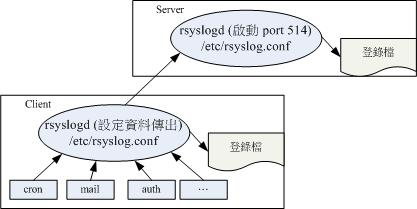

# 第十八章、认识与分析登录文件

最近更新日期：20//

当你的 Linux 系统出现不明原因的问题时，很多人都告诉你，你要查阅一下登录文件才能够知道系统出了什么问题了，所以说， 了解登录文件是很重要的事情呢。登录文件可以记录系统在什么时间、哪个主机、哪个服务、出现了什么讯息等信息， 这些信息也包括使用者识别数据、系统故障排除须知等信息。如果你能够善用这些登录文件信息的话，你的系统出现错误时， 你将可以在第一时间发现，而且也能够从中找到解决的方案，而不是昏头转向的乱问人呢。 此外，登录文件所记录的信息量是非常大的，要人眼分析实在很困难。此时利用 shell script 或者是其他软件提供的分析工具来处理复杂的登录文件，可以帮助你很多很多喔！

# 18.1 什么是登录文件

## 18.1 什么是登录文件

“详细而确实的分析以及备份系统的登录文件”是一个系统管理员应该要进行的任务之一。 那么什么是登录文件呢？简单的说，就是记录系统活动信息的几个文件， 例如：何时、何地 （来源 IP）、何人 （什么服务名称）、做了什么动作 （讯息登录啰）。 换句话说就是：记录系统在什么时候由哪个程序做了什么样的行为时，发生了何种的事件等等。

### 18.1.1 CentOS 7 登录文件简易说明

要知道的是，我们的 Linux 主机在背景之下有相当多的 daemons 同时在工作着，这些工作中的程序总是会显示一些讯息， 这些显示的讯息最终会被记载到登录文件当中啦。也就是说，记录这些系统的重要讯息就是登录文件的工作啦！

*   登录文件的重要性

为什么说登录文件很重要，重要到系统管理员需要随时注意他呢？我们可以这么说：

*   解决系统方面的错误：

用 Linux 这么久了，你应该偶而会发现系统可能会出现一些错误，包括硬件捉不到或者是某些系统服务无法顺利运行的情况。 此时你该如何是好？由于系统会将硬件侦测过程记录在登录文件内，你只要通过查询登录文件就能够了解系统作了啥事！ 并且由第十六章我们也知道 SELinux 与登录文件的关系更加的强烈！所以啰，查询登录文件可以克服一些系统问题啦！

*   解决网络服务的问题：

你可能在做完了某些网络服务的设置后，却一直无法顺利启动该服务，此时该怎办？去庙里面拜拜抽签吗？ 三太子大大可能无法告诉你要怎么处理呢！由于网络服务的各种问题通常都会被写入特别的登录文件， 其实你只要查询登录文件就会知道出了什么差错，还不需要请示三太子大大啦！举例来说，如果你无法启动邮件服务器 （postfix）， 那么查询一下 /var/log/maillog 通常可以得到不错的解答！

*   过往事件记录簿：

这个东西相当的重要！例如：你发现 WWW 服务 （httpd 软件） 在某个时刻流量特别大，你想要了解为什么时， 可以通过登录文件去找出该时段是哪些 IP 在连线与查询的网页数据为何，就能够知道原因。 此外，万一哪天你的系统被入侵，并且被利用来攻击他人的主机，由于被攻击主机会记录攻击者，因此你的 IP 就会被对方记录。这个时候你要如何告知对方你的主机是由于被入侵所导致的问题， 并且协助对方继续往恶意来源追查呢？呵呵！此时登录文件可是相当重要的呢！


**Tips** 所以我们常说“天助自助者”是真的啦！你可以通过 （1）察看屏幕上面的错误讯息与 （2）登录文件的错误信息，几乎可以解决大部分的 Linux 问题！

*   Linux 常见的登录文件文件名

登录文件可以帮助我们了解很多系统重要的事件，包括登陆者的部分信息，因此登录文件的权限通常是设置为仅有 root 能够读取而已。 而由于登录文件可以记载系统这么多的详细信息，所以啦，一个有经验的主机管理员会随时随地查阅一下自己的登录文件， 以随时掌握系统的最新脉动！那么常见的几个登录文件有哪些呢？一般而言，有下面几个：

*   /var/log/boot.log： 开机的时候系统核心会去侦测与启动硬件，接下来开始各种核心支持的功能启动等。这些流程都会记录在 /var/log/boot.log 里面哩！ 不过这个文件只会存在这次开机启动的信息，前次开机的信息并不会被保留下来！

*   /var/log/cron： 还记得第十五章例行性工作调度吧？你的 crontab 调度有没有实际被进行？ 进行过程有没有发生错误？你的 /etc/crontab 是否撰写正确？在这个登录文件内查询看看。

*   /var/log/dmesg： 记录系统在开机的时候核心侦测过程所产生的各项信息。由于 CentOS 默认将开机时核心的硬件侦测过程取消显示， 因此额外将数据记录一份在这个文件中；

*   /var/log/lastlog： 可以记录系统上面所有的帐号最近一次登陆系统时的相关信息。第十三章讲到的 lastlog 指令就是利用这个文件的记录信息来显示的。

*   /var/log/maillog 或 /var/log/mail/*： 记录邮件的往来信息，其实主要是记录 postfix （SMTP 协定提供者） 与 dovecot （POP3 协定提供者） 所产生的讯息啦。 SMTP 是发信所使用的通讯协定， POP3 则是收信使用的通讯协定。 postfix 与 dovecot 则分别是两套达成通讯协定的软件。

*   /var/log/messages： 这个文件相当的重要，几乎系统发生的错误讯息 （或者是重要的信息） 都会记录在这个文件中； 如果系统发生莫名的错误时，这个文件是一定要查阅的登录文件之一。

*   /var/log/secure： 基本上，只要牵涉到“需要输入帐号密码”的软件，那么当登陆时 （不管登陆正确或错误） 都会被记录在此文件中。 包括系统的 login 程序、图形接口登陆所使用的 gdm 程序、 su, sudo 等程序、还有网络连线的 ssh, telnet 等程序， 登陆信息都会被记载在这里；

*   /var/log/wtmp, /var/log/faillog： 这两个文件可以记录正确登陆系统者的帐号信息 （wtmp） 与错误登陆时所使用的帐号信息 （faillog） ！ 我们在第十章谈到的 last 就是读取 wtmp 来显示的， 这对于追踪一般帐号者的使用行为很有帮助！

*   /var/log/httpd/*, /var/log/samba/*： 不同的网络服务会使用它们自己的登录文件来记载它们自己产生的各项讯息！上述的目录内则是个别服务所制订的登录文件。

常见的登录文件就是这几个，但是不同的 Linux distributions ，通常登录文件的文件名不会相同 （除了 /var/log/messages 之外 ）。所以说，你还是得要查阅你 Linux 主机上面的登录文件设置数据， 才能知道你的登录文件主要文件名喔！

*   登录文件所需相关服务 （daemon） 与程序

那么这些登录文件是怎么产生的呢？基本上有两种方式，一种是由软件开发商自行定义写入的登录文件与相关格式， 例如 WWW 软件 apache 就是这样处理的。另一种则是由 Linux distribution 提供的登录文件管理服务来统一管理。 你只要将讯息丢给这个服务后，他就会自己分门别类的将各种讯息放置到相关的登录文件去！CentOS 提供 rsyslog.service 这个服务来统一管理登录文件喔！

不过要注意的是，如果你任凭登录文件持续记录的话，由于系统产生的信息天天都有，那么你的登录文件的容量将会长大到无法无天～ 如果你的登录文件容量太大时，可能会导致大文件读写效率不佳的问题 （因为要从磁盘读入内存，越大的文件消耗内存量越多）。 所以啰，你需要对登录文件备份与更新。那...需要手动处理喔？当然不需要，我们可以通过 logrotate （登录文件轮替） 这玩意儿来自动化处理登录文件容量与更新的问题喔！

所谓的 logrotate 基本上，就是将旧的登录文件更改名称，然后创建一个空的登录文件，如此一来， 新的登录文件将重新开始记录，然后只要将旧的登录文件留下一阵子，嗯！那就可以达到将登录文件“轮转”的目的啦！ 此外，如果旧的记录 （大概要保存几个月吧！） 保存了一段时间没有问题，那么就可以让系统自动的将他砍掉， 免得占掉很多宝贵的硬盘空间说！

总结一下，针对登录文件所需的功能，我们需要的服务与程序有：

*   systemd-journald.service：最主要的讯息收受者，由 systemd 提供的；
*   rsyslog.service：主要登录系统与网络等服务的讯息；
*   logrotate：主要在进行登录文件的轮替功能。

由于我们着眼点在于想要了解系统上面软件所产生的各项信息，因此本章主要针对 rsyslog.service 与 logrotate 来介绍。 接着下来我们来谈一谈怎么样规划这两个玩意儿。就由 rsyslog.service 这支程序先谈起吧！毕竟得先有登录文件，才可以进行 logrotate 呀！您说是吧！

*   CentOS 7.x 使用 systemd 提供的 journalctl 日志管理

CentOS 7 除了保有既有的 rsyslog.service 之外，其实最上游还使用了 systemd 自己的登录文件日志管理功能喔！他使用的是 systemd-journald.service 这个服务来支持的。基本上，系统由 systemd 所管理，那所有经由 systemd 启动的服务，如果再启动或结束的过程中发生一些问题或者是正常的讯息， 就会将该讯息由 systemd-journald.service 以二进制的方式记录下来，之后再将这个讯息发送给 rsyslog.service 作进一步的记载。

systemd-journald.service 的记录主要都放置于内存中，因此在存取方面性能比较好～我们也能够通过 journalctl 以及 systemctl status unit.service 来查看各个不同服务的登录文件！ 这有个好处，就是登录文件可以随着个别服务让你查阅，在单一服务的处理上面，要比跑到 /var/log/messages 去大海捞针来的简易很多！ 不过，因为 system-journald.service 里面的很多观念还是沿用 rsyslog.service 相关的信息，所以，本章还是先从 rsyslog.service 先谈起， 谈完之后再以 journalctl 进一步了解 systemd 是怎么去记录登录文件日志功能的呦！

### 18.1.2 登录文件内容的一般格式

一般来说，系统产生的讯息经过记录下来的数据中，每条讯息均会记录下面的几个重要数据：

*   事件发生的日期与时间；
*   发生此事件的主机名称；
*   启动此事件的服务名称 （如 systemd, CROND 等） 或指令与函数名称 （如 su, login..）；
*   该讯息的实际数据内容。

当然，这些信息的“详细度”是可以修改的，而且，这些信息可以作为系统除错之用呢！ 我们拿登录时一定会记载帐号信息的 /var/log/secure 为例好了：

```
[root@study ~]# cat /var/log/secure
Aug 17 18:38:06 study login: pam_unix（login:session）: session opened for user root by LOGIN（uid=0）
Aug 17 18:38:06 study login: ROOT LOGIN ON tty1
Aug 17 18:38:19 study login: pam_unix（login:session）: session closed for user root
Aug 18 23:45:17 study sshd[18913]: Accepted password for dmtsai from 192.168.1.200 port 41524 ssh2
Aug 18 23:45:17 study sshd[18913]: pam_unix（sshd:session）: session opened for user dmtsai by （uid=0）
Aug 18 23:50:25 study sudo: dmtsai : TTY=pts/0 ; PWD=/home/dmtsai ; USER=root ; COMMAND=/bin/su -
Aug 18 23:50:25 study su: pam_unix（su-l:session）: session opened for user root by dmtsai（uid=0）
&#124;--日期/时间---&#124;--H--&#124;-服务与相关函数-&#124;-----------讯息说明------&gt; 
```

我们拿第一笔数据 （共两行） 来说明好了，该数据是说：“在 08/17 的 18:38 左右，在名为 study 的这部主机系统上，由 login 这个程序产生的讯息，内容显示 root 在 tty1 登陆了，而相关的权限给予是通过 pam_unix 模块处理的 （共两行数据）。”有够清楚吧！那请您自行翻译一下后面的几条讯息内容是什么喔！

其实还有很多的信息值得查阅的呢！尤其是 /var/log/messages 的内容。记得一个好的系统管理员， 要常常去“巡视”登录文件的内容喔！尤其是发生下面几种情况时：

*   当你觉得系统似乎不太正常时；
*   某个 daemon 老是无法正常启动时；
*   某个使用者老是无法登陆时；
*   某个 daemon 执行过程老是不顺畅时；

还有很多啦！反正觉得系统不太正常，就得要查询查询登录文件就是了。


**Tips** 提供一个鸟哥常做的检查方式。当我老是无法成功的启动某个服务时，我会在最后一次启动该服务后，立即检查登录文件， 先 （1）找到现在时间所登录的信息“第一字段”； （2）找到我想要查询的那个服务“第三字段”， （3）最后再仔细的查阅第四字段的信息，来借以找到错误点。

另外，不知道你会不会觉得很奇怪？为什么登录文件就是登录本机的数据啊～那怎么登录文件格式中，第二个字段项目是“主机名称”啊？ 这是因为登录文件可以做成登录文件服务器，可以收集来自其他服务器的登录文件数据喔！所以啰，为了了解到该讯息主要是来自于哪一部主机， 当然得要有第二个字段项目说明该信息来自哪一部主机名称啰！

# 18.2 rsyslog.service ：记录登录文件的服务

## 18.2 rsyslog.service ：记录登录文件的服务

上一小节提到说 Linux 的登录文件主要是由 rsyslog.service 在负责，那么你的 Linux 是否有启动 rsyslog 呢？而且是否有设置开机时启动呢？呵呵！检查一下先：

```
[root@study ~]# ps aux &#124; grep rsyslog
USER  PID %CPU %MEM    VSZ   RSS TTY  STAT START  TIME COMMAND
root  750  0.0  0.1 208012  4732 ?    Ssl  Aug17  0:00 /usr/sbin/rsyslogd -n
# 瞧！确实有启动的！daemon 可执行文件名为 rsyslogd 喔！

[root@study ~]# systemctl status rsyslog.service
rsyslog.service - System Logging Service
   Loaded: loaded （/usr/lib/systemd/system/rsyslog.service; enabled）
   Active: active （running） since Mon 2015-08-17 18:37:58 CST; 2 days ago
 Main PID: 750 （rsyslogd）
   CGroup: /system.slice/rsyslog.service
           └─750 /usr/sbin/rsyslogd -n
# 也有启动这个服务，也有默认开机时也要启动这个服务！OK！正常没问题！！ 
```

看到 rsyslog.service 这个服务名称了吧？所以知道他已经在系统中工作啰！好了，既然本章主要是讲登录文件的服务， 那么 rsyslog.service 的配置文件在哪里？如何设置？如果你的 Linux 主机想要当作整个区网的登录文件服务器时，又该如何设置？ 下面就让我们来玩玩这玩意！

### 18.2.1 rsyslog.service 的配置文件：/etc/rsyslog.conf

什么？登录文件还有配置文件？喔！不是啦～是 rsyslogd 这个 daemon 的配置文件啦！ 我们现在知道 rsyslogd 可以负责主机产生的各个信息的登录，而这些信息本身是有“严重等级”之分的， 而且，这些数据最终要传送到哪个文件去是可以修改的呢，所以我们才会在一开头的地方讲说， 每个 Linux distributions 放置的登录文件文件名可能会有所差异啊！

基本上， rsyslogd 针对各种服务与讯息记录在某些文件的配置文件就是 /etc/rsyslog.conf， 这个文件规定了“（1）什么服务 （2）的什么等级讯息 （3）需要被记录在哪里（设备或文件）” 这三个咚咚，所以设置的语法会是这样：

```
服务名称[.=!]讯息等级        讯息记录的文件名或设备或主机
# 下面以 mail 这个服务产生的 info 等级为例：
mail.info            /var/log/maillog_info
# 这一行说明：mail 服务产生的大于等于 info 等级的讯息，都记录到
# /var/log/maillog_info 文件中的意思。 
```

我们将上面的数据简单的分为三部分来说明：

*   服务名称

rsyslogd 主要还是通过 Linux 核心提供的 syslog 相关规范来设置数据的分类的，Linux 的 syslog 本身有规范一些服务讯息， 你可以通过这些服务来储存系统的讯息。Linux 核心的 syslog 认识的服务类型主要有下面这些： （可使用 man 3 syslog 查询到相关的信息，或查询 syslog.h 这个文件来了解的！）

| 相对序号 | 服务类别 | 说明 |
| --- | --- | --- |
| 0 | kern（kernel） | 就是核心 （kernel） 产生的讯息，大部分都是硬件侦测以及核心功能的启用 |
| 1 | user | 在使用者层级所产生的信息，例如后续会介绍到的用户使用 logger 指令来记录登录文件的功能 |
| 2 | mail | 只要与邮件收发有关的讯息记录都属于这个； |
| 3 | daemon | 主要是系统的服务所产生的信息，例如 systemd 就是这个有关的讯息！ |
| 4 | auth | 主要与认证/授权有关的机制，例如 login, ssh, su 等需要帐号/密码的咚咚； |
| 5 | syslog | 就是由 syslog 相关协定产生的信息，其实就是 rsyslogd 这支程序本身产生的信息啊！ |
| 6 | lpr | 亦即是打印相关的讯息啊！ |
| 7 | news | 与新闻群组服务器有关的东西； |
| 8 | uucp | 全名为 Unix to Unix Copy Protocol，早期用于 unix 系统间的程序数据交换； |
| 9 | cron | 就是例行性工作调度 cron/at 等产生讯息记录的地方； |
| 10 | authpriv | 与 auth 类似，但记录较多帐号私人的信息，包括 pam 模块的运行等！ |
| 11 | ftp | 与 FTP 通讯协定有关的讯息输出！ |
| 16~23 | local0 ~ local7 | 保留给本机用户使用的一些登录文件讯息，较常与终端机互动。 |

上面谈到的都是 Linux 核心的 syslog 函数自行制订的服务名称，软件开发商可以通过调用上述的服务名称来记录他们的软件。 举例来说， sendmail 与 postfix 及 dovecot 都是与邮件有关的软件，这些软件在设计登录文件记录时，都会主动调用 syslog 内的 mail 服务名称 （LOG_MAIL）。所以上述三个软件 （sendmail, postfix, dovecot） 产生的讯息在 syslog 看起来，就会“是 mail ”类型的服务了。我们可以将这个概念绘制如下面的图示来理解：

图 18.2.1、syslog 所制订的服务名称与软件调用的方式

另外，每种服务所产生的数据量其实差异是很大的，举例来说， mail 的登录文件讯息多的要命， 每一封信件进入后， mail 至少需要记录“寄信人的信息；与收信者的讯息”等等； 而如果是用来做为工作站主机的，那么登陆者 （利用 login 登录主机处理事情） 的数量一定不少，那个 authpriv 所管辖的内容可就多的要命了。

为了让不同的信息放置到不同的文件当中，好让我们分门别类的进行登录文件的管理， 所以啰，将各种类别的服务之登录文件，记录在不同的文件里面，就是我们 /etc/rsyslog.conf 所要作的规范了！

*   讯息等级

同一个服务所产生的讯息也是有差别的，有启动时仅通知系统而已的一般讯息 （information）， 有出现还不至于影响到正常运行的警告讯息 （warn） ，还有系统硬件发生严重错误时，所产生的重大问题讯息 （error 等等）； 讯息到底有多少种严重的等级呢？基本上，Linux 核心的 syslog 将讯息分为七个主要的等级，根据 syslog.h 的定义，讯息名称与数值的对应如下：

| 等级数值 | 等级名称 | 说明 |
| --- | --- | --- |
| 7 | debug | 用来 debug （除错） 时产生的讯息数据； |
| 6 | info | 仅是一些基本的讯息说明而已； |
| 5 | notice | 虽然是正常信息，但比 info 还需要被注意到的一些信息内容； |
| 4 | warning（warn） | 警示的讯息，可能有问题，但是还不至于影响到某个 daemon 运行的信息；基本上， info, notice, warn 这三个讯息都是在告知一些基本信息而已，应该还不至于造成一些系统运行困扰； |
| 3 | err（error） | 一些重大的错误讯息，例如配置文件的某些设置值造成该服务服法启动的信息说明， 通常借由 err 的错误告知，应该可以了解到该服务无法启动的问题呢！ |
| 2 | crit | 比 error 还要严重的错误信息，这个 crit 是临界点 （critical） 的缩写，这个错误已经很严重了喔！ |
| 1 | alert | 警告警告，已经很有问题的等级，比 crit 还要严重！ |
| 0 | emerg（panic） | 疼痛等级，意指系统已经几乎要死机的状态！ 很严重的错误信息了。通常大概只有硬件出问题，导致整个核心无法顺利运行，就会出现这样的等级的讯息吧！ |

基本上，在 0（emerg） 到 6（info） 的等级之间，等级数值越高代表越没事，等级靠近 0 则代表事情大条了！除了 0 到 6 之外还有两个比较特殊的等级， 那就是 debug（错误侦测等级） 与 none （不需登录等级） 两个，当我们想要作一些错误侦测，或者是忽略掉某些服务的信息时， 就用这两个咚咚吧！

特别留意一下在讯息等级之前还有 [.=!] 的链接符号喔！他代表的意思是这样的：

*   . ：代表“比后面还要严重的等级 （含该等级） 都被记录下来”的意思，例如： mail.info 代表只要是 mail 的信息，而且该信息等级严重于 info （含 info 本身）时，就会被记录下来的意思。
*   .=：代表所需要的等级就是后面接的等级而已， 其他的不要！
*   .!：代表不等于， 亦即是除了该等级外的其他等级都记录。

一般来说，我们比较常使用的是“.”这个链接符号啦！^_^

*   讯息记录的文件名或设备或主机

再来则是这个讯息要放置在哪里的设置了。通常我们使用的都是记录的文件啦！但是也可以输出到设备呦！ 例如打印机之类的！也可以记录到不同的主机上头去呢！下面就是一些常见的放置处：

*   文件的绝对路径：通常就是放在 /var/log 里头的文件啦！
*   打印机或其他：例如 /dev/lp0 这个打印机设备
*   使用者名称：显示给使用者啰！
*   远端主机：例如 @study.vbird.tsai 当然啦，要对方主机也能支持才行！
*   *：代表“目前在线上的所有人”，类似 wall 这个指令的意义！

*   服务、daemon 与函数名称

看完上面的说明，相信你一定会越来越迷煳！啊！怎么会有 syslog, rsyslogd, rsyslog.service！见鬼～名称都不相同！那是啥东西？ 基本上，这几个东西你应该要这样看：

|  |  |
| --- | --- |
| syslog | 这个是 Linux 核心所提供的登录文件设计指引，所有的要求大概都写入道一个名为 syslog.h 的头文件案中。如果你想要开发与登录文件有关的软件， 那你就得要依循这个 syslog 函数的要求去设计才行！可以使用 man 3 syslog 去查询一下相关的数据！ |
| rsyslogd | 为了要达成实际上进行讯息的分类所开发的一套软件，所以，这就是最基本的 daemon 程序！ |
| rsyslog.service | 为了加入 systemd 的控制，因此 rsyslogd 的开发者设计的启动服务脚本设置！ |

这样简单的分类，应该比较容易了解名称上面的意义了吧？早期 CentOS 5.x 以前，要达成 syslog 的功能是由一只名为 syslogd 的 daemon 来完成的， 从 CentOS 6 以来 （包含 CentOS 7） 则是通过 rsyslogd 这个 daemon 啰！

*   rsyslog.conf 语法练习

基本上，整个 rsyslog.conf 配置文件的内容参数大概就只是这样而已，下面我们来思考一些例题，好让你可以更清楚的知道如何设置 rsyslogd 啊！

例题：如果我要将我的 mail 相关的数据给他写入 /var/log/maillog 当中，那么在 /etc/rsyslog.conf 的语法如何设计？答：基本的写法是这样的：

> mail.info　　　/var/log/maillog

注意到上面喔，当我们的等级使用 info 时，那么“任何严重于 info 等级（含 info 这个等级）之上的讯息， 都会被写入到后面接的文件之中！”这样可以了解吗？也就是说，我们可以将所有 mail 的登录信息都记录在 /var/log/maillog 里面的意思啦！

例题：我要将新闻群组数据 （news） 及例行性工作调度 （cron） 的讯息都写入到一个称为 /var/log/cronnews 的文件中，但是这两个程序的警告讯息则额外的记录在 /var/log/cronnews.warn 中， 那该如何设置我的 rsyslog.conf 呢？答：很简单啦！既然是两个程序，那么只好以分号来隔开了，此外，由于第二个指定文件中，我只要记录警告讯息， 因此设置上需要指定“.=”这个符号，所以语法成为了：

> news.*;cron.*　　　　　/var/log/cronnews > news.=warn;cron.=warn　/var/log/cronnews.warn

上面那个“.=”就是在指定等级的意思啦！由于指定了等级，因此，只有这个等级的讯息才会被记录在这个文件里面呢！ 此外你也必须要注意，news 与 cron 的警告讯息也会写入 /var/log/cronnews 内喔！

例题：我的 messages 这个文件需要记录所有的信息，但是就是不想要记录 cron, mail 及 news 的信息，那么应该怎么写才好？答：可以有两种写法，分别是：

> *.*;news,cron,mail.none　　　　　　/var/log/messages > *.*;news.none;cron.none;mail.none　/var/log/messages

使用“,”分隔时，那么等级只要接在最后一个即可，如果是以“;”来分的话， 那么就需要将服务与等级都写上去啰！这样会设置了吧！

*   CentOS 7.x 默认的 rsyslog.conf 内容

了解语法之后，我们来看一看 rsyslogd 有哪些系统服务已经在记录了呢？就是瞧一瞧 /etc/rsyslog.conf 这个文件的默认内容啰！ （注意！如果需要将该行做为注解时，那么就加上 # 符号就可以啦）

```
# 来自 CentOS 7.x 的相关数据
[root@study ~]# vim /etc/rsyslog.conf
 1 #kern.*                                              /dev/console
 2 *.info;mail.none;authpriv.none;cron.none             /var/log/messages
 3 authpriv.*                                           /var/log/secure
 4 mail.*                                              -/var/log/maillog
 5 cron.*                                               /var/log/cron
 6 *.emerg                                              :omusrmsg:*
 7 uucp,news.crit                                       /var/log/spooler
 8 local7.*                                             /var/log/boot.log 
```

上面总共仅有 8 行设置值，每一行的意义是这样的：

1.  #kern.*：只要是核心产生的讯息，全部都送到 console（终端机） 去。console 通常是由外部设备连接到系统而来， 举例来说，很多封闭型主机 （没有键盘、屏幕的系统） 可以通过连接 RS232 连接口将讯息传输到外部的系统中， 例如以笔记本电脑连接到封闭主机的 RS232 插口。这个项目通常应该是用在系统出现严重问题而无法使用默认的屏幕观察系统时， 可以通过这个项目来连接取得核心的讯息。[[1]](#ps1)

2.  *.info;mail.none;authpriv.none;cron.none：由于 mail, authpriv, cron 等类别产生的讯息较多， 且已经写入下面的数个文件中，因此在 /var/log/messages 里面就不记录这些项目。除此之外的其他讯息都写入 /var/log/messages 中。这也是为啥我们说这个 messages 文件很重要的缘故！

3.  authpriv.*：认证方面的讯息均写入 /var/log/secure 文件；

4.  mail.*：邮件方面的讯息则均写入 /var/log/maillog 文件；

5.  cron.*：例行性工作调度均写入 /var/log/cron 文件；

6.  *.emerg：当产生最严重的错误等级时，将该等级的讯息以 wall 的方式广播给所有在系统登陆的帐号得知， 要这么做的原因是希望在线的使用者能够赶紧通知系统管理员来处理这么可怕的错误问题。

7.  uucp,news.crit：uucp 是早期 Unix-like 系统进行数据传递的通讯协定，后来常用在新闻群组的用途中。 news 则是新闻群组。当新闻群组方面的信息有严重错误时就写入 /var/log/spooler 文件中；

8.  local7.*：将本机开机时应该显示到屏幕的讯息写入到 /var/log/boot.log 文件中；

在上面的第四行关于 mail 的记录中，在记录的文件 /var/log/maillog 前面还有个减号“ - ”是干嘛用的？由于邮件所产生的讯息比较多，因此我们希望邮件产生的讯息先储存在速度较快的内存中 （buffer） ，等到数据量够大了才一次性的将所有数据都填入磁盘内，这样将有助于登录文件的存取性能。 只不过由于讯息是暂存在内存内，因此若不正常关机导致登录信息未回填到登录文件中，可能会造成部分数据的遗失。

此外，每个 Linux distributions 的 rsyslog.conf 设置差异是颇大的，如果你想要找到相对应的登录信息时， 可得要查阅一下 /etc/rsyslog.conf 这个文件才行！否则可能会发生分析到错误的信息喔！举例来说， 鸟哥有自己写一支分析登录文件的 script，这个 script 是依据 Red Hat 系统默认的登录文件所写的，因此不同的 distributions 想要使用这支程序时，就得要自行设计与修改一下 /etc/rsyslog.conf 才行喔！否则就可能会分析到错误的信息啰。 那么如果你有自己的需要而得要修订登录文件时，该如何进行？

*   自行增加登录文件文件功能

如果你有其他的需求，所以需要特殊的文件来帮你记录时，呵呵！别客气，千万给他记录在 /etc/rsyslog.conf 当中，如此一来，你就可以重复的将许多的信息记录在不同的文件当中，以方便你的管理呢！ 让我们来作个练习题吧！如果你想要让“所有的信息”都额外写入到 /var/log/admin.log 这个文件时， 你可以怎么作呢？先自己想一想，并且作一下，再来看看下面的作法啦！

```
# 1\. 先设置好所要创建的文件设置！
[root@study ~]# vim /etc/rsyslog.conf
# Add by VBird 2015/08/19       &lt;==再次强调，自己修改的时候加入一些说明
*.info      /var/log/admin.log  &lt;==有用的是这行啦！

# 2\. 重新启动 rsyslogd 呢！
[root@study ~]# systemctl restart rsyslog.service
[root@study ~]# ll /var/log/admin.log
-rw-r--r--. 1 root root 325 Aug 20 00:54 /var/log/admin.log
# 瞧吧！创建了这个登录文件出现啰！ 
```

很简单吧！如此一来，所有的信息都会写入 /var/log/admin.log 里面了！

### 18.2.2 登录文件的安全性设置

好了，由上一个小节里面我们知道了 rsyslog.conf 的设置，也知道了登录文件内容的重要性了， 所以，如果幻想你是一个很厉害的骇客，想利用他人的计算机干坏事，然后又不想留下证据， 你会怎么作？对啦！就是离开的时候将屁股擦干净，将所有可能的讯息都给他抹煞掉， 所以第一个动脑筋的地方就是登录文件的清除工作啦～ 如果你的登录文件不见了，那该怎办？


**Tips** 哇！鸟哥教人家干坏事……喂！不要乱讲话～俺的意思是，如果改天你发现你的登录文件不翼而飞了， 或者是发现你的登录文件似乎不太对劲的时候，最常发现的就是网友常常会回报说，他的 /var/log 这个目录“不见了！”不要笑！这是真的事情！请记得，“赶快清查你的系统！”

伤脑筋呢！有没有办法防止登录文件被删除？或者是被 root 自己不小心变更呢？有呀！拔掉网络线或电源线就好了……呵呵！ 别担心，基本上，我们可以通过一个隐藏的属性来设置你的登录文件，成为“ 只可以增加数据，但是不能被删除 ”的状态，那么或许可以达到些许的保护！不过，如果你的 root 帐号被破解了，那么下面的设置还是无法保护的，因为你要记得“ root 是可以在系统上面进行任何事情的 ”，因此，请将你的 root 这个帐号的密码设置的安全一些！千万不要轻忽这个问题呢！


**Tips** 为什么登录文件还要防止被自己 （root） 不小心所修改过呢？ 鸟哥在教 Linux 的课程时，我的学生常常会举手说：“老师，我的登录文件不能记录信息了！糟糕！是不是被入侵了啊？” 怪怪！明明是计算机教室的主机，使用的是 Private IP 而且学校计中还有抵挡机制，不可能被攻击吧？ 查询了才知道原来同学很喜欢使用“ :wq ”来离开 vim 的环境，但是 rsyslogd 的登录文件只要“被编辑过”就无法继续记录！ 所以才会导致不能记录的问题。此时你得要 （1）改变使用 vim 的习惯； （2）重新启动 rsyslog.service 让他再继续提供服务才行喔！

既然如此，那么我们就来处理一下隐藏属性的东东吧！我们在第六章谈到过 lsattr 与 chattr 这两个东西啦！如果将一个文件以 chattr 设置 i 这个属性时，那么该文件连 root 都不能杀掉！而且也不能新增数据，嗯！真安全！但是，如此一来登录文件的功能岂不是也就消失了？ 因为没有办法写入呀！所以啰，我们要使用的是 a 这个属性！你的登录文件如果设置了这个属性的话，那么 他将只能被增加，而不能被删除！嗯！ 这个项目就非常的符合我们登录文件的需求啦！因此，你可以这样的增加你的登录文件的隐藏属性。


**Tips** 请注意，下面的这个 chattr 的设置状态：“仅适合已经对 Linux 系统很有概念的朋友”来设置， 对于新手来说，建议你直接使用系统的默认值就好了，免得到最后登录文件无法写入～ 那就比较糗一点！ @_@

```
[root@study ~]# chattr +a /var/log/admin.log
[root@study ~]# lsattr /var/log/admin.log
-----a---------- /var/log/admin.log 
```

加入了这个属性之后，你的 /var/log/admin.log 登录文件从此就仅能被增加，而不能被删除，直到 root 以“ chattr -a /var/log/admin.log ”取消这个 a 的参数之后，才能被删除或移动喔！

虽然，为了你登录文件的信息安全，这个 chattr 的 +a 旗标可以帮助你维护好这个文件， 不过，如果你的系统已经被取得 root 的权限，而既然 root 可以下达 chattr -a 来取消这个旗标， 所以啰，还是有风险的啦！此外，前面也稍微提到，新手最好还是先不要增加这个旗标， 很容易由于自己的忘记，导致系统的重要讯息无法记录呢。

基本上，鸟哥认为，这个旗标最大的用处除了在保护你登录文件的数据外， 他还可以帮助你避免掉不小心写入登录文件的状况喔。要注意的是，当“ 你不小心 "手动" 更动过登录文件后，例如那个 /var/log/messages ， 你不小心用 vi 打开他，离开却下达 :wq 的参数，呵呵！那么该文件未来将不会再继续进行登录动作！ ”这个问题真的很常发生！由于你以 vi 储存了登录文件，则 rsyslogd 会误判为该文件已被更动过， 将导致 rsyslogd 不再写入该文件新的内容～很伤脑筋的！

要让该登录文件可以继续写入，你只要重新启动 rsyslogd.service 即可。 不过，总是比较麻烦。所以啊，如果你针对登录文件下达 chattr +a 的参数，嘿嘿！ 未来你就不需要害怕不小心更动到该文件了！因为无法写入嘛！除了可以新增之外～ ^_^

不过，也因为这个 +a 的属性让该文件无法被删除与修改，所以啰，当我们进行登录文件轮替时 （logrotate） ，将会无法移动该登录文件的文件名呢！所以会造成很大的困扰。这个困扰虽然可以使用 logrotate 的配置文件来解决，但是，还是先将登录文件的 +a 旗标拿掉吧！

```
[root@study ~]# chattr -a /var/log/admin.log 
```

### 18.2.3 登录文件服务器的设置

我们在之前稍微提到的，在 rsyslog.conf 文件当中，可以将登录数据传送到打印机或者是远端主机上面去。这样做有什么意义呢？ 如果你将登录信息直接传送到打印机上面的话，那么万一不小心你的系统被 cracker 所入侵， 他也将你的 /var/log/ 砍掉了，怎么办？没关系啊！反正你已经将重要数据直接以打印机记录起来了， 嘿嘿！他是无法逃开的啦！^_^

再想像一个环境，你的办公室内有十部 Linux 主机，每一部负责一个网络服务， 你为了要了解每部主机的状态，因此，你常常需要登陆这十部主机去查阅你的登录文件～ 哇！光用想的，每天要进入十部主机去查数据，想到就烦～没关系～这个时候我们可以让某一部主机当成 “登录文件服务器”，用他来记录所有的十部 linux 主机的信息，嘿嘿！这样我就直接进入一部主机就可以了！ 省时又省事，真方便～

那要怎么达到这样的功能呢？很简单啦，我们 CentOS 7.x 默认的 rsyslogd 本身就已经具有这个登录文件服务器的功能了， 只是默认并没有启动该功能而已。你可以通过 man rsyslogd 去查询一下相关的选项就能够知道啦！ 既然是登录文件服务器，那么我们的 Linux 主机当然会启动一个端口来监听了，那个默认的端口就是 UDP 或 TCP 的 port 514 喔！

图 18.2.2、登录文件服务器的架构

如上图所示，服务器会启动监听的端口，用户端则将登录文件再转出一份送到服务器去。 而既然是登录文件“服务器”，所以当然有服务器与用户端 （client） 啰！这两者的设置分别是这样的：

```
# 1\. Server 端：修改 rsyslogd 的启动配置文件，在 /etc/rsyslog.conf 内！
[root@study ~]# vim /etc/rsyslog.conf
# 找到下面这几行：
# Provides UDP syslog reception
#$ModLoad imudp
#$UDPServerRun 514

# Provides TCP syslog reception
#$ModLoad imtcp
#$InputTCPServerRun 514
# 上面的是 UDP 端口，下面的是 TCP 端口！如果你的网络状态很稳定，就用 UDP 即可。
# 不过，如果你想要让数据比较稳定传输，那么建议使用 TCP 啰！所以修改下面两行即可！
$ModLoad imtcp
$InputTCPServerRun 514

# 2\. 重新启动与观察 rsyslogd 喔！
[root@study ~]# systemctl restart rsyslog.service
[root@study ~]# netstat -ltnp &#124; grep syslog
Proto Recv-Q Send-Q Local Address  Foreign Address   State    PID/Program name
tcp        0      0 0.0.0.0:514    0.0.0.0:*         LISTEN   2145/rsyslogd
tcp6       0      0 :::514         :::*              LISTEN   2145/rsyslogd
# 嘿嘿！你的登录文件主机已经设置妥当啰！很简单吧！ 
```

通过这个简单的动作，你的 Linux 主机已经可以接收来自其他主机的登录信息了！ 当然啦，你必须要知道网络方面的相关基础，这里鸟哥只是先介绍，未来了解了网络相关信息后，再回头来这里瞧一瞧先！ ^_^

至于 client 端的设置就简单多了！只要指定某个信息传送到这部主机即可！ 举例来说，我们的登录文件服务器 IP 为 192.168.1.100 ，而 client 端希望所有的数据都送给主机， 所以，可以在 /etc/rsyslog.conf 里面新增这样的一行：

```
[root@study ~]# vim /etc/rsyslog.conf
*.*       @@192.168.1.100
#*.*       @192.168.1.100  # 若用 UDP 传输，设置要变这样！

[root@study ~]# systemctl restart rsyslog.service 
```

再重新启动 rsyslog.service 后，立刻就搞定了！而未来主机上面的登录文件当中，每一行的“主机名称”就会显示来自不同主机的信息了。 很简单吧！ ^_^。不过你得要特别注意，使用 TCP 传输与 UDP 传输的设置不太一样！请依据你的登录文件服务器的设置值来选择你的用户端语法喔！ 接下来，让我们来谈一谈，那么如何针对登录文件来进行轮替 （rotate） 呢？

# 18.3 登录文件的轮替（logrotate）

## 18.3 登录文件的轮替（logrotate）

假设我们已经将登录数据写入了记录文件中了，也已经利用 chattr 设置了 +a 这个属性了，那么该如何进行 logrotate 的工作呢？这里请特别留意的是：“rsyslogd 利用的是 daemon 的方式来启动的， 当有需求的时候立刻就会被执行的，但是 logrotate 却是在规定的时间到了之后才来进行登录文件的轮替， 所以这个 logrotate 程序当然就是挂在 cron 下面进行的呦！” 仔细看一下 /etc/cron.daily/ 里面的文件，嘿嘿～看到了吧！ /etc/cron.daily/logrotate 就是记录了每天要进行的登录文件轮替的行为啦！ ^_^！下面我们就来谈一谈怎么样设计这个 logrotate 吧！

### 18.3.1 logrotate 的配置文件

既然 logrotate 主要是针对登录文件来进行轮替的动作，所以啰，他当然必须要记载“ 在什么状态下才将登录文件进行轮替”的设置啊！那么 logrotate 这个程序的参数配置文件在哪里呢？呵呵！那就是：

*   /etc/logrotate.conf
*   /etc/logrotate.d/

那个 logrotate.conf 才是主要的参数文件，至于 logrotate.d 是一个目录， 该目录里面的所有文件都会被主动的读入 /etc/logrotate.conf 当中来进行！另外，在 /etc/logrotate.d/ 里面的文件中，如果没有规定到的一些细部设置，则以 /etc/logrotate.conf 这个文件的规定来指定为默认值！

好了，刚刚我们提到 logrotate 的主要功能就是将旧的登录文件移动成旧文件， 并且重新创建一个新的空的文件来记录，他的执行结果有点类似下面的图示：

图 18.3.1、登录文件进行 logrotate 的结果

由上面的图示我们可以清楚的知道，当第一次执行完 rotate 之后，原本的 messages 会变成 messages.1 而且会制造一个空的 messages 给系统来储存登录文件。而第二次执行之后，则 messages.1 会变成 messages.2 而 messages 会变成 messages.1 ，又造成一个空的 messages 来储存登录文件！那么如果我们仅设置保留三个登录文件而已的话，那么执行第四次时，则 messages.3 这个文件就会被删除，并由后面的较新的保存登录文件所取代！基本的工作就是这样啦！

不过近年来磁盘空间容量比较大了，加上管理员又担心登录文件数据真的给它不见去，因此，你可能已经发现到，最近的登录文件轮替后的文件名已经会加上日期参数， 然后源源不绝的保留在你的系统上耶～虽然这个设置是可以修订的，不过，鸟哥也真的希望保留日期的文件名延伸记录，真的比较不用担心未来要找问题时， 登录文件却已经 GG 了...

那么多久进行一次这样的 logrotate 工作呢？这些都记录在 logrotate.conf 里面，我们来看一下默认的 logrotate 的内容吧！

```
[root@study ~]# vim /etc/logrotate.conf
# 下面的设置是 "logrotate 的默认设置值" ，如果个别的文件设置了其他的参数，
# 则将以个别的文件设置为主，若该文件没有设置到的参数则以这个文件的内容为默认值！

weekly    &lt;==默认每个礼拜对登录文件进行一次 rotate 的工作
rotate 4  &lt;==保留几个登录文件呢？默认是保留四个！
create    &lt;==由于登录文件被更名，因此创建一个新的来继续储存之意！
dateext   &lt;==就是这个设置值！可以让被轮替的文件名称加上日期作为文件名喔！
#compress &lt;==被更动的登录文件是否需要压缩？如果登录文件太大则可考虑此参数启动

include /etc/logrotate.d
# 将 /etc/logrotate.d/ 这个目录中的所有文件都读进来执行 rotate 的工作！

/var/log/wtmp {       &lt;==仅针对 /var/log/wtmp 所设置的参数
    monthly           &lt;==每个月一次，取代每周！
    create 0664 root utmp &lt;==指定新建文件的权限与所属帐号/群组
    minsize 1M        &lt;==文件大小一定要超过 1M 后才进行 rotate （略过时间参数）
    rotate 1          &lt;==仅保留一个，亦即仅有 wtmp.1 保留而已。
}
# 这个 wtmp 可记录登陆者与系统重新开机时的时间与来源主机及登陆期间的时间。
# 由于具有 minsize 的参数，因此不见得每个月一定会进行一次喔！要看文件大小。
# 由于仅保留一个登录文件而已，不满意的话可以将他改成 rotate 5 吧！ 
```

由这个文件的设置我们可以知道 /etc/logrotate.d 其实就是由 /etc/logrotate.conf 所规划出来的目录，所以，其实我们可以将所有的数据都给他写入 /etc/logrotate.conf 即可，但是这样一来这个文件就实在是太复杂了，尤其是当我们使用很多的服务在系统上面时， 每个服务都要去修改 /etc/logrotate.conf 的设置也似乎不太合理～ 所以，如果独立出来一个目录，那么每个以 RPM 打包方式所创建的服务的登录文件轮替设置， 就可以独自成为一个文件，并且放置到 /etc/logrotate.d/ 当中即可，真是方便又合理的做法啊！ ^_^

一般来说，这个 /etc/logrotate.conf 是“默认的轮替状态”而已， 我们的各个服务都可以拥有自己的登录文件轮替设置，你也可以自行修改成自己喜欢的样式啊！ 例如，如果你的系统的空间够大，并且担心除错以及骇客的问题，那么可以：

*   将 rotate 4 改成 rotate 9 左右，以保存较多的备份文件。不过如果已经加上 dateext 的参数，那这个项目就不用更动了！
*   大部分的登录文件不需要 compress 啰！但是空间太小就需要 compress ！尤其是很占硬盘空间的 httpd 更需要 compress 的！

好了，上面我们大致介绍了 /var/log/wtmp 这个文件的设置，现在你知道了 logrotate.conf 的设置语法是：

```
登录文件的绝对路径文件名 ... {
    个别的参数设置值，如 monthly, compress 等等
} 
```

下面我们再以 /etc/logrotate.d/syslog 这个轮替 rsyslog.service 服务的文件，来看看该如何设置他的 rotate 呢？

```
[root@study ~]# vim /etc/logrotate.d/syslog
/var/log/cron
/var/log/maillog
/var/log/messages
/var/log/secure
/var/log/spooler
{
    sharedscripts
    postrotate
        /bin/kill -HUP `cat /var/run/syslogd.pid 2&gt; /dev/null` 2&gt; /dev/null &#124;&#124; true
    endscript
} 
```

在上面的语法当中，我们知道正确的 logrotate 的写法为：

*   文件名：被处理的登录文件绝对路径文件名写在前面，可以使用空白字符分隔多个登录文件；
*   参数：上述文件名进行轮替的参数使用 { } 包括起来；
*   执行脚本：可调用外部指令来进行额外的命令下达，这个设置需与 sharedscripts .... endscript 设置合用才行。至于可用的环境为：

    *   prerotate：在启动 logrotate 之前进行的指令，例如修改登录文件的属性等动作；
    *   postrotate：在做完 logrotate 之后启动的指令，例如重新启动 （kill -HUP） 某个服务！
    *   Prerotate 与 postrotate 对于已加上特殊属性的文件处理上面，是相当重要的执行程序！

那么 /etc/logrotate.d/syslog 内设置的 5 个文件的轮替功能就变成了：

*   该设置只对 /var/log/ 内的 cron, maillog, messages, secure, spooler 有效；
*   登录文件轮替每周一次、保留四个、且轮替下来的登录文件不进行压缩（未更改默认值）；
*   轮替完毕后 （postrotate） 取得 syslog 的 PID 后，以 kill -HUP 重新启动 syslogd

假设我们有针对 /var/log/messages 这个文件增加 chattr +a 的属性时， 依据 logrotate 的工作原理，我们知道，这个 /var/log/messages 将会被更名成为 /var/log/messages.1 才是。但是由于加上这个 +a 的参数啊，所以更名是不可能成功的！ 那怎么办呢？呵呵！就利用 prerotate 与 postrotate 来进行登录文件轮替前、后所需要作的动作啊！ 果真如此时，那么你可以这样修改一下这个文件喔！

```
[root@study ~]# vim /etc/logrotate.d/syslog
/var/log/cron
/var/log/maillog
/var/log/messages
/var/log/secure
/var/log/spooler
{
    sharedscripts
    prerotate
       /usr/bin/chattr -a /var/log/messages
    endscript
    sharedscripts
    postrotate
        /bin/kill -HUP `cat /var/run/syslogd.pid 2&gt; /dev/null` 2&gt; /dev/null &#124;&#124; true
        /usr/bin/chattr +a /var/log/messages
    endscript
} 
```

看到否？就是先给他去掉 a 这个属性，让登录文件 /var/log/messages 可以进行轮替的动作， 然后执行了轮替之后，再给他加入这个属性！请特别留意的是，那个 /bin/kill -HUP ... 的意义，这一行的目的在于将系统的 rsyslogd 重新以其参数文件 （rsyslog.conf） 的数据读入一次！也可以想成是 reload 的意思啦！ 由于我们创建了一个新的空的记录文件，如果不执行此一行来重新启动服务的话， 那么记录的时候将会发生错误呦！（请回到第十六章读一下 kill 后面的 signal 的内容说明）

### 18.3.2 实际测试 logrotate 的动作

好了，设置完成之后，我们来测试看看这样的设置是否可行呢？给他执行下面的指令：

```
[root@study ~]# logrotate [-vf] logfile
选项与参数：
-v  ：启动显示模式，会显示 logrotate 运行的过程喔！
-f  ：不论是否符合配置文件的数据，强制每个登录文件都进行 rotate 的动作！

范例一：执行一次 logrotate 看看整个流程为何？
[root@study ~]# logrotate -v /etc/logrotate.conf
reading config file /etc/logrotate.conf &lt;==读取主要配置文件
including /etc/logrotate.d              &lt;==调用外部的设置
reading config file chrony              &lt;==就是外部设置啊！
....（中间省略）....
Handling 18 logs                        &lt;==共有 18 个登录文件被记录
....（中间省略）....
rotating pattern: /var/log/cron
/var/log/maillog
/var/log/messages
/var/log/secure
/var/log/spooler
 weekly （52 rotations）
empty log files are not rotated, old logs are removed
considering log /var/log/cron
  log does not need rotating
considering log /var/log/maillog
  log does not need rotating
considering log /var/log/messages       &lt;==开始处理 messages
  log does not need rotating            &lt;==因为时间未到，不需要更动！
....（下面省略）....

范例二：强制进行 logrotate 的动作
[root@study ~]# logrotate -vf /etc/logrotate.conf
....（前面省略）....
rotating log /var/log/messages, log-&gt;rotateCount is 52
dateext suffix '-20150820'
glob pattern '-[0-9][0-9][0-9][0-9][0-9][0-9][0-9][0-9]'
compressing log with: /bin/gzip
....（下面省略）....
# 看到否？整个 rotate 的动作就是这样一步一步进行的～

[root@study ~]# ll /var/log/messages*; lsattr /var/log/messages
-rw-------. 1 root root    143 Aug 20 01:45 /var/log/messages
-rw-------. 1 root root 167125 Aug 20 01:40 /var/log/messages-20150820
-----a---------- /var/log/messages  &lt;==主动加入 a 的隐藏属性啰！ 
```

上面那个 -f 具有“强制执行”的意思，如果一切的设置都没有问题的话，那么理论上，你的 /var/log 这个目录就会起变化啰！而且应该不会出现错误讯息才对！嘿嘿！这样就 OK 了！很棒不是吗？！

由于 logrotate 的工作已经加入 crontab 里头了！所以现在每天系统都会自动的给他查看 logrotate 啰！不用担心的啦！只是要注意一下那个 /var/log/messages 里头是否常常有类似下面的字眼：

> Aug 20 01:45:34 study rsyslogd: [origin software="rsyslogd" swVersion="7.4.7" x-pid="2145" x-info="[`www.rsyslog.com`](http://www.rsyslog.com)"] rsyslogd was HUPed

这说明的是 rsyslogd 重新启动的时间啦 （就是因为 /etc/logrotate.d/syslog 的设置之缘故！） 下面我们来进行一些例题的练习，让你更详细的了解 logrotate 的功用啊！

### 18.3.3 自订登录文件的轮替功能

假设前提是这样的，前一小节当中，假设你已经创建了 /var/log/admin.log 这个文件， 现在，你想要将该文件加上 +a 这个隐藏标签，而且设置下面的相关信息：

*   登录文件轮替一个月进行一次；
*   该登录文件若大于 10MB 时，则主动进行轮替，不需要考虑一个月的期限；
*   保存五个备份文件；
*   备份文件需要压缩

那你可以怎么样设置呢？呵呵～很简单啊！看看下面的动作吧！

```
# 1\. 先创建 +a 这个属性啊！
[root@study ~]# chattr +a /var/log/admin.log
[root@study ~]# lsattr /var/log/admin.log
-----a---------- /var/log/admin.log
[root@study ~]# mv /var/log/admin.log /var/log/admin.log.1
mv: cannot move `/var/log/admin.log' to `/var/log/admin.log.1': Operation not permitted
# 这里确定了加入 a 的隐藏属性！所以 root 无法移动此登录文件！

# 2\. 开始创建 logrotate 的配置文件，增加一个文件在 /etc/logrotate.d 内就对了！
[root@study ~]# vim /etc/logrotate.d/admin
# This configuration is from VBird 2015/08/19
/var/log/admin.log {
        monthly   &lt;==每个月进行一次
        size=10M  &lt;==文件大小大于 10M 则开始处置
        rotate 5  &lt;==保留五个！
        compress  &lt;==进行压缩工作！
        sharedscripts
        prerotate
                /usr/bin/chattr -a /var/log/admin.log
        endscript
        sharedscripts
        postrotate
                /bin/kill -HUP `cat /var/run/syslogd.pid 2&gt; /dev/null` 2&gt; /dev/null &#124;&#124; true
                /usr/bin/chattr +a /var/log/admin.log
        endscript
}

# 3\. 测试一下 logrotate 相关功能的信息显示：
[root@study ~]# logrotate -v /etc/logrotate.conf
....（前面省略）....
rotating pattern: /var/log/admin.log  10485760 Bytes （5 rotations）
empty log files are rotated, old logs are removed
considering log /var/log/admin.log
  log does not need rotating
not running prerotate script, since no logs will be rotated
not running postrotate script, since no logs were rotated
....（下面省略）....
# 因为还不足一个月，文件也没有大于 10M，所以不需进行轮替！

# 4\. 测试一下强制 logrotate 与相关功能的信息显示：
[root@study ~]# logrotate -vf /etc/logrotate.d/admin
reading config file /etc/logrotate.d/admin
reading config file /etc/logrotate.d/admin

Handling 1 logs

rotating pattern: /var/log/admin.log  forced from command line （5 rotations）
empty log files are rotated, old logs are removed
considering log /var/log/admin.log
  log needs rotating
rotating log /var/log/admin.log, log-&gt;rotateCount is 5
dateext suffix '-20150820'
glob pattern '-[0-9][0-9][0-9][0-9][0-9][0-9][0-9][0-9]'
renaming /var/log/admin.log.5.gz to /var/log/admin.log.6.gz （rotatecount 5, logstart 1, i 5）,
old log /var/log/admin.log.5.gz does not exist
renaming /var/log/admin.log.4.gz to /var/log/admin.log.5.gz （rotatecount 5, logstart 1, i 4）,
old log /var/log/admin.log.4.gz does not exist
renaming /var/log/admin.log.3.gz to /var/log/admin.log.4.gz （rotatecount 5, logstart 1, i 3）,
old log /var/log/admin.log.3.gz does not exist
renaming /var/log/admin.log.2.gz to /var/log/admin.log.3.gz （rotatecount 5, logstart 1, i 2）,
old log /var/log/admin.log.2.gz does not exist
renaming /var/log/admin.log.1.gz to /var/log/admin.log.2.gz （rotatecount 5, logstart 1, i 1）,
old log /var/log/admin.log.1.gz does not exist
renaming /var/log/admin.log.0.gz to /var/log/admin.log.1.gz （rotatecount 5, logstart 1, i 0）,
old log /var/log/admin.log.0.gz does not exist
log /var/log/admin.log.6.gz doesn't exist -- won't try to dispose of it
running prerotate script
fscreate context set to system_u:object_r:var_log_t:s0
renaming /var/log/admin.log to /var/log/admin.log.1
running postrotate script
compressing log with: /bin/gzip

[root@study ~]# lsattr /var/log/admin.log*
-----a---------- /var/log/admin.log
---------------- /var/log/admin.log.1.gz  &lt;==有压缩过喔！ 
```

看到了吗？通过这个方式，我们可以创建起属于自己的 logrotate 设置文件， 很简便吧！尤其是要注意的， /etc/rsyslog.conf 与 /etc/logrotate.d/* 文件常常要搭配起来，例如刚刚我们提到的两个案例中所创建的 /var/log/admin.log 就是一个很好的例子～创建后，还要使用 logrotate 来轮替啊！ ^_^

# 18.4 systemd-journald.service 简介

## 18.4 systemd-journald.service 简介

过去只有 rsyslogd 的年代中，由于 rsyslogd 必须要开机完成并且执行了 rsyslogd 这个 daemon 之后，登录文件才会开始记录。所以，核心还得要自己产生一个 klogd 的服务， 才能将系统在开机过程、启动服务的过程中的信息记录下来，然后等 rsyslogd 启动后才传送给它来处理～

现在有了 systemd 之后，由于这玩意儿是核心唤醒的，然后又是第一支执行的软件，它可以主动调用 systemd-journald 来协助记载登录文件～ 因此在开机过程中的所有信息，包括启动服务与服务若启动失败的情况等等，都可以直接被记录到 systemd-journald 里头去！

不过 systemd-journald 由于是使用于内存的登录文件记录方式，因此重新开机过后，开机前的登录文件信息当然就不会被记载了。 为此，我们还是建议启动 rsyslogd 来协助分类记录！也就是说， systemd-journald 用来管理与查询这次开机后的登录信息，而 rsyslogd 可以用来记录以前及现在的所以数据到磁盘文件中，方便未来进行查询喔！


**Tips** 虽然 systemd-journald 所记录的数据其实是在内存中，但是系统还是利用文件的型态将它记录到 /run/log/ 下面！ 不过我们从前面几章也知道， /run 在 CentOS 7 其实是内存内的数据，所以重新开机过后，这个 /run/log 下面的数据当然就被刷新，旧的当然就不再存在了！

### 18.4.1 使用 journalctl 观察登录信息

那么 systemd-journald.service 的数据要如何叫出来查阅呢？很简单！就通过 journalctl 即可！让我们来瞧瞧这个指令可以做些什么事？

```
[root@study ~]# journalctl [-nrpf] [--since TIME] [--until TIME] _optional
选项与参数：
默认会秀出全部的 log 内容，从旧的输出到最新的讯息
-n  ：秀出最近的几行的意思～找最新的信息相当有用
-r  ：反向输出，从最新的输出到最旧的数据
-p  ：秀出后面所接的讯息重要性排序！请参考前一小节的 rsyslogd 信息
-f  ：类似 tail -f 的功能，持续显示 journal 日志的内容（实时监测时相当有帮助！）
--since --until：设置开始与结束的时间，让在该期间的数据输出而已
_SYSTEMD_UNIT=unit.service ：只输出 unit.service 的信息而已
_COMM=bash ：只输出与 bash 有关的信息
_PID=pid   ：只输出 PID 号码的信息
_UID=uid   ：只输出 UID 为 uid 的信息
SYSLOG_FACILITY=[0-23] ：使用 syslog.h 规范的服务相对序号来调用出正确的数据！

范例一：秀出目前系统中所有的 journal 日志数据
[root@study ~]# journalctl
-- Logs begin at Mon 2015-08-17 18:37:52 CST, end at Wed 2015-08-19 00:01:01 CST. --
Aug 17 18:37:52 study.centos.vbird systemd-journal[105]: Runtime journal is using 8.0M （max 
 142.4M, leaving 213.6M of free 1.3G, current limit 142.4M）.
Aug 17 18:37:52 study.centos.vbird systemd-journal[105]: Runtime journal is using 8.0M （max
 142.4M, leaving 213.6M of free 1.3G, current limit 142.4M）.
Aug 17 18:37:52 study.centos.vbird kernel: Initializing cgroup subsys cpuset
Aug 17 18:37:52 study.centos.vbird kernel: Initializing cgroup subsys cpu
.....（中间省略）.....
Aug 19 00:01:01 study.centos.vbird run-parts（/etc/cron.hourly）[19268]: finished 0anacron
Aug 19 00:01:01 study.centos.vbird run-parts（/etc/cron.hourly）[19270]: starting 0yum-hourly.cron
Aug 19 00:01:01 study.centos.vbird run-parts（/etc/cron.hourly）[19274]: finished 0yum-hourly.cron
# 从这次开机以来的所有数据都会显示出来！通过 less 一页页翻动给管理员查阅！数据量相当大！

范例二：（1）仅显示出 2015/08/18 整天以及（2）仅今天及（3）仅昨天的日志数据内容
[root@study ~]# journalctl --since "2015-08-18 00:00:00" --until "2015-08-19 00:00:00"
[root@study ~]# journalctl --since today
[root@study ~]# journalctl --since yesterday --until today

范例三：只找出 crond.service 的数据，同时只列出最新的 10 笔即可
[root@study ~]# journalctl _SYSTEMD_UNIT=crond.service -n 10

范例四：找出 su, login 执行的登录文件，同时只列出最新的 10 笔即可
[root@study ~]# journalctl _COMM=su _COMM=login -n 10

范例五：找出讯息严重等级为错误 （error） 的讯息！
[root@study ~]# journalctl -p err

范例六：找出跟登录服务 （auth, authpriv） 有关的登录文件讯息
[root@study ~]# journalctl SYSLOG_FACILITY=4 SYSLOG_FACILITY=10
# 更多关于 syslog_facility 的数据，请参考 18.2.1 小节的内容啰！ 
```

基本上，有 journalctl 就真的可以搞定你的讯息数据啰！全部的数据都在这里面耶～再来假设一下，你想要了解到登录文件的实时变化， 那又该如何处置呢？现在，请开两个终端机，让我们来处理处理！

```
# 第一号终端机，请使用下面的方式持续侦测系统！
[root@study ~]# journalctl -f
# 这时系统会好像卡住～其实不是卡住啦！是类似 tail -f 在持续的显示登录文件信息的！

# 第二号终端机，使用下面的方式随便发一封 email 给系统上的帐号！
[root@study ~]# echo "testing" &#124; mail -s 'tset' dmtsai
# 这时，你会发现到第一号终端机竟然一直输出一些讯息吧！没错！这就对了！ 
```

如果你有一些必须要侦测的行为，可以使用这种方式来实时了解到系统出现的讯息～而取消 journalctl -f 的方法，就是 [crtl]+c 啊！

### 18.4.2 logger 指令的应用

上面谈到的是叫出登录文件给我们查阅，那换个角度想，“如果你想要让你的数据储存到登录文件当中”呢？那该如何是好？ 这时就得要使用 logger 这个好用的家伙了！这个家伙可以传输很多信息，不过，我们只使用最简单的本机信息传递～ 更多的用法就请您自行 man logger 啰！

```
[root@study ~]# logger [-p 服务名称.等级] "讯息"
选项与参数：
服务名称.等级 ：这个项目请参考 rsyslogd 的本章后续小节的介绍；

范例一：指定一下，让 dmtsai 使用 logger 来传送数据到登录文件内
[root@study ~]# logger -p user.info "I will check logger command"
[root@study ~]# journalctl SYSLOG_FACILITY=1 -n 3
-- Logs begin at Mon 2015-08-17 18:37:52 CST, end at Wed 2015-08-19 18:03:17 CST. --
Aug 19 18:01:01 study.centos.vbird run-parts（/etc/cron.hourly）[29710]: starting 0yum-hourly.cron
Aug 19 18:01:01 study.centos.vbird run-parts（/etc/cron.hourly）[29714]: finished 0yum-hourly.cron
Aug 19 18:03:17 study.centos.vbird dmtsai[29753]: I will check logger command 
```

现在，让我们来瞧一瞧，如果我们之前写的 backup.service 服务中，如果使用手动的方式来备份，亦即是使用 "/backups/backup.sh log" 来执行备份时， 那么就通过 logger 来记录备份的开始与结束的时间！该如何是好呢？这样作看看！

```
[root@study ~]# vim /backups/backup.sh
#!/bin/bash

if [ "${1}" == "log" ]; then
        logger -p syslog.info "backup.sh is starting"
fi
source="/etc /home /root /var/lib /var/spool/{cron,at,mail}"
target="/backups/backup-system-$（date +%Y-%m-%d）.tar.gz"
[ ! -d /backups ] && mkdir /backups
tar -zcvf ${target} ${source} &&gt; /backups/backup.log
if [ "${1}" == "log" ]; then
        logger -p syslog.info "backup.sh is finished"
fi

[root@study ~]# /backups/backup.sh log
[root@study ~]# journalctl SYSLOG_FACILITY=5 -n 3
Aug 19 18:09:37 study.centos.vbird dmtsai[29850]: backup.sh is starting
Aug 19 18:09:54 study.centos.vbird dmtsai[29855]: backup.sh is finished 
```

通过这个玩意儿，我们也能够将数据自行处置到登录文件当中啰！

### 18.4.3 保存 journal 的方式

再强调一次，这个 systemd-journald.servicd 的讯息是不会放到下一次开机后的，所以，重新开机后，那之前的记录通通会遗失。 虽然我们大概都有启动 rsyslogd 这个服务来进行后续的登录文件放置，不过如果你比较喜欢 journalctl 的存取方式，那么可以将这些数据储存下来喔！

基本上，systemd-journald.service 的配置文件主要参考 /etc/systemd/journald.conf 的内容，详细的参数你可以参考 man 5 journald.conf 的数据。 因为默认的情况下面，配置文件的内容应该已经符合我们的需求，所以这边鸟哥就不再修改配置文件了。只是如果想要保存你的 journalctl 所读取的登录文件， 那么就得要创建一个 /var/log/journal 的目录，并且处理一下该目录的权限，那么未来重新启动 systemd-journald.service 之后， 日志登录文件就会主动的复制一份到 /var/log/journal 目录下啰！

```
# 1\. 先处理所需要的目录与相关权限设置
[root@study ~]# mkdir /var/log/journal
[root@study ~]# chown root:systemd-journal /var/log/journal
[root@study ~]# chmod 2775 /var/log/journal

# 2\. 重新启动 systemd-journald 并且观察备份的日志数据！
[root@study ~]# systemctl restart systemd-journald.service
[root@study ~]# ll /var/log/journal/
drwxr-sr-x. 2 root systemd-journal 27 Aug 20 02:37 309eb890d09f440681f596543d95ec7a 
```

你得要注意的是，因为现在整个日志登录文件的容量会持续长大，因此你最好还是观察一下你系统能用的总容量喔！避免不小心文件系统的容量被灌爆！ 此外，未来在 /run/log 下面就没有相关的日志可以观察了！因为移动到 /var/log/journal 下面来啰！

其实鸟哥是这样想的，既然我们还有 rsyslog.service 以及 logrotate 的存在，因此这个 systemd-journald.service 产生的登录文件， 个人建议最好还是放置到 /run/log 的内存当中，以加快存取的速度！而既然 rsyslog.service 可以存放我们的登录文件， 似乎也没有必要再保存一份 journal 登录文件到系统当中就是了。单纯的建议！如何处理，依照您的需求即可喔！

# 18.5 分析登录文件

## 18.5 分析登录文件

登录文件的分析是很重要的！你可以自行以 vim 或者是 journalctl 进入登录文件去查阅相关的信息。而系统也提供一些软件可以让你从登录文件中取得数据， 例如之前谈过的 last, lastlog, dmesg 等等指令。不过，这些数据毕竟都非常的分散，如果你想要一口气读取所有的登录信息， 其实有点困扰的。不过，好在 CentOS 有提供 logwatch 这个登录文件分析程序，你可以借由该程序来了解登录文件信息。 此外，鸟哥也依据 Red Hat 系统的 journalctl 搭配 syslog 函数写了一支小程序给大家使用喔！

### 18.5.1 CentOS 默认提供的 logwatch

虽然有一些有用的系统指令，不过，要了解系统的状态，还是得要分析整个登录文件才行～ 事实上，目前已经有相当多的登录文件分析工具，例如 CentOS 7.x 上面默认的 logwatch 这个套件所提供的分析工具， 他会每天分析一次登录文件，并且将数据以 email 的格式寄送给 root 呢！ 你也可以直接到 logwatch 的官方网站上面看看：

*   [`www.logwatch.org/`](http://www.logwatch.org/)

不过在我们的安装方式里面，默认并没有安装 logwatch 就是了！所以，我们先来安装一下 logwatch 这套软件再说。假设你已经将 CentOS 7.1 的原版光盘挂载在 /mnt 当中了，那使用下面的方式来处理即可：

```
[root@study ~]# yum install /mnt/Packages/perl-5.*.rpm
&gt;  /mnt/Packages/perl-Date-Manip-*.rpm \
&gt;  /mnt/Packages/perl-Sys-CPU-*.rpm \
&gt;  /mnt/Packages/perl-Sys-MemInfo-*.rpm \
&gt;  /mnt/Packages/logwatch-*.rpm
# 得要安装数个软件才能够顺利的安装好 logwatch 喔！当然，如果你有网络，直接安装就好了！

[root@study ~]# ll /etc/cron.daily/0logwatch
-rwxr-xr-x. 1 root root 434 Jun 10  2014 /etc/cron.daily/0logwatch

[root@study ~]# /etc/cron.daily/0logwatch 
```

安装完毕以后，logwatch 就已经写入 cron 的运行当中了！详细的执行方式你可以参考上表中 0logwatch 文件内容来处理，未来则每天会送出一封 email 给 root 查阅就是了。因为我们刚刚安装，那可以来分析一下吗？很简单啦！你就直接执行 0logwatch 即可啊！如上表最后一个指令的示意。因为鸟哥的测试机目前的服务很少， 所以产生的信息量也不多，因此执行的速度很快。比较忙的系统信息量比较大，分析过程会花去一小段时间。如果顺利执行完毕，那请用 root 的身份去读一下 email 啰！

```
[root@study ~]# mail
Heirloom Mail version 12.5 7/5/10\.  Type ? for help.
"/var/spool/mail/root": 5 messages 2 new 4 unread
&gt;N  4 root                  Thu Jul 30 19:35  29/763   "testing at job"
 N  5 logwatch@study.cento  Thu Aug 20 17:55  97/3045  "Logwatch for study.centos.vbird （Linux）"
& 5
Message  5:
From root@study.centos.vbird  Thu Aug 20 17:55:23 2015
Return-Path: &lt;root@study.centos.vbird&gt;
X-Original-To: root
Delivered-To: root@study.centos.vbird
To: root@study.centos.vbird
From: logwatch@study.centos.vbird
Subject: Logwatch for study.centos.vbird （Linux）
Auto-Submitted: auto-generated
Precedence: bulk
Content-Type: text/plain; charset="iso-8859-1"
Date: Thu, 20 Aug 2015 17:55:23 +0800 （CST）
Status: R

# logwatch 会先说明分析的时间与 logwatch 版本等等信息
 ################### Logwatch 7.4.0 （03/01/11） ####################
        Processing Initiated: Thu Aug 20 17:55:23 2015
        Date Range Processed: yesterday
                              （ 2015-Aug-19 ）
                              Period is day.
        Detail Level of Output: 0
        Type of Output/Format: mail / text
        Logfiles for Host: study.centos.vbird
 ##################################################################

# 开始一项一项的数据进行分析！分析得很有道理啊！
 --------------------- pam_unix Begin ------------------------
 su-l:
    Sessions Opened:
       dmtsai -&gt; root: 2 Time（s）
 ---------------------- pam_unix End -------------------------

 --------------------- Postfix Begin ------------------------
      894   Bytes accepted                                 894
      894   Bytes delivered                                894
 ========   ==================================================
        2   Accepted                                   100.00%
 --------   --------------------------------------------------
        2   Total                                      100.00%
 ========   ==================================================
        2   Removed from queue
        2   Delivered
 ---------------------- Postfix End -------------------------

 --------------------- SSHD Begin ------------------------
 Users logging in through sshd:
    dmtsai:
       192.168.1.200: 2 times
 Received disconnect:
    11: disconnected by user : 1 Time（s）
 ---------------------- SSHD End -------------------------

 --------------------- Sudo （secure-log） Begin ------------------------
 dmtsai =&gt; root
 --------------
 /bin/su                        -   2 Time（s）.
 ---------------------- Sudo （secure-log） End -------------------------

# 当然也得说明一下目前系统的磁盘使用状态喔！
 --------------------- Disk Space Begin ------------------------
 Filesystem                 Size  Used Avail Use% Mounted on
 /dev/mapper/centos-root     10G  3.7G  6.3G  37% /
 devtmpfs                   1.4G     0  1.4G   0% /dev
 /dev/vda2                 1014M  141M  874M  14% /boot
 /dev/vda4                 1014M   33M  982M   4% /srv/myproject
 /dev/mapper/centos-home    5.0G  642M  4.4G  13% /home
 /dev/mapper/raidvg-raidlv  1.5G   33M  1.5G   3% /srv/raidlvm
 ---------------------- Disk Space End ------------------------- 
```

由于鸟哥的测试用主机尚未启动许多服务，所以分析的项目很少。若你的系统已经启动许多服务的话， 那么分析的项目理应会多很多才对。

### 18.5.2 鸟哥自己写的登录文件分析工具：

虽然已经有了类似 logwatch 的工具，但是鸟哥自己想要分析的数据毕竟与对方不同～所以啰，鸟哥就自己写了一支小程序 （shell script 的语法） 用来分析自己的登录文件，这支程序分析的登录文件主要由 journalctl 所产生，而且只会抓前一天的登录文件来分析而已～ 若比对 rsyslog.service 所产生的登录文件，则主要用到下面几个对应的文件名 （虽然真的没用到！ ^_^）：

*   /var/log/secure
*   /var/log/messages
*   /var/log/maillog

当然啦，还不只这些啦，包括各个主要常见的服务，如 pop3, mail, ftp, su 等会使用到 pam 的服务， 都可以通过鸟哥写的这个小程序来分析与处理呢～整个数据还会输出一些系统信息。如果你想要使用这个程序的话， 欢迎下载：

*   [`linux.vbird.org//linux_basic/0570syslog//logfile_centos7.tar.gz`](http://linux.vbird.org//linux_basic/0570syslog//logfile_centos7.tar.gz)

安装的方法也很简单，你只要将上述的文件在根目录下面解压缩，自然就会将 cron 调度与相对应的文件放到正确的目录去。 基本上鸟哥会用到的目录有 /etc/cron.d 以及 /root/bin/logfile 而已！鸟哥已经写了一个 crontab 在文件中，设置每日 00:10 去分析一次系统登录文件。 不过请注意，这次鸟哥使用的登录文件真的是来自于 journalctl ，所以 CentOS 6 以前的版本千万不要使用喔！现在假设我将下载的文件放在跟目录，所以：

```
[root@study ~]# tar -zxvf /logfile_centos7.tar.gz -C /
[root@study ~]# cat /etc/cron.d/vbirdlogfile
10 0 * * * root /bin/bash /root/bin/logfile/logfile.sh &&gt; /dev/null

[root@study ~]# sh /root/bin/logfile/logfile.sh
# 开始尝试分析系统的登录文件，依据你的登录文件大小，分析的时间不固定！

[root@study ~]# mail
# 自己找到刚刚输出的结果，该结果的输出有点像下面这样：
Heirloom Mail version 12.5 7/5/10\.  Type ? for help.
"/var/spool/mail/root": 9 messages 4 new 7 unread
 N  8 root                  Thu Aug 20 19:26  60/2653  "study.centos.vbird logfile analysis results"
&gt;N  9 root                  Thu Aug 20 19:37  59/2612  "study.centos.vbird logfile analysis results"
& 9

# 先看看你的硬件与操作系统的相关情况，尤其是 partition 的使用量更需要随时注意！
=============== system summary =================================
Linux kernel  :  Linux version 3.10.0-229.el7.x86_64 （builder@kbuilder.dev.centos.org）
CPU informatin:  2 Intel（R） Xeon（R） CPU E5-2650 v3 @ 2.30GHz
CPU speed     :  2299.996 MHz
hostname is   :  study.centos.vbird
Network IP    :  192.168.1.100 
Check time    :  2015/August/20 19:37:25 （ Thursday ）
Summary date  :  Aug 20
Up times      :  3 days, 59 min,
Filesystem summary:
       Filesystem                Type      Size  Used Avail Use% Mounted on
       /dev/mapper/centos-root   xfs        10G  3.7G  6.3G  37% /
       devtmpfs                  devtmpfs  1.4G     0  1.4G   0% /dev
       tmpfs                     tmpfs     1.4G   48K  1.4G   1% /dev/shm
       tmpfs                     tmpfs     1.4G  8.7M  1.4G   1% /run
       tmpfs                     tmpfs     1.4G     0  1.4G   0% /sys/fs/cgroup
       /dev/vda2                 xfs      1014M  141M  874M  14% /boot
       /dev/vda4                 xfs      1014M   33M  982M   4% /srv/myproject
       /dev/mapper/centos-home   xfs       5.0G  642M  4.4G  13% /home
       /dev/mapper/raidvg-raidlv xfs       1.5G   33M  1.5G   3% /srv/raidlvm
       /dev/sr0                  iso9660   7.1G  7.1G     0 100% /mnt

# 这个程序会将针对 internet 与内部监听的端口分开来显示！
================= Ports 的相关分析信息 =======================
主机启用的 port 与相关的 process owner：
对外部接口开放的 ports （PID&#124;owner&#124;command）
       tcp 21&#124;（root）&#124;/usr/sbin/vsftpd /etc/vsftpd/vsftpd.conf
       tcp 22&#124;（root）&#124;/usr/sbin/sshd -D
       tcp 25&#124;（root）&#124;/usr/libexec/postfix/master -w
       tcp 222&#124;（root）&#124;/usr/sbin/sshd -f /etc/ssh/sshd2_config -D
       tcp 514&#124;（root）&#124;/usr/sbin/rsyslogd -n
       tcp 555&#124;（root）&#124;/usr/sbin/vsftpd /etc/vsftpd/vsftpd2.conf

# 以下针对有启动的服务个别进行分析！
================= SSH 的登录文件信息汇整 =======================
今日没有使用 SSH 的纪录

================= Postfix 的登录文件信息汇整 ===================
使用者信箱受信次数： 
```

目前鸟哥都是通过这支程序去分析自己管理的主机，然后再据以了解系统状况，如果有特殊状况则实时进行系统处理！ 而且鸟哥都是将上述的 email 调整成自己可以在 Internet 上面读到的邮件，这样我每天都可以收到正确的登录文件分析信息哩！

# 18.6 重点回顾

## 18.6 重点回顾

*   登录文件可以记录一个事件的何时、何地、何人、何事等四大信息，故系统有问题时务必查询登录文件；
*   系统的登录文件默认都集中放置到 /var/log/ 目录内，其中又以 messages 记录的信息最多！
*   登录文件记录的主要服务与程序为： systemd-journald.service, rsyslog.service, rsyslogd
*   rsyslogd 的配置文件在 /etc/rsyslog.conf ，内容语法为：“ 服务名称.等级 记载设备或文件”
*   通过 linux 的 syslog 函数查询，了解上述服务名称有 kernel, user, mail...从 0 到 23 的服务序号
*   承上，等级从不严重到严重依序有 info, notice, warning, error, critical, alert, emergency 等
*   rsyslogd 本身有提供登录文件服务器的功能，通过修改 /etc/rsyslog.conf 内容即可达成；
*   logrotate 程序利用 crontab 来进行登录文件的轮替功能；
*   logrotate 的配置文件为 /etc/logrotate.conf ，而额外的设置则可写入 /etc/logrotate.d/* 内；
*   新的 CentOS 7 由于内置 systemd-journald.service 的功能，可以使用 journalctl 直接从内存读出登录文件，查询性能较佳
*   logwatch 为 CentOS 7 默认提供的一个登录文件分析软件。

# 18.7 本章习题

## 18.7 本章习题

（ 要看答案请将鼠标移动到“答：”下面的空白处，按下左键圈选空白处即可察看 ） 实作题：

*   请在你的 CentOS 7.x 上面，依照鸟哥提供的 logfile.sh 去安装，并将结果取出分析看看。

* * *

简答题部分：

*   如果你想要将 auth 这个服务的结果中，只要讯息等级高于 warn 就给予发送 email 到 root 的信箱，该如何处理？利用 vim 去编辑 /etc/rsyslog.conf 文件，内容为 auth.warn root
*   启动系统登录信息时，需要启动哪两个 daemon 呢？systemd-journald.service, rsyslog.service
*   rsyslogd 以及 logrotate 个别通过什么机制来执行？rsyslogd 为 stand alone daemon 的机制； logrotate 则是通过 crontab 来执行的！只是个指令而已。

# 18.8 参考资料与延伸阅读

## 18.8 参考资料与延伸阅读

*   [[1]](#ac1)关于 console 的说明可以参考下面的链接： [`en.wikipedia.org/wiki/Console`](http://en.wikipedia.org/wiki/Console) [`publib.boulder.ibm.com/infocenter/systems/index.jsp?topic=/com.ibm.aix.files/doc/aixfiles/console.htm`](http://publib.boulder.ibm.com/infocenter/systems/index.jsp?topic=/com.ibm.aix.files/doc/aixfiles/console.htm)
*   关于 logfile 也有[网友提供英文版](http://phorum.vbird.org/viewtopic.php?f=10&t=34996&p=148198)喔： [`phorum.vbird.org/viewtopic.php?f=10&t=34996&p=148198`](http://phorum.vbird.org/viewtopic.php?f=10&t=34996&p=148198)

2002/06/24：第一次完成 2003/02/11：重新编排与加入 FAQ 2005/10/12：旧的文章已经被移动到 [此处](http://linux.vbird.org/linux_basic/0570syslog/0570syslog.php)。 2005/10/24：终于写完了～啊！怎么写这么久？？ 2006/07/23：修改了 /etc/logrotate.d/syslog 的设置数据 2009/03/31：将旧的基于 FC4 版本的数据移动至 [此处](http://linux.vbird.org/linux_basic/0570syslog/0570syslog-fc4.php) 2009/09/14：加入了一些例题而已。这一篇太简单了～想不到什么好的题目说～ 2010/12/24：感谢网友 [eujiang](http://phorum.vbird.org/viewtopic.php?f=10&t=34996&p=148198) 提供的英文版 logfile.sh 程序喔！ 2015/08/14：将旧的基于 CentOS 5 的版本移动到 [这里](http://linux.vbird.org/linux_basic/0570syslog//0570syslog-centos5.php)，有需要的前往观察！