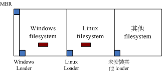
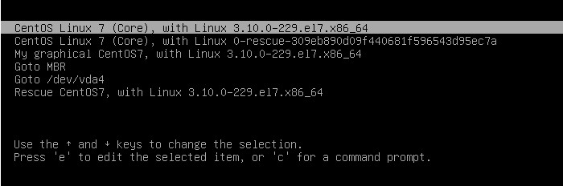
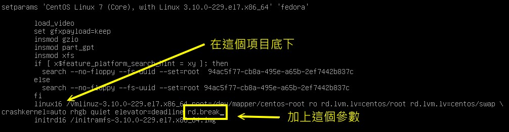
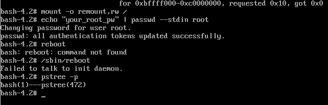
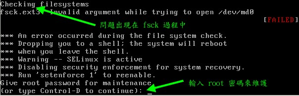

# 第十九章、开机流程、模块管理与 Loader

最近更新日期：20//

系统开机其实是一项非常复杂的程序，因为核心得要侦测硬件并载入适当的驱动程序后， 接下来则必须要调用程序来准备好系统运行的环境，以让使用者能够顺利的操作整部主机系统。 如果你能够理解开机的原理，那么将有助于你在系统出问题时能够很快速的修复系统喔！ 而且还能够顺利的配置多重操作系统的多重开机问题。为了多重开机的问题，你就不能不学学 grub2 这个 Linux 下面优秀的开机管理程序 （boot loader）。 而在系统运行期间，你也得要学会管理核心模块呢！

# 19.1 Linux 的开机流程分析

## 19.1 Linux 的开机流程分析

如果想要多重开机，那要怎么安装系统？如果你的 root 密码忘记了，那要如何救援？如果你的默认登陆模式为图形界面，那要如何在开机时直接指定进入纯文本模式？ 如果你因为 /etc/fstab 设置错误，导致无法顺利挂载根目录，那要如何在不重灌的情况下修订你的 /etc/fstab 让它变成正常？这些都需要了解开机流程， 那你说，这东西重不重要啊？

### 19.1.1 开机流程一览

既然开机是很严肃的一件事，那我们就来了解一下整个开机的过程吧！好让大家比较容易发现开机过程里面可能会发生问题的地方，以及出现问题后的解决之道！ 不过，由于开机的过程中，那个开机管理程序 （Boot Loader） 使用的软件可能不一样，例如目前各大 Linux distributions 的主流为 grub2，但早期 Linux 默认是使用 grub1 或 LILO ，台湾地区则很多朋友喜欢使用 [spfdisk](http://linux.vbird.org/linux_basic/0140spfdisk.php) 。 但无论如何，我们总是得要了解整个 boot loader 的工作情况，才能了解为何进行多重开机的设置时， 老是听人家讲要先安装 Windows 再安装 Linux 的原因～

假设以个人计算机架设的 Linux 主机为例 （先回到第零章计算机概论看看相关的硬件常识喔）， 当你按下电源按键后计算机硬件会主动的读取 BIOS 或 UEFI BIOS 来载入硬件信息及进行硬件系统的自我测试， 之后系统会主动的去读取第一个可开机的设备 （由 BIOS 设置的） ，此时就可以读入开机管理程序了。

开机管理程序可以指定使用哪个核心文件来开机，并实际载入核心到内存当中解压缩与执行， 此时核心就能够开始在内存内活动，并侦测所有硬件信息与载入适当的驱动程序来使整部主机开始运行， 等到核心侦测硬件与载入驱动程序完毕后，一个最阳春的操作系统就开始在你的 PC 上面跑了。

主机系统开始运行后，此时 Linux 才会调用外部程序开始准备软件执行的环境，并且实际的载入所有系统运行所需要的软件程序哩！ 最后系统就会开始等待你的登陆与操作啦！简单来说，系统开机的经过可以汇整成下面的流程的：

1.  载入 BIOS 的硬件信息与进行自我测试，并依据设置取得第一个可开机的设备；
2.  读取并执行第一个开机设备内 MBR 的 boot Loader （亦即是 grub2, spfdisk 等程序）；
3.  依据 boot loader 的设置载入 Kernel ，Kernel 会开始侦测硬件与载入驱动程序；
4.  在硬件驱动成功后，Kernel 会主动调用 systemd 程序，并以 default.target 流程开机；
    *   systemd 执行 sysinit.target 初始化系统及 basic.target 准备操作系统；
    *   systemd 启动 multi-user.target 下的本机与服务器服务；
    *   systemd 执行 multi-user.target 下的 /etc/rc.d/rc.local 文件；
    *   systemd 执行 multi-user.target 下的 getty.target 及登陆服务；
    *   systemd 执行 graphical 需要的服务

大概的流程就是上面写的那个样子啦，你会发现 systemd 这个家伙占的比重非常重！ 所以我们才会在第十六章的 pstree 指令中谈到这家伙。 那每一个程序的内容主要是在干嘛呢？下面就分别来谈一谈吧！

### 19.1.2 BIOS, boot loader 与 kernel 载入

我们在第二章曾经谈过简单的开机流程与 MBR 的功能，以及大容量磁盘需要使用的 GPT 分区表格式等。 详细的数据请再次回到第二章好好的阅读一下，我们这里为了讲解方便起见，将后续会用到的专有名词先做个综合解释：

*   BIOS：不论传统 BIOS 还是 UEFI BIOS 都会被简称为 BIOS；
*   MBR：虽然分区表有传统 MBR 以及新式 GPT，不过 GPT 也有保留一块相容 MBR 的区块，因此，下面的说明在安装 boot loader 的部份， 鸟哥还是简称为 MBR 喔！总之，MBR 就代表该磁盘的最前面可安装 boot loader 的那个区块就对了！

*   BIOS, 开机自我测试与 MBR/GPT

我们在第零章的计算机概论就曾谈过计算机主机架构， 在个人计算机架构下，你想要启动整部系统首先就得要让系统去载入 BIOS （Basic Input Output System），并通过 BIOS 程序去载入 CMOS 的信息，并且借由 CMOS 内的设置值取得主机的各项硬件设置， 例如 CPU 与周边设备的沟通频率啊、开机设备的搜寻顺序啊、硬盘的大小与类型啊、 系统时间啊、各周边总线的是否启动 Plug and Play （PnP, 随插即用设备） 啊、 各周边设备的 I/O 位址啊、以及与 CPU 沟通的 IRQ 岔断等等的信息。

在取得这些信息后，BIOS 还会进行开机自我测试 （Power-on Self Test, POST） [[1]](#ps1)。 然后开始执行硬件侦测的初始化，并设置 PnP 设备，之后再定义出可开机的设备顺序，接下来就会开始进行开机设备的数据读取了。

由于我们的系统软件大多放置到硬盘中嘛！所以 BIOS 会指定开机的设备好让我们可以读取磁盘中的操作系统核心文件。 但由于不同的操作系统他的文件系统格式不相同，因此我们必须要以一个开机管理程序来处理核心文件载入 （load） 的问题， 因此这个开机管理程序就被称为 Boot Loader 了。那这个 Boot Loader 程序安装在哪里呢？就在开机设备的第一个扇区 （sector） 内，也就是我们一直谈到的 MBR （Master Boot Record, 主要开机记录区）。

那你会不会觉得很奇怪啊？既然核心文件需要 loader 来读取，那每个操作系统的 loader 都不相同， 这样的话 BIOS 又是如何读取 MBR 内的 loader 呢？很有趣的问题吧！其实 BIOS 是通过硬件的 INT 13 中断功能来读取 MBR 的，也就是说，只要 BIOS 能够侦测的到你的磁盘 （不论该磁盘是 SATA 还是 SAS 接口），那他就有办法通过 INT 13 这条信道来读取该磁盘的第一个扇区内的 MBR 软件啦！[[2]](#ps2)这样 boot loader 也就能够被执行啰！


**Tips** 我们知道每颗硬盘的最前面区块含有 MBR 或 GPT 分区表的提供 loader 的区块，那么如果我的主机上面有两颗硬盘的话， 系统会去哪颗硬盘的最前面区块读取 boot loader 呢？这个就得要看 BIOS 的设置了。 基本上，我们常常讲的“系统的 MBR”其实指的是 **第一个开机设备的 MBR** 才对！ 所以，改天如果你要将开机管理程序安装到某颗硬盘的 MBR 时， 要特别注意当时系统的“第一个开机设备”是哪个，否则会安装到错误的硬盘上面的 MBR 喔！重要重要！

*   Boot Loader 的功能

刚刚说到 Loader 的最主要功能是要认识操作系统的文件格式并据以载入核心到内存中去执行。 由于不同操作系统的文件格式不一致，因此每种操作系统都有自己的 boot loader 啦！用自己的 loader 才有办法载入核心文件嘛！那问题就来啦，你应该有听说过多重操作系统吧？也就是在一部主机上面安装多种不同的操作系统。 既然你 （1）必须要使用自己的 loader 才能够载入属于自己的操作系统核心，而 （2）系统的 MBR 只有一个，那你怎么会有办法同时在一部主机上面安装 Windows 与 Linux 呢？

这就得要回到第七章的磁盘文件系统去回忆一下文件系统功能了。 其实每个文件系统 （filesystem, 或者是 partition） 都会保留一块开机扇区 （boot sector） 提供操作系统安装 boot loader ， 而通常操作系统默认都会安装一份 loader 到他根目录所在的文件系统的 boot sector 上。如果我们在一部主机上面安装 Windows 与 Linux 后，该 boot sector, boot loader 与 MBR 的相关性会有点像下图：

图 19.1.1、boot loader 安装在 MBR, boot sector 与操作系统的关系

如上图所示，每个操作系统默认是会安装一套 boot loader 到他自己的文件系统中 （就是每个 filesystem 左下角的方框），而在 Linux 系统安装时，你可以选择将 boot loader 安装到 MBR 去，也可以选择不安装。 如果选择安装到 MBR 的话，那理论上你在 MBR 与 boot sector 都会保有一份 boot loader 程序的。 至于 Windows 安装时，他默认会主动的将 MBR 与 boot sector 都装上一份 boot loader！所以啦， 你会发现安装多重操作系统时，你的 MBR 常常会被不同的操作系统的 boot loader 所覆盖啦！ ^_^

我们刚刚提到的两个问题还是没有解决啊！虽然各个操作系统都可以安装一份 boot loader 到他们的 boot sector 中， 这样操作系统可以通过自己的 boot loader 来载入核心了。问题是系统的 MBR 只有一个哩！ 你要怎么执行 boot sector 里面的 loader 啊？这个我们得要回忆一下第二章约略提过的 boot loader 的功能了。boot loader 主要的功能如下：

*   **提供菜单**：使用者可以选择不同的开机项目，这也是多重开机的重要功能！
*   **载入核心文件**：直接指向可开机的程序区段来开始操作系统；
*   **转交其他 loader**：将开机管理功能转交给其他 loader 负责。

由于具有菜单功能，因此我们可以选择不同的核心来开机。而由于具有控制权转交的功能，因此我们可以载入其他 boot sector 内的 loader 啦！不过 Windows 的 loader 默认不具有控制权转交的功能，因此你不能使用 Windows 的 loader 来载入 Linux 的 loader 喔！这也是为啥第二章谈到 MBR 与多重开机时，会特别强调先装 Windows 再装 Linux 的缘故。 我们将上述的三个功能以下面的图示来解释你就看的懂了！（与第二章的图示也非常类似啦！）

图 19.1.2、开机管理程序的菜单功能与控制权转交功能示意图

如上图所示，我的 MBR 使用 Linux 的 grub2 这个开机管理程序，并且里面假设已经有了三个菜单， 第一个菜单可以直接指向 Linux 的核心文件并且直接载入核心来开机；第二个菜单可以将开机管理程控权交给 Windows 来管理，此时 Windows 的 loader 会接管开机流程，这个时候他就能够启动 windows 了。第三个菜单则是使用 Linux 在 boot sector 内的开机管理程序，此时就会跳出另一个 grub2 的菜单啦！了解了吗？

*   菜单一：MBR（grub2） --> kernel file --> booting
*   菜单二：MBR（grub2） --> boot sector（Windows loader） --> Windows kernel --> booting
*   菜单三：MBR（grub2） --> boot sector（grub2） --> kernel file --> booting

而最终 boot loader 的功能就是“载入 kernel 文件”啦！

*   载入核心侦测硬件与 initramfs 的功能

当我们借由 boot loader 的管理而开始读取核心文件后，接下来， Linux 就会将核心解压缩到内存当中， 并且利用核心的功能，开始测试与驱动各个周边设备，包括储存设备、CPU、网卡、声卡等等。 此时 Linux 核心会以自己的功能重新侦测一次硬件，而不一定会使用 BIOS 侦测到的硬件信息喔！也就是说，核心此时才开始接管 BIOS 后的工作了。 那么核心文件在哪里啊？一般来说，他会被放置到 /boot 里面，并且取名为 /boot/vmlinuz 才对！

```
[root@study ~]# ls --format=single-column -F /boot
config-3.10.0-229.el7.x86_64                &lt;==此版本核心被编译时选择的功能与模块配置文件
grub/                                       &lt;==旧版 grub1 ，不需要理会这目录了！
grub2/                                      &lt;==就是开机管理程序 grub2 相关数据目录
initramfs-0-rescue-309eb890d3d95ec7a.img    &lt;==下面几个为虚拟文件系统文件！这一个是用来救援的！
initramfs-3.10.0-229.el7.x86_64.img         &lt;==正常开机会用到的虚拟文件系统
initramfs-3.10.0-229.el7.x86_64kdump.img    &lt;==核心出问题时会用到的虚拟文件系统
System.map-3.10.0-229.el7.x86_64            &lt;==核心功能放置到内存位址的对应表
vmlinuz-0-rescue-309eb890d09543d95ec7a*     &lt;==救援用的核心文件
vmlinuz-3.10.0-229.el7.x86_64*              &lt;==就是核心文件啦！最重要者！ 
```

从上表中的特殊字体，我们也可以知道 CentOs 7.x 的 Linux 核心为 3.10.0-229.el7.x86_64 这个版本！为了硬件开发商与其他核心功能开发者的便利， 因此 Linux 核心是可以通过动态载入核心模块的 （就请想成驱动程序即可），这些核心模块就放置在 /lib/modules/ 目录内。 由于模块放置到磁盘根目录内 （要记得 /lib 不可以与 / 分别放在不同的 partition ！）， 因此在开机的过程中核心必须要挂载根目录，这样才能够读取核心模块提供载入驱动程序的功能。 而且为了担心影响到磁盘内的文件系统，因此开机过程中根目录是以只读的方式来挂载的喔。

一般来说，非必要的功能且可以编译成为模块的核心功能，目前的 Linux distributions 都会将他编译成为模块。 因此 USB, SATA, SCSI... 等磁盘设备的驱动程序通常都是以模块的方式来存在的。 现在来思考一种情况，假设你的 linux 是安装在 SATA 磁盘上面的，你可以通过 BIOS 的 INT 13 取得 boot loader 与 kernel 文件来开机，然后 kernel 会开始接管系统并且侦测硬件及尝试挂载根目录来取得额外的驱动程序。

问题是，核心根本不认识 SATA 磁盘，所以需要载入 SATA 磁盘的驱动程序， 否则根本就无法挂载根目录。但是 SATA 的驱动程序在 /lib/modules 内，你根本无法挂载根目录又怎么读取到 /lib/modules/ 内的驱动程序？是吧！非常的两难吧！在这个情况之下，你的 Linux 是无法顺利开机的！ 那怎办？没关系，我们可以通过虚拟文件系统来处理这个问题。

虚拟文件系统 （Initial RAM Disk 或 Initial RAM Filesystem） 一般使用的文件名为 /boot/initrd 或 /boot/initramfs ，这个文件的特色是，他也能够通过 boot loader 来载入到内存中，然后这个文件会被解压缩并且在内存当中仿真成一个根目录， 且此仿真在内存当中的文件系统能够提供一支可执行的程序，通过该程序来载入开机过程中所最需要的核心模块， 通常这些模块就是 USB, RAID, LVM, SCSI 等文件系统与磁盘接口的驱动程序啦！等载入完成后， 会帮助核心重新调用 systemd 来开始后续的正常开机流程。

图 19.1.3、BIOS 与 boot loader 及核心载入流程示意图

如上图所示，boot loader 可以载入 kernel 与 initramfs ，然后在内存中让 initramfs 解压缩成为根目录， kernel 就能够借此载入适当的驱动程序，最终释放虚拟文件系统，并挂载实际的根目录文件系统，就能够开始后续的正常开机流程。 更详细的 initramfs 说明，你可以自行使用 man initrd 去查阅看看。 下面让我们来了解一下 CentOS 7.x 的 initramfs 文件内容有什么吧！ ^_^

```
# 1\. 先来直接看一下 initramfs 里面的内容有些啥数据？
[root@study ~]# lsinitrd /boot/initramfs-3.10.0-229.el7.x86_64.img
# 首先会调用出 initramfs 最前面文件开始的许多数据介绍，这部份会占用一些容量！
Image: /boot/initramfs-3.10.0-229.el7.x86_64.img: 18M
========================================================================
Early CPIO image
========================================================================
drwxr-xr-x   3 root     root            0 May  4 17:56 .
-rw-r--r--   1 root     root            2 May  4 17:56 early_cpio
drwxr-xr-x   3 root     root            0 May  4 17:56 kernel
drwxr-xr-x   3 root     root            0 May  4 17:56 kernel/x86
drwxr-xr-x   2 root     root            0 May  4 17:56 kernel/x86/microcode
-rw-r--r--   1 root     root        10240 May  4 17:56 kernel/x86/microcode/GenuineIntel.bin
========================================================================
Version: dracut-033-240.el7

Arguments: -f

dracut modules:  # 开始一堆模块的载入行为
bash
nss-softokn
.....（中间省略）.....
========================================================================
drwxr-xr-x  12 root     root            0 May  4 17:56 .
crw-r--r--   1 root     root       5,   1 May  4 17:56 dev/console
crw-r--r--   1 root     root       1,  11 May  4 17:56 dev/kmsg
crw-r--r--   1 root     root       1,   3 May  4 17:56 dev/null
.....（中间省略）.....
lrwxrwxrwx   1 root     root           23 May  4 17:56 init -&gt; usr/lib/systemd/systemd
.....（中间省略）.....
drwxr-xr-x   2 root     root            0 May  4 17:56 var/lib/lldpad
lrwxrwxrwx   1 root     root           11 May  4 17:56 var/lock -&gt; ../run/lock
lrwxrwxrwx   1 root     root           10 May  4 17:56 var/log -&gt; ../run/log
lrwxrwxrwx   1 root     root            6 May  4 17:56 var/run -&gt; ../run
========================================================================
# 最后则会列出这个 initramfs 里头的所有文件！也就是说，这个 initramfs 文件大概存着两部份，
# 先是文件开始宣告的许多文件部份，再来才是真的会被核心取用的全部附加的文件数据！ 
```

从上面我们大概知道了这个 initramfs 里头含有两大区块，一个是事先宣告的一些数据，包括 kernel/x86/microcode/GenuineIntel.bin 这些东西。 在这些数据后面，才是真的我们的核心会去读取的重要文件～如果看一下文件的内容，你会发现到 init 那只程序已经被 systemd 所取代啰！这样理解否？ 好～如果你想要进一步将这个文件解开的话，那得要先将前面的 kernel/x86/microcode/GenuineIntel.bin 之前的文件先去除掉，这样才能够顺利的解开。 因此，得要这样进行：

```
# 1\. 先将 /boot 下面的文件进行去除前面不需要的文件开始数据部份。
[root@study ~]# mkdir /tmp/initramfs
[root@study ~]# cd /tmp/initramfs
[root@study initramfs]# dd if=/boot/initramfs-3.10.0-229.el7.x86_64.img of=initramfs.gz \
&gt;  bs=11264 skip=1
[root@study initramfs]# ll initramfs.gz; file initramfs.gz
-rw-r--r--. 1 root root 18558166 Aug 24 19:38 initramfs.gz
initramfs.gz: gzip compressed data, from Unix, last modified: Mon May  4 17:56:47 2015,
 max compression

# 2\. 从上面看到文件是 gzip 压缩文件，所以将它解压缩后，再查阅一下文件的类型！
[root@study initramfs]# gzip -d initramfs.gz
[root@study initramfs]# file initramfs
initramfs: ASCII cpio archive （SVR4 with no CRC）

# 3\. 解开后又产生一个 cpio 文件，得要将它用 cpio 的方法解开！加上不要绝对路径的参数较保险！
[root@study initramfs]# cpio -i -d -H newc --no-absolute-filenames &lt; initramfs
[root@study initramfs]# ll
lrwxrwxrwx.  1 root root        7 Aug 24 19:40 bin -&gt; usr/bin
drwxr-xr-x.  2 root root       42 Aug 24 19:40 dev
drwxr-xr-x. 12 root root     4096 Aug 24 19:40 etc
lrwxrwxrwx.  1 root root       23 Aug 24 19:40 init -&gt; usr/lib/systemd/systemd
-rw-r--r--.  1 root root 42263552 Aug 24 19:38 initramfs
lrwxrwxrwx.  1 root root        7 Aug 24 19:40 lib -&gt; usr/lib
lrwxrwxrwx.  1 root root        9 Aug 24 19:40 lib64 -&gt; usr/lib64
drwxr-xr-x.  2 root root        6 Aug 24 19:40 proc
drwxr-xr-x.  2 root root        6 Aug 24 19:40 root
drwxr-xr-x.  2 root root        6 Aug 24 19:40 run
lrwxrwxrwx.  1 root root        8 Aug 24 19:40 sbin -&gt; usr/sbin
-rwxr-xr-x.  1 root root     3041 Aug 24 19:40 shutdown
drwxr-xr-x.  2 root root        6 Aug 24 19:40 sys
drwxr-xr-x.  2 root root        6 Aug 24 19:40 sysroot
drwxr-xr-x.  2 root root        6 Aug 24 19:40 tmp
drwxr-xr-x.  7 root root       61 Aug 24 19:40 usr
drwxr-xr-x.  3 root root       47 Aug 24 19:40 var
# 看吧！上面几乎就像是一个小型的文件系统根目录耶！这样就能让 kernel 去挂载了！

# 4\. 接下来瞧一瞧到底这个小型的文件系统中，systemd 是要以哪个 target 来执行开机呢？
[root@study initramfs]# ll usr/lib/systemd/system/default.target
lrwxrwxrwx. 1 root root 13 Aug 24 19:40 usr/lib/systemd/system/default.target -&gt; initrd.target

# 5\. 最终，让我们瞧一瞧系统内默认的 initrd.target 相依的所有服务数据吧！
[root@study initramfs]# systemctl list-dependencies initrd.target
initrd.target
├─dracut-cmdline.service
.....（中间省略）.....
├─basic.target
│ ├─alsa-restore.service
.....（中间省略）.....
│ ├─slices.target
│ │ ├─-.slice
│ │ └─system.slice
│ ├─sockets.target
│ │ ├─dbus.socket
.....（中间省略）.....
│ │ └─systemd-udevd-kernel.socket
│ ├─sysinit.target
│ │ ├─dev-hugepages.mount
.....（中间省略）.....
│ │ ├─local-fs.target
│ │ │ ├─-.mount
│ │ │ ├─boot.mount
.....（中间省略）.....
│ │ └─swap.target
│ │   ├─dev-centos-swap.swap
.....（中间省略）.....
│ │   └─dev-mapper-centos\x2dswap.swap
│ └─timers.target
│   └─systemd-tmpfiles-clean.timer
├─initrd-fs.target
└─initrd-root-fs.target
# 依旧通过 systemd 的方式，一个一个的将所有的侦测与服务载入系统中！ 
```

通过上面解开 initramfs 的结果，你会知道其实 initramfs 就是一个小型的根目录，这个小型根目录里面也是通过 systemd 来进行管理，同时观察 default.target 的链接，会发现其实这个小型系统就是通过 initrd.target 来开机，而 initrd.target 也是需要读入一堆例如 basic.target, sysinit.target 等等的硬件侦测、核心功能启用的流程， 然后开始让系统顺利运行。最终才又卸载 initramfs 的小型文件系统，实际挂载系统的根目录！

此外，initramfs 并没有包山包海，它仅是带入开机过程会用到的核心模块而已。所以如果你在 initramfs 里面去找 modules 这个关键字的话， 就可以发现主要的核心模块大概就是 SCSI、virtio、RAID 等等跟磁盘相关性比较高的模块就是了！现在由于磁盘大部分都是使用 SATA 这玩意儿， 并没有 IDE 的格式啰！所以，没有 initramfs 的话，你的 Linux 几乎就是不能顺利开机的啦！除非你将 SATA 的模块直接编译到核心去了！ ^_^

在核心完整的载入后，您的主机应该就开始正确的运行了，接下来，就是要开始执行系统的第一支程序： systemd ！

### 19.1.3 第一支程序 systemd 及使用 default.target 进入开机程序分析

在核心载入完毕、进行完硬件侦测与驱动程序载入后，此时你的主机硬件应该已经准备就绪了 （ready） ， 此时核心会主动的调用第一支程序，那就是 systemd 啰。这也是为啥第十六章的 pstree 指令介绍时，你会发现 systemd 的 PID 号码是一号啦。 systemd 最主要的功能就是准备软件执行的环境，包括系统的主机名称、网络设置、语系处理、文件系统格式及其他服务的启动等。 而所有的动作都会通过 systemd 的默认启动服务集合，亦即是 /etc/systemd/system/default.target 来规划。 另外， systemd 已经舍弃沿用多年的 system V 的 runlevel 了喔！

*   常见的操作环境 target 与相容于 runlevel 的等级

可以作为默认的操作环境 （default.target） 的主要项目有： multi-user.target 以及 graphical.target 这两个。当然还有某些比较特殊的操作环境， 包括在第十七章里面谈到的 rescue.target, emergency.target, shutdown.target 等等，以及本章在 initramfs 里面谈到的 initrd.target 啰！

但是过去的 systemV 使用的是一个称为 runlevel （执行等级） 的概念来启动系统的，systemd 为了相容于旧式的 systemV 操作行为， 所以也将 runlevel 与操作环境做个结合喔！你可以使用下面的方式来查询两者间的对应：

```
[root@study ~]# ll -d /usr/lib/systemd/system/runlevel*.target &#124; cut -c 28-
May  4 17:52 /usr/lib/systemd/system/runlevel0.target -&gt; poweroff.target
May  4 17:52 /usr/lib/systemd/system/runlevel1.target -&gt; rescue.target
May  4 17:52 /usr/lib/systemd/system/runlevel2.target -&gt; multi-user.target
May  4 17:52 /usr/lib/systemd/system/runlevel3.target -&gt; multi-user.target
May  4 17:52 /usr/lib/systemd/system/runlevel4.target -&gt; multi-user.target
May  4 17:52 /usr/lib/systemd/system/runlevel5.target -&gt; graphical.target
May  4 17:52 /usr/lib/systemd/system/runlevel6.target -&gt; reboot.target 
```

如果你之前已经使用过 systemV 的方式来管理系统的话，那应该会知道切换执行等级可以使用“ init 3 ”转成文字界面，“ init 5 ”转成图形界面吧？ 这个 init 程序依旧是保留下来的，只是 init 3 会相当于 systemctl isolate multi-user.target 就是了！如果做个完整的叠代，这两个东西的对应为：

| SystemV | systemd |
| --- | --- |
| init 0 | systemctl poweroff |
| init 1 | systemctl rescue |
| init [234] | systemctl isolate multi-user.target |
| init 5 | systemctl isolate graphical.target |
| init 6 | systemctl reboot |

*   systemd 的处理流程

如前所述，当我们取得了 /etc/systemd/system/default.target 这一个默认操作界面的设置之后，接下来系统帮我们做了什么呢？ 首先，它会链接到 /usr/lib/systemd/system/ 这个目录下去取得 multi-user.target 或 graphical.target 这两个其中的一 （当然， 鸟哥说的是正常的进入 Linux 操作环境的情况下！），假设我们是使用 graphical.target 好了，接着下来 systemd 会去找两个地方的设置， 就是如下的目录：

*   /etc/systemd/system/graphical.target.wants/：使用者设置载入的 unit
*   /usr/lib/systemd/system/graphical.target.wants/：系统默认载入的 unit

然后再由 /usr/lib/systemd/system/graphical.target 这个配置文件内发现如下的数据：

```
[root@study ~]# cat /usr/lib/systemd/system/graphical.target
[Unit]
Description=Graphical Interface
Documentation=man:systemd.special（7）
Requires=multi-user.target
After=multi-user.target
Conflicts=rescue.target
Wants=display-manager.service
AllowIsolate=yes

[Install]
Alias=default.target 
```

这表示 graphical.target 必须要完成 multi-user.target 之后才能够进行，而进行完 graphical.target 之后，还得要启动 display-manager.service 才行的意思。 好了！那么通过同样的方式，我们来找找 multi-user.target 要执行完毕得要载入的项目有哪些呢？

```
# 先来看看 multi-user.target 配置文件内规范了相依的操作环境有哪些呢？
[root@study ~]# cat /usr/lib/systemd/system/multi-user.target
[Unit]
Description=Multi-User System
Documentation=man:systemd.special（7）
Requires=basic.target
Conflicts=rescue.service rescue.target
After=basic.target rescue.service rescue.target
AllowIsolate=yes

[Install]
Alias=default.target

# 然后看看系统默认要载入的 unit 有哪些？
[root@study ~]# ls /usr/lib/systemd/system/multi-user.target.wants
brandbot.path  plymouth-quit.service           systemd-logind.service
dbus.service   plymouth-quit-wait.service      systemd-user-sessions.service
getty.target   systemd-ask-password-wall.path

# 使用者自订要载入的 unit 又有哪些呢？
[root@study ~]# ls /etc/systemd/system/multi-user.target.wants
abrt-ccpp.service    crond.service           mdmonitor.service       sshd.service
abrtd.service        hypervkvpd.service      ModemManager.service    sysstat.service
abrt-oops.service    hypervvssd.service      NetworkManager.service  tuned.service
abrt-vmcore.service  irqbalance.service      postfix.service         vmtoolsd.service
abrt-xorg.service    kdump.service           remote-fs.target        vsftpd2.service
atd.service          ksm.service             rngd.service            vsftpd.service
auditd.service       ksmtuned.service        rsyslog.service
backup2.timer        libstoragemgmt.service  smartd.service
backup.timer         libvirtd.service        sshd2.service 
```

通过上面的结果，我们又能知道 multi-usre.target 需要在 basic.target 运行完毕才能够载入上述的许多 unit 哩！然后再去 basic.target 里头找数据等等～ 最终这些数据就可以通过“ systemctl list-dependencies graphical.target ”这个指令来列出所有的相关性的服务啰！这就是 systemd 的调用所需要的服务的流程喔！


**Tips** 要知道系统的服务启用的流程，最简单的方法就是“ systemctl list-dependencies graphical.target ”这个指令！只是，如果你想要知道背后的配置文件意义， 那就是分别去找出 /etc 与 /usr/lib 下面的 graphical.target.wants/ 目录下的数据就对了！当然，配置文件脚本里面的 Requires 这个设置值所代表的服务， 也是需要是先载入喔！

约略分析一下“ systemctl list-dependencies graphical.target ”所输出的相依属性服务，基本上我们 CentOS 7.x 的 systemd 开机流程大约是这样：

1.  local-fs.target + swap.target：这两个 target 主要在挂载本机 /etc/fstab 里面所规范的文件系统与相关的内存交换空间。
2.  sysinit.target：这个 target 主要在侦测硬件，载入所需要的核心模块等动作。
3.  basic.target：载入主要的周边硬件驱动程序与防火墙相关任务
4.  multi-user.target 下面的其它一般系统或网络服务的载入
5.  图形界面相关服务如 gdm.service 等其他服务的载入

除了第一步骤 local-fs.target, swap.target 是通过 /etc/fstab 来进行挂载的行为之外，那其他的 target 有做啥动作呢？简单得来说说！

### 19.1.4 systemd 执行 sysinit.target 初始化系统、basic.target 准备系统

如果你自己使用“ systemctl list-dependencies sysinit.target ”来瞧瞧的话，那就会看到很多相依的服务！这些服务你应该要一个一个去查询看看设置脚本的内容， 就能够大致理解每个服务的意义。基本上，我们可以将这些服务归类成几个大项就是了：

*   特殊文件系统设备的挂载：包括 dev-hugepages.mount dev-mqueue.mount 等挂载服务，主要在挂载跟巨量内存分页使用与讯息伫列的功能。 挂载成功后，会在 /dev 下面创建 /dev/hugepages/, /dev/mqueue/ 等目录；
*   特殊文件系统的启用：包括磁盘阵列、网络磁盘 （iscsi）、LVM 文件系统、文件系统对照服务 （multipath） 等等，也会在这里被侦测与使用到！
*   开机过程的讯息传递与动画执行：使用 plymouthd 服务搭配 plymouth 指令来传递动画与讯息
*   日志式登录文件的使用：就是 systemd-journald 这个服务的启用啊！
*   载入额外的核心模块：通过 /etc/modules-load.d/*.conf 文件的设置，让核心额外载入管理员所需要的核心模块！
*   载入额外的核心参数设置：包括 /etc/sysctl.conf 以及 /etc/sysctl.d/*.conf 内部设置！
*   启动系统的乱数产生器：乱数产生器可以帮助系统进行一些密码加密演算的功能
*   设置终端机 （console） 字形
*   启动动态设备管理员：就是 udevd 这个家伙！用在动态对应实际设备存取与设备文件名对应的一个服务！相当重要喔！也是在这里启动的！

不论你即将使用哪种操作环境来使用系统，这个 sysinit.target 几乎都是必要的工作！从上面你也可以看的出来，基本的核心功能、文件系统、文件系统设备的驱动等等， 都在这个时刻处理完毕～所以，这个 sysinit.target 的阶段是挺重要的喔！

执行完 sysinit.target 之后，再来则是 basic.target 这个项目了。 sysinit.target 在初始化系统，而这个 basic .target 则是一个最阳春的操作系统了！ 这个 basic.target 的阶段主要启动的服务大概有这些：

*   载入 alsa 音效驱动程序：这个 alsa 是个音效相关的驱动程序，会让你的系统有音效产生啰；
*   载入 firewalld 防火墙：CentOS 7.x 以后使用 firewalld 取代 iptables 的防火墙设置，虽然最终都是使用 iptables 的架构， 不过在设置上面差很多喔！
*   载入 CPU 的微指令功能；
*   启动与设置 SELinux 的安全本文：如果由 disable 的状态改成 enable 的状态，或者是管理员设置强制重新设置一次 SELinux 的安全本文， 也在这个阶段处理喔！
*   将目前的开机过程所产生的开机信息写入到 /var/log/dmesg 当中
*   由 /etc/sysconfig/modules/*.modules 及 /etc/rc.modules 载入管理员指定的模块！
*   载入 systemd 支持的 timer 功能；

在这个阶段完成之后，你的系统已经可以顺利的运行！就差一堆你需要的登陆服务、网络服务、本机认证服务等等的 service 类别啰！于是就可以进入下个服务启动的阶段了！

### 19.1.5 systemd 启动 multi-user.target 下的服务

在载入核心驱动硬件后，经过 sysinit.target 的初始化流程让系统可以存取之后，加上 basic.target 让系统成为操作系统的基础， 之后就是服务器要顺利运行时，需要的各种主机服务以及提供服务器功能的网络服务的启动了。这些服务的启动则大多是附挂在 multi-user.target 这个操作环境下面， 你可以到 /etc/systemd/system/multi-user.target.wants/ 里头去瞧瞧默认要被启动的服务喔！

也就是说，一般来说服务的启动脚本设置都是放在下面的目录内：

*   /usr/lib/systemd/system （系统默认的服务启动脚本设置）
*   /etc/systemd/system （管理员自己开发与设置的脚本设置）

而使用者针对主机的本机服务与服务器网络服务的各项 unit 若要 enable 的话，就是将它放到 /etc/systemd/system/multi-user.target.wants/ 这个目录下面做个链接～ 这样就可以在开机的时候去启动他。这时回想一下，你在第十七章使用 systemctl enable/disable 时，系统的回应是什么呢？再次回想一下：

```
# 将 vsftpd.service 先 disable 再 enable 看看输出的信息为何？
[root@study ~]# systemctl disable vsftpd.service
rm '/etc/systemd/system/multi-user.target.wants/vsftpd.service'

[root@study ~]# systemctl enable vsftpd.service
ln -s '/usr/lib/systemd/system/vsftpd.service' '/etc/systemd/system/multi-user.target.
 wants/vsftpd.service' 
```

有没有发现亮点了？不是从 /etc/systemd/system/multi-user.target.wants/ 里面删除链接文件，就是创建链接文件～这样说，理解吧？ 你当然不需要手动作这些链接，而是使用 systemctl 来处理即可！另外，这些程序除非在脚本设置里面原本就有规范服务的相依性， 这样才会有顺序的启动之外，大多数的服务都是同时启动的！这就是 systemd 的多任务啰。

*   相容 systemV 的 rc-local.service

另外，过去用过 Linux 的朋友大概都知道，当系统完成开机后，还想要让系统额外执行某些程序的话，可以将该程序指令或脚本的绝对路径名称写入到 /etc/rc.d/rc.local 这个文件去！新的 systemd 机制中，它建议直接写一个 systemd 的启动脚本配置文件到 /etc/systemd/system 下面，然后使用 systemctl enable 的方式来设置启用它，而不要直接使用 rc.local 这个文件啦！

但是像鸟哥这种老人家就是喜欢将开机后要立刻执行的许多管理员自己的脚本，将它写入到 /etc/rc.d/rc.local 去嘛！那新版的 systemd 有没有支持呢？ 当然有！那就是 rc-local.service 这个服务的功能了！这个服务不需要启动，它会自己判断 /etc/rc.d/rc.local 是否具有可执行的权限来判断要不要启动这个服务！ 你可以这样检查看看：

```
# 1\. 先看一下 /etc/rc.d/rc.local 的权限，然后检查 multi-user.target 有没有这个服务
[root@study ~]# ll /etc/rc.d/rc.local
-rw-r--r--. 1 root root 473 Mar  6 13:48 /etc/rc.d/rc.local

[root@study ~]# systemctl status rc-local.service
rc-local.service - /etc/rc.d/rc.local Compatibility
   Loaded: loaded （/usr/lib/systemd/system/rc-local.service; static）
   Active: inactive （dead）

[root@study ~]# systemctl list-dependencies multi-user.target &#124; grep rc-local
# 明明就有这个服务，但是 rc.local 不具有可执行 （x） 的权限，因此这个服务不会被执行

# 2\. 加入可执行权限后，再看一下 rc-local 是否可被启用！
[root@study ~]# chmod a+x /etc/rc.d/rc.local; ll /etc/rc.d/rc.local
-rwxr-xr-x. 1 root root 473 Mar  6 13:48 /etc/rc.d/rc.local

[root@study ~]# systemctl daemon-reload
[root@study ~]# systemctl list-dependencies multi-user.target &#124; grep rc-local
├─rc-local.service   # 这个服务确实被记录到启动的环境下啰！ 
```

通过这个 chmod a+x /etc/rc.d/rc.local 的步骤，你的许多脚本就可以放在 /etc/rc.d/rc.local 这个文件内， 系统在每次开机都会去执行这文件内的指令喔！非常简单吧！

*   提供 tty 界面与登陆的服务

在 multi-user.target 下面还有个 getty.target 的操作界面项目喔！ 这个项目就是我们在第十七章用来举例的 tty 终端机界面的个数案例。 能不能提供适当的登陆服务也是 multi-user.target 下面的内容！包括 systemd-logind.service, systemd-user-sessions.service 等服务。

比较有趣的地方是，由于服务都是同步运行，不一定哪个服务先启动完毕。如果 getty 服务先启动完毕时，你会发现到有可用的终端机尝试让你登陆系统了。 问题是，如果 systemd-logind.service 或 systemd-user-sessions.service 服务尚未执行完毕的话，那么你还是无法登陆系统的。


**Tips** 有些比较急性子的伙伴在启动 CentOS 7.x 时，看到屏幕出现 tty1 可以让他登陆了～但是一开始输入正确的帐密却无法登陆系统！ 总要隔了数十秒之后才能够顺利的登陆！知道原因了吗？ ^_^

### 19.1.6 systemd 启动 graphical.target 下面的服务

如果你的 default.target 是 multi-user.target 的话，那么这个步骤就不会进行。反之，如果是 graphical.target 的话，那么 systemd 就会开始载入用户管理服务与图形界面管理员 （window display manager, DM） 等，启动图形界面来让用户以图形界面登陆系统喔！ 如果你对于 graphical.target 多了哪些服务有兴趣，那就来检查看看：

```
[root@study ~]# systemctl list-dependencies graphical.target
graphical.target
├─accounts-daemon.service
├─gdm.service
├─network.service
├─rtkit-daemon.service
├─systemd-update-utmp-runlevel.service
└─multi-user.target
  ├─abrt-ccpp.service
.....（下面省略）..... 
```

事实上就是多了上面列出来的这些服务而已～大多数都是图形界面帐号管理的功能，至于实际让用户可以登陆的服务，倒是那个 gdm.service 哩！ 如果你去瞧瞧 gdm.service 的内容，就会发现最重要的可执行文件是 /usr/sbin/gdm 喔！那就是让使用者可以利用图形界面登陆的最重要服务啰！ 我们未来讲到 X 窗口界面时再来聊聊 gdm 这玩意儿喔！

到此为止，systemd 就已经完整的处理完毕，你可以使用图形界面或文字界面的方式来登陆系统，系统也顺利的开机完毕， 也能够将你写入到 /etc/rc.d/rc.local 的脚本实际执行一次啰。那如果默认是图形界面 （graphical.target） 但是想要关掉而进入文字界面 （multi-user.target） 呢？ 很简单啊！19.1.3 小节就谈过了，使用“ systemctl isolate multi-user.target ”即可！如果使用“ init 3 ”呢？也是可以啦！ 只是系统实际执行的还是“ systemctl isolate multi-user.target ”就是了！ ^_^

### 19.1.7 开机过程会用到的主要配置文件

基本上， systemd 有自己的配置文件处理方式，不过为了相容于 systemV ，其实很多的服务脚本设置还是会读取位于 /etc/sysconfig/ 下面的环境配置文件！ 下面我们就来谈谈几个常见的比较重要的配置文件啰！

*   关于模块： /etc/modprobe.d/*.conf 及 /etc/modules-load.d/*.conf

还记得我们在 sysinit.target 系统初始化 当中谈到的载入使用者自订模块的地方吗？其实有两个地方可以处理模块载入的问题，包括：

*   /etc/modules-load.d/*.conf：单纯要核心载入模块的位置；
*   /etc/modprobe.d/*.conf：可以加上模块参数的位置

基本上 systemd 已经帮我们将开机会用到的驱动程序全部载入了，因此这个部份你应该无须更动才对！不过， 如果你有某些特定的参数要处理时，应该就得要在这里进行了。举例来说，我们在第十七章曾经谈过 vsftpd 这个服务对吧！ 而且当时将这个服务的端口更改到 555 这个号码上去了！那我们可能需要修改防火墙设置，其中一个针对 FTP 很重要的防火墙模块为 nf_conntrack_ftp， 因此，你可以将这个模块写入到系统开机流程中，例如：

```
[root@study ~]# vim /etc/modules-load.d/vbird.conf
nf_conntrack_ftp 
```

一个模块 （驱动程序） 写一行～然后，上述的模块基本上是针对默认 FTP 端口，亦即 port 21 所设置的，如果需要调整到 port 555 的话， 得要外带参数才行！模块外加参数的设置方式得要写入到另一个地方喔！

```
[root@study ~]# vim /etc/modprobe.d/vbird.conf
options nf_conntrack_ftp ports=555 
```

之后重新开机就能够顺利的载入并且处理好这个模块了。不过，如果你不想要开机测试，想现在处理呢？有个方式可以来进行看看：

```
[root@study ~]# lsmod &#124; grep nf_conntrack_ftp
# 没东西！因为还没有载入这个模块！所以不会出现任何讯息！

[root@study ~]# systemctl restart systemd-modules-load.service
[root@study ~]# lsmod &#124; grep nf_conntrack_ftp
nf_conntrack_ftp       18638  0
nf_conntrack          105702  1 nf_conntrack_ftp 
```

通过上述的方式，你就可以在开机的时候将你所需要的驱动程序载入或者是调整这些模块的外加参数啰！

*   /etc/sysconfig/*

还有哪些常见的环境配置文件呢？我们找几个比较重要的来谈谈：

*   authconfig： 这个文件主要在规范使用者的身份认证的机制，包括是否使用本机的 /etc/passwd, /etc/shadow 等， 以及 /etc/shadow 密码记录使用何种加密演算法，还有是否使用外部密码服务器提供的帐号验证 （NIS, LDAP） 等。 系统默认使用 SHA512 加密演算法，并且不使用外部的身份验证机制；另外，不建议手动修改这个文件喔！你应该使用“ authconfig-tui ”指令来修改较佳！

*   cpupower： 如果你有启动 cpupower.service 服务时，他就会读取这个配置文件。主要是 Linux 核心如何操作 CPU 的原则。 一般来说，启动 cpupower.service 之后，系统会让 CPU 以最大性能的方式来运行，否则默认就是用多少算多少的模式来处理的。

*   firewalld, iptables-config, iptables-config, ebtables-config： 与防火墙服务的启动外带的参数有关，这些数据我们会在服务器篇慢慢再来讨论。

*   network-scripts/： 至于 network-scripts 里面的文件，则是主要用在设置网卡～ 这部份我们在[服务器架设篇](http://linux.vbird.org/linux_server)才会提到！

# 19.2 核心与核心模块

## 19.2 核心与核心模块

谈完了整个开机的流程，您应该会知道，在整个开机的过程当中，是否能够成功的驱动我们主机的硬件配备， 是核心 （kernel） 的工作！而核心一般都是压缩文件，因此在使用核心之前，就得要将他解压缩后，才能载入内存当中。

另外，为了应付日新月异的硬件，目前的核心都是具有“可读取模块化驱动程序”的功能， 亦即是所谓的“ modules （模块化）”的功能啦！所谓的模块化可以将他想成是一个“外挂程序”， 该外挂程序可能由硬件开发厂商提供，也有可能我们的核心本来就支持～不过，较新的硬件， 通常都需要硬件开发商提供驱动程序模块啦！

那么核心与核心模块放在哪？

*   核心： /boot/vmlinuz 或 /boot/vmlinuz-version；
*   核心解压缩所需 RAM Disk： /boot/initramfs （/boot/initramfs-version）；
*   核心模块： /lib/modules/version/kernel 或 /lib/modules/$（uname -r）/kernel；
*   核心源代码： /usr/src/linux 或 /usr/src/kernels/ （要安装才会有，默认不安装）

如果该核心被顺利的载入系统当中了，那么就会有几个信息纪录下来：

*   核心版本： /proc/version
*   系统核心功能： /proc/sys/kernel/

问题来啦，如果我有个新的硬件，偏偏我的操作系统不支持，该怎么办？很简单啊！

*   重新编译核心，并加入最新的硬件驱动程序源代码；
*   将该硬件的驱动程序编译成为模块，在开机时载入该模块

上面第一点还很好理解，反正就是重新编译核心就是了。不过，核心编译很不容易啊！ 我们会在后续章节约略介绍核心编译的整个程序。比较有趣的则是将该硬件的驱动程序编译成为模块啦！ 关于编译的方法，可以参考后续的第二十一章、源代码与 tarball 的介绍。 我们这个章节仅是说明一下，如果想要载入一个已经存在的模块时，该如何是好？

### 19.2.1 核心模块与相依性

既然要处理核心模块，自然就得要了解了解我们核心提供的模块之间的相关性啦！ 基本上，核心模块的放置处是在 /lib/modules/$（uname -r）/kernel 当中，里面主要还分成几个目录：

```
arch    ：与硬件平台有关的项目，例如 CPU 的等级等等；
crypto    ：核心所支持的加密的技术，例如 md5 或者是 des 等等；
drivers    ：一些硬件的驱动程序，例如显卡、网卡、PCI 相关硬件等等；
fs    ：核心所支持的 filesystems ，例如 vfat, reiserfs, nfs 等等；
lib    ：一些函数库；
net    ：与网络有关的各项协定数据，还有防火墙模块 （net/ipv4/netfilter/*） 等等；
sound    ：与音效有关的各项模块； 
```

如果要我们一个一个的去检查这些模块的主要信息，然后定义出他们的相依性， 我们可能会疯掉吧！所以说，我们的 Linux 当然会提供一些模块相依性的解决方案啰～ 对啦！那就是检查 /lib/modules/$（uname -r）/modules.dep 这个文件啦！他记录了在核心支持的模块的各项相依性。

那么这个文件如何创建呢？挺简单！利用 depmod 这个指令就可以达到创建该文件的需求了！

```
[root@study ~]# depmod [-Ane]
选项与参数：
-A  ：不加任何参数时， depmod 会主动的去分析目前核心的模块，并且重新写入
      /lib/modules/$（uname -r）/modules.dep 当中。若加入 -A 参数时，则 depmod
      会去搜寻比 modules.dep 内还要新的模块，如果真找到新模块，才会更新。
-n  ：不写入 modules.dep ，而是将结果输出到屏幕上（standard out）；
-e  ：显示出目前已载入的不可执行的模块名称

范例一：若我做好一个网卡驱动程序，文件名为 a.ko，该如何更新核心相依性？
[root@study ~]# cp a.ko /lib/modules/$（uname -r）/kernel/drivers/net
[root@study ~]# depmod 
```

以上面的范例一为例，我们的 kernel 核心模块扩展名一定是 .ko 结尾的， 当你使用 depmod 之后，该程序会跑到模块标准放置目录 /lib/modules/$（uname -r）/kernel ， 并依据相关目录的定义将全部的模块捉出来分析，最终才将分析的结果写入 modules.dep 文件中的呐！ 这个文件很重要喔！因为他会影响到本章稍后会介绍的 modprobe 指令的应用！

### 19.2.2 核心模块的观察

那你到底晓不晓得目前核心载入了多少的模块呢？粉简单啦！利用 lsmod 即可！

```
[root@study ~]# lsmod
Module                  Size  Used by
nf_conntrack_ftp       18638  0
nf_conntrack          105702  1 nf_conntrack_ftp
....（中间省略）....
qxl                    73766  1
drm_kms_helper         98226  1 qxl
ttm                    93488  1 qxl
drm                   311588  4 qxl,ttm,drm_kms_helper  # drm 还被 qxl, ttm..等模块使用
....（下面省略）.... 
```

使用 lsmod 之后，系统会显示出目前已经存在于核心当中的模块，显示的内容包括有：

*   模块名称（Module）；
*   模块的大小（size）；
*   此模块是否被其他模块所使用 （Used by）。

也就是说，模块其实真的有相依性喔！举上表为例，nf_conntrack 先被载入后，nf_conntrack_ftp 这个模块才能够进一步的载入系统中！ 这两者间是有相依性的。包括鸟哥测试机使用的是虚拟机，用到的显卡是 qxl 这个模块，该模块也同时使用了好多额外的附属模块喔！ 那么，那个 drm 是啥鬼？要如何了解呢？就用 modinfo 吧！

```
[root@study ~]# modinfo [-adln] [module_name&#124;filename]
选项与参数：
-a  ：仅列出作者名称；
-d  ：仅列出该 modules 的说明 （description）；
-l  ：仅列出授权 （license）；
-n  ：仅列出该模块的详细路径。

范例一：由上个表格当中，请列出 drm 这个模块的相关信息：
[root@study ~]# modinfo drm
filename:       /lib/modules/3.10.0-229.el7.x86_64/kernel/drivers/gpu/drm/drm.ko
license:        GPL and additional rights
description:    DRM shared core routines
author:         Gareth Hughes, Leif Delgass, José Fonseca, Jon Smirl
rhelversion:    7.1
srcversion:     66683E37FDD905C9FFD7931
depends:        i2c-core
intree:         Y
vermagic:       3.10.0-229.el7.x86_64 SMP mod_unload modversions
signer:         CentOS Linux kernel signing key
sig_key:        A6:2A:0E:1D:6A:6E:48:4E:9B:FD:73:68:AF:34:08:10:48:E5:35:E5
sig_hashalgo:   sha256
parm:           edid_fixup:Minimum number of valid EDID header Bytes （0-8, default 6） （int）
.....（下面省略）.....
# 可以看到这个模块的来源，以及该模块的简易说明！

范例二：我有一个模块名称为 a.ko ，请问该模块的信息为？
[root@study ~]# modinfo a.ko
....（省略）.... 
```

事实上，这个 modinfo 除了可以“查阅在核心内的模块”之外，还可以检查“某个模块文件”， 因此，如果你想要知道某个文件代表的意义为何，利用 modinfo 加上完整文件名吧！看看就晓得是啥玩意儿啰！ ^_^

### 19.2.3 核心模块的载入与移除

好了，如果我想要自行手动载入模块，又该如何是好？有很多方法啦，最简单而且建议的，是使用 modprobe 这个指令来载入模块， 这是因为 modprobe 会主动的去搜寻 modules.dep 的内容，先克服了模块的相依性后， 才决定需要载入的模块有哪些，很方便。至于 insmod 则完全由使用者自行载入一个完整文件名的模块， 并不会主动的分析模块相依性啊！

```
[root@study ~]# insmod [/full/path/module_name] [parameters]

范例一：请尝试载入 cifs.ko 这个“文件系统”模块
[root@study ~]# insmod /lib/modules/$（uname -r）/kernel/fs/fat/fat.ko
[root@study ~]# lsmod &#124; grep fat
fat                    65913  0 
```

insmod 立刻就将该模块载入啰～但是 insmod 后面接的模块必须要是完整的“文件名”才行！那如何移除这个模块呢？

```
[root@study ~]# rmmod [-fw] module_name
选项与参数：
-f  ：强制将该模块移除掉，不论是否正被使用；

范例一：将刚刚载入的 fat 模块移除！
[root@study ~]# rmmod fat

范例二：请载入 vfat 这个“文件系统”模块
[root@study ~]# insmod /lib/modules/$（uname -r）/kernel/fs/vfat/vfat.ko
insmod: ERROR: could not load module /lib/modules/3.10.0-229.el7.x86_64/kernel/fs/vfat/
 vfat.ko: No such file or directory
# 无法载入 vfat 这个模块啊！伤脑筋！ 
```

使用 insmod 与 rmmod 的问题就是，你必须要自行找到模块的完整文件名才行，而且如同上述范例二的结果， 万一模块有相依属性的问题时，你将无法直接载入或移除该模块呢！所以近年来我们都建议直接使用 modprobe 来处理模块载入的问题，这个指令的用法是：

```
[root@study ~]# modprobe [-cfr] module_name
选项与参数：
-c  ：列出目前系统所有的模块！（更详细的代号对应表）
-f  ：强制载入该模块；
-r  ：类似 rmmod ，就是移除某个模块啰～

范例一：载入 vfat 模块
[root@study ~]# modprobe vfat
# 很方便吧！不需要知道完整的模块文件名，这是因为该完整文件名已经记录到
# /lib/modules/`uname -r`/modules.dep 当中的缘故啊！如果要移除的话：
[root@study ~]# modprobe -r vfat 
```

使用 modprobe 真的是要比 insmod 方便很多！因为他是直接去搜寻 modules.dep 的纪录， 所以啰，当然可以克服模块的相依性问题，而且还不需要知道该模块的详细路径呢！好方便！ ^_^

例题：尝试使用 modprobe 载入 cifs 这个模块，并且观察该模块的相关模块是哪个？答：我们使用 modprobe 来载入，再以 lsmod 来观察与 grep 撷取关键字看看：

```
[root@study ~]# modprobe cifs
[root@study ~]# lsmod &#124; grep cifs
cifs                  456500  0
dns_resolver           13140  1 cifs   &lt;==竟然还有使用到 dns_resolver 哩！

[root@study ~]# modprobe -r cifs &lt;==测试完移除此模块 
```

### 19.2.4 核心模块的额外参数设置：/etc/modprobe.d/*conf

如果有某些特殊的需求导致你必须要让核心模块加上某些参数时，请回到 19.1.7 小节瞧一瞧！ 应该会有启发喔！重点就是要自己创建扩展名为 .conf 的文件，通过 options 来带入核心模块参数啰！

# 19.3 Boot Loader: Grub2

## 19.3 Boot Loader: Grub2

在看完了前面的整个开机流程，以及核心模块的整理之后，你应该会发现到一件事情，那就是“ boot loader 是载入核心的重要工具”啊！没有 boot loader 的话，那么 kernel 根本就没有办法被系统载入的呢！所以，下面我们会先谈一谈 boot loader 的功能，然后再讲一讲现阶段 Linux 里头最主流的 grub2 这个 boot loader 吧！

另外，你也得要知道，目前新版的 CentOS 7.x 已经将沿用多年的 grub 换成了 grub2 了！这个 grub2 版本在设置与安装上面跟之前的 grub 有点不那么相同， 所以，在后续的章节中，得要了解一下新的 grub2 的设置方式才行喔！如果你是新接触者，那没关系～直接看就 OK 了！

### 19.3.1 boot loader 的两个 stage

我们在第一小节开机流程的地方曾经讲过，在 BIOS 读完信息后，接下来就是会到第一个开机设备的 MBR 去读取 boot loader 了。这个 boot loader 可以具有菜单功能、直接载入核心文件以及控制权移交的功能等， 系统必须要有 loader 才有办法载入该操作系统的核心就是了。但是我们都知道， MBR 是整个硬盘的第一个 sector 内的一个区块，充其量整个大小也才 446 Bytes 而已。即使是 GPT 也没有很大的扇区来储存 loader 的数据。 我们的 loader 功能这么强，光是程序码与设置数据不可能只占这么一点点的容量吧？那如何安装？

为了解决这个问题，所以 Linux 将 boot loader 的程序码执行与设置值载入分成两个阶段 （stage） 来执行：

*   Stage 1：执行 boot loader 主程序： 第一阶段为执行 boot loader 的主程序，这个主程序必须要被安装在开机区，亦即是 MBR 或者是 boot sector 。但如前所述，因为 MBR 实在太小了，所以，MBR 或 boot sector 通常仅安装 boot loader 的最小主程序， 并没有安装 loader 的相关配置文件；

*   Stage 2：主程序载入配置文件： 第二阶段为通过 boot loader 载入所有配置文件与相关的环境参数文件 （包括文件系统定义与主要配置文件 grub.cfg）， 一般来说，配置文件都在 /boot 下面。

那么这些配置文件是放在哪里啊？这些与 grub2 有关的文件都放置到 /boot/grub2 中，那我们就来看看有哪些文件吧！

```
[root@study ~]# ls -l /boot/grub2
-rw-r--r--.  device.map            &lt;==grub2 的设备对应档（下面会谈到）
drwxr-xr-x.  fonts                 &lt;==开机过程中的画面会使用到的字体数据
-rw-r--r--.  grub.cfg              &lt;==grub2 的主配置文件！相当重要！
-rw-r--r--.  grubenv               &lt;==一些环境区块的符号
drwxr-xr-x.  i386-pc               &lt;==针对一般 x86 PC 所需要的 grub2 的相关模块
drwxr-xr-x.  locale                &lt;==就是语系相关的数据啰
drwxr-xr-x.  themes                &lt;==一些开机主题画面数据

[root@study ~]# ls -l /boot/grub2/i386-pc
-rw-r--r--.  acpi.mod              &lt;==电源管理有关的模块
-rw-r--r--.  ata.mod               &lt;==磁盘有关的模块
-rw-r--r--.  chain.mod             &lt;==进行 loader 控制权移交的相关模块
-rw-r--r--.  command.lst           &lt;==一些指令相关性的列表
-rw-r--r--.  efiemu32.o            &lt;==下面几个则是与 uefi BIOS 相关的模块
-rw-r--r--.  efiemu64.o
-rw-r--r--.  efiemu.mod
-rw-r--r--.  ext2.mod              &lt;==EXT 文件系统家族相关模块
-rw-r--r--.  fat.mod               &lt;==FAT 文件系统模块
-rw-r--r--.  gcry_sha256.mod       &lt;==常见的加密模块
-rw-r--r--.  gcry_sha512.mod
-rw-r--r--.  iso9660.mod           &lt;==光盘文件系统模块
-rw-r--r--.  lvm.mod               &lt;==LVM 文件系统模块
-rw-r--r--.  mdraid09.mod          &lt;==软件磁盘阵列模块
-rw-r--r--.  minix.mod             &lt;==MINIX 相关文件系统模块
-rw-r--r--.  msdospart.mod         &lt;==一般 MBR 分区表
-rw-r--r--.  part_gpt.mod          &lt;==GPT 分区表
-rw-r--r--.  part_msdos.mod        &lt;==MBR 分区表
-rw-r--r--.  scsi.mod              &lt;==SCSI 相关模块
-rw-r--r--.  usb_keyboard.mod      &lt;==下面两个为 USB 相关模块
-rw-r--r--.  usb.mod
-rw-r--r--.  vga.mod               &lt;==VGA 显卡相关模块
-rw-r--r--.  xfs.mod               &lt;==XFS 文件系统模块
# 鸟哥这里只拿一些模块作说明，没有全部的文件都列上来喔！ 
```

从上面的说明你可以知道 /boot/grub2/ 目录下最重要的就是配置文件 （grub2.cfg） 以及各种文件系统的定义！ 我们的 loader 读取了这种文件系统定义数据后，就能够认识文件系统并读取在该文件系统内的核心文件啰。

所以从上面的文件来看， grub2 认识的文件系统与磁盘分区格式真的非常多喔！正因为如此，所以 grub2 才会取代 Lilo / grub 这个老牌的 boot loader 嘛！好了，接下来就来瞧瞧配置文件内有啥设置值吧！

### 19.3.2 grub2 的配置文件 /boot/grub2/grub.cfg 初探

grub2 的优点挺多的，包括有：

*   认识与支持较多的文件系统，并且可以使用 grub2 的主程序直接在文件系统中搜寻核心文件名；
*   开机的时候，可以“自行编辑与修改开机设置项目”，类似 bash 的指令模式；
*   可以动态搜寻配置文件，而不需要在修改配置文件后重新安装 grub2 。亦即是我们只要修改完 /boot/grub2/grub.cfg 里头的设置后，下次开机就生效了！

上面第三点其实就是 Stage 1, Stage 2 分别安装在 MBR （主程序） 与文件系统当中 （配置文件与定义文件） 的原因啦！ 好了，接下来，让我们好好了解一下 grub2 的配置文件： /boot/grub2/grub.cfg 这玩意儿吧！

*   磁盘与分区在 grub2 中的代号

安装在 MBR 的 grub2 主程序，最重要的任务之一就是从磁盘当中载入核心文件， 以让核心能够顺利的驱动整个系统的硬件。所以啰， grub2 必须要认识硬盘才行啊！那么 grub2 到底是如何认识硬盘的呢？ 嘿嘿！ grub2 对硬盘的代号设置与传统的 Linux 磁盘代号可完全是不同的！grub2 对硬盘的识别使用的是如下的代号：

```
（hd0,1）         # 一般的默认语法，由 grub2 自动判断分区格式
（hd0,msdos1）    # 此磁盘的分区为传统的 MBR 模式
（hd0,gpt1）      # 此磁盘的分区为 GPT 模式 
```

够神了吧？跟 /dev/sda1 风马牛不相干～怎么办啊？其实只要注意几个东西即可，那就是：

*   硬盘代号以小括号 （ ） 包起来；
*   硬盘以 hd 表示，后面会接一组数字；
*   以“搜寻顺序”做为硬盘的编号！（这个重要！）
*   第一个搜寻到的硬盘为 0 号，第二个为 1 号，以此类推；
*   每颗硬盘的第一个 partition 代号为 1 ，依序类推。

所以说，第一颗“搜寻到的硬盘”代号为：“（hd0）”，而该颗硬盘的第一号分区为“（hd0,1）”，这样说了解了吧？ 另外，为了区分不同的分区格式，因此磁盘后面的分区号码可以使用类似 msdos1 与 gpt1 的方式来调整！ 最终要记得的是，磁盘的号码是由 0 开始编号，分区的号码则与 Linux 一样，是由 1 号开始编号！两者不同喔！


**Tips** 跟旧版的 grub 有点不一样，因为旧版的 grub 不论磁盘还是分区的起始号码都是 0 号，而 grub2 在分区的部份是以 1 号开始编喔！ 此外，由于 BIOS 可以调整磁盘的开机顺序，因此上述的磁盘对应的 （hdN） 那个号码 N 是可能会变动的喔！这要先有概念才行！

所以说，整个硬盘代号为：

| 硬盘搜寻顺序 | 在 Grub2 当中的代号 |
| --- | --- |
| 第一颗（MBR） | （hd0） （hd0,msdos1） （hd0,msdos2） （hd0,msdos3）.... |
| 第二颗（GPT） | （hd1） （hd1,gpt1） （hd1,gpt2） （hd1,gpt3）.... |
| 第三颗 | （hd2） （hd2,1） （hd2,2） （hd2,3）.... |

这样应该比较好看出来了吧？第一颗硬盘的 MBR 安装处的硬盘代号就是“（hd0）”， 而第一颗硬盘的第一个分区的 boot sector 代号就是“（hd0,msdos1）”第一颗硬盘的第一个逻辑分区的 boot sector 代号为“（hd0,msdos5）”瞭了吧！

例题：假设你的系统仅有一颗 SATA 硬盘，请说明该硬盘的第一个逻辑分区在 Linux 与 grub2 当中的文件名与代号：答：因为是 SATA 磁盘，加上使用逻辑分区，因此 Linux 当中的文件名为 /dev/sda5 才对 （1~4 保留给 primary 与 extended 使用）。 至于 grub2 当中的磁盘代号则由于仅有一颗磁盘，因此代号会是“ （hd0,msdos5） ”或简易的写法“ （hd0,5） ”才对。

*   /boot/grub2/grub.cfg 配置文件（重点在了解，不要随便改！）：

了解了 grub2 当中最麻烦的硬盘代号后，接下来，我们就可以瞧一瞧配置文件的内容了。先看一下鸟哥的 CentOS 内的 /boot/grub2/grub.cfg 好了：

```
[root@study ~]# vim /boot/grub2/grub.cfg
# 开始是 /etc/grub.d/00_header 这个脚本执行的结果展示，主要与基础设置与环境有关
### BEGIN /etc/grub.d/00_header ###
set pager=1

if [ -s $prefix/grubenv ]; then
  load_env
fi
.....（中间省略）.....
if [ x$feature_timeout_style = xy ] ; then
  set timeout_style=menu
 set timeout=5
# Fallback normal timeout code in case the timeout_style feature is
# unavailable.
else
 set timeout=5
fi
### END /etc/grub.d/00_header ###

# 开始执行 /etc/grub.d/10_linux，主要针对实际的 Linux 核心文件的开机环境
### BEGIN /etc/grub.d/10_linux ###
menuentry 'CentOS Linux 7 （Core）, with Linux 3.10.0-229.el7.x86_64' --class rhel fedora \
  --class gnu-linux --class gnu --class os --unrestricted $menuentry_id_option  \
  'gnulinux-3.10.0-229.el7.x86_64-advanced-299bdc5b-de6d-486a-a0d2-375402aaab27' {
        load_video
        set gfxpayload=keep
        insmod gzio
        insmod part_gpt
        insmod xfs
        set root='hd0,gpt2'
        if [ x$feature_platform_search_hint = xy ]; then
          search --no-floppy --fs-uuid --set=root --hint='hd0,gpt2'  94ac5f77-cb8a-495e-a65b-...
        else
          search --no-floppy --fs-uuid --set=root 94ac5f77-cb8a-495e-a65b-2ef7442b837c
        fi
        linux16 /vmlinuz-3.10.0-229.el7.x86_64 root=/dev/mapper/centos-root ro  \
                rd.lvm.lv=centos/root rd.lvm.lv=centos/swap crashkernel=auto rhgb quiet \
                LANG=zh_TW.UTF-8
        initrd16 /initramfs-3.10.0-229.el7.x86_64.img
}
### END /etc/grub.d/10_linux ###
.....（中间省略）.....

### BEGIN /etc/grub.d/30_os-prober ###
### END /etc/grub.d/30_os-prober ###

### BEGIN /etc/grub.d/40_custom ###
### END /etc/grub.d/40_custom ###
.....（下面省略）..... 
```

基本上，grub2 不希望你自己修改 grub.cfg 这个配置文件，取而代之的是修改几个特定的配置文件之后，由 grub2-mkconfig 这个指令来产生新的 grub.cfg 文件。 不过，你还是得要了解一下 grub2.cfg 的大致内容。

在 grub.cfg 最开始的部份，其实大多是环境设置与默认值设置等，比较重要的当然是默认由哪个选项开机 （set default） 以及默认的秒数 （set timeout）， 再来则是每一个菜单的设置，就是在“ menuentry ”这个设置值之后的项目啰！在鸟哥默认的配置文件当中，其实是有两个 menuentry 的， 也就是说，鸟哥的测试机在开机的时候应该就会有两个可以选择的菜单的意思啰！

在 menuentry 之后会有几个项目的规范，包括“ --class, --unrestricted --id ”等等的指定项目，之后通过“ { } ”将这个菜单会用到的数据框起来， 在选择这个菜单之后就会进行括号内的动作的意思。如果真的点选了这个菜单，那 grub2 首先会载入模块，例如上表中的“ load_video, insmod gzio, insmod part_gpt, insmod xfs ”等等的项目， 都是在载入要读取核心文件所需要的磁盘、分区、文件系统、解压缩等等的驱动程序。之后就是三个比较重要的项目：

*   set root='hd0,gpt2' 这 root 是指定 grub2 配置文件所在的那个设备。以我们的测试机来说，当初安装的时候分区出 / 与 /boot 两个设备唷，而 grub2 是在 /boot/grub2 这个位置上， 而这个位置的磁盘文件名为 /dev/vda2 ，因此完整的 grub2 磁盘名称就是 （hd0,2） 啰！因为我们的系统用的是 GTP 的磁盘分区格式， 因此全名就是“ hd0,gpt2 ”！这样说，有没有听懂啊？

*   linux16 /vmlinuz-... root=/dev/mapper/centos-root ... 这个就是 Linux 核心文件以及核心执行时所下达的参数。你应该会觉得比较怪的是，我们的核心文件不是 /boot/vmlinuz-xxx 吗？ 怎么这里的设置会是在根目录呢？这个跟上面的 root 有关啦！大部分的系统大多有 /boot 这个分区，如果 /boot 没有分区， 那会是怎么回事呢？我们用下面的叠代来说明一下：

    *   如果没有 /boot 分区，仅有 / 分区：所以文件名会这样变化喔： /boot/vmlinuz-xxx --> （/）/boot/vmlinuz-xxx --> （hd0,msdos1）/boot/vmlinuz-xxx
    *   如果 /boot 是独立分区，则文件名的变化会是这样： /boot/vmlinuz-xxx --> （/boot）/vmlinuz-xxx --> （hd0,msdos1）/vmlinuz-xxx 因此，这个 linux16 后面接的文件名得要跟上面的 root 搭配在一起，才是完整的绝对路径文件名喔！看懂了吗？至于 linux16 /vmlinuz-xxx root=/file/name 那个 root 指的是“ linux 文件系统中，根目录是在哪个设备上”的意思！从本章一开始的开机流程中，我们就知道核心会主动去挂载根目录，并且从根目录中读取配置文件， 再进一步开始开机流程。所以，核心文件后面一定要接根目录的设备啊！这样理解吧？我们从 /etc/fstab 里面也知道根目录的挂载可以是设备文件名、 UUID 与 LABEL 名称，因此这个 root 后面也是可以带入类似 root=UUID=1111.2222.33... 之类的模式喔！
*   initrd16 /initramfs-3.10... 这个就是 initramfs 所在的文件名，跟 linux16 那个 vmlinuz-xxx 相同，这个文件名也是需要搭配“ set root=xxx ”那个项目的设备， 才会得到正确的位置喔！注意注意！

### 19.3.3 grub2 配置文件维护 /etc/default/grub 与 /etc/grub.d

前一个小节我们谈到的是 grub2 的主配置文件 grub.cfg 约略的内容，但是因为该文件的内容太过复杂，数据量非常庞大，grub2 官方说明不建议我们手动修改！ 而是应该要通过 /etc/default/grub 这个主要环境配置文件与 /etc/grub.d/ 目录内的相关配置文件来处理比较妥当！ 我们先来聊聊 /etc/default/grub 这个主要环境配置文件好了！

*   /etc/default/grub 主要环境配置文件

这个主配置文件的内容大概是长这样：

```
[root@study ~]# cat /etc/default/grub
GRUB_TIMEOUT=5                   # 指定默认倒数读秒的秒数
GRUB_DEFAULT=saved               # 指定默认由哪一个菜单来开机，默认开机菜单之意
GRUB_DISABLE_SUBMENU=true        # 是否要隐藏次菜单，通常是藏起来的好！
GRUB_TERMINAL_OUTPUT="console"   # 指定数据输出的终端机格式，默认是通过文字终端机
GRUB_CMDLINE_LINUX="rd.lvm.lv=centos/root rd.lvm.lv=centos/swap crashkernel=auto rhgb quiet"
                                 # 就是在 menuentry 括号内的 linux16 项目后续的核心参数
GRUB_DISABLE_RECOVERY="true"     # 取消救援菜单的制作 
```

有兴趣的伙伴请自行 info grub 并且找到 6.1 的章节阅读一下～我们下面主要谈的是几个重要的设置项目而已。现在来说说处理的项目重点吧！

*   倒数时间参数： GRUB_TIMEOUT

这个设置值相当简单，后面就是接你要倒数的秒数即可～例如要等待 30 秒，就在这边改成“GRUB_TIMEOUT=30”即可！如果不想等待则输入 0 ， 如果一定要使用者选择，则填 -1 即可！

*   是否隐藏菜单项目：GRUB_TIMEOUT_STYLE

这个项目可选择的设置值有 menu, countdown, hidden 等等。如果没有设置，默认是 menu 的意思。这个项目主要是在设置要不要显示菜单！ 如果你不想要让使用者看到菜单，这里可以设置为 countdown！那 countdown 与 hidden 有啥差异呢？countdown 会在屏幕上显示剩余的等待秒数， 而 hidden 则空空如也～除非你有特定的需求，否则这里一般鸟哥建议设置为 menu 较佳啦！

*   讯息输出的终端机模式：GRUB_TERMINAL_OUTPUT

这个项目是指定输出的画面应该使用哪一个终端机来显示的意思，主要的设置值有“ console, serial, gfxterm, vga_text ”等等。 除非有特别的需求，否则一般使用 console 即可！

*   默认开机菜单项目：GRUB_DEFAULT

这个项目在指定要用哪一个菜单 （menuentry） 来作为默认开机项目的意思。能使用的设置值包括有“ saved, 数字, title 名, ID 名”等等。 假设你有三笔 menuentry 的项目大约像这样：

```
menuentry '1st linux system' --id 1st-linux-system { ...}
menuentry '2nd linux system' --id 2nd-linux-system { ...}
menuentry '3rd win system' --id 3rd-win-system { ...} 
```

几个常见的设置值是这样的：

```
[root@study ~]#
GRUB_DEFAULT=1
    代表使用第二个 menuentry 开机，因为数字的编号是以 0 号开始编的！

GRUB_DEFAULT=3rd-win-system
    代表使用第三个 menuentry 开机，因为里头代表的是 ID 的项目！它会找到 --id 喔！

GRUB_DEFAULT=saved
    代表使用 grub2-set-default 来设置哪一个 menuentry 为默认值的意思。通常默认为 0 
```

一般来说，默认就是以第一个开机菜单来作为默认项目，如果想要有不同的菜单设置，可以在这个项目填选所需要的 --id 即可。 当然啦，你的 id 就应该不要重复啰！

*   核心的外加参数功能：GRUB_CMDLINE_LINUX

如果你的核心在启动的时候还需要加入额外的参数，就在这里加入吧！举例来说，如果你除了默认的核心参数之外，还需要让你的磁盘读写机制为 deadline 这个机制时， 可以这样处理：

```
GRUB_CMDLINE_LINUX="..... crashkernel=auto rhgb quiet elevator=deadline" 
```

在暨有的项目之后加上如同上表的设置，这样就可以在开机时额外的加入磁盘读写的机制项目设置了！

这个主要环境配置文件编写完毕之后，必须要使用 grub2-mkconfig 来重建 grub.cfg 才行喔！因为主配置文件就是 grub.cfg 而已， 我们是通过许多脚本的协力来完成 grub.cfg 的自动创建。当然啰，额外自己设置的项目，就是写入 /etc/default/grub 文件内就是了。 我们来测试一下下面调整项目，看看你会不会修订主要环境配置文件了呢？

问：假设你需要 （1）开机菜单等待 40 秒钟、 （2）默认用第一个菜单开机、 （3）菜单请显示出来不要隐藏、 （4）核心外带“elevator=deadline”的参数值， 那应该要如何处理 grub.cfg 呢？答：直接编辑主要环境配置文件后，再以 grub2-mkconfig 来重建 grub.cfg 喔！

```
# 1\. 先编辑主要环境配置文件：
[root@study ~]# vim /etc/default/grub
GRUB_TIMEOUT=40
GRUB_DEFAULT=0
GRUB_TIMEOUT_STYLE=menu
GRUB_DISABLE_SUBMENU=true
GRUB_TERMINAL_OUTPUT="console"
GRUB_CMDLINE_LINUX="rd.lvm.lv=centos/root rd.lvm.lv=centos/swap crashkernel=auto rhgb
  quiet elevator=deadline"
GRUB_DISABLE_RECOVERY="true"

# 2\. 开始重新创建 grub.cfg ！
[root@study ~]# grub2-mkconfig -o /boot/grub2/grub.cfg
Generating grub configuration file ...
Found linux image: /boot/vmlinuz-3.10.0-229.el7.x86_64
Found initrd image: /boot/initramfs-3.10.0-229.el7.x86_64.img
Found linux image: /boot/vmlinuz-0-rescue-309eb890d09f440681f596543d95ec7a
Found initrd image: /boot/initramfs-0-rescue-309eb890d09f440681f596543d95ec7a.img
done

# 3\. 检查看看 grub.cfg 的内容是否真的是改变了？
[root@study ~]# grep timeout /boot/grub2/grub.cfg
  set timeout_style=menu
  set timeout=40

[root@study ~]# grep default /boot/grub2/grub.cfg
   set default="0"

[root@study ~]# grep linux16 /boot/grub2/grub.cfg
        linux16 /vmlinuz-3.10.0-229.el7.x86_64 root=/dev/.... elevator=deadline
        linux16 /vmlinuz-0-rescue-309eb890d09f440681f5965.... elevator=deadline 
```

*   菜单创建的脚本 /etc/grub.d/*

你应该会觉得很奇怪， grub2-mkconfig 执行之后，屏幕怎么会主动的去抓到 linux 的核心，还能够找到对应核心版本的 initramfs 呢？ 怎么这么厉害？其实 grub2-mkconfig 会去分析 /etc/grub.d/ *里面的文件，然后执行该文件来创建 grub.cfg 的啦！ 所以啰， /etc/grub.d/* 里面的文件就显得很重要了。一般来说，该目录下会有这些文件存在：

*   00_header：主要在创建初始的显示项目，包括需要载入的模块分析、屏幕终端机的格式、倒数秒数、菜单是否需要隐藏等等，大部分在 /etc/default/grub 里面所设置的变量，大概都会在这个脚本当中被利用来重建 grub.cfg 。

*   10_linux：根据分析 /boot 下面的文件，尝试找到正确的 linux 核心与读取这个核心需要的文件系统模块与参数等，都在这个脚本运行后找到并设置到 grub.cfg 当中。 因为这个脚本会将所有在 /boot 下面的每一个核心文件都对应到一个菜单，因此核心文件数量越多，你的开机菜单项目就越多了。 如果未来你不想要旧的核心出现在菜单上，那可以通过移除旧核心来处理即可。

*   30_os-prober：这个脚本默认会到系统上找其他的 partition 里面可能含有的操作系统，然后将该操作系统做成菜单来处理就是了。 如果你不想要让其他的操作系统被侦测到并拿来开机，那可以在 /etc/default/grub 里面加上“ GRUB_DISABLE_OS_PROBER=true ”取消这个文件的运行。

*   40_custom：如果你还有其他想要自己手动加上去的菜单项目，或者是其他的需求，那么建议在这里补充即可！

所以，一般来说，我们会更动到的就是仅有 40_custom 这个文件即可。那这个文件内容也大多在放置管理员自己想要加进来的菜单项目就是了。 好了，那问题来了，我们知道 menuentry 就是一个菜单，那后续的项目有哪些东西呢？简单的说，就是这个 menuentry 有几种常见的设置？ 亦即是 menuentry 的功能啦！常见的有这几样：

*   直接指定核心开机

基本上如果是 Linux 的核心要直接被用来开机，那么你应该要通过 grub2-mkconfig 去抓 10_linux 这个脚本直接制作即可，因此这个部份你不太需要记忆！ 因为在 grub.cfg 当中就已经是系统能够捉到的正确的核心开机菜单了！不过如果你有比较特别的参数需要进行呢？这时候你可以这样作： （1）先到 grub.cfg 当中取得你要制作的那个核心的菜单项目，然后将它复制到 40_custom 当中 （2）再到 40_custom 当中依据你的需求修改即可。

这么说或许你很纳闷，我们来做个实际练习好了：

问：如果你想要使用第一个原有的 menuentry 取出来后，增加一个菜单，该菜单可以强制 systemd 使用 graphical.target 来启动 Linux 系统， 让该菜单一定可以使用图形界面而不用理会 default.target 的链接，该如何设计？答：当核心外带参数中，有个“ systemd.unit=??? ”的外带参数可以指定特定的 target 开机！因此我们先到 grub.cfg 当中，去复制第一个 menuentry ， 然后进行如下的设置：

```
[root@study ~]# vim /etc/grub.d/40_custom
menuentry 'My graphical CentOS, with Linux 3.10.0-229.el7.x86_64' --class rhel fedora
          --class gnu-linux --class gnu --class os --unrestricted --id 'mygraphical' {
        load_video
        set gfxpayload=keep
        insmod gzio
        insmod part_gpt
        insmod xfs
        set root='hd0,gpt2'
        if [ x$feature_platform_search_hint = xy ]; then
          search --no-floppy --fs-uuid --set=root --hint='hd0,gpt2'  94ac5f77-cb8a-495e-a65b-...
        else
          search --no-floppy --fs-uuid --set=root 94ac5f77-cb8a-495e-a65b-2ef7442b837c
        fi
        linux16 /vmlinuz-3.10.0-229.el7.x86_64 root=/dev/mapper/centos-root ro rd.lvm.lv=
                centos/root rd.lvm.lv=centos/swap crashkernel=auto rhgb quiet
                elevator=deadline systemd.unit=graphical.target
        initrd16 /initramfs-3.10.0-229.el7.x86_64.img
}
# 请注意，上面的数据都是从 grub.cfg 里面复制过来的，增加的项目仅有特殊字体的部份而已！
# 同时考虑画面宽度，该项目稍微被变动过，请依据您的环境来设置喔！

[root@study ~]# grub2-mkconfig -o /boot/grub2/grub.cfg 
```

当你再次 reboot 时，系统就会多出一个菜单给你选择了！而且选择该菜单之后，你的系统就可以直接进入图形界面 （如果有安装相关的 X window 软件时）， 而不必考虑 default.target 是啥东西了！了解乎？

*   通过 chainloader 的方式移交 loader 控制权

所谓的 chain loader （开机管理程序的链结） 仅是在将控制权交给下一个 boot loader 而已， 所以 grub2 并不需要认识与找出 kernel 的文件名 ，“ 他只是将 boot 的控制权交给下一个 boot sector 或 MBR 内的 boot loader 而已 ” 所以通常他也不需要去查验下一个 boot loader 的文件系统！

一般来说， chain loader 的设置只要两个就够了，一个是预计要前往的 boot sector 所在的分区代号， 另一个则是设置 chainloader 在那个分区的 boot sector （第一个扇区） 上！假设我的 Windows 分区在 /dev/sda1 ，且我又只有一颗硬盘，那么要 grub 将控制权交给 windows 的 loader 只要这样就够了：

```
menuentry "Windows" {
        insmod chain      # 你得要先载入 chainloader 的模块对吧？
        insmod ntfs       # 建议加入 windows 所在的文件系统模块较佳！
        set root=（hd0,1）  # 是在哪一个分区～最重要的项目！
        chainloader +1    # 请去 boot sector 将 loader 软件读出来的意思！
} 
```

通过这个项目我们就可以让 grub2 交出控制权了！

问：假设你的测试系统上面使用 MBR 分区，并且出现如下的数据：

```
[root@study ~]# fdisk -l /dev/vda
   Device Boot      Start         End      Blocks   Id  System
/dev/vda1            2048    10487807     5242880   83  Linux
/dev/vda2   *    10487808   178259967    83886080    7  HPFS/NTFS/exFAT
/dev/vda3       178259968   241174527    31457280   83  Linux 
```

其中 /dev/vda2 使用是 windows 7 的操作系统。现在我需要增加两个开机选项，一个是取得 windows 7 的开机菜单，一个是回到 MBR 的默认环境，应该如何处理呢？答：windows 7 在 /dev/vda2 亦即是 hd0,msdos2 这个地方，而 MBR 则是 hd0 即可，不需要加上分区啊！因此整个设置会变这样：

```
[root@study ~]# vim /etc/grub.d/40_custom
menuentry 'Go to Windows 7' --id 'win7' {
        insmod chain
        insmod ntfs
        set root=（hd0,msdos2）
        chainloader +1
}
menuentry 'Go to MBR' --id 'mbr' {
        insmod chain
        set root=（hd0）
        chainloader +1
}

[root@study ~]# grub2-mkconfig -o /boot/grub2/grub.cfg 
```

另外，如果每次都想要让 windows 变成默认的开机选项，那么在 /etc/default/grub 当中设置好“ GRUB_DEFAULT=win7 ” 然后再次 grub2-mkconfig 这样即可啦！不要去算 menuentry 的顺序喔！通过 --id 内容来处理即可！

### 19.3.4 initramfs 的重要性与创建新 initramfs 文件

我们在本章稍早之前“ boot loader 与 kernel 载入”的地方已经提到过 initramfs 这玩意儿，他的目的在于提供开机过程中所需要的最重要核心模块，以让系统开机过程可以顺利完成。 会需要 initramfs 的原因，是因为核心模块放置于 /lib/modules/$（uname -r）/kernel/ 当中， 这些模块必须要根目录 （/） 被挂载时才能够被读取。但是如果核心本身不具备磁盘的驱动程序时， 当然无法挂载根目录，也就没有办法取得驱动程序，因此造成两难的地步。

initramfs 可以将 /lib/modules/.... 内的“开机过程当中一定需要的模块”包成一个文件 （文件名就是 initramfs）， 然后在开机时通过主机的 INT 13 硬件功能将该文件读出来解压缩，并且 initramfs 在内存内会仿真成为根目录， 由于此虚拟文件系统 （Initial RAM Disk） 主要包含磁盘与文件系统的模块，因此我们的核心最后就能够认识实际的磁盘， 那就能够进行实际根目录的挂载啦！所以说：“initramfs 内所包含的模块大多是与开机过程有关，而主要以文件系统及硬盘模块 （如 usb, SCSI 等） 为主”的啦！

一般来说，需要 initramfs 的时刻为：

*   根目录所在磁盘为 SATA、USB 或 SCSI 等连接接口；
*   根目录所在文件系统为 LVM, RAID 等特殊格式；
*   根目录所在文件系统为非传统 Linux 认识的文件系统时；
*   其他必须要在核心载入时提供的模块。


**Tips** 之前鸟哥忽略 initrd 这个文件的重要性，是因为鸟哥很穷... ^_^。因为鸟哥的 Linux 主机都是较早期的硬件， 使用的是 IDE 接口的硬盘，而且并没有使用 LVM 等特殊格式的文件系统，而 Linux 核心本身就认识 IDE 接口的磁盘， 因此不需要 initramfs 也可以顺利开机完成的。自从 SATA 硬盘流行起来后，没有 initramfs 就没办法开机了！ 因为 SATA 硬盘使用的是 SCSI 模块来驱动的，而 Linux 默认将 SCSI 功能编译成为模块....

一般来说，各 distribution 提供的核心都会附上 initramfs 文件，但如果你有特殊需要所以想重制 initramfs 文件的话， 可以使用 dracut / mkinitrd 来处理的。这个文件的处理方式很简单， man dracut 或 man mkinitrd 就知道了！ ^_^。 CentOS 7 应该要使用 dracut 才对，不过 mkinitrd 还是有保留下来，两者随便你玩！鸟哥这里主要是介绍 dracut 就是了！

```
[root@study ~]# dracut [-fv] [--add-drivers 列表] initramfs 文件名 核心版本
选项与参数：
-f   ：强迫编译出 initramfs ，如果 initramfs 文件已经存在，则覆盖掉旧文件
-f   ：显示 dracut 的运行过程
--add-drivers 列表：在原本的默认核心模块中，增加某些你想要的模块！模块位于核心所在目录
                    /lib/modules/$（uname -r）/kernel/*
initramfs 文件名     ：就是你需要的文件名！开头最好就是 initramfs，后面接版本与功能
核心版本          ：默认当然是目前运行中的核心版本，不过你也可以手动输入其他不同版本！
其实 dracut 还有很多功能，例如下面的几个参数也可以参考看看：
--modules  ：将 dracut 所提供的开机所需模块 （核心核模块） 载入，可用模块在下面的目录内
             /usr/lib/dracut/modules.d/
--gzip&#124;--bzip2&#124;--xz：尝试使用哪一种压缩方式来进行 initramfs 压缩。默认使用 gzip 喔！
--filesystems ：加入某些额外的文件系统支持！

范例一：以 dracut 的默认功能创建一个 initramfs 虚拟磁盘文件
[root@study ~]# dracut -v initramfs-test.img $（uname -r）
Executing: /sbin/dracut -v initramfs-test.img 3.10.0-229.el7.x86_64
*** Including module: bash ***                     # 先载入 dracut 本身的模块支持
*** Including module: nss-softokn ***
*** Including modules done ***
.....（中间省略）..... # 下面两行在处理核心模块
*** Installing kernel module dependencies and firmware ***
*** Installing kernel module dependencies and firmware done ***
.....（中间省略）.....
*** Generating early-microcode cpio image ***      # 创建微指令集
*** Constructing GenuineIntel.bin ****
*** Store current command line parameters ***
*** Creating image file ***                        # 开始创建 initramfs 啰！
*** Creating image file done ***

范例二：额外加入 e1000e 网卡驱动与 ext4/nfs 文件系统在新的 initramfs 内
[root@study ~]# dracut -v --add-drivers "e1000e" --filesystems "ext4 nfs" \
&gt;  initramfs-new.img $（uname -r）
[root@study ~]# lsinitrd initramfs-new.img  &#124; grep -E '（e1000&#124;ext4&#124;nfs）'
 usr/lib/modules/3.10.0-229.el7.x86_64/kernel/drivers/net/ethernet/intel/e1000e
 usr/lib/modules/3.10.0-229.el7.x86_64/kernel/drivers/net/ethernet/intel/e1000e/e1000e.ko
 usr/lib/modules/3.10.0-229.el7.x86_64/kernel/fs/ext4
 usr/lib/modules/3.10.0-229.el7.x86_64/kernel/fs/ext4/ext4.ko
 usr/lib/modules/3.10.0-229.el7.x86_64/kernel/fs/nfs
 usr/lib/modules/3.10.0-229.el7.x86_64/kernel/fs/nfs/nfs.ko
# 你可以看得到，新增的模块现在正在新的 initramfs 当中了呢！很愉快喔！ 
```

initramfs 创建完成之后，同时核心也处理完毕后，我们就可以使用 grub2 来创建菜单了！下面继续瞧一瞧吧！

### 19.3.5 测试与安装 grub2

如果你的 Linux 主机本来就是使用 grub2 作为 loader 的话，那么你就不需要重新安装 grub2 了， 因为 grub2 本来就会主动去读取配置文件啊！您说是吧！但如果你的 Linux 原来使用的并非 grub2 ， 那么就需要来安装啦！如何安装呢？首先，你必须要使用 grub-install 将一些必要的文件复制到 /boot/grub2 里面去，你应该这样做的：

```
[root@study ~]# grub2-install [--boot-directory=DIR] INSTALL_DEVICE
选项与参数：
--boot-directory=DIR 那个 DIR 为实际的目录，使用 grub2-install 默认会将
  grub2 所有的文件都复制到 /boot/grub2/* ，如果想要复制到其他目录与设备去，
  就得要用这个参数。
INSTALL_DEVICE 安装的设备代号啦！

范例一：将 grub2 安装在目前系统的 MBR 下面，我的系统为 /dev/vda：
[root@study ~]# grub2-install /dev/vda
# 因为原本 /dev/vda 就是使用 grub2 ，所以似乎不会出现什么特别的讯息。
# 如果去查阅一下 /boot/grub2 的内容，会发现所有的文件都更新了，因为我们重装了！
# 但是注意到，我们并没有配置文件喔！那要自己创建！ 
```

基本上，grub2-install 大概仅能安装 grub2 主程序与相关软件到 /boot/grub2/ 那个目录去，如果后面的设备填的是整个系统 （/dev/vda, /dev/sda...）， 那 loader 的程序才会写入到 MBR 里面去。如果是 XFS 文件系统的 /dev/vda2 设备的话 （个别 partition），那 grub2-install 就会告诉你， 该文件系统并不支持 grub2 的安装喔！也就是你不能用 grub2-install 将你的主程序写入到 boot sector 里头去的意思啦！ 那怎办？没关系，来强迫写入一下看看！

```
# 尝试看一下你的系统中有没有其他的 xfs 文件系统，且为传统的 partition 类型？
[root@study ~]# df -T &#124;grep -i xfs
/dev/mapper/centos-root   xfs       10475520 4128728   6346792  40% /
/dev/mapper/centos-home   xfs        5232640  665544   4567096  13% /home
/dev/mapper/raidvg-raidlv xfs        1558528   33056   1525472   3% /srv/raidlvm
/dev/vda2                 xfs        1038336  144152    894184  14% /boot
/dev/vda4                 xfs        1038336   63088    975248   7% /srv/myproject
# 看起来仅有 /dev/vda4 比较适合做个练习的模样了！来瞧瞧先！

# 将 grub2 的主程序安装到 /dev/vda4 去看看！
[root@study ~]# grub2-install /dev/vda4
Installing for i386-pc platform.
grub2-install: error: hostdisk//dev/vda appears to contain a xfs filesystem which isn't
  known to reserve space for DOS-style boot.  Installing GRUB there could result in
  FILESYSTEM DESTRUCTION if valuable data is overwritten by grub-setup （--skip-fs-probe
  disables this check, use at your own risk）.
# 说是 xfs 恐怕不能支持你的 boot sector 概念！这个应该是误判！所以我们还是给它强制装一下！

[root@study ~]# grub2-install --skip-fs-probe /dev/vda4
Installing for i386-pc platform.
grub2-install: warning: File system ‘xfs’ doesn't support embedding.
grub2-install: warning: Embedding is not possible.  GRUB can only be installed in this
  setup by using blocklists.  However, blocklists are UNRELIABLE and their use is
  discouraged..
grub2-install: error: will not proceed with blocklists.
# 还是失败！因为还是担心 xfs 被搞死～好！没问题！加个 --force 与 --recheck 重新处理一遍！

[root@study ~]# grub2-install --force --recheck --skip-fs-probe /dev/vda4
Installing for i386-pc platform.
grub2-install: warning: File system ‘xfs’ doesn't support embedding.
grub2-install: warning: Embedding is not possible.  GRUB can only be installed in this
  setup by using blocklists.  However, blocklists are UNRELIABLE and their use is
  discouraged..
Installation finished. No error reported.
# 注意看！原本是无法安装的错误，现在仅有 warning 警告讯息，所以这样就安装到 partition 上了！ 
```

上面这样就将 grub2 的主程序安装到 /dev/vda4 以及重新安装到 MBR 里面去了。现在来思考一下，我们知道 grub2 主程序会去找 grub.cfg 这个文件，大多是在 /boot/grub2/grub.cfg 里面，那有趣了，我们的 MBR 与 /dev/vda4 都是到 /boot/grub2/grub.cfg 去抓设置吗？ 如果是多重操作系统那怎办？呵呵！这就需要重新进入新系统才能够安装啦！举个例子来说啰：

问：假设你的测试系统上面使用 MBR 分区，并且出现如下的数据：

```
[root@study ~]# fdisk -l /dev/vda
   Device Boot      Start         End      Blocks   Id  System
/dev/vda1            2048    10487807     5242880   83  Linux
/dev/vda2   *    10487808   178259967    83886080    7  HPFS/NTFS/exFAT
/dev/vda3       178259968   241174527    31457280   83  Linux 
```

其中 /dev/vda1, /dev/vda3 是两个 CentOS 7 系统，而 /dev/vda2 则是 windows 7 系统。安装的流程是依序 /dev/vda1 --> /dev/vda2 --> /dev/vda3。因此，安装好而且重新开机后，系统其实是默认进入 /dev/vda3 这个 CentOS 7 的系统的。 此时 MBR 会去读取的配置文件在 （/dev/vda3）/boot/grub2/grub.cfg 才对。

因为 /dev/vda1 应该是用来管理开机菜单的，而 /dev/vda2 及 /dev/vda3 在规划中就是用来让学生操作的，因此默认情况下， /dev/vda1 内的 CentOS 系统应该只会在开机的时候用到而已，或者是出问题时会找他来使用。至于 /dev/vda3 及 /dev/vda2 则可能因为学生的误用， 因此未来可能会升级或删除或重灌等。那你如何让系统永远都是使用 /dev/vda1 开机呢？答：因为 MBR 的 boot loader 应该要去 （/dev/vda1）/boot/grub2/grub.cfg 读取相关设置才是正常的！所以，你可以使用几种基本的方式来处理：

*   因为 CentOS 7 会主动找到其他操作系统，因此你可以在 /dev/vda3 的开机菜单中找到 /dev/vda1 的开机选项，请用该选项进入系统， 你就能够进入 /dev/vda1 了！
*   假设没能抓到 /dev/vda1 ，那你可以在 /dev/vda3 下面使用 chroot 来进入 /dev/vda1 喔！
*   使用救援光盘去抓到正确的 /dev/vda1，然后取得 /dev/vda1 的系统喔！

等到进入系统后，修改 /etc/default/grub 及 /etc/grub.d/40_custom 之后，使用 grub2-mkconfig -o /boot/grub2/grub.cfg ， 然后重新 grub2-install /dev/vda 就能够让你的 MBR 去取得 /dev/vda1 内的配置文件啰！

问：依据 19.3.3 小节的第一个练习，我们的测试机目前为 40 秒倒数，且有一个强制进入图形界面的“ My graphical CentOS7 ”菜单！ 现在我们想要多加两个菜单，一个是回到 MBR 的 chainloader，一个是使用 /dev/vda4 的 chainloader，该如何处理？答：因为没有必要重新安装 grub2 ，直接修改即可。修改 40_custom 成为这样：

```
[root@study ~]# vim /etc/grub.d/40_custom
# 最下面加入这两个项目即可！
menuentry 'Goto MBR' {
        insmod chain
        insmod part_gpt
        set root=（hd0）
        chainloader +1
}
menuentry 'Goto /dev/vda4' {
        insmod chain
        insmod part_gpt
        set root=（hd0.gpt4）
        chainloader +1
}

[root@study ~]# grub2-mkconfig -o /boot/grub2/grub.cfg 
```

最后总结一下：

1.  如果是从其他 boot loader 转成 grub2 时，得先使用 grub2-install 安装 grub2 配置文件；
2.  承上，如果安装到 partition 时，可能需要加上额外的许多参数才能够顺利安装上去！
3.  开始编辑 /etc/default/grub 及 /etc/grub.d/* 这几个重要的配置文件；
4.  使用 grub2-mkconfig -o /boot/grub2/grub.cfg 来创建开机的配置文件！

### 19.3.6 开机前的额外功能修改

事实上，前几个小节设置好之后，你的 grub2 就已经在你的 Linux 系统上面了，而且同时存在于 MBR 与 boot sector 当中呢！所以，我们已经可以重新开机来查阅看看啦！ 另外，如果你正在进行开机，那么请注意，我们可以在默认菜单 （鸟哥的范例当中是 40 秒） 按下任意键， 还可以进行 grub2 的“线上编修”功能喔！真是棒啊！先来看看开机画面吧！

图 19.3.1、grub2 开机画面示意图

由于默认菜单就没有隐藏，因此你会直接看到这 5 个菜单而已，同时会有读秒的咚咚在倒数。 菜单部分的画面其实就是 menuentry 后面的文字啦！你现在知道如何修改 menuentry 后面的文字了吧！ ^_^。 然后如果你点选了“Goto MBR”与“Goto /dev/vda4”时，怪了！怎么发现到菜单又重新回来了呢？ 这是因为这两个 Goto 的菜单都是重新读取主配置文件，而 MBR 与 /dev/vda4 配置文件的读取都是来自 （/dev/vda2）/boot/grub2/grub.cfg 的缘故！ 因此这个画面就会重复出现了！这样了解乎？

另外，如果你再仔细看的话，会发现到上图中底部还有一些细部的选项，似乎有个 'e' edit 的样子！ 没错～ grub2 支持线上编修指令喔！这是个很有用的功能！假如刚刚你将 grub.cfg 的内容写错了，导致出现无法开机的问题时， 我们可以查阅该 menuentry 菜单的内容并加以修改喔！举例来说，我想要知道第一个菜单的实际内容时，将反白光棒移动到第一个菜单， 再按下 'e' 会进入如下画面：

图 19.3.2、grub2 额外的指令编辑模式

因为 CentOS 7 默认没有提供美美的底图给我们使用，因此这里会看到无法分辨的两个区块！事实上它真的是两个区块， 上方是实际你可以编辑的内容区段，仔细看，这不就是我们在 grub.cfg 里面设置的东西吗？没错！此时你还可以继续进一步修改喔！ 用上/下/左/右按键到你想要编辑的地方，直接删除、新增即可！

至于下方画面则仅是一些编辑说明，重点在告诉你，编辑完毕之后，若想要取消而回到前一个画面，请使用 [crtl]+c 或者是 [esc] 回去， 若是修改完毕，想要直接开机时，请使用 [crtl]+x 来开机啰！

问：现在我想要让系统开机的过程中，让这个系统进入救援模式 （rescue） ，而不想要进入系统后使用 systemctl rescue 时，该如何处理？答：仔细看到图 19.3.2 的画面，按下“向下”的方向键，直到出现 linux16 那一行，然后在那一行的最后面加上 systemd.unit=rescue.target ， 画面有点像这样： 然后再按下 [crtl]+x 来进入系统，就能够取得 rescue 的环境了！登陆后有点像这样： 接着下来你就可以开始救援系统啰！

你可能会觉得很讶异！早期 SystemV 的系统中，进入 runlevel 1 的状态是不需要输入 root 密码的，在 systemd 的年代，哇！！ 竟然需要密码才能够进入救援模式耶！而且是强制要有 root 密码耶！如果你是 root 密码忘记要救援，救个鬼啊～还是需要 root 密码啊！ 那怎办？没关系～本章稍后会告诉你应该要如何处理的啦！

### 19.3.7 关于开机画面与终端机画面的图形显示方式

如果你想要让你的开机画面使用图形显示方式，例如使用中文来显示你的画面啊！因为我们默认的 locale 语系就是 zh_TW.utf8 嘛！ 所以理论上 grub2 会显是中文出来才对啊！有没有办法达成呢？是有的～通过图形显是的方法即可！不过， 我们得要重新修改 grub.cfg 才行喔！依据下面的方式来处理：

```
# 先改重要的配置文件
[root@study ~]# vim /etc/default/grub
.....（前面省略）.....
GRUB_TERMINAL=gfxterm       # 设置主要的终端机显示为图形界面！
GRUB_GFXMODE=1024x768x24    # 图形界面的 X, Y, 彩度数据
GRUB_GFXPAYLOAD_LINUX=keep  # 保留图形界面，不要使用 text 喔！

# 重新创建配置文件
[root@study ~]# grub2-mkconfig -o /boot/grub2/grub.cfg 
```

再次的重新开机，这时你会看到有点像下面的模样的画面喔！

图 19.3.3、使用图形显示模式的开机画面

看到没有？上图中有繁体中文喔！中文喔喔喔喔喔喔～真是开心啊！ 未来如果你有需要在你的开机菜单当中加入许多属于你自己的公司/企业的画面，那就太容易啰！ ^_^

### 19.3.8 为个别菜单加上密码

想像一个环境，如果你管理的是一间计算机教室，这间计算机教室因为可对外开放，但是你又担心某些 partition 被学生不小心的弄乱，因此你可能会想要将某些开机菜单作个保护。这个时候，为每个菜单作个加密的密码就是个可行的方案啦！

另外，从本章前面的 19.3.6 小节介绍的开机过程中，你会知道使用者可以在开机的过程中于 grub2 内选择进入某个菜单，以及进入 grub2 指令模式去修改菜单的参数数据等。 也就是说，主要的 grub2 控制有： （1）grub2 的菜单命令行修改与 （2）进入选择的菜单开机流程。好了，如刚刚谈到的计算机教室案例， 你要怎么让某些密码可以完整的掌控 grub2 的所有功能，某些密码则只能进入个别的菜单开机呢？这就得要牵涉到 grub2 的帐号机制了！

*   grub2 的帐号、密码与菜单设置

grub2 有点在仿真 Linux 的帐号管理方案喔！因为在 grub2 的菜单管理中，有针对两种身份进行密码设置：

*   superusers： 设置系统管理员与相关参数还有密码等，使用这个密码的用户，将可在 grub2 内具有所有修改的权限。 但一旦设置了这个 superusers 的参数，则所有的指令修改将会被变成受限制的！
*   users： 设置一般帐号的相关参数与密码，可以设置多个用户喔！使用这个密码的用户可以选择要进入某些菜单项目。 不过，菜单项目也得要搭配相对的帐号才行喔！（一般来说，使用这种密码的帐号并不能修改菜单的内容，仅能选择进入菜单去开机而已）

这样说可能你不是很容易看得懂，我们使用下面的一个范例来说明你就知道怎么处理了。另外，下面的范例是单纯给读者们看看而已的～ 不能够直接用在我们的测试机器里面喔！

问：假设你的系统有三个各别的操作系统，分别安装在 （hd0,1）, （hd0,2）, （hd0,3） 当中。假设 （hd0,1） 是所有人都可以选择进入的系统， （hd0,2） 是只有系统管理员可以进入的系统，（hd0,3）则是另一个一般用户与系统管理员可以进入的系统。另外，假设系统管理员的帐号/密码设置为 vbird/abcd1234， 而一般帐号为 dmtsai/dcba4321 ，那该如何设置？答：如果依据上述的说明，其实没有用到 Linux 的 linux16 与 initrd16 的项目，只需要 chainloader 的项目而已！ 因此，整个 grub.cfg 会有点像下面这样喔：

```
# 第一个部份是先设置好管理员与一般帐号的帐号名称与密码项目！
 set superusers="vbird"    # 这里是设置系统管理员的帐号名称为啥的意思！
password vbird abcd1234   # 当然要给予这个帐号密码啊！
password dmtsai dcba4321  # 没有输入 superuses 的其他帐号，当然就是判定为一般帐号

menuentry "大家都可以选择我来开机喔！" --unrestricted {
    set root=（hd0,1）
    chainloader +1
}

menuentry "只有管理员的密码才有办法使用" --users "" {
    set root=（hd0,2）
    chainloader +1
}

menuentry "只有管理员与 dmtsai 才有办法使用喔！" --users dmtsai {
    set root=（hd0,3）
    chainloader +1
} 
```

如上表所示，你得要使用 superuses 来指定哪个帐号是管理员！另外，这个帐号与 Linux 的实体帐号无关，这仅是用来判断密码所代表的意义而已。 而密码的给予有两种语法：

*   password_pbkdf2 帐号 “使用 grub2-mkpasswd-pbkdf2 所产生的密码”
*   password 帐号 “没加密的明码”

有了帐号与密码之后，在来就是在个别的菜单上面加上是否要取消限制 （--unrestricted） 或者是给予哪个用户 （--users） 的设置项目。 同时请注意喔，所有的系统管理员所属的密码应该是能够修改所有的菜单，因此你无须在第三个菜单上面加入 vbird 这个管理员帐号！ 这样说你就可以了解了吧？

你很可能会这样说：“了解个头啦！怎么可能会了解！前面不是才说过：「不要手动去修改 grub.cfg 」吗？这里怎么直接列出 grub.cfg 的内容？ 上面这些项目我是要在哪些环境配置文件里面修改啦？”呵呵～您真内行，没有被骗耶～好厉害～好厉害！

*   grub2 密码设置的文件位置与加密的密码

还记得我们在前几小节谈到主要的环境设置是在 /etc/grub.d/* 里面吧？里面的文件文件名有用数字开头，那些数字照顺序，就是 grub.cfg 的来源顺序了。 因此最早被读的应该是 00_header，但是那个文件的内容挺重要的，所以 CentOS 7 不建议你改它～那要改谁？就自己创建一个名为 01_users 的文件即可！ 要注意是两个数字开头接着底线的文件名才行喔！然后将帐号与密码参数给它补进去！

现在让我们将 vbird 与 dmtsai 的密码加密，实际在我们的测试机器上面创建起来吧！

```
# 1\. 先取得 vbird 与 dmtsai 的密码。下面我仅以 vbird 来说明而已！
[root@study ~]# grub2-mkpasswd-pbkdf2
Enter password:    # 这里输入你的密码
Reenter password:  # 再一次输入密码
PBKDF2 hash of your password is grub.pbkdf2.sha512.10000.9A2EBF7A1F484...
# 上面特殊字体从 grub.pbkdf2.... 的那一行，全部的数据就是你的密码喔！复制下来！

# 2\. 将密码与帐号写入到 01_users 文件内
[root@study ~]# vim /etc/grub.d/01_users
cat &lt;&lt; eof
set superusers="vbird"
password_pbkdf2 vbird grub.pbkdf2.sha512.10000.9A2EBF7A1F484904FF3681F97AE22D58DFBFE65A...
password_pbkdf2 dmtsai grub.pbkdf2.sha512.10000.B59584C33BC12F3C9DB8B18BE9F557631473AED...
eof
# 请特别注意，在 /etc/grub.d/* 下面的文件是“执行脚本”档，是要被执行的！
# 因此不能直接写帐密，而是通过 cat 或 echo 等指令方式来将帐密数据显示出来才行喔！

# 3\. 因为 /etc/grub.d/ 下面应该是可执行文件，所以刚刚创建的 01_users 当然要给予执行权限
[root@study ~]# chmod a+x /etc/grub.d/01_users
[root@study ~]# ll /etc/grub.d/01_users
-rwxr-xr-x. 1 root root 649 Aug 31 19:42 /etc/grub.d/01_users 
```

很快的，你就已经将密码创建妥当了！接下来就来聊一聊，那么每个 menuentry 要如何修改呢？

*   为个别的菜单设置帐号密码的使用模式

回想一下我们之前的设置，目前测试机器的 Linux 系统菜单应该有五个：

*   来自 /etc/grub.d/10_linux 这个文件主动侦测的两个 menuentry；
*   来自 /etc/grub.d/40_custom 这个我们自己设置的三个 menuentry

在 40_custom 内的设置，我们可以针对每个 menuentry 去调整，而且该调整是固定的，不会随便被更改。至于 10_linux 文件中， 则每个 menuentry 的设置都会依据 10_linux 的数据去变更，也就是由 10_linux 侦测到的核心开机菜单都会是相同的意思。

因为我们已经在 01_users 文件内设置了 set superusers="vbird" 这个设置值，因此每个菜单内的参数除了知道 vbird 密码的人之外， 已经不能随便修改了喔！所以，选择 10_linux 制作出来的菜单开机，应该就算正常开机，所以，我们默认不要使用密码好了！ 刚刚好 10_linux 的 menuentry 设置值就是这样：

```
[root@study ~]# vim /etc/grub.d/10_linux
.....（前面省略）.....
CLASS="--class gnu-linux --class gnu --class os --unrestricted"
# 这一行大约在 29 行左右，你可以利用 unrestricted 去搜寻即可！
# 默认已经不受限制 （--unrestricted） 了！如果想要受限制，在这里将 --unrestricted
# 改成你要使用的 --users "帐号名称" 即可！不过，还是不建议修改啦！ 
```

现在我们假设在 40_custom 里面要增加一个可以进入救援模式 （rescue） 的环境，并且放置到最后一个菜单中，同时仅有知道 dmtsai 的密码者才能够使用， 那你应该这样作：

```
[root@study ~]# vim /etc/grub.d/40_custom
.....（前面省略）.....
menuentry 'Rescue CentOS7, with Linux 3.10.0-229.el7.x86_64' --users dmtsai {
        load_video
        set gfxpayload=keep
        insmod gzio
        insmod part_gpt
        insmod xfs
        set root='hd0,gpt2'
        if [ x$feature_platform_search_hint = xy ]; then
          search --no-floppy --fs-uuid --set=root --hint='hd0,gpt2'  94ac5f77-cb8a-...
        else
          search --no-floppy --fs-uuid --set=root 94ac5f77-cb8a-495e-a65b-2ef7442b837c
        fi
        linux16 /vmlinuz-3.10.0-229.el7.x86_64 root=/dev/mapper/centos-root ro rd.lvm.lv
            =centos/root rd.lvm.lv=centos/swap crashkernel=auto rhgb quiet
            systemd.unit=rescue.target
        initrd16 /initramfs-3.10.0-229.el7.x86_64.img
}

[root@study ~]# grub2-mkconfig -o /boot/grub2/grub.cfg 
```

最后一步当然不要忘记重建你的 grub.cfg 啰！然后重新开机测试一下，如果一切顺利，你会发现如下的画面：

图 19.3.4、默认的菜单环境

你直接在 1, 2, 3 菜单上面按下 enter 就可以顺利的继续开机，而不用输入任何的密码，这是因为有 --unrestricted 参数的关系。 第 4, 5 菜单中，如果你按下 enter 的话，就会出现如下画面：

图 19.3.5、需要输入帐号密码的环境

你可能会怀疑，怪了！为啥 4, 5 需要输入密码才行？而且一定要 vbird 这个系统管理员的密码才可接受？使用 dmstai 就不可以！ 这是因为我们在 4, 5 忘记加上 --users 也忘记加上 --restricted 了！因此这两个项目“一定要系统管理员”才能够进入与修改。

最后，你在第 6 个菜单上面输入 e 来想要修改参数时，输入的帐密确实是 dmtsai 的帐密，但是，就是无法修改参数耶！怎么回事啊？ 我们前面讲过了， grub2 两个基本的功能 （1）修改参数与 （2）进入菜单开机模式，只有系统管理员能够修改参数，一般用户只能选择可用的开机菜单啦！ 这样说，终于理解了吧？哈哈！

问：我的默认菜单里面没有加上 --unrestricted 项目，同时已经设置了 set superusers="vbird" 了， 那请教一下，开机的时候能不能顺利开机 （没有输入帐密的情况下？）答：因为没有写上 --unrestricted 的项目，同时又加上了 superusers="vbird" 的设置项目，这表示“ grub.cfg 内的所有参数都已经受到限制”了， 所以，当倒数读秒结束后，系统会叫出帐号密码输入的窗口给你填写，如果没有填写就会一直卡住了！因此无法顺利开机喔！

# 19.4 开机过程的问题解决

## 19.4 开机过程的问题解决

很多时候，我们可能因为做了某些设置，或者是因为不正常关机 （例如未经通知的停电等等） 而导致系统的 filesystem 错乱，此时，Linux 可能无法顺利开机成功，那怎么办呢？难道要重灌？当然不需要啦！ 进入 rescue 模式去处理处理，应该就 OK 的啦！下面我们就来谈一谈如何处理几个常见的问题！

### 19.4.1 忘记 root 密码的解决之道

大家都知道鸟哥的记忆力不佳，容易忘东忘西的，那如果连 root 的密码都忘记了，怎么办？ 其实在 Linux 环境中 root 密码忘记时还是可以救回来的！只要能够进入并且挂载 / ， 然后重新设置一下 root 的密码，就救回来啦！

只是新版的 systemd 的管理机制中，默认的 rescue 模式是无法直接取得 root 权限的喔！还是得要使用 root 的密码才能够登陆 rescure 环境耶！ 天哪！那怎办？没关系，还是有办法滴～通过一个名为“ rd.break ”的核心参数来处理即可喔！只是需要注意的是， rd.break 是在 Ram Disk 里面的操作系统状态，因此你不能直接取得原本的 linux 系统操作环境。所以，还需要 chroot 的支持！ 更由于 SELinux 的问题，你可能还得要加上某些特殊的流程才能顺利的搞定 root 密码的救援喔！

现在就让我们来实作一下吧！（1）按下 systemctl reboot 来重新开机，（2）进入到开机画面，在可以开机的菜单上按下 e 来进入编辑模式， 然后就在 linux16 的那个核心项目上面使用这个参数来处理：

图 19.4.1、通过 rd.break 尝试救援 root 密码

改完之后按下 [crtl]+x 开始开机，开机完成后屏幕会出现如下的类似画面，此时请注意，你应该是在 RAM Disk 的环境，并不是原本的环境， 因此根目录下面的东西跟你原本的系统无关喔！而且，你的系统应该会被挂载到 /sysroot 目录下，因此，你得要这样作：

```
Generating "/run/initramfs/rdsosreport.txt"

Enter emergency mode. Exit the shell to continue.
Type "journalctl" to view system logs.
You might want to save "/run/initramfs/rdsosreport.txt" to a USB stick or /boot
after mounting them and attach it to a bug report.

switch_root:/#         # 无须输入密码即可取得 root 权限！
switch_root:/# mount   # 检查一下挂载点！一定会发现 /sysroot 才是对的！
.....（前面省略）.....
/dev/mapper/centos-root on /sysroot type xfs （ro,relatime,attr,inode64,noquota）

switch_root:/# mount -o remount,rw /sysroot  # 要先让它挂载成可读写！
switch_root:/# chroot /sysroot               # 实际切换了根目录的所在！取回你的环境了！

sh-4.2# echo "your_root_new_pw" &#124; passwd --stdin root
sh-4.2# touch /.autorelabel                  # 很重要！变回 SELinux 的安全本文～
sh-4.2# exit

switch_root:/# reboot 
```

上述的流程你应该没啥大问题才对～比较不懂的，应该是 （1）chroot 是啥？ （2）为何需要 /.autorelabel 这个文件？

*   chroot 目录：代表将你的根目录“暂时”切换到 chroot 之后所接的目录。因此，以上表为例，那个 /sysroot 将会被暂时作为根目录， 而我们知道那个目录其实就是最原先的系统根目录，所以你当然就能够用来处理你的文件系统与相关的帐号管理啰！
*   为何需要 /.autorelabel：在 rd.break 的 RAM Disk 环境下，系统是没有 SELinux 的，而你刚刚更改了 /etc/shadow （因为改密码啊！）， 所以“这个文件的 SELinux 安全本文的特性将会被取消”喔！如果你没有让系统于开机时自动的回复 SELinux 的安全本文， 你的系统将产生“无法登陆”的问题 （在 SELinux 为 Enforcing 的模式下！）加上 /.autorelabel 就是要让系统在开机的时候自动的使用默认的 SELinux type 重新写入 SELinux 安全本文到每个文件去！。

不过加上 /.autorelabel 之后，系统在开机就会重新写入 SELinux 的 type 到每个文件，因此会花不少的时间喔！如果你不想要花太多时间， 还有个方法可以处理：

*   在 rd.break 模式下，修改完 root 密码后，将 /etc/selinux/config 内的 SELinux 类型改为 permissive
*   重新开机后，使用 root 的身份下达“ restorecon -Rv /etc ”仅修改 /etc 下面的文件；
*   重新修改 /etc/selinux/config 改回 enforcing ，然后“ setenforce 1 ”即可！

### 19.4.2 直接开机就以 root 执行 bash 的方法

除了上述的 rd.break 之外，我们还可以直接开机取得系统根目录后，让系统直接丢一个 bash 给我们使用喔！ 使用的方法很简单，就同样在开机的过程中，同在 linux16 的那一行，最后面不要使用 rd.break 而是使用“ init=/bin/bash ”即可！ 最后开机完成就会丢一个 bash 给我们！同样不需要 root 密码而有 root 权限！

但是要完整的操作该系统是不可能的，因为我们将 PID 一号更改为 bash 啦！所以，最多还是用在救援方面就是了！ 而且，同样的，要操作该系统你还是得要 remount 根目录才行啊！否则无法更改文件系统啦！基本上，这个系统的处理方法你应该是要这样作的：

图 19.4.2、直接开机使用 bash 的方法

如上图的完整截图，你会发现由于是最默认的 bash 环境，所以连 PATH 都仅有 /bin 而已～所以你不能下达 reboot ！同时， 由于没有 systemd 或者是 init 的存在，所以真的使用绝对路径来下达 reboot 时，系统也是无法协助你重新开机啦！ 此时只能按下 reset 或者是强制关机后，才能再次开机！所以...感觉上还是 rd.break 比较保险...

同时请注意，鸟哥上面刻意忘记处理 /.autorelabel 的文件创建～你如果按照鸟哥上述的方法实作的话，嘿嘿！此时应该是无法登陆的喔！ 请重新开机进入 rd.break 模式，然后使用 SELinux 改为 permissive 的方法来实验看看。等到可以顺利以 root 登陆系统后， 使用 restorecon -Rv /etc 来瞧一瞧，应该会像下面这样：

```
[root@study ~]# getenforce
Permissive

[root@study ~]# restorecon -Rv /etc
restorecon reset /etc/shadow context system_u:object_r:unlabeled_t:s0
   -&gt;system_u:object_r:shadow_t:s0
restorecon reset /etc/selinux/config context system_u:object_r:unlabeled_t:s0
   -&gt;system_u:object_r:selinux_config_t:s0

[root@study ~]# vim /etc/selinux/config
SELINUX=enforcing

[root@study ~]# setenforce 1 
```

### 19.4.3 因文件系统错误而无法开机

如果因为设置错误导致无法开机时，要怎么办啊？这就更简单了！最容易出错的设置而导致无法顺利开机的步骤，通常就是 /etc/fstab 这个文件了，尤其是使用者在实作 Quota/LVM/RAID 时，最容易写错参数， 又没有经过 mount -a 来测试挂载，就立刻直接重新开机，真要命！无法开机成功怎么办？这种情况的问题大多如下面的画面所示：

图 19.4.3、文件系统错误的示意图

看到最后两行，他说可以输入 root 的密码继续加以救援喔！那请输入 root 的密码来取得 bash 并以 mount -o remount,rw / 将根目录挂载成可读写后，继续处理吧！其实会造成上述画面可能的原因除了 /etc/fstab 编辑错误之外，如果你曾经不正常关机后，也可能导致文件系统不一致 （Inconsistent） 的情况， 也有可能会出现相同的问题啊！如果是扇区错乱的情况，请看到上图中的第二行处， fsck 告知其实是 /dev/md0 出错， 此时你就应该要利用 fsck.ext3 去检测 /dev/md0 才是！等到系统发现错误，并且出现“clear [Y/N]”时，输入“ y ”吧！

当然啦，如果是 XFS 文件系统的话，可能就得要使用 xfs_repair 这个指令来处理。这个 fsck/xfs_repair 的过程可能会很长，而且如果你的 partition 上面的 filesystem 有过多的数据损毁时，即使 fsck/xfs_repair 完成后，可能因为伤到系统盘，导致某些关键系统文件数据的损毁，那么依旧是无法进入 Linux 的。此时，就好就是将系统当中的重要数据复制出来，然后重新安装，并且检验一下，是否实体硬盘有损伤的现象才好！不过一般来说，不太可能会这样啦～ 通常都是文件系统处理完毕后，就能够顺利再次进入 Linux 了。

# 19.5 重点回顾

## 19.5 重点回顾

*   Linux 不可随意关机，否则容易造成文件系统错乱或者是其他无法开机的问题；
*   开机流程主要是：BIOS、MBR、Loader、kernel+initramfs、systemd 等流程
*   Loader 具有提供菜单、载入核心文件、转交控制权给其他 loader 等功能。
*   boot loader 可以安装在 MBR 或者是每个分区的 boot sector 区域中
*   initramfs 可以提供核心在开机过程中所需要的最重要的模块，通常与磁盘及文件系统有关的模块；
*   systemd 的配置文件为主要来自 /etc/systemd/system/default.target 项目；
*   额外的设备与模块对应，可写入 /etc/modprobe.d/*.conf 中；
*   核心模块的管理可使用 lsmod, modinfo, rmmod, insmod, modprobe 等指令；
*   modprobe 主要参考 /lib/modules/$（uanem -r）/modules.dep 的设置来载入与卸载核心模块；
*   grub2 的配置文件与相关文件系统定义文件大多放置于 /boot/grub2 目录中，配置文件名为 grub.cfg
*   grub2 对磁盘的代号设置与 Linux 不同，主要通过侦测的顺序来给予设置。如 （hd0） 及 （hd0,1） 等。
*   grub.cfg 内每个菜单与 menuentry 有关，而直接指定核心开机时，至少需要 linux16 及 initrd16 两个项目
*   grub.cfg 内设置 loader 控制权移交时，最重要者为 chainloader +1 这个项目。
*   若想要重建 initramfs ，可使用 dracut 或 mkinitrd 处理
*   重新安装 grub2 到 MBR 或 boot sector 时，可以利用 grub2-install 来处理。
*   若想要进入救援模式，可于开机菜单过程中，在 linux16 的项目后面加入“ rd.break ”或“ init=/bin/bash ”等方式来进入救援模式。
*   我们可以对 grub2 的个别菜单给予不同的密码。

# 19.6 本章习题

## 19.6 本章习题

（ 要看答案请将鼠标移动到“答：”下面的空白处，按下左键圈选空白处即可察看 ）

*   情境仿真题一：利用救援光盘来处理系统的错误导致无法开机的问题。

    *   目标：了解救援光盘的功能；
    *   前提：了解 grub 的原理，并且知道如何使用 chroot 功能；
    *   需求：打字可以再加快一点啊！ ^_^ 这个部分鸟哥就不捉图了，请大家自行处理啰～假设你的系统出问题而无法顺利开机，此时拿出原版光盘，然后重新以光盘来启动你的系统。 然后你应该要这样作的：

    *   利用光盘开机时，看到开机项目后，请选择“Troubleshooting”项目 --> “Rescue a CentOS system”项目，按下 Enter 就开始开机程序；

    *   然后就进入救援光盘模式的文件系统搜寻了！这个救援光盘会去找出目前你的主机里面与 CentOS 7.x 相关的操作系统， 并将该操作系统汇整成为一个 chroot 的环境等待你的处置！但是他会有三个模式可以选择，分别是“continue”继续成为可读写挂载； “Read-Only”将侦测到的操作系统变成只读挂载；“Skip”略过这次的救援动作。在这里我们选择“ Continue ”吧！

    *   如果你有安装多个 CentOS 7.x 的操作系统 （多重操作系统的实作），那就会出现菜单让你选择想要处理的根目录是哪个！ 选择完毕就请按 Enter 吧！

    *   然后系统会将侦测到的信息通知你！一般来说，可能会在屏幕上显示类似这样的讯息：“ chroot /mnt/sysimage”此时请按下 OK 吧！

    *   按下 OK 后，系统会丢给你一个 shell 使用，先用 df 看一下挂载情况是否正确？ 若不正确请手动挂载其他未被挂载的 partition 。等到一切搞定后，利用 chroot /mnt/sysimage 来转成你原本的操作系统环境吧！等到你将一切出问题的地方都搞定，请 reboot 系统，且取出光盘，用硬盘开机吧！

* * *

简答题部分：

*   因为 root 密码忘记，我使用 rd.break 的核心参数重新开机，并且修改完 root 密码，重新开机后可以顺利开机完毕， 但是我使用所有的帐号却都无法登陆系统！为何会如此？可能原因为何？最可能的原因是 /.autorelabel 没有创建，且你为 SELinux Enforcing 的模式之故。如果是这样， 那你必须要重新进入 rd.break ，然后重新创建 /.autorelabel 即可。若不想要于开机过程等太久， 可以将 /etc/selinux/config 内的 SELinux 类型设置为 permissive 再以 19.4.1 的方法去 restorecon 回复 /etc 下面的文件 SELinux 类型即可。
*   万一不幸，我的一些模块没有办法让 Linux 的核心捉到，但是偏偏这个核心明明就有支持该模块， 我要让该模块在开机的时候就被载入，那么应该写入那个文件？应该写入 /etc/modprobe.d/*.conf 这个文件，他是模块载入相关的地方呢！当然，也可以写入 /etc/sysconfig/modules/* 里面。
*   如何在 grub2 开机过程当中，指定以“ multi-user.target ”来开机？在开机进入 boot loader 之后，利用 grub shell 的功能，亦即输入“ e ”进入编辑模式， 然后在 linux16 后面增加： linux16 .... systemd.unit=multi-user.target 就能够进入纯文本模式啰！
*   如果你不小心先安装 Linux 再安装 Windows 导致 boot loader 无法找到 Linux 的开机菜单，该如何挽救？ 方法有很多，例如： （1）借助第三方软件，安装类似 spfdisk 的软件在 MBR 里面，因为他同时认识 Linux 与 Windows ，所以就可以用他来进入 Linux 啦！ （2）或者使用类似 KNOPPIX 的 Live CD 以光盘开机进入 Linux 之后，再以 chroot 软件切换根目录 （/），然后重新安装 grub 等 boot loader ，同样也可以重新让两个操作系统存在啦！ 总之，只要你知道 MBR / Super block / boot loader 之间的相关性，怎么切换都可能啊！ ^_^

# 19.7 参考资料与延伸阅读

## 19.7 参考资料与延伸阅读

*   [[1]](#ac1)BIOS 的 POST 功能解释：[`en.wikipedia.org/wiki/Power-on_self-test`](http://en.wikipedia.org/wiki/Power-on_self-test)
*   [[2]](#ac2)BIOS 的 INT 13 硬件中断解释：[`en.wikipedia.org/wiki/INT_13`](http://en.wikipedia.org/wiki/INT_13)
*   [3]关于 splash 的相关说明：[`ruslug.rutgers.edu/~mcgrof/grub-images/`](http://ruslug.rutgers.edu/~mcgrof/grub-images/)
*   [4]一些 grub 出错时的解决之道： [`wiki.linuxquestions.org/wiki/GRUB_boot_menu`](http://wiki.linuxquestions.org/wiki/GRUB_boot_menu) [`forums.gentoo.org/viewtopic.php?t=122656&highlight=grub+error+collection`](http://forums.gentoo.org/viewtopic.php?t=122656&highlight=grub+error+collection)
*   info grub （尤其是 6.1 的段落，在讲解 /etc/default/grub 的设置项目）
*   GNU 官方网站关于 grub 的说明文档： [`www.gnu.org/software/grub/manual/html_node/`](http://www.gnu.org/software/grub/manual/html_node/)
*   纯文本屏幕分辨率的修改方法： [`phorum.study-area.org/viewtopic.php?t=14776`](http://phorum.study-area.org/viewtopic.php?t=14776)

2003/02/10：第一次完成 2005/09/19：将旧的文章移动到 [此处](http://linux.vbird.org/linux_basic/0510osloader/0510osloader.php) 。 2005/09/26：将 核心编译 一文订为进阶篇，不一定要学啦！但是核心模块不可不题，所以，新增一小节！ 2005/09/28：终于给他完成去！好累～ 2005/10/09：加上参考文献数据，以及修改一些些 kernel 开机时， grub 的 vga 设置值的解说。 2005/11/09：加上了关于较大硬盘所产生的困扰！ 2006/08/21：MBR 应该只有 512 Bytes ，结果误植为 512 KBytes ，抱歉！ 2007/06/27：新增 initrd 的说明，请参考这里。 2009/04/09：将旧的基于 FC4 的文章移动到[此处](http://linux.vbird.org/linux_basic/0510osloader/0510osloader-fc4.php)。 2009/04/10：取消了 LILO 的 boot loader 说明！毕竟这玩意儿已经退流行！所以不再强调！有需要请查询[此处](http://linux.vbird.org/linux_basic/0510osloader/0510osloader-fc4.php#lilo)。 2009/04/30：修订完毕，加强 init=/bin/bash 的说明，以及 grub 的密码管理！ 2009/09/14：加入情境仿真，并根据讨论区 linuxfans 兄的建议，修改了一些地方！详情请参考讨论区建议！ 2015/08/20：将旧的基于 CentOS 5.x 的 grub 1.x 版本移动到[这里](http://linux.vbird.org/linux_basic/0510osloader//0510osloader-centos5.php)啰！