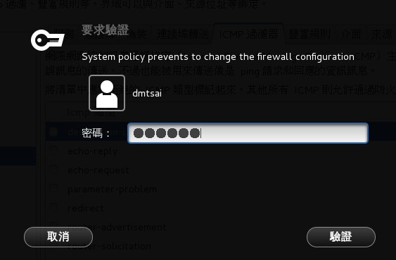
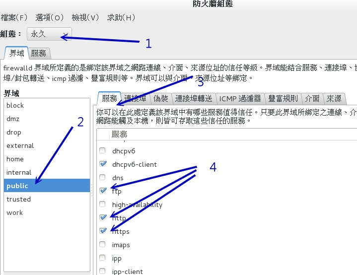

# 第二十章、基础系统设置与备份策略

最近更新日期：20//

新的 CentOS 7 有针对不同的服务提供了相当大量的命令行设置模式，因此过去那个 setup 似乎没有什么用了！ 取而代之的是许多加入了 bash-complete 提供了不少参数补全的设置工具！甚至包括网络设置也是通过这个机制哩！ 我们这个小章节主要就是在介绍如何通过这些基本的指令来设置系统就是了。另外， 万一不幸你的 Linux 被骇客入侵了、或是你的 Linux 系统由于硬件关系 （不论是天灾还是人祸） 而挂掉了！这个时候，请问如何快速的回复你的系统呢？呵呵！当然啰，如果有备份数据的话， 那么回复系统所花费的时间与成本将降低相当的多！平时最好就养成备份的习惯， 以免突然间的系统损毁造成手足无措！此外，哪些文件最需要备份呢？又，备份是需要完整的备份还是仅备份重要数据即可？ 嗯！确实需要考虑看看呦！

# 20.1 系统基本设置

## 20.1 系统基本设置

我们的 CentOS 7 系统其实有很多东西需要来设置的，包括之前稍微谈过的语系、日期、时间、网络设置等等。 CentOS 6.x 以前有个名为 setup 的软件将许多的设置做成类图形界面，连防火墙都可以这样搞定！不过这个功能在 CentOS 7 已经式微～ 这是因为 CentOS 7 已经将很多的软件指令作的还不赖，又加入了 bash-complete 的功能，指令下达确实还 OK 啦！ 如果不习惯指令，很多的图形界面也可以使用～因此，setup 的需求就减少很多了！ 下面我们会介绍基本的系统设置需求，其实也是将之前章节里面稍微谈过个数据做个汇整就是了！

### 20.1.1 网络设置 （手动设置与 DHCP 自动取得）

网络其实是又可爱又麻烦的玩意儿，如果你是网络管理员，那么你必须要了解区域网络内的 IP, gateway, netmask 等参数，如果还想要连上 Internet ，那么就得要理解 DNS 代表的意义为何。如果你的单位想要拥有自己的网域名称， 那么架设 DNS 服务器则是不可或缺的。总之，要设置网络服务器之前，你得要先理解[网络基础](http://linux.vbird.org/linux_server/0110network_basic.php)就是了！ 没有人愿意自己的服务器老是被攻击或者是网络问题层出不穷吧！^_^

但鸟哥这里的网络介绍仅止于当你是一部单机的 Linux 用户端，而非服务器！所以你的各项网络参数只要找到网络管理员， 或者是找到你的 ISP （Internet Service Provider） ，向他询问网络参数的取得方式以及实际的网络参数即可。 通常网络参数的取得方式在台湾常见的有下面这几种：

*   手动设置固定 IP

常见于学术网络的服务器设置、公司行号内的特定座位等。这种方式你必须要取得下面的几个参数才能够让你的 Linux 上网的：

*   IP
*   子网络遮罩（netmask）
*   通讯闸（gateway）
*   DNS 主机的 IP （通常会有两个，若记不住的话，硬背 168.95.1.1 即可）

*   网络参数可自动取得 （dhcp 协定自动取得）

常见于 IP 分享器后端的主机，或者是利用电视线路的缆线上网 （cable modem），或者是学校宿舍的网络环境等。 这种网络参数取得方式就被称为 dhcp ，你啥事都不需要知道，只要知道设置上网方式为 dhcp 即可。

*   台湾的光纤到府与 ADSL 宽带拨接

不论你的 IP 是固定的还是每次拨接都不相同 （被称为浮动式 IP），只要是通过光纤到府或宽带调制解调器“拨接上网”的，就是使用这种方式。 拨接上网虽然还是使用网卡连接到调制解调器上，不过，系统最终会产生一个替代调制解调器的网络接口 （ppp0） ， 那个 ppp0 也是一个实体网络接口啦！

不过，因为台湾目前所谓的“光世代”宽带上网的方式所提供的调制解调器中，内部已经涵盖了 IP 分享与自动拨接功能， 因此，其实你在调制解调器后面也还是只需要“自动取得 IP”的方式来取得网络参数即可喔！

了解了网络参数的取得方法后，你还得要知道一下我们通过啥硬件连上 Internet 的呢？其实就是网卡嘛。 目前的主流网卡为使用以太网络协定所开发出来的以太网卡 （Ethernet），因此我们 Linux 就称呼这种网络接口为 ethN （N 为数字）。 举例来说，鸟哥的这部测试机上面有一张以太网卡，因此鸟哥这部主机的网络接口就是 eth0 啰 （第一张为 0 号开始）。

不过新的 CentOS 7 开始对于网卡的编号则有另一套规则，网卡的界面代号现在与网卡的来源有关～基本上的网卡名称会是这样分类的：

*   eno1 ：代表由主板 BIOS 内置的网卡
*   ens1 ：代表由主板 BIOS 内置的 PCI-E 界面的网卡
*   enp2s0 ：代表 PCI-E 界面的独立网卡，可能有多个插孔，因此会有 s0, s1... 的编号～
*   eth0 ：如果上述的名称都不适用，就回到原本的默认网卡编号

其实不管什么网卡名称啦！想要知道你有多少网卡，直接下达“ ifconfig -a ”全部列出来即可！此外，CentOS 7 也希望我们不要手动修改配置文件， 直接使用所谓的 nmcli 这个指令来设置网络参数即可～因为鸟哥的测试机器是虚拟机，所以上述的网卡代号只有 eth0 能够支持～ 你得要自己看自己的系统上面的网卡代号才行喔！

*   手动设置 IP 网络参数

假设你已经向你的 ISP 取得你的网络参数，基本上的网络参数需要这些数据的：

*   method: manual （手动设置）
*   IP: 172.16.1.1
*   netmask: 255.255.0.0
*   gateway: 172.16.200.254
*   DNS: 172.16.200.254
*   hostname: study.centos.vbird

上面的数据除了 hostname 是可以暂时不理会的之外，如果你要上网，就得要有上面的这些数据才行啊！然后通过 nmcli 来处理！ 你得要先知道的是，nmcli 是通过一个名为“连线代号”的名称来设置是否要上网，而每个“连线代号”会有个“网卡代号”， 这两个东西通常设置成相同就是了。那就来先查查看目前系统上默认有什么连线代号吧！

```
[root@study ~]# nmcli connection show [网卡代号]
[root@study ~]# nmcli connection show
NAME  UUID                                  TYPE            DEVICE
eth0  505a7445-2aac-45c8-92df-dc10317cec22  802-3-ethernet  eth0
# NAME    就是连线代号，通常与后面的网卡 DEVICE 会一样！
# UUID    这个是特殊的设备识别，保留就好不要理他！
# TYPE    就是网卡的类型，通常就是以太网卡！
# DEVICE  当然就是网卡名称啰！
# 从上面我们会知道有个 eth0 的连线代号，那么来查察这个连线代号的设置为何？

[root@study ~]# nmcli connection show eth0
connection.id:                          eth0
connection.uuid:                        505a7445-2aac-45c8-92df-dc10317cec22
connection.interface-name:              eth0
connection.type:                        802-3-ethernet
connection.autoconnect:                 yes
.....（中间省略）.....
ipv4.method:                            manual
ipv4.dns:
ipv4.dns-search:
ipv4.addresses:                         192.168.1.100/24
ipv4.gateway:                           --
.....（中间省略）.....
IP4.ADDRESS[1]:                         192.168.1.100/24
IP4.GATEWAY:
IP6.ADDRESS[1]:                         fe80::5054:ff:fedf:e174/64
IP6.GATEWAY: 
```

如上表的输出，最下面的大写的 IP4, IP6 指的是目前的实际使用的网络参数，最上面的 connection 开头的部份则指的是连线的状态！ 比较重要的参数鸟哥将它列出来如下：

*   connection.autoconnect [yes|no] ：是否于开机时启动这个连线，默认通常是 yes 才对！
*   ipv4.method [auto|manual] ：自动还是手动设置网络参数的意思
*   ipv4.dns [dns_server_ip] ：就是填写 DNS 的 IP 位址～
*   ipv4.addresses [IP/Netmask] ：就是 IP 与 netmask 的集合，中间用斜线 / 来隔开～
*   ipv4.gateway [gw_ip] ：就是 gateway 的 IP 位址！

所以，根据上面的设置项目，我们来将网络参数设置好吧！

```
[root@study ~]# nmcli connection modify eth0 \
&gt;  connection.autoconnect yes \
&gt;  ipv4.method manual \
&gt;  ipv4.addresses 172.16.1.1/16 \
&gt;  ipv4.gateway 172.16.200.254 \
&gt;  ipv4.dns 172.16.200.254
# 上面只是“修改了配置文件”而已，要实际生效还得要启动 （up） 这个 eth0 连线界面才行喔！

[root@study ~]# nmcli connection up eth0
[root@study ~]# nmcli connection show eth0
.....（前面省略）.....
IP4.ADDRESS[1]:                         172.16.1.1/16
IP4.GATEWAY:                            172.16.200.254
IP4.DNS[1]:                             172.16.200.254
IP6.ADDRESS[1]:                         fe80::5054:ff:fedf:e174/64
IP6.GATEWAY: 
```

最终执行“ nmcli connection show eth0 ”然后看最下方，是否为正确的设置值呢？如果是的话，那就万事 OK 啦！

*   自动取得 IP 参数

如果你的网络是由自动取得的 DHCP 协定所分配的，那就太棒了！上述的所有功能你通通不需要背～只需要知道 ipv4.method 那个项目填成 auto 即可！ 所以来查察，如果变成自动取得，网络设置要如何处理呢？

```
[root@study ~]# nmcli connection modify eth0 \
&gt;  connection.autoconnect yes \
&gt;  ipv4.method auto

[root@study ~]# nmcli connection up eth0
[root@study ~]# nmcli connection show eth0
IP4.ADDRESS[1]:                         172.16.2.76/16
IP4.ADDRESS[2]:                         172.16.1.1/16
IP4.GATEWAY:                            172.16.200.254
IP4.DNS[1]:                             172.16.200.254 
```

自动取得 IP 要简单太多了！同时下达 modify 之后，整个配置文件就写入了！因此你无须使用 vim 去重新改写与设置！ 鸟哥是认为， nmcli 确实不错用喔！另外，上面的参数中，那个 connection..., ipv4... 等等的，你也可以使用 [tab] 去调用出来喔！ 也就是说， nmcli 有支持 bash-complete 的功能，所以指令下达也很方便的！

*   修改主机名称

主机名称的修改就得要通过 hostnamectl 这个指令来处理了！

```
[root@study ~]# hostnamectl [set-hostname 你的主机名]

# 1\. 显示目前的主机名称与相关信息
[root@study ~]# hostnamectl
   Static hostname: study.centos.vbird                # 这就是主机名称
         Icon name: computer
           Chassis: n/a
        Machine ID: 309eb890d09f440681f596543d95ec7a
           Boot ID: b2de392ff1f74e568829c716a7166ecd
    Virtualization: kvm
  Operating System: CentOS Linux 7 （Core）             # 操作系统名称！
       CPE OS Name: cpe:/o:centos:centos:7
            Kernel: Linux 3.10.0-229.el7.x86_64       # 核心版本也提供！
      Architecture: x86_64                            # 硬件等级也提供！

# 2\. 尝试修改主机名称为 www.centos.vbird 之后再改回来～
[root@study ~]# hostnamectl set-hostname www.centos.vbird
[root@study ~]# cat /etc/hostname
www.centos.vbird

[root@study ~]# hostnamectl set-hostname study.centos.vbird 
```

### 20.1.2 日期与时间设置

在第四章的 date 指令解释中，我们曾经谈过这家伙可以进行日期、时间的设置。 不过，如果要改时区呢？例如台湾时区改成日本时区之类的，该如何处理？另外，真的设置了时间，那么下次开机可以是正确的时间吗？还是旧的时间？ 我们也知道有“网络校时”这个功能，那如果有网络的话，可以通过这家伙来校时吗？这就来谈谈。

*   时区的显示与设置

因为地球是圆的，每个时刻每个地区的时间可能都不一样。为了统一时间，所以有个所谓的“GMT、格林威治时间”这个时区！ 同时，在太平洋上面还有一条看不见的“换日线”哩！台湾地区就比格林威治时间多了 8 小时，因为我们会比较早看到太阳啦！ 那我怎么知道目前的时区设置是正确的呢？就通过 timedatectl 这个指令吧！

```
[root@study ~]# timedatectl [commamd]
选项与参数：
list-timezones ：列出系统上所有支持的时区名称
set-timezone   ：设置时区位置
set-time       ：设置时间
set-ntp        ：设置网络校时系统

# 1\. 显示目前的时区与时间等信息
[root@study ~]# timedatectl
      Local time: Tue 2015-09-01 19:50:09 CST  # 本地时间
  Universal time: Tue 2015-09-01 11:50:09 UTC  # UTC 时间，可称为格林威治标准时间
        RTC time: Tue 2015-09-01 11:50:12
        Timezone: Asia/Taipei （CST, +0800）     # 就是时区啰！
     NTP enabled: no
NTP synchronized: no
 RTC in local TZ: no
      DST active: n/a

# 2\. 显示出是否有 New_York 时区？若有，则请将目前的时区更新一下
[root@study ~]# timedatectl list-timezones &#124; grep -i new
America/New_York
America/North_Dakota/New_Salem

[root@study ~]# timedatectl set-timezone "America/New_York"
[root@study ~]# timedatectl
      Local time: Tue 2015-09-01 07:53:24 EDT
  Universal time: Tue 2015-09-01 11:53:24 UTC
        RTC time: Tue 2015-09-01 11:53:28
        Timezone: America/New_York （EDT, -0400）

[root@study ~]# timedatectl set-timezone "Asia/Taipei"
# 最后还是要记得改回来台湾时区喔！不要忘记了！ 
```

*   时间的调整

由于鸟哥的测试机使用的是虚拟机，默认虚拟机使用的是 UTC 时间而不是本地时间，所以在默认的情况下，测试机每次开机都会快上 8 小时... 所以就需要来调整一下时间啰！时间的格式可以是“ yyyy-mm-dd HH:MM ”的格式！比较方便记忆喔！

```
# 1\. 将时间调整到正确的时间点上！
[root@study ~]# timedatectl set-time "2015-09-01 12:02" 
```

过去我们使用 date 去修改日期后，还得要使用 hwclock 去订正 BIOS 记录的时间～现在通过 timedatectl 一口气帮我们全部搞定，方便又轻松！

*   用 ntpdate 手动网络校时

其实鸟哥真的不太爱让系统自动网络校时，比较喜欢自己手动网络校时。当然啦，写入 crontab 也是不错的想法～ 因为系统默认的自动校时会启动 NTP 协定相关的软件，会多开好几个 port ～想到就不喜欢的缘故啦！没啥特别的意思～ 那如何手动网络校时呢？很简单，通过 ntpdate 这个指令即可！

```
[root@study ~]# ntpdate tock.stdtime.gov.tw
 1 Sep 13:15:16 ntpdate[21171]: step time server 211.22.103.157 offset -0.794360 sec

[root@study ~]# hwclock -w 
```

上述的 tock.stdtime.gov.tw 指的是台湾地区国家标准实验室提供的时间服务器，如果你在台湾本岛上，建议使用台湾提供的时间服务器来更新你的服务器时间， 速度会比较快些～至于 hwclock 则是将正确的时间写入你的 BIOS 时间记录内！如果确认可以执行，未来应该可以使用 crontab 来更新系统时间吧！

### 20.1.3 语系设置

我们在第四章知道有个 LANG 与 locale 的指令能够查询目前的语系数据与变量，也知道 /etc/locale.conf 其实就是语系的配置文件。 此外，你还得要知道的是，系统的语系与你目前软件的语系数据可能是可以不一样的！如果想要知道目前“系统语系”的话， 除了调用配置文件之外，也能够使用 localectl 来查阅：

```
[root@study ~]# localectl
   System Locale: LANG=zh_TW.utf8             # 下面这些数据就是“系统语系”
                  LC_NUMERIC=zh_TW.UTF-8
                  LC_TIME=zh_TW.UTF-8
                  LC_MONETARY=zh_TW.UTF-8
                  LC_PAPER=zh_TW.UTF-8
                  LC_MEASUREMENT=zh_TW.UTF-8
       VC Keymap: cn
      X11 Layout: cn
     X11 Options: grp:ctrl_shift_toggle

[root@study ~]# locale
LANG=zh_TW.utf8            # 下面的则是“当前这个软件的语系”数据！
LC_CTYPE="en_US.utf8"
LC_NUMERIC="en_US.utf8"
.....（中间省略）.....
LC_ALL=en_US.utf8 
```

从上面的两个指令结果你会发现到，系统的语系其实是中文的万国码 （zh_TW.UTF8） 这个语系。不过鸟哥为了目前的教学文件制作， 需要取消中文的显示，而以较为单纯的英文语系来处理～因此使用 locale 指令时，就可以发现“鸟哥的 bash 使用的语系环境为 en_US.utf8”这一个！ 我们知道直接输入的 locale 查询到的语系，就是目前这个 bash 默认显示的语言，那你应该会觉得怪，那系统语系 （localectl） 显示的语系用在哪？

其实鸟哥一登陆系统时，取得的语系确实是 zh_TW.utf8 这一个的，只是通过“ export LC_ALL=en_US.utf8 ”来切换为英文语系而已。 此外，如果你有启用图形界面登陆的话，那么默认的显示语系也是通过这个 localectl 所输出的系统语系喔！

问：如果你跟着鸟哥的测试机器一路走来，图形界面将会是中文万国码的提示登陆字符。如何改成英文语系的登陆界面？答：就是将 locale 改成 en_US.utf8 之后，再转成图形界面即可！

```
[root@study ~]# localectl set-locale LANG=en_US.utf8
[root@study ~]# systemctl isolate multi-user.target
[root@study ~]# systemctl isolate graphical.target 
```

接下来你就可以看到英文的登陆画面提示了！未来的默认语系也都会是英文界面喔！

### 20.1.4 防火墙简易设置

有网络没有防火墙还挺奇怪的，所以这个小节我们简单的来谈谈防火墙的一点点数据好了！

防火墙其实是一种网络数据的过滤方式，它可以依据你服务器启动的服务来设置是否放行，也能够针对你信任的用户来放行！ 这部份应该要对网络有点概念之后才来谈比较好，所以详细的数据会写入在服务器篇的内容。由于目前 CentOS 7 的默认防火墙机制为 firewalld， 他的管理界面主要是通过命令行 firewall-cmd 这个详细的指令～既然我们还没有谈到更多的防火墙与网络规则，想要了解 firewall-cmd 有点难！ 所以这个小节我们仅使用图形界面来介绍防火墙的相关数据而已！

要启动防火墙的图形管理界面，你当然就得要先登陆 X 才行！然后到“应用程序”-->“杂项”-->“防火墙”给它点下去，如下面的图示：

图 20.1.1、防火墙启动的链接画面

之后出现的图形管理界面会有点像下面这样：

图 20.1.2、防火墙图形管理界面示意图

*   组态：“执行时期”与“永久记录”的差异

如图 20.1.2 的箭头 1 处，基本上，防火墙的规则拟定大概有两种情况，一种是“暂时用来执行”的规则，一种则是“永久记录”的规则。 一般来说，刚刚启动防火墙时，这两种规则会一模一样。不过，后来可能你会暂时测试而加上几条规则，如果该规则没有写入“永久记录”区的话， 那下次重新载入防火墙时，该规则就会消失喔！所以请特别注意：“不要只是在执行阶段增加规则设置，而是必须要在永久记录区增加规则才行！”

*   界域 （zone）：依据不同的环境所设计的网络界域 （zone）

玩过网络后，你可能会听过所谓的本机网络、NAT 与 DMZ 等网域，同时，可能还有可信任的 （trusted） 网域，或者是应该被抵挡 （drop/block） 的网域等等。 这些网域各有其功能～早期的 iptables 防火墙服务，所有的规则你都得要自己手动来撰写，然后规则的细分得要自己去规划， 所以很可能会导致一堆无法理解的规则。

新的 firewalld 服务就预先设计这些可能会被用到的网络环境，里面的规则除了 public （公开网域） 这个界域 （zone） 之外，其它的界域则暂时为没有启动的状况。 因此，在默认的情况下，如图 20.1.2 当中的 2 号箭头与 3 号箭头处，你只要考虑 public 那个项目即可！其他的领域等到读完服务器篇之后再来讨论。 所以，再说一次～你只要考虑 public 这个 zone 即可喔！

*   相关设置项目

接下来图 20.1.2 4 号箭头的地方就是重点啦！防火墙规则通常需要设置的地方有：

*   服务：一般来说，如果你的 Linux server 是作为 Internet 的服务器，提供的是比较一般的服务，那么只要处理“服务”项目即可。默认你的服务器已经提供了 ssh 与 dhcpv6-client 的服务端口喔！
*   端口：如果你提供的服务所启用的端口并不是正规的端口，举例来说，为了玩 systemd 与 SELinux 我们曾经将 ssh 的端口调整到 222 ，同时也曾经将 ftp 的端口调整到 555 对吧！那如果你想要让人家连进来，就不能只开放上面的“服务”项目，连这个“端口”的地方也需要调整才行！另外， 如果有某些比较特别的服务是 CentOS 默认没有提供的，所以“服务”当然也就没有存在！这时你也可以直接通过端口来搞定它！
*   丰富规则（rich rule）：如果你有“整个网域”需要放行或者是拒绝的时候，那么前两个项目就没有办法适用， 这时就得要这个项目来处理了。不过鸟哥测试了 7.1 这一版的设置，似乎怪怪的～因此，下面我们会以 firewall-cmd 来增加这一个项目的设置。
*   接口：就是这个界域主要是针对哪一个网卡来做规范的意思，我们只有一张网卡，所以当然就是 eth0 啰！

至于“伪装”、“端口转送”、“ICMP 过滤器”、“来源”等等我们就不介绍了！毕竟那个是网络的东西，还不是在基础篇应该要告诉你的项目。 好了！现在假设我们的 Linux server 是要作为下面的几个重要的服务与相关的网域功能，你该如何设置防火墙呢？

*   要作为 ssh, www, ftp, https 等等正规端口的服务；
*   同时与前几章搭配，还需要放行 port 222 与 port 555 喔！
*   区域网络 192.168.1.0/24 这一段我们目前想要直接放行这段网域对我们服务器的连线

请注意，因为未来都要持续生效，所以请一定要去到“永久”的防火墙设置项目里头去处理！不然只有这次开机期间会生效而已～注意注意！ 好了，首先就来处理一下正规的服务端口的放行吧！不过因为永久的设置比较重要，因此你得要先经过授权认证才行！如下图所示。

图 20.1.3、永久的设置需要权限的认证

注意如下图所示，你要先确认箭头 1, 2, 3 的地方是正确的，然后再直接勾选 ftp, http, https, ssh 即可！因为 ssh 默认已经被勾选， 所以鸟哥仅截图上头的项目而已！比较特别的是，勾选就生效～没有“确认”按钮喔！呵呵！相当有趣！

图 20.1.4、以图形界面的方式放行正规服务的防火墙设置

接下来按下“端口”的页面，如下图所示，按下“加入”之后在出现的窗口当中填写你需要的端口号码，通常也就是 tcp 协定保留它不动！ 之后按下“确定”就好了！

图 20.1.5、以图形界面的方式放行部份非正规端口的防火墙设置

因为我们有两个端口要增加，所以请实作两次产生 222 与 555 的端口如下：

图 20.1.6、以图形界面的方式放行部份非正规端口的防火墙设置

最后一个要处理的是区域网络的放行，我们刚刚谈到这个部份恐怕目前的图形界面软件有点怪异～所以，这时你可以这样下达指令即可！ 注意，下列的指令全部都是必要参数，只有 IP 网段的部份可以变动掉即可！

```
[root@study ~]# firewall-cmd --permanent --add-rich-rule='rule family="ipv4" \
&gt;  source address="192.168.1.0/24" accept'
success
[root@study ~]# firewall-cmd --reload 
```

最后一行很重要喔！我们上面的图示通通是作用于“永久”设置中，只是变更配置文件，要让这些设置实际生效，那么就得要使用上面的 reload 项目， 让防火墙系统整个完整的再载入一下～那就 OK 啰！这样会使用简易的防火墙设置了吗？ ^_^

# 20.2 服务器硬件数据的收集

## 20.2 服务器硬件数据的收集

“工欲善其事，必先利其器”，这是一句大家耳熟能详的古人名言，在我们的信息设备上面也是一样的啊！ 在现在 （2015） 正好是 DDR3 切换到 DDR4 的时间点，假设你的服务器硬件刚刚好内存不太够，想要加内存， 那请教一下，你的主板插槽还够吗？你的内存需要 DDR3 还是 DDR4 呢？你的主机能不能吃到 8G 以上的单条内存？ 这就需要检查一下系统啰！不想拆机箱吧？那怎办？用软件去查啦！此外，磁盘会不会出问题？你怎么知道哪一颗磁盘出问题了？这就重要啦！

### 20.2.1 以系统内置 dmidecode 解析硬件配备

系统有个名为 dmidecode 的软件，这个软件挺有趣的，它可以解析 CPU 型号、主板型号与内存相关的型号等等～ 相当的有帮助！尤其是在升级配备上面！现在让我们来查一查鸟哥的虚拟机里头有啥东西吧！

```
[root@study ~]# dmidecode -t type
选项与参数：
详细的 type 项目请 man dmidecode 查询更多的数据，这里仅列出比较常用的项目：
1 ：详细的系统数据，含主板的型号与硬件的基础数据等
4 ：CPU 的相关数据，包括倍频、外频、核心数、核心绪数等
9 ：系统的相关插槽格式，包括 PCI, PCI-E 等等的插槽规格说明
17：每一个内存插槽的规格，若内有内存，则列出该内存的容量与型号

范例一：秀出整个系统的硬件信息，例如主板型号等等
[root@study ~]# dmidecode -t 1
# dmidecode 2.12
SMBIOS 2.4 present.

Handle 0x0100, DMI type 1, 27 Bytes
System Information
        Manufacturer: Red Hat
        Product Name: KVM
        Version: RHEL 6.6.0 PC
        Serial Number: Not Specified
        UUID: AA3CB5D1-4F42-45F7-8DBF-575445D3887F
        Wake-up Type: Power Switch
        SKU Number: Not Specified
        Family: Red Hat Enterprise Linux

范例二：那内存相关的数据呢？
[root@study ~]# dmidecode -t 17
# dmidecode 2.12
SMBIOS 2.4 present.

Handle 0x1100, DMI type 17, 21 Bytes
Memory Device
        Array Handle: 0x1000
        Error Information Handle: 0x0000
        Total Width: 64 bits
        Data Width: 64 bits
        Size: 3072 MB
        Form Factor: DIMM
        Set: None
        Locator: DIMM 0
        Bank Locator: Not Specified
        Type: RAM
        Type Detail: None 
```

因为我们的系统是虚拟机，否则的话，你的主板型号、每一只安插的内存容量等等，都会被列出来在上述的画面中喔！ 这样可以让你了解系统的所有主要硬件配备为何！


**Tips** 因为某些缘故，鸟哥获得了一部机架式的服务器，不过该服务器就是内存不够。又因为某些缘故有朋友要送 ECC 的低电压内存给鸟哥！太开心了！ 不过为了担心内存与主板不相容，所以就使用了 dmidecode 去查主板型号，再到原厂网站查询相关主板规格，这才确认可以使用！感谢各位亲爱的朋友啊！！

### 20.2.2 硬件资源的收集与分析

现在我们知道系统硬件是由操作系统核心所管理的，由第十九章的开机流程分析中，我们也知道 Linux kernel 在开机时就能够侦测主机硬件并载入适当的模块来驱动硬件了。 而核心所侦测到的各项硬件设备，后来就会被记录在 /proc 与 /sys 当中了。 包括 /proc/cpuinfo, /proc/partitions, /proc/interrupts 等等。 更多的 /proc 内容介绍，先回到第十六章的程序管理瞧一瞧先！


**Tips** 其实核心所侦测到的硬件可能并非完全正确喔！因为他仅是“使用最适当的模块来驱动这个硬件”而已， 所以有时候难免会误判啦 （虽然概率非常之低）！那你可能想要以最新最正确的模块来驱动你的硬件， 此时，重新编译核心是一条可以达成的道路。不过，现在的 Linux 系统并没有很建议你一定要重新编译核心就是了。

那除了直接调用出 /proc 下面的文件内容之外，其实 Linux 有提供几个简单的指令来将核心所侦测到的硬件叫出来的～ 常见的指令有下面这些：

*   gdisk：第七章曾经谈过，可以使用 gdisk -l 将分区表列出；
*   dmesg：第十六章谈过， 观察核心运行过程当中所显示的各项讯息记录；
*   vmstat：第十六章谈过，可分析系统 （CPU/RAM/IO） 目前的状态；
*   lspci：列出整个 PC 系统的 PCI 接口设备！很有用的指令；
*   lsusb：列出目前系统上面各个 USB 端口的状态，与连接的 USB 设备；
*   iostat：与 vmstat 类似，可实时列出整个 CPU 与周边设备的 Input/Output 状态。

lspci, lsusb, iostat 是本章新谈到的指令，尤其如果你想要知道主板与各周边相关设备时，那个 lspci 真是不可多得的好工具！而如果你想要知道目前 USB 插槽的使用情况以及侦测到的 USB 设备， 那个 lsusb 则好用到爆！至于 iostat 则是一个实时分析软件，与 vmstat 有异曲同工之妙！

基本上，想要知道你 Linux 主机的硬件配备，最好的方法还是直接拆开机箱去察看上面的信息 （这也是为何第零章会谈计概啊）！ 如果环境因素导致您无法直接拆开主机的话，那么直接 lspci 是很棒的一的方法：

*   lspci

```
[root@study ~]# lspci [-vvn]
选项与参数：
-v  ：显示更多的 PCI 接口设备的详细信息；
-vv ：比 -v 还要更详细的细部信息；
-n  ：直接观察 PCI 的 ID 而不是厂商名称

范例一：查阅您系统内的 PCI 总线相关设备：
[root@study ~]# lspci
00:00.0 Host bridge: Intel Corporation 440FX - 82441FX PMC [Natoma] （rev 02）
00:01.0 ISA bridge: Intel Corporation 82371SB PIIX3 ISA [Natoma/Triton II]
00:01.1 IDE interface: Intel Corporation 82371SB PIIX3 IDE [Natoma/Triton II]
00:01.2 USB controller: Intel Corporation 82371SB PIIX3 USB [Natoma/Triton II] （rev 01）
00:01.3 Bridge: Intel Corporation 82371AB/EB/MB PIIX4 ACPI （rev 03）
00:02.0 VGA compatible controller: Red Hat, Inc. QXL paravirtual graphic card （rev 04）
00:03.0 Ethernet controller: Red Hat, Inc Virtio network device
00:04.0 SCSI storage controller: Red Hat, Inc Virtio block device
00:05.0 RAM memory: Red Hat, Inc Virtio memory balloon
00:06.0 Audio device: Intel Corporation 82801FB/FBM/FR/FW/FRW （ICH6 Family） High Definition Audio
        Controller （rev 01）
00:1d.0 USB controller: Intel Corporation 82801I （ICH9 Family） USB UHCI Controller #1 （rev 03）
00:1d.1 USB controller: Intel Corporation 82801I （ICH9 Family） USB UHCI Controller #2 （rev 03）
00:1d.2 USB controller: Intel Corporation 82801I （ICH9 Family） USB UHCI Controller #3 （rev 03）
00:1d.7 USB controller: Intel Corporation 82801I （ICH9 Family） USB2 EHCI Controller #1 （rev 03）
# 不必加任何的参数，就能够显示出目前主机上面的各个 PCI 接口的设备呢！ 
```

不必加上任何选项，就能够显示出目前的硬件配备为何。上面就是鸟哥的测试机所使用的主机配备。 包括使用 Intel 芯片的仿真主板、南桥使用 ICH9 的控制芯片、附挂 QXL 的显卡、使用虚拟化的 Virtio 网卡等等。 您瞧瞧！很清楚，不是嘛。

如果你还想要了解某个设备的详细信息时，可以加上 -v 或 -vv 来显示更多的信息喔！ 举例来说，鸟哥想要知道那个以太网卡更详细的信息时，可以使用如下的选项来处理：

```
[root@study ~]# lspci -s 00:03.0 -vv 
```

-s 后面接的那个怪东西每个设备的总线、插槽与相关函数功能啦！那个是我们硬件侦测所得到的数据啰！ 你可以对照下面这个文件来了解该串数据的意义：

*   /usr/share/hwdata/pci.ids

其实那个就是 PCI 的标准 ID 与厂牌名称的对应表啦！此外，刚刚我们使用 lspci 时，其实所有的数据都是由 /proc/bus/pci/ 目录下的数据所取出的呢！了解了吧！ ^_^！不过，由于硬件的发展太过迅速，所以你的 pci.ids 文件可能会落伍了～那怎办？ 没关系～可以使用下面的方式来线上更新你的对应档：

```
[root@study ~]# update-pciids 
```

*   lsusb

刚刚谈到的是 PCI 接口设备，如果是想要知道系统接了多少个 USB 设备呢？那就使用 lsusb 吧！这个指令也是很简单的！

```
[root@study ~]# lsusb [-t]
选项与参数：
-t  ：使用类似树状目录来显示各个 USB 端口的相关性

范例一：列出目前鸟哥的测试用主机 USB 各端口状态
[root@study ~]# lsusb
Bus 002 Device 002: ID 0627:0001 Adomax Technology Co., Ltd
Bus 001 Device 001: ID 1d6b:0002 Linux Foundation 2.0 root hub
Bus 002 Device 001: ID 1d6b:0001 Linux Foundation 1.1 root hub
# 如上所示，鸟哥的主机在 Bus 002 有接了一个设备，
# 该设备的 ID 是 0627:0001，对应的厂商与产品为 Adomax 的设备。 
```

确实非常清楚吧！其中比较有趣的就属那个 ID 号码与厂商型号对照了！那也是写入在 /usr/share/hwdata/pci.ids 的东西，你也可以自行去查询一下喔！

*   iostat

刚刚那个 lspci 找到的是目前主机上面的硬件配备，那么整部机器的储存设备， 主要是磁盘对吧！请问，您磁盘由开机到现在，已经存取多少数据呢？这个时候就得要 iostat 这个指令的帮忙了！


**Tips** 默认 CentOS 并没有安装这个软件，因此你必须要先安装他才行！如果你已经有网络了， 那么使用“ yum install sysstat ”先来安装此软件吧！否则无法进行如下的测试喔！

```
[root@study ~]# iostat [-c&#124;-d] [-k&#124;-m] [-t] [间隔秒数] [侦测次数]
选项与参数：
-c  ：仅显示 CPU 的状态；
-d  ：仅显示储存设备的状态，不可与 -c 一起用；
-k  ：默认显示的是 block ，这里可以改成 K Bytes 的大小来显示；
-m  ：与 -k 类似，只是以 MB 的单位来显示结果。
-t  ：显示日期出来；

范例一：显示一下目前整个系统的 CPU 与储存设备的状态
[root@study ~]# iostat
Linux 3.10.0-229.el7.x86_64 （study.centos.vbird）  09/02/2015   _x86_64_    （4 CPU）

avg-cpu:  %user   %nice %system %iowait  %steal   %idle
           0.08    0.01    0.02    0.00    0.01   99.88

Device:            tps    kB_read/s    kB_wrtn/s    kB_read    kB_wrtn
vda               0.46         5.42         3.16     973670     568007
scd0              0.00         0.00         0.00        154          0
sda               0.01         0.03         0.00       4826          0
dm-0              0.23         4.59         3.09     825092     555621
# 瞧！上面数据总共分为上下两部分，上半部显示的是 CPU 的当下信息；
# 下面数据则是显示储存设备包括 /dev/vda 的相关数据，他的数据意义：
# tps       ：平均每秒钟的传送次数！与数据传输“次数”有关，非容量！
# kB_read/s ：开机到现在平均的读取单位；
# kB_wrtn/s ：开机到现在平均的写入单位；
# kB_read   ：开机到现在，总共读出来的文件单位；
# kB_wrtn   ：开机到现在，总共写入的文件单位；

范例二：仅针对 vda ，每两秒钟侦测一次，并且共侦测三次储存设备
[root@study ~]# iostat -d 2 3 vda
Linux 3.10.0-229.el7.x86_64 （study.centos.vbird）  09/02/2015   _x86_64_    （4 CPU）

Device:            tps    kB_read/s    kB_wrtn/s    kB_read    kB_wrtn
vda               0.46         5.41         3.16     973682     568148

Device:            tps    kB_read/s    kB_wrtn/s    kB_read    kB_wrtn
vda               1.00         0.00         0.50          0          1

Device:            tps    kB_read/s    kB_wrtn/s    kB_read    kB_wrtn
vda               0.00         0.00         0.00          0          0
# 仔细看一下，如果是有侦测次数的情况，那么第一次显示的是“从开机到现在的数据”，
# 第二次以后所显示的数据则代表两次侦测之间的系统传输值！举例来说，上面的信息中，
# 第二次显示的数据，则是两秒钟内（本案例）系统的总传输量与平均值。 
```

通过 lspci 及 iostat 可以约略的了解到目前系统的状态还有目前的主机硬件数据呢！

### 20.2.3 了解磁盘的健康状态

其实 Linux server 最重要的就是“数据安全”了！而数据都是放在磁盘当中的，所以啰，无时无刻了解一下你的磁盘健康状况，应该是个好习惯吧！ 问题是，你怎么知道你的磁盘是好是坏啊？这时就得要来谈一个 smartd 的服务了！

SMART 其实是“ Self-Monitoring, Analysis and Reporting Technology System ”的缩写，主要用来监测目前常见的 ATA 与 SCSI 界面的磁盘， 只是，要被监测的磁盘也必须要支持 SMART 的协定才行！否则 smartd 就无法去下达指令，让磁盘进行自我健康检查～ 比较可惜的是，我们虚拟机的磁盘格式并不支持 smartd，所以无法用来作为测试！不过刚刚好鸟哥还有另外一颗用作 IDE 界面的 2G 磁盘， 这个就能够用来作为测试了！ （/dev/sda）！

smartd 提供一只指令名为 smartctl，这个指令功能非常多！不过我们下面只想要介绍数个基本的操作，让各位了解一下如何确认你的磁盘是好是坏！

```
# 1\. 用 smartctl 来显示完整的 /dev/sda 的信息
[root@study ~]# smartctl -a /dev/sda
smartctl 6.2 2013-07-26 r3841 [x86_64-linux-3.10.0-229.el7.x86_64] （local build）
Copyright （C） 2002-13, Bruce Allen, Christian Franke, www.smartmontools.org

# 首先来输出一下这部磁盘的整体信息状况！包括制造商、序号、格式、SMART 支持度等等！
=== START OF INFORMATION SECTION === 
Device Model:     QEMU HARDDISK
Serial Number:    QM00002
Firmware Version: 0.12.1
User Capacity:    2,148,073,472 Bytes [2.14 GB]
Sector Size:      512 Bytes logical/physical
Device is:        Not in smartctl database [for details use: -P showall]
ATA Version is:   ATA/ATAPI-7, ATA/ATAPI-5 published, ANSI NCITS 340-2000
Local Time is:    Wed Sep  2 18:10:38 2015 CST
SMART support is: Available - device has SMART capability.
SMART support is: Enabled

=== START OF READ SMART DATA SECTION ===
SMART overall-health self-assessment test result: PASSED

# 接下来则是一堆基础说明！鸟哥这里先略过这段数据喔！
General SMART Values:
Offline data collection status:  （0x82） Offline data collection activity
                                        was completed without error.
                                        Auto Offline Data Collection: Enabled.
.....（中间省略）.....
# 再来则是有没有曾经发生过磁盘错乱的问题登录！
SMART Error Log Version: 1
No Errors Logged

# 当你下达过磁盘自我检测的过程，就会被记录在这里了！
SMART Self-test log structure revision number 1
Num  Test_Description    Status                  Remaining  LifeTime（hours）  LBA_of_first_error
# 1  Short offline       Completed without error       00%      4660         -
# 2  Short offline       Completed without error       00%      4660         -

# 2\. 命令磁盘进行一次自我检测的动作，然后再次观察磁盘状态！
[root@study ~]# smartctl -t short /dev/sda
[root@study ~]# smartctl -a /dev/sda
.....（前面省略）.....
# 下面会多出一个第三笔的测试信息！看一下 Status 的状态，没有问题就是好消息！
SMART Self-test log structure revision number 1
Num  Test_Description    Status                  Remaining  LifeTime（hours）  LBA_of_first_error
# 1  Short offline       Completed without error       00%      4660         -
# 2  Short offline       Completed without error       00%      4660         -
# 3  Short offline       Completed without error       00%      4660         - 
```

不过要特别强调的是，因为进行磁盘自我检查时，可能磁盘的 I/O 状态会比较频繁，因此不建议在系统忙碌的时候进行喔！ 否则系统的性能是可能会被影响的哩！要注意！要注意！

# 20.3 备份要点

## 20.3 备份要点

备份是个很重要的工作，很多人总是在系统损毁的时候才在哀嚎说：“我的数据啊！天那...！”此时才会发现备份数据的可爱！ 但是备份其实也非常可怕！因为你的重要数据都在备份文件里面，如果这个备份被窃取或遗失，其实对你的系统资安影响也非常大！ 同时，备份使用的媒体选择也非常多样，但是各种储存媒体各有其功能与优劣，所以当然得要选择啰！闲话少说，来谈谈备份吧！

### 20.3.1 备份数据的考虑

老实说，备份是系统损毁时等待救援的救星！因为你需要重新安装系统时， 备份的好坏会影响到你系统复原的进度！不过，我们想先知道的是，系统为什么会损毁啊？是人为的还是怎样产生的啊？ 事实上，系统有可能由于不预期的伤害而导致系统发生错误！ 什么是不预期的伤害呢？这是由于系统可能因为不预期的硬件损坏，例如硬盘坏掉等等，或者是软件问题导致系统出错， 包括人为的操作不当或是其他不明因素等等所致。下面我们就来谈谈系统损坏的情况与为何需要备份吧！

*   造成系统损毁的问题-硬件问题

基本上，“计算机是一个相当不可靠的机器”这句话在大部分的时间内还是成立的！ 常常会听到说“要计算机正常的工作，最重要的是要去拜拜！”嘿嘿！不要笑！这还是真的哩！ 尤其是在日前一些计算机周边硬件的生产良率 （就是将硬件产生出来之后，经过测试， 发现可正常工作的与不能正常工作的硬件总数之比值） 越来越差的情况之下，计算机的不稳定状态实在是越来越严重了！

一般来说，会造成系统损毁的硬件元件应该要算硬盘吧！因为其他的元件坏掉时，虽然会影响到系统的运行， 不过至少我们的数据还是存在硬盘当中的啊！为了避免这个困扰，于是乎有可备份用的 RAID1, RAID5, RAID6 等磁盘阵列的应用啊！但是如果是 RAID 控制芯片坏掉呢？这就麻烦了～所以说，如果有 RAID 系统时， 鸟哥个人还是觉得需要进行额外的备份才好的！如果数据够重要的话。

*   造成系统损毁的问题-软件与人的问题

根据分析，其实系统的软件伤害最严重的就属使用者的操作不当啦！像以前 Google 还没有这么厉害时， 人们都到讨论区去问问题，某些高手高手高高手被小白烦的不胜其扰，总是会回答：“喔！你的系统有问题喔！那请 rm -rf / 看看出现什么状况！ 做完再回来！”...你真的做下去就死定了！如果你的系统有这种小白管理员呢？敢不备份喔？

软件伤害除了来自主机上的使用者操作不当之外，最常见的可能是资安攻击事件了。 假如你的 Linux 系统上面某些 Internet 的服务软件是最新的！这也意味着可能是“相对最安全的”， 但是，这个世界目前的闲人是相当多的，你不知道什么时候会有所谓的“骇客软件”被提供出来，万一你在 Internet 上面的服务程序被攻击，导致你的 Linux 系统全毁，这个时候怎么办？当然是要复原系统吧？

那如何复原被伤害的系统呢？“重新安装就好啦！”或许你会这么说， 但是，像鸟哥管理的几个网站的数据，尤其是 MySQL 数据库的数据，这些都是弥足珍贵的经验数据， 万一被损毁而救不回来的时候，不是很可惜吗？这个还好哩，万一你是某家银行的话， 那么数据的损毁可就不是能够等闲视之的！关系的可是数千甚至上万人的身家财产！这就是备份的重要性了！ 他可以最起码的稍微保障我们的数据有另外一份 copy 的备援以达到“安全回复”的基本要求！

*   主机角色不同，备份任务也不同

由于软硬件的问题都可能造成系统的损毁，所以备份当然就很重要啦！问题是，每一部主机都需要备份吗？ 多久备份一次呢？要备份什么数据呢？

早期有 ghost 这套单机备份软件，近期以来有台湾国家高速网络中心发展的再生龙 （clonzilla） 软件， 这些软件的共同特性就是可以将你系统上面的磁盘数据完整的复制起来，变成一个大文件，你可以通过现在便宜到爆炸的 USB 外接磁盘来备份出来， 未来复原时，只要将 USB 安插到系统里面，就几乎可以进行裸机复原了哩！

但是，万一你的主机有提供 Internet 方面的服务呢？又该如何备份啊？举个例子来说，像是我们 Study Area 团队的讨论区网站 [`phorum.study-area.org`](http://phorum.study-area.org/) 提供的是类似 BBS 的讨论文章， 虽然数据量不大，但是由于讨论区的文件是天天在增加的，每天都有相当多的信息流入， 由于某些信息都是属于重要的人物之留言，这个时候，我们能够让机器死掉吗？或者是能够一季三个月才备份一次吗？ 这个备份频率需求的考虑是非常重要的！

再提到 2002 年左右鸟哥的讨论区曾经挂点的问题，以及 2003 年初 Study-Area 讨论区挂点的问题，讨论区一旦挂点的话，该数据库内容如果损毁到无法救回来， 嘿嘿！要晓得讨论区可不是一个人的心血耶！有的时候 （像 Study-Area 讨论区） 是一群热心 Linux 的朋友们互相创建交流起来的数据流通网，如果死掉了，那么不是让这些热血青年的热情付之一炬了吗？ 所以啰，创建备份的策略 （频率、媒体、方法等） 是相当的重要的。

*   备份因素考虑

由于计算机 （尤其是目前的计算机，操作频率太高、硬件良率太差、使用者操作习惯不良、 “某些”操作系统的当概率太高....） 的稳定性较差，所以啰！备份的工作就越来越重要了！ 那么一般我们在备份时考虑的因素有哪些呢？

*   备份哪些文件： 哪些数据对系统或使用者来说是重要的？那些数据就是值得备份的数据！例如 /etc/ *及 /home/* 等。

*   选择什么备份的媒介： 是可读写光盘、另一颗硬盘、同一颗硬盘的不同 partition、还是使用网络备援系统？ 哪一种的速度最快，最便宜，可将数据保存最久？这都可以考虑的。

*   考虑备份的方式： 是以完整备份（类似 ghost）来备份所有数据，还是使用差异备份仅备份有被更动过的数据即可？

*   备份的频率： 例如 Mariadb 数据库是否天天备份、若完整备份，需要多久进行一次？

*   备份使用的工具为何： 是利用 tar 、 cpio 、 dd 还是 dump 等等的备份工具？

下面我们就来谈一谈这些问题的解决之道吧！ ^_^

### 20.3.2 哪些 Linux 数据具有备份的意义

一般来说，鸟哥比较喜欢备份最重要的文件而已 （关键数据备份），而不是整个系统都备份起来 （完整备份, Full backup）！那么哪些文件是有必要备份的呢？具有备份意义的文件通常可以粗分为两大类，一类是系统基本设置信息、一类则是类似网络服务的内容数据。 那么各有哪些文件需要备份的呢？我们就来稍微分析一下。

*   操作系统本身需要备份的文件：

这方面的文件主要跟“帐号与系统配置文件”有关系！ 主要有哪些帐号的文件需要备份呢？就是 /etc/passwd, /etc/shadow, /etc/group, /etc/gshadow, /home 下面的使用者主文件夹等等， 而由于 Linux 默认的重要参数文件都在 /etc/ 下面，所以只要将这个目录备份下来的话， 那么几乎所有的配置文件都可以被保存的！

至于 /home 目录是一般用户的主文件夹，自然也需要来备份一番！再来，由于使用者会有邮件吧！所以呢，这个 /var/spool/mail/ 内容也需要备份呦！另外，由于如果你曾经自行更动过核心，那么 /boot 里头的信息也就很重要啰！所以啰，这方面的数据你必须要备份的文件为：

*   /etc/ 整个目录
*   /home/ 整个目录
*   /var/spool/mail/
*   /var/spoll/{at|cron}/
*   /boot/
*   /root/
*   如果你自行安装过其他的软件，那么 /usr/local/ 或 /opt 也最好备份一下！

*   网络服务的数据库方面：

这部份的数据可就多而且复杂了，首先是这些网络服务软件的配置文件部分， 如果你的网络软件安装都是以原厂提供的为主，那么你的设置文件大多是在 /etc 下面，所以这个就没啥大问题！但若你的套件大多来自于自行的安装，那么 /usr/local 这个目录可就相当的重要了！

再来，每种服务提供的数据都不相同，这些数据很多都是人们提供的！举例来说，你的 WWW 服务器总是需要有人提供网页文件吧？否则浏览器来是要看啥咚咚？你的讨论区总是得要写入数据库系统吧？ 否则讨论的数据如何更新与记载？所以，使用者主动提供的文件，以及服务运行过程会产生的数据， 都需要被考虑来备份。若我们假设我们提供的服务软件都是使用原厂的 RPM 安装的！所以要备份的数据文件有：

*   软件本身的设置文件，例如：/etc/ 整个目录，/usr/local/ 整个目录
*   软件服务提供的数据，以 WWW 及 Mariadb 为例： WWW 数据：/var/www 整个目录或 /srv/www 整个目录，及系统的使用者主文件夹 Mariadb ： /var/lib/mysql 整个目录
*   其他在 Linux 主机上面提供的服务之数据库文件！

*   推荐需要备份的目录：

由上面的介绍来看的话，如果你的硬件或者是由于经费的关系而无法全部的数据都予以备份时， 鸟哥建议你至少需要备份这些目录呦！

*   /etc
*   /home
*   /root
*   /var/spool/mail/, /var/spool/cron/, /var/spool/at/
*   /var/lib/

*   不需要备份的目录：

有些数据是不需要备份的啦！例如我们在第五章文件权限与目录配置里头提到的 /proc 这个目录是在记录目前系统上面正在跑的程序，这个数据根本就不需要备份的呢！此外，外挂的机器，例如 /mnt 或 /media 里面都是挂载了其他的硬盘设备、光驱、软盘机等等，这些也不需要备份吧？ 所以啰！下面有些目录可以不需要备份啦！

*   /dev ：这个随便你要不要备份
*   /proc, /sys, /run：这个真的不需要备份啦！
*   /mnt, /media：如果你没有在这个目录内放置你自己系统的东西，也不需要备份
*   /tmp ：干嘛存暂存盘！不需要备份！

### 20.3.3 备份用储存媒体的选择

用来储存备份数据的媒体非常的多样化，那该如何选择呢？在选择之前我们先来讲个小故事先！

*   一个实际发生的故事

在备份的时候，选择一个“数据存放的地方”也是很需要考虑的一个因素！ 什么叫做数据存放的地方呢？讲个最简单的例子好了，我们知道说，较为大型的机器都会使用 tape 这一种磁带机来备份数据，早期如果是一般个人计算机的话，很可能是使用类似 Mo 这一种可读写式光盘片来存取数据！近来因为 USB 界面的大容量磁盘机越来越便宜且速度越来越快， 所以几乎取代了上述的总总储存媒体了！但是你不要忘记了几个重要的因素，那就是万一你的 Linux 主机被偷了呢？

这不是不可能的，之前鸟哥在成大念书时 （2000 年前后），隔壁校区的研究室曾经遭小偷， 里面所有的计算机都被偷走了！包括“Mo 片”，当他们发现的时候，一开始以为是硬件被偷走了，还好， 他们都有习惯进行备份，但是很不幸的，这一次连“备份的 MO 都被拿走了！”怎么办？！只能道德劝说小偷先生能够良心发现的将硬盘拿回来啰！唉～真惨....

*   异地备援系统

这个时候，所谓的“异地备援系统”就显的相当的重要了！ 什么是异地备援呀！说的太文言了！呵！简单的说，就是将你的系统数据“备份”到其他的地方去， 例如说我的机器在台南，但是我还有另一部机器在高雄老家，这样的话， 我可以将台南机器上面重要的数据都给他定期的自动的通过网络传输回去！ 也可以将家里重要的数据给他丢到台南来！这样的最大优点是可以在台南的机器死掉的时候， 即使是遭小偷，也可以有一个“万一”的备份所在！

有没有缺点啊？有啊！缺点就是～带宽严重的不足！ 在这种状态下，所能采取的策略大概就是“仅将最重要的数据给他传输回去啰！” 至于一些只要系统从新安装就可以回复的咚咚！那就没有这个必要了！当然啰，如果你的网络是属于双向 100Mbps 或 300Mbps 那就另当一回事， 想完整备份将数据丢到另一地去，也是很可行的啦！只是鸟哥没有那么好命...住家附近连 100/40 Mbps 的网络带宽都没有...

*   储存媒体的考虑

在此同时，我们再来谈一谈，那么除了异地备援这个“相对较为安全的备份”方法之外， 还有没有其他的方法可以储存备份的呢？毕竟这种网络备援系统实在是太耗带宽了！那么怎么办？喔～那就只好使用近端的设备来备份啰！ 这也是目前我们最常见到的备份方法！

在过去我们使用的储存媒体可能有 Tape, Mo, Zip, CD-RW, DVD-RW, 外接式磁盘等等， 近年来由于磁盘容量不断上提，加上已经有便宜的桌上型 NAS 储存设备，这些 NAS 储存设备就等于是一部小型 Linux server， 里面还能够提供客制化的服务，包括不同的连接界面与传输协定，因此，你只要记得，就是买还能够自我容错的 NAS 设备来备份就对了！

在经费充足的情况考虑之下，鸟哥相当建议您使用外接式的 NAS 设备，所谓的 NAS 其实就是一台内嵌 Linux 或 unix-like 的小型服务器，可能提供硬件或软件的磁盘阵列，让你可以架设 RAID10 或 RAID5,6 等的等级，所以 NAS 本身的数据就已经有保障！ 然后跟你预计要备份的 Linux server 通过网络连线，你的数据就可以直接传输到 NAS 上头去了！其他以前需要考虑的注意事项， 几乎都不再有限制～最多就是担心 NAS 的硬件坏掉而已～

若经费不足怎办，现在随便磁盘都有 4TB 以上的容量，拿一颗磁盘通过外接式 USB 界面，搭配 USB 3.0 来传输～ 随便都能够进行备份了！虽然这样的处理方式最怕的是单颗磁盘损毁，不过，如果担心的话，买两三颗来互相轮流备份，也能够处理掉这个问题！ 因为目前的数据量越来越大，实在没啥意义再使用类似 DVD 之类的储存设备来备份了！

如果你想要有比较长时间的备份储存，同时也比较担心碰撞的问题，目前企业界还是很多人会喜欢使用 Tape 来储存就是了！ 不过听业界的朋友说，磁带就是比较怕被消磁以及发霉的问题～否则，这家伙倒是很受企业备份的喜好需求！

# 20.4 备份的种类、频率与工具的选择

## 20.4 备份的种类、频率与工具的选择

讲了好多口水了，还是没有讲到重点，真是的....好了，再来提到那个备份的种类，因为想要选择什么储存媒体与相关备份工具， 都与备份使用的方式有关！那么备份有哪些方式呢？一般可以粗略分为“累积备份”与“差异备份”这两种 [[1]](#ps1)。当然啦，如果你在系统出错时想要重新安装到更新的系统时，仅备份关键数据也就可以了！

### 20.4.1 完整备份之累积备份 （Incremental backup）

备份不就是将重要数据复制出来即可吗？干嘛需要完整备份 （Full backup） 呢？如果你的主机是负责相当重要的服务， 因此如果有不明原因的死机事件造成系统损毁时，你希望在最短的时间内复原系统。此时，如果仅备份关键数据时， 那么你得要在系统出错后，再去找新的 Linux distribution 来安装，安装完毕后还得要考虑到数据新旧版本的差异问题， 还得要进行数据的移植与系统服务的重新创建等等，等到创建妥当后，还得要进行相关测试！ 这种种的工作可至少得要花上一个星期以上的工作天才能够处理妥当！所以，仅有关键数据是不够的！

*   还原的考虑

但反过来讲，如果是完整备份的话呢？若硬件出问题导致系统损毁时，只要将完整备份拿出来，整个给他倾倒回去硬盘， 所有事情就搞定了！有些时候 （例如使用 dd 指令） 甚至连系统都不需要重新安装！反正整个系统都给他倒回去，连同重要的 Linux 系统文件等，所以当然也就不需要重新安装啊！因此，很多企业用来提供重要服务的主机都会使用完整备份， 若所提供的服务真的非常重要时，甚至会再架设一部一模一样的机器呢！如此一来， 若是原本的机器出问题，那就立刻将备份的机器拿出来接管！以使企业的网络服务不会中断哩！

那你知道完整备份的定义了吧？没错！完整备份就是将根目录 （/） 整个系统通通备份下来的意思！ 不过，在某些场合下面，完整备份也可以是备份一个文件系统 （filesystem）！例如 /dev/sda1 或 /dev/md0 或 /dev/myvg/mylv 之类的文件系统就是了。

*   累积备份的原则

虽然完整备份在还原方面有相当良好的表现，但是我们都知道系统用的越久，数据量就会越大！如此一来， 完整备份所需要花费的时间与储存媒体的使用就会相当麻烦～所以，完整备份并不会也不太可能每天都进行的！ 那你想要每天都备份数据该如何进行呢？有两种方式啦，一种是本小节会谈到的累积备份，一种则是下个小节谈到的差异备份。

所谓的累积备份，指的是在系统在进行完第一次完整备份后，经过一段时间的运行， 比较系统与备份文件之间的差异，仅备份有差异的文件而已。而第二次累积备份则与第一次累积备份的数据比较， 也是仅备份有差异的数据而已。如此一来，由于仅备份有差异的数据，因此备份的数据量小且快速！备份也很有效率。 我们可以从下图来说明：

图 20.4.1、累积备份 （incremental backup） 操作示意图

假如我在星期一作好完整备份，则星期二的累积备份是系统与完整备份间的差异数据；星期三的备份是系统与星期二的差异数据， 星期四的备份则是系统与星期三的差异数据。那你得要注意的是，星期二的数据是完整备份加第一次累积备份， 星期三的数据是完整备份加第一次累积与第二次累积备份，星期四的数据则是星期一的完整备份加第一次加第二次加第三次累积备份。 由于每次都仅与前一次的备份数据比较而已，因此备份的数据量就会少很多！

那如何还原？经过上面的分析，我们也会知道累积备份的还原方面比较麻烦！ 假设你的系统在星期五的时候挂点了！那你要如何还原？首先，你必须要还原星期一的完整备份，然后还原星期二的累积备份， 再依序还原星期三、星期四的累积备份才算完全复原！那如果你是经过了九次的累积备份，就得要还原到第九次的阶段， 才是最完整的还原程序！

*   累积备份使用的备份软件

完整备份常用的工具有 dd, cpio, xfsdump/xfsrestore 等等。因为这些工具都能够备份设备与特殊文件！ dd 可以直接读取磁盘的扇区 （sector） 而不理会文件系统，是相当良好的备份工具！不过缺点就是慢很多！ cpio 是能够备份所有文件名，不过，得要配合 find 或其他找文件名的指令才能够处理妥当。以上两个都能够进行完整备份， 但累积备份就得要额外使用脚本程序来处理。可以直接进行累积备份的就是 xfsdump 这个指令啰！详细的指令与参数用法， 请前往第八章查阅，这里仅列出几个简单的范例而已。

```
# 1\. 用 dd 来将 /dev/sda 备份到完全一模一样的 /dev/sdb 硬盘上：
[root@study ~]# dd if=/dev/sda of=/dev/sdb
# 由于 dd 是读取扇区，所以 /dev/sdb 这颗磁盘可以不必格式化！非常的方便！
# 只是你会等非常非常久！因为 dd 的速度比较慢！

# 2\. 使用 cpio 来备份与还原整个系统，假设储存媒体为 SATA 磁带机：
[root@study ~]# find / -print &#124; cpio -covB &gt; /dev/st0  &lt;==备份到磁带机
[root@study ~]# cpio -iduv &lt; /dev/st0                  &lt;==还原 
```

假设 /home 为一个独立的文件系统，而 /backupdata 也是一个独立的用来备份的文件系统，那如何使用 dump 将 /home 完整的备份到 /backupdata 上呢？可以像下面这样进行看看：

```
# 1\. 完整备份
[root@study ~]# xfsdump -l 0 -L 'full' -M 'full' -f /backupdata/home.dump /home

# 2\. 第一次进行累积备份
[root@study ~]# xfsdump -l 1 -L 'full-1' -M 'full-1' -f /backupdata/home.dump1 /home 
```

除了这些指令之外，其实 tar 也可以用来进行完整备份啦！举例来说，/backupdata 是个独立的文件系统， 你想要将整个系统通通备份起来时，可以这样考虑：将不必要的 /proc, /mnt, /tmp 等目录不备份，其他的数据则予以备份：

```
[root@study ~]# tar --exclude /proc --exclude /mnt --exclude /tmp \
&gt; --exclude /backupdata -jcvp -f /backupdata/system.tar.bz2 / 
```

### 20.4.2 完整备份之差异备份 （Differential backup）

差异备份与累积备份有点类似，也是需要进行第一次的完整备份后才能够进行。只是差异备份指的是：每次的备份都是与原始的完整备份比较的结果。所以系统运行的越久，离完整备份时间越长， 那么该次的差异备份数据可能就会越大！差异备份的示意图如下所示：

图 20.4.2、差异备份 （differential backup） 操作示意图

差异备份常用的工具与累积备份差不多！因为都需要完整备份嘛！如果使用 xfsdump 来备份的话，那么每次备份的等级 （level） 就都会是 level 1 的意思啦！当然啦，你也可以通过 tar 的 -N 选项来备份喔！如下所示：

```
[root@study ~]# tar -N '2015-09-01' -jpcv -f /backupdata/home.tar.bz2 /home
# 只有在比 2015-09-01 还要新的文件，在 /home 下面的文件才会被打包进 home.bz2 中！
# 有点奇怪的是，目录还是会被记录下来，只是目录内的旧文件就不会备份。 
```

此外，你也可以通过 [rsync](http://linux.vbird.org/linux_server/0310telnetssh.php#rsync) 来进行镜像备份喔！ 这个 rsync 可以对两个目录进行镜像 （mirror） ，算是一个非常快速的备份工具！简单的指令语法为：

```
[root@study ~]# rsync -av 来源目录 目标目录

# 1\. 将 /home/ 镜像到 /backupdata/home/ 去
[root@study ~]# rsync -av /home /backupdata/
# 此时会在 /backupdata 下面产生 home 这个目录来！
[root@study ~]# rsync -av /home /backupdata/
# 再次进行会快很多！如果数据没有更动，几乎不会进行任何动作！ 
```

根据分析 [[2]](#ps2) ，差异备份所使用的磁盘容量可能会比累积备份来的大，但是差异备份的还原较快， 因为只需要还原完整备份与最近一次的差异备份即可。无论如何，请依据你自己的喜好来选择备份的方式吧！

### 20.4.3 关键数据备份

完整备份虽然有许多好处，但就是需要花费很多时间！所以，如果在主机提供的服务并不是一定要 24 小时提供的前提下， 我们可以仅备份重要的关键数据即可。由于主机即使死机个一两天可能也不会影响到你的正常生活时， 仅备份关键数据就好啦！不需要整个系统都备份。仅备份关键数据是有许多好处的！ 由于完整备份可能是在系统运行期间进行，不但会花费非常多时间，而且如果备份当时系统已经被攻破， 那你备份的数据是有问题的，那还原回去也是有问题的系统啊！

如果仅是备份关键数据而已，那么由于系统的绝大部分可执行文件都可以后来重新安装，因此若你的系统不是因为硬件问题， 而是因为软件问题而导致系统被攻破或损毁时，直接捉取最新的 Linux distribution ，然后重新安装， 然后再将系统数据 （如帐号/密码与主文件夹等等） 与服务数据 （如 www/email/crontab/ftp 等等） 一个一个的填回去！ 那你的系统不但保持在最新的状态，同时也可以趁机处理一下与重新温习一下系统设置！是很不错的呦！

不过，备份关键数据最麻烦的地方其实就是在还原啦！上述的还原方式是你必须要很熟悉系统运行， 否则还原得要花费很多时间的！尤其近来的 Linux 强调安全性，所以加入 SELinux 了，你如果要从旧版的 Linux 升级到新版时， 原本若没有 SELinux 而换成新版则需要启动 SELinux 时，那个除错的时间会花很长一段日子哩！ 鸟哥认为这是仅备份关键数据的一些优缺点啦～

备份关键数据鸟哥最爱使用 tar 来处理了！如果想要分门别类的将各种不同的服务在不同的时间备份使用不同文件名， 配合 date 指令是非常好用的工具！例如下面的案例是依据日期来备份 mariadb 的数据库喔！

```
[root@study ~]# tar -jpcvf mysql.`date +%Y-%m-%d`.tar.bz2 /var/lib/mysql 
```

备份是非常重要的工作，你可不希望想到才进行吧？交给系统自动处理就对啦！请自己撰写 script ， 配合 crontab 去执行吧！这样子，备份会很轻松喔！


**Tips** 事实上除了这些基本的 Linux 备份还原工具之外，如果你还想要尝试裸机复原的功能，那可以使用台湾国家高速网络中心开发的再生龙软件！ 这个软件相当棒！鸟哥目前服务的单位也是通过这个软件来处理整间计算机教室的复原工作喔！这个软件也有单机版， 也挺好用的！有兴趣的朋友得要自行处理软件的使用喔：

*   [`clonezilla.nchc.org.tw/`](http://clonezilla.nchc.org.tw/)

# 20.5 鸟哥的备份策略

## 20.5 鸟哥的备份策略

每部主机的任务都不相同，重要的数据也不相同，重要性也不一样，因此，每个人的备份思考角度都不一样！ 有些备份策略是非常有趣的，包括使用多个磁带机与磁带来自动备份企业数据哩 [[3]](#ps3) 。

就鸟哥的想法来说，鸟哥并没有想要将整个系统完整的备份下来，因为太耗时间了！而且就鸟哥的立场而言，似乎也没有这个必要， 所以通常鸟哥只备份较为重要的文件而已！不过，由于鸟哥需要备份 /home 与网页数据，如果天天都备份，我想，系统迟早会受不了 （因为这两个部分就已经占去数 10 GB 的硬盘空间...），所以鸟哥就将我的备份分为两大部分，一个是每日备份经常性变动的重要数据， 一个则是每周备份就不常变动的信息。这个时候我就写了两个简单的 scripts ，分别来储存这些数据。

所以针对鸟哥的“鸟站”来说，我的备份策略是这样的：

1.  主机硬件：使用一个独立的 filesystem 来储存备份数据，此 filesystem 挂载到 /backup 当中；
2.  每日进行：目前仅备份 MySQL 数据库；
3.  每周进行：包括 /home, /var, /etc, /boot, /usr/local 等目录与特殊服务的目录；
4.  自动处理：这方面利用 /etc/crontab 来自动提供备份的进行；
5.  异地备援：每月定期的将数据分别 （a）烧录到光盘上面 （b）使用网络传输到另一部机器上面。

那就来看看鸟哥是怎么备份的吧！ ^_^

### 20.5.1 每周系统备份的 script

下面提供鸟哥的备份的 scripts ，希望对大家有点帮助！鸟哥假设你已经知道如何挂载一个新的 filesystem 到 /backup 去，所以格式化与挂载这里就不再强调啰。

```
[root@study ~]# vi /backup/backupwk.sh
#!/bin/bash
# ====================================================================
# 使用者参数输入位置：
# basedir=你用来储存此脚本所预计备份的数据之目录（请独立文件系统）
basedir=/backup/weekly  &lt;==您只要改这里就好了！

# ====================================================================
# 下面请不要修改了！用默认值即可！
PATH=/bin:/usr/bin:/sbin:/usr/sbin; export PATH
export LANG=C

# 设置要备份的服务的配置文件，以及备份的目录
named=$basedir/named
postfixd=$basedir/postfix
vsftpd=$basedir/vsftp
sshd=$basedir/ssh
sambad=$basedir/samba
wwwd=$basedir/www
others=$basedir/others
userinfod=$basedir/userinfo
# 判断目录是否存在，若不存在则予以创建。
for dirs in $named $postfixd $vsftpd $sshd $sambad $wwwd $others $userinfod
do
    [ ! -d "$dirs" ] && mkdir -p $dirs
done

# 1\. 将系统主要的服务之配置文件分别备份下来，同时也备份 /etc 全部。
cp -a /var/named/chroot/{etc,var}    $named
cp -a /etc/postfix /etc/dovecot.conf    $postfixd
cp -a /etc/vsftpd/*            $vsftpd
cp -a /etc/ssh/*            $sshd
cp -a /etc/samba/*            $sambad
cp -a /etc/{my.cnf,php.ini,httpd}    $wwwd
cd /var/lib
  tar -jpc -f $wwwd/mysql.tar.bz2     mysql
cd /var/www
  tar -jpc -f $wwwd/html.tar.bz2     html cgi-bin
cd /
  tar -jpc -f $others/etc.tar.bz2    etc
cd /usr/
  tar -jpc -f $others/local.tar.bz2    local

# 2\. 关于使用者参数方面
cp -a /etc/{passwd,shadow,group}    $userinfod
cd /var/spool
  tar -jpc -f $userinfod/mail.tar.bz2    mail
cd /
  tar -jpc -f $userinfod/home.tar.bz2    home
cd /var/spool
  tar -jpc -f $userinfod/cron.tar.bz2    cron at

[root@study ~]# chmod 700 /backup/backupwk.sh
[root@study ~]# /backup/backupwk.sh  &lt;==记得自己试跑看看！ 
```

上面的 script 主要均使用 CentOS 7.x （理论上， Red Hat 系列的 Linux 都适用） 默认的服务与目录， 如果你有设置某些服务的数据在不同的目录时，那么上面的 script 是还需要修改的！不要只是拿来用而已喔！ 上面 script 可以在下面的链接取得。

*   [`linux.vbird.org/linux_basic/0580backup/backupwk-0.1.sh`](http://linux.vbird.org/linux_basic/0580backup/backupwk-0.1.sh)

### 20.5.2 每日备份数据的 script

再来，继续提供一下每日备份数据的脚本程序！请注意，鸟哥这里仅有提供 Mariadb 的数据库备份目录， 与 WWW 的类似留言版程序使用的 CGI 程序与写入的数据而已。 如果你还有其他的数据需要每日备份，请自行照样造句啰！ ^_^

```
[root@study ~]# vi /backup/backupday.sh
#!/bin/bash
# =========================================================
# 请输入，你想让备份数据放置到那个独立的目录去
basedir=/backup/daily/  &lt;==你只要改这里就可以了！

# =========================================================
PATH=/bin:/usr/bin:/sbin:/usr/sbin; export PATH
export LANG=C
basefile1=$basedir/mysql.$（date +%Y-%m-%d）.tar.bz2
basefile2=$basedir/cgi-bin.$（date +%Y-%m-%d）.tar.bz2
[ ! -d "$basedir" ] && mkdir $basedir

# 1\. MysQL （数据库目录在 /var/lib/mysql）
cd /var/lib
  tar -jpc -f $basefile1 mysql

# 2\. WWW 的 CGI 程序 （如果有使用 CGI 程序的话）
cd /var/www
  tar -jpc -f $basefile2 cgi-bin

[root@study ~]# chmod 700 /backup/backupday.sh
[root@study ~]# /backup/backupday.sh  &lt;==记得自己试跑看看！ 
```

上面的脚本可以在下面的链接取得。这样一来每天的 Mariadb 数据库就可以自动的被记录在 /backup/daily/ 目录里头啦！而且还是文件名称会自动改变的呦！呵呵！我很喜欢！OK！再来就是开始让系统自己跑啦！ 怎么跑？就是 /etc/crontab 呀！提供一下我的相关设置呦！

*   [`linux.vbird.org/linux_basic/0580backup/backupday.sh`](http://linux.vbird.org/linux_basic/0580backup/backupday.sh)

```
[root@study ~]# vi /etc/crontab
# 加入这两行即可 （请注意你的文件目录！不要照抄呦！）
30 3 * * 0 root /backup/backupwk.sh
30 2 * * * root /backup/backupday.sh 
```

这样系统就会自动的在每天的 2:30 进行 Mariadb 的备份，而在每个星期日的 3:30 进行重要文件的备份！呵呵！你说，是不是很容易呢！但是请千万记得呦！还要将 /backup/ 当中的数据 copy 出来才行耶！否则整部系统死掉的时候...那可不是闹着玩的！ 所以鸟哥大约一个月到两个月之间，会将 /backup 目录内的数据使用 DVD 复制一下，然后将 DVD 放置在家中保存！这个 DVD 很重要的喔！不可以遗失，否则系统的重要数据 （尤其是帐号信息） 流出去可不是闹着玩的！


**Tips** 有些时候，你在进行备份时，被备份的文件可能同时间被其他的网络服务所修改喔！ 举例来说，当你备份 Mariadb 数据库时，刚好有人利用你的数据库发表文章，此时， 可能会发生一些错误的讯息。要避免这类的问题时，可以在备份前，将该服务先关掉， 备份完成后，再启动该服务即可！感谢讨论区 duncanlo 提供这个方法！

### 20.5.3 远端备援的 script

如果你有控管两部以上的 Linux 主机时，那么互相将对方的重要数据保存一份在自己的系统中也是个不错的想法！ 那怎么保存啊？使用 USB 复制来去吗？当然不是啦！你可以通过网络来处置啦！我们假设你已经有一部主机， 这部主机的 IP 是 192.168.1.100 ，而且这部主机已经提供了 sshd 这个网络服务了，接下来你可以这样作：

*   使用 rsync 上传备份数据

要使用 rsync 你必须要在你的服务器上面取得某个帐号使用权后， 并让该帐号可以不用密码即可登陆才行！这部分得要先参考服务器篇的远端连线服务器才行！ 假设你已经设置好 dmtsai 这个帐号可以不用密码即可登陆远端服务器，而同样的你要让 /backup/weekly/ 整个备份到 /home/backup/weekly 下面时，可以简单这样做：

```
[root@study ~]# vi /backup/rsync.sh
#!/bin/bash
remotedir=/home/backup/
basedir=/backup/weekly
host=127.0.0.1
id=dmtsai

# 下面为程序阶段！不需要修改喔！
rsync -av -e ssh $basedir ${id}@${host}:${remotedir} 
```

由于 rsync 可以通过 ssh 来进行镜像备份，所以没有变更的文件将不需要上传的！相当的好用呢！ 好了！大家赶紧写一个适合自己的备份 script 来进行备份的行为吧！重要重要喔！


**Tips** 因为 rsync 搭配 sshd 真的很好用！加上它本身就有加密～近期以来大家对于数据在网络上面跑都非常的在乎安全性， 所以鸟哥就取消了 FTP 的传输方式啰～

# 20.6 灾难复原的考虑

## 20.6 灾难复原的考虑

之所以要备份当然就是预防系统挂点啦！如果系统真的挂点的话，那么你该如何还原系统呢？

*   硬件损毁，且具有完整备份的数据时

由于是硬件损毁，所以我们不需要考虑系统软件的不稳定问题，所以可以直接将完整的系统复原回去即可。 首先，你必须要先处理好你的硬件，举例来说，将你的硬盘作个适当的处理，譬如创建成为磁盘阵列之类的。 然后依据你的备份状态来复原。举例来说，如果是使用差异备份，那么将完整备份复原后， 将最后一次的差异备份复原回去，你的系统就恢复了！非常简单吧！

*   由于软件的问题产生的被攻破资安事件

由于系统的损毁是因为被攻击，此时即使你恢复到正常的系统，那么这个系统既然会被攻破， 没道理你还原成旧系统就不会被再次攻破！所以，此时完整备份的复原可能不是个好方式喔！最好是需要这样进行啦：

1.  先拔除网络线，最好将系统进行完整备份到其他媒体上，以备未来查验
2.  开始查阅登录文件，尝试找出各种可能的问题
3.  开始安装新系统 （最好找最新的 distribution）
4.  进行系统的升级，与防火墙相关机制的制订
5.  根据 2 的错误，在安装完成新系统后，将那些 bug 修复
6.  进行各项服务与相关数据的恢复
7.  正式上线提供服务，并且开始测试

软件资安事件造成的问题可大可小，一般来说，标准流程都是建议你将出问题的系统备份下来， 如果被追踪到你的主机曾经攻击过别人的话，那么你至少可以拿出备份数据来佐证说，你是被攻击者， 而不是主动攻击别人的坏人啊！然后，记得一定要找出问题点并予以克服，不然的话，你的系统将一再地被攻击啊！ 那样可就伤脑筋啰～

# 20.7 重点回顾

## 20.7 重点回顾

*   网际网络 （Internet） 就是 TCP/IP ，而 IP 的取得需与 ISP 要求。一般常见的取得 IP 的方法有：（1）手动直接设置 （2）自动取得 （dhcp） （3）拨接取得 （4）cable 宽带 等方式。
*   主机的网络设置要成功，必须要有下面的数据：（1）IP （2）Netmask （3）gateway （4）DNS 服务器 等项目；
*   本章新增硬件信息的收集指令有： lspci, lsusb, iostat 等；
*   备份是系统损毁时等待救援的救星，但造成系统损毁的因素可能有硬件与软件等原因。
*   由于主机的任务不同，备份的数据与频率等考虑参数也不相同。
*   常见的备份考虑因素有：关键文件、储存媒体、备份方式（完整/关键）、备份频率、使用的备份工具等。
*   常见的关键数据有：/etc, /home, /var/spool/mail, /boot, /root 等等
*   储存媒体的选择方式，需要考虑的地方有：备份速度、媒体的容量、经费与媒体的可靠性等。
*   与完整备份有关的备份策略主要有：累积备份与差异备份。
*   累积备份可具有较小的储存数据量、备份速度快速等。但是在还原方面则比差异备份的还原慢。
*   完整备份的策略中，常用的工具有 dd, cpio, tar, xfsdump 等等。

# 20.8 本章习题

## 20.8 本章习题

（ 要看答案请将鼠标移动到“答：”下面的空白处，按下左键圈选空白处即可察看） 简答题部分：

*   如果你想要知道整个系统的周边硬件设备，可以使用哪个指令查询？lspci 可以查询到，更可使用 lspci -v 来查询更详细信息。
*   承上题，那么如果单纯只想要知道 USB 设备呢？又该如何查询？lsusb 就可以查询的到！
*   （挑战题）如果你的网络设置妥当了，但是却老是发现网络不通，你觉得应该如何进行测试？（1）先检查硬件，每个环节 （网卡、hub/switch、路由器等） 的灯号是否有亮？有亮再进行下个动作； （2）使用 ifconfig 检查 IP 与 netmask 的数据是否正确，若正确才可进行下一步； （3）使用 route 看看 default gateway 是否正确，若正确再进行下一步； （4）使用 ping -c 3 [gateway IP] ，若有回应才进行下一步； （5）使用 ping -c 3 [外部 IP，例如 168.95.1.1] ，若有回应则 IP 正常，若无回应，请检查 gateway 的设置 （6）使用 dig www.google.com 看看能否找到 IP ，找不到则请检查 /etc/resolv.conf 的设置。

*   挑战题：尝试将你在学习本书所进行的各项任务备份下来，然后删除你的系统，接下来重新安装最新的 CentOS 7.x ， 再将你备份的数据复原回来，看看能否成功的让你的系统回复到之前的状态呢？

*   挑战题：查询一下何谓企鹅龙软件，讨论一下该软件的还原机制是属于累积备份？还是完整备份？

*   常用的完整备份 （full backup） 工具指令有哪些？xfsdump + xfsrestore, dd, cpio 搭配 find 等软件。

*   你所看到的常见的储存设备有哪些？Floppy, Mo, Zip, CD-RW, DVD-RW, 外接式 USB 硬盘, Tape, 外接式储存阵列 （RAID），额外的储存架构，如 SAN, NAS 等。

# 20.9 参考资料与延伸阅读

## 20.9 参考资料与延伸阅读

*   [[1]](#ac1)维基百科的备份说明：[`en.wikipedia.org/wiki/Incremental_backup`](http://en.wikipedia.org/wiki/Incremental_backup)
*   [[2]](#ac2)关于 differential 与 incremental 备份的优缺点说明： [`www.backupschedule.net/databackup/differentialbackup.html`](http://www.backupschedule.net/databackup/differentialbackup.html)
*   [[3]](#ac3)一些备份计划的实施：[`en.wikipedia.org/wiki/Backup_rotation_scheme`](http://en.wikipedia.org/wiki/Backup_rotation_scheme)

2005/10/25：准备准备～写一些跟硬件比较有关系的数据！ 2005/11/08：准备完毕 USB 与 lm_sensors 的部分了～啊！拖了真久～还有 RAID 的说明也差不多哩！ 2005/11/09：加入了 FC4 的 setup 指令，尤其是打印机的部分，可以参考参考！ 2005/11/10：终于将 iSCSI 的设备写好了～这部份真的是很有趣！不过，一般使用者可能碰不到就是了。 2005/11/13：终于将 CUPS 架构设置好自己的 Printer 部分了！ 2005/11/14：连同 LVM 也大致的给他写完了！那个 resize2fs 指令确实有趣！ 2005/11/25：加入一个简单的练习题～利用 dd 配合 resize2fs 来制作备份的数据！ 2009/04/30：将 LVM 移动到 第十五章 ，且拿掉 [iSCSI 的说明](http://linux.vbird.org/linux_basic/0610hardware/0610hardware-fc4.php)了。 2009/04/30：将旧的基于 FC4 撰写的版本移动到 [此处](http://linux.vbird.org/linux_basic/0610hardware/0610hardware-fc4.php) 。 2009/06/03：加入 udev 与 hal 的简单说明！ 2009/09/15：简单修订一些语句，修改章节的习题，并没有改到什么重要的信息。 2015/08/31：将旧的基于 CentOS 5 的版本移动到 [这里](http://linux.vbird.org/linux_basic/0610hardware/0610hardware-centos5.php)。 2015/09/xx：将备份策略的文章也挪到本章来，同时移除很多数据，包括 CUPS 打印机等等都拿掉了！