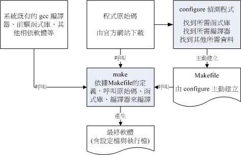

# 第二十一章、软件安装：源代码与 Tarball

最近更新日期：20//

我们在第一章、Linux 是什么当中提到了 GNU 计划与 GPL 授权所产生的自由软件与开放源码等咚咚。不过，前面的章节都还没有提到真正的开放源码是什么的讯息！在这一章当中，我们将借由 Linux 操作系统里面的可执行文件，来理解什么是可执行的程序，以及了解什么是编译器。另外，与程序息息相关的函数库 （library） 的信息也需要了解一番！不过，在这个章节当中，鸟哥并不是要你成为一个开放源码的程序设计师， 而是希望你可以了解如何将开放源码的程序设计、加入函数库的原理、通过编译而成为可以执行 的 binary program，最后该可执行文件可被我们所使用的一连串过程！

了解上面的咚咚有什么好处呢？因为在 Linux 的世界里面，由于客制化的关系，有时候我们需要自行安装软件在自己的 Linux 系统上面，所以如果你有简单的程序编译概念，那么将很容易进行软件的安装。 甚至在发生软件编译过程中的错误时，你也可以自行作一些简易的修订呢！而最传统的软件安装过程， 自然就是由源代码编译而来的啰！所以，在这里我们将介绍最原始的软件管理方式：使用 Tarball 来安装与升级管理我们的软件喔！

# 20.1 开放源码的软件安装与升级简介

## 20.1 开放源码的软件安装与升级简介

如果鸟哥想要在我的 Linux 服务器上面跑网页服务器 （WWW server） 这项服务，那么我应该要做些什么事呢？当然就一定需要“安装网页服务器的软件”啰！如果鸟哥的服务器上面没有这个软件的话，那当然也就无法启用 WWW 的服务啦！所以啦，想要在你的 Linux 上面进行一些有的没的功能，学会“如何安装软件”是很重要的一个课题！

咦！安装软件有什么难的？在 W 牌的操作系统上面安装软件时，不是只要一直给他按 “下一步”就可以安装妥当了吗？话是这样说没错啦，不过，也由于如此，所以在 Windows 系统上面的软件都是一模一样的，也就是说，你“无法修改该软件的原始程序码”，因此， 万一你想要增加或者减少该软件的某些功能时，大概只能求助于当初发行该软件的厂商了！（这就是所谓的商机吗？）

或许你会说：“唉呦！我不过是一般人，不会用到多余的功能，所以不太可能会更动到程序码的部分吧？” 如果你这么想的话，很抱歉～是有问题的！怎么说呢？像目前网络上面的病毒、黑客软件、臭虫程序等等， 都可能对你的主机上面的某些软件造成影响，导致主机的死机或者是其他数据损毁等等的伤害。 如果你可以借由安全信息单位所提供的修订方式进行修改， 那么你将可以很快速的自行修补好该软件的漏洞，而不必一定要等到软件开发商提供修补的程序包哩！要知道，提早补洞是很重要的一件事。


**Tips** 并不是软件开发商故意要搞出一个有问题的软件，而是某些程序码当初设计时可能没有考虑周全， 或者是程序码与操作系统的权限设置并不相同，所导致的一些漏洞。当然，也有可能是 cracker 通过某些攻击程序测试到程序的不周全所致。 无论如何，只要有网络存在的一天，可以想像的到，程序的漏洞永远补不完！但能补多少就补多少吧！

这样说可以了解 Linux 的优点了吗？没错！因为 Linux 上面的软件几乎都是经过 GPL 的授权，所以每个软件几乎均提供原始程序码， 并且你可以自行修改该程序码，以符合你个人的需求呢！很棒吧！这就是开放源码的优点啰！不过，到底什么是开放源码？ 这些程序码是什么咚咚？又 Linux 上面可以执行的相关软件文件与开放源码之间是如何转换的？不同版本的 Linux 之间能不能使用同一个可执行文件？或者是该可执行文件需要由原始程序码的部分重新进行转换？ 这些都是需要厘清观念的。下面我们先就原始程序码与可可执行文件来进行说明。

### 21.1.1 什么是开放源码、编译器与可可执行文件

在讨论程序码是什么之前，我们先来谈论一下什么是可可执行文件？我们说过，在 Linux 系统上面，一个文件能不能被执行看的是有没有可执行的那个权限 （具有 x permission），不过，Linux 系统上真正认识的可可执行文件其实是二进制文件 （ binary program），例如 /usr/bin/passwd, /bin/touch 这些个文件即为二进制程序码。

或许你会说 shell scripts 不是也可以执行吗？其实 shell scripts 只是利用 shell （例如 bash） 这支程序的功能进行一些判断式，而最终执行的除了 bash 提供的功能外，仍是调用一些已经编译好的二进制程序来执行的呢！ 当然啦， bash 本身也是一支二进制程序啊！那么我怎么知道一个文件是否为 binary 呢？还记得我们在第六章里面提到的 file 这个指令的功能吗？对啦！用他就是了！我们现在来测试一下：

```
# 先以系统的文件测试看看：
[root@study ~]# file /bin/bash
/bin/bash: ELF 64-bit LSB executable, x86-64, version 1 （SYSV）, dynamically linked 
  （uses shared libs）, for GNU/Linux 2.6.32, BuildID[sha1]=0x7e60e35005254...stripped

# 如果是系统提供的 /etc/init.d/network 呢？
[root@study ~]# file /etc/init.d/network
/etc/init.d/network: Bourne-Again shell script, ASCII text executable 
```

看到了吧！如果是 binary 而且是可以执行的时候，他就会显示可执行文件类别 （ELF 64-bit LSB executable）， 同时会说明是否使用动态函数库 （shared libs），而如果是一般的 script ，那他就会显示出 text executables 之类的字样！


**Tips** 事实上，network 的数据显示出 Bourne-Again ... 那一行，是因为你的 scripts 上面第一行有宣告 #!/bin/bash 的缘故，如果你将 script 的第一行拿掉，那么不管 /etc/init.d/network 的权限为何，他其实显示的是 ASCII 文本文件的信息喔！

既然 Linux 操作系统真正认识的其实是 binary program，那么我们是如何做出这样的一支 binary 的程序呢？首先，我们必须要写程序，用什么东西写程序？就是一般的文书处理器啊！鸟哥都喜欢使用 vim 来进行程序的撰写，写完的程序就是所谓的原始程序码啰！ 这个程序码文件其实就是一般的纯文本文件。 在完成这个源代码文件的编写之后，再来就是要将这个文件“编译”成为操作系统看的懂得 binary program 啰！而要编译自然就需要“编译器”来动作， 经过编译器的编译与链接之后，就会产生一支可以执行的 binary program 啰。

举个例子来说，在 Linux 上面最标准的程序语言为 C ，所以我使用 C 的语法进行原始程序码的书写，写完之后，以 Linux 上标准的 C 语言编译器 gcc 这支程序来编译，就可以制作一支可以执行的 binary program 啰。整个的流程有点像这样：

图 21.1.1、利用 gcc 编译器进行程序的编译流程示意图

事实上，在编译的过程当中还会产生所谓的目标文件 （Object file），这些文件是以 *.o 的扩展名样式存在的！至于 C 语言的源代码文件通常以* .c 作为扩展名。此外，有的时候，我们会在程序当中“引用、调用” 其他的外部副程序，或者是利用其他软件提供的“函数功能”，这个时候，我们就必须要在编译的过程当中， 将该函数库给他加进去，如此一来，编译器就可以将所有的程序码与函数库作一个链接 （Link） 以产生正确的可执行文件啰。

总之，我们可以这么说：

*   开放源码：就是程序码，写给人类看的程序语言，但机器并不认识，所以无法执行；
*   编译器：将程序码转译成为机器看的懂得语言，就类似翻译者的角色；
*   可可执行文件：经过编译器变成二进制程序后，机器看的懂所以可以执行的文件。

### 20.1.2 什么是函数库

在前一小节的图 21.1.1 示意图中，在编译的过程里面有提到函数库这东西。 什么是函数库呢？先举个例子来说：我们的 Linux 系统上通常已经提供一个可以进行身份验证的模块， 就是在第十三章提到的 PAM 模块。这个 PAM 提供的功能可以让很多的程序在被执行的时候，除了可以验证使用者登陆的信息外， 还可以将身份确认的数据记录在登录文件里面，以方便系统管理员的追踪！

既然有这么好用的功能，那如果我要编写具有身份认证功能的程序时，直接引用该 PAM 的功能就好啦，如此一来，我就不需要重新设计认证机制啰！也就是说，只要在我写的程序码里面，设置去调用 PAM 的函数功能，我的程序就可以利用 Linux 原本就有的身份认证的程序咯！除此之外，其实我们的 Linux 核心也提供了相当多的函数库来给硬件开发者利用喔。

函数库又分为动态与静态函数库，这两个咚咚的分别我们在后面的小节再加以说明。 这里我们以一个简单的流程图，来示意一支有调用外部函数库的程序的执行情况。

图 21.1.2、程序执行时引用外部动态函数库的示意图

很简单的示意图啊！^_^！而如果要在程序里面加入引用的函数库，就需要如图 21.1.1 所示， 亦即在编译的过程当中，就需要加入函数库的相关设置啰。 事实上， Linux 的核心提供很多的核心相关函数库与外部参数， 这些核心功能在设计硬件的驱动程序的时候是相当有用的信息，这些核心相关信息大多放置在 /usr/include, /usr/lib, /usr/lib64 里面哩！我们在本章的后续小节再来探讨。反正我们可以简单的这么想：

*   函数库：就类似副程序的角色，可以被调用来执行的一段功能函数。

### 20.1.3 什么是 make 与 configure

事实上，使用类似 gcc 的编译器来进行编译的过程并不简单，因为一套软件并不会仅有一支程序， 而是有一堆程序码文件。所以除了每个主程序与副程序均需要写上一笔编译过程的指令外，还需要写上最终的链接程序。 程序码小的时候还好，如果是类似 WWW 服务器软件 （例如 [Apache](http://linux.vbird.org/linux_server/0360apache.php)） ，或者是类似核心的源代码，动则数百 MBytes 的数据量，编译指令会写到疯掉～这个时候，我们就可以使用 make 这个指令的相关功能来进行编译过程的指令简化了！

当执行 make 时，make 会在当时的目录下搜寻 Makefile （or makefile） 这个文本文件，而 Makefile 里面则记录了源代码如何编译的详细信息！ make 会自动的判别源代码是否经过变动了，而自动更新可执行文件，是软件工程师相当好用的一个辅助工具呢！

咦！make 是一支程序，会去找 Makefile ，那 Makefile 怎么写？ 通常软件开发商都会写一支侦测程序来侦测使用者的作业环境， 以及该作业环境是否有软件开发商所需要的其他功能，该侦测程序侦测完毕后，就会主动的创建这个 Makefile 的规则文件啦！通常这支侦测程序的文件名为 configure 或者是 config 。

咦！那为什么要侦测作业环境呢？在第一章当中， 不是曾经提过其实每个 Linux distribution 都使用同样的核心吗？但你得要注意， 不同版本的核心所使用的系统调用可能不相同，而且每个软件所需要的相依的函数库也不相同， 同时，软件开发商不会仅针对 Linux 开发，而是会针对整个 Unix-Like 做开发啊！ 所以他也必须要侦测该操作系统平台有没有提供合适的编译器才行！所以当然要侦测环境啊！ 一般来说，侦测程序会侦测的数据大约有下面这些：

*   是否有适合的编译器可以编译本软件的程序码；
*   是否已经存在本软件所需要的函数库，或其他需要的相依软件；
*   操作系统平台是否适合本软件，包括 Linux 的核心版本；
*   核心的表头定义文件 （header include） 是否存在 （驱动程序必须要的侦测）。

至于 make 与 configure 运行流程的相关性，我们可以使用下面的图示来示意一下啊！ 下图中，你要进行的任务其实只有两个，一个是执行 configure 来创建 Makefile ， 这个步骤一定要成功！成功之后再以 make 来调用所需要的数据来编译即可！非常简单！

图 21.1.3、通过 configure 与 make 进行编译示意图

由于不同的 Linux distribution 的函数库文件所放置的路径，或者是函数库的文件名订定， 或者是默认安装的编译器，以及核心的版本都不相同，因此理论上，你无法在 CentOS 7.x 上面编译出 binary program 后，还将他拿到 SuSE 上面执行，这个动作通常是不可能成功的！ 因为调用的目标函数库位置可能不同 （参考图 21.1.2） ， 核心版本更不可能相同！所以能够执行的情况是微乎其微！所以同一套软件要在不同的平台上面执行时， 必须要重复编译！所以才需要源代码嘛！了解乎！详细的 make 用法与 Makefile 规则，在后续的小节里面再探讨啰！

### 20.1.4 什么是 Tarball 的软件

从前面几个小节的说明来看，我们知道所谓的原始程序码，其实就是一些写满了程序码的纯文本。 那我们在第八章压缩指令的介绍当中， 也了解了纯文本文件在网络上其实是很浪费带宽的一种文件格式！ 所以啦，如果能够将这些源代码通过文件的打包与压缩技术来将文件的数量与容量减小， 不但让使用者容易下载，软件开发商的网站带宽也能够节省很多很多啊！这就是 Tarball 文件的由来啰！


**Tips** 想一想，一个核心的源代码文件大约要 300~500 MB 以上，如果每个人都去下载这样的一个核心文件， 呵呵！那么网络带宽不被吃的死翘翘才怪呢！

所谓的 Tarball 文件，其实就是将软件的所有源代码文件先以 tar 打包，然后再以压缩技术来压缩，通常最常见的就是以 gzip 来压缩了。因为利用了 tar 与 gzip 的功能，所以 tarball 文件一般的扩展名就会写成 *.tar.gz 或者是简写为* .tgz 啰！不过，近来由于 bzip2 与 xz 的压缩率较佳，所以 Tarball 渐渐的以 bzip2 及 xz 的压缩技术来取代 gzip 啰！因此文件名也会变成 *.tar.bz2,* .tar.xz 之类的哩。所以说， Tarball 是一个软件包， 你将他解压缩之后，里面的文件通常就会有：

*   原始程序码文件；
*   侦测程序文件 （可能是 configure 或 config 等文件名）；
*   本软件的简易说明与安装说明 （INSTALL 或 README）。

其中最重要的是那个 INSTALL 或者是 README 这两个文件，通常你只要能够参考这两个文件， Tarball 软件的安装是很简单的啦！我们在后面的章节会再继续介绍 Tarball 这个玩意儿。

### 20.1.5 如何安装与升级软件

将源代码作了一个简单的介绍，也知道了系统其实认识的可可执行文件是 binary program 之后，好了，得要聊一聊，那么怎么安装与升级一个 Tarball 的软件？为什么要安装一个新的软件呢？当然是因为我们的主机上面没有该软件啰！那么， 为何要升级呢？原因可能有下面这些：

*   需要新的功能，但旧有主机的旧版软件并没有，所以需要升级到新版的软件；
*   旧版本的软件上面可能有资安上的顾虑，所以需要更新到新版的软件；
*   旧版的软件执行性能不彰，或者执行的能力不能让管理者满足。

在上面的需求当中，尤其需要注意的是第二点，当一个软件有安全上的顾虑时，千万不要怀疑， 赶紧更新软件吧！否则造成网络危机，那可不是闹着玩的！那么更新的方法有哪些呢？ 基本上更新的方法可以分为两大类，分别是：

*   直接以源代码通过编译来安装与升级；
*   直接以编译好的 binary program 来安装与升级。

上面第一点很简单，就是直接以 Tarball 在自己的机器上面进行侦测、编译、 安装与设置等等动作来升级就是了。不过，这样的动作虽然让使用者在安装过程当中具有很高的弹性， 但毕竟是比较麻烦一点，如果 Linux distribution 厂商能够针对自己的作业平台先进行编译等过程，再将编译好的 binary program 释出的话，那由于我的系统与该 Linux distribution 的环境是相同的，所以他所释出的 binary program 就可以在我的机器上面直接安装啦！省略了侦测与编译等等繁杂的过程呢！

这个预先编译好程序的机制存在于很多 distribution 喔，包括有 Red Hat 系统 （含 Fedora/CentOS 系列） 发展的 RPM 软件管理机制与 yum 线上更新模式； Debian 使用的 dpkg 软件管理机制与 APT 线上更新模式等等。

由于 CentOS 系统是依循标准的 Linux distribution，所以可以使用 Tarball 直接进行编译的安装与升级， 当然也可以使用 RPM 相关的机制来进行安装与升级啰！本章节主要针对 Tarball ，至于 RPM 则留待下个章节再来介绍呢！

好了，那么一个软件的 Tarball 是如何安装的呢？基本流程是这样的啦：

1.  将 Tarball 由厂商的网页下载下来；
2.  将 Tarball 解开，产生很多的源代码文件；
3.  开始以 gcc 进行源代码的编译 （会产生目标文件 object files）；
4.  然后以 gcc 进行函数库、主、副程序的链接，以形成主要的 binary file；
5.  将上述的 binary file 以及相关的配置文件安装至自己的主机上面。

上面第 3, 4 步骤当中，我们可以通过 make 这个指令的功能来简化他， 所以整个步骤其实是很简单的啦！只不过你就得需要至少有 gcc 以及 make 这两个软件在你的 Linux 系统里面才行喔！ 详细的过程以及需要的软件我们在后面的章节继续来介绍的啦！

# 21.2 使用传统程序语言进行编译的简单范例

## 21.2 使用传统程序语言进行编译的简单范例

经过上面的介绍之后，你应该比较清楚的知道源代码、编译器、函数库与可执行文件之间的相关性了。 不过，详细的流程可能还是不很清楚，所以，在这里我们以一个简单的程序范例来说明整个编译的过程喔！赶紧进入 Linux 系统，实地的操作一下下面的范例呢！

### 21.2.1 单一程序：印出 Hello World

我们以 Linux 上面最常见的 C 语言来撰写第一支程序！第一支程序最常作的就是..... 在屏幕上面印出“Hello World！”的字样～当然， 这里我们是以简单的 C 语言来撰写，如果你对于 C 有兴趣的话，那么请自行购买相关的书籍喔！ ^_^ 好了，不啰唆，立刻编辑第一支程序吧！


**Tips** 请先确认你的 Linux 系统里面已经安装了 gcc 了喔！如果尚未安装 gcc 的话，请先参考下一节的 RPM 安装法，先安装好 gcc 之后，再回来阅读本章。 如果你已经有网络了，那么直接使用“ yum groupinstall "Development Tools" ” 预先安装好所需的所有软件即可。 rpm 与 yum 均会在下一章介绍。

*   编辑程序码，亦即源代码

```
[root@study ~]# vim hello.c   &lt;==用 C 语言写的程序扩展名建议用 .c
#include &lt;stdio.h&gt;
int main（void）
{
        printf（"Hello World\n"）;
} 
```

上面是用 C 语言的语法写成的一个程序文件。第一行的那个“ # ”并不是注解喔！如果你担心输入错误， 请到下面的链接下载这个文件：

*   [`linux.vbird.org/linux_basic/0520source/hello.c`](http://linux.vbird.org/linux_basic/0520source/hello.c)

*   开始编译与测试执行

```
[root@study ~]# gcc hello.c
[root@study ~]# ll hello.c a.out
-rwxr-xr-x. 1 root root 8503 Sep  4 11:33 a.out   &lt;==此时会产生这个文件名
-rw-r--r--. 1 root root   71 Sep  4 11:32 hello.c

[root@study ~]# ./a.out
Hello World  &lt;==呵呵！成果出现了！ 
```

在默认的状态下，如果我们直接以 gcc 编译源代码，并且没有加上任何参数，则可执行文件的文件名会被自动设置为 a.out 这个文件名称！ 所以你就能够直接执行 ./a.out 这个可执行文件啦！上面的例子很简单吧！那个 hello.c 就是源代码，而 gcc 就是编译器，至于 a.out 就是编译成功的可执行 binary program 啰！ 咦！那如果我想要产生目标文件 （object file） 来进行其他的动作，而且可执行文件的文件名也不要用默认的 a.out ，那该如何是好？其实你可以将上面的第 2 个步骤改成这样：

```
[root@study ~]# gcc -c hello.c
[root@study ~]# ll hello*
-rw-r--r--. 1 root root   71 Sep  4 11:32 hello.c
-rw-r--r--. 1 root root 1496 Sep  4 11:34 hello.o  &lt;==就是被产生的目标文件

[root@study ~]# gcc -o hello hello.o
[root@study ~]# ll hello*
-rwxr-xr-x. 1 root root 8503 Sep  4 11:35 hello  &lt;==这就是可可执行文件！ -o 的结果
-rw-r--r--. 1 root root   71 Sep  4 11:32 hello.c
-rw-r--r--. 1 root root 1496 Sep  4 11:34 hello.o

[root@study ~]# ./hello
Hello World 
```

这个步骤主要是利用 hello.o 这个目标文件制作出一个名为 hello 的可执行文件，详细的 gcc 语法我们会在后续章节中继续介绍！通过这个动作后，我们可以得到 hello 及 hello.o 两个文件， 真正可以执行的是 hello 这个 binary program 喔！ 或许你会觉得，咦！只要一个动作作出 a.out 就好了，干嘛还要先制作目标文件再做成可执行文件呢？ 呵呵！通过下个范例，你就可以知道为什么啦！

### 21.2.2 主、副程序链接：副程序的编译

如果我们在一个主程序里面又调用了另一个副程序呢？这是很常见的一个程序写法， 因为可以简化整个程序的易读性！在下面的例子当中，我们以 thanks.c 这个主程序去调用 thanks_2.c 这个副程序，写法很简单：

*   撰写所需要的主、副程序

```
# 1\. 编辑主程序：
[root@study ~]# vim thanks.c
#include &lt;stdio.h&gt;
int main（void）
{
        printf（"Hello World\n"）;
        thanks_2（）;
}
# 上面的 thanks_2（）; 那一行就是调用副程序啦！

[root@study ~]# vim thanks_2.c
#include &lt;stdio.h&gt;
void thanks_2（void）
{
        printf（"Thank you!\n"）;
} 
```

上面这两个文件你可以到下面下载：

*   [`linux.vbird.org/linux_basic/0520source/thanks.c`](http://linux.vbird.org/linux_basic/0520source/thanks.c)
*   [`linux.vbird.org/linux_basic/0520source/thanks_2.c`](http://linux.vbird.org/linux_basic/0520source/thanks_2.c)

*   进行程序的编译与链接 （Link）

```
# 2\. 开始将源代码编译成为可执行的 binary file ：
[root@study ~]# gcc -c thanks.c thanks_2.c
[root@study ~]# ll thanks*
-rw-r--r--. 1 root root   75 Sep  4 11:43 thanks_2.c
-rw-r--r--. 1 root root 1496 Sep  4 11:43 thanks_2.o  &lt;==编译产生的！
-rw-r--r--. 1 root root   91 Sep  4 11:42 thanks.c
-rw-r--r--. 1 root root 1560 Sep  4 11:43 thanks.o    &lt;==编译产生的！

[root@study ~]# gcc -o thanks thanks.o thanks_2.o
[root@study ~]# ll thanks*
-rwxr-xr-x. 1 root root 8572 Sep  4 11:44 thanks    &lt;==最终结果会产生这玩意儿

# 3\. 执行一下这个文件：
[root@study ~]# ./thanks
Hello World
Thank you! 
```

知道为什么要制作出目标文件了吗？由于我们的源代码文件有时并非仅只有一个文件，所以我们无法直接进行编译。 这个时候就需要先产生目标文件，然后再以链接制作成为 binary 可可执行文件。另外，如果有一天，你更新了 thanks_2.c 这个文件的内容，则你只要重新编译 thanks_2.c 来产生新的 thanks_2.o ，然后再以链接制作出新的 binary 可可执行文件即可！而不必重新编译其他没有更动过的源代码文件。 这对于软件开发者来说，是一个很重要的功能，因为有时候要将偌大的源代码全部编译完成，会花很长的一段时间呢！

此外，如果你想要让程序在执行的时候具有比较好的性能，或者是其他的除错功能时， 可以在编译的过程里面加入适当的参数，例如下面的例子：

```
[root@study ~]# gcc -O -c thanks.c thanks_2.c  &lt;== -O 为产生最优化的参数

[root@study ~]# gcc -Wall -c thanks.c thanks_2.c
thanks.c: In function ‘main’:
thanks.c:5:9: warning: implicit declaration of function ‘thanks_2’ [-Wimplicit-function-declaration]
         thanks_2（）;
         ^
thanks.c:6:1: warning: control reaches end of non-void function [-Wreturn-type]
 }
 ^
# -Wall 为产生更详细的编译过程信息。上面的讯息为警告讯息 （warning） 所以不用理会也没有关系！ 
```

至于更多的 gcc 额外参数功能，就得要 man gcc 啰～呵呵！可多的跟天书一样～

### 21.2.3 调用外部函数库：加入链接的函数库

刚刚我们都仅只是在屏幕上面印出一些字眼而已，如果说要计算数学公式呢？例如我们想要计算出三角函数里面的 sin （90 度角）。要注意的是，大多数的程序语言都是使用径度而不是一般我们在计算的“角度”， 180 度角约等于 3.14 径度！嗯！那我们就来写一下这个程序吧！

```
[root@study ~]# vim sin.c
#include &lt;stdio.h&gt;
#include &lt;math.h&gt;
int main（void）
{
        float value;
        value = sin （ 3.14 / 2 ）;
        printf（"%f\n",value）;
} 
```

上面这个文件的内容可以在下面取得！

*   [`linux.vbird.org/linux_basic/0520source/sin.c`](http://linux.vbird.org/linux_basic/0520source/sin.c)

那要如何编译这支程序呢？我们先直接编译看看：

```
[root@study ~]# gcc sin.c
# 新的 GCC 会主动将函数抓进来给你用，所以只要加上 include &lt;math.h&gt; 就好了！ 
```

新版的 GCC 会主动帮你将所需要的函数库抓进来编译，所以不会出现怪异的错误讯息！ 事实上，数学函数库使用的是 libm.so 这个函数库，你最好在编译的时候将这个函数库纳进去比较好～另外要注意， 这个函数库放置的地方是系统默认会去找的 /lib, /lib64 ，所以你无须使用下面的 -L 去加入搜寻的目录！ 而 libm.so 在编译的写法上，使用的是 -lm （lib 简写为 l 喔！） 喔！因此就变成：

*   编译时加入额外函数库链接的方式：

```
[root@study ~]# gcc sin.c -lm -L/lib -L/lib64  &lt;==重点在 -lm 
[root@study ~]# ./a.out                         &lt;==尝试执行新文件！
1.000000 
```

特别注意，使用 gcc 编译时所加入的那个 -lm 是有意义的，他可以拆开成两部份来看：

*   -l ：是“加入某个函数库（library）”的意思，
*   m ：则是 libm.so 这个函数库，其中， lib 与扩展名（.a 或 .so）不需要写

所以 -lm 表示使用 libm.so （或 libm.a） 这个函数库的意思～至于那个 -L 后面接的路径呢？这表示： “我要的函数库 libm.so 请到 /lib 或 /lib64 里面搜寻！”

上面的说明很清楚了吧！不过，要注意的是，由于 Linux 默认是将函数库放置在 /lib 与 /lib64 当中，所以你没有写 -L/lib 与 -L/lib64 也没有关系的！不过，万一哪天你使用的函数库并非放置在这两个目录下，那么 -L/path 就很重要了！否则会找不到函数库喔！

除了链接的函数库之外，你或许已经发现一个奇怪的地方，那就是在我们的 sin.c 当中第一行“ #include <stdio.h>”，这行说的是要将一些定义数据由 stdio.h 这个文件读入，这包括 printf 的相关设置。这个文件其实是放置在 /usr/include/stdio.h 的！那么万一这个文件并非放置在这里呢？那么我们就可以使用下面的方式来定义出要读取的 include 文件放置的目录：

```
[root@study ~]# gcc sin.c -lm -I/usr/include 
```

-I/path 后面接的路径（ Path ）就是设置要去搜寻相关的 include 文件的目录啦！不过，同样的，默认值是放置在 /usr/include 下面，除非你的 include 文件放置在其他路径，否则也可以略过这个项目！

通过上面的几个小范例，你应该对于 gcc 以及源代码有一定程度的认识了，再接下来，我们来稍微整理一下 gcc 的简易使用方法吧！

### 21.2.4 gcc 的简易用法 （编译、参数与链结）

前面说过， gcc 为 Linux 上面最标准的编译器，这个 gcc 是由 [GNU 计划](http://www.gnu.org/)所维护的，有兴趣的朋友请自行前往参考。既然 gcc 对于 Linux 上的 Open source 是这么样的重要，所以下面我们就列举几个 gcc 常见的参数，如此一来大家应该更容易了解源代码的各项功能吧！

```
# 仅将源代码编译成为目标文件，并不制作链接等功能：
[root@study ~]# gcc -c hello.c
# 会自动的产生 hello.o 这个文件，但是并不会产生 binary 可执行文件。

# 在编译的时候，依据作业环境给予最优化执行速度
[root@study ~]# gcc -O hello.c -c
# 会自动的产生 hello.o 这个文件，并且进行最优化喔！

# 在进行 binary file 制作时，将链接的函数库与相关的路径填入
[root@study ~]# gcc sin.c -lm -L/lib -I/usr/include
# 这个指令较常下达在最终链接成 binary file 的时候，
# -lm 指的是 libm.so 或 libm.a 这个函数库文件；
# -L 后面接的路径是刚刚上面那个函数库的搜寻目录；
# -I 后面接的是源代码内的 include 文件之所在目录。

# 将编译的结果输出成某个特定文件名
[root@study ~]# gcc -o hello hello.c
# -o 后面接的是要输出的 binary file 文件名

# 在编译的时候，输出较多的讯息说明
[root@study ~]# gcc -o hello hello.c -Wall
# 加入 -Wall 之后，程序的编译会变的较为严谨一点，所以警告讯息也会显示出来！ 
```

比较重要的大概就是这一些。另外，我们通常称 -Wall 或者 -O 这些非必要的参数为旗标 （FLAGS），因为我们使用的是 C 程序语言，所以有时候也会简称这些旗标为 CFLAGS ，这些变量偶尔会被使用的喔！尤其是在后头会介绍的 make 相关的用法时，更是重要的很呐！ ^_^

# 21.3 用 make 进行宏编译

## 21.3 用 make 进行宏编译

在本章一开始我们提到过 make 的功能是可以简化编译过程里面所下达的指令，同时还具有很多很方便的功能！那么下面咱们就来试看看使用 make 简化下达编译指令的流程吧！

### 21.3.1 为什么要用 make

先来想像一个案例，假设我的可执行文件里面包含了四个源代码文件，分别是 main.c haha.c sin_value.c cos_value.c 这四个文件，这四个文件的目的是：

*   main.c ：主要的目的是让使用者输入角度数据与调用其他三支副程序；
*   haha.c ：输出一堆有的没有的讯息而已；
*   sin_value.c ：计算使用者输入的角度（360） sin 数值；
*   cos_value.c ：计算使用者输入的角度（360） cos 数值。

这四个文件你可以到 [`linux.vbird.org/linux_basic/0520source/main.tgz`](http://linux.vbird.org/linux_basic/0520source/main.tgz) 来下载。由于这四个文件里面包含了相关性，并且还用到数学函数在里面，所以如果你想要让这个程序可以跑， 那么就需要这样编译：

```
# 1\. 先进行目标文件的编译，最终会有四个 *.o 的文件名出现：
[root@study ~]# gcc -c main.c
[root@study ~]# gcc -c haha.c
[root@study ~]# gcc -c sin_value.c
[root@study ~]# gcc -c cos_value.c

# 2\. 再进行链接成为可执行文件，并加入 libm 的数学函数，以产生 main 可执行文件：
[root@study ~]# gcc -o main main.o haha.o sin_value.o cos_value.o -lm

# 3\. 本程序的执行结果，必须输入姓名、360 度角的角度值来计算：
[root@study ~]# ./main 
Please input your name: VBird  &lt;==这里先输入名字
Please enter the degree angle （ex&gt; 90）: 30   &lt;==输入以 360 度角为主的角度
Hi, Dear VBird, nice to meet you.    &lt;==这三行为输出的结果喔！
The Sin is:  0.50
The Cos is:  0.87 
```

编译的过程需要进行好多动作啊！而且如果要重新编译，则上述的流程得要重新来一遍，光是找出这些指令就够烦人的了！ 如果可以的话，能不能一个步骤就给他完成上面所有的动作呢？那就利用 make 这个工具吧！ 先试看看在这个目录下创建一个名为 makefile 的文件，内容如下：

```
# 1\. 先编辑 makefile 这个规则档，内容只要作出 main 这个可执行文件
[root@study ~]# vim makefile
main: main.o haha.o sin_value.o cos_value.o
    gcc -o main main.o haha.o sin_value.o cos_value.o -lm
# 注意：第二行的 gcc 之前是 &lt;tab&gt; 按键产生的空格喔！

# 2\. 尝试使用 makefile 制订的规则进行编译的行为：
[root@study ~]# rm -f main *.o   &lt;==先将之前的目标文件去除
[root@study ~]# make
cc    -c -o main.o main.c
cc    -c -o haha.o haha.c
cc    -c -o sin_value.o sin_value.c
cc    -c -o cos_value.o cos_value.c
gcc -o main main.o haha.o sin_value.o cos_value.o -lm
# 此时 make 会去读取 makefile 的内容，并根据内容直接去给他编译相关的文件啰！

# 3\. 在不删除任何文件的情况下，重新执行一次编译的动作：
[root@study ~]# make
make: `main' is up to date.
# 看到了吧！是否很方便呢！只会进行更新 （update） 的动作而已。 
```

或许你会说：“如果我创建一个 shell script 来将上面的所有动作都集结在一起，不是具有同样的效果吗？”呵呵！ 效果当然不一样，以上面的测试为例，我们仅写出 main 需要的目标文件，结果 make 会主动的去判断每个目标文件相关的源代码文件，并直接予以编译，最后再直接进行链接的动作！ 真的是很方便啊！此外，如果我们更动过某些源代码文件，则 make 也可以主动的判断哪一个源代码与相关的目标文件文件有更新过， 并仅更新该文件，如此一来，将可大大的节省很多编译的时间呢！要知道，某些程序在进行编译的行为时，会消耗很多的 CPU 资源呢！所以说， make 有这些好处：

*   简化编译时所需要下达的指令；
*   若在编译完成之后，修改了某个源代码文件，则 make 仅会针对被修改了的文件进行编译，其他的 object file 不会被更动；
*   最后可以依照相依性来更新 （update） 可执行文件。

既然 make 有这么多的优点，那么我们当然就得好好的了解一下 make 这个令人关心的家伙啦！而 make 里面最需要注意的大概就是那个规则文件，也就是 makefile 这个文件的语法啦！所以下面我们就针对 makefile 的语法来加以介绍啰。

### 21.3.2 makefile 的基本语法与变量

make 的语法可是相当的多而复杂的，有兴趣的话可以到 GNU [[1]](#ps1) 去查阅相关的说明，鸟哥这里仅列出一些基本的规则，重点在于让读者们未来在接触源代码时，不会太紧张啊！ 好了，基本的 makefile 规则是这样的：

```
标的（target）: 目标文件 1 目标文件 2
&lt;tab&gt;   gcc -o 欲创建的可执行文件 目标文件 1 目标文件 2 
```

那个标的 （target） 就是我们想要创建的信息，而目标文件就是具有相关性的 object files ，那创建可执行文件的语法就是以 <tab> 按键开头的那一行！特别给他留意喔，“命令列必须要以 tab 按键作为开头”才行！他的规则基本上是这样的：

*   在 makefile 当中的 # 代表注解；
*   <tab> 需要在命令行 （例如 gcc 这个编译器指令） 的第一个字符；
*   标的 （target） 与相依文件（就是目标文件）之间需以“:”隔开。

同样的，我们以刚刚上一个小节的范例进一步说明，如果我想要有两个以上的执行动作时， 例如下达一个指令就直接清除掉所有的目标文件与可执行文件，该如何制作呢？

```
# 1\. 先编辑 makefile 来创建新的规则，此规则的标的名称为 clean ：
[root@study ~]# vi makefile
main: main.o haha.o sin_value.o cos_value.o
    gcc -o main main.o haha.o sin_value.o cos_value.o -lm
clean:
    rm -f main main.o haha.o sin_value.o cos_value.o

# 2\. 以新的标的 （clean） 测试看看执行 make 的结果：
[root@study ~]# make clean  &lt;==就是这里！通过 make 以 clean 为标的
rm -rf main main.o haha.o sin_value.o cos_value.o 
```

如此一来，我们的 makefile 里面就具有至少两个标的，分别是 main 与 clean ，如果我们想要创建 main 的话，输入“make main”，如果想要清除有的没的，输入“make clean”即可啊！而如果想要先清除目标文件再编译 main 这个程序的话，就可以这样输入：“make clean main”，如下所示：

```
[root@study ~]# make clean main
rm -rf main main.o haha.o sin_value.o cos_value.o
cc    -c -o main.o main.c
cc    -c -o haha.o haha.c
cc    -c -o sin_value.o sin_value.c
cc    -c -o cos_value.o cos_value.c
gcc -o main main.o haha.o sin_value.o cos_value.o -lm 
```

这样就很清楚了吧！但是，你是否会觉得，咦！ makefile 里面怎么重复的数据这么多啊！没错！所以我们可以再借由 shell script 那时学到的“变量”来更简化 makefile 喔：

```
[root@study ~]# vi makefile
LIBS = -lm
OBJS = main.o haha.o sin_value.o cos_value.o
main: ${OBJS}
        gcc -o main ${OBJS} ${LIBS}
clean:
        rm -f main ${OBJS} 
```

与 bash shell script 的语法有点不太相同，变量的基本语法为：

1.  变量与变量内容以“=”隔开，同时两边可以具有空格；
2.  变量左边不可以有 <tab> ，例如上面范例的第一行 LIBS 左边不可以是 <tab>；
3.  变量与变量内容在“=”两边不能具有“:”；
4.  在习惯上，变量最好是以“大写字母”为主；
5.  运用变量时，以 ${变量} 或 $（变量） 使用；
6.  在该 shell 的环境变量是可以被套用的，例如提到的 CFLAGS 这个变量！
7.  在命令行界面也可以给予变量。

由于 gcc 在进行编译的行为时，会主动的去读取 CFLAGS 这个环境变量，所以，你可以直接在 shell 定义出这个环境变量，也可以在 makefile 文件里面去定义，更可以在命令行当中给予这个咚咚呢！例如：

```
[root@study ~]# CFLAGS="-Wall" make clean main
# 这个动作在上 make 进行编译时，会去取用 CFLAGS 的变量内容！ 
```

也可以这样：

```
[root@study ~]# vi makefile
LIBS = -lm
OBJS = main.o haha.o sin_value.o cos_value.o
CFLAGS = -Wall
main: ${OBJS}
    gcc -o main ${OBJS} ${LIBS}
clean:
    rm -f main ${OBJS} 
```

咦！我可以利用命令行进行环境变量的输入，也可以在文件内直接指定环境变量，那万一这个 CFLAGS 的内容在命令行与 makefile 里面并不相同时，以那个方式输入的为主？呵呵！问了个好问题啊！ 环境变量取用的规则是这样的：

1.  make 命令行后面加上的环境变量为优先；
2.  makefile 里面指定的环境变量第二；
3.  shell 原本具有的环境变量第三。

此外，还有一些特殊的变量需要了解的喔：

*   $@：代表目前的标的（target）

所以我也可以将 makefile 改成：

```
[root@study ~]# vi makefile
LIBS = -lm
OBJS = main.o haha.o sin_value.o cos_value.o
CFLAGS = -Wall
main: ${OBJS}
    gcc -o $@ ${OBJS} ${LIBS}   &lt;==那个 $@ 就是 main ！
clean:
    rm -f main ${OBJS} 
```

这样是否稍微了解了 makefile （也可能是 Makefile） 的基本语法？这对于你未来自行修改源代码的编译规则时，是很有帮助的喔！^_^！

# 21.4 Tarball 的管理与建议

## 21.4 Tarball 的管理与建议

在我们知道了源代码的相关信息之后，再来要了解的自然就是如何使用具有源代码的 Tarball 来创建一个属于自己的软件啰！从前面几个小节的说明当中，我们晓得其实 Tarball 的安装是可以跨平台的，因为 C 语言的程序码在各个平台上面是可以共通的， 只是需要的编译器可能并不相同而已。例如 Linux 上面用 gcc 而 Windows 上面也有相关的 C 编译器啊～所以呢，同样的一组源代码，既可以在 CentOS Linux 上面编译，也可以在 SuSE Linux 上面编译，当然，也可以在大部分的 Unix 平台上面编译成功的！

如果万一没有编译成功怎么办？很简单啊，通过修改小部分的程序码 （通常是因为很小部分的异动而已） 就可以进行跨平台的移植了！也就是说，刚刚我们在 Linux 下面写的程序“理论上，是可以在 Windows 上面编译的！”这就是源代码的好处啦！所以说，如果朋友们想要学习程序语言的话， 鸟哥个人是比较建议学习“具有跨平台能力的程序语言”，例如 C 就是很不错的一个！

唉啊！又扯远了～赶紧拉回来继续说明我们的 Tarball 啦！

### 21.4.1 使用源代码管理软件所需要的基础软件

从源代码的说明我们晓得要制作一个 binary program 需要很多咚咚的呢！这包括下面这些基础的软件：

*   gcc 或 cc 等 C 语言编译器 （compiler）：

没有编译器怎么进行编译的动作？所以 C compiler 是一定要有的。不过 Linux 上面有众多的编译器，其中当然以 GNU 的 gcc 是首选的自由软件编译器啰！事实上很多在 Linux 平台上面发展的软件的源代码，原本就是以 gcc 为底来设计的呢。

*   make 及 autoconfig 等软件：

一般来说，以 Tarball 方式释出的软件当中，为了简化编译的流程，通常都是配合前几个小节提到的 make 这个指令来依据目标文件的相依性而进行编译。但是我们也知道说 make 需要 makefile 这个文件的规则，那由于不同的系统里面可能具有的基础软件环境并不相同， 所以就需要侦测使用者的作业环境，好自行创建一个 makefile 文件。这个自行侦测的小程序也必须要借由 autoconfig 这个相关的软件来辅助才行。

*   需要 Kernel 提供的 Library 以及相关的 Include 文件：

从前面的源代码编译过程，我们晓得函数库 （library） 的重要性，同时也晓得有 include 文件的存在。很多的软件在发展的时候都是直接取用系统核心提供的函数库与 include 文件的，这样才可以与这个操作系统相容啊！尤其是在“驱动程序方面的模块 ”，例如网卡、声卡、USB 等驱动程序在安装的时候，常常是需要核心提供的相关信息的。在 Red Hat 的系统当中 （包含 Fedora/CentOS 等系列） ，这个核心相关的功能通常都是被包含在 kernel-source 或 kernel-header 这些软件名称当中，所以记得要安装这些软件喔！

虽然 Tarball 的安装上面相当的简单，如同我们前面几个小节的例子，只要顺着开发商提供的 README 与 INSTALL 文件所载明的步骤来进行，安装是很容易的。但是我们却还是常常会在 BBS 或者是新闻群组当中发现这些留言：“我在执行某个程序的侦测文件时，他都会告诉我没有 gcc 这个软件，这是怎么回事？”还有：“我没有办法使用 make 耶！这是什么问题？”呵呵！ 这就是没有安装上面提到的那些基础软件啦！

咦！为什么使用者不安装这些软件啊？这是因为目前的 Linux distribution 大多已经偏向于桌面电脑的使用 （非服务器端），他们希望使用者能够按照厂商自己的希望来安装相关的软件即可， 所以通常“默认”是没有安装 gcc 或者是 make 等软件的。所以啦，如果你希望未来可以自行安装一些以 Tarball 方式释出的软件时，记得请自行挑选想要安装的软件名称喔！例如在 CentOS 或者是 Red Hat 当中记得选择 Development Tools 以及 Kernel Source Development 等相关字眼的软件群集呢。

那万一我已经安装好一部 Linux 主机，但是使用的是默认值所安装的软件，所以没有 make, gcc 等咚咚，该如何是好？呵呵！问题其实不大啦，目前使用最广泛的 CentOS/Fedora 或者是 Red Hat 大多是以 RPM （下一章会介绍） 来安装软件的，所以，你只要拿出当初安装 Linux 时的原版光盘，然后以下一章介绍的 RPM 来一个一个的加入到你的 Linux 主机里面就好啦！很简单的啦！ 尤其现在又有 yum 这玩意儿，更方便呐！

在 CentOS 当中，如果你已经有网络可以连上 Internet 的话，那么就可以使用下一章会谈到的 yum 啰！ 通过 yum 的软件群组安装功能，你可以这样做：

*   如果是要安装 gcc 等软件发展工具，请使用“ yum groupinstall "Development Tools" ”
*   若待安装的软件需要图形接口支持，一般还需要“ yum groupinstall "X Software Development" ”
*   若安装的软件较旧，可能需要“ yum groupinstall "Legacy Software Development" ”

大概就是这样，更多的信息请参考下一章的介绍喔。

### 21.4.2 Tarball 安装的基本步骤

我们提过以 Tarball 方式释出的软件是需要重新编译可执行的 binary program 的。而 Tarball 是以 tar 这个指令来打包与压缩的文件，所以啦，当然就需要先将 Tarball 解压缩，然后到源代码所在的目录下进行 makefile 的创建，再以 make 来进行编译与安装的动作啊！所以整个安装的基础动作大多是这样的：

1.  取得原始文件：将 tarball 文件在 /usr/local/src 目录下解压缩；
2.  取得步骤流程：进入新创建的目录下面，去查阅 INSTALL 与 README 等相关文件内容 （很重要的步骤！）；
3.  相依属性软件安装：根据 INSTALL/README 的内容察看并安装好一些相依的软件 （非必要）；
4.  创建 makefile：以自动侦测程序 （configure 或 config） 侦测作业环境，并创建 Makefile 这个文件；
5.  编译：以 make 这个程序并使用该目录下的 Makefile 做为他的参数配置文件，来进行 make （编译或其他） 的动作；
6.  安装：以 make 这个程序，并以 Makefile 这个参数配置文件，依据 install 这个标的 （target） 的指定来安装到正确的路径！

注意到上面的第二个步骤，通常在每个软件在释出的时候，都会附上 INSTALL 或者是 README 这种文件名的说明文档，这些说明文档请“确实详细的” 阅读过一遍，通常这些文件会记录这个软件的安装要求、软件的工作项目、 与软件的安装参数设置及技巧等，只要仔细的读完这些文件，基本上，要安装好 tarball 的文件，都不会有什么大问题啰。

至于 makefile 在制作出来之后，里头会有相当多的标的 （target），最常见的就是 install 与 clean 啰！通常“make clean”代表着将目标文件 （object file） 清除掉，“make”则是将源代码进行编译而已。 注意喔！编译完成的可可执行文件与相关的配置文件还在源代码所在的目录当中喔！因此，最后要进行“make install”来将编译完成的所有咚咚都给他安装到正确的路径去，这样就可以使用该软件啦！

OK！我们下面约略提一下大部分的 tarball 软件之安装的指令下达方式：

1.  ./configure 这个步骤就是在创建 Makefile 这个文件啰！通常程序开发者会写一支 scripts 来检查你的 Linux 系统、相关的软件属性等等，这个步骤相当的重要， 因为未来你的安装信息都是这一步骤内完成的！另外，这个步骤的相关信息应该要参考一下该目录下的 README 或 INSTALL 相关的文件！

2.  make clean make 会读取 Makefile 中关于 clean 的工作。这个步骤不一定会有，但是希望执行一下，因为他可以去除目标文件！因为谁也不确定源代码里面到底有没有包含上次编译过的目标文件 （*.o） 存在，所以当然还是清除一下比较妥当的。 至少等一下新编译出来的可执行文件我们可以确定是使用自己的机器所编译完成的嘛！

3.  make make 会依据 Makefile 当中的默认工作进行编译的行为！编译的工作主要是进行 gcc 来将源代码编译成为可以被执行的 object files ，但是这些 object files 通常还需要一些函数库之类的 link 后，才能产生一个完整的可执行文件！使用 make 就是要将源代码编译成为可以被执行的可可执行文件，而这个可可执行文件会放置在目前所在的目录之下， 尚未被安装到预定安装的目录中；

4.  make install 通常这就是最后的安装步骤了，make 会依据 Makefile 这个文件里面关于 install 的项目，将上一个步骤所编译完成的数据给他安装到预定的目录中，就完成安装啦！

请注意，上面的步骤是一步一步来进行的，而其中只要一个步骤无法成功，那么后续的步骤就完全没有办法进行的！ 因此，要确定每一的步骤都是成功的才可以！举个例子来说，万一今天你在 ./configure 就不成功了，那么就表示 Makefile 无法被创建起来，要知道，后面的步骤都是根据 Makefile 来进行的，既然无法创建 Makefile，后续的步骤当然无法成功啰！

另外，如果在 make 无法成功的话，那就表示原始文件无法被编译成可可执行文件，那么 make install 主要是将编译完成的文件给他放置到文件系统中的，既然都没有可用的可执行文件了，怎么进行安装？ 所以啰，要每一个步骤都正确无误才能往下继续做！此外，如果安装成功， 并且是安装在独立的一个目录中，例如 /usr/local/packages 这个目录中好了，那么你就必需手动的将这个软件的 man page 给他写入 /etc/man_db.conf 里面去。

### 21.4.3 一般 Tarball 软件安装的建议事项 （如何移除？升级？）

或许你已经发现了也说不定，那就是为什么前一个小节里面， Tarball 要在 /usr/local/src 里面解压缩呢？基本上，在默认的情况下，原本的 Linux distribution 释出安装的软件大多是在 /usr 里面的，而使用者自行安装的软件则建议放置在 /usr/local 里面。这是考虑到管理使用者所安装软件的便利性。

怎么说呢？我们晓得几乎每个软件都会提供线上说明的服务，那就是 info 与 man 的功能。在默认的情况下， man 会去搜寻 /usr/local/man 里面的说明文档， 因此，如果我们将软件安装在 /usr/local 下面的话，那么自然安装完成之后， 该软件的说明文档就可以被找到了。此外，如果你所管理的主机其实是由多人共同管理的， 或者是如同学校里面，一部主机是由学生管理的，但是学生总会毕业吧？ 所以需要进行交接，如果大家都将软件安装在 /usr/local 下面，那么管理上不就显的特别的容易吗！

所以啰，通常我们会建议大家将自己安装的软件放置在 /usr/local 下，至于源代码 （Tarball）则建议放置在 /usr/local/src （src 为 source 的缩写）下面啊。

再来，让我们先来看一看 Linux distribution 默认的安装软件的路径会用到哪些？我们以 apache 这个软件来说明的话 （apache 是 WWW 服务器软件，详细的数据请参考[服务器架设篇](http://linux.vbird.org/linux_server/0360apache.php)。你的系统不见得有装这个软件）：

*   /etc/httpd
*   /usr/lib
*   /usr/bin
*   /usr/share/man

我们会发现软件的内容大致上是摆在 etc, lib, bin, man 等目录当中，分别代表“配置文件、函数库、可执行文件、线上说明文档”。 好了，那么你是以 tarball 来安装时呢？如果是放在默认的 /usr/local 里面，由于 /usr/local 原本就默认这几个目录了，所以你的数据就会被放在：

*   /usr/local/etc
*   /usr/local/bin
*   /usr/local/lib
*   /usr/local/man

但是如果你每个软件都选择在这个默认的路径下安装的话， 那么所有的软件的文件都将放置在这四个目录当中，因此，如果你都安装在这个目录下的话， 那么未来再想要升级或移除的时候，就会比较难以追查文件的来源啰！ 而如果你在安装的时候选择的是单独的目录，例如我将 apache 安装在 /usr/local/apache 当中，那么你的文件目录就会变成：

*   /usr/local/apache/etc
*   /usr/local/apache/bin
*   /usr/local/apache/lib
*   /usr/local/apache/man

呵呵！单一软件的文件都在同一个目录之下，那么要移除该软件就简单的多了！ 只要将该目录移除即可视为该软件已经被移除啰！以上面为例，我想要移除 apache 只要下达“rm -rf /usr/local/apache” 就算移除这个软件啦！当然啰，实际安装的时候还是得视该软件的 Makefile 里头的 install 信息才能知道到底他的安装情况为何的。因为例如 sendmail 的安装就很麻烦......

这个方式虽然有利于软件的移除，但不晓得你有没有发现，我们在执行某些指令的时候，与该指令是否在 PATH 这个环境变量所记录的路径有关，以上面为例，我的 /usr/local/apache/bin 肯定是不在 PATH 里面的，所以执行 apache 的指令就得要利用绝对路径了，否则就得将这个 /usr/local/apache/bin 加入 PATH 里面。另外，那个 /usr/local/apache/man 也需要加入 man page 搜寻的路径当中啊！

除此之外， Tarball 在升级的时候也是挺困扰的，怎么说呢？我们还是以 apache 来说明好了。WWW 服务器为了考虑互动性，所以通常会将 PHP+MySQL+Apache 一起安装起来 （详细的信息请参考服务器架设篇） ，果真如此的话，那么每个软件在安装的时候“都有一定的顺序与程序！” 因为他们三者之间具有相关性，所以安装时必需要三者同时考虑到他们的函数库与相关的编译参数。

假设今天我只要升级 PHP 呢？有的时候因为只有涉及动态函数库的升级，那么我只要升级 PHP 即可！其他的部分或许影响不大。但是如果今天 PHP 需要重新编译的模块比较多，那么可能会连带的，连 Apache 这个程序也需要重新编译过才行！真是有点给他头痛的！没办法啦！使用 tarball 确实有他的优点啦，但是在这方面，确实也有他一定的伤脑筋程度。

由于 Tarball 在升级与安装上面具有这些特色，亦即 Tarball 在反安装上面具有比较高的难度 （如果你没有好好规划的话～），所以，为了方便 Tarball 的管理，通常鸟哥会这样建议使用者：

1.  最好将 tarball 的原始数据解压缩到 /usr/local/src 当中；

2.  安装时，最好安装到 /usr/local 这个默认路径下；

3.  考虑未来的反安装步骤，最好可以将每个软件单独的安装在 /usr/local 下面；

4.  为安装到单独目录的软件之 man page 加入 man path 搜寻： 如果你安装的软件放置到 /usr/local/software/ ，那么 man page 搜寻的设置中，可能就得要在 /etc/man_db.conf 内的 40~50 行左右处，写入如下的一行：

    > MANPATH_MAP /usr/local/software/bin /usr/local/software/man

    这样才可以使用 man 来查询该软件的线上文件啰！


**Tips** 时至今日，老实说，真的不太需要有 tarball 的安装了！CentOS/Fedora 有个 RPM 补遗计划，就是俗称的 EPEL 计划，相关网址说明如下： [`fedoraproject.org/wiki/EPEL`](https://fedoraproject.org/wiki/EPEL)～一般学界会用到的软件都在里头～ 除非你要用的软件是专属软件 （要钱的） 或者是比较冷门的软件，否则都有好心的网友帮我们打包好了啦！ ^_^

### 21.4.4 一个简单的范例、利用 ntp 来示范

读万卷书不如行万里路啊！所以当然我们就来给他测试看看，看你是否真的了解了如何利用 Tarball 来安装软件呢？我们利用时间服务器 （network time protocol） ntp 这个软件来测试安装看看。先请到 [`www.ntp.org/downloads.html`](http://www.ntp.org/downloads.html) 这个目录去下载文件，请下载最新版本的文件即可。或者直接到鸟哥的网站下载 2015/06 公告释出的稳定版本：

> [`linux.vbird.org/linux_basic/0520source/ntp-4.2.8p3.tar.gz`](http://linux.vbird.org/linux_basic/0520source/ntp-4.2.8p3.tar.gz)

假设我对这个软件的要求是这样的：

*   假设 ntp-4.*.*.tar.gz 这个文件放置在 /root 这个目录下；
*   源代码请解开在 /usr/local/src 下面；
*   我要安装到 /usr/local/ntp 这个目录中；

那么你可以依照下面的步骤来安装测试看看 （如果可以的话，请你不要参考下面的文件数据， 先自行安装过一遍这个软件，然后再来对照一下鸟哥的步骤喔！）。

*   解压缩下载的 tarball ，并参阅 README/INSTALL 文件

```
[root@study ~]# cd /usr/local/src   &lt;==切换目录
[root@study src]# tar -zxvf /root/ntp-4.2.8p3.tar.gz  &lt;==解压缩到此目录
ntp-4.2.8p3/          &lt;==会创建这个目录喔！
ntp-4.2.8p3/CommitLog
....（下面省略）....
[root@study src]# cd ntp-4.2.8p3
[root@study ntp-4.2.8p3]# vi INSTALL  &lt;==记得 README 也要看一下！
# 特别看一下 28 行到 54 行之间的安装简介！可以了解如何安装的流程喔！ 
```

*   检查 configure 支持参数，并实际创建 makefile 规则档

```
[root@study ntp*]# ./configure --help &#124; more  &lt;==查询可用的参数有哪些
  --prefix=PREFIX         install architecture-independent files in PREFIX
  --enable-all-clocks     + include all suitable non-PARSE clocks:
  --enable-parse-clocks   - include all suitable PARSE clocks:
# 上面列出的是比较重要的，或者是你可能需要的参数功能！

[root@study ntp*]# ./configure --prefix=/usr/local/ntp \
&gt;  --enable-all-clocks --enable-parse-clocks  &lt;==开始创建 makefile
checking for a BSD-compatible install... /usr/bin/install -c
checking whether build environment is sane... yes
....（中间省略）....
checking for gcc... gcc           &lt;==也有找到 gcc 编译器了！
....（中间省略）....
config.status: creating Makefile  &lt;==现在知道这个重要性了吧？
config.status: creating config.h
config.status: creating evconfig-private.h
config.status: executing depfiles commands
config.status: executing libtool commands 
```

一般来说 configure 设置参数较重要的就是那个 --prefix=/path 了，--prefix 后面接的路径就是“这个软件未来要安装到那个目录去？”如果你没有指定 --prefix=/path 这个参数，通常默认参数就是 /usr/local 至于其他的参数意义就得要参考 ./configure --help 了！ 这个动作完成之后会产生 makefile 或 Makefile 这个文件。当然啦，这个侦测检查的过程会显示在屏幕上， 特别留意关于 gcc 的检查，还有最重要的是最后需要成功的创建起 Makefile 才行！

*   最后开始编译与安装噜！

```
[root@study ntp*]# make clean; make
[root@study ntp*]# make check
[root@study ntp*]# make install
# 将数据给他安装在 /usr/local/ntp 下面 
```

整个动作就这么简单，你完成了吗？完成之后到 /usr/local/ntp 你发现了什么？

### 21.4.5 利用 patch 更新源代码

我们在本章一开始介绍了为何需要进行软件的升级，这是很重要的喔！那假如我是以 Tarball 来进行某个软件的安装，那么是否当我要升级这个软件时，就得要下载这个软件的完整全新的 Tarball 呢？举个例子来说，鸟哥的讨论区 [`phorum.vbird.org`](http://phorum.vbird.org/) 这个网址，这个讨论区是以 [phpBB](http://www.phpbb.com/) 这个软件来架设的，而鸟哥的讨论区版本为 3.1.4 ，目前 （2015/09） 最新释出的版本则是 phpbb 3.1.5 。那我是否需要下载全新的 phpbb3.1.5.tar.gz 这个文件来更新原本的旧程序呢？

事实上，当我们发现一些软件的漏洞，通常是某一段程序码写的不好所致。因此， 所谓的“更新源代码”常常是只有更改部分文件的小部分内容而已。既然如此的话， 那么我们是否可以就那些被更动的文件来进行修改就可以咯？也就是说， 旧版本到新版本间没有更动过的文件就不要理他，仅将有修订过的文件部分来处理即可。

这有什么好处呢？首先，没有更动过的文件的目标文件 （object file） 根本就不需要重新编译，而且有更动过的文件又可以利用 make 来自动 update （更新），如此一来，我们原先的设置 （makefile 文件里面的规则） 将不需要重新改写或侦测！可以节省很多宝贵的时间呢 （例如后续章节会提到的核心的编译！）

从上面的说明当中，我们可以发现，如果可以将旧版的源代码数据改写成新版的版本， 那么就能直接编译了，而不需要将全部的新版 Tarball 重新下载一次呢！可以节省带宽与时间说！那么如何改写源代码？ 难道要我们一个文件一个文件去参考然后修订吗？当然没有这么没人性！

我们在第十一章、正则表达式的时候有提到一个比对文件的指令，那就是 diff，这个指令可以将“两个文件之间的差异性列出来”呢！那我们也知道新旧版本的文件之间， 其实只有修改一些程序码而已，那么我们可以通过 diff 比对出新旧版本之间的文字差异，然后再以相关的指令来将旧版的文件更新吗？ 呵呵！当然可以啦！那就是 patch 这个指令啦！很多的软件开发商在更新了源代码之后，几乎都会释出所谓的 patch file，也就是直接将源代码 update 而已的一个方式喔！我们下面以一个简单的范例来说明给你了解喔！

关于 diff 与 patch 的基本用法我们在第十一章都谈过了，所以这里不再就这两个指令的语法进行介绍， 请回去参阅该章的内容。这里我们来举个案例解释一下好了。假设我们刚刚计算三角函数的程序 （main） 历经多次改版， 0.1 版仅会简单的输出， 0.2 版的输出就会含有角度值，因此这两个版本的内容不相同。如下所示，两个文件的意义为：

*   [`linux.vbird.org/linux_basic/0520source/main-0.1.tgz`](http://linux.vbird.org/linux_basic/0520source/main-0.1.tgz) ：main 的 0.1 版；
*   [`linux.vbird.org/linux_basic/0520source/main_0.1_to_0.2.patch`](http://linux.vbird.org/linux_basic/0520source/main_0.1_to_0.2.patch) ：main 由 0.1 升级到 0.2 的 patch file；

请您先下载这两个文件，并且解压缩到你的 /root 下面。你会发现系统产生一个名为 main-0.1 的目录。 该目录内含有五个文件，就是刚刚的程序加上一个 Makefile 的规则文件。你可以到该目录下去看看 Makefile 的内容， 在这一版当中含有 main 与 clean 两个标的功能而已。至于 0.2 版则加入了 install 与 uninstall 的规则设置。 接下来，请看一下我们的作法啰：

*   测试旧版程序的功能

```
[root@study ~]# tar -zxvf main-0.1.tgz
[root@study ~]# cd main-0.1
[root@study main-0.1]# make clean main
[root@study main-0.1]# ./main
version 0.1
Please input your name: VBird
Please enter the degree angle （ex&gt; 90）: 45
Hi, Dear VBird, nice to meet you.
The Sin is:  0.71
The Cos is:  0.71 
```

与之前的结果非常类似，只是鸟哥将 Makefile 直接给您了！但如果你下达 make install 时，系统会告知没有 install 的 target 啊！而且版本是 0.1 也告知了。那么如何更新到 0.2 版呢？通过这个 patch 文件吧！这个文件的内容有点像这样：

*   查阅 patch file 内容

```
[root@study main-0.1]# vim ~/main_0.1_to_0.2.patch
diff -Naur main-0.1/cos_value.c main-0.2/cos_value.c
--- main-0.1/cos_value.c        2015-09-04 14:46:59.200444001 +0800
+++ main-0.2/cos_value.c        2015-09-04 14:47:10.215444000 +0800
@@ -7,5 +7,5 @@
 {
        float value;
....（下面省略）.... 
```

上面表格内有个底线的部分，那代表使用 diff 去比较时，被比较的两个文件所在路径，这个路径非常的重要喔！ 因为 patch 的基本语法如下：

> patch -p 数字 < patch_file

特别留意那个“ -p 数字”，那是与 patch_file 里面列出的文件名有关的信息。假如在 patch_file 第一行写的是这样：

> *** /home/guest/example/expatch.old

那么当我下达“ patch -p0 < patch_file ”时，则更新的文件是“ /home/guest/example/expatch.old ”，如果“ patch -p1 < patch_file”，则更新的文件为“home/guest/example/expatch.old”，如果“patch -p4 < patch_file”则更新“expatch.old”，也就是说， -pxx 那个 xx 代表“拿掉几个斜线（/）”的意思！这样可以理解了吗？ 好了，根据刚刚上头的数据，我们可以发现比较的文件是在 main-0.1/xxx 与 main-0.2/xxx ， 所以说，如果你是在 main-0.1 下面，并且想要处理更新时，就得要拿掉一个目录 （因为并没有 main-0.2 的目录存在， 我们是在当前的目录进行更新的！），因此使用的是 -p1 才对喔！所以：

*   更新源代码，并且重新编译程序！

```
[root@study main-0.1]# patch -p1 &lt; ../main_0.1_to_0.2.patch
patching file cos_value.c
patching file main.c
patching file Makefile
patching file sin_value.c
# 请注意，鸟哥目前所在目录是在 main-0.1 下面喔！注意与 patch 文件的相对路径！
# 虽然有五个文件，但其实只有四个文件有修改过喔！上面显示有改过的文件！

[root@study main-0.1]# make clean main
[root@study main-0.1]# ./main
version 0.2
Please input your name: VBird
Please enter the degree angle （ex&gt; 90）: 45
Hi, Dear VBird, nice to meet you.
The sin（45.000000） is:  0.71
The cos（45.000000） is:  0.71
# 你可以发现，输出的结果中版本变了，输出信息多了括号 （） 喔！

[root@study main-0.1]# make install   &lt;==将他安装到 /usr/local/bin 给大家用
cp -a main /usr/local/bin
[root@study main-0.1]# main           &lt;==直接输入指令可执行！
[root@study main-0.1]# make uninstall &lt;==移除此软件！
rm -f /usr/local/bin/main 
```

很有趣的练习吧！所以你只要下载 patch file 就能够对你的软件源代码更新了！只不过更新了源代码并非软件就更新！你还是得要将该软件进行编译后，才会是最终正确的软件喔！ 因为 patch 的功能主要仅只是更新源代码文件而已！切记切记！此外，如果你 patch 错误呢？没关系的！我们的 patch 是可以还原的啊！通过“ patch -R < ../main_0.1_to_0.2.patch ”就可以还原啦！很有趣吧！

例题：如果我有一个很旧版的软件，这个软件已经更新到很新的版本，例如核心，那么我可以使用 patch file 来更新吗？答：这个问题挺有趣的，首先，你必须要确定旧版本与新版本之间“确实有释出 patch file ”才行，以 kernel 2.2.xx 及 2.4.xx 来说，这两者基本上的架构已经不同了，所以两者间是无法以 patch file 来更新的。不过， 2.4.xx 与 2.4.yy 就可以更新了。不过，因为 kernel 每次推出的 patch 文件都仅针对前一个版本而已，所以假设要由 kernel 2.4.20 升级到 2.4.26 ，就必须要使用 patch 2.4.21, 2.4.22, 2.4.23, 2.4.24, 2.4.25, 2.4.26 六个文件来“**依序更新**”才行喔！当然，如果有朋友帮你比对过 2.4.20 与 2.4.26 ，那你自然就可以使用该 patch file 来直接一次更新啰！

# 21.5 函数库管理

## 21.5 函数库管理

在我们的 Linux 操作系统当中，函数库是很重要的一个项目。 因为很多的软件之间都会互相取用彼此提供的函数库来进行特殊功能的运行， 例如很多需要验证身份的程序都习惯利用 PAM 这个模块提供的验证机制来实作，而很多网络连线机制则习惯利用 SSL 函数库来进行连线加密的机制。所以说，函数库的利用是很重要的。不过， 函数库又依照是否被编译到程序内部而分为动态与静态函数库，这两者之间有何差异？哪一种函数库比较好？ 下面我们就来谈一谈先！

### 21.5.1 动态与静态函数库

首先我们要知道的是，函数库的类型有哪些？依据函数库被使用的类型而分为两大类，分别是静态 （Static） 与动态 （Dynamic） 函数库两类。下面我们来谈一谈这两种类行的函数库吧！

*   静态函数库的特色：

*   **扩展名**：（扩展名为 .a） 这类的函数库通常扩展名为 libxxx.a 的类型；

*   **编译行为**： 这类函数库在编译的时候会直接整合到执行程序当中，所以利用静态函数库编译成的文件会比较大一些喔；

*   **独立执行的状态**： 这类函数库最大的优点，就是编译成功的可可执行文件可以独立执行，而不需要再向外部要求读取函数库的内容 （请参照动态函数库的说明）。

*   **升级难易度**： 虽然可执行文件可以独立执行，但因为函数库是直接整合到可执行文件中， 因此若函数库升级时，整个可执行文件必须要重新编译才能将新版的函数库整合到程序当中。 也就是说，在升级方面，只要函数库升级了，所有将此函数库纳入的程序都需要重新编译！

*   动态函数库的特色：

*   **扩展名**：（扩展名为 .so） 这类函数库通常扩展名为 libxxx.so 的类型；

*   **编译行为**： 动态函数库与静态函数库的编译行为差异挺大的。 与静态函数库被整个捉到程序中不同的，动态函数库在编译的时候，在程序里面只有一个“指向 （Pointer）”的位置而已。也就是说，动态函数库的内容并没有被整合到可执行文件当中，而是当可执行文件要使用到函数库的机制时， 程序才会去读取函数库来使用。由于可执行文件当中仅具有指向动态函数库所在的指标而已， 并不包含函数库的内容，所以他的文件会比较小一点。

*   **独立执行的状态**： 这类型的函数库所编译出来的程序不能被独立执行， 因为当我们使用到函数库的机制时，程序才会去读取函数库，所以函数库文件“必须要存在”才行，而且，函数库的“所在目录也不能改变”，因为我们的可可执行文件里面仅有“指标”亦即当要取用该动态函数库时， 程序会主动去某个路径下读取，呵呵！所以动态函数库可不能随意移动或删除，会影响很多相依的程序软件喔！

*   **升级难易度**： 虽然这类型的可执行文件无法独立运行，然而由于是具有指向的功能， 所以，当函数库升级后，可执行文件根本不需要进行重新编译的行为，因为可执行文件会直接指向新的函数库文件 （前提是函数库新旧版本的文件名相同喔！）。

目前的 Linux distribution 比较倾向于使用动态函数库，因为如同上面提到的最重要的一点， 就是函数库的升级方便！由于 Linux 系统里面的软件相依性太复杂了，如果使用太多的静态函数库，那么升级某一个函数库时， 都会对整个系统造成很大的冲击！因为其他相依的可执行文件也要同时重新编译啊！ 这个时候动态函数库可就有用多了，因为只要动态函数库升级就好，其他的软件根本无须变动。

那么这些函数库放置在哪里呢？绝大多数的函数库都放置在：/lib64, /lib 目录下！ 此外，Linux 系统里面很多的函数库其实 kernel 就提供了，那么 kernel 的函数库放在哪里？呵呵！就是在 /lib/modules 里面啦！里面的数据可多着呢！不过要注意的是， 不同版本的核心提供的函数库差异性是挺大的，所以 kernel 2.4.xx 版本的系统不要想将核心换成 2.6.xx 喔！ 很容易由于函数库的不同而导致很多原本可以执行的软件无法顺利运行呢！

### 21.5.2 ldconfig 与 /etc/ld.so.conf

在了解了动态与静态函数库，也知道我们目前的 Linux 大多是将函数库做成动态函数库之后，再来要知道的就是，那有没有办法增加函数库的读取性能？ 我们知道内存的存取速度是硬盘的好几倍，所以，如果我们将常用到的动态函数库先载入内存当中 （高速缓存, cache），如此一来，当软件要取用动态函数库时，就不需要从头由硬盘里面读出啰！ 这样不就可以增进动态函数库的读取速度？没错，是这样的！这个时候就需要 ldconfig 与 /etc/ld.so.conf 的协助了。

如何将动态函数库载入高速缓存内存当中呢？

1.  首先，我们必须要在 /etc/ld.so.conf 里面写下“ 想要读入高速缓存内存当中的动态函数库所在的目录”，注意喔， 是目录而不是文件；
2.  接下来则是利用 ldconfig 这个可执行文件将 /etc/ld.so.conf 的数据读入高速缓存当中；
3.  同时也将数据记录一份在 /etc/ld.so.cache 这个文件当中呐！

图 21.5.1、使用 ldconfig 预载入动态函数库到内存中

事实上， ldconfig 还可以用来判断动态函数库的链接信息呢！赶紧利用 CentOS 来测试看看。假设你想要将目前你系统下的 mariadb 函数库加入到高速缓存当中时，可以这样做：

```
[root@study ~]# ldconfig [-f conf] [ -C cache]
[root@study ~]# ldconfig [-p]
选项与参数：
-f conf ：那个 conf 指的是某个文件名称，也就是说，使用 conf 作为 libarary 
      函数库的取得路径，而不以 /etc/ld.so.conf 为默认值
-C cache：那个 cache 指的是某个文件名称，也就是说，使用 cache 作为高速缓存暂存
      的函数库数据，而不以 /etc/ld.so.cache 为默认值
-p    ：列出目前有的所有函数库数据内容 （在 /etc/ld.so.cache 内的数据！）

范例一：假设我的 Mariadb 数据库函数库在 /usr/lib64/mysql 当中，如何读进 cache ？
[root@study ~]# vim /etc/ld.so.conf.d/vbird.conf
/usr/lib64/mysql   &lt;==这一行新增的啦！

[root@study ~]# ldconfig  &lt;==画面上不会显示任何的信息，不要太紧张！正常的！

[root@study ~]# ldconfig -p
924 libs found in cache `/etc/ld.so.cache'
        p11-kit-trust.so （libc6,x86-64） =&gt; /lib64/p11-kit-trust.so
        libzapojit-0.0.so.0 （libc6,x86-64） =&gt; /lib64/libzapojit-0.0.so.0
....（下面省略）....
#       函数库名称 =&gt; 该函数库实际路径 
```

通过上面的动作，我们可以将 Mariadb 的相关函数库给他读入高速缓存当中，这样可以加快函数库读取的效率呢！ 在某些时候，你可能会自行加入某些 Tarball 安装的动态函数库，而你想要让这些动态函数库的相关链接可以被读入到高速缓存当中， 这个时候你可以将动态函数库所在的目录名称写入 /etc/ld.so.conf.d/yourfile.conf 当中，然后执行 ldconfig 就可以啦！

### 21.5.3 程序的动态函数库解析： ldd

说了这么多，那么我如何判断某个可执行的 binary 文件含有什么动态函数库呢？很简单，利用 ldd 就可以晓得了！例如我想要知道 /usr/bin/passwd 这个程序含有的动态函数库有哪些，可以这样做：

```
[root@study ~]# ldd [-vdr] [filename]
选项与参数：
-v ：列出所有内容信息；
-d ：重新将数据有遗失的 link 点秀出来！
-r ：将 ELF 有关的错误内容秀出来！

范例一：找出 /usr/bin/passwd 这个文件的函数库数据
[root@study ~]# ldd /usr/bin/passwd
....（前面省略）....
        libpam.so.0 =&gt; /lib64/libpam.so.0 （0x00007f5e683dd000）            &lt;==PAM 模块
        libpam_misc.so.0 =&gt; /lib64/libpam_misc.so.0 （0x00007f5e681d8000）
        libaudit.so.1 =&gt; /lib64/libaudit.so.1 （0x00007f5e67fb1000）        &lt;==SELinux
        libselinux.so.1 =&gt; /lib64/libselinux.so.1 （0x00007f5e67d8c000）    &lt;==SELinux
....（下面省略）....
# 我们前言的部分不是一直提到 passwd 有使用到 pam 的模块吗！怎么知道？
# 利用 ldd 察看一下这个文件，看到 libpam.so 了吧？这就是 pam 提供的函数库

范例二：找出 /lib64/libc.so.6 这个函数的相关其他函数库！
[root@study ~]# ldd -v /lib64/libc.so.6
        /lib64/ld-linux-x86-64.so.2 （0x00007f7acc68f000）
        linux-vdso.so.1 =&gt;  （0x00007fffa975b000）

        Version information:  &lt;==使用 -v 选项，增加显示其他版本信息！
        /lib64/libc.so.6:
                ld-linux-x86-64.so.2 （GLIBC_2.3） =&gt; /lib64/ld-linux-x86-64.so.2
                ld-linux-x86-64.so.2 （GLIBC_PRIVATE） =&gt; /lib64/ld-linux-x86-64.so.2 
```

未来如果你常常升级安装 RPM 的软件时 （下一章节会介绍），应该常常会发现那个“ 相依属性”的问题吧！没错！我们可以先以 ldd 来视察“相依函数库”之间的相关性！以先取得了解！ 例如上面的例子中，我们检查了 libc.so.6 这个在 /lib64 当中的函数库，结果发现他其实还跟 ld-linux-x86-64.so.2 有关！所以我们就需要来了解一下，那个文件到底是什么软件的函数库呀？使用 -v 这个参数还可以得知该函数库来自于哪一个软件！像上面的数据中，就可以得到该 libc.so.6 其实可以支持 GLIBC_2.3 等的版本！

# 21.6 检验软件正确性

## 21.6 检验软件正确性

前面提到很多升级与安装需要注意的事项，因为我们需要克服很多的程序漏洞，所以需要前往 Linux distribution 或者是某些软件开发商的网站，下载最新并且较安全的软件文件来安装才行。 好了，那么“有没有可能我们下载的文件本身就有问题？” 是可能的！因为 cracker 无所不在，很多的软件开发商已经公布过他们的网页所放置的文件曾经被窜改过！ 那怎么办？连下载原版的数据都可能有问题了？难道没有办法判断文件的正确性吗？

这个时候我们就要通过每个文件独特的指纹验证数据了！因为每个文件的内容与文件大小都不相同， 所以如果一个文件被修改之后，必然会有部分的信息不一样！利用这个特性，我们可以使用 MD5/sha1 或更严密的 sha256 等指纹验证机制来判断该文件有没有被更动过！举个例子来说，在每个 CentOS 7.x 原版光盘的下载点都会有提供几个特别的文件， 你可以先到下面的链接看看：

*   [`ftp.ksu.edu.tw/FTP/CentOS/7/isos/x86_64/`](http://ftp.ksu.edu.tw/FTP/CentOS/7/isos/x86_64/)

仔细看喔，上述的 URL 里面除了有所有光盘的下载点之外，还有提供刚刚说到的 md5, sha1, sha256 等指纹验证机制喔！通过这个编码的比对， 我们就可以晓得下载的文件是否有问题。那么万一 CentOS 提供的光盘镜像文件被下载之后，让有心人士偷偷修改过，再转到 Internet 上面流传，那么你下载的这个文件偏偏不是原厂提供的，呵呵！ 你能保证该文件的内容完全没有问题吗？当然不能对不对！是的，这个时候就有 md5sum, sha1sum, sha256sum 这几文件指纹的咚咚出现啦！说说他的用法吧！

### 21.6.1 md5sum / sha1sum / sha256sum

目前有多种机制可以计算文件的指纹码，我们选择使用较为广泛的 MD5, SHA1 或 SHA256 加密机制来处理， 例如上面链接中 CentOS 7.x 的相关指纹确认。不过 ISO 文件实在太大了，下载来确认实在很浪费带宽。 所以我们拿前一个小节谈到的 NTP 软件来检查看看好了。记得我们下载的 NTP 软件版本为 4.2.8p3 这一版， 在官网上面仅有提供 md5sum 的数据而已，在下载页面的 MD5 数据为：

```
b98b0cbb72f6df04608e1dd5f313808b  ntp-4.2.8p3.tar.gz 
```

如何确认我们下载的文件是正确没问题的呢？这样处理一下：

```
[root@study ~]# md5sum/sha1sum/sha256sum [-bct] filename
[root@study ~]# md5sum/sha1sum/sha256sum [--status&#124;--warn] --check filename
选项与参数：
-b ：使用 binary 的读档方式，默认为 Windows/DOS 文件型态的读取方式；
-c ：检验文件指纹；
-t ：以文字体态来读取文件指纹。

范例一：将刚刚的文件下载后，测试看看指纹码
[root@study ~]# md5sum ntp-4.2.8p3.tar.gz
b98b0cbb72f6df04608e1dd5f313808b  ntp-4.2.8p3.tar.gz
# 看！显示的编码是否与上面相同呢？赶紧测试看看！ 
```

一般而言，每个系统里面的文件内容大概都不相同，例如你的系统中的 /etc/passwd 这个登陆信息档与我的一定不一样，因为我们的使用者与密码、 Shell 及主文件夹等大概都不相同，所以由 md5sum 这个文件指纹分析程序所自行计算出来的指纹表当然就不相同啰！

好了，那么如何应用这个东西呢？基本上，你必须要在你的 Linux 系统上为你的这些重要的文件进行指纹数据库的创建 （好像在做户口调查！），将下面这些文件创建数据库：

*   /etc/passwd
*   /etc/shadow （假如你不让使用者改密码了）
*   /etc/group
*   /usr/bin/passwd
*   /sbin/rpcbind
*   /bin/login （这个也很容易被骇！）
*   /bin/ls
*   /bin/ps
*   /bin/top

这几个文件最容易被修改了！因为很多木马程序执行的时候，还是会有所谓的“执行序, PID”为了怕被 root 追查出来，所以他们都会修改这些检查调度的文件，如果你可以替这些文件创建指纹数据库 （就是使用 md5sum 检查一次，将该文件指纹记录下来，然后常常以 shell script 的方式由程序自行来检查指纹表是否不同了！），那么对于文件系统会比较安全啦！

# 21.7 重点回顾

## 21.7 重点回顾

*   源代码其实大多是纯文本文件，需要通过编译器的编译动作后，才能够制作出 Linux 系统能够认识的可执行的 binary file ；
*   开放源代码可以加速软件的更新速度，让软件性能更快、漏洞修补更实时；
*   在 Linux 系统当中，最标准的 C 语言编译器为 gcc ；
*   在编译的过程当中，可以借由其他软件提供的函数库来使用该软件的相关机制与功能；
*   为了简化编译过程当中的复杂的指令输入，可以借由 make 与 makefile 规则定义，来简化程序的更新、编译与链接等动作；
*   Tarball 为使用 tar 与 gzip/bzip2/xz 压缩功能所打包与压缩的，具有源代码的文件；
*   一般而言，要使用 Tarball 管理 Linux 系统上的软件，最好需要 gcc, make, autoconfig, kernel source, kernel header 等前驱软件才行，所以在安装 Linux 之初，最好就能够选择 Software development 以及 kernel development 之类的群组；
*   函数库有动态函数库与静态函数库，动态函数库在升级上具有较佳的优势。动态函数库的扩展名为 *.so 而静态则是* .a ；
*   patch 的主要功能在更新源代码，所以更新源代码之后，还需要进行重新编译的动作才行；
*   可以利用 ldconfig 与 /etc/ld.so.conf /etc/ld.so.conf.d/*.conf 来制作动态函数库的链接与高速缓存！
*   通过 MD5/SHA1/SHA256 的编码可以判断下载的文件是否为原本厂商所释出的文件。

# 21.8 本章习题

## 21.8 本章习题

实作题部分：

*   请前往企鹅游戏网站 [`xpenguins.seul.org/`](http://xpenguins.seul.org/) 下载 xpenguins-2.2.tar.gz 源代码文件，并安装该软件。安装完毕之后，请在 GNOME 图形接口执行 xpenguins ， 看看有没有出现如同官网上面出现的小企鹅？（你有可能需要安装 yum install libX*-devel 才行喔）

* * *

情境仿真题部分：

*   请依照下面的方式来创建你的系统的重要文件指纹码，并每日比对此重要工作。

    1.  将 /etc/{passwd,shadow,group} 以及系统上面所有的 SUID/SGID 文件创建文件列表，该列表文件名为“ important.file ”；

        ```
        [root@study ~]# ls /etc/{passwd,shadow,group} &gt; important.file
        [root@study ~]# find /usr/sbin /usr/bin -perm /6000 &gt;&gt; important.file 
        ```

    2.  通过这个文件名列表，以名为 md5.checkfile.sh 的文件名去创建指纹码，并将该指纹码文件“ finger1.file ”设置成为不可修改的属性；

        ```
        [root@study ~]# vim md5.checkfile.sh
        #!/bin/bash
        for filename in $（cat important.file）
        do
                md5sum $filename &gt;&gt; finger1.file
        done

        [root@study ~]# sh md5.checkfile.sh
        [root@study ~]# chattr +i finger1.file 
        ```

    3.  通过相同的机制去创建后续的分析数据为 finger_new.file ，并将两者进行比对，若有问题则提供 email 给 root 查阅：

        ```
        [root@study ~]# vim md5.checkfile.sh
        #!/bin/bash
        if [ "$1" == "new" ]; then
            for filename in $（cat important.file）
            do
                md5sum $filename &gt;&gt; finger1.file
            done
            echo "New file finger1.file is created."
            exit 0
        fi
        if [ ! -f finger1.file ]; then
            echo "file: finger1.file NOT exist."
            exit 1
        fi

        [ -f finger_new.file ] && rm finger_new.file
        for filename in $（cat important.file）
        do
            md5sum $filename &gt;&gt; finger_new.file
        done

        testing=$（diff finger1.file finger_new.file）
        if [ "$testing" != "" ]; then
            diff finger1.file finger_new.file &#124; mail -s 'finger trouble..' root
        fi

        [root@study ~]# vim /etc/crontab
        30 2 * * * root cd /root; sh md5.checkfile.sh 
        ```

        如此一来，每天系统会主动的去分析你认为重要的文件之指纹数据，然后再加以分析，看看有没有被更动过。 不过，如果该变动是正常的，例如 CentOS 自动的升级时，那么你就得要删除 finger1.file ， 再重新创建一个新的指纹数据库才行！否则你会每天收到有问题信件的回报喔！

# 21.9 参考资料与延伸阅读

## 21.9 参考资料与延伸阅读

*   [[1]](#ac1)GNU 的 make 网页：[`www.gnu.org/software/make/manual/make.html`](http://www.gnu.org/software/make/manual/make.html)
*   几种常见加密机制的全名： md5 （Message-Digest algorithm 5） [`en.wikipedia.org/wiki/MD5`](http://en.wikipedia.org/wiki/MD5) sha （Secure Hash Algorithm） [`en.wikipedia.org/wiki/SHA_hash_functions`](http://en.wikipedia.org/wiki/SHA_hash_functions) des （Data Encryption Standard） [`en.wikipedia.org/wiki/Data_Encryption_Standard`](http://en.wikipedia.org/wiki/Data_Encryption_Standard)
*   洪朝贵老师的 C 程序语言：[`www.cyut.edu.tw/~ckhung/b/c/`](http://www.cyut.edu.tw/~ckhung/b/c/)

2002/08/21：第一次完成 2003/02/11：重新编排与加入 FAQ 2004/03/25：原本是 Tarball 与 RPM ，本日开始将 Tarball 与 RPM 分开说明与讲解（后续会花好几天喔！）， 　　　　　 最重要的是 Source code 的说明，并提到相关的 gcc compile 功能等等！ 2004/04/10：经历了当兵中的无奈生活，终于将这篇给他完工了～（当时的鸟哥在将军渔港与青山港～） 2005/09/30：旧版文章 （Tarball 与 RPM 的简单说明） 移动到 [此处](http://linux.vbird.org/linux_basic/0520softwaremanager/0520rpmtarball.php) 。 2005/10/01：将风格作个转变之外，也将一些测试移转到 FC4 上面进行！ 2008/01/10：感谢网友 ayttk 的说明，原本的 make 语法网页已经移动到其他地方了，请参考 这里。 2009/06/04：将基于 FC4 撰写的文章移动到 [此处](http://linux.vbird.org/linux_basic/0520source/0505.html-fc4.php) 2009/06/20：增加一个小练习，需要使用到 X software development 的软件群组喔！ 2009/09/15：加入一个情境仿真，其实有点功力练功练功而已的习题啰！