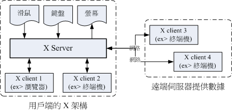
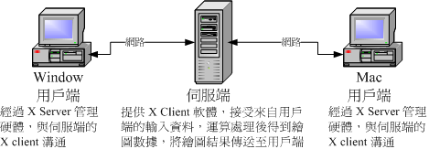
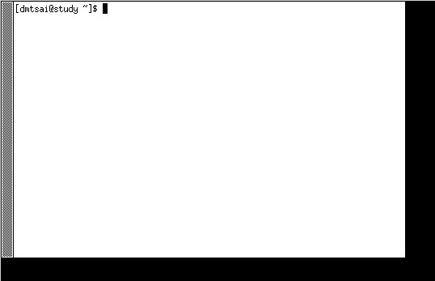
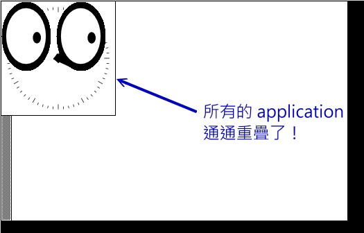
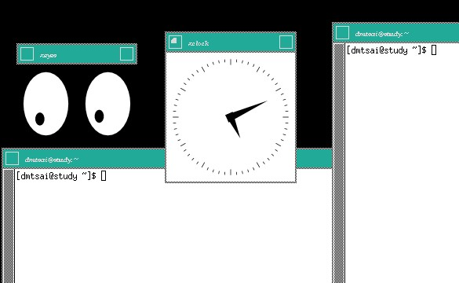
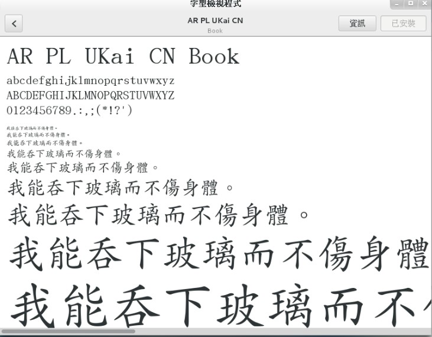
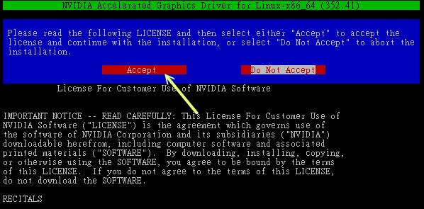
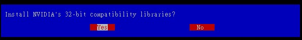
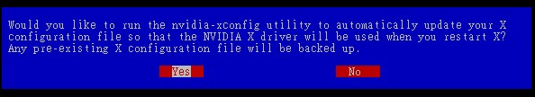

# 第二十三章、X Window 设置介绍

最近更新日期：20//

在 Linux 上头的图形接口我们称之为 X Window System，简称为 X 或 X11 啰！ 为何称之为系统呢？这是因为 X 窗口系统又分为 X server 与 X client ，既然是 Server/Client （主从架构） 这就表示其实 X 窗口系统是可以跨网络且跨平台的！X 窗口系统对于 Linux 来说仅是一个软件， 只是这个软件日趋重要喔！因为 Linux 是否能够在桌面电脑上面流行，与这个 X 窗口系统有关啦！ 好在，目前的 X 窗口系统整合到 Linux 已经非常优秀了，而且也能够具有 3D 加速的功能， 只是，我们还是得要了解一下 X 窗口系统才好，这样如果出问题，我们才有办法处理啊！

# 23.1 什么是 X Window System

## 23.1 什么是 X Window System

Unix Like 操作系统不是只能进行服务器的架设而已，在美编、排版、制图、多媒体应用上也是有其需要的。 这些需求都需要用到图形接口 （Graphical User Interface, GUI） 的操作的， 所以后来才有所谓的 X Window System 这玩意儿。那么为啥图形窗口接口要称为 X 呢？因为就英文字母来看 X 是在 W（indow） 后面，因此，人们就戏称这一版的窗口接口为 X 啰 （有下一版的新窗口之意）！

事实上， X Window System 是个非常大的架构，他还用到网络功能呢！也就是说，其实 X 窗口系统是能够跨网络与跨操作系统平台的！ 而鸟哥这个基础篇是还没有谈到服务器与网络主从式架构，因此 X 在这里并不容易理解的。不过，没关系！ 我们还是谈谈 X 怎么来的，然后再来谈谈这 X 窗口系统的元件有哪些，慢慢来，应该还是能够理解 X 的啦！

### 23.1.1 X Window 的发展简史

X Window 系统最早是由 MIT （Massachusetts Institute of Technology, 麻省理工学院） 在 1984 年发展出来的， 当初 X 就是在 Unix 的 System V 这个操作系统版本上面开发出来的。在开发 X 时，开发者就希望这个窗口接口不要与硬件有强烈的相关性，这是因为如果与硬件的相关性高，那就等于是一个操作系统了， 如此一来的应用性会比较局限。因此 X 在当初就是以应用程序的概念来开发的，而非以操作系统来开发。

由于这个 X 希望能够通过网络进行图形接口的存取，因此发展出许多的 X 通讯协定，这些网络架构非常的有趣， 所以吸引了很多厂商加入研发，因此 X 的功能一直持续在加强！一直到 1987 年更改 X 版本到 X11 ，这一版 X 取得了明显的进步， 后来的窗口接口改良都是架构于此一版本，因此后来 X 窗口也被称为 X11 。这个版本持续在进步当中，到了 1994 年发布了新版的 X11R6 ，后来的架构都是沿用此一释出版本，所以后来的版本定义就变成了类似 1995 年的 X11R6.3 之类的样式。 [[1]](#ps1)

1992 年 XFree86 （[`www.xfree86.org/`](http://www.xfree86.org/)） 计划顺利展开， 该计划持续在维护 X11R6 的功能性，包括对新硬件的支持以及更多新增的功能等等。当初定名为 XFree86 其实是根据“ X + Free software + x86 硬件 ”而来的呢。早期 Linux 所使用的 X Window 的主要核心都是由 XFree86 这个计划所提供的，因此，我们常常将 X 系统与 XFree86 挂上等号的说。

不过由于一些授权的问题导致 XFree86 无法继续提供类似 GPL 的自由软件，后来 Xorg 基金会就接手 X11R6 的维护！ Xorg （[`www.x.org/`](http://www.x.org/)） 利用当初 MIT 发布的类似自由软件的授权， 将 X11R6 拿来进行维护，并且在 2004 年发布了 X11R6.8 版本，更在 2005 年后发表了 X11R7.x 版。 现在我们 CentOS 7.x 使用的 X 就是 Xorg 提供的 X11R7.X 喔！ 而这个 X11R6/X11R7 的版本是自由软件，因此很多组织都利用这个架构去设计他们的图形接口喔！包括 Mac OS X v10.3 也曾利用过这个架构来设计他们的窗口呢！我们的 CentOS 也是利用 Xorg 提供的 X11 啦！

从上面的说明，我们可以知道的是：

*   在 Unix Like 上面的图形使用者接口 （GUI） 被称为 X 或 X11；
*   X11 是一个“软件”而不是一个操作系统；
*   X11 是利用网络架构来进行图形接口的执行与绘制；
*   较著名的 X 版本为 X11R6 这一版，目前大部分的 X 都是这一版演化出来的 （包括 X11R7）；
*   现在大部分的 distribution 使用的 X 都是由 Xorg 基金会所提供的 X11 软件；
*   X11 使用的是 MIT 授权，为类似 GPL 的开放源代码授权方式。

### 23.1.2 主要元件： X Server/X Client/Window Manager/Display Manager

如同前面谈到的，X Window system 是个利用网络架构的图形使用者接口软件，那到底这个架构可以分成多少个元件呢？ 基本上是分成 X Server 与 X Client 两个元件而已喔！其中 X Server 在管理硬件，而 X Client 则是应用程序。 在运行上，X Client 应用程序会将所想要呈现的画面告知 X Server ，最终由 X server 来将结果通过他所管理的硬件绘制出来！ 整体的架构我们大约可以使用如下的图示来作个介绍：[[2]](#ps2)

图 23.1.1、X Window System 的架构

上面的图示非常有趣喔！我们在用户端想要取得来自服务器的图形数据时，我们用户端使用的当然是用户端的硬件设备啊， 所以，X Server 的重点就是在管理用户端的硬件，包括接受键盘/鼠标等设备的输入信息， 并且将图形绘制到屏幕上 （请注意上图的所有元件之间的箭头指示）。但是到底要绘制个啥东西呢？ 绘图总是需要一些数据才能绘制吧？此时 X Client （就是 X 应用程序） 就很重要啦！他主要提供的就是告知 X Server 要绘制啥东西。那照这样的想法来思考，我们是想要取得远端服务器的绘图数据来我们的计算机上面显示嘛！ 所以啰，远端服务器提供的是 X client 软件啊！

下面就让我们来更深入的聊一聊这两个元件吧！

*   X Server：硬件管理、屏幕绘制与提供字体功能：

既然 X Window System 是要显示图形接口，因此理所当然的需要一个元件来管理我主机上面的所有硬件设备才行！ 这个任务就是 X Server 所负责的。而我们在 X 发展简史当中提到的 XFree86 计划及 Xorg 基金会，主要提供的就是这个 X Server 啦！那么 X Server 管理的设备主要有哪些呢？其实与输入/输出有关喔！包括键盘、鼠标、手写板、显示器 （monitor） 、屏幕分辨率与色彩深度、显卡 （包含驱动程序） 与显示的字体等等，都是 X Server 管理的。

咦！显卡、屏幕以及键盘鼠标的设置，不是在开机的时候 Linux 系统以 systemd 的相关设置处理好了吗？ 为何 X Server 还要重新设置啊？这是因为 X Window 在 Linux 里面仅能算是“一套很棒的软件”， 所以 X Window 有自己的配置文件，你必须要针对他的配置文件设置妥当才行。也就是说， Linux 的设置与 X Server 的设置不一定要相同的！因此，你在 CentOS 7 的 multi-user.target 想要玩图形接口时，就得要载入 X Window 需要的驱动程序才行～总之， X Server 的主要功能就是在管理“主机”上面的显示硬件与驱动程序。

既然 X Window System 是以通过网络取得图形接口的一个架构，那么用户端是如何取得服务器端提供的图形画面呢？ 由于服务器与用户端的硬件不可能完全相同，因此我们用户端当然不可能使用到服务器端的硬件显示功能！ 举例来说，你的用户端计算机并没有 3D 影像加速功能，那么你的画面可能呈现出服务器端提供的 3D 加速吗？ 当然不可能吧！所以啰 X Server 的目的在管理用户端的硬件设备！也就是说：“每部用户端主机都需要安装 X Server，而服务器端则是提供 X Client 软件， 以提供用户端绘图所需要的数据数据”。

X Server / X Client 的互动并非仅有 client --> server，两者其实有互动的！从上图 23.1.1 我们也可以发现， X Server 还有一个重要的工作，那就是将来自输入设备 （如键盘、鼠标等） 的动作告知 X Client， 你晓得， X Server 既然是管理这些周边硬件，所以，周边硬件的动作当然是由 X Server 来管理的， 但是 X Server 本身并不知道周边设备这些动作会造成什么显示上的效果， 因此 X Server 会将周边设备的这些动作行为告知 X Client ，让 X Client 去伤脑筋。

*   X Client：负责 X Server 要求的“事件”之处理：

前面提到的 X Server 主要是管理显示接口与在屏幕上绘图，同时将输入设备的行为告知 X Client， 此时 X Client 就会依据这个输入设备的行为来开始处理，最后 X Client 会得到“ 嗯！这个输入设备的行为会产生某个图示”，然后将这个图示的显示数据回传给 X Server ， X server 再根据 X Client 传来的绘图数据将他描图在自己的屏幕上，来得到显示的结果。

也就是说， X Client 最重要的工作就是处理来自 X Server 的动作，将该动作处理成为绘图数据， 再将这些绘图数据传回给 X Server 啰！由于 X Client 的目的在产生绘图的数据，因此我们也称呼 X Client 为 X Application （X 应用程序）。而且，每个 X Client 并不知道其他 X Client 的存在， 意思是说，如果有两个以上的 X client 同时存在时，两者并不知道对方到底传了什么数据给 X Server ， 因此 X Client 的绘图常常会互相重叠而产生困扰喔！

举个例子来说，当我们在 X Window 的画面中，将鼠标向右移动，那他是怎么告知 X Server 与 X Client 的呢？ 首先， X server 会侦测到鼠标的移动，但是他不知道应该怎么绘图啊！此时，他将鼠标的这个动作告知 X Client， X Client 就会去运算，结果得到，嘿嘿！其实要将鼠标指标向右移动几个像素，然后将这个结果告知 X server ， 接下来，您就会看到 X Server 将鼠标指标向右移动啰～

这样做有什么好处啊？最大的好处是， X Client 不需要知道 X Server 的硬件配备与操作系统！因为 X Client 单纯就是在处理绘图的数据而已，本身是不绘图的。所以，在用户端的 X Server 用的是什么硬件？用的是哪套操作系统？服务器端的 X Client 根本不需要知道～相当的先进与优秀～对吧！ ^_^ 整个运行流程可以参考下图：用户端用的是什么操作系统在 Linux 主机端是不在乎的！

图 23.1.2、X Server 用户端的操作系统与 X client 的沟通示意

*   X Window Manager：特殊的 X Client ，负责管理所有的 X client 软件

刚刚前面提到，X Client 的主要工作是将来自 X Server 的数据处理成为绘图数据，再回传给 X server 而已， 所以 X client 本身是不知道他在 X Server 当中的位置、大小以及其他相关信息的。这也是上面我们谈到的， X client 彼此不知道对方在屏幕的哪个位置啊！为了克服这个问题，因此就有 Window Manager （WM, 窗口管理员） 的产生了。 窗口管理员也是 X client ，只是他主要在负责全部 X client 的控管，还包括提供某些特殊的功能，例如：

*   提供许多的控制元素，包括工作列、背景桌面的设置等等；
*   管理虚拟桌面 （virtual desktop）；
*   提供窗口控制参数，这包括窗口的大小、窗口的重叠显示、窗口的移动、窗口的最小化等等。

我们常常听到的 KDE, GNOME, XFCE 还有阳春到爆的 twm 等等，都是一些窗口管理员的专案计划啦！ 这些专案计划中，每种窗口管理员所用以开发的显示发动机都不太相同，所著重的方向也不一样， 因此我们才会说，在 Linux 下面，每套 Window Manager 都是独特存在的，不是换了桌面与显示效果而已， 而是连显示的发动机都不会一样喔！下面是这些常见的窗口管理员全名与链接：

*   GNOME （GNU Network Object Model Environment）：[`www.gnome.org/`](http://www.gnome.org/)
*   KDE （K Desktop Enviroment）：[`kde.org/`](http://kde.org/)
*   twm （Tab Window Manager）：[`xwinman.org/vtwm.php`](http://xwinman.org/vtwm.php)
*   XFCE （XForms Common Environment）：[`www.xfce.org/`](http://www.xfce.org/)

由于 Linux 越来越朝向 Desktop 桌面电脑使用方向走，因此窗口管理员的角色会越来越重要！ 目前我们 CentOS 默认提供的有 GNOME 与 KDE ，这两个窗口管理员上面还有提供非常多的 X client 软件， 包括办公室生产力软件 （Open Office） 以及常用的网络功能 （firefox 浏览器、 Thunderbird 收发信件软件） 等。 现在使用者想要接触 Linux 其实真的越来越简单了，如果不要架设服务器，那么 Linux 桌面的使用与 Windows 系统可以说是一模一样的！不需要学习也能够入门哩！ ^_^

那么你知道 X Server / X client / window manager 的关系了吗？我们举 CentOS 默认的 GNOME 为例好了， 由于我们要在本机端启动 X Window system ，因此，在我们的 CentOS 主机上面必须要有 Xorg 的 X server 核心， 这样才能够提供屏幕的绘制啊～然后为了让窗口管理更方便，于是就加装了 GNOME 这个计划的 window manager ， 然后为了让自己的使用更方便，于是就在 GNOME 上面加上更多的窗口应用软件，包括输入法等等的， 最后就建构出我们的 X Window System 啰～ ^_^！所以你也会知道，X server/X client/Window Manager 是同时存在于我们一部 Linux 主机上头的啦！

*   Display Manager：提供登陆需求

谈完了上述的数据后，我们得要了解一下，那么我如何取得 X Window 的控制？在本机的命令行下面你可以输入 startx 来启动 X 系统，此时由于你已经登陆系统了，因此不需要重新登陆即可取得 X 环境。但如果是 graphical.target 的环境呢？你会发现在 tty1 或其他 tty 的地方有个可以让你使用图形接口登陆 （输入帐号密码） 的咚咚，那个是啥？ 是 X Server/X client 还是什么的？其实那是个 Display Manager 啦！这个 display manager 最大的任务就是提供登陆的环境， 并且载入使用者选择的 Window Manager 与语系等数据喔！

几乎所有的大型窗口管理员专案计划都会提供 display manager 的，在 CentOS 上面我们主要利用的是 GNOME 的 GNOME Display Manager （gdm） 这支程序来提供 tty1 的图形接口登陆喔！至于登陆后取得的窗口管理员， 则可以在 gdm 上面进行选择的！我们在第四章介绍的登陆环境， 那个环境其实就是 gdm 提供的啦！再回去参考看看图示吧！ ^_^！所以说，并非 gdm 只能提供 GNOME 的登陆而已喔！

### 23.1.3 X Window 的启动流程

现在我们知道要启动 X Window System 时，必须要先启动管理硬件与绘图的 X Server ，然后才载入 X Client 。 基本上，目前都是使用 Window Manager 来管理窗口接口风格的。那么如何取得这样的窗口系统呢？ 你可以通过登陆本机的命令行后，输入 startx 来启动 X 窗口；也能够通过 display manager （如果有启动 graphical.target） 提供的登陆画面，输入你的帐号密码来登陆与取得 X 窗口的！

问题是，你的 X server 配置文件为何？如何修改分辨率与显示器？你能不能自己设置默认启动的窗口管理员？ 如何设置默认的使用者环境 （与 X client 有关） 等等的，这些数据都需要通过了解 X 的启动流程才能得知！ 所以，下面我们就来谈谈如何启动 X 的流程吧！ ^_^

*   在命令行启动 X ：通过 startx 指令

我们都知道 Linux 是个多用户多任务的操作系统，所以啦，X 窗口也是可以根据不同的使用者而有不同的设置！ 这也就是说，每个用户启动 X 时， X server 的分辨率、启动 X client 的相关软件及 Window Manager 的选择可能都不一样！ 但是，如果你是首次登陆 X 呢？也就是说，你自己还没有创建自己的专属 X 画面时，系统又是从哪里给你这个 X 默认画面呢？而如果你已经设置好相关的信息，这些信息又是存放于何处呢？

事实上，当你在纯命令行且并没有启动 X 窗口的情况下来输入 startx 时，这个 startx 的作用就是在帮你设置好上头提到的这些动作啰！ startx 其实是一个 shell script ，他是一个比较友好的程序，会主动的帮忙使用者创建起他们的 X 所需要引用的配置文件而已。你可以自行研究一下 startx 这个 script 的内容，鸟哥在这里仅就 startx 的作用作个介绍。

startx 最重要的任务就是找出使用者或者是系统默认的 X server 与 X client 的配置文件，而使用者也能够使用 startx 外接参数来取代配置文件的内容。这个意思是说：startx 可以直接启动，也能够外接参数，例如下面格式的启动方式：

```
[root@study ~]# startx [X client 参数] -- [X server 参数]

# 范例：以色彩深度为 16 bit 启动 X
[root@study ~]# startx  --  -depth 16 
```

startx 后面接的参数以两个减号“--”隔开，前面的是 X Client 的设置，后面的是 X Server 的设置。 上面的范例是让 X server 以色彩深度 16 bit 色 （亦即每一像素占用 16 bit ，也就是 65536 色） 显示， 因为色彩深度是与 X Server 有关的，所以参数当然是写在 -- 后面啰，于是就成了上面的模样！

你会发现，鸟哥上面谈到的 startx 都是提到如何找出 X server / X client 的设置值而已！ 没错，事实上启动 X 的是 xinit 这支程序， startx 仅是在帮忙找出设置值而已！那么 startx 找到的设置值可用顺序为何呢？基本上是这样的：

*   X server 的参数方面：

    1.  使用 startx 后面接的参数；
    2.  若无参数，则找寻使用者主文件夹的文件，亦即 ~/.xserverrc
    3.  若无上述两者，则以 /etc/X11/xinit/xserverrc
    4.  若无上述三者，则单纯执行 /usr/bin/X （此即 X server 可执行文件）
*   X client 的参数方面：

    1.  使用 startx 后面接的参数；
    2.  若无参数，则找寻使用者主文件夹的文件，亦即 ~/.xinitrc
    3.  若无上述两者，则以 /etc/X11/xinit/xinitrc
    4.  若无上述三者，则单纯执行 xterm （此为 X 下面的终端机软件）

根据上述的流程找到启动 X 时所需要的 X server / X client 的参数，接下来 startx 会去调用 xinit 这支程序来启动我们所需要的 X 窗口系统整体喔！接下来当然就是要谈谈 xinit 啰～

*   由 startx 调用执行的 xinit

事实上，当 startx 找到需要的设置值后，就调用 xinit 实际启动 X 的。他的语法是：

```
[root@study ~]# xinit [client option] -- [server or display option] 
```

那个 client option 与 server option 如何下达呢？其实那两个咚咚就是由刚刚 startx 去找出来的啦！ 在我们通过 startx 找到适当的 xinitrc 与 xserverrc 后，就交给 xinit 来执行。 在默认的情况下 （使用者尚未有 ~/.xinitrc 等文件时），你输入 startx ， 就等于进行 xinit /etc/X11/xinit/xinitrc -- /etc/X11/xinit/xserverrc 这个指令一般！但由于 xserverrc 也不存在，参考上一小节的参数搜寻顺序， 因此实际上的指令是：xinit /etc/X11/xinit/xinitrc -- /usr/bin/X，这样瞭了吗？

那为什么不要直接执行 xinit 而是使用 startx 来调用 xinit 呢？这是因为我们必须要取得一些参数嘛！ startx 可以帮我们快速的找到这些参数而不必手动输入的。因为单纯只是执行 xinit 的时候，系统的默认 X Client 与 X Server 的内容是这样的：[[3]](#ps3)

```
xinit xterm  -geometry  +1+1  -n  login  -display  :0 --  X  :0 
```

在 X client 方面：那个 xterm 是 X 窗口下面的虚拟终端机，后面接的参数则是这个终端机的位置与登陆与否。 最后面会接一个“ -display :0 ”表示这个虚拟终端机是启动在“第 :0 号的 X 显示接口”的意思。至于 X Server 方面， 而我们启动的 X server 程序就是 X 啦！其实 X 就是 Xorg 的链接文件，亦即是 X Server 的主程序啰！ 所以我们启动 X 还挺简单的～直接执行 X 而已，同时还指定 X 启动在第 :0 个 X 显示接口。 如果单纯以上面的内容来启动你的 X 系统时，你就会发现 tty2 以后的终端机有画面了！只是.....很丑～因为我们还没有启动 window manager 啊！

从上面的说明我们可以知道， xinit 主要在启动 X server 与载入 X client ，但这个 xinit 所需要的参数则是由 startx 去帮忙找寻的。因此，最重要的当然就是 startx 找到的那些参数啦！ 所以呢，重点当然就是 /etc/X11/xinit/ 目录下的 xinitrc 与 xserverrc 这两个文件的内容是啥啰～ 虽然 xserverrc 默认是不存在的。下面我们就分别来谈一谈这两个文件的主要内容与启动的方式～

*   启动 X server 的文件： xserverrc

X 窗口最先需要启动的就是 X server 啊，那 X server 启动的脚本与参数是通过 /etc/X11/xinit/ 里面的 xserverrc 。不过我们的 CentOS 7.x 根本就没有 xserverrc 这个文件啊！ 那使用者主文件夹目前也没有 ~/.xserverrc ，这个时候系统会怎么做呢？其实就是执行 /usr/bin/X 这个指令啊！ 这个指令也是系统最原始的 X server 可执行文件啰。

在启动 X Server 时，Xorg 会去读取 /etc/X11/xorg.conf 这个配置文件。针对这个配置文件的内容， 我们会在下个小节介绍。如果一切顺利，那么 X 就会顺利的在 tty2 以后终端环境中启动了 X 。 单纯的 X 启动时，你只会看到画面一片漆黑，然后中心有个鼠标的光标而已～

由前一小节的说明中，你可以发现到其实 X 启动的时候还可以指定启动的接口喔！那就是 :0 这个参数，这是啥？ 事实上我们的 Linux 可以“同时启动多个 X”喔！第一个 X 的画面会在 :0 亦即是 tty2 ，第二个 X 则是 :1 亦即是 tty3 。 后续还可以有其他的 X 存在的。因此，上一小节我们也有发现， xterm 在载入时，也必须要使用 -display 来说明， 这个 X 应用程序是需要在哪个 X 载入的才行呢！其中比较有趣的是， X server 未注明载入的接口时，默认是使用 :0 ～ 但是 X client 未注明时，则无法执行喔！


**Tips** CentOS 7 的 tty 非常有趣！如果你在分析 systemd 的章节中有仔细看的话， 会发现到其实 tty 是有用到才会启动的，这与之前 CentOS 6 以前的版本默认启用 6 个 tty 给你是不同的。因此，如果你只有用到 tty1 的话， 那么启动 X 就会默认丢到 tty2 ，而 X :1 就会丢到 tty3 这样～以此类推喔～

启动了 X server 后，接下来就是载入 X client 到这个 X server 上面啦！

*   启动 X Client 的文件： xinitrc

假设你的主文件夹并没有 ~/.xinitrc ，则此时 X Client 会以 /etc/X11/xinit/xinitrc 来作为启动 X Client 的默认脚本。xinitrc 这个文件会将很多其他的文件参数引进来， 包括 /etc/X11/xinit/xinitrc-common 与 /etc/X11/xinit/Xclients 还有 /etc/sysconfig/desktop 。你可以参考 xinitrc 后去搜寻各个文件来了解彼此的关系。

不过分析到最后，其实最终就是载入 KDE 或者是 GNOME 而已。你也可以发现最终在 XClient 文件当中会有两个指令的搜寻， 包括 startkde 与 gnome-session 这两个，这也是 CentOS 默认会提供的两个主要的 Window Manager 啰。 而你也可以通过修改 /etc/sysconfig/desktop 内的 DESKTOP=GNOME 或 DESKTOP=KDE 来决定默认使用哪个窗口管理员的。 如果你并没有安装这两个大家伙，那么 X 就会去使用阳春的 twm 这个窗口管理员来管理你的环境啰。


**Tips** 不论怎么说，鸟哥还是希望大家可以通过解析 startx 这个 script 的内容去找到每个文件， 再根据分析每个文件来找到您 distributions 上面的 X 相关文件～ 毕竟每个版本的 Linux 还是有所差异的～

另外，如果有特殊需求，你当然可以自订 X client 的参数！这就得要修改你主文件夹下的 ~/.xinitrc 这个文件啰。 不过要注意的是，如果你的 .xinitrc 配置文件里面有启动的 x client 很多的时候，千万注意将除了最后一个 window manager 或 X Client 之外，都放到背景里面去执行啊！举例来说，像下面这样：

```
 xclock -geometry 100x100-5+5 &
       xterm -geometry 80x50-50+150 &
       exec /usr/bin/twm 
```

意思就是说，我启动了 X ，并且同时启动 xclock / xterm / twm 这三个 X clients 喔！ 如此一来，你的 X 就有这三个咚咚可以使用了！如果忘记加上 & 的符号，那就..... 会让系统等待啊，而无法一次就登陆 X 呢！

*   X 启动的端口

好了，根据上面的说明，我们知道要在命令行下面启动 X 时，直接使用 startx 来找到 X server 与 X client 的参数或配置文件， 然后再调用 xinit 来启动 X 窗口系统。xinit 先载入 X server 到默认的 :0 这个显示接口，然后再载入 X client 到这个 X 显示接口上。而 X client 通常就是 GNOME 或 KDE ，这两个设置也能够在 /etc/sysconfig/desktop 里面作好设置。最后我们想要了解的是，既然 X 是可以跨网络的，那 X 启动的端口是几号？

其实，CentOS 由于考虑 X 窗口是在本机上面运行，因此将端口改为插槽档 （socket） 了，因此你无法观察到 X 启动的端口的。事实上， X server 应该是要启动一个 port 6000 来与 X client 进行沟通的！ 由于系统上面也可能有多个 X 存在，因此我们就会有 port 6001, port 6002... 等等。这也就是说：（假设为 multi-user.target 模式， 且用户仅曾经切换到 tty1 而已）

| X 窗口系统 | 显示接口号码 | 默认终端机 | 网络监听端口 |
| --- | --- | --- | --- |
| 第一个 X | hostname:0 | tty2 | port 6000 |
| 第二个 X | hostname:1 | tty3 | port 6001 |

在 X Window System 的环境下，我们称 port 6000 为第 0 个显示接口，亦即为 hostname:0 ， 那个主机名称通常可以不写，所以就成了 :0 即可。在默认的情况下，第一个启动的 X （不论是启动在第几个 port number） 是在 tty2 ，亦即按下 [ctrl]+[Alt]+[F2] 那个画面。 而起动的第二个 X （注意到了吧！可以有多个 X 同时启动在您的系统上呢） 则默认在 tty3 亦即 [ctrl]+[Alt]+[F3] 那个画面呢！很神奇吧！ ^_^

如前所述，因为主机上的 X 可能有多个同时存在，因此，当我们在启动 X Server / Client 时， 应该都要注明该 X Server / Client 主要是提供或接受来自哪个 display 的 port number 才行。

### 23.1.4 X 启动流程测试

好了，我们可以针对 X Server 与 X client 的架构来做个简单的测试喔！ 这里鸟哥假设你的 tty1 是 multi-user.target 的，而且你也曾经在 tty2 测试过相关的指令，所以你的 X :1 将会启用在 tty3 喔！ 而且，下面的指令都是在 tty1 的地方执行的，至于下面的画面则是在 tty3 的地方展现。 因此，请自行切换 tty1 下达指令与 tty3 查阅结果啰！

```
1\. 先来启动第一个 X 在 :1 画面中：
[dmtsai@study ~]$ X :1 & 
```

图 23.1.3、单纯启动 X server 的情况

上述的 X 是大写，那个 :1 是写在一起的，至于 & 则是放到背景去执行。此时系统会主动的跳到第二个图形接口终端机，亦即 tty8 上喔！所以如果一切顺利的话，你应该可以看到一个 X 的鼠标光标可以让你移动了（如上图所示）。 该画面就是 X Server 启动的画面啰！丑丑的，而且没有什么 client 可以用啊！ 接下来，请按下 [ctrl]+[alt]+[F1] 回到刚刚下达指令的终端机： （若没有 xterm 请自行 yum 安装它！）

```
2\. 输入数个可以在 X 当中执行的虚拟终端机
[dmtsai@study ~]$ xterm -display :1  &
[dmtsai@study ~]$ xterm -display :1  & 
```

图 23.1.4、在 X 上面启动 xterm 终端机显示的结果

那个 xterm 是必须要在 X 下面才能够执行的终端机接口。加入的参数 -display 则是指出这个 xterm 要在那个 display 使用的。这两个指令请不要一次下完！先执行一次，然后按下 [ctrl]+[alt]+[F3] 去到 X 画面中，你会发现多了一个终端机啰～ 不过，可惜的是，你无法看到终端机的标题、也无法移动终端机，当然也无法调整终端机的大小啊！我们回到刚刚的 tty1 然后再次下达 xterm 指令，理论上应该多一个终端机，去到 tty3 查阅一下。唉～没有多出一个终端机啊？ 这是因为两个终端机重叠了～我们又无法移动终端机，所以只看到一个。 接下来，请再次回到 tty1 去下达指令吧！（可能需要 yum install xorg-x11-apps 喔！）

```
3\. 在输入不同的 X client 观察观察，分别去到 tty3 观察喔！
[dmtsai@study ~]$ xclock -display :1  &
[dmtsai@study ~]$ xeyes -display :1  & 
```

图 23.1.5、分别启动 xclock 时钟与 xeyes 眼睛的结果

跟前面一样的，我们又多执行了两个 X client ，其中 xclock 会显示时钟，而 xeyes 则是会出现一双大眼睛来盯着光标！ 你可以移动一下光标就可以发现眼睛的焦聚会跑啊 ^_^！不过，目前的四个 X client 通通不能够移动与放大缩小！ 如此一来，你怎么在 xterm 下面下达指令啊？当然就很困扰～所以让我们来载入最阳春的窗口管理员吧！

```
4\. 输入可以管理的 window manager，我们这边先以 root 来安装 twm 喔！
[root@study ~]# yum install http://ftp.ksu.edu.tw/FTP/CentOS/6/os/x86_64/\
&gt; Packages/xorg-x11-twm-1.0.3-5.1.el6.x86_64.rpm
# 真要命！CentOS 7 说 twm 已经没有在维护，所以没有提供这玩意儿了！鸟哥只好拿旧版的 twm 来安装！
# 请您自行到相关的网站上找寻这个 twm 啰！因为版本可能会不一样！
[root@study ~]# yum install xorg-x11-fonts-{100dpi,75dpi,Type1}

5\. 接下来就可以开始用 dmtsai 的身份来玩一下这玩意儿了！
[dmtsai@study ~]$ twm -display :1  & 
```

图 23.1.6、窗口管理员 twm 的功能显示

回到 tty1 后，用最简单的 twm 这个窗口管理员来管理我们的 X 吧！输入之后，去到 tty3 看看，用鼠标移动一下终端机看看？可以移动了吧？也可以缩小放大窗口啰～同时也出现了标题提示啰～也看到两个终端机啦！ 现在终于知道窗口管理员的重要性了吧？ ^_^！在黑屏幕地方按下鼠标右键，就会出现类似上面画面最右边的菜单， 你就可以进行额外的管理啰～玩玩看先！

```
6\. 将所有刚刚创建的 X 相关工作全部杀掉！
[dmtsai@study ~]# kill %6 %5 %4 %3 %2 %1 
```

很有趣的一个小实验吧～通过这个实验，你应该会对 X server 与 Window manager 及 tty3 以后的终端接口使用方式有比较清楚的了解～加油！

### 23.1.5 我是否需要启用 X Window System

谈了这么多 X 窗口系统方面的信息后，再来聊聊，那么你的 Linux 主机是否需要默认就启动 X 窗口呢？ 一般来说，如果你的 Linux 主机定位为网络服务器的话，那么由于 Linux 里面的主要服务的配置文件都是纯文本的格式文件， 相当的容易设置的，所以啊，根本就是不需要 X Window 存在呢！因为 X Window 仅是 Linux 系统内的一个软件而已啊！

但是万一你的 Linux 主机是用来作为你的桌上计算机用的，那么 X Window 对你而言，就是相当重要的一个咚咚了！因为我们日常使用的办公室软件，都需要使用到 X Window 图形的功能呢！此外，以鸟哥的例子来说，俺之前接触到的数值分析模式，需要利用图形处理软件来将数据读取出来， 所以在那部 Linux 主机上面，我一定需要 X Window 的。

由于目前的主机系统配备已经很不错，除非你使用的是单版计算机，否则桌面电脑、笔记本电脑的系统配备要拿来跑 X window 大概都不是问题！ 所以，是否默认要启用你的 X window 系统，完全掌握在你的服务器用途考虑上啰！！

# 23.2 X Server 配置文件解析与设置

## 23.2 X Server 配置文件解析与设置

从前面的说明来看，我们知道一个 X 窗口系统能不能成功启动，其实与 X Server 有很大的关系的。因为 X Server 负责的是整个画面的描绘，所以没有成功启动 X Server 的话，即使有启动 X Client 也无法将图样显示出来啊。所以，下面我们就针对 X Server 的配置文件来做个简单的说明，好让大家可以成功的启动 X Window System 啊。

基本上， X Server 管理的是显卡、屏幕分辨率、鼠标按键对应等等，尤其是显卡芯片的认识，真是重要啊。 此外，还有显示的字体也是 X Server 管理的一环。基本上，X server 的配置文件都是默认放置在 /etc/X11 目录下，而相关的显示模块或上面提到的总总模块，则主要放置在 /usr/lib64/xorg/modules 下面。比较重要的是字体文件与芯片组，她们主要放置在:

*   提供的屏幕字体: /usr/share/X11/fonts/
*   显卡的芯片组: /usr/lib64/xorg/modules/drivers/

在 CentOS 下面，这些都要通过一个统一的配置文件来规范，那就是 X server 的配置文件啦。这个配置文件的文件名就是 /etc/X11/xorg.conf 喔！

### 23.2.1 解析 xorg.conf 设置

如同前几个小节谈到的，在 Xorg 基金会里面的 X11 版本为 X11R7.N ，那如果你想要知道到底你用的 X Server 版本是第几版，可以使用 X 指令来检查喔！（你必须以 root 的身分执行下列指令）

```
[root@study ~]# X -version
X.Org X Server 1.15.0
Release Date: 2013-12-27
X Protocol Version 11, Revision 0
Build Operating System:  2.6.32-220.17.1.el6.x86_64
Current Operating System: Linux study.centos.vbird 3.10.0-229.el7.x86_64 #1 SMP Fri Mar 
  6 11:36:42 UTC 2015 x86_64
Kernel command line: BOOT_IMAGE=/vmlinuz-3.10.0-229.el7.x86_64 root=/dev/mapper/centos-
  root ro rd.lvm.lv=centos/root rd.lvm.lv=centos/swap crashkernel=auto rhgb quiet
Build Date: 10 April 2015  11:44:42AM
Build ID: xorg-x11-server 1.15.0-33.el7_1
Current version of pixman: 0.32.4
        Before reporting problems, check http://wiki.x.org
        to make sure that you have the latest version. 
```

由上面的几个关键字我们可以知道，目前鸟哥的这部测试机使用的 X server 是 Xorg 计划所提供的 X11 版， 不过看起来 Xorg 已经将所谓的 X11R7 那个 R7 的版次移除，使用的是 Xorg 自己的版次了！所以是 Xorg 1.15.0 版本！ 此外，若有问题则可以到 [`wiki.x.org`](http://wiki.x.org) 去查询～因为是 Xorg 这个 X server ，因此我们的配置文件文件名为 /etc/X11/xorg.conf 这一个哩。所以，理解这个文件的内容对于 X server 的功能来说，是很重要的。

比较需要留意的是，从 CentOS 6 以后 （当然包含 CentOS 7），X server 在每次启动的时候都会自行侦测系统上面的显示芯片、屏幕类型等等， 然后自行搭配最优化的驱动程序载入。因此，这个 /etc/X11/xorg.conf 已经不再被需要了。不过，如果你不喜欢 X 系统自行侦测的设置值， 那也可以自行创建 xorg.conf 就是了。

此外，如果你只想要加入或者是修改部份的设置，并不是每个元件都要自行设置的话，那么可以在 /etc/X11/xorg.conf.d/ 这个目录下创建文件名为 .conf 的文件， 将你需要的额外项目加进去即可喔！那就不会每个设置都以你的 xorg.conf 为主了！了解乎？


**Tips** 那我怎么知道系统用的是哪一个设置呢？可以参考 /var/log/Xorg.0.log 的内容，该文件前几行会告诉你使用的设置文件是来自于哪里的喔！

注意一下，在修改这个文件之前，务必将这个文件给它备份下来，免的改错了什么东西导致连 X server 都无法启动的问题啊。这个文件的内容是分成数个段落的，每个段落以 Section 开始，以 EndSection 结束， 里面含有该 Section （段落） 的相关设置值，例如:

```
Section  "section name"
…… &lt;== 与这个 section name 有关的设置项目
……
EndSection 
```

至于常见的 section name 主要有:

1.  Module: 被载入到 X Server 当中的模块 （某些功能的驱动程序）；
2.  InputDevice: 包括输入的 1\. 键盘的格式 2\. 鼠标的格式，以及其他相关输入设备；
3.  Files: 设置字体所在的目录位置等；
4.  Monitor: 监视器的格式， 主要是设置水平、垂直的更新频率，与硬件有关；
5.  Device: 这个重要，就是显卡芯片组的相关设置了；
6.  Screen: 这个是在屏幕上显示的相关分辨率与色彩深度的设置项目，与显示的行为有关；
7.  ServerLayout: 上述的每个项目都可以重复设置，这里则是此一 X server 要取用的哪个项目值的设置啰。

前面说了，xorg.conf 这个文件已经不存在，那我们怎么学习呢？没关系，Xorg 有提供一个简单的方式可以让我们来重建这个 xorg.conf 文件！ 同时，这可能也是 X 自行侦测 GPU 所产生的最优化设置喔！怎么处理呢？假设你是在 multi-user.target 的环境下，那就可以这样作来产生 xorg.conf 喔！

```
[root@study ~]# Xorg -configure
.....（前面省略）.....
Markers: （--） probed, （**） from config file, （==） default setting,
        （++） from command line, （!!） notice, （II） informational,
        （WW） warning, （EE） error, （NI） not implemented, （??） unknown.
（==） Log file: "/var/log/Xorg.0.log", Time: Wed Sep 16 10:13:57 2015
List of video drivers:   # 这里在说明目前这个系统上面有的显卡芯片组的驱动程序有哪些的意思
        qxl
        vmware
        v4l
        ati
        radeon
        intel
        nouveau
        dummy
        modesetting
        fbdev
        vesa
（++） Using config file: "/root/xorg.conf.new"        # 使用的配置文件
（==） Using config directory: "/etc/X11/xorg.conf.d"  # 额外设置项目的位置
（==） Using system config directory "/usr/share/X11/xorg.conf.d"
（II） [KMS] Kernel modesetting enabled.

.....（中间省略）.....

Your xorg.conf file is /root/xorg.conf.new           # 最终新的文件出现了！

To test the server, run 'X -config /root/xorg.conf.new' # 测试手段！ 
```

这样就在你的 root 主文件夹产生一个新的 xorg.conf.new 啰！好了，直接来看看这个文件的内容吧！这个文件默认的情况是取消很多设置值的， 所以你的配置文件可能不会看到这么多的设置项目。不要紧的，后续的章节会交代如何设置这些项目的喔！

```
[root@study ~]# vim xorg.conf.new
Section "ServerLayout"                             # 目前 X 决定使用的设置项目
        Identifier     "X.org Configured"
        Screen      0  "Screen0" 0 0               # 使用的屏幕为 Screen0 这一个 （后面会解释）
        InputDevice    "Mouse0" "CorePointer"      # 使用的鼠标设置为 Mouse0
        InputDevice    "Keyboard0" "CoreKeyboard"  # 使用的键盘设置为 Keyboard0
EndSection
# 系统可能有多组的设置值，包括多种不同的键盘、鼠标、显示芯片等等，而最终 X 使用的设置，
# 就是在这个 ServerLayout 项目中来处理的！因此，你还得要去下面找出 Screen0 是啥

Section "Files"
        ModulePath   "/usr/lib64/xorg/modules"
        FontPath     "catalogue:/etc/X11/fontpath.d"
        FontPath     "built-ins"
EndSection
# 我们的 X Server 很重要的一点就是必须要提供字体，这个 Files 的项目就是在设置字体，
# 当然啦，你的主机必须要有字体文件才行。一般字体文件在：/usr/share/X11/fonts/ 目录中。
# 但是 Xorg 会去读取的则是在 /etc/X11/fontpath.d 目录下的设置喔！

Section "Module"
        Load  "glx"
EndSection
# 上面这些模块是 X Server 启动时，希望能够额外获得的相关支持的模块。
# 关于更多模块可以搜寻一下 /usr/lib64/xorg/modules/extensions/ 这个目录

Section "InputDevice"
        Identifier  "Keyboard0"
        Driver      "kbd"
EndSection
# 就是键盘，在 ServerLayout 项目中有出现这个 Keyboard0 吧！主要是设置驱动程序！

Section "InputDevice"
        Identifier  "Mouse0"
        Driver      "mouse"
        Option      "Protocol" "auto"
        Option      "Device" "/dev/input/mice"
        Option      "ZAxisMapping" "4 5 6 7"   # 支持磙轮功能！
EndSection
# 这个则主要在设置鼠标功能，重点在那个 Protocol 项目，
# 那个是可以指定鼠标接口的设置值，我这里使用的是自动侦测！不论是 USB/PS2。

Section "Monitor"
        Identifier   "Monitor0"
        VendorName   "Monitor Vendor"
        ModelName    "Monitor Model"
EndSection
# 屏幕监视器的设置仅有一个地方要注意，那就是垂直与水平的更新频率，常见设置如下：
#       HorizSync    30.0 - 80.0
#       VertRefresh  50.0 - 100.0
# 在上面的 HorizSync 与 VerRefresh 的设置上，要注意，不要设置太高，
# 这个玩意儿与实际的监视器功能有关，请查询你的监视器手册说明来设置吧！
# 传统 CRT 屏幕设置太高的话，据说会让 monitor 烧毁呢，要很注意啊。

Section "Device"     # 显卡芯片 （GPU） 的驱动程序！很重要的设置！
        Identifier  "Card0"
        Driver      "qxl"        # 实际使用的显卡驱动程序！
        BusID       "PCI:0:2:0"
EndSection
# 这地方重要了，这就是显卡的芯片模块载入的设置区域。由于鸟哥使用 Linux KVM
# 仿真器仿真这个测试机，因此这个地方显示的驱动程序为 qxl 模块。
# 更多的显示芯片模块可以参考 /usr/lib64/xorg/modules/drivers/

Section "Screen"                # 与显示的画面有关，分辨率与色彩深度
        Identifier "Screen0"    # 就是 ServerLayout 里面用到的那个屏幕设置
        Device     "Card0"      # 使用哪一个显卡的意思！
        Monitor    "Monitor0"   # 使用哪一个屏幕的意思！
        SubSection "Display"    # 此阶段的附属设置项目
                Viewport   0 0
                Depth     1     # 就是色彩深度的意思！
        EndSubSection
        SubSection "Display"
                Viewport   0 0
                Depth     16
        EndSubSection
        SubSection "Display"
                Viewport   0 0
                Depth     24
        EndSubSection
EndSection
# Monitor 与实际的显示器有关，而 Screen 则是与显示的画面分辨率、色彩深度有关。
# 我们可以设置多个分辨率，实际应用时可以让使用者自行选择想要的分辨率来呈现，设置如下：
#        Modes    "1024x768" "800x600" "640x480" &lt;==分辨率
# 上述的 Modes 是在 "Display" 下面的子设置。
# 不过，为了避免困扰，鸟哥通常只指定一到两个分辨率而已。 
```

上面设置完毕之后，就等于将整个 X Server 设置妥当了，很简单吧。如果你想要更新其他的例如显示芯片的模块的话，就得要去硬件开发商的网站下载原始文件来编译才行。 设置完毕之后，你就可以启动 X Server 试看看啰。然后，请将 xorg.conf.new 更名成类似 00-vbird.conf 之类的文件名， 再将该文件移动到 /etc/X11/xorg.conf.d/ 里面去，这样就 OK 了！

```
# 测试 X server 的配置文件是否正常：
[root@study ~]# startx    &lt;==直接在 multi-user.target 启动 X 看看
[root@study ~]# Xorg :1   &lt;==在 tty3 单独启动 X server 看看 
```

当然，你也可以利用 systemctl isolate graphical.target 这个指令直接切换到图形接口的登陆来试看看啰。


**Tips** 经由讨论区网友的说明，如果你发现明明有捉到显卡驱动程序却老是无法顺利启动 X 的话，可以尝试去官网取得驱动程序来安装， 也能够将“Device”阶段的“Driver”修改成默认的“Driver "vesa"”，使用该驱动程序来暂时启动 X 内的显卡喔！

### 23.2.2 字体管理

我们 Xorg 所使用的字体大部分都是放置于下面的目录中：

*   /usr/share/X11/fonts/
*   /usr/share/fonts/

不过 Xorg 默认会载入的字体则是记录于 /etc/X11/fontpath.d/ 目录中，使用链接文件的模式来进行链接的动作而已。 你应该还记得 xorg.conf 里面有个“ Flies ”的设置项目吧？该项目里面就有指定到“ FontPath "catalogue:/etc/X11/fontpath.d" ” 对吧！也就是说，我们默认的 Xorg 使用的字体就是取自于 /etc/X11/fontpath.d 啰！

鸟哥查了一下 CentOS 7 针对中文字体 （chinese） 来说，有楷书与明体，明体默认安装了，不过楷书却没有安装耶～ 那我们能不能安装了楷书之后，将楷书也列为默认的字体之一呢？来瞧一瞧我们怎么作的好了：

```
# 1\. 检查中文字体，并且安装中文字体与检验有没有放置到 fontpath.d 目录中！
[root@study ~]# ll -d /usr/share/fonts/cjk*
drwxr-xr-x. 2 root root 22 May  4 17:54 /usr/share/fonts/cjkuni-uming

[root@study ~]# yum install cjkuni-ukai-fonts
[root@study ~]# ll -d /usr/share/fonts/cjk*
drwxr-xr-x. 2 root root 21 Sep 16 11:48 /usr/share/fonts/cjkuni-ukai  # 这就是楷书！
drwxr-xr-x. 2 root root 22 May  4 17:54 /usr/share/fonts/cjkuni-uming

[root@study ~]# ll /etc/X11/fontpath.d/ lrwxrwxrwx. 1 root root 29 Sep 16 11:48 cjkuni-ukai-fonts -&gt; /usr/share/fonts/cjkuni-ukai/
lrwxrwxrwx. 1 root root 30 May  4 17:54 cjkuni-uming-fonts -&gt; /usr/share/fonts/cjkuni-uming/
lrwxrwxrwx. 1 root root 36 May  4 17:52 default-ghostscript -&gt; /usr/share/fonts/default/ghostscript
lrwxrwxrwx. 1 root root 30 May  4 17:52 fonts-default -&gt; /usr/share/fonts/default/Type1
lrwxrwxrwx. 1 root root 27 May  4 17:51 liberation-fonts -&gt; /usr/share/fonts/liberation
lrwxrwxrwx. 1 root root 27 Sep 15 17:10 xorg-x11-fonts-100dpi:unscaled:pri=30 -&gt; /usr/share/X11/fonts/100dpi
lrwxrwxrwx. 1 root root 26 Sep 15 17:10 xorg-x11-fonts-75dpi:unscaled:pri=20 -&gt; /usr/share/X11/fonts/75dpi
lrwxrwxrwx. 1 root root 26 May  4 17:52 xorg-x11-fonts-Type1 -&gt; /usr/share/X11/fonts/Type1
# 竟然会自动的将该字体加入到 fontpath.d 当中！太好了！ ^_^

# 2\. 创建该字体的字体高速缓存数据，并检查是否真的取用了？
[root@study ~]# fc-cache -v &#124; grep ukai
/usr/share/fonts/cjkuni-ukai: skipping, existing cache is valid: 4 fonts, 0 dirs

[root@study ~]# fc-list &#124; grep ukai
/usr/share/fonts/cjkuni-ukai/ukai.ttc: AR PL UKai TW:style=Book
/usr/share/fonts/cjkuni-ukai/ukai.ttc: AR PL UKai HK:style=Book
/usr/share/fonts/cjkuni-ukai/ukai.ttc: AR PL UKai CN:style=Book
/usr/share/fonts/cjkuni-ukai/ukai.ttc: AR PL UKai TW MBE:style=Book

# 3\. 重新启动 Xorg，或者是强制重新进入 graphical.target
[root@study ~]# systemctl isolate multi-user.target; systemctl isolate graphical.target 
```

如果上述的动作没有问题的话，现在你可以在图形界面下面，通过“应用程序” --> “公用程序” --> “字体检视程序”当中找到一个名为 “AR PL UKai CN, Book”字样的字体，点下去就会看到如下的图示，那就代表该字体已经可以被使用了。不过某些程序可能还得要额外的加工就是了～[[4]](#ps4)

图 23.2.1、安装楷书字体的结果

鸟哥比较好奇的是，这个字体的开发者怎么这么有趣！列出来的示意字体竟然是吃了玻璃会身体头好壮壮～这...会不会教坏小孩啊？呵呵呵呵～

*   让窗口管理员可以使用额外的字体

如果想要使用额外的字体的话，你可以自行取得某些字体来处理的。鸟哥这边从 Windows 微软正黑体、Times new Romans 两种字体加上粗、斜体等共六个文件来处理字体的安装～ 这边得注明一下是纯粹的测试，测试完毕后文件就给它拿掉了，并没有持续使用喔！并没有想要违法的意思啦～大家参考看看就好了。 那就来看看如何增加字体吧！（假设上述的字体文件是放置在 /root/font 中）

```
# 1\. 将字体文件放置到系统设置目录，亦即下面的目录中：
[root@study ~]# cd /usr/share/fonts/
[root@study ~]# mkdir windows
[root@study ~]# cp /root/font/*.ttf /usr/share/fonts/windows/

# 2\. 使用 fc-cache 将上述的文件加入字体的支持中：
[root@study ~]# fc-cache -f -v
....（前面省略）....
/usr/share/fonts/windows: caching, new cache contents: 6 fonts, 0 dirs
....（后面省略）....
# -v 仅是列出目前的字体数据， -f 则是强制重新创建字体高速缓存！

# 3\. 通过 fc-list 列出已经被使用的文件看看：
[root@study ~]# fc-list : file &#124; grep window  &lt;==找出被高速缓存住的文件名
/usr/share/fonts/windows/timesbi.ttf:
/usr/share/fonts/windows/timesi.ttf:
/usr/share/fonts/windows/msjh.ttf:
/usr/share/fonts/windows/times.ttf:
/usr/share/fonts/windows/msjhbd.ttf:
/usr/share/fonts/windows/timesbd.ttf: 
```

之后在字体检视器里面就会发现有多了“Microsoft JhengHei, Times New Roman”等等的字体可以用啰！

### 23.2.3 显示器参数微调

有些朋友偶而会这样问：“我的显示器明明还不错，但是屏幕分辨率却永远只能达到 800x600 而已， 这该如何处理？”，屏幕的分辨率应该与显卡相关性不高，而是与显示器的更新频率有关！

所谓的更新频率，指的是在一段时间内屏幕重新绘制画面的速度。举例来说， 60Hz 的更新频率， 指的是每秒钟画面更新 60 次的意思。那么关于显示器的更新频率该如何调整呢？ 你得先去找到你的显示器的使用说明书 （或者是网站会有规格介绍），取得最高的更新率后，接下来选择你想要的分辨率， 然后通过这个 gtf 的指令功能来调整：


**Tips** 基本上，现在新的 Linux distribution 的 X server 大多使用自行侦测方式来处理所有的设置了，因此， 除非你的屏幕特别新或者是特别怪，否则应该不太需要使用到 gtf 的功能啰！

```
# 1\. 先来测试一下你目前的屏幕搭配显卡所能够处理的分辨率与更新频率 （须在 X 环境下）
[root@study ~]# xrandr
Screen 0: minimum 320 x 200, current 1440 x 900, maximum 8192 x 8192
Virtual-0 connected primary 1440x900+0+0 0mm x 0mm
   1024x768       59.9 +
   1920x1200      59.9
   1920x1080      60.0
   1600x1200      59.9
   1680x1050      60.0
   1400x1050      60.0
   1280x1024      59.9
   1440x900       59.9*
   1280x960       59.9
   1280x854       59.9
   1280x800       59.8
   1280x720       59.9
   1152x768       59.8
   800x600        59.9
   848x480        59.7
   720x480        59.7
   640x480        59.4
# 上面显示现在的环境中，测试过最高分辨率大概是 1920x1200 ，但目前是 1440x900 （*）
# 若需要调整成 1280*800 的话，可以使用下面的方式来调整喔！

[root@study ~]# xrandr -s 1280x800

# 2\. 若想强迫 X server 更改屏幕的分辨率与更新频率，则需要修订 xorg.conf 的设置。先来侦测：
[root@study ~]# gtf 水平像素 垂直像素 更新频率 [-xv]
选项与参数：
水平像素：就是分辨率的 X 轴
垂直像素：就是分辨率的 Y 轴
更新频率：与显示器有关，一般可以选择 60, 75, 80, 85 等频率
-x      ：使用 Xorg 配置文件的模式输出，这是默认值
-v      ：显示侦测的过程

# 1\. 使用 1024x768 的分辨率，75 Hz 的更新频率来取得显示器内容
[root@study ~]# gtf 1024 768 75 -x
# 1024x768 @ 75.00 Hz （GTF） hsync: 60.15 kHz; pclk: 81.80 MHz
Modeline "1024x768_75.00"  81.80  1024 1080 1192 1360  768 769 772 802  -HSync +Vsync
# 重点是 Modeline 那一行！那行给他抄下来

# 2\. 将上述的数据输入 xorg.conf.d/*.conf 内的 Monitor 项目中：
[root@study ~]# vim /etc/X11/xorg.conf.d/00-vbird.conf
Section "Monitor"
    Identifier   "Monitor0"
    VendorName   "Monitor Vendor"
    ModelName    "Monitor Model"
    Modeline "1024x768_75.00"  81.80  1024 1080 1192 1360  768 769 772 802  -HSync +Vsync
EndSection
# 就是新增上述的那行特殊字体部分到 Monitor 的项目中即可。 
```

然后重新启动你的 X ，这样就能够选择新的分辨率啰！那如何重新启动 X 呢？两个方法， 一个是“ systemctl isolate multi-user.target; systemctl isolate graphical.target ”从文字模式与图形模式的执行等级去切换，另一个比较简单， 如果原本就是 graphical.target 的话，那么在 X 的画面中按下“ [alt] + [crtl] + [backspace] ”三个组合按键， 就能够重新启动 X 窗口啰！

# 23.3 显卡驱动程序安装范例

## 23.3 显卡驱动程序安装范例

虽然你的 X 窗口系统已经顺利的启动了，也调整到你想要的分辨率了，不过在某些场合下面，你想要使用显卡提供的 3D 加速功能时，却发现 X 提供的默认的驱动程序并不支持！此时真是欲哭无泪啊～那该如何是好？没关系，安装官方网站提供的驱动程序即可！ 目前 （2015） 世界上针对 x86 提供显卡的厂商最大的应该是 Nvidia / AMD （ATI） / Intel 这三家 （没有照市占率排列）， 所以下面鸟哥就针对这三家的显卡驱动程序安装，作个简单的介绍吧！

由于硬件驱动程序与核心有关，因此你想要安装这个驱动程序之前，请务必先参考第二十一章与第二十二章的介绍，才能够顺利的编译出显卡驱动程序喔！ 建议可以直接使用 yum 去安装“ Development Tools ”这个软件群组以及 kernel-devel 这个软件即可。


**Tips** 因为你得要有实际的硬件才办法安装这些驱动程序，因此下面鸟哥使用的则是实体机器上面装有个别的显卡的设备，就不是使用虚拟机了喔！

### 23.3.1 NVidia

虽然 Xorg 已经针对 NVidia 公司的显卡驱动程序提供了 "nouveau" 这个模块，不过这个模块无法提供很多额外的功能。 因此，如果你想要使用新的显卡功能时，就得要额外安装 NVidia 提供的给 Linux 的驱动程序才行。

至于 NVidai 虽然有提供驱动程序给大家使用，不过他们并没有完全释出，因此自由软件圈不能直接拿人家的东西来重新开发！ 不过还是有很多好心人士有提供相关的软件库给大家使用啦！你可以自行 google 查阅相关的软件库 （比较可惜的是，EPEL 里面并没有 NVidia 官网释出的驱动程序就是了！）所以，下面我们还是使用传统的从 NVidia 官网上面下载相关的软件来安装的方式喔！

*   查询硬件与下载驱动程序

你得要先确认你的硬件为何才可以下载到正确的驱动程序啊！简单查询的方法可以使用 lspci 喔！还不需要拆主机机箱啦！

```
[root@study ~]# lspci &#124; grep -Ei '（vga&#124;display）'
00:02.0 Display controller: Intel Corporation Xeon E3-1200 v3/4th Gen Core Processor Integrated 
        Graphics Controller （rev 06）
01:00.0 VGA compatible controller: NVIDIA Corporation GF119 [GeForce GT 610] （rev a1）
# 鸟哥选的这部实体机器测试中，其实有内置 Intel 显卡以及 NVidia GeForece GT610 这两张卡！
# 屏幕则是接在 NVidia 显卡上面喔！ 
```

建议你可以到 NVidia 的官网 （[`www.nvidia.com.tw`](http://www.nvidia.com.tw/)） 自行去下载最新的驱动程序，你也可以到下面的链接直接查阅给 Linux 用的驱动程序：

*   [`www.nvidia.com.tw/object/unix_tw.html`](http://www.nvidia.com.tw/object/unix_tw.html)

请自行选择与你的系统相关的环境。现在 CentOS 7 都仅有 64 位啊！所以不要怀疑，就是选择 Linux x86_64/AMD64/EM64T 的版本就对了！ 不过还是得要注意你的 GPU 是旧的还是新的喔～像鸟哥刚刚查到上面使用的是 GT610 的显卡，那使用最新长期稳定版就可以了！ 鸟哥下载的版本文件名有点像： NVIDIA-Linux-x86_64-352.41.run，我将这文件名放置在 /root 下面喔！接下来就是这样作：

*   系统升级与取消 nouveau 模块的载入

因为这部系统是新安装的，所以没有我们虚拟机里面已经安装好所有需要的环境了。因此，我们建议你最好是做好系统升级的动作， 然后安装所需要的编译环境，最后还得要将 nouveau 模块排除使用！因为强迫系统不要使用 nouveau 这个驱动，这样才能够完整的让 nvidia 的驱动程序运行！ 那就来瞧瞧怎么作啰！

```
# 1\. 先来全系统升级与安装所需要的编译程序与环境；
[root@study ~]# yum update
[root@study ~]# yum groupinstall "Development Tools"
[root@study ~]# yum install kernel-devel kernel-headers

# 2\. 开始处理不许载入 nouveau 模块的动作！
[root@study ~]# vim /etc/modprobe.d/blacklist.conf  # 这文件默认应该不存在
blacklist nouveau
options nouveau modeset=0

[root@study ~]# vim /etc/default/grub
GRUB_CMDLINE_LINUX="vconsole.keymap=us crashkernel=auto  vconsole.font=latarcyrheb-sun16 
  rhgb quiet rd.driver.blacklist=nouveau nouveau.modeset=0"
# 在 GRUB_CMDLINE_LINUX 设置里面加上 rd.driver.blacklist=nouveau nouveau.modeset=0 的意思！
[root@study ~]# grub2-mkconfig -o /boot/grub2/grub.cfg
[root@study ~]# reboot

[root@study ~]# lsmod &#124; grep nouveau
# 最后要没有出现任何模块才是对的！ 
```

*   安装驱动程序

要完成上述的动作之后才能够处理下面的行为喔！（文件名依照你的环境去下载与执行）：

```
[root@study ~]# systemctl isolate multi-user.target
[root@study ~]# sh NVIDIA-Linux-x86_64-352.41.run
# 接下来会出现下面的数据，请自行参阅图示内容处理啰！ 
```

图 23.3.1-1、Nvidia 官网驱动程序相关设置画面示意

上面说的是授权，你必须要接受 （Accept） 才能继续。

图 23.3.1-2、Nvidia 官网驱动程序相关设置画面示意

要不要安装 32 位相容的函数库，鸟哥个人是认为还是装一下比较好啦！

图 23.3.1-3、Nvidia 官网驱动程序相关设置画面示意

让这支安装程序主动的去修改 xorg.conf 吧！比较轻松愉快！就按下 Yes 即可。

最后按下 OK 就结束安装啰！这个时候如果你去查阅一下 /etc/X11/xorg.conf 的内容，会发现 Device 的 Driver 设置会成为 nvidia 喔！这样就搞定啰！很简单吧！ 而且这个时候你的 /usr/lib64/xorg/modules/drivers 目录内，会多出一个 nvidia_drv.so 的驱动程序文件啰！ 同时这个软件还提供了一支很有用的程序来帮助我们进行驱动程序升级喔！

```
[root@study ~]# nvidia-installer --update
# 可以进行驱动程序的升级检查喔！ 
```

好啰，那你就赶紧试看看新的显卡芯片的功能吧。而如果有什么疑问的话，查阅一下 /var/log/nvidia* 开头的登录文件看看吧！ ^_^

### 23.3.2 AMD （ATI）

AMD 的显卡 （ATI） 型号也很多，不过因为 AMD 的显卡有提供成为 Open Source ，目前有个名为 ELrepo 的网站有主动提供 AMD 的显卡驱动喔！ 而且是针对我们 CentOS 7 耶～好像还不赖～其实 ELrepo 也提供了 NVidia 的驱动程序啦！只是型号太多，所以鸟哥还是使用 NVidia 官网的数据来教学而已。

那如何取得 ELrepo 呢？这个网站主文件夹在下面，你可以自己瞧一瞧，至于安装 ELrepo 的 yum 配置文件方式如下：

*   [`elrepo.org`](http://elrepo.org/)

```
[root@study ~]# rpm --import https://www.elrepo.org/RPM-GPG-KEY-elrepo.org
[root@study ~]# rpm -Uvh http://www.elrepo.org/elrepo-release-7.0-2.el7.elrepo.noarch.rpm

[root@study ~]# yum clean all
[root@study ~]# yum --enablerepo elrepo-testing search fglrx
kmod-fglrx.x86_64 : fglrx kernel module（s）
fglrx-x11-drv.x86_64 : AMD's proprietary driver for ATI graphic cards # 这就对了！
fglrx-x11-drv-32bit.x86_64 : Compatibility 32-bit files for the 64-bit Proprietary AMD driver
fglrx-x11-drv-devel.x86_64 : Development files for AMD OpenGL X11 display driver.

[root@study ~]# yum --enablerepo elrepo-testing install fglrx-x11-drv
# 很快的！这样就安装好了 AMD 的显卡驱动程序了耶！超开心的吧！ 
```

安装完毕后，系统就会在 /usr/lib64/xorg/modules/drivers/ 里面出现 fglrx_drv.so 这个新的驱动程序啦！ 与 Nvidia 相同的， ATI 也提供一支名为 aticonfig 的指令来帮忙设置 xorg.conf ，你可以直接输入“ aticonfig -v ”来看看处理的方式即可。然后你就可以重新启动 X 来看看新的驱动程序功能啰！非常简单吧！

### 23.3.3 Intel

老实说，由于 Intel 针对 Linux 的图形接口驱动程序已经开放成为 Open source 了，所以理论上你不需要重新安装 Intel 的显卡驱动程序的。除非你想要使用比默认的更新的驱动程序，那么才需要重新安装下面的驱动程序。 Intel 对 Linux 的显卡驱动程序已经有独立的网站在运行，如下的链接就是安装的说明网页：

*   [`01.org/zh/linuxgraphics`](https://01.org/zh/linuxgraphics)

其实 Intel 的显卡用的地方非常的多喔！因为只要是整合型主板芯片组，用的是 Intel 的芯片时， 通常都整合了 Intel 的显卡啰～鸟哥使用的一组 cluster 用的就是 Intel 的芯片，所以啰～ 这家伙也是用的到的啦！

一般来说， Intel 的显卡都常常会使用 i910 等驱动程序，而不是这个较新的 intel 驱动程序！ 你可以察看一下你系统是否有存在这些文件：

```
[root@study ~]# locate libdrm
/usr/lib64/libdrm.so.2
/usr/lib64/libdrm.so.2.4.0
/usr/lib64/libdrm_intel.so.1      # 就是这几个怪东西！
/usr/lib64/libdrm_intel.so.1.0.0
.....（下面省略）.....

[root@study ~]# locate intel &#124; grep xorg
/usr/lib64/xorg/modules/drivers/intel_drv.so
# 上面这个就是 Intel 的显卡驱动程序了！ 
```

呼呼！我们的 CentOS 有提供新的 Intel 显卡驱动程序啦！所以不需要重新安装说～ 只是可能需要修改 xorg.conf 这个配置文件的内容。基本上，要修改的地方有：

```
[root@study ~]# vi /etc/X11/xorg.conf
Section "Device"
        Identifier  "Videocard0"
        Driver      "intel"  &lt;==原本可能会是使用 i91x 喔
EndSection

Section "Module"
        ....（中间省略）....
        Load  "glx"    &lt;==这两个很重要！务必要载入！
        Load  "dri"
        ....（中间省略）....
EndSection

Section "DRI"          &lt;==这三行是新增的！让大家都能使用 DRI
       Mode 0666       &lt;==基本上，就是权限的设置
EndSection 
```

如果一切顺利的话，接下来就是重新启动 X 啰～使用新的 Intel 驱动程序吧！加油啰！


**Tips** 老实说，CentOS 7 的 Xorg 自动侦测程序作的其实还不错，在鸟哥这次测试实体机器的系统上面安装的图形界面时，几乎 Xorg 都可以正确的抓到驱动程序， 连双屏幕功能也都可以顺利的启用没问题。所以除非必要，否则您应该不需要重新设置 xorg.conf 喔！ ^_^

# 23.4 重点回顾

## 23.4 重点回顾

*   Unix Like 操作系统上面的 GUI 使用的是最初由 MIT 所开发的 X window system，在 1987 释出 X11 版，并于 1994 更改为 X11R6 ，故此 GUI 接口也被称为 X 或 X11
*   X window system 的 X server 最初由 XFree86 计划所开发，后来则由 Xorg 基金会所持续开发；
*   X window system 主要分为 X server 与 X client ，其中 X Server 在管理硬件，而 X Client 则是应用程序。
*   在运行上，X Client 应用程序会将所想要呈现的画面告知 X Server ，最终由 X server 来将结果通过他所管理的硬件绘制出来！
*   每一支 X client 都不知道对方的存在，必须要通过特殊的 X client ，称为 Window Manager 的， 来管理各窗口的重叠、移动、最小化等工作。
*   若有需要登陆图形接口，有时会有 Display Manager 来管理这方面的动作
*   startx 可以侦测 X server / X client 的启动脚本，并调用 xinit 来分别执行；
*   X 可以启动多个，各个 X 显示的位置使用 -display 来处理，显示位置为 :0, :1...
*   Xorg 是一个 X server ，配置文件位于 /etc/X11/xorg.conf ，里面含有 Module, Files, Monitor, Device 等设置阶段。目前较新的设置中， 会将额外的设置放置于 /etc/X11/xorg.conf.d/*.conf

# 23.5 本章习题

## 23.5 本章习题

（ 要看答案请将鼠标移动到“答：”下面的空白处，按下左键圈选空白处即可察看 ）

*   在 X 设置没问题的情况下，你在 Linux 主机如何取得窗口接口？如果是在 multi-user.target 模式下，可以使用 startx 进入，至于 graphical.target ，则直接进入 tty1 即可使用 display manager 登陆 X Window 系统。
*   利用 startx 可以在 multi-user.target 的环境下进入 X Window 系统。请问 startx 的主要功能？整个 X 窗口系统的重点在启动 X server 并载入 X client ，而执行 X server/X client 调用的任务为 xinit ，startx 只是一个较为友好的脚本程序，可以搜寻系统上面的 X server / X client 设置值， 以提供 xinit 来执行而已。
*   如何知道你系统当中 X 系统的版本与计划？最简单可以利用 root 的身份下达 X -version 或 Xorg -version 即可知道！
*   要了解为何 X 系统可以允许不同硬件、主机、操作系统之间的沟通，需要知道 X server / X client 的相关知识。 请问 X Server / X client / Window manager 的主要用途功能？X Server 主要负责屏幕的绘制，以及周边输入设备如鼠标、键盘等数据的收集，并回报给 X Client ； X Client 主要负责数据的运算，收到来自 X Server 的数据后，加以运算得到图形的数据，并回传给 X Server， 让 X server 自行绘制图形。至于 Window manager 是一个比较特殊的 X Client ，他可以管理更多控制元素， 最重要的地方还是在于窗口的大小、重叠、移动等等的功能。
*   如何重新启动 X

    *   最简单在 X Window System 下，直接按下 [alt]+[ctrl]+[backspace<--] 即可
    *   也可以 systemctl isolate multi-usertarget 再 systemctl isolate graphical.target
    *   也可以关闭 X 后，再 startx 启动等等。
*   试说明 ~/.xinitrc 这个文件的用途？当我们要启动 X 时，必须要启动 X Client 软件端。这个 ~/.xinitrc 即是在客制化自己的 X Client ， 你可以在这个文件内输入你自己的 X Client 。若无此文件，则默认以 /etc/X11/xinit/xinitrc 替代。

*   我在 CentOS 的系统中，默认使用 GNOME 登陆 X 。但我想要改以 KDE 登陆，该怎么办？

    *   首先你必须要已经安装 KDE 环境 （参考前一章的 yum grouplist 功能），
    *   然后可以借由修改 /etc/sysconfig/desktop 内的设置值即可。
    *   但如果你不是 root 无法修订该文件时，亦可以在自己的主文件夹参考 /etc/X11/xinit/xinitrc 的内容自行制作 ~/.xinitrc 文件来修改！
*   X Server 的 port 默认开放在？目前默认并不会启动 TCP 端口。不过如果经过设置，则 X port 默认开放在 port 6000 ，而且称此一显示为 :0

*   Linux 主机是否可以有两个以上的 X 是的！可以！第一个 X 通常在 tty1 ，第二个在 tty2 以后，依序类推。 第几个是以启动的顺序来定义，并非 :0 , :1 的意思～
*   X Server 的配置文件是 xorg.conf，在该文件中， Section Files 干嘛用的？相当重要！是设置显示字体用的。而字体一般放置目录在 /usr/share/X11/fonts/ 及 /usr/share/fonts/ 当中。
*   我发现我的 X 系统键盘所输入的字母老是打不出我所需要的单字，可能原因该如何修订？应该是键盘符号对应表跑掉了。可以修改 xorg.conf 文件内， 关于 Keyboard 的 Option XkbLayout 项目，将他改为 us 即可！
*   当我的系统内有安装 GNOME 及 KDE 两个 X Widnow Manager ，我原本是以 KDE 为默认的 WM， 若想改为 GNOME 时，应该如何修改？修改 /etc/sysconfig/desktop 内部，成为 GNOME 即可！

# 23.6 参考资料与延伸阅读

## 23.6 参考资料与延伸阅读

*   [[1]](#ac1)维基百科对 X Window 的介绍：[`en.wikipedia.org/wiki/X_Window_System`](http://en.wikipedia.org/wiki/X_Window_System)
*   [[2]](#ac2)X Server/X client 与网络相关性的参考图示： [`en.wikipedia.org/wiki/File:X_client_sever_example.svg`](http://en.wikipedia.org/wiki/File:X_client_sever_example.svg)
*   [[3]](#ac3)系统的 man page： man xinit 、 man Xorg 、 man startx
*   [[4]](#ac4)一些与中文字体有关的网页链接： 洪朝贵老师评论员的字体设置：[`www.cyut.edu.tw/~ckhung/b/gnu/font.php`](http://www.cyut.edu.tw/~ckhung/b/gnu/font.php)
*   X 相关的官方网站： X.org 官方网站 （[`www.x.org/`](http://www.x.org/)）、 XFree86 官方网站 （[`www.xfree86.org/`](http://www.xfree86.org/)）

2003/02/12：第一次完成 2005/06/29：将旧的文章移动到 [这里](http://linux.vbird.org/linux_basic/0590xwindow/0590xwindow.php) 。如果你需要旧版的 xf86config 与相关的工具，则请前往该旧文章查阅！ 2005/07/11：经历了许多的时间，将主机的配置文件重复改了改，终于完成一些简单的 X 测试！ 2006/11/07：经由网友[x1215 这一篇](http://phorum.vbird.org/viewtopic.php?t=27157)的介绍，得知该网站，赶紧去处理！ 2009/07/03：将旧版基于 FC4 的版本移动到[此处](http://linux.vbird.org/linux_basic/0590xwindow/0590xwindow-fc4.php) 2009/07/15：奋战好几天，将驱动程序安装加上，同时加入字体管理功能。 2009/07/28：网友 LazyBug Chan 兄热情回报，使用 XFCE 的 Ubuntu 是 Xubuntu 这个分支！感谢回报！ 2009/08/07：加入 Window Manger 的全名与链接 2015/09/11：将旧的基于 CentOS 5.x 的版本移动到 [此处](http://linux.vbird.org/linux_basic/0590xwindow//0590xwindow/0590xwindow-centos5.php)