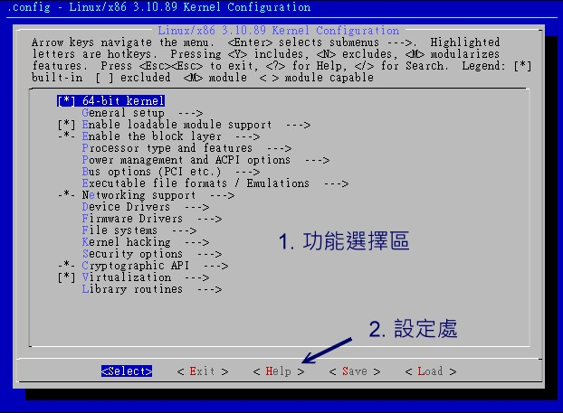

# 第二十四章、Linux 核心编译与管理

最近更新日期：20//

我们说的 Linux 其实指的就是核心 （kernel） 而已。这个核心控制你主机的所有硬件并提供系统所有的功能， 所以说，他重不重要啊！我们开机的时候其实就是利用开机管理程序载入这个核心文件来侦测硬件， 在核心载入适当的驱动程序后，你的系统才能够顺利的运行。现今的系统由于强调线上升级机制，因此非常不建议自订核心编译！ 但是，如果你想要将你的 Linux 安装到 U 盘、想要将你的 Eee PC 小笔记本安装自己的 Linux ， 想让你的 Linux 可以驱动你的小家电，此时，核心编译就是相当重要的一个任务了！ 这一篇比较进阶，如果你对系统移植没有兴趣的话，这一篇可以先略过喔！ ^_^

# 24.1 编译前的任务：认识核心与取得核心源代码

## 24.1 编译前的任务：认识核心与取得核心源代码

我们在第一章里面就谈过 Linux 其实指的是核心！这个“核心 （kernel）”是整个操作系统的最底层，他负责了整个硬件的驱动，以及提供各种系统所需的核心功能，包括防火墙机制、是否支持 LVM 或 Quota 等文件系统等等，这些都是核心所负责的！所以啰，在第十九章的开机流程中，我们也会看到 MBR 内的 loader 载入核心文件来驱动整个系统的硬件呢！ 也就是说，如果你的核心不认识某个最新的硬件，那么该硬件也就无法被驱动，你当然也就无法使用该硬件啰！

### 24.1.1 什么是核心 （Kernel）

这已经是整个 Linux 基础的最后一篇了，所以，下面这些数据你应该都要“很有概念”才行～ 不能只是“好像有印象”～好了，那就复习一下核心的相关知识吧！

*   Kernel

还记得我们在第十章的 BASH shell 提到过：计算机真正在工作的东西其实是“硬件”， 例如数值运算要使用到 CPU、数据储存要使用到硬盘、图形显示会用到显卡、音乐发声要有音效芯片、连接 Internet 可能需要网卡等等。那么如何控制这些硬件呢？那就是核心的工作了！也就是说，你所希望计算机帮你达成的各项工作， 都需要通过“核心”的帮助才行！当然啰，如果你想要达成的工作是核心所没有提供的， 那么你自然就没有办法通过核心来控制计算机使他工作啰！

举例来说，如果你想要有某个网络功能 （例如核心防火墙机制） ，但是你的核心偏偏忘记加进去这项功能， 那么不论你如何“卖力”的设置该网络套件，很抱歉！不来电！换句话说，你想要让计算机进行的工作，都必须要“核心有支持”才可以！这个标准不论在 Windows 或 Linux 这几个操作系统上都相同！如果有一个人开发出来一个“全新的硬件”，目前的核心不论 Windows 或 Linux 都不支持，那么不论你用什么系统，哈哈！这个硬件都是英雄无用武之地啦！ 那么是否了解了“核心”的重要了呢？所以我们才需要来了解一下如何编译我们的核心啦！

那么核心到底是什么啊？其实核心就是系统上面的一个文件而已， 这个文件包含了驱动主机各项硬件的侦测程序与驱动模块。在第十九章的开机流程分析中，我们也提到这个文件被读入内存的时机， 当系统读完 BIOS 并载入 MBR 内的开机管理程序后，就能够载入核心到内存当中。然后核心开始侦测硬件， 挂载根目录并取得核心模块来驱动所有的硬件，之后调用 systemd 就能够依序启动所有系统所需要的服务了！

这个核心文件通常被放置成 /boot/vmlinuz-xxx ，不过也不见得， 因为一部主机上面可以拥有多个核心文件，只是开机的时候仅能选择一个来载入而已。 甚至我们也可以在一个 distribution 上面放置多个核心，然后以这些核心来做成多重开机呢！

*   核心模块 （kernel module） 的用途

既然核心文件都已经包含了硬件侦测与驱动模块，那么什么是核心模块啊？要注意的是， 现在的硬件更新速度太快了，如果我的核心比较旧，但我换了新的硬件，那么，这个核心肯定无法支持！ 怎么办？重新拿一个新的核心来处理吗？开玩笑～核心的编译过程可是很麻烦的～

所以啰，为了这个缘故，我们的 Linux 很早之前就已经开始使用所谓的模块化设置了！ 亦即是将一些不常用的类似驱动程序的咚咚独立出核心，编译成为模块，然后， 核心可以在系统正常运行的过程当中载入这个模块到核心的支持。如此一来， 我在不需要更动核心的前提之下，只要编译出适当的核心模块，并且载入他，呵呵！我的 Linux 就可以使用这个硬件啦！简单又方便！

那我的模块放在哪里啊？可恶！怎么会问这个傻问题呢？当然一定要知道的啦！就是 /lib/modules/$（uname -r）/kernel/ 当中啦！

*   自制核心 - 核心编译

刚刚上面谈到的核心其实是一个文件，那么这个文件怎么来的？当然是通过源代码 （source code） 编译而成的啊！因为核心是直接被读入到内存当中的，所以当然要将他编译成为系统可以认识的数据才行！也就是说， 我们必须要取得核心的源代码，然后利用第二十一章 Tarball 安装方式提到的编译概念来达成核心的编译才行啊！（这也是本章的重点啊！ ^_^）

*   关于驱动程序 - 是厂商的责任还是核心的责任？

现在我们知道硬件的驱动程序可以编译成为核心模块，所以可以在不改变核心的前提下驱动你的新硬件。 但是，很多朋友还是常常感到困惑，就是 Linux 上面针对最新硬件的驱动程序总是慢了几个脚步， 所以觉得好像 Linux 的支持度不足！其实不可以这么说的，为什么呢？因为在 Windows 上面，对于最新硬件的驱动程序需求，基本上，也都是厂商提供的驱动程序才能让该硬件工作的， 因此，在这个“驱动程序开发”的工作上面来说，应该是属于硬件发展厂商的问题， 因为他要我们买他的硬件，自然就要提供消费者能够使用的驱动程序啦！

所以，如果大家想要让某个硬件能够在 Linux 上面跑的话，那么似乎可以发起一人一信的方式，强烈要求硬件开发商发展 Linux 上面的驱动程序！这样一来，也可以促进 Linux 的发展呢！

### 24.1.2 更新核心的目的

除了 BIOS （或 UEFI） 之外，核心是操作系统中最早被载入到内存的咚咚， 他包含了所有可以让硬件与软件工作的信息，所以，如果没有搞定核心的话， 那么你的系统肯定会有点小问题！好了，那么是不是将“所有目前核心有支持的东西都给他编译进去我的核心中， 那就可以支持目前所有的硬件与可执行的工作啦！”！

这话说的是没错啦，但是你是否曾经看过一个为了怕自己今天出门会口渴、会饿、会冷、会热、会被车撞、 会摔跤、会被性骚扰，而在自己的大包包里面放了大瓶矿泉水、便当、厚外套、短裤、防撞钢梁、止滑埝、 电击棒....等一大堆东西，结果却累死在半路上的案例吗？当然有！但是很少啦！我相信不太有人会这样做！ （会这么做的人通常都已经在医院了～） 取而代之的是会看一下天气，冷了就只带外套， 热了就只带短衣、如果穿的漂亮一点又预计晚点回家就多带个电击棒、 出远门到没有便利商店的地方才多带矿泉水....

说这个干什么！对啦！就是要你了解到，核心的编译重点在于“你要你的 Linux 作什么？”，是啦！如果没有必要的工作，就干脆不要加在你的核心当中了！这样才能让你的 Linux 跑得更稳、更顺畅！这也是为什么我们要编译核心的最主要原因了！

*   Linux 核心特色，与默认核心对终端用户的角色

Linux 的核心有几个主要的特色，除了“Kernel 可以随时、随各人喜好而更动”之外，Kernel 的“版本更动次数太频繁”也是一个特点！所以啰，除非你有特殊需求， 否则一次编译成功就可以啦！不需要随时保持最新的核心版本，而且也没有必要 （编译一次核心要粉久的ㄋㄟ！） 。

那么是否“我就一定需要在安装好了 Linux 之后就赶紧给他编译核心呢？”， 老实说，“并不需要的”！这是因为几乎每一个 distribution 都已经默认编译好了相当大量的模块了， 所以使用者常常或者可能会使用到的数据都已经被编译成为模块，也因此，呵呵！ 我们使用者确实不太需要重新来编译核心！尤其是“一般的使用者， 由于系统已经将核心编译的相当的适合一般使用者使用了，因此一般入门的使用者，基本上， 不太需要编译核心”。

*   核心编译的可能目的

OK！那么鸟哥闲闲没事干跑来写个什么东西？既然都不需要编译核心还写编译核心的分享文章， 鸟哥卖弄才学呀？很抱歉，鸟哥虽然是个“不学有术”的混混，却也不会平白无故的写东西请您来指教～ 当然是有需要才会来编译核心啦！编译核心的时机可以归纳为几大类：

*   新功能的需求： 我需要新的功能，而这个功能只有在新的核心里面才有，那么为了获得这个功能，只好来重新编译我的核心了。例如 iptables 这个防火墙机制只有在 2.4.xx 以后的版本里面才有，而新开发的主板芯片组， 很多也需要新的核心推出之后，才能正常而且有效率的工作！

*   原本核心太过臃肿： 如果你是那种对于系统“稳定性”很要求的人，对于核心多编译了很多莫名其妙的功能而不太喜欢的时候， 那么就可以重新编译核心来取消掉该功能啰；

*   与硬件搭配的稳定性： 由于原本 Linux 核心大多是针对 Intel 的 CPU 来作开发的，所以如果你的 CPU 是 AMD 的系统时，有可能 （注意！只是有可能，不见得一定会如此） 会让系统跑得“不太稳！”。此外，核心也可能没有正确的驱动新的硬件，此时就得重新编译核心来让系统取得正确的模块才好。

*   其他需求 （如嵌入式系统）： 就是你需要特殊的环境需求时，就得自行设计你的核心啰！（ 像是一些商业的套装软件系统，由于需要较为小而美的操作系统， 那么他们的核心就需要更简洁有力了！）


**Tips** 话说，2014 年鸟哥为了要搞定 banana pi （一种单版计算机，或者可以称为手机的硬件拿来作 Linux 安装的硬件） 的 CPU 最高频率限制， 因为该限制是直接写入到 Linux 核心当中的，这时就只好针对该硬件的 Linux 核心，修改不到 10 行的程序码之后，重新编译！ 才能将原本限制到 900MHz 的频率提升到 1.2GHz 哩！

另外，需要注意重新编译核心虽然可以针对你的硬件作最优化的步骤 （例如刚刚提到的 CPU 的问题！） ，不过由于这些最优化的步骤对于整体性能的影响是很小很小的， 因此如果是为了增加性能来编译核心的话，基本上，效益不大！然而，如果是针对“系统稳定性”来考虑的话， 那么就有充分的理由来支持你重新编译核心啰！

“如果系统已经运行很久了，而且也没有什么大问题， 加上我又不增加冷门的硬件设备，那么建议就不需要重新编译核心了”， 因为重新编译核心的最主要目的是“想让系统变的更稳！”既然你的 Linux 主机已经达到这个目的了，何必再编译核心？不过，就如同前面提到的， 由于默认的核心不见得适合你的需要，加上默认的核心可能并无法与你的硬件配备相配合， 此时才开始考虑重新编译核心吧！


**Tips** 早期鸟哥是强调最好重新编译核心的一群啦！不过，这个想法改变好久了～ 既然原本的 distribution 都已经帮我们考虑好如何使用核心了，那么， 我们也不需要再重新的编译核心啦！尤其是 distribution 都会主动的释出新版的核心 RPM 版本， 所以，实在不需要自己重新编译的！当然啦，如同前面提到的，如果你有特殊需求的话，那就另当别论噜！ ^_^

由于“核心的主要工作是在控制硬件！”所以编译核心之前， 请先了解一下你的硬件配备，与你这部主机的未来功能！由于核心是“越简单越好！”所以只要将这部主机的未来功能给他编进去就好了！ 其他的就不用去理他啦！

### 24.1.3 核心的版本

核心的版本问题，我们在第一章已经谈论过， 目前 CentOS 7 使用的 3.10.x 版本为长期维护版本，不过理论上我们也可以升级到后续的主线版本上面！不会像以前 2.6.x 只能升级到 2.6.x 的后续版本， 而不能改成其他主线版本。不过这也只是“理论上”而已，因为目前许多的软件依旧与核心版本有关，例如那个虚拟化软件 qemu 之类的， 与核心版本之间是有搭配性的关系的，所以，除非你要一口气连同核心相依的软件通通升级，否则最好使用长期维护版本的最新版来处理较佳。

举例来说，CentOS 7 使用的是 3.10.0 这个长期版本，而目前 （2015/09） 这个 3.10 长期版本，最新的版本为 3.10.89，意思是说， 你最好是拿 3.10.89 来作为核心升级的依据，而不是拿最新的 4.2.1 来升级的意思。

虽然理论上还是拿自家长期维护版本的最新版本来处理比较好，不过鸟哥因为需要研究虚拟化的 PCI passthrough 技术， 确实也曾经在 CentOS 7.1 的系统中将 3.10.x 的版本升级到 4.2.3 这个版本上！这样才完成了 VGA 的 PCI passthrough 功能！ 所以说，如果你真的想要使用较新的版本来升级，也不是不可以，只是后果会发生什么问题，就得要自行负责啰！

### 24.1.4 核心源代码的取得方式

既然核心是个文件，要制作这个文件给系统使用则需要编译，既然要有编译，当然就得要有源代码啊！ 那么源代码怎么来？基本上，依据你的 distributions 去挑选的核心源代码来源主要有：

*   原本 distribution 提供的核心源代码文件

事实上，各主要 distributions 在推出他们的产品时，其实已经都附上了核心源代码了！ 不过因为目前数据量太庞大，因此 SRPM 默认已经不给映射站下载了！主要的源代码都放置于下面的网站上：

*   全部的 CentOS 原始 SRPM：[`vault.centos.org/`](http://vault.centos.org/)
*   CentOS 7.1 的 SRPM：[`vault.centos.org/7.1.1503/`](http://vault.centos.org/7.1.1503/)

CentOS 7.x 开始的版本中，其版本后面会接上释出的日期，因为 CentOS 7.1 是 2015/03 释出的，因此它的下载点就会是在 7.1.1503 啰！1503 指的就是 2015/03 的意思～ 你可以进入上述的网站后，到 updates 目录下，一层一层的往下找，就可以找到 kernel 相关的 SRPM 啰！

你或许会说：既然要重新编译，那么干嘛还要使用原本 distributions 释出的源代码啊？真没创意～ 话不是这么说，因为原本的 distribution 释出的源代码当中，含有他们设置好的默认设置值， 所以，我们可以轻易的就了解到当初他们是如何选择与核心及模块有关的各项设置项目的参数值， 那么就可以利用这些可以配合我们 Linux 系统的默认参数来加以修改，如此一来， 我们就可以“修改核心，调整到自己喜欢的样子”啰！而且编译的难度也会比较低一点！

*   取得最新的稳定版核心源代码

虽然使用 distribution 释出的核心 source code 来重新编译比较方便，但是，如此一来， 新硬件所需要的新驱动程序，也就无法借由原本的核心源代码来编译啊！ 所以啰，如果是站在要更新驱动程序的立场来看，当然使用最新的核心可能会比较好啊！

Linux 的核心目前是由其发明者 Linus Torvalds 所属团队在负责维护的，而其网站在下面的站址上，在该网站上可以找到最新的 kernel 信息！不过，美中不足的是目前的核心越来越大了 （linux-3.10.89.tar.gz 这一版，这一个文件大约 105MB 了！），所以如果你的 ISP 连外很慢的话，那么使用台湾的映射站台来下载不失为一个好方法：

*   [核心官网：http://www.kernel.org/](http://www.kernel.org/pub/linux/kernel/)
*   交大资科：ftp://linux.cis.nctu.edu.tw/kernel/linux/kernel/
*   国高中心：ftp://ftp.twaren.net/pub/Unix/Kernel/linux/kernel/

*   保留原本设置：利用 patch 升级核心源代码

如果 （1）你曾经自行编译过核心，那么你的系统当中应该已经存在前几个版本的核心源代码， 以及上次你自行编译的参数设置值才对； （2）如果你只是想要在原本的核心下面加入某些特殊功能， 而该功能已经针对核心源代码推出 patch 补丁文件时。那你该如何进行核心源代码的更新，以便后续的编译呢？

其实每一次核心释出时，除了释出完整的核心压缩文件之外，也会释出“该版本与前一版本的差异性 patch 文件”， 关于 patch 的制作我们已经在第二十一章当中提及， 你可以自行前往参考。这里仅是要提供给你的信息是，每个核心的 patch 仅有针对前一版的核心来分析而已， 所以，万一你想要由 3.10.85 升级到 3.10.89 的话，那么你就得要下载 patch-3.10.86, patch-3.10.87, patch-3.10.88, patch-3.10.89 等文件，然后“依序”一个一个的去进行 patch 的动作后， 才能够升级到 3.10.89 喔！这个重要！不要忘记了。

同样的，如果是某个硬件或某些非官方认定的核心添加功能网站所推出的 patch 文件时，你也必须要了解该 patch 文件所适用的核心版本，然后才能够进行 patch ，否则容易出现重大错误喔！这个项目对于某些商业公司的工程师来说是很重要的。 举例来说，鸟哥的一个高中同学在业界服务，他主要是进行类似 Eee PC 开发的计划，然而该计划的硬件是该公司自行推出的！ 因此，该公司必须要自行搭配核心版本来设计他们自己的驱动程序，而该驱动程序并非 GPL 授权，因此他们就得要自行将驱动程序整合进核心！如果改天他们要将这个驱动程序释出，那么就得要利用 patch 的方式， 将硬件驱动程序文件释出，我们就得要自行以 patch 来更新核心啦！

在进行完 patch 之后，你可以直接检查一下原本的设置值，如果没有问题， 就可以直接编译，而不需要再重新的选择核心的参数值，这也是一个省时间的方法啊！ 至于 patch file 的下载，同样是在 kernel 的相同目录下，寻找文件名是 patch 开头的就是了。

### 24.1.5 核心源代码的解压缩/安装/观察

其实，不论是从 CentOS 官网取得的 SRPM 或者是从 Linux kernel 官网取得的 tarball 核心源代码，最终都会有一个 tarball 的核心源代码就是了！ 因此，鸟哥从 linux kernel 官网取得 linux-3.10.89.tar.xz 这个核心文件，这个核心文件的源代码是从下面的网址取得的：

*   ftp://ftp.twaren.net/pub/Unix/Kernel/linux/kernel/v3.x/linux-3.10.89.tar.xz

*   核心源代码的解压缩与放置目录

鸟哥这里假设你也是下载上述的链接内的文件，然后该文件放置到 /root 下面。由于 Linux 核心源代码一般建议放置于 /usr/src/kernels/ 目录下面，因此你可以这样处理：

```
[root@study ~]# tar -Jxvf linux-3.10.89.tar.xz -C /usr/src/kernels/ 
```

此时会在 /usr/src/kernels 下面产生一个新的目录，那就是 linux-3.10.89 这个目录啰！ 我们在下个小节会谈到的各项编译与设置，都必须要在这个目录下面进行才行喔！好了，那么这个目录下面的相关文件有啥咚咚？ 下面就来谈谈：

*   核心源代码下的次目录

在上述核心目录下含有哪些重要数据呢？基本上有下面这些东西：

*   arch ：与硬件平台有关的项目，大部分指的是 CPU 的类别，例如 x86, x86_64, Xen 虚拟支持等；
*   block ：与区块设备较相关的设置数据，区块数据通常指的是大量储存媒体！还包括类似 ext3 等文件系统的支持是否允许等。
*   crypto ：核心所支持的加密的技术，例如 md5 或者是 des 等等；
*   Documentation ：与核心有关的一堆说明文档，若对核心有极大的兴趣，要瞧瞧这里！
*   drivers ：一些硬件的驱动程序，例如显卡、网卡、PCI 相关硬件等等；
*   firmware ：一些旧式硬件的微指令码 （固件） 数据；
*   fs ：核心所支持的 filesystems ，例如 vfat, reiserfs, nfs 等等；
*   include ：一些可让其他程序调用的标头 （header） 定义数据；
*   init ：一些核心初始化的定义功能，包括挂载与 init 程序的调用等；
*   ipc ：定义 Linux 操作系统内各程序的沟通；
*   kernel ：定义核心的程序、核心状态、线程、程序的调度 （schedule）、程序的讯号 （signle） 等
*   lib ：一些函数库；
*   mm ：与内存单元有关的各项数据，包括 swap 与虚拟内存等；
*   net ：与网络有关的各项协定数据，还有防火墙模块 （net/ipv4/netfilter/*） 等等；
*   security ：包括 selinux 等在内的安全性设置；
*   sound ：与音效有关的各项模块；
*   virt ：与虚拟化机器有关的信息，目前核心支持的是 KVM （Kernel base Virtual Machine）

这些数据先大致有个印象即可，至少未来如果你想要使用 patch 的方法加入额外的新功能时， 你要将你的源代码放置于何处？这里就能够提供一些指引了。当然，最好还是跑到 Documentation 那个目录下面去瞧瞧正确的说明， 对你的核心编译会更有帮助喔！

# 24.2 核心编译的前处理与核心功能选择

## 24.2 核心编译的前处理与核心功能选择

什么？核心编译还要进行前处理？没错啦！事实上，核心的目的在管理硬件与提供系统核心功能，因此你必须要先找到你的系统硬件， 并且规划你的主机未来的任务，这样才能够编译出适合你这部主机的核心！所以，整个核心编译的重要工作就是在“挑选你想要的功能”。 下面鸟哥就以自己的一部主机软/硬件环境来说明，解释一下如何处理核心编译啰！

### 24.2.1 硬件环境检视与核心功能要求

鸟哥的一部主机硬件环境如下 （在虚拟机中，通过 /proc/cpuinfo 及 lspci 观察）：

*   CPU：Intel（R） Xeon（R） CPU E5-2650
*   主板芯片组： KVM 虚拟化仿真的主版 （Intel 440FX 相容）
*   显卡： Red Hat, Inc. QXL paravirtual graphic card
*   内存： 2.0GB 内存
*   硬盘： KVM Virtio 界面磁盘 40G （非 IDE/SATA/SAS 喔！）
*   网卡： Red Hat, Inc Virtio network device

硬件大致如上，至于这部主机的需求，是希望做为未来在鸟哥上课时，可以通过虚拟化功能来处理学生的练习用虚拟机。 这部主机也是鸟哥用来放置学校上课教材的机器，因此，这部主机的 I/O 需求须要好一点，未来还需要打开防火墙、 WWW 服务器功能、FTP 服务器功能等，基本上，用途就是一部小型的服务器环境啰。大致上需要这样的功能啦！

### 24.2.2 保持干净源代码： make mrproper

了解了硬件相关的数据后，我们还得要处理一下核心源代码下面的残留文件才行！假设我们是第一次编译， 但是我们不清楚到下面载下来的源代码当中有没有保留目标文件 （*.o） 以及相关的配置文件存在， 此时我们可以通过下面的方式来处理掉这些“编译过程的目标文件以及配置文件”：

```
[root@study ~]# cd /usr/src/kernels/linux-3.10.89/
[root@study linux-3.10.89]# make mrproper 
```

请注意，这个动作会将你以前进行过的核心功能选择文件也删除掉， 所以几乎只有第一次执行核心编译前才进行这个动作，其余的时刻，你想要删除前一次编译过程的残留数据， 只要下达：

```
[root@study linux-3.10.89]# make clean 
```

因为 make clean 仅会删除类似目标文件之类的编译过程产生的中间文件，而不会删除配置文件！ 很重要的！千万不要搞乱了喔！好了，既然我们是第一次进行编译，因此，请下达“make mrproper”吧！

### 24.2.3 开始挑选核心功能： make XXconfig

不知道你有没有发现 /boot/ 下面存在一个名为 config-xxx 的文件？那个文件其实就是核心功能列表文件！ 我们下面要进行的动作，其实就是作出该文件！而我们后续小节所要进行的编译动作，其实也就是通过这个文件来处理的！ 核心功能的挑选，最后会在 /usr/src/kernels/linux-3.10.89/ 下面产生一个名为 .config 的隐藏文件， 这个文件就是 /boot/config-xxx 的文件啦！那么这个文件如何创建呢？你可以通过非常多的方法来创建这个文件！ 常见的方法有：[[1]](#ps1)

*   make menuconfig 最常使用的，是文字模式下面可以显示类似图形接口的方式，不需要启动 X Window 就能够挑选核心功能菜单！

*   make oldconfig 通过使用已存在的 ./.config 文件内容，使用该文件内的设置值为默认值，只将新版本核心内的新功能选项列出让使用者选择， 可以简化核心功能的挑选过程！对于作为升级核心源代码后的功能挑选来说，是非常好用的一个项目！

*   make xconfig 通过以 Qt 为图形接口基础功能的图形化接口显示，需要具有 X window 的支持。例如 KDE 就是通过 Qt 来设计的 X Window，因此你如果在 KDE 画面中，可以使用此一项目。

*   make gconfig 通过以 Gtk 为图形接口基础功能的图形化接口显示，需要具有 X window 的支持。例如 GNOME 就是通过 Gtk 来设计的 X Window，因此你如果在 GNOME 画面中，可以使用此一项目。

*   make config 最旧式的功能挑选方法，每个项目都以条列式一条一条的列出让你选择，如果设置错误只能够再次选择，很不人性化啊！

大致的功能选择有上述的方法，更多的方式可以参考核心目录下的 README 文件。鸟哥个人比较偏好 make menuconfig 这个项目啦！如果你喜欢使用图形接口， 然后使用鼠标去挑选所需要的功能时，也能使用 make xconfig 或 make gconfig ，不过需要有相关的图形接口支持！ 如果你是升级核心源代码并且需要重新编译，那么使用 make oldconfig 会比较适当！

*   通过既有的设置来处理核心项目与功能的选择

如果你跟鸟哥一样懒，那可以这样思考一下。既然我们的 CentOS 7 已经有提供它的核心设置值，我们也只是想要修改一些小细节而已， 那么能不能以 CentOS 7 的核心功能为底，然后来细部微调其它的设置呢？当然可以啊！你只要这样做即可：

```
[root@study linux-3.10.89]# cp /boot/config-3.10.0-229.11.1.el7.x86_64 .config
# 上面那个版本请依据你自己的环境来填写～ 
```

接下来要开始调整啰！那么如何选择呢？以 make menuconfig 来说，出现的画面会有点像这样：


**Tips** 注意，你可能会被要求安装好多软件，请自行使用 yum 来安装喔！这里不再介绍了！ 另外：“不要再使用 make mrproper ”喔！因为我们已经复制了 .config 啊！使用 make mrproper 会将 .config 删除喔！

图 24.2.1、make menuconfig 核心功能挑选菜单示意图

看到上面的图示之后，你会发现画面主要分为两大部分，一个是大框框内的反白光柱，另一个则是下面的小框框， 里面有 select, exit 与 help 三个选项的内容。这几个元件的大致用法如下：

*   “左右方向键”：可以移动最下面的 <Select>, <Exit>, <Help>项目；
*   “上下方向键”：可以移动上面大框框部分的反白光柱，若该行有箭头 （--->） 则表示该行内部还有其他细项需要来设置的意思；
*   选定项目：以“上下键”选择好想要设置的项目之后，并以“左右键”选择 <Select> 之后， 按下“ Enter ”就可以进入该项目去作更进一步的细部设置啰；
*   可挑选之功能：在细部项目的设置当中，如果前面有 [ ] 或 < > 符号时，该项目才可以选择， 而选择可以使用“空白键”来选择；
*   若为 [*] <*> 则表示编译进核心；若为 <M> 则表示编译成模块！ 尽量在不知道该项目为何时，且有模块可以选，那么就可以直接选择为模块啰！
*   当在细项目选择 <Exit> 后，并按下 Enter ，那么就可以离开该细部项目啰！

基本上建议只要“上下左右的方向键、空白键、Enter”这六个按键就好了！不要使用 Esc ，否则一不小心就有可能按错的！另外，关于整个核心功能的选择上面，建议你可以这样思考：

*   “肯定”核心一定要的功能，直接编译进核心内；
*   “可能在未来会用到”的功能，那么尽量编译成为模块；
*   “不知道那个东西要干嘛的，看 help 也看不懂”的话，那么就保留默认值，或者将他编译成为模块；

总之，尽量保持核心小而美，剩下的功能就编译成为模块，尤其是“需要考虑到未来扩充性”， 像鸟哥之前认为螃蟹卡就够我用的了，结果，后来竟然网站流量大增，鸟哥只好改换 3Com 的网卡。 不过，我的核心却没有相关的模块可以使用～因为.....鸟哥自己编译的核心忘记加入这个模块了。 最后，只好重新编译一次核心的模块，呵呵！真是惨痛的教训啊！

### 24.2.4 核心功能细项选择

由上面的图示当中，我们知道核心的可以选择的项目有很多啊！光是第一面，就有 17 个项目，每个项目内还有不同的细项！哇！真是很麻烦啊～每个项目其实都可能有 <Help> 的说明，所以，如果看到不懂的项目，务必要使用 Help 查阅查阅！ 好了，下面我们就一个一个项目来看看如何选择吧！


**Tips** 在下面的案例中，因为鸟哥使用的是 CentOS 7.1 的核心配置文件来进行默认的设置， 所以基本上许多默认的设置都不用重新调整。下面只列出几个鸟哥认为比较重要的设置项目。其他更详细的核心功能项目，还请自行参考 help 的说明喔！

*   General setup

与 Linux 最相关的程序互动、核心版本说明、是否使用发展中程序码等信息都在这里设置的。 这里的项目主要都是针对核心与程序之间的相关性来设计的，基本上，保留默认值即可！ 不要随便取消下面的任何一个项目，因为可能会造成某些程序无法被同时执行的困境喔！ 不过下面有非常多新的功能，如果你有不清楚的地方，可以按 <Help> 进入查阅，里面会有一些建议！ 你可以依据 Help 的建议来选择新功能的启动与否！

```
（vbird）  Local version - append to kernel release
[*] Automatically append version information to the version string
    # 我希望我的核心版本成为 3.10.89.vbird ，那这里可以就这样设置！
    Kernel compression mode （Bzip2）  ---&gt;
    # 建议选择成为 Bzip2 即可，因为压缩比较佳！
.....（其他保留默认值）.....

&lt;M&gt; Kernel .config support
[ ]   Enable access to .config through /proc/config.gz （NEW）
    # 让 .config 这个核心功能列表可以写入实际的核心文件中！所以就不需要保留 .config 文件啰！
（20） Kernel log buffer size （16 =&gt; 64KB, 17 =&gt; 128KB）
    # CentOS 7 增加了核心的登录文件容量！占用了 2 的 20 次方，大概用了 1MB 的容量！
.....（其他保留默认值）.....

[*] Initial RAM filesystem and RAM disk （initramfs/initrd） support
（）    Initramfs source file（s）
    # 这是一定要的！因为要支持开机时载入 initail RAM disk 嘛！
[  ] Optimize for size  
    # 减低核心的文件大小，其实 gcc 参数使用 -Os 而不是 -O2。不过我们不是嵌入式系统，不太需要！
[ ] Configure standard kernel features （expert users）  ---&gt;
[ ] Embedded system
    # 上面两个在决定是否支持嵌入式系统呢？我们这里是台式机，所以这个不用选择了！
.....（其他保留默认值）..... 
```

*   loadable module + block layer

要让你的核心能够支持动态的核心模块，那么下面的第一个设置就得要启动才行！至于第二个 block layer 则默认是启动的， 你也可以进入该项目的细项设置，选择其中你认为需要的功能即可！

```
[*] Enable loadable module support  ---&gt; &lt;==下面为细项
  --- Enable loadable module support
  [*]   Forced module loading
  [*]   Module unloading
  [*]     Forced module unloading  # 其实鸟哥认为这个项目可能可以选择的！免得常常无法卸载模块！
  [*]   Module versioning support
  [*]   Source checksum for all modules
  [*]   Module signature verification
  [  ]     Require modules to be validly signed
  [*]     Automatically sign all modules
        Which hash algorithm should modules be signed with? # 可以选择 SHA256 即可！
================================================================================
  -*- Enable the block layer  ---&gt;  &lt;==看吧！默认就是已经选择了！下面为细项
  -*-   Block layer SG support v4
  -*-   Block layer SG support v4 helper lib
  [*]   Block layer data integrity support
  [*]   Block layer bio throttling support
        Partition Types  ---&gt;  # 至少下面的数个项目要选择！
  [*]     Macintosh partition map support
  [*]     PC BIOS （MSDOS partition tables） support
  [*]     Windows Logical Disk Manager （Dynamic Disk） support
  [*]     SGI partition support
  [*]     EFI GUID Partition support
.....（其他保留默认值）.....

        IO Schedulers  ---&gt;  # 磁盘伫列的处理方式
  &lt;*&gt;     Deadline I/O scheduler      # 鸟哥非常建议将此项目设置为核心功能！
  &lt;*&gt;     CFQ I/O scheduler 
  [*]       CFQ Group Scheduling support
          Default I/O scheduler （Deadline）  ---&gt;  # 相当建议改为 Deadline 
```

*   CPU 的类型与功能选择

进入“Processor type and features”后，请挑选你主机的实际 CPU 形式。鸟哥这里使用的是 Intel E5 的 CPU， 而且鸟哥的主机还有启动 KVM 这个虚拟化的服务 （在一部主机上面同时启动多个操作系统），因此，所以下面的选择是这样的：

```
.....（其他保留默认值）.....
  [*] Linux guest support  ---&gt;     # 提供 Linux 虚拟化功能
  [*]   Enable paravirtualization code   # 至少下面这几样一定要有选择才好！
  [*]     Paravirtualization layer for spinlocks
  [*]     Xen guest support
  [*]   KVM Guest support （including kvmclock）
  [*]   Paravirtual steal time accounting
.....（其他保留默认值）.....

      Processor family （Generic-x86-64）  ---&gt;  # 除非你是旧系统，否则就用他！
  [*] Enable Maximum number of SMP Processors and NUMA Nodes
  [*] Multi-core scheduler support
      Preemption Model （No Forced Preemption （Server）  ---&gt;  # 调整成 server 喔！原本是 desktop
.....（其他保留默认值）.....

      Timer frequency （300 HZ）  ---&gt;  # server 设置成 300 即可！
    # 这个项目则与核心针对某个事件立即回应的速度有关。Server 用途可以调整到
    # 300Hz 即可，如果是桌面电脑使用，需要调整高一点，例如 1000Hz 较佳！
.....（其他保留默认值）..... 
```

*   电源管理功能

如果选择了“Power management and ACPI options”之后，就会进入系统的电源管理机制中。 其实电源管理机制还需要搭配主板以及 CPU 的相关省电功能，才能够实际达到省电的效率啦！ 不论是 Server 还是 Desktop 的使用，在目前电力不足的情况下，能省电就加以省电吧！

```
.....（其他保留默认值）.....
  [*] ACPI （Advanced Configuration and Power Interface） Support  ---&gt;
    # 对嵌入式系统来说，由于可能会增加核心容量故需要考虑考虑。至于 desktop/server 当然就选择啊
    # 至于内容细项大致保持默认值即可
    CPU Frequency scaling  ---&gt;
    # 决定 CPU 频率的一个重要项目，基本上的项目是 ondemand 与 performance 两者！
    &lt;M&gt;   CPU frequency translation statistics
    [*]     CPU frequency translation statistics details
          Default CPUFreq governor （ondemand）  ---&gt;  # 现在大家都建议用这个！
    -*-   'performance' governor
    &lt;*&gt;   'powersave' governor
    &lt;*&gt;   'userspace' governor for userspace frequency scaling
    -*-   'ondemand' cpufreq policy governor
    &lt;*&gt;   'conservative' cpufreq governor
          x86 CPU frequency scaling drivers  ---&gt;
          # 这个子项目内全部都是省电机制，能编成模块的全部选择！要加入核心的都加入就对了！ 
```

*   一些总线 （bus） 的选项

这个“Bus options （PCI etc.）”项目则与总线有关啦！分为最常见的 PCI 与 PCI-express 的支持，还有笔记本电脑常见的 PCMCIA 插卡啊！要记住的是，那个 PCI-E 的接口务必要选取！不然你的新显卡可能会捉不到！

```
[*] PCI support
[*]   Support mmconfig PCI config space access
[*]   PCI Express support
&lt;*&gt;     PCI Express Hotplug driver
.....（其他在 PCI Express 下面的项目大多保留默认值）.....
-*- Message Signaled Interrupts （MSI and MSI-X）
&lt;*&gt; PCI Stub driver   # 如果要玩虚拟化，这个部份建议编进核心！
.....（其他保留默认值）..... 
```

*   编译后可执行文件的格式

选择“Executable file formats / Emulations”会见到如下选项。 下面的选项必须要勾选才行喔！因为是给 Linux 核心运行可执行文件之用的数据。通常是与编译行为有关啦！

```
-*- Kernel support for ELF binaries
[*] Write ELF core dumps with partial segments
&lt;*&gt; Kernel support for scripts starting with #!
&lt;M&gt; Kernel support for MISC binaries
[*] IA32 Emulation
&lt;M&gt;   IA32 a.out support
[*]   x32 ABI for 64-bit mode
# 因为我们的 CentOS 已经是纯 64 位的环境！所以个人建议这里还是要选择仿真 32 位的功能！
# 不然若有些比较旧的软件，恐怕会无法被你的系统所执行喔！ 
```

*   核心的网络功能

这个“Networking support”项目是相当重要的选项，因为他还包含了防火墙相关的项目！就是未来在服务器篇会谈到的防火墙 iptables 这个数据啊！所以，千万注意了！在这个设置项目当中，很多东西其实我们在基础篇还没有讲到， 因为大部分的参数都与网络、防火墙有关！由于防火墙是在启动网络之后再设置即可，所以绝大部分的内容都可以被编译成为模块，而且也建议你编成模块！有用到再载入到核心即可啊！

```
--- Networking support
      Networking options  ---&gt;
      # 就是这个光啊！里面的数据全部都是重要的防火墙项目！尽量编成模块啰！
      # 至于不晓得功能的部分，就尽量保留默认值即可！
      # 下面的数据中，鸟哥只有列出原本没有选择，后来建议选择的部份
      [*] Network packet filtering framework （Netfilter）  ---&gt;
      # 这个就是我们一直讲的防火墙部分！里面细项几乎全选择成为模块！
          --- Network packet filtering framework （Netfilter）
                Core Netfilter Configuration  ---&gt;
                &lt;M&gt; Transparent proxying support
================================================================================
      [*] QoS and/or fair queueing  ---&gt; &lt;==内容同样全为模块！
          Network testing  ---&gt; &lt;==保留成模块默认值
================================================================================
# 下面的则是一些特殊的网络设备，例如红外线啊、蓝牙啊！
# 如果不清楚的话，就使用模块吧！除非你真的知道不要该项目！
&lt;M&gt;   Bluetooth subsystem support  ---&gt;
      # 这个是蓝牙支持，同样的，里面除了必选之外，其他通通挑选成为模块！
[*]   Wireless  ---&gt;
      # 这个则是无线网络设备，里面保留默认值，但可编成模块的就选模块
&lt;M&gt;   WiMAX Wireless Broadband support  ---&gt;
      # 新一代的无线网络，也请勾选成为模块！
&lt;M&gt;  NFC subsystem support  ---&gt;
      # 跟卡片比较有关的芯片支持，建议编译成模块，内部数据也是编译成模块为佳！ 
```

*   各项设备的驱动程序

进入“Device Drivers”这个是所有硬件设备的驱动程序库！哇！光是看到里面这么多内容，鸟哥头都昏了～ 不过，为了你自己的主机好，建议你还是得要一个项目一个项目的去挑选挑选才行～ 这里面的数据就与你主机的硬件有绝对的关系了！

在这里面真的很重要，因为很多数据都与你的硬件有关。核心推出时的默认值是比较符合一般状态的， 所以很多数据其实保留默认值就可以编的很不错了！不过，也因为较符合一般状态， 所以核心额外的编译进来很多跟你的主机系统不符合的数据，例如网卡设备～ 你可以针对你的主板与相关硬件来进行编译。不过，还是要记得有“未来扩充性”的考虑！ 之前鸟哥不是谈过吗，我的网卡由螃蟹卡换成 3Com 时，核心捉不到～ 因为...鸟哥并没有将 3Com 的网卡编译成为模块啊！ @_@

```
# 大部分都保留默认值，鸟哥只是就比较重要的部份拿出来做说明而已！
    &lt;M&gt; Serial ATA and Parallel ATA drivers  ---&gt;  # 就是 SATA/IDE 磁盘！大多数选择为模块！
    [*] Multiple devices driver support （RAID and LVM）  ---&gt; # 就是 LVM 与 RAID ！要选要选！
    -*- Network device support  ---&gt; # 网络方面的设备，网卡与相关媒体啦！
        -*-   Network core driver support
        &lt;M&gt;     Bonding driver support             # 与网卡整合有关的项目！要选！
        &lt;M&gt;     Ethernet team driver support  ---&gt; # 与 bonding 差不多的功能！要选！
        &lt;M&gt;     Virtio network driver              # 虚拟化的网卡驱动程序！要选！
        -*-   Ethernet driver support  ---&gt;        # 以太网卡！里面的一堆 10G 卡要选！
              &lt;M&gt;     Chelsio 10Gb Ethernet support
              &lt;M&gt;     Intel（R） PRO/10GbE support
        &lt;M&gt;   PPP （point-to-point protocol） support# 与拨接有关的协定！
              USB Network Adapters  ---&gt;           # 当然全部编译为模块！
        [*]   Wireless LAN  ---&gt;                   # 无线网卡也相当重要！里面全部变成模块！
================================================================================
    [ ] GPIO Support  ---&gt;           # 若有需要使用类似树莓派、香蕉派才需要这东西！
    &lt;M&gt; Multimedia support  ---&gt;     # 多媒体设备，如影像撷取、广播声卡等等
        Graphics support  ---&gt;       # 显卡！如果是作为桌上型使用，这里就重要了！
    &lt;M&gt; Sound card support  ---&gt;     # 声卡，同样的，桌面电脑使用时，比较重要！
    [*] USB support  ---&gt;            # 就是 USB！下面几个内部的细项要注意是勾选的！
        &lt;*&gt;     xHCI HCD （USB 3.0） support
        &lt;*&gt;     EHCI HCD （USB 2.0） support
        &lt;*&gt;     OHCI HCD support
        &lt;*&gt;     UHCI HCD （most Intel and VIA） support
    &lt;M&gt; InfiniBand support  ---&gt;     # 较高阶的网络设备，速度通常达到 40Gb 以上！
    &lt;M&gt; VFIO Non-Privileged userspace driver framework  ---&gt; # 作为 VGA passthrought 用！
        [*]     VFIO PCI support for VGA devices
    [*] Virtualization drivers  ---&gt; # 虚拟化的驱动程序！
        Virtio drivers  ---&gt;         # 在虚拟机里面很重要的驱动程序项目！
    [*] IOMMU Hardware Support  ---&gt; # 同样的与虚拟化相关性较高！ 
```

至于“ Firmware Drivers ”的项目，请视你的需求来选择～基本上就保留设置值即可！所以鸟哥这里就不显示啰！

*   文件系统的支持

文件系统的支持也是很重要的一项核心功能！因为如果不支持某个文件系统，那么我们的 Linux kernel 就无法认识，当然也就无法使用啦！例如 Quota, NTFS 等等特殊的 filesystem 。 这部份也是有够麻烦～因为涉及核心是否能够支持某些文件系统，以及某些操作系统支持的 partition table 项目。在进行选择时，也务必要特别的小心在意喔！ 尤其是我们常常用到的网络操作系统 （NFS/Samba 等等），以及基础篇谈到的 Quota 等， 你都得要勾选啊！否则是无法被支持的。如果你有兴趣，也可以将 NTFS 的文件系统设置为可读写看看啰！

```
# 下面仅有列出比较重要及与默认值不同的项目而已喔！所以项目少很多！
    &lt;M&gt; Second extended fs support           # 默认已经不支持 ext2/ext3，这里我们将他加回来！
    &lt;M&gt; Ext3 journalling file system support
    [*]   Default to 'data=ordered' in ext3 （NEW）
    [*]   Ext3 extended attributes （NEW）
    [*]     Ext3 POSIX Access Control Lists
    &lt;M&gt; The Extended 4 （ext4） filesystem     # 一定要有的支持
    &lt;M&gt; Reiserfs support
    &lt;M&gt; XFS filesystem support               # 一定要有的支持！
    [*]   XFS Quota support
    [*]   XFS POSIX ACL support
    [*]   XFS Realtime subvolume support     # 增加这一项好了！
    &lt;M&gt; Btrfs filesystem support             # 最好有支持！
    [*] Quota support
    &lt;*&gt; Quota format vfsv0 and vfsv1 support
    &lt;*&gt; Kernel automounter version 4 support （also supports v3）
    &lt;M&gt; FUSE （Filesystem in Userspace） support
        DOS/FAT/NT Filesystems  ---&gt;
        &lt;M&gt; MSDOS fs support
        &lt;M&gt; VFAT （Windows-95） fs support
        （950） Default codepage for FAT       # 要改成这样喔！中文支持！
        （utf8） Default iocharset for FAT     # 要改成这样喔！中文支持！
        &lt;M&gt; NTFS file system support         # 建议加上 NTFS 喔！
        [*]   NTFS write support             # 让他可读写好了！
        Pseudo filesystems  ---&gt;             # 类似 /proc ，保留默认值
    -*- Miscellaneous filesystems  ---&gt;      # 其他文件系统的支持，保留默认值
    [*] Network File Systems  ---&gt;           # 网络文件系统！很重要！也要挑挑！
        &lt;M&gt;   NFS client support
        &lt;M&gt;   NFS server support
        [*]     NFS server support for NFS version 4
        &lt;M&gt;   CIFS support （advanced network filesystem, SMBFS successor）
        [*]       Extended statistics
        [*]   Provide CIFS client caching support
    -*- Native language support  ---&gt;        # 选择默认的语系
        （utf8） Default NLS Option
        &lt;M&gt;   Traditional Chinese charset （Big5） 
```

*   核心骇客、信息安全、密码应用

再接下来有个“Kernel hacking”的项目，那是与核心开发者比较有关的部分，这部分建议保留默认值即可， 应该不需要去修改他！除非你想要进行核心方面的研究喔。然后下面有个“ Security Options ”，那是属于信息安全方面的设置， 包括 SELinux 这个细部权限强化模块也在这里编入核心的！这个部份只要记得 SELinux 作为默认值，且务必要将 NSA SELinux 编进核心即可， 其他的细部请保留默认值。

另外还有“ Cryptographic API ”这个密码应用程序接口工具选项，以前的默认加密机制为 MD5，近年来则改用了 SHA 这种机制。 不过，反正默认已经将所有的加密机制编译进来了，所以也是可以保留默认值啦！都不需要额外修改就是了！

*   虚拟化与函数库

虚拟化是近年来非常热门的一个议题，因为计算机的能力太强，所以时常闲置在那边， 此时，我们可以通过虚拟化技术在一部主机上面同时启动多个操作系统来运行，这就是所谓的虚拟化。 Linux 核心已经主动的纳入虚拟化功能喔！而 Linux 认可的虚拟化使用的机制为 KVM （Kernel base Virtual Machine）。 至于常用的核心函数库也可以全部编为模块啰！

```
[*] Virtualization  ---&gt;
    --- Virtualization
    &lt;M&gt;   Kernel-based Virtual Machine （KVM） support
    &lt;M&gt;     KVM for Intel processors support
    &lt;M&gt;     KVM for AMD processors support
    [*]     Audit KVM MMU
    [*]     KVM legacy PCI device assignment support   # 虽然已经有 VFIO，不过建议还是选起来！
    &lt;M&gt;   Host kernel accelerator for virtio net
================================================================================
Library routines  ---&gt;
    # 这部份全部保留默认值即可！ 
```

现在请回到如图 24.2.1 的画面中，在下方设置处移动到“Save”的选项，点选该项目， 在出现的窗口中确认文件名为 .config 之后，直接按下“OK”按钮，这样就将刚刚处理完毕的选项给记录下来了。 接下来可以选择离开菜单画面，准备让我们来进行编译的行为啰。

要请你注意的是，上面的数据主要是适用在鸟哥的个人机器上面的， 目前鸟哥比较习惯使用原本 distributions 提供的默认核心，因为他们也会主动的进行更新， 所以鸟哥就懒的自己重编核心了～ ^_^

此外，因为鸟哥重视的地方在于“网络服务器与虚拟化服务器”上面，所以里头的设置少掉了相当多的个人桌上型 Linux 的硬件编译！所以，如果你想要编译出一个适合你的机器的核心， 那么可能还有相当多的地方需要来修正的！不论如何，请随时以 Help 那个选项来看一看内容吧！反正 Kernel 重编的概率不大！花多一点时间重新编译一次！ 然后将该编译完成的参数文件储存下来，未来就可以直接将该文件叫出来读入了！ 所以花多一点时间安装一次就好！那也是相当值得的！

# 24.3 核心的编译与安装

## 24.3 核心的编译与安装

将最复杂的核心功能选择完毕后，接下来就是进行这些核心、核心模块的编译了！而编译完成后，当然就是需要使用噜～ 那如何使用新核心呢？就得要考虑 grub 这个玩意儿啦！下面我们就来处理处理：

### 24.3.1 编译核心与核心模块

核心与核心模块需要先编译起来，而编译的过程其实非常简单，你可以先使用“ make help ”去查阅一下所有可用编译参数， 就会知道有下面这些基本功能：

```
[root@study linux-3.10.89]# make vmlinux  &lt;==未经压缩的核心
[root@study linux-3.10.89]# make modules  &lt;==仅核心模块
[root@study linux-3.10.89]# make bzImage  &lt;==经压缩过的核心（默认）
[root@study linux-3.10.89]# make all      &lt;==进行上述的三个动作 
```

我们常见的在 /boot/ 下面的核心文件，都是经过压缩过的核心文件，因此，上述的动作中比较常用的是 modules 与 bzImage 这两个，其中 bzImage 第三个字母是英文大写的 I 喔！bzImage 可以制作出压缩过后的核心， 也就是一般我们拿来进行系统开机的信息啰！所以，基本上我们会进行的动作是：

```
[root@study linux-3.10.89]# make -j 4 clean    &lt;==先清除暂存盘
[root@study linux-3.10.89]# make -j 4 bzImage  &lt;==先编译核心
[root@study linux-3.10.89]# make -j 4 modules  &lt;==再编译模块
[root@study linux-3.10.89]# make -j 4 clean bzImage modules  &lt;==连续动作！ 
```

上述的动作会花费非常长的时间，编译的动作依据你选择的项目以及你主机硬件的性能而不同。此外，为啥要加上 -j 4 呢？ 因为鸟哥的系统上面有四个 CPU 核心，这几个核心可以同时进行编译的行为，这样在编译时速度会比较快！如果你的 CPU 核心数 （包括超线程） 有多个， 那这个地方请加上你的可用 CPU 数量吧！

最后制作出来的数据是被放置在 /usr/src/kernels/linux-3.10.89/ 这个目录下，还没有被放到系统的相关路径中喔！在上面的编译过程当中，如果有发生任何错误的话， 很可能是由于核心项目的挑选选择的不好，可能你需要重新以 make menuconfig 再次的检查一下你的相关设置喔！ 如果还是无法成功的话，那么或许将原本的核心数据内的 .config 文件，复制到你的核心原始文件目录下， 然后据以修改，应该就可以顺利的编译出你的核心了。最后注意到，下达了 make bzImage 后，最终的结果应该会像这样：

```
Setup is 16752 Bytes （padded to 16896 Bytes）.
System is 4404 kB
CRC 30310acf
Kernel: arch/x86/boot/bzImage is ready  （#1）

[root@study linux-3.10.89]# ll arch/x86/boot/bzImage
-rw-r--r--. 1 root root 4526464 Oct 20 09:09 arch/x86/boot/bzImage 
```

可以发现你的核心已经编译好而且放置在 /usr/src/kernels/linux-3.10.89/arch/x86/boot/bzImage 里面啰～那个就是我们的核心文件！最重要就是他啦！我们等一下就会安装到这个文件哩！ 然后就是编译模块的部分啰～ make modules 进行完毕后，就等着安装啦！ ^_^

### 24.3.2 实际安装模块

安装模块前有个地方得要特别强调喔！我们知道模块是放置到 /lib/modules/$（uname -r） 目录下的，那如果同一个版本的模块被反复编译后来安装时，会不会产生冲突呢？举例来说，鸟哥这个 3.10.89 的版本第一次编译完成且安装妥当后，发现有个小细节想要重新处理，因此又重新编译过一次，那两个版本一模一样时， 模块放置的目录会一样，此时就会产生冲突了！如何是好？有两个解决方法啦：

*   先将旧的模块目录更名，然后才安装核心模块到目标目录去；
*   在 make menuconfig 时，那个 General setup 内的 Local version 修改成新的名称。

鸟哥建议使用第二个方式，因为如此一来，你的模块放置的目录名称就不会相同，这样也就能略过上述的目录同名问题啰！ 好，那么如何安装模块到正确的目标目录呢？很简单，同样使用 make 的功能即可：

```
[root@study linux-3.10.89]# make modules_install
[root@study linux-3.10.89]# ll /lib/modules/
drwxr-xr-x. 7 root root 4096 Sep  9 01:14 3.10.0-229.11.1.el7.x86_64
drwxr-xr-x. 7 root root 4096 May  4 17:56 3.10.0-229.el7.x86_64
drwxr-xr-x. 3 root root 4096 Oct 20 14:29 3.10.89vbird  # 这就是刚刚装好的核心模块！ 
```

看到否，最终会在 /lib/modules 下面创建起你这个核心的相关模块喔！不错吧！模块这样就已经处理妥当啰～ 接下来，就是准备要进行核心的安装了！哈哈！又跟 grub2 有关啰～

### 24.3.3 开始安装新核心与多重核心菜单 （grub）

现在我们知道核心文件放置在 /usr/src/kernels/linux-3.10.89/arch/x86/boot/bzImage ，但是其实系统核心理论上都是摆在 /boot 下面，且为 vmlinuz 开头的文件名。 此外，我们也晓得一部主机是可以做成多重开机系统的！这样说，应该知道鸟哥想要干嘛了吧？ 对啦！我们将同时保留旧版的核心，并且新增新版的核心在我们的主机上面。

此外，与 grub1 不一样， grub2 建议我们不要直接修改配置文件，而是通过让系统自动侦测来处理 grub.cfg 这个配置文件的内容。 所以，在处理核心文件时，可能就得要知道核心文件的命名规则比较好耶！

*   移动核心到 /boot 且保留旧核心文件

保留旧核心有什么好处呢？最大的好处是可以确保系统能够顺利开机啦！因为核心虽然被编译成功了， 但是并不保证我们刚刚挑选的核心项目完全适合于目前这部主机系统， 可能有某些地方我们忘记选择了，这将导致新核心无法顺利驱动整个主机系统，更差的情况是， 你的主机无法成功开机成功！此时，如果我们保留旧的核心，呵呵！若新核心测试不通过，就用旧核心来启动啊！嘿嘿！ 保证比较不会有问题嘛！另外，核心文件通常以 vmlinuz 为开头，接上核心版本为依据的文件名格式，因此可以这样做看看：

```
[root@study linux-3.10.89]# cp arch/x86/boot/bzImage /boot/vmlinuz-3.10.89vbird  &lt;==实际核心
[root@study linux-3.10.89]# cp .config /boot/config-3.10.89vbird   &lt;==建议配置文件也复制备份
[root@study linux-3.10.89]# chmod a+x /boot/vmlinuz-3.10.89vbird
[root@study linux-3.10.89]# cp System.map /boot/System.map-3.10.89vbird
[root@study linux-3.10.89]# gzip -c Module.symvers &gt; /boot/symvers-3.10.89vbird.gz
[root@study linux-3.10.89]# restorecon -Rv /boot 
```

*   创建相对应的 Initial Ram Disk （initrd）

还记得第十九章谈过的 initramfs 这个玩意儿吧！ 由于鸟哥的系统使用 SATA 磁盘，加上刚刚 SATA 磁盘支持的功能并没有直接编译到核心去，所以当然要使用 initramfs 来载入才行！ 使用如下的方法来创建 initramfs 吧！记得搭配正确的核心版本喔！

```
[root@study ~]# dracut -v /boot/initramfs-3.10.89vbird.img 3.10.89vbird 
```

*   编辑开机菜单 （grub）

前面的文件大致上都摆放妥当之后，同时得要依据你的核心版本来处理文件名喔！接下来就直接使用 grub2-mkconfig 来处理你的 grub2 开机菜单设置即可！让我们来处理处理先！

```
[root@study ~]# grub2-mkconfig -o /boot/grub2/grub.cfg
Generating grub configuration file ...
Found linux image: /boot/vmlinuz-3.10.89vbird     # 应该要最早出现！
Found initrd image: /boot/initramfs-3.10.89vbird.img
.....（下面省略）..... 
```

因为默认较新版本的核心会放在最前面成为默认的开机菜单项目，所以你得要确认上述的结果中，第一个被发现的核心为你刚刚编译好的核心文件才对喔！ 否则等一下开机可能就会出现使用旧核心开机的问题。现在让我们重新开机来测试看看啰！

*   重新以新核心开机、测试、修改

如果上述的动作都成功后，接下来就是重新开机并选择新核心来启动系统啦！如果系统顺利启动之后，你使用 uname -a 会出现类似下面的数据：

```
[root@study ~]# uname -a
Linux study.centos.vbird 3.10.89vbird #1 SMP Tue Oct 20 09:09:11 CST 2015 x86_64 
x86_64 x86_64 GNU/Linux 
```

包括核心版本与支持的硬件平台都是 OK 的！嘿嘿！那你所编译的核心就是差不多成功的啦！ 如果运行一阵子后，你的系统还是稳定的情况下，那就能够将 default 值使用这个新的核心来作为默认开机啰！ 这就是核心编译！那你也可以自己处理嵌入式系统的核心编译啰！ ^_^

# 24.4 额外（单一）核心模块编译

## 24.4 额外（单一）核心模块编译

我们现在知道核心所支持的功能当中，有直接编译到核心内部的，也有使用外挂模块的，外挂模块可以简单的想成就是驱动程序 啦！那么也知道这些核心模块依据不同的版本，被分别放置到 /lib/modules/$（uname -r）/kernel/ 目录中，各个硬件的驱动程序则是放置到 /lib/modules/$（uname -r）/kernel/drivers/ 当中！换个角度再来思考一下，如果刚刚我自己编译的数据中，有些驱动程序忘记编译成为模块了，那是否需要重新进行上述的所有动作？ 又如果我想要使用硬件厂商释出的新驱动程序，那该如何是好？

### 24.4.1 编译前注意事项

由于我们的核心原本就有提供很多的核心工具给硬件开发商来使用， 而硬件开发商也需要针对核心所提供的功能来设计他们的驱动程序模块，因此， 我们如果想要自行使用硬件开发商所提供的模块来进行编译时，就需要使用到核心所提供的原始文件当中， 所谓的头文件案 （header include file） 来取得驱动模块所需要的一些函数库或标头的定义啦！ 也因此我们常常会发现到，如果想要自行编译核心模块时，就得要拥有核心源代码嘛！

那核心源代码我们知道他是可能放置在 /usr/src/ 下面，早期的核心源代码被要求一定要放置到 /usr/src/linux/ 目录下，不过，如果你有多个核心在一个 Linux 系统当中，而且使用的源代码并不相同时， 呵呵～问题可就大了！所以，在 2.6 版以后，核心使用比较有趣的方法来设计他的源代码放置目录， 那就是以 /lib/modules/$（uname -r）/build 及 /lib/modules/$（uname -r）/source 这两个链接文件来指向正确的核心源代码放置目录。如果以我们刚刚由 kernel 3.10.89vbird 创建的核心模块来说， 那么他的核心模块目录下面有什么咚咚？

```
[root@study ~]# ll -h /lib/modules/3.10.89vbird/
lrwxrwxrwx.  1 root root   30 Oct 20 14:27 build -&gt; /usr/src/kernels/linux-3.10.89
drwxr-xr-x. 11 root root 4.0K Oct 20 14:29 kernel
-rw-r--r--.  1 root root 668K Oct 20 14:29 modules.alias
-rw-r--r--.  1 root root 649K Oct 20 14:29 modules.alias.bin
-rw-r--r--.  1 root root 5.8K Oct 20 14:27 modules.builtin
-rw-r--r--.  1 root root 7.5K Oct 20 14:29 modules.builtin.bin
-rw-r--r--.  1 root root 208K Oct 20 14:29 modules.dep
-rw-r--r--.  1 root root 301K Oct 20 14:29 modules.dep.bin
-rw-r--r--.  1 root root  316 Oct 20 14:29 modules.devname
-rw-r--r--.  1 root root  81K Oct 20 14:27 modules.order
-rw-r--r--.  1 root root  131 Oct 20 14:29 modules.softdep
-rw-r--r--.  1 root root 269K Oct 20 14:29 modules.symbols
-rw-r--r--.  1 root root 339K Oct 20 14:29 modules.symbols.bin
lrwxrwxrwx.  1 root root   30 Oct 20 14:27 source -&gt; /usr/src/kernels/linux-3.10.89 
```

比较有趣的除了那两个链接文件之外，还有那个 modules.dep 文件也挺有趣的， 那个文件是记录了核心模块的相依属性的地方，依据该文件，我们可以简单的使用 modprobe 这个指令来载入模块呢！至于核心源代码提供的头文件，在上面的案例当中， 则是放置到 /usr/src/kernels/linux-3.10.89/include/ 目录中，当然就是借由 build/source 这两个链接文件来取得目录所在的啦！^_^

由于核心模块的编译其实与核心原本的源代码有点关系的，因此如果你需要重新编译模块时， 那除了 make, gcc 等主要的编译软件工具外，你还需要的就是 kernel-devel 这个软件！记得一定要安装喔！而如果你想要在默认的核心下面新增模块的话，那么就得要找到 kernel 的 SRPM 文件了！ 将该文件给他安装，并且取得 source code 后，才能够顺利的编译喔！

### 24.4.2 单一模块编译

想像两个情况：

*   如果我的默认核心忘记加入某个功能，而且该功能可以编译成为模块，不过， 默认核心却也没有将该项功能编译成为模块，害我不能使用时，该如何是好？

*   如果 Linux 核心源代码并没有某个硬件的驱动程序 （module） ，但是开发该硬件的厂商有提供给 Linux 使用的驱动程序源代码，那么我又该如何将该项功能编进核心模块呢？

很有趣对吧！不过，在这样的情况下其实没有什么好说的，反正就是 “去取得源代码后，重新编译成为系统可以载入的模块”啊！很简单，对吧！^_^！ 但是，上面那两种情况的模块编译行为是不太一样的，不过，都是需要 make, gcc 以及核心所提供的 include 头文件与函数库等等。

*   硬件开发商提供的额外模块

很多时候，可能由于核心默认的核心驱动模块所提供的功能你不满意，或者是硬件开发商所提供的核心模块具有更强大的功能， 又或者该硬件是新的，所以默认的核心并没有该硬件的驱动模块时，那你只好自行由硬件开发商处取得驱动模块，然后自行编译啰！

如果你的硬件开发商有提供驱动程序的话，那么真的很好解决，直接下载该源代码，重新编译， 将他放置到核心模块该放置的地方后就能够使用了！举个例子来说，鸟哥在 2014 年底帮厂商制作一个服务器的环境时， 发现对方喜欢使用的磁盘阵列卡 （RAID） 当时并没有被 Linux 核心所支持，所以就得要帮厂商针对该磁盘阵列卡来编译成为模块啰！ 处理的方式，当然就是使用磁盘阵列卡官网提供的驱动程序来编译啰！

*   Highpoint 的 RocketRAID RR640L 驱动程序： [`www.highpoint-tech.com/USA_new/series_rr600-download.htm`](http://www.highpoint-tech.com/USA_new/series_rr600-download.htm)

虽然你可以选择“RHEL/CentOS 7 x86_64”这个已编译的版本来处理，不过因为我们的核心已经做成自订的版本， 变成 3.10.89vbird 这样，忘记加上 x86_64 的版本名，会导致该版本的自动安装脚本失败！所以，算了！我们自己来重新编译吧！ 因此，请下载“Open Source Driver”的版本喔！同时，鸟哥假设你将下载的文件放置到 /root/raidcard 目录内喔！

```
# 1\. 将文件解压缩并且开始编译：
[root@study ~]# cd /root/raidcard
[root@study raidcard]# ll
-rw-r--r--. 1 root root 501477 Apr 23 07:42 RR64xl_Linux_Src_v1.3.9_15_03_07.tar.gz
[root@study raidcard]# tar -zxvf RR64xl_Linux_Src_v1.3.9_15_03_07.tar.gz
[root@study raidcard]# cd rr64xl-linux-src-v1.3.9/product/rr64xl/linux/
[root@study linux]# ll
-rw-r--r--. 1 dmtsai dmtsai 1043 Mar  7  2015 config.c
-rwxr-xr-x. 1 dmtsai dmtsai  395 Dec 27  2013 Makefile      # 要有这家伙存在才行！
[root@study linux]# make
make[1]: Entering directory `/usr/src/kernels/linux-3.10.89'
  CC [M]  /root/raidcard/rr64xl-linux-src-v1.3.9/product/rr64xl/linux/.build/os_linux.o
  CC [M]  /root/raidcard/rr64xl-linux-src-v1.3.9/product/rr64xl/linux/.build/osm_linux.o
.....（中间省略）.....
  LD [M]  /root/raidcard/rr64xl-linux-src-v1.3.9/product/rr64xl/linux/.build/rr640l.ko
make[1]: Leaving directory `/usr/src/kernels/linux-3.10.89'

[root@study linux]# ll
-rw-r--r--. 1 dmtsai dmtsai    1043 Mar  7  2015 config.c
-rwxr-xr-x. 1 dmtsai dmtsai     395 Dec 27  2013 Makefile
-rw-r--r--. 1 root   root   1399896 Oct 21 00:59 rr640l.ko  # 就是产生这家伙！

# 2\. 将模块放置到正确的位置去！
[root@study linux]# cp rr640l.ko /lib/modules/3.10.89vbird/kernel/drivers/scsi/
[root@study linux]# depmod -a   # 产生模块相依性文件！
[root@study linux]# grep rr640 /lib/modules/3.10.89vbird/modules.dep
kernel/drivers/scsi/rr640l.ko:  # 确定模块有在相依性的配置文件中！

[root@study linux]# modprobe rr640l
modprobe: ERROR: could not insert 'rr640l': No such device
# 要测试载入一下才行，不过，我们实际上虚拟机没有这张 RAID card，所以出现错误是正常的啦！

# 3\. 若开机过程中就得要载入此模块，则需要将模块放入 initramfs 才行喔！
[root@study linux]# dracut --force -v --add-drivers rr640l \
&gt; /boot/initramfs-3.10.89vbird.img 3.10.89vbird
[root@study linux]# lsinitrd /boot/initramfs-3.10.89vbird.img &#124; grep rr640 
```

通过这样的动作，我们就可以轻易的将模块编译起来，并且还可以将他直接放置到核心模块目录中， 同时以 depmod 将模块创建相关性，未来就能够利用 modprobe 来直接取用啦！ 但是需要提醒你的是，当自行编译模块时， 若你的核心有更新 （例如利用自动更新机制进行线上更新） 时，则你必须要重新编译该模块一次， 重复上面的步骤才行！因为这个模块仅针对目前的核心来编译的啊！对吧！

*   利用旧有的核心源代码进行编译

如果你后来发现忘记加入某个模块功能了，那该如何是好？其实如果仅是重新编译模块的话， 那么整个过程就会变的非常简单！我们先到目前的核心源代码所在目录下达 make menuconfig ， 然后将 NTFS 的选项设置成为模块，之后直接下达：

> make fs/ntfs/

那么 ntfs 的模块 （ntfs.ko） 就会自动的被编译出来了！ 然后将该模块复制到 /lib/modules/3.10.89vbird/kernel/fs/ntsf/ 目录下， 再执行 depmod -a ，呵呵～就可以在原来的核心下面新增某个想要加入的模块功能啰～ ^_^

### 24.4.3 核心模块管理

核心与核心模块是分不开的，至于驱动程序模块在编译的时候，更与核心的源代码功能分不开～ 因此，你必须要先了解到：核心、核心模块、驱动程序模块、核心源代码与头文件案的相关性， 然后才有办法了解到为何编译驱动程序的时候老是需要找到核心的源代码才能够顺利编译！ 然后也才会知道，为何当核心更新之后，自己之前所编译的核心模块会失效～

此外，与核心模块有相关的，还有那个很常被使用的 modprobe 指令， 以及开机的时候会读取到的模块定义数据文件 /etc/modprobe.conf ， 这些数据你也必须要了解才行～相关的指令说明我们已经在第十九章内谈过了， 你应该要自行前往了解喔！ ^_^

# 24.5 以最新核心版本编译 CentOS 7.x 的核心

## 24.5 以最新核心版本编译 CentOS 7.x 的核心

如果你跟鸟哥一样，曾经为了某些缘故需要最新的 4.x.y 的核心版本来实作某些特定的功能时，那该如何是好？没办法，只好使用最新的核心版本来编译啊！ 你可以依照上面的程序来一个一个处理，没有问题～不过，你也可以根据 ELRepo 网站提供的 SRPM 来重新编译打包喔！ 当然你可以直接使用 ELRepo 提供的 CentOS 7.x 专属的核心来直接安装。

下面我们使用 ELRepo 网站提供的 SRPM 文件来实作核心编译。而要这么重新编译的原因是，鸟哥需要将 VFIO 的 VGA 直接支持的核心功能打开！ 因此整个程序会变成类似这样：

1.  先从 ELRepo 网站下载不含源代码的 SRPM 文件，并且安装该文件
2.  从 www.kernel.org 网站下载满足 ELRepo 网站所需要的核心版本来处理
3.  修改核心功能
4.  通过 SRPM 的 rpmbuild 重新编译打包核心

就让我们来测试一下啰！（注意，鸟哥使用的是 2015/10/20 当下最新的 4.2.3 这一版的核心。由于核心版本的升级太快，因此在你实作的时间， 可能已经有更新的核心版本了。此时你应该要前往 ELRepo 查阅最新的 SRPM 之后，再决定你想使用的版本喔！）

```
1\. 先下载 ELRepo 上面的 SRPM 文件！同时安装它：
[root@study ~]# wget http://elrepo.org/linux/kernel/el7/SRPMS/kernel-ml-4.2.3-1.el7.elrepo.nosrc.rpm
[root@study ~]# rpm -ivh kernel-ml-4.2.3-1.el7.elrepo.nosrc.rpm

2\. 根据上述的文件，下载正确的核心源代码：
[root@study ~]# cd rpmbuild/SOURCES
[root@study SOURCES]# wget https://cdn.kernel.org/pub/linux/kernel/v4.x/linux-4.2.3.tar.xz
[root@study SOURCES]# ll -tr
.....（前面省略）.....
-rw-r--r--. 1 root root 85523884 Oct  3 19:58 linux-4.2.3.tar.xz  # 核心源代码
-rw-rw-r--. 1 root root      294 Oct  3 22:04 cpupower.service
-rw-rw-r--. 1 root root      150 Oct  3 22:04 cpupower.config
-rw-rw-r--. 1 root root   162752 Oct  3 22:04 config-4.2.3-x86_64 # 主要的核心功能

3\. 修改核心功能设置：
[root@study SOURCES]# vim config-4.2.3-x86_64
# 大约在 5623 行找到下面这一行，并在下面新增一行设置值！
# CONFIG_VFIO_PCI_VGA is not set
CONFIG_VFIO_PCI_VGA=y

[root@study SOURCES]# cd ../SPECS
[root@study SPECS]# vim kernel-ml-4.2.spec
# 大概在 145 左右找到下面这一行：
Source0: ftp://ftp.kernel.org/pub/linux/kernel/v4.x/linux-%{LKAver}.tar.xz
# 将它改成如下的模样：
Source0: linux-%{LKAver}.tar.xz

4\. 开始编译并打包：
[root@study SPECS]# rpmbuild -bb kernel-ml-4.2.spec
# 接下来会有很长的一段时间在进行编译行为，鸟哥的机器曾经跑过两个小时左右才编译完！
# 所以，请耐心等候啊！
Wrote: /root/rpmbuild/RPMS/x86_64/kernel-ml-4.2.3-1.el7.centos.x86_64.rpm
Wrote: /root/rpmbuild/RPMS/x86_64/kernel-ml-devel-4.2.3-1.el7.centos.x86_64.rpm
Wrote: /root/rpmbuild/RPMS/x86_64/kernel-ml-headers-4.2.3-1.el7.centos.x86_64.rpm
Wrote: /root/rpmbuild/RPMS/x86_64/perf-4.2.3-1.el7.centos.x86_64.rpm
Wrote: /root/rpmbuild/RPMS/x86_64/python-perf-4.2.3-1.el7.centos.x86_64.rpm
Wrote: /root/rpmbuild/RPMS/x86_64/kernel-ml-tools-4.2.3-1.el7.centos.x86_64.rpm
Wrote: /root/rpmbuild/RPMS/x86_64/kernel-ml-tools-libs-4.2.3-1.el7.centos.x86_64.rpm
Wrote: /root/rpmbuild/RPMS/x86_64/kernel-ml-tools-libs-devel-4.2.3-1.el7.centos.x86_64.rpm 
```

如上表最后的状态，你会发现竟然已经有 kernel-ml 的软件包产生了！接下来你也不需要像手动安装核心一样，得要一个一个项目移动到正确的位置去， 只要使用 yum install 新的核心版本，就会有 4.2.3 版的核心在你的 CentOS 7.x 当中了耶！相当神奇！

```
[root@study ~]# yum install /root/rpmbuild/RPMS/x86_64/kernel-ml-4.2.3-1.el7.centos.x86_64.rpm
[root@study ~]# reboot

[root@study ~]# uname -a
Linux study.centos.vbird 4.2.3-1.el7.centos.x86_64 #1 SMP Wed Oct 21 02:31:18 CST 2015 x86_64 
x86_64 x86_64 GNU/Linux 
```

这样就让我们的 CentOS 7.x 具有最新的核心啰！与核心官网相同版本咧～够帅气吧！

# 24.6 重点回顾

## 24.6 重点回顾

*   其实核心就是系统上面的一个文件而已，这个文件包含了驱动主机各项硬件的侦测程序与驱动模块；
*   上述的核心模块放置于：/lib/modules/$（uname -r）/kernel/
*   “驱动程序开发”的工作上面来说，应该是属于硬件发展厂商的问题
*   一般的使用者，由于系统已经将核心编译的相当的适合一般使用者使用了，因此一般入门的使用者，基本上，不太需要编译核心
*   编译核心的一般目的：新功能的需求、原本的核心太过臃肿、与硬件搭配的稳定性、其他需求（如嵌入式系统）
*   编译核心前，最好先了解到您主机的硬件，以及主机的用途，才能选择好核心功能；
*   编译前若想要保持核心源代码的干净，可使用 make mrproper 来清除暂存盘与配置文件；
*   挑选核心功能与模块可用 make 配合：menuconfig, oldconfig, xconfig, gconfig 等等
*   核心功能挑选完毕后，一般常见的编译过程为：make bzImage, make modules
*   模块编译成功后的安装方式为： make modules_install
*   核心的安装过程中，需要移动 bzImage 文件、创建 initramfs 文件、重建 grub.cfg 等动作；
*   我们可以自行由硬件开发商之官网下载驱动程序来自行编译核心模块！

# 24.7 本章习题

## 24.7 本章习题

（ 要看答案请将鼠标移动到“答：”下面的空白处，按下左键圈选空白处即可察看）

*   简单说明核心编译的步骤为何？

    1.  先下载核心源代码，可以从 [`www.kernel.org`](http://www.kernel.org) 或者是 distributions 的 SRPM 来着手；
    2.  以下以 Tarball 来处理，解开源代码到 /usr/src/kernels 目录下；
    3.  先进行旧数据删除的动作：“make mrproper”；
    4.  开始挑选核心功能，可以利用“make menuconfig”、“make oldconfig”、“make gconfig”等等；
    5.  清除过去的中间暂存盘数据：“make clean”
    6.  开始核心文件与核心模块的编译：“make bzImage”、“make modules”
    7.  开始核心模块的安装：“make modules_install”
    8.  开始核心文件的安装，可以使用的方式有：“make install”或者是通过手动的方式复制核心文件到 /boot/ 当中；
    9.  创建 initramfs 文件；
    10.  使用 grub2-mkconfig 修改 /boot/grub2/grub.cfg 文件；
*   如果你利用新编译的核心来操作系统，发现系统并不稳定，你想要移除这个自行编译的核心该如何处理？

    1.  重新开机，并使用旧的稳定的核心开机！
    2.  此时才可以将新版核心模块删除： rm -rf /lib/modules/3.10.89vbird
    3.  删除掉 /boot 里面的新核心： rm /boot/vmlinuz-3.10.89vbird /boot/initramfs-3.10.89vbird.img ...
    4.  重建 grub.cfg： grub2-mkconfig -o /boot/grub2/grub.cfg

# 24.8 参考资料与延伸阅读

## 24.8 参考资料与延伸阅读

*   [[1]](#ac1)通过在 /usr/src/kernels/linux-3.10.89 下面的 README 以及“ make help ”可以得到相当多的解释
*   核心编译的功能：可以用来测试 CPU 性能喔！因为 compile 非常耗系统资源！

2002/05/29：第一次完成 2003/02/11：重新编排与加入 FAQ 2004/06/11：原本的 2.4.xx 版本核心被移动到 [此处](http://linux.vbird.org/linux_basic/0540kernel/0540kernel-2.4.18.php) 2005/11/15：原本的模块管理已经先移动到开机流程管理那一篇啰！ 2005/12/05：经过将近一个月，呵呵！终于给他整理出来这一篇了～真难得～ 2007/06/27：增加了 initrd 的简单说明，详细还是得看 loader 那一章。 2009/07/21：将基于 FC4 所撰写的文章移动到[此处](http://linux.vbird.org/linux_basic/0540kernel/0540kernel-fc4.php) 2009/08/03：原本的 KDE/GNOME 使用的发动机写错了！ KDE 用 Qt ，而 GNOME 是用 Gtk ！非常感谢 Chua Tze An 兄提供的指正！ 2009/09/18：加入两个简单的题目，给大家思考一下而已。 2015/09/23：将基于 CentOS 5 的旧的版本移动到[这里](http://linux.vbird.org/linux_basic/0540kernel/0540kernel-centos5.php)。