# 第二章、基础网络概念

最近更新日期：2011/07/15

你的服务器是放在网络网络上面来提供服务的，所以，如果没有网络或者是网络不通，那么你的服务器当然是英雄无用武之地啦！ 此外，服务器上面的网络服务都是用来达成某项因特网的通讯协议，以提供相对应的服务而已。所以啰， 你当然得要知道这个最基础的网络概念，否则，当服务器的服务出现问题时，你该如何解决啊？您说对吧！ 这部份最重要的是 TCP/IP 与 OSI 七层协议的相关概念了，这部份难的很～难的很～ 在这一章中，鸟哥以较为口语的方式来介绍这些基础网络架构，希望能带给朋友们快速了解网络是啥。 当然，想要更了解网络相关功能的话，文末的参考资料可以参考看看喔！ ^_^

*   2.1 网络是个什么玩意儿
    *   2.1.1 什么是网络
    *   2.1.2 计算机网络组成组件
    *   2.1.3 计算机网络区域范围
    *   2.1.4 计算机网络协议： OSI 七层协定
    *   2.1.5 计算机网络协议： TCP/IP
*   2.2 TCP/IP 的链结层相关协议
    *   2.2.1 广域网使用的设备
    *   2.2.2 局域网络使用的设备-以太网络, 速度与标准, RJ45 接头 (跳线/并行线)
    *   2.2.3 以太网络的传输协议：CSMA/CD
    *   2.2.4 MAC 的封装格式
    *   2.2.5 MTU 最大传输单位
    *   2.2.6 集线器、交换器与相关机制
*   2.3 TCP/IP 的网络层相关封包与数据
    *   2.3.1 IP 封包的封装
    *   2.3.2 IP 地址的组成与分级：网域, IP 与门牌关连, 分级 (Class A, B, C)
    *   2.3.3 IP 的种类与取得方式： loopback, IP 的取得方式
    *   2.3.4 Netmask, 子网与 CIDR (Classless Interdomain Routing)
    *   2.3.5 路由概念
    *   2.3.6 观察主机路由： route
    *   2.3.7 IP 与 MAC：链结层的 ARP 与 RARP 协定：arp
    *   2.3.8 ICMP 协定
*   2.4 TCP/IP 的传输层相关封包与数据
    *   2.4.1 可靠联机的 TCP 协议：通讯端口, 特权埠口 (Privileged Ports), Socket Pair
    *   2.4.2 TCP 的三向交握
    *   2.4.3 非连接导向的 UDP 协议
    *   2.4.4 网络防火墙与 OSI 七层协议
*   2.5 连上 Internet 前的准备事项
    *   2.5.1 用 IP 上网？主机名上网？DNS 系统？
    *   2.5.2 一组可以连上 Internet 的必要网络参数
*   2.6 重点回顾
*   2.7 本章习题
*   2.8 参考数据与延伸阅读
*   2.9 [针对本文的建议：http://phorum.vbird.org/viewtopic.php?t=25884](http://phorum.vbird.org/viewtopic.php?t=25884)

* * *

# 2.1 网络是个什么玩意儿

## 2.1 网络是个什么玩意儿

全世界的人种有很多，人类使用的语言种类也多的很。那如果你想要跟外国人沟通时，除了比手划脚之外，你要如何跟对方讲话？ 大概只有两种方式啰，一种是强迫他学中文，一种则是我们学他的语言，这样才能沟通啊。在目前世界上的强势语言还是属于英语系国家， 所以啰，不管是啥人种，只要学好英文，那么大家都讲英文，彼此就能够沟通了。希望不久的未来，咱们的中文能够成为强势语言啊！

这个观念延伸到网络上面也是行的通的，全世界的操作系统多的很，不是只有 Windows/Linux 而已，还有苹果计算机自己的操作系统， Unix like 的操作系统也非常多！那么多的操作系统 (人种) 要如何进行网络沟通 (语言) 呢？那就得要制订共同遵守的标准才行了。这个标准是由国际组织规范的，你的系统里面只要提供可以加入该标准的程序代码， 那你就能够透过这个标准与其他系统进行沟通！所以啰，网络是跨平台的，并不是只有 Linux 才这么做！因此，这部份的资料你学完后，是可以应用在所以操作系统上面的！观念都相同啊！

另外，这一个章节旨在引导网络新鲜人快速进入网络的世界，所以鸟哥写的比较浅显一些些，基本上， 还有一堆网络硬件与通讯协议并没有被包含在这篇短文里头。如果你的求知欲已经高过本章节， 那么请自行到书局寻找适合你自己的书籍来阅读！当然，你也可以在因特网上面找到你所需要的数据。 在本章最后的参考数据可以瞧一瞧吶！

* * *

### 2.1.1 什么是网络

我们都知道，网络就是几部计算机主机或者是网络打印机之类的接口设备， 透过网络线或者是无线网络的技术，将这些主机与设备连接起来， 使得数据可以透过网络媒体(网络线以及其他网络卡等硬件)来传输的一种方式。 请你想象一下，如果你家里面只有计算机、打印机、传真机等机器，却没有网络连接这些硬件， 那么使用上会不会很麻烦？如果将这个场景移到需要工作的办公室时， 计算机的数据无法使用网络连接到打印机来打印，那是否很伤脑筋呢？ 对吧！光用想的就觉得很麻烦吧！不幸的是，这些麻烦事在 1970 年代以前，确实是存在的啊！

*   各自为政的『网络硬件与软件』技术发展： Ethernet & Token-Ring

    在 1970 年代前后，为了解决这个烦人的数据传输问题，各主要信息相关的公司都在研究各自的网络连接技术， 以使自家的产品可以在办公室的环境底下组织起来。其中比较有名的就是全录公司的 Ethernet 技术， 以及 IBM 研发的 Token-Ring 技术了。但是这些技术有个很大的问题，那就是它们彼此不认识对方的网络技术！ 也就是说，万一你的办公室购买了整合 Ethernet 技术的计算机主机，但是其他的计算机却是使用 IBM 的机器时， 想要在这两者之间进行数据的沟通，在早期来说那是不可能的。

*   以『软件』技术将硬件整合： ARPANET & TCP/IP

    为了解决上述的网络硬件整合功能，所以在 1960 年代末期美国国防部就开始研究一个可以在这些不同的网络硬件上面运作的软件技术， 使得不同公司的计算机或数据可以透过这个软件来达成数据沟通。这个研究由美国国防部尖端研究企画署 (Defense Advanced Research Project Agency, DARPA) 负责，他们将该网络系统称为 ARPANET， 这个咚咚就是目前熟知的 TCP/IP 技术的雏形了！在 1975 年左右， ARPANET 已可以在常见的 Ethernet 与 Token-Ring 等硬件平台底下互通数据了。DARPA 在 1980 年正式推出 TCP/IP 技术后， 由于想要推展此项技术，因此与柏克莱 (Berkeley) 大学合作，将 TCP/IP 植入著名的 BSD Unix 系统内， 由于大学乃是未来人才数据库的培养处，所以， TCP/IP 这项技术便吸引越来越多使用者的投入， 而这种连接网络的技术也被称之为 Internet (注 1)。

*   没有任何王法的因特网： Internet

    现在我们知道 Internet 就是使用 TCP/IP 的网络连接技术所串联起来的一个网络世界， 而这个 Internet 在 1980 年代之后由于对 email 的需求以及浏览器图形接口的兴起，因此快速的蔓延在计算机世界中。 但是， Internet 有没有人在管理啊？很不巧的是， Internet 是一个管理相当松散的所在。 只要你能够使用任何支持 TCP/IP 技术的硬件与操作系统，并且实际连接上网络后， 你就进入 Internet 的世界了。在该世界当中，没有任何王法的保护，你的实际数据如果接上 Internet ， 在任何时刻都需要自己保护自己，免得中了『流弹』而受伤啊！

    为甚么说 Internet 没有王法呢？这是因为 Internet 仅是提供一个网络的连接接口， 所以你只要连接上 Internet 后，全世界都可以任你遨游，不过也因为如此，『跨海』而来的攻击就成了简单的事件， 简单说，台湾的法律仅适用台湾地区对吧？但是计算机怪客 (cracker) 可以在国外透过 Internet 对你的主机进行攻击， 我们的法律可管不到国外地区啊！虽然可以透过很多国际管道来寻求协助，不过，还是很难协助你缉拿凶手的啊。 因此啰，在你的主机要连上 Internet 之前，请先询问自己，真的有需要连上 Internet 吗？^_^

*   软硬件标准制定的成功带来的影响： IEEE 标准规范

    现在我们常常听到『你要上网啊！那你要去买网络卡喔！还得要连接到 Internet 才行啊！』 这个网络卡就是市面上随处可见的一个适配卡而已，至于 Internet 则是去向 Hinet/Seed net 或 其他网络服务提供公司 (Internet Service Provider, ISP) 申请的账号密码。 问题是，是否就只有透过网络卡与 Internet 才能上网啊？呵呵！当然不是！其他不同的网络硬件与软件可多着那！ 不过，最成功的却是以太网络 (Ethernet) 与 Internet ，这是为甚么呢？这两者的技术比较好吗？ 当然不是！这是因为这两者都被『标准』所支持的缘故(注 2)。

    以太网络最初是由全录公司 (Xerox PARC) 所建构出来的，而后透过 DEC, Intel 与 Xerox 合作将以太网络标准化。 再经由 IEEE (Institute of Electrical and Electronic Engineers 注 3) 这个国际著名的专业组织利用一个 802 的项目制定出标准，之后有 19 家公司宣布支持 IEEE 所发布的 802.3 标准， 并且到了 1989 年国际标准化组织 ISO (International Organization for Standard) 将以太网络编入 IS88023 标准， 呵呵！这表示以太网络已经是一项公认的标准接口了，如此一来，大家都可以依据这个标准来设定与开发自己的硬件， 只要硬件符合这个标准，理论上，他就能够加入以太网络的世界，所以，购买以太网络时， 仅需要查看这个以太网络卡支持哪些标准就能够知道这个硬件的功能有哪些， 而不必知道这个以太网络卡是由哪家公司所制造的吶。

    **Tips:** 标准真的是个很重要的东西，真要感谢这些维护标准的专业组织。当有公司想要开发新的硬件时， 它可以参考标准组织所发布与维护的文件资料，透过这些文件数据后，该公司就知道要制作的硬件需要符合哪些标准， 同时也知道如何设计这些硬件，让它可以『兼容』于目前的机器，让使用者不会无所适从啊。 包括软件也有标准，早期 Linux 在开发时就是透过了解 POSIX 这个标准来设计核心的， 也使得 Linux 上面可以执行大多数的标准接口软件呢！你说，标准是否真的很重要啊！


```
除了硬件之外，TCP/IP 这个 Internet 的通讯协议也是有标准的，这些标准大部分都以 RFC (Request For Comments, 注 4) 的形式发布标准文件。 透过这些文件的辅助，任何人只要会写程序语言的话，就有可能发展出自己的 TCP/IP 软件， 并且连接上 Internet 。早期的 Linux 为了要连接上 Internet ，Linux 团队就自己撰写出 TCP/IP 的程序代码， 透过的就是这些基础文件的标准依据啊！举例来说 RFC 1122 (注 5) 这个建议文件就指出一些可以联机到 Internet 的主机应该要注意的相关协议与基本需求， 让想要撰写联机程序的设计师可以有一个指引的标准方向。 
```

* * *

### 2.1.2 计算机网络组成组件

接下来，让我们来谈谈那么组成计算机网络的组件有哪些呢？这些组件的定义为何啊？我们得要先知道有哪些硬件嘛！ 接下来才好理解啊。在这里，我们以底下这张联机示意图来解释好了：

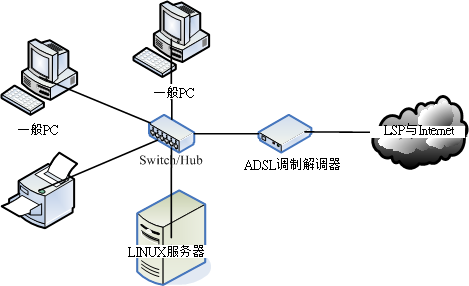 图 2.1-1、计算机网络联机示意图

在上图中，我们主要需要注意到的硬件有哪些呢？大致有底下这些啦：

*   节点 (node)：节点主要是具有网络地址 (IP) 的设备之称， 因此上面图示中的一般 PC、Linux 服务器、ADSL 调制解调器与网络打印机等，个别都可以称为一个 node ！ 那中间那个集线器 (hub) 是不是节点呢？因为他不具有 IP ，因此 hub 不是节点。

*   服务器主机 (server)：就网络联机的方向来说，提供数据以『响应』给用户的主机， 都可以被称为是一部服务器。举例来说，Yahoo 是个 WWW 服务器，昆山的 FTP ([`ftp.ksu.edu.tw/`](http://ftp.ksu.edu.tw/)) 是个文件服务器等等。

*   工作站 (workstation) 或客户端 (client)：任何可以在计算机网络输入的设备都可以是工作站， 若以联机发起的方向来说，主动发起联机去『要求』数据的，就可以称为是客户端 (client)。举例来说，一般 PC 打开浏览器对 Yahoo 要求新闻数据，那一般 PC 就是客户端。

*   网络卡 (Network Interface Card, NIC)：内建或者是外插在主机上面的一个设备， 主要提供网络联机的卡片，目前大都使用具有 RJ-45 接头的以太网络卡。一般 node 上都具有一个以上的网络卡， 以达成网络联机的功能。

*   网络接口：利用软件设计出来的网络接口，主要在提供网络地址 (IP) 的任务。 一张网卡至少可以搭配一个以上的网络接口；而每部主机内部其实也都拥有一个内部的网络接口，那就是 loopback (lo) 这个循环测试接口！

*   网络形态或拓朴 (topology)：各个节点在网络上面的链接方式，一般讲的是物理连接方式。 举例来说，上图中显示的是一种被称为星形联机 (star) 的方式，主要是透过一个中间连接设备， 以放射状的方式连接各个节点的一种形态，这就是一种拓朴。

*   网关 (route) 或通讯闸 (gateway)：具有两个以上的网络接口， 可以连接两个以上不同的网段的设备，例如 IP 分享器就是一个常见的网关设备。那上面的 ADSL 调制解调器算不算网关呢？ 其实不太能算，因为调制解调器通常视为一个在主机内的网卡设备，我们可以在一般 PC 上面透过拨号软件， 将调制解调器仿真成为一张实体网卡 (ppp) ，因此他不太能算是网关设备啦！

网络设备其实非常多也非常复杂，不过如果以小型企业角度来看，我们能够了解上述图示内各设备的角色，那应该也足够啰！ 接下来，让我们继续来讨论一下网络范围的大小吧！

* * *

### 2.1.3 计算机网络区域范围

由于各个节点的距离不同，联机的线材与方式也有所差异，由于线材的差异也导致网络速度的不同，让网络的应用方向也不一样。 根据这些差异，早期我们习惯将网络的大小范围定义如下：(注 6)

*   局域网络 (Local Area Network, LAN)： 节点之间的传输距离较近，例如一栋大楼内，或一个学校的校区内。可以使用较为昂贵的联机材料， 例如光纤或是高质量网络线 (CAT 6) 等。网络速度较快，联机质量较佳且可靠，因此可应用于科学运算的丛集式系统、 分布式系统、云端负荷分担系统等。

*   广域网 (Wide Area Network, WAN)： 传输距离较远，例如城市与城市之间的距离，因此使用的联机媒体需要较为便宜的设备，例如经常使用的电话线就是一例。 由于线材质量较差，因此网络速度较慢且可靠性较低一些，网络应用方面大多为类似 email, FTP, WWW 浏览等功能。

除了这两个之外，还有所谓的都会网络 (Metropolitan Area Network, MAN)，不过近来比较少提及，因此你只要知道有 LAN 及 WAN 即可。这两个名词在很多地方你都可以看的到喔！改天你回家看看你家的 ADSL 调制解调器或 IP 分享器后面的插孔看看，你就能够看到有 WAN 与 LAN 的插孔，现在你就知道为啥有这两个灯号与插孔了吧。

一般来说，LAN 指的是区域范围较小的环境，例如一栋大楼或一间学校，所以在我们生活周遭有着许许多多的 LAN 存在。 那这些 LAN 彼此串接在一起，全部的 LAN 串在一块就是一个大型的 WAN 啰！简单的说，就是这样分。

不过，现在的环境跟以前不一样了，举例来说，前几天刚刚宣布 (2011/07)，光纤的速度已经可以到达 100Mbps/10Mbps 的下载/上传带宽了！再举例来说，台湾的学术网络通通是串在一块的，鸟哥在台南昆山联机到高雄义守大学下载 CentOS 映像档时，你猜下载的速度有多快？每秒钟可高达 100Mbps 左右！这已经是一个内部区网的速度了！所以，用以前的观点来看， 其实对目前的网络环境有点不符现象了。因此，目前你可以使用『速度』作为一个网络区域范围的评量。 或许现在我们可以说，整个台湾的学术网络 (TANET, 注 7) 可以视为是一个局域网络呢！

* * *

### 2.1.4 计算机网络协议： OSI 七层协定

谈完了网络需要制订的标准、网络联机的组件以及网络的范围之后，接下来就是要讲到，那么各个节点之间是如何沟通讯息的呢？ 其实就是透过标准的通讯协议啦！但是，整个网络连接的过程相当复杂，包括硬件、软件数据封包与应用程序的互相链接等等， 如果想要写一支将联网全部功能都串连在一块的程序，那么当某个小环节出现问题时，整只程序都需要改写啊！真麻烦！

那怎办？没关系，我们可以将整个网络连接过程分成数个阶层 (layer)，每个阶层都有特别的独立的功能， 而且每个阶层的程序代码可以独立撰写，因为每个阶层之间的功能并不会互相干扰的。 如此一来，当某个小环节出现问题时，只要将该层级的程序代码重新撰写即可。所以程序撰写也容易，整个网络概念也就更清晰！ 那就是目前你常听到的 OSI 七层协定 (Open System Interconnection) 的概念啰！

如果以图示来说，那么这七个阶层的相关性有点像底下这样：

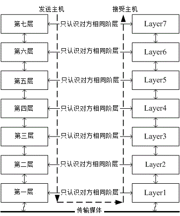 图 2.1-2、OSI 七层协议各阶层的相关性

依据定义来说，越接近硬件的阶层为底层 (layer 1)，越接近应用程序的则是高层 (layer 7)。 不论是接收端还是发送端，每个一阶层只认识对方的同一阶层数据。 而整个传送的过程就好像人们在玩整人游戏一般，我们透过应用程序将数据放入第七层的包裹，再将第七层的包裹放到第六层的包裹内， 依序一直放到第一层的最大的包裹内，然后传送出去给接收端。接收端的主机就得由第一个包裹开始，依序将每个包裹拆开， 然后一个一个交给对应负责的阶层来视察！这就是整人游戏...喔！是 OSI 七层协议在阶层定义方面需要注意的特色。

既然说是包裹，那我们都知道，包裹表面都会有个重要的信息，这些信息包括有来自哪里、要去哪里、接收者是谁等等， 而包裹里面才是真正的数据。同样的，在七层协议中，每层都会有自己独特的表头数据 (header)，告知对方这里面的信息是什么， 而真正的数据就附在后头啰！我们可以使用如下的图示来表示这七层每一层的名字，以及数据是如何放置到每一层的包裹内：

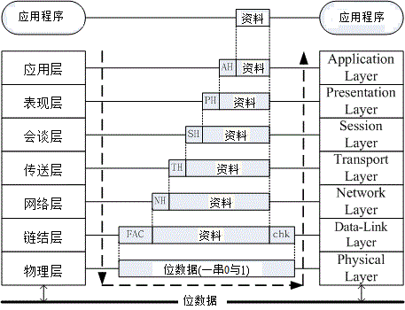 图 2.1-3、OSI 七层协议数据的传递方式

上图中仔细看每个数据报的部分，上层的包裹是放入下层的数据中，而数据前面则是这个数据的表头。其中比较特殊的是第二层， 因为第二层 (数据链结层) 主要是位于软件封包 (packet) 以及硬件讯框 (frame) 中间的一个阶层， 他必须要将软件包装的包裹放入到硬件能够处理的包裹中，因此这个阶层又分为两个子层在处理相对应的数据。 因为比较特殊，所以您瞧瞧，第二层的数据格式比较不一样喔，尾端还出现一个检查码哩～

每一个阶层所负责的任务是什么呢？简单的说，每一层负责的任务如下：(注 6, 注 8, 注 9)

| 分层 | 负责内容 |
| --- | --- |
| Layer 1 物理层 Physical Layer | 由于网络媒体只能传送 0 与 1 这种位串，因此物理层必须定义所使用的媒体设备之电压与讯号等， 同时还必须了解数据讯框转成位串的编码方式，最后连接实体媒体并传送/接收位串。 |
| Layer 2 数据链结层 Data-Link Layer | 这一层是比较特殊的一个阶层，因为底下是实体的定义，而上层则是软件封装的定义。因此第二层又分两个子层在进行数据的转换动作。 在偏硬件媒体部分，主要负责的是 MAC (Media Access Control) ，我们称这个数据报裹为 MAC 讯框 (frame)， MAC 是网络媒体所能处理的主要数据报裹，这也是最终被物理层编码成位串的数据。MAC 必须要经由通讯协议来取得媒体的使用权， 目前最常使用的则是 IEEE 802.3 的以太网络协议。详细的 MAC 与以太网络请参考下节说明。至于偏向软件的部分则是由逻辑链接层 (logical link control, LLC) 所控制，主要在多任务处理来自上层的封包数据 (packet) 并转成 MAC 的格式， 负责的工作包括讯息交换、流量控制、失误问题的处理等等。 |
| Layer 3 网络层 Network Layer | 这一层是我们最感兴趣的啰，因为我们提及的 IP (Internet Protocol) 就是在这一层定义的。 同时也定义出计算机之间的联机建立、终止与维持等，数据封包的传输路径选择等等，因此这个层级当中最重要的除了 IP 之外，就是封包能否到达目的地的路由 (route) 概念了！ |
| Layer 4 传送层 Transport Layer | 这一个分层定义了发送端与接收端的联机技术(如 TCP, UDP 技术)， 同时包括该技术的封包格式，数据封包的传送、流程的控制、传输过程的侦测检查与复原重新传送等等， 以确保各个数据封包可以正确无误的到达目的端。 |
| Layer 5 会谈层 Session Layer | 在这个层级当中主要定义了两个地址之间的联机信道之连接与挂断，此外，亦可建立应用程序之对谈、 提供其他加强型服务如网络管理、签到签退、对谈之控制等等。如果说传送层是在判断资料封包是否可以正确的到达目标， 那么会谈层则是在确定网络服务建立联机的确认。 |
| Layer 6 表现层 Presentation Layer | 我们在应用程序上面所制作出来的数据格式不一定符合网络传输的标准编码格式的！ 所以，在这个层级当中，主要的动作就是：将来自本地端应用程序的数据格式转换(或者是重新编码)成为网络的标准格式， 然后再交给底下传送层等的协议来进行处理。所以，在这个层级上面主要定义的是网络服务(或程序)之间的数据格式的转换， 包括数据的加解密也是在这个分层上面处理。 |
| Layer 7 应用层 Application Layer | 应用层本身并不属于应用程序所有，而是在定义应用程序如何进入此层的沟通接口，以将数据接收或传送给应用程序，最终展示给用户。 |

事实上， OSI 七层协议只是一个参考的模型 (model)，目前的网络社会并没有什么很知名的操作系统在使用 OSI 七层协定的联网程序代码。那...讲这么多干嘛？这是因为 OSI 所定义出来的七层协议在解释网络传输的情况来说， 可以解释的非常棒，因此大家都拿 OSI 七层协议来做为网络的教学与概念的理解。至于实际的联网程序代码，那就交给 TCP/IP 这个玩意儿吧！

* * *

### 2.1.5 计算机网络协议： TCP/IP

虽然 OSI 七层协议的架构非常严谨，是学习网络的好材料。但是也就是因为太过严谨了，因此程序撰写相当不容易， 所以造成它在发展上面些许的困扰。而由 ARPANET 发展而来的 TCP/IP 又如何呢？其实 TCP/IP 也是使用 OSI 七层协议的观念， 所以同样具有分层的架构，只是将它简化为四层，在结构上面比较没有这么严谨，程序撰写会比较容易些。后来在 1990 年代由于 email, WWW 的流行，造成 TCP/IP 这个标准为大家所接受，这也造就目前我们的网络社会啰！

既然 TCP/IP 是由 OSI 七层协议简化而来，那么这两者之间有没有什么相关性呢？它们的相关性可以图示如下， 同时这里也列出目前在这架构底下常见的通讯协议、封包格式与相关标准：

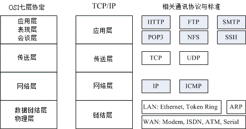 图 2.1-4、OSI 与 TCP/IP 协议之相关性

从上图中，我们可以发现 TCP/IP 将应用、表现、会谈三层整合成一个应用层，在应用层上面可以实作的程序协议有 HTTP, SMTP, DNS 等等。 传送层则没有变，不过依据传送的可靠性又将封包格式分为连接导向的 TCP 及非连接导向的 UDP 封包格式。网络层也没有变，主要内容是提供了 IP 封包，并可选择最佳路由来到达目标 IP 地址。数据链结层与物理层则整合成为一个链结层，包括定义硬件讯号、 讯框转位串的编码等等，因此主要与硬件 (不论是区网还是广域网) 有关。

那 TCP/IP 是如何运作的呢？我们就拿妳常常连上的 Yahoo 入口网站来做个说明好了，整个联机的状态可以这样看：

1.  应用程序阶段：妳打开浏览器，在浏览器上面输入网址列，按下 [Enter]。此时网址列与相关数据会被浏览器包成一个数据， 并向下传给 TCP/IP 的应用层；
2.  应用层：由应用层提供的 HTTP 通讯协议，将来自浏览器的数据报起来，并给予一个应用层表头，再向传送层丢去；
3.  传送层：由于 HTTP 为可靠联机，因此将该数据丢入 TCP 封包内，并给予一个 TCP 封包的表头，向网络层丢去；
4.  网络层：将 TCP 包裹包进 IP 封包内，再给予一个 IP 表头 (主要就是来源与目标的 IP 啰)，向链结层丢去；
5.  链结层：如果使用以太网络时，此时 IP 会依据 CSMA/CD 的标准，包裹到 MAC 讯框中，并给予 MAC 表头，再转成位串后， 利用传输媒体传送到远程主机上。

等到 Yahoo 收到你的包裹后，在依据相反方向拆解开来，然后交给对应的层级进行分析，最后就让 Yahoo 的 WWW 服务器软件得到你所想要的数据，该服务器软件再根据你的要求，取得正确的资料后，又依循上述的流程，一层一层的包装起来， 最后传送到你的手上！就是这样啰！

根据这样的流程，我们就得要知道每个分层所需要了解的基础知识，这样才算学习网络基础嘛！所以底下我们会依据 TCP/IP 的链结层、网络层、传送层来进行说明，应用层的协议则在后续章节中有对应的协定再来谈啰！同时我们也知道， 网络媒体一次传输的数据量是有限的，因此如果要被传输的数据太大时，我们在分层的包装中，就得要将数据先拆开放到不同的包裹中， 再给包裹一个序号，好让目的端的主机能够藉由这些序号再重新将数据整合回来！很有趣吧！接下来就让我们一层一层来介绍啰！

**Tips:** 一般来说，因为应用程序与程序设计师比较有关系，而网络层以下的数据则主要是操作系统提供的，因此， 我们又将 TCP/IP 当中的应用层视为使用者层，而底下的三层才是我们主要谈及的网络基础！所以这个章节主要就是介绍这三层啦！


* * *

# 2.2 TCP/IP 的链结层相关协议

## 2.2 TCP/IP 的链结层相关协议

TCP/IP 最底层的链结层主要与硬件比较有关系，因此底下我们主要介绍一些 WAN 与 LAN 的硬件。 同时会开始介绍那重要的 CSMA/CD 的以太网络协议，以及相关的硬件与 MAC 讯框格式等。那就开始来聊聊啰！

* * *

### 2.2.1 广域网使用的设备

在 2.1.3 节我们有提到过，广域网使用的设备价格较为低廉。 不过广域网使用到的设备非常的多，一般用户通常会接触到的主要是 ADSL 调制解调器或者是光纤到大厦，以及第四台的 Cable 宽带等。在这里我们先介绍一些比较常见的设备，如果以后你有机会接触到其他设备，再请你依据需求自行查阅相关书籍吧！

*   传统电话拨接：透过 ppp 协议

    早期网络大概都只能透过调制解调器加上电话线以及计算机的九针串行端口 (以前接鼠标或游戏杆的插孔)，然后透过 Point-to-Point Protocol (PPP 协议) 配合拨接程序来取得网络 IP 参数，这样就能够上网了。不过这样的速度非常慢，而且当电话拨接后， 就不能够讲电话了！因为 PPP 支持 TCP/IP, NetBEUI, IPX/SPX 等通讯协议，所以使用度非常广！

*   整合服务数字网络 (Integrated Services Digital Network, ISDN)

    也是利用现有的电话线路来达成网络联机的目的，只是联机的两端都需要有 ISDN 的调制解调器来提供联机功能。 ISDN 的传输有多种通道可供使用，并且可以将多个信道整合应用，因此速度可以成倍成长。基本的 B 信道速度约为 64Kbps， 但如美国规格使用 23 个以上的通道来达成联机，此时速度可达 1.5Mbps 左右。不过台湾这玩意儿比较少见。

*   非对称数位用路回路 (Asymmetric Digital Subscriber Line, ADSL)：透过 pppoe 协定

    也是透过电话线来拨接后取得 IP 的一个方法，只不过这个方式使用的是电话的高频部分，与一般讲电话的频率不同。 因此妳可以一边使用 ADSL 上网同时透过同一个电话号码来打电话聊天。在台湾，由于上传/下载的带宽不同， 因此才称为非对称的回路。ADSL 同样使用调制解调器，只是他透过的是 PPPoE (PPP over Ethernet) 的方法！ 将 PPP 仿真在以太网络卡上，因此你的主机需要透过一张网络卡来连接到调制解调器，并透过拨接程序来取得新的接口 (ppp0) 喔！

*   电缆调制解调器 (Cable modem)

    主要透过有线电视 (台湾所谓的第四台) 使用的缆线作为网络讯号媒体，同样需要具备调制解调器来连接到 ISP，以取得网络参数来上网。 Cable modem 的带宽主要是分享型的，所以通常具有区域性，并不是你想装就能装的哩！

* * *

### 2.2.2 局域网络使用的设备-以太网络

在局域网络的环境中，我们最常使用的就是以太网络。当然啦，在某些超高速网络应用的环境中， 还可能会用到价格相当昂贵的光纤信道哩。只是如同前面提到的，以太网络因为已经标准化了，设备设置费用相对低廉， 所以一般你会听到什么网络线或者是网络媒体，几乎都是使用以太网络来架设的环境啦！ 只是这里还是要提醒您，整个网络世界并非仅有以太网络这个硬件接口喔！ 事实上，想了解整个以太网络的发展，建议你可以直接参考风信子与张民人先生翻译的 『Switched & Fast 以太网络』一书，该书内容相当的有趣，挺适合阅读的吶。 底下我们仅做个简单的介绍而已。

*   以太网络的速度与标准

以太网络的流行主要是它成为国际公认的标准所致。早先 IEEE 所制订的以太网络标准为 802.3 的 IEEE 10BASE5 ，这个标准主要的定义是：『10 代表传输速度为 10Mbps，BASE 表示采用基频信号来进行传输，至于 5 则是指每个网络节点之间最长可达 500 公尺。』

由于网络的传输信息就是 0 与 1 啊，因此，数据传输的单位为每秒多少 bit ， 亦即是 M bits/second, Mbps 的意思。那么为何制订成为 10Mbps 呢？ 这是因为早期的网络线压制的方法以及相关的制作方法，还有以太网络卡制作的技术并不是很好， 加上当时的数据传输需求并没有像现在这么高，所以 10Mbps 已经可以符合大多数人的需求了。

**Tips:** 我们看到的网络提供者 (Internet Services Provider, ISP) 所宣称他们的 ADSL 传输速度可以达到 下行/上行 2Mbps/128Kbps (Kbits per second) 时，那个 Kb 指的可不是 bytes 而是 bits 喔！所以 2M/128K 在实际的档案大小传输速度上面，最大理论的传输为 256KBps/16 KBps(KBytes per second)，所以正常下载的速度约在每秒 100~200 KBytes 之间吶！ 同样的道理，在网络卡或者是一些网络媒体的广告上面，他们都会宣称自己的产品可以自动辨识传输速度为 10/100 Mbps ( Mega-bits per second)，呵呵！该数值还是得再除以 8 才是我们一般常用的档案容量计算的单位 bytes 喔！


早期的网络线使用的是旧式的同轴电缆线，这种线路在现在几乎已经看不到了。取而代之的是类似传统电话线的双绞线 (Twisted Pair Ethernet) ，IEEE 并将这种线路的以太网络传输方法制订成为 10BASE-T 的标准。 10BASE-T 使用的是 10 Mbps 全速运作且采用无遮蔽式双绞线 (UTP) 的网络线。此外， 10BASE-T 的 UTP 网络线可以使用星形联机(star)， 也就是以一个集线器为中心来串连各网络设备的一个方法，图 2.1-1 就是星形联机的一个示意图。

不同于早期以一条同轴电缆线链接所有的计算机的 bus 联机，透过星形联机的帮助， 我们可以很简单的加装其他的设备或者是移除其他设备，而不会受到其他装置的影响，这对网络设备的扩充性与除错来说， 都是一项相当棒的设计！也因此 10BASE-T 让以太网络设备的销售额大幅提升啊！

后来 IEEE 更制订了 802.3u 这个支持到 100Mbps 传输速度的 100BASE-T 标准，这个标准与 10BASE-T 差异不大， 只是双绞线线材制作需要更精良，同时也已经支持使用了四对绞线的网络线了， 也就是目前很常见的八蕊网络线吶！这种网络线我们常称为等级五 (Category 5, CAT5) 的网络线。 这种传输速度的以太网络就被称为 Fast ethernet 。至于目前我们常常听到的 Gigabit 网络速度 1000 Mbps 又是什么吶？那就是 Gigabit ethernet 哩！只是 Gigabit ethernet 的网络线就需要更加的精良。

| 名称 | 速度 | 网络线等级 |
| --- | --- | --- |
| 以太网络(Ethernet) | 10Mbps | - |
| 高速以太网络(Fast Ethernet) | 100Mbps | CAT 5 |
| 超高速以太网络(Gigabit Ethernet) | 1000Mbps | CAT 5e/CAT 6 |

为什么每当传输速度增加时，网络线的要求就更严格呢？这是因为当传输速度增加时，线材的电磁效应相互干扰会增强， 因此在网络线的制作时就得需要特别注意线材的质料以及内部线蕊心之间的缠绕情况配置等， 以使电子流之间的电磁干扰降到最小，才能使传输速度提升到应有的 Gigabit 。 所以说，在以太网络世界当中，如果你想要提升原有的 fast ethernet 到 gigabit ethernet 的话， 除了网络卡需要升级之外，主机与主机之间的网络线， 以及连接主机线路的集线器/交换器等，都必须要提升到可以支持 gigabit 速度等级的设备才行喔！

*   以太网络的网络线接头 (跳线/并行线)

前面提到，网络的速度与线材是有一定程度的相关性的，那么线材的接头又是怎样呢？ 目前在以太网络上最常见到的接头就是 RJ-45 的网络接头，共有八蕊的接头，有点像是胖了的电话线接头， 如下所示：

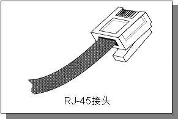 图 2.2-1、RJ-45 接头示意图

而 RJ-45 接头又因为每条蕊线的对应不同而分为 568A 与 568B 接头，这两款接头内的蕊线对应如下表：

| 接头名称\蕊线顺序 | 1 | 2 | 3 | 4 | 5 | 6 | 7 | 8 |
| --- | --- | --- | --- | --- | --- | --- | --- | --- |
| 568A | 白绿 | 绿 | 白橙 | 蓝 | 白蓝 | 橙 | 白棕 | 棕 |
| 568B | 白橙 | 橙 | 白绿 | 蓝 | 白蓝 | 绿 | 白棕 | 棕 |

事实上，虽然目前的以太网络线有八蕊且两两成对，但实际使用的只有 1,2,3,6 蕊而已， 其他的则是某些特殊用途的场合才会使用到。但由于主机与主机的联机以及主机与集线器的联机时， 所使用的网络线脚位定义并不相同，因此由于接头的不同网络线又可分为两种：

*   跳线：一边为 568A 一边为 568B 的接头时称为跳线，用在直接链接两部主机的网络卡。
*   并行线：两边接头同为 568A 或同为 568B 时称为并行线，用在链接主机网络卡与集线器之间的线材；

* * *

### 2.2.3 以太网络的传输协议：CSMA/CD

整个以太网络的重心就是以太网络卡啦！所以说，以太网络的传输主要就是网络卡对网络卡之间的数据传递而已。 每张以太网络卡出厂时，就会赋予一个独一无二的卡号，那就是所谓的 MAC (Media Access Control) 啦！ 理论上，网卡卡号是不能修改的，不过某些笔记本电脑的网卡卡号是能够修改的呦！ 那么以太网络的网卡之间数据是如何传输的呢？那就得要谈一下 IEEE 802.3 的标准 CSMA/CD (Carrier Sense Multiple Access with Collision Detection) 了！我们以下图来作为简介，下图内的中心点为集线器， 各个主机都是联机到集线器，然后透过集线器的功能向所有主机发起联机的。

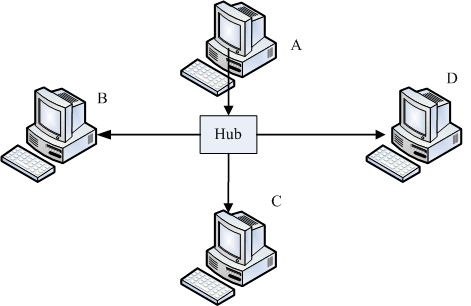 图 2.2-2、CSMA/CD 联机示意图，由 A 发送资料给 D 时，注意箭头方向

集线器是一种网络共享媒体，什么是网络共享媒体啊？想象一下上述的环境就像一个十字路口，而集线器就是那个路口！ 这个路口一次只允许一辆车通过，如果两辆车同时使用这个路口，那么就会发生碰撞的车祸事件啊！那就是所谓的共享媒体。 也就是说，网络共享媒体在单一时间点内， 仅能被一部主机所使用。

理解了共享媒体的意义后，再来，我们就得要讨论，那么以太网络的网卡之间是如何传输的呢？我们以上图中的 A 要发给 D 网卡为例好了，简单的说， CSMA/CD 搭配上述的环境，它的传输情况需要有以下的流程：

1.  监听媒体使用情况 (Carrier Sense)：A 主机要发送网络封包前，需要先对网络媒体进行监听，确认没有人在使用后， 才能够发送出讯框；

2.  多点传输 (Multiple Access)：A 主机所送出的数据会被集线器复制一份，然后传送给所有连接到此集线器的主机！ 也就是说， A 所送出的数据， B, C, D 三部计算机都能够接收的到！但由于目标是 D 主机，因此 B 与 C 会将此讯框数据丢弃，而 D 则会抓下来处理；

3.  碰撞侦测 (Collision Detection)：该讯框数据附有检测能力，若其他主机例如 B 计算机也刚好在同时间发送讯框数据时， 那么 A 与 B 送出的数据碰撞在一块 (出车祸) ，此时这些讯框就是损毁，那么 A 与 B 就会各自随机等待一个时间， 然后重新透过第一步再传送一次该讯框数据。

了解这个程序很重要吗？我们就来谈谈：

*   网络忙碌时，集线器灯号闪个不停，但我的主机明明没有使用网络： 透过上述的流程我们会知道，不管哪一部主机发送出讯框，所有的计算机都会接收到！因为集线器会复制一份该数据给所有计算机。 因此，虽然只有一部主机在对外联机，但是在集线器上面的所有计算机灯号就都会闪个不停！

*   我的计算机明明没有被入侵，为何我的数据会被隔壁的计算机窃取： 透过上述的流程，我们只要在 B 计算机上面安装一套监听软件，这套软件将原本要丢弃的讯框数据捉下来分析，并且加以重组， 就能够知道原本 A 所送出的讯息了。这也是为什么我们都建议重要数据在因特网上面得要『加密』后再传输！

*   既然共享媒体只有一个主机可以使用，为何大家可以同时上网： 这个问题就有趣了，既然共享媒体一次只能被一个主机所使用，那么万一我传输 100MB 的档案，集线器就得被我使用 80 秒 (以 10Mbps 传输时)，在这期间其他人都不可以使用吗？不是的，由于标准的讯框数据在网络卡与其他以太网络媒体一次只能传输 1500bytes，因此我的 100MB 档案就得要拆成多个小数据报，然后一个一个的传送，每个数据报传送前都要经过 CSMA/CD 的机制。 所以，这个集线器的使用权是大家抢着用的！即使只有一部主机在使用网络媒体时，那么这部主机在发送每个封包间， 也都是需要等待一段时间的 (96 bit time)！

*   讯框要多大比较好？能不能修改讯框？： 如上所述，那么讯框的大小能不能改变呢？因为如果讯框的容量能够增大，那么小数据报的数量就会减少， 那每个讯框传送间的等待就可以减少了！是这样没错，但是以太网络标准讯框确实定义在 1500 bytes， 但近来的超高速以太网络媒体有支持 Jumbo frame (巨型讯框,注 10) 的话，那么就能够将讯框大小改为 9000bytes 哩！但不是很建议大家随便修改啦！为什么呢？2.2.5 MTU 那小节再说。

* * *

### 2.2.4 MAC 的封装格式

上面提到的 CSMA/CD 传送出去的讯框数据，其实就是 MAC 啦！MAC 其实就是我们上面一直讲到的讯框 (frame) 啰！ 只是这个讯框上面有两个很重要的数据，就是目标与来源的网卡卡号，因此我们又简称网卡卡号为 MAC 而已。 简单的说，你可以把 MAC 想成是一个在网络线上面传递的包裹，而这个包裹是整个网络硬件上面传送数据的最小单位了。 也就是说，网络线可想成是一条『一次仅可通过一个人』的独木桥， 而 MAC 就是在这个独木桥上面动的人啦！接下来，来看一看 MAC 这个讯框的内容吧！

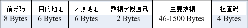 图 2.2-3、以太网络的 MAC 讯框

上图中的目的地址与来源地址指的就是网卡卡号 (hardware address, 硬件地址)，我们前面提到，每一张网卡都有一个独一无二的卡号， 那个卡号的目的就在这个讯框的表头数据使用到啦！硬件地址最小由 00:00:00:00:00:00 到 FF:FF:FF:FF:FF:FF (16 进位法)， 这 6 bytes 当中，前 3bytes 为厂商的代码，后 3bytes 则是该厂商自行设定的装置码了。

在 Linux 当中，你可以使用 ifconfig 这个指令来查阅你的网络卡卡号喔！特别注意，在这个 MAC 的传送中，他仅在局域网络内生效，如果跨过不同的网域 (这个后面 IP 的部分时会介绍)，那么来源与目的的硬件地址就会跟着改变了。 这是因为变成不同网络卡之间的交流了嘛！所以卡号当然不同了！如下所示：

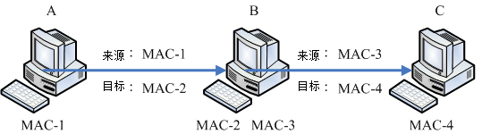 图 2.2-4、同一讯框在不同网域的主机间传送时，讯框的表头变化

例如上面的图标，我的数据要由计算机 A 通过 B 后才送达 C ，而 B 计算机有两块网络卡，其中 MAC-2 与 A 计算机的 MAC-1 互通，至于 MAC-3 则与 C 计算机的 MAC-4 互通。但是 MAC-1 不能与 MAC-3 与 MAC-4 互通，为啥？因为 MAC-1 这块网络卡并没有与 MAC-3 及 MAC-4 使用同样的 switch/hub 相接嘛！所以，数据的流通会变成：

1.  先由 MAC-1 传送到 MAC-2 ，此时来源是 MAC-1 而目的地是 MAC-2；
2.  B 计算机接收后，察看该讯框，发现目标其实是 C 计算机，而为了与 C 计算机沟通， 所以他会将讯框内的来源 MAC 改为 MAC-3 ，而目的改为 MAC-4 ，如此就可以直接传送到 C 计算机了。

也就是说，只要透过 B (就是路由器) 才将封包送到另一个网域 (IP 部分会讲) 去的时候， 那么讯框内的硬件地址就会被改变，然后才能够在同一个网域里面直接进行讯框的流通啊！

**Tips:** 由于网络卡卡号是跟着网络卡走的，并不会因为重灌操作系统而改变， 所以防火墙软件大多也能够针对网络卡来进行抵挡的工作喔！ 不过抵挡网卡仅能在局域网络内进行而已，因为 MAC 不能跨 router 嘛！！


*   为什么资料量最小要 46 最大为 1500 bytes 呢？

    讯框内的数据内容最大可达 1500bytes 这我们现在知道了，那为何要规范最小数据为 46bytes 呢？这是由于 CSMA/CD 机制所算出来的！ 在这个机制上面可算出若要侦测碰撞，则讯框总数据量最小得要有 64bytes ，那再扣除目的地址、来源地址、检查码 (前导码不算) 后， 就可得到数据量最小得要有 46bytes 了！也就是说，如果妳要传输的数据小于 46byes ，那我们的系统会主动的填上一些填充码， 以补齐至少 46bytes 的容量才行！

* * *

### 2.2.5 MTU 最大传输单位

通过上面 MAC 封装的定义，现在我们知道标准以太网络讯框所能传送的数据量最大可以到达 1500 bytes ， 这个数值就被我们称为 MTU (Maximum Transmission Unit, 最大传输单位)。 你得要注意的是，每种网络接口的 MTU 都不相同，因此有的时候在某些网络文章上面你会看到 1492 bytes 的 MTU 等等。不过，在以太网络上，标准的定义就是 1500 bytes。

在待会儿会介绍到的 IP 封包中，这个 IP 封包最大可以到 65535 bytes，比 MTU 还要大呢！既然礼物 (IP) 都比盒子 (MAC) 大，那怎么可能放的进去啊？所以啰， IP 封包是可以进行拆解的，然后才能放到 MAC 当中啊！等到数据都传到目的地， 再由目的地的主机将他组装回来就是了。所以啰，如果 MTU 能够大一些的话，那么 IP 封包的拆解情况就会降低， 封包与封包传送之间的等待时间 (前一小节提到的 96 bit time) 也会减少，就能够增加网络带宽的使用啰！

为了这个目的，所以 Gigabit 的以太网络媒体才有支持 Jumbo frame 的嘛！这个 Jumbo frame 一般都定义到 9000bytes。 那你会说，既然如此，我们的 MTU 能不能改成 9000bytes 呢？这样一来不就能够减少数据封包的拆解，以增加网络使用率吗？ 是这样没错，而且，你也确实可以在 Linux 系统上更改 MTU 的！但是，如果考虑到整个网络，那么我们不建议你修改这个数值。 为什么呢？

我们的封包总是需要在 Internet 上面跑吧？你无法确认所有的网络媒体都是支持那么大的 MTU 对吧！ 如果你的 9000 bytes 封包通过一个不支持 Jumbo frame 的网络媒体时，好一点的是该网络媒体 (例如 switch/router 等) 会主动的帮你重组而进行传送，差一点的可能就直接回报这个封包无效而丢弃了～这个时候可就糗大啰～ 所以， MTU 设定为 9000 这种事情，大概仅能在内部网络的环境中作～举例来说，很多的内部丛集系统 (cluster) 就将他们的内部网络环境 MTU 设定为 9000，但是对外的适配卡可还是原本的标准 1500 喔！ ^_^

也就是说，不论你的网络媒体支持 MTU 到多大，你必须要考虑到你的封包需要传到目的地时， 所需要经过的所有网络媒体，然后再来决定你的 MTU 设定才行。就因为这样，我们才不建议你修改标准以太网络的 MTU 嘛！

**Tips:** 早期某些网络媒体 (例如 IP 分享器) 支持的是 802.2, 802.3 标准所组合成的 MAC 封装，它的 MTU 就是 1492 ， 而且这些设备可能不会进行封包重组，因此早期网络上面常常有朋友问说，他们连上某些网站时，总是会联机逾时而断线。 但透过修改客户端的 MTU 成为 1492 之后，上网就没有问题了。原因是什么呢？读完上头的数据，您应该能理解了吧？^_^


* * *

### 2.2.6 集线器、交换器与相关机制

*   共不共享很重要，集线器还是交换器？ (注 11)

    刚刚我们上面提到了，当一个很忙碌的网络在运作时，集线器 (hub) 这个网络共享媒体就可能会发生碰撞的情况， 这是因为 CSMA/CD 的缘故。那有没有办法避免这种莫名其妙的封包碰撞情况呢？有的，那就使用非共享媒体的交换器即可啊！

    交换器 (switch) 等级非常多，我们这里仅探讨支持 OSI 第二层的交换器。交换器与集线器最大的差异，在于交换器内有一个特别的内存， 这个内存可以记录每个 switch port 与其连接的 PC 的 MAC 地址，所以，当来自 switch 两端的 PC 要互传数据时，每个讯框将直接透过交换器的内存数据而传送到目标主机上！ 所以 switch 不是共享媒体，且 switch 的每个埠口 (port) 都具有独立的带宽喔！

    举例来说，10/100 的 Hub 上链接 5 部主机，那么整个 10/100Mbps 是分给这五部主机的， 所以这五部主机总共只能使用 10/100Mbps 而已。那如果是 switch 呢？由于『每个 port 都具有 10/100Mbps 的带宽』， 所以就看你当时的传输行为是如何啰！举例来说，如果是底下的状况时，每个联机都是 10/100 Mbps 的。

     图 2.2-5、交换器每个埠口的带宽使用示意图

    A 传送到 D 与 B 传送到 C 都独自拥有 10/100Mbps 的带宽，两边并不会互相影响！ 不过，如果是 A 与 D 都传给 C 时，由于 C port 就仅有 10/100Mbps ，等于 A 与 D 都需要抢 C 节点的 10/100Mbps 来用的意思。 总之，你就是得要记得的是，switch 已经克服了封包碰撞的问题，因为他有个 switch port 对应 MAC 的相关功能， 所以 switch 并非共享媒体喔！同时需要记得的是，现在的 switch 规格很多， 在选购的时候，千万记得选购可以支持全双工/半双工，以及支持 Jumbo frame 的为佳！

*   什么是全双工/半双工(full-duplex, half-duplex)

    前面谈到网络线时，我们知道八蕊的网络线实际上仅有两对被使用，一对是用在传送，另一对则是在接收。 如果两端的 PC 同时支持全双工时，那表示 Input/Output 均可达到 10/100Mbps， 亦即数据的传送与接收同时均可达到 10/100bps 的意思，总带宽则可达到 20/200Mbps 啰 (其实是有点语病的，因为 Input 可达 10/100Mbps， output 可达 10/100Mbps ， 而不是 Input 可直接达到 20/200Mbps 喔！)如果你的网络环境想要达到全双工时， 使用共享媒体的 Hub 是不可能的，因为网络线脚位的关系，无法使用共享媒体来达到全双工的！ 如果你的 switch 也支持全双工模式，那么在 switch 两端的 PC 才能达到全双工喔！

*   自动协调速度机制 (auto-negotiation)：

    我们都知道现在的以太网络卡是可以向下支持的，亦即是 Gigabit 网络卡可以与早期的 10/100Mbps 网络卡链接而不会发生问题。但是，此时的网络速度是怎样判定呢？ 早期的 switch/hub 必须要手动切换速度才行，新的 hub/switch 因为有支持 auto-negotiation 又称为 N-Way 的功能，他可自动的协调出最高的传输速度来沟通喔！如果有 Gigabit 与 10/100Mbps 在 switch 上面， 则 N-Way 会先使用最高的速度 (gigabit) 测试是否能够全部支持，如果不行的话，就降速到下一个等级亦即 100 Mbps 的速度来运作的！

*   自动分辨网络线跳线或并行线 (Auto MDI/MDIX)：

    那么我们是否需要自行分辨并行线与跳线呢？不需要啦！因为 switch 若含有 auto MDI/MDIX 的功能时， 会自动分辨网络线的脚位来调整联机的，所以你就不需要管你的网络线是跳线还是并行线啰！方便吧！ ^_^

*   讯号衰减造成的问题

    由于电子讯号是会衰减的，所以当网络线过长导致电子讯号衰减的情况严重时， 就会导致联机质量的不良了。因此，链接各个节点的网络线长度是有限制的喔！ 不过，一般来说，现今的以太网络 CAT5 等级的网络线大概都可以支持到 100 公尺的长度， 所以应该无庸担心才是吶！

    但是，造成讯号衰减的情况并非仅有网络线长度而已！如果你的网络线折得太严重(例如在门边常常被门板压，导致变形) ，或者是自行压制网络线接头，但是接头部分的八蕊蕊线缠绕度不足导致电磁干扰严重， 或者是网络线放在户外风吹日晒导致脆化的情况等等，都会导致电子讯号传递的不良而造成联机质量恶劣， 此时常常就会发现偶而可以联机、有时却又无法联机的问题了！因此，当你需要针对企业内部来架设整体的网络时， 注意结构化布线可是很重要的喔！

*   结构化布线

    所谓的结构化布线指的是将各个网络的组件分别拆开，分别安装与布置到企业内部， 则未来想要提升网络硬件等级或者是移动某些网络设备时，只需要更动类似配线盘的机柜处， 以及末端的墙上预留孔与主机设备的联机就能够达到目的了。例如底下的图示：

    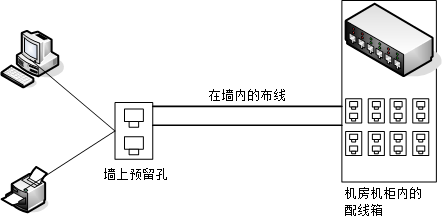 图 2.2-6、结构化布线简易图标

    在墙内的布线需要很注意，因为可能一布线完成后就使用 5-10 年以上喔！那你需要注意的仅有末端墙上的预留孔以及配线端部分。 事实上，光是结构化布线所需要选择的网络媒体与网络线的等级，还有机柜、机架，以及美化与隐藏网络线的材料等等的挑选， 以及实际施工所需要注意的事项，还有所有硬件、施工所需要注意的标准规范等等， 已经可以写满厚厚一本书，而鸟哥这里的文章旨在介绍一个中小企业内部主机数量较少的环境， 所以仅提到最简单的以一个或两个交换器 (swtich) 串接所有网络设备的小型星形联机状态而已。

    如果你有需要相关硬件结构化布线的信息，可以参考风信子兄翻译的『Swtich and Fast 以太网络』一书的后半段！至于网络上的高手吗？你可以前往酷学园请教 [ZMAN (http://http://wordpress.morezman.com/)](http://wordpress.morezman.com/) 大哥喔！

* * *

# 2.3 TCP/IP 的网络层相关封包与数据

## 2.3 TCP/IP 的网络层相关封包与数据

我们现在知道要有网络的话，必须要有网络相关的硬件，而目前最常见的网络硬件接口为以太网络，包括网络线、网络卡、Hub/Switch 等等。而以太网络上面的传输使用网络卡卡号为基准的 MAC 讯框，配合 CSMA/CD 的标准来传送讯框，这就是硬件部分。在软件部分，我们知道 Internet 其实就是 TCP/IP 这个通讯协议的通称，Internet 是由 InterNIC(注 12) 所统一管理的， 但其实他仅是负责分配 Internet 上面的 IP 以及提供相关的 TCP/IP 技术文件而已。不过 Internet 最重要的就是 IP 啊！所以， 这个小节就让我们来讲讲网络层的 IP 与路由吧！

* * *

### 2.3.1 IP 封包的封装

目前因特网社会的 IP 有两种版本，一种是目前使用最广泛的 IPv4 (Internet Protocol version 4, 因特网协定第四版)， 一种则是预期未来会热门的 IPv6 。IPv4 记录的地址由于仅有 32 位，预计在 2020 年前后就会分发完毕，如此一来， 新兴国家或者是新的网络公司，将没有网络可以使用。为了避免这个问题发生，因此就有 IPv6 的产生。 IPv6 的地址可以达到 128 位，可以多出 2 的 96 次方倍的网址数量，这样的 IP 数量几乎用不完啦！虽然 IPv6 具有前瞻性，但目前主流媒体大多还是使用 IPv4 ，因此本文主要谈到的 IP 都指 IPv4 而言喔！(注 13)

我们在前一小节谈到 MAC 的封装，那么 IP 封包的封装也得要来了解一下，才能知道 IP 到底是如何产生的啊！ IP 封包可以达到 65535 bytes 这么大，在比 MAC 大的情况下，我们的操作系统会对 IP 进行拆解的动作。至于 IP 封装的表头数据绘制如下：(下图第一行为每个字段的 bit 数)

| 4 bits | 4 bits | 8 bits | 3 bits | 13 bits |
| --- | --- | --- | --- | --- |
| Version | IHL | Type of Service | Total Length |
| Identification | Flags | Fragmentation Offset |
| Time To Live | Protocol | Header Checksum |
| Source Address |
| Destination Address |
| Options | Padding |
| Data |

图 2.3-1、IP 封包的表头资料

在上面的图示中有个地方要注意，那就是『每一行所占用的位数为 32 bits』， 各个表头的内容分别介绍如下：

*   Version(版本) 宣告这个 IP 封包的版本，例如目前惯用的还是 IPv4 这个版本就在这里宣告。

*   IHL(Internet Header Length, IP 表头的长度) 告知这个 IP 封包的表头长度，使用的单位应该是字组 (word) ，一个字组为 4bytes 大小喔。

*   Type of Service(服务类型) 这个项目的内容为『PPPDTRUU』，表示这个 IP 封包的服务类型，主要分为： PPP：表示此 IP 封包的优先度，目前很少使用； D：若为 0 表示一般延迟(delay)，若为 1 表示为低延迟； T：若为 0 表示为一般传输量 (throughput)，若为 1 表示为高传输量； R：若为 0 表示为一般可靠度(reliability)，若为 1 表示高可靠度。 UU：保留尚未被使用。 举例来说，gigabit 以太网络的种种相关规格可以让这个 IP 封包加速且降低延迟，某些特殊的标志就是在这里说明的。

*   Total Length(总长度) 指这个 IP 封包的总容量，包括表头与内容 (Data) 部分。最大可达 65535 bytes。

*   Identification(辨别码) 我们前面提到 IP 袋子必须要放在 MAC 袋子当中。不过，如果 IP 袋子太大的话，就得先要将 IP 再重组成较小的袋子然后再放到 MAC 当中。而当 IP 被重组时，每个来自同一个 IP 的小袋子就得要有个标识符以告知接收端这些小袋子其实是来自同一个 IP 封包才行。 也就是说，假如 IP 封包其实是 65536 那么大 (前一个 Total Length 有规定)， 那么这个 IP 就得要再被分成更小的 IP 分段后才能塞进 MAC 讯框中。那么每个小 IP 分段是否来自同一个 IP 资料，呵呵！那就是这个标识符的功用啦！

*   Flags(特殊旗标) 这个地方的内容为『0DM』，其意义为： D：若为 0 表示可以分段，若为 1 表示不可分段 M：若为 0 表示此 IP 为最后分段，若为 1 表示非最后分段。

*   Fragment Offset(分段偏移) 表示目前这个 IP 分段在原始的 IP 封包中所占的位置。就有点像是序号啦，有这个序号才能将所有的小 IP 分段组合成为原本的 IP 封包大小嘛！透过 Total Length, Identification, Flags 以及这个 Fragment Offset 就能够将小 IP 分段在收受端组合起来啰！

*   Time To Live(TTL, 存活时间) 表示这个 IP 封包的存活时间，范围为 0-255。当这个 IP 封包通过一个路由器时， TTL 就会减一，当 TTL 为 0 时，这个封包将会被直接丢弃。说实在的，要让 IP 封包通过 255 个路由器，还挺难的～ ^_^

*   Protocol Number(协定代码) 来自传输层与网络层本身的其他数据都是放置在 IP 封包当中的，我们可以在 IP 表头记载这个 IP 封包内的资料是啥， 在这个字段就是记载每种数据封包的内容啦！在这个字段记载的代码与相关的封包协议名称如下所示：

    ```
    | IP 内的号码 | 封包协议名称(全名) |
    | --- | --- |
    | 1 | ICMP (Internet Control Message Protocol) |
    | 2 | IGMP (Internet Group Management Protocol) |
    | 3 | GGP (Gateway-to-Gateway Protocol) |
    | 4 | IP (IP in IP encapsulation) |
    | 6 | TCP (Transmission Control Protocol) |
    | 8 | EGP (Exterior Gateway Protocol) |
    | 17 | UDP (User Datagram Protocol) | 
    ```

    当然啦，我们比较常见到的还是那个 TCP, UDP, ICMP 说！

*   Header Checksum(表头检查码) 用来检查这个 IP 表头的错误检验之用。

*   Source Address 还用讲吗？当然是来源的 IP 地址，从这里我们也知道 IP 是 32 位喔！

*   Destination Address 有来源还需要有目标才能传送，这里就是目标的 IP 地址。

*   Options (其他参数) 这个是额外的功能，提供包括安全处理机制、路由纪录、时间戳、严格与宽松之来源路由等。

*   Padding(补齐项目) 由于 Options 的内容不一定有多大，但是我们知道 IP 每个数据都必须要是 32 bits，所以，若 Options 的数据不足 32 bits 时，则由 padding 主动补齐。

你只要知道 IP 表头里面含有： TTL, Protocol, 来源地址与目标地址也就够了！而这个 IP 表头的来源与目标 IP ，以及那个判断通过多少路由器的 TTL ，就能了解到这个 IP 将被如何传送到目的端吶。后续各小节我们将介绍 IP 的组成与范围，还有 IP 封包如何传送的机制 (路由) 等等。

* * *

### 2.3.2 IP 地址的组成与分级

现在我们知道 IP (Internet Protocol) 其实是一种网络封包，而这个封包的表头最重要的就是那个 32 位的来源与目标地址！ 为了方便记忆，所以我们也称这个 32 bits 的数值为 IP 网络地址就是了。因为网络是人类发明的，所以很多概念与邮务系统类似！ 那这个 IP 其实就类似所谓的『门牌号码』啦！那么这个 IP 有哪些重要的地方需要了解的呢？底下我们就来谈一谈吧！

既然 IP 的组成是 32 bits 的数值，也就是由 32 个 0 与 1 组成的一连串数字！那么当我们思考所有跟 IP 有关的参数时，你就应该要将该参数想成是 32 位的数据喔！ 不过，因为人类对于二进制实在是不怎么熟悉，所以为了顺应人们对于十进制的依赖性，因此，就将 32 bits 的 IP 分成四小段，每段含有 8 个 bits ，将 8 个 bits 计算成为十进制，并且每一段中间以小数点隔开，那就成了目前大家所熟悉的 IP 的书写模样了。如下所示：

```
IP 的表示式：
00000000.00000000.00000000.00000000   ==&gt; 0.0.0.0
11111111.11111111.11111111.11111111   ==&gt; 255.255.255.255 
```

所以 IP 最小可以由 0.0.0.0 一直到 255.255.255.255 哩！但在这一串数字中，其实还可以分为两个部分喔！ 主要分为 Net_ID (网域号码)与 Host_ID (主机号码) 两部份。我们先以 192.168.0.0 ~ 192.168.0.255 这个 Class C 的网域当作例子来说明好了：

```
192.168.0.0~192.168.0.255 这个 Class C 的说明：
11000000.10101000.00000000.00000000
11000000.10101000.00000000.11111111
&#124;----------Net_ID---------&#124;-host--&#124; 
```

在上面的范例当中，前面三组数字 (192.168.0) 就是网域号码，最后面一组数字则称为主机号码。 至于同一个网域的定义是『在同一个物理网段内，主机的 IP 具有相同的 Net_ID ，并且具有独特的 Host_ID』，那么这些 IP 群就是同一个网域内的 IP 网段啦！

**Tips:** 什么是物理网段呢？当所有的主机都是使用同一个网络媒体串在一起， 这个时候这些主机在实体装置上面其实是联机在一起的，那么就可以称为这些主机在同一个物理网段内了！ 同时并请注意，同一个物理网段之内，可以依据不同的 IP 的设定，而设定成多个『IP 网段』喔！


上面例子当中的 192.168.0.0, 192.168.0.1, 192.168.0.2, ...., 192.168.0.255 (共 256 个) 这些 IP 就是同一个网域内的 IP 群(同一个网域也称为同一个网段！)，请注意，同一个 Net_ID 内，不能具有相同的 Host_ID ，否则就会发生 IP 冲突，可能会造成两部主机都没有办法使用网络的问题！

*   IP 在同一网域的意义

那么同一个网域该怎么设定，与将 IP 设定在同一个网域之内有什么好处呢？

*   Net_ID 与 Host_ID 的限制： 在同一个网段内，Net_ID 是不变的，而 Host_ID 则是不可重复，此外，Host_ID 在二进制的表示法当中，不可同时为 0 也不可同时为 1 ，因为全为 0 表示整个网段的地址 (Network IP)，而全为 1 则表示为广播的地址 (Broadcast IP)。例如上面的例子当中，192.168.0.0 (Host_ID 全部为 0)以及 192.168.0.255 (Host_ID 全部为 1) 不可用来作为网段内主机的 IP 设定，也就是说，这个网段内可用来设定主机的 IP 是由 192.168.0.1 到 192.168.0.254；

*   在区网内透过 IP 广播传递数据 在同物理网段的主机如果设定相同的网域 IP 范围 (不可重复)，则这些主机都可以透过 CSMA/CD 的功能直接在区网内用广播进行网络的联机，亦即可以直接网卡对网卡传递数据 (透过 MAC 讯框)；

*   设定不同区网在同物理网段的情况 在同一个物理网段之内，如果两部主机设定成不同的 IP 网段，则由于广播地址的不同，导致无法透过广播的方式来进行联机。 此时得要透过路由器 (router) 来进行沟通才能将两个网域连结在一起。

*   网域的大小 当 Host_ID 所占用的位越大，亦即 Host_ID 数量越多时，表示同一个网域内可用以设定主机的 IP 数量越多。

所以说，贵单位公司内的计算机群，或者是你宿舍或家里面的所有计算机，当然都设定在同一个网域内是最方便的， 因为如此一来每一部计算机都可以直接透过 MAC 来进行数据的交流，而不必经由 Router (路由器) 来进行封包的转递呢！(Router 这部份在[第八章](http://linux.vbird.org/linux_server/0230router.php)才会提及)。

*   IP 与门牌号码的联想

刚接触到 IP 组成的朋友都很困扰，又分啥网域号码与主机号码，烦死了！其实，你不用烦恼啊！使用门牌号码的概念来想即可。 既然 IP 是门牌，那拿我们昆山科技大学的门牌来说好了，我们的门牌是：『台南市永康区大湾路 949 号』， 假设整个大湾路是同一个巷弄，那么我们这个门牌的网域号码『台南市永康区大湾路』而我的主机号码就是『 949 号』， 那么整条大湾路上面只要是开头为『台南市永康区大湾路』的，就是跟我们同一个网域啰！当然啦，门牌号码不可能有第二个 949 号啊！这样理解否？

另外，Host_ID 全为 0 与全为 1 (二进制的概念) 时，代表整条巷子的第一个与最后一个门牌，而第一个门牌我们让他代表整条巷子， 所以又称为 Network IP，就是巷子口那个 XXX 巷的立牌啦！至于最后一个 IP ，则代表巷子尾，亦即本条巷子的最后一个门牌， 那就是我们在巷子内广播时的最后一个 IP ，又称为 Broadcast IP 的啰。

在我们这个巷子内，我们可以透过大声公用广播的方式跟大家沟通讯息，例如前几年很热门的张君雅小妹妹的泡面广告， 在巷子内透过广播告诉张君雅小妹妹，你阿嬷将泡面煮好了，赶快回家吃面去！那如果不是张君雅小妹妹呢？就将该讯息略过啊！ 这样有没有联想到 CSMA/CD 的概念呢？

那如果你的数据不是要给本巷子内的门牌呢？此时你就得要将资料拿给巷子内的邮局 (路由器)，由邮局帮你传送， 你只要知道巷子内的那间邮局在哪里即可，其他的就让邮局自己帮你把信件传出去即可啊！这就是整个区网与门牌对应的想法！ 这样有没有比较清晰啊？

*   IP 的分级

你应该要想到一个问题，那就是我的总门牌『台南市永康区大湾路 949 号』中，到哪里是巷子而到哪里是门牌？ 如果到『台南市』是巷子，那么我的门牌将有好多乡镇的组成，如果巷子号码到『台南市永康区』时， 那么我们的门牌就又少了点。所以说，这个『巷子』的大小，将会影响到我们主机号码的数量！

为了解决这个问题，以及为了 IP 管理与发放注册的方便性，InterNIC 将整个 IP 网段分为五种等级， 每种等级的范围主要与 IP 那 32 bits 数值的前面几个位有关，基本定义如下：

```
以二进制说明 Network 第一个数字的定义：
Class A : 0xxxxxxx.xxxxxxxx.xxxxxxxx.xxxxxxxx  ==&gt; NetI_D 的开头是 0
          &#124;--net--&#124;---------host------------&#124;
Class B : 10xxxxxx.xxxxxxxx.xxxxxxxx.xxxxxxxx  ==&gt; NetI_D 的开头是 10
          &#124;------net-------&#124;------host------&#124;
Class C : 110xxxxx.xxxxxxxx.xxxxxxxx.xxxxxxxx  ==&gt; NetI_D 的开头是 110
          &#124;-----------net-----------&#124;-host--&#124;
Class D : 1110xxxx.xxxxxxxx.xxxxxxxx.xxxxxxxx  ==&gt; NetI_D 的开头是 1110
Class E : 1111xxxx.xxxxxxxx.xxxxxxxx.xxxxxxxx  ==&gt; NetI_D 的开头是 1111

五种分级在十进制的表示：
Class A :   0.xx.xx.xx ~ 127.xx.xx.xx
Class B : 128.xx.xx.xx ~ 191.xx.xx.xx
Class C : 192.xx.xx.xx ~ 223.xx.xx.xx
Class D : 224.xx.xx.xx ~ 239.xx.xx.xx
Class E : 240.xx.xx.xx ~ 255.xx.xx.xx 
```

根据上表的说明，我们可以知道，你只要知道 IP 的第一个十进制数，就能够约略了解到该 IP 属于哪一个等级， 以及同网域 IP 数量有多少。这也是为啥我们上头选了 192.168.0.0 这一 IP 网段来说明时，会将巷子定义到第三个数字之故。 不过，上表中你只要记忆三种等级，亦即是 Class A, B, C 即可，因为 Class D 是用来作为群播 (multicast) 的特殊功能之用 (最常用在大批计算机的网络还原)，至于 Class E 则是保留没有使用的网段。因此，能够用来设定在一般系统上面的，就只有 Class A, B, C 三种等级的 IP 啰！

* * *

### 2.3.3 IP 的种类与取得方式

接下来要跟大家谈一谈也是很容易造成大家困扰的一个部分，那就是 IP 的种类！很多朋友常常听到什么『真实 IP, 实体 IP, 虚拟 IP, 假的 IP....』烦都烦死了～其实不要太紧张啦！实际上，在 IPv4 里面就只有两种 IP 的类别，分别是：

*   Public IP : 公共 IP ，经由 INTERNIC 所统一规划的 IP，有这种 IP 才可以连上 Internet ；

*   Private IP : 私有 IP 或保留 IP，不能直接连上 Internet 的 IP ， 主要用于局域网络内的主机联机规划。

早在 IPv4 规划的时候就担心 IP 会有不足的情况，而且为了应付某些企业内部的网络设定，于是就有了私有 IP (Private IP) 的产生了。私有 IP 也分别在 A, B, C 三个 Class 当中各保留一段作为私有 IP 网段，那就是：

*   Class A：10.0.0.0 - 10.255.255.255
*   Class B：172.16.0.0 - 172.31.255.255
*   Class C：192.168.0.0 - 192.168.255.255

由于这三段 Class 的 IP 是预留使用的，所以并不能直接作为 Internet 上面的连接之用，不然的话，到处就都有相同的 IP 啰！那怎么行！网络岂不混乱？所以啰，这三个 IP 网段就只做为内部私有网域的 IP 沟通之用。简单的说，他有底下的几个限制：

*   私有 IP 的路由信息不能对外散播 (只能存在内部网络)；
*   使用私有 IP 作为来源或目的地址的封包，不能透过 Internet 来转送 (不然网络会混乱)；
*   关于私有 IP 的参考纪录(如 DNS)，只能限于内部网络使用 (一样的原理啦)

这个私有 IP 有什么好处呢？由于他的私有路由不能对外直接提供信息，所以，你的内部网络将不会直接被 Internet 上面的 Cracker 所攻击！但是，你也就无法以私有 IP 来『直接上网』啰！因此相当适合一些尚未具有 Public IP 的企业内部用来规划其网络之设定！否则当你随便指定一些可能是 Public IP 的网段来规划你企业内部的网络设定时，万一哪一天真的连上 Internet 了，那么岂不是可能会造成跟 Internet 上面的 Public IP 相同了吗？

此外，在没有可用的公开网络情况下，如果你想要跟同学玩联机游戏怎办？也就是说，在区网内自己玩自己的联机游戏， 此时你只要规范好所有同学在同一段私有 IP 网段中，就能够顺利的玩你的网络啦！就这么简单呢！

那么万一你又要将这些私有 IP 送上 Internet 呢？这个简单，设定一个简单的防火墙加上 NAT (Network Address Transfer) 服务，你就可以透过 IP 伪装 (不要急，这个在后面也会提到) 来使你的私有 IP 的计算机也可以连上 Internet 啰！

*   特殊的 loopback IP 网段

好了，那么除了这个预留的 IP 网段的问题之外，还有没有什么其他的怪东西呢？当然是有啦！不然鸟哥干嘛花时间来唬 XX 呢？没错，还有一个奇怪的 Class A 的网域，那就是 lo 这个奇怪的网域啦 (注意：是小写的 o 而不是零喔)！这个 lo 的网络是当初被用来作为测试操作系统内部循环所用的一个网域，同时也能够提供给系统内部原本就需要使用网络接口的服务 (daemon) 所使用。

简单的说，如果你没有安装网络卡在的机器上面， 但是你又希望可以测试一下在你的机器上面设定的服务器环境到底可不可以顺利运作，这个时候怎么办， 嘿嘿！就是利用这个所谓的内部循环网络啦！这个网段在 127.0.0.0/8 这个 Class A，而且默认的主机 (localhost) 的 IP 是 127.0.0.1 呦！所以啰，当你启动了你的 WWW 服务器，然后在你的主机的 X-Window 上面执行 [`localhost`](http://localhost) 就可以直接看到你的主页啰！而且不需要安装网络卡呢！测试很方便吧！

此外，你的内部使用的 mail 怎么运送邮件呢？例如你的主机系统如何 mail 给 root 这个人呢？嘿嘿！也就是使用这一个内部循环啦！当要测试你的 TCP/IP 封包与状态是否正常时，可以使用这个呦！(所以哪一天有人问你嘿！你的主机上面没有网络卡， 那么你可以测试你的 WWW 服务器设定是否正确吗？这个时候可得回答：当然可以啰！使用 127.0.0.1 这个 Address 呀！ ^_^ )

*   IP 的取得方式

谈完了 IP 的种类与等级还有相关的子域概念后，接下来我们得来了解一下，那么主机的 IP 是如何设定的呢？ 基本上，主机的 IP 与相关网域的设定方式主要有：

*   直接手动设定(static)： 你可以直接向你的网管询问可用的 IP 相关参数，然后直接编辑配置文件 (或使用某些软件功能) 来设定你的网络。 常见于校园网络的环境中，以及向 ISP 申请固定 IP 的联机环境；

*   透过拨接取得： 向你的 ISP 申请注册，取得账号密码后，直接拨接到 ISP ，你的 ISP 会透过他们自己的设定，让你的操作系统取得正确的网络参数。 此时你并不需要手动去编辑与设定相关的网络参数啦。目前台湾的 ADSL 拨接、光纤到大楼、光纤到府等，大部分都是使用拨接的方式。 为因应用户的需求，某些 ISP 也提供很多不同的 IP 分配机制。包括 hinet, seednet 等等都有提供 ADSL 拨接后取得固定 IP 的方式喔！ 详情请向你的 ISP 洽询。

*   自动取得网络参数 (DHCP)： 在局域网络内会有一部主机负责管理所有计算机的网络参数，你的网络启动时就会主动向该服务器要求 IP 参数， 若取得网络相关参数后，你的主机就能够自行设定好所有服务器给你的网络参数了。最常使用于企业内部、IP 分享器后端、 校园网络与宿舍环境，及缆线宽带等联机方式。

不管是使用上面哪种方式取得的 IP ，你的 IP 都只有所谓的『 Public 与 Private IP 』而已！而其他什么浮动式、固定制、 动态式等等有的没有的，就只是告诉你这个 IP 取得的方式而已。举例来说，台湾地区 ADSL 拨接后取得的 IP 通常是 public IP， 但是鸟哥曾接到香港网友的来信，他们 ADSL 拨接后，取得的 IP 是 Private ，所以导致无法架设网站喔！

* * *

### 2.3.4 Netmask, 子网与 CIDR (Classless Interdomain Routing)

我们前面谈到 IP 是有等级的，而设定在一般计算机系统上面的则是 Class A, B, C。现在我们来想一想，如果我们设定一个区网， 使用的是 Class A ，那么我们很容易就会想到，哪有这么多计算机可以设定在同一个 Class A 的区段内 (256x256x256-2=16777214) ？ 而且，假设真有这么多计算机好了，回想一下 CSMA/CD 吧，你的网络恐怕会一直非常停顿，因为妳得要接到一千多万台计算机对你的广播... 光是想到一千多万台的广播，你的网络还能使用吗？真没效率！

此外，分为 Class 的 IP 等级，是为了管理方面的考虑，事实上，我们不可能将一个 Class A 仅划定为一个区网。举例来说， 我们昆山取得的 Public IP 是 120.xxx 开头的，但是其实我们只有 120.114.xxx.xxx 而已，并没有取得整个 Class A 喔！ 因为我们学校也用不了这么多嘛！这个时候，我们就得要理解一下啰，就是，怎么将 Class A 的网段变小？换句话说， 我们如何将网域切的更细呢？这样不就可以分出更多段的区网给大家设定了？

前面我们提到 IP 这个 32 位的数值中分为网域号码与主机号码，其中 Class C 的网域号码占了 24 位，而其实我们还可以将这样的网域切的更细，就是让第一个 Host_ID 被拿来作为 Net_ID ，所以，整个 Net_ID 就有 25 bits ，至于 Host_ID 则减少为 7 bits 。在这样的情况下，原来的一个 Class C 的网域就可以被切分为两个子域，而每个子域就有『 256/2 - 2 = 126 』个可用的 IP 了！这样一来，就能够将原本的一个网域切为两个较细小的网域，方便分门别类的设计喔。

*   Netmask, 或称为 Subnet mask (子网掩码)

那到底是什么参数来达成子网的切分呢？那就是 Netmask (子网掩码) 的用途啦！这个 Netmask 是用来定义出网域的最重要的一个参数了！不过他也最难理解了～@_@。为了帮助大家比较容易记忆住 Netmask 的设定依据，底下我们介绍一个比较容易记忆的方法。同样以 192.168.0.0 ~ 192.168.0.255 这个网域为范例好了，如下所示，这个 IP 网段可以分为 Net_ID 与 Host_ID，既然 Net_ID 是不可变的，那就假设他所占据的 bits 已经被用光了 (全部为 1)，而 Host_ID 是可变的，就将他想成是保留着 (全部为 0)，所以， Netmask 的表示就成为：

```
192.168.0.0~192.168.0.255 这个 C Class 的 Netmask 说明
第一个 IP： 11000000.10101000.00000000.00000000
最后一个 ： 11000000.10101000.00000000.11111111 &#124;----------Net_ID---------&#124;-host--&#124;
Netmask  ： 11111111.11111111.11111111.00000000  &lt;== Netmask 二进制
         ：   255   .  255   .  255   .   0      &lt;== Netmask 十进制
特别注意喔，netmask 也是 32 位，在数值上，位于 Net_ID 的为 1 而 Host_ID 为 0 
```

将他转成十进制的话，就成为『255.255.255.0』啦！ 这样记忆简单多了吧！照这样的记忆方法，那么 A, B, C Class 的 Netmask 表示就成为这样：

```
Class A, B, C 三个等级的 Netmask 表示方式：
Class A : 11111111.00000000.00000000.00000000 ==&gt; 255\.  0\.  0\.  0
Class B : 11111111.11111111.00000000.00000000 ==&gt; 255.255\.  0\.  0
Class C : 11111111.11111111.11111111.00000000 ==&gt; 255.255.255\.  0 
```

所以说， 192.168.0.0 ~ 192.168.0.255 这个 Class C 的网域中，他的 Netmask 就是 255.255.255.0 ！再来，我们刚刚提到了当 Host_ID 全部为 0 以及全部为 1 的时后该 IP 是不可以使用的，因为 Host_ID 全部为 0 的时后，表示 IP 是该网段的 Network ，至于全部为 1 的时后就表示该网段最后一个 IP ，也称为 Broadcast ，所以说，在 192.168.0.0 ~ 192.168.0.255 这个 IP 网段里面的相关网络参数就有：

```
Netmask:   255.255.255.0   &lt;==网域定义中，最重要的参数
Network:   192.168.0.0     &lt;==第一个 IP
Broadcast: 192.168.0.255   &lt;==最后一个 IP
可用以设定成为主机的 IP 数：
192.168.0.1 ~ 192.168.0.254 
```

*   子网切分

好了，刚刚提到 Class C 还可以继续进行子域 (Subnet) 的切分啊，以 192.168.0.0 ~192.168.0.255 这个情况为例，他要如何再细分为两个子域呢？我们已经知道 Host_ID 可以拿来当作 Net_ID，那么 Net_ID 使用了 25 bits 时，就会如下所示：

```
原本的 C Class 的 Net_ID 与 Host_ID 的分别
11000000.10101000.00000000.00000000      Network:   192.168.0.0
11000000.10101000.00000000.11111111      Broadcast: 192.168.0.255
&#124;----------Net_ID---------&#124;-host--&#124;

切成两个子网之后的 Net_ID 与 Host_ID 为何？
11000000.10101000.00000000.0 0000000  多了一个 Net_ID 了, 为 0 (第一个子网)
11000000.10101000.00000000.1 0000000  多了一个 Net_ID 了, 为 1 (第二个子网)
&#124;----------Net_ID-----------&#124;-host--&#124;

第一个子网
Network:   11000000.10101000.00000000.0 0000000   192.168.0.0
Broadcast: 11000000.10101000.00000000.0 1111111   192.168.0.127
           &#124;----------Net_ID-----------&#124;-host-&#124;
Netmask:   11111111.11111111.11111111.1 0000000   255.255.255.128

第二个子网
Network:   11000000.10101000.00000000.1 0000000   192.168.0.128
Broadcast: 11000000.10101000.00000000.1 1111111   192.168.0.255
           &#124;----------Net_ID-----------&#124;-host-&#124;
Netmask:   11111111.11111111.11111111.1 0000000   255.255.255.128 
```

所以说，当再细分下去时，就会得到两个子域，而两个子域还可以再细分下去喔 (Net*ID 用掉 26 bits ....)。呵呵！如果你真的能够理解 IP, Network, Broadcast, Netmask 的话，恭喜你，未来的服务器学习之路已经顺畅了一半啦！ ^*^

例题：试着计算出 172.16.0.0，但 Net_ID 占用 23 个位时，这个网域的 Netmask, Network, Broadcast 等参数答：由于 172.16.xxx.xxx 是在 Class B 的等级当中，亦即 Net_ID 是 16 位才对。不过题目给的 Net_ID 占用了 23 个位喔！ 等于是向 Host_ID 借了 (23-16) 7 个位用在 Net_ID 当中。所以整个 IP 的地址会变成这样：

```
预设：       172  .  16    .0000000 0.00000000
          &#124;----Net_ID--------------&#124;--Host---&#124;
Network:     172  .  16    .0000000 0.00000000   172.16.0.0
Broadcast:   172  .  16    .0000000 1.11111111   172.16.1.255
Netmask:  11111111.11111111.1111111 0.00000000   255.255.254.0 
```

鸟哥在这里有偷懒，因为这个 IP 段的前 16 个位不会被改变，所以并没有计算成二进制 (172.16)， 真是不好意思啊～至于粗体部分则是代表 host_ID 啊！

其实子网的计算是有偷吃步的，我们知道 IP 是二进制，每个位就是 2 的次方。又由于 IP 数量都是平均分配到每个子网去， 所以，如果我们以 192.168.0.0 ~ 192.168.0.255 这个网段来说，要是给予 Net_ID 是 26 位时，总共分为几段呢？ 因为 26-24=2 ，所以总共用掉两个位，因此有 2 的 2 次方，得到 4 个网段。再将 256 个 IP 平均分配到 4 个网段去， 那我们就可以知道这四个网段分别是：

*   192.168.0.0~192.168.0.63
*   192.168.0.64~192.168.0.127
*   192.168.0.128~192.168.0.191
*   192.168.0.192~192.168.0.255

有没有变简单的感觉啊？那你再想想，如果同样一个网段，那 Net_ID 变成 27 个位时，又该如何计算呢？自己算算看吧！

*   无层级 IP： CIDR (Classless Interdomain Routing)

一般来说，如果我们知道了 Network 以及 Netmask 之后，就可以定义出该网域的所有 IP 了！因为由 Netmask 就可以推算出来 Broadcast 的 IP 啊！因此，我们常常会以 Network 以及 Netmask 来表示一个网域，例如这样的写法：

```
Network/Netmask
192.168.0.0/255.255.255.0
192.168.0.0/24    &lt;==因为 Net_ID 共有 24 个 bits 
```

另外，既然 Netmask 里面的 Net_ID 都是 1 ，那么 Class C 共有 24 bits 的 Net_ID ，所以啦，就有类似上面 192.168.0.0/24 这样的写法啰！这就是一般网域的表示方法。 同理可证，在上述的偷吃步计算网域方法中，四个网段的写法就可以写成：

*   192.168.0.0/26
*   192.168.0.64/26
*   192.168.0.128/26
*   192.168.0.192/26

事实上，由于网络细分的情况太严重，为了担心路由信息过于庞大导致网络效能不佳，因此，某些特殊情况下， 我们反而是将 Net_ID 借用来作为 Host_ID 的情况！这样就能够将多个网域写成一个啦！举例来说，我们将 256 个 Class C 的私有 IP (192.168.0.0~192.168.255.255) 写成一个路由信息的话，那么这个网段的写法就会变成： 192.168.0.0/16，反而将 192 开头的 Class C 变成 class B 的样子了！ 这种打破原本 IP 代表等级的方式 (透过 Netmask 的规范) 就被称为无等级网域间路由 (CIDR) 啰！ (注 14)

老实说，你无须理会啥是无等级网域间路由啦！只要知道，那个 Network/Netmask 的写法，通常就是 CIDR 的写法！ 然后，你也要知道如何透过 Netmask 去计算出 Network, Broadcast 及可用的 IP 等，那你的 IP 概念就相当完整了！^_^

* * *

### 2.3.5 路由概念

我们知道在同一个区网里面，可以透过 IP 广播的方式来达到资料传递的目的。但如果是非区网内的数据呢？ 这时就得要透过那个所谓的邮局 (路由器) 的帮忙了！这也是网络层非常重要的概念喔！先来看看什么是区网吧！

例题：请问 192.168.10.100/25 与 192.168.10.200/25 是否在同一个网域内？答：如果经过计算，会发现 192.168.10.100 的 Network 为 192.168.10.0 ，但是 192.168.10.200 的 Network 却是 192.168.10.128，由于 Net_ID 不相同，所以当然不在同一个网段内！ 关于 Network 与 Netmask 的算法则请参考上一小节。

如上题所述，那么这两个网段的数据无法透过广播来达到数据的传递啊，那怎办？ 此时就得要经过 IP 的路径选择 (routing) 功能啦！我们以下面图示的例子来做说明。 下列图示当中共有两个不同的网段，分别是 Network A 与 Network B，这两个网段是经由一部路由器 (Server A) 来进行数据转递的，好了，那么当 PC01 这部主机想要传送数据到 PC11 时， 他的 IP 封包该如何传输呢？

 图 2.3-2、简易的路由示意图

我们知道 Network A(192.168.0.0/24) 与 Network B(192.168.1.0/24) 是不同网段，所以 PC01 与 PC11 是不能直接互通数据的。不过， PC01 与 PC11 是如何知道他们两个不在同一个网段内？这当然是透过 Net_ID 来发现的！那么当主机想要传送数据时，他主要的参考是啥？ 很简单！是『路由表 (route table)』，每部主机都有自己的路由表』， 让我们来看一看预设的情况下， PC01 要如何将数据传送到 PC02 呢？

1.  查询 IP 封包的目标 IP 地址： 当 PC01 有 IP 封包需要传送时，主机会查阅 IP 封包表头的目标 IP 地址；

2.  查询是否位于本机所在的网域之路由设定： PC01 主机会分析自己的路由表，当发现目标 IP 与本机 IP 的 Net_ID 相同时(同一网域)，则 PC01 会直接透过区网功能，将数据直接传送给目的地主机。

3.  查询预设路由 (default gateway)： 但在本案例中， PC01 与 PC11 并非同一网域，因此 PC01 会分析路由表当中是否有其他相符合的路由设定， 如果没有的话，就直接将该 IP 封包送到预设路由器 (default gateway) 上头去，在本案例当中 default gateway 则是 Server A 这一部。

4.  送出封包至 gateway 后，不理会封包流向： 当 IP 由 PC01 送给 Server A 之后， PC01 就不理会接下来的工作。而 Server A 接收到这个封包后， 会依据上述的流程，也分析自己的路由信息，然后向后继续传输到正确的目的地主机上头。

**Tips:** Gateway / Router ：网关/路由器的功能就是在负责不同网域之间的封包转递 (IP Forwarding)，由于路由器具有 IP Forwarding 的功能，并且具有管理路由的能力， 所以可以将来自不同网域之间的封包进行转递的功能。此外，你的主机与你主机设定的 Gateway 必定是在同一个网段内喔！


大致的情况就是这样，所以每一部主机里面都会存在着一个路由表 (Route table)，数据的传递将依据这个路由表进行传送！而一旦封包已经经由路由表的规则传送出去后， 那么主机本身就已经不再管封包的流向了，因为该封包的流向将是下一个主机 (也就是那部 Router) 来进行传送，而 Router 在传送时，也是依据 Router 自己的路由表来判断该封包应该经由哪里传送出去的！整体来说，数据传送有点像这样：

 图 2.3-3、路由的概念

PC 01 要将资料送到 Server Bingo 去，则依据自己的路由表，将该封包送到 Server A 去，Server A 再继续送到 Server B ，然后在一个一个的接力给他送下去，最后总是可以到达 Server Bingo 的。

上面的案例是一个很简单的路由概念，事实上， Internet 上面的路由协议与变化是相当复杂的，因为 Internet 上面的路由并不是静态的，他可以随时因为环境的变化而修订每个封包的传送方向。 举例来说，数年前在新竹因为土木施工导致台湾西部整个网络缆线的中断。 不过南北的网络竟然还是能通，为什么呢？因为路由已经判断出西部缆线的终止， 因此他自动的导向台湾东部的花莲路线，虽然如此一来绕了一大圈，而且造成网络的大塞车， 不过封包还是能通就是了！这个例子仅是想告诉大家，我们上面提的路由仅是一个很简单的静态路由情况， 如果想要更深入的了解 route ，请自行参考相关书籍喔！ ^_^ 。

此外，在属于 Public 的 Internet 环境中，由于最早时的 IP 分配都已经配置妥当， 所以各单位的路由一经设定妥当后，上层的路由则无须担心啊！IP 的分配可以参考底下的网页：

*   台湾地区 IP 核发情况：[`rms.twnic.net.tw/twnic/User/Member/Search/main7.jsp?Order=inet_aton(Startip)`](http://rms.twnic.net.tw/twnic/User/Member/Search/main7.jsp?Order=inet_aton%28Startip%29)

* * *

### 2.3.6 观察主机路由： route

既然路由是这么的重要，而且『路由一旦设定错误， 将会造成某些封包完全无法正确的送出去！』 所以我们当然需要好好的来观察一下我们主机的路由表啦！还是请再注意一下， 每一部主机都有自己的路由表喔！观察路由表的指令很简单，就是 route ，这个指令挺难的，我们在后面章节再继续的介绍，这里仅说明一些比较简单的用法：

```
[root@www ~]# route [-n]
选项与参数：
-n ： 将主机名以 IP 的方式显示

[root@www ~]# route
Kernel IP routing table
Destination     Gateway         Genmask         Flags Metric Ref  Use Iface
192.168.0.0     *               255.255.255.0   U     0      0      0 eth0
127.0.0.0       *               255.0.0.0       U     0      0      0 lo
default         192.168.0.254   0.0.0.0         UG    0      0      0 eth0

[root@www ~]# route -n
Kernel IP routing table
Destination     Gateway         Genmask         Flags Metric Ref  Use Iface
192.168.0.0     0.0.0.0         255.255.255.0   U     0      0      0 eth0
127.0.0.0       0.0.0.0         255.0.0.0       U     0      0      0 lo
0.0.0.0         192.168.0.254   0.0.0.0         UG    0      0      0 eth0

# 上面输出的数据共有八个字段，你需要注意的有几个地方：
# Destination ：其实就是 Network 的意思；
# Gateway     ：就是该接口的 Gateway 那个 IP 啦！若为 0.0.0.0 表示不需要额外的 IP；
# Genmask     ：就是 Netmask 啦！与 Destination 组合成为一部主机或网域；
# Flags       ：共有多个旗标可以来表示该网域或主机代表的意义：
#               U：代表该路由可用；
#               G：代表该网域需要经由 Gateway 来帮忙转递；
#               H：代表该行路由为一部主机，而非一整个网域；
# Iface       ：就是 Interface (接口) 的意思。 
```

在上面的例子当中，鸟哥是以 PC 01 这部主机的路由状态来进行说明。由于 PC 01 为 192.168.0.0/24 这个网域，所以主机已经建立了这个网域的路由了，那就是『 192.168.0.0 *255.255.255.0 ... 』那一行所显示的讯息！当你下达 route 时， 屏幕上说明了这部机器上面共有三个路由规则，第一栏为『目的地的网域』，例如 192.168.0.0 就是一个网域咯，最后一栏显示的是 『要去到这个目的地要使用哪一个网络接口！』例如 eth0 就是网络卡的装置代号啦。如果我们要传送的封包在路由规则里面的 192.168.0.0/255.255.255.0 或者 127.0.0.0/255.0.0.0 里面时，因为第二栏 Gateway 为* ，所以就会直接以后面的网络接口来传送出去，而不透过 Gateway 咯！

万一我们要传送的封包目的地 IP 不在路由规则里面，那么就会将封包传送到『default』所在的那个路由规则去，也就是 192.168.0.254 那个 Gateway 喔！所以，几乎每一部主机都会有一个 default gateway 来帮他们负责所有非网域内的封包转递！这是很重要的概念喔！^_^！ 关于更多的路由功能与设定方法，我们在[第八章](http://linux.vbird.org/linux_server/0230router.php)当中会再次的提及呢！

* * *

### 2.3.7 IP 与 MAC：链结层的 ARP 与 RARP 协定

现在我们知道 Internet 上面最重要的就是那个 IP 了，也会计算所谓的局域网络与路由。 但是，事实上用在传递数据的明明就是以太网络啊！以太网络主要是用网卡卡号 (MAC) 的嘛！这就有问题啦！那这两者 (IP 与 MAC) 势必有一个关连性存在吧？没错！那就是我们要谈到的 ARP (Address Resolution Protocol, 网络地址解析) 协议，以及 RARP (Revers ARP, 反向网络地址解析)

当我们想要了解某个 IP 其实是设定于某张以太网络卡上头时，我们的主机会对整个区网发送出 ARP 封包， 对方收到 ARP 封包后就会回传他的 MAC 给我们，我们的主机就会知道对方所在的网卡，那接下来就能够开始传递数据啰。 如果每次要传送都得要重新来一遍这个 ARP 协定那不是很烦？因此，当使用 ARP 协议取得目标 IP 与他网卡卡号后， 就会将该笔记录写入我们主机的 ARP table 中 (内存内的数据) 记录 20 分钟 (注 14)。

例题：如何取得自己本机的网卡卡号 (MAC)答：

```
在 Linux 环境下
[root@www ~]# ifconfig eth0
eth0      Link encap:Ethernet  HWaddr 00:01:03:43:E5:34
          inet addr:192.168.1.100   Bcast:192.168.1.255   Mask:255.255.255.0
          inet6 addr: fe80::201:3ff:fe43:e534/64 Scope:Link
          UP BROADCAST RUNNING MULTICAST  MTU:1500  Metric:1
.....

在 Windows 环境下
C:\Documents and Settings\admin..&gt; ipconfig /all
....
        Physical Address. . . . . . . . . : 00-01-03-43-E5-34
.... 
```

那如何取得本机的 ARP 表格内的 IP/MAC 对应数据呢？就透过 arp 这个指令吧！

```
[root@www ~]# arp -[nd] hostname
[root@www ~]# arp -s hostname(IP) Hardware_address
选项与参数：
-n ：将主机名以 IP 的型态显示
-d ：将 hostname 的 hardware_address 由 ARP table 当中删除掉
-s ：设定某个 IP 或 hostname 的 MAC 到 ARP table 当中

范例一：列出目前主机上面记载的 IP/MAC 对应的 ARP 表格
[root@www ~]# arp -n
Address            HWtype  HWaddress           Flags Mask    Iface
192.168.1.100      ether   00:01:03:01:02:03      C          eth0
192.168.1.240      ether   00:01:03:01:DE:0A      C          eth0
192.168.1.254      ether   00:01:03:55:74:AB      C          eth0

范例二：将 192.168.1.100 那部主机的网卡卡号直接写入 ARP 表格中
[root@www ~]# arp -s 192.168.1.100  01:00:2D:23:A1:0E
# 这个指令的目的在建立静态 ARP 
```

如同上面提到的，当你发送 ARP 封包取得的 IP/MAC 对应，这个记录的 ARP table 是动态的信息 (一般保留 20 分钟)，他会随时随着你的网域里面计算机的 IP 更动而变化，所以，即使你常常更动你的计算机 IP，不要担心，因为 ARP table 会自动的重新对应 IP 与 MAC 的表格内容！但如果你有特殊需求的话， 也可以利用『 arp -s 』这个选项来定义静态的 ARP 对应喔！

* * *

### 2.3.8 ICMP 协定

ICMP 的全名是『 Internet Control Message Protocol, 因特网讯息控制协议 』。 基本上，ICMP 是一个错误侦测与回报的机制，最大的功能就是可以确保我们网络的联机状态与联机的正确性！ ICMP 也是网络层的重要封包之一，不过，这个封包并非独立存在，而是纳入到 IP 的封包中！也就是说， ICMP 同样是透过 IP 封包来进行数据传送的啦！因为在 Internet 上面有传输能力的就是 IP 封包啊！ ICMP 有相当多的类别可以侦测与回报，底下是比较常见的几个 ICMP 的类别 (Type)：

| 类别代号 | 类别名称与意义 |
| --- | --- |
| 0 | Echo Reply (代表一个响应信息) |
| 3 | Destination Unreachable (表示目的地不可到达) |
| 4 | Source Quench (当 router 的负载过高时，此类别码可用来让发送端停止发送讯息) |
| 5 | Redirect (用来重新导向路由路径的信息) |
| 8 | Echo Request (请求响应消息) |
| 11 | Time Exceeded for a Datagram (当数据封包在某些路由传送的现象中造成逾时状态，此类别码可告知来源该封包已被忽略的讯息) |
| 12 | Parameter Problem on a Datagram (当一个 ICMP 封包重复之前的错误时，会回复来源主机关于参数错误的讯息) |
| 13 | Timestamp Request (要求对方送出时间讯息，用以计算路由时间的差异，以满足同步性协议的要求) |
| 14 | Timestamp Reply (此讯息纯粹是响应 Timestamp Request 用的) |
| 15 | Information Request (在 RARP 协议应用之前，此讯息是用来在开机时取得网络信息) |
| 16 | Information Reply (用以响应 Infromation Request 讯息) |
| 17 | Address Mask Request (这讯息是用来查询子网 mask 设定信息) |
| 18 | Address Mask Reply (响应子网 mask 查询讯息的) |

那么我们是如何利用 ICMP 来检验网络的状态呢？最简单的指令就是 ping 与 traceroute 了， 这两个指令可以透过 ICMP 封包的辅助来确认与回报网络主机的状态。在设定防火墙的时候， 我们最容易忽略的就是这个 ICMP 的封包了，因为只会记住 TCP/UDP 而已～事实上， ICMP 封包可以帮助联机的状态回报，除了上述的 8 可以考虑关闭之外，基本上，ICMP 封包也不应该全部都挡掉喔！

* * *

# 2.4 TCP/IP 的传输层相关封包与数据

## 2.4 TCP/IP 的传输层相关封包与数据

网络层的 IP 封包只负责将数据送到正确的目标主机去，但这个封包到底会不会被接受，或者是有没有被正确的接收， 那就不是 IP 的任务啦！那是传送层的任务之一。从 图 2.1-4 我们可以看到传送层有两个重点， 一个是连接导向的 TCP 封包，一个是非连接导向的 UDP 封包，这两个封包很重要啊！数据能不能正确的被送达目的， 与这两个封包有关喔！

* * *

### 2.4.1 可靠联机的 TCP 协议

在前面的 OSI 七层协议当中，在网络层的 IP 之上则是传送层，而传送层的数据打包成什么？ 最常见的就是 TCP 封包了。这个 TCP 封包数据必须要能够放到 IP 的数据袋当中才行喔！ 所以，我们将图 2.1-4 简化一下，将 MAC, IP 与 TCP 的封包数据这样看：

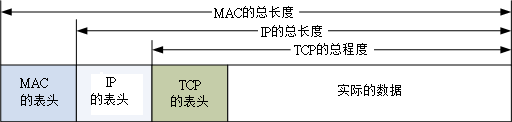 图 2.4-1、各封包之间的相关性

想当然尔，TCP 也有表头数据来记录该封包的相关信息啰？没错啦～ TCP 封包的表头是长这个样子的：

| 4 bits | 6 bits | 6 bits | 8 bits | 8 bits |
| --- | --- | --- | --- | --- |
| Source Port | Destination Port |
| Sequence Number |
| Acknowledge Number |
| Data Offset | Reserved | Code | Window |
| Checksum | Urgent Pointer |
| Options | Padding |
| Data |

图 2.4-2、TCP 封包的表头资料

上图就是一个 TCP 封包的表头数据，各个项目以 Source Port, Destination Port 及 Code 算是比较重要的项目，底下我们就分别来谈一谈各个表头数据的内容吧！

*   Source Port & Destination Port (来源埠口 & 目标端口) 什么是埠口(port)？我们知道 IP 封包的传送主要是藉由 IP 地址连接两端， 但是到底这个联机的通道是连接到哪里去呢？没错！就是连接到 port 上头啦！ 举例来说，鸟哥的网站有开放 WWW 服务器，这表示鸟站的主机必须要启动一个可以让 client 端连接的端口，这个端口就是 port (中文翻译成为埠口)。同样的，客户端想要连接到鸟哥的鸟站时，就必须要在 client 主机上面启动一个 port ，这样这两个主机才能够利用这条『通道』来传递封包数据喔！这个目标与来源 port 的纪录，可以说是 TCP 封包上最重要的参数了！

*   Sequence Number (封包序号) 由于 TCP 封包必须要带入 IP 封包当中，所以如果 TCP 数据太大时(大于 IP 封包的容许程度)， 就得要进行分段。这个 Sequence Number 就是记录每个封包的序号，可以让收受端重新将 TCP 的数据组合起来。

*   Acknowledge Number (回应序号) 为了确认主机端确实有收到我们 client 端所送出的封包数据，我们 client 端当然希望能够收到主机方面的响应，那就是这个 Acknowledge Number 的用途了。 当 client 端收到这个确认码时，就能够确定之前传递的封包已经被正确的收下了。

*   Data Offset (资料补偿) 在图 2.4-2 倒数第二行有个 Options 字段对吧！那个 Options 的字段长度是非固定的，而为了要确认整个 TCP 封包的大小，就需要这个标志来说明整个封包区段的起始位置。

*   Reserved (保留) 未使用的保留字段。

*   Code (Control Flag, 控制标志码) 当我们在进行网络联机的时候，必须要说明这个联机的状态，好让接收端了解这个封包的主要动作。 这可是一个非常重要的句柄喔！这个字段共有 6 个 bits ，分别代表 6 个句柄，若为 1 则为启动。分别说明如下：

    *   URG(Urgent)：若为 1 则代表该封包为紧急封包， 接收端应该要紧急处理，且图 2.4-1 当中的 Urgent Pointer 字段也会被启用。

    *   ACK(Acknowledge)：若为 1 代表这个封包为响应封包， 则与上面提到的 Acknowledge Number 有关。

    *   PSH(Push function)：若为 1 时，代表要求对方立即传送缓冲区内的其他对应封包，而无须等待缓冲区满了才送。

    *   RST(Reset)：如果 RST 为 1 的时候，表示联机会被马上结束，而无需等待终止确认手续。这也就是说， 这是个强制结束的联机，且发送端已断线。

    *   SYN(Synchronous)：若为 1，表示发送端希望双方建立同步处理， 也就是要求建立联机。通常带有 SYN 标志的封包表示『主动』要连接到对方的意思。

    *   FIN(Finish)：若为 1 ，表示传送结束，所以通知对方数据传毕， 是否同意断线，只是发送者还在等待对方的响应而已。

        其实每个项目都很重要，不过我们这里仅对 ACK/SYN 有兴趣而已，这样未来在谈到防火墙的时候，你才会比较清楚为啥每个 TCP 封包都有所谓的『状态』条件！那就是因为联机方向的不同所致啊！底下我们会进一步讨论喔！ 至于其他的数据，就得请您自行查询网络相关书籍了！

*   Window (滑动窗口) 主要是用来控制封包的流量的，可以告知对方目前本身有的缓冲器容量(Receive Buffer) 还可以接收封包。当 Window=0 时，代表缓冲器已经额满，所以应该要暂停传输数据。 Window 的单位是 byte。

*   Checksum(确认检查码) 当数据要由发送端送出前，会进行一个检验的动作，并将该动作的检验值标注在这个字段上； 而接收者收到这个封包之后，会再次的对封包进行验证，并且比对原发送的 Checksum 值是否相符，如果相符就接受，若不符就会假设该封包已经损毁，进而要求对方重新发送此封包！

*   Urgent Pointer(紧急资料) 这个字段是在 Code 字段内的 URG = 1 时才会产生作用。可以告知紧急数据所在的位置。

*   Options(任意资料) 目前此字段仅应用于表示接收端可以接收的最大数据区段容量，若此字段不使用， 表示可以使用任意资料区段的大小。这个字段较少使用。

*   Padding(补足字段) 如同 IP 封包需要有固定的 32bits 表头一样， Options 由于字段为非固定， 所以也需要 Padding 字段来加以补齐才行。同样也是 32 bits 的整数。

谈完了 TCP 表头数据后，再来让我们了解一下这个表头里面最重要的端口信息吧！

*   通讯端口

在上图的 TCP 表头数据中，最重要的就属那 16 位的两个咚咚，亦即来源与目标的端口。由于是 16 位，因此目标与来源端口最大可达 65535 号 (2 的 16 次方)！ 那这个埠口有什么用途呢？上面稍微提到过，网络是双向的，服务器与客户端要达成联机的话， 两边应该要有一个对应的埠口来达成联机信道，好让数据可以透过这个信道来进行沟通。

那么这个埠口怎么打开呢？就是透过程序的执行！举例来说，鸟哥的网站上，必须要启动一个 WWW 服务器软件， 这个服务器软件会主动的唤起 port 80 来等待客户端的联机。你想要看我网站上的数据，就得要利用浏览器， 填入网址，然后浏览器也会启动一个埠口，并将 TCP 的表头填写目标端口为 80 ，而来源端口是你主机随机启动的一个埠口， 然后将 TCP 封包封装到 IP 后，送出到网络上。等鸟站主机接收到你这个封包后，再依据你的埠口给予回应。

这么说你或许不好理解，我们换个说法好了。假如 IP 是网络世界的门牌，那么这个埠口就是那个门牌号码上建筑物的楼层！ 每个建筑物都有 1~65535 层楼，你需要什么网络服务，就得要去该对应的楼层取得正确的资料。但那个楼层里面有没有人在服务你呢？ 这就得要看有没有程序真的在执行啦。所以，IP 是门牌，TCP 是楼层，真正提供服务的， 是在该楼层的那个人 (程序)！

**Tips:** 曾经有一个朋友问过我说：『一部主机上面这么多服务，那我们跟这部主机进行联机时，该主机怎么知道我们要的数据是 WWW 还是 FTP 啊？』就是透过埠口啊！因为每种 Client 软件他们所需要的数据都不相同，例如上面提到的浏览器所需要的数据是 WWW ，所以该软件默认就会向服务器的 port 80 索求数据；而如果你是使用 filezilla 来进行与服务器的 FTP 数据索求时， filezilla 当然预设就是向服务器的 FTP 相关埠口 (预设就是 port 21) 进行连接的动作啦！所以当然就可以正确无误的取得 Client 端所需要的数据了

再举个例子来说，一部主机就好像是一间多功能银行，该银行内的每个负责不同业务的窗口就好像是通讯端口， 而我们民众就好像是 Client 端来的封包。当你进入银行想要缴纳信用卡账单时， 一到门口服务人员就会指示你直接到该窗口去缴纳，当然，如果你是要领钱，服务人员就会请你到领钱的窗口去填写数据， 你是不会跑错的对吧！ ^_^。万一跑错了怎么办？呵呵！当然该窗口就会告诉你『我不负责这个业务，你请回去！』， 呵呵！所以该次的联机就会『无法成功』咯！


*   特权埠口 (Privileged Ports)

你现在了解了埠口的意义后，再来想想，网络既然是双向的，一定有一个发起端。问题是，到底要联机到服务器取得啥玩意儿？ 也就是说，哪支程序应该在哪个端口执行，以让大家都知道该埠口就是提供哪个服务，如此一来，才不会造成广大用户的困扰嘛！ 所以啰，Internet 上面已经有很多规范好的固定 port (well-known port)， 这些 port number 通常小于 1024 ，且是提供给许多知名的网络服务软件用的。 在我们的 Linux 环境下，各网络服务与 port number 的对应默认给他写在 /etc/services 档案内喔！ 底下鸟哥列出几个常见的 port number 与网络服务的对应：

| 端口 | 服务名称与内容 |
| --- | --- |
| 20 | FTP-data，文件传输协议所使用的主动数据传输端口 |
| 21 | FTP，文件传输协议的命令通道 |
| 22 | SSH，较为安全的远程联机服务器 |
| 23 | Telnet，早期的远程联机服务器软件 |
| 25 | SMTP，简单邮件传递协议，用在作为 mail server 的埠口 |
| 53 | DNS，用在作为名称解析的领域名服务器 |
| 80 | WWW，这个重要吧！就是全球信息网服务器 |
| 110 | POP3，邮件收信协议，办公室用的收信软件都是透过他 |
| 443 | https，有安全加密机制的 WWW 服务器 |

另外一点比较值得注意的是，小于 1024 以下的埠口要启动时， 启动者的身份必须要是 root 才行，所以才叫做特权埠口嘛！这个限制挺重要的，大家不要忘记了喔！ 不过如果是 client 端的话，由于 client 端都是主动向 server 端要数据， 所以 client 端的 port number 就使用随机取一个大于 1024 以上且没有在用的 port number。

*   Socket Pair

由于网络是双向的，要达成联机的话得要服务器与客户端均提供了 IP 与埠口才行。 因此，我们常常将这个成对的数据称之为 Socket Pair 了！

*   来源 IP + 来源埠口 (Source Address + Source Port)
*   目的 IP + 目的埠口 (Destination Address + Destination Port)

由于 IP 与埠口常常连在一起说明，因此网络寻址常常使用『 IP:port 』来说明，例如想要连上鸟哥的网站时， 正确的鸟哥网站写法应该是：『 linux.vbird.org:80 』才对！

* * *

### 2.4.2 TCP 的三向交握

TCP 被称为可靠的联机封包，主要是透过许多机制来达成的，其中最重要的就是三向交握的功能。 当然， TCP 传送数据的机制非常复杂，有兴趣的朋友请自行参考相关网络书籍。 OK，那么如何藉由 TCP 的表头来确认这个封包有实际被对方接收，并进一步与对方主机达成联机？ 我们以底下的图示来作为说明。

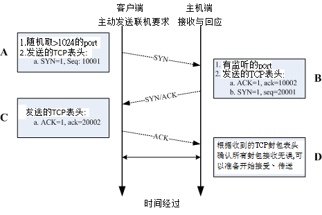 图 2.4-3、三向交握之封包连接模式

在上面的封包连接模式当中，在建立联机之前都必须要通过三个确认的动作， 所以这种联机方式也就被称为三向交握(Three-way handshake)。 那么我们将整个流程依据上面的 A, B, C, D 四个阶段来说明一下：

*   A:封包发起 当客户端想要对服务器端联机时，就必须要送出一个要求联机的封包，此时客户端必须随机取用一个大于 1024 以上的端口来做为程序沟通的接口。然后在 TCP 的表头当中，必须要带有 SYN 的主动联机(SYN=1)，并且记下发送出联机封包给服务器端的序号 (Sequence number = 10001) 。

*   B:封包接收与确认封包传送 当服务器接到这个封包，并且确定要接收这个封包后，就会开始制作一个同时带有 SYN=1, ACK=1 的封包， 其中那个 acknowledge 的号码是要给 client 端确认用的，所以该数字会比(A 步骤)里面的 Sequence 号码多一号 (ack = 10001+1 = 10002)， 那我们服务器也必须要确认客户端确实可以接收我们的封包才行，所以也会发送出一个 Sequence (seq=20001) 给客户端，并且开始等待客户端给我们服务器端的回应喔！

*   C:回送确认封包 当客户端收到来自服务器端的 ACK 数字后 (10002) 就能够确认之前那个要求封包被正确的收受了， 接下来如果客户端也同意与服务器端建立联机时，就会再次的发送一个确认封包 (ACK=1) 给服务器，亦即是 acknowledge = 20001+1 = 20002 啰。

*   D:取得最后确认 若一切都顺利，在服务器端收到带有 ACK=1 且 ack=20002 序号的封包后，就能够建立起这次的联机了。

也就是说，你必须要了解『网络是双向的』这个事实！ 所以不论是服务器端还是客户端，都必须要透过一次 SYN 与 ACK 来建立联机，所以总共会进行三次的交谈！ 在设定防火墙或者是追踪网络联机的问题时，这个『双向』的概念最容易被忽略， 而常常导致无法联机成功的问题啊！切记切记！

**Tips:** 鸟哥上课谈到 TCP 最常做的事就是，叫一个同学起来，实际表演三向交握给大家看！ 1\. 鸟哥说：A 同学你在不在？ 2\. A 同学说：我在！那鸟哥你在不在？ 3\. 鸟哥说：我也在 此时两个人就确认彼此都可以听到对方在讲啥，这就是可靠联机啦！ ^_^


* * *

### 2.4.3 非连接导向的 UDP 协议

UDP 的全名是：『User Datagram Protocol, 用户数据流协议』，UDP 与 TCP 不一样， UDP 不提供可靠的传输模式，因为他不是面向连接的一个机制，这是因为在 UDP 的传送过程中，接受端在接受到封包之后，不会回复响应封包 (ACK) 给发送端，所以封包并没有像 TCP 封包有较为严密的检查机制。至于 UDP 的表头资料如下表所示：

| 16 bits | 16 bits |
| --- | --- |
| Source Port | Destination Port |
| Message Length | Checksum |
| Data |

图 2.4-4、UDP 封包的表头资料

TCP 封包确实是比较可靠的，因为通过三向交握嘛！不过，也由于三向交握的缘故， TCP 封包的传输速度会较慢。 至于 UDP 封包由于不需要确认对方是否有正确的收到数据，故表头数据较少，所以 UDP 就可以在 Data 处填入更多的资料了。同时 UDP 比较适合需要实时反应的一些数据流，例如影像实时传送软件等， 就可以使用这类的封包传送。也就是说， UDP 传输协议并不考虑联机要求、联机终止与流量控制等特性， 所以使用的时机是当数据的正确性不很重要的情况，例如网络摄影机！

另外，很多的软件其实是同时提供 TCP 与 UDP 的传输协议的，举例来说，查询主机名的 DNS 服务就同时提供了 UDP/TCP 协议。由于 UDP 较为快速，所以我们 client 端可以先使用 UDP 来与服务器联机。 但是当使用 UDP 联机却还是无法取得正确的数据时，便转换为较为可靠的 TCP 传输协议来进行数据的传输啰。 这样可以同时兼顾快速与可靠的传输说！

**Tips:** 那么上课时怎么介绍 UDP 呢？很简单喔！鸟哥就会说：『现在老师就是在进行 UDP 的传送，因为老师一直讲一直讲， 俺也没有注意到你有没有听到，也不需要等待你的响应封包！就这样一直讲！当然，你没有听到鸟哥讲啥，我也不会知道...』


* * *

### 2.4.4 网络防火墙与 OSI 七层协定

由上面的说明当中，我们知道数据的传送其实就是封包的发出与接受的动作啦！并且不同的封包上面都有不一样的表头 (header)，此外，封包上面通常都会具有四个基本的信息，那就是 socket pair 里面提到的『来源与目的 IP 以及来源与目的端的 port number』 。当然啦，如果是可靠性联机的 TCP 封包，还包含 Control Flag 里面的 SYN/ACK 等等重要的信息呢！好了，开始动一动脑筋，有没有想到『网络防火墙』的字眼啊？

封包过滤式的网络防火墙可以抵挡掉一些可能有问题的封包， Linux 系统上面是怎么挡掉封包的呢？其实说来也是很简单，既然封包的表头上面已经有这么多的重要信息， 那么我就利用一些防火墙机制与软件来进行封包表头的分析，并且设定分析的规则，当发现某些特定的 IP 、特定的埠口或者是特定的封包信息(SYN/ACK 等等)，那么就将该封包给他丢弃， 那就是最基本的防火墙原理了！

举例来说，大家都知道 Telnet 这个服务器是挺危险的，而 Telnet 使用的 port number 为 23 ，所以，当我们使用软件去分析要送进我们主机的封包时， 只要发现该封包的目的地是我们主机的 port 23 ，就将该封包丢掉去！那就是最基本的防火墙案例啦！ 如果以 OSI 七层协议来说，每一层可以抵挡的数据有：

*   第二层：可以针对来源与目标的 MAC 进行抵挡；
*   第三层：主要针对来源与目标的 IP ，以及 ICMP 的类别 (type) 进行抵挡；
*   第四层：针对 TCP/UDP 的埠口进行抵挡，也可以针对 TCP 的状态 (code) 来处理。

更多的防火墙信息我们会在[第九章防火墙](http://linux.vbird.org/linux_server/0250simple_firewall.php)与[第七章认识网络安全](http://linux.vbird.org/linux_server/0210network-secure.php)当中进行更多的说明喔！

* * *

# 2.5 连上 Internet 前的准备事项

## 2.5 连上 Internet 前的准备事项

讲了这么多，其实我们最需要的仅是『连接上 Internet 』啦！那么在 Internet 上面其实使用的是 TCP/IP 这个通讯协议，所以我们就需要 Public IP 来连接上 Internet 啊！你说对吧～ 不过，你有没有发现一件事，那就是『为啥我不知道 Yahoo 的主机 IP ，但是俺的主机却可以连到 Yahoo 主机上？』 如果你有发现这个问题的话，哈哈！你可以准备开始设定网络啰～ ^_^

* * *

### 2.5.1 用 IP 上网？主机名上网？DNS 系统？

讲完了上头的基本数据，现在你知道要连上 Internet 就得要有 TCP/IP 才行！尤其是那重要的 IP 啊！ 问题是，计算机网络是依据人类的需要来建立的，不过人类对于 IP 这一类的数字并不具有敏感性，即使 IP 已经被简化为十进制了，但是人类就是对数字没有办法啊！怎么办？没关系，反正计算机都有主机名嘛！ 那么我就将主机名与他的 IP 对应起来，未来要连接上该计算机时，只要知道该计算机的主机名就好了，因为 IP 已经对应到主机名了嘛！所以人类也容易记忆文字类的主机名，计算机也可以藉由对应来找到他必须要知道的 IP ，啊！真是皆大欢喜啊！

这个主机名 (Hostname) 对应 IP 的系统，就是鼎鼎有名的 Domain Name System (DNS) 咯！也就是说， DNS 这个服务的最大功能就是在进行『主机名与该主机的 IP 的对应』的一项协议。 DNS 在网络环境当中是相当常被使用到的一项协议喔！举个例子来说，像鸟哥我常常会连到奇摩雅虎的 WWW 网站去看最新的新闻，那么我一定需要将奇摩雅虎的 WWW 网站的 IP 背下来吗？天吶， 鸟哥的忘性这么好，怎么可能将 IP 背下来？！不过，如果是要将奇摩站的主机名背下来的话， 那就容易的多了！不就是 [`tw.yahoo.com`](http://tw.yahoo.com) 吗？而既然计算机主机只认识 IP 而已， 因此当我在浏览器上面输入了『[`tw.yahoo.com』的时后，我的计算机首先就会藉由向`](http://tw.yahoo.com』的时后，我的计算机首先就会藉由向) DNS 主机查询 tw.yahoo.com 的 IP 后，再将查询到的 IP 结果回应给我的浏览器， 那么我的浏览器就可以藉由该 IP 来连接上主机啦！

发现了吗？我的计算机必须要向 DNS 服务器查询 Hostname 对应 IP 的信息 喔！那么那部 DNS 主机的 IP 就必须要在我的计算机里面设定好才行，并且必须要是输入 IP 喔，不然我的计算机怎么连到 DNS 服务器去要求数据呢？呵呵！在 Linux 里面，DNS 主机 IP 的设定就是在 /etc/resolv.conf 这个档案里面啦！

目前各大 ISP 都有提供他们的 DNS 服务器的 IP 给他们的用户，好设定客户自己计算机的 DNS 查询主机， 不过，如果你忘记了或者是你使用的环境中并没有提供 DNS 主机呢？呵呵！没有关系， 那就设定 Hinet 那个最大的 DNS 服务器吧！ IP 是 168.95.1.1 咯！要设定好 DNS 之后，未来上网浏览时，才能使用主机名喔！不然就得一定需要使用 IP 才能上网呢！DNS 是很重要的，他的原理也顶复杂的，更详细的原理我们在[第十九章 DNS 服务器](http://linux.vbird.org/linux_server/0350dns.php)里面进行更多更详细的说明喔！这里仅提个大纲！

* * *

### 2.5.2 一组可以连上 Internet 的必要网络参数

从上面的所有说明当中，我们知道一部主机要能够使用网络，必须要有 IP ，而 IP 的设定当中，就必须要有 IP, Network, Broadcast, Netmask 等参数，此外，还需要考虑到路由里面的 Default Gateway 才能够正确的将非同网域的封包给他传送出去。 另外，考虑到主机名与 IP 的对应，所以你还必须要给予系统一个 DNS 服务器的 IP 才行～ 所以说，一组合理的网络设定需要哪些数据呢？呵呵！就是：

*   IP
*   Netmask
*   Network
*   Broadcast
*   Gateway
*   DNS

其中，由于 Network 与 Broadcast 可以经由 IP/Netmask 的计算而得到，因此需要设定于你 PC 端的网络参数， 主要就是 IP, Netmask, Default Gateway, DNS 这四个就是了！

没错！就是这些数据！如果你是使用 ADSL 拨接来上网的话，上面这些数据都是由 ISP 直接给你的，那你只要使用拨接程序进行拨接到 ISP 的工作之后， 这些数据就自动的在你的主机上面设定完成了！但是如果是固定制 (如学术网络) 的话，那么就得自行使用上面的参数来设定你的主机啰！缺一不可呢！以 192.168.1.0/24 这个 Class C 为例的话，那么你就必须要在你的主机上面设定好底下的参数：

*   IP: 由 192.168.1.1~192.168.1.254
*   Netmask: 255.255.255.0
*   Network: 192.168.1.0
*   Broadcast: 192.168.1.255
*   Gateway: 每个环境都不同，请自行询问网络管理员
*   DNS: 也可以直接设定成 168.95.1.1

* * *

# 2.6 重点回顾：

## 2.6 重点回顾：

*   虽然目前的网络媒体多以以太网络为标准，但网络媒体不只有以太网络而已；
*   Internet 主要是由 Internet Network Information Center (INTERNIC) 所维护；
*   以太网络的 RJ-45 网络线，由于 568A/568B 接头的不同而又分为并行线与跳线；
*   以太网络上最重要的传输数据为 Carrier Sense Multiple Access with Collision Detect (CSMA/CD) 技术， 至于传输过程当中，最重要的 MAC 讯框内以硬件地址 (hardware address) 数据最为重要；
*   透过八蕊的网络线 (Cat 5 以上等级)，现在的以太网络可以支持全双工模式；
*   OSI 七层协议为一个网络模型 (model) ，并非硬性规定。这七层协议可以协助软硬件开发有一个基本的准则， 且每一分层各自独立，方便使用者开发；
*   现今的网络基础是架构在 TCP/IP 这个通讯协议上面；
*   数据链结层里重要的信息为 MAC (Media Access Control)，亦可称为硬件地址，而 ARP Table 可以用来对应 MAC 与软件地址 ( IP ) ；
*   在网络媒体方面， Hub 为共享媒体，因此可能会有封包碰撞的问题，至于 Switch 由于加入了 switch port 与 MAC 的对应，因此已经克服了封包碰撞的问题，也就是说，Switch 并不是共享媒体；
*   IP 为 32 bits 所组成的，为了适应人类的记忆，因此转成四组十进制的数据；
*   IP 主要分为 Net ID 与 Host ID 两部份，加上 Netmask 这个参数后，可以设定『网域』的概念；
*   根据 IP 网域的大小，可将 IP 的等级分为 A, B, C 三种常见的等级；
*   Loopback 这个网段在 127.0.0.0/8 ，用在每个操作系统内部的循环测试中。
*   网域可继续分成更小的网域 (subnetwork)，主要是透过将 Host_ID 借位成为 Net_ID 的技术；
*   IP 只有两种，就是 Public IP 与 Private IP ，中文应该翻译为 公共 IP 与 私有(或保留) IP，私有 IP 与私有路由不可以直接连接到 Internet 上；
*   每一部主机都有自己的路由表，这个路由表规定了封包的传送途径，在路由表当中，最重要者为默认的通讯闸 ( Gateway/Router )；
*   TCP 协议的表头数据当中，那个 Code (control flags) 所带有的 ACK, SYN, FIN 等为常见的旗标， 可以控制封包的联机成功与否；
*   TCP 与 IP 的 IP address/Port 可以组成一对 socket pair
*   网络联机都是双向的，在 TCP 的联机当中，需要进行客户端与服务器端两次的 SYN/ACK 封包发送与确认， 所以一次 TCP 联机确认时，需要进行三向交握的流程；
*   UDP 通讯协议由于不需要联机确认，因此适用于快速实时传输且不需要数据可靠的软件中，例如实时通讯；
*   ICMP 封包最主要的功能在回报网络的侦测状况，故不要使用防火墙将他完全挡掉；
*   一般来说，一部主机里面的网络参数应该具备有：IP, Netmask, Network, Broadcast, Gateway, DNS 等；
*   在主机的 port 当中，只有 root 可以启用小于 1024 以下的 port ；
*   DNS 主要的目的在于进行 Hostname 对应 IP 的功能；

* * *

# 2.7 本章习题

## 2.7 本章习题

*   在 ISP 提供的网络服务中，他们提到传输速度为 1.5M/382K ，请问这个数据的单位为何？数据单位为 bits/second, 与惯用的 bytes 差 8 倍。
*   什么是 MAC (Media Access Control) ，MAC 主要的功能是什么？Media Access Control 的缩写，为以太网络硬件讯框的规格，以太网络就是以 MAC 讯框进行数据的传送。 目前 MAC 也常被用为以太网络卡卡号的代称。
*   什么是封包碰撞？为什么会发生封包碰撞？当主机要使用网络时，必须要先进行 CSMA/CD 监听网络，如果(1)网络使用频繁 (2)网络间隔太大， 则可能会发生监听时均显示无主机使用，但发出封包后却发生同步发送封包的情况，此时两个封包就会产生碰撞， 造成数据损毁。
*   ARP Table 的作用为何？如何在我的 Linux 察看我的 ARP 表格？ARP 协议主要在分析 MAC 与 IP 的对应，而解析完毕后的数据会存在系统的内存中， 下次要传送到相同的 IP 时，就会主动的直接以该 MAC 传送，而不发送广播封包询问整个网域了。 利用 arp -n 即可
*   简略说明 Netmask 的作用与优点；Netmask 可以用来区分网域，且 Netmask 可以有效的增加网络的效率，这是因为 Netmask 可以定义出一个网域的大小，那么 broadcast 的时间就可以降低很多！一般来说， 我们如果要将一个大网域再细分为小网域，也需要藉由 Netmask 来进行 subnet 的切割。
*   我有一组网域为： 192.168.0.0/28 ，请问这个网域的 Network, Netmask, Broadcast 各为多少？而可以使用的 IP 数量与范围各是多少？因为共有 28 个 bits 是不可动的，所以 Netmask 地址的最后一个数字为 11110000，也就是 (128+64+32+16=240) ，所以： Network：192.168.0.0 Netmask：255.255.255.240 Broadcast：192.168.0.15 IP：由 192.168.0.1 ~ 192.168.0.14 共 14 个可用 IP 喔！
*   承上题，如果网域是 192.168.0.128/29 呢？因为是 29 个 bits 不可动，所以最后一个 Netmask 的地址为： 11111000 也就是 (128+64+32+16+8=248)，所以： Network：192.168.0.128 Netmask：255.255.255.248 Broadcast：192.168.0.135 IP：由 192.168.0.129 ~ 192.168.0.134 共 6 个可用的 IP 喔！

*   我要将 192.168.100.0/24 这个 Class C 的网域分为 4 个子域，请问这四个子域要如何表示？既然要分为四个网域，也就是还需要藉助 Netmask 的两个 bits (2 的 2 次方为 4 啊！)，所以 Netmask 会变成 255.255.255.192 ，每个子域会有 256/4=64 个 IP ，而必须要扣除 Network 与 Broadcast ，所以每个子域会有 62 个可用 IP 喔！因此，四个子域的表示方法为： 192.168.100.0/26, 192.168.100.64/26, 192.168.100.128/26, 192.168.100.192/26。

*   如何观察 Linux 主机上面的路由信息 (route table)？路由信息的观察可以下达 route 来直接察看！或者是下达 route -n 亦可
*   TCP 封包上面的 SYN 与 ACK 标志代表的意义为何？SYN 代表该封包为该系列联机的第一个封包，亦即是主动联机的意思； ACK 则代表该封包为确认封包，亦即是回应封包！

*   什么是三向交握？在哪一种封包格式上面才会有三向交握？使用 TCP 封包才会有三向交握。TCP 封包的三向交握是一个确认封包正确性的重要步骤，通过 SYN, SYN/ACK, ACK 三个封包的确认无误后，才能够建立联机。至于 UDP 封包则没有三向交握喔！

*   试说明何谓有网管？无网管的 switch ？此外，这些 switch 的硬件应算在 OSI 七层协议的第几层？有网管者，会在 switch 内部加入其他的小型 OS，藉以控管 IP 或 MAC 的流通； 通常基础的 switch 仅达控管 MAC ，故为 OSI 第二层(数据链结层)
*   为何 ISP 有时候会谈到『申请固定 8 个 IP ，其中只有 5 个可以用』，你觉得问题出在哪里？ 如果以网域的观念来看，他的 netmask 会是多少？因为如果是一个网域的话，那么八个 IP 前后(Host_ID 全为 0 与 1 的条件)为 Network 及 Broadcast ， 加上一个在 ISP 处的 Gateway ，所以仅有 5 个可以用。因为有 8 个 IP ，所以其 netmask 后八 bits 为 11111000 ，故为 255.255.255.248。
*   Internet 协议中共包含 "Network Access Layer", "Internet Layer", "Transport Layer", "Application Layer"， 请将这四层与 OSI 七层协议的内容进行连结 (自行上网查询相关文章说明)；Network Access Layer: 涵盖 Data-Link 及 Physical Layer Internet Layer: 也是 Network Layer Transport Layer: 也是 Transport Layer Application Layer: 涵盖 Application Layer, Persentatin Layer, Session Layer.
*   请自行上网查询关于 NetBIOS 这个通讯协议的相关理论基础，并请说明 NetBIOS 是否可以跨路由？请自行参考[网中人的网络基础](http://www.study-area.org/network/network_protocol.htm)文章
*   什么是 Socket pair ？包含哪些基本数据？由 IP 封包的 IP address 与 TCP 封包的 port number 达成，分别为目的端的 IP/port 与本地端的 IP/port。
*   IP 有一段 A Class 的网段分给系统做为测试用，请问该网段为？设定的名称为？127.0.0.0/8, loopback
*   ICMP 这个协议最主要的目的为？同时做为『响应』的类别为第几类？做为网络检测之用，为第 8 类 (echo request)
*   IP 封包表头有个 TTL 的标志，请问该标志的基本说明为何？其数据有何特性？为该封包的存活时间，该时间每经过一个 node 都会减少一，当 TTL 为 0 时，该封包会被路由器所丢弃。 该数据最大为 255。
*   在 Linux 当中，如何查询每个 port number 对于服务的对应 (filename)/etc/services 档案中有纪录
*   什么是星形联机？优点为何？利用一 hub/switch 链接所有的网络设备的一种联机方式，最大的好处是，每个『网络设备与 switch 之间』都是独立的， 所以所以每个主机故障时均不会影响其他主机的联机。
*   请说明 CSMA/CD 的运作原理？发送流程

    1.  主机欲使用网络时，会先监听网络，若网络没有被使用时，才会准备传送，否则继续监听；
    2.  当数据传送钟，发现有碰撞情况时，则会重新监听网络，并且重新发送一次该封包；
    3.  若重复发生碰撞 16 次，则网络会瘫痪；

    接收流程

    1.  主机如果没有在传送数据，则会监听网络，并且主动在接收的状态下；
    2.  若接收到一个封包，并且该表头所载 MAC 为本身的网卡卡号，则开始接收该封包，否则将该封包丢弃；
    3.  接收过程当中如果发生封包碰撞，则会通知原发送主机碰撞的数据；
    4.  封包接收完毕后，会以 MAC 表头所载长度同时分析本封包长度，若发生问题，则会通知对方重新传送。

* * *

# 2.8 参考数据与延伸阅读

## 2.8 参考数据与延伸阅读

特别感谢： 本文在 2002/07 发出之后，收到相当多朋友的关心，也从而发现了自己误会的一些基础的网络理论，真的是感谢好朋友 Netman 兄与 ZMAN 兄的指导！这篇短文在第二版时 (2003/08/03) 做了相当大幅度的修订，与原来的文章 (上次更新日期 2002/09) 已经有一定程度的差异了，第三版又针对整个内容与阅读顺序进行调整 (2010/08)，希望网友们如果有时间的话，能够再次的阅读，以厘清一些基本概念喔！

*   注 1：粘添寿着，『Internet 网络原理与实务』，旗标出版社。
*   注 2：Robert Breyer & Sean Riley 着，风信子,张民人译，『Switched & Fast 以太网络』，旗标出版社
*   注 3：IEEE 标准的网站连结：[`standards.ieee.org/`](http://standards.ieee.org/)
*   注 4：Request For Comment (RFC) 技术文件：[`www.rfc-editor.org/`](http://www.rfc-editor.org/)
*   注 5：RFC-1122 标准的文件数据：ftp://ftp.rfc-editor.org/in-notes/rfc1122.txt
*   注 6：粘添寿老师官网：[`www.tsnien.idv.tw/`](http://www.tsnien.idv.tw/), 因特网相关课程：[`120.118.165.46/tsnien/network/index.html`](http://120.118.165.46/tsnien/network/index.html)(强烈建议前往参阅)
*   注 7：台湾学术网络简介 (TANET)：[`www.edu.tw/moecc/content.aspx?site_content_sn=1707`](http://www.edu.tw/moecc/content.aspx?site_content_sn=1707)
*   注 8：Study Area 之网络基础：[`www.study-area.org/network/network.htm`](http://www.study-area.org/network/network.htm)
*   注 9：维基百科对 OSI 协定的说明：[`en.wikipedia.org/wiki/OSI_model`](http://en.wikipedia.org/wiki/OSI_model)
*   注 10：Phil Dykstra, Gigabit Ethernet Jumbo Frames： [`sd.wareonearth.com/~phil/jumbo.html`](http://sd.wareonearth.com/%7Ephil/jumbo.html)
*   注 11：Hub 与 Switch 的迷思：[`www.study-area.org/tips/hub_switch.htm`](http://www.study-area.org/tips/hub_switch.htm)
*   注 12：管理 IP 的单位与相关说明：[`www.internic.org/`](http://www.internic.org/), [`www.icann.org/`](http://www.icann.org/), [`www.iana.org/`](http://www.iana.org/), [`en.wikipedia.org/wiki/IPv4`](http://en.wikipedia.org/wiki/IPv4)
*   注 13：管理 IP 的单位：[`www.iana.org/`](http://www.iana.org/), 台湾地区 IP 核发情况：[`rms.twnic.net.tw/twnic/User/Member/Search/main7.jsp?Order=inet_aton(Startip)`](http://rms.twnic.net.tw/twnic/User/Member/Search/main7.jsp?Order=inet_aton%28Startip%29)
*   注 14：相关参考数据 『TCP/IP Illustrated, Volume 1 - The Protocols』，W. Richard Stevens ，资策会中文化部门译； [`en.wikipedia.org/wiki/Classless_Inter-Domain_Routing`](http://en.wikipedia.org/wiki/Classless_Inter-Domain_Routing)
*   PPPoE [`en.wikipedia.org/wiki/Point-to-Point_Protocol_over_Ethernet`](http://en.wikipedia.org/wiki/Point-to-Point_Protocol_over_Ethernet)

* * *

2002/07/18：第一次完成日期！ 2002/09/26：修改了部分可能引起误解的文章部分！ 2003/08/03：重新编排版面，并且重新检视文章内容，修订文章！ 2003/08/20：增加重点回顾与课后练习 2003/09/06：加入[参考用解答](http://linux.vbird.org/linux_server/1000results.php#0110network_basic) 2004/03/16：修订 N-Way 的错误，订正为 Auto MDI/MDIX 的功能！ 2006/02/09：将旧的文章移动到 [此处](http://linux.vbird.org/linux_server/0110network_basic/0110network_basic.php) 2006/07/12：参考了粘教授与风信子兄的书籍，修改了很多基础数据喔！还有重点整理，不过，练习尚未更新 2006/07/16：加入习题练习啰！ 2007/10/21：图 14 那个 UDP 的表头资料中，16 bits 误植为 16 bytes，感谢讨论区 ricky.liu 的告知！ 2008/04/21：经由网友 chyanlong 兄的指点，[IHL](http://linux.vbird.org/linux_server/20080421) 的大小单位误植为 byte，应该是字组 (word) 才对。 2010/07/22：将基于 CentOS4.x 所写的数据放置于[此处](http://linux.vbird.org/linux_server/0110network_basic/0110network_basic-centos4.php) 2010/08/15：将章节依据 TCP/IP 相关的层级分别介绍，更改的幅度不小喔！ 2011/07/15：将基于 CentOS 5.x 所撰写的文章移动到[此处](http://linux.vbird.org/linux_server/0110network_basic/0110network_basic-centos5.php) 2013/07/23：修訂重點回顧 CSMA 單字的錯誤，Sense 誤植為 Sence，感謝 mubiale 告知。 by white