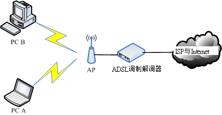
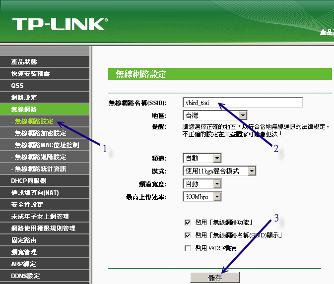
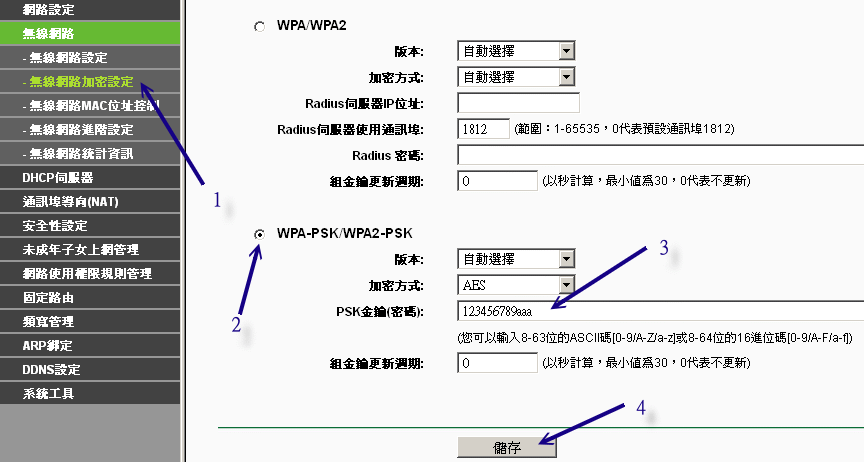

# 第四章、连上 Internet

最近更新日期：2011/07/20

终于要来到修改 Linux 网络参数的章节了！在[第二章的网络基础](http://linux.vbird.org/linux_server/0110network_basic.php)中， 我们知道主机要连上 Internet 需要一些正确的网络参数设定，这些设定在 Windows 系统上面的修改则在[第三章的局域网络架构](http://linux.vbird.org/linux_server/0120intranet.php)中说明了。在这一章当中，我们则主要以固定 IP 的设定方式来修改 Linux 的网络参数，同时，也会介绍如何使用 ADSL 的拨接方式来上网，此外，因为 Cable modem 使用者也不在少数，所以我们也说明一下 Cable modem 在 Linux 下的设定方式喔！ 最后，由于笔记本电脑使用者大增，且因为笔记本电脑常使用无线网络，因此本文也加入了无线网络的联机介绍啊！

*   4.1 Linux 连上 Internet 前的注意事项
    *   4.1.1 Linux 的网络卡
    *   4.1.2 编译网卡驱动程序(Option)
    *   4.1.3 Linux 网络相关配置文件案
*   4.2 连上 Internet 的设定方法
    *   4.2.1 手动设定固定 IP 参数 (适用学术网络、ADSL 固定制) + 五大检查步骤
    *   4.2.2 自动取得 IP 参数 (DHCP 方法，适用 Cable modem、IP 分享器的环境)
    *   4.2.3 ADSL 拨接上网 (适用台湾 ADSL 拨接以及光纤到大楼)
*   4.3 无线网络--以笔记本电脑为例
    *   4.3.1 无线网络所需要的硬件： AP、无线网卡
    *   4.3.2 关于 AP 的设定：网络安全方面
    *   4.3.3 利用无线网卡开始联机
*   4.4 常见问题说明
    *   4.4.1 内部网域使用某些联机服务(如 FTP, POP3)所遇到的联机延迟问题
    *   4.4.2 网址列无法解析问题
    *   4.4.3 预设路由的问题
*   4.5 重点回顾
*   4.6 本章习题
*   4.7 参考数据与延伸阅读
*   4.8 [针对本文的建议：http://phorum.vbird.org/viewtopic.php?p=112420](http://phorum.vbird.org/viewtopic.php?p=112420)

* * *

# 4.1 Linux 连上 Internet 前的注意事项

## 4.1 Linux 连上 Internet 前的注意事项

由前面几章的数据我们知道，想要连上 Internet 你得要设定一组合法的 IP 参数才可以，主要是 IP, Netmask, Gateway, DNS IP 以及主机名等。那我们也知道，其实整个主机最重要的设定，就是『先要驱动网络卡』，否则主机连网络卡都捉不到时， 怎么设定 IP 参数都是没有用的，你说是吧！所以底下我们就来谈一谈， 你要如何确定网络卡已经被捉到，而 Linux 主机的网络参数又该如何设定？

* * *

### 4.1.1 Linux 的网络卡

你怎么确认 Linux 有捉到网络卡？Linux 底下的网络卡的名称是啥？让我们来了解一下吧！

*   认识网络卡的装置代号

    在 Linux 里面的各项装置几乎都是以文件名来取代的，例如 /dev/hda 代表 IDE1 接口的第一个 master 硬盘等等。 不过，网络卡的代号 (Network Interface Card, NIC) 却是以模块对应装置名称来代替的， 而默认的网络卡代号为 eth0 ，第二张网络卡则为 eth1 ，以此类推。

*   关于网络卡的模块 (驱动程序)

    我们知道网络卡其实是硬件，所以当然需要核心支持才能驱动他。一般来说，目前新版的 Linux distributions 默认可以支持的网络卡芯片组数量已经很完备了，包括大厂的 3COM, Intel 以及初阶的 RealTek, D-Link 等网络卡芯片都已经被支持， 所以使用者可以很轻易的设定好他们的网络卡。不过，万一你的网络卡芯片组开发商不愿意释出开放源 (Open Source) 的硬件驱动程序，或者是该网络卡太新了，使得 Linux 核心来不及支持时，那么你就得要透过：

    1.  [重新编译较新的核心，或者是](http://linux.vbird.org/linux_basic/0540kernel.php)
    2.  [编译网络卡的核心模块](http://linux.vbird.org/linux_basic/0540kernel.php#module) 好让核心可以支持网络卡这块硬件啦！但是，重编核心或编译网络卡核心模块都不是简单的工作， 而且有时原始码又可能无法在每部主机上面编译成功，所以万一你的网络卡真的不被默认的 Linux 网络芯片所支持，那么鸟哥真的建议直接换一块被 Linux 支持的网络卡吧，例如很便宜的螃蟹卡！ 免得花了太多时间在硬件确认上面，划不来的！ ^_^

    另外，其实有的时候 Linux 的默认网络卡模块可能无法完全 100% 的发挥网络卡的功能的， 所以，有的时候你还是得必须要自行编译网络卡的模块才行喔！当然， 那个网络卡的模块就得要自行由网络卡开发商的官方网站下载了！不过，如果你的网络卡是自行编译安装的， 那么每次重新安装其他版本的核心时，你都必须要自行重新手动编译过该模块。 因为模块与核心是有相关性的啊！

*   观察核心所捉到的网卡信息

    假设你的网络卡已经在主机上面，不论是内建的还是自行安插到 PCI 或 PCI-x 或 PCI-E 的接口上， 那么如何确认该网络卡有被核心捉到呢？很简单啊！就利用 dmesg 来查阅即可：

    ```
    [root@www ~]# dmesg &#124; grep -in eth
    377:e1000: eth0: e1000_probe: Intel(R) PRO/1000 Network Connection
    383:e1000: eth1: e1000_probe: Intel(R) PRO/1000 Network Connection
    418:e1000: eth0 NIC Link is Up 1000 Mbps Full Duplex, Flow Control: RX
    419:eth0: no IPv6 routers present 
    ```

    从上面的第 377 及 383 这两行，我们可以查到这部主机的两张网络卡都使用模块为 e1000，而使用的芯片应该就是 Intel 的网络卡了。此外，这个网卡的速度可达到 1000Mbps 的全双工模式哩 (418 行) ！除了使用 dmesg 来查询核心侦测硬件产生的信息外，我们也可以透过 lspci 来查询相关的设备芯片数据喔！如下所示：

    ```
    [root@www ~]# lspci &#124; grep -i ethernet
    00:03.0 Ethernet controller: Intel Corporation 82540EM Gigabit Ethernet 
    Controller (rev 02) 
    ```

    请注意，鸟哥这里使用的是 Virtualbox 仿真的那部主机的环境 (请参考[第一章 1.2.2-2](http://linux.vbird.org/linux_server/0105beforeserver.php#server_target_1))，因此使用的是模拟出来的 Intel 网卡。 如果你是使用自己的实际硬件配备安装的主机，那么应该会看到不同的芯片啦！那是正常的！

*   观察网络卡的模块

    从刚刚的 dmesg 的输出讯息中，我们知道鸟哥这部主机所使用的模块是 e1000 ，那核心有顺利的载入了吗？可以利用 lsmod 去查查看。此外，这个模块的相关信息又是如何呢？使用 modinfo 来查查看吧！

    ```
    [root@www ~]# lsmod &#124; grep 1000
    e1000                 119381  0  &lt;==确实有载入到核心中！

    [root@www ~]# modinfo e1000
    filename:    &lt;u&gt;/lib/modules/2.6.32-71.29.1.el6.x86_64/kernel/drivers/net/e1000/e1000.ko&lt;/u&gt;
    version:     7.3.21-k6-NAPI
    license:     GPL
    description: Intel(R) PRO/1000 Network Driver
    .....(以下省略)..... 
    ```

    上面输出信息的重点在于那个档名 (filename) 的部分！那一场串的文件名目录，就是我们驱动程序放置的主要目录所在。 得要注意的是，那个 2.6.32-71.29.1.el6.x86_64 是核心版本，因此，不同的核心版本使用的驱动程序其实不一样喔！我们才会一直强调，更改核心后， 你自己编译的硬件驱动程序就需要重新编译啦！

    那你如何知道你的网络卡卡号呢？很简单啊！不管有没有启动你的网络卡，都可以使用： 『 ifconfig eth0 』来查询你的网卡卡号。如果你照着上面的信息来作， 结果发现网卡已经驱动了，恭喜你，准备到下一节去设定网络吧！如果没有捉到网卡呢？那就准备自己编译网卡驱动程序吧！

* * *

### 4.1.2 编译网卡驱动程序(Option)

一般来说，如果没有特殊需求，鸟哥不是很建议你自己编译网络卡的驱动程序！为啥？ 因为想到每次更新核心都得要重新编译一次网卡驱动程序，光是想想都觉得烦～所以，没有被 Linux 预设核心支持的网卡， 就先丢着吧！

**Tips:** 鸟哥之前买了一张内建网卡的主板，该网卡并没有被当时的 Linux 预设核心所支持，所以就得要自己编译核心啦。因为 CentOS 很少更新核心，所以第一次编译完毕之后就忘记有这回事了。等到过了数周有新的核心出现后，鸟哥很开心的自动升级核心， 然后远程进行 reboot ，结果呢？没有网卡驱动程序了啦！我的主机无法联网，得要到主机前用 tty 登入后才能进行编译～唉～


如果你真的很有求知欲，而且该网卡的官网有提供给 Linux 的驱动程序原始码； 或者是你很想要某些官网提供的驱动程序才有的特殊功能；又或者是你真的很不想要再买一张额外的网卡。 此时，就得要重新编译网络卡的驱动程序啰。

**Tips:** 事实上，如果你要新添购硬件时，请先查阅一下硬件包装上面是否提及支持 Linux 的字样， 因为有些硬件厂商在推出新硬件时，常常会漏掉 Linux 驱动程序的撰写。 如果包装上面有提到支持的话，那么至少你会获得官方网站所提供的驱动程序原始码啊！ ^_^


因为我们这里使用的网络卡是 Intel 的 82540EM Gigabit Ethernet 控制芯片，假设你需要的驱动程序得要由 Intel 官网取得最新的版本，而不要使用预设的核心所提供的版本时，那你该如何处理呢？请注意，鸟哥这个小节只是一个范例简介， 不同的厂商推出的驱动程序安装方式都有点不太一样，你得要参考驱动程序的读我档 (READ ME) 或相关档案来安装才行。 此外，如果默认驱动程序已经捉到了网络卡，鸟哥是建议使用预设的驱动程序就好了喔！

另外，由于编译程序需要编译程序以及核心相关信息，因此得要预安装 gcc, make, kernel-header 等软件才行。 但是我们选择的安装模式为『basic server』，这些软件默认都没有安装的，所以你得要先安装这些软件才行。 这些软件可以简单的透过 yum 使用『yum groupinstall 'Development Tools'』来安装，只可惜你并没有网络啊！ 所以就得要透过原本光盘一个一个去处理 RPM 属性相依的问题来解决了～很麻烦的～不然的话，就得要透过更改 yum 配置文件，使用本机档案的类型来取得原版光盘的 yum 软件列表啰！鸟哥这里假设你已经安装了所需要的编译程序了， 接下来的动作是：

1.  取得官方网站的驱动程序：

    再次说明，你可以复制鸟哥的环境，透过 Virtualbox 的模拟而来。我们这里使用的是 Intel 的网卡，你可以到如下的网站去下载：

    *   [`downloadcenter.intel.com/SearchResult.aspx?lang=eng&keyword='e1000-'`](http://downloadcenter.intel.com/SearchResult.aspx?lang=eng&keyword=%27e1000-%27) 最后 (2011/07) 下载的版本为 8.0.30，确实比上个小节提到的版本还要新！下载的文件名为 e1000-8.0.30.tar.gz， 鸟哥将它放置于 /root 底下，然后准备来处理编译过程吧！
2.  解压缩与编译：

    使用 root 的身份进行如下工作吧：

    ```
    [root@www ~]# tar -zxvf e1000-8.0.30.tar.gz -C /usr/local/src
    [root@www ~]# cd /usr/local/src/e1000-8.0.30/
    # 此时在该目录下有个 README 的档案，记得看一看，这个档案内会说明很多信息，
    # 包括如何编译，以及这个模块所支持的芯片组哩！
    [root@www e1000-8.0.30]# cd src
    [root@www src]# make install 
    ```

    最后这个模块会被编译完成且安装放置于如下的档名： /lib/modules/$(uname -r)/kernel/drivers/net/e1000/e1000.ko。 接下来我们得要重载这个新的模块才行呦！

3.  模块之测试与处理

    由于这个模块已经被加载啦，所以我们得要先移除旧的模块后，才能够重载这个模块。使用的方法有点像这样：

    ```
    # 1\. 先移除已经加载在内存中的旧模块
    [root@www ~]# rmmod e1000
    # 此时已经捉到的网卡会整个消失不见！因为驱动程序被卸除了嘛！

    # 2\. 加载新模块，并且查阅一下有没有捉到正确的版本！
    [root@www ~]# modprobe e1000
    [root@www ~]# modinfo e1000
    filename:       /lib/modules/2.6.32-71.29.1.el6.x86_64/kernel/drivers/net/e1000/e1000.ko
    version:        &lt;u&gt;8.0.30-NAPI&lt;/u&gt;  &lt;==就是这里！
    license:        GPL
    description:    Intel(R) PRO/1000 Network Driver 
    ```

    请自行与前一小节比对一下，就会发现真的捉到正确的版本啰！不过，这个模块在下次新的核心推出后就会失效！ 为什么呢？因为新核心会给一个新的驱动程序嘛！就不是你现在这个 8.0.30 的版本啰。这点还是要再次说明的。

4.  设定开机自动启动网络卡模块 (Option)

    如果你在开机就能够正确的取得这个模块的话，那么你的网卡就没有问题啦！这个步骤是可以略过的。如果你的核心还是捉不到网卡， 那你可能得要自己处理一下模块的对应才行。怎么处理呢？很简单，在 /etc/modprobe.d/ 目录下建立一个名为 ether.conf 的档案， 内容将模块与网卡代号链接在一块即可！这样处理：

    ```
    [root@www ~]# vim /etc/modprobe.d/ether.conf
    alias eth0 e1000
    alias eth1 e1000  &lt;==因为鸟哥有两张网卡嘛！

    [root@www ~]# sync; reboot 
    ```

    为了测试一下刚刚的设定是否会生效，通常鸟哥都会尝试一次重新启动，然后开机完成之后观察一下是否有正确的启动网络卡， 并观察一下模块加载的情况，如果一切都顺利，那就太完美了！

5.  尝试设定 IP

    等到一切就绪之后，总得试看看这样的网络卡模块是否可以顺利的设定好 IP 吧？ 所以我们先手动给他一个私有 IP 看看先：

    ```
    [root@www ~]# ifconfig eth0 192.168.1.100
    [root@www ~]# ifconfig
    eth0      Link encap:Ethernet  HWaddr 08:00:27:71:85:BD
              inet addr:192.168.1.100  Bcast:192.168.1.255  Mask:255.255.255.0
    ....(以下省略).... 
    ```

    嘿嘿！真的设定妥当哩！然后利用 ping 这个指令去 ping 一下网域内的其他计算机， 看看能不能有响应，就知道你的网络卡是否 OK 的啦！通常是没有问题的啦！

* * *

### 4.1.3 Linux 网络相关配置文件案

我们知道 TCP/IP 的重要参数主要是： IP, Netmask, Gateway, DNS IP ，而且千万不要忘记你这部主机也应该要有主机名 (hostname)！此外，我们也知道 IP 的取得有手动设定、DHCP 处理等。那么这些参数主要是写在哪些配置文件？如何对应呢？ 底下就让我们来处理一番！

| 所需网络参数 | 主要配置文件档名 | 重要参数 |
| --- | --- | --- |
| IP Netmask DHCP 与否 Gateway 等 | /etc/sysconfig/network-scripts/ifcfg-eth0 | DEVICE=网卡的代号 BOOTPROTO=是否使用 dhcp HWADDR=是否加入网卡卡号(MAC) IPADDR=就是 IP 地址 NETMASK=只网络屏蔽啦 ONBOOT=要不要默认启动此接口 GATEWAY=就是通讯闸啦 NM_CONTROLLED=额外的网管软件 鸟哥建议取消这个项目！ |
| 主机名 | /etc/sysconfig/network | NETWORKING=要不要有网络 NETWORKING_IPV6=支持 IPv6 否？ HOSTNAME=你的主机名 |
| DNS IP | /etc/resolv.conf | nameserver DNS 的 IP |
| 私有 IP 对应的主机名 | /etc/hosts | 私有 IP 主机名 别名 |

你没有看错，主要需要修改的就是这四个档案而已！因此没有很困难！大家都想太多了！详细的设定后续小节再来讲， 这里先有概念即可。除此之外，还有些档案或许你也应该要知道一下比较好呦！

*   /etc/services 这个档案则是记录架构在 TCP/IP 上面的总总协议，包括 http, ftp, ssh, telnet 等等服务所定义的 port number ，都是这个档案所规划出来的。如果你想要自定义一个新的协议与 port 的对应，就得要改这个档案了；

*   /etc/protocols 这个档案则是在定义出 IP 封包协议的相关数据，包括 ICMP/TCP/UDP 这方面的封包协议的定义等。

大概知道上面这几个档案后，未来要修改网络参数时，那就太简单了！至于网络方面的启动指令的话，可以记得几个简单的指令即可喔！

*   /etc/init.d/network restart 这个 script 最重要！因为可以一口气重新启动整个网络的参数！ 他会主动的去读取所有的网络配置文件，所以可以很快的恢复系统默认的参数值。

*   ifup eth0 (ifdown eth0) 启动或者是关闭某张网络接口。可以透过这个简单的 script 来处理喔！ 这两个 script 会主动到 /etc/sysconfig/network-scripts/ 目录下， 读取适当的配置文件来处理啊！ (例如 ifcfg-eth0)。

大概你只要只到这些基本的指令与档案，哈哈！网络参数的设定就太简单啦！ 不过，最好你还是要了解 [shell script](http://linux.vbird.org/linux_basic/0340bashshell-scripts.php) ，比较好！因为可以追踪整个网络的设定条件。 why ？这是因为每个 distributions 的设定数据可能都不太相同，不过却都以 /etc/init.d/network 作为启动的 script ， 因此，你只要了解到该档案的内容，很容易就追踪得出来你的配置文件所需要的内容呢！对吧！

另外，新版的 CentOS 6.x 还有额外推出一个名称为 NetworkManager 的软件机制来管理网络， 不过，鸟哥还是比较喜欢手工打造自己的网络环境，所以很建议将该软件关闭呢！还好，我们安装的『basic server ([第一章的 1.2.2-2](http://linux.vbird.org/linux_server/0105beforeserver.php#server_target))』 就这么巧的没有安装该软件！好佳在～^_^

* * *

# 4.2 连上 Internet 的设定方法

## 4.2 连上 Internet 的设定方法

在前几章我们就谈过，台湾地区主要连上因特网的方法有(1)学术网络、(2)ADSL 固接与拨接、(3)Cable modem 等方式，同时，手动设定 IP 参数是很重要的学习，因此，底下的各节中，第一节的手动设定固定 IP 一定要做过一次！ 其他的才依照您的环境去设定去学习！

此外，由于目前使用 Linux notebook 的使用者大增，而 Notebook 通常是以无线网络来联机的， 所以鸟哥在这里也尝试使用一款无线网络来进行联机设定。至于传统的 56 Kbps 拨接则因为速度较慢且使用度越来越低， 所以在这里就不多做介绍了。

* * *

### 4.2.1 手动设定固定 IP 参数 (适用学术网络、ADSL 固定制) + 五大检查步骤

所谓的固定 IP 就是指在你的网络参数当中，你只要输入既定的 IP 参数即可。那么这个既定的 IP 来自哪里呢？ 一般来说，他可能来自于：

*   学术网络：由学校单位直接给予的一组 IP 网络参数；
*   固定制 ADSL：向 ISP 申请的一组固定 IP 的网络参数；
*   企业内部或 IP 分享器内部的局域网络：例如企业内使用私有 IP 作为局域网络的联机之用时，那么我们的 Linux 当然也就需要向企业的网管人员申请一组固定的 IP 网络参数啰！

这样清楚吗？也就是说，我们取得的固定 IP 参数并非一定是 public IP 喔！反正就是一组可接受的固定 IP 就是了！ 所以在架设你的环境之前，请先注意所有网络参数的来源正确性啊！好了，那么你的 IP 要如何设定呢？先回去翻翻第三章 [3.2.1](http://linux.vbird.org/linux_server/0120intranet.php#protocol_parameter) 里面的图 3.2-1，我们对外网卡 (eth0) 的信息为：

```
IP:       192.168.1.100
Netmask:  255.255.255.0
Gateway:  192.168.1.254
DNS IP:   168.95.1.1
Hostname: www.centos.vbird 
```

那么要修改的四个档案与相关的启动脚本，以及重新启动后需要用啥指令观察的重点，鸟哥再次的使用一个简单的表格来说明， 你只要记得这几个表格内的重要档案与指令，以后在修改网络参数时，就不会出现错误了！看看吧！

| 修改的参数 | 配置文件与重要启动脚本 | 观察结果的指令 |
| --- | --- | --- |
| IP 相关参数 | /etc/sysconfig/network-scripts/ifcfg-eth0 /etc/init.d/network restart | ifconfig (IP/Netmask) route -n (gateway) |
| DNS | /etc/resolv.conf | dig www.google.com |
| 主机名 | /etc/sysconfig/network /etc/hosts | hostname (主机名) ping $(hostname) reboot |

底下我们就分别针对上面的各项设定来进行档案的重新修改啰！

1.  IP/Netmask/Gateway 的设定、启动与观察

    设定网络参数得要修改 /etc/sysconfig/network-scripts/ifcfg-eth0，请记得，这个 ifcfg-eth0 与档案内的 DEVICE 名称设定需相同，并且，在这个档案内的所有设定，基本上就是 bash 的变量设定规则啦 (注意大小写)！

    ```
    [root@www ~]# vim /etc/sysconfig/network-scripts/ifcfg-eth0
    DEVICE="eth0"               &lt;==网络卡代号，必须要 ifcfg-&lt;u&gt;eth0&lt;/u&gt; 相对应
    HWADDR="08:00:27:71:85:BD"  &lt;==就是网络卡地址，若只有一张网卡，可省略此项目
    NM_CONTROLLED="no"          &lt;==不要受到其他软件的网络管理！
    ONBOOT="yes"                &lt;==是否默认启动此接口的意思
    BOOTPROTO=none              &lt;==取得 IP 的方式，其实关键词只有 dhcp，手动可输入 none
    IPADDR=192.168.1.100        &lt;==就是 IP 啊
    NETMASK=255.255.255.0       &lt;==就是子网掩码
    GATEWAY=192.168.1.254       &lt;==就是预设路由
    # 重点是上面这几个设定项目，底下的则可以省略的啰！
    NETWORK=192.168.1.0         &lt;==就是该网段的第一个 IP，可省略
    BROADCAST=192.168.1.255     &lt;==就是广播地址啰，可省略
    MTU=1500                    &lt;==就是最大传输单元的设定值，若不更改则可省略 
    ```

    上面的资料很好理解吧！请注意每个变量(左边的英文)都应该要大写！ 否则我们的 script 会误判！事实上鸟哥的设定值只有最上面的 8 个而已，其他的 NETWORK, BROADCAST, MTU 鸟哥都没有设定喔！ 至于参数的说明方面，IPADDR, NETMASK, NETWORK, BROADCAST 鸟哥在这里就不再多说，要谈的是几个重要的设定值：

    *   DEVICE：这个设定值后面接的装置代号需要与文件名 (ifcfg-eth0) 那个装置代号相同才行！否则可能会造成一些装置名称找不到的困扰。

    *   BOOTPROTO：启动该网络接口时，使用何种协议？ 如果是手动给予 IP 的环境，请输入 static 或 none ，如果是自动取得 IP 的时候， 请输入 dhcp (不要写错字，因为这是最重要的关键词！)

    *   GATEWAY：代表的是『整个主机系统的 default gateway』， 所以，设定这个项目时，请特别留意！不要有重复设定的情况发生喔！也就是当你有 ifcfg-eth0, ifcfg-eth1.... 等多个档案，只要在其中一个档案设定 GATEWAY 即可

    *   GATEWAYDEV：如果你不是使用固定的 IP 作为 Gateway ， 而是使用网络装置作为 Gateway (通常 Router 最常有这样的设定)，那也可以使用 GATEWAYDEV 来设定通讯闸装置呢！不过这个设定项目很少使用就是了！

    *   HWADDR：这个东西就是网络卡的卡号了！在仅有一张网卡的情况下，这个设定值没有啥功能， 可以忽略他。但如果你的主机上面有两张一模一样的网卡，使用的模块是相同的。 此时，你的 Linux 很可能会将 eth0, eth1 搞混，而造成你网络设定的困扰。如何解决呢？ 由于 MAC 是直接写在网卡上的，因此指定 HWADDR 到这个配置文件中，就可以解决网卡对应代号的问题了！很方便吧！ 设定完毕之后，现在让我们来重新启动网络接口吧！这样才能更新整个网络参数嘛！

    ```
    [root@www ~]# /etc/init.d/network restart
    Shutting down interface eth0:         [ OK ]  &lt;== 先关闭界面
    Shutting down loopback interface:     [ OK ]
    Bringing up loopback interface:       [ OK ]  &lt;== 再开启界面
    Bringing up interface eth0:           [ OK ]
    # 针对这部主机的所有网络接口 (包含 lo) 与通讯闸进行重新启动，所以网络会停顿再开 
    ```

    这样就处理完毕啰，那接下来当然就是观察看看啰！

    ```
    # 检查一：当然是要先察看 IP 参数对否，重点是 IP 与 Netmask 啦！
    [root@www ~]# ifconfig eth0
    eth0      Link encap:Ethernet  HWaddr 08:00:27:71:85:BD
              inet addr:192.168.1.100  Bcast:192.168.1.255  Mask:255.255.255.0
              inet6 addr: fe80::a00:27ff:fe71:85bd/64 Scope:Link
              UP BROADCAST RUNNING MULTICAST  MTU:1500  Metric:1
              RX packets:655 errors:0 dropped:0 overruns:0 frame:0
              TX packets:468 errors:0 dropped:0 overruns:0 carrier:0
              collisions:0 txqueuelen:1000
              RX bytes:61350 (59.9 KiB)  TX bytes:68722 (67.1 KiB)
    # 有出现上头那个 IP 的数据才是正确的启动；特别注意 inet addr 与 Mask 项目
    # 这里如果没有成功，得回去看看配置文件有没有错误，然后再重新 network restart ！

    # 检查二：检查一下你的路由设定是否正确
    [root@www ~]# route -n
    Kernel IP routing table
    Destination     Gateway         Genmask         Flags Metric Ref    Use Iface
    192.168.1.0     0.0.0.0         255.255.255.0   U     0      0        0 eth0
    169.254.0.0     0.0.0.0         255.255.0.0     U     1002   0        0 eth0
    0.0.0.0         192.168.1.254   0.0.0.0         UG    0      0        0 eth0
    # 重点就是上面的特殊字体！前面的 0.0.0.0 代表预设路由的设定值！

    # 检查三：测试看看与路由器之间是否能够联机成功呢！
    [root@www ~]# ping -c 3 192.168.1.254
    PING 192.168.1.254 (192.168.1.254) 56(84) bytes of data.
    64 bytes from 192.168.1.254: icmp_seq=1 ttl=64 time=2.08 ms
    64 bytes from 192.168.1.254: icmp_seq=2 ttl=64 time=0.309 ms
    64 bytes from 192.168.1.254: icmp_seq=3 ttl=64 time=0.216 ms

    --- 192.168.1.254 ping statistics ---
    3 packets transmitted, 3 received, 0% packet loss, time 2004ms
    rtt min/avg/max/mdev = 0.216/0.871/2.088/0.861 ms
    # 注意啊！有出现 ttl 才是正确的响应！如果出现『 Destination Host Unreachable 』
    # 表示没有成功的联机到你的 GATEWAY 那表示出问题啦！赶紧检查有无设定错误。 
    ```

    要注意，第三个检查如果失败，可能要看你的路由器是否已经关闭？或者是你的 switch/hub 是否有问题，或者是你的网络线是否错误，还是说你的或路由器的防火墙设定错误了？要记得去解决喔！ 这三个检查做完而且都成功之后，那么你的 TCP/IP 参数设定已经完毕了！这表示你可以使用 IP 上网啦！ 只是还不能够使用主机名上网就是了。接下来就是要设定 DNS 啰！

2.  DNS 服务器的 IP 设定与观察

    这个 /etc/resolv.conf 很重要啦！他会影响到你是否可以查询到主机名与 IP 的对应喔！通常如下的设定就 OK 了！

    ```
    [root@www ~]# vim /etc/resolv.conf
    nameserver 168.95.1.1
    nameserver 139.175.10.20 
    ```

    我们以中华电信与 SeedNet 在南部的 DNS 服务器之 IP 作为设定的方式！请注意一下，如果你不知道你的最接近的 DNS 服务器的 IP ，那么直接输入 nameserver 168.95.1.1 这个中华电信的 DNS 主机即可！不过如果你公司内部有设定防止 DNS 的要求封包的防火墙规则时，那么你就得要请教贵公司的网管单位告知你的 DNS IP 设定啦！然后赶紧测试看看：

    ```
    # 检查四：看看 DNS 是否顺利运作了呢？很重要的测试喔！
    [root@www ~]# dig www.google.com
    ....(前面省略)....
    ;; QUESTION SECTION:
    ;www.google.com.                        IN      A

    ;; ANSWER SECTION:
    www.google.com.         428539  IN      CNAME   www.l.google.com.
    www.l.google.com.       122     IN      A       74.125.71.106
    ....(中间省略)....

    ;; Query time: 30 msec
    ;; SERVER: 168.95.1.1#53(168.95.1.1)  &lt;==这里的项目也很重要！
    ;; WHEN: Mon Jul 18 01:26:50 2011
    ;; MSG SIZE  rcvd: 284 
    ```

    上面的输出有两个重点，一个是问题查询的是 www.google.com 的 A (Address) 参数，并且从回答 (Answer) 里面得到我们所需的 IP 参数。最后面一段的 Server 项目非常重要！你得要看是否与你的设定相同的那部 DNS 服务器 IP 才行！ 以上面输出为例，鸟哥使用中华电信的 DNS 服务器，所以就出现 168.95.1.1 的 IP 地址啰。

3.  主机名的修改、启动与观察

    修改主机名就得要改 /etc/sysconfig/network 以及 /etc/hosts 这两个档案，这两个档案的内容又简单的要命喔！

    ```
    [root@www ~]# vim /etc/sysconfig/network
    NETWORKING=yes
    HOSTNAME=www.centos.vbird

    [root@www ~]# vim /etc/hosts
    192.168.1.100    www.centos.vbird
    # 特别注意，这个档案的原本内容不要删除！只要新增额外的数据即可！ 
    ```

    修改完毕之后要顺利启动的话，得要重新启动才可以。为什么需要重新启动呢？因为系统已经有非常多的服务启动了， 这些服务如果需要主机名，都是到这个档案去读取的。而我们知道配置文件更新过后，服务都得要重新启动才行。 因此，已经启动而且有读到这个档案的服务，就得要重新启动啊！真麻烦～因此，最简单的方法，就是重新启动。 但重开机之前还需要进行一项工作，否则，你的系统开机会花掉很多时间喔！

    ```
    [root@www ~]# hostname
    localhost.localdomain
    # 还是默认值，尚未更新成功！我们还得要进行底下的动作！

    # 检查五：看看你的主机名有没有对应的 IP 呢？没有的话，开机流程会很慢！
    [root@www ~]# ping -c 2 www.centos.vbird
    PING www.centos.vbird (192.168.1.100) 56(84) bytes of data.
    64 bytes from www.centos.vbird (192.168.1.100): icmp_seq=1 ttl=64 time=0.015 ms
    64 bytes from www.centos.vbird (192.168.1.100): icmp_seq=2 ttl=64 time=0.028 ms

    --- www.centos.vbird ping statistics ---
    2 packets transmitted, 2 received, 0% packet loss, time 1000ms
    rtt min/avg/max/mdev = 0.015/0.021/0.028/0.008 ms
    # 因为我们有设定 /etc/hosts 规定 www.centos.vbird 的 IP ，
    # 所以才找的到主机主机名对应的正确 IP！这时才能够 reboot 喔！重要重要！ 
    ```

上面的信息中，检查的内容总共有五个步骤，这五个步骤每一步都要成功后才能够继续往下处理喔！ 至于最重要的一点，当你修改过 /etc/sysconfig/network 里面的 HOSTNAME 后， 务必要重新启动 (reboot)。但是重新启动之前，请务必『 ping 主机名』且得到 time 的响应才行！

* * *

### 4.2.2 自动取得 IP 参数 (DHCP 方法，适用 Cable modem、IP 分享器的环境)

可自动取得 IP 的环境是怎么回事啊？不是很简单吗？当你在 IP 分享器后头的主机在设定时，不是都会选择『自动取得 IP 』吗？那就是可自动取得 IP 的环境啦！那么这个自动取得是怎么回事啊？也不难了解啦，其实就是『有一部主机提供 DHCP 服务给整个网域内的计算机』就是了！例如 IP 分享器就可能是一部 DHCP 主机。那么 DHCP 是啥？ 他是：Dynamic Host Configuration Protocol 的简写，顾名思义，他可以『动态的调整主机的网络参数』的意思。详细的 [DHCP](http://linux.vbird.org/linux_server/0340dhcp.php) 功能我们会在第十二章说明的。好了，那么这个方法适合哪些联机的方式呢？大致有这些：

*   Cable Modem：就是使用电视缆线进行网络回路联机的方式啊！
*   ADSL 多 IP 的 DHCP 制：就鸟哥所知， SeedNet 有推出一种专案， 可以让 ADSL 用户以 DHCP 的方式来自动取得 IP ，不需要拨接。那使用的也是这种方法！
*   IP 分享器或 NAT 有架设 DHCP 服务时：当你的主机位于 IP 分享器的后端，或者是你的 LAN 当中有 NAT 主机且 NAT 主机有架设 DHCP 服务时， 那取得 IP 的方法也是这样喔！

你依旧需要前一小节手动设定 IP 的主机名设定 (第三步骤)，至于 IP 参数与 DNS 则不需要额外设定， 仅需要修改 ifcfg-eth0 即可喔！这样处理吧：

```
[root@www ~]# vim /etc/sysconfig/network-scripts/ifcfg-eth0
DEVICE=eth0
HWADDR="08:00:27:71:85:BD"
NM_CONTROLLED="no"
ONBOOT=yes
BOOTPROTO=dhcp 
```

没盖你喔！只要这几个项目即可，其他的都给他批注 (#) 掉！尤其是那个 GATEWAY 一定不能设定！ 避免互相干扰！然后给他重新启动网络：

```
[root@www ~]# /etc/init.d/network restart
Shutting down interface eth0:         [ OK ]  &lt;== 先关闭界面
Shutting down loopback interface:     [ OK ]
Bringing up loopback interface:       [ OK ]  &lt;== 再开启界面
Bringing up interface eth0:           [ OK ]
Determining IP information for eth0.. [ OK ]  &lt;== 重要！是 DHCP 的特点！
# 你可以透过最后一行去判断我们是否有透过 DHCP 协议取得 IP！ 
```

我们局域网络内的 IP 分享器或 DHCP 主机，就会立刻帮你的 Linux 主机做好网络参数的规划， 包括 IP 参数与 GATEWAY 等，就通通设定妥当啦！很方便也很简单吧！

**Tips:** 基本上，/etc/resolv.conf 预设会被 DHCP 所修改过，因此你不需要修改 /etc/resolv.conf。甚至连主机名都会被 DHCP 所修订。不过，如果你有特殊需求，那么 /etc/sysconfig/network 以及 /etc/hosts 请自行修改正确呦！


* * *

### 4.2.3 ADSL 拨接上网 (适用台湾 ADSL 拨接以及光纤到大楼)

终于来到台湾最热门的 ADSL 拨接上网的介绍啦！来谈一谈如何在 Linux 上拨接上网吧！ 要拨接上网时，可以使用 rp-pppoe 这套软件来帮忙(注 1)，所以，你必须要确认你的 Linux distributions 上面已经存在这个玩意儿了！CentOS 本身就含有 rp-pppoe ，请使用原版光盘，或者是使用 yum 来进行安装吧！

```
[root@www ~]# mount /dev/cdrom /mnt
[root@www ~]# cd /mnt/Packages
[root@www ~]# rpm -ivh rp-pppoe* ppp*
[root@www ~]# rpm -q rp-pppoe
rp-pppoe-3.10-8.el6.x86_64    &lt;==你瞧瞧！确实已经安装喔！ 
```

当然，很多 distributions 都已经将拨接这个动作归类到图形接口里面去了，所以可能没有提供 rp-pppoe 这个咚咚，没关系，你可以到底下的网站去取得的：

*   [`www.roaringpenguin.com/pppoe/`](http://www.roaringpenguin.com/pppoe/)
*   [`freshmeat.net/projects/rp-pppoe/`](http://freshmeat.net/projects/rp-pppoe/)

然后再自行手动安装即可。如何安装的过程鸟哥在这里就不谈了，请自行前往基础篇的[原始码与 Tarball 章节](http://linux.vbird.org/linux_basic/0520source_code_and_tarball.php)查阅相关资料吧。 另外请注意，虽然整个联机是由主机的以太网络卡连接到 ADSL 调制解调器上，然后再透过电话线路联机到 ISP 的机房去，最后在主机上以 rp-pppoe 拨接达成联机。但是 rp-pppoe 使用的是 Point to Point (ppp) over Ethernet 的点对点协议所产生的网络接口，因此当你顺利的拨接成功之后， 会多产生一个实体网络接口『 ppp0 』喔！

而由于 ppp0 是架构在以太网络卡上的，你必须要有以太网卡，同时，即使拨接成功后，你也不能将没有用到的 eth0 关闭喔！注意注意！因此，拨接成功后就会有：

*   内部循环测试用的 lo 接口；
*   网络卡 eth0 这个接口；
*   拨接之后产生的经由 ISP 对外连接的 ppp0 接口。

虽然 ppp0 是架构在以太网卡上面的，但上头这三个接口在使用上是完全独立的，互不相干， 所以关于 eth0 的使用上，你就可以这样思考：

*   这张网络卡 (假设是 eth0) 有接内部网络(LAN)：

    举例来说，如果你的局域网络如同第三章的[图 3.1-1](http://linux.vbird.org/linux_server/0120intranet.php#fig3.1-1) 所示，也就是说，你的 ppp0 可以连上 Internet ，但是内网则使用 eth0 来跟其他内部主机联机时， 那么你的 IP 设定参数： /etc/sysconfig/network-scripts/ifcfg-eth0 应该要给予一个私有 IP 以使内部的 LAN 也可以透过 eth0 来进行联机啊！所以鸟哥会这样设定：

    ```
    [root@www ~]# vim /etc/sysconfig/network-scripts/ifcfg-eth0
    DEVICE=eth0
    BOOTPROTO=none
    NM_CONTROLLED=no
    IPADDR=192.168.1.100
    NETMASK=255.255.255.0
    ONBOOT=yes 
    ```

    并请记得一件事情，那就是：『千万不要有 GATEWAY 的设定！』， 因为 ppp0 拨接成功后， ISP 会主动的给予 ppp0 接口一个可以连上 Internet 的 default gateway ， 如果你又设定另一个 default gateway ，两个网关可能会造成你的网络不通喔！

*   这部主机仅有连接 ADSL 调制解调器，并没有内部网域：

    如果这部 Linux 主机是直接连接到 ADSL 调制解调器上头，并没有任何内部主机与其联机，也就是说，你的 eth0 有没有 IP 都没有关系时，那么上面的设定当中的那个『 ONBOOT=yes 』直接改成『 ONBOOT=no 』就好了！那拨接不会有问题吗？ 没关系啊，因为你拨接启动 ppp0 时，系统会主动的唤醒 eth0 ，只是 eth0 不会有 IP 信息就是了。

至于其他的档案请参考 4.2.1 手动设定 IP 的联机方法来处理即可。 当然啦，拨接之前，请确认你的 ADSL 调制解调器 (小乌龟) 已经与主机联机妥当，也取得账号与密码，也安装好了 rp-pppoe ，然后就来处理吧！

1.  设定连接到 ADSL 调制解调器那张网卡 (暂订为 eth0)

    说实在的，鸟哥比较建议将内外网域分的清清楚楚比较好，所以，通常我都是主机上面接两块网络卡， 一张对内一张对外，对外的那张网卡预设是不启动的 (ONBOOT=no)。考虑到你可能仅有一张网卡，那么鸟哥也会给你建议， 直接给 eth0 一个私有 IP 接口吧！设定就如同本节稍早提到的那样啰！

2.  设定拨接的账号与密码

    好了，那么开始来设定你的账号与密码吧！这个动作只要在第一次建立账号/密码时处理即可，未来除非账号密码改变了， 否则这个动作都不需要重新处理啦！(留意一下，拨接的设定指令有改变喔！与之前的 adsl-setup 不一样啰！仔细看看！)

    ```
    [root@www ~]# pppoe-setup
    Welcome to the PPPoE client setup.  First, I will run some checks on
    your system to make sure the PPPoE client is installed properly...

    LOGIN NAME  (从 ISP 处取得的账号填入处)
    Enter your Login Name (default root): T1234567
    # 注意啊！这个账号名称是 ISP 给的，其中如果是 SeedNet ，输入如上，
    # 如果是 Hinet 的话，就得要输入 username@hinet.net，后面的主机名也要写。

    INTERFACE  (ADSL 调制解调器所接的网卡代号)
    Enter the Ethernet interface connected to the PPPoE modem
    For Solaris, this is likely to be something like /dev/hme0.
    For Linux, it will be ethX, where 'X' is a number.
    (default eth0): eth0

    Enter the demand value (default no): no

    DNS  (就填入 ISP 处取得的 DNS 号码吧)
    Enter the DNS information here: 168.95.1.1
    Enter the secondary DNS server address here: &lt;==若无第二部就按 enter

    PASSWORD  (从 ISP 处取得的密码啊！)
    Please enter your Password: &lt;==输入密码两次，屏幕不会有星号 * 喔！
    Please re-enter your Password:

    USERCTRL  (要不要让一般用户启动与关闭？最好是不要！)
    Please enter 'yes' (three letters, lower-case.) if you want to allow
    normal user to start or stop DSL connection (default yes): no

    FIREWALLING  (防火墙方面，先取消，用自己未来设定的)
    The firewall choices are:
    0 - NONE: This script will not set any firewall rules.  You are responsible
              for ensuring the security of your machine.  You are STRONGLY
              recommended to use some kind of firewall rules.
    1 - STANDALONE: Appropriate for a basic stand-alone web-surfing workstation
    2 - MASQUERADE: Appropriate for a machine acting as an Internet gateway
                    for a LAN
    Choose a type of firewall (0-2): 0

    Start this connection at boot time (要不要开机立即启动拨接程序？)
    Do you want to start this connection at boot time?
    Please enter no or yes (default no):yes

    ** Summary of what you entered **
    Ethernet Interface: eth0
    User name:          T1234567
    Activate-on-demand: No
    Primary DNS:        168.95.1.1
    Firewalling:        NONE
    User Control:       no
    Accept these settings and adjust configuration files (y/n)? y
    Adjusting /etc/sysconfig/network-scripts/ifcfg-ppp0
    Adjusting /etc/resolv.conf
      (But first backing it up to /etc/resolv.conf.bak)
    Adjusting /etc/ppp/chap-secrets and /etc/ppp/pap-secrets
      (But first backing it up to /etc/ppp/chap-secrets.bak)
      (But first backing it up to /etc/ppp/pap-secrets.bak)
    # 上面具有特殊字体的档案主要功能是：
    # ifcfg-ppp0  ：亦即是 ppp0 这个网络接口的配置文件案；
    # resolv.conf ：这个档案会被备份后，然后以刚刚我们上面输入的 DNS 数据取代；
    # pap-secrets, chap-secrets：我们输入的密码就放在这里！ 
    ```

    这样设定就成功啦！很简单吧！唯一需要注意的是在上面的 username 那个地方，千万注意， 因为 hinet 与 seednet 的设定是不一样的！千万小心呢！否则会无法连上线呦！此外， 由于我们在未来还会有 firewall 的建置，所以这里不太需要使用到防火墙啦！否则也可能无法连上 Internet 呦！另外，注意一下，一般拨接需要的身份认证机制透过的是 chap 与 pap(注 2)， 在 rp-pppoe 这套软件中，就将两种认证机制所需的数据通通记录下来啦！那就是 chap-secrets, pap-secrets， 你可以分别察看两个档案的内容，就知道那是啥咚咚了！

3.  透过 adsl-start, pppoe-start 或 network restart 开始拨接上网

    启动 ADSL 的方法很多，通常鸟哥都是使用 /etc/init.d/network restart 即可处理！不过，如果发生一些不明的错误， 也可以使用 pppoe-stop 关闭后再以 pppoe-start 立即启动拨接试看看。 通常比较容易出问题的地方在于硬件的联机情况，请先确认所有的硬件联机没有问题喔！ 通常，如果你使用小乌龟 (ATU-R) 时，请使用跳线连接网络卡与 ATU-R。另外一个容易出错的地方在于输入的账号与密码， 账号与密码都是你的 ISP 给你的，并且注意大小写(可以到 /etc/ppp/{chap,pap}-secrets 察看一下是否设定错误？)

4.  开始检查的步骤：

    上面的步骤搞定就可以连上 Internet 了。如果担心设定方面有问题，可以透过手动设定 IP 的那个小节的五个步骤去检查看看， 指令分别是：

    ```
    [root@www ~]# ifconfig
    [root@www ~]# route -n
    [root@www ~]# ping GW 的 IP
    [root@www ~]# dig www.google.com
    [root@www ~]# hostname 
    ```

    比较特殊的是，因为 ADSL 拨接是透过点对点 (ppp) 协议，所谓的点对点，就是你的 ppp0 直接连接到 ISP 的某个点 (IP) ， 所以，理论上，ppp0 是个独立的 IP ，并没有子网！因此，当你察看 ppp0 的网络参数时，他会变成这样：

    ```
    [root@www ~]# ifconfig ppp0
    ppp0      Link encap:Point-to-Point Protocol
              inet addr:111.255.69.90  P-t-P:168.95.98.254  Mask:255.255.255.255
              UP POINTOPOINT RUNNING NOARP MULTICAST  MTU:1492  Metric:1
              RX packets:59 errors:0 dropped:0 overruns:0 frame:0
              TX packets:59 errors:0 dropped:0 overruns:0 carrier:0
              collisions:0 txqueuelen:3
              RX bytes:7155 (6.9 KiB)  TX bytes:8630 (8.4 KiB) 
    ```

    如上所示，那个 inet addr 就是你的 IP ，而 P-t-P 就是 Gateway 的意思啦！你也会看到， Mask 是 255.255.255.255 哩！ 没有子网呦！要仔细看清楚哩！

5.  取消拨接功能 (Option)

    如果你明明没有 ADSL 联机，但是却作了上面的动作，那么得要注意喔，因为每次重新启动网络都会花很多时间在侦测 ADSL 调制解调器上。所以啰，我们得要修改 ppp0 的配置文件才行。动作很简单，将 /etc/sysconfig/network-scripts/ifcfg-ppp0 内的 ONBOOT 改成 no， 然后进行：

    ```
    [root@www ~]# vim /etc/sysconfig/network-scripts/ifcfg-ppp0
    DEVICE=ppp0
    ONBOOT=no
    ....(其他省略)....

    [root@www ~]# chkconfig pppoe-server off 
    ```

很快的，这样你就已经做好 ADSL 拨接上网的动作了！很快乐吧！但是不要忘记了，你的主机若还没有更新 (update) 系统，恐怕资安方面会有些问题哩！所以，赶紧往下两个章节读读去！

* * *

# 4.3 无线网络--以笔记本电脑为例

## 4.3 无线网络--以笔记本电脑为例

除了使用实体 RJ-45 线路来连接网络之外，由于现在笔记本电脑渐渐广为使用，因此在笔记本电脑上面的无线网络 (Wireless Local Area Network, WLAN) 也越来越重要啰～针对无线网络所提出的标准中，早期是 IEEE 802.11b / 802.11g 较为重要，其中 802.11g 这个标准的传输速度已经可以达到 54Mbps 的水平。不过，近期以来还有新的标准，那就是 802.11n (注 3) ，这个标准的理论传输速度甚至可达 300Mbps 哩！所以啰，我们也得稍微介绍一下无线网络啦！

**Tips:** 无线网络的机制非常多，我们现在常听到的主要有 Wi-Fi (可想成是 802.11 相关标准) 以及 WiMAX (802.16, 注 4) 等， 在底下我们主要介绍的是目前使用较广泛的 Wi-Fi 相关无线网卡喔！可不要搞错啰！


* * *

### 4.3.1 无线网络所需要的硬件： AP、无线网卡

我们知道在 RJ-45 的以太网络联机环境中，以 switch/hub 以及网络卡与网络线最重要，该架构中主要以 switch/hub 串接所有的网络设备。那么在无线网络中，当然也需要一个接收讯号的装置，那就是无线基地台 (Wireless Access Point, 简称 AP) 了！另一个装置当然就是安装在计算机主机上面的无线网卡啰！

其实无线基地台本身就是个 IP 分享器了，他本身会有两个接口，一个可以与外部的 IP 做沟通，另外一个则是作为 LAN 内部其他主机的 GATEWAY 啰！那其他主机上面只要安装了无线网卡，并且顺利的连上 AP 后，自然就可以透过 AP 来连上 Internet 啦！整个传输的情况可以用下图来示意：

 图 4.3-1、无线网络的联机图标

在上图中，我们假设 PC A 与 PC B 这两部主机都有安装无线网卡，因此他们可以扫瞄到局域网络内的 AP 存在，所以可以透过这个 AP 来连上 Internet 啊。在不考虑内部 LAN 联机的情况下，AP 如何连上 Internet 呢？虽然每部 AP 的控制接口都不相同，不过绝大部分的 AP 都是提供 Web 接口来设定的，因此你可以参考每部 AP 的说明书来进行设定，在这里鸟哥就不多说了。

鸟哥就以手边有的设备来说明这个项目，使用的设备如下：

*   AP ： TP-Link (TL-WR941ND)
*   USB 的无线网卡： D-Link (DWA-140)，使用 RT3070sta 驱动程序

比较凄惨的是，CentOS 6.x 预设不支持 DWA-140 这个 USB 的无线网卡，因此原本我们还得要自行手动下载 USB 无线网卡的驱动程序才行！更怪的是，我们的核心侦测到的模块是 rt2870sta，但实际上该硬件使用的是 rt3070sta 模块... 为了这个，搞了鸟哥两、三天的时间去解决问题...还好，由世界上热心的网友回报支持 Linux 的无线网卡网站说明，发现这只 USB 是支援 Linux 的喔！如下网址所示。而且，已经有公司将这个网卡编译成 CentOS 6.x 可以使用的 RPM 档案啰！相关网址如下：

*   网友们热心提供：[`linux-wless.passys.nl/query_part.php?brandname=D-Link`](http://linux-wless.passys.nl/query_part.php?brandname=D-Link)
*   帮我们打包成 RPM 的公司：[`rpm.pbone.net/index.php3`](http://rpm.pbone.net/index.php3)
*   Ralink 官网的下载处：[`www.ralinktech.com/support.php?s=2`](http://www.ralinktech.com/support.php?s=2)

鸟哥最终由上面第二个网址下载的两个档案是：kmod-rt3070sta-2.5.0.1-2.el6.elrepo.x86_64.rpm, rt2870-firmware-22-1.el6.elrepo.noarch.rpm。鸟哥将他放置于 /root 底下，等一下再来安装。

**Tips:** 这张 USB 无线网卡让鸟哥搞到一个头两个大！基本上，Linux 核心预设不支持的设备，建议不要购买啦！ 否则很难处理！鸟哥觉得这个 DWA-140 感觉就是张恶魔卡～好怪～好难搞...


* * *

### 4.3.2 关于 AP 的设定：网络安全方面

如果你留心一下图 4.3-1 ，那么就可以发现一件事情，那就是：『如果 AP 不设定任何联机限制，那任何拥有无线网卡的主机都可以透过这个 AP 连接上你的 LAN 』， 要知道，通常我们都会认为 LAN 是信任网域，所以内部是没有防火墙的，亦即是不设防的状态，呵呵！ 如果刚好有人拿着笔记本电脑经过你的 AP 可以接收讯号的范围，那么他就可以轻易的透过你的 AP 连接上你的 LAN ，并且可以透过你的 AP 连上 Internet ，如果他刚好是个喜欢搞破坏的 cracker ， 哈哈！那么当他使用你的 AP 去攻击别人时，最后被发现的跳板是谁？当然是你的 AP！ 那是谁会吃上官司？够清楚了吧？而且你内部主机的数据也很有可能被窃取啊！

所以啦，『无线网络的安全性一定是具有很大的漏洞的』，没办法， 因为无线网络的传输并不是透过实体的网络线，而是透过无线讯号，实体网络线很好控制，无线讯号你如何侦测啊？对吧！ 因此，请你务必在你的 AP 上面进行好联机的限制设定，一般可以这样做限制的：

*   在 AP 上面使用网卡卡号 (MAC) 来作为是否可以存取 AP 的限制：

    如此一来，就只有你允许的网络卡才能够存取你的 AP ，当然会安全不少。不过这个方法有个问题， 那就是当有其他主机想要透过这个 AP 联机时，你就得要手动的登入 AP 去进行 MAC 的设定， 在经常有变动性装置的环境中 (例如公司行号或学校)，这个方法比较麻烦～

*   设定你的 AP 联机加密机制与密钥：

    另一个比较可行的办法就是设定联机时所需要的验证密钥！这个密钥不但可以在网络联机的数据当中加密，使得即使你的数据被窃听， 对方也是仅能得到一堆乱码，同时由于 client 端也需要知道密钥并且在联机阶段输入密钥， 因此也可以被用来限制可联机的用户啊！

当然，上面两种方法你可以同时设定，亦即不但需要联机的密钥，而且在 AP 处也设定能够存取的 MAC 网卡， 嘿嘿！这样一来，就更安全的多了(注 5)。底下让我们来介绍一下 AP 里面经常要了解的数据， 那就是 ESSID/SSID 啰！

*   关于 ESSID/SSID ：

想一想，如果你有两部 AP 在同一个局域网络内，那么请问一下，当你的无线网卡在上网时，他会透过哪一个 AP 联机出去呢？很困扰，对吧！其实每部 AP 都会有一个联机的名字，那就是 SSID 或 ESSID，这个 SSID 可以提供给 client 端， 当 client 端需要进行无线联机时，他必须要说明他要利用哪一部 AP ，那个 ESSID 就是那时需要输入的数据了！在鸟哥的案例当中，我将我的 AP 设定为 vbird_tsai 这个名字， 并且给予一个密钥密码，设定的方法如同下图所示：

 图 4.3-2、无线网络 AP 的 SSID 设定项目

如上图，在登入了 AP 的设定项目后，依序 (1)先选择无线网络里面的『无线网络设定』，然后在右边的窗口当中 (2)填写正确的 SSID 号码，然后按下 (3)储存即可。之后就是密码项目啦！密码项目的设定画面如下：

 图 4.3-3、无线网络 AP 的密钥设定项目

我们先选择 (1)无线网络加密设定，然后在右边窗口 (2)点选 WPA-PSK/WPA2-PSK 的加密方式，然后 (3)输入加密的密钥长度，鸟哥这里填写的算是简单到爆炸的密码，小朋友不要学喔！填完后按下储存即可。 这个时候我们就会有底下两个数据：

*   SSID： vbird_tsai
*   密钥密码： 123456789aaa

这仅是个范例说明！ AP 设定就到此为止，如果您的设定有不同的地方，请自行查询您 AP 的操作手册呦！

* * *

### 4.3.3 利用无线网卡开始联机

无线网卡有很多模式，鸟哥选择的是 USB 无线网卡，所以想要知道有没有捉到这张网卡，就得要使用 lsusb 来检查， 如果核心预设不支持，还得要自行编译驱动程序才行！如前所述，我们的驱动程序已经捉在 /root 底下了！

1.  检查无线网卡的硬件装置：

    使用 USB 无线网卡的检查方式如下：

    ```
    [root@www ~]# lsusb
    Bus 002 Device 001: ID 1d6b:0001 Linux Foundation 1.1 root hub
    Bus 001 Device 003: ID 07d1:3c0a D-Link System DWA-140 RangeBooster 
    N Adapter(rev.B2) [Ralink RT2870]
    Bus 001 Device 001: ID 1d6b:0002 Linux Foundation 2.0 root hub
    # 是有捉到的！只是，有加载吗？不知道呢！继续往下检查看看！ 
    ```

2.  察看模块与相对应的网卡代号：(modinfo 与 iwconfig)

    知道核心侦测到这张网卡，但是能不能正确的加载模块呢？来瞧瞧：

    ```
    [root@www ~]# iwconfig
    lo        no wireless extensions.
    eth0      no wireless extensions.
    # 要出现名为 wlan0 之类的网卡才是有捉到喔！所以没有加载正确模块啦！ 
    ```

    因为没有加载正确的驱动程序，现在让我们来安装刚刚下载的 RPM 驱动程序吧！请先将 USB 拔出来， 然后再安装 RPM 档案。安装的方法不要说你忘记了！

    ```
    [root@www ~]# rpm -ivh kmod-rt3070sta* rt2870-firmware*
    # 这个动作会进行很久，似乎程序在侦测硬件的样子！
    # 这个咚咚做完之后，请将 USB 网卡插入 USB 插槽吧！

    [root@www ~]# iwconfig
    lo        no wireless extensions.
    eth0      no wireless extensions.
    ra0       Ralink STA 
    ```

    这个 iwconfig 是用在作为无线网络设定之用的一个指令，与 ifconfig 类似！不过，当我们使用 iwconfig 时，如果有发现上述的特殊字体，那就代表该网络接口使用的是无线网卡的意思啊！虽然有时你会看到无线网卡为 wlan0 之类的代号，不过这张网卡却使用 ra0 作为代号，挺有趣的！

3.  利用 iwlist 侦测 AP ：

    好了，接下来要干嘛？当然是看看我们的无线网卡是否能够找到 AP 啊！所以，首先我们要启动无线网卡，就利用 ifconfig 即可：

    ```
    [root@www ~]# ifconfig ra0 up 
    ```

    启动网卡后才能以这个网卡来搜寻整个区域内的无线基地台啊！接下来，直接使用 iwlist 来使用这个无线网卡搜寻看看吧！

    ```
    [root@www ~]# iwlist ra0 scan
    ra0       Scan completed :
              Cell 01 - Address: 74:EA:3A:C9:EE:1A
                        Protocol:802.11b/g/n
                        ESSID:"vbird_tsai"
                        Mode:Managed
                        Frequency:2.437 GHz (Channel 6)
                        Quality=100/100  Signal level=-45 dBm  Noise level=-92 dBm
                        Encryption key:on
                        Bit Rates:54 Mb/s
                        IE: WPA Version 1
                            Group Cipher : CCMP
                            Pairwise Ciphers (1) : CCMP
                            Authentication Suites (1) : PSK
                        IE: IEEE 802.11i/WPA2 Version 1
                            Group Cipher : CCMP
                            Pairwise Ciphers (1) : CCMP
                            Authentication Suites (1) : PSK
    ....(底下省略).... 
    ```

    从上面可以看到 (1)这个无线 AP 的协议，并且也能够知道 (2)ESSID 的名号是没错的！当然啦，(3)连加密的机制是 WPA2-PSK 也是能够得知的！这与前一小节的 AP 设定是相符合的！(4)使用的无线频道是 6 号，接下来呢？就得要去修改配置文件，这部份很麻烦，请参考如下的网页来设定：

    *   [`wiki.archlinux.org/index.php/Rt2870`](https://wiki.archlinux.org/index.php/Rt2870)

    ```
    [root@www ~]# ifconfig ra0 down && rmmod rt3070sta
    [root@www ~]# vim /etc/Wireless/RT2870STA/RT2870STA.dat
    Default
    CountryRegion=5
    CountryRegionABand=7
    CountryCode=TW         &lt;==台湾的国码代号！
    ChannelGeography=1
    SSID=vbird_tsai        &lt;==你的 AP 的 ESSID 喔！
    NetworkType=Infra
    WirelessMode=9         &lt;==与无线 AP 支持的协议有关！参考上述网址说明
    Channel=6              &lt;==与 CountryRegion 及侦测到的频道有关的设定！
    ....(中间省略)....
    AuthMode=WPAPSK        &lt;==我们的 AP 提供的认证模式
    EncrypType=AES         &lt;==传送认证码的加密机制啊！
    WPAPSK="123456780aaa"  &lt;==密钥密码！最好用双引号括起来较佳！
    ....(底下省略)....
    # 鸟哥实际有修改的，就是上面有特别说明的地方，其余的地方都保留默认值即可。
    # 更奇怪的是，每次 ifconfig ra0 down 后，这个档案会莫名其妙的修改掉 @_@

    [root@www ~]# modprobe rt3070sta && ifconfig ra0 up
    [root@www ~]# iwconfig ra0
    ra0       Ralink STA  ESSID:"vbird_tsai"  Nickname:"RT2870STA"
              Mode:Auto  Frequency=2.437 GHz  Access Point: 74:EA:3A:C9:EE:1A
              Bit Rate=1 Mb/s
              RTS thr:off   Fragment thr:off
              Encryption key:off
              Link Quality=100/100  Signal level:-37 dBm  Noise level:-37 dBm
              Rx invalid nwid:0  Rx invalid crypt:0  Rx invalid frag:0
              Tx excessive retries:0  Invalid misc:0   Missed beacon:0 
    ```

    如果顺利出现上面的数据，那就表示你的无线网卡已经与 AP 接上线了～再来则是设定网络卡的配置文件啰！^_^

4.  设定网络卡配置文件 (ifcfg-ethn)

    因为我们的网络卡使用的代号是 ra0，所以也是需要在 /etc/sysconfig/network-scripts 设定好相对应的档案才行啊！而由于我们的这块卡其实是无线网卡， 所以很多设定值都与原本的以太网络卡不同，详细的各项变量设定你可以自行参考一下底下的档案：

    *   /etc/sysconfig/network-scripts/ifup-wireless 至于我的网络卡设定是这样的：

    ```
    [root@www ~]# cd /etc/sysconfig/network-scripts
    [root@www network-scripts]# vim ifcfg-ra0
    DEVICE=ra0
    BOOTPROTO=dhcp
    ONBOOT=no   &lt;== 若需要每次都自动启动，改成 yes 即可！
    ESSID=vbird_tsai
    RATE=54M    &lt;== 可以严格指定传输的速率，要与上面 iwconfig 相同，单位 b/s 
    ```

    要注意的是那个 ONBOOT=no 的设定，如果你想要每次开机时无线，网卡都会自动启动， 那就将他设定为 yes 吧！否则就设定为 no 啰！要启动再以 ifup ra0 来启动即可！ 呼呼！到此为止，你的无线网卡已经可以顺利的给他启动了喔！很快乐吧！ ^_^

    **Tips:** 其实上面那个配置文件的内容都是在规划出 iwconfig 的参数而已，所以你除了可以查阅 ifup-wireless 的内容外，可以 man iwconfig ，会知道的更详细喔！而最重要的参数当然就是 ESSID 及 KEY 啰！ ^_^


1.  启动与观察无线网卡

    要启动就用 ifup wlan0 来启动，很简单啦！要观察就用 iwconfig 及 ifconfig 分别观察，底下你自己瞧瞧就好啊！ ^_^

    ```
    [root@www ~]# ifup ra0
    Determining IP information for ra0... done. 
    ```

整个流程就是这么简单喔！一般来说，目前比较常见的笔记本电脑内建的 Intel 无线网络模块 (Centrino) 适用于 Linux 的 ipw2200/ipw21000 模块，所以设定上也是很快！因为 CentOS 6.x 预设就有支持，你不必重新安装无线网卡驱动程序！ 那直接透过上述的方式来处理你的无线网络即可！很快速又方便吧！本章结尾的参考数据处， 鸟哥还是列出许多与无线网卡有关的连结，你可以自行前往查阅与你的无线网卡有关的信息喔(注 6)！ ^_^

* * *

# 4.4 常见问题说明

## 4.4 常见问题说明

其实这个小节也很重要的！因为可以让你在念完理论后，了解一下如何利用那些概念来查询你的网络设定问题喔！ 底下我们就针对几个常见的问题来说说看吧！

* * *

### 4.4.1 内部网域使用某些联机服务(如 FTP, POP3)所遇到的联机延迟问题

你或许曾经听过这样的问题：『我在我的内部区域网域内有几部计算机， 这几部计算机明明都是在同一个网域之内，而且系统通通没有问题，为什么我使用 pop3 或者是 ftp 连上我的 Linux 主机会停顿好久才连上？但是连上之后，速度就又恢复正常！』

由于网络在联机时，两部主机之间会互相询问对方的主机名配合的 IP ，以确认对方的身份。 在目前的因特网上面，我们大多使用 Domain Name System (DNS) 系统做为主机名与 IP 对应的查询，那就是我们在上面提到的 /etc/resolv.conf 档案内设定的 IP 由来， 如果没有指定正确的 DNS IP 的话，那么我们就无法查询到主机名与 IP 的对应了。

公开的因特网可以这样设定，但是如果是我们内部网域的私有 IP 主机呢？ 因为是私有 IP 的主机，所以当然无法使用 /etc/resolv.conf 的设定来查询到这部主机的名称啊！ 那怎么办？要知道，如果两部主机之间无法查询到正确的主机名与 IP 的对应， 那么将『可能』发生持续查询主机名对应的动作，这个动作一般需要持续 30-60 秒，因此，你的该次联机将会持续检查主机名 30 秒钟，也就会造成奇怪的 delay 的情况。

这个问题最常发生在内部的 LAN ，例如使用 192.168.1.1 的主机联机到 192.168.1.2 的主机。 这个问题虽然可以透过修改软件的设定来略过主机名的检查，但是绝大多数的软件都是默认启用这个机制的， 因此，内部主机『老是联机时期很慢，联机成功后速度就会恢复正常』 时，通常就是这个问题啦！尤其是在 FTP 及 POP3 等网络联机软件上最常见。

那么如何避过这个情况？最简单的方法就是『给予内部的主机每部主机一个名称与 IP 的对应』即可。举例来说，我们知道每部主机都有一个主机名为 localhost ，对应到 127.0.0.1 ，为什么呢？因为这个 127.0.0.1 与 localhost 的对应就被写到 /etc/hosts 内嘛！ 当我们需要主机名与 IP 的对应时，系统就会先到 /etc/hosts 找寻对应的设定值， 如果找不到，才会使用 /etc/resolv.conf 的设定去因特网找。这样说，你明白了吧？ 也就是说，只要修改了 /etc/hosts，加入每部主机与 IP 的对应， 就能够加快主机名的检查啰！

了解了吗？所以说，你就要将你的 私有 IP 的计算机与计算机名称写入你的 /etc/hosts 当中了！这也是为啥我们在主机名设定的地方， 特别强调第五个检查步骤的缘故。我们来看一看 /etc/hosts 原本的设定内容吧！

```
[root@www ~]# cat /etc/hosts
# Do not remove the following line, or various programs
# that require network functionality will fail.
127.0.0.1               localhost.localdomain   localhost
# 主机的 IP             主机的名称              主机的别名 
```

在上面的情况中很容易就发现了设定的方法了吧！很简单吧！没错！那就是 IP 对应主机名啦！ 那么现在知道为什么我们给他 ping localhost 的时候，地址会写出 127.0.0.1 了吧！ 那就是写在这个档案中的啦！而且 localhost 那一行不能拿掉呦！ 否则系统的某些服务可能就会无法被启动！好了！那么将我局域网络内的所有的计算机 IP 都给他写进去！并且，每一部给他取一个你喜欢的名字， 即使与 client 的计算机名称设定不同也没关系啦！ 以鸟哥为例，如果我还额外加设了 DHCP 的时候，那么我就干脆将所有的 C Class 的所有网段全部给他写入 /etc/hosts 当中，有点像底下这样：

```
[root@www ~]# vim /etc/hosts
# Do not remove the following line, or various programs
# that require network functionality will fail.
127.0.0.1               localhost.localdomain   localhost
192.168.1.1    +   linux001
192.168.1.2    +   linux002
192.168.1.3    +   linux003
.........
.........
192.168.1.254　linux254 
```

如此一来，不论我哪一部计算机连上来，不论是在同一个网段的哪一个 IP ， 我都可以很快速的追查到！嘿嘿！那么区内网络互连的时候，就不会多等个好几时秒钟啰！

* * *

### 4.4.2 网址列无法解析问题

很多朋友常问的一个问题『咦！我可以拨接上网了，也可以 ping 到奇摩雅虎的 IP ，但为何就是无法直接以网址连上 Internet 呢！』嘿！被气死！ 前面不是一直强调那个 DNS 解析的问题吗？对啦！就是名称解析不对啦！赶快改一下 /etc/resolv.conf 这个档案吧！改成上层 ISP 给你的 DNS 主机的 IP 就可以啦！例如 Hinet 的 168.95.1.1 及 Seednet 的 139.175.10.20 啰！例如底下的范例(这个范例就可以照抄了！ ^_^)：

```
[root@www ~]# vi /etc/resolv.conf
nameserver 168.95.1.1
nameserver 139.175.10.20 
```

朋友们常常会在这个地方写错，因为很多书上都说这里要设定成为 NAT 主机的 IP ， 那根本就是不对的！你应该要将所有管理的计算机内，关于 DNS 的设定都直接使用上面的设定值即可！ 除非你的上层环境有使用防火墙，那才另外考虑！

* * *

### 4.4.3 预设路由的问题

记得我们在前两章提到的网络基础当中，不是讲了很多预设路由 (default gateway) 相关的说明吗？ 预设路由通常仅有一个，用来做为同一网域的其他主机传递非本网域的封包网关。 但我们也知道在每个网络配置文件案 (/etc/sysconfig/network-scripts/ifcfg-ethx) 内部都可以指定『 GATEWAY 』这个参数，若这个参数重复设定的话，那可就麻烦啦！

举例来说，你的 ifcfg-eth0 用来做为内部网域的沟通，所以你在该档案内设定 GATEWAY 为你自己的 IP ， 但是该主机为使用 ADSL 拨接，所以当拨接成功后会产生一个 ppp0 的接口，这个 ppp0 接口也有自己的 default gateway ，好了，那么当你要将封包传送到 Yahoo 这个非为本网域的主机时， 这个封包是要传到 eth0 还是 ppp0 呢？因为两个都有 default gateway 啊！

没错！很多朋友就是这里搞不懂啦！常常会错乱～所以，请注意， 你的 default gateway 应该只能有一个， 如果是拨接，请不要在 ifcfg-eth0 当中指定 GATEWAY 或 GATEWAYDEV 等变量，重要重要！

更多的网络除错请参考后续[第六章 Linux 网络侦错](http://linux.vbird.org/linux_server/0150detect_network.php)的说明。

* * *

# 4.5 重点回顾

## 4.5 重点回顾

*   Linux 以太网络卡的默认代号为 eth0, eth1 等等, 无线网卡则为 wlan0, ra0 等等；
*   若需要自行编译网卡驱动程序时，则你必须要先安装 gcc, make, kernel-header 等软件。
*   内部网域的私有 IP 之主机的『 IP 与主机名的对应』，最好还是写入 /etc/hosts ， 可以克服很多软件的 IP 反查所花费的等待时间。
*   IP 参数设定在 /etc/sysconfig/network-scripts/ifcfg-eth0 当中，主机名设定在 /etc/sysconfig/network 当中，DNS 设定在 /etc/resolv.conf 当中，主机名与 IP 的对应设定在 /etc/hosts；
*   在 GATEWAY 这个参数的设定上面，务必检查妥当，仅设定一个 GATEWAY 即可。
*   可以使用 /etc/init.d/network restart 来重新启动整个系统的网络接口。
*   若使用 DHCP 协议时，则请将 GATEWAY 取消设定，避免重复出现多个 default gateway ，反而造成无法联机的状况。
*   ADSL 拨接后可以产生一个新的实体接口，名称为 ppp0
*   无线网卡与无线基地台之间的联机由于是透过无线接口，所以需要特别注意网络安全；
*   常见的无线基地台(AP)的联机防护，主要利用控制登入者的 MAC 或者是加上联机加密机制的密钥等方法；
*   设定网络卡可以使用 ifconfig 这个指令，而设定无线网卡则需要 iwconfig ，至于扫瞄基地台， 可以使用 iwlist 这个指令。

* * *

# 4.6 本章习题

## 4.6 本章习题

*   我要如何确定我在 Linux 系统上面的网络卡已经被 Linux 捉到并且驱动了？网络卡能不能被捉到可以使用『 dmesg|grep eth 』来判断，有没有驱动则可以使用 lsmod 看看模块有没有加载核心！最后，以 ifconfig eth0 192.168.0.10 测试看看！
*   假设我的网络参数为：IP 192.168.100.100, Netmask 255.255.255.0, 请问我要如何在 Linux 上面设定好这些网络参数 (未提及的网络参数请自行定义！)？请使用手动与档案设定方法分别说明。手动设定为：『 ifconfig eth0 192.168.100.100 netmask 255.255.255.0 up 』 档案设定为：vi /etc/sysconfig/network-scripts/ifcfg-eth0 ，内容为： DEVICE=eth0 ONBOOT=yes BOOTPROTO=static IPADDR=192.168.100.100 NETMASK=255.255.255.0 NETWORK=192.168.100.0 BROADCAST=192.168.100.255 要启动则使用 ifup eth0 即可！
*   我要将我的 Linux 主机名改名字，步骤应该如何(更改那个档案？如何启用？)？Linux 主机名在 /etc/sysconfig/network 这个档案里面的『HOSTNAME=主机名』来设定，先以 vi 来修改，改完后可以使用 /etc/init.d/network restart 不过建议直接 reboot 启动主机名！
*   /etc/resolv.conf 与 /etc/hosts 的功能为何？以主机名寻找 IP 的方法， /etc/resolv.conf 内填写 DNS 主机名，至于 /etc/hosts 则直接填写主机名对应的 IP 即可！ 其中 /etc/hosts 对于内部私有 IP 的主机名查询非常有帮助！
*   我使用 ADSL 拨接连上 Internet ，请问拨接成功之后，我的 Linux 上面会有几个网络接口 (假设我只有一个网络卡)？因为拨接是使用 PPP (点对点)协议，所以拨接成功后会多出一个 ppp0 的接口，此外，系统原本即有 eth0 及 lo 这两个界面，所以共有三个界面。
*   一般来说，如果我拨接成功，也取得了 ppp0 这个接口，但是却无法对外联机成功， 你认为应该是哪里出了问题？该如何解决？因为拨接成功了，表示物理对外联机没有问题，那么可能的问题应该是发生在 Gateway 上面了！确认的方法请使用 route -n 查阅路由信息，然后修订 /etc/sysconfig/network-scripts/ifcfg-eth0 吧！
*   如果你的局域网络环境内有可以控管的无线 AP 时，请自行查出如何以 MAC 的方式管理可登入的用户， 并将你的无线 AP 做好联机加密的密钥设定。请自行测试！谢谢！
*   如果一部主机上面插了两张相同芯片的网络卡，代表两者使用的模块为同一个，此时可能会造成网卡代号的误判； 请问你如何克服这个问题？让网卡代号不会变动？以现在的方法来讲，其实我们可以透过指定 Hardware Address(硬件地址，通称为 MAC) 来指定网卡代号与 MAC 的对应。 这个设定值可以在 ifcfg-ethx 里面以 HWADDR 这个设定项目来指定的。
*   如何在 Linux 上面的文字接口搜寻你所在区域的无线 AP ？透过直接使用『 iwlist scan 』这个指令来指定某个无线网卡的搜寻！ 然后再以 iwconfig 来进行网卡的设定即可！
*   请依序说明：如果你想要新增一块新的网络卡在你的主机上，并给予一个固定的私有 IP ，应如何进行？

    *   先关掉主机的 power ，然后拆掉机壳，装上网络卡；
    *   开机完成后，以 dmesg | grep eth 查询是否可捉到该网络卡，若无法捉到，请编译模块，若可捉到，找出网卡代号， 并且将该模块与网卡代号写入 /etc/modprobe.conf 当中，以利未来开机时可自动达成对应；
    *   利用『 ifconfig "网卡代号" 』来查询 MAC 为何？
    *   开始在 /etc/sysconfig/network-scripts 内建立 ifcfg-"网卡代号" 档案，同时给予 HWADDR 的对应；
    *   启动 /etc/init.d/network restart 测试是否能成功！
*   如果你想要登入某个区域的无线 AP ，你应该向该处所至少申请哪些数据？无线网络的技术相当多且复杂，所以需要取得的参数都不尽相同。不过，至少你还是得要取得 ESSID 以及 KEY 密码，这样才能够联机登入该 AP 当中。

* * *

# 4.7 参考数据与延伸阅读

## 4.7 参考数据与延伸阅读

*   注 1：rp-pppoe 官方网站：[`www.roaringpenguin.com/pppoe/`](http://www.roaringpenguin.com/pppoe/) rp-pppoe 的安装方法：[`linux.vbird.org/linux_server/0130internet_connect/0130internet_connect.php#connect_adsl`](http://linux.vbird.org/linux_server/0130internet_connect/0130internet_connect.php#connect_adsl)
*   注 2：相关的认证说明： chap: [`en.wikipedia.org/wiki/Challenge-handshake_authentication_protocol`](http://en.wikipedia.org/wiki/Challenge-handshake_authentication_protocol) pap: [`en.wikipedia.org/wiki/Password_authentication_protocol`](http://en.wikipedia.org/wiki/Password_authentication_protocol)
*   注 3：802.11n 在维基百科的说明：[`en.wikipedia.org/wiki/IEEE_802.11n-2009`](http://en.wikipedia.org/wiki/IEEE_802.11n-2009)
*   注 4：Wi-Fi [`zh.wikipedia.org/zh-tw/WiFi`](http://zh.wikipedia.org/zh-tw/WiFi) WiMAX [`zh.wikipedia.org/wiki/WiMAX?variant=zh-tw`](http://zh.wikipedia.org/wiki/WiMAX?variant=zh-tw)
*   注 5：无线网络安全白皮书：[`www.cert.org.tw/document/docfile/Wireless_Security.pdf`](http://www.cert.org.tw/document/docfile/Wireless_Security.pdf)
*   注 6：Intel Centrino 的无线网卡相关模块信息： [`ipw2100.sourceforge.net/`](http://ipw2100.sourceforge.net/), [`ipw2200.sourceforge.net/`](http://ipw2200.sourceforge.net/) HP 的许多无线网络的计划链接：[`www.hpl.hp.com/personal/Jean_Tourrilhes/Linux/`](http://www.hpl.hp.com/personal/Jean_Tourrilhes/Linux/)

* * *

2002/07/24：首次释出日期 2003/08/18：重新校正，并且修正部分书写方式 2003/08/20：新增课后练习部分 2003/09/19：加入 [前往参考用解答](http://linux.vbird.org/linux_server/1000results.php#0130internet_connect) 2006/07/17：将原本旧文章移动到 [此处](http://linux.vbird.org/linux_server/0130internet_connect/0130internet_connect.php) 2010/08/21：将原本基于 CentOS 4.x 的文章移动到 [此处](http://linux.vbird.org/linux_server/0130internet_connect/0130internet_connect-centos4.php) 2010/08/27：由于目前的硬件环境不同了，所以修改了无线网络的处理方式！ 2010/08/28：终于修改完毕！在无线网卡的地方耽误太多时间了～没有设备啊！ 2011/07/15：将基于 CentOS 5.x 的文章移动到[此处](http://linux.vbird.org/linux_server/0130internet_connect/0130internet_connect-centos5.php) 2011/07/20：有够难处理的一篇文章！尤其是无线网络的环境重现部分，好麻烦～

* * *