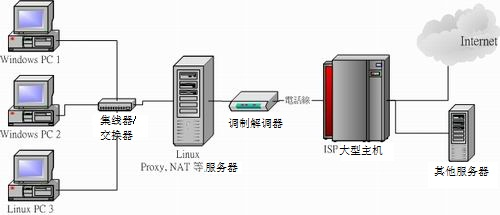
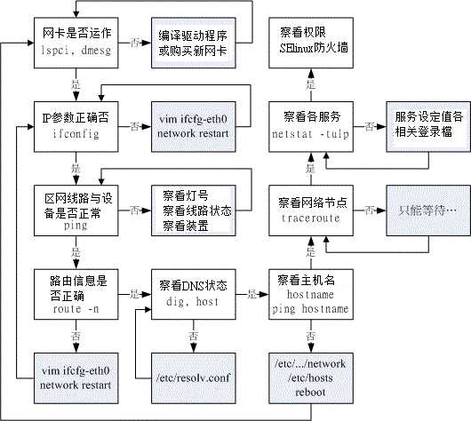

# 第六章、 Linux 网络侦错

最近更新日期：2011/07/19

虽然我们在第四章谈完了连上 Internet 的方法，也大略介绍了五个主要的网络检查步骤。不过，网络是很复杂的东西， 鸟哥也是接触了 Linux 这么多年之后才对网络与通讯协议有点认识而已，要说到熟悉与了解，那还有段路要走哩。 总之，为了让大家对网络问题的解决有个方向可以进行处理，鸟哥底下列出一些常见的问题，希望对大家有点帮助！

*   6.1 无法联机原因分析
    *   6.1.1 硬件问题：网络线材、网络设备、网络布线等
    *   6.1.2 软件问题：IP 参数设定、路由设定、服务与防火墙设定等
    *   6.1.3 问题的处理
*   6.2 处理流程
    *   6.2.1 步骤一：网络卡工作确认
    *   6.2.2 步骤二：局域网络内各项连接设备检测
    *   6.2.3 步骤三：取得正确的 IP 参数
    *   6.2.4 步骤四：确认路由表的规则
    *   6.2.5 步骤五：主机名与 IP 查询的 DNS 错误
    *   6.2.6 步骤六：Linux 的 NAT 服务器或 IP 分享器出问题
    *   6.2.7 步骤七：Internet 的问题
    *   6.2.8 步骤八：服务器的问题
*   6.3 本章习题
*   6.4 参考数据与延伸阅读
*   6.5 [针对本文的建议：http://phorum.vbird.org/viewtopic.php?t=26155](http://phorum.vbird.org/viewtopic.php?t=26155)

* * *

# 6.1 无法联机原因分析

## 6.1 无法联机原因分析

老是看到有朋友在网络上哀嚎说：『我的网络不通啊！』还有比较奇怪的是『啊！怎么网络时通时不通』之类的问题， 这类的问题其实主要可以归类为硬件问题与软件设定问题。硬件的问题比较麻烦，因为需要透过一些专门的装置来分析硬件； 至于软件方面，绝大部分都是设定错误或者是观念错误而已，比较好处理啦 (第四章谈到的就是软件问题)！ OK！我们先来看看网络在哪里可能会出问题吧！

* * *

### 6.1.1 硬件问题：网络线材、网络设备、网络布线等

在[第二章的网络基础](http://linux.vbird.org/linux_server/0110network_basic.php)当中我们曾提到很多的网络基础概念， 以及一些简单的硬件维护问题。以一个简单的星形联机来说，我们可以假设他的架构如同下图所示：

 图 6.1-1、局域网络的联机状态示意图

在上面的图示当中，"Linux PC3" 要连到 Internet 上面去的话，需要透过网络线、交换器、 NAT 主机 (Linux 服务器或 IP 分享器)、ADSL 调制解调器，附挂电话线路、ISP 自己的机房交换器，以及 Internet 上面的所有媒体设备 (包括路由器、网桥、其他网络线等等)；那么哪些地方可能会出问题啊？

1.  网络线材的问题：

    在上面的图示中，可以发现，其实网络接口设备中，使用最多的就是网络线啦！要注意网络线分成并行线与跳线 (RJ-45 接头)，而并不是所有的设备都支持自动分辨跳线与并行线的功能的！ 所以你必须要了解到你的设备 (Hub/Switch/调制解调器) 所支持的网络线；另外，如果你的网络线有经过门缝处或者是容易凹折处， 那很有可能由于经常性的凹折导致电子讯号不良，所以你需要注意一下这些事情：

    *   网络线被截断；
    *   网络线过度扭曲变形造成讯号不良；
    *   自制网络接头 (如 RJ-45 跳线头) 品质不良；
    *   网络接头与设备 (如 Hub) 接触不良；
2.  网络卡、Hub 及 Router 等网络设备的问题：

    另外，还有一些网络设备也会有问题，常见的问题如下：

    *   网络卡不稳定、质量不佳，或者与整体系统的兼容度不佳 (网络卡也是会坏的)；
    *   各网络设备的接头不佳，接触不良，造成讯号衰减 (经常的拔插就有可能发生)；
    *   由于网络设备所在环境恶劣 (例如过热) 导致的当机问题 (鸟哥经常遭遇到 switch 热当的问题)；
    *   各网络设备使用方法不良，造成设备功能衰减 (switch 常常插电/断电容易坏喔)；
3.  设备配置的规则：

    在各个设备的配置上是有一定的规则的，而最容易发生的问题就是太长的网络线会造成讯号的衰减， 导致网络联机的时间太长甚至无法联机。我们曾在网络基础当中谈过以太网络最长的支持距离 (10BASE5 最长可达 500m)， 还有一些其他网络媒体配置的问题你必须晓得的：

    *   使用错误的网络线，最常发生在并行线与跳线的分别 (现在比较少见这个问题了)！
    *   架设的网络线过长，导致讯号衰减太严重。例如以太网络 CAT5e 的线理论限制长度大概是在 90 公尺左右 (虽然 10BASE5 可达 500m)，若两个设备 (Hub/主机之间) 长度大于 90 公尺时，自然就容易出现讯号发生问题了！
    *   其他噪声的干扰，最常发生在网络线或者网络设备旁边有太强的磁波；
    *   局域网络上面，节点或者其他的设备太多，过去我们常以所谓的 543 原则来说明：(注 1)
        *   5 个网段 (segment)。所谓 segment 就在物理连接上最接近的一组计算机，在一个 BNC 网段里面最多只能接 30 台计算机﹐且网线总长不能超过 185m。
        *   4 个增益器 (repeater)。也就是将信号放大的装置。
        *   3 个计算机群体 (population)。这个不好理解﹐也就是说前面所说的 5 个 segment 之中， 只能有 3 个可以装计算机，其它两个不行。

上述是一些最常见的硬件问题，当然啦，有的时候是设备本身就有问题，而我们在网络基础里面谈到的那个很重要的『 [网络布线](http://linux.vbird.org/linux_server/0110network_basic.php#tcpip_link_hw) 』的情况，也是造成网络停顿或通顺与否的重要原因吶！所以，硬件问题的判断比较困难点。 好～底下我们再来聊一聊软件设定的相关问题。

* * *

### 6.1.2 软件问题：IP 参数设定、路由设定、服务与防火墙设定等

所谓的软件问题，绝大部分就是 IP 参数设定错误啊，路由不对啊，还有 DNS 的 IP 设定错误等等的， 这些问题都是属于软件设定啦！只要将设定改一改，利用一些侦测软件查一查，就知道问题出在哪里了！基本的问题有：

1.  网络卡的 IP/netmask 设定错误： 例如：同一个 IP 在同一个网段中出现造成 IP 冲突、子网掩码设定错误、网络卡的驱动程序使用错误、网络卡的 IRQ、 I/O Address 的设定冲突等等；

2.  路由的问题 (route table)： 最常见的就是预设路由 (default gateway) 设定错误了！或者是路由接口不符所导致的问题， 使得数据封包没有办法顺利的送出去。

3.  通讯协议不相符： 最常发生在不同的操作系统之间的通讯传输，例如早期 Windows 98 与 Windows 2000 之间的『网芳』 若要达成沟通，则 Windows 98 必须要加装 NetBEUI 这个通讯协议才行。又例如两部 Linux 主机要透过 NFS 通讯协议传输数据时，两边都得要支持 rpcbind 这个启动 RPC 协议的程序才行！ 这些通讯协议我们都会在后面的章节分别介绍的啦！

4.  网络负荷的问题 (loading)： 当同时有大量的数据封包涌进 Server 或者是 Hub 或者是同一个网域中， 就有可能造成网络的停顿甚至挂点！另外，如果区网内有人使用 BT (P2P 软件) 或者是有人中毒导致蠕虫充满整个区网，也会造成网络的停顿问题；

5.  其他问题： 例如：一些 port 被防火墙挡住了，造成无法执行某些网络资源；应用程序本身的 Bug 问题；应用程序中用户的网络设定错误；以及不同的操作系统的兼容性问题等等。

* * *

### 6.1.3 问题的处理

既然问题发生了，就要去处理他啊！那如何处理呢？以上面的星形联机图示为例，把握两个原则：

*   先由自身的环境侦测起，可以由自身 PC 上的网络卡查起，到网络线、到 Hub 再到调制解调器等等的硬件先检查完。 在这个步骤当中，最好用的软件就是 ping ，而你最好能有两部以上的主机来进行联机的测试；

*   确定硬件没问题了，再来思考软件的设定问题！

实际上，如果网络不通时，你可以依序这样处理：

1.  了解问题：这个问题是刚刚发生？还是因为之前我做了什么动作而导致无法联机？ 例如之前鸟哥曾经更新过一个核心，结果该核心并不能驱动鸟哥的新网卡...
2.  确认 IP：先看看自己的网卡有无驱动？能否取得正确的 IP 相关参数来联机？
3.  确认区网联机：利用 [ping](http://linux.vbird.org/linux_server/0140networkcommand.php#ping) 来沟通两部主机 (路由器或 IP 分享器)，确定网络线与中继的 hub/switch 工作正常；
4.  确认对外联机：看主机或 IP 分享器能否依据[第四章](http://linux.vbird.org/linux_server/0130internet_connect.php)的方法顺利取得 IP 参数，并以 [ping](http://linux.vbird.org/linux_server/0140networkcommand.php#ping) 的方法确定对外联机是可以成功的 (例如 ping 168.95.1.1)；
5.  确认 DNS 查询：利用 [nslookup](http://linux.vbird.org/linux_server/0140networkcommand.php#nslookup) 或 host 或 dig 检查 www.google.com 看看；
6.  确认 Internet 节点：可以利用 [traceroute](http://linux.vbird.org/linux_server/0140networkcommand.php#traceroute) 检查各节点是否没问题？
7.  确认对方服务器正常服务：是否对方服务器忙线中？或他的机器挂了？
8.  确认我方服务器：如果是别人连不上我这部主机，那检查主机某些服务正确启动否？可利用 [netstat](http://linux.vbird.org/linux_server/0140networkcommand.php#netstat) 检查。或是否某些安全机制的软件没有设定好，例如 SELinux 这项机制；
9.  防火墙或权限的问题：是否由于权限设定错误所致？ 是否由于你的机器有防火墙忘记启用可联机的埠口所致？这个可以透过 [tcpdump](http://linux.vbird.org/linux_server/0140networkcommand.php#tcpdump) 来处理！

透过这些处理动作后，一般来说，应该都可以解决你无法上网的问题了！当然啦，如果是硬件的问题，那么鸟哥也无法帮你， 你可能最需要的是......『送修吧孩子！』

* * *

# 6.2 处理流程

## 6.2 处理流程

既然知道上面已经谈到的几个小重点了，接下来当然是一个一个的给他处理掉啊！ 底下我们就得要一步一脚印的开始检查的流程啊！

* * *

### 6.2.1 步骤一：网络卡工作确认

其实，网络一出问题的时候，你应该从自己可以检查的地方检查起，因此， 最重要的地方就是检查你的网络卡是否有工作的问题啦！检查网络卡是否正常工作的方法如下：

1.  确定网络卡已经驱动成功： 如果网络卡没有驱动成功，其他的，免谈！所以你当然需要驱动你的网络卡才行！确认网络卡是否被驱动，可以利用 lspci 以及 dmesg 这两个咚咚来查询相关的设备与模块的对应。详情请参考：[第四章](http://linux.vbird.org/linux_server/0130internet_connect.php#note_nic)的相关说明。 再次强调，捉不到网卡驱动程序，除了自己编译之外，再购买一张便宜的网卡来应付着用，是不错的想法！

2.  确定可以手动直接建立 IP 参数： 在顺利的加载网络卡的模块，并且『取得网络卡的代号』之后，我们可以利用 [ifconfig](http://linux.vbird.org/linux_server/0140networkcommand.php#ifconfig) 或 [ip](http://linux.vbird.org/linux_server/0140networkcommand.php#ip_cmd) 来直接给予该网络卡一个网络地址试看看！ 看能否给予 IP 设定呢？例如：

    ```
    [root@www ~]# ifconfig eth0 192.168.1.100 
    ```

    来直接建立该网络卡的 IP ，然后直接输入 ifconfig 看能否查阅到刚刚设定好的参数即可。 如果可以建立起该 IP ，就以 ping 来检测看看：

    ```
    [root@www ~]# ping 192.168.1.100 
    ```

    如果有响应的话，那表示这个网卡的设定应该是没有问题了！再来则是开始检测一下局域网络内的各个连接硬件啦！

* * *

### 6.2.2 步骤二：局域网络内各项连接设备检测

在确认完了最重要的网络卡设定之后，并且确定网络卡是正常的之后，再接着下来则是局域网络内的网络连接情况了！假设你是按照 图 6.1-1 所设定的星形联机局域网络架构，那么你必须要知道整个『网域』的概念！

1.  关于网域的概念： 能否成功的架设出区网，与网域的概念有关！所以，你要知道所谓的 192.168.1.0/24 这种网域的表达方式所代表的意义， 且子网掩码 (Netmask) 的意义也得了解。如果忘记了，请回去[第二章网络基础](http://linux.vbird.org/linux_server/0110network_basic.php)再翻一翻。

2.  关于 Gateway 与 DNS 的设定： Gateway 与 DNS 最容易被搞混～这两个并非是填写你的 Linux 主机的 IP 喔！应该是要填写 IP 分享器 (或 NAT 主机) 的 IP 在 Gateway 中，填写 168.95.1.1 在 DNS 的 IP 设定当中！不能够搞错啊！

3.  关于 Windows 端的工作组与计算机名称： 假如你还需要资源共享，那么你就必须在 windows 系统中开放档案分享， 并且建议所有的计算机将『工作组』设定相同，但『计算机名称』则不能相同！不过，这个只与网芳及 SAMBA 服务器有关。

假设你的区网内所有的主机 IP 都设定正确了，那么接下来你就可以使用 ping 来测试两部区网内主机的联机， 这个联机的动作可以让你测试两部主机间的各项设备，包括网络线、Hub/Switch 等等的咚咚！ 如果无法测试成功，那就请了解一下：

1.  IP 参数是否设定正确： 再次强调，先决定 IP/netmask 是对的！鸟哥在上课的时候常常发现同学无法连到我的主机上， 一经使用 ifconfig 才发现他们与我的 IP 不在同一个网段内，就是会有这样的情况发生啊！唉～

2.  联机的线材问题： 包括我们前面提到的网络线本身折损、过度缠绕造成的讯号衰减问题等等， 另外，有些比较旧的 Hub/Switch 或者是 ADSL 调制解调器，由于没有 [Auto MDI/MDIX](http://linux.vbird.org/linux_server/0110network_basic.php#auto_mdi) 的功能，所以无法自动的分辨跳线与否， 那么当你用错网络线的时候，也就无法接通啦！另外，早期我们常常会说， 最简单判断每部主机是否顺利连接到 Hub/Switch 可以透过连接到 Switch 上的灯号来判断， 不过，由于有时候网络线本身讯号不良，虽然灯号还是会亮，不过就是无法连接到 Switch 的情况 (鸟哥自己就曾发生过啊)，此时，跟朋友借一条 OK 的网络线来测试看看吧！

3.  网卡或 Hub/Switch 本身出问题： 有一次鸟哥无法在外部连接到鸟哥的主机，怀疑是挂点了，结果冲到主机所在办公室察看，咦！ 主机是好好的嘛！那怎么会无法联机呢？原因是...室内环境通风不良，加上 Switch 所在处温度过高， 加上那部旧的 switch 『刚好』风扇坏了，哈！就这样『 switch 当机 』 在重新启动 switch (拔掉再插上电源线) 后就正常了。所以啰，很多情况都是会发生的， 而局域网络内的环境也很容易影响到联机质量啊！

确定自己主机的 IP 与网卡没有问题，加上内部区网透过 ping 也测试过没有问题，接下来就是要『取得可以对外联机的 IP 参数』啦！这个重要！

* * *

### 6.2.3 步骤三：取得正确的 IP 参数

什么叫『取得正确的 IP 参数』啊？还记得我们谈过如果要顺利的连接上 Internet 的话， 必须要可以跟 public IP 进行沟通才行，而与 public IP 取得沟通的方法，在台湾比较常见的有 ADSL, Cable modem, 学术网络, 电话拨接等等。在 CentOS 当中，我们可以透过修改 /etc/sysconfig/network-scripts/ifcfg-eth0，或者是利用 rp-pppoe 来进行拨接， 无论如何，你就是得要连接到某个 ISP 去就是了～

在你确认所有的区网没有问题之后，参考一下[第四章](http://linux.vbird.org/linux_server/0130internet_connect.php)的介绍，连上之后，立即以 ifconfig 看看有没有捉到正确的 IP 啊？ 在台湾如果使用 ADSL 联机的话，你应该可以顺利的取得一组正确的 Public IP 参数的！

**Tips:** 曾有国外的华人朋友来信说到，他们使用 ADSL 拨接之后竟然取得一组 Private IP ， 害他们没有办法架站！他们想请问这样的情况是否合理。如果你熟悉路由相关的概念之后， 当然会知道：『这当然合理！』，因为你取得的 IP 只是为了要连接到 ISP 去而已， 而 ISP 与你的主机当然可以透过 Private IP 来联机啊！如果是这样的话，那么你就肯定无法架站了！ ^_^


另外，最常发现无法顺利取得 IP 的错误就是『BOOTPROTO』这个设定值设定错了！因为 static 与 dhcp 协议所产生的 IP 要求是不一样的啊！还记得吧！要特别留在 ifcfg-eth0 里面的设定参数喔！另外，如果你是使用 ADSL 拨接的， 但是老是无法拨接成功，那么建议你可以这样试看看：

*   将 ADSL 的调制解调器整个关机，将 Switch/Hub 也关掉电源；
*   静待十分钟，等这些设备比较『凉快』一点后，再重新插上电源；
*   将 Linux 连接到 ADSL 的那块网卡 (假设为 eth0) 在 ifcfg-eth0 内，『ONBOOT』设定为 no， 重新启动网络 (/etc/init.d/network restart)，然后再执行 adsl-start
*   如果还是无法拨接成功，并且你已经确认内部网域没有问题，那请中华电信的工程人员来帮忙你处理吧！

因为很多时候都是由于网络媒体过热，也有可能主机内部的一些网络参数有点问题， 所以，干脆就不要启动网卡，让 adsl-start 自动去启动网卡即可！ 如果顺利取得 IP 后，却还是无法顺利连到 Internet 上面时，你觉得还有哪些地方需要处理的呢？

**Tips:** 为了避免 switch 以及 ADSL 调制解调器热当，鸟哥以及一些重度网络用户的朋友，就买了桌上型小电扇，配合定时器 (timer) 来定时的向这两个设备吹风～为啥需要定时器？因为担心电风扇一直开着会烧掉...


* * *

### 6.2.4 步骤四：确认路由表的规则

如果你已经顺利取得正确的 IP 参数的话，那么接下来就是测试一下是否可以连上 Internet 啊！ 鸟哥建议你可以尝试使用 ping 来连连看 Hinet 的 DNS 主机，也就是 168.95.1.1 那部机器啦！

```
[root@www ~]# ping -c 3 168.95.1.1 
```

如果有响应，那就表示你的网络『基本上已经没有问题，可以连到 Internet 了！』， 那如果没有响应呢？明明取得了正确的 IP 却无法连接到外部的主机，肯定有鬼！呵呵！没错！ 还记得我们在网域内资料的传输可以直接透过 [MAC](http://linux.vbird.org/linux_server/0110network_basic.php#fig_mac) 来传送， 但如果不在区网内的数据，则需要透过路由，尤其是那个预设路由 (default route) 来帮忙转递封包吧！ 所以说，如果你的 public IP 无法连接到外部 (例如 168.95.1.1) ，可能的问题就出在路由与防火墙上面了。假设你没有启动防火墙，那问题就缩小到剩下路由啰～ 那路由的问题如何检查？就用 [route -n](http://linux.vbird.org/linux_server/0140networkcommand.php#route) 来检查啊！

例题：假设有个使用 ADSL 拨接的 Linux 主机，他的路由表如下，你觉得出了什么问题？

```
Destination     Gateway       Genmask         Flags Metric Ref    Use Iface
59.104.200.1    0.0.0.0       255.255.255.255 UH    0      0        0 ppp0
192.168.1.0     0.0.0.0       255.255.255.0   U     0      0        0 eth0
169.254.0.0     0.0.0.0       255.255.0.0     U     0      0        0 eth0
127.0.0.0       0.0.0.0       255.0.0.0       U     0      0        0 lo
0.0.0.0         192.168.1.2   0.0.0.0         UG    0      0        0 eth0 
```

答：仔细看到上面的路由输出，第一条是 ppp0 产生的 public IP 接口，第二条是 eth0 的内部网域接口，再看到最后一条的 0.0.0.0/0.0.0.0 这个预设路由，竟然是内部网域的 eth0 为 gateway ？不合理，最大的问题应该是出在 ifcfg-eth0 里面不小心设定了『GATEWAY=192.168.1.2』 所致，解决的方法为：

1.  取消 ifcfg-eth0 内 GATEWAY=192.168.1.2 那一行，(该行亦可能出现在 /etc/sysconfig/network 内)
2.  重新启动网络 /etc/init.d/network restart
3.  重新进行拨接： adsl-stop; adsl-start

另外一个可能发生的情况，就是：『忘记设定预设路由』啦！例如使用 ifconfig 手动重新设定过网络卡的 IP 之后，其实路由规则是会被更新的，所以预设路由可能就会不见了！那个时候你就得要利用 route add 来增加预设路由啰！

* * *

### 6.2.5 步骤五：主机名与 IP 查询的 DNS 错误

如果你发现可以 ping 到 168.95.1.1 这个 Internet 上面的主机，却无法使用浏览器在网址列浏览 [`www.google.com`](http://www.google.com) 的话，那肯定 99% 以上问题是来自于 DNS 解析的困扰！解决的方法就是直接到 /etc/resolv.conf 去看看设定值对不对啊！一般常见的内容是这样的：

```
[root@www ~]# vim /etc/resolv.conf
nameserver 168.95.1.1
nameserver 139.175.10.20 
```

最常见的错误是『那个 nameserver 的拼字写错了！』真是最常见的问题～另外，如果 client 端是 Windows 系统呢？常常初学者会搞错的地方就是在 windows 的设定了！要注意：Windows 端的 DNS 设定与主机端 /etc/resolv.conf 的内容相同即可！很多初学者都以为 TCP/IP 内的 DNS 主机是填上自己的 Linux 主机，这是不对的 (除非你自己的 Linux 上面有 DNS 服务) ！你只要填上你的 ISP 给你的 DNS 主机 IP 位置就可以了

另外，每一部主机都会有主机名 (hostname) ，预设的主机名会是 localhost ，这个主机名会有一个 127.0.0.1 的 IP 对应在 /etc/hosts 当中。如果你曾经修改过你的主机名，该主机名却无法有一个正确 IP 的对应， 那么你的主机在开机时，[可能会有好几十分钟的延迟](http://linux.vbird.org/linux_server/0130internet_connect.php#problem_hosts)。 所以啰，那个 /etc/hosts 与你的主机名对应，对于内部私有网域来说，是相当重要的设定项目呢！

* * *

### 6.2.6 步骤六：Linux 的 NAT 服务器或 IP 分享器出问题

NAT 服务器最简单的功能就是 IP 分享器啦！NAT 主机一定是部路由器，所以你必须要在 Linux 上面观察好正确的路由信息。否则肯定有问题。另外， NAT 主机上面的防火墙设定是否合理？ IP 分享器上面是否有设定抵挡的机制等等，都会影响到对外联机是否能够成功的问题点。 关于 NAT 与防火墙我们会在后续的章节继续介绍的啦！

* * *

### 6.2.7 步骤七：Internet 的问题

Internet 也会出问题喔！当然啦～没有任何东西是不会出问题的！举例来说，好几年前台湾西岸因为施工的关系， 导致南北网络骨干缆线被挖断，结果导致整个 Internet 流量的大塞车！这就是 Internet 的问题～还有，数年前 [Study Area 网站](http://phorum.study-area.org/)放置的地点由于路由器设定出了点差错， 结果导致连接速度的缓慢。这都不是主机本身出问题，而是 Internet 上面某个节点出了状况。 想要确认是否问题来自 Internet 的话，就使用 [traceroute](http://linux.vbird.org/linux_server/0140networkcommand.php#traceroute) 吧！ 查察看问题是来自那个地方再说！

* * *

### 6.2.8 步骤八：服务器的问题

如果上述的处理都 OK ，却无法登入某部主机时，我想，最大的问题就是出现在主机的设定啦！这包括有：

*   服务器并没有开放该项服务：例如主机关闭了 telnet ，那你使用 telnet 去联机，是无法连接上的啦！
*   主机的权限设定错误：例如你将某个目录设定为 drwx------ ，该目录拥有者为 root ， 你却将该目录开放给 WWW 来浏览，由于 WWW 无法进入该目录，所以当然无法正确的给客户端浏览啊！ 这是最典型的权限设定错误的情况啊！
*   安全机制设定错误：例如 SELinux 是用来更细微控管主机存取的一种核心机制，结果你启动的是系统原先不支持的类型， 那么 SELinux 反而可能会抵挡该服务的提供！而其他例如 /etc/hosts.deny, PAM 模块等等， 都可能造成使用者无法登入的问题！这就不是网络问题，而是主机造成联机无法成功！
*   防火墙问题：防火墙设定错误也是一个很常见的问题，你可以使用 [tcpdump](http://linux.vbird.org/linux_server/0140networkcommand.php#tcpdump) 来追踪封包的流向， 以顺利的了解防火墙是否设定错误。

基本上，一个网络环境的检测工作可不是三言两语就讲的完的～而且常常牵涉到很多经验的问题～ 请你常常到一些讲座的场合去听听看大家的经验，去 google 看看人家的解决方法， 都有助于让你更轻易的解决网络问题的喔！ ^_^！鸟哥也将上述的动作规划成一个流程图，参考看看：

 图 6.2-1、网络问题解决流程图

* * *

# 6.3 本章习题

## 6.3 本章习题

*   以图 6.1-1 的星形联机为例，你的 Linux PC 3 可以 ping 到 Windows PC1 ，但是反过来，Windows PC1 无法 ping 到 Linux PC3，你觉得原因可能发生在哪里？由于两边已经可以用 ping 进行联机，所以硬件应该是没有问题了。而 Linux --> Windows 没问题， Windows --> Linux 有问题，可能是由于 Linux 主机上面的防火墙所致。可以使用 iptables -L -n 去查阅一下防火墙的设定规则。详细的防火墙请参考后续的章节。

* * *

# 6.4 参考数据与延伸阅读

## 6.4 参考数据与延伸阅读

*   注 1：网中人的网络架构简介：[`www.study-area.org/network/network_archi.htm`](http://www.study-area.org/network/network_archi.htm)

* * *

2002/07/31：第一次完成日期！ 2003/08/19：重新修订一些数据，与前面的章节比较好配合！ 2006/08/04：将旧的文章移动到 [此处](http://linux.vbird.org/linux_server/0150detect_network/0150detect_network.php) 2010/09/03：将旧的基于 CentOS 4.x 所撰写的版本移动到[此处](http://linux.vbird.org/linux_server/0150detect_network//0150detect_network-centos4.php) 2010/09/06：花了一些时间，加上一张流程图分析！参考看看吧！ 2011/07/19：将版本改为 CentOS 6.x，原本的 CentOS 5.x 放于 [此处](http://linux.vbird.org/linux_server/0150detect_network//0150detect_network-centos5.php)

* * *