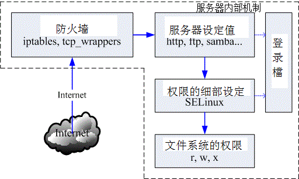
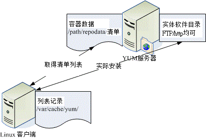
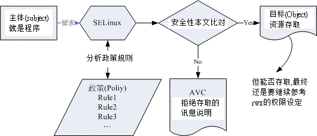
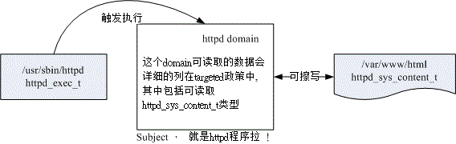

# 第七章、网络安全与主机基本防护：限制端口, 网络升级与 SELinux

最近更新日期：2011/07/21

通过第一篇的锻炼之后，现在你应该已经利用 Linux 连上 Internet 了。但是你的 Linux 现在恐怕还是不怎么安全的。 因此，在开始服务器设定之前，我们必须要让你的系统强壮些！以避免被恶意的 cracker 所攻击啊！在这一章当中， 我们会介绍封包的流向，然后根据该流向来制订系统强化的流程！包括在线自动升级、服务管控以及 SELinux 等等。现在就来了解了解啰！

*   7.1 网络封包联机进入主机的流程
    *   7.1.1 封包进入主机的流程
    *   7.1.2 常见的攻击手法与相关保护： 猜密码, 漏洞, 社交工程, 程序误用, rootkit, DDoS
    *   7.1.3 主机能作的保护：软件更新、减少网络服务、启动 SELinux
*   7.2 网络自动升级软件
    *   7.2.1 如何进行软件升级
    *   7.2.2 CentOS 的 yum 软件更新、映像站使用的原理
    *   7.2.3 yum 的使用： 安装, 软件群组, 全系统更新
    *   7.2.4 挑选特定的映射站：修改 yum 配置文件与清除 yum 快取
*   7.3 限制联机埠口 (port)
    *   7.3.1 什么是 port
    *   7.3.2 埠口的观察： netstat, nmap
    *   7.3.3 埠口与服务的启动/关闭及开机时状态设定： 服务类型, 开机启动
    *   7.3.4 安全性考虑-关闭网络服务端口
*   7.4 SELinux 管理原则
    *   7.4.1 SELinux 的运作模式： 安全性本文, domain/type
    *   7.4.2 SELinux 的启动、关闭与观察： getenforce, setenforce
    *   7.4.3 SELinux type 的修改： chcon, restorecon, semanage
    *   7.4.4 SELinux 政策内的规则布尔值修订： seinfo, sesearch, getsebool, setsebool
    *   7.4.5 SELinux 登录文件记录所需服务-以 httpd 为范例： setroubleshoot, sealert
*   7.5 被攻击后的主机修复工作
    *   7.5.1 网管人员应具备的技能
    *   7.5.2 主机受攻击后复原工作流程
*   7.6 重点回顾
*   7.7 本章习题
*   7.8 参考数据与延伸阅读
*   7.9 [针对本文的建议：http://phorum.vbird.org/viewtopic.php?p=114062](http://phorum.vbird.org/viewtopic.php?p=114062)

* * *

# 7.1 网络封包联机进入主机的流程

## 7.1 网络封包联机进入主机的流程

在这一章当中，我们要讨论的是，当来自一个网络上的联机要求想进入我们的主机时， 这个网络封包在进入主机实际取得数据的整个流程是如何？了解了整个流程之后， 你才会发现：原来系统操作的基本概念是如此的重要！ 而你也才会了解要如何保护你的主机安全吶！闲话少说，咱们赶紧来瞧一瞧先。

* * *

### 7.1.1 封包进入主机的流程

在[第一章](http://linux.vbird.org/linux_server/0105beforeserver.php#server_network_flow)我们就谈过网络联机的流程， 当时举的例子是希望你可以理解为啥架设服务器需要了解操作系统的基本观念。在这一章当中，我们要将该流程更细致化说明， 因为，透过这个流程分析，你会知道为啥我们的主机需要进行过一些防护之后，系统才能够比较强壮。此外，透过[第二章的网络概念](http://linux.vbird.org/linux_server/0110network_basic.php)解释后，你也了解了网络是双向的，服务器与客户端都得要有 IP:port 才能够让彼此的软件互相沟通。那么现在，假设你的主机是 WWW 服务器，透过底下的图标，网络封包如何进入你的主机呢？

 图 7.1-1、网络封包进入主机的流程

1.  经过防火墙的分析：

    Linux 系统有内建的防火墙机制，因此你的联机能不能成功，得要先看防火墙的脸色才行。预设的 Linux 防火墙就有两个机制，这两个机制都是独立存在的，因此我们预设就有两层防火墙喔。第一层是封包过滤式的 netfilter 防火墙， 另一个则是透过软件控管的 TCP Wrappers 防火墙。

    *   封包过滤防火墙：IP Filtering 或 Net Filter 要进入 Linux 本机的封包都会先通过 Linux 核心的预设防火墙，就是称为 netfilter 的咚咚，简单的说，就是 iptables 这个软件所提供的防火墙功能。为何称为封包过滤呢？因为他主要是分析 TCP/IP 的封包表头来进行过滤的机制，主要分析的是 OSI 的第二、三、四层，主要控制的就是 MAC, IP, ICMP, TCP 与 UDP 的埠口与状态 (SYN, ACK...) 等。详细的资料我们会在[第九章防火墙](http://linux.vbird.org/linux_server/0250simple_firewall.php)介绍。

    *   第二层防火墙：TCP Wrappers 通过 netfilter 之后，网络封包会开始接受 [Super daemons](http://linux.vbird.org/linux_basic/0560daemons.php) 及 [TCP_Wrappers](http://linux.vbird.org/linux_basic/0560daemons.php#tcp_wrappers) 的检验，那个是什么呢？ 说穿了就是 /etc/hosts.allow 与 /etc/hosts.deny 的配置文件功能啰。 这个功能也是针对 TCP 的 Header 进行再次的分析，同样你可以设定一些机制来抵制某些 IP 或 Port ，好让来源端的封包被丢弃或通过检验；

        透过防火墙的管控，我们可以将大部分来自因特网的垃圾联机丢弃，只允许自己开放的服务的联机进入本机而已， 可以达到最基础的安全防护。

2.  服务 (daemon) 的基本功能：

    预设的防火墙是 Linux 的内建功能，但防火墙主要管理的是 MAC, IP, Port 等封包表头方面的信息，如果想要控管某些目录可以进入， 某些目录则无法使用的功能，那就得要透过权限以及服务器软件提供的相关功能了。举例来说，你可以在 httpd.conf 这个配置文件之内规范某些 IP 来源不能使用 httpd 这个服务来取得主机的数据， 那么即使该 IP 通过前面两层的过滤，他依旧无法取得主机的资源喔！但要注意的是， 如果 httpd 这支程序本来就有问题的话，那么 client 端将可直接利用 httpd 软件的漏洞来入侵主机，而不需要取得主机内 root 的密码！因此， 要小心这些启动在因特网上面的软件喔！

3.  SELinux 对网络服务的细部权限控制：

    为了避免前面一个步骤的权限误用，或者是程序有问题所造成的资安状况，因此 Security Enhanced Linux (安全强化 Linux) 就来发挥它的功能啦！简单的说，SELinux 可以针对网络服务的权限来设定一些规则 (policy) ，让程序能够进行的功能有限， 因此即使使用者的档案权限设定错误，以及程序有问题时，该程序能够进行的动作还是被限制的，即使该程序使用的是 root 的权限也一样。举例来说，前一个步骤的 httpd 真的被 cracker 攻击而让对方取得 root 的使用权，由于 httpd 已经被 SELinux 控制在 /var/www/html 里面，且能够进行的功能已经被规范住了，因此 cracker 就无法使用该程序来进行系统的进一步破坏啰。现在这个 SELinux 一定要开启喔！

4.  使用主机的文件系统资源：

    想一想，你使用浏览器连接到 WWW 主机最主要的目的是什么？当然就是读取主机的 WWW 数据啦！ 那 WWW 资料是啥？就是档案啊！^_^！所以，最终网络封包其实是要向主机要求文件系统的数据啦。 我们这里假设你要使用 httpd 这支程序来取得系统的档案数据，但 httpd 默认是由一个系统账号名称为 httpd 来启动的，所以：你的网页数据的权限当然就是要让 httpd 这支程序可以读取才行啊！如果你前面三关的设定都 OK ，最终权限设定错误，使用者依旧无法浏览你的网页数据的。

在这些步骤之外，我们的 Linux 以及相关的软件都可能还会支持登录文件记录的功能，为了记录历史历程， 以方便管理者在未来的错误查询与入侵检测，良好的分析登录档的习惯是一定要建立的，尤其是 /var/log/messages 与 /var/log/secure 这些个档案！虽然各大主要 Linux distribution 大多有推出适合他们自己的登录文件分析软件，例如 CentOS 的 logwatch ，不过毕竟该软件并不见得适合所有的 distributions ，所以鸟哥尝试自己写了一个 logfile.sh 的 shell script，你可以在底下的网址下载该程序：

*   [`linux.vbird.org/download/index.php?action=detail&fileid=60`](http://linux.vbird.org/download/index.php?action=detail&fileid=60)

好了，那么根据这些流程，你觉得 cracker 这些个坏蛋能够怎样的攻击我们的系统呢？得要先到对方想要怎么破坏， 我们才能够想办法来补强系统嘛！底下先讲讲基本的攻击手法啰。

* * *

### 7.1.2 常见的攻击手法与相关保护

我们由图 7.1-1 了解到数据传送到本机时所需要经过的几道防线后，那个权限是最后的关键啦！ 现在你应该比较清楚为何我们常常在基础篇里面一直谈到设定正确的权限可以保护你的主机了吧？ 那么 cracker 是如何透过上述的流程还能够攻击你的系统啊？底下就让我们来分析分析。

*   取得帐户信息后猜密码

由于很多人喜欢用自己的名字来作为帐户信息，因此账号的取得是很容易的！举例来说，如果你的朋友将你的 email address 不小心泄漏出去，例如： dmtsai@your.host.name 之类的样式，那么人家就会知道你有一部主机，名称为 your.host.name，且在这部主机上面会有一个使用者账号，账号名称为 dmtsai ，之后这个坏家伙再利用某些特殊软件例如 nmap 来进行你主机的 port scan 之后，嘿嘿！他就可以开始透过你主机有启动的软件功能来猜你这个账号的密码了！

另外，如果你常常观察你的主机登录文件，那你也会发现如果你的主机有启动 Mail server 的服务时， 你的登录档就会常常出现有些怪家伙尝试以一些奇怪的常见账号在试图猜测你的密码， 举例来说像：admin, administrator, webmaster .... 之类的账号，尝试来窃取你的私人信件。 如果你的主机真的有这类的账号，而且这类的账号还没有良好的密码规划，那就容易『中标』！ 唉！真是麻烦！所以我们常讲，系统账号千万不能给予密码，容易被猜密码啊！

这种猜密码的攻击方式算是最早期的入侵模式之一了，攻击者知道你的账号，或者是可以猜出来你的系统有哪些账号， 欠缺的就只是密码而已，因此他会『很努力的』去猜你的密码，此时，你的密码规划如果不好的话，很容易就被攻击了！ 主机也很容易被绑架啊！所以，良好的密码设置习惯是很重要的。

不过这种攻击方式比较费时，因为目前很多软件都有密码输入次数的限制，如果连续输入三次密码还不能成功的登入， 那该次联机就会被断线！所以，这种攻击方式日益减少，目前偶而还会看到就是了！这也是初级 cracker 会使用的方式之一。 那我们要如何保护呢？基本方式是这样的：

*   减少信息的曝光机会：例如不要将 Email Address 随意散布到 Internet 上头；
*   建立较严格的密码设定规则：包括 /etc/shadow, /etc/login.defs 等档案的设定， 建议你可以参考[基础篇](http://linux.vbird.org/linux_basic)内的[账号管理](http://linux.vbird.org/linux_basic/0410accountmanager.php)那一章来规范你的用户密码变更时间等等， 如果主机够稳定且不会持续加入某些账号时，也可以考虑使用 [chattr](http://linux.vbird.org/linux_basic/0220filemanager.php#chattr) 来限制账号 (/etc/passwd, /etc/shadow) 的更改；
*   完善的权限设定：由于这类的攻击方式会取得你的某个使用者账号的登入权限， 所以如果你的系统权限设定得宜的话，那么攻击者也仅能取得一般使用者的权限而已，对于主机的伤害比较有限啦！ 所以说，权限设定是重要的；

*   利用系统的程序漏洞『主动』攻击

由图 7.1-1 里面的第二个步骤中，我们知道如果你的主机有开放网络服务时， 就必须有启动某个网络软件嘛！我们也知道由于软件可能撰写方式的问题，可能产生一些会被 cracker 乱用的臭虫程序代码，而这些臭虫程序代码由于产生问题的大小，有分为 bug (臭虫，可能会造成系统的不稳定或当机) 与 Security (安全问题，程序代码撰写方式会导致系统的权限被恶意者所掌握) 等问题。

当程序的问题被公布后，某些较高阶的 cracker 会尝试撰写一些针对这个漏洞的攻击程序代码， 并且将这个程序代码放置到 cracker 常去的网站上面，藉以推销自己的『功力』..... 鸟哥要提醒的是，这种程序代码『是很容易被取得的』。 当更多『盈盈美黛子(台语，闲闲没事干之意)』取得这些程序代码后，他可能会想要『试一试这个攻击程序的威力』， 所以就拿来『扫射』一番，如果你八字比较轻，或者当天星座学家说你比较倒霉时，可能就会被不小心的攻击到...

这种攻击模式是目前最常见的，因为攻击者只要拿到攻击程序就可以进行攻击了， 『而且由攻击开始到取得你系统的 root 权限不需要猜密码， 不需要两分钟，就能够立刻入侵成功』，所以『盈盈美黛子』们最爱的就是这个咚咚了。 但这个玩意儿本身是靠『你主机的程序漏洞』来攻击的，所以，如果你的主机随时保持在实时更新的阶段， 或者是关闭大部分不需要的程序，那就可以躲避过这个问题。因此，你应该要这样做：

*   关闭不需要的网络服务：开的 port 越少，可以被入侵的管道越少， 一部主机负责的服务越单纯，越容易找出问题点。
*   随时保持更新：这个没话讲！一定要进行的！
*   关闭不需要的软件功能：举例来说，后面会提到的远程登录服务器 SSH 可以提供 root 由远程登录，那么危险的事情当然要给他取消啊！^_^

*   利用社交工程作欺骗

社交工程 (Social Engineering) 指的其实很简单，就是透过人与人的互动来达到『入侵』的目的！ @_@！人与人的互动可以入侵你的主机？鸟哥在呼咙你吗？当然不是。

近日在台湾的社会你不是常看到某些人会以『退税、中奖、花小钱买贵重物品』等名义来欺骗善良老百姓， 让老百姓掏出口袋里的金钱给那些可恶的金光党吗？社交工程也是类似的方法。在大公司里面， 或许你可能会接到这样的电话：『我是人事部门的经理，我的账号为何突然间不能登入了？ 你给我看一看，恩？干脆直接帮我另建一个账号，我告诉你我要的密码是....』。如果你一时不查给他账号密码的话， 你的主机可能就这样被绑走了～

社交工程的欺骗方法多的是，包括使用『好心的 email 通知』、『警告信函』、『中奖单』等等， 在在都是要欺骗你的账号密码，有的则利用钓鱼方式来欺骗你在某些恶意网站上面输入你的账号密码， 很讨厌的啦！举例来说，我们昆山计中的 email 常常会收到系统维护的信件，要我们将账号密码提交给系统管理员统一控管， 这当然是假的！计中根本不会寄出这样的信件啊！伤脑筋啦！所以要注意啊！那要如何防范呢？

*   追踪对谈者：不要一味的相信对方，你必须要有信心的向上呈报， 不要一时心慌就中了计！
*   不要随意透露账号/密码等信息：最好不要随意在 Internet 上面填写这些数据， 真的很危险的！因为在 Internet 上面，你永远不知道对方屏幕前面坐着的是谁？

*   利用程序功能的『被动』攻击

啥？除了主动攻击之外，还有所谓的被动攻击喔？没错啊，『系金ㄟ』！那如何作被动攻击呢？ 那就得要由『恶意网站』讲起了。如果你喜欢上网随意浏览的话，那么有的时候可能会连上一些广告很多， 或者是一堆弹出式窗口的网站，这些网站有时还会很好心的『提供你很多好用的软件自动下载与安装』的功能， 如果该网站是你所信任的，例如 Red Hat, CentOS, Windows 官网的话，那还好， 如果是一个你也不清楚他是干嘛的网站，那你是否要同意下载安装该软件？

如果你常常在注意一些网络危机处理的相关新闻时，常会发现 Windows 的浏览器 (IE) 有问题， 有时则是全部的浏览器 (Firefox, Netscap, IE...) 都会出现问题。那你会不会觉得奇怪啊， 怎么『浏览器也会有问题？』这是因为很多浏览器会主动的答应对方 WWW 主机所提供的各项程序功能， 或者是自动安装来自对方主机的软件，有时浏览器还可能由于程序发生安全问题， 让对方 WWW 浏览器得以传送恶意代码给你的主机来执行，嘿嘿！中标！

那你又会想啊，那我干嘛浏览那样的恶意网站？呵呵！总是会有些粗心大意的时候啊！如果你今天不小心收到一个 email ，里面告诉你你的银行账号有问题，希望你赶紧连上某个网页去看看你的账号是否在有问题的行列中，你会不会去？ 如果今天有个网络消息说某某网页在提供大特价商品，那你会不会去碰碰运气？ 都是可能的啊！不过，这也就很容易被对方攻击到了。

那如何防备啊？当然建立良好的习惯最重要了：

*   随时更新主机上的所有软件：如果你的浏览器是没有问题的， 那对方传递恶意代码时，你的浏览器就不会执行，那自然安全的多啊！
*   较小化软件的功能：举例来说，让你的收信软件不要主动的下载文件， 让你的浏览器在安装某些软件时，要通过你的确认后才安装，这样就比较容易克服一些小麻烦；
*   不要连接到不明的主机：其实鸟哥认为这个才最难！ 因为很多时候我们都用 google 在搜寻问题的解决之道啊，那你如何知道对方是否是骗人的？ 所以，前面两点防备还是很重要的！不要以为没有连接上恶意网站就不会有问题啊！

*   蠕虫或木马的 rootkit

rootkit 意思是说可以取得 root 权限的一群工具组 (kit)，就如同前面主动攻击程序漏洞的方法一样， rootkit 主要也是透过主机的程序漏洞。不过， rootkit 也会透过社交工程让用户下载、安装 rootkit 软件， 结果让 cracker 得以简单的绑架对方主机啊！

rootkit 除了可以透过上述的方法来进行入侵之外，rootkit 还会伪装或者是进行自我复制， 举例来说，很多的 rootkit 本身就是蠕虫或者是木马间谍程序。蠕虫会让你的主机一直发送封包向外攻击， 结果会让你的网络带宽被吃光光，例如 2001-2003 年间的 Nimda, Code Red 等等；至于木马程序 (Trojan Horse) 则会对你的主机进行开启后门 (开一个 port 来让 cracker 主动的入侵)，结果就是....绑架、绑架、绑架！

rootkit 其实挺不好追踪的，因为很多时候他会主动的去修改系统观察的指令， 包括 ls, top, netstat, ps, who, w, last, find 等等，让你看不到某些有问题的程序， 如此一来，你的 Linux 主机就很容易被当成是跳板了！有够危险！那如何防备呢？

*   不要随意安装不明来源的档案或者是不明网站的档案数据；
*   不要让系统有太多危险的指令：例如 SUID/SGID 的程序， 这些程序很可能会造成用户不当的使用，而使得木马程序有机可趁！
*   可以定时以 rkhunter 之类的软件来追查：有个网站提供 rootkit 程序的检查，你可以前往下载与分析你的主机： [`www.rootkit.nl/projects/rootkit_hunter.html`](http://www.rootkit.nl/projects/rootkit_hunter.html)

*   DDoS 攻击法 (Distributed Denial of Service )

这类型的攻击中文翻译成『分布式阻断服务攻击』，从字面上的意义来看，它就是透过分散在各地的僵尸计算机进行攻击， 让你的系统所提供的服务被阻断而无法顺利的提供服务给其他用户的方式。 这种攻击法也很要命，而且方法有很多，最常见的就属 SYN Flood 攻击法了！还记得我们在[网络基础](http://linux.vbird.org/linux_server/0110network_basic.php)里面提到的，当主机接收了一个带有 SYN 的 TCP 封包之后，就会启用对方要求的 port 来等待联机，并且发送出回应封包 (带有 SYN/ACK 旗目标 TCP 封包)，并等待 Client 端的再次回应。

好了，在这个步骤当中我们来想一想，如果 cient 端在发送出 SYN 的封包后，却将来自 Server 端的确认封包丢弃，那么你的 Server 端就会一直空等，而且 Client 端可以透过软件功能，在短短的时间内持续发送出这样的 SYN 封包，那么你的 Server 就会持续不断的发送确认封包，并且开启大量的 port 在空等～呵呵！等到全部主机的 port 都启用完毕，那么.....系统就挂了！

更可怕的是，通常攻击主机的一方不会只有一部！他会透过 Internet 上面的僵尸网络 (已经成为跳板，但网站主却没有发现的主机) 发动全体攻击，让你的主机在短时间内就立刻挂点。 这种 DDoS 的攻击手法比较类似『玉石俱焚』的手段， 他不是入侵你的系统，而是要让你的系统无法正常提供服务！ 最常被用来作为阻断式服务的网络服务就是 WWW 了，因为 WWW 通常得对整个 Internet 开放服务。

这种攻击方法也是最难处理的，因为要嘛就得要系统核心有支持自动抵挡 DDoS 攻击的机制， 要嘛你就得要自行撰写侦测软件来判断！真是麻烦啊～而除非你的网站非常大， 并且『得罪不少人』，否则应该不会被 DDoS 攻击啦！ ^_^

*   其他

上面提到的都是比较常见的攻击方法，是还有一些高竿的攻击法啦，不过那些攻击法都需要有比较高的技术水准，例如 IP 欺骗。他可以欺骗你主机告知该封包来源是来自信任网域，而且透过封包传送的机制， 由攻击的一方持续的主动发送出确认封包与工作指令。如此一来，你的主机可能就会误判该封包确实有响应， 而且是来自内部的主机。

不过我们知道因特网是有路由的，而每部主机在每一个时段的 ACK 确认码都不相同， 所以这个方式要达成可以登入，会比较麻烦，所以说，不太容易发生在我们这些小型主机上面啦！ 不过你还是得要注意一下说：

*   设定规则完善的防火墙：利用 Linux 内建的防火墙软件 iptables 建立较为完善的防火墙，可以防范部分的攻击行为；
*   核心功能：这部份比较复杂，你必须要对系统核心有很深入的了解， 才有办法设定好你的核心网络功能。
*   登录文件与系统监控：你可以透过分析登录文件来了解系统的状况， 另外也可以透过类似 [MRTG 之类的监控软件](http://linux.vbird.org/linux_security/old/04mrtg.php) 来实时了解到系统是否有异常，这些工作都是很好的努力方向！

*   小结语

要让你的系统更安全，没有『三两三』是没办法『上梁山』的！我们也一直鼓吹， 『维护网站比架设网站还要重要』的观念！因为『一人得道鸡犬升天』，同样的道理：『一人中标全员挂点』， 不要以为你的主机没有啥重要数据，被入侵或被植入木马也没有关系， 因为我们的服务器通常会对内部来源的主机规范的较为宽松，如果你的主机在公司内部， 但是不小心被入侵的话，那么贵公司的服务器是否就会暴露在危险的环境当中了？

另外，在蠕虫很『发达』的年代，我们也会发现只要局域网络里面有一部主机中标，整个局域网络就会无法使用网络了， 因为带宽已经被蠕虫塞爆！如果老板发现他今天没有办法收信了，但无法收信的原因并非服务器挂点， 而是因为内部人员的某部个人计算机中了蠕虫，而那部主机中蠕虫的原因只是因为该使用者不小心去看了一下色情网站， 你觉得老板会高兴的跟该员工一起看色情网站还是 fire 掉该人员？

所以啊，主机防护还是很重要的！不要小看了！提供几个方向给大家思考看看吧：

1.  建立完善的登入密码规则限制；
2.  完善的主机权限设定；
3.  设定自动升级与修补软件漏洞、及移除危险软件；
4.  在每项系统服务的设定当中，强化安全设定的项目；
5.  利用 iptables, TCP_Wrappers 强化网络防火墙；
6.  利用主机监控软件如 MRTG 与 logwatch 来分析主机状况与登录文件；

* * *

### 7.1.3 主机能作的保护： 软件更新、减少网络服务、启动 SELinux

根据本章前面的分析，现在你知道封包的流向以及主机基本需要进行的防护了。不过你或许还是有疑虑，那就是， 既然我都已经有了防火墙，那么权限的控管啦、密码的严密性啦、服务器软件的更新啦、SELinux 啦等等的， 是否就没有这么重要呢？毕竟它是封包进入的第一关卡！这关把关严格，后续可以稍微宽松吗？其实...你错了！ 对于开放某些服务的服务器来说，你的防火墙『根本跟屁一样，是没有用的！』怎么说呢？

*   软件更新的重要性

让我们瞧一瞧图 7.1-1 的流程好了，假设你需要对全世界开放 WWW ，那么提供 WWW 服务的 httpd 这只程序就得要执行，并且，你的防火墙得要打开 port 80 让全世界都可以连接到你的 port 80 ，这样才是一部合理的 WWW 服务器嘛！问题来啦，如果 httpd 这只程序有资安方面的问题时，请问防火墙有没有效用？当然没有！因为防火墙原本就得要开放 port 80 啊！此时防火墙对你的 WWW 一点防护也没有。那怎办？

没啥好说的，就是软件持续更新到最新就对了！因为自由软件就是有这个好处，当你的程序有问题时， 开发商会在最短的时间内取得志工提供的修补程序 (patch) ，并将该程序代码补充到软件更新数据库中， 让一般用户可以直接透过网络来自动更新。因此，要克服这个服务器软件的问题，更新系统软件就对了。

但是你得要注意，你的系统能否更新软件与系统的版本有关！举例来说，2003 年左右发布的 Red Hat 9 目前已经没有支持了， 如果你还是执意要安装 Red Hat 9 这套系统，那么很抱歉，你得要手动将系统内的软件透过 make 动作来重新编译到最新版， 因此，很麻烦～同样的， Fedora 最新版虽然有提供网络自动更新，但是 Fedora 每一个版本的维护期间较短， 你可能需要常常大幅度的变更你的版本，这对服务器的设定也不妥当。此时一个企业版本的 Linux distributions 就很重要啦！ 举例来说，鸟站的主机截至目前为止 (2011/07) 还是使用 CentOS 4.x ，因为这个版本目前还是持续维护中。 这对服务器来说，是相当重要的！稳定与安全比什么都重要！

想要了解软件的安全通报，可以参考如下的网站数据喔！

*   台湾计算机危机处理小组(TWCERT)：[`www.cert.org.tw/`](http://www.cert.org.tw/)
*   Red Hat 的官方说明：[`www.redhat.com/support/`](https://www.redhat.com/support/)

*   认识系统服务的重要性

再回到图 7.1-1 当中，同时思考一下第二章网络基础里面谈到的网络联机是双向这件事， 我们会得到一个答案，那就是在图 7.1-1 内的第二个步骤中，如果能够减少服务器上面的监听埠口， 此时因为服务器端没有可供联机的埠口，客户端当然也就无法联机到服务器端嘛！那么如何限制服务器开启的埠口呢？ 第二章就谈到过了，关闭埠口的方式是透过关闭网络服务。没错啊！所以啰，此时能够减少网络服务就减少，可以避免很多不必要的麻烦。

*   权限与 SELinux 的辅助

根据网络上面多年来的观察，很多朋友在发生权限不足方面的问题后，都会直接将某个目录直接修订成为 chmod -R 777 /some/path/。 如果这部主机只是测试用的没有上网提供服务，那还好。如果有上网提供某些服务时，那可就伤脑筋了！因为目录的 wx 权限设定一起后， 代表该身份可以进行新增与删除的动作。偏偏你又给 777 (rwxrwxrwx) ，代表所有的人都可以在该目录下进行新增与删除！ 万一不小心某支程序被攻击而被取得操作权，想想看，你的系统不就可能被写入某些可怕的东西了吗？ 所以不要随便设定权限啊！

那如果由于当初规划的账号身份与群组设定的太杂乱，导致无法使用单纯的三种身份的三种权限来设定你的系统时，那该如何是好？ 没关系的，可以透过 ACL 这个好用的东西！ ACL 可以针对单一账号或单一群组进行特定的权限设定，相当好用喔！ 他可以辅助传统 Unix 的权限设定方面的困扰哩。详情请参考基础篇的内容呦！

那如何避免用户乱用系统，乱设定权限呢？这个时候就得要透过 SELinux 来控制了。SELinux 可以在程序与档案之间再加入一道细部的权限控制，因此，即使程序与档案的权限符合了操作动作，但如果程序与档案的 SELinux 类型 (type) 不吻合时，那么该程序就无法读取该档案喔！ 此外，我们的 CentOS 也针对了某些常用的网络服务制订了许多的档案使用规则 (rule)，如果这些规则没有启用， 那么即使权限、SELinux 类型都对了，该网络服务的功能还是无法顺利的运作喔！

* * *

根据这样的分析，我们可以知道，随时更新系统软件、限制联机端口以及透过启动 SELinux 来限制网络服务的权限，经过这三个简单的步骤，你的系统将可以获得相当大的保护！当然啦， 后续的防火墙以及系统注册表档分析工作仍是需要进行的。本章后续将依据这三点来深入介绍。

* * *

# 7.2 网络自动升级软件

## 7.2 网络自动升级软件

在现在的因特网上面，cracker 实在是太多了！这些闲人会利用已经存在的系统漏洞，来进行侦测、入侵你的主机。 因此，除了未来架设防火墙之外，最重要的 Linux 日常管理工作，莫过于软件的升级了！ 不过，如果使用者还得要自己每天观察网络安全通报，并主动去查询各大 distribution 针对这些漏洞来提供升级软件包， 那真是太不人性化了！因此，目前就有很多在线直接更新的机制出现了！有了这些在线直接更新软件的手段与方法， 我们系统管理员在管理主机系统上面，可就轻松的多啰！

* * *

### 7.2.1 如何进行软件升级

通常鸟哥安装好 Linux 之后，会先开启系统默认的防火墙机制，然后第一件事情就是进行全系统更新啦！ 不论是哪一套 Linux 鸟哥都是这样做的，因为要避免软件资安的问题嘛！好了，那么 Linux 上面的软件该如何进行更新与升级呢？ 还记得你是如何安装软件的吗？不就是 [rpm](http://linux.vbird.org/linux_basic/0520rpm_and_srpm.php), [tarball](http://linux.vbird.org/linux_basic/0520source_code_and_tarball.php) 与 dpkg 吗？ 所以啰，你的软件如果想要升级，那就得依据当时你安装该软件的方式来进行升级啊！而每种方式都有其适用性：

*   RPM： 这是目前最常见于 Linux distribution 当中的软件管理方式，包括 CentOS / Fedora / SuSE / Red Hat / Mandriva 等等，都是使用这个方式来管理的；

*   Tarball： 利用软件的官方网站所释出的原始码在您的系统上面编译与安装， 一般来说，由于软件是直接在自己的机器上面编译的，所以效能会比较好一些。 不过，升级的时候就比较麻烦，因为又得要下载新的原始码并且重新编译一次。 这种安装模式常见于某些特殊软件 (没有包含在 distribution 当中)，或者是 Gentoo 这个强调效能的 distribution；

*   dpkg： 是 debian 这个 distribution 所使用的软件管理方式，与 RPM 很类似，都是透过预先编译的处理，可以让 end user 直接使用来升级与安装。

举例来说，如果你的系统是 CentOS ，我们知道他使用的是 RPM 类型的软件管理模式，那如果你想要安装 B2D 的软件怎办？要注意， B2D 是使用 debian 的 dpkg 来管理软件的，两者并不相同啊！要互相安装太难了！ 所以说，要升级的话，得先了解到你系统上的软件安装与管理的方法才行。

不过，有个特殊案例，那就是旧版本的 Linux (例如 Red Hat 9) 的软件升级该如何是好？ 由于旧版本的软件支持度本来就比较差，商业公司或者是社群也没有这么多心力放在旧版本的支持上， 所以，你这个时候可以选择： (1)升级到较新的版本，例如 CentOS 6.x，或者是 (2)利用 Tarball 来自行升级核心与软件。不过，比较建议升级到新版本啦，因为要自行以手动方式由 Tarball 安装到最新的版本，实在是很费时费力，而且还得要常常查阅官方网站所推出的最新消息， 漏过一则都可能发生无法预期的状况。

我们都晓得在 Windows 的环境下，他有提供一个 Live update 的项目可以自动的在线升级， 甚至很多的防病毒软件与防木马软件也都有推出实时的在线更新，如此一来可以让您的软件维持在最新版的状况， 真是好啊！咦！那我们的 Linux 是否有这样的功能？如果有的话，那么系统自动进行软件升级， 不就可以轻松又快乐了？没错！确实是这样的！所以就让我们来谈一谈 Linux 的在线升级机制吧！

在 Linux 最常见的软件安装方式： RPM / Tarball / dpkg 当中，Tarball 由于取得的是原始码， 所以要用 Tarball 来作在线自动更新是不太可能进行的，所以仅能用 RPM 或 dpkg 这两种软件管理的方式来进行在线更新了。

但 RPM 与 dpkg 不是有所谓的相依属性吗？这倒不需要担心吶！因为我们的 RPM 与 dpkg 软件档案都有一些软件的基本信息， 并同时记录了软件的相依属性 (记得使用 rpm -q 的查询吗)，所以当分析这些基本信息并使用一些机制将这些相依信息记录下来后， 再透过一些额外的网络功能，就能够自动的分析你的系统与修补软件之间的差异， 并可进一步帮你分析所需要升级与相依属性的软件，就可达成自动升级的理想啦！

由于各家 distributions 在管理系统上都有自己独特的想法，所以在分析 RPM 或 dpkg 软件与方式上面就有所不同， 也就有底下这些不同的在线升级机制啦：

*   yum： CentOS 与 Fedora 所常用的自动升级机制，透过 FTP 或 WWW 来进行在线升级以及在线直接安装软件；

*   apt： 最早由 debian 这个 distribution 所发展，现在 B2D 也是使用 apt ，同时由于 apt 的可移植性， 所以只要你的 RPM 可以使用 apt 来管理的话，就可以自行建立 apt 服务器来提供其他使用者进行在线安装与升级。

*   you： 所谓的 Yast Online Update (YOU) 是由 SuSE 所自行开发出来的在线安装升级方式， 经过注册取得一组账号密码后，就能够使用 you 的机制来进行在线升级。不过如果是免费的版本， 则仅有 60 天的试用期！

*   urpmi： 这个则是 Mandriva 所提供的在线升级机制！

讲了这些升级机制并且与 distribution 作了对应，你就该了解到：『每个 distribution 可以使用的在线升级机制都不相同』的啊！所以请参考你的 distribution 所提供的文件来进行在线升级的设定喔！否则就得要自行手动下载安装了！ @_@

鸟哥这里都是使用 CentOS 这个 Red Hat 兼容的 distributions 来介绍的，因此，底下仅介绍了 yum 而已。 不过，yum 已经能够适用于 CentOS, Red Hat Enterprise Linux, Fedora 等等，也应该是挺够用的了！ 另外，基础篇里面已经谈过 rpm 与 yum 的用法，所以在这里仅是加强介绍与更新有关的用法而已喔！

* * *

### 7.2.2 CentOS 的 yum 软件更新、映像站使用的原理

我们曾经在基础篇里面谈过 yum 了，基本上他的原理是，我们的 CentOS 会跑到 yum 服务器上头，下载了官方网站释出的 RPM 表头列表数据，该数据除了记载每个 RPM 软件的相依性之外，也说明了 RPM 档案所放置的容器 (repository) 所在。因此透过分析这些数据，我们的 CentOS 就能够直接使用 yum 去下载与安装所需要的软件了！ 详细图标与流程有点像这样：

 图 7.2-1、使用 yum 下载清单表头与取得容器相关资料示意图

1.  先由配置文件判断 yum server 所在 IP 地址；
2.  连接到 yum server 后，先下载新的 RPM 档案的表头数据；
3.  分析比较使用者所欲安装/升级的档案，并提供使用者确认；
4.  下载用户选择的档案到系统中的 /var/cache/yum ，并进行实际安装；

由于你所下载的清单当中已经含有所有官方网站所释出的 RPM 档案的表头相依属性的关系， 所以如果你想要安装的软件包含某些尚未安装的相依软件时，我们的 yum 会顺便帮你下载所需要的其他软件，预安装后， 再安装你所实际需要的软件！从分析、下载到安装，全部一口气搞定！很简单的啦！

不过，恐怕还是有问题。如果全世界使用 CentOS 的朋友通通联机到同一部 Yum 服务器去下载所需要的 RPM 档案，哇！ 那带宽不就很容易被塞爆！那怎办？没关系，有所谓的映射站啊！ CentOS 在世界各地都有映射站，这些映射站会将官网的 yum 服务器的数据复制一份，同时在映射站上面也提供同样的 yum 功能，因此，你可以在任何一部 yum 服务器的映像站上面下载与安装软件。底下是 CentOS 官网上面列出的亚洲地区映射站一览表：

*   [`www.centos.org/modules/tinycontent/index.php?id=32`](http://www.centos.org/modules/tinycontent/index.php?id=32)

现在的 yum 又很聪明，它会自动的去分析离你的主机最近的那部映射站，然后直接使用该部映像主机作为你的 yum 来源， 因此，『理论上』你不需要更动任何设定，在台湾，你的 CentOS 就会使用台湾地区的 yum 服务器啰！就这么简单！ 所以，接下来就让我们直接来谈谈怎么使用 yum 吧！

**Tips:** yum 的原理与相关使用，我们在基础篇里面已经分门别类的介绍过了，因此底下仅就比较重要的部分介绍一下啰！


* * *

### 7.2.3 yum 的使用： 安装, 软件群组, 全系统更新

yum 可不止能够在线自动升级而已，他还可以作查询、软件群组的安装、整体版本的升级等等，好用的哩！ 先来谈论一下 yum 这个指令的用法吧：

```
[root@www ~]# yum [option] [查询的工作项目] [相关参数]
选项与参数：
option：主要的参数，包括有：
   -y ：当 yum 询问使用者的意见时，主动回答 yes 而不需要由键盘输入；

[查询的工作项目]：由于不同的使用条件，而有一些选择的项目，包括：
   install ：指定安装的软件名称，所以后面需接『 软件名称 』
   update  ：进行整体升级的行为；当然也可以接某个软件，仅升级一个软件；
   remove  ：移除某个软件，后面需接软件名称；
   search  ：搜寻某个软件或者是重要关键字；
   list    ：列出目前 yum 所管理的所有的软件名称与版本，有点类似 rpm -qa；
   info    ：同上，不过有点类似 rpm -qai 的执行结果；
   clean   ：下载的档案被放到 /var/cache/yum ，可使用 clean 将他移除，
             可清除的项目：packages &#124; headers &#124; metadata &#124; cache 等；

在[查询的工作项目]部分还可以具有整个群组软件的安装方式，如下所示：
   grouplist   ：列出所有可使用的『软件群组』，例如 Development Tools 之类的；
   groupinfo   ：后面接 group_name，则可了解该 group 内含的所有软件名；
   groupinstall：这个好用！可以安装一整组的软件群组，相当的不错用！
                 更常与 --installroot=/some/path 共享来安装新系统
   groupremove ：移除某个软件群组；

# 范例一：搜寻 CentOS 官网提供的软件名称是否有与 RAID 有关的？
[root@www ~]# yum search raid
Loaded plugins: fastestmirror
Loading mirror speeds from cached hostfile  &lt;==这里就是在测试最快的映射站
 * base: ftp.isu.edu.tw                     &lt;==共有四个容器内容
 * extras: ftp.isu.edu.tw                   &lt;==每个容器都在 ftp.isu.edu.tw 上
 * updates: ftp.isu.edu.tw
base                           &#124; 3.7 kB     00:00  &lt;==下载软件的表头列表中
extras                         &#124;  951 B     00:00
updates                        &#124; 3.5 kB     00:00
=================== Matched: raid =================&lt;==找到的结果如下
dmraid.i686 : dmraid (Device-mapper RAID tool and library)
....(中间省略)....
mdadm.x86_64 : The mdadm program controls Linux md devices (software RAID
....(底下省略)....

# 范例二：上述输出结果中， mdadm 的功能为何？
[root@www ~]# yum info mdadm
Loaded plugins: fastestmirror
Loading mirror speeds from cached hostfile
 * base: ftp.twaren.net
 * extras: ftp.twaren.net
 * updates: ftp.twaren.net
Installed Packages  &lt;==这里说明这是已经安装的软件！
Name       : mdadm
Arch       : x86_64
Version    : 3.1.3
Release    : 1.el6
Size       : 667 k
Repo       : installed
From repo  : anaconda-CentOS-201106060106.x86_64
Summary    : The mdadm program controls Linux md devices (software RAID
URL        : http://www.kernel.org/pub/linux/utils/raid/mdadm/
License    : GPLv2+
Description: The mdadm program is used to create, manage, and monitor
....(底下省略)....
# 由上述底线的 Summary 关键词，知道这软件在达成软件磁盘阵列功能！！ 
```

yum 真是个很好用的东西，它可以直接查询是否有某些特殊的软件名称。举例来说，你可以利用底下的两个方式取得软件名称：

*   yum search "一些关键词"
*   yum list (可列出所有的软件文件名)

然后再以正规表示法取得关键词，或者是『 yum info "软件名称" 』就能够知道该软件的用途，最后再决定要不要安装啊！上面的范例一就是在找出磁盘阵列的管理软件。 如果确定要安装时，那就参考参考底下的流程吧！

*   利用 yum 进行安装

```
# 范例三：安装某个软件吧！以 mdadm 这个软件名为例：
[root@www ~]# yum install mdadm
....(前面省略)....
Setting up Install Process
Package mdadm-3.1.3-1.el6.x86_64 already installed and latest version
Nothing to do

[root@www ~]# yum install mdadma
Setting up Install Process
No package &lt;u&gt;mdadma available.&lt;/u&gt;
Nothing to do 
```

仔细的看上述的两个指令，第二个指令鸟哥故意写错字，让软件名称由 mdadm 变成 mdadma 了！仿真同学如果打错字时所输出的讯息。由上述的讯息你可以知道，同样结果是『Nothing to do』，但是 yum 会告诉你该软件是『已安装 (installed and lastest version)』还是『没有该软件 (No package mdadma avaliable)』。作这个范例是希望朋友们能够仔细的看输出的讯息啦！好啦！我们还是来安装一个不曾装过的， 就拿 javacc 这套软件来装看看好了！

```
[root@www ~]# yum list javacc*
Available Packages
javacc.x86_64            4.1-0.5.el6      base
javacc-demo.x86_64       4.1-0.5.el6      base
javacc-manual.x86_64     4.1-0.5.el6      base
# 共有三套软件，分别是 javacc, javacc-demo, javacc-manual ，版本为 4.1-0.5.el6，
# 软件是放置到名称为 base 的容器当中存放的。

[root@www ~]# yum install javacc
....(前面省略)....
Setting up Install Process
Resolving Dependencies
--&gt; Running transaction check  &lt;==开始检查有没有相依属性的软件问题
---&gt; Package javacc.x86_64 0:4.1-0.5.el6 set to be updated
....(中间省略)....

=========================================================================
 Package                     Arch     Version           Repository  Size
=========================================================================
Installing:
 javacc                      x86_64   4.1-0.5.el6       base       895 k
Installing for dependencies:
 java-1.5.0-gcj              x86_64   1.5.0.0-29.1.el6  base       139 k
 java_cup                    x86_64   1:0.10k-5.el6     base       197 k
 sinjdoc                     x86_64   0.5-9.1.el6       base       705 k

Transaction Summary
=========================================================================
Install       4 Package(s)  &lt;==安装软件汇整，共安装 4 个，升级 0 个软件
Upgrade       0 Package(s)

Total download size: 1.9 M
Installed size: 5.6 M
Is this ok [y/N]: y  &lt;==让你确认要下载否！
Downloading Packages:
(1/4): java-1.5.0-gcj-1.5.0.0-29.1.el6.x86_64.rpm      &#124; 139 kB     00:00
(2/4): java_cup-0.10k-5.el6.x86_64.rpm                 &#124; 197 kB     00:00
(3/4): javacc-4.1-0.5.el6.x86_64.rpm                   &#124; 895 kB     00:00
(4/4): sinjdoc-0.5-9.1.el6.x86_64.rpm                  &#124; 705 kB     00:00
-------------------------------------------------------------------------
Total                                         3.1 MB/s &#124; 1.9 MB     00:00
Running rpm_check_debug
Running Transaction Test
Transaction Test Succeeded
Running Transaction
  Installing     : java-1.5.0-gcj-1.5.0.0-29.1.el6.x86_64             1/4
  Installing     : 1:java_cup-0.10k-5.el6.x86_64                      2/4
  Installing     : sinjdoc-0.5-9.1.el6.x86_64                         3/4
  Installing     : javacc-4.1-0.5.el6.x86_64                          4/4

Installed:            &lt;==主要需要安装的
  javacc.x86_64 0:4.1-0.5.el6

Dependency Installed: &lt;==为解决相依性额外装的
  java-1.5.0-gcj.x86_64 0:1.5.0.0-29.1.el6   java_cup.x86_64 1:0.10k-5.el6
  sinjdoc.x86_64 0:0.5-9.1.el6

Complete! 
```

瞧！经过 yum 我们可以很轻松的就安装好一个软件，并且这个软件已经主动的帮我们做好相依属性的克服了， 真是方便到爆！另外，CentOS 6.x 默认的情况下，yum 下载的数据除了每个容器的表头清单档案之外，所有下载的 RPM 档案都会在安装完毕之后予以删除！ 这样你的系统就不会有容量被下载的数据塞爆的问题。但如果你想要下载的 RPM 档案继续保留在 /var/cache/yum 当中，就得要修改 /etc/yum.conf 配置文件了！

```
[root@www ~]# vim /etc/yum.conf   &lt;==看看就好，不要真的作！
[main]
cachedir=/var/cache/yum/$basearch/$releasever
keepcache=1
debuglevel=2
logfile=/var/log/yum.log
exactarch=1
obsoletes=1
....(底下省略).... 
```

上述的特殊字体地方将 0 改成 1 ，这样就能够让你的 RPM 档案保存下来。不过，除非你有好多部主机要更新， 你想利用一台先 yum 升级且下载，然后将所有的 RPM 档案收集起来给内网的机器升级 (rpm -Fvh *.rpm) 之外， 上面的 vim 修改动作不建议修改！因为你的 /var 恐怕会被塞爆啊！再次提醒！

*   yum 安装软件群组

什么是『软件群组』呢？由于 RPM 软件将一个大项目分成好几个小计划来执行，每个小计划都可以独立安装， 这样的好处是可以让使用者与软件开发者安装不同的环境！举例来说，在桌面系统中 (Desktop)，一般用户应该不会跑去发展软件吧？ 所以针对桌面计算机，软件群组又分为 "Desktop Platform" 与开发者 "Desktop Platform Development" 两部份， 每个软件群组内又含有多个不同的 RPM 软件档案！这样做的用途是方便使用者安装一整套的项目啦！

那么系统有多少软件群组呢？又该如何观察某个软件群组有拥有的 RPM 档案呢？我们就利用 Desktop Platform 这个项目来说明一下啰：

```
# 范例四：查询系统有的软件群组有多少个？
[root@www ~]# LANG=C yum grouplist
Installed Groups:             &lt;==这个是已安装的软件群组
   Additional Development
   Arabic Support
   Armenian Support
   Base
....(中间省略)....
Available Groups:             &lt;==这个是尚可安装的软件群组
   Afrikaans Support
   Albanian Support
   Amazigh Support
....(中间省略)....
 Desktop Platform
   Desktop Platform Development
....(后面省略)....

# 范例五：那么 Desktop Platform 内含多少个 RPM 软件呢？
[root@www ~]# yum groupinfo "Desktop Platform"
Group: 桌面环境平台
 Description: 受支援的 CentOS Linux 桌面平台函式库。
 Mandatory Packages: &lt;==主要的会被安装的软件有这些
   atk
....(中间省略)....
 Optional Packages:  &lt;==额外可选择的软件是这些
   qt-mysql
....(底下省略)....
# 如果你确定要安装这个软件群组的话，那就这样做：

[root@www ~]# yum groupinstall "Desktop Platform"
# 因为这里在介绍服务器的环境，所以上面的动作鸟哥是按下 n 来拒绝安装的！ 
```

利用这个『 yum groupinstall "软件群组名" 』可以让你一口气安装很多的软件， 而不必担心某个软件忘记装了！实在是很不错啦～而且利用 groupinfo 的功能你也可以发现一些不错的软件数据， 如此一来，你就可以更方便的管理你的 Linux 系统了，很不错吧！

*   全系统更新

我们都知道使用『yum update』就可以进行软件的更新。不过你晓得吗？ yum update 也可以直接进行同一版本的升级喔！举例来说，你可以从 6.0 升级到 6.1 版本哩！而且中间过程完全无痛呦！ 就跟一般软件升级而已，并没有不同呦！够愉快吧！

不过，如果你是想要从较旧版的 CentOS 5.x 升级到 6.x 的话，那么可能就得要多费些功夫了。为啥不要重灌比较快呢？因为你可能已经有些数据设定好，所以不想变更嘛！ 但老实说，不同版本 (ex> 5.x --> 6.x) 间的升级最好还是不要尝试啦！重新安装可能是最好的状况。 底下列出酷学园的前辈提供的升级方式，以及 CentOS 官网直接提供的升级方式给你参考参考：

*   酷学园 TWU2 兄提供的 Red Hat 9 升级到 CentOS 3.x 的方法： [`phorum.study-area.org/index.php/topic,28648.html`](http://phorum.study-area.org/index.php/topic,28648.html)
*   CentOS 官网提供的 CentOS 4.x 升级到 5.x 的方法： [`lists.centos.org/pipermail/centos-announce/2007-April/013660.html`](http://lists.centos.org/pipermail/centos-announce/2007-April/013660.html)
*   CentOS 维基百科提供的 CentOS 4.4 升级到 5.1 的方法： [`wiki.centos.org/HowTos/MigrationGuide/ServerCD_4.4_to_5`](http://wiki.centos.org/HowTos/MigrationGuide/ServerCD_4.4_to_5)

例题：请设定一下工作排程，让你的 CentOS 可以每天自动更新系统答：可以使用『 crontab -e 』来动作，也可以编辑『 vim /etc/crontab 』来动作， 由于这个更新是系统方面的，所以鸟哥习惯使用 vim /etc/crontab 来进行指令的说明。 其实内容很简单：

```
40 5 * * * root yum -y update && yum clean packages 
```

这样就可以自动更新了， 时间订在每天的凌晨 5:40 。

* * *

### 7.2.4 挑选特定的映射站：修改 yum 配置文件与清除 yum 快取

虽然 yum 是你的主机能够联机上 Internet 就可以直接使用的，不过，由于 CentOS 的映射站台可能会选错， 举例来说，我们在台湾，但是 CentOS 的映射站台却选择到了大陆北京或者是日本去，有没有可能发生啊！ 有啊！鸟哥教学方面就常常发生这样的问题，要知道，我们联机到大陆或日本的速度是非常慢的呢！那怎办？ 当然就是手动的修改一下 yum 的配置文件就好啰！

在台湾，鸟哥熟悉的 CentOS 映射站台主要有[昆山科大](http://ftp.ksu.edu.tw/)、高速网络中心与义守大学。 在学术网络之外，鸟哥近来比较偏好高速网络中心，似乎更新的速度比较快，而且连接台湾学术网络也非常快速哩！ 因此，鸟哥底下建议台湾的朋友使用高速网络中心的 ftp 主机资源来作为 yum 服务器来源喔！不过，因为鸟哥的机器很多都在昆山科大， 所以在学术网络上，使用的反而是昆山科大的 FTP 啰。目前高速网络中心对于 CentOS 所提供的相关网址如下：

*   [`ftp.twaren.net/Linux/CentOS/6/`](http://ftp.twaren.net/Linux/CentOS/6/)

如果你连接到上述的网址后，就会发现里面有一堆连结，那些连结就是这个 yum 服务器所提供的容器了！ 所以高速网络中心也提供了 addons, centosplus, extras, fasttrack, os, updates 等容器，最好认的容器就是 os (系统默认的软件) 与 updates (软件升级版本) 啰！由于鸟哥在我的测试用主机是利用 x86_64 的版本， 因此那个 os 再点进去就会得到如下的可提供安装的网址：

*   [`ftp.twaren.net/Linux/CentOS/6/os/x86_64/`](http://ftp.twaren.net/Linux/CentOS/6/os/x86_64/)

为什么在上述的网址内呢？有什么特色！最重要的特色就是那个『 repodata 』的目录！该目录就是分析 RPM 软件后所产生的软件属性相依数据放置处！因此，当你要找容器所在网址时， 最重要的就是该网址底下一定要有个名为 repodata 的目录存在！那就是容器的网址了！ 其他的容器正确网址，就请各位看倌自行寻找一下喔！现在让我们修改配置文件吧！

```
[root@www ~]# vim /etc/yum.repos.d/CentOS-Base.repo
[base]
name=CentOS-$releasever - Base
mirrorlist=http://mirrorlist.centos.org/?release=$releasever&arch=$basearch&repo=os
#baseurl=http://mirror.centos.org/centos/$releasever/os/$basearch/
gpgcheck=1
gpgkey=file:///etc/pki/rpm-gpg/RPM-GPG-KEY-CentOS-6 
```

如上所示，鸟哥仅列出 base 这个容器的原始内容而已，其他的容器内容请自行查阅啰！上面的数据需要注意的是：

*   [base]： 代表容器的名字！中刮号一定要存在，里面的名称则可以随意取。但是不能有两个相同的容器名称，否则 yum 会不晓得该到哪里去找容器相关软件列表档案。

*   name： 只是说明一下这个容器的意义而已，重要性不高！

*   mirrorlist=： 列出这个容器可以使用的映射站台，如果不想使用，可以批注到这行。由于等一下我们是直接设定映像站， 因此这行待会儿确实是需要批注掉的喔！

*   baseurl=： 这个最重要，因为后面接的就是容器的实际网址！ mirrorlist 是由 yum 程序自行去捉映像站台， baseurl 则是指定固定的一个容器网址！我们刚刚找到的网址放到这里来啦！

*   enable=1： 就是让这个容器被启动。如果不想启动可以使用 enable=0 喔！

*   gpgcheck=1： 还记得 RPM 的数字签名吗？这就是指定是否需要查阅 RPM 档案内的数字签名！

*   gpgkey=：就是数字签名的公钥文件所在位置！使用默认值即可

了解这个配置文件之后，接下来让我们修改整个档案的内容，让我们这部主机可以直接使用高速网络中心的资源吧！ 修改的方式鸟哥仅列出 base 这个容器项目而已，其他的项目请您自行依照上述的作法来处理即可！

```
[root@www ~]# vim /etc/yum.repos.d/CentOS-Base.repo
[base]
name=CentOS-$releasever - Base
baseurl=http://ftp.twaren.net/Linux/CentOS/6/os/x86_64/   &lt;==就属它最重要！
gpgcheck=1
gpgkey=file:///etc/pki/rpm-gpg/RPM-GPG-KEY-CentOS-6
# 底下其他的容器项目，请自行到高速网络中心去查询后自己处理！

[root@www ~]# yum clean all  &lt;==改过配置文件，最好清除既有清单 
```

接下来当然就是给他测试一下啰！如何测试呢？再次使用 yum 即可啊！

```
# 范例：列出目前 yum server 所使用的容器有哪些？
[root@www ~]# yum repolist all
repo id        repo name                status
base           CentOS-6 - Base          enabled: 6,019
c6-media       CentOS-6 - Media         disabled
centosplus     CentOS-6 - Plus          disabled
contrib        CentOS-6 - Contrib       disabled
debug          CentOS-6 - Debuginfo     disabled
extras         CentOS-6 - Extras        enabled:     0
updates        CentOS-6 - Updates       enabled: 1,042
repolist: 7,061
# 在 status 上写 enabled 才是有启动的！由于 /etc/yum.repos.d/
# 有多个配置文件，所以你会发现还有其他的容器存在。 
```

* * *

*   修改容器产生的问题与解决之道

由于我们是修改系统默认的配置文件，事实上，我们应该要在 /etc/yum.repos.d/ 底下新建一个档案， 该扩展名必须是 .repo 才行！但因为我们使用的是指定特定的映射站台，而不是其他软件开发生提供的容器， 因此才修改系统默认配置文件。但是可能由于使用的容器版本有新旧之分，你得要知道， yum 会先下载容器的清单到本机的 /var/cache/yum 里面去！那我们修改了网址却没有修改容器名称 (中刮号内的文字)， 可能就会造成本机的列表与 yum 服务器的列表不同步，此时就会出现无法更新的问题了！

那怎么办啊？很简单，就清除掉本机上面的旧数据即可！需要手动处理吗？不需要的， 透过 yum 的 clean 项目来处理即可！

```
[root@www ~]# yum clean [packages&#124;headers&#124;all] 
选项与参数：
 packages：将已下载的软件档案删除
 headers ：将下载的软件文件头删除
 all     ：将所有容器数据都删除！

# 范例：删除已下载过的所有容器的相关数据 (含软件本身与列表)
[root@www ~]# yum clean all 
```

例题：有一个网址： [`free.nchc.org.tw/drbl-core/i386/RPMS.drbl-stable/`](http://free.nchc.org.tw/drbl-core/i386/RPMS.drbl-stable/) ，里面包含了台湾的国家高速网络中心所发展的自由软件。 请依据该网址提供的数据，做成系统可以自动网络安装的 yum 格式。答：由于 [`free.nchc.org.tw/drbl-core/i386/RPMS.drbl-stable/`](http://free.nchc.org.tw/drbl-core/i386/RPMS.drbl-stable/) 里面就有 repodata/ 目录，因此，这个网址可以直接做成 yum 的容器配置文件。 你可以这么做的：

```
[root@www ~]# vim /etc/yum.repos.d/drbl.repo
[drbl]
name=This is DRBL site
baseurl=http://free.nchc.org.tw/drbl-core/i386/RPMS.drbl-stable/
enable=1
gpgcheck=0

[root@www ~]# yum search drbl
Loaded plugins: fastestmirror
Loading mirror speeds from cached hostfile
============================== Matched: drbl ==============================
clonezilla.i386 : Opensource Clone System (ocs), clonezilla
drbl.i386 : DRBL (Diskless Remote Boot in Linux) package.
drbl-chntpw.i386 : Offline NT password and registry editor
....(底下省略)....

[root@www ~]# yum repolist all
Loaded plugins: fastestmirror
Loading mirror speeds from cached hostfile
repo id        repo name                status
base           CentOS-6 - Base          enabled: 6,019
c6-media       CentOS-6 - Media         disabled
centosplus     CentOS-6 - Plus          disabled
contrib        CentOS-6 - Contrib       disabled
debug          CentOS-6 - Debuginfo     disabled
drbl           This is DRBL site        enabled:    36 &lt;==新的在此！
extras         CentOS-6 - Extras        enabled:     0
updates        CentOS-6 - Updates       enabled: 1,042
repolist: 7,097 
```

drbl 这个新增的容器里面，拥有 36 个软件喔！这样够清楚吗？

* * *

# 7.3 限制联机埠口 (port)

## 7.3 限制联机埠口 (port)

为什么我们的主机会响应网络上面的一些要求封包呢？例如我们设定了一部 WWW 主机后，当有来自 Internet 的 WWW 要求时，我们的主机就会予以回应，这是因为我们的主机有启用了 WWW 的监听埠口啊！所以，当我们启用了一个 daemon 时，就可能会造成主机的端口在进行监听的动作，此时该 daemon 就是已经对网络上面提供服务了！万一这个 daemon 程序有漏洞，因为他提供了 Internet 的服务，所以就容易被 Internet 上面的 cracker 所攻击了！所以说，仔细的检查自己系统上面的端口到底开了多少个，并且予以严格的管理，才能够降低被攻击的可能性啊！

* * *

### 7.3.1 什么是 port

快讲到烂掉了！当妳启动一个网络服务，这个服务会依据 TCP/IP 的相关通讯协议启动一个埠口在进行监听， 那就是 TCP/UDP 封包的 port (埠口) 了。我们从第二章也知道网络联机是双向的，服务器端得要启动一个监听的埠口， 客户端得要随机启动一个埠口来接收响应的数据才行。那么服务器端的服务是否需要启动在固定的埠口？ 客户端的埠口是否又是固定的呢？我们将第二章中与 port 有关的资料给她汇整一下先：

*   服务器端启动的监听埠口所对应的服务是固定的： 例如 WWW 服务开启在 port 80 ，FTP 服务开启在 port 21，email 传送开启在 port 25 等等，都是通讯协议上面的规范！

*   客户端启动程序时，随机启动一个大于 1024 以上的埠口： 客户端启动的 port 是随机产生的，主要是开启在大于 1024 以上的埠口。这个 port 也是由某些软件所产生的， 例如浏览器、Filezilla 这个 FTP 客户端程序等等。

*   一部服务器可以同时提供多种服务： 所谓的『监听』是某个服务程序会一直常驻在内存当中，所以该程序启动的 port 就会一直存在。 只要服务器软件激活的埠口不同，那就不会造成冲突。当客户端连接到此服务器时，透过不同的埠口，就可以取得不同的服务数据啰。 所以，一部主机上面当然可以同时启动很多不同的服务啊！

*   共 65536 个 port： 由第二章的 TCP/UDP 表头数据中，就知道 port 占用 16 个位，因此一般主机会有 65536 个 port，而这些 port 又分成两个部分，以 port 1024 作区隔：

    *   只有 root 才能启动的保留的 port： 在小于 1024 的埠口，都是需要以 root 的身份才能启动的，这些 port 主要是用于一些常见的通讯服务，在 Linux 系统下，常见的协议与 port 的对应是记录在 /etc/services 里面的。

    *   大于 1024 用于 client 端的 port： 在大于 1024 以上的 port 主要是作为 client 端的软件激活的 port 。

*   是否需要三向交握： 建立可靠的联机服务需要使用到 TCP 协议，也就需要所谓的三向交握了，如果是非面向连接的服务，例如 DNS 与视讯系统， 那只要使用 UDP 协议即可。

*   通讯协议可以启用在非正规的 port： 我们知道浏览器默认会连接到 WWW 主机的 port 80，那么你的 WWW 是否可以启动在非 80 的其他埠口？ 当然可以啊！你可以透过 WWW 软件的设定功能将该软件使用的 port 启动在非正规的埠口， 只是如此一来，您的客户端要连接到你的主机时，就得要在浏览器的地方额外指定你所启用的非正规的埠口才行。 这个启动在非正规的端口功能，常常被用在一些所谓的地下网站啦！^_^。另外， 某些软件默认就启动在大于 1024 以上的端口，如 MySQL 数据库软件就启动在 3306。

*   所谓的 port 的安全性： 事实上，没有所谓的 port 的安全性！因为『Port 的启用是由服务软件所造成的』， 也就是说，真正影响网络安全的并不是 port ，而是启动 port 的那个软件 (程序)！ 或许你偶而会听到：『没有修补过漏洞的 bind 8.x 版，很容易被黑客所入侵，请尽快升级到 bind 9.x 以后版本』，所以啰，对安全真正有危害的是『某些不安全的服务』 而不是『开了哪些 port 』才是！因此，没有必要的服务就将他关闭吧！ 尤其某些网络服务还会启动一些 port 哩！另外，那些已启动的软件也需要持续的保持更新喔！

* * *

### 7.3.2 埠口的观察： netstat, nmap

好了，我们现在知道这个 port 是什么鬼东西了，再来就是要来了解一下，我们的主机到底是开了多少的 port 呢？由于 port 的启动与服务有关，那么『服务』跟『 port 』对应的档案是哪一个？再提醒一次呦！是『 /etc/services 』啦！而常用来观察 port 的则有底下两个程序：

*   netstat：在本机上面以自己的程序监测自己的 port；
*   nmap：透过网络的侦测软件辅助，可侦测非本机上的其他网络主机，但有违法之虞。

见他的大头王！怎么使用 nmap 会违法？由于 nmap 的功能太强大了，所以很多 cracker 会直接以他来侦测别人的主机，这个时候就可能造成违法啦！只要你使用 nmap 的时候不要去侦测别人的计算机主机，那么就不会有问题啦！底下我们分别来说一说这两个宝贝吧！

* * *

*   netstat

在做为服务器的 Linux 系统中，开启的网络服务越少越好！ 因为较少的服务可以较容易除错 (debug) 与了解安全漏洞，并可避免不必要的入侵管道！ 所以，这个时候请了解一下您的系统当中有没有哪些服务被开启了呢？ 要了解自己的系统当中的服务项目，最简便的方法就是使用 [netstat](http://linux.vbird.org/linux_server/0140networkcommand.php#netstat) 了！这个东西不但简单，而且功能也是很不错的。 这个指令的使用方法在 [第五章常用网络功能](http://linux.vbird.org/linux_server/0140networkcommand.php)指令介绍当中提过了， 底下我们仅提供如何使用这个工具的方法啰！

*   列出在监听的网络服务：

    ```
    [root@www ~]# netstat -tunl
    ctive Internet connections (only servers)
    Proto Recv-Q Send-Q Local Address    Foreign Address    State
    tcp        0      0 0.0.0.0:111      0.0.0.0:*          LISTEN
    tcp        0      0 0.0.0.0:22       0.0.0.0:*          LISTEN
    tcp        0      0 127.0.0.1:25     0.0.0.0:*          LISTEN
    ....(底下省略).... 
    ```

    上面说明了我的主机至少有启动 port 111, 22, 25 等，而且观察各联机接口，可发现 25 为 TCP 埠口，但只针对 lo 内部循环测试网络提供服务，因特网是连不到该埠口的。至于 port 22 则有提供因特网的联机功能。

*   列出已联机的网络联机状态：

    ```
    [root@www ~]# netstat -tun
    Active Internet connections (w/o servers)
    Proto Recv-Q Send-Q Local Address       Foreign Address     State
    tcp        0     52 192.168.1.100:22    192.168.1.101:2162  ESTABLISHED 
    ```

    从上面的数据来看，我的本地端服务器 (Local Address, 192.168.1.100) 目前仅有一条已建立的联机，那就是与 192.168.1.101 那部主机连接的联机，并且联机方线是由对方连接到我主机的 port 22 来取用我服务器的服务吶！

*   删除已建立或在监听当中的联机：

    如果想要将已经建立，或者是正在监听当中的网络服务关闭的话，最简单的方法当然就是找出该联机的 PID， 然后将他 kill 掉即可啊！例如下面的范例：

    ```
    [root@www ~]# netstat -tunp
    Active Internet connections (w/o servers)
    Proto Recv-Q Send-Q Local Address    Foreign Address     State       PID/P name
    tcp        0     52 192.168.1.100:22 192.168.1.101:2162  ESTABLISHED 1342/0 
    ```

    如上面的范例，我们可以找出来该联机是由 sshd 这个程序来启用的，并且他的 PID 是 1342， 希望你不要心急的用 [killall](http://linux.vbird.org/linux_basic/0440processcontrol.php#killall) 这个指令，否则容易删错人 (因为你的主机里面可能会有多个 sshd 存在)， 应该要使用 [kill](http://linux.vbird.org/linux_basic/0440processcontrol.php#kill) 这个指令才对喔！

    ```
    [root@www ~]# kill -9 1342 
    ```

* * *

*   nmap

如果你要侦测的设备并没有可让你登入的操作系统时，那该怎么办？举例来说，你想要了解一下公司的网络打印机是否有开放某些协议时， 那该如何处理啊？现在你知道 netstat 可以用来查阅本机上面的许多监听中的通讯协议， 那例如网络打印机这样的非本机的设备，要如何查询啊？呵呵！用 nmap 就对了！

nmap (注 1)的软件说明之名称为：『Network exploration tool and security / port scanner』，顾名思义， 这个东西是被系统管理员用来管理系统安全性查核的工具！他的具体描述当中也提到了， nmap 可以经由程序内部自行定义的几个 port 对应的指纹数据，来查出该 port 的服务为何，所以我们也可以藉此了解我们主机的 port 到底是干嘛用的！在 CentOS 里头是有提供 nmap 的， 如果你没有安装，那么就使用 yum 去安装他吧！

```
[root@www ~]# nmap [扫瞄类型] [扫瞄参数] [hosts 地址与范围]
选项与参数：
[扫瞄类型]：主要的扫瞄类型有底下几种：
    -sT：扫瞄 TCP 封包已建立的联机 connect() ！
    -sS：扫瞄 TCP 封包带有 SYN 卷标的数据
    -sP：以 ping 的方式进行扫瞄
    -sU：以 UDP 的封包格式进行扫瞄
    -sO：以 IP 的协议 (protocol) 进行主机的扫瞄
[扫瞄参数]：主要的扫瞄参数有几种：
    -PT：使用 TCP 里头的 ping 的方式来进行扫瞄，可以获知目前有几部计算机存活(较常用)
    -PI：使用实际的 ping (带有 ICMP 封包的) 来进行扫瞄
    -p ：这个是 port range ，例如 1024-, 80-1023, 30000-60000 等等的使用方式
[Hosts 地址与范围]：这个有趣多了，有几种类似的类型
    192.168.1.100  ：直接写入 HOST IP 而已，仅检查一部；
    192.168.1.0/24 ：为 C Class 的型态，
    192.168.*.*    +   ：嘿嘿！则变为 B Class 的型态了！扫瞄的范围变广了！
    192.168.1.0-50,60-100,103,200 ：这种是变形的主机范围啦！很好用吧！

# 范例一：使用预设参数扫瞄本机所启用的 port (只会扫瞄 TCP)
[root@www ~]# yum install nmap
[root@www ~]# nmap localhost
PORT    STATE SERVICE
22/tcp  open  ssh
25/tcp  open  smtp
111/tcp open  rpcbind
# 在预设的情况下，nmap 仅会扫瞄 TCP 的协议喔！ 
```

nmap 的用法很简单吶！就直接在指令后面接上 IP 或者是主机名即可。不过，在预设的情况下 nmap 仅会帮你分析 TCP 这个通讯协议而已，像上面这个例子的输出结果。但优点是顺道也将开启该埠口的服务也列出来了， 真是好！ ^_^！那如果想要同时分析 TCP/UDP 这两个常见的通讯协议呢？可以这样做：

```
# 范例二：同时扫瞄本机的 TCP/UDP 埠口
[root@www ~]# nmap -sTU localhost
PORT    STATE SERVICE
22/tcp  open  ssh
25/tcp  open  smtp
111/tcp open  rpcbind
111/udp open  rpcbind  &lt;==会多出 UDP 的通讯协议埠口！ 
```

嘿嘿！与前面的范例比较一下，你会发现这次多了几个 UDP 的埠口，这样分析好多了！然后， 如果你想要了解一下到底有几部主机活在你的网络当中时，则可以这样做：

```
# 范例三：透过 ICMP 封包的检测，分析区网内有几部主机是启动的
[root@www ~]# nmap -sP 192.168.1.0/24
Starting Nmap 5.21 ( http://nmap.org ) at 2011-07-20 17:05 CST
Nmap scan report for www.centos.vbird (192.168.1.100)
Host is up.
Nmap scan report for 192.168.1.101 &lt;==这三行讲的是 192.168.101 的范例！
Host is up (0.00024s latency).
MAC Address: 00:1B:FC:58:9A:BB (Asustek Computer) 
Nmap scan report for 192.168.1.254
Host is up (0.00026s latency).
MAC Address: 00:0C:6E:85:D5:69 (Asustek Computer)
Nmap done: 256 IP addresses (3 hosts up) scanned in 3.81 seconds 
```

看到否？鸟哥的环境当中有三部主机活着吶 (Host is up)！并且该 IP 所对应的 MAC 也会被记录下来， 很不错吧！如果你还想要将各个主机的启动的 port 作一番侦测的话，那就得要使用：

```
[root@www ~]# nmap 192.168.1.0/24 
```

之后你就会看到一堆 port number 被输出到屏幕上啰～如果想要随时记录整个网段的主机是否不小心开放了某些服务， 嘿嘿！利用 nmap 配合数据流重导向 (>, >> 等) 来输出成为档案， 那随时可以掌握住您局域网络内每部主机的服务启动状况啊！ ^_^

请特别留意，这个 nmap 的功能相当的强大，也是因为如此，所以很多刚在练习的黑客会使用这个软件来侦测别人的计算机。 这个时候请您特别留意，目前很多的人已经都有『特别的方式』来进行登录的工作！例如以 [TCP_Wrappers](http://linux.vbird.org/linux_server/0250simple_firewall.php#TCP_Wrappers) (/etc/hosts.allow, /etc/hosts.deny) 的功能来记录曾经侦测过该 port 的 IP！ 这个软件用来『侦测自己机器的安全性』是很不错的一个工具，但是如果用来侦测别人的主机， 可是会『吃上官司』的！特别留意！！

* * *

### 7.3.3 埠口与服务的启动/关闭及开机时状态设定

从第二章的数据我们就知道，其实 port 是由执行某些软件之后被软件激活的。所以要关闭某些 port 时，那就直接将某个程序给他关闭就是了！关闭的方法你当然可以使用 [kill](http://linux.vbird.org/linux_basic/0440processcontrol.php#kill)，不过这毕竟不是正统的解决之道，因为 kill 这个指令通常具有强制关闭某些程序的功能，但我们想要正常的关闭该程序啊！ 所以，就利用系统给我们的 script 来关闭就好了啊。 在此同时，我们就得再来稍微复习一下，一般传统的服务有哪几种类型？

* * *

*   stand alone 与 super daemon

我们在[基础学习篇](http://linux.vbird.org/linux_basic)内谈到，在一般正常的 Linux 系统环境下，服务的启动与管理主要有两种方式：

*   Stand alone 顾名思义，stand alone 就是直接执行该服务的执行档，让该执行文件直接加载到内存当中运作， 用这种方式来启动可以让该服务具有较快速响应的优点。一般来说，这种服务的启动 script 都会放置到 /etc/init.d/ 这个目录底下，所以你通常可以使用：『 /etc/init.d/sshd restart 』之类的方式来重新启动这种服务；

*   Super daemon 用一个超级服务作为总管，来统一管理某些特殊的服务。在 CentOS 6.x 里面使用的则是 xinetd 这个 super daemon 啊！这种方式启动的网络服务虽然在响应上速度会比较慢， 不过，可以透过 super daemon 额外提供一些控管，例如控制何时启动、何时可以进行联机、 那个 IP 可以连进来、是否允许同时联机等等。通常个别服务的配置文件放置在 /etc/xinetd.d/ 当中，但设定完毕后需要重新以『 /etc/init.d/xinetd restart 』重新来启动才行！

关于更详细的服务说明，请参考基础篇的[认识服务](http://linux.vbird.org/linux_basic/0560daemons.php)一文， 鸟哥在这里不再赘述。好，那么如果我想要将我系统上面的 port 111 关掉的话， 那应该如何关闭呢？最简单的作法就是先找出那个 port 111 的启动程序喔！

```
[root@www ~]# netstat -tnlp &#124; grep 111
tcp        0      0 0.0.0.0:111    0.0.0.0:*       LISTEN  990/rpcbind
tcp        0      0 :::111         :::*            LISTEN  990/rpcbind
# 原来用的是 rpcbind 这个服务程序！

[root@www ~]# which rpcbind
/sbin/rpcbind
# 找到档案后，再以 rpm 处理处理

[root@www ~]# rpm -qf /sbin/rpcbind
rpcbind-0.2.0-8.el6.x86_64
# 找到了！就是这个软件！所以将他关闭的方法可能就是：

[root@www ~]# rpm -qc rpcbind &#124; grep init
/etc/rc.d/init.d/rpcbind
[root@www ~]# /etc/init.d/rpcbind stop 
```

透过上面的这个分析的流程，你可以利用系统提供的很多方便的工具来达成某个服务的关闭！ 为啥这么麻烦？不是利用 kill -9 990 就可以删掉该服务了吗？ 是没错啦！不过，你知道该服务是做啥用的吗？你知道将他关闭之后，你的系统会出什么问题吗？ 如果不知道的话，那么利用上面的流程不就可以找出该服务软件，再利用 rpm 查询功能， 不就能够知道该服务的作用了？所以说，这个方式还是对您会有帮助的啦！ 底下请您试着将您 CentOS 或者是其他版本的 Linux 的 Telnet 打开试看看。

例题：我们知道系统的 Telnet 服务通常是以 super daemon 来控管的，请您启动您系统的 telnet 试看看。答：

1.  要启动 telnet 首先必须要已经安装了 telnet 的服务器才行，所以请先以 rpm 查询看看是否有安装 telnet-server 呢？ 『rpm -qa | grep telnet-server』如果没有安装的话，请利用原版光盘来安装，或者使用『yum install telnet-server』 安装一下先；
2.  由于是 super daemon 控管，所以请编辑 /etc/xinetd.d/telnet 这个档案，将其中的『disable = yes』改成 『disable = no』之后以『/etc/init.d/xinetd restart』重新启动 super daemon 吧！
3.  利用 netstat -tnlp 察看是否有启动 port 23 呢？

* * *

*   预设启动的服务

刚刚上头的作法仅是『立即将该服务启动或关闭』喔！并不会影响到下次开机时，这个服务是否预设启动的情况。 如果你想要在开机的时候就启动或不启动某项服务时，那就得要了解一下[基础学习篇里面谈到的开机流程管理](http://linux.vbird.org/linux_basic/0510osloader.php)的内容啦！在 Unix like 的系统当中我们都是透过 run level 来设定某些执行等级需要启动的服务，以 Red Hat 系统来说，这些 run level 启动的数据都是放置在 /etc/rc.d/rc[0-6].d/ 里面的，那如何管理该目录下的 script 呢？手动处理吗？会疯掉的吶！所以你必须要熟悉 [chkconfig](http://linux.vbird.org/linux_basic/0560daemons.php#chkconfig) 或 [Red Hat 系统的 ntsysv](http://linux.vbird.org/linux_basic/0560daemons.php#ntsysv) 这几个指令才行！

**Tips:** 这几个指令不熟吗？这个时候鸟哥不得不说了：『有 man 堪用直需用，莫待无 man 空自猜』赶紧给他 man 下去啦！


例题：(1)如何查阅 rpcbind 这个程序一开机就执行？ (2)如果开机就执行，如何将他改为开机时不要启动？ (3)如何立即关闭这个 rpcbind 服务？答：

1.  可以透过『 chkconfig --list | grep rpcbind 』与『 runlevel 』确认一下你的环境与 rpcbind 是否启动？
2.  如果有启动，可透过『 chkconfig --level 35 rpcbind off 』来设定开机时不要启动；
3.  可以透过『 /etc/init.d/rpcbind stop 』来立即关闭他！

聪明的你一定会问说：『鸟哥，你的意思是只要将系统所有的服务都关闭，那系统就会安全啰？』 当然....不是！因为『很多的系统服务是必须要存在的，否则系统将会出问题』 举例来说，那个保持系统可以具有工作排程的 [crond](http://linux.vbird.org/linux_basic/0430cron.php) 服务就一定要存在，而那个记录系统状况的 [rsyslogd](http://linux.vbird.org/linux_basic/0570syslog.php) 也当然要存在～否则怎知道系统出了啥问题？所以啰，除非你知道每个服务的目的是啥，否则不要随便关闭该服务。 底下鸟哥列出几个常见的必须要存在的系统服务给大家参考参考先！这些服务请不要关闭啊！

| 服务名称 | 服务内容 |
| --- | --- |
| acpid | 新版的电源管理模块，通常建议开启，不过，某些笔记本电脑可能不支持此项服务，那就得关闭 |
| atd | 在管理单一预约命令执行的服务，应该要启动的 |
| crond | 在管理工作排程的重要服务，请务必要启动啊！ |
| haldaemon | 作系统硬件变更侦测的服务，与 USB 设备关系很大 |
| iptables | Linux 内建的防火墙软件，这个也可以启动啦！ |
| network | 这个重要了吧？要网络就要有他啊！ |
| postfix | 系统内部邮件传递服务，不要随便关闭他！ |
| rsyslog | 系统的登录文件记录，很重要的，务必启动啊！ |
| sshd | 这是系统默认会启动的，可以让你在远程以文字型态的终端机登入喔！ |
| xinetd | 就是那个 super daemon 嘛！所以也要启动啦！ |

上面列出的是主机需要的重点服务，请您不要关闭他！除非你知道作了之后会有什么后果。举例来说，你如果不需要管理电源， 那么将 acpid 关闭也没有关系啊！如果你不需要提供远程联机功能，那么 sshd 也可以关闭啊！那其他你不知道的服务怎办？ 没关系，只要不是网络服务，你都可以保留他！如果是网络服务呢？那...鸟哥建议你不知道的服务就先关闭他！ 以后我们谈到每个相关的服务时，再一个一个打开即可。底下我们就来做作看关闭网络服务这个部分！

* * *

### 7.3.4 安全性考虑-关闭网络服务端口

我们的 Linux distribution 很好心的帮使用者想到很多了，所以在一安装完毕之后， 系统会开启一堆有的没有的网络服务，例如那个 rpcbind 之类的咚咚，这些东西你或许知道或许不知道，不过他就是有开启～ 但我们的主机明明就是用来做为服务器的，所以这些本来预计要给 client 使用的服务其实有点『多此一举』的感觉～ 所以啦，请你将他关闭吧！底下我们举个简单的例子来处理，将你的网络服务关闭就好，其他在系统内部的服务，就暂时保留吧！

例题：找出目前系统上面正在运作中的服务，并且找到相对应的启动脚本 (在 /etc/init.d 内的档名之意)。答：要找出服务，就利用 netstat -tunlp 即可找到！以鸟哥从第一章安装的示范机为例，鸟哥目前启动的网络服务有底下这些：

```
[root@www ~]# netstat -tlunp
Active Internet connections (only servers)
Proto  Local Address        State       PID/Program name
tcp    0.0.0.0:22           LISTEN      1176/sshd
tcp    127.0.0.1:25         LISTEN      1252/master
tcp    0.0.0.0:37753        LISTEN      1008/rpc.statd
tcp    :::22                LISTEN      1176/sshd
tcp    :::23                LISTEN      1851/xinetd
tcp    ::1:25               LISTEN      1252/master
tcp    :::38149             LISTEN      1008/rpc.statd
tcp    0.0.0.0:111          LISTEN      1873/rpcbind
tcp  0 :::111               LISTEN      1873/rpcbind
udp  0 0.0.0.0:111                      1873/rpcbind
udp  0 0.0.0.0:776                      1873/rpcbind
udp  0 :::111                           1873/rpcbind
udp  0 :::776                           1873/rpcbind
udp    0.0.0.0:760                      1008/rpc.statd
udp    0.0.0.0:52525                    1008/rpc.statd
udp    :::52343                         1008/rpc.statd
# 上述的输出鸟哥有稍微简化一些喔，所以有些字段不见了。
# 这个重点只是要展现出最后一个字段而已啦！ 
```

看起来总共有 sshd, master, rpc.statd, xinetd, rpcbind 等这几个服务，对照前一小节的数据内容来看， master (port 25), sshd 不能关掉，那么其他的就予以关闭啊！透过前两个小节的介绍，使用 which 与 rpm 搜寻吧！举例来说， rpc.statd 的启动脚本在：『rpm -qc $(rpm -qf $(which rpc.statd) ) | grep init』这样找，结果是在『/etc/rc.d/init.d/nfslock』这里！ 因此最终的结果如下：

```
rpc.statd /etc/rc.d/init.d/nfs
          /etc/rc.d/init.d/nfslock
          /etc/rc.d/init.d/rpcgssd
          /etc/rc.d/init.d/rpcidmapd
          /etc/rc.d/init.d/rpcsvcgssd
xinetd    /etc/rc.d/init.d/xinetd
rpcbind   /etc/rc.d/init.d/rpcbind 
```

接下来就是将该服务关闭，并且设定为开机不启动吧！

```
[root@www ~]# vim bin/closedaemon.sh
for daemon in nfs nfslock rpcgssd rpcidmapd rpcsvcgssd xinetd rpcbind
do
    chkconfig $daemon off
    /etc/init.d/$daemon stop
done
[root@www ~]# sh bin/closedaemon.sh 
```

做完上面的例子之后，你再次下达 netstat -tlunp 之后，会得到仅剩 port 25, 22 而已！ 如此一来，绝大部分服务器用不到的服务就被你关闭，而且即使重新启动也不会被启动的啦！ ^_^

* * *

# 7.4 SELinux 管理原则

## 7.4 SELinux 管理原则

SELinux 使用所谓的委任式访问控制 (Mandatory Access Control, MAC) ，他可以针对特定的程序与特定的档案资源来进行权限的控管！ 也就是说，即使你是 root ，那么在使用不同的程序时，你所能取得的权限并不一定是 root ，而得要看当时该程序的设定而定。 如此一来，我们针对控制的『主体』变成了『程序』而不是『使用者』喔！因此，这个权限的管理模式就特别适合网络服务的『程序』了！ 因为，即使你的程序使用 root 的身份去启动，如果这个程序被攻击而被取得操作权，那该程序能作的事情还是有限的， 因为被 SELinux 限制住了能进行的工作了嘛！

举例来说， WWW 服务器软件的达成程序为 httpd 这支程序， 而默认情况下， httpd 仅能在 /var/www/ 这个目录底下存取档案，如果 httpd 这个程序想要到其他目录去存取数据时，除了规则设定要开放外，目标目录也得要设定成 httpd 可读取的模式 (type) 才行喔！限制非常多！ 所以，即使不小心 httpd 被 cracker 取得了控制权，他也无权浏览 /etc/shadow 等重要的配置文件喔！

* * *

### 7.4.1 SELinux 的运作模式

再次的重复说明一下，SELinux 是透过 MAC 的方式来控管程序，他控制的主体是程序， 而目标则是该程序能否读取的『档案资源』！所以先来说明一下这些咚咚的相关性啦！

*   主体 (Subject)： SELinux 主要想要管理的就是程序，因此你可以将『主体』跟本章谈到的 process 划上等号；

*   目标 (Object)： 主体程序能否存取的『目标资源』一般就是文件系统。因此这个目标项目可以等文件系统划上等号；

*   政策 (Policy)： 由于程序与档案数量庞大，因此 SELinux 会依据某些服务来制订基本的存取安全性政策。这些政策内还会有详细的规则 (rule) 来指定不同的服务开放某些资源的存取与否。在目前的 CentOS 6.x 里面仅有提供两个主要的政策如下，一般来说，使用预设的 target 政策即可。

    *   targeted：针对网络服务限制较多，针对本机限制较少，是预设的政策；
    *   mls：完整的 SELinux 限制，限制方面较为严格。
*   安全性本文 (security context)： 我们刚刚谈到了主体、目标与政策面，但是主体能不能存取目标除了要符合政策指定之外，主体与目标的安全性本文必须一致才能够顺利存取。 这个安全性本文 (security context) 有点类似文件系统的 rwx 啦！安全性本文的内容与设定是非常重要的！ 如果设定错误，你的某些服务(主体程序)就无法存取文件系统(目标资源)，当然就会一直出现『权限不符』的错误讯息了！

 图 7.4-1、SELinux 运作的各组件之相关性(本图参考小州老师的上课讲义)

上图的重点在『主体』如何取得『目标』的资源访问权限！ 由上图我们可以发现，(1)主体程序必须要通过 SELinux 政策内的规则放行后，就可以与目标资源进行安全性本文的比对， (2)若比对失败则无法存取目标，若比对成功则可以开始存取目标。问题是，最终能否存取目标还是与文件系统的 rwx 权限设定有关喔！如此一来，加入了 SELinux 之后，出现权限不符的情况时，你就得要一步一步的分析可能的问题了！

* * *

*   安全性本文 (Security Context)

CentOS 6.x 的 target 政策已经帮我们制订好非常多的规则了，因此你只要知道如何开启/关闭某项规则的放行与否即可。 那个安全性本文比较麻烦！因为你可能需要自行配置文件案的安全性本文呢！为何需要自行设定啊？ 举例来说，你不也常常进行档案的 rwx 的重新设定吗？这个安全性本文你就将他想成 SELinux 内必备的 rwx 就是了！这样比较好理解啦。

安全性本文存在于主体程序中与目标档案资源中。程序在内存内，所以安全性本文可以存入是没问题。 那档案的安全性本文是记录在哪里呢？事实上，安全性本文是放置到档案的 inode 内的，因此主体程序想要读取目标档案资源时，同样需要读取 inode ， 这 inode 内就可以比对安全性本文以及 rwx 等权限值是否正确，而给予适当的读取权限依据。

那么安全性本文到底是什么样的存在呢？我们先来看看 /root 底下的档案的安全性本文好了。 观察安全性本文可使用『 ls -Z 』去观察如下：(注意：你必须已经启动了 SELinux 才行！若尚未启动，这部份请稍微看过一遍即可。底下会介绍如何启动 SELinux 喔！)

```
[root@www ~]# ls -Z
-rw-------. root  root  system_u:object_r:admin_home_t:s0     anaconda-ks.cfg
drwxr-xr-x. root  root  unconfined_u:object_r:admin_home_t:s0 bin
-rw-r--r--. root  root  system_u:object_r:admin_home_t:s0     install.log
-rw-r--r--. root  root  system_u:object_r:admin_home_t:s0     install.log.syslog
# 上述特殊字体的部分，就是安全性本文的内容！ 
```

如上所示，安全性本文主要用冒号分为三个字段 (最后一个字段先略过不看)，这三个字段的意义为：

```
Identify:role:type
身份识别:角色:类型 
```

*   身份识别 (Identify)： 相当于账号方面的身份识别！主要的身份识别则有底下三种常见的类型：

    *   root：表示 root 的账号身份，如同上面的表格显示的是 root 家目录下的数据啊！
    *   system_u：表示系统程序方面的识别，通常就是程序啰；
    *   user_u：代表的是一般使用者账号相关的身份。
*   角色 (Role)： 透过角色字段，我们可以知道这个数据是属于程序、档案资源还是代表使用者。一般的角色有：

    *   object_r：代表的是档案或目录等档案资源，这应该是最常见的啰；
    *   system_r：代表的就是程序啦！不过，一般使用者也会被指定成为 system_r 喔！
*   类型 (Type)： 在预设的 targeted 政策中， Identify 与 Role 字段基本上是不重要的！重要的在于这个类型 (type) 字段！ 基本上，一个主体程序能不能读取到这个档案资源，与类型字段有关！而类型字段在档案与程序的定义不太相同，分别是：

    *   type：在档案资源 (Object) 上面称为类型 (Type)；
    *   domain：在主体程序 (Subject) 则称为领域 (domain) 了！ domain 需要与 type 搭配，则该程序才能够顺利的读取档案资源啦！

* * *

*   程序与档案 SELinux type 字段的相关性

那么这三个字段如何利用呢？首先我们来瞧瞧主体程序在这三个字段的意义为何！透过身份识别与角色字段的定义， 我们可以约略知道某个程序所代表的意义喔！基本上，这些对应资料在 targeted 政策下的对应如下：

| 身份识别 | 角色 | 该对应在 targeted 的意义 |
| --- | --- | --- |
| root | system_r | 代表供 root 账号登入时所取得的权限 |
| system_u | system_r | 由于为系统账号，因此是非交谈式的系统运作程序 |
| user_u | system_r | 一般可登入用户的程序啰！ |

但就如上所述，其实最重要的字段是类型字段，主体与目标之间是否具有可以读写的权限，与程序的 domain 及档案的 type 有关！这两者的关系我们可以使用达成 WWW 服务器功能的 httpd 这支程序与 /var/www/html 这个网页放置的目录来说明。 首先，看看这两个咚咚的安全性本文内容先：

```
[root@www ~]# yum install httpd
[root@www ~]# ll -Zd /usr/sbin/httpd /var/www/html
-rwxr-xr-x. root root system_u:object_r:httpd_exec_t:s0 /usr/sbin/httpd
drwxr-xr-x. root root system_u:object_r:httpd_sys_content_t:s0 /var/www/html
# 两者的角色字段都是 object_r ，代表都是档案！而 httpd 属于 httpd_exec_t 类型，
# /var/www/html 则属于 httpd_sys_content_t 这个类型！ 
```

httpd 属于 httpd_exec_t 这个可以执行的类型，而 /var/www/html 则属于 httpd_sys_content_t 这个可以让 httpd 领域 (domain) 读取的类型。文字看起来不太容易了解吧！我们使用图示来说明这两者的关系！

 图 7.4-2、主体程序取得的 domain 与目标档案资源的 type 相互关系

上图的意义我们可以这样看的：

1.  首先，我们触发一个可执行的目标档案，那就是具有 httpd_exec_t 这个类型的 /usr/sbin/httpd
2.  该档案的类型会让这个档案所造成的主体程序 (Subject) 具有 httpd 这个领域 (domain)， 我们的政策针对这个领域已经制定了许多规则，其中包括这个领域可以读取的目标资源类型；
3.  由于 httpd domain 被设定为可以读取 httpd_sys_content_t 这个类型的目标档案 (Object)， 因此你的网页放置到 /var/www/html/ 目录下，就能够被 httpd 那支程序所读取了；
4.  但最终能不能读到正确的资料，还得要看 rwx 是否符合 Linux 权限的规范！

上述的流程告诉我们几个重点，第一个是政策内需要制订详细的 domain/type 相关性；第二个是若档案的 type 设定错误， 那么即使权限设定为 rwx 全开的 777 ，该主体程序也无法读取目标档案资源的啦！不过如此一来， 也就可以避免用户将他的家目录设定为 777 时所造成的权限困扰。

* * *

### 7.4.2 SELinux 的启动、关闭与观察

并非所有的 Linux distributions 都支持 SELinux 的，所以你必须要先观察一下你的系统版本为何！ 鸟哥这里介绍的 CentOS 6.x 本身就有支持 SELinux 啦！所以你不需要自行编译 SELinux 到你的 Linux 核心中！ 目前 SELinux 支持三种模式，分别如下：

*   enforcing：强制模式，代表 SELinux 运作中，且已经正确的开始限制 domain/type 了；
*   permissive：宽容模式：代表 SELinux 运作中，不过仅会有警告讯息并不会实际限制 domain/type 的存取。这种模式可以运来作为 SELinux 的 debug 之用；
*   disabled：关闭，SELinux 并没有实际运作。

那你怎么知道目前的 SELinux 模式呢？就透过 getenforce 吧！

```
[root@www ~]# getenforce
Enforcing  &lt;==诺！就显示出目前的模式为 Enforcing 啰！ 
```

另外，我们又如何知道 SELinux 的政策 (Policy) 为何呢？这时可以来观察配置文件啦：

```
[root@www ~]# vim /etc/selinux/config
SELINUX=enforcing     &lt;==调整 enforcing&#124;disabled&#124;permissive
SELINUXTYPE=targeted  &lt;==目前仅有 targeted 与 mls 
```

* * *

*   SELinux 的启动与关闭

上面是默认的政策与启动的模式！你要注意的是，如果改变了政策则需要重新启动；如果由 enforcing 或 permissive 改成 disabled ，或由 disabled 改成其他两个，那也必须要重新启动。这是因为 SELinux 是整合到核心里面去的， 你只可以在 SELinux 运作下切换成为强制 (enforcing) 或宽容 (permissive) 模式，不能够直接关闭 SELinux 的！ 如果刚刚你发现 getenforce 出现 disabled 时，请到上述档案修改成为 enforcing 然后重新启动吧！

不过你要注意的是，如果从 disable 转到启动 SELinux 的模式时， 由于系统必须要针对档案写入安全性本文的信息，因此开机过程会花费不少时间在等待重新写入 SELinux 安全性本文 (有时也称为 SELinux Label) ，而且在写完之后还得要再次的重新启动一次喔！你必须要等待粉长一段时间！ 等到下次开机成功后，再使用 getenforce 来观察看看有否成功的启动到 Enforcing 的模式啰！

如果你已经在 Enforcing 的模式，但是可能由于一些设定的问题导致 SELinux 让某些服务无法正常的运作， 此时你可以将 Enforcing 的模式改为宽容 (permissive) 的模式，让 SELinux 只会警告无法顺利联机的讯息， 而不是直接抵挡主体程序的读取权限。让 SELinux 模式在 enforcing 与 permissive 之间切换的方法为：

```
[root@www ~]# setenforce [0&#124;1]
选项与参数：
0 ：转成 permissive 宽容模式；
1 ：转成 Enforcing 强制模式

# 范例一：将 SELinux 在 Enforcing 与 permissive 之间切换与观察
[root@www ~]# setenforce 0
[root@www ~]# getenforce
Permissive
[root@www ~]# setenforce 1
[root@www ~]# getenforce
Enforcing 
```

不过请注意， setenforce 无法在 Disabled 的模式底下进行模式的切换喔！

**Tips:** 在某些特殊的情况底下，你从 Disabled 切换成 Enforcing 之后，竟然有一堆服务无法顺利启动，都会跟你说在 /lib/xxx 里面的数据没有权限读取，所以启动失败。这大多是由于在重新写入 SELinux type (Relable) 出错之故，使用 Permissive 就没有这个错误。那如何处理呢？最简单的方法就是在 Permissive 的状态下，使用『 restorecon -Rv / 』重新还原所有 SELinux 的类型，就能够处理这个错误！


* * *

### 7.4.3 SELinux type 的修改

既然 SELinux 的类型字段 (type) 这么重要，那如何修改与变更这个字段，当然就是最重要的一件事啰。 首先，我们来看看如果复制一个档案到不同的目录去，会发生什么状况吧！

```
# 范例：将 /etc/hosts 复制到 root 家目录，并观察相关的 SELinux 类型变化
[root@www ~]# cp /etc/hosts /root
[root@www ~]# ls -dZ /etc/hosts /root/hosts /root
-rw-r--r--. root root system_u:object_r:net_conf_t:s0  /etc/hosts
dr-xr-x---. root root system_u:object_r:admin_home_t:s0 /root
-rw-r--r--. root root unconfined_u:object_r:admin_home_t:s0 /root/hosts

# 范例：将 /root/hosts 移动到 /tmp 下，并观察相关的 SELinux 类型变化
[root@www ~]# mv /root/hosts /tmp
[root@www ~]# ls -dZ /tmp /tmp/hosts
drwxrwxrwt. root root system_u:object_r:tmp_t:s0       /tmp
-rw-r--r--. root root unconfined_u:object_r:admin_home_t:s0 /tmp/hosts 
```

看到没有？当你单纯的复制时，SELinux 的 type 字段是会继承目标目录的，所以 /root/hosts 的类型就会变成 admin_home_t 这个类型了。但是如果是移动呢？那么连同 SELinux 的类型也会被移动过去，因此 /tmp/hosts 会依旧保持 admin_home_t 而不会变成 /tmp 的 tmp_t 这个类型呦！要注意！要注意！那么，如何将 /tmp/hosts 变更成为最原始的 net_conf_t 这个类型呢？那就得要使用 chcon 啰！

* * *

*   chcon

```
[root@www ~]# chcon [-R] [-t type] [-u user] [-r role] 档案
[root@www ~]# chcon [-R] --reference=范例文件 档案
选项与参数：
-R  ：连同该目录下的次目录也同时修改；
-t  ：后面接安全性本文的类型字段！例如 httpd_sys_content_t ；
-u  ：后面接身份识别，例如 system_u；
-r  ：后面街角色，例如 system_r；
--reference=范例文件：拿某个档案当范例来修改后续接的档案的类型！

# 范例：将刚刚的 /tmp/hosts 类型改为 etc_t 的类型
[root@www ~]# chcon -t net_conf_t /tmp/hosts
[root@www ~]# ll -Z /tmp/hosts
-rw-r--r--. root root unconfined_u:object_r:net_conf_t:s0 /tmp/hosts

# 范例：以 /var/spool/mail/ 为依据，将 /tmp/hosts 修改成该类型
[root@www ~]# ll -dZ /var/spool/mail
drwxrwxr-x. root mail system_u:object_r:mail_spool_t:s0 /var/spool/mail
[root@www ~]# chcon --reference=/var/spool/mail /tmp/hosts
[root@www ~]# ll -Z /tmp/hosts
-rw-r--r--. root root system_u:object_r:mail_spool_t:s0 /tmp/hosts 
```

chcon 的修改方式中，我们必须要知道最终我们的 SELinux type 是啥类型后，才能够变更成功。 如果你想要作的是『复原成原有的 SELinux type』呢？那可以参考底下的指令来进行呦！

* * *

*   restorecon

```
[root@www ~]# restorecon [-Rv] 档案或目录
选项与参数：
-R  ：连同次目录一起修改；
-v  ：将过程显示到屏幕上

# 范例：将刚刚 /tmp/hosts 移动至 /root 并以预设的安全性本文改正过来
[root@www ~]# mv /tmp/hosts /root
[root@www ~]# ll -Z /root/hosts
-rw-r--r--. root root system_u:object_r:mail_spool_t:s0 /root/hosts
[root@www ~]# restorecon -Rv /root
restorecon reset /root/hosts context system_u:object_r:mail_spool_t:s0-&gt;
system_u:object_r:admin_home_t:s0
# 上面这两行其实是同一行喔！表示将 hosts 由 mail_spool_t 改为 admin_home_t 
```

* * *

*   默认目录的安全性本文查询与修改

透过上面这几个练习，你就会知道啦，SELinux type 恐怕会在档案的复制/移动时产生一些变化，因此需要善用 chcon, restorecon 等指令来进行修订。那你应该还是会想到一件事，那就是， restorecon 怎么会知道每个目录记载的默认 SELinux type 类型呢？这是因为系统有记录嘛！记录在 /etc/selinux/targeted/contexts，但是该目录内有很多不同的数据， 要使用文本编辑器去查阅很麻烦，此时，我们可以透过 semanage 这个指令的功能来查询与修改喔！

```
[root@www ~]# semanage {login&#124;user&#124;port&#124;interface&#124;fcontext&#124;translation} -l
[root@www ~]# semanage fcontext -{a&#124;d&#124;m} [-frst] file_spec
选项与参数：
fcontext ：主要用在安全性本文方面的用途， -l 为查询的意思；
-a ：增加的意思，你可以增加一些目录的默认安全性本文类型设定；
-m ：修改的意思；
-d ：删除的意思。

# 范例：查询一下 /var/www/ 的预设安全性本文设定为何！
[root@www ~]# yum install policycoreutils-python
[root@www ~]# semanage fcontext -l &#124; grep '/var/www'
SELinux fcontext           类型            Context
/var/www(/.*)?             all files     system_u:object_r:httpd_sys_content_t:s0
/var/www(/.*)?/logs(/.*)?  all files     system_u:object_r:httpd_log_t:s0
....(后面省略).... 
```

从上面的说明，我们知道其实 semanage 可以处理非常多的任务，不过，在这个小节我们主要想了解的是每个目录的默认安全性本文。 如上面范例所示，我们可以查询的到每个目录的安全性本文啦！而目录的设定可以使用[正规表示法](http://linux.vbird.org/linux_basic/0330regularex.php)去指定一个范围。那么如果我们想要增加某些自定义的目录的安全性本文呢？ 举例来说，我想要制订 /srv/vbird 成为 public_content_t 的类型时，应该如何指定呢？

```
# 范例：利用 semanage 设定 /srv/vbird 目录的默认安全性本文为 public_content_t
[root@www ~]# mkdir /srv/vbird
[root@www ~]# ll -Zd /srv/vbird
drwxr-xr-x. root root unconfined_u:object_r:var_t:s0   /srv/vbird
# 如上所示，预设的情况应该是 var_t 这个咚咚的！

[root@www ~]# semanage fcontext -l &#124; grep '/srv'
/srv                  directory    system_u:object_r:var_t:s0 &lt;==看这里
/srv/.*               all files    system_u:object_r:var_t:s0
....(底下省略)....
# 上面则是预设的 /srv 底下的安全性本文数据，不过，并没有指定到 /srv/vbird 啦

[root@www ~]# semanage fcontext -a -t public_content_t "/srv/vbird(/.*)?"
[root@www ~]# semanage fcontext -l &#124; grep '/srv/vbird'
/srv/vbird(/.*)?          all files  system_u:object_r:public_content_t:s0

[root@www ~]# cat /etc/selinux/targeted/contexts/files/file_contexts.local
# This file is auto-generated by libsemanage
# Please use the semanage command to make changes
/srv/vbird(/.*)?    system_u:object_r:public_content_t:s0
# 其实就是写入这个档案的啰！ ^_^

[root@www ~]# restorecon -Rv /srv/vbird* &lt;==尝试恢复默认值
[root@www ~]# ll -Zd /srv/vbird
drwxr-xr-x. root root system_u:object_r:public_content_t:s0 /srv/vbird
# 有默认值，以后用 restorecon 来修改比较简单！ 
```

semanage 的功能很多，不过鸟哥主要用到的仅有 fcontext 这个项目的动作而已。如上所示， 你可以使用 semanage 来查询所有的目录默认值，也能够使用他来增加默认值的设定！如果您学会这些基础的工具， 那么 SELinux 对你来说，也不是什么太难的咚咚啰！

* * *

### 7.4.4 SELinux 政策内的规则布尔值修订

前面讲到，要通过 SELinux 的验证之后才能开始档案权限 rwx 的判断，而 SELinux 的判断主要是 (1)政策内的规则比对与 (2)程序与档案的 SELinux type 要符合才能够放行。前一个小节谈的是 SELinux 的 type ，这个小节就是要谈一下政策内的规则啰， 包括如何查询与修改相关的规则放行与否啰。

* * *

*   政策查阅

CentOS 6.x 预设使使用 targeted 政策，那么这个政策提供多少相关的规则呢？此时可以透过 seinfo 来查询喔！

```
[root@www ~]# yum install setools-console
[root@www ~]# seinfo [-Atrub]
选项与参数：
-A  ：列出 SELinux 的状态、规则布尔值、身份识别、角色、类别等所有信息
-t  ：列出 SELinux 的所有类别 (type) 种类
-r  ：列出 SELinux 的所有角色 (role) 种类
-u  ：列出 SELinux 的所有身份识别 (user) 种类
-b  ：列出所有规则的种类 (布尔值)

# 范例一：列出 SELinux 在此政策下的统计状态
[root@www ~]# seinfo
tatistics for policy file: /etc/selinux/targeted/policy/policy.24
Policy Version & Type: v.24 (binary, mls)  &lt;==列出政策所在档与版本

   Classes:            77    Permissions:       229
   Sensitivities:       1    Categories:       1024
   Types:            3076    Attributes:        251
   Users:               9    Roles:              13
   Booleans:          173    Cond. Expr.:       208
   Allow:          271307    Neverallow:          0
   Auditallow:         44    Dontaudit:      163738
   Type_trans:      10941    Type_change:        38
   Type_member:        44    Role allow:         20
   Role_trans:        241    Range_trans:      2590
....(底下省略)....
# 从上面我们可以看到这个政策是 targeted ，此政策的 SELinux type 有 3076 个；
# 而针对网络服务的规则 (Booleans) 共制订了 173 条规则！

# 范例二：列出与 httpd 有关的规则 (booleans) 有哪些？
[root@www ~]# seinfo -b &#124; grep httpd
Conditional Booleans: 173
   allow_httpd_mod_auth_pam
   httpd_setrlimit
   httpd_enable_ftp_server
....(底下省略)....
# 你可以看到，有非常多的与 httpd 有关的规则订定呢！ 
```

从上面我们可以看到与 httpd 有关的布尔值，同样的，如果你想要找到有 httpd 字样的安全性本文类别时， 就可以使用『 seinfo -t | grep httpd 』来查询了！如果查询到相关的类别或者是布尔值后，想要知道详细的规则时， 就得要使用 sesearch 这个指令了！

```
[root@www ~]# sesearch [--all] [-s 主体类别] [-t 目标类别] [-b 布尔值]
选项与参数：
--all  ：列出该类别或布尔值的所有相关信息
-t  ：后面还要接类别，例如 -t httpd_t
-b  ：后面还要接布尔值的规则，例如 -b httpd_enable_ftp_server

# 范例一：找出目标档案资源类别为 httpd_sys_content_t 的有关信息
[root@www ~]# sesearch --all -t httpd_sys_content_t
Found 683 semantic av rules:
   allow avahi_t file_type : filesystem getattr ;
   allow corosync_t file_type : filesystem getattr ;
   allow munin_system_plugin_t file_type : filesystem getattr ;
....(底下省略)....
# 『 allow  主体程序安全性本文类别  目标档案安全性本文类别 』
# 如上，说明这个类别可以被那个主题程序的类别所读取，以及目标档案资源的格式。 
```

你可以很轻易的查询到某个主体程序 (subject) 可以读取的目标档案资源 (Object)。 那如果是布尔值呢？里面又规范了什么？让我们来看看先：

```
# 范例三：我知道有个布尔值为 httpd_enable_homedirs ，请问该布尔值规范多少规则？
[root@www ~]# sesearch -b httpd_enable_homedirs --all
Found 43 semantic av rules:
   allow httpd_user_script_t user_home_dir_t : dir { getattr search open } ;
   allow httpd_sys_script_t user_home_dir_t : dir { ioctl read getattr  } ;
....(后面省略).... 
```

从这个布尔值的设定我们可以看到里面规范了非常多的主体程序与目标档案资源的放行与否！ 所以你知道了，实际规范这些规则的，就是布尔值的项目啦！那也就是我们之前所说的一堆规则是也！ 你的主体程序能否对某些目标档案进行存取，与这个布尔值非常有关系喔！因为布尔值可以将规则设定为启动 (1) 或者是关闭 (0) 啦！

* * *

*   布尔值的查询与修改

上面我们透过 sesearch 知道了，其实 Subject 与 Object 能否有存取的权限，是与布尔值有关的， 那么系统有多少布尔值可以透过 seinfo -b 来查询，但，每个布尔值是启动的还是关闭的呢？这就来查询看看吧：

```
[root@www ~]# getsebool [-a] [布尔值条款]
选项与参数：
-a  ：列出目前系统上面的所有布尔值条款设定为开启或关闭值

# 范例一：查询本系统内所有的布尔值设定状况
[root@www ~]# getsebool -a
abrt_anon_write --&gt; off
allow_console_login --&gt; on
allow_cvs_read_shadow --&gt; off
....(底下省略)....
# 您瞧！这就告诉你目前的布尔值状态啰！ 
```

那么如果查询到某个布尔值，并且以 sesearch 知道该布尔值的用途后，想要关闭或启动他，又该如何处置？

```
[root@www ~]# setsebool [-P] 布尔值=[0&#124;1]
选项与参数：
-P  ：直接将设定值写入配置文件，该设定数据未来会生效的！

# 范例一：查询 httpd_enable_homedirs 是否为 on，若不为 on 请启动他！
[root@www ~]# getsebool httpd_enable_homedirs
httpd_enable_homedirs --&gt; off  &lt;==结果是 off ，依题意给他启动！

[root@www ~]# setsebool -P httpd_enable_homedirs=1
[root@www ~]# getsebool httpd_enable_homedirs
httpd_enable_homedirs --&gt; on 
```

这个 setsebool 最好记得一定要加上 -P 的选项！因为这样才能将此设定写入配置文件！ 这是非常棒的工具组！你一定要知道如何使用 getsebool 与 setsebool 才行！

* * *

### 7.4.5 SELinux 登录文件记录所需服务

上述的指令功能当中，尤其是 setsebool, chcon, restorecon 等，都是为了当你的某些网络服务无法正常提供相关功能时， 才需要进行修改的一些指令动作。但是，我们怎么知道哪个时候才需要进行这些指令的修改啊？我们怎么知道系统因为 SELinux 的问题导致网络服务不对劲啊？如果都要靠客户端联机失败才来哭诉，那也太没有效率了！所以，我们的 CentOS 6.x 有提供几支侦测的服务在登录 SELinux 产生的错误喔！那就是 auditd 与 setroubleshootd。

* * *

*   setroubleshoot --> 错误讯息写入 /var/log/messages

几乎所有 SELinux 相关的程序都会以 se 为开头，这个服务也是以 se 为开头！而 troubleshoot 大家都知道是错误克服， 因此这个 setroubleshoot 自然就得要启动他啦！这个服务会将关于 SELinux 的错误讯息与克服方法记录到 /var/log/messages 与 /var/log/setroubleshoot/* 里头，所以你一定得要启动这个服务才好。启动这个服务之前当然就是得要安装它啦！ 这玩意儿总共需要两个软件，分别是 setroublshoot 与 setroubleshoot-server，如果你没有安装，请自行使用 yum 安装吧！

此外，原本的 SELinux 信息本来是以两个服务来记录的，分别是 auditd 与 setroubleshootd。既然是同样的信息， 因此 CentOS 6.x 将两者整合在 auditd 当中啦！所以，并没有 setroubleshootd 的服务存在了喔！因此， 当你安装好了 setroubleshoot-server 之后，请记得要重新启动 auditd，否则 setroubleshootd 的功能不会被启动的。

```
[root@www ~]# yum install setroubleshoot setroubleshoot-server
[root@www ~]# /etc/init.d/auditd restart &lt;==整合到 auditd 当中了！ 
```

**Tips:** 事实上，CentOS 6.x 对 setroubleshootd 的运作方式是： (1)先由 auditd 去呼叫 audispd 服务， (2)然后 audispd 服务去启动 sedispatch 程序， (3)sedispatch 再将原本的 auditd 讯息转成 setroubleshootd 的讯息，进一步储存下来的！


那么如果有发生错误时，讯息像什么呢？我们使用 httpd 这支程序产生的错误来说明好了。假设你需要启动 WWW 服务器， 我们的 WWW 是由 httpd 这支服务提供的，因此你必须要安装且启动它才行：

```
[root@www ~]# /etc/init.d/httpd start
[root@www ~]# netstat -tlnp &#124; grep http
tcp     0   0 :::80   :::*              LISTEN      2218/httpd
# 看到没？有启动 port 80 了！这是重点！ 
```

这个时候我们的 WWW 服务器就安装妥当了。我们的首页其实是放置到 /var/www/html 目录下的，且文件名必须要是 index.html。 那如果我使用底下的模式来进行首页的处理时，可能就会产生 SELinux 的问题了！我们就来模拟一下出问题的状况吧！

```
[root@www ~]# echo "My first selinux check" &gt; index.html
[root@www ~]# ll index.html
-rw-r--r--. 1 root root 23 2011-07-20 18:16 index.html  &lt;==权限没问题
[root@www ~]# mv index.html /var/www/html 
```

此时我们就可以打开浏览器，然后在浏览器上面输入 Linux 自己的 IP 来查察看，看能不能连上自己的 WWW 首页。 因为我们这次安装并没有图形接口，所以使用 links 来查察 [`localhost/index.html`](http://localhost/index.html) 看看！你会得到如下的讯息：

```
[root@www ~]# links http://localhost/index.html -dump
                                   Forbidden

   You don't have permission to access /index.html on this server.

   --------------------------------------------------------------------------

    Apache/2.2.15 (CentOS) Server at localhost Port 80 
```

画面最明显的地方就是告诉你，你并没有权限可以存取 index.html 的！见鬼了！明明权限是对的喔！那怎办？ 没关系，就透过 setroubleshoot 的功能去检查看看。此时请分析一下 /var/log/messages 的内容吧！有点像这样：

```
[root@www ~]# cat /var/log/messages &#124; grep setroubleshoot
Jul 21 14:53:20 www setroubleshoot: SELinux is preventing /usr/sbin/httpd 
"getattr" access to /var/www/html/index.html. For complete SELinux messages. 
run sealert -l 6c927892-2469-4fcc-8568-949da0b4cf8d 
```

上面的错误讯息可是同一行喔！大纲说的是『SElinux 被用来避免 httpd 读取到错误的安全性本文， 想要查阅完整的数据，请执行 sealert -l ...』没错！你注意到了！重点就是 sealert -l 啦！ 上面提供的信息并不完整，想要更完整的说明得要靠 sealert 配合侦测到的错误代码来处理。 实际处理后会像这样：

```
[root@www ~]# sealert -l 6c927892-2469-4fcc-8568-949da0b4cf8d
Summary:

SELinux is preventing /usr/sbin/httpd "getattr" access to
/var/www/html/index.html.   &lt;==刚刚在 messages 里面看到的信息！

Detailed Description:       &lt;==接下来是详细的状况解析！要看喔！

SELinux denied access requested by httpd. /var/www/html/index.html may 
be a mislabeled. /var/www/html/index.html default SELinux type is 
httpd_sys_content_t, but its current type is admin_home_t. Changing 
this file back to the default type, may fix your problem.
....(中间省略)....

Allowing Access:  &lt;==超重要的项目！要看要看！

You can restore the default system context to this file by executing the
restorecon command. restorecon '/var/www/html/index.html', if this file 
is a directory, you can recursively restore using restorecon -R
'/var/www/html/index.html'.

Fix Command:

/sbin/restorecon '/var/www/html/index.html'  &lt;==知道如何解决了吗？

Additional Information:  &lt;==还有一些额外的信息！
....(底下省略)....

[root@www ~]# restorecon -Rv '/var/www/html/index.html'
restorecon reset /var/www/html/index.html context unconfined_u:object_r:
admin_home_t:s0-&gt;system_u:object_r:httpd_sys_content_t:s0 
```

重点就是上面特殊字体显示的地方！你只要照着『Allowing Access』里面的提示去进行处理， 就能够完成你的 SELinux 类型设定了！比对刚刚我们上个小节提到的 restorecon 与 chcon 你就能够知道， setroubleshoot 提供的讯息有多有效了吧！不管出了啥 SELinux 的问题，绝大部分在 setroubleshoot 的服务中就会告诉你解决之道！所以，很多东西都不用背的！

* * *

*   用 email 或在指令列上面直接提供 setroubleshoot 错误讯息

如果每次测试都得要到 /var/log/messages 去分析，那真是挺麻烦的啊！没关系，我们可以透过 email 或 console 的方式来将信息产生！也就是说，我们可以让 setroubleshoot 主动的发送产生的信息到我们指定的 email，这样可以方便我们实时的分析喔！怎么办到？就修改 setroubleshoot 的配置文件即可。你可以查阅 /etc/setroubleshoot/setroubleshoot.cfg 这个档案的内容，我们只需要修改的地方如下：

```
[root@www ~]# vim /etc/setroubleshoot/setroubleshoot.cfg
[email]
# 大约在 81 行左右，这行要存在才行！
recipients_filepath = /var/lib/setroubleshoot/email_alert_recipients

# 大约在 147 行左右，将原本的 False 修改成 True 先！
console = True

[root@www ~]# vim /var/lib/setroubleshoot/email_alert_recipients
root@localhost
your@email.address

[root@www ~]# /etc/init.d/auditd restart 
```

之后你就可以透过分析你的 email 来取得 SELinux 的错误讯息啰！非常的简单吧！只是要注意，上述的填写 email 的档案中， 不能只写账号，你要连同 @localhost 都写上，这样本机上面的 root 才能收到信件喔！就这么简单哩！ ^_^

* * *

*   SELinux 错误克服的总结

我们来简单的做个总结吧！因为你的网络联机要通过 SELinux 才的权限判定后才能够继续 rwx 的权限比对。而 SELinux 的比对主要又分为： (1)需要通过政策的各项规则比对后 (2)才能够进行 SELinux type 安全性本文的比对，这两项工作都得要正确才行。而后续的 SELinux 修改主要是透过 chcon, restorecon, setsebool 等指令来处理的。但是如何处理呢？可以透过分析 /var/log/messages 内提供的 setroubleshoot 的信息来处置！这样就很轻松的可以管理你的 SELinux 啰！

但是如果因为某些原因，举例来说 CentOS 没有规范到的 setroubleshoot 信息时，可能你还是无法了解到事情到底是哪里出错。 那此时我们会这样建议：

1.  在服务与 rwx 权限都没有问题，却无法成功的使用网络服务时；
2.  先使用 setenforce 0 设定为宽容模式；
3.  再次使用该网络服务，如果这样就能用，表示 SELinux 出问题，请往下继续处理。如果这样还不能用，那问题就不是在 SELinux 上面！请再找其他解决方法，底下的动作不适合你；
4.  分析 /var/log/messages 内的信息，找到 sealert -l 相关的信息并且执行；
5.  找到 Allow Access 的关键词，照里面的动作来进行 SELinux 的错误克服；
6.  处理完毕重新 setenforce 1 ，再次测试网络服务吧！

这样就能够很轻松的管理你的 SELinux 啦！不需要想太多！分析登录档就对啦！

**Tips:** 当鸟哥第一次修改这个 SELinux 的部分时，在 sealert 的部分一直出现错误，信息为： query_alert error (1003)... 后来经过更新软件后，又发现无法以 UTF8 进行文字译码的问题！实在伤脑筋～最后还是修改了 /etc/sysconfig/i18n 将里面的数据设定为： LANG=en_US 并且重新启动，才顺利恢复 sealert 的信息说明！真的是很怪异！


* * *

# 7.5 被攻击后的主机修复工作

## 7.5 被攻击后的主机修复工作

如果你的主机被攻击而被取得操纵权的话，而你也由于了解到主机监控的需要，所以在最短的时间内发现此一事件， 那么该如何针对这个被入侵的主机来修复？那如果你要修复的话，你这个网管人员还需要哪些额外的技能？ 底下我们就来谈一谈。

* * *

### 7.5.1 网管人员应具备的技能

从本章第一小节的分析当中，你会发现网管还真的是挺累的，他需要对操作系统有一定程度的熟悉， 对于程序的运作与权限概念则需要更了解，否则就麻烦了！那除了操作系统的基本概念之外， 咱们网管还需要啥特殊技巧呢？当然需要啊！其实一部主机最常发生问题的状况， 都是由『内部的网络误用所产生的』，所以啊，你只管好主机而已是『没有办法杜绝问题』的啦！ 底下就来谈谈你还需要啥技巧呢？

*   了解什么是需要保护的内容：

    我的天吶，还要知道什么是需要保护的呀？没错，就是如此！由刚刚我们知道的主机入侵方法当中， 不难了解，只要有人坐在你的主机前面，那么任何事都有可能会发生！因此，如果你的主机相当的重要， 请『不要让任何人靠近！』你可以参考一下汤姆克鲁斯在『不可能的任务』里面要窃取一部计算机内的数据的困难度！ ^_^""

    *   硬件：能锁就锁吧！
    *   软件：还包含最重要的数据呢！
*   预防黑客 (Black hats) 的入侵：

    这可不是开玩笑的，什么是黑客呀！这是因为原本在西部电影当中，坏人都是戴黑色帽子的， 所以之前的人们就称网络攻击者为 Black hats 啦！在预防这方面的攻击者时，除了严格管制网络的登入之外， 还需要特别控制原本你的主机中的人物！就我们小网站来说，不要以为好朋友就随便他啦！ 他说要指定密码是跟他的账号相同比较好记，你就答应他！等到人家用他的密码登入你的主机，并破坏你的主机， 那可就得不偿失了！如果是大企业的话，那么员工使用网络时，也要分等级的呢！ ^_^

*   主机环境安全化：

    没什么好讲的，除了多关心，还是多关心！仔细的分析登录档，常常上网看看最新的安全通告，这都是最基础的！ 还包含了以最快的速度更新有问题的软件！因为，越快更新你的软件，就越快可以杜绝黑客的入侵！

*   防火墙规则的订定：

    这部份比较麻烦一些啦！因为你必需要不断的测试测试再测试！以取得优化的网络安全设定！ 怎么说呢？要晓得的是，如果你的防火墙规则订定得太多的时候， 那么一个数据封包就要经过越多的关卡才能完整的通过防火墙，以进入到主机内部！嘿嘿！ 这可是相当的花费时间的！会造成主机的效能不彰！特别留意这一点呢！

*   实时维护你的主机：

    就像刚刚说的，你必需要随时维护你的主机，因为，防火墙不是一经设定之后就不用在再他了！ 因为，再严密的防火墙，也会有漏洞的！这些漏洞包括防火规则设定不良、利用较新的侦测入侵技术、 利用你的旧软件的服务漏洞等等！所以，必需要实时维护你的主机呀！这方面除了分析 log files 之外，也可以藉由实时侦测来进行这个工作！例如 PortSentry 就是蛮不错的一套软件呢！

*   良好的教育训练课程：

    不是所有的人都是计算机网络高手，尤其虽然现在信息爆炸但是仍然有很多的机会会遇到计算机白痴呀！ 这个时候，要晓得的是，我们对于内部网域通常没有太多的规范，那如果他用内部的计算机去做坏事怎么办？ 有时候还是无心的～挖哩～所以说，需要特别的教育训练课程呀！这也是公司需要网管的主因之一！

*   完善的备份计划：

    天有不测风云，人有旦夕祸福呀！什么人都不知道什么时候会有大地震、我们也都不知道什么时候会突然的硬盘挂掉去～ 所以说，完善的备份计划是相当重要的！此外，大概没有人会说他的主机是 100% 的安全吧！ 那如果你的系统被入侵，造成数据的损毁时，你要如何复原你的主机啊？呵呵！一个良好的网站管理人员， 无时无刻都会进行重要数据的备份的！很重要啊！这一部份请参考一下[基础学习篇](http://linux.vbird.org/linux_basic)之 [Linux 主机备份](http://linux.vbird.org/linux_basic/0580backup.php)的内容吧！ 我们在后面的远程联机服务器章节内也会提到一个很棒的 rsync 工具，你可以瞧瞧！

* * *

### 7.5.2 主机受攻击后复原工作流程

所谓『百密一疏』啊，人不是神，总会有考虑不周的情况，万一你的主机就因为这『一疏』导致被入侵了， 那该怎么办？由上面的说明当中，我们知道『木马』是很严重的，因为他会在你的系统下开个后门 (Back door) 让攻击者可以登入你的主机，而且还会窜改你 Linux 上面的程序，让你找不到该木马程序！怎么办？

很多朋友都习惯『反正只要将 root 的密码改回来就好了』 这样的观点，事实上，那样一部主机还是有被做为中继站的危险啊！所以， 万一你的主机被入侵了，最好的方法还是『重新安装 Linux 』会比较干净！

那该如何重新安装呢？很多朋友一再地安装，却一再地被入侵～为什么呢？因为他没有『记取教训』啊！呵呵！ 底下我们就来谈一谈，一部被入侵的主机应该如何修复比较好？

1.  立即拔除网络线：

    既然发现被入侵了，那么第一件事情就是拿掉网络功能！拿掉网络功能最简单的作法自然就是拔掉网络线了！ 事实上，拿掉网络线最主要的功能除了保护自己之外，还可以保护同网域的其他主机。怎么说呢？举个 2003 年 8 月发病的疾风病毒好了，他会感染同网域之内的其他主机喔！所以，拔除网络线之后，远程的攻击者立即就无法进入你的 Linux 主机，而且你还可以保护网域内的其他相关主机啊！

2.  分析登录文件信息，搜寻可能的入侵途径：

    被入侵之后，决不是只要重新安装就好，还需要额外分析 『为什么我的主机这一次会被入侵，对方是如何入侵的？』， 如果你能够找出问题点，那么不但你的 Linux 功力立刻增强了，主机也会越来越安全喔！ 而如果你不知道如何找出被入侵的可能途径，那么重新安装后，下次还是可能被以同样的方法入侵啊！ 粉麻烦的啦！好了，那该如何找出入侵的途径呢？

    *   分析登录档：低级的 cracker 通常仅是利用工具软件来入侵你的系统，所以我们可以藉由分析一些主要的登录档来找出对方的 IP 以及可能有问题的漏洞。可以分析 /var/log/messages, /var/log/secure 还有利用 last 指令来找出上次登入者的信息。

    *   检查主机开放的服务：很多 Linux 用户常常不晓得自己的系统上面开了多少的服务？我们说过，每个服务都有其漏洞或者是不应该启用的增强型或者是测试型功能， 所以，找出你系统上面的服务，并且检查一下每个服务是否有漏洞，或者是在设定上面有了缺失，然后一个一个的整理吧！

    *   查询 Internet 上面的安全通报： 透过安全通报来了解一下最新的漏洞信息，说不定你的问题就在上面！

3.  重要数据备份：

    主机被入侵后，显得问题相当的严重，为什么呢？因为主机上面有相当重要的数据啊！如果主机上面没有重要的数据， 那么直接重新安装就好了！所以，被入侵之后，检查完了入侵途径，再来就是要备份重要的数据了。 好了，问个问题，什么是『重要数据』？who, ps, ls 等等指令是重要数据吗？还是 httpd.conf 等配置文件是重要数据？又或者是 /etc/passwd, /etc/shadow 才是重要数据？

    呵呵！基本上，重要的数据应该是『非 Linux 系统上面原有的数据』，例如 /etc/passwd, /etc/shadow, WWW 网页的数据, /home 里面的使用者重要档案等等，至于 /etc/*, /usr/, /var 等目录下的数据，就不见得需要备份了。 注意：不要备份一些 binary 执行文件，因为 Linux 系统安装完毕后本来就有这些档案，此外， 这些档案也很有可能『已经被窜改过了』，那备份这些数据，反而造成下次系统还是不干净！

4.  重新全新安装：

    备份完了数据，再来就是重新安装 Linux 系统了。而在这次的安装中， 你最好选择适合你自己的安装软件即可，不要全部软件都给他安装上去啊！挺危险的！

5.  软件的漏洞修补：

    记得啊，重新安装完毕之后，请立即更新你的系统软件，否则还是会被入侵的啦！鸟哥喜欢先在其他比较干净的环境下将 Internet 上面的漏洞修补软件下载下来，然后刻录起来，然后拿到自己的刚刚安装完成的系统上面，mount CD 之后全部给他更新，更新之后，并且设定了相关的防火墙机制，同时进行下一步骤『 关闭或移除不需要的服务』后，我才将网络线插上主机的网络卡上！ 因为鸟哥不敢确定在安装完毕后，连上 Internet 去更新软件的这段时间，会不会又受到入侵攻击说....

6.  关闭或移除不需要的服务：

    这个重要性不需要再讲了吧？！启用越少的服务，系统当然可以被入侵的可能性就比较低。

7.  数据回复与恢复服务设定：

    刚刚备份的数据要赶紧的复制回来系统，同时将系统的服务再次的重新开放，请注意， 这些服务的设定最好能够再次的确认一下，避免一些不恰当的设定参数在里头喔！

8.  连上 Internet：

    所有的工作都进行的差不多了，那么才将刚刚拿掉的网络线接上来吧！恢复主机的运作了！

经过这一连串的动作后，你的主机应该会恢复到比较干净的环境，此时还不能掉以轻心， 最好还是参考防火墙的设定，并且多方面的参考 Internet 上面一些老手的经验，好让你的主机可以更安全一些！

* * *

# 7.6 重点回顾

## 7.6 重点回顾

*   要管制登入服务器的来源主机，得要了解网络封包的特性，这主要包括 TCP/IP 的封包协议， 以及重要的 Socket Pair ，亦即来源与目标的 IP 与 port 等。在 TCP 封包方面，则还得了解 SYN/ACK 等封包状态；
*   网络封包要进入我们 Linux 本机，至少需要通过 (1)防火墙 (2)服务本身的管理 (3)SELinux (4)取得档案的 rwx 权限等步骤；
*   主机的基本保护之一，就是拥有正确的权限设定。而复杂的权限设定可以利用 ACL 或者是 SELinux 来辅助；
*   关闭 SELinux 可在 /etc/selinux/config 档案内设定，亦可在核心功能中加入 selinux=0 的项目；
*   rootkit 为一种取得 root 的工具组，你可以利用 rkhunter 来查询你主机是否被植入 rootkit；
*   网管人员应该注意在员工的教育训练还有主机的完善备份方案上面；
*   一些所谓的黑客软件，几乎都是透过你的 Linux 上面的软件漏洞来攻击 Linux 主机的；
*   软件升级是预防被入侵的最有效方法之一；
*   良好的登录档分析习惯可以在短时间内发现系统的漏洞，并加以修复。

* * *

# 7.7 课后练习

## 7.7 课后练习

*   我老是发现我的系统怪怪的，似乎有点停顿的模样，怀疑可能是 CPU 负荷太大，所以要去检查一下系统相关的信息。请问，我该以什么指令去检查我的系统相关的信息？可以使用 top, sar, free, ps -aux, uptime, last 等功能去查询系统的相关信息喔！然后再以 kill 之类的指令删除；
*   我怀疑我的系统上面有过多的具有 SUID 的档案存在，导致一般使用者可以随意的取得 root 的权限，请问，我要如何找出这些具有 SUID 权限的档案？因为 SUID 是 4000 这个权限的模样，所以我可以这样做： find / -perm +4000
*   我由国内一些 ftp 网站上下载了 Red Hat 公司释出的软件，我想安装他，但又不知道该软件档案是否被修改过！ 请问我该如何确定这个软件的可用性？利用最简易的 MD5 编码来测试一下，例如『 md5sum 软件名称』，再比对与原始软件释出的 MD5 数据是否相同！？
*   如果我发现使用『 setfacl -m u:dmtsai:rwx /path/to/file 』时，系统却显示『setfacl: Operation not supported』， 你认为是哪里出问题？这是由于你的 filesystem 没有启用 ACL 支持，或者是系统的核心不支持。 请先使用 mount -o remount,acl /mount_point 测试看能否支持 ACL ，若不支持时，则可能是由于核心版本太旧了。
*   如果要设定 dmtsai 可以使用 /home/project 这个目录 (假设 /home 已经支持 ACL)，在该目录内 dmtsai 可以拥有完整的权限。请问该如何设定该目录？除了使用 setfacl -m u:dmtsai:rwx /home/project 之外，还需要设定 setfacl -m m:rwx /home/project ， 因为 ACL 在目录方面，必须透过用户权力及 mask 的逻辑运算后才能生效！
*   SELinux 是否为防火墙？SELinux 并非防火墙，他是用来作为更细部权限设定的一个核心模块。
*   良好的密码规划是防备主机的第一要务，请问 Linux 系统当中，关于密码相关的档案与规则设定在哪些档案里面？密码的设定规则在 /etc/login.defs 里面！至于密码档案在 /etc/shadow 内！
*   简易说明，当一部主机被入侵之后，应该如何处理？找出问题、重新安装、漏洞修补、数据还原！请参考本章最后一节的说明。

* * *

# 7.8 参考数据与延伸阅读

## 7.8 参考数据与延伸阅读

*   注 1： nmap 的官方网站：[`insecure.org/nmap/`](http://insecure.org/nmap/)
*   Fedora 的 SELinux FAQ：[`fedora.redhat.com/docs/selinux-faq/`](http://fedora.redhat.com/docs/selinux-faq/)
*   SELinux 的发展网站：[`selinux.sourceforge.net/`](http://selinux.sourceforge.net/)
*   Red Hat 之 RHEL 4 的 SELinux 指南：[`www.redhat.com/docs/manuals/enterprise/RHEL-4-Manual/selinux-guide/index.html`](http://www.redhat.com/docs/manuals/enterprise/RHEL-4-Manual/selinux-guide/index.html)
*   美国国家安全局的 SELinux 简介：[`www.nsa.gov/selinux/`](http://www.nsa.gov/selinux/)
*   Rootkit hunter：[`www.rootkit.nl/projects/rootkit_hunter.html`](http://www.rootkit.nl/projects/rootkit_hunter.html)

* * *

2002/08/12：第一次完成日期！ 2003/08/23：重新编排与增加重点回顾、课后练习 2006/08/31：将旧的文章移动到[此处](http://linux.vbird.org/linux_server/0240network-secure-1/0240network-secure-1.php)。 2006/09/06：增加 SELinux 的简单说明，增加 ACL 的控件目！ 2010/09/06：将旧的基于 CentOS 4.x 撰写的文章移动至[此处](http://linux.vbird.org/linux_server/0210network-secure//0240network-secure-1-centos4.php)。 2010/09/09：因为单纯使用 CentOS ，因此取消了 apt 的更新功能啰！ 2010/09/21：将旧的 [限制联机埠口](http://linux.vbird.org/linux_server/0210network-secure/0210port_limit.php) 与 [网络升级软件](http://linux.vbird.org/linux_server/0210network-secure/0220upgrade.php) 挪动到新的目录去了！ 2010/09/21：还有许多数据报括(1)重点回顾/(2)课后练习/(3)延伸阅读的部分都还没有汇整好。只是先公告这一版而已。 2011/07/20：将基于 CentOS 5.x 的文章移动到[此处](http://linux.vbird.org/linux_server/0210network-secure//0210network-secure-centos5.php)。 2011/07/21：SELinux 还真是怪异啊！修改成 CentOS 6.x 的模样啦！

* * *