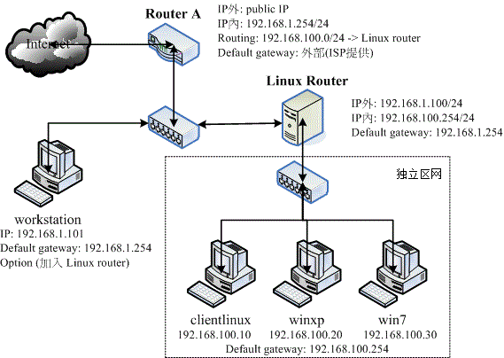
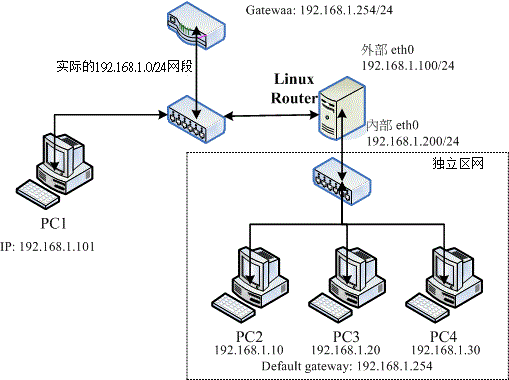
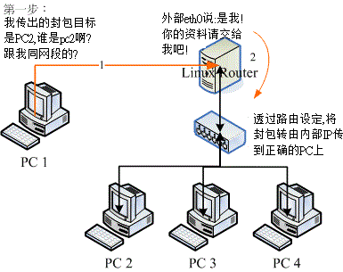
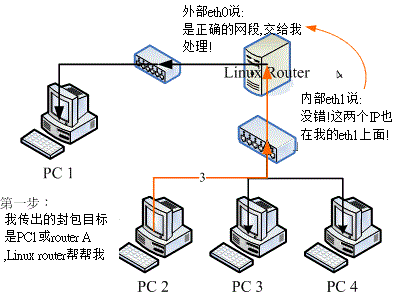

# 第八章、路由观念与路由器设定

最近更新日期：2011/07/22

如果说 IP 是门牌，那么邮差如何走到你家就是『路由』的功能啦！局域网络如果想成是条巷子，那么路由器就是那间巷子内的邮局！ 其实本章应该是第二章网络基础的延伸，将网络的设定延伸到整个区网的路由器上而已。那何时会用到路由器？ 如果你的环境中需要将整批 IP 再区隔出不同的广播区段时，那么就得要透过路由器的封包转递能力了。 本章是下一章防火墙与 NAT 的基础，得先看完才比较容易理解下一章想要讨论的事情喔！

*   8.1 路由
    *   8.1.1 路由表产生的类型
    *   8.1.2 一个网卡绑多个 IP：IP Alias 的测试功能
    *   8.1.3 重复路由的问题
*   8.2 路由器架设
    *   8.2.1 什么是路由器与 IP 分享器： sysctl.conf
    *   8.2.2 何时需要路由器
    *   8.2.3 静态路由之路由器
*   8.3 动态路由器架设：quagga (zebra + ripd)
*   8.4 特殊状况：路由器两边界面是同一个 IP 网段：ARP Proxy
*   8.5 重点回顾
*   8.6 本章习题
*   8.7 参考数据与延伸阅读
*   8.8 [针对本文的建议：http://phorum.vbird.org/viewtopic.php?t=26428](http://phorum.vbird.org/viewtopic.php?t=26428)

* * *

# 8.1 路由

## 8.1 路由

我们在[第二章网络基础](http://linux.vbird.org/linux_server/0110network_basic.php)里面谈到过[路由](http://linux.vbird.org/linux_server/0110network_basic.php#route)的相关概念， 他最大的功能就是在帮我们规划网络封包的传递方式与方向。至于路由的观察则可以使用 [route](http://linux.vbird.org/linux_server/0140networkcommand.php#route) 这个指令来查阅与设定。 好了，那么路由的形式有哪些？你又该如何确认路由是否正确呢？

* * *

### 8.1.1 路由表产生的类型

如同第二章网络基础里面谈到的，每一部主机都有自己的路由表， 也就是说，你必须要透过你自己的路由表来传递你主机的封包到下一个路由器上头。 若传送出去后，该封包就得要透过下一个路由器的路由表来传送了，此时与你自己主机的路由表就没有关系啦！ 所以说，如果网络上面的某一部路由器设定错误，那...封包的流向就会发生很大的问题。 我们就得要透过 [traceroute](http://linux.vbird.org/linux_server/0140networkcommand.php#traceroute) 来尝试了解一下每个 router 的封包流向啰。

OK！那你自己主机的路由表到底有哪些部分呢？我们以底下这个路由表来说明：

```
[root@www ~]# route -n
Kernel IP routing table
Destination  Gateway        Genmask         Flags Metric Ref  Use Iface
192.168.1.0  0.0.0.0        255.255.255.0   U     0      0      0 eth0 &lt;== 1
169.254.0.0  0.0.0.0        255.255.0.0     U     1002   0      0 eth0 &lt;== 2
0.0.0.0      192.168.1.254  0.0.0.0         UG    0      0      0 eth0 &lt;== 3 
```

首先，我们得知道在 Linux 系统下的路由表是由小网域排列到大网域， 例如上面的路由表当中，路由是由『 192.168.1.0/24 --> 169.254.0.0/16 --> 0.0.0.0/0 (预设路由) 』来排列的。 而当主机的网络封包需要传送时，就会查阅上述的三个路由规则来了解如何将该封包传送出去。 那你会不会觉得奇怪，为什么会有这几个路由呢？其实路由表主要有这几种情况来设计的：

*   依据网络接口产生的 IP 而存在的路由：

    例如 192.168.1.0/24 这个路由的存在是由于鸟哥的这部主机上面拥有 192.168.1.100 这个 IP 的关系！ 也就是说，你主机上面有几个网络接口的存在时，该网络接口就会存在一个路由才对。 所以说，万一你的主机有两个网络接口时，例如 192.168.1.100, 192.168.2.100 时，那路由至少就会有：

    ```
    [root@www ~]# ifconfig eth1 192.168.2.100
    [root@www ~]# route -n
    Destination     Gateway         Genmask         Flags Metric Ref    Use Iface
    192.168.2.0     0.0.0.0         255.255.255.0   U     0      0        0 eth1
    192.168.1.0     0.0.0.0         255.255.255.0   U     0      0        0 eth0
    169.254.0.0     0.0.0.0         255.255.0.0     U     1002   0        0 eth0
    0.0.0.0         192.168.1.254   0.0.0.0         UG    0      0        0 eth0 
    ```

*   手动或预设路由(default route)：

    你可以使用 route 这个指令手动的给予额外的路由设定，例如那个预设路由 (0.0.0.0/0) 就是额外的路由。 使用 route 这个指令时，最重要的一个概念是：『你所规划的路由必须要是你的装置 (如 eth0) 或 IP 可以直接沟通 (broadcast) 的情况』才行。举例来说，以上述的环境来看， 我的环境里面仅有 192.168.1.100 及 192.168.2.100 ，那我如果想要连接到 192.168.5.254 这个路由器时， 下达：

    ```
    [root@www ~]# route add -net 192.168.5.0  \
    &gt; netmask 255.255.255.0 gw 192.168.5.254
    SIOCADDRT: No such process 
    ```

    看吧！系统就会响应没有办法连接到该网域，因为我们的网络接口与 192.168.5.0/24 根本就没有关系嘛！ 那如果 192.168.5.254 真的是在我们的实体网络连接上，并且与我们的 eth0 连接在一起，那其实你应该是这样做：

    ```
    [root@www ~]# route add -net 192.168.5.0  \
    &gt; netmask 255.255.255.0 dev eth0
    [root@www ~]# route -n
    Kernel IP routing table
    Destination     Gateway         Genmask         Flags Metric Ref    Use Iface
    192.168.5.0     0.0.0.0         255.255.255.0   U     0      0        0 eth0
    192.168.2.0     0.0.0.0         255.255.255.0   U     0      0        0 eth1
    192.168.1.0     0.0.0.0         255.255.255.0   U     0      0        0 eth0
    169.254.0.0     0.0.0.0         255.255.0.0     U     1002   0        0 eth0
    0.0.0.0         192.168.1.254   0.0.0.0         UG    0      0        0 eth0 
    ```

    这样你的主机就会直接用 eth0 这个装置去尝试连接 192.168.5.254 了！ 另外，上面路由输出的重点其实是那个『Flags 的 G 』了！因为那个 G 代表使用外部的装置作为 Gateway 的意思！而那个 Gateway (192.168.1.254) 必须要在我们的已存在的路由环境中。 这可是很重要的概念喔！ ^_^

*   动态路由的学习：

    除了上面这两种可以直接使用指令的方法来增加路由规则之外，还有一种透过路由器与路由器之间的协商以达成动态路由的环境， 不过，那就需要额外的软件支持了，例如： [zebra (http://www.zebra.org/)](http://www.zebra.org/what.html) 或 CentOS 上面的 [Quagga (http://www.quagga.net/)](http://www.quagga.net/about.php) 这几个软件了！

事实上，在 Linux 的路由规则都是透过核心来达成的，所以这些路由表的规则都是在核心功能内啊！也就是在内存当中喔！ ^_^

* * *

### 8.1.2 一个网卡绑多个 IP： IP Alias 的测试用途

我们在[第五章的 ifconfig](http://linux.vbird.org/linux_server/0140networkcommand.php#ifconfig) 指令里面谈过 eth0:0 这个装置吧？这个装置可以在原本的 eth0 上面模拟出一个虚拟接口出来，以让我们原本的网络卡具有多个 IP ，具有多个 IP 的功能就被称为 IP Alias 了。而这个 eth0:0 的装置可以透过 [ifconfig](http://linux.vbird.org/linux_server/0140networkcommand.php#ifconfig) 或 [ip](http://linux.vbird.org/linux_server/0140networkcommand.php#ip_cmd) 这两个指令来达成， 关于这两个指令的用途请翻回去之前的章节阅读，这里不再浪费篇幅啊！

那你或许会问啊：『这个 IP Alias 有啥用途啊？』好问题！这个 IP Alias 最大的用途就是可以让你用来『应急』！ 怎么说呢？我们就来聊一聊他的几个常见的用途好了：

*   测试用：

    怎么说用来测试呢？举例来说，现在使用 IP 分享器的朋友很多吧，而 IP 分享器的设定通常是使用 WWW 接口来提供的。这个 IP 分享器通常会给予一个私有 IP 亦即是 192.168.0.1 来让用户开启 WWW 接口的浏览。问题来了，那你要如何连接上这部 IP 分享器呢？嘿嘿！在不更动既有的网络环境下，你可以直接利用：

    ```
    [root@www ~]# ifconfig [device] [ IP ] netmask [netmask ip] [up&#124;down]
    [root@www ~]# ifconfig eth0:0 192.168.0.100 netmask 255.255.255.0 up 
    ```

    来建立一个虚拟的网络接口，这样就可以立刻连接上 IP 分享器了，也不会更动到你原本的网络参数设定值哩！

*   在一个实体网域中含有多个 IP 网域：

    另外，如果像是在补习班或者是学校单位的话，由于原本的主机网络设定最好不要随便修改， 那如果要让同学们大家互通所有的计算机信息时，就可以让每个同学都透过 IP Alias 来设定同一网域的 IP ， 如此大家就可以在同一个网段内进行各项网络服务的测试了，很不错吧！

*   既有设备无法提供更多实体网卡时：

    如果你的这部主机需要连接多个网域，但该设备却无法提供安装更多的网卡时，你只好勉为其难的使用 IP Alias 来提供不同网段的联机服务了！

不过，你需要知道的是：所有的 IP Alias 都是由实体网卡仿真来的，所以当要启动 eth0:0 时，eth0 必须要先被启动才行。而当 eth0 被关闭后，所以 eth0:n 的模拟网卡将同时也被关闭。这得先要了解才行， 否则常常会搞错启动的装置啊！在路由规则的设定当中，常常需要进行一些测试，那这个 IP Alias 就派的上用场了。 尤其是学校单位的练习环境当中！

基本上，除非有特殊需求，否则建议你要有多个 IP 时，最好在不同的网卡上面达成，如果你真的要使用 IP Alias 时，那么如何在开机的时候就启动 IP alias 呢？方法有很多啦！包括将上面用 ifconfig 启动的指令写入 /etc/rc.d/rc.local 档案中 (但使用 /etc/init.d/network restart 时，该 IP alias 无法被重新启动)， 但鸟哥个人比较建议使用如下的方式来处理：

*   透过建立 /etc/sysconfig/network-scripts/ifcfg-eth0:0 配置文件

    举例来说，你可以透过底下这个方法来建立一个虚拟设备的配置文件案：

    ```
    [root@www ~]# cd /etc/sysconfig/network-scripts
    [root@www network-scripts]# vim ifcfg-eth0:0
    DEVICE=eth0:0            &lt;==相当重要！一定要与文件名相同的装置代号！
    ONBOOT=yes
    BOOTPROTO=static
    IPADDR=192.168.0.100
    NETMASK=255.255.255.0

    [root@www network-scripts]# ifup eth0:0
    [root@www network-scripts]# ifdown eth0:0
    [root@www network-scripts]# /etc/init.d/network restart 
    ```

    关于装置的配置文件案内的更多参数说明， 请参考[第四章 4.2.1 手动设定 IP 参数](http://linux.vbird.org/linux_server/0130internet_connect.php#connect_fix_IP)的相关说明， 在此不再叙述！使用这个方法有个好处，就是当你使用『 /etc/init.d/network restart 』时，系统依旧会使用你的 ifcfg-eth0:0 档案内的设定值来启动你的虚拟网卡喔！另外，不论 ifcfg-eth0:0 内的 ONBOOT 设定值为何，只要 ifcfg-eth0 这个实体网卡的配置文件中， ONBOOT 为 yes 时，开机就会将全部的 eth0:n 都启动。

透过这个简单的方法，你就可以在开机的时候启动你的虚拟接口而取得多个 IP 在同一张网卡上了。不过需要注意的是， 如果你的这张网卡分别透过 DHCP 以及手动的方式来设定你的 IP 参数，那么 dhcp 的取得务必使用实体网卡，亦即是 eth0 之类的网卡代号，而手动的就以 eth0:0 之类的代号来设定较佳。

**Tips:** 在旧版的 CentOS 4.x 中，如果你的 eth0 是使用 DHCP 来取得 IP 参数的话，那么由于 ifup 及 /etc/init.d/network 这两个 script 内程序代码撰写的方式，将会导致 ifcfg-eth0:0 这个配置文件不会被使用到喔！不过这个问题在 CentOS 5.x 以后的版本中已经被克服啰！


* * *

### 8.1.3 重复路由的问题

很多朋友可能都有一个可爱的想法，那就是：『我可不可以利用两张网卡， 利用两个相同网域的 IP 来增加我这部主机的网络流量』？事实上这是一个可行的方案， 不过必须要透过许多的设定来达成，若你有需求的话，可以参考网中人大哥写的这一篇 (注 1)：

*   [带宽负载平衡 (http://www.study-area.org/tips/multipath.htm)](http://www.study-area.org/tips/multipath.htm)

如果只是单纯的以为设定好两张网卡的 IP 在同一个网域就能够增加你主机的两倍流量，那可就大错特错了～ 为什么呢？还记得我们在路由表规则里面提过网络封包的传递主要是依据主机内的路由表规则吧！ 那如果你有两张网络卡时，假设： (底下信息请思考，不用实作！)

*   eth0 : 192.168.0.100
*   eth1 : 192.168.0.200

那你的路由规则会是如何呢？理论上会变成这样：

```
[root@www ~]# route -n
Kernel IP routing table
Destination     Gateway   Genmask         Flags Metric Ref   Use Iface
192.168.0.0     0.0.0.0   255.255.255.0   U     0      0       0 eth1
192.168.0.0     0.0.0.0   255.255.255.0   U     0      0       0 eth0 
```

也就是说，(1)当要主动发送封包到 192.168.0.0/24 的网域时，都只会透过第一条规则 ，也就是透过 eth1 来传出去！ (2)在响应封包方面，不管是由 eth0 还是由 eth1 进来的网络封包，都会透过 eth1 来回传！这可能会造成一些问题，尤其是一些防火墙的规则方面，很可能会发生一些严重的错误， 如此一来，根本没有办法达成负载平衡，也不会有增加网络流量的效果！ 更惨的是，还可能发生封包传递错误的情况吶！所以说，同一部主机上面设定相同网域的 IP 时， 得要特别留意你的路由规则，一般来说，不应该设定同一的网段的不同 IP 在同一部主机上面。 例如上面的案例就是一个不好的示范啊！

**Tips:** 为什么会特别强调这个观念呢？大约 2000 年前后，鸟哥刚接触 Linux 时，由于当时的网络速度相当缓慢， 为了提升网络流量鸟哥费尽心思啊～后来想到说，如果有两片网卡，不就可以增加流量了吗？于是就设定了两个同网域的 IP 在一部主机的两张网卡上，结果呢？很多服务都无法连通了！就是因为痛过，所以才有更强烈的印象啊！错误经验学习法则 ^_^！


* * *

# 8.2 路由器架设

## 8.2 路由器架设

我们知道在局域网络里面的主机可以透过广播的方式来进行网络封包的传送，但在不同网段内的主机想要互相联机时，就得要透过路由器了。 那么什么是路由器？他的主要功能是什么？底下我们就来聊一聊！

* * *

### 8.2.1 什么是路由器与 IP 分享器

既然主机想要将数据传送到不同的网域时得透过路由器的帮忙，所以啦，路由器的主要功能就是：『转递网络封包』啰！也就是说，路由器会分析来源端封包的 IP 表头，在表头内找出要送达的目标 IP 后，透过路由器本身的路由表 (routing table) 来将这个封包向下一个目标 (next hop) 传送。这就是路由器的功能。 那么路由器的功能可以如何达成呢？目前有两种方法可以达成：

*   硬件功能：例如 Cisco, TP-Link, D-Link (注 2) 等公司都有生产硬件路由器， 这些路由器内有嵌入式的操作系统，可以负责不同网域间的封包转译与转递等功能；

*   软件功能：例如 Linux 这个操作系统的核心就有提供封包转递的能力。

高阶的路由器可以连结不同的硬设备，并且可以转译很多不同的封包格式，通常...价格也不便宜啊！ 在这个章节里面，我们并没有要探讨这么高阶的咚咚，仅讨论在以太网络里头最简单的路由器功能： 连接两个不同的网域。嘿嘿！这个功能 Linux 个人计算机就可以达成了！那怎么达成呢？

*   打开核心的封包转递 (IP forward) 功能

就如同路由表是由 Linux 的核心功能所提供的，这个转递封包的能力也是 Linux 核心所提供， 那如何观察核心是否已经有启动封包转递呢？很简单啊，观察核心功能的显示档案即可，如下所示：

```
[root@www ~]# cat /proc/sys/net/ipv4/ip_forward
0  &lt;== 0 代表没有启动， 1 代表启动了 
```

要让该档案的内容变成启动值 1 最简单的方是就是使用：『echo 1 > /proc/sys/net/ipv4/ip_forward』即可。 不过，这个设定结果在下次重新启动后就会失效。因此，鸟哥建议您直接修改系统配置文件的内容，那就是 /etc/sysctl.conf 来达成开机启动封包转递的功能喔。

```
[root@www ~]# vim /etc/sysctl.conf
# 将底下这个设定值修改正确即可！ (本来值为 0 ，将它改为 1 即可)
net.ipv4.ip_forward = 1

[root@www ~]# sysctl -p  &lt;==立刻让该设定生效 
```

sysctl 这个指令是在核心工作时用来直接修改核心参数的一个指令，更多的功能可以参考 man sysctl 查询。 不要怀疑！只要这个动作，你的 Linux 就具有最简单的路由器功能了。而由于 Linux 路由器的路由表设定方法的不同，通常路由器规划其路由的方式就有两种：

*   静态路由：直接以类似 route 这个指令来直接设定路由表到核心功能当中，设定值只要与网域环境相符即可。 不过，当你的网域有变化时，路由器就得要重新设定；

*   动态路由：透过类似 Quagga 或 zebra 软件的功能，这些软件可以安装在 Linux 路由器上， 而这些软件可以动态的侦测网域的变化，并直接修改 Linux 核心的路由表信息， 你无须手动以 route 来修改你的路由表信息喔！

了解了路由器之后，接下来你可能需要了解到什么是 NAT (Network Address Translation, 网络地址转换) 服务器， NAT 是啥？其实 IP 分享器就是最简单的 NAT 服务器啦！嘿嘿，了解了吗？没错， NAT 可以达成 IP 分享的功能， 而 NAT 本身就是一个路由器，只是 NAT 比路由器多了一个『 IP 转换』的功能。怎么说呢？

*   一般来说，路由器会有两个网络接口，透过路由器本身的 IP 转递功能让两个网域可以互相沟通网络封包。 那如果两个接口一边是公共 IP (public IP) 但一边是私有 IP (private IP) 呢？ 由于私有 IP 不能直接与公共 IP 沟通其路由信息，此时就得要额外的『 IP 转译』功能了；

*   Linux 的 NAT 服务器可以透过修改封包的 IP 表头数据之来源或目标 IP ，让来自私有 IP 的封包可以转成 NAT 服务器的公共 IP ，就可以连上 Internet ！

所以说，当路由器两端的网域分别是 Public 与 Private IP 时，才需要 NAT 的功能！ NAT 功能我们会在下一章[防火墙](http://linux.vbird.org/linux_server/0250simple_firewall.php)时谈及， 这个章节仅谈论一下路由器而已啊！ ^_^

* * *

### 8.2.2 何时需要路由器

一般来说，计算机数量小于数十部的小型企业是无须路由器的，只需要利用 hub/switch 串接各部计算机， 然后透过单一线路连接到 Internet 上即可。不过，如果是超过数百部计算机的大型企业环境， 由于他们的环境通常需要考虑如下的状况，因此才需要路由器的架设：

*   实体线路之布线及效能的考虑：

    在一栋大楼的不同楼层要串接所有的计算机可能有点难度，那可以透过每个楼层架设一部路由器， 并将每个楼层路由器相连接，就能够简单的管理各楼层的网络； 此外，如果各楼层不想架设路由器，而是直接以网络线串接各楼层的 hub/switch 时， 那由于同一网域的数据是透过广播来传递的，那当整个大楼的某一部计算机在广播时， 所有的计算机将会予以回应，哇！会造成大楼内网络效能的问题；所以架设路由器将实体线路分隔， 就有助于这方面的网络效能；

*   部门独立与保护数据的考虑：

    在阅读过[第二章网络基础](http://linux.vbird.org/linux_server/0110network_basic.php)后，你就会晓得， 只要实体线路是连接在一起的，那么当数据透过广播时，你就可以透过类似 [tcpdump](http://linux.vbird.org/linux_server/0140networkcommand.php#tcpdump) 的指令来监听封包数据， 并且予以窃取～所以，如果你的部门之间的数据可能需要独立， 或者是某些重要的资料必须要在公司内部也予以保护时，可以将那些重要的计算机放到一个独立的实体网域， 并额外加设防火墙、路由器等连接上公司内部的网域。

路由器就只是一个设备，要如何使用端看你的网络环境的规划！上面仅是举出一些应用案例。 底下我们先就架设一个静态路由的路由器来玩一玩吧！

* * *

### 8.2.3 静态路由之路由器

假设在贵公司的网络环境当中，除了一般职员的工作用计算机是直接连接到对外的路由器来连结因特网， 在内部其实还有一个部门需要较安全的独立环境，因此这部份的网络规划可能是这样的情况 (参考[图 3.2-1](http://linux.vbird.org/linux_server/0120intranet.php#fig3.2-1) 内容延伸而来)：

 图 8.2-1、静态路由之路由器架构示意图

以上图的架构来说，这家公司主要有两个 class C 的网段，分别是：

*   一般区网(192.168.1.0/24) ：包括 Router A, workstation 以及 Linux Router 三部主机所构成；
*   保护内网(192.168.100.0/24)：包括 Linux Router, clientlinux, winxp, win7 等主机所构成。

其中 192.168.1.0/24 是用来做为一般员工连接因特网用的，至于 192.168.100.0/24 则是给特殊的部门用的。workstation 代表的是一般员工的计算机，clientlinux 及 winxp, win7 则是特殊部门的工作用计算机， Linux Router 则是这个特殊部门用来连接到公司内部网域的路由器。在这样的架构下， 该特殊部门的封包就能够与公司其他部门作实体的分隔了。

由上图你也不难发现，只要是具有路由器功能的设备 (Router A, Linux Router) 都会具有两个以上的接口， 分别用来沟通不同的网域，同时该路由器也都会具有一个预设路由啊！ ^_^！ 另外，你还可以加上一些防火墙的软件在 Linux Router 上，以保护 clientlinux, winxp, win7 呢！

那我们先来探讨一下联机的机制好了，先从 clientlinux 这部计算机谈起。如果 clientlinux 想要连上 Internet，那么他的联机情况会是如何？

*   发起联机需求：clientlinux --> Linux Router --> Router A --> Internet
*   响应联机需求：Internet --> Router A --> Linux Router --> clientlinux

观察一下两部 Router 的设定，要达到上述功能，则 Router A 必须要有两个接口，一个是对外的 Public IP 一个则是对内的 Private IP ，因为 IP 的类别不同，因此 Router A 还需要额外增加 NAT 这个机制才行，这个机制我们在后续章节会继续谈到。 除此之外，Router A 并不需要什么额外的设定。至于 Linux Router 就更简单了！什么事都不用作，将两个网络适配器设定两个 IP ， 并且启动核心的封包转递功能，立刻就架设完毕了！非常简单！我们就来谈一谈这几个机器的设定吧！

* * *

*   Linux Router

在这部主机内需要有两张网卡，鸟哥在这里将他定义为 (假设你已经将刚刚实作的 eth0:0 取消掉了)：

*   eth0: 192.168.1.100/24
*   eth1: 192.168.100.254/24

```
# 1\. 再看看 eth0 的设定吧！虽然我们已经在第四章就搞定了：
[root@www ~]# vim /etc/sysconfig/network-scripts/ifcfg-eth0
DEVICE="eth0"
HWADDR="08:00:27:71:85:BD"
NM_CONTROLLED="no"
ONBOOT="yes"
BOOTPROTO=none
IPADDR=192.168.1.100
NETMASK=255.255.255.0
GATEWAY=192.168.1.254   &lt;==最重要的设定啊！透过这部主机连出去的！

# 2\. 再处理 eth1 这张之前一直都没有驱动的网络卡吧！
[root@www ~]# vim /etc/sysconfig/network-scripts/ifcfg-eth1
DEVICE="eth1"
HWADDR="08:00:27:2A:30:14"
NM_CONTROLLED="no"
ONBOOT="yes"
BOOTPROTO="none"
IPADDR=192.168.100.254
NETMASK=255.255.255.0

# 3\. 启动 IP 转递，真的来实作成功才行！
[root@www ~]# vim /etc/sysctl.conf
net.ipv4.ip_forward = 1
# 找到上述的设定值，将默认值 0 改为上述的 1 即可！储存后离开去！
[root@www ~]# sysctl -p
[root@www ~]# cat /proc/sys/net/ipv4/ip_forward
1   &lt;==这就是重点！要是 1 才可以呦！

# 4\. 重新启动网络，并且观察路由与 ping Router A
[root@www ~]# /etc/init.d/network restart
[root@www ~]# route -n
Kernel IP routing table
Destination     Gateway         Genmask         Flags Metric Ref    Use Iface
192.168.100.0   0.0.0.0         255.255.255.0   U     0      0        0 eth1
192.168.1.0     0.0.0.0         255.255.255.0   U     0      0        0 eth0
0.0.0.0         192.168.1.254   0.0.0.0         UG    0      0        0 eth0
# 上面的重点在于最后面那个路由器的设定是否正确呦！

[root@www ~]# ping -c 2 192.168.1.254
PING 192.168.1.254 (192.168.1.254) 56(84) bytes of data.
64 bytes from 192.168.1.254: icmp_seq=1 ttl=64 time=0.294 ms
64 bytes from 192.168.1.254: icmp_seq=2 ttl=64 time=0.119 ms &lt;==有回应即可

# 5\. 暂时关闭防火墙！这一步也很重要喔！
[root@www ~]# /etc/init.d/iptables stop 
```

有够简单吧！而且透过最后的 ping 我们也知道 Linux Router 可以连上 Router A 啰！这样你的 Linux Router 就 OK 了吶！此外，CentOS 6.x 默认的防火墙规则会将来自不同网卡的沟通封包剔除，所以还得要暂时关闭防火墙才行。 接下来则是要设定 clientlinux 这个被保护的内部主机网络啰。

* * *

*   受保护的网域，以 clientlinux 为例

不论你的 clientlinux 是哪一种操作系统，你的环境都应该是这样的 (图 8.2-1)：

*   IP: 192.168.100.10
*   netmask: 255.255.255.0
*   gateway: 192.168.100.254
*   hostname: clientlinux.centos.vbird
*   DNS: 168.95.1.1

以 Linux 操作系统为例，并且 clientlinux 仅有 eth0 一张网卡时，他的设定是这样的：

```
[root@clientlinux ~]# vim /etc/sysconfig/network-scripts/ifcfg-eth0
DEVICE="eth0"
NM_CONTROLLED="no"
ONBOOT="yes"
BOOTPROTO=none
IPADDR=192.168.100.10
NETMASK=255.255.255.0
GATEWAY=192.168.100.254  &lt;==这个设定最重要啦！
DNS1=168.95.1.1          &lt;==有这个就不用自己改 /etc/resolv.conf

[root@clientlinux ~]# /etc/init.d/network restart
[root@clientlinux ~]# route -n
Kernel IP routing table
Destination     Gateway         Genmask         Flags Metric Ref    Use Iface
192.168.100.0   0.0.0.0         255.255.255.0   U     1      0        0 eth0
169.254.0.0     0.0.0.0         255.255.0.0     U     1002   0        0 eth0
0.0.0.0         192.168.100.254 0.0.0.0         UG    0      0        0 eth0

[root@clientlinux ~]# ping -c 2 192.168.100.254 &lt;==ping 自己的 gateway(会成功)
[root@clientlinux ~]# ping -c 2 192.168.1.254   &lt;==ping 外部的 gateway(会失败) 
```

最后一个动作有问题呦！怎么会连 ping 都没有办法 ping 到 Router A 的 IP 呢？如果连 ping 都没有办法给予回应的话， 那么表示我们的联机是有问题的！再从刚刚的响应联机需求流程来看一下吧！

*   发起联机：clientlinux --> Linux Router (OK) --> Router A (OK)
*   回应联机：Router A (此时 router A 要响应的目标是 192.168.100.10)，Router A 仅有 public 与 192.168.1.0/24 的路由，所以该封包会由 public 界面再传出去，因此封包就回不来了...

发现了吗？网络是双向的，此时封包出的去，但是非常可怜的，封包回不来～那怎办呢？只好告知 Router A 当路由规则碰到 192.168.100.0/24 时，要将该封包传 192.168.1.100 就是了！所以你要这样进行。

* * *

*   特别的路由规则： Router A 所需路由

假设我的 Router A 对外的网卡为 eth1 ，而内部的 192.168.1.254 则是设定在 eth0 上头。 那怎么在 Router A 增加一条路由规则呢？很简单啊！直接使用 route add 去增加即可！如下所示的情况：

```
[root@routera ~]# route add -net 192.168.100.0 netmask 255.255.255.0 \
&gt;  gw 192.168.1.100 
```

不过这个规则并不会写入到配置文件，因此下次重新启动这个规则就不见了！所以，你应该要建立一个路由配置文件。 由于这个路由是依附在 eth0 网卡上的，所以配置文件的档名应该要是 route-eth0 喔！这个配置文件的内容当中，我们要设定 192.168.100.0/24 这个网域的 gateway 是 192.168.1.100，且是透过 eth0 ，那么写法就会变成：

```
[root@routera ~]# vim /etc/sysconfig/network-scripts/route-eth0
192.168.100.0/24 via 192.168.1.100 dev eth0
目标网域             透过的 gateway     装置

[root@routera ~]# route -n
Destination     Gateway         Genmask         Flags Metric Ref    Use Iface
120.114.142.0   0.0.0.0         255.255.255.0   U     0      0        0 eth1
192.168.100.0   192.168.1.100   255.255.255.0   UG    0      0        0 eth0
192.168.1.0     0.0.0.0         255.255.255.0   U     0      0        0 eth0
169.254.0.0     0.0.0.0         255.255.0.0     U     0      0        0 eth1
0.0.0.0         120.114.142.254 0.0.0.0         UG    0      0        0 eth1 
```

上述观察的重点在于有没有出现 192.168.100.0 那行路由！如果有的话，请 ping 192.168.100.10 看看能不能有回应？ 然后再到 clientlinux 上面去 ping 192.168.1.254 看看有没有响应，你就知道设定成功啰！好了，既然内部保护网络已经可以连上 Internet 了，那么是否代表 clientlinux 可以直接与一般员工的网域，例如 workstation 进行联机呢？我们依旧透过路由规则来探讨一下，当 clientlinux 要直接联机到 workstation 时，他的联机方向是这样的 (参考图 8.2-1)：

*   联机发起： clientlinux --> Linux Router (OK) --> workstation (OK)
*   回应联机： workstation (联机目标为 192.168.100.10，因为并没有该路由规则，因此联机丢给 default gateway，亦即是 Router A) --> Router A (OK) --> Linux Router (OK) --> clientlinux

有没有发现一个很可爱的传输流程？联机发起是没有问题啦，不过呢，响应联机竟然会偷偷透过 Router A 来帮忙呦！ 这是因为 workstation 与当初的 Router A 一样，并不知道 192.168.100.0/24 在 192.168.1.100 里面啦！不过，反正 Router A 已经知道了该网域在 Linux Router 内，所以，该封包还是可以顺利的回到 clientlinux 就是了。

* * *

*   让 workstation 与 clientlinux 不透过 Router A 的沟通方式

如果你不想要让 workstation 得要透过 Router A 才能够联机到 clientlinux 的话，那么就得要与 Router A 相同，增加那一条路由规则啰！如果是 Linux 的系统，那么如同 Router A 一样的设定如下：

```
[root@workstation ~]# vim /etc/sysconfig/network-scripts/route-eth0
192.168.100.0/24 via 192.168.1.100 dev eth0

[root@workstation ~]# /etc/init.d/network restart
[root@www ~]# route -n
Kernel IP routing table
Destination    Gateway        Genmask         Flags Metric Ref  Use Iface
192.168.1.0    0.0.0.0        255.255.255.0   U     0      0      0 eth0
192.168.100.0  192.168.1.100  255.255.255.0   UG    0      0      0 eth0
169.254.0.0    0.0.0.0        255.255.0.0     U     0      0      0 eth0
0.0.0.0        192.168.1.254  0.0.0.0         UG    0      0      0 eth0 
```

最后只要 clientlinux 使用 ping 可以连到 workstation，同样的，workstation 也可以 ping 到 clientlinux 的话，就表示你的设定是 OK 的啦！搞定！而透过这样的设定方式，你也可以发现到一件事，那就是：『路由是双向的，你必须要了解出去的路由与回来时的规则』。 举例来说，在预设的情况下 (Router A 与 workstation 都没有额外的路由设定时)，其实封包是可以由 clientlinux 联机到 workstation 的，但是 workstation 却没有相关的路由可以响应到 clientlinux ～所以上头才会要你在 Router A 或者是 workstation 上面设定额外的路由规则啊！这样说，瞭了吧？ ^_^

用 Linux 作一个静态路由的 Router 很简单吧！以上面的案例来说，你在 Linux Router 上面几乎没有作什么额外的工作，只要将网络 IP 与网络接口对应好启动，然后加上 IP Forward 的功能， 让你的 Linux 核心支持封包转递，然后其他的工作咱们的 Linux kernel 就主动帮你搞定了！真是好简单！

不过这里必须要提醒的是，如果你的 Linux Router 有设定防火墙的话， 而且还有设定类似 NAT 主机的 IP 伪装技术，那可得特别留意，因为还可能会造成路由误判的问题～ 上述的 Linux Router 当中『并没有使用到任何 NAT 的功能』喔！特别给他留意到！

* * *

# 8.3 动态路由器架设：quagga (zebra + ripd)

## 8.3 动态路由器架设：quagga (zebra + ripd)

在一般的静态路由器上面，我们可以透过修改路由配置文件 (route-ethN) 来设定好既定的路由规则，让你的路由器运作顺利。不过， 这样的方法总是觉得很讨厌！如果某天因为组织的再造导致需要重新规划子网网段，如此一来，你就得要在图 8.2-1 的 Router A 与 Linux Router 再次的处理与检查路由规则，真是有够麻烦的～ 那能不能让路由器自己学习新的路由，来达成自动增加该笔路由的信息呢？

上述的功能就是所谓的动态路由。动态路由通常是用在路由器与路由器之间的沟通，所以要让你的路由器具有动态路由的功能， 你必须要了解到对方路由器上面所提供的动态路由协议才行，这样两部路由器才能够透过该协议来沟通彼此的路由规则。 目前常见的动态路由协议有：RIPv1, RIPv2, OSPF, BGP 等。

想要在 CentOS 上面搞定这些动态路由的相关机制，那就得要使用 quagga 这个软件啦！这个软件是 zebra 计划的延伸， 相关的官网说明可以参考文后的参考数据(注 3)。既然要玩 quagga ，自然就得要先安装他啰！赶紧处理吧！

```
[root@www ~]# yum install quagga
[root@www ~]# ls -l /etc/quagga
-rw-r--r--. 1 root   root      406 Jun 25 20:19 ripd.conf.sample
-rw-r-----. 1 quagga quagga     26 Jul 22 11:11 zebra.conf
-rw-r--r--. 1 root   root      369 Jun 25 20:19 zebra.conf.sample
.....(其他省略)..... 
```

这个软件所提供的各项动态路由协议都放置到 /etc/quagga/ 目录内，底下我们以较为简单的 RIPv2 协议来处理动态路由， 不过你得要注意的是，不论你要启动什么动态路由协议，那个 zebra 都必须要先启动才行！这是因为：

*   zebra 这个 daemon 的功能在更新核心的路由规则；
*   RIP 这个 daemon 则是在向附近的其他 Router 沟通协调路由规则的传送与否。

而各个路由服务的配置文件都必须要以 /etc/quagga/*.conf 的档名来储存才行，如上表我们可以发现 zebra 这个服务是有设定好了，不过 ripd 的档名却不是 .conf 结尾。所以我们必须要额外作些设定才行。

为了练习一下我们的 quagga ，当然得要设计一下可能的网络联机啰～假设网络联机的图标如下，共有三个区网的网段， 其中最大的是 192.168.1.0/24 这个外部区网，另有两个内部区网分别是 192.168.100.0/24 及 192.168.200.0/24 。

 图 8.3-1、练习动态路由所设定的网络联机示意图

上图的两部 Linux Router 分别负责不同的网域，其中 Router Z1 是上个小节设定好之后就保留的，左边的 Router Z2 则是需要额外设定的路由器喔！两部 Router 可以透过 192.168.1.0/24 这个网域来沟通。在没有设定额外路由规则的情况下，那个 PC Z1 与 PC Z2 是无法沟通的！另外，quagga 必须要同时安装在两部 Linux Router 上头才行， 而且我们只要设定好这两部主机的网络接口 (eth0, eth1) 后，不需要手动输入额外的路由设定喔！可以透过 RIP 这个路由协议来搞定的！

*   1\. 将所有主机的 IP 设定妥当：

    这是最重要的吧？请将这四部主机 (Router Z1, Router Z2, PC Z1, PC Z2) 的网络参数，按照图 8.3-1 的模样设置妥当。 设置的方式请参考本章上一小节，或者是依据第四章的 4.2.1 来设定啰，这里不再重复说明了。 另外，在 Router Z1, Z2 的部分还得要加上修改 ip*forwrad 参数！亦即是 /etc/sysctl.conf 的设定值喔！ 这个鸟哥也常常忘记 @*@。

*   2\. 在两部 Router 上面设定 zebra ：

    我们先设定图 8.3-1 右手边那一部 Router Z1，关于 zebra.conf 你可以这样设定的：

    ```
    # 1\. 先设定会影响动态路由服务的 zebra 并且启动 zebra
    [root@www ~]# vim /etc/quagga/zebra.conf
    hostname www.centos.vbird           &lt;==给予这个路由器一个主机名，随便取！
    password linuxz1                    &lt;==给予一个密码！
    enable password linuxz1             &lt;==将这个密码生效！
    log file /var/log/quagga/zebra.log  &lt;==将所有 zebra 产生的信息存到登录文件中

    [root@www ~]# /etc/init.d/zebra start
    [root@www ~]# chkconfig zebra on
    [root@www ~]# netstat -tunlp &#124; grep zebra
    Active Internet connections (only servers)
    Proto Recv-Q Send-Q Local Address   Foreign Address   State   PID/Program name
    tcp        0      0 127.0.0.1:2601  0.0.0.0:*         LISTEN  4409/zebra 
    ```

    仔细看，由于 zebra 这个服务的任务主要是在修改 Linux 系统核心内的路由， 所以他仅监听本机接口而已，并不会监听外部的接口才对！另外，在 zebra.conf 这个档案当中， 我们所设定的那个密码是有作用的喔！可以让我们登入 zebra 这套软件呢！ 好了，我们来查一查这个 2601 的 port 是否正确的启动的呢？

    ```
    [root@www ~]# telnet localhost 2601
    Trying 127.0.0.1...
    Connected to localhost.localdomain (127.0.0.1).
    Escape character is '^]'.

    Hello, this is Quagga (version 0.99.15).
    Copyright 1996-2005 Kunihiro Ishiguro, et al.

    User Access Verification

    Password: &lt;==在这里输入刚刚你设定的密码啊！
    www.centos.vbird&gt; ? &lt;==在这边输入『 ? 』就能够知道有多少指令可使用
      echo      Echo a message back to the vty
      enable    Turn on privileged mode command
      exit      Exit current mode and down to previous mode
      help      Description of the interactive help system
      list      Print command list
      quit      Exit current mode and down to previous mode
      show      Show running system information
      terminal  Set terminal line parameters
      who       Display who is on vty
    www.centos.vbird&gt; list &lt;==列出所有可用指令
      echo .MESSAGE
    ....(中间省略)....
      show debugging zebra
      show history
      show interface [IFNAME]
    ....(中间省略)....
      show ip protocol
      show ip route
    ....(其他省略)....
    www.centos.vbird&gt; show ip route
    Codes: K - kernel route, C - connected, S - static, R - RIP, O - OSPF,
           I - ISIS, B - BGP, &gt; - selected route, * - FIB route

    K&gt;* 0.0.0.0/0 via 192.168.1.254, eth0            &lt;==核心直接设定的
    C&gt;* 127.0.0.0/8 is directly connected, lo        &lt;==接口产生的路由
    K&gt;* 169.254.0.0/16 is directly connected, eth1   &lt;==核心直接设定的
    C&gt;* 192.168.1.0/24 is directly connected, eth0   &lt;==接口产生的路由
    C&gt;* 192.168.100.0/24 is directly connected, eth1 &lt;==接口产生的路由
    www.centos.vbird&gt; exit
    Connection closed by foreign host. 
    ```

    仔细看到，我们登入这个 zebra 的服务之后，可以输入『help』或问号『?』， zebra 就会显示出你能够执行的指令有哪些，比较常用的当然是查询路由规则啰！以『 show ip route 』来查阅，结果可以发现目前的接口与默认路由都被显示出来了，显示的结果当中：

    *   K ：代表以类似 route 指令加入核心的路由规则，包括 route-ethN 所产生的规则；
    *   C ：代表由你的网络接口所设定的 IP 而产生的相关的路由规则
    *   S ：以 zebra 功能所设定的静态路由信息；
    *   R ：就是透过 RIP 协议所增加的路由规则啰！ 事实上，如果你还想要增加额外的静态路由的话，也可以透过 zebra 而不必使用 route 指令呢！ 例如想要增加 10.0.0.0/24 给 eth0 来处理的话，可以这样做：

    ```
    [root@www ~]# vim /etc/quagga/zebra.conf
    # 新增底下这一行喔！
    ip route 10.0.0.0/24 eth0

    [root@www ~]# /etc/init.d/zebra restart
    [root@www ~]# telnet localhost 2601
    Password: &lt;==这里输入密码
    www.centos.vbird&gt; show ip route
    K&gt;* 0.0.0.0/0 via 192.168.1.254, eth0
    &lt;u&gt;S&gt;* 10.0.0.0/24 [1/0] is directly connected, eth0&lt;/u&gt;
    C&gt;* 127.0.0.0/8 is directly connected, lo
    K&gt;* 169.254.0.0/16 is directly connected, eth1
    C&gt;* 192.168.1.0/24 is directly connected, eth0
    C&gt;* 192.168.100.0/24 is directly connected, eth1 
    ```

    嘿嘿！立刻就会多出一笔路由的规则，而且最右边会显示 S，亦即是静态路由 (Static route) 的意思。 如此一来，我们系统管理员可就轻松多了！设定完右边 Router Z1 的 zebra 之后，不要忘记设定你的 Router Z2 呦！ 同样的设定再来一遍啦！只是主机名与密码应该给予不同才是呦！因为过程都一样，鸟哥就不再重复设定。 接下来我们可以开始看看 ripd 这个服务啰！

*   3\. 在两部 Router 上面设定 ripd 服务：

    ripd 这个服务可以在两部 Router 之间进行路由规则的交换与沟通，当然啦，如果你的环境里面有类似 Cisco 或者是其他有提供 RIP 协议的路由器的话，那么你当然也是可以透过这个 RIP 让你的 Linux Router 与其他硬件路由器互相沟通的吶！ 只不过 CentOS 6.x 的 quagga 所提供的 ripd 服务使用的是 RIPv2 版本，这个版本预设就要求得要进行身份验证的动作， 但是我们是个小型网络，并不想要加入这个身份验证的功能，因此就得要增加某些设定值才能够顺利的启动 ripd 呦！

    先来设定 Router Z1 吧！在 Router Z1 当中，我们主要是透过 eth0 发送所有的网域路由信息，同时，我们管理的网域有 192.168.1.0/24, 192.168.100.0/24。再加上取消身份验证的设定值后，我们的 ripd 就会变成这样：

    ```
    [root@www ~]# vim /etc/quagga/ripd.conf
    hostname www.centos.vbird           &lt;==这里是设定 Router 的主机名而已
    password linuxz1                    &lt;==设定好你自己的密码喔！
    debug rip events                    &lt;==可以记录较多的错误讯息！
    debug rip packet                    &lt;==鸟哥透过这个讯息解决很多问题
    router rip                          &lt;==启动 Router 的 rip 功能
     version 2                          &lt;==启动的是 RIPv2 的服务 (默认值)
     network 192.168.1.0/24             &lt;==这两个就是我们管理的接口啰！
     network 192.168.100.0/24
    &lt;u&gt;interface eth0&lt;/u&gt;                      &lt;==针对外部的那个接口，要略过身份验证的方式
     &lt;u&gt;no ip rip authentication mode&lt;/u&gt;      &lt;==就是这个项目！不要验证身份！
    log file /var/log/quagga/zebra.log  &lt;==登录档设定与 zebra 相同即可

    [root@www ~]# /etc/init.d/ripd start
    [root@www ~]# chkconfig ripd on
    [root@www ~]# netstat -tulnp &#124; grep ripd
    Active Internet connections (only servers)
    Proto Recv-Q Send-Q Local Address  Foreign Address State   PID/Program name
    tcp        0      0 127.0.0.1:2602 0.0.0.0:*       LISTEN  4456/ripd
    udp        0      0 0.0.0.0:520    0.0.0.0:*               4456/ripd
    # 新版的 quagga 启动的 2602 仅在 127.0.0.1，是透过 port 520 来传递信息！ 
    ```

    基本上，这样就设定完成一部路由器的 RIP 动态路由协议了！在上头 ripd.conf 的设定当中， 他会主动以 eth0 及 192.168.1.0/24 这个网域的功能来进行搜索，如此一来，未来你进行任何路由规则的变动， 或者是整个网域的主机 IP 进行更动，你将不需要重新到每部 Router 上更动！ 因为这些路由器会自动的更新他们自己的规则喔！嘿嘿！接下来，同样的动作请你到 图 8.3-1 左边那部 Router Z2 上面设定一下！ 因为整个设定的流程都一样，所以这里鸟哥就省略啦！

*   4\. 检查 RIP 协议的沟通结果：

    在两部 Linux Router 都设定妥当之后，你可以登入 zebra 去看这两部主机的路由更新结果喔！ 举例来说，鸟哥登入图 8.3-1 右边那部 Router Z1 后，并且登入 zebra ， 观察路由会是这样的情况：

    ```
    [root@www ~]# route -n
    Kernel IP routing table
    Destination     Gateway         Genmask         Flags Metric Ref    Use Iface
    192.168.100.0   0.0.0.0         255.255.255.0   U     0      0        0 eth1
    10.0.0.0        0.0.0.0         255.255.255.0   U     0      0        0 eth0
    192.168.1.0     0.0.0.0         255.255.255.0   U     0      0        0 eth0
    192.168.200.0   192.168.1.200   255.255.255.0   UG    2      0        0 eth0
    0.0.0.0         192.168.1.254   0.0.0.0         UG    0      0        0 eth0
    # 其实看路由就知道啦！那条有点线的就是新增的路由规则！很清楚！

    [root@www ~]# telnet localhost 2601
    Password: &lt;==不要忘记了密码啊！
    www.centos.vbird&gt; show ip route
    Codes: K - kernel route, C - connected, S - static, R - RIP, O - OSPF,
           I - ISIS, B - BGP, &gt; - selected route, * - FIB route

    K&gt;* 0.0.0.0/0 via 192.168.1.254, eth0
    S&gt;* 10.0.0.0/24 [1/0] is directly connected, eth0
    C&gt;* 127.0.0.0/8 is directly connected, lo
    K&gt;* 169.254.0.0/16 is directly connected, eth1
    C&gt;* 192.168.1.0/24 is directly connected, eth0
    C&gt;* 192.168.100.0/24 is directly connected, eth1
    R&gt;* 192.168.200.0/24 [120/2] via 192.168.1.200, eth0, 00:02:43 
    ```

    如果你有看到上述的字体，嘿嘿！那就是成功啦！那个最左边的 R 代表的是透过 RIP 通讯协议所设定的路由规则啦！ 如此一来，咱们的路由器设定就搞定啰～如果一切都没有问题，你也想要开机就启动 zebra, ripd，那么还得要这样：

    ```
    [root@www ~]# chkconfig zebra on
    [root@www ~]# chkconfig ripd on 
    ```

透过这个 quagga 以及 RIPv2 的路由协议的辅助，我们可以轻松的就将路由规则分享到附近区网的其他路由器上头， 比起单纯使用 route 去修改 Linux 的核心路由表，这个动作当然要快速很多！不过，如果是很小型的网络环境，那么不要使用这个 quagga 啊！因为有点多此一举的感觉。如果你的企业环境真的有够大，那么玩一玩这个 quagga 配合一些动态路由协议，嘿嘿！也是可行的啦！

**Tips:** 鸟哥差一点被这一版的 ripd.conf 设定内容搞死～因为 CentOS 5.x 以后的版本预设的 RIPv2 会去进行身份验证，所以原先在 CentOS 4.x 的设定是不能用的，偏偏登录档又看不出个所以然..后来查到可以透过 ripd.conf 内的 debug 参数去设定除错登录， 才发现 RIPv2 的认证问题！最终 google 一下才解决问题～好累啊！


* * *

# 8.4 特殊状况：路由器两边界面是同一个 IP 网段： ARP Proxy

## 8.4 特殊状况：路由器两边界面是同一个 IP 网段： ARP Proxy

如果你一开始设计的网络环境就是同一个 Class C 的网域，例如 192.168.1.0/24 ， 后来因为某些因素必须要将某些主机搬到比较内部的环境中，例如图 8.2-1 的 clientlinxu, winxp, win7。 然后又因为某些因素，所以你不能变更这些计算机的 IP，此时你的同一网域就会横跨在一个路由器的左右两边了！ 举例来说，联机图示有点像底下这样：

 图 8.4-1、在路由器两个界面两边的 IP 是在同一个网域的设定情况

初次见面～看到眼睛快要掉下来哩！怎么路由器的两边的主机 IP 设定都在同一个网域内？而且还被规定不能够更改原先的 IP 设定， ...真是一个头两个大啊～如此一来，在 Linux Router 两边要如何制作路由啊？好问题！真是好问题～ 因为 OSI 第三层网络层的路由是一条一条去设定比对的，所以如果两块网卡上面都是同一个网域的 IP 时， 就会发生错误。那如何处理啊？

我们先从两方面来说，第一个，当从正确的网段 (PC1) 要联机到 PC2~PC4 时，他应该是要透过 Linux Router 那部主机的对外 IP (192.168.1.100) 才行！而且 Linux Router 还必须要让该封包透过内部 IP (192.168.1.200) 联机到 PC2~PC4 。 此时，封包传递的图示有点像这样：

 图 8.4-2、正常的网段想要传送到内部计算机去的封包流向

在这个阶段，我们可以设定 PC2~PC4 的 IP 所对应的网卡卡号 (MAC) 都设定在 router 的对外网卡上， 因此， router 的对外接口可以将给 PC2~PC4 的封包给『骗』过来。接下来，就简单的透过路由设定，让封包转个接口发送出去即可。 这样 PC1 --> PC2 的问题解决了，但是 PC2 怎么传送到 PC1 呢？我们可以透过底下的图示来想象一下：

 图 8.4-3、内部计算机想要传送到正常网域时的封包流向

当 PC2 要传送的封包是给 PC3, PC4 的，那么这个封包得要能够直接传递。但是如果需要传送到正常网域的封包，就得要透过 router 的对内网卡，再透过路由规则来将该封包导向外部接口来传递才行！这个时候就变成内部的接口欺骗 PC2 说， PC1 与 Router A 的 IP 是在内部这张接口上就是了，然后再透过路由判断将该封包透过外部接口来对外传递出去即可。 假设 Linux router 的对外界面为 eth0 而对内为 eth1 时，我们可以这样说：

1.  当 Linux Router 的 eth0 那个网域主机想要连接到 PC2~PC4 的主机时，由 Linux Router 负责接收；
2.  当 Linux Router 要传送数据到 PC2~PC4 时，务必要由 eth1 来传送；
3.  当内部计算机想要连接到 PC1 或 Router A 时，由 Linux router 的 eth1 负责接收；
4.  当 Linux Router 要传送的数据为 192.168.1.0/24 ，但并非 PC2~PC4 时，需由 eth0 传送。

上列的步骤与图示内的线条上的顺序相符合呦！得要对照着看看。其中的 (1) 与 (3) 就是透过 ARP Proxy (代理) 的功能啦！ 那啥是 ARP Proxy 呢？简单的说，就是让我的某张适配卡的 MAC 代理其他主机的 IP 对应，让想要连接到这个 IP 的 MAC 封包由我帮他接下来的意思。举我们图 8.4-1 的例子来说，就是在 Linux Router 的 eth0 界面上，规定 192.168.1.10, 192.168.1.20, 192.168.1.30 这三个 IP 都对应到 eth0 的 MAC 上，所以三个 IP 的封包就会由 eth0 代为收下，因此才叫做 ARP 代理人嘛！所以啦，每一部在 eth0 那端的主机都会『误判』那三个 IP 是 Linux Router 所拥有，这样就能够让封包传给 Linux Router 啦！

再接下来，咱们的 Linux Router 必须要额外指定路由，设定情况为：

*   若目标是 PC2 ~ PC4 时，该路由必须要由内部的 eth1 发送出去才行，
*   若目标不为 PC2 ~ PC4 ，且目标在 192.168.1.0/24 的网域时，需由 eth0 发送出去才行。

也就是说，你必须要指定路由规则当中，那个 PC2~PC4 具有优先选择权，然后其他的同网域封包才由 eth0 来传送。 这样就能够达成我们所想要的结局啦！^_^！看样子似乎很难，其实设定方面还挺简单的，你可以透过 arp 以及 route 这两个指令来达成喔！

*   外部接口 eth0：08:00:27:71:85:BD
*   内部接口 eth1：08:00:27:2A:30:14

```
# 1\. 先设定外部 eth0 的 ARP Proxy，让三个 IP 对应到自己的 MAC
[root@www ~]# arp -i eth0 -s 192.168.1.10 08:00:27:71:85:BD pub
[root@www ~]# arp -i eth0 -s 192.168.1.20 08:00:27:71:85:BD pub
[root@www ~]# arp -i eth0 -s 192.168.1.30 08:00:27:71:85:BD pub
[root@www ~]# arp -n
Address             HWtype  HWaddress      Flags Mask       Iface
192.168.1.30        *       *              MP               eth0
192.168.1.10        *       *              MP               eth0
192.168.1.20        *       *              MP               eth0
# 首先需要让外部接口拥有三个 IP 的操控权，透过这三个指令来建立 ARP 对应！

# 2\. 开始处理路由，增加 PC2~PC4 的单机路由经过内部的 eth1 来传递
[root@www ~]# route add -host 192.168.1.10 eth1
[root@www ~]# route add -host 192.168.1.20 eth1
[root@www ~]# route add -host 192.168.1.30 eth1
[root@www ~]# route -n
Kernel IP routing table
Destination    Gateway        Genmask         Flags Metric Ref    Use Iface
192.168.1.20   0.0.0.0        255.255.255.255 UH    0      0        0 eth1
192.168.1.10   0.0.0.0        255.255.255.255 UH    0      0        0 eth1
192.168.1.30   0.0.0.0        255.255.255.255 UH    0      0        0 eth1
192.168.1.0    0.0.0.0        255.255.255.0   U     0      0        0 eth0
192.168.1.0    0.0.0.0        255.255.255.0   U     0      0        0 eth1
0.0.0.0        192.168.1.254  0.0.0.0         UG    0      0        0 eth0
# 这样就处理好单向的单机路由啰！不过有个问题啊！那就是 192.168.1.0/24
# 的网域，两个接口都可以传送！因此，等一下第四个步骤得要将 eth1 删除才行！

3\. 设定一下内部的 ARP Proxy 工作 (绑在 eth1 上头啰)！
[root@www ~]# arp -i eth1 -s 192.168.1.101 08:00:27:2A:30:14 pub
[root@www ~]# arp -i eth1 -s 192.168.1.254 08:00:27:2A:30:14 pub
# 这样可以骗过 PC2 ~ PC4 ，让这三部主机传递的封包可以透过 router 来传递！

4\. 开始清除掉 eth1 的 192.168.1.0/24 路由
[root@www ~]# route del -net 192.168.1.0 netmask 255.255.255.0 eth1 
```

所有的计算机都在同一个网域内，因此 default gatway 都是 192.168.1.254 ，而 netmask 都是 255.255.255.0， 只有 IP 不一样而已。最后，所有的计算机都可以直接跟对方联机，也能够顺利的连上 Internet ！ 这样的设定就能够满足上述的功能需求啰！如果一切都没有问题，那么将上述的指令写成一个脚本档， 例如 /root/bin/network.sh ，然后将该档案设定为可执行，并将它写入 /etc/rc.d/rc.local ， 同时每次重新启动网络后，就得要重新执行一次该脚本，即可达到你的需求啰！

透过这个案例你也可以清楚的知道，能不能联机其实与路由的关系才大哩！ 而路由是双向的，你必须要考虑到这个封包如何回来的问题喔！

* * *

# 8.5 重点回顾

## 8.5 重点回顾

*   网络卡的代号为 eth0, eth1, eth2...，而第一张网络卡的第一个虚拟接口为 eth0:0 ...
*   网络卡的参数可使用 ifconfig 直接设定，亦可使用配置文件如 /etc/sysconfig/network-scripts/ifcfg-ethn 来设定；
*   路由是双向的，所以由网络封包发送处发送到目标的路由规划，必须要考虑回程时是否具有相对的路由， 否则该封包可能会『遗失』；
*   每部主机都有自己的路由表，此路由表 (routing table) 是作为封包传送时的路径依据；
*   每部可对外 Internet 传送封包的主机，其路由信息中应有一个预设路由 (default gateway)；
*   要让 Linux 作为 Router 最重要的是启动核心的 IP Forward 功能；
*   重复路由可能会让你的网络封包传递到错误的方向；
*   动态路由通常是用在两个 Router 之间沟通彼此的路由规则用的，常见的 Linux 上的动态路由套件为 zebra ；
*   arp proxy 可以透过 arp 与 route 的功能，让路由器两端都在同一个网段内；
*   一般来说，路由器上都会有两个以上的网络接口
*   事实上，Router 除了作为路由转换之外，在 Router 上面架设防火墙，亦可在企业内部再分隔出多个需要安全 (Security) 的单位数据的区隔！

* * *

# 8.6 本章习题

## 8.6 本章习题

*   在练习完本章的相关信息后，请将网络环境还原成如[图 3.2-1](http://linux.vbird.org/linux_server/0120intranet.php#fig3.2-1) 的模样！ 以方便未来后续章节的练习喔！这个章节的路由器确实是有点麻烦的！^_^

*   请问你如何将你的 eth0 这个接口修改成为 192.168.100.2 在网域 192.168.100.0/25 之内的网络参数内容？因为 192.168.100.0/25 的 netmask 为 255.255.255.128 ，所以可以这样做： ifconfig eth0 192.168.100.2 netmask 255.255.255.128 up 这样即可！如果尚须其他的参数，则需要以档案形式来下达，如 vi /etc/sysconfig/network-scripts/ifcfg-eth0，并修改为： DEVICE=eth0 ONBOOT=yes BOOTPROTO=static IPADDR=192.168.100.2 NETMASK=255.255.255.128 NETWORK=192.168.100.0 BROADCAST=192.168.100.127

*   请手动设定 eth0:1 这个虚拟接口，使成为网络参数： 192.168.200.2, 网域在 192.168.200.0/24。ifconfig eth0:1 192.168.200.2 up
*   如何观察路由表？route -n 即可查阅！注意到 0.0.0.0 那个目标(default gateway)。
*   如何启动 Linux 的 IP Forward 功能？直接以『echo "1" > /proc/sys/net/ipv4/ip_forward 』即可！
*   假设你是一个学校单位的信息管理员，学校内有 200 部计算机，奉上面大头的旨意，必须要将 200 部计算机分为 4 个 Subnet ，请问你应该如何布线(请画出示意图)？而这 4 个 Subnet 的网络参数如何选择(请自行选择)？而是否需要 Router ？如果需要的话，假设每个 Router 仅能有两个网络实体接口，那么该如何布线？(注：不要使用虚拟接口)
*   假设你想要连接到 168.95.1.1 ，那么你该如何判断你经过『多少个』节点？可以使用 traceroute 168.95.1.1 来分析每个节点的传送信息，也可以透过 ping 168.95.1.1 所回传的那个 ttl 值判断节点数量。
*   万一你的网络有点停顿，发现可能是网络上某个节点出现问题，你应该如何确认是哪一部 Router 出问题？就利用 traceroute 吧！

* * *

# 8.7 参考数据与延伸阅读

## 8.7 参考数据与延伸阅读

*   注 1：网中人写的『带宽负载平衡』：[`www.study-area.org/tips/multipath.htm`](http://www.study-area.org/tips/multipath.htm)
*   注 2：一些生产网络硬设备的公司： 思科 (Cisco) ：[`www.cisco.com/`](http://www.cisco.com/) 友讯 (D-Link) ：[`www.dlinktw.com.tw/`](http://www.dlinktw.com.tw/) 普联技术 (TP-Link) ：[`www.tplink.com.tw/`](http://www.tplink.com.tw/)
*   注 3：动态路由架设软件： 动态路由软件 Quagga: [`www.quagga.net`](http://www.quagga.net/) 动态路由软件 zebra: [`www.zebra.org`](http://www.zebra.org/) Ben 哥写的『实作 Linux 动态路由』：[`linux.vbird.org/somepaper/20060714-linux_cisco_route.pdf`](http://linux.vbird.org/somepaper/20060714-linux_cisco_route.pdf) quagga 官方操作文件：[`www.quagga.net/docs/quagga.pdf`](http://www.quagga.net/docs/quagga.pdf)
*   酷学园的 ARP Proxy：[`phorum.study-area.org/viewtopic.php?t=5619`](http://phorum.study-area.org/viewtopic.php?t=5619)
*   酷学园 ericshei 的 ARP Proxy 分享：[`phorum.study-area.org/viewtopic.php?t=22943`](http://phorum.study-area.org/viewtopic.php?t=22943)

* * *

2002/08/09：第一次完成日期！ 2003/08/22：重新编辑文章，并增加重点回顾与课后练习 2006/08/21：将旧的文章移动到 [此处](http://linux.vbird.org/linux_server/0230router/0230router.php)。 2006/08/30：加入了 zebra 以及 ARP Proxy 等与 Router 比较相关的议题！ 2010/09/23：将旧的基于 CentOS 4.x 的版本移动到 [此处](http://linux.vbird.org/linux_server/0230router//0230router-centos4.php) 2010/10/26：修订了部分数据，尤其是 ARP 的说明部分！不过，重点于题目都还没有更新！ 2011/07/21：将基于 CentOS 5.x 的文章移动到[此处](http://linux.vbird.org/linux_server/0230router//0230router-centos5.php) 2011/07/22：将网域做成统一的格式，就是用第三章的区网架构来处理的喔！

* * *