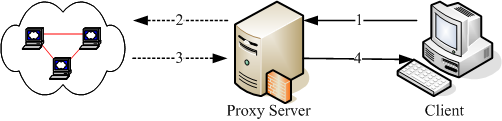
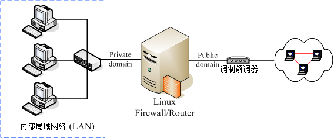
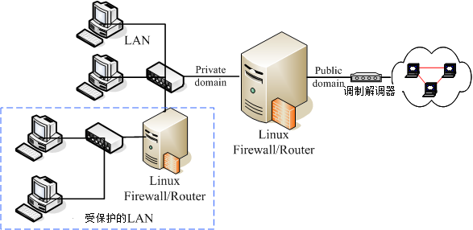
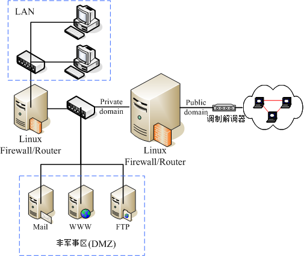
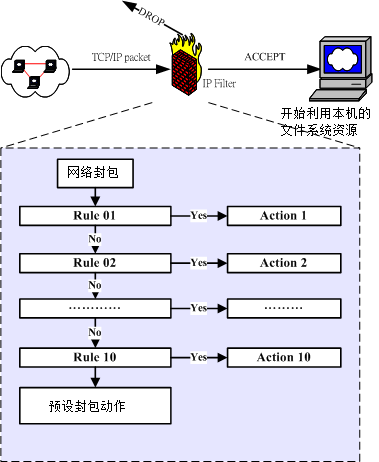
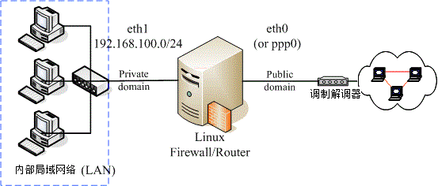
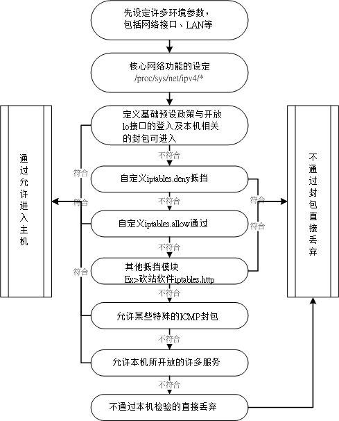
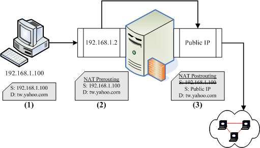
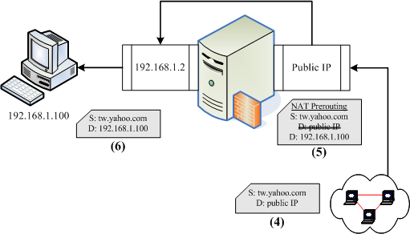
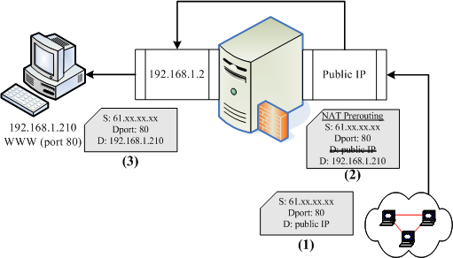

# 第九章、防火墙与 NAT 服务器

最近更新日期：2011/07/22

从第七章的图 7.1-1 我们可以发现防火墙是整个封包要进入主机前的第一道关卡，但，什么是防火墙？Linux 的防火墙有哪些机制？ 防火墙可以达到与无法达到的功能有哪些？防火墙能不能作为区域防火墙而不是仅针对单一主机而已呢？其实，Linux 的防火墙主要是透过 Netfilter 与 TCP Wrappers 两个机制来管理的。其中，透过 Netfilter 防火墙机制，我们可以达到让私有 IP 的主机上网 (IP 分享器功能) ，并且也能够让 Internet 连到我内部的私有 IP 所架设的 Linux 服务器 (DNAT 功能)！真的很不赖喔！ 这一章对您来说，也真的有够重要的啦！

*   9.1 认识防火墙
    *   9.1.1 开始之前来个提醒事项
    *   9.1.2 为何需要防火墙
    *   9.1.3 Linux 系统上防火墙的主要类别
    *   9.1.4 防火墙的一般网络布线示意
    *   9.1.5 防火墙的使用限制
*   9.2 TCP Wrappers
    *   9.2.1 哪些服务有支持： ldd
    *   9.2.2 /etc/hosts.{allow|deny} 的设定方式
*   9.3 Linux 的封包过滤软件： iptables
    *   9.3.1 不同 Linux 核心版本的防火墙软件
    *   9.3.2 封包进入流程：规则顺序的重要性！
    *   9.3.3 iptables 的表格 (table) 与链 (chain)
    *   9.3.4 本机的 iptables 语法
    *   9.3.4-1 规则的观察与清除
    *   9.3.4-2 定义预设政策 (policy)
    *   9.3.4-3 封包的基础比对：IP, 网域及接口装置： 信任装置, 信任网域
    *   9.3.4-4 TCP, UDP 的规则比对：针对埠口设定
    *   9.3.4-5 iptables 外挂模块：mac 与 state
    *   9.3.4-6 ICMP 封包规则的比对：针对是否响应 ping 来设计
    *   9.3.4-7 超阳春客户端防火墙设计与防火墙规则储存
    *   9.3.5 IPv4 的核心管理功能：/proc/sys/net/ipv4/*
*   9.4 单机防火墙的一个实例
    *   9.4.1 规则草拟
    *   9.4.2 实际设定
*   9.5 NAT 服务器的设定
    *   9.5.1 什么是 NAT？ SNAT？ DNAT？
    *   9.5.2 最阳春 NAT 服务器： IP 分享功能
    *   9.5.3 iptables 的额外核心模块功能
    *   9.5.4 在防火墙后端之网络服务器 DNAT 设定
*   9.6 重点回顾
*   9.7 本章习题
*   9.8 参考数据与延伸阅读
*   9.9 [针对本文的建议：http://phorum.vbird.org/viewtopic.php?p=114475](http://phorum.vbird.org/viewtopic.php?p=114475)

* * *

# 9.1 认识防火墙

## 9.1 认识防火墙

网络安全除了随时注意相关软件的漏洞以及网络上的安全通报之外，你最好能够依据自己的环境来订定防火墙机制！ 这样对于你的网络环境，会比较有保障一点喔！那么什么是防火墙呢？其实防火墙就是透过订定一些有顺序的规则，并管制进入到我们网域内的主机 (或者可以说是网域) 数据封包的一种机制！更广义的来说，只要能够分析与过滤进出我们管理之网域的封包数据， 就可以称为防火墙。

防火墙又可以分为硬件防火墙与本机的软件防火墙。硬件防火墙是由厂商设计好的主机硬件， 这部硬件防火墙内的操作系统主要以提供封包数据的过滤机制为主，并将其他不必要的功能拿掉。因为单纯作为防火墙功能而已， 因此封包过滤的效率较佳。至于软件防火墙呢？那就是我们这个章节要来谈论的啊！ 软件防火墙本身就是在保护系统网络安全的一套软件(或称为机制)，例如 Netfilter 与 TCP Wrappers 都可以称为软件防火墙。

无论怎么分，反正防火墙就是用来保护我们网络安全的咚咚就对啦！我们这个章节主要在介绍 Linux 系统本身提供的软件防火墙的功能，那就是 Netfilter 。至于 TCP Wrappers 虽然在基础篇的[第十八章认识系统服务](http://linux.vbird.org/linux_basic/0560daemons.php#tcp_wrappers)里面谈过了，我们这里还会稍微简单的介绍啦！

* * *

### 9.1.1 开始之前来个提醒事项

由于本章主要的目的在介绍 Netfilter 这种封包过滤式的防火墙机制，因此网络基础里面的许多封包与讯框的概念要非常清楚， 包括网域的概念, IP 网域的撰写方式等，均需有一定的基础才行。请到[第二章](http://linux.vbird.org/linux_server/0110network_basic.php)加强一下 [MAC](http://linux.vbird.org/linux_server/0110network_basic.php#tcpip_link_mac), [IP](http://linux.vbird.org/linux_server/0110network_basic.php#tcpip_network_head), [ICMP](http://linux.vbird.org/linux_server/0110network_basic.php#tcpip_network_icmp), [TCP](http://linux.vbird.org/linux_server/0110network_basic.php#tcpip_transfer_tcp), [UDP](http://linux.vbird.org/linux_server/0110network_basic.php#tcpip_transfer_udp) 等封包表头数据的认识，以及 Network/Netmask 的整体网域 ([CIDR](http://linux.vbird.org/linux_server/0110network_basic.php#tcpip_network_netmask)) 写法等。

另外，虽然 Netfilter 机制可以透过 iptables 指令的方式来进行规则的排序与修改，不过鸟哥建议你利用 shell script 来撰写属于你自己的防火墙机制比较好，因为对于规则的排序与汇整有比较好的观察性， 可以让你的防火墙规则比较清晰一点。所以在你开始了解底下的资料之前，希望你可以先阅读过相关的数据了：

*   已经认识 [Shell](http://linux.vbird.org/linux_basic/0320bash.php) 以及 [Shell script](http://linux.vbird.org/linux_basic/0340bashshell-scripts.php)；
*   已经阅读过[第二章网络基础](http://linux.vbird.org/linux_server/0110network_basic.php)的内容；
*   已经阅读过[第七章认识网络安全](http://linux.vbird.org/linux_server/0210network-secure.php)的内容；
*   已经阅读过[第八章路由器](http://linux.vbird.org/linux_server/0230router.php)的内容，了解重要的路由概念；
*   最好拥有两部主机以上的小型局域网络环境，以方便测试防火墙；
*   做为区域防火墙的 Linux 主机最好有两张实体网卡，可以进行多种测试，并架设 NAT 服务器；

* * *

### 9.1.2 为何需要防火墙

仔细分析[第七章的图 7.1-1](http://linux.vbird.org/linux_server/0210network-secure.php#fig7.1-1) 可以发现， 封包进入本机时，会通过防火墙、服务器软件程序、SELinux 与文件系统等。所以基本上，如果你的系统 (1)已经关闭不需要而且危险的服务； (2)已经将整个系统的所有软件都保持在最新的状态； (3)权限设定妥当且定时进行备份工作； (4)已经教育用户具有良好的网络、系统操作习惯。 那么你的系统实际上已经颇为安全了！要不要架设防火墙？那就见仁见智啰！

不过，毕竟网络世界是很复杂的，而 Linux 主机也不是一个简单的东西，说不定哪一天你在进行某个软件的测试时， 主机突然间就启动了一个网络服务，如果你没有管制该服务的使用范围，那么该服务就等于对所有 Internet 开放， 那就麻烦了！因为该服务可能可以允许任何人登入你的系统，那不是挺危险？

所以啰，防火墙能作什么呢？防火墙最大的功能就是帮助你『限制某些服务的存取来源』！ 举例来说： (1)你可以限制文件传输服务 (FTP) 只在子域内的主机才能够使用，而不对整个 Internet 开放； (2)你可以限制整部 Linux 主机仅可以接受客户端的 WWW 要求，其他的服务都关闭； (3)你还可以限制整部主机仅能主动对外联机。反过来说，若有客户端对我们主机发送主动联机的封包状态 (TCP 封包的 SYN flag) 就予以抵挡等等。这些就是最主要的防火墙功能了！

所以鸟哥认为，防火墙最重要的任务就是在规划出：

*   切割被信任(如子域)与不被信任(如 Internet)的网段；
*   划分出可提供 Internet 的服务与必须受保护的服务；
*   分析出可接受与不可接受的封包状态；

当然啦，咱们 Linux 的 iptables 防火墙软件还可以进行更细部深入的 NAT (Network Address Translation) 的设定，并进行更弹性的 IP 封包伪装功能，不过，对于单一主机的防火墙来说， 最简单的任务还是上面那三项就是了！所以，你需不需要防火墙呢？理论上，当然需要！ 而且你必须要知道『你的系统哪些数据与服务需要保护』，针对需要受保护的服务来设定防火墙的规则吧！ 底下我们先来谈一谈，那在 Linux 上头常见的防火墙类型有哪些？

* * *

### 9.1.3 Linux 系统上防火墙的主要类别

基本上，依据防火墙管理的范围，我们可以将防火墙区分为网域型与单一主机型的控管。在单一主机型的控管方面， 主要的防火墙有封包过滤型的 Netfilter 与依据服务软件程序作为分析的 TCP Wrappers 两种。若以区域型的防火墙而言， 由于此类防火墙都是当作路由器角色，因此防火墙类型主要则有封包过滤的 Netfilter 与利用代理服务器 (proxy server) 进行存取代理的方式了。

*   Netfilter (封包过滤机制)

    所谓的封包过滤，亦即是分析进入主机的网络封包，将封包的表头数据捉出来进行分析，以决定该联机为放行或抵挡的机制。 由于这种方式可以直接分析封包表头数据，所以包括硬件地址(MAC), 软件地址 (IP), TCP, UDP, ICMP 等封包的信息都可以进行过滤分析的功能，因此用途非常的广泛。(其实主要分析的是 OSI 七层协议的 2, 3, 4 层啦)

    在 Linux 上面我们使用核心内建的 Netfilter 这个机制，而 Netfilter 提供了 iptables 这个软件来作为防火墙封包过滤的指令。由于 Netfilter 是核心内建的功能，因此他的效率非常的高！ 非常适合于一般小型环境的设定呢！Netfilter 利用一些封包过滤的规则设定，来定义出什么资料可以接收， 什么数据需要剔除，以达到保护主机的目的喔！

*   TCP Wrappers (程序控管)

    另一种抵挡封包进入的方法，为透过服务器程序的外挂 (tcpd) 来处置的！与封包过滤不同的是， 这种机制主要是分析谁对某程序进行存取，然后透过规则去分析该服务器程序谁能够联机、谁不能联机。 由于主要是透过分析服务器程序来控管，因此与启动的埠口无关，只与程序的名称有关。 举例来说，我们知道 FTP 可以启动在非正规的 port 21 进行监听，当你透过 Linux 内建的 TCP wrappers 限制 FTP 时， 那么你只要知道 FTP 的软件名称 (vsftpd) ，然后对他作限制，则不管 FTP 启动在哪个埠口，都会被该规则管理的。

*   Proxy (代理服务器)

    其实代理服务器是一种网络服务，它可以『代理』用户的需求，而代为前往服务器取得相关的资料。就有点像底下这个图示吧：

     图 9.1-1、Proxy Server 的运作原理简介

```
以上图为例，当 Client 端想要前往 Internet 取得 Google 的数据时，他取得数据的流程是这样的：

1\.  client 会向 proxy server 要求数据，请 proxy 帮忙处理；
2\.  proxy 可以分析使用者的 IP 来源是否合法？使用者想要去的 Google 服务器是否合法？ 如果这个 client 的要求都合法的话，那么 proxy 就会主动的帮忙 client 前往 Google 取得资料；
3\.  Google 所回传的数据是传给 proxy server 的喔，所以 Google 服务器上面看到的是 proxy server 的 IP 啰；
4\.  最后 proxy 将 Google 回传的数据送给 client。
这样了解了吗？没错， client 并没有直接连上 Internet ，所以在实线部分(步骤 1, 4)只要 Proxy 与 Client 可以联机就可以了！此时 client 甚至不需要拥有 public IP 哩！而当有人想要攻击 client 端的主机时， 除非他能够攻破 Proxy server ，否则是无法与 client 联机的啦！

另外，一般 proxy 主机通常仅开放 port 80, 21, 20 等 WWW 与 FTP 的埠口而已，而且通常 Proxy 就架设在路由器上面，因此可以完整的掌控局域网络内的对外联机！让你的 LAN 变的更安全啊！ 由于一般小型网络环境很少会用到代理服务器，因此本书并没有谈到 proxy server 的设定，有兴趣的话可以参考一下[第十七章 squid](http://linux.vbird.org/linux_server/0420squid.php) (注 1) 这个软件的官网或 google 一下吧！ 
```

* * *

### 9.1.4 防火墙的一般网络布线示意

由前面的说明当中，你应该可以了解到一件事，那就是防火墙除了可以『保护防火墙机制本身所在的那部主机』之外，还可以『保护防火墙后面的主机』。也就是说，防火墙除了可以防备本机被入侵之外， 他还可以架设在路由器上面藉以控管进出本地端网域的网络封包。 这种规划对于内部私有网域的安全也有一定程度的保护作用呢！底下我们稍微谈一谈目前常见的防火墙与网络布线的配置吧：

*   单一网域，仅有一个路由器：

    防火墙除了可以作为 Linux 本机的基本防护之外，他还可以架设在路由器上面以管控整个局域网络的封包进出。 因此，在这类的防火墙上头通常至少需要有两个接口，将可信任的内部与不可信任的 Internet 分开， 所以可以分别设定两块网络接口的防火墙规则啦！简单的环境如同下列图 9.1-2 所示。

    在图 9.1-2 中，由于防火墙是设定在所有网络封包都会经过的路由器上头， 因此这个防火墙可以很轻易的就掌控到局域网络内的所有封包， 而且你只要管理这部防火墙主机，就可以很轻易的将来自 Internet 的不良网络封包抵挡掉吶。 只要管理一部主机就能够造福整的 LAN 里面的 PC，很划算的啦。

    如果你想要将局域网络控管的更严格的话，那你甚至可以在这部 Linux 防火墙上面架设更严格的代理服务器， 让客户端仅能连上你所开放的 WWW 服务器而已，而且还可以透过代理服务器的登录文件分析功能， 明确的查出来那个使用者在某个时间点曾经连上哪些 WWW 服务器，你瞧瞧！厉害吧！ 如果在这个防火墙上面再加装类似 [MRTG](http://linux.vbird.org/linux_security/old/04mrtg.php) 的流量监控软件，还能针对整个网域的流量进行监测。这样配置的优点是：

    *   因为内外网域已经分开，所以安全维护在内部可以开放的权限较大！
    *   安全机制的设定可以针对 Linux 防火墙主机来维护即可！
    *   对外只看的到 Linux 防火墙主机，所以对于内部可以达到有效的安全防护！

     图 9.1-2、单一网域，仅有一个路由器的环境示意图

*   内部网络包含安全性更高的子网，需内部防火墙切开子网：

    一般来说，我们的防火墙对于 LAN 的防备都不会设定的很严格，因为是我们自己的 LAN 嘛！所以是信任网域之一啰！不过，最常听到的入侵方法也是使用这样的一个信任漏洞！ 因为你不能保证所有使用企业内部计算机的用户都是公司的员工，也无法保证你的员工不会『搞破坏！』 更多时候是由于某些外来访客利用移动式装置 (笔记本电脑) 连接到公司内部的无线网络来加以窃取企业内部的重要信息。

    呵呵！所以，如果你有特别重要的部门需要更安全的保护网络环境，那么将 LAN 里面再加设一个防火墙，将安全等级分类，那么将会让你的重要数据获得更佳的保护喔！整个架构有点像下图所示。

     图 9.1-3、内部网络包含需要更安全的子网防火墙

*   在防火墙的后面架设网络服务器主机

    还有一种更有趣的设定，那就是将提供网络服务的服务器放在防火墙后面，这有什么好处呢？ 如下图所示，Web, Mail 与 FTP 都是透过防火墙连到 Internet 上面去，所以， 底下这四部主机在 Internet 上面的 Public IP 都是一样的！(这个观念我们会在本章底下的 NAT 服务器的时候再次的强调)。 只是透过防火墙的封包分析后，将 WWW 的要求封包转送到 Web 主机，将 Mail 送给 Mail Server 去处理而已(透过 port 的不同来转递)。

    好了，因为四部主机在 Internet 上面看到的 IP 都相同，但是事实上却是四部不同的主机， 而当有攻击者想要入侵你的 FTP 主机好了，他使用各种分析方法去进攻的主机，其实是『防火墙』那一部， 攻击者想要攻击你内部的主机，除非他能够成功的搞定你的防火墙，否则就很难入侵你的内部主机呢！

    而且，由于主机放置在两部防火墙中间，内部网络如果发生状况时 (例如某些使用者不良操作导致中毒啊、 被社交工程攻陷导致内部主机被绑架啊等等的) ，是不会影响到网络服务器的正常运作的。 这种方式适用在比较大型的企业当中，因为对这些企业来说，网络主机能否提供正常稳定的服务是很重要的！

    不过，这种架构下所进行的设定就得包含 port 的转递，而且要有很强的网络逻辑概念， 可以厘清封包双向沟通时的流动方式。对于新手来说，设定上有一定的难度， 鸟哥个人不太建议新手这么做，还是等以后有经验之后再来玩这种架构吧！

     图 9.1-4、架设在防火墙后端的网络服务器环境示意图

    通常像上图的环境中，将网络服务器独立放置在两个防火墙中间的网络，我们称之为非军事区域 (DMZ)。 DMZ 的目的就如同前面提到的，重点在保护服务器本身，所以将 Internet 与 LAN 都隔离开来，如此一来不论是服务器本身，或者是 LAN 被攻陷时，另一个区块还是完好无缺的！

* * *

### 9.1.5 防火墙的使用限制

从前面的分析中，我们已经知道过封包滤式防火墙主要在分析 OSI 七层协议当中的 2, 3, 4 层，既然如此的话， Linux 的 Netfilter 机制到底可以做些什么事情呢？其实可以进行的分析工作主要有：

*   拒绝让 Internet 的封包进入主机的某些端口 这个应该不难了解吧！例如你的 port 21 这个 FTP 相关的埠口，若只想要开放给内部网络的话，那么当 Internet 来的封包想要进入你的 port 21 时，就可以将该数据封包丢掉！因为我们可以分析的到该封包表头的端口号码呀！

*   拒绝让某些来源 IP 的封包进入 例如你已经发现某个 IP 主要都是来自攻击行为的主机，那么只要来自该 IP 的资料封包，就将他丢弃！这样也可以达到基础的安全呦！

*   拒绝让带有某些特殊旗标 (flag) 的封包进入 最常拒绝的就是带有 SYN 的主动联机的旗标了！只要一经发现，嘿嘿！你就可以将该封包丢弃呀！

*   分析硬件地址 (MAC) 来决定联机与否 如果你的局域网络里面有比较捣蛋的但是又具有比较高强的网络功力的高手时，如果你使用 IP 来抵挡他使用网络的权限，而他却懂得反正换一个 IP 就好了，都在同一个网域内嘛！ 同样还是在搞破坏～怎么办？没关系，我们可以死锁他的网络卡硬件地址啊！因为 MAC 是焊在网络卡上面的，所以你只要分析到该使用者所使用的 MAC 之后，可以利用防火墙将该 MAC 锁住，呵呵！除非他能够一换再换他的网络卡来取得新的 MAC，否则换 IP 是没有用的啦！

虽然 Netfilter 防火墙已经可以做到这么多的事情，不过，还是有很多事情没有办法透过 Netfilter 来完成喔！ 什么？设定防火墙之后还不安全啊！那当然啦！谁说设定了防火墙之后你的系统就一定安全？ 防火墙虽然可以防止不受欢迎的封包进入我们的网络当中，不过，某些情况下，他并不能保证我们的网络一定就很安全。 举几个例子来谈一谈：

*   防火墙并不能很有效的抵挡病毒或木马程序 假设你已经开放了 WWW 的服务，那么你的 WWW 主机上面，防火墙一定得要将 WWW 服务的 port 开放给 Client 端登入才行吧！否则你的 WWW 主机设定了等于没有用对吧！也就是说，只要进入你的主机的封包是要求 WWW 数据的，就可以通过你的防火墙。那好了，『万一你的 WWW 服务器软件有漏洞，或者本身向你要求 WWW 服务的该封包就是病毒在侦测你的系统』时，你的防火墙可是一点办法也没有啊！ 因为本来设定的规则就是会让他通过啊。

*   防火墙对于来自内部 LAN 的攻击较无承受力 一般来说，我们对于 LAN 里面的主机都没有什么防火墙的设定，因为是我们自己的 LAN 啊，所以当然就设定为信任网域了！不过， LAN 里面总是可能有些网络小白啊，虽然他们不是故意要搞破坏， 但是他们就是不懂嘛！所以就乱用网络了。这个时候就很糟糕，因为防火墙对于内部的规则设定通常比较少， 所以就容易造成内部员工对于网络误用或滥用的情况。

所以啦，还是回到第七章的[图 7.1-1](http://linux.vbird.org/linux_server/0210network-secure.php#fig7.1-1) 的说明去看看，分析一下该图示，你就会知道，在你的 Linux 主机实地上网之前，还是得先：

*   关闭几个不安全的服务；
*   升级几个可能有问题的套件；
*   架设好最起码的安全防护--防火墙--

其他相关的讯息还是请到[第七章认识网络安全](http://linux.vbird.org/linux_server/0210network-secure.php)里面去看一看怎么增加自身的安全吧！

* * *

# 9.2 TCP Wrappers

## 9.2 TCP Wrappers

在进入主题之前，我们先来玩一个简单的防火墙机制，那就是 TCP Wrappers 这玩意儿。如同前面说的， TCP wrappers 是透过客户端想要链接的程序文件名，然后分析客户端的 IP ，看看是否需要放行。那么哪些程序支持 TCP wrappers 的功能？这个 TCP wrappers 又该如何设定？我们这里先简单的谈谈吧！(这个小节仅是简单的介绍过 TCP wrappers ，更多相关功能请参考基础学习篇的[第十八章](http://linux.vbird.org/linux_basic/0560daemons.php#security)内容喔！)

* * *

### 9.2.1 哪些服务有支持

说穿了， TCP wrappers 就是透过 /etc/hosts.allow, /etc/hosts.deny 这两个宝贝蛋来管理的一个类似防火墙的机制， 但并非所有的软件都可以透过这两个档案来控管，只有底下的软件才能够透过这两个档案来管理防火墙规则，分别是：

*   由 super daemon (xinetd) 所管理的服务；
*   有支援 libwrap.so 模块的服务。

经由 xinetd 管理的服务还好理解，就是配置文件在 /etc/xinetd.d/ 里面的服务就是 xinetd 所管理的啊！ 那么什么是有支持 libwrap.so 模块呢？就让我们来进行底下的例题，你就比较容易明白啰：

例题：请查出你的系统有没有安装 xinetd ，若没有请安装。安装完毕后，请查询 xinetd 管理的服务有哪些？答：

```
[root@www ~]# yum install xinetd
Setting up Install Process
Package 2:xinetd-2.3.14-29.el6.x86_64 already installed and latest version
Nothing to do
# 画面中显示，已经是最新的 xinetd ！所以，已经有安装啰！
# 接下来找出 xinetd 所管理的服务群！

[root@www ~]# chkconfig xinetd on   &lt;==要先让 xinetd on 后才能看到底下的
[root@www ~]# chkconfig --list
....(前面省略)....
xinetd based services:
        chargen-dgram:  off
        chargen-stream: off
....(中间省略)....
        rsync:          off   &lt;==下一小节的范例就用这玩意儿来解释
        tcpmux-server:  off
        telnet:         on 
```

上述结果最终输出的部分就是 xinetd 所管理的服务群啰！上述的服务之防火墙简易设定，都可以透过 TCP wrappers 来管理的噜！

例题：请问， rsyslogd, sshd, xinetd, httpd (若该服务不存在，请自行安装软件)，这四个程序有没有支持 tcp wrappers 的抵挡功能？答：由于支持 tcp wrappers 的服务必定包含 libwrap 这一个动态函式库，因此可以使用 ldd 来观察该服务即可。 简单的使用方式为：

```
[root@www ~]# ldd $(which rsyslogd sshd xinetd httpd)
# 这个方式可以将所有的动态函式库取出来查阅，不过需要眼睛搜寻。
# 可以透过底下的方式来处理更快！

[root@www ~]# for name in rsyslogd sshd xinetd httpd; do echo $name; \
&gt; ldd $(which $name) &#124; grep libwrap; done
rsyslogd
sshd
        libwrap.so.0 =&gt; /lib64/libwrap.so.0 (0x00007fb41d3c9000)
xinetd
        libwrap.so.0 =&gt; /lib64/libwrap.so.0 (0x00007f6314821000)
httpd 
```

上述的结果中，在该档名档下有出现 libwrap 的，代表有找到该函式库，才有支持 tcp wrappers。 所以， sshd, xinetd 有支持，但是 rsyslogd, httpd 这两支程序则不支持。也就是说， httpd 与 rsyslogd 不能够使用 /etc/hosts.{allow|deny} 来进行防火墙机制的控管。

* * *

### 9.2.2 /etc/hosts.{allow|deny} 的设定方式

那如何透过这两个档案来抵挡有问题的 IP 来源呢？这两个档案的语法都一样，很简单的：

```
&lt;service(program_name)&gt; : &lt;IP, domain, hostname&gt; 
&lt;服务   (亦即程序名称)&gt; : &lt;IP 或领域 或主机名&gt;
# 上头的 &gt; &lt; 是不存在于配置文件中的喔！ 
```

我们知道防火墙的规则都是有顺序的，那这两个档案与规则的顺序优先是怎样呢？基本上是这样的：

*   先以 /etc/hosts.allow 为优先比对，该规则符合就予以放行；
*   再以 /etc/hosts.deny 比对，规则符合就予以抵挡；
*   若不在这两个档案内，亦即规则都不符合，最终则予以放行。

我们拿 rsync 这个 xinetd 管理的服务来进行说明好了，请参考底下的例题吧：

例题：先开放本机的 127.0.0.1 可以进行任何本机的服务，然后，让区网 (192.168.1.0/24) 可以使用 rsync ， 同时 10.0.0.100 也能够使用 rsync ，但其他来源则不允许使用 rsync 喔。答：我们得要先知道 rsync 的服务启动的档名为何，因为 tcp wrappers 是透过启动服务的档名来管理的。 当我们观察 rsync 的配置文件时，可以发现：

```
[root@www ~]# cat /etc/xinetd.d/rsync
service rsync
{
        disable = yes
        flags           = IPv6
        socket_type     = stream
        wait            = no
        user            = root
        server          = /usr/bin/rsync   &lt;==檔名叫做 rsync
        server_args     = --daemon
        log_on_failure  += USERID
} 
```

因此程序字段的项目要写的是 rsync 喔！因此，我们应该要这样设定的：

```
[root@www ~]# vim /etc/hosts.allow
ALL: 127.0.0.1    &lt;==这就是本机全部的服务都接受！
rsync: 192.168.1.0/255.255.255.0 10.0.0.100

[root@www ~]# vim /etc/hosts.deny
rsync: ALL 
```

上面的例题有几个重点，首先， tcp wrappers 理论上不支持 192.168.1.0/24 这种透过 bit 数值来定义的网域， 只支持 netmask 的地址显示方式。另外，如果有多个网域或者是单一来源，可以透过空格来累加。 如果想要写成多行呢？也可以啊！多写几行『 kshd: IP 』的方式也可以，不必要将所有数据集中在一行啦！因为 tcp wrappers 也是一条一条规则比对嘛！

基本上，你只要理解这些数据即可！因为绝大部分的时刻，我们都会建议使用底下介绍的 Netfilter 的机制来抵挡封包。 那让我们准备开始来玩玩 iptables 封包过滤防火墙吧！

* * *

# 9.3 Linux 的封包过滤软件：iptables

## 9.3 Linux 的封包过滤软件：iptables

上面谈了这么多，主要还是希望你能了解到防火墙是什么这个议题！而且也希望你知道防火墙并非万能的。 好了，那么底下我们终于可以来瞧一瞧，那目前我们的 2.6 版这个 Linux 核心到底使用什么核心功能来进行防火墙设定？

* * *

### 9.3.1 不同 Linux 核心版本的防火墙软件

Linux 的防火墙为什么功能这么好？这是因为他本身就是由 Linux 核心所提供，由于直接经过核心来处理，因此效能非常好！ 不过，不同核心版本所使用的防火墙软件是不一样的！因为核心支持的防火墙是逐渐演进而来的嘛！

*   Version 2.0：使用 ipfwadm 这个防火墙机制；
*   Version 2.2：使用的是 ipchains 这个防火墙机制；
*   Version 2.4 与 2.6 ：主要是使用 iptables 这个防火墙机制，不过在某些早期的 Version 2.4 版本的 distributions 当中，亦同时支持 ipchains (编译成为模块)，好让用户仍然可以使用来自 2.2 版的 ipchains 的防火墙规划。不过，不建议在 2.4 以上的核心版本使用 ipchains 喔！

因为不同的核心使用的防火墙机制不同，且支持的软件指令与语法也不相同，所以在 Linux 上头设定属于你自己的防火墙规则时，要注意啊，先用 [uname -r](http://linux.vbird.org/linux_basic/0440processcontrol.php#uname) 追踪一下你的核心版本再说！如果你是安装 2004 年以后推出的 distributions ，那就不需要担心了，因为这些 distributions 几乎都使用 kernel 2.6 版的核心啊！ ^_^

* * *

### 9.3.2 封包进入流程：规则顺序的重要性！

前面的几个小节里面我们一直谈到：『防火墙规则』，咦！啥是规则啊？因为 iptables 是利用封包过滤的机制， 所以他会分析封包的表头数据。根据表头数据与定义的『规则』来决定该封包是否可以进入主机或者是被丢弃。 意思就是说：『根据封包的分析资料 "比对" 你预先定义的规则内容， 若封包数据与规则内容相同则进行动作，否则就继续下一条规则的比对！』 重点在那个『比对与分析顺序』上。

举个简单的例子，假设我预先定义 10 条防火墙规则好了，那么当 Internet 来了一个封包想要进入我的主机， 那么防火墙是如何分析这个封包的呢？我们以底下的图示来说明好了：

 图 9.3-1、封包过滤的规则动作及分析流程

当一个网络封包要进入到主机之前，会先经由 NetFilter 进行检查，那就是 iptables 的规则了。 检查通过则接受 (ACCEPT) 进入本机取得资源，如果检查不通过，则可能予以丢弃 (DROP) ！ 上图中主要的目的在告知你：『规则是有顺序的』！例如当网络封包进入 Rule 1 的比对时， 如果比对结果符合 Rule 1 ，此时这个网络封包就会进行 Action 1 的动作，而不会理会后续的 Rule 2, Rule 3.... 等规则的分析了。

而如果这个封包并不符合 Rule 1 的比对，那就会进入 Rule 2 的比对了！如此一个一个规则去进行比对就是了。 那如果所有的规则都不符合怎办？此时就会透过预设动作 (封包政策, Policy) 来决定这个封包的去向。 所以啦，当你的规则顺序排列错误时，就会产生很严重的错误了。 怎么说呢？让我们看看底下这个例子：

假设你的 Linux 主机提供了 WWW 的服务，那么自然就要针对 port 80 来启用通过的封包规则，但是你发现 IP 来源为 192.168.100.100 老是恶意的尝试入侵你的系统，所以你想要将该 IP 拒绝往来，最后，所有的非 WWW 的封包都给他丢弃，就这三个规则来说，你要如何设定防火墙检验顺序呢？

1.  Rule 1 先抵挡 192.168.100.100 ；
2.  Rule 2 再让要求 WWW 服务的封包通过；
3.  Rule 3 将所有的封包丢弃。

这样的排列顺序就能符合你的需求，不过，万一你的顺序排错了，变成：

1.  Rule 1 先让要求 WWW 服务的封包通过；
2.  Rule 2 再抵挡 192.168.100.100 ；
3.  Rule 3 将所有的封包丢弃。

此时，那个 192.168.100.100 『可以使用你的 WWW 服务』喔！只要他对你的主机送出 WWW 要求封包，就可以使用你的 WWW 功能了，因为你的规则顺序定义第一条就会让他通过，而不去考虑第二条规则！这样可以理解规则顺序的意义了吗！ 现在再来想一想，如果 Rule 1 变成了『将所有的封包丢弃』，Rule 2 才设定『WWW 服务封包通过』，请问，我的 client 可以使用我的 WWW 服务吗？呵呵！答案是『否～』想通了吗？ ^_^

* * *

### 9.3.3 iptables 的表格 (table) 与链 (chain)

事实上，那个图 9.3-1 所列出的规则仅是 iptables 众多表格当中的一个链 (chain) 而已。 什么是链呢？这得由 iptables 的名称说起。为什么称为 ip"tables" 呢？ 因为这个防火墙软件里面有多个表格 (table) ，每个表格都定义出自己的默认政策与规则， 且每个表格的用途都不相同。我们可以使用底下这张图来稍微了解一下：

 图 9.3-2、iptables 的表格与相关链示意图

刚刚图 9.3-1 的规则内容仅只是图 9.3-2 内的某个 chain 而已！ 而预设的情况下，咱们 Linux 的 iptables 至少就有三个表格，包括管理本机进出的 filter 、管理后端主机 (防火墙内部的其他计算机) 的 nat 、管理特殊旗标使用的 mangle (较少使用) 。更有甚者，我们还可以自定义额外的链呢！ 真是很神奇吧！每个表格与其中链的用途分别是这样的：

*   filter (过滤器)：主要跟进入 Linux 本机的封包有关，这个是预设的 table 喔！

    *   INPUT：主要与想要进入我们 Linux 本机的封包有关；
    *   OUTPUT：主要与我们 Linux 本机所要送出的封包有关；
    *   FORWARD：这个咚咚与 Linux 本机比较没有关系， 他可以『转递封包』到后端的计算机中，与下列 nat table 相关性较高。
*   nat (地址转换)：是 Network Address Translation 的缩写， 这个表格主要在进行来源与目的之 IP 或 port 的转换，与 Linux 本机较无关，主要与 Linux 主机后的局域网络内计算机较有相关。

    *   PREROUTING：在进行路由判断之前所要进行的规则(DNAT/REDIRECT)
    *   POSTROUTING：在进行路由判断之后所要进行的规则(SNAT/MASQUERADE)
    *   OUTPUT：与发送出去的封包有关
*   mangle (破坏者)：这个表格主要是与特殊的封包的路由旗标有关， 早期仅有 PREROUTING 及 OUTPUT 链，不过从 kernel 2.4.18 之后加入了 INPUT 及 FORWARD 链。 由于这个表格与特殊旗标相关性较高，所以像咱们这种单纯的环境当中，较少使用 mangle 这个表格。

所以说，如果你的 Linux 是作为 www 服务，那么要开放客户端对你的 www 要求有响应，就得要处理 filter 的 INPUT 链； 而如果你的 Linux 是作为局域网络的路由器，那么就得要分析 nat 的各个链以及 filter 的 FORWARD 链才行。也就是说， 其实各个表格的链结之间是有关系的！简单的关系可以由下图这么看：

 图 9.3-3、iptables 内建各表格与链的相关性

上面的图示很复杂喔！不过基本上你依旧可以看出来，我们的 iptables 可以控制三种封包的流向：

*   封包进入 Linux 主机使用资源 (路径 A)： 在路由判断后确定是向 Linux 主机要求数据的封包，主要就会透过 filter 的 INPUT 链来进行控管；

*   封包经由 Linux 主机的转递，没有使用主机资源，而是向后端主机流动 (路径 B)： 在路由判断之前进行封包表头的修订作业后，发现到封包主要是要透过防火墙而去后端，此时封包就会透过路径 B 来跑动。 也就是说，该封包的目标并非我们的 Linux 本机。主要经过的链是 filter 的 FORWARD 以及 nat 的 POSTROUTING, PREROUTING。 这路径 B 的封包流向使用情况，我们会在本章的 9.5 小节来跟大家作个简单的介绍。

*   封包由 Linux 本机发送出去 (路径 C)： 例如响应客户端的要求，或者是 Linux 本机主动送出的封包，都是透过路径 C 来跑的。先是透过路由判断， 决定了输出的路径后，再透过 filter 的 OUTPUT 链来传送的！当然，最终还是会经过 nat 的 POSTROUTING 链。

**Tips:** 有没有发现有两个『路由判断』呢？因为网络是双向的，所以进与出要分开来看！因此，进入的封包需要路由判断， 送出的封包当然也要进行路由判断才能够发送出去啊！了解乎？


由于 mangle 这个表格很少被使用，如果将图 9.3-3 的 mangle 拿掉的话，那就容易看的多了：

 图 9.3-4、iptables 内建各表格与链的相关性(简图)

透过图 9.3-4 你就可以更轻松的了解到，事实上与本机最有关的其实是 filter 这个表格内的 INPUT 与 OUTPUT 这两条链，如果你的 iptables 只是用来保护 Linux 主机本身的话，那 nat 的规则根本就不需要理他，直接设定为开放即可。

不过，如果你的防火墙事实上是用来管制 LAN 内的其他主机的话，那么你就必须要再针对 filter 的 FORWARD 这条链，还有 nat 的 PREROUTING, POSTROUTING 以及 OUTPUT 进行额外的规则订定才行。 nat 表格的使用需要很清晰的路由概念才能够设定的好，建议新手先不要碰！最多就是先玩一玩最阳春的 nat 功能『IP 分享器的功能』就好了！ ^_^！这部份我们在本章的最后一小节会介绍的啦！

* * *

### 9.3.4 本机的 iptables 语法

理论上，当你安装好 Linux 之后，系统应该会主动的帮你启动一个阳春的防火墙规则才是， 不过这个阳春防火墙可能不是我们想要的模式，因此我们需要额外进行一些修订的行为。不过，在开始进行底下的练习之前， 鸟哥这里有个很重要的事情要告知一下。因为 iptables 的指令会将网络封包进行过滤及抵挡的动作，所以， 请不要在远程主机上进行防火墙的练习，因为你很有可能一不小心将自己关在家门外！ 尽量在本机前面登入 tty1-tty6 终端机进行练习，否则常常会发生悲剧啊！鸟哥以前刚刚在玩 iptables 时，就常常因为不小心规则设定错误，导致常常要请远程的朋友帮忙重新启动...

刚刚提到咱们的 iptables 至少有三个预设的 table (filter, nat, mangle)，较常用的是本机的 filter 表格， 这也是默认表格啦。另一个则是后端主机的 nat 表格，至于 mangle 较少使用，所以这个章节我们并不会讨论 mangle。 由于不同的 table 他们的链不一样，导致使用的指令语法或多或少都有点差异。 在这个小节当中，我们主要将针对 filter 这个默认表格的三条链来做介绍。底下就来玩一玩吧！

**Tips:** 防火墙的设定主要使用的就是 iptables 这个指令而已。而防火墙是系统管理员的主要任务之一， 且对于系统的影响相当的大，因此『只能让 root 使用 iptables 』，不论是设定还是观察防火墙规则喔！


* * *

### 9.3.4-1 规则的观察与清除

如果你在安装的时候选择没有防火墙的话，那么 iptables 在一开始的时候应该是没有规则的，不过， 可能因为你在安装的时候就有选择系统自动帮你建立防火墙机制，那系统就会有默认的防火墙规则了！ 无论如何，我们先来看看目前本机的防火墙规则是如何吧！

```
[root@www ~]# iptables [-t tables] [-L] [-nv]
选项与参数：
-t ：后面接 table ，例如 nat 或 filter ，若省略此项目，则使用默认的 filter
-L ：列出目前的 table 的规则
-n ：不进行 IP 与 HOSTNAME 的反查，显示讯息的速度会快很多！
-v ：列出更多的信息，包括通过该规则的封包总位数、相关的网络接口等

范例：列出 filter table 三条链的规则
[root@www ~]# iptables -L -n
Chain INPUT (policy ACCEPT)   &lt;==针对 INPUT 链，且预设政策为可接受
target  prot opt source     destination &lt;==说明栏
ACCEPT  all  --  0.0.0.0/0  0.0.0.0/0   state RELATED,ESTABLISHED &lt;==第 1 条规则
ACCEPT  icmp --  0.0.0.0/0  0.0.0.0/0                             &lt;==第 2 条规则
ACCEPT  all  --  0.0.0.0/0  0.0.0.0/0                             &lt;==第 3 条规则
ACCEPT  tcp  --  0.0.0.0/0  0.0.0.0/0   state NEW tcp dpt:22      &lt;==以下类推
REJECT  all  --  0.0.0.0/0  0.0.0.0/0   reject-with icmp-host-prohibited

Chain FORWARD (policy ACCEPT)  &lt;==针对 FORWARD 链，且预设政策为可接受
target  prot opt source     destination
REJECT  all  --  0.0.0.0/0  0.0.0.0/0   reject-with icmp-host-prohibited

Chain OUTPUT (policy ACCEPT)  &lt;==针对 OUTPUT 链，且预设政策为可接受
target  prot opt source     destination

范例：列出 nat table 三条链的规则
[root@www ~]# iptables -t nat -L -n
Chain PREROUTING (policy ACCEPT)
target     prot opt source               destination

Chain POSTROUTING (policy ACCEPT)
target     prot opt source               destination

Chain OUTPUT (policy ACCEPT)
target     prot opt source               destination 
```

在上表中，每一个 Chain 就是前面提到的每个链啰～ Chain 那一行里面括号的 policy 就是预设的政策， 那底下的 target, prot 代表什么呢？

*   target：代表进行的动作， ACCEPT 是放行，而 REJECT 则是拒绝，此外，尚有 DROP (丢弃) 的项目！
*   prot：代表使用的封包协议，主要有 tcp, udp 及 icmp 三种封包格式；
*   opt：额外的选项说明
*   source ：代表此规则是针对哪个『来源 IP』进行限制？
*   destination ：代表此规则是针对哪个『目标 IP』进行限制？

在输出结果中，第一个范例因为没有加上 -t 的选项，所以默认就是 filter 这个表格内的 INPUT, OUTPUT, FORWARD 三条链的规则啰。若针对单机来说，INPUT 与 FORWARD 算是比较重要的管制防火墙链， 所以你可以发现最后一条规则的政策是 REJECT (拒绝) 喔！虽然 INPUT 与 FORWARD 的政策是放行 (ACCEPT)， 不过在最后一条规则就已经将全部的封包都拒绝了！

不过这个指令的观察只是作个格式化的查阅，要详细解释每个规则会比较不容易解析。举例来说， 我们将 INPUT 的 5 条规则依据输出结果来说明一下，结果会变成：

1.  只要是封包状态为 RELATED,ESTABLISHED 就予以接受
2.  只要封包协议是 icmp 类型的，就予以放行
3.  无论任何来源 (0.0.0.0/0) 且要去任何目标的封包，不论任何封包格式 (prot 为 all)，通通都接受
4.  只要是传给 port 22 的主动式联机 tcp 封包就接受
5.  全部的封包信息通通拒绝

最有趣的应该是第 3 条规则了，怎么会所有的封包信息都予以接受？如果都接受的话，那么后续的规则根本就不会有用嘛！ 其实那条规则是仅针对每部主机都有的内部循环测试网络 (lo) 接口啦！如果没有列出接口，那么我们就很容易搞错啰～ 所以，近来鸟哥都建议使用 iptables-save 这个指令来观察防火墙规则啦！因为 iptables-save 会列出完整的防火墙规则，只是并没有规格化输出而已。

```
[root@www ~]# iptables-save [-t table]
选项与参数：
-t ：可以仅针对某些表格来输出，例如仅针对 nat 或 filter 等等

[root@www ~]# iptables-save
# Generated by iptables-save v1.4.7 on Fri Jul 22 15:51:52 2011
*filter                      &lt;==星号开头的指的是表格，这里为 filter
:INPUT ACCEPT [0:0]          &lt;==冒号开头的指的是链，三条内建的链
:FORWARD ACCEPT [0:0]        &lt;==三条内建链的政策都是 ACCEPT 啰！
:OUTPUT ACCEPT [680:100461]
-A INPUT -m state --state RELATED,ESTABLISHED -j ACCEPT &lt;==针对 INPUT 的规则
-A INPUT -p icmp -j ACCEPT
-A INPUT -i lo -j ACCEPT  &lt;==这条很重要！针对本机内部接口开放！
-A INPUT -p tcp -m state --state NEW -m tcp --dport 22 -j ACCEPT
-A INPUT -j REJECT --reject-with icmp-host-prohibited
-A FORWARD -j REJECT --reject-with icmp-host-prohibited &lt;==针对 FORWARD 的规则
COMMIT
# Completed on Fri Jul 22 15:51:52 2011 
```

由上面的输出来看，有底线且内容含有 lo 的那条规则当中，『 -i lo 』指的就是由 lo 适配卡进来的封包！ 这样看就清楚多了！因为有写到接口的关系啊！不像之前的 iptables -L -n 嘛！这样了解乎！ 不过，既然这个规则不是我们想要的，那该如何修改规则呢？鸟哥建议，先删除规则再慢慢建立各个需要的规则！ 那如何清除规则？这样做就对了：

```
[root@www ~]# iptables [-t tables] [-FXZ]
选项与参数：
-F ：清除所有的已订定的规则；
-X ：杀掉所有使用者 "自定义" 的 chain (应该说的是 tables ）啰；
-Z ：将所有的 chain 的计数与流量统计都归零

范例：清除本机防火墙 (filter) 的所有规则
[root@www ~]# iptables -F
[root@www ~]# iptables -X
[root@www ~]# iptables -Z 
```

由于这三个指令会将本机防火墙的所有规则都清除，但却不会改变预设政策 (policy) ， 所以如果你不是在本机下达这三行指令时，很可能你会被自己挡在家门外 (若 INPUT 设定为 DROP 时)！要小心啊！

一般来说，我们在重新定义防火墙的时候，都会先将规则给他清除掉。还记得我们前面谈到的， 防火墙的『规则顺序』是有特殊意义的，所以啰， 当然先清除掉规则，然后一条一条来设定会比较容易一点啦。底下就来谈谈定义预设政策吧！

* * *

### 9.3.4-2 定义预设政策 (policy)

清除规则之后，再接下来就是要设定规则的政策啦！还记得政策指的是什么吗？『 当你的封包不在你设定的规则之内时，则该封包的通过与否，是以 Policy 的设定为准』，在本机方面的预设政策中，假设你对于内部的使用者有信心的话， 那么 filter 内的 INPUT 链方面可以定义的比较严格一点，而 FORWARD 与 OUTPUT 则可以订定的松一些！通常鸟哥都是将 INPUT 的 policy 定义为 DROP 啦，其他两个则定义为 ACCEPT。 至于 nat table 则暂时先不理会他。

```
[root@www ~]# iptables [-t nat] -P [INPUT,OUTPUT,FORWARD] [ACCEPT,DROP]
选项与参数：
-P ：定义政策( Policy )。注意，这个 P 为大写啊！
ACCEPT ：该封包可接受
DROP   ：该封包直接丢弃，不会让 client 端知道为何被丢弃。

范例：将本机的 INPUT 设定为 DROP ，其他设定为 ACCEPT
[root@www ~]# iptables -P INPUT   DROP
[root@www ~]# iptables -P OUTPUT  ACCEPT
[root@www ~]# iptables -P FORWARD ACCEPT
[root@www ~]# iptables-save
# Generated by iptables-save v1.4.7 on Fri Jul 22 15:56:34 2011
*filter
:INPUT DROP [0:0]
:FORWARD ACCEPT [0:0]
:OUTPUT ACCEPT [0:0]
COMMIT
# Completed on Fri Jul 22 15:56:34 2011
# 由于 INPUT 设定为 DROP 而又尚未有任何规则，所以上面的输出结果显示：
# 所有的封包都无法进入你的主机！是不通的防火墙设定！(网络联机是双向的) 
```

看到输出的结果了吧？INPUT 被修改了设定喔！其他的 nat table 三条链的预设政策设定也是一样的方式，例如：『 iptables -t nat -P PREROUTING ACCEPT 』就设定了 nat table 的 PREROUTING 链为可接受的意思！预设政策设定完毕后，来谈一谈关于各规则的封包基础比对设定吧。

* * *

### 9.3.4-3 封包的基础比对：IP, 网域及接口装置

开始来进行防火墙规则的封包比对设定吧！既然是因特网，那么我们就由最基础的 IP, 网域及埠口，亦即是 OSI 的第三层谈起，再来谈谈装置 (网络卡) 的限制等等。这一小节与下一小节的语法你一定要记住，因为这是最基础的比对语法喔！

```
[root@www ~]# iptables [-AI 链名] [-io 网络接口] [-p 协议] \
&gt; [-s 来源 IP/网域] [-d 目标 IP/网域] -j [ACCEPT&#124;DROP&#124;REJECT&#124;LOG]
选项与参数：
-AI 链名：针对某的链进行规则的 "插入" 或 "累加"
    -A ：新增加一条规则，该规则增加在原本规则的最后面。例如原本已经有四条规则，
         使用 -A 就可以加上第五条规则！
    -I ：插入一条规则。如果没有指定此规则的顺序，默认是插入变成第一条规则。
         例如原本有四条规则，使用 -I 则该规则变成第一条，而原本四条变成 2~5 号
    链 ：有 INPUT, OUTPUT, FORWARD 等，此链名称又与 -io 有关，请看底下。

-io 网络接口：设定封包进出的接口规范
    -i ：封包所进入的那个网络接口，例如 eth0, lo 等接口。需与 INPUT 链配合；
    -o ：封包所传出的那个网络接口，需与 OUTPUT 链配合；

-p 协定：设定此规则适用于哪种封包格式
   主要的封包格式有： tcp, udp, icmp 及 all 。

-s 来源 IP/网域：设定此规则之封包的来源项目，可指定单纯的 IP 或包括网域，例如：
   IP  ：192.168.0.100
   网域：192.168.0.0/24, 192.168.0.0/255.255.255.0 均可。
   若规范为『不许』时，则加上 ! 即可，例如：
   -s ! 192.168.100.0/24 表示不许 192.168.100.0/24 之封包来源；

-d 目标 IP/网域：同 -s ，只不过这里指的是目标的 IP 或网域。

-j ：后面接动作，主要的动作有接受(ACCEPT)、丢弃(DROP)、拒绝(REJECT)及记录(LOG) 
```

iptables 的基本参数就如同上面所示的，仅只谈到 IP 、网域与装置等等的信息， 至于 TCP, UDP 封包特有的埠口 (port number) 与状态 (如 SYN 旗标) 则在下小节才会谈到。 好，先让我们来看看最基础的几个规则，例如开放 lo 这个本机的接口以及某个 IP 来源吧！

```
范例：设定 lo 成为受信任的装置，亦即进出 lo 的封包都予以接受
[root@www ~]# iptables -A INPUT -i lo -j ACCEPT 
```

仔细看上面并没有列出 -s, -d 等等的规则，这表示：不论封包来自何处或去到哪里，只要是来自 lo 这个界面，就予以接受！这个观念挺重要的，就是『没有指定的项目，则表示该项目完全接受』的意思！ 例如这个案例当中，关于 -s, -d...等等的参数没有规定时，就代表不论什么值都会被接受啰。

这就是所谓的信任装置啦！假如你的主机有两张以太网络卡，其中一张是对内部的网域，假设该网卡的代号为 eth1 好了， 如果内部网域是可信任的，那么该网卡的进出封包就通通会被接受，那你就能够用：『iptables -A INPUT -i eth1 -j ACCEPT』 来将该装置设定为信任装置。不过，下达这个指令前要特别注意，因为这样等于该网卡没有任何防备了喔！

```
范例：只要是来自内网的 (192.168.100.0/24) 的封包通通接受
[root@www ~]# iptables -A INPUT -i eth1 -s 192.168.100.0/24 -j ACCEPT
# 由于是内网就接受，因此也可以称之为『信任网域』啰。

范例：只要是来自 192.168.100.10 就接受，但 192.168.100.230 这个恶意来源就丢弃
[root@www ~]# iptables -A INPUT -i eth1 -s 192.168.100.10 -j ACCEPT
[root@www ~]# iptables -A INPUT -i eth1 -s 192.168.100.230 -j DROP
# 针对单一 IP 来源，可视为信任主机或者是不信任的恶意来源喔！

[root@www ~]# iptables-save
# Generated by iptables-save v1.4.7 on Fri Jul 22 16:00:43 2011
*filter
:INPUT DROP [0:0]
:FORWARD ACCEPT [0:0]
:OUTPUT ACCEPT [17:1724]
-A INPUT -i lo -j ACCEPT
-A INPUT -s 192.168.100.0/24 -i eth1 -j ACCEPT
-A INPUT -s 192.168.100.10/32 -i eth1 -j ACCEPT
-A INPUT -s 192.168.100.230/32 -i eth1 -j DROP
COMMIT
# Completed on Fri Jul 22 16:00:43 2011 
```

这就是最单纯简单的防火墙规则的设定与观察方式。不过，在上面的案例中，其实你也发现到有两条规则可能有问题～ 那就是上面的特殊字体圈起来的规则顺序。明明已经放行了 192.168.100.0/24 了，所以那个 192.168.100.230 的规则就不可能会被用到！这就是有问题的防火墙设定啊！了解乎？那该怎办？就重打啊！@_@！ 那如果你想要记录某个规则的纪录怎么办？可以这样做：

```
[root@www ~]# iptables -A INPUT -s 192.168.2.200 -j LOG
[root@www ~]# iptables -L -n
target prot opt source         destination
LOG    all  --  192.168.2.200  0.0.0.0/0   LOG flags 0 level 4 
```

看到输出结果的最左边，会出现的是 LOG 喔！只要有封包来自 192.168.2.200 这个 IP 时， 那么该封包的相关信息就会被写入到核心讯息，亦即是 /var/log/messages 这个档案当中。 然后该封包会继续进行后续的规则比对。所以说， LOG 这个动作仅在进行记录而已，并不会影响到这个封包的其他规则比对的。 好了，接下来我们分别来看看 TCP,UDP 以及 ICMP 封包的其他规则比对吧！

* * *

### 9.3.4-4 TCP, UDP 的规则比对：针对埠口设定

我们在[第二章网络基础](http://linux.vbird.org/linux_server/0110network_basic.php)谈过各种不同的封包格式， 在谈到 TCP 与 UDP 时，比较特殊的就是那个埠口 (port)，在 TCP 方面则另外有所谓的联机封包状态， 包括最常见的 SYN 主动联机的封包格式。那么如何针对这两种封包格式进行防火墙规则的设定呢？你可以这样看：

```
[root@www ~]# iptables [-AI 链] [-io 网络接口] [-p tcp,udp] \
&gt; [-s 来源 IP/网域] [--sport 埠口范围] \
&gt; [-d 目标 IP/网域] [--dport 埠口范围] -j [ACCEPT&#124;DROP&#124;REJECT]
选项与参数：
--sport 埠口范围：限制来源的端口号码，端口号码可以是连续的，例如 1024:65535
--dport 埠口范围：限制目标的端口号码。 
```

事实上就是多了那个 --sport 及 --dport 这两个玩意儿，重点在那个 port 上面啦！ 不过你得要特别注意，因为仅有 tcp 与 udp 封包具有埠口，因此你想要使用 --dport, --sport 时，得要加上 -p tcp 或 -p udp 的参数才会成功喔！底下让我们来进行几个小测试：

```
范例：想要联机进入本机 port 21 的封包都抵挡掉：
[root@www ~]# iptables -A INPUT -i eth0 -p tcp --dport 21 -j DROP

范例：想连到我这部主机的网芳 (upd port 137,138 tcp port 139,445) 就放行
[root@www ~]# iptables -A INPUT -i eth0 -p udp --dport 137:138 -j ACCEPT
[root@www ~]# iptables -A INPUT -i eth0 -p tcp --dport 139 -j ACCEPT
[root@www ~]# iptables -A INPUT -i eth0 -p tcp --dport 445 -j ACCEPT 
```

瞧！你可以利用 UDP 与 TCP 协议所拥有的端口号码来进行某些服务的开放或关闭喔！你还可以综合处理呢！例如：只要来自 192.168.1.0/24 的 1024:65535 埠口的封包，且想要联机到本机的 ssh port 就予以抵挡，可以这样做：

```
[root@www ~]# iptables -A INPUT -i eth0 -p tcp -s 192.168.1.0/24 \
&gt; --sport 1024:65534 --dport ssh -j DROP 
```

如果忘记加上 -p tcp 就使用了 --dport 时，会发生啥问题呢？

```
[root@www ~]# iptables -A INPUT -i eth0 --dport 21 -j DROP
iptables v1.4.7: unknown option `--dport'
Try `iptables -h' or 'iptables --help' for more information. 
```

你应该会觉得很奇怪，怎么『 --dport 』会是未知的参数 (arg) 呢？这是因为你没有加上 -p tcp 或 -p udp 的缘故啊！很重要喔！

除了埠口之外，在 TCP 还有特殊的旗标啊！最常见的就是那个主动联机的 SYN 旗标了。 我们在 iptables 里面还支持『 --syn 』的处理方式，我们以底下的例子来说明好了：

```
范例：将来自任何地方来源 port 1:1023 的主动联机到本机端的 1:1023 联机丢弃
[root@www ~]# iptables -A INPUT -i eth0 -p tcp --sport 1:1023 \
&gt; --dport 1:1023 --syn -j DROP 
```

一般来说，client 端启用的 port 都是大于 1024 以上的埠口，而 server 端则是启用小于 1023 以下的埠口在监听的。所以我们可以让来自远程的小于 1023 以下的端口数据的主动联机都给他丢弃！ 但不适用在 FTP 的主动联机中！这部份我们未来在二十一章的 FTP 服务器再来谈吧！

* * *

### 9.3.4-5 iptables 外挂模块：mac 与 state

在 kernel 2.2 以前使用 ipchains 管理防火墙时，通常会让系统管理员相当头痛！因为 ipchains 没有所谓的封包状态模块，因此我们必须要针对封包的进、出方向进行管控。举例来说，如果你想要联机到远程主机的 port 22 时，你必须要针对两条规则来设定：

*   本机端的 1024:65535 到远程的 port 22 必须要放行 (OUTPUT 链)；
*   远程主机 port 22 到本机的 1024:65535 必须放行 (INPUT 链)；

这会很麻烦！因为如果你要联机到 10 部主机的 port 22 时，假设 OUTPUT 为预设开启 (ACCEPT)， 你依旧需要填写十行规则，让那十部远程主机的 port 22 可以联机到你的本地端主机上。 那如果开启全部的 port 22 呢？又担心某些恶意主机会主动以 port 22 联机到你的机器上！ 同样的道理，如果你要让本地端主机可以连到外部的 port 80 (WWW 服务)，那就更不得了～ 这就是网络联机是双向的一个很重要的概念！

好在我们的 iptables 免除了这个困扰！他可以透过一个状态模块来分析 『这个想要进入的封包是否为刚刚我发出去的响应？』 如果是刚刚我发出去的响应，那么就可以予以接受放行！哇！真棒！这样就不用管远程主机是否联机进来的问题了！ 那如何达到呢？看看底下的语法：

```
[root@www ~]# iptables -A INPUT [-m state] [--state 状态]
选项与参数：
-m ：一些 iptables 的外挂模块，主要常见的有：
     state ：状态模块
     mac   ：网络卡硬件地址 (hardware address)
--state ：一些封包的状态，主要有：
     INVALID    ：无效的封包，例如数据破损的封包状态
     ESTABLISHED：已经联机成功的联机状态；
     NEW        ：想要新建立联机的封包状态；
     RELATED    ：这个最常用！表示这个封包是与我们主机发送出去的封包有关

范例：只要已建立或相关封包就予以通过，只要是不合法封包就丢弃
[root@www ~]# iptables -A INPUT -m state \
&gt; --state RELATED,ESTABLISHED -j ACCEPT
[root@www ~]# iptables -A INPUT -m state --state INVALID -j DROP 
```

如此一来，我们的 iptables 就会主动分析出该封包是否为响应状态，若是的话，就直接予以接受。呵呵！ 这样一来你就不需要针对响应的封包来撰写个别的防火墙规则了！这真是太棒了！底下我们继续谈一下 iptables 的另一个外挂， 那就是针对网卡来进行放行与防御：

```
范例：针对局域网络内的 aa:bb:cc:dd:ee:ff 主机开放其联机
[root@www ~]# iptables -A INPUT -m mac --mac-source aa:bb:cc:dd:ee:ff \
&gt; -j ACCEPT
选项与参数：
--mac-source ：就是来源主机的 MAC 啦！ 
```

如果你的区网当中有某些网络高手，老是可以透过修改 IP 去尝试透过路由器往外跑，那你该怎么办？ 难道将整个区网拒绝？并不需要的，你可以透过之前谈到的 ARP 相关概念，去捉到那部主机的 MAC ，然后透过上头的这个机制， 将该主机整个 DROP 掉即可。不管他改了什么 IP ，除非他知道你是用网卡的 MAC 来管理，否则他就是出不去啦！了解乎？

**Tips:** 其实 MAC 也是可以伪装的，可以透过某些软件来修改网卡的 MAC。不过，这里我们是假设 MAC 是无法修改的情况来说明的。 此外，MAC 是不能跨路由的，因此上述的案例中才特别说明是在区网内，而不是指 Internet 外部的来源唷！


* * *

### 9.3.4-6 ICMP 封包规则的比对：针对是否响应 ping 来设计

在[第二章 ICMP 协议当中](http://linux.vbird.org/linux_server/0110network_basic.php#tcpip_network_icmp)我们知道 ICMP 的类型相当的多，而且很多 ICMP 封包的类型都是为了要用来进行网络检测用的！所以最好不要将所有的 ICMP 封包都丢弃！如果不是做为路由器的主机时，通常我们会把 ICMP type 8 (echo request) 拿掉而已，让远程主机不知道我们是否存在，也不会接受 ping 的响应就是了。ICMP 封包格式的处理是这样的：

```
[root@www ~]# iptables -A INPUT [-p icmp] [--icmp-type 类型] -j ACCEPT
选项与参数：
--icmp-type ：后面必须要接 ICMP 的封包类型，也可以使用代号，
              例如 8  代表 echo request 的意思。

范例：让 0,3,4,11,12,14,16,18 的 ICMP type 可以进入本机：
[root@www ~]# vi somefile
#!/bin/bash
icmp_type="0 3 4 11 12 14 16 18"
for typeicmp in $icmp_type
do
   iptables -A INPUT -i eth0 -p icmp --icmp-type $typeicmp -j ACCEPT
done

[root@www ~]# sh  somefile 
```

这样就能够开放部分的 ICMP 封包格式进入本机进行网络检测的工作了！不过，如果你的主机是作为区网的路由器， 那么建议 icmp 封包还是要通通放行才好！这是因为客户端检测网络时，常常会使用 ping 来测试到路由器的线路是否畅通之故呦！ 所以不要将路由器的 icmp 关掉，会有状况啦！

* * *

### 9.3.4-7 超阳春客户端防火墙设计与防火墙规则储存

经过上述的本机 iptables 语法分析后，接下来我们来想想，如果站在客户端且不提供网络服务的 Linux 本机角色时， 你应该要如何设计你的防火墙呢？老实说，你只要分析过 CentOS 默认的防火墙规则就会知道了，理论上， 应该要有的规则如下：

1.  规则归零：清除所有已经存在的规则 (iptables -F...)
2.  预设政策：除了 INPUT 这个自定义链设为 DROP 外，其他为预设 ACCEPT；
3.  信任本机：由于 lo 对本机来说是相当重要的，因此 lo 必须设定为信任装置；
4.  回应封包：让本机主动向外要求而响应的封包可以进入本机 (ESTABLISHED,RELATED)
5.  信任用户：这是非必要的，如果你想要让区网的来源可用你的主机资源时

这就是最最阳春的防火墙，你可以透过第二步骤抵挡所有远程的来源封包，而透过第四步骤让你要求的远程主机响应封包可以进入， 加上让本机的 lo 这个内部循环装置可以放行，嘿嘿！一部 client 专用的防火墙规则就 OK 了！你可以在某个 script 上面这样做即可：

```
[root@www ~]# vim bin/firewall.sh
#!/bin/bash
PATH=/sbin:/bin:/usr/sbin:/usr/bin; export PATH

# 1\. 清除规则
iptables -F
iptables -X
iptables -Z

# 2\. 设定政策
iptables -P   INPUT DROP
iptables -P  OUTPUT ACCEPT
iptables -P FORWARD ACCEPT

# 3~5\. 制订各项规则
iptables -A INPUT -i lo -j ACCEPT
iptables -A INPUT -i eth0 -m state --state RELATED,ESTABLISHED -j ACCEPT
#iptables -A INPUT -i eth0 -s 192.168.1.0/24 -j ACCEPT

# 6\. 写入防火墙规则配置文件
/etc/init.d/iptables save

[root@www ~]# sh bin/firewall.sh
iptables: Saving firewall rules to /etc/sysconfig/iptables:[  OK  ] 
```

其实防火墙也是一个服务，你可以透过『chkconfig --list iptables』去察看就知道了。 因此，你这次修改的各种设定想要在下次开机还保存，那就得要进行『 /etc/init.d/iptables save 』这个指令加参数。 因此，鸟哥现在都是将储存的动作写入这个 firewall.sh 脚本中，比较单纯些啰！现在，你的 Linux 主机已经有相当的保护了， 只是如果想要作为服务器，或者是作为路由器，那就得要自行加上某些自定义的规则啰。

**Tips:** 老实说，如果你对 Linux 够熟悉的话，直接去修改 /etc/sysconfig/iptables 然后将 iptables 这个服务 restart， 那你的防火墙规则就是会在开机后持续存在啰！不过，鸟哥个人还是喜欢写 scripts 就是了。


制订好规则后当然就是要测试啰！那么如何测试呢？

1.  先由主机向外面主动联机试看看；
2.  再由私有网域内的 PC 向外面主动联机试看看；
3.  最后，由 Internet 上面的主机，主动联机到你的 Linux 主机试看看；

一步一步作下来，看看问题出在哪里，然后多多的去改进、改良！基本上，网络上目前很多的资料可以提供你不错的参考了！ 这一篇的设定写的是很简单，大部分都还在介绍阶段而已！希望对大家有帮助！ 鸟哥在参考数据(注 2)当中列出几个有用的防火墙网页，希望大家有空真的要多多的去看看！会很有帮助的！

* * *

### 9.3.5 IPv4 的核心管理功能： /proc/sys/net/ipv4/*

除了 iptables 这个防火墙软件之外，其实咱们 Linux kernel 2.6 提供很多核心预设的攻击抵挡机制喔！ 由于是核心的网络功能，所以相关的设定数据都是放置在 /proc/sys/net/ipv4/ 这个目录当中。 至于该目录下各个档案的详细资料，可以参考核心的说明文件 (你得要先安装 kernel-doc 软件)：

*   /usr/share/doc/kernel-doc-2.6.32/Documentation/networking/ip-sysctl.txt

鸟哥这里也放一份备份：

*   [http:/linux.vbird.org/linux_server/0250simple_firewall/ip-sysctl.txt](http://linux.vbird.org/linux_server/0250simple_firewall/ip-sysctl.txt)

有兴趣的话应该要自行去查一查比较好的喔！我们底下就拿几个简单的档案来作说明吧！

*   /proc/sys/net/ipv4/tcp_syncookies

    我们在前一章谈到所谓的[阻断式服务 (DoS)](http://linux.vbird.org/linux_server/0210network-secure.php#cracker_ddos) 攻击法当中的一种方式，就是利用 TCP 封包的 [SYN 三向交握](http://linux.vbird.org/linux_server/0110network_basic.php#tcpip_transfer_tcphand)原理所达成的， 这种方式称为 SYN Flooding 。那如何预防这种方式的攻击呢？我们可以启用核心的 SYN Cookie 模块啊！ 这个 SYN Cookie 模块可以在系统用来启动随机联机的埠口 (1024:65535) 即将用完时自动启动。

    当启动 SYN Cookie 时，主机在发送 SYN/ACK 确认封包前，会要求 Client 端在短时间内回复一个序号，这个序号包含许多原本 SYN 封包内的信息，包括 IP、port 等。若 Client 端可以回复正确的序号，那么主机就确定该封包为可信的，因此会发送 SYN/ACK 封包，否则就不理会此一封包。

    透过此一机制可以大大的降低无效的 SYN 等待埠口，而避免 SYN Flooding 的 DoS 攻击说！ 那么如何启动这个模块呢？很简单，这样做即可：

    ```
    [root@www ~]# echo "1" &gt; /proc/sys/net/ipv4/tcp_syncookies 
    ```

    但是这个设定值由于违反 TCP 的三向交握 (因为主机在发送 SYN/ACK 之前需要先等待 client 的序号响应)， 所以可能会造成某些服务的延迟现象，例如 SMTP (mail server)。 不过总的来说，这个设定值还是不错用的！ 只是不适合用在负载已经很高的服务器内喔！ 因为负载太高的主机有时会让核心误判遭受 SYN Flooding 的攻击呢。

    如果是为了系统的 TCP 封包联机优化，则可以参考 tcp_max_syn_backlog, tcp_synack_retries, tcp_abort_on_overflow 这几个设定值的意义。

*   /proc/sys/net/ipv4/icmp_echo_ignore_broadcasts

    阻断式服务常见的是 SYN Flooding ，不过，我们知道系统其实可以接受使用 ping 的响应， 而 [ping](http://linux.vbird.org/linux_server/0140networkcommand.php#ping) 的封包数据量是可以给很大的！想象一个状况， 如果有个搞破坏的人使用 1000 台主机传送 ping 给你的主机，而且每个 ping 都高达数百 K bytes 时， 你的网络带宽会怎样？要嘛就是带宽被吃光，要嘛可能系统会当机！ 这种方式分别被称为 ping flooding (不断发 ping) 及 ping of death (发送大的 ping 封包)。

    那如何避免呢？取消 ICMP 类型 8 的 ICMP 封包回应就是了。我们可以透过防火墙来抵挡， 这也是比较建议的方式。当然也可以让核心自动取消 ping 的响应。不过你必须要了解， 某些局域网络内常见的服务 (例如动态 IP 分配 DHCP 协议) 会使用 ping 的方式来侦测是否有重复的 IP ，所以你最好不要取消所有的 ping 响应比较好。

    核心取消 ping 回应的设定值有两个，分别是：/proc/sys/net/ipv4 内的 icmp_echo_ignore_broadcasts (仅有 ping broadcast 地址时才取消 ping 的回应) 及 icmp_echo_ignore_all (全部的 ping 都不回应)。鸟哥建议设定 icmp_echo_ignore_broadcasts 就好了。 你可以这么做：

    ```
    [root@www ~]# echo "1" &gt;  \
    &gt; /proc/sys/net/ipv4/icmp_echo_ignore_broadcasts 
    ```

*   /proc/sys/net/ipv4/conf/网络接口/*

    咱们的核心还可以针对不同的网络接口进行不一样的参数设定喔！网络接口的相关设定放置在 /proc/sys/net/ipv4/conf/ 当中，每个接口都以接口代号做为其代表，例如 eth0 接口的相关设定数据在 /proc/sys/net/ipv4/conf/eth0/ 内。那么网络接口的设定数据有哪些比较需要注意的呢？ 大概有底下这几个：

    *   rp_filter：称为逆向路径过滤 (Reverse Path Filtering)， 可以藉由分析网络接口的路由信息配合封包的来源地址，来分析该封包是否为合理。举例来说，你有两张网卡，eth0 为 192.168.1.10/24 ，eth1 为 public IP 。那么当有一个封包自称来自 eth1 ，但是其 IP 来源为 192.168.1.200 ， 那这个封包就不合理，应予以丢弃。这个设定值建议可以启动的。

    *   log_martians：这个设定数据可以用来启动记录不合法的 IP 来源， 举例来说，包括来源为 0.0.0.0、127.x.x.x、及 Class E 的 IP 来源，因为这些来源的 IP 不应该应用于 Internet 啊。 记录的数据默认放置到核心放置的登录档 /var/log/messages。

    *   accept_source_route：或许某些路由器会启动这个设定值， 不过目前的设备很少使用到这种来源路由，你可以取消这个设定值。

    *   accept_redirects：当你在同一个实体网域内架设一部路由器， 但这个实体网域有两个 IP 网域，例如 192.168.0.0/24, 192.168.1.0/24。此时你的 192.168.0.100 想要向 192.168.1.100 传送讯息时，路由器可能会传送一个 ICMP redirect 封包告知 192.168.0.100 直接传送数据给 192.168.1.100 即可，而不需透过路由器。因为 192.168.0.100 与 192.168.1.100 确实是在同一个实体线路上 (两者可以直接互通)，所以路由器会告知来源 IP 使用最短路径去传递数据。但那两部主机在不同的 IP 段，却是无法实际传递讯息的！这个设定也可能会产生一些轻微的安全风险，所以建议关闭他。

    *   send_redirects：与上一个类似，只是此值为发送一个 ICMP redirect 封包。 同样建议关闭。(事实上，鸟哥就曾经为了这个 ICMP redirect 的问题伤脑筋！其实关闭 redirect 的这两个项目即可啊！) 虽然你可以使用『 echo "1" > /proc/sys/net/ipv4/conf/???/rp_filter 』之类的方法来启动这个项目，不过， 鸟哥比较建议修改系统设定值，那就是 /etc/sysctl.conf 这个档案！假设我们仅有 eth0 这个以太接口，而且上述的功能要通通启动， 那你可以这样做：

    ```
    [root@www ~]# vim /etc/sysctl.conf
    # Adding by VBird 2011/01/28
    net.ipv4.tcp_syncookies = 1
    net.ipv4.icmp_echo_ignore_broadcasts = 1
    net.ipv4.conf.all.rp_filter = 1
    net.ipv4.conf.default.rp_filter = 1
    net.ipv4.conf.eth0.rp_filter = 1
    net.ipv4.conf.lo.rp_filter = 1
    ....(以下省略)....

    [root@www ~]# sysctl -p 
    ```

* * *

# 9.4 单机防火墙的一个实例

## 9.4 单机防火墙的一个实例

介绍了这么多的防火墙语法与相关的注意事项后，终于要来架设防火墙了。鸟哥还是比较偏好使用脚本来撰写防火墙， 然后透过最终的 /etc/init.d/iptables save 来将结果储存到 /etc/sysconfig/iptables 去！ 而且此一特色还可以用在呼叫其他的 scripts ，可以让防火墙规则具有较为灵活的使用方式。 好了，那就来谈谈如何设定咱们的防火墙规则吧！

* * *

### 9.4.1 规则草拟

鸟哥底下介绍的这个防火墙，其实可以用来作为路由器上的防火墙，也可以用来作为本机的防火墙。 假设硬件联机如同下图所示， Linux 主机本身也是内部 LAN 的路由器！亦即是一个简单的 IP 分享器的功能啦！依据第三章的[图 3.2-1](http://linux.vbird.org/linux_server/0120intranet.php#fig3.2-1) 假设鸟哥网络接口有底下这些：

*   外部网络使用 eth0 (如果是拨接，有可能是 ppp0，请针对你的环境来设定)；
*   内部网络使用 eth1 ，且内部使用 192.168.100.0/24 这个 Class ；
*   主机默认开放的服务有 WWW, SSH, https 等等；

 图 9.4-1、一个局域网络的路由器架构示意图

由于希望将信任网域 (LAN) 与不信任网域 (Internet) 整个分开的完整一点， 所以希望你可以在 Linux 上面安装两块以上的实体网卡，将两块网卡接在不同的网域，这样可以避免很多问题。 至于最重要的防火墙政策是：『关闭所有的联机，仅开放特定的服务』模式。 而且假设内部使用者已经受过良好的训练，因此在 filter table 的三条链个预设政策是：

*   INPUT 为 DROP
*   OUTPUT 及 FORWARD 为 ACCEPT

鸟哥底下预计提供的防火墙流程是这样的：

 图 9.4-2、本机的防火墙规则流程示意图

原则上，内部 LAN 主机与主机本身的开放度很高，因为 Output 与 Forward 是完全开放不理的！对于小家庭的主机是可以接受的，因为我们内部的计算机数量不多，而且人员都是熟悉的， 所以不需要特别加以控管！但是：『在大企业的内部，这样的规划是很不合格的， 因为你不能保证内部所有的人都可以按照你的规定来使用 Network ！』也就是说『家贼难防』呀！ 因此，那样的环境连 Output 与 Forward 都需要特别加以管理才行！

* * *

### 9.4.2 实际设定

事实上，我们在设定防火墙的时候，不太可能会一个一个指令的输入，通常是利用 shell scripts 来帮我们达成这样的功能吶！底下是利用上面的流程图所规划出来的防火墙脚本，你可以参考看看， 但是你需要将环境修改成适合你自己的环境才行喔！此外，为了未来修改维护的方便，鸟哥将整个 script 拆成三部分，分别是：

*   iptables.rule：设定最基本的规则，包括清除防火墙规则、加载模块、设定服务可接受等；
*   iptables.deny：设定抵挡某些恶意主机的进入；
*   iptables.allow：设定允许某些自定义的后门来源主机！

鸟哥个人习惯是将这个脚本放置到 /usr/local/virus/iptables 目录下，你也可以自行放置到自己习惯的位置去。 那底下就来瞧瞧这支脚本是怎么写的吧！

```
[root@www ~]# mkdir -p /usr/local/virus/iptables
[root@www ~]# cd /usr/local/virus/iptables
[root@www iptables]# vim iptables.rule
#!/bin/bash

# 请先输入您的相关参数，不要输入错误了！
  EXTIF="eth0"             # 这个是可以连上 Public IP 的网络接口
  INIF="eth1"              # 内部 LAN 的连接接口；若无则写成 INIF=""
  INNET="192.168.100.0/24" # 若无内部网域接口，请填写成 INNET=""
  export EXTIF INIF INNET

# 第一部份，针对本机的防火墙设定！##########################################
# 1\. 先设定好核心的网络功能：
  echo "1" &gt; /proc/sys/net/ipv4/tcp_syncookies
  echo "1" &gt; /proc/sys/net/ipv4/icmp_echo_ignore_broadcasts
  for i in /proc/sys/net/ipv4/conf/*/{rp_filter,log_martians}; do
        echo "1" &gt; $i
  done
  for i in /proc/sys/net/ipv4/conf/*/{accept_source_route,accept_redirects,\
send_redirects}; do
        echo "0" &gt; $i
  done

# 2\. 清除规则、设定默认政策及开放 lo 与相关的设定值
  PATH=/sbin:/usr/sbin:/bin:/usr/bin:/usr/local/sbin:/usr/local/bin; export PATH
  iptables -F
  iptables -X
  iptables -Z
  iptables -P INPUT   DROP
  iptables -P OUTPUT  ACCEPT
  iptables -P FORWARD ACCEPT
  iptables -A INPUT -i lo -j ACCEPT
  iptables -A INPUT -m state --state RELATED,ESTABLISHED -j ACCEPT

# 3\. 启动额外的防火墙 script 模块
  if [ -f /usr/local/virus/iptables/iptables.deny ]; then
        sh /usr/local/virus/iptables/iptables.deny
  fi
  if [ -f /usr/local/virus/iptables/iptables.allow ]; then
        sh /usr/local/virus/iptables/iptables.allow
  fi
  if [ -f /usr/local/virus/httpd-err/iptables.http ]; then
        sh /usr/local/virus/httpd-err/iptables.http
  fi

# 4\. 允许某些类型的 ICMP 封包进入
  AICMP="0 3 3/4 4 11 12 14 16 18"
  for tyicmp in $AICMP
  do
    iptables -A INPUT -i $EXTIF -p icmp --icmp-type $tyicmp -j ACCEPT
  done

# 5\. 允许某些服务的进入，请依照你自己的环境开启
# iptables -A INPUT -p TCP -i $EXTIF --dport  21 --sport 1024:65534 -j ACCEPT # FTP
# iptables -A INPUT -p TCP -i $EXTIF --dport  22 --sport 1024:65534 -j ACCEPT # SSH
# iptables -A INPUT -p TCP -i $EXTIF --dport  25 --sport 1024:65534 -j ACCEPT # SMTP
# iptables -A INPUT -p UDP -i $EXTIF --dport  53 --sport 1024:65534 -j ACCEPT # DNS
# iptables -A INPUT -p TCP -i $EXTIF --dport  53 --sport 1024:65534 -j ACCEPT # DNS
# iptables -A INPUT -p TCP -i $EXTIF --dport  80 --sport 1024:65534 -j ACCEPT # WWW
# iptables -A INPUT -p TCP -i $EXTIF --dport 110 --sport 1024:65534 -j ACCEPT # POP3
# iptables -A INPUT -p TCP -i $EXTIF --dport 443 --sport 1024:65534 -j ACCEPT # HTTPS

# 第二部份，针对后端主机的防火墙设定！###############################
# 1\. 先加载一些有用的模块
  modules="ip_tables iptable_nat ip_nat_ftp ip_nat_irc ip_conntrack 
ip_conntrack_ftp ip_conntrack_irc"
  for mod in $modules
  do
      testmod=`lsmod &#124; grep "^${mod} " &#124; awk '{print $1}'`
      if [ "$testmod" == "" ]; then
            modprobe $mod
      fi
  done

# 2\. 清除 NAT table 的规则吧！
  iptables -F -t nat
  iptables -X -t nat
  iptables -Z -t nat
  iptables -t nat -P PREROUTING  ACCEPT
  iptables -t nat -P POSTROUTING ACCEPT
  iptables -t nat -P OUTPUT      ACCEPT

# 3\. 若有内部接口的存在 (双网卡) 开放成为路由器，且为 IP 分享器！
  if [ "$INIF" != "" ]; then
    iptables -A INPUT -i $INIF -j ACCEPT
    echo "1" &gt; /proc/sys/net/ipv4/ip_forward
    if [ "$INNET" != "" ]; then
        for innet in $INNET
        do
            iptables -t nat -A POSTROUTING -s $innet -o $EXTIF -j MASQUERADE
        done
    fi
  fi
 # 如果你的 MSN 一直无法联机，或者是某些网站 OK 某些网站不 OK，
  # 可能是 MTU 的问题，那你可以将底下这一行给他取消批注来启动 MTU 限制范围
  # iptables -A FORWARD -p tcp -m tcp --tcp-flags SYN,RST SYN -m tcpmss \
  #          --mss 1400:1536 -j TCPMSS --clamp-mss-to-pmtu

# 4\. NAT 服务器后端的 LAN 内对外之服务器设定
# iptables -t nat -A PREROUTING -p tcp -i $EXTIF --dport 80 \
#          -j DNAT --to-destination 192.168.1.210:80 # WWW

# 5\. 特殊的功能，包括 Windows 远程桌面所产生的规则，假设桌面主机为 1.2.3.4
# iptables -t nat -A PREROUTING -p tcp -s 1.2.3.4  --dport 6000 \
#          -j DNAT --to-destination 192.168.100.10
# iptables -t nat -A PREROUTING -p tcp -s 1.2.3.4  --sport 3389 \
#          -j DNAT --to-destination 192.168.100.20

# 6\. 最终将这些功能储存下来吧！
  /etc/init.d/iptables save 
```

特别留意上面程序代码的特殊字体部分，基本上，你只要修改一下最上方的接口部分， 应该就能够运作这个防火墙了。不过因为每个人的环境都不相同， 因此你在设定完成后，依旧需要测试一下才行喔！不然，出了问题不要怪我啊！.... 再来看一下关于 iptables.allow 的内容是如何？假如我要让一个 140.116.44.0/24 这个网域的所有主机来源可以进入我的主机的话，那么这个档案的内容可以写成这样：

```
[root@www iptables]# vim iptables.allow
#!/bin/bash
# 底下则填写你允许进入本机的其他网域或主机啊！
  iptables -A INPUT -i $EXTIF -s 140.116.44.0/24 -j ACCEPT

# 底下则是关于抵挡的档案设定法！
[root@www iptables]# vim iptables.deny
#!/bin/bash
# 底下填写的是『你要抵挡的那个咚咚！』
  iptables -A INPUT -i $EXTIF -s 140.116.44.254 -j DROP

[root@www iptables]# chmod 700 iptables.* 
```

将这三个档案的权限设定为 700 且只属于 root 的权限后，就能够直接执行 iptables.rule 啰！ 不过要注意的是，在上面的案例当中，鸟哥预设将所有的服务的通道都是关闭的！ 所以你必须要到本机防火墙的第 5 步骤处将一些批注符号 (#) 解开才行。 同样的，如果有其他更多的 port 想要开启时，一样需要增加额外的规则才行喔！

不过，还是如同前面我们所说的，这个 firewall 仅能提供基本的安全防护，其他的相关问题还需要再测试测试呢！ 此外，如果你希望一开机就自动执行这个 script 的话，请将这个档案的完整档名写入 /etc/rc.d/rc.local 当中，有点像底下这样：

```
[root@www ~]# vim /etc/rc.d/rc.local
....(其他省略)....
# 1\. Firewall
/usr/local/virus/iptables/iptables.rule 
```

事实上，这个脚本的最底下已经加入写入防火墙默认规则文件的功能，所以你只要执行一次，就拥有最正确的规则了！ 上述的 rc.local 仅是预防万一而已。 ^_^！上述三个档案请你不要在 Windows 系统上面编辑后才传送到 Linux 上运作，因为 Windows 系统的断行字符问题，将可能导致该档案无法执行。建议你直接到底下去下载，传送到 Linux 后可以利用 [dos2unix](http://linux.vbird.org/linux_basic/0310vi.php#dos2unix) 指令去转换断行字符！就不会有问题！

*   [`linux.vbird.org/download/index.php?action=detail&fileid=43`](http://linux.vbird.org/download/index.php?action=detail&fileid=43)

这就是一个最简单、阳春的防火墙。同时，这个防火墙还可以具有最阳春的 IP 分享器的功能呢！ 也就是在 iptables.rule 这个档案当中的第二部分了。 这部分我们在下一节会再继续介绍的。

* * *

# 9.5 NAT 服务器的设定

## 9.5 NAT 服务器的设定

呼呼！终于来到这个地方了！我们准备要架设一个[路由器](http://linux.vbird.org/linux_server/0230router.php)的延伸服务器，就称之为 NAT 服务器。 NAT 是什么呢？简单的说，你可以称他为内部 LAN 主机的『 IP 分享器』啦！

NAT 的全名是 Network Address Translation，字面上的意思是『网络地址的转换』。由字面上的意思我们来想一想， TCP/IP 的网络封包不是有 IP 地址吗？那 IP 地址不是有来源与目的吗？我们的 iptables 指令就能够修改 IP 封包的表头数据， 嘿嘿！连目标或来源的 IP 地址都可以修改呢！甚至连 TCP 封包表头的 port number 也能修改！真是有趣！

NAT 服务器的功能可以达到类似图 9.1-2 所介绍的类似 IP 分享的功能之外， 还可以达到类似图 9.1-4 所介绍的 DMZ (非军事区) 的功能！这完全取决于我们的 NAT 是修改： (1)来源 IP 还是 (2)目标 IP ！底下我们就来聊一聊吧！ ^_^

* * *

### 9.5.1 什么是 NAT？ SNAT？ DNAT？

在谈到 NAT 的实际运作之前，让我们再来看一下比较简单的封包透过 iptables 而传送到后端主机的表格与链流程(请往前参考图 9.3-4)。 当网络布线如图 9.1-2 的架构，若内部 LAN 有任何一部主机想要传送封包出去时， 那么这个封包要如何透过 Linux 主机而传送出去？他是这样的：

1.  先经过 NAT table 的 PREROUTING 链；
2.  经由路由判断确定这个封包是要进入本机与否，若不进入本机，则下一步；
3.  再经过 Filter table 的 FORWARD 链；
4.  通过 NAT table 的 POSTROUTING 链，最后传送出去。

NAT 服务器的重点就在于上面流程的第 1,4 步骤，也就是 NAT table 的两条重要的链：PREROUTING 与 POSTROUTING。 那这两条链有什么重要的功能呢？重点在于修改 IP 嘛！但是这两条链修改的 IP 是不一样的！ POSTROUTING 在修改来源 IP ，PREROUTING 则在修改目标 IP 。 由于修改的 IP 不一样，所以就称为来源 NAT (Source NAT, SNAT) 及目标 NAT (Destination NAT, DNAT)。我们先来谈一谈 IP 分享器功能的 SNAT 吧！

*   来源 NAT, SNAT：修改封包表头的『来源』项目

    你应该有听说过 IP 分享器这个玩意儿，他可以让你家庭里的好几部主机同时透过一条 ADSL 网络联机到 Internet 上面， 例如图 9.1-2 联机的方式来说，那个 Linux 主机就是 IP 分享器啦！那么他是如何达到 IP 分享的功能？就是透过 NAT 表格的 POSTROUTING 来处理的。假设你的网络布线如图 9.1-2 所示， 那么 NAT 服务器是如何处理这个封包的呢？

     图 9.5-1、SNAT 封包传送出去的示意图

    如上图所示，在客户端 192.168.1.100 这部主机要联机到 [`tw.yahoo.com`](http://tw.yahoo.com) 去时，他的封包表头会如何变化？

    1.  客户端所发出的封包表头中，来源会是 192.168.1.100 ，然后传送到 NAT 这部主机；
    2.  NAT 这部主机的内部接口 (192.168.1.2) 接收到这个封包后，会主动分析表头数据， 因为表头数据显示目的并非 Linux 本机，所以开始经过路由， 将此封包转到可以连接到 Internet 的 Public IP 处；
    3.  由于 private IP 与 public IP 不能互通，所以 Linux 主机透过 iptables 的 NAT table 内的 Postrouting 链将封包表头的来源伪装成为 Linux 的 Public IP ，并且将两个不同来源 (192.168.1.100 及 public IP) 的封包对应写入暂存内存当中， 然后将此封包传送出去了； 此时 Internet 上面看到这个封包时，都只会知道这个封包来自那个 Public IP 而不知道其实是来自内部啦。 好了，那么如果 Internet 回传封包呢？又会怎么作？

     图 9.5-2、SNAT 封包接收的示意图

    1.  在 Internet 上面的主机接到这个封包时，会将响应数据传送给那个 Public IP 的主机；
    2.  当 Linux NAT 服务器收到来自 Internet 的回应封包后，会分析该封包的序号，并比对刚刚记录到内存当中的数据， 由于发现该封包为后端主机之前传送出去的，因此在 NAT Prerouting 链中，会将目标 IP 修改成为后端主机，亦即那部 192.168.1.100，然后发现目标已经不是本机 (public IP)， 所以开始透过路由分析封包流向；
    3.  封包会传送到 192.168.1.2 这个内部接口，然后再传送到最终目标 192.168.1.100 机器上去！ 经过这个流程，你就可以发现到，所有内部 LAN 的主机都可以透过这部 NAT 服务器联机出去， 而大家在 Internet 上面看到的都是同一个 IP (就是 NAT 那部主机的 public IP 啦！)， 所以，如果内部 LAN 主机没有连上不明网站的话，那么内部主机其实是具有一定程度的安全性的啦！ 因为 Internet 上的其他主机没有办法主动攻击你的 LAN 内的 PC 嘛！所以我们才会说， NAT 最简单的功能就是类似 IP 分享器啦！那也是 SNAT 的一种。

    **Tips:** NAT 服务器与路由器有啥不同？基本上，NAT 服务器一定是路由器，不过， NAT 服务器由于会修改 IP 表头数据， 因此与单纯转递封包的路由器不同。最常见的 IP 分享器就是一个路由器，但是这个 IP 分享器一定会有一个 Public IP 与一个 Private IP，让 LAN 内的 Private IP 可以透过 IP 分享器的 Public IP 传送出去喔！ 至于路由器通常两边都是 Public IP 或同时为 Private IP。


*   目标 NAT, DNAT：修改封包表头的『目标』项目

    SNAT 主要是应付内部 LAN 连接到 Internet 的使用方式，至于 DNAT 则主要用在内部主机想要架设可以让 Internet 存取的服务器啦！ 就有点类似图 9.1-4 的 DMZ 内的服务器啊！底下也先来谈一谈 DNAT 的运作吧！

     图 9.5-3、DNAT 的封包传送示意图

    如上图所示，假设我的内部主机 192.168.1.210 启动了 WWW 服务，这个服务的 port 开启在 port 80 ， 那么 Internet 上面的主机 (61.xx.xx.xx) 要如何连接到我的内部服务器呢？当然啦， 还是得要透过 Linux NAT 服务器嘛！所以这部 Internet 上面的机器必须要连接到我们的 NAT 的 public IP 才行。

    1.  外部主机想要连接到目的端的 WWW 服务，则必须要连接到我们的 NAT 服务器上头；
    2.  我们的 NAT 服务器已经设定好要分析出 port 80 的封包，所以当 NAT 服务器接到这个封包后， 会将目标 IP 由 public IP 改成 192.168.1.210 ，且将该封包相关信息记录下来，等待内部服务器的响应；
    3.  上述的封包在经过路由后，来到 private 接口处，然后透过内部的 LAN 传送到 192.168.1.210 上头！
    4.  192.186.1.210 会响应数据给 61.xx.xx.xx ，这个回应当然会传送到 192.168.1.2 上头去；
    5.  经过路由判断后，来到 NAT Postrouting 的链，然后透过刚刚第二步骤的记录，将来源 IP 由 192.168.1.210 改为 public IP 后，就可以传送出去了！ 其实整个步骤几乎就等于 SNAT 的反向传送哩！这就是 DNAT 啰！很简单吧！

* * *

### 9.5.2 最阳春 NAT 服务器： IP 分享功能

在 Linux 的 NAT 服务器服务当中，最常见的就是类似图 9.1-2 的 IP 分享器功能了。 而由刚刚的介绍你也该知道，这个 IP 分享器的功能其实就是 SNAT 啦！作用就只是在 iptables 内的 NAT 表格当中，那个路由后的 POSTROUTING 链进行 IP 的伪装就是了。另外， 你也必须要了解，你的 NAT 服务器必须要有一个 public IP 接口，以及一个内部 LAN 连接的 private IP 界面才行。底下的范例中，鸟哥的假设是这样的：

*   外部接口使用 eth0 ，这个接口具有 public IP 喔；
*   内部接口使用 eth1 ，假设这个 IP 为 192.168.100.254 ；

记住！当你利用前面几章谈到的数据来设定你的网络参数后，务必要进行路由的检测， 因为在 NAT 服务器的设定方面，最容易出错的地方就是路由了！尤其是在拨接产生 ppp0 这个对外接口的环境下， 这个问题最严重。反正你要记得：『如果你的 public IP 取得的方式是拨接或 cable modem 时，你的配置文件 /etc/sysconfig/network, ifcfg-eth0, ifcfg-eth1 等档案，千万不要设定 GATEWAY 啦！』否则就会出现两个 default gateway ，反而会造成问题。

如果你刚刚已经下载了 iptables.rule ，那么该档案内已经含有 NAT 的脚本了！ 你可以看到该档案的第二部份关于 NAT 服务器的部分，应该有看到底下这几行：

```
iptables -A INPUT -i $INIF -j ACCEPT
# 这一行为非必要的，主要的目的是让内网 LAN 能够完全的使用 NAT 服务器资源。
# 其中 $INIF 在本例中为 eth1 接口

echo "1" &gt; /proc/sys/net/ipv4/ip_forward
# 上头这一行则是在让你的 Linux 具有 router 的能力

iptables -t nat -A POSTROUTING -s $innet -o $EXTIF -j MASQUERADE
# 这一行最关键！就是加入 nat table 封包伪装！本例中 $innet 是 192.168.100.0/24
# 而 $EXTIF 则是对外界面，本例中为 eth0 
```

重点在那个『 MASQUERADE 』！这个设定值就是『 IP 伪装成为封包出去 (-o) 的那块装置上的 IP 』！以上面的例子来说，就是 $EXTIF ，也就是 eth0 啦！ 所以封包来源只要来自 $innet (也就是内部 LAN 的其他主机) ，只要该封包可透过 eth0 传送出去， 那就会自动的修改 IP 的来源表头成为 eth0 的 public IP 啦！就这么简单！ 你只要将 iptables.rule 下载后，并设定好你的内、外网络接口， 执行 iptables.rule 后，你的 Linux 就拥有主机防火墙以及 NAT 服务器的功能了！

例题：如同上面所述的案例，那么你的 LAN 内的其他 PC 应该要如何设定相关的网络参数？答：答案其实很简单啊，将 NAT 服务器作为 PC 的 GATEWAY 即可！只要记得底下的参数值：

*   NETWORK 为 192.168.100.0
*   NETMASK 为 255.255.255.0
*   BROADCAST 为 192.168.100.255
*   IP 可以设定 192.168.100.1 ~ 192.168.100.254 间，不可重复！
*   通讯闸 (Gateway) 需要设定为 192.168.100.254 (NAT 服务器的 Private IP)
*   DNS (/etc/resolv.conf) 需设定为 168.95.1.1 (Hinet) 或 139.175.10.20 (Seed Net)，这个请依你的 ISP 而定；

事实上，除了 IP 伪装 (MASQUERADE) 之外，我们还可以直接指定修改 IP 封包表头的来源 IP 呢！ 举例来说，如下面这个例子：

例题：假设对外的 IP 固定为 192.168.1.100 ，若不想使用伪装，该如何处理？答：

```
iptables -t nat -A POSTROUTING -o eth0 -j SNAT \
         --to-source 192.168.1.100 
```

例题：假设你的 NAT 服务器对外 IP 有好几个，那你想要轮流使用不同的 IP 时，又该如何设定？举例来说，你的 IP 范围为 192.168.1.210~192.168.1.220 答：

```
iptables -t nat -A POSTROUTING -o eth0 -j SNAT \
         --to-source 192.168.1.210-192.168.1.220 
```

这样也可以修改网络封包的来源 IP 资料喔！不过，除非你使用的是固定 IP ，且有多个 IP 可以对外联机，否则一般使用 IP 伪装即可，不需要使用到这个 SNAT 啦！当然，你也可能有自己的独特的环境啦！ ^_^

* * *

### 9.5.3 iptables 的额外核心模块功能

如果你刚刚在 iptables.rule 内的第二部分有仔细看的话， 那有没有觉得很奇怪，为何我们需要加载一些有用的模块？举例来说， ip*nat_ftp 及 ip_nat_irc ？ 这是因为很多通讯协议使用的封包传输比较特殊，尤其是 FTP 文件传输使用到两个 port 来处理数据！ 这个部分我们会在 FTP 章节再来详谈，在这里你要先知道，我们的 iptables 提供很多好用的模块， 这些模块可以辅助封包的过滤用途，让我们可以节省很多 iptables 的规则拟定，好棒的吶！ ^*^

* * *

### 9.5.4 在防火墙后端之网络服务器 DNAT 设定

既然可以做 SNAT 的 IP 分享功能，我们当然可以使用 iptables 做出 DMZ 啦！ 但是再次重申，不同的服务器封包传输的方式可能有点差异，因此，建议新手不要玩这个咚咚！ 否则很容易导致某些服务无法顺利对 Internet 提供的问题。

先来谈一谈，如果我想要处理 DNAT 的功能时， iptables 要如何下达指令？ 另外，你必须要知道的是， DNAT 用到的是 nat table 的 Prerouting 链喔！不要搞错了。

例题：假设内网有部主机 IP 为 192.168.100.10 ，该主机是可对 Internet 开放的 WWW 服务器。你该如何透过 NAT 机制，将 WWW 封包传到该主机上？答：假设 public IP 所在的接口为 eth0 ，那么你的规则就是：

```
iptables -t nat -A PREROUTING -i eth0 -p tcp --dport 80 \
     -j DNAT --to-destination 192.168.100.10:80 
```

那个『 -j DNAT --to-destination IP[:port] 』就是精髓啦！代表从 eth0 这个接口传入的，且想要使用 port 80 的服务时， 将该封包重新传导到 192.168.100.10:80 的 IP 及 port 上面！可以同时修改 IP 与 port 呢！真方便。 其他还有一些较进阶的 iptables 使用方式，如下所示：

```
-j REDIRECT --to-ports &lt;port number&gt;
# 这个也挺常见的，基本上，就是进行本机上面 port 的转换就是了！
# 不过，特别留意的是，这个动作仅能够在 nat table 的 PREROUTING 以及
# OUTPUT 链上面实行而已喔！

范例：将要求与 80 联机的封包转递到 8080 这个 port
[root@www ~]# iptables -t nat -A PREROUTING -p tcp  --dport 80 \
&gt; -j REDIRECT --to-ports 8080
# 这玩意最容易在你使用了非正规的 port 来进行某些 well known 的协议，
# 例如使用 8080 这个 port 来启动 WWW ，但是别人都以 port 80 来联机，
# 所以，你就可以使用上面的方式来将对方对你主机的联机传递到 8080 啰！ 
```

至于更多的用途，那就有待你自己的发掘啰！ ^_^

* * *

# 9.6 重点回顾

## 9.6 重点回顾

*   要拥有一部安全的主机，必须要有良好的主机权限设定；随时的更新套件；定期的重要数据备份；完善的员工教育训练。 仅有防火墙是不足够的；
*   防火墙最大的功能就是帮助你『限制某些服务的存取来源』，可以管制来源与目标的 IP ；
*   防火墙依据封包抵挡的阶层，可以分为 Proxy 以及 IP Filter (封包过滤) 两种类型；
*   在防火墙内，但不在 LAN 内的服务器所在网域，通常被称为 DMZ (非军事区)，如图 9.1-4 所示；
*   封包过滤机制的防火墙，通常至少可以分析 IP, port, flag (如 TCP 封包的 SYN), MAC 等等；
*   防火墙对于病毒的抵挡并不敏感；
*   防火墙对于来自内部的网络误用或滥用的抵挡性可能较不足；
*   并不是架设防火墙之后，系统就一定很安全！还是需要更新套件漏洞以及管制使用者及权限设定等；
*   核心 2.4 以后的 Linux 使用 iptables 作为防火墙的软件；
*   防火墙的订定与『规则顺序』有很大的关系；若规则顺序错误，可能会导致防火墙的失效；
*   iptables 的预设 table 共有三个，分别是 filter, nat 及 mangle ，惯用者为 filter (本机) 与 nat (后端主机)。
*   filter table 主要为针对本机的防火墙设定，依据封包流向又分为 INPUT, OUTPUT, FORWARD 三条链；
*   nat table 主要针对防火墙的后端主机，依据封包流向又分为 PREROUTING, OUTPUT, POSTROUTING 三条链， 其中 PREROUTING 与 DNAT 有关， POSTROUTING 则与 SNAT 有关；
*   iptables 的防火墙为规则比对，但所有规则都不符合时，则以预设政策 (policy) 作为封包的行为依据；
*   iptables 的指令列当中，可以下达的参数相当的多，当下达 -j LOG 的参数时，则该封包的流程会被纪录到 /var/log/messages 当中；
*   防火墙可以多重设定，例如虽然已经设定了 iptables ，但是仍然可以持续设定 TCP Wrappers ，因为谁也不晓得什么时候 iptables 会有漏洞～或者是规则规划不良！

* * *

# 9.7 本章习题

## 9.7 本章习题

*   为什么我架设了防火墙，我的主机还是可能中毒？防火墙不是万灵丹，他还是可能被病毒或者是木马程序所入侵的！ 此外，如果你的主机本身就已经提供了多个网络服务，则当该网络服务的软件有漏洞时， 防火墙仍然无法克服该服务的漏洞的！因此仍然需要持续的进行主机的监视与后端分析工作
*   请说明为何架设了防火墙，我的主机还是可能被入侵？入侵的依据可能是什么方法？因为防火墙仅是抵挡某些不受欢迎的封包，如果你有开放 WWW 的服务时，则要求你主机 port 80 的封包将可直接进入你的主机，万一 WWW 套件有漏洞时，那么就可能被入侵了！所以软件的更新很重要！
*   我们知道核心为 2.6 的 Linux 使用的防火墙机制为 iptables ，请问，如何知道我的 Linux 核心版本？利用 uname -r 可以查得！
*   请列出 iptables 预设的两个主要的 table ，以及各个 table 里面的 chains 与各个 chains 所代表的意义；filter 为预设的 Table，里头预设的链有：

    *   INPUT：为来自外部，想要进入主机的封包；
    *   OUTPUT：为来自主机，想要离开主机的封包；
    *   FORWARD：为主机内部网域与外部网域的封包(不论进或者出)，但该封包不会进入主机。

    还有 nat 这个 table：

    *   PREROUTING：进行路由之前的封包传送过程
    *   OUTPUT：离开主机的封包传送过程；
    *   POSTROUTING：已经经过路由了，然后才进行的过滤规则。
*   什么是 iptables 的预设政策 (Policy)？若我要针对 filter 的 INPUT 做成 DROP 的默认政策，指令如何下达？当封包的所有属性都不在防火墙的规则当中时，那么这个封包能否顺利的通过防火墙，则以 Policy 作为这个封包的最终动作了！ iptables -P INPUT DROP

*   假设今天我的 Linux 仅是作为 Client 之用，并没有对 Internet 进行任何服务， 那么你的防火墙规划应该如何设定比较好？既然没有对 Internet 提供任何服务，那么(1)请将所有的对外埠口先关闭吧！(2)防火墙规则当中，最重要的是 INPUT 的 Policy 一定要 DROP ，然后将『 iptables -A INPUT -m state --state RELATED,ESTABLISHED -j ACCEPT 』即可！
*   我要将来自 192.168.1.50 这个 IP 来源的封包，只要是向我的 21~23 埠口要求的封包，就将他抵挡，应该如何下达 iptables 指令？iptables -A INPUT -p tcp -s 192.168.1.50 --dport 21:23 -j DROP
*   我要将我自己主机 ping 的响应功能取消，应该如何下达 iptables 的指令？因为 ping 能否响应用的是 icmp 的 type 8 (请参考网络基础内的 ICMP 相关内容)，所以我可以这样做： iptables -I INPUT -p icmp --icmp-type 8 -j DROP
*   请说明为何这个指令是错误的？『iptables -A INPUT -p udp --syn -s 192.168.0.20 -j DROP』？因为只有 TCP 封包才会具有 SYN 的标志， UDP 并没有 SYN 的标志啊！所以上面的指令是错误的
*   DNS 的要求是必须的，那么我该如何设定我的主机可以接受要求 DNS 的响应呢？因为 DNS 的来源是 port 53 ，因此要接受来自 port 53 的封包就成为了： iptables -A INPUT -p udp --sport 53 -j ACCEPT iptables -A INPUT -p tcp --sport 53 -j ACCEPT
*   如何取消 iptables 在我的系统上面？先要清除规则后，才能够将 iptables 移除！不过，我们主要将规则清除即可！ iptables -F; iptables -X; iptables -Z iptables -t nat -F; iptables -t nat -X; iptables -t nat -Z
*   如何储存目前的防火墙机制，以及如何将上次储存下来的机制回复到目前的系统中？请利用 iptables-save 以及 iptables-restore 这两个指令，配合命令重导向即可！ 也可以使用 /etc/init.d/iptables save 来储存喔！
*   如果你的区网当中有个 PC 使用者老是连上 Internet 乱搞，你想要将他的 IP 锁住，但他总是有办法修改成其他 IP 来连外， 那你该怎么办？让他无法继续连外？可以利用封锁网络卡卡号 MAC 来处理！

* * *

# 9.8 参考数据与延伸阅读

## 9.8 参考数据与延伸阅读

*   注 1： squid 官网：[`www.squid-cache.org/`](http://www.squid-cache.org/) 鸟哥的旧版文章：[`linux.vbird.org/linux_server/0420squid.php`](http://linux.vbird.org/linux_server/0420squid.php)
*   注 2： 与 iptables 相关的网站与书籍： 中文网站：
    *   [`www.study-area.org/linux/servers/linux_nat.htm`](http://www.study-area.org/linux/servers/linux_nat.htm)英文网站：
    *   [`www.netfilter.org/`](http://www.netfilter.org/)
    *   [`www.netfilter.org/documentation/HOWTO//packet-filtering-HOWTO.html`](http://www.netfilter.org/documentation/HOWTO//packet-filtering-HOWTO.html)
    *   [`www.interhack.net/pubs/fwfaq/`](http://www.interhack.net/pubs/fwfaq/)
    *   [`www.sysresccd.org/Sysresccd-Networking-EN-Destination-port-routing`](http://www.sysresccd.org/Sysresccd-Networking-EN-Destination-port-routing)其他书籍与数据：
    *   Robert L. Ziegler 着，朱亮恺等译，『实战 Linux 防火墙--iptables 应用全搜录』，上奇出版社，2004。
    *   本机的核心文件：/usr/src/linux-{version}/networking/ip-sysctl.txt
    *   iptables 的内建 tables 与各个 chain 的相关性： [`ebtables.sourceforge.net/br_fw_ia/bridge3b.png`](http://ebtables.sourceforge.net/br_fw_ia/bridge3b.png)
    *   核心参数的相关说明：[`www.study-area.org/tips/adv-route/Adv-Routing-HOWTO-12.html`](http://www.study-area.org/tips/adv-route/Adv-Routing-HOWTO-12.html)
    *   使用 PPPoE 导致的 MTU 问题：[`www.akadia.com/services/pppoe_iptables.html`](http://www.akadia.com/services/pppoe_iptables.html)

* * *

2002/08/20：第一次完成日期！ 2003/08/25：重新设计内容，改写一些指令介绍，与前一篇『[认识网络安全](http://linux.vbird.org/linux_server/0240network-secure-1.php)』 分的比较完整一点！ 2006/09/06：将旧的文章移动到[此处](http://linux.vbird.org/linux_server/0250simple_firewall/0250simple_firewall.php) 2006/09/11：拿掉了已经在[基础篇](http://linux.vbird.org/linux_basic)有介绍过的 [认识服务之 TCP Wrappers](http://linux.vbird.org/linux_basic/0560daemons.php#tcp_wrappers)。 2006/09/13：加入 NAT 的说明了，将旧的 NAT 主机移动到 [此处](http://linux.vbird.org/linux_server/0250simple_firewall/0320nat.php)。 2006/09/15：将 iptables.rule 的连结贴上去了！之前忘记修改该档案了～ 2006/11/08：因为 PPPoE 拨接与 Ethernet 的 MTU 不同，可能在某些情况下会导致使用者无法联机，更新了 iptables.rule 了。 2010/10/27：将旧的基于 CentOS 4.x 的版本移动到[此处](http://linux.vbird.org/linux_server/0250simple_firewall/0250simple_firewall-centos4.php) 2011/02/08：修改了很多图示，并且将文句作个整理，大方向并没有特殊的修改！ 2011/07/22：将基于 CentOS 5.x 的版本移动到[此处](http://linux.vbird.org/linux_server/0250simple_firewall/0250simple_firewall-centos5.php)

* * *