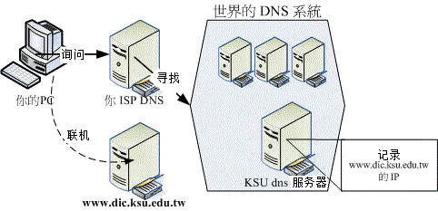
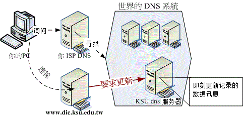
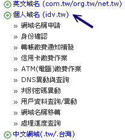
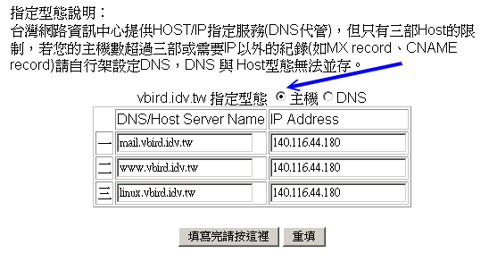
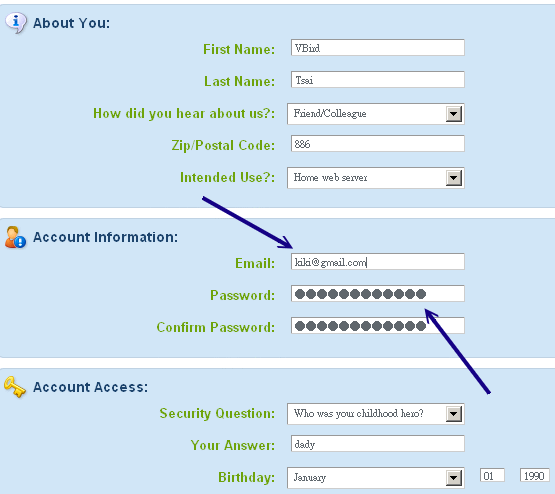
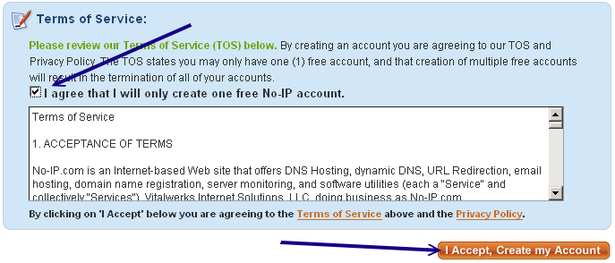
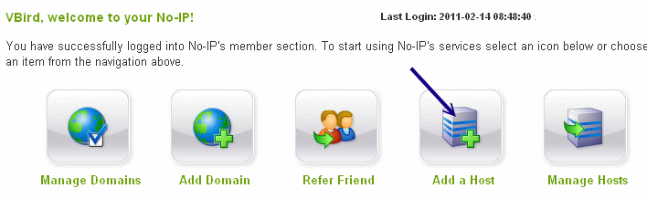
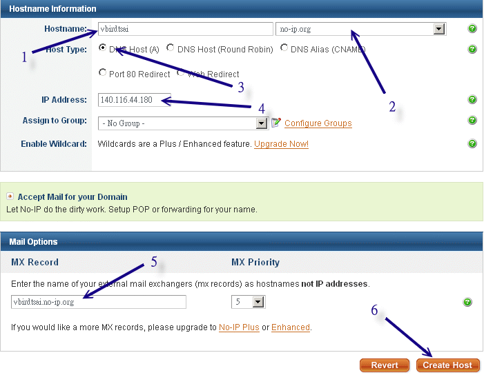
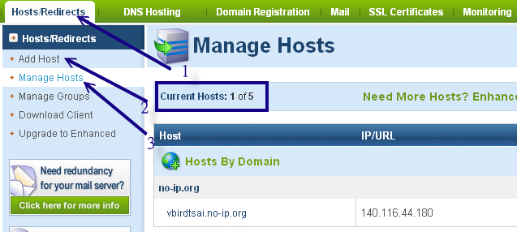

# 第十章、申请合法的主机名

最近更新日期：2011/07/23

在读完了网络基础并且架设了个人简易的防火墙之后，总算是准备要开始来给他进入 Server 的架设了！服务器架设的步骤里面，很重要的一点是『你的主机名必须要在 Internet 上面可以被查询』才好！这是因为人类对于 IP 记忆力不佳，所以才会以主机名来取代 IP。不过， 你的主机名要能够被查询到才有用啊！这个时候，一个『合法』的主机名就很重要了！那要合法的主机，就得要让 DNS 系统能够找的到你的主机啊！不过，如果我们的主机是使用拨接得到的不固定 IP 呢？又该如何申请 DNS 主机名？那就得要使用动态 DNS 的系统啰！在这个章节中，我们主要在介绍 Client 端的设定，而不是在设定 DNS 服务器喔！ ^_^

*   10.1 为何需要主机名
    *   10.1.1 主机名的由来
    *   10.1.2 重点在合法授权
    *   10.1.3 申请静态还是动态 DNS 主机名
*   10.2 注册一个合法的主机名
    *   10.2.1 静态 DNS 主机名注册：以 Hinet 为例
    *   10.2.2 动态 DNS 主机名注册：以 no-ip 为例
*   10.3 重点回顾
*   10.4 本章习题
*   10.5 参考数据与延伸阅读
*   10.6 [针对本文的建议：http://phorum.vbird.org/viewtopic.php?t=26634](http://phorum.vbird.org/viewtopic.php?t=26634)

* * *

# 10.1 为何需要主机名

## 10.1 为何需要主机名

如果你已经将[第二章的网络基础](http://linux.vbird.org/linux_server/0110network_basic.php)看完的话，应该会知道其实我们的 TCP/IP 环境只要有 IP 与正确的路由即可联机了。那么你申请主机名要干嘛？因为『没办法啊！人脑太不中用了！』举例来说，你可以背出来我们常上去查数据的 www.google.com 的 IP 吗？报告！鸟哥没办法背出来～

因为 IP 是那么难背的东西，而且，如果你的 IP 又是类似拨接的不固定的 IP 时，那还更伤脑筋呢！ 因此我们才会习惯以熟悉的英文字符串来做为主机名，然后让『这个主机名与 IP 达成对应』，那直接记忆主机名就行了，反正 IP 的查询就交给计算机主机来做即可！在这样的想法下，我们当然就需要有主机名啦！

**Tips:** 在这个章节当中，我们将会介绍如何申请一个合法的主机名。目前 Internet 上面使用的主机名都是透过所谓的 DNS 系统，而你想要取得一个 DNS 的主机名，就必须要『注册』，所谓的『注册』就是要钱去申请啦！ 当然也有免费提供主机名的服务啦！在这个章节当中鸟哥不会介绍如何架设一部 DNS 服务器， 而是介绍如何利用注册或免费申请的方式来达成主机名的取得。


* * *

### 10.1.1 主机名的由来

因为 IP 是这么难记忆的东西，因此人们就使用『名字』来对应到主机的 IP，这就是主机名的由来。 好在早期连上网络的计算机数量不多，所以在网络上的人们就想出一个简单的办法来进行主机名与 IP 的对应，那就是『在每部计算机的 /etc/hosts 里面设定好主机名与 IP 的对应表』。那么人们就可以直接藉由主机名来连接上某些网络上的主机啰！

然而因为科技的发达，连上 Internet 的人们越来越多，使用 /etc/hosts 的方法已经搞不定了 (只要一部新计算机上线，全部 Internet 上面的所有计算机都要重新改写 /etc/hosts 才行！) ，这个时候领域名系统 ( Domain Name System, DNS ) 就适时的出现了！

DNS 利用类似树状目录的型态，将主机名的管理分配在不同层级的 DNS 服务器当中，经由分层管理，所以每一部服务器记忆的信息就不会很多，而且异动上面也相当的容易修改！ 这个 DNS 的功能你知道了吗？对啦！就是『将计算机主机的名称转译成 IP 』就是了！当然啰，他的额外功能还很多，关于 DNS 的详细的解析部分我们将在后续的 [第十九章 DNS 服务器架设](http://linux.vbird.org/linux_server/0350dns.php)当中再持续的加强内容，总之， 它的最大功能就是『让有意义的，人类较容易记忆的主机名(英文字母) ，转译成为计算机所熟悉的 IP 地址！』

透过上面的简单说明，你得要知道，如果你想要一个主机名，那你就得要透过 DNS 系统，而不是单纯的修改你的 /etc/hosts 而已。 那你如何加入一个主机名到 DNS 系统当中呢？『授权』是重点！那什么是授权呢？

* * *

### 10.1.2 重点在合法授权

很多朋友都认为：『因为我想要架站，所以主机需要有个主机名，因此我就得要架设 DNS 服务器？』是这样吗？当然不是啰！DNS 是个很庞大的架构，而且是串连在全球的网络当中，除非你经由『注册』的手续来让 DNS 系统承认你主机名存在的合法性，否则你架设的 DNS 只能说是一个『地下练习的测试站』而已啦！并没有用途的。

那我要如何加入 DNS 系统呢？很简单啦！首先你必须要选择一个注册单位， 并且检查出你想要注册的主机名是否存在？主机名是有意义的，并不是你可以随便注册的喔！ 举例来说，在台湾常见的个人网站注册主机名为： *.idv.tw ，而公司行号则可能注册为* .com.tw 了！这个得要特别留意。至于台湾地区的注册单位很多，你可以选择例如 Hinet 或 Seednet 之类的 ISP 来注册。当然，你也可以选择免费的 no-ip.org 来注册的。

如果想要了解啥是『合法授权』的话，得要从 DNS 主机名的查询方式来谈起，由于 DNS 查询的方式都是由上层的 ISP 提供解析授权给下游的注册者，因此，下游的注册者只要设定妥当后， 全世界的主机就会知道你设定的数据了。详细的查询流程我们留到[DNS 服务器](http://linux.vbird.org/linux_server/0350dns.php)章节再来谈， 底下仅是介绍一个简单的查询示意图。

 图 10.1-1、 DNS 查询示意图

举昆山信息传播系的 WWW 服务器的主机名注册方式来说好了，我们系上得要先跟昆山计中 (相当于我们的 ISP) 注册取得 [www.dic.ksu.edu.tw](http://www.dic.ksu.edu.tw/) 这个主机名与 IP 的对应， 这个对应信息是写在昆山计中的 DNS 服务器上，与资传系的 WWW 服务器无关喔！那你怎么知道那部 www.dic.ksu.edu.tw 在哪里？你会先向你的 DNS 要求查询，该 DNS 会去向全世界的 DNS 系统查询，该系统会主动的查询到 KSU dns 服务器， 然后你的 PC 就会知道 www.dic.ksu.edu.tw 的 IP 在哪，最后你就开始联机啰。

从这个流程当中，你可以发现我们的 www 服务器与 KUS dns 服务器没有绝对关系，两者是独立的，我们只要作好 DNS 的『注册』工作 (向计中申请注册) 即可，并不需要去维护 DNS 的信息。所以啰， 这里你只要知道：(1)主机名的设计是有意义的，不可以随便设定、 (2)主机名要生效，得要透过注册来取得合法授权。这样就好了，如果想要架设 DNS 与更了解 DNS 系统的话， 等到后续的 DNS 服务器章节再来谈。

**Tips:** 在这个章节当中，理论方面的讲解比较少，因为很多数据都与 [DNS 服务器篇](http://linux.vbird.org/linux_server/0350dns.php) 有重复，在这个章节当中鸟哥主要在介绍动态 IP 架站的一个简单主机名申请方式啦！ ^_^


* * *

### 10.1.3 申请静态还是动态 DNS 主机名

由上面的说明当中，我们可以很清楚的知道 DNS 系统最大的功能就是在主机名对应 IP 的转译上面。当然啦，预设的 DNS 转译是用在『固定 IP 对应主机名』的方法上面的！就像上面的图 10.1-1 所示一般。在这个情况底下，你在 DNS 架构下申请完主机名后， 如果你的 IP 不会更动，那就永远不用去烦恼主机名的相关问题啰，这也是所谓的静态 DNS 主机名功能。

但是...夭寿喔！我们的很多小网站都是以非固定 IP 来上网的，更有甚者，某些 ADSL 拨接模式甚至会定时强制断线，也就是说， 在一段时间后，我们都得需要重新拨接上网，而每次拨接成功后取得的 IP 可不见得相同啊，如此一来 IP 不是一直在变吗？ 那么我不就需要一直跟我上层 DNS 主机的管理员申请『变更 IP 』吗？会不会太麻烦了点？

是很麻烦啊！所以现在为了解决这个问题，很多 ISP 提供了所谓的动态 DNS 服务的功能，他是这样做的：

1.  Client 端(就是你啦)每次开机或者是重新拨接，并取得一个新的 IP 之后，会主动向 DNS Server 端提出要求，希望 Server 端变更主机名与 IP 的对应 (这个步骤在每个主要的 ISP 都有提供适当的程序来提供给 client 使用)；

2.  Server 端接受 Client 端的要求之后，会先去查询 Client 提供的账号密码是否正确， 若正确就会立即修改 Server 本身对于你的主机名的设定值。

所以啰，每次我们取得了新的 IP 之后，我们的主机名对应的 IP 也会跟着在 DNS 系统上面更新， 如此一来，只要别人知道你的主机名，不论你的 IP 为何，他一定可以连上你的主机 (因为 IP 跟着你的主机而变！) 这对于我们这种使用动态 IP 的人是很有帮助的！ (阿！真是造福我们这些穷苦人家的孩子呀！) 整个程序就有点像底下的图示，WWW 服务器与 DNS 服务器之间就有关连性啦。

 图 10.1-2、动态 DNS 服务--客户端向服务器端发送更新要求

不过，还是需要注意的是，目前的主机名申请很多是『需要钱的』！如果你需要比较稳定的主机名对应 IP 的服务，那么花点钱来注册还是必须的。不过，如果是实验性质的网站，那么也是可以申请免费的动态 DNS 服务喔！

* * *

# 10.2 注册一个合法的主机名

## 10.2 注册一个合法的主机名

根据前面的说法，如果你只想要有合法的主机名的话，那么依据你的 IP 是否固定而有： (1)静态 DNS 主机名与 (2)动态 DNS 主机名两种注册方式。底下鸟哥列出自己有注册经验的网站提供大家参考：

*   静态 DNS 主机名注册： 静态 IP 对应主机名的注册网站实在太多了，底下是鸟哥有注册经验的网站：

    *   台湾网络信息中心：[`www.twnic.net`](http://www.twnic.net/)
    *   国外的领域名系统：[`www.netsol.com`](http://www.netsol.com/)
    *   国外的领域名系统：[`www.dotster.com`](http://www.dotster.com/)
    *   国外的领域名系统：[`www.godaddy.com`](http://www.godaddy.com/)
*   动态 DNS 主机名注册： 至于免费的动态 DNS 系统主要就是这个 NO-IP 公司提供的网站啰！如下连结：

    *   国外的免费 DNS 系统：[`www.no-ip.com`](http://www.no-ip.com/)

* * *

### 10.2.1 静态 DNS 主机名注册：以 Hinet 为例

静态 DNS 的申请方式其实都差不多，都是需要：

1.  先查询所想要注册的网域是否存在；
2.  进入 ISP 去申请注册你所想要的主机名；
3.  缴费，并等待主机名被启用。

我们以台湾蛮常见的 Hinet 这个 ISP 提供的『个人网域： .idv.tw』注册方式来说明：

*   1\. 登入主画面，并查询欲注册网域是否存在

    先连结到底下的网页去：[`domain.hinet.net/`](http://domain.hinet.net/) ，并在 whois 的画面当中(右上角)选择你想要注册的主机名，按下『Go』开始搜寻。

     图 10.2-1、利用 whois 查询欲注册网域是否存在

*   2\. 逐步进行注册

    如果确认你的主机名没有被注册掉，那么你就可以开始注册了！同样的在上面的网站连结当中， 选择『个人域名』就可以开始申请了！请由『域名申请』开始依序一步一步办理！这里不再说明了，反正都是中文， 看的懂得啦！ ^_^

     图 10.2-2、个人网域逐步注册的流程示意图

*   3\. 填写主机名对应的 IP

    通常花个几天等待缴费完毕后，我们就可以开始进行登入与主机名的填写了！在图 10.2-2 的图示中按下『DNS 异动与查询』的项目， 并填入当初注册时的主机名与密码，然后就会出现如下的画面了：

     图 10.2-3、主机名与 IP 对应的填写范例

    特别的给他留意，因为我们没有要架设 DNS 主机，所以当然最上方要选择『主机』的项目， 然后你可以填入三部主机名喔！当然，这三部主机名可以通通指向同一个 IP ，也可以不同！ 随你的便吶！需要注意到的是，你的主机名应该是『othername.yourhost.idv.tw』后面的 yourhost.idv.tw 是不变的，前面的 othername 则可以自由选取呢！例如鸟哥上面的设定，后面均是 vbird.idv.tw ，而前面的名称就可以让我自由选择啦！

*   4\. 等待 DNS 启用

    在上图 10.2-3 当中按下『填写完请按这里』后，就等着启用吧！不过设定成功到可以使用，其实需要一定的时间的。 以鸟哥为例，第一次申请之后，大约过了 20 小时该设定才正确的启动呢！请耐心等候啊！不要太着急啰！ ^_^

* * *

在台湾，各家的领域名注册流程都差不多，不过，金额是有点差异的，当然，服务也就有不同啊！鸟哥的 vbird.org 领域名则是在 [`www.godaddy.com`](http://www.godaddy.com/) 注册的喔！如果你不想要使用 .idv.tw 来注册的话，那么国外的 ISP 提供的 DNS 也可以考虑看看说！

* * *

### 10.2.2 动态 DNS 主机名注册：以 no-ip 为例

如果你跟鸟哥一样使用 ADSL 拨接的方式来上网，这表示你的 IP 应该是不固定的！果真如此的话， 那想要用这样的网络环境来架站就比较麻烦一点！因为上面利用 Hinet 注册的方式通常是给固定 IP 使用的， 你应该不会想要天天上去更新你的 IP 吧？此时这个 no-ip.com 所提供的免费动态 IP 对应主机名的服务就很重要啦！我们先来申请一个主机名来玩玩吧！ ^_^

*   1\. 登入主网页，并且注册一个新账号

    你必须要连上 [`www.no-ip.com`](http://www.no-ip.com/) 这个网站， 然后在出现的画面当中的右上角部分，选择『 Create Account 』那个项目。不过，如果你已经有 no-ip 网站的注册账号，那么直接跳到底下第四步骤去登入即可。

     图 10.2-4、no-ip 网站的注册：新建账号点选

*   2\. 开始填写识别数据

    由于启动账号必须由 no-ip 提供一个注册启动的连结，因此你必须要填写正确的 email 来接受启动码。整个注册的讯息如下图所示：

     图 10.2-5、no-ip 网站的注册：新账号建立所需填写数据

    最重要的是，在该网页的最下方还有验证码以及你必须要勾选的『I agree that...』项目才行喔！ 最后才点选『I Accept, Create my Account』项目噜。详细图示如下所示：

     图 10.2-6、no-ip 网站的注册：新账号建立务必勾选项目

*   3\. 启用账号

    在你申请注册一个新账号后， no-ip 会发一封信给你，请自行参考信件内容，并点选正确的启动码连结， 那你的账号就能够启动，此时请回到图 10.2-4 去，针对你的 email(username)/密码(password) 填写妥当，就能够登入 NO IP 网站了。

*   4\. 登入 no-ip 且设定主机名与 IP 的对应

    透过图 10.2-4 的样子来登入后，你会看到有点像底下的图示，底下就准备来处理你主机名与 IP 的对应数据了：

     图 10.2-7、登入 NO IP 网站后的示意图

    上图的重点在于『Add a Host (新增一个主机名)』及『Manage Hosts (管理主机名)』两者，由于我们都还没有主机名的设定， 因此首先就使用 Add a Host 来新增一笔主机名吧！按下那个图示，之后就会出现底下的画面：

     图 10.2-8、新增一个主机名与 IP 对应的方式

    主要填写的内容为：

    1.  你想要的主机名；
    2.  No IP 网站提供的领域名，与上个名称组合成完整的主机名；
    3.  选择单一主机的 IP 对应；
    4.  填写该主机名对应的正确 IP 为何 (后续可以透过程序直接修改，这里随便填也没关系)
    5.  只与 mail server 有关，所以写不写都无所谓，不过，建议填写自己的主机名即可
    6.  若上述数据都正确，按下 Create Host 即可建立成功。如果该主机名有被使用掉的话，屏幕会出现警告讯息， 此时请再选填另外的主机名吧！ 如果一切都没有问题的话，应该就会出现如下所示的图示。未来如果你想要更新或者是删除或者是新增主机名的话， 就透过下图的示意流程来处理即可。且由下图你也可以知道， NO IP 有提供 5 个免费的主机名给你使用喔！真是太棒了！ 如果你想要维护相关数据，就使用『 Manage Hosts 』按钮即可处理了。

     图 10.2-9、主机名处理完毕与维护的示意画面

*   5\. 设定自动更新主机名与 IP 的对应

    如果系统重新启动，或者是重新拨接取得一个新的 IP 后，我们都要登入 no-ip 网站来修改的话， 那就太没有效率了！所以 no-ip 提供一个好用的客户端程序给系统管理员使用，你可以在 no-ip 官网右上方的『Download』 处选择相关的档案。该网站目前提供给 Linux, Windows 与 MAC 等系统使用的程序，非常方便。 我们当然是选择 Linux 那个项目啊！请自行下载并且将该程序移动到 Linux 系统上吧！ 整个安装与启用的流程式这样的：

    ```
    # 1\. 编译与安装：
    [root@www ~]# wget  \
    &gt; http://www.no-ip.com/client/linux/noip-duc-linux.tar.gz
    [root@www ~]# cd /usr/local/src
    [root@www src]# tar -zxvf /root/noip-duc-linux.tar.gz

    [root@www src]# cd noip-*
    # 注意一下，这个目录里面有个文件名为 README.FIRST 的档案，务必察看一下内容！
    [root@www noip]# make
    [root@www noip]# make install
    # 这样会将主程序安装在 /usr/local/bin/noip2 而主参数档放在
    # /usr/local/etc/no-ip2.conf 当中！然后你必须要开始回答一些问题：

    Please select the Internet interface from this list.

    By typing the number associated with it.
    0       eth0
    1       eth1
    0      &lt;==因为鸟哥的主机对外使用 eth0 接口

    Please enter the login/email string for no-ip.com  kiki@gmail.com
    Please enter the password for user 'kiki@gmail.com' ***
    # 上面这两个是你刚刚注册时所填写的 email 与密码喔！

    Only one host [vbirdtsai.no-ip.org] is registered to this account.
    It will be used.
    Please enter an update interval:[30]
    Do you wish to run something at successful update?[N] (y/N) n

    mv /tmp/no-ip2.conf /usr/local/etc/no-ip2.conf
    # 重点在此！刚刚你做的配置文件被放到上面这个档案中了！ 
    ```

    这样就将你的 no-ip 制作完毕，而且也可以开始来执行啰！执行的方法也是很简单啦！

    ```
    # 2\. noip2 的程序使用：
    [root@www ~]# /usr/local/bin/noip2
    # 不要怀疑！这样输入后，你在 no-ip 上面注册的主机名，
    # 就开始可以自动的产生对应了！就这么简单！

    [root@www ~]# noip2 [-CS]
    选项与参数：
    -C ：重新设定参数，亦即设定刚刚我们上面输入粗体字的咚咚！
         如果你有两个以上的 no-ip 主机名时，就一定需要使用 noip2 -C 
         来重新设定参数档案！
    -S ：将目前的 noip2 的状况显示出来！

    [root@www ~]# noip2 -S
    1 noip2 process active.

    Process 2496, started as /usr/local/src/noip-2.1.9-1/noip2, (version 2.1.9)
    Using configuration from /usr/local/etc/no-ip2.conf
    Last IP Address set 140.116.44.180
    Account kiki@gmail.com
    configured for:
            host  vbirdtsai.no-ip.org
    Updating every 30 minutes via /dev/eth0 with NAT enabled. 
    ```

    嘿嘿！这样就成功了！而且每 30 分钟 noip2 可以自动的去主网站上面进行更新呢！真是很不错！那如果想要一开机就启动 noip2 呢？这样做即可：

    ```
    # 3\. 设定开机启动：
    [root@www ~]# vim /etc/rc.d/rc.local
    # 加入底下这一行：
    /usr/local/bin/noip2 
    ```

* * *

# 10.3 重点回顾

## 10.3 重点回顾

*   主机名的目的在辅助人们记忆 TCP/IP 的 IP 数值；
*   主机名与 IP 的对应，由早期的 /etc/hosts 变更为 DNS 系统来记录
*   合法的主机名必须要透过合法授权后，才能够在 Internet 上面完整的生效
*   除了静态的主机名与 IP 对应外，若是不固定 IP 的联机模式，可以透过动态 DNS 服务，来达成非固定 IP 永远指向同一个主机名的任务。

* * *

# 10.4 本章习题

## 10.4 本章习题

*   请简易说明 /etc/hosts 的用途；这个档案是早期用在进行主机名与 IP 的解析的，目前比较常用在内部私有网域的名称解析上，可以加快内部网域的反查喔！
*   请说明『合法授权』的主机名需要做什么？如果想要合法授权，就需要向上层 DNS 主机『注册』才行！而且还要上层 DNS 主机管理员愿意将领域名的解析权限授权给你啊！
*   什么是动态 DNS 系统？(仅说明 client 端)因为我们的 Client 拨接时，得到的 IP 都不是固定的，所以无法以 DNS 系统进行固定 IP 对应主机名的工作！ 此时就需要动态 DNS 系统了！以 DNS 主机提供的动态更新主机名对应 IP 的机制，可以让我们的不同 IP 对应到同一个主机名吶！
*   如果你使用 adsl 拨接来上网设定服务器，那么该申请哪一类型的主机名？为什么？因为我是以 ADSL 上网拨接，所以 IP 是不固定的，此时需要申请动态 DNS 主机的主机名，例如 no-ip.org 等等！

* * *

# 10.5 参考数据与延伸阅读

## 10.5 参考数据与延伸阅读

*   台湾网络信息中心：[`www.twnic.net/`](http://www.twnic.net/)
*   国外的领域名系统：[`www.netsol.com/`](http://www.netsol.com/)
*   国外的领域名系统：[`www.dotster.com/`](http://www.dotster.com/home/)
*   国外的免费 DNS 系统：[`www.no-ip.com`](http://www.no-ip.com/)

* * *

2002/08/05：第一次完成日期！ 2003/08/26：修改篇名、增加一 no-ip 的设定方式！ 2006/09/15：将旧的文章移动到 [此处](http://linux.vbird.org/linux_server/0270dynamic_dns//0270dynamic_dns.php)。 2011/02/09：将基于 CentOS 4.x 所写的文章移动到 [此处](http://linux.vbird.org/linux_server/0270dynamic_dns//0270dynamic_dns-centos4.php) 2011/02/15：由于 noip 网站页面有变更，作了一些图片的重新处理，其他则是大同小异。 2011/07/23：将基于 CentOS 5.x 的版本移动到[此处](http://linux.vbird.org/linux_server/0270dynamic_dns//0270dynamic_dns-centos5.php)

* * *