# 第十一章、远程联机服务器 SSH / XDMCP / VNC / RDP

最近更新日期：2011/11/24

维护网络服务器最简单的方式不是跑去实体服务器前面登入，而是透过远程联机服务器联机功能来登入主机， 然后再来进行其他有的没的维护就是了。Linux 主机几乎都会提供 sshd 这个联机服务，而且这个服务还是主动进行数据加密的！ 讯息在网络上面跑安全多了。同时我们还能透过 rsync 这个指令以 sshd 信道来达成异地数据备援的功能哩！相当不赖。 如果想要利用图形接口登入，那么默认的 Xdmcp 配合 VNC 就能够使用图形接口在网络的另一端登入你的服务器！ 如果你习惯使用 Windows 的远程桌面，那么 XRDP 也不要放过啰！

*   11.1 远程联机服务器
    *   11.1.1 什么是远程联机服务器
    *   11.1.2 有哪些可供登入的类型？
*   11.2 文字接口联机服务器：SSH 服务器
    *   11.2.1 联机加密技术简介： 产生新的公钥
    *   11.2.2 启动 ssh 服务
    *   11.2.3 ssh 客户端联机程序 - Linux 用户： ssh, ~/.ssh/known_hosts, sftp, scp
    *   11.2.4 ssh 客户端联机程序 - Windows 用户： pietty, psftp, filezilla
    *   11.2.5 sshd 服务器细部设定
    *   11.2.6 制作不用密码可立即登入的 ssh 用户： ssh-keygen
    *   11.2.7 简易安全设定
*   11.3 最原始图形接口： Xdmcp 服务的启用
    *   11.3.1 X Window 的 Server/Client 架构与各组件
    *   11.3.2 设定 gdm 的 XDMCP 服务
    *   11.3.3 用户系统为 Linux 的登入方式： Xnest
    *   11.3.4 用户系统为 Windows 的登入方式： Xming
*   11.4 华丽的图形接口： VNC 服务器
    *   11.4.1 预设的 VNC 服务器：使用 twm window manager： vncserver, vncpasswd
    *   11.4.2 VNC 的客户端联机软件： vncviewer, realvnc
    *   11.4.3 VNC 搭配本机的 Xdmcp 画面
    *   11.4.4 开机就启动 VNC server 的方法
    *   11.4.5 同步的 VNC ：可以透过图示同步教学
*   11.5 仿真的远程桌面系统： XRDP 服务器
*   11.6 SSH 服务器的进阶应用
    *   11.6.1 启动 ssh 在非正规埠口 (非 port 22)
    *   11.6.2 以 rsync 进行同步镜相备份
    *   11.6.3 透过 ssh 通道加密原本无加密的服务
    *   11.6.4 以 ssh 信道配合 X server 传递图形接口
*   11.7 重点回顾
*   11.8 课后练习
*   11.9 参考数据与延伸阅读 11.10[针对本文的建议：http://phorum.vbird.org/viewtopic.php?p=114550](http://phorum.vbird.org/viewtopic.php?p=114550)

* * *

# 11.1 远程联机服务器

## 11.1 远程联机服务器

远程联机服务器对我们来说，可是一项很有用的工具啊！他可以让我们更方便的管理主机。 不过，方便归方便，但开放全世界都可以尝试登入你的主机并不个好主意，因为可能会有安全性的问题吶！ 所以本章才要特别强调一下这个玩意儿啊！

* * *

### 11.1.1 什么是远程联机服务器

首先，我们来了解一下，什么是『远程联机服务器』？ 这个东西的功能为何？我想，你应该已经听过，一部开放到因特网上的服务器，基本上，它可以不需要屏幕、键盘、 鼠标等等的周边配备，只要有基本的主板、CPU、RAM、硬盘再加上一块好一点的网络卡，并且连上因特网， 那这部主机就能够提供你有需要的网络服务了。但如果你需要重新设定这部主机，该如何登入主机取得类似 bash 的接口来操纵与进行修改呢？那就得要透过联机服务器的服务了。

是的！你猜对啦，远程联机服务器在提供你由远程透过文字或图形接口的方式来登入系统， 让你在远程的工作机前面登入 Linux 主机以取得可操控主机之接口 (shell)，而登入后的操作感觉上就像坐在系统前面一样！ 所以啦，你当然不需要远程网络服务器的键盘、鼠标、屏幕等等。你只要工作机可以正常联机到远程主机即可啊。

以鸟哥个人为例，目前鸟哥管理十几部的 Unix-Like 主机，这些主机都不放在同一个地方，分布在南台湾各处！ 那么当有新的软件的漏洞被发布，或者是需要进行一些额外的设定的时候，是否鸟哥本人一定要到现场吗？当然不需要， 只要透过网络联机到该主机上面，就可以进行任何工作了！真的就好像在主机前面工作一般的轻松愉快！ ^_^！这就是远程联机服务器啦！

**Tips:** 很多人会说，我用 FTP 也要输入账号密码来登入啊？那与这个章节谈到的登入有何不同？最大的不同在于取得的 shell 能进行的工作啦！用 ssh/telnet/VNC 等方式取得的文字或图形 shell 能够进行很多系统管理的任务，与单纯的 FTP 能进行的工作当然不同！


*   联机服务器的功能作用之一：分享 Unix Like 主机的运算能力

当你的工作需要使用到 Linux 强大的程序语言编译功能时，那么你一定需要 Linux 对吧！而且最好是指令周期快一点的主机， 这个时候你可以将你研究室最快的那一部主机开放出来，设定一下远程联机服务器，让你的学生啦，或者是研究室的同仁啦， 可以透过这部机器帮他们进行研究的工作，这个时候，你的主机就可以让多人进行分享 Linux 运算的功能啦！

举例来说，鸟哥与昆山还有长荣大学的老师、同学们组建了一组服务器等级的丛集架构计算机 (PC cluster)， 目前我们在该计算机上面跑 MM5 、Models3 等大气与空气质量模式，要在这样的架构底下跑数值模式的原因， 主要就是考虑运算能力。那会使用到该组计算机的有好多人，难道大家都在挤在一部屏幕前面工作？当然不需要啦！ 这时候就是远程联机服务器的服务范围啰！

但是否每一部连到 Internet 上面的主机都应该要开放远程联机的功能呢？其实并不尽然， 还是需要针对你的主机来进行规划的，我们底下分服务器与工作站来说明：

*   服务器类型 (Server) ：有限度的开放联机

在一般对因特网开放服务的服务器中，由于开放的服务可能会有较为重要的信息，而远程联机程序连进主机之后， 可以进行的工作又太多了(几乎就像在主机前面工作一般！)，因此服务器的远程联机程序通常仅针对少部分系统维护者开放而已！ 除非必要，否则 Server 类型的主机还真的不建议开放联机的服务呢！

以鸟哥为例，我的主机提供了我们研究室使用 Mail 与 Internet 上面的 WWW 服务，如果还主动提供远程联机的话， 那么万一不小心被入侵，那可就伤脑筋了！因此，鸟哥仅开放『很小部分的网域』让系统管理员连进来， 其他来源的 IP 一律抵挡！不许使用远程联机的功能呢！

*   工作站类型 (Workstation) ：只对内网开放

所谓的工作站就是不提供因特网服务的主机，仅提供大量的运算能力给使用者。 既然不提供因特网的服务，那你还开联机服务器干嘛？不是啦！像前面鸟哥提到的 PC cluster 大量运算的整组计算机， 也可以称之为工作站，因为它没有提供常见的网络服务嘛！不过必须要提供给使用者登入的权限，这样大家才用的到运算功能啊！ 此时你就得要针对内部，或者是特定的某些来源开放他们使用你的工作站啰！

* * *

### 11.1.2 有哪些可供登入的类型？

那么目前远程联机服务器的主要类型有哪些？如果以登入的联机界面来分类，基本上有文字接口与图形接口两种：

*   文字接口明码： telnet, rsh 等为主，目前非常少用；
*   文字接口密码： ssh 为主，已经取代上述的 telnet, rsh 等明码方式；
*   图形接口： Xdmcp, VNC, RDP 等较为常见

在文字接口登入的联机服务器，主要有以『明码』传送数据的 telnet 服务器，及以加密技术进行数据加密再传送的 SSH 服务器！虽然 telnet 可以支持的客户端软件比较多，不过由于它是使用明码来传送数据，你的数据很容易遭到有心人士的撷取！ 所以近来我们都呼吁大家多使用 SSH 这一种联机方式

至于图形接口的联机服务器，比较简单的有 Xdmcp (X Display Manager Control Protocol)，架设 Xdmcp 很简单， 不过客户端的软件比较少。另外一款目前很常见的图形联机服务器，就是 VNC (Virtual Network Computing)， 透过 VNC server/client 软件来进行连接。如果你想要使用类似 Windows 的远程桌面联机，该功能使用的是 RDP (Remote Desktop Protocol)，那你可得要架设 RDP 服务器才行。

**Tips:** 图形接口最大的优点是『图形』啊！不过，因为是透过图形来传送，传输的数据量相当的大， 所以速度与安全性都有待考虑。因此，我们仅建议你将图形接口的远程登录服务器开放在内部网域 (LAN) 就好了！


*   数据传送的明码与密码

什么是『明码』与『加密』的数据封包传送模式呢？为什么 telnet 使用明码就比较不安全？所谓的明码就是： 『当我们的数据封包在网络上传输时，该数据封包的内容为数据的原始格式』， 也就是说，你使用 telnet 登入远程主机时，不是得要输入账号密码吗？那你的账号密码是以原本的数据格式传输， 所以如果被类似 [tcpdump](http://linux.vbird.org/linux_server/0140networkcommand.php#tcpdump) 之类的监听软件撷取数据， 那你的帐密就有可能被窃取啦！

所以啦，万一你的数据封包里面含有信用卡数据、密码、身份确认等重要信息时，是否很危险吶？ 因此，目前我们通常都希望使用可以将这些在网络上面跑的数据加密的技术，以增加数据在 Internet 上面传送的安全性啊！

**Tips:** 说 ssh 比较安全，其实是透过 ssh 信道传输讯息时，该讯息在网络上面比较安全，因为数据是加密过的，即使被窃取， 对方可能也不会知道数据内容为何，因此信息比较安全。但这不代表 ssh 这个通讯协议就比较安全喔！两者意义不同！


* * *

由于明码传输的 telnet, rsh 等联机服务器已经被 ssh 取代，并且在一些实际应用上已经很少看到 telnet 与 rsh 了， 因此本章在文字接口上着重于介绍 ssh 的应用，包括以 rsync 藉由 ssh 通道来进行异地备援的任务等等。至于图形接口则会介绍 Xdmcp, VNC 与 RDP 喔！因为很多工作站用户需要显示他们在工作站实作后的图形呈现，因此这部分也是很重要的呢！

* * *

# 11.2 文字接口联机服务器： SSH 服务器

## 11.2 文字接口联机服务器： SSH 服务器

由于先前的远程联机服务器大多是明码，而且协议也有些资安问题，因此后来就有 SSH 这个协议来取代上述这些咚咚。 那么 SSH 是什么呢？它有什么特异功能？简单的来说，SSH 是 **S**ecure **SH**ell protocol 的简写 (安全的壳程序协议)，它可以透过数据封包加密技术，将等待传输的封包加密后再传输到网络上， 因此，数据讯息当然就比较安全啰！这个 SSH 可以用来取代较不安全的 finger, R Shell (rcp, rlogin, rsh 等), talk 及 telnet 等联机模式。底下我们将先简介一下 SSH 的联机模式，来说明为什么 SSH 的数据讯息会比较安全呢！

特别注意：这个 SSH 协议，在预设的状态中，本身就提供两个服务器功能：

1.  一个就是类似 telnet 的远程联机使用 shell 的服务器，亦即是俗称的 ssh ；
2.  另一个就是类似 FTP 服务的 sftp-server ！提供更安全的 FTP 服务。

* * *

### 11.2.1 联机加密技术简介

什么是『数据加密』呢？简单的说，就是将人们看的懂得原始电子数据，经过一些运算，让这些数据变成没有意义的乱码 (至少对人类来说)，然后再让这个咚咚在网络上面传输，而当用户想要查阅这个数据时，再透过解密运算， 将这些咚咚反推出原始的电子数据。由于这些数据已经被重新处理过，所以，即使数据在因特网上被 cracker 监听而窃取，他们也不容易就推算得出来原始资料内容的。

**Tips:** 鸟哥常常说，加密机制有点像是两个人之间的火星语对话啦！如果你跟你的朋友约定好使用你们制订的某种特别语言， 这个语言只对你们两个有意义。那么当你们两人讲话时，在旁边的人听到的只是一堆没有意义的声音，因为他们听不懂啊！ 即使路人将你的声音录下来，只要他不知道你们的特殊用语，那他就不可能了解你们对话的内容啰。


加解密运算的机制与技术非常多，我们这里不去讨论复杂的理论问题，只谈对我们比较有关的一些加解密概念而已。 目前常见的网络封包加密技术通常是藉由所谓的『非对称密钥系统』来处理的。 主要是透过两把不一样的公钥与私钥 (Public and Private Key) 来进行加密与解密的过程。由于这两把钥匙是提供加解密的功用， 所以在同一个方向的联机中，这两把钥匙当然是需要成对的！它的功用分别如下：

*   公钥 (public key)：提供给远程主机进行数据加密的行为，也就是说，**大家都能取得你的公钥来将数据加密**的意思；
*   私钥 (private key)：远程主机使用你的公钥加密的数据，在本地端就能够使用私钥来进行解密。由于私钥是这么的重要， **因此私钥是不能够外流的！只能保护在自己的主机上。**

由于每部主机都应该有自己的密钥 (公钥与私钥)，且公钥用来加密而私钥用来解密， 其中私钥不可外流。但因为网络联机是双向的，所以，每个人应该都要有对方的『公钥』才对！那如果以 ssh 这个通讯协议来说，在客户端与服务器端的相对联机方向上，应该有如下的加密动作：

 图 11.2-1、公钥与私钥在进行数据传输时的角色示意图

如上图所示，我们如果站在客户端的角度来看，那么，首先你必须要取得服务器端的公钥，然后将自己的公钥发送给服务器端， 最终在客户端上面的密钥会是『服务器的公钥加上客户端我自己的私钥』来组成的。

**Tips:** 数据加密的技术真的相当的多，也各有其优缺点，有的指令周期快，但是不够安全；有的够安全，但是加密/解密的速度较慢～ 目前在 SSH 使用上，主要是利用 RSA/DSA/Diffie-Hellman 等机制喔！


目前 SSH 的协议版本有两种，分别是 version 1 与 version 2 ，其中 V2 由于加上了联机检测的机制， 可以避免联机期间被插入恶意的攻击码，因此比 V1 还要更加的安全。所以啰，请尽量使用 V2 版本即可，不要使用 V1 啰。 无论是哪种版本，都还是需要公私钥加密系统的，那么这些公钥与私钥是如何产生的呢？底下我们就来谈一谈啦！

*   SSH 的联机行为简介

我们可以将 ssh 服务器端与客户端的联机步骤示意为下图，至于步骤说明如后：

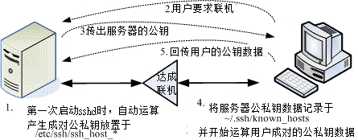 图 11.2-2、ssh 服务器端与客户端的联机步骤示意图

1.  服务器建立公钥档： 每一次启动 sshd 服务时，该服务会主动去找 /etc/ssh/ssh_host* 的档案，若系统刚刚安装完成时，由于没有这些公钥档案，因此 sshd 会主动去计算出这些需要的公钥档案，同时也会计算出服务器自己需要的私钥档；

2.  客户端主动联机要求： 若客户端想要联机到 ssh 服务器，则需要使用适当的客户端程序来联机，包括 ssh, pietty 等客户端程序；

3.  服务器传送公钥档给客户端： 接收到客户端的要求后，服务器便将第一个步骤取得的公钥档案传送给客户端使用 (此时应是明码传送，反正公钥本来就是给大家使用的！)；

4.  客户端记录/比对服务器的公钥数据及随机计算自己的公私钥： 若客户端第一次连接到此服务器，则会将服务器的公钥数据记录到客户端的用户家目录内的 ~/.ssh/known_hosts 。若是已经记录过该服务器的公钥数据，则客户端会去比对此次接收到的与之前的记录是否有差异。若接受此公钥数据， 则开始计算客户端自己的公私钥数据；

5.  回传客户端的公钥数据到服务器端： 用户将自己的公钥传送给服务器。此时服务器：『具有服务器的私钥与客户端的公钥』，而客户端则是： 『具有服务器的公钥以及客户端自己的私钥』，你会看到，在此次联机的服务器与客户端的密钥系统 (公钥+私钥) 并不一样，所以才称为非对称式密钥系统喔。

6.  开始双向加解密： (1)服务器到客户端：服务器传送数据时，拿用户的公钥加密后送出。客户端接收后，用自己的私钥解密； (2)客户端到服务器：客户端传送数据时，拿服务器的公钥加密后送出。服务器接收后，用服务器的私钥解密。

在上述的第 4 步骤中，客户端的密钥是随机运算产生于本次联机当中的，所以你这次的联机与下次的联机的密钥可能就会不一样啦！ 此外在客户端的用户家目录下的 ~/.ssh/known_hosts 会记录曾经联机过的主机的 public key ，用以确认我们是连接上正确的那部服务器。

例题：如何产生新的服务器端的 ssh 公钥与服务器自己使用的成对私钥？ (注：注意，本例题不要在已经正常运作的网络服务器上面，因为可能会造成其他客户端的困扰！)答：由于服务器提供的公钥与自己的私钥都放置于 /etc/ssh/ssh_host* ，因此你可以这样做：

```
[root@www ~]# rm /etc/ssh/ssh_host*  &lt;==删除密钥档
[root@www ~]# /etc/init.d/sshd restart
正在停止 sshd:                         [  确定  ]
正在产生 SSH1 RSA 主机密钥:            [  确定  ] &lt;==底下三个步骤重新产生密钥！
正在产生 SSH2 RSA 主机密钥:            [  确定  ]
正在产生 SSH2 DSA 主机密钥:            [  确定  ]
正在激活 sshd:                         [  确定  ]
[root@www ~]# date; ll /etc/ssh/ssh_host*
Mon Jul 25 11:36:12 CST 2011
-rw-------. 1 root root  668 Jul 25 11:35 /etc/ssh/ssh_host_dsa_key
-rw-r--r--. 1 root root  590 Jul 25 11:35 /etc/ssh/ssh_host_dsa_key.pub
-rw-------. 1 root root  963 Jul 25 11:35 /etc/ssh/ssh_host_key
-rw-r--r--. 1 root root  627 Jul 25 11:35 /etc/ssh/ssh_host_key.pub
-rw-------. 1 root root 1675 Jul 25 11:35 /etc/ssh/ssh_host_rsa_key
-rw-r--r--. 1 root root  382 Jul 25 11:35 /etc/ssh/ssh_host_rsa_key.pub
# 看一下上面输出的日期与档案的建立时间，刚刚建立的新公钥、私钥系统！ 
```

* * *

### 11.2.2 启动 SSH 服务

事实上，在我们使用的 Linux 系统当中，默认就已经含有 SSH 的所有需要的软件了！这包含了可以产生密码等协议的 [OpenSSL](http://www.openssl.org/) 软件与 [OpenSSH](http://www.openssh.com/) 软件 (注 1)，所以呢，要启动 SSH 真的是太简单了！就直接给他启动就是了！此外，在目前的 Linux Distributions 当中，都是预设启动 SSH 的，所以一点都不麻烦，因为不用去设定，他就已经启动了！ 哇！真是爽快～无论如何，我们还是得说一说这个启动的方式吧！直接启动就是以 SSH daemon ，简称为 sshd 来启动的，所以，手动可以这样启动：

```
[root@www ~]# /etc/init.d/sshd restart
[root@www ~]# netstat -tlnp &#124; grep ssh
Active Internet connections (only servers)
Proto Recv-Q Send-Q Local Address  Foreign Address  State   PID/Program name
tcp        0      0 :::22          :::*             LISTEN  1539/sshd 
```

需要注意的是，SSH 不但提供了 shell 给我们使用，亦即是 ssh protocol 的主要目的，同时亦提供了一个较为安全的 FTP server ，亦即是 ssh-ftp server 给我们当成是 FTP 来使用！所以，这个 sshd 可以同时提供 shell 与 ftp 喔！而且都是架构在 port 22 上面的呢！所以，底下我们就来提一提，那么怎么样由 Client 端连接上 Server 端呢？同时，如何以 FTP 的服务来连接上 Server 并且使用 FTP 的功能呢？

* * *

### 11.2.3 ssh 客户端联机程序 - Linux 用户

如果你的客户端是 Linux 的话，那么恭喜你了，预设的情况下，你的系统已经有底下的所有指令，可以不必安装额外的软件喔！ 底下就来介绍一下这些指令吧！

*   ssh ：直接登入远程主机的指令

SSH 在 client 端使用的是 ssh 这个指令，这个指令可以指定联机的版本 (version1, version2)， 还可以指定非正规的 ssh port (正规 ssh port 为 22)。不过，一般的用法可以使用底下的方式：

```
[root@www ~]# ssh [-f] [-o 参数项目] [-p 非正规埠口] [账号@]IP [指令]
选项与参数：
-f ：需要配合后面的 [指令] ，不登入远程主机直接发送一个指令过去而已；
-o 参数项目：主要的参数项目有：
    ConnectTimeout=秒数 ：联机等待的秒数，减少等待的时间
    StrictHostKeyChecking=[yes&#124;no&#124;ask]：预设是 ask，若要让 public key
           主动加入 known_hosts ，则可以设定为 no 即可。
-p ：如果你的 sshd 服务启动在非正规的埠口 (22)，需使用此项目；
[指令] ：不登入远程主机，直接发送指令过去。但与 -f 意义不太相同。

# 1\. 直接联机登入到对方主机的方法 (以登入本机为例)：
[root@www ~]# ssh 127.0.0.1
The authenticity of host '127.0.0.1 (127.0.0.1)' can't be established.
RSA key fingerprint is eb:12:07:84:b9:3b:3f:e4:ad:ba:f1:85:41:fc:18:3b.
Are you sure you want to continue connecting (yes/no)? yes
Warning: Permanently added '127.0.0.1' (RSA) to the list of known hosts.
root@127.0.0.1's password: &lt;==在这里输入 root 的密码即可！
Last login: Mon Jul 25 11:36:06 2011 from 192.168.1.101
[root@www ~]# exit  &lt;==离开这次的 ssh 联机
# 由于 ssh 后面没有加上账号，因此预设使用当前的账号来登入远程服务器 
```

一般使用 ssh 登入远程主机，都会填写『 ssh 账号@主机 IP 』的格式， 意思是说，使用该主机的某账号登入的意思。但是很多朋友都不喜欢写账号，亦即使用『 ssh 主机 IP 』的格式。 如同上面的范例情况。要注意喔，如果不写账号的话，那么会以本地端计算机的账号来尝试登入远程。 也就是说，如果近端与远程具有相同的账号，那么不写账号也没有关系，如上表中的范例。但是，为了以后习惯着想， 还是一开始就使用类似 email 的方式来登入远程主机，这样的行为习惯比较好啦！

上面出现的讯息中，开头 RSA 的那行后面接的就是远程服务器的公钥指纹码，如果确定该指纹码没有问题，那么你就得要输入 yes 来将该指纹码写入服务器公钥记录文件 (~/.ssh/known_hosts)，以方便未来比对该服务器的正确性之用。 注意是要写 yes 喔，单纯输入 Y 或 y 是不会被接受的～此外， 由于该主机的公钥已经被记录，因此未来重复使用 ssh 登入此主机时，就不会出现这个指纹码提示了。

```
# 2\. 使用 student 账号登入本机
[root@www ~]# ssh student@127.0.0.1
student@127.0.0.1's password:
[student@www ~]$ exit
# 由于加入账号，因此切换身份成为 student 了！另外，因为 127.0.0.1 曾登入过，
# 所以就不会再出现提示你要增加主机公钥的讯息啰！

# 3\. 登入对方主机执行过指令后立刻离开的方式：
[root@www ~]# ssh student@127.0.0.1 find / &&gt; ~/find1.log
student@localhost's password:
# 此时你会发现怎么画面卡住了？这是因为上头的指令会造成，你已经登入远程主机，
# 但是执行的指令尚未跑完，因此你会在等待当中。那如何指定系统自己跑？

# 4\. 与上题相同，但是让对方主机自己跑该指令，你立刻回到近端主机继续工作：
[root@www ~]# ssh -f student@127.0.0.1 find / &&gt; ~/find1.log
# 此时你会立刻注销 127.0.0.1 ，但 find 指令会自己在远程服务器跑喔！ 
```

上述的范例当中，第 4 个范例最有用！如果你想要让远程主机进行关机的指令，如果不加上 -f 的参数， 那你会等待对方主机关机完毕再将你踢出联机，这比较不合理。因此，加上 -f 就很重要～因为你会指定远程主机自己跑关机， 而不需要在空空等待。例如：『ssh -f root@some_IP shutdown -h now 』之类的指令啰。

```
# 5\. 删除掉 known_hosts 后，重新使用 root 联机到本机，且自动加上公钥记录
[root@www ~]# rm ~/.ssh/known_hosts
[root@www ~]# ssh -o StrictHostKeyChecking=no root@localhost
Warning: Permanently added 'localhost' (RSA) to the list of known hosts.
root@localhost's password:
# 如上所示，不会问你 yes 或 no 啦！直接会写入 ~/.ssh/known_hosts 当中！ 
```

鸟哥上课常常使用 ssh 联机到同学的计算机去看他有没有出错，有时候会写 script 来进行答案侦测。 此时如果每台计算机都在主动加上公钥文件记录，都得要输入『 yes 』，会累死！那么加上这个 StrictHostKeyChecking=no 就很有帮助啦！他会不询问自动加入主机的公钥到档案中，对于一般使用者帮助不大，对于程序脚本来说， 这玩意儿可就很不错用了！

*   服务器公钥记录文件： ~/.ssh/known_hosts

当你登入远程服务器时，本机会主动的用接收到的服务器的 public key 去比对 ~/.ssh/known_hosts 有无相关的公钥， 然后进行底下的动作：

*   若接收的公钥尚未记录，则询问用户是否记录。若要记录 (范例中回答 yes 的那个步骤) 则写入 ~/.ssh/known_hosts 且继续登入的后续工作；若不记录 (回答 no) 则不写入该档案，并且离开登入工作；

*   若接收到的公钥已有记录，则比对记录是否相同，若相同则继续登入动作；若不相同，则出现警告信息， 且离开登入的动作。这是客户端的自我保护功能，避免你的服务器是被别人伪装的。

虽然说服务器的 ssh 通常可能会改变，问题是，如果是测试用的主机，因此常常在重新安装，那么服务器的公钥肯定经常不同， 果真如此的话，你就无法继续登入了！那怎办？让我们来模拟一下这个行为吧！让你比较有印象啦！

例题：仿真伺服器重新安装后，假设服务器使用相同的 IP ，造成相同 IP 的服务器公钥不同，产生的问题与解决之道为何？答：利用前一小节讲过的方式，删除原有的系统公钥，重新启动 ssh 让你的公钥更新：

```
rm  /etc/ssh/ssh_host*
/etc/init.d/sshd restart 
```

然后重新使用底下的方式来进行联机的动作：

```
[root@www ~]# ssh root@localhost
@@@@@@@@@@@@@@@@@@@@@@@@@@@@@@@@@@@@@@@@@@@@@@@@@@@@@@@@@@@
@    WARNING: REMOTE HOST IDENTIFICATION HAS CHANGED!     @ &lt;==就告诉你可能有问题
@@@@@@@@@@@@@@@@@@@@@@@@@@@@@@@@@@@@@@@@@@@@@@@@@@@@@@@@@@@
IT IS POSSIBLE THAT SOMEONE IS DOING SOMETHING NASTY!
Someone could be eavesdropping on you right now (man-in-the-middle attack)!
It is also possible that the RSA host key has just been changed.
The fingerprint for the RSA key sent by the remote host is
a7:2e:58:51:9f:1b:02:64:56:ea:cb:9c:92:5e:79:f9.
Please contact your system administrator.
Add correct host key in /root/.ssh/known_hosts to get rid of this message.
Offending key in /root/.ssh/known_hosts:1 &lt;==冒号后面接的数字就是有问题数据行号
RSA host key for localhost has changed and you have requested strict checking.
Host key verification failed. 
```

上述的表格出现的错误讯息中，特殊字体的地方在告诉你：/root/.ssh/known*hosts 的第 1 行，里面的公钥与这次接收到的结果不同， 很可能被攻击了！那怎办？没关系啦！请你使用 vim 到 /root/.ssh/known_hosts ，并将第 1 行(冒号 : 后面接的数字就是了) 删除，之后再重新 ssh 过，那系统又会重新问你要不要加上公钥啰！就这么简单！ ^*^

*   模拟 FTP 的文件传输方式： sftp

ssh 是登入远程服务器进行工作，那如果你只是想要从远程服务器下载或上传档案呢？ 那就不是使用 ssh 啦，而必须要使用 sftp 或 scp。这两个指令也都是使用 ssh 的通道 (port 22)，只是模拟成 FTP 与复制的动作而已。我们先谈谈 sftp ，这个指令的用法与 ssh 很相似，只是 ssh 是用在登入而 sftp 在上传/下载文件而已。

```
[root@www ~]# sftp student@localhost
Connecting to localhost...
student@localhost's password: &lt;== 这里请输入密码啊！
sftp&gt; exit  &lt;== 这里就是在等待你输入 ftp 相关指令的地方了！ 
```

进入到 sftp 之后，那就跟在一般 FTP 模式下的操作方法没有两样了！底下我们就来谈一谈， sftp 这个接口下的使用指令吧！

| 针对远方服务器主机 (Server) 之行为 |
| --- |
| 变换目录到 /etc/test 或其他目录 | cd /etc/test cd PATH |
| 列出目前所在目录下的文件名 | ls dir |
| 建立目录 | mkdir directory |
| 删除目录 | rmdir directory |
| 显示目前所在的目录 | pwd |
| 更改档案或目录群组 | chgrp groupname PATH |
| 更改档案或目录拥有者 | chown username PATH |
| 更改档案或目录的权限 | chmod 644 PATH 其中，644 与权限有关！回去看基础篇！ |
| 建立连结档 | ln oldname newname |
| 删除档案或目录 | rm PATH |
| 更改档案或目录名称 | rename oldname newname |
| 离开远程主机 | exit (or) bye (or) quit |
| 针对本机 (Client) 之行为(都加上 l, L 的小写 ) |
| 变换目录到本机的 PATH 当中 | lcd PATH |
| 列出目前本机所在目录下的文件名 | lls |
| 在本机建立目录 | lmkdir |
| 显示目前所在的本机目录 | lpwd |
| 针对资料上传/下载的行为 |
| 将档案由本机上传到远程主机 | put [本机目录或档案] [远程] put [本机目录或档案] 如果是这种格式，则档案会放置到目前远程主机的目录下！ |
| 将档案由远程主机下载回来 | get [远程主机目录或档案] [本机] get [远程主机目录或档案] 若是这种格式，则档案会放置在目前本机所在的目录当中！可以使用通配符，例如： get * get *.rpm 亦是可以的格式！ |

就整体而言， sftp 在 Linux 底下，如果不考虑图形接口，那么他已经可以取代 FTP 了呢！因为所有的功能都已经涵盖啦！因此，在不考虑到图形接口的 FTP 软件时，可以直接关掉 FTP 的服务，而改以 sftp-server 来提供 FTP 的服务吧！ ^_^

例题：假设 localhost 为远程服务器，且服务器上有 student 这个使用者。你想要 (1)将本机的 /etc/hosts 上传到 student 家目录，并 (2)将 student 的 .bashrc 复制到本机的 /tmp 底下，该如何透过 sftp 达成？答：

```
[root@www ~]# sftp student@localhost
sftp&gt; lls /etc/hosts   &lt;==先看看本机有没有这个档案
/etc/hosts
sftp&gt; put /etc/hosts   &lt;==有的话，那就上传吧！
Uploading /etc/hosts to /home/student/hosts
/etc/hosts                        100%  243     0.2KB/s   00:00
sftp&gt; ls               &lt;==有没有上传成功？看远程目录下的文件名
hosts
sftp&gt; ls -a            &lt;==那有没有隐藏档呢？
.               ..              .bash_history   .bash_logout
.bash_profile   .bashrc         .mozilla        hosts
sftt&gt; lcd /tmp         &lt;==切换本机目录到 /tmp 
sftp&gt; lpwd             &lt;==只是进行确认而已！
Local working directory: /tmp
sftp&gt; get .bashrc      &lt;==没问题就下载吧！
Fetching /home/student/.bashrc to .bashrc
/home/student/.bashrc             100%  124     0.1KB/s   00:00
sftp&gt; lls -a           &lt;==看本地端档案档名
.        .font-unix   keyring-rNd7qX  .X11-unix
..       .gdm_socket  lost+found      scim-panel-socket:0-root
.bashrc  .ICE-unix    mapping-root    .X0-lock
sftp&gt; exit             &lt;==离开吧！ 
```

如果你不喜欢使用文字接口进行 FTP 的传输，那么还可以透过图形接口来连接到 sftp-server 哩！ 你可以利用二十一章 FTP 服务器提到的 [Filezilla](http://linux.vbird.org/linux_server/0410vsftpd.php#client) 来进行联机的啦！ 如此一来，与服务器之间的文件传输就方便多了吧！

*   档案异地直接复制： scp

通常使用 sftp 是因为可能不知道服务器上面有什么档名的档案存在，如果已经知道服务器上的档案档名了， 那么最简单的文件传输则是透过 scp 这个指令喔！最简单的 scp 用法如下：

```
[root@www ~]# scp [-pr] [-l 速率] file  [账号@]主机:目录名 &lt;==上传
[root@www ~]# scp [-pr] [-l 速率] [账号@]主机:file  目录名 &lt;==下载
选项与参数：
-p ：保留原本档案的权限数据；
-r ：复制来源为目录时，可以复制整个目录 (含子目录)
-l ：可以限制传输的速度，单位为 Kbits/s ，例如 [-l 800] 代表传输速限 100Kbytes/s

# 1\. 将本机的 /etc/hosts* 全部复制到 127.0.0.1 上面的 student 家目录内
[root@www ~]# scp /etc/hosts* student@127.0.0.1:~
student@127.0.0.1's password: &lt;==输入 student 密码
hosts                        100%  207         0.2KB/s   00:00
hosts.allow                  100%  161         0.2KB/s   00:00
hosts.deny                   100%  347         0.3KB/s   00:00
# 文件名显示                   进度  容量(bytes) 传输速度  剩余时间
# 你可以仔细看，出现的讯息有五个字段，意义如上所示。

# 2\. 将 127.0.0.1 这部远程主机的 /etc/bashrc 复制到本机的 /tmp 底下
[root@www ~]# scp student@127.0.0.1:/etc/bashrc /tmp 
```

其实上传或下载的重点是那个冒号 (:) 啰！连接在冒号后面的就是远程主机的档案。 因此，如果冒号在前，代表的就是从远程主机下载下来，如果冒号在后，则代表本机数据上传啦！ 而如果想要复制目录的话，那么可以加上 -r 的选项！

例题：假设本机有个档案档名为 /root/dd_10mb_file ，这个档案有 10 MB 这么大。假设你想要上传到 127.0.0.1 的 /tmp 底下去， 而且你在 127.0.0.1 上面有 root 这个账号的使用权。但由于带宽很宝贵，因此你只想要花费 100Kbyes/s 的传输量给此一动作， 那该如何下达指令？答：由于预设不存在这个档案，因此我们得先使用 dd 来建立一个大档案：

```
dd if=/dev/zero of=/root/dd_10mb_file bs=1M count=10 
```

建立妥当之后，由于是上传数据，观察 -l 的选项中，那个速率用的是 bit ，转成容量的 bytes 需要乘上 8 倍，因此指令就要这样下达：

```
scp -l 800 /root/dd_10mb_file root@127.0.0.1:/tmp 
```

* * *

### 11.2.4 ssh 客户端联机程序 - Windows 用户

与 Linux 不同的是，预设的 Windows 并没有 ssh 的客户端程序，因此所有的程序都得要下载其他第三方软件才行。 常见的软件主要有 pietty, psftp 及 filezilla 等。底下就让我们来谈谈这几个软件吧。

*   直接联机的 pietty

在 Linux 底下想要连接 SSH 服务器，可以直接利用 ssh 这个指令，在 Windows 操作系统底下就得要使用 pietty 或 putty 这两个玩意儿，这两者的下载点请参考 (注 2)：

*   putty 官方网站：[`www.chiark.greenend.org.uk/~sgtatham/putty/`](http://www.chiark.greenend.org.uk/%7Esgtatham/putty/)
*   pietty 官方网站：[`www.csie.ntu.edu.tw/~piaip/pietty/`](http://www.csie.ntu.edu.tw/%7Epiaip/pietty/)

在 putty 的官方网站上有很多的软件可以使用的，包括 putty/pscp/psftp 等等。他们分别对应了 ssh/scp/sftp 这三个指令就是了。而鸟哥爱用的 pietty 则是台湾的林弘德先生根据 putty 所改版而成的。由于 pietty 除了完整的兼容于 putty 之外，还提供了选单与较为完整的文字编码，实在很好用呢，所以底下鸟哥就以 pietty 来作为介绍啰。在你下载 pietty 完成后，双击该档案，就会出现如下的画面啰：

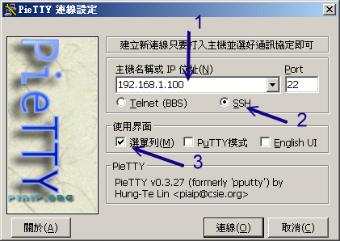 图 11.2-3、pietty 的启动屏幕示意图

在上图中箭头为 1 的地方请填写相关的主机名或者是 IP ，箭头 2 当然务必选择 SSH 那一项，至于箭头 3 的地方，鸟哥比较喜欢选单出现的样式，因为可以直接修改一些 pietty 的环境设定值，所以鸟哥是选择选单啦！ 若没有问题，按下『联机』后，就会出现如下等待登入与输入账/密数据的画面：

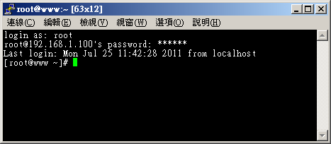 图 11.2-4、pietty 的登入与使用画面示意图

这个图标会让你以为是在主机前面工作吧！而且上头还有选单可以随时调整类似字形、字体、字符编码等等的重要环境参数。 尤其是字符编码的问题，有时候你会发现开启档案时，竟然画面当中会有乱码而不是正常的中文显示， 那就是编码的问题。要解决这个问题时，你必须要牢记下面的三个跟语系编码有关的数据要相同才行：

*   文本文件本身在存档时所挑选的语系；
*   Linux 程序 (如 bash 软件) 本身所使用的语系 (可用 LANG 变量调整)；
*   pietty 所使用的语系。

我们知道 Linux 本身的编码可以透过 LANG 这个变量来调整，那该如何调整 pietty 的中文编码呢？你可以透过图 11.2-4 选单列当中的『选项』来处理，如下所示：

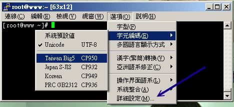 图 11.2-5、调整 pietty 的语系编码方式 (与中文较相关)

在『选项』的『字符编码』里面可以挑选 big5 (cp950) 或者是 unicode (utf8) 的中文编码，让它符合你的 Linux 与档案所储存的数据格式，那中文字就 OK 的啦！ ^_^！如果想要作更细部的设定时，可以选择图 11.2-5 上头最底下的那个『详细设定』项目， 就会出现如下图示。其中更为重要的是『键盘右侧的数字键想要生效』时， 可以按照下图的指示来启动数字键的功能：

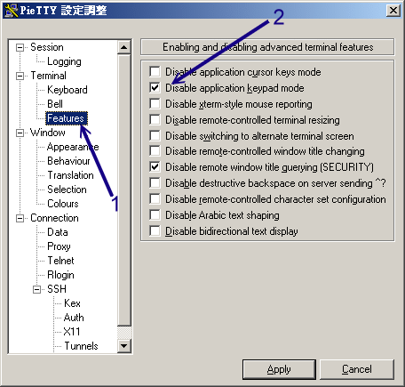 图 11.2-6、pietty 软件环境详细设定，与键盘右侧数字键相关者

将上图中箭头 2 所指的那个项目勾选起来且按下『Apply』之后，你键盘右侧的数字键才能够正常的使用呢，否则按右侧数字键会是乱码啦。 再来，你可以调整 pietty 滚动条的记忆行数，这样当数据太多时，你依旧可以调整滚动条来查阅之前的数据。设定的方法如下：

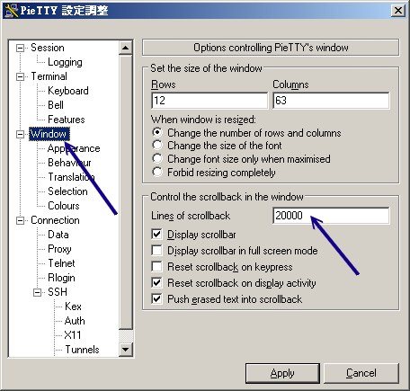 图 11.2-7、调整画面可以记忆的行数，可让用户回去看较多之前的画面

调整完这些常用的数据后，再来这是最重要的：『你要以哪一个版本的 SSH 算法登入？』前面说过，我们预设是以 version2 来登入的，所以这里我们可以调整为 2 那个项目！这样每次登入都会以 version 2 的模式登入主机了！

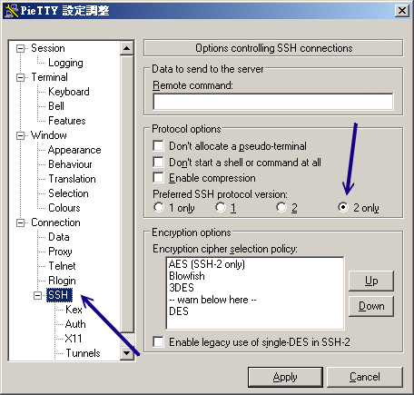 图 11.2-8、设定登入服务器时使用的 ssh 算法版本

整个 pietty 的使用与相关设定流程就是这样！如此一来，你就可以在 Windows 上面以 SSH 的协议，登入远程的 Linux 主机噜！粉方便吧！ ^_^ ！如果想要中文支持的话，目前 pietty 已经支持中文啦！你可以输入中文喔！不过需要修改一下字符集， 选择图 11.2-5 『选项』内的『字型』就会出现如下图示：

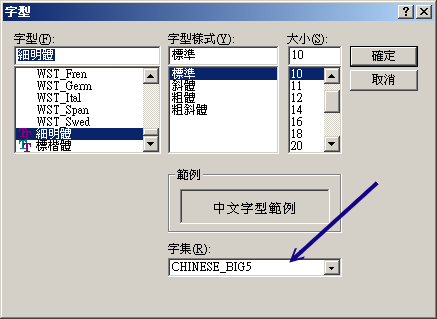 图 11.2-9、选择中文的字形与编码

将(1)字型设定为细明体、(2)字集设定为『Big5』，如此一来，你的 pietty 就支持中文的输入啰！

那么上面我们作的这些设定值都记录在哪里啊？呵呵！都记录在 Windows 的登录文件当中啊！你可以在 Windows 的系统当中，在『开始』-->『执行』后，出现的框框内输入『regedit』， 之后会出现一个大窗口。请在左边的画面当中选择『 HKEY*CURRENT_USER --> Software --> SimonTatham --> PuTTY --> Sessions』， 就可以看到你的设定值啰！ ^*^！ 这样，也就可以储存你的设定值啰～

*   使用 sftp-server 的功能： psftp

在 putty 的官方网站上也提供 psftp 这支程序。这一支程序的重点则在使用 sftp-server。使用的方式可以直接点选 psftp 这个档案，让他直接启动，则会出现下面的图样：

```
psftp: no hostname specified; use "open host.name" to connect
psftp&gt; 
```

这个时候可以填入你要连接上去的主机名，例如我的区域内网络 192.168.100.254 这部主机：

```
psftp: no hostname specified; use "open host.name" to connect
psftp&gt; open 192.168.100.254
login as: root
root@192.168.100.254's password:
Remote working directory is /root
psftp&gt; &lt;== 这里就在等待你输入 FTP 的指令了！ 
```

呵呵！这样就登入主机啦！很简单吧！然后其他的使用方式跟前面提到的 sftp 一样哩！加油的使用吧！

*   图形化接口的 sftp 客户端软件： Filezilla

SSH 所提供的 sftp 功能只能利用纯文本接口的 psftp 来联机吗？有没有图形接口的软件呢？呵呵！当然有！ 那就是非常有用的 Filezilla 啰！Filezilla 是图形接口的一个 FTP 客户端软件，使用上非常的方便， 至于详细的安装与使用流程请参考第二十一章 [vsftpd](http://linux.vbird.org/linux_server/0410vsftpd.php#client) 的说明喔！

* * *

### 11.2.5 sshd 服务器细部设定

基本上，所有的 sshd 服务器详细设定都放在 /etc/ssh/sshd_config 里面！不过，每个 Linux distribution 的预设设定都不太相同，所以我们有必要来了解一下整个设定值的意义为何才好！ 同时请注意，在预设的档案内，只要是预设有出现且被批注的设定值 (设定值前面加 #)，即为『默认值！』，你可以依据它来修改的哩。

```
[root@www ~]# vim /etc/ssh/sshd_config
# 1\. 关于 SSH Server 的整体设定，包含使用的 port 啦，以及使用的密码演算方式
# Port 22
# SSH 预设使用 22 这个 port，也可以使用多个 port，即重复使用 port 这个设定项目！
# 例如想要开放 sshd 在 22 与 443 ，则多加一行内容为：『 Port 443 』
# 然后重新启动 sshd 这样就好了！不过，不建议修改 port number 啦！

Protocol 2
# 选择的 SSH 协议版本，可以是 1 也可以是 2 ，CentOS 5.x 预设是仅支援 V2。
# 如果想要支持旧版 V1 ，就得要使用『 Protocol 2,1 』才行。

# ListenAddress 0.0.0.0
# 监听的主机适配器！举个例子来说，如果你有两个 IP，分别是 192.168.1.100 及 
# 192.168.100.254，假设你只想要让 192.168.1.100 可以监听 sshd ，那就这样写：
# 『 ListenAddress 192.168.1.100 』默认值是监听所有接口的 SSH 要求

# PidFile /var/run/sshd.pid
# 可以放置 SSHD 这个 PID 的档案！上述为默认值

# LoginGraceTime 2m
# 当使用者连上 SSH server 之后，会出现输入密码的画面，在该画面中，
# 在多久时间内没有成功连上 SSH server 就强迫断线！若无单位则默认时间为秒！

# Compression delayed
# 指定何时开始使用压缩数据模式进行传输。有 yes, no 与登入后才将数据压缩 (delayed)

# 2\. 说明主机的 Private Key 放置的档案，预设使用下面的档案即可！
# HostKey /etc/ssh/ssh_host_key        # SSH version 1 使用的私钥
# HostKey /etc/ssh/ssh_host_rsa_key    # SSH version 2 使用的 RSA 私钥
# HostKey /etc/ssh/ssh_host_dsa_key    # SSH version 2 使用的 DSA 私钥
# 还记得我们在主机的 SSH 联机流程里面谈到的，这里就是 Host Key ～

# 3\. 关于登录文件的讯息数据放置与 daemon 的名称！
SyslogFacility AUTHPRIV
# 当有人使用 SSH 登入系统的时候，SSH 会记录信息，这个信息要记录在什么 daemon name
# 底下？预设是以 AUTH 来设定的，即是 /var/log/secure 里面！什么？忘记了！
# 回到 [Linux 基础](http://linux.vbird.org/linux_basic/)去翻一下。其他可用的 daemon name 为：DAEMON,USER,AUTH,
# LOCAL0,LOCAL1,LOCAL2,LOCAL3,LOCAL4,LOCAL5,

# LogLevel INFO
# 登录记录的等级！嘿嘿！任何讯息！同样的，忘记了就回去参考！

# 4\. 安全设定项目！极重要！
# 4.1 登入设定部分
# PermitRootLogin yes
# 是否允许 root 登入！预设是允许的，但是建议设定成 no！

# StrictModes yes
# 是否让 sshd 去检查用户家目录或相关档案的权限数据，
# 这是为了担心使用者将某些重要档案的权限设错，可能会导致一些问题所致。
# 例如使用者的 ~.ssh/ 权限设错时，某些特殊情况下会不许用户登入

# PubkeyAuthentication yes
# AuthorizedKeysFile      .ssh/authorized_keys
# 是否允许用户自行使用成对的密钥系统进行登入行为，仅针对 version 2。
# 至于自制的公钥数据就放置于用户家目录下的 .ssh/authorized_keys 内

PasswordAuthentication yes
# 密码验证当然是需要的！所以这里写 yes 啰！

# PermitEmptyPasswords no
# 若上面那一项如果设定为 yes 的话，这一项就最好设定为 no ，
# 这个项目在是否允许以空的密码登入！当然不许！

# 4.2 认证部分
# RhostsAuthentication no
# 本机系统不使用 .rhosts，因为仅使用 .rhosts 太不安全了，所以这里一定要设定为 no

# IgnoreRhosts yes
# 是否取消使用 ~/.ssh/.rhosts 来做为认证！当然是！

# RhostsRSAAuthentication no #
# 这个选项是专门给 version 1 用的，使用 rhosts 档案在 /etc/hosts.equiv
# 配合 RSA 演算方式来进行认证！不要使用啊！

# HostbasedAuthentication no
# 这个项目与上面的项目类似，不过是给 version 2 使用的！

# IgnoreUserKnownHosts no
# 是否忽略家目录内的 ~/.ssh/known_hosts 这个档案所记录的主机内容？
# 当然不要忽略，所以这里就是 no 啦！

ChallengeResponseAuthentication no
# 允许任何的密码认证！所以，任何 login.conf 规定的认证方式，均可适用！
# 但目前我们比较喜欢使用 PAM 模块帮忙管理认证，因此这个选项可以设定为 no 喔！

UsePAM yes
# 利用 PAM 管理使用者认证有很多好处，可以记录与管理。
# 所以这里我们建议你使用 UsePAM 且 ChallengeResponseAuthentication 设定为 no 

# 4.3 与 Kerberos 有关的参数设定！因为我们没有 Kerberos 主机，所以底下不用设定！
# KerberosAuthentication no
# KerberosOrLocalPasswd yes
# KerberosTicketCleanup yes
# KerberosTgtPassing no

# 4.4 底下是有关在 X-Window 底下使用的相关设定！
X11Forwarding yes
# X11DisplayOffset 10
# X11UseLocalhost yes
# 比较重要的是 X11Forwarding 项目，他可以让窗口的数据透过 ssh 信道来传送喔！
# 在本章后面比较进阶的 ssh 使用方法中会谈到。

# 4.5 登入后的项目：
# PrintMotd yes
# 登入后是否显示出一些信息呢？例如上次登入的时间、地点等等，预设是 yes
# 亦即是打印出 /etc/motd 这个档案的内容。但是，如果为了安全，可以考虑改为 no ！

# PrintLastLog yes
# 显示上次登入的信息！可以啊！预设也是 yes ！

# TCPKeepAlive yes
# 当达成联机后，服务器会一直传送 TCP 封包给客户端藉以判断对方式否一直存在联机。
# 不过，如果联机时中间的路由器暂时停止服务几秒钟，也会让联机中断喔！
# 在这个情况下，任何一端死掉后，SSH 可以立刻知道！而不会有僵尸程序的发生！
# 但如果你的网络或路由器常常不稳定，那么可以设定为 no 的啦！

UsePrivilegeSeparation yes
# 是否权限较低的程序来提供用户操作。我们知道 sshd 启动在 port 22 ，
# 因此启动的程序是属于 root 的身份。那么当 student 登入后，这个设定值
# 会让 sshd 产生一个属于 sutdent 的 sshd 程序来使用，对系统较安全

MaxStartups 10
# 同时允许几个尚未登入的联机画面？当我们连上 SSH ，但是尚未输入密码时，
# 这个时候就是我们所谓的联机画面啦！在这个联机画面中，为了保护主机，
# 所以需要设定最大值，预设最多十个联机画面，而已经建立联机的不计算在这十个当中

# 4.6 关于用户抵挡的设定项目：
DenyUsers *
# 设定受抵挡的使用者名称，如果是全部的使用者，那就是全部挡吧！
# 若是部分使用者，可以将该账号填入！例如下列！
DenyUsers test

DenyGroups test
# 与 DenyUsers 相同！仅抵挡几个群组而已！

# 5\. 关于 SFTP 服务与其他的设定项目！
Subsystem       sftp    /usr/lib/ssh/sftp-server
# UseDNS yes
# 一般来说，为了要判断客户端来源是正常合法的，因此会使用 DNS 去反查客户端的主机名
# 不过如果是在内网互连，这项目设定为 no 会让联机达成速度比较快。 
```

基本上，CentOS 预设的 sshd 服务已经算是挺安全的了，不过还不够！建议你 (1)将 root 的登入权限取消； (2)将 ssh 版本设定为 2 。其他的设定值就请你依照自己的喜好来设定了。 通常不建议进行随便修改啦！另外，如果你修改过上面这个档案(/etc/ssh/sshd_config)，那么就必需要重新启动一次 sshd 这个 daemon 才行！亦即是：

*   /etc/init.d/sshd restart

* * *

### 11.2.6 制作不用密码可立即登入的 ssh 用户

你或许已经想到了，既然 ssh 可以使用 scp 来进行网络复制的话，那么我能不能将 scp 的指令放置于 crontab 服务中， 让我们的系统透过 scp 直接在背景底下自行定期的进行网络复制与备份呢？抱歉，答案是：『预设状况下不允许此动作』的！ 为甚么呢？因为预设状况下，你必须要透过远程登录，与 scp 互动的输入密码才行啊！但 crontab 又不会让你有终端接口输入密码， 所以该程序就会一直卡住而无法在 crontab 内执行成功喔！ 那怎办？我们要放弃这个好用的网络复制工具吗？当然不是啦！我们可以透过密钥认证系统来处理的！

既然 SSH 可以使用密钥系统来比对数据，并且提供用户数据的加密功能，那么可不可能利用这个 Key 就提供用户自己进入主机，而不需要输入密码呢？呵呵！好主意！我们可以将 Client 产生的 Key 给他拷贝到 Server 当中，所以， 以后 Client 登入 Server 时，由于两者在 SSH 要联机的讯号传递中，就已经比对过 Key 了， 因此，可以立即进入数据传输接口中，而不需要再输入密码呢！在实作上的步骤可以是：

1.  客户端建立两把钥匙：想一想，在密钥系统中，是公钥比较重要还是私钥比较重要？ 当然是私钥比较重要！因此私钥才是解密的关键啊！所以啰，这两把钥匙当然得在发起联机的客户端建置才对。利用的指令为 ssh-keygen 这个命令；

2.  客户端放置好私钥档案：将 Private Key 放在 Client 上面的家目录，亦即 $HOME/.ssh/ ， 并且得要注意权限喔！

3.  将公钥放置服务器端的正确目录与文件名去：最后，将那把 Public Key 放在任何一个你想要用来登入的服务器端的某 User 的家目录内之 .ssh/ 里面的认证档案即可完成整个程序。

说是好像很困难的样子，其实步骤真的很简单，我们依序来进行作业好了！假设前提如下，该进行的步骤则如下图：

*   Server 部分为 www.centos.vbird 这部 192.168.100.254 的主机，欲使用的账号为 dmtsai ；
*   Client 部分为 clientlinux.centos.vbird 这部 192.168.100.10 的 vbirdtsai 这个账号， 该账号要用来登入 192.168.100.254 这部主机的 dmtsai 账号。

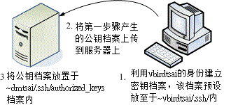 图 11.2-10、制作不需要密码的 ssh 账号基本流程

*   1\. 客户端建立两把钥匙：

建立的方法很简单，在 clientlinux.centos.vbird 这部主机上面以 vbirdtsai 的身份来建立两把钥匙即可。 不过，需要注意的是，我们有多种密码算法，如果不指定特殊的算法，则默认以 RSA 算法来处理：

```
[vbirdtsai@clientlinux ~]$ ssh-keygen [-t rsa&#124;dsa] &lt;==可选 rsa 或 dsa
[vbirdtsai@clientlinux ~]$ ssh-keygen  &lt;==用预设的方法建立密钥
Generating public/private rsa key pair.
Enter file in which to save the key (/home/vbirdtsai/.ssh/id_rsa): &lt;==按 enter
Created directory '/home/vbirdtsai/.ssh'. &lt;==此目录若不存在则会主动建立
Enter passphrase (empty for no passphrase): &lt;==按 Enter 不给密码
Enter same passphrase again: &lt;==再输入一次 Enter 吧！
Your identification has been saved in /home/vbirdtsai/.ssh/id_rsa. &lt;==私钥档
Your public key has been saved in /home/vbirdtsai/.ssh/id_rsa.pub. &lt;==公钥档
The key fingerprint is:
0f:d3:e7:1a:1c:bd:5c:03:f1:19:f1:22:df:9b:cc:08 vbirdtsai@clientlinux.centos.vbird

[vbirdtsai@clientlinux ~]$ ls -ld ~/.ssh; ls -l ~/.ssh
drwx------. 2 vbirdtsai vbirdtsai 4096 2011-07-25 12:58 /home/vbirdtsai/.ssh
-rw-------. 1 vbirdtsai vbirdtsai 1675 2011-07-25 12:58 id_rsa      &lt;==私钥档
-rw-r--r--. 1 vbirdtsai vbirdtsai  416 2011-07-25 12:58 id_rsa.pub  &lt;==公钥档 
```

请注意上面喔，我的身份是 vbirdtsai ，所以当我执行 ssh-keygen 时，才会在我的家目录底下的 .ssh/ 这个目录里面产生所需要的两把 Keys ，分别是私钥 (id_rsa) 与公钥 (id_rsa.pub)。 ~/.ssh/ 目录必须要是 700 的权限才行！另外一个要特别注意的就是那个 id_rsa 的档案权限啦！他必须要是 -rw------- 且属于 vbirdtsai 自己才行！否则在未来密钥比对的过程当中，可能会被判定为危险而无法成功的以公私钥成对档案的机制来达成联机喔。 其实，建立私钥后预设的权限与文件名放置位置都是正确的，你只要检查过没问题即可。

*   2\. 将公钥档案数据上传到服务器上：

因为我们要登入 www.centos.vbird 是以 dmtsai 的身份，因此我们就得要将上个步骤建立的公钥 (id_rsa.pub) 上传到服务器上的 dmtsai 用户才行。那如何上传呢？最简单的方法当然就是使用 scp 嘛！

```
[vbirdtsai@clientlinux ~]$ scp ~/.ssh/id_rsa.pub dmtsai@192.168.100.254:~
# 上传到 dmtsai 的家目录底下即可。 
```

*   3\. 将公钥放置服务器端的正确目录与文件名：

还记得 sshd_config 里面谈到的 AuthorizedKeysFile 这个设定值吧？该设定值就是在指定公钥数据应该要放置的文件名啰！所以，我们必须要到服务器端的 dmtsai 这个用户身份下， 将刚刚上传的 id_rsa.pub 数据附加到 authorized_keys 这个档案内才行。作法有点像这样：

```
# 1\. 建立 ~/.ssh 档案，注意权限需要为 700 喔！
[dmtsai@www ~]$ ls -ld .ssh
ls: .ssh: 没有此一档案或目录
# 由于可能是新建的用户，因此这个目录不存在。不存在才作底下建立目录的行为

[dmtsai@www ~]$ mkdir .ssh; chmod 700 .ssh
[dmtsai@www ~]$ ls -ld .ssh
drwx------. 2 dmtsai dmtsai 4096 Jul 25 13:06 .ssh
# 权限设定中，务必是 700 且属于使用者本人的账号与群组才行！

# 2\. 将公钥档案内的数据使用 cat 转存到 authorized_keys 内
[dmtsai@www ~]$ ls -l *pub
-rw-r--r--. 1 dmtsai dmtsai 416 Jul 25 13:05 id_rsa.pub &lt;==确实有存在

[dmtsai@www ~]$ cat id_rsa.pub &gt;&gt; .ssh/authorized_keys
[dmtsai@www ~]$ chmod 644 .ssh/authorized_keys
[dmtsai@www ~]$ ls -l .ssh
-rw-r--r--. 1 dmtsai dmtsai 416 Jul 25 13:07 authorized_keys
# 这个档案的权限设定中，就得要是 644 才可以！不可以搞混了！ 
```

* * *

这样就搞定密钥系统啰！以后你从 clientlinux.centos.vbird 的 vbirdtsai 登入到 www.centos.vbird 的 dmtsai 用户时， 就不需要任何的密码啰！举例来说，你可以这样测试看看啰：

例题：透过上述的案例练习成功后，请在 clientlinux 的 vbirdtsai 身份中，将系统的 /etc/hosts* 档案复制给 www.centos.vbird 的 dmtsai 用户的家目录。答：

```
[vbirdtsai@clientlinux ~]$ scp /etc/hosts* dmtsai@192.168.100.254:~
hosts                                        100%  187     0.2KB/s   00:00
hosts.allow                                  100%  161     0.2KB/s   00:00
hosts.deny                                   100%  347     0.3KB/s   00:00
# 你会发现，原本会出现的那个密码提示数据不会出现了喔！

[vbirdtsai@clientlinux ~]$ ssh dmtsai@192.168.100.254 "ls -l"
-rw-r--r--. 1 dmtsai dmtsai 196 2011-07-25 13:09 hosts
-rw-r--r--. 1 dmtsai dmtsai 370 2011-07-25 13:09 hosts.allow
-rw-r--r--. 1 dmtsai dmtsai 460 2011-07-25 13:09 hosts.deny
-rw-r--r--. 1 dmtsai dmtsai 416 2011-07-25 13:05 id_rsa.pub
# 确实有复制到对方去了！有显示出正确的远程数据哩！ 
```

很简单的步骤吧！这样一来，使用 ssh 相关的客户端指令就可以不需密码的手续了！无论如何，在建立密钥系统的步骤中你要记得的是：

*   Client 必须制作出 Public & Private 这两把 keys，且 Private 需放到 ~/.ssh/ 内；
*   Server 必须要有 Public Key ，且放置到用户家目录下的 ~/.ssh/authorized_keys，同时目录的权限 (.ssh/) 必须是 700 而档案权限则必须为 644 ，同时档案的拥有者与群组都必须与该账号吻合才行。

未来，当你还想要登入其他的主机时，只要将你的 public key (就是 id_rsa.pub 这个档案) 给他 copy 到其他主机上面去，并且新增到某账号的 ~/.ssh/authorized_keys 这个档案中！哈哈！成功！

* * *

### 11.2.7 简易安全设定

老实说，大家都被『SSH 是个安全的服务』所欺骗了！其实 sshd 并不怎么安全的！翻开 openssh 的过去历史来看，确实有很多人是利用 ssh 的程序漏洞来取得远程主机 root 的权限，进一步黑掉对方的主机！所以这玩意儿说实话，也不是很安全的啦！

sshd 之所谓的『安全』其实指的是『 sshd 的数据是加密过的，所以他的数据在 Internet 上面传递时是比较安全的。至于 sshd 这个服务本身就不是那样安全了！所以说：『非必要，不要将 sshd 对 Internet 开放可登入的权限，尽量局限在几个小范围内的 IP 或主机名即可！这很重要的喔！

好了，那么关于安全的设定方面，有没有什么值得注意的呢？当然是有啦！我们可以先建议几个项目吧！分别可以由底下这三方面来进行：

*   服务器软件本身的设定强化：/etc/ssh/sshd_config
*   TCP wrapper 的使用：/etc/hosts.allow, /etc/hosts.deny
*   iptables 的使用： iptables.rule, iptables.allow

*   服务器软件本身的设定强化：/etc/ssh/sshd_config

一般而言，这个档案的默认项目就已经很完备了！所以，事实上是不太需要更动他的！ 但是，如果你有些使用者方面的顾虑，那么可以这样修正一些问题呢！

*   禁止 root 这个账号使用 sshd 的服务；
*   禁止 nossh 这个群组的用户使用 sshd 的服务；
*   禁止 testssh 这个用户使用 sshd 的服务；

除了上述的账号之外，其他的用户则可以正常的使用系统。现在鸟哥假设你的系统里面已经有 sshnot1, sshnot2, sshnot3 加入 nossh 群组， 同时系统还有 testssh, student 等账号。相关的账号处理请自行参考基础篇来设定，底下仅是列出观察的重点：

```
# 1\. 先观察一下所需要的账号是否存在呢？
[root@www ~]# for user in sshnot1 sshnot2 sshnot3 testssh student; do \
&gt; id $user &#124; cut -d ' ' -f1-3 ; done
uid=507(sshnot1) gid=509(sshnot1) groups=509(sshnot1),508(nossh)
uid=508(sshnot2) gid=510(sshnot2) groups=510(sshnot2),508(nossh)
uid=509(sshnot3) gid=511(sshnot3) groups=511(sshnot3),508(nossh)
uid=511(testssh) gid=513(testssh) groups=513(testssh)
uid=505(student) gid=506(student) groups=506(student)
# 若上述账号并不存在你的系统，请自己建置出来！UID/GID 与鸟哥的不同也没关系！

# 2\. 修改 sshd_config 并且重新启动 sshd 吧！
[root@www ~]# vim /etc/ssh/sshd_config
PermitRootLogin no  &lt;==约在第 39 行，请拿掉批注且修改成这样
DenyGroups  nossh   &lt;==底下这两行可以加在档案的最后面
DenyUsers   testssh

[root@www ~]# /etc/init.d/sshd restart

# 3\. 测试与观察相关的账号登入情况吧！
[root@www ~]# ssh root@localhost  &lt;==并请输入正确的密码
[root@www ~]# tail /var/log/secure
Jul 25 13:14:05 www sshd[2039]: pam_unix(sshd:auth): authentication failure; 
logname= uid=0 euid=0 tty=ssh ruser= rhost=localhost  user=root
# 你会发现出现这个错误讯息，而不是密码输入错误而已。

[root@www ~]# ssh sshnot1@localhost  &lt;==并请输入正确的密码
[root@www ~]# tail /var/log/secure
Jul 25 13:15:53 www sshd[2061]: User sshnot1 from localhost not allowed because
a group is listed in DenyGroups

[root@www ~]# ssh testssh@localhost  &lt;==并请输入正确的密码
[root@www ~]# tail /var/log/secure
Jul 25 13:17:16 www sshd[2074]: User testssh from localhost not allowed 
because listed in DenyUsers 
```

从上面的结果来看，你就会发现到，不同的登入账号会产生不一样的登录档结果。因此，当你老是无法顺利使用 ssh 登入某一部主机时，记得到该服务器上去检查看看登录档，说不定就会顺利的让你解决问题啰！在我们的测试机上面，请还是放行 root 的登入喔！

*   /etc/hosts.allow 及 /etc/hosts.deny

举例来说，你的 sshd 只想让本机以及区网内的主机来源能够登入的话，那就这样作：

```
[root@www ~]# vim /etc/hosts.allow
sshd: 127.0.0.1 192.168.1.0/255.255.255.0 192.168.100.0/255.255.255.0

[root@www ~]# vim /etc/hosts.deny
sshd : ALL 
```

*   iptables 封包过滤防火墙

多几层保护也很好的！所以也可以使用 iptables 喔！ 参考：第九章、防火墙与 NAT 服务器内的实际脚本程序，你应该在 iptables.rule 内将 port 22 的放行功能取消，然后再到 iptables.allow 里面新增这行：

```
[root@www ~]# vim /usr/local/virus/iptables/iptables.allow
iptables -A INPUT -i $EXTIF -s 192.168.1.0/24 -p tcp --dport 22 -j ACCEPT
iptables -A INPUT -i $EXTIF -s 192.168.100.0/24 -p tcp --dport 22 -j ACCEPT

[root@www ~]# /usr/local/virus/iptables/iptables.rule 
```

上述的方法处理完毕后，如果你还是一部测试机，那么记得要将设定值还原回来呦！最后， 『鸟哥呼吁大家，不要开放 SSH 的登入权限给所有 Internet 上面的主机～』 这很重要喔～因为如果对方可以 ssh 进入你的主机，那么...太危险了～

* * *

# 11.3 最原始图形接口： Xdmcp 服务的启用

## 11.3 最原始图形接口： Xdmcp 服务的启用

考虑一个情况，如果你的 Linux 主机主要是用来作为图形处理时，而且同时有多人需要用到那个功能， 那么一部 Linux 是否一次仅能提供一个人处理那个软件呢？嘿嘿！那可不一定喔！因为 Linux 有相当优秀的 X Window System 啊！现在就来谈谈第一个图形接口的远程联机服务器吧！

* * *

### 11.3.1 X Window 的 Server/Client 架构与各组件

由于我们 Linux 使用的图形接口是所谓的 X-Window System 的东西，这玩意儿是能够跨平台的，目前在 Linux 上头开发的图形接口软件，几乎都是使用这个 X 的架构来处理，所以啰，你就不能够不知道 X Window 啦！ 我们在基础篇第三版的二十四章已经讲过 [X Window](http://linux.vbird.org/linux_basic/0590xwindow.php) 啦， 因此这里只会作个简单的介绍，以方便大家来了解为何我们的软件是这么安装与设定喔！

X Window System 在运作的过程中，又因控制的数据不同而分为 X Server 与 X Client 两种程序，虽然说是 X Server/Client ， 但是他的作用却与网络主机的 Server/Client 架构大异其趣喔～先来说说 X Server/Client 这两种程序所负责的任务先：

*   X Server： 这组程序主要负责的是屏幕画面的绘制与显示。 X Server 可以接收来自 X client 的数据，将这些数据绘制呈现为图面在屏幕上。 此外，我们移动鼠标、点击数据、由键盘输入数据等等，也会透过 X Server 来传达到 X Client 端，而由 X Client 来加以运算出应绘制的数据；

*   X Client： 这组程序主要负责的是数据的运算。 X Client 在接受到 X Server 传来的数据后 (例如移动鼠标、点击 icon 等动作)，会经由本身的运算而得到鼠标应该要如何移动、 点击的结果应该要出现什么样的数据、键盘输入的结果应该要如何呈现等等，然后将这些结果告知 X Server ，让他自行去绘制到屏幕上。

**Tips:** 鸟哥常常开玩笑的说， X server 就是画布，而 X client 就是手拿画笔的画家。你得要先有画布 (管理好所有可显示的硬件后) 之后画家的想法 (计算出来的绘图数据) 才能够绘制到画布上！


由于每一支 X client 都是独立存在的程序，因此在图形显示会发生一些迭图的问题 (想象一下每一个 X client 都是一个很自我的画家， 每个画家都不承认对方的存在，都自顾自的在画布上面作画，最后的结果会是如何？)。因此，后来就有一组特殊的 X client 在进行管理所有的其他 X client 程序，这个总管的咚咚就是 Window Manager！

*   Window Manager (WM)：是一组控制所有 X client 的管理程序，并同时提供例如任务栏、 背景桌面、虚拟桌面、窗口大小、窗口移动与重迭显示等任务。Window manager 主要由一些大型的计划案所开发而来，常见的有 GNOME, KDE, XFCE 等

既然 X Window System 是 Linux 上面的一组程序，那么它如何启动的呢？早期的用户在登入系统后，必须要自己先启动 X server 程序，然后再启动个别的 Window manager ，若有其他需求，再启动其他额外的 X client 就是了。这么麻烦！所以为了简化启动个人图形接口的步骤，后来还有所谓的 Display Manager (DM) 这玩意喔！

*   Display Manager (DM)：提供使用者登入的画面以让用户可以藉由图形接口登入。 在使用者登入后，可透过 display manager 的功能去呼叫其他的 Window manager ，让用户在图形接口的登入过程变得更简单。 由于 DM 也是启动一个等待输入账号密码的图形数据，因此 DM 会主动去唤醒一个 X Server 然后在上头加载等待输入的画面就是了。

在目前新释出的 Linux distributions 中，通常启动图形接口让用户登入的方式中，都是先执行 Display Manager 程序， 该程序会主动加载一个 X Server 程序，然后再提供一个等待输入账号密码的接口程序，之后再根据用户的选择去启动所需要的 Window Manager 程序，最后就由用户直接操作 WM 来玩图形接口啰。

例题：在 CentOS 6.x 当中，若预设为 init 5 的情况下，那么最终启动图形接口的是哪一只程序？答：分析 /etc/init/* 当中的档案，会发现有个档案的内容是这样：

```
[root@www ~]# cat /etc/init/prefdm.conf
start on stopped rc RUNLEVEL=5
stop on starting rc RUNLEVEL=[!5]
console output
respawn
respawn limit 10 120
exec /etc/X11/prefdm -nodaemon 
```

你可以分析 /etc/X11/prefdm 的内容，就能够发现其实该行启动的就是一个 X display manager 程序了喔！

例题：登入 init 5 的 CentOS 6.x 之前，先到 tty1 去查阅一下 X server 是由哪一支程序所唤醒的？答：我们可以透过 pstree 来观察程序间的相关性喔！同时注意，预设的 CentOS 6.x 的 X server 程序名称为 Xorg 的哩。

```
[root@www ~]# pstree -p
init(1)-+-NetworkManager(1086)
....(中间省略)....
        &#124;-gdm-binary(2642)---gdm-simple-slav(2661)-+-Xorg(2663)
        &#124;                                          &#124;-gdm-session-wor(2746)
....(后面省略).... 
```

由上述的数据来看，gdm-binary 可以唤醒 Xorg 喔！同理，我们也会知道提供认证的图形画面应该是由 gdm-session 所提供的喔！

*   X Window System 用在网络上的方式： XDMCP

当 X server, X client 都在同一部主机上面的时候，你可以很轻松的启动一个完整的 X Window System。 但是如果你想要透过这个机制在网络上面启动 X 呢？此时你得先在客户端启动一个 X server 将图形接口绘图所需要的硬件装置配置好， 并且启动一个 X server 常见的接收埠口 (通常是 port 6000)，然后再由服务器端的 X client 取得绘图数据，再将数据绘制成图啰。 透过这个机制，你可以在任何一部启动 X server 登入服务器喔！而且不管你的操作系统是啥呢！意义就像下图， 如此一来，你就可以取得服务器所提供的图形接口环境啦！

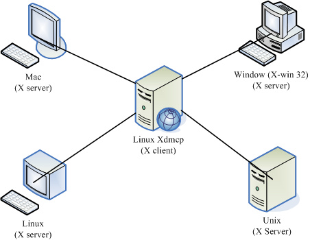 图 11.3-1、X server/client 的架构

但是如果你是使用最笨的方法在客户端自己启动 X server ，然后在告诉服务器将 X client 程序一个一个的加载回来， 那就太累人了吧！我们之前上面不是提到过可以用 display manager 来管理使用者的登入与启动 X 吗？那服务器能不能提供一个类似的服务， 那我们直接透过服务器的 display manager 就能够提供我们登入的认证与加载自己选择的 window manager 的话，这样就太棒了！ 能够达到吗？当然可以啊！那就是透过 Xdmcp (X display manager control protocol) (注 3) 啦！

Xdmcp 启动后会在服务器的 udp 177 开始监听，然后当客户端的 X server 联机到服务器的 port 177 之后， 我们的 Xdmcp 就会在客户端的 X server 放上用户输入账密的图形接口程序啰！那你就能透过这个 Xdmcp 去加载服务器所提供的类似 Window Manager 的相关 X client 啰！那你就能够取得图形接口的远程联机服务器哩！赞吧！

那么什么时候会出现多使用者连入服务器取得 X 的情况呢？以鸟哥的例子来说，鸟哥实验室有一组 Linux 在进行数值模拟， 他输出的结果是 NetCDF 档案，我们必须使用 PAVE 这一套软件去处理这些数据。但是我们有两三个人同时都会使用到那个功能， 偏偏 Linux 主机是放在机架柜里面的，要我们挤在那个小小的空间前面『站着』操作计算机，可真是讨人厌啊～ 这个时候，我们就会架设图形接口的远程登录服务器，让我们可以『多人同时以图形接口登入 Linux 主机』来操作我们自己的程序！很棒，不是吗！

* * *

### 11.3.2 设定 gdm 的 XDMCP 服务

既然是所谓的 Xdmcp 协议，那么是否意味着与 X display manager 有关呢？没错啦！ Xdmcp 协议是由 DM 程序所提供的。 我们的 CentOS 预设的 DM 为 GNOME 这个计划所提供的 gdm 哩！因此，你想要启动 Xdmcp 服务，那就得要针对 gdm 这个程序来设定啰。 这个 gdm 的设定数据都放置在 /etc/gdm/ 目录下，而我们所要修改的配置文件其实仅是一个 /etc/gdm/custom.conf (注 4) 档案而已。

**Tips:** X11 提供的 display manager 为 xdm ，而著名的 KDE 与 GNOME 也都有自己的 display manager 管理程序，分别是 kdm 与 gdm 。你可以透过三者中任何一者的 display manager 的配置文件来启动 xdmcp 这个协定呢～


不过，因为我们安装的基准是『Basic server』，所以很多图形接口软件并没有被安装起来。因此，在实作 Xdmcp 之前，我们得先安装图形接口才行喔！使用 yum groupinstall 来安装吧！

```
# 先检查看看与 X 相关的软件群组有哪些？
[root@www ~]# yum grouplist
   Desktop
   Desktop Platform
   X Window System
# 这三个算是最重要的项目了！得要安装起来才行喔！gdm 是在 Destop 中！ 

[root@www ~]# yum groupinstall "Desktop" "Desktop Platform" \
&gt; "X Window System" 
```

上面进行完毕后，现在才能开始搞定 custom.conf 啦！来试玩看看！

```
[root@www ~]# vim /etc/gdm/custom.conf
[security]           &lt;==在与资安方面有关的信息，大多指登录相关事宜
AllowRemoteRoot=yes  &lt;==xdmcp 预设不许 root 登入，得用这个项目才能以 root 登入
DisallowTCP=false    &lt;==这个项目在允许客户端使用 TCP 的方式联机到 xdmcp

[xdmcp]              &lt;==就是这个小节的重点之一啰！
Enable=true          &lt;==启动 xdmcp 的最重要项目啰！
# 上述特殊字体的部份就是你得要自己新增的内容啰！

[root@www ~]# init 5
# 上述这个指令会切换到 X 图形画面，如果确定要使用 gdm，runlevel 得调整到 5 才好
# 果真如此的话，那就得要调整 /etc/inittab 啰！

[root@www ~]# netstat -tulnp
Active Internet connections (only servers)
Proto Recv-Q Send-Q Local Address  Foreign Address   State    PID/Program name
tcp        0      0 0.0.0.0:6000   0.0.0.0:*         LISTEN   4557/Xorg
tcp        0      0 :::6000        :::*              LISTEN   4557/Xorg
udp        0      0 0.0.0.0:177    0.0.0.0:*                  4536/gdm-binary
# 上述的 port 6000 是由 DisallowTCP=false 项目启动的，port 177 才是我们要的 
```

上述的动作鸟哥是在 runlevel 3 底下启动的，如果你是在 runlevel 5 底下时，因此你也可以利用『 init 3 && init 5 』来重新启动图形接口。但如果你是在 runlevel 3 底下并且不希望变更成为 runlevel 5 呢？那又该如何启动 port 177 啊？如果是这样的话，那么你可以这样启动 xdmcp 啦：

```
[root@www ~]# init 3
[root@www ~]# runlevel
5 3 &lt;==左边的是前一个 runlevel，右边的是目前的，因此目前是 runlevel 3
[root@www ~]# gdm   &lt;==这样就启动 xdmcp 啰！
[root@www ~]# vim /etc/rc.d/rc.local
/usr/sbin/gdm 
```

现在你知道如何在不同的 runlevel 启动 xdmcp 了吧？如果是 runlevel 5 ，因为在 /etc/inittab 就已经有自动启动 gdm 了， 所以你只要顺利启动 runlevel 5 即可。但如果你是在 runlevel 3 的话，因为这样 gdm 就不会被系统的启动流程启动， 那你只好自己在 /etc/rc.d/rc.local 里面指定启动他啰！这样了解呼？不过，既然你都要使用 xdmcp 了，所以建议您直接启动在 runlevel 5 即可！接下来，你得要开放客户端对你的 port 177 联机才行！ 请自行修改你的防火墙规则，开放 udp port 177 吧！鸟哥这里假设你使用鸟哥的防火墙脚本，那你这样作就好了：

```
[root@www ~]# vim /usr/local/virus/iptables/iptables.rule
iptables -A INPUT -p UDP -i $EXTIF --dport 177 --sport 1024:65534 \
 -s 192.168.100.0/24 -j ACCEPT #xdmcp
# 注意喔！特点是使用 UDP 埠口以及加入来源端 IP 网域的控管！

[root@www ~]# /usr/local/virus/iptables/iptables.rule
[root@www ~]# iptables-save &#124; grep 177
-A INPUT -s 192.168.100.0/24 -i eth0 -p udp -m udp --sport 1024:65534 --dport 177 -j ACCEPT
# 确实有开放 port 177 ，而且是 udp 的埠口喔！要注意这两个项目。 
```

* * *

### 11.3.3 用户系统为 Linux 的登入方式

由于 Linux 本身的窗口就是由 X server 提供来的，因此使用 Linux 登入远程的图形服务器是很简单的啦！ 但是因为启动 X 的方式不同而已数种启动方式，底下我们就讲讲两个常见的启动方式：

*   在不同的 X 环境下启动联机： 直接用 X

如果你的客户端已经在 runlevel 5 了，因此其实你已经有一个 X 窗口的环境，这个环境的显示终端机就称为『 :0 』。 在 CentOS 6.x 的环境中，如果原本就是 runlevel 5 的环境，那么这个图形接口的 :0 是在 tty1 终端机啦！如果是由 runlevel 3 启动图形接口，那就是在 tty7 喔！由于已经有一个 X 了，因此你必须要在另外的终端机启动另一个 X 才行！那个新的 X 就称为 :1 接口，其实通常就在 tty7 或 tty8 啦！但因为 X server 要接受 X client 必须要有授权才行， 所以你得先在窗口接口开放接受来自服务器的 X client 数据。

此外，虽然你在客户端是以主动的方式连接到服务器的 udp port 177 ，但是服务器的 X client 却会主动的连接到你客户端的 X server，因此，你必须要开放来自服务器端主动对你的 TCP port 6001 (因为是 :1 界面) 的防火墙联机才行喔！那就来实做看看：

```
# 1\. 放行 X client 传来的资料：在 X Window 的画面当中启用 shell 输入：
[root@clientlinux ~]# xhost + 192.168.100.254
192.168.100.254 being added to access control list
# 注意！你是客户端！且假设我刚刚那部 Linux 主机的 IP 为 192.168.100.254

# 2\. 开始放行防火墙，因为我们启动 port 6001 ，所以你在客户端这样作：
[root@clientlinux ~]# vim /usr/local/virus/iptables/iptables.allow
iptables -A INPUT -i $EXTIF -s 192.168.100.0/24 -p tcp --dport 6001 -j ACCEPT

[root@clientlinux ~]# /usr/local/virus/iptables/iptables.rule
[root@clientlinux ~]# iptables-save
-A INPUT -s 192.168.100.0/24 -p tcp -m tcp --dport 6001 -j ACCEPT
# 要能看到上面这一行才行呦！

# 3\. 在文字接口 (例如 tty1) 下输入如下的指令：
[root@clientlinux ~]# X -query 192.168.100.254 :1
# 进入 X Window 啰！ 
```

如果一切顺利的话，那么你在 clientlinux.centos.vbird 就会看到如下的画面(注意主机名)：

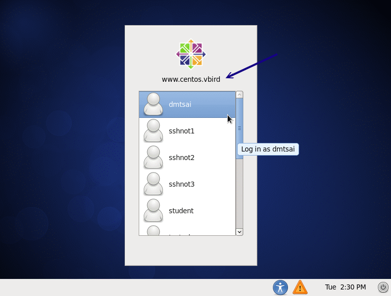 图 11.3-2、在客户端连上 Xdmcp 成功的画面

在上图中输入正确的账号与密码之后，你在 tty8 (:1) 就会有个窗口接口啰！那你如果想要回到本机的窗口接口， 就回到 tty7 (:0) 即可切换成功！(在 runlevel 5 时，:0 在 tty1 ，而 :1 在 tty7 喔！)那想要关闭 tty8 该如何是好？你不能够在 tty8 注销啦，因为注销后，系统会重新开一个等待登入的画面，你还是没办法关闭的。你得要回到刚刚启动 X 的 tty1 然后按下 [ctrl]-c 中断联机即可！

*   在同一个 X 底下启动另一个 X： 使用 Xnest

如果常常在 tty7, tty8 切换来去的话，偶而会忘记到底在哪个界面了，尤其是当你的桌面都一模一样时， 那就更难判断了。有没有办法直接在 tty7 启动另一个窗口来加载远程服务器的图形接口呢？可以的，那就透过 Xnest 吧！ 这指令需要在 X 的环境下使用喔！它的简单用法如下：

```
[root@www ~]# Xnest -query 主机名 -geometry 分辨率 :1
选项与参数：
-query    ：后面接 xdmcp 服务器的主机名或 IP 啰
-geometry ：后面接画面的分辨率，例如 1024x768 或 800x600 等之类的分辨率

# 根据上述数据，使用 800x600 连上 192.168.100.254 那部主机：
[root@www ~]# yum install xorg-x11-server-Xnest
[root@www ~]# Xnest -query 192.168.100.254 -geometry 640x480 :1 
```

如果一切顺利的话，那你就会在 tty7 的本机 X 环境下看到如下的画面 (底下的画面是已经登入的情况！)

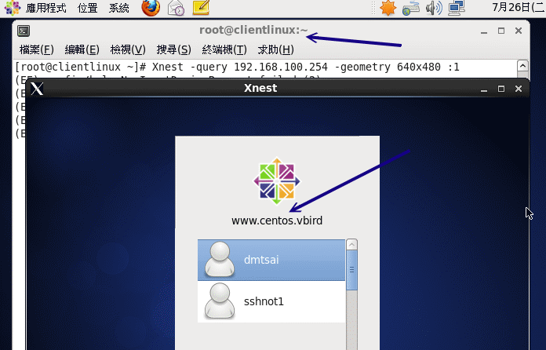 图 11.3-3、在客户端的 X 顺利连上 Xdmcp 的画面

一开始的图示会与图 11.3-2 一样，就是出现输入账密的画面，如果输入正确的帐密后， 就会出现上述的图示了。仔细看一下画面当中的终端机标头，你就会发现确实是两部主机的桌面呢！这样有没有更棒棒？ ^_^！ 要关闭这个 X 就简单多了！直接按下关闭，或者是中断那个 Xnest 的程序即可。

* * *

### 11.3.4 用户系统为 Windows 的登入方式： Xming

由于 Windows 本身并没有提供预设的 X server ，因此我们得要自行安装 X server 在 Windows 上面才行。 目前常见的 X server 有底下这几个：

*   [X-Win32 (http://www.xwin32.tw/)](http://www.xwin32.tw/)
*   [Exceed (http://www.hummingbird.com/products/nc/exceed/index.html?cks=y)](http://www.hummingbird.com/products/nc/exceed/index.html?cks=y)
*   [Xming (http://sourceforge.net/projects/xming/)](http://sourceforge.net/projects/xming/)

其中 X-Win32 与 Exceed 都属于商业软件，而 Xming 则属于轻量级的自由软件，说是轻量级并非说它不好， 而是因为 Xming 的档案真的很小，而该有的功能都有了，所以算是很不赖的一个软件喔！因此底下鸟哥是以 Xming (注 5) 作范例来介绍的。

1.  安装：你可以使用预设的方法，一直下一步的安装下去，就能够顺利的安装好 Xming 这套 X server 的软件啰。

2.  启动：请在『开始』-->『程序集』-->『Xming』-->『XLaunch』开启设定联机到 xdmcp 的方式。底下我们会使用区网内的广播 (broadcast) 来找到 xdmcp 服务器的方式。启动 XLaunch 之后会出现如下的图示：

    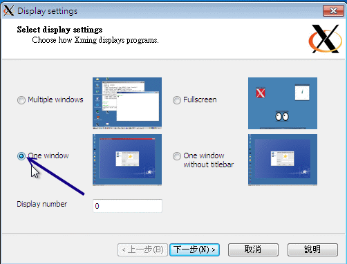 图 11.3-4、Xming 的 Xdmcp 连接方式示意图

    记得上面的图示要选择 One window 或 Fullscreen 或 One window without titlebar 才能够使用 XDMCP 喔！选择完毕后按『下一步』 就会出现如下的画面：

    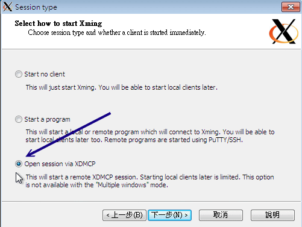 图 11.3-5、Xming 的 Xdmcp 连接方式示意图

    上述的图示当中共有三种传递 X client 的方法，在这个小节当中我们要连到 xdmcp ，所以你得要选择第三个喔！之后再下一步会出现下图：

    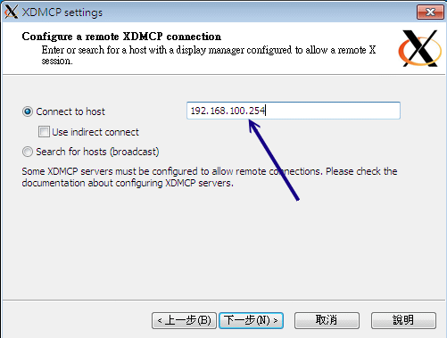 图 11.3-6、Xming 的 Xdmcp 连接方式示意图

    这里当然就是连接到你想要连上去的 xdmcp 服务器啰！将他的 IP 填上去吧！之后再下一步去：

    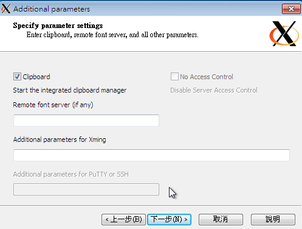 图 11.3-7、Xming 的 Xdmcp 连接方式示意图

    上图的项目与数据的互相复制贴上有关，保留默认值即可。按下下一步吧！

    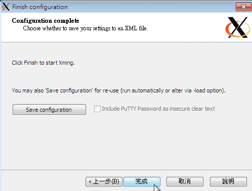 图 11.3-8、Xming 的 Xdmcp 连接方式示意图

    出现上图就是设定完毕了，给它按下『完成』之后，你就会发现如同图 11.3-2 的画面出现，你就能够开始在 Windows 底下连上图形接口的 Linux Server 啰！很轻松吧！

3.  重点在 Server 与 Client 的防火墙上

其实从上面的设定当中你会发现， XDMCP 不论是在 Server 还是 Client 的设定上面都很简单！但是有时候你就是会发现， 明明所有的动作都做完了，但是就是没有办法连上 Xdmcp 服务器！最容易发生错误的其实就是防火墙啦！因为虽然我们客户端启动 X server 后，会主动联机到服务器端的 Xdmcp (port 177)，但是，接下来却是服务器主动联机到我们客户端的 X server (可能是 port 6000~6010)。 因此，如果你只是设定了服务器的防火墙而已，那么很可能出现问题的应该就是客户端的防火墙忘记打开提供服务器主动联机的规则啰！ 这点是必须要跟大家说明的喔！

* * *

# 11.4 华丽的图形接口： VNC 服务器

## 11.4 华丽的图形接口： VNC 服务器

就如同刚刚上头讲到的，使用 xdmcp 可能会启动多个不同的埠口，导致防火墙设定上面比较困扰些。那有没有简单一点的图形接口连接方式？ 其实还有很多啦，在这里我们先来讲一个比较简单的，那就是 VNC (Virtual Network Computing) 这玩意儿啦！(注 6)

* * *

### 11.4.1 预设的 VNC 服务器：使用 twm window manager

VNC server 会在服务器端启动一个监听用户要求的端口，一般端口号码在 5901 ~ 5910 之间。当客户端启动 X server 联机到 5901 之后， VNC server 再将一堆预先设定好的 X client 透过这个联机传递到客户端上，最终就能够在客户端显示服务器的图形接口了。

不过需要注意的是，预设的 VNC server 都是独立提供给『单一』一个客户端来联机的，因此当你要使用 VNC 时， 再联机到服务器去启动 VNC server 即可。所以，一般来说， VNC server 都是使用手动启动的，然后使用完毕后， 再将 VNC server 关闭即可。整个作法其实很简单喔！你可以这样作：

```
[root@www ~]# vncserver [:号码] [-geometry 分辨率] [options]
[root@www ~]# vncserver [-kill :号码]
选项与参数：
:号码     ：就是将 VNC server 开在哪个埠口，如果是 :1 则代表 VNC 5901 埠口
-geometry ：就是分辨率，例如 1024x768 或 800x600 之类的
options   ：其他 X 相关的选项，例如 -query localhost 之类的
-kill     ：将已经启动的 VNC 埠口删除！依据身份控制喔。

[root@www ~]# yum install tigervnc-server
# 这个是必须要的服务器软件，注意软件的名称喔！与之前的版本不同！

# 将 VNC server 启动在 5903 埠口
[root@www ~]# vncserver :3

You will require a password to access your desktops.

Password:  &lt;==输入 VNC 的联机密码，这是建立 VNC 时所需要的
Verify:    &lt;==再输入一次相同的密码
xauth:  creating new authority file /root/.Xauthority

New 'www.centos.vbird:3 (root)' desktop is www.centos.vbird:3

Creating default startup script /root/.vnc/xstartup
Starting applications specified in /root/.vnc/xstartup
Log file is /root/.vnc/www.centos.vbird:3.log

[root@www ~]# netstat -tulnp &#124; grep X
tcp        0      0 0.0.0.0:5903   0.0.0.0:*      LISTEN      4361/Xvnc
tcp        0      0 0.0.0.0:6000   0.0.0.0:*      LISTEN      1755/Xorg
tcp        0      0 0.0.0.0:6003   0.0.0.0:*      LISTEN      4361/Xvnc
tcp        0      0 :::6000        :::*           LISTEN      1755/Xorg
tcp        0      0 :::6003        :::*           LISTEN      4361/Xvnc
# 已经启动所需要的埠口啰！ 
```

在上述的指令操作中，你要知道的几个项目是：

1.  密码至少需要六个字符
2.  依据使用 vncserver 的身份，将刚刚建立的密码放置于该账号家目录下。例如上述的身份是使用 root 身份，因此密码文件会放在 /root/.vnc/passwd 这个档案中但是若该档案已经存在，则不会出现建立密码的画面。
3.  当客户端联机成功后，服务器将会传送 /root/.vnc/startx 内的 X client 给客户端喔！

那如果你想要修改 VNC 密码呢？很简单，那就使用 vncpasswd 吧！

```
[root@www ~]# ls -l /root/.vnc/passwd
-rw-------. 1 root root 8 Jul 26 15:08 /root/.vnc/passwd
[root@www ~]# vncpasswd
Password:  &lt;==就是这里开始输入新的密码啊！
Verify:
[root@www ~]# ls -l /root/.vnc/passwd
-rw-------. 1 root root 8 Jul 26 15:15 /root/.vnc/passwd
# 看吧！时间有更新喔！这个档案的内容更动过啰！ 
```

接下来开始放行 5903 这个埠口的联机防火墙规则吧！因为预计可能会开放 11 个 VNC 的埠口，所以干脆一口气开放 11 个埠口吧！

```
[root@www ~]# vim /usr/local/virus/iptables/iptables.allow
iptables -A INPUT -i $EXTIF -s 192.168.100.0/24 -p tcp --dport 5900:5910 -j ACCEPT

[root@www ~]# /usr/local/virus/iptables/iptables.rule
[root@www ~]# iptables-save
-A INPUT -s 192.168.100.0/24 -i eth0 -p tcp -m tcp --dport 5900:5910 -j ACCEPT
# 要看得到上面这行才 OK 喔！ 
```

* * *

### 11.4.2 VNC 的客户端联机软件

与 xdmcp 很类似啦， VNC 客户端在 Linux 系统上面有默认的软件，但是在 Windows 系统上面则必须要额外安装其他软件。 我们先来谈谈 Linux 的 VNC 用户软件吧！

*   Linux 客户端程序： vncviewer

用在 Linux 客户端的 VNC 程序，那就是 vncviewer。只是，这个软件默认没有安装，所以你得要使用 yum 安装完毕后再来联机吧！不过一样要注意，服务器端的防火墙一样要设定妥当喔！然后开始在客户端的图形接口上执行底下数据：

```
[root@clientlinux ~]# yum install tigervnc
[root@clientlinux ~]# vncviewer 192.168.10.254:3
# 这个指令请一定一定要在图形接口上面执行才行喔！很重要！别忘了！ 
```

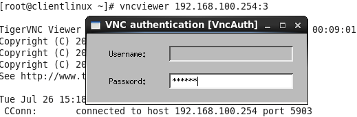 图 11.4-1、在 Linux 客户端执行 vncviewer 程序示意

在上图当中输入刚刚的 root 的 VNC 联机密码，请注意喔，是 VNC 的联机密码，而不是 root 的登入密码！ 这两者是差很多的！也由于启动 VNC 的身份是 root ，因此这里才使用 root 的 VNC 联机密码。 所以，很多时刻，我们都是建议使用一般身份来启动 VNC server 的啦！当你输入正确的 VNC 联机密码后， 会出现如下的图示啰：

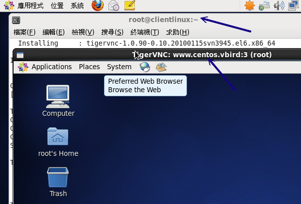 图 11.4-2、在 Linux 客户端执行 vncviewer 程序示意

与以前的 VNC server 较大的差异，在 CentOS 6.x 当中，tigervnc-server 这套软件会主动的依据服务器端的图形接口登入方式给予正确的图形显示接口，而不是以前那样给予一个丑丑的 twm 而已！ 这样我们就可以减少还得要修改一些有的没有的配置文件了！真是棒！ 联机成功后，请在客户端关闭这个 vncviewer 的联机，因为接下来我们要准备由 Windows 联机到服务器的 port 5903 啰！

*   Windows 客户端程序： realvnc

Windows 底下可用的 vnc client 软件不少，但是鸟哥比较熟悉的是 realvnc 这家公司出品的 GNU 的自由软件！ 你可以在底下的连结下载到最简单的版本，是不用钱的自由软件版本喔！(鸟哥仅下载不用安装的 viewer 版本而已！)

*   [`www.realvnc.com/download.html`](http://www.realvnc.com/download.html)

直接执行 vnc-viewer 软件，然后就会看到如下的画面：

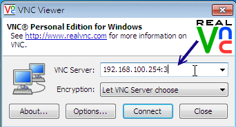 图 11.4-3、Windows Real VNC 客户端联机示意图

如上图所示，你在 server 字段填上 IP:port 的数据即可，然后按下『OK』吧！

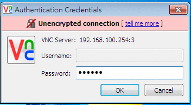 图 11.4-4、Windows Real VNC 客户端联机示意图

由于 VNC server 需要的仅是联机的 VNC 密码而已，因此上图中的 Username 可以不用填，老实说，这个程序它也不会让你填～ 呵呵！填完按下『OK』即可！接下来就会出现正确的画面啰！

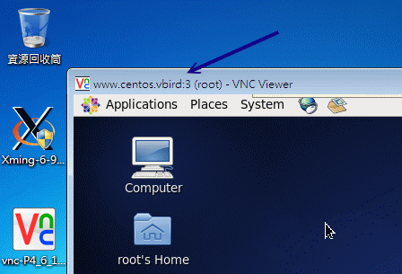 图 11.4-5、Windows Real VNC 客户端联机示意图

* * *

### 11.4.3 VNC 搭配本机的 Xdmcp 画面

如果因为某些特殊因素，你得要使用 VNC 来搭配 xdmcp 的输出时，那就直接在服务器透过底下的指令来处理即可！ 要注意喔，你必须要已经启动了 xdmcp 了喔！而且，我们底下使用 student 的身份来启动这个 VNC 吧！

```
# 1\. 要确定 xdmcp 已经启动了才可以：
[root@www ~]# netstat -tlunp &#124; grep 177
udp        0      0 0.0.0.0:177   0.0.0.0:*      1734/gdm-binary
# OK 的！确实有启动的啦！如果没有看到 177 的话，回到 11.3 去处理处理

# 2\. 切换成 student，并且启动 VNC server 在 :5
[root@www ~]# su - student
[student@www ~]$ vncserver :5 -query localhost
You will require a password to access your desktops.

Password:
Verify:
xauth:  creating new authority file /home/student/.Xauthority

New 'www.centos.vbird:5 (student)' desktop is www.centos.vbird:5

Creating default startup script /home/student/.vnc/xstartup
Starting applications specified in /home/student/.vnc/xstartup
Log file is /home/student/.vnc/www.centos.vbird:5.log

# 3\. 取消 xstartup 的启动内容
[student@www ~]$ vim /home/student/.vnc/xstartup
....(前面省略)....
#xterm -geometry 80x24+10+10 -ls -title "$VNCDESKTOP Desktop" &
#twm &
# 将这个档案的内容，全部都加上 # 批注掉

# 4\. 重新启动 vncserver 喔！
[student@www ~]$ vncserver -kill :5
[student@www ~]$ vncserver :5 -query localhost 
```

接下来请使用 root 的身份加入 5905 的端口防火墙规则，然后自行使用 Linux 的 vncviewer 或 Windows 的 RealVNC 来联机，你就会发现如下的画面：

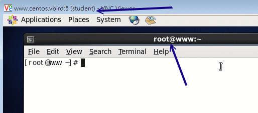 图 11.4-6、透过 VNC 通道取得 xdmcp 画面

我们这只 VNC 的联机程序是 student 身份，但是我们却可以透过 xdmcp 的登入功能来登入 root 身份喔！ 因为在服务器上面的 Xvnc 程序是 student 拥有，这样会比较好啦！了解呼？

* * *

### 11.4.4 开机就启动 VNC server 的方法

请注意，你不要将 vncserver 的指令写入在 /etc/rc.d/rc.local 中，否则可能会产生 localhost 无法登入的问题。 那该如何让你的 VNC server 在一开机就启动而不须要登入执行指令呢？可以的，但是你得要修改一下配置文件。 我们底下使用 student 的身份启动 VNC server，而启动的方式为使用 xdmcp 登入画面，启动的埠口就定在 5901 好了。 那你应该这样作：

```
[root@www ~]# vim /etc/sysconfig/vncservers
VNCSERVERS="1:student"
VNCSERVERARGS[1]="-query localhost"
# 上述两行的 1 指的就是那个埠口 5901 喔！要注意！

[root@www ~]# /etc/init.d/vncserver restart
[root@www ~]# chkconfig vncserver on 
```

有够好简单吧！这样每次开机就搞定你的 VNC server 啰！

* * *

### 11.4.5 同步的 VNC ：可以透过图示同步教学

另外，有些朋友一定会觉得奇怪，那就是，为甚么我的 VNC 服务器的 server / client 端画面并不是同步的呢? 这是因为 Linux 本身提供多个 VNC server ，她们是各自独立的，所以当然就不会与 tty7 的画面同步了。 但是如果你想要与 Linux 的 tty7 同步的话，可以利用 VNC 释出的给 X Server 使用的模块来加以设定即可。

那使用这个模块有甚么好处啊？就是可以让两个图形接口在 server/client 都是一样的， 所以，如果你想要教你的朋友你是如何设定的，那就可以透过这个机制来处理，你的朋友在远程就能够知道你一步一步进行的过程！ 这样很不赖吧！详细的作法可以参考底下的连结：

*   [`phorum.study-area.org/viewtopic.php?t=25713`](http://phorum.study-area.org/viewtopic.php?t=25713)

我们也来实做一下吧 (在 CentOS 6.x 当中并没有 xorg.conf 这个配置文件喔！所以，如果你要使用这些数据的话， 恐怕得要自行使用 X -configure 去建置 xorg.conf 后，再挪到 /etc/X11/ 去，然后才改的到设定！)：

```
[root@www ~]# yum install tigervnc-server-module
[root@www ~]# vim /etc/X11/xorg.conf
Section "Screen"
        Identifier "Screen0"
        Device     "Videocard0"
        DefaultDepth     24
        # VBird
        Option "passwordFile" "/home/student/.vnc/passwd"
        SubSection "Display"
                Viewport   0 0
                Depth     24
        EndSubSection
EndSection

# VBird
Section "Module"
    Load    "vnc"
EndSection
# 假设你的 vnc 密码档案放置在 /home/student/.vnc/passwd 里头，
# 这个时候就得要将密码文件内容写到 Screen 这个 section 当中了

[root@www ~]# init 3 ; init 5
[root@www ~]# netstat -tlunp &#124; grep X
tcp        0      0 0.0.0.0:5900   0.0.0.0:*      LISTEN      7445/Xorg
tcp        0      0 0.0.0.0:6000   0.0.0.0:*      LISTEN      7445/Xorg
tcp        0      0 :::6000        :::*           LISTEN      7445/Xorg
# 注意看喔！这几个 port 启动的 PID 都一样喔！所以会启动一个 port 5900 啰！ 
```

之后你可以使用『 vncviewer 192.168.100.254 』来联机即可，不需要加上 :0 之类的埠口。 然后你可以看一下客户端与服务器端的图形接口，你会发现到两者移动鼠标时，两者的画面会同步运作喔！ 非常有趣呢！只不过这个动作还是只允许一条 VNC 联机，不能让所有客户端都连到 port 5900 ，这真是太可惜了！

* * *

# 11.5 仿真的远程桌面系统： XRDP 服务器

## 11.5 仿真的远程桌面系统： XRDP 服务器

使用上面的图形接口的联机服务器都有一个问题，除了联机机制的不同之外，上头的 Xdmcp 与 VNC 原则上，资料都没有加密。 因此上面的动作大多仅适合局域网络内运作，不要连上 Internet 比较好。那如果你真的想要透过加密的方式运作 VNC， 那可能得要透过下一小节的介绍才能够有好的处理结果。那么我们知道 Windows 的远程桌面 (Remote Desktop Procotol, RDP, 注 7) 其实是具有联机加密功能的，所以，能不能在 Linux 上面装一个 RDP Server 呢？是可以的，那就是 XRDP 服务器 (注 8)。

很可惜的是，我们的 CentOS 6.x 预设并没有提供 XRDP 的服务器，如果你有兴趣的话，可以自行编译 xrdp 软件， 但鸟哥有找到 Fedora 基金会提供的 RHEL 额外软件计划 (注 9)，你可以到底下的连结去找到你对应的版本：

*   [`download.fedora.redhat.com/pub/epel/`](http://download.fedora.redhat.com/pub/epel/)

鸟哥还是觉得 yum 是好东西，因此鸟哥找到的 CentOS 6.x x86_64 版本的网址后，将它设定在 yum 配置文件内，就可以使用 yum 安装了：

```
[root@www ~]# vim /etc/yum.repos.d/fedora_epel.repo
[epel]
name=CentOS-$releasever - Epel
baseurl=http://download.fedora.redhat.com/pub/epel/6/x86_64/
gpgcheck=0
enabled=1

[root@www ~]# yum clean all
[root@www ~]# yum install xrdp 
```

这样就安装好了 xrdp 软件了，接着下来就得要开始来设定它啰！老实说，在一般的主机上面安装好这个 xrdp 之后，你根本不需要调整任何配置文件，保留好配置文件就好了，然后启动它，并且设定开机后启动，未来只要用远程联机连到这部主机， 系统就会启动 5910~5920 以上的 VNC 埠口，然后你就能够透过 RDP 的协议取得 VNC 的画面，最后就能够登入系统啰！

```
[root@www ~]# /etc/init.d/xrdp start
[root@www ~]# chkconfig xrdp on
[root@www ~]# netstat  &#124; grep xrdp
tcp        0      0 127.0.0.1:3350  0.0.0.0:*     LISTEN    6615/xrdp-sesman
tcp        0      0 0.0.0.0:3389    0.0.0.0:*     LISTEN    6611/xrdp
# 远程桌面的埠口是 3389 ，但是 xrdp 会再连到本机的 3350 去唤醒一个 VNC 的联机。
# 但是尚未联机之前，并不会起动任何的 VNC 埠口就是了。 
```

如果你是使用 Windows 系统，那么透过『开始』-->『程序集』-->『附属应用程序』-->『远程桌面联机』， 在出现的画面中输入这部 xrdp 服务器的 IP 之后，如果顺利连上就会出现如下的画面：

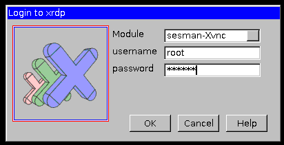 图 11.5-1、连上服务器的 XRDP 服务后，会出现的联机信息

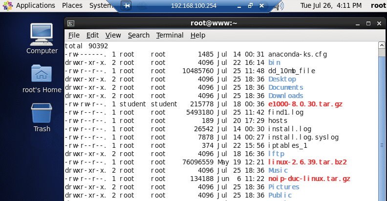 图 11.5-2、连上服务器的 XRDP 服务后，会出现的联机信息

输入正确的账号密码，嘿嘿！搞定！画面就出现啰！如果你还想要更进一步的了解 xrdp 的配置文件，那么请到 /etc/xrdp/ 目录底下瞧瞧，然后再透过 man 去看看相关的配置文件信息，就能够理解设定值啰！鸟哥测试过，不用修改任何设定， 使用远程桌面就已经很顺畅啰！ ^_^

不过你要注意的是，因为 xrdp 最终会自动启用 VNC ，因此你还是必须要安装 tigervnc-server 才行！ 否则 xrdp 应该还是无法运作的呦！

* * *

# 11.6 SSH 服务器的进阶应用

## 11.6 SSH 服务器的进阶应用

事实上 ssh 真的很好用！你甚至不需要启动甚么 xdmcp, vnc, xrdp 等等服务，使用 ssh 的加密通道就能够在客户端启动图形接口！ 此外，我们知道很多服务都是没有加密的，那么能不能将这些服务透过 ssh 通道来加密呢？嘿嘿！当然是可以！ 在这个章节当中，我们就来谈谈一些 ssh 的进阶应用吧！

* * *

### 11.6.1 启动 ssh 在非正规埠口 (非 port 22)

从前面的章节里面我们就曾经提过， sshd 这个服务其实并不是很安全，所以很多 ISP 在入口处就已经将 port 22 关闭了！为什么要这么作呢？这是因为很多网站管理员并没有定期的进行软件 update ，而且为了方便，又很开心的将 port 22 对全世界开放。由于很多 cracker 会使用扫描程序乱扫整个 Internet 的埠口漏洞，这个 port 22 就是一个很常被扫描的端口啦！为了杜绝这个问题，所以 ISP 先帮你把关，先将 port 22 关闭！这也是为了整个区网好！

只是，像鸟哥这种没有 ssh 就快要活不下去的人，关闭了 port 22 那鸟哥的头都痛了！没有办法工作啊！ 那怎办？没关系，其实我们可以将 ssh 开放在非正规的埠口。如此一来， cracker 不会扫描到该端口，而你的 ISP 又没有对该埠口进行限制，那你就能够使用 ssh 啰！很棒吧！那就来试看看。我们底下将 ssh 开放在 port 22 及 port 23 试看看 (请注意， port 23 不能够有被使用喔！)。

*   设定 ssh 在 port 22 及 23 两个埠口的设定方式

```
[root@www ~]# vim /etc/ssh/sshd_config
Port 22
Port 23    &lt;==注意喔！要有两个 Port 的设定才行！

[root@www ~]# /etc/init.d/sshd restart 
```

但是这一版的 CentOS 却将 SSH 规范 port 仅能启动于 22 而已，所以此时会出现一个 SELinux 的错误！那怎办？没关系， 根据 setroubleshoot 的提示，我们必须要自行定义一个 SELinux 的规则放行模块才行！有没有很难呢？其实还算简单！ 整体流程是这样的：

```
# 1\. 于 /var/log/audit/audit.log 找出与 ssh 有关的 AVC 信息，并转为本地模块
[root@www ~]# cat /var/log/audit/audit.log &#124; grep AVC &#124; grep ssh &#124; \
&gt;  audit2allow -m sshlocal &gt; sshlocal.te  &lt;==扩展名要是 .te 才行
[root@www ~]# grep sshd_t /var/log/audit/audit.log &#124; \
&gt;  audit2allow -M sshlocal  &lt;==sshlocal 就是刚刚建立的 .te 檔名
******************** IMPORTANT ***********************
To make this policy package active, execute:
semodule -i sshlocal.pp   &lt;==这个指令会编译出这个重要的 .pp 模块！

# 2\. 将这个模块加载系统的 SELinux 管理当中！
[root@www ~]# semodule -i sshlocal.pp

# 3\. 再重新启动 sshd 并且观察埠口吧！
[root@www ~]# /etc/init.d/sshd restart
[root@www ~]# netstat -tlunp &#124; grep ssh
tcp        0      0 0.0.0.0:22   0.0.0.0:*    LISTEN      7322/sshd
tcp        0      0 0.0.0.0:23   0.0.0.0:*    LISTEN      7322/sshd
tcp        0      0 :::22        :::*         LISTEN      7322/sshd
tcp        0      0 :::23        :::*         LISTEN      7322/sshd 
```

有没有很简单！这样你就能够使用 port 22 或 port 23 联机到你的 sshd 服务喔！

*   非正规埠口的联机方式

由于预设的 ssh, scp, sftp 都是连接到 port 22 的，那么如何使用这些指令联机到 port 23 呢？ 我们使用 ssh 当练习好了：

```
[root@www ~]# ssh -p 23 root@localhost
root@localhost's password:
Last login: Tue Jul 26 14:07:41 2011 from 192.168.1.101
[root@www ~]# netstat -tnp &#124; grep 23
tcp  0  0 ::1:23               ::1:56645              ESTABLISHED 7327/2
tcp  0  0 ::1:56645            ::1:23                 ESTABLISHED 7326/ssh
# 因为网络是双向的，因此自己连自己 (localhost)，就会抓到两只联机！ 
```

这样，你就能够避过一些 ISP 或者是 cracker 的扫描了！注意一下，不要将 port 开放在某些既知的埠口上， 例如你开放在 port 80 的话，那你就没有办法启动正常的 WWW 服务啦！注意注意！

* * *

### 11.6.2 以 rsync 进行同步镜像备份

我们曾在基础篇第三版第二十五章里头谈到 [Linux 的备份策略](http://linux.vbird.org/linux_basic/0580backup.php)， 该篇曾介绍常用的备份指令，包括 tar, dd, cp 等等，不过当时并未介绍网络，所以有个很棒的网络工具没有介绍， 那就是这个地方要谈到的 rsync 啦！这个 rsync 可以作为一个相当棒的异地备援系统的备份指令喔！ 因为 rsync 可以达到类似『镜相 (mirror) 』的功能呢！

rsync 最早是想要取代 rcp 这个指令的，因为 rsync 不但传输的速度快，而且他在传输时， 可以比对本地端与远程主机欲复制的档案内容，而仅复制两端有差异的档案而已，所以传输的时间就相对的降低很多！ 此外， rsync 的传输方式至少可以透过三种方式来运作：

*   在本机上直接运作，用法就与 cp 几乎一模一样，例如： rsync -av /etc /tmp (将 /etc/ 的数据备份到 /tmp/etc 内)

*   透过 rsh 或 ssh 的信道在 server / client 之间进行数据传输，例如： rsync -av -e ssh user@rsh.server:/etc /tmp (将 rsh.server 的 /etc 备份到本地主机的 /tmp 内)

*   直接透过 rsync 提供的服务 (daemon) 来传输，此时 rsync 主机需要启动 873 port： 1\. 你必须要在 server 端启动 rsync ， 看 /etc/xinetd.d/rsync 即可； 2\. 你必须编辑 /etc/rsyncd.conf 配置文件； 3\. 你必须设定好 client 端联机的密码数据； 4\. 在 client 端可以利用：rsync -av user@hostname::/dir/path /local/path

其实三种传输模式差异在于有没有冒号 (:) 而已，本地端传输不需要冒号，透过 ssh 或 rsh 时，就得要利用一个冒号 (:)， 如果是透过 rsync daemon 的话，就得要两个冒号 (::) ，应该不难理解啦！因为本地端处理很简单， 而我们的系统本来就有提供 ssh 的服务，所以，底下鸟哥将直接介绍利用 rsync 透过 ssh 来备份的动作喔。 不过，在此之前咱们先来看看 rsync 的语法吧！

```
[root@www ~]# rsync [-avrlptgoD] [-e ssh] [user@host:/dir] [/local/path]
选项与参数：
-v ：观察模式，可以列出更多的信息，包括镜像时的档案档名等；
-q ：与 -v  相反，安静模式，略过正常信息，仅显示错误讯息；
-r ：递归复制！可以针对『目录』来处理！很重要！
-u ：仅更新 (update)，若目标档案较新，则保留新档案不会覆盖；
-l ：复制链接文件的属性，而非链接的目标源文件内容；
-p ：复制时，连同属性 (permission) 也保存不变！
-g ：保存源文件的拥有群组；
-o ：保存源文件的拥有人；
-D ：保存源文件的装置属性 (device)
-t ：保存源文件的时间参数；
-I ：忽略更新时间 (mtime) 的属性，档案比对上会比较快速；
-z ：在数据传输时，加上压缩的参数！
-e ：使用的信道协议，例如使用 ssh 通道，则 -e ssh
-a ：相当于 -rlptgoD ，所以这个 -a 是最常用的参数了！
更多说明请参考 man rsync 的解说！

# 1\. 将 /etc 的数据备份到 /tmp 底下：
[root@www ~]# rsync -av /etc /tmp
....(前面省略)....
sent 21979554 bytes  received 25934 bytes  4000997.82 bytes/sec
total size is 21877999  speedup is 0.99
[root@www ~]# ll -d /tmp/etc /etc
drwxr-xr-x. 106 root root 12288 Jul 26 16:10 /etc
drwxr-xr-x. 106 root root 12288 Jul 26 16:10 /tmp/etc &lt;==瞧！两个目录一样！
# 第一次运作时会花比较久的时间，因为首次建立嘛！如果再次备份呢？

[root@www ~]# rsync -av /etc /tmp
sent 55716 bytes  received 240 bytes  111912.00 bytes/sec
total size is 21877999  speedup is 390.99
# 比较一下两次 rsync 的传输与接受数据量，你就会发现立刻就跑完了！
# 传输的数据也很少！因为再次比对，仅有差异的档案会被复制。

# 2\. 利用 student 的身份登入 clientlinux.centos.vbird 将家目录复制到本机 /tmp
[root@www ~]# rsync -av -e ssh student@192.168.100.10:~ /tmp 
student@192.168.100.10's password:  &lt;==输入对方主机的 student 密码
receiving file list ... done
student/
student/.bash_logout
....(中间省略)....
sent 110 bytes  received 697 bytes  124.15 bytes/sec
total size is 333  speedup is 0.41

[root@www ~]# ll -d /tmp/student
drwx------. 4 student student 4096 Jul 26 16:52 /tmp/student
# 瞧！这样就做好备份啦！很简单吧！ 
```

你可以利用上面的范例二来做为备份 script 的参考！不过要注意的是，因为 rsync 是透过 ssh 来传输数据的，所以你可以针对 student 这个家伙制作出免用密码登入的 ssh 密钥！ 如此一来往后异地备援系统就能够自动的以 crontab 来进行备份了！简单到爆！

免密码的 ssh 账号我们在上头已经讲过了，撰写 shell script 的能力也是必须要有的！利用 rsync 来进行你的备份工作吧！ ^_^！至于更多的 rsync 用法可以参考本章后面所列出的参考网站(注 10)喔！

例题：在 clientlinux.centos.vbird (192.168.100.10) 上面，使用 vbirdtsai 的身份建立一只脚本，这只脚本可以在每天的 2:00am 主动的以 rsync 配合 ssh 取得 www.centos.vbird (192.168.100.254) 的 /etc, /root, /home 三个目录的镜像到 clientlinux.centos.vbird 的 /backups/ 底下。答：由于必须要透过 ssh 通道，且必须要使用 crontab 例行工作排程，因此肯定要使用密钥系统的免密码账号。我们在 11.2.6 小节已经谈过相关作法， vbirdtsai 已经有了公钥与私钥档案，因此不要再使用 ssh-keygen 了，直接将公钥档案复制到 www.centos.vbird 的 /root/.ssh/ 底下即可。 实际作法可以是这样的：

```
# 1\. 在 clientlinux.centos.vbird 将公钥档复制给 www.centos.vbird 的 root
[vbirdtsia@clientlinux ~]$ scp ~/.ssh/id_rsa.pub root@192.168.100.254:~

# 2\. 在 www.centos.vbird 上面用 root 建置好 authorized_keys
[root@www ~]# ls -ld id_rsa.pub .ssh
-rw-r--r--. 1 root root  416 Jul 26 16:59 id_rsa.pub &lt;==有公钥档
drwx------. 2 root root 4096 Jul 25 11:44 .ssh       &lt;==有 ssh 的相关目录

[root@www ~]# cat id_rsa.pub &gt;&gt; ~/.ssh/authorized_keys
[root@www ~]# chmod 644 ~/.ssh/authorized_keys

# 3\. 在 clientlinux.centos.vbird 上面撰写 script 并测试执行：
[vbirdtsai@clientlinux ~]$ mkdir ~/bin ; vim ~/bin/backup_www.sh
#!/bin/bash
localdir=/backups
remotedir="/etc /root /home"
remoteip="192.168.100.254"

[ -d ${localdir} ] &#124;&#124; mkdir ${localdir}
for dir in ${remotedir}
do
        rsync -av -e ssh root@${remoteip}:${dir} ${localdir}
done

[vbirdtsai@clientlinux ~]$ chmod 755 ~/bin/backup_www.sh
[vbirdtsai@clientlinux ~]$ ~/bin/backup_www.sh
# 上面在测试啦！第一次测试可能会失败，因为鸟哥忘记 /backups 需要 root
# 的权限才能够建立。所以，请您再以 root 的身份去 mkdir 及 setfacl 吧！

# 4\. 建立 crontab 工作
[vbirdtsai@clientlinux ~]$ crontab -e
0 2 * * * /home/vbirdtsai/bin/backup_www.sh 
```

* * *

### 11.6.3 透过 ssh 通道加密原本无加密的服务

现在我们知道 ssh 这个通道可以加密，而且，我们更知道 rsync 默认已经可以透过 ssh 通道来进行加密以进行镜像传输。 既然如此，那么其他的服务能不能透过这个 ssh 进行数据加密来传送信息呢？当然可以！很棒呢这个功能！ 要介绍实做之前，我们先用图示来谈一下作法。

假设服务器上面有启动了 VNC 服务在 port 5901 ，客户端则使用 vncviewer 要联机到服务器上的 port 5901 就是了。 那现在我们在客户端计算机上面启动一个 5911 的埠口，然后再透过本地端的 ssh 联机到服务器的 sshd 去，而服务器的 sshd 再去连接服务器的 VNC port 5901 。整个联机的图示如下所示：

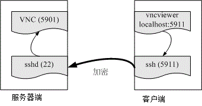 图 11.6-1、透过本地端的 ssh 加密联机到远程的服务器示意图

假设你已经透过上述各个小节建立好服务器 (www.centos.vbird) 上面的 VNC port 5901 ，而客户端则没有启动任何的 VNC 埠口。 那么你该如何透过 ssh 来进行加密呢？很简单，你可以在客户端计算机 (clientlinux.centos.vbird) 执行底下的指令：

```
[root@clientlinux ~]# ssh -L 本地埠口:127.0.0.1:远程端口 [-N] 远程主机
选项与参数：
-N ：仅启动联机通道，不登入远程 sshd 服务器
本地埠口：就是开启 127.0.0.1 上面一个监听的埠口
远程埠口：指定联机到后面远程主机的 sshd 后，sshd 该连到哪个埠口进行传输

# 1\. 在客户端启动所需要的端口进行的指令
[root@clientlinux ~]# ssh -L 5911:127.0.0.1:5901 -N 192.168.100.254
root@192.168.100.254's password:
   &lt;==登入远程仅是开启一个监听埠口，所以停止不能动作

# 2\. 在客户端在另一个终端机测试看看，这个动作不需要作，只是查阅而已
[root@clientlinux ~]# netstat -tnlp&#124; grep ssh
tcp  0   0 0.0.0.0:22           0.0.0.0:*            LISTEN      1330/sshd
tcp  0   0 127.0.0.1:5911       0.0.0.0:*            LISTEN      3347/ssh
tcp  0   0 :::22                :::*                 LISTEN      1330/sshd
[root@clientlinux ~]# netstat -tnap&#124; grep ssh
tcp  0   0 192.168.100.10:55490 192.168.100.254:22   ESTABLISHED 3347/ssh
# 在客户端启动 5911 的埠口是 ssh 启动的，同一个 PID 也联机到远程喔！ 
```

接下来你就可以在客户端 (192.168.100.10, clientlinux.centos.vbird) 使用『 vncviewer localhost:5911 』来联机， 但是该联机却会连到 www.centos.vbird (192.168.100.254) 那部主机的 port 5901 喔！不相信吗？ 当你达成 VNC 联机后，到 www.centos.vbird 那部主机上面瞧瞧就知道了：

```
# 3\. 在服务器端测试看看，这个动作不需要作，只是查阅而已
[root@www ~]# netstat -tnp &#124; grep ssh
tcp   0  0 127.0.0.1:59442     127.0.0.1:5901        ESTABLISHED 7623/sshd: root
tcp   0  0 192.168.100.254:22  192.168.100.10:55490  ESTABLISHED 7623/sshd: root
# 明显的看到 port 22 的程序同时联机到 port 5901 喔！ 
```

那如何取消这个联机呢？先关闭 VNC 之后，然后再将 clientlinux.centos.vbird 的第一个动作 (ssh -L ...) 按下 [ctrl]-c 就中断这个加密通道啰！这样会使用了吗？你可以将这个动作用在任何服务上喔！

* * *

### 11.6.4 以 ssh 信道配合 X server 传递图形接口

从前一个小节我们知道 ssh 可以进行程序的加密传递，亦即 ssh 通道啦！那么可不可以用在 X 上面呢？ 意思是说，那我能不能不要启动甚么很复杂的接口，就是在原有的接口底下使用 ssh 信道，将我所需要的服务器上面的图形接口传过来就好了？ 是可以的喔！鸟哥用一个 Windows 上面的 Xming X server 作范例好了。整个动作是这样的：

*   先在 Windows 上面启动 XLaunch，并设定好联机到 www.centos.vbird 的相关信息；
*   启动 Xming 程序，会取得一个 xterm 程序，该程序是 www.centos.vbird 的程序；
*   开始在 xterm 上面执行 X 软件，就会在 Windows 桌面上面显示啰！

那我们就开始来处理一下 Xming 这个程序吧！启动 XLaunch 之后出现下图模样：

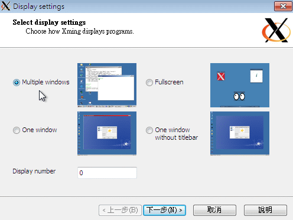 图 11.6-2、启动 XLaunch 程序-选择显示模式

记得上图中要选择 Multiple windows 会比较漂亮喔！然后按下『下一步』会出现下图：

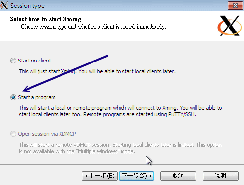 图 11.6-3、设定 XLaunch 程序-选择联机方式

我们要启动一只程序，并且是开放在 ssh/putty 之类的软件帮忙进行 ssh 信道的建立喔！然后下一步吧。

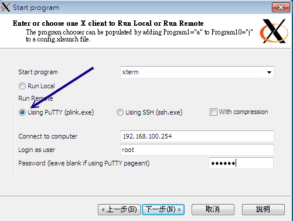 图 11.6-4、设定 XLaunch 程序-设定远程联机的相关参数

Xming 会主动的启动一个 putty 的程序帮你连进 sshd 服务器，所以这里得要帮忙设定好账号密码的相关信息。 鸟哥这里假设你的 sshd 尚未取消 root 登入，因此这里使用 root 的权限喔！

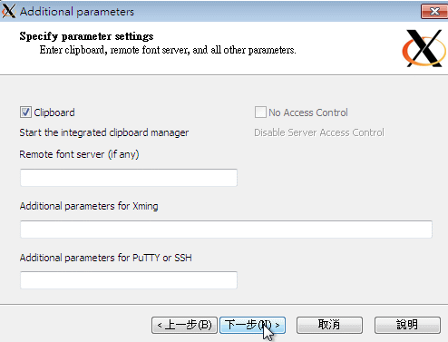 图 11.6-5、设定 XLaunch 程序-是否支持复制贴上功能

使用默认值吧！直接下一步。

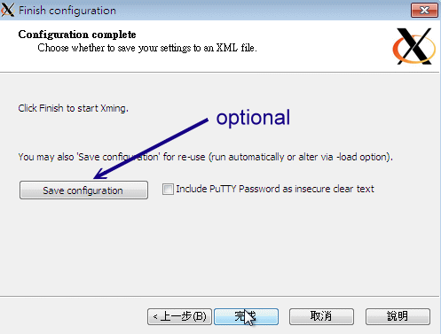 图 11.6-6、设定 XLaunch 程序-完成设定

很简单！这样就完成设定了！请按下完成，你就会看到 Windows 的桌面竟然出现如下的图示了！

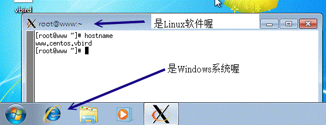 图 11.6-7、Windows 桌面出现的 X client 程序

上面这只程序就是 xterm 这个 X 的终端机程序。你可以在上面输入指令，该指令会传送到 Linux server ， 然后再将你要执行的图形数据透过 ssh 信道传送到目前的 Windows 上面的 Xming ，你的 Linux 完全不用启动 VNC, X, xrdp 等服务！只要有 sshd 就搞定了！就是这么简单！例如鸟哥输入几个游戏程序， 你的 Windows 窗口 (看任务栏就知道了) 就会出现这样的情况：

**Tips:** 事实上，我们的 basic server 安装方式并没有帮你安装 xterm 喔！所以，你得要自己安装 xterm 才行！ yum install xterm 就安装好啦！然后上面的动作再重来一次，就可以成功啰！而底下的图标里面的相关软件， 也是需要你自己安装的呦！ ^_^


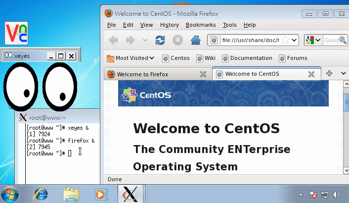 图 11.6-8、Windows 桌面出现的 X client 程序

* * *

# 11.7 重点回顾

## 11.7 重点回顾

*   远程联机服务器可以让使用者在任何一部计算机登入主机，以使用主机的资源或管理与维护主机；
*   常见的远程登录服务有 rsh, telnet, ssh, vnc, xdmcp 及 RDP 等；
*   telnet 与 rsh 都是以明码传输数据，当数据在 Internet 上面传输时较不安全；
*   ssh 由于使用密钥系统，因此数据在 Internet 上面传输时是加密过的，所以较为安全；
*   但 ssh 还是属于比较危险的服务，请不要对整个 Internet 开放 ssh 的可登入权限，可利用 iptables 规范可登入范围；
*   ssh 的 public Key 是放在服务器端，而 private key 是放在 client 端；
*   ssh 的联机机制有两种版本，建议使用可确认联机正确性的 version 2 ；
*   使用 ssh 时，尽量使用类似 email 的方式来登入，亦即： ssh username@hostname
*   client 端可以比对 server 传来的 public key 的一致性，利用的档案为 ~user/.ssh/known_hosts；
*   ssh 的 client 端软件提供 ssh, scp, sftp 等程序；
*   制作不需要密码的 ssh 账号可利用 ssh-keygen -t rsa 来制作 public, private Key pair；
*   上述指令所制作出的 public key 必须要上传到 server 的 ~user/.ssh/authorized_keys 档案中；
*   Xdmcp 是透过 X display manager (xdm, gdm, kdm 等) 所提供的功能协议；
*   若 client 端为 Linux 时，需要在 X 环境下以 xhost 增加可连接到本机 X Server 的 IP 才行；
*   除了 Xdmcp 之外，我们可以利用 VNC 来进行 X 的远程登录架构；
*   VNC 预设开的 port number 为 5900 开始，每个 port 仅允许一个联机；
*   rsync 可透过 ssh 的服务通道或 rsync --daemon 的方式来联机传输，其主要功能可以透过类似镜像备份， 仅备份新的数据，因此传输备份速度相当快速！

* * *

# 11.8 本章习题

## 11.8 本章习题

*   Telnet 与 SSH 都是远程联机服务器，为何我们都会推荐使用 SSH 而避免使用 Telnet 呢？原因何在？因为 Telnet 除了使用『明码』传送数据外，本身 telnet 就是很容易被入侵的一个服务器，所以当然也就比较危险了。 至于 ssh 其实也不是很安全的！由台湾计算机危机处理小组的文件可以明显的发现 openssl + openssh 也是常常有漏洞在发布！不过，比起 telnet 来说，确实是稍微安全一些！
*   请尝试说明 SSH 在 Server 与 Client 端联机时的封包加密机制；利用 key pair 来达到加密的机制：Server 提供 Public Key 给 Client 端演算 Private key ，以提供封包传送时的加密、解密！
*   请问 SSH 的配置文件是哪一个？如果我要修改让 root 无法使用 SSH 联机进入我的 SSH 主机，应该如何设定？又，如果要让 badbird 这个用户无法登入 SSH 主机，该如何设定？SSH 配置文件档名为 sshd_config ，通常放置在 /etc/ssh/sshd_config 内；如果不想让 root 登入，可以修改 sshd_config 内的参数成为：『PermitRootLogin no 』，并重新启动 ssh 来设定！如果要让 badbird 使用者无法登入，同样在 sshd_config 里面设定为：『DenyUsers badbird』即可！
*   在 Linux 上，预设的 Telnet 与 SSH 服务器使用的埠口(port number)各为多少？telnet 与 ssh 的埠口分别是：23 与 22！请参考 /etc/services 喔！
*   如果发现我无法在 Client 端使用 ssh 程序登入我的 Linux 主机，但是 Linux 主机却一切正常，可能的原因为何？(防火墙、known_hosts...)无法登入的原因可能有很多，最好先查询一下 /var/log/messages 里面的错误讯息来判断，当然，还有其他可能的原因为：

    1.  被防火墙挡住了，请以 iptables -L -n 来察看，当然也要察看 /etc/hosts.deny；
    2.  可能由于主机重新启动过， public key 改变了，请修改你的 ~/ssh/known_hosts 里面的主机 IP ；
    3.  可能由于 /etc/ssh/sshd_config 里面的设定问题，导致你这个使用者无法使用；
    4.  在 /etc/passwd 里面，你的 user 不具有可以登入的 shell ；
    5.  其他因素(如账号密码过期等等)
*   既然 ssh 是比较安全的资料封包传送方式，那么我就可以在 Internet 上面开放我的 Linux 主机的 SSH 服务了吗？！请说明你选择的答案的原因！最好不要对 Internet 开放你的 SSH 服务，因为 SSH 的加密函式库使用的是 openssl ，一般 Linux distribution 使用的 SSH 则是 openssh ，这两个套件事实上仍有不少的漏洞被发布过，因此，最好不要对 Internet 开放，毕竟 SSH 对于主机的权限是很高的！

* * *

# 11.9 参考数据与延伸阅读

## 11.9 参考数据与延伸阅读

*   注 1：与 SSH 服务器有关的两个重要官网 OpenSSH 官方网站：[`www.openssh.com/`](http://www.openssh.com/) OpenSSL 官方网站：[`www.openssl.org/`](http://www.openssl.org/)
*   注 2：与 putty 及 pietty 有关的网站 putty 官方网站：[`www.chiark.greenend.org.uk/~sgtatham/putty/`](http://www.chiark.greenend.org.uk/%7Esgtatham/putty/) pietty 中文网站：[`ntu.csie.org/~piaip/pietty/`](http://ntu.csie.org/%7Epiaip/pietty/)
*   注 3：XDMCP 维基百科：[`en.wikipedia.org/wiki/X*display_manager*(program_type)`](http://en.wikipedia.org/wiki/X_display_manager_%28program_type%29)
*   注 4：教你怎么设定 gdm 的 custom.conf [`www.idevelopment.info/data/Unix/Linux/LINUX_ConfiguringXDMCPRedHatLinux.shtml`](http://www.idevelopment.info/data/Unix/Linux/LINUX_ConfiguringXDMCPRedHatLinux.shtml) [`www.yolinux.com/TUTORIALS/GDM_XDMCP.html`](http://www.yolinux.com/TUTORIALS/GDM_XDMCP.html)
*   注 5：自由的 X server -- Xming： [`sourceforge.net/projects/xming/`](http://sourceforge.net/projects/xming/)
*   注 6：与 VNC 相关的资料 man vncserver, man Xvnc 使用 X 的 VNC Module：[`phorum.study-area.org/viewtopic.php?t=25713`](http://phorum.study-area.org/viewtopic.php?t=25713) [`fedoranews.org/tchung/vnc/03.shtml`](http://fedoranews.org/tchung/vnc/03.shtml)
*   注 7：维基百科：[`en.wikipedia.org/wiki/Remote_Desktop_Protocol`](http://en.wikipedia.org/wiki/Remote_Desktop_Protocol)
*   注 8：官网在 [`xrdp.sourceforge.net/`](http://xrdp.sourceforge.net/)
*   注 9： Fedora 基金会提供的 Extra Packages for Enterprise Linux (EPEL) 计划： [`fedoraproject.org/wiki/EPEL`](http://fedoraproject.org/wiki/EPEL)
*   注 10：rsync 的相关用法介绍： 酷学园：用 rsync 做备份：[`phorum.study-area.org/viewtopic.php?t=15553`](http://phorum.study-area.org/viewtopic.php?t=15553) ADJ 实验室的 rsync + SSH：[`www.adj.idv.tw/server/linux_rsync.php`](http://www.adj.idv.tw/server/linux_rsync.php)
*   公钥加密机制的维基百科解释：[`en.wikipedia.org/wiki/Public_Key_Cryptography`](http://en.wikipedia.org/wiki/Public_Key_Cryptography)

* * *

2002/11/14：第一次完成 2003/03/08：加入标头说明，与修改部分内容，例如 Telnet 服务器软件的安装等等，以及 SSH 的 putty 使用中文状态！ 2003/09/09：将本文进行一些修订，此外，加入了课后练习！ 2005/07/02：将旧的文章移动到 [这里](http://linux.vbird.org/linux_server/0310telnetssh/0310telnetssh.php) 。 2005/07/07：好不容易将 VNC 还有 XDMCP 给他写了写～大家帮鸟哥参考看看啊～ 2005/07/09：加入了让 VNC 与 tty7 同步的 vnc.so 模块的说明 2005/11/22：加入了 RSH 服务器 的相关数据！ 2006/09/18：将 putty 的介绍转成 pietty 的介绍！因为 pietty 更好用！另外也将 rsh 重新改写一下，校稿过！ 2006/09/19：加入 rsync 的简易说明与操作！最文末的习题可以瞧一瞧！ 2011/02/15：将旧的基于 CentOS 4.x 的文章移动到 [此处](http://linux.vbird.org/linux_server/0310telnetssh/0310telnetssh-centos4.php) 2011/02/17：忍痛删除 telnet 服务器，毕竟真的很少用了～包括那个 rsh 也不再介绍！有兴趣的请参考 CentOS 4.x 的旧文章吧 2011/02/20：将 sshd 服务器作个简单的修改了，增加一些篇幅来说明相关例题与实做，尤其是 ~/.ssh/authorized_keys 的权限 2011/02/23：修改了许多 Xdmcp, VNC 的设定与图示，最重要是加入 xrdp 的安装与使用 2011/02/24：加入 Xming 透过 X11 forward from ssh 的方式！ 2011/07/25：将基于 CentOS 5.x 的版本移动到[此处](http://linux.vbird.org/linux_server/0310telnetssh/0310telnetssh-centos5.php) 2011/07/26：将所有的图示以及相关的网站 IP 通通改为 CentOS 6.x 以及第三章谈到的区网架构啰！ 2011/11/24：经由网友的回报，在 ssh 联机方式里面谈到的公私钥系统是错误的！经过查询后，已经将正确的版本放上去了！ 2011/11/24：由于是较大幅度的改版，所以旧版也将它保留下来，按[这里](http://linux.vbird.org/linux_server/0310telnetssh//0310telnetssh-centos6-v1.php)联机。

* * *