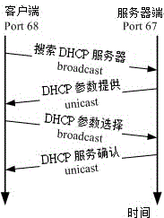
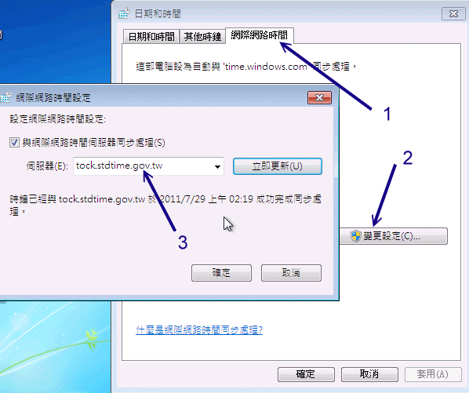
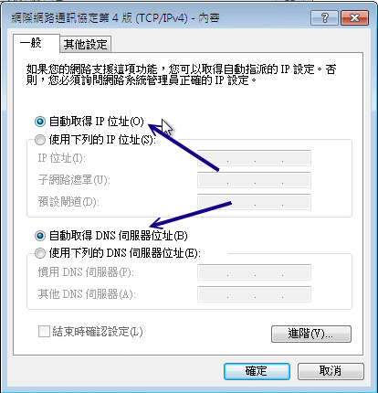

# 第十二章、网络参数控管者： DHCP 服务器

最近更新日期：2011/07/27

想象两种情况：(1)如果你在工作单位使用的是笔记本电脑，而且常常要带着你的笔记本电脑到处跑， 那么由第四章、连上 Internet 的说明中会发现，哇！ 我的网络卡参数要常常修改啊！而且，每到一个新的地方，就得问清楚该地的网络参数才行！真是麻烦。 (2)你的公司常常有访客或贵客来临，因为他们也带来笔电，所以也得常常跑来找你问网络参数才能设定他的计算机。 哇！这两种情况都会让你想哭哭吧？这个时候，动态主机设定协议 (DHCP) 可就大大的派上用场啦！DHCP 这个服务可以自动的分配 IP 与相关的网络参数给客户端，来提供客户端自动以服务器提供的参数来设定他们的网络。 如此一来，使用者只要将自己的笔电设定好经由 DHCP 协议来取得网络参数后，一插上网络线，呵呵！马上就可以享受 Internet 的服务啦！很方便吧！所以得来瞧一瞧这个好用的协定喔！

*   12.1 DHCP 运作的原理
    *   12.1.1 DHCP 服务器的用途
    *   12.1.2 DHCP 协议的运作方式： IP 参数, 租约期限, 多部 DHCP 服务器
    *   12.1.3 何时需要架设 DHCP 服务器
*   12.2 DHCP 服务器端的设定
    *   12.2.1 所需软件与档案结构
    *   12.2.2 主要配置文件 /etc/dhcp/dhcpd.conf 的语法
    *   12.2.3 一个局域网络的 DHCP 服务器设定案例
    *   12.2.4 DHCP 服务器的启动与观察
    *   12.2.5 内部主机的 IP 对应
*   12.3 DHCP 客户端的设定
    *   12.3.1 客户端是 Linux
    *   12.3.2 客户端是 Windows
*   12.4 DHCP 服务器端进阶观察与使用
    *   12.4.1 检查租约档案
    *   12.4.2 让大量 PC 都具有固定 IP 的脚本
    *   12.4.3 使用 ether-wake 实行远程自动开机 (remote boot)
    *   12.4.4 DHCP 与 DNS 的关系
*   12.5 重点回顾
*   12.6 本章习题
*   12.7 参考数据与延伸阅读
*   12.8 [针对本文的建议：http://phorum.vbird.org/viewtopic.php?p=117845](http://phorum.vbird.org/viewtopic.php?p=117845)

* * *

# 12.1 DHCP 运作的原理

## 12.1 DHCP 运作的原理

在正式的进入 DHCP (Dynamic Host Configuration Protocol) 服务器设定之前，我们先来认识一下 DHCP 这个协议吧！还有，需要了解的是，我们是否『一定』得设定 DHCP 这个服务器呢？这里都需要厘清一下概念喔！

* * *

### 12.1.1 DHCP 服务器的用途

在开始 DHCP 的说明之前，我们先来复习一下之前在[第二章网络基础](http://linux.vbird.org/linux_server/0110network_basic.php)里面提到的几个网络参数吧！ 要设定好一个网络的环境，使计算机可以顺利的连上 Internet ，那么你的计算机里面一定要有底下几个网络的参数才行，分别是：

*   IP, netmask, network, broadcast, gateway, DNS IP

其中，那个 IP, netmask, network, broadcast 与 gateway 都可以在 /etc/sysconfig/network-scripts/ifcfg-eth[0-n] 这档案里面设定，DNS 服务器的地址则是在 /etc/resolv.conf 里头设定。只要这几个项目设定正确，那么计算机应该就没问题的可以上网了！ 所以说，你家里面的 3, 4 部计算机，你都可以手动的来设定好你所需要的网络参数， 然后利用 [NAT 服务器](http://linux.vbird.org/linux_server/0250simple_firewall.php#nat)的功能，就可以大摇大摆的[连上 Internet](http://linux.vbird.org/linux_server/0130internet_connect.php) 了！真是不错 ^_^，不是吗？

好了，现在让我们换一个大一些些的场景吧！假设你是学校宿舍的网络管理员，所管理的学生计算机大概有 100 部好了，那么你怎么设定好这 100 部的计算机呢？

1.  直接每一部计算机都让你登门拜访手动的去设定好？
2.  将所有的学生都集合起来，然后精神训话.....喔不！是直接教导一下怎么设定？还是
3.  藉由一部主机来自动的分配所有的网络参数给宿舍内的任何一部计算机？

这三种解决方案所需要的时间都不相同，如果你选择的是(1)，那么鸟哥个人认为，你不是工作狂就是疯掉了， 因为所要花费的时间与你所得的薪水与付出的心力是完全不成比例的。如果选择是(2)，那么很可能你会被挂上独裁者、 没良心的管理员的称号！如果是选择(3)呢？恭喜你！这个方案的管理时间花费最短，也是最不麻烦的作法啦！

呵呵！知道鸟哥要说些什么了吗？是的！这个 DHCP (Dynamic Host Configuration Protocol) 服务器最主要的工作，就是在进行上面的第三个方案，也就是自动的将网络参数正确的分配给网域中的每部计算机， 让客户端的计算机可以在开机的时候就立即自动的设定好网络的参数值，这些参数值可以包括了 IP、netmask、network、gateway 与 DNS 的地址等等。如此一来，身为管理员的你，只要注意到这一部提供网络参数的主机有没有挂掉就好了， 其他同学们的个人计算机，哈！你想都不必想要怎么去帮忙！因为 DHCP 主机已经完全都帮你搞定啦！ ^_^！ 阿！当管理员最大的幸福就是可以喝喝茶、聊聊天就能控管好一切的网络问题呢！

* * *

### 12.1.2 DHCP 协议的运作方式

你必需要知道的是，DHCP 通常是用于局域网络内的一个通讯协议，他主要藉由客户端传送广播封包给整个物理网段内的所有主机， 若局域网络内有 DHCP 服务器时，才会响应客户端的 IP 参数要求。所以啰，DHCP 服务器与客户端是应该要在同一个物理网段内的。 至于整个 DHCP 封包在服务器与客户端的来来回回情况有点像底下这样：(注 1)

 图 12.1-1、

户端取得 IP 参数的程序可以简化如下：

1.  客户端：利用广播封包发送搜索 DHCP 服务器的封包：

    若客户端网络设定使用 DHCP 协议取得 IP (在 Windows 内为『自动取得 IP』)，则当客户端开机或者是重新启动网络卡时， 客户端主机会发送出搜寻 DHCP 服务器的 UDP 封包给所有物理网段内的计算机。此封包的目标 IP 会是 255.255.255.255， 所以一般主机接收到这个封包后会直接予以丢弃，但若局域网络内有 DHCP 服务器时，则会开始进行后续行为。

2.  服务器端：提供客户端网络相关的租约以供选择：

    DHCP 服务器在接收到这个客户端的要求后，会针对这个客户端的[硬件地址 (MAC)](http://linux.vbird.org/linux_server/0110network_basic.php#tcpip_link_mac) 与本身的设定数据来进行下列工作：

    *   到服务器的登录文件中寻找该用户之前是否曾经用过某个 IP ，若有且该 IP 目前无人使用，则提供此 IP 给客户端；
    *   若配置文件针对该 MAC 提供额外的固定 IP (static IP) 时，则提供该固定 IP 给客户端；
    *   若不符合上述两个条件，则随机取用目前没有被使用的 IP 参数给客户端，并记录下来。 总之，服务器端会针对客户端的要求提供一组网络参数租约给客户端选择，由于此时客户端尚未有 IP ，因此服务器端响应的封包信息中， 主要是针对客户端的 MAC 来给予回应。此时服务器端会保留这个租约然后开始等待客户端的回应。
3.  客户端：决定选择的 DHCP 服务器提供的网络参数租约并回报服务器：

    由于局域网络内可能并非仅有一部 DHCP 服务器，但客户端仅能接受一组网络参数的租约。 因此客户端必需要选择是否要认可该服务器提供的相关网络参数的租约。当决定好使用此服务器的网络参数租约后， 客户端便开始使用这组网络参数来设定自己的网络环境。此外，客户端也会发送一个广播封包给所有物理网段内的主机， 告知已经接受该服务器的租约。此时若有第二台以上的 DHCP 服务器，则这些没有被接受的服务器会收回该 IP 租约。至于被接受的 DHCP 服务器会继续进行底下的动作。

4.  服务器端：记录该次租约行为并回报客户端已确认的响应封包信息：

    当服务器端收到客户端的确认选择后，服务器会回传确认的响应封包，并且告知客户端这个网络参数租约的期限， 并且开始租约计时喔！那么该次租约何时会到期而被解约 (真可怕的字眼) ？你可以这样想：

    *   客户端脱机：不论是关闭网络接口 (ifdown)、重新启动 (reboot)、关机 (shutdown) 等行为，皆算是脱机状态，这个时候 Server 端就会将该 IP 回收，并放到 Server 自己的备用区中，等待未来的使用；

    *   客户端租约到期：前面提到 DHCP server 端发放的 IP 有使用的期限，客户端使用这个 IP 到达期限规定的时间，而且没有重新提出 DHCP 的申请时，就需要将 IP 缴回去！这个时候就会造成断线。但用户也可以再向 DHCP 服务器要求再次分配 IP 啰。

以上就是 DHCP 这个协议在 Server 端与 Client 端的运作状态，由上面这个运作状态来看，我们可以晓得，只要 Server 端设定没有问题，加上 Server 与 Client 在硬件联机上面确定是 OK 的，那么 Client 就可以直接藉由 Server 来取得上网的网络参数，当然啦，只要我们这些管理员能够好好的、正确的管理好我们的 DHCP 服务器， 嘿嘿！那么上网的设定自然就变成一件很简单的事情啦！不过，关于上述的流程还是有一些需要额外说明的啦：

*   DHCP 服务器给予客户端的 IP 参数为固定或动态：

在上面的步骤里面，注意到第二步骤了吗？就是服务器会去比较客户端的 MAC 硬件地址，并判断该 MAC 是否需要给予一个固定的 IP 呢！所以啦，我们可以设定 DHCP 服务器给予客户端的 IP 参数主要有两种：

*   固定 (Static) IP：

    只要那个客户端计算机的网络卡不换掉，那么 MAC 肯定就不会改变，由于 DHCP 可以根据 MAC 来给予固定的 IP 参数租约，所以该计算机每次都能以一个固定的 IP 连上 Internet ！呵呵！ 这种情况比较适合当这部客户端计算机需要用来做为提供区域内的一些网络服务的主机之用 (所以 IP 要固定)。那么如何在 Linux 上面知道网络卡的 MAC 呢？很简单啦！有很多的方式，最简单的方式就是使用 ifconfig 及 arp 来进行：

    ```
    # 1\. 观察自己的 MAC 可用 ifconfig：
    [root@www ~]# ifconfig &#124; grep HW
    eth0      Link encap:Ethernet  HWaddr 08:00:27:71:85:BD
    eth1      Link encap:Ethernet  HWaddr 08:00:27:2A:30:14
    # 因为鸟哥有两张网卡，所以有两个硬件地址喔！

    # 2\. 观察别人的 MAC 可用 ping 配合 arp
    [root@www ~]# ping -c 3 192.168.1.254
    [root@www ~]# arp -n
    Address        HWtype  HWaddress           Flags Mask   Iface
    192.168.1.254  ether   00:0c:6e:85:d5:69   C            eth0 
    ```

*   动态 (dynamic) IP：

    Client 端每次连上 DHCP 服务器所取得的 IP 都不是固定的！都直接经由 DHCP 所随机由尚未被使用的 IP 中提供！

除非你的局域网络内的计算机有可能用来做为主机之用，所以必需要设定成为固定 IP ，否则使用动态 IP 的设定比较简单，而且使用上面具有较佳的弹性。怎么说呢？假如你是一个 ISP 好了，而你只申请到 150 个 IP 来做为你的客户联机之用。那么你是否真的只能邀集到 150 的使用者？呵呵！当然不啰！我可以邀集 200 个使用者以上呢！

为什么？这样想好了，我今天开了一家餐馆，里面只有 20 个座位，那么是否我一餐只能卖给 20 个人呢？当然不是啦！因为客人是人来人往的，有人先吃有人后吃，所以同样是 20 个座位，但是可以有 40 个人来吃我的简餐，因为来的时间不一样嘛！了解了吗？呵呵！对啦！你这个 ISP 虽然只有 150 个 IP 可以发放，但是因为你的使用者并非 24 小时都挂在在线的，所以你可以将这 150 个 IP 做良好的分配，让 200 个人来『轮流使用』这 150 个 IP 哩！

**Tips:** 其实 IP 只有 Public IP 与 Private IP 两种，中文翻译成『公共 IP』与『私有 IP』这两个， 至于其他所谓的『静态 IP』、『实体 IP』、『虚拟 IP』、『浮动式 IP』等等，都是藉由一些 IP 取得的方式来分类的， 关于 IP 的种类我们在[网络基础](http://linux.vbird.org/linux_server/0110network_basic.php#tcpip_network_type)中谈过了， 记得再好好的厘清一下观念喔！


事实上现在主流的 ADSL 宽带拨接上网也有使用到『静态 IP 』与『固定 IP 』之类的概念喔！ 举例来说好了，hinet/seed net 等主要 ISP 都有提供所谓的：『一个固定 IP 搭配 7~8 个浮动 IP 』的 ADSL 拨接功能，也就是说同样透过一条电话线拨接到 ISP ，但是其中一个拨接是可以取得固定的 IP 呢！ 而其他的则是非固定的 IP ，DHCP 的 static/dynamic 跟这个玩意儿有点类似啦！ ^_^

*   关于租约所造成的问题与租约期限：

怪了！如果我们观察上面 DHCP 运作模式的第四个步骤，你会发现最后 DHCP 服务器还会给予一个租约期限！ 干嘛还要这样的一个期限呢？其实设定期限还是有个优点啦！最大的优点就是可以避免 IP 被某些使用者一直占用着，但该使用者却是 Idle (发呆) 的状态！

举个例子来说，我们刚刚不是说到，我有 150 个 IP ，但是偏偏我有 200 个用户吗？我们以 2010 年的世界杯足球赛来说明好了。假设每个使用者都急着上网知道世足赛的消息， 那么某些热门对战时段网络将可能达到使用尖峰！也就是说，这 200 个人同时要来使用这 150 个 IP ，有可能吗？当然不可能！肯定会有 50 个人无法联机，因为『很抱歉！目前系统正在忙线中，请你稍后再拨！』

那怎么办？这个时候租约到期的方式就很有用处啦！那几个已经联机进来很久的人， 就会因为租约到期而被迫脱机，这个时候该 IP 就会被释放出来，哈哈！大家赶快抢呀！先抢到先赢喔！ 所以，那 50 个人 (包括被迫脱机的那个朋友) 只好继续的、努力的、加油的来进行 DHCP 的要求啰！ ^_^""

虽然说是优点，但是其实如果站在使用者的角度来看，还是可能会造成公愤的！凭什么大家一起交钱， 我先联机进来就需要先被踢出去？～呵呵！所以啰，如果要当 ISP ，还是得要先规划好服务的方针才行呦！ 这样你可以了解租约到期的行为了吗？！ ^_^

既然有租约时间，那么是否代表我用 DHCP 取得的 IP 就得要『手动』的在某个时间点去重新取得新的 IP 呢？不需要的啦！因为目前的 DHCP 客户端程序大多会主动的依据租约时间去重新申请 IP (renew) 的！也就是说在租约到期前你的 DHCP 客户端程序就已经又重新申请更新租约时间了。所以除非 DHCP 主机挂点， 否则你所取得的 IP 应该是可以一直使用下去的！

**Tips:** 一般来说，假设租约期限是 T 小时，那么客户端在 0.5T 会主动向 DHCP 服务器发出重新要求网络参数的封包。 如果这次封包要求没有成功，那么在 0.875T 后还会再次的发送封包一次。正因如此，所以<u>服务器端会启动 port 67 监听用户要求，而用户会启动 port 68 主动向服务器要求</u>哩！鸟哥觉得这是很特殊的一件事呢！


*   多部 DHCP 服务器在同一物理网段的情况

或许你曾经发现过一件事情，那就是当我的网域里面有两部以上的 DHCP 服务器时， 到底哪一部服务器会提供我的这部客户端计算机所发出的 DHCP 要求？呵呵！很抱歉，俺也不晓得！ 因为在网络上面，很多时候都是『先抢先赢』的， DHCP 的回应也是如此！当 Server1 先响应时，你使用的就是 Server1 所提供的网络参数内容，如果是 Server2 先响应，你就是使用 Server2 的参数来设定你的客户端 PC ！不过，前提之下当然是这些计算机的『物理联机』都是在一起的啊！

因为这个特色的关系，所以当你在练习 DHCP 服务器的设定之前， 不要在已经正常运作的区网下测试，否则会很惨。举个鸟哥的例子来说好了，某一次其他系的研究生在测试网络安全时， 在原有的区网上面放了一部 IP 分享器，结果你猜怎么着？整栋大楼的网络都不通了！因为那时整栋大楼的网络是串接在一起的， 而我们学校是使用 DHCP 让客户端上网。由于 IP 分享器的设定并不能连上 Internet ，哇！大家都无法上网了啦！ 那你晓得了吗？不要随便测试啦这个 DHCP 服务器！

* * *

### 12.1.3 何时需要架设 DHCP 服务器

既然 DHCP 的好处是『免客户端设定』，而且对于行动装置的上网方面非常的方便！那么是否代表你就得要架设一部 DHCP 呢？那可不一定！接下来要告知大家的是几个概念性的问题， 你倒不一定『必需』遵守底下的一些概念呢！反正，自己的网域自己『爽』就好啦！

*   使用 DHCP 的几个时机

在某些情况之下，倒是强烈的建议架设 DHCP 主机的！什么情况呢？例如：

*   具有相当多行动装置的场合： 例如你的公司内部很多笔记本电脑使用的场合！因为这种笔电本身就是移动性的装置， 如果每到一个地方都要去问人家『喂！你这边的网络参数是什么？』还得要担心是否会跟人家的 IP 相冲突等等的问题！这个时候，DHCP 可就是你的救星啰！

*   区域内计算机数量相当的多时： 另外一个情况就是你所负责的网域内计算机数量相当庞大时， 大到你没有办法一个一个的进行说明来设定他们自己的网络参数，这个时候为了省麻烦，还是架设 DHCP 来的方便吶！况且，维护一部你熟悉的 DHCP 主机，要比造访几十个不懂计算机的人要简单的多哩！^_^

*   不建议使用 DHCP 主机的时机

虽然 DHCP 有很多好处，但是你有没有发现一个步骤怪怪的呀！回头看一下那个步骤一， 客户端在开机的时候会主动的发送讯息给网域上的所有机器，这个时候，如果网域上就是没有 DHCP 主机呢？很抱歉，那么你的这部客户端计算机，『仍然会持续的发送讯息！』 真正的时间与次数不晓得会有多久，不过，肯定会超过 30 秒以上， 甚至可以达到一分钟以上！哇！那么这段时间你能干嘛？呵呵！除了等、还是等！ 所以啰，如果计算机数不多，还是使用手动的方式来设定一下就好了！方便嘛！

*   在你网域内的计算机，有很多机器其实是做为主机的用途，很少用户需求，那么似乎就没有必要架设 DHCP ；
*   更极端的情况是，像一般家里，只有 3 ~ 4 部计算机，这个时候，架设 DHCP 只能拿来练练功力，事实上，并没有多大的效益；
*   当你管理的网域当中，大多网络卡都属于老旧的型号，并不支持 DHCP 的协议时；
*   很多用户的信息知识都很高，那么也没有需要架设 DHCP 啦。

* * *

如前所述，上面的都是概念性的说法，事实上，一件事情的解决之道是有很多的方案的， 没有所谓的『完全正确』的方案，只有『相对可行、并且符合经济效益与功能』的方案！ 所以啰，架设任何网站之前，请先多评估评估吶！

* * *

# 12.2 DHCP 服务器端的设定

## 12.2 DHCP 服务器端的设定

事实上，目前市面上的 IP 分享器已经便宜到爆了！而 IP 分享器本身就含有 DHCP 的功能。 所以如果你只是想要单纯的使用 DHCP 在你的局域网络当中而已，那么建议你直接购买一部 IP 分享器来使用即可， 因为至少它很省电。如果你还有其他考虑的话，才来架设 DHCP 吧！底下我们以一个简单的范例来架设 DHCP 先。

* * *

### 12.2.1 所需软件与档案结构

DHCP 的软件需求很简单，就是只要服务器端软件即可，在 CentOS 6.x 上面，这个软件的名称就是 dhcp 啰！如果是默认安装，那么这个软件是不会安装的，请自行使用 yum 去装好这个软件吧！安装完毕之后， 你可以使用『 rpm -ql dhcp 』来看看这个软件提供了哪些档案，基本上，比较重要的档案数据如下：

*   /etc/dhcp/dhcpd.conf 这个就是 dhcp 服务器的主要配置文件咯！在某些 Linux 版本上头这个档案可能不存在，所以如果你确定有安装 dhcp 软件却找不到这个档案时，请手动自行建立它即可。

    **Tips:** 其实 dhcp 软件在释出的时候都会附上一个范例档案，你可以使用『 rpm -ql dhcp 』来查询到 dhcpd.conf.sample 这个范例档案，然后将该档案复制成为 /etc/dhcp/dhcpd.conf 后，再手动去修改即可，这样设定比较容易啦！


*   /usr/sbin/dhcpd 启动整个 dhcp daemon 的执行档啊！其实最详细的执行方式应该要使用『 man dhcpd 』来查阅一番的呢！^_^

*   /var/lib/dhcp/dhcpd.leases 这档案颇有趣的！我们前面原理部分不是有提到『租约』吗？DHCP 服务器端与客户端租约建立的启始与到期日就是记录在这个档案当中的咯！

就跟你说很简单吧！整个软件数据也不过才如此而已呢！

* * *

### 12.2.2 主要配置文件 /etc/dhcp/dhcpd.conf 的语法

在 CentOS 5.x 以前，这个档案都被放置到 /etc/dhcpd.conf 的，新版的才放置于此处。其实 DHCP 的设定很简单啊，只要将 dhcpd.conf 设定好就可以启动了。不过编辑这个档案时你必须要留意底下的规范：

*   『 # 』为批注符号；
*   除了右括号 ")" 后面之外，其他的每一行设定最后都要以『 ; 』做为结尾！重要！
*   设定项目语法主要为：『 <参数代号> <设定内容> 』，例如： default-lease-time 259200;
*   某些设定项目必须以 option 来设定，基本方式为『 option <参数代码> <设定内容> 』例如： option domain-name "your.domain.name";

基本上，我们刚刚前面提过说， DHCP 的 IP 分配可分为给予动态 IP 与固定 IP ，其中又需要了解的是， 如果需要设定固定 IP 的话，那么就必须要知道要设定成固定 IP 的那部计算机的硬件地址 (MAC) 才行，请使用 arp 或 ifconfig 来查知你的接口的 MAC 吧！好了，那么需要设定的项目有哪些呢？ 其实 dhcpd.conf 里头的设定主要分为两大项目，一个是服务器运作的整体设定 (Global) 一个是 IP 设定模式 (动态或固定)， 每个项目的设定值大概有底下这几项：

*   整体设定 (Global)

假设你的 dhcpd 只管理一个区段的区网，那么除了 IP 之外的许多网络参数就可以放在整体设定的区域中，这包括有租约期限、DNS 主机的 IP 地址、路由器的 IP 地址还有动态 DNS (DDNS) 更新的类型等等。当固定 IP 及动态 IP 内没有规范到某些设定时，则以整体设定值为准。这些参数的设定名称为：

*   default-lease-time 时间： 用户的计算机也能够要求一段特定长度的租约时间，但若使用者没有特别要求租约时间的话， 那么就以此为预设的租约时间。后面的时间参数默认单位为秒；

*   max-lease-time 时间： 与上面的预设租约时间类似，不过，这个设定值是在规范使用者所能要求的最大租约时间。也就是说， 使用者要求的租约时间若超过此设定值，则以此值为准；

*   option domain-name "领域名"： 如果你在 /etc/resolv.conf 里面设定了一个『 search google.com 』的话，这表示当你要搜寻主机名时， DNS 系统会主动帮你加上这个领域名的意思。

*   option domain-name-servers IP1, IP2： 这个设定参数可以修改客户端的 /etc/resolv.conf 档案！就是 nameserver 后面接的那个 DNS IP 啰！特别注意设定参数最末尾为『servers』 (有 s 喔)；

*   ddns-update-style 类型： 因为 DHCP 客户端所取得的 IP 通常是一直变动的，所以某部主机的主机名与 IP 的对应就很难处理。此时 DHCP 可以透过 ddns (请参考[第十章](http://linux.vbird.org/linux_server/0270dynamic_dns.php)与[第十九章 DNS](http://linux.vbird.org/linux_server/0350dns.php) 的说明) 来更新主机名与 IP 的对应。不过我们这里不谈这么复杂的东西，所以你可以将他设定为 none 喔。

*   ignore client-updates： 与上一个设定值较相关，客户端可以透过 dhcpd 服务器来更新 DNS 相关的信息。不过，这里我们也先不谈这个， 因此就将它设定为 ignore (忽略) 了。

*   option routers 路由器的地址： 设定路由器的 IP 所在，记得那个『 routers 』要加 s 才对！

*   IP 设定模式 (动态或固定)

由于 dhcpd 主要是针对局域网络来给予 IP 参数的，因此在设定 IP 之前，我们得要指定一个区网才行。 指定区网的方式使用如下的参数：

subnet NETWORK_IP netmask NETMASK_IP { ... }

我们知道区网要给予 network / netmask IP 这两个参数才行，例如之前谈过的： 192.168.100.0 / 255.255.255.0 这样的设定值。 上头设定值当中， subnet 与 netmask 是关键词，而大写部分就填上你的区网参数啰。那在括号内还有什么参数需要设定的？ 那就是到底 IP 是固定的还是动态的设定啊：

*   range IP1 IP2： 在这个区网当中，给予一个连续的 IP 群用来发放成动态 IP 的设定，那个 IP1 IP2 指的是开放的 IP 范围。 举例来说，你想要开放 192.168.100.101 到 192.168.100.200 这 100 个 IP 用来作为动态分配，那就是： range 192.168.100.101 192.168.100.200;

*   host 主机名 { ... }; 这个 host 就是指定固定 IP 对应到固定 MAC 的设定值，那个主机名可以自己想想再给予即可。 不过在大括号内就得要指定 MAC 与固定的 IP 啰！那这两个设定值怎么设定呢？看看底下啰：

    *   hardware ethernet 硬件地址： 利用网络卡上面的固定硬件地址来设定，亦即该设定仅针对这个硬件地址有效的意思；

    *   fixed-address IP 地址： 给予一个固定的 IP 地址的意思。

说再多也没有什么用啦！让我们实际来玩一个案例吧！你就知道该如何处理了。

* * *

### 12.2.3 一个局域网络的 DHCP 服务器设定案例

假设我的环境当中，Linux 主机除了 NAT 服务器之外还得要负责其他服务器，例如邮件服务器的支持。 而在后端局域网络中则想要提供 DHCP 的服务。整个硬件配置的情况就如同[第三章的图 3.2-1](http://linux.vbird.org/linux_server/0120intranet.php#fig3.2-1)所示的内部独立区网 (centos.vbird 网域)。 需要注意的是，在图中 Linux Router 有两块接口，其中 eth1 对内而 eth0 对外，至于其他的网络参数设计为：

*   Linux 主机对内的 eth1 的 IP 设定为 192.168.100.254 这个；
*   内部网段设定为 192.168.100.0/24 这一段，且内部计算机的 router 为 192.168.100.254 ，此外 DNS 主机的 IP 为中华电信的 168.95.1.1 及 Seednet 的 139.175.10.20 这两个；
*   我想要让每个使用者预设租约为 3 天，最长为 6 天；
*   只想要分配的 IP 只有 192.168.100.101 到 192.168.100.200 这几个，其他的 IP 则保留下来；
*   我还有一部主机，他的 MAC 是『 08:00:27:11:EB:C2 』，我要给他的主机名为 win7 ，且 IP 为 192.168.100.30 这个 (请对照图 3.2-1 喔！)。

那我的配置文件就会像底下这个样子了：

```
[root@www ~]# vim /etc/dhcp/dhcpd.conf
# 1\. 整体的环境设定
ddns-update-style            none;            &lt;==不要更新 DDNS 的设定
ignore client-updates;                        &lt;==忽略客户端的 DNS 更新功能
default-lease-time           259200;          &lt;==预设租约为 3 天
max-lease-time               518400;          &lt;==最大租约为 6 天
option routers               192.168.100.254; &lt;==这就是预设路由
option domain-name           "centos.vbird";  &lt;==给予一个领域名
option domain-name-servers   168.95.1.1, 139.175.10.20;
# 上面是 DNS 的 IP 设定，这个设定值会修改客户端的 /etc/resolv.conf 档案内容

# 2\. 关于动态分配的 IP
subnet 192.168.100.0 netmask 255.255.255.0 {
    range 192.168.100.101 192.168.100.200;  &lt;==分配的 IP 范围

    # 3\. 关于固定的 IP 啊！
    host win7 {
        hardware ethernet    08:00:27:11:EB:C2; &lt;==客户端网卡 MAC
        fixed-address        192.168.100.30;    &lt;==给予固定的 IP
    }
}
# 相关的设定参数意义，请查询前一小节的介绍，或者 man dhcpd.conf 
```

够简单吧！这样就设定好了！你可以复制上头的数据然后修改一下，让里头的 IP 参数符合你的环境， 就能够设定好你的 DHCP 服务器了。接下来理论上你就能够启动 dhcp 了。不过，在某些早期的 Linux distribution 上面， 当你的 Linux 主机具有多个接口时，你的一个设定可能会让多个接口同时来监听，那就可能会发生错误了。

举例来说，我们现在的设定是 192.168.100.0/24 这个在 eth1 上头的网域，假设你还有一个界面 eth2 在 192.168.2.0/24 好了， 那万一你的 DHCP 同时监听两块接口的话，想一想，如果 192.168.2.0/24 网域的客户端发送出 dhcp 封包的要求时， 他会取得什么 IP ？当然是 192.168.100.X ！所以啰，我们就得要针对 dhcpd 这个执行文件设定他监听的接口， 而不是针对所有的接口都监听啊！你说是吧！^_^！那如何处理呢？在 CentOS (Red Hat 系统) 可以这样做：

```
[root@www ~]# vim /etc/sysconfig/dhcpd
DHCPDARGS="eth0" 
```

不过这个动作在 CentOS 5.x 以后的版本上面已经不需要了，因为新版本的 dhcp 会主动的分析服务器的网段与实际的 dhcpd.conf 设定， 如果两者无法吻合，就会有错误提示，人性化多了。 ^_^！接下来我们可以开始启动 dhcp 试看看啰！

* * *

### 12.2.4 DHCP 服务器的启动与观察

开始来启动 dhcp 吧！在启动前你得要注意几件事情喔：

*   你的 Linux 服务器网络环境已经设定好，例如 eth1 已经是 192.168.100.254；
*   你的防火墙规则已经处理好，例如：(1)放行内部区网的联机、(2)iptables.rule 的 NAT 服务已经设定妥当；

另外你要注意的是：dhcpd 使用的埠口是 port 67 ，并且启动的结果会记录在 /var/log/messages 档案内，你最好能去观察一下 /var/log/messages 所显示的 dhcpd 相关信息才好。

```
# 1\. 启动后观察一下埠口的变化：
[root@www ~]# /etc/init.d/dhcpd start
[root@www ~]# chkconfig dhcpd on
[root@www ~]# netstat -tlunp &#124; grep dhcp
Active Internet connections (only servers)
Proto Recv-Q Send-Q Local Address Foreign Address PID/Program name
udp        0      0 0.0.0.0:67    0.0.0.0:*       1581/dhcpd

# 2\. 固定去看看登录文件的输出信息
[root@www ~]# tail -n 30 /var/log/messages
Jul 27 01:51:24 www dhcpd: Internet Systems Consortium DHCP Server 4.1.1-P1
Jul 27 01:51:24 www dhcpd: Copyright 2004-2010 Internet Systems Consortium.
Jul 27 01:51:24 www dhcpd: All rights reserved.
Jul 27 01:51:24 www dhcpd: For info, please visit https://www.isc.org/software/dhcp/
Jul 27 01:51:24 www dhcpd: WARNING: Host declarations are global.  They are not 
limited to the scope you declared them in.
Jul 27 01:51:24 www dhcpd: Not searching LDAP since ldap-server, ldap-port and 
ldap-base-dn were not specified in the config file
Jul 27 01:51:24 www dhcpd: Wrote 0 deleted host decls to leases file.
Jul 27 01:51:24 www dhcpd: Wrote 0 new dynamic host decls to leases file.
Jul 27 01:51:24 www dhcpd: Wrote 0 leases to leases file.
Jul 27 01:51:24 www dhcpd: Listening on LPF/eth1/08:00:27:2a:30:14/192.168.100.0/24
Jul 27 01:51:24 www dhcpd: Sending on   LPF/eth1/08:00:27:2a:30:14/192.168.100.0/24
....(以下省略).... 
```

看到这些资料就是成功的象征啦！尤其是上述有特殊字体的部分。恭喜你啊！真是『福气啦！』不过， 万一你看到的登录档是类似底下的模样呢？

```
Jul 27 01:56:30 www dhcpd: /etc/dhcp/dhcpd.conf line 7: unknown option 
dhcp.domain-name-server
Jul 27 01:56:30 www dhcpd: option domain-name-server#011168.
Jul 27 01:56:30 www dhcpd:         ^
Jul 27 01:56:30 www dhcpd: /etc/dhcp/dhcpd.conf line 9: Expecting netmask
Jul 27 01:56:30 www dhcpd: subnet 192.168.100.0 network
Jul 27 01:56:30 www dhcpd:                       ^
Jul 27 01:56:30 www dhcpd: Configuration file errors encountered -- exiting 
```

上述的数据表示在第 7, 9 行恐怕有点设定错误，设定错误的地方在行号底下还有指数符号 (^) 特别标注出来！ 由上面的情况来看，第 7 行的地方应该是 domain-name-servers 忘了加 s 了，而第 9 行则是参数下错， 应该是 netmask 而非 network ！这样了解乎？

* * *

### 12.2.5 内部主机的 IP 对应

如果你有仔细的瞧过第二章的[网络基础](http://linux.vbird.org/linux_server/0110network_basic.php)的话，那么应该还会记得那个 [/etc/hosts (第四章 4.4.1)](http://linux.vbird.org/linux_server/0130internet_connect.php#problem_hosts) 会影响内部计算机在联机阶段的等待时间吧？那么我现在使用 DHCP 之后，糟糕！我怎么知道哪一部 PC 连上我的主机，那要怎么填写 /etc/hosts 的内容呢？这真是太简单了！就将所有可能的计算机 IP 都加进去该档案呀！ ^_^ ！以鸟哥为例，在这个例子中，鸟哥的分配的 IP 至少有 192.168.100.30, 192.168.100.101 ~ 192.168.100.200 ，所以 /etc/hosts 可以写成：

```
[root@www ~]# vim /etc/hosts
127.0.0.1    +    localhost.localdomain localhost
192.168.100.254   vbird-server
192.168.100.30 　 win7
192.168.100.101 　dynamic-101
192.168.100.102 　dynamic-102
....(中间省略)....
192.168.100.200   dynamic-200 
```

这样一来，所有可能连进来的 IP 都已经有纪录了，哈哈！当然没有什么大问题啰！ ^_^！不过， 更好的解决方案则是架设内部的 DNS 服务器，这样一来，内部的其他 Linux 服务器也不必更改 /etc/hosts 就能够取得每部主机的 IP 与主机名对应，那样就更加妥当啦！

* * *

# 12.3 DHCP 客户端的设定

## 12.3 DHCP 客户端的设定

DHCP 的客户端可以是 Windows 也可以是 Linux 呢！鸟哥的网域内使用三部计算机，就如图 3.2-1 所示的那样。 Linux 与 Windows XP 的设定方式已经分别在第四章与第三章谈过了，底下就稍微介绍过而已。至于图示的部分， 我们主要是以 Windows 7 来做介绍啰。

* * *

### 12.3.1 客户端是 Linux

Linux 的网络参数设定还记得吧？不记得的话就得要打屁股了！在[第四章 (4.2.2)](http://linux.vbird.org/linux_server/0130internet_connect.php#connect_auto) 我们谈过自动取得 IP 的方式，设定真的很简单：

```
[root@clientlinux ~]# vim /etc/sysconfig/network-scripts/ifcfg-eth0
DEVICE=eth0
NM_CONTROLLED=no
ONBOOT=yes
BOOTPROTO=dhcp  &lt;==就是他！指定这一个就对了！

[root@clientlinux ~]# /etc/init.d/network restart 
```

同时记得要拿掉预设路由的设定喔！改完之后，就将我们的整个网络重新启动即可 (不要使用 ifdown 与 ifup ，因为还有预设路由要设定！)。请注意，如果你是在远程进行这个动作， 你的联机『肯定会挂掉！』，因为网络卡被你关了嘛！呵呵！所以请在本机前面才进行喔！如果执行的结果有找到正确的 DHCP 主机，那么几个档案可能会被更动喔：

```
# 1\. DNS 的 IP 会被更动呢！查阅一下 resolv.conf 先：
[root@clientlinux ~]# cat /etc/resolv.conf
search centos.vbird      &lt;==还记得设定过 domain-name 否？
domain centos.vbird      &lt;==还记得设定过 domain-name 否？
nameserver 168.95.1.1    &lt;==这就是我们在 dhcpd.conf 内的设定值
nameserver 139.175.10.20

# 2\. 观察一下路由啦！
[root@clientlinux ~]# route -n
Kernel IP routing table
Destination    Gateway         Genmask        Flags Metric Ref  Use Iface
192.168.100.0  0.0.0.0         255.255.255.0  U     0      0      0 eth0
0.0.0.0        192.168.100.254 0.0.0.0        UG    0      0      0 eth0
# 嗯！没错！路由也被正确的捉到了！OK 的啦！

# 3\. 察看一下客户端的指令吧！
[root@clientlinux ~]# netstat -tlunp &#124; grep dhc
Proto Recv-Q Send-Q Local Address  Foreign Address State  PID/Program name
udp        0      0 0.0.0.0:68     0.0.0.0:*              1694/dhclient
# 你没看错！确实是有个小程序在监测 DHCP 的联机状态吶！

# 4\. 看一看客户端租约所记载的信息吧！
[root@clientlinux ~]# cat /var/lib/dhclient/dhclient*
lease {
  interface "eth0";
  fixed-address 192.168.100.101; &lt;==取得的 IP 呦！
  option subnet-mask 255.255.255.0;
  option routers 192.168.100.254;
  option dhcp-lease-time 259200;
  option dhcp-message-type 5;
  option domain-name-servers 168.95.1.1,139.175.10.20;
  option dhcp-server-identifier 192.168.100.254;
  option domain-name "centos.vbird";
  renew 4 2011/07/28 05:01:24; &lt;==下一次预计更新 (renew) 的时间点
  rebind 5 2011/07/29 09:06:36;
  expire 5 2011/07/29 18:06:36;
}
# 这个档案会记录该适配卡所曾经要求过的 DHCP 信息喔！重要！
# 有没有看出来，他几乎就与你设定的 /etc/dhcp/dhcpd.conf 类似？ ^_^ 
```

有没有发现其实你的客户端取得的数据都被记载在 /var/lib/dhclient/dhclient*-eth0.leases 里头啊？ 如果你有多张网卡，那么每张网卡自己的 DHCP 要求就会被写入到不同档名的档案当中去！ 观察该档案就知道你的数据是如何啰！这可也是挺重要的呦！

**Tips:** 你或许会问说， dhcp 不是都会随机取得 IP 吗？那为什么这部客户端 clientlinux.centos.vbird 每次都能够取得相同的固定 IP 呢？ 很简单，因为上头的 dhclient-eth0.leases 里面的 fixed-address 指定了想要固定 IP 的选项。如果 DHCP 服务器的该 IP 没有被用走，也在规定的 range 设定值内，那就会发放给你这个 IP 了。如果你想要不同的 IP 呢？ 那就将你想要的 IP 取代上述的设定值啦！


例题：在文献中谈到，如果区网内有多个 DHCP 服务器 (假设有 DHCP1, DHCP2)，那么每次客户端对整个物理网络区段广播时，DHCP 服务器将是先抢先赢的局面。 但是若第一次取得 DHCP1 服务器的 IP 后，未来重新启动网络，都只会取得 DHCP1 的网络参数，这是为什么？答：看到上述的 dhclient-eth0.leases 客户端档案了吗？因为你的主机想要取得上次取得的网络参数，因此将会对 DHCP1 要求网络参数。 如果你想要使用先抢先赢的方式来取得 IP ，或者想要使用 DHCP2 来取得 IP ，那么得要修订或者删除 dhclient-eth0.leases 才行。

* * *

### 12.3.2 客户端是 Windows

在 Windows 底下设定 DHCP 协议以取得 IP 实在是很简单喔！例如，你可以到第三章的 [3.2.2](http://linux.vbird.org/linux_server/0120intranet.php#protocol_win) 小节去瞧瞧如何设定的撷取图示。 我们这里以 Windows 7 作为介绍好了。你可以依据『开始』-->『控制台』-->『检视网络状态及工作』 -->『变更适配卡设定』，在出现的图示中，选择属于你的相关网卡，然后连击两下之后，就开始底下的设定程序：

1.  如上所述，点击网络卡设定后，会出现如下图示：

     图 12.3-1、局域网络的 Windows 7 系统设定 DHCP 的方式

1.  在图 12.3-1 的地方按下箭头所指的『内容』处，就会出现如下画面啰：

     图 12.3-2、局域网络的 Windows 7 系统设定 DHCP 的方式

```
在上面的画面当中，先点选 TCP/IP4 第四版 IP 协议，然后按下『内容』就可以开始来修改网络参数啰！ 
```

1.  接下来如下图所示，你只要勾选『自动取得 IP 地址』那个项目，然后按下『确定』并离开设定画面， 如此一来 Windows 就会开始自动取得 IP 的工作了。

     图 12.3-3、局域网络的 Windows 7 系统设定 DHCP 的方式

1.  那你如何确认你的 IP 已经被顺利的取得呢？如果是在早期的 Windows 95 ，你可以使用一个名为『 winipcfg 』 来观察你的 IP 设定。不过在 windows 2000 以后，你可能需要使用命令提示字符来观察才行。你可以使用： 『开始』-->『所有程序』-->『附属应用程序』-->『命令提示字符』来取出终端机，然后这样处理看看：

    ```
    C:\Users\win7&gt; ipconfig /all
    ....(前面省略)....
    以太网络卡 区域联机:

       联机特定 DNS 后缀 . . . . . . . . : centos.vbird
       描述 . . . . . . . . . . . . . . .: Intel(R) PRO/1000 MT Desktop Adapter
       实体地址 . . . . . . . . . . . . .: 08-00-27-11-EB-C2
       DHCP 已启用 . . . . . . . . . . . : 是
       自动设定启用 . . . . . . . . . . .: 是
       链接-本机 IPv6 地址 . . . . . . . : fe80::ec92:b907:bc2a:a5fa%11(偏好选项)
       IPv4 地址 . . . . . . . . . . . . : 192.168.100.30(偏好选项) &lt;==这是取得的 IP
       子网掩码 . . . . . . . . . . . .: 255.255.255.0
       租用取得 . . . . . . . . . . . . .: 2011 年 7 月 27 日 上午 11:59:18 &lt;==这是租约
       租用到期 . . . . . . . . . . . . .: 2011 年 7 月 30 日 上午 11:59:18
       预设网关 . . . . . . . . . . . . .: 192.168.100.254
       DHCP 服务器 . . . . . . . . . . . : 192.168.100.254  &lt;==这一部 DHCP 服务器
       DNS 服务器 . . . . . . . . . . . .: 168.95.1.1       &lt;==取得的 DNS
                                           139.175.10.20
       NetBIOS over Tcpip . . . . . . . .: 启用

    C:\Users\win7&gt; ipconfig /renew
    # 这样可以立即要求更新 IP 信息喔！ 
    ```

    这样就 OK 的啦！简单吧！

* * *

# 12.4 DHCP 服务器端进阶观察与使用

## 12.4 DHCP 服务器端进阶观察与使用

如果你要管理的是几十部甚至是几百部的计算机时，你总是希望能够根据座位来进行 IP 的给予吧？因此，固定 IP 配合 MAC 就显的很重要啦！那么如何取得每部主机的 IP 呢？还有，你怎么查询到相关的租约呢？以及，如果你还想要进行远程开机， 帮使用者在固定的时间就开机呢？那就来看看底下的其他用途吧！

* * *

### 12.4.1 检查租约档案

客户端会主动的纪录租约信息，那服务器端更不能忘记记录啰！服务器端是记录在这个地方：

```
[root@www ~]# cat /var/lib/dhcpd/dhcpd.leases
lease 192.168.100.101 {
  starts 2 2011/07/26 18:06:36;  &lt;==租约开始日期
  ends 5 2011/07/29 18:06:36;    &lt;==租约结束日期
  tstp 5 2011/07/29 18:06:36;
  cltt 2 2011/07/26 18:06:36;
  binding state active;
  next binding state free;
  hardware ethernet 08:00:27:34:4e:44; &lt;==客户端网卡
} 
```

从这个档案里面我们就知道有多少客户端已经向我们申请了 DHCP 的 IP 使用了呢！很容易了解吧！

* * *

### 12.4.2 让大量 PC 都具有固定 IP 的脚本

想一想，如果你有一百台计算机要管理，每部计算机都希望是固定 IP 的情况下，那你要如何处置？ 很简单，透过 DHCP 的 fixed-address 就行啦！但是，这一百台计算机的 MAC 如何取得？你要怎么改啦？ 难道每部计算机都去抄写，然后再回来设定 dhcpd.conf 吗？这也太可怕了吧？既然每部计算机最终都得要开机， 那么你在开机之后，利用手动的方法来设定好每部主机的 IP 后，在根据底下的脚本来处理好你的 dhcpd.conf 啰！

```
[root@www ~]# vim setup_dhcpd.conf
#!/bin/bash
read -p "Do you finished the IP's settings in every client (y/n)? " yn
read -p "How many PC's in this class (ex&gt; 60)? " num
if [ "$yn" = "y" ]; then
        for site in $(seq 1 ${num})
        do
                siteip="192.168.100.${site}"
                allip="$allip $siteip"
                ping -c 1 -w 1 $siteip &gt; /dev/null 2&gt;&1
                if [ "$?" == "0" ]; then
                        okip="$okip $siteip"
                else
                        errorip="$errorip $siteip"
                        echo "$siteip is DOWN"
                fi
        done
        [ -f dhcpd.conf ] && rm dhcpd.conf
        for site in $allip
        do
                pcname=pc$(echo $site &#124; cut -d '.' -f 4)
                mac=$(arp -n &#124; grep "$site " &#124; awk '{print $3}')
                echo "  host $pcname {"
                echo "          hardware ethernet ${mac};"
                echo "          fixed-address     ${site};"
                echo "  }"
                echo "  host $pcname {"                         &gt;&gt; dhcpd.conf
                echo "          hardware ethernet ${mac};"      &gt;&gt; dhcpd.conf
                echo "          fixed-address     ${site};"     &gt;&gt; dhcpd.conf
                echo "  }"                                      &gt;&gt; dhcpd.conf
        done
fi
echo "You can use dhcpd.conf (this directory) to modified your /etc/dhcp/dhcpd.conf"
echo "Finished." 
```

这个脚本的想法很简单，如果你管理的计算机都是 Linux 的话，那么先开机后使用『 ifconfig eth0 YOURIP 』 来设定对应的 IP ，在鸟哥这个例子中，我使用的是 192.168.100.X/24 这个区段，此时 IP 就设定好了！ 然后在透过上面的脚本跑一次，每部计算机的 MAC 与 IP 对应就顺利的写入 dhcpd.conf 啰！ 然后你在将它贴上 /etc/dhcp/dhcpd.conf 即可！如果你管理的计算机是 Windows 的话， 那使用文字接口下达『 netsh interface ip set address xxx 』之类的指令来修订啰！

* * *

### 12.4.3 使用 ether-wake 实行远程自动开机 (remote boot)

既然已经知道客户端的 MAC 地址了，如果客户端的主机符合一些电源标准， 并且该客户端主机所使用之网络卡暨主板支持网络唤醒的功能时，我们就可以透过网络来让客户端计算机开机了。 如果你有一部主机想要让他可以透过网络来启动时，你必须要在这部客户端计算机上进行：

1.  首先你得要在 BIOS 里面设定『网络唤醒』的功能，否则是没有用的喔！
2.  再来你必须要让这部主机接上网络线，并且电源也是接通的。
3.  将这部主机的 MAC 抄下来，然后关机等待网络唤醒。

接下来请到永远开着的主机 DHCP 服务器上面 (其实只要任何一部 Linux 主机均可！) ，安装 net-tools 这个软件后， 就会取得 ether-wake 这个指令，这就是网络唤醒的主要功能！那该如何使用这个指令呢？假设客户端主机的 MAC 为 11:22:33:44:55:66 并且与我的服务器 eth1 相连接好了，那么你想要让这部主机被唤醒，就这样做吧：

```
[root@www ~]# ether-wake -i eth1 11:22:33:44:55:66

# 更多功能可以这样查阅喔：
[root@www ~]# ether-wake -u 
```

然后你就会发现，哈哈！那部客户端主机被启动了！以后如果你要连到局域网络内的话， 只要能够连上你的防火墙主机，然后透过这个 ether-wake 软件，就能够让你局域网络内的主机启动了， 控管上面就更加方便的啦！你说是吧！ ^_^

**Tips:** 鸟哥办公室有一部桌机是经常用来测试的机器，但是因为比较耗电，因此当鸟哥离开办公室时，就会将计算机关闭。 不过鸟哥办公室有一部 NAT server 在负责防火墙的第一道关卡，当鸟哥在家里有需要查询到学校桌机的数据时， 桌机关了怎办？没关系，透过 NAT server 登入后，使用 ether-wake 唤醒桌机，那就能够开机进去工作啰！ 这样也比较不怕耗电问题～


* * *

### 12.4.4 DHCP 与 DNS 的关系

我们知道局域网络内如果很多 Linux 服务器时，你得要将 private IP 加入到每部主机的 /etc/hosts 里面， 这样在联机阶段的等待时间才不会有逾时或者是等待太久的问题。问题是，如果计算机数量太大，又有很多测试机时， 这时你得要常常去更新维护那些重灌过的机器的 /etc/hosts ，烦不烦吶？

此时在区网内架设一部 DNS 服务器负责主机名解析就很重要！因此既然已经有 DNS 服务器帮忙进行主机名的解析，那你根本不需要更动 /etc/hosts ！未来的新机器或者是新灌的计算机也不需要改写任何网络参数，这样维护会轻松很多。 因此，一个好的区网内，理论上，我们应该在 DHCP 服务器主机上面在安装一个 DNS 服务器，提供内部计算机的名称解析为宜。 相关的设定就请参考[第十九章 DNS](http://linux.vbird.org/linux_server/0350dns.php) 的介绍啰。

*   DHCP 响应速度与有网管 switch 的设定问题

鸟哥在昆山信息传播系 ([`www.dic.ksu.edu.tw`](http://www.dic.ksu.edu.tw/)) 负责五间计算机教室的维护，每间计算机教室内部的 giga switch 是低阶的有网管功能的机器！有网管功能机器的设定信息比较多， switch 也能够进行封包异常的侦测与抵挡。问题是，如果抵挡的行为『太超过』时，也可能造成许多问题。

鸟哥管理的计算机教室在重新启动网络取得 DHCP 时，都会等待几乎达 30 秒，虽然最终是成功的，但是等这么久呢！ 取得 IP 之后，网络速度却又是正常的，一切没问题～就是教导网络参数设定时，学生都会哇哇叫！以为失败了， 有的等了将近一分钟才告知取得 IP 且为正常...

后来问了有经验的计中的罗组长，才发现可能是 switch 的问题。大多在设定位于『L2 Features』-->『Spanning Tree』-->『STP Port Settings』的子项目之类的字眼，将 STP 之类的埠口都设定为关闭 (Disabled) 看看， 鸟哥做完这个设定后，DHCP 的取得就顺畅了！连带的网络开机功能也就没有问题～这部份也提供给大家参考呦！

**Tips:** 网友巩立伟兄来信谈到，STP 主要的目的是在抵挡广播风暴，若侦测到广播风暴时，该 switch 的埠口会被停用。 只是启动这个功能后，会较缓慢的进入运作状态，所以会产生较慢的情况发生。较好的 switch 会支援 RSTP (Rapid spanning tree protocol)，速度会较快一些。感谢朋友提供的信息喔！^_^


* * *

# 12.5 重点回顾

## 12.5 重点回顾

*   DHCP (Dynamic Host Configuration Protocol) 可以提供网络参数给客户端计算机，使其自动设定网络的功能；
*   透过 DHCP 的统一管理，在同一网域当中就比较不容易出现 IP 冲突的情况发生；
*   DHCP 可以透过 MAC 的比对来提供 Static IP (或称为固定 IP)，否则通常提供客户端 dynamic IP (或称为动态 IP)；
*   DHCP 除了 Static IP 与 Dynamic IP 之外，还可以提供租约行为之设定；
*   在租约期限到期之前，客户端 dhcp 软件即会主动的要求更新 (约 0.5, 0.85 倍租约时间左右)；
*   DHCP 可以提供的 MAC 比对、Dynamic IP 的 IP 范围以及租约期限等等，都在 dhcpd.conf 这个档案当中设定的；
*   一般的情况之下，使用者需要自行设定 dhcpd.leases 这个档案，不过，真正的租约档案记录是在 /var/lib/dhclient/dhclient-eth0.leases 里面；
*   如果只是要单纯的 DHCP 服务，建议可以购买类似 IP 分享器的设备即可提供稳定且低耗电的网络服务。
*   DHCP 服务与 DNS 服务的相关性很高；
*   若 DHCP 客户端取得 IP 的速度太慢，或许可以找一下有网管 switch 的 STP 设定值。

* * *

# 12.6 本章习题

## 12.6 本章习题

*   DHCP 主要的两种 IP 分配模式为何？主要的两种分配模式分别为 Dynamic IP 与 Static IP ， Static IP 透过 MAC 的比对，至于 Dynamic IP 则是直接取用网域中尚未被使用到的 IP 来进行 Client 端的分配。
*   在有 DHCP 主机存在的网域当中，且 client 端亦使用 DHCP 来规划客户端的网络参数，那么请问，在该网域当中，Client 端透过 DHCP 取得 IP 的流程为何？

    1.  首先， Client 端会发出一个 DHCP 要求封包；
    2.  server 端接收到要求后，会主动的响应信息给 Client ；
    3.  Client 若接受该 DHCP 主机所提供的参数，则主机会记录下租约信息，至于 client 端则开始以主机提供的参数设定其网络
*   DHCP 是如何发送 Static IP 的？可以使用何种指令取得该信息？DHCP 主要利用网络卡的硬件地址，亦即俗称的『网络卡卡号』，也就是 MAC 来进行 Client 端的比对的，至于主动取得 Client 端的方式，可以透过 ping 以及 arp 来获得。

*   在 DHCP 服务器的租约档，亦即 /var/lib/dhcpd/dhcpd.leases 当中，记录了什么信息？这个档案主要记录了 Client 端连上 Server 端的纪录数据，他会被 DHCP 主机用来判定与 Client 端的租约行为喔！
*   DHCP 的登录档放置于何处？就是最重要的 /var/log/messages 这个档案啦(预设状况下！)

* * *

# 12.7 参考数据与延伸阅读

## 12.7 参考数据与延伸阅读

*   注 1：在维基百科的 DHCP 相关说明： [`zh.wikipedia.org/zh-tw/DHCP`](http://zh.wikipedia.org/zh-tw/DHCP) [`en.wikipedia.org/wiki/Dynamic_Host_Configuration_Protocol`](http://en.wikipedia.org/wiki/Dynamic_Host_Configuration_Protocol)
*   其他可供查阅之数据： DHCP mini HOWTO：英文版：[`tldp.org/HOWTO/DHCP/index.html`](http://tldp.org/HOWTO/DHCP/index.html) DHCP mini HOWTO：中文版：[`www.linux.org.tw/CLDP/MiniHOWTO/network/DHCP/`](http://www.linux.org.tw/CLDP/MiniHOWTO/network/DHCP/) Internet Software consortium：[`www.isc.org/software/dhcp`](http://www.isc.org/software/dhcp) Study Area：[`www.study-area.org/linux/servers/linux_dhcp.htm`](http://www.study-area.org/linux/servers/linux_dhcp.htm) Study Area 网络开机(我本善良兄撰写)：[`www.study-area.org/tips/wol.htm`](http://www.study-area.org/tips/wol.htm)

* * *

2002/11/23：第一次完成 2003/03/15：加入相关重点回顾、与练习题 2003/09/10：修改版面去！ 2006/12/05：将旧的文章移动到[此处](http://linux.vbird.org/linux_server/0340dhcp/0340dhcp.php) 2006/12/06：好累！怎么老是在说累～总之，完成啰～新增加 ether-wake 的网络唤醒功能。 2011/02/24：将基于 CentOS 4.x 的旧的文章移动到[此处](http://linux.vbird.org/linux_server/0340dhcp//0340dhcp-centos4.php) 2011/03/03：加入了 DNS 的相关性，有网管的 STP 会影响 DHCP 的取得等数据。 2011/07/27：将基于 CentOS 5.x 的版本移动到[此处](http://linux.vbird.org/linux_server/0340dhcp//0340dhcp-centos5.php) 2011/07/27：主要是将 Windows 的图示以 Windows 7 来示意啰！

* * *