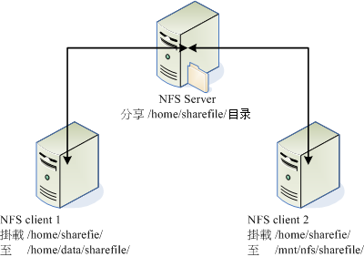
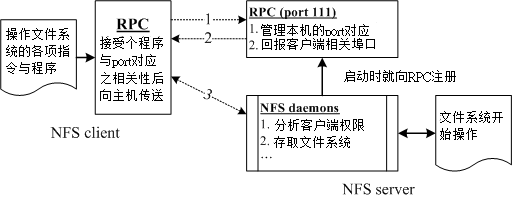
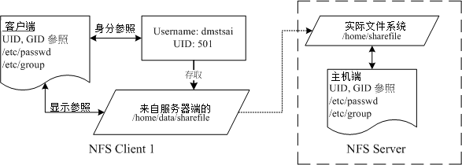
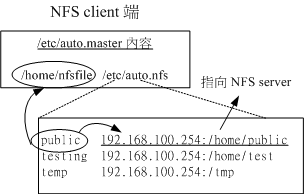

# 第十三章、文件服务器之一：NFS 服务器

最近更新日期：2011/07/27

NFS 为 Network FileSystem 的简称，它的目的就是想让不同的机器、不同的操作系统可以彼此分享个别的档案啦！目前在 Unix Like 当中用来做为文件服务器是相当不错的一个方案喔！基本上， Unix Like 主机连接到另一部 Unix Like 主机来分享彼此的档案时，使用 NFS 要比 SAMBA 这个服务器快速且方便的多了！此外， NFS 的设定真的很简单，几乎只要记得启动 Remote Procedure Call 这个咚咚 (RPC, 就是 rpcbind 这个软件啦！) 就一定可以架设的起来！真是不错啊！ 如果是在 Linux PC cluster 的环境下，这个服务器被使用的机率更是高的多喔！所以得来玩一玩啊！

*   13.1 NFS 的由来与其功能
    *   13.1.1 什么是 NFS ( Network FileSystem )
    *   13.1.2 什么是 RPC ( Remote Procedure Call )
    *   13.1.3 NFS 启动的 RPC daemons
    *   13.1.4 NFS 的档案访问权限
*   13.2 NFS Server 端的设定
    *   13.2.1 所需要的软件
    *   13.2.2 NFS 的软件结构
    *   13.2.3 /etc/exports 配置文件的语法与参数
    *   13.2.4 启动 NFS： rpcinfo
    *   13.2.5 NFS 的联机观察： showmount, /var/lib/nfs/etab, exportfs
    *   13.2.6 NFS 的安全性： 防火墙与埠口, 关机注意事项
*   13.3 NFS 客户端的设定
    *   13.3.1 手动挂载 NFS 服务器分享的资源
    *   13.3.2 客户端可处理的挂载参数与开机挂载： 特殊参数
    *   13.3.3 无法挂载的原因分析
    *   13.3.4 自动挂载 autofs 的使用
*   13.4 案例演练
*   13.5 重点回顾
*   13.6 本章习题
*   13.7 参考数据与延伸阅读
*   13.8 [针对本文的建议：http://phorum.vbird.org/viewtopic.php?p=114695](http://phorum.vbird.org/viewtopic.php?p=114695)

* * *

# 13.1 NFS 的由来与其功能

## 13.1 NFS 的由来与其功能

NFS 这个藉由网络分享文件系统的服务在架设的时候是很简单的，不过，它最大的问题在于『权限』方面的概念！ 因为在客户端与服务器端可能必须要具备相同的账号才能够存取某些目录或档案。 另外，NFS 的启动需要透过所谓的远程过程调用 (RPC)，也就是说，我们并不是只要启动 NFS 就好了， 还需要启动 RPC 这个服务才行啊！

因此，在开始进行 NFS 的设定之前，我们得先来了解一下，什么是 NFS 呢？不然讲了一堆也没有用，对吧！ ^_^！ 底下就来谈一谈什么是 NFS ，且 NFS 的启动还需要什么样的协议啊！

* * *

### 13.1.1 什么是 NFS (Network FileSystem)

NFS 就是 **N**etwork **F**ile**S**ystem 的缩写，最早之前是由 [Sun](http://www.oracle.com/us/sun/index.html) 这家公司所发展出来的 (注 1)。 它最大的功能就是可以透过网络，让不同的机器、不同的操作系统、可以彼此分享个别的档案 (share files)。所以，你也可以简单的将他看做是一个文件服务器 (file server) 呢！这个 NFS 服务器可以让你的 PC 来将网络远程的 NFS 服务器分享的目录，挂载到本地端的机器当中， 在本地端的机器看起来，那个远程主机的目录就好像是自己的一个磁盘分区槽一样 (partition)！使用上面相当的便利！

 图 13.1-1、NFS 服务器分享目录与 Client 挂载示意图

就如同上面的图示一般，当我们的 NFS 服务器设定好了分享出来的 /home/sharefile 这个目录后，其他的 NFS 客户端就可以将这个目录挂载到自己系统上面的某个挂载点 (挂载点可以自定义)，例如前面图示中的 NFS client 1 与 NFS client 2 挂载的目录就不相同。我只要在 NFS client 1 系统中进入 /home/data/sharefile 内，就可以看到 NFS 服务器系统内的 /home/sharefile 目录下的所有数据了 (当然，权限要足够啊！^_^)！这个 /home/data/sharefile 就好像 NFS client 1 自己机器里面的一个 partition 喔！只要权限对了，那么你可以使用 cp, cd, mv, rm... 等等磁盘或档案相关的指令！真是他 X 的方便吶！

好的，既然 NFS 是透过网络来进行数据的传输，那么经由[第二章谈到的 socket pair](http://linux.vbird.org/linux_server/0110network_basic.php#tcpip_transfer_tcp_socket) 的概念你会知道 NFS 应该会使用一些埠口吧？那么 NFS 使用哪个埠口来进行传输呢？基本上 NFS 这个服务的埠口开在 2049 ，但是由于文件系统非常复杂，因此 NFS 还有其他的程序去启动额外的端口，但这些额外的端口启动的号码是？ 答案是....不知道！ @_@ ！因为预设 NFS 用来传输的埠口是随机选择小于 1024 以下的埠口来使用的。咦！那客户端怎么知道你服务器端使用那个埠口啊？此时就得要 远程过程调用 (Remote Procedure Call, RPC) 的协定来辅助啦！底下我们就来谈谈什么是 RPC？

* * *

### 13.1.2 什么是 RPC (Remote Procedure Call)

因为 NFS 支持的功能相当的多，而不同的功能都会使用不同的程序来启动， 每启动一个功能就会启用一些端口来传输数据，因此， NFS 的功能所对应的端口才没有固定住， 而是随机取用一些未被使用的小于 1024 的埠口来作为传输之用。但如此一来又造成客户端想要连上服务器时的困扰， 因为客户端得要知道服务器端的相关埠口才能够联机吧！

此时我们就得需要远程过程调用 (RPC) 的服务啦！RPC 最主要的功能就是在指定每个 NFS 功能所对应的 port number ，并且回报给客户端，让客户端可以连结到正确的埠口上去。 那 RPC 又是如何知道每个 NFS 的埠口呢？这是因为当服务器在启动 NFS 时会随机取用数个埠口，并主动的向 RPC 注册，因此 RPC 可以知道每个埠口对应的 NFS 功能，然后 RPC 又是固定使用 port 111 来监听客户端的需求并回报客户端正确的埠口， 所以当然可以让 NFS 的启动更为轻松愉快了！

**Tips:** 所以你要注意，要启动 NFS 之前，RPC 就要先启动了，否则 NFS 会无法向 RPC 注册。 另外，RPC 若重新启动时，原本注册的数据会不见，因此 RPC 重新启动后，它管理的所有服务都需要重新启动来重新向 RPC 注册。


 图 13.1-2、NFS 与 RPC 服务及文件系统操作的相关性

如上图所示，当客户端有 NFS 档案存取需求时，他会如何向服务器端要求数据呢？

1.  客户端会向服务器端的 RPC (port 111) 发出 NFS 档案存取功能的询问要求；
2.  服务器端找到对应的已注册的 NFS daemon 埠口后，会回报给客户端；
3.  客户端了解正确的埠口后，就可以直接与 NFS daemon 来联机。

由于 NFS 的各项功能都必须要向 RPC 来注册，如此一来 RPC 才能了解 NFS 这个服务的各项功能之 port number, PID, NFS 在服务器所监听的 IP 等等，而客户端才能够透过 RPC 的询问找到正确对应的埠口。 也就是说，NFS 必须要有 RPC 存在时才能成功的提供服务，因此我们称 NFS 为 RPC server 的一种。事实上，有很多这样的服务器都是向 RPC 注册的，举例来说，NIS (Network Information Service) 也是 RPC server 的一种呢。此外，由图 13.1-2 你也会知道，不论是客户端还是服务器端，要使用 NFS 时，两者都需要启动 RPC 才行喔！

更多的 NFS 相关协议信息你可以参考底下网页：

*   RFC 1094, NFS 协议解释 [`www.faqs.org/rfcs/rfc1094.html`](http://www.faqs.org/rfcs/rfc1094.html)
*   Linux NFS-HOWTO：[`www.tldp.org/HOWTO/NFS-HOWTO/index.html`](http://www.tldp.org/HOWTO/NFS-HOWTO/index.html)

* * *

### 13.1.3 NFS 启动的 RPC daemons

我们现在知道 NFS 服务器在启动的时候就得要向 RPC 注册，所以 NFS 服务器也被称为 RPC server 之一。 那么 NFS 服务器主要的任务是进行文件系统的分享，文件系统的分享则与权限有关。 所以 NFS 服务器启动时至少需要两个 daemons ，一个管理客户端是否能够登入的问题， 一个管理客户端能够取得的权限。如果你还想要管理 quota 的话，那么 NFS 还得要再加载其他的 RPC 程序就是了。我们以较单纯的 NFS 服务器来说：

*   rpc.nfsd： 最主要的 NFS 服务器服务提供商。这个 daemon 主要的功能就是在管理客户端是否能够使用服务器文件系统挂载信息等， 其中还包含这个登入者的 ID 的判别喔！

*   rpc.mountd 这个 daemon 主要的功能，则是在管理 NFS 的文件系统哩！当客户端顺利的通过 rpc.nfsd 而登入服务器之后，在他可以使用 NFS 服务器提供的档案之前，还会经过档案权限 (就是那个 -rwxrwxrwx 与 owner, group 那几个权限啦) 的认证程序！他会去读 NFS 的配置文件 /etc/exports 来比对客户端的权限，当通过这一关之后客户端就可以取得使用 NFS 档案的权限啦！(注：这个也是我们用来管理 NFS 分享之目录的权限与安全设定的地方哩！)

*   rpc.lockd (非必要) 这个玩意儿可以用在管理档案的锁定 (lock) 用途。为何档案需要『锁定』呢？ 因为既然分享的 NFS 档案可以让客户端使用，那么当多个客户端同时尝试写入某个档案时， 就可能对于该档案造成一些问题啦！这个 rpc.lockd 则可以用来克服这个问题。 但 rpc.lockd 必须要同时在客户端与服务器端都开启才行喔！此外， rpc.lockd 也常与 rpc.statd 同时启用。

*   rpc.statd (非必要) 可以用来检查档案的一致性，与 rpc.lockd 有关！若发生因为客户端同时使用同一档案造成档案可能有所损毁时， rpc.statd 可以用来检测并尝试回复该档案。与 rpc.lockd 同样的，这个功能必须要在服务器端与客户端都启动才会生效。

上述这几个 RPC 所需要的程序，其实都已经写入到两个基本的服务启动脚本中了，那就是 nfs 以及 nfslock 啰！ 亦即是在 /etc/init.d/nfs, /etc/init.d/nfslock，与服务器较有关的写入在 nfs 服务中，而与客户端的 rpc.lockd 之类的，就设定于 nfslock 服务中。

* * *

### 13.1.4 NFS 的档案访问权限

不知道你有没有想过这个问题，在图 13.1-1 的环境下，假如我在 NFS client 1 上面以 dmtsai 这个使用者身份想要去存取 /home/data/sharefile/ 这个来自 NFS server 所提供的文件系统时， 请问 NFS server 所提供的文件系统会让我以什么身份去存取？是 dmtsai 还是？

为什么会这么问呢？这是因为 NFS 本身的服务并没有进行身份登入的识别， 所以说，当你在客户端以 dmtsai 的身份想要存取服务器端的文件系统时， 服务器端会以客户端的使用者 UID 与 GID 等身份来尝试读取服务器端的文件系统。这时有个有趣的问题就产生啦！ 那就是如果客户端与服务器端的使用者身份并不一致怎么办？ 我们以底下这个图示来说明一下好了：

 图 13.1-3、NFS 的服务器端与客户端的使用者身份确认机制

当我以 dmtsai 这个一般身份使用者要去存取来自服务器端的档案时，你要先注意到的是： 文件系统的 inode 所记录的属性为 UID, GID 而非账号与群组名。 那一般 Linux 主机会主动的以自己的 /etc/passwd, /etc/group 来查询对应的使用者、组名。 所以当 dmtsai 进入到该目录后，会参照 NFS client 1 的使用者与组名。 但是由于该目录的档案主要来自 NFS server ，所以可能就会发现几个情况：

*   NFS server/NFS client 刚好有相同的账号与群组 则此时使用者可以直接以 dmtsai 的身份进行服务器所提供的文件系统之存取。

*   NFS server 的 501 这个 UID 账号对应为 vbird 若 NFS 服务器上的 /etc/passwd 里面 UID 501 的使用者名称为 vbird 时， 则客户端的 dmtsai 可以存取服务器端的 vbird 这个使用者的档案喔！只因为两者具有相同的 UID 而已。这就造成很大的问题了！因为没有人可以保证客户端的 UID 所对应的账号会与服务器端相同， 那服务器所提供的数据不就可能会被错误的使用者乱改？

*   NFS server 并没有 501 这个 UID 另一个极端的情况是，在服务器端并没有 501 这个 UID 的存在，则此时 dmtsai 的身份在该目录下会被压缩成匿名者， 一般 NFS 的匿名者会以 UID 为 65534 为其使用者，早期的 Linux distributions 这个 65534 的账号名称通常是 nobody ，我们的 CentOS 则取名为 nfsnobody 。但有时也会有特殊的情况，例如在服务器端分享 /tmp 的情况下， dmtsain 的身份还是会保持 501 但建立的各项数据在服务器端来看，就会属于无拥有者的资料。

*   如果使用者身份是 root 时 有个比较特殊的使用者，那就是每个 Linux 主机都有的 UID 为 0 的 root 。 想一想，如果客户端可以用 root 的身份去存取服务器端的文件系统时，那服务器端的数据哪有什么保护性？ 所以在预设的情况下， root 的身份会被主动的压缩成为匿名者。

总之，客户端使用者能做的事情是与 UID 及其 GID 有关的，那当客户端与服务器端的 UID 及账号的对应不一致时， 可能就会造成文件系统使用上的困扰，这个就是 NFS 文件系统在使用上面的一个很重要的地方！ 而在了解使用者账号与 UID 及文件系统的关系之后，要实际在客户端以 NFS 取用服务器端的文件系统时， 你还得需要具有：

*   NFS 服务器有开放可写入的权限 (与 /etc/exports 设定有关)；
*   实际的档案权限具有可写入 (w) 的权限。

当你满足了 (1)使用者账号，亦即 UID 的相关身份； (2)NFS 服务器允许有写入的权限； (3)文件系统确实具有 w 的权限时，你才具有该档案的可写入权限喔！ 尤其是身份 (UID) 确认的环节部分，最容易搞错啦！也因为如此， 所以 NFS 通常需要与 [NIS (十四章)](http://linux.vbird.org/linux_server/0430nis.php) 这一个可以确认客户端与服务器端身份一致的服务搭配使用，以避免身份的错乱啊！ ^_^

**Tips:** 老实说，这个小节的数据比较难懂～尤其是刚刚接触到 NFS server 的朋友。因此，你可以先略过 13.1.4 这个小节。 但是，在你读完与做完本章后续所有的实作之后，记得回到这个小节来再查阅一次文章内容，相信会有进一步的认识的！


* * *

# 13.2 NFS Server 端的设定

## 13.2 NFS Server 端的设定

既然要使用 NFS 的话，就得要安装 NFS 所需要的软件了！底下让我们查询一下系统有无安装所需要的软件， NFS 软件的架构以及如何设定 NFS 服务器吧！ ^_^

* * *

### 13.2.1 所需要的软件

以 CentOS 6.x 为例的话，要设定好 NFS 服务器我们必须要有两个软件才行，分别是：

*   RPC 主程序：rpcbind

    就如同刚刚提的到，我们的 NFS 其实可以被视为一个 RPC 服务，而要启动任何一个 RPC 服务之前，我们都需要做好 port 的对应 (mapping) 的工作才行，这个工作其实就是『 rpcbind 』这个服务所负责的！也就是说， 在启动任何一个 RPC 服务之前，我们都需要启动 rpcbind 才行！ (在 CentOS 5.x 以前这个软件称为 portmap，在 CentOS 6.x 之后才称为 rpcbind 的！)

*   NFS 主程序：nfs-utils

    就是提供 rpc.nfsd 及 rpc.mountd 这两个 NFS daemons 与其他相关 documents 与说明文件、执行文件等的软件！这个就是 NFS 服务所需要的主要软件啦！一定要有喔！

好了，知道我们需要这两个软件之后，现在干嘛？赶快去你的系统先用 RPM 看一下有没有这两个软件啦！ 没有的话赶快用 RPM 或 yum 去安装喔！不然就玩不下去了！

例题：请问我的主机是以 RPM 为套件管理的 Linux distribution ，例如 Red Hat, CentOS 与 SuSE 等版本，那么我要如何知道我的主机里面是否已经安装了 rpcbind 与 nfs 相关的软件呢？答：简单的使用『 rpm -qa | grep nfs 』与『 rpm -qa | grep rpcbind 』即可知道啦！如果没有安装的话， 在 CentOS 内可以使用『 [yum](http://linux.vbird.org/linux_server/0210network-secure.php#update) install nfs-utils 』来安装！

* * *

### 13.2.2 NFS 的软件结构

NFS 这个咚咚真的是很简单，上面我们提到的 NFS 软件中，配置文件只有一个，执行档也不多， 记录文件也三三两两而已吶！赶紧先来看一看吧！ ^_^

*   主要配置文件：/etc/exports 这个档案就是 NFS 的主要配置文件了！不过，系统并没有默认值，所以这个档案『 不一定会存在』，你可能必须要使用 vim 主动的建立起这个档案喔！我们等一下要谈的设定也仅只是这个档案而已吶！

*   NFS 文件系统维护指令：/usr/sbin/exportfs 这个是维护 NFS 分享资源的指令，我们可以利用这个指令重新分享 /etc/exports 变更的目录资源、将 NFS Server 分享的目录卸除或重新分享等等，这个指令是 NFS 系统里面相当重要的一个喔！至于指令的用法我们在底下会介绍。

*   分享资源的登录档：/var/lib/nfs/*tab 在 NFS 服务器的登录文件都放置到 /var/lib/nfs/ 目录里面，在该目录下有两个比较重要的登录档， 一个是 etab ，主要记录了 NFS 所分享出来的目录的完整权限设定值；另一个 xtab 则记录曾经链接到此 NFS 服务器的相关客户端数据。

*   客户端查询服务器分享资源的指令：/usr/sbin/showmount 这是另一个重要的 NFS 指令。exportfs 是用在 NFS Server 端，而 showmount 则主要用在 Client 端。这个 showmount 可以用来察看 NFS 分享出来的目录资源喔！

就说不难吧！主要就是这几个啰！

* * *

### 13.2.3 /etc/exports 配置文件的语法与参数

在开始 NFS 服务器的设定之前，你必须要了解的是，NFS 会直接使用到核心功能，所以你的核心必须要有支持 NFS 才行。万一如果你的核心版本小于 2.2 版，或者重新自行编译过核心的话，那么就得要很注意啦！因为你可能会忘记选择 NFS 的核心支持啊！

还好，我们 CentOS 或者是其他版本的 Linux ，预设核心通常是支持 NFS 功能的，所以你只要确认你的核心版本是目前新的 2.6.x 版，并且使用你的 distribution 所提供的核心，那应该就不会有问题啦！

**Tips:** 上面会提醒您这个问题的原因是，以前鸟哥都很喜欢自行编译一个特别的核心，但是某次编译核心时，却忘记加上了 NFS 的核心功能，结果 NFS server 无论如何也搞不起来～最后才想到原来俺的核心是非正规的...


至于 NFS 服务器的架设实在很简单，你只要编辑好主要配置文件 /etc/exports 之后，先启动 rpcbind (若已经启动了，就不要重新启动)，然后再启动 nfs ，你的 NFS 就成功了！ 不过这样的设定能否对客户端生效？那就得要考虑你权限方面的设定能力了。废话少说，我们就直接来看看那个 /etc/exports 应该如何设定吧！某些 distributions 并不会主动提供 /etc/exports 档案，所以请你自行手动建立它吧。

```
[root@www ~]# vim /etc/exports
/tmp         192.168.100.0/24(ro)   localhost(rw)   *.ev.ncku.edu.tw(ro,sync)
[分享目录]   [第一部主机(权限)]     [可用主机名]    [可用通配符] 
```

你看看，这个配置文件有够简单吧！每一行最前面是要分享出来的目录，注意喔！是以目录为单位啊！ 然后这个目录可以依照不同的权限分享给不同的主机，像鸟哥上面的例子说明是： 要将 /tmp 分别分享给三个不同的主机或网域的意思。记得主机后面以小括号 () 设计权限参数， 若权限参数不止一个时，则以逗号 (,) 分开。且主机名与小括号是连在一起的喔！在这个档案内也可以利用 # 来批注呢。

至于主机名的设定主要有几个方式：

*   可以使用完整的 IP 或者是网域，例如 192.168.100.10 或 192.168.100.0/24 ，或 192.168.100.0/255.255.255.0 都可以接受！

*   也可以使用主机名，但这个主机名必须要在 /etc/hosts 内，或可使用 DNS 找到该名称才行啊！反正重点是可找到 IP 就是了。如果是主机名的话，那么他可以支持通配符，例如 * 或 ? 均可接受。

至于权限方面 (就是小括号内的参数) 常见的参数则有：

| 参数值 | 内容说明 |
| --- | --- |
| rw ro | 该目录分享的权限是可擦写 (read-write) 或只读 (read-only)，但最终能不能读写，还是与文件系统的 rwx 及身份有关。 |
| sync async | sync 代表数据会同步写入到内存与硬盘中，async 则代表数据会先暂存于内存当中，而非直接写入硬盘！ |
| no_root_squash root_squash | 客户端使用 NFS 文件系统的账号若为 root 时，系统该如何判断这个账号的身份？预设的情况下，客户端 root 的身份会由 root_squash 的设定压缩成 nfsnobody， 如此对服务器的系统会较有保障。但如果你想要开放客户端使用 root 身份来操作服务器的文件系统，那么这里就得要开 no_root_squash 才行！ |
| all_squash | 不论登入 NFS 的使用者身份为何， 他的身份都会被压缩成为匿名用户，通常也就是 nobody(nfsnobody) 啦！ |
| anonuid anongid | anon 意指 anonymous (匿名者) 前面关于 *_squash 提到的匿名用户的 UID 设定值，通常为 nobody(nfsnobody)，但是你可以自行设定这个 UID 的值！当然，这个 UID 必需要存在于你的 /etc/passwd 当中！ anonuid 指的是 UID 而 anongid 则是群组的 GID 啰。 |

这是几个比较常见的权限参数，如果你有兴趣玩其他的参数时，请自行 man exports 可以发现很多有趣的数据。 接下来我们利用上述的几个参数来实际思考一下几个有趣的小习题：

例题一：让 root 保有 root 的权限我想将 /tmp 分享出去给大家使用，由于这个目录本来就是大家都可以读写的，因此想让所有的人都可以存取。此外，我要让 root 写入的档案还是具有 root 的权限，那如何设计配置文件？答：

```
[root@www ~]# vim /etc/exports
# 任何人都可以用我的 /tmp ，用通配符来处理主机名，重点在 no_root_squash
/tmp  *(rw,no_root_squash) 
```

主机名可以使用通配符，上头表示无论来自哪里都可以使用我的 /tmp 这个目录。 再次提醒，『 *(rw,no_root_squash) 』这一串设定值中间是没有空格符的喔！而 /tmp 与* (rw,no_root_squash) 则是有空格符来隔开的！特别注意到那个 no_root_squash 的功能！在这个例子中，如果你是客户端，而且你是以 root 的身份登入你的 Linux 主机，那么当你 mount 上我这部主机的 /tmp 之后，你在该 mount 的目录当中，将具有『root 的权限！』

例题二：同一目录针对不同范围开放不同权限我要将一个公共的目录 /home/public 公开出去，但是只有限定我的局域网络 192.168.100.0/24 这个网域且加入 vbirdgroup (第一章的例题建立的群组) 的用户才能够读写，其他来源则只能读取。答：

```
[root@www ~]# mkdir /home/public
[root@www ~]# setfacl -m g:vbirdgroup:rwx /home/public
[root@www ~]# vim /etc/exports
/tmp          *(rw,no_root_squash)
/home/public  192.168.100.0/24(rw)    *(ro)
# 继续累加在后面，注意，我有将主机与网域分为两段 (用空白隔开) 喔！ 
```

上面的例子说的是，当我的 IP 是在 192.168.100.0/24 这个网段的时候，那么当我在 Client 端挂载了 Server 端的 /home/public 后，针对这个被我挂载的目录我就具有可以读写的权限～ 至于如果我不是在这个网段之内，那么这个目录的数据我就仅能读取而已，亦即为只读的属性啦！

需要注意的是，通配符仅能用在主机名的分辨上面，IP 或网段就只能用 192.168.100.0/24 的状况， 不可以使用 192.168.100.* 喔！

例题三：仅给某个单一主机使用的目录设定我要将一个私人的目录 /home/test 开放给 192.168.100.10 这个 Client 端的机器来使用时，该如何设定？ 假设使用者的身份是 dmtsai 才具有完整的权限时。答：

```
[root@www ~]# mkdir /home/test
[root@www ~]# setfacl -m u:dmtsai:rwx /home/test
[root@www ~]# vim /etc/exports
/tmp          *(rw,no_root_squash)
/home/public  192.168.100.0/24(rw)    *(ro)
/home/test    192.168.100.10(rw)
# 只要设定 IP 正确即可！ 
```

这样就设定完成了！而且，只有 192.168.100.10 这部机器才能对 /home/test 这个目录进行存取喔！

例题四：开放匿名登录的情况我要让 *.centos.vbird 网域的主机，登入我的 NFS 主机时，可以存取 /home/linux ，但是他们存数据的时候，我希望他们的 UID 与 GID 都变成 45 这个身份的使用者，假设我 NFS 服务器上的 UID 45 与 GID 45 的用户/组名为 nfsanon。答：

```
[root@www ~]# groupadd -g 45 nfsanon
[root@www ~]# useradd -u 45 -g nfsanon nfsanon
[root@www ~]# mkdir /home/linux
[root@www ~]# setfacl -m u:nfsanon:rwx /home/linux
[root@www ~]# vim /etc/exports
/tmp          *(rw,no_root_squash)
/home/public  192.168.100.0/24(rw)    *(ro)
/home/test    192.168.100.10(rw)
/home/linux   *.centos.vbird(rw,all_squash,anonuid=45,anongid=45)
# 如果要开放匿名，那么重点是 all_squash，并且要配合 anonuid 喔！ 
```

特别注意到那个 all_squash 与 anonuid, anongid 的功能！如此一来，当 clientlinux.centos.vbird 登入这部 NFS 主机，并且在 /home/linux 写入档案时，该档案的所有人与所有群组，就会变成 /etc/passwd 里面对应的 UID 为 45 的那个身份的使用者了！

上面四个案例的权限如果依照 13.1.4 存取设定权限来思考的话， 那么权限会是什么情况呢？让我们来检查一下：

*   客户端与服务器端具有相同的 UID 与账号：

假设我在 192.168.100.10 登入这部 NFS (IP 假设为 192.168.100.254) 服务器，并且我在 192.168.100.10 的账号为 dmtsai 这个身份，同时，在这部 NFS 上面也有 dmtsai 这个账号， 并具有相同的 UID ，果真如此的话，那么：

1.  由于 192.168.100.254 这部 NFS 服务器的 /tmp 权限为 -rwxrwxrwt ，所以我 (dmtsai 在 192.168.100.10 上面) 在 /tmp 底下具有存取的权限，并且写入的档案所有人为 dmtsai ；
2.  在 /home/public 当中，由于我有读写的权限，所以如果在 /home/public 这个目录的权限对于 dmtsai 有开放写入的话，那么我就可以读写，并且我写入的档案所有人是 dmtsai 。但是万一 /home/public 对于 dmtsai 这个使用者并没有开放可以写入的权限时， 那么我还是没有办法写入档案喔！这点请特别留意！
3.  在 /home/test 当中，我的权限与 /home/public 相同的状态！还需要 NFS 服务器的 /home/test 对于 dmtsai 有开放权限；
4.  在 /home/linux 当中就比较麻烦！因为不论你是何种 user ，你的身份一定会被变成 UID=45 这个账号！所以，这个目录就必需要针对 UID = 45 的那个账号名称，修改他的权限才行！

5.  客户端与服务器端的账号并未相同时：

假如我在 192.168.100.10 的身份为 vbird (uid 为 600)，但是 192.168.100.254 这部 NFS 主机却没有 uid=600 的账号时，情况会变成怎样呢？

1.  我在 /tmp 底下还是可以写入，只是该档案的权限会保持为 UID=600 ，因此服务器端看起来就会怪怪的， 因为找不到 UID=600 这个账号的显示，故档案拥有者会填上 600 呦！
2.  我在 /home/public 里面是否可以写入，还需要视 /home/public 的权限而定，不过，由于没有加上 all_squash 的参数， 因此在该目录下会保留客户端的使用者 UID，同上一点所示。
3.  /home/test 的观点与 /home/public 相同！
4.  /home/linux 底下，我的身份就被变成 UID = 45 那个使用者就是了！

5.  当客户端的身份为 root 时：

假如我在 192.168.100.10 的身份为 root 呢？ root 这个账号每个系统都会有呀！权限变成怎样呢？

1.  我在 /tmp 里面可以写入，并且由于 no_root_squash 的参数，改变了预设的 root_squash 设定值，所以在 /tmp 写入的档案所有人为 root 喔！
2.  我在 /home/public 底下的身份还是被压缩成为 nobody 了！因为默认属性里面都具有 root_squash 呢！所以，如果 /home/public 有针对 nobody 开放写入权限时，那么我就可以写入，但是档案所有人变成 nobody 就是了！
3.  /home/test 与 /home/public 相同；
4.  /home/linux 的情况中，我 root 的身份也被压缩成为 UID = 45 的那个使用者了！

* * *

这样的权限讲解之后，你可以了解了吗？这里是最重要的地方，如果这一关通过了，底下的咚咚就没有问题啦！ ^_^！ 在你将本文读完后，最好还是回到 13.1.4 NFS 的档案访问权限好好的瞧一瞧， 才能解决 NFS 的问题喔！

* * *

### 13.2.4 启动 NFS

配置文件搞定后，当然要开始来启动才行啊！而前面我们也提到过，NFS 的启动还需要 rpcbind 的协助才行啊！ 所以赶紧来启动吧！

```
[root@www ~]# /etc/init.d/rpcbind start
# 如果 rpcbind 本来就已经在执行了，那就不需要启动啊！

[root@www ~]# /etc/init.d/nfs start
# 有时候某些 distributions 可能会出现如下的警告讯息：
exportfs: /etc/exports [3]: No 'sync' or 'async' option specified 
for export "192.168.100.10:/home/test".
  Assuming default behaviour ('sync').
# 上面的警告讯息仅是在告知因为我们没有指定 sync 或 async 的参数，
# 则 NFS 将默认会使用 sync 的信息而已。你可以不理他，也可以加入 /etc/exports。

[root@www ~]# /etc/init.d/nfslock start
[root@www ~]# chkconfig rpcbind on
[root@www ~]# chkconfig nfs on
[root@www ~]# chkconfig nfslock on 
```

那个 rpcbind 根本就不需要设定！只要直接启动它就可以啦！启动之后，会出现一个 port 111 的 sunrpc 的服务，那就是 rpcbind 啦！至于 nfs 则会启动至少两个以上的 daemon 出现！然后就开始在监听 Client 端的需求啦！你必须要很注意屏幕上面的输出信息， 因为如果配置文件写错的话，屏幕上会显示出错误的地方喔！

此外，如果你想要增加一些 NFS 服务器的数据一致性功能时，可能需要用到 rpc.lockd 及 rpc.statd 等 RPC 服务， 那么或许你可以增加一个服务，那就是 nfslock 啰！启动之后，请赶快到 /var/log/messages 里面看看有没有被正确的启动呢？

```
[root@www ~]# tail /var/log/messages
Jul 27 17:10:39 www kernel: Installing knfsd (copyright (C) 1996 okir@monad.swb.de).
Jul 27 17:10:54 www kernel: NFSD: Using /var/lib/nfs/v4recovery as the NFSv4 state 
recovery directory
Jul 27 17:10:54 www kernel: NFSD: starting 90-second grace period
Jul 27 17:11:32 www rpc.statd[3689]: Version 1.2.2 starting 
```

在确认启动没有问题之后，接下来我们来瞧一瞧那么 NFS 到底开了哪些埠口？

```
[root@www ~]# netstat -tulnp&#124; grep -E '(rpc&#124;nfs)'
Active Internet connections (only servers)
Proto Recv-Q Send-Q Local Address  Foreign Address  State   PID/Program name
tcp        0      0 0.0.0.0:875    0.0.0.0:*        LISTEN  3631/rpc.rquotad
tcp        0      0 0.0.0.0:111    0.0.0.0:*        LISTEN  3601/rpcbind
tcp        0      0 0.0.0.0:48470  0.0.0.0:*        LISTEN  3647/rpc.mountd
tcp        0      0 0.0.0.0:59967  0.0.0.0:*        LISTEN  3689/rpc.statd
tcp        0      0 0.0.0.0:2049   0.0.0.0:*        LISTEN  -
udp        0      0 0.0.0.0:875    0.0.0.0:*                3631/rpc.rquotad
udp        0      0 0.0.0.0:111    0.0.0.0:*                3601/rpcbind
udp        0      0 0.0.0.0:897    0.0.0.0:*                3689/rpc.statd
udp        0      0 0.0.0.0:46611  0.0.0.0:*                3647/rpc.mountd
udp        0      0 0.0.0.0:808    0.0.0.0:*                3601/rpcbind
udp        0      0 0.0.0.0:46011  0.0.0.0:*                3689/rpc.statd 
```

注意看到上面喔！总共产生了好多的 port 喔！真是可怕！不过主要的埠口是：

*   rpcbind 启动的 port 在 111 ，同时启动在 UDP 与 TCP；
*   nfs 本身的服务启动在 port 2049 上头！
*   其他 rpc.* 服务启动的 port 则是随机产生的，因此需向 port 111 注册。

好了，那我怎么知道每个 RPC 服务的注册状况？没关系，你可以使用 rpcinfo 来观察的。

```
[root@www ~]# rpcinfo -p [IP&#124;hostname]
[root@www ~]# rpcinfo -t&#124;-u  IP&#124;hostname 程序名称
选项与参数：
-p ：针对某 IP (未写则预设为本机) 显示出所有的 port 与 porgram 的信息；
-t ：针对某主机的某支程序检查其 TCP 封包所在的软件版本；
-u ：针对某主机的某支程序检查其 UDP 封包所在的软件版本；

# 1\. 显示出目前这部主机的 RPC 状态
[root@www ~]# rpcinfo -p localhost
   program vers proto   port  service
    100000    4   tcp    111  portmapper
    100000    3   tcp    111  portmapper
    100000    2   tcp    111  portmapper
    100000    4   udp    111  portmapper
    100000    3   udp    111  portmapper
    100000    2   udp    111  portmapper
    100011    1   udp    875  rquotad
    100011    2   udp    875  rquotad
    100011    1   tcp    875  rquotad
    100011    2   tcp    875  rquotad
    100003    2   tcp   2049  nfs
....(底下省略)....
# 程序代号 NFS 版本 封包类型 埠口  服务名称

# 2\. 针对 nfs 这个程序检查其相关的软件版本信息 (仅察看 TCP 封包)
[root@www ~]# rpcinfo -t localhost nfs
program 100003 version 2 ready and waiting
program 100003 version 3 ready and waiting
program 100003 version 4 ready and waiting
# 可发现提供 nfs 的版本共有三种，分别是 2, 3, 4 版呦！ 
```

仔细瞧瞧，上面出现的信息当中除了程序名称与埠口的对应可以与 netstat -tlunp 输出的结果作比对之外，还需要注意到 NFS 的版本支持！新的 NFS 版本传输速度较快，由上表看起来，我们的 NFS 至少支持到第 4 版，应该还算合理啦！ ^_^！ 如果你的 rpcinfo 无法输出，那就表示注册的数据有问题啦！可能需要重新启动 rpcbind 与 nfs 喔！

* * *

### 13.2.5 NFS 的联机观察

在你的 NFS 服务器设定妥当之后，我们可以在 server 端先自我测试一下是否可以联机喔！就是利用 showmount 这个指令来查阅！

```
[root@www ~]# showmount [-ae] [hostname&#124;IP]
选项与参数：
-a ：显示目前主机与客户端的 NFS 联机分享的状态；
-e ：显示某部主机的 /etc/exports 所分享的目录数据。

# 1\. 请显示出刚刚我们所设定好的相关 exports 分享目录信息
[root@www ~]# showmount -e localhost
Export list for localhost:
/tmp         *
/home/linux  *.centos.vbird
/home/test   192.168.100.10
/home/public (everyone) 
```

很简单吧！所以，当你要扫瞄某一部主机他提供的 NFS 分享的目录时，就使用 showmount -e IP (或 hostname) 即可！非常的方便吧！这也是 NFS client 端最常用的指令喔！ 另外， NFS 关于目录权限设定的数据非常之多！在 /etc/exports 只是比较特别的权限参数而已，还有很多预设参数呢！ 这些预设参数在哪？我们可以检查一下 /var/lib/nfs/etab 就知道了！

```
[root@www ~]# tail /var/lib/nfs/etab
/home/public    192.168.100.0/24(rw,sync,wdelay,hide,nocrossmnt,secure,root_squash,
no_all_squash,no_subtree_check,secure_locks,acl,anonuid=65534,anongid=65534)
# 上面是同一行，可以看出除了 rw, sync, root_squash 等等，
# 其实还有 anonuid 及 anongid 等等的设定！ 
```

上面仅仅是一个小范例，透过分析 anonuid=65534 对比 /etc/passwd 后，会发现 CentOS 出现的是 nfsnobody 啦！这个账号在不同的版本都可能会不一样的！另外，如果有其他客户端挂载了你的 NFS 文件系统时，那么该客户端与文件系统信息就会被记录到 /var/lib/nfs/xtab 里头去的！

另外，如果你想要重新处理 /etc/exports 档案，当重新设定完 /etc/exports 后需不需要重新启动 nfs ？ 不需要啦！如果重新启动 nfs 的话，要得再向 RPC 注册！很麻烦～这个时候我们可以透过 exportfs 这个指令来帮忙喔！

```
[root@www ~]# exportfs [-aruv]
选项与参数：
-a ：全部挂载(或卸除) /etc/exports 档案内的设定
-r ：重新挂载 /etc/exports 里面的设定，此外，亦同步更新 /etc/exports
     及 /var/lib/nfs/xtab 的内容！
-u ：卸除某一目录
-v ：在 export 的时候，将分享的目录显示到屏幕上！

# 1\. 重新挂载一次 /etc/exports 的设定
[root@www ~]# exportfs -arv
exporting 192.168.100.10:/home/test
exporting 192.168.100.0/24:/home/public
exporting *.centos.vbird:/home/linux
exporting *:/home/public
exporting *:/tmp

# 2\. 将已经分享的 NFS 目录资源，通通都卸除
[root@www ~]# exportfs -auv
# 这时如果你再使用 showmount -e localhost 就会看不到任何资源了！ 
```

要熟悉一下这个指令的用法喔！这样一来，就可以直接重新 exportfs 我们的记录在 /etc/exports 的目录数据啰！但是要特别留意，如果你仅有处理配置文件，但并没有相对应的目录 (/home/public 等目录) 可以提供使用啊！ 那可能会出现一些警告讯息喔！所以记得要建立分享的目录才对！

* * *

### 13.2.6 NFS 的安全性

在 NFS 的安全性上面，有些地方是你必须要知道的喔！底下我们分别来谈一谈：

*   防火墙的设定问题与解决方案：

一般来说， NFS 的服务仅会对内部网域开放，不会对因特网开放的。然而，如果你有特殊需求的话， 那么也可能会跨不同网域就是了。但是，NFS 的防火墙特别难搞，为什么呢？因为除了固定的 port 111, 2049 之外， 还有很多不固定的埠口是由 rpc.mountd, rpc.rquotad 等服务所开启的，所以，你的 iptables 就很难设定规则！ 那怎办？难道整个防火墙机制都要取消才可以？

为了解决这个问题， CentOS 6.x 有提供一个固定特定 NFS 服务的埠口配置文件，那就是 /etc/sysconfig/nfs 啦！ 你在这个档案里面就能够指定特定的埠口，这样每次启动 nfs 时，相关服务启动的埠口就会固定，如此一来， 我们就能够设定正确的防火墙啰！这个配置文件内容很多，绝大部分的数据你都不要去更改，只要改跟 PORT 这个关键词有关的数据即可。 那么需要更改的 rpc 服务有哪些呢？主要有 mountd, rquotad, nlockmgr 这三个，所以你应该要这样改：

```
[root@www ~]# vim /etc/sysconfig/nfs
RQUOTAD_PORT=1001   &lt;==约在 13 行左右
LOCKD_TCPPORT=30001 &lt;==约在 21 行左右
LOCKD_UDPPORT=30001 &lt;==约在 23 行左右
MOUNTD_PORT=1002    &lt;==约在 41 行左右
# 记得设定值最左边的批注服务要拿掉之外，埠口的值你也可以自行决定。

[root@www ~]# /etc/init.d/nfs restart
[root@www ~]# rpcinfo -p &#124; grep -E '(rquota&#124;mount&#124;nlock)'
    100011    2   udp   1001  rquotad
    100011    2   tcp   1001  rquotad
    100021    4   udp  30001  nlockmgr
    100021    4   tcp  30001  nlockmgr
    100005    3   udp   1002  mountd
    100005    3   tcp   1002  mountd
# 上述的输出数据已经被鸟哥汇整过了，没用到的埠口先挪掉了啦！ 
```

很可怕吧！如果想要开放 NFS 给别的网域的朋友使用，又不想要让对方拥有其他服务的登入功能， 那你的防火墙就得要开放上述的十个埠口啦！有够麻烦的～假设你想要开放 120.114.140.0/24 这个网域的人能够使用你这部服务器的 NFS 的资源，且假设你已经使用[第九章提供的防火墙脚本](http://linux.vbird.org/linux_server/0250simple_firewall.php)， 那么你还得要这样做才能够针对该网域放行喔：

```
[root@www ~]# vim /usr/local/virus/iptables/iptables.allow
iptables -A INPUT -i $EXTIF -p tcp -s 120.114.140.0/24 -m multiport \
         --dport 111,2049,1001,1002,30001 -j ACCEPT
iptables -A INPUT -i $EXTIF -p udp -s 120.114.140.0/24 -m multiport \
         --dport 111,2049,1001,1002,30001 -j ACCEPT

[root@www ~]# /usr/local/virus/iptables/iptables.rule
# 总是要重新执行这样防火墙规则才会顺利的生效啊！别忘记！别忘记！ 
```

*   使用 /etc/exports 设定更安全的权限：

这就牵涉到你的逻辑思考了！怎么设定都没有关系，但是在『便利』与『安全』之间，要找到你的平衡点吶！善用 root_squash 及 all_squash 等功能，再利用 anonuid 等等的设定来规范登入你主机的用户身份！应该还是有办法提供一个较为安全的 NFS 服务器的！

另外，当然啦，你的 NFS 服务器的文件系统之权限设定也需要很留意！ 不要随便设定成为 -rwxrwxrwx ，这样会造成你的系统『很大的困扰』的啊！

*   更安全的 partition 规划：

如果你的工作环境中，具有多部的 Linux 主机，并且预计彼此分享出目录时，那么在安装 Linux 的时候，最好就可以规划出一块 partition 作为预留之用。因为『 NFS 可以针对目录来分享』，因此，你可以将预留的 partition 挂载在任何一个挂载点，再将该挂载点 (就是目录啦！)由 /etc/exports 的设定中分享出去，那么整个工作环境中的其他 Linux 主机就可以使用该 NFS 服务器的那块预留的 partition 了！所以，在主机的规划上面，主要需要留意的只有 partition 而已。此外，由于分享的 partition 可能较容易被入侵，最好可以针对该 partition 设定比较严格的参数在 /etc/fstab 当中喔！

此外，如果你的分割做的不够好，举例来说，很多人都喜欢使用懒人分割法，亦即整个系统中只有一个根目录的 partition 而已。这样做会有什么问题呢？假设你分享的是 /home 这个给一般用户的目录好了，有些用户觉得这个 NFS 的磁盘太好用了， 结果使用者就将他的一大堆暂存数据通通塞进这个 NFS 磁盘中。想一想，如果整个根目录就因为这个 /home 被塞爆了， 那么你的系统将会造成无法读写的困扰。因此，一个良好的分割规划，或者是利用磁盘配额来限制还是很重要的工作。

*   NFS 服务器关机前的注意事项：

需要注意的是，由于 NFS 使用的这个 RPC 服务，当客户端连上服务器时，那么你的服务器想要关机， 那可就会成为『不可能的任务』！如果你的服务器上面还有客户端在联机，那么你要关机， 可能得要等到数个钟头才能够正常的关机成功！嗄！真的假的！不相信吗？不然你自个儿试试看！^_^！

所以啰，建议你的 NFS Server 想要关机之前，能先『关掉 rpcbind 与 nfs 』这两个东西！ 如果无法正确的将这两个 daemons 关掉，那么先以 netstat -utlp 找出 PID ，然后以 kill 将他关掉先！这样才有办法正常的关机成功喔！这个请特别特别的注意呢！

当然啦，你也可以利用 showmount -a localhost 来查出来那个客户端还在联机？ 或者是查阅 /var/lib/nfs/rmtab 或 xtab 等档案来检查亦可。找到这些客户端后， 可以直接 call 他们啊！让他们能够帮帮忙先！ ^_^

事实上，客户端以 NFS 联机到服务器端时，如果他们可以下达一些比较不那么『硬』的挂载参数时， 就能够减少这方面的问题喔！相关的安全性可以参考下一小节的 客户端可处理的挂载参数与开机挂载。

* * *

# 13.3 NFS 客户端的设定

## 13.3 NFS 客户端的设定

既然 NFS 服务器最主要的工作就是分享文件系统给网络上其他的客户端，所以客户端当然得要挂载这个玩意儿啰！ 此外，服务器端可以加设防火墙来保护自己的文件系统，那么客户端挂载该文件系统后，难道不需要保护自己？ 呵呵！所以底下我们要来谈一谈几个 NFS 客户端的课题。

* * *

### 13.3.1 手动挂载 NFS 服务器分享的资源

你要如何挂载 NFS 服务器所提供的文件系统呢？基本上，可以这样做：

1.  确认本地端已经启动了 rpcbind 服务！
2.  扫瞄 NFS 服务器分享的目录有哪些，并了解我们是否可以使用 (showmount)；
3.  在本地端建立预计要挂载的挂载点目录 (mkdir)；
4.  利用 mount 将远程主机直接挂载到相关目录。

好，现在假设客户端在 192.168.100.10 这部机器上，而服务器是 192.168.100.254 ， 那么赶紧来检查一下我们是否已经有 rpcbind 的启动，另外远程主机有什么可用的目录呢！

```
# 1\. 启动必备的服务：若没有启动才启动，有启动则保持原样不动。
[root@clientlinux ~]# /etc/init.d/rpcbind start
[root@clientlinux ~]# /etc/init.d/nfslock start
# 一般来说，系统默认会启动 rpcbind ，不过鸟哥之前关闭过，所以要启动。
# 另外，如果服务器端有启动 nfslock 的话，客户端也要启动才能生效！

# 2\. 查询服务器提供哪些资源给我们使用呢？
[root@clientlinux ~]# showmount -e 192.168.100.254
Export list for 192.168.100.254:
/tmp         *
/home/linux  *.centos.vbird
/home/test   192.168.100.10
/home/public (everyone)   &lt;==这是等一下我们要挂载的目录 
```

接下来我想要将远程主机的 /home/public 挂载到本地端主机的 /home/nfs/public ， 所以我就得要在本地端主机先建立起这个挂载点目录才行啊！然后就可以用 mount 这个指令直接挂载 NFS 的文件系统啰！

```
# 3\. 建立挂载点，并且实际挂载看看啰！
[root@clientlinux ~]# mkdir -p /home/nfs/public
[root@clientlinux ~]# mount -t nfs 192.168.100.254:/home/public \
&gt; /home/nfs/public
# 注意一下挂载的语法！『 -t nfs 』指定文件系统类型，
# IP:/dir 则是指定某一部主机的某个提供的目录！另外，如果出现如下错误：
mount: 192.168.100.254:/home/public failed, reason given by server: No such file 
or directory
# 这代表你在 Server 上面并没有建立 /home/public 啦！自己在服务器端建立他吧！

# 4\. 总是得要看看挂载之后的情况如何，可以使用 df 或 mount 啦！
[root@clientlinux ~]# df
文件系统               1K-区段      已用     可用 已用% 挂载点
....(中间省略)....
192.168.100.254:/home/public
                       7104640    143104   6607104   3% /home/nfs/public 
```

先注意一下挂载 NFS 档案的格式范例喔！呵呵！这样就可以将数据挂载进来啦！请注意喔！ 以后，只要你进入你的目录 /home/nfs/public 就等于到了 192.168.100.254 那部远程主机的 /home/public 那个目录中啰！很不错吧！至于你在该目录下有什么权限？ 那就请你回去前一小节查一查权限的思考吧！ ^_^ ！那么如何将挂载的 NFS 目录卸除呢？就使用 umount 啊！

```
[root@clientlinux ~]# umount /home/nfs/public 
```

* * *

### 13.3.2 客户端可处理的挂载参数与开机挂载

瞧！客户端的挂载工作很简单吧！不过不晓得你有没有想过，如果你刚刚挂载到本机 /home/nfs/public 的文件系统当中，含有一支 script ，且这支 script 的内容为『 rm -rf / 』且该档案权限为 555 ， 夭寿～如果你因为好奇给他执行下去，可有的你受的了～因为整个系统都会被杀光光！真可怜！

所以说，除了 NFS 服务器需要保护之外，我们取用人家的 NFS 文件系统也需要自我保护才行啊！ 那要如何自我保护啊？可以透过 mount 的指令参数喔！包括底下这些主要的参数可以尝试加入：

| 参数 | 参数代表意义 | 系统默认值 |
| --- | --- | --- |
| suid nosuid | 晓得啥是 SUID 吧？如果挂载的 partition 上面有任何 SUID 的 binary 程序时， 你只要使用 nosuid 就能够取消 SUID 的功能了！嗄？不知道什么是 SUID ？那就不要学人家架站嘛！@_@！ 赶紧回去基础学习篇第三版复习一下第十七章、程序与资源管理啦！ | suid |
| rw ro | 你可以指定该文件系统是只读 (ro) 或可擦写喔！服务器可以提供给你可擦写， 但是客户端可以仅允许只读的参数设定值！ | rw |
| dev nodev | 是否可以保留装置档案的特殊功能？一般来说只有 /dev 这个目录才会有特殊的装置，因此你可以选择 nodev 喔！ | dev |
| exec noexec | 是否具有执行 binary file 的权限？ 如果你想要挂载的仅是数据区 (例如 /home)，那么可以选择 noexec 啊！ | exec |
| user nouser | 是否允许使用者进行档案的挂载与卸除功能？ 如果要保护文件系统，最好不要提供使用者进行挂载与卸除吧！ | nouser |
| auto noauto | 这个 auto 指的是『mount -a』时，会不会被挂载的项目。 如果你不需要这个 partition 随时被挂载，可以设定为 noauto。 | auto |

一般来说，如果你的 NFS 服务器所提供的只是类似 /home 底下的个人资料， 应该不需要可执行、SUID 与装置档案，因此当你在挂载的时候，可以这样下达指令喔：

```
[root@clientlinux ~]# umount /home/nfs/public
[root@clientlinux ~]# mount -t nfs -o nosuid,noexec,nodev,rw \
&gt; 192.168.100.254:/home/public /home/nfs/public

[root@clientlinux ~]# mount &#124; grep addr
192.168.100.254:/home/public on /home/nfs/public type nfs (rw,noexec,nosuid,
nodev,vers=4,addr=192.168.100.254,clientaddr=192.168.100.10) 
```

这样一来你所挂载的这个文件系统就只能作为资料存取之用，相对来说，对于客户端是比较安全一些的。 所以说，这个 nosuid, noexec, nodev 等等的参数可得记得啊！

*   关于 NFS 特殊的挂载参数

除了上述的 mount 参数之外，其实针对 NFS 服务器，咱们的 Linux 还提供不少有用的额外参数喔！这些特殊参数还非常有用呢！ 为什么呢？举例来说，由于文件系统对 Linux 是非常重要的东西，因为我们进行任何动作时，只要有用到文件系统， 那么整个目录树系统就会主动的去查询全部的挂载点。如果你的 NFS 服务器与客户端之间的联机因为网络问题， 或者是服务器端先关机了，却没有通知客户端，那么客户端只要动到文件系统的指令 (例如 df, ls, cp 等等) ，整个系统就会慢到爆！因为你必须要等到文件系统搜寻等待逾时后，系统才会饶了你！(鸟哥等过 df 指令 30 分钟过...)

为了避免这些困扰，我们还有一些额外的 NFS 挂载参数可用！例如：

| 参数 | 参数功能 | 预设参数 |
| --- | --- | --- |
| fg bg | 当执行挂载时，该挂载的行为会在前景 (fg) 还是在背景 (bg) 执行？ 若在前景执行时，则 mount 会持续尝试挂载，直到成功或 time out 为止，若为背景执行， 则 mount 会在背景持续多次进行 mount ，而不会影响到前景的程序操作。 如果你的网络联机有点不稳定，或是服务器常常需要开关机，那建议使用 bg 比较妥当。 | fg |
| soft hard | 如果是 hard 的情况，则当两者之间有任何一部主机脱机，则 RPC 会持续的呼叫，直到对方恢复联机为止。如果是 soft 的话，那 RPC 会在 time out 后『重复』呼叫，而非『持续』呼叫， 因此系统的延迟会比较不这么明显。同上，如果你的服务器可能开开关关，建议用 soft 喔！ | hard |
| intr | 当你使用上头提到的 hard 方式挂载时，若加上 intr 这个参数， 则当 RPC 持续呼叫中，该次的呼叫是可以被中断的 (interrupted)。 | 没有 |
| rsize wsize | 读出(rsize)与写入(wsize)的区块大小 (block size)。 这个设定值可以影响客户端与服务器端传输数据的缓冲记忆容量。一般来说， 如果在局域网络内 (LAN) ，并且客户端与服务器端都具有足够的内存，那这个值可以设定大一点， 比如说 32768 (bytes) 等，提升缓冲记忆区块将可提升 NFS 文件系统的传输能力！ 但要注意设定的值也不要太大，最好是达到网络能够传输的最大值为限。 | rsize=1024 wsize=1024 |

更多的参数可以参考 man nfs 的输出数据喔！ 通常如果你的 NFS 是用在高速运作的环境当中的话，那么可以建议加上这些参数的说：

```
[root@clientlinux ~]# umount /home/nfs/public
[root@clientlinux ~]# mount -t nfs -o nosuid,noexec,nodev,rw \
&gt; -o bg,soft,rsize=32768,wsize=32768 \
&gt; 192.168.100.254:/home/public /home/nfs/public 
```

则当你的 192.168.100.254 这部服务器因为某些因素而脱机时，你的 NFS 可以继续在背景当中重复的呼叫！ 直到 NFS 服务器再度上线为止。这对于系统的持续操作还是有帮助的啦！ 当然啦，那个 rsize 与 wsize 的大小则需要依据你的实际网络环境而定喔！

**Tips:** 在鸟哥的实际案例中，某些大型的模式运算并不允许 soft 这个参数喔！举例来说，鸟哥惯用的 CMAQ 空气质量模式， 这个模式的丛集架构分享文件系统中，就不允许使用 soft 参数！这点需要特别留意喔！


*   将 NFS 开机即挂载

我们知道开机就挂载的挂载点与相关参数是写入 /etc/fstab 中的，那 NFS 能不能写入 /etc/fstab 当中呢？非常可惜的是， 不可以呢！为啥呢？分析一下开机的流程，我们可以发现网络的启动是在本机挂载之后，因此当你利用 /etc/fstab 尝试挂载 NFS 时，系统由于尚未启动网络，所以肯定是无法挂载成功的啦！那怎办？简单！就写入 /etc/rc.d/rc.local 即可！

```
[root@clientlinux ~]# vim /etc/rc.d/rc.local
mount -t nfs -o nosuid,noexec,nodev,rw,bg,soft,rsize=32768,wsize=32768 \
192.168.100.254:/home/public /home/nfs/public 
```

* * *

### 13.3.3 无法挂载的原因分析

如果客户端就是无法挂载服务器端所分享的目录时，到底是发生什么问题？你可以这样分析看看：

*   客户端的主机名或 IP 网段不被允许使用：

以上面的例子来说明，我的 /home/test 只能提供 192.168.100.0/24 这个网域，所以如果我在 192.168.100.254 这部服务器中，以 localhost (127.0.0.1) 来挂载时，就会无法挂载上，这个权限概念没问题吧！不然你可以在服务器上试试看：

```
[root@www ~]# mount -t nfs localhost:/home/test /mnt
mount.nfs: access denied by server while mounting localhost:/home/test 
```

看到 access denied 了吧？没错啦～权限不符啦！如果确定你的 IP 没有错误，那么请通知服务器端，请管理员将你的 IP 加入 /etc/exports 这个档案中。

*   服务器或客户端某些服务未启动：

这个最容易被忘记了！就是忘记了启动 rpcbind 这个服务啦！如果你在客户端发现 mount 的讯息是这样：

```
[root@clientlinux ~]# mount -t nfs 192.168.100.254:/home/test /mnt
mount: mount to NFS server '192.168.100.254' failed: System Error: Connection refused.
# 如果你使用 ping 却发现网络与服务器都是好的，那么这个问题就是 rpcbind 没有开啦！

[root@clientlinux ~]# mount -t nfs 192.168.100.254:/home/test /home/nfs
mount: mount to NFS server '192.168.100.254' failed: RPC Error: Program not registered.
# 注意看最后面的数据，确实有连上 RPC ，但是服务器的 RPC 告知我们，该程序无注册 
```

要嘛就是 rpcbind 忘记开 (第一个错误)，要嘛就是服务器端的 nfs 忘记开。最麻烦的是， 重新启动了 rpcbind 但是却忘记重新启动其他服务 (上述第二个错误)！解决的方法就是去重新启动 rpcbind 管理的其他所有服务就是了！

*   被防火墙档掉了：

由于 NFS 几乎不对外开放，而内部网域又通常是全部的资源都放行，因此过去玩 NFS 的朋友 (包括鸟哥本人啦！) 都没有注意过 NFS 的防火墙问题。最近这几年鸟哥在管理计算机教室时，有掌管一部计算机教室主控防火墙， 为了担心太厉害的学生给鸟哥乱搞，因此该 Linux 防火墙预设是仅放行部分资源而已。但由于计算机教室的区网内需要用到 Linux 的 NFS 资源，结果呢？竟然没办法放行啊！原来就是 iptables 没有放行 NFS 所使用到的埠口～

所以，当你一直无法顺利的连接 NFS 服务器，请先到服务器端，将客户端的 IP 完全放行，若确定这样就连的上， 那代表就是防火墙有问题啦！怎么解决呢？上一小节介绍过了，参考将 NFS 服务器埠口固定的方式吧！

* * *

### 13.3.4 自动挂载 autofs 的使用

在一般 NFS 文件系统的使用情况中，如果客户端要使用服务器端所提供的 NFS 文件系统时，要嘛就是得在 /etc/rc.d/rc.local 当中设定开机时挂载，要嘛就得要登入系统后手动利用 mount 来挂载。 此外，客户端得要预先手动的建立好挂载点目录，然后挂载上来。但是这样的使用情况恐怕有点小问题。

*   NFS 文件系统与网络联机的困扰：

我们知道 NFS 服务器与客户端的联机或许不会永远存在，而 RPC 这个服务又挺讨厌的，如果挂载了 NFS 服务器后，任何一方脱机都可能造成另外一方老是在等待逾时～而且，挂载的 NFS 文件系统可能又不是常常被使用，但若不挂载的话，有时候紧急要使用时又得通知系统管理员， 这又很不方便...啊！好讨厌的感觉啊～@_@

所以，让我们换个思考的角度来讨论一下使用 NFS 的情境：

*   可不可以让客户端在有使用到 NFS 文件系统的需求时才让系统自动挂载？
*   当 NFS 文件系统使用完毕后，可不可以让 NFS 自动卸除，以避免可能的 RPC 错误？

如果能达到上述的功能，那就太完美啦！有没有这东西呢？有的，在现在的 Linux 环境下这是可以达成的理想！用的就是 autofs 这个服务啦！

*   autofs 的设定概念：

autofs 这个服务在客户端计算机上面，会持续的侦测某个指定的目录， 并预先设定当使用到该目录下的某个次目录时，将会取得来自服务器端的 NFS 文件系统资源，并进行自动挂载的动作。 讲这样或许你有点模糊，让我们拿底下这个图示来看看：

 图 13.3-1、autofs 自动挂载的配置文件内容示意图

如上图所示，我们的 autofs 主要配置文件为 /etc/auto.master，这个档案的内容很简单， 如上所示，我只要定义出最上层目录 (/home/nfsfile) 即可，这个目录就是 autofs 会一直持续侦测的目录啦。 至于后续的档案则是该目录底下各次目录的对应。在 /etc/auto.nfs (这个档案的档名可自定义) 里面则可以定义出每个次目录所欲挂载的远程服务器的 NFS 目录资源！

举例来说：『当我们在客户端要使用 /home/nfsfile/public 的数据时，此时 autofs 才会去 192.168.100.254 服务器上挂载 /home/public ！』且『当隔了 5 分钟没有使用该目录下的数据后，则客户端系统将会主动的卸除 /home/nfsfile/public 』。

很不错用的一个工具吧！因为有用到服务器的数据时才自动挂载，没有使用了就会自动卸除！ 而不是传统的情况一直是挂载的！既然这么好用，那就让我们实际来操演一下：

*   建立主配置文件 /etc/auto.master ，并指定侦测的特定目录

这个主要配置文件的内容很简单，只要有要被持续侦测的目录及『数据对应文件』即可。 那个数据对应文件的文件名是可以自行设定的，在鸟哥这个例子当中我使用 /etc/auto.nfs 来命名。

```
[root@clientlinux ~]# vim /etc/auto.master
/home/nfsfile  /etc/auto.nfs 
```

上述数据中比较需要注意的是，那个 /home/nfsfile 目录不需要存在，因为 autofs 会主动的建立该目录！ 如果你建立了，可能反而会出问题～因此，先确定一下没有该目录吧！

*   建立数据对应文件内 (/etc/auto.nfs) 的挂载信息与服务器对应资源

刚刚我们所指定的 /etc/auto.nfs 是自行设定的，所以这个档案是不存在的。那么这个档案的格式是如何呢？你可以这样看：

```
[本地端次目录]  [-挂载参数]  [服务器所提供的目录]
选项与参数：
[本地端次目录] ：指的就是在 /etc/auto.master 内指定的目录之次目录
[-挂载参数]    ：就是前一小节提到的 rw,bg,soft 等等的参数啦！可有可无；
[服务器所提供的目录] ：例如 192.168.100.254:/home/public 等

[root@clientlinux ~]# vim /etc/auto.nfs
public   -rw,bg,soft,rsize=32768,wsize=32768  192.168.100.254:/home/public
testing  -rw,bg,soft,rsize=32768,wsize=32768  192.168.100.254:/home/test
temp     -rw,bg,soft,rsize=32768,wsize=32768  192.168.100.254:/tmp
# 参数部分，只要最前面加个 - 符号即可！ 
```

这样就可以建立对应了！要注意的是，那些 /home/nfsfile/public 是不需要事先建立的！ 咱们的 autofs 会事情况来处理喔！好了，接下来让我们看看如何实际运作吧！

*   实际运作与观察

配置文件设定妥当后，当然就是要启动 autofs 啦！

```
[root@clientlinux ~]# /etc/init.d/autofs stop
[root@clientlinux ~]# /etc/init.d/autofs start
# 很奇怪！非常怪！CentOS 6.x 的 autofs 使用 restart 会失效！所以鸟哥才进行两次 
```

假设你目前并没有挂载任何来自 192.168.100.254 这部 NFS 服务器的资源目录。好了， 那让我们实际来观察看看几个重要的数据吧！先看看 /home/nfsfile 会不会主动的被建立？ 然后，如果我要进入 /home/nfsfile/public 时，文件系统会如何变化呢？

```
[root@clientlinux ~]# ll -d /home/nfsfile
drwxr-xr-x. 2 root root 0 2011-07-28 00:07 /home/nfsfile
# 仔细看，妳会发现 /home/nfsfile 容量是 0 喔！那是正常的！因为是 autofs 建立的

[root@clientlinux ~]# cd /home/nfsfile/public
[root@clientlinux public]# mount &#124; grep nfsfile
192.168.100.254:/home/public on /home/nfsfile/public type nfs (rw,soft,rsize=32768,
wsize=32768,sloppy,vers=4,addr=192.168.100.254,clientaddr=192.168.100.10)
# 上面的输出是同一行！瞧！突然出现这个玩意儿！因为是自动挂载的嘛！

[root@clientlinux public]# df  /home/nfsfile/public
文件系统               1K-区段      已用     可用 已用% 挂载点
192.168.100.254:/home/public
                       7104640    143104   6607040   3% /home/nfsfile/public
# 档案的挂载也出现没错！ 
```

呵呵！真是好啊！如此一来，如果真的有需要用到该目录时，系统才会去相对的服务器上面挂载！ 若是一阵子没有使用，那么该目录就会被卸除呢！这样就减少了很多不必要的使用时机啦！还不错用吧！ ^_^

* * *

# 13.4 案例演练

## 13.4 案例演练

让我们来做个实际演练，在练习之前，请将服务器的 NFS 设定数据都清除，但是保留 rpcbind 不可关闭。至于客户端的环境下， 先关闭 autofs 以及取消之前在 /etc/rc.d/rc.local 里面写入的开机自动挂载项目。同时删除 /home/nfs 目录呦！ 接下来请看看我们要处理的环境为何：

* * *

模拟的环境状态中，服务器端的想法如下：

1.  假设服务器的 IP 为 192.168.100.254 这一部；
2.  /tmp 分享为可擦写，并且不限制使用者身份的方式，分享给所有 192.168.100.0/24 这个网域中的所有计算机；
3.  /home/nfs 分享的属性为只读，可提供除了网域内的工作站外，向 Internet 亦提供数据内容；
4.  /home/upload 做为 192.168.100.0/24 这个网域的数据上传目录，其中，这个 /home/upload 的使用者及所属群组为 nfs-upload 这个名字，他的 UID 与 GID 均为 210；
5.  /home/andy 这个目录仅分享给 192.168.100.10 这部主机，以提供该主机上面 andy 这个使用者来使用，也就是说， andy 在 192.168.100.10 及 192.168.100.254 均有账号，且账号均为 andy ，所以预计开放 /home/andy 给 andy 使用他的家目录啦！

* * *

服务器端设定的实地演练：

好了，那么请你先不要看底下的答案，先自己动笔或者直接在自己的机器上面动手作作看，等到得到你要的答案之后， 再看底下的说明吧！

1.  首先，就是要建立 /etc/exports 这个档案的内容啰，你可以这样写吧！

    ```
    [root@www ~]# vim /etc/exports
    /tmp         192.168.100.0/24(rw,no_root_squash)
    /home/nfs    192.168.100.0/24(ro)  *(ro,all_squash)
    /home/upload 192.168.100.0/24(rw,all_squash,anonuid=210,anongid=210)
    /home/andy   192.168.100.10(rw) 
    ```

2.  再来，就是要建立每个对应的目录的实际 Linux 权限了！我们一个一个来看：

    ```
    # 1\. /tmp
    [root@www ~]# ll -d /tmp
    drwxrwxrwt. 12 root root 4096 2011-07-27 23:49 /tmp

    # 2\. /home/nfs
    [root@www ~]# mkdir -p /home/nfs
    [root@www ~]# chmod 755 -R /home/nfs
    # 修改较为严格的档案权限将目录与档案设定成只读！不能写入的状态，会更保险一点！

    # 3\. /home/upload
    [root@www ~]# groupadd -g 210 nfs-upload
    [root@www ~]# useradd -g 210 -u 210 -M nfs-upload
    # 先建立对应的账号与组名及 UID 喔！
    [root@www ~]# mkdir -p /home/upload
    [root@www ~]# chown -R nfs-upload:nfs-upload /home/upload
    # 修改拥有者！如此，则用户与目录的权限都设定妥当啰！

    # 4\. /home/andy
    [root@www ~]# useradd andy
    [root@www ~]# ll -d /home/andy
    drwx------. 4 andy andy 4096 2011-07-28 00:15 /home/andy 
    ```

    这样子一来，权限的问题大概就可以解决啰！

3.  重新启动 nfs 服务：

    ```
    [root@www ~]# /etc/init.d/nfs restart 
    ```

4.  在 192.168.100.10 这部机器上面演练一下：

    ```
    # 1\. 确认远程服务器的可用目录：
    [root@clientlinux ~]# showmount -e 192.168.100.254
    Export list for 192.168.100.254:
    /home/andy   192.168.100.10
    /home/upload 192.168.100.0/24
    /home/nfs    (everyone)
    /tmp         192.168.100.0/24

    # 2\. 建立挂载点：
    [root@clientlinux ~]# mkdir -p /mnt/{tmp,nfs,upload,andy}

    # 3\. 实际挂载：
    [root@clientlinux ~]# mount -t nfs 192.168.100.254:/tmp         /mnt/tmp
    [root@clientlinux ~]# mount -t nfs 192.168.100.254:/home/nfs    /mnt/nfs
    [root@clientlinux ~]# mount -t nfs 192.168.100.254:/home/upload /mnt/upload
    [root@clientlinux ~]# mount -t nfs 192.168.100.254:/home/andy   /mnt/andy 
    ```

整个步骤大致上就是这样吶！加油喔！

* * *

# 13.5 重点回顾

## 13.5 重点回顾

*   Network FileSystem (NFS) 可以让主机之间透过网络分享彼此的档案与目录；
*   NFS 主要是透过 RPC 来进行 file share 的目的，所以 Server 与 Client 的 RPC 一定要启动才行！
*   NFS 的配置文件就是 /etc/exports 这个档案；
*   NFS 的权限可以观察 /var/lib/nfs/etab，至于的重要登录档可以参考 /var/lib/nfs/xtab 这个档案，还包含相当多有用的信息在其中！
*   NFS 服务器与客户端的使用者账号名称、UID 最好要一致，可以避免权限错乱：
*   NFS 服务器预设对客户端的 root 进行权限压缩，通常压缩其成为 nfsnobody 或 nobody。
*   NFS 服务器在更动 /etc/exports 这个档案之后，可以透过 exportfs 这个指令来重新挂载分享的目录！
*   可以使用 rpcinfo 来观察 RPC program 之间的关系！！！
*   NFS 服务器在设定之初，就必须要考虑到 client 端登入的权限问题，很多时候无法写入或者无法进行分享，主要是 Linux 实体档案的权限设定问题所致！
*   NFS 客户端可以透过使用 showmount, mount 与 umount 来使用 NFS 主机提供的分享的目录！
*   NFS 亦可以使用挂载参数，如 bg, soft, rsize, wsize, nosuid, noexec, nodev 等参数， 来达到保护自己文件系统的目标！
*   自动挂载的 autofs 服务可以在客户端需要 NFS 服务器提供的资源时才挂载。

* * *

# 13.6 本章习题

## 13.6 本章习题

*   NFS 的主要配置文件为何？而在该档案内主要设定项目为何？主要的配置文件为 /etc/exports 而至于其设定的内容项目在每一行当中则为：

    1.  分享的目录
    2.  针对此分享目录开放的主机或 IP 或网域
    3.  针对这部主机所开放的权限参数！
*   在 NFS 主要的配置文件当中仅有少许的参数说明，至于预设的参数说明则没有在该档案当中出现， 请问，如果要查阅更详细的分享出来的档案的属性，要看那个档案？/var/lib/nfs/etab

*   在 client 端如果要挂载 NFS 所提供分享的档案，可以使用那个指令？那自然就是 mount 啦！还有卸除是 umount 喔！
*   在 NFS 主要配置文件当中，可以透过那个参数来控制不让 client 端以 root 的身份使用你所分享出来的目录与档案？可以在 /etc/exports 当中的参数项目，设定『 root_squash 』来控制压缩 root 的身份喔！
*   我在 client 端挂载了 NFS Server 的某个目录在我的 /home/data 底下，当我执行其中某个程序时，却发现我的系统被破坏了？你认为可能的原因为何？ 该如何克服这样的问题，尤其是当我的 Client 端主机其实是多人共享的环境， 怕其他的使用者也同样发生类似的问题呢？！

    *   可能由于你挂载进来的 NFS Server 的 partition 当中具有 SUID 的文件属性，而你不小心使用了该执行档，因此就可能会发生系统被破坏的问题了！
    *   可以将挂载进来的 NFS 目录的 SUID 功能取消！例如：
    *   可能由于你挂载进来的 NFS Server 的 partition 当中具有 SUID 的文件属性，而你不小心使用了该执行档，因此就可能会发生系统被破坏的问题了！
    *   可以将挂载进来的 NFS 目录的 SUID 功能取消！例如： mount -t nfs -o nosuid,ro server:/directory /your/directory

* * *

# 13.7 参考数据与延伸阅读

## 13.7 参考数据与延伸阅读

*   注 1：Sun (升阳) 公司已经被甲骨文 (Oracle) 公司合并了，因此公司网址改于： [`www.oracle.com/us/sun/index.html`](http://www.oracle.com/us/sun/index.html)
*   [`www.faqs.org/rfcs/rfc1094.html`](http://www.faqs.org/rfcs/rfc1094.html) 鸟哥这里的备份：[`linux.vbird.org/linux_server/0330nfs/0330nfs_rpc.html`](http://linux.vbird.org/linux_server/0330nfs/0330nfs_rpc.html)
*   [`www.tldp.org/HOWTO/NFS-HOWTO/index.html`](http://www.tldp.org/HOWTO/NFS-HOWTO/index.html)
*   man exports
*   man autofs

* * *

2002/11/17：第一次完成 2003/03/09：修改部分内容，并且新增 LPI 相关性与重点整理部分！ 2003/09/10：又重新修改版面，以及新增主机的规划等部分。 2006/09/19：将旧的文章移动到 [此处](http://linux.vbird.org/linux_server/0330nfs/0330nfs.php) 2006/09/22：加入了 autofs 等等的数据喔！ 2007/02/27：原本 rsize 定义为 8192，但最近看一些文献，应该改为 32768 比较妥当。 2009/07/04：在最后的案例演练部分， IP 不可使用星号 (*) 的通配符！感谢[讨论区网友 acer07 的回报](http://phorum.vbird.org/viewtopic.php?p=139799#139799)！ 2011/03/03：将旧的基于 CentOS 4.x 的文章移动到 [此处](http://linux.vbird.org/linux_server/0330nfs/0330nfs-centos4.php) 2011/03/12：修订完成了！比较大的问题在于 nfsnobody 可能有时并不会压缩喔！ 2011/07/27：将基于 CentOS 5.x 的文章移动到[此处](http://linux.vbird.org/linux_server/0330nfs/0330nfs-centos5.php)

* * *