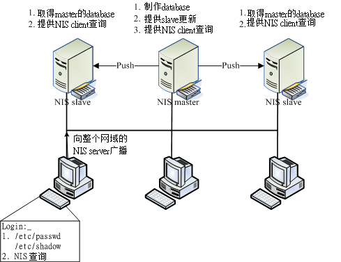
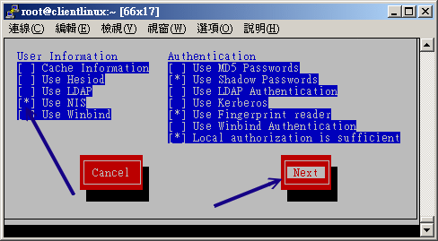
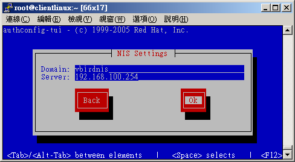

# 第十四章、账号控管： NIS 服务器

最近更新日期：2011/07/28

有没有想过，如果我有十部 Linux 主机，这十部主机仅负责不同的功能，事实上，所有的主机账号与对应的密码都相同！ 那么我是将账号与密码分别设定置在十部计算机上面，还是可以透过一部主机做为账号管理的功能，然后其他的主机只要当用户用登入时， 就必须要到管理账号的主机上面确认其账号与密码呢？哪一个比较方便而且灵活？当然是找一个账号管理的主机比较方便的多啦！ 如果有用户要修改密码，不必要去到十部主机修改密码啦！只要到主要管理主机去修改，其他的主机根本就不需要更动！ 哈哈！轻松又愉快呢！这个功能的达成有很多的方式，在这里，我们介绍一个很简单的方式，那就是 Network Information Service 这个 NIS 服务器的架设啦！

*   14.1 NIS 的由来与功能
    *   14.1.1 NIS 的主要功能：管理帐户信息
    *   14.1.2 NIS 的运作流程：透过 RPC 服务
*   14.2 NIS server 端的设定
    *   14.2.1 所需要的软件
    *   14.2.2 NIS 服务器相关的配置文件
    *   14.2.3 一个实作案例
    *   14.2.4 NIS master 的设定与启动
    *   14.2.5 防火墙设置
*   14.3 NIS client 端的设定
    *   14.3.1 NIS client 所需软件与软件结构
    *   14.3.2 NIS client 的设定与启动
    *   14.3.3 NIS client 端的检验： yptest, ypwhich, ypcat
    *   14.3.4 使用者参数修改： yppasswd, ypchfn, ypchsh
*   14.4 NIS 搭配 NFS 的设定在丛集计算机上的应用
*   14.5 重点回顾
*   14.6 课后练习
*   14.7 参考数据与延伸阅读
*   14.8 [针对本文的建议：http://phorum.vbird.org/viewtopic.php?p=115269](http://phorum.vbird.org/viewtopic.php?p=115269)

* * *

# 14.1 NIS 的由来与功能

## 14.1 NIS 的由来与功能

在一个大型的网域当中，如果有多部 Linux 主机，万一要每部主机都需要设定相同的账号与密码时，你该怎么办？复制 /etc/passwd ？应该没有这么呆吧？如果能够有一部账号主控服务器来管理网域中所有主机的账号， 当其他的主机有用户登入的需求时，才到这部主控服务器上面要求相关的账号、密码等用户信息， 如此一来，如果想要增加、修改、删除用户数据，只要到这部主控服务器上面处理即可， 这样就能够降低重复设定使用者账号的步骤了。

这样的功能有很多的服务器软件可以达成，这里我们要介绍的则是 Network Information Services (NIS server) 这个服务器软件喔！底下就先来谈一谈这个 NIS 的相关功能吧！

**Tips:** NIS 主要提供的是用户的账号、密码、家目录文件名、UID 等信息，但 NIS 并没有提供文件系统。同时， NIS 同样使用前一章谈到的 RPC 服务器，因此在本章开始前，你还是得要认识一下[第十三章谈到的 NFS 与 RPC](http://linux.vbird.org/linux_server/0330nfs.php)， 同时你还得要知道基础学习篇第三版里面的[第十四章账号管理](http://linux.vbird.org/linux_basic/0410accountmanager.php)， 同时也得了解一下基础学习篇[第二十二章 make/Makefile](http://linux.vbird.org/linux_basic/0520source_code_and_tarball.php) 的信息才好。


* * *

### 14.1.1 NIS 的主要功能：管理帐户信息

通常我们都会建议，一部 Linux 主机的功能越单纯越好，也就是说，一部 Linux 就专门进行一项服务。这样有许多的好处，这包含功能单纯所以系统资源得以完整运用， 并且在发生入侵或者是系统产生状况的时候，也比较容易追查问题所在。因此，一个公司内部常常会有好几部 Linux 主机，有的专门负责 WWW 、有的专门负责 Mail 、有的专门负责 SAMBA 等等的服务。

不过，这样虽然有分散风险、容易追踪问题的好处，但是，由于是同一个公司内的多部主机，所以事实上所有的 Linux 主机的账号与密码都是一样的！哇！那如果公司里面有 100 的人的话， 我们就需要针对这么多部的主机去设定账号密码了！而且，如果未来还有新进员工的话， 那么光是设定密码就会使系统管理员抓狂了！

这个时候，让我们换一个角度来思考：如果我设计了一部专门管理账号与密码的服务器，而其他的 Linux 主机当有客户端要登入的时候，就必须要到这部管理密码的服务器来查寻用户的账号与密码， 如此一来，我要管理所有的 Linux 主机的账号与密码，只要到那部主服务器上面去进行设定即可！ 包括新进人员的设定，反正其他的 Linux 主机都是向它查寻的嘛！没错！真是好～这个就是 Network Information Service, NIS 服务器的主要功能啦！

事实上，Network Information Service 最早应该是称为 Sun Yellow Pages (简称 yp)，也就是 Sun 这家公司出的一个名为 Yellow Pages 的服务器软件，请注意， NIS 与 YP 是一模一样的咚咚喔！这个 Yellow Pages 名字取的真是好！怎么说呢？知道黄页 (Yellow Pages) 是什么吗？就是我们家里的电话簿啦！ 今天如果你要查寻一家厂商的电话号码，通常就是直接去查黄页上面的纪录来取得电话号码啊！而这个 NIS 也一样，当使用者要登入时， Linux 系统就会到 NIS 服务器上面去找寻这个使用的账号与密码信息来加以比对， 以提供使用者登入之用的检验啊！很棒吧！ ^_^

那么 NIS 服务器提供了哪些信息呢？还记得账号与密码放置在哪里吧？NIS 就是提供那些数据啦！ 主要有底下这些基本的数据提供给有登入需求的主机喔：

| 服务器端文件名 | 档案内容 |
| --- | --- |
| /etc/passwd | 提供用户账号、UID、GID、家目录所在、Shell 等等 |
| /etc/group | 提供群组数据以及 GID 的对应，还有该群组的加入人员 |
| /etc/hosts | 主机名与 IP 的对应，常用于 private IP 的主机名对应 |
| /etc/services | 每一种服务 (daemons) 所对应的埠口 (port number) |
| /etc/protocols | 基础的 TCP/IP 封包协定，如 TCP, UDP, ICMP 等 |
| /etc/rpc | 每种 RPC 服务器所对应的程序号码 |
| /var/yp/ypservers | NIS 服务器所提供的数据库 |

至少可以提供上述这些功能，当然啦，你也可以自行定义哪些数据库需要，哪些数据库不需要！

* * *

### 14.1.2 NIS 的运作流程：透过 RPC 服务

由于 NIS 服务器主要是提供用户登入的信息给客户端主机来查询之用，所以， NIS 服务器所提供的数据当然就需要用到传输与读写比较快速的 "数据库" 文件系统， 而不是传统的纯文本数据。为了要达到这个目的，所以 NIS 服务器就必须要将前一小节提到的那些档案制作成为数据库档案， 然后使用网络协议让客户端主机来查询啰。至于所使用的通讯协议与前一章的 [NFS](http://linux.vbird.org/linux_server/0330nfs.php) 相同，都使用远程过程调用 (RPC) 这个玩意儿喔！

此外，如果在一个很大型的网域里面，万一所有的 Linux 主机都向同一部 NIS 服务器要求用户数据时， 这部 NIS 服务器的负载 (loading) 可能会过大。甚至如果考虑到数据使用的风险， 要是这单一的一部 NIS 服务器挂点时，那其他的 Linux 主机还要不要让 users 登入啊？ 所以啰，在较为大型的企业环境当中， NIS 服务器可以使用 master/slave (主控/辅助服务器) 架构的。

Master NIS 服务器提供系统管理者制作的数据库， slave 则取得来自 master 的数据，并藉以提供其他客户端的查询。 客户端可以向整个网域要求用户资料的响应，master 与 slave 皆可回答， 由于 slave 的数据来自于 master ，所以用户账号数据本身是同步的！ 如此一方面可以分散 NIS 服务器的负载，而且也可以避免因 NIS 服务器挂点而导致的无法登入的风险。

 图 14.1-1、NIS 服务器与客户端的运作与查询方式示意图

整个 NIS 的运作就如同上图，首先必须要有 NIS server 的存在，之后才会有 NIS Client 的存在。 那么当使用者有登入的需求时，整个 NIS 的运作程序是：

*   关于 NIS Server (master/slave) 的运作程序：

    1.  NIS Master 先将本身的账号密码相关档案制作成为数据库档案；
    2.  NIS Master 可以主动的告知 NIS slave server 来更新；
    3.  NIS slave 亦可主动的前往 NIS master server 取得更新后的数据库档案；
    4.  若有账号密码的异动时，需要重新制作 database 与重新同步化 master/slave。
*   关于当 NIS Client 有任何登入查询的需求时：

    1.  NIS client 若有登入需求时，会先查询其本机的 /etc/passwd, /etc/shadow 等档案；
    2.  若在 NIS Client 本机找不到相关的账号数据，才开始向整个 NIS 网域的主机广播查询；
    3.  每部 NIS server (不论 master/slave) 都可以响应，基本上是『先响应者优先』。

从上面的流程当中，你会发现 NIS client 还是会先针对本机的账号数据进行查询，若本机查不到时才到 NIS server 上头寻找。因此，如果你的 NIS client 本身就有很多一般使用者的账号时，那跟 NIS server 所提供的账号就可能产生一定程度的差异啰！所以，一般来说，在这样的环境下，NIS client 或 NIS slave server 会主动拿掉自己本机的一般使用者账号，仅会保留系统所需要的 root 及系统账号而已。 如此一来，一般使用者才都会经由 NIS master server 所控管啊！ ^_^

根据上面图 14.1-1 的说明，我们的 NIS 环境大致上需要设定的基本组件就有：

*   NIS Master server ：将档案建置成数据库，并提供 slave server 来更新；
*   NIS Slave server ：以 Master server 的数据库作为本身的数据库来源；
*   NIS client ：向 master/server 要求登入者的验证数据。

就如同上面提到的，在大型环境中才会使用到这么复杂的 NIS master/slave 架构。因此，本章仅会介绍 NIS Master 的建置， 以及 NIS client 的设定而已。其实，NIS 服务使用的环境大概越来越仅局限在学术数值模式仿真的丛集计算机架构中 (PC cluster)， 在那样的架构中，老实说，鸟哥认为仅要学会 NIS master 即可。如果还有其他账号方面的要求，例如跨平台的帐户信息提供， 那可能就得要参考 Samba 或更进阶的 LDAP 才好呦！这里我们不谈啦～现在，就让我们开始来玩一玩这个 NIS 的设定吧！

* * *

# 14.2 NIS Server 端的设定

## 14.2 NIS Server 端的设定

NIS 服务器端主要在于提供数据库给客户端作为验证之用，虽然 NIS 服务器类型有 Master 与 Slave ， 不过鸟哥这里介绍的并不是大型企业环境，因此仅介绍 NIS master 的设定而已啦～那就来设定看看啰！

* * *

### 14.2.1 所需要的软件

由于 NIS 服务器需要使用 RPC 协议，且 NIS 服务器同时也可以当成客户端，因此它需要的软件就有底下这几个：

*   yp-tools ：提供 NIS 相关的查寻指令功能
*   ypbind ：提供 NIS Client 端的设定软件
*   ypserv ：提供 NIS Server 端的设定软件
*   rpcbind ：就是 RPC 一定需要的数据啊！

如果你是使用 Red Hat 的系统，例如我们的 CentOS 6.x 的话，那你可以利用『 rpm -qa | grep '^yp' 』 来检查是否有安装上述的软件。一般来说 yp-tools, ypbind 都会主动的安装，不过 ypserv 可能就不会安装了。 此时建议你直接使用『 [yum](http://linux.vbird.org/linux_server/0210network-secure.php#update_yum_use) install ypserv 』来安装吧！立刻就装好了。底下立刻来设定啰！

* * *

### 14.2.2 NIS 服务器相关的配置文件

在 NIS 服务器上最重要的就是 ypserv 这个软件了，但是，由于 NIS 设定时还会使用到其他网络参数设定数据， 因此在配置文件方面需要有底下这些数据喔：

*   /etc/ypserv.conf：这是最主要的 ypserv 软件所提供的配置文件，可以规范 NIS 客户端是否可登入的权限。
*   /etc/hosts：由于 NIS server/client 会用到网络主机名与 IP 的对应，因此这个主机名对应档就显的相当重要！每一部主机名与 IP 都需要记录才行！
*   /etc/sysconfig/network：可以在这个档案内指定 NIS 的网域 (nisdomainname)。
*   /var/yp/Makefile：前面不是说账号数据要转成数据库文件吗？ 这就是与建立数据库有关的动作配置文件；

至于 NIS 服务器提供的主要服务方面有底下两个：

*   /usr/sbin/ypserv：就是 NIS 服务器的主要提供服务；
*   /usr/sbin/rpc.yppasswdd：提供额外的 NIS 客户端之用户密码修改服务， 透过这个服务， NIS 客户端可以直接修改在 NIS 服务器上的密码。相关的使用程序则是 yppasswd 指令；

与账号密码的数据库有关的指令方面有底下几个：

*   /usr/lib64/yp/ypinit：建立数据库的指令，非常常用 (在 32 位的系统下，文件名则是 /usr/lib/yp/ypinit 喔！)；
*   /usr/bin/yppasswd：与 NIS 客户端有关，主要在让用户修改服务器上的密码。

* * *

### 14.2.3 一个实作案例

如果你有观察过图 14.1-1 的话，你会发现到我们的 NIS 需要设定 Master/Slave 及 client 等， 不过我们这里仅介绍 NIS master server 与 NIS client 两个组件而已，如果你有需要额外的 slave 的话， 再请查阅 NIS 官网的介绍啰。底下鸟哥先拟一个简单的案例，做完案例我们再来谈谈实际可能会使用于丛集计算机的案例吧！

*   NIS 的域名为 vbirdnis
*   整个内部的信任网域为 192.168.100.0/24
*   NIS master server 的 IP 为 192.168.100.254 ，主机名为 www.centos.vbird
*   NIS client 的 IP 为 192.168.100.10，主机名为 clientlinux.centos.vbird

底下我们就一个一个来设定吧！

* * *

### 14.2.4 NIS server 的设定与启动

NIS 服务器的设定真是很简单，首先，你必须要在 NIS 服务器上面搞定你的账号与密码相关数据， 这包括 /etc/passwd, /etc/shadow, /etc/hosts, /etc/group .... 等等，都得要先搞定才行！ 详细的账号相关资料请参考[基础篇的第十四章账号管理](http://linux.vbird.org/linux_basic/0410accountmanager.php)。 等到搞定之后你就可以继续 NIS 服务器的设定了：

*   1\. 先设定 NIS 的域名 (NIS domain name)

NIS 是会分领域名 (domain name) 来分辨不同的账号密码数据的，因此你必须要在服务器与客户端都指定相同的 NIS 领域名才行。设定这个 NIS 领域名的动作很简单，就直接编辑 /etc/sysconfig/network 即可！如下所示：

```
[root@www ~]# vim /etc/sysconfig/network
# 不要更改其他既有数据，只要加入底下这几行即可：
NISDOMAIN=vbirdnis      &lt;==设定 NIS 领域名
YPSERV_ARGS="-p 1011"   &lt;==设定 NIS 每次都启动在固定的埠口 
```

当然，你也可以使用手动的方式暂时设定好你的 NIS 领域名，透过的方法就是 nisdomainname 这个指令。 (其实 nisdomainname 与 ypdomainname 及 domainname 都是一模一样的指令啦！你只要记住一个指令名称即可。请自行 man domainname 吧！)不过，这个指令现在大概只用来检查设定是否正确，因为启动 NIS 服务器时，服务器去捉取的数据就是从 network 这个档案里面捉取的！所以只要改这个配置文件即可啊！

另外，由于未来想使用 iptables 直接管理 NIS 的使用，因此我们想要控制 NIS 启动在固定的埠口上。此时， 就使用『YPSERV_ARGS="-p 1011"』这个设定值来固定埠口在 1011 吧！

*   2\. 主要配置文件 /etc/ypserv.conf

这个配置文件就是 NIS 服务器最主要的配置文件啦！内容其实很简单，你可以保留默认值即可。不过，也可以作一些更动啦！

```
[root@www ~]# vim /etc/ypserv.conf
dns: no
# NIS 服务器大多使用于内部局域网络，只要有 /etc/hosts 即可，不用 DNS 啦

files: 30
# 预设会有 30 个数据库被读入内存当中，其实我们的账号档案并不多，30 个够用了。

xfr_check_port: yes
# 与 master/slave 有关，将同步更新的数据库比对所使用的端口，放置于 &lt;1024 内。

# 底下则是设定限制客户端或 slave server 查询的权限，利用冒号隔成四部分：
# **[主机名/IP] : [NIS 域名] : [可用数据库名称] : [安全限制]**
# [主机名/IP]   ：可以使用 network/netmask 如 192.168.100.0/255.255.255.0 
# [NIS 域名]   ：例如本案例中的 vbirdnis
# [可用数据库名称]：就是由 NIS 制作出来的数据库名称；
# [安全限制]      ：包括没有限制 (none)、仅能使用 &lt;1024 (port) 及拒绝 (deny)
# 一般来说，你可以依照我们的网域来设定成为底下的模样：
127.0.0.0/255.255.255.0     : * : * : none
192.168.100.0/255.255.255.0 : * : * : none
*                           : * : * : deny
# 星号 (*) 代表任何数据都接受的意思。上面三行的意思是，开放 lo 内部接口、
# 开放内部 LAN 网域，且杜绝所有其他来源的 NIS 要求的意思。

# 还有一个简单作法，你可以先将上面三行批注，然后加入底下这一行即可：
*                         : * : * : none 
```

由于鸟哥习惯在内部网域并不设定比较严格的限制，因此通常鸟哥都是选择使用『 *:* : * : none 』那个设定值！ 然后透过 iptables 来管控可使用的来源就是了。当然，你可以依据你的需求来设定啦！

*   3\. 设定主机名与 IP 的对应 (/etc/hosts)

在 /etc/ypserv.conf 的设定当中我们谈到 NIS 大部分是给局域网络内的主机使用的，所以当然就不需要 DNS 的设定了。不过，由于 NIS 使用到很多的主机名，但是网络联机透过的是 IP 啊！所以你一定要设定好 /etc/hosts 里面的主机名与 IP 的对应，否则会无法成功联机 NIS ！这个很重要，绝大部分的朋友无法达成 NIS server/client 的联机都是这里出问题而已。 依据本案例的设定值，你应该这样做：

```
[root@www ~]# vim /etc/hosts
# 原本就有的 localhost 与 127.0.0.1 之类的设定都不要更动，只要新增数据：
&lt;u&gt;192.168.100.254   www.centos.vbird&lt;/u&gt;
192.168.100.10    clientlinux.centos.vbird

[root@www ~]# hostname
www.centos.vbird
# 再做个确认，确定输出的主机名与本机 IP 确实有写入 /etc/hosts 喔！ 
```

注意！如果你的主机名 (hostname) 与 NIS 的主机名不一样，那么在这个档案当中还是需要将你的主机名给他设定进来！ 否则在后面数据库的设定时，肯定会发生问题。当然啦，你也可以直接在 /etc/sysconfig/network 当中直接重新设定主机名，然后重新启动，或者是利用 hostname 这个指令重新设定你的主机名也可以。

*   4\. 启动与观察所有相关的服务

接下来当然是先启动所有相关的服务啰，这包括 RPC, ypserv 以及 yppasswdd 啰！不过，如果你的 RPC 本来就已经启动的话，那就不要重新启动 rpcbind 了！此外，为了也让 yppasswdd 启动在固定的埠口，方便防火墙的管理， 因此，我们也建议你可以设定一下 /etc/sysconfig/yppasswdd 喔！

```
[root@www ~]# vim /etc/sysconfig/yppasswdd
YPPASSWDD_ARGS="--port  1012"    &lt;==找到这个设定值，修改一下内容成这样！

[root@www ~]# /etc/init.d/ypserv start
[root@www ~]# /etc/init.d/yppasswdd start
[root@www ~]# chkconfig ypserv on
[root@www ~]# chkconfig yppasswdd on 
```

注意，主要的 NIS 服务是 ypserv ，不过，如果要提供 NIS 客户端的密码修改功能的话， 最好还是得要启动 yppasswdd 这个服务才好。在启动完毕后，我们可以利用 rpcinfo 来检查看看：

```
[root@www ~]# rpcinfo -p localhost
   program vers proto   port  service
    100000    4   tcp    111  portmapper
    100000    4   udp    111  portmapper
    100004    2   udp   1011  ypserv
    100004    1   udp   1011  ypserv
    100004    2   tcp   1011  ypserv
    100004    1   tcp   1011  ypserv
    100009    1   udp   1012  yppasswdd
# 其他不相干的 RPC 鸟哥将它拿掉了，与 NIS 有关的至少要有上面这几个！要仔细看，
# 看看埠口是否为我们规定的 1011, 1012 ，若不是的话，得要修改一下配置文件。

[root@www ~]# rpcinfo -u localhost ypserv
program 100004 version 1 ready and waiting
program 100004 version 2 ready and waiting 
```

很多时候，很多朋友在设定完 NIS 后又回去设定 NFS 了，结果看了前一章的介绍，竟然又重新启动 rpcbind ， 这将导致 ypserv 的注册数据被注销掉。因此，使用上述的动作来检查看看服务有没有在等待中， 要看到如上的『就绪并等待服务』才会是正常的呦！

*   5\. 处理账号并建立数据库

在完成了上面的所有步骤后，接下来我们得要开始将主机上面的账号档案转成数据库档案啦！ 不过，因为担心与 NIS 客户端的账号有冲突，加上之前我们已经建立过一些账号了。所以，这里我们建立三个新账号， 分别是 nisuser1, nisuser2, nisuser3 。不过账号主要是依据 UID 来判断的啊！因此，我们使用大于 1000 的 UID 来建立这三个账号喔！

```
[root@www ~]# useradd -u 1001 nisuser1
[root@www ~]# useradd -u 1002 nisuser2
[root@www ~]# useradd -u 1003 nisuser3
[root@www ~]# echo password &#124; passwd --stdin nisuser1
[root@www ~]# echo password &#124; passwd --stdin nisuser2
[root@www ~]# echo password &#124; passwd --stdin nisuser3 
```

接下来，将建立的帐密数据转成数据库吧！转换的动作直接透过 /usr/lib64/yp/ypinit 这个指令来处理即可！整个步骤是这样做的：

```
[root@www ~]# /usr/lib64/yp/ypinit -m

At this point, we have to construct a list of the hosts which will run NIS
servers.  www.centos.vbird is in the list of NIS server hosts.  Please continue
to add the names for the other hosts, one per line.  When you are done with the
list, type a &lt;control D&gt;.
        next host to add:  www.centos.vbird  &lt;==系统根据主机名自动捉取
        next host to add:                    &lt;==这个地方按下 [crtl]-d
The current list of NIS servers looks like this:

www.centos.vbird

Is this correct?  [y/n: y]  y
We need a few minutes to build the databases...
Building /var/yp/vbirdnis/ypservers...
Running /var/yp/Makefile...
gmake[1]: Entering directory `/var/yp/vbirdnis'
Updating passwd.byname...
Updating passwd.byuid...
....(中间省略)....
gmake[1]: Leaving directory `/var/yp/vbirdnis'

www.centos.vbird has been set up as a NIS master server.

Now you can run ypinit -s www.centos.vbird on all slave server. 
```

要注意出现的信息当中，在告知你可以直接输入 [ctrl]-d 以结束的那个地方， 你的主机名会主动的被捉出来，注意！这个主机名务必需要在 /etc/hosts 可以被找到 IP 的对应， 否则会出现问题。另外，万一在执行 ypinit -m 时，出现如下的错误，那肯定就是有些数据没有被建立了！

```
gmake[1]: *** No rule to make target `/etc/aliases', needed by `mail.aliases'.  Stop.
gmake[1]: Leaving directory `/var/yp/vbirdnis'
make: *** [target] Error 2
Error running Makefile.
Please try it by hand.

[root@www ~]# touch /etc/aliases
# 解决方法很简单吶！缺少什么档案，就 touch 他就是了！

[root@www ~]# /usr/lib64/yp/ypinit -m
# 然后再重新执行一次即可！ 
```

如果是如下的错误，那可能是因为：

*   你的 ypserv 服务没有顺利启动，请利用 rpcinfo 检查看看；
*   你的主机名与 IP 没有对应好，请检查 /etc/hosts

```
gmake[1]: Entering directory `/var/yp/vbirdnis'
Updating passwd.byname...
failed to send 'clear' to local ypserv: RPC: Program not registeredUpdating passwd.byuid...
failed to send 'clear' to local ypserv: RPC: Program not registeredUpdating group.byname...
....(底下省略).... 
```

要注意啊，如果你的用户密码有变动过，那么你就得要重新制作数据库，重新启动 ypserv 及 yppasswdd 喔！ 注意注意啊！整个 NIS 服务器这样就给搞定了，有没有很简单啊！

* * *

### 14.2.5 防火墙设置

又来到了防火墙的规划了！要注意的是，我们的 NIS 与 NFS 都是使用 RPC Server 的，所以啰，除了上述谈到的固定埠口之外， 你还得要开放 port 111 才行。假设你已经看过前一章，而且是使用鸟哥的 iptables.rule 脚本来处理你的防火墙， 那么你可以修改该档案的内容，新增几条规则去：

```
[root@www ~]# vim /usr/local/virus/iptables/iptables.allow
iptables -A INPUT -i $EXTIF -p tcp -s 192.168.100.0/24 --dport 1011 -j ACCEPT
iptables -A INPUT -i $EXTIF -p udp -s 192.168.100.0/24 -m multiport \
         --dport 1011,1012 -j ACCEPT

[root@www ~]# /usr/local/virus/iptables/iptables.rule
# 千万记得要重新建置防火墙规则啊！ 
```

* * *

# 14.3 NIS Client 端的设定

## 14.3 NIS Client 端的设定

我们知道网络联机是双向的，所以 NIS server 提供数据库档案，NIS client 当然也需要提供一些联机的软件啰！这个联机的软件就是 ypbind 啦！此外，如同图 14.1-1 的介绍，在 NIS client 端有登入需求时，NIS client 基本上还是先搜寻自己的 /etc/passwd, /etc/group 等数据后才再去找 NIS server 的数据库啊！所以 NIS client 最好能够将本身的账号密码删除到仅剩下系统账号，亦即 UID, GID 均小于 500 以下的账号即可， 如此一来既可让系统执行无误，也能够让登入者的信息完全来自 NIS server ，比较单纯啦！

**Tips:** 事实上，你想要让 NIS 服务器写入的各项账号数据都在 NIS server 的 /var/yp/Makefile 那个档案设定的！ 你可以进入该档案搜寻一下 UID 就知道了！ ^_^


* * *

### 14.3.1 NIS client 所需软件与软件结构

NIS client 端所需要的软件仅有：

*   ypbind
*   yp-tools

yp-tools 是提供查询的软件，至于 ypbind 则是与 ypserv 互相沟通的客户端联机软件啦！ 另外，在 CentOS 当中我们还有很多配置文件是与认证有关的，包含 ypbind 的配置文件时， 在设定 NIS client 你可能需要动到底下的档案：

*   /etc/sysconfig/network：就是 NIS 的领域名嘛！
*   /etc/hosts：至少需要有各个 NIS 服务器的 IP 与主机名对应；
*   /etc/yp.conf：这个则是 ypbind 的主要配置文件，里面主要设定 NIS 服务器所在
*   /etc/sysconfig/authconfig：规范账号登入时的允许认证机制；
*   /etc/pam.d/system-auth ：这个最容易忘记！因为账号通常由 PAM 模块所管理， 所以你必须要在 PAM 模块内加入 NIS 的支持才行！
*   /etc/nsswitch.conf ：这个档案可以规范账号密码与相关信息的查询顺序，默认是先找 /etc/passwd 再找 NIS 数据库；

另外， NIS 还提供了几个有趣的程序给 NIS 客户端来进行账号相关参数的修改，例如密码、shell 等等， 主要有底下这几个指令：

*   /usr/bin/yppasswd ：更改你在 NIS database (NIS Server 所制作的数据库) 的密码
*   /usr/bin/ypchsh ：同上，但是是更改 shell
*   /usr/bin/ypchfn ：同上，但是是更改一些用户的讯息！

OK！那么底下就让我们开始来设定 NIS 客户端吧！^_^

* * *

### 14.3.2 NIS client 的设定与启动

启动 NIS client 的设定就简单多了！最主要是加入 NIS domain 当中，然后再启动 ypbind 即可。 虽然你可以手动去修改所有的配置文件，然而近期以来的 Linux distributions 账号处理机制越来越复杂， 所以如果你想要手动修改所有配置文件，恐怕会疯掉的～因此，这里建议你使用系统提供的工具来设定， 至于一些重要配置文件，最后有机会再去参考一下即可。

那么 CentOS 6.x 提供了什么好用的管理工具呢？很简单，就利用 setup 这个指令即可！输入 setup 就会出现如下的图示， 然后依序这么处理就好了呦！

 图 14.3-1、利用 setup 进入 authconfig 认证项目

记得在出现上图 14.3-1 后，选择认证设定，如果是出现英文的话，那么你就得要选择『Authentication configuration』的项目，之后就会进入下面的画面：

 图 14.3-2、进入 authconfig 之后，选择 NIS 项目

因为我们要用 NIS 作为登入者身份验证的机制，因此就得要选择 NIS 项目，如果是英文的话，得要选择『Use NIS』项目即可。

 图 14.3-3、填写 NIS 领域以及 NIS 服务器的 IP 即可

最后再填写 NIS 网域 (Domain) 以及 NIS 服务器的 IP (Server)，按下确定即可。如果系统很快的就跳回图 14.3-1 的画面， 代表你的设定理论上是没有问题的。如果一直卡在如下的画面中：

```
正在激活 rpcbind：                                         [  确定  ]
正在关闭 NIS 服务：                                        [  确定  ]
正在启动 NIS 服务：                                        [  确定  ]
正在绑定 NIS 服务：.......  &lt;==这里一直卡住，没办法结束 
```

上述的数据就是出问题啦！那代表你的 NIS client 没有办法连接上 NIS server，最常发生的就是服务器的防火墙忘记放行，或者是你客户端输入服务器 IP 时，打错数字了～ 那也是很常发生的错误啦！这时请自行去修改一番吧！那么这个 setup 到底做了什么修改呢？我们也来看看几个被改掉的重要配置文件吧：

```
[root@clientlinux ~]# cat /etc/sysconfig/network
HOSTNAME=clientlinux.centos.vbird
NETWORKING=yes
GATEWAY=192.168.100.254
NISDOMAIN=vbirdnis    &lt;==这个玩意儿会主动的被建立起来

[root@clientlinux ~]# cat /etc/yp.conf
....(前面省略)....
domain vbirdnis server 192.168.100.254  &lt;==主动建立这玩意儿～

[root@clientlinux ~]# vim /etc/nsswitch.conf
passwd:     files nis
shadow:     files nis
group:      files nis
hosts:      files nis dns
# 上面几个项目是比较重要的，包括身份参数、密码、群组名、主机名与 IP 对应数据等。
# 你会看到，每个项目后面都会接着 nis ，所以 nis 有被支持啰！ 
```

因为更动到的档案实在太多了，所以鸟哥还是建议使用 setup 来调整即可。但是，如果你真的想要手动处理的话， 那么你必须要手动的修改底下这些档案：

*   /etc/sysconfig/network (加入 NISDOMAIN 项目)
*   /etc/nsswitch.conf (修改许多主机验证功能的顺序)
*   /etc/sysconfig/authconfig (CentOS 的认证机制)
*   /etc/pam.d/system-auth (许多登入所需要的 PAM 认证过程)
*   /etc/yp.conf (亦即是 ypbind 的配置文件)

* * *

### 14.3.3 NIS client 端的检验： yptest, ypwhich, ypcat

如何确定 NIS client 已经连上 NIS server 呢？基本上，只要刚刚使用 setup 去设定时，最后的步骤并没有被卡住， 那应该就是顺利成功啦！该步骤会自动启动 rpcbind 与 ypbind 两个服务呦！那如何确认数据传送是正确的？ 简单的要命啊！你可以利用 id 这个指令直接检查 NIS server 有的，但是 NIS client 没有的账号，如果有出现该账号的相关 UID/GID 信息时，那表示数据传输也是正确的。 除此之外，我们还可以透过 NIS 提供的相关检验功能来检查喔！底下分别来瞧一瞧：

*   利用 yptest 检验数据库之测试：

直接在 NIS client 输入 yptest 即可检查相关的测试数据，如下所示：

```
[root@clientlinux ~]# yptest
Test 1: domainname
Configured domainname is "vbirdnis"

Test 2: ypbind
Used NIS server: www.centos.vbird

Test 3: yp_match
WARNING: No such key in map (Map passwd.byname, key nobody)
....(中间省略)....

Test 6: yp_master
www.centos.vbird

....(中间省略)....

Test 8: yp_maplist
passwd.byname
protocols.byname
hosts.byaddr
hosts.byname
....(中间省略)....

Test 9: yp_all
nisuser1 nisuser1:$1$U9Gccb60$K5lDQ.mGBw9x4oNEkM0Lz/:1001:1001::/home/nisuser1:/bin/bash
....(中间省略)....
1 tests failed 
```

从这个测试当中我们可以发现一些错误，就是在 Test 3 出现的那个警告信息啦。还好，那只是说没有该数据库而已～ 该错误是可以忽略的。重点在第 9 个步骤 yp_all 必须要有列出你 NIS server 上头的所有帐户信息，如果有出现账号相关数据的话，那么应该就算验证成功了！

**Tips:** 比较有问题的是第三步骤，他会出现在 passwd.byname 当中找不到 nobody 的字样。这是因为早期的 nobody 之 UID 都设定在 65534 ，但 CentOS 则将 nobody 设定为系统账号的 99 ，所以当然不会被记录，也就出现这一个警告。不过，这个错误是可忽略的啦！


*   利用 ypwhich 检验数据库数量

单纯使用 ypwhich 的时候显示的是『NIS Client 的 domain』名称，而当加入 -x 这个参数时， 则是显示『NIS Client 与 Server 之间沟通的数据库有哪些？』你可以这样测试哩！

```
[root@clientlinux ~]# ypwhich -x
Use "hosts"     for map "hosts.byname"
Use "group"     for map "group.byname"
Use "passwd"    for map "passwd.byname"
....(以下省略).... 
```

由上面我们可以很清楚的就看到相关的档案啦！这些数据库档案则是放置在我的 NIS Server 的 /var/yp/vbirdnis/* 里面啰！

*   利用 ypcat 读取数据库内容

除了 yptest 之外，你还可以直接利用 ypcat 读取数据库的内容喔！一般作法是这样：

```
[root@clientlinux ~]# ypcat [-h nisserver] [数据库名称]
选项与参数：
-h nisserver ：如果有设定的话，指向某一部特定的 NIS 服务器，
               如果没有指定的话，就以 ypbind 之设定为主；
数据库名称：亦即在 /var/yp/vbirdnis/ 内的档名啊！例如 passwd.byname

# 读出 passwd.byname 的数据库内容
[root@clientlinux ~]# ypcat passwd.byname 
```

这三个指令在进行 NIS Client 端的检验时，是相当有用的喔！不要忽略了他的存在啊！尤其是刚架设好 NIS Client 时，一定要使用 yptest 去检查看看有没有设定错误喔！根据屏幕显示的讯息去一个一个校正错误才行啊！

* * *

### 14.3.4 使用者参数修改： yppasswd, ypchfn, ypchsh

好了，完成了上述的设定后，你的 NIS server/client 的账号已经同步了！真是高兴不是吗？ 不过，还有个挺大的问题，那就是...使用者如何在 NIS client 修改他自己的登入参数，例如密码、shell 等等？ 因为 NIS client 是藉由数据库来取得用户的账号密码，那如何在 NIS 客户端处理账号密码的订正？

问的好！这也是为何我们需要在 NIS server 启动 yppasswdd 这支服务的主要用意！ 因为 yppasswdd 可以接收 NIS client 端传来的密码修改，藉此而处理 NIS server 的 /etc/passwd, /etc/shadow ， 然后 yppasswdd 还能够重建密码数据库，让 NIS server 同步更新数据库！真是很不错啊！ ^_^

那该如何下达指令呢？很简单啊！透过 yppasswd, ypchsh, ypchfn 来处理即可。这三个指令的对应是：

*   yppasswd ：与 passwd 指令相同功能；
*   ypchfn ：与 chfn 相同功能；
*   ypchsh ：与 chsh 相同功能。

因为功能相当，所以鸟哥这里仅说明一下 yppasswd 而已。假设你已经登入 NIS client 那部主机， 并且是以 nisuser1 这个使用者登入的，记住，这个用户相关数据仅在 NIS server 上。 接下来，这个使用者可以下达 yppasswd ，如下所示：

```
[root@clientlinux ~]# grep nisuser /etc/passwd  &lt;==不会出现任何讯息，因为无此账号
[root@clientlinux ~]# su - nisuser1             &lt;==直接切换身份看看！
su: warning: cannot change directory to /home/nisuser1: No such file or directory
-bash-4.1$ id
uid=1001(nisuser1) gid=1001(nisuser1) groups=1001(nisuser1)
# 因为我们 client.centos.vbird 仅有帐户信息，并没有用户家目录，
# 所以就会出现如上的警告，因此才需要用 id 验证，并且需要加挂 NFS 嘛！
# 仔细看，现在的身份确实是 nisuser1 喔！确实有连上 NIS server 啦！

-bash-4.1$ yppasswd
Changing NIS account information for nisuser1 on www.centos.vbird.
Please enter old password:    &lt;==这里输入旧密码
Changing NIS password for nisuser1 on www.centos.vbird.
Please enter new password:    &lt;==这里输入新密码
Please retype new password:   &lt;==再输入一遍

The NIS password has been changed on www.centos.vbird.

-bash-4.1$ exit 
```

嘿嘿！如何，这样就更新了 NIS server 上头的 /etc/shadow 以及 /var/yp/vbirdnis/passwd.by* 的数据库， 简单吧！一下子就同步化了。不过，如果要教育使用者使用 yppasswd 的话，他可能不太能适应， 不要紧，你可以透过修改 alias 或者是置换掉 /usr/bin/passwd 这支程序即可！那现在让我们回到 NIS 服务器端看看真的有更动到数据库吗？

```
[root@www ~]# ll /var/yp/vbirdnis/
-rw-------. 1 root root   13836 Jul 28 13:10 netid.byname
-rw-------. 1 root root   14562 Jul 28 13:29 passwd.byname
-rw-------. 1 root root   14490 Jul 28 13:29 passwd.byuid
-rw-------. 1 root root   28950 Jul 28 13:10 protocols.byname
# 仔细看，就是那个密码档案被更动过～时间已经不一样了！再看看登录档吧！

[root@www ~]# tail /var/log/messages
Jul 28 13:29:14 www rpc.yppasswdd[1707]: update nisuser1 (uid=1001) from host
192.168.100.10 successful. 
```

最终从登录档里面，我们也能够得到相关的记录！这样就非常完美啦！ ^_^

* * *

# 14.4 NIS 搭配 NFS 的设定在丛集计算机上的应用

## 14.4 NIS 搭配 NFS 的设定在丛集计算机上的应用

刚刚在 NIS 客户端的 nisuser1 登入测试中，你应该已经发现了一件事，那就是怎么 nisuser1 没有家目录啊？这很正常啊！因为 nisuser1 的家目录是在服务器端的 /home 上头，而你在客户端登入时， 在客户端的 /home 底下根本不可能有 nisuser1 的家目录嘛！那怎办？很简单，将服务器端的 /home 挂载到客户端上面即可啊！ 那这个观念跟丛集计算机有啥关系啊？就让我们来谈谈吧！

*   什么是丛集计算机？

因为个人计算机的 CPU 速度越来越快，核心数目越来越多，因此个人计算机的效能已经不比服务器等级的大型计算机差了！ 不过，如果要用来作为计算大型数值模式的应用，即使是最快的个人计算机，还是没有办法有效的负荷的。此时你可能就得要考虑一下， 是要买超级计算机 (Top 500) 还是要自己组一部 PC 丛集计算机 (PC cluster)。

超级计算机的结构中，主要是透过内部电路将好多颗 CPU 与内存连接在一块，因为是特殊设计，因此价格非常昂贵。 如果我们可以将较便宜的个人计算机串接在一块，然后将数值运算的任务分别丢给每一部串接在一块的个人计算机， 那不就很像超级计算机了吗？没错！这就是 PC cluster 最早的想法。

但是这个作法当中有几个限制喔，因为每部计算机都需要运算相同的程序，而我们知道运算的数据都在内存当中， 而程序启动时需要给予一个身份，而程序读取的程序在每部计算机上面都需要是相同的！同时，每部计算机都需要支持平行化运算！ 所以，在 PC cluster 上面的所有计算机就得要有：

*   相同的用户帐户信息，包括账号、密码、家目录等等一大堆信息；
*   相同的文件系统，例如 /home, /var/spool/mail 以及数值程序放置的位置
*   可以搭配的平行化函式库，常见的有 MPICH, PVM...

上面的三个项目中，第一个项目我们可以透过 NIS 来处理，第二个项目则可以使用 NFS 来搞定～所以啰，你说， NIS 与 NFS 有没有可使用的空间啊？ ^_^

**Tips:** 由于『预测』这个玩意儿越来越重要，比如说气象预报、空气质量预报等等，而预测需要一个很庞大的模式来进行仿真的工作， 这么庞大的模拟工作需要大量的运算，在学校单位要买一部很贵的大型主机实在很不容易！不过，如果能够串接十部四核心的个人计算机的话， 那么可能只需要不到 20 万便能够组成相当于具有 40 颗 CPU 的大型主机的运算能力了！所以说，在未来 PC cluster 是一个可以发展的课题喔！


*   另一个不成材的实例

那我们有没有办法来实作一下平行化的丛集架构呢？老实说，很麻烦～不过，至少我们可以先完成前面谈到的两个组件！ 分别是 NIS 与 NFS 嘛！但是，在我们目前这个网络环境中，用户账号实在是太紊乱了～所以，如果想要将服务器的 /home 挂载到客户端的 /home，那么那个测试用的客户端可能很多本地用户都无法登入了～因此，在这个测试练习中， 我们打算这样做：

*   账号：建立大于 2000 以上的账号，账号名称为 cluser1, cluser2, cluser3 (将 cluster user 缩写为 cluser，不是少写一个 t 喔！)，且这些账号的家目录预计放置于 /rhome 目录内，以与 NIS client 本地的用户分开；
*   NIS 服务器：领域名为 vbirdcluster，服务器是 www.centos.vbird (192.168.100.254)，客户端是 clientlinux.centos.vbird (192.168.100.10)；
*   NFS 服务器：服务器分享了 /rhome 给 192.168.100.0/24 这个网域，且预计将所有程序放置于 /cluster 目录中。 此外，假设所有客户端都是很干净的系统，因此不需要压缩客户端 root 的身份。
*   NFS 客户端：将来自 server 的文件系统都挂载到相同目录名称底下！

那就分别来实作一下啰！

*   NIS 实作阶段

```
# 1\. 建立此次任务所需要的账号数据：
[root@www ~]# mkdir /rhome
[root@www ~]# useradd -u 2001 -d /rhome/cluser1 cluser1
[root@www ~]# useradd -u 2002 -d /rhome/cluser2 cluser2
[root@www ~]# useradd -u 2003 -d /rhome/cluser3 cluser3
[root@www ~]# echo password &#124; passwd --stdin cluser1
[root@www ~]# echo password &#124; passwd --stdin cluser2
[root@www ~]# echo password &#124; passwd --stdin cluser3

# 2\. 修改 NISDOMAIN 的名称
[root@www ~]# vim /etc/sysconfig/network
NISDOMAIN=vbirdcluster  &lt;==重点在改这个项目喔！ 
```

这个案例中，你只要做完上述的动作就即将完成了，其他的配置文件请参考前面 14.2 节所谈到的各个必要项目。 接下来当然就是重新启动 ypserv 以及制作数据库啰！

```
# 3\. 制作数据库以及重新启动所需要的服务：
[root@www ~]# nisdomainname vbirdcluster
[root@www ~]# /etc/init.d/ypserv restart
[root@www ~]# /etc/init.d/yppasswdd restart
[root@www ~]# /usr/lib64/yp/ypinit -m 
```

依序一个一个指令下达！上述的这四个指令稍微有相依性关系的！所以不要错乱了顺序喔！接下来，请换到客户端进行：

1.  以 setup 进行 NIS 的设定，在领域的部分请转为 vbirdcluster 才对！
2.  做完后再以 id cluser1 确认看看。

作法太简单了，鸟哥这里就不示范啰。

*   NFS 服务器的设定

```
# 1\. 设定 NFS 服务器开放的资源：
[root@www ~]# mkdir /cluster
[root@www ~]# vim /etc/exports
/rhome          192.168.100.0/24(rw,no_root_squash)
/cluster        192.168.100.0/24(rw,no_root_squash)

# 2\. 重新启动 NFS 啰：
[root@www ~]# /etc/init.d/nfs restart
[root@www ~]# showmount -e localhost
Export list for localhost:
/rhome       192.168.100.0/24
/cluster     192.168.100.0/24 
```

服务器的设定是很单纯的～客户端的设定得要注意啰！

```
# 1\. 设定 NIS Client 的 mount 数据！
[root@clientlinux ~]# mkdir /rhome /cluster
[root@clientlinux ~]# mount -t nfs 192.168.100.254:/rhome   /rhome
[root@clientlinux ~]# mount -t nfs 192.168.100.254:/cluster /cluster
# 如果上述两个指令没有问题，可以将他加入 /etc/rc.d/rc.local 当中啊！

[root@clientlinux ~]# su - cluser1
[cluser1@clientlinux ~]$ 
```

最后你应该就能够在客户端以 cluser1 登入系统！就这么简单的将账号与文件系统同步做完啦！如果你真的想要玩一下 PC Cluster 的话，鸟哥也有写过一篇不是很成熟的 PC cluster 简易架设，有兴趣的话请自行参考：

*   [`linux.vbird.org/linux_server/0600cluster.php`](http://linux.vbird.org/linux_server/0600cluster.php)

* * *

# 14.5 重点回顾

## 14.5 重点回顾

*   Network Information Service (NIS) 也可以称为 Sun Yellow Pages (yp)，主要是负责在网域当中帮忙 NIS Client 端查寻账号与密码以及其他相关网络参数的服务；
*   NIS server 其实就是提供本身的 /etc/passwd, /etc/shadow, /etc/group, /etc/hosts 等账号密码数据，以及相关的网络参数等，以提供网域当中 NIS Client 的搜寻之用；
*   NIS 为 server/client 架构，当 NIS client 有账号登入需求时，该主机会 (1)先找自己的 /etc/passwd, (2)再前往 NIS server 搜寻相关账号资料。
*   NIS 使用的软件就是 yp 这个软件，主要分为两部份， ypserv 用在 NIS Server，至于 ypbind 与 yp-tools 则用在 NIS Client 上面。
*   为加快 NIS 查询的速度，因此 NIS server 会将本机的账号数据制成传输较快的数据库档案， 并放置于 /var/yp/(nisdomainname)/ 目录当中；
*   不论是 NIS 或者是 NFS 都是藉由 RPC Server 所启用的，因此都可以使用 rpcinfo 来查寻 NIS 是否已经启动，以及该 daemon 是否已经向 portmapper (RPC server) 注册了！
*   在 NIS Server 的设定当中，最重要的一个步骤就是将账号、密码、网络参数等 ASCII 格式档案转成数据库档案 (database file)，以提供 NIS client 的查寻！而启动 ASCII 转成 database 的程序可以使用 /usr/lib64/yp/ypinit -m 或者到 /var/yp 底下执行 make 均可。
*   由于 NIS 通常使用于内部网域当中，因此 /etc/hosts 这个档案的设定相当重要！
*   若想让使用者在任一部 NIS 管辖的主机登入都可以使用同一份家目录，则需开启 NFS 提供 /home 给所有的主机挂载使用；

* * *

# 14.6 本章习题

## 14.6 本章习题

*   请简单说明 NIS server 的功能与工作流程当你有多部具有相同账号的 Linux 主机时，即可利用 NIS 所提供的服务，来利用一部 NIS 主机掌控所有的 linux 主机的登入时所需查阅的账号与密码验证。流程如下：

    1.  NIS Server 将自己系统内的 /etc/passwd, /etc/group, /etc/hosts 等制作成为 DBM 的数据库格式档案；
    2.  NIS Client 若有用户登入的要求时，会前往 NIS Server 搜寻数据库里面的数据做为验证之用。
    3.  每次更动 NIS Server 上面的用户数据时，则 NIS Server 需要重新制作 DBM 数据库档案才行！
*   请简单说明 NIS Server/client 的架构 NIS master/client 的特色为：

    1.  NIS Server 的 master 先将自己的账号、密码相关档案制作成为数据库档案(database file)；
    2.  NIS Server 的 master 将自己的数据库档案传送到 slave 上面；
    3.  NIS Server 的 slave 接收来自『信任的 NIS Server master 主机』的数据后，更新自己的数据库，使自己的数据库与 master 主机的数据同步；
    4.  网域当中的所有 NIS Client 查寻 NIS Server 时，会找寻『最先响应的那一部 NIS 主机的数据库内容』。

    也就是说，架设 slave NIS server 可以分担区域内 NIS 的工作！

*   NIS 启动之前需要先启动那个服务，否则就无法启动成功 (提示：RPC Server)因为 NIS 是 RPC Server 的一种，所以必须要启动 rpcbind 这个 daemon 才行！
*   我的 NIS 域名为 bird ，另外，我主机的 IP 与主机名为 192.168.5.1/bird.nis.org ，请问要这些信息需要设定在 NIS Server 的哪些档案之内？域名可以直接手动下达『 nisdomainname bird 』也可以写入 /etc/sysconfig/network 里面『NISDOMAIN=bird』； IP 与 主机名 需要写入在 /etc/hosts 里面。
*   /etc/nsswitch.conf 的功能为何？如果我想要让密码查寻先本地的密码文件，再查寻 NIS ，需要如何设定？该档案的功能很多，在 DNS 方面，可以用来决定正、反解的顺序，至于密码则可以用来判断何者为先！如果需要先查本机再查 NIS 的密码时，需要的参数： passwd: files nis shadow: files nis
*   如果我想要增加网域当中一个新的账号：newaccount，并且这个 newaccount 可以让 NIS Client 查寻到他的账号与密码，需要进行哪些步骤？

    1.  先登入 NIS Server 以 useradd newaccount 以及 passwd newaccount 来新增账号；
    2.  制作密码数据库：『/usr/lib64/yp/ypinit -m』
    3.  重新启动：『/etc/rc.d/init.d/ypserv restart ; /etc/rc.d/init.d/yppasswdd restart』。
*   实作范例题：底下是我的网域参数特征： network/netmask:192.168.1.0/255.255.255.0 NIS server : 192.168.1.100 (hostname: server.nis.test) NIS cient: 192.168.1.200 (hostname: client1.nis.test) NIS domain name: nis.test 利用上面的参数来设定 NIS 架构，请一步一步的写下你的设定。请自行参考本章节的内容设定

* * *

# 14.7 参考数据与延伸阅读

## 14.7 参考数据与延伸阅读

*   Study Area 之 NIS 服务器架设：[`www.study-area.org/linux/servers/linux_nfs.htm`](http://www.study-area.org/linux/servers/linux_nfs.htm)
*   NIS 官方网站：[`www.linux-nis.org/`](http://www.linux-nis.org/)
*   NIS HOW-TO：[`www.linux-nis.org/nis-howto/HOWTO/index.html`](http://www.linux-nis.org/nis-howto/HOWTO/index.html)

* * *

2003/05/06：第一次完成日期！ 2003/09/16：稍微加入一些信息与微幅修改版面！ 2006/09/22：将旧的文章移动到 [此处](http://linux.vbird.org/linux_server/0430nis/0430nis.php) 2006/10/11：啊！过了好久了！修改过程当中历经搬家，所以文章产生较慢啊！这次多加入 NIS slave server 说！ 2011/03/13：将旧的基于 CentOS 4.x 的版本移动到 [此处](http://linux.vbird.org/linux_server/0430nis/0430nis-centos4.php) 2011/03/16：因为 NIS 快要被 LDAP 取代，所以将比较复杂的 slave 部分删去了～ 2011/07/28：将基于 CentOS 5.x 的版本移动到[此处](http://linux.vbird.org/linux_server/0430nis/0430nis-centos5.php) 加入 /etc/idmapd.conf 的相关 domain 功能！要讲要讲！重要重要！

* * *