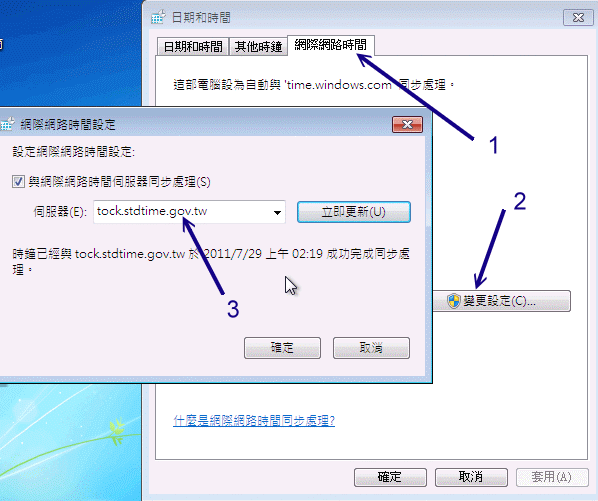

# 第十五章、时间服务器： NTP 服务器

最近更新日期：2011/07/29

计算机内部所记录的时钟是记载于 BIOS (CMOS) 内的，但如果你的计算机上面的电池没电了，或者是某些特殊因素导致 BIOS 数据被清除， 此时计算机的时间就会不准。同时，某些操作系统程序的问题，也可能导致我们看到的时间与现实社会不相同的情况。 所以我们都会调整一下时间，好让计算机系统的时间可以一直保持正确的状态。 在实际生活中，我们可以透过电视台、广播电台、电话等等来调整我们的手表，那么如果是在网络上呢？ 该如何让我们的主机随时保持正确的时间信息？这就需要 NTP 这个服务器啰。

*   15.1 关于时区与网络校时的通讯协议
    *   15.1.1 什么是时区？全球有多少时区？GMT 在那个时区？
    *   15.1.2 什么是夏季节约时间 (daylight savings)？
    *   15.1.3 Coordinated Universal Time (UTC)与系统时间的误差
    *   15.1.4 NTP 通讯协议
    *   15.1.5 NTP 服务器的阶层概念
*   15.2 NTP 服务器的安装与设定
    *   15.2.1 所需软件与软件结构
    *   15.2.2 主要配置文件 ntp.conf 的处理
    *   15.2.3 NTP 的启动与观察： ntpstat, ntpq
    *   15.2.4 安全性设定
*   15.3 客户端的时间更新方式
    *   15.3.1 Linux 手动校时工作： date, hwclock
    *   15.3.2 Linux 的网络校时： ntpdate
    *   15.3.3 Windows 的网络校时
*   15.4 重点回顾
*   15.5 课后练习
*   15.6 参考数据
*   15.7 [针对本文的建议：http://phorum.vbird.org/viewtopic.php?p=117976](http://phorum.vbird.org/viewtopic.php?p=117976)

* * *

# 15.1 关于时区与网络校时的通讯协议

## 15.1 关于时区与网络校时的通讯协议

时间对于现代人来说是很重要的，因为『 Time is money 』。既然时间如此重要，对于因特网来说应该也是很重要吧？ 为什么呢？还记得我们在基础学习篇第三版第十九章、登录档分析吧？ 如果你架设了一个登录档服务器的话，那么总得要分析每个主机所传来的登录文件信息吧？如果每一部主机的时间都不相同， 那如何判断问题发生的时间点？所以啰，『每一部主机的时间同步化』就很重要了。

每一部主机时间同步化的重要性当然不只如此，包括之前谈到的 DHCP 客户端/服务器端所需要的租约时间限制、 网络侦测时所需要注意的时间点、刚刚谈到的登录文件分析功能、具有相关性的主机彼此之间的错误侦测、前一章谈到的丛集计算机群等等， 都需要具有相同的时间才能够捉出问题呢。好了，底下咱们就来聊一聊，如何利用网络来进行主机的时间同步化吧！

* * *

### 15.1.1 什么是时区？全球有多少时区？GMT 在那个时区？

因为地球是圆的，所以同一个时刻，在地球的一边是白天，一边是黑夜。而因为人类使用一天 24 小时的制度，所以，在地球对角的两边就应该差了 12 个小时才对。由于同一个时间点上面， 整个地球表面的时间应该都不一样，为了解决这个问题，所以可以想见的，地球就被分成 24 个时区了！

那么这 24 个时区是依据什么来划分的呢？由于地球被人类以『经纬度』坐标来进行定位， 而经度为零的地点在英国『格林威治』这个城市所在的纵剖面上， (注：所谓的纵剖面就是由南极切到北极的直线，而横切面就是与赤道平行的切线)，如下图所示：

 图 15.1-1、地球的子午线、经纬度与时区的分隔概念

因为绕地球一圈是 360 度角，这 360 度角共分为 24 个时区，当然一个时区就是 15 度角啦！ 又由于是以格林威治时间为标准时间 (Greenwich Mean Time, GMT 时间)，加上地球自转的关系，因此，在格林威治以东的区域时间是比较快的(+小时)，而以西的地方当然就是较慢啰！

以台湾为例，因为台湾所在地约为东经 120 度北纬 25 度左右，又因为台湾在格林威治的东方 (废话！因为是东经嘛！ ^_^)，因此台湾本地时间 (local time) 会比 GMT 时间快 8 小时 (GMT + 8)。当格林威治时间为零点，台湾就已经是早上八点了！底下约略列出各个时区的名称与所在经度，以及与 GMT 时间的时差：

| 标准时区 | 经度 | 时差 |
| --- | --- | --- |
| GMT , Greenwich Mean Time | 0 W/E | 标准时间 |
| CET , Central European | 15 E | +1 东一区 |
| EET , Eastern European | 30 E | +2 东二区 |
| BT , Baghdad | 45 E | +3 东三区 |
| USSR, Zone 3 | 60 E | +4 东四区 |
| USSR, Zone 4 | 75 E | +5 东五区 |
| Indian, First | 82.3E | +5.5 东五半区 |
| USSR, Zone 5 | 90 E | +6 东六区 |
| SST , South Sumatra | 105 E | +7 东七区 |
| JT , Java | 112 E | +7.5 东七半区 |
| CCT , China Coast **(台湾所在地)** | 120 E | +8 东八区 |
| JST , Japan | 135 E | +9 东九区 |
| SAST, South Australia | 142 E | +9.5 东九半区 |
| GST , Guam | 150 E | +10 东十区 |
| NZT , New Zealand | 180 E | +12 东十二区 |
| Int'l Date Line | 180 E/W | 国际日期变更线 |
| BST , Bering | 165 W | -11 西十一区 |
| SHST, Alaska/Hawaiian | 150 W | -10 西十区 |
| YST , Yukon | 135 W | -9 西九区 |
| PST , Pacific | 120 W | -8 西八区 |
| MST , Mountain | 105 W | -7 西七区 |
| CST , Central | 90 W | -6 西六区 |
| EST , Eastern | 75 W | -5 西五区 |
| AST , Atlantic | 60 W | -4 西四区 |
| Brazil, Zone 2 | 45 W | -3 西三区 |
| AT , Azores | 30 W | -2 西二区 |
| WAT , West Africa | 15 W | -1 西一区 |

所以啰，台湾时间是 GMT + 8 就很容易推算出来了吧！要特别留意的是，很多朋友在安装 Linux 的时候， 总是会发现目前的时间慢或者快了 8 小时，不要怀疑，绝对与时区有关！ 赶紧给他查一下如何调整时区吧！ ^_^。

另外，在上表中有个比较有趣的时区，那就是在太平洋上面的国际日期变更线了！我们刚刚说，在格林威治的东边时间会较快， 而在西边时间会较慢，但是两边各走了 180 度之后就会碰头啊！那不就刚好差了 24 小时吗？没错啦！ 所以才订定为『国际日期变更线』啊！国际日期变更线刚好在太平洋上面，因此，如果你有坐飞机到美国的经验应该会发现，咦！ 怎么出发的时间是星期六下午，坐了 13 个小时的飞机到了美国还是星期六！因为刚好通过了国际日期变更线， 日期减少了一天喔！如果反过来，由美国到台湾，日期就会多加一天喔！ ^_^

* * *

### 15.1.2 什么是夏季节约时间 (daylight savings)？

时区的概念先建立起来之后，现在再来谈一谈，那么什么是『夏季节约时间 (或称日光节约时间)』？既然是『夏季节约时间』当然主要是与夏天有关啦！ 因为地球在运行的时候是呈现一个倾斜角在绕太阳运转的，所以才有春夏秋冬 (这个大家应该都知道啦)，在夏天的时候，白天的时间会比较长，所以为了节约用电， 因此在夏天的时候某些地区会将他们的时间定早一小时，也就是说，原本时区是 8 点好了， 但是因为夏天太阳比较早出现，因此把时间向前挪，在原本 8 点的时候，订定为该天的 9 点 (时间提早一小时)～如此一来， 我们就可以利用阳光照明，省去了花费电力的时间，因此才会称之为夏季节约时间！

因为台湾实在是太小了，并没有横跨两个时区，因此，夏季节约时间对我们来说，虽然还是有帮助啦！ 不过，似乎没有特别推行的样子说～

* * *

### 15.1.3 Coordinated Universal Time (UTC)与系统时间的误差

了解了一些时区的概念之后，这里要谈的是『什么是正确的时间』。 在 1880 年代的时间标准是以 GMT 时间为主的，但是 GMT 时间是以太阳通过格林威治的那一刻来作为计时的标准。 然而我们都知道啊，地球自转的轨道以及公转的轨道并非正圆，加上地球的自转速度好像有逐年递减的问题， 所以这个 GMT 时间与我们目前计时的时间就有点不一样了。(注 1)

在计算时间的时候，最准确的计算应该是使用『原子震荡周期』所计算的物理时钟了 (Atomic Clock, 也被称为原子钟)，这也被定义为标准时间 (International Atomic Time)。而我们常常看见的 UTC 也就是 Coordinated Universal Time (协和标准时间)就是利用这种 Atomic Clock 为基准所定义出来的正确时间。例如 1999 年在美国启用的原子钟 NIST F-1， 他所产生的时间误差每两千年才差一秒钟！真的是很准吶！这个 UTC 标准时间虽然与 GMT 时间放在同一个时区为基准， 不过由于计时的方式不同，UTC 时间与 GMT 时间有差不多 16 分钟的误差呢！(注 2)

事实上，在我们的身边就有很多的原子钟，例如石英表，还有计算机主机上面的 BIOS 内部就含有一个原子钟在纪录与计算时间的进行吶！不过由于原子钟主要是利用计算芯片 (crystal) 的原子震荡周期去计时的，这是因为每种芯片都有自己的独特的震荡周期之故。 然而因为这种芯片的震荡周期在不同的芯片之间多多少少都会有点差异性，甚至同一批芯片也可能会或多或少有些许的差异 (就连温度也可能造成这样的误差呢)，因此也就造成了 BIOS 的时间会经常的给他快了几秒或者慢了几秒。

或许你会认为，BIOS 定时器每天快个五秒也没有什么了不起的，不过如果你再仔细的算一算，会发现，一天快五秒，那么一个月快 2.5 分钟，一年就快了 75 分钟了！所以说，呵呵！时间差是真的会存在的！那么如果你的计算机真的有这样的情况， 那要怎么来重新校正时间呢？那就需要『网络校时』(Network Time Protocol, NTP) 的功能了！底下我们就谈一谈那个 NTP 的 daemon 吧！

* * *

### 15.1.4 NTP 通讯协议

老实说， Linux 操作系统的计时方式主要是由 1970/01/01 开始计算总秒数，因此，如果你还记得 date 这个指令的话， 会发现它有个 +%s 的参数，可以取得总秒数，这个就是软件时钟。但，如同前面说的，计算机硬件主要是以 BIOS 内部的时间为主要的时间依据 (硬件时钟)，而偏偏这个时间可能因为 BIOS 内部芯片本身的问题，而导致 BIOS 时间与标准时间 (UTC) 有一点点的差异存在！所以为了避免主机时间因为长期运作下所导致的时间偏差，进行时间同步 (synchronize) 的工作就显的很重要了！

*   软件时钟：由 Linux 操作系统根据 1970/01/01 开始计算的总秒数；
*   硬件时钟：主机硬件系统上面的时钟，例如 BIOS 记录的时间；

那么怎么让时间同步化呢？想一想，如果我们选择几部主要主机 (Primary server) 调校时间，让这些 Primary Servers 的时间同步之后，再开放网络服务来让 Client 端联机，并且提供 Client 端调整自己的时间，不就可以达到全部的计算机时间同步化的运作了吗！那么什么协议可以达到这样的功能呢？那就是 Network Time Protocol ，另外还有 Digital Time Synchronization Protocol (DTSS) 也可以达到相同的功能！ 不过，到底 NTP 这个 daemon 是如何让 Server 与 Client 同步他们的时间呢？

1.  首先，主机当然需要启动这个 daemon ，之后，
2.  Client 会向 NTP Server 发送出调校时间的 message ，
3.  然后 NTP Server 会送出目前的标准时间给 Client ，
4.  Client 接收了来自 Server 的时间后，会据以调整自己的时间，就达成了网络校时咯！

在上面的步骤中你有没有想到一件事啊，那就是如果 Client 到 Server 的讯息传送时间过长怎么办？举例来说，我在台湾以 ADSL 的 PC 主机，联机到美国的 NTP Server 主机进行时间同步化要求，而美国 NTP Server 收到我的要求之后，就发送当时的正确时间给我，不过， 由美国将数据传送回我的 PC 时，时间可能已经延迟了 10 秒钟去了！这样一来，我的 PC 校正的时间是 10 秒钟前的标准时间喔！此外，如果美国那么 NTP 主机有太多的人喜欢上去进行网络校时了，所以 loading (负荷) 太重啦！导致讯息的回传又延迟的更为严重！那怎么办？

为了这些延迟的问题，有一些 program 已经开发了自动计算时间传送过程的误差，以更准确的校准自己的时间！当然啦，在 daemon 的部分，也同时以 server/client 及 master/slave 的架构来提供用户进行网络校时的动作！所谓的 master/slave 就有点类似 DNS 的系统咯！举例来说，台湾的标准时间主机去国际标准时间的主机校时， 然后各大专院校再到台湾的标准时间校时，然后我们再到各大专院校的标准时间校时！这样一来，那几部国际标准时间主机 (Time server) 的 loading 就不至于太大，而我们也可以很快速的达到正确的网络校时的目的呢！台湾常见的 Time Server 有 (注 3)：

*   tick.stdtime.gov.tw
*   tock.stdtime.gov.tw
*   time.stdtime.gov.tw
*   clock.stdtime.gov.tw
*   watch.stdtime.gov.tw

至于 ntp 这个 daemon 是以 port 123 为连结的埠口 (使用 UDP 封包)，所以我们要利用 Time server 来进行时间的同步更新时，就得要使用 NTP 软件提供的 ntpdate 来进行 port 123 的联机喔！关于网络校时更多的说明，可以到 NTP 的官方网站 (注 4) 上察看喔！

* * *

### 15.1.5 NTP 服务器的阶层概念

如前所述，由于 NTP 时间服务器采用类似阶层架构 (stratum) 来处理时间的同步化， 所以他使用的是类似一般 server/client 的主从架构。网络社会上面有提供一些主要与次要的时间服务器， 这些均属于第一阶及第二阶的时间服务器 (stratum-1, stratum-2) ，如下所示：

*   主要时间服务器： [`support.ntp.org/bin/view/Servers/StratumOneTimeServers`](http://support.ntp.org/bin/view/Servers/StratumOneTimeServers)
*   次要时间服务器： [`support.ntp.org/bin/view/Servers/StratumTwoTimeServers`](http://support.ntp.org/bin/view/Servers/StratumTwoTimeServers)

由于这些时间服务器大多在国外，所以我们是否要使用这些服务器来同步化自己的时间呢？ 其实如果台湾地区已经有标准时间服务器的话，用那部即可，不需要联机到国外啦！浪费带宽与时间啊！ 而如前面提到的，台湾地区已经有标准的时间服务器了，所以当然我们可以直接选择台湾地区的 NTP 主机即可。

如果你评估一下，确定有架设 NTP 的需求时，我们可以直接选择台湾地区的上层 NTP 来同步化时间即可。 举例来说 tock.stdtime.gov.tw 这个国家单位的主机应该是比较适合的。一般来说，我们在进行 NTP 主机的设定时，都会先选择多部上层的 Time Server 来做为我们这一部 NTP Server 的校正之用，选择多部的原因是因为可以避免因为某部时间服务器突然挂点时， 其他主机仍然可以提供我们的 NTP 主机来自我更新啊！然后我们的 NTP Server 才提供给自己的 Client 端更新时间。如此一来，国家单位的 tock.stdtime.gov.tw 负载才不会太大，而我们的 Client 也可以很快速的达到校时的动作！

**Tips:** 其实 NTP 的阶层概念与 DNS 很类似啦，当你架设一部 NTP 主机，这部 NTP 所向上要求同步化的那部主要主机为 stratum-1 时，那么你的 NTP 就是 stratum-2 啰！举例来说，如果我们的 NTP 是向台湾的 tock.stdtime.gov.tw 这部 stratum-2 的主机要求时间同步化，那我们的主机即为 stratum-3 ，如果还有其他的 NTP 主机向我们要求时间同步， 那么该部主机则会是 stratum-4 啦！就这样啊～ 那最多可以有几个阶层？最多可达 15 个阶层喔！


* * *

# 15.2 NTP 服务器的安装与设定

## 15.2 NTP 服务器的安装与设定

NTP 服务器也是一个很容易就可以架设成功的玩意儿，不过这个软件在不同的 distribution 上面可能有不一样的名称， 你要作的其实就是将他安装起来之后，规定一部上层 NTP 服务器来同步化你的时间即可啊！ 如果你只是想要进行你自己单部主机的时间同步化，别架设 NTP ，直接使用 NTP 客户端软件即可喔！

* * *

### 15.2.1 所需软件与软件结构

在 CentOS 6.x 上头，你所需要的软件其实仅有 ntp 这个玩意儿而已，请自行使用 rpm 去找找看，若没有安装，请利用 yum install ntp 即可啊！不过，我们还需要时区相关的数据文件，所以你需要的软件有：

*   ntp： 就是 NTP 服务器的主要软件啦，包括配置文件以及执行档等等。
*   tzdata： 软件名称为『 Time Zone data 』的缩写，提供各时区对应的显示格式。

与时间及 NTP 服务器设定相关的配置文件与重要数据文件有底下几个：

*   /etc/ntp.conf： 就是 NTP 服务器的主要配置文件，也是唯一的一个；

*   /usr/share/zoneinfo/： 由 tzdata 所提供，为各时区的时间格式对应档。 例如台湾地区的时区格式对应档案在 /usr/share/zoneinfo/Asia/Taipei 就是了！这个目录里面的档案与底下要谈的两个档案 (clock 与 localtime) 是有关系的喔！

*   /etc/sysconfig/clock： 设定时区与是否使用 UTC 时间钟的配置文件。 每次开机后 Linux 会自动的读取这个档案来设定自己系统所默认要显示的时间说！举个例子来说， 在我们台湾地区的本地时间设定中，这个档案内应该会出现一行『ZONE="Asia/Taipei"』的字样， 这表示我们的时间配置文件案『要取用 /usr/share/zoneinfo/Asia/Taipei 那个档案』的意思！

*   /etc/localtime： 这个档案就是『本地端的时间配置文件』啦！刚刚那个 clock 档案里面规定了使用的时间配置文件 (ZONE) 为 /usr/share/zoneinfo/Asia/Taipei ，所以说这就是本地端的时间了，此时 Linux 系统就会将 Taipei 那个档案复制一份成为 /etc/localtime ，所以未来我们的时间显示就会以 Taipei 那个时间配置文件案为准。

至于在常用于时间服务器与修改时间的指令方面，主要有底下这几个啦：

*   /bin/date： 用于 Linux 时间 (软件时钟) 的修改与显示的指令；

*   /sbin/hwclock： 用于 BIOS 时钟 (硬件时钟) 的修改与显示的指令。 这是一个 root 才能执行的指令，因为 Linux 系统上面 BIOS 时间与 Linux 系统时间是分开的，所以使用 date 这个指令调整了时间之后，还需要使用 hwclock 才能将修改过后的时间写入 BIOS 当中！

*   /usr/sbin/ntpd： 主要提供 NTP 服务的程序啰！配置文件为 /etc/ntp.conf

*   /usr/sbin/ntpdate： 用于客户端的时间校正，如果你没有要启用 NTP 而仅想要使用 NTP Client 功能的话，那么只会用到这个指令而已啦！

例题：假设你的笔记本电脑安装 CentOS 这套系统，而且选择的时区为台湾。现在，你将有一个月的时间要出差到美国的纽约去， 你会带着这个笔电，那么到了美国之后，时间会不一致啊！你该如何手动的调整时间参数呢？答：因为时区数据文件在 /usr/share/zoneinfo 内，在该目录内会找到 /usr/share/zoneinfo/America/New_York 这个时区档。 而时区配置文件在 /etc/sysconfig/clock ，且目前的时间格式在 /etc/localtime ，所以你应该这样做：

```
[root@www ~]# date
Thu Jul 28 15:08:39 CST 2011  &lt;==重点是 CST 这个时区喔！

[root@www ~]# vim /etc/sysconfig/clock
ZONE="America/New_York"       &lt;==改的是这里啦！

[root@www ~]# cp /usr/share/zoneinfo/America/New_York /etc/localtime
[root@www ~]# date
Thu Jul 28 03:09:21 EDT 2011  &lt;==时区与时间都改变了！ 
```

这个范例做完之后，记得将这两个档案改回来！不然以后你的时间都是美国时间啦！

接下来，我们先来谈一谈如何设计那个 /etc/ntp.conf 吧！

* * *

### 15.2.2 主要配置文件 ntp.conf 的处理

由于 NTP 服务器的设定需要有上游服务器的支持才行，因此请回头参考一下 15.1.4 及 15.1.5 的介绍，这样才能够理解为何底下的设定是这样呦！好了，我假设俺的 NTP 服务器所需要设定的架构如下：

*   我的上层 NTP 服务器共有 tock.stdtime.gov.tw, tick.stdtime.gov.tw, time.stdtime.gov.tw 三部，其中以 tock.stdtime.gov.tw 最优先使用 (prefer)；
*   不对 Internet 提供服务，仅允许来自内部网域 192.168.100.0/24 的查询而已；
*   侦测一些 BIOS 时钟与 Linux 系统时间的差异并写入 /var/lib/ntp/drift 档案当中。

好了，先让我们谈一谈如何在 ntp.conf 里面设定权限控制吧！

*   利用 restrict 来管理权限控制

在 ntp.conf 档案内可以利用『 restrict 』来控管权限，这个参数的设定方式为：

```
restrict [你的 IP] mask [netmask_IP] [parameter] 
```

其中 parameter 的参数主要有底下这些：

*   ignore： 拒绝所有类型的 NTP 联机；
*   nomodify： 客户端不能使用 ntpc 与 ntpq 这两支程序来修改服务器的时间参数， 但客户端仍可透过这部主机来进行网络校时的；
*   noquery： 客户端不能够使用 ntpq, ntpc 等指令来查询时间服务器，等于不提供 NTP 的网络校时啰；
*   notrap： 不提供 trap 这个远程事件登录 (remote event logging) 的功能。
*   notrust： 拒绝没有认证的客户端。

那如果你没有在 parameter 的地方加上任何参数的话，这表示『该 IP 或网段不受任何限制』的意思喔！一般来说，我们可以先关闭 NTP 的权限，然后再一个一个的启用允许登入的网段。

*   利用 server 设定上层 NTP 服务器

上层 NTP 服务器的设定方式为：

```
server [IP or hostname] [prefer] 
```

在 server 后端可以接 IP 或主机名，鸟哥个人比较喜欢使用 IP 来设定说！至于那个 perfer 表示『优先使用』的服务器啰～有够简单吧！

*   以 driftfile 记录时间差异

设定的方式如下：

```
driftfile [可以被 ntpd 写入的目录与档案] 
```

因为预设的 NTP Server 本身的时间计算是依据 BIOS 的芯片震荡周期频率来计算的，但是这个数值与上层 Time Server 不见得会一致啊！所以 NTP 这个 daemon (ntpd) 会自动的去计算我们自己主机的频率与上层 Time server 的频率，并且将两个频率的误差记录下来，记录下来的档案就是在 driftfile 后面接的完整档名当中了！关于档名你必须要知道：

*   driftfile 后面接的档案需要使用完整路径文件名；
*   该档案不能是连结档；
*   该档案需要设定成 ntpd 这个 daemon 可以写入的权限。
*   该档案所记录的数值单位为：百万分之一秒 (ppm)。

driftfile 后面接的档案会被 ntpd 自动更新，所以他的权限一定要能够让 ntpd 写入才行。在 CentOS 6.x 预设的 NTP 服务器中，使用的 ntpd 的 owner 是 ntp ，这部份可以查阅 /etc/sysconfig/ntpd 就可以知道啦！

*   keys [key_file]

除了以 restrict 来限制客户端的联机之外，我们也可以透过密钥系统来给客户端认证， 如此一来可以让主机端更放心了。不过在这个章节里面我们暂不讨论这个部分，有兴趣的朋友可以参考 ntp-keygen 这个指令的相关说明喔！

* * *

根据上面的说明，我们最终可以取得这样的配置文件案内容喔 (底下仅修改部分数据，保留大部分的设定值喔)！

```
[root@www ~]# vim /etc/ntp.conf
# 1\. 先处理权限方面的问题，包括放行上层服务器以及开放区网用户来源：
restrict default kod nomodify notrap nopeer noquery     &lt;==拒绝 IPv4 的用户
restrict -6 default kod nomodify notrap nopeer noquery  &lt;==拒绝 IPv6 的用户
restrict 220.130.158.71   &lt;==放行 tock.stdtime.gov.tw 进入本 NTP 服务器
restrict 59.124.196.83    &lt;==放行 tick.stdtime.gov.tw 进入本 NTP 服务器
restrict 59.124.196.84    &lt;==放行 time.stdtime.gov.tw 进入本 NTP 服务器
restrict 127.0.0.1        &lt;==底下两个是默认值，放行本机来源
restrict -6 ::1
restrict 192.168.100.0 mask 255.255.255.0 nomodify &lt;==放行区网来源

# 2\. 设定主机来源，请先将原本的 [0&#124;1&#124;2].centos.pool.ntp.org 的设定批注掉：
server 220.130.158.71 prefer  &lt;==以这部主机为最优先
server 59.124.196.83
server 59.124.196.84

# 3.预设时间差异分析档案与暂不用到的 keys 等，不需要更动它：
driftfile /var/lib/ntp/drift
keys      /etc/ntp/keys 
```

这样就设定妥当了，准备来启动 NTP 服务吧！

* * *

### 15.2.3 NTP 的启动与观察

设定完 ntp.conf 之后就可以启动 ntp 服务器了。启动与观察的方式如下：

```
# 1\. 启动 NTP 
[root@www ~]# /etc/init.d/ntpd start
[root@www ~]# chkconfig ntpd on
[root@www ~]# tail /var/log/messages  &lt;==自行检查看看有无错误

# 2\. 观察启动的埠口看看：
[root@www ~]# netstat -tlunp &#124; grep ntp
Proto Recv-Q Send-Q Local Address       Foreign Address  PID/Program name
udp        0      0 192.168.100.254:123 0.0.0.0:*        3492/ntpd
udp        0      0 192.168.1.100:123   0.0.0.0:*        3492/ntpd
udp        0      0 127.0.0.1:123       0.0.0.0:*        3492/ntpd
udp        0      0 0.0.0.0:123         0.0.0.0:*        3492/ntpd
udp        0      0 ::1:123             :::*             3492/ntpd
udp        0      0 :::123              :::*             3492/ntpd
# 主要是 UDP 封包，且在 port 123 这个埠口的啦！ 
```

这样就表示我们的 NTP 服务器已经启动了，不过要与上层 NTP 服务器联机则还需要一些时间， 通常启动 NTP 后约在 15 分钟内才会和上层 NTP 服务器顺利连接上。 那要如何确认我们的 NTP 服务器有顺利的更新自己的时间呢？你可以使用底下几个指令来查阅喔 (请自行等待数分钟后再以下列指令查阅)：

```
[root@www ~]# ntpstat
synchronised to NTP server (220.130.158.71) at stratum 3
   time correct to within 538 ms
   polling server every 128 s 
```

这个指令可以列出我们的 NTP 服务器有跟上层联机否。由上述的输出结果可以知道，时间有校正约 538 * 10^(-3) 秒，且每隔 64 秒会主动去更新时间喔！

```
[root@www ~]# ntpq -p
     remote           refid      st t when poll reach   delay   offset  jitter
==============================================================================
*tock.stdtime.go 59.124.196.87    2 u   19  128  377   12.092   -0.953   0.942
+59-124-196-83.H 59.124.196.86    2 u    8  128  377   14.154    7.616   1.533
+59-124-196-84.H 59.124.196.86    2 u    2  128  377   14.524    4.354   1.079 
```

这个 ntpq -p 可以列出目前我们的 NTP 与相关的上层 NTP 的状态，上头的几个字段的意义为：

*   remote：亦即是 NTP 主机的 IP 或主机名啰～注意最左边的符号
    *   如果有『 * 』代表目前正在作用当中的上层 NTP
    *   如果是『 + 』代表也有连上线，而且可作为下一个提供时间更新的候选者。
*   refid：参考的上一层 NTP 主机的地址
*   st：就是 stratum 阶层啰！
*   when：几秒钟前曾经做过时间同步化更新的动作；
*   poll：下一次更新在几秒钟之后；
*   reach：已经向上层 NTP 服务器要求更新的次数
*   delay：网络传输过程当中延迟的时间，单位为 10^(-6) 秒
*   offset：时间补偿的结果，单位与 10^(-3) 秒
*   jitter：Linux 系统时间与 BIOS 硬件时间的差异时间， 单位为 10^(-6) 秒。

事实上这个输出的结果告诉我们，时间真的很准了啦！因为差异都在 0.001 秒以内， 可以符合我们的一般使用了。另外，你也可以检查一下你的 BIOS 时间与 Linux 系统时间的差异， 就是 /var/lib/ntp/drift 这个档案的内容，就能了解到咱们的 Linux 系统时间与 BIOS 硬件时钟到底差多久？单位为 10^(-6) 秒啦！

要让你的 NTP Server/Client 真的能运作，在上述的动作中得注意：

*   上述的 ntpstat 以及 ntpq -p 的输出结果中，你的 NTP 服务器真的要能够连结上层 NTP 才行喔！ 否则你的客户端将无法对你的 NTP 服务器进行同步更新的！重要重要！

*   你的 NTP 服务器时间不可与上层差异太多。举例来说，鸟哥测试 NTP 服务器约在 2011/7/28 下午， 如果我的服务器时间原本是错误的 2010/7/28，足足差了一年，那么上层服务器恐怕就不会将正确的时间传给我！ 这时就会造成困扰了！

*   服务器防火墙在 UDP port 123 有没有开啊？要特别注意的呢！

*   等待的时间够不够长？鸟哥设定 NTP 等过最久的时间大约是一小时！你有等这么久过否？

* * *

### 15.2.4 安全性设定

NTP 服务器在安全的相关性方面，其实刚刚我们在 /etc/ntp.conf 里面的 restrict 参数中就已经设定了 NTP 这个 daemon 的服务限制范围了！不过，在防火墙 iptables 的部分，还是需要开启联机监听的啦！所以，在你的 iptables 规则的 scripts 当中，需要加入这一段 (我是以开放 192.168.100.0/24 这个网域作为范例的！)

```
[root@www ~]# vim /usr/local/virus/iptables/iptables.allow
iptables -A INPUT -i $EXTIF -p udp -s 192.168.100.0/24 --dport 123 -j ACCEPT

[root@www ~]# /usr/local/virus/iptables/iptables.rule 
```

若还要开放其他的网段或者客户端主机，请自行修改 /etc/ntpd.conf 以及你的防火墙机制咯！

* * *

# 15.3 客户端的时间更新方式

## 15.3 客户端的时间更新方式

上头介绍了 NTP 服务器的安装与设定，如果我们仅有十部不到的主机时，老实说，实在没有架设 NTP 服务器的需求。 只要能够在你的主机上头以 NTP 客户端软件来进行网络校时就能够同步化时间了，没必要时时刻刻进行时间的校正吧！^_^！ 但是，如果是类似一定要时间同步的丛集计算机群或登录服务器群，那就得要使用时间服务器比较好啰！

* * *

### 15.3.1 Linux 手动校时工作： date, hwclock

先来复习一下前面谈到的重点，那就是 Linux 操作系统当中其实有两个时间，分别是：

*   软件时钟： Linux 自己的系统时间，由 1970/01/01 开始记录的时间参数
*   硬件时钟： 计算机系统在 BIOS 记录的实际时间，这也是硬件所记录的

在软件时钟方面，我们可以透过 date 这个指令来进行手动修订，但如果要修改 BIOS 记录的时间，就得要使用 hwclock 这个指令来写入才行。相关的用法如下：

```
[root@clientlinux ~]# date MMDDhhmmYYYY
选项与参数：
MM：月份
DD：日期
hh：小时
mm：分钟
YYYY：公元年

# 1\. 修改时间成为 1 小时后的时间该如何是好？
[root@clientlinux ~]# date
Thu Jul 28 15:33:38 CST 2011

[root@clientlinux ~]# date 072816332011
Thu Jul 28 16:33:00 CST 2011
# 瞧！时间立刻就变成一个小时后了！ 
```

```
[root@clientlinux ~]# hwclock [-rw]
选项与参数：
-r ：亦即 read ，读出目前 BIOS 内的时间参数；
-w ：亦即 write ，将目前的 Linux 系统时间写入 BIOS 当中啊！

# 2\. 查阅 BIOS 时间，并且写入更改过的时间啰！
[root@clientlinux ~]# date; hwclock -r
Thu Jul 28 16:34:00 CST 2011
Thu 28 Jul 2011 03:34:57 PM CST  -0.317679 seconds
# 看一看，是否刚好差异约一个小时啊！这就是 BIOS 时间！

[root@clientlinux ~]# hwclock -w; hwclock -r; date
Thu 28 Jul 2011 04:35:12 PM CST  -0.265656 seconds
Thu Jul 28 16:35:11 CST 2011
# 这样就写入啰～所以软件时钟与硬件时钟就同步啦！很简单吧！ 
```

这样可以了解了吗？当我们进行完 Linux 时间的校时后，还需要以 hwclock 来更新 BIOS 的时间，因为每次重新启动的时候，系统会重新由 BIOS 将时间读出来，所以， BIOS 才是重要的时间依据吶。

* * *

### 15.3.2 Linux 的网络校时

在 Linux 的环境当中可利用 NTP 的客户端程序，亦即是 ntpdate 这支程序就能够进行时间的同步化。 不过你要知道的是，因为 NTP 服务器本来就会与上层时间服务器进行时间的同步化， 所以在预设的情况下，NTP 服务器不可以使用 ntpdate ！也就是说 ntpdate 与 ntpd 不能同时启用的。 所以你不要在 NTP server 上头执行这个指令呦！我们就来看看如何处理吧！

```
[root@clientlinux ~]# ntpdate [-dv] [NTP IP/hostname]
选项与参数：
-d ：进入除错模式 (debug) ，可以显示出更多的有效信息。
-v ：有较多讯息的显示。

[root@clientlinux ~]# ntpdate 192.168.100.254
28 Jul 17:19:33 ntpdate[3432]: step time server 192.168.100.254 offset -2428.396146 sec
# 最后面会显示微调的时间有多少 (offset)，因为鸟哥这部主机时间差很多，所以秒数...

[root@clientlinux ~]# date; hwclock -r
四  7 月 28 17:20:27 CST 2011
公元 2011 年 07 月 28 日 (周四) 18 时 19 分 26 秒  -0.752303 seconds
# 知道鸟哥想要表达什么吗？对啊！还得 hwclock -w 写入 BIOS 时间才行啊！

[root@clientlinux ~]# vim /etc/crontab
# 加入这一行去！
10 5 * * * root (/usr/sbin/ntpdate tock.stdtime.gov.tw && /sbin/hwclock -w) &&gt; /dev/null 
```

使用 crontab 之后，每天 5:10 Linux 系统就会自动的进行网络校时啰！相当的简易吧！不过，这个方式仅适合不要启动 NTP 的情况。如果你的机器数量太多了，那么客户端最好也启动一下 NTP 服务！透过 NTP 去主动的更新时间吧！ 如何达成这个动作呢？也很简单啊，修改 /etc/ntp.conf 即可：

```
[root@clientlinux ~]# ntpdate 192.168.100.254
# 由于 ntpd 的 server/client 之间的时间误差不允许超过 1000 秒，
# 因此你得先手动进行时间同步，然后再设定与启动时间服务器呦！

[root@clientlinux ~]# vim /etc/ntp.conf
#server 0.centos.pool.ntp.org
#server 1.centos.pool.ntp.org
#server 2.centos.pool.ntp.org
restrict 192.168.100.254  &lt;==放行服务器来源！
server 192.168.100.254    &lt;==这就是服务器！
# 很简单，就是将原本的 server 项目批注，加入我们要的服务器即可

[root@clientlinux ~]# /etc/init.d/ntpd start
[root@clientlinux ~]# chkconfig ntpd on 
```

然后取消掉 crontab 的更新程序，这样你的 client 计算机就会主动的到 NTP 服务器去更新啰！也是轻松愉快啊！ 不过针对客户端来说，鸟哥还是比较习惯使用 crontab 的方式来处理就是了。

* * *

### 15.3.3 Windows 的网络校时

或许你一直都没发现，其实 Windows 在预设的情况当中，已经帮我们处理了网络校时的工作喔！不管你愿不愿意... 你可以将鼠标的指针指在任务栏右下角的时间以如下的方式来查阅一下网络时间服务器的设定：

 图 15.3-1、Windows 7 提供的网络校时功能

点选上图中的『变更日期与时间设定值』，出现如下图示：

 图 15.3-2、Windows 7 提供的网络校时功能

如上所示，你可以自行填写台湾的时间服务器来对应时间，当然也可以填写你自己的时间服务器啊！ 之后系统就会主动的上网去更新时间了。不过，这是 Windows XP 之后的窗口系统才有的功能，如果是比较早期的 Windows ， 例如 Windows 95/2000 预设是没有这个功能的。不过也没有关系， 因为国家频率与时间标准实验室 ([`www.stdtime.gov.tw/`](http://www.stdtime.gov.tw/)) 也有提供一个客户端软件喔！链接资料如下：

*   [`www.stdtime.gov.tw/chinese/EXE/NTPClock.exe`](http://www.stdtime.gov.tw/chinese/EXE/NTPClock.exe)

你可以下载，直接执行他就知道如何处理了，因为是全中文接口的图形化软件嘛！

* * *

# 15.4 重点回顾

## 15.4 重点回顾

*   地球共有 24 个时区，而以格林威治时间 (GMT) 为标准时间；
*   台湾本地时间为 GMT + 8 小时；
*   最准确的时间为使用原子钟 (Atomic clock) 所计算的，例如 UTC (Coordinated Universal Time) 就是一例；
*   Linux 系统本来就有两种时间，一种是 Linux 以 1970/01/01 开始计数的系统时间，一种则是 BIOS 记载的硬件时间；
*   Linux 可以透过网络校时，最常见的网络校时为使用 NTP 服务器，这个服务启动在 udp port 123；
*   时区档案主要放置于 /usr/share/zoneinfo/ 目录下，而本地时区则参考 /etc/localtime；
*   NTP 服务器为一种阶层式的服务，所以 NTP 服务器本来就会与上层时间服务器作时间的同步化， 因此 nptd 与 ntpdate 两个指令不可同时使用；
*   NTP 服务器的联机状态可以使用 ntpstat 及 ntpq -p 来查询；
*   NTP 提供的客户端软件为 ntpdate 这个指令；
*   在 Linux 下想要手动处理时间时，需以 date 设定时间后，以 hwclock -w 来写入 BIOS 所记录的时间。
*   NTP 服务器之间的时间误差不可超过 1000 秒，否则 NTP 服务会自动关闭。

* * *

# 15.5 本章习题

## 15.5 本章习题

*   什么是 GMT (格林威治) 时间与 UTC 时间？由于地球是圆的，所以同一时间点上，在地球共可分为 24 个时区，其中，我们以欧洲的格林威治时间为一个对照的依据，这个即是 GMT 时间。台湾时间比 GMT 时间快了 8 小时。至于 UTC 时间则是由原子钟所计算的时间，这个时间是相当的准确的， 主要仍以格林威治时间为时区！
*   Linux 系统的所有时区档案放置哪一个目录底下？所有的时区档案放置于：/usr/share/zoneinfo 底下！至于系统时区的配置文件则在 /etc/sysconfig/clock 与 /etc/localtime 喔！
*   我的 Linux 主机本来放置在日本东京，现在想将他拿到台湾来运作，不过因为日本与台湾有一个小时的时差， 所以我的时间应该需要经过调整才行。不过，因为我的 BIOS Time 主要是依据 UTC 时间来设定的，所以似乎只要更动时区参数即可。请问我该如何设定时区，好让我的 Linux 主机能够显示正确的时间？先将 /etc/localtime 删除，然后将 /usr/share/zoneinfo/Asia/Taipei 这个档案复制成为 /etc/localtime 即可！
*   目前 Linux 系统上面的时间服务器主要是以 NTP 为主，请问这个 daemon 的主要配置文件放在哪里，而该配置文件中，针对上层 time server 的设定参数为何？而那个 driftfile 参数是干嘛用的？在 /etc/ntp.conf 这个档案当中，至于上层 time server 的设定参数为 server 啊！那个 driftfile 则是用来做为『时间差额』的计算的！该参数后面接的是一个完整路径的文件名，该档案里面的数值单位为百万分之一(ppm)。
*   请问 ntptrace 的功能为何？可以用来追踪上层 time server 的连接时间与目前时间！
*   我以 date 更新了我 Linux 上面的时间后，该如何将时间数据写入 BIOS 内？必须利用 hwclock 这个程序来写入，利用 hwclock -w 写入 BIOS
*   在 Linux 上面如何进行网络校时？最简单的方法即是使用『 ntpdate time.servers.ip && hwclock -w 』即可！

* * *

# 15.6 参考数据与延伸阅读

## 15.6 参考数据与延伸阅读

*   注 1：格林威治时间的 Wiki 说明：[`en.wikipedia.org/wiki/Greenwich_Mean_Time`](http://en.wikipedia.org/wiki/Greenwich_Mean_Time)
*   注 2：UTC 时间的 Wiki 说明：[`en.wikipedia.org/wiki/Coordinated_Universal_Time`](http://en.wikipedia.org/wiki/Coordinated_Universal_Time)
*   注 3：台湾提供的几部标准时间服务器与时间服务器官网： [`www.stdtime.gov.tw/Time/ntp/resource.htm`](http://www.stdtime.gov.tw/Time/ntp/resource.htm) [`www.stdtime.gov.tw/Time/home.htm`](http://www.stdtime.gov.tw/Time/home.htm)
*   注 4：NTP 的官方网站：[`www.ntp.org`](http://www.ntp.org/) 另一个好站：[`www.eecis.udel.edu/~mills/ntp/html/ntpd.html`](http://www.eecis.udel.edu/%7Emills/ntp/html/ntpd.html)
*   由网友李涛兄提供的好站： [`support.ntp.org/bin/view/Support/TroubleshootingNTP#Section_9.5`](http://support.ntp.org/bin/view/Support/TroubleshootingNTP#Section_9.5) [`www.eecis.udel.edu/~mills/ntp/html/ntpq.html`](http://www.eecis.udel.edu/%7Emills/ntp/html/ntpq.html)

* * *

2003/08/21：首次完成 2006/12/05：将旧的文章移动到[此处](http://linux.vbird.org/linux_server/0440ntp/0440ntp.php) 2006/12/08：将文章作了个版面修改，同时将一些数据再加强一些。并补充一些额外的查阅 NTP 的指令。 2009/04/28：将 offset 的时间单位写错了，应该是 ms 不是 us ，亦即 10^(-3) 秒，而不是 10^(-6) 秒。抱歉。 2011/02/18：由读者李涛兄提供的资料，发现原本 ntpq 的说明反了！ * 应为作用中，而 + 是较佳的另一部候选主机。 2011/03/16：将旧的基于 CentOS 4.x 的文章移动到 [此处](http://linux.vbird.org/linux_server/0440ntp/0440ntp-centos4.php) 2011/03/18：将一些重复性的数据汇整一下，不需要的部分就删除掉了～ 2011/07/28：将基于 CentOS 5.x 的文章移动到[此处](http://linux.vbird.org/linux_server/0440ntp/0440ntp-centos5.php)

* * *