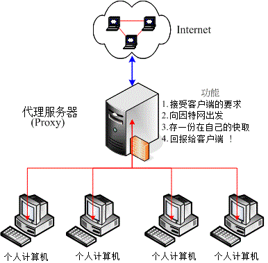
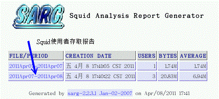

# 第十七章、区网控制者： Proxy 服务器

最近更新日期：2011/08/02

代理服务器的功能是可以代理局域网络的个人计算机来向因特网取得网页或其他数据的一种服务， 由于代理取得的数据可以保存一份在服务器的快取上，因此以往有类似『假象加速』的功能！不过，目前网络带宽已经比以前好很多， 因此代理服务器倒是很少使用在这方面。取而代之的是局域网络『高阶防火墙』的角色！这里的『高阶』指的是 OSI 七层协议里面的高层，因为代理服务器是用在应用层上的一种防火墙方式啦！不像 iptables 是用在网络、传输层。Linux 上启动代理服务器的是 squid 这个软件呦！

*   17.1 什么是代理服务器 (Proxy)
    *   17.1.1 什么是代理服务器
    *   17.1.2 代理服务器的运作流程
    *   17.1.3 上层代理服务器
    *   17.1.4 代理服务器与 NAT 服务器的差异
    *   17.1.5 架设代理服务器的用途与优缺点
*   17.2 Proxy 服务器的基础设定
    *   17.2.1 Proxy 所需的 squid 软件及其软件结构
    *   17.2.2 CentOS 预设的 squid 设定： http_port, cache_dir (SELinux), cache_mem
    *   17.2.3 管控信任来源 (如区网) 与目标 (如恶意网站)： acl 与 http_access 的使用
    *   17.2.4 其他额外的功能项目
    *   17.2.5 安全性设定：防火墙, SELinux 与黑名单档案
*   17.3 客户端的使用与测试
    *   17.3.1 浏览器的设定： firefox & IE
    *   17.3.2 测试 proxy 失败的画面
*   17.4 服务器的其他应用设定
    *   17.4.1 上层 Proxy 与获取数据分流的设定
    *   17.4.2 Proxy 服务放在 NAT 服务器上：通透式代理 (Transparent Proxy)
    *   17.4.3 Proxy 的认证设定
    *   17.4.4 末端登录档分析： sarg
*   17.5 重点回顾
*   17.6 本章习题
*   17.7 参考数据与延伸阅读
*   17.8 [针对本文的建议：http://phorum.vbird.org/viewtopic.php?f=16&t=35439](http://phorum.vbird.org/viewtopic.php?f=16&t=35439)

* * *

# 17.1 什么是代理服务器 (Proxy)

## 17.1 什么是代理服务器 (Proxy)

代理服务器 (Proxy) 的原理其实很简单啦！就是以类似代理人的身份去取得用户所需要的数据就是了！ 但是由于它的『代理』能力，使得我们可以透过代理服务器来达成防火墙功能与用户浏览数据的分析！ 此外，也可以藉由代理服务器来达成节省带宽的目的，以及加快内部网络对因特网的 WWW 访问速度！总之， 代理服务器对于企业来说，实在是一个很不错的东西啊！

* * *

### 17.1.1 什么是代理服务器

在真实世界中，我们或许会帮忙家人去办理一些杂务吧！举个例子来说，例如缴费或者是申办提款卡等等的， 由于你并不是『申请者本人』而是『代理人』的角色，因此有时候会需要秀出一些证件就是了。 那么在网络上面的代理服务器 (Proxy Server) 是怎么回事呢？它最主要的功能就如同我们上面提的真实世界一样， 当客户端有因特网的数据要求时，Proxy 会帮用户去向目的地取得用户所需要的数据。 所以，当客户端指定 WWW 的代理服务器之后，用户的所有 WWW 相关要求就会通过代理服务器去捉取啰！ 整个代理服务器与客户端的相关性可以由下图约略看出一个端倪：

 图 17.1-1、代理服务器、客户端与因特网的相关性示意图

一般来说，代理服务器会架设在整个区网的单点对外防火墙上头，而在区网内部的计算机就都是透过 Proxy 来向因特网要求数据的，这就是所谓的『代理服务器』啦！当然，上面的架构仅只是一个案例，但是这个架构比较多人用的原因， 是因为这样的 Proxy server 还可以兼做高阶防火墙之用啦！

在 Proxy 与客户端的相关性当中，你必需要了解的是：客户端向外部要求的资料事实上都是 Proxy 帮用户取得的，因此因特网上面看到要求数据者，将会是 Proxy 服务器的 IP 而不是客户端的 IP。 举个例子来说，假如鸟哥在我的浏览器设定了我们学校的代理服务器主机 proxy.ksu.edu.tw 做为我的 Proxy 好了，再假设我的 IP 是 120.114.141.51 ，那么当我想要取得 Yahoo 的新闻信息时，事实上，都是 proxy.ksu.edu.tw 帮我去取得的，所以在 Yahoo 的网站上面看到要求数据的人是谁呢？呵呵！当然就是 proxy.ksu.edu.tw 而不是 120.114.141.51 啰！这样可以了解 Proxy 的功能了吗？

除了这个功能之外，Proxy 还有一个很棒的额外功能，那就是防火墙的功能！ 看一下上面的图示，你可以发现一件事情，那就是客户端的个人计算机要连上因特网一定要经过 Proxy 服务器。并且，如果有人想要入侵你的系统时，由于你的 proxy 在最外部啊，所以攻击者就会攻击错方向，如此一来，不就比较安全！ 此外，由于整个因特网对外都是经过 proxy ，也就是『单点对外』的情况，这种状态底下要来管理防火墙也是比较简单的喔！^_^

* * *

### 17.1.2 代理服务器的运作流程

了解了 Proxy 的功能之后，我们来谈一谈那么 Proxy 到底是怎样运作的呢？为何它会有『加快网络存取效率』的好处？ 这就必需要以底下的图示来说明了！

 图 17.1-2、代理服务器的运作流程图：快取数据与客户端

当客户端指定了代理服务器之后，在客户端想要取得因特网上面的信息时，它是这样取得数据的 (注：那个 Cache 表示为 Proxy 服务器的硬盘的意思)：

*   当 Proxy 的快取拥有用户所想要的数据时 (Step a ~ d)：

*   Client 端向 Server 端发送一个数据需求封包；

*   Server 端接收之后，先比对这个封包的『来源』与预计要前往的『目标』网站是否为可接受？ 如果来源与目标都是合法的，或者说，来源与目标网站我们的 Proxy 都能帮忙取得资料时，那么 Server 端会开始替 Client 取得资料。这个步骤中比较重要的就是『比对政策』啦，有点像是认证的感觉啦；

*   Server 首先会检查自己快取 (新的数据可能在内存中，较旧的数据则放置在硬盘上) 数据， 如果有 Client 所需的数据，那就将数据准备取出，而不经过向 Internet 要求数据的程序；

*   最后当然就是将数据回传给 Client 端啰！

*   当 Proxy 的快取没有用户所想要的数据时 (Step 1 ~ 5)：

*   Client 端向 Server 端发送一个数据需求封包；

*   Server 端接收之后，开始进行政策比对；
*   Server 发现快取并没有 Client 所需要的资料，准备前往因特网抓取数据；
*   Server 开始向 Internet 发送要求与取得相关资料；
*   最后当然就是将数据回传给 Client 端啰！

* * *

上面的流程分析里面，我们可以清楚的知道，当 Proxy 曾经帮某位用户取得过 A 数据后，当后来的用户想要重复取得 A 数据时，那么 Proxy 就会从自己的快取里面将 A 数据取出传送给用户，而不用跑到因特网去取得同样的这份资料喔。因为没有去因特网找数据，当步骤 4 的流程很花时间时，那么透过 Proxy 忽略步骤 4 ，感觉上就好像网络速度变快了！但其实只是直接从 Proxy 的快取里面抓而已 (所以才会有人说『假象网络加速』的功能)！这就是两个流程最大的差异了。

在目前的因特网社会里，由于宽带技术已经很成熟，所以在不乱用的情况下，网络带宽理论上是足够的 (除非要连到国外去)。 那么用了 Proxy 之后效能会不会更提升呢？答案是，『应该不会』！啥？怎么会这样呢？从上面的流程分析中， 我们发现 Proxy 会常常去读取硬盘内的数据，而硬盘内的快取数据又是透过某些特殊方式在管理， 因此要找到该份数据就要花一些时间，再加上如果硬件效能 (硬盘或主板芯片组) 不佳时，那么加了 Proxy 反而会让你感觉网络传输怎么『卡卡的』呦！这点得要特别注意才行！

**Tips:** Proxy 对于 cache 的速度是很要求的，而这个 cache 就是硬盘啦！当然，硬盘容量必需要足够大，而且还要『足够快』才行！ 因为由上面的流程当中，我们不难发现，cache 是一直被重复存取的一个地方喔！所以硬盘的好坏就差别很大啦！可以说他是影响一个 Proxy 效能好坏的关键点呢！


* * *

### 17.1.3 上层代理服务器

想一想，既然 Proxy 是帮忙客户端进行网页代理的工作，那么我们的 Proxy 能不能也指定另外一台 Proxy 当成我的 Proxy 的 Proxy 呢？很绕口吧！其实流程像底下这样啦：

 图 17.1-3、上层代理服务器示意图

就是我们的 Local proxy 并不会主动的去捉数据，而是再透过『上层代理服务器』向 Internet 要求资料！这样有什么好处呢？由于可做为我们的上层代理服务器的主机通常是具有较高带宽的， 因此我们透过它去要求数据当然『理论上』速度会更快喔！而上层代理服务器最大的好处其实是在于『分流』喔！ 例如下图所示：

 图 17.1-4、以多部上层代理服务器达到分流的效果示意图

我总共设定了三部上层代理服务器，由于这三个代理服务器对外的速度都不相同，所以，当我要去美国时，就以 Proxy1 来要求资料，要连欧洲就以 Proxy3 ，至于要连日本，就以 Proxy 2 来要求我所需要的数据，如此一来，呵呵！可以让我的 Proxy 达到最佳的效能喔！很不错吧！此外，为了节省上层 proxy 的负担，如果是其他网络位置，我们则设定由自己的 local proxy 捉取～ 设定的弹性很高呢！

由于代理服务器需要管控信任的来源端客户端计算机，因此各 ISP 仅能针对自家的用户来开放 Proxy 使用权而已。 台湾常见的几家 ISP 提供的 Proxy 有：

*   Hinet： [`service.hinet.net/2004/new_adsl04.htm`](http://service.hinet.net/2004/new_adsl04.htm)
*   SeedNet： [`service.seed.net.tw/home/setting/server.htm`](https://service.seed.net.tw/home/setting/server.htm)

由于当用户透过 Proxy 连到因特网时，网络看到的是 Proxy 在抓取数据而不是该客户端，因此，我们不难发现 Proxy 有可能会被客户端过度的滥用，同时也有可能会被拿来为非作歹啊！所以，目前绝大部分的 Proxy 已经『停止对外开放』了，仅针对自己的网域内的用户提供本项服务而已～

因此，如果你要自行设定 Proxy 的时候，请记得去你当初申请网络的 ISP (如果是学术单位，请到贵单位的计中网页瞧瞧即可) 搜寻一下，才能比较有效的设定好你的服务器喔！因为设定错误的话，呵呵！上层 Proxy 根本不提供服务，或者是上层 Proxy 的效能并不好，那个时候你的 Proxy 也会连带的受到很大的影响啊！慎选！慎选！

* * *

### 17.1.4 代理服务器与 NAT 服务器的差异

或许你已经发现了一件事，那就是：在内部局域网络使用私有 IP 的客户端，不论透过 Proxy 或者 NAT 均可以直接取得 WWW 的服务，那么 NAT 与 Proxy 有没有什么不同的地方啊？它们不都是可以让内部的计算机连接出去吗？其实这两个玩意儿差异性是『相当大』的喔！ 简单说明如下：

*   NAT 服务器的功能： 就如同[第九章](http://linux.vbird.org/linux_server/0250simple_firewall.php)提到的数据，Linux 的 NAT 功能主要透过封包过滤的方式， 并使用 iptables 的 nat 表格进行 IP 伪装 (SNAT) ，让客户端自行前往因特网上的任何地方的一种方式。主要的运作行为是在 OSI 七层协定的二、三、四层。由于是透过封包过滤与伪装，因此客户端可以使用的端口号码 (第四层) 较弹性；

*   Proxy 服务器的功能： 主要透过 Proxy 的服务程序 (daemon) 提供网络代理的任务，因此 Proxy 能不能进行某些工作，与该服务的程序功能有关。 举例来说，如果你的 Proxy 并没有提供邮件或 FTP 代理，那么你的客户端就是无法透过 Proxy 去取得这些网络资源。 主要运作的行为在 OSI 七层协议的应用层部分 (所谓的比较"高阶"之意)。

这样说有没有比较有点概念了呢？NAT 服务器是由较底层的网络去进行分析的工作，至于通过 NAT 的封包是干嘛用的， NAT 不去管他！至于 proxy 则主要是由一个 daemon 的功能达成的，所以必需要符合该 daemon 的需求，才能达到某些功能！

* * *

### 17.1.5 架设代理服务器的用途与优缺点

现在我们约略知道 Proxy 的功能了，那么通常什么情况下会架设 Proxy 呢？一般来说，代理服务器的功能主要有：

*   作为 WWW 的网页资料取得代理人：这是最主要的功能嘛！

*   作为内部区网的单点对外防火墙系统：如图 17.1-1 所示一般，如果你的 Proxy 是放在内部区网的 Gateway 上头，那么这部代理服务器就能够作为内部计算机的防火墙了！而且还不需要设定那复杂的 NAT 功能呢！只是单纯的 Proxy 服务器通常仅提供 WWW 的代理，因此内部计算机想要取得 smtp, ftp...就比较麻烦～

由于 Proxy 的这种特性，让他很常被使用于大型的企业内部，因为可以达到杜绝内部人员上班时使用非 WWW 以外的网络服务，而且还可以监测用户的资料要求流向与流量呢！很不错吧！ ^_^！好了，接下来我们来谈一谈当你架设了 Proxy 后的优缺点吧。先来谈谈主要可能具有的优点有：

*   节省单点对外的网络带宽，降低网络负载：当你的 Proxy 用户很多时，那么 Proxy 内部的快取数据将会累积较多。因此客户端想要取得网络上的数据时，很多将会从 Proxy 的快取中取得，而不用向因特网要求资料。 所以可以节省带宽啊！

*   以较短的路径取得网络数据，有网络加速的感觉：例如你可以指定你的 ISP 提供的代理服务器连接到国外，由于 ISP 提供的 Proxy 通常具有较大的对外带宽，因此在对国外网站的数据取得上， 通常会比你自己的主机联机到国外要快的多。此外，与上一点的快取数据也有关系啊！从内部硬盘取得的路径总比对外的因特网要短的多啊！

*   透过上层代理服务器的辅助，达到自动数据分流的效果：例如图 17.1-4 所示，让客户端在不知不觉之间，就可以得到数据由不同 Proxy 取得的加速效果！

*   提供防火墙内部的计算机连上 Internet：就是上面提到的单点对外防火墙功能！

由于代理服务器的这些优点，因此这里要强烈的建议，如果你需要连上国外的网页， 请一定使用 ISP 提供给你的代理服务器来帮忙，因为不但可以节省带宽，并且速度上会快上很多很多 (例如美国环保署, EPA 网站)。 不过，有利就有弊，当然 Proxy 也不是万能的天神～他有什么可能潜藏的缺点呢？

*   容易被内部区网的人员滥用：我们知道因特网上看到取得资料的人是 Proxy 那部主机而不是客户端计算机的 IP，因此可能会让某些内部网络使用人员开始利用你的 proxy 干坏事，此时你就会很麻烦～ 所以，为了杜绝这个状况，强烈的建议多加登录档案分析的软件，在管理上面会轻松很多喔！

*   需要较高超的设定技巧与除错程序：在鸟哥设定过的服务器当中， Proxy 算是比较不容易设定好『效能』的一个服务器了！由于 Proxy 的 Cache 与他的『上层代理服务器』的关系是很紧密的， 万一设定错误的话，很有可能反而让你的 Proxy 拖垮客户端 WWW 的浏览速度！最严重的是造成无法联机！

*   可能会取得旧的错误数据：这个最容易发生了！由于曾经浏览过的网页会被放置到快取， 并提供后续用户的直接取得。万一因特网上面的那个网页数据更新过呢？那时你会发现，怎么客户端无法看到更新后的资料？ 就是因为快取的问题啊！取得旧数据的频率可能会很高啊！

总之， Proxy 的优点是很多的，但是缺点却需要网管人员的操心啊！既然如此，那么我们到底有没有需要架设代理服务器呢？ 简单的说，我们可以这样分析！

*   我的 Client 端用户不少，而且大部分仅需要 WWW 这个网络服务而已；
*   我的 Proxy 还兼做防火墙的任务；
*   我的 Client 端常常需要联机到传输速度很慢的网站，例如国外的网站；
*   我的 Client 端常常浏览的网站是『静态』网站，而不是动态网站 (例如讨论区的 PHP)。

如果你有上述的环境状况，那么是可以考虑架设 Proxy 的，但是，相反的来说，要是 (1)我的 Client 端很少，所以每次连上 WWW 都是求取新的资料 (并没有用到快取)，有没有 Proxy 反而看不出效益～此外，(2)Proxy 由于属于应用层了，对于 Internet 的规划上弹性较不足！不像 NAT 服务器可以进行很多的功能！(3)我常常上的网站是类似讨论区那种一日多变的网站， 在这样的情况下，实在是没有必要架设 Proxy 的！

但是，如果对于学校单位那原本带宽就不足的环境中，架设 Proxy 来让校内的网络速度提升，呵呵！就是有那个必要性的啦！所以要不要架设 Proxy 呢？请好好的依据你的环境来考虑喔！但无论如何，我们还是要教大家怎么架设它就是了 ^_^

* * *

# 17.2 Proxy 服务器的基础设定

## 17.2 Proxy 服务器的基础设定

虽然在我们小型的网络环境中，架设 Proxy 真的没有什么用，不过，考虑到大家未来可能会高升嘛！所以企业常用的 Proxy 也需要了解一下比较好。 在这个小节中，我们主要介绍一个比较简单的 Proxy 环境，就是单纯可以跑而已的代理服务器。比较高阶的设定请参考后续小节的介绍啰。

* * *

### 17.2.1 Proxy 所需的 squid 软件及其软件结构

达成代理服务器功能的软件很多，例如效能不是很好的 Apache 以及我们这个章节要介绍的八爪章鱼 squid 这一套。 目前代理服务器在 Unix Like 的环境下，大多就是使用 squid ，因此我们这里以 squid 为准来介绍啦。同样的， 请使用 rpm 来检查，如果尚未安装，请用『 yum install squid 』来安装吧！安装好 squid 之后，它主要的提供的配置文件有：

*   /etc/squid/squid.conf 这个是主要的配置文件，所有 squid 所需要的设定都是放置在这个档案当中的！ 鸟哥底下提到的种种设定方法几乎都是这个档案里面的说明喔！

*   /etc/squid/mime.conf 这个档案则是在设定 squid 所支持的 Internet 上面的文件格式，就是所谓的 mime 格式啰！ 一般来说，这个档案的预设内容已经能够符合我们的需求了，所以不需要更动他，除非你很清楚的知道你所需要额外支持的 mime 文件格式。

其他重要的目录与档案有：

*   /usr/sbin/squid：提供 squid 的主程序啊！
*   /var/spool/squid：就是默认的 squid 快取放置的目录。
*   /usr/lib64/squid/：提供 squid 额外的控制模块，尤其是影响认证密码方面的程序，都是放在这个目录下的；

* * *

### 17.2.2 CentOS 预设的 squid 设定

在预设的情况下，CentOS 的 squid 具有底下几个特色：

*   仅有本机 (localhost, 127.0.0.1) 来源可以使用这个 squid 功能
*   squid 所监听的 Proxy 服务埠口在 port 3128
*   快取目录所在的位置在 /var/spool/squid/ ，且仅有 100MB 的磁盘高速缓存量
*   除了 squid 程序所需要的基本内存之外，尚提供 8MB 的内存来给热门档案快取在内存中 (因为内存速度比硬盘还快)
*   默认启动 squid 程序的用户为 squid 这个账号 (与磁盘高速缓存目录权限有关)

其实， CentOS 预设的 squid 设定，是仅针对本机 (localhost) 开放的情况，而一大堆设定的默认值， 都是仅针对小型网络环境所指定的数值，同时，很多比较特殊的参数都没有启动。所以，我们就得要来了解一下各设定值的意义， 这样才能够进行修改嘛！这些参数都是在 squid.conf 里头指定的，所以，就让我们来看看这个档案的内容与较重要的参数吧：

**Tips:** CentOS 6.x 已经将 squid.conf 里面不相干的设定值通通拿掉了，所以这个档案就变的非常的精简！这样其实有好有坏啦！ 好处是，你不用去看一些你用不到的参数值，坏处是，如果你想要其他的设定，就得额外参考外部文件了！伤脑筋～


```
[root@www ~]# vim /etc/squid/squid.conf
# 1\. 信任用户与目标控制，透过 acl 定义出 localhost 等相关用户
acl manager proto cache_object              &lt;==定义 manager 为管理功能
acl localhost src 127.0.0.1/32              &lt;==定义 localhost 为本机来源
acl localhost src ::1/128
acl to_localhost dst 127.0.0.0/8 0.0.0.0/32 &lt;==定义 to_localhost 可联机到本机
acl to_localhost dst ::1/128

# 2\. 信任用户与目标控制，定义可能使用这部 proxy 的外部用户(内网)
acl localnet src 10.0.0.0/8      &lt;==可发现底下都是 private IP 的设定
acl localnet src 172.16.0.0/12
acl localnet src 192.168.0.0/16
acl localnet src fc00::/7
acl localnet src fe80::/10
# 上述数据设定两个用户 (localhost, localnet) 与一个可取得目标 (to_localhost)

# 3\. 定义可取得的数据端口所在！
acl SSL_ports port 443                  &lt;==联机加密的埠口设定
acl Safe_ports port 80          # http  &lt;==公认标准的协议使用埠口
acl Safe_ports port 21          # ftp
acl Safe_ports port 443         # https
# 定义出 SSL_ports 及标准的常用埠口 Safe_ports 两个名称

# 4\. 定义这些名称是否可放行的标准依据(有顺序喔！)
http_access allow manager localhost  &lt;==放行管理本机的功能
http_access deny manager             &lt;==其他管理来源都予以拒绝
http_access deny !Safe_ports         &lt;==拒绝非正规的埠口联机要求
http_access deny CONNECT !SSL_ports  &lt;==拒绝非正规的加密埠口联机要求
&lt;==这个位置为你可以写入自己的规则的位置喔！不要写错了！有顺序之分的！
http_access allow localnet           &lt;==放行内部网络的用户来源
http_access allow localhost          &lt;==放行本机的使用
http_access deny all                 &lt;==全部都予以拒绝啦！

# 5\. 网络相关参数，最重要的是那个定义 Proxy 协议埠口的 http_port
http_port 3128     &lt;==Proxy 预设的监听客户端要求的埠口，是可以改的
# 其实，如果想让 proxy server/client 之间的联机加密，可以改用 https_port (923)

# 6\. 快取与内存相关参数的设定值，尤其注意内存的计算方式
hierarchy_stoplist cgi-bin ? &lt;==hierarchy_stoplist 后面的关键词 (此例为 cgi-bin)
# 若发现在客户端所需要的网址列，则不快取 (避免经常变动的数据库或程序讯息)
cache_mem 8 MB     &lt;==给 proxy 额外的内存，用来处理最热门的快取数据(需自己加)

# 7\. 磁盘高速缓存，亦即放置快取数据的目录所在与相关设定
cache_dir ufs /var/spool/squid 100 16 256 &lt;==默认使用 100MB 的容量放置快取
coredump_dir /var/spool/squid
# 底下的四个参数得要自己加上来喔！旧版才有这样的默认值！
minimum_object_size 0 KB    &lt;==小于多少 KB 的数据不要放快取，0 为不限制
maximum_object_size 4096 KB &lt;==与上头相反，大于 4 MB 的数据就不快取到磁盘
cache_swap_low 90   &lt;==与下一行有关，减低到剩下 90% 的磁盘高速缓存为止
cache_swap_high 95  &lt;==当磁盘使用量超过 95% 就开始删除磁盘中的旧快取

# 8\. 其他可能会用到的默认值！参考参考即可，并不会出现在配置文件中。
access_log /var/log/squid/access.log squid &lt;==曾经使用过 squid 的用户记录
ftp_user Squid@  &lt;==当以 Proxy 进行 FTP 代理匿名登录时，使用的账号名称
ftp_passive on   &lt;==若有代理 FTP 服务，使用被动式联机
refresh_pattern ^ftp:           1440    20%     10080
refresh_pattern ^gopher:        1440    0%      1440
refresh_pattern -i (/cgi-bin/&#124;\?) 0     0%      0
refresh_pattern .               0       20%     4320
# 上面这四行与快取的存在时间有关，底下内文会予以说明
cache_mgr root               &lt;==预设的 proxy 管理员的 email
cache_effective_user squid   &lt;==启动 squid PID 的拥有者
cache_effective_group squid  &lt;==启动 squid PID 的群组
# visible_hostname &lt;==有时由于 DNS 的问题，找不到主机名会出错，就得加上此设定
ipcache_size 1024  &lt;==以下三个为指定 IP 进行快取的设定值
ipcache_low 90
ipcache_high 95 
```

光是了解上述的一些基础设定值，可能就要头昏昏了，更别说 squid.conf 里面的其他设定值，看到头好昏... 无论如何，上述这些设定已经是很基础的设定了，你最好了解一下！除了 cache_dir 那一行取消批注，其他的保持不动！ 让我们以默认值来直接启动 squid 看看有什么特别的地方再说。

*   使用默认值来启动 squid 并观察相关信息

要启动 squid 真是简单，让我们来启动 squid 并且观察有没有相关的埠口吧！

```
[root@www ~]# /etc/init.d/squid start
init_cache_dir /var/spool/squid... 正在激活 squid: .       [  确定  ]
# 第一次启动会初始化快取目录，因此会出现上述左边的数据，未来这个讯息不会再出现
[root@www ~]# netstat -tulnp &#124; grep squid
Proto Recv-Q Send-Q Local Address   Foreign Address   State    PID/Program name
tcp        0      0 :::3128         :::*              LISTEN   2370/(squid)
udp        0      0 :::45470        :::*                       2370/(squid)
[root@www ~]# chkconfig squid on 
```

如果你有设定 icp_port 时，squid 预设会启动 3128 及 3130 两个埠口，其中要注意的是， 实际帮用户进行监听与传送数据的是 port 3128 (TCP)，3130 (UDP) 仅是负责与邻近 Proxy 互相沟通彼此的快取数据库的功能，与实际的用户要求无关。因此，如果你的 proxy 是单纯的单一主机，或者是单纯的作为防火墙功能，那么这个 port 3130 是可以关闭的。就因如此，所以 CentOS 6.x 预设将这个设定值批注不使用啰！

例题：由于我的 Proxy 仅是部简单的单一代理服务器，并没有架设成为公开的邻近代理服务器 (peer proxy 或 neighbor proxy)， 因此想要关闭 port 3130 ，该如何处理？答：旧版的 CentOS 5.x 以前的版本才需要进行，很简单，直接修改 icp_port 即可！方法为：

```
[root@www ~]# vim /etc/squid/squid.conf
#Default: VBird 2011/04/06 modified，将下列数据从 3130 改为 0 即可
icp_port 0

[root@www ~]# /etc/init.d/squid restart 
```

事实上，如果你的客户端与 proxy 之间的沟通想要使用加密机制的 SSL 功能，以保障客户端的信息避免被窃取时， 那么还有个 https_port 可以取代 http_port ！不过，充其量我们的 proxy 并非公开也仅是架设在内部区网， 因此还不需要使用到这个 https_port 啦！

*   观察与修改快取目录 (cache_dir)：权限与 SELinux

从前面的说明我们知道磁盘高速缓存是影响 proxy 效能的一个相当重要的参数，那么 squid 是如何将快取存进磁盘的呢？ squid 是将数据分成一小块一小块，然后分别放置到个别的目录中。由于较多的目录可以节省在同一个目录内找好多档案的时间 (想一想，分门别类的放置书籍在不同的书柜内，总比将所有书籍杂乱无章的放置到一个大书柜要好的多吧！)， 因此，在默认的 /var/spool/squid/ 目录下， squid 又会将它分成两层子目录来存放相关的快取数据，所以观察该目录就会是：

```
[root@www ~]# ls /var/spool/squid
00  01  02  03  04  05  06  07  08  09  0A  0B  0C  0D  0E  0F  swap.state
# 算一下，你会发现共有 16 个子目录！那么我们来看看第一个子目录的内容：

[root@www ~]# ls /var/spool/squid/00
00  08  10  18  20  28 ... 98  A0  A8  B0  B8  C0  C8  D0  D8  E0  E8  F0  F8
01  09  11  19  21  29 ... 99  A1  A9  B1  B9  C1  C9  D1  D9  E1  E9  F1  F9
....(中间省略)....
06  0E  16  1E  26  2E ... 9E  A6  AE  B6  BE  C6  CE  D6  DE  E6  EE  F6  FE
07  0F  17  1F  27  2F ... 9F  A7  AF  B7  BF  C7  CF  D7  DF  E7  EF  F7  FF
# 看见了吗？总共有 256 个子目录出现啰！ 
```

现在我们知道了较多的目录是为了将数据分门别类放置，但是第一层 16 个与第二层 256 个是怎么来的？ 让我们来瞧一瞧 cache_dir 这个重要参数的设定是怎样：

*   cache_dir ufs /var/spool/squid 100 16 256

在 /var/spool/squid/ 后面的参数意义是：

*   第一个 100 代表的是磁盘使用量仅用掉该文件系统的 100MB
*   第二个 16 代表第一层次目录共有 16 个
*   第三个 256 代表每层次目录内部再分为 256 个次目录

根据 squid 的说法与其他文献的说明，这两层快取目录较佳的配置就是 16 256 以及 64 64 这两种配置， 所以我们也不需要修改相关的数据啦！重点时还得要注意这个目录的档案拥有者与 SELinux 类型才成呦！

例题：看起来预设的 proxy 的磁盘高速缓存应该是不够用，而之前的磁盘规划又没有做好，因此 /var/ 最多还有 500MB 可以让我们做为磁盘高速缓存。 那么如果想要将预设的磁盘高速缓存改为 500MB 而且再加上 /srv/squid/ 目录给予 2GB 的容量做为磁盘高速缓存，该如何进行设定？答：这里都与 cache_dir 有关！这个设定值可以重复出现多次！因此，我们可以这样进行的，特别注意底下的目录权限与 SELinux 类型呦！

```
[root@www ~]# vim /etc/squid/squid.conf
#Default: VBird 2011/04/06 modified，底下的设定除了拿掉 # 之外还得修改！
cache_dir ufs /var/spool/squid 500 16 256
cache_dir ufs /srv/squid 2000 16 256

[root@www ~]# mkdir /srv/squid
[root@www ~]# chmod 750 /srv/squid
[root@www ~]# chown squid:squid /srv/squid
[root@www ~]# chcon --reference /var/spool/squid /srv/squid
[root@www ~]# ll -Zd /srv/squid
drwxr-x---. squid squid system_u:object_r:squid_cache_t:s0 /srv/squid/

[root@www ~]# /etc/init.d/squid restart 
```

之所以要改成 squid 拥有，是因为上头的 squid.conf 中，预设的启动 PID 的账号就是 squid 这个人物嘛！所以当然要变更！至于 SELinux 的类型方面，参考预设的 /var/spool/squid 就能够知道了。不过要注意，某些特定的目录 (例如 /home) 是不允许建立快取目录的， 因此我们使用服务资料可以放置的 /srv 作为测试范例啰！

想一想，既然快取是放在磁盘上面的，那么快取的数据会不会塞满整个快取磁盘呢？当然会啊！而且当塞满磁盘之后， 你的 proxy 恐怕就无法继续运作了！所以，我们当然得要好好的注意磁盘使用量是否已经饱和了。在上述的例题中， 若 /var/spool/squid 塞满 500MB 而 /srv/squid 塞满 2GB 那么你的 proxy 就挂了。为了避免这个问题，因此 squid 有底下两个重要设定：

*   cache_swap_low 90
*   cache_swap_high 95

代表当磁盘使用量达 95% 时，比较旧的快取数据将会被删除，当删除到剩下磁盘使用量达 90% 时，就停止持续删除的动作。 以本案例中，总共 2.5GB 的容量，当用到 2.5*0.95=2.375G 时，旧的数据会开始被删除，删到剩下 2.5*0.9=2.25GB 时，就停止删除的意思。所以会被删除掉 125MB 的旧数据就是了。通常这个设定值已经足够了，不需要变动他， 除了你的快取太大或太小时，才会调整这个设定值。

*   squid 使用的内存计算方式

事实上，除了磁盘容量之外，内存可能是另一个相当重要的影响 proxy 效能的因子！怎么说呢？因为 proxy 会将数据存一份在磁盘高速缓存中，但是同时也会将数据暂存在内存当中啊，以加快未来使用者存取同一份数据的速度！ 但是这个内存快取是需要花费额外的服务器物理内存的量，所以就得要以额外的设定值来指定啰。那就是 cache_mem 这个设定值的功能了。

很多人 (包括鸟哥) 都会误会 cache_mem 的用途！其实 cache_mem 是额外的指定一些内存来进行比较『热门』的数据存取！ cache_mem 并不是指我要使用多少内存给 squid 使用，而是指 "我还要额外提供多少内存给 squid 使用" 的意思』！由于预设 1GB 的磁盘高速缓存会占用约 10M 的内存，而 squid 本身也会占用约 15MB 的内存， 因此，上个例题中 squid 使用掉的内存就有：

*   2.5 * 10 + 15 + "cache_mem 设定值 (8)"

squid 官方网站建议你的物理内存最好是上面数值的两倍，也就是说，上述的内存使用量已经是 48MB， 则我的物理内存最好至少要有 100 MB 以上，才会有比较好的效能！当然，这个单指 Proxy 部分而已，如果你的该部主机还有负责其他的工作，呵呵！那么内存就得在累加上去啦！一般来说，如果你的 Proxy 很多人使用时，这个值越大越好，但是最好也要符合上面的需求喔！

例题：由于我的内存够大，而 proxy 确实是我重要的服务，因此想要增加额外的 32MB 作为热门数据快取，该如何修改？答：直接做了啦！就是修改 cache_mem 而已！

```
[root@www ~]# vim /etc/squid/squid.conf
#Default: VBird 2011/04/06 modified，将原本的 8 改为 32 啰！
cache_mem 32 MB

[root@www ~]# /etc/init.d/squid restart 
```

* * *

### 17.2.3 管控信任来源 (如区网) 与目标 (如恶意网站)： acl 与 http_access 的使用

在上面的基础设定中，其实仅有 proxy 服务器本身可以向自己的 proxy 要求网页代理～那有个屁用啊？ 我们的重点是想要开放给区网来使用这个 proxy 的嘛！所以当然得要修改信任用户的管控参数啰。 此时，那个重要到不行的 acl 就得要来瞧一瞧啦！这个 acl 的基本语法为：

```
acl &lt;自定义的 acl 名称&gt; &lt;要控制的 acl 类型&gt; &lt;设定的内容&gt; 
```

由于 squid 并不会直接使用 IP 或网域来管控信任目标，而是透过 acl 名称来管理，这个 <acl 名称> 就必须要设定管理的是来源还是目标 (acl 类型) ，以及实际的 IP 或网域 (设定的内容) 啦！这个 acl 名称可以想成是一个昵称就是了。那么有哪些重要的 acl 类型呢？基本上有这些：

*   管理是否能使用 proxy 的信任客户端方式：

由于因特网主要有使用 IP 或主机名来作为联机方式的，因此信任用户的来源至少就有底下几种：

*   src ip-address/netmask： 主要控制『来源的 IP 地址』。举例来说，鸟哥的内网有两个，分别是 192.168.1.0/24 以及 192.168.100.0/24 ， 那么假设我想要制订一个 vbirdlan 的 acl 名称，那就可以在配置文件内写成： acl vbirdlan src 192.168.1.0/24 192.168.100.0/24

*   src addr1-addr2/netmask： 主要控制『一段范围来源的 IP 地址』。假设我只想要让 192.168.1.100-192.168.1.200 使用这部 proxy ，那么就用： acl vbirdlan2 src 192.168.1.100-192.168.1.200/24

*   srcdomain .domain.name： 如果来源用户的 IP 一直变，所以使用的是 DDNS 的方式来更新主机名与 IP 的对应，此时我们可以使用主机名来开放！ 例如来源是 .ksu.edu.tw 的来源用户就开放使用权，那就是： acl vbirdksu srcdomain .ksu.edu.tw

*   管理是否让 proxy 帮忙代理到该目标去获取数据：

除了管理来源用户之外，我们还能够管理是否让 proxy 服务器到某些目标去获取数据喔！在预设的设定中， 我们的 proxy 仅管理可以向外取得 port 21, 80, 440... 等端口的目标网站，不是这些端口就无法帮忙代理取得。 至于 IP 或网域则没有管理。基本的管理有这些方式：

*   dst ip-addr/netmask： 控制不能去的目标网站的 IP ，举例来说，我们不许 proxy 去捉取 120.114.150.21 这部主机的 IP 时，可以写成是： acl dropip dst 120.114.150.21/32

*   dstdomain .domain.name： 控制不能去的目标网站的主机名。举例来说，如果你在上课时不允许学生跑去种田还是小小战争，那就得要把 .facebook.com 给关闭！那就需要写成： acl dropfb dstdomain .facebook.com

*   url_regex [-i] ^[`url：`](http://url：) 使用正规表示法来处理网址列的一种方式！这种方式的网址列必须要完整的输入正规表示法的开始到结尾才行。 举例来说，昆山科大的中文网页写法为 (并非部分比对，所以最结尾的 . *记得要加上去！)： acl ksuurl url_regex ^[`www.ksu.edu.tw/cht/`](http://www.ksu.edu.tw/cht/).*

*   urlpath_regex [-i] .gif$： 与上一个 acl 非常类似，只是上一个需要填写完整的网址数据，这里则是根据网址列的部分比对来处置。以上述的预设案例来说， 只要网址列结尾是 gif (图片文件) 就符合这个项目了。万一我要找出有问题的色情网站，有出现 /sexy 名称并以 jpg 结尾的， 就予以抵挡，那就是使用： acl sexurl urlpath_regex /sexy.*.jpg$

除了上述的功能之外，我们还能够使用外部的档案来提供相对应的 acl 内容设定值喔！ 举例来说，假设我们想要抵挡的外部主机名常常会变动，那么我们可以使用 /etc/squid/dropdomain.txt 来设定主机名， 然后透过底下的方式来处理

```
acl dropdomain dstdomain "/etc/squid/dropdomain.txt" 
```

然后在 dropdomain.txt 当中，一行一个待管理的主机名，这样也能够减少持续修改 squid.conf 的困扰！ 好了！了解了 acl 之后，接下来得要谈谈 http_access 这个实际放行或拒绝的参数了！

*   以 http_access 调整管理信任来源与管控目标的『顺序』：

设定好 acl 之后，接下来就是要看看到底要不要放行喔～放行与否跟 http_access 这个项目有关。基本上， http_access 就是拒绝 (deny) 与允许 (allow) 两个控件目，然后再加上 acl 名称就能够达到这样的功能了！ 只是你得要特别注意的是：http_access 后面接的数据，是有顺序的！这个观念很重要喔！ 我们用底下的案例来说明好了：

假设我要放行内部网络 192.168.1.0/24, 192.168.100.0/24 这两段网域，然后拒绝对外的色情相关图片， 以及 facebook.com 网站，那么就应该要这样做：

```
[root@www ~]# vim /etc/squid/squid.conf
# http_access 是有顺序的，因此建议你找到底下这个关键词行后，将你的资料加在后面
# INSERT YOUR OWN RULE(S) HERE TO ALLOW ACCESS FROM YOUR CLIENTS
acl vbirdlan src 192.168.1.0/24 192.168.100.0/24
acl dropdomain dstdomain .facebook.com
acl dropsex urlpath_regex /sexy.*jpg$
http_access deny dropdomain  &lt;==这三行的『顺序』很重要！
http_access deny dropsex
http_access allow vbirdlan

[root@www ~]# /etc/init.d/squid restart 
```

你得要注意，如果先放行了 vbirdlan 才抵挡 dropdomain 时，你的设定可能会失败！因为内网已经先放行， 因此后面的规则不会比对，那么 facebook.com 就无法被抵挡了！这点得要很注意才行！ 通常的作法是，先将要拒绝的写上去，然后才写要放行的数据就好了。

* * *

### 17.2.4 其他额外的功能项目

*   不要进行某些网页的快取动作

从前面的说明我们知道 Proxy 的快取通常在记录比较少变动的数据，如果是讨论区或者是程控类的数据库型态网页， 那么恐怕就没有快取的需要，因为数据一直变动嘛！你总不希望你发了一帖留言，结果等一下再去浏览时，看到的还是旧留言吧！ 所以啰，在预设的情况下，squid 已经拒绝某些数据的快取了，那就是底下的几个设定值：

```
acl QUERY urlpath_regex cgi-bin \?
cache deny QUERY  &lt;==重点就是这一行！可以拒绝，不要让后面的 URL 被快取！ 
```

我们知道通常 .php 结尾的网页大部分就是讨论区之类的变动性数据，那么能不能出现 .php 结尾的网页就不要快取呢？ 当然可以啊！那该如何进行？我们以上面的数据来照样造句一下吧！

例题：只要网址列出现 .php 结尾的，就不予以快取！答：透过 acl 配合 cache 这两个参数来处理即可！

```
[root@www ~]# vim /etc/squid/squid.conf
acl denyphp urlpath_regex \.php$
cache deny denyphp
# 在此档案的最后新增这两行即可！

[root@www ~]# /etc/init.d/squid restart 
```

*   磁盘中快取的存在时间

还记得底下的设定值吗？这个设定值的参数是这样设定的：

```
# refresh_pattern &lt;regex&gt;   &lt;最小时间&gt; &lt;百分比&gt; &lt;最大时间&gt;
refresh_pattern ^ftp:           1440    20%     10080
refresh_pattern ^gopher:        1440    0%      1440
refresh_pattern -i (/cgi-bin/&#124;\?) 0     0%      0
refresh_pattern .               0       20%     4320 
```

*   regex：使用的是正规表示法来分析网址列的资料，如上面第一行设定为网址列开头是 ftp 的意思。

*   最小时间：单位是分钟，当取得这个数据的时间超过这个设定值，则该数据会被判定为旧资料。如上面第一行， 表示当取得的资料超过 1440 分钟时，该资料会被判定为旧数据，若有人尝试读取同样的网址列，那么 squid 会重新抓取该数据，不会使用快取内的旧数据。至于第三行，则表示除了上述的两个开头数据外，其他的数据都是被定义为新的， 因此 squid 只会从快取内抓数据给客户端。

*   百分比：这个项目与『最大时间』有关，当该资料被抓取到快取后，经过最大时间的多少百分比时，该数据就会被重抓。

*   最大时间：与上一个设定有关，就是这个数据存在快取内的最长时间。如上面第一行，最大时间为 10080 分钟，但是当超过此时间的 20% (2016 分钟) 时，这个数据也会被判定为旧资料。

例题：在网址列出现 .vbird. 字样时，该数据为暂时使用的，因此 2 小时后就算旧数据。而最长保留在快取给她一天的时间， 且经过 50% 的时间后，就被判定为旧数据吧！答：

```
[root@www ~]# vim /etc/squid/squid.conf
refresh_pattern ^ftp:           1440    20%     10080
refresh_pattern ^gopher:        1440    0%      1440
refresh_pattern -i (/cgi-bin/&#124;\?) 0     0%      0
refresh_pattern \.vbird\.       120     50%     1440
refresh_pattern .               0       20%     4320

[root@www ~]# /etc/init.d/squid restart 
```

*   主机名与管理员的 email 指定

如果你的服务器主机名尚未决定，因此使用的主机名在因特网上面是找不到对应的 IP 的 (因为 DNS 未设定)， 那么在预设的 squid 设定中，恐怕会无法顺利的启动。此时你可以手动的加入一个主机名，就是透过 visible_hostname 来指定。 同时，如果客户端使用 squid 出现任何错误时，屏幕上都会出现管理员的 email 让用户可以回报。现在假设主机名为 www.centos.vbird 且管理员的 email 为 dmtsai@www.centos.vbird ，此时我们可以这样修改：

```
[root@www ~]# vim /etc/squid/squid.conf
cache_mgr dmtsai@www.centos.vbird  &lt;==管理员的 email 呦！
visible_hostname www.centos.vbird  &lt;==直接设定主机名喔！

[root@www ~]# /etc/init.d/squid restart 
```

* * *

### 17.2.5 安全性设定：防火墙, SELinux 与黑名单档案

*   防火墙得要放行 tcp 的 port 3128

现在我们已经设定了让 192.168.100.0/24 及 192.168.1.0/24 这两段来源使用我们的 proxy server ， 那么想当然尔，防火墙的设定就得要开放这两段使用 port 3128 才行啊！不过你得要特别注意，并不是开放防火墙就能使用 proxy server 的资源，还得要使用 acl 配合 http_access 才行呦！注意注意！假设你已经使用了 iptables.rule ， 那么修改的方法就是这样：

```
[root@www ~]# vim /usr/local/virus/iptables/iptables.allow
iptables -A INPUT -i $EXTIF -p tcp -s 192.168.1.0/24 --dport 3128 -j ACCEPT
# 因为内网 192.168.100.0/24 本来就是全部都接受放行的！

[root@www ~]# /usr/local/virus/iptables/iptables.rule 
```

*   SELinux 的注意事项

针对 proxy 来说，CentOS 6.x 倒是没有给予太多的规则限制，因此似乎不太需要修订规则。不过，SELinux 的安全本文在类型部分得注意。这包括配置文件 (/etc/squid/ 内的数据) 类型是 squid_conf_t 的样式， 而快取目录的类型则是 squid_cache_t 的类型，且上层类型 (/var/spool/) 应该是要成为 var_t 之类的才行。 修改的方法就是透过 chcon 来处理即可。

*   建立黑名单配置文件

我们在 17.2.3 小节里面谈到，可以透过『 dstdomain .domain.name 』来抵挡不想联机的网站。 不过每次都得使用 root 身份来设定 squid.conf 才行。那有没有办法额外处理出一个档案，让想要拒绝联机的数据写入， 这样比较容易管理，不需要一直去修改 squid.conf 嘛！有没有办法可以达成呢？有的，就透过特定档案来处置即可。 看看底下这个例题来修订一下吧：

例题：建立一个名为 /etc/squid/dropdomain.txt 的档案，内容为拒绝联机的目标网站。答：我们之前设定过相关的网站，处理的方法是直接将主机名写入 squid.conf 中，现在我们可以这样修订：

```
[root@www ~]# vim /etc/squid/squid.conf
# 找到底下的数据，就是 dropdomain 那行，约在 629 行左右，并且修改一下
acl dropdomain dstdomain "/etc/squid/dropdomain.txt"
# 注意一下，如果是档名，请写绝对路径，且使用双引号或单引号圈起来！

[root@www ~]# vim /etc/squid/dropdomain.txt
.facebook.com
.yahoo.com
# 一行一个 domain 名称即可

[root@www ~]# /etc/init.d/squid reload 
```

这个方法的好处是，你可以使用额外的控制方式去修改 /etc/squid/dropdomain.txt 这个档案的内容， 并且修改完毕后再使用 reload 去加载配置文件，不必要重新启动 (restart)，因为 reload 的速度比较快速。 举例来说，鸟哥的专题生就用 PHP 写了一支控制该档案的网页接口，可以让老师在上课时直接透过网页输入要被控制的目标网站， 这样学生就无法在上课时联机到外面的某些网站去玩游戏啰～

* * *

# 17.3 客户端的使用与测试

## 17.3 客户端的使用与测试

既然 proxy 是给浏览器用的，那么自然在浏览器上面就需要设定一些参数啰！那么如何设定呢？由于不同的浏览器在设定 Proxy 的地方也都不同，所以底下我们介绍目前比较常见的两款浏览器，分别是 firefox 以及 IE 的设定，至于其他的浏览器，请参考各浏览器的相关说明啊！

* * *

### 17.3.1 浏览器的设定： firefox & IE

*   firefox 5.x 的设定示意

要在 firefox 5.X 上面设定好 proxy 基本步骤是这样的：首先打开 firefox 软件，出现如下的图标后，点选：『工具』内的『选项』， 示意画面如下所示：

 图 17.3-1、在 firefox 上头设定 proxy 的流程

然后在出现的如下画面中，先选择右上方的『进阶』项目，然后点选『网络』页面，最后再点选联机的『设定』按钮， 如下图所示，依序来动作：

 图 17.3-2、在 firefox 上头设定 proxy 的流程

此时就会出现如下图所示的要你输入代理服务器的相关数据。请先点选『手动设定』之后才能够填写底下的方格。 填上我们服务器的 IP (鸟哥的案例中，使用的是 192.168.1.100 这一部) 以及埠口，然后鸟哥建议你也可以勾选『所有通讯协议都用此 proxy 』的项目，都设定妥当后，才按下确定。如下图所示的流程：

 图 17.3-3、在 firefox 上头设定 proxy 的流程

这样就设定好 firefox 的 proxy 相关数据了，有够简单吧！

*   IE 的设定示意

那么 IE 要怎么设定呢？也是很简单啦！首先，打开 IE 软件，你会看到如下的示意图，点选『工具』内的『因特网选项』， 流程如下所示：

 图 17.3-4、在 IE 上头设定 proxy 的流程

在接下来的窗口中，点选『联机』的页面，然后按下『局域网络设定』的按钮。流程如下所示：

 图 17.3-5、在 IE 上头设定 proxy 的流程

最后就是要输入正确的 proxy server 的 IP 与 port 的相关数据啊！如下图所示，先点选箭头 1 所指定的项目，然后才能够开始填写正确数据。 一般来说，近端网址 (例如区网的服务器) 可以不透过 proxy 去捉取数据，因此这里可以勾选箭头三所示意的方框喔！ 这样就设定完毕。

 图 17.3-6、在 IE 上头设定 proxy 的流程

接下来让鸟哥用 firefox 来测试一下，如果你要连的网站是被拒绝的会如何？

* * *

### 17.3.2 测试 proxy 失败的画面

开始利用你的浏览器来浏览各个网站，基本上你都会发现正确的网站内容。但如果你要连的网站是刚刚被拒绝的呢？ 举例来说，刚刚我们有设定拒绝连向 .yahoo.com 的喔！那么如果你真的输入网址是 tw.yahoo.com，那屏幕上应该是会这样输出的！

 图 17.3-7、联机被 proxy 拒绝时的反应情况

从上图我们可以发现，目标网站是 tw.yahoo.com，然后产生问题的地方在于『 存取被拒绝 (Access Denied) 』，表示问题的发生在于 proxy 的设定，然后系统还很好心的告诉你管理员 (cache administrator) 的 email ，让你有问题可以回报给他。 最后，这个信息是否为新的？底下还会告诉你这个错误发生的时间点呢！这样有没有很清楚啊？ ^_^！ proxy 的错误不只是这些，因此，当你还有发现无法联机的网站时，请务必要看看屏幕的输出信息才好呦！

* * *

# 17.4 服务器的其他应用设定

## 17.4 服务器的其他应用设定

除了基本的 proxy 设定之外，如果你还有其他可供利用的上层代理服务器，说不定我们就能够设计一下如何进行分流的动作了！ 此外，如果针对信任用户来说，难道得要一直使用 acl 直接指定用户来源然后再用 http_access 放行？有没有认证功能啊？ 这样就不用一直修改设定啊！这些其它的应用设定在这个小节来谈谈吧！

* * *

### 17.4.1 上层 Proxy 与获取数据分流的设定

能够找到的上层 proxy 服务器我们在 17.1.3 里面谈过了，你可以重新回去瞧瞧。 不过，假设你所在的环境并没有上层代理服务器，但是你有两部 Linux 主机放置在不同的 ISP 环境下， 这两个 ISP 对某些国外的带宽流量不同，所以你想要根据这样的情况来设计一下获取 WWW 网页的分流时，可以怎么做？ 我们举个例子来说好了：

*   hinet.centos.vbird：这部主机位于 hinet 这个 ISP 底下，对大陆 (.cn) 的流量比较高，作为上层代理服务器之用；
*   www.centos.vbird：这部主机位于学术网络 (昆山科大)，因为对大陆带宽被限制，因此浏览速度相对较慢。

现在我们规划 hinet.centos.vbird 是上层代理服务器，因此这部主机得要开放 www.centos.vbird 这部机器的使用权， 这动作包括： (1)利用 acl srcdomian 等方式放行 www.centos.vbird 的使用权； (2)开放 www.centos.vbird 的 port 3128 的防火墙过滤功能。如此一来，我们这部 www.centos.vbird 才能够使用上层代理服务器喔！也就是说，这两部主机都要是你能够掌握的才行 (至少也要上层 ISP 能够替你开放使用权啦)。

那么 www.centos.vbird 要如何设定呢？基本上，设定上层代理服务器与分流的参数主要有： cache_peer, cache_peer_domain, cache_peer_access 等，分别说明语法如下：

*   cache_peer 的相关语法

```
cache_peer [上层 proxy 主机名] [proxy 角色] [proxy port] [icp port] [额外参数] 
```

这个设定值就是在规范上层代理服务器在哪里，以及我们想要对这部代理服务器如何查询的相关设定值。

*   上层 proxy 主机名：例如本案例中就是 hinet.centos.vbird 这一部啰；
*   proxy 角色：这部 proxy 是我们的上层 (parent) ？还是作为我们邻近 (sibling) 的协力运作的 proxy ？ 因为我们要利用上层去捉取数据，因此经常使用的是 parent 这个角色值；
*   proxy port：通常就是 3128 嘛！
*   icp port：通常就是 3130 嘛！
*   额外参数：针对这部上层 proxy 我们想要对它进行的查询数据的行为设定。主要有：

    *   proxy-only：向上层 proxy 要到的数据不会快取到本地的 proxy 服务器内，降低本地 proxy 负担；
    *   wieght=n：权重的意思，因为我们可以指定多部上层 Proxy 主机，哪一部最重要？就可以利用这个 weight 来设定，n 越大表示这部 Proxy 越重要
    *   no-query：如果向上层 Proxy 要求资料时，可以不需要发送 icp 封包，以降低主机的负担
    *   no-digest：表示不向附近主机要求建立 digest 纪录表格
    *   no-netdb-exchange：表示不向附近的 Proxy 主机送出 imcp 的封包要求
*   cache_peer_domain 的相关语法

```
cache_peer_domain [上层 proxy 主机名] [要求的领域名] 
```

这个设定值的意思是说，你想要使用这部上层代理服务器向哪个领域名要求数据。

*   cache_peer_access 的相关语法

```
cache_peer_access [上层 proxy 主机名] [allow&#124;deny] [acl 名称] 
```

与 cache_peer_domain 相当类似，只是 cache_peer_domain 直接规范了主机名 (domain name)， 而如果你想要设计的并非领域名，而是某些特定的 IP 网段时，就得要先用 acl 设计一个名称后， 再以这个 cache_peer_access 去放行 (allow) 或拒绝 (deny) 读取了。

根据上述的语法说明，那么我们想要达到 .cn 使用 hinet.centos.vbird 这部服务器的代理功能时， 应该要这样设计的：

```
[root@www ~]# vim /etc/squid/squid.conf
cache_peer hinet.centos.vbird parent 3128 3130 proxy-only no-query no-digest
cache_peer_domain hinet.centos.vbird .cn

[root@www ~]# /etc/init.d/squid reload 
```

如果你还有其它的需求再利用 acl 规范了目标位置后，再以 cache_peer_access 去放行吧！ 如此一来，你的 proxy server 就是一部会主动的依据不同的要求向不同的上层服务器求取数据的聪明 proxy 啰！

* * *

### 17.4.2 Proxy 服务放在 NAT 服务器上：通透式代理 (Transparent Proxy)

从上面的说法来看，我们可以发现 proxy 可以做到类似防火墙的功能 (acl dst, acl dstdomain 再配合 http_access 处理)， 但是，我们也知道浏览器得要设定好 proxy 之后，才会真的使用 proxy 嘛！那就不就是在耍宝用的防火墙吗？ 只要你的用户知道不要设定 proxy 就可以躲过你的管控，那这部 proxy 防火墙有啥屁用啊？您说是吧？

那该如何强制使用者一定要使用你的 proxy 呢？很简单！那就是： (1)在对外的防火墙服务器 (NAT) 上面安装 proxy； (2)在 proxy 上头启动 transparent 功能； (3) NAT 服务器加上一条 port 80 转 port 3128 的规则，如此一来，所有往 port 80 的封包就会被你的 NAT 转向 port 3128 ， 而你的 port 3128 就是 proxy ，那大家就得要用你的 proxy ，而且重点是，浏览器不需要进行任何设定！

呵呵！也就是说，当使用者是经过 NAT 服务器联机出去时，只要让 NAT 服务器发现『咦！你是要去捉 WWW 的资料对吧！好！那么这个动作由 Proxy 服务帮你搞定！』如此一来，使用者根本就不需要在浏览器上面设定 Proxy 的相关数据，因为这个动作是『由 NAT 服务器自己决定的』，所以只要在 NAT 服务器上面设定妥当即可，使用者不必设定任何数据呢！呵呵！真是不错！而且进行的动作非常简单！

```
# 1\. 设定 proxy 成为通透式代理服务器的功能！
[root@www ~]# vim /etc/squid/squid.conf
http_port 3128  transparent
# 找到 3128 这行后，在最后面加上 transparent 即可

[root@www ~]# /etc/init.d/squid reload 
```

接下来，将来自 192.168.100.0/24 这个内网的来源，只要是要求 port 80 的，就将它重新导向 port 3128 的方式为：

```
[root@www ~]# vim /usr/local/virus/iptables/iptables.rule
iptables -t nat -A PREROUTING -i $INIF -s 192.168.100.0/24 -p tcp \
         --dport 80 -j REDIRECT --to-ports 3128
# 将上述这一行加在最底下 /etc/init.d/iptables save 的上面一行即可！

[root@www ~]# /usr/local/virus/iptables/iptables.rule 
```

这样就结束啦！很简单吧！通常这样的环境相当适合学校内的教室或者是计中的环境， 因为这样学校内部根本不需要请学生设定浏览器的 proxy 功能，立刻就能够达到我们所需要的管控能力！很棒吧！ 不过，虽然这样的功能已经很棒了，但是鸟哥实际用在学校教室环境中却发现了一些问题， 那就是很多同学同时上传同一个档案到外部服务器去，因为 proxy 快取的功能，结果让学生一直取得旧的档案， 对于教网页制作的老师来说，很困扰～因为教学过程中常常需要上传最新的网页嘛！但是 proxy 快取住， 所以却得到错误的数据了～那怎办？

*   仅具有 proxy 无快取功能的代理

既然我们这个 transparent proxy 的目的仅是在进行控管，并不要去处理快取的任务 (因为带宽假设是够的)， 那么干脆就不要快取啦！这样不就 OK 啦？好吧！那我们就来搭配 transparent 进行这个设定看看。 假设 transparent proxy 已经设定妥当，那么接下来就是让你的快取目录空空如也，且再也不写入任何资料。 此外，也不要有多余的内存来记录热门档案啦！

```
# 先关闭 squid ，然后删除快取目录，之后再重建快取目录，此时快取目录就空了
[root@www ~]# /etc/init.d/squid stop
[root@www ~]# rm -rf /var/spool/squid/*
[root@www ~]# vim /etc/squid/squid.conf
cache_dir ufs /var/spool/squid 100 16 256 &lt;u&gt;read-only&lt;/u&gt;
#cache_dir ufs /srv/squid 2000 16 256
# 额外的那个 /srv/squid 批注掉，然后第一行多个 read-only 字样！
cache_mem 0 MB
# 本来规范有 32MB ，现在不要了！

[root@www ~]# /etc/init.d/squid start 
```

如此一来，这部 proxy 就再也没有快取了，全部资料都得要自己向外头捉取！就不会有旧数据重复出现的问题～

* * *

### 17.4.3 Proxy 的认证设定

既然 proxy 有许多功用，包括分流的功能，很不赖啊！但是，由于网络闲人越来越多，因此 proxy 不可以设计为 open proxy ！亦即是不能够开放所有的人使用你的 proxy 啦！所以，一般来说， proxy 只会开放内部网域的人们来使用而已。 问题是，如果我在 Internet 也想要使用这部自己架设的 proxy 时，该如何是好？还得要再次的修改 squid.conf 吗？ 有没有这么麻烦？

没关系啦！为了这个问题， squid 官方软件已经给予了认证的设定功能！意即我们可以透过认证来简单的输入账号密码， 若通过验证，就可以立刻使用我们的 proxy 了！这样就好多啦！那如何达成呢？其实 squid 提供很多认证功能， 我们需要的是最简单的功能即可。使用的是 squid 主动提供的 ncsa_auth 认证模块，这个模块会利用 apache (WWW 服务器) 提供的帐密建立指令 (htpasswd) 所制作的密码文件作为验证依据。所以，我们至少需要检查有没有这两样东西：

```
[root@www ~]# rpm -ql squid &#124; grep ncsa
/usr/lib64/squid/ncsa_auth    &lt;==有的！就是这个验证模块档案！注意完整路径
/usr/share/man/man8/ncsa_auth.8.gz

[root@www ~]# yum install httpd   &lt;==apache 软件安装
[root@www ~]# rpm -ql httpd &#124; grep htpasswd
/usr/bin/htpasswd           &lt;==就是需要这个帐密建立指令！
/usr/share/man/man1/htpasswd.1.gz 
```

这样的事前准备就差不多了。让我们来考虑一个案例好了：

*   内部网域 192.168.100.0/24 要使用 proxy 的，还是不需要透过验证；
*   外部主机想要使用 proxy (例如 192.168.1.0/24 这段) 才需要验证；
*   使用 NCSA 的基本身份验证方式，且密码文件建立在 /etc/squid/squid_user.txt
*   上述档案仅有一个用户 vbird ，他的密码为 1234

那该如何处理呢？开始来一步一步进行吧：

```
# 1\. 先修改 squid.conf 档案内容
[root@www ~]# vim /etc/squid/squid.conf
# 1.1 先设定验证相关的参数
auth_param basic program /usr/lib64/squid/ncsa_auth /etc/squid/squid_user.txt
auth_param basic children 5
auth_param basic realm Welcome to VBird's proxy-only web server
# 非特殊字体为关键词不可更动，第一行为透过 ncsa_auth 读取 squid_user.txt 密码
# 第二行为启动 5 个程序 (squid 的子程序) 来管理验证的需求；
# 第三行为验证时，显示给用户看的欢迎讯息，这三行可写在最上面！

# 1.2 然后是针对验证功能放行与否的 acl 与 http_access 设定
acl vbirdlan src 192.168.100.0/24  &lt;==修改一下，取消 192.168.1.0/24
acl dropdomain dstdomain "/etc/squid/dropdomain.txt"
acl dropsex urlpath_regex /sexy.*jpg$
acl squid_user proxy_auth REQUIRED &lt;==建立一个需验证的 acl 名称
http_access deny dropdomain
http_access deny dropsex
http_access allow vbirdlan
http_access allow squid_user       &lt;==请注意这样的规则顺序喔！验证在最后

# 2\. 建立密码数据
[root@www ~]# htpasswd -c /etc/squid/squid_user.txt vbird
New password:
Re-type new password:
Adding password for user vbird
# 第一次建立才需要加上 -c 的参数，否则不需要加上 -c 喔！

[root@www ~]# cat /etc/squid/squid_user.txt
vbird:vRC9ie/4E21c.  &lt;==这就是用户与密码啰！

[root@www ~]# /etc/init.d/squid restart 
```

比较需要注意『acl squid_user proxy_auth REQUIRED』这一串设定，proxy_auth 是关键词，而 REQUIRED 则是指定任何在密码文件内的用户都能够使用验证的意思。如果一切顺利的话，那么你的内网依旧可以使用 transparent proxy ， 而外网则需要输入账密才能够使用 proxy server 提供的代理能力。至于验证的过程有点像这样：

 图 17.4-1、使用 proxy 需验证的示意图

上图中箭头 1 为刚刚你设定的 real 内容，而帐密则是你用 htpasswd 所建立的数据啦！另外，既然已经加上了验证功能， 那么你可能得要将防火墙开放 port 3128 对全世界监听的过滤才行呦！防火墙还是不要忘记了！ ^_^

* * *

### 17.4.4 末端登录档分析： sarg

事实上， squid 已经收集了众多的登录文件分析软件了，而且大多是免费的 ([`www.squid-cache.org/Scripts/`](http://www.squid-cache.org/Scripts/)) ，你可以依照自己的喜好来加以安装与分析你的 squid 登录档喔！鸟哥这里仅介绍一套相当强的分析软件， 那就是 sarg。

[Squid Analysis Report Generator](http://sarg.sourceforge.net/sarg.php) (Squid 分析报告制作者)，他的官方网站在： [`sarg.sourceforge.net/sarg.php`](http://sarg.sourceforge.net/sarg.php)，他的原理相当的简单，就是将 logfile 拿出来，然后进行一下解析，依据不同的时间、网站、与热门网站等等来进行数据的输出， 由于输出的结果实在是太详细了！所以...呵呵！如果你是老板的话，用这个软件会让你『爱不释手』啊！ 因为每个人的每个小动作都会被记录下来，我的天吶！当我第一次看到这个分析的画面时，真的给他吓了老大一跳得说～因为连每个 IP 在『每个小时所连上的每个网站数据』都有纪录～～害怕了吧～

不过，有优点就有缺点啦！怎么说呢？因为 SARG 功能太强大了，所以记录的『数据量』就实在是多了点，如果你的 Proxy 网站属于那种很大流量的网站时，那么就不要使用『日报表』，也就是每天产生一份报表的那种方式！ 那么由于数据一天可能会有几 MB 的数据，一两个月还没有关系，如果记录了几年，那么光是这些记录就会花掉好几 GB 的硬盘空间了～此外，也可以使用『覆盖旧有数据』的方式不要留存旧数据，这样也可以节省硬盘的空间啦！

在 SARG 的官网上面已经有朋友替大家将 RPM 的档案制作出来了，你可以参考：[`packages.sw.be/sarg/`](http://packages.sw.be/sarg/) 网站内的档案。由于鸟哥用的是 CentOS 6.x 64 位版本，但截至本日为止 (2011/08) 这个网站尚未释出稳定的 CentOS 6 版本，因此鸟哥下载的是 sarg-2.2.3.1-1.el5.rf.x86_64.rpm 这个版本。你可以使用 wget 下载到 /root 底下，再用 rpm -ivh 去安装起来即可。 这个软件默认会将 /var/www/sarg 作为输出报表的目标，而且你必须要安装与启动 WWW 服务器， 至于网址列则是： [`your.hostname/sarg`](http://your.hostname/sarg) 去查阅。底下让我们来处理 sarg 的配置文件吧！

```
[root@www ~]# yum install gd
[root@www ~]# rpm -ivh sarg-2.2.3.1-1.el5.rf.x86_64.rpm
[root@www ~]# vim /etc/sarg/sarg.conf
title "Squid 使用者存取报告"           &lt;==第 49 行左右
font_size 12px                         &lt;==第 69 行左右
charset UTF-8                          &lt;==第 353 行左右

# 1\. 一口气制作所有登录文件内的数据报表
[root@www ~]# sarg
SARG: Records in file: 2285, reading: 100.00%  &lt;==列出分析信息

# 2\. 制作 8 月 2 日的报表
[root@www ~]# sarg -d 02/08/2011
# 这两个范例，都会将数据丢到 /var/www/sarg/ONE-SHOT/ 底下去；

# 3\. 制作昨天的报表
[root@www ~]# sh /etc/cron.daily/sarg
# 这个范例则是将每天的数据放置于 /var/www/sarg/daily/ 底下去！ 
```

如果制作好相关数据，由于 sarg 这个 RPM 档案已经帮我们设定好了每日、每周、每月进行一次执行， 所以你可以不用管怎么执行啦！非常的方便！如果想要查阅数据，只要在 proxy server 端输入 [`your.hostname/sarg`](http://your.hostname/sarg) 会看到如下画面：

 图 17.4-2、sarg 报表观察示意图

如上所示，在网址列输入服务器本机的咚咚，然后会看到几个连结。与我们有关的是 ONE-SHOT 以及 daily 两个， 我们来瞧瞧 ONE-SHOT (箭头 2 所指) 里面有啥咚咚？按下去会看到下图：

 图 17.4-3、sarg 报表观察示意图

如上图所示，因为我们刚刚测试执行过两次 sarg 的指令，所以这里会有两个时间的连结。我们先看看总和数据， 亦即图中箭头所指的地方，会出现下图的说明：

 图 17.4-4、sarg 报表观察示意图

在该段时间内，共有三个用户在存取，我们来瞧瞧 client.centos.vbird 到底干了啥事吧！

 图 17.4-5、sarg 报表观察示意图

看到没有，这个用户在这段时间进行过的联机通通在里面！有没有很清晰呢？

* * *

# 17.5 重点回顾

## 17.5 重点回顾

*   代理服务器的功能是在代理用户向因特网要求 Web page 的数据，同时达成 Web pages 的快取记录，以达到带宽节省的目的； 此外，还可以额外的达成防火墙的功能；
*   我们可以透过具有较大带宽的上层代理服务器来进行捉取数据的分流；
*   设定 Proxy 时，如果能以带宽更大的上层 Proxy 来帮助，将有助于 Client 端浏览速度的提升；
*   以防火墙的功能来说， Proxy 使用应用层的方式来达成防火墙功能，至于 iptables 则是更为底层的 TCP/IP 分析的方式；
*   目前 Unix Like 的机器中，做为 proxy 功能的服务器软件几乎都是使用 squid ，而 squid 仅需要设定 squid.conf 这个配置文件即可使用；
*   squid 主要透过 acl 配合 http_access 来进行信任用户与目标 WWW 服务器的控管；
*   用 http_access 这个参数来设定控管行为时，『顺序』是有影响的
*   transparent proxy 的功能就是可以让 client 端不需要设定浏览器的 proxy 功能，即可进行 proxy 的工作；

* * *

# 17.6 本章习题

## 17.6 本章习题

*   请说明为何 Proxy 可以提升网络的 WWW 浏览速度？
*   万一 squid 发生了问题，请问我该如何找出问题点？
*   请说明 Proxy 服务器的功能为何？
*   试说明为何 Proxy 服务器可以提升网域之内的网络安全性？

* * *

# 17.7 参考数据与延伸阅读

## 17.7 参考数据与延伸阅读

*   squid 官方网站：[`www.squid-cache.org/`](http://www.squid-cache.org/)
*   squid 说明文件计划：[`squid-docs.sourceforge.net/`](http://squid-docs.sourceforge.net/), [`www.deckle.co.za/squid-users-guide/`](http://www.deckle.co.za/squid-users-guide/)
*   squid 的验证流程：[`www.l-penguin.idv.tw/article/proxy-auth.htm`](http://www.l-penguin.idv.tw/article/proxy-auth.htm)
*   旧版的一些范例参考：[`linux.vbird.org/linux_server/0420squid/0420squid_vbird_ex`](http://linux.vbird.org/linux_server/0420squid/0420squid_vbird_ex)
*   squid 官网收集的登录文件分析软件：[`www.squid-cache.org/Scripts/`](http://www.squid-cache.org/Scripts/)

* * *

2001/??/??：第一次完成日期，其实已经忘记了～ 2001/11/09：加入增加 Proxy 效能的方法，就是使用多颗硬盘做成的数据储存方式！ 2003/04/04：完成大幅度的改写动作！加入了完整的 Proxy 说明，与 pwebstats 的架设！ 2003/04/11：完成了另一个末端分析的强大软件 SARG 分析套件！ 2003/09/16：微幅调校一下版面！ 2004/11/12：修订 transparent proxy 的设定问题， httpd_accel_with_proxy on 2011/03/31：将旧的基于好老的 Red Hat 9 的文章移动到 [此处](http://linux.vbird.org/linux_server/0420squid/0420squid.php) 2011/04/08：累死了～这篇修改的幅度太大了！好疲倦～ 2011/08/02：将基于 CentOS 5.x 的版本移动到[此处](http://linux.vbird.org/linux_server/0420squid/0420squid-centos5.php)

* * *