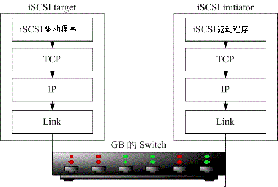
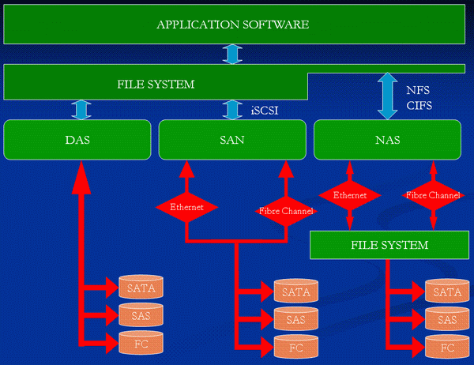
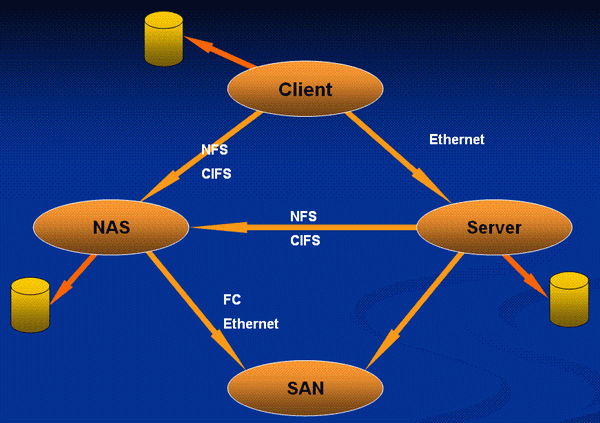

# 第十八章、网络驱动器装置： iSCSI 服务器

最近更新日期：2011/08/02

如果你的系统需要大量的磁盘容量，但是身边却没有 NAS 或外接的储存设备，仅有个人计算机时，那该如何是好？ 此时，透过网络的 SCSI 磁盘 (iSCSI) 就能够有大大的帮助啦！这个 iSCSI 是将来自网络的数据仿真成本机的 SCSI 设备， 因此可以进行诸如 LVM 等方面的实作，而不是单纯使用服务器端提供的文件系统而已，相当的有帮助喔！

*   18.1 网络文件系统还是网络驱动器
    *   18.1.1 NAS 与 SAN
    *   18.1.2 iSCSI 界面
    *   18.1.3 各组件相关性
*   18.2 iSCSI target 的设定
    *   18.2.1 所需软件与软件结构
    *   18.2.2 target 的实际设定
*   18.3 iSCSI initiator 的设定
    *   18.3.1 所需软件与软件结构
    *   18.3.2 initiator 的实际设定
    *   18.3.3 一个测试范例
*   18.4 重点回顾
*   18.5 本章习题
*   18.6 参考数据与延伸阅读
*   18.7 [针对本文的建议：http://phorum.vbird.org/viewtopic.php?f=16&t=35503](http://phorum.vbird.org/viewtopic.php?f=16&t=35503)

* * *

# 18.1 网络文件系统还是网络驱动器

## 18.1 网络文件系统还是网络驱动器

做为服务器的系统通常是需要储存设备的，而储存设备除了可以使用系统内建的磁盘之外，如果内建的磁盘容量不够大， 而且也没有额外的磁盘插槽 (SATA 或 IDE) 可用时，那么常见解决的方案就是增加 NAS (网络附加储存服务器) 或外接式储存设备。再高档一点的系统，可能就会用到 SAN (储存局域网络) 这个高贵的玩意儿 (注 1)。

不过，不论是哪一种架构，基本上，它们的内部硬盘通常是以磁盘阵列 (RAID) 作为基础的。磁盘阵列我们在基础篇第三版的[第十五章](http://linux.vbird.org/linux_basic/0420quota.php)谈过了，这里就不再啰唆。这里想要了解的是，啥是 NAS 又啥是 SAN ？ 这两者有何不同？与本章主题有关的 iSCSI 又是啥呢？底下就让我们来谈一谈。

* * *

### 18.1.1 NAS 与 SAN

由于企业的数据量越来越大，而且重要性与保密性越来越高，尤其类似数据库的内容，常常容量单位是以 TB (1TB = 1024GB) 在进行计算的。哇！真可怕！所以啰，磁盘阵列的应用就很重要了。那么磁盘阵列通常是在哪里呢？ 磁盘阵列通常是 (1)主机内部有磁盘阵列控制卡，可以自行管理磁盘阵列。不过想要提供磁盘阵列的容量， 得要透过额外的网络服务才行； (2)外接式磁盘阵列设备，就是单纯的磁盘阵列设备，必须透过某些接口链接到主机上， 主机也要安装适当的驱动程序后，才能捉到这个设备所提供的磁盘容量。

不过，以目前的信息社会来说，你应该很少听到内建或外接的 RAID 了，常常听到的应该是 NAS 与 SAN ，那这是啥咚咚？ 让我们简单的来说说：

*   NAS (Network Attached Storage, 网络附加储存服务器)

基本上，NAS 其实就是一部客制化好的主机了，只要将 NAS 连接上网络，那么在网络上面的其他主机就能够存取 NAS 上头的资料了。简单的说，NAS 就是一部 file server 啰～不过，NAS 由于也是接在网络上面，所以，如果网络上有某个用户大量存取 NAS 上头的数据时，是很容易造成网络停顿的问题的，这个比较麻烦点～低阶的 NAS 通常会使用 Linux 系统搭配软件磁盘阵列来提供大容量文件系统。不过效能嘛就有待加强啦！此外，NAS 也通常支持 TCP/IP ，并会提供 NFS, SAMBA, FTP 等常见的通讯协议来提供客户端取得文件系统。

那为什么不要直接使用个人计算机安装 Linux 再搭配相关的服务，即可提供 NAS 预计要提供的大容量空间啦！干嘛需要 NAS 呢？ 因为，通常 NAS 还会包括很多组态的接口，通常是利用 Web 接口来控制磁盘阵列的设定状况、提供 IP 或其他相关网络设定， 以及是否提供某些特定的服务等等。因为具有较为亲和的操作与控制接口，对于非 IT 的人员来说，控管较为容易啦。 这也是 NAS 存在的目的。

不过，目前倒是有类似 FreeNAS 的软件开发项目 ([`sourceforge.net/projects/freenas/`](http://sourceforge.net/projects/freenas/), 注 2)，可以让你的 Linux PC 变成一部可透过 Web 控管的 NAS 哩！不过不是本章的重点，有兴趣的朋友可以自行前往下载与安装该软件来玩玩～

*   SAN (Storage Area Networks, 储存局域网络)

从上面的说明来看，其实那个 NAS 就是一部可以提供大容量文件系统的主机嘛！ 那我们知道单部主机能够提供的插槽再怎么说也是有限的！ 所以并不能无限制的安插磁盘在同一部实体主机上面。但是如果偏偏你就是有大量磁盘使用的需求，那时该如何是好？ 这时就得要使用到 SAN 这玩意儿啦！

最简单的看法，就是将 SAN 视为一个外接式的储存设备。只是单纯的外接式储存设备仅能透过某些接口 (如 SCSI 或 eSATA) 提供单一部主机使用，而 SAN 却可以透过某些特殊的接口或信道来提供局域网络内的所有机器进行磁盘存取。要注意喔，SAN 是提供『磁盘 (block device)』给主机用，而不是像 NAS 提供的是『网络协议的文件系统 (NFS, SMB...)』！这两者的差异挺大的喔！因此，挂载使用 SAN 的主机会多出一个大磁盘，并可针对 SAN 提供的磁盘进行分割与格式化等动作。想想看，你能对 NAS 提供的文件系统格式化吗？不行吧！这样了解差异否？

另外，既然 SAN 可以提供磁盘，而 NAS 则是提供相关的网络文件系统，那么 NAS 能不能透过网络去使用 SAN 所提供的磁盘呢？答案当然是可以啊！因为 SAN 最大的目的就是在提供磁盘给服务器主机使用，NAS 也是一部完整的服务器， 所以 NAS 当然可以使用 SAN 啦！同时其他的网络服务器也能够使用这个 SAN 来进行数据存取。

此外，既然 SAN 开发的目的是要提供大量的磁盘给用户，那么传输的速度当然是非常重要的。因此，早期的 SAN 大多配合光纤信道 (Fibre Channel) 来提供高速的数据传输。目前标准的光纤信道是速度是 2GB ，未来还可能到达 10GB 以上呢～不过，使用光纤等技术较高的设备，当然就比较贵一些。

拜以太网络盛行，加上技术成熟之赐，现今的以太网络媒体 (网络卡、交换器、路由器等等设备) 已经可以达到 GB 的速度了，离 SAN 的光纤信道速度其实差异已经缩小很多啦～那么是否我们可以透过这个 GB 的以太网络接口来连接到 SAN 的设备呢？这就是我们接下来要提到的 iSCSI 架构啦！ ^_^

* * *

### 18.1.2 iSCSI 界面

早期的企业使用的服务器若有大容量磁盘的需求时，通常是透过 SCSI 来串接 SCSI 磁盘，因此服务器上面必须要加装 SCSI 适配卡，而且这个 SCSI 是专属于该服务器的。后来这个外接式的 SCSI 设备被上述提到的 SAN 的架构所取代， 在 SAN 的标准架构下，虽然有很多的服务器可以对同一个 SAN 进行存取的动作，不过为了速度需求，通常使用的是光纤信道。 但是光纤信道就是贵嘛！不但设备贵，服务器上面也要有光纤接口，很麻烦～所以光纤的 SAN 在中小企业很难普及啊～

后来网络实在太普及，尤其是以 IP 封包为基础的 LAN 技术已经很成熟，再加上以太网络的速度越来越快， 所以就有厂商将 SAN 的连接方式改为利用 IP 技术来处理。然后再透过一些标准的订定，最后就得到 Internet SCSI (iSCSI) 这玩意的产生啦！iSCSI 主要是透过 TCP/IP 的技术，将储存设备端透过 iSCSI target (iSCSI 目标) 功能，做成可以提供磁盘的服务器端，再透过 iSCSI initiator (iSCSI 初始化用户) 功能，做成能够挂载使用 iSCSI target 的客户端，如此便能透过 iSCSI 协议来进行磁盘的应用了 (注 3)。

也就是说，iSCSI 这个架构主要将储存装置与使用的主机分为两个部分，分别是：

*   iSCSI target：就是储存设备端，存放磁盘或 RAID 的设备，目前也能够将 Linux 主机仿真成 iSCSI target 了！目的在提供其他主机使用的『磁盘』；

*   iSCSI initiator：就是能够使用 target 的客户端，通常是服务器。 也就是说，想要连接到 iSCSI target 的服务器，也必须要安装 iSCSI initiator 的相关功能后才能够使用 iSCSI target 提供的磁盘就是了。

如下图所示，iSCSI 是在 TCP/IP 上面所开发出来的一套应用，所以得要有网络才行啊！

 图 18.1-1、iSCSI 与 TCP/IP 相关性

* * *

### 18.1.3 各组件相关性

由上面的说明中，我们可以知道一部服务器如何取得磁盘或者是文件系统来利用呢？基本上就是：

*   直接存取 (direct-attached storage)：例如本机上面的磁盘，就是直接存取设备；
*   透过储存局域网络 (SAN)：来自区网内的其他储存设备提供的磁盘；
*   网络文件系统 (NAS)：来自 NAS 提供的文件系统，只能立即使用，不可进行格式化。

这三个东西与服务器主机能用的文件系统之间可以用维基百科的图示来展示：

 图 18.1-2、服务器取得文件系统的三个来源 (数据源为注 1)

从上图中，我们可以发现在一般的主机环境下，磁盘装置 (SATA, SAS, FC) 可以透过主机的接口 (DAS) 来直接进行文件系统的建立 (mkfs 进行格式化)，如果想要使用外部的磁盘，那可以透过 SAN (内含多个磁盘的设备)，然后透过 iSCSI 等接口来联机， 当然，还是得要进行格式化等动作 (假设这个 SAN 尚未被使用时)。最后，如果是 NAS 的条件下，那么 NAS 必须要先透过自己的操作系统将磁盘装置进行文件系统的建立后，再以 NFS/CIFS 等方式来提供其他主机挂载使用。

接下来，网络服务器、客户端系统、NAS 与 SAN 的角色在区网里面又是如何呢？我们依旧使用维基百科的图示来说明一下 (DAS 是每部主机内部的磁盘，即底下图标中的圆柱体)：

 图 18.1-3、各组件之间的相关性 (数据源为注 1)

NAS 可以使用自己的磁盘，也能够透过光纤或以太网络取得 SAN 所提供的磁盘来制作成为网络文件系统，提供其他人的使用。 Server 可以透过 NFS/CIFS 等方式取得 NAS 的文件系统，当然也能够直接存取 SAN 的磁盘。客户端主要则是透过网络文件系统， 并且直接使用 Server 提供的网络资源 (如 FTP, WWW, mail 等等)。

* * *

# 18.2 iSCSI target 的设定

## 18.2 iSCSI target 的设定

能够完成 iSCSI target/initiator 设定的项目非常多 (注 4)，鸟哥找的到的就有底下这几个：

*   Linux SCSI target framework (tgt)：[`stgt.sourceforge.net/`](http://stgt.sourceforge.net/)
*   Linux-iSCSI Project：[`linux-iscsi.sourceforge.net/`](http://linux-iscsi.sourceforge.net/)
*   Open-iSCSI：[`www.open-iscsi.org/`](http://www.open-iscsi.org/)

由于被我们 CentOS 6.x 官方直接使用的是 tgt 这个软件，因此底下我们会使用 tgt 来介绍整个 iSCSI target 的设定喔！

* * *

### 18.2.1 所需软件与软件结构

CentOS 将 tgt 的软件名称定义为 scsi-target-utils ，因此你得要使用 yum 去安装他才行。至于用来作为 initiator 的软件则是使用 linux-iscsi 的项目，该项目所提供的软件名称则为 iscsi-initiator-utils 。所以，总的来说，你需要的软件有：

*   scsi-target-utils：用来将 Linux 系统仿真成为 iSCSI target 的功能；
*   iscsi-initiator-utils：挂载来自 target 的磁盘到 Linux 本机上。

那么 scsi-target-utils 主要提供哪些档案呢？基本上有底下几个比较重要需要注意的：

*   /etc/tgt/targets.conf：主要配置文件，设定要分享的磁盘格式与哪几颗；
*   /usr/sbin/tgt-admin：在线查询、删除 target 等功能的设定工具；
*   /usr/sbin/tgt-setup-lun：建立 target 以及设定分享的磁盘与可使用的客户端等工具软件。
*   /usr/sbin/tgtadm：手动直接管理的管理员工具 (可使用配置文件取代)；
*   /usr/sbin/tgtd：主要提供 iSCSI target 服务的主程序；
*   /usr/sbin/tgtimg：建置预计分享的映像文件装置的工具 (以映像文件仿真磁盘)；

其实 CentOS 已经将很多功能都设定好了，因此我们只要修订配置文件，然后启动 tgtd 这个服务就可以啰！ 接下来，就让我们实际来玩一玩 iSCSI target 的设定吧！

* * *

### 18.2.2 target 的实际设定

从上面的分析来看，iSCSI 就是透过一个网络接口，将既有的磁盘给分享出去就是了。那么有哪些类型的磁盘可以分享呢？ 这包括：

*   使用 dd 指令所建立的大型档案可供仿真为磁盘 (无须预先格式化)；
*   使用单一分割槽 (partition) 分享为磁盘；
*   使用单一完整的磁盘 (无须预先分割)；
*   使用磁盘阵列分享 (其实与单一磁盘相同方式)；
*   使用软件磁盘阵列 (software raid) 分享成单一磁盘；
*   使用 LVM 的 LV 装置分享为磁盘。

其实没有那么复杂，我们大概知道可以透过 (1)大型档案； (2)单一分割槽； (3)单一装置 (包括磁盘、数组、软件磁盘阵列、LVM 的 LV 装置文件名等等) 来进行分享。在本小节当中，我们将透过新的分割产生新的没有用到的分割槽、LVM 逻辑滚动条、大型档案等三个咚咚来进行分享。既然如此，那就得要先来搞定这些咚咚啰！ 要注意喔，等一下我们要分享出去的数据，最好不要被使用，也最好不要开机就被挂载 (/etc/fstab 当中没有存在记录的意思)。 那么就来玩玩看啰！

*   建立所需要的磁盘装置

既然 iSCSI 要分享的是磁盘，那么我们得要准备好啊！目前预计准备的磁盘为：

*   建立一个名为 /srv/iscsi/disk1.img 的 500MB 档案；
*   使用 /dev/sda10 提供 2GB 作为分享 (从第一章到目前为止的分割数)；
*   使用 /dev/server/iscsi01 的 2GB LV 作为分享 (再加入 5GB /dev/sda11 到 server VG 中)。

实际处理的方式如下：

```
# 1\. 建立大型档案：
[root@www ~]# mkdir /srv/iscsi
[root@www ~]# dd if=/dev/zero of=/srv/iscsi/disk1.img bs=1M count=500
[root@www ~]# chcon -Rv -t tgtd_var_lib_t /srv/iscsi/
[root@www ~]# ls -lh /srv/iscsi/disk1.img
-rw-r--r--. 1 root root 500M Aug  2 16:22 /srv/iscsi/disk1.img &lt;==容量对的！

# 2\. 建立实际的 partition 分割：
[root@www ~]# fdisk /dev/sda  &lt;==实际的分割方式自己处理吧！
[root@www ~]# partprobe       &lt;==某些情况下得 reboot 喔！
[root@www ~]# fdisk -l
   Device Boot      Start         End      Blocks   Id  System
/dev/sda10           2202        2463     2104483+  83  Linux
/dev/sda11           2464        3117     5253223+  8e  Linux LVM
# 只有输出 /dev/sda{10,11} 信息，其他的都省略了。注意看容量，上述容量单位 KB

[root@www ~]# swapon -s; mount &#124; grep 'sda1'
# 自己测试一下 /dev/sda{10,11} 不能够被使用喔！若有被使用，请 umount 或 swapoff

# 3\. 建立 LV 装置 ：
[root@www ~]# pvcreate /dev/sda11
[root@www ~]# vgextend server /dev/sda11
[root@www ~]# lvcreate -L 2G -n iscsi01 server
[root@www ~]# lvscan
  ACTIVE            '/dev/server/myhome' [6.88 GiB] inherit
  ACTIVE            '/dev/server/iscsi01' [2.00 GB] inherit 
```

*   规划分享的 iSCSI target 檔名

iSCSI 有一套自己分享 target 档名的定义，基本上，藉由 iSCSI 分享出来的 target 檔名都是以 iqn 为开头，意思是：『iSCSI Qualified Name (iSCSI 合格名称)』的意思(注 5)。那么在 iqn 后面要接啥档名呢？通常是这样的：

```
iqn.yyyy-mm.&lt;reversed domain name&gt;:identifier
iqn.年年-月.单位网域名的反转写法  :这个分享的 target 名称 
```

鸟哥做这个测试的时间是 2011 年 8 月份，然后鸟哥的机器是 www.centos.vbird ，反转网域写法为 vbird.centos， 然后，鸟哥想要的 iSCSI target 名称是 vbirddisk ，那么就可以这样写：

*   iqn.2011-08.vbird.centos:vbirddisk

另外，就如同一般外接式储存装置 (target 名称) 可以具有多个磁盘一样，我们的 target 也能够拥有数个磁盘装置的。 每个在同一个 target 上头的磁盘我们可以将它定义为逻辑单位编号 (Logical Unit Number, LUN)。我们的 iSCSI initiator 就是跟 target 协调后才取得 LUN 的存取权就是了 (注 5)。在鸟哥的这个简单案例中，最终的结果，我们会有一个 target ，在这个 target 当中可以使用三个 LUN 的磁盘。

*   设定 tgt 的配置文件 /etc/tgt/targets.conf

接下来我们要开始来修改配置文件了。基本上，配置文件就是修改 /etc/tgt/targets.conf 啦。这个档案的内容可以改得很简单， 最重要的就是设定前一点规定的 iqn 名称，以及该名称所对应的装置，然后再给予一些可能会用到的参数而已。 多说无益，让我们实际来实作看看：

```
[root@www ~]# vim /etc/tgt/targets.conf
# 此档案的语法如下：
&lt;target iqn.相关装置的 target 名称&gt;
    backing-store /你的/虚拟设备/完整檔名-1
    backing-store /你的/虚拟设备/完整檔名-2
&lt;/target&gt;
 &lt;target iqn.2011-08.vbird.centos:vbirddisk&gt;
    backing-store /srv/iscsi/disk1.img  &lt;==LUN 1 (LUN 的编号通常照顺序)
    backing-store /dev/sda10            &lt;==LUN 2
    backing-store /dev/server/iscsi01   &lt;==LUN 3
&lt;/target&gt; 
```

事实上，除了 backing-store 之外，在这个配置文件当中还有一些比较特别的参数可以讨论看看 (man tgt-admin)：

*   backing-store (虚拟的装置), direct-store (实际的装置)： 设定装置时，如果你的整颗磁盘是全部被拿来当 iSCSI 分享之用，那么才能够使用 direct-store 。不过，根据网络上的其他文件， 似乎说明这个设定值有点危险的样子。所以，基本上还是建议单纯使用模拟的 backing-store 较佳。例如鸟哥的简单案例中，就通通使用 backing-store 而已。

*   initiator-address (用户端地址)： 如果你想要限制能够使用这个 target 的客户端来源，才需要填写这个设定值。基本上，不用设定它 (代表所有人都能使用的意思)， 因为我们后来会使用 iptables 来规范可以联机的客户端嘛！

*   incominguser (用户账号密码设定)： 如果除了来源 IP 的限制之外，你还想要让使用者输入账密才能使用你的 iSCSI target 的话，那么就加用这个设定项目。 此设定后面接两个参数，分别是账号与密码啰。

*   write-cache [off|on] (是否使用快取)： 在预设的情况下，tgtd 会使用快取来增快速度。不过，这样可能会有遗失数据的风险。所以，如果你的数据比较重要的话， 或许不要使用快取，直接存取装置会比较妥当一些。

上面的设定值要怎么用呢？现在，假设你的环境中，仅允许 192.168.100.0/24 这个网段可以存取 iSCSI target，而且存取时需要帐密分别为 vbirduser, vbirdpasswd ，此外，不要使用快取，那么原本的配置文件之外，还得要加上这样的参数才行 (基本上，使用上述的设定即可，底下的设定是多加测试用的，不需要填入你的设定中)。

```
[root@www ~]# vim /etc/tgt/targets.conf
&lt;target iqn.2011-04.vbird.centos:vbirddisk&gt;
    backing-store /home/iscsi/disk1.img
    backing-store /dev/sda7
    backing-store /dev/server/iscsi01
 initiator-address 192.168.100.0/24
    incominguser vbirduser vbirdpasswd
    write-cache off
&lt;/target&gt; 
```

*   启动 iSCSI target 以及观察相关端口与磁盘信息

再来则是启动、开机启动，以及观察 iSCSI target 所启动的埠口啰：

```
[root@www ~]# /etc/init.d/tgtd start
[root@www ~]# chkconfig tgtd on
[root@www ~]# netstat -tlunp &#124; grep tgt
Active Internet connections (only servers)
Proto Recv-Q Send-Q Local Address   Foreign Address   State   PID/Program name
tcp        0      0 0.0.0.0:3260    0.0.0.0:*         LISTEN  26944/tgtd
tcp        0      0 :::3260         :::*              LISTEN  26944/tgtd
# 重点就是那个 3260 TCP 封包啦！等一下的防火墙务必要开放这个埠口。

# 观察一下我们 target 相关信息，以及提供的 LUN 数据内容：
[root@www ~]# tgt-admin --show
Target 1: iqn.2011-08.vbird.centos:vbirddisk &lt;==就是我们的 target
    System information:
        Driver: iscsi
        State: ready
    I_T nexus information:
    LUN information:
        LUN: 0
            Type: controller     &lt;==这是个控制器，并非可以用的 LUN 喔！
....(中间省略)....
        LUN: 1
            Type: disk       &lt;==第一个 LUN，是磁盘 (disk) 喔！
            SCSI ID: IET     00010001
            SCSI SN: beaf11
            Size: 2155 MB      &lt;==容量有这么大！
            Online: Yes
            Removable media: No
            Backing store type: rdwr
            Backing store path: /dev/sda10 &lt;==磁盘所在的实际文件名
        LUN: 2
            Type: disk
            SCSI ID: IET     00010002
            SCSI SN: beaf12
            Size: 2147 MB
            Online: Yes
            Removable media: No
            Backing store type: rdwr
            Backing store path: /dev/server/iscsi01
        LUN: 3
            Type: disk
            SCSI ID: IET     00010003
            SCSI SN: beaf13
            Size: 524 MB
            Online: Yes
            Removable media: No
            Backing store type: rdwr
            Backing store path: /srv/iscsi/disk1.img
    Account information:
 vbirduser        &lt;==额外的帐户信息
    ACL information:
 192.168.100.0/24 &lt;==额外的来源 IP 限制 
```

请将上面的信息对照一下我们的配置文件呦！看看有没有错误就是了！尤其注意每个 LUN 的容量、实际磁盘路径！ 那个项目不能错误就是了。(照理说 LUN 的数字应该与 backing-store 设定的顺序有关，不过，在鸟哥的测试中， 出现的顺序并不相同！因此，还是需要使用 tgt-admin --show 去查阅查阅才好！)

*   设定防火墙

不论你有没有使用 initiator-address 在 targets.conf 配置文件中，iSCSI target 就是使用 TCP/IP 传输数据的， 所以你还是得要在防火墙内设定可以联机的客户端才行！既然 iSCSI 仅开启 3260 埠口，那么我们就这么进行即可：

```
[root@www ~]# vim /usr/local/virus/iptables/iptables.allow
iptables -A INPUT  -p tcp -s 192.168.100.0/24 --dport 3260 -j ACCEPT

[root@www ~]# /usr/local/virus/iptables/iptables.rule
[root@www ~]# iptables-save &#124; grep 3260
-A INPUT -s 192.168.100.0/24 -p tcp -m tcp --dport 3260 -j ACCEPT
# 最终要看到上述的输出字样才是 OK 的呦！若有其他用户需要联机，
# 自行复制 iptables.allow 内的语法，修改来源端即可。 
```

* * *

# 18.3 iSCSI initiator 的设定

## 18.3 iSCSI initiator 的设定

谈完了 target 的设定，并且观察到相关 target 的 LUN 数据后，接下来就是要来挂载使用啰。使用的方法很简单， 只不过我们得要安装额外的软件来取得 target 的 LUN 使用权就是了。

* * *

### 18.3.1 所需软件与软件结构

在前一小节就谈过了，要设定 iSCSI initiator 必须要安装 iscsi-initiator-utils 才行。安装的方法请使用 yum 去处理，这里不再多讲话。那么这个软件的结构是如何呢？

*   /etc/iscsi/iscsid.conf：主要的配置文件，用来连结到 iSCSI target 的设定；
*   /sbin/iscsid：启动 iSCSI initiator 的主要服务程序；
*   /sbin/iscsiadm：用来管理 iSCSI initiator 的主要设定程序；
*   /etc/init.d/iscsid：让本机模拟成为 iSCSI initiater 的主要服务；
*   /etc/init.d/iscsi：在本机成为 iSCSI initiator 之后，启动此脚本，让我们可以登入 iSCSI target。所以 iscsid 先启动后，才能启动这个服务。为了防呆，所以 /etc/init.d/iscsi 已经写了一个启动指令， 启动 iscsi 前尚未启动 iscsid ，则会先呼叫 iscsid 才继续处理 iscsi 喔！

老实说，因为 /etc/init.d/iscsi 脚本已经包含了启动 /etc/init.d/iscsid 的步骤在里面，所以，理论上， 你只要启动 iscsi 就好啦！此外，那个 iscsid.conf 里面大概只要设定好登入 target 时的帐密即可， 其他的 target 搜寻、设定、取得的方法都直接使用 iscsiadm 这个指令来完成。由于 iscsiadm 侦测到的结果会直接写入 /var/lib/iscsi/nodes/ 当中，因此只要启动 /etc/init.d/iscsi 就能够在下次开机时，自动的连结到正确的 target 啰。 那么就让我们来处理处理整个过程吧 (注 6)！

* * *

### 18.3.2 initiator 的实际设定

首先，我们得要知道 target 提供了啥咚咚啊，因此，理论上，不论是 target 还是 initiator 都应该是要我们管理的机器才对。 而现在我们知道 target 其实有设定账号与密码的，所以底下我们就得要修改一下 iscsid.conf 的内容才行。

*   修改 /etc/iscsi/iscsid.conf 内容，并启动 iscsi

这个档案的修改很简单，因为里面的参数大多已经预设做的不错了，所以只要填写 target 登入时所需要的帐密即可。 修改的地方有两个，一个是侦测时 (discovery) 可能会用到的帐密，一个是联机时 (node) 会用到的帐密：

```
[root@clientlinux ~]# vim /etc/iscsi/iscsid.conf
node.session.auth.username = vbirduser   &lt;==在 target 时设定的
node.session.auth.password = vbirdpasswd &lt;==约在 53, 54 行
discovery.sendtargets.auth.username = vbirduser  &lt;==约在 67, 68 行
discovery.sendtargets.auth.password = vbirdpasswd

[root@clientlinux ~]# chkconfig iscsid on
[root@clientlinux ~]# chkconfig iscsi on 
```

由于我们尚未与 target 联机，所以 iscsi 并无法让我们顺利启动的！因此上面只要 chkconfig 即可，不需要启动他。 要开始来侦测 target 与写入系统信息啰。全部使用 iscsiadm 这个指令就可以完成所有动作了。

*   侦测 192.168.100.254 这部 target 的相关数据

虽然我们已经知道 target 的名字，不过，这里假设还不知道啦！因为有可能哪一天你的公司有钱了， 会去买实体的 iSCSI 数组嘛！所以这里还是讲完整的侦测过程好了！你可以这样使用：

```
[root@clientlinux ~]# iscsiadm -m discovery -t sendtargets -p IP:port
选项与参数：
-m discovery   ：使用侦测的方式进行 iscsiadmin 指令功能；
-t sendtargets ：透过 iscsi 的协议，侦测后面的设备所拥有的 target 数据
-p IP:port     ：就是那部 iscsi 设备的 IP 与埠口，不写埠口预设是 3260 啰！

范例：侦测 192.168.100.254 这部 iSCSI 设备的相关数据
[root@clientlinux ~]# iscsiadm -m discovery -t sendtargets -p 192.168.100.254
192.168.100.254:3260,1  iqn.2011-08.vbird.centos:vbirddisk
# 192.168.100.254:3260,1 ：在此 IP, 端口上面的 target 号码，本例中为 target1
# iqn.2011-08.vbird.centos:vbirddisk ：就是我们的 target 名称啊！

[root@clientlinux ~]# ll -R /var/lib/iscsi/nodes/
/var/lib/iscsi/nodes/iqn.2011-08.vbird.centos:vbirddisk
/var/lib/iscsi/nodes/iqn.2011-08.vbird.centos:vbirddisk/192.168.100.254,3260,1
# 上面的特殊字体部分，就是我们利用 iscsiadm 侦测到的 target 结果！ 
```

现在我们知道了 target 的名称，同时将所有侦测到的信息通通写入到上述 /var/lib/iscsi/nodes/iqn.2011-08.vbird.centos:vbirddisk/192.168.100.254,3260,1 目录内的 default 档案中， 若信息有修订过的话，那你可以到这个档案内修改，也可以透过 iscsiadm 的 update 功能处理相关参数的。

*   开始进行联机 iSCSI target

因为我们的 initiator 可能会连接多部的 target 设备，因此，我们得先要瞧瞧目前系统上面侦测到的 target 有几部， 然后再找到我们要的那部 target 来进行登入的作业。不过，如果你想要将所有侦测到的 target 全部都登入的话， 那么整个步骤可以再简化：

```
范例：根据前一个步骤侦测到的资料，启动全部的 target
[root@clientlinux ~]# /etc/init.d/iscsi restart
正在停止 iscsi：                                 [  确定  ]
正在激活 iscsi：                                 [  确定  ]
# 将系统里面全部的 target 通通以 /var/lib/iscs/nodes/ 内的设定登入
# 上面的特殊字体比较需要注意啦！你只要做到这里即可，底下的瞧瞧就好。

范例：显示出目前系统上面所有的 target 数据：
[root@clientlinux ~]# iscsiadm -m node
192.168.100.254:3260,1 iqn.2011-08.vbird.centos:vbirddisk
选项与参数：
-m node：找出目前本机上面所有侦测到的 target 信息，可能并未登入喔

范例：仅登入某部 target ，不要重新启动 iscsi 服务
[root@clientlinux ~]# iscsiadm -m node -T target 名称 --login
选项与参数：
-T target 名称：仅使用后面接的那部 target ，target 名称可用上个指令查到！
--login      ：就是登入啊！

[root@clientlinux ~]# iscsiadm -m node -T iqn.2011-08.vbird.centos:vbirddisk \
&gt;  --login
# 这次进行会出现错误，是因为我们已经登入了，不可重复登入喔！ 
```

接下来呢？呵呵！很棒的是，我们要来开始处理这个 iSCSI 的磁盘了喔！怎么处理？瞧一瞧！

```
[root@clientlinux ~]# fdisk -l
Disk /dev/sda: 8589 MB, 8589934592 bytes  &lt;==这是原有的那颗磁盘，略过不看
....(中间省略)....

Disk /dev/sdc: 2147 MB, 2147483648 bytes
67 heads, 62 sectors/track, 1009 cylinders
Units = cylinders of 4154 * 512 = 2126848 bytes
Sector size (logical/physical): 512 bytes / 512 bytes

Disk /dev/sdb: 2154 MB, 2154991104 bytes
67 heads, 62 sectors/track, 1013 cylinders
Units = cylinders of 4154 * 512 = 2126848 bytes
Sector size (logical/physical): 512 bytes / 512 bytes

Disk /dev/sdd: 524 MB, 524288000 bytes
17 heads, 59 sectors/track, 1020 cylinders
Units = cylinders of 1003 * 512 = 513536 bytes
Sector size (logical/physical): 512 bytes / 512 bytes 
```

你会发现主机上面多出了三个新的磁盘，容量与刚刚在 192.168.100.254 那部 iSCSI target 上面分享的 LUN 一样大。 那这三颗磁盘可以怎么用？你想怎么用就怎么用啊！只是，唯一要注意的，就是 iSCSI target 每次都要比 iSCSI initiator 这部主机还要早开机，否则我们的 initiator 恐怕就会出问题。

*   更新/删除/新增 target 数据的方法

如果你的 iSCSI target 可能因为某些原因被拿走了，或者是已经不存在于你的区网中，或者是要送修了～ 这个时候你的 iSCSI initiator 总是得要关闭吧！但是，又不能全部关掉 (/etc/init.d/iscsi stop)， 因为还有其他的 iSCSI target 在使用。这个时候该如何取消不要的 target 呢？很简单！流程如下：

```
[root@clientlinux ~]# iscsiadm -m node -T targetname --logout
[root@clientlinux ~]# iscsiadm -m node -o [delete&#124;new&#124;update] -T targetname
选项与参数：
--logout ：就是注销 target，但是并没有删除 /var/lib/iscsi/nodes/ 内的数据
-o delete：删除后面接的那部 target 链接信息 (/var/lib/iscsi/nodes/*)
-o update：更新相关的信息
-o new   ：增加一个新的 target 信息。

范例：关闭来自鸟哥的 iSCSI target 的数据，并且移除链接
[root@clientlinux ~]# iscsiadm -m node   &lt;==还是先秀出相关的 target iqn 名称
192.168.100.254:3260,1 iqn.2011-08.vbird.centos:vbirddisk
[root@clientlinux ~]# iscsiadm -m node -T &lt;u&gt;iqn.2011-08.vbird.centos:vbirddisk&lt;/u&gt; \
&gt;  --logout
Logging out of session [sid: 1, target: iqn.2011-08.vbird.centos:vbirddisk,
 portal: 192.168.100.254,3260]
Logout of [sid: 1, target: iqn.2011-08.vbird.centos:vbirddisk, portal:
 192.168.100.254,3260] successful.
# 这个时候的 target 连结还是存在的，虽然注销你还是看的到！

[root@clientlinux ~]# iscsiadm -m node -o delete \
&gt;  -T iqn.2011-08.vbird.centos:vbirddisk
[root@clientlinux ~]# iscsiadm -m node
iscsiadm: no records found! &lt;==嘿嘿！不存在这个 target 了～

[root@clientlinux ~]# /etc/init.d/iscsi restart
# 你会发现唔！怎么 target 的信息不见了！这样瞭了乎！ 
```

如果一切都没有问题，现在，请回到 discovery 的过程，重新再将 iSCSI target 侦测一次，再重新启动 initiator 来取得那三个磁盘吧！我们要来测试与利用该磁盘啰！

* * *

### 18.3.3 一个测试范例

到底 iSCSI 可以怎么用？我们就来玩一玩。假设：

1.  你刚刚如同鸟哥的整个运作流程，已经在 initiator 上面将 target 数据清除了；
2.  现在我们只知道 iSCSI target 的 IP 是 192.168.100.254 ，而需要的帐密是 vbirduser, vbirdpasswd；
3.  帐密信息你已经写入 /etc/iscsi/iscsid.conf 里面了；
4.  假设我们预计要将 target 的磁盘拿来当作 LVM 内的 PV 使用；
5.  并且将所有的磁盘容量都给一个名为 /dev/iscsi/disk 的 LV 使用；
6.  这个 LV 会被格式化为 ext4 ，且挂载在 /data/iscsi 内。

那么，整体的流程是：

```
# 1\. 启动 iscsi ，并且开始侦测及登入 192.168.100.254 上面的 target 名称
[root@clientlinux ~]# /etc/init.d/iscsi restart
[root@clientlinux ~]# chkconfig iscsi on
[root@clientlinux ~]# iscsiadm -m discovery -t sendtargets -p 192.168.100.254
[root@clientlinux ~]# /etc/init.d/iscsi restart
[root@clientlinux ~]# iscsiadm -m node
192.168.100.254:3260,1 iqn.2011-08.vbird.centos:vbirddisk

# 2\. 开始处理 LVM 的流程，由 PV, VG, LV 依序处理喔！
[root@clientlinux ~]# fdisk -l    &lt;==出现的资料中你会发现 /dev/sd[b-d]
[root@clientlinux ~]# pvcreate /dev/sd{b,c,d}  &lt;==建立 PV 去！
  Wiping swap signature on /dev/sdb
  Physical volume "/dev/sdb" successfully created
  Physical volume "/dev/sdc" successfully created
  Physical volume "/dev/sdd" successfully created

[root@clientlinux ~]# vgcreate iscsi /dev/sd{b,c,d}  &lt;==建立 VG 去！
  Volume group "iscsi" successfully created

[root@clientlinux ~]# vgdisplay  &lt;==要找到可用的容量啰！
  --- Volume group ---
  VG Name               iscsi
....(中间省略)....
  Act PV                3
  VG Size               4.48 GiB
  PE Size               4.00 MiB
  Total PE              1148  &lt;==就是这玩意儿！共 1148 个！
  Alloc PE / Size       0 / 0
  Free  PE / Size       1148 / 4.48 GiB
....(底下省略)....

[root@clientlinux ~]# lvcreate -l 1148 -n disk iscsi
  Logical volume "disk" created

[root@clientlinux ~]# lvdisplay
  --- Logical volume ---
 LV Name                /dev/iscsi/disk
  VG Name                iscsi
  LV UUID                opR64B-Zeoe-C58n-ipN2-em3O-nUYs-wjEZDP
  LV Write Access        read/write
  LV Status              available
  # open                 0
  LV Size                4.48 GiB &lt;==注意一下容量对不对啊！
  Current LE             1148
  Segments               3
  Allocation             inherit
  Read ahead sectors     auto
  - currently set to     256
  Block device           253:2

# 3\. 开始格式化，并且进行开机自动挂载的动作！
[root@clientlinux ~]# mkfs -t ext4 /dev/iscsi/disk
[root@clientlinux ~]# mkdir -p /data/iscsi
[root@clientlinux ~]# vim /etc/fstab
/dev/iscsi/disk   /data/iscsi   ext4   defaults,_netdev   1   2

[root@clientlinux ~]# mount -a
[root@clientlinux ~]# df -Th
文件系统      类型    Size  Used Avail Use% 挂载点
/dev/mapper/iscsi-disk
              ext4    4.5G  137M  4.1G   4% /data/iscsi 
```

比较特殊的是 /etc/fstab 里面的第四个字段，加上 *netdev (最前面是底线) 指的是，因为这个 partition 位于网络上， 所以得要网络开机启动完成后才会挂载的意思。现在，请让你的 iSCSI initiator 重新启动看看， 试看看重新启动系统后，你的 /data/iscsi 是否还存在呢？ ^*^

然后，让我们切回 iSCSI target 那部主机，研究看看到底谁有使用我们的 target 呢？

```
[root@www ~]# tgt-admin --show
Target 1: iqn.2011-08.vbird.centos:vbirddisk
    System information:
        Driver: iscsi
        State: ready
    I_T nexus information:
        I_T nexus: 2
            Initiator: iqn.1994-05.com.redhat:71cf137f58f2 &lt;==不是很喜欢的名字！
            Connection: 0
                IP Address: 192.168.100.10    &lt;==就是这里联机进来啰！
    LUN information:
....(后面省略).... 
```

明明是 initiator 怎么会是那个 redhat 的名字呢？如果你不介意那就算了，如果挺介意的话，那么修改 initiator 那部主机的 /etc/iscsi/initiatorname.iscsi 这个档案的内容，将它变成类似如下的模样即可：

**Tips:** 不过，这个动作最好在使用 target 的 LUN 之前就进行，否则，当你使用了 LUN 的磁盘后，再修改这个档案后， 你的磁盘文件名可能会改变。例如鸟哥的案例中，改过 initiatorname 之后，原本的磁盘文件名竟变成 /dev/sd[efg] 了！害鸟哥的 LV 就不能再度使用了...


```
# 1\. 先在 iSCSI initiator 上面进行如下动作：
[root@clientlinux ~]# vim /etc/iscsi/initiatorname.iscsi
InitiatorName=iqn.2011-08.vbird.centos:initiator
[root@clientlinux ~]# /etc/init.d/iscsi restart

# 2\. 在 iSCSI target 上面就可以发现如下的数据修订了：
[root@www ~]# tgt-admin --show
Target 1: iqn.2011-08.vbird.centos:vbirddisk
    System information:
        Driver: iscsi
        State: ready
    I_T nexus information:
        I_T nexus: 5
 Initiator: iqn.2011-08.vbird.centos:initiator
            Connection: 0
                IP Address: 192.168.100.10
....(后面省略).... 
```

* * *

# 18.4 重点回顾

## 18.4 重点回顾

*   如果需要大容量的磁盘，通常会使用 RAID 磁盘阵列的架构；
*   取得外部磁盘容量的作法，主要有 NAT 及 SAN 两大类的方式；
*   NAT 可以想成是一部已经客制化的服务器，主要提供 NFS, SMB 等网络文件系统；
*   SAN 则是一种外接是储存设备，可以透过 SAN 取得外部的磁盘装置 (非文件系统)；
*   SAN 早期使用光纤信道，由于以太网络的发展，近来使用 iSCSI 协议在 TCP/IP 架构上面实作；
*   iSCSI 协议主要分为 iSCSI target (提供磁盘装置者) 及 iSCSI initiator (存取 target 磁盘)；
*   iSCSI target 主要使用 scsi-target-utils 软件达成主要利用 tgt-admin 及 tgtadm 指令完成：
*   一般定义 target 名称为：iqn.yyyy-mm.<reversed domain name>:identifier
*   一部 target 里面可分享多个磁盘，每个磁盘都是一个 LUN；
*   iSCSI initiator 主要透过 iscsi-initiator-utils 软件达成链接到 target 的任务；
*   iscsi-initiator-utils 主要提供 iscsiadm 来完成所有的动作。

* * *

# 18.5 本章习题

## 18.5 本章习题

*   由于网络驱动器机的运作是需要很好的网络质量才行，我们这里仅在测试，因此，请将 client 端的 initiator 关闭， 否则，未来开机都会怪怪的！(chkconfig iscsi off; vim /etc/fstab 等等的动作！)

* * *

# 18.6 参考数据与延伸阅读

## 18.6 参考数据与延伸阅读

*   注 1：SAN 与 NAS 在维基百科：[`en.wikipedia.org/wiki/Storage_area_network`](http://en.wikipedia.org/wiki/Storage_area_network)
*   注 2：FreeNAS 的官网：[`sourceforge.net/projects/freenas/`](http://sourceforge.net/projects/freenas/)
*   注 3：鸟站网友彦明兄对 iSCSI 的说明文件： [`linux.vbird.org/somepaper/20081205-rhel4-iscsi.pdf`](http://linux.vbird.org/somepaper/20081205-rhel4-iscsi.pdf)
*   注 4：几个常见的将 Linux 模拟成 iSCSI target 与 initiator 的官网： Linux SCSI target framework (tgt)：[`stgt.sourceforge.net/`](http://stgt.sourceforge.net/) Linux-iSCSI Project：[`linux-iscsi.sourceforge.net/`](http://linux-iscsi.sourceforge.net/) Open-iSCSI：[`www.open-iscsi.org/`](http://www.open-iscsi.org/)
*   注 5：iSCSI 内的 iqn 及 LUN 意义说明：[`en.wikipedia.org/wiki/ISCSI`](http://en.wikipedia.org/wiki/ISCSI)
*   注 6：鸟站之友彦明兄提供的良好文献，以及相关的 initiator 设定方式： [`linux.vbird.org/somepaper/20081205-rhel5-iscsi.pdf`](http://linux.vbird.org/somepaper/20081205-rhel5-iscsi.pdf) iSCSI (client) howto：[`www.cyberciti.biz/tips/rhel-centos-fedora-linux-iscsi-howto.html`](http://www.cyberciti.biz/tips/rhel-centos-fedora-linux-iscsi-howto.html) 鸟站旧版资料：[`linux.vbird.org/linux_basic/0610hardware/0610hardware-fc4.php#raid_iscsi`](http://linux.vbird.org/linux_basic/0610hardware/0610hardware-fc4.php#raid_iscsi)
*   [`rhev-wiki.org/index.php?title=RHEL_5.5/CentOS_5.5_iSCSI_Storage_Server`](http://rhev-wiki.org/index.php?title=RHEL_5.5/CentOS_5.5_iSCSI_Storage_Server)

* * *

2011/04/08：重新编辑本数据哩！ 2011/04/25：历经多个礼拜的杂事杂务缠身，终于完成这篇 iSCSI 的模拟应用。应该是挺好玩的一个咚咚～ 2011/08/02：将基于 CentOS 5.x 的版本移动到[此处](http://linux.vbird.org/linux_server/0460iscsi/0460iscsi-centos5.php)

* * *