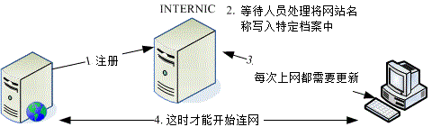

# 第十九章、主机名控制者： DNS 服务器

最近更新日期：2011/08/05

我们都知道，在『记忆』的角色上，人脑总是不如计算机的，而人们对文字的印象又比数字高。因此，想要使用纯粹的 TCP/IP 来上网，实在不好记忆又很麻烦。为了适应人类的使用习惯，因此一个名为 DNS 的服务，帮我们将主机名解析为 IP 好让大家只要记得主机名就能使用 Internet 的咚咚就这么诞生啦！在这一章当中，我们会谈一谈 DNS 服务内的正、反解 zone 的意义，解析主机名的授权概念与整体查询流程，以及 master/slave DNS 服务的配置等等呦！赶紧动动脑先～

*   19.1 什么是 DNS
    *   19.1.1 用网络主机名取得 IP 的历史渊源： /etc/hosts, DNS, FQDN
    *   19.1.2 DNS 的主机名对应 IP 的查询流程： 阶层式与 TLD, 查询流程, port
    *   19.1.3 合法 DNS 的关键：申请领域查询授权
    *   19.1.4 主机名交由 ISP 代管还是自己设定 DNS 服务器
    *   19.1.5 DNS 数据库的记录：正解, 反解, Zone 的意义
    *   19.1.6 DNS 数据库的类型：hint, master/slave 架构
*   19.2 Client 端的设定
    *   19.2.1 相关配置文件： /etc/hosts, /etc/resolv.conf, /etc/nsswitch.conf
    *   19.2.2 DNS 的正、反解查询指令： host, nslookup, dig
    *   19.2.3 查询领域管理者相关信息： whois
*   19.3 DNS 服务器的软件、种类与 cache only DNS 服务器设定
    *   19.3.1 架设 DNS 所需要的软件
    *   19.3.2 BIND 的默认路径设定与 chroot： /etc/sysconfig/named 与 chroot
    *   19.3.3 单纯的 cache-only DNS 服务器与 forwarding 功能：named.conf, messages
*   19.4 DNS 服务器的详细设定
    *   19.4.1 正解文件记录的数据 (Resource Record, RR)： A, NS, SOA, CNAME, MX
    *   19.4.2 反解文件记录的 RR 数据： PTR
    *   19.4.3 步骤一：DNS 的环境规划：正解、反解 zone 的预先定义案例说明
    *   19.4.4 步骤二：主配置文件 /etc/named.conf 的设置
    *   19.4.5 步骤三：最上层 . (root) 数据库档案的设定
    *   19.4.6 步骤四：正解数据库档案的设定
    *   19.4.7 步骤五：反解数据库档案的设定
    *   19.4.8 步骤六：DNS 的启动、观察与防火墙
    *   19.4.9 步骤七：测试与数据库更新
*   19.5 协同工作的 DNS： Slave DNS 及子域授权设定
    *   19.5.1 master DNS 权限的开放
    *   19.5.2 Slave DNS 的设定与数据库权限问题
    *   19.5.3 建置子域 DNS 服务器：子域授权课题
    *   19.5.4 依不同接口给予不同的 DNS 主机名： view 功能的应用
*   19.6 DNS 服务器的进阶设定
    *   19.6.1 架设一个合法授权的 DNS 服务器
    *   19.6.2 LAME Server 的问题
    *   19.6.3 利用 RNDC 指令管理 DNS 服务器
    *   19.6.4 架设动态 DNS 主机：让你成为 ISP 啦！
*   19.7 重点回顾
*   19.8 本章习题
*   19.9 参考数据与延伸阅读
*   19.10 [针对本文的建议：http://phorum.vbird.org/viewtopic.php?p=115692](http://phorum.vbird.org/viewtopic.php?p=115692)

* * *

# 19.1 什么是 DNS

## 19.1 什么是 DNS

DNS 越来越重要，尤其未来 IPv6 这个需要 128bits 地址的玩意儿。因为我们连 IPv4 的 32bits 都背不起来了， 128bits 要怎么背？ 这时主机名自动解析为 IP 就很重要啦！那就是 DNS。但是 DNS 的架设有点麻烦，重点是原理的部分比较不好理解。 因此在这个小节当中，让我们先来谈谈与网络主机名有关的一些知识，这样架设 DNS 才不会出问题。

* * *

### 19.1.1 用网络主机名取得 IP 的历史渊源

目前的因特网世界使用的是所谓的 TCP/IP 协议，其中 IP 为第四版的 IPv4 。不过，这个 IPv4 是由 32 位所组成，为了人脑已经转成四组十进制的数字了，例如 12.34.56.78 这样的格式。当我们利用 Internet 传送数据的时候，就需要这个 IP ，否则数据封包怎么知道要被送到哪里去？

*   单一档案处理上网的年代： /etc/hosts

然而人脑对于 IP 这种数字的玩意儿，记忆力实在是不怎么样。但是要上 Internet 又一定需要 IP，怎么办？为了应付这个问题， 早期的朋友想到一个方法，那就是利用某些特定的档案将主机名与 IP 作一个对应， 如此一来，我们就可以透过主机名来取得该主机的 IP 了！真是个好主意，因为人类对于名字的记忆力可就好多了！ 那就是 /etc/hosts 这个档案的用途了。

可惜的是，这个方法还是有缺憾的，那就是主机名与 IP 的对应无法自动于所有的计算机内更新， 且要将主机名加入该档案仅能向 INTERNIC 注册，若 IP 数量太多时，该档案会大到不象话，也就更不利于其他主机同步化了。 如下图所示，客户端计算机每次都得要重新下载一次档案才能顺利联网！

 图 19.1-1、早期透过单一档案进行网络联机的示意图

在[第四章 4.2.1](http://linux.vbird.org/linux_server/0130internet_connect.php#connect_fix_IP) 里面我们约略谈过 /etc/hosts 这个档案的用法，基本上该档案内容就是『IP 主机名 主机别名一 主机别名二...』。在里面最重要的就是 localhost 对应到 127.0.0.1 这个咚咚！你千万不能删除该笔记录的。这里也再次强调，在你的私有网域内部，最好将所有的私有 IP 与主机名对应都写入这个档案中啦！

*   分布式、阶层式主机名管理架构： DNS 系统

早期网络尚未流行且计算机数量不多时，/etc/hosts 倒是还够用的，但自从 90 年代网络热门化后，单一档案 /etc/hosts 的联网问题就发生上面讲的状况啦！为了解决这个日益严重的问题，柏克莱大学发展出另外一套阶层式管理主机名对应 IP 的系统， 我们称它为 Berkeley Internet Name Domain, BIND ，这个系统可就优秀的多了～ 透过阶层式管理，可以轻松的进行维护的工作～太棒了！这也是目前全世界使用最广泛的领域名系统 (Domain Name System, DNS) 哩～透过 DNS ，我们不需要知道主机的 IP ，只要知道该主机的名称，就能够轻易的连上该主机了！

DNS 利用类似树状目录的架构，将主机名的管理分配在不同层级的 DNS 服务器当中，经由分层管理， 所以每一部 DNS 服务器记忆的信息就不会很多，而且若有 IP 异动时也相当容易修改！因为你如果已经申请到主机名解析的授权， 那么在你自己的 DNS 服务器中，就能够修改全世界都可以查询到的主机名了！而不用透过上层 ISP 的维护呢！ 自己动手当然是最快的啦！

由于目前的 IPv4 已经接近发送完毕的阶段，因此未来那个 128bits 的 IPv6 会逐渐热门起来。那么你需要背 128bits 的 IP 来上网吗？想必是不可能的！因此这个可以透过主机名就解析到 IP 的 DNS 服务，可以想象的到，它会越来越重要。此外，目前全世界的 WWW 主机名也都是透过 DNS 系统在处理 IP 的对应，所以，当 DNS 挂点时，我们将无法透过主机名来联机，那就几乎相当于没有 Internet 了！

因为 DNS 是这么的重要，所以即使我们没有架设它的必要时，还是得要熟悉一下它的原理才好。因此，跟 DNS 有关的 FQDN、Hostname 与 IP 的查询流程，正解与反解、合法授权的 DNS 服务器之意义，以及 Zone 等等的知识作一个认识才行！

**Tips:** 在底下的说明当中，我们有时会提到 DNS 有时会提到 BIND ，这有什么不同？ 由上面的说明里面，你可以了解到， DNS 是一种因特网的通讯协议名称， 至于 Bind 则是提供这个 DNS 服务的软件～这样你了解了吗？！


*   完整主机名： Fully Qualified Domain Name (FQDN)

第一个与 DNS 有关的主机名概念，就是『主机名与领域名 (hostname and domain name)』的观念，以及由这两者组成的完整主机名 Fully Qualified Domain Name, FQDN 的意义了。在讨论这个主题之前，我们来聊一聊比较生活化的话题：

*   以区域来区分同名同姓者的差异： 网络世界其实有很多人自称为『鸟哥』的，包括敝人在下小生我啦！那么你怎么知道此鸟哥非彼鸟哥呢？ 这个时候你可以利用每个鸟哥的所在地来作为区分啊，比如说台南的鸟哥与台北的鸟哥等。 那万一台南还有两个人自称鸟哥怎么办？没关系，你还可以依照乡镇来区分呢！比如说台南北区的鸟哥及台南中区的鸟哥。 如果将这个咚咚列出来，就有点像这样：

    ```
    | 鸟哥、北区、台南 鸟哥、中区、台南 鸟哥、台北 ...... | 
    ```

    是否就可以分辨每个鸟哥的不同点了呢？呵呵！没错！就是这样！那个地区就是『领域 (domain) 』，而鸟哥就是主机名啦！

*   以区域号码来区分相同的电话号码： 另外一个例子可以使用电话号码来看，假如高雄有个 1234567 而台南也有个 1234567，那么(1)你在高雄直接拨接 1234567 时，他会直接挂入高雄的 1234567 电话中，(2)但如果你要拨到台南去，就得加入 (06) 这个区码才行！我们就是使用区码来做为辨识之用的！此时那个 06 区码就是 domain name，而电话号码就是主机名啦！

有没有一点点了解鸟哥想表达的啦？我们上面讲到，DNS 是以树状目录分阶层的方式来处理主机名，那我们知道树状目录中， 那个目录可以记录文件名。那么 DNS 记录的哪个咚咚跟『目录』有关？就是那个领域名。领域名底下还可以记录各个主机名， 组合起来才是完整的主机名 (FQDN)。

举例来说，我们常常会发现主机名都是 www 的网站，例如 www.google.com.tw, www.seednet.net, www.hinet.net 等等，那么我们怎么知道这些 www 名称的主机在不同的地方呢？就需要给他领域名啰！也就是 .google.com.tw, .seednet.net, .hinet.net 等等的不同，所以即使你的主机名相同，但是只要不是在同一个领域内，那么就可以被分辨出不同的位置啰！

我们知道目录树的最顶层是根目录 (/)，那么 DNS 既然也是阶层式的，最顶层是啥呢？每一层的 domain name 与 hostname 又该怎么分？我们举鸟哥所在的昆山科大的 WWW 服务器为例好了 (www.ksu.edu.tw) ：

 图 19.1-2、分阶层的 DNS 架构，以昆山科大为例 (hostname & domain name)

在上面的例子当中，由上向下数的第二层里面，那个 .tw 是 domain name ，而 com, edu, gov 则是主机的名称，而在这个主机的名称之管理下，还有其他更小网域的主机，所以在第三层的时候，基本上，那个 edu.tw 就变成了 domain name 了！而昆山科大与成大的 ksu, ncku 则成为了 hostname 啰！

以此类推，最后得到我们的主机那个 www 是主机名，而 domain name 是由 ksu.edu.tw 那个名字所决定的！自然，我们的主机就是让管理 ksu.edu.tw 这个 domain name 的 DNS 服务器所管理的啰！这样是否了解了 domain name 与 hostname 的不同了呢？

**Tips:** 并不是以小数点 (.) 区分 domain name 与 hostname 喔！某些时刻 domain name 所管理的 hostname 会含有小数点。 举例来说，鸟哥所在的信息传播系并没有额外的 DNS 服务器架设，因此我们的主机名为 www.dic ，而 domain name 还是 ksu.edu.tw ，因此全名为 [www.dic.ksu.edu.tw](http://www.dic.ksu.edu.tw/) 哩！


* * *

### 19.1.2 DNS 的主机名对应 IP 的查询流程

约略了解了 FQDN 的 domain name 与 hostname 之后，接下来我们要谈一谈这个 DNS 的： (1)阶层架构是怎样？ (2)查询原理是怎样？总是要先知道架构才能知道如何查询主机名的吶！所以底下我们先来介绍一下整体的 DNS 阶层架构。

*   DNS 的阶层架构与 TLD

我们依旧使用台湾学术网络的 DNS 服务器所管理的各 domain 为例，将最上层到昆山科大 (ksu) 时，之间的各层绘制如下图：

 图 19.1-3、从最上层到昆山科大之间的 DNS 阶层示意图

在整个 DNS 系统的最上方一定是 . (小数点) 这个 DNS 服务器 (称为 root)，最早以前它底下管理的就只有 (1)com, edu, gov, mil, org, .net 这种特殊领域以及 (2)以国家为分类的第二层的主机名了！这两者称为 Top Level Domains (TLDs) 喔！

*   一般最上层领域名 (Generic TLDs, gTLD)：例如 .com, .org, .gov 等等
*   国码最上层领域名 (Country code TLDs, ccTLD)：例如 .tw, .uk, .jp, .cn 等

先来谈谈一般最上层领域 (gTLD) 好了，最早 root 仅管理六大领域名，分别如下：

| 名称 | 代表意义 |
| --- | --- |
| com | 公司、行号、企业 |
| org | 组织、机构 |
| edu | 教育单位 |
| gov | 政府单位 |
| net | 网络、通讯 |
| mil | 军事单位 |

但是因特网成长的速度太快了，因此后来除了上述的六大类别之外，还有诸如 .asia, .info, .jobs (注 1) 等领域名的开放。此外，为了让某些国家也能够有自己的最上层领域名，因此， 就有所谓的 ccTLD 了。这样做有什么好处呢？因为自己的国家内有最上层 ccTLD ，所以如果有 domain name 的需求，则只要向自己的国家申请即可，不需要再到最上层去申请啰！

*   授权与分层负责

既然 TLD 这么好，那么是否我们可以自己设定 TLD 呢？当然不行！因为我们得向上层 ISP 申请领域名的授权才行。例如台湾地区最上层的领域名是以 .tw 为开头，管理这个领域名的机器 IP 是在台湾，但是 .tw 这部服务器必须向 root (.) 注册领域名查询授权才行 (如上图 19.1-3 所示)。

那么每个国家之下记录的主要下层有哪些领域呢？基本上就是原先 root 管理的那六大类。 不过，由于各层 DNS 都能管理自己辖下的主机名或子领域，因此，我们的 .tw 可以自行规划自己的子领域名喔！ 例如目前台湾 ISP 常提供的 .idv.tw 的个人网站就是一例啊！

再强调一次，DNS 系统是以所谓的阶层式的管理，所以，请注意喔！那个 .tw 只记录底下那一层的这数个主要的 domain 的主机而已！至于例如 edu.tw 底下还有个 ksu.edu.tw 这部机器，那就直接授权交给 edu.tw 那部机器去管理了！也就是说『 每个上一层的 DNS 服务器所记录的信息，其实只有其下一层的主机名而已！ 』至于再下一层，则直接『授权』给下层的某部主机来管理啰！呵呵！所以你就应该会知道 DNS 到底是如何管理的吧！

会这样设定的原因不是没有道理的！这样设计的好处就是：每部机器管理的只有下一层的 hostname 对应 IP 而已，所以减少了管理上的困扰！而下层 Client 端如果有问题，只要询问上一层的 DNS server 即可！不需要跨越上层，除错上面也会比较简单呢！

*   透过 DNS 查询主机名 IP 的流程

刚刚说过 DNS 是以类似『树状目录』的型态来进行主机名的管理的！所以每一部 DNS 服务器都『仅管理自己的下一层主机名的转译』而已， 至于下层的下层，则『授权』给下层的 DNS 主机来管理啦！这样说好像很绕口，好吧！我们就以下图来说一说原理啰：

 图 19.1-4、透过 DNS 系统查询主机名解译的流程

首先，当你在浏览器的网址列输入 [`www.ksu.edu.tw`](http://www.ksu.edu.tw/) 时，你的计算机就会依据相关设定 (在 Linux 底下就是利用 /etc/resolv.conf 这个档案) 所提供的 DNS 的 IP 去进行联机查询了。由于目前最常见的 DNS 服务器就属 Hinet 的 168.95.1.1 这个 DNS，所以我们就拿他来做例子吧！嗯！这个时候，hinet 的这部服务器会这样工作：

1.  收到用户的查询要求，先查看本身有没有纪录，若无则向 . 查询： 由于 DNS 是阶层式的架构，每部主机都会管理自己辖下的主机名解译而已。因为 hinet 并没有管理台湾学术网络的权力， 因此就无法直接回报给客户端。此时 168.95.1.1 就会向最顶层，也就是 . (root) 的服务器查询相关 IP 信息。

2.  向最顶层的 . (root) 查询： 168.95.1.1 会主动的向 . 询问 www.ksu.edu.tw 在哪里呢？但是由于 . 只记录了 .tw 的信息 (因为台湾只有 .tw 向 . 注册而已)，此时 . 会告知『我是不知道这部主机的 IP 啦，不过，你应该向 .tw 去询问才对，我这里不管！ 我跟你说 .tw 在哪里吧！』

3.  向第二层的 .tw 服务器查询： 168.95.1.1 接着又到 .tw 去查询，而该部机器管理的又仅有 .edu.tw, .com.tw, gov.tw... 那几部主机，经过比对后发现我们要的是 .edu.tw 的网域，所以这个时候 .tw 又告诉 168.95.1.1 说：『你要去管理 .edu.tw 这个网域的主机那里查询，我有他的 IP ！』

4.  向第三层的 .edu.tw 服务器查询： 同理可证， .edu.tw 只会告诉 168.95.1.1 ，应该要去 .ksu.edu.tw 进行查询，这里只能告知 .ksu.edu.tw 的 IP 而已。

5.  向第四层的 .ksu.edu.tw 服务器查询： 等到 168.95.1.1 找到 .ksu.edu.tw 之后， Bingo ！.ksu.edu.tw 说：『没错！这部主机名是我管理的～ 我跟你说他的 IP 是...所以此时 168.95.1.1 就能够查到 www.ksu.edu.tw 的 IP 啰！

6.  记录暂存内存并回报用户： 查到了正确的 IP 后，168.95.1.1 的 DNS 机器总不会在下次有人查询 www.ksu.edu.tw 的时候再跑一次这样的流程吧！ 粉远粉累的吶！而且也很耗系统的资源与网络的带宽，所以呢，168.95.1.1 这个 DNS 会很聪明的先记录一份查询的结果在自己的暂存内存当中，以方便响应下一次的相同要求啊！ 最后则将结果回报给 client 端！当然啦，那个记忆在 cache 当中的数据，其实是有时间性的，当过了 DNS 设定记忆的时间 (通常可能是 24 小时)，那么该记录就会被释放喔！

整个分层查询的流程就是这样，总是得要先经过 . 来向下一层进行查询，最终总是能得到答案的。这样分层的好处是：

*   主机名修改的仅需自己的 DNS 更动即可，不需通知其他人： 当一个『合法』的 DNS 服务器里面的设定修改了之后，来自世界各地任何一个 DNS 的要求，都会正确无误的显示正确的主机名对应 IP 的信息，因为他们会一层一层的寻找下来。所以，要找你的主机名对应的 IP 就一定得要透过你的上层 DNS 服务器的纪录才行！因此，只要你的主机名字是经过上层『合法的 DNS』服务器设定的，那么就可以在 Internet 上面被查询到啦！呵呵！很简单维护吧，机动性也很高。

*   DNS 服务器对主机名解析结果的快取时间： 由于每次查询到的结果都会储存在 DNS 服务器的高速缓存中，以方便若下次有相同需求的解析时，能够快速的响应。 不过，查询结果已经被快取了，但是原始 DNS 的主机名与 IP 对应却修改了，此时若有人再次查询， 系统可能会回报旧的 IP 喔！所以，在快取内的答案是有时间性的！通常是数十分钟到三天之内。 这也是为什么我们常说当你修改了一个 domain name 之后，可能要 2 ~ 3 天后才能全面的启用的缘故啦！

*   可持续向下授权 (子领域名授权)： 每一部可以记录主机名与 IP 对应的 DNS 服务器都可以随意更动他自己的数据库对应， 因此主机名与域名在各个主机底下都不相同。举例来说， idv.tw 是仅有台湾才有这个 idv 的网域～ 因为这个 idv 是由 .tw 所管理的，所以只要台湾 .tw 维护小组同意，就能够建立该网域喔！

好啦！既然 DNS 这么棒，然后我们又需要架站，所以需要一个主机的名称，那么我们需要架设 DNS 了吗？当然不是，为什么呢？刚刚鸟哥提到了很多次的『合法』的字眼，因为他就牵涉到『授权』的问题了！ 我们在[第十章](http://linux.vbird.org/linux_server/0270dynamic_dns.php)当中也提到，只要主机名合法即可，不见得需要架设 DNS 的啦！

例题：透过 dig 实作出本小节谈到的 . --> .tw --> .edu.tw --> .ksu.edu.tw --> www.ksu.edu.tw 的查询流程，并分析每个查询阶段的 DNS 服务器有几部？答：事实上，我们可以透过[第四章](http://linux.vbird.org/linux_server/0130internet_connect.php)约略谈过的 dig 这个指令来实作出喔！使用追踪功能 (+trace) 就能够达到这个目的了。使用方式如下：

```
[root@www ~]# dig +trace www.ksu.edu.tw
; &lt;&lt;&gt;&gt; DiG 9.3.6-P1-RedHat-9.3.6-16.P1.el5 &lt;&lt;&gt;&gt;+trace www.ksu.edu.tw
;; global options:  printcmd
.                       486278  IN      NS      a.root-servers.net.
.                       486278  IN      NS      b.root-servers.net.
....(底下省略)....
# 上面的部分在追踪 . 的服务器，可从 a ~ m.root-servers.net.
;; Received 500 bytes from 168.95.1.1#53(168.95.1.1) in 22 ms

tw.                     172800  IN      NS      ns.twnic.net.
tw.                     172800  IN      NS      a.dns.tw.
tw.                     172800  IN      NS      b.dns.tw.
....(底下省略)....
# 上面的部分在追踪 .tw. 的服务器，可从 a ~ h.dns.tw. 包括 ns.twnic.net.
;; Received 474 bytes from 192.33.4.12#53(c.root-servers.net) in 168 ms

edu.tw.                 86400   IN      NS      a.twnic.net.tw.
edu.tw.                 86400   IN      NS      b.twnic.net.tw.
# 追踪 .edu.tw. 的则有 7 部服务器
;; Received 395 bytes from 192.83.166.11#53(ns.twnic.net) in 22 ms

ksu.edu.tw.             86400   IN      NS      dns2.ksu.edu.tw.
ksu.edu.tw.             86400   IN      NS      dns3.twaren.net.
ksu.edu.tw.             86400   IN      NS      dns1.ksu.edu.tw.
;; Received 131 bytes from 192.83.166.9#53(a.twnic.net.tw) in 22 ms

www.ksu.edu.tw.         3600    IN      A       120.114.100.101
ksu.edu.tw.             3600    IN      NS      dns2.ksu.edu.tw.
ksu.edu.tw.             3600    IN      NS      dns1.ksu.edu.tw.
ksu.edu.tw.             3600    IN      NS      dns3.twaren.net.
;; Received 147 bytes from 120.114.150.1#53(dns2.ksu.edu.tw) in 14 ms 
```

最终的结果有找到 A (Address) 是 120.114.100.101，不过这个例题的重点是，要让大家瞧瞧整个 DNS 的搜寻过程！ 在 dig 加上 +trace 的选项后，就能够达到这个目的。至于其他的都是服务器 (NS) 的设定值与追踪过程喔！ 有没有很清楚啊？^_^。至于 A 与 NS 等相关的数据，我们在后续的 DNS 数据库介绍中，再分别介绍啰。

*   DNS 使用的 port number

好了，既然 DNS 系统使用的是网络的查询，那么自然需要有监听的 port 啰！没错！很合理！那么 DNS 使用的是那一个 port 呢？那就是 53 这个 port 啦！你可以到你的 Linux 底下的 /etc/services 这个档案看看！搜寻一下 domain 这个关键词，就可以查到 53 这个 port 啦！

但是这里需要跟大家报告的是，通常 DNS 查询的时候，是以 udp 这个较快速的数据传输协议来查询的， 但是万一没有办法查询到完整的信息时，就会再次的以 tcp 这个协定来重新查询的！所以启动 DNS 的 daemon (就是 named 啦) 时，会同时启动 tcp 及 udp 的 port 53 喔！所以，记得防火墙也要同时放行 tcp, udp port 53 呢！

* * *

### 19.1.3 合法 DNS 的关键：申请领域查询授权

什么？DNS 服务器的架设还有『合法』与『不合法』之分喔？不是像其他的服务器一样，架设好之后人家就查的到吗？ 非也非也！为什么呢？底下我们就来谈一谈。

*   向上层领域注册取得合法的领域查询授权

我们在[第十章](http://linux.vbird.org/linux_server/0270dynamic_dns.php)也讲过，申请一个合法的主机名就是需要注册， 注册就是需要花钱啦！那么注册取得的资料有两种，一种是第十章谈到的 FQDN (主机名)，一种就是申请领域查询权。所谓的 FQDN 就是我们只需要主机名，详细的设定数据就由 ISP 帮我们搞定。例如图 19.1-4 所示， 那部 www.ksu.edu.tw 的详细主机名对应 IP 的数据就是请管理 .ksu.edu.tw 那个领域的服务器搞定的。

那什么是领域查询授权呢？同样用图 19.1-4 来解释，我们的 .ksu.edu.tw 必须要向 .edu.tw 那部主机注册申请领域授权，因此，未来有任何 .ksu.edu.tw 的要求时， .edu.tw 都会说：『我不知道！ 详情请去找 .ksu.edu.tw 吧！』此时，我们就得要架设 DNS 服务器来设定 .ksu.edu.tw 相关的主机名对应才行喔！ 是否很像人类社会的『授权』的概念？

也就是说，当你老板充分的『授权』给你某项工作的时候，从此，要进行该项工作的任何人， 从老板那边知道你才是真正『有权』的人之后，都必须要向你请示一样！^_^！所以啰，如果你要架设 DNS ，而且是可以连上 Internet 上面的 DNS 时，你就必须要透过『上层 DNS 服务器的授权』才行！这是很重要的观念喔！

让我们归纳一下，要让你的主机名对应 IP 且让其他计算机都可以查询的到，你有两种方式：

1.  上层 DNS 授权领域查询权，让你自己设定 DNS 服务器，或者是；
2.  直接请上层 DNS 服务器来帮你设定主机名对应！

3.  拥有领域查询权后，所有的主机名信息都以自己为准，与上层无关

很多朋友可能都有过申请 DNS 领域查询授权的经验，在申请时，ISP 就会要你填写 (1)你的 DNS 服务器名称以及 (2)该服务器的 IP。既然已经在 ISP 就填写了主机名与 IP 的对应，所以，即使我的 DNS 服务器挂点了，在 ISP 上面的主机名应该还是查到的 IP 吧？答案是：『错！』查不到的！为什么呢？

DNS 系统记录的信息非常的多，不过重点其实有两个，一个是记录服务器所在的 NS (NameServer) 标志，另一个则是记录主机名对应的 A (Address) 标志。我们在网络上面查询到的最终结果，都是查询 IP (IP Address) 的，因此最终的标志要找的是 A 这个记录才对！我们以鸟哥注册的 .vbird.org 来说明好了，鸟哥去注册时， 记录在 ISP 的 DNS 服务器名称为 dns.vbird.org，该笔记录其实就是 NS ，并非 A ，如下图所示：

 图 19.1-5、记录的授权主机名与实际 A 记录的差异

上图中，虽然在 godaddy 服务器内有记录一笔『要查询 .vbird.org 时，请到 dns.vbird.org (NS) 去查，这个管理者的 IP 是 140.116...』，但是这笔记录只是告诉我们要去下一个服务器找，并不是最终的 A (IP Address) 的答案，所以还得要继续往下找 (随时记得图 19.1-4 的查询流程)。此时，有几种结果会导致 dns.vbird.org 的 IP 找不到，或者是最终的 IP 与 godaddy 记录的不同的结果喔！那就是：

*   dns.vbird.org 服务器挂点时： 如果 dns.vbird.org 这部主机挂点，那么在上图显示『查询』箭头的步骤会被中断，因此就会出现『联机不到 dns.vbird.org 的 IP』的结果。因为无论如何，DNS 系统都会去找到最后一个含有 A 地址的记录啊！

*   dns.vbird.org 服务器内的数据库忘记补上数据时： 如果鸟哥在自己的服务器数据库中，忘记加上 dns.vbird.org 的记录时，最终的结果还是会显示『找不到该服务器的 IP』；

*   dns.vbird.org 服务器内的数据库数据编写不一致时： 如果是在鸟哥自己服务器的数据库内的 dns.vbird.org 所记录的 IP 与 godaddy 的不同，最终的结果会以鸟哥记录的为准。

总之，你在 ISP 上面填写的主机名只是一个参考用的，最终还是要在你自己 DNS 服务器当中设定好才行！ 虽然可以自己恶搞一下，不过，通常大家还是会让 ISP 上面的 DNS 服务器主机名与自己的数据库主机名一致， 亦即上图中，中间与最下面方框内的 dns.vbird.org 的 NS 及 A 都对应到同一个 IP 就是了。

* * *

### 19.1.4 主机名交由 ISP 代管还是自己设定 DNS 服务器

前面 19.1.3 小节以及第十章都谈过，申请主机名或域名主要有两种方式，就是刚刚上头提到的 DNS 授权，或者是直接交给 ISP 来管理。交给 ISP 管理的，就可以称作是域名代管啦！当然啦，如果你是学校单位的话， 或者是企业内部的小单位，那么就得请你向上层 DNS 主机的负责人要求啰！无论如何，你只能有两个选择就是了，要不就是请他帮忙你设定好 hostname 对应 IP ，要嘛就是请他直接将某个 domain name 段授权给你做为 DNS 的主要管理网域。

那么我怎么知道那个方式对我比较好呢？请注意，由于 DNS 架设之后，会多出一个监听的 port ，所以理论上，是比较不安全的！而且，由于因特网现在都是透过主机名在联机，在了解上面谈到的主机名查询流程后， 你会发现，DNS 设定错误是很要命的！因为你的主机名再也找不到了。所以，这里的建议是：

*   需要架设 DNS 的时机：

*   你所负责需要连上 Internet 的主机数量庞大：例如你一个人负责整个公司十几部的网络 Server，而这些 Server 都是挂载你的公司网域之下的。这个时候想要不架设 DNS 也粉难啦！

*   你可能需要时常修改你 Server 的名字，或者是你的 Server 有随时增加的可能性与变动性；

*   不需要架设 DNS 的时机：

*   网络主机数量很少：例如家里或公司只有需要一部 mail server 时；

*   你可以直接请上层 DNS 主机管理员帮你设定好 Hostname 的对应时；
*   你对于 DNS 的认知不足时，如果架设反而容易造成网络不通的情况；
*   架设 DNS 的费用很高时！

* * *

### 19.1.5 DNS 数据库的记录：正解, 反解, Zone 的意义

从前面的图 19.1-4 的查询流程中，我们知道最重要的就是 .ksu.edu.tw 那部 DNS 服务器内的记录信息了。这些记录的咚咚我们可以称呼为数据库，而在数据库里面针对每个要解析的领域 (domain)，就称为一个区域 (zone)。那么到底有哪些要解析的领域呢？基本上，有从主机名查到 IP 的流程，也可以从 IP 反查到主机名的方式。 因为最早前 DNS 的任务就是要将主机名解析为 IP，因此：

*   从主机名查询到 IP 的流程称为：正解
*   从 IP 反解析到主机名的流程称为：反解
*   不管是正解还是反解，每个领域的记录就是一个区域 (zone)

举例来说，昆山科大 DNS 服务器管理的就是 *.ksu.edu.tw 这个领域的查询权，任何想要知道* .ksu.edu.tw 主机名的 IP 都得向昆山科大的 DNS 服务器查询，此时 .ksu.edu.tw 就是一个『正解的领域』。而昆山科大有申请到几个 class C 的子域， 例如 120.114.140.0/24，如果这 254 个可用 IP 都要设定主机名，那么这个 120.114.140.0/24 就是一个『反解的领域』！ 另外，每一部 DNS 服务器都可以管理多个领域，不管是正解还是反解。

*   正解的设定权以及 DNS 正解 zone 记录的标志

那谁可以申请正解的 DNS 服务器架设权呢？答案是：都可以！只要该领域没有人使用， 那你先抢到了，就能够使用了。不过，因为国际 INTERNIC 已经定义出 gTLD 以及 ccTLD 了，所以你不能自定义例如 centos.vbird 这种网域的！还是得要符合上层 DNS 所给予的领域范围才行。举例来说，台湾个人网站就常使用 *.idv.tw 这样的领域名。

那正解文件的 zone 里面主要记录了什么东西呢？因为正解的重点在由主机名查询到 IP，而且每部 DNS 服务器还是得要定义清楚，同时，你可能还需要架设 master/slave 架构的 DNS 环境，因此，正解 zone 通常具有底下几种标志：

*   SOA：就是开始验证 (Start of Authority) 的缩写，相关资料本章后续小节说明；
*   NS：就是名称服务器 (NameServer) 的缩写，后面记录的数据是 DNS 服务器的意思；
*   A：就是地址 (Address) 的缩写，后面记录的是 IP 的对应 (最重要)；

*   反解的设定权以及 DNS 反解 zone 记录的标志

正解的领域名只要符合 INTERNIC 及你的 ISP 规范即可，取得授权较为简单 (自己取名字)。那反解呢？反解主要是由 IP 找到主机名，因此重点是 IP 的所有人是谁啦！因为 IP 都是 INTERNIC 发放给各家 ISP 的，而且我们也知道，IP 可不能乱设定 (路由问题)！所以啰，能够设定反解的就只有 IP 的拥有人，亦即你的 ISP 才有权力设定反解的。那你向 ISP 取得的 IP 能不能自己设定反解呢？答案是不行！除非你取得的是整个 class C 以上等级的 IP 网段，那你的 ISP 才有可能给你 IP 反解授权。否则，若有反解的需求，就得要向你的直属上层 ISP 申请才行！

那么反解的 zone 主要记录的信息有哪些呢？除了服务器必备的 NS 以及 SOA 之外，最重要的就是：

*   PTR：就是指向 (PoinTeR) 的缩写，后面记录的数据就是反解到主机名啰！

*   每部 DNS 都需要的正解 zone： hint

现在你知道一个正解或一个反解就可以称为一个 zone 了！那么有没有那个 zone 是特别重要的呢？有的，那就是 . 啊！ 从图 19.1-4 里面我们就知道，当 DNS 服务器在自己的数据库找不到所需的信息时， 一定会去找 . ，那 . 在哪里啊？所以就得要有记录 . 在哪里的记录 zone 才行啊！这个记录 . 的 zone 的类型，就被我们称为 hint 类型！这几乎是每个 DNS 服务器都得要知道的 zone 喔！

所以说，一部简单的正解 DNS 服务器，基本上就要有两个 zone 才行，一个是 hint ，一个是关于自己领域的正解 zone。举鸟哥注册的 vbird.org 为例，在鸟哥的 DNS 服务器内，至少就要有这两个 zone：

*   hint (root)：记录 . 的 zone；
*   vbird.org：记录 .vbird.org 这个正解的 zone。

你会发现我没有 vbird.org 这个 domain 所属 IP 的反解 zone ，为什么呢？请参考上面的详细说明吧！ 简单的说，就是因为反解需要要求 IP 协议的上层来设定才行！

*   正反解是否一定要成对？

好了，正反解需不需要成套产生，在这里不用多说明了吧？^*^！请注意喔，在很多的情况下， 尤其是目前好多莫名其妙的领域名产生出来，所以，常常会只有正解的设定需求而已。不过也不需要太过担心啦， 因为通常在反查的情况中，如果你是使用目前台湾地区最流行的 ADSL 上网的话，那么 ISP 早就已经帮你设定好反解了！例如：211.74.253.91 这个 seednet 的浮动式 IP 反查的结果会得到 211-74-253-91.adsl.dynamic.seed.net.tw. 这样的主机名！所以在一般我们自行申请领域名的时候，你只要担心正解的设定即可！ 不然的话，反正反解的授权根本也不会开放给你，你自己设定得很高兴也没有用呀！ ^*^

事实上，需要正反解成对需求的大概仅有 mail server 才需要吧！由于目前网络带宽老是被垃圾、广告邮件占光， 所以 Internet 的社会对于合法的 mail server 规定也就越来越严格。如果你想要架设 mail server 时， 最好具有固定 IP ，这样才能向你的 ISP 要求设定反解喔！以 hinet 为例的反解申请：

*   [`hidomain.hinet.net/top1.html`](http://hidomain.hinet.net/top1.html)

* * *

### 19.1.6 DNS 数据库的类型：hint, master/slave 架构

你知道的，DNS 越来越重要，所以，如果你有注册过领域名的话，就可以发现，现在 ISP 都要你填写两部 DNS 服务器的 IP 哩！因为要作为备援之用嘛！总不能一部 DNS 挂点后，害你的所有主机名都不能被找到～那真麻烦～

但是，如果有两部以上的 DNS 服务器，那么网络上会搜寻到哪一部呢？答案是，不知道！因为是随机的～ 所以，如果你的领域有两部 DNS 服务器的话，那这两部 DNS 服务器的内容就得完全一模一样，否则，由于是随机找到 DNS 来询问，因此若数据不同步，很可能造成其他用户无法取得正确数据的问题。

为了解决这个问题，因此在 . (root) 这个 hint 类型的数据库档案外，还有两种基本类型，分别是 Master (主人、主要) 数据库与 Slave (奴隶、次要) 数据库类型。这个 Master/Slave 就是要用来解决不同 DNS 服务器上面的数据同步问题的。 所以底下让我们来聊聊 Master/Slave 吧！

*   Master：

这种类型的 DNS 数据库中，里面所有的主机名相关信息等，通通要管理员自己手动去修改与设定， 设定完毕还得要重新启动 DNS 服务去读取正确的数据库内容，才算完成数据库更新。一般来说，我们说的 DNS 架设，就是指设定这种数据库的类型。同时，这种类型的数据库，还能够提供数据库内容给 slave 的 DNS 服务器喔！

*   Slave：

如前所述，通常你不会只有一部 DNS 服务器，例如我们前面的例题查询到的 .ksu.edu.tw 就有 3 部 DNS 服务器来管理自己的领域。那如果每部 DNS 我们都是使用 Master 数据库类型，当有用户向我要求要修改或者新增、删除数据时， 一笔数据我就得要做三次，还可能会不小心手滑导致某几部出现错误，此时可就伤脑筋了～因此，这时使用 Slave 类型的数据库取得方式就很有用！

Slave 必须要与 Master 相互搭配，若以 .ksu.edu.tw 的例子来说，如果我必须要有三部主机提供 DNS 服务，且三部内容相同， 那么我只要指定一部服务器为 Master ，其他两部为该 Master 的 Slave 服务器，那么当要修改一笔名称对应时，我只要手动更改 Master 那部机器的配置文件，然后，重新启动 BIND 这个服务后，呵呵！其他两部 Slave 就会自动的被通知更新了！这样一来，在维护上面可就轻松写意的多了～

**Tips:** 如果你设定 Master/Slave 架构时，你的 Master 主机必须要限制 只有某些特定 IP 的主机能够取得你 Master 主机的正反解数据库权限才好！ 所以，上面才会提到 Master/Slave 必须要互相搭配才行！


*   Master / Slave 的查询优先权？

另外，既然我的所有 DNS 服务器是需要同时提供 internet 上面的领域名解析的服务， 所以不论是 Master 还是 Slave 服务器，他都必须要可以同时提供 DNS 的服务才好！ 因为在 DNS 系统当中，领域名的查询是『先抢先赢』的状态，我们不会晓得哪一部主机的数据会先被查询到的！ 为了提供良好的 DNS 服务，每部 DNS 主机都要能正常工作才好啊！而且，每一部 DNS 服务器的数据库内容需要完全一致，否则就会造成客户端找到的 IP 是错误的！

*   Master / Slave 数据的同步化过程

那么 Master/Slave 的数据更新到底是如何动作的呢？请注意，Slave 是需要更新来自 Master 的数据啊！所以当然 Slave 在设定之初就需要存在 Master 才行喔！基本上，不论 Master 还是 Slave 的数据库，都会有一个代表该数据库新旧的『序号』，这个序号数值的大小，是会影响是否要更新的动作唷！ 至于更新的方式主要有两种：

*   Master 主动告知：例如在 Master 在修改了数据库内容，并且加大数据库序号后， 重新启动 DNS 服务，那 master 会主动告知 slave 来更新数据库，此时就能够达成数据同步；

*   由 Slave 主动提出要求：基本上， Slave 会定时的向 Master 察看数据库的序号， 当发现 Master 数据库的序号比 Slave 自己的序号还要大 (代表比较新)，那么 Slave 就会开始更新。如果序号不变， 那么就判断数据库没有更动，因此不会进行同步更新。

由上面的说明来看，其实设计数据库的序号最重要的目的就是让 master/slave 数据的同步化。那我们也知道 slave 会向 master 提出数据库更新的需求，问题是，多久提出一次更新，如果该次更新时由于网络问题，所以没有查询到 master 的序号 (亦即更新失败)，那隔多久会重新更新一次？这个与 SOA 的标志有关，后续谈到正、反解数据库后， 再来详细说明吧！

如果你想要架设 Master/Slave 的 DNS 架构时，两部主机 (Master/Slave) 都需要你能够掌控才行！网络上很多的文件在这个地方都有点『闪失』，请特别的留意啊！因为鸟哥的 DNS 服务器常常会听到某些其他 DNS 的数据库同步化需求，真觉得烦吶！

* * *

# 19.2 Client 端的设定

## 19.2 Client 端的设定

由于 DNS 是每部想要连上因特网的主机都得要设定的，因此我们就从简单的客户端设定谈起。因为未来架设好 DNS server 后，我们都会直接进行测试，所以，这个部分得先处理处理比较妥当啊！

* * *

### 19.2.1 相关配置文件

从 19.1.1 的说明当中我们晓得主机名对应到 IP 有两种方法，早期的方法是直接写在档案里面来对应， 后来比较新的方法则是透过 DNS 架构！那么这两种方法分别使用什么配置文件？可不可以同时存在？ 若同时存在时，那个方法优先？嗯！我们先来谈一谈几个配置文件吧！

*   /etc/hosts ：这个是最早的 hostname 对应 IP 的档案；
*   /etc/resolv.conf ：这个重要！就是 ISP 的 DNS 服务器 IP 记录处；
*   /etc/nsswitch.conf：这个档案则是在『决定』先要使用 /etc/hosts 还是 /etc/resolv.conf 的设定！

一般而言， Linux 的预设主机名与 IP 的对应搜寻都以 /etc/hosts 为优先，为什么呢？你可以查看一下 /etc/nsswitch.conf ，并找到 hosts 的项目：

```
[root@www ~]# vim /etc/nsswitch.conf
hosts:      files dns 
```

上面那个 files 就是使用 /etc/hosts，而最后的 dns 则是使用 /etc/resolv.conf 的 DNS 服务器来进行搜寻啦！因此，你可以先以 /etc/hosts 来设定 IP 对应！当然啦，你也可以将他调换过来，不过，总是 /etc/hosts 比较简单，所以将他摆在前面比较好啦！

好啦，既然我们是要进行 DNS 测试的，那么就得要了解一下 /etc/resolv.conf 的内容，假设你在台湾，使用的是 hinet 的 168.95.1.1 这部 DNS 服务器，所以你应该这样写：

```
[root@www ~]# vim /etc/resolv.conf
nameserver 168.95.1.1
nameserver 139.175.10.20 
```

DNS 服务器的 IP 可以设定多个，为什么要设定多个呢？因为当第一部 (照设定的顺序) DNS 挂点时，我们客户端可以使用第二部 (上述是 139.175.10.20) 来进行查询，这多少有点像 DNS 备援功能。 通常建议至少填写两部 DNS 服务器的 IP，不过在网络正常使用的情况下，永远只有第一部 DNS 服务器会被使用来查询，其他的设定值只是在第一部出问题时才会被使用。

**Tips:** 尽量不要设定超过 3 部以上的 DNS IP 在 /etc/resolv.conf 中，因为如果是你的区网出问题，导致无法联机到 DNS 服务器，那么你的主机还是会向每部 DNS 服务器发出联机要求，每次联机都有 timeout 时间的等待，会导致浪费非常多的时间喔！


例题：我的主机使用 DHCP 取得 IP ，很奇怪的，当我修改过 /etc/resolv.conf 之后，隔不多久这个档案又会恢复成原本的样子，这是什么原因？ 该如何处理？答：因为使用 DHCP 时，系统会主动的使用 DHCP 服务器传来的数据进行系统配置文件的修订。因此，你必须告知系统，不要使用 DHCP 传来的服务器设定值。 此时，你得要在 /etc/sysconfig/network-scripts/ifcfg-eth0 等相关档案内，增加一行：『PEERDNS=no』，然后重新启动网络即可。

此外，如果你有启动 CentOS 6.x 的 NetworkManager 服务，有时候也可能会产生一些奇特的现象哩！所以鸟哥是建议关掉它的！^_^

* * *

### 19.2.2 DNS 的正、反解查询指令： host, nslookup, dig

测试 DNS 的程序有很多，我们先来使用最简单的 host 吧！然后还有 nslookup 及 dig 哩！

*   host

```
[root@www ~]# host [-a] FQDN [server]
[root@www ~]# host -l domain [server]
选项与参数：
-a ：代表列出该主机所有的相关信息，包括 IP、TTL 与除错讯息等等
-l ：若后面接的那个 domain 设定允许 allow-transfer 时，则列出该 domain 
     所管理的所有主机名对应数据！
server：这个参数可有可无，当想要利用非 /etc/resolv.conf 内的 DNS 主机
        来查询主机名与 IP 的对应时，就可以利用这个参数了！

# 1\. 使用默认值来查出 linux.vbird.org 的 IP 
[root@www ~]# host linux.vbird.org
linux.vbird.org has address 140.116.44.180             &lt;==这是 IP
linux.vbird.org mail is handled by 10 linux.vbird.org. &lt;==这是 MX (后续章节说明)

# 2\. 查出 linux.vbird.org 的所有重要参数
[root@www ~]# host -a linux.vbird.org
Trying "linux.vbird.org"
;; -&gt;&gt;HEADER&lt;&lt;- opcode: QUERY, status: NOERROR, id: 56213
;; flags: qr rd ra; QUERY: 1, ANSWER: 1, AUTHORITY: 2, ADDITIONAL: 0

;; QUESTION SECTION:
;linux.vbird.org.               IN      ANY

;; ANSWER SECTION:
linux.vbird.org.        145     IN      A       140.116.44.180

;; AUTHORITY SECTION:
vbird.org.              145     IN      NS      dns.vbird.org.
vbird.org.              145     IN      NS      dns2.vbird.org.

Received 86 bytes from 168.95.1.1#53 in 15 ms  &lt;==果然是从 168.95.1.1 取得的资料
# 看样子，不就是 dig 的输出结果？所以，我们才会说，使用 dig 才是王道！

# 3\. 强制以 139.175.10.20 这部 DNS 主机来查询
[root@www ~]# host linux.vbird.org 139.175.10.20
Using domain server:
Name: 139.175.10.20
Address: 139.175.10.20#53
Aliases:

linux.vbird.org has address 140.116.44.180
linux.vbird.org mail is handled by 10 linux.vbird.org. 
```

看到最后一个范例，有注意到上面输出的特殊字体部分吗？很多朋友在测试自己的 DNS 时，常常会『指定到错误的 DNS 查询主机』了～因为他们的 /etc/reslov.conf 忘记改，所以老是找不到自己设定的数据库 IP 数据。所以你要仔细看啊！

```
# 4\. 找出 vbird.org 领域的所有主机对应
[root@www ~]# host -l vbird.org
; Transfer failed.
Host vbird.org not found: 9(NOTAUTH)
; Transfer failed. &lt;==竟然失败了！请看底下的说明！ 
```

怎么会无法响应呢？这样的响应是因为管理 vbird.org 领域的 DNS 并不许我们的领域查询，毕竟我们不是 vbird.org 的系统管理员，当然没有权限可以读取整个 vbird.org 的领域设定啰！这个『 host -l 』是用在自己的 DNS 服务器上，本章稍后谈到服务器设定后，使用这个选项就能够读取相关的数据了。

*   nslookup

```
[root@www ~]# nslookup [FQDN] [server]
[root@www ~]# nslookup
选项与参数：
1\. 可以直接在 nslookup 加上待查询的主机名或者是 IP ，[server] 可有可无；
2\. 如果在 nslookup 后面没有加上任何主机名或 IP ，那将进入 nslookup 的查询功能
   在 nslookup 的查询功能当中，可以输入其他参数来进行特殊查询，例如：
   set type=any ：列出所有的信息『正解方面配置文件』
   set type=mx  ：列出与 mx 相关的信息！

# 1\. 直接搜寻 mail.ksu.edu.tw 的 IP 信息 
[root@www ~]# nslookup mail.ksu.edu.tw
Server:         168.95.1.1
Address:        168.95.1.1#53  &lt;==还是请特别注意 DNS 的 IP 是否正确！

Non-authoritative answer:
Name:   mail.ksu.edu.tw
Address: 120.114.100.20        &lt;==回报 IP 给你啰！ 
```

nslookup 可单纯的将 hostname 与 IP 对应列出而已，不过，还是会将查询的 DNS 主机的 IP 列出来的！ 如果想要知道更多详细的参数，那可以直接进入 nslookup 这个软件的操作画面中，如下范例：

```
[root@www ~]# nslookup  &lt;==进入 nslookup 查询画面
&gt; 120.114.100.20         &lt;==执行反解的查询
&gt; www.ksu.edu.tw         &lt;==执行正解的查询
# 上面这两个仅列出正反解的信息，没有啥了不起的地方啦！
&gt; set type=any           &lt;==变更查询，不是仅有 A，全部信息都列出来
&gt; www.ksu.edu.tw
Server:         168.95.1.1
Address:        168.95.1.1#53

Non-authoritative answer:
Name:   www.ksu.edu.tw
Address: 120.114.100.101  &lt;==这是答案

Authoritative answers can be found from: &lt;==这是相关授权 DNS 说明
ksu.edu.tw      nameserver = dns2.ksu.edu.tw.
ksu.edu.tw      nameserver = dns1.ksu.edu.tw.
dns1.ksu.edu.tw internet address = 120.114.50.1
dns2.ksu.edu.tw internet address = 120.114.150.1
&gt; exit &lt;==离开吧！皮卡丘 
```

在上面的案例当中，请注意，如果你在 nslookup 的查询画面当中，输入 set type=any 或其他参数， 那么就无法再进行反解的查询了！这是因为 any 或者是 mx 等等的标志都是记录在正解 zone 当中的缘故！

*   dig (未来的主流，请爱用他！)

```
[root@www ~]# dig [options] FQDN [@server]
选项与参数：
@server ：如果不以 /etc/resolv.conf 的设定来作为 DNS 查询，可在此填入其他的 IP
options：相关的参数很多，主要有 +trace, -t type 以及 -x 三者最常用
  +trace ：就是从 . 开始追踪，在 19.1.2 里面谈过了！回头瞧瞧去！
  -t type：查询的数据主要有 mx, ns, soa 等类型，相关类型 19.4 来介绍
  -x     ：查询反解信息，非常重要的项目！

# 1\. 使用默认值查询 linux.vbird.org 吧！
[root@www ~]# dig linux.vbird.org
; &lt;&lt;&gt;&gt; DiG 9.7.0-P2-RedHat-9.7.0-5.P2.el6_0.1 &lt;&lt;&gt;&gt; linux.vbird.org
;; global options: +cmd
;; Got answer:
;; -&gt;&gt;HEADER&lt;&lt;- opcode: QUERY, status: NOERROR, id: 37415
;; flags: qr rd ra; QUERY: 1, ANSWER: 1, AUTHORITY: 2, ADDITIONAL: 0

;; QUESTION SECTION:     &lt;==提出的问题的部分
;linux.vbird.org.               IN      A

;; ANSWER SECTION:       &lt;==主要的回答阶段
linux.vbird.org.        600     IN      A       140.116.44.180

;; AUTHORITY SECTION:    &lt;==其他与此次回答有关的部分
vbird.org.              600     IN      NS      dns.vbird.org.
vbird.org.              600     IN      NS      dns2.vbird.org.

;; Query time: 9 msec
;; SERVER: 168.95.1.1#53(168.95.1.1)
;; WHEN: Thu Aug  4 14:12:26 2011
;; MSG SIZE  rcvd: 86 
```

在这个范例当中，我们可以看到整个显示出的讯息包括有几个部分：

*   QUESTION(问题)：显示所要查询的内容，因为我们是查询 linux.vbird.org 的 IP，所以这里显示 A (Address)；
*   ANSWER(回答)：依据刚刚的 QUESTION 去查询所得到的结果，答案就是回答 IP 啊！
*   AUTHORITY(验证)：由这里我们可以知道 linux.vbird.org 是由哪部 DNS 服务器所提供的答案！ 结果是 dns.vbird.org 及 dns2.vbird.org 这两部主机管理的。另外，那个 600 是啥咚咚？图 19.1-4 提到过的流程，就是允许查询者能够保留这笔记录多久的意思 (快取)，在 linux.vbird.org 的设定中，预设可以保留 600 秒。

```
# 2\. 查询 linux.vbird.org 的 SOA 相关信息吧！
[root@www ~]# dig -t soa linux.vbird.org
; &lt;&lt;&gt;&gt; DiG 9.7.0-P2-RedHat-9.7.0-5.P2.el6_0.1 &lt;&lt;&gt;&gt; -t soa linux.vbird.org
;; global options: +cmd
;; Got answer:
;; -&gt;&gt;HEADER&lt;&lt;- opcode: QUERY, status: NOERROR, id: 57511
;; flags: qr rd ra; QUERY: 1, ANSWER: 0, AUTHORITY: 1, ADDITIONAL: 0

;; QUESTION SECTION:
;linux.vbird.org.               IN      SOA

;; AUTHORITY SECTION:
vbird.org.              600     IN      SOA     dns.vbird.org. root.dns.vbird.org.
 2007091402 28800 7200 720000 86400

;; Query time: 17 msec
;; SERVER: 168.95.1.1#53(168.95.1.1)
;; WHEN: Thu Aug  4 14:15:57 2011
;; MSG SIZE  rcvd: 78 
```

由于 dig 的输出信息实在是太丰富了，又分成多个部分去进行回报，因此很适合作为 DNS 追踪回报的一个指令呢！ 你可以透过这个指令来了解一下你所设定的 DNS 数据库是否正确，并进行除错喔！ ^_^！此外，你也可以透过『 -t type 』 的功能去查询其他服务器的设定值，可以方便你进行设定 DNS 服务器时的参考喔！正解查询完毕，接下来玩一玩反解吧！

```
# 3\. 查询 120.114.100.20 的反解信息结果
[root@www ~]# dig -x 120.114.100.20
; &lt;&lt;&gt;&gt; DiG 9.7.0-P2-RedHat-9.7.0-5.P2.el6_0.1 &lt;&lt;&gt;&gt; -x 120.114.100.20
;; global options: +cmd
;; Got answer:
;; -&gt;&gt;HEADER&lt;&lt;- opcode: QUERY, status: NOERROR, id: 60337
;; flags: qr rd ra; QUERY: 1, ANSWER: 3, AUTHORITY: 3, ADDITIONAL: 3

;; QUESTION SECTION:
;20.100.114.120.in-addr.arpa.   IN      PTR

;; ANSWER SECTION:
20.100.114.120.in-addr.arpa. 3600 IN    PTR     mail-out-r2.ksu.edu.tw.
20.100.114.120.in-addr.arpa. 3600 IN    PTR     mail-smtp-proxy.ksu.edu.tw.
20.100.114.120.in-addr.arpa. 3600 IN    PTR     mail.ksu.edu.tw.

;; AUTHORITY SECTION:
100.114.120.in-addr.arpa. 3600  IN      NS      dns1.ksu.edu.tw.
100.114.120.in-addr.arpa. 3600  IN      NS      dns3.twaren.net.
100.114.120.in-addr.arpa. 3600  IN      NS      dns2.ksu.edu.tw.

;; ADDITIONAL SECTION:
dns1.ksu.edu.tw.        3036    IN      A       120.114.50.1
dns2.ksu.edu.tw.        2658    IN      A       120.114.150.1
dns3.twaren.net.        449     IN      A       211.79.61.47

;; Query time: 29 msec
;; SERVER: 168.95.1.1#53(168.95.1.1)
;; WHEN: Thu Aug  4 14:17:58 2011
;; MSG SIZE  rcvd: 245 
```

反解相当有趣！从上面的输出结果来看，反解的查询目标竟然从 120.114.100.20 变成了 20.100.114.120.in-addr.arpa. 这个模样～这是啥鬼东西？不要怕，这等我们讲到反解时再跟大家进一步解释。 你现在要知道的是，反解的查询领域名，跟正解不太一样即可，尤其是那个怪异的 in-addr.arpa. 结尾的数据，可以先记下来。

* * *

### 19.2.3 查询领域管理者相关信息： whois

上个小节谈到的是主机名的正反解查询指令，那如果你想要知道整个领域的设定，使用的是『 host -l 领域名 』去查， 那如果你想要知道的是『这个领域是谁管的』的信息呢？那就得要使用 whois 这个指令才行喔！在 CentOS 6.x 当中， whois 是由 jwhois 这个软件提供的，因此，如果找不到 whois 时，请用 yum 去安装这个软件吧！

*   whois

```
[root@www ~]# whois [domainname]  &lt;==注意啊！是 domain 而不是 hostname
[root@www ~]# whois centos.org
[Querying whois.publicinterestregistry.net]
[whois.publicinterestregistry.net]
# 这中间是一堆 whois 服务器提供的讯息告知！底下是实际注册的数据
Domain ID:D103409469-LROR
Domain Name:CENTOS.ORG
Created On:04-Dec-2003 12:28:30 UTC
Last Updated On:05-Dec-2010 01:23:25 UTC
Expiration Date:04-Dec-2011 12:28:30 UTC  &lt;==记载了建立与与失效的日期
Sponsoring Registrar:Key-Systems GmbH (R51-LROR)
Status:CLIENT TRANSFER PROHIBITED
Registrant ID:P-8686062
Registrant Name:CentOS Domain Administrator
Registrant Organization:The CentOS Project
Registrant Street1:Mechelsesteenweg 170
# 底下则是一堆联络方式，鸟哥将它取消了，免得多占篇幅～ 
```

whois 这个指令可以查询到当初注册这个 domain 的用户的相关信息。不过，由于近年来很多网络信息安全的问题，这个 whois 所提供的信息真的是太详细了，为了保护使用者的隐私权，所以，目前这个 whois 所查询到的信息已经不见得是完全正确的了～而且，在显示出 whois 的信息之前，还会有一段宣告事项的告知呢～ ^_^y

如果使用 whois 来检查鸟哥所注册的合法 domain 会是如何呢？看看：

```
[root@www ~]# whois vbird.idv.tw
[Querying whois.twnic.net]
[whois.twnic.net]           &lt;==这个 whois 服务器查到的数据
Domain Name: vbird.idv.tw   &lt;==这个 domain 的信息

   Contact:                 &lt;==联络者的联络方式
      Der-Min Tsai
      vbird@pc510.ev.ncku.edu.tw

   Record expires on 2018-09-17 (YYYY-MM-DD)
   Record created on 2002-09-13 (YYYY-MM-DD)

Registration Service Provider: HINET 
```

呵呵！这个 domain 会在 2018/09/17 失效的意思啦！报告完毕！无论如何，我们都可以透过 nslookup, host, dig 等等的指令来查询主机名与 IP 的对应，这些指令的用法可以请你以 man command 来查询更多的用法喔！

* * *

# 19.3 DNS 服务器的软件、种类与 cache only DNS 服务器设定

## 19.3 DNS 服务器的软件、种类与 cache only DNS 服务器设定

谈完了一些基础概念后，接下来让我们来聊一聊，那如何设定好 DNS 服务器啊？这当然就得由软件安装谈起啦！ 在这个小节，我们先不要谈 DNS 记录的正反解咚咚，只讲到 hint 这个 . (root) 的 zone，谈一谈最简单的仅有快取的 DNS 服务器 (Caching only DNS server) 吧！

* * *

### 19.3.1 架设 DNS 所需要的软件

终于废话都说完了！相信你大概也有点累的吧？鸟哥是蛮累的啦，因为手臂、肩颈酸痛的毛病颇严重....咦！讲这个干嘛？ @_@ 好啦，我们终于要来安装 DNS 所需要的软件了！还记得前面提过的，我们要使用的 DNS 软件就是使用柏克莱大学发展出来的 BIND (Berkeley Internet Name Domain, BIND) 这个啦！那么怎么知道你安装了没？不就是 rpm 与 yum 吗？自己查查看。

```
[root@www ~]# rpm -qa &#124; grep '^bind'
bind-libs-9.7.0-5.P2.el6_0.1.x86_64   &lt;==给 bind 与相关指令使用的函式库
bind-utils-9.7.0-5.P2.el6_0.1.x86_64  &lt;==这个是客户端搜寻主机名的相关指令
bind-9.7.0-5.P2.el6_0.1.x86_64        &lt;==就是 bind 主程序所需软件
bind-chroot-9.7.0-5.P2.el6_0.1.x86_64 &lt;==将 bind 主程序关在家里面！ 
```

上面比较重要的是那个『 bind-chroot 』啦！所谓的 chroot 代表的是『 change to root(根目录) 』的意思，root 代表的是根目录。早期的 bind 默认将程序启动在 /var/named 当中，但是该程序可以在根目录下的其他目录到处转移，因此若 bind 的程序有问题时，则该程序会造成整个系统的危害。为避免这个问题， 所以我们将某个目录指定为 bind 程序的根目录，由于已经是根目录，所以 bind 便不能离开该目录！所以若该程序被攻击，了不起也是在某个特定目录底下搞破坏而已。 CentOS 6.x 默认将 bind 锁在 /var/named/chroot 目录中喔！

我们主程序是由 bind, bind-chroot 所提供，那前一小节提到的，每部 DNS 服务器都要有的 . (root) 这个 zone file 在哪里？它也是由 bind 所提供的喔！ (CentOS 4.x, 5.x 所提供的 caching-nameserver 软件并不存在 CentOS 6.x 当中了喔！已经被涵盖于 bind 软件内！)

* * *

### 19.3.2 BIND 的默认路径设定与 chroot

要架设好 BIND 需要什么设定数据呢？基本上有两个主要的数据要处理：

*   BIND 本身的配置文件：主要规范主机的设定、zone file 的所在、权限的设定等；
*   正反解数据库档案 (zone file)：记录主机名与 IP 对应的等。

BIND 的配置文件为 /etc/named.conf，在这个档案里面可以规范 zone file 的完整檔名喔！ 也就是说，你的 zone file 其实是由 /etc/named.conf 所指定的，所以 zone file 档名可以随便取啦！ 只要 /etc/named.conf 内规范为正确即可。一般来说， CentOS 6.x 的默认目录是这样的：

*   /etc/named.conf ：这就是我们的主配置文件啦！
*   /etc/sysconfig/named ：是否启动 chroot 及额外的参数，就由这个档案控制；
*   /var/named/ ：数据库档案默认放置在这个目录
*   /var/run/named ：named 这支程序执行时默认放置 pid-file 在此目录内。

*   /etc/sysconfig/named 与 chroot 环境

不过，为了系统的安全性考虑，一般来说目前各主要 distributions 都已经自动的将你的 bind 相关程序给他 chroot 了！ 那你如何知道你 chroot 所指定的目录在哪里呢？其实是记录在 /etc/sysconfig/named 里面啦！你可以先查阅一下：

```
[root@www ~]# cat /etc/sysconfig/named
ROOTDIR=/var/named/chroot 
```

事实上该档案内较有意义的就只有上面这一行，意思是说：『我要将 named 给他 chroot ，并且变更的根目录为 /var/named/chroot 』喔！由于根目录已经被变更到 /var/named/chroot 了，但 bind 的相关程序是需要 /etc, /var/named, /var/run ...等目录的，所以实际上咱们 bind 的相关程序所需要的所有数据会是在：

*   **/var/named/chroot**/etc/named.conf
*   **/var/named/chroot**/var/named/zone_file1
*   **/var/named/chroot**/var/named/zone_file.....
*   **/var/named/chroot**/var/run/named/...

哇！真是好麻烦～不过，不要太担心！因为新版本的 CentOS 6.x 已经将 chroot 所需要使用到的目录，透过 mount --bind 的功能进行目录链接了 (参考 /etc/init.d/named 内容)，举例来说，我们需要的 /var/named 在启动脚本中透过 mount --bind /var/named /var/named/chroot/var/named 进行目录绑定啰！所以在 CentOS 6.x 当中，你根本无须切换至 /var/named/chroot/ 了！使用正规的目录即可喔！就是这样简单！^_^

**Tips:** 事实上， /etc/sysconfig/named 是由 /etc/init.d/named 启动时所读入的，所以你也可以直接修改 /etc/init.d/named 这个 script 哩！


* * *

### 19.3.3 单纯的 cache-only DNS 服务器与 forwarding 功能

在下一小节开始介绍正、反解 zone 的数据设定之前，在这个小节当中，我们先来谈一个单纯修改配置文件，而不必设计 zone file 的环境，那就是不具有自己正反解 zone 的仅进行快取的 DNS 服务器。

*   什么是 cache-only 与 forwarding DNS 服务器呢？

有个只需要 . 这个 zone file 的简单 DNS 服务器，我们称这种没有自己公开的 DNS 数据库的服务器为 cache-only (仅快取) DNS server！顾名思义，这个 DNS server 只有快取搜寻结果的功能，也就是说，他本身并没有主机名与 IP 正反解的配置文件，完全是由对外的查询来提供他的数据源！

那如果连 . 都不想要呢？那就得要指定一个上层 DNS 服务器作为你的 forwarding (转递) 目标，将原本自己要往 . 查询的任务，丢给上层 DNS 服务器去烦恼即可。 如此一来，我们这部具有 forwarding 功能的 DNS 服务器，甚至连 . 都不需要了！因为 . 有记录在上层 DNS 上头了嘛！

如同刚刚提到的，cache only 的 DNS 并不存在数据库 (其实还是存在 . 这个 root 领域的 zone file)， 因此不论是谁来查询数据，这部 DNS 一律开始从自己的快取以及 . 找起，整个流程与图 19.1-4 相同。那如果具有 forwarding 功能呢？果真如此，那即使你的 DNS 具有 . 这个 zone file，这部 DNS 还是会将查询权『委请』上层 DNS 查询的，这部 DNS 服务器当场变成客户端啦！查询流程会变这样喔：

 图 19.3-1、具有 forwarding 功能的 DNS 服务器查询方式

观察上图的查询方向，你会发现到，具有 forwarding 机制时，查询权会委请上层 DNS 服务器来处理，所以根本也不需要 . 这个位置所在的 zone 啦。一般来说，如果你的环境需要架设一个 cache-only 的 DNS 服务器时，其实可以直接加上 forwarding 的机制，让查询权指向上层或者是流量较大的上层 DNS 服务器即可。那既然 cache only 的服务器并没有数据库， forwarding 机制甚至不需要 . 的 zone ，那干嘛还得要架设这样的 DNS 呢？是有理由的啦！

*   什么时候有架设 cache-only DNS 的需求？

在某些公司行号里头，为了预防员工利用公司的网络资源作自己的事情，所以都会针对 Internet 的联机作比较严格的限制。当然啦，连 port 53 这个 DNS 会用到的 port 也可能会被挡在防火墙之外的～这个时候， 你可以在『防火墙的那部机器上面，加装一个 cache-only 的 DNS 服务！』

这是什么意思呢？很简单啊！就是你自己利用自己的防火墙主机上的 DNS 服务去帮你的 Client 端解译 hostname <--> IP 啰！因为防火墙主机可以设定放行自己的 DNS 功能，而 Client 端就设定该防火墙 IP 为 DNS 服务器的 IP 即可！哈哈！这样就可以取得主机名与 IP 的转译啦！所以，通常架设 cache only DNS 服务器大都是为了系统安全啰。

*   实际设定 cache-only DNS server

那如何在你的 Linux 主机上架设一个 cache-only 的 DNS 服务器呢？其实真的很简单的啦！因为不需要设定正反解的 zone (只需要 . 的 zone 支持即可)，所以只要设定一个档案 (就是 named.conf 主配置文件) 即可！真是快乐得不得了吶！ 另外，cache-only 只要加上个 forwarders 的设定即可指定 forwarding 的数据，所以底下我们将设定具有 forwarding 的 cache-only DNS 服务器吧！

1.  * * *

    编辑主要配置文件： /etc/named.conf

    虽然我们具有 chroot 的环境，不过由于 CentOS 6.x 已经透过启动脚本帮我们进行档案与目录的挂载链接，所以请你直接修改 /etc/named.conf 即可呦！不要再去 /var/named/chroot/etc/named.conf 修改啦！ 在这个档案中，主要是定义跟服务器环境有关的设定，以及各个 zone 的领域及数据库所在文件名。 在鸟哥的这个案例当中，因为使用了 forwarding 的机制，所以这个 cache-only DNS 服务器并没有 zone (连 . 都没有)，所以我们只要设定好跟服务器有关的设定即可。设定这个档案的时候请注意：

    *   批注数据是放置在两条斜线『 // 』后面接的数据
    *   每个段落之后都需要以分号『 ; 』来做为结尾！ 鸟哥将这个档案再简化如下的样式：

    ```
    [root@www ~]# cp /etc/named.conf /etc/named.conf.raw
    [root@www ~]# vim /etc/named.conf
    // 在预设的情况下，这个档案会去读取 /etc/named.rfc1912.zones 这个领域定义档
    // 所以请记得要修改成底下的样式啊！
    options {
            listen-on port 53  { any; };     //可不设定，代表全部接受
            directory          "/var/named"; //数据库默认放置的目录所在
            dump-file          "/var/named/data/cache_dump.db"; //一些统计信息
            statistics-file    "/var/named/data/named_stats.txt";
            memstatistics-file "/var/named/data/named_mem_stats.txt";
            allow-query        { any; };     //可不设定，代表全部接受
            recursion yes;                   //将自己视为客户端的一种查询模式
            forward only;                    //可暂时不设定
            forwarders {                     //是重点！
                    168.95.1.1;              //先用中华电信的 DNS 当上层
                    139.175.10.20;           //再用 seednet 当上层
            };
    };  //最终记得要结尾符号！ 
    ```

    鸟哥将大部分的数据都予以删除，只将少部分保留的数据加以小部分的修订而已。在 named.conf 的结构中，与服务器环境有关的是由 options 这个项目内容设定的，因为 options 里面还有很多子参数， 所以就以大括号 { } 包起来啰。至于 options 内的子参数在上面提到的较重要的项目简单叙述如下：

    *   listen-on port 53 { any; }; 监听在这部主机系统上面的哪个网络接口。预设是监听在 localhost，亦即只有本机可以对 DNS 服务进行查询，那当然是很不合理啊！ 所以这里要将大括号内的数据改写成 any。记得，因为可以监听多个接口，因此 any 后面得要加上分号才算结束喔！ 另外，这个项目如果忘记写也没有关系，因为默认是对整个主机系统的所有接口进行监听的。

    *   directory "/var/named"; 意思是说，如果此档案底下有规范到正、反解的 zone file 档名时，该档名预设应该放置在哪个目录底下的意思。预设放置到 /var/named/ 底下。由于 chroot 的关系，最终这些数据库档案会被主动链接到 /var/named/chroot/var/named/ 这个目录。

    *   dump-file, statistics-file, memstatistics-file 与 named 这个服务有关的许多统计信息，如果想要输出成为档案的话，预设的档名就如上所述。鸟哥自己很少看这些统计资料， 所以，这三个设定值写不写应该都是没有关系的。

    *   allow-query { any; }; 这个是针对客户端的设定，到底谁可以对我的 DNS 服务提出查询请求的意思。原本的档案内容预设是针对 localhost 开放而已， 我们这里改成对所有的用户开放 (当然啦，防火墙也得放行才行)。不过，预设 DNS 就是对所有用户放行，所以这个设定值也可以不用写。

    *   forward only ; 这个设定可以让你的 DNS 服务器仅进行 forward，即使有 . 这个 zone file 的设定，也不会使用 . 的资料， 只会将查询权交给上层 DNS 服务器而已，是 cache only DNS 最常见的设定了！

    *   forwarders { 168.95.1.1; 139.175.10.20; } ; 既然有 forward only，那么到底要对哪部上层 DNS 服务器进行转递呢？那就是 forwarders (不要忘记那个 s) 设定值的重要性了！由于担心上层 DNS 服务器也可能会挂点，因此可以设定多部上层 DNS 服务器喔！每一个 forwarder 服务器的 IP 都需要有『 ; 』来做为结尾！ 很简单吧！至于更多的参数我们会在后续篇幅当中慢慢介绍的。这样就已经设定完成了最简单的 cache only DNS server 了！

2.  * * *

    启动 named 并观察服务的埠口

    启动总不会忘记吧？赶快去启动一下吧！同时启动完毕之后，观察一下由 named 所开启的埠口，看看到底哪些埠口会被 DNS 用到的！

    ```
    # 1\. 启动一下 DNS 这玩意儿！
    [root@www ~]# /etc/init.d/named start
    Starting named:                     [  OK  ]
    [root@www ~]# chkconfig named on

    # 2\. 到底用了多少埠口呢？
    [root@www ~]# netstat -utlnp &#124; grep named
    Proto Recv-Q Send-Q Local Address       Foreign Address  State  PID/Program name
    tcp        0      0 192.168.100.254:53  0.0.0.0:*        LISTEN 3140/named
    tcp        0      0 192.168.1.100:53    0.0.0.0:*        LISTEN 3140/named
    tcp        0      0 127.0.0.1:53        0.0.0.0:*        LISTEN 3140/named
    tcp        0      0 127.0.0.1:953       0.0.0.0:*        LISTEN 3140/named
    tcp        0      0 ::1:953             :::*             LISTEN 3140/named
    udp        0      0 192.168.100.254:53  0.0.0.0:*               3140/named
    udp        0      0 192.168.1.100:53    0.0.0.0:*               3140/named
    udp        0      0 127.0.0.1:53        0.0.0.0:*               3140/named 
    ```

    我们知道 DNS 会同时启用 UDP/TCP 的 port 53，而且是针对所有接口，因此上面的数据并没有什么特异的部分。不过，怎么会有 port 953 且仅针对本机来监听呢？其实那是 named 的远程控制功能，称为远程名称解析服务控制功能 (remote name daemon control, rndc)。预设的情况下，仅有本机可以针对 rndc 来控制。我们会在后续的章节再来探讨这个 rndc 啦，目前我们只要知道 UDP/TCP port 53 有启动即可。

3.  * * *

    检查 /var/log/messages 的内容讯息 (极重要！)

    named 这个服务的记录文件就直接给他放置在 /var/log/messages 里面啦，所以来看看里面的几行登录信息吧！

    ```
    [root@www ~]# tail -n 30 /var/log/messages &#124; grep named
    Aug  4 14:57:09 www named[3140]: starting BIND 9.7.0-P2-RedHat-9.7.0-5.P2.el6_0.1 -u named
     -t /var/named/chroot &lt;==说明的是 chroot 在哪个目录下！
    Aug  4 14:57:09 www named[3140]: adjusted limit on open files from 1024 to 1048576
    Aug  4 14:57:09 www named[3140]: found 1 CPU, using 1 worker thread
    Aug  4 14:57:09 www named[3140]: using up to 4096 sockets
    Aug  4 14:57:09 www named[3140]: loading configuration from '/etc/named.conf'
    Aug  4 14:57:09 www named[3140]: using default UDP/IPv4 port range: [1024, 65535]
    Aug  4 14:57:09 www named[3140]: using default UDP/IPv6 port range: [1024, 65535]
    Aug  4 14:57:09 www named[3140]: listening on IPv4 interface lo, 127.0.0.1#53
    Aug  4 14:57:09 www named[3140]: listening on IPv4 interface eth0, 192.168.1.100#53
    Aug  4 14:57:09 www named[3140]: listening on IPv4 interface eth1, 192.168.100.254#53
    Aug  4 14:57:09 www named[3140]: generating session key for dynamic DNS
    Aug  4 14:57:09 www named[3140]: command channel listening on 127.0.0.1#953
    Aug  4 14:57:09 www named[3140]: command channel listening on ::1#953
    Aug  4 14:57:09 www named[3140]: the working directory is not writable
    Aug  4 14:57:09 www named[3140]: running 
    ```

    上面最重要的是第一行出现的『-t ...』那个项目指出你的 chroot 目录啰。另外，上面表格中特殊字体的部分，有写到读取 /etc/named.conf，代表可以顺利的加载 /var/named/etc/named.conf 的意思。如果上面有出现冒号后面接数字 (:10)， 那就代表某个档案内的第十行有问题的意思，届时再进入处理即可。要注意的是，即使 port 53 有启动，但有可能 DNS 服务是错误的，此时这个登录档就显的非常重要！每次重新启动 DNS 后，请务必查阅一下这个档案的内容！！

    **Tips:** 如果你在 /var/log/messages 里面一直看到这样的错误信息： couldn't add command channel 127.0.0.1#953: not found 那表示你还必需要加入 rndc key ，请参考本章后面的 利用 RNDC 指令管理 DNS 服务器 的介绍，将他加入你的 named.conf 中！


1.  * * *

    测试：

    如果你的 DNS 伺服器具有连上因特网的功能，那么透过『 dig www.google.com @127.0.0.1 』这个基本指令执行看看， 如果有找到 google 的 IP ，并且输出数据的最底下显示『 SERVER: 127.0.0.1#53(127.0.0.1) 』的字样， 那就代表应该是成功啦！其他更详细的测试请参考：19.2 小节的内容

2.  特别说明：Forwarders 的好处与问题分析

关于 forwarder 的好处与坏处，其实有很多种的意见！大致的意见可分为这两派：

*   利用 Forwarder 的功能来增进效能的理论：

    这些朋友们认为，当很多的下层 DNS 服务器都使用 forwarder 时，那么那个被设定为 forwarder 的主机，由于会记录很多的查询信息记录 (请参考图 19.1-4 的说明)，因此，对于那些下层的 DNS 服务器而言，查询速度会增快很多，亦即会节省很多的查询时间！因为 forwarder 服务器里面有较多的快取记录了， 所以包括 forwarder 本身，以及所有向这部 forwarder 要求数据的 DNS 服务器，都能够减少往 . 查询的机会， 因此速度当然增加。

*   利用 Forwarder 反而会使整体的效能降低：

    但是另外一派则持相反的见解！这是因为当主 DNS 本身的『业务量』就很繁忙的时候，那么你的 cache only DNS 服务器还向他要求数据，因为他原本的数据传输量就太大了，带宽方面可能负荷不量，而太多的下层 DNS 还向他要求数据，所以他的查询速度会变慢！因为查询速度变慢了，而你的 cache only server 又是向他提出要求的，所以自然两边的查询速度就会同步下降！

很多种说法啦！鸟哥本人也觉得很有趣哩！只是不知道哪一派较正确就是了，不过可以知道的是，如果上层的 DNS 速度很快的话，那么他被设定为 forwarder 时，或许真的可以增加不少效能哩！

* * *

# 19.4 DNS 服务器的详细设定

## 19.4 DNS 服务器的详细设定

好了，经过上面的说明后，我们大概知道 DNS 的几个小细节是这样的：

1.  DNS 服务器的架设需要上层 DNS 的授权才可以成为合法的 DNS 服务器 (否则只是练功)；
2.  配置文件位置：目前 bind 程序已进行 chroot，相关目录可参考 /etc/sysconfig/named；
3.  named 主要配置文件是 /etc/named.conf；
4.  每个正、反解领域都需要一个数据库档案，而文件名则是由 /etc/named.conf 所设定；
5.  当 DNS 查询时，若本身没有数据库档案，则前往 root (.) 或 forwarders 服务器查询；
6.  named 是否启动成功务必要查阅 /var/log/messages 内的信息！

其中第一点很重要，因为我们尚未向上层 ISP 注册合法的领域名，所以我们当然就没有权利架设合法的 DNS 服务器了。 而由于担心我们的 DNS 服务器会与外部因特网环境互相干扰，所以底下鸟哥将主要以一个 centos.vbird 的领域名来架设 DNS 服务器，如此一来咱们就可以好好的玩一玩自己局域网络内的 DNS 啦！

* * *

### 19.4.1 正解文件记录的数据 (Resource Record, RR)

既然 DNS 最早之前的目的就是要从主机名去找到 IP，所以就让我们先从正解 zone 来谈起吧。既然要谈正解， 那么就应该要了解正解档案记录的信息有哪些吧？在这个小节里面，我们就先来谈谈正解 zone 常常记录的数据有哪些吧。

*   正解文件资源记录 (resource record, RR) 格式

我们从前面几个小节的 dig 指令输出结果中，可以发现到一个有趣的咚咚，那就是输出的数据格式似乎是固定的！ 举例来说，查询 www.ksu.edu.tw 的 IP 时，输出的结果为：

```
[root@www ~]# dig www.ksu.edu.tw
....(前面省略)....
;; ANSWER SECTION:
www.ksu.edu.tw.         2203    IN      A       120.114.100.101

;; AUTHORITY SECTION:
ksu.edu.tw.             911     IN      NS      dns1.ksu.edu.tw.
....(后面省略)....
# 上面的输出数据已经被简化过了，重点是要大家了解 RR 的格式 
```

在答案的输出阶段，主要查询得到的是 A 的标志，在认证阶段，则是提供 ksu.edu.tw 的 NS 服务器为哪一部的意思。 格式非常接近，只是 A 后面接 IP，而 NS 后面接主机名而已。我们可以将整个输出的格式简化成为如下的说明：

```
[domain]   [ttl]          IN [[RR type]  [RR data]]
[待查数据] [暂存时间(秒)] IN [[资源类型] [资源内容]] 
```

上表中，关键词 IN 是固定的，而 RR type 与 RR data 则是互有关连性的，例如刚刚才提过的 A 就是接 IP 而不是主机名啊。此外，在 domain 的部分，若可能的话，请尽量使用 FQDN，亦即是主机名结尾加上一个小数点的 (.) 就被称为 FQDN 了！例如刚刚 dig www.ksu.edu.tw 的输出结果中，在答案阶段时，搜寻的主机名会变成 www.ksu.edu.tw. 喔！注意看最后面有个小数点喔！那个小数点非常重要！

至于 ttl 就是 time to live 的缩写，意思就是当这笔记录被其他 DNS 服务器查询到后， 这个记录会保持在对方 DNS 服务器的快取中，保持多少秒钟的意思。所以，当你反复执行 dig www.ksu.edu.tw 之后，就会发现这个时间会减少！为什么呢？因为在你的 DNS 快取中，这笔数据能够保存的时间会开始倒数， 当这个数字归零后，下次有人再重新搜寻这笔记录时，你的 DNS 就会重新沿着 . (root) 开始重来搜寻一遍， 而不会从快取里面捉取了 (因为快取内的资料会被舍弃)。

由于 ttl 可由特定的参数来统一控管，因此在 RR 的记录格式中，通常这个 ttl 的字段是可以忽略的。 那么常见的 RR 有哪些呢？我们将正解文件的 RR 记录格式汇整如下：

```
# 常见的正解文件 RR 相关信息
[domain]    IN  [[RR type]  [RR data]]
主机名.   IN  A           IPv4 的 IP 地址
主机名.   IN  AAAA        IPv6 的 IP 地址
领域名.   IN  NS          管理这个领域名的服务器主机名字.
领域名.   IN  SOA         管理这个领域名的七个重要参数(容后说明)
领域名.   IN  MX          顺序数字  接收邮件的服务器主机名字
主机别名.   IN  CNAME       实际代表这个主机别名的主机名字. 
```

接下来我们以昆山科大的 DNS 设定，包括 ksu.edu.tw 这个领域 (domain, zone)，以及 www.ksu.edu.tw 这个主机名 (FQDN) 的查询结果来跟大家解释每个 RR 记录的信息为何呦！

*   A, AAAA ：查询 IP 的记录

这个 A 的 RR 类型是在查询某个主机名的 IP，也是最长被查询的一个 RR 标志喔！举例来说，要找到 www.ksu.edu.tw 的 A 的话，就是这样查：

```
[root@www ~]# dig [-t a] www.ksu.edu.tw
;; ANSWER SECTION:
www.ksu.edu.tw.         2987    IN      A       120.114.100.101
# 主机 FQDN.             ttl                     这部主机的 IP 就是这里
# 仅列出答案阶段的资料，后续的 RR 相关标志也是这样显示的喔！
# 指令列中的 [-t a] 可以不加，而最左边主机名结尾都会有小数点喔！ 
```

左边是主机名，当然，你也可以让你的 domain 拥有一个 A 的标志，例如『 dig google.com 』也能找到 IP。 不过，咱们昆山科大的 ksu.edu.tw 则没有设定 IP 就是了。要再次特别强调的，主机名如果是全名， 结尾部分请务必加上小数点。如果你的 IP 设定的是 IPv6 的话，那么查询就得要使用 aaaa 类型才行。

*   NS ：查询管理领域名 (zone) 的服务器主机名

如果你想要知道 www.ksu.edu.tw 的这笔记录是由哪部 DNS 服务器提供的，那就得要使用 NS (NameServer) 的 RR 类型标志来查询。不过，由于 NS 是管理整个领域的，因此，你得要查询的目标将得输入 domain，亦即 ksu.edu.tw 才行喔！举例如下：

```
[root@www ~]# dig -t ns ksu.edu.tw
;; ANSWER SECTION:
ksu.edu.tw.             1596    IN      NS  dns1.ksu.edu.tw.

;; ADDITIONAL SECTION:
dns1.ksu.edu.tw.        577     IN      A   120.114.50.1
# 除了列出 NS 是哪部服务器之外，该服务器的 IP 也会额外提供！ 
```

前面提过，DNS 服务器是很重要的，因此至少都会有两部以上。昆山科大共有三部 DNS 服务器，鸟哥仅列出第一部提供参考。 NS 后面会加服务器名称，而这个服务器的 IP 也会额外提供才对！因此 NS 经常伴随 A 的标志啊！这样你才能到 NS 去查询数据嘛！这样说有理解吧？ ^_^

*   SOA ：查询管理领域名的服务器管理信息

如果你有多部 DNS 服务器管理同一个领域名时，那么最好使用 master/slave 的方式来进行管理。既然要这样管理， 那就得要宣告被管理的 zone file 是如何进行传输的，此时就得要 SOA (Start Of Authority) 的标志了。先来瞧瞧昆山科大的设定是怎样：

```
[root@www ~]# dig -t soa ksu.edu.tw
;; ANSWER SECTION:
ksu.edu.tw.       3600   IN     SOA    dns1.ksu.edu.tw.   abuse.mail.ksu.edu.tw. 
  2010080369 1800 900 604800 86400
# 上述的输出结果是同一行喔！ 
```

SOA 主要是与领域有关，所以前面当然要写 ksu.edu.tw 这个领域名。而 SOA 后面共会接七个参数，这七个参数的意义依序是：

1.  Master DNS 服务器主机名：这个领域主要是哪部 DNS 作为 master 的意思。在本例中， dns1.ksu.edu.tw 为 ksu.edu.tw 这个领域的主要 DNS 服务器啰；

2.  管理员的 email：那么管理员的 email 为何？发生问题可以联络这个管理员。要注意的是， 由于 @ 在数据库档案中是有特别意义的，因此这里就将 abuse@mail.ksu.edu.tw 改写成 abuse.mail.ksu.edu.tw ，这样看的懂了吗？

3.  序号 (Serial)：这个序号代表的是这个数据库档案的新旧，序号越大代表越新。 当 slave 要判断是否主动下载新的数据库时，就以序号是否比 slave 上的还要新来判断，若是则下载，若不是则不下载。 所以当你修订了数据库内容时，记得要将这个数值放大才行！ 为了方便用户记忆，通常序号都会使用日期格式『YYYYMMDDNU』来记忆，例如昆山科大的 2010080369 序号代表 2010/08/03 当天的第 69 次更新的感觉。不过，序号不可大于 2 的 32 次方，亦即必须小于 4294967296 才行喔。

4.  更新频率 (Refresh)：那么啥时 slave 会去向 master 要求数据更新的判断？ 就是这个数值定义的。昆山科大的 DNS 设定每 1800 秒进行一次 slave 向 master 要求数据更新。那每次 slave 去更新时， 如果发现序号没有比较大，那就不会下载数据库档案。

5.  失败重新尝试时间 (Retry)：如果因为某些因素，导致 slave 无法对 master 达成联机， 那么在多久的时间内，slave 会尝试重新联机到 master。在昆山科大的设定中，900 秒会重新尝试一次。意思是说，每 1800 秒 slave 会主动向 master 联机，但如果该次联机没有成功，那接下来尝试联机的时间会变成 900 秒。若后来有成功，则又会恢复到 1800 秒才再一次联机。

6.  失效时间 (Expire)：如果一直失败尝试时间，持续联机到达这个设定值时限， 那么 slave 将不再继续尝试联机，并且尝试删除这份下载的 zone file 信息。昆山科大设定为 604800 秒。意思是说，当联机一直失败，每 900 秒尝试到达 604800 秒后，昆山科大的 slave 将不再更新，只能等待系统管理员的处理。

7.  快取时间 (Minumum TTL)：如果这个数据库 zone file 中，每笔 RR 记录都没有写到 TTL 快取时间的话，那么就以这个 SOA 的设定值为主。

除了 Serial 不可以超过 2 的 32 次方之外，有没有其它的限制啊针对这几个数值？是有的，基本上就是这样：

*   Refresh >= Retry *2
*   Refresh + Retry < Expire
*   Expire >= Rrtry * 10
*   Expire >= 7Days

一般来说，如果 DNS RR 资料变更情况频繁的，那么上述的相关数值可以订定的小一些，如果 DNS RR 是很稳定的， 为了节省带宽，则可以将 Refresh 设定的较大一些。

*   CNAME ：设定某主机名的别名 (alias)

有时候你不想要针对某个主机名设定 A 的标志，而是想透过另外一部主机名的 A 来规范这个新主机名时， 可以使用别名 (CNAME) 的设定喔！举例来说，追踪 www.google.com 时，你会发现这样：

```
[root@www ~]# dig www.google.com
;; ANSWER SECTION:
www.google.com.         557697  IN      CNAME   www.l.google.com.
www.l.google.com.       298     IN      A       72.14.203.99 
```

意思是说，当你要追查 www.google.com 时，请找 www.1.google.com 那个主机，而那个主机的 A 就上面第二行的显示了。 鸟哥常常开玩笑的说，你知道鸟哥的身份证字号吗？你到户政事务所去查『鸟哥』时，他会说：『没这个人啊！因为没有人姓鸟...』， 这个『鸟哥』就是别名 (CNAME) ，而对应到的名称就是『蔡某某』，这个蔡某某才真的有身份字号的意思～ 一层一层去追踪啰～

这个 CNAME 有啥好处呢？用 A 就好了吧？其实还是有好处的，举例来说，如果你有一个 IP，这个 IP 是给很多主机名使用的。 那么当你的 IP 更改时，所有的数据就得通通更新 A 标志才行。如果你只有一个主要主机名设定 A，而其他的标志使用 CNAME 时，那么当 IP 更改，那你只要修订一个 A 的标志，其他的 CNAME 就跟着变动了！处理起来比较容易啊！

*   MX ：查询某领域名的邮件服务器主机名

MX 是 Mail eXchanger (邮件交换) 的意思，通常你的整个领域会设定一个 MX ，代表，所有寄给这个领域的 email 应该要送到后头的 email server 主机名上头才是。先看看昆大的资料：

```
[root@www ~]# dig -t mx ksu.edu.tw
;; ANSWER SECTION:
ksu.edu.tw.             3600    IN      MX      8 mx01.ksu.edu.tw.

;; ADDITIONAL SECTION:
mx01.ksu.edu.tw.        3600    IN      A       120.114.100.28 
```

上头的意思是说，当有信件要送给 ksu.edu.tw 这个领域时，则预先将信件传送给 mx01.ksu.edu.tw 这部邮件服务器管理， 当然啦，这部 mx01.ksu.edu.tw 自然就是昆大自己管理的邮件服务器才行！MX 后面接的主机名通常就是合法 mail server， 而想要当 MX 服务器，就得要有 A 的标志才行～所以上表后面就会出现 mx01.ksu.edu.tw 的 A 啊！

那么在 mx01 之前的 8 是什么意思？由于担心邮件会遗失，因此较大型的企业会有多部这样的上层邮件服务器来预先收受信件。 那么到底哪部邮件主机会先收下呢？就以数字较小的那部优先啰！举例来说，如果你去查 google.com 的 MX 标志， 就会发现他有 5 部这样的服务器呢！

* * *

### 19.4.2 反解文件记录的 RR 数据

讲完了正解来谈谈反解吧！在讲反解之前，先来谈谈正解主机名的追踪方式。以 www.ksu.edu.tw. 来说，整个网域的概念来看， 越右边出现的名称代表网域越大！举例来说，.(root) > tw > edu 以此类推。因此追踪时，是由大范围找到小范围， 最后，我们就知道追踪的方向如图 19.1-4 所示那样。

但是 IP 则不一样啊！以昆大的 120.114.100.101 来说好了，当然是 120 > 114 > 100 > 101 ，左边的网域最大！ 与预设的 DNS 从右边向左边查询不一样啊！那怎办？为了解决这个问题，所以反解的 zone 就必须要将 IP 反过来写，而在结尾时加上 .in-addr.arpa. 的结尾字样即可。所以，当你想要追踪反解时，那么反解的结果就会是：

```
[root@www ~]# dig -x 120.114.100.101
;; ANSWER SECTION:
101.100.114.120.in-addr.arpa. 3600 IN   PTR     www.ksu.edu.tw. 
```

例如上述的结果中，我们要查询的主机名竟然变成了 IP 反转的模样！所以才称为反解嘛！而反解的标志最重要的就是 PTR 了！

*   PTR ：就是反解啊！所以是查询 IP 所对应的主机名

进行反解时，要注意的就是 zone 的名称了！要将 IP 反转过来写，并且结尾加上 .in-addr.arpa. 才行！ 例如 120.114.100.0/24 这个 class C IP 网段的反解设定，就必须要写成： 100.114.120.in-addr.arpa. 这样的 zone 名称才行。 而 PTR 后面接的自然就是主机名啰！

在反解最重要的地方就是：后面的主机名尽量使用完整 FQDN，亦即加上小数点 (.) ！为什么呢？举 100.114.120.in-addr.arpa. 为例，如果你只是填写主机名，并没有填写领域名， 那么当人家追踪你的主机名时，你的主机名会变成： www.100.114.120.in-addr.arpa. 的怪模样。 这是比较需要注意的地方。

**Tips:** 老实说，鸟园讨论区的一些有经验的朋友一直在讲，如果担心会有误解，主机名的设定则通通记得是要填写 FQDN 就是了！ 这样绝对不会有问题！ ^_^


* * *

### 19.4.3 步骤一：DNS 的环境规划：正解、反解 zone 的预先定义案例说明

现在假设鸟哥的区网环境中想要设定 DNS 服务器，鸟哥的区网原本规划的域名就是 centos.vbird，且搭配的 IP 网段为 192.168.100.0/24 这一段，因此主要的正解网域为 centos.vbird，而反解的网域则为 192.168.100.0/24， 鸟哥的这部 DNS 服务器想要自己找寻 .(root) 而不透过 forwarders 的辅助，因此还得要 . 的领域正解档。 综合起来说，鸟哥需要设定到的档案就有这几个：

1.  named.conf (主要配置文件)
2.  named.centos.vbird (主要的 centos.vbird 的正解檔)
3.  named.192.168.100 (主要的 192.168.100.0/24 的反解檔)
4.  named.ca (由 bind 软件提供的 . 正解檔)

如果我还想要加入其他的领域，例如 niki.vbird 可不可以啊？当然可以啊！就再多一个数据库正解档案即可！ 还有，鸟哥上头这个设定资料为内部私有的，所以你可以完全照着玩！并不会影响到外部的因特网啦！ 只是，因特网也查不到你的 DNS 设定就是了～反正是练功嘛！^_^

至于数据库的正、反解对应上，依据实际的测试环境，规划如下 (亦请参考第三章[图 3.2-1](http://linux.vbird.org/linux_server/0120intranet.php#fig3.2-1))：

| 操作系统与 IP | 主机名与 RR 标志 | 说明 |
| --- | --- | --- |
| Linux (192.168.100.254) | master.centos.vbird (NS, A) www.centos.vbird (A) linux.centos.vbird (CNAME) ftp.centos.vbird (CNAME) forum.centos.vbird (CNAME) www.centos.vbird (MX) | DNS 设置是使用 master.centos.vbird 这个 DNS 服务器名称。至于这部主机的另一个主要名称是 www.centos.vbird，其他的都是 CNAME，这样未来比较好修改。同时给予一个 MX 的标志给主要主机名喔 |
| Linux (192.168.100.10) | slave.centos.vbird (NS, A) clientlinux.centos.vbird(A) | 未来作为 slave DNS 的接班人～ |
| WinXP (192.168.1.101) | workstation.centos.vbird (A) | 一部经常用来工作的工作机 |
| WinXP (192.168.100.20) | winxp.centos.vbird (A) | 一部用来测试的 Windows XP |
| Win7 (192.168.100.30) | win7.centos.vbird (A) | 一部用来测试的 Windows 7 |

请特别留意啊，一个 IP 可以对应给多个主机名，同样的，一个主机名可以给予多个 IP 喔！ 主要是因为那部 www.centos.vbird 的机器未来的用途相当的多，鸟哥希望那一部主机有多个名称，以方便未来额外的规划啊。 所以就对该 IP 对应了四个主机名啊！

**Tips:** 在自家设的没有经过合法授权的 DNS 最好不要以 Internet 上面已经存在的领域名来练习架设！ 举例来说，假设今天你以 192.168.100.254 那部机器来架设 *.yahoo.com 的领域， 因为我将 192.168.100.254 放置在第一位，导致每次的查询其实 yahoo.com 这个领域的数据都是直接由 192.168.100.254 所提供，这很不好～因为可能会造成你的客户端的不便～


* * *

### 19.4.4 步骤二：主配置文件 /etc/named.conf 的设置

这个配置文件较多的 options 参数我们已经在 19.3.3 里面谈过，在我们目前的案例中， 则必须要将 forwarders 相关功能取消，并加上禁止传输 zone file 的参数即可。至于 zone 的设定上，必须要包含上个小节谈到的三个主要的 zone 喔！因此这个档案的任务是：

*   options：规范 DNS 服务器的权限 (可否查询、forward 与否等)；
*   zone：设定出 zone (domain name) 以及 zone file 的所在 (包含 master/slave/hint)；
*   其他：设定 DNS 本机管理接口以及其相关的密钥档案 (key file)。(本章稍后进阶应用再谈)

那就直接看一下鸟哥的范本吧：

```
[root@www ~]# vim /etc/named.conf
options {
        directory       "/var/named";
        dump-file       "/var/named/data/cache_dump.db";
        statistics-file "/var/named/data/named_stats.txt";
        memstatistics-file "/var/named/data/named_mem_stats.txt";
        allow-query     { any; };
        recursion yes;
 allow-transfer  { none; };   // 不许别人进行 zone 转移
};

zone "." IN {
        type hint;
        file "named.ca";
};
zone "centos.vbird" IN {            // 这个 zone 的名称
        type master;                // 是什么类型
        file "named.centos.vbird";  // 档案放在哪里
};
zone "100.168.192.in-addr.arpa" IN {
        type master;
        file "named.192.168.100";
}; 
```

在 options 里面仅新增一个新的参数，就是 allow-transfer，意义为：

*   allow-transfer ( none; }; 是否允许来自 slave DNS 对我的整个领域数据进行传送？这个设定值与 master/slave DNS 服务器之间的数据库传送有关。除非你有 slave DNS 服务器，否则这里不要开放喔！因此这里我们先设定为 none。

至于在 zone 里面的设定值，主要则有底下几个：

| zone 内的相关参数说明 |
| --- |
| 设定值 | 意义 |
| type | 该 zone 的类型，主要的类型有针对 . 的 hint，以及自己手动修改数据库档案的 master，与可自动更新数据库的 slave。 |
| file | 就是 zone file 的檔名啊！(注意 chroot 与否呦！) |
| 反解 zone | 主要就是 in-addr.arpa 这个玩意儿！请参考 19.4.2 的解释 |

为何档名都是 named 开头呢？这只是个习惯而已，你也可以依据自己的习惯来订定档名的。经过上面的说明，所以我们会知道，zone file 档名都是透过 named.conf 这个配置文件来规范的啊！

* * *

### 19.4.5 步骤三：最上层 . (root) 数据库档案的设定

从 图 19.1-4 可以知道 . 的重要性！那么这个 . 在哪里呢？事实上，它是由 INTERNIC 所管理维护的，全世界共有 13 部管理 . 的 DNS 服务器呢！相关的最新设定在：

*   ftp://rs.internic.net/domain/named.root

要不要下载最新的资料随你便，因为我们的 CentOS 6.x 内的 bind 软件已经提供了一个名为 named.ca 的档案了，鸟哥是直接使用系统提供的数据啦。这个档案的内容有点像这样：

```
[root@www ~]# vim /var/named/named.ca
. &lt;==这里有个小数点     518400  IN      NS      A.ROOT-SERVERS.NET.
A.ROOT-SERVERS.NET.     3600000 IN      A       198.41.0.4
# 上面这两行是成对的！代表点由 A.ROOT-SERVERS.NET. 管理，并附上 IP 查询
. &lt;==这里有个小数点     518400  IN      NS      M.ROOT-SERVERS.NET.
M.ROOT-SERVERS.NET.     3600000 IN      A       202.12.27.33
M.ROOT-SERVERS.NET.     3600000 IN      AAAA    2001:dc3::35
# 上面这三行是成对的，代表 M 开头的服务器有 A 与 AAAA 的记录 
```

相关的正解标志 NS, A, AAAA 意义，请回 19.4.1 去查询，这里不再解释。 比较特殊的是，由于考虑 IPv6 未来的流行性，因此很多部 . 服务器都加上 AAAA 的 IPv6 功能啰。 这个档案的内容你不要修改啊～因为这个内容是 Internet 上面通用的数据，一般来说，也不会常常变动， 所以不需要更动他，将他放置到正确的目录并改成你所指定的档名即可啊！接下来可以看看其他正解档案啦！

* * *

### 19.4.6 步骤四：正解数据库档案的设定

再来开始正解档的设定吧！正解文件一定要有的 RR 标志有底下几个喔：

*   关于本领域的基础设定方面：例如快取记忆时间 (TTL)、领域名 (ORIGIN) 等；
*   关于 master/slave 的认证方面 (SOA)；
*   关于本领域的领域名服务器所在主机名与 IP 对应 (NS, A)；
*   其他正反解相关的资源记录 (A, MX, CNAME 等)。

相关的 RR 意义请回 19.4.1 去查询。此外，这个档案的特殊符号也得跟大家报告一下：

| 字符 | 意义 |
| --- | --- |
| 一定从行首开始 | 所有设定数据一定要从行首开始，前面不可有空格符。若有空格符，代表延续前一个 domain 的意思～非常重要～ |
| @ | 这个符号代表 zone 的意思！例如写在 named.centos.vbird 中，@ 代表 centos.vbird.，如果写在 named.192.168.100 档案中，则 @ 代表 100.168.192.in-addr.arpa. 的意思 (参考 named.conf 内的 zone 设定) |
| . | 这个点 (.) 很重要！因为他代表一个完整主机名 (FQDN) 而不是仅有 hostname 而已。举例来说，在 named.centos.vbird 当中写 www.centos.vbird 则代表 FQDN 为 www.centos.vbird.@ ==> www.centos.vbird.centos.vbird. 喔！因此当然要写成 www.centos.vbird. 才对！ |
| ; | 代表批注符号～似乎 # 也是批注～两个符号都能使用 |

鸟哥打算沿用系统提供的一些配置文件，然后据以修改成为鸟哥自己需要的环境。整个 DNS 是由 master.centos.vbird 这部服务器管理的，而管理者的 email 为 vbird@www.centos.vbird 这个。整个正解档最终有点像这样：

```
[root@www ~]# vim /var/named/named.centos.vbird
# 与整个领域相关性较高的设定包括 NS, A, MX, SOA 等标志的设定处！
$TTL    600
@                       IN &lt;u&gt;SOA   master.centos.vbird. vbird.www.centos.vbird. (&lt;/u&gt;
                                 &lt;u&gt;2011080401 3H 15M 1W 1D )&lt;/u&gt; ; 与上面是同一行
@                       IN &lt;u&gt;NS    master.centos.vbird.&lt;/u&gt;  ; DNS 服务器名称
master.centos.vbird.    IN &lt;u&gt;A     192.168.100.254&lt;/u&gt;         ; DNS 服务器 IP
@                       IN &lt;u&gt;MX 10 www.centos.vbird.&lt;/u&gt;     ; 领域名的邮件服务器

# 针对 192.168.100.254 这部主机的所有相关正解设定。
www.centos.vbird.       IN &lt;u&gt;A     192.168.100.254&lt;/u&gt;
linux.centos.vbird.     IN CNAME www.centos.vbird.
ftp.centos.vbird.       IN CNAME www.centos.vbird.
forum.centos.vbird.     IN CNAME www.centos.vbird.

# 其他几部主机的主机名正解设定。
slave.centos.vbird.       IN A    192.168.100.10
clientlinux.centos.vbird. IN A    192.168.100.10
workstation.centos.vbird. IN A    192.168.1.101
winxp.centos.vbird.       IN A    192.168.100.20
&lt;u&gt;win7                      IN A    192.168.100.30&lt;/u&gt;  ; 这是简化的写法！ 
```

再次强调，一个正解的数据库设定中，至少应该要有 $TTL, SOA, NS (与这部 NS 主机名的 A)， 鸟哥将这些基本要用到的标志写在上表的第一部份。至于其他的，则是相关的主机名正解设定啰。 如果这些设定值你看不懂，那么，可以肯定的是，请回 19.4.1 去瞧瞧吧！ 底下强调一下之前没有讲到的设定值项目：

| 关于本领域的一些设定值 |
| --- |
| 设定值 | 说明 |
| $TTL | 为了简化每笔 RR 记录的设定，因此我们将 TTL 挪到最前面统一设定。因为鸟哥的 DNS 服务器还在测试中，所以 TTL 写了个比较小的数值，可以存在对方 DNS 服务器的快取 600 秒而已。 |
| $ORIGIN | 这个设定值可以重新指定 zone 的定义。在预设的情况下，这个正反解数据库档案中的 zone 是由 named.conf 所指定的，就是 zone 那个参数的功能。 不过，这个 zone 是可以改的，就是用 $ORIGIN 来修订就是了。通常这个设定值不会用到的 |

老实说，初次设定 DNS 的朋友大概都会被那个小数点 (.) 玩死～其实你不要太紧张，只要记住：『 加上了 . 表示这是个完整的主机名 (FQDN)，亦即是 "hostname + domain name" 了， 如果没有加上 . 的话，表示该名称仅为 "hostname" 而已！因为我们这个配置文件的 zone 是 centos.vbird， 所以上表的最后一行，鸟哥只写出主机名 (win7) ，因为没有小数点结尾，因此完整的 FQDN 要加上 zone，所以主机名 win7 代表的是： win7.centos.vbird. 喔！

* * *

### 19.4.7 步骤五：反解数据库档案的设定

反解跟正解一样，还都需要 TTL, SOA, NS 等等的，但是相对于正解里面有 A，反解里面则仅有 PTR 喔！ 另外，由于反解的 zone 名称是很怪 zz.yy.xx.in-addr.arpa. 的模样，因此只要在反解里面要用到主机名时， 务必使用 FQDN 来设定啊！更多与反解有关的资料，请到 19.4.2 去查阅喔！ 至于 192.168.100.0/24 这个网域的 DNS 反解则成为：

```
[root@www ~]# vim /var/named/named.192.168.100
$TTL    600
@       IN SOA  master.centos.vbird. vbird.www.centos.vbird. (
                2011080401 3H 15M 1W 1D )
@       IN NS   master.centos.vbird.
254     IN PTR  master.centos.vbird.  ; 将原本的 A 改成 PTR 的标志而已

254     IN PTR  www.centos.vbird.     ; 这些是特定的 IP 对应
10      IN PTR  slave.centos.vbird.
20      IN PTR  winxp.centos.vbird.
30      IN PTR  win7.centos.vbird.

101     IN PTR  dhcp101.centos.vbird.  ; 可能针对 DHCP (第十二章) 的 IP 设定
102     IN PTR  dhcp102.centos.vbird.
....(中间省略)....
200     IN PTR  dhcp200.centos.vbird. 
```

因为我们的 zone 是 100.168.192.in-addr.arpa. 这一个，因此 IP 的全名部分已经含有 192.168.100 了， 所以在上表当中的最左边，数值只需要存在最后一个 IP 即可。因此 254 就代表 192.168.100.254 啰！ 此外，为了担心 DHCP 自动分配的 IP 没有对应的主机名，所以这里也附挂了 192.168.100.{101~200} 的主机名对应喔！

* * *

### 19.4.8 步骤六：DNS 的启动、观察与防火墙

DNS 的启动也太简单了吧？就直接利用系统提供的启动 script 即可！

```
[root@www ~]# /etc/init.d/named restart  &lt;==也可能是需要 restart 喔
[root@www ~]# chkconfig named on 
```

但即使画面上出现的是『确定』或『OK』，都不见得你的 DNS 服务是正常的。所以，请你『务必』查阅 /var/log/messages 的内容才行！基本上，内容会有点像这样：

```
[root@www ~]# tail -n 30 /var/log/messages &#124; grep named
named[3511]: starting BIND 9.7.0-P2-RedHat-9.7.0-5.P2.el6_0.1 -u named -t 
/var/named/chroot
named[3511]: adjusted limit on open files from 1024 to 1048576
named[3511]: found 1 CPU, using 1 worker thread
named[3511]: using up to 4096 sockets
named[3511]: loading configuration from '/etc/named.conf'
named[3511]: using default UDP/IPv4 port range: [1024, 65535]
named[3511]: using default UDP/IPv6 port range: [1024, 65535]
named[3511]: listening on IPv4 interface lo, 127.0.0.1#53
named[3511]: listening on IPv4 interface eth0, 192.168.1.100#53
named[3511]: listening on IPv4 interface eth1, 192.168.100.254#53
named[3511]: command channel listening on 127.0.0.1#953
named[3511]: command channel listening on ::1#953
named[3511]: the working directory is not writable
named[3511]: zone 100.168.192.in-addr.arpa/IN: loaded serial 2011080401
named[3511]: zone centos.vbird/IN: loaded serial 2011080401
named[3511]: running 
```

上面的输出讯息中，你得要特别注意有画底线的部分。包括 -t chroot_dir 是设定 chroot 目录的位置， 而配置文件 (configuration) 则是 /etc/named.conf，最重要的是你的所有的 zone (hint 类型的 . 除外) 的序号 (serial) 号码要跟你的数据库内容一致才行！而且不能够有出现『设定的档名:数字』的内容， 否则肯定就是配置文件有问题～上面的讯息看起来还算 OK 啦！

在上述的输出数据当中因为信息太长了，所以鸟哥将登录的时间与主机的字段拿掉了！上面是顺利启动时的状况， 如果出现问题怎办？通常出现问题的原因是因为：

*   语法设定错误： 这个问题好解决，因为在 /var/log/messages 里面有详细的说明，按照内容去修订即可；

*   逻辑设定错误： 这个就比较困扰了！为什么呢？因为他主要发生在你设定 DNS 主机的时候，考虑不周所产生的问题！例如忘记加上 (.)， 系统不会显示错误讯息，但是却会造成查询的误判，而 MX 设定的主机名错误，也不会出现有问题的讯息，但是 mail server 就是会收不到信等等～这些错误都需要很详细的 DNS client 的测试才能知道问题的所在。

我们这里先就语法设定错误方面进行介绍，至于逻辑设定的问题，那个就需要多多的进行测试才能知道了～ 底下的错误讯息都会记录在 /var/log/messages 里面喔！

```
named: /etc/named.conf:8: missing ';' before '}'
# 注意到上面提到的文件名与数字吗？说明的是 /etc/named.conf 的第 8 行，
# 至于错误是因为缺少分号 (;) 所致！去修正一下即可。

dns_rdata_fromtext: named.centos.vbird:4: near eol: unexpected end of input
zone centos.vbird/IN: loading master file named.centos.vbird: unexpected end of input
_default/centos.vbird/IN: unexpected end of input
# 指的是 named.centos.vbird 的第 4 行有问题，察看档案内容第 4 行是 SOA 的项目，
# 通常是 SOA 那五个数字没有完全！赶紧去修订一下即可啊！

dns_rdata_fromtext: named.centos.vbird:7: near 'www.centos.vbird.': 
not a valid number
# 说明第 7 行在 www.centos.vbird 附近需要有一个合法的数字！刚好是 MX ，
# 所以，赶紧加上一个合法的数字，去瞧瞧改改即可！ 
```

通常最大的问题是...打错字！所以，务必要慢慢打字，慢慢察看清楚，尤其是登录文件内的信息喔！都处理完毕之后， 也能够透过 netstat 去查到 port 53 有在监听，再来就是要放行人家的查询了！所以，又得要修改防火墙啰！ 假设你还是安装鸟哥的防火墙脚本，那么接下来就是：

```
[root@www ~]# vim /usr/local/virus/iptables/iptables.rule
# 找到如下两行，将批注拿掉即可！
iptables -A INPUT -p UDP -i $EXTIF --dport  53  --sport 1024:65534 -j ACCEPT
iptables -A INPUT -p TCP -i $EXTIF --dport  53  --sport 1024:65534 -j ACCEPT

[root@www ~]# /usr/local/virus/iptables/iptables.rule 
```

* * *

### 19.4.9 步骤七：测试与数据库更新

在上面的设定都搞定，并且启动之后，你的 DNS 服务器应该是已经妥当的在运作了。 那你怎么知道你的设定是否合理？当然要作测试喔！测试有两种方式，一种是藉由 client 端的查询功能， 目的是检验你的数据库设定有无错误；另外你也可以连上底下这个网站：

*   [`thednsreport.com/`](http://thednsreport.com/)

这个网站可以帮你检验你的 DNS 服务器的主要设定是否有问题！不过，这个网站的检验主要是以合法授权的 zone 为主，我们自己乱搞的 DNS 是没有办法检查的啦！真是可惜～好了，就让我们来测试测试结果吧！首先， 得将 DNS 服务器自己的 /etc/resolv.conf 改成如下模样较佳：

```
[root@www ~]# vim /etc/resolv.conf
nameserver 192.168.100.254   &lt;==自己的 IP 一定要最早出现！
nameserver 168.95.1.1 
```

接下来，就让我们针对上面较重要的正、反解信息进行检测吧！同样的，鸟哥也仅列出答案的部分而已！

```
# 1\. 检查 master.centos.vbird 以及 www.centos.vbird 的 A 标志
[root@www ~]# dig master.centos.vbird
;; ANSWER SECTION:
master.centos.vbird.    600     IN      A       192.168.100.254
[root@www ~]# dig www.centos.vbird
;; ANSWER SECTION:
www.centos.vbird.       600     IN      A       192.168.100.254

# 2\. 检查 ftp.centos.vbird 与 winxp 等等的 A 标志
[root@www ~]# dig ftp.centos.vbird
;; ANSWER SECTION:
ftp.centos.vbird.       600     IN      CNAME   www.centos.vbird.
www.centos.vbird.       600     IN      A       192.168.100.254
[root@www ~]# dig winxp.centos.vbird
;; ANSWER SECTION:
winxp.centos.vbird.     600     IN      A       192.168.100.20

# 3\. 检查 centos.vbird 这个 zone 的 MX
[root@www ~]# dig -t mx centos.vbird
;; ANSWER SECTION:
centos.vbird.           600     IN      MX      10 www.centos.vbird.

# 4\. 检查 192.168.100.254 及 192.168.100.10 的反解
[root@www ~]# dig -x 192.168.100.254
;; ANSWER SECTION:
254.100.168.192.in-addr.arpa. 600 IN    PTR     www.centos.vbird.
254.100.168.192.in-addr.arpa. 600 IN    PTR     master.centos.vbird.
[root@www ~]# dig -x 192.168.100.10
;; ANSWER SECTION:
10.100.168.192.in-addr.arpa. 600 IN     PTR     slave.centos.vbird. 
```

测试要成功才行呦！什么是成功呢？除了要真的有数据显示之外，该资料是否正是你要的模样？那才是顺利成功。 如果有出现错误的信息，例如找不到 www.centos.vbird 之类的，那就失败了，得要找出问题才行。

另外，如果你的数据库需要更新时，应该做哪些举动啊？举例来说，你的某个主机 IP 或者主机名要变更，也可能是新增某个主机名与 IP 的对应呢！很简单啦，通常这样做就好了：

1.  先针对要更改的那个 zone 的数据库档案去做更新，就是加入 RR 的标志即是！
2.  更改该 zone file 的序号 (Serial) ，就是那个 SOA 的第三个参数 (第一个数字)，因为这个数字会影响到 master/slave 的判定更新与否喔！
3.  重新启动 named ，或者是让 named 重新读取配置文件即可。

就这么简单啊！不过大家常常会忘记第二个步骤啦！就是将序号变大啊！如果序号没有变大，那 master/slave 的数据库可能不会主动的更新，会造成一些困扰喔！

* * *

# 19.5 协同工作的 DNS： Slave DNS 及子域授权设定

## 19.5 协同工作的 DNS： Slave DNS 及子域授权设定

我们在本章一开始就曾谈过，DNS 大概是未来最重要的网络服务之一，因为所有的主机名需求都得要 DNS 提供才行。 因此，ISP 在提供 domain name 注册时，就强调得要有两部以上的 DNS 服务器才行。而为了简化 DNS 管理人员的负担， 使用 Master/Slave DNS 架构的情况会比较好！为什么呢？让我们再回忆一下 Slave DNS 的特色：

*   为了不间断的提供 DNS 服务，你的领域至少需要有两部 DNS 服务器来提供查询的功能；
*   承上，这几部 DNS 服务器应该要分散在两个以上的不同 IP 网域才好；
*   为方便管理，通常除了一部主要 Master DNS 之外，其他的 DNS 会使用 slave 的模式；
*   slave DNS 服务器本身并没有数据库，他的数据库是由 master DNS 所提供的；
*   master/slave DNS 必需要可以相互传输 zone file 的相关信息才行，这部份需要 /etc/named.conf 之设定辅助。

除此之外，如果你有朋友或者是学生想要跟你要一个子域，那又该如何设定另一部 DNS 服务器呢？就让我们依序来谈谈啰～

* * *

### 19.5.1 master DNS 权限的开放

我们使用 19.4.3 的案例，继续来架设一部支持该案例的 slave DNS 吧！基本的假设为：

*   提供 slave DNS 服务器进行 zone transfer 的服务器为 master.centos.vbird
*   centos.vbird 及 100.168.192.in-addr.arpa 两个 zone 都提供给 slave DNS 使用
*   master.centos.vbird 的 named 仅提供给 slave.centos.vbird 这部主机进行 zone transfer
*   Slave DNS server 架设在 192.168.100.10 这部服务器上面 (所以 zone file 要修订)

如上所示，我们的 master.centos.vbird 这部服务器除了 named.conf 需要调整之外，两个 zone file 也都需要调整！ 在 named.conf 当中，需要设定哪个 IP 可以对我的 zone 进行传输 (allow-transfer)，而在 zone file 当中，就是各加入一笔 NS 的记录即可！增加的部分如下所示：

```
# 1\. 修订 named.conf，主要修改 zone 参数内的 allow-transfer 项目
[root@www ~]# vim /etc/named.conf
....前面省略....
zone "centos.vbird" IN {
        type master;
        file "named.centos.vbird";
 allow-transfer { 192.168.100.10; };  // 在这里新增 slave 的 IP
};
zone "100.168.192.in-addr.arpa" IN {
        type master;
        file "named.192.168.100";
 allow-transfer { 192.168.100.10; };  // 在这里新增 slave 的 IP
}; 
```

在上头所列示的那两个数据库档案当中，你必须要新增所需要的 NS 标志才行！NS 对应的主机名为 slave.centos.vbird， IP 则是 192.168.100.10 呦！结果如下：

```
# 2\. 在 zone file 里面新增 NS 标志，要注意需要有 A(正解) 及 PTR(反解) 的设定
[root@www ~]# vim /var/named/named.centos.vbird
$TTL    600
@                       IN SOA   master.centos.vbird. vbird.www.centos.vbird. (
                                 2011080402 3H 15M 1W 1D )
@                       IN NS    master.centos.vbird.
@                       IN NS    slave.centos.vbird.
master.centos.vbird.    IN A     192.168.100.254
slave.centos.vbird.     IN A     192.168.100.10
@                       IN MX 10 www.centos.vbird.
....(底下省略)....

[root@www ~]# vim /var/named/named.192.168.100
$TTL    600
@       IN SOA  master.centos.vbird. vbird.www.centos.vbird. (
                2011080402 3H 15M 1W 1D )
@       IN NS   master.centos.vbird.
@       IN NS   slave.centos.vbird.
254     IN PTR  master.centos.vbird.
10      IN PTR  slave.centos.vbird.
....(底下省略)....
# 要特别注意一件事，那就是，你的 zone file 内的序号要增加！鸟哥测试日期是 8/4，
# 第 2 次进行，所以序号就以该天的日期为准来设计的！最后记得 restart 一下啦！

[root@www ~]# /etc/init.d/named restart
[root@www ~]# tail -n 30 /var/log/messages &#124; grep named
starting BIND 9.7.0-P2-RedHat-9.7.0-5.P2.el6_0.1 -u named -t /var/named/chroot
....(中间省略)....
zone 100.168.192.in-addr.arpa/IN: loaded serial 2011080402
zone centos.vbird/IN: loaded serial 2011080402
zone 100.168.192.in-addr.arpa/IN: sending notifies (serial 2011080402)
zone centos.vbird/IN: sending notifies (serial 2011080402) 
```

反正重新启动过 named 后，直觉记得就是要查阅 messages 登录信息就对了。从上表的输出来看，会多一个 sending notifies (传送注意事项) 关键词的数据，那就是提醒 slave DNS 来比对序号大小了！所以，你说，序号有没有很重要呢？当然很重要啊！ 连登录讯息都会告知序号的大小哩！这样 master DNS 就设定妥当啰！接下来玩玩 Slave 的设定吧！

* * *

### 19.5.2 Slave DNS 的设定与数据库权限问题

既然 Slave DNS 也是 DNS 服务器嘛！所以，当然也是需要安装 bind, bind-chroot 等等的软件！ 这部份回去 19.3.1 里面瞧瞧即可，反正记得使用 yum 安装就对了。 接下来得要设定 named.conf 吧？而既然 Master/Slave 的数据库是相同的，所以，理论上， named.conf 内容就是大同小异啰～ 唯一要注意的就是 zone type 类型的差异，以及宣告 master 在哪里就是了。 至于 zone filename 部分，由于 zone file 都是从 master 取得的，透过 named 这个程序来主动建立起需要的 zone file，因此这个 zone file 放置的目录权限就很重要！让我们直接来处理看看：

```
# 1\. 准备 named.conf 的内容：
[root@clientlinux ~]# vim /etc/named.conf
....(前面的部分完全与 master.centos.vbird 相同，故省略)....
zone "centos.vbird" IN {
        type slave;
        file "slaves/named.centos.vbird";
        masters { 192.168.100.254; };
};
zone "100.168.192.in-addr.arpa" IN {
        type slave;
        file "slaves/named.192.168.100";
        masters { 192.168.100.254; };
};

# 2\. 检查 zone file 预计建立的目录权限是否正确！底下目录为系统默认值：
[root@clientlinux ~]# ll -d /var/named/slaves
drwxrwx---. 2 named named 4096 2011-06-25 11:48 /var/named/slaves
# 注意权限、使用者以及群组三个字段的数据！需要与 named 这个用户及群组有关！

[root@clientlinux ~]# ll -dZ /var/named/slaves
drwxrwx---. named named system_u:object_r:named_cache_t:s0 /var/named/slaves
# 也不要忘记与 SELinux 有关的事情！ 
```

为了方便使用者设定，CentOS 预设在 /var/named/slaves/ 处理好了相关权限～所以你可以轻松的处理权限问题～ 我们就建议你的 slave zone file 放置在该目录下！所以上表当中的 file 参数才会这么写～此外，那个 masters 结尾有个 s 喔！这里最容易写错～那么要不要处理 zone file 呢？除了 named.ca 这个 . 需要主动存在之外， 另外两个 type slave 的数据库档案，当然不必存在啊！因为会从 master 处取得嘛！接下来，就让我们来启动 named 并进行观察吧！

```
[root@clientlinux ~]# /etc/init.d/named start
[root@clientlinux ~]# chkconfig named on
[root@clientlinux ~]# tail -n 30 /var/log/messages &#124; grep named
starting BIND 9.7.0-P2-RedHat-9.7.0-5.P2.el6_0.1 -u named -t /var/named/chroot
loading configuration from '/etc/named.conf'
....(中间省略)....
running
zone 100.168.192.in-addr.arpa/IN: Transfer started.
zone 100.168.192.in-addr.arpa/IN: transferred serial 2011080402
zone centos.vbird/IN: Transfer started.
zone centos.vbird/IN: transferred serial 2011080402  &lt;==注意序号正确否
# 你会看到如上的讯息，重点是还有告知序号喔！非常重要！

[root@clientlinux ~]# ll /var/named/slaves
-rw-r--r--. 1 named named 3707 2011-08-05 14:12 named.192.168.100
-rw-r--r--. 1 named named  605 2011-08-05 14:12 named.centos.vbird
# 这两个 zone file 会主动被建立起来呢！

[root@clientlinux ~]# dig master.centos.vbird @127.0.0.1
[root@clientlinux ~]# dig -x 192.168.100.254 @127.0.0.1
# 上述两个检测的指令如果是正确的显示出 A 与 PTR 的话，那就完成了！ 
```

你瞧！如此一来你的 zone file 就会主动的被建立起来喔！未来如果你的 master DNS 要更新数据库时， 只要修改过序号，并重新启动 named 后，这部 slave DNS 就会跟着更新啦！啊！真是『福气啦！』！！ 不过，如果你发现到启动 slave DNS 时，你的登录信息竟然是这样：

```
zone centos.vbird/IN: Transfer started.
transfer of 'centos.vbird/IN' from 192.168.100.254#53: connected using 
192.168.100.10#58187
dumping master file: tmp-a1bYfCd3i3: open: permission denied
transfer of 'centos.vbird/IN' from 192.168.100.254#53: failed while receiving 
responses: permission denied
transfer of 'centos.vbird/IN' from 192.168.100.254#53: end of transfer 
```

如果出现类似这样的讯息时，不必怀疑啦！肯定是权限错误啦！请再次检查你的数据库档案所放置的目录权限是否可以让 named 写入啊！处理处理就好了！现在，你的 DNS 会变的更加强壮啰！因为有类似的备援系统啰～不过仍然要注意的是， 网络查询 centos.vbird 时，master 与 slave 的地位是相同的，并不是 master 挂点才使用 slave 来查询喔！所以，这两部服务器的相同 domain 的数据库内容要完全一致才行！

* * *

### 19.5.3 建置子域 DNS 服务器：子域授权课题

除了 Master/Slave 需要协同 DNS 服务器共同提供服务之外，DNS 之间如果有上层、下属的关系时，该如何设定？ 亦即，假设我的网域很大，我只想要负责上层的 DNS 而已，下层希望直接交给各单位的负责人来负责，要怎么设定呢？ 举个例子来说，以成大为例，成大计中仅管理各个系所的 DNS 服务器 IP 而已，由于各个系所的主机数量可能很大， 如果每个人都要请计中来设定，那么管理员可能会疯掉，而且在实际设计上也不太人性化。

所以啰，计中就将各个 subdomain (子域) 的管理权交给各个系所的主机管理员去管理，如此一来， 各系所的设定上面会比较灵活，且上层 DNS 服务器管理员也不用太麻烦吶！

好了，那么如何开放子域授权呢？我们以刚刚在 master 上面建立的 centos.vbird 这个 zone 为例， 假设今天你是个 ISP ，有个人想要跟妳申请 domain name ，他要的 domain 是『 niki.centos.vbird 』， 那你该如何处理？

*   上层 DNS 服务器：亦即是 master.centos.vbird 这一部，只要在 centos.vbird 那个 zone file 内，增加指定 NS 并指向下层 DNS 的主机名与 IP (A) 即可，而 zone file 的序号也要增加才行；

*   下层 DNS 服务器：申请的领域名必须是上层 DNS 所可以提供的名称，并告知上层 DNS 管理员，我们这个 zone 所需指定的 DNS 主机名与对应的 IP 即可。然后就开始设定自己的 zone 与 zone file 相关数据。

假设我们管理 niki.centos.vbird 的服务器主机名为 dns.niki.centos.vbird ，而这部主机的 IP 为 192.168.100.200， 那接下来就让我们实际来设定吧！

*   上层 DNS 服务器：只需新增 zone file 的 NS 与 A 即可

上层 DNS 的处理真是简单到爆炸！我们只要修改 master DNS (www.centos.vbird 那一部) 里面的 named.centos.vbird 这个正解档案即可。slave DNS 不用修改，是因为他会自动更新嘛！新增如下的数据即可：

```
[root@www ~]# vim /var/named/named.centos.vbird
@                       IN SOA   master.centos.vbird. vbird.www.centos.vbird. (
                                 2011080501 3H 15M 1W 1D )
# 上面的 SOA 部分序号加大，底下新增这两行即可 (原本的数据都保留不动)！
niki.centos.vbird.      IN NS    dns.niki.centos.vbird.
dns.niki.centos.vbird.  IN A     192.168.100.200

[root@www ~]# /etc/init.d/named restart
[root@www ~]# tail -n 30 /var/log/messages &#124; grep named
Aug  5 14:22:36 www named[9564]: zone centos.vbird/IN: loaded serial 2011080501
# 登录档的关键是上面的序号部分～必须是我们填写的新的序号才对！

[root@www ~]# dig dns.niki.centos.vbird @127.0.0.1
# 你会发现是错误的！找不到 A 喔！ 
```

上层 DNS 的设定非常简单！只要修改 zone file 即可～不过，由于 zone file 指定的是 NS 的查询权功能， 因此，最后那个指令在 dig dns.niki.centos.vbird 时，却会找不到 A 喔！那是正常的～因为 192.168.100.200 尚未设定好 niki.centos.vbird 这个领域嘛！所以追踪的结果并没有发现在 192.168.100.200 有 niki.centos.vbird 的 zone 啊！ 所以当然找不到。此时数据库的管理权在 192.168.100.200 上啦！这样可以理解吗？再来处理下层 DNS 吧！

*   下层 DNS 服务器：需要有完整的 zone 相关设定

下层的 DNS 设定就与 19.4 的详细内容一样了！所以在这里我们仅列出重要的项目：

```
# 1\. 修改 named.conf ，增加 zone 的参数，假设档名为 named.niki.centos.vbird
[root@niki ~]# vim /etc/named.conf
....(前面省略)....
zone "niki.centos.vbird" IN {
        type master;
        file "named.niki.centos.vbird";
};

# 2\. 建立 named.niki.centos.vbird
[root@niki ~]# vim /var/named/named.niki.centos.vbird
$TTL   600
@      IN SOA   dns.niki.centos.vbird. root.niki.centos.vbird. (
                2011080501 3H 15M 1W 1D )
@      IN NS    dns.niki.centos.vbird.
dns    IN A     192.168.100.200
www    IN A     192.168.100.200
@      IN MX 10 www.niki.centos.vbird.
@      IN A     192.168.100.200
# 为了简化整个版面，所以鸟哥都使用 hostname 而非 FQDN！请见谅！

# 3\. 启动并观察相关登录信息
[root@niki ~]# /etc/init.d/named restart
[root@niki ~]# tail -n 30 /var/log/messages &#124; grep named
....(前面省略)....
zone niki.centos.vbird/IN: loaded serial 2011080501
....(底下省略)....
# 同时，&lt;u&gt;记得处理一下防火墙的放行问题&lt;/u&gt;！否则测试会失败！！

[root@niki ~]# dig www.niki.centos.vbird @192.168.100.254
# 上述的动作必须要有响应才行！否则就会出问题～ 
```

* * *

### 19.5.4 依不同接口给予不同的 DNS 主机名： view 功能的应用

想象一个环境，以我们目前的局域网络服务器来说，我的 master.centos.vbird 有两个界面，分别是 192.168.100.254/24 (对内) 及 192.168.1.100/24 (对外)，那当我外边的用户想要了解到 master.centos.vbird 这部服务器的 IP 时，取得的竟然是 192.168.100.254，因此还得要透过 NAT 才能联机到该接口，但明明 192.168.100.254 与外部的 192.168.1.100 是同一台服务器主机嘛！干嘛还得要经过 NAT 转到内部接口呢？有没有办法让外部的查询找到 master.centos.vbird 是 192.168.1.100 而内部的找到则回应 192.168.100.254 呢？可以的！那就透过 view 的功能！

那么 view 要怎么处理呢？其实就是让不同来源的用户，能够取得他们自己的 zone 响应就是了。举例来说，当用户来自 10.0.0.1 时，这个来源不可能是内部 (192.168.100.0/24) ，因此这个来源就会使用外部的 zone file 内容来响应。 因此，我们就得要准备同一个 zone 需要两个不同的设定，再将个别的设定带入自己的客户端查询当中。

现在我们针对这个概念，对于鸟哥的区网设定 view 的原则是这样的：

*   建立一个名为 intranet 的名字，这个名字代表客户端为 192.168.100.0/24 的来源；
*   建立一个名为 internet 的名字，这个名字代表客户端为非 192.168.100.0/24 的其他来源
*   intranet 使用的 zone file 为本章前面各小节所建立的 zone filename，internet 使用的 zone filename 则在原本的档名后面累加 inter 的扩展名，并修订各标志的结果。

再次强调，最终的结果当中，从内网查到的 www.centos.vbird IP 应该是 192.168.100.254，而只要不是鸟哥内网来源的客户端， 查到的 www.centos.vbird IP 应该是 192.168.1.100 才对！那就让我们来实际设定此一项目吧！

```
[root@www ~]# vim /etc/named.conf
options {
        directory       "/var/named";
        dump-file       "/var/named/data/cache_dump.db";
        statistics-file "/var/named/data/named_stats.txt";
        memstatistics-file "/var/named/data/named_mem_stats.txt";
        allow-query     { any; };
        recursion yes;
        allow-transfer  { none; };
};

acl intranet { 192.168.100.0/24; };        &lt;==针对 intranet 给予的来源 IP 指定
acl internet { ! 192.168.100.0/24; any; }; &lt;==加上惊叹号 (!) 代表反向选择的意思

view "lan" {                            &lt;==只是一个名字，代表的是内网
        match-clients { "intranet"; };  &lt;==吻合这个来源的才使用底下的 zone
        zone "." IN {
                type hint;
                file "named.ca";
        };
        zone "centos.vbird" IN {
                type master;
                file "named.centos.vbird";
                allow-transfer { 192.168.100.10; };
        };
        zone "100.168.192.in-addr.arpa" IN {
                type master;
                file "named.192.168.100";
                allow-transfer { 192.168.100.10; };
        };
};

view "wan" {                           &lt;==同样，只是个名字而已！
        match-clients { "internet"; }; &lt;==代表的则是外网的 internet 来源
        zone "." IN {
                type hint;
                file "named.ca";
        };
        zone "centos.vbird" IN {
                type master;
                file "named.centos.vbird.inter"; &lt;==档名必须与原有的不同！
        };
        // 外网因为没有使用到内网的 IP，所以 IP 反解部分可以不写于此
}; 
```

上表中，有些数据是重复的，有些则需要经过修改。现在，让我们来改改 named.centos.vbird.inter 吧！

```
[root@www ~]# cd /var/named
[root@www named]# cp -a named.centos.vbird named.centos.vbird.inter
[root@www named]# vim named.centos.vbird.inter
$TTL    600
@                       IN SOA   master.centos.vbird. vbird.www.centos.vbird. (
                                 2011080503 3H 15M 1W 1D )
@                       IN NS    master.centos.vbird.
master.centos.vbird.    IN A     192.168.1.100
@                       IN MX 10 www.centos.vbird.

www.centos.vbird.       IN A     192.168.1.100
linux.centos.vbird.     IN CNAME www.centos.vbird.
ftp.centos.vbird.       IN CNAME www.centos.vbird.
forum.centos.vbird.     IN CNAME www.centos.vbird.
workstation.centos.vbird. IN A    192.168.1.101

[root@www named]# /etc/init.d/named restart
[root@www named]# tail -n 30 /var/log/messages
[root@www named]# dig www.centos.vbird @192.168.100.254
www.centos.vbird.       600     IN      A       192.168.100.254
# 要得到上面的 IP 才是对的喔！因为接口来自于 192.168.100.0/24 网段

[root@wwww named]# dig www.centos.vbird @192.168.1.100
www.centos.vbird.       600     IN      A       192.168.1.100
# 要得到上面的 IP 才是对的喔！因为接口来自非 192.168.100.0/24 网段 
```

有没有很简单！这样就能让你的 DNS 依据不同的用户来源，分别给予同一个主机名的不同解析呢！

例题：你的网站读者非常的多，但是分布在世界各地。你想让亚洲区的读者联机到台湾的站台，而其他国家的联机则连到美国的站台， 但又不想要让使用者自己挑选不同的主机名，想使用同一组主机名，此时该如何是好？答：鸟哥可以想到的最简单的方案，就是透过 DNS 来设定相同主机名的不同 IP 目标，亦即是透过 view 来规范即可。 不过，与上述鸟哥的区网简单范例不同，我们得要收集亚洲区的 IP 才行，这些区段可能可以透过底下的网站来取得：

*   五大洲的 IP 管理所属人：[`www.iana.org/numbers/`](http://www.iana.org/numbers/)
*   每个单位的 IP 分布： [`www.iana.org/assignments/ipv4-address-space/ipv4-address-space.xml`](http://www.iana.org/assignments/ipv4-address-space/ipv4-address-space.xml)
*   台湾地区 IP 分布： [`rms.twnic.net.tw/twnic/User/Member/Search/main7.jsp?Order=inet_aton%28Startip%29`](http://rms.twnic.net.tw/twnic/User/Member/Search/main7.jsp?Order=inet_aton%28Startip%29)

然后再透过 acl 以及 view 来规范即可。鸟哥的收集资料如下，如果有误，还请告知！

```
acl asia { 1.0.0.0/8;  14.0.0.0/8;  27.0.0.0/8;  36.0.0.0/8;  39.0.0.0/8;
          42.0.0.0/0;  49.0.0.0/8;  58.0.0.0/8;  59.0.0.0/8;  60.0.0.0/8;
          61.0.0.0/8; 101.0.0.0/8; 103.0.0.0/8; 106.0.0.0/8; 110.0.0.0/8;
         111.0.0.0/8; 112.0.0.0/8; 113.0.0.0/8; 114.0.0.0/8; 115.0.0.0/8;
         116.0.0.0/8; 117.0.0.0/8; 118.0.0.0/8; 119.0.0.0/8; 120.0.0.0/8;
         121.0.0.0/8; 122.0.0.0/8; 123.0.0.0/8; 124.0.0.0/8; 125.0.0.0/8;
         126.0.0.0/8; 175.0.0.0/8; 180.0.0.0/8; 182.0.0.0/8; 183.0.0.0/8;
         202.0.0.0/8; 203.0.0.0/8; 210.0.0.0/8; 211.0.0.0/8; 218.0.0.0/8;
         219.0.0.0/8; 220.0.0.0/8; 221.0.0.0/8; 222.0.0.0/8; 223.0.0.0/8;
         139.175.0.0/16; 140.0.0.0/8;150.116.0.0/16;150.117.0.0/16;
         163.0.0.0/8; 168.95.0.0/16;192.0.0.0/8; 
};
acl nonasia { ! "asia"; any; }; 
```

如上所示，加入 asia 与 nonasia 的相关设定，再使用 view 来处理相关的 zone ，并修改 zone file 内容， 就能够处理好这个案例的需求啰！

* * *

# 19.6 DNS 服务器的进阶设定

## 19.6 DNS 服务器的进阶设定

其实， DNS 服务器的运作原理与架设方式的变化，真的很高深莫测的！在这里，我们额外的提出一些比较进阶的内容给大家参考参考， 例如架设一个合法授权的 DNS 服务器以及利用 rndc 控管 DNS 系统喔！

* * *

### 19.6.1 架设一个合法授权的 DNS 服务器

好啦！现在你应该知道什么是『经上游授权的合法 DNS 服务器』了吧？ 没错！就是上游的 DNS 服务器将子域的查核权开放给你来设定就对啦！嗯！虽然知道原理，但是那么我要如何来架设一个合法的 DNS 服务器呢？好让我自己管理自己的 domain！举例来说，鸟哥的 vbird.idv.tw 就是鸟哥自己管理的哩～底下我们就来谈一谈，如何向 ISP 申请一个合法授权的 DNS 服务器，或者是合法的主机名啊！

*   1\. 申请一个合法的 domain name ...就是要花钱！

既然是要建立一个合法的 DNS server，自然就要向合法的 ISP 申请授权啰！目前你可以到底下的地方去申请喔！

*   [`www.twnic.net/index3.php`](http://www.twnic.net/index3.php)

其实 TWNIC 已经将台湾地区的一些 domain 授权给各大 ISP 管理了，所以你连接上述的网站之后，可以点选里头相关的连结到各大 ISP 去注册！例如鸟哥就在 Hinet 注册了 vbird.idv.tw 这个网域！现在鸟哥就以 Hinet 的注册做为说明吧：

1.  进入主画面： 直接连结到底下的网页去： [`domain.hinet.net`](http://domain.hinet.net/)

2.  选择需要的域名，并查询该网域是否已存在： 因为网域必需是独一无二的，所以你必需使用该网页当中提供的查询功能， 去查询一下你想要的网域是否已经被注册了呢？一定要没有被注册的网域才可以喔！

3.  逐步进行注册： 你可以选择很多种类的领域来注册，如果想要注册个人网站，请按下图所指的 (1) 处，如果想要注册类似 vbird.tw 这种网域的话，则可以选择 (2) 所指的那个项目。然后以该网站提供的功能一步一步的往下去进行， 例如以鸟哥的『个人网址』之注册为例，按下个人网址之后，会出现流程步骤为：

     图 19.6-1、以 Hinet 网站为依据介绍注册 domain 的方法

    请依序一步一步的将他完成，最后你会得到一组账号密码，就能够修改自己的领域啦！

4.  选择网站代管或架设 DNS 模式： 我们可以直接请 ISP 帮我们设定好 host 对应 IP 就好(最多三部)，当然也可以自行设定一下我们所需要的 DNS 服务器啦！如果未来你可能会架设 mail server ，所以还是自行设定 DNS 主机好了！你可以选择图 19.6-1 在 (3) 所指的『DNS 异动与查询』项目，会出现下面图标。记得选择『DNS』及填写你的 hostname 与正确的 IP 即可喔！注意： 要填选这个项目，最好你的 IP 是固定制的，浮动制的 IP 不建议用这个选项！

     图 19.6-2、以 Hinet 网站为依据介绍注册 domain 的方法

5.  2\. 以 DNS 服务器的详细设定 (19.4) 之设定内容来设定你的主机：

如果你已经以 DNS 服务器的方式申请了一个 domain name ，那么你就必须要设定你的 DNS 主机了！ 请注意，这个情况之下，你只要设定你的注册的网域的正解即可！ 反解部分则先不要理会，当然，如果你有办法的话，最好还是请上层的 ISP 帮你设定啰！

*   3\. 测试：

设定一部合法的 DNS 完毕后，建议你可以到这个网站去查询一下你的设定是否妥当：

*   [`thednsreport.com/`](http://thednsreport.com/)

如此一来，你的 DNS 主机上面设定的任何信息，都可以透过 Internet 上面的任何一部主机来查询到喔！够棒吧！心动了吗？赶快去试看看吧！ ^_^

* * *

### 19.6.2 LAME Server 的问题

或许你曾经在 /var/log/messages 里面看到类似这样的讯息：

```
[root@www ~]# more /var/log/messages
1 Oct  5 05:02:30 test named[432]: lame server resolving '68.206.244.205.
  in-addr.arpa' (in '206.244.205.in-addr.arpa'?): 205.244.200.3#53
2 Oct  5 05:02:31 test named[432]: lame server resolving '68.206.244.205.
  in-addr.arpa' (in '206.244.205.in-addr.arpa'?): 206.105.201.35#53
3 Oct  5 05:02:41 test named[432]: lame server resolving '68.206.244.205.
  in-addr.arpa' (in '206.244.205.in-addr.arpa'?): 205.244.112.20#53 
```

这是什么东西吶？根据官方提供的文件资料来看 ( 在你的 CentOS 6.x 的系统下，请察看这个档案『 /usr/share/doc/bind-9.7.0/arm/Bv9ARM.ch06.html 』 )，当我们的 DNS 服务器在向外面的 DNS 系统查询某些正反解时，可能由于 『对方』 DNS 主机的设定错误，导致无法解析到预期的正反解结果，这个时候就会发生所谓的 lame server 的错误！

那么这个错误会让我们的 DNS 服务器发生什么严重的后果吗？既然仅是对方的设定错误，所以自然就不会影响我们的 DNS 服务器的正常作业了。 只是我们的 DNS 主机在查询时，会发生无法正确解析的警告讯息而已， 这个讯息虽然不会对我们的 Linux 主机发生什么困扰，不过，对于系统管理员来说， 要天天查询的 /var/log/messages 档案竟然有这么多的登录信息，这是很讨厌的一件事！

好了，我们知道 lame server 是对方主机的问题，对我们主机没有影响，但是却又不想要让该讯息出现在我们的登录档 /var/log/messages 当中，怎么达到这样的功能呢？呵呵！就直接利用 BIND 这个软件所提供的登录文件参数啊！ 动作很简单，在你的 /etc/named.conf 档案当中的最底下，加入这个参数即可：

```
# 1\. 修改 /etc/named.conf
[root@www ~]# vim /etc/named.conf
// 加入底下这个参数：
logging {
        category lame-servers { null; };
};

# 2\. 重新启动 bind
[root@www ~]# /etc/init.d/named restart 
```

基本上，那个 logging 是主机的登录文件记录的一个设定项目，因为我们不要 lame server 的信息， 所以才将他设定为无 (null) ，这样就改完了！记得重新启动 named 之后，还是要察看一下 /var/log/messages 喔！ 以确定 named 的正确启动与否！然后，嘿嘿，以后就不会看到 lame server 咯！

* * *

### 19.6.3 利用 RNDC 指令管理 DNS 服务器

不知道你会不会觉得很奇怪，那就是为啥启动 DNS 后，在 /var/log/messages 老是看到这一句话：

```
command channel listening on 127.0.0.1#953 
```

而且在本机端的 port 953 还多了个 named 所启动的服务，那是啥？那就是所谓的 rndc 了。这个 rndc 是 BIND version 9 以后所提供的功能啦，他可以让你很轻松的管理你自己的 DNS 服务器喔！ 包括可以检查已经存在 DNS 快取当中的资料、重新更新某个 zone 而不需要重新启动整个 DNS ， 以及检查 DNS 的状态与统计资料等等的，挺有趣的！

不过，因为 rndc 可以很深入的管理你的 DNS 服务器，所以当然要进行一些控管啦！ 控管的方式是经过 rndc 的设定来建立一支密钥 (rndc key)，并将这支密钥相关的信息写入你的 named.conf 配置文件当中，重新启动 DNS 后，你的 DNS 就能够藉由 rndc 这个指令来管理啰！ 事实上，新版的 distributions 通常已经帮你主动的建立好 rndc key 了，所以你不需要忙碌～ 不过，如果你还是在登录档当中发现一些错误，例如：

```
couldn't add command channel 127.0.0.1#953: not found 
```

那就表示你 DNS 的 rndc key 没有设定好啦！那要如何设定好？很简单～只要先建立一把 rndc key ，然后加到 named.conf 当中去即可！你可以使用 bind 提供的指令来进行这样的工作喔！

```
# 1\. 先建立 rndc key 的相关数据吧！
[root@www ~]# rndc-confgen
# Start of rndc.conf &lt;==底下没有 # 的第一部份请复制到 /etc/rndc.conf 中
key "rndc-key" {
        algorithm hmac-md5;
        secret "UUqxyIwui+22CobCYFj5kg==";
};

options {
        default-key "rndc-key";
        default-server 127.0.0.1;
        default-port 953;
};
# End of rndc.conf

# 至于底下的 key 与 controls 部分，则请复制到 named.conf 且解开 # 喔！
# Use with the following in named.conf, adjusting the allow list as needed:
# key "rndc-key" {
#       algorithm hmac-md5;
#       secret "UUqxyIwui+22CobCYFj5kg==";
# };
#
# controls {
#       inet 127.0.0.1 port 953
#               allow { 127.0.0.1; } keys { "rndc-key"; };
# };
# End of named.conf
# 请注意，这个 rndc-confgen 是利用随机数计算出加密的那把 key ，
# 所以每次执行的结果都不一样。所以上述的数据与你的屏幕会有点不同。

# 2\. 建立 rndc.key 档案
[root@www ~]# vim /etc/rndc.key
# 在这个档案当中将原本的数据全部删除，并将刚刚得到的结果给他贴上去
key "rndc-key" {
        algorithm hmac-md5;
        secret "UUqxyIwui+22CobCYFj5kg==";
};

# 3\. 修改 named.conf
[root@www ~]# vim /etc/named.conf
# 在某个不被影响的角落建置如下的内容：
key "rndc-key" {
       algorithm hmac-md5;
       secret "UUqxyIwui+22CobCYFj5kg==";
};
controls {
       inet 127.0.0.1 port 953
               allow { 127.0.0.1; } keys { "rndc-key"; };
};

[root@www ~]# /etc/init.d/named restart 
```

建立了 rndc key 并且启动 DNS ，同时你的系统也已经有 port 953 之后，我们就可以在本机执行 rndc 这个指令了。这个指令的用法请直接输入 rndc 来查询即可：

```
[root@www ~]# rndc
Usage: rndc [-c config] [-s server] [-p port]
        [-k key-file ] [-y key] [-V] command

command is one of the following:

  reload        Reload configuration file and zones.
  stats         Write server statistics to the statistics file.
  dumpdb        Dump cache(s) to the dump file (named_dump.db).
  flush         Flushes all of the server's caches.
  status        Display status of the server.
# 其他就给他省略啦！请自行输入这个指令来参考啰！ 
```

那如何使用呢？我们举几个小例子来说明吧！

```
# 范例一：将目前 DNS 服务器的状态显示出来
[root@www ~]# rndc status
version: 9.7.0-P2-RedHat-9.7.0-5.P2.el6_0.1
CPUs found: 1
worker threads: 1
number of zones: 27         &lt;==这部 DNS 管理的 zone 数量
debug level: 0              &lt;==是否具有 debug 及 debug 的等级
xfers running: 0
xfers deferred: 0
soa queries in progress: 0
query logging is OFF        &lt;==是否具有 debug 及 debug 的等级
recursive clients: 0/0/1000
tcp clients: 0/100
server is up and running    &lt;==是否具有 debug 及 debug 的等级

# 范例二：将目前系统的 DNS 统计数据记录下来
[root@www ~]# rndc stats
# 此时，预设会在 /var/named/data 内产生新档案，你可以去查阅：
[root@www ~]# cat /var/named/data/named_stats.txt
+++ Statistics Dump +++ (1312528012)
....(中间省略)....
++ Zone Maintenance Statistics ++
                   2 IPv4 notifies sent
++ Resolver Statistics ++
....(中间省略)....
++ Cache DB RRsets ++
[View: lan (Cache: lan)]
[View: wan (Cache: wan)]
[View: _bind (Cache: _bind)]
[View: _meta (Cache: _meta)]
++ Socket I/O Statistics ++
                   5 UDP/IPv4 sockets opened
                   4 TCP/IPv4 sockets opened
                   2 UDP/IPv4 sockets closed
                   1 TCP/IPv4 sockets closed
                   2 TCP/IPv4 connections accepted
++ Per Zone Query Statistics ++
--- Statistics Dump --- (1312528012)

# 范例三：将目前高速缓存当中的数据记录下来
[root@www ~]# rndc dumpdb
# 与 stats 类似，会将 cache 的数据放置成为一个档案，你可以去查阅：
# /var/named/data/cache_dump.db 
```

如果你在执行 rndc 指令时老是出现如下错误：

```
rndc: connection to remote host closed
This may indicate that the remote server is using an older version of
the command protocol, this host is not authorized to connect,
or the key is invalid. 
```

这表示你的 /etc/rndc.key 与 /etc/rndc.conf 内密钥的编码不同所致。 请你自行以上述的 rndc-confgen 的方式自行处理你的 rndc key ，并重新启动 named 即可啊！ 用这东西管理，你就不需要每次都重新启动 named 啰！ ^_^

* * *

### 19.6.4 架设动态 DNS 服务器： 让你成为 ISP 啦！

什么是动态 DNS (Dynamic DNS, DDNS) 主机呢？还记得我们在[第十章](http://linux.vbird.org/linux_server/0270dynamic_dns.php)里面提到， 如果我们本身是以拨接制的 ADSL 连上 Internet 时，我们的 IP 通常是 ISP 随机提供的，因此每次上网的 IP 都不固定，所以， 我们没有办法以上面的 DNS 设定来给予这种连上 Internet 的方法一个适当的主机名。

也因此，如果我们想要利用这种没有固定 IP 的联机方法架设网站时，就得要有特殊的管道了～ 其中之一的方法就是利用 Internet 上面已经提供的免费动态 IP 对应主机名的服务！ 例如： [`www.no-ip.org`](http://www.no-ip.org/) 。

提供这样的服务利用的是什么原理呢？基本上， DNS 主机还是得要提供 Internet 相关的 zone 的主机名与 IP 的对应数据才行，所以，DDNS 主机 就必须要提供一个机制，让客户端可以透过这个机制来修改他们在 DDNS 主机上面的 zone file 内的资料才行。

那会不会很难啊？不会啊！我们的 BIND 9 就有提供类似的机制啦！那就是利用 update-policy 这个选项，配合认证用的 key 来进行数据文件的更新。简单的说， 1) 我们的 DDNS 主机先提供 Client 一把 Key (就是认证用的数据， 你可以将他想成是账号与密码的概念)， 2) Client 端利用这把 Key ，并配合 BIND 9 的 nsupdate 指令， 就可以连上 DDNS 主机，并且修改主机上面的 Zone file 内的对应表了。感觉上很像很简单喔！ 没错啊！架设上真的很简单的～底下我们就来尝试设定一下喔：

*   1\. DDNS Server 端的设定：

假设我有一个朋友，他使用的 Linux 主机的 IP 是会随时变动的，但是他想要架设 Web 网站， 所以他向我申请了一个领域名，那就是 web.centos.vbird ，此时我必需要给他一把密钥， 并且设定我的 named.conf 让 centos.vbird 这个 zone 能够接受来自客户端的数据更新才行！首先来建立这把密钥吧！

```
[root@www ~]# dnssec-keygen -a [算法] -b [密码长度] -n [类型] 名称
选项与参数：
-a ：后面接的 [type] 为演算方式的意思，主要有 RSAMD5, RSA, DSA, DH
     与 HMAC-MD5 等。建议你可以使用常见的 HMAC-MD5 来演算密码；
-b ：你的密码长度为多少？通常给予 512 位的 HMAC-MD5；
-n ：后面接的则是客户端能够更新的类型，主要有底下两种，建议给 HOST 即可：
     ZONE：客户端可以更新任何标志及整个 ZONE；
     HOST：客户端仅可以针对他的主机名来更新。

[root@www ~]# cd /etc/named
[root@www named]# dnssec-keygen -a HMAC-MD5 -b 512 -n HOST web
Kweb.+157+36124
[root@www named]# ls -l 
-rw-------. 1 root root 112 Aug  5 15:22 Kweb.+157+36124.key
-rw-------. 1 root root 229 Aug  5 15:22 Kweb.+157+36124.private
# 上面那把是公钥，下面那把则是私钥档案！

[root@www named]# cat Kweb.+157+36124.key  &lt;==看一下公钥！
web. IN KEY 512 3 157 xZmUo8ozG8f2OSg/cqH8Bqxk59Ho8....3s9IjUxpFB4Q==
# 注意到最右边的那个密码长度，等一下我们要复制的仅有那个地方！ 
```

接下来你必需要：将公钥的密码复制到 /etc/named.conf 当中，将私钥传给你的 web.centos.vbird 那部主机上！好了，那就开始来修改 named.conf 内的相关设定吧！

```
[root@www ~]# vim /etc/named.conf
// 先在任意地方加入这个 Key 的相关密码信息！
key "web" {
        algorithm hmac-md5;
        secret "xZmUo8ozG8f2OSg/cqH8Bqxk59Ho8....3s9IjUxpFB4Q==";
};

// 然后将你原本的 zone 加入底下这一段宣示
        zone "centos.vbird" IN {
                type master;
                file "named.centos.vbird";
                allow-transfer { 192.168.100.10; };
                update-policy {
                        grant web name web.centos.vbird. A;
                };
        };

[root@www ~]# chmod g+w /var/named
[root@www ~]# chown named /var/named/named.centos.vbird
[root@www ~]# /etc/init.d/named restart
[root@www ~]# setsebool -P named_write_master_zones=1 
```

注意到上头的 grant web name web.centos.vbird. A; 那一行， grant 后面接的就是 key 的名称，也就是说，我这把 web 的 key 在这个 zone (centos.vbird) 里面可以修改主机名 web.centos.vbird 的 A 的标志，亦即是修改主机的 IP 对应啦！语法也就是： grant [key_name] name [hostname] 标签 也就是说，我的一把 key 其实可以给予多种权限喔！就看你如何规范了。

设定好之后，由于未来客户端传来的信息是由我们主机的 named 所写入， 写入的目录在 /var/named/ 当中，所以你必需要修改一下权限喔！ 给他重新启动 DNS，然后观察一下 /var/log/messages 里面有没有错误即可！ 如此一来，DDNS 主机端就设定妥当啰！

*   2\. Client 端的更新：

接下来则是 DDNS Client 端的更新了。首先，你必须要由 Server 端取得刚刚建立的那两个档案， 请将刚刚建立的 Kweb.+157+36124.key 及 Kweb.+157+36124.private 利用 SSH 的 sftp 传送到客户端， 亦即是那部 web.centos.vbird 主机上头， 假设你已经将这两个档案放置到 /usr/local/ddns 里面去，然后测试看看：

```
[root@web ~]# cd /usr/local/ddns
[root@web ddns]# nsupdate -k Kweb.+157+36124.key
&gt; server 192.168.100.254
&gt; update delete web.centos.vbird                    &lt;==删除原有的
&gt; update add web.centos.vbird 600 A 192.168.100.200 &lt;==更新到最新的
&gt; send
&gt; 最后在此按下 [ctrl]+D 即可 
```

请注意到『 update add web.centos.vbird 600 A 192.168.100.200 』这行， 他的意义说的是，新增一笔数据， ttl 是 600 ，给予 A 的标签，对应到 192.168.100.200 的意思～ 至于 nsupdate -k 后面加的则是我们在 Server 端产生的那个 key 档案！

然后你就会发现到在 DNS 服务器端的 /var/named/ 里面多出一个暂存档，那就是 named.centos.vbird.jnl 当然，/var/named/named.centos.vbird 就会随着客户端的要求而更新数据喔！

由于手动更新好像挺麻烦的，我们就让 Client 自动更新吧！利用底下这个 script 即可！

```
[root@web ~]# vim /usr/local/ddns/ddns_update.sh
#!/bin/bash
PATH=/sbin:/bin:/usr/sbin:/usr/bin
export PATH

# 0\. keyin your parameters
basedir="/usr/local/ddns"                  # 基本工作目录
keyfile="$basedir"/"Kweb.+157+36124.key"   # 将档名填进去吧！
ttl=600                                    # 你可以指定 ttl 的时间喔！
outif="eth0"                               # 对外的联机接口！
hostname="web.centos.vbird"                # 你向 ISP 取得的那个主机名啦！
servername="192.168.100.254"               # 就是你的 ISP 啊！

# Get your new IP
newip=`ifconfig "$outif" &#124; grep 'inet addr' &#124; \
        awk '{print $2}' &#124; sed -e "s/addr\://"`
checkip=`echo $newip &#124; grep "^[0-9]"`
if [ "$checkip" == "" ]; then
        echo "$0: The interface can't connect internet...."
        exit 1
fi

# create the temporal file
tmpfile=$basedir/tmp.txt
cd $basedir
echo "server $servername"                       &gt;  $tmpfile
echo "update delete $hostname A "               &gt;&gt; $tmpfile
echo "update add    $hostname $ttl A $newip"    &gt;&gt; $tmpfile
echo "send"                                     &gt;&gt; $tmpfile

# send your IP to server
nsupdate -k $keyfile -v $tmpfile 
```

你只要将上述的程序里面，特殊字体的部分给他修改一下，就能够以 /etc/crontab 的方式在你的系统内自动执行了！这支程序你也可以在底下的连结下载：

*   [`linux.vbird.org/linux_server/0350dns/ddns_update.sh`](http://linux.vbird.org/linux_server/0350dns/ddns_update.sh)

利用 BIND 9 所提供的这个服务，我们只要具有一组固定的 IP ，并向 ISP 申请一个合法授权的 domain name， 就可以提供不论是固定或者是非固定的 IP 使用者，一个合法的主机名了！ 并且，使用者也可以自行透过 nsupdate 来修改自己的 IP 对应！以让自己的主机 IP 永远与主机名保持正确的对应！这对只有拨接制上网的用户来说，真是方便啊！

* * *

# 19.7 重点回顾

## 19.7 重点回顾

*   在 Internet 当中，任何一部合法的主机都具有独一无二的主机名，这个主机名包含了 hostname 与 domain name ，并称为 Fully Qualified Domain Name (FQDN)；
*   为了克服人类对于 IP 不易记忆的困扰，而有名称解析器的产生，首先是 /etc/hosts ，而后则是 DNS 系统的产生；
*   目前 Unix Like 的机器当中，都是以 BIND 这个柏克莱大学发展的软件来架设 DNS 服务器；
*   DNS 是个协议的名称，BIND 则是一个软件，这个软件提供的程序为 named ！
*   在 DNS 当中，每一笔记录我们就称他为 RR (Resource Record)。
*   在 DNS 系统中，正解为由 hostname 找 IP ，而反解则是由 IP 找 hostname ，至于 zone 则是一个或者是部分网域的设定值；
*   在 bind 9 之后，预设的情况下 named 已经作了 chroot 的动作。
*   Slave 主机本身并没有自行设定 zone file ，其 zone file 是由 Master 主机传送而来，因此， master 主机必须要针对 slave 主机开放 allow-transfer 的设定项目才行。
*   整个 DNS 搜寻的流程当中，若找不到本身的数据，则会向 root(.) 要求资料；
*   正解的纪录(record)主要有：SOA, A, MX, NS, CNAME, TXT 及 HINFO 等；
*   反解的纪录主要有： SOA, PTR 等；
*   DNS 查询的指令主要有： host, nslookup, dig, whois 等等；
*   在载入了 named 这个 daemon 之后，请务必前往 /var/log/messages 察看此 daemon 的成功与否。

* * *

# 19.8 本章习题

## 19.8 本章习题

*   为何要有 DNS 系统：最主要的功能其实在于 Hostname 对应 IP 的查询，可以让我们人类以计算机主机名连上 Internet ，而不必背诵 IP 哩！
*   Unix Like 系统当中，主要使用那个软件做为 DNS 主机的架设，同时，他又是使用那个 daemon 来启动 DNS 系统？在 Unix Like 系统当中，使用 BIND 这个软件做为 DNS 的架设，至于 daemon 则是使用 named 这个 daemon ！
*   最早的 Internet 其实是为了政府人员可以连上网络以进行资源的分享，另外，则是电子邮件的使用。 而在早期使用的重要档案只有 /etc/hosts 这个，请教这个 hosts 档案的内容含有什么项目？这个档案的『格式』为『 [IP] [主机名] [主机别名(aliase)]』，而，这个档案里面放置了至少一行，也就是： 127.0.0.1 localhost localhost.localdomain 另外，也可以将经常连接的主机 IP 与 HOSTNAME 的对应给他写进来！
*   正解档案(forward)反解档案(reverse)与内部循环使用的档案(loopback)主要的纪录功能为：正解档在设定 hostname 对应到 IP 的纪录，主要的纪录有 A, NS, SOA, MX, CNAME 等等； 反解档主要设定 IP 对应到 Hostname 的纪录，主要的纪录为 SOA, NS 与 PTR 等。 内部循环则是 localhost 与 127.0.0.1 的对应啦！
*   在主要的 DNS 配置文件 /etc/named.conf 当中，有一个较为特殊的档案，他的类型为 hint ，请问这个档案的功能为何？这个档案主要是由 rs.internic.net 所下载下来的，主要记录了 root (.) 这个 zone 的 IP ！可以让我们的 DNS Server 在找不到数据库时，可以到这个 root 去查询数据！
*   在 client 端搜寻 HOSTNAME 对应到 IP 的查询时，最重要的档案，以及该档案的主要用途为何？/etc/nsswitch.conf ：可以用来设定查询主机名的顺序！例如先查询 /etc/hosts 再查询 DNS 系统； /etc/hosts ：最早的名称解析器； /etc/resolv.conf：这就是 DNS 系统的 resolver (解析器)了。
*   一般来说，在 Client 端使用的查询 HOSTNAME 的指令大多使用什么？nslookup ：可以用来收集一部主机的相关信息； dig：可以用来收集详细的主机信息； whois ：可以用来收集详尽的 DNS 主机信息。 host 则较为简单喔！

*   请问 named 重要的信息登录在在那个档案中？在 /var/log/messages 当中

* * *

# 19.9 参考数据与延伸阅读

## 19.9 参考数据与延伸阅读

*   注 1：可以找到的最顶层领域名 (gTLD, ccTLD) 相关查询网站：[`www.whois365.com/tw/listtld`](http://www.whois365.com/tw/listtld) [`icannwiki.org/GTLD_and_ccTLD`](http://icannwiki.org/GTLD_and_ccTLD)
*   BIND 官方网站：[`www.isc.org/products/BIND/`](http://www.isc.org/products/BIND/)
*   Study Area 学习网站：[`www.study-area.org/linux/servers/linux_dns.htm`](http://www.study-area.org/linux/servers/linux_dns.htm)
*   优客笔记：[`turtle.ee.ncku.edu.tw/~tung/dns/dnsintro.html`](http://turtle.ee.ncku.edu.tw/%7Etung/dns/dnsintro.html)
*   lame server 的简易说明：[`linux.cvf.net/lame_server.html`](http://linux.cvf.net/lame_server.html)
*   DDNS 架设：[`www.study-area.org/tips/ddns.htm`](http://www.study-area.org/tips/ddns.htm)
*   Hinet 反解申请单：[`hidomain.hinet.net/top1.html`](http://hidomain.hinet.net/top1.html)
*   合法 DNS 服务器设定的检查网站：[`www.dnsreport.com/`](http://www.dnsreport.com/)
*   对于想要架设内外部不同 DNS 查询功能的朋友来说，可以参考 view 这个参数，请参考： [`www.study-area.org/tips/bind9_view.htm`](http://www.study-area.org/tips/bind9_view.htm)
*   来自 Red Hat 公司的一份教学： [`www.redhat.com/magazine/026dec06/features/dns/?sc_cid=bcm_edmsept_007`](http://www.redhat.com/magazine/026dec06/features/dns/?sc_cid=bcm_edmsept_007)
*   台湾 NIC 制作的很棒的教学：[`dns-learning.twnic.net.tw/bind/toc.html`](http://dns-learning.twnic.net.tw/bind/toc.html)
*   bind 的 view 应用：[`www.l-penguin.idv.tw/article/dns.htm`](http://www.l-penguin.idv.tw/article/dns.htm)
*   管理 IP 的单位[`rms.twnic.net.tw/twnic/User/Member/Search/main7.jsp?Order=inet_aton%28Startip%29`](http://rms.twnic.net.tw/twnic/User/Member/Search/main7.jsp?Order=inet_aton%28Startip%29)

* * *

2002/12/10：首次完成 2003/03/10：修改部分内容，并且新增 LPI 相关性与重点整理部分！ 2003/09/10：修改了部分的版面，并将 slave DNS 的错误修订完毕！ 2003/10/08：新增了 lame server 的说明，与解决之道！ 2004/10/29：新增了 rndckey 的说明与解决之道！ 2004/10/30：新增了 Master/Slave 的架构设定 2004/10/31：新增了 动态 DNS 主机的设定 。 2005/07/19：增加了 SOA 内五个数字的大小 2006/10/17：将之前的旧文章移动到[此处](http://linux.vbird.org/linux_server/0350dns/0350dns.php) 2006/10/20：终于～不容易～将一些数据给他修订完毕啦！ 2007/06/25：小州大大来信告知 Forwarding 与 cache-only 的介绍可以加以修改。已经处理成为这样。 2011/04/26：将旧的基于 CentOS 4.x 的版本移动到[此处](http://linux.vbird.org/linux_server/0350dns/0350dns-centos4.php) 2011/05/10：增加了不少东西，包括将 view 也加进来～欢迎大家参考！ 2011/08/04：将基于 CentOS 5.x 的版本移动到[此处](http://linux.vbird.org/linux_server/0350dns/0350dns-centos5.php) 2011/08/05：光是要将这一堆东西测试完毕就花好多时间！这一版的 script 有点不一样，得要注意喔！

* * *