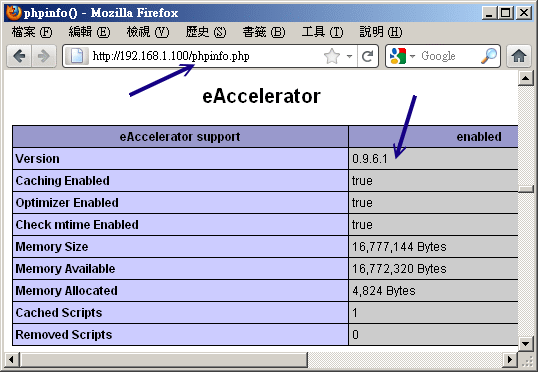

# 第二十章、WWW 伺服器

最近更新日期：2011/08/05

我們最常講的『架站』其實就是架設一個 Web 網站啦！那麼什麼是 Web 呢？那就是全球資訊廣播的意思 (World Wide Web)，或者也可以稱之為互連網吧！這個是我們目前的人類最常使用的 Internet 的協定之一啦！通常說的上網就是使用 WWW 來查詢使用者所需要的資訊囉！目前在 Unix-Like 系統中的 WWW 伺服器主要就是透過 Apache 這個伺服器軟體來達成的， 而為了動態網站，於是 LAMP (Linux + Apache + MySQL + PHP) 就這麼產生啦！讓我們趕緊來進入 LAMP 的世界吧！

*   20.1 WWW 的簡史、資源以及伺服器軟體
    *   20.1.1 WWW 的簡史、HTML 與標準制訂 (W3C)
    *   20.1.2 WWW 伺服器與瀏覽器所提供的資源設定 (URL)
    *   20.1.3 WWW 伺服器的類型：系統、平台、資料庫與程式 (LAMP)
    *   20.1.4 https： 加密的網頁資料 (SSL) 及第三方公正單位
    *   20.1.5 用戶端常見的瀏覽器
*   20.2 WWW (LAMP) 伺服器基本設定
    *   20.2.1 LAMP 所需軟體與其結構
    *   20.2.2 Apache 的基本設定： 伺服器環境, 中文編碼, 目錄權限 (DocumentRoot, Directory)
    *   20.2.3 PHP 的預設參數修改： PHP 資安設定, 上傳檔案容量
    *   20.2.4 啟動 WWW 服務與測試 PHP 模組
    *   20.2.5 MySQL 的基本設定： 啟動與帳號設定, 修改 /etc/my.cnf, root 密碼處理
    *   20.2.6 防火牆設定與 SELinux 的規則放行
    *   20.2.7 開始網頁設計及安裝架站軟體，如 phpBB3
*   20.3 Apache 伺服器的進階設定
    *   20.3.1 啟動用戶的個人網站(權限是重點)： URL 權限與 SELinux
    *   20.3.2 啟動某個目錄的 CGI (perl) 程式執行權限
    *   20.3.3 找不到網頁時的顯示訊息通知
    *   20.3.4 瀏覽權限的設定動作 (order, limit)
    *   20.3.5 伺服器狀態說明網頁
    *   20.3.6 .htaccess 與認證網頁設定
    *   20.3.7 虛擬主機的設定 (重要！)
*   20.4 登錄檔分析以及 PHP 強化模組
    *   20.4.1 PHP 強化模組 (eaccelerator) 與 Apache 簡易效能測試
    *   20.4.2 syslog 與 logrotate
    *   20.4.3 登錄檔分析軟體：webalizer
    *   20.4.4 登錄檔分析軟體：awstats
*   20.5 建立連線加密網站 (https) 及防砍站腳本
    *   20.5.1 SSL 所需軟體與憑證檔案及預設的 https
    *   20.5.2 擁有自製憑證的 https
    *   20.5.3 將加密首頁與非加密首頁分離
    *   20.5.4 防砍站軟體
*   20.6 重點回顧
*   20.7 本章習題
*   20.8 參考資料與延伸閱讀
*   20.9 [針對本文的建議：http://phorum.vbird.org/viewtopic.php?p=116564](http://phorum.vbird.org/viewtopic.php?p=116564)

* * *

# 20.1 WWW 的簡史、資源以及伺服器軟體

## 20.1 WWW 的簡史、資源以及伺服器軟體

你知道網路為什麼會這麼流行嗎？其實都是 WWW 造成的啦。早在 1993 年左右，鳥哥初次接觸到網路， 當時的網路較熱門的大概就是一些資源下載的 FTP 網站以及很多文字熱烈討論的 BBS 站了。 資料雖然豐富，不過，總是覺得少了點什麼。後來上了研究所，為了課業需要， 經常連上台灣的學術網路 (TANET) 進行一些學術資料的檢索，當時大約是 1996 年左右。 因為上網就是要找資料而已，所以就慢慢的很少使用網路了。

過了幾年後，再次使用圖形介面的作業系統，竟然發現只要點幾個小按鈕，就會有很多網路上花花綠綠的文字與圖案， 有的網站甚至提供影音的特效，當時真是相當的訝異！不過，由於圖形影像的視覺方面要比 BBS 純文字的資料吸引人，自然造成很多人喜歡流連在網際網路上，人潮多當然就有商機！由於奇貨可居，才有後來 90 年代末期的瀏覽器大戰，這個商業大戰也造成後來 WWW 標準不被某些瀏覽器所支援的後果。

這些年由於搜尋引擎、個人網誌 (blog)、社群網站 (例如 facebook 等)、智慧手機等的流行，又將網際網路推向另一個新境界！啊！ 要學的東西真是很多啊～@_@。底下讓我們來瞭解瞭解什麼是 WWW 以及他所需要的伺服器軟體，還有一些瀏覽器相關的資訊吧！

* * *

### 20.1.1 WWW 的簡史、HTML 與標準制訂 (W3C)

網際網路 (TCP/IP) 會這麼熱門，主要是 80 年代的 email 以及 90 年代之後的 WWW 服務所造成的！尤其是 WWW 這個玩意兒。 WWW 是 World Wide Web 的縮寫，其中 Web 有廣播網的意思存在， 所以簡稱為全球資訊網的就是了。WWW 可以結合文字、圖形、影像以及聲音等多媒體，並透過可以讓滑鼠點擊的超連結 (Hyperlink) 的方式將資訊以 Internet 傳遞到世界各處去。

與其他的伺服器類似的，你要連結上 WWW 網站時，該網站必需要提供一些資料， 而你的用戶端則必需要使用可以解析這些資料的軟體來處理，那就是瀏覽器啦！簡單的來說，你可以這樣瞧一瞧 WWW server/client 的相關性：

 圖 20.1-1、WWW 伺服器與用戶端瀏覽器之間的連線相關性

從上面的圖示當中，我們大概可以得到一些觀念：

*   WWW 伺服器不但需要一個可讓用戶端瀏覽的平台，還需要提供用戶端一些資料才行！
*   伺服器所提供的最主要資料是超文件標籤語言 (Hyper Text Markup Language, HTML)、多媒體檔案 (圖片、影像、聲音、文字等，都屬於多媒體或稱為超媒體)。
*   HTML 只是一些純文字資料，透過所謂的標籤 (<tag>) 來規範所要顯示的資料格式；
*   在用戶端，透過瀏覽器的對 HTML 以及多媒體的解析，最後呈現在使用者的螢幕上。

*   HTML 的格式

如上所提到的相關資訊，我們知道伺服器端需要提供用戶端一些資料，而這些資料其實主要都以 HTML 的格式來呈現的。那麼什麼是 HTML 呢？我們拿鳥哥的網站來看一下好了。你可以使用任何一個瀏覽器連結到 [`linux.vbird.org`](http://linux.vbird.org/)，然後在其上的頁面上按下滑鼠右鍵， 選擇察看原始碼，你就能發現該網頁是如何寫成的了。

```
&lt;!DOCTYPE html PUBLIC "-//W3C//DTD XHTML 1.0 Transitional//EN"
    "http://www.w3.org/TR/xhtml1/DTD/xhtml1-transitional.dtd"&gt;
&lt;html  xml:lang="zh-TW" lang="zh-TW"&gt;
&lt;head&gt;
....一些此頁面的資訊解釋的標頭資料，例如 title 與整體化設計等等....
&lt;/head&gt;
&lt;body style="margin:0; padding:0"&gt;
....在瀏覽器顯示的畫面中，實際放置在瀏覽器上面的資料則寫於此....
&lt;/body&gt;
&lt;/html&gt; 
```

HTML 之所以被稱為標籤語言就如同上面的表格所示，他是由很多 <tag> 所組成的，除了 <!DOCTYPE> 的部分是在宣告底下的語法應該用第幾版的 HTML 解析之外，HTML 主要是由 <html> </html> 所包含起來， 而在其中又分為兩大區塊，一個是與標頭有關的 <head> </head> 區塊， 包括該網頁所使用的編碼格式與抬頭等等。另一部份則是 <body> </body> 所含有的實際網頁內容資料啦。

HTML 不在本文的介紹內，你可以在市面上找到很多相關的書籍。而傳統的 HTML 4 實際上已經不足以滿足某些美工人員及程式設計師的需求，因此，目前還有改善 HTML 顯示的 CSS 樣式表， 可以讓很多程式互相取用的 XML，還有最新一代的 HTML5 等等，都值得參考喔。

*   WWW 所用的協定及 WWW 伺服器簡史--就是講古時間

知道了 WWW 的 server/client 架構後，再來我們要討論的是，那 WWW 是怎麼來的啊？ 伯納斯-李 (Tim Berners-Lee) 在 1980 年代為了更有效率的讓歐洲核子物理實驗室的科學家可以分享及更新他們的研究成果， 於是他發展出一個超文件傳輸協定 (Hyper Text Transport Protocol, HTTP)。 如同前面提到的，在這個協定上面的伺服器需要軟體，而用戶端則需要瀏覽器來解析伺服器所提供的資料。 那麼這些軟體怎麼來的？

為了讓 HTTP 這個協定得以順利的應用，大約在 90 年代初期由伊利諾大學的國家超級電腦應用中心 (NCSA, [`www.ncsa.illinois.edu/`](http://www.ncsa.illinois.edu/)) 開發出伺服器 HTTPd (HTTP daemon 之意)。HTTPd 為自由軟體，所以很快的領導了 WWW 伺服器市場。 後來網景通訊 (Netscape) 開發出更強大的伺服器與相對應的用戶端瀏覽器，那就是大家曾經熟悉的 Netscape 這套軟體啦。這套軟體分為伺服器與瀏覽器，其中瀏覽器相對便宜，不過伺服器可就貴的嚇人了。 所以，在伺服器市場上主要還是以 HTTPd 為主的。

後來由於 HTTPd 這個伺服器一直沒有妥善的發展，於是一群社群朋友便發起一個計畫，這個計畫主要在改善原本的 HTTPd 伺服器軟體，他們稱這個改良過的軟體為 Apache，取其『一個修修改改的伺服器 (A patch server)』的雙關語！ ^_^！這個 Apache 在 1996 年以後便成為 WWW 伺服器上市佔率最高的軟體了 ([`httpd.apache.org/`](http://httpd.apache.org/))。

*   瀏覽器 (browser) 大戰與支援的標準

雖然 WWW 越來越重要，但相對的來說，用戶端如果沒有瀏覽器的話那麼他們當然就無法去瀏覽 WWW 伺服器所提供的資料。為了搶佔瀏覽器的市佔率，於是在 90 年代末期微軟將 IE 瀏覽器內建在 Windows 作業系統內，此一決定也讓當時相當廣泛使用的 Netscape 瀏覽器 (Navigator) 市佔率急速下降。 後來網景公司在 1998 年左右將瀏覽器的原始碼部分開放成為自由軟體，採用 Mozilla 通用授權 (MPL) 。

Mozilla ([`www.mozilla.org/`](http://www.mozilla.org/)) 這個計畫所開發的軟體可不止瀏覽器而已，還包括郵件處理軟體及網頁編輯軟體等等。 當然啦，其中最出名的就是瀏覽器軟體『火狐狸 (firefox)』啦！那這玩意兒與 IE 有啥不同？ 由於 IE 是整合在 Windows 作業系統核心內， 加上改版的幅度太慢，甚至 IE 使用的 HTML 標準語法解析行為都是微軟自訂的標準， 並不全然符合網際網路上的標準規範 (W3C, [`www.w3.org/`](http://www.w3.org/))，導致伺服器端所提供的資料並無法在所有的瀏覽器上都顯示出相同的樣式， 而且用戶端也容易受到網路攻擊。

firefox ([`moztw.org/`](http://moztw.org/)) 的發展就標榜小而美，因此程式相當的小，所以執行效能上面非常的快速，此外，對於超文件的解析上面， firefox 主要依據 w3c 所制訂的標準來發展的，所以任何以 w3c 的標準開發的網站，在 firefox 上面就能夠得到設計者所希望的樣式！目前 firefox 已經針對市面上最常見到的 Windows/Linux/Unix 等作業系統來進行支援，大家可以多多使用喔！^_^

而為了加快 javascript 的程式運作，並且加快瀏覽的速度，Google 自己也推出一個瀏覽器，稱為 chrome 瀏覽器， 這個瀏覽器就如 google 的搜尋引擎一般，強調的就是快速！快速！更快速！因此，如果你想要瀏覽器不要花花綠綠， 就是風格簡約，強調速度感，那麼 google 的這個 chrome 自由軟體瀏覽器也可以玩玩的！

由上面的介紹我們可以稍微歸納一下：

*   WWW 是依據 HTTP 這個協定而來的，分為伺服器端與用戶端；
*   Apache 是一個伺服器端的軟體，主要依據 NCSA 的 HTTPd 伺服器發展而來，為自由軟體；
*   Mozilla 是一個自由軟體的開發計畫，其中 firefox 瀏覽器是相當成功的作品。
*   在撰寫自己的網頁資料時，盡量使用 W3C 所發佈的標準，這樣在所有的瀏覽器上面才能夠順利的顯示出你想要的樣子。

* * *

### 20.1.2 WWW 伺服器與瀏覽器所提供的資源設定 (URL)

現在我們知道 WWW 伺服器的重點是提供一些資料，這些資料必需要是用戶端的瀏覽器可以支援顯示才行。 那麼這些資料是什麼類型啊？很簡單啊，當然大部分就是檔案囉。如此說來，我們必需要在伺服器端先將資料檔案寫好， 並且放置在某個特殊的目錄底下，這個目錄就是我們整個網站的首頁了！ 一般來說，這個目錄很可能是在 /var/www/html/ 或者是 /srv/www/。我們的 CentOS 預設在 /var/www/html 喔。

那麼瀏覽器如何取得這個目錄內的資料呢？你必需要在瀏覽器的『網址列』輸入所需要的網址才行。 這個網址就對應到 WWW 伺服器的某個檔案檔名就是了。不過，現今的瀏覽器功能實在很多，他不只可以連上 WWW ，還可以連上類似 FTP 之類的網路通訊協定。所以你得要在網址列輸入正確的網址，這個網址包括這樣：

*   <協定>://<主機位址或主機名稱>[:port]/<目錄資源>

*   網址列的意義

上頭就是我們常常聽到的 URL (Uniform Resource Locator) 啦！以斜線作為分段， 它可以這樣被解釋：

*   協定：

    瀏覽器比較常支援的協定有 http, https, ftp, telnet 等等，還有類似 news, gopher 等。 這個協定在告知瀏覽器『請你利用此一協定連接到伺服器端』的意思。舉例來說，如果你下達： [`ftp.ksu.edu.tw`](http://ftp.ksu.edu.tw/) 這表示瀏覽器要連結到 崑山科大的 http (亦即 port 80) 的意思。如果是 ftp://ftp.ksu.edu.tw 則代表連結到 ftp (port 21) 啦！ 因為使用的協定不同，所以當然回應的資料也不相同的。不過， 萬一對方伺服器的埠口啟動在非正規的埠號，例如將 http 啟動在 port 81 時，那你就得要這樣寫： [`hostname:81/`](http://hostname:81/) 。

*   主機位址或主機名稱：

    就是伺服器在網際網路所在的 IP 位置。如果是主機名稱的話，當然得要透過名稱解析器囉！ 一般來說，雖然使用 IP 就能夠架設 WWW 網站，不過建議你還是申請一個好記又合法的主機名稱比較好！

*   目錄資源：：

    剛剛不是提到首頁的目錄嗎？在首頁目錄下的相對位置就是這個目錄資源啦。 舉例來說，鳥哥的網站 www 資料放置在我主機的 /var/www/html/ 當中，所以說：

    *   [`linux.vbird.org`](http://linux.vbird.org) --> /var/www/html/
    *   [`linux.vbird.org/linux_basic/index.php`](http://linux.vbird.org/linux_basic/index.php) --> /var/www/html/linux_basic/index.php 另外，通常首頁目錄底下會有個特殊的檔案名稱，例如 index.html 或 index.??? 等。舉例來說，如果你直接按下： [`linux.vbird.org`](http://linux.vbird.org) 會發現其實與 [`linux.vbird.org/index.php`](http://linux.vbird.org/index.php) 是一樣的！ 這是因為 WWW 伺服器會主動的以該目錄下的『首頁』來顯示啦！

所以啦，我們的伺服器會由於瀏覽器傳來的要求協定不同而給予不一樣的回應資料。那你瞭解到網址列的意義了嗎？

*   WWW server/client 間資料傳輸的方式

如果瀏覽器是以 [`hostname`](http://hostname) 的型態來向伺服器要資料時，那麼瀏覽器與伺服器端是如何傳遞資料的呢？ 基本上有這幾種方法：

*   GET 就是瀏覽器直接向 WWW 伺服器要求網址列上面的資源，這也是最常見的。此外，使用 GET 的方式可以直接在網址列輸入變數喔。舉例來說，鳥哥的討論區有一篇提問的智慧， 他的網址是：『[`phorum.vbird.org/viewtopic.php?t=96`](http://phorum.vbird.org/viewtopic.php?t=96)』，發現那個 ?t=96 了嗎？ t 就是變數， 96 就是這個變數的內容。如果你將問號後面的資料拿掉時，瞧瞧會出現什麼後果？ 這麼說，你可以明白 GET 的處理了吧？

*   POST 這也是用戶端向伺服器端提出的要求，只是這個要求裡面含有比較多的資料就是了。 舉例來說，討論區裡面不是常常有留言的選項嗎，如果你選擇留言的話不是會在瀏覽器冒出一個框框讓你填入資料嗎！ 當按下傳送後，那些框框內的資料就會被瀏覽器包起來傳送至 WWW 伺服器了。 POST 與 GET 不相同喔， GET 可以在網址列取得用戶端所要求的變數，不過 POST 就不是使用網址列的功能了。

*   HEAD 伺服器端回應給 Client 端的一些資料檔頭而已；

*   OPTIONS 伺服器端回應給 Client 端的一些允許的功能與方法；

*   DELETE 刪除某些資源的舉動。

常見的是 GET 這個項目啦！如果有大量資料由用戶端上傳到 WWW 伺服器端時，才會使用到 POST 這個項目。 你還是得需要注意一下這些舉動，因為後續的登錄檔分析內容都是使用這種動作來分析的呦！

* * *

### 20.1.3 WWW 伺服器的類型： 系統、平台、資料庫與程式 (LAMP)

以目前的網路世界來說，市佔率較高的 WWW 伺服器軟體應該是 Apache 與 IIS 這兩個玩意兒， Apache 是自由軟體，可以在任何作業系統上面安裝的，至於 IIS 則是 Windows 家族開發出來的， 僅能在 Windows 作業系統上面安裝與執行。由於作業系統平台不一樣，所以其上安裝的軟體當然也不相同。 底下就讓我們來聊一聊目前網站的一些特色吧！

*   僅提供使用者瀏覽的單向靜態網頁

這種類型的網站大多是提供『單向靜態』的網頁，或許有提供一些動畫圖示，但基本上就僅止於此啦！ 因為單純是由伺服器單向提供資料給客戶端，Server 不需要與 Client 端有互動，所以你可以到該網站上去瀏覽， 但是無法進行進行資料的上傳喔！目前主要的免費虛擬主機大多是這種類型。所以，你只要依照 HTML 的語法寫好你的網頁，並且上傳到該網站空間上，那麼你的資料就可以讓大家瀏覽了！

*   提供使用者互動介面的動態網站

這種類型的網站可以讓伺服器與使用者互動，常見的例如討論區論壇與留言版，包括一些部落格也都是屬於這類型。 這類型的網站需要的技術程度比較高，因為他是藉由『網頁程式語言』來達成與使用者互動的行為， 常見的例如 PHP 網頁程式語言，配合 MySQL 資料庫系統來進行資料的讀、寫。整個互動可以使用下圖來說明：

 圖 20.1-2、動態網站的網頁程式語言與資料庫介面

這就是所謂的伺服器端工作任務介面 (Server Side Include, SSI)，因為不論你要求的資料是什麼，其實都是透過伺服器端同一支網頁程式在負責將資料讀出或寫入資料庫， 處理完畢後將結果傳給用戶端的一種方式，變動的是資料庫內的資料，網頁程式其實並沒有任何改變的。這部份的網頁程式包括 PHP, ASP, Perl...很多啦！

另外一種互動式的動態網頁主要是在用戶端達成的！舉例來說，我們可以透過利用所謂的 Java scripts 這種語法， 將可執行的程式碼 (java script) 傳送給用戶端，用戶端的瀏覽器如果有提供 java script 的功能， 那麼該程式就可以在用戶端的電腦上面運作了。由於程式是在用戶端電腦上執行， 因此如果伺服器端所製作的程式是惡意的，那麼用戶端的電腦就可能會遭到破壞。 這也是為啥很多瀏覽器都已經將一些危險的 java script 關閉的原因。

另外一種可在用戶端執行的就是 flash 動畫格式，在這種動畫格式內還可以進行程式設計， 因此用戶端只要擁有可以執行 flash 動畫的軟體，那就可以利用這個軟體來達到互動式的對談。 這些都算是動態網站所提供的功能喔！

從上面的說明你可以知道動態網站是目前比較熱門的，像是近兩年來如同雨後春筍一般冒出來的個人部落格 (blog) 就是很經典的動態網站之一。而由圖 20.1-2 我們也知道要做成這樣的動態網站你必需要有：

*   支援的作業系統：讓所需要的軟體都能夠安裝執行啊；
*   可運作的 WWW 伺服器：例如 Apache 與 IIS 等 WWW 伺服器平台軟體；
*   網頁程式語言：包括 perl, PHP, JSP, CGI, ASP 等等都算是啦！
*   資料儲存之資料庫系統：包括 MySQL, MSSQL, PostgreSQL 以及甲骨文 (Oracle) 等等。

*   LAMP 平台的說明

在整個平台設計上面，目前常見的有兩大系統，一個是 Linux 作業系統上面，搭配 Apache + MySQL + PHP 等而達成，這個系統被稱為 LAMP。另一個則是微軟的 IIS + MSSQL + ASP (.NET) 伺服器。在能見度與市佔率方面，應該還是以 LAMP 為主吧！在 LAMP 裡面除了 Linux 之外，其他三個小東西就讓我們來談談先：

*   Apache ([`www.apache.org`](http://www.apache.org/))

    1995 年以前就有很多的 WWW 伺服器軟體，其中以 HTTPd 佔有率較高。 後來 HTTPd 經過多次臭蟲的修訂後，才在 1995 年後發佈 Apache (A patch server) 的啦！這東西就是主要提供 WWW 的伺服器平台，後面談到的 PHP 必須要在這玩意兒上才能運作！

*   MySQL ([`www.mysql.org/`](http://www.mysql.org/))

    傳統的檔案讀取是很麻煩的，如果你只要讀取該檔案當中的一小部分，系統還是會將整個檔案讀出來， 若又有多人同時讀取同一個檔案時，那就會造成效能與系統上的問題，所以才會有資料庫系統的推出。 資料庫其實是一種特殊格式的檔案，這種檔案必需要透過特殊介面 (資料庫軟體) 來進行讀寫。由於這個特殊介面已經針對資料的查詢、寫入做過最佳化設計， 因此很適合多人同時寫入與查詢的工作。

    針對資料庫的語法有所謂的 SQL 標準語法，任何根據這種資料檢索語法發展出來的資料庫，就稱為 SQL 資料庫。 比較知名的自由軟體資料庫系統有 MySQL 及 PostgreSQL ，其中 MySQL 的使用率又比較高一些。 MysQL 可以透過網頁程式語言來進行讀寫的工作，因此很適合例如討論區、論壇等的設計， 甚至很多商業網站的重要資料也是透過 MySQL 這個資料庫軟體來存取的呢！

*   PHP ([`www.php.net/`](http://www.php.net/))

    按照官方的說法來說，PHP 是一個工具，他可以被用來建立動態網頁，PHP 程式碼可以直接在 HTML 網頁當中嵌入， 就像你在編輯 HTML 網頁一樣的簡單。所以說， PHP 是一種『程式語言』，這種程式語言可以直接在網頁當中編寫， 不需要經過編譯即可進行程式的執行。由於具有：自由軟體、跨平台、容易學習及執行效能高等優點， 目前是很熱門的一個設計網頁的咚咚喔！你可以在市面上找到很多相關的書籍來參考的。

**Tips:** 事實上，如果光學會 Linux 與架站，對你自己的競爭力還是不夠的，可以的話，多學一些 MySQL 的 SQL 語法，以及類似 PHP, JSP 等跨平台的網頁程式語言，對你的未來是很有幫助的喔！


* * *

### 20.1.4 https： 加密的網頁資料 (SSL) 及第三方公正單位

關於 HTTP 這個傳輸協定當中，你必需要知道的是：『這個傳輸協定傳輸資料是以明碼傳送的』， 所以你的任何資料封包只要被監聽竊取的話，那麼該資料就等於是別人的啦！那想一想， 你有過上線刷卡的經驗嗎？上線刷卡只要輸入你信用卡的卡號與相關的截止日期後，就能夠進行交易了。 如果你的資料在 Internet 上面跑時是明碼的情況下，真要命！那你的信用卡不就隨時可能會被盜用？

雖然大多數 Internet 上面的 WWW 網站所提供的資料是可以隨意瀏覽的，不過如同上面提到的， 一些物流交易網站的資料以及關於你個人的重要機密資料當然就不能這樣隨意傳送啦！ 這個時候就有需要用到 [`hostname`](https://hostname) 這種連線的方式啦！這種方式是透過 SSL 加密的機制喔！

*   Secure Socket Layer (SSL)

還記得我們在[第十一章的 SSH 伺服器](http://linux.vbird.org/linux_server/0310telnetssh.php#ssh)當中介紹過他連線的機制吧？ 就是利用非對稱的 key pair (Public + Private kye) 來組成金鑰，然後透過公鑰加密後傳輸， 傳輸到目標主機後再以私鑰來解密，如此一來資料在 Internet 上面跑就以加密的方式， 想當然爾，這些資料自然就比較安全啦！SSL 就是利用在 WWW 傳輸上面的加密方式之一啦！

當瀏覽器端與 WWW 伺服器端同時支援 SSL 的傳輸協定時，在連線階段瀏覽器與伺服器就會產生那把重要的金鑰！ 產生金鑰後就能夠利用瀏覽器來傳送與接收加密過的重要資料啦！要達成這樣的機制， 你的 WWW 伺服器必需要啟動 http**s** 這個重要的傳輸協定，而瀏覽器則必需要在網址列輸入 https:// 開頭的網址，那兩者才能夠進行溝通與連線。要注意的是，在某些很舊的瀏覽器上面是不支援 SSL 的， 所以在那些舊的瀏覽器上就無法達成 https 的連線啦！

*   Certificate Authorities (CA)

想一想 SSL 這個機制有什麼問題？他的問題就是：『那把 Public key 是伺服器產生且任何人都能取得的』！這是什麼問題？因為 public key 可讓任何人取得， 若被釣魚網站取得並且製作一個很類似你網路銀行的網站，並且騙你輸入帳密，要命了！因為你不知道該網站是詐騙集團製作的， 以為 https 就是安全的，如此一來，即使你的資料有加密，但結果，在釣魚網站伺服器端還是能夠取得你輸入的帳密啊！ 這個時候就需要第三方公正單位來幫忙啦！

所謂的 CA 就是一個公認的公正單位，你可以自行產生一把金鑰且製作出必要的憑證資料並向 CA 單位註冊 (講到註冊你就要知道...這東西是要錢的意思！)，那麼當用戶端的瀏覽器在瀏覽時，該瀏覽器會主動的向 CA 單位確認該憑證是否為合法註冊過的，如果是的話，那麼該次連線才會建立，如果不是呢？那麼瀏覽器就會發出警告訊息， 告知使用者應避免建立連線啊。所以說，如此一來 WWW 伺服器不但有公正單位的背書，使用者在建立連線時也比較有保障！

更多關於 SSL 以及 CA 的介紹，可以約略參考一下：

*   Apache 的 SSL： [`www.modssl.org/`](http://www.modssl.org/)
*   CA 組織之一：[`digitalid.verisign.com/server/apacheNotice.htm`](https://digitalid.verisign.com/server/apacheNotice.htm)

* * *

### 20.1.5 用戶端常見的瀏覽器

咱們前面談到 WWW 伺服器是 Server/Client 的架構，而用戶端使用的軟體就是瀏覽器啊！ 目前比較知名的自由軟體瀏覽器主要有兩款，包括 Mozilla 基金會管理的 firefox (火狐狸) 以及 Google 自行推出的 chrome。至於市佔率較高的還有 windows 的 IE。

由於瀏覽器可以連結到網際網路上，所以瀏覽器也有可能被攻擊！ 其中由於 IE 直接內嵌至 Windows 的核心當中，所以如果 IE 有漏洞時，對於系統的損害是很大的！ 因此無論如何，請記得『務必要隨時更新到最新版本的瀏覽器』才行。建議你可以使用 firefox 或 chrome 這些小巧玲瓏的瀏覽器啊！

除了視窗介面的瀏覽器軟體之外，其實還有幾個可以在文字介面底下進行瀏覽與網頁下載的程式，分別是：

*   [links 與 lynx](http://linux.vbird.org/linux_server/0140networkcommand.php#links)：文字介面的瀏覽器；
*   [wget](http://linux.vbird.org/linux_server/0140networkcommand.php#wget)：文字介面下使用來擷取檔案的指令。

這幾個指令我們已經在[第五章](http://linux.vbird.org/linux_server/0140networkcommand.php)談過了，請自行前往參考喔！

* * *

# 20.2 WWW (LAMP) 伺服器基本設定

## 20.2 WWW (LAMP) 伺服器基本設定

從前面的說明當中，我們知道在 Linux 上面要達成網頁伺服器需要 Apache 這套伺服器軟體吶！不過 Apache 僅能提供最基本的靜態網站資料而已，想要達成動態網站的話，那麼最好還是需要 PHP 與 MySQL 的支援才好。所以底下我們將會以 LAMP 作為安裝與設定的介紹，加油吧！ ^_^

* * *

### 20.2.1 LAMP 所需軟體與其結構

既然我們已經是 Linux 作業系統，而且使用的是號稱完全相容於 Red Hat Enterprise Linux 的 CentOS 版本， 那當然只要利用 CentOS 本身提供的 Apache, PHP, MySQL 即可！不建議你自行利用 tarball 安裝你的 LAMP 伺服器。因為自行安裝不但手續麻煩，而且也不見得比系統預設的軟體穩定。 除非你有特殊的需求 (例如你的某些 Apache 外掛程式需要較高的版本，或者是 PHP, MysQL 有特殊版本的需求)， 否則請使用 [yum](http://linux.vbird.org/linux_server/0210network-secure.php#update) 來進行軟體的安裝即可。

那麼我們的 LAMP 需要哪些東西呢？你必需要知道的是，PHP 是掛在 Apache 底下執行的一個模組， 而我們要用網頁的 PHP 程式控制 MySQL 時，你的 PHP 就得要支援 MySQL 的模組才行！所以你至少需要底下幾個軟體：

*   httpd (提供 Apache 主程式)
*   mysql (MySQL 客戶端程式)
*   mysql-server (MySQL 伺服器程式)
*   php (PHP 主程式含給 apache 使用的模組)
*   php-devel (PHP 的發展工具，這個與 PHP 外掛的加速軟體有關)
*   php-mysql (提供給 PHP 程式讀取 MySQL 資料庫的模組)

要注意， Apache 目前有幾種主要版本，包括 2.0.x, 2.2.x 以及 2.3.x 等等，至於 CentOS 6.x 則是提供 Apache 2.2.x 這個版本啦。如果你沒有安裝的話，請直接使用 yum 或者是原本光碟來安裝先：

```
# 安裝必要的 LAMP 軟體： php-devel 可以先忽略～
[root@www ~]# yum install httpd mysql mysql-server php php-mysql 
```

先來瞭解一下 Apache 2.2.x 這個版本的相關結構，這樣才能夠知道如何處理我們的網頁資料啊！

*   /etc/httpd/conf/httpd.conf (主要設定檔) httpd 最主要的設定檔，其實整個 Apache 也不過就是這個設定檔啦！裡面真是包山包海啊！不過很多其他的 distribution 都將這個檔案拆成數個小檔案分別管理不同的參數。但是主要設定檔還是以這個檔名為主的！ 你只要找到這個檔名就知道如何設定啦！

*   /etc/httpd/conf.d/*.conf (很多的額外參數檔，副檔名是 .conf) 如果你不想要修改原始設定檔 httpd.conf 的話，那麼可以將你自己的額外參數檔獨立出來， 例如你想要有自己的額外設定值，可以將他寫入 /etc/httpd/conf.d/vbird.conf (注意，副檔名一定是 .conf 才行) 而啟動 Apache 時，這個檔案就會被讀入主要設定檔當中了！這有什麼好處？好處就是當你系統升級的時候， 你幾乎不需要更動原本的設定檔，只要將你自己的額外參數檔複製到正確的地點即可！維護更方便啦！

*   /usr/lib64/httpd/modules/, /etc/httpd/modules/ Apache 支援很多的外掛模組，例如 php 以及 ssl 都是 apache 外掛的一種喔！ 所有你想要使用的模組檔案預設是放置在這個目錄當中的！

*   /var/www/html/ 這就是我們 CentOS 預設的 apache 『首頁』所在目錄啦！當你輸入『[`localhost』時所顯示的資料，`](http://localhost』時所顯示的資料，) 就是放在這個目錄當中的首頁檔 (預設為 index.html)。

*   /var/www/error/ 如果因為伺服器設定錯誤，或者是瀏覽器端要求的資料錯誤時，在瀏覽器上出現的錯誤訊息就以這個目錄的預設訊息為主！

*   /var/www/icons/ 這個目錄提供 Apache 預設給予的一些小圖示，你可以隨意使用啊！當你輸入『[`localhost/icons/』`](http://localhost/icons/』) 時所顯示的資料所在。

*   /var/www/cgi-bin/ 預設給一些可執行的 CGI (網頁程式) 程式放置的目錄；當你輸入『[`localhost/cgi-bin/』`](http://localhost/cgi-bin/』) 時所顯示的資料所在。

*   /var/log/httpd/ 預設的 Apache 登錄檔都放在這裡，對於流量比較大的網站來說，這個目錄要很小心， 因為以鳥哥網站的流量來說，一個星期的登錄檔資料可以大到 700MBytes 至 1GBytes 左右，所以你務必要修改一下你的 logrotate 讓登錄檔被壓縮，否則...

*   /usr/sbin/apachectl 這個就是 Apache 的主要執行檔，這個執行檔其實是 [shell script](http://linux.vbird.org/linux_basic/0340bashshell-scripts.php) 而已， 他可以主動的偵測系統上面的一些設定值，好讓你啟動 Apache 時更簡單！

*   /usr/sbin/httpd 呵呵！這個才是主要的 Apache 二進位執行檔啦！

*   /usr/bin/htpasswd (Apache 密碼保護) 在某些網頁當你想要登入時你需要輸入帳號與密碼對吧！那 Apache 本身就提供一個最基本的密碼保護方式， 該密碼的產生就是透過這個指令來達成的！相關的設定方式我們會在 WWW 進階設定當中說明的。

至於 MySQL 方面，你需要知道的幾個重要目錄與檔案有：

*   /etc/my.cnf 這個是 MySQL 的設定檔，包括你想要進行 MySQL 資料庫的最佳化，或者是針對 MySQL 進行一些額外的參數指定， 都可以在這個檔案裡面達成的！

*   /var/lib/mysql/ 這個目錄則是 MySQL 資料庫檔案放置的所在處啦！當你有啟動任何 MySQL 的服務時， 請務必記得在備份時，這個目錄也要完整的備份下來才行啊！

另外，在 PHP 方面呢，你應該也要知道幾個檔案喔：

*   /etc/httpd/conf.d/php.conf 那你要不要手動將該模組寫入 httpd.conf 當中？不需要的，因為系統主動將 PHP 設定參數寫入這個檔案中了！ 而這個檔案會在 Apache 重新啟動時被讀入，所以 OK 的啦！

*   /etc/php.ini 就是 PHP 的主要設定檔，包括你的 PHP 能不能允許使用者上傳檔案？能不能允許某些低安全性的標誌等等， 都在這個設定檔當中設定的啦！

*   /usr/lib64/httpd/modules/libphp5.so PHP 這個軟體提供給 Apache 使用的模組！這也是我們能否在 Apache 網頁上面設計 PHP 程式語言的最重要的咚咚！ 務必要存在才行！

*   /etc/php.d/mysql.ini, /usr/lib64/php/modules/mysql.so 你的 PHP 是否可以支援 MySQL 介面呢？就看這兩個東西啦！這兩個咚咚是由 php-mysql 軟體提供的呢！

*   /usr/bin/phpize, /usr/include/php/ 如果你未來想要安裝類似 PHP 加速器以讓瀏覽速度加快的話，那麼這個檔案與目錄就得要存在， 否則加速器軟體可無法編譯成功喔！這兩個資料也是 php-devel 軟體所提供的啦！

基本上我們所需要的幾個軟體他的結構就是這樣啦！上面提到的是 Red Hat 系統 (RHEL, CentOS, FC) 所需的資料， 如果是 SuSE 或其他版本的資料，請依照你的 distribution 管理軟體的指令 (rpm 或 dpkg) 去查詢一下， 應該就能夠知道各個重要資料放置在哪裡啦！這些資料很重要，你必需要對放置的地點有點概念才行喔！

* * *

### 20.2.2 Apache 的基本設定

在開始設定 Apache 之前，你要知道由於主機名稱對於 WWW 是有意義的，所以雖然利用 IP 也能架設 WWW 伺服器， 不過建議你還是[申請一個合法的主機名稱](http://linux.vbird.org/linux_server/0270dynamic_dns.php)比較好。 如果是暫時測試用的主機所以沒有主機名稱時，那麼至少確定測試用主機名稱為 localhost 且在你的 /etc/hosts 內需要有一行：

```
[root@www ~]# vim /etc/hosts
127.0.0.1   localhost.localdomain localhost 
```

這樣在啟動你的 Apache 時才不會發生找不到完整主機名稱 (FQDN) 的錯誤訊息。此外， Apache 只是個伺服器平台而已，你還需要瞭解 HTML 以及相關的網頁設計語法， 如此才能豐富你的網站。對於想要設計網頁的朋友來說，應用軟體或許是很好入門， 不過想要完整的瞭解網站設計的技巧，還是研究一下基礎的 HTML 或 CSS 比較妥當。

如果你真的對於一些基礎語法有興趣，並且也想要開發一些所謂的『無障礙網頁空間』的話，那麼可以造訪一下 [`www.w3c.org`](http://www.w3c.org/) 所列舉的標準語法，或者是行政院的無障礙網頁空間申請規範 ([`www.webguide.nat.gov.tw`](http://www.webguide.nat.gov.tw/)) 相信會有所收穫的啦！

終於要來談一談如何設定 Apache 這個 httpd.conf 設定檔了！再次強調，每個 distribution 的這個檔案內容都不很相同，所以你必需要自行找出相關的設定檔才行喔！那麼這個 httpd.conf 的設定為何呢？他的基本設定格式是這樣的：

```
&lt;設定項目&gt;
    此設定項目內的相關參數
    ...........
&lt;/設定項目&gt; 
```

舉例來說，如果你想要針對我們的首頁 /var/www/html/ 這個目錄提供一些額外的功能，那麼：

```
&lt;Directory "/var/www/html"&gt;
    Options Indexes
    ...........
&lt;/Directory&gt; 
```

幾乎都是這樣的設定方式喔！特別留意的是，如果你有額外的設定時，不能隨便在 httpd.conf 裡頭找地方寫入！否則如果剛好寫在 <Directory>...</Directory> 裡面，呼呼！ 那麼就會發生錯誤啦！需要前前後後的找一找喔！或者是在檔案的最後面加入也行！好啦，底下咱們先來聊一聊 Apache 伺服器的基礎設定吧！

**Tips:** 事實上在 Apache 的網頁有提供很多詳細的文件資料，真的是很詳細啦！ 鳥哥在底下僅是介紹一些慣用的設定項目的意義而已。有興趣的話，請務必要前往查閱： [Apache 2.2 核心文件：http://httpd.apache.org/docs/2.2/mod/core.html](http://httpd.apache.org/docs/2.2/mod/core.html)


*   針對伺服器環境的設定項目

Apache 針對伺服器環境的設定項目方面，包括回應給用戶端的伺服器軟體版本、主機名稱、伺服器設定檔頂層目錄等。 底下咱們就來談一談：

```
[root@www ~]# vim /etc/httpd/conf/httpd.conf
ServerTokens OS
# 這個項目在僅告知用戶端我們伺服器的版本與作業系統而已，不需要更動他。
# 如果不在乎你系統的資訊被遠端的用戶查詢到，則可以將這個項目註解掉即可(不建議)

ServerRoot "/etc/httpd"
# 伺服器設定的最頂層目錄，有點類似 chroot 那種感覺。包括 logs, modules
# 等等的資料都應該要放置到此目錄底下 (&lt;u&gt;若未宣告成絕對路徑時&lt;/u&gt;)

PidFile run/httpd.pid
# 放置 PID 的檔案，可方便 Apache 軟體的管理啦！只有相對路徑吧！
# 考慮 ServerRoot 設定值，所以檔案在 /etc/httpd/run/httpd.pid ！

Timeout 60
# 不論接收或傳送，當持續連線等待超過 60 秒則該次連線就中斷。
# 一般來說，此數值在 300 秒左右即可，不需要修改這個原始值啦。

KeepAlive On    &lt;==最好將預設的 Off 改為 On 啦！
# 是否允許持續性的連線，亦即一個 TCP 連線可以具有多個檔案資料傳送的要求。
# 舉例來說，如果你的網頁內含很多圖檔，那麼這一次連線就會將所有的資料送完，
# 而不必每個圖檔都需要進行一次 TCP 連線。預設為 Off 請改為 On 較佳。

MaxKeepAliveRequests 500  &lt;==可以將原本的 100 改為 500 或更高
# 與上個設定值 KeepAlive 有關，當 KeepAlive 設定為 On 時，則這個數值可決定
# 該次連線能夠傳輸的最大傳輸數量。為了增進效能則可以改大一點！0 代表不限制。

KeepAliveTimeout 15
# 在允許 KeepAlive 的條件下，則該次連線在最後一次傳輸後等待延遲的秒數。
# 當超過上述秒數則該連線將中斷。設定 15 差不多啦！如果設定太高 (等待時間較長)，
# 在較忙碌的系統上面將會有較多的 Apache 程序佔用資源，可能有效能方面的困擾。

&lt;IfModule prefork.c&gt;   &lt;==底下兩個 perfork, worker 與記憶體管理有關！
StartServers       8   &lt;==啟動 httpd 時，喚醒幾個 PID 來處理服務的意思
MinSpareServers    5   &lt;==最小的預備使用的 PID 數量
MaxSpareServers   20   &lt;==最大的預備使用的 PID 數量
ServerLimit      256   &lt;==伺服器的限制
MaxClients       256   &lt;==最多可以容許多少個用戶端同時連線到 httpd 的意思！
MaxRequestsPerChild  4000
&lt;/IfModule&gt;
&lt;IfModule worker.c&gt;
StartServers         4
MaxClients         300
MinSpareThreads     25
MaxSpareThreads     75
ThreadsPerChild     25
MaxRequestsPerChild  0
&lt;/IfModule&gt; 
```

上面的 prefork 及 worker 其實是兩個與伺服器連線資源有關的設定項目。預設的項目對於一般小型網站來說已經很夠用了， 不過如果你的網站流量比較大時，或許可以修訂一下裡面的數值呢！這兩個模組都是用在提供使用者連線的資源 (process)，設定的數量越大代表系統會啟動比較多的程序來提供 Apache 的服務，反應速度就比較快。 簡單的說，這兩個模組的功能分類為：

*   針對模組的功能分類來說：

    worker 模組佔用的記憶體較小，對於流量較大的網站來說，是一個比較好的選擇。prefork 雖然佔用較大的記憶體，不過速度與 worker 差異不大，並且 prefork 記憶體使用設計較為優秀，可以在很多無法提供 debug 的平台上面進行自我除錯，所以，預設的模組就是 prefork 這一個呢！

*   細部設定的內容方面：(以 Prefork 為例， worker 意義相同)

    *   StartServers：代表啟動 Apache 時就啟動的 process 數量，所以 apache 會用到不止一支程序！
    *   MinSpareServers, MaxSpareServers：代表最大與最小的備用程序數量。
    *   MaxClients：最大的同時連線數量，也就是 process 不會超過此一數量。現在假設有 10 個人連上來，加上前面的 MinSpareServer=5, MaxSpareServers=20，則 apache 此時的程序數應有 15-30 個之意。而這個最終程序數不可超過 256 個 (依上述設定值)！
    *   MaxRequestsPerChild：每個程序能夠提供的最大傳輸次數要求。 舉例來說，如果有個使用者連上伺服器後(一個 process)，卻要求數百個網頁，當他的要求數量超過此一數值， 則該程序會被丟棄，另外切換一個新程序。這個設定可以有效的控管每個 process 在系統上的『存活時間』。 因為根據觀察所得，新程序的效能較佳啦！

在上面的設定中，比較有趣的是 MaxClients 這個程序模組的參數值，如同上面的說明，這個 MaxClients 設定值可以控制『同時連上 WWW 伺服器的總連線要求』數量，亦即想成最高即時線上人數啦。 不過你要注意的是，MaxClients 的數量不是越高越好，因為他會消耗實體記憶體 (與 process 有關嘛)，所以如果你設定太高導致超出實體記憶體能夠容許的範圍，那麼效能反而會降低 (因為系統會使用速度較慢的 swap 啊)，此外， MaxClients 也在 Apache 編譯時就指定最大值了，所以你也無法超出系統最大值， 除非...你重新編譯 Apache 啦！

除非你的網站流量特別大，否則預設值已經夠你使用的了。而如果你的記憶體不夠大的話，那麼 MaxClients 反而要調小一點，例如 150 ，否則效能不佳。那，apache 到底是使用那個模組啊？prefork 還是 worker ？事實上 CentOS 將這兩個模組分別放到不同的執行檔當中，分別是：

*   /usr/sbin/httpd：使用 prefork 模組；
*   /usr/sbin/httpd.worker：使用 worker 模組。

那如何決定你使用的是哪一支程式？你可以去查閱一下 /etc/sysconfig/httpd ， 就能夠知道系統預設提供 prefork 模組，但你可以透過修改 /etc/sysconfig/httpd 來使用 worker 模組的。 如果你很有好奇心，那麼可以分別試著啟動這兩種模組啊！接下來，繼續瞧瞧其他的伺服器環境設定參數吧！

```
Listen 80
# 與監聽介面有關，預設開放在所有的網路介面啊！也可修改埠口，如 8080

LoadModule auth_basic_module modules/mod_auth_basic.so
....(底下省略)....
# 載入模組的設定項目。Apache 提供很多有用的模組 (就是外掛) 給我們使用了！

Include conf.d/*.conf
# 因為這一行，所以放置到 /etc/httpd/conf.d/*.conf 的設定都會被讀入！

User apache
Group apache
# 前面提到的 prework, worker 等模組所啟動的 process 之擁有者與群組設定。
# 這個設定很重要，因為未來你提供的網頁檔案能不能被瀏覽都與這個身份有關啊！

ServerAdmin vbird@www.centos.vbird  &lt;==改成你自己的 email 吧
# 系統管理員的 email，當網站出現問題時，錯誤訊息會顯示的聯絡信箱(錯誤回報)。

ServerName www.centos.vbird    &lt;==自行設定好自己的主機名稱較佳！
# 設定主機名稱，這個值如果沒有指定的話，預設會以 hostname 的輸出為依據。
# 千萬記得，你填入的這個主機名稱要找的到 IP 喔！(DNS 或 /etc/hosts)

UseCanonicalName Off
# 是否使用標準主機名稱？如果你的主機有多個主機名稱，若這個設定為 On，
# 那麼 Apache 只接受上頭 servername 指定的主機名稱連線而已。請使用 Off。 
```

在某些特殊的伺服器環境中，有時候你會想要啟動多個不同的 Apache，或者是 port 80 已經被使用掉了，導致 Apache 無法啟動在預設的埠口。那麼你可以透過 Listen 這個設定值來修改埠口喔！這也是個很重要的設定值。 此外，你也可以將自己的額外設定指定到 /etc/httpd/conf.d/*.conf 內，尤其是虛擬主機很常使用這樣的設定，在移機時會很方便的！

*   針對中文 big5 語系編碼的設定參數修改

目前的網際網路傳輸資料編碼多是以萬國碼 (UTF-8) 為主，不過在台灣還是有相當多的網站使用的是 Big5 的繁體中文編碼啊！如果你的 Apache 預設是以 UTF-8 編碼來傳輸資料，但你 WWW 的資料卻是 big5 ， 那麼用戶端將會看到『亂碼』！雖然可以透過調整瀏覽器的編碼來讓資料正確顯示，不過總是覺得很討厭。 此時，你應該可以調整一下底下的參數喔！

```
[root@www ~]# vim /etc/httpd/conf/httpd.conf
# 找到底下這一行，應該是在 747 行左右
# AddDefaultCharset UTF-8  &lt;==請將她註解掉！ 
```

這個設定值的意義是說，讓伺服器傳輸『強制使用 UTF-8 編碼』的訊息給用戶端瀏覽器，因此不論網頁內容寫什麼， 反正在用戶端瀏覽器都會預設使用萬國馬來顯示的意思。那如果你的網頁使用的是非萬國碼的語系編碼， 此時就會在瀏覽器內出現亂碼了！非常討厭～所以這裡當然需要註解掉。 你必須要注意的是，如果你已經在用戶端上面瀏覽過許多頁面，那麼你修改過這個設定值後，仍然要將瀏覽器的快取 (cache) 清除才行！否則相同頁面仍可能會看到亂碼！網友們已經回報過很多次了， 這不是 Apache 的問題，而是用戶端瀏覽器的快取所產生的啦！記得處理處理！

語系編碼已經取消預設值，那我怎麼知道我的網頁語系在用戶端會顯示的是哪一個？其實在網頁裡面本來就有宣告了：

```
&lt;html&gt;
&lt;head&gt;
    &lt;meta http-equiv="Content-Type" content="text/html; charset=big5" &gt;
    ....(其他省略).... 
```

你應該要修訂的是上述的特殊字體處，而不是透過 Apache 提供預設語系才對！

*   網頁首頁及目錄相關之權限設定 (DocumentRoot 與 Directory)

我們不是講過 CentOS 的 WWW 預設首頁放置在 /var/www/html 這個目錄嗎？為什麼呢？因為 DocumentRoot 這個設定值的關係啦！此外，由於 Apache 允許 Internet 對我們的資料進行瀏覽， 所以你當然必須要針對可被瀏覽的目錄進行權限的相關設定，那就是 <Directory> 這個設定值的重要特色！先讓我們來看看預設的主網頁設定吧！

```
[root@www ~]# vim /etc/httpd/conf/httpd.conf
DocumentRoot "/var/www/html"  &lt;==可以改成你放置首頁的目錄！
# 這個設定值規範了 WWW 伺服器主網頁所放置的『目錄』，雖然設定值內容可以變更，
# 但是必須要特別留意這個設定目錄的權限以及 SELinux 的相關規則與類型(type)！

&lt;Directory /&gt;
    Options FollowSymLinks
    AllowOverride None
&lt;/Directory&gt;
# 這個設定值是針對 WWW 伺服器的『預設環境』而來的，因為針對『/』的設定嘛！
# 建議保留上述的預設值 (上頭資料已經是很嚴格的限制)，相關參數容後說明。

&lt;Directory "/var/www/html"&gt;         &lt;==針對特定目錄的限制！底下參數很重要！
    Options Indexes FollowSymLinks  &lt;==建議拿掉 Indexes 比較妥當！
    AllowOverride None
    Order allow,deny
    Allow from all
&lt;/Directory&gt; 
```

這個地方則是針對 /var/www/html 這個目錄來設定權限啦！就是咱們首頁所在目錄的權限。 主要的幾個設定項目的意義是這樣的 (這些設定值都很重要！要仔細看喔！)：

*   Options (目錄參數)：

    此設定值表示在這個目錄內能夠讓 Apache 進行的動作，亦即是針對 apache 的程序的權限設定啦！主要的參數值有：

    *   Indexes：如果在此目錄下找不到『首頁檔案 (預設為 index.html) 』時， 就顯示整個目錄下的檔案名稱，至於『首頁檔案檔名』則與 DirectoryIndex 設定值有關。

    *   FollowSymLinks：這是 Follow Symbolic Links 的縮寫， 字面意義是讓連結檔可以生效的意思。我們知道首頁目錄在 /var/www/html，既然是 WWW 的根目錄，理論上就像被 chroot 一般！ 一般來說被 chroot 的程式將無法離開其目錄，也就是說預設的情況下，你在 /var/www/html 底下的連結檔只要連結到非此目錄的其他地方，則該連結檔預設是失效的。 但使用此設定即可讓連結檔有效的離開本目錄。

    *   ExecCGI：讓此目錄具有執行 CGI 程式的權限，非常重要！舉例來說，之前熱門的 OpenWebMail 使用了很多的 perl 的程式，你要讓 OpenWebMail 可以執行，就得要在該程式所在目錄擁有 ExecCGI 的權限才行喔！但請注意，不要讓所有目錄均可使用 ExecCGI ！

    *   Includes：讓一些 Server-Side Include 程式可以運作。建議可以加上去！

    *   MultiViews：這玩意兒有點像是多國語言的支援，與語系資料 (LanguagePriority) 有關。最常見在錯誤訊息的回報內容，在同一部主機中，可以依據用戶端的語系而給予不同的語言顯示呢！ 預設在錯誤回報訊息當中存在，你可以檢查一下 /var/www/error/ 目錄下的資料喔！

*   AllowOverride (允許的覆寫參數功能)：

    表示是否允許額外設定檔 .htaccess 的某些參數覆寫？我們可以在 httpd.conf 內設定好所有的權限，不過如此一來若使用者自己的個人網頁想要修改權限時將會對管理員造成困擾。因此 Apache 預設可以讓使用者以目錄底下的 .htaccess 檔案內覆寫 <Directory> 內的某些功能參數。 這個項目則是在規定 .htaccess 可以覆寫的權限類型有哪些。常見的有：

    *   ALL：全部的權限均可被覆寫；
    *   AuthConfig：僅有網頁認證 (帳號密碼) 可覆寫；
    *   Indexes：僅允許 Indexes 方面的覆寫；
    *   Limits：允許使用者利用 Allow, Deny 與 Order 管理可瀏覽的權限；
    *   None：不可覆寫，亦即讓 .htaccess 檔案失效！ 這部份我們在進階設定時會再講到的！
*   Order, Allow, Deny (能否登入瀏覽的權限)：

    決定此目錄是否可被 apache 的 PID 所瀏覽的權限設定啦！能否被瀏覽主要有兩種判定的方式：

    *   deny,allow：以 deny 優先處理，但沒有寫入規則的則預設為 allow 喔。
    *   allow,deny：以 allow 為優先處理，但沒有寫入規則的則預設為 deny 喔。 所以在預設的環境中，因為是 allow,deny 所以預設為 deny (不可瀏覽)，不過在下一行有個 Allow from all，allow 優先處理，因此全部 (all) 用戶端皆可瀏覽啦！這部份我們會在 20.3.4 進階安全設定當中再提及滴。

除了這些資料之外，跟網站資料相關性高的還有底下的幾個咚咚：

```
[root@www ~]# vim /etc/httpd/conf/httpd.conf
DirectoryIndex index.html index.html.var  &lt;==首頁『檔案的檔名』設定！ 
```

如果用戶端在網址列只輸入到目錄，例如 [`localhost/`](http://localhost/) 時，那麼 Apache 將拿出那個檔案來顯示呢？就是拿出首頁檔案嘛！ 這個檔案的檔名在 Apache 當中預設是以 index. *為開頭的，但 Windows 則以 default.* 之類的檔名為開頭的。如果你想要讓類似 index.pl 或 index.cgi 也可以是首頁的檔名，那可以改成：

*   DirectoryIndex index.html index.htm index.cgi index.pl ...

那如果上面的檔名通通存在的話，那該怎辦？就按照順序啊！接在 DirectoryIndex 後面的檔名參數，越前面的越優先讀取。 那如果檔名通通不存在呢？就是說沒有首頁時，該如何讀取？這就與剛剛談到的 Options 裡面的 Indexes 有關喔！ 這樣有沒有將兩個參數串起來？

```
[root@www ~]# vim /etc/httpd/conf/httpd.conf
# Alias  網址列延伸  實際 Linux 目錄
Alias /icons/ "/var/www/icons/"  &lt;==製作一個目錄別名 (相當類似捷徑)！
&lt;Directory "/var/www/icons"&gt;
    Options Indexes MultiViews
    AllowOverride None
    Order allow,deny
    Allow from all
&lt;/Directory&gt; 
```

這個 Alias 很有趣的！是製作出類似連結檔的東西啦！當你輸入 [`localhost/icons`](http://localhost/icons) 時，其實你的 /var/www/html 並沒有 icons 那個目錄，不過由於 Alias (別名) 的關係，會讓該網址直接連結到 /var/www/icons/ 下。 這裡面預設有很多 Apache 提供的小圖示喔！而因為設定了一個新的可瀏覽目錄，所以你瞧，多了個 <Directory> 來規定權限了吧！ ^_^

```
[root@www ~]# vim /etc/httpd/conf/httpd.conf
# ScriptAlias  網址列延伸  實際 Linux 目錄
ScriptAlias /cgi-bin/ "/var/www/cgi-bin/"
&lt;Directory "/var/www/cgi-bin"&gt;
    AllowOverride None
    Options None
    Order allow,deny
    Allow from all
&lt;/Directory&gt; 
```

與上面的 icons 類似，不過這邊卻是以 ScriptAlias (可執行腳本的別名) 為設定值！ 這個設定值可以指定該目錄底下為『具有 ExecCGI 』能力的目錄所在喔！所以你可以將類似 Open webmail 的程式給他放置到 /var/www/cgi-bin 內，就不必額外設定其他的目錄來放置你的 CGI 程式喔！ 這樣大概就 OK 了啦！接下來準備一下看看還有哪些額外的設定檔需要處理的呢？

* * *

### 20.2.3 PHP 的預設參數修改

我們前面稍微提過 PHP 是 Apache 當中的一個模組，那在談了 Apache 的 httpd.conf 之後，『我們怎麼沒有講到 PHP 這個模組的設定啊？』不是不講啦！而是因為目前 Apache 很聰明的將一些重要模組給他拆出來放置到 /etc/httpd/conf.d/*.conf 檔案中了，所以我們必須要到該目錄下才能瞭解到某些模組是否有被加入啊！底下先來瞧瞧吧！

```
[root@www ~]# cd /etc/httpd/conf.d
[root@www conf.d]# ll *.conf
-rw-r--r--. 1 root root 674 Jun 25 15:30 php.conf      &lt;==提供 PHP 模組的設定
-rw-r--r--. 1 root root 299 May 21  2009 welcome.conf  &lt;==提供預設的首頁歡迎訊息
# 如果你是按照剛剛鳥哥說的幾個模組去安裝的，那麼這個目錄下至少會有這兩個資料，
# 一個是規範 PHP 設定，一個則是規範『如果首頁不存在時的歡迎畫面』囉。 
```

我們主要來看看關於 PHP 的設定檔吧：

```
[root@www conf.d]# vim /etc/httpd/conf.d/php.conf
&lt;IfModule prefork.c&gt;  &lt;==根據不同的 PID 模式給予不同的 PHP 運作模組
  LoadModule php5_module modules/libphp5.so
&lt;/IfModule&gt;
&lt;IfModule worker.c&gt;
  LoadModule php5_module modules/libphp5-zts.so
&lt;/IfModule&gt;
AddHandler php5-script .php  &lt;==所以副檔名一定要是 .php 結尾！
AddType text/html .php       &lt;==.php 結尾的檔案是純文字檔
DirectoryIndex index.php     &lt;==首頁檔名增加 index.php 喔！
#AddType application/x-httpd-php-source .phps &lt;==特殊的用法！ 
```

CentOS 6.x 使用的是 PHP 5.x 版本，這個版本依據不同的 apache 使用記憶體模式 (prefork 或 worker) 給予不同的模組！此外，為了規範 PHP 檔案，因此多了最後三行，包括增加副檔名為 .php 的檔案處理方式， .php 定義為純文字檔，以及首頁檔名增加 index.php 等。基本上，這個檔案你不需要有任何的修改，保留原樣即可。

*   PHP 的資安方面設定

你必須要知道 PHP 的設定檔其實是在 /etc/php.ini ，這個檔案內容有某些地方可以進行一些小修改， 也有某些地方你必須要特別留意，免得被用戶端誤用你的 PHP 資源。底下先介紹一下 PHP 常見的與資安方面較相關的設定：

```
[root@www ~]# vim /etc/php.ini
register_globals = Off
# 這個項目請確定為 Off (預設就是 Off)，因為如果設定為 On 時，
# 雖然程式執行比較不容易出狀況，但是很容易不小心就被攻擊。

log_errors = On
ignore_repeated_errors = On  &lt;==這個設定值調整一下 (因預設為 Off)
ignore_repeated_source = On  &lt;==這個設定值調整一下
# 這三個設定項目可以決定是否要將 PHP 程式的錯誤記錄起來，
# 建議將重複的錯誤資料忽略掉，否則在很忙碌的系統上，
# 這些錯誤資料將可能造成你的登錄檔暴增，導致效能不佳 (或當機)

display_errors = Off
display_startup_errors = Off
# 當你的程式發生問題時，是否要在瀏覽器上頭顯示相關的錯誤訊息 (包括部分程式碼)
# 強烈的建議設定為 Off 。不過如果是尚未開放的 WWW 伺服器，為了你的 debug
# 容易，可以暫時的將他設定為 On ，如此一來你的程式問題會在瀏覽器上面
# 直接顯示出來，你不需要進入 /var/log/httpd/error_log 登錄當中查閱。
# 但程式完成後，記得將此設定值改為 Off 喔！重要重要！ 
```

如果你想要提供 Apache 的說明文件給自己的 WWW 伺服器的話，可以安裝一下 httpd-manual 這個軟體，你就會發現在這個目錄當中又會新增檔案 (manual.conf)，而且從此你可以使用 [`localhost/manual`](http://localhost/manual) 來登入 Apache 的使用手冊呢！真方便！有興趣的話可以參考與安裝底下這些軟體喔：

*   httpd-manual：提供 Apache 參考文件的一個軟體；
*   mrtg：利用類似繪圖軟體自動產生主機流量圖表的軟體；
*   mod_perl：讓你的 WWW 伺服器支援 perl 寫的網頁程式(例如 webmail 程式)；
*   mod_python：讓你的 WWW 伺服器支援 python 寫的網頁程式。
*   mod_ssl：讓你的 WWW 可以支援 https 這種加密過後的傳輸模式。

perl 與 python 是與 PHP 類似的咚咚，都是一些很常用在網頁的程式語言！ 例如知名的 OpenWebMail ([`openwebmail.org/`](http://openwebmail.org/)) 就是利用 perl 寫成的。要讓你的 WWW 支援該程式語言， 你就得要安裝這些東西啦！(但不是所有的軟體都安裝！請安裝你需要的即可！)

*   PHP 提供的上傳容量限制

我們未來可能會使用 PHP 寫成的軟體來提供用戶上傳/下載檔案資料，那麼 PHP 有沒有限制檔案容量呢？ 答案是有的！那麼容量限制是多大？預設是 2M 左右。你可以修改它的，假設我們現在要限制成為 16MBytes 時，我們可以這樣修訂：

```
[root@www ~]# vim /etc/php.ini
post_max_size = 20M       &lt;==大約在 729 行左右
file_uploads = On         &lt;==一定要是 On 才行 (預設值)
upload_max_filesize = 16M &lt;==大約在 878 行左右
memory_limit = 128M       &lt;==PHP 可用記憶體容量也能修訂！ 
```

與檔案上傳/下載容量較相關的就是這幾個設定值～為啥 post_max_size 要比 upload_max_filesize 大呢？ 因為檔案有可能也是透過 POST 的方式傳輸到我們伺服器上頭，此時你的檔案就得要加入 POST 資訊內～ 因為 POST 資訊可能還含有其它的額外資訊，所以當然要比檔案容量大才行！所以在設計這個設定檔時， 這兩個值得要特別注意喔！

* * *

### 20.2.4 啟動 WWW 服務與測試 PHP 模組

OK！最單純簡易的 WWW 伺服器設定搞定的差不多了，接下來就是要啟動啦！啟動的方法簡單到不行，用傳統的方式來處理：

```
[root@www ~]# /etc/init.d/httpd start       &lt;==立刻啟動啦！
[root@www ~]# /etc/init.d/httpd configtest  &lt;==測試設定檔語法
[root@www ~]# chkconfig httpd on            &lt;==開機啟動 WWW 啦！ 
```

另外，其實 Apache 也自行提供一支 script 可以讓我們來簡單的使用，那就是 apachectl 這支程式啦！ 這支程式的用法與 /etc/init.d/httpd 幾乎完全一模一樣喔！

```
[root@www ~]# /usr/sbin/apachectl start  &lt;==啟動啦！
[root@www ~]# /usr/sbin/apachectl stop   &lt;==關閉 WWW 啦！ 
```

一般建議你可以稍微記一下 apachectl 這支程式，因為很多認證考試會考，而且他也是 Apache 預設提供的一個管理指令說！好了，來看看有沒有啟動成功？

```
# 先看看 port 有沒有啟動啊！
[root@www ~]# netstat -tulnp &#124; grep 'httpd'
Proto Recv-Q Send-Q Local Address  Foreign Address State  PID/Program name
tcp        0      0 :::80          :::*            LISTEN 2493/httpd

# 再來看看登錄檔的資訊記錄了什麼！這個確實建議瞧一瞧！
[root@www ~]# tail /var/log/httpd/error_log
[notice] &lt;u&gt;SELinux policy enabled; httpd running as context&lt;/u&gt; unconfined_u:system_r:httpd_t:s0
[notice] suEXEC mechanism enabled (wrapper: /usr/sbin/suexec)
[notice] Digest: generating secret for digest authentication ...
[notice] Digest: done
[notice] &lt;u&gt;Apache/2.2.15 (Unix) DAV/2 PHP/5.3.2 configured -- resuming normal operations&lt;/u&gt;
# 第一行在告知有使用 SELinux(強調一下)，最後一行代表正常啟動了！ 
```

這樣應該就成功啟動了 Apache 囉！比較重要的是還有啟動 SELinux 的相關說明，這底下我們還得要注意注意呢！ 接下來測試看看能不能看到網頁呢？首先看看 /var/www/html 有沒有資料？咦？沒有～沒關係，因為 CentOS 幫我們造了一個測試頁了 (Apache 的 welcome 模組功能)，所以你還是在瀏覽器上面輸入你這部主機的 IP 看看先：

 圖 20.2-1、啟動 Apache 之後，所看到的預設首頁

你可以在伺服器上面啟動圖形介面來查閱，也可以透過客戶端電腦來連線 (假設防火牆問題已經克服了)。 鳥哥這裡假設伺服器為 runlevel 3 的純文字介面，因此使用外部的用戶端電腦連線到伺服器的 IP 上，如上圖畫面中的箭頭 1 處。如果你是在伺服器本機上面啟動的瀏覽器，那直接輸入『 [`localhost`](http://localhost) 』即可。同時看到畫面中的箭頭 2 所指處，你就可以發現首頁的位置是在 /var/www/html/ 底下囉！但如果想要知道有沒有成功的驅動 PHP 模組，那你最好先到 /var/www/html 目錄下去建立一個簡單的檔案：

```
[root@www ~]# vim /var/www/html/phpinfo.php
&lt;?php  phpinfo ();  ?&gt; 
```

要記住，PHP 檔案的副檔名一定要是 .php 結尾的才行喔！至於內容中，那個『 <?php ... ?> 』是嵌入在 HTML 檔案內的 PHP 程式語法，在這兩個標籤內的就是 PHP 的程式碼。那麼 phpinfo(); 就是 PHP 程式提供的一個函式庫，這個函式庫可以顯示出你 WWW 伺服器內的相關服務資訊， 包括主要的 Apache 資訊與 PHP 資訊等等。這個檔案建置完畢後，接下來你可以利用瀏覽器去瀏覽一下這個檔案：

 圖 20.2-2、測試 Apache 能否驅動 PHP 模組

注意看網址的部分喔！因為我們 phpinfo.php 是放置在首頁目錄底下，因此整個 URL 當然就成為上述箭頭 1 當中的模樣了。 這個 phpinfo() 函數輸出的內容還挺機密的，所以測試完畢後請將這個檔案刪除吧！從上頭的畫面你可以知道 PHP 模組的版本以及 Apache 相關的重要資料啦！自己仔細瞧瞧吧！如此一來，你的 Apache 與 PHP 就 OK 的啦！

那萬一測試失敗怎麼辦？常見的錯誤問題以及解決之道可以參考：

*   網路問題：雖然在本機上沒有問題， 但不代表網路一定是通的！請確認一下網路狀態！例如 Route table, 撥接情況等等；
*   設定檔語法錯誤：這個問題很常發生，因為設定錯誤，導致無法將服務啟動成功。 此時除了參考螢幕上面的輸出資訊外，你也可以透過 /etc/init.d/httpd configtest 測試語法，更佳的解決方案是參考 /var/log/httpd/error_log 內的資料，可以取得更詳盡的解決之道。
*   權限問題：例如你剛剛在 httpd.conf 上面的 user 設定為 apache 了，但偏偏要被瀏覽的檔案或目錄權限對 apache 沒有可讀權限，自然就無法讓人家連線進去啦！
*   問題的解決之道：如果還是沒有辦法連接上來你的 Linux Apache 主機，那麼請：
    1.  察看 /var/log/httpd/error_log 這個檔案吧！他應該可以告訴你很多的資訊喔！
    2.  仔細的察看一下你瀏覽器上面顯示的資訊，這樣才能夠知道問題出在哪裡！
    3.  另一個可能則是防火牆啦！察看一下 iptables 的訊息！也可能是 SELinux 的問題喔！

* * *

### 20.2.5 MySQL 的基本設定

在 LAMP 伺服器裡面，Linux, Apache, PHP 已經處理完畢，那麼 MySQL 呢？所以，接下來就是要處理這個資料庫軟體囉。 在啟動 MySQL 前其實系統並沒有幫我們建立任何的資料庫。當你初次啟動 MySQL 後，系統才會針對資料庫進行初始化的建立啊。 不相信的話你可以先看看 /var/lib/mysql/ 這個目錄，裡面其實沒有任何資料的啦。

*   啟動 MySQL (設定 MySQL root 密碼與新增 MysQL 用戶帳號)

首先得要啟動 MySQL 才行，啟動的方法還是很簡單啊！

```
[root@www ~]# /etc/init.d/mysqld start
[root@www ~]# chkconfig mysqld on
# 如果是初次啟動，螢幕會顯示一些訊息且 /var/lib/mysql 會建立資料庫。

[root@www ~]# netstat -tulnp &#124; grep 'mysql'
Proto Recv-Q Send-Q Local Address  Foreign Address   State   PID/Program name
tcp        0      0 0.0.0.0:3306   0.0.0.0:*         LISTEN  2726/mysqld

# 底下在測試看能否以手動的方式連上 MySQL 資料庫！
[root@www ~]# mysql -u root
Welcome to the MySQL monitor.  Commands end with ; or \g.
Your MySQL connection id is 2
Server version: 5.1.52 Source distribution

Type 'help;' or '\h' for help. Type '\c' to clear the current input statement.

mysql&gt; exit
Bye 
```

MySQL 預設監聽的埠口在 port 3306，從上面看來我們的 MySQL 似乎是啟動了，不過剛剛初始化的 MySQL 資料庫管理員並沒有任何密碼，所以很可能我們的資料庫是會被使用者搞爛掉的～所以你最好對 MySQL 的管理員帳號設定一下密碼才好。 另外，上面那個 root 與我們 Linux 帳號的 root 是完全無關的！因為 MySQL 資料庫軟體也是個多人的操作環境，在該軟體內有個管理者恰好帳號也是 root 而已。

那麼如何針對 MySQL 這個軟體內的 root 這個管理者設定他的密碼呢？你可以這樣做：

```
[root@www ~]# mysqladmin -u root password 'your.password'
# 從此以後 MySQL 的 root 帳號就需要密碼了！如下所示：

[root@www ~]# mysql -u root -p
Enter password:  &lt;==你必須要在這裡輸入剛剛建立的密碼！

mysql&gt; exit 
```

如此一來 MySQL 資料庫的管理方面會比較安全些啦！其實更好的作法是分別建立不同的使用者管理不同的資料庫。 舉例來說，如果你要給予 vbirduser 這個使用者一個 MySQL 的資料庫使用權，假設你要給他的資料庫名稱為 vbirddb，且密碼為 vbirdpw 時，你可以這樣做：

```
[root@www ~]# mysql -u root -p
Enter password:  &lt;==如前所述，你必須要輸入密碼嘛！
mysql&gt; create database vbirddb;  &lt;==注意每個指令後面都要加上分號 (;)
Query OK, 1 row affected (0.01 sec)

mysql&gt; grant all privileges on vbirddb.* to vbirduser@localhost 
identified by 'vbirdpw' ;
Query OK, 0 rows affected (0.00 sec)

mysql&gt; show databases;
+--------------------+
&#124; Database           &#124;
+--------------------+
&#124; information_schema &#124;
&#124; mysql              &#124; &lt;==用來記錄 MySQL 帳號、主機等重要資訊的主要資料庫！
&#124; test               &#124; 
&#124; vbirddb            &#124; &lt;==我們剛剛建立的資料庫在此
+--------------------+
4 rows in set (0.00 sec)

mysql&gt; use mysql;
mysql&gt; select * from user where user = 'vbirduser';
# 上面兩個指令在查詢系統有沒有 vbirduser 這個帳號，若有出現一堆東西，
# 那就是查詢到該帳號了！這樣就建置妥當囉！

mysql&gt; exit 
```

然後你可以利用『 mysql -u vbirduser -p 』這個指令來嘗試登入 MySQL 試看看，嘿嘿！就知道 vbirduser 這個使用者在 MySQL 裡面擁有一個名稱為 vbirddb 的資料庫啦！其他更多的用法就得請你自行參考 SQL 相關的語法囉！不在本文的討論範圍啦！

*   效能調校 /etc/my.cnf

由於 MySQL 這個資料庫系統如果在很多使用者同時連線時，可能會造成某些效能方面的瓶頸， 因此，如果你的資料庫真的好大好大，建議可以改用 postgresql 這套軟體，這套軟體的使用與 mysql 似乎差異不大。 不過，我們還是提供一些簡單的方式來處理小站的 MySQL 效能好了。相關的資料鳥哥是參考這一篇簡單的中文說明：

*   [`parus1974.wordpress.com/2005/02/27/mysql 再調整`](http://parus1974.wordpress.com/2005/02/27/mysql%e5%86%8d%e8%aa%bf%e6%95%b4/)

```
[root@www ~]# vim /etc/my.cnf
[mysqld]
default-storage-engine=innodb
# 關於目錄資料與語系的設定等等；
default-character-set   = utf8   &lt;==每個人的編碼都不相同，不要隨意跟我一樣
port                    = 3306
skip-locking
# 關於記憶體的設定，注意，記憶體的簡單計算方式為：
# key_buffer + (sort_buffer + read_buffer ) * max_connection
# 且總量不可高於實際的實體記憶體量！所以，我底下的資料應該是 OK 的
# 128 + (2+2)*150 = 728MB
key_buffer              = 128M
sort_buffer_size        = 2M
read_buffer_size        = 2M
join_buffer_size        = 2M
max_connections         = 150
max_connect_errors      = 10
read_rnd_buffer_size    = 4M
max_allowed_packet      = 4M
table_cache             = 1024
myisam_sort_buffer_size = 32M
thread_cache            = 16
query_cache_size        = 16M
tmp_table_size          = 64M
# 由連線到確定斷線的時間，原本是 28800 (sec) ，約 8 小時，我將他改為 20 分鐘！
wait_timeout            = 1200
thread_concurrency      = 8
innodb_data_file_path = ibdata1:10M:autoextend
innodb_buffer_pool_size = 128M
innodb_additional_mem_pool_size = 32M
innodb_thread_concurrency = 16

datadir=/var/lib/mysql
socket=/var/lib/mysql/mysql.sock
user=mysql
symbolic-links=0
[mysqld_safe]
log-error=/var/log/mysqld.log
pid-file=/var/run/mysqld/mysqld.pid 
```

你要注意的是，因為鳥哥的主機上面假設記憶體有 2GB 啊！所以跟記憶體相關的資料才會寫很大！ 請依照你實際擁有的記憶體量來處理喔！還得加上你的 Apache 本身的記憶體用量！ 所以...如果你的網站流量很大的話，在校能測試上面要很注意啊！

*   MySQL root 密碼忘記的緊急處理

如果你不小心忘記 MySQL 的密碼怎麼辦？網路上有一些工具可以讓你去處理 MySQL 資料庫的挽回。 如果你的資料庫內容並不是很重要，刪除也無所謂的話 (測試中 @_@)，那麼可以將 MySQL 關閉後， 將 /var/lib/mysql/* 那個目錄內的資料刪除掉，然後再重新啟動 MySQL ，那麼 MySQL 資料庫會重建， 你的 root 又沒有密碼啦！

不過，這個方法僅適合你的資料庫並不重要的時候，如果資料庫很重要...那千萬不要隨便刪除啊！

* * *

### 20.2.6 防火牆設定與 SELinux 的規則放行

設定好了 LAMP 之後，開始要讓用戶端來連線啊！那麼如何放行呢？要放行哪些埠口？剛剛的 port 3306 要不要放行？ 這裡請注意，如果是小型的 WWW 網站，事實上，Apache 是連接本機的 MySQL，並沒有開放給外部的用戶來連接資料庫！ 因此，請不要將 3306 放行給網際網路連接，除非你真的知道你要給其他的伺服器讀取你的 MySQL 喔！既然如此，當然只要開放 port 80 即可。

此外，如果你的 Apache 未來還想要進行一些額外的連線工作，那麼 SELinux 的一些簡單規則也得先放行！否則會有問題啦！不過 SELinux 的問題其實都好解決，因為可以參考登錄檔來修訂嘛！ 好了，讓我們簡單的來談談：

```
# 1\. 放行防火牆中的 port 80 連線
[root@www ~]# vim /usr/local/virus/iptables/iptables.rule
iptables -A INPUT -p TCP -i $EXTIF --dport  80  --sport 1024:65534 -j ACCEPT
# 將上面這一行的註解拿掉即可！
[root@www ~]# /usr/local/virus/iptables/iptables.rule
[root@www ~]# iptables-save &#124; grep 80
-A PREROUTING -s 192.168.100.0/255.255.255.0 -i eth1 -p tcp -m tcp --dport 80 
   -j REDIRECT --to-ports 3128 &lt;==這一行是進行 squid 產生的，應該要拿掉較佳
-A INPUT -i eth0 -p tcp -m tcp --sport 1024:65534 --dport 80 -j ACCEPT
# 看到上面這行，就是將防火牆的放行加進來了，用戶端應該是能夠連線囉！

# 2\. 解決 SELinux 的規則放行問題：
[root@www ~]# getsebool -a &#124; grep httpd  &lt;==會出現一堆規則，有興趣的如下：
[root@www ~]# setsebool -P httpd_can_network_connect=1
# 其他的規則或類型，等待後續的章節介紹再來談！ 
```

例題：你想要修改首頁內容，且先使用 root 在 /root 底下建立了 index.html 了，這個檔案將被移動到 /var/www/html 底下， 請建立該檔案，並且放置成首頁檔案，瀏覽看看。答：可以透過簡單的方式建立一個無關緊要的首頁檔案：

```
[root@www ~]# echo "This is my Home page" &gt; index.html
[root@www ~]# mv index.html /var/www/html
[root@www ~]# ll /var/www/html/index.html
-rw-r--r--. 1 root root 21 2011-08-08 13:49 /var/www/html/index.html
# 權限看起來是 OK 的！ 
```

現在請使用瀏覽器瀏覽一下 [`localhost`](http://localhost) ，就會發現無法讀取！為什麼？請檢查 /var/log/httpd/error_log 以及 /var/log/messages 的內容：

```
[root@www ~]# tail /var/log/httpd/error_log
[error] [client 192.168.1.101] (13)Permission denied: access to /index.html denied
[root@www ~]# tail /var/log/messages
Aug  8 13:50:14 www setroubleshoot: SELinux is preventing /usr/sbin/httpd "getattr"
 access to /var/www/html/index.html. For complete SELinux messages. &lt;u&gt;run sealert -l
 6c927892-2469-4fcc-8568-949da0b4cf8d&lt;/u&gt; 
```

看到上面畫底下的地方了吧？就是他！執行一下，你就能發現如何處理囉！

* * *

### 20.2.7 開始網頁設計及安裝架站軟體，如 phpBB3

基礎的 LAMP 伺服器架設完畢之後，基本上，你就可以開始設計你想要的網站囉！編寫網頁的工具很多，請自行尋找吧！ 不過對於這個簡單的 LAMP 伺服器，你必須要知道的是：

*   預設的首頁目錄在 /var/www/html/，你應該將所有的 WWW 資料都搬到該目錄底下才對！
*   注意你的資料權限 (rwx 與 SELinux)！務必要讓 Apache 的程序使用者能夠瀏覽！
*   盡量將你的首頁檔案檔名取為 index.html 或 index.php ！
*   如果首頁想要建立在其他地方，你應該要修改 DocumentRoot 那個參數 (httpd.conf)
*   不要將重要資料或者隱私資料放置到 /var/www/html/ 首頁內！
*   如果你需要安裝一些 CGI 程式的話，建議你將他安裝到 /var/www/cgi-bin/ 底下， 如此一來你不需要額外設定 httpd.conf 即可順利啟動 CGI 程式；

除了這些基本的項目之外，其實你可以使用網際網路上面人家已經做好的 PHP 程式架站機喔！ 譬如說討論區軟體 phpBB3 這個玩意兒，完整的架站軟體 PHPNuke 以及部落格軟體 lifetype 等等。 但這些架站機都需要 PHP 與資料庫的支援，所以你必需要將上述介紹的 LAMP 完整的安裝好才行。 如果你不喜歡自己寫網頁的話，那麼這些有用的架站軟體就夠你瞧的囉！鳥哥列出幾個連結給你玩一玩先！

*   phpBB 討論區官方網站：[`www.phpbb.com/`](http://www.phpbb.com/)
*   phpBB 正體中文網站『竹貓星球』：[`phpbb-tw.net`](http://phpbb-tw.net/)
*   鳥哥的簡易 phpBB 安裝法：[`linux.vbird.org/apache_packages/`](http://linux.vbird.org/apache_packages/)
*   Lifetype 部落格架設軟體中文支援站：[`www.lifetype.org.tw/`](http://www.lifetype.org.tw/)
*   Lifetype 部落格架設軟體官網：[`www.lifetype.net/`](http://www.lifetype.net/)
*   PHP-Nuke 官方網站：[`phpnuke.org/`](http://phpnuke.org/)
*   xoops 官方網站：[`www.xoops.org/`](http://www.xoops.org/)

不過請注意，這些軟體由於是公開的，所以有些怪叔叔可能會據以亂用或亂改，因此可能會有一些 bug 會出現！因此，你必需要取得最新的版本來玩才行，而且架設之後還得要持續的觀察是否有更新的版本出現， 隨時去更新到最新版本才行喔！免得後患無窮～

* * *

# 20.3 Apache 伺服器的進階設定

## 20.3 Apache 伺服器的進階設定

事實上，剛剛上頭的基本設定已經很足夠朋友們架設 WWW 伺服器所需了！不過，還有很多可以玩玩的地方， 例如個人用戶首頁、虛擬主機以及認證保護的網頁等等。底下我們分別來談一談囉！

* * *

### 20.3.1 啟動用戶的個人網站 (權限是重點)

每一部 WWW 伺服器都有一個首頁，但是如果每個個人用戶都想要有可以自己完全控管的首頁時，那該如何設計？呵呵！Apache 早就幫我們想到了！不過新版的設定檔內常常是預設將這個功能取消的，所以你必需要自行修訂呢！

```
[root@www ~]# vim /etc/httpd/conf/httpd.conf
# 找到如下的設定項目，大約在 366 行左右：
&lt;IfModule mod_userdir.c&gt;
    UserDir disable
    #UserDir public_html
&lt;/IfModule&gt;
# 將他改成如下的情況喔！
&lt;IfModule mod_userdir.c&gt;
    #UserDir disable
    UserDir www
&lt;/IfModule&gt;

# 重新啟動一下先！
[root@www ~]# /etc/init.d/httpd restart 
```

這只是個範例，Apache 預設的個人首頁是放置在家目錄下的 ~/public_html/ 目錄下！假如你的系統有個帳號叫做 student， 那麼預設的屬於 student 的個人首頁就會放置在 /home/student/public_html/ 底下。不過，這個 public_html 實在很討厭， 看起來跟網頁沒有什麼特殊關連性，因此鳥哥都會將這個目錄改為 www，所以 student 的個人首頁就會是在 /home/student/www/ 目錄下，比較好記憶。

例題：如何讓未來所有『新增』的使用者預設家目錄下都有個 www 的目錄？ 答：因為新增使用者時所參考的家目錄在 /etc/skel 目錄內，所以你可以直接 mkdir /etc/skel/www 即可。 若想要讓用戶直接擁有一個簡易的首頁，還能夠使用 echo "My homepage" > /etc/skel/www/index.html 呢！

*   個人首頁的 URL 以及目錄的權限、SELinux 設定

現在假設我們要讓已經存在系統中的 student 這個帳號具有個人首頁，那就得要手動去建置所需要的目錄與檔案才行。 現在請登入 student，並用該帳號建置底下的相關資訊：

```
[student@www ~]$ mkdir www
[student@www ~]$ chmod 755 www  &lt;==針對 www 目錄開放權限
[student@www ~]$ chmod 711 ~    &lt;==不要忘了家目錄也要改！
[student@www ~]$ cd www
[student@www www]$ echo "Test your home" &gt;&gt; index.html 
```

由於 CentOS 預設的使用者家目錄權限是 drwx------ ，這個權限將無法讓 Apache 的程序瀏覽啊！所以你至少要讓你的家目錄權限成為 drwx--x--x 才行！這個很重要啊！ 那麼未來只要你在瀏覽器的網址列這樣輸入：

*   [`你的主機名稱/~student/`](http://你的主機名稱/~student/)

『理論上』就能夠看到你的個人首頁了。不過，可惜的是，我們的 SELinux 並沒有放行個人首頁！所以，此時你會發現瀏覽器出現 『You don't have permission』的訊息！趕緊看一下你的 /var/log/messages，裡面應該會教你進行這項工作：

```
[root@www ~]# setsebool -P httpd_enable_homedirs=1
[root@www ~]# restorecon -Rv /home/
# 第一個指令在放行個人首頁規則，第二個指令在處理安全類型！ 
```

就可以看到你的使用者個人網頁囉！之後讓使用者自己去設計他的網站吧！現在你知道那個毛毛蟲 (~) 在 URL 上面的意義了吧？ ^_^！不過，多這個毛毛蟲就很討厭～我可不可以將使用者的個人網站設定成為：

*   [`你的主機名稱/student/`](http://你的主機名稱/student/)

是可以啦！最簡單的方法是這樣的：

```
[root@www ~]# cd /var/www/html
[root@www html]# ln -s /home/student/www student 
```

由於我們首頁的『 Options 』內有 FollowSymLinks 這個參數的原因，所以可以直接使用連結檔即可。 另外我們也可以使用 Apache 提供的別名功能 (Alias)，例如這樣做：

```
[root@www ~]# vim /etc/httpd/conf/httpd.conf
# 找個不與人家設定值有干擾的地方加入這個設定項目：
Alias /student/ "/home/student/www/"
&lt;Directory "/home/student/www"&gt;
        Options FollowSymLinks
        AllowOverride None
        Order allow,deny
        Allow from all
&lt;/Directory&gt;

[root@www ~]# /etc/init.d/httpd restart 
```

不過，如果你使用這個方法的話得要特別注意，在 httpd.conf 內的 Alias 後面接的目錄，需要加上目錄符號 (/) 在結尾處， 同時，網址列必須要輸入 [`IP/student/`](http://IP/student/) ！亦即是結尾也必須要加上斜線才行！否則會顯示找不到該 URL 喔！

* * *

### 20.3.2 啟動某個目錄的 CGI (perl) 程式執行權限

在前幾個小節裡面我們有談到，如果你想要 Apache 可以執行 perl 之類的網頁程式時， 你就得需要安裝一些額外的模組才行。其中 mod_perl 與 mod_python 這兩個軟體建議你最好安裝一下啦！然後我們也提到想要執行 CGI 程式就得到 /var/www/cgi-bin/ 目錄下去執行。如果你想要在其他目錄底下執行 CGI 程式是否可以？當然行啊！

*   利用新目錄下的 Options 參數設定：

假設想要執行 CGI 的程式附檔名為 .cgi 或 .pl ，且放置的目錄在 /var/www/html/cgi/ 時，你可以這樣做：

```
[root@www ~]# yum install mod_python mod_perl
[root@www ~]# vim /etc/httpd/conf/httpd.conf
# 找到底下這一行，大約在 797 行左右啦：
#AddHandler cgi-script .cgi
# 將他改成底下的模樣，讓附檔名為 .pl 的檔案也能執行喔！
AddHandler cgi-script .cgi .pl

# 然後加入底下這幾行來決定開放某個目錄的 CGI 執行權限。
&lt;Directory "/var/www/html/cgi"&gt;
    Options +ExecCGI
    AllowOverride None
    Order allow,deny
    Allow from all
&lt;/Directory&gt;

[root@www ~]# /etc/init.d/httpd restart 
```

接下來只要讓你的 CGI 程式具有 x 權限，那麼他就可以執行啦！舉例來說，你的檔案在 /var/www/html/cgi/helloworld.pl 的話，那麼：

```
[root@www ~]# mkdir /var/www/html/cgi
[root@www ~]# vim /var/www/html/cgi/helloworld.pl
#!/usr/bin/perl
print "Content-type: text/html\r\n\r\n";
print "Hello, World.";
[root@www ~]# chmod a+x /var/www/html/cgi/helloworld.pl 
```

然後在網址列輸入：『[`主機名稱或`](http://主機名稱或) IP/cgi/helloworld.pl』即可執行該檔案並將結果顯示在螢幕上面囉！

*   使用 ScriptAlias 的功能：

你可以直接利用檔名的別名來處理即可！更簡單呢。我們現在假設所有在 /var/www/perl/ 目錄下的檔案都可以是 perl 所撰寫的程式碼，那麼我們可以這樣做：

```
[root@www ~]# vim /etc/httpd/conf/httpd.conf
# 同樣的你要先確認這一行是存在的！
AddHandler cgi-script .cgi .pl

# 然後加入底下這幾行來決定開放某個目錄的 CGI 執行權限。
ScriptAlias /perl/ "/var/www/perl/"

[root@www ~]# /etc/init.d/httpd restart

[root@www ~]# mkdir /var/www/perl
[root@www ~]# cp -a /var/www/html/cgi/helloworld.pl /var/www/perl 
```

現在，請在網址列輸入：『[`IP/perl/helloworld.pl』，就能夠看到剛剛的資料了！這個方法比較棒啦！因為該目錄不需要在`](http://IP/perl/helloworld.pl』，就能夠看到剛剛的資料了！這個方法比較棒啦！因為該目錄不需要在) Apache 首頁底下也可以成功的啦！這兩個方法你可以隨意取一個來處理即可！不需要兩個都進行啦！

* * *

### 20.3.3 找不到網頁時的顯示訊息通知

如果你的 /var/www/html/cgi 目錄底下沒有任何首頁檔案 (index.???) 時，那當使用者在網址列輸入『 [`your.hostname/cgi`](http://your.hostname/cgi) 』，請問結果會顯示出什麼呢？可能有兩個：

*   如果你的 Options 裡面有設定 Indexes 的話，那麼該目錄下的所有檔案都會被列出來，提供類似 FTP 的連結頁面。
*   如果沒有指定 Indexes 的話，那麼錯誤訊息通知就會被顯示出來。

事實上 CentOS 所提供的 Apache 已經規範好一些簡單的錯誤資料網頁了，你可以到 /var/www/error/ 目錄下瞧瞧就曉得。不過該目錄下的檔案並沒有中文訊息，所以...真要命！至於 Apache 的錯誤訊息設定在這裡：

```
[root@www ~]# vim /etc/httpd/conf/httpd.conf
# 大約在 875 行左右，預設就是註解掉的！
#    ErrorDocument 403 /error/HTTP_FORBIDDEN.html.var
#    ErrorDocument 404 /error/HTTP_NOT_FOUND.html.var
#    ErrorDocument 405 /error/HTTP_METHOD_NOT_ALLOWED.html.var
#    ErrorDocument 408 /error/HTTP_REQUEST_TIME_OUT.html.var
....(後面省略).... 
```

雖然 Apache 預設有提供一些額外的資料給我們使用，不過，鳥哥不是很喜歡那樣的畫面啦！反而比較喜歡像是 Yahoo 或是其他大型的網站所提供的資訊頁面，可以提供給用戶一些有效的連結，這樣會比較方便用戶連結到我們的網站啊！ 此時我們可以這樣做：

```
[root@www ~]# vim /etc/httpd/conf/httpd.conf
# 找到底下這一段，大約在 836 行左右，看看這些簡單的範例先：
#ErrorDocument 500 "The server made a boo boo."
ErrorDocument 404 /missing.html  &lt;==將註解拿掉吧！
#ErrorDocument 404 "/cgi-bin/missing_handler.pl"
#ErrorDocument 402 http://www.example.com/subscription_info.html

[root@www ~]# /etc/init.d/httpd restart 
```

上面那個檔案 /missing.html 必需要放置在你的首頁目錄下，亦即是 /var/www/html/missing.html 啦！ 要提醒你的是：『你的所有設定檔當中 (包括 /etc/httpd/conf.d/*.conf) 只能存在一個 ErrorDocument 404 ... 的設定值，否則將以較晚出現的設定為主』。 所以你得先搜尋一下，尤其是很多 Linux 版本的 Apache 並沒有將預設的錯誤訊息註解呢。至於那個 404 是啥意思？他的意義是這樣的：

*   100-199：一些基本的訊息
*   200-299：用戶端的要求已成功的達成
*   300-399：Client 的需求需要其他額外的動作，例如 redirected 等等
*   400-499：Client 的要求沒有辦法完成(例如找不到網頁)
*   500-599：主機的設定錯誤問題

好了，接下來讓我們編輯一下那個 missing.html 的檔案內容吧！ ^_^

```
[root@www ~]# vim /var/www/html/missing.html
&lt;html&gt;
&lt;head&gt;
        &lt;meta http-equiv="Content-Type" content="text/html; charset=utf8"&gt;
        &lt;title&gt;錯誤訊息通知&lt;/title&gt;
&lt;head&gt;
&lt;body&gt;
        您輸入的網頁找不到！&lt;br /&gt;
        &lt;hr /&gt;
        親愛的網友，你所輸入的網址並不存在我們的伺服器當中，
        有可能是因為該網頁已經被管理原刪除，
        或者是你輸入了錯誤的網址。請再次查明後在填入網址囉！
        或按&lt;a href="/"&gt;這裡&lt;/a&gt;回到首頁。
        感謝你常常來玩！ ^_^&lt;br /&gt;
        &lt;hr /&gt;
        若有任何問題，歡迎聯絡管理員&lt;a 
        href="mailto:vbird@www.centos.vbird"&gt;vbird@www.centos.vbird&lt;/a&gt;。
&lt;/body&gt;
&lt;/html&gt; 
```

現在你如果在網址列隨便輸入一個伺服器上不存在的網址，就會出現如下的畫面囉：

 圖 20.3-1、找不到網頁時的錯誤通報訊息

當然啦，你可以自行設定出符合你網頁風格的資料啦！例如鳥哥的網站上面就列出一些基本的連結， 幫助網友們可以順利的取得他們想要的資料啊！這也是很重要的功能呢！^_^

* * *

### 20.3.4 瀏覽權限的設定動作 (order, limit)

你該如何限制用戶端對你的 WWW 連線呢？你會說，那就利用 iptables 這個防火牆嘛！那有什麼難的？問題是， 如果同一個 IP 來源，他某些網頁可以瀏覽，但某些網頁不能瀏覽時，該如何設定？iptables 僅能一口氣開放或整個拒絕， 無法針對 WWW 的內容來部分放行。那該如何處理？就透過 apache 內建的 order 項目來處置即可。 先來回憶一下 order 搭配 allow, deny 的相關限制：

*   Order deny,allow：以 deny 優先處理，但沒有寫入規則的則預設為 allow。常用於：拒絕所有，開放特定的條件；
*   Order allow,deny：以 allow 為優先處理，但沒有寫入規則的則預設為 deny。常用於：開放所有，拒絕特定的條件。
*   如果 allow 與 deny 的規則當中有重複的，則以預設的情況 (Order 的規範) 為主。

舉例來說，如果我們的首頁目錄想要讓 192.168.1.101 及政府部門無法連線，其他的則可以連線， 由上面的說明你可以知道這是『開放所有，拒絕特定』的條件，所以你可以這樣做設定：

```
[root@www ~]# vim /etc/httpd/conf/httpd.conf
&lt;Directory "/var/www/html"&gt;
    Options FollowSymLinks
    AllowOverride None
    Order allow,deny
    Allow from all
 Deny from 192.168.1.101  &lt;==約在 344 行新增底下兩行！
    Deny from .gov.tw
&lt;/Directory&gt;

[root@www ~]# /etc/init.d/httpd restart 
```

注意一下，因為 Order 是『 allow,deny 』，所以所有規則當中屬於 allow 的都會被優先提到最上方， 為了避免這個設計上的困擾，所以建議你直接將 allow 的規則寫在最上方。 而由於規則當中 192.168.1.101 隸屬於 all 當中 (all 代表所有的嘛！)，因此這個設定項目則為預設值， 亦即為 deny 啦！那個 .gov.tw 的設定項目也一樣。如果是底下的模樣：

```
[root@www ~]# vim /etc/httpd/conf/httpd.conf
# 底下可是個錯誤的示範，請仔細看下個段落的詳細說明喔！
&lt;Directory "/var/www/html"&gt;
    Options FollowSymLinks
    AllowOverride None
 Order deny,allow
    Deny from 192.168.1.101
    Deny from .gov.tw
    Allow from all
&lt;/Directory&gt; 
```

雖然 deny 會先挪到上方來處理，不過因為 192.168.1.101 是在 all 的範圍內，所以發生重複， 因此這個設定值將會以預設的 allow 為主，因此就無法限制住這個 192.168.1.101 的存取啦！ 這邊很容易搞錯的吶！鳥哥也是常常搞到頭昏腦脹的～

例題：如果有個應該要保護的內部目錄，假設在 /var/www/html/lan/ ， 我僅要讓 192.168.1.0/24 這個網域可以瀏覽的話，那麼你應該要如何設定的好？答：這個案例當中有點像是『拒絕所有連線，僅接受特定連線』的樣子，因此可以使用 deny,allow 那個情況， 所以你可以這樣做：

```
&lt;Directory "/var/www/html/lan"&gt;
    Options FollowSymLinks
    AllowOverride None
    Order deny,allow
    deny from all
    allow from 192.168.1.0/24
&lt;/Directory&gt; 
```

事實上，如果想要讓某個網域或者是 IP 無法瀏覽的話，最好還是利用 iptables 來處理比較妥當。 不過如果僅是某些重要目錄不想讓人家來查閱的話，那麼這個 allow, deny 與 order 的設定資料可就很值得參考了。

而除了這個 order 設定值之外，我們還有個限制用戶端能進行的動作的設定喔！ 那就是 Limit 這個設定啦！舉例來說，如果我們想要讓使用者在 /var/www/html/lan 這個目錄下僅能進行最陽春的 GET, POST, OPTIONS 的功能，除了這幾個之外的其他功能通通不允許， 那麼你可以這樣做：

```
[root@www ~]# vim /etc/httpd/conf/httpd.conf
&lt;Directory "/var/www/html/lan"&gt;
    AllowOverride none
    Options FllowSymLinks
 # 先允許能夠進行 GET, POST 與 OPTIONS 啦！
    &lt;Limit GET POST OPTIONS&gt;
        Order allow,deny
        Allow from all
    &lt;/Limit&gt;

    # 再規定除了這三個動作之外，其他的動作通通不允許啦！
    &lt;LimitExcept GET POST OPTIONS&gt;
        Order deny,allow
        Deny from all
    &lt;/LimitExcept&gt;
&lt;/Directory&gt; 
```

透過 Limit 與 LimitExcept 就能夠處理用戶端能夠進行的動作啦！也就有辦法針對你的資料進行細部保護囉。 不過這些保護真的很細部，一般小網站大致上用不到 Limit 這個玩意兒說。

* * *

### 20.3.5 伺服器狀態說明網頁

既然已經安裝好了 WWW 伺服器，除了提供服務之外，重要的是要如何維護囉！嘿嘿！ 那麼是否一定要額外安裝其他的軟體才能知道目前的主機狀態呢？當然不需要啦！我們可以透過 Apache 提供的特別功能來查詢主機目前的狀態！那就是 mod_status 這個模組囉！ 這個模組預設是關閉的，你必須要修改設定檔來啟動他才行。

```
[root@www ~]# vim /etc/httpd/conf/httpd.conf
# 先確定底下這幾個項目真的有存在才行！
LoadModule status_module modules/mod_status.so &lt;==大約在 178 行，就是模組的載入

ExtendedStatus On  &lt;==大約在 228 行，你可以將他打開，資訊會比較多！

# 底下的資料則大約在 924 行左右，你可以將他修改成為這樣：
&lt;Location /server-status&gt;
    SetHandler server-status
    Order deny,allow
    Deny from all
    Allow from 192.168.1.0/24
    Allow from 127.0.0.1
&lt;/Location&gt;

[root@www ~]# /etc/init.d/httpd restart 
```

接下來你只要在你的網址列輸入主機名稱後面加上 [`hostname/server-status`](http://hostname/server-status) 即可發現如下的模樣：

 圖 20.3-2、伺服器目前的狀況回報網頁

輸出的結果包括目前的時間以及 Apache 重新啟動的時間，還有目前已經啟動的程序等等， 還有網頁最下方會顯示每個程序的用戶端與伺服器端的連線狀態。雖然顯示的狀況挺陽春，不過該有的也都有了， 可以讓你約略瞭解一下伺服器的狀況囉。要注意喔，可查閱者 (allow from 的參數) 還是需要限制的比較嚴格一點啦！

* * *

### 20.3.6 .htaccess 與認證網頁設定

對於保護 Apache 本身的資料方面，除了上述的 Order 以及 Limit 之外，還有什麼方式呢？ 因為 Order 與 Limit 主要是針對 IP 網域或者是主機名稱來管理，那如果我們用戶端是使用撥接方式取得 IP， 那麼 IP 會一直變動的，如此一來那個保護的目錄使用者也就不能在任何地方進入了，會造成一些困擾。

此時如果能夠使用密碼保護的方式，讓使用者可以輸入帳號/密碼即可取得瀏覽的權限的話，那用戶端就不用受到那個 order 的 Allow, deny 的限制啦！真好～呵呵！Apache 確實剛好有提供一個簡單的認證功能， 讓我們可以輕鬆愉快的就設定好密碼保護的網頁呢！

**Tips:** 什麼是受保護的資料呢？舉例來說，學校老師們可能會提供一些教學教材或者是習題給同學， 這些資料不想給所有人取得，那麼就可以將這些資料放在特定的受保護的目錄中。還有例如某些重要的 Apache 伺服器分析的資料 (本章後面提及的一些分析工具)，這些資料建置的方法需要啟用 CGI 程式， 而 CGI 程式的執行是有風險的，而且那些分析所得的資料也很重要。此時，該程式與輸出結果就需要放在受保護的目錄啦！


那麼那個認證網頁如何搞定？簡單的說，他要這樣處理：

1.  建立受保護的目錄：既然我們是『按了某個連結進入某個目錄之後，才會出現對話視窗』， 那麼首先當然就是要有那個設定為認證網頁的『目錄』囉！請注意，是要目錄才行喔！

2.  設定 Apache 所需參數：然後，在對話視窗中，既然我們需要輸入帳號與密碼， 那麼自然就需要密碼檔囉！另外，雖然 Apache 有支援 LDAP 及 MySQL 等等的認證機制，不過我們這裡並不討論其他的認證機制， 完全使用 Apache 的預設功能而已，所以，底下我們會使用基本 (Basic) 的認證模式喔！

3.  建立密碼檔案：處理完基本的設定後，再來則是建立登入時所需要的帳號與密碼！

4.  最後，重新啟動 Apache 就 OK 啦！

其中，第二個步驟會比較有趣，我們說過，任何的設定資料都可以直接寫到 httpd.conf 這個設定檔當中， 所以設定保護目錄的參數資料確實可以寫入 httpd.conf 當中。不過，想一想，如果你的 Apache 伺服器有 30 個使用者具有個人首頁，然後他們都需要製作保護目錄，那個 httpd.conf 只有身為 root 的你才能夠修改， 更可怕的是『每次改完都需要重新啟動 Apache』～請問，你的時間精力是否會受到『很嚴厲的考驗？』

所以啦，如果我們能夠透過外部的檔案來取代設定 httpd.conf 內的參數，那麼是否會比較好？ 而且最好能夠該檔案設定即生效，不需要重新啟動 Apache 的話，那就更好啦！因為如此一來， 你就可以交給使用者自行管理他們的認證網頁囉！呵呵～透過 httpd.conf 內的 AllowOverride 參數，配合 .htaccess 這個檔案的設定就 OK 搞定！這個設定項目與設定檔 httpd.conf 的關係可以這樣看：

 圖 20.3-3、.htaccess 與主要設定檔 httpd.conf 的相關性

也就是說：

*   主設定檔 httpd.conf 的修訂：你必需要在 httpd.conf 這個主設定檔當中先以 AllowOverride 指定某個目錄下的 .htaccess 能夠進行取代的參數為何？一般有 AuthConfig, Options 等等，考慮到系統資料的安全，建議提供 AuthConfig 的項目就好了。設定完畢後請重新啟動 Apache。

*   .htaccess 放置的目錄：在受保護的目錄底下務必要存在 .htaccess 這個檔案，透過這個檔案即可修改 httpd.conf 內的設定啊！

*   .htaccess 的修改：.htaccess 設定完『立刻生效』，不需要重新啟動 Apache，因為該檔案的內容是『當有用戶端瀏覽到該目錄時，該檔案才會被使用來取代原有的設定。

既然 .htaccess 的用途比較廣，所以底下我們不介紹 httpd.conf 的認證參數了，請你自行測試即可。底下主要以 .htaccess 檔案的設定為主喔！趕緊來看看吧！

*   1\. 建立保護目錄的資料

假設我要將受保護的資料放置到 /var/www/html/protect 當中，記得，這個目錄要讓 Apache 可以瀏覽到才行。 所以你可以立刻將一些重要的資料給他搬移到這裡來。我們先這樣測試一下吧！建立個簡單的測試網頁即可。

```
[root@www ~]# mkdir /var/www/html/protect
[root@www ~]# vim /var/www/html/protect/index.html
&lt;html&gt;
&lt;head&gt;&lt;title&gt;這是個測試網頁啊！&lt;/title&gt;&lt;/head&gt;
&lt;body&gt;看到這個畫面了嗎？如果看到的話，表示你可以順利進入本受保護網頁啦！
&lt;/body&gt;&lt;/html&gt; 
```

*   2.1 以 root 的身份處理 httpd.conf 的設定資料

這個動作僅有 root 能作啦！你要開始編輯 httpd.conf ，讓受保護的那個目錄可以使用 .htaccess 啊！

```
[root@www ~]# vim /etc/httpd/conf/httpd.conf
# 確定底下這幾行是存在的，約在 400 行左右！
AccessFileName .htaccess
&lt;Files ~ "^\.ht"&gt;
    Order allow,deny
    Deny from all
    Satisfy All
&lt;/Files&gt;

# 在某個不受影響的地方加入這一段：
&lt;Directory "/var/www/html/protect"&gt;
    AllowOverride AuthConfig
    Order allow,deny
    Allow from all
&lt;/Directory&gt;

[root@www ~]# /etc/init.d/httpd restart  &lt;==重新啟動，不要忘記了！ 
```

這樣就設定妥當了，很簡單吧！再接下來要準備 .htaccess 的建立了。

*   2.2 建立保護目錄下的 .htaccess 檔案：只要有權限建立者即可進行

要注意，這個檔案是在保護目錄底下喔！不要放錯地方啦！所以你要這樣做：

```
[root@www ~]# cd /var/www/html/protect
[root@www protect]# vim .htaccess
# 只要加入底下這幾行即可
AuthName     "Protect test by .htaccess"
Authtype     Basic
AuthUserFile /var/www/apache.passwd
require user test 
```

這些參數的意義是這樣的：

*   AuthName：在要你輸入帳號與密碼的對話視窗中，出現的『提示字元』
*   AuthType：認證的類型，我們這裡僅列出 Apache 預設的類型，亦即是『basic』的啦
*   AuthUserFile：這個保護目錄所使用的帳號密碼設定檔。 也就是說，這個檔案是隨便你設定的，當然啦，所以使用者當然可以自行設定帳號與密碼囉。 檔案內的帳號不限在 /etc/passwd 出現的使用者！另外，這個檔案不要放置在 Apache 可以瀏覽的目錄內，所以我將他放置在首頁之外！避免被不小心竊取。
*   require：後面接可以使用的帳號。假如 /var/www/apache.passwd 內有三個帳號， 分別是 test, test1, test2 ，那我這裡只寫了 test ，因此 test1, test2 將無法登入此目錄。 如果要讓該密碼檔內的使用者都能夠登入，就改成『require valid-user』即可啊！

設定好就立刻生效了，不需要重新啟動任何東西啊！

*   3\. 建立密碼檔案 htpasswd (只要有權限即可執行)

Apache 預設讀取的帳號/密碼設定資料是由 htpasswd 所建立的，這個指令的語法是這樣的：

```
[root@www ~]# htpasswd [-cmdD] 密碼檔檔名 使用者帳號
選項與參數：
-c ：建立後面的密碼檔案。如果該檔案已經存在，則原本的資料會被刪除！
     所以如果只是要新增使用者(檔案已存在時)，不必加上 -c 的參數！
-m ：不使用預設的 CRYPT 加密，改用 MD5 方式加密密碼！
-d ：使用更複雜的 SHA 方式來加密！
-D ：刪除掉後面接的那個使用者帳號！

# 1\. 建立 apache.passwd ，帳號為 test
[root@www ~]# htpasswd -c /var/www/apache.passwd test
New password:  &lt;==這裡輸入一次密碼，注意，螢幕不會有任何訊息。
Re-type new password:  &lt;==這裡再輸入一次
Adding password for user test

[root@www ~]# cat /var/www/apache.passwd
test:FIquw/..iS4yo   &lt;==你瞧瞧！已經建立一個新使用者！

# 2\. 在已存在的 apache.passwd 內增加 test1 這個帳號：
[root@www ~]# htpasswd /var/www/apache.passwd test1 
```

再次強調，這個檔案檔名需要與 .htaccess 內的 AuthUserFile 相同，且不要放在瀏覽器可以瀏覽到的目錄！ 這樣就算設定完畢啦！你可以使用瀏覽器在網址列輸入：『[`your.hostname/protect』試看看，結果會如何？`](http://your.hostname/protect』試看看，結果會如何？) 會像底下這個樣子：

 圖 20.3-4、瀏覽到受保護的目錄時，瀏覽器出現的提示視窗示意圖

如果你曾經瀏覽過這個目錄了，當時可能尚未製作保護的檔案，或者是檔案設計錯誤，導致你曾經可以瀏覽該網頁， 則該網頁會被你的瀏覽器快取 (cache) 起來，所以可登入的畫面會一再地出現而不會跑出需要認證的對話視窗。此時你應該要：

*   務必將全部的瀏覽器都關閉，再重新啟動瀏覽器。因為你成功的登入該目錄後，該次登入的資訊會快取在這次的連線上喔！
*   可以將瀏覽器上頭的『reload (重新讀取)』按下去，讓瀏覽器重新讀取一次；否則快取不會更新。
*   可以將瀏覽器的快取資料全部清除，關閉瀏覽器後再重新啟動瀏覽器看看。

如果還是一直出問題，那就只好前往登錄檔 (/var/log/httpd/error*log) 察看錯誤資訊囉。 常見的錯誤只是打錯字啦！@*@

* * *

### 20.3.7 虛擬主機的設定 (重要！)

接下來我們要談的是『主機代管』...瞎密？不是啦～是一個稱為虛擬主機的東西啦～這東西很有用喔！他可以讓你的一部 Apache 看起來像有多個『主站首頁』的感覺啦！

*   什麼是虛擬主機 (Virtual Host)

所謂的虛擬主機，基本上就是『讓你的一部伺服器上面，有好多個 "主網頁" 存在，也就是說，硬體實際上只有一部主機，但是由網站網址上來看，則似乎有多部主機存在的樣子！』。 舉個例子來說好了，鳥哥提供的網站主要有主要學習網站以及新手討論區，分別在底下的連結：

*   主網站：[`linux.vbird.org`](http://linux.vbird.org/)
*   討論區：[`phorum.vbird.org`](http://phorum.vbird.org/)

這兩個連結你給他點下去，會發現其實是不同的資料內容，不過，如果你用 [dig](http://linux.vbird.org/linux_server/0350dns.php#dig) 之類的軟體來查驗 IP 的話，會發現這兩個網址都指向同一個 IP ㄟ！怎麼會這樣？沒錯啊！這就是虛擬主機的主要功能！他可以讓你的多個主機名稱對應到不同的主網頁目錄 (DocumentRoot 參數)， 所以看起來會像有多部實際主機的模樣啦！這樣說，瞭解虛擬主機了嗎？

*   架設的大前提：同一個 IP 有多個主機名稱啦！

那麼要架設虛擬主機需要什麼咚咚呢？以剛剛鳥哥的網站的結果為例，我必需要有多個主機名稱對應到同一個 IP 去， 所以說，你必需先擁有多個主機名稱才行。要如何擁有多個主機名稱？那就是：

*   向 ISP 申請多個合法的主機名稱，而不自己架設 DNS；
*   自行設定經過合法授權的 DNS 主機來設定自己所需要的主機名稱。

相關的 [DNS 申請與設定技巧](http://linux.vbird.org/linux_server/0350dns.php)我們在前幾章都談過了， 你可得自行去瞧瞧先！

*   一個架設範例練習：

我們在[第十九章 DNS](http://linux.vbird.org/linux_server/0350dns.php) 裡面不是有設定了多個主機名稱嗎？ 那些主機名稱就是為了要在這裡實作用的啦！ ^_^！你得要注意的是，我的每個主機名稱都必需要對應到某個主網頁目錄， 底下則是鳥哥的一個簡單範例：

| 主機名稱 | 對應的主目錄 |
| --- | --- |
| linux.centos.vbird | /var/www/html |
| www.centos.vbird | /var/www/www |
| ftp.centos.vbird | /var/ftp (較特殊) |

接下來就是開始設定囉！要告訴你的是，建議你將虛擬主機的設定建立一個新的檔案在 /etc/httpd/conf.d/*.conf 當中，因為如此一來你的虛擬主機設定檔就可以進行搬移， 修改的時候也不會影響到原有的 httpd.conf 的資料！而因為 httpd.conf 內有個 Include 的參數將 /etc/httpd/conf.d/*.conf 的檔案都讀入設定檔當中，所以設定上面就變的很輕便， 備份與升級的時候也比較容易處理嘛！不囉唆，趕緊來實驗一下先！

```
# 1\. 先建立所需要的目錄：
[root@www ~]# mkdir /var/www/www &lt;==www.centos.vbird 所需！
[root@www ~]# yum install vsftpd &lt;==/var/ftp 可由系統軟體提供
[root@www ~]# echo "www.centos.vbird" &gt; /var/www/www/index.html
[root@www ~]# echo "ftp.centos.vbird" &gt; /var/ftp/index.html
# 原有的首頁 (/var/www/html) 就不更動了！另建兩個不同的首頁內容，可供測試用。

# 2\. 開始編輯設定檔，這裡鳥哥用額外的檔案來設定喔！
[root@www ~]# vim /etc/httpd/conf.d/virtual.conf
# 底下這一行在規定『本機任何介面的 port 80 所指定的虛擬主機』的意思。
NameVirtualHost *:80

# 先針對兩個多出來的可瀏覽目錄進行權限方面的規範啊！
&lt;Directory "/var/www/www"&gt;
    Options FollowSymLinks
    AllowOverride None
    Order allow,deny
    Allow from all
&lt;/Directory&gt;
&lt;Directory "/var/ftp"&gt;
    Options FollowSymLinks Indexes
    AllowOverride None
    Order allow,deny
    Allow from all
&lt;/Directory&gt;

# 針對三部主機的 DocumentRoot 進行定！
&lt;VirtualHost *:80&gt;
    ServerName    linux.centos.vbird
    DocumentRoot  /var/www/html
&lt;/VirtualHost&gt;
&lt;VirtualHost *:80&gt;
    ServerName    www.centos.vbird
    DocumentRoot  /var/www/www
    CustomLog     /var/log/httpd/www.access_log combined
    # 不同的主頁可以指定不同的登錄檔資訊，這樣比較好 debug 與分析啦！
&lt;/VirtualHost&gt;
&lt;VirtualHost *:80&gt;
    ServerName    ftp.centos.vbird
    DocumentRoot  /var/ftp
&lt;/VirtualHost&gt;

[root@www ~]# /etc/init.d/httpd restart 
```

你要注意的只有幾點：

1.  在虛擬主機的設定上還有很多的可用的功能，不過，最低的限度是需要有 ServerName 及 DocumentRoot 這兩個即可！
2.  使用了虛擬主機後，原本的主機名稱 (linux.centos.vbird) 也要同時寫入虛擬主機的對應中， 否則這個主機名稱可能會不知道被丟到哪裡去喔！
3.  在 www.centos.vbird 這個主機當中多了個 CustomLog ，表示任何向 www.centos.vbird 要求資料的記錄都會改寫入 /var/log/httpd/www.access_log 而不是預設的 /var/log/httpd/access_log。 但這個新增的登錄檔必需要加入 logrotate 的管理當中才行喔！否則登錄檔會大到『爆表』

接下來，只要你用戶端的瀏覽器可以找到這三個主機名稱並連線到正確的 IP 去， 你這個 Apache 就可以同時提供三個網站的站址了，很方便吧！^_^。

*   虛擬主機常見用途

虛擬主機為什麼會這麼熱門啊？這是因為他可以進行底下的任務：

*   主機代管： 如果你有一部很快速的電腦，配合你的網路頻寬又大的話，那麼你可以用這個虛擬主機的技術來『拉客』喔！ 因為畢竟不是所有公司都有維護伺服器的能力，如果你能夠提供合理的流量、親和的資料傳輸介面、 穩定的提供服務，並且給予類似 MySQL 資料庫的支援，那麼當然有可能進行『主機代管』的業務啊！你說是吧！ ^_^

*   伺服器資料備援系統： 你可以在兩個地方放置兩部主機，主機內的網頁資料是一模一樣的 (這個可以使用 [rsync](http://linux.vbird.org/linux_server/0310telnetssh.php#rsync) 來達成的) ，那麼你將可以利用 Apache 的虛擬主機功能， 配合 DNS 的 IP 指向設定，讓某一部主機掛點時，另外一部主機立刻接管 WWW 的要求！ 讓你的 WWW 伺服器不會有任何斷線的危機啊！ ^_^ (註：當 A 伺服器掛點時， 趕緊設定 DNS ，讓原本 A 的 IP 指定給 B，則任何向該 IP 要求的 WWW 將會被導向 B， B 有 A 的備份資料以及虛擬主機設定，搞定！)

*   將自己的資料分門別類： 如果野心沒有這麼大的話，那麼如果你有幾個不同的資料類型時，也可以利用虛擬主機將各種資料分門別類啦！ 例如將部落格指向 blog.centos.vbird，將討論區指向 forum.centos.vbird ，將教學資料指向 teach.centos.vbird 等等，這樣的網址就很容易讓用戶端瞭解啦！你說是吧！ ^_^

* * *

# 20.4 登錄檔分析以及 PHP 強化模組

## 20.4 登錄檔分析以及 PHP 強化模組

除了這些基本的 Apache 使用方式之外，我們還有哪些事情可以玩的？當然還有很多啦！包括有趣的 PHP 效能強化模組、登錄檔分析以瞭解整個 Apache 的使用情況等等！讓我們來瞧一瞧！

* * *

### 20.4.1 PHP 強化模組 (eaccelerator) 與 Apache 簡易效能測試

雖然 PHP 網頁程式標榜的是速度快速，不過因為 PHP 畢竟是先將一些可用函數先編譯成為模組，然後當網頁使用到該 PHP 程式的時候，再由呼叫 PHP 模組來達成程式所需要的行為。由於多了一道手續， 所以他的執行效能還是有別於傳統編譯的程式語言囉。

那麼如果我們可以將 PHP 程式預先轉換成為可直接執行的 binary file，不就可以直接讀取進而加快速度嗎？ 沒錯！是這樣～這東西稱為預編器～其中有一套軟體稱為 eaccelerator，eaccelerator 可以將你的 PHP 程式與 PHP 核心及相關函式庫預先編譯後暫存下來，以提供未來使用時可以直接執行，加上他可以優化你的 PHP 程式，因此，可以讓你的 PHP 網頁速度增快不少喔！eaccelerator 的官方網站在底下：

*   [`eaccelerator.net/`](http://eaccelerator.net/)

整個安裝的流程很簡單啦！你先將這個軟體的原始碼下載下來，我這裡假設你將他下載到 /root 目錄下， 另外你必需要確定你有安裝 php-devel, autoconf, automake, m4, libtool 等軟體才行！那就趕緊來安裝吧！(鳥哥是以 0.9.6.1 這一版為範例的喔！)

```
# 1\. 解壓縮檔案，並且進行 patch 的動作：
[root@www ~]# cd /usr/local/src
[root@www src]# tar -jxvf /root/eaccelerator-0.9.6.1.tar.bz2
[root@www src]# cd eaccelerator-0.9.6.1/

# 2\. 利用 phpize 進行 PHP 程式的預處理
[root@www eaccelerator-0.9.6.1]# phpize
# 過程會出現一些警告資訊，不要理他沒關係！
[root@www eaccelerator-0.9.6.1]# ./configure --enable-eaccelerator=shared \
&gt; --with-php-config=/usr/bin/php-config
[root@www eaccelerator-0.9.6.1]# make

# 3\. 將他整個安裝起來！
[root@www eaccelerator-0.9.6.1]# make install
# 此時這個新編譯的模組會被放置到 /usr/lib64/php/modules/eaccelerator.so 當中！ 
```

將模組處理完畢之後接下來就是要讓 PHP 使用這個模組啦！如何進行呢？

```
# 1\. 預先載入這個 PHP 的模組：
[root@www ~]# echo "/usr/lib64/php/modules/" &gt;&gt; \
&gt; /etc/ld.so.conf.d/php.conf

[root@www ~]# ldconfig
# 關於 [ld.so.conf 以及 ldconfig](http://linux.vbird.org/linux_basic/0520source_code_and_tarball.php#library_ldconfig) 我們在基礎篇談過了，請自行參考喔！

# 2\. 修改 php.ini 喔！
[root@www ~]# vim /etc/php.ini
# 在這個檔案的最底下加入這幾行：
;;;;;;;;;;;;;;;;;;;;;;;;;;;;;;;;;;
; http://eaccelerator.net/       ;
; 2011/08/08 VBird               ;
;;;;;;;;;;;;;;;;;;;;;;;;;;;;;;;;;;
extension="eaccelerator.so"
eaccelerator.shm_size="16"
eaccelerator.cache_dir="/tmp/eaccelerator"
eaccelerator.enable="1"
eaccelerator.optimizer="1"
eaccelerator.check_mtime="1"
eaccelerator.debug="0"
eaccelerator.filter=""
eaccelerator.shm_max="0"
eaccelerator.shm_ttl="0"
eaccelerator.shm_prune_period="0"
eaccelerator.shm_only="0"
eaccelerator.compress="1"
eaccelerator.compress_level="9"

# 3\. 建立 eaccelerator 的暫存資料，重點在於權限要設定正確！
[root@www ~]# mkdir /tmp/eaccelerator
[root@www ~]# chmod 777 /tmp/eaccelerator
[root@www ~]# /etc/init.d/httpd restart 
```

基本上這樣就設定妥當啦！要注意的是：『因為你的 eaccelerator 是根據目前這一版的 PHP 核心所編譯出來的，所以未來如果你的 Linux distribution 有釋出新版的 PHP 時，你也順利更新到新版的 PHP 了，那你的這個 eaccelerator 就必需要自行手動再更新一次， 以配合到正確的 PHP 版本，否則這個模組將不會正確運作。』！很重要喔！

那如何確認這個模組有正確的在運作呢？你可以利用 20.2.4 小節談到的 phpinfo() 這個函式來查閱，透過瀏覽器你應該會看到如下的畫面：

 圖 20.4-1、確定 eaccelerator 有運作的畫面

如果你的 eaccelerator 沒有啟動的話，那就看不到上圖的畫面啦！藉由這個動作來測試測試吧！ ^_^！ 接下來我們利用 Apache 提供的一個小程式來測試一下我們網站的效能吧！這個程式叫做 ab ， 他可以主動的向主機重複要求多筆資料來確認主機的效能喔！

```
[root@www ~]# ab [-dSk] [-c number] [-n number] 網頁檔名
選項與參數：
-d ：不要顯示 saved table 的百分比資料；通常不要那個資料，所以會加 -d
-k ：還記得上面的 KeepAlive 吧！加入 -k 才會以這樣的功能測試；
-S ：不顯示長訊息，僅顯示類似 min/avg/max 的簡短易懂訊息！
-c ：同時有多少個『同時連線』的設定(可想成同時連線的 IP )
-n ：同一個連線建立幾個要求通道！(可想成同一個 IP 要求的幾條連線)
更多的訊息請自行 man ab 喔！

# 針對我們剛剛測試時的 phpinfo.php 這個檔案來測試！
[root@www ~]# ab -dSk -c100 -n100 http://localhost/phpinfo.php
This is ApacheBench, Version 2.3 &lt;$Revision: 655654 $&gt;
Copyright 1996 Adam Twiss, Zeus Technology Ltd, http://www.zeustech.net/
Licensed to The Apache Software Foundation, http://www.apache.org/
....中間省略....
Document Path:          /phpinfo.php
Document Length:        54204 bytes
....中間省略....
Total transferred:      5436100 bytes
HTML transferred:       5420400 bytes
Requests per second:    39.97 [#/sec] (mean)
Time per request:       2501.731 [ms] (mean)
Time per request:       25.017 [ms] (mean, across all concurrent requests)
Transfer rate:          2122.01 [Kbytes/sec] received
....底下省略.... 
```

根據這個軟體的輸出你會知道每秒鐘的傳輸速率、最大傳輸速度等等，可以約略知道一下基本效能啦！ 不過鳥哥這個程式是在自己機器上面測試的，速度快是正常的！你可以在網路的另一頭來測試一下說！ (註：這個 ab 程式對於讀取 MySQL 之類的網頁似乎沒有辦法成功的完成測試的樣子， 你應該以較單純的網頁來測試吧！)

* * *

### 20.4.2 syslog 與 logrotate

請特別注意，我們的 Apache 登錄檔主要記錄兩個東西，分別是：

*   /var/log/httpd/access_log ：用戶端正常要求的記錄資訊
*   /var/log/httpd/error_log ：使用者錯誤要求的資料，包括伺服器設定錯誤的資訊等。

那個 /var/log/httpd/error*log 可以讓你處理很多設定錯誤的情況，包括網頁找不到、 檔案權限設定錯誤、密碼檔案檔名填錯等等。至於 access_log 則可以讓你分析那個網頁最熱門！ ^*^！ 不過你可得注意的是：『在稍有規模的網站下，Apache 的登錄檔每週記錄量甚至可達 1GB 以上』的紀錄。以鳥哥的主網站來說，一個星期逼近 1GB 的登錄檔是合理的...

不過，因為登錄檔是純文字資訊，所以如果能夠給予壓縮的話，那麼備份下來的登錄檔將可以減少到數十 MB 而已， 這樣可大大的減少了磁碟空間的浪費啊！如果你是使用預設的 Apache 來處理你的伺服器時， 那麼系統已經作了一個 logrotate 給你使用了，如果你是使用 Tarball 自己安裝的， 那麼...你就得要自行手動建立底下這個檔案啦！鳥哥底下是以 CentOS 6.x 提供的檔案來作說明的：

```
[root@www ~]# vim /etc/logrotate.d/httpd
/var/log/httpd/*log {
    missingok
    notifempty
    compress   &lt;==建議加上這一段，讓你的備份登錄檔可以被壓縮
    sharedscripts
    delaycompress
    postrotate
        /sbin/service httpd reload &gt; /dev/null 2&gt;/dev/null &#124;&#124; true
    endscript
} 
```

為什麼這裡很重要呢？鳥哥的伺服器曾經發生過一件事情，就是....突然 WWW 效能變很差！ 後來追蹤的原因竟然是... /var/ 的容量被用完了！而耗掉這個 partition 的元兇竟然是 Apache 的登錄檔！ 當時 /var/ 僅給 5GB ，而每個星期的登錄檔就上達 1GB 以上，備份四個星期的結果， /var/ 想不爆掉也很難～ 所以啦，建議你的 /var 要給個 10GB 以上才好吶！而且備份登錄檔也要壓縮才好吶！

**Tips:** 關於 syslog 與 logrotate 的詳細說明請參考基礎篇的內容喔！或者是到底下的連結： [`linux.vbird.org/linux_basic/0570syslog.php`](http://linux.vbird.org/linux_basic/0570syslog.php)


此外，透過分析登錄檔其實我們可以知道我們的網站到底是哪一個網頁最熱門？也且也能知道用戶端是來自哪裡呢！目前針對 Apache 有很多的分析軟體，我們底下僅介紹兩個常見的分析軟體給大家呦！

* * *

### 20.4.3 登錄檔分析軟體：webalizer

事實上，CentOS 6.x 預設就提供了 webalizer 這個分析軟體了！你只要將這套軟體安裝上來就是了。 如果你不是使用 CentOS 呢？沒關係，官方網站上也可以下載，安裝也很簡單！

*   官方網站：[`www.mrunix.net/webalizer/`](http://www.mrunix.net/webalizer/)
*   設定難度：簡單，極適合新手架設
*   軟體特色：大致上，所有分析的內容他都有了！雖然圖表比較沒有那麼炫...
*   授權模式：GPL

CentOS 6.x 提供的這個軟體設定檔在 /etc/webalizer.conf ，而且他設定每天會分析一次 WWW 的登錄檔， 不過這個軟體預設會將輸出的結果放置到 /var/www/usage ，並且這個目錄僅有本機可以查閱， 鳥哥並不喜歡這樣的設定。我們剛剛不是有建立一個保護目錄 /var/www/html/protect 嗎？ 這個目錄的功能來啦！鳥哥預計將 webalizer 的輸出資料放置到 /var/www/html/protect/webalizer 底下去， 所以知道密碼的都能夠查閱呢！整個動作是這樣的：

```
# 1\. 先處理設定檔，變更指定一下我們要輸出的目錄即可：
[root@www ~]# vim /etc/webalizer.conf
# 確定一下底下這幾行是正確的！其他的則保留預設值
LogFile        /var/log/httpd/access_log        &lt;==約在 28 行
OutputDir      /var/www/html/protect/webalizer  &lt;==約在 42 行
Incremental    yes                              &lt;==約在 67 行

# 2\. 建立該保護目錄的資料：
[root@www ~]# cp -a /var/www/usage/ /var/www/html/protect/webalizer
[root@www ~]# /etc/init.d/httpd restart

# 3\. 開始測試執行 webalizer 的分析工作
[root@www ~]# webalizer 
```

現在請你在瀏覽器上面輸入： [`your.hostname/protect/webalizer`](http://your.hostname/protect/webalizer) ，看看輸出的結果是如何吧！ 結果應該會如下所示：

 圖 20.4-2、webalizer 分析工具所得的分析畫面

在上圖當中的箭頭 1 處你還可以點選喔，點選後會告知你當月的各項分析結果，很不錯吧！

* * *

### 20.4.4 登錄檔分析軟體：awstats

除了 webalizer 之外，我們其實還可以透過 awstats 這個厲害到不行的 perl 的程式來進行資料分析， 由於這個軟體是以 perl 來執行的，所以請確定你的 mod_perl 已經安裝且 CGI 的執行權限已經啟動了！ 這個軟體的特色是：

*   官方網站：[`awstats.sourceforge.net/`](http://awstats.sourceforge.net/)
*   官方軟體：[`awstats.sourceforge.net/#DOWNLOAD`](http://awstats.sourceforge.net/#DOWNLOAD)
*   設定難度：較難，需要有點技巧！
*   軟體特色：中文化的很完整，而且該有的都有了，相當炫的一個分析利器！
*   授權模式：GPL

這套軟體不但可以由系統的 cron 來進行分析，甚至還提供瀏覽器直接以 CGI 的方式來即時更新登錄檔吶！ 真是厲害厲害！鳥哥個人是比較不喜歡使用瀏覽器來線上更新分析的結果， 因為在你更新分析結果時，怎麼知道系統會不會很忙碌？如果系統正在忙碌中， 這套軟體的分析可也是很耗費系統資源的吶！所以建議直接以 crontab 的方式來處理即可。

目前官方網站不但提供 tarball 甚至也提供 RPM 來給使用者下載了！真是方便啊！ 但是你還是要注意的，這個軟體曾經因為安全性的問題導致很多網站的掛點， 所以建議你還是把這個軟體的輸出結果放置在受保護的目錄中喔！底下鳥哥以 7.0-1 這個 RPM 版本來說明， 請你自行到官方網站下載吧！(註：檔名為 awstats-7.0-1.noarch.rpm )

假設你將這個 RPM 檔案放置到 /root 當中，那麼自己 rpm -ivh filename 去安裝他吧！ 不要跟我說你不會 RPM ～鳥哥是會昏倒的～@_@！由於這個 RPM 檔案將 awstats 的資料通通放置到 /usr/local/awstats 當中去了！ 為了自己網頁設定上的方便，建議你是可以這樣做的：

```
# 1\. 先安裝後再將 awstats 提供的 Apache 設定資料給他複製到 conf.d 下
[root@www ~]# rpm -ivh awstats-7.0-1.noarch.rpm
[root@www ~]# cp /usr/local/awstats/tools/httpd_conf  \
&gt; /etc/httpd/conf.d/awstats.conf
[root@www ~]# vim /etc/httpd/conf.d/awstats.conf
Alias /awstatsclasses "/usr/local/awstats/wwwroot/classes/"
Alias /awstatscss "/usr/local/awstats/wwwroot/css/"
Alias /awstatsicons "/usr/local/awstats/wwwroot/icon/"
Alias /awstats/ "/usr/local/awstats/wwwroot/cgi-bin/"
&lt;Directory "/usr/local/awstats/wwwroot"&gt;
    Options +ExecCGI
    AllowOverride AuthConfig  &lt;==這裡改成這樣，因為要保護！
    Order allow,deny
    Allow from all
&lt;/Directory&gt;
[root@www ~]# /etc/init.d/httpd restart 
```

awstats 還真的挺貼心的，因為他釋出的文件當中就有關於 Apache 的設定資料，我們直接將他放到 conf.d/ 那個目錄下並且更名後，重新啟動 Apache 就生效了！真方便。再來則是要針對我們的 WWW 登錄檔來設定啦！設定檔其實是在 /etc/awstats 目錄下，在該目錄下有個範例檔為 awstats.model.conf，其實這個設定檔『檔名』格式為：

*   awstats.主機名稱.conf

因為鳥哥這部主機名稱為 www.centos.vbird，所以假設主機名稱為 www，所以檔名就應該是 awstats.www.conf 囉！請你將他複製一個新檔，然後這樣做：

```
[root@www ~]# cd /etc/awstats
[root@www awstats]# cp awstats.model.conf awstats.www.conf
[root@www awstats]# vim awstats.www.conf
# 找到底下這幾行，並且修改一下內容啊：
LogFile="/var/log/httpd/access_log"  &lt;== 51 行：確定登錄檔所在的位置
LogType=W                            &lt;== 63 行：針對 WWW 的登錄檔分析
LogFormat=1                          &lt;==122 行：Apache 的登錄檔格式
SiteDomain="www.centos.vbird"        &lt;==153 行：主機的 hostname
HostAliases="localhost 127.0.0.1 REGEX[centos\.vbird$]"
DirCgi="/awstats"                    &lt;==212 行：能夠執行 awstats 的目錄
DirIcons="/awstatsicons"             &lt;==222 行：awstats 一些小圖示的目錄
AllowToUpdateStatsFromBrowser=0      &lt;==239 行：不要利用瀏覽器來更新！
Lang="tw"                            &lt;==905 行：重要！這是語系！ 
```

接著開始測試一下是否可以產生正確的分析資料出來？

```
[root@www awstats]# cd /usr/local/awstats/wwwroot/cgi-bin
[root@www cgi-bin]# perl awstats.pl -config=www -update  \
&gt; -output &gt; index.html
# 那個 -config 後面接的就是 awstats.www.conf 的意思！會產生 index.html

[root@www cgi-bin]# ls -l
awstats082011.www.txt   &lt;==剛剛才建立的重要資料檔！
awstats.pl              &lt;==就是剛剛我們下達的執行檔！
index.html              &lt;==重要輸出首頁檔案 
```

接下來讓我們趕緊來建立保護目錄的 .htaccess 檔案吧！請注意，鳥哥這裡假設你已經有密碼檔了， 所以直接建立檔案即可啊！

```
[root@www ~]# cd /usr/local/awstats/wwwroot
[root@www wwwroot]# vi .htaccess
AuthName     "Protect awstats data"
Authtype     Basic
AuthUserFile /var/www/apache.passwd
require      valid-user 
```

之後，只要你輸入『[`your.IP/awstats/』，就能夠看到輸出的圖表了！圖表有點像這樣：`](http://your.IP/awstats/』，就能夠看到輸出的圖表了！圖表有點像這樣：)

 圖 20.4-3、awstats 分析工具所得的分析畫面

事實上，資料非常的多，你可以自行查閱輸出的結果。在上圖當中的箭頭處，你還可以自己選擇曾有的月份資料來進行顯示！ 最後，將分析的動作規定在每天三點的時候跑，你可以這樣做：

```
[root@www ~]# vim /usr/local/awstats/wwwroot/cgi-bin/awstats.sh
cd /usr/local/awstats/wwwroot/cgi-bin
perl awstats.pl -config=www -update -output &gt; index.html

[root@www ~]# chmod 755 /usr/local/awstats/wwwroot/cgi-bin/awstats.sh
[root@www ~]# vim /etc/crontab
0 3 * * * root /usr/local/awstats/wwwroot/cgi-bin/awstats.sh 
```

這樣你就知道你的主機到底有多受歡迎囉！ ^_^！另外，再次千萬拜託！這個軟體所在的目錄務必要製作密碼保護！不要隨意釋放出來！ 甚至上面提供的一些目錄的連結你都可以根據自己的主機與喜好來重新修改，會比較安全的啦！

* * *

# 20.5 建立連線加密網站 (https) 及防砍站腳本

## 20.5 建立連線加密網站 (https) 及防砍站腳本

從本章一開始的 20.1 就談過 http 這個通訊協定是明碼傳送資料，而那個 https 才是加密傳輸的！那加密的方法是透過 SSL 啊，這個 SSL 就是以 openssl 軟體來提供的一個加密函式庫。更多與 https 有關的資訊，請參考 20.1.4 吧！

* * *

### 20.5.1 SSL 所需軟體與憑證檔案及預設的 https

要達成讓 apache 支援 https 協定的話，你必須要有 mod_ssl 這個軟體才行！請先自行使用 yum 去裝好這個軟體吧！ 並且重新啟動 httpd 喔！同時，我們的 CentOS 6.x 也已經預設提供了 SSL 機制所需要的私鑰與憑證檔案囉！相關軟體提供的檔案如下：

*   /etc/httpd/conf.d/ssl.conf：mode_ssl 提供的 Apache 設定檔；
*   /etc/pki/tls/private/localhost.key：系統私鑰檔，可以用來製作憑證的！
*   /etc/pki/tls/certs/localhost.crt：就是加密過的憑證檔！(signed certificate)

既然系統都已經幫我們搞定了，那麼就讓我們直接來瀏覽一下，看看系統預設提供的 https 是長的什麼模樣吧！ 打開你的瀏覽器，輸入 [`你的 IP`](https://你的 IP) 來連線看看：

 圖 20.5-1、在 firefox 底下看到的 SSL 安全問題圖示

就如同本章 20.1.4 談到的，因為我們這個 Apache 網站並沒有將此憑證向 CA 註冊，因此就會出現上述的訊息了！ 這就類似 ssh 連線時，系統需要你輸入『 yes 』是一樣的啦！要接受憑證後才能夠進行加密的功能。所以，請點選上圖中的箭頭 1，此時就會延伸出箭頭 2 的位置，按下去吧！然後就會出現如下所示：

 圖 20.5-2、在 firefox 底下接受一把私有的憑證所需要的流程

如果你確定這個網站是你自己的可信任網站，那就按下 1 及 2 的箭頭處！如果還想要看一下這個網站所提供的相關憑證內容， 就按下 3 箭頭的地方：

 圖 20.5-3、在 firefox 底下觀察憑證的詳細內容

由於這個憑證檔案的建置是在第一次啟動 Linux 時就安裝好了憑證檔，而在 CentOS 6.x 底下，預設的憑證有效期限為 1 年，所以你就會看到上圖中箭頭 2 所指的，簽發日到到期日共有一年啊！當你按下關閉後，就能夠看到實際的 https:// 提供的網站內容囉！這就是預設的 SSL 網站啦！你的重要資訊可以放在這裡～讓資料在網路上傳輸更佳的安全！

* * *

### 20.5.2 擁有自製憑證的 https

*   建立憑證檔

預設的憑證雖然已經可以讓你順利的使用 https 了，不過，憑證的有效日僅有 1 年而已～實在討厭～ 所以，我們還是得要自製憑證才行～這個憑證的製作僅是私有 WWW 網站的用途，並沒有要拿去 CA 註冊喔！ 那麼自製憑證需要什麼步驟呢？基本上需要的流程是：

1.  先建立一把 private key 預備提供給 SSL 憑證簽章要求所用；
2.  最後建立 SSL 憑證 (test certificates)。

那麼建立憑證有沒有很困難呢？沒有啦！因為 CentOS 6.x 已經幫我們寫好了 Makefile 了！你先到 /etc/pki/tls/certs 這個目錄下，然後直接輸入 make 這個指令，就能夠看到所有可行的目標動作！我們就可以很快速的建置好憑證喔！ 不過，因為預設的私鑰檔需要加上密碼才能夠進行建立，所以我們還得要額外進行一下動作就是了。好！ 現在假設我們要建立的是名為 vbird 的憑證！那麼底下流程中，所有的關鍵字就是 vbird！簡單流程如下所示：

```
# 1\. 先到 /etc/pki/tls/certs 去建立一把給 Apache 使用的私鑰檔案：
[root@www ~]# cd /etc/pki/tls/certs
[root@www certs]# make vbird.key
umask 77 ; /usr/bin/openssl genrsa -aes128 2048 &gt; vbird.key  &lt;==其實是這個指令
Generating RSA private key, 2048 bit long modulus
.................................................................+++
...............................+++
e is 65537 (0x10001)
Enter pass phrase:  &lt;==這裡輸入這把私鑰的密碼，需要多於四個字元！
Verifying - Enter pass phrase:  &lt;==再一次！

# 2\. 將剛剛建立的檔案中，裡面的密碼取消掉！不要有密碼存在啦！
[root@www certs]# mv vbird.key vbird.key.raw
[root@www certs]# openssl rsa -in vbird.key.raw -out vbird.key
Enter pass phrase for vbird.key.raw: &lt;==輸入剛剛的密碼啦！
writing RSA key
[root@www certs]# rm -f vbird.key.raw  &lt;==舊的金鑰檔移除
[root@www certs]# chmod 400 vbird.key  &lt;==權限一定是 400 才行！

# 3\. 建置所需要的最終憑證檔！
[root@www certs]# make vbird.crt SERIAL=2011080801
umask 77 ; /usr/bin/openssl req -utf8 -new -key vbird.key -x509 -days 365 
-out vbird.crt -set_serial 2011080801  &lt;==可以加入日期序號
You are about to be asked to enter information that will be incorporated
into your certificate request.
-----
Country Name (2 letter code) [XX]:TW
State or Province Name (full name) []:Taiwan
Locality Name (eg, city) [Default City]:Tainan
Organization Name (eg, company) [Default Company Ltd]:KSU
Organizational Unit Name (eg, section) []:DIC
Common Name (eg, your name or your server's hostname) []:www.centos.vbird
Email Address []:vbird@www.centos.vbird

[root@www certs]# ll vbird*
-rw-------. 1 root root 1419 2011-08-08 15:24 vbird.crt  &lt;==最終憑證檔！
-r--------. 1 root root 1679 2011-08-08 15:22 vbird.key  &lt;==系統私鑰檔 
```

這樣就建立好憑證檔了！接下來就是得要去處理 ssl.conf 這個設定內容喔！另外，這把憑證依舊只能使用 1 年！如果你想要建立十年的憑證，那就得要修改一下 Makefile 裡面的內容，將 365 改成 3650 即可！

**Tips:** 如果你曾經多次重複進行上述的建立憑證動作，會發現到同一個憑證內容若製作多次，則最終用戶端瀏覽器會出現一些錯誤訊息， 導致無法連線！因此，建議多加一個序號 (SERIAL) 的參數，可以修訂這個錯誤喔！


*   修改 ssl.conf 的內容，使用自製憑證

修改 ssl.conf 的內容也是很簡單！只要修改兩個地方，亦即是檔案檔名的地方即可！

```
[root@www ~]# vim /etc/httpd/conf.d/ssl.conf
SSLCertificateFile /etc/pki/tls/certs/vbird.crt    &lt;==約在 105 行
SSLCertificateKeyFile /etc/pki/tls/certs/vbird.key &lt;==約在 112 行

[root@www ~]# /etc/init.d/httpd restart 
```

然後再以瀏覽器去瀏覽 https:// 的網址，就能夠查閱到剛剛建立的憑證資料。不過，因為我們之前已經有瀏覽過預設的憑證， 所以網頁以及憑證都有被快取過！因此，你可能得需要到瀏覽器的隱私保護的地方，將記錄的憑證刪除，並且將網頁快取刪除， 這樣才能夠看到最終如下的正確憑證資料喔！

 圖 20.5-4、檢查憑證的詳細內容！

* * *

### 20.5.3 將加密首頁與非加密首頁分離

或許你已經發現一個無俚頭的地方，就是我的 http:// 以及 https:// 首頁是一模一樣的嘛！那麼我的讀者幹嘛沒事找事幹， 肯定不會使用 https 的嘛！那怎辦？怎麼強制使用者使用 https:// 來查閱我的重要資料？很簡單啊！ 透過虛擬主機就好了啊！因為 SSL 模組也是預設提供了這個功能的嘛！修改會不會很麻煩呢？不會啦！ 你只要將 http 及 https 的首頁分離即可！我們這麼假設好了：

*   一般明碼傳輸的網頁首頁不要變更；
*   https:// 的首頁放置到 /var/www/https/ 目錄下。

所以我們得先要設定 /var/www/https 目錄才行！然後，只要修改 ssl.conf 檔案內容即可！整個過程可以這樣處理：

```
# 1\. 處理目錄與預設的首頁 index.html 檔案：
[root@www ~]# mkdir /var/www/https
[root@www ~]# echo "This is https' home" &gt; /var/www/https/index.html

# 2\. 開始處理 ssl.conf 的內容囉！
[root@www ~]# vim /etc/httpd/conf.d/ssl.conf
Listen 443                      &lt;==預設的監聽埠口！不建議修改！
&lt;VirtualHost _default_:443&gt;     &lt;==就是虛擬主機的設定囉！
DocumentRoot "/var/www/https"   &lt;==約 84 行，拿掉註解改掉目錄名稱
ServerName *:443                &lt;==拿掉註解，並將主機名稱設定為 *
SSLEngine on                    &lt;==有支援 SSL 的意思！
SSLCipherSuite ALL:!ADH:!EXPORT:!SSLv2:RC4+RSA:+HIGH:+MEDIUM:+LOW
SSLCertificateFile /etc/pki/tls/certs/vbird.crt
SSLCertificateKeyFile /etc/pki/tls/certs/vbird.key
&lt;/VirtualHost&gt;

[root@www ~]# /etc/init.d/httpd restart 
```

大部分都使用預設值，就是 DocumentRoot 以及 ServerName 需要留意就是了。如此一來，我們就將 https, http 兩個完整的分開，你的重要資料需要加密的，終於有個可靠的地方擺放囉！^_^

* * *

### 20.5.4 防砍站軟體

幾個比較知名的網站管理員大概都有這樣的困擾，那就是網站常被砍站軟體所強力下載，結果造成主機的 CPU loading 過重，最後竟然會導致死掉～唉！真是的～人怕出名豬怕肥吶！先來解釋一下什麼是砍站吧！

所謂的『砍站』，就是以類似多點連線下載的持續性訊息傳遞軟體進行網站資料的下載，而且， 一啟用該軟體，該軟體就將『整個網站』的內容都給他 download 下來，很厲害吧！沒錯！是很厲害，但是卻也害死人了～怎麼說呢？

因為這種軟體常常會為了加快 download 的速度，所以採用多點連線的方式，也就是會持續不斷的向 Server 發出要求封包，而由於這些封包並不見得能夠成功的讓 Server 把資料傳導給 Client 端，常常會無法投遞就是啦！這樣的結果就是...造成 Server 要一直不斷的回應，又無法正確的回應出去， 此外，要求太過頻繁，結果主機應接不暇，最後...就當機了...真的是林老師ㄌㄟ～

鳥哥的鳥站主機古早以前，就是因為這樣的原因，導致服務常常斷斷續續的，並且，由於 CPU loading 太高，結果讓正常連線進來看資料的網友沒有足夠的資源，因此網頁開啟的速度就變的很慢～唉～ 這些砍站的人，也太不道德啦！

由於這種砍站軟體真的很麻煩，一不注意馬上就又會被砍站而當機，三天兩頭就要重新開機一次，完全讓 Linux 的穩定性無法發揮！真是氣死了～後來，鳥哥就自行寫了一個 scripts 來擋這樣的 IP ！我的作法是這樣的：

1.  由於砍站軟體會多點連續下載，因此，同一個 IP 在同一個時間內，會有相當多的連線發生；
2.  由於他是重複不斷的要求連線，因此剛剛建立的連線在達成下載的目的後，會立刻死掉， 而又多生出其他的連線出來，因此，這個時候他的連線情況就變的相當的不正常了！
3.  由於某些較舊的砍站軟體並不會『欺騙』主機，所以，會在主機的登錄檔裡面記錄住 Teleport 的標記！
4.  既然如此的話，那麼我就讓我的主機每分鐘去檢查兩個東西(1)先檢查 log file ，如果有發現到相關的 Teleport 字詞，就將該 IP 抵擋掉；(2)使用 netstat 來檢查同一個 IP 的同時連線，如果該連線超過一個值(例如同時有 12 個連線)的話，那麼就將該 IP 抵擋掉！
5.  此外，由於上面的方案可能會將 Proxy 的 Client 端也同時抵擋掉，真是可憐啊！ 這個時候，這支程式就會主動的將(1)的情況的主機抵擋 3 天，至於(2)的情況則抵擋 2 小時！ 過了該抵擋的時限後，該 IP 即可又連上我們的主機了！

大致上就是這樣吧！這樣的一程式需要與 iptables 相互配合，所以，請先查閱一下[第九章的防火牆](http://linux.vbird.org/linux_server/0250simple_firewall.php)內容，然後再來下載這支程式吧！ 這支程式你可以在底下的網址下載喔！

*   [`linux.vbird.org/download/index.php?action=detail&fileid=47`](http://linux.vbird.org/download/index.php?action=detail&fileid=47)

詳細的安裝步驟鳥哥已經以中文寫在該檔案裡面了，所以請先查看一下該檔案的前面說明部分吧！此外， Study Area 的 netman 大哥也已經開發了一套很棒的防砍站的程式了！ 在防堵砍站的原理上面是完全相同的，不過寫法可能不是很雷同就是了！如果有需要的話，也可以前往 Study-Area 搜尋一下囉！

*   [`phorum.study-area.org/viewtopic.php?t=13643`](http://phorum.study-area.org/viewtopic.php?t=13643)

* * *

# 20.6 重點回顧

## 20.6 重點回顧

*   WWW 的傳輸協定使用 HTTP (Hyper Text Transport Protocol) ，最早是由歐洲核子物理實驗室的伯納斯-李所發展的；
*   WWW 在 server/client 端主要傳遞的訊息資料以 HTML (Hyper Text Markup Language) 語法為主；
*   [`www.w3c.org`](http://www.w3c.org) 為制訂與發佈 WWW 標準語法的組織，你撰寫網頁最好依據該站之標準為宜；
*   Apache 是達成 WWW 伺服器的一項軟體，至於用戶端的瀏覽則使用瀏覽器，目前可使用 firefox
*   瀏覽器可達成的主機連結不止 http，可在網址列輸入對應的『協定://主機[:port]/資源』即可取得不同的資料；
*   若要 WWW 伺服器可以達成與使用者資訊互動，尚須要網頁程式語言 (如 PHP, perl 等) 以及資料庫軟體 (如 MySQL, portgresql 等)；
*   因為 http 使用的是明碼傳送，目前 WWW 可利用 SSL 等機制來進行資料加密的傳輸；
*   Apache 的設定檔其實只有 httpd.conf 而已，其他的設定檔都是被 Include 進來的；
*   Apache 的首頁目錄以 DocumentRoot 決定，首頁檔案則以 DirectoryIndex 決定；
*   Apache 可以透過虛擬主機的設定以指定不同主機名稱到不同的 DocumentRoot 下；
*   Apache 是多執行緒的軟體，可以啟動多個程序來負責 WWW。主要的模組有 prefork 及 worker， 至於最大可連線的數量則以 MaxClients 來決定。
*   若要正確的讓瀏覽器顯示網頁的編碼格式，最好在網頁上宣告語系，並將 Apache 的設定檔 httpd.conf 內的 AddDefaultCharset 設定值取消；
*   在 Apache 可瀏覽的目錄權限設定上 (Options 參數)，最好將 Indexes 拿掉；
*   透過 AllowOverride 與 .htaccess 可讓使用者在自己管理的目錄下制訂自己的風格；
*   Apache 本身提供一個 apachectl 的 script 讓使用者得以快速管理其 apache 的服務；
*   Apache 分析的資料如果比較重要時，務必以 SSL 或者是保護目錄來保護。

* * *

# 20.7 本章習題

## 20.7 本章習題

*   請問 LAMP 這個伺服器代表什麼意思？這個名詞代表了 Linux + Apache + MySQL + PHP 這個 WWW 伺服器的組成！
*   Apache 的設定檔檔名一般為何？Apache 的設定檔檔名為 httpd.conf ，不過，由於 httpd.conf 內容參數可以使用『 include "額外設定檔名"』，所以也可能具有其他的額外設定檔喔！
*   在 Apache 的設定檔當中，哪一個參數是用來設定『主網頁』的？設定主網頁的參數為：DocumentRoot 喔！後面接的是主網頁放置的『目錄』！
*   哪一個指令用來重新啟動與關閉 Apache ？(請以 Apache 本身提供的功能來說明)其實不論是 RPM 還是 Tarball 都是使用 apachectl 這個檔案來啟動 apache 的，不過 RPM 已經將該檔案整合到 /etc/init.d/httpd 裡面去而已
*   當我使用 ps -aux 的時候，發現好多的 httpd... 的程序，這是正常的嗎？ 最多可以有幾個程序是在那個檔案的那個參數所設定的？由於 Apache 預設為多執行緒，所以啟動多個 processes 是正常的。至於啟動幾個 process 則由很多設定所處理， 包括 MinSpareServers, MaxSpareServers, MaxClients 等等。
*   又，呈上題，這些程序 (process) 的 owner 與 group 是誰？該察看那個設定檔的那個參數？同樣察看 httpd.conf 裡面的 User 與 Group 這兩個設定值！
*   如果今天我以 [`your.ip`](http://your.ip) 結果卻發現瀏覽器出現類似 FTP 的畫面(會列出該目錄下的所有檔案)，這是什麼原因造成的？該如何避免？這是由於在 httpd.conf 裡面，針對該目錄的設定參數『 Options 』當中，設定了 Indexes 這個設定值，導致當找不到主頁時(通常是 index.html)，就會將該目錄下的所有檔案秀出來！解決的方法就是拿掉 Options 裡面的 Indexes 設定值即可！
*   在 Apache 裡面 .htaccess 這個檔案的功能為何？可以用來取代 httpd.conf 裡面的設定參數！創造屬於使用者自己的 Apache 風格！
*   若你之前瀏覽過網頁，但顯示的資料並非正確的中文。後來按照上文的說明修改了中文的設定，卻還是無法看到中文。 請問可能的原因為何？由於你曾經瀏覽過該網站的網頁，所以該網頁會被你的瀏覽器所暫存 (cache)，因此你應該可以這樣做：

    *   在同一頁面下按下『 reload 』來重新載入；
    *   清除掉所有的瀏覽器快取；
    *   將原本的網頁在伺服器端改名，並讓瀏覽器瀏覽新的網頁名稱。
*   PHP 的程式碼一定要使用 <?php 程式碼 ?> 嗎？有沒有替代方案？預設的情況下，你應該要輸入 <?php ?> 才能寫入 PHP 的程式。不過早期的程式或許都以 <? ?> 來撰寫的。 如果想要讓該種方式生效的話，你可以進入 /etc/php.ini 檔案中，修改『short_open_tag = On』這個設定項目即可。

* * *

# 20.8 參考資料與延伸閱讀

## 20.8 參考資料與延伸閱讀

*   葛林.穆迪著，杜默譯，『Linux 傳奇』，時報出版；
*   WWW 發展者蒂姆•伯納斯－李的生平簡介： [`zh.wikipedia.org/wiki/蒂姆•伯納斯－李`](http://zh.wikipedia.org/wiki/%E8%92%82%E5%A7%86%C2%B7%E4%BC%AF%E7%BA%B3%E6%96%AF%EF%BC%8D%E6%9D%8E)
*   W3C 標準制訂與公布網站：[`www.w3c.org`](http://www.w3c.org/)
*   Apache 官方網站： [`www.apache.org/`](http://www.apache.org/)
*   Mozilla 官方網站： [`www.mozilla.org/`](http://www.mozilla.org/)
*   PHP 官方網站： [`www.php.net/`](http://www.php.net/)
*   MySQL 官方網站： [`www.mysql.org/`](http://www.mysql.org/)
*   MySQL 中文使用手冊： [`linux.tnc.edu.tw/techdoc/mysql/mysql_doc/manual_toc.html`](http://linux.tnc.edu.tw/techdoc/mysql/mysql_doc/manual_toc.html)
*   Apache 1.3 版的 Tarball 安裝方式：[`linux.vbird.org/linux_server/0360apache/0360apache-1.php`](http://linux.vbird.org/linux_server/0360apache/0360apache-1.php)
*   Apache 2.0 的說明文件： [`httpd.apache.org/docs/2.0/mod/core.html`](http://httpd.apache.org/docs/2.0/mod/core.html)
*   林彥明的 Apache SSL 實戰演練：[`www.vbird.org/somepaper/20060310-https.pdf`](http://www.vbird.org/somepaper/20060310-https.pdf)

* * *

2003/01/14：第一次完成 2003/01/18：新增問題討論：關於中文的說明 2003/01/21：新增問題討論：關於 PHP 無法使用的問題說明 2003/04/28：加入[砍站軟體](http://linux.vbird.org/download/index.php#http-netstat.sh)的程式說明 2003/04/29：加入 PHP 原始碼程式優化模組 MM Cache 說明。 2003/05/07：加入 ab 這個效能測試的說明！ 2003/05/30：使用 Tarball 安裝時常常發生一些困擾，加入 User/Group 的設定說明！ 2003/09/10：將原本在 2002/12 安裝 Tarball 的軟體更新為目前 2003/09 最新的版本來安裝喔！ 2003/10/02：加入一些問題的克服之道喔！ 2004/03/25：修訂 2004/03/25：修訂 MySQL 安裝的流程！第四步驟加入權限的修訂！ 2004/09/03：修改了 MMCache 的主網頁。 2006/10/21：將舊的文章移動到 [此處](http://linux.vbird.org/linux_server/0360apache/0360apache.php) 2006/11/09：花了很多時間修改，不再提供 tarball 的安裝需求了！ 2006/11/10：預先釋出版本，包括修改 MM Cache 成為 eaccelerator、增加 SSL 修改 awstats 之安裝等。 2010/02/08：網友告知，SSL 建置的 genrsa 應該是 private key 而非 public key 喔！這部份鳥哥誤解了。 2011/05/10：將舊的基於 CentOS 4.x 的版本移動到 [此處](http://linux.vbird.org/linux_server/0360apache/0360apache-centos4.php) 2011/05/27：終於改完了！這次的改版幅度不會很大，主要是適應在 CentOS 5.x 的版本上面啦！ 2011/08/05：將基於 CentOS 5.x 的版本移動到 [此處](http://linux.vbird.org/linux_server/0360apache/0360apache-centos5.php)

* * *