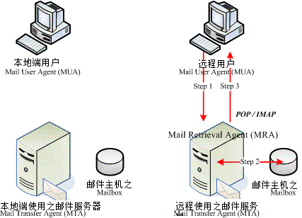

# 第二十二章、邮件服务器： Postfix

最近更新日期：2011/08/10

在这个邮件服务器的架设中，我们首先谈论 Mail 与 [DNS](http://linux.vbird.org/linux_server/0350dns.php) 的重要相关性，然后依序介绍 Mail Server 的相关名词，以及 Mail Server 的运作基本流程与协议，也会谈到相关的 Relay 与邮件认证机制等项目， 这些项目对于未来邮件服务器的管理与设定是重要的，请不要忽略了这方面问题的讨论喔。 由于 Postfix 的配置文件内容较具有亲和性，因此我们单纯介绍了 Postfix 不再介绍 sendmail 了。

*   22.1 邮件服务器的功能与运作原理
    *   22.1.1 电子邮件的功能与问题
    *   22.1.2 Mail server 与 DNS 之间的关系
    *   22.1.3 邮件传输所需要的组件 (MTA, MUA, MDA) 以及相关协议
    *   22.1.4 使用者收信时服务器端所提供的相关协议： MRA
    *   22.1.5 Relay 与认证机制的重要性
    *   22.1.6 电子邮件的数据内容
*   22.2 MTA 服务器： Postfix 基础设定
    *   22.2.1 Postfix 的开发
    *   22.2.2 所需要的软件与软件结构
    *   22.2.3 一个邮件服务器的设定案例
    *   22.2.4 让 Postfix 可监听 Internet 来收发信件： 直接看范例
    *   22.2.5 信件传送流程与收信、relay 等重要观念
    *   22.2.6 设定邮件主机权限与过滤机制 /etc/postfix/access
    *   22.2.7 设定邮件别名： /etc/aliases, ~/.forward
    *   22.2.8 察看信件队列信息： postqueue, mailq
    *   22.2.9 防火墙设置
*   22.3 MRA 服务器： dovecot 设定
    *   22.3.1 基础的 POP3/IMAP 设定
    *   22.3.2 加密的 POP3s/IMAPs 设定
    *   22.3.3 防火墙设置
*   22.4 MUA 软件：客户端的收发信软件
    *   22.4.1 Linux mail
    *   22.4.2 Linux mutt
    *   22.4.3 Thunderbird 好用的跨平台 (Windows/Linux X) 软件
*   22.5 邮件服务器的进阶设定
    *   22.5.1 邮件过滤一：用 postgrey 进行非正规 mail server 的垃圾信抵挡
    *   22.5.2 邮件过滤二：关于黑名单的抵挡机制
    *   22.5.3 邮件过滤三：基础的邮件过滤机制
    *   22.5.4 非信任来源的 Relay：开放 SMTP 身份认证
    *   22.5.5 非固定 IP 邮件服务器的春天： relayhost
    *   22.5.6 其他设定小技巧： 单封信容量限制, SMTP 寄件备份, 错误检查
*   22.6 重点回顾
*   22.7 本章习题
*   22.8 参考数据与延伸阅读
*   22.9 [针对本文的建议：http://phorum.vbird.org/viewtopic.php?p=117550](http://phorum.vbird.org/viewtopic.php?p=117550)

* * *

# 22.1 邮件服务器的功能与运作原理

## 22.1 邮件服务器的功能与运作原理

电子邮件是个啥玩意儿？它是利用网络传递一些信息给远程服务器的一种信息传递行为，虽然消息正文是很冷很硬的计算机文字， 确实比不上手写信件来的让人觉得温暖，不过，对于具有时效性的信息来说，电子邮件可是个不可多得的好帮手！ 但是，电子邮件系统蓬勃发展的现在却被某些少部分的特定人士所乱用，导致垃圾信件、色情广告信件等等的泛滥！ 真是啊～伤脑筋～底下我们就先来谈一谈这个电子邮件相关的功能吧！

**Tips:** 时至今日，Google 与几个大型的网络公司都有提供免费或者是付费的邮件服务器，其中，免费的电子邮件账号甚至已经提供高达数个 GB 的邮件储存量！对于一般用户来说真是非常够用了！因此，除非必要，现在我们都『不建议您架设 mail server』的！ 因为玩过邮件主机的朋友都很清楚，在现在的环境当中想要搞定 Mail server 是很难的一件事情， 除了目前网络社会的广告信、垃圾信、病毒信实在是多的不象话，所以各主要的 ISP 对于邮件控管上面越来越严格， 而且基本功当中的 mail vs. DNS 相关性又太高！很难理解～


* * *

### 22.1.1 电子邮件的功能与问题

在目前的社会当中，没有电子邮件 (e-mail) 似乎是蛮奇怪的一件事！可以说，现在 e-mail 已经成为一个很普遍的人与人之间的沟通管道了， 电子邮件可以很快速的帮你将文件或讯息传送到地球上的任何一个有网络存在的角落，当然， 你也可以在任何有网络的地方，连上 Internet 去收取你的信件！

不过，遗憾的是，只要是有人类的地方，就会有很多你意想不到的事情会出现了，当然 e-mail 也不例外，怎么说呢？ 我们来慢慢的分析一下电子邮件产生的一些问题吧：

*   夹带病毒的电子邮件问题： 你可以常常听到电子邮件可能夹带病毒对吧！没错，利用电子邮件以及人们对于电子邮件的漫不经心的态度， 使得以电子邮件为媒介的计算机病毒更容易『深入人群』当中吶！

*   怪客透过邮件程序入侵： 只要在 Internet 上面跑的数据就没有绝对保密的！你可以轻易的使用怪客软件 (Cracker) 就可以取得使用者在利用 e-mail 传送过程当中所输入的账号与密码，若经过分析之后，还可能破解对方的邮件主机～哇！真是乱可怕一把的！

*   广告信与垃圾信等： 这个可说是目前各大 ISP 心中永远的痛～这些垃圾信件可以占掉很多那少的可怜的带宽， 使得正常用户连接速度与质量下降，更可能造成网络的停顿～当然，常常收到垃圾信件的你，大概也不好过吧！

*   主机被大量不明信件塞爆： 万一你没有将邮件服务器设定好，嘿嘿！送信者可以藉由你主机收信的功能，发送大量的信件， 让你『一次收个够！』灌爆你的服务器硬盘，想要不当机都粉难～

*   真实社会的讨厌情事： 『黑函』！听到会不会很害怕？当然很害怕啦！偏偏使用 e-mail 就可以作很多的坏事～这真是太不道德了～

*   不实的信件内容： 只要注意到消基会的讯息就可以知道啦，不明来源的电子邮件说的内容，不要轻易的相信！ 因为很多可是以讹传讹，结果，大家都被耍了的～例如，你的朋友收到一封信，认为『哇！这是大事情』， 所以在没有求证的情况下，将信『转寄』给你看，嘿！你的朋友寄给你的，当然要相信他啦！ 立刻再转寄，如此一再地循环，嘿嘿！这个错误内容的讯息马上就让大家知道， 更可怕的是『还会让大家接受～』所以，看到任何讯息时，请千万要记得求证一下吶！

可怕吧！电子邮件会衍生出这么多的问题说～另外，这个 email 服务器的设定与管理真的是网管人员心中永远的痛！ 为什么呢？因为人都是想要越便利越简单越好，但越便利越不管制的邮件服务器就越容易被攻击或遭利用！ 反过来说，如果你针对邮件服务器管得太严厉，那就不太人性化，相信至少您的主管可能就不太满意，怎么办？

呵呵！没错啦！邮件服务器就是这么回事，让人又爱又怕的一个玩意儿，搞定他，恭喜您啊一切顺利圆满！ 搞不定他，服务器被当成垃圾信件转运站事小，丢掉工作那可是『兹事体大』呦！就因为他是这么重要又难以搞定， 所以我们可得好好的学学他吶！

* * *

### 22.1.2 Mail server 与 DNS 之间的关系

既然要使用 e-mail ，当然就需要邮件服务器啰 (Mail Server)！不然你的信要怎样寄出去呢？事实上， mail server 的原理说难不难，但是说简单吗～似乎又有点难以理解～，所以， 底下我们要来谈一谈他的原理部分，然后再针对服务器的设定来进行说明咯！我们首先要讲的就是『 Mail server 系统与 DNS 系统有什么关连性？』 这个部分新手最容易被搞混哩，是否要架设 mail server 就『宿命』的一定得架设 DNS server 在你的主机上面吗？

*   Mail server 与合法的主机名

事实上目前已经没有人会使用 IP 来寄信了，我们通常接收到的 email 都是使用『账号@主机名』的方式来处理的， 所以说，你的邮件服务器『就一定要有一个合法注册过的主机名』才可以。为什么呢？ 因为网络恶意使用与垃圾邮件泛滥的种种因素，导致我们不允许直接利用主机的 IP 来寄信了，否则每部有 IP 的主机都能寄信... 因此，你想要架设 mail server 就『必需』要有[合法的主机名](http://linux.vbird.org/linux_server/0270dynamic_dns.php)啰。

OK！既然我只要一个合法的主机名即可，那么表示我不需要架设一部 DNS 主机啰？ 是的，你可以这样认为！只要你拥有合法的主机名，亦即在 DNS 的查询系统当中你的主机名拥有一个 A 的标志， 理论上你的 mail server 就可以架设成功。只不过由于目前因特网上面的广告信、 垃圾信与病毒信等占用了太多的带宽，导致整个网络社会花费过多的成本在消耗这些垃圾资料。 所以为了杜绝可恶的垃圾信件，目前的大型网络供货商 (ISP) 都会针对不明来源的邮件加以限制， 这也就是说『想要架设一部简单可以运作的 mail server 越来越难了』。

*   DNS 的反解也很重要！

对于一般的服务器来说，我们只要使用正解让客户端可以正确的找到我们服务器的 IP 即可架站，举例来说 WWW 服务器就是这样。不过，由于目前收信端的邮件服务器会针对邮件来源的 IP 进行反解，而如果你的网络环境是由拨接取得非固定的 IP 时，该种 IP 在 ISP 方面通常会主动的以 xxx.dynamic.xxx 之类的主机名来管理，偏偏这样的主机名会被主要的大型邮件服务器 (例如 hotmail, yahoo 等) 视为垃圾信件， 所以你的邮件服务器所发出的信件将可能被丢弃，那可就伤脑筋了！

所以啊，如果你想要架设一部 Mail server 的话，请『务必』向您的上层 ISP 申请 IP 反解的对应， 不要再使用预设的反解主机名，否则很容易导致您的邮件服务器所发出的信件会在 Internet 上面流浪啊！

**Tips:** 其实你还是可以不用申请 IP 的反解，不过就得要利用所谓的 relayhost 或者是 smarthost 来处理邮件转递的问题， 这个部分又涉及到上层 ISP 的问题，挺复杂！我们会在后续作说明！


*   需要 DNS 的 MX 及 A 标志啊 (超重要的 MX)！

那么我们的邮件服务器系统到底是如何使用 DNS 的信息来进行邮件的传递的？还记得在[十九章 DNS 里面谈到的 MX](http://linux.vbird.org/linux_server/0350dns.php) 这个标志吗？当时我们仅说过这个 MX 代表的是 Mail eXchanger， 当一封邮件要传送出去时，邮件主机会先分析那封信的『目标主机的 DNS 』，先取得 MX 标志 (注意，MX 标志可能会有多部主机喔) 然后以最优先 MX 主机为准将信发送出去。看不懂吗？没关系，我们以底下这个 DNS 范例来说：

```
xyz.com.vbird  IN  MX 10 mail.xyz.com.vbird
xyz.com.vbird  IN  MX 20 mail2.xyz.com.vbird
xyz.com.vbird  IN  A     aaa.bbb.ccc.ddd 
```

假如上述的 DNS 设定是正常的，那么：

*   当有一封信要传给 user@xyz.com.vbird 时，由于 MX 标志最低者优先，所以该封信会先传送到 mail.xyz.com.vbird 那部主机。
*   如果 mail.xyz.com.vbird 由于种种原因，导致无法收下该封信时，该封信将以次要 MX 主机来传送，那就是传送到 mail2.xyz.com.vbird 那部主机上头；
*   如果两部 MX 主机都无法负责的话，那么该封信会直接以 A 的标志，亦即直接传送到 aaa.bbb.ccc.ddd 那个 IP 上头去， 也就是 xyz.com.vbird 本身啦！

在这个过程当中，你必需要注意到：mail.xyz.com.vbird 及 mail2.xyz.com.vbird 必需要是可以帮 xyz.com.vbird 转信的主机才行，也就是说，那两部主机通常是你公司的最上游的邮件主机， 并不是你随意填写的！那两部主机还需要针对你的 xyz.com.vbird 来设定『邮件转递』才行！ 否则你的信会被踢掉的。

由于现在的很多邮件服务器会去搜寻 MX 这个标志来判断目标邮件服务器是否为合法，所以你要架设 Mail server 虽然不必自行设定 DNS 服务器，不过你最好要申请一个 MX 的标志才行。此外，MX 标志一定要设定正确，否则你的信件将可能会直接被 MX 服务器踢掉。为了要设定 MX 但是我们没有上层邮件服务器时，所以你可以指定 MX 为自己，利用自己当 MX 服务器即可。

那么你或许会想，这个 MX 有啥好处啊？一般来说，如果目标主机挂点时，你的邮件通常会直接退还给原发信者， 但如果有 MX 主机时，这部 MX 主机会先将该封信放在他的队列 (queue) 当中，等到你的目标主机重新提供邮件服务后， MX 主机会将你的信件传送给目标主机，如此一来你的信件就比较不会遗失啊！这样说，您可以了解吧！ ^_^

*   Email 的地址写法

刚刚上头说过 email 通常是『账号@主机名』的方式来处理，举例来说鸟哥的 www.centos.vbird 主机上面有个 dmtsai 的使用者，则我的 email 将会成为：『dmtsai@www.centos.vbird』，当有人要寄信给我时， 他会分析 @ 后面的主机名，亦即 www.centos.vbird 的 MX/A 标志等等，然后再透过刚刚说明的流程来传出信件。 而当我的 www.centos.vbird. 收到这封信时，他会将信放到 dmtsai 的信箱当中啦！底下我们就来谈一谈这个流程吧！

* * *

### 22.1.3 邮件传输所需要的组件 (MTA, MUA, MDA) 以及相关协议

在开始介绍邮件的传送过程之前，我们先来想一想，你是如何寄出电子邮件的？假设你要寄信给一个使用者， 他的电子邮件是『a_user@gmail.com』好了，也就是说，你要寄一封信到 gmail.com 这个主机上的意思。 那你的桌面计算机 (举例来说， Windows 系统) 是否能够将这封信『直接』透过网络送给 gmail.com 那个主机上？ 当然不行啦！你得要设定帮你转信的邮件服务器才行！也就是说，你必需要先向某一部邮件服务器注册， 以取得一个合法的电子邮件权限后，才能够发送邮件出去的。

所以说，你要寄出一封信件时是需要很多接口的帮忙的，底下列出一个简单的图示来说明：

 图 22.1-1、电子邮件的『传送』过程示意图

我们先来解释一些专有名词吧！然后再来说明传送的流程：

* * *

1.  MUA (Mail User Agent)：

    顾名思义 MUA 就是『邮件使用者代理人』的意思，因为除非你可以直接利用类似 telnet 之类的软件登入邮件服务器来主动发出信件，否则您就得要透过 MUA 来帮你送信到邮件服务器上头去。 最常见的 MUA 像是 [Mozilla](http://moztw.org/) 推出的 [Thunderbird (雷鸟)](http://moztw.org/thunderbird/) 自由软件， 或者是 Linux 桌面 KDE 常见的 Kmail ，及 Windows 内件的 Outlook Express (OE) 等。 MUA 主要的功能就是收受邮件主机的电子邮件，以及提供用户浏览与编写邮件的功能！

2.  MTA (Mail Transfer Agent)：

    MUA 帮用户传送邮件到邮件主机上，那这部邮件主机如果能够帮用户将这封信寄出去，那他就是一部邮件传送主机 (MTA) 啦！这个 MTA 就是『邮件传送代理人』的意思。也来顾名思义一下，既然是『传送代理人』， 那么使用者寄出的信，帮用户将属于该用户的信件收下时，就是找它 (MTA) 就对啦！基本上，MTA 的功能有这些：

    1.  收受信件：使用简单邮件传送协议(SMTP) MTA 主机最主要的功能就是：将来自客户端或者是其他 MTA 的来信收下来，这个时候 MTA 使用的是 Simple Mail Transfer Protocol (SMTP)，他使用的是 port 25 啦！

    2.  转递信件： 如果该封信件的目的地并不是本身的用户，且该封信的相关数据符合使用 MTA 的权力， 那么咱们的 MTA 就会将该封信再传送到下一部主机上。这即是所谓的转递 (Relay) 的功能。

        总之，我们一般提到的 Mail Server 就是 MTA 啦！而严格来说， MTA 其实仅是指 SMTP 这个协议而已。而达成 MTA 的 SMTP 功能的主要软件包括老牌的 sendmail，后起之秀的 postfix，还有 qmail 等等。底下我们来看看，那么在 MTA 上头还有哪些重要的功能。

3.  MDA (Mail Delivery Agent)：

    字面上的意思是『邮件递送代理人』的意思。事实上，这个 MDA 是挂在 MTA 底下的一个小程序， 最主要的功能就是：分析由 MTA 所收到的信件表头或内容等数据， 来决定这封邮件的去向。所以说，上面提到的 MTA 的信件转递功能，其实是由 MDA 达成的。 举例来说，如果 MTA 所收到的这封信目标是自己，那么 MDA 会将这封信给他转到使用者的信箱 (Mailbox) 去， 如果不是呢？那就准备要转递出去了。此外，MDA 还有分析与过滤邮件的功能喔！举例来说：

    1.  过滤垃圾信件： 可以根据该封邮件的表头资料，或者是特定的信件内容来加以分析过滤。例如某个广告信的主题都是固定的， 如『AV 情色...』等等，那就可以透过 MDA 来过滤并去除该邮件。

    2.  自动回复： 如果您出差了导致某一段时间内无法立即回信时，就可以透过 MDA 的功能让邮件主机可以自动发出回复信件， 如此您的朋友就不会认为你太大牌！^_^ 各主要的 MTA 程序 (sendmail,postfix...) 都有自己的 MDA 功能，不过有些外挂的程序功能更强大，举例来说 procmail 就是一个过滤的好帮手，另外 Mailscanner + Spamassassion 也是可以使用的一些 MDA 喔。

4.  Mailbox：

    就是电子邮件信箱嘛！简单的说，就是某个账号专用的信件收受档案啰。我们的 Linux 系统默认的信箱都是放在 /var/spool/mail/使用者账号 中！ 若 MTA 所收到的信件是本机的使用者，MDA 就会将信件送到该 mailbox 当中去啰！

* * *

好了，那么来想一想，你如何透过 MUA 来将信件送到对方的邮件信箱 (Mailbox) 去呢？

*   Step 0：取得某部 MTA 的权限：

    就如图 22.1-1 所示，我们本地端的 MUA 想要使用 MTA 来传出信件时， 当然需要取得 MTA 的权限。通常就是说：我们必须要向 MTA 注册一组可使用 email 的账号与密码才行。

*   Step 1：使用者在 MUA 上编写信件后，传送至 MTA 上头：

    使用者在 MUA 上面编写信件，信件的数据主要有：

    *   信件标头：包括发件人与收件者的 email 地址，还有该封信件的主旨 (subject) 等；
    *   信件内容：就是你要跟对方说明的内容啦！ 编写完毕之后只要按下传送钮，该封信就会送至你的 MTA 服务器上面了，注意：是你的 MTA 而不是对方的 MTA ！ 如果你确定可以使用该部 MTA，那么你的这封信就会被放置到 MTA 的队列 (queue) 当中并等待传送出去了。
*   Step 2.1：如果该封信的目标是本地端 MTA 自己的账号

    你是可以寄信给你自己的，所以如果你的 MTA 收到该封信件的目标是自己的用户时，那就会透过 MDA 将这封信送到 Mailbox 去啰！

*   Step 2.2：如果该封信目的为其他 MTA ，则开始转递 (Relay) 的流程：

    那如果这封信的目标是其他的主机呢？这个时候我们的 MTA 就会开始分析该封信是否具有合法的权限， 若具有权限时，则我们的 MDA 会开始进行邮件转递，亦即该封信件会透过我们的 MTA 向下一部 MTA 的 smtp (port 25) 发送出去。如果该封信件顺利的发送出去了，那么该封信件就会由队列当中移除掉了。

*   Step 3：对方 MTA 服务器收受信件

    如果一切都没有问题的话，远程的 MTA 会收到我们 MTA 所发出的那封信，并将该信件放置到正确的使用者信箱当中， 等待使用者登入来读取或下载。

在这整个过程当中，你会发现你的信件是由我们的 MTA 帮忙发送出去的，此时 MTA 提供的协议是简单邮件传输协议 (Simple Mail Transfer Protocol, smtp)， 并且该封信最终是停留在对方主机的 MTA 上头！并不是你朋友的 MUA 上头啊！

**Tips:** 为何特别强调这一点？因为以前有个朋有跟我说：『鸟哥啊，你要寄 email 给我的时候记得跟我讲， 那我下班前将计算机开着，以免你信寄不到我的信箱』，此时额头三条线突然跑出来～很不好意思～ 所以这里才要特别强调，你的 MUA 不必开着啦！要收信时再打开即可。


了解了传送信件时 MTA 需要启动 smtp (port 25) 之后，再来我们得要谈谈那这封信件对方要如何接收啊？

* * *

### 22.1.4 使用者收信时服务器端所提供的相关协议： MRA

那使用者如果想要收信时，当然也可以透过 MUA 直接来联机取得自己的邮件信箱内的数据啊！整个过程有点像底下这样：

 图 22.1-2、客户端透过 MRA 收回信件的流程示意图

在上述的图示中，多了一个邮件组件，那就是 MRA：

1.  MRA (Mail Retrieval Agent)：

    使用者可以透过 MRA 服务器提供的邮政服务协议 (Post Office Protocol, POP) 来收下自己的信件， 也可以透过 IMAP (Internet Message Access Protocol) 协议将自己的信件保留在邮件主机上面， 并进一步建立邮件数据匣等进阶工作。也就是说，当客户端收受信件时，使用的是 MRA 的 POP3, IMAP 等通讯协议，并非 MTA 的 SMTP 喔！

我们先谈一谈 POP3 的收信方式吧：

1.  MUA 透过 POP3 (Post Office Protocol version 3) 的协议连接到 MRA 的 port 110， 并且输入账号与密码来取得正确的认证与授权；
2.  MRA 确认该用户账号/密码没有问题后，会前往该使用者的 Mailbox (/var/spool/mail/使用者账号) 取得使用者的信件并传送给用户的 MUA 软件上；
3.  当所有的信件传送完毕后，<u>用户的 mailbox 内的数据将会被删除</u>！

在上述的流程当中我们知道 MRA 必须要启动 POP3 这个协议才行，不过这个协议的收件方式比较有趣， 因为使用者收信是由第一封信件开始收下直到最后一封信件传输完毕为止。不过由于某些 MUA 程序撰写的问题，若有些邮件有病毒的可能性时，透过防病毒软件将可能导致该 MUA 软件的断线！ 如此一来由于传输没有完毕，因此 MRA 主机并不会将用户的信件删除。 此时如果使用者又再一次的按下接收按键，呵呵！原来已接收的信件又会重复收到，而没有收到的还是收不到！

这个时候或许你可以透过登入主机利用 mail 这个指令来处理你有问题的邮件， 或许换一种 MUA 也是个不错的思考方向，又或者暂时将防病毒软件关掉也是可以考虑的手段之一。 转头过来想一想，因为 POP3 的协议预设会将信件删除，那如果我今天在办公室将我的信收到办公室的计算机中， 当我回家时再度启动 MUA 时，是否能够收到已经被接收的信件？当然不行，对吧！

或许你需要更有帮助的协议，亦即 IMAP (Internet Messages Access Protocol) ， 这个协议可以让你将 mailbox 的数据转存到你主机上的家目录，亦即 /home/账号/ 那个目录下， 那你不但可以建立邮件数据匣，也可以针对信件分类管理，而且在任何一个可连上网络的地方你只要登入主机， 原本的信件就还是存在吶！真是好啊！

不过，使用 IMAP 时，用户的目录最好能够加点限制，例如利用 quota 来管理用户的硬盘权限， 否则因为信件都在主机上头，如果用户过多且误用时，你的硬盘空间会被吃光光喔！注意注意！

OK！透过上面的说明你要知道，要架设一部可以使用 MUA 进行收发信件的 MTA, MRA 服务器，你至少也需要启动 SMTP 以及 POP3 这两个协议才行！而这两个协议的启动程序并不相同， 所以架设上还是得要小心注意啊！

*   pop3s, imap2 与 SMTP 的困扰

邮件数据在因特网上面传输时，透过的 SMTP, POP3, IMAP 等通讯协议，通通是明码传输的！尤其 POP3, IMAP 这两个通讯协议中，使用者必须要输入账号/密码才能收受信件！因为涉及帐密，所以当然加密这两个通讯协议的数据较佳！ 于是就有了 POP3s, IMAPs 通讯协议出现了！透过 SSL 加密嘛！那你会问，既然已经有 pop3s, imaps 了， 那有没有 smtps 呢？答案是，当然有！只不过没人用！

从图 22.1-1 及图 22.1-2 的流程来看，POP3, IMAP 只与 MRA 及自己的用户有关，因此你只要跟你的用户说，你服务器使用的 MRA 协议为何，通知你的用户改变即可，并不会影响到其他的服务器。 但是 MTA 就不同了！因为 MTA 必须与其他的 MTA 沟通，因此，若你使用了 smtps ，那么全世界与你的 MTA 沟通者， 通通需要改变为 smtps 通讯协议才行！这个工程实在太浩大了！目前还没有任何一家 ISP 有能力进行！ 所以，就造成目前没有 SMTPs 的协议啰。

那么难道你的数据就一定要是明码吗？那倒不见得～既然你的 MTA 无法加密，那么你就自己将邮件数据加密后，再交由 MTA 传送即可！这也是目前很多急需加密数据的邮件用户所使用的手段啦！^_^

* * *

### 22.1.5 Relay 与认证机制的重要性

当你需要 MTA 帮你将信寄送到下一部 MTA 去时，这个动作就称为邮件转递 (Relay) 啰，那就是图 22.1-1 当中的 Step 2.2 那个动作啦。那么我们来想一想，如果『所有的人都可以藉由这一部 MTA 帮忙进行 Relay 时， 这个情况称之为 Open Relay 的动作』。当你的 MTA 发生 Open Relay 时，会有什么问题？ 问题可就大了！

当你的 MTA 由于设定不良的关系导致具有 Open Relay 的状况，加上你的 MTA 确实是连上因特网时， 由于因特网上面用 port scan 软件的闲人太多，你的 MTA 具有 Open Relay 的功能这件事情， 将会在短时间内就被很多人察觉，此时那些不法的广告信、色情垃圾信业者将会利用你的这部 Open Relay MTA 发送他们的广告，所以你会发生的问题至少有：

*   你主机所在的网域正常使用的连接速度将会变慢，因为网络带宽都被广告、垃圾信吃光了；
*   你的主机可能由于大量发送信件导致主机资源被耗尽，容易产生不明原因当机之类的问题；
*   你的 MTA 将会被因特网社会定义为『黑名单』，从此很多正常的邮件就会无法收发；
*   你 MTA 所在的这个 IP 将会被上层 ISP 所封锁，直到你解决这个 Open Relay 的问题为止；
*   某些用户将会对你的能力产生质疑，对您公司或者是你个人将会有信心障碍！甚至可能流失客源；
*   如果你的 MTA 被利用来发黑函，你是找不到原发信者的，所以你这部 MTA 将会被追踪为最终站！

问题很大呦！所以啊，目前所有的 distributions 都一样，几乎都将 MTA 预设启动为仅监听内部循环接口 (lo) 而已，而且也将 Open Relay 的功能取消了。既然取消 Open Relay 的功能，那么怎么使用这部 MTA 的 Relay 来帮忙转信啊？呵呵！所以我们在上头才会一直说，你『必需』取得合法使用该 MTA 的权限啊！ 这也就是说，设定谁可以使用 Relay 的功能就是我们管理员的任务啦！通常设定 Relay 的方法有这几种：

*   规定某一个特定客户端的 IP 或网段，例如规定内部 LAN 的 192.168.1.0/24 可使用 Relay；
*   若客户端的 IP 不固定时 (例如拨接取得的非固定 IP) 可以利用认证机制来处理。
*   将 MUA 架设在 MTA 上面，例如 OpenWebMail 之类的 web 接口的 MUA 功能。

认证机制上面常见的有 SMTP 邮件认证机制，以及 SMTP after POP 两种，不论是哪一种机制， 基本上都是透过让使用者输入认证用的账号与密码，来确定他有合法使用该 MTA 的权限，然后针对通过认证者开启 Relay 的支持就是了。如此一来你的 MTA 不再启动 Open Relay ，并且客户端还是可以正常的利用认证机制来收发信件， 身为管理员的你可就轻松多啰！ ^_^

* * *

### 22.1.6 电子邮件的数据内容

看过上头的数据后，您应该对于 Mail server 有一些程度的认识了。再来要谈的是，那么一封 email 的内容有哪些部分呢？就跟人类社会的邮件有信封袋以及内部的信纸一样，email 也有所谓的标头 (header) 以及内容 (body) 两部份喔！

email 的标头部分 (类似邮件信封) 会有几个重要信息，包括：这封信来自那个 MTA、是由谁所发送出来的、要送给谁、 主旨为何等等，至于内容 (类似信封内的信纸) 则是发信者所填写的一些说明啰。如果你使用 dmtsai 的身份下达这个指令：

```
[dmtsai@www ~]$ echo "HaHa.." &#124; mail -s "from vbird" dmtsai 
```

然后将自己的信箱内容叫出来，如下所示：

```
[dmtsai@www ~]$ cat /var/spool/mail/dmtsai
From dmtsai@www.centos.vbird  Mon Aug  8 18:53:32 2011  &lt;==发信者的 email
Return-Path: &lt;dmtsai@www.centos.vbird&gt;                  &lt;==这封信的来源
X-Original-To: dmtsai
Delivered-To: dmtsai@www.centos.vbird
Received: by www.centos.vbird (Postfix, from userid 2007)
        id 6D1C8366A; Mon,  8 Aug 2011 18:53:32 +0800 (CST) &lt;==邮件 ID
# 这部份主要在讲这封 email 的来源与目标收件者 MTA 在哪里的信息～
Date: Mon, 08 Aug 2011 18:53:32 +0800     &lt;==收到信件的日期
To: dmtsai@www.centos.vbird               &lt;==收件者是谁啊！
Subject: from vbird                       &lt;==就是信件标题
User-Agent: Heirloom mailx 12.4 7/29/08
MIME-Version: 1.0
Content-Type: text/plain; charset=us-ascii
Content-Transfer-Encoding: 7bit
Message-Id: &lt;20110808105332.6D1C8366A@www.centos.vbird&gt; &lt;==给机器看的邮件 ID
From: dmtsai@www.centos.vbird             &lt;==发信者是谁啊！

HaHa.. 
```

由原本的信件内容我们可以看到 email 确实是两部份，在标头部分记录了比较详细的收、发件者数据， 以及相关的来源、目标之 MTA 信息等等。但你要注意的是，那个『Received:...』那一行资料是『会变动的』， 如同前面谈到的 MX 标志，如果一封信由 MUA 传送到 MTA 在由 MTA 传送到 MX 主机后，才传送到最终的 MTA 时， 那么这个 Received: 的数据将会记录每一部经手过的 MTA 信息喔！所以你可以借着这个记录数据慢慢的找回这封信的传递方向呢！

此外，这个邮件的标头以及内容的分析部分，你还可以藉由某些分析软件来进行过滤， 这部份我们将在后头再慢慢的介绍给大家了解喔！ ^_^！您先知道一封邮件至少有这些数据，以后咱们再慢慢的解释啰！

* * *

# 22.2 MTA 服务器： Postfix 基础设定

## 22.2 MTA 服务器： Postfix 基础设定

可达成 MTA 的服务器软件非常多，例如我们的 CentOS 预设就提供了数十年老牌子的 sendmail ([`www.sendmail.org`](http://www.sendmail.org/)) 以及近期以来很热门的 Postfix ([`www.postfix.org`](http://www.postfix.org/))。虽然 sendmail 曾是最为广泛使用的 mail server 软件，但由于 sendmail 的配置文件太过于难懂，以及早期的程序漏洞问题导致的主机安全性缺失；加上 sendmail 将所有的功能都统合在 /usr/sbin/sendmail 这个程序当中，导致程序太大可能会有效能方面的疑虑等等， 所以新版的 CentOS 已经将预设的 mail server 调整为 postfix 啰！我们这里也主要介绍 postfix。当然啦，原理方面都一样，您也可以自己玩玩其他的 mail server。

* * *

### 22.2.1 Postfix 的开发

Postfix 是由 Wietse Zweitze Venema 先生([`www.porcupine.org/wietse`](http://www.porcupine.org/wietse/))所发展的。早期的 mail server 都是使用 sendmail 架设的，还真的是『仅此一家，绝无分号』！不过，Venema 博士觉得 sendmail 虽然很好用，但是毕竟不够安全，尤其效能上面并不十分的理想，最大的困扰是...sendmail 的配置文件 sendmail.cf 真的是太难懂了！对于网管人员来说，要设定好 sendmail.cf 这个档案，真不是人作的工作。

为了改善这些问题， Venema 博士就在 1998 年利用他老大在 IBM 公司的第一个休假年进行一个计划：『 设计一个可以取代 sendmail 的软件套件，可以提供网站管理员一个更快速、 更安全、而且**完全兼容**于 sendmail 的 mail server 软件！』这个计划还真的成功了！ 而且也成功的使用在 IBM 内部，在 IBM 内可以说是完全取代了 sendmail 这个邮件服务器！在这个计划成功之后， Venema 博士也在 1998 年首次释出这个自行发展的邮件服务器，并定名为 VMailer。

不过，IBM 的律师却发现一件事，那就是 VMailer 这个名字与其他已注册的商标很类似， 这样可能会引起一些注册上面的困扰。为了避免这个问题，所以 Venema 博士就将这个邮件软件名称改为 Postfix ！『Post 有在什么什么之后』的意思，『fix 则是修订』的意思，所以 postfix 有 『在修订之后』的意思。

鸟哥个人认为， Venema 先生最早的构想并不是想要『创造一个全新的 Mail server 软件，而是想要制造一个可以完全兼容于 sendmail 的软件』，所以，Venema 先生认为他自行发展的软件应该是『改良 sendmail 的缺失』，所以才称为 Postfix 吧！取其意为： 『改良了 sendmail 之后的邮件服务器软件！』

所以啦， Postfix 设计的理念上面，主要是针对『想要完全兼容于 sendmail』所设计出来的一款『内在部分完全新颖』的一个邮件服务器软件。就是由于这个理念，因此 Postfix 改善了 sendmail 安全性上面的问题，改良了 mail server 的工作效率， 且让配置文件内容更具亲和力！因此，你可以轻易的由 sendmail 转换到 Postfix 上面！这也是当初 Venema 博士的最初构想啊！

就是基于这个构想，所以 Postfix 在外部配置文件案的支持度，与 sendmail 几乎没有两样，同样的支持 aliases 这个档案，同样的支持 ~/.forward 这个档案，也同样的支持 SASL 的 SMTP 邮件认证功能等等！ 所以，呵呵！赶紧来学一学怎样架设 Postfix 这个相当出色的邮件服务器吧！ ^_^

* * *

### 22.2.2 所需要的软件与软件结构

由于 CentOS 6.x 预设就是提供 postfix 的！所以根本无须调整啥咚咚～直接来使用吧！ 那么 postfix 有哪些重要的配置文件呢？他主要的配置文件都在 /etc/postfix/ 当中，详细的档案内容就让我们来谈谈：

*   /etc/postfix/main.cf 这就是主要的 postfix 配置文件啰，几乎所有的设定参数都是在这个档案内规范的！ 这个档案预设就是一个完整的说明档了，你可以参考这个档案的内容就设定好属于你的 postfix MTA 呢！ 只要修改过这个档案，记得要重新启动 postfix 喔！

*   /etc/postfix/master.cf 主要规定了 postfix 每个程序的运作参数，也是很重要的一个配置文件。不过这个档案预设已经很 OK 了，通常不需要更改他。

*   /etc/postfix/access (利用 postmap 处理) 可以设定开放 Relay 或拒绝联机的来源或目标地址等信息的外部配置文件，不过这个档案要生效还需要在 /etc/postfix/main.cf 启动这个档案的用途才行。且设定完毕后需要以 postmap 来处理成为数据库档案呢！

*   /etc/aliases (利用 postalias 或 newaliases 均可) 做为邮件别名的用途，也可以作为邮件群组的设定喔！

至于常见的执行档则有底下这些：

*   /usr/sbin/postconf (查阅 postfix 的设定数据) 这个指令可以列出目前你的 postfix 的详细设定数据，包括系统默认值也会被列出来， 所以数据量相当的庞大！如果你在 main.cf 里面曾经修改过某些预设参数的话，想要仅列出非默认值的设定数据， 则可以使用『postconf -n』这个选项即可。

*   /usr/sbin/postfix (主要的 daemon 指令) 此为 postfix 的主要执行档，你可以简单的使用他来启动或重新读取配置文件：

    ```
    [root@www ~]# postfix check   &lt;==检查 postfix 相关的档案、权限等是否正确！
    [root@www ~]# postfix start   &lt;==开始 postfix 的执行
    [root@www ~]# postfix stop    &lt;==关闭 postfix
    [root@www ~]# postfix flush   &lt;==强制将目前正在邮件队列的邮件寄出！
    [root@www ~]# postfix reload  &lt;==重新读入配置文件，也就是 /etc/postfix/main.cf 
    ```

    要注意的是，每次更动过 main.cf 后，务必重新启动 postfix，可简单的使用『postfix reload』即可。不过老实说，鸟哥还是习惯使用 /etc/init.d/postfix reload..

*   /usr/sbin/postalias 设定别名数据库的指令，因为 MTA 读取数据库格式的档案效能较佳，所以我们都会将 ASCII 格式的档案重建为数据库。 在 postfix 当中，这个指令主要在转换 /etc/aliases 成为 /etc/aliases.db 啰！用法为：

    ```
    [root@www ~]# postalias hash:/etc/aliases
    # hash 为一种数据库的格式，然后那个 /etc/aliases.db 就会自动被更新啰！ 
    ```

*   /usr/sbin/postcat 主要用在检查放在 queue (队列) 当中的信件内容。由于队列当中的信件内容是给 MTA 看的， 所以格式并不是一般我们人类看的懂的文字数据。所以这个时候你得要用 postcat 才可以看出该信件的内容。 在 /var/spool/postfix 内有相当多的目录，假设内有一个文件名为 /deferred/abcfile ， 那你可以利用底下的方式来查询该档案的内容喔：

    ```
    [root@www ~]# postcat /var/spool/postfix/deferred/abcfile 
    ```

*   /usr/sbin/postmap 这个指令的用法与 postalias 类似，不过他主要在转换 access 这个档案的数据库啦！用法为：

    ```
    [root@www ~]# postmap hash:/etc/postfix/access 
    ```

*   /usr/sbin/postqueue 类似 mailq 的输出结果，例如你可以输入『postqueue -p』看看就知道了！

整个 postfix 的软件结构大致上是这个样子的，接下来让我们先来简单的处理一下 postfix 的收发信件功能吧！

* * *

### 22.2.3 一个邮件服务器的设定案例

前面谈到 mail server 与 DNS 系统有很大的相关性，所以如果你想要架设一部可以连上 Internet 的邮件服务器时， 你必需要已经取得合法的 A 与 MX 主机名，而且最好反解也已经向您的 ISP 申请修改设定了， 这可是个大前提！不要忽略他！在底下的练习当中鸟哥以之前[十九章 DNS](http://linux.vbird.org/linux_server/0350dns.php) 内的设定为依据，主要的参数是这样的：

*   邮件服务器的主要名称为： www.centos.vbird
*   邮件服务器尚有别名为 linux.centos.vbird 及 ftp.centos.vbird 也可以收发信件；
*   此邮件服务器已有 MX 设定，直接指向自己 (www.centos.vbird)
*   这个 www.centos.vbird 有个 A 的标志指向 192.168.100.254。

在实际的邮件服务器设定当中，上述的几个标志是很重要的，请自行参考 DNS 章节的介绍吧！底下就让我们来实际设定 postfix 服务器啰！

* * *

### 22.2.4 让 Postfix 可监听 Internet 来收发信件

在预设的情况下，CentOS 6.x 的 MTA 仅针对本机进行监听，不相信吗？测测看：

```
[root@www ~]# netstat -tlnp &#124; grep :25
Proto Recv-Q Send-Q Local Address   Foreign Address   State    PID/Program name
tcp        0      0 127.0.0.1:25    0.0.0.0:*         LISTEN   3167/master 
```

所以如果你要对整个 Internet 开放的话，就得要努力的搞定几个简单的设定啰！而几乎所有的设定你都可已经由 /etc/postfix/main.cf 这个档案搞定！修改前你需要注意的项目有：

*   『 # 』符号是批注的意思；
*   所有设定值以类似『变量』的设定方法来处理，例如 myhostname = www.centos.vbird，请注意等号的两边要给予空格符喔， 且第一个字符不可以是空白，亦即『my..』要由行首写起；
*   可以使用『 $ 』来延伸使用变量设定，例如 myorigin = $myhostname，会等于 myorigin = www.centos.vbird；
*   如果该变量支持两个以上的数据，则使用空格符来分隔，不过建议使用逗号加空格符『, 』来处理。 例如： mydestination = $myhostname, $mydomain, linux.centos.vbird，意指 mydestination 支持三个数据内容之意。
*   可使用多行来表示同一个设定值，只要在第一行最后有逗号，且第二行开头为空格符， 即可将数据延伸到第二行继续书写 (所以刚刚第二点才说，开头不能留白！)；
*   **若重复设定某一项目，则以较晚出现的设定值为准！**

要让你的 postfix 可以收发信件时，你必需要启动的设定数据有底下这些喔：

* * *

*   myhostname：设定主机名，需使用 FQDN 喔

    这个项目在于设定你的主机名，且这个设定值会被后续很多其他的参数所引用，所以必须要设定正确才行。 你应该要设定成为完整的主机名。在鸟哥的这个练习当中，应该设定为： myhostname = www.centos.vbird 才对。 除了这个设定值之外，还有一个 mydomain 的设定项目，这个项目默认会取 $myhostname 第一个『.』之后的名称。 举例来说上头设定完毕后，预设的 mydomain 就是 centos.vbird 啰！你也可以自行设定他。

*   myorigin ：发信时所显示的『发信源主机』项目

    这个项目在设定『邮件头上面的 mail from 的那个地址』， 也就是代表本 MTA 传出去的信件将以此设定值为准喔！如果你在本机寄信时忘记加上 Mail from 字样的话， 那么就以此值为准了。默认这个项目以 $myhostname 为主的，例如： myorigin = $myhostname

*   inet_interfaces ：设定 postfix 的监听接口 (极重要)

    在预设的情况下你的 Postfix 只会监听本机接口的 lo (127.0.0.1) 而已，如果你想要监听整个 Internet 的话， 请开放成为对外的接口，或者是开放给全部的接口，常见的设定方法为： inet_interfaces = all 才对！ 由于如果有重复设定项目时，会以最晚出现的设定值为准，所以最好只保留一组 inet_interfaces 的设定喔！

*   inet_protocols ：设定 postfix 的监听 IP 协议

    预设 CentOS 的 postfix 会去同时监听 IPv4, IPv6 两个版本的 IP，如果你的网络环境里面仅有 IPv4 时，那可以直接指定 inet_protocols = ipv4 就会避免看到 :::1 之类的 IP 出现呦！

*   mydestination ：设定『能够收信的主机名』 (极重要)

    这个设定项目很重要喔！因为我们的主机有非常多的名字，那么对方填写的 mail to 到底要写哪个主机名字我们才能将该信件收下？ 就是在这里规范的！也就是说，你的许多主机名当中，仅有写入这个设定值的名称才能作为 email 的主机地址。 在我们这个练习当中这部主机有三个名字，所以写法为： mydestination = $myhostname, localhost, linux.centos.vbird, ftp.centos.vbird

    如果你想要将此设定值移动到外部档案，那可以使用类似底下的作法： mydestination = /etc/postfix/local-host-names ，然后在 local-host-names 里面将可收信的主机名写入即可。一般来说，不建议你额外建立 local-host-names 这个档案啦， 直接写入 main.cf 即可说！特别留意的是，如果你的 DNS 里头的设定有 MX 标志的话，那么请将 MX 指向的那个主机名一定要写在这个 mydestination 内， 否则很容易出现错误讯息喔！一般来说，使用者最常发生错误的地方就在这个设定里头呢！

*   mynetworks_style ：设定『信任网域』的一项指标

    这个设定值在规定『与主机在同一个网域的可信任客户端』的意思！举例来说，鸟哥的主机 IP 是 192.168.100.254，如果我相信整个局域网络内 (192.168.100.0/24) 的用户的话，那我可规定此设定值为『 subnet 』吶！ 不过，一般来说，因为底下的 mynetworks 会取代这个设定值， 所以不设定也没有关系喔！如果要设定的话，最好设定成为 host 即可 (亦即仅信任这部 MTA 主机而已)。

*   mynetworks ：规定信任的客户端 (极重要)

    你的 MTA 能不能帮忙进行 Relay 与这个设定值最有关系！举例来说，我要开放本机与内部网域的 IP 时，就可以这样进行设定： mynetworks = 127.0.0.0/8, 192.168.100.0/24。如果你想要以 /etc/postfix/access 这个档案来控制 relay 的用户时，那鸟哥可以建议你将上述的数据改写成这样： mynetworks = 127.0.0.0/8, 192.168.100.0/24, hash:/etc/postfix/access 然后你只要再建立 access 之后重整成数据库后，嘿嘿！就能够设定 Relay 的用户啰！

*   relay_domains ：规范可以帮忙 relay 的下一部 MTA 主机地址

    相对于 mynetworks 是针对『信任的客户端』而设定的，这个 relay_domains 则可以视为『针对下游 MTA 服务器』而设定的。举例来说，如果你这部主机是 www.niki.centos.vbird 的 MX 主机时， 那你就得要在 relay_domains 设定针对整个 niki.centos.vbird 这个领域的目标信件进行转递才行。 在预设的情况下，这个设定值是 $mydestination 而已啦。

    你必需要注意的『Postfix 预设并不会转递 MX 主机的信件』，意思就是说：如果你有两部主机，一部是上游的 MTAup ，一部是下游的 MTAdown ，而 MTAdown 规范的 MX 主机是 MTAup，由 22.1.2 谈到的 DNS 的 MX 设定值与信件传递方向，我们知道任何想要寄给 MTAdown 主机的信件， 都会先经过 MTAup 来转递才行！此时如果那部 MTAup 没有开启帮 MTAdown 进行 relay 的权限时， 那么任何传给 MTAdown 的信件将『全部都被 MTAup 所退回』！从此 MTAdown 就无法收到任何信件了。

    上一段的说明请您特别再想一想，因为如果你在大公司服务而且你的公司上、下游均有 mail server 时， 并且也有设定 MX 的状况下，嘿嘿！这个 relay_domains 就很重要啦！上游的 MTA 主机必需要启动这个设定。 一般来说除非你是某部 MTA 主机的 MX 源头，否则这个设定项目可以忽略不设定他。 而如果你想要帮你的客户端转递信件到某部特定的 MTA 主机时，这个设定项目也是可以设定的啦。 默认请您保留默认值即可。

*   alias_maps ：设定邮件别名

    就是设定邮件别名的设定项目，只要指定到正确的档案去即可，这个设定值可以保留默认值啊：

* * *

在了解上述的设定后，以鸟哥的范例来看的话，鸟哥有更动过或注明重要的设定值以及相关档案是这样处理的：

```
[root@www ~]# vim /etc/postfix/main.cf
myhostname = www.centos.vbird          &lt;==约在第  77 行
myorigin = $myhostname                 &lt;==约在第  99 行
inet_interfaces = all                  &lt;==约在第 114 行，117 行要批注掉
inet_protocols = ipv4                  &lt;==约在第 120 行
mydestination = $myhostname, localhost.$mydomain, localhost,
  linux.centos.vbird, ftp.centos.vbird &lt;==约在第 165,166 行
mynetworks = 127.0.0.0/8, 192.168.100.0/24, hash:/etc/postfix/access &lt;==约在 269 行
relay_domains = $mydestination         &lt;==约在第 299 行
alias_maps = hash:/etc/aliases
alias_database = hash:/etc/aliases     &lt;==约在第 389, 400 行
# 其他的设定值就先保留默认值即可啊！

[root@www ~]# postmap hash:/etc/postfix/access
[root@www ~]# postalias hash:/etc/aliases 
```

因为 main.cf 当中我们有额外加入两个外部配置文件 (mynetworks 及 alias_maps) ，所以才会额外进行 postmap 及 postalias。然后准备来启动啦！你可以这样处理喔：

```
# 1\. 先检查配置文件的语法是否有错误
[root@www ~]# /etc/init.d/postfix check   &lt;==没有讯息，表示没有问题。

# 2\. 启动与观察 port number
[root@www ~]# /etc/init.d/postfix restart
[root@www ~]# netstat -tlunp &#124; grep ':25'
Proto Recv-Q Send-Q Local Address  Foreign Address   State   PID/Program name
tcp        0      0 0.0.0.0:25     0.0.0.0:*         LISTEN  13697/master 
```

很简单吧！这样就设定妥当了。假设你的防火墙已经处理完毕，那你的 Postfix 已经可以开放客户端进行转递，并且也可以收受信件啰！不过，到底在预设的情况下我们的 postfix 可以收下哪些信件？又可以针对哪些设定值的内容进行转递呢？这就得要参考下一小节的说明了。

* * *

### 22.2.5 信件传送流程与收信、relay 等重要观念

我想，您对于 MTA 的设定与收发信件应该有一定程度的概念了，不过要妥善设定好你的 MTA 时， 尤其是想要了解到整部 MTA 是如何收、发信件时，你最好还是要知道『我这部 MTA 如何接受来源主机所传来的信件，以及将信件转递到下一部主机去』的整个流程啊。 一般来说一封邮件传送会经过许多的流程为：

1.  送信端与收信端两部主机间会先经过一个握手 (ehlo) 的阶段，此时送信端被记录为发信来源(而不是 mail from)。 通过握手后就可以进行信件标头 (header) 的传送；

2.  此时收信端主机会分析标头的信息，若信件之 Mail to: 主机名为收信端主机，且该名称符合 <u>mydestination</u> 的设定，则该信件会开始被收下至队列，并进一步送到 mailbox 当中； 若不符合 <u>mydestination</u> 的设定，则终止联机且不会进行信件内容 (body) 的传送；

3.  若 Mail to: 主机名非为收信端本身，则开始进行转递 (relay) 的分析。

4.  转递过程首先分析该信件的来源是否符合信任的客户端 (这个客户端为步骤 1 所记录的发信主机喔)，亦即来源是否符合 <u>mynetworks</u> 的设定值，若符合则开始收下信件至队列中，并等待 MDA 将信件再转递出去，若不符 mynetworks 则继续下一步；

5.  分析信件来源或目标是否符合 <u>relay_domains</u> 的设定，若符合则信件将被收下至队列，并等待 MDA 将信件再转递出去；

6.  若这封信的标头数据都不合乎上述的规范，则终止联机，并不会接受信件的内容数据的。

整个流程有点像底下这样：

 图 22.2-1、在本机 MTA 当中的信件分析过程

也就是说标头分析通过后，你的信件内容才会开始上传到主机的队列，然后透过 MDA 来处理该信件的流向。 而不是将信件完整的传送到主机后才开始分析的喔！这个得要特别注意吶！而透过上述的流程后， 在暂不考虑 access 以及 MDA 的分析机制中，一部 MTA 想要正确的收、发信件时，电子邮件必需要符合：

*   收信方面：必需符合底下需求：

    1.  发信端必需符合 $inet_interfaces 的设定；
    2.  信件标头之收件者主机名必需符合 $mydestination 的设定， 或者收件主机名需要符合 $virtual_maps (与虚拟主机有关) 的设定；
*   转递方面 (Relay)：必需符合底下需求：

    1.  发信端必需符合 $inet_interfaces 的设定；
    2.  发信端来源必需为 $mynetworks 的设定；发信端来源或信件标头之收件者主机名符合 $relay_domains 之设定内容。

同样的原理与想法你可以将他用在 sendmail 的设定当中喔！ ^_^！不过很多垃圾信却是藉由这个预设的收发管道来发送， 怎么说呢？请看底下的分析：

例题：在我的主机上面竟然发现这样的广告信，那就是『利用我的主机发送广告信给我自己！』为什么这样也可以呢？答：首先，你必需要熟悉一下上述的流程，在第 2 个步骤当中我们知道，当主机收到一封信且这封信的目标是自己， 并且也符合 mydestination 的设定时，该信件就会被收下来而不必验证客户端是否来自于 mynetworks 了。 所以说，任何人都可以用这个流程来寄信给你啊。不过，你的 MTA 并不是 open relay 啦，不会帮人家发送广告信的，不用担心。

例题：我的主机明明没有 Open relay ，但很多其他的 MTA 管理员发信给我，说我的主机的某个账号持续发送广告信， 但是我的主机明明没有那个账号啊！这是怎么回事？答：仔细看一下流程的步骤 1 与 2 ，确认该封信能否被收下来与发信端及收信端主机名有关。 而我们知道在邮件的 header 里面还有一个 mail from 的标头设定项目，这个标头设定是我们在查阅邮件时看到的『回邮地址』， 这个数据是可以伪造的！而且他与收发信件的数据无关！所以，您应该要告知对方 MTA 管理员， 请他提供详细的 log 数据，才能够判断该封信是否由你的主机所发送出去的。

一般来说，目前的广告业者很多都是利用这种欺敌的方式来处理的，所以您必需要请对方提供详细的 log file 数据以供查验才行喔！

* * *

### 22.2.6 设定邮件主机权限与过滤机制 /etc/postfix/access

基本上，指定了 Postfix 的 mynetworks 的信任来源就能够让使用者 relay 了，不过如果你依照鸟哥上述的方式 (22.2.4) 来设定你的 mynetworks 的话，那么我们还可以利用 access 这个档案来额外管理我们的信件过滤呢！基本的 access 语法为：

```
规范的范围或规则               Postfix 的动作 (范例如下)
IP/部分 IP/主机名/Email 等       OK/REJECT 
```

假设你想要让 120.114.141.60 还有 .edu.tw 可以使用这部 MTA 来转递信件，且不许 av.com 以及 192.168.2.0/24 这个网域的使用时，可以这样做：

```
[root@www ~]# vim /etc/postfix/access
120.114.141.60        OK
.edu.tw            OK
av.com            REJECT
192.168.2\.          REJECT
# OK 表示可接受，而 REJECT 则表示拒绝。

[root@www ~]# postmap hash:/etc/postfix/access
[root@www ~]# ls -l /etc/postfix/access*
-rw-r--r--. 1 root root 19648 2011-08-09 14:05 /etc/postfix/access
-rw-r--r--. 1 root root 12288 2011-08-09 14:08 /etc/postfix/access.db
# 你会发现有个 access.db 的档案才会同步更新！这才是 postfix 实际读取的！ 
```

用这个档案设定最大的好处是，你不必重新启动 postfix，只要将数据库建立好， 立刻就生效了！这个档案还有其它的进阶功能，你可以自行进入该档案查阅就知道了。但是进阶设定还需要 main.cf 内的其他参数有设定才行！如果只有之前 $mynetworks 的设定值时，你只能利用 access.db 的方式来开放 relay 的能力而已。不过，至少他可以让我们的设定简化啰！ ^_^

* * *

### 22.2.7 设定邮件别名： /etc/aliases, ~/.forward

想一想，你的主机里面不是有很多系统账号吗？例如 named, apache, mysql...， 那么以这些账号执行的程序若有讯息发生时，他会将该讯息以 email 的方式传给谁？应该就是传给 named, apache... 等账号自己吧。 不过，你会发现其实这些系统账号的信息都是丢给 root！ 这是因为其他的系统账号并没有密码可登入，自然也就无法接收任何邮件了，所以若有邮件就给系统管理员啰。不过，咱们的 MTA 怎么知道这些信件要传给 root ？这就得要 aliases 这个邮件别名配置文件来处理啦！

*   邮件别名配置文件： /etc/aliases

在你的 /etc/aliases 档案内，你会发现类似底下的字样：

```
[root@www ~]# vim /etc/aliases
mailer-daemon:  postmaster
postmaster:     root
bin:            root
daemon:         root
....(底下省略).... 
```

左边是『别名』右边是『实际存在的使用者账号或者是 email address』！ 就是透过这个设定值，所以让我们可以将所有系统账号所属的信件通通丢给 root 啊！好，我们现在将他扩大化，假如你的 MTA 内有一个实际的账号名称为 dmtsai ，这个使用者还想要使用 dermintsai 这个名称来收他的信件， 那么你可以这样做：

```
[root@www ~]# vim /etc/aliases
dermintsai:     dmtsai
# 左边是你额外所设定的，右边则是实际接收这封信的账号！

[root@www ~]# postalias hash:/etc/aliases
[root@www ~]# ll /etc/aliases*
-rw-r--r--. 1 root root  1535 2011-08-09 14:10 /etc/aliases
-rw-r--r--. 1 root root 12288 2011-08-09 14:10 /etc/aliases.db 
```

从此之后不论是 dmtsai@www.centos.vbird 还是 dermintsai@www.centos.vbird 都会将信件丢到 /var/spool/mail/dmtsai 这个信箱当中喔！很方便吧！

*   /etc/aliases 实际应用一：让一般账号可接收 root 的信

假设你是系统管理员，而你常用的一般账号为 dmtsai，但是系统出错时的重要信件都是寄给 root 啊， 偏偏 root 的信件不能被直接读取....所以说，如果能够将『给 root 的信也转寄一份给 dmtsai 』的话， 那就太好了！可以达到吗？当然可以！你可以这样做：

```
[root@www ~]# vim /etc/aliases
root:        root,dmtsai  &lt;==鸟哥建议这种写法！
# 信件会传给 root 与 dmtsai 这两个账号！

root:        dmtsai       &lt;==如果 dmtsai 不再是管理员怎办？
# 从此 root 收不到信了，都由 dmtsai 来接受！

[root@www ~]# postalias hash:/etc/aliases 
```

上面那两行你可以择一使用，看看 root 要不要保留他的信件都可以的！鸟哥建议使用第一种方式，因为这样一来， 你的 dmtsai 可以收到 root 的信，且 root 自己也可以『备份』一份在他的信箱内，比较安全啦！

*   /etc/aliases 实际应用二：发送群组寄信功能

想象一个情况，如果你是学校的老师，你虽然只带一班导生，但是『每年都一班』时，如果有一天你要将信发给所有的学生， 那在写 email 的标头时，可能就会头昏昏的了 (因为联络人名单太多了)！这个时候你可以这样做： (假设主机上学生的账号为 std001, std002... )

```
[root@www ~]# vim /etc/aliases
student2011:    std001,std002,std003,std004...

[root@www ~]# postalias hash:/etc/aliases 
```

如此一来只要寄信到这部主机的 student2011 这个不存在的账号时，该封信就会被分别存到各个账号里头去， 管理上面是否很方便啊！ ^_^！事实上，邮件别名除了填写自己主机上面的实体用户之外，其实你可以填写外部主机的 email 喔！ 例如你要将本机的 dermintsai 那个不存在的用户的信件除了传给 dmtsai 之外，还要外传到 dmtsai@mail.niki.centos.vbird 时，可以这样做：

```
[root@www ~]# vim /etc/aliases
dermintasi:    dmtsai,dmtsai@mail.niki.centos.vbird

[root@www ~]# postalias hash:/etc/aliases 
```

很方便吧！更多的功能就期待您自行发掘啰！

**Tips:** 在这本书里面，dmtai 的家目录并非在正规的 /home 底下，而是放置于 /winhome 当中 (参考第十六章的练习)，所以实际操作 mail 指令会出错！这是因为 SELinux 的关系！请参考 /var/log/messages 底下的建议动作去处理即可！


*   个人化的邮件转递： ~/.forward

虽然 /etc/aliases 可以帮我们达到邮件别名设定的好处，不过 /etc/aliases 是只有 root 才能修改的档案权限， 那我们一般使用者如果也想要进行邮件转递时，该如何是好？没关系，可以透过自己家目录下的 .forward 这个档案喔！ 举例来说，我的 dmtsai 这个账号所接收到的信件除了自己要保留一份之外，还要传给本机上的 vbird 以及 dmtsai@mail.niki.centos.vbird 时，那你可以这样做设定：

```
[dmtsai@www ~]$ vim .forward
# 注意！我现在的身份现在是 dmtsai 这个一般身份，而且在他的家目录下！
dmtsai
vbird
dmtsai@mail.niki.centos.vbird

[dmtsai@www ~]$ chmod 644 .forward 
```

记得这个档案内容是一行一个账号 (或 email) ，而且权限方面非常重要：

*   该档案所在用户家目录权限，其 group、other 不可以有写入权限。
*   .forward 档案权限，其 group、other 不可以有写入权限。

如此一来这封信就会开始转递啰！有趣吧！ ^_^

* * *

### 22.2.8 察看信件队列信息： postqueue, mailq

说实话，设定到此为止咱们的 postfix 应该可以应付一般小型企业之 mail server 的用途了！ 不过，有的时候毕竟因为网络的问题或者是对方主机的问题，可能导致某些信件无法送出而被暂存在队列中， 那我们如何了解队列当中有哪些邮件呢？还有，在队列当中等待送出的信件是如何送出的呢？

*   如果该封信在五分钟之内无法寄出，则通常系统会发出一封『警告信』给原发信者， 告知该封邮件尚无法被寄送出去，不过，系统仍会持续的尝试寄出该封邮件；
*   如果在四小时候仍无法寄出，系统会再次的发出警告信给原发信者；
*   如果持续进行五天都无法将信件送出，那么该封邮件就会退回给原发信者了！

当然啦，某些 MTA 已经取消了警告信的寄发，不过原则上，如果信件无法实时寄出去的话 MTA 还是会努力尝试 5 天的，如果接下来的 5 天都无法送出时，才会将原信件退回给发信者。 一般来说，如果 MTA 设定正确且网络没有问题时，应该是不可能会有信件被放在队列当中而传不出去的， 所以如果发现有信件在队列时，当然得要仔细的瞧一瞧啰！检查队列内容的方法可以使用 mailq ， 也可以使用 postqueue -p 来检查的：

```
[root@www ~]# postqueue -p
Mail queue is empty 
```

若您的邮件如此显示时，恭喜您，没有什么问题邮件在队列当中。不过如果你将 postfix 关闭， 并尝试发一封信给任何人，那就可能会出现如下的画面啦：

```
[root@www ~]# /etc/init.d/postfix stop
[root@www ~]# echo "test" &#124; mail -s "testing queue" root
[root@www ~]# postqueue -p
postqueue: warning: Mail system is down -- accessing queue directly
-Queue ID- --Size-- ----Arrival Time---- -Sender/Recipient-------
5CFBB21DB       284 Tue Aug  9 06:21:58  root
                                         root
-- 0 Kbytes in 1 Request.
# 第一行就说明了无法寄出的原因为 Mail system is down 啦！
# 然后才出现无法寄出的信件信息！包括来源与目标喔！ 
```

输出的信息主要为：

*   Queue ID：表示此封邮件队列的代表号 (ID)，这个号码是给 MTA 看的，我们看不懂不要紧；
*   Size ：这封信有多大容量 (bytes) 的意思；
*   Arrival Time：这封信什么时候进入队列的，并且可能会说明无法立即传送出去的原因；
*   Sender/Recipient：送信与收信者的电子邮件啰！

事实上这封信是放置在 /var/spool/postfix 里面，由于信件内容已经编码为给 MTA 看的数据排列， 所以你可以使用 postcat 来读出原信件的内容喔！例如这样做 (注意看档名与 Queue ID 的对应！)：

```
[root@www ~]# cd /var/spool/postfix/maildrop
[root@www maildrop]# postcat 5CFBB21DB  &lt;==这个档名就是 Queue ID
*** ENVELOPE RECORDS 5CFBB21DB ***     &lt;==说明队列的编号啊
message_arrival_time: Tue Aug  9 14:21:58 2011
named_attribute: rewrite_context=local &lt;==分析 named (DNS) 的特性来自本机
sender_fullname: root                  &lt;==发信者的大名与 email
sender: root
recipient: root                        &lt;==就是收件者啰！
*** MESSAGE CONTENTS 5CFBB21DB ***     &lt;==底下则是信件的实际内容啊！
Date: Tue, 09 Aug 2011 14:21:58 +0800
To: root
Subject: testing queue
User-Agent: Heirloom mailx 12.4 7/29/08
MIME-Version: 1.0
Content-Type: text/plain; charset=us-ascii
Content-Transfer-Encoding: 7bit

test
*** HEADER EXTRACTED 5CFBB21DB ***
*** MESSAGE FILE END 5CFBB21DB *** 
```

如此一来你就知道目前我们的 MTA 主机有多少未送出的信件，还有未送出信件的内容你也可以追踪的到了！ 很不错，对吧！不过，如果你想要我们的 postfix 立刻尝试将这些在队列当中的信件寄出去，那又该如何是好？ 你有几个作法啦，可以重新启动 postfix ，也可以透过 postfix 的动作来处理，例如：

```
[root@www ~]# /etc/init.d/postfix restart
[root@www ~]# postfix flush 
```

鸟哥个人比较建议使用 postfix flush 啰！自行参考看看先！ ^_^！接下来，让我们先来处理一下收信的 MRA 服务器， 搞定后再来处理客户端的用户接口吧！

* * *

### 22.2.9 防火墙设置

因为整个 MTA 主要是透过 SMTP (port 25) 进行信件传送的任务，因此，针对 postfix 来说，只要放行 port 25 即可呦！ 修改一下 [iptables.rule](http://linux.vbird.org/linux_server/0250simple_firewall.php#local_script) 吧！

```
[root@www ~]# vim /usr/local/virus/iptables/iptables.rule
# 找到底下这一行，并且将它批注拿掉！
iptables -A INPUT -p TCP -i $EXTIF --dport  25  --sport 1024:65534 -j ACCEPT

[root@www ~]# /usr/local/virus/iptables/iptables.rule 
```

这样就放行整个 Internet 对您服务器的 port 25 的读取啰！简单！搞定！

* * *

# 22.3 MRA 服务器： dovecot 设定

## 22.3 MRA 服务器： dovecot 设定

除非你想要架设 webmail 在你的 MTA 上头，否则，你的 MTA 收下了信件，你总得连上 MTA 去收信吧？那么收信要用的是哪个通讯协议？ 就是 22.1.4 里面谈到的 pop3 以及 imap 啰！这就是所谓的 MRA 服务器！我们的 CentOS 6.x 使用的是 dovecot 这个软件来达成 MRA 的相关通讯协议的！但由于 pop3/imap 还有数据加密的版本，底下我们就依据是否加密 (SSL) 来设定 dovecot 吧！

* * *

### 22.3.1 基础的 POP3/IMAP 设定

启动单纯的 pop3/imap 是很简单的啦，你得要先确定已经安装了 dovecot 这个软件。而这个软件的配置文件只有一个，就是 /etc/dovecot/dovecot.conf 。我们仅要启动 pop3/imap 而已，所以可以这样设定即可：

```
[root@www ~]# yum install dovecot
[root@www ~]# vim /etc/dovecot/dovecot.conf
# 找到底下这一行，大约是在第 25 行左右的地方，复制新增一行内容如下：
#protocols = imap pop3 lmtp
protocols = imap pop3

[root@www ~]# vim /etc/dovecot/conf.d/10-ssl.conf
ssl = no   &lt;==将第 6 行改成这样！ 
```

改完之后你就可以启动 dovecot 啰！并且检查看看 port 110/143 (pop3/imap) 有没有启动啊？

```
[root@www ~]# /etc/init.d/dovecot start
[root@www ~]# chkconfig dovecot on
[root@www ~]# netstat -tlnp &#124; grep dovecot
Proto Recv-Q Send-Q Local Address   Foreign Address   State    PID/Program name
tcp        0      0 :::110          :::*              LISTEN   14343/dovecot
tcp        0      0 :::143          :::*              LISTEN   14343/dovecot 
```

耶！搞定！这样就可以提供使用者来收信件啦！真是不错啊！不过记得喔，这里只提供基本的明码 pop3/imap 传输而已， 如果想要启动其他如 pop3s (传输加密机制) 协议时，就得要额外的设定啰！

* * *

### 22.3.2 加密的 POP3s/IMAPs 设定

如果担心数据在传输过程会被窃取，或者是你的登入信息 (账号与密码) 在使用 pop3/imap 时会被窃听， 那么这个 pop3s/imaps 就显的重要啦！与之前的 Apache 相似的，其实我们都是透过 openssl 这个软件提供的 SSL 加密机制来进行数据的加密传输。方式很简单呢！预设的情况下，CentOS 已经提供了 SSL 凭证范例文件给我们使用了。 如果你一点都不想要使用预设的凭证，那么我们就来自己建一个吧！

```
# 1\. 建立凭证：到系统提供的 /etc/pki/tls/certs/ 目录下建立所需要的 pem 凭证档：
[root@www ~]# cd /etc/pki/tls/certs/
[root@www certs]# make vbirddovecot.pem
....(前面省略)....
Country Name (2 letter code) [XX]:TW
State or Province Name (full name) []:Taiwan
Locality Name (eg, city) [Default City]:Tainan
Organization Name (eg, company) [Default Company Ltd]:KSU
Organizational Unit Name (eg, section) []:DIC
Common Name (eg, your name or your server's hostname) []:www.centos.vbird
Email Address []:dmtsai@www.centos.vbird

# 2\. 因为担心 SELinux 的问题，所以建议将 pem 档案放置到系统默认的目录去较佳！
[root@www certs]# mv vbirddovecot.pem ../../dovecot/
[root@www certs]# restorecon -Rv ../../dovecot

# 3\. 开始处理 dovecot.conf，只要 pop3s, imaps 不要明码传输的咯！
[root@www certs]# vim /etc/dovecot/conf.d/10-auth.conf
disable_plaintext_auth = yes  &lt;==第 9 行改成这样！取消批注！

[root@www certs]# vim /etc/dovecot/conf.d/10-ssl.conf
ssl = required                                &lt;==第 6 行改成这样
ssl_cert = &lt;/etc/pki/dovecot/vbirddovecot.pem &lt;==12, 13 行变这样
ssl_key =  &lt;/etc/pki/dovecot/vbirddovecot.pem

[root@www certs]# vim /etc/dovecot/conf.d/10-master.conf
  inet_listener imap {
    port = 0     &lt;== 15 行改成这样
  }
  inet_listener pop3 {
    port = 0     &lt;== 36 行改成这样
  }

# 4\. 处理额外的 mail_location 设定值！很重要！否则网络收信会失败：
[root@www certs]# vim /etc/dovecot/conf.d/10-mail.conf
mail_location = mbox:~/mail:INBOX=/var/mail/%u &lt;==第 30 行改这样

# 5\. 重新启动 dovecot 并且观察 port 的变化：
[root@www certs]# /etc/init.d/dovecot restart
[root@www certs]# netstat -tlnp &#124; grep dovecot
Proto Recv-Q Send-Q Local Address  Foreign Address   State    PID/Program name
tcp        0      0 :::993         :::*              LISTEN   14527/dovecot
tcp        0      0 :::995         :::*              LISTEN   14527/dovecot 
```

最终你看到的 993 是 imaps 而 995 则是 pop3s 啰！这样一来，你收信的时候，输入的账号密码就不怕被窃听了！ 反正是加密后的资料啰！很简单吧！

* * *

### 22.3.3 防火墙设置

因为上面的练习中，我们将 pop3/imap 关闭，转而打开 pop3s/imaps 了，因此防火墙启动的埠口会不一样！ 请依据您实际的案例来设定你所需要的防火墙才好。我们这里主要是开放 993, 995 两个埠口呦！ 处理的方法与 22.2.9 相当类似：

```
[root@www ~]# vim /usr/local/virus/iptables/iptables.rule
# 大约在 180 行左右，新增底下两行去！
iptables -A INPUT -p TCP -i $EXTIF --dport 993  --sport 1024:65534 -j ACCEPT
iptables -A INPUT -p TCP -i $EXTIF --dport 995  --sport 1024:65534 -j ACCEPT

[root@www ~]# /usr/local/virus/iptables/iptables.rule 
```

如果你的 pop3/imap 还是决定不加密的话，请将上面的 993/995 改成 143/110 即可！

* * *

# 22.4 MUA 软件：客户端的收发信软件

## 22.4 MUA 软件：客户端的收发信软件

设定 Mail server 不是拿来好看的，当然是要好好的应用他啰！应用 mail server 有两种主要的方式，你可以直接登入 Linux 主机来操作 MTA ，当然也可以透过客户端的 MUA 软件来收发信件，底下我们分别介绍这两种方式啰！

* * *

### 22.4.1 Linux mail

在 Unix like 的操作系统当中都会存有一支可以进行收发信件的软件，那就是『 mail 』这个指令。这个指令是由 mailx 这个软件所提供的，所以您得要先安装这个软件才行。另外，由于 mail 是 Linux 系统的功能，所以即使你的 port 25 (smtp) 没有启动，他还是可以使用的，只是该封邮件就只会被放到队列，而无法寄出去啰！^_^！底下我们来谈一谈最简单的 mail 用法吧

*   用 mail 直接编辑文字邮件与寄信

mail 的用法很简单，就是利用『 mail [email address] 』的方式来将信件寄出去， 那个 [email address] 可以是对外的邮件地址，也可以是本机的账号。如果是本机账号的话，可以直接加账号名称即可。 例如：『 mail root 』或『 mail somebody@his.host.name 』。如果是对外寄信的时候， 信件预设的『 Mail from 』就会填写 main.cf 内那个 myorigin 变数的主机名啰！ 先来试看看吧！寄给 dmtsai@www.centos.vbird 先：

```
[root@www ~]# mail dmtsai@www.centos.vbird
Subject: Just test        &lt;==这里填写信件标题
This is a test email.     &lt;==底下为信件的内容！
bye bye !
.                         &lt;==注意，这一行只有小数点！代表结束输入之意！ 
```

这样就可以将信件寄出去了！另外，早期的 mail server 是可以接受 IP 寄信的，举例来说： mail dmtsai@[192.168.100.254] ，记得 IP 要用中括号包起来。不过由于受到垃圾邮件的影响， 现在这种方式几乎都无法成功的将信件寄出了。

*   利用已经处理完毕的『纯文本档』寄出信件

这可不是『附件夹带』的方式！因为在 mail 这个程序里面编辑信件是个很痛苦的差事， 你不能够按上下左右键来回到刚刚编辑有错误的地方，很伤脑筋。此时我们可以透过标准输入来处理！ 如果你忘记『 < 』代表的意义，请回到[基础篇的第十一章 bash shell](http://linux.vbird.org/linux_basic/0320bash.php)中的数据流重导向瞧瞧先！举例来说你要将家目录的 .bashrc 寄给别人，可以这样做：

```
[root@www ~]# mail -s 'My bashrc' dmtsai &lt; ~/.bashrc 
```

*   开始查阅接收的信件

寄信还比较简单，那么收信呢？同样的收信还是使用 mail。直接在提示字符之后输入 mail 时，会主动的捉取使用者在 /var/spool/mail 底下的邮件信箱 (mailbox)，例如我 dmtsai 这个账号在输入 mail 后，就会将 /var/spool/mail/dmtsai 这个档案的内容读出来并显示到屏幕上，结果如下：

```
# 注意喔！底下的身份使用的是 dmtsai 这个用户来操作 mail 这个指令的呦！
[dmtsai@www ~]$ mail
Heirloom Mail version 12.4 7/29/08\.  Type ? for help.
"/var/spool/mail/dmtsai": 10 messages 10 new &lt;==信箱来源与新信件数
&gt;N  1 dmtsai@www.centos.vb  Mon Aug  8 18:53  18/579   "from vbird"
....(中间省略)....
 N  9 root                  Tue Aug  9 15:04  19/618   "Just test"
 N 10 root                  Tue Aug  9 15:04  29/745   "My bashrc"
&  &lt;==这个是 mail 软件的提示字符，可以输入 ? 来察看可用指令 
```

在上面的画面中，显示 dmtsai 有一封信，且会附上该信件的发信者与标题及收信时间等。你可以用的指令有这些：

*   读信： (直接按 Enter 或输入数字后 enter) 有看到『 > 』那个符号吧！那表示目前 mail 所在的邮件位置，你可以直接输入 Enter 即可看到该封信件的内容！ 另外，你也可以在『&』之后的光标位置输入号码，就可以看该封信件的内容了！(注：如果持续按 Enter，则会自『 > 』符号所在的邮件逐次向后读取每封信件内容！)

*   显示标题： (直接数入 h 或输入 h 数字) 例如有 100 封信，要看 90 封左右的信件标题，就输入『 h90 』即可。

*   回复邮件： (直接输入 R ) 如果要回复目前『 > 』符号所在的邮件，直接按下『 R 』即可进入刚刚前面介绍过的 mail 文字编辑画面啰！你可以编辑信件后传回去啰！

*   删除邮件： (输入 d 数字) 按下『 d## 』即可删除邮件！例如我要删除掉第 2 封邮件，可以输入『 d2 』如果是要删除第 10-50 封邮件，可以输入『 d10-50 』来删除喔！请记得，如果有删除邮件的话，离开 mail box 时，要使用『 q 』才行！

*   储存邮件到档案： (输入 s 数字 文件名) 如果要将邮件资料存下来，可以输入『 s ## filename 』，例如我要将上面第 10 封邮件存下来，可以输入『 s 10 text.txt 』即可将第一封邮件内容存成 text.txt 这个档案！

*   离开 mail： (输入 q 或 x ) 要离开 mail 可以输入 q 或者是 x，请注意『输入 x 可以在不更动 mail box 的情况下离开 mail 程序，不管你刚刚有没有使用 d 删除数据；使用 q 才会将删除的数据移除。』也就是说，如果你不想更动 mail box 那就使用 x 或 exit 离开，如果想要使刚刚移除的动作生效，就要使用 q 啦！

*   请求协助： 关于 mail 更详细的用法可以输入 help 就可以显现目前的 mail 所有功能！

上面是简易的 mail 收信功能！不过，我们曾经将信件转存下来的话，那该如何读取该信件呢？例如读取刚刚记录的 text.txt 邮件信箱。其实可以简单的使用这个方式来读取：

```
[dmtsai@www ~]$ mail -f ~/text.txt 
```

*   以『附件夹带』的方式寄信

前面提到的都是信件的内容，那么有没有可能以『附件』的方式来传递档案？是可以的，不过你需要 uuencode 这个指令的帮忙，在 CentOS 当中这个指令属于 sharutils ，请先利用 yum 来安装他吧！接下来你可以这样使用：

```
[root@www ~]# [利用 uuencode 编码 ] &#124; [利用 mail 寄出去]
[root@www ~]# uuencode [实际档案] [信件中的檔名] &#124; mail -s '标题' email

# 1\. 将 /etc/hosts 以附件夹带的方式寄给 dmtsai
[root@www ~]# uuencode /etc/hosts myhosts &#124; mail -s 'test encode' dmtsai 
```

这样就能寄出去了，不过，如果收下这封信件呢？同样的我们得要透过译码器来解碼啊！ 你得先将该档案存下来，然后这样做：

```
# 底下的身份可是 dmtsai 这个用户喔！
[dmtsai@www ~]$ mail
Heirloom Mail version 12.4 7/29/08\.  Type ? for help.
"/var/spool/mail/dmtsai": 11 messages 1 new 8 unread
    1 dmtsai@www.centos.vb  Mon Aug  8 18:53  19/590   "from vbird"
....(中间省略)....
 U 10 root                  Tue Aug  9 15:04  30/755   "My bashrc"
&gt;N 11 root                  Tue Aug  9 15:12  29/1121  "test encode"
& s 11 test_encode
"test_encode" [New file] 31/1141
& exit

[dmtsai@www ~]$ uudecode test_encode -o decode
                             加密檔         输出档
[dmtsai@www ~]$ ll *code*
-rw-r--r--. 1 dmtsai dmtsai  380 Aug  9 15:15 decode      &lt;==译码后的正确数据
-rw-rw-r--. 1 dmtsai dmtsai 1121 Aug  9 15:13 test_encode &lt;==内文会有乱码 
```

虽然 mail 这个指令不是挺好用的，不过至少他可以提供我们在 Linux 纯文本模式下的一个简单的收发信件功能！ 不过，目前有个更棒的替代方案，那就是 mutt 这玩意儿啰！

* * *

### 22.4.2 Linux mutt

mutt 除了可以仿真 mail 这个指令之外，他还能够透过 pop3/imap 之类的协议去读取外部的信件喔！所以这家伙真的很不赖！ 让我们来玩玩 mutt 这个好物吧！在开始底下的动作前，请使用 yum install mutt 安装好它吧！

*   直接以 mutt 进行寄送信件的动作：含快速附件夹带文件

mutt 的功能也很多，我们先来看看 mutt 的基本语法好了，再来开始进行练习吧！

```
[root@www ~]# mutt [-a 附加檔] [-i 内文档] [-b 秘密副本] [-c 一般副本] \
&gt;  [-s 信件标题] email 地址
选项与参数：
-a 附加檔：后面就是你想要传送给朋友的档案，是附加档案，不是信件内容喔！
-i 内文档：就是信件的内文部分，先编写成为档案而已；
-b 秘密副本：原收件者不知道这封信还会寄给后面的那个秘密副本收件者；
-c 一般副本：原收件者会看到这封信还有传给哪位收件者；
-s 信件标题：这还需要解释吗？这封信的标头！
email 地址：就是原收件者的 email 啰！

# 1\. 直接在线编写信件，然后寄给 dmtsai@www.centos.vbird 这个用户
[root@www ~]# mutt -s '一封测试信' dmtsai@www.centos.vbird
/root/Mail 不存在。建立吗？ ([yes]/no): y  &lt;==第一次用才会出现这个讯息
To: dmtsai@www.centos.vbird
Subject: 一封测试信
随便写写！随便看看～！  &lt;==会进入 vi 画面编辑！很棒！

y:寄出  q:中断  t:To  c:CC  s:Subj  a:附加档案  d:叙述  ?:求助 &lt;==按下 y 寄出
    From: root &lt;root@www.centos.vbird&gt;
      To: dmtsai@www.centos.vbird
      Cc:
     Bcc:
 Subject: 一封测试信
Reply-To:
     Fcc: ~/sent
Security: 清除

-- 附件
- I     1 /tmp/mutt-www-2784-0      [text/plain, 8bit, utf-8, 0.1K]

# 2\. 将 /etc/hosts 当成信件内容寄给 dmtsai@www.centos.vbird 这个用户
[root@www ~]# mutt -s 'hosts' -i /etc/hosts dmtsai@www.centos.vbird
# 记得最终在 vim 底下要按下 :wq 来储存寄出喔！ 
```

与 mail 在线编写文字不一样，mutt 竟然会呼叫 vi 让你去编辑你的信件！如此一来，当然不需要预先编写信件内文了！ 这真是让人感到非常的开心啊！而且整个画面非常的直觉化！相当容易处理呢！那么如果需要附件夹带呢？尤其是夹带 binary program 时，可以这样做：

```
# 1\. 将 /usr/bin/passwd 当成附件夹带，寄给 dmtsai@www.centos.vbird 用户
[root@www ~]# mutt -s '附件' -a /usr/bin/passwd -- dmtsai@www.centos.vbird
To: dmtsai@www.centos.vbird
Subject: 附件
不过是个附件测试！

y:寄出  q:中断  t:To  c:CC  s:Subj  a:附加档案  d:叙述  ?:求助  &lt;==按 y 送出
    From: root &lt;root@www.centos.vbird&gt;
      To: dmtsai@www.centos.vbird
      Cc:
     Bcc:
 Subject: 附件
Reply-To:
     Fcc: ~/sent
Security: 清除

-- 附件
- I   1 /tmp/mutt-www-2839-0       [text/plain, 8bit, utf-8, 0.1K] &lt;==内文档
 A   2 /usr/bin/passwd          [applica/octet-stre, base64, 31K] &lt;==附加檔 
```

看到上表中的附件底下那两行吗？I 代表的是直接附在信件内的内文，A 才是附加档案！这样看懂了吗？ 不过你想要使用 mutt 来附加档案时，必须要有底下的注意事项才行：

*   『 -a filename 』这个选项必须是在指令的最后面，如果上述的指令改写成：『 mutt -a /usr/bin/passwd -s "附件" ... 』就不行！会失败的！
*   在文件名与 email 地址之间需要加上两个连续减号『 -- 』才行！如同上面测试的指令模样！

*   以 mutt 来读不同通讯协议的信箱

与 mail 比较之下，mutt 可以直接透过网络的 pop3, imap 等通讯协议来读信，是相当优秀的一个功能呦！ 至少鸟哥觉得真好用！底下同样的，先来瞧瞧可以使用的语法，然后再来看看一些练习。

```
[root@www ~]# mutt [-f 信箱位置]
选项与参数：
-f 信箱位置：如果是 imaps 的信箱，可以这样：『 -f imaps://服务器的 IP 』

# 1\. 直接用 dmtsai 的身份读取本机的信箱内容：
[dmtsai@www ~]$ mutt
q:离开  d:删除  u:反删除  s:储存  m:信件  r:回复  g:群组  ?:求助 
....(中间省略)....
  11 O + Aug 09 root            (  12) test encode
  12 O + Aug 09 root            (   1) 一封测试信
  13 O + Aug 09 root            (   8) hosts
 14 O + Aug 09 root            ( 604) 附件 

---Mutt: /var/spool/mail/dmtsai [Msgs:14 Old:11 74K]---(date/date)-------(all)--

# 2\. 在上面的信件 14 号内容反白后，直接按下 Enter 会出现如下画面！：
i:离开  -:上一页  &lt;Space&gt;:下一页 v:显示附件。  d:删除  r:回复  j:下一个 ?:求助 
Date: Tue, 9 Aug 2011 15:24:34 +0800
From: root &lt;root@www.centos.vbird&gt;
To: dmtsai@www.centos.vbird
Subject: 附件
User-Agent: Mutt/1.5.20 (2009-12-10)

[-- 附件 #1 --]
[-- 种类：textplain，编码：8bit，大小：0.1K --]

不过是个附件测试！          &lt;==信件的内文部分

[-- 附件 #2: passwd --]     &lt;==说明信件的附件夹带部分
[-- 种类：applicationoctet-stream，编码：base64，大小：41K --]

[-- application/octet-stream 尚未支持 （按 'v' 来显示这部份） --]

-O +- 14/14: root                   附件                                -- (all)

# 3\. 在上面画面按下 v 后，会出现相关的附件数据：
q:离开  s:储存  &#124;:管线  p:显示  ?:求助
  I     1 &lt;no description&gt;                        [text/plain, 8bit, utf-8, 0.1K]
 A     2 passwd                                [applica/octet-stre, base64, 41K]
# 反白处按下 s 就能够储存附加档案啰！ 
```

最后离开时，一直按下 q ，然后参考出现的信息来处理即可这就是本机信件的收信方式！非常简单！ 附加档案的储存方面也很容易，真是非常开心啊！那如果是外部信箱呢？举例来说，我用 root 的身份去收 dmtsai 的 imaps 信件，会是怎样的情况呢？

```
# 1\. 在服务器端必须要让 mail 这个群组能够使用 dmtsai 的家目录，所以要这样：
[dmtsai@www ~]$ chmod a+x ~

# 2\. 开始在客户端登入 imaps 服务器取得 dmtsai 的新邮件与邮件文件夹
[root@www ~]# mutt -f imaps://www.centos.vbird
q:离开  ?:求助 
这个验证属于：
   www.centos.vbird  dmtsai@www.centos.vbird
   KSU
   DIC
   Tainan  Taiwan  TW

这个验证的派发者：
   www.centos.vbird  dmtsai@www.centos.vbird
   KSU
   DIC
   Tainan  Taiwan  TW

这个验证有效
   由 Tue, 9 Aug 2011 06:45:32 UTC
     至 Wed, 8 Aug 2012 06:45:32 UTC
SHA1 Fingerprint: E86B 5364 2371 CD28 735C 9018 533F 4BC0 9166 FD03
MD5 Fingerprint: 54F5 CA4E 86E1 63CD 25A9 707E B76F 5B52

-- Mutt: SSL Certificate check (certificate 1 of 1 in chain) 
(1)不接受，(2)只是这次接受，(3)永远接受 &lt;==这里要填写 2 或 3 才行！
在 www.centos.vbird 的使用者名称：dmtsai
dmtsai@www.centos.vbird 的密码： 
```

最终在密码设定正确后，你就会看到刚刚我们所看到的信件了！不过要注意的是，如果你的用户家目录在非正规目录， 那么可能会出现 SELinux 的错误，这时就得要重新修订一下你的 SELinux 安全本文的类型啰！ 如此一来，我们就直接以文本模式来取得网络邮件信箱！这实在是非常方便的一件事！只是没有图文并茂而已！ ^_^

* * *

### 22.4.3 Thunderbird 好用的跨平台 (Windows/Linux X) 软件

自由软件最大的好处之一就是该软件大多可以进行移植，也就是在任何操作系统上面几乎都能够执行该软件的意思。 因此学习自由软件的好处就是，你不必因为转换操作系统而学习不同的操作环境！MUA 也有自由软件！那就是 Mozilla 基金会推出的 ThunderBird (雷鸟) 这个好用的咚咚，你可以在底下的网址上面找到繁体中文的软件：

*   [`moztw.org/thunderbird/`](http://moztw.org/thunderbird/)

有鉴于目前客户端还是以 Windows 操作系统为大宗，所以底下的说明主要是在 Windows 7 上头的安装与设定为主。目前 (2011/08) 最新的 Thunderbird 已经出到 5.x 了，所以鸟哥以繁体中文的 5.x 为范例来介绍啰。下载完毕的安装过程鸟哥省略了，因为一直下一步而已。鸟哥直接跳到第一次启动 Thunderbird 的介绍，希望对大家有帮助呦！鸟哥是以 dmtsai@www.centos.vbird 这个账号为范例来说明的呦！初次启动会出现下图：

 图 22.4-1、第一次启动 Thunderbird 的示意图

由于是第一次启动，所以 thunderbird 里面没有任何识别数据。此时你可以填写你要在 email 上面让人家看到的资料， 以及包括你登入远程信箱的账号密码等信息。上图鸟哥的昵称为『鸟哥哥』，而 Email 是要给收件者看到的，密码当然就是自己的不外流～填完之后按下『继续』吧！

 图 22.4-2、Thunderbird 主动的以用户信息尝试登入服务器

由于刚刚图 22.4-1 有输入账号与密码信息，因此，在这一个步骤中，Thunderbird 会主动的尝试登入远程信箱！ 不过，好像会抓取错误的信息的样子。如果真的抓错了，请修改箭头 1 指的服务器主机名，以及通讯协议的相关设定值， 按下『重新侦测』，确定捉到的数据是正确了，再按下『建立账号』或『进阶设定』(箭头 4 指的地方)即可！ 如果你很好奇进阶设定里面有啥，点选箭头 4 指的地方，会出现如下的详细资料：

 图 22.4-3、手动修改账号的相关参数

如上图所示，点选服务器设定项目，然后去查阅一下收信的服务器设定是否正确？若正确的话，就按下确定吧！ 然后会出现如下的图示，要你确定是否使用 Thunderbird 作为默认的电子邮件收发软件就是了！直接点确定进入下个步骤吧！

 图 22.4-4、建立默认的 MUA 软件示意图

由于 Thunderbird 会尝试使用你输入的账号密码去登入远程服务器的 imaps 服务，所以就会出现如下图一般的凭证取得示意， 这时要按啥？当然是确认永久储存该凭证嘛！很简单的啊！

 图 22.4-5、取得凭证的示意图

确定凭证 OK、账号密码也 OK 的话，就可以开始使用 Thunderbird 啦！正常使用的图示有点像这样：

 图 22.4-6、Thunderbird 正常操作示意图

如果一切成功顺利，那么你应该会看到如上的画面了！回到刚刚我们查询到的标题名为『附件』的邮件，查阅一下内容， 嘿嘿！你会看到内文与附件都是 OK 正常的啦！而且更开心的是，由于是 imaps 的通讯协议，因此 Thunderbird 的内容会与服务器上面的 /var/spool/mail/dmtsai 这个信箱内容同步喔！不像 POP3 抓下来就删除服务器的信件！ 真是好好用的软件啊！ ^_^

**Tips:** 老实说，由于 gmail 等免费邮件的盛行，目前连 Openwebmail 自由软件都很少人安装了！鸟哥上课时看到的同学， 几乎全部使用 gmail, yahoo mail, hotmail 等的 web 接口的 MUA，根本没人在用本机端的 MUA 了～但是， 某些时刻某些过时的信件还是得要从 web mail 上面捉下来，这时，Thunderbird 就派上用场啰！ ^_^


* * *

# 22.5 邮件服务器的进阶设定

## 22.5 邮件服务器的进阶设定

时至今日，邮件攻击主要的问题已经不是病毒与木马了，大多数的垃圾邮件多是钓鱼以及色情广告。 网络钓鱼的问题在于用户的莫名好奇心以及较糟糕的操作习惯，这部份很难处理。色情广告则是防不胜防，你想出一个过滤机制， 他就使用另一个机制来丢你！用严格的过滤机制吗？又可能将正常的信件抵挡掉，真是要命啊！所以，还是请用户直接删除比较好。 因此，在这一个小节当中，关于收信的过滤机制方面，鸟哥移除了前一版介绍的病毒扫瞄以及自动学习广告机制了。 如果你还是有相关的需要，可能得要自行查查相关的官方网站啰！不好意思啦！

另外，底下主要针对 postfix 的邮件收下过滤处理，以及重新发送的 Relay 过程进行介绍。这两个过程在 postfix 的设定中，主要有几个重要的项目管理：

*   smtpd_recipient_restrictions：recipient 是收件者的意思，这个设定值主要在管理『由本机所收下的信件』的功能，因此大部分的设定都是在进行邮件过滤以及是否为可信任邮件的意思。 来源可以是 MTA 或 MUA 的意思；

*   smtpd_client_restrictions：client 是客户端的意思，因此主要在管理客户端的来源是否可信任。 可以将非正规的 mail server 来信拒绝掉的！来源当然就是 MUA 啰；

*   smtpd_sender_restrictions：sender 是寄件人的意思，可以针对信件来源 (对方邮件服务器) 来进行分析过滤的动作。来源理论上就是 MTA 啦！

* * *

### 22.5.1 邮件过滤一：用 postgrey 进行非正规 mail server 的垃圾信抵挡

早期的广告信很多都是藉由僵尸计算机 (已经被当作跳板但管理员却没有发现或没有处理的主机) 来发送的， 这些僵尸计算机所发送的信件有个很明显的特色，就是『他只会尝试传送该封电子邮件一次， 不论有无成功，该封信就算发出去了，故该信件将被移出队列中。』 不过，合法的 mail server 运作流程就如 22.2.8 分析的一般，在邮件无法顺利寄出时该邮件会暂时放置到队列中一段时间， 并一直尝试将信件寄出的动作，预设直到五天后若还是无法寄出才会将信件退回。

根据这个合法与非法的邮件服务器运作流程而发展出一套所谓的曙光 (postgrey) 软件， 你可以参考底下的几个说明来了解这个软件：

*   [`isg.ee.ethz.ch/tools/postgrey/`](http://isg.ee.ethz.ch/tools/postgrey/)
*   [`www.postfix.org/SMTPD_POLICY_README.html`](http://www.postfix.org/SMTPD_POLICY_README.html)

基本上 postgrey 主要的功能是在记录发信来源而已，若发信来源同一封信第一次寄来时， postgrey 默认会抵挡他，并且将来源地址记录起来，在约 5 分钟后，若该信件又传来一次时， 则该信件会被收下来。如此则可以杜绝非发邮件服务器单次发送的问题喔！ ^_^！ 但对于你确定合法的主机则可以开放所谓的『白名单 (whitelist) 』来优先通过而不抵挡。 所以说，他主要是这样进行的：(参考[`projects.puremagic.com/greylisting/whitepaper.html`](http://projects.puremagic.com/greylisting/whitepaper.html))

1.  确认发信来源是否在白名单中，若是则予以通过；
2.  确认收信者是否在白名单中，若是则予以通过；
3.  确定这封信是否已经被记录起来呢？放行的依据是：

    *   若无此信件的记录，则将发信地址记录起来，并将信件退回；
    *   若有此信件的记录，但是记录的时间尚未超过指定的时间 (预设 5 分钟)，则依旧退回信件；
    *   若有信件的记录，且记录时间已超过指定的时间，则予以通过；

整个过程简单的来说就是这样而已。不过为了要快速的达成 postgrey 的『记录』能力，所以数据库系统又是不可避免的东西。 且 postgrey 是由 perl 写成的，你可能也需要加入很多相依的 perl 模块才行。总的来说，你需要的软件至少要有：

*   BerkeleyDB： 包括 db4, db4-utils, db4-devel 等软件：
*   Perl： 使用 yum install perl 即可；
*   Perl 模块： perl-Net-DNS 是 CentOS 本身有提供的，其他没有提供的可以到 [`rpmfind.net/`](http://rpmfind.net/)去搜寻下载。

*   安装流程：

因为 CentOS 官方已经提供了一个连结可以找到所有的在线 yum 安装方式，你可以参考：

*   官网介绍：[`wiki.centos.org/HowTos/postgrey`](http://wiki.centos.org/HowTos/postgrey)
*   在线安装软件：[`wiki.centos.org/AdditionalResources/Repositories/RPMForge`](http://wiki.centos.org/AdditionalResources/Repositories/RPMForge)

鸟哥假设你已经下载了 [`packages.sw.be/rpmforge-release/rpmforge-release-0.5.2-2.el6.rf.x86_64.rpm`](http://packages.sw.be/rpmforge-release/rpmforge-release-0.5.2-2.el6.rf.x86_64.rpm) 这个软件且放置到 /root 底下，然后这样做：

```
[root@www ~]# rpm --import http://apt.sw.be/RPM-GPG-KEY.dag.txt
[root@www ~]# rpm -ivh rpmforge-release-0.5.2-2.el6.rf.x86_64.rpm
[root@www ~]# yum install postgrey 
```

上述的动作在进行数字签名档案的安装、yum 配置文件的建置，以及最终将 postgrey 透过网络安装起来而已！ 整个流程简单到不行呢！最重要的是，找到适合你的 yum 配置文件软件来安装就是了！

*   启动与设定方式：

因为 postgrey 是额外的一个软件，因此我们还是得要将它视为一个服务来启动，同时 postgrey 是本机的 socket 服务而非网络服务，他只提供给本机的 postfix 来作为一个外挂，因此观察的方式并不是观察 TCP/UDP 之类的联机喔！底下让我们来瞧瞧启动与观察的过程吧！

```
[root@www ~]# /etc/init.d/postgrey start
[root@www ~]# chkconfig postgrey on
[root@www ~]# netstat -anlp &#124; grep postgrey
Active UNIX domain sockets (servers and established)
Proto RefCnt Type    State      PID/Program  Path
unix  2      STREAM  LISTENING  17823/socket /var/spool/postfix/postgrey/socket 
```

上表中最重要的就是那个输出的 path 项目啦！/var/spool/postfix/postgrey/socket 是用来做为程序之间的数据交换， 这也是我们的 postfix 要将信件交给 postgrey 处理的一个相当重要的接口！有了这个数据后，接下来我们才能够开始修改 postfix 的 main.cf 啰！

```
[root@www ~]# vim /etc/postfix/main.cf
# 1\. 更改 postfix 的 main.cf 主配置文件资料：
# 一般来说，smtpd_recipient_restrictions 得要手动加入才会更动默认值：
smtpd_recipient_restrictions =
   permit_mynetworks,               &lt;==默认值，允许来自 mynetworks 设定值的来源
   reject_unknown_sender_domain,    &lt;==拒绝不明的来源网域 (限制来源 MTA )
   reject_unknown_recipient_domain, &lt;==拒绝不明的收件者 (限制目标 MTA)
   reject_unauth_destination,       &lt;==默认值，拒绝不信任的目标
   **check_policy_service unix:/var/spool/postfix/postgrey/socket**
# 重点是最后面那一行！就是指定使用 unix socket 来连接到 postgrey 之意。
# 后续我们还有一些广告信的抵挡机制，特别建议您将这个 postgrey 的设定值写在最后，
# 因为他可以算是我们最后一个检验的机制喔！

# 2\. 更改 postgrey 的抵挡秒数，建议将原本的 300 秒 (五分钟) 改为 60 秒较佳：
[root@www ~]# vim /etc/sysconfig/postgrey  &lt;==预设不存在，请手动建立
OPTIONS="--unix=/var/spool/postfix/postgrey/socket --delay=60"
# 重点是 --delay 要抵挡几秒钟，默认值为 300 秒，我们这里改为 60 秒等待。

[root@www ~]# /etc/init.d/postfix restart
[root@www ~]# /etc/init.d/postgrey restart 
```

由于过往的经验指出，等待 5 分钟有时候会让某些正常的 mail server 也会被拒绝好久，对于紧急的信件来说，这样有点不妥。 因此，CentOS 官网也建议将这个数值改小一点，例如 60 秒即可。反正，不正常的信件第一次寄就会被拒绝， 等多久似乎也不是这么重要了。然后，在 postfix 的设定中，默认值仅有允许本机设定 (permit_mynetworks) 以及拒绝非信任的目标 (reject_unauth_destination)，鸟哥根据经验，先加入拒绝发件人 (MTA) 的不明网域以及拒绝收件者的不明网域的信件了， 这样也能够减少一堆不明的广告信件。最终才加入 postgrey 的分析。

要注意的是，smtpd_recipient_restrictions 里面的设定是有顺序之分的！以上面的流程来说， 只要来自信任用户，该封信件就会被收下会转递，然后不明的来源与目标会被拒绝，不受信任的目标也会被拒绝， 这些流程完毕之后，才开始正常信件的 postgrey 机制处理！这样其实已经可以克服一堆广告信了！ 接下来，让我们测试看看 postgrey 有没有正常运作！请在外部寄一封信到本机来吧！例如寄给 dmtsai@www.centos.vbird， 然后查一下 /var/log/maillog 的内容看看：

```
Aug 10 02:15:44 www postfix/smtpd[18041]: NOQUEUE: reject: RCPT from vbirdwin7[192.168.100.30]: 450 4.2.0 &lt;dmtsai@www.centos.vbird&gt;: Recipient address rejected: Greylisted, see http://postgrey.schweikert.ch/help/www.centos.vbird.html; from=&lt;dmtsai@www.centos.vbird&gt; to=&lt;dmtsai@www.centos.vbird&gt; proto=ESMTP helo=&lt;[192.168.100.30]&gt; 
```

鸟哥事先取消 permit_mynetworks 之后才开始测试，测试完毕后又将 permit_mynetworks 加回来才好！这样才能看到上述的资料。 这表示 postgrey 已经开始顺利运作了！并且来源主机的相关记录也已经记载在 /var/spool/postfix/postgrey/ 目录下啰！如此一来您的 postfix 将可以透过 postgrey 来挡掉一些莫名其妙的广告信啰！

*   设定不受管制的白名单：

不过 postgrey 也是有缺点的，怎么说呢？因为 postgrey 预设会先将信件退回去，所以你的信件就可能会发生延迟的问题， 延迟的时间可能是数分钟到数小时，端看你的 MTA 设定而定。如果你想要让『某些信任的邮件主机不需要经过 postgrey 的抵挡机制』时，就得要开放白名单啰！

白名单的开启也很简单啊，直接编写 /etc/postfix/postgrey_whitelist_clients 这个档案即可。 假设你要让鸟哥的邮件服务器可以自由的将信寄到你的 MTA 的话，那么你可以在这个档案内加入这一行：

```
[root@www ~]# vim /etc/postfix/postgrey_whitelist_clients
mail.vbird.idv.tw
www.centos.vbird
# 将主机名写进去吧！

[root@www ~]# /etc/init.d/postgrey restart 
```

如果你还有更多信任的 MTA 服务器的话，将他写入这个档案当中！那他就可以略过 postgrey 的分析啰！ 更进阶的用法就得要靠您自己去发掘啰！ ^_^

* * *

### 22.5.2 邮件过滤二：关于黑名单的抵挡机制

还记得 22.1.5 讲到的 Open Relay 的问题吧？你的 MTA 可千万不能成为 Open Relay 的状况，否则对你的网络与『信用』影响很大喔！一般来说，只要是 Open Relay 的邮件 MTA 都会被列入黑名单当中， 例如台湾地区的学术网络黑名单以及因特网社会上提供的黑名单数据库：

*   [`rs.edu.tw/tanet/spam.html`](http://rs.edu.tw/tanet/spam.html)
*   [`cbl.abuseat.org/`](http://cbl.abuseat.org/)

既然黑名单数据库里面的 mail server 本身就是有问题的邮件主机，那么当黑名单里面的主机想要跟我的 mail server 联机时，我当然可以『合理的怀疑该信件是有问题的！』您说是吧！ 所以来自黑名单或者是要送至黑名单的信件最好是不要接受啦！

您当然可以自行前往该网站将有问题的主机列表给他加入自己的邮件主机抵挡机制当中， 不过就是不太人性化！既然因特网社会已经提供了黑名单数据库了，我们就可以利用这个数据库来抵挡嘛！ 在决定是否进行 Relay 之前，先要求我们的 postfix 前往追踪黑名单的数据库， 若目标的 IP 或主机名是黑名单的一员，则我们就将该信件拒绝啰！

Postfix 设定黑名单检验真的很简单，你只要这样做即可：

```
[root@www ~]# vim /etc/postfix/main.cf
smtpd_recipient_restrictions =
   permit_mynetworks,
   reject_unknown_sender_domain,
   reject_unknown_recipient_domain,
   reject_unauth_destination,
 reject_rbl_client cbl.abuseat.org,
   reject_rbl_client bl.spamcop.net,
   reject_rbl_client cblless.anti-spam.org.cn,
   reject_rbl_client sbl-xbl.spamhaus.org,
   check_policy_service unix:/var/spool/postfix/postgrey/socket
# 请注意整个设定值的顺序才好！在 postgrey 之前先检查是否为黑名单！

smtpd_client_restrictions =
     check_client_access hash:/etc/postfix/access,
     reject_rbl_client cbl.abuseat.org,
     reject_rbl_client bl.spamcop.net,
     reject_rbl_client cblless.anti-spam.org.cn,
     reject_rbl_client sbl-xbl.spamhaus.org
# 这个设定项目则是与客户端有关的设定！拒绝客户端本身就是黑名单的一员！

smtpd_sender_restrictions = reject_non_fqdn_sender,
   reject_unknown_sender_domain
# 此项目则在抵挡不明的送件者主机网域啰！与 DNS 有关系的哪！

[root@www ~]# /etc/init.d/postfix restart 
```

上表当中的特殊字体部分『reject_rbl_client』是 postfix 内的一个设定项目，后面可以接因特网上提供的黑名单！ 您得要注意的是，这个黑名单数据库可能会持续的变动，请您先以 dig 的方式检查每个数据库是否真的存在， 如果存在才加以设定在您的主机上头啊！(因为因特网上头很多文献所提供的黑名单数据库似乎已经不再持续服务的样子！)

*   检查你的邮件服务器是否在黑名单当中？

既然黑名单数据库所记录的是不受欢迎的来源与目标 MTA ，那么您的 MTA 当然最好不要在该数据库中嘛！ 同时这些数据库通常也都有提供检测的功能，所以你也可以用该功能来检查你的主机是否『记录有案』呢？ 你可以这样处理的：

1.  是否已在黑名单数据库中： 确认的方法很简单，直接到『[`cbl.abuseat.org/lookup.cgi`](http://cbl.abuseat.org/lookup.cgi) 』输入您的主机名或者是 IP ，就可以检查是否已经在黑名单当中；

2.  是否具有 Open Relay： 如果要测试你的主机有没有 Open Relay ，直接到『[`rs.edu.tw/tanet/spam.html`](http://rs.edu.tw/tanet/spam.html) 』这个网页， 在这个网页的最下方可以输入你的 IP 来检查，注意喔，不要使用别人的 email IP 吶！ 此时该主机会发出一封 mail 的测试信看看你的 mail server 会不会主动的代转， 然后将结果回报给您。要注意的是，回传的网页可能有编码的问题，如果出现乱码时，请调整为 big5 编码即可。

3.  如何移除： 如果被检查出，您的主机已经在黑名单当中，那么请立刻将 Open Relay 的功能关闭，改善你的 Mail Server 之后，你可能还要到各个主要的 Open Relay 网站进行移除的工作。如果是学术网络的话， 请与您单位的管理员联络。至于一般常见的黑名单数据库则通常会主动的帮您移除，只不过需要一些时间的测试就是了。

总之您必须要确定你不在黑名单当中，且最好将黑名单的来源给拒绝掉！搞定！ ^_^

* * *

### 22.5.3 邮件过滤三：基础的邮件过滤机制

在整封信的传送流程当中，客户端若通过主机的重重限制后，最终应该可以到达邮件队列当中。 而由队列当中要送出去或者是直接送到 mailbox 就得要透过 MDA 的处理。MDA 可以加挂很多机制呢！ 尤其是他可以过滤某些特殊字眼的广告信件或病毒信件呢！ MDA 可以透过分析整封信件的内容 (包括标头以及内文) 来撷取有问题的关键词，然后决定这封信的『命运』说！

咱们的 postfix 已经有内建可以分析标头或者是内文的过滤机制了，那就是 /etc/postfix/ 目录下的 header_checks 以及 body_checks 这两个档案啊！在预设的情况下这两个档案不会被 postfix 使用， 你必需要用底下的设定来启用他：

```
[root@www ~]# vim /etc/postfix/main.cf
header_checks = regexp:/etc/postfix/header_checks
body_checks = regexp:/etc/postfix/body_checks
# 那个 regexp 代表的是『使用正规表示法』的意思啦！

[root@www ~]# touch /etc/postfix/header_checks
[root@www ~]# touch /etc/postfix/body_checks
[root@www ~]# /etc/init.d/postfix restart 
```

接下来你必需要自行处理 header_checks 以及 body_checks 的规则设定，在设定前请您确认『 你对于[正规表示法](http://linux.vbird.org/linux_basic/0330regularex.php)是熟悉的 』才行！因为很多信息都必需要透过正规表示法来处理啦！然后开始设定的依据是：

*   只要是 # 代表该行为批注，系统或直接略过；
*   在默认的规则当中，大小写是视为相同的；
*   规则的设定方法为：

    > `&gt; /规则/ 动作 显示在登录文件里面的讯息 &gt;`

    请注意，要使用两个斜线『 / 』将规则包起来喔！举个例子来说明：例如我想要 (1)抵挡掉标题为 A funny game 的信件，(2)并且在登录文件里面显示 drop header deny，则可以在 header_chekcs 档案中可以这样写：

    > `&gt; /^Subject:.*A funny game/ DISCARD drop header deny &gt;`

*   关于动作有底下几个动作：

    *   REJECT ：将该封信件退回给原发信者；
    *   WARN ：将信件收下来，但是将该封信的基本数据记录在登录文件内；
    *   DISCARD：将该封信件丢弃，并不给予原发信者回应！

鸟哥自己有作一些规则的比对，只不过.....效能不好！如果您有兴趣的话，可以自行下载来看看， 不过，使用的后果请自行评估！因为每个人的环境都不一样嘛！

*   header: [`linux.vbird.org/linux_server/0380mail/header_checks`](http://linux.vbird.org/linux_server/0380mail/header_checks)
*   body: [`linux.vbird.org/linux_server/0380mail/body_checks`](http://linux.vbird.org/linux_server/0380mail/body_checks)

记得，如果你自行修改过这两个档案后，务必要检查一下语法才行！

```
[root@www ~]# postmap -q - regexp:/etc/postfix/body_checks \
&gt;  &lt; /etc/postfix/body_checks 
```

如果没有出现任何错误，那就表示您的设定值应该没有问题啦！另外，你也可以使用 procmail 这个抵挡的小程序来处理。 不过，鸟哥觉得 procmail 在大型邮件主机当中，分析的过程太过于繁杂，会消耗很多 CPU 资源，因此后来都没有使用这玩意儿了。

* * *

### 22.5.4 非信任来源的 Relay：开放 SMTP 身份认证

在图 22.1-1 的流程当中，由 MUA 透过 MTA 来寄发信件时 (具有 Relay 的动作时)，理论上 MTA 必需要开放信任用户来源才行，这就是为啥我们必需要在 main.cf 里头设定 smtpd_recipient_restrictions 那个设定项目的原因了 (mynetworks)！不过人总有不方便的时候，举例来说，如果你的客户端使用的是拨接制的 ADSL 所以每次取得的 IP 都非固定，那如何让你的用户使用你的 MTA ？很麻烦是吧？这个时候 SMTP 认证或许有点帮助。

什么是 SMTP 呢？就是让你在想要使用 MTA 的 port 25 (SMTP 协议) 时，得要输入账号密码才能够使用的意思！既然有了这个认证的功能，于是乎，你就可以不用设定 MTA 的信任用户项目！举例来说，在本章提到的环境下，你可以不用设定 mynetworks 这个设定值啊！启动 SMTP 认证，让你的用户需要输入账密才能 Relay 啰！那如何让 SMTP 支持身份认证？咱们的 CentOS 已经有提供内建的认证模块，那就是 Cyrus SASL 这个软件的帮忙啦！

Cyrus SASL ([`cyrusimap.web.cmu.edu/`](http://cyrusimap.web.cmu.edu/)) 是 Cyrus Simple Authentication and Security Layer 的缩写，他是一个辅助的软件。在 SMTP 认证方面，Cyrus 主要提供了 saslauthd 这个服务来进行账号密码的比对动作！也就是说：当有任何人想要进行邮件转递功能时， Postfix 会联络 saslauthd 请其代为检查账号密码，若比对通过则允许客户端开始转寄信件。

好了，如果你想要使用最简单的方式，就是直接透过 Linux 自己的帐密来进行 SMTP 认证功能，而不使用其他如 SQL 数据库的身份认证时，在 CentOS 当中你应该要这样做：

1.  安装 cyrus-sasl, cyrus-sasl-plain, cyrus-sasl-md5 等软件；
2.  启动 saslauthd 这个服务；
3.  设定 main.cf 让 postfix 可以与 saslauthd 联系；
4.  客户端必需要在寄信时设定『邮件主机认证』功能。

如此一来客户端才能够启动 SMTP AUTH 喔！关于软件安装方面，请使用 yum 直接安装吧！不再多啰唆！底下我们由启动 saslauthd 这个服务开始谈起吧！

*   启动 saslauthd 服务：进行 SMTP 明码身份验证功能

saslauthd 是 Cyrus-SASL 提供的一个账号密码管理机制，他能够进行挺多的数据库验证功能， 不过这里我们仅使用最单纯简单的明码验证 (PLAIN)！如果我们想要直接使用 Linux 系统上面的用户信息， 也就是 /etc/passwd, /etc/shadow 所记载的账号密码相关信息时，可以使用 saslauthd 提供的『 shadow 』这个机制， 当然也能使用『 pam 』啦！更多的 saslauthd 联机至 MTA 的机制请『 man saslauthd 』来查阅吧。 由于我们的帐密可能来自网络其他类似 NIS 服务器，因此这里建议可以使用 pam 模块喔！

saslauthd 的启动真是好简单，首先你必需要选择密码管理机制，这个可以使用底下的方式处理：

```
# 1\. 先了解你的 saslauthd 有支持哪些密码管理机制：
[root@www ~]# saslauthd -v
saslauthd 2.1.23
authentication mechanisms: getpwent kerberos5 &lt;u&gt;pam&lt;/u&gt; rimap &lt;u&gt;shadow&lt;/u&gt; ldap
# 上列的特殊字体部分就是有支持的！我们要直接用 Linux 本机的用户信息，
# 所以用 pam 即可，当然也能够使用 shadow 啦。

# 2\. 在 saslauthd 配置文件中，选定 pam 的验证机制：
[root@www ~]# vim /etc/sysconfig/saslauthd
MECH=pam  &lt;==其实这也是默认值啊！
# 这也是默认值，有的朋友喜欢单纯的 shadow 机制，也可以啦！

# 3\. 那就启动吧！
[root@www ~]# /etc/init.d/saslauthd start
[root@www ~]# chkconfig saslauthd on 
```

之后我们必需要告知 Cyrus 这个咚咚使用来提供 SMTP 服务的程序为 saslauthd 才行，设定的方法很简单：

```
[root@www ~]# vim /etc/sasl2/smtpd.conf
log_level: 3                &lt;==登录文件信息等级的设定，设定 3 即可
pwcheck_method: saslauthd   &lt;==就是选择什么服务来负责密码的比对啊
mech_list: plain login      &lt;==那么支持的机制有哪些之意！ 
```

我们可以使用 mech*list 列出特定支持的机制。而且 saslauthd 是个很简单的账号密码管理服务，你几乎不需要进行什么额外的设定，直接启动他就生效了！真是好方便！ ^*^

*   更改 main.cf 的设定项目：让 postfix 支持 SMTP 身份验证

那我们的 postfix 该如何处理呢？其实设定真的很简单，只要这样做就好了：

```
[root@www ~]# vim /etc/postfix/main.cf
# 在本档案最后面增加这些与 SASL 有关的设定资料：
smtpd_sasl_auth_enable = yes
smtpd_sasl_security_options = noanonymous
broken_sasl_auth_clients = yes
# 然后找到跟 relay 有关的设定项目，增加一段允许 SMTP 认证的字样：
smtpd_recipient_restrictions =
     permit_mynetworks,
     permit_sasl_authenticated,  &lt;==重点在这里！注意顺序！
     reject_unknown_sender_domain,
     reject_unknown_recipient_domain,
     reject_unauth_destination,
     reject_rbl_client cbl.abuseat.org,
     reject_rbl_client bl.spamcop.net,
     reject_rbl_client cblless.anti-spam.org.cn,
     reject_rbl_client sbl-xbl.spamhaus.org,
     check_policy_service unix:/var/spool/postfix/postgrey/socket

[root@www ~]# /etc/init.d/postfix restart 
```

上面关于 SASL 的各个项目的意义是这样的：

*   smtpd_sasl_auth_enable 就是设定是否要启动 sasl 认证的意思，如果设定启动后 postfix 会主动去加载 cyrus sasl 的函式库， 而该函式库会依据 /etc/sasl2/smtpd.conf 的设定来连结到正确的管理账号与密码的服务。

*   smtpd_sasl_security_options 由于不想要让匿名者可以登入使用 SMTP 的 Relay 功能，于是这个项目中只要设定 noanonymous 即可。

*   broken_sasl_auth_clients 这个是针对早期非正规 MUA 的设定项目，因为早期软件开发商在开发 MUA 时没有参考通讯协议标准， 所以造成在 SMTP 认证时可能会发生的一些困扰。这些有问题的 MUA 例如 MS 的 outlook express 第四版就是这样！ 后来的版本应该没有这个问题。所以这个设定值你也可以不要设定！

*   smtpd_recipient_restrictions 最重要的就是这里啦！我们的 sasl 认证可以放在第二行，在局域网络这个可信任区域的后面加以认证。 上表的设定意义是：局域网络内的 MUA 不需要认证也能够进行 relay ，而非区网内的其他来源才需要进行 SMTP 认证之意。

设定完毕也重新启动 postfix 之后，我们先来测试看看是否真的提供认证了？

```
[root@www ~]# telnet localhost 25
Trying 127.0.0.1...
Connected to localhost.localdomain (127.0.0.1).
Escape character is '^]'.
220 www.centos.vbird ESMTP Postfix
ehlo localhost
250-www.centos.vbird
250-PIPELINING
250-SIZE 10240000
250-VRFY
250-ETRN
250-AUTH LOGIN PLAIN    &lt;==你得要看到这两行才行呦！
250-AUTH=LOGIN PLAIN
250-ENHANCEDSTATUSCODES
250-8BITMIME
250 DSN
quit
221 2.0.0 Bye 
```

*   在客户端启动支持 SMTP 身份验证的功能：以 thunderbird 设定为例

既然已经在 MTA 设定了 SMTP 身份验证，那么我们 MUA 当然要传送账号、密码给 MTA 才能通过 SMTP 的验证嘛！ 所以，在 MUA 上面就得要加上一些额外的设定才行。我们依旧以 Thunderbird 来作为介绍，请打开 thunderbird，选择『工具』-->『账号设定』后会出现如下画面：

 图 22.5-1、在 Thunderbird 软件中设定支持 SMTP 验证的方式

请依据上图的箭头号码来指定，先选择 (1)SMTP 寄件服务器；，然后选择所需要的寄件 SMTP 服务器后，点选 (3)编辑， 就会出现上图中的窗口项目。选择 (4)不安全传输的密码后，在 (5)填入你要使用的账号即可。 如果要测试的话，记得此客户端不要在局域网络内，否则将不会经过认证的阶段，因为我们的设定以信任网域为优先嘛！

如果一切都顺利的话，那么当客户端以 SMTP 来验证时，你的登录档应该会出现类似底下的讯息才是：

```
[root@www ~]# tail -n 100 /var/log/maillog &#124; grep PLAIN
Aug 10 02:37:37 www postfix/smtpd[18655]: 01CD43712: client=vbirdwin7
[192.168.100.30], sasl_method=PLAIN, sasl_username=dmtsai 
```

* * *

### 22.5.5 非固定 IP 邮件服务器的春天： relayhost

我们上面提到，如果你要架设一部合法的 MTA 最好还是得要申请固定的 IP 以及正确对应的反解比较恰当。 但如果你一定要用浮动 IP 来架设你的 MTA 的话，也不是不可以啦，尤其今年 (2011) 光纤到府已经可达 50M/5Mbps 的下载/上传速度了！你当然可以用家庭网络来架站啊！只不过你就得要透过上层 ISP 所提供的 relay 权限啰！这是怎么回事啊？让我们来看看一个实际的案例：

 图 22.5-2、Relayhost：利用 ISP 的 MTA 进行邮件转递

当你的 MTA 要传信件给目标 MTA 时，如果直接传给目标 MTA，由于你的 IP 可能是非固定的，因此对方 MTA 恐怕会把你当成是垃圾来源！那如果我们可以透过 ISP 进行转递呢？从上面的图示来看，当你要传给目标 MTA 时： (1)先将信件交给妳的 ISP，因为你是 ISP 的客户，通常来信都会被 ISP 接受，因此这个时候这封信就会被你的 ISP 给 relay 出去； (2)被 ISP 所 relay 的信件到目标 MTA 时，对方会判断是来自那部 ISP 的 MTA，当然是合法的 mail server， 所以该封信件就毫无疑问的被收下啰！ ^_^

不过想要以此架构来架设你的 MTA 仍有许多需要注意的地方：

*   你还是得要有一个合法的主机名，若要省钱，可以使用 DDNS 来处理；
*   你上层的 ISP 所提供的 MTA 必需要有提供你所在 IP 的 relay 权限；
*   你不能使用自定义的内部 DNS 架构了，因为所有 relay 的信都会被送至 ISP 的 MTA

尤其是最后一点，因为所有外送的信件全部都会被送到 ISP 处，所以像我们之前自己玩的 centos.vbird 这种非合法的领域数据就没用了！为什么呢？你想想看，如果你要将信件送给 www.centos.vbird， 但由于上述 relayhost 的功能，所以这封信会被传到 ISP 的 MTA 来处理，但 ISP 的 MTA 会不会认识你的 centos.vbird？这样说，可以理解了吧？

说是挺难的，做起来却很简单，只要在 main.cf 里面加设一段数据即可。 假设你的环境是台湾地区的 hinet 所提供的用户，而 hinet 提供的邮件主机为 ms1.hinet.net ， 则你可以直接这样设定：

```
[root@www ~]# vim /etc/postfix/main.cf
# 加入底下这一行就对啦！注意那个中括号！
relayhost = [ms1.hinet.net]

[root@www ~]# /etc/init.d/postfix restart 
```

之后你只要尝试寄一封信出去看看，就会了解这封信是如何寄送的了。看一下登录档的内容会像这样：

```
[root@www ~]# tail -n 20 /var/log/maillog
Aug 10 02:41:01 www postfix/smtp[18775]: AFCA53713: to=&lt;qdd@mail.ksu.edu.tw&gt;, 
relay=ms1.hinet.net[168.95.4.10]:25, delay=0.34, delays=0.19/0.09/0.03/0.03, 
dsn=2.0.0, status=sent (250 2.0.0 Ok: queued as F0528233811) 
```

是吧！经由上层 ISP 来转寄啦！如此一来，你的 MTA 感觉上就似乎是部合法的 MTA 啰！ 不过，可别利用这个权限来滥发广告信啊！因为您所透过的那个 ISP 邮件主机可是有记录你的 IP 来源， 如果你乱来的话，后果可是不堪设想喔！切记切记！

* * *

### 22.5.6 其他设定小技巧

除了之前谈到的几个主要的设定之外， postfix 还有提供一些不错的设定要给大家使用的喔！ 我们可以一个一个来来看看：

*   单封信件与单个邮件信箱的大小限制

在预设的情况下，postfix 可接受的单封信件最大容量为 10MBytes ，不过这个数值我们是可以更改的， 动作很简单：

```
[root@www ~]# vim /etc/postfix/main.cf
message_size_limit =   40000000
[root@www ~]# postfix reload 
```

上面的单位是 bytes，所以我将单封信件可接受大小改为 40MByte 的意思啦！请按照你的环境来规定这个数值。 而从前我们要管制 /var/spool/mail/account 大多是使用文件系统内的 quota 来达成， 现在的 postfix 不需要啦！可以这样做：

```
[root@www ~]# vim /etc/postfix/main.cf
mailbox_size_limit = 1000000000
[root@www ~]# postfix reload 
```

我给每个人 1GB 的空间啊！^_^

*   寄件备份：SMTP 自动转寄一份到备份匣

收件备份我们知道可以使用 /etc/aliases 来处理的，但是如果想要送件也备份呢？利用底下的方式即可：

```
[root@www ~]# vim /etc/postfix/main.cf
always_bcc = some@host.name
[root@www ~]# postfix reload 
```

如此一来任何人寄出的信件都会复制一份给 some@host.name 那个信箱。不过，除非您的公司很重视一些商业机密， 并且已经公告过所有同仁，否则进行这个设定值，鸟哥个人认为侵犯隐私权很严重！

*   配置文件的权限问题：权限错误会不能启动 postfix

这部份我们以 Sendmail 官方网站的建议来说明喔！其实也适用于 postfix 的啦！ 其中，大部分是在于『目录与档案权限』的设定要求上面：

*   请确定 /etc/aliases 这个档案的权限，仅能由系统信任的账号来修改，通常其权限为 644 ；
*   请确定 Mail server 读取的数据库 (多半在 /etc/mail/ 或 /etc/postfix/ 底下的 *.db 档案)，例如 mailertable, access, virtusertable 等等，仅能由系统信任的用户读取，其他一概不能读取，通常权限为 640 ；
*   系统的队列目录 (/var/spool/mqueue 或 /var/spool/postfix) 仅允许系统读取，通常权限为 700 ；
*   请确定 ~/.forward 这个档案的权限也不能设定成为任何人均可查阅的权限，否则您的 e-mail 数据可能会被窃取～
*   总之，一般用户能够不用 ~/.forward 与 aliases 的功能，就不要使用！

不过整体的使用上还是需要身为网站管理员的您多费心！多多观察登录档啊！

*   备份资料：与 mail 有关的目录是哪些？

不管什么时候，备份总是重要的！那么如果我是单纯的 Mail Server 而已，我需要的备份数据有哪些呢？

*   /etc/passwd, /etc/shadow, /etc/group 等与账号有关的资料；
*   /etc/mail, /etc/postfix/ 底下的所有档案数据；
*   /etc/aliases 等等 MTA 相关档案；
*   /home 底下的所有用户数据；
*   /var/spool/mail 底下的档案与 /var/spool/postfix 邮件队列档案；
*   其他如广告软件、病毒扫瞄软件等等的设定与定义档。

*   错误检查：查出不能启动 postfix 的问题流程

虽然 Mail 很方便，但是仍然会有无法将信件寄出的时候！如果您已经设定好 MTA 了，但是总是无法将邮件寄出去，那可能是什么问题呢？你可以这样追踪看看：

1.  关于硬件配备： 例如，是否没有驱动网卡？是否调制解调器出问题？是否 hub 热当啦？是否路由器停止服务等等的！

2.  关于网络参数的问题： 如果连不上 Internet ，那么哪里来的 Mail Server 呢？所以请先确认你的网络已经正常的启用了！ 关于网络的确认问题，请查阅[第六章网络侦错](http://linux.vbird.org/linux_server/0150detect_network.php)来处理。

3.  关于服务的问题： 请务必确认与 mail server 有关的埠口已经顺利启动！例如 port 25, 110, 143, 993, 995 等等，使用 netstat 指令即可了解是否已经启动该服务！

4.  关于防火墙的问题： 很多时候，很多朋友使用 Red Hat 或者其他 Linux distribution 提供的防火墙设定软件，结果忘了启动 port 25 与 port 110 的设定，导致无法收发信件！请特别留意这个问题喔！可以使用 iptables 来检查是否已经启用该 port 呢！其余请参考[第九章防火墙设定](http://linux.vbird.org/linux_server/0250simple_firewall.php)喔！

5.  关于配置文件的问题： 在启动 postfix 或者是 sendmail 之后，在登录档当中仔细看看有无错误讯息发生？ 通常如果设定数据不对，在登录文件当中都会有记载错误的地方。

6.  其他档案的设定问题： (1)如果发现只有某个 domain 可以收信，其他的同一主机的 domain 无法收信，需要检查 $mydestination 的设定值才行； (2)如果发现邮件被挡下来了！而且老是显示 reject 的字样，那么可能被 access 挡住了； (3)如果发现邮件队列 (mailq) 存在很多的邮件，可能是 DNS 死掉了，请检查 /etc/resolv.conf 的设定是否正确！

7.  其他可能的问题： 最常发生的就是认证的问题了！这是由于使用者没有在 MUA 上面设定『我的邮件需要认证』的选项啦！ 请叫你的用户赶紧勾选吧！

8.  还是不知道问题的解决方案： 如果还是查不出问题的话，那么请务必检查您的 /var/log/maillog (有的时候是 /var/log/mail ，这个要看 /etc/syslog.conf 的设定)，当你寄出一封信的时候，例如 dmtsai 寄给 bird2@www.centos.vbird 时，那么 maillog 档案里面会显示出两行，一行为 from dmtsai 一行为 to bird2@www.centos.vbird， 也就是『我由哪里收到信，而这封信会寄到哪里去！』的意思，由这两行就可以了解问题了！尤其是 to 的那一行，里面包含了相当多的有用信息，包括邮件无法传送的错误原因的纪录！ 如果您对于登录档不熟，请拿出『基础学习篇』里面的『第十九章、认识登录档』一文吧！

* * *

# 22.6 重点回顾

## 22.6 重点回顾

*   电子邮件服务器的设定需要特别留意，以免被作为广告信与垃圾信的跳板；
*   Mail server 使用的主机名至少需要 A 的 DNS 标志，不过最好能够具有 MX 标志为宜，且正反解最好成对， 比较可以避免大型 mail server 的抵挡；
*   邮件服务器主要是指 SMTP (简单邮件传送协议) 而已，不过要架设一部可利用类似 Thunderbird 收发的邮件服务器， 最好能够具有 SMTP 以及 POP3 等通讯协议；
*   电子邮件传送的组件，主要有 MUA, MTA, MDA 以及最终的 Mailbox 等等；
*   电子邮件服务器最需要搞定的地方其实是 Relay 的功能，千万不可 Open Relay 喔！
*   一封电子邮件至少含有 header 以及 body 等数据在内；
*   常见的可以启动 SMTP 的软件有 sendmail, postfix 及 qmail 等等。
*   为避免收到大量的广告信，建议您不要将 email address 放在因特网上，若需要某些功能必需将邮件地址放在网络上时， 最好能够拥有两个邮件地址，一个用来公开，一个则用来作为自己的主要联络之用。

* * *

# 22.7 本章习题

## 22.7 本章习题

*   当你利用你的 MTA 发信时，结果竟然被退信，退信的讯息 (/var/log/maillog) 最主要的错误是『mail loop to me』， 请问可能的发生原因及处理方式为何？可能发生的原因是由于你的 MTA 设定项目方面的主机名错误。判断你的 MTA 主机有多个 IP 存在， 不过你并未完全写入配置文件中，因此造成某些主机名无法被 MTA 所接收之故。在 sendmail 方面， 你只要将需要的主机名写入 /etc/mail/local-host-names 即可，如果是 postfix ，则在 /etc/postfix/main.cf 当中修改 $mydestination 那个设定项目即可。
*   请列出四个 Mail Server 的相关的组件，以及其功用为何？

    *   Mail Client ：邮件客户端，其实就是使用 mail 的那位用户所在的计算机即可称为 mail client ；
    *   Mail User Agent ：为一个应用软件，主要的功能就是收受邮件主机的电子邮件，以及提供用户浏览与编写邮件的功能；
    *   Mail Transfer Agent ：为在计算机与本地端 Mail server 或 Internet 上面的 Mail server 传送讯息与邮件的主机；
    *   Mail Dilivery Agent ：主要的功能就是将 MTA 所收受的本机信件，放置到本机账户下的邮件档案中 ( Mailbox )！
*   POP3 与 SMTP 的功能为何？

    *   SMTP 为使用于 MUA 或 MTA 与 MTA 之间的传输协议，通常使用 port 25 ，只要主机支持 SMTP ，并且其他 relay 的条件能配合，就可以进行邮件传递！
    *   POP3 可以提供使用者经由 MUA 到 MTA 下载邮件，同时并可将邮件从主机上面删除！
*   请简单的说明 DNS 里面 MX 标志与 Mail 的关系为何？MX recode 可以可以让 mail server 经由 MX 以及 A ( address ) 这个记录来进行 mail gateway 与 mail route 的功能！能够达到的作用相当的多！

*   什么是 mailling list ？在 postfix 底下有什么方法可以不藉由其他的软件达到 mailling list 的功能？Mailling list 就是将使用者寄给一个账号邮件时，该账号会主动的将该邮件传送到所有的用户去！有点类似目前的电子报！在 sendmail 底下，我们可以透过 aliases (需配合 newaliases) 以及 ~/.forward 来达成喔！
*   如何察看邮件队列的内容，以及邮件队列内容放置在何方？使用 mailq 即可知道目前邮件队列的内容，而邮件队列虽然可以透过 sendmail.cf 来修改，不过，预设情况下，都是以 /var/spool/mqueue 为邮件队列目录。
*   什么是 Open Relay？所谓的 Open Relay 就是，不论发信端来自何处，您的 Open Relay 的主机均可以帮发信端将信件发送出去，这个称为 Open Relay 。如果您的 mail server 具有 open relay 的情况，那么很容易遭受到垃圾邮件的填充， 不但造成网络带宽的耗损，也容易让您的主机被列入黑名单当中！
*   如果要让 Postfix 可以收发来自非本机的外部信件，您可以修改 main.cf 里面的什么参数？需要在 main.cf 里面修改的变量主要有：

    1.  当 Client 来自信任的网域，也就是 IP 符合 $mynetworks 的设定值时；
    2.  当 Client 来自信任的机器，也就是主机名符合 $relay_domains 的设定项目时；
    3.  当 Client 来自不信任的网域，但是去的目的地主机端符合 $relay_domains 的设定时。
*   如何察看您目前的 Postfix 服务器的所有设定参数？(使用什么指令？)利用 postconf -n 可以察看『目前 main.cf 里面设定的参数』，而如果要看所有的参数，则直接使用 postconf 即可！

*   Mail Server 能否运作与 DNS ( MX 与 A recode )的相关性为何？目前因特网社会合法的 Mail server 通常仅会针对具有 MX 标志的邮件主机发出信件而已。 而如果有多重 MX 时，首先会选择最小 MX 主机寄信，依序处理。而最终依据 MX 主机的 A 标志来查得最终目标。
*   什么是 smtp, pop3 以及 imap 协议，他们的用途分别是什么？

    *   smtp：用来传递邮件的协议，通常我们称为 MTA 即是此一协议所达成
    *   pop3：让 client 端向主机端要求收信的协议，通常预设收信完成后，主机端的 mail box 会被删除；
    *   imap：与 pop3 类似，不过 imap 允许用户在主机的家目录建立邮件数据匣

* * *

# 22.8 参考数据与延伸阅读

## 22.8 参考数据与延伸阅读

*   Sendmail 官方网站： [`www.sendmail.org`](http://www.sendmail.org/)
*   Postfix 官方网站： [`www.postfix.org`](http://www.postfix.org/)
*   Cyrus-SASL 官方网站： [`asg.web.cmu.edu/cyrus/download/sasl/doc/`](http://asg.web.cmu.edu/cyrus/download/sasl/doc/)
*   Procmail 官方网站： [`www.procmail.org`](http://www.procmail.org/)
*   Open Relay Database： [`www.ordb.org/`](http://www.ordb.org/) (很可惜，已于 2006/12/18 关站)
*   Study Area 之邮件架设：[`www.study-area.org/linux/servers/linux_mail.htm`](http://www.study-area.org/linux/servers/linux_mail.htm)
*   SMTP 认证系统的建置：[`beta.wsl.sinica.edu.tw/~ylchang/Email/sendmail-auth/`](http://beta.wsl.sinica.edu.tw/%7Eylchang/Email/sendmail-auth/)
*   台湾学术网络黑名单网页： [`rs.edu.tw/tanet/spam.html`](http://rs.edu.tw/tanet/spam.html)
*   卧龙小三的 Procmailrc 范例：ftp://ftp.tnc.edu.tw/pub/Sysop/MAIL/procmailrc
*   林克敏主任文件集之 Procmail 范例：[`freebsd.lab.mlc.edu.tw/procmail.htm`](http://freebsd.lab.mlc.edu.tw/procmail.htm)
*   Postgrey 官方网站：[`isg.ee.ethz.ch/tools/postgrey/`](http://isg.ee.ethz.ch/tools/postgrey/)
*   Postfix 针对 Postgrey 的设定： [`www.postfix.org/SMTPD_POLICY_README.html`](http://www.postfix.org/SMTPD_POLICY_README.html)
*   一些 postfix 的 relay 机制设定： [`jimsun.linxnet.com/misc/postfix-anti-UCE.txt`](http://jimsun.linxnet.com/misc/postfix-anti-UCE.txt)
*   小州的 postfix 设定： [`phorum.study-area.org/viewtopic.php?t=30716`](http://phorum.study-area.org/viewtopic.php?t=30716)
*   POSTFIX 技术手札，Ralf Hildebrandt/Patrick Koetter 合着，上奇出版，2005 年。
*   TWU2 兄在酷学园所发表的自制邮件过滤软件： [`phorum.study-area.org/viewtopic.php?t=38649`](http://phorum.study-area.org/viewtopic.php?t=38649)
*   Amavis-new 一个在 MTA 与队列间的服务：[`www.ijs.si/software/amavisd/`](http://www.ijs.si/software/amavisd/)
*   广告信件分析软件：[`spamassassin.apache.org/index.html`](http://spamassassin.apache.org/index.html)
*   Steven 的垃圾信抵挡机制：[`www.l-penguin.idv.tw/article/postfix_spam-spamassassin.htm`](http://www.l-penguin.idv.tw/article/postfix_spam-spamassassin.htm)

* * *

2006/11/13：准备将原本的 sendmail 以及 postfix 整合成为一篇专门介绍 Mail server 的小文章啰！ 2006/11/14：原本的 [sendmail 请参考这里](http://linux.vbird.org/linux_server/0380sendmail.php)，原本的 [Postfix 则请参考这里](http://linux.vbird.org/linux_server/0390postfix.php)。至于人数统计则以 sendmail 原本网页增加。 2006/11/30：加上了邮件扫瞄与广告信抵挡的 spamassassin 机制，呼呼！好累～ 2006/12/05：加上自动学习广告信抵挡机制方面的简单介绍。 2007/02/07：新增不要丢弃 exe 附文件名的信息！ 2007/02/27：感谢网友 Cheng-Lin Yang 提供的意见，在黑名单数据库增加了 [`www.anti-spam.org.cn/`](http://www.anti-spam.org.cn/), [`www.spamhaus.org/`](http://www.spamhaus.org/) 2007/04/05：感谢 chunkit 兄的来信告知，将原本的 mail localhost 25 改成 telnet localhost 25 ！ 2010/07/20：感谢 Patrick 的告知，学术网络的 spam 网址应为 [`rs.edu.tw/tanet/spam.html`](http://rs.edu.tw/tanet/spam.html) 2011/06/05：将旧的基于 CentOS4.x 的版本移动到[此处](http://linux.vbird.org/linux_server/0380mail/0380mail-centos4.php) 2011/06/13：不愿意再讲 telnet 的 mail 功能，加入的是 mutt 这个可以联网的好物！ 2011/07/07：这个月实在很忙碌，所以短短一篇 mail server 改了一整个月... 2011/08/10：将基于 CentOS 5.x 的版本移动到[此处](http://linux.vbird.org/linux_server/0380mail/0380mail-centos5.php)

* * *