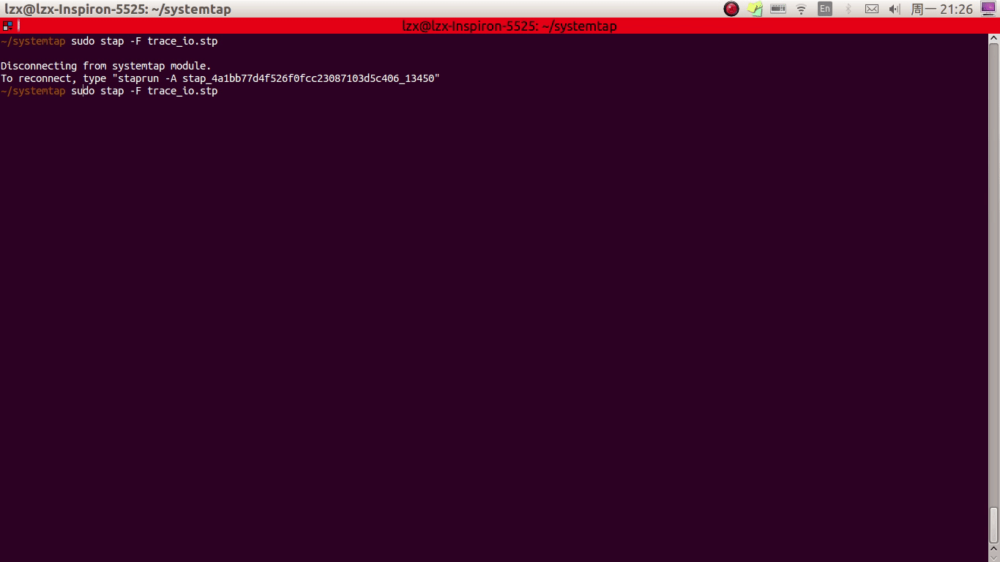

# 使用

# 2\. 安装和配置

本章会教用户怎么安装 SystemTap，并介绍 SystemTap 脚本的运行方式。

# 安装和配置

# 2.1\. 安装和配置

要想使用`SystemTap`，需要安装跟目标内核版本匹配的`-devel`、`-debuginfo`和`-debuginfo-common-arch`包。如果要在不止一个内核上运行`SystemTap`，需要根据每个内核的版本安装对应的`-devel`和`-debuginfo`包。

接下来的几个小节里，我们会详细讲解这一过程。（译注：SystemTap 的[wiki](https://sourceware.org/systemtap/wiki/)里面有针对 Linux 各发行版的安装步骤。本节内容仅适用于 RHEL，且不能保证及时更新，建议跳过本节，直接参考官方文档。如果你正好用的是 ubuntu，可以参考 ubuntu 的[wiki](https://wiki.ubuntu.com/Kernel/Systemtap)）

> 很多用户把`-debuginfo`记成了`-debug`。要想使用 SystemTap，切记安装对应内核的`-debuginfo`包，不是`-debug`包。

## 安装 SystemTap

要想使用 SystemTap，安装下面的 RPM 包：

*   systemtap
*   systemtap-runtime

以 root 权限运行下面的命令：

```
yum install systemtap systemtap-runtime 
```

注意要想用上 SystemTap，还得安装依赖的内核调试信息包。在较新的系统上，仅需以 root 权限运行下面的命令：

```
stap-prep 
```

如果这个命令没起作用，你需要按照下面的步骤手动安装。

## 手动安装依赖的内核调试信息包

SystemTap 需要内核信息，这样才能注入指令。此外，这些信息还能帮助 SystemTap 生成合适的检测代码。

这些必要的内核信息分别包括在特定内核版本所对应的`-devel`，`-debuginfo`和`-debuginfo-common`包中。对于“标准版”内核（指按照常规配置编译的内核），所需的`-devel`和`-debuginfo`等包命名为：

```
kernel-debuginfo
kernel-debuginfo-common
kernel-devel 
```

同样的，启用了 PAE 的内核所需的包分别为`kernel-PAE-debuginfo`，`kernel-PAE-debuginfo-common`，和`kernel-PAE-devel`。（译注：PAE 即 Physical Address Extension（物理地址拓展），32 位 Linux 可以用它拓展内存访问空间）

要想确定当前系统的内核版本，敲入：

```
uname -r 
```

举个例子，如果你想在 i686 环境下的 2.6.18-53.el5 内核上使用 SystenTap，需要下载安装如下的 RPM 包：

```
kernel-debuginfo-2.6.18-53.1.13.el5.i686.rpm
kernel-debuginfo-common-2.6.18-53.1.13.el5.i686.rpm
kernel-devel-2.6.18-53.1.13.el5.i686.rpm 
```

> 你安装的`-devel`、`-debuginfo`和`-debuginfo-common`包的版本一定要匹配目标内核的版本/特性/架构。

安装依赖的内核信息包最简单的方法，就是用`yum install`和`debuginfo-install`命令。`debuginfo-install`命令包含在版本 1.1.10 以上的`yum-utils`包里，还需要一个能够下载安装`-debuginfo`和`-debuginfo-common`包的 yum 源。 确保系统包管理的源满足要求，运行下面的命令就能安装特定内核对应的包：

```
yum install kernelname-devel-version
debuginfo-install kernelname-version 
```

把命令中的`kernelname`替换成对应的内核名（比如，`kernel-PAE`），`version`换成目标内核的版本。举个例子，安装`kernel-PAE-2.6.18-53.1.13.el5`内核所对应的内核信息包，需要运行：

```
yum install kernel-PAE-devel-2.6.18-53.1.13.el5
debuginfo-install kernel-PAE-2.6.18-53.1.13.el5 
```

一旦手动下载了所依赖的包之后，以 root 权限运行下面的命令来安装它们：

```
rpm --force -ivh package_names 
```

## 检查安装是否成功

如果你正在用的内核就是你的目标内核，你现在就能检查下安装是否成功。如果不是，重启下系统并载入目标内核。

运行下面命令开始检查：

```
stap -v -e 'probe vfs.read {printf("read performed\n"); exit()}' 
```

这个命令让 SystemTap 在虚拟文件系统的读事件发生之后，输出`read performed`接着退出。如果 SystemTap 安装成功了，应该会输出类似下面的内容：

```
Pass 1: parsed user script and 45 library script(s) in 340usr/0sys/358real ms.
Pass 2: analyzed script: 1 probe(s), 1 function(s), 0 embed(s), 0 global(s) in 290usr/260sys/568real ms.
Pass 3: translated to C into "/tmp/stapiArgLX/stap_e5886fa50499994e6a87aacdc43cd392_399.c" in 490usr/430sys/938real ms.
Pass 4: compiled C into "stap_e5886fa50499994e6a87aacdc43cd392_399.ko" in 3310usr/430sys/3714real ms.
Pass 5: starting run.
read performed
Pass 5: run completed in 10usr/40sys/73real ms. 
```

从`Pass 5`开始的最后三行说明 SystemTao 已经成功地注入并运行了内核探测指令，捕获了要探测的事件（在这个例子里，指虚拟文件系统的读事件），并执行了有效的处理程序（输出“read performed”并正常退出）。

# 为其它计算机生成检测模块

# 2.2\. 为其它计算机生成检测模块

当用户运行一个 SystemTap 脚本时，SystemTap 会从中创建一个内核模块。然后 SystemTap 会把该模块加载到内核里，这样一来它就能从内核直接提取出特定的数据。（详见第 3.1 节“结构”中“SystemTap 会话”部分）

一般来说，SystemTap 脚本只能运行在安装了 SystemTap 的系统上（见第 2.1 节，“安装和配置”）。这意味着，如果想在十个系统上运行 SystemTap，你需要挨个系统安装 SystemTap。在有些情况下，这既不如人意也不合实际。比如，公司内部的规章可能会禁止管理员往机器上安装提供编译器或调试信息的 RPM 包，这么一来 SystemTap 就没法安装了。为了避开这个问题，SystemTap 提供了交叉检测（cross-instrumentaion）的功能。

在一台计算机上运行 SystemTap 脚本，生成在另一台机器上可用的 SystemTap 检测模块，这一过程就叫做交叉检测。这一功能提供了以下便利：

*   仅需在单台开发机上安装适合其它机器的多个内核信息包。
*   每个目标机器仅需安装单个 RPM 包来使用生成的 SystemTap 检测模块：`systemtap-runtime`（译注：所以说还是得安装新的包）

为简明起见，定义下本节用到的几个术语：

*   检测模块 - 由 SystemTap 脚本创建的内核模块。SystemTap 模块由主机系统创建，并且将会被分发到目标系统的目标内核上。
*   主机系统 - 在这个系统上编译 SystemTap 脚本成目标系统上可用的检测模块。
*   目标系统 - 需要应用检测模块的系统。
*   目标内核 - 目标系统的内核。这个内核将加载和运行检测模块。

> **为了创建可用的检测模块，主机系统使用的硬件架构和分行版需要跟目标系统相同。**

完成下面各步来配置主机系统和目标系统：

1.  在每个目标系统上安装`systemtap-runtime`包。
2.  通过运行`uname -r`，获取每个目标系统的内核版本。
3.  你将在主机系统上创建适用于目标系统的检测模块。关于安装 SystemTap 的信息，请参考第 2.1 节“安装和配置”中的“安装 SystemTap”。（译注：请查看官方[Wiki](https://sourceware.org/systemtap/wiki)）
4.  在主机系统上，安装跟目标内核版本一样的内核和对应的内核信息包，可以参考第 2.1 节中的“手动安装依赖的内核调试信息包”。如果多个目标系统使用的内核版本不一样，每种内核版本都要安装一次。

完成了这几步后，你现在可以在主机系统上给所有的目标系统创建检测模块了。

要想创建检测模块，在主机系统运行下面命令（**记得把`kernel_version`等改成实际的值**）：

```
stap -r kernel_version script -m module_name 
```

在这里，`kernel_version`表示目标系统的版本（目标系统上`uname -r`的输出），`script`表示需要编译成检测模块的脚本，而`module_name`则是你给检测模块起的名字。

> 要想获得当前内核的硬件架构，你可以运行下面的命令： `uname -m`

一旦检测模块编译好了，把它分发到目标系统，然后加载它：

```
staprun module_name.ko 
```

举个例子，需要从 SystemTap 脚本`simple.stp`中创建检测模块`simple.ko`，来应用于版本为`2.6.18-92.1.10.el5`的目标系统（x86_64 架构），使用下面命令：

```
stap -r 2.6.18-92.1.10.el5 -e 'probe vfs.read {exit()}' -m simple 
```

这将创建一个名为`simple.ko`的模块。把它复制到目标系统并在目标系统上运行下面命令：

```
staprun simple.ko 
```

# 运行 SystemTap 脚本

# 2.3\. 运行 SystemTap 脚本

SystemTap 包含了许多用于监控系统活动的命令行工具。`stap`命令从 SystemTap 脚本中读取探测指令，把它们转化为 C 代码，构建一个内核模块，并加载到当前的 Linux 内核中。`staprun`命令会运行 SystemTap 检测模块，比如 SystemTap 通过交叉检测创建的内核模块。

运行`stap`和`staprun`需要较高的系统权限。由于不是每个运行 SystemTap 的用户都可以被授予 root 权限，对于那些没有权限的用户，你可以把他们的帐号加入到下面的用户组中：

1.  **stapdev** 该组内的成员可以使用`stap`运行 SystemTap 脚本，或`staprun`运行 SystemTap 检测模块。 运行`stap`命令包括把 SystemTap 脚本编译成内核模块并加载进内核。这一操作需要较高的系统访问权限。所以`stapdev`用户组下的成员会拥有较高的权限。不幸的是，这也意味着他们可以做到许多只有 root 用户才能做到的事。所以，你应该只把那些原可以拥有 root 权限的用户加到这个用户组中。

2.  **stapusr** 该组内的成员仅能使用`staprun`命令来运行 SystemTap 检测模块。另外，他们也只能在`/lib/modules/kernel_version/systemtap/`文件夹下运行模块。注意这个文件夹必须仅由 root 用户所拥有，而且仅对 root 用户可写。

`stap`命令从文件或标准输入中读取 SystemTap 脚本。要想让`stap`从文件中读取 SystemTap 脚本，需要在命令行中指定文件名：

```
stap file_name 
```

要想让`stap`从标准输入中读取 SystemTap 脚本，需要用`-`换掉文件名。记得把用到的命令行选项挪到`-`之前。举个例子，要让`stap`输出更多的运行信息，输入：

```
echo "probe timer.s(1) {exit()}" | stap -v - 
```

下面列出常用的`stap`命令行选项：

**-v** 让 SystemTap 会话输出更加详细的信息。你可以重复该选项多次来提高执行信息的详尽程度，举个例子：

```
stap -vvv script.stp 
```

当你的脚本在运行时发生了错误，可以加下这个选项查看更详细的输出信息。关于 SystemTap 错误信息的更多内容，请参考第六章，“解读错误信息”

**-o file_name** 将标准输出重定向到`file_name`

**-S size[,count]** 将输出文件的最大大小限制成`size`MB，存储文件的最大数目为`count`。这个命令实现了 logrotate 的功能，每个输出文件会以序列号作为后缀。（译注：logrotate 会把日志切割成 xxx.1, xxx.2, xxx.3 的形式。每当一个日志文件达到最大大小时，新开一个日志文件。当日志文件数达到最大数目时，旧的日志文件会被删掉。）

**-x process_id** 设置 SystemTap 处理函数`target()`为指定 PID。关于`target()`的更多信息，请参考[SystemTap 函数列表](http://linux.die.net/man/5/stapfuncs)。

**-c 'command'** 运行`command`，并在`command`结束时退出。该选项同时会把`target()`设置成`command`运行时的 PID

**-e 'code'** 直接执行给定的`code`。（译注：如`stap -v -e 'probe vfs.read {printf("read performed\n"); exit()}'`）

**-F** 进入 SystemTap 的飞行记录仪模式（flight recorder mode），并在后台运行该脚本。关于的更多信息，请参考下面的“飞行记录仪模式”。

关于`stap`的更多信息，请参考`stap(1)` man page。关于`staprun`和交叉检测的更多信息，请参考第 2.2 节“为其它计算机生成检测模块”，或`staprun(8)` man page。

## 飞行记录仪模式

SystemTap 的飞行记录仪模式允许你长时间运行一个 SystemTap 脚本，并关注最新的输出。飞行记录仪模式会限制输出的生成量。

飞行记录仪模式还可以分成两种：内存型（in-memory）和文件型（file）。无论是哪一种，SystemTap 脚本都是作为后台进程运行。

### 内存型飞行记录仪模式

当飞行记录仪模式（`-F`）没有跟输出文件选项（`-o`）一起使用时，SystemTap 会把脚本输出结果存储在内核内存的缓冲区内。一旦 SystemTap 检测模块被加载并开始探测，检测过程会分离到后台运行。当感兴趣的事件发生后，你可以重新载入检测过程来查看内存缓冲区中最近的输出和之后的输出。

要想在内存型飞行记录仪模式下运行 SystemTap，带`-F`选项运行`stap`命令：

```
stap -F iotime.stp 
```

一旦脚本启动了，`stap`会输出类似于如下的信息，告诉你怎么重新连接运行的脚本：

```
Disconnecting from systemtap module.
To reconnect, type "staprun -A stap_5dd0073edcb1f13f7565d8c343063e68_19556" 
```

当感兴趣的事件发生后，运行对应的命令来连接当前运行的脚本，输出内存缓冲区中的最近的数据，并获取之后的输出：

```
staprun -A stap_5dd0073edcb1f13f7565d8c343063e68_19556 
```

默认情况下，缓冲区大小为 1MB.你可以使用`-s`来调整这个值（单位是 MB，会向 2 的幂取整）。举个例子，`-s2`将指定缓冲区大小为 2MB.



### 文件型飞行记录仪模式

在飞行记录仪模式下，你也可以把输出存储在文件中。你可以通过`-o`选项指定文件名，还可以通过`-S`选项来控制输出文件的大小和数目。

下面的命令会以文件型飞行记录仪模式启动 SystemTap，输出到`/tmp/iotime.log.[0-9]+`，每个文件不超过 1MB，保留最新的两个文件：

```
stap -F -o /tmp/pfaults.log -S 1,2  pfaults.stp 
```

这个命令会把 PID 输出到标准输出。稍候片刻，给这个进程发个`SIGTERM`终止它的运行：

```
kill -s SIGTERM 7590 
```

在这个例子里，仅仅有最新的两个文件被保留下来：其余的旧文件都被 SystemTap 移除了。使用`ls -sh /tmp/pfaults.log.*`验证下：

```
1020K /tmp/pfaults.log.5    44K /tmp/pfaults.log.6 
```

要想查看最新数据，读取序号最大的输出文件，在这里指的是`/tmp/pfaults.log.6`。