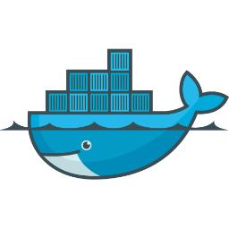

# 前言

# 理解 Linux 进程

## 关于这本书

本书受[*理解 Unix 进程*](http://www.duokan.com/book/41446)启发而作，用极简的篇幅深入学习进程知识。

*理解 Linux 进程*用 Go 重写了所有示例程序，通过循序渐进的方法介绍 Linux 进程的工作原理和一切你所需要知道的概念。

本书适合所有 Linux 程序员阅读。[在线阅读](http://www.linuxprocess.com)，[PDF 下载](https://github.com/tobegit3hub/understand_linux_process/blob/master/understan_linux_process.pdf?raw=true)。

## 三位好朋友

阅读前介绍三位即将与大家打交道的小伙伴：Linux、Go 和 Docker。


Linux 是我们主要的研究对象，书中所有概念与程序都基于 Linux，这同样适用于所有 Unix-like 系统。


Go 是本书所有示例程序的实现语言，当然进程的概念与原理是相通的，你也可以使用其他编程语言实现。



Docker 为我们创造可重复的实验环境，使用 Docker 容器你可以轻易地模拟与本书一模一样的运行环境。

# 致谢

Thanks *Wawa Leung*Otherwise the book would be released two years ago

# 概述

## 本书概述

进程的概念大家都很熟悉，但你是否能准确说出僵尸进程的含义呢？还有 COW(Copy On Write)、Flock(File Lock)、Epoll 和 Namespace 的概念又是否了解过呢？

本书汇集了进程方方面面的基础知识，加上编程实例，保证阅读后能自如地回答以上问题，在项目开发中对进程的优化也有更深的理解。

## 本书架构

本书按循序渐进的方式介绍进程的基础概念和拓展知识，主要涵盖以下几个方面。

*   进程的基础知识介绍
*   进程相关的编程实例
*   进程的进阶知识详解
*   项目 Run 的进程管理
*   使用进程的注意事项

其中项目[Run](https://github.com/runscripts/run)是 Go 实现的脚本管理工具，通过研究 Run 的源码能够加深对进程管理的理解。

## 关于勘误

本书所有内容都托管到[GitHub](https://github.com/tobegit3hub/understand_linux_process)，如果纰漏或错误请提[Issue](https://github.com/tobegit3hub/understand_linux_process/issues/new)。


# 使用代码

## 示例程序

本书所有示例程序都基于 Go 编写，代码托管到[GitHub](https://github.com/tobegit3hub/understand_linux_process_examples)。


每章的示例都是可直接运行的 Go 源文件，例如第一章的 Hellow World 程序可以通过`go run hello_world.go`来运行并查看运行结果。

```
# go run hello_world.go
Hello World 
```

接下来介绍使用 Docker 来运行本书的示例程序。

# 使用 Docker

## Docker 简介


[Docker](https://github.com/docker/docker)是一个容器运行平台，你可以将程序及其依赖打包成容器，在不同机器上运行可得到一致的运行效果。因为不同的系统环境或 Go 版本可能影响程序的运行结果，为了得到可预测、可重复的实验环境，我们引入了 Docker 容器技术。

## Docker 使用

我们不仅开源了示例代码，还创建了官方[Docker 镜像](https://registry.hub.docker.com/u/tobegit3hub/understand_linux_process_examp/)。

只要执行命令`docker run -i -t tobegit3hub/understand_linux_process_examp`，就可以马上创建本书的实验环境。进入容器后可以轻易地运行示例程序。

```
root@6a8e36a53495:/go/src# go run hello_world.go
Hello World 
```

当然你也可以在本地运行自己的 Go 示例，或者使用官方 Go 镜像`docker run -i -t golang:1.4 /bin/bash`。