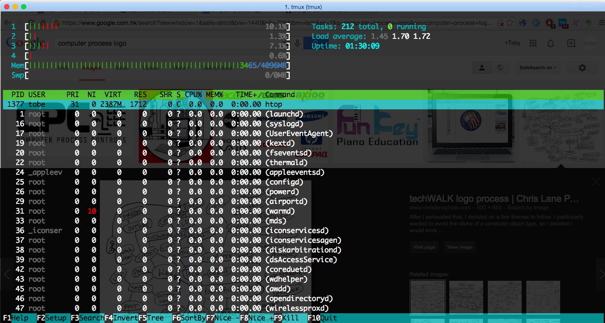
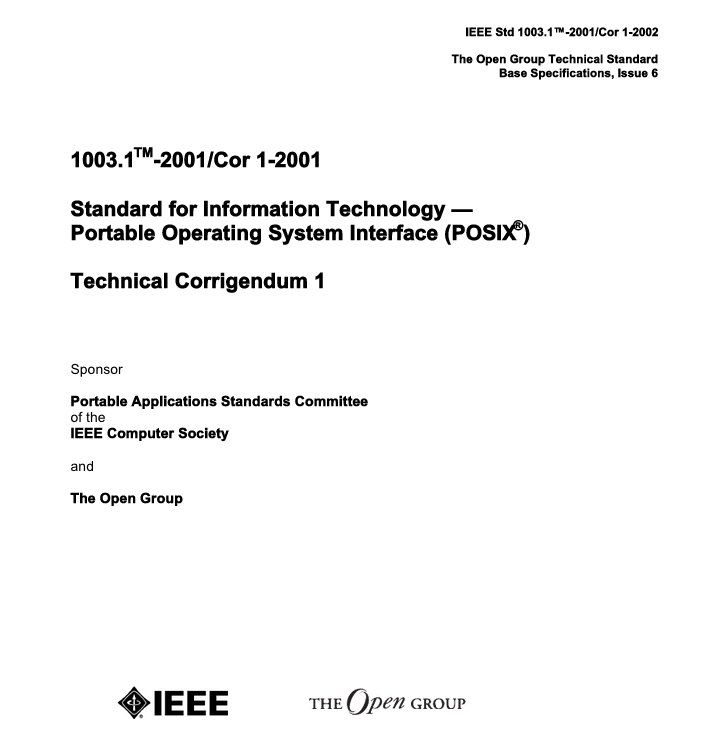

# 进程基础

## 第一章 进程基础

作为本书的第一部分，主要介绍进程的 PID、进程状态、退出码和 POSIX 等基础概念。

网络有很多零散的资料介绍基础了，为什么还要花篇幅介绍这些呢？首先我们要保证看过这些章节的都能掌握这些概念，其次通过编写代码实例，我们还能动手验证这些概念，已经不能更赞了。

学习完这章我们应该能够准确回答出 PID、PPID、进程名字、进程参数、进程状态、退出码、死锁、活锁、POSIX、Nohup 等概念。



# 进程是什么

## 进程的定义

根据维基百科的[定义](http://zh.wikipedia.org/wiki/%E8%A1%8C%E7%A8%8B)，进程(Process)是计算机中已运行程序的实体。用户下达运行程序的命令后，就会产生进程。进程需要一些资源才能完成工作，如 CPU 使用时间、存储器、文件以及 I/O 设备，且为依序逐一进行，也就是每个 CPU 核心任何时间内仅能运行一项进程。

我们简单总结下，进程就是代码运行的实体。这里补充一点，进程不一定都是正在运行的，也可能在等待调度或者停止，进程状态将在后续详细介绍。

## 举个例子

进程的概念应该很好理解，因为我们都在写代码，这些代码跑起来了就是一个进程，为了完整性我们介绍最简单的的 Hello World 进程。

# Hello World

## Hello World 进程

Hello World 程序是每门编程语言的入门示例，注意这个程序还不是进程哦，它的作用是在终端输出“Hello World”然后直接退出。

当我们运行 Hello World 程序时，系统就创建一个 Hello World 进程。这也是最简单的进程了，没有系统调用、进程间通信等，输出字符串后就退出了。

## Bash 实现

用 Bash 实现 Hello World 程序只需要一行代码，运行后新的进程也可以输出“Hello World”，然后就没有然后了。

```
root@87096bf68cb2:/go/src# echo Hello World
Hello World 
```

稍微提一下`echo`是 Linux 自带的程序，可以接受一个或多个参数，反正就是如实地把它们输出到终端而已。

这样最简单的 Linux 进程就诞生了，当然我们也可以用 Go 重写 Hello World 程序。

## Go 实现

Go 实现的程序源码可参见 hello_world.go。

```
package main

import (
  "fmt"
)

func main() {
  fmt.Println("Hello World")
} 
```

运行后得到以下的输出。

```
root@87096bf68cb2:/go/src# go run hello_world.go
Hello World 
```

Hello World 进程运行时究竟发生了什么，接下来我们将从各个方面介绍进程的概念。

# PID

## PID

首先我们来学习 PID 这个概念，PID 全称 Process ID，是标识和区分进程的 ID，它是一个全局唯一的正整数。

原来 Hello World 进程运行时也有一个 PID，只是它运行结束后 PID 也释放了，我们可以通过 print_pid.go 程序显示当前进程的 PID。

## 示例程序

程序 print_pid.go 的源码如下，通过`Getpid()`函数可以获得当前进程的 PID。

```
package main

import (
  "fmt"
  "os"
)

func main() {
    fmt.Println(os.Getpid())
} 
```

## 运行结果

```
root@87096bf68cb2:/go/src# go run print_pid.go
2922
root@87096bf68cb2:/go/src# go run print_pid.go
2932 
```

可以看出，进程运行时 PID 是由操作系统随机分配的，同一个程序运行两次会产生两个进程，当然也就有两个不同的 PID。

那 PID 究竟有什么用呢？我们稍后会讨论，现在先了解下 PPID。

# PPID

## PPID

每个进程除了一定有 PID 还会有 PPID，也就是父进程 ID，通过 PPID 可以找到父进程的信息。

为什么进程都会有父进程 ID 呢？因为进程都是由父进程衍生出来的，后面会详细介绍几种衍生的方法。那么跟人类起源问题一样，父进程的父进程的父进程又是什么呢？实际上有一个 PID 为 1 的进程是由内核创建的 init 进程，其他子进程都是由它衍生出来，所以前面的描述并不准确，进程号为 1 的进程并没有 PPID。

因为所有进程都来自于一个进程，所以 Linux 的进程模型也叫做进程树。

## 示例程序

要想获得进程的 PPID，可以通过以下`Getppid()`这个函数来获得，print_ppid.go 程序的代码如下。

```
package main

import (
  "fmt"
  "os"
  )

func main() {
    fmt.Println(os.Getppid())
} 
```

## 运行结果

```
root@87096bf68cb2:/go/src# go run print_ppid.go
2892
root@87096bf68cb2:/go/src# go run print_ppid.go
2902 
```

有趣的事情发生了，有没有发现每次运行的父进程 ID 都不一样，这不符合我们的预期啊，原来我们通过`go run`每次都会启动一个新的 Go 虚拟机来执行进程。

## 编译后运行

如果我们先生成二进制文件再执行结果会怎样呢？

```
root@87096bf68cb2:/go/src# ./print_ppid
1
root@87096bf68cb2:/go/src# ./print_ppid
1
root@87096bf68cb2:/go/src# ps aux |grep "1" |grep -v "ps" |grep -v "grep"
root         1  0.0  0.3  20228  3184 ?        Ss   07:25   0:00 /bin/bash 
```

这次我们发现父进程 ID 都是一样的了，而且通过`ps`命令可以看到父进程就是`bash`，说明通过终端执行命令其实是从`bash`这个进程衍生出各种子进程。

为了执行这个程序要查找包依赖、编译、打包、链接(和`go build`做一样的东西)然后执行，这是全新的进程。

拿到 PID 和 PPID 后有什么用呢？马上揭晓。

# 使用 PID

## 查看 PID

首先我们想知道进程的 PID，可以通过`top`或者`ps`命令来查看。

## Top

在命令行执行`top`后，得到类似下面的输出，可以看到目前有三个进程，PID 分别是 1、8 和 9。

```
top - 12:45:18 up 1 min,  0 users,  load average: 0.86, 0.51, 0.20
Tasks:   3 total,   1 running,   2 sleeping,   0 stopped,   0 zombie
%Cpu(s):  0.0 us,  0.0 sy,  0.0 ni,100.0 id,  0.0 wa,  0.0 hi,  0.0 si,  0.0 st
KiB Mem:   2056748 total,   301984 used,  1754764 free,    20984 buffers
KiB Swap:  1427664 total,        0 used,  1427664 free.   231376 cached Mem

PID USER      PR  NI    VIRT    RES    SHR S  %CPU %MEM     TIME+ COMMAND
1 root      20   0    4312    692    612 S   0.0  0.0   0:00.23 sh
8 root      20   0   20232   3048   2756 S   0.0  0.1   0:00.03 bash
9 root      20   0   21904   2384   2060 R   0.0  0.1   0:00.00 top 
```

## PS

执行`ps aux`后输出如下，其中`aux`参数让`ps`命令显示更详细的参数信息。前面 PID 为 9 的 top 进程已经退出了，取而代之的是 PID 为 11 的 ps 进程。

```
root@fa13d0439d7a:/go/src# ps aux
USER       PID %CPU %MEM    VSZ   RSS TTY      STAT START   TIME COMMAND
root         1  0.2  0.0   4312   692 ?        Ss   12:45   0:00 /bin/sh -c /bin/bash
root         8  0.0  0.1  20232  3224 ?        S    12:45   0:00 /bin/bash
root        11  0.0  0.0  17484  2000 ?        R+   12:46   0:00 ps aux 
```

## 使用 PID

拿到 PID 后，我们就可以通过`kill`命令来结束进程了，也可以通过`kill -9`或其他数字向进程发送不同的信号。

信号是个很重要的概念，我们后面会详细介绍，那么有了进程 ID，我们也可以看看进程名字。

# 进程名字

## 进程名字

每个进程都一定有进程名字，例如我们运行`top`，进程名就是“top”，如果是自定义的程序呢？

其实进程名一般都是进程参数的第一个字符串，在 Go 中可以这样获得进程名。

```
package main

import (
  "fmt"
  "os"
)

func main() {
    processName := os.Args[0]

    fmt.Println(processName)
} 
```

进程的输出结果如下。

```
root@87096bf68cb2:/go/src# go run process_name.go
/tmp/go-build650749614/command-line-arguments/_obj/exe/process_name
root@87096bf68cb2:/go/src# go build process_name.go
root@87096bf68cb2:/go/src# ./process_name
./process_name 
```

是否稍稍有些意外，因为`go run`会启动进程重新编译、链接和运行程序，因此每次运行的进程名都不相同，而编译出来的程序有明确的名字，所以它的进程的名字都是一样的。

知道这些以后，我们可以开始接触接进程的运行参数。

# 进程参数

## 进程参数

任何进程启动时都可以赋予一个字符串数组作为参数，一般名为 ARGV 或 ARGS。

通过解析这些参数可以让你的程序更加通用，例如`cp`命令通过给定两个参数就可以复制任意的文件，当然如果需要的参数太多最好还是使用配置文件。

## 获得进程 Argument

进程参数一般可分为两类，一是 Argument，也就是作为进程运行的实体参数。例如`cp config.yml config.yml.bak`的这两个参数。

设计 Go 程序时可以轻易地获得这些参数，argument.go 代码如下，代码来自[`gobyexample.com/command-line-arguments`](https://gobyexample.com/command-line-arguments)。

```
package main

import "os"
import "fmt"

func main() {
  argsWithProg := os.Args
  argsWithoutProg := os.Args[1:]

  arg := os.Args[3]
  fmt.Println(argsWithProg)
  fmt.Println(argsWithoutProg)
  fmt.Println(arg)
} 
```

运行效果如下。

```
$ go build command-line-arguments.go
$ ./command-line-arguments a b c d
[./command-line-arguments a b c d]
[a b c d]
c 
```

可以看出通过`os.Args`，不管是不是实体参数都可以获得，但是对于类似开关的辅助参数，Go 提供了另一种更好的方法。

## 获得进程 Flag

使用 Flag 可以更容易得将命令行参数转化成我们需要的数据类型，其中 flag.go 代码如下，代码来自[`gobyexample.com/command-line-flags`](https://gobyexample.com/command-line-flags)。

```
package main

import "flag"
import "fmt"

func main() {
  wordPtr := flag.String("word", "foo", "a string")
  numbPtr := flag.Int("numb", 42, "an int")
  boolPtr := flag.Bool("fork", false, "a bool")
  var svar string
  flag.StringVar(&svar, "svar", "bar", "a string var")

  flag.Parse()

  fmt.Println("word:", *wordPtr)
  fmt.Println("numb:", *numbPtr)
  fmt.Println("fork:", *boolPtr)
  fmt.Println("svar:", svar)
  fmt.Println("tail:", flag.Args())
} 
```

运行结果如下，相比直接使用`os.Args`代码也简洁了不少。

```
root@87096bf68cb2:/go/src# ./flag -word=opt -numb=7 -fork -svar=flag
word: opt
numb: 7
fork: true
svar: flag
tail: []
root@87096bf68cb2:/go/src# ./flag -h
Usage of ./flag:
  -fork=false: a bool
  -numb=42: an int
  -svar="bar": a string var
  -word="foo": a string 
```

使用 Go 获取进程参数是很简单的，不过一旦参数太多，最佳实践还是使用配置文件。

进程参数只有在启动进程时才能赋值，如果需要在程序运行时进行交互，就需要了解进程的输入与输出了。

# 输入与输出

## 进程输入与输出

每个进程操作系统都会分配三个文件资源，分别是标准输入(STDIN)、标准输出(STDOUT)和错误输出(STDERR)。通过这些输入流，我们能够轻易得从键盘获得数据，然后在显示器输出数据。

## 标准输入

来自管道(Pipe)的数据也是标准输入的一种，我们写了以下的实例来输出标注输入的数据。

```
package main

import (
  "fmt"
  "io/ioutil"
  "os"
)

func main() {
  bytes, err := ioutil.ReadAll(os.Stdin)
  if err != nil {
    panic(err)
  }

  fmt.Println(string(bytes))
} 
```

运行结果如下。

```
root@87096bf68cb2:/go/src# echo string_from_stdin | go run stdin.go
string_from_stdin 
```

## 标准输出

通过`fmt.Println()`把数据输出到屏幕上，这就是标准输出了，这里不太演示了。

## 错误输出

程序的错误输出与标准输出类似，这里暂不演示。

了解完进程一些基础概念，我们马上要深入学习并发与并行的知识了。

# 并发与并行

## 并发与并行

并发(Concurrently)和并行(Parallel)是两个不同的概念。借用 Go 创始人 Rob Pike 的说法，并发不是并行，并发更好。并发是一共要处理(deal with)很多事情，并行是一次可以做(do)多少事情。

举个简单的例子，华罗庚泡茶，必须有烧水、洗杯子、拿茶叶等步骤。现在我们想尽快做完这件事，也就是“一共要处理很多事情”，有很多方法可以实现并发，例如请多个人同时做，这就是并行。并行是实现并发的一种方式，但不是唯一的方式。我们一个人也可以实现并发，例如先烧水、然后不用等水烧开就去洗杯子，所以通过调整程序运行方式也可以实现并发。

## 大神讲解

如果还不理解，建议看 Rob Pike 题为 Concurrency is not Parallelism 的[演讲 PPT](http://concur.rspace.googlecode.com/hg/talk/concur.html)和[演讲视频](http://blog.golang.org/concurrency-is-not-parallelism)。

我把演讲的 PPT 截图贴出来方便大家理解。

            

## 总结

总结一下，并行是实现并发的一种方式，在多核 CPU 的时代，并行是我们设计高效程序所要考虑的，那么进程是不是越多越好呢？

# 进程越多越好

## 进程越多越好？

前面提到多进程的并行可以提高并发度，那么进程是越多越好？一般遇到这种问题都回答不是，事实上，很多大型项目都不会同时开太多进程。

下面以支持 100K 并发量的 Nginx 服务器为例。

## 举个例子: Nginx

Nginx 是一个高性能、高并发的 Web 服务器，也就是说它可以同时处理超过 10 万个 HTTP 请求，而它建议的启动的进程数不要超过 CPU 个数，为什么呢？

我们首先要知道 Nginx 是 Master-worker 模型，Master 进程只负责管理 Worker 进程，而 Worker 进程是负责处理真实的请求。每个 Worker 进程能够处理的请求数跟内存有关，因为在 Linux 上 Nginx 使用了 epoll 这种多路复用的 IO 接口，所以不需要多线程做并行也能实现并发。

而多进程有一个坏处就是带来了 CPU 上下文切换时间，所以一味提高进程个数反而使系统系能下降。当然如果当前进程小于 CPU 个数，就没有充分利用多核的资源，所以 Nginx 建议 Worker 数应该等于 CPU 个数。

## 特殊情况

我们想想进程数应该等于 CPU 数，但是如果进程有阻塞呢？这是是应该提高进程数增加并行数的。

在 Nginx 的例子中，如果 Nginx 主要负责静态内容的下载，而服务器内存比较小，大部分文件访问都需要读磁盘，这时候进程很容易阻塞，所以建议提高下 Worker 数目。

## 绑定 CPU

一般情况下除了确保进程数等于 CPU 数，我们还可以绑定进程与 CPU，这就保证了最少的 CPU 上下文切换。

在 Nginx 中可以这样配置。

```
worker_processes 4;
worker_cpu_affinity 1000 0100 0010 0001; 
```

这是通过系统调用 sched_setaffinity()实现了，感兴趣大家可以自行学习这方面的知识。

通过这个例子大家对进程的并发与并行应该有更深入的理解，接下来了解下进程状态的概念。

# 进程状态

## 进程状态

根据进程的定义，我们知道进程是代码运行的实体，而进程有可能是正在运行的，也可能是已经停止的，这就是进程的状态。

网上有人总结进程一共 5 种状态，也有总结是 8 种，究竟应该怎么算呢，最好的方法还是看 Linux 源码。进程状态的定义在[fs/proc/array.c](https://github.com/torvalds/linux/blob/b6da0076bab5a12afb19312ffee41c95490af2a0/fs/proc/array.c)文件中。

```
/*
* The task state array is a strange "bitmap" of
* reasons to sleep. Thus "running" is zero, and
* you can test for combinations of others with
* simple bit tests.
*/
static const char * const task_state_array[] = {
  "R (running)",        /*   0 */
  "S (sleeping)",        /*   1 */
  "D (disk sleep)",    /*   2 */
  "T (stopped)",        /*   4 */
  "t (tracing stop)",    /*   8 */
  "X (dead)",        /*  16 */
  "Z (zombie)",        /*  32 */
}; 
```

这真的是 Linux 的源码，可以看出进程一共 7 种状态，含义也比较清晰，注意其中 D(disk sleep)称为不可中断睡眠状态(uninterruptible sleep)。

知道进程状态本身没什么

## 进程状态转换


[使用 Ptrace](https://idea.popcount.org/2012-12-11-linux-process-states/)

[include/linux/sched.h](https://github.com/torvalds/linux/blob/master/include%2Flinux%2Fsched.h)

```
struct task_struct {
  volatile long state;    /* -1 unrunnable, 0 runnable, >0 stopped */
  void *stack;
  atomic_t usage;
  unsigned int flags;    /* per process flags, defined below */
  unsigned int ptrace; 
```

## 查看状态

通过`ps aux`可以看到进程的状态。

O：进程正在处理器运行,这个状态从来没有见过.
S：休眠状态（sleeping）
R：等待运行（runable）R Running or runnable (on run queue) 进程处于运行或就绪状态
I：空闲状态（idle）
Z：僵尸状态（zombie）
T：跟踪状态（Traced）
B：进程正在等待更多的内存页
D: 不可中断的深度睡眠，一般由 IO 引起，同步 IO 在做读或写操作时，cpu 不能做其它事情，只能等待，这时进程处于这种状态，如果程序采用异步 IO，这种状态应该就很少见到了

其中就绪状态表示进程已经分配到除 CPU 以外的资源，等 CPU 调度它时就可以马上执行了。运行状态就是正在运行了，获得包括 CPU 在内的所有资源。等待状态表示因等待某个事件而没有被执行，这时候不耗 CPU 时间，而这个时间有可能是等待 IO、申请不到足够的缓冲区或者在等待信号。

## 状态转换

进程的运行过程也就是进程状态转换的过程。

例如就绪状态的进程只要等到 CPU 调度它时就马上转为运行状态，一旦它需要的 IO 操作还没有返回时，进程状态也就转换成等待状态。

进程状态间转换还有很多，这里不一一细叙，马上去学习进程退出码吧。

# 退出码

## 退出码

任何进程退出时，都会留下退出码，操作系统根据退出码可以知道进程是否正常运行。

退出码是 0 到 255 的整数，通常 0 表示正常退出，其他数字表示不同的错误。

## 示例程序

```
package main

func main() {
  panic("Call panic()")
} 
```

## 运行结果

```
root@fa13d0439d7a:/go/src# go run exit_code.go
panic: Call panic()

goroutine 16 [running]:
runtime.panic(0x425900, 0xc208000010)
/usr/src/go/src/pkg/runtime/panic.c:279 +0xf5
main.main()
/go/src/exit_code.go:4 +0x61

goroutine 17 [runnable]:
runtime.MHeap_Scavenger()
/usr/src/go/src/pkg/runtime/mheap.c:507
runtime.goexit()
/usr/src/go/src/pkg/runtime/proc.c:1445

goroutine 18 [runnable]:
bgsweep()
/usr/src/go/src/pkg/runtime/mgc0.c:1976
runtime.goexit()
/usr/src/go/src/pkg/runtime/proc.c:1445
exit status 2 
```

我们可以看到最后一行输出了`exit status 2`，证明进程的退出码是 2，也就是异常退出。相比之下，运行 Hello World 程序并没有输出退出码，也就是进程正常结束了。

## 使用退出码

不管是正常退出还是异常退出，进程都结束了这个退出码有意义吗？

当然有意义，我们在写 Bash 脚本时，可以根据前一个命令的退出码选择是否执行下一个命令。例如安装 Run 程序的命令`wget https://github.com/runscripts/run-release/blob/master/0.3.6/linux_amd64/run && sudo run --init`，只有下载脚本成功才会执行后面的安装命令。

[Travis CI](https://travis-ci.org/)是为开源项目提供持续集成的网站，因为测试脚本是由开发者写的，Travis 只能通过测试脚本的返回值来判断这次测试是否正常通过。

Docker 使用 Dockerfile 来构建镜像，这是类似 Bash 的领域定义语言(DSL)，每一行执行一个命令，如果命令的进程退出码不为 0，构建镜像的流程就会中止，证明 Dockerfile 有异常，方便用户排查问题。

了解进程退出码后，我们去看更多的进程资源。

# 进程资源

## 进程文件

在 Linux 中“一切皆文件”，进程的一切运行信息(占用 CPU、内存等)都可以在文件系统找到，例如看一下 PID 为 1 的进程信息。

```
root@87096bf68cb2:/go/src# ls /proc/1/
attr        cmdline          cwd      fdinfo   loginuid   mounts      numa_maps      pagemap      sessionid  status   wchan
auxv        comm             environ  gid_map  maps       mountstats  oom_adj        personality  smaps      syscall
cgroup      coredump_filter  exe      io       mem        net         oom_score      projid_map   stat       task
clear_refs  cpuset           fd       limits   mountinfo  ns          oom_score_adj  root         statm      uid_map 
```

我们可以看一下它的运行状态，通过`cat /proc/1/status`即可。

```
root@87096bf68cb2:/go/src# cat /proc/1/status
Name:   bash
State:  S (sleeping)
Tgid:   1
Ngid:   0
Pid:    1
PPid:   0
TracerPid:      0
Uid:    0       0       0       0
Gid:    0       0       0       0
FDSize: 256
Groups:
VmPeak:    20300 kB
VmSize:    20300 kB
VmLck:         0 kB
VmPin:         0 kB
VmHWM:      3228 kB
VmRSS:      3228 kB
VmData:      408 kB
VmStk:       136 kB
VmExe:       968 kB
VmLib:      2292 kB
VmPTE:        60 kB
VmSwap:        0 kB
Threads:        1
SigQ:   0/3947
SigPnd: 0000000000000000
ShdPnd: 0000000000000000
SigBlk: 0000000000010000
SigIgn: 0000000000380004
SigCgt: 000000004b817efb
CapInh: 00000000a80425fb
CapPrm: 00000000a80425fb
CapEff: 00000000a80425fb
CapBnd: 00000000a80425fb
Seccomp:        0
Cpus_allowed:   1
Cpus_allowed_list:      0
Mems_allowed:   00000000,00000001
Mems_allowed_list:      0
voluntary_ctxt_switches:        684
nonvoluntary_ctxt_switches:     597 
```

参考 Linux 手册可以看到更多信息，我们这不再深究，实际上`ps`命令获得的数据也是在这个文件系统获得的。

我们已经了解了这么多进程属性，是时候开始学习“传说中”的死锁问题了。

# 死锁

## 死锁概念

死锁(Deadlock)就是一个进程拿着资源 A 请求资源 B，另一个进程拿着资源 B 请求资源 A，双方都不释放自己的资源，导致两个进程都进行不下去。

## 示例程序

我们可以写代码模拟进程死锁的例子。

```
package main

func main() {
  ch := make(chan int)
  <-ch
} 
```

## 运行结果

```
root@fa13d0439d7a:/go/src# go run deadlock.go
fatal error: all goroutines are asleep - deadlock!

goroutine 16 [chan receive]:
main.main()
/go/src/deadlock.go:5 +0x4f
exit status 2 
```

这里 Go 虚拟机已经替我们检测出死锁的情况，因为所有 Goroutine 都阻塞住没有运行，关于 Goroutine 的概念有机会详细介绍一下。

我们可能很早就接触过死锁的概念，也很容易模拟出来，那么你是否知道活锁呢？

# 活锁

## 活锁概念

相对于死锁，活锁(Livelock)是什么概念呢？有意思的是，百度百科把这个解释错了。

```
如果事务 T1 封锁了数据 R,事务 T2 又请求封锁 R，于是 T2 等待。T3 也请求封锁 R，当 T1 释放了 R 上的封锁后，系统首先批准了 T3 的请求，T2 仍然等待。然后 T4 又请求封锁 R，当 T3 释放了 R 上的封锁之后，系统又批准了 T4 的请求......T2 可能永远等待。 
```

这显然是饿死(Starvation)的定义，进入活锁的进程是没有阻塞的，会继续使用 CPU，但外界看到整个进程都没有前进。

## 活锁实例

举个很简单的例子，两个人相向过独木桥，他们同时向一边谦让，这样两个人都过不去，然后二者同时又移到另一边，这样两个人又过不去了。如果不受其他因素干扰，两个人一直同步在移动，但外界看来两个人都没有前进，这就是活锁。

活锁会导致 CPU 耗尽的，解决办法是引入随机变量、增加重试次数等。

所以活锁也是程序设计上可能存在的问题，导致进程都没办法运行下去了，还耗 CPU。

接下来介绍本章最大的内容，POSIX。

# POSIX

## POSIX 简介

POSIX(Portable Operation System Interface)听起来好高端，就是一种操作系统的接口标准，至于谁遵循这个标准呢？就是大名鼎鼎的 Unix 和 Linux 了，有人问 Mac OS 是否兼容 POSIX 呢，答案是 Yes 苹果的操作系统也是 Unix-based 的。

有了这个规范，你就可以调用通用的 API 了，Linux 提供的 POSIX 系统调用在 Unix 上也能执行，因此学习 Linux 的底层接口最好就是理解 POSIX 标准。

补充一句，目前很多编程语言(Go、Java、Python、Ruby 等)都是天生跨平台的，因此我们很少注意系统调用的兼容性。实际上 POSIX 提供了这些语言上跨平台的语义，而且这是源码级别的保证。

## POSIX 规范

POSIX 是一些 IEEE 标准，包括 1003.0、1003.1、1003.1b 和 2003 等，实际上连 Linux 也没有完全兼容这些定义，不过只用 Linux 来学习 POSIX 足够了。

鉴于绝大多数程序员都没看过 IEEE 文档，我们就翻一下[IEEE 1003.1-2001](http://wenku.baidu.com/link?url=8dfQAy-mpeNdkDzX1LWCCEJia5x4_pS-Br6alnnrNweN8HxyXbHewGnxrPgFhQ3TzaAodlfHay9KiAuOmKbWvfSUr-36XyFIDgokfCldgR7)吧。



篇幅跟论文差不多，大意就是修正 Base 标准存在的问题，这个文档没有增加新的接口，但是加了符号、非函数的定义和保留更多命名空间。这是非常严谨的文档，感兴趣的同学可以读下，对普通的程序员我们还是以下的内容。

## POSIX 进程

我们运行 Hello World 程序时，操作系统通过 POSIX 定义的`fork`和`exec`接口创建起一个 POSIX 进程，这个进程就可以使用通用的 IPC、信号等机制。

## POSIX 线程

POSIX 也定义了线程的标准，包括创建和控制线程的 API，在 Pthreads 库中实现，有关线程的知识有机会再深入学习。

# Nohup

## Nohup 命令

每个开发者都会躺过这个坑，在命令行跑一个后台程序，关闭终端后发现进程也退出了，网上搜一下发现要用`nohup`，究竟什么原因呢？

原来普通进程运行时默认会绑定 TTY(虚拟终端)，关闭终端后系统会给上面所有进程发送 TERM 信号，这时普通进程也就退出了。当然还有些进程不会退出，这就是后面将会提到的守护进程。

`Nohup`的原理也很简单，终端关闭后会给此终端下的每一个进程发送 SIGHUP 信号，而使用`nohup`运行的进程则会忽略这个信号，因此终端关闭后进程也不会退出。

## 举个例子

我们用 Go 实现最简单的 Web 服务器，代码 web_server.go 如下。

```
package main

import (
  "fmt"
  "net/http"
)

func handler(w http.ResponseWriter, r *http.Request) {
    fmt.Println("Handle request")
}

func main() {
    http.HandleFunc("/", handler)
    http.ListenAndServe(":8000", nil)
} 
```

然后在终端上运行，并测试一下。

```
➜ go build web_server.go
➜ ./web_server &
[1] 25967
➜  wget 127.0.0.1:8000
--2014-12-28 22:24:07--  http://127.0.0.1:8003/
Connecting to 127.0.0.1:8003... connected.
HTTP request sent, awaiting response... 200 OK
Length: 5 [text/plain]
Saving to: 'index.html.4'

100%[======================>] 5           --.-K/s   in 0s

2014-12-28 22:24:07 (543 KB/s) - 'index.html' saved [5/5] 
```

如果关闭终端，`curl`命令就连不上我们的 Web 服务器了。如果使用`nohup`运行呢？

```
➜ go build web_server.go
➜ nohup ./web_server &
[1] 25968
➜ exit
➜ wget 127.0.0.1:8003
--2014-12-28 22:24:11--  http://127.0.0.1:8003/ 
```

发现关闭终端对 Web 服务器进程没有任何影响，这正是我们预期的。这是运行守护进程最简单的方法，实际上标准的守护进程除了处理信号外，还要考虑这种因素，后面将会详述。

# 运行进程

## 创建进程

本章开始时演示了 Hello World 程序，其实已经创建了新的进程，通过`Bash`或者`zsh`这些 Shell 很容易创建新的进程，但 Shell 本身是怎么实现的呢？我们又能不能用 Go 实现类似 Shell 的功能呢？

## 系统调用

原来这一切都是操作系统给我们做好的，然后暴露了使用的 API 接口，这就是系统调用。Linux 或者其他 Unix-like 系统都提供了`fork()`和`exec()`等接口，Bash 或者我们写的程序都可以通过调用这些接口来操作进程。

## Go 创建进程

而 Go 已经封装了与进程相关的接口，主要在`os/exec`这个 Package 中。通过使用封装好的接口，我们很容易就可以在自己的项目中调用其他进程了。

这一章已经介绍了这么多概念，马上会有实践环节，用 Go 实现多种方式来来创建和运行外部进程。