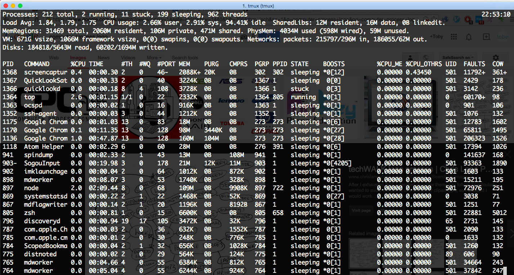

# 进程进阶

## 第三章 进程进阶

学习进程基础和 Go 编程时候后，我们会接触进程更底层的概念，包括信号、进程锁和系统调用等。

通过学习这章我们对进程的所有概念都了如指掌了，充分理解这些概念后有助于我们实现更高效的应用程序。



# 文件锁

## 进程锁

这里的进程锁与线程锁、互斥量、读写锁和自旋锁不同，它是通过记录一个 PID 文件，避免两个进程同时运行的文件锁。

进程锁的作用之一就是可以协调进程的运行，例如[crontab 使用进程锁解决冲突](http://www.live-in.org/archives/1036.html)提到，使用 crontab 限定每一分钟执行一个任务，但这个进程运行时间可能超过一分钟，如果不用进程锁解决冲突的话两个进程一起执行就会有问题。后面提到的项目实例 Run 也有类似的问题，通过进程锁可以解决进程间同步的问题。

使用 PID 文件锁还有一个好处，方便进程向自己发停止或者重启信号。Nginx 编译时可指定参数`--pid-path=/var/run/nginx.pid`，进程起来后就会把当前的 PID 写入这个文件，当然如果这个文件已经存在了，也就是前一个进程还没有退出，那么 Nginx 就不会重新启动。进程管理工具 Supervisord 也是通过记录进程的 PID 来停止或者拉起它监控的进程的。

## 使用进程锁

进程锁在特定场景是非常适用的，而操作系统默认不会为每个程序创建进程锁，那我们该如何使用呢？

其实要实现一个进程锁很简单，通过文件就可以实现了。例如程序开始运行时去检查一个 PID 文件，如果文件存在就直接退出，如果文件不存在就创建一个，并把当前进程的 PID 写入文件中。这样我们很容易可以实和读锁，但是所有流程都需要自己控制。

当然根据 DRY(Don't Repeat Yourself)原则，Linux 已经为我们提供了`flock`接口。

## 使用 Flock

Flock 提供的是 advisory lock，也就是建议性的锁，其他进程实际上也可以读写这个锁文件。Linux 上可以直接使用`flock`命令，使用 C 可以调用原生的`flock`接口，这里详细介绍 Go 1.3 引入的`FcntlFock()`。

我们封装了简单的接口。

```
// Control the lock of file.
func fcntlFlock(lockType int16, path ...string) error {
  var err error
  if lockType != syscall.F_UNLCK {
    mode := syscall.O_CREAT | syscall.O_WRONLY
    lockFile, err = os.OpenFile(path[0], mode, 0666)
    if err != nil {
      return err
    }
  }

  lock := syscall.Flock_t{
    Start:  0,
    Len:    1,
    Type:   lockType,
    Whence: int16(os.SEEK_SET),
  }
  return syscall.FcntlFlock(lockFile.Fd(), syscall.F_SETLK, &lock)
} 
```

这样对进程加锁。

```
// Lock the file.
func Flock(path string) error {
  return fcntlFlock(syscall.F_WRLCK, path)
} 
```

这样对进程解锁。

```
// Unlock the file.
func Funlock(path string) error {
  err := fcntlFlock(syscall.F_UNLCK)
  if err != nil {
    return err
  } else {
    return lockFile.Close()
  }
} 
```

学习完进程锁，我们开始了解各种进程，如孤儿进程、僵尸进程。

# 孤儿进程

## 孤儿进程概念

我们经常听别人说到孤儿进程(Orphan Process)，究竟是什么呢，现在我们一次理解透。

根据[维基百科](http://zh.wikipedia.org/wiki/%E5%AD%A4%E5%84%BF%E8%BF%9B%E7%A8%8B)的解释，孤儿进程指的是在其父进程执行完成或被终止后仍继续运行的一类进程。

孤儿进程与僵尸进程是完全不同的，后面会详细介绍僵尸进程。而孤儿进程借用了现实中孤儿的概念，也就是父进程不在了，子进程还在运行，这时我们就把子进程的 PPID 设为 1。前面讲 PID 提到，操作系统会创建进程号为 1 的 init 进程，它没有父进程也不会退出，可以收养系统的孤儿进程。

## 作用

在现实中用户可能刻意使进程成为孤儿进程，这样就可以让它与父进程会话脱钩，成为后面会介绍的守护进程。

# 僵尸进程

## 僵尸进程

当一个进程完成它的工作终止之后，它的父进程需要调用 wait()或者 waitpid()系统调用取得子进程的终止状态。

一个进程使用 fork 创建子进程，如果子进程退出，而父进程并没有调用 wait 或 waitpid 获取子进程的状态信息，那么子进程的进程描述符仍然保存在系统中。这种进程称之为僵死进程。

理解了孤儿进程和僵尸进程，我们临时加了守护进程这一小节，守护进程就是后台进程吗？没那么简单。

# 守护进程

## 守护(Daemon)进程

我们可以认为守护进程就是后台服务进程，因为它会有一个很长的生命周期提供服务，关闭终端不会影响服务，也就是说可以忽略某些信号。

## 实现守护进程

首先要保证进程在后台运行，可以在启动程序后面加`&`，当然更原始的方法是进程自己`fork`然后结束父进程。

```
if (pid=fork()) {
  exit(0); // Parent process
} 
```

然后是与终端、进程组、会话(Session)分离。每个进程创建时都绑定一个终端，而且属于一个进程组(进程组也有 GID 不过等同进程组长的 PID)，这些进程组在一个会话中，如果是子进程一般会从父进程继承这些信息，想要与环境分离可以使用以下的系统调用。

```
setsid(); 
```

同样地我们会从父进程继承文件掩码(mask)，可以手动清理掩码。

```
umask(0); 
```

如果需要我们可以改变当前工作目录，避免运行时必须使用当前所在的文件系统。

## 使用 Nohup

前面提到过`nohup`命令，是让程序以守护进程运行的方式之一，程序运行后忽略 SIGHUP 信号，也就说关闭终端不会影响进程的运行。

类似的命令还有`disown`，这里不再详述。

# 进程间通信

## 进程间通信

IPC 全称 Interprocess Communication，指进程间协作的各种方法，当然包括共享内存，信号量或 Socket 等。

## 管道(Pipe)

管道是进程间通信最简单的方式，任何进程的标准输出都可以作为其他进程的输入。

## 信号(Signal)

下面马上会介绍。

## 消息队列(Message)

和传统消息队列类似，但是在内核实现的。

## 共享内存(Shared Memory)

后面也会有更详细的介绍。

## 信号量(Semaphore)

信号量本质上是一个整型计数器，调用`wait`时计数减一，减到零开始阻塞进程，从而达到进程、线程间协作的作用。

## 套接口(Socket)

也就是通过网络来通信，这也是最通用的 IPC，不要求进程在同一台服务器上。

# 信号

## 信号

我们知道信号是进程间通信的其中一种方法，当然也可以是内核给进程发送的消息，注意信息只是告诉进程发生了什么事件，而不会传递任何数据。

这是进程这个概念设计时就考虑到的了，因为我们希望控制进程，就像一个小孩我们想他按我们的想法做，前提就是他能够接受信号并且理解信号的含义。

## 信号种类

Linux 中定义了很多信号，不同的 Unix-like 系统也不一样，我们可以通过下面的命令来查当前系统支持的种类。

```
➜ kill -l
HUP INT QUIT ILL TRAP ABRT EMT FPE KILL BUS SEGV SYS PIPE ALRM TERM URG STOP TSTP CONT CHLD TTIN TTOU IO XCPU XFSZ VTALRM PROF WINCH INFO USR1 USR2 
```

其中 1 至 31 的信号为传统 UNIX 支持的信号，是不可靠信号(非实时的)，32 到 63 的信号是后来扩充的，称做可靠信号(实时信号)。不可靠信号和可靠信号的区别在于前者不支持排队，可能会造成信号丢失，而后者不会。

简单介绍几个我们最常用的，在命令行中止一个程序我们一般摁 Ctrl+c，这就是发送 SIGINT 信号，而使用 kill 命令呢？默认是 SIGTERM，加上`-9`参数才是 SIGKILL。

## 编程实例

```
import os/signal

siganl.Notify()
signal.Stop() 
```

这是 Go 封装的信号接口，我们可以以此实现一个简单的信号发送和处理程序。

# Linux 系统调用

## 系统调用

我们要想启动一个进程，需要操作系统的调用(system call)。实际上操作系统和普通进程是运行在不同空间上的，操作系统进程运行在内核态(todo: kernel space)，开发者运行得进程运行在用户态(todo: user space)，这样有效规避了用户程序破坏系统的可能。

如果用户态进程想执行内核态的操作，只能通过系统调用了。Linux 提供了超多系统调用函数，我们关注与进程相关的系统调用后面也会详细讲解。

# 文件描述符

## 文件描述符

Linux 很重要的设计思想就是一切皆文件，网络是文件，键盘等外设也是文件，很神奇吧？于是所有资源都有了统一的接口，开发者可以像写文件那样通过网络传输数据，我们也可以通过`/proc/`的文件看到进程的资源使用情况。

内核给每个访问的文件分配了文件描述符(File Descriptor)，它本质是一个非负整数，在打开或新建文件时返回，以后读写文件都要通过这个文件描述符了。

## 应用

我们想想操作系统打开的文件这么多，不可能他们共用一套文件描述符整数吧？这样想就对了，Linux 实现时这个 fd 其实是一个索引值，指向每个进程打开文件的记录表。

POSIX 已经定义了 STDIN_FILENO、STDOUT_FILENO 和 STDERR_FILENO 三个常量，也就是 0、1、2。这三个文件描述符是每个进程都有的，这也解释了为什么每个进程都有编号为 0、1、2 的文件而不会与其他进程冲突。

文件描述符帮助应用找到这个文件，而文件的打开模式等上下文信息存储在文件对象中，这个对象直接与文件描述符关联。

## 限制

注意了，每个系统对文件描述符个数都有限制。我们网上看到配置`ulimit`也是为了调大系统的打开文件个数，因为一般服务器都要同时处理成千上万个起请求，记住 socket 连接也是文件哦，使用系统默认值会出现莫名奇怪的问题。

讲文件描述符其实是为高深莫测的 epoll 做铺垫，掌握 epoll 对进程已经有很深的理解了。

# Epoll

## 简介

Epoll 是 poll 的改进版，更加高效，能同时处理大量文件描述符，跟高并发有关，Nginx 就是充分利用了 epoll 的特性。讲这些没用，我们先了解 poll 是什么。

## Poll

Poll 本质上是 Linux 系统调用，其接口为`int poll(struct pollfd *fds,nfds_t nfds, int timeout)`，作用是监控资源是否可用。

举个例子，一个 Web 服务器建了多个 socket 连接，它需要知道里面哪些连接传输发了请求需要处理，功能与`select`系统调用类似，不过`poll`不会清空文件描述符集合，因此检测大量 socket 时更加高效。

## Epoll

我们重点看看 epoll，它大幅提升了高并发服务器的资源使用率，相比 poll 而言哦。前面提到 poll 会轮询整个文件描述符集合，而 epoll 可以做到只查询被内核 IO 事件唤醒的集合，当然它还提供边沿触发(Edge Triggered)等特性。

不知大家是否了解 C10K 问题，指的是服务器如何支持同时一万个连接的问题。如果是一万个连接就有至少一万个文件描述符，poll 的效率也随文件描述符的更加而下降，epoll 不存在这个问题是因为它仅关注活跃的 socket。

## 实现

这是怎么做到的呢？简单来说 epoll 是基于文件描述符的 callback 函数来实现的，只有发生 IO 时间的 socket 会调用 callback 函数，然后加入 epoll 的 Ready 队列。更多实现细节可以参考 Linux 源码，

## Mmap

无论是 select、poll 还是 epoll，他们都要把文件描述符的消息送到用户空间，这就存在内核空间和用户空间的内存拷贝。其中 epoll 使用 mmap 来共享内存，提高效率。

Mmap 不是进程的概念，这里提一下是因为 epoll 使用了它，这是一种共享内存的方法，而 Go 语言的设计宗旨是"不要通过共享来通信，通过通信来共享"，所以我们也可以思考下进程的设计，是使用 mmap 还是 Go 提供的 channel 机制呢。

# 共享内存

## 共享内存

对于共享内存是好是坏，我们不能妄下定论，不过学习一下总是好的。

不同进程之间内存空间是独立的，也就是说进程不能访问也不会干扰其他进程的内存。如果两个进程希望通过共享内存的方式通信呢？可以通过`mmap()`系统调用实现。

## Go 实例

Go 也实现了`mmap()`函数支持共享内存，不过也是通过 cgo 来调用 C 实现的系统调用函数。Cgo 是什么？它是 Go 调用 C 语言模块的功能，当然这种调用很可能是平台相关的，也就是无法保证在 Windows 也能正确运行。

具体代码参见[Golang 对共享内存的操作](http://studygolang.com/articles/743)，有时间我们也愿意写一个更简单易懂的例子。

# Copy On Write

## 写时复制(Copy On Write)

一般我们运行程序都是 Fork 一个进程后马上执行 Exec 加载程序，而 Fork 的是否实际上用的是父进程的堆栈空间，Linux 通过 Copy On Write 技术极大地减少了 Fork 的开销。

Copy On Write 的含义是只有真正写的时候才把数据写到子进程的数据，Fork 时只会把页表复制到子进程，这样父子进程都指向同一个物理内存页，只有再写子进程的时候才会把内存页的内容重新复制一份。

# Cgroups

## Cgroups

Cgroups 全称 Control Groups，是 Linux 内核用于资源隔离的技术。目前 Cgroups 可以控制 CPU、内存、磁盘访问。

## 使用

Cgroups 是在 Linux 2.6.24 合并到内核的，不过项目在不断完善，3.8 内核加入了对内存的控制(kmemcg)。

要使用 Cgroups 非常简单，阅读前建议看 sysadmincasts 的视频，[`sysadmincasts.com/episodes/14-introduction-to-linux-control-groups-cgroups。`](https://sysadmincasts.com/episodes/14-introduction-to-linux-control-groups-cgroups。)

我们首先在文件系统创建 Cgroups 组，然后修改这个组的属性，启动进程时指定加入的 Cgroups 组，这样进程相当于在一个受限的资源内运行了。

## 实现

Cgroups 的实现也不是特别复杂。有一个特殊的数据结构记录进程组的信息。

有人可能已经知道 Cgroups 是 Docker 容器技术的基础，另一项技术也是大名鼎鼎的 Namespaces。

# Namespaces

## Namespaces 简介

Linux Namespaces 是资源隔离技术，在 2.6.23 合并到内核，而在 3.12 内核加入对用户空间的支持。

Namespaces 是容器技术的基础，因为有了命名空间的隔离，才能限制容器之间的进程通信，像虚拟内存对于物理内存那样，开发者无需针对容器修改已有的代码。

## 使用 Namespaces

阅读以下教程前建议看看，[`blog.jtlebi.fr/2013/12/22/introduction-to-linux-namespaces-part-1-uts/`](https://blog.jtlebi.fr/2013/12/22/introduction-to-linux-namespaces-part-1-uts/)。

Linux 内核提供了`clone`系统调用，创建进程时使用`clone`取代`fork`即刻创建同一命名空间下的进程。

更多参数建议`man clone`来学习。