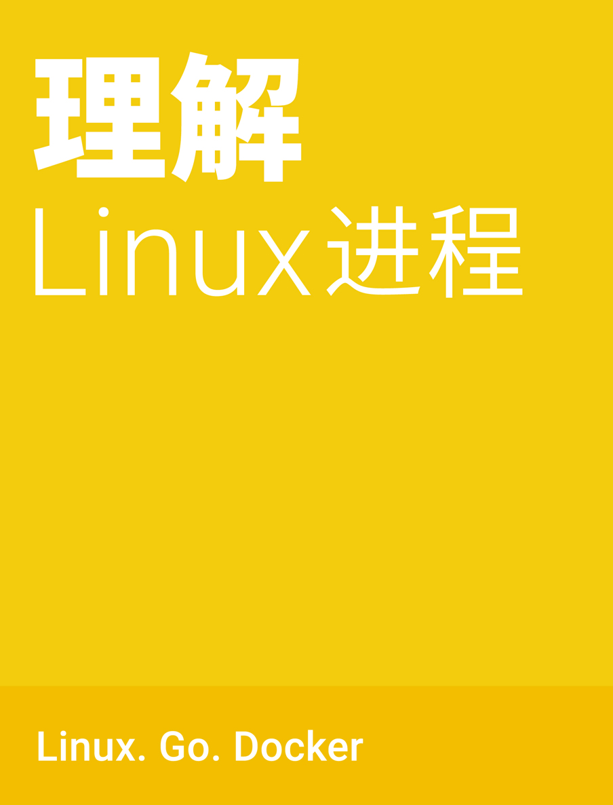

# 后记

## 后记

最后一章列举本文参考的过的书籍和项目，欢迎大家补充和讨论更多有关进程的知识。

# 参考书籍

## 参考书籍

*   [理解 Unix 进程](http://book.douban.com/subject/24298701/)
*   [Unix 编程艺术](http://book.douban.com/subject/1467587/)
*   [Unix 环境高级编程](http://book.douban.com/subject/1788421/)
*   [Go Web 编程](http://book.douban.com/subject/24316255/)
*   [Go 并发编程实战](http://book.douban.com/subject/26244729/)

# 项目学习

## 项目学习

*   [Linux](https://github.com/torvalds/linux)
*   [Go](https://github.com/golang/go)
*   [Docker](https://github.com/docker/docker)
*   [Run](https://github.com/runscripts/run)
*   [GoByExample](https://github.com/mmcgrana/gobyexample)

# 再次感谢

## Thanks for reading!

