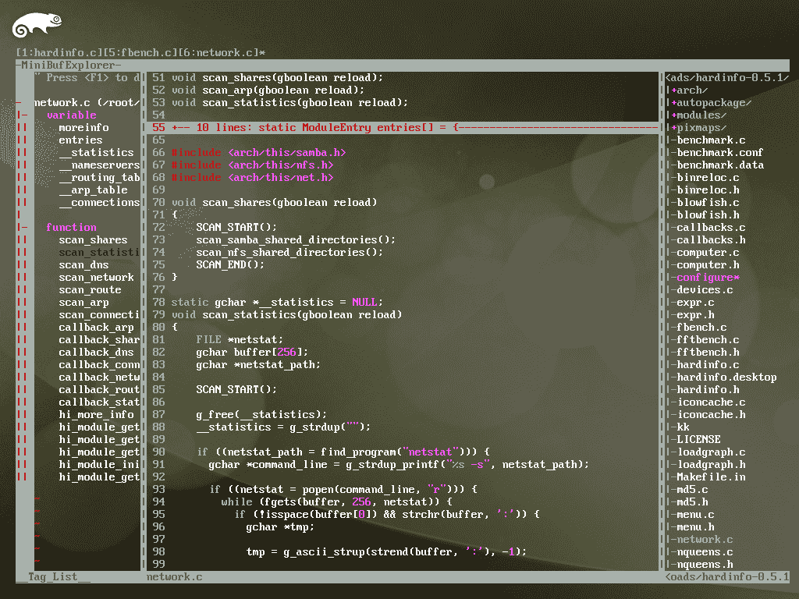

# 像 IDE 一样使用 vim

yangyangwithgnu@yeah.net
2016-03-30 16:39:33

## 【谢谢】

**捐赠：支付宝 yangyangwithgnu@yeah.net ，支付宝二维码（左），微信二维码（右）**

 

**二手书**：书，我提高开发技能的重要手段之一，随着职业生涯的发展，书籍也在不断增多，对我而言，一本书最多读三遍，再往后，几乎没有什么营养吸收，这部分书对我已基本无用，但对其他人可能仍有价值，所以，为合理利用资源，我决定低价出售这些书，希望达到两个目的：0）用售出的钱购买更多新书（没当过雷锋的朋友 (๑´ڡ\`๑)）；1）你低价购得需要的书（虽然二手）。到 [`github.com/yangyangwithgnu/used_books`](https://github.com/yangyangwithgnu/used_books) 看看有无你钟意的。

## 【公告】

* * *

*   **帮助：英译版编制。github.com 上搜索 vim ide 关键字后第一匹配项便是本文，洋人浏览到本文的次数非常多，常常收到要求同步发表英文版的邮件，但是，你知道，这 80+ 页的中文已经耗费我大量业余时间，所以，如果可能，希望有精力的朋友可以将其翻译为英文，感谢！**

*   **讨论**：任何意见建议移步 [`www.v2ex.com/t/138696`](http://www.v2ex.com/t/138696)

## 【版本】

* * *

*   v0.1.5，2016-03-30，新增/优化：0）采用 vundle 作为插件管理器，并统一采用各插件在 github.com 的地址；1）C++11/14 语法高亮插件从 STL-Syntax 换为 vim-cpp-enhanced-highlight，后者支持 STL 以及自行编写函数、容器、模版等的高亮；2）接口文件（MyClass.h）与实现文件（MyClass.cpp）快捷切换的插件，从 a.vim 换为 vim-fswitch；3）增加标签系统和语义系统的介绍；4）其他调整；
*   v0.1.4，2016-02-16，优化：0）为规避快捷键前导字符重复导致操作等待的问题，优化光标快速移至行首/行尾的快捷键，优化结对符间快速移动的快捷键；1）增加代码折叠的环境恢复。
*   v0.1.3，2015-11-08，新增：0）光标快速移至行首的快捷键 lh 与光标右移键 l 冲突，导致光标左移操作等待，现添加 \ <leader class="calibre15">规避该问题；1）中文输入状态导致命令模式无效，借助插件解决该问题。</leader>
*   v0.1.2，2015-01-18，新增：0）重写“内容查找”，让匹配项具备上下文提醒能力；1）“快速输入结对符”扩充快速选中结对符内文本的相关知识；2）增加支持分支 undo 的介绍；3）增加持久化保存 undo 历史的介绍；4）全文结构调整，将“内容查找”和“内容替换”移至“4 代码分析”，将“快速输入结对符”更名为“快速编辑结对符”，并移至“8 其他辅助”。
*   v0.1.1，2014-12-27，新增/修正：0）重写“代码收藏”章节，停用过时的 visual mark，启用用户体验更优的 vim-signature（@arcticlion，谢谢）；1）新增“基于语义的导航”章节，YCM 新增该项功能；2）调整“5.2 模板补全”章节结构，UltiSnips 不再提供预定义代码模板；3）protodef 插件更新，修复 protodef 生成成员函数实现的返回语句错误的问题；4）给出安装插件 vim-instant-markdown 的详细步骤。
*   v0.1.0，2014-10-13，新增。发布初始版本。

## 【目录】

* * *

0 vim 必知会
........0.1 .vimrc 文件
........0.2 .vim/ 目录
1 源码安装编辑器 vim
2 插件管理
3 界面美化
........3.1 主题风格
........3.2 营造专注氛围
........3.3 添加辅助信息
........3.4 其他
4 代码分析
........4.1 语法高亮
........4.2 代码缩进
........4.3 代码折叠
........4.4 接口与实现快速切换
........4.5 代码收藏
........4.6 标识符列表
................标签系统
................语义系统
................基于标签的标识符列表
........4.7 声明/定义跳转
................基于标签的声明/定义跳转
................基于语义的声明/定义跳转
........4.8 内容查找
........4.9 内容替换
................快捷替换
................精确替换
5 代码开发
........5.1 快速开关注释
........5.2 模板补全
........5.3 智能补全
................基于标签的智能补全
................基于语义的智能补全
........5.4 由接口快速生成实现框架
........5.5 库信息参考
6 工程管理
........6.1 工程文件浏览
........6.2 多文档编辑
........6.3 环境恢复
7 工具链集成
........7.1 构建工具集成
................代码编译
................系统构建
................一键编译
........7.2 静态分析器集成
8 其他辅助
........8.1 快速编辑结对符
........8.2 支持分支的 undo
........8.3 快速移动
........8.4 markdown 即时预览
........8.5 中/英输入平滑切换
9 尾声

## 【正文】

* * *

开始前，我假设你：0）具备基本的 vim 操作能力，清楚如何打开/编辑/保存文档、命令与插入模式间切换；1）希望将 vim 打造成 C/C++ 语言的 IDE，而非其他语言。

关于 vim 的优点，你在网上能查到 128+ 项，对我而言，只有两项：0）所思即所得，让手输入的速度跟上大脑思考的速度，1）所需即所获，只有你想不到的功能、没有实现不了的插件。希望获得前者的能力，你需要两本教程深入学习，《Practical Vim: Edit Text at the Speed of Thought》和《vim user manual》；要想拥有后者的能力，通读本文 -。-#。对于 vim 的喜爱，献上湿哥哥以表景仰之情：

vi 之大道如我心之禅，
vi 之漫路即为禅修，
vi 之命令禅印于心，
未得此道者视之怪诞，
与之为伴者洞其真谛，
长修此道者巨变人生。
作：reddy@lion.austin.com
译：yangyangwithgnu@yeah.net

言归正传，说说 vim 用于代码编写提供了哪些直接和间接功能支撑。vim 用户手册中，50％ 的例子都是在讲 vim 如何高效编写代码，由此可见，vim 是一款面向于程序员的编辑器，即使某些功能 vim 无法直接完成，借助其丰富的插件资源，必定可以达成目标，这就是所需即所获。 我是个目标驱动的信奉者，本文内容，我会先给出优秀 C/C++ IDE 应具备哪些功能，再去探索如何通过 vim 的操作或插件来达到目标。最终至少要像这个样子：
（图形环境下 IDE 总揽）
（纯字符模式下 IDE 总揽）