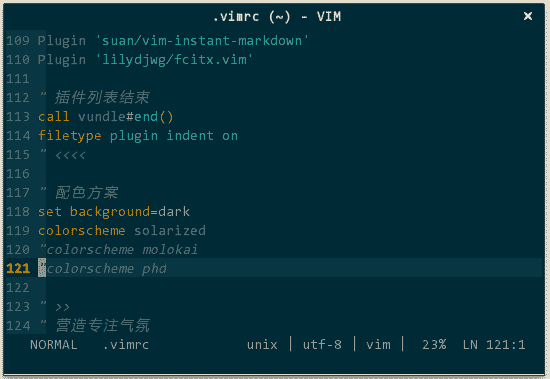

# 零、vim 必知会

## 0 vim 必知会

在正式开始前先介绍几个 vim 的必知会，这不是关于如何使用而是如何配置 vim 的要点，这对理解后续相关配置非常有帮助。

### 0.1 .vimrc 文件

.vimrc 是控制 vim 行为的配置文件，位于 ~/.vimrc，不论 vim 窗口外观、显示字体，还是操作方式、快捷键、插件属性均可通过编辑该配置文件将 vim 调教成最适合你的编辑器。

很多人之所以觉得 vim 难用，是因为 vim 缺少默认设置，甚至安装完后你连配置文件自身都找不到，不进行任何配置的 vim 的确难看、难用。不论用于代码还是普通文本编辑，有必要将如下基本配置加入 .vimrc 中。

前缀键。各类 vim 插件帮助文档中经常出现 \<leader class="calibre18">，即，前缀键。vim 自带有很多快捷键，再加上各类插件的快捷键，大量快捷键出现在单层空间中难免引起冲突，为缓解该问题，引入了前缀键 \<leader class="calibre18">，这样，键 r 可以配置成 r、\<leader class="calibre18">r、\<leader class="calibre18">\<leader class="calibre18">r 等等多个快捷键。前缀键是 vim 使用率较高的一个键（最高的当属 Esc），选一个最方便输入的键作为前缀键，将有助于提高编辑效率。找个无须眼睛查找、无须移动手指的键 —— 分号键，挺方便的，就在你右手小指处：</leader></leader></leader></leader></leader>

```
" 定义快捷键的前缀，即<Leader>
let mapleader=";" 
```

既然前缀键是为快捷键服务的，那随便说下快捷键设定原则：不同快捷键尽量不要有同序的相同字符。比如，\<leader class="calibre18">e 执行操作 0 和 \<leader class="calibre18">eb 执行操作 1，在你键入 \<leader class="calibre18">e 后，vim 不会立即执行操作 0，而是继续等待用户键入 b，即便你只想键入 \<leader class="calibre18">e，vim 也不得不花时间等待输入以确认是哪个快捷键，显然，这让 \<leader class="calibre18">e 响应速度变慢。\<leader class="calibre18">ea 和 \<leader class="calibre18">eb 就没问题。</leader></leader></leader></leader></leader></leader></leader>

文件类型侦测。允许基于不同语言加载不同插件（如，C++ 的语法高亮插件与 python 的不同）：

```
" 开启文件类型侦测
filetype on
" 根据侦测到的不同类型加载对应的插件
filetype plugin on 
```

快捷键。把 vim（非插件）常用操作设定成快捷键，提升效率：

```
" 定义快捷键到行首和行尾
nmap LB 0
nmap LE $
" 设置快捷键将选中文本块复制至系统剪贴板
vnoremap <Leader>y "+y
" 设置快捷键将系统剪贴板内容粘贴至 vim
nmap <Leader>p "+p
" 定义快捷键关闭当前分割窗口
nmap <Leader>q :q<CR>
" 定义快捷键保存当前窗口内容
nmap <Leader>w :w<CR>
" 定义快捷键保存所有窗口内容并退出 vim
nmap <Leader>WQ :wa<CR>:q<CR>
" 不做任何保存，直接退出 vim
nmap <Leader>Q :qa!<CR>
" 依次遍历子窗口
nnoremap nw <C-W><C-W>
" 跳转至右方的窗口
nnoremap <Leader>lw <C-W>l
" 跳转至左方的窗口
nnoremap <Leader>hw <C-W>h
" 跳转至上方的子窗口
nnoremap <Leader>kw <C-W>k
" 跳转至下方的子窗口
nnoremap <Leader>jw <C-W>j
" 定义快捷键在结对符之间跳转
nmap <Leader>M % 
```

立即生效。全文频繁变更 .vimrc，要让变更内容生效，一般的做法是先保存 .vimrc 再重启 vim，太繁琐了，增加如下设置，可以实现保存 .vimrc 时自动重启加载它：

```
" 让配置变更立即生效
autocmd BufWritePost $MYVIMRC source $MYVIMRC 
```

比如，我可以随时切换配色方案：


（配置变更立即生效）

其他。搜索、vim 命令补全等设置：

```
" 开启实时搜索功能
set incsearch
" 搜索时大小写不敏感
set ignorecase
" 关闭兼容模式
set nocompatible
" vim 自身命令行模式智能补全
set wildmenu 
```

以上的四类配置不仅影响 vim，而且影响插件是否能正常运行。很多插件不仅要在 .vimrc 中添加各自特有的配置信息，还要增加 vim 自身的配置信息，在后文的各类插件介绍中，我只介绍对应插件特有配置信息，当你发现按文中介绍操作后插件未生效，很可能是 vim 自身配置信息未添加，所以一定要把上述配置拷贝至到你的 .vimrc 中，再对照本文介绍一步步操作。.vimrc 完整配置信息参见附录，每个配置项都有对应注释。另外，由于有些插件还未来得及安装，在你实验前面的插件是否生效时，vim 可能有报错信息提示，先别理会，安装完所有插件后自然对了。

### 0.2 .vim/ 目录

.vim/ 目录是存放所有插件的地方。vim 有一套自己的脚本语言 vimscript，通过这种脚本语言可以实现与 vim 交互，达到功能扩展的目的。一组 vimscript 就是一个 vim 插件，vim 的很多功能都由各式插件实现。此外，vim 还支持 perl、python、lua、ruby 等主流脚本语言编写的插件，前提是 vim 源码编译时增加 ---enable-perlinterp、--enable-pythoninterp、--enable-luainterp、--enable-rubyinterp 等选项。vim.org 和 github.com 有丰富的插件资源，任何你想得到的功能，如果 vim 无法直接支持，那一般都有对应的插件为你服务，有需求时可以去逛逛。

vim 插件目前分为 *.vim 和 *.vba 两类，前者是传统格式的插件，实际上就是一个文本文件，通常 someplugin.vim（插件脚本）与 someplugin.txt（插件帮助文件）并存在一个打包文件中，解包后将 someplugin.vim 拷贝到 ~/.vim/plugin/ 目录，someplugin.txt 拷贝到 ~/.vim/doc/ 目录即可完成安装，重启 vim 后刚安装的插件就已经生效，但帮助文件需执行 :helptags ~/.vim/doc/ 才能生效，可通过 :h someplugin 查看插件帮助信息。传统格式插件需要解包和两次拷贝才能完成安装，相对较繁琐，所以后来又出现了 *.vba 格式插件，安装便捷，只需在 shell 中依次执行如下命令即可：

```
vim someplugin.vba
:so %
:q 
```

不论是直接拷贝插件到目录，还是通过 *.vba 安装，都不便于插件卸载、升级，后来又出现了管理插件的插件 vundle。

后面就正式开始了喽，文中前后内容顺序敏感，请依次查阅。