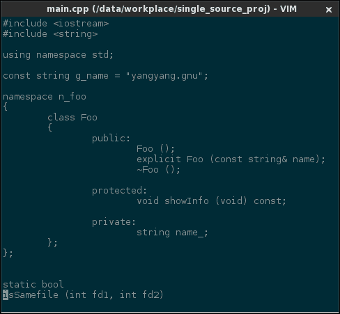
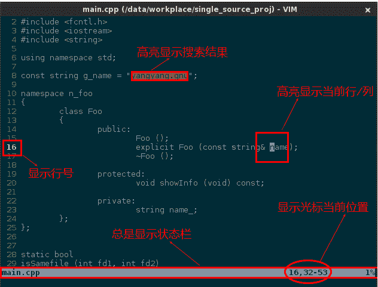
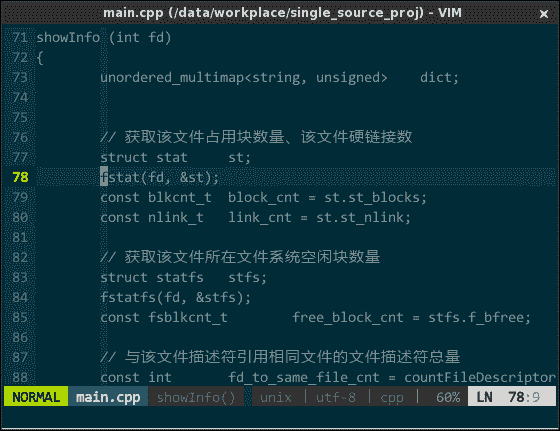

# 三、界面美化

## 3 界面美化

玉不琢不成器，vim 不配不算美。刚安装好的 vim 朴素得吓人，这是与我同时代的软件么？


（默认 vim 界面）就我的审美观而言，至少有几个问题：语法高亮太单薄、主题风格太简陋、窗口元素太冗余、辅助信息太欠缺。

### 3.1 主题风格

一套好的配色方案绝对会影响你的编码效率，vim 内置了 10 多种配色方案供你选择，GUI 下，可以通过菜单（Edit -> Color Scheme）试用不同方案，字符模式下，需要你手工调整配置信息，再重启 vim 查看效果（csExplorer 插件，可在字符模式下不用重启即可查看效果）。不满意，可以去 http://vimcolorschemetest.googlecode.com/svn/html/index-c.html 慢慢选。我自认为“阅美无数”，目前最夯三甲： * 素雅 solarized（https://github.com/altercation/vim-colors-solarized ） * 多彩 molokai（https://github.com/tomasr/molokai ） * 复古 phd（http://www.vim.org/scripts/script.php?script_id=3139 ） 在 .vimrc 中选用某个主题： ``` " 配色方案 set background=dark colorscheme solarized "colorscheme molokai "colorscheme phd ``` 其中，不同主题都有暗/亮色系之分，这样三种主题六种风格，久不久换一换，给你不一样的心情：
（solarized 主题风格）

### 3.2 营造专注氛围

如今的 UX 设计讲究的是内容至上，从 GNOME3 的变化就能看出。编辑器界面展示的应全是代码，不应该有工具条、菜单、滚动条浪费空间的元素，另外，编程是种精神高度集中的脑力劳动，不应出现闪烁光标、花哨鼠标这些分散注意力的东东。配置如下：

```
" 禁止光标闪烁
set gcr=a:block-blinkon0
" 禁止显示滚动条
set guioptions-=l
set guioptions-=L
set guioptions-=r
set guioptions-=R
" 禁止显示菜单和工具条
set guioptions-=m
set guioptions-=T 
```

重启 vim 后效果如下：


（去除冗余窗口元素）

还容易分神？好吧，我们把 vim 弄成全屏模式。vim 自身无法实现全屏，必须借助第三方工具 wmctrl，一个控制窗口 XYZ 坐标、窗口尺寸的命令行工具。先自行安装 wmctrl，再在 .vimrc 中增加如下信息：

```
" 将外部命令 wmctrl 控制窗口最大化的命令行参数封装成一个 vim 的函数
fun! ToggleFullscreen()
    call system("wmctrl -ir " . v:windowid . " -b toggle,fullscreen")
endf
" 全屏开/关快捷键
map <silent> <F11> :call ToggleFullscreen()<CR>
" 启动 vim 时自动全屏
autocmd VimEnter * call ToggleFullscreen() 
```

上面是一段简单的 vimscript 脚本，外部命令 wmctrl 及其命令行参数控制将指定窗口 windowid（即，vim）全屏，绑定快捷键 F11 实现全屏/窗口模式切换（linux 下各 GUI 软件约定使用 F11 全屏，最好遵守约定），最后配置启动时自动全屏。

### 3.3 添加辅助信息

去除了冗余元素让 vim 界面清爽多了，为那些实用辅助信息腾出了空间。光标当前位置、显示行号、高亮当前行/列等等都很有用：

```
" 总是显示状态栏
set laststatus=2
" 显示光标当前位置
set ruler
" 开启行号显示
set number
" 高亮显示当前行/列
set cursorline
set cursorcolumn
" 高亮显示搜索结果
set hlsearch 
```

效果如下：


（添加辅助信息）

### 3.4 其他美化

默认字体不好看，挑个自己喜欢的，前提是你得先安装好该字体。中文字体，我喜欢饱满方正的（微软雅黑），英文字体喜欢圆润的（Consolas），vim 无法同时使用两种字体，怎么办？有人制作发布了一款中文字体用微软雅黑、英文字体用 Consolas 的混合字体 —— yahei consolas hybrid 字体，号称最适合中国程序员使用的字体，效果非常不错（本文全文采用该字体）。在 .vimrc 中设置下：

```
" 设置 gvim 显示字体
set guifont=YaHei\ Consolas\ Hybrid\ 11.5 
```

其中，由于字体名存在空格，需要用转义符“\”进行转义；最后的 11.5 用于指定字体大小。

代码折行也不太美观，禁止掉：

```
" 禁止折行
set nowrap 
```

前面介绍的主题风格对状态栏不起作用，需要借助插件 Powerline（[`github.com/Lokaltog/vim-powerline`](https://github.com/Lokaltog/vim-powerline) ）美化状态栏，在 .vimrc 中设定状态栏主题风格：

```
" 设置状态栏主题风格
let g:Powerline_colorscheme='solarized256' 
```

效果如下：


（界面美化最终效果）图中，中英文混合字体看着是不是很舒服哈；增强后的状态栏，不仅界面漂亮多了，而且多了好些辅助信息（所在函数名、文件编码格式、文件类型）。