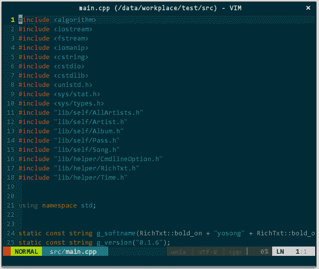

# 四、代码分析

## 4 代码分析

阅读优秀开源项目源码是提高能力的重要手段，营造舒适、便利的阅读环境至关重要。

### 4.1 语法高亮

代码只有一种颜色的编辑器，就好像红绿灯只有一种颜色的路口，全然无指引。现在已是千禧年后的十年了，早已告别上世纪六、七十年代黑底白字的时代，即使在字符模式下编程（感谢伟大的 fbterm），我也需要语法高亮。所幸 vim 自身支持语法高亮，只需显式打开即可：

```
" 开启语法高亮功能
syntax enable
" 允许用指定语法高亮配色方案替换默认方案
syntax on 
```

效果如下：


（语法高亮）上图中 STL 容器模板类 unordered\_multimap 并未高亮，对滴，vim 对 C++ 语法高亮支持不够好（特别是 C++11/14 新增元素），必须借由插件 vim-cpp-enhanced-highlight（https://github.com/octol/vim-cpp-enhanced-highlight ）进行增强。效果如下：
（增强 C++11 及 STL 的语法高亮）vim-cpp-enhanced-highlight 主要通过 .vim/bundle/vim-cpp-enhanced-highlight/after/syntax/cpp.vim 控制高亮关键字及规则，所以，当你发现某个 STL 容器类型未高亮，那么将该类型追加进 cpp.vim 即可。如，initializer_list 默认并不会高亮，需要添加 ``` syntax keyword cppSTLtype initializer_list ```

### 4.2 代码缩进

C/C++ 中的代码执行流由复合语句控制，如 if(){} 判断复合语句、for(){} 循环符号语句等等，这势必出现大量缩进。缩进虽然不影响语法正确性，但对提升代码清晰度有不可替代的功效。 在 vim 中有两类缩进表示法，一类是用 1 个制表符（'\t'），一类是用多个空格（' '）。两者并无本质区别，只是源码文件存储的字符不同而已，但，缩进可视化插件对两类缩进显示方式不同，前者只能显示为粗块，后者可显示为细条，就我的审美观而言，选后者。增加如下配置信息： ``` " 自适应不同语言的智能缩进 filetype indent on " 将制表符扩展为空格 set expandtab " 设置编辑时制表符占用空格数 set tabstop=4 " 设置格式化时制表符占用空格数 set shiftwidth=4 " 让 vim 把连续数量的空格视为一个制表符 set softtabstop=4 ``` 其中，注意下 expandtab、tabstop 与 shiftwidth、softtabstop、retab： * expandtab，把制表符转换为多个空格，具体空格数量参考 tabstop 和 shiftwidth 变量； * tabstop 与 shiftwidth 是有区别的。tabstop 指定我们在插入模式下输入一个制表符占据的空格数量，linux 内核编码规范建议是 8，看个人需要；shiftwidth 指定在进行缩进格式化源码时制表符占据的空格数。所谓缩进格式化，指的是通过 vim 命令由 vim 自动对源码进行缩进处理，比如其他人的代码不满足你的缩进要求，你就可以对其进行缩进格式化。缩进格式化，需要先选中指定行，要么键入 = 让 vim 对该行进行智能缩进格式化，要么按需键入多次 < 或 > 手工缩进格式化； * softtabstop，如何处理连续多个空格。因为 expandtab 已经把制表符转换为空格，当你要删除制表符时你得连续删除多个空格，该设置就是告诉 vim 把连续数量的空格视为一个制表符，即，只删一个字符即可。通常应将这 tabstop、shiftwidth、softtabstop 三个变量设置为相同值； 另外，你总会阅读其他人的代码吧，他们对制表符定义规则与你不同，这时你可以手工执行 vim 的 retab 命令，让 vim 按上述规则重新处理制表符与空格关系。 很多编码规范建议缩进（代码嵌套类似）最多不能超过 4 层，但难免有更多层的情况，缩进一多，我那个晕啊：
（多层缩进）

我希望有种可视化的方式能将相同缩进的代码关联起来，Indent Guides（[`github.com/nathanaelkane/vim-indent-guides`](https://github.com/nathanaelkane/vim-indent-guides) ）来了。安装好该插件后，增加如下配置信息：

```
" 随 vim 自启动
let g:indent_guides_enable_on_vim_startup=1
" 从第二层开始可视化显示缩进
let g:indent_guides_start_level=2
" 色块宽度
let g:indent_guides_guide_size=1
" 快捷键 i 开/关缩进可视化
:nmap <silent> <Leader>i <Plug>IndentGuidesToggle 
```

重启 vim 效果如下：


（不连续的缩进可视化）断节？Indent Guides 通过识别制表符来绘制缩进连接线，断节处是空行，没有制表符，自然绘制不出来，算是个小 bug，但瑕不掩瑜，有个小技巧可以解决，换行-空格-退格：
（完美可视化缩进）

### 4.3 代码折叠

有时为了去除干扰，集中精力在某部分代码片段上，我会把不关注部分代码折叠起来。vim 自身支持多种折叠：手动建立折叠（manual）、基于缩进进行折叠（indent）、基于语法进行折叠（syntax）、未更改文本构成折叠（diff）等等，其中，indent、syntax 比较适合编程，按需选用。增加如下配置信息：

```
" 基于缩进或语法进行代码折叠
"set foldmethod=indent
set foldmethod=syntax
" 启动 vim 时关闭折叠代码
set nofoldenable 
```

操作：za，打开或关闭当前折叠；zM，关闭所有折叠；zR，打开所有折叠。效果如下：


（代码折叠）

### 4.4 接口与实现快速切换

我习惯把类的接口和实现分在不同文件中，常有在接口文件（MyClass.h）和实现文件（MyClass.cpp）中来回切换的操作。你当然可以先分别打开接口文件和实现文件，再手动切换，但效率不高。我希望，假如在接口文件中，vim 自动帮我找到对应的实现文件，当键入快捷键，在新 buffer 中打开对应实现文件。

vim-fswitch（[`github.com/derekwyatt/vim-fswitch`](https://github.com/derekwyatt/vim-fswitch) ）来了。安装后增加配置信息：

```
" *.cpp 和 *.h 间切换
nmap <silent> <Leader>sw :FSHere<cr> 
```

这样，键入 ;sw 就能在实现文件和接口文件间切换。如下图所示：


（接口文件与实现文件切换）上图中，初始状态先打开了接口文件 MyClass.h，键入 ;sw 后，vim 在新 buffer 中打开实现文件 MyClass.cpp，并在当前窗口中显示；再次键入 ;sw 后，当前窗口切回接口文件。

### 4.5 代码收藏

源码分析过程中，常常需要在不同代码间来回跳转，我需要“收藏”分散在不同处的代码行，以便需要查看时能快速跳转过去，这时，vim 的书签（mark）功能派上大用途了。 vim 书签的使用很简单，在你需要收藏的代码行键入 mm，这样就收藏好了，你试试，没反应？不会吧，难道你 linux 内核编译参数有问题，或者，vim 的编译参数没给全，让我想想，别急，喔，对了，你是指看不到书签？好吧，我承认这是 vim 最大的坑，书签所在行与普通行外观上没任何差别，肉眼，你是找不到他滴。这可不行，得来个让书签可视化的插件，vim-signature（https://github.com/kshenoy/vim-signature ）。vim-signature 通过在书签所在行的前面添加字符的形式，以此可视化书签，这就要求你源码安装的 vim 具备 signs 特性，具体可在 vim 命令模式下键入 ``` :echo has('signs') ``` 若显示 1 则具备该特性，反之 0 则不具备该特性，需参考“1 源码安装编辑器 vim ”重新编译 vim。 vim 的书签分为两类，独立书签和分类书签。独立书签，书签名只能由字母（a-zA-Z）组成，长度最多不超过 2 个字母，并且，同个文件中，不同独立书签名中不能含有相同字母，比如，a 和 bD 可以同时出现在同个文件在，而 Fc 和 c 则不行。分类书签，书签名只能由可打印特殊字符（!@#$%^&\*()）组成，长度只能有 1 个字符，同个文件中，你可以把不同行设置成同名书签，这样，这些行在逻辑上就归类成相同类型的书签了。下图定义了名为 a 和 dF 两个独立书签（分别 259 行和 261 行）、名为 # 的一类分类书签（含 256 行和 264 行）、名为 @ 的一类分类书签（257 行），如下所示：
（独立书签和分类书签）

两种形式的书签完全分布在各自不同的空间中，所以，它俩的任何操作都是互不相同的，比如，你无法遍历所有书签，要么只能在各个独立书签间遍历，要么只能在分类书签间遍历。显然，两种形式的书签都有各自的使用场景，就我而言，只使用独立书签，原因有二：一是独立书签可保存，当我设置好独立书签后关闭文档，下次重新打开该文档时，先前的独立书签仍然有效，而分类书签没有该特性（其他文档环境恢复参见“6.3 环境恢复”）；一是减少记忆快捷键，光是独立书签就有 8 种遍历方式，每种遍历对应一种快捷键，太难记了。

vim-signature 快捷键如下：

```
let g:SignatureMap = {
        \ 'Leader'             :  "m",
        \ 'PlaceNextMark'      :  "m,",
        \ 'ToggleMarkAtLine'   :  "m.",
        \ 'PurgeMarksAtLine'   :  "m-",
        \ 'DeleteMark'         :  "dm",
        \ 'PurgeMarks'         :  "mda",
        \ 'PurgeMarkers'       :  "m<BS>",
        \ 'GotoNextLineAlpha'  :  "']",
        \ 'GotoPrevLineAlpha'  :  "'[",
        \ 'GotoNextSpotAlpha'  :  "`]",
        \ 'GotoPrevSpotAlpha'  :  "`[",
        \ 'GotoNextLineByPos'  :  "]'",
        \ 'GotoPrevLineByPos'  :  "['",
        \ 'GotoNextSpotByPos'  :  "mn",
        \ 'GotoPrevSpotByPos'  :  "mp",
        \ 'GotoNextMarker'     :  "[+",
        \ 'GotoPrevMarker'     :  "[-",
        \ 'GotoNextMarkerAny'  :  "]=",
        \ 'GotoPrevMarkerAny'  :  "=",
        \ 'ListLocalMarks'     :  "ms",
        \ 'ListLocalMarkers'   :  "m?"
        \ } 
```

够多了吧，粗体部分是按个人习惯重新定义的快捷键，请添加进 .vimrc 中。

常用的操作也就如下几类：

*   书签设定。mx，设定/取消当前行名为 x 的标签；m,，自动设定下一个可用书签名，前面提说，独立书签名是不能重复的，在你已经有了多个独立书签，当想再设置书签时，需要记住已经设定的所有书签名，否则很可能会将已有的书签冲掉，这可不好，所以，vim-signature 为你提供了 m, 快捷键，自动帮你选定下一个可用独立书签名；mda，删除当前文件中所有独立书签。
*   书签罗列。m?，罗列出当前文件中所有书签，选中后回车可直接跳转；
*   书签跳转。mn，按行号前后顺序，跳转至下个独立书签；mp，按行号前后顺序，跳转至前个独立书签。书签跳转方式很多，除了这里说的行号前后顺序，还可以基于书签名字母顺序跳转、分类书签同类跳转、分类书签不同类间跳转等等。

效果如下：

 ），它可以让书签行高亮，如下是它的快捷键：<f1 class="calibre18">，高亮所有书签行；<f2 class="calibre18">，关闭所有书签行高亮；<shift-f2 class="calibre18">，清除 [a-z] 的所有书签；<f5 class="calibre18">，收藏当前行；<shift-f5 class="calibre18">，取消收藏当前行。</shift-f5></f5></shift-f2></f2></f1>

### 4.6 标识符列表

本节之前的内容，虽说与代码开发有些关系，但最多也只能算作用户体验层面的，真正提升生产效率的内容将从此开始。

本文主题是探讨如何将 vim 打造成高效的 C/C++ 开发环境，希望实现标识符列表、定义跳转、声明提示、实时诊断、代码补全等等系列功能，这些都需要 vim 能够很好地理解我们的代码（不论是 vim 自身还是借助插件甚至第三方工具），如何帮助 vim 理解代码？基本上，有两种主流方式：标签系统和语义系统。至于优劣，简单来说，标签系统配置简单，而语义系统效果精准，后者是趋势。目前对于高阶 IDE 功能，部分已经有对应基于语义的插件支撑，而部分仍只能通过基于标签的方式实现，若同个功能既有语义插件又有标签插件，优选语义。

#### 标签系统

代码中的类、结构、类成员、函数、对象、宏等等这些统称为标识符，每个标识符的定义、所在文件中的行位置、所在文件的路径等等信息就是标签（tag）。

Exuberant Ctags（[`ctags.sourceforge.net/`](http://ctags.sourceforge.net/) ，后简称 ctags）就是一款经典的用于生成代码标签信息的工具 。ctags 最初只支持生成 C/C++ 语言，目前已支持 41 种语言，具体列表运行如下命令获取：

```
ctags --list-languages 
```

学习知识最好方式就是动手实践。我们以 main.cpp、my_class.h、my_class.cpp 三个文件为例：

第一步，准备代码文件。创建演示目录 /data/workplace/example/、库子目录 /data/workplace/example/lib/，创建如下内容的 main.cpp：

```
#include <iostring> 
#include <string> 
#include "lib/my_class.h" 
using namespace std; 
int g_num = 128; 
// 重载函数 
static void 
printMsg (char ch) 
{ 
    std::cout << ch << std::endl; 
} 
int 
main (void) 
{ 
    // 局部对象
    const string    name = "yangyang.gnu"; 
    // 类 
    MyClass    one; 
    // 成员函数 
    one.printMsg(); 
    // 使用局部对象 
    cout << g_num << name << endl; 
    return    (EXIT_SUCCESS); 
} 
```

创建如下内容的 my_class.h：

```
#pragma once 
class MyClass 
{ 
    public: 
        void printMsg(void);      
    private: 
        ; 
}; 
```

创建如下内容的 my_class.cpp：

```
#include "my_class.h" 
// 重载函数 
static void 
printMsg (int i) 
{ 
    std::cout << i << std::endl; 
} 
void 
MyClass::printMsg (void) 
{ 
    std::cout << "I'M MyClass!" << std::endl; 
} 
```

第二步，生成标签文件。现在运行 ctags 生成标签文件：

```
cd /data/workplace/example/
ctags -R --c++-kinds=+p+l+x+c+d+e+f+g+m+n+s+t+u+v --fields=+liaS --extra=+q --language-force=c++ 
```

命令行参数较多，主要关注 --c++-kinds，ctags 默认并不会提取所有标签，运行

```
ctags --list-kinds=c++ 
```

可看到 ctags 支持生成标签类型的全量列表：

```
c  classes 
d  macro definitions 
e  enumerators (values inside an enumeration) 
f  function definitions 
g  enumeration names 
l  local variables [off] 
m  class, struct, and union members 
n  namespaces 
p  function prototypes [off] 
s  structure names 
t  typedefs 
u  union names 
v  variable definitions 
x  external and forward variable declarations [off] 
```

其中，标为 off 的局部对象、函数声明、外部对象等类型默认不会生成标签，所以我显式加上所有类型。运行完后，example/ 下多了个文件 tags，内容大致如下：

```
!_TAG_FILE_FORMAT    2    /extended format; --format=1 will not append ;" to lines/ 
!_TAG_FILE_SORTED    1    /0=unsorted, 1=sorted, 2=foldcase/ 
!_TAG_PROGRAM_AUTHOR    Darren Hiebert    /dhiebert@users.sourceforge.net/ 
!_TAG_PROGRAM_NAME    Exuberant Ctags    // 
!_TAG_PROGRAM_URL    http://ctags.sourceforge.net    /official site/ 
!_TAG_PROGRAM_VERSION    5.8    // 
MyClass    lib/my_class.h    /^class MyClass $/;"    c 
MyClass::printMsg    lib/my_class.cpp    /^MyClass::printMsg (void) $/;"    f    class:MyClass    signature:(void) 
MyClass::printMsg    lib/my_class.h    /^        void printMsg(void);$/;"    p    class:MyClass    access:public    signature:(void) 
endl    lib/my_class.cpp    /^    std::cout << "I'M MyClass!" << std::endl;$/;"    m    class:std    file: 
endl    lib/my_class.cpp    /^    std::cout << i << std::endl;$/;"    m    class:std    file: 
endl    main.cpp    /^    cout << g_num << name << endl;$/;"    l 
endl    main.cpp    /^    std::cout << ch << std::endl;$/;"    m    class:std    file: 
g_num    main.cpp    /^int g_num = 128;$/;"    v 
main    main.cpp    /^main (void) $/;"    f    signature:(void) 
name    main.cpp    /^    const string    name = "yangyang.gnu";$/;"    l 
one    main.cpp    /^    MyClass    one;$/;"    l 
printMsg    lib/my_class.cpp    /^MyClass::printMsg (void) $/;"    f    class:MyClass    signature:(void) 
printMsg    lib/my_class.cpp    /^printMsg (int i) $/;"    f    file:    signature:(int i) 
printMsg    lib/my_class.h    /^        void printMsg(void);$/;"    p    class:MyClass    access:public    signature:(void) 
printMsg    main.cpp    /^    one.printMsg();$/;"    p    file:    signature:() 
printMsg    main.cpp    /^printMsg (char ch) $/;"    f    file:    signature:(char ch) 
std::endl    lib/my_class.cpp    /^    std::cout << "I'M MyClass!" << std::endl;$/;"    m    class:std    file: 
std::endl    lib/my_class.cpp    /^    std::cout << i << std::endl;$/;"    m    class:std    file: 
std::endl    main.cpp    /^    std::cout << ch << std::endl;$/;"    m    class:std    file: 
```

其中，! 开头的几行是 ctags 生成的软件信息忽略之，下面的就是我们需要的标签，每个标签项至少有如下字段（命令行参数不同标签项的字段数不同）：标识符名、标识符所在的文件名（也是该文件的相对路径）、标识符所在行的内容、标识符类型（如，l 表示局部对象），另外，若是函数，则有函数签名字段，若是成员函数，则有访问属型字段等等。

#### 语义系统

通过 ctags 这类标签系统在一定程度上助力 vim 理解我们的代码，对于 C 语言这类简单语言来说，差不多也够了。近几年，随着 C++11/14 的推出，诸如类型推导、lamda 表达式、模版等等新特性，标签系统显得有心无力，这个星球最了解代码的工具非编译器莫属，如果编译器能在语义这个高度帮助 vim 理解代码，那么我们需要的各项 IDE 功能肯定能达到另一个高度。

语义系统，编译器必不可少。GCC 和 clang 两大主流 C/C++ 编译器，作为语义系统的支撑工具，我选择后者，除了 clang 对新标准支持及时、错误诊断信息清晰这些优点之外，更重要的是，它在高内聚、低耦合方面做得非常好，各类插件可以调用 libclang 获取非常完整的代码分析结果，从而轻松且优雅地实现高阶 IDE 功能。你对语义系统肯定还是比较懵懂，紧接着的“基于语义的声明/定义跳转”会让你有更为直观的了解，现在，请跳转至“7.1 编译器/构建工具集成”，一是了解 clang 相较 GCC 的优势，二是安装好最新版 clang 及其标准库，之后再回来。

#### 基于标签的标识符列表

在阅读代码时，经常分析指定函数实现细节，我希望有个插件能把从当前代码文件中提取出的所有标识符放在一个侧边子窗口中，并且能能按语法规则将标识符进行归类，tagbar （[`github.com/majutsushi/tagbar`](https://github.com/majutsushi/tagbar) ）是一款基于标签的标识符列表插件，它自动周期性调用 ctags 获取标签信息（仅保留在内存，不落地成文件）。安装完 tagbar 后，在 .vimrc 中增加如下信息：

```
" 设置 tagbar 子窗口的位置出现在主编辑区的左边 
let tagbar_left=1 
" 设置显示／隐藏标签列表子窗口的快捷键。速记：identifier list by tag
nnoremap <Leader>ilt :TagbarToggle<CR> 
" 设置标签子窗口的宽度 
let tagbar_width=32 
" tagbar 子窗口中不显示冗余帮助信息 
let g:tagbar_compact=1
" 设置 ctags 对哪些代码标识符生成标签
let g:tagbar_type_cpp = {
    \ 'kinds' : [
         \ 'c:classes:0:1',
         \ 'd:macros:0:1',
         \ 'e:enumerators:0:0', 
         \ 'f:functions:0:1',
         \ 'g:enumeration:0:1',
         \ 'l:local:0:1',
         \ 'm:members:0:1',
         \ 'n:namespaces:0:1',
         \ 'p:functions_prototypes:0:1',
         \ 's:structs:0:1',
         \ 't:typedefs:0:1',
         \ 'u:unions:0:1',
         \ 'v:global:0:1',
         \ 'x:external:0:1'
     \ ],
     \ 'sro'        : '::',
     \ 'kind2scope' : {
         \ 'g' : 'enum',
         \ 'n' : 'namespace',
         \ 'c' : 'class',
         \ 's' : 'struct',
         \ 'u' : 'union'
     \ },
     \ 'scope2kind' : {
         \ 'enum'      : 'g',
         \ 'namespace' : 'n',
         \ 'class'     : 'c',
         \ 'struct'    : 's',
         \ 'union'     : 'u'
     \ }
\ } 
```

前面提过，ctags 默认并不会提取局部对象、函数声明、外部对象等类型的标签，我必须让 tagbar 告诉 ctags 改变默认参数，这是 tagbar_type_cpp 变量存在的主要目的，所以前面的配置信息中将局部对象、函数声明、外部对象等显式将其加进该变量的 kinds 域中。具体格式为

```
{short}:{long}[:{fold}[:{stl}]] 
```

用于描述函数、变量、结构体等等不同类型的标识符，每种类型对应一行。其中，short 将作为 ctags 的 --c++-kinds 命令行选项的参数，类似：

```
--c++-kinds=+p+l+x+c+d+e+f+g+m+n+s+t+u+v 
```

long 将作为 short 的简要描述展示在 vim 的 tagbar 子窗口中；fold 表示这种类型的标识符是否折叠显示；stl 指定是否在 vim 状态栏中显示附加信息。

重启 vim 后，打开一个 C/C++ 源码文件，键入 <leader class="calibre18">ilt，将在左侧的 tagbar 窗口中将可看到标签列表：</leader>


（基于标签的标识符列表）从上图可知 tagbar 的几个特点： * 按作用域归类不同标签。按名字空间 n_foo、类 Foo 进行归类，在内部有声明、有定义； * 显示标签类型。名字空间、类、函数等等； * 显示完整函数原型； * 图形化显示共有成员（+）、私有成员（-）、保护成员（#）； 在标识符列表中选中对应标识符后回车即可跳至源码中对应位置；在源码中停顿几秒，tagbar 将高亮对应标识符；每次保存文件时或者切换到不同代码文件时 tagbar 自动调用 ctags 更是标签数据库；tagbar 有两种排序方式，一是按标签名字母先后顺序、一是按标签在源码中出现的先后顺序，在 .vimrc 中我配置选用后者，键入 s 切换不同不同排序方式。

### 4.7 声明/定义跳转

假设你正在分析某个开源项目源码，在 main.cpp 中遇到调用函数 func()，想要查看它如何实现，一种方式：在 main.cpp 中查找 -> 若没有在工程内查找 -> 找到后打开对应文件 -> 文件内查找其所在行 -> 移动光标到该行 -> 分析完后切换会先前文件，不仅效率太低更要命的是影响我的思维连续性。我需要另外高效的方式，就像真正函数调用一样：光标选中调用处的 func() -> 键入某个快捷键自动转换到 func() 实现处 -> 键入某个键又回到 func() 调用处，这就是所谓的定义跳转。 基本上，vim 世界存在两类导航：基于标签的跳转和基于语义的跳转。

#### 基于标签的声明/定义跳转

继续延用前面接收标签系统的例子文件 main.cpp、my_class.h、my_class.cpp，第二步已经生成好了标签文件，那么要实现声明/定义跳转，需要第三步，引入标签文件。这让 vim 知晓标签文件的路径。在 /data/workplace/example/ 目录下用 vim 打开 main.cpp，在 vim 中执行如下目录引入标签文件 tags： ``` :set tags+=/data/workplace/example/tags ``` 既然 vim 有个专门的命令来引入标签，说明 vim 能识别标签。虽然标签文件中并无行号，但已经有标签所在文件，以及标签所在行的完整内容，vim 只需切换至对应文件，再在文件内作内容查找即可找到对应行。换言之，只要有对应的标签文件，vim 就能根据标签跳转至标签定义处。 这时，你可以体验下初级的声明/定义跳转功能。把光标移到 main.cpp 的 one.printMsg() 那行的 printMsg 上，键入快捷键 g]，vim 将罗列出名为 printMsg 的所有标签候选列表，按需选择键入编号即可跳转进入。如下图：
（待选标签）

目前为止，离我预期还有差距。

第一，选择候选列表影响思维连续性。首先得明白为何会出现待选列表。前面说过，vim 做的事情很简单，就是把光标所在单词放到标签文件中查找，如果只有一个，当然你可以直接跳转过去，大部分时候会找到多项匹配标签，比如，函数声明、函数定义、函数调用、函数重载等等都会导致同个函数名出现在多个标签中，vim 无法知道你要查看哪项，只能让你自己选择。其实，因为标签文件中已经包含了函数签名属性，vim 的查找机制如果不是基于关键字，而是基于语义的话，那也可以直接命中，期待后续 vim 有此功能吧。既然无法直接解决，换个思路，我不想选择列表，但可以接受遍历匹配标签。就是说，我不想输入数字选择第几项，但可以接受键入正向快捷键后遍历第一个匹配标签，再次键入快捷键遍历第二个，直到最后一个，键入反向快捷键逆序遍历。这下事情简单了，命令 :tnext 和 :tprevious 分别先后和向前遍历匹配标签，定义两个快捷键搞定：

```
" 正向遍历同名标签
nmap <Leader>tn :tnext<CR>
" 反向遍历同名标签
nmap <Leader>tp :tprevious<CR> 
```

等等，这还不行，vim 中有个叫标签栈（tags stack）的机制，:tnext、:tprevious 只能遍历已经压入标签栈内的标签，所以，你在遍历前需要通过快捷键 ctrl-] 将光标所在单词匹配的所有标签压入标签栈中，然后才能遍历。不说复杂了，以后你只需先键入 ctrl-]，若没跳转至需要的标签，再键入 <leader class="calibre18">tn 往后或者 <leader class="calibre18">tp 往前遍历即可。如下图所示：</leader></leader>


（基于标签的跳转）

第二，如何返回先前位置。当分析完函数实现后，我需要返回先前调用处，可以键入 vim 快捷键 ctrl-t 返回，如果想再次进入，可以用前面介绍的方式，或者键入 ctrl-i。另外，注意，ctrl-o 以是一种返回快捷键，但与 ctrl-t 的返回不同，前者是返回上次光标停留行、后者返回上个标签。

第三，如何自动生成标签并引入。开发时代码不停在变更，每次还要手动执行 ctags 命令生成新的标签文件，太麻烦了，得想个法周期性针对这个工程自动生成标签文件，并通知 vim 引人该标签文件，嘿，还真有这样的插件 —— indexer（[`github.com/vim-scripts/indexer.tar.gz`](https://github.com/vim-scripts/indexer.tar.gz) ）。indexer 依赖 DfrankUtil（[`github.com/vim-scripts/DfrankUtil`](https://github.com/vim-scripts/DfrankUtil) ）、vimprj（[`github.com/vim-scripts/vimprj`](https://github.com/vim-scripts/vimprj) ）两个插件，请一并安装。请在 .vimrc 中增加：

```
" 设置插件 indexer 调用 ctags 的参数
" 默认 --c++-kinds=+p+l，重新设置为 --c++-kinds=+p+l+x+c+d+e+f+g+m+n+s+t+u+v
" 默认 --fields=+iaS 不满足 YCM 要求，需改为 --fields=+iaSl
let g:indexer_ctagsCommandLineOptions="--c++-kinds=+p+l+x+c+d+e+f+g+m+n+s+t+u+v --fields=+iaSl --extra=+q" 
```

另外，indexer 还有个自己的配置文件，用于设定各个工程的根目录路径，配置文件位于 ~/.indexer_files，内容可以设定为：

```
--------------- ~/.indexer_files ---------------  
[foo] 
/data/workplace/foo/src/
[bar] 
/data/workplace/bar/src/ 
```

上例设定了两个工程的根目录，方括号内是对应工程名，路径为工程的代码目录，不要包含构建目录、文档目录，以避免将产生非代码文件的标签信息。这样，从以上目录打开任何代码文件时，indexer 便对整个目录创建标签文件，若代码文件有更新，那么在文件保存时，indexer 将自动调用 ctags 更新标签文件，indexer 生成的标签文件以工程名命名，位于 ~/.indexer_files_tags/，并自动引入进 vim 中，那么

```
:set tags+=/data/workplace/example/tags 
```

一步也省了。好了，解决了这三个问题后，vim 的代码导航基本已经达到我的预期。

#### 基于语义的声明/定义跳转

有个 vim 插件叫 YCM，有个 C++ 编译器叫 clang，只要正确使用它俩，你将获得无与伦比的代码导航用户体验，以及，代码补全。当然，代价是相对复杂的配置，涉及几个后续章节知识点（“基于语义的智能补全”和“编译器/构建工具集成”），正因如此，此时我只给出快捷键设置，在看完“基于语义的智能补全”后请返回此处，重新查阅。

请增加如下快捷键到 .vimrc 中：

```
nnoremap <leader>jc :YcmCompleter GoToDeclaration<CR>
" 只能是 #include 或已打开的文件
nnoremap <leader>jd :YcmCompleter GoToDefinition<CR> 
```

效果如下：


（基于语义的跳转）

另外，基于标签的调整建议你也要了解，有助于你熟悉标签系统，毕竟，使用标签的插件很有几个。

### 4.8 内容查找

vim 支持正则表达式，那么已经具有强劲的查供能力，在当前文件内查找，vim 的 / 和 ? 查找命令非常好用，但工程内查找，自带的查找用户体验还无法达到我的预期。

内容查找，你第一反应会想到 grep 和 ack 两个工具，没错，它俩强大的正则处理能力无需质疑，如果有插件能在 vim 中集成两个工具之一，那么任何查找任务均可轻松搞定，为此，出现了 grep.vim（[`github.com/yegappan/grep`](https://github.com/yegappan/grep) ）和 ack.vim（[`github.com/mileszs/ack.vim`](https://github.com/mileszs/ack.vim) ）两个插件，通过它们，你可以在 vim 中自在地使用高度整合的 grep 或 ack 两个外部命令，就像 vim 的内部命令一样：查找时，把光标定位到待查找关键字上后，通过快捷键立即查找该关键字，查询结果通过列表形式将关键字所在行罗列出来，选择后就能跳转到对应位置。很好，这全部都是我想要的，但是，不是我想要的全部。

你知道，在分析源码时，同个关键字会在不同文件的不同位置多次出现，grep.vim 和 ack.vim 只能“将关键字所在行罗列出来”，如果关键字出现的那几行完全相同，那么，我单凭这个列表是无法确定哪行是我需要的，比如，我查找关键字 cnt，代码中，cnt 在 4 行出现过、64 行、128 行、1024 行都出现过，且每行内容均为

```
++cnt; 
```

这时，即便 grep.vim 或 ack.vim 在一个有四个选项的列表中为你罗列出相关行，因为完全相同，所以你也无法确定到底应该查看第几项。换言之，除了罗列关键字所在行之外，我还需要看到所在行的上下几行，这样，有了上下文，我就可以最终决定哪一行是我需要的了。ctrlsf.vim（[`github.com/dyng/ctrlsf.vim`](https://github.com/dyng/ctrlsf.vim) ）为此而生。

ctrlsf.vim 后端调用 ack，所以你得提前自行安装，版本不得低于 v2.0，openSUSE 用户可以

```
zypper --no-refresh in ack 
```

进行安装。ctrlsf.vim 支持 ack 所有选项，要查找某个关键字（如，yangyang），你可以想让光标定位在该关键字上面，然后命令模式下键入

```
:CtrlSF 
```

将自动提取光标所在关键字进行查找，你也可以指定 ack 的选项

```
:CtrlSF -i -C 1 [pattern] /my/path/ 
```

为方便操作，我设定了快捷键：

```
" 使用 ctrlsf.vim 插件在工程内全局查找光标所在关键字，设置快捷键。快捷键速记法：search in project
nnoremap <Leader>sp :CtrlSF<CR> 
```

避免手工键入命令的麻烦。查找结果将以子窗口在左侧呈现，不仅罗列出所有匹配项，而且给出匹配项的上下文。如果从上下文中你还觉得信息量不够，没事，可以键入 p 键，将在右侧子窗口中给出该匹配项的完整代码，而不再仅有前后几行。不想跳至任何匹配项，可以直接键入 q 退出 ctrlsf.vim；如果有钟意的匹配项，光标定位该项后回车，立即跳至新 buffer 中对应位置。

太性感了，以关键字 CmdlineOption 为例，如下所示：


（内容查找）

### 4.9 内容替换

有个名为 iFoo 的全局变量，被工程中 16 个文件引用过，由于你岳母觉得匈牙利命名法严重、异常、绝对以及十分万恶，为讨岳母欢心，不得不将该变量更名为 foo，怎么办？依次打开每个文件，逐一查找后替换？对我而言，内容替换存在两种场景：快捷替换和精确替换。

#### 快捷替换

前面介绍的 ctrlsf 已经把匹配的字符串汇总在侧边子窗口中显示了，同时，它还允许我们直接在该子窗口中进行编辑操作，在这种环境下，如果我们能快捷选中所有匹配字符串，那么就可以先批量删除再在原位插入新的字符串，这岂不是我们需要的替换功能么？

快捷选中 ctrlsf 子窗口中的多个匹配项，关键还是这些匹配项分散在不同行的不同位置，这就需要多光标编辑功能，vim-multiple-cursors 插件（[`github.com/terryma/vim-multiple-cursors`](https://github.com/terryma/vim-multiple-cursors) ）为次而生。装好 vim-multiple-cursors 后，你随便编辑个文档，随便输入多个相同的字符串，先在可视化模式下选中其中一个，接着键入 ctrl-n，你会发现第二个该字符串也被选中了，持续键入 ctrl-n，你可以选中所有相同的字符串，把这个功能与 ctrlsf 结合，你来感受下：


（快捷替换）上图中，我想将 prtHelpInfo() 更名为 showHelpInfo()，先通过 ctrlsf 找到工程中所有 prtHelpInfo，然后直接在 ctrlsf 子窗口中选中第一个 ptr，再通过 vim-multiple-cursors 选中第二个 ptr，接着统一删除 ptr 并统一键入 show，最后保存并重新加载替换后的文件。 vim-multiple-cursors 默认快捷键与我系统中其他软件的快捷键冲突，按各自习惯重新设置： ``` let g:multi_cursor_next_key='<s-n class="calibre22">' let g:multi_cursor_skip_key='<s-k class="calibre18">' ```

#### 精确替换

vim 有强大的内容替换命令： ``` :[range]s/{pattern}/{string}/[flags] ``` 在进行内容替换操作时，我关注几个因素：如何指定替换文件范围、是否整词匹配、是否逐一确认后再替换。 如何指定替换文件范围？ * 如果在当前文件内替换，[range] 不用指定，默认就在当前文件内； * 如果在当前选中区域，[range] 也不用指定，在你键入替换命令时，vim 自动将生成如下命令： ``` :'<,'>s/{pattern}/{string}/[flags] ``` * 你也可以指定行范围，如，第三行到第五行： ``` :3,5s/{pattern}/{string}/[flags] ``` * 如果对打开文件进行替换，你需要先通过 :bufdo 命令显式告知 vim 范围，再执行替换； * 如果对工程内所有文件进行替换，先 :args \*\*/*.cpp **/*.h 告知 vim 范围，再执行替换； 是否整词匹配？{pattern} 用于指定匹配模式。如果需要整词匹配，则该字段应由 \< 和 \> 修饰待替换字符串（如，\<ifoou0005c class="calibre18">）；无须整词匹配则不用修饰，直接给定该字符串即可； 是否逐一确认后再替换？[flags] 可用于指定是否需要确认。若无须确认，该字段设定为 ge 即可；有时不见得所有匹配的字符串都需替换，若在每次替换前进行确认，该字段设定为 gec 即可。 是否整词匹配和是否确认两个条件叠加就有 4 种组合：非整词且不确认、非整词且确认、整词且不确认、整词且确认，每次手工输入这些命令真是麻烦；我把这些组合封装到一个函数中，如下 Replace() 所示： ``` " 替换函数。参数说明： " confirm：是否替换前逐一确认 " wholeword：是否整词匹配 " replace：被替换字符串 function! Replace(confirm, wholeword, replace) wa let flag = '' if a:confirm let flag .= 'gec' else let flag .= 'ge' endif let search = '' if a:wholeword let search .= '\<' .="" escape(expand('<cwordu0003du00022u00022 class="calibre18">'), '/\.*$^~') . '\>' else let search .= expand('<cword class="calibre18">') endif let replace = escape(a:replace, '/\&~') execute 'argdo %s/' . search . '/' . replace . '/' . flag . '| update' endfunction ``` 为最大程度减少手工输入，Replace() 还能自动提取待替换字符串（只要把光标移至待替换字符串上），同时，替换完成后自动为你保存更改的文件。现在要做的就是赋予 confirm、wholeword 不同实参实现 4 种组合，再绑定 4 个快捷键即可。如下： ``` " 不确认、非整词 nnoremap <leader class="calibre18">R :call Replace(0, 0, input('Replace '.expand('<cword class="calibre18">').' with: ')) <cr class="calibre18">" 不确认、整词 nnoremap <leader class="calibre18">rw :call Replace(0, 1, input('Replace '.expand('<cword class="calibre18">').' with: ')) <cr class="calibre18">" 确认、非整词 nnoremap <leader class="calibre18">rc :call Replace(1, 0, input('Replace '.expand('<cword class="calibre18">').' with: ')) <cr class="calibre18">" 确认、整词 nnoremap <leader class="calibre18">rcw :call Replace(1, 1, input('Replace '.expand('<cword class="calibre18">').' with: ')) <cr class="calibre18">nnoremap <leader class="calibre18">rwc :call Replace(1, 1, input('Replace '.expand('<cword class="calibre18">').' with: ')) <cr class="calibre18">``` 我平时用的最多的无须确认但整词匹配的替换模式，即 \<leader class="calibre18">rw。 请将完整配置信息添加进 .vimrc 中： ``` " 替换函数。参数说明： " confirm：是否替换前逐一确认 " wholeword：是否整词匹配 " replace：被替换字符串 function! Replace(confirm, wholeword, replace) wa let flag = '' if a:confirm let flag .= 'gec' else let flag .= 'ge' endif let search = '' if a:wholeword let search .= '\<' .="" escape(expand('<cwordu0003du00022u00022 class="calibre18">'), '/\.*$^~[') . '\>' else let search .= expand('<cword class="calibre18">') endif let replace = escape(a:replace, '/\&~') execute 'argdo %s/' . search . '/' . replace . '/' . flag . '| update' endfunction " 不确认、非整词 nnoremap <leader class="calibre18">R :call Replace(0, 0, input('Replace '.expand('<cword class="calibre18">').' with: ')) <cr class="calibre18">" 不确认、整词 nnoremap <leader class="calibre18">rw :call Replace(0, 1, input('Replace '.expand('<cword class="calibre18">').' with: ')) <cr class="calibre18">" 确认、非整词 nnoremap <leader class="calibre18">rc :call Replace(1, 0, input('Replace '.expand('<cword class="calibre18">').' with: ')) <cr class="calibre18">" 确认、整词 nnoremap <leader class="calibre18">rcw :call Replace(1, 1, input('Replace '.expand('<cword class="calibre18">').' with: ')) <cr class="calibre18">nnoremap <leader class="calibre18">rwc :call Replace(1, 1, input('Replace '.expand('<cword class="calibre18">').' with: ')) <cr class="calibre18">``` 比如，我将工程的所有 *.cpp 和 *.h 中的关键字 MyClassA 按不确认且整词匹配模式替换成 MyClass，所以注释中的关键字不会被替换掉。如下所示：
（确认且无须整词匹配模式的替换）</cr></cword></leader></cr></cword></leader></cr></cword></leader></cr></cword></leader></cr></cword></leader></cword></cwordu0003du00022u00022></leader></cr></cword></leader></cr></cword></leader></cr></cword></leader></cr></cword></leader></cr></cword></leader></cword></cwordu0003du00022u00022></ifoou0005c></s-k></s-n>