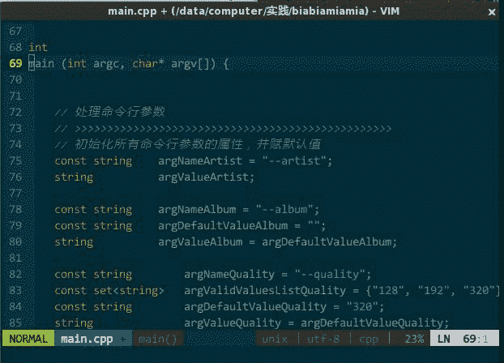
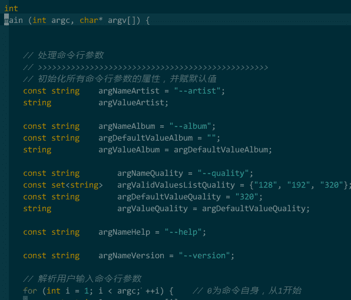
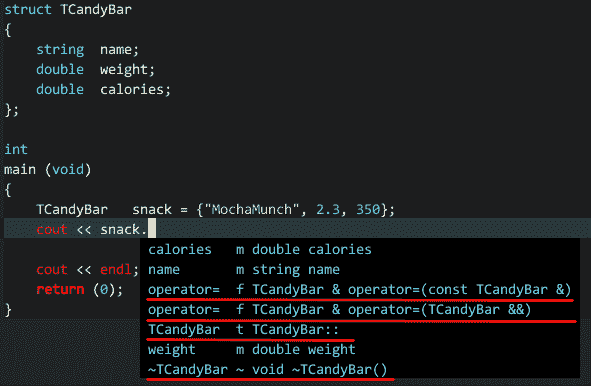
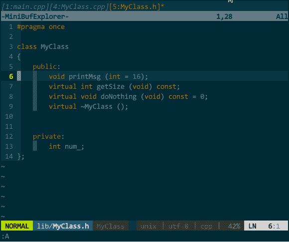
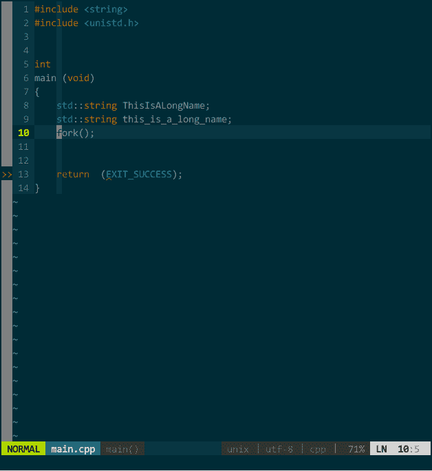

# 五、代码开发

## 5 代码开发

在具体编码过程中，我需要一系列提高生产力的功能：批量开/关注释、快速输入代码模板、代码智能补全、路径智能补全、从接口生成实现、查看参考库信息等等，我们逐一来实现。

### 5.1 快速开关注释

需要注释时，到每行代码前输入 //，取消注释时再删除 //，这种方式不是现代人的行为。IDE 应该支持对选中文本块批量（每行）添加注释符号，反之，可批量取消。本来 vim 通过宏方式可以支持该功能，但每次注释时要自己录制宏，关闭 vim 后宏无法保存，所以有人专门编写了一款插件 NERD Commenter（[`github.com/scrooloose/nerdcommenter`](https://github.com/scrooloose/nerdcommenter) ），NERD Commenter 根据编辑文档的扩展名自适应采用何种注释风格，如，文档名 x.cpp 则采用 // 注释风格，而 x.c 则是 /**/ 注释风格；另外，如果选中的代码并非整行，那么该插件将用 /**/ 只注释选中部分。

常用操作：

*   \<leader class="calibre15">cc，注释当前选中文本，如果选中的是整行则在每行首添加 //，如果选中一行的部分内容则在选中部分前后添加分别 /*、*/；</leader>
*   \<leader class="calibre15">cu，取消选中文本块的注释。</leader>

如下图所示：


（快速开/关注释）

另外，有时需要 ASCII art 风格的注释，可用 DrawIt!（[`github.com/vim-scripts/DrawIt`](https://github.com/vim-scripts/DrawIt) ），它可以让你用方向键快速绘制出。

常用操作就两个，:Distart，开始绘制，可用方向键绘制线条，空格键绘制或擦除字符；:Distop，停止绘制。

如下图所示：


（ASCII art 风格注释）

### 5.2 模板补全

开发时，我经常要输入相同的代码片断，比如 if-else、switch 语句，如果每个字符全由手工键入，我可吃不了这个苦，我想要简单的键入就能自动帮我完成代码模板的输入，并且光标停留在需要我编辑的位置，比如键入 if，vim 自动完成

```
if (/* condition */) {
    TODO
} 
```

而且帮我选中 / *condition* / 部分，不会影响编码连续性 —— UltiSnips（[`github.com/SirVer/ultisnips`](https://github.com/SirVer/ultisnips) ），我的选择。

在进行模板补全时，你是先键入模板名（如，if），接着键入补全快捷键（默认 \<tab class="calibre18">），然后 UltiSnips 根据你键入的模板名在代码模板文件中搜索匹配的“模板名-模板”，找到对应模板后，将模板在光标当前位置展开。</tab>

UltiSnips 有一套自己的代码模板语法规则，类似：

```
snippet if "if statement" i
if (${1:/* condition */}) { 
    ${2:TODO} 
} 
endsnippet 
```

其中，snippet 和 endsnippet 用于表示模板的开始和结束；if 是模板名；"if statement" 是模板描述，你可以把多个模板的模板名定义成一样（如，if () {} 和 if () {} else {} 两模板都定义成相同模板名 if），在模板描述中加以区分（如，分别对应 "if statement" 和 "if-else statement"），这样，在 YCM（重量级智能补全插件） 的补全列表中可以根据模板描述区分选项不同模板；i 是模板控制参数，用于控制模板补全行为，具体参见“快速编辑结对符”一节；${1}、${2} 是 \ <tab class="calibre18">跳转的先后顺序。</tab>

新版 UltiSnips 并未自带预定义的代码模板，你可以从 [`github.com/honza/vim-snippets`](https://github.com/honza/vim-snippets) 获取各类语言丰富的代码模板，也可以重新写一套符合自己编码风格的模板。无论哪种方式，你需要在 .vimrc 中设定该模板所在目录名，以便 UltiSnips 寻找到。比如，我自定义的代码模板文件 cpp.snippets，路径为 ~/.vim/bundle/ultisnips/mysnippets/cpp.snippets，对应设置如下： let g:UltiSnipsSnippetDirectories=["mysnippets"] 其中，目录名切勿取为 snippets，这是 UltiSnips 内部保留关键字；另外，目录一定要是 ~/.vim/bundle/ 下的子目录，也就是 vim 的运行时目录。

完整 cpp.snippets 内容如下：

```
#================================= 
#预处理 
#================================= 
# #include "..." 
snippet INC 
#include "${1:TODO}"${2} 
endsnippet 
# #include <...> 
snippet inc 
#include <${1:TODO}>${2} 
endsnippet 
#================================= 
#结构语句 
#================================= 
# if 
snippet if 
if (${1:/* condition */}) { 
    ${2:TODO} 
} 
endsnippet 
# else if 
snippet ei 
else if (${1:/* condition */}) { 
    ${2:TODO} 
} 
endsnippet 
# else 
snippet el 
else { 
    ${1:TODO} 
} 
endsnippet 
# return 
snippet re 
return(${1:/* condition */}); 
endsnippet 
# Do While Loop 
snippet do 
do { 
    ${2:TODO} 
} while (${1:/* condition */}); 
endsnippet 
# While Loop 
snippet wh 
while (${1:/* condition */}) { 
    ${2:TODO} 
} 
endsnippet 
# switch 
snippet sw 
switch (${1:/* condition */}) { 
    case ${2:c}: { 
    } 
    break; 

    default: { 
    } 
    break; 
} 
endsnippet 
# 通过迭代器遍历容器（可读写） 
snippet for 
for (auto ${2:iter} = ${1:c}.begin(); ${3:$2} != $1.end(); ${4:++iter}) {
    ${5:TODO} 
} 
endsnippet 
# 通过迭代器遍历容器（只读） 
snippet cfor 
for (auto ${2:citer} = ${1:c}.cbegin(); ${3:$2} != $1.cend(); ${4:++citer}) { 
    ${5:TODO} 
} 
endsnippet 
# 通过下标遍历容器 
snippet For 
for (decltype($1.size()) ${2:i} = 0; $2 != ${1}.size(); ${3:++}$2) { 
    ${4:TODO} 
} 
endsnippet 
# C++11 风格 for 循环遍历（可读写） 
snippet F 
for (auto& e : ${1:c}) { 
} 
endsnippet 
# C++11 风格 for 循环遍历（只读） 
snippet CF 
for (const auto& e : ${1:c}) { 
} 
endsnippet 
# For Loop 
snippet FOR 
for (unsigned ${2:i} = 0; $2 < ${1:count}; ${3:++}$2) { 
    ${4:TODO} 
} 
endsnippet 
# try-catch 
snippet try 
try { 
} catch (${1:/* condition */}) { 
} 
endsnippet 
snippet ca 
catch (${1:/* condition */}) { 
} 
endsnippet 
snippet throw 
th (${1:/* condition */}); 
endsnippet 
#================================= 
#容器 
#================================= 
# std::vector 
snippet vec 
vector<${1:char}>    v${2}; 
endsnippet 
# std::list 
snippet lst 
list<${1:char}>    l${2}; 
endsnippet 
# std::set 
snippet set 
set<${1:key}>    s${2}; 
endsnippet 
# std::map 
snippet map 
map<${1:key}, ${2:value}>    m${3}; 
endsnippet 
#================================= 
#语言扩展 
#================================= 
# Class 
snippet cl 
class ${1:`Filename('$1_t', 'name')`} 
{ 
    public: 
        $1 (); 
        virtual ~$1 (); 

    private: 
}; 
endsnippet 
#================================= 
#结对符 
#================================= 
 # 括号 bracket 
snippet b "bracket" i 
(${1})${2} 
endsnippet 
# 方括号 square bracket，设定为 st 而非 sb，避免与 b 冲突
snippet st "square bracket" i 
[${1}]${2} 
endsnippet 
# 大括号 brace 
snippet br "brace" i 
{ 
    ${1} 
}${2} 
endsnippet 
# 单引号 single quote，设定为 se 而非 sq，避免与 q 冲突
snippet se "single quote" I
'${1}'${2}
endsnippet
# 双引号 quote
snippet q "quote" I
"${1}"${2}
endsnippet
# 指针符号 arrow 
snippet ar "arrow" i 
->${1} 
endsnippet 
# dot 
snippet d "dot" i 
.${1} 
endsnippet 
# 作用域 scope 
snippet s "scope" i 
::${1} 
endsnippet 
```

默认情况下，UltiSnips 模板补全快捷键是 \<tab class="calibre18">，与后面介绍的 YCM 快捷键有冲突，所有须在 .vimrc 中重新设定：</tab>

```
" UltiSnips 的 tab 键与 YCM 冲突，重新设定
let g:UltiSnipsExpandTrigger="<leader><tab>"
let g:UltiSnipsJumpForwardTrigger="<leader><tab>"
let g:UltiSnipsJumpBackwardTrigger="<leader><s-tab>" 
```

效果如下：


（模板补全）

### 5.3 智能补全

真的，这绝对是 G 点。智能补全是提升编码效率的杀手锏。试想下，有个函数叫 getCountAndSizeFromRemotefile()，当你输入 get 后 IDE 自动帮你输入完整的函数名，又如，有个文件 ~/this/is/a/deep/dir/file.txt，就像在 shell 中一样，键入 tab 键自动补全文件路径那是何等惬意！

智能补全有两类实现方式：基于标签的、基于语义的。

#### 基于标签的智能补全

前面代码导航时介绍过标签，每个标签项含有标签名、作用域等等信息，当键入某几个字符时，基于标签的补全插件就在标签文件中搜索匹配的标签项，并罗列出来，你选择中意的，这与前面代码导航类似，一个是用于跳转、一个用于输入。基于标签的补全，后端 ctags 先生成标签文件，前端采用插件 new-omni-completion（内置）进行识别。这种方式操作简单、效果不错，一般来说两步搞定。

第一步，生成标签文件。在工程目录的根目录执行 ctags，该目录下会多出个 tags 文件；

第二步，引入标签文件。在 vim 中引入标签文件，在 vim 中执行命令

```
:set tags+=/home/your_proj/tags 
```

后续，在编码时，键入标签的前几个字符后依次键入 ctrl-x ctrl-o 将罗列匹配标签列表、若依次键入 ctrl-x ctrl-i 则文件名补全、ctrl-x ctrl-f 则路径补全。

举个例子，演示如何智能补全 C++ 标准库。与前面介绍的一般步骤一样，先调用 ctags 生成标准库的标签文件，再在 vim 中引入即可，最后编码时由相应插件实时搜索标签文件中的类或模板，显示匹配项：

首先，获取 C++ 标准库源码文件。安装的 GNU C++ 标准库源码文件，openSUSE 可用如下命令：

```
zypper install libstdc++48-devel 
```

安装成功后，在 /usr/include/c++/4.8/ 可见到所有源码文件；

接着，执行 ctags 生成标准库的标签文件：

```
cd /usr/include/c++/4.8
ctags -R --c++-kinds=+l+x+p --fields=+iaSl --extra=+q --language-force=c++ -f stdcpp.tags 
```

然后，让 OmniCppComplete 成功识别标签文件中的标准库接口。C++ 标准库源码文件中使用了 _GLIBCXX_STD 名字空间（GNU C++ 标准库的实现是这样，如果你使用其他版本的标准库，需要自行查找对应的名字空间名称），标签文件里面的各个标签都嵌套在该名字空间下，所以，要让 OmniCppComplete 正确识别这些标签，必须显式告知 OmniCppComplete 相应的名字空间名称。在.vimrc 中增加如下内容：

```
let OmniCpp_DefaultNamespaces = ["_GLIBCXX_STD"] 
```

最后，在 vim 中引入该标签文件。在 .vimrc 中增加如下内容：

```
set tags+=/usr/include/c++/4.8/stdcpp.tags 
```

后续你就可以进行 C++ 标准库的代码补全，比如，在某个 string 对象名输入 . 时，vim 自动显示成员列表。如下图所示：


（基于标签的 C++ 标准库补全）

没明白？ -。-# 咱再来个例子，看看如何补全 linux 系统 API。与前面的标准库补全类似，唯一需要注意，linux 系统 API 头文件中使用了 GCC 编译器扩展语法，必须告诉 ctags 在生成标签时忽略之，否则将生产错误的标签索引。

首先，获取 linux 系统 API 头文件。openSUSE 可用如下命令：

```
zypper install linux-glibc-devel 
```

安装成功后，在 /usr/include/ 中可见相关头文件；

接着，执行 ctags 生成系统 API 的标签文件。linux 内核采用 GCC 编译，为提高内核运行效率，linux 源码文件中大量采用 GCC 扩展语法，这影响 ctags 生成正确的标签，必须借由 ctags 的 -I 命令参数告之忽略某些标签，若有多个忽略字符串之间用逗号分割。比如，在文件 unistd.h 中几乎每个 API 声明中都会出现 **THROW、**nonnull 关键字，前者目的是告诉 GCC 这些函数不会抛异常，尽量多、尽量深地优化这些函数，后者目的告诉 GCC 凡是发现调用这些函数时第一个实参为 nullptr 指针则将其视为语法错误，的确，使用这些扩展语法方便了我们编码，但却影响了 ctags 正常解析，这时可用 -I **THROW,**nonnull 命令行参数让 ctags 忽略这些语法扩展关键字：

```
cd /usr/include/
ctags -R --c-kinds=+l+x+p --fields=+lS -I __THROW,__nonnull -f sys.tags 
```

最后，在 vim 中引入该标签文件。在 .vimrc 中增加如下内容：

```
set tags+=/usr/include/sys.tags 
```

从以上两个例子来看，不论是 C++ 标准库、boost、ACE 这些重量级开发库，还是 linux 系统 API 均可遵循“下载源码（至少包括头文件）-执行 ctags 生产标签文件-引入标签文件”的流程实现基于标签的智能补全，若有异常，唯有如下两种可能：一是源码中使用了名字空间，借助 OmniCppComplete 插件的 OmniCpp*DefaultNamespaces 配置项解决；一是源码中使用了编译器扩展语法，借助 ctags 的 -I 参数解决（上例仅列举了少量 GCC 扩展语法，此外还有 _*attribute_malloc**、__wur 等等大量扩展语法，具体请参见 GCC 手册。以后，如果发现某个系统函数无法自动补全，十有八九是头文件中使用使用了扩展语法，先找到该函数完整声明，再将其使用的扩展语法加入 -I 列表中，最后运行 ctags 重新生产新标签文件即可）。

#### 基于语义的智能补全

对于智能补全只有轻度需求的用户来说，基于标签的补全能够很好地满足需求，但对于我这类重度需求用户来说，但凡涉及标签，就存在以下几个问题：

*   问题一，必须定期调用 ctags 生成标签文件。代码在不停更新，每次智能补全前你得先手动生成标签文件，这还好，你可以借助前面的 indexer 在保存文件时更新标签文件；麻烦的是，你代码中要用到 C++ 标准库中的接口吧，那么事前你先得对整个标准库生成标签文件，这也还好，无非多个步骤；更昏人的是，你得使用了编译器语法扩展的库，你还得一条条找出具体使用了哪些扩展语言，再让 ctags 忽略执行语法关键字，真有够麻烦的；
*   问题二，ctags 本身对 C++ 支持有限。面对函数形参、重载操作符、括号初始化的对象，ctags 有心无力；对于 C++11 新增 lambda 表达式、auto 类型推导更是不认识。

我需要更优的补全机制 —— 基于语义的智能补全。语义补全，实时探测你是否有补全需求，无须你定期生成标签，可解决问题一；语义补全，是借助编译器进行代码分析，只要编译器对 C++ 规范支持度高，不论标准库、类型推导，还是 boost 库中的智能指针都能补全。什么是语义分析补全？看下图：


（语义分析补全）代码中定义的 TCandyBar 类型只包括 3 个成员，但 clang_complete 能补全编译器根据 C++ 规范自动添加的两个重载操作符、一个默认构造函数、一个析构函数，这就是基于语义分析的智能补全。 要进行语义分析，编译器必不可少。linux 上 GCC 和 clang 两大主流 C++ 编译器，基于不同编译器，开源社区分别创造出 GCCSense 和 clang_complete 两个语义补全插件，又得纠结选哪个 -。- ... <穿越> 请跳转至“源码安装编译器 clang”部分做两件事，一是按介绍安装好最新版 clang 及其标准库，二是看明白 clang 相较 GCC 的优势 ... 我选 clang_complete，原因如下： * 使用难度低。clang 采用低耦合设计，语义分析结果（也就是 AST）能以接口形式供外围程序使用，无须任何调整，clang_complete 便能能轻松拿到 clang 输出的语义分析结果；而 GCC 采用高耦合设计，你必须结合补丁重新源码编译 GCC，才能让 GCCSense 接收到它的语义分析结果； * 维护时间长。clang_complete 最新更新为 13 年上，而 GCCSense 则是 09 年下； * 支持跨平台。clang_complete 支持所有平台，而 GCCSense 支持 UNIX-like，不支持 windows。（好啦，这点是我凑数的，我又不用 windows <\_<） clang_complete="" 使用简单，在="" vim="" 输入模式下，依次键入要补全的字符，需要弹出补全列表时，手工输入="" \<leaderu0003du00022u00022 class="calibre22">tab。比如有如下代码片断： ``` string name_yang = "yangyang.gnu"; string name_wang = "wangwang"; ``` 我要补全这两个对象，可以先键入 n \<leader class="calibre18">tab，这时 clang_complete 将罗列出所有以 n 开头的待选项，接着输入 ame_ 后剩下 name_yang 和 name_wang 两项，按需选择即可。 到这个节目眼上，我应该先给出 clang_complete 的下载地址，再告诉你如何配置 .vimrc，然后给个截图收工，但是、但是，你知道我是个纠结症+完美症重度患者，虽然 clang_complete 相较 ctags+new-omni-completion 的模式有了质的飞跃，仍有雕琢余地： * 无法随键而全。补全动作有感知，要弹出候选列表菜单还得键入 \<leader class="calibre18">tab，我希望插件能自动感知我的补全需求； * 无法模糊搜索。上例中，键入的字符要是少了那要出来一堆待选项，选起来眼睛累，多键入几个字符倒是可以让选项少些，但输入多了手又累。这是由于 clang_complete 采用的顺序匹配算法，只要改用子序列匹配算法（模糊搜索算法的一种）即可搞定，这样，我键入 ny 就只出现 name_yang，键入 nw 出现 name_wang； * 无法高速补全。补全列表速度不够快，clang_complete 由 python 编写，生成补全列表的速度有一定影响，再加上整个补全动作是在 vim GUI 主线程中执行，所以有时会导致 GUI 假死，我需要由静态语言编写插件内核、动态语言作为粘合剂的补全插件，提升效率； 什么叫所需即所获？就是当你需要什么功能，它就能给你什么功能。YouCompleteMe（后简称 YCM，https://github.com/Valloric/YouCompleteMe ），一个随键而全的、支持模糊搜索的、高速补全的插件，太棒了！YCM 由 google 公司搜索项目组的软件工程师 Strahinja Val Markovic 所开发，YCM 后端调用 libclang（以获取 AST，当然还有其他语言的语义分析库，我不关注）、前端由 C++ 开发（以提升补全效率）、外层由 python 封装（以成为 vim 插件），它可能是我见过安装最复杂的 vim 插件了。有了 YCM，基本上 clang_complete、AutoComplPop、Supertab、neocomplcache、UltiSnips、 Syntastic 可以再见了。 要运行 YCM，需要 vim 版本至少达到 7.3.598，且支持 python2/3，参照“源码安装编辑器 vim”部分可满足； YCM 含有与 vim 交互的插件部分，以及与 libclang 交互的自身共享库两部分，整个安装过程如下： 第一步，通过 vundle 安装 YCM 插件： ``` Plugin 'Valloric/YouCompleteMe' ``` 随后进入 vim 执行 :PluginInstall。 第二步，下载 libclang。你系统中可能已有现成的 libclang（自行源码编译或者发行套件中自带的），最好别用，YCM 作者强烈建议你下载 LLVM 官网的提供预编译二进制文件，以避免各种妖人问题。在 http://llvm.org/releases/download.html 找到最新版 LLVM，Pre-built Binaries 下选择适合你发行套件的最新版预编译二进制文件，下载并解压至 ~/downloads/clang+llvm； 第三步，编译 YCM 共享库： ``` zypper --no-refresh se python-devel python3-devel boost-devel llvm-clang-devel cd ~/downloads/ mkdir ycm_build cd ycm_build cmake -G "Unix Makefiles" -DUSE_SYSTEM_BOOST=ON -DPATH_TO_LLVM_ROOT=~/downloads/clang+llvm/ .\ ~/.vim/bundle/YouCompleteMe/third_party/ycmd/cpp cmake --build . --target ycm_core ``` 在 ~/.vim/bundle/YouCompleteMe/third_party/ycmd 中将生成 ycm_client_support.so、ycm_core.so、libclang.so 等三个共享库文件； 按照惯例，我该介绍 YCM 的设置。 设置一，YCM 后端调用 libclang 进行语义分析，而 libclang 有很多参数选项（如，是否支持 C++11 的 -std=c++11、是否把警告视为错误的 -Werror），必须有个渠道让 YCM 能告知 libclang，这可以在 .vimrc 中增加一个全局配置，但我有多个工程，每个工程使用的 libclang 参数选项不同岂不是每次都要调整 .vimrc？！YCM 采用更具弹性的方式，每个工程有一个名为 .ycm_extra_conf.py 的私有配置文件，在此文件中写入工程的编译参数选项。下面是个完整的例子： ``` import os import ycm_core flags = [ '-std=c++11', '-O0', '-Werror', '-Weverything', '-Wno-documentation', '-Wno-deprecated-declarations', '-Wno-disabled-macro-expansion', '-Wno-float-equal', '-Wno-c++98-compat', '-Wno-c++98-compat-pedantic', '-Wno-global-constructors', '-Wno-exit-time-destructors', '-Wno-missing-prototypes', '-Wno-padded', '-Wno-old-style-cast', '-Wno-weak-vtables', '-x', 'c++', '-I', '.', '-isystem', '/usr/include/', ] compilation_database_folder = '' if compilation_database_folder: database = ycm_core.CompilationDatabase( compilation_database_folder ) else: database = None SOURCE_EXTENSIONS = [ '.cpp', '.cxx', '.cc', '.c', '.m', '.mm' ] def DirectoryOfThisScript(): return os.path.dirname( os.path.abspath( __file__ ) ) def MakeRelativePathsInFlagsAbsolute( flags, working_directory ): if not working_directory: return list( flags ) new_flags = [] make_next_absolute = False path_flags = [ '-isystem', '-I', '-iquote', '--sysroot=' ] for flag in flags: new_flag = flag if make_next_absolute: make_next_absolute = False if not flag.startswith( '/' ): new_flag = os.path.join( working_directory, flag ) for path_flag in path_flags: if flag == path_flag: make_next_absolute = True break if flag.startswith( path_flag ): path = flag[ len( path_flag ): ] new_flag = path_flag + os.path.join( working_directory, path ) break if new_flag: new_flags.append( new_flag ) return new_flags def IsHeaderFile( filename ): extension = os.path.splitext( filename )[ 1 ] return extension in [ '.h', '.hxx', '.hpp', '.hh' ] def GetCompilationInfoForFile( filename ): if IsHeaderFile( filename ): basename = os.path.splitext( filename )[ 0 ] for extension in SOURCE_EXTENSIONS: replacement_file = basename + extension if os.path.exists( replacement_file ): compilation_info = database.GetCompilationInfoForFile( replacement_file ) if compilation_info.compiler_flags_: return compilation_info return None return database.GetCompilationInfoForFile( filename ) def FlagsForFile( filename, \*\*kwargs ): if database: compilation_info = GetCompilationInfoForFile( filename ) if not compilation_info: return None final_flags = MakeRelativePathsInFlagsAbsolute( compilation_info.compiler_flags_, compilation_info.compiler_working_dir_ ) else: relative_to = DirectoryOfThisScript() final_flags = MakeRelativePathsInFlagsAbsolute( flags, relative_to ) return { 'flags': final_flags, 'do_cache': True } ``` 基本上，根据你工程情况只需调整 .ycm_extra_conf.py 的 flags 部分，前面说过， flags 用于 YCM 调用 libclang 时指定的参数，通常应与构建脚本保持一致（如，CMakeLists.txt）。flags 会产生两方面影响，一是影响 YCM 的补全内容、一是影响代码静态分析插件 syntastic 的显示结果（详见后文“静态分析器集成”）。另外，你得注意，该配置文件其实就是个 python 脚本，python 把缩进视为语法，如果你是直接拷贝文中的 .ycm_extra_conf.py 小心缩进部分。 设置二，在 .vimrc 中增加如下配置信息： ``` " YCM 补全菜单配色 " 菜单 highlight Pmenu ctermfg=2 ctermbg=3 guifg=#005f87 guibg=#EEE8D5 " 选中项 highlight PmenuSel ctermfg=2 ctermbg=3 guifg=#AFD700 guibg=#106900 " 补全功能在注释中同样有效 let g:ycm_complete_in_comments=1 " 允许 vim 加载 .ycm_extra_conf.py 文件，不再提示 let g:ycm_confirm_extra_conf=0 " 开启 YCM 标签补全引擎 let g:ycm_collect_identifiers_from_tags_files=1 " 引入 C++ 标准库 tags set tags+=/data/misc/software/misc./vim/stdcpp.tags " YCM 集成 OmniCppComplete 补全引擎，设置其快捷键 inoremap <leader class="calibre18">; <c-x class="calibre18"><c-o class="calibre18">" 补全内容不以分割子窗口形式出现，只显示补全列表 set completeopt-=preview " 从第一个键入字符就开始罗列匹配项 let g:ycm_min_num_of_chars_for_completion=1 " 禁止缓存匹配项，每次都重新生成匹配项 let g:ycm_cache_omnifunc=0 " 语法关键字补全 let g:ycm_seed_identifiers_with_syntax=1 ``` 其中大部分内容从注释就能了解，粗体配置项见下文。 YCM 集成了多种补全引擎：语义补全引擎、标签补全引擎、OmniCppComplete 补全引擎、其他补全引擎。 YCM 的语义补全。YCM 不会在每次键入事件上触发语义补全，YCM 作者认为这会影响补全效率而且没什么必要（我持保留意见），YCM 只在如下两种场景下触发语义补全：一是补全标识符所在文件必须在 buffer 中（即，文件已打开）；一是在对象后键入 .、指针后键入 ->、名字空间后键入 ::。如下图所示：
（YCM 的语义补全）上图中，我先尝试补全类 MyClass 失败，接着我把 MyClass 所在的文件 MyClass.h 打开后切回 main.cpp 再次补全类 MyClass 成功，然后在对象 mc 后键入 . 进行成员补全； YCM 的标签补全。语义补全的确强大，但受限挺多，如果我要补全 STL 中的泛型算法 count_if() 岂不是还要先打开库头文件 algorithm？不用，YCM 也支持标签补全。要使用标签补全，你需要做两件事：一是让 YCM 启用标签补全引擎、二是引入 tag 文件，具体设置如下： ``` " 开启 YCM 标签引擎 let g:ycm_collect_identifiers_from_tags_files=1 " 引入 C++ 标准库 tags set tags+=/data/misc/software/misc./vim/stdcpp.tags ``` 其中，工程自身代码的标签可借助 indexer 插件自动生成自动引入，但由于 YCM 要求 tag 文件中必须含有 language:\ <x class="calibre18">字段（ctags 的命令行参数 --fields 必须含有 l 选项），所有必须通过 indexer_ctagsCommandLineOptions 告知 indexer 调用 ctags 时注意生成该字段，具体设置参见“代码导航”章节；前面章节介绍过如何生成、引入 C++ 标准库的 tag 文件，设置成正确路径即可。另外，由于引入过多 tag 文件会导致 vim 变得非常缓慢，我的经验是，只引入工程自身（indexer 自动引入）和 C++ 标准库的标签（上面配置的最后一行）。如下图所示：
（YCM 的标签补全）

YCM 的 OmniCppComplete 补全引擎。我要进行 linux 系统开发，打开系统函数头文件觉得麻烦（也就无法使用 YCM 的语义补全），引入系统函数 tag 文件又影响 vim 速度（也就无法使用 YCM 的标签补全），这种情况又如何让 YCM 补全呢？WOW，别担心，YCM 还有 OmniCppComplete 补全引擎，只要你在当前代码文件中 #include 了该标识符所在头文件即可。通过 OmniCppComplete 补全无法使用 YCM 的随键而全的特性，你需要手工告知 YCM 需要补全，OmniCppComplete 的默认补全快捷键为 \<c-x class="calibre18">\<c-o class="calibre18">，不太方便，我重新设定为 \<leader class="calibre18">;，如前面配置所示：</leader></c-o></c-x>

```
inoremap <leader>; <C-x><C-o> 
```

比如，我要补全 fork()，该函数所在头文件为 unistd.h，正确添加 #include \ <unistd.h class="calibre18">后即可补全。如下图所示：</unistd.h>


（YCM 的 OmniCppComplete 补全引擎）其实，只要你正确插入头文件，YCM 的 OmniCppComplete 补全引擎可以替代语义引擎和标签引擎，比如，上面的 MyClass 在不打开 MyClass.h 情况下也可由 OmniCppComplete（键入 \<leader class="calibre18">;）补全：
（OmniCppComplete 替代语义、标签补全）

YCM 的其他补全。YCM 还集成了其他辅助补全引擎，可以补全路径、头文件、甚至可以在注释中继续补全。如下图：


（YCM 的其他补全）

从我的经验来看，要想获得最好的补全体验，你应综合使用 YCM 的各种补全引擎！

另外，YCM 不愧是 google 工程师开发的，它的匹配项搜索方式非常智能，你无须从前往后逐一输入，YCM 会对你输入的内容进行模糊搜索，如下：


（YCM 模糊搜索）此外，YCM 对大小写也非常智能，当你输入全小写时 YCM 对大小写不敏感，当然输入中有大写字母时 YCM 对大小写敏感：
（YCM 大小写智能敏感）上图中，当我键入 tia 时这两个对象均匹配，接着输入大写 L 时就只剩 This_Is_A_Long_Name 匹配。

### 5.4 由接口快速生成实现框架

在 \*.h 中写成员函数的声明，在 \*.cpp 中写成员函数的定义，很麻烦，我希望能根据类声明自动生成类实现的代码框架 —— vim-protodef（https://github.com/derekwyatt/vim-protodef ）。vim-protodef 依赖 FSwitch（https://github.com/derekwyatt/vim-fswitch ），请一并安装。请增加如下设置信息： ``` " 成员函数的实现顺序与声明顺序一致 let g:disable_protodef_sorting=1 ``` protodef 根据文件名进行关联，比如，MyClass.h 与 MyClass.cpp 是一对接口和实现文件，MyClass.h 中接口为： ``` " 设置 pullproto.pl 脚本路径 let g:protodefprotogetter='~/.vim/bundle/protodef/pullproto.pl' " 成员函数的实现顺序与声明顺序一致 let g:disable_protodef_sorting=1 ``` pullproto.pl 是 protodef 自带的 perl 脚本，默认位于 ~/.vim 目录，由于改用 pathogen 管理插件，所以路径需重新设置。 protodef 根据文件名进行关联，比如，MyClass.h 与 MyClass.cpp 是一对接口和实现文件，MyClass.h 中接口为： ``` class MyClass { public: void printMsg (int = 16); virtual int getSize (void) const; virtual void doNothing (void) const = 0; virtual ~MyClass (); private: int num_; }; ``` 在 MyClass.cpp 中生成成员函数的实现框架，如下图所示：
（接口生成实现）MyClass.cpp 中我键入 protodef 定义的快捷键 \<leader class="calibre18">PP，自动生成了函数框架。 上图既突显了 protodef 的优点：优点一，virtual、默认参数等应在函数声明而不应在函数定义中出现的关键字，protodef 已为你过滤；优点二：doNothing() 这类纯虚函数不应有实现的自动被 protodef 忽略。同时也暴露了 protodef 问题：printMsg(int = 16) 的函数声明变更为 printMsg(unsigned)，protodef 无法自动为你更新，它把更改后的函数声明视为新函数添加在实现文件中，老声明对应的实现仍然保留。 关于缺点，先我计划优化下 protodef 源码再发给原作者，后来想想，protodef 借助 ctags 代码分析实现的，本来就存在某些缺陷，好吧，后续我找个时间写个与 protodef 相同功能但对 C++ 支持更完善的插件，内部当然借助 libclang 啦。 另外，每个人都有自己的代码风格，比如，return 语句我喜欢 ``` return(TODO); ``` 所以，调整了 protodef.vim 源码，把 239、241、244、246 四行改为 ``` call add(full, " return(TODO);") ``` 比如，函数名与形参列表间习惯添加个空格 ``` void MyClass::getSize (void); ``` 所以，把 217 行改为 ``` let proto = substitute(proto, '(\_.*/leader>, ' (' . params . Tail, '') ```

### 5.5 库信息参考

有过 win32 SDK 开发经验的朋友对 MSDN 或多或少有些迷恋吧，对于多达 7、8 个参数的 API，如果没有一套函数功能描述、参数讲解、返回值说明的文档，那么软件开发将是人间炼狱。别急，vim 也能做到。 要使用该功能，系统中必须先安装对应 man。安装 linux 系统函数 man，先下载（https://www.kernel.org/doc/man-pages/download.html ），解压后将 man1/ 至 man8/ 拷贝至 /usr/share/man/，运行 man fork 确认是否安装成功。安装 C++ 标准库 man，先下载（ftp://GCC.gnu.org/pub/GCC/libstdc++/doxygen/ ），选择最新 libstdc++-api-X.X.X.man.tar.bz2，解压后将 man3/ 拷贝至 /usr/share/man/，运行 man std::vector 确认是否安装成功； vim 内置的 man.vim 插件可以查看已安装的 man，需在 .vimrc 中配置启动时自动加载该插件： ``` " 启用:Man 命令查看各类 man 信息 source $VIMRUNTIME/ftplugin/man.vim " 定义:Man 命令查看各类 man 信息的快捷键 nmap <leader class="calibre18">man :Man 3 <cword class="calibre18"><cr class="calibre18">``` 需要查看时，在 vim 中键入输入 :Man fork 或者 :Man std::vector （注意大小写）即可在新建分割子窗口中查看到函数参考信息，为了方便，我设定了快捷键 \<leader class="calibre18">man，这样，光标所在单词将被传递给 :Man 命令，不用再手工键入，如下图所示：
（库信息参考）

另外，我们编码时通常都是先声明使用 std 名字空间，在使用某个标准库中的类时前不会添加 std:: 前缀，所以 vim 取到的当前光标所在单词中也不会含有 std:: 前缀，而，C++ 标准库所有 man 文件名均有 std:: 前缀，所以必须将所有文件的 std:: 前缀去掉才能让 :Man 找到正确的 man 文件。在 libstdc++-api-X.X.X.man/man3/ 执行批量重命名以取消所有 man 文件的 std:: 前缀：

```
rename "std::" "" std::\* 
```

顺便说下，很多人以为 rename 命令只是 mv 命令的简单封装，非也，在重命名方面，rename 太专业了，远非 mv 可触及滴，就拿上例来说，mv 必须结合 sed 才能达到这样的效果。

我认为，好的库信息参考手册不仅有对参数、返回值的描述，还应有使用范例，上面介绍的 linux 系统函数 man 做到了，C++ 标准库 man 还未达到我要求。所以，若有网络条件，我更愿意选择查看在线参考，C++ 推荐 [`www.cplusplus.com/reference/`](http://www.cplusplus.com/reference/) 、[`en.cppreference.com/w/Cppreference:Archives`](http://en.cppreference.com/w/Cppreference:Archives) ，前者范例多、后者更新勤；UNIX 推荐 [`pubs.opengroup.org/onlinepubs/9699919799/functions/contents.html`](http://pubs.opengroup.org/onlinepubs/9699919799/functions/contents.html) 、[`man7.org/linux/man-pages/dir_all_alphabetic.html`](http://man7.org/linux/man-pages/dir_all_alphabetic.html) ，前者基于最新 SUS（Single UNIX Specification，单一 UNIX 规范）、后者偏重 linux 扩展。</leader></cr></cword></leader></leader></leader></x></c-o></c-x></leader></leader></leader></leaderu0003du00022u00022>