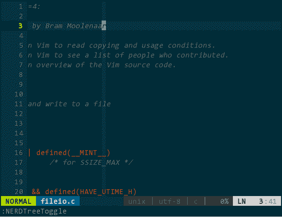
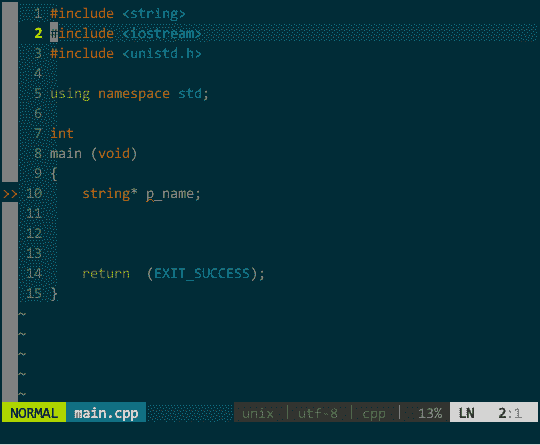
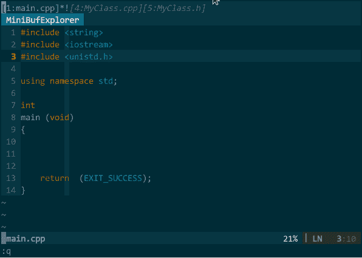

# 六、工程管理

## 6 工程管理

我虽不要求达不到软件工程的高度，但基本的管理还是有必要的，比如，工程文件的管理、多文档编辑、工程环境的保存与恢复。

### 6.1 工程文件浏览

我通常将工程相关的文档放在同个目录下，通过 NERDtree （[`github.com/scrooloose/nerdtree`](https://github.com/scrooloose/nerdtree) ）插件可以查看文件列表，要打开哪个文件，光标选中后回车即可在新 buffer 中打开。

安装好 NERDtree 后，请将如下信息加入.vimrc 中：

```
" 使用 NERDTree 插件查看工程文件。设置快捷键，速记：file list
nmap <Leader>fl :NERDTreeToggle<CR>
" 设置 NERDTree 子窗口宽度
let NERDTreeWinSize=32
" 设置 NERDTree 子窗口位置
let NERDTreeWinPos="right"
" 显示隐藏文件
let NERDTreeShowHidden=1
" NERDTree 子窗口中不显示冗余帮助信息
let NERDTreeMinimalUI=1
" 删除文件时自动删除文件对应 buffer
let NERDTreeAutoDeleteBuffer=1 
```

常用操作：回车，打开选中文件；r，刷新工程目录文件列表；I（大写），显示/隐藏隐藏文件；m，出现创建/删除/剪切/拷贝操作列表。键入 \<leader class="calibre18">fl 后，右边子窗口为工程项目文件列表，如下图所示：</leader>


（工程文件浏览）

### 6.2 多文档编辑

vim 的多文档编辑涉及三个概念：buffer、window、tab，这三个事物与我们常规理解意义大相径庭。vim 把加载进内存的文件叫做 buffer，buffer 不一定可见；若要 buffer 要可见，则必须通过 window 作为载体呈现；同个看面上的多个 window 组合成一个 tab。一句话，vim 的 buffer、window、tab 你可以对应理解成视角、布局、工作区。我所用到的多文档编辑场景几乎不会涉及 tab，重点关注 buffer、window。

vim 中每打开一个文件，vim 就对应创建一个 buffer，多个文件就有多个 buffer，但默认你只看得到最后 buffer 对应的 window，通过插件 MiniBufExplorer（[`github.com/fholgado/minibufexpl.vim`](https://github.com/fholgado/minibufexpl.vim) ，原始版本已停止更新且问题较多，该版本是其他人 fork 的新项目）可以把所有 buffer 罗列出来，并且可以显示多个 buffer 对应的 window。如下图所示：


（buffer 列表）我在 vim 中打开了 main.cpp、CMakeLists.txt、MyClass.cpp、MyClass.h 这四个文件，最上面子窗口（buffer 列表）罗列出的 [1:main.cpp][4:CMakeLists.txt][5:MyClass.cpp][6:MyClass.h] 就是对应的四个 buffer。当前显示了 main.cpp 和 MyClass.h 的两个 buffer，分别对应绿色区域和橙色区域的 window，这下对 buffer 和 window 有概念了吧。图中关于 buffer 列表再说明两点： * \* 表示当前有 window 的 buffer，换言之，有 * 的 buffer 是可见的；! 表示当前正在编辑的 window； * 你注意到 buffer 序号 1 和 4 不连续的现象么？只要 vim 打开一个 buffer，序号自动增一，中间不连续有几个可能：可能一，打开了 1、2、3、4 后，用户删除了 2、3 两个 buffer，剩下 1、4；可能二，先打开了其他插件的窗口（如，tagbar）后再打开代码文件； 配置：将如下信息加入 .vimrc 中： ``` " 显示/隐藏 MiniBufExplorer 窗口 map <leader class="calibre22">bl :MBEToggle <cr class="calibre18">" buffer 切换快捷键 map <c-tab class="calibre18">:MBEbn <cr class="calibre18">map <c-s-tab class="calibre18">:MBEbp <cr class="calibre18">``` 操作：一般通过 NERDtree 查看工程文件列表，选择打开多个代码文件后，MiniBufExplorer 在顶部自动创建 buffer 列表子窗口。通过前面配置，ctrl-tab 正向遍历 buffer，ctrl-shift-tab 逆向遍历（光标必须在 buffer 列表子窗口外）；在某个 buffer 上键入 d 删除光标所在的 buffer（光标必须在 buffer 列表子窗口内）：
（多文档编辑）

默认时，打开的 window 占据几乎整个 vim 编辑区域，如果你想把多个 window 平铺成多个子窗口可以使用 MiniBufExplorer 的 s 和 v 命令：在某个 buffer 上键入 s 将该 buffer 对应 window 与先前 window 上下排列，键入 v 则左右排列（光标必须在 buffer 列表子窗口内）。如下图所示：


（在子窗口中编辑多文档）图中，通过 vim 自身的 f 名字查找 buffer 序号可快速选择需要的 buffer。另外，编辑单个文档时，不会出现 buffer 列表。

### 6.3 环境恢复*

vim 的编辑环境保存与恢复是我一直想要的功能，我希望每当重新打开 vim 时恢复：已打开文件、光标位置、undo/redo、书签、子窗口、窗口大小、窗口位置、命令历史、buffer 列表、代码折叠。vim 文档说 viminfo 特性可以恢复书签、session 特性可以恢复书签外的其他项，所以，请确保你的 vim 支持这两个特性：

```
vim --version | grep mksession
vim --version | grep viminfo 
```

如果编译 vim 时添加了 --with-features=huge 选项那就没问题。

一般说来，保存/恢复环境步骤如下。

第一步，保存所有文档：

```
:wa 
```

第二步，借助 viminfo 和 session 保存当前环境：

```
:mksession! my.vim
:wviminfo! my.viminfo 
```

第三步，退出 vim：

```
:qa 
```

第四步，恢复环境，进入 vim 后执行：

```
:source my.vim
:rviminfo my.viminfo 
```

具体能保存哪些项，可由 sessionoptions 指定，另外，前面几步可以设定快捷键，在 .vimrc 中增加：

```
" 设置环境保存项
set sessionoptions="blank,buffers,globals,localoptions,tabpages,sesdir,folds,help,options,resize,winpos,winsize"
" 保存 undo 历史
set undodir=~/.undo_history/
set undofile
" 保存快捷键
map <leader>ss :mksession! my.vim<cr> :wviminfo! my.viminfo<cr>
" 恢复快捷键
map <leader>rs :source my.vim<cr> :rviminfo my.viminfo<cr> 
```

这样，简化第二步、第四步操作。另外，sessionoptions 无法包含 undo 历史，你得先得手工创建存放 undo 历史的目录（如，.undo_history/）再通过开启 undofile 进行单独设置，一旦开启，每次写文件时自动保存 undo 历史，下次加载在文件时自动恢复所有 undo 历史，不再由 :mksession/:wviminfo 和 :source/:rviminfo 控制。

按此操作，并不能像 vim 文档中描述的那样能保存所有环境，比如，书签、代码折叠、命令历史都无法恢复。这和我预期存在较大差距，暂且用用吧，找个时间再深入研究！</cr></c-s-tab></cr></c-tab></cr></leader>