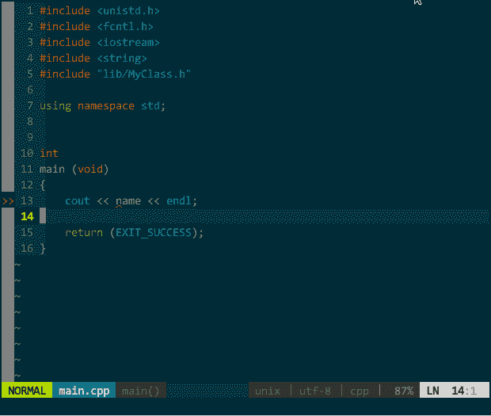
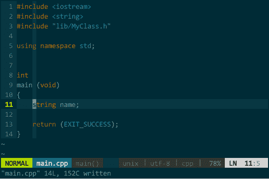

# 七、工具链集成

## 7 工具链集成

既然我们要把 vim 打造成 IDE，那必须得集成编译器、构建工具、静态分析器、动态调试器，当然，你可能还需要版本控制、重构工具等等，我暂时还好。

### 7.1 编译器/构建工具集成

先说下编译器和构建工具。vim 再强大也只能是个优秀的编辑器而非编译器，它能高效地完成代码编辑工作，但必须通过其他外部命令实现将代码转换为二进制可执行文件；一旦工程上规模，你不可能单个单个文件编译，这时构建工具就派上场了。

#### 代码编译

GCC 是 linux 上 C/C++ 编译器的事实标准，几乎所有发行套件都默认安装，它很好但不是最好：编译错误提示信息可读性不够（特别对于 C++ 模板错误信息基本就是读天书）、基于 GCC 的二次开发困难重重。我需要更优秀的 C++ 编译器。

Stanley B. Lippman 先生所推荐宇宙最强 C++ 编译器 —— LLVM/clang。Stanley 何许人也？不是吧，你玩 C++ 居然不认识他。C++ 世界二号人物，当年在贝尔实验室，Bjarne Stroustrup 构思了 C++ 功能框架，Stanley Lippman 实现了第一个版本。还无感？好吧，他是《C++ Primer》的作者。说了大神，再说说大神推荐的编译器。

LLVM 出自伊利诺伊大学研究项目，由 google 和苹果公司赞助。LLVM 的存在只为两个目的：一是尽可能地模块化现有代码以方便在此基础上进行二次开发、一是提供比传统构建工具链更好的用户体验。LLVM 是个很大很大的项目群，几乎把从编译到调试的各个构建环节都重新实现了一遍：

*   机器码生成方面：包含 LLVM core 子项目， LLVM core 能把满足它约定的中间语言翻译为高质量的机器码；
*   编译器方面：C/C++ 编译器 clang、接管 GCC 生成的 AST 并进行后续机器码生成的后端编译器 dragonegg；
*   调试器方面：增强处理模板/重载/多线程等等特性的调试器 LLDB、能根据程序 bug 生成测试用例甚至给出修正代码的符号虚拟机 klee；
*   链接器方面：能更好地处理符号链接的链接器 lld；
*   标准库方面：满足最新 C++ 规范的高性能实现标准库 libc++ 和 libc++ ABI、OpenCL 标准库的高性能实现 libclc；
*   运行期环境方面：支持 OpenMP 规范的运行期环境、Java 和 .NET 的虚拟机 vmkit；
*   代码优化方面：用于提升并行计算性能的 polly、针对内存安全检查的调优工具 SAFECode；

颤抖吧，小伙伴们！

我们重点介绍 clang 子项目，clang 把标准 C/C++ 代码转换为中间语言，换言之，前端 clang + 后端 LLVM（后简称 LLVM/clang）就是一款可替代 GCC 的优秀编译器。相较 GCC，LLVM/clang 有众多优势，尤其以下几点：

*   错误信息可读性强。能指出哪行、哪列有错误，并且用波浪线突显出来；另外，尽可能给出修改建议（比如提示你是否拼写错误）；最重要的是对 C++ 模板相关语法错误提示非常友好；（注，GCC 4.8 开始学习 clang 优化错误信息可读性）
*   编译速度快且占用资源少。编译速度是 GCC 的 2.5 倍，内存消耗只有 GCC 的 1/5；
*   兼容且扩充 GCC。clang 支持 GCC 的所有编译参数，也就是说，使用 GCC 开发的项目，你只需把 makefile 中使用的编译器从 GCC 改为 clang 即可，无须大面积调整构建系统脚本即可重新编译；另外，clang 还对 GCC 的编译参数进行了人性化扩展，比如，GCC 无法打开所有编译警告（-Wall、-Wextra 不够滴），clang 只需 -Weverything；
*   高度抽象的模块化设计。弱耦合性带来的模块高度复用、二次开发非常容易，比如，前面介绍的基于语义的 C/C++ 代码补全插件 YouCompleteMe，就是借助 libclang 库实现。

还在担心采用 clang 编译的源码移到 GCC 下无法编译？安啦，没问题的，你无非担心四方面：

*   编译参数是否兼容？前面说过，clang 全面兼容 GCC，所以编译参数完全兼容；
*   语言扩展是否兼容？只要不是像 linux 内核那样大规模采用各种复杂语言扩展属性，一般项目中用到的简单扩展是没问题的；
*   标准库接口是否兼容？标准库接口是 C++ 规范中指定的，根本不存在标准库接口不兼容一说；
*   标准库动/静态库符号是否兼容？你只要确保采用 clang 的标准库头文件对应链接 clang 的动态链接库、采用 GCC 的标准库头文件对应链接 GCC 的动态链接库的要求就不会出现问题。

在源码安装 clang 前，你需先自行安装 GCC，两个目的，一是你得有个编译器来编译编译器 clang （呵呵，绕了吧），二是其他人的项目可能会用到 GCC。

下载 LLVM、clang 及辅助库源码：

```
cd ~/downloads 
# Checkout LLVM
svn co http://llvm.org/svn/llvm-project/llvm/trunk llvm 
# Checkout Clang
cd llvm/tools 
svn co http://llvm.org/svn/llvm-project/cfe/trunk clang 
cd ../.. 
# Checkout extra Clang Tools
cd llvm/tools/clang/tools 
svn co http://llvm.org/svn/llvm-project/clang-tools-extra/trunk extra 
cd ../../../.. 
# Checkout Compiler-RT
cd llvm/projects 
svn co http://llvm.org/svn/llvm-project/compiler-rt/trunk compiler-rt 
cd ../.. 
```

关掉其他应用，尽量多的系统资源留给 GCC 编译 clang 源码：

```
mkdir build
cd build
cmake -G "Unix Makefiles" -DCMAKE_BUILD_TYPE=Release ../llvm
make && make install 
```

接下来，你先洗个澡，再约个会，回来应该编译好了（thinkpad T410I，CPU 奔腾双核 P6000，MEM 4G DDRIII，耗时 2 小时）。确认下：

```
clang --version 
```

玩 C/C++ 你肯定要用到标准库。概念上，GCC 配套的标准库涉及 libstdc++ 和 libsupc++ 两个子库，前者是接口层（即，上层的封装），后者是实现层（即，底层的具体实现），对应实物文件，你得需要两个子库的头文件和动态链接库（*.so）。openSUSE 的安装源中有，直接安装头文件

```
zypper in libstdc++47-devel 
```

位于 /usr/include/c++/4.7/，接着安装链接库

```
zypper in libstdc++6 
```

位于 /usr/lib/libstdc++.so.6。呃，是滴，libstdc++、libsupc++ 两个子库的相关文件是合并一起安装的。

对应到 clang 的标准库，libc++（接口层）和 libc++abi（实现层）也需要安装头文件和动态链接库（*.so）。openSUSE 的安装源中并无 libc++，头文件和动态链接库只能源码安装：

```
cd ~/downloads/ 
svn co http://llvm.org/svn/llvm-project/libcxx/trunk libcxx 
cd libcxx/lib 
./buildit 
```

头文件已经生成到 ~/downloads/libcxx/include/，要让 clang 找到必须复制到 /usr/include/c++/v1/

```
cp -r ~/downloads/libcxx/include/ /usr/include/c++/v1/ 
```

*.so 文件已生成 ~/downloads/libcxx/lib/libc++.so.1.0，要让 clang 访问必须复制到 /usr/lib/，并创建软链接

```
ln -s ~/downloads/libcxx/lib/libc++.so.1.0 ~/downloads/libcxx/lib/libc++.so.1
ln -s ~/downloads/libcxx/lib/libc++.so.1.0 ~/downloads/libcxx/lib/libc++.so
cp ~/downloads/libcxx/lib/libc++.so* /usr/lib/ 
```

类似，源码安装 libc++abi 的头文件和动态链接库：

```
cd ~/downloads/ 
svn co http://llvm.org/svn/llvm-project/libcxxabi/trunk libcxxabi 
cd libcxxabi/lib 
./buildit 
```

头文件已经生成到 ~/downloads/libcxxabi/include/，要让 clang 找到必须复制到 /usr/include/c++/v1/

```
cp -r ~/downloads/libcxxabi/include/ /usr/include/c++/v1/
\*.so 文件已生成 ~/downloads/libcxx/lib/libc++abi.so.1.0，要让 clang 访问必须复制到 /usr/lib/，并创建软链接
ln -s ~/downloads/libcxxabi/lib/libc++abi.so.1.0 ~/downloads/libcxxabi/lib/libc++abi.so.1
ln -s ~/downloads/libcxxabi/lib/libc++abi.so.1.0 ~/downloads/libcxxabi/lib/libc++abi.so
cp ~/downloads/libcxxabi/lib/libc++abi.so\* /usr/lib/ 
```

后续可以通过如下选项进行代码编译：

```
clang++ -std=c++11 -stdlib=libc++ -Werror -Weverything -Wno-disabled-macro-expansion -Wno-float-equal -Wno-c++98-compat -Wno-c++98-compat-pedantic -Wno-global-constructors -Wno-exit-time-destructors -Wno-missing-prototypes -Wno-padded -Wno-old-style-cast -lc++ -lc++abi main.cpp 
```

这一大波编译选项很崩溃么 @_@！我来简单说说：

*   -std=c++11：使用 C++11 新特性；
*   -stdlib=libc++：指定使用 clang 的标准库头文件 /usr/include/c++/v1/；
*   -Werror：将所有编译警告视为编译错误；
*   -Weverything：打开所有编译警告选项。在 GCC 中，无法通过单个选项打开所有编译警告，必须繁琐的同时指定 -Wall、-Wextra、以及大量分散的其他选项，为此 clang 新增了 -Weverything。

当然，有些警告意义不大，完全可忽略，如下：

*   -Wno-disabled-macro-expansion：禁止使用宏表达式，忽略此警告；
*   -Wno-float-equal：浮点类型不应使用 != 和 == 运算符，忽略此警告；
*   -Wno-c++98-compat、-Wno-c++98-compat-pedantic：采用 C++11 新特性的代码无法兼容 C++98，忽略此警告；
*   -Wno-global-constructors：在 main() 之前存在执行的代码，忽略此警告；
*   -Wno-exit-time-destructors：在 main() 之后存在执行的代码，忽略此警告；
*   -Wno-missing-prototypes：虽有函数定义但缺失函数原型，忽略此警告；
*   -Wno-padded：结构体大小应为 4 字节整数倍，忽略此警告（编译器自动调整对齐边界）；
*   -Wno-old-style-cast：C 语言的强制类型转换，忽略此警告；
*   -lc++：指定链接 /usr/lib/libc++.so 标准库（缺失将导致链接失败！）；
*   -lc++abi：指定链接 /usr/lib/libc++abi.so 标准库（缺失将导致链接失败！）。

#### 系统构建

对于只有单个代码文件的项目来说，无非是保存代码文件、shell 中调用 GCC 编译、链接这样的简单方式即可实现；但，对于动辄几十上百个文件的工程项目，采用这种方式只会把自己逼疯，必须借助构建工具管理工程的整个构建过程。

linux 有两类工程构建工具 —— Makefile 系 和非 Makefile 系，Makefile 系常见构建工具有 GNU 出品的老牌 autoconf、新生代的 CMake，非 Makefile 系中最著名的要数 SCons。KDE 就是通过 CMake（[`www.cmake.org/cmake/resources/software.html`](http://www.cmake.org/cmake/resources/software.html) ）构建出来的，易用性灵活性兼备，洒泪推荐。

一般来说，你需要先写个名为 CMakeLists.txt 的构建脚本，然后执行 cmake CMakeLists.txt 命令将生成 Makefile 文件，最后执行 make 命令即可编译生成可执行程序。

举例来说，你工程包含 main.cpp 文件，要构建它，你需要执行如下步骤。

第一步，编写 CMakeLists.txt，内容如下：

```
PROJECT(main) 
SET(SRC_LIST main.cpp) 
SET(CMAKE_CXX_COMPILER "clang++") 
SET(CMAKE_CXX_FLAGS "-std=c++11 -stdlib=libc++ -Werror -Weverything -Wno-deprecated-declarations -Wno-disabled-macro-expansion -Wno-float-equal -Wno-c++98-compat -Wno-c++98-compat-pedantic -Wno-global-constructors -Wno-exit-time-destructors -Wno-missing-prototypes -Wno-padded -Wno-old-style-cast")
SET(CMAKE_EXE_LINKER_FLAGS "-lc++ -lc++abi") 
SET(CMAKE_BUILD_TYPE Debug) 
ADD_EXECUTABLE(main ${SRC_LIST}) 
```

其中，PROJECT 指定工程名、SET 是 cmake 变量赋值命令、ADD_EXECUTABLE 指定生成可执行程序的名字。括号内的大写字符串是 cmake 内部预定义变量，这是 CMakeLists.txt 脚本的重点，下面详细讲述：

*   SRC_LIST 指定参与编译的源码文件列表，如果有多个文件请用空格隔开，如，你工程有 main.cpp、lib/MyClass.cpp、lib/MyClass.h 三个文件，那么可以指定为：
*   SET(SRC_LIST main.cpp lib/MyClass.cpp)
*   CMAKE_CXX_COMPILER 指定选用何种编译器；
*   CMAKE_CXX_FLAGS 设定编译选项；
*   CMAKE_EXE_LINKER_FLAGS 设定链接选项。一定要将 -lc++ 和 -lc++abi 独立设定到 CMAKE_EXE_LINKER_FLAGS 变量中而不能放在 CMAKE_CXX_FLAGS，否则无法通过链接；
*   CMAKE_BUILD_TYPE 设定生成的可执行程序中是否包含调试信息。

另外，对于编译选项，我的原则是严己宽人。也就是说，在我本机上使用最严格的编译选项以发现尽量多 bug，发布给其他人的源码包使用最宽松的编译选项以减少环境差异导致编译失败的可能。前面罗列出来的就是严格版的 CMakeLists.txt，宽松版我会考虑：编译器改用 GCC（很多人没装 clang）、忽略所有编译警告、让编译器进行代码优化、去掉调试信息、添加安装路径等要素，具体如下：

```
PROJECT(main) 
SET(SRC_LIST main.cpp) 
SET(CMAKE_CXX_COMPILER "g++") 
SET(CMAKE_CXX_FLAGS "-std=c++11 -O3") 
SET(CMAKE_BUILD_TYPE Release) 
ADD_EXECUTABLE(porgram_name ${SRC_LIST})
INSTALL(PROGRAMS porgram_name DESTINATION /usr/bin/) 
```

第二步，基于 CMakeLists.txt 生成 Makefile。在 CMakeLists.txt 所在目录执行：

```
cmake CMakeLists.txt 
```

执行成功的话，你将在该目录下看到 Makefile 文件；

第三步，基于 Makefile 生成可执行程序。相同目录下执行：

```
make 
```

这一步，就是在调用编译器进行编译，如果存在代码问题，修正错误后重新执行这一步即可，不用再次执行第一、二步。

基本上，你的新工程，可以在基于上面的 CMakeLists.txt 进行修改，执行一次第二步后，每次代码调整只需执行第三步即可。

#### 一键编译

工程项目的构建过程游离于 vim 之外终究不那么方便，前面章节介绍的构建过程是在 shell 中执行的，全在 vim 中执行又是如何操作。第一步的创建 CMakeLists.txt 没问题，vim 这么优秀的编辑器编辑个普通文本文件易如反掌；第二步的生成 Makefile 也没问题，在 vim 内部通过 ! 前缀可以执行 shell 命令，:!cmake CMakeLists.txt 即可；第三步的编译过程更没问题，因为 vim 自身支持 make 命令，直接在 vim 中输入 :make 命令它会调用外部 make 程序读取当前目录中的 Makefile 文件，完成编译、链接操作。当然，一次性编译通过的可能性很小，难免有些语法错误（语义错误只能靠调试器了），vim 将编译器抛出的错误和警告信息输出到 quickfix 中，执行 :cw 命令即可显示 quickfix。说了这么多，概要之，先通过构建工具（CMake 可通过 CMakeLists.txt 文件，autotools 可通过 configure 文件）生成整个工程的 Makefile，再在 vim 中执行 :make，最后显示 quickfix。

要实现一键编译，无非是把这几步映射为 vim 的快捷键，即：

```
nmap <Leader>m :wa<CR>:make<CR><CR>:cw<CR> 
```

分解说明下，m 为设定的一键编译快捷键，:wa\ <cr class="calibre18">保存所有调整文档内容，:make\ <cr class="calibre18">调用 make 命令，后面的 \ <cr class="calibre18">消除执行完 make 命令屏幕上“Press ENTER or type command to continue”的输入等待提示，:cw\ <cr class="calibre18">显示 quickfix（仅当有编译错误或警告时）。如下图所示：</cr></cr></cr></cr>


（一键编译）我新建了一个工程，编辑好 CMakeLists.txt，执行 :!cmake CMakeLists.txt，接着 \<leader class="calibre22">m 一键编译，quickfix 窗口显示了编译错误，光标自动定位到需要你解决的第一个编译错误，回车后光标自动调整到该错误对应的代码位置，修正后重新 \<leader class="calibre18">r，编译通过并运行生成的程序。 你可能会遇到，调整过的代码能通过编译，但是，要么在工程目录中无法找到可执行程序，要么有程序但体现不出代码调整的内容（就像没调整过代码一样）。对于情况一，还算好，至少你晓得生成可程序失败了，肯定哪儿出了问题，不会继续往下新增代码；情况二，就麻烦了，你想通过运行程序检查刚才添加的代码运行是否正常，以为运行的是新程序，其实，代码调整后的新程序并未生成，运行是老程序，“哇，一切正常，往下写新业务逻辑代码”。导致这两个情况的根本原因，代码中存在链接错误导致并未正常创建新的可执行程序。bad news —— 如果编译错误，quickfix 窗口会固定在底部，罗列出所有编译过程中的所有错误，如果编译正常（即便是存在链接错误），quickfix 窗口会出现“Press ENTER or type command to continue”的输入等待提示信息，前面提过，为了省去手工输入回车，已经在 \<leader class="calibre18">m 中为 :make 多绑定个回车符 \<cr class="calibre18">，换言之，在编译正确链接错误的情况下，你是无法查看到 quickfix 窗口的；good news —— 有两种方式解决该问题： * 方式一，将前面 \<leader class="calibre18">m 中为 :make 绑定的回车符 \ <cr class="calibre18">去掉，即 ``` nmap <leader class="calibre18">m :wa<cr class="calibre18">:make<cr class="calibre18">:cw <cr class="calibre18">``` * 方式二，先删除老的可执行程序，再编译、链接，发现缺失可执行程序时，再手工执行 :make，这样，可查看具体是什么链接错误了，将如下配置信息加入 .vimrc 中： ``` nmap <leader class="calibre18">m :!rm -rf main<cr class="calibre18">:wa<cr class="calibre18">:make<cr class="calibre18"><cr class="calibre18">:cw <cr class="calibre18">``` 我选方式二。 到此，已实现一键编译，要实现一键编译及运行无非就在刚才的快捷键中追加绑定运行程序的外部命令即可。新快捷键设定为 \<leader class="calibre18">g，假定生成的可执行程序名为 main，将如下配置信息加入 .vimrc 中： ``` nmap <leader class="calibre18">g :!rm -rf main<cr class="calibre18">:wa<cr class="calibre18">:make<cr class="calibre18">:cw<cr class="calibre18"><cr class="calibre18">:!./main <cr class="calibre18">``` 最后，再次强调实现一键编译及运行的几个前提：vim 的当前目录必须为工程目录、事前准备好 Makefile 文件且放于工程目录的根目录、生成的程序必须在工程目录的根目录。

### 7.2 静态分析器集成

one take，中意“一次成型”，最早指歌手录歌时一次性通过录制，不存在发现错误-修正错误-重新录制这样的往返动作。one take 在编程环境中，就是一次性通过编译，我个人很享受 one take 带来的快感。当然，要达到 one take，不仅需要扎实的编程功底，还需要工具的辅佐 —— 代码静态分析器。前面介绍的神器 YCM 具备实时语法检查的能力。在它的作用下，编码中、编译前，所有语法错误都将被抓出来并呈现给你。 YCM 的整个静态分析过程分为如下几步： 第一步，发现错误。YCM 内部调用 libclang 分析语法错误，通过管道传递给 YCM 呈现。当你保存代码、vim 普通模式下移动光标或者安静 2 秒，错误检查后台任务将自动启动，若有错误，YCM 将接收到； 第二步，呈现错误。YCM 并不非立马显示错误信息，除非你触发下次击键事件，否则你看不到错误信息，换言之，干等是没结果的，你必须有次击键动作（没办法，vim 内部机制所限，后台任务无法直接更新 GUI，所以才采用变通的击键方式）。对于存在语法错误的代码，在行首有个红色的 >> 高亮显示； 第三步，查看错误。好了，现在已经知道哪行代码有问题，具体问题描述如何查看？两种方式：一种是将光标移至问题行，vim 将在其底部显示简要错误描述；一种是将光标移至问题行，键入 \<leader class="calibre18">d 后，vim 将在其底部显示详细错误描述。 如下所示：
（静态代码分析）</leader></cr></cr></cr></cr></cr></cr></leader></leader></cr></cr></cr></cr></cr></leader></cr></cr></cr></leader></cr></leader></cr></leader></leader></leader>