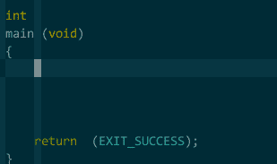
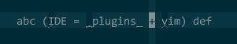
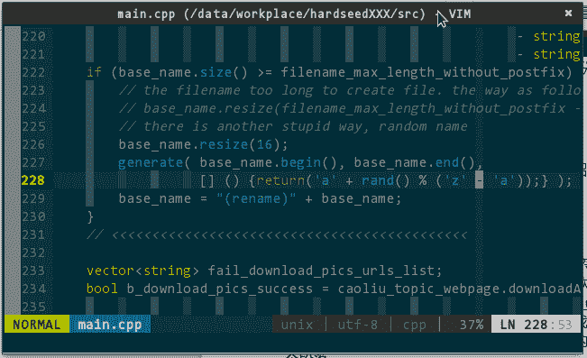
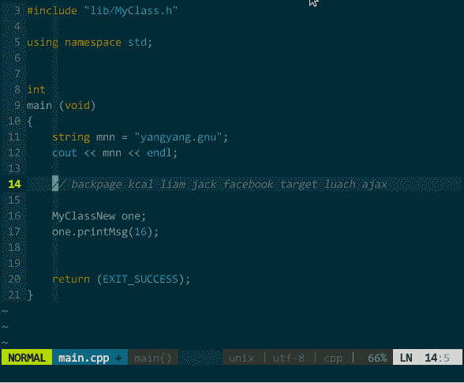
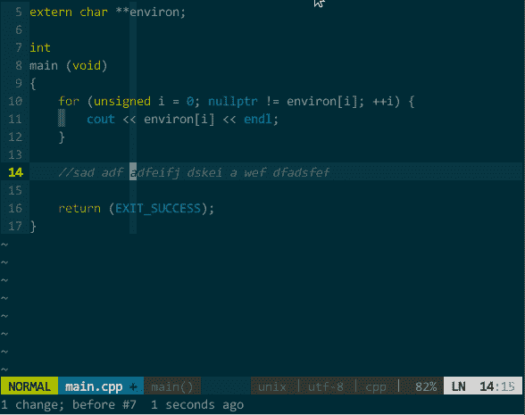
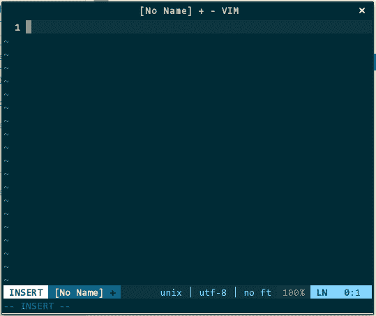
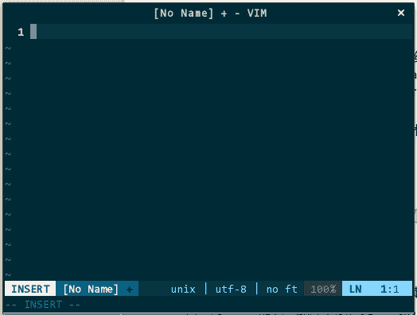

# 八、其他辅助

## 8 其他辅助

大家关注的 IDE 核心功能前面都已逐一介绍过了，有些辅助功能我认为也有必要让你知道，不是都在提程序员人文关怀嘛，从我做起！

### 8.1 快速编辑结对符

平时，最让我头痛的字符莫过于 {}、""、[] 等这类结对符，输入它们之所以麻烦，主要因为 A）盲打很难找准它们位置，B）还得同时按住 shift 键。两者再一叠加，非常影响我的思维。要高效输入结对符，应该是输入少量几个字母（对，字母，不是字符）后 vim 自动为你输入完整结对符，而非是我输入一半 vim 输入另一半（不用 delimitMate 的原因）。刚好，这在 UltiSnips 能力范围内，只要定义好模板，可完美地解决这类问题，具体模板见上例中最后的结对符部分。

在定义结对符模板时，你应该考虑加上模板控制参数 i。默认情况下，UltiSnips 只会当模板名前是空白字符或行首时才进行模板补全，比如，定义 () 的模板如下：

```
snippet b "bracket"
(${1})${2} 
endsnippet 
```

我要调用函数 printf()，在输入完 printf 后应该接着输入括号模板名 b，然后输入模板展开快捷键 \<leader class="calibre18">\<tab class="calibre18">，你会发现 UltiSnips 无法帮你补全模板，因为它看到的不是 b 而是 printfb，这在模板文件中根本未定义。有一种间接解决方式是在 printf 后加个空格，再输入 b\<leader class="calibre18">\ <tab class="calibre18">进行补全，这就成了 printf ()，不喜欢这种编码风格。其实，UltiSnips 的作者也注意到这个问题了，他让你可以通过前面提过的模板控制参数 i 进行解决。重新定义 () 的模板如下：</tab></leader></tab></leader>

```
snippet b "bracket" i
(${1})${2} 
endsnippet 
```

这样，UltiSnips 只管光标前 1 个字符是否是 b，若是则补全 ()，不论 b 前是否有其他字符。类似，其他结对符模板都按此加上 i 控制参数。结对符模板完整定义参见上一节 cpp.snippets 示例。如下是几个快速输入结对符的演示：


（快速输入结对符）

另外，要想高效编辑结对符，你得了解 vim 自身的某些快捷键。比如，有如下字符串且光标在该字符串的任意字符上，这时在命令模式下键入 va) 后将选中包括括号在内的整个字符串：


（快速选中结对符）其中，v 是动作、a 是范围、) 是结对符。结对符命令的动作包括：选中 v、复制 y、删除 d、删除后插入 c；结对符命令的范围包括：含结对符 a、不含结对符 i。针对不同结对符，组合不同动作和范围就有 4\*2 种方式。比如，di{ 删除不含结对符 {} 的字符串，va\[ 将选中含结对符 [] 内的所有字符。 选中结对符内的文本是我较为频繁的操作之一，通过诸如 vi\[ 的命令可以选中当前结对符 [] 内的所有文本，这虽谈不上麻烦，但每次都得去看下是 ]、)、> 还是 }，总是有点别扭。有款叫 wildfire.vim（https://github.com/gcmt/wildfire.vim ）的插件，让我能更自然地选中结对符内的文本，有了它，我只需按下空格（你也可以设置成其他快捷键），自动选中光标所在区域最近的一层结对符内的文本，如果没有结对符，则选择最近的一个段落。 简单设置： ``` " 快捷键 map <space class="calibre22"><plug class="calibre18">(wildfire-fuel) vmap <s-space class="calibre18"><plug class="calibre18">(wildfire-water) " 适用于哪些结对符 let g:wildfire_objects = ["i'", 'i"', "i)", "i]", "i}", "i>", "ip"] ``` 这样，在 vim 的命令模式下，一次空格选中最近一层结对符内的文本，两次则选中近两层内的文本，三次三层，依此类推；或者键入 3space，直接选中三层内的文本；若要取消，键入 shift-space 即可。另外，结对符类型也可以在 wildfire_objects 变量中指定。如下图所示：
（快速选中结对符文本）

### 8.2 支持分支的 undo

undo，编辑器世界中的后悔药，让你有机会撤销最近一步或多步操作，这是任何编辑器都具备的基础功能。比如，第一步输入 A，第二步输入 B，第三步输入 C，当前文本为 ABC，一次 undo 后变成 AB，再次 undo 后变成 A，显然，每次 undo 撤销的均是最后的一步操作，通常采用栈这种数据结构来实现 undo 功能，由于栈具有后进先出的特点，所以，功能实现起来非常自然且便捷，但同时，也引入了致命伤，无法支持分支上的 undo 操作。

还是前面的例子，分三步依次输入完 ABC 后，一次 undo 变成 AB，这时，输入 D，之后，无论你多少次 undo 都不可能再找回 C，究其原因，D 是彻底覆盖了 C，而不是与 C 形成两个分支，如下图所示：


（不支持分支的 undo）

在我的使用场景中，非常需要在我输入 D 后还能找回 C 的 undo 功能，即，支持分支的 undo，gundo.vim （[`sjl.bitbucket.org/gundo.vim/`](http://sjl.bitbucket.org/gundo.vim/) ）降临。gundo.vim 采用树这种数据结构来实现 undo，每一次编辑操作均放在树的叶子上，每次 undo 后，先回到主干，新建分支继续后续操作，而不是直接覆盖，从而实现支持分支的 undo 功能。gundo.vim 要求 vim 版本不低于 v7.3 且支持 python v2.4 及以上。

如下方式设置好调用 gundo.vim 的快捷方式：

```
" 调用 gundo 树
nnoremap <Leader>ud :GundoToggle<CR> 
```

gundo.vim 非常贴心，调用它后，你会在左侧看到一个分割为上下两个区域的子窗口。上半区域以可视化方式显示了整颗 undo 树，同时，用 @ 标识最后一步编辑操作，用序号标识各步编辑操作的先后顺序，用时长显示每步操作距离当前消耗时间。下半区域展示了各个操作间的 diff 信息及其上下文，默认为选中那步操作与前一步操作间的 diff，键入 p 可以查看选中那步操作与最后一步操作（即有 @ 标识的那步）间的 diff，这对于找回多次编辑操作之前的环境非常有用。


（支持分支的 undo）

另外，我对持久保存 undo 历史也有需求，以便让我关闭 vim 后重新启动也能找到先前的所有 undo 历史，这需要你在 .vimrc 中添加：

```
" 开启保存 undo 历史功能
set undofile
" undo 历史保存路径
set undodir=~/.undo_history/ 
```

你得先自行创建 .undo_history/。具体可参见“6.3 环境恢复”章节。

### 8.3 快速移动

vim 有两类快速移动光标的方式：一类是以单词为单位的移动，比如，w 正向移动到相邻单词的首字符、b 逆向移动到相邻单词的首字符、e 正向移动到相邻单词的尾字符、 ge 逆向移动到相邻单词的尾字符；一类是配合查找字符的方式移动，比如，fa 正向移动到第一个字符 a 处、Fa 逆向移动到第一个字符 a 处。你要在非相邻的单词或字符间移动，你可以配合数字参数，比如，正向移动到相隔八个单词的首字符执行 8w、逆向移动到第四个 a 字符处执行 4Fa。

有如下文本：

> backpage kcal liam jack facebook target luach ajax

假定光标在行首，需要移动到 facebook 的字符 a 处，先来数下前面有 1、2 ... 5 个 a，然后用前面所说的 5fa，唔，怎么在 jack 上呢？等等，好像数错了，再数次 1、2 ... 6，对滴，应该是 6fa，这下对了。我的个天，不能让哥太累，得找个插件帮忙 —— easymotion（[`github.com/Lokaltog/vim-easymotion`](https://github.com/Lokaltog/vim-easymotion) ）。

easymotion 只做一件事：把满足条件的位置用 [;A~Za~z] 间的标签字符标出来，找到你想去的位置再键入对应标签字符即可快速到达。比如，上面的例子，假设光标在行首，我只需键入 \<leader class="calibre18">\<leader class="calibre18">fa （为避免与其他快捷键冲突，easymotion 采用两次 \ <leader class="calibre18">作为前缀键），所有的字符 a 都被重新标记成 a、b、c、d、e、f 等等标签（原始内容不会改变），f 标签为希望移动去的位置，随即键入 f 即可到达。如下图所示：</leader></leader></leader>


（快速移动）

类似，前面提过的 w、e、b、ge、F、j、k 等命令在 easymotion 作用下也能实现快速移动，其中，j 和 k 可跨行移动。同时，你还可以搭配 v 选中命令、d 删除命令、y 拷贝命令，比如，v\<leader class="calibre18">\<leader class="calibre18">fa，快速选中光标当前位置到指定字符 a 之间的文本，d\<leader class="calibre18">\<leader class="calibre18">fa，快速删除光标当前位置到指定字符 a 之间的文本，下图所示：</leader></leader></leader></leader>


（搭配操作命令的快速移动）

### 8.4 markdown 即时预览

作为一枚热衷开源的伪 geek，github.com 与我同在。发布在 github.com 的任何项目你得有个项目简介，README.md，这是一种用 markdown 文书编写语法制作的说明文档。关于 markdown，我有两个需求，一是 vim 要高亮显示 markdown 语法，一是 firefox 要能渲染其语法、即时显示更新结果。

第一个需求不是问题，新版 vim 已经集成了 markdown 语法高亮插件，无须单独配置。

第二个需求，按照一般逻辑，应该通过 firefox 的某款插件来实现，的确，Markdown Viewer 看起来是干这个事儿的，但它响应速度缓慢、中文显示乱码、无法即时渲染等等问题让我无法接受。网上倒是有些即时渲染 markdown 的网站，比如，[`stackedit.io/editor`](https://stackedit.io/editor) ，左侧编辑右侧显示，所见即所得，但这又无法让我使用 vim，不行。还是回到 vim 身上想办法，vim-instant-markdown 来了。有了这款 vim 插件，一旦你启用 vim 编辑 markdown 文档，vim-instant-markdown 自动开启 firefox 为你显示 markdown 最终效果，如果你在 vim 中变更了文档内容，vim-instant-markdown 即时渲染、firefox 同步更新，太棒了！


（markdown 即时渲染）

vim-instant-markdown（[`github.com/suan/vim-instant-markdown`](https://github.com/suan/vim-instant-markdown) ） 的安装相比其他插件较为特殊，它由 ruby 开发，所以你的 vim 必须集成 ruby 解释器（见“1 源码安装编辑器 vim ”），并且安装 pygments.rb、redcarpet、instant-markdown-d 三个依赖库：

```
gem install pygments.rb
gem install redcarpet
# 若系统提示无 npm 命令，你需要先执行 zypper --no-refresh install nodejs
npm -g install instant-markdown-d 
```

注意，以上三条命令均要翻墙。

对于重内容、轻设计的我这类人来说，markdown 简洁的文书语法太贴心了。推荐三个网站：

*   markdown 语法 [`daringfireball.net/projects/markdown/syntax`](http://daringfireball.net/projects/markdown/syntax)
*   github.com 扩展 [`guides.github.com/features/mastering-markdown/`](https://guides.github.com/features/mastering-markdown/)
*   emoji 符号表情 [`www.emoji-cheat-sheet.com/`](http://www.emoji-cheat-sheet.com/)

### 8.5 中/英输入平滑切换

代码中不可能全是英文，即便注释是英文，用户提示信息也多多少少得用中文吧，所以，在 vim 中输入中文是常有的。中/英文输入切换本身很简单，但是，如果又与 vim 的插入模式和命令模式一纠缠，那么，这事儿就不太自然了。

比如，我在插入模式下依次输入了中文的一二四三，本意是想输入一二三四，下意识地键入 esc 切换为命令模式，键入 x 剪切三，再键入 P 将三粘贴至四前。谁知，在键入 x 时，由于输入法仍保留在先前的中文状态下，导致 vim 的命令模式无法接收到命令，必须得再次键入 shift 切换至英文状态。如下图所示：


（中文状态让命令模式无效）

这很不协调，我希望，在插入模式下输入完中文，切换至命令模式后，即便先前是中文输入状态，也不影响我正常使用命令模式，甚至再次切回插入模式后，能保持先前的输入状态。来了，fcitx.vim（[`github.com/lilydjwg/fcitx.vim`](https://github.com/lilydjwg/fcitx.vim) ）就是我要的。对，前提是你系统中用的是 fcitx 输入法（为何不用 scim、ibus？[`github.com/yangyangwithgnu/the_new_world_linux#7.4`](https://github.com/yangyangwithgnu/the_new_world_linux#7.4) ）。装好这个插件后，我们再看看刚才的例子，在中文状态下从插入模式切换至命令模式，键入 x、P 调整完四和三顺序后，重新切换至插入模式，输入法状态仍保持中文。如下图所示：


（即便中文状态也不影响命令模式）

几乎完美了，唯一问题是，该插件无法保证从其他程序窗口切换至 vim 后仍有效。</plug></s-space></plug></space>